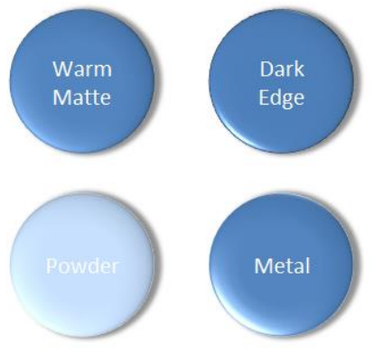

# L.4.6 3D方面

**3D Aspects**

## L.4.6.1 介绍

=== "中文"

    DrawingML 的这一方面主要处理 3D 方面，可以分为两个主题：与对象关联的 3D 属性，以及与对象关联的样式信息。

=== "英文"

    **Introduction**

    This aspect of DrawingML deals mainly with the 3-D aspects, and can be broken down into two topics: 3-D properties associated with an object, and the styling information associated with an object.

## L.4.6.2 3-D

=== "中文"

    Here we'll explain the 3-D definitions contained in DrawingML. The goal here is to define a 3-D scene so that lighting calculations can be made on the geometry within the scene.

=== "英文"

    **3-D**

    Here we'll explain the 3-D definitions contained in DrawingML. The goal here is to define a 3-D scene so that lighting calculations can be made on the geometry within the scene.

### L.4.6.2.1 3-D Scene

=== "中文"

    Every 3-D scene consists of a camera, a light, and a backdrop, that define the associated properties of the scene. The complex type, CT_Scene3D, defines the scene as follows:

    ```xml
    <xsd:complexType name="CT_Scene3D" oxsd:cname="Scene3D">
        <xsd:sequence>
            <xsd:element name="camera" type="CT_Camera" minOccurs="1" maxOccurs="1" />
            <xsd:element name="lightRig" type="CT_Backdrop" minOccurs="0" maxOccurs="1" />
            <xsd:element name="ext" type="CT_OfficeArtExtension" minOccurs="0" maxOccurs="1" />
        </xsd:sequence>
    </xsd:complexType>
    ```

    As was stated above, the complex type, CT_Scene3D, contains a camera, a set of lights (the light rig), and a backdrop. Those familiar with 3-D rendering techniques understand the usage of a camera and set of lights, or light rig. The backdrop, however, is a special structure (which is defined below) that allows for a special plane to render certain effects that need to be rendered together in a single plane. The final element of a CT_Scene3D is the ext element. This is a DrawingML structure used for future extensibility. This element is seen in other complex types dealing with the 3-D scene as well.

=== "英文"

    **3-D Scene**

    Every 3-D scene consists of a camera, a light, and a backdrop, that define the associated properties of the scene. The complex type, CT_Scene3D, defines the scene as follows:

    ```xml
    <xsd:complexType name="CT_Scene3D" oxsd:cname="Scene3D">
        <xsd:sequence>
            <xsd:element name="camera" type="CT_Camera" minOccurs="1" maxOccurs="1" />
            <xsd:element name="lightRig" type="CT_Backdrop" minOccurs="0" maxOccurs="1" />
            <xsd:element name="ext" type="CT_OfficeArtExtension" minOccurs="0" maxOccurs="1" />
        </xsd:sequence>
    </xsd:complexType>
    ```

    As was stated above, the complex type, CT_Scene3D, contains a camera, a set of lights (the light rig), and a backdrop. Those familiar with 3-D rendering techniques understand the usage of a camera and set of lights, or light rig. The backdrop, however, is a special structure (which is defined below) that allows for a special plane to render certain effects that need to be rendered together in a single plane. The final element of a CT_Scene3D is the ext element. This is a DrawingML structure used for future extensibility. This element is seen in other complex types dealing with the 3-D scene as well.

### L.4.6.2.2 Camera

=== "中文"

    The complex type, CT_Camera, defines a camera within the 3-D scene. A camera is based on a preset, with an optional rotation, field-of-view, and zoom, which all act as overrides for the preset values. A camera is defined in the following way:

    ```xml
    <xsd:complexType name="CT_Camera">
        <xsd:sequence>
            <xsd:element name="rot" type="CT_SphereCoords" minOccurs="0" maxOccurs="1" oxsd:dataStructure="optional" />
        </xsd:sequence>
        <xsd:attribute name="prst" type="ST_PresetCameraType" use="required" />
        <xsd:attribute name="fov" type="ST_FOVAngle" use="optional" />
        <xsd:attribute name="zoom" type="ST_PositivePercentage" use="optional" default="100%" />
    </xsd:complexType>
    ```

    The only complex type contained in the camera, CT_SphereCoords, is a complex type defined elsewhere within the DrawingML. There are three simple types associated with a camera:

    - ST_FOVAngle (field of view angle), which is a positive angle between 0 and 180 in 60,000th of a degree.
    - ST_PositivePercentage (zoom), which is defined as a percentage.
    - ST_PresentCameraType (preset camera)
    
    Figure 1 below shows some different presets applied to a shape.

    

    Figure 7: Different default cameras applied to a shape

    The available options for ST_PresetCameraType are as follows:

    ```text
    legacyObliqueTopLeft
    legacyObliqueTop
    legacyObliqueLeft
    legacyObliqueFront
    legacyObliqueRight
    legacyObliqueBottomLeft
    legacyObliqueBottom
    legacyObliqueBottomRight
    legacyPerspectiveTopLeft
    legacyPerspectiveTop
    legacyPerspectiveTopRight
    legacyPerspectiveLeft
    legacyPerspectiveFront
    legacyPerspectiveRight
    legacyPerspectiveBottomLeft
    legacyPerspectiveBottom
    legacyPerspectiveBottomRight
    orthographicFront
    isomentricTopUp
    isometricTopDown
    isomentricBottomDown
    isometricLeftUp
    isometricLeftDown
    isometricRightUp
    isometricRightDown
    isometricOffAxis1Left
    isometricOffAxis1Right
    isometricOffAxis1Top
    isometricOffAxis2Left
    isometricOffAxis2Right
    isometricOffAxis2Top
    isometricOffAxis3Left
    isometricOffAxis3Right
    isometricOffAxis3Bottom
    isometricOffAxis4Left
    isometricOffAxis4Right
    isometricOffAxis4Bottom
    obliqueTopLeft
    obliqueTopRight
    obliqueLeft
    obliqueRight
    obliqueBottomLeft
    obliqueBottom
    obliqueBottomRight
    perspectiveFront
    perspectiveLeft
    perspectiveRight
    perspectiveAbove
    perspectiveBelow
    perspectiveAboveLeftFacing
    perspectiveAboveRightFacing
    perspectiveContrastingRightFacing
    perspectiveContrastingLeftFacing
    perspectiveHeroicLeftFacing
    perspectiveHeroicRightFacing
    perspectiveHeroicExtremeLeftFacing
    perspectiveHeroicExtremeRightFacing
    perspectiveRelaxed
    perspectiveRelaxedModerately
    ```

=== "英文"

    **Camera**

    The complex type, CT_Camera, defines a camera within the 3-D scene. A camera is based on a preset, with an optional rotation, field-of-view, and zoom, which all act as overrides for the preset values. A camera is defined in the following way:

    ```xml
    <xsd:complexType name="CT_Camera">
        <xsd:sequence>
            <xsd:element name="rot" type="CT_SphereCoords" minOccurs="0" maxOccurs="1" oxsd:dataStructure="optional" />
        </xsd:sequence>
        <xsd:attribute name="prst" type="ST_PresetCameraType" use="required" />
        <xsd:attribute name="fov" type="ST_FOVAngle" use="optional" />
        <xsd:attribute name="zoom" type="ST_PositivePercentage" use="optional" default="100%" />
    </xsd:complexType>
    ```

    The only complex type contained in the camera, CT_SphereCoords, is a complex type defined elsewhere within the DrawingML. There are three simple types associated with a camera:

    - ST_FOVAngle (field of view angle), which is a positive angle between 0 and 180 in 60,000th of a degree.
    - ST_PositivePercentage (zoom), which is defined as a percentage.
    - ST_PresentCameraType (preset camera)
    
    Figure 1 below shows some different presets applied to a shape.

    

    Figure 7: Different default cameras applied to a shape

    The available options for ST_PresetCameraType are as follows:

    ```text
    legacyObliqueTopLeft
    legacyObliqueTop
    legacyObliqueLeft
    legacyObliqueFront
    legacyObliqueRight
    legacyObliqueBottomLeft
    legacyObliqueBottom
    legacyObliqueBottomRight
    legacyPerspectiveTopLeft
    legacyPerspectiveTop
    legacyPerspectiveTopRight
    legacyPerspectiveLeft
    legacyPerspectiveFront
    legacyPerspectiveRight
    legacyPerspectiveBottomLeft
    legacyPerspectiveBottom
    legacyPerspectiveBottomRight
    orthographicFront
    isomentricTopUp
    isometricTopDown
    isomentricBottomDown
    isometricLeftUp
    isometricLeftDown
    isometricRightUp
    isometricRightDown
    isometricOffAxis1Left
    isometricOffAxis1Right
    isometricOffAxis1Top
    isometricOffAxis2Left
    isometricOffAxis2Right
    isometricOffAxis2Top
    isometricOffAxis3Left
    isometricOffAxis3Right
    isometricOffAxis3Bottom
    isometricOffAxis4Left
    isometricOffAxis4Right
    isometricOffAxis4Bottom
    obliqueTopLeft
    obliqueTopRight
    obliqueLeft
    obliqueRight
    obliqueBottomLeft
    obliqueBottom
    obliqueBottomRight
    perspectiveFront
    perspectiveLeft
    perspectiveRight
    perspectiveAbove
    perspectiveBelow
    perspectiveAboveLeftFacing
    perspectiveAboveRightFacing
    perspectiveContrastingRightFacing
    perspectiveContrastingLeftFacing
    perspectiveHeroicLeftFacing
    perspectiveHeroicRightFacing
    perspectiveHeroicExtremeLeftFacing
    perspectiveHeroicExtremeRightFacing
    perspectiveRelaxed
    perspectiveRelaxedModerately
    ```

### L.4.6.2.3 Light

=== "中文"

    The complex type, CT_LightRig, defines the lighting of the scene. A light rig consists of a preset direction, preset rig type, and a rotation that serves as an override for the direction. The complex type is defined as:
    
    ```xml
    <xsd:complexType name="CT_LightRig">
        <xsd:sequence>
            <xsd:element name="rot" type="CT_SphereCoords" minOccurs="0" maxOccurs="1" />
        </xsd:sequence>
        <xsd:attribute name="rig" type="ST_LightRigType" use="required" />
        <xsd:attribute name="dir" type="ST_LightRigDirection" use="required" />
    </xsd:complexType>
    ```

    Just as with the camera, the complex type, CT_SphereCoords, is defined elsewhere in the DrawingML. This element, however, serves as an override for the default light right direction. Figure 2 below shows some of the different preset lights applied to a shape.
    
    

    Figure 8: Some preset lights applied to a shape.

    The types of available light rigs are:

    ```text
    legacyFlat1
    legacyFlat2
    legacyFlat3
    legacyFlat4
    legacyNormal1
    legacyNormal2
    legacyNormal3
    legacyNormal4
    legacyHarsh1
    legacyHarsh2
    legacyHarsh3
    legacyHarsh4
    threePoint
    balanced
    soft
    harsh
    flood
    contrasting
    morning
    sunrise
    sunset
    chilly
    freezing
    flat
    twoPoint
    glow
    brightRoom
    ```

    The types of available present directions are:

    - tl – top left
    - t – top
    - tr – top right
    - l – left
    - r – right
    - bl – bottom left
    - b – bottom
    - br – bottom right

=== "英文"

    **Light**

    The complex type, CT_LightRig, defines the lighting of the scene. A light rig consists of a preset direction, preset rig type, and a rotation that serves as an override for the direction. The complex type is defined as:
    
    ```xml
    <xsd:complexType name="CT_LightRig">
        <xsd:sequence>
            <xsd:element name="rot" type="CT_SphereCoords" minOccurs="0" maxOccurs="1" />
        </xsd:sequence>
        <xsd:attribute name="rig" type="ST_LightRigType" use="required" />
        <xsd:attribute name="dir" type="ST_LightRigDirection" use="required" />
    </xsd:complexType>
    ```

    Just as with the camera, the complex type, CT_SphereCoords, is defined elsewhere in the DrawingML. This element, however, serves as an override for the default light right direction. Figure 2 below shows some of the different preset lights applied to a shape.
    
    

    Figure 8: Some preset lights applied to a shape.

    The types of available light rigs are:

    ```text
    legacyFlat1
    legacyFlat2
    legacyFlat3
    legacyFlat4
    legacyNormal1
    legacyNormal2
    legacyNormal3
    legacyNormal4
    legacyHarsh1
    legacyHarsh2
    legacyHarsh3
    legacyHarsh4
    threePoint
    balanced
    soft
    harsh
    flood
    contrasting
    morning
    sunrise
    sunset
    chilly
    freezing
    flat
    twoPoint
    glow
    brightRoom
    ```

    The types of available present directions are:

    - tl – top left
    - t – top
    - tr – top right
    - l – left
    - r – right
    - bl – bottom left
    - b – bottom
    - br – bottom right

### L.4.6.2.4 Backdrop

=== "中文"

    The complex type, CT_Backdrop, defines a unique place in the 3-D scene. The backdrop is a flat 2-D plane that can hold effects, such as shadows, oriented in 3-D space. The points and vectors contained within the backdrop are relative to world space. The complex type is defined as:

    ```xml
    <xsd:complexType name="CT_Backdrop">
        <xsd:sequence>
            <xsd:element name="anchor" type="CT_Point3D" minOccurs="1" maxOccurs="1" />
            <xsd:element name="norm" type="CT_Vector3D" minOccurs="1" maxOccurs="1" />
            <xsd:element name="up" type="CT_Vector3D" minOccurs="1" maxOccurs="1" />
            <xsd:element name="ext" type="CT_OfficeArtExtension" minOccurs="0" maxOccurs="1" />
        </xsd:sequence>
    </xsd:complexType>
    ```

    All of the complex types defined within this backdrop are defined elsewhere in DrawingML. As with other complex types, the backdrop also contains an element reserved for future extensibility.

=== "英文"

    **Backdrop**

    The complex type, CT_Backdrop, defines a unique place in the 3-D scene. The backdrop is a flat 2-D plane that can hold effects, such as shadows, oriented in 3-D space. The points and vectors contained within the backdrop are relative to world space. The complex type is defined as:

    ```xml
    <xsd:complexType name="CT_Backdrop">
        <xsd:sequence>
            <xsd:element name="anchor" type="CT_Point3D" minOccurs="1" maxOccurs="1" />
            <xsd:element name="norm" type="CT_Vector3D" minOccurs="1" maxOccurs="1" />
            <xsd:element name="up" type="CT_Vector3D" minOccurs="1" maxOccurs="1" />
            <xsd:element name="ext" type="CT_OfficeArtExtension" minOccurs="0" maxOccurs="1" />
        </xsd:sequence>
    </xsd:complexType>
    ```

    All of the complex types defined within this backdrop are defined elsewhere in DrawingML. As with other complex types, the backdrop also contains an element reserved for future extensibility.

## L.4.6.3 Styles

=== "中文"

    The 3-D styles section encompasses the properties for 3-D shapes. These properties are those that get applied to the 3-D shape, such as a bevel or a contour, and they define the look of the shape in 3-D. A number of simple types used within the complex types of this group are defined below.

=== "英文"

    **Styles**

    The 3-D styles section encompasses the properties for 3-D shapes. These properties are those that get applied to the 3-D shape, such as a bevel or a contour, and they define the look of the shape in 3-D. A number of simple types used within the complex types of this group are defined below.

### L.4.6.3.1 Simple Types

=== "中文"

    The simple types defined here outline the different presets available to the user. These presets are applied to the shapes through the complex type definitions that are outlined later.

=== "英文"

    **Simple Types**

    The simple types defined here outline the different presets available to the user. These presets are applied to the shapes through the complex type definitions that are outlined later.

#### L.4.6.3.1.1 Bevel Type

=== "中文"

    The simple type, ST_BevelPresetType, defines a preset bevel for a shape and some examples can be seen in figure 3. 
    
    

    Figure 9: Different bevel types applied to a shape
        
    The different types of bevels available are:

    ```text
    relaxedInset
    circle
    slope
    cross
    angle
    softRound
    convex
    coolSlant
    divot
    riblet
    hardedge
    artDeco
    ```

=== "英文"

    **Bevel Type**

    The simple type, ST_BevelPresetType, defines a preset bevel for a shape and some examples can be seen in figure 3. 
    
    

    Figure 9: Different bevel types applied to a shape
        
    The different types of bevels available are:

    ```text
    relaxedInset
    circle
    slope
    cross
    angle
    softRound
    convex
    coolSlant
    divot
    riblet
    hardedge
    artDeco
    ```

#### L.4.6.3.1.2 Preset Material Type

=== "中文"

    The simple type, ST_PresetMaterialType, defines a material for the shape. The material properties describe the surface appearance of the shape, and are used in lighting calculations to define exactly how the light interacts with the shape. Some example material types can be seen in figure 4.
    
    

    Figure 10: Different material types on a shape.

    The different preset material types are:

    ```xml
    legacyMatte
    legacyPlastic
    legacyMetal
    legacyWireframe
    matte
    plastic
    metal
    warmMatte
    translucentPowder
    powder
    dkEdge
    softEdge
    clear
    flat
    softMetal
    ```

=== "英文"

    **Preset Material Type**

    The simple type, ST_PresetMaterialType, defines a material for the shape. The material properties describe the surface appearance of the shape, and are used in lighting calculations to define exactly how the light interacts with the shape. Some example material types can be seen in figure 4.
    
    

    Figure 10: Different material types on a shape.

    The different preset material types are:

    ```xml
    legacyMatte
    legacyPlastic
    legacyMetal
    legacyWireframe
    matte
    plastic
    metal
    warmMatte
    translucentPowder
    powder
    dkEdge
    softEdge
    clear
    flat
    softMetal
    ```

### L.4.6.3.2 Complex Types

=== "中文"

    The complex types in this area define the actual 3-D properties that get applied to a shape. These properties work together in order to define the geometry of a shape along with the scene related properties that define the look of the geometry of the shape.

=== "英文"

    **Complex Types**

    The complex types in this area define the actual 3-D properties that get applied to a shape. These properties work together in order to define the geometry of a shape along with the scene related properties that define the look of the geometry of the shape.

#### L.4.6.3.2.1 Bevel

=== "中文"

    The complex type, CT_Bevel, defines a bevel for a shape. The bevel consists of a width and a height value, along with a preset bevel. The complex type is defined in the following manner:

    ```xml
    <xsd:complexType name="CT_Bevel">
        <xsd:attribute name="w" type="ST_PositiveCoordinate" use="optional" default="76200" />
        <xsd:attribute name="h" type="ST_PositiveCoordinate" use="optional" default="76200" />
        <xsd:attribute name="prst" type="ST_BevelPresetType" use="optional" default="circle" />
    </xsd:complexType>
    ```

=== "英文"

    **Bevel**

    The complex type, CT_Bevel, defines a bevel for a shape. The bevel consists of a width and a height value, along with a preset bevel. The complex type is defined in the following manner:

    ```xml
    <xsd:complexType name="CT_Bevel">
        <xsd:attribute name="w" type="ST_PositiveCoordinate" use="optional" default="76200" />
        <xsd:attribute name="h" type="ST_PositiveCoordinate" use="optional" default="76200" />
        <xsd:attribute name="prst" type="ST_BevelPresetType" use="optional" default="circle" />
    </xsd:complexType>
    ```

#### L.4.6.3.2.2 Shape 3-D

=== "中文"

    The complex type, CT_Shape3D, defines all of the 3-D properties associated with an individual shape. A shape can have two bevels, one on the top and one on the bottom. An extrusion color also defined, which, when applied, applies a color to the surface of the extrusion. There is also an extrusion width, which defines the width of the extrusion. A contour color and width can be defined for the shape. A zaxi anchor is defined within the complex type and is the anchor relative to the shape’s top face. The shape 3-D complex type also holds a present material. Finally the shape 3-D contains another element just as in previous complex types, which is used for future extensibility. The CT_Shape3D complex type is defined in the following manner:

    ```xml
    <xsd:complexType name="CT_Shape3D">
        <xsd:sequence>
            <xsd:element name="bevelT" type="CT_Bevel" minOccurs="0" maxOccurs="1" />
            <xsd:element name="bevelB" type="CT_Bevel" minOccurs="0" maxOccurs="1" />
            <xsd:element name="extrusionClr" type="CT_Color" minOccurs="0" maxOccurs="1" />
            <xsd:element name="contourClr" type="CT_Color" minOccurs="0" maxOccurs="1" />
            <xsd:element name="ext" type="CT_OfficeArtExtension" minOccurs="0" maxOccurs="1" />
        </xsd:sequence>
        <xsd:attribute name="z" type="ST_Coordinate" use="optional" default="0" />
        <xsd:attribute name="extrusionH" type="ST_PositiveCoordinate" use="optional" default="0" />
        <xsd:attribute name="contourW" type="ST_PositiveCoordinate" use="optional" default="0" />
        <xsd:attribute name="prstMaterial" type="ST_PresetMaterialType" use="optional" default="warmMatte" />
    </xsd:complexType>
    ```

=== "英文"

    **Shape 3-D**

    The complex type, CT_Shape3D, defines all of the 3-D properties associated with an individual shape. A shape can have two bevels, one on the top and one on the bottom. An extrusion color also defined, which, when applied, applies a color to the surface of the extrusion. There is also an extrusion width, which defines the width of the extrusion. A contour color and width can be defined for the shape. A zaxi anchor is defined within the complex type and is the anchor relative to the shape’s top face. The shape 3-D complex type also holds a present material. Finally the shape 3-D contains another element just as in previous complex types, which is used for future extensibility. The CT_Shape3D complex type is defined in the following manner:

    ```xml
    <xsd:complexType name="CT_Shape3D">
        <xsd:sequence>
            <xsd:element name="bevelT" type="CT_Bevel" minOccurs="0" maxOccurs="1" />
            <xsd:element name="bevelB" type="CT_Bevel" minOccurs="0" maxOccurs="1" />
            <xsd:element name="extrusionClr" type="CT_Color" minOccurs="0" maxOccurs="1" />
            <xsd:element name="contourClr" type="CT_Color" minOccurs="0" maxOccurs="1" />
            <xsd:element name="ext" type="CT_OfficeArtExtension" minOccurs="0" maxOccurs="1" />
        </xsd:sequence>
        <xsd:attribute name="z" type="ST_Coordinate" use="optional" default="0" />
        <xsd:attribute name="extrusionH" type="ST_PositiveCoordinate" use="optional" default="0" />
        <xsd:attribute name="contourW" type="ST_PositiveCoordinate" use="optional" default="0" />
        <xsd:attribute name="prstMaterial" type="ST_PresetMaterialType" use="optional" default="warmMatte" />
    </xsd:complexType>
    ```

#### L.4.6.3.2.3 Flat Text

=== "中文"

    The complex type, CT_FlatText, defines a text object in a 3-D scene that should be rendered as a normal, flat, text overlay outside of the 3-D scene. The complex type is defined in the following manner:

    ```xml
    <xsd:complexType name="CT_FlatText">
        <xsd:attribute name="z" type="ST_Coordinate" use="optional" default="0" />
    </xsd:complexType>
    ```

=== "英文"

    **Flat Text**

    The complex type, CT_FlatText, defines a text object in a 3-D scene that should be rendered as a normal, flat, text overlay outside of the 3-D scene. The complex type is defined in the following manner:

    ```xml
    <xsd:complexType name="CT_FlatText">
        <xsd:attribute name="z" type="ST_Coordinate" use="optional" default="0" />
    </xsd:complexType>
    ```

#### L.4.6.3.2.4 Group, Text 3-D

=== "中文"

    The final structure to be defined is a group, EG_Text3D, which describes how text should be applied in the 3-D scene. If the text object is a member of the 3-D scene, then there are three different ways it can be displayed:

    - If no EG_Text3D choice is provided, the text is rendered in a scene coherent manner and is rendered in perspective inside of the 3D scene as a planar shape inside the 3-D.
    - If CT_Shape3D is provided then the text is scene coherent and fully 3-D.
    - If CT_FlatText is provided then the text is drawn as normal 2-D text rendered on top of the 3-D scene.

    An EG_Text3D is defined in the following manner:

    ```xml
    <xsd:group name="EG_Text3D">
        <xsd:choice oxsd:cname="Text3DChoice" oxsd:cnameMember="text3DChoice">
            <xsd:element name="sp3dtype=" type="CT_FlatText" minOccurs="1" maxOccurs="1" />
        </xsd:choice>
    </xsd:group>
    ```

=== "英文"

    **Group, Text 3-D**

    The final structure to be defined is a group, EG_Text3D, which describes how text should be applied in the 3-D scene. If the text object is a member of the 3-D scene, then there are three different ways it can be displayed:

    - If no EG_Text3D choice is provided, the text is rendered in a scene coherent manner and is rendered in perspective inside of the 3D scene as a planar shape inside the 3-D.
    - If CT_Shape3D is provided then the text is scene coherent and fully 3-D.
    - If CT_FlatText is provided then the text is drawn as normal 2-D text rendered on top of the 3-D scene.

    An EG_Text3D is defined in the following manner:

    ```xml
    <xsd:group name="EG_Text3D">
        <xsd:choice oxsd:cname="Text3DChoice" oxsd:cnameMember="text3DChoice">
            <xsd:element name="sp3dtype=" type="CT_FlatText" minOccurs="1" maxOccurs="1" />
        </xsd:choice>
    </xsd:group>
    ```
