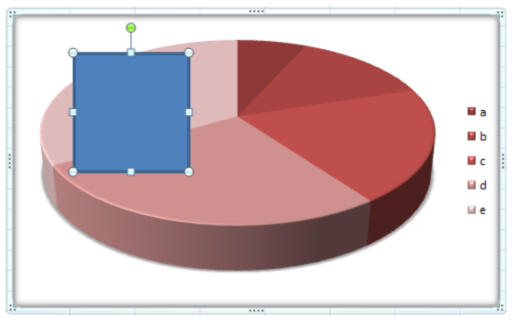

# L.4.14 图表绘图

**Chart Drawing**

## L.4.14.1 介绍

=== "中文"

    本子条款提供了 DrawingML - 图表绘图内容的高级概述。 此架构中的元素指定如何在图表中描述绘图元素。 例如，假设我们想要在图表中指定一个矩形绘图形状，如下所示：

    

=== "英文"

    **Introduction**

    This subclause provides a high-level overview of DrawingML - Chart Drawing content. The elements in this schema specify how drawing elements are to be described within a chart. For example, suppose we want to specify a rectangle drawing shape within a chart to look like the following:

    

## L.4.14.2 概述

=== "中文"

    指定图表中绘图对象的元素都位于其各自的绘图 XML 文件中。 该文件位于电子表格文件内的“drawings”文件夹下。

=== "英文"

    **Overview**

    The elements that specify the drawing objects within a chart are all located within its respective drawing XML file. This file is located under the "drawings" folder inside the spreadsheet file.

## L.4.14.3 图表绘图

=== "中文"

    在 `Drawing*.xml` 文件中，有一个包含 `userShapes` 元素的绘图文件。 该元素是单个图表中所有绘图元素的父元素。 它的子项指定绘图元素的锚定属性。 绘图元素的主要规范位于该元素内。 例如，在上面的屏幕截图中，图表中有一个简单的形状，其 XML 如下所示：

    ```xml
    <c:userShapes>
        <cdr:relSizeAnchor>
            <cdr:from>
                <cdr:x>0.10417</cdr:x>
                <cdr:y>0.10764</cdr:y>
            </cdr:from>
            <cdr:to>
                <cdr:x>0.51875</cdr:x>
                <cdr:y>0.60069</cdr:y>
            </cdr:to>
            <cdr:sp>…</cdr:sp>
        </cdr:relSizeAnchor>
    </c:userShapes>
    ```

    在上面的 `ChartDrawingML` 代码中，指定了一个绘图，几乎与常规 DrawingML 框架中的完全相同。 但是，除了正常的绘图属性之外，所使用的 `ChartDrawingML` 包装器还允许指定图表特定的属性。 其中最有趣的是两种锚定类型，它们定义图表中图形的放置行为。

=== "英文"

    **Chart Drawings**

    Within the drawing*.xml file there is a single drawing file that contains the userShapes element. This element is the parent element for all the drawing elements within a single chart. Its child specifies the anchoring properties of the drawing elements. It is within this element that the main specifications for the drawing elements are located. For example in the above screenshot with a simple shape located in the chart, the XML for this would look like:

    ```xml
    <c:userShapes>
        <cdr:relSizeAnchor>
            <cdr:from>
                <cdr:x>0.10417</cdr:x>
                <cdr:y>0.10764</cdr:y>
            </cdr:from>
            <cdr:to>
                <cdr:x>0.51875</cdr:x>
                <cdr:y>0.60069</cdr:y>
            </cdr:to>
            <cdr:sp>…</cdr:sp>
        </cdr:relSizeAnchor>
    </c:userShapes>
    ```

    In the ChartDrawingML code above, there is a single drawing specified almost exactly as it would within the regular DrawingML framework. However, the ChartDrawingML wrapper that is used allows for the specifying of chart specific properties in addition to the normal drawing properties. The most interesting of these are the two anchoring types that define the placement behavior of a drawing within a chart.

### L.4.14.3.1 锚定类型

=== "中文"

    要在图表中定义绘图，必须选择锚定类型。 图表中允许使用两种不同的锚定类型：**绝对锚定和相对锚定**。 这两种锚定类型在以下两个小节中描述。

=== "英文"

    **Anchoring Types**

    To define a drawing within a chart an anchoring type must be chosen. There are two different anchoring types allowed for use within a chart: Absolute Anchoring and Relative Anchoring. These two anchoring types are described in the following two subclauses.

#### L.4.14.3.1.1 绝对尺寸锚定

=== "中文"

    **绝对锚定描述了基于绝对图表坐标的绘图在图表中的位置**。 `absSizeAnchor` 元素指定锚定行为，使用基于**百分比**的位置坐标作为锚点位置，并使用绘图对象的范围坐标（以 **EMU** 为单位），如下例所示。

    ```xml
    <cdr:absSizeAnchor>
        <cdr:from>
            <cdr:x>0.10417</cdr:x>
            <cdr:y>0.10764</cdr:y>
        </cdr:from>
        <cdr:ext cx="1895460" cy="1352535" />
        <cdr:sp>
            <cdr:nvSpPr>…</cdr:nvSpPr>
            <cdr:spPr>…</cdr:spPr>
            <cdr:style>…</cdr:style>
            <cdr:txBody>…</cdr:txBody>
        </cdr:sp>
    </cdr:absSizeAnchor>
    ```

    在此示例中，使用绝对锚定作为其锚定方法指定了单个形状。

=== "英文"

    **Absolute Size Anchoring**

    Absolute Anchoring describes the placement of the drawing within the chart based upon absolute chart coordinates. The absSizeAnchor element specifies anchoring behavior, using percentage-based position coordinates for the anchor location and extent coordinates (in EMUs) for drawing objects, as shown in the example below.

    ```xml
    <cdr:absSizeAnchor>
        <cdr:from>
            <cdr:x>0.10417</cdr:x>
            <cdr:y>0.10764</cdr:y>
        </cdr:from>
        <cdr:ext cx="1895460" cy="1352535" />
        <cdr:sp>
            <cdr:nvSpPr>…</cdr:nvSpPr>
            <cdr:spPr>…</cdr:spPr>
            <cdr:style>…</cdr:style>
            <cdr:txBody>…</cdr:txBody>
        </cdr:sp>
    </cdr:absSizeAnchor>
    ```

    In this example, there is a single shape specified using absolute anchoring as its anchoring method.

#### L.4.14.3.1.2 相对尺寸锚定

=== "中文"

    **相对锚定描述了基于相对图表坐标在图表内绘图的位置。** 例如，如果图表尺寸增大，则形状也会增大。 此定位信息包括指定图表边界框中基于百分比的坐标的 `from` 和 `to` 元素。 `relSizeAnchor` 元素指定了此锚定行为，示例用法如下所示。

    ```xml
    <cdr:relSizeAnchor>
        <cdr:from>
            <cdr:x>0.10417</cdr:x>
            <cdr:y>0.10764</cdr:y>
        </cdr:from>
        <cdr:to>
            <cdr:x>0.51875</cdr:x>
            <cdr:y>0.60069</cdr:y>
        </cdr:to>
        <cdr:sp>
            <cdr:nvSpPr>…</cdr:nvSpPr>
            <cdr:spPr>…</cdr:spPr>
            <cdr:style>…</cdr:style>
            <cdr:txBody>…</cdr:txBody>
        </cdr:sp>
    </cdr:relSizeAnchor>
    ```

    在此示例中，使用相对锚定作为其锚定方法指定了单个形状。

=== "英文"

    **Relative Size Anchoring**

    Relative Anchoring describes the placement of the drawing within the chart based upon relative chart coordinates. For instance, if the chart increases in size then the shape grows as well. This positioning information includes from and to elements which specify a percentage-based coordinate within the chart bounding box. The relSizeAnchor element is what specifies this anchoring behavior and a sample usage is shown below.

    ```xml
    <cdr:relSizeAnchor>
        <cdr:from>
            <cdr:x>0.10417</cdr:x>
            <cdr:y>0.10764</cdr:y>
        </cdr:from>
        <cdr:to>
            <cdr:x>0.51875</cdr:x>
            <cdr:y>0.60069</cdr:y>
        </cdr:to>
        <cdr:sp>
            <cdr:nvSpPr>…</cdr:nvSpPr>
            <cdr:spPr>…</cdr:spPr>
            <cdr:style>…</cdr:style>
            <cdr:txBody>…</cdr:txBody>
        </cdr:sp>
    </cdr:relSizeAnchor>
    ```

    In this example, there is a single shape specified using relative anchoring as its anchoring method.
