# L.4.13 图表

**Charts**

## L.4.13.1 概述

=== "中文"

    图表通过显示数据的图形表示提供了一种可视化信息的好方法。 图表 XML 文件可以在不同的应用程序（例如电子表格、演示文稿和文字处理）之间重用和共享。

    图表有许多不同的风格，本文档提供了不同风格的图表以及用于生成它们的 XML 的基本概述。

    应用程序可能允许图表有许多不同的运行时行为，例如显示它们的规则。 本条款及其相应的参考材料仅定义存储和生成图表所需的 XML，并且不规定任何运行时行为。

=== "英文"

    **Overview**

    Charts provide a great way to visualize information by displaying a graphical representation of the data. The chart XML files can be reused and shared among different applications, such as a spreadsheet, presentation, and word processing.

    Charts come in many different flavors, and this document provides a basic overview of both the different flavors of charts as well as the XML that is used to generate them.

    Applications might allow many different runtime behaviors for charts, such as rules for displaying them. This clause and its corresponding reference material define only the XML that is needed to store and generate the charts, and do not dictate any runtime behaviors. 

### L.4.13.1.1 Basic Chart Types

=== "中文"

    有10个基本图表。 以下是每种基本类型图表的示例：

    <figure markdown>
      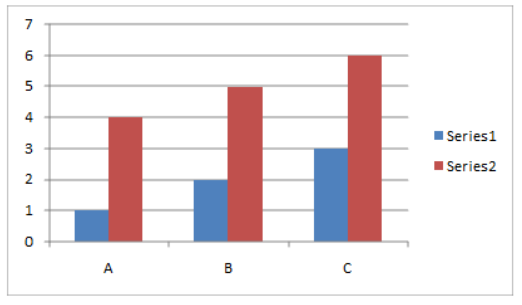
      <figcaption>柱形图（如上所示）</figcaption>
    </figure>

    <figure markdown>
      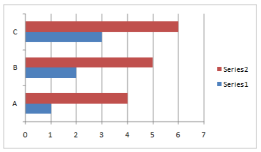
      <figcaption>条形图 (如上所示)</figcaption>
    </figure>

    <figure markdown>
      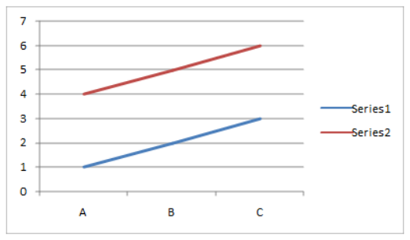
      <figcaption>折线图 (如上所示)</figcaption>
    </figure>

    <figure markdown>
      
      <figcaption>饼形图 (如上所示)</figcaption>
    </figure>

    <figure markdown>
      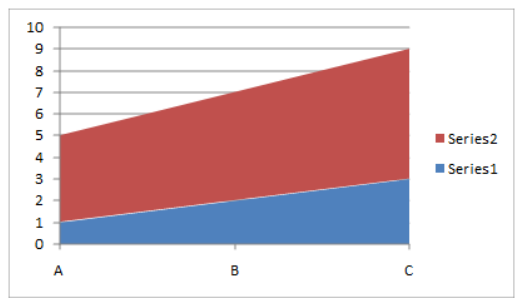
      <figcaption>面积图 (如上所示)</figcaption>
    </figure>

    <figure markdown>
      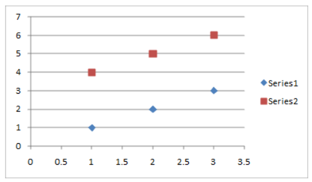
      <figcaption>散点图 (如上所示)</figcaption>
    </figure>

    <figure markdown>
      
      <figcaption>股票走势图 (如上所示)</figcaption>
    </figure>

    <figure markdown>
      
      <figcaption>表面图 (如上所示)</figcaption>
    </figure>

    <figure markdown>
      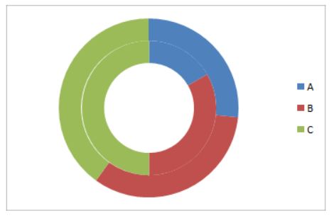
      <figcaption>圆环图 (如上所示)</figcaption>
    </figure>

    <figure markdown>
      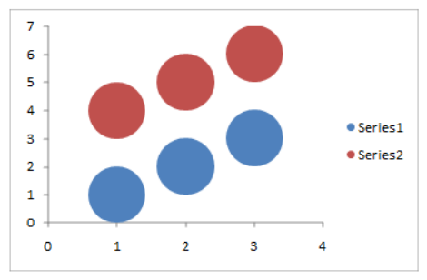
      <figcaption>气泡图 (如上所示)</figcaption>
    </figure>

    <figure markdown>
      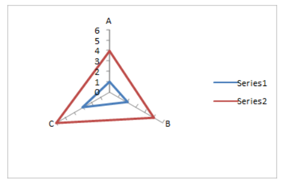
      <figcaption>雷达图 (如上所示)</figcaption>
    </figure>

=== "英文"

    **Basic Chart Types**

    There are 10 basic charts. Below are examples of each basic type of chart:

    <figure markdown>
      
      <figcaption>Column Chart (shown above)</figcaption>
    </figure>

    <figure markdown>
      
      <figcaption>Bar Chart (shown above)</figcaption>
    </figure>

    <figure markdown>
      
      <figcaption>Line Chart (shown above)</figcaption>
    </figure>

    <figure markdown>
      
      <figcaption>Pie Chart (shown above)</figcaption>
    </figure>

    <figure markdown>
      
      <figcaption>Area Chart (shown above)</figcaption>
    </figure>

    <figure markdown>
      
      <figcaption>Scatter Chart (shown above)</figcaption>
    </figure>

    <figure markdown>
      
      <figcaption>Stock Chart (shown above)</figcaption>
    </figure>

    <figure markdown>
      
      <figcaption>Surface Chart (shown above)</figcaption>
    </figure>

    <figure markdown>
      
      <figcaption>Doughnut Chart (shown above)</figcaption>
    </figure>

    <figure markdown>
      
      <figcaption>Bubble Chart (shown above)</figcaption>
    </figure>

    <figure markdown>
      
      <figcaption>Radar Chart (shown above)</figcaption>
    </figure>

### L.4.13.1.2 基本图表组件

=== "中文"

    以下是一些标记图表的不同单独组成部分的图表。 某些图表组件（例如垂线）仅显示在某些类型的图表上。

    

    

    

=== "英文"

    **Basic Chart Components**

    Here are some diagrams that label the different individual components of a chart. Some chart components, such as drop lines, are only shown on certain types of charts. 

    

    

    

### L.4.13.1.3 3D图表

=== "中文"

    大多数图表类型也有三维表示。 3D 图表具有额外的属性来描述深度、地板或墙壁，以及一些其他渲染效果。 下面是 2D 柱形图及其对应的 3D 柱形图。

    

    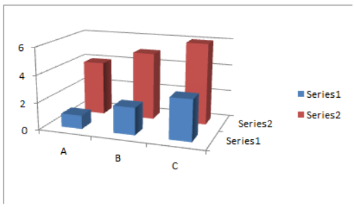

=== "英文"

    **3D Charts**

    Most chart types also have three-dimensional representations. 3D charts have extra properties to describe depth, floor, or walls, as well as some other rendering effects. Below is a 2D column chart shown with its 3D counterpart.

    

    

### L.4.13.1.4 图表样式

=== "中文"

    图表可以应用不同的样式。 **这本质上只是一组协调的着色和格式，应用于整个图表及其所有元素**。 样式提供了一种快速、简单的方法来协调图表的外观和文档的其余部分。 下面是柱形图和饼图的渲染，显示相同的数据，并应用相同的样式。 还有许多不同类型风格的镜头。 两个图表都显示了它，以说明不同的样式如何在不同的图表类型中应用并保持一致。

    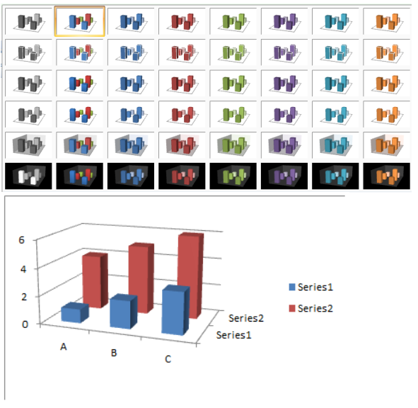

    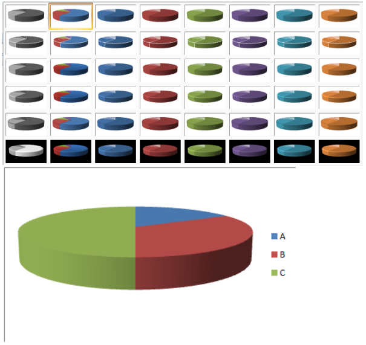

=== "英文"

    **Chart Styles**

    Charts can have different styles applied to them. This is essentially just a coordinated set of coloring and formatting that is applied across an entire chart and all its elements. Styles allow a quick and easy way to coordinate the look and feel of a chart with the rest of the document. Below is a rendering of a column chart and pie chart showing the same data, with the same style applied. There is also a shot of many different types of styles. It is shown for both charts to illustrate how the idea of a style can apply, and be consistent, across different chart types.

    

    

## L.4.13.2 XML 概述

**XML Overview**

### L.4.13.2.1 关系

=== "中文"

    绘图 XML 部件包含一个图表元素，该元素表示**关系 ID**。 该 `ID` 由 `Drawing.rels` 部件引用，该部件指向相应的图表 XML 部件。 图表 XML 包含图表的核心定义。

=== "英文"

    **Relationships**

    A Drawing XML part contains a chart element, which expresses a relationship ID. This ID is referenced by the drawing.rels part, which points to the corresponding chart XML part. Chart XML contains the core definition of the chart.

### L.4.13.2.2 图表

=== "中文"

    不同的图表类型可以在 XML 中定义许多不同的组件，此处并未显示所有组件。 但对于许多图表来说，在非常高的级别上，图表 XML 由以下部分组成：
    
    ```xml
    <chartSpace>
        <chart>
            <view3D>
                <perspective val="30" />
            </view3D>
            <plotArea>
                <layout />
                <barChart>...</barChart>
                <catAx />
                <valAx />
            </plotArea>
            <legend>...</legend>
        </chart>
        <printSettings>...</printSettings>
    </chartSpace>
    ```

    `chartSpace` 是根节点，它包含一个定义图表的元素和一个定义图表打印设置的元素。

    `chart` 是图表的根元素。 如果图表是 3D 图表，则包含 `view3D` 元素，该元素指定 **3D 视图**。 然后它有一个绘图区域，它定义布局并包含与图表类型相对应并定义图表类型的元素。
    
    定义图表类型的元素（上例中的 `barChart`）还可以指定类别轴数据（实际上只是类别的字符串）以及图表上显示的数字或值的缓存。 `cat` 元素定义类别轴的字符串缓存，`val` 元素定义数字缓存。
    
    根据图表的类型，绘图区域可以选择包含定义轴的元素（例如值轴和类别轴）或形状特性。 在上面的示例中，定义了类别轴 `catAx` 和值轴 `valAx`。 这些定义了轴的定位、方向、标签位置和刻度线等内容。 轴对应的实际字符串和数据由 `cat` 和 `val` 元素定义。
    
    最后，图表元素包含一个定义图表图例(legend)的图例(legend)元素。

=== "英文"

    **Chart**

    Different chart types can have many different components defined in the XML, and not all are shown here. For many charts though, at a very high level, the chart XML is composed of the following pieces: 
    
    ```xml
    <chartSpace>
        <chart>
            <view3D>
                <perspective val="30" />
            </view3D>
            <plotArea>
                <layout />
                <barChart>...</barChart>
                <catAx />
                <valAx />
            </plotArea>
            <legend>...</legend>
        </chart>
        <printSettings>...</printSettings>
    </chartSpace>
    ```

    chartSpace is the root node, which contains an element defining the chart, and an element defining the print settings for the chart.

    chart is the root element for the chart. If the chart is a 3D chart, then a view3D element is contained, which specifies the 3D view. It then has a plot area, which defines a layout and contains an element that corresponds to, and defines, the type of chart.
    
    The element that defines the type of chart, barChart in the example above, can also specify caches for both category axis data (which is really just strings for the categories), as well as for the numbers, or values, shown on the chart. The cat element defines the string cache for the category axis, and the val element defines the number caches.
    
    Depending on the type of the chart, the plot area can optionally contain elements that define the axes— such as the value axis and category axis—or shape properties. In the example above, the category axis, catAx, and value axis, valAx are defined. These define things like positioning, orientation, label position, and tick marks for the axis. The actual strings and data that the axis corresponds to are defined by the cat and val elements.
    
    Lastly, the chart element contains a legend element which defines the chart legend.

## L.4.13.3 示例

=== "中文"

    本节中的 XML 定义了以下 3D 图表：

    
    
    对于此示例，详细显示了图表元素的 xml。 图表元素的 xml 如下:

    ```xml
    <c:chart>
        <c:view3D>
            <c:rotX val="30" />
            <c:perspective val="30" />
        </c:view3D>
        <c:plotArea>
            <c:layout>
                <c:lastLayoutOuter>
                    <c:x val="4.5" />
                    <c:y val="4.5" />
                    <c:w val="324.75" />
                    <c:h val="206.25" />
                </c:lastLayoutOuter>
                <c:lastLayout>
                    <c:x val="10.5" />
                    <c:y val="10.5" />
                    <c:w val="312.75" />
                    <c:h val="194.25" />
                </c:lastLayout>
            </c:layout>
            <c:pie3DChart>
                <c:varyColors val="1" />
                <c:ser>
                    <c:idx val="0" />
                    <c:order val="0" />
                    <c:cat>
                        <c:strRef>
                            <c:f>Sheet1!$A$1:$C$1</c:f>
                            <c:strCache>
                                <c:pt idx="0">
                                    <c:v>A</c:v>
                                </c:pt>
                                <c:pt idx="1">
                                    <c:v>B</c:v>
                                </c:pt>
                                <c:pt idx="2">
                                    <c:v>C</c:v>
                                </c:pt>
                            </c:strCache>
                        </c:strRef>
                    </c:cat>
                    <c:val>
                        <c:numRef>
                            <c:f>Sheet1!$A$2:$C$2</c:f>
                            <c:numCache>
                                <c:pt idx="0">
                                    <c:v>1</c:v>
                                </c:pt>
                                <c:pt idx="1">
                                    <c:v>2</c:v>
                                </c:pt>
                                <c:pt idx="2">
                                    <c:v>3</c:v>
                                </c:pt>
                            </c:numCache>
                        </c:numRef>
                    </c:val>
                </c:ser>
            </c:pie3DChart>
            <c:spPr>
                <a:noFill />
                <a:ln w="25400">
                    <a:noFill />
                </a:ln>
            </c:spPr>
        </c:plotArea>
        <c:legend>
            <c:legendPos val="r" />
            <c:layout>
                <c:lastLayout>
                    <c:x val="333.75" />
                    <c:y val="81.75" />
                    <c:w val="19.5" />
                    <c:h val="51.75" />
                </c:lastLayout>
            </c:layout>
        </c:legend>
        <c:plotVisOnly val="1" />
    </c:chart>
    ```

=== "英文"

    **Example**

    The XML in this clause defines the following 3D chart:

    
    
    For this example, the xml for the chart element is shown in detail. The xml for the chart element follows:

    ```xml
    <c:chart>
        <c:view3D>
            <c:rotX val="30" />
            <c:perspective val="30" />
        </c:view3D>
        <c:plotArea>
            <c:layout>
                <c:lastLayoutOuter>
                    <c:x val="4.5" />
                    <c:y val="4.5" />
                    <c:w val="324.75" />
                    <c:h val="206.25" />
                </c:lastLayoutOuter>
                <c:lastLayout>
                    <c:x val="10.5" />
                    <c:y val="10.5" />
                    <c:w val="312.75" />
                    <c:h val="194.25" />
                </c:lastLayout>
            </c:layout>
            <c:pie3DChart>
                <c:varyColors val="1" />
                <c:ser>
                    <c:idx val="0" />
                    <c:order val="0" />
                    <c:cat>
                        <c:strRef>
                            <c:f>Sheet1!$A$1:$C$1</c:f>
                            <c:strCache>
                                <c:pt idx="0">
                                    <c:v>A</c:v>
                                </c:pt>
                                <c:pt idx="1">
                                    <c:v>B</c:v>
                                </c:pt>
                                <c:pt idx="2">
                                    <c:v>C</c:v>
                                </c:pt>
                            </c:strCache>
                        </c:strRef>
                    </c:cat>
                    <c:val>
                        <c:numRef>
                            <c:f>Sheet1!$A$2:$C$2</c:f>
                            <c:numCache>
                                <c:pt idx="0">
                                    <c:v>1</c:v>
                                </c:pt>
                                <c:pt idx="1">
                                    <c:v>2</c:v>
                                </c:pt>
                                <c:pt idx="2">
                                    <c:v>3</c:v>
                                </c:pt>
                            </c:numCache>
                        </c:numRef>
                    </c:val>
                </c:ser>
            </c:pie3DChart>
            <c:spPr>
                <a:noFill />
                <a:ln w="25400">
                    <a:noFill />
                </a:ln>
            </c:spPr>
        </c:plotArea>
        <c:legend>
            <c:legendPos val="r" />
            <c:layout>
                <c:lastLayout>
                    <c:x val="333.75" />
                    <c:y val="81.75" />
                    <c:w val="19.5" />
                    <c:h val="51.75" />
                </c:lastLayout>
            </c:layout>
        </c:legend>
        <c:plotVisOnly val="1" />
    </c:chart>
    ```
