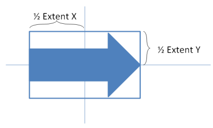
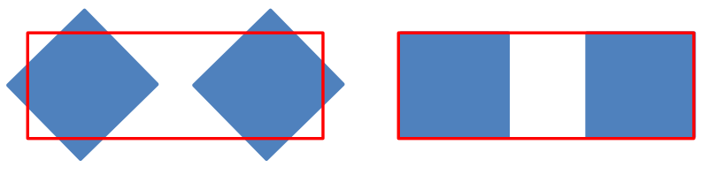
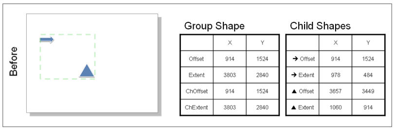
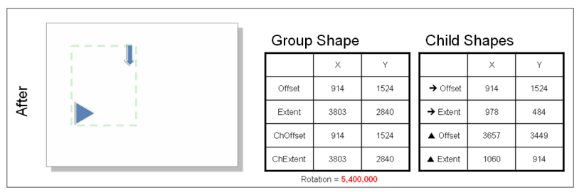

# L.4.7 坐标系和变换

**Coordinate Systems and Transformations**

## L.4.7.1 介绍

=== "中文"

    本文档概述了形状和组的变换元素，在 DrawingML 中由“<a:xfrm>”表示。 这些模式(Schema)用于表示各个形状和组的缩放和旋转。

    [§L.4.7.2]、[§L.4.7.3] 和 [§L.4.7.4] 提供了变换管道的定性概述。 [§L.4.7.6] 提供了数学细节。

=== "英文"

    **Introduction**

    This document provides an overview of the transformation elements for shapes and groups, represented by `<a:xfrm>` in DrawingML. These schemas are for the representation of scaling and rotation on individual shapes and groups.

    §L.4.7.2, §L.4.7.3, and §L.4.7.4 provide a qualitative overview of the transformation pipeline. §L.4.7.6 provides mathematical details.

## L.4.7.2 坐标系统

=== "中文"

    所有 DrawingML 形状都位于**二维笛卡尔坐标空间**上，原点 (0,0) 位于画布的左上角。 从左向右移动时，x 轴坐标正向增长；从上向下移动时，y 轴坐标正向增长。

    坐标是在基于EMU单位测量的，可以是正值，也可以是负值。

=== "英文"

    **Coordinate System**

    All DrawingML shapes are located on a 2-D Cartesian coordinate space with the origin (0,0) in the upper left-hand corner of the canvas. The x-axis coordinates grow positively as one moves from left to right, and the y-axis coordinates grow positively as one moves from top to bottom.

    Coordinates are measured in EMUs, and can be positive or negative.

## L.4.7.3 形状变换

=== "中文"

    在本小节中，我们描述形状的**变换过程**(transformation pipeline)。 总而言之，形状的形状变换被定义为以下操作序列：

    1. **将其原始边界框转换为由偏移和范围指定的矩形所需的平移和缩放。**
    1. **根据 `flipH` 和 `flipV` 跨越边界框中心的翻转。**
    2. **根据 `rot` 属性绕边界框中心旋转。**

    要渲染不在组内的形状 ([§L.4.7.4])，渲染器只需将形状变换应用于原始形状。

=== "英文"

    **Shape Transformations**

    In this subclause, we describe the transformation pipeline for a shape. To summarize, the shape transformation for a shape is defined as the following sequence of operations:

    1. The translation and scaling required to transform its original bounding box to a rectangle specified by the offset and extents.
    1. A flip across the center of the bounding box according to flipH and flipV.
    2. A rotation about the center of the bounding box according to the rot attribute.

    To render a shape that is not inside a group (§L.4.7.4), the renderer simply applies the shape transformation to the original shape.

### L.4.7.3.1 缩放和平移形状

=== "中文"

    形状会**水平缩放**(scaled horizontally)、**垂直缩放**(scaled vertically)并可以在两个维度上进行平移，以填充给定的边界框。 边界框通过指定 `x` 和 `y`（`a:off` 的属性 `x` 和 `y`）中的偏移量以及 `x` 和 `y` 中的范围（`a:ext` 的属性 `cx` 和 `cy`，两者都**必须大于或等于 0**）来表示 ）。 {++边界框的左上角位于偏移量处，边界框的右下角位于**偏移量加范围**处。++}
    
    {++
    
    **如果起始形状的宽度为零（例如，它是一条垂直线），则忽略 `a:ext` 的 `cx` 属性并跳过水平缩放。 类似地，如果起始形状的高度为零，则忽略 `a:ext` 的 `cy` 属性并跳过垂直缩放。**

    ++}

    

    以下 XML 片段表示上面星形的偏移量和范围：

    ```xml
    <a:xfrm>
        <a:off x="1866680" y="990600"/>
        <a:ext cx="1371600" cy="1371600"/>
    </a:xfrm>
    ```

    请注意，如上面的示例所示，在缩放和平移形状以填充给定边界框时，附加到形状的任何效果都将被忽略。

    此示例说明不需要额外的参数来表示形状的缩放。 边界框参数足以表示缩放。 以下 XML 片段表示星形在缩放之前和之后的偏移量和范围。 在这个特定示例中，边界框被选择为具有相同的左上角，即相同的偏移量。

    

    缩放前（小星星）：

    ```xml
    <a:xfrm>
        <a:off x="1066800" y="990600"/>
        <a:ext cx="1371600" cy="1371600"/>
    </a:xfrm>
    ```

    缩放后（大星星）：

    ```xml
    <a:xfrm>
        <a:off x="1066800" y="990600"/>
        <a:ext cx="2438400" cy="2133600"/>
    </a:xfrm>
    ```

=== "英文"

    **Scaling and Translating a Shape**

    The shape is scaled horizontally, scaled vertically, and translated in both dimensions, to fill a given bounding box. The bounding box is represented by specifying an offset in x and y (attributes x and y of a:off) and extents in x and y (attributes cx and cy of a:ext, both of which must be greater than or equal to zero). The upper left corner of the bounding box is located at the offset, and the lower right corner of the bounding box is located at the offset plus extent. 

    If the starting shape has zero width (e.g., it is a vertical line), then the cx attribute of a:ext is ignored and the horizontal scaling is skipped. Similarly, if the starting shape has zero height, then the cy attribute of a:ext is ignored and the vertical scaling is skipped. 

    

    The following XML fragment represents the offset and extents for the star shape above:

    ```xml
    <a:xfrm>
        <a:off x="1866680" y="990600"/>
        <a:ext cx="1371600" cy="1371600"/>
    </a:xfrm>
    ```

    Notice that as demonstrated with the example above, any effects attached to the shape are disregarded when scaling and translating the shape to fill the given bounding box.

    This example illustrates that no additional parameters are needed to represent the scaling of a shape. The bounding-box parameters are sufficient to represent scaling. The following XML Fragments represent the offset and extents for a star shape, before and after scaling. In this particular example, the bounding boxes have been chosen to have the same upper-left corner, i.e., the same offset.

    

    Before scaling (small star):

    ```xml
    <a:xfrm>
        <a:off x="1066800" y="990600"/>
        <a:ext cx="1371600" cy="1371600"/>
    </a:xfrm>
    ```

    After scaling (large star):

    ```xml
    <a:xfrm>
        <a:off x="1066800" y="990600"/>
        <a:ext cx="2438400" cy="2133600"/>
    </a:xfrm>
    ```

### L.4.7.3.2 旋转形状

=== "中文"

    旋转用 `rot` 属性表示。 **形状围绕边界框中心顺时针旋转，旋转量在 `rot` 属性中指定。 每个旋转单位为 `1/1,000` 弧分（`1/60,000` 度）。**
        
    此示例代表从上方观察的小星星，随后顺时针旋转 45 度。 由于 `y` 轴指向下方，因此顺时针旋转为正。

    

    ```xml
    <a:xfrm rot="2700000">
        <a:off x="1066800" y="990600"/>
        <a:ext cx="1371600" cy="1371600"/>
    </a:xfrm>
    ```

=== "英文"

    **Rotating a Shape**

    Rotation is represented with the rot attribute. The shape is rotated clockwise about the bounding-box center, by the amount specified in the rot attribute. Each unit of rotation is 1/1,000 of an arc minute (1/60,000 of a degree).
        
    This example represents the small star from above, with a subsequent 45-degree rotation clockwise. Since the y axis points down, a clockwise rotation is positive.

    

    ```xml
    <a:xfrm rot="2700000">
        <a:off x="1066800" y="990600"/>
        <a:ext cx="1371600" cy="1371600"/>
    </a:xfrm>
    ```

### L.4.7.3.3 翻转形状

=== "中文"

    翻转是穿过与边界框中心相交的垂直或水平线的反射。 可选的`flipH`和`flipV`属性分别控制水平和垂直翻转。 如果不执行翻转，则每个都不存在或等于 `0`；如果要执行翻转，则每个都等于 `1`。

    

    以下 XML 片段说明了已水平和垂直翻转的形状。

    ```xml
    <a:xfrm flipH="1" flipV="1">
         <a:off x="3964937" y="2652643"/>
         <a:ext cx="168838" cy="1219199"/>
    </a:xfrm>
    ```

=== "英文"

    **Flipping a Shape**

    A flip is a reflection across a vertical or horizontal line that intersects the center of the bounding box. The optional flipH and flipV attributes control horizontal and vertical flipping, respectively. Each is absent or equal to 0 if no flipping is to be performed, and equal to 1 if flipping is to be performed.

    

    The following XML fragment illustrates a shape that has been flipped both horizontally and vertically.

    ```xml
    <a:xfrm flipH="1" flipV="1">
         <a:off x="3964937" y="2652643"/>
         <a:ext cx="168838" cy="1219199"/>
    </a:xfrm>
    ```

## L.4.7.4 组合变换

=== "中文"

    组合由零到多个形状组成。 因为组合是一个形状，所以这种组合关系可以递归嵌套。 （具有零个形状的组合是退化的；它不产生用户可见的输出。具有一种形状的组合也是退化的；它不具有超越单一形状的表征能力。）
    
    **组合变换**的定义与**形状变换**的定义相同，只是我们使用其所有子项在单独旋转之前的**并集**来代替形状的预变换边界框。 总而言之，组合变换是以下操作序列：
    
    1. **将子级边界框的并集转换为由组的偏移和范围属性定义的矩形所需的平移和缩放。**
    2. **根据 `FlipH` 和 `FlipV` 属性围绕该边界框进行翻转。**
    3. **根据 rot 属性围绕该边界框的中心进行旋转。**

    要渲染组合层次结构内的简单形状，渲染器不会简单地将形状变换和所有父级组合变换应用于原始形状。 相反（参见[§L.4.7.5]），它应用等于以下操作序列的转换：

    1. **水平缩放和翻转的因子等于其自身变换及其父级变换中水平缩放和翻转的乘积。**
    2. **垂直缩放和翻转的因子等于其自身变换及其父变换中垂直缩放和翻转的乘积。**
    3. **旋转量等于其自身变换中的旋转量及其父级变换中的旋转量之和。**
    4. **平移，使其中心与通过将形状变换和所有父组变换应用到形状的原始中心而获得的点重合。**

    由于与形状的变换过程相似，接下来的小节主要介绍说明性示例。

=== "英文"

    **Group Transformations**

    A group is composed of zero to many shapes. Because a group is a shape, this composition relationship can nest recursively. (A group with zero shapes is degenerate; it produces no user-visible output. A group with one shape is also degenerate; it has no representational power beyond that of the one shape.)
    
    The definition of a group transformation is identical to that of a shape transformation, except that in place of the pre-transform bounding box of a shape, we use the union of all of its children prior to their individual rotations. To summarize, a group transformation is the following sequence of operations:
    
    1. The translation and scaling required to transform the union of the children's bounding boxes to a rectangle defined by the group's offset and extent attributes.
    2. A flipped about that bounding box according to the flipH and flipV attributes.
    3. A rotation about the center of that bounding box according to the rot attribute.

    To render a simple shape that is inside a group hierarchy, the renderer does not simply apply the shape transformation and all parent group transformations to the original shape. Instead (see §L.4.7.5), it apples the transformation equal to the following sequence of operations:

    1. Horizontal scaling and flipping by a factor equal to the product of the horizontal scalings and flips in its own transformation and those of its parents.
    2. Vertical scaling and flipping by a factor equal to the product of the vertical scalings and flips in its own transformation and those of its parents.
    3. Rotation by an amount equal to the sum of the rotations in its own transformation and those of its parents.
    4. Translation such that its center coincides with the point obtained by applying the shape transformation and all parent group transformations to the shape's original center. 

    Because of the similarity with the transformation pipeline for a shape, the forthcoming subsections primarily cover illustrative examples.

### L.4.7.4.1 缩放和平移组(合)

=== "中文"

    该组合可以**水平缩放**、**垂直缩放**以及在两个维度上进行**平移**。 选择参数将**子边界框**（由 `a:chOff` 和 `a:chExt` 指定）转换为**组边界框**（由 `a:off` 和 `a:ext` 指定）。 子边界框被定义为组合子级周围的边界框，就像它们的 `rot` 属性不存在时一样。
    
    子边界框在 `a:chExt` 中的 `cx` 或 `cy` 可能为零值，例如，因为起始形状是水平线或垂直线，或者因为起始形状被缩放为具有零宽度或高度。 这种情况的处理方式与前面针对简单形状所描述的方式相同。
    
    此示例演示了子边界框的定义。 左侧的两个形状（旋转的正方形）被分组。 右侧的两个形状（未旋转的正方形）也被分组。
    
    

    红带不是绘图的一部分； 每个代表一个组的子边界框。 在 XML 片段中，子边界框具有相同的 `y` 值，说明它们是根据旋转之前的正方形的边界框计算的。 

    对于左侧组：

    ```xml
    <a:xfrm>
        <a:off x="762000" y="1828800" />
        <a:ext cx="3327400" cy="1219200" />
        <a:chOff x="762000" y="1828800" />
        <a:chExt cx="3327400" cy="1219200" />
    </a:xfrm>
    ```

    对于右侧组：

    ```xml
    <a:xfrm>
        <a:off x="4978400" y="1828800" />
        <a:ext cx="3327400" cy="1219200" />
        <a:chOff x="4978400" y="1828800" />
        <a:chExt cx="3327400" cy="1219200" />
    </a:xfrm>
    ```

    本小节中的其余示例说明了组的平移和缩放。
    
    在这种情况下，两个形状被分组：箭头和三角形。 不应用进一步的平移、缩放、旋转或翻转。
    
    为了表示这种情况，子边界框是这两个形状周围的边界框； 并且因为没有应用进一步的变换，所以组边界框等于子边界框。
    
    

    以下是表示组合的转换变量的 XML 片段。

    ```xml
    <p:grpSpPr>
        <a:xfrm>
            <a:off x="2209800" y="2514600"/>
            <a:ext cx="4038600" cy="2286000"/>
            <a:chOff x="2209800" y="2514600"/>
            <a:chExt cx="4038600" cy="2286000"/>
        </a:xfrm>
    </p:grpSpPr>
    ```

    这个例子说明不需要额外的参数来表示组合的转换。 一组移至右侧。 下图显示了转换之前的起始状态。 请注意，**offset==ChOffset** 和 **extent==ChExtent**。
    
    

    增加偏移的 x 分量会将组移至右侧。
    
    

    类似地，可以通过调整组边界框来执行缩放。

=== "英文"

    **Scaling and Translating a Group**

    The group is scaled horizontally, scaled vertically, and translated in both dimensions. The parameters are chosen to transform the child bounding box (specified by a:chOff and a:chExt) to the group bounding box (specified by a:off and a:ext). The child bounding box is defined as the bounding box around the group's children as they would have been had their rot attributes been absent.
    
    It is possible for the child bounding box to have a zero value for cx or cy in a:chExt, e.g., because the starting shape is a horizontal or vertical line, or because the starting shape was scaled to have zero width or height. Such a case is handled in the same way as previously described for simple shapes.
    
    This example demonstrates the definition of the child bounding box. The two shapes on the left, rotated squares, are grouped. The two shapes on the right, non-rotated squares, are also grouped.
    
    

    The red bands are not part of the drawing; each represents the child bounding box of a group. In the XML fragments, the child bounding boxes have identical y values, illustrating that they are computed based on the bounding boxes of the squares prior to their rotation. 

    For the left-hand group:

    ```xml
    <a:xfrm>
        <a:off x="762000" y="1828800" />
        <a:ext cx="3327400" cy="1219200" />
        <a:chOff x="762000" y="1828800" />
        <a:chExt cx="3327400" cy="1219200" />
    </a:xfrm>
    ```

    For the right-hand group:

    ```xml
    <a:xfrm>
        <a:off x="4978400" y="1828800" />
        <a:ext cx="3327400" cy="1219200" />
        <a:chOff x="4978400" y="1828800" />
        <a:chExt cx="3327400" cy="1219200" />
    </a:xfrm>
    ```

    The remainder of the examples in this subsection illustrate translation and scaling of a group.
    
    In this situation, two shapes are grouped: an arrow and a triangle. No further translation, scaling, rotation, or flipping is applied.
    
    To represent this situation, the child bounding box is the bounding box around both of these shapes; and because no further transformation is applied, the group bounding box is equal to the child bounding box. 
    
    

    The following is an XML snippet representing the transform variables of the group.

    ```xml
    <p:grpSpPr>
        <a:xfrm>
            <a:off x="2209800" y="2514600"/>
            <a:ext cx="4038600" cy="2286000"/>
            <a:chOff x="2209800" y="2514600"/>
            <a:chExt cx="4038600" cy="2286000"/>
        </a:xfrm>
    </p:grpSpPr>
    ```

    This example illustrates that no additional parameters are needed to represent the translation of a group. A group is moved to the right. The following diagram shows the starting state, prior to the translation. Note that offset==ChOffset and extent==ChExtent.
    
    

    Increasing the x component of the offset moves the group to the right.
    
    

    Similarly, scaling can be performed by adjusting the group bounding box.

### L.4.7.4.2 旋转组(合)

=== "中文"

    组旋转与形状旋转相同。 该组围绕边界框中心顺时针旋转，旋转量在 `rot` 属性中指定。

    在此示例中，组顺时针旋转 `90` 度。 下图显示了旋转之前的起始状态。
    
    

    将旋转属性设置为 5,400,000 会将组顺时针旋转 `90` 度。
    
    

=== "英文"

    **Rotating a Group**

    Group rotation is identical to shape rotation. The group is rotated clockwise about the bounding-box center, by the amount specified in the rot attribute. 

    In this example, group is rotated 90 degrees clockwise. The following diagram shows the starting state, prior to the rotation.
    
    

    Setting the rotation attribute to 5,400,000 rotates the group clockwise 90 degrees.
    
    

## L.4.7.5 嵌套变换

=== "中文"

    以下示例说明了[§L.4.7.4]介绍末尾处描述的渲染过程，在缩放组包含旋转子组的任何情况下，该渲染过程都不同于传统的变换过程。

    ??? info "Example"

        在此示例中，左侧的图是一个组，其中包含一个旋转的红色方块，其中心位于一个未旋转的蓝色方块内。 右侧的图是同一组，水平缩放。 红色正方形沿着平行于其自身边缘的轴而不是平行于蓝色正方形边缘的轴缩放。

        

=== "英文"

    **Nesting Transformations**

    The following example illustrates the rendering procedure described at the end of the introduction to §L.4.7.4, which differs from a conventional transformation pipeline in any case where a scaled group contains a rotated child. 

    ??? info "Example"

        In this example, the diagram on the left side is a group that comprises a rotated red square centered inside a non-rotated blue square. The diagram on the right side is the same group, scaled horizontally. The red square scales along an axis parallel to its own edges instead of an axis parallel to the edges of the blue square. 

        

## L.4.7.6 变换矩阵

=== "中文"

    前面的部分完整定义了变换过程及其参数。 本节通过数学描述来帮助开发人员实现该过程。 它被概括为描述形状变换过程或组变换过程。

=== "英文"

    **Transformation Matrices**

    The preceding sections fully define the transformation pipeline and its parameters. This section assists developers in implementing the pipeline by describing it mathematically. It is generalized to describe either the shape transformation pipeline or the group transformation pipeline.

### L.4.7.6.1 符号定义

=== "中文"

    让以下符号代表前面部分中描述的参数。

    $(B_x, B_y)$

    :   对于形状：未变换形状的左上角。
        
        对于组：子边界框的左上角 (`a:chOff`)。

    $(D_x, D_y)$

    :   对于形状：未变换形状的（宽度，高度）。
        
        对于组：子边界框 (`a:chExt`) 的（宽度、高度）。

    $(B_{x}^{'} , B_{y}^{'})$

    :   旋转和翻转之前，边界框的左上角（`a:off`）。

    $(D_{x}^{'} , D_{y}^{'})$

    :   在旋转和翻转之前，边界框 (`a:ext`) 的（宽度、高度）。

    $\theta$

    :   顺时针旋转（来自属性 `rot`，它使用千分之一弧分）。

    $F_x$

    :   如果 FlipH 为真，则为 −1； 否则+1。

    $F_y$

    :   如果 FlipV 为真，则为 −1； 否则+1。

    我们使用齐次坐标，其中点 $p$ 表示为以下形式

    $$p = \begin{bmatrix}x\\y\\1\end{bmatrix} \cdot $$

    我们使用通过**左乘**来应用变换的约定。 因此，为了通过对点 $p$ 应用变换 $T$ 来获得点 $p^{'}$，我们可以这样写：

    $$ p^{'} = T p $$

=== "英文"

    **Symbol Definitions**

    Let the following symbols represent parameters described in the preceding sections. 

    $(B_x, B_y)$

    :   For a shape: upper left corner of untransformed shape.
        
        For a group: upper left corner of child bounding box (a:chOff).

    $(D_x, D_y)$

    :   For a shape: (width,height) of untransformed shape.
        
        For a group: (width,height) of child bounding box (a:chExt).

    $(B_{x}^{'} , B_{y}^{'})$

    :   Upper left corner of bounding box (a:off), prior to rotation and flip.

    $(D_{x}^{'} , D_{y}^{'})$

    :   (width,height) of bounding box (a:ext), prior to rotation and flip.
 
    $\theta$

    :   Clockwise rotation (from the attribute rot, which uses thousandths of an arc minute). 

    $F_x$

    :   −1 if flipH is true; +1 otherwise.

    $F_y$

    :   −1 if flipV is true; +1 otherwise.

    We use homogeneous coordinates, in which a point p is represented in the form

    $$p = \begin{bmatrix}x\\y\\1\end{bmatrix} \cdot $$

    We use the convention in which transformations are applied by left-hand multiplication. Thus, to obtain the point p' by applying transformation T to point p we write:

    $$ p^{'} = T p $$

### L.4.7.6.2 变换过程

=== "中文"

    定义形状变换或组变换的整个变换过程由本小节末尾定义的矩阵 $T$ 表示。

    缩放和平移由以下矩阵产生：

    $$T_{st} = \begin{bmatrix} \frac{D_{x}^{'}}{D_{x}}  & 0 & B_{x}^{'} -(\frac{D_{x}^{'}}{D_{x}}) B_x \\ 0 & \frac{D_{y}^{'}}{D_{y}} & B_{y}^{'} - (\frac{D_{y}^{'}}{D_{y}})B_y\\  0 & 0 & 1 \end{bmatrix} \cdot $$
    
    以下矩阵将边界框平移到原点，为旋转和翻转做准备：

    $$ U = \begin{bmatrix} 1  & 0 & -(B_{x}^{'} + \frac{D_{x}^{'}}{2})\\ 0  & 1 & -(B_{y}^{'} + \frac{D_{y}^{'}}{2})\\ 0  & 0 & 1 \end{bmatrix} \cdot $$

    旋转和翻转由以下矩阵产生：

    $$ T_{rf} = U^{-1}\begin{bmatrix} cos\theta & -sin\theta & 0 \\  sin\theta & cos\theta & 0 \\  0 & 0 & 1 \end{bmatrix}\begin{bmatrix}  F_x & 0 & 0 \\  0 & F_y & 0 \\  0 & 0 & 1 \end{bmatrix} U \cdot  $$

    组层次结构中一个步骤的整个变换过程由矩阵表示为

    $$ T = T_{rf} T_{st} $$

=== "英文"

    **Transformation Pipeline**

    The entire transformation pipeline that defines either a shape transformation or a group transformation is represented by the matrix T, defined at the end of this subsection.

    Scaling and translation are produced by the following matrix:

    $$T_{st} = \begin{bmatrix} \frac{D_{x}^{'}}{D_{x}}  & 0 & B_{x}^{'} -(\frac{D_{x}^{'}}{D_{x}}) B_x \\ 0 & \frac{D_{y}^{'}}{D_{y}} & B_{y}^{'} - (\frac{D_{y}^{'}}{D_{y}})B_y\\  0 & 0 & 1 \end{bmatrix} \cdot $$
    
    The following matrix translates the bounding box to the origin in preparation for rotation and flipping:

    $$ U = \begin{bmatrix} 1  & 0 & -(B_{x}^{'} + \frac{D_{x}^{'}}{2})\\ 0  & 1 & -(B_{y}^{'} + \frac{D_{y}^{'}}{2})\\ 0  & 0 & 1 \end{bmatrix} \cdot $$

    Rotation and flipping are produced by the following matrix:

    $$ T_{rf} = U^{-1}\begin{bmatrix} cos\theta & -sin\theta & 0 \\  sin\theta & cos\theta & 0 \\  0 & 0 & 1 \end{bmatrix}\begin{bmatrix}  F_x & 0 & 0 \\  0 & F_y & 0 \\  0 & 0 & 1 \end{bmatrix} U \cdot  $$

    The entire transformation pipeline for one step in the group hierarchy is represented by the matrix

    $$ T = T_{rf} T_{st} $$
