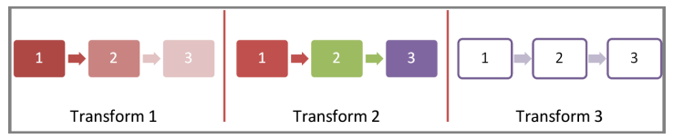
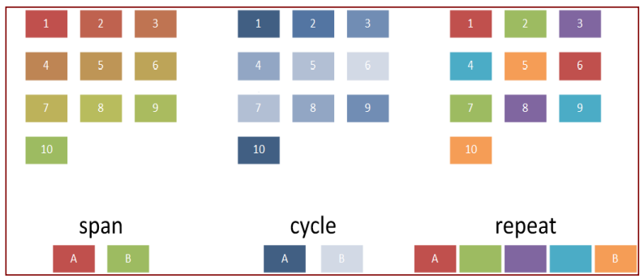
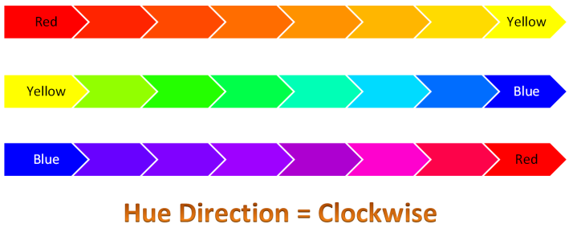

# L.4.15 Diagrams

**Diagrams**

## L.4.15.1 介绍

=== "中文"

    DrawingML 绘制文件格式分为以下主题：

    - 数据模型 - Data Model
    - 颜色 - Colors
    - 快速样式 - Quick Styles
    - 布局 - Layout

=== "英文"

    **Introduction**

    The DrawingML diagram file format is broken down into the following subjects:

    - Data Model
    - Colors
    - Quick Styles
    - Layout

## L.4.15.2 元素特性合集

=== "中文"

    模式(schema) `dml-diagram.xsd` 定义了一个复杂类型 `CT_ElemPropSet`，它是一个用于保存元素特性和定制的通用类型，并且在 `DrawingML` 的某些复杂类型中被广泛使用。这个复杂类型包含许多特性，这些特性在随后的子条款中有解释。`CT_ElemPropSet` 的定义如下：

    ```xml
    <xsd:complexType name="CT_ElemPropSet">
        <xsd:sequence>
            <xsd:element name="presLayoutVars" type="CT_LayoutVariablePropertySet" minOccurs="0"
            maxOccurs="1"/>
            <xsd:element name="style" type="a:CT_ShapeStyle" minOccurs="0" maxOccurs="1"/>
        </xsd:sequence>
        <xsd:attribute name="presAssocID" type="ST_ModelId" use="optional"/>
        <xsd:attribute name="presName" type="xsd:string" use="optional"/>
        <xsd:attribute name="presStyleLbl" type="xsd:string" use="optional"/>
        <xsd:attribute name="presStyleIdx" type="xsd:int" use="optional"/>
        <xsd:attribute name="presStyleCnt" type="xsd:int" use="optional"/>
        <xsd:attribute name="loTypeId" type="xsd:string" use="optional"/>
        <xsd:attribute name="loCatId" type="xsd:string" use="optional"/>
        <xsd:attribute name="qsTypeId" type="xsd:string" use="optional"/>
        <xsd:attribute name="qsCatId" type="xsd:string" use="optional"/>
        <xsd:attribute name="csTypeId" type="xsd:string" use="optional"/>
        <xsd:attribute name="csCatId" type="xsd:string" use="optional"/>
        <xsd:attribute name="coherent3DOff" type="xsd:boolean" use="optional"/>
        <xsd:attribute name="phldrT" type="xsd:string" use="optional"/>
        <xsd:attribute name="phldr" type="xsd:boolean" use="optional"/>
        <xsd:attribute name="custAng" type="xsd:int" use="optional"/>
        <xsd:attribute name="custFlipVert" type="xsd:boolean" use="optional"/>
        <xsd:attribute name="custFlipHor" type="xsd:boolean" use="optional"/>
        <xsd:attribute name="custSzX" type="xsd:int" use="optional"/>
        <xsd:attribute name="custSzY" type="xsd:int" use="optional"/>
        <xsd:attribute name="custScaleX" type="ST_PrSetCustVal" use="optional"/>
        <xsd:attribute name="custScaleY" type="ST_PrSetCustVal" use="optional"/>
        <xsd:attribute name="custT" type="xsd:boolean" use="optional"/>
        <xsd:attribute name="custLinFactX" type="ST_PrSetCustVal" use="optional"/>
        <xsd:attribute name="custLinFactY" type="ST_PrSetCustVal" use="optional"/>
        <xsd:attribute name="custLinFactNeighborX" type="ST_PrSetCustVal" use="optional"/>
        <xsd:attribute name="custLinFactNeighborY" type="ST_PrSetCustVal" use="optional"/>
        <xsd:attribute name="custRadScaleRad" type="ST_PrSetCustVal" use="optional"/>
        <xsd:attribute name="custRadScaleInc" type="ST_PrSetCustVal" use="optional"/>
      </xsd:complexType>
    ```

=== "英文"

    **Element Property Set**

    The schema dml-diagram.xsd defines a complex type, CT_ElemPropSet, which is a catch-all for holding element properties and customizations, and is used throughout certain complex types in DrawingML. This complex type contains many properties, and these are explained in subsequent subclauses. The definition of CT_ElemPropSet is as follows:

    ```xml
    <xsd:complexType name="CT_ElemPropSet">
        <xsd:sequence>
            <xsd:element name="presLayoutVars" type="CT_LayoutVariablePropertySet" minOccurs="0"
            maxOccurs="1"/>
            <xsd:element name="style" type="a:CT_ShapeStyle" minOccurs="0" maxOccurs="1"/>
        </xsd:sequence>
        <xsd:attribute name="presAssocID" type="ST_ModelId" use="optional"/>
        <xsd:attribute name="presName" type="xsd:string" use="optional"/>
        <xsd:attribute name="presStyleLbl" type="xsd:string" use="optional"/>
        <xsd:attribute name="presStyleIdx" type="xsd:int" use="optional"/>
        <xsd:attribute name="presStyleCnt" type="xsd:int" use="optional"/>
        <xsd:attribute name="loTypeId" type="xsd:string" use="optional"/>
        <xsd:attribute name="loCatId" type="xsd:string" use="optional"/>
        <xsd:attribute name="qsTypeId" type="xsd:string" use="optional"/>
        <xsd:attribute name="qsCatId" type="xsd:string" use="optional"/>
        <xsd:attribute name="csTypeId" type="xsd:string" use="optional"/>
        <xsd:attribute name="csCatId" type="xsd:string" use="optional"/>
        <xsd:attribute name="coherent3DOff" type="xsd:boolean" use="optional"/>
        <xsd:attribute name="phldrT" type="xsd:string" use="optional"/>
        <xsd:attribute name="phldr" type="xsd:boolean" use="optional"/>
        <xsd:attribute name="custAng" type="xsd:int" use="optional"/>
        <xsd:attribute name="custFlipVert" type="xsd:boolean" use="optional"/>
        <xsd:attribute name="custFlipHor" type="xsd:boolean" use="optional"/>
        <xsd:attribute name="custSzX" type="xsd:int" use="optional"/>
        <xsd:attribute name="custSzY" type="xsd:int" use="optional"/>
        <xsd:attribute name="custScaleX" type="ST_PrSetCustVal" use="optional"/>
        <xsd:attribute name="custScaleY" type="ST_PrSetCustVal" use="optional"/>
        <xsd:attribute name="custT" type="xsd:boolean" use="optional"/>
        <xsd:attribute name="custLinFactX" type="ST_PrSetCustVal" use="optional"/>
        <xsd:attribute name="custLinFactY" type="ST_PrSetCustVal" use="optional"/>
        <xsd:attribute name="custLinFactNeighborX" type="ST_PrSetCustVal" use="optional"/>
        <xsd:attribute name="custLinFactNeighborY" type="ST_PrSetCustVal" use="optional"/>
        <xsd:attribute name="custRadScaleRad" type="ST_PrSetCustVal" use="optional"/>
        <xsd:attribute name="custRadScaleInc" type="ST_PrSetCustVal" use="optional"/>
      </xsd:complexType>
    ```

### L.4.15.2.1 Presentation元素特性

**Presentation Element Properties**

=== "中文"

    下面的属性经由`presentation`元素体现:

    - **presLayoutVars** – 布局(layout)变量属性设置。
    - **style** – 到到样式矩阵排列的链接.
    - **presAssocID** – 与此表示元素关联的语义元素。 该 ID 与 `presName` 一起使用来创建用于表示元素索引的唯一键。
    - **presName** – 此演示元素的布局节点名称。 该名称与 `presAssocID` 一起使用来创建用于表示元素索引的唯一键。
    - **presStyleLbl** – 该呈现元素的布局节点样式标签.
    - **presStyleIdx** – 该呈现元素的布局节点样式索引.
    - **presStyleCnt** – 该展示元素的布局节点样式计数.

=== "英文"

    The following attributes deal with presentation elements:

    - presLayoutVars – The layout variable property set.
    - style – The link to the permutation of the style matrix.
    - presAssocID – The semantic element associated with this presentation element. This ID is used     together with the presName to create a unique key for presentation element indexing.
    - presName – The layout node name of this presentation element. This name is used together     with presAssocID to create a unique key for presentation element indexing.
    - presStyleLbl – The layout node style label of this presentation element..
    - presStyleIdx – The layout node style index of this presentation element..
    - presStyleCnt – The layout node style count of this presentation element.

### L.4.15.2.2 Document元素特性

**Document Element Properties**

=== "中文"

    以下是文档元素相关的属性：
    
    - loTypeID – 当前图表类型的ID。
    - loCatId – 当前图表类别的ID。
    - qsTypeID – 当前样式类型的ID。
    - qaCatID – 当前样式类别的ID。
    - csTypeID – 当前颜色变换的ID。
    - csCatID – 当前颜色变换类别的ID。
    - coherent3Doff – 启用或禁用具有定义的一致3D行为的样式。

=== "英文"

    The following attributes deal with the document element:

    - loTypeID – The ID of the current diagram type.
    - loCatId – The ID of the current diagram category.
    - qsTypeID – The ID of the current style type.
    - qaCatID – The ID of the current style category.
    - csTypeID – The ID of the current color transform.
    - csCatID – The ID of the current color transform category.
    - coherent3Doff – Enables or disables coherent 3D behavior for styles that have such behavior defined.

### L.4.15.2.3 Semantic元素特性

    **Semantic Element Properties**

=== "中文"

    以下是与语义元素属性相关的信息：
    
    - phldrT – 如果占位符标志设置为 true，则用于元素中显示的文本。如果此字段未设置，则使用默认的占位符文本。
    - phldr – 表示该元素是一个占位符或示例项目。

=== "英文"

    The following attributes relate to the semantic element properties:

    - phldrT – The text used for display in the element if the placeholder flag is set to true. If this field is not set, then the default placeholder text is used.
    - phldr – Indicates that the element is a placeholder or sample item.

### L.4.15.2.4 定制特性

**Customization Properties**

=== "中文"

    以下是自定义属性或微调：
    
    - custAng – 通过 0.0001 度的倍数来自定义旋转量。
    - custFlipVert – 垂直翻转。
    - custFlipHor – 水平翻转。
    - custSzX – 形状的固定宽度覆盖，单位为EMU。
    - custSzY – 形状的固定高度覆盖，单位为EMU。
    - custScaleX – 宽度按百分比的千分之一进行缩放的量。
    - custScaleY – 高度按百分比的千分之一进行缩放的量。
    - custT – 如果文本已被自定义，则布局不再更改它。
    - custLinFactX – 用于偏移形状的宽度的百分比，按千分之一计算。
    - custLinFactY – 用于偏移形状的高度的百分比，按千分之一计算。
    - custLinFactNeighborX – 用于偏移形状的邻近元素高度的百分比，按千分之一计算。
    - custLinFactNeighborY – 用于偏移形状的邻近元素高度的百分比，按千分之一计算。
    - custRadScaleRad – 定义半径按百分比的千分之一进行缩放的量。
    - custRadScaleInc – 定义包含角度按百分比的千分之一进行缩放的量。

=== "英文"

    The following are customization properties or tweaks:

    - custAng – The amount rotation is customized by, in 60,000th of a degree.
    - custFlipVert – Vertical flip.
    - custFlipHor – Horizontal flip.
    - custSzX – Fixed width override for a shape, in emus.
    - custSzY – Fixed height override for a shape, in emus.
    - custScaleX – Amount that the width is scaled by, in 1,000th of a percent.
    - custScaleY – Amount that the height is scaled by, in 1,000th of a percent.
    - custT – If text has been customized then layout no longer changes it.
    - custLinFactX – A percentage of the shape width that is used for offsetting the shape, in 1,000th of a percent.
    - custLinFactY – A percentage of the shape height that is used for offsetting the shape, in 1,000th of a percent.
    - custLinFactNeighborX – A percentage of the neighbor’s height used for offsetting the shape, in 1,000th of a percent.
    - custLinFactNeighborY – A percentage of the neighbor’s height used for offsetting the shape, in 1,000th of a percent.
    - custRadScaleRad – Defines how much the radius has been scaled by, in 1,000th of a percent.
    - custRadScaleInc – Defines how much the include angle has been scaled by, in 1,000th of a percent.

## L.4.15.3 数据模型

=== "中文"

    模式(schema) dml-diagram.xsd 定义图表中的数据模型。 数据模型的目的是双重的。 数据模型的第一个用途是保存图表中包含的信息。 例如，在下面的图 1 中，数据模型的目的是保存图表的信息“一”、“二”和“三”。

    <figure markdown>
      
      <figcaption>Figure 11: Example diagram with data.</figcaption>
    </figure>

    数据模型的第二个用途是定义图的初始状态。 此初始状态由可被视为占位符数据的内容组成，应用程序使用该数据在输入任何数据之前最初显示图表。 图 2 显示了包含三个空节点的初始状态下的图表的示例。 在此示例中，占位符数据由三个节点和两个连接组成，对此进行了简短的解释。

    <figure markdown>
      
      <figcaption>Figure 12: An empty diagram in its initial state.</figcaption>
    </figure>

=== "英文"

    **Data Model**

    The schema dml-diagram.xsd defines the data model in a diagram. The purpose of the data model is twofold. The first use of the data model is to hold the information contained in a diagram. For example, in figure 1 below, the purpose of the data model would be to hold the information, “one”, “two” and “three” for the diagram.

    <figure markdown>
      
      <figcaption>Figure 11: Example diagram with data.</figcaption>
    </figure>

    The second use of the data model is to define an initial state of the diagram. This initial state consists of what can be thought of as placeholder data, which an application uses to display a diagram initially before any data has been entered. Figure 2 shows an example of what a diagram might look like in an initial state containing three empty nodes. In this example, the placeholder data consists of three nodes and two connections, which is explained shortly. 

    <figure markdown>
      
      <figcaption>Figure 12: An empty diagram in its initial state.</figcaption>
    </figure>

### L.4.15.3.1 结构元素

**Structural Elements**

#### L.4.15.3.1.1 结构元素的类型

**Type of Structural Element**

=== "中文"

    存在一种单一的简单类型，ST_PtType，用于定义此元素的内容；这将在稍后定义。结构元素持有与图表相关的数据，并通过关系类型相互关联。用户可以使用七种不同的元素：
    
    - doc – 文档元素。文档元素是图表内的根元素，可以被认为是图表绘制的画布。
    - node – 模型元素。这是元素的基本类型，可以用来容纳文本，例如。
    - asst – 用于层次结构图表，表示助手元素。
    - pres – 呈现元素。此元素定义与节点相关的视觉方面，或者更确切地说，是元素的呈现方面。
    - parTrans – 父级转换元素。此元素持有两个类型为节点的元素之间的父子关系的数据处理。
    - sibTrans – 同级转换元素。此元素持有两个类型为节点的元素之间定义的同级关系的数据处理。
    - unknown – 用于维护向后兼容性的元素类型。

=== "英文"

    There is a single simple type, ST_PtType, used to define the contents of this element; this is defined later. Structural elements hold the data associated with a diagram and are defined in relation to oneanother through relationship types. Seven different elements are available to the user:
    
    - doc – A document element. The document element is the root element within a diagram and can be thought of as the canvas which the diagram is drawn on.
    - node – A model element. This is the basic type of an element and can be used to hold text for example.
    - asst – This is used in hierarchy diagrams and represents an assistant element.
    - pres – A presentation element. This element defines the visual aspects associated with a node, or rather the presentation aspects of an element.
    - parTrans – A parent transition element. This element holds the data for a parent-child relationship between two elements of type node.
    - sibTrans – A sibling transition element. This element holds the data for the relationship defined between two elements of type node whom are peers of one another.
    - unknown – A type of element used to maintain backward compatibility.

#### L.4.15.3.1.2 关系类型

**Relationship Type**

=== "中文"

    在简单类型ST_CxnType中定义了两种模型元素之间的关系或连接：
    
    - parOf – 父子关系。
    - presOf – 呈现关系。
    - presParOf – 呈现的父级关系。
    - unknownRelationship – 未知的关系类型。

=== "英文"

    There are defined relationships or connections between two model elements. Four types of relationships are defined in the simple type ST_CxnType:

    - parOf – Parent-child relationship.
    - presOf – Presentation relationship.
    - presParOf – Presentation parent of relationship.
    - unknownRelationship – An unknown relationship type.

#### L.4.15.3.1.3 元素

**Element**

=== "中文"

    一个元素是单个项目，如数据模型中的节点或转换。在 DrawingML 的领域内，复杂类型 CT_Pt 保存描述图表中一个元素的信息。在这个描述中，既包含了元素内部持有的数据，也包含了对该元素的任何格式化。CT_Pt 的定义如下：
    
    ```xml
    <xsd:complexType name="CT_Pt">
        <xsd:sequence>
            <xsd:element name="prSet" type="CT_ElemPropSet" minOccurs="0" maxOccurs="1" />
            <xsd:element name="spPr" type="a:CT_ShapeProperties" minOccurs="0" maxOccurs="1" />
            <xsd:element name="style" type="a:CT_ShapeStyle" minOccurs="0" maxOccurs="1" />
            <xsd:element name="t" type="a:CT_TextBody" minOccurs="0" maxOccurs="1" />
        </xsd:sequence>
        <xsd:attribute name="modelId" type="ST_ModelId" use="required" />
        <xsd:attribute name="type" type="ST_PtType" use="optional" default="node" />
        <xsd:attribute name="cxnId" type="ST_ModelId" use="optional" default="0" />
    </xsd:complexType>
    ```
    
    属性 modelId 保存一个特定元素的唯一标识符。这个唯一标识符可以在其他地方被引用，例如，从连接列表中。这个属性对于数据模型中定义的每个点都是必需的。
    
    CT_Pt 的最后两个属性是可选的。第一个定义了点的类型，默认为节点。第二个定义了一个连接标识符。如果点类型是 parTrans 或 sibTrans，这个连接标识符才会被使用。连接标识符引用了在数据模型中其他地方定义的关系。

=== "英文"

    An element is a single item, such as a node or transition in the data model. Within the realm of DrawingML, the complex type CT_Pt holds information describing an element within a diagram. Within this description lies both the data held within the element, and any formatting on that element. A CT_Pt is defined as follows:

    ```xml
    <xsd:complexType name="CT_Pt">
        <xsd:sequence>
            <xsd:element name="prSet" type="CT_ElemPropSet" minOccurs="0" maxOccurs="1" />
            <xsd:element name="spPr" type="a:CT_ShapeProperties" minOccurs="0" maxOccurs="1" />
            <xsd:element name="style" type="a:CT_ShapeStyle" minOccurs="0" maxOccurs="1" />
            <xsd:element name="t" type="a:CT_TextBody" minOccurs="0" maxOccurs="1" />
        </xsd:sequence>
        <xsd:attribute name="modelId" type="ST_ModelId" use="required" />
        <xsd:attribute name="type" type="ST_PtType" use="optional" default="node" />
        <xsd:attribute name="cxnId" type="ST_ModelId" use="optional" default="0" />
    </xsd:complexType>
    ```
    
    The attribute modelId holds a unique id for a particular element. This unique id can be referenced elsewhere, for example, from within a connection list. This attribute is required for every point defined in the data model.

    The last two attributes of the CT_Pt are optional. The first defines the type of point with the default being a node. The second defines a connection id. This connection id is only used if the point type is parTrans, or sibTrans. The connection id refers to a relationship that is defined elsewhere in the data model.

#### L.4.15.3.1.4 关系

**Relationship**

=== "中文"

    关系是任意两个模型元素之间的连接。关系使用的一个例子可以在图1和图2中看到。在这些例子中，节点之间的箭头定义了关系。关系定义如下：
    
    ```xml
    <xsd:complexType name="CT_Cxn">
        <xsd:attribute name="modelId" type="ST_ModelId" use="required" />
        <xsd:attribute name="type" type="ST_CxnType" use="optional" default="parOf" />
        <xsd:attribute name="srcId" type="ST_ModelId" use="required" />
        <xsd:attribute name="destId" type="ST_ModelId" use="required" />
        <xsd:attribute name="srcOrd" type="xsd:unsignedInt" use="required" />
        <xsd:attribute name="destOrd" type="xsd:unsignedInt" use="required" />
        <xsd:attribute name="parTransId" type="ST_ModelId" use="optional" default="0" />
        <xsd:attribute name="sibTransId" type="ST_ModelId" use="optional" default="0" />
        <xsd:attribute name="presId" type="xsd:string" use="optional" default="" />
    </xsd:complexType>
    ```
    
    关系与元素一样，有一个与之关联的唯一标识符，称为 modelID。srcId 和 destId 属性分别引用源元素和目标元素的标识符，这些关系就是在这两个元素之间定义的。
    
    srcOrd 和 destOrd 指的是给定连接的兄弟元素的顺序。例如，如果一个节点有三个兄弟，A、B 和 C，那么 srcOrd 将定义它们是作为 A、B、C 显示，还是可能是 B、C，然后是 A。
    
    presId 属性包含了与这个特定关系相关联的呈现。

=== "英文"

    A relationship is a connection between any two model elements. An example of where a relationship would be used can be seen in figures 1 and 2. In each of those examples, the arrows between the nodes have relationships defined. A relationship is defined as follows:

    ```xml
    <xsd:complexType name="CT_Cxn">
        <xsd:attribute name="modelId" type="ST_ModelId" use="required" />
        <xsd:attribute name="type" type="ST_CxnType" use="optional" default="parOf" />
        <xsd:attribute name="srcId" type="ST_ModelId" use="required" />
        <xsd:attribute name="destId" type="ST_ModelId" use="required" />
        <xsd:attribute name="srcOrd" type="xsd:unsignedInt" use="required" />
        <xsd:attribute name="destOrd" type="xsd:unsignedInt" use="required" />
        <xsd:attribute name="parTransId" type="ST_ModelId" use="optional" default="0" />
        <xsd:attribute name="sibTransId" type="ST_ModelId" use="optional" default="0" />
        <xsd:attribute name="presId" type="xsd:string" use="optional" default="" />
    </xsd:complexType>
    ```

    The relationship, as with the element, has a unique id associated with it referred to as the modelID. The srcId and destId attributes refer to ids of the source element and destination element, respectively, that this relationship is defined between.

    The srcOrd and destOrd refer to the ordinality of siblings for a given connection. For example, if a node had three siblings, A, B, and C, then the srcOrd would define if they were to show up as A, B, C, or perhaps B, C, and then A.

    The presId attribute contains the presentation that is associated with this particular relationship.

#### L.4.15.3.1.5 元素序列

**Element List**

=== "中文"

    复杂类型 CT_PtList 只是一个元素序列。它的定义如下：
    
    ```xml
    <xsd:complexType name="CT_PtList">
        <xsd:sequence>
            <xsd:element name="pt" type="CT_Pt" minOccurs="0" maxOccurs="unbounded" />
        </xsd:sequence>
    </xsd:complexType>
    ```

=== "英文"

    The complex type CT_PtList is simply a sequence of elements. Its definition is as follows:

    ```xml
    <xsd:complexType name="CT_PtList">
        <xsd:sequence>
            <xsd:element name="pt" type="CT_Pt" minOccurs="0" maxOccurs="unbounded" />
        </xsd:sequence>
    </xsd:complexType>
    ```

#### L.4.15.3.1.6 关系序列

**Relationship List**

=== "中文"

    这个复杂类型，CT_CxnList，本质上是一系列连接的序列。它的定义如下：
    
    ```xml
    <xsd:complexType name="CT_CxnList" oxsd:cname="Relationships">
        <xsd:sequence>
            <xsd:element name="cxn" type="CT_Cxn" minOccurs="0" maxOccurs="unbounded" />
        </xsd:sequence>
    </xsd:complexType>
    ```

=== "英文"

    This complex type, CT_CxnList, is simply a sequence of connections. Its definition is as follows:

    ```xml
    <xsd:complexType name="CT_CxnList" oxsd:cname="Relationships">
        <xsd:sequence>
            <xsd:element name="cxn" type="CT_Cxn" minOccurs="0" maxOccurs="unbounded" />
        </xsd:sequence>
    </xsd:complexType>
    ```

#### L.4.15.3.1.7 数据模型

**Data Model**

=== "中文"

    复杂类型 CT_DataModel 定义了数据模型，并包含了一系列元素。它的定义如下：
    
    ```xml
    <xsd:complexType name="CT_DataModel">
        <xsd:sequence oxsd:emitArgs="flattenSequence">
            <xsd:element name="ptLst" type="CT_PtList" />
            <xsd:element name="cxnLst" type="CT_CxnList" minOccurs="0" maxOccurs="1" />
            <xsd:element name="bg" type="a:CT_BackgroundFormatting" minOccurs="0" />
            <xsd:element name="whole" type="a:CT_WholeE2oFormatting" minOccurs="0" />
        </xsd:sequence>
    </xsd:complexType>
    ```
    
    数据模型包含了一系列元素列表、一系列连接，以及背景对象和图表容器的格式化属性。这个复杂类型负责保存正在创建的图表的所有数据绑定信息。

=== "英文"

    The complex type CT_DataModel defines the data model and contains a sequence of elements. It is defined as follows:

    ```xml
    <xsd:complexType name="CT_DataModel">
        <xsd:sequence oxsd:emitArgs="flattenSequence">
            <xsd:element name="ptLst" type="CT_PtList" />
            <xsd:element name="cxnLst" type="CT_CxnList" minOccurs="0" maxOccurs="1" />
            <xsd:element name="bg" type="a:CT_BackgroundFormatting" minOccurs="0" />
            <xsd:element name="whole" type="a:CT_WholeE2oFormatting" minOccurs="0" />
        </xsd:sequence>
    </xsd:complexType>
    ```

    The data model contains a list of elements, a list of connections, and formatting properties for the background object and the diagram container. This complex type is responsible for holding all databound information of the diagram being created.

## L.4.15.4 颜色变换

**Color Transforms**

=== "中文"

    颜色变换定义颜色如何应用于图表。 颜色变换定义了整个图表中颜色的使用方式，并且它们规定了诸如使用哪种主题颜色或颜色、是否对图表的某种颜色或部分应用了色调或阴影，或者如果颜色是 甚至根本没有使用过。 图 3 展示了颜色变换对简单图表的作用的一些示例。
    
    <figure markdown>
      
      <figcaption>Figure 13: Different examples of a color transform applied to a diagram</figcaption>
    </figure>

=== "英文"

    Color transforms define how colors are applied to diagrams. Color transforms define how color is used in the diagram as a whole, and they mandate things such as which theme color or colors are used, if there is a tint or shade applied to a certain color or part of the diagram, or if color is even used at all. Some examples of what color transforms can do to a simple diagram can be seen in figure 3.
    

    <figure markdown>
      
      <figcaption>Figure 13: Different examples of a color transform applied to a diagram</figcaption>
    </figure>

### L.4.15.4.1 结构元素

**Structural Elements**

=== "中文"
    
    用于创建颜色变换的结构元素，或者说复杂类型 CT_ColorTransform，如下：
    
    - CT_CTName
    - CT_CTDescription
    - CT_CTCategory
    - CT_CTCategories
    - ST_ClrAppMethod
    - ST_HueDir
    - CT_Colors
    - CT_CTStyleLabel
    - CT_CTVersion
    - CT_ColorTransformHeader
    - CT_ColorTransformHeaderLst
    
    复杂类型 CT_CTName（名称）、CT_CTDescription（描述）、CT_CTCategory（类别）和 CT_CTCategories（类别列表）共同工作，以命名、描述和分类特定的颜色变换。这些复杂类型在 DrawingML 的不同主题中也有镜像，以执行相同的命名、描述和分类任务。
    
    名称仅由两字符串组成，一个是颜色变换的名称，这是必需的，以及一个可选的语言标签。语言允许某人为给定的标题指定一种语言。可以指定多个依赖于语言的标题。描述也有与名称中相同的可选语言属性，以及一个必需的字符串属性，用于保存实际的描述。其用法与 CT_CTName 中的完全相同。CT_CTName 和 CT_CTDescription 定义如下：
    
    ```xml
    <xsd:complexType name="CT_CTName">
        <xsd:attribute name="lang" type="xsd:string" use="optional" />
        <xsd:attribute name="val" type="xsd:string" use="required" />
    </xsd:complexType>
    <xsd:complexType name="CT_CTDescription">
        <xsd:attribute name="lang" type="xsd:string" use="optional" />
        <xsd:attribute name="val" type="xsd:string" use="required" />
    </xsd:complexType>
    ```
    
    类别和类别列表复杂类型，即 CT_CTCategory 和 CT_CTCategories，分别定义了颜色变换在应用程序用户界面中的分类方式。类别包含一个名称或类型，以及一个定义颜色变换排序的优先级。优先级越低，显示越靠前。如果有平局，与颜色变换相关联的唯一标识符会按字母顺序决定顺序。CT_CTCategories 只是一个 CT_CTCategory 的列表。这两个复杂类型定义如下：
    
    ```xml
    <xsd:complexType name="CT_CTCategory">
        <xsd:attribute name="type" type="xsd:anyURI" use="required" />
        <xsd:attribute name="pri" type="xsd:unsignedInt" use="required" />
    </xsd:complexType>
    <xsd:complexType name="T_CTCategories">
        <xsd:sequence minOccurs="0" maxOccurs="unbounded">
            <xsd:element name="cat" type="CT_CTCategory" minOccurs="0" maxOccurs="unbounded" />
        </xsd:sequence>
    </xsd:complexType>
    ```
    
    请注意，最后一个复杂类型名称应为 CT_CTCategories 而不是 T_CTCategories，这里可能是一个笔误。

=== "英文"

    The structural elements which come together to create a color transform, or rather, the complex type CT_ColorTransform, are as follows:

    - CT_CTName
    - CT_CTDescription
    - CT_CTCategory
    - CT_CTCategories
    - ST_ClrAppMethod
    - ST_HueDir
    - CT_Colors
    - CT_CTStyleLabel
    - CT_CTVersion
    - CT_ColorTransformHeader
    - CT_ColorTransformHeaderLst

    The complex types CT_CTName (name), CT_CTDescription (description), CT_CTCategory (category), and CT_CTCategories (list of categories) work together to name, describe and categorize the particular color transform. These complex types are mirrored elsewhere throughout DrawingML in the different subjects in order to perform the same tasks of naming, describing, and categorizing.

    The name consists simply of two strings, one of a name for the color transform, which is required, and an optional language tag. The language allows someone to specify a language for a given title. It is possible to specify multiple titles that are language dependant. The description also has the optional language attribute as in the name, along with a second required string attribute which holds the actual description. The usage of this is exactly the same as within CT_CTName. CT_CTName and CT_CTDescription are defined in the following way:

    ```xml
    <xsd:complexType name="CT_CTName">
        <xsd:attribute name="lang" type="xsd:string" use="optional" />
        <xsd:attribute name="val" type="xsd:string" use="required" />
    </xsd:complexType>
    <xsd:complexType name="CT_CTDescription">
        <xsd:attribute name="lang" type="xsd:string" use="optional" />
        <xsd:attribute name="val" type="xsd:string" use="required" />
    </xsd:complexType>
    ```

    The category and categories complex types , CT_CTCategory and CT_CTCategories, respectively, define how the color transform is categorized within the user interface of the application. The category contains a name, or type, along with a priority that defines the ordering of the color transform. The lower the priority, the earlier in the category it displays. If there is a tie, the unique id associated with the color transform decides the order alphabetically. CT_CTCategories is simply a list of CT_CTCategory. The two complex types are defined as follows:

    ```xml
    <xsd:complexType name="CT_CTCategory">
        <xsd:attribute name="type" type="xsd:anyURI" use="required" />
        <xsd:attribute name="pri" type="xsd:unsignedInt" use="required" />
    </xsd:complexType>
    <xsd:complexType name="T_CTCategories">
        <xsd:sequence minOccurs="0" maxOccurs="unbounded">
            <xsd:element name="cat" type="CT_CTCategory" minOccurs="0" maxOccurs="unbounded" />
        </xsd:sequence>
    </xsd:complexType>
    ```

#### L.4.15.4.1.1 Color Application Method

=== "中文"

    The simple type ST_ClrAppMethod lists the different options for color to be applied to a diagram. There are three options available to the user: span, cycle, and repeat. Given a list of colors, which go from color A to color B, the differences in these three options can be defined. These options are shown below in Figure 4. 

    The span option, from the start of the diagram to the end of the diagram, interpolates between the colors A through B for every node along the way.
    
    The cycle option interpolates from A to B then back to A from the start of the diagram to the end of the diagram.
    
    The repeat option applies colors A through B one at a time for each point in the diagram, then repeats A through B as needed.
    

    <figure markdown>
      
      <figcaption>Figure 14: Examples of the three different ways a color transform is applied to a diagram.</figcaption>
    </figure>

=== "英文"

    **Color Application Method**

    The simple type ST_ClrAppMethod lists the different options for color to be applied to a diagram. There are three options available to the user: span, cycle, and repeat. Given a list of colors, which go from color A to color B, the differences in these three options can be defined. These options are shown below in Figure 4. 

    The span option, from the start of the diagram to the end of the diagram, interpolates between the colors A through B for every node along the way.
    
    The cycle option interpolates from A to B then back to A from the start of the diagram to the end of the diagram.
    
    The repeat option applies colors A through B one at a time for each point in the diagram, then repeats A through B as needed.

    <figure markdown>
      
      <figcaption>Figure 14: Examples of the three different ways a color transform is applied to a diagram.</figcaption>
    </figure>

#### L.4.15.4.1.2 Hue Direction

=== "中文"

    The simple type ST_HueDir defines the direction of a hue color shift around a color wheel. A user can either define the shift to occur in the clockwise (cw) direction, or in the counterclockwise (ccw) direction. For example, in Figure 4, the span colors are red and green. The behavior shown in figure 4 is a shift in the cw direction. If the hue shift had been defined in the ccw direction, the colors interpolated between colors A and B would have been in the hues purple and blue. Another example of a hue direction shift in the clockwise can be seen in Figure 5 below along with the color shift from red to yellow and then from yellow to blue along the primary colors. Counterclockwise shifts would occur in the direction of yellow to red and blue to yellow in the examples below.
    

    <figure markdown>
      
      <figcaption>Figure 15: Example hue shifts in the clockwise direction around a color wheel applied to two diagrams. The three primary colors, red, yellow, and blue are used to represent the three major sections of a color wheel which ranges between red to yellow to blue to red.</figcaption>
    </figure>

=== "英文"

    **Hue Direction**

    The simple type ST_HueDir defines the direction of a hue color shift around a color wheel. A user can either define the shift to occur in the clockwise (cw) direction, or in the counterclockwise (ccw) direction. For example, in Figure 4, the span colors are red and green. The behavior shown in figure 4 is a shift in the cw direction. If the hue shift had been defined in the ccw direction, the colors interpolated between colors A and B would have been in the hues purple and blue. Another example of a hue direction shift in the clockwise can be seen in Figure 5 below along with the color shift from red to yellow and then from yellow to blue along the primary colors. Counterclockwise shifts would occur in the direction of yellow to red and blue to yellow in the examples below.
    

    <figure markdown>
      
      <figcaption>Figure 15: Example hue shifts in the clockwise direction around a color wheel applied to two diagrams. The three primary colors, red, yellow, and blue are used to represent the three major sections of a color wheel which ranges between red to yellow to blue to red.</figcaption>
    </figure>

#### L.4.15.4.1.3 Colors

=== "中文"

    The complex type CT_Colors holds the actual color values that are to be applied to a given diagram and how those colors are to be applied. It contains the color application method and hue shift direction, and is defined as follows:
    
    ```xml
    <xsd:complexType name="CT_Colors">
        <xsd:sequence>
            <xsd:group ref="a:EG_ColorChoice" minOccurs="0" maxOccurs="unbounded" />
        </xsd:sequence>
        <xsd:attribute name="meth" type="ST_ClrAppMethod" use="optional" default="span" />
        <xsd:attribute name="hueDir" type="ST_HueDir" use="optional" default="cw" />
    </xsd:complexType>
    ```

    The sequence of colors is defined via the sequence of EG_ColorChoices.

=== "英文"

    **Colors**

    The complex type CT_Colors holds the actual color values that are to be applied to a given diagram and how those colors are to be applied. It contains the color application method and hue shift direction, and is defined as follows:
    
    ```xml
    <xsd:complexType name="CT_Colors">
        <xsd:sequence>
            <xsd:group ref="a:EG_ColorChoice" minOccurs="0" maxOccurs="unbounded" />
        </xsd:sequence>
        <xsd:attribute name="meth" type="ST_ClrAppMethod" use="optional" default="span" />
        <xsd:attribute name="hueDir" type="ST_HueDir" use="optional" default="cw" />
    </xsd:complexType>
    ```

    The sequence of colors is defined via the sequence of EG_ColorChoices.

#### L.4.15.4.1.4 Style Label

=== "中文"

    The complex type CT_CTStyleLabel packages together colors for the different pieces of a diagram. There are six different aspects to a diagram that can be colored independently of one another. Each of the six parts is of complex type CT_Colors. They are:

    - Fill Colors – The colors that actually fill the shapes in the diagram
    - Line Colors – The colors of the lines on the shapes in the diagram.
    - Effect Colors – The colors of the effects applied to the shapes within the diagram (eg. Glow).
    - Text Line Colors – The colors of the lines on the text within the diagram.
    - Text Fill Colors – The color of the text within the diagram.
    - Text Effect Colors – The colors of the effects applied to the text within the diagram.
    
    The final piece of a style label is simply its name, which is a string. CT_CTStyleLabel is defined as follows:
    
    ```xml
    <xsd:complexType name="CT_CTStyleLabel">
        <xsd:sequence>
            <xsd:element name="fillClrLst" type="CT_Colors" minOccurs="0" maxOccurs="1" />
            <xsd:element name="linClrLst" type="CT_Colors" minOccurs="0" maxOccurs="1" />
            <xsd:element name="effectClrLst" type="CT_Colors" minOccurs="0" maxOccurs="1" />
            <xsd:element name="txLinClrLst" type="CT_Colors" minOccurs="0" maxOccurs="1" />
            <xsd:element name="txFillClrLst" type="CT_Colors" minOccurs="0" maxOccurs="1" />
            <xsd:element name="txEffectClrLst" type="CT_Colors" minOccurs="0" maxOccurs="1" />
        </xsd:sequence>
        <xsd:attribute name="name" type="xsd:string" use="required" />
    </xsd:complexType>
    ```

=== "英文"

    **Style Label**

    The complex type CT_CTStyleLabel packages together colors for the different pieces of a diagram. There are six different aspects to a diagram that can be colored independently of one another. Each of the six parts is of complex type CT_Colors. They are:

    - Fill Colors – The colors that actually fill the shapes in the diagram
    - Line Colors – The colors of the lines on the shapes in the diagram.
    - Effect Colors – The colors of the effects applied to the shapes within the diagram (eg. Glow).
    - Text Line Colors – The colors of the lines on the text within the diagram.
    - Text Fill Colors – The color of the text within the diagram.
    - Text Effect Colors – The colors of the effects applied to the text within the diagram.
    
    The final piece of a style label is simply its name, which is a string. CT_CTStyleLabel is defined as follows:
    
    ```xml
    <xsd:complexType name="CT_CTStyleLabel">
        <xsd:sequence>
            <xsd:element name="fillClrLst" type="CT_Colors" minOccurs="0" maxOccurs="1" />
            <xsd:element name="linClrLst" type="CT_Colors" minOccurs="0" maxOccurs="1" />
            <xsd:element name="effectClrLst" type="CT_Colors" minOccurs="0" maxOccurs="1" />
            <xsd:element name="txLinClrLst" type="CT_Colors" minOccurs="0" maxOccurs="1" />
            <xsd:element name="txFillClrLst" type="CT_Colors" minOccurs="0" maxOccurs="1" />
            <xsd:element name="txEffectClrLst" type="CT_Colors" minOccurs="0" maxOccurs="1" />
        </xsd:sequence>
        <xsd:attribute name="name" type="xsd:string" use="required" />
    </xsd:complexType>
    ```

#### L.4.15.4.1.5 Version

=== "中文"

    The simple type ST_CTVersion defines the minimum version of an application that the color transform works with. The version corresponds to build numbers in the major.minor.build.revision format and is defined as follows:

    `([0-9]?[0-9])?(\.[0-9]?[0-9])?(\.[0-9]{4})?(\.[0-9]{4})`

=== "英文"

    **Version**

    The simple type ST_CTVersion defines the minimum version of an application that the color transform works with. The version corresponds to build numbers in the major.minor.build.revision format and is defined as follows:

    `([0-9]?[0-9])?(\.[0-9]?[0-9])?(\.[0-9]{4})?(\.[0-9]{4})`

#### L.4.15.4.1.6 Color Transform

=== "中文"

    The complex type CT_ColorTransform brings together all of the pieces into one cohesive structure. This is the actual definition of a color transform, which can be applied to any diagram; it is defined as follows:
    
    ```xml
    <xsd:complexType name="CT_ColorTransform">
        <xsd:sequence>
            <xsd:element name="title" type="CT_CTName" minOccurs="0" maxOccurs="unbounded" />
            <xsd:element name="desc" type="CT_CTDescription" minOccurs="0" maxOccurs="unbounded" />
            <xsd:element name="catLst" type="CT_CTCategories" minOccurs="0" />
            <xsd:element name="styleLbl" type="CT_CTStyleLabel" minOccurs="0" maxOccurs="unbounded" />
        </xsd:sequence>
        <xsd:attribute name="uniqueId" type="xsd:anyURI" use="optional" />
        <xsd:attribute name="minVer" type="ST_CTVersion" use="optional" default="12.0" />
    </xsd:complexType>
    ```
    
    A color transform contains a title, description, category list, and style label in a sequence along with a unique id and a minimum version.

=== "英文"

    **Color Transform**

    The complex type CT_ColorTransform brings together all of the pieces into one cohesive structure. This is the actual definition of a color transform, which can be applied to any diagram; it is defined as follows:
    
    ```xml
    <xsd:complexType name="CT_ColorTransform">
        <xsd:sequence>
            <xsd:element name="title" type="CT_CTName" minOccurs="0" maxOccurs="unbounded" />
            <xsd:element name="desc" type="CT_CTDescription" minOccurs="0" maxOccurs="unbounded" />
            <xsd:element name="catLst" type="CT_CTCategories" minOccurs="0" />
            <xsd:element name="styleLbl" type="CT_CTStyleLabel" minOccurs="0" maxOccurs="unbounded" />
        </xsd:sequence>
        <xsd:attribute name="uniqueId" type="xsd:anyURI" use="optional" />
        <xsd:attribute name="minVer" type="ST_CTVersion" use="optional" default="12.0" />
    </xsd:complexType>
    ```
    
    A color transform contains a title, description, category list, and style label in a sequence along with a unique id and a minimum version.

### L.4.15.4.2 颜色变换头

**Color Transform Header**

=== "中文"

    两个复杂类型，CT_ColorTransformHeader 和 CT_ColorTransformHeaderLst，有助于缓解在最初加载大量颜色变换时可能出现的性能问题。头信息包含了将颜色变换加载到应用程序所需的最小信息量。因此，只有在需要时才会加载颜色变换本身，而其他初始化工作可以在不加载不必要的信息的情况下快速进行。
    
    CT_ColorTransformHeader 包含了有关颜色变换的标题、描述、分类方式、唯一标识符、最低版本和资源标识符的信息。它的定义如下：
    
    ```xml
    <xsd:complexType name="CT_ColorTransformHeader">
        <xsd:sequence>
            <xsd:element name="title" type="CT_CTName" minOccurs="1" maxOccurs="unbounded" />
            <xsd:element name="desc" type="CT_CTDescription" minOccurs="1" maxOccurs="unbounded" />
            <xsd:element name="catLst" type="T_CTCategories" minOccurs="0" o:cname="categories" />
        </xsd:sequence>
        <xsd:attribute name="uniqueId" type="xsd:anyURI" use="required" />
        <xsd:attribute name="minVer" type="ST_CTVersion" use="optional" default="12.0" />
        <xsd:attribute name="resId" type="xsd:int" use="optional" default="0" />
    </xsd:complexType>
    ```
    
    复杂类型 CT_ColorTransformHeaderLst 仅包含颜色变换头的列表。它的定义如下：
    
    ```xml
    <xsd:complexType name="CT_ColorTransformHeaderLst">
        <xsd:sequence>
            <xsd:element name="colorsDefHdr" type="CT_ColorTransformHeader" minOccurs="0" maxOccurs="unbounded" />
        </xsd:sequence>
    </xsd:complexType>
    ```
    
    请注意，`T_CTCategories` 在这里应该是 `CT_CTCategories`，因为前面提到的是 `CT_CTCategories` 复杂类型。此外，`o:cname` 是一个 Microsoft Office XML 扩展，用于提供元素的友好名称。

=== "英文"

    Two complex types, CT_ColorTransformHeader and CT_ColortransformHeaderLst, help alleviate potential performance concerns with initially loading in a large number of color transforms. The header information contains the minimum information required to load a color transform into the application. Because of this, color transforms themselves can be loaded only when needed, and other initialization work can progress quickly without loading unneeded information.
    
    CT_ColorTransformHeader contains information about the title of the color transform, the description, how it is categorized, the unique id, minimum version, and resId. It is defined in the following way:

    ```xml
    <xsd:complexType name="CT_ColorTransformHeader">
        <xsd:sequence>
            <xsd:element name="title" type="CT_CTName" minOccurs="1" maxOccurs="unbounded" />
            <xsd:element name="desc" type="CT_CTDescription" minOccurs="1" maxOccurs="unbounded" />
            <xsd:element name="catLst" type="T_CTCategories" minOccurs="0" o:cname="categories" />
        </xsd:sequence>
        <xsd:attribute name="uniqueId" type="xsd:anyURI" use="required" />
        <xsd:attribute name="minVer" type="ST_CTVersion" use="optional" default="12.0" />
        <xsd:attribute name="resId" type="xsd:int" use="optional" default="0" />
    </xsd:complexType>
    ```

    The complex type CT_ColorTransformHeaderLst simply contains a list of color transform headers. It is defined as follows:

    ```xml
    <xsd:complexType name="CT_ColorTransformHeaderLst">
        <xsd:sequence>
            <xsd:element name="colorsDefHdr" type="CT_ColorTransformHeader" minOccurs="0" maxOccurs="unbounded" />
        </xsd:sequence>
    </xsd:complexType>
    ```

## L.4.15.5 样式定义

**Style Definition**

=== "中文"

    样式定义类似于颜色变换。 样式定义定义了诸如所使用的字体、轮廓线的粗细、图表上的 3-D 属性等项目。 样式定义与颜色变换结合使用，为图表提供整体外观和感觉。 图 5 中显示了一些正在使用的样式定义示例。

    <figure markdown>
      
      <figcaption>Figure 16: 在图表上使用三种不同样式定义的示例.</figcaption>
    </figure>

=== "英文"

    A style definition is similar to a color transform. A style definition defines items such as the font used, the thickness of a contour line, 3-D properties on the diagram, among other things. Style definitions work in combination with color transforms to give an overall look and feel for the diagram. Some examples of style definitions in use are in figure 5.

    <figure markdown>
      
      <figcaption>Figure 16: Examples of using three different style definitions on a diagram.</figcaption>
    </figure>

### L.4.15.5.1 结构元素

**Structural Elements**

=== "中文"

    用于创建样式定义的结构元素如下：
    
    - CT_SDName
    - CT_SDDescription
    - CT_SDCategory
    - CT_SDCategories
    - CT_TextProps
    - CT_StyleLabel
    - ST_SDVersion
    - CT_StyleDefinition
    - CT_StyleDefinitionHeader
    - CT_StyleDefinitionHeaderLst
    
    CT_SDName、CT_SDDescription、CT_SDCategory、CT_SDCategories 和 ST_SDVersion 在样式定义中的定义与颜色变换中的完全相同。这些复杂类型在样式定义区域重新创建，以允许进行轻微的区分，尽管目前它们的定义是完全相同的。
    
    文本属性、样式标签以及样式定义结合起来，共同创建一个样式定义，该定义应用于图表。

=== "英文"

    The structural elements which come together to create a style definition are as follows:

    - CT_SDName
    - CT_SDDescription
    - CT_SDCategory
    - CT_SDCategories
    - CT_TextProps
    - CT_StyleLabel
    - ST_SDVersion
    - CT_StyleDefinition
    - CT_StyleDefinitionHeader
    - CT_StyleDefinitionHeaderLst

    CT_SDName, CT_SDDescription, CT_SDCategory, CT_SDCategories, and ST_SDVersion are all defined exactly as they are within color transforms. These complex types were recreated within the style definition area to allow slight differentiations to be made, although, at this time they are defined exactly the same.

    The text properties, style label, and then the style definition combine together to create a style definition, which is applied to a diagram.

#### L.4.15.5.1.1 文本属性

**Text Properties**

=== "中文"

    复杂类型 CT_TextProps 包含将要在图表中持有的文本的任何3-D相关属性。CT_TextProps 的定义如下：
    
    ```xml
    <xsd:complexType name="CT_TextProps">
        <xsd:sequence>
            <xsd:group ref="a:EG_Text3D" minOccurs="0" maxOccurs="1" />
        </xsd:sequence>
    </xsd:complexType>
    ```
    
    文本属性中包含的是一个 EG_Text3D 复杂类型。使用文本属性复杂类型允许为图表样式定义3-D文本属性。

=== "英文"

    The complex type CT_TextProps holds any 3-D associated properties of the text that is to be held in the diagram. A CT_TextProps is defined as follows:

    ```xml
    <xsd:complexType name="CT_TextProps">
        <xsd:sequence>
            <xsd:group ref="a:EG_Text3D" minOccurs="0" maxOccurs="1" />
        </xsd:sequence>
    </xsd:complexType>
    ```

    All that is contained within the text properties is an EG_Text3D complex type. The usage of the text properties complex type allows 3-D text properties to be defined for a diagram style.

#### L.4.15.5.1.2 样式标签

**Style Label**

=== "中文"

    样式标签包含有关图表中可样式化元素的信息。这些元素包括形状属性和文本属性以及对样式矩阵或文档主题的任何引用。形状属性有两种定义方式：scene3d 元素涉及整个场景（包括照明效果、旋转等），而任何3-D和材质设置都包含在 sp3d 元素中。CT_StyleLabel 定义如下：
    
    ```xml
    <xsd:complexType name="CT_StyleLabel">
        <xsd:sequence>
            <xsd:element name="scene3d" type="a:CT_Scene3D" minOccurs="0" maxOccurs="1" />
            <xsd:element name="sp3d" type="a:CT_Shape3D" minOccurs="0" maxOccurs="1" />
            <xsd:element name="txPr" type="CT_TextProps" minOccurs="0" maxOccurs="1" />
            <xsd:element name="style" type="a:CT_ShapeStyle" minOccurs="0" maxOccurs="1" />
        </xsd:sequence>
        <xsd:attribute name="name" type="xsd:string" use="required" />
    </xsd:complexType>
    ```
    
    像许多其他复杂类型一样，样式标签有一个属性用于名称。这只是一个命名特定样式标签的字符串。然后可以从图表定义中引用此样式标签，如下所示。
    
    请注意，包含在样式标签中的 scene3d 元素作用于单个形状的级别，而不是整个图表。在样式定义中定义了第二个 scene3d 元素；它作用于图表级别，并允许将场景一致的3-D应用于图表。样式定义包含一个样式标签。

=== "英文"

    The style label contains information pertaining to the styleable elements within a diagram. These elements include the shape properties and text properties along with any references to the style matrix or document theme. The shape properties are defined in two different ways: the scene3d element that pertains to the scene on a whole (and includes lighting effects, rotations, and the like), and any 3-D and material settings are held in the sp3d element. CT_StyleLabel is defined as follows:

    ```xml
    <xsd:complexType name="CT_StyleLabel">
        <xsd:sequence>
            <xsd:element name="scene3d" type="a:CT_Scene3D" minOccurs="0" maxOccurs="1" />
            <xsd:element name="sp3d" type="a:CT_Shape3D" minOccurs="0" maxOccurs="1" />
            <xsd:element name="txPr" type="CT_TextProps" minOccurs="0" maxOccurs="1" />
            <xsd:element name="style" type="a:CT_ShapeStyle" minOccurs="0" maxOccurs="1" />
        </xsd:sequence>
        <xsd:attribute name="name" type="xsd:string" use="required" />
    </xsd:complexType>
    ```

    As with many other complex types, the style label has an attribute reserved for a name. This is simply a string that names the particular style label. This style label can then be referenced from within a diagram definition, as we can see below.

    Note that the scene3d element contained within a style label acts on the level of an individual shape, rather than the diagram as a whole. A second scene3d element is defined within the style definition; that acts on the diagram level and allows for scene coherent 3-D to be applied to the diagram. A style definition contains a style label.

#### L.4.15.5.1.3 样式定义

**Style Definition**

=== "中文"

    样式定义复杂类型 CT_StyleDefinition 是用来定义样式定义的根元素。与颜色变换的根元素类似，在样式定义中存在标题、描述、类别、唯一标识符和最低版本号。这些元素在样式定义中的作用与在颜色变换中的作用相同。
    
    样式定义复杂类型的有趣之处在于它持有一个样式标签、另一个样式索引（也在样式标签中包含），以及另一个 scene3d（如前所述，也在样式标签中包含）。scene3d 元素适用于整个图表，并允许将场景一致的3-D应用于图表。样式索引的复制有两个原因。如果在样式标签中没有定义样式索引，则使用默认的样式索引，或者说，在这个复杂类型中定义的索引。由于图表定义可以引用样式标签，而不是样式定义，样式标签中也需要样式索引。CT_StyleDefinition 的定义如下：
    
    ```xml
    <xsd:complexType name="CT_StyleDefinition">
        <xsd:sequence>
            <xsd:element name="title" type="CT_SDName" minOccurs="0" maxOccurs="unbounded" />
            <xsd:element name="desc" type="CT_SDDescription" minOccurs="0" maxOccurs="unbounded" />
            <xsd:element name="catLst" type="CT_SDCategories" minOccurs="0" />
            <xsd:element name="scene3d" type="a:CT_Scene3D" minOccurs="0" maxOccurs="1" />
            <xsd:element name="style" type="a:CT_ShapeStyle" minOccurs="0" maxOccurs="1" />
            <xsd:element name="styleLbl" type="CT_StyleLabel" minOccurs="1" maxOccurs="unbounded" />
        </xsd:sequence>
        <xsd:attribute name="uniqueId" type="xsd:anyURI" use="optional" />
        <xsd:attribute name="minVer" type="ST_SDVersion" use="optional" default="12.0" />
    </xsd:complexType>
    ```

=== "英文"

    The style definition complex type, CT_StyleDefinition, is the root element used to define a style definition. As with the root element of a color transform, within the style definition there exists a tite, description, category, unique id, and minimum version number. These elements serve the same purpose as they do within the color transform.
    
    The interesting aspects of a style definition complex type are that it holds a style label, another style index (which is contained within the style label as well), and another scene3d (which is also contained within the style label as has been previously mentioned). The scene3d element applies to the diagram on a whole and allows for scene coherent 3-D to be applied to the diagram. The duplication of the style index is two-fold. If a style index is not defined within the style label, then the default style index, or rather, the index defined in this complex type is used. Since a diagram definition can reference a style label, and not a style definition, the style index is also required within the style label. A CT_StyleDefinition is defined as follows:

    ```xml
    <xsd:complexType name="CT_StyleDefinition">
        <xsd:sequence>
            <xsd:element name="title" type="CT_SDName" minOccurs="0" maxOccurs="unbounded" />
            <xsd:element name="desc" type="CT_SDDescription" minOccurs="0" maxOccurs="unbounded" />
            <xsd:element name="catLst" type="CT_SDCategories" minOccurs="0" />
            <xsd:element name="scene3d" type="a:CT_Scene3D" minOccurs="0" maxOccurs="1" />
            <xsd:element name="style" type="a:CT_ShapeStyle" minOccurs="0" maxOccurs="1" />
            <xsd:element name="styleLbl" type="CT_StyleLabel" minOccurs="1" maxOccurs="unbounded" />
        </xsd:sequence>
        <xsd:attribute name="uniqueId" type="xsd:anyURI" use="optional" />
        <xsd:attribute name="minVer" type="ST_SDVersion" use="optional" default="12.0" />
    </xsd:complexType>
    ```

#### L.4.15.5.1.4 样式定义头

**Style Definition Header**

=== "中文"

    复杂类型 CT_StyleDefinitionHeader 和 CT_StyleDefinitionHeaderLst 的功能与颜色变换中的两个复杂头类型相同。它们被用来预先加载所需的信息，以便实际的样式定义加载只在需要时发生。

=== "英文"

    The complex types CT_StyleDefinitionHeader and CT_StyleDefinitionHeaderLst perform the same function as the two complex header types in color transforms. They are used to pre-load required information so the actual loading of the style definition can happen only when needed.

## L.4.15.6 布局

**Layout**

=== "中文"

    DrawingML 最大的一个方面是布局。 最终，布局负责定义图表除颜色和样式之外的所有方面。 它定义了图表的外观、行为方式以及数据的映射方式。 图 6 显示了布局如何创建包含数据“1”、“2”和“3”的图表的不同示例。

    <figure markdown>
      
      <figcaption>Figure 17: 将数据 1、2 和 3 映射到四个不同图表的不同布局</figcaption>
    </figure>

    布局有两个方面：定义图表定义所使用的众多复杂类型，以及图表定义本身。 图表定义是布局的基本部分，并利用一切来定义新图表。

=== "英文"

    The single largest aspect of DrawingML is Layout. Ultimately, layout is responsible for defining all aspects of the diagram outside of color and style. It defines how the diagram looks, how it behaves, and how the data is to be mapped. Figure 6 shows different examples of how layout works to create a diagram holding the data ‘1’, ‘2’, and ‘3’.

    <figure markdown>
      
      <figcaption>Figure 17: Different layouts mapping the data 1, 2, and 3 to four different diagrams</figcaption>
    </figure>

    There are two aspects to layout: defining the numerous complex types utilized by diagram definitions, and the diagram definitions themselves. Diagram definitions are a fundamental part of layout, and utilize everything in order to define new diagrams.

### L.4.15.6.1 基本布局类型

**Basic Layout Types**

=== "中文"

    在该主题中定义了非常多的简单类型。这些简单类型都与图表的属性相关，可以修改这些属性以创建所需的行为。这些简单类型及其各自功能的解释如下。

=== "英文"

    There are a very large number of simple types defined in this subject. These simple types are all associated with properties of a diagram that can be modified to create a desired behavior. These simple types, along with an explanation of what each does, follow.

#### L.4.15.6.1.1 算法类型

=== "中文"

    ST_AlgorithmType 负责决定使用哪种算法来布局图表。所选择的算法布局决定了图表是否表现得像一个简单列表、一个圆形循环，或者一些其他类型的图表。可用的算法包括：
    
    - unknown – 未知算法类型。这种类型用于扩展性原因。使用此算法类型可以由未来版本/实现使用，它们定义了除上述提到的算法类型之外的新算法类型。通过使用此类型，当前实现知道如果它们只实现了上述提到的算法布局，它们将无法正确渲染图表。
    - composite – 组合算法指定所有子布局节点的大小和位置。您可以使用它来创建具有预定布局的图形，或与其他算法结合使用来创建更复杂的形状。
    - conn – 连接算法布局并路由连接线、箭头和形状在布局节点之间。
    - cycle – 循环算法使用相等角度间隔沿圆圈或圆圈的一部分布局子布局节点。
    - hierChild – 层次结构子算法与 hierRoot 算法一起工作，创建层次树状布局。该算法在 hierRoot 布局节点下方的线性路径中对齐并定位其子布局节点。
    - hierRoot – 层次结构根算法与 hierChild 算法一起工作，创建层次树状布局。hierRoot 算法相对于 hierChild 布局节点对齐并定位 hierRoot 布局节点。
    - pyra – 金字塔算法沿垂直路径布局子布局节点，并与梯形形状一起工作以创建金字塔。
    - lin – 线性算法沿线性路径布局子布局节点。
    - sp – 空间算法用于指定其他布局节点之间的最小空间，或作为对布局节点的大小和位置不做任何指示。
    - tx – 管理形状内文本的布局。
    - snake – 蛇形算法沿两维的线性路径布局子布局节点，允许线性流程跨越多行或多列继续。

=== "英文"

    **Algorithm Type**

    ST_AlgorithmType is responsible for which algorithm is used to layout the diagram. The algorithm layout chosen determines if the diagram behaves as if it were a simple list, a circular cycle, or some other type of diagram. The algorithms available are:
    
    - unknown – Unknown algorithm type. This type is used for extensibility reasons. Use of this algorithm type can used by future versions/implementations which define new algorithm types other than the above mentioned algorithm types. By using this type, the current implementations know that they are not able to correctly render the diagram if they have only implemented the above mentioned algorithms for layout.
    - composite – The composite algorithm specifies the size and position for all child layout nodes. You can use it to create graphics with a predetermined layout or in combination with other algorithms to create more complex shapes.
    - conn – the connector algorithm lays out and routes connecting lines, arrows, and shapes between layout nodes
    - cycle – the cycle algorithm lays out child layout nodes around a circle or portion of a circle using equal angle spacing
    - hierChild – the hierarchy child algorithm works with the hierRoot algorithm to create hierarchical tree layouts. This algorithm aligns and positions its child layout nodes in a linear path under the hierRoot layout node.
    - hierRoot – the hierarchy root algorithm works with the hierChild algorithm to create
    hierarchical tree layouts. The hierRoot algorithm aligns and positions the hierRoot layout node in relation to the hierChild layout nodes.
    - pyra – the pyramid algorithm lays out child layout nodes along a vertical path and works with the trapezoid shape to create a pyramid
    - lin – the linear algorithm lays out child layout nodes along a linear path
    - sp – the space algorithm is used to specify a minimum space between other layout nodes or as an indication to do nothing with the layout node’s size and position
    - tx – manges layout of text within a shape
    - snake – the snake algorithm lays out child layout nodes along a linear path in two dimensions, allowing the linear flow to continue across multiple rows or columns

#### L.4.15.6.1.2 轴类型

**Axis Type**

=== "中文"

    简单类型 ST_AxisType 定义了图表中某个点的数据如何映射到布局。这种映射的不同方式如下：
    
    - self – 布局映射到当前数据点
    - ch – 布局节点可以映射到当前数据点的子级，但不能映射到层次结构中更低的后代
    - des – 布局节点可以映射到当前数据点的后代
    - desOrSelf – 布局节点可以映射当前数据点，或当前数据点的后代
    - par – 布局节点映射到父数据点
    - ancst – 布局节点可以映射到当前数据点的祖先（父级、祖父级、曾祖父级等）
    - ancstOrSelf – 布局节点可以映射祖先数据点或当前数据点
    - followSib – 布局节点可以映射到当前数据点的后续兄弟节点
    - precedSib – 布局节点可以映射到当前数据点的前序兄弟节点
    - root – 布局节点可以映射到根节点
    - none – 布局节点不映射到任何数据点

=== "英文"

    The simple type ST_AxisType defines how layout maps data to the diagram for a given point in the diagram. The different ways this can be mapped is as follows:

    - self – the layout maps to the current data point
    - ch – the layout node can map to the children of the current data point, but not to descendants lower in the hierarchy
    - des – the layout node can map to a descendant of the current data point
    - desOrSelf – the layout node can map the current data point, or to a descendant of the current data point
    - par – the layout node maps to the parent data point
    - ancst – the layout node can map to the ancestors of the current data point (parents, grandparents, great grandparents, etc)
    - ancstOrSelf – the layout node can map an ancestor data point or the current data point
    - followSib – the layout node can map to a following sibling peer to the current data point
    - precedSib – the layout node can map to a preceding sibling peer to the current data point.
    - root – the layout node can map to the root
    - none – the layout node doesn’t map to any data point

#### L.4.15.6.1.3 布尔运算符

**Boolean Operators**

=== "中文"

    布尔运算符，由 ST_BoolOperator 定义，用于布局。
    
    - none – 没有定义运算符
    - equ – ‘等于’运算符，如果两个比较的值相等，则返回 true，否则返回 false
    - gte – ‘大于或等于’运算符
    - lte – ‘小于或等于’运算符

=== "英文"

    Boolean operators, defined by ST_BoolOperator, are for layout.

    - none – no operator defined
    - equ – ‘equal to’ operator, returns true if the two compared values are equal, false otherwise
    - gte – ‘greater than or equal to’ operator
    - lte – ‘less than or equal to’ operator

#### L.4.15.6.1.4 子顺序类型

**Child Order Type**

=== "中文"

    简单类型 ST_ChildOrderType 指定了布局节点的子顺序类型。
    
    - b – 底部
    - t – 顶部

=== "英文"

    The simple type ST_ChildOrderType specifices the child order type for a layout node. 

    - b – bottom
    - t – top

#### L.4.15.6.1.5 约束类型

**Constraint Types**

=== "中文"

    简单类型 ST_ConstraintTypes 定义了可以用作图表或图表中节点的限制或修改的约束条件。这些约束管理图表中可以定义的许多属性的行为。可以应用于图表的不同约束如下：
    
    - unknown – 未知约束。这可以被实现应用程序用来定义这个简单类型定义范围之外的约束类型。
    - alignOff – 指定对齐偏移
    - begMarg – 指定开始边距
    - bendDist – 指定连接器弯曲的距离
    - begPad – 指定过渡节点边缘与连接器形状之间的距离
    - b – 底部对齐
    - bMarg – 底部边距
    - bOff – 相对于节点底部的偏移量
    - ctrX – 指定节点在 X 方向上的中心
    - ctrXOff – 指定节点中心在 X 方向上的偏移量
    - ctrY – 指定节点在 Y 方向上的中心
    - ctrYOff – 指定节点中心在 Y 方向上的偏移量
    - connDist – 指定连接器之间的距离。与布尔和引用约束一起使用。覆盖布局定义部分中指定的值
    - diam – 指定直径，在循环算法类型中使用
    - endMarg – 指定结束边距
    - endPad – 指定过渡节点边缘与连接器形状之间的距离
    - h – 指定高度
    - hArH – 指定箭头高度
    - hOff – 指定高度偏移
    - l – 指定左边
    - lMarg – 指定左边距
    - lOff – 指定左边偏移量
    - r – 指定右边
    - rMarg – 指定右边距
    - rOff – 指定右边偏移量
    - primFontSz – 指定主要字体大小
    - pyraAcctRatio - 指定在最短距离处为飞出部分保留的图表宽度的分数
    - secFontSiz – 指定次要字体大小
    - stemThick – 指定箭头杆的厚度
    - t – 指定顶部
    - tMarg – 指定顶部边距
    - tOff – 指定顶部偏移量
    - userA 至 userZ – 用户定义信息。这组枚举允许用户定义特定的值，这些值可以在图表定义中稍后引用。例如，如果值 5.1 对图表的布局和定义很重要，用户可以将 userA 定义为等于 5.1，然后在图表定义中使用 userA 约束。这将允许在整个图表定义中更新该值的单一位置。
    - w – 指定宽度
    - wArH – 指定箭头宽度
    - wOff – 指定宽度偏移量

=== "英文"

    The simple type ST_ConstraintTypes defines the constraints that can be used as limits or modifications to the diagram or the nodes held within the diagram. These constraints manage the behavior of many properties that can be defined within the diagram. The different constraints that can be applied to a diagram are as follows:

    - unknown – An unknown constraint. This can be used by implementing applications to define a constraint type outside of the scope of what is defined by this simple type.
    - alignOff – specifies the alignment offset
    - begMarg – specifies the beginning margin
    - bendDist – specifies the distance at which a connector bends
    - begPad – specifies the distance between the edge of the transition node and the connector shape
    - b – bottom alignment
    - bMarg – the bottom margin
    - bOff – specifies the amount of offset relative to the bottom of the node
    - ctrX – specifies the center of the node in the X-direction
    - ctrXOff – specifies the amount of offset of the center of the node in the X-direction
    - ctrY – specifies the center of the node in the Y-direction
    - ctrYOff – specifies the amount of offset of the center of the node in the Y-direction
    - connDist – specifies the distance between connectors. Intended for use with boolean and reference constraints. Overrides values specified in the layout definition part
    - diam – specifies the diameter, and is used within the cycle algorithm type
    - endMarg – specifies the end margins
    - endPad – specifies the distance between the edge of the transition node and the connector shape
    - h – specifies the height
    - hArH – specifies the arrowhead height
    - hOff – specifies the height offset
    - l – specifies the left
    - lMarg – specifies the amount of left margin
    - lOff – specifies the amount of left offset
    - r – specifies right
    - rMarg – specifies the amount of right margin
    - rOff – specifies the amount of right offset
    - primFontSz – specifies the primary font size
    - pyraAcctRatio - specifies the fraction of the width of the diagram that is reserved for the flyouts at their shortest distance
    - secFontSiz – specifies the secondary font size
    - stemThick – specifies the thickness of the shaft on an arrow
    - t – specifies the top
    - tMarg – specifies the amount of top margin
    - tOff – specifies the amount of top offset
    - userA through userZ – User defined information. This set of enumerations allow a user to define specific values which can be referenced at a later time within a diagram definition. For example, if the value 5.1 was important to the layout and definition of a diagram, the user could define userA to be equal to 5.1 and then use the userA constraint within the diagram definition. This would allow a single place to update the value across the entire diagram definition.
    - w – specifies the width
    - wArH – specifies the width of an arrowhead
    - wOff – specifies the amount of width offset

#### L.4.15.6.1.6 约束关系

**Constraint Relationships**    

=== "中文"

    简单类型 ST_ConstraintRelationship 定义了约束应用于检索数据的方式。可用的关系包括：
    
    - self – 约束适用于当前点
    - ch – 约束适用于当前点的子级
    - des – 约束适用于当前点的后代

=== "英文"

    The simple type ST_ConstraintRelationship defines the application of retrieval data the constraint is applied to. The following relationships are available:

    - self – the constraint is applicable to the current point
    - ch – the constraint is applicable to a child of the current point
    - des – the constraint is applicable to a descendant of the current point

#### L.4.15.6.1.7 元素的类型

**Type of Element**

=== "中文"

    简单类型 ST_ElementType 定义了元素的类型，或者创建的点的类型，以及如何根据现有数据创建它们。从数据中提取以创建点的不同方式如下：
    
    - all – 使用所有的数据点，节点和转换
    - doc – 使用文档级别或根数据点
    - node – 只使用用户输入的数据节点
    - norm – 为了可扩展性而设置，行为与 asst 元素完全相反
    - nonNorm – 为了可扩展性而设置，行为与 nonAsst 元素完全相反
    - asst – 在层次结构算法中使用助手数据节点
    - nonAsst – 在层次结构算法中使用非助手节点
    - parTrans – 只使用节点之间的父转换。父转换类似于兄弟转换，除了它们表示父子关系。父转换最常用于层次图表，如组织结构图，用于绘制父子节点之间的线条。
    - pres – 指定节点与表示级别的关系
    - sibTrans – 只使用数据节点之间的兄弟转换。这些转换表示节点之间的兄弟关系，并且经常映射到绘图中形状之间的箭头。有时使用 sibTrans 值在节点之间创建空白区域。

=== "英文"

    The simple type ST_ElementType defines the type of element, or point which get created and how they are created from the data at hand. The different ways to pull from the data to create points are as follows:

    - all – use all of the data points, nodes and transitions
    - doc – use the document level, or root data point
    - node – use only data nodes input by the user
    - norm – in place for extensibility and behaves exactly opposite of the asst element
    - nonNorm – in place for extensibility and behaves exactly opposite of the nonAsst element
    - asst – use assistant data nodes within hierarchy algorithm
    - nonAsst – use non-assistant nodes within the hierarchy algorithm
    - parTrans – Use only parent transitions between nodes. Parent transitions are similar to sibling transitions, except that they represent parent/child relationships. Parent transitions are most commonly used in hierarchy diagrams, such as organization charts, to draw lines between parent and child nodes.
    - pres – specifies that the node is related to the presentation level
    - sibTrans – Use only sibling transitions between data nodes. These transitions represent sibling relationships between nodes, and are frequently mapped to arrows between shapes in the drawing. A sibTrans value is sometimes used to create white space between nodes.

#### L.4.15.6.1.8 参数ID

**Parameter ID**

=== "中文"

    简单类型 ST_ParameterId 定义了可以用来修改行为或算法的参数。这些修改如下：
    
    - horzAlign – 指定水平对齐方式
    - vertAlign – 指定垂直对齐方式
    - chDir – 指定子级方向
    - chAlign – 指定子级对齐方式
    - secChAlign – 指定次级子级对齐方式
    - linDir – 指定子级是从左到右、从右到左、从上到下还是从下到上排列
    - secLinDir – 指定子级排列的次级线性方向，可以是从左到右、从右到左、从上到下或从下到上
    - stElem – 指定用作循环中第一个形状的布局节点的点类型
    - bendPt – 指定连接线上弯曲点的位置
    - connRout – 指定连接器是作为一条直线、带有单一弯曲的正交线，还是使用 diam 约束的曲线绘制
    - begSty – 指定连接器的开头是否有箭头头
    - endSty – 指定连接器的结尾是否有箭头头
    - dim – 指定连接器的尺寸，2-D、3-D 或自定义
    - rotPath - 如果 rotPath=alongPath，则算法会将所有子级垂直于从循环中心到子节点的线旋转；否则它们不会旋转。alongPath 值在确定形状是否重叠时不考虑旋转
    - ctrShpMap - 无（None）指定围绕圆形放置节点。第一个节点（fNode）指定将第一个节点放在中心，其余节点围绕圆形放置
    - nodeHorzAlign – 指定节点的水平对齐方式
    - nodeVertAlign – 指定节点的垂直对齐方式
    - fallback – 指定回退是在单一维度（例如垂直）发生，还是发生在两个维度
    - txDir – 指定第一个节点的文本起始位置
    - pyraAcctPos – 指定飞出孙节点的位置
    - pyraAcctTxMar – 指定子文本一个边缘的位置
    - txBlDir – 指定文本块方向，垂直或水平
    - txAnchorHorz – 指定水平文本锚点位置
    - txAnchorVert – 指定垂直文本锚点位置
    - txAnchorHorzCh – 指定子文本的水平文本锚点位置
    - txAnchorVertCh – 指定子文本的垂直文本锚点位置
    - parTxLTRAlign – 当形状仅有父文本时，指定父文本的段落对齐方式。此参数适用于文本方向为从左到右的情况
    - partTxRTLAlign – 当形状仅有父文本时，指定父文本的段落对齐方式。此参数适用于文本方向为从右到左的情况
    - shpTxLTRAlignCh – 当形状包含父文本和子文本时，指定形状内所有文本的段落对齐方式。此参数适用于文本方向为从左到右的情况
    - shpTxRTLAlignCh – 当形状包含父文本和子文本时，指定形状内所有文本的段落对齐方式。此参数适用于文本方向为从右到左的情况
    - autoTxRot – 指定文本相对于形状的朝向
    - grDir – 指定蛇形算法的生长方向
    - flowDir – 指定蛇形算法中节点是按行还是按列排列
    - contDir – 指定蛇形算法中后续行或列的方向
    - bkpt – 指定图表开始蛇形的点
    - off – 指定每一行和列是居中对齐还是偏移前一行或列
    - hierAlign – 指定层次结构的对齐方式
    - bkPtFixedVal – 如果 bkpt 设置为 fixed，则指定 sname 应该在哪里断开
    - stBulletLvl – 指定开始使用项目符号的传入文本级别
    - stAng – 指定第一个形状放置的角度。角度以度为单位，从循环中心向上指的线顺时针测量。
    - spanAng – 指定循环跨越的角度。最终形状对齐文本放置在 stAng+spanAng，除非 spanAng=360。在那种情况下，算法会放置文本，以使形状不重叠
    - ar – 指定复合节点的宽高比（宽度对高度）。值为 0 表示保持宽度和高度约束不变。算法可以暂时缩小一个维度以实现该比例
    - lnSpPar – 指定父线的间距
    - lnSpAfParP – 指定父段落后的行间距
    - LnSpCh – 指定子线的间距
    - lnSpAfChP – 指定子段落后的行间距
    - rtShortDist – 指定连接器使用最短距离的路由
    - alignTx – 指定是否保留文本
    - pyraLvlNode – 如果金字塔有一个复合子节点，指定构成金字塔本身的复合的子节点的名称。如果节点指定了一个梯形形状，它会修改调整手柄以构建一个金字塔。
    - pyraAcctBkgdNode – 如果金字塔有一个复合子节点，指定应该持有子文本的子节点。
    - pyraAcctTxNode – 如果金字塔有一个复合子节点，指定构成子飞出形状的复合的子节点的名称。
    - srcNode – 指定从哪个布局节点开始连接。
    - dstNode – 指定从哪个布局节点结束连接。
    - begPts – 指定连接器开头的点类型。
    - endPts – 指定连接器结尾的点类型。
    - unknown – 一个未知的参数 ID。这可以被实现应用程序用来定义这个简单类型定义范围之外的参数 ID。

=== "英文"

    The simple type ST_ParameterId defines parameters that can be used to modify the behavior or algorithms. The modifications are as follows:

    - horzAlign – specifies the horizontal alignment
    - vertAlign – specifies the vertical alignment
    - chDir – specifies the child direction
    - chAlign – specifies the alignment of the children
    - secChAlign – specifies a secondary child alignment
    - linDir – specifies whether children are arranged from left to right, right to left, top to bottom, or bottom to top
    - secLinDir – specifies a secondary linear direction in which children are
    - arranged from left to right, right to left, top to bottom, or bottom to top
    - stElem – specifies the point type of the layout node to use as the first shape in the cycle
    - bendPt – specifies where the bend point is to be located on connectors
    - connRout – specifies whether the connector is drawn as a single straight line, orthogonal lines with a single bend, or a curve that uses the diam constraint
    - begSty – specifies whether the beginning of the connector has an arrowhead
    - endSty – specifies whether the end of the connector has an arrowhead
    - dim – specifies the connector dimension, 2-D, 3-D, or custom
    - rotPath - if rotPath=alongPath, the algorithm rotates all children perpendicular to the line from the cycle’s center to the child node; otherwise they are not rotated. The alongPath value does not take rotation into account when determining if shapes overlap
    - ctrShpMap - None specifies to place nodes around a circle. First node (fNode) specifies to place the first node in the center and the remaining nodes around the circle
    - nodeHorzAlign – specifies the horizontal node alignment
    - nodeVertAlign – specifies the vertical node alignment
    - fallback – specifies if the fallback occurs in a single dimension (e.g. vertically) or if it occurs in two dimensions
    - txDir – specifies where the text of the first node starts
    - pyraAcctPos – specifies the placement of the fly-out grandchildren
    - pyraAcctTxMar – specifies the placement of one edge of the child text
    - txBlDir – Specifies the text block direction, vertical or horizontal
    - txAnchorHorz – Specifies the horizontal text anchor position.
    - txAnchorVert – Specifies the vertical text anchor position.
    - txAnchorHorzCh – Specifies the horizontal text anchor position for child text.
    - txAnchorVertCh – Specifies the vertical text anchor position for child text.
    - parTxLTRAlign – Specifies the paragraph alignment of parent text when the shape has only parent text. This parameter applies when the text direction is left to right.
    - partTxRTLAlign – Specifies the paragraph alignment of parent text when the shape has only parent text. This parameter applies when the text direction is right to left.
    - shpTxLTRAlignCh – Specifies the paragraph alignment of all text within the shape when the shape contains both parent and child text. This parameter applies when the text direction is left to right.
    - shpTxRTLAlignCh – Specifies the paragraph alignment of all text within the shape when the shape contains both parent and child text. This parameter applies when the text direction isright to left.
    - autoTxRot – specifies how text is oriented relative to the shape
    - grDir – Specifies the direction of growth for the snake algorithm.
    - flowDir – specifies weather nodes are arranged in rows or columns for the snake algorithm.
    - contDir – Specifies the direction of subsequent rows or columns in the snake algorithm.
    - bkpt – specifies the point at which the diagram starts to snake
    - off – specifies whether each row and column is centered or offset from the previous row or column
    - hierAlign – specifies the alignment of the hierarchy
    - bkPtFixedVal – specifies where the sname should break if bkpt is set to fixed
    - stBulletLvl – Specifies the level at which to start using bullets for incoming text.
    - stAng – Specifies the angle at which the first shape is placed. Angles are in degrees, measured clockwise from a line pointing straight upward from the center of the cycle.
    - spanAng – Specifies the angle the cycle spans. Final shapealign text is placed at stAng+spanAng, unless spanAng=360. In that case, the algorithm places the text so that shapes do not overlap
    - ar – Specifies the aspect ratio (width to height) of the composite node to use when determining child constraints. A value of 0 means leave the width and height constraints as is. The algorithm can temporarily shrink one dimension to achieve that ratio
    - lnSpPar – specifies the line spacing of the parent
    - lnSpAfParP – specifies the line spacing after the parent paragraph
    - LnSpCh specifies the line spacing of a child
    - lnSpAfChP – specifies the line spacing after the child paragraph
    - rtShortDist – Specifies the routing to use the shortest distance for connectors.
    - alignTx – specifies if to hold text or not
    - pyraLvlNode – If pyramid has a composite child node, specifies the name of the node that is a child of the composite that makes up the pyramid itself. If the node specifies a trapezoid shape, it modifies the adjustment handles to construct a pyramid.
    - pyraAcctBkgdNode – If pyramid has a composite child node, specifies the child node that should hold the child text.
    - pyraAcctTxNode – If pyramid has a composite child node, specifies the name of the node that is a child of the composite that makes up the child flyout shape.
    - srcNode – Specifies the name of the layout node from which to start the connection.
    - dstNode – Specifies the name of the layout node from which to end the connection from.
    - begPts – Specifies the point type for the beginning of a connector.
    - endPts – Specifies the point type for the end of a connector.
    - unknown – An unkown parameter id. This can be used by implementing applications to define a parameter id outside of the scope of what is defined by this simple type.

#### L.4.15.6.1.9 函数类型

**Function Type**

=== "中文"

    简单类型 ST_FunctionType 定义了可以利用的不同类型条件表达式。不同类型表达式如下：
    
    - cnt – 指定项目的计数。
    - pos - 检索指定节点集节点的位置。
    - revPos - 反向位置函数。
    - posEven - 如果指定节点在数据模型中处于偶数位置，则返回 1。
    - posOdd - 如果指定节点在数据模型中处于奇数位置，则返回 1。
    - var - 用于引用变量。
    - depth - 指定项目的深度。
    - maxDepth - 定义项目的最大深度。

=== "英文"

    The simple type ST_FunctionType defines different types of conditional expressions that can be utilized. The different types of expressions are:

    - cnt – Specifies the count of items.
    - pos - Retrieves the position of the node in the specified set of nodes.
    - revPos - Reverse position function.
    - posEven - Returns 1 if the specified node is at an even numbered position in the data model.
    - posOdd - Returns 1 if the specified node is in an odd position in the data model.
    - var - Used to reference a variable.
    - depth - Specifies the depth of items.
    - maxDepth - Defines the maximum depth of items.

#### L.4.15.6.1.10 函数运算符

**Function Operator**

=== "中文"

    简单类型 ST_FunctionOperator 定义了可以使用的不同条件表达式运算符。不同的运算符如下：
    
    - equ – 等于
    - neq – 不等于
    - gt – 大于
    - lt – 小于
    - gte – 大于或等于
    - lte – 小于或等于

=== "英文"

    The simple type ST_FunctionOperator defines the different condition expression operators that can be used. The different operators are as follows:

    - equ – equal
    - neq – not equal
    - gt – greater than
    - lt – less than
    - gte – greater than or equal to
    - lte – less than or equal to

#### L.4.15.6.1.11 水平对齐

**Horizontal Alignment**

=== "中文"

    简单类型 ST_DiagramHorizontalAlignment 指定了水平对齐的不同选项。选项包括：
    
    - l – 左对齐
    - ctr – 居中对齐
    - r – 右对齐
    - none – 无对齐

=== "英文"

    The simple type, ST_DiagramHorizontalAlignment, specifies the different options available for alignment horizontally. The options are:
    
    - l – left
    - ctr – center
    - r – right
    - none – none 

#### L.4.15.6.1.12 垂直对齐

**Vertical Alignment**

=== "中文"

    简单类型 ST_VerticalAlignment 指定了垂直对齐的不同选项。选项包括：
    
    - t/top – 顶部对齐
    - mid/center – 居中对齐
    - b/bottom – 底部对齐
    - none – 无对齐

=== "英文"

    The simple type, ST_VerticalAlignment, specifies the different options available for alignment vertically. The options are:

    - t/top – top
    - mid/center – middle
    - b/bottom – bottom
    - none – none

#### L.4.15.6.1.13 子元素方向

**Child Direction**

=== "中文"

    简单类型 ST_ChildDirection 用来指定子元素的布局方向。不同的选项包括：
    
    - horz – 水平方向
    - vert – 垂直方向

=== "英文"

    The simple type ST_ChildDirection is used to specify the direction the children are laid out. The different options are:

    - horz – horizontally
    - vert – vertically

#### L.4.15.6.1.14 子元素对齐方式

**Child Alignment**

=== "中文"

    简单类型 ST_ChildAlignment 定义了子元素的对齐参数类型。不同的对齐类型包括：
    
    - t – 顶部
    - b – 底部
    - l – 左侧
    - r – 右侧

=== "英文"

    The simple type ST_ChildAlignment defines the alignment parameter types for children. The different alignment types are:

    - t – top
    - b – bottom
    - l – left
    - r – right

#### L.4.15.6.1.15 元素次级对齐方式

**Secondary Child Alignment**

=== "中文"

    简单类型 ST_SecondaryChildAlignment 定义了子元素的次级对齐参数类型。在这里，简单类型 ST_ChildAlignment 被复制，并增加了 none 类型。

=== "英文"

    The simple type ST_SecondaryChildAlignment defines secondary alignment parameter types for children. The simple type ST_ChildAlignment is mirrored here with the addition of the none type.

#### L.4.15.6.1.16 线性方向

**Linear Direction**

=== "中文"

    简单类型 ST_LinearDirection 定义了线性方向参数类型。方向类型如下：
    
    - fromL – 从左到右
    - fromR – 从右到左
    - fromT – 从上到下
    - fromB – 从下到上

=== "英文"

    The simple type ST_LinearDirection defines the linear direction parameter types. The direction types are as follows:

    - fromL – from left
    - fromR – from right
    - fromT – from top
    - fromB – from bottom

#### L.4.15.6.1.17 次级线性方向

**Secondary Linear Direction**

=== "中文"

    简单类型 ST_SecondaryLinearDirection 定义了一个次级线性方向参数。这个简单类型与 ST_LinearDirection 简单类型完全相同，并增加了 none 选项。

=== "英文"

    The simple type ST_SecondaryLinearDirection defines a secondary linear direction parameter. This simple type mirrors exactly the simple type ST_LinearDirection with the addition of none.

#### L.4.15.6.1.18 起始元素

**Starting Element**

=== "中文"

    简单类型 ST_StartingElement 指定了循环图表的第一个节点点类型。不同的起始元素包括：
    
    - node – 节点
    - trans – 转换

=== "英文"

    The simple type ST_StartingElement specifies the first node point type for a cycle diagram. The different starting elements are:
    
    - node – node
    - trans – transition

#### L.4.15.6.1.19 旋转路径

**Rotation Path**

=== "中文"
    
    简单类型 ST_RotationPath 指定了算法旋转子元素的方式。不同的旋转类型包括：
    
    - none – 不执行旋转
    - alongPath – 子元素垂直于从循环中心到子节点的线进行旋转

=== "英文"

    The simple type ST_RotationPath specifies the way in which the algorithm rotates children. The different rotation types are:

    - none – no rotation is performed
    - alongPath – the children are rotated perpendicular to the line from the cycle’s center to the child node

#### L.4.15.6.1.20 中心形状映射

**Center Shape Mapping**

=== "中文"

    简单类型 ST_CenterShapeMapping 指定了循环图表中第一个节点的布局方式。放置第一个节点的不同位置包括：
    
    - none – 节点围绕圆周布局
    - fNode – 节点放置在圆心，其余节点沿着圆的外围布局

=== "英文"

    The simple type ST_CenterShapeMapping specifies how the first node of a cycle diagram is laid out within the diagram. The different places to put the first node are:

    - none – the node is laid out around the circle
    - fNode – the node is placed in the center of the circle and the remaining nodes along the outside of the circle

#### L.4.15.6.1.21 弯曲点

**Bend Point**

=== "中文"

    简单类型 ST_BendPoint 指定了在肘部连接器上弯曲点的位置。不同的选项包括：
    
    - beg – 开始处
    - def – 默认位置
    - end – 结束处

=== "英文"

    The simple type ST_BendPoint specifies where the bend point is to be located along elbow connectors. The different options are:

    - beg – beginning
    - def – default
    - end – end

#### L.4.15.6.1.22 连接路由

**Connector Routing**

=== "中文"

    简单类型 ST_ConnectorRouting 定义了图表中连接器的路由方式。不同的路由选项包括：
    
    - stra – 直线
    - bend – 肘部连接
    - curve – 曲线连接
    - longCurve – 比简单曲线具有更大半径的曲线连接

=== "英文"

    The simple type ST_ConnectorRouting defines how the routing of a connector happens within the diagram. The different routing options are:
    
    - stra – straight
    - bend – an elbow connection
    - curve – a curved connection
    - longCurve – a curved connection with a larger radius than simple curve

#### L.4.15.6.1.23 箭头样式

**Arrowhead Style**

=== "中文"

    简单类型 ST_ArrowheadStyle 定义了连接器上使用的箭头样式。不同的选项包括：
    
    - auto – 自动
    - arr – 使用箭头头
    - noArr – 不使用箭头头

=== "英文"

    The simple type ST_ArrowheadStyle defines the style of the arrowhead used on a connector. The different options are:
    
    - auto – automatic
    - arr – an arrowhead is used
    - noArr – no arrowhead is used

#### L.4.15.6.1.24 连接维度

**Connector Dimension**

=== "中文"

    简单类型 ST_ConnectorDimension 定义了图表中使用的连接器的维度。不同的维度类型包括：
    
    - 1D – 单维度连接器，例如，一条线
    - 2D – 双维度连接器，例如，一个箭头
    - cust – 自定义

=== "英文"

    The simple type ST_ConnectorDimension defines the dimension of a connector used in a diagram. The different dimension types are:
    
    - 1D – a single dimension connector, for example, a line
    - 2D – a two dimensional connector, for example, an arrow
    - cust – custom

#### L.4.15.6.1.25 连接点

**Connector Point**

=== "中文"

    简单类型 ST_ConnectorPoint 定义了连接器的起始点和终止点。不同的起始和终止类型包括：
    
    - auto – 自动
    - bCtr – 底部中心
    - ctr – 中心
    - midL – 中间左侧
    - midR – 中间右侧
    - tCtr – 顶部中心
    - bL – 左下角
    - bR – 右下角
    - tL – 左上角
    - tR – 右上角
    - radial – 辐射状

=== "英文"

    The simple type ST_ConnectorPoint defines the point at which the connector starts and ends. The different beginning and ending types are:

    - auto – automatic
    - bCtr – bottom center
    - ctr – center
    - midL – middle left
    - midR – middle right
    - tCtr – top center
    - bL – bottom left
    - bR – bottom right
    - tL – top left
    - tR – top right
    - radial – radial

#### L.4.15.6.1.26 节点水平对齐方式

**Node Horizontal Alignment**

=== "中文"

    简单类型 ST_NodeHorizontalAlignment 定义了节点在水平方向上的对齐方式。不同的对齐方式包括：
    
    - l – 左对齐
    - ctr – 居中对齐
    - r – 右对齐

=== "英文"

    The simple type ST_NodeHorizontalAlignment defines the alignment of a node in the horizontal direction. The different alignments are:
    
    - l – left
    - ctr – center
    - r – right

#### L.4.15.6.1.27 节点垂直对齐方式

=== "中文"

    简单类型 ST_NodeVerticalAlignment 定义了节点在垂直方向上的对齐方式。不同的对齐方式包括：
    
    - t – 顶部对齐
    - mid – 居中对齐
    - b – 底部对齐

=== "英文"

    **Node Vertical Alignment**

    The simple type ST_NodeVerticalAlignment defines the alignment of a node in the vertical direction. The different alignments are:

    - t – top
    - mid – mid
    - b – bottom

#### L.4.15.6.1.28 回退维度

**Fallback Dimension**

=== "中文"

    简单类型 ST_FallbackDimension 定义了如果回退导致图表尺寸改变时使用的维度数量。不同的选项包括：
    
    - 1D – 在单一维度（X或Y）发生回退
    - 2D – 在两个维度（X和Y）发生回退

=== "英文"

    The simple type ST_FallbackDimension defines the number of dimensions to be used if fallback causes the diagram to be resized. The different options are:

    - 1D – fallback occurs in a single dimension (X or Y)
    - 2D – fallback occurs in two dimensions (X and Y)

#### L.4.15.6.1.29 文本方向

**Text Direction**

=== "中文"

    简单类型 ST_TextDirection 指定第一个节点上文本的起始位置。不同的文本方向包括：
    
    - fromT – 从顶部开始
    - fromB – 从底部开始

=== "英文"

    The simple type ST_TextDirection specifies where the text on the first node starts. The different text directions are:
    
    - fromT – from top
    - fromB – from bottom

#### L.4.15.6.1.30 锥体强调位置

**Pyramid Accent Position**

=== "中文"

    简单类型 ST_PyramidAccentPosition 定义了飞出孙节点的位置。可能的位置包括：
    
    - bef – 前面
    - after – 后面

=== "英文"

    The simple type ST_PyramidAccentPosition defines where the position of the fly-out grandchildren. The possible positions are:
    
    - bef – before
    - after – after

#### L.4.15.6.1.31 锥体文本边距

**Pyramid Text Margin**

=== "中文"

    简单类型 ST_PyramidAccentTextMargin 指定了飞出孙节点中文本的对齐方式。不同的对齐方式包括：
    
    - step – 文本紧贴金字塔边缘
    - stack – 文本进行堆叠对齐

=== "英文"

    The simple type ST_PyramidAccentTextMargin specifies the alignment of the text in the fly-out grandchildren. The different alignments are:

    - step – the text is against the edge of the pyramid
    - stack – the text aligns

#### L.4.15.6.1.32 文本块方向

**Text Block Direction**

=== "中文"

    简单类型 ST_TextBlockDirection 定义了文本块的方向。文本可以具有的不同方向包括：
    
    - vert – 垂直
    - horz – 水平

=== "英文"

    The simple type ST_TextBlockDirection defines the text block direction. The different direction the text can have are:

    - vert – vertical
    - horz – horizontal

#### L.4.15.6.1.33 水平锚定文本位置

**Text Anchor Horizontal**

=== "中文"

    简单类型 ST_AnchorHorizontal 负责水平锚定文本。可用的选项包括：
    
    - none – 未设置锚点
    - ctr – 文本锚定在中心

=== "英文"

    The simple type ST_AnchorHorizontal is responsible for anchoring text horizontally. The available options are:

    - none – no anchor set
    - ctr – the text is anchored the center

#### L.4.15.6.1.34 垂直锚定文本位置

=== "中文"

    简单类型 ST_AnchorVertical 负责垂直锚定文本。可用的选项包括：
    
    - t – 顶部锚点
    - mid – 中间锚点
    - b – 底部锚点

=== "英文"

    **Text Anchor Vertical**

    The simple type ST_AnchorVertical is responsible for anchoring the text vertically. The available options are:

    - t – top anchor
    - mid – middle anchor
    - b – bottom anchor

#### L.4.15.6.1.35 文本对齐方式

**Text Alignment**

=== "中文"

    简单类型 ST_TextAlignment 定义了文本的对齐方式。可用的选项包括：
    
    - l – 左对齐
    - ctr – 居中对齐
    - r – 右对齐

=== "英文"

    The simple type ST_TextAlignment defines the text alignment. The available options are:

    - l – left
    - ctr – ctr
    - r – right

#### L.4.15.6.1.36 文本自动旋转方式

**Auto Text Rotation**

=== "中文"

    简单类型 ST_AutoTextRotation 定义了当包含形状旋转时文本的行为。以下选项可用：
    
    - none – 不旋转，文本随形状旋转
    - upr – 直立
    - grav – 重力

=== "英文"

    The simple type ST_AutoTextRotation defines the behavior of the text as the containing shape is rotated. The following options are available:
    
    - none – no rotation, the text rotates with the shape
    - upr – upright
    - grav – gravity

#### L.4.15.6.1.37 增长方向

**Grow Direction**

=== "中文"

    简单类型 ST_GrowDirection 定义了蛇形算法的生长行为。以下选项可用：
    
    - tL – 从左上角生长
    - tR – 从右上角生长
    - bL – 从左下角生长
    - bR – 从右下角生长

=== "英文"

    The simple type ST_GrowDirection defines the growing behavior of the snake algorithm. The following options are available:
    
    - tL – grow from the top left
    - tR – grow from the top right
    - bL – grow from the bottom left
    - gR – grow from the bottom right

#### L.4.15.6.1.38 排列方向

**Flow Direction**

=== "中文"

    简单类型 ST_FlowDirection 指定蛇形算法中节点是按行还是按列排列。以下选项可用：
    
    - row – 行
    - col – 列

=== "英文"

    The simple type ST_FlowDirection Specifies whether nodes are arranged in rows or columns for the snake algorithm. The following options are available:

    - row – Row
    - col – column

#### L.4.15.6.1.39 继续方向

**Continue Direction**

=== "中文"

    简单类型 ST_ContinueDirection 指定蛇形算法中后续行或列的方向。以下选项可用：
    
    - revDir – 相反方向
    - sameDir – 相同方向

=== "英文"

    The simple type ST_ContinueDirection specifies the direction of the subsequent row or column in the snake algorithm. The following options are available:
    
    - revDir – reverse direction
    - sameDir – same direction

#### L.4.15.6.1.40 断点行为

**Breakpoint**

=== "中文"

    简单类型 ST_Breakpoint 定义了蛇形图表的断点行为。可用的选项包括：
    
    - endCnv – 画布末端
    - bal – 平衡
    - fixed – 固定

=== "英文"

    The simple type ST_Breakpoint defines the behavior of a snake diagram’s breaking behavior. The available options are:

    - endCnv – end of canvas
    - bal – balanced
    - fixed – fixed

#### L.4.15.6.1.41 偏移

**Offset**

=== "中文"

    简单类型 ST_Offset 定义了蛇形算法中每一行或列是否从上一行或列偏移的行为。可用的选项包括：
    
    - ctr – 偏移是基于中心的
    - off – 定义了偏移

=== "英文"

    The simple type ST_Offset defines the behavior of whether each row or column in the snake algorithm is offset from the previous row or column. The available options are:

    - ctr – the offset is center based
    - off – there is an offset defined

#### L.4.15.6.1.42 层次结构对齐方式

**Hierarchy Alignment**

=== "中文"

    简单类型 ST_HierarchyAlignment 指定了层次结构图表中父级和子级之间的关系。存在的选项包括：
    
    - tL – 顶部左侧
    - tR – 顶部右侧
    - tCtrCh – 顶部居中子级
    - tCtrDes – 顶部居中后代
    - bL – 底部左侧
    - bR – 底部右侧
    - bCtrCh – 底部居中子级
    - bCtrDes – 底部居中后代
    - lT – 左侧上方
    - lB – 左侧下方
    - lCtrCh – 左侧居中子级
    - lCtrDes – 左侧居中后代
    - rT – 右侧上方
    - rB – 右侧下方
    - rCtrCh – 右侧居中子级
    - rCtrDes – 右侧居中后代

=== "英文"

    The simple type ST_HierarchyAlignment specifies the relationship between parent and children in a hierarchy diagram. The following options exist:

    - tL – top left
    - tR – top right
    - tCtrCh – top center children
    - tCtrDes – top center descendants
    - bL – bottom left
    - bR – bottom right
    - bCtrCh – bottom center children
    - bCtrDes – bottom center descendants
    - lT – left top
    - lB – left bottom
    - lCtrCh – left center children
    - lCtrDes – left center descendants
    - rT – right top
    - rB – right bottom
    - rCtrCh – right center children
    - rCtrDes – right center descendants

### L.4.15.6.2 变量类型

**Variable Type**

=== "中文"

    简单类型 ST_VariableType 定义了条件表达式的类型。这些变量用于打开和关闭用户界面选项。可用的变量类型包括：
    
    - unknown – 未知变量类型。这可以被实现应用程序用来定义这个简单类型定义范围之外的变量类型。
    - orgChart – 组织结构图命令
    - chMax – 用于“插入形状”下拉命令
    - chPref – 用于“插入形状”按钮
    - bulEnabled – 用于“插入项目符号”命令
    - dir – 图表方向，RTL（从右到左）或 LTR（从左到右）
    - hierBranch – 存储组织结构图的不同布局
    - animOne – 暴露动画选项
    - animLvl – 暴露动画级别选项

=== "英文"

    The simple type ST_VariableType defines the type of the conditional expression. These variables turn user interface options on and off. The available variable types are:

    - unknown – Unknown variable type. This can be used by implementing applications to define a variable type outside of the scope of what is defined by this simple type.
    - orgChart – organizational chart command
    - chMax – used for the insert shape dropdown commands
    - chPref – used for the insert shape button
    - bulEnabled – used for the insert bullet command
    - dir – diagram direction, RTL or LTR
    - hierBranch – stores the different layouts for org chart
    - animOne – exposes options for animation
    - animLvl – exposes options for animation

#### L.4.15.6.2.1 输出形状类型

**Output Shape Type**

=== "中文"

    简单类型 ST_OutputShapeType 定义了对图表而言独特的特殊形状类型。独特的形状类型包括：
    
    - none – 无
    - conn – 连接符

=== "英文"

    The simple type ST_OutputShapeType defines special shape types which are unique to diagrams. The unique shape types are:
    
    - none – none
    - conn – connector

### L.4.15.6.3 图表定义

**Diagram Definitions**

=== "中文"

    图表定义确定了图表的外观。它们几乎利用了迄今为止讨论的所有文件格式方面，以创建布局属性，这些属性被转换为可视化图表。
    
    在讨论创建图表定义所需的更大方面之前，需要定义一些更多的简单类型。这些简单类型中的许多是作为上述简单类型的包装器或列表提供的。

=== "英文"

    Diagram definitions define the look of a diagram. They utilize almost all the aspects of the file format discussed thus far in order to create layout properties which get translated into visual diagrams.

    There are a few more simple types that need to be defined before talking about the larger aspects of what it takes to create a diagram definition. Many of these simple types are provided as wrappers or lists of the above mentioned simple types.

#### L.4.15.6.3.1 列表

**Lists**

=== "中文"

    有一组简单类型，它们作为已提及简单类型的列表。它们都以以下通用方式定义：
    
    ```xml
    <xsd:simpleType name="NAME OF TYPE">
        <xsd:list itemType="NAME OF SIMPLE TYPE"/>
    </xsd:simpleType>
    ```
    
    这些列表类型的列表包括以下简单类型：
    
    - ST_AxisTypes – ST_AxisType 的列表
    - ST_ElementTypes – ST_ElementType 的列表
    - ST_Ints – xsd:int 的列表
    - ST_UnsignedInts – xsd:unsignedInt 的列表
    - ST_Booleans – xsd:boolean 的列表

=== "英文"

    There are a group of simple types which act as lists of the simple types already mentioned. They are all defined in the following general way:

    ```xml
    <xsd:simpleType name= "NAME OF TYPE" >
        <xsd:list itemType= "NAME OF SIMPLE TYPE" />
    </xsd:simpleType>
    ```

    The list of these list types are the following simple types:

    - ST_AxisTypes – list of ST_AxisType
    - ST_ElementTypes – list of ST_ElementType
    - ST_Ints – list of xsd:int
    - ST_UnsignedInts – list of xsd:unsignedInt
    - ST_Booleans – list of xsd:boolean

#### L.4.15.6.3.2 函数值

**Function Value**

=== "中文"

    简单类型 ST_FunctionValue 是条件表达式的值。它定义如下：
    
    ```xml
    <xsd:simpleType name="ST_FunctionValue" final="restriction">
        <xsd:union memberTypes="xsd:int xsd:boolean ST_Direction ST_HierBranchStyle ST_AnimOneStr ST_AnimLvlStr" />
    </xsd:simpleType>
    ```

=== "英文"

    The simple type ST_FunctionValue is a value for a condition expression. It is defined as:

    ```xml
    <xsd:simpleType name="ST_FunctionValue" final="restriction">
        <xsd:union memberTypes="xsd:int xsd:boolean ST_Direction ST_HierBranchStyle ST_AnimOneStr ST_AnimLvlStr" />
    </xsd:simpleType>
    ```

#### L.4.15.6.3.3 方向

**Direction**

=== "中文"

    简单类型 ST_Direction 定义了图表的布局方向。可用的方向包括：
    
    - norm – 正常
    - rev – 反转

=== "英文"

    The simple type ST_Direction defines the direction the diagram is to be laid out. The directions available are:

    - norm – normal
    - rev – reversed

#### L.4.15.6.3.4 层次结构分支样式

**Hierarchy Branch Style**

=== "中文"

    简单类型 ST_HierBranchStyle 改变层次结构或组织结构图表中分支样式的行为。这个值可以由用户直接从用户界面修改。不同的分支样式类型包括：
    
    - l – 左
    - r – 右
    - hang – 悬挂
    - std – 标准
    - init – 最初

=== "英文"

    The simple type ST_HierBranchStyle changes the behavior of the branch style in hierarchy, or org chart, diagrams. This value can be modified by a user directly from the user interface. The different types of branch styles are:

    - l – left
    - r – right
    - hang – hanging
    - std – standard
    - init – initial

#### L.4.15.6.3.5 逐个动画

**One by One Animation**

=== "中文"

    简单类型 ST_AnimOneStr 允许在用户界面中区分逐个显示动画的方式。以下选项可用：
    
    - none – 什么都不显示
    - one – 使用术语“逐个”
    - branch – 使用术语“分支逐个”，以区分层次结构图表

=== "英文"

    The simple type ST_AnimOneStr allows for differentiation in the way a one-by-one animation is displayed in the user interface. The following options are available:

    - none – nothing is displayed
    - one – the term one-by-one is used
    - branch – the term branch one-by-one is used to distinguish a hierarchy diagram

#### L.4.15.6.3.6 级别动画

**Level Animation**

=== "中文"

    简单类型 ST_AnimLvlStr 与 ST_AnimOneStr 简单类型非常相似，因为它允许根据特定图表所需的行为，对单个动画有两种不同的描述。以下选项允许对径向图表进行区分。不同的选项包括：
    
    - none – 无
    - lvl – 正常的深度优先遍历
    - ctr – 允许首先显示中心节点的径向图表

=== "英文"

    The simple type ST_AnimLvlStr acts very much like the simple type ST_AminOneStr, as it allows for two different descriptions of a single animation depending upon the desired behavior for a particular diagram. The following allows for differentiation of radial diagrams. The different options are:

    - none – nothing
    - lvl – normal depth first traversal
    - ctr – allows a radial diagram to be shown with the center node first

#### L.4.15.6.3.7 组织结构图标志

**Org Chart Flag**

=== "中文"

    复杂类型 CT_OrgChart 定义图表为组织结构图。组织结构图包含特殊行为，即现在可以正确使用助手。该复杂类型定义如下：
    
    ```xml
    <xsd:complexType name="CT_OrgChart">
        <xsd:attribute name="val" type="xsd:boolean" default="false" use="optional" />
    </xsd:complexType>
    ```

=== "英文"

    The complex type CT_OrgChart defines that the diagram is an organizational chart. Organizational charts contain special behavior in that assistants can now be utilized correctly. The complex type is defined as follows:

    ```xml
    <xsd:complexType name="CT_OrgChart">
        <xsd:attribute name="val" type="xsd:boolean" default="false" use="optional" />
    </xsd:complexType>
    ```

#### L.4.15.6.3.8 节点数量

**Node Count**

=== "中文"

    简单类型 ST_NodeCount 持有一个值，该值由复杂类型 CT_ChildMax 和 CT_ChildPref 使用。

=== "英文"

    The simple type ST_NodeCount holds a value that is used by the complex types CT_ChildMax and CT_ChildPref.

#### L.4.15.6.3.9 子节点最大值

**Child Max**

=== "中文"

    这个复杂类型定义了在给定节点上禁用插入子形状的用户界面的条件，或者更确切地说，是用户界面启用的子级的最大数量。这个复杂类型定义如下：
    
    ```xml
    <xsd:complexType name="CT_ChildMax">
        <xsd:attribute name="val" type="ST_NodeCount" default="-1" use="optional" />
    </xsd:complexType>
    ```

=== "英文"

    This complex type defines when the user interface for inserting a child shape is to become disabled for a given node, or rather the max number of children that the user interface is enabled for. This complex type is defined as:

    ```xml
    <xsd:complexType name="CT_ChildMax">
        <xsd:attribute name="val" type="ST_NodeCount" default="-1" use="optional" />
    </xsd:complexType>
    ```

#### L.4.15.6.3.10 子节点偏好

**Child Preference**

=== "中文"

    这个复杂类型定义了通过用户界面单次操作插入子形状的数量。这在层次结构图表中非常有用，例如，如果希望指定每个形状应该有三个子级，那么只需单击一次添加形状按钮，就会添加三个子级。这个复杂类型定义如下：
    
    ```xml
    <xsd:complexType name="CT_ChildPref">
        <xsd:attribute name="val" type="ST_NodeCount" default="-1" use="optional" />
    </xsd:complexType>
    ```

=== "英文"

    This complex type defines how many children are inserted with a single action through the user interface to add a child. This is useful in hierarchy diagrams in which one would like to specify that every shape should have three children. A single click of the add shape button would add three children. The complex type is defined as follows:

    ```xml
    <xsd:complexType name="CT_ChildPref">
        <xsd:attribute name="val" type="ST_NodeCount" default="-1" use="optional" />
    </xsd:complexType>
    ```

#### L.4.15.6.3.11 启用项目符号

**Bullets Enabled**

=== "中文"

    这个复杂类型定义了对于给定节点，是否启用用户界面中向形状插入项目符号的功能。这个复杂类型定义如下：
    
    ```xml
    <xsd:complexType name="CT_BulletEnabled">
        <xsd:attribute name="val" type="xsd:boolean" default="false" use="optional" />
    </xsd:complexType>
    ```

=== "英文"

    This complex type defines if the user interface for inserting a bullet into a shape is enabled or disabled for a given node. The complex type is defined as follows:

    ```xml
    <xsd:complexType name="CT_BulletEnabled">
        <xsd:attribute name="val" type="xsd:boolean" default="false" use="optional" />
    </xsd:complexType>
    ```

#### L.4.15.6.3.12 方向

=== "中文"

    这个复杂类型定义了图表的方向，可以是正常或反转。这个复杂类型定义如下：
    
    ```xml
    <xsd:complexType name="CT_Direction">
        <xsd:attribute name="val" type="ST_Direction" default="norm" use="optional" />
    </xsd:complexType>
    ```

=== "英文"

    **Direction**

    This complex type defines the direction of the diagram, be it normal or reversed. The complex type is defined as:

    ```xml
    <xsd:complexType name="CT_Direction">
        <xsd:attribute name="val" type="ST_Direction" default="norm" use="optional" />
    </xsd:complexType>
    ```

#### L.4.15.6.3.13 层次结构分支样式

**Hierarchy Branch Style**

=== "中文"

    这个复杂类型定义了图表的层次结构分支样式。这个复杂类型定义如下：
    
    ```xml
    <xsd:complexType name="CT_HierBranchStyle">
        <xsd:attribute name="val" type="ST_HierBranchStyle" default="std" use="optional" />
    </xsd:complexType>
    ```

=== "英文"

    This complex type defines the hierarchy branch style for a diagram. The complex type is defined as:

    ```xml
    <xsd:complexType name="CT_HierBranchStyle">
        <xsd:attribute name="val" type="ST_HierBranchStyle" default="std" use="optional" />
    </xsd:complexType>
    ```

#### L.4.15.6.3.14 单个动画

**Animate as One**

=== "中文"

    这个复杂类型定义了图表的逐个动画值。这个复杂类型定义如下：
    
    ```xml
    <xsd:complexType name="CT_AnimOne">
        <xsd:attribute name="val" type="ST_AnimOneStr" default="one" use="optional" />
    </xsd:complexType>
    ```

=== "英文"

    This complex type defines the animate as one value for a diagram. The complex type is defined as:

    ```xml
    <xsd:complexType name="CT_AnimOne">
        <xsd:attribute name="val" type="ST_AnimOneStr" default="one" use="optional" />
    </xsd:complexType>
    ```

#### L.4.15.6.3.15 级别动画

**Animate by Level**

=== "中文"
    
    这个复杂类型定义了图表的按级别动画值。这个复杂类型定义如下：
    
    ```xml
    <xsd:complexType name="CT_AnimLvl">
        <xsd:attribute name="val" type="ST_AnimLvlStr" default="none" use="optional" />
    </xsd:complexType>
    ```

=== "英文"

    This complex type defines the animate by level value for a diagram. The complex type is defined as:

    ```xml
    <xsd:complexType name="CT_AnimLvl">
        <xsd:attribute name="val" type="ST_AnimLvlStr" default="none" use="optional" />
    </xsd:complexType>
    ```

#### L.4.15.6.3.16 布局属性集合

**Layout Property Set**

=== "中文"

    复杂类型 CT_LayoutPropertySet 保存了给定图表的所有布局属性。布局属性集是一个单一结构，包含了图表定义中迄今讨论的大部分内容。布局属性集定义如下：
    
    ```xml
    <xsd:complexType name="CT_LayoutVariablePropertySet">
        <xsd:sequence>
            <xsd:element name="orgChart" type="CT_OrgChart" minOccurs="0" maxOccurs="1" />
            <xsd:element name="chMax" type="CT_ChildMax" minOccurs="0" maxOccurs="1" />
            <xsd:element name="chPref" type="CT_ChildPref" minOccurs="0" maxOccurs="1" />
            <xsd:element name="bulletEnabled" type="CT_BulletEnabled" minOccurs="0" maxOccurs="1" />
            <xsd:element name="dir" type="CT_Direction" minOccurs="0" maxOccurs="1" />
            <xsd:element name="hierBranch" type="CT_HierBranchStyle" minOccurs="0" maxOccurs="1" />
            <xsd:element name="animOne" type="CT_AnimOne" minOccurs="0" maxOccurs="1" />
            <xsd:element name="animLvl" type="CT_AnimLvl" minOccurs="0" maxOccurs="1" />
        </xsd:sequence>
    </xsd:complexType>
    ```
    
    由于这个复杂类型的所有内容都已经讨论过，因此不需要再给出这个复杂类型的更多细节。

=== "英文"

    The complex type CT_LayoutPropertySet holds all of the layout properties for a given diagram. The layout property set is a single structure which contains most of what has been talked about thus far in a diagram definition. The layout property set is defined as:

    ```xml
    <xsd:complexType name="CT_LayoutVariablePropertySet">
        <xsd:sequence>
            <xsd:element name="orgChart" type="CT_OrgChart" minOccurs="0" maxOccurs="1" />
            <xsd:element name="chMax" type="CT_ChildMax" minOccurs="0" maxOccurs="1" />
            <xsd:element name="chPref" type="CT_ChildPref" minOccurs="0" maxOccurs="1" />
            <xsd:element name="bulletEnabled" type="CT_BulletEnabled" minOccurs="0" maxOccurs="1" />
            <xsd:element name="dir" type="CT_Direction" minOccurs="0" maxOccurs="1" />
            <xsd:element name="hierBranch" type="CT_HierBranchStyle" minOccurs="0" maxOccurs="1" />
            <xsd:element name="animOne" type="CT_AnimOne" minOccurs="0" maxOccurs="1" />
            <xsd:element name="animLvl" type="CT_AnimLvl" minOccurs="0" maxOccurs="1" />
        </xsd:sequence>
    </xsd:complexType>
    ```

    Because all of the contents of this complex type have already been discussed, no further detail on this complex type needs to be given.

#### L.4.15.6.3.17 迭代器

**Iterators**

=== "中文"

    属性组 AG_IteratorAttributes 定义了迭代器 forEach、presOf 和 if 使用的属性。属性组定义如下：
    
    ```xml
    <xsd:attributeGroup name="AG_IteratorAttributes">
        <xsd:attribute name="axis" type="ST_AxisTypes" use="optional" default="none" />
        <xsd:attribute name="ptType" type="ST_ElementTypes" use="optional" default="all" />
        <xsd:attribute name="hideLastTrans" type="ST_Booleans" use="optional" default="true" />
        <xsd:attribute name="st" type="ST_Ints" use="optional" default="1" />
        <xsd:attribute name="cnt" type="ST_UnsignedInts" use="optional" default="0" />
        <xsd:attribute name="step" type="ST_Ints" use="optional" default="1" />
    </xsd:attributeGroup>
    ```

=== "英文"

    The attribute group AG_IteratorAttributes defines the attributes used by the iterators forEach, presOf, and if. The attribute group is defined as follows:

    ```xml
    <xsd:attributeGroup name="AG_IteratorAttributes">
        <xsd:attribute name="axis" type="ST_AxisTypes" use="optional" default="none" />
        <xsd:attribute name="ptType" type="ST_ElementTypes" use="optional" default="all" />
        <xsd:attribute name="hideLastTrans" type="ST_Booleans" use="optional" default="true" />
        <xsd:attribute name="st" type="ST_Ints" use="optional" default="1" />
        <xsd:attribute name="cnt" type="ST_UnsignedInts" use="optional" default="0" />
        <xsd:attribute name="step" type="ST_Ints" use="optional" default="1" />
    </xsd:attributeGroup>
    ```

#### L.4.15.6.3.18 约束集

**Constraints**

=== "中文"

    属性组 AG_ConstraintAttributes 定义了用于指定约束的属性。属性组定义如下：
    
    ```xml
    <xsd:attributeGroup name="AG_ConstraintAttributes">
        <xsd:attribute name="type" type="ST_ConstraintType" use="required" />
        <xsd:attribute name="for" type="ST_ConstraintRelationship" use="optional" default="self" />
        <xsd:attribute name="forName" type="xsd:IDREF" use="optional" />
        <xsd:attribute name="ptType" type="ST_ElementType" use="optional" default="all" />
    </xsd:attributeGroup>
    ```

=== "英文"

    The attribute group AG_ConstraintAttributes defines the attributes used to specify a constraint. The attribute group is defined as:

    ```xml
    <xsd:attributeGroup name="AG_ConstraintAttributes">
        <xsd:attribute name="type" type="ST_ConstraintType" use="required" />
        <xsd:attribute name="for" type="ST_ConstraintRelationship" use="optional" default="self" />
        <xsd:attribute name="forName" type="xsd:IDREF" use="optional" />
        <xsd:attribute name="ptType" type="ST_ElementType" use="optional" default="all" />
    </xsd:attributeGroup>
    ```

#### L.4.15.6.3.19 约束引用

**Constraint References**

=== "中文"

    属性组 AG_ConstraintRefAttributes 定义了用于指定约束引用的属性。属性组定义如下：
    
    ```xml
    <xsd:attributeGroup name="AG_ConstraintRefAttributes">
        <xsd:attribute name="refType" type="ST_ConstraintType" use="optional" default="unknown" />
        <xsd:attribute name="refFor" type="ST_ConstraintRelationship" use="optional" default="self" />
        <xsd:attribute name="refForName" type="xsd:IDREF" use="optional" />
        <xsd:attribute name="refPtType" type="ST_ElementType" use="optional" default="all" />
    </xsd:attributeGroup>
    ```

=== "英文"

    The attribute group AG_ConstraintRefAttributes defines the attributes used to specify a constraint reference. The attribute group is defined as:

    ```xml
    <xsd:attributeGroup name="AG_ConstraintRefAttributes">
        <xsd:attribute name="refType" type="ST_ConstraintType" use="optional" default="unknown" />
        <xsd:attribute name="refFor" type="ST_ConstraintRelationship" use="optional" default="self" />
        <xsd:attribute name="refForName" type="xsd:IDREF" use="optional" />
        <xsd:attribute name="refPtType" type="ST_ElementType" use="optional" default="all" />
    </xsd:attributeGroup>
    ```

#### L.4.15.6.3.20 约束

**Constraint**

=== "中文"

    复杂类型 CT_Constraint 定义了布局框架内的约束条件。约束作为图表定义中给定参数的限制或设置值，例如，它可以用于指定所有特定点类型的节点大小相同。约束定义如下：
    
    ```xml
    <xsd:complexType name="CT_Constraint">
        <xsd:attributeGroup ref="AG_ConstraintAttributes" />
        <xsd:attributeGroup ref="AG_ConstraintRefAttributes" />
        <xsd:attribute name="op" type="ST_BoolOperator" use="optional" default="none" />
        <xsd:attribute name="val" type="xsd:double" use="optional" default="0" />
        <xsd:attribute name="fact" type="xsd:double" use="optional" default="1" />
    </xsd:complexType>
    ```

=== "英文"

    The complex type CT_Constraint define a constraint within the layout framework. A constraint acts as a limit or sets a value to a given parameter in a diagram definition, for example, it can be used to specify that all nodes of a give point type are the same size. A constraint is defined as:

    ```xml
    <xsd:complexType name="CT_Constraint">
        <xsd:attributeGroup ref="AG_ConstraintAttributes" />
        <xsd:attributeGroup ref="AG_ConstraintRefAttributes" />
        <xsd:attribute name="op" type="ST_BoolOperator" use="optional" default="none" />
        <xsd:attribute name="val" type="xsd:double" use="optional" default="0" />
        <xsd:attribute name="fact" type="xsd:double" use="optional" default="1" />
    </xsd:complexType>
    ```

#### L.4.15.6.3.21 约束序列

**Constraint List**

=== "中文"

    复杂类型 CT_Constraints 是 CT_Constraint 复杂类型的序列。它定义如下：
    
    ```xml
    <xsd:complexType name="CT_Constraints">
        <xsd:sequence>
            <xsd:element name="constr" type="CT_Constraint" minOccurs="0" maxOccurs="unbounded" />
        </xsd:sequence>
    </xsd:complexType>
    ```

=== "英文"

    The complex type CT_Constraints is a sequence of CT_Constraint complex types. It is defined as:

    ```xml
    <xsd:complexType name="CT_Constraints">
        <xsd:sequence>
            <xsd:element name="constr" type="CT_Constraint" minOccurs="0" maxOccurs="unbounded" />
        </xsd:sequence>
    </xsd:complexType>
    ```

#### L.4.15.6.3.22 规则

**Rule**

=== "中文"

    复杂类型 CT_NumericRule 定义了布局框架的约束规则。规则在图表创建后运行，以指定当图表不能完全适应边界时会发生什么。这允许定义特定行为，而不是使用默认规则来适应图表。规则定义方式如下：
    
    ```xml
    <xsd:complexType name="CT_NumericRule">
        <xsd:attributeGroup ref="AG_ConstraintAttributes" />
        <xsd:attribute name="val" type="xsd:double" use="optional" default="NaN" />
        <xsd:attribute name="fact" type="xsd:double" use="optional" default="NaN" />
        <xsd:attribute name="max" type="xsd:double" use="optional" default="NaN" />
    </xsd:complexType>
    ```

=== "英文"

    The complex type CT_NumericRule defines a layout framework constraint rule. Rules are run after the diagram is created in order to specify what happens when the diagram doesn’t fully fit within the bounds. This allows for specific behavior to be defined rather than using default rules for fitting the diagram. A rule is defined in the following way:

    ```xml
    <xsd:complexType name="CT_NumericRule">
        <xsd:attributeGroup ref="AG_ConstraintAttributes" />
        <xsd:attribute name="val" type="xsd:double" use="optional" default="NaN" />
        <xsd:attribute name="fact" type="xsd:double" use="optional" default="NaN" />
        <xsd:attribute name="max" type="xsd:double" use="optional" default="NaN" />
    </xsd:complexType>
    ```

#### L.4.15.6.3.23 规则序列

**Rule List**

=== "中文"

    复杂类型 CT_Rules 只是 CT_NumericRule 复杂类型的列表。它以下列方式定义：
    
    ```xml
    <xsd:complexType name="CT_Rules">
        <xsd:sequence>
            <xsd:element name="rule" type="CT_NumericRule" minOccurs="0" maxOccurs="unbounded" />
        </xsd:sequence>
    </xsd:complexType>
    ```

=== "英文"

    The complex type CT_Rules is simply a list of CT_NumericRule complex types. It is defined in the following manner:

    ```xml
    <xsd:complexType name="CT_Rules">
        <xsd:sequence>
            <xsd:element name="rule" type="CT_NumericRule" minOccurs="0" maxOccurs="unbounded" />
        </xsd:sequence>
    </xsd:complexType>
    ```

#### L.4.15.6.3.24 数据图表表示

**Presentation Of**

=== "中文"

    复杂类型 CT_PresentationOf 定义了数据和图表之间的映射关系。这个复杂类型以下列方式定义：
    
    ```xml
    <xsd:complexType name="CT_PresentationOf">
        <xsd:attributeGroup ref="AG_IteratorAttributes" />
    </xsd:complexType>
    ```

=== "英文"

    The complex type CT_PresentationOf defines the mapping between data and the diagram. The complex type is defined in the following manner:

    ```xml
    <xsd:complexType name="CT_PresentationOf">
        <xsd:attributeGroup ref="AG_IteratorAttributes" />
    </xsd:complexType>
    ```

#### L.4.15.6.3.25 布局形状

**Layout Shape**

=== "中文"

    简单类型 ST_LayoutShapeType 是一个包含所有可在图表中使用的图形的简单类型。该简单类型定义为 ST_OutputShapeType 和外部定义的 ST_ShapeType 的联合。

=== "英文"

    The simple type ST_LayoutShapeType is a simple type that contains all of the shapes available which can be used within a diagram. The simple type is defined as a union of ST_OutputShapeType and an externally defined ST_ShapeType.

#### L.4.15.6.3.26 基于1的索引

**Index1**

=== "中文"

    简单类型 ST_Index1 定义了一个基于 1 的索引，用于在其他地方索引值。这个简单类型定义为：
    
    ```xml
    <xsd:simpleType name="ST_Index1">
        <xsd:restriction base="xsd:unsignedInt">
            <xsd:minInclusive value="1" />
        </xsd:restriction>
    </xsd:simpleType>
    ```

=== "英文"

    The simple type ST_Index1 defines a 1-based index that is used to index values elsewhere. The simple type is defined as:

    ```xml
    <xsd:simpleType name="ST_Index1">
        <xsd:restriction base="xsd:unsignedInt">
            <xsd:minInclusive value="1" />
        </xsd:restriction>
    </xsd:simpleType>
    ```

#### L.4.15.6.3.27 调整手柄

**Adjust Handle**

=== "中文"

    复杂类型 CT_Adj 指定了形状调整手柄的修改。图表内的形状可以根据它们的调整手柄进行修改，例如，可以使用此复杂类型调整圆角矩形的圆角半径。该复杂类型定义如下：
    
    ```xml
    <xsd:complexType name="CT_Adj">
        <xsd:attribute name="idx" type="ST_Index1" use="required" />
        <xsd:attribute name="val" type="xsd:double" use="required" />
    </xsd:complexType>
    ```

=== "英文"

    The complex type CT_Adj specifies a shape adjust handle modification. The shapes within a diagram can be modified based on their adjust handles, for example, the radius of the corner rounding in a rounded rectangle can be adjusted using this complex type. The complex type is defined in the following manner:

    ```xml
    <xsd:complexType name="CT_Adj">
        <xsd:attribute name="idx" type="ST_Index1" use="required" />
        <xsd:attribute name="val" type="xsd:double" use="required" />
    </xsd:complexType>
    ```

#### L.4.15.6.3.28 调整手柄序列

=== "中文"

    复杂类型 CT_AdjLst 保存了给定形状的所有调整手柄。每个形状可访问的调整手柄数量各不相同，但通常对于给定的形状来说，数量不会超过四个。这个复杂类型定义如下：
    
    ```xml
    <xsd:complexType name="CT_AdjLst" o:cname="CAdjList">
        <xsd:sequence>
            <xsd:element name="adj" type="CT_Adj" minOccurs="0" maxOccurs="unbounded" />
        </xsd:sequence>
    </xsd:complexType>
    ```

=== "英文"

    **Adjust Handle List**

    The complex type CT_AdjLst holds all of the adjust handles for a given shape. The number of adjust handles accessible varies shape by shape, but there are usually less than four for a given shape. The complex type is defined in the following way:

    ```xml
    <xsd:complexType name="CT_AdjLst" o:cname="CAdjList">
        <xsd:sequence>
            <xsd:element name="adj" type="CT_Adj" minOccurs="0" maxOccurs="unbounded" />
        </xsd:sequence>
    </xsd:complexType>
    ```

#### L.4.15.6.3.29 形状

**Shape**

=== "中文"

    复杂类型 CT_Shape 指定了一个布局节点的形状。形状复杂类型保存了与特定布局节点相关的所有信息，以及可以对形状进行的所有调整或修改。rot 属性指定了形状的旋转。blip 属性指定了一个用作形状背景填充的图像，而 blipPhldr 属性指定了形状是否显示图像占位符。zOrderOff 属性指定了一个偏移量，用于此形状的 Z 顺序，而 lkTxEntry 属性防止在形状内编辑文本。形状定义方式如下：
    
    ```xml
    <xsd:complexType name="CT_Shape">
        <xsd:sequence>
            <xsd:element name="adjLst" type="CT_AdjLst" minOccurs="0" maxOccurs="1" />
        </xsd:sequence>
        <xsd:attribute name="rot" type="xsd:double" use="optional" default="0" />
        <xsd:attribute name="type" type="ST_LayoutShapeType" use="optional" default="none" />
        <xsd:attribute ref="r:blip" use="optional" />
        <xsd:attribute name="zOrderOff" type="xsd:int" use="optional" default="0" />
        <xsd:attribute name="hideGeom" type="xsd:boolean" use="optional" default="false" />
        <xsd:attribute name="lkTxEntry" type="xsd:boolean" use="optional" default="false" />
        <xsd:attribute name="blipPhldr" type="xsd:boolean" use="optional" default="false" />
    </xsd:complexType>
    ```

=== "英文"

    The complex type CT_Shape specifies a shape for a layout node. The shape complex type holds all of the information associated with the particular layout node and all of the adjustments or modifications that can be made to the shape. The rot attribute specifies a rotation on the shape. The blip attribute specifies an image that is used as a background fill for the shape and the blipPhldr attribute specifies whether or not the shape shows up with an image placeholder. The zOrderOff attribute specifies an offset to be used for the z-ordering of this shape, while the lkTxEntry attribute prevents text editing within the shape. A shape is defined in the following manner:

    ```xml
    <xsd:complexType name="CT_Shape">
        <xsd:sequence>
            <xsd:element name="adjLst" type="CT_AdjLst" minOccurs="0" maxOccurs="1" />
        </xsd:sequence>
        <xsd:attribute name="rot" type="xsd:double" use="optional" default="0" />
        <xsd:attribute name="type" type="ST_LayoutShapeType" use="optional" default="none" />
        <xsd:attribute ref="r:blip" use="optional" />
        <xsd:attribute name="zOrderOff" type="xsd:int" use="optional" default="0" />
        <xsd:attribute name="hideGeom" type="xsd:boolean" use="optional" default="false" />
        <xsd:attribute name="lkTxEntry" type="xsd:boolean" use="optional" default="false" />
        <xsd:attribute name="blipPhldr" type="xsd:boolean" use="optional" default="false" />
    </xsd:complexType>
    ```

#### L.4.15.6.3.30 参数

**Parameter**

=== "中文"

    复杂类型 CT_Parameter 保存有关算法参数的信息。这个复杂类型定义如下：
    
    ```xml
    <xsd:complexType name="CT_Parameter">
        <xsd:attribute name="type" type="ST_ParameterId" use="required" />
        <xsd:attribute name="val" type="xsd:string" use="required" />
    </xsd:complexType>
    ```

=== "英文"

    The complex type CT_Parameter holds the information regarding an algorithm parameter. The complex type is defined as:

    ```xml
    <xsd:complexType name="CT_Parameter">
        <xsd:attribute name="type" type="ST_ParameterId" use="required" />
        <xsd:attribute name="val" type="xsd:string" use="required" />
    </xsd:complexType>
    ```

#### L.4.15.6.3.31 算法

**Algorithm**

=== "中文"

    复杂类型 CT_Algorithm 定义了图表用来布局包含数据的节点的算法。在这里也定义了与此算法相关联并修改其行为的可选参数列表。算法定义方式如下：
    
    ```xml
    <xsd:complexType name="CT_Algorithm">
        <xsd:sequence>
            <xsd:element name="param" type="CT_Parameter" minOccurs="0" maxOccurs="unbounded" />
        </xsd:sequence>
        <xsd:attribute name="type" type="ST_AlgorithmType" use="required" />
        <xsd:attribute name="rev" type="xsd:unsignedInt" use="optional" default="0" />
    </xsd:complexType>
    ```

=== "英文"

    The complex type CT_Algorithm defines the algorithm which the diagram uses to layout the nodes which contain the data. Also defined here are the optional list of parameters which are associated with this algorithm and modify its behavior. An algorithm is defined in the following manner:

    ```xml
    <xsd:complexType name="CT_Algorithm">
        <xsd:sequence>
            <xsd:element name="param" type="CT_Parameter" minOccurs="0" maxOccurs="unbounded" />
        </xsd:sequence>
        <xsd:attribute name="type" type="ST_AlgorithmType" use="required" />
        <xsd:attribute name="rev" type="xsd:unsignedInt" use="optional" default="0" />
    </xsd:complexType>
    ```

#### L.4.15.6.3.32 布局节点

**Layout Node**

=== "中文"

    复杂类型 CT_LayoutNode 是图表的主要构建块。布局节点包含了足够的信息来布局它自己和它的子级。name 属性是简单地给布局节点赋予的一个唯一字符串。styleLbl 属性引用了用于设置布局节点样式的样式标签。这个样式标签已在此文档中定义。布局节点定义方式如下：
    
    ```xml
    <xsd:complexType name="CT_LayoutNode">
        <xsd:choice minOccurs="0" maxOccurs="unbounded">
            <xsd:element name="alg" type="CT_Algorithm" minOccurs="0" maxOccurs="1" />
            <xsd:element name="shape" type="CT_Shape" minOccurs="0" maxOccurs="1" />
            <xsd:element name="presOf" type="CT_PresentationOf" minOccurs="0" maxOccurs="1" />
            <xsd:element name="constrLst" type="CT_Constraints" minOccurs="0" maxOccurs="1" />
            <xsd:element name="ruleLst" type="CT_Rules" minOccurs="0" maxOccurs="1" />
            <xsd:element name="varLst" type="CT_LayoutVariablePropertySet" minOccurs="0" maxOccurs="1" />
            <xsd:element name="forEach" type="CT_ForEach" />
            <xsd:element name="layoutNode" type="CT_LayoutNode" />
            <xsd:element name="choose" type="CT_Choose" />
        </xsd:choice>
        <xsd:attribute name="name" type="xsd:ID" use="optional" />
        <xsd:attribute name="styleLbl" type="xsd:string" use="optional" />
        <xsd:attribute name="chOrder" type="ST_ChildOrderType" use="optional" default="b" />
        <xsd:attribute name="moveWith" type="xsd:IDREF" use="optional" />
    </xsd:complexType>
    ```

=== "英文"

    The complex type CT_LayoutNode is the main building block of a diagram. A layout node contains enough information to lay out itself and its children. The name attribute is simply a unique string given to the layout node. The styleLbl attribute references the style label that is used to style the layout node. This style label has already been defined in this document. A layout node is defined in the following manner:

    ```xml
    <xsd:complexType name="CT_LayoutNode">
        <xsd:choice minOccurs="0" maxOccurs="unbounded">
            <xsd:element name="alg" type="CT_Algorithm" minOccurs="0" maxOccurs="1" />
            <xsd:element name="shape" type="CT_Shape" minOccurs="0" maxOccurs="1" />
            <xsd:element name="presOf" type="CT_PresentationOf" minOccurs="0" maxOccurs="1" />
            <xsd:element name="constrLst" type="CT_Constraints" minOccurs="0" maxOccurs="1" />
            <xsd:element name="ruleLst" type="CT_Rules" minOccurs="0" maxOccurs="1" />
            <xsd:element name="varLst" type="CT_LayoutVariablePropertySet" minOccurs="0" maxOccurs="1" />
            <xsd:element name="forEach" type="CT_ForEach" />
            <xsd:element name="layoutNode" type="CT_LayoutNode" />
            <xsd:element name="choose" type="CT_Choose" />
        </xsd:choice>
        <xsd:attribute name="name" type="xsd:ID" use="optional" />
        <xsd:attribute name="styleLbl" type="xsd:string" use="optional" />
        <xsd:attribute name="chOrder" type="ST_ChildOrderType" use="optional" default="b" />
        <xsd:attribute name="moveWith" type="xsd:IDREF" use="optional" />
    </xsd:complexType>
    ```

#### L.4.15.6.3.33 For循环

**For Each**

=== "中文"

    复杂类型 CT_ForEach 定义了一个用于每个迭代器的 for each 循环。迭代行为就好像它是一个 for each 循环。这个复杂类型定义如下：
    
    ```xml
    <xsd:complexType name="CT_ForEach">
        <xsd:choice minOccurs="0" maxOccurs="unbounded">
            <xsd:element name="alg" type="CT_Algorithm" minOccurs="0" maxOccurs="1" />
            <xsd:element name="shape" type="CT_Shape" minOccurs="0" maxOccurs="1" />
            <xsd:element name="presOf" type="CT_PresentationOf" minOccurs="0" maxOccurs="1" />
            <xsd:element name="constrLst" type="CT_Constraints" minOccurs="0" maxOccurs="1" />
            <xsd:element name="ruleLst" type="CT_Rules" minOccurs="0" maxOccurs="1" />
            <xsd:element name="forEach" type="CT_ForEach" />
            <xsd:element name="layoutNode" type="CT_LayoutNode" />
            <xsd:element name="choose" type="CT_Choose" />
        </xsd:choice>
        <xsd:attribute name="name" type="xsd:ID" use="optional" />
        <xsd:attribute name="ref" type="xsd:IDREF" use="optional" />
        <xsd:attributeGroup ref="AG_IteratorAttributes" />
    </xsd:complexType>
    ```

=== "英文"

    The complex type CT_ForEach defines a for each iterator. The iteration behaves as if it were a for each loop. The complex type is defined as:

    ```xml
    <xsd:complexType name="CT_ForEach">
        <xsd:choice minOccurs="0" maxOccurs="unbounded">
            <xsd:element name="alg" type="CT_Algorithm" minOccurs="0" maxOccurs="1" />
            <xsd:element name="shape" type="CT_Shape" minOccurs="0" maxOccurs="1" />
            <xsd:element name="presOf" type="CT_PresentationOf" minOccurs="0" maxOccurs="1" />
            <xsd:element name="constrLst" type="CT_Constraints" minOccurs="0" maxOccurs="1" />
            <xsd:element name="ruleLst" type="CT_Rules" minOccurs="0" maxOccurs="1" />
            <xsd:element name="forEach" type="CT_ForEach" />
            <xsd:element name="layoutNode" type="CT_LayoutNode" />
            <xsd:element name="choose" type="CT_Choose" />
        </xsd:choice>
        <xsd:attribute name="name" type="xsd:ID" use="optional" />
        <xsd:attribute name="ref" type="xsd:IDREF" use="optional" />
        <xsd:attributeGroup ref="AG_IteratorAttributes" />
    </xsd:complexType>
    ```

#### L.4.15.6.3.34 When

**When**

=== "中文"

    复杂类型 CT_When 定义了一个 if 条件表达式。这种复杂类型通常与接下来定义的 else 对应部分一起使用。CT_When 复杂类型定义方式如下：
    
    ```xml
    <xsd:complexType name="CT_When">
        <xsd:choice minOccurs="0" maxOccurs="unbounded">
            <xsd:element name="alg" type="CT_Algorithm" minOccurs="0" maxOccurs="1" />
            <xsd:element name="shape" type="CT_Shape" minOccurs="0" maxOccurs="1" />
            <xsd:element name="presOf" type="CT_PresentationOf" minOccurs="0" maxOccurs="1" />
            <xsd:element name="constrLst" type="CT_Rules" minOccurs="0" maxOccurs="1" o:cname="Rules" />
            <xsd:element name="forEach" type="CT_ForEach" />
            <xsd:element name="layoutNode" type="CT_LayoutNode" />
            <xsd:element name="choose" type="CT_Choose" />
        </xsd:choice>
        <xsd:attribute name="name" type="xsd:ID" use="optional" />
        <xsd:attributeGroup ref="AG_IteratorAttributes" />
        <xsd:attribute name="func" type="ST_FunctionType" use="required" />
        <xsd:attribute name="arg" type="ST_FunctionArgument" use="optional" />
        <xsd:attribute name="op" type="ST_FunctionValue" use="required" />
    </xsd:complexType>
    ```
    
    !!! info "译注"

        请注意，`constrLst` 元素的类型应该是 `CT_Constraints` 而不是 `CT_Rules`，并且 `o:cname` 属性是 Microsoft Office XML 扩展的一部分，用于提供元素的友好名称。此外，`ST_FunctionArgument` 应该是一个定义良好的简单类型，用于函数参数。如果这不是一个笔误，那么可能需要更多的上下文来理解 `ST_FunctionArgument` 的定义和用途。

=== "英文"

    The complex type CT_When defines an if conditional expression. The complex type is usually used in conjunction with the else counterpart which is defined next. The CT_When complex type is defined in the following manner:

    ```xml
    <xsd:complexType name="CT_When">
        <xsd:choice minOccurs="0" maxOccurs="unbounded">
            <xsd:element name="alg" type="CT_Algorithm" minOccurs="0" maxOccurs="1" />
            <xsd:element name="shape" type="CT_Shape" minOccurs="0" maxOccurs="1" />
            <xsd:element name="presOf" type="CT_PresentationOf" minOccurs="0" maxOccurs="1" />
            <xsd:element name="constrLst" type="CT_Rules" minOccurs="0" maxOccurs="1" o:cname="Rules" />
            <xsd:element name="forEach" type="CT_ForEach" />
            <xsd:element name="layoutNode" type="CT_LayoutNode" />
            <xsd:element name="choose" type="CT_Choose" />
        </xsd:choice>
        <xsd:attribute name="name" type="xsd:ID" use="optional" />
        <xsd:attributeGroup ref="AG_IteratorAttributes" />
        <xsd:attribute name="func" type="ST_FunctionType" use="required" />
        <xsd:attribute name="arg" type="ST_FunctionArgument" use="optional" />
        <xsd:attribute name="op" type="ST_FunctionValue" use="required" />
    </xsd:complexType>
    ```

#### L.4.15.6.3.35 Otherwise

**Otherwise**

=== "中文"

    复杂类型 CT_Otherwise 是已经定义的 if 条件表达式的 else 对应部分。这个复杂类型定义如下：
    
    ```xml
    <xsd:complexType name="CT_Otherwise" o:cname="DDOtherwise">
        <xsd:choice minOccurs="0" maxOccurs="unbounded">
            <xsd:element name="alg" type="CT_Algorithm" minOccurs="0" maxOccurs="1" />
            <xsd:element name="shape" type="CT_Shape" minOccurs="0" maxOccurs="1" />
            <xsd:element name="presOf" type="CT_PresentationOf" minOccurs="0" maxOccurs="1" />
            <xsd:element name="constrLst" type="CT_Constraints" minOccurs="0" maxOccurs="1" />
            <xsd:element name="ruleLst" type="CT_Rules" minOccurs="0" maxOccurs="1" />
            <xsd:element name="forEach" type="CT_ForEach" />
            <xsd:element name="layoutNode" type="CT_LayoutNode" />
            <xsd:element name="choose" type="CT_Choose" />
        </xsd:choice>
        <xsd:attribute name="name" type="xsd:ID" use="optional" />
    </xsd:complexType>
    ```
    
    !!! info "译注"
    
        请注意，`o:cname` 是一个 Microsoft Office XML 扩展属性，用于提供元素的友好名称。

=== "英文"

    The complex type CT_Otherwise is the else counterpart to the already defined if conditional expression. The complex type is defined as:

    ```xml
    <xsd:complexType name="CT_Otherwise" o:cname="DDOtherwise">
        <xsd:choice minOccurs="0" maxOccurs="unbounded">
            <xsd:element name="alg" type="CT_Algorithm" minOccurs="0" maxOccurs="1" />
            <xsd:element name="shape" type="CT_Shape" minOccurs="0" maxOccurs="1" />
            <xsd:element name="presOf" type="CT_PresentationOf" minOccurs="0" maxOccurs="1" />
            <xsd:element name="constrLst" type="CT_Constraints" minOccurs="0" maxOccurs="1" />
            <xsd:element name="ruleLst" type="CT_Rules" minOccurs="0" maxOccurs="1" />
            <xsd:element name="forEach" type="CT_ForEach" />
            <xsd:element name="layoutNode" type="CT_LayoutNode" />
            <xsd:element name="choose" type="CT_Choose" />
        </xsd:choice>
        <xsd:attribute name="name" type="xsd:ID" use="optional" />
    </xsd:complexType>
    ```

#### L.4.15.6.3.36 选择语句

**Choose Statement**

=== "中文"

    复杂类型 CT_Choose 将 if 和 else 条件包装在一起，形成一个实际的 if/else 语句。这个复杂类型定义如下：
    
    ```xml
    <xsd:complexType name="CT_Choose" o:cname="DDChoose">
        <xsd:sequence>
            <xsd:element name="if" type="CT_When" maxOccurs="unbounded" />
            <xsd:element name="else" type="CT_Otherwise" minOccurs="0" />
        </xsd:sequence>
        <xsd:attribute name="name" type="xsd:ID" use="optional" />
    </xsd:complexType>
    ```
    
    !!! info "译注"

        请注意，`o:cname` 是一个 Microsoft Office XML 扩展属性，用于提供元素的友好名称。此外，`if` 元素可以出现多次（`maxOccurs="unbounded"`），而 `else` 元素是可选的（`minOccurs="0"`）。

=== "英文"

    The complex type CT_Choose packages together the if and else conditions into an actual if/else statement. The complex type is defined in the following manner:

    ```xml
    <xsd:complexType name="CT_Choose" o:cname="DDChoose">
        <xsd:sequence>
            <xsd:element name="if" type="CT_When" maxOccurs="unbounded" />
            <xsd:element name="else" type="CT_Otherwise" minOccurs="0" />
        </xsd:sequence>
        <xsd:attribute name="name" type="xsd:ID" use="optional" />
    </xsd:complexType>
    ```

#### L.4.15.6.3.37 样例数据

**Sample Data**

=== "中文"

    复杂类型 CT_SampleData 定义了如何在初始状态下填充数据模型。当首次插入图表时，如果没有数据模型存在，该复杂类型将保存一个临时数据模型，以便显示图表。该复杂类型定义如下：
    
    ```xml
    <xsd:complexType name="CT_SampleData">
        <xsd:sequence>
            <xsd:element name="dataModel" type="CT_DataModel" minOccurs="0" />
        </xsd:sequence>
        <xsd:attribute name="useDef" type="xsd:boolean" use="optional" default="false" />
    </xsd:complexType>
    ```

=== "英文"

    The complex type CT_SampleData defines how the data model is to be populated in an initial manner. The complex type holds a temporary data model when there is no data model present in order to display a diagram on an initial insert. The complex type is defined by:

    ```xml
    <xsd:complexType name="CT_SampleData">
        <xsd:sequence>
            <xsd:element name="dataModel" type="CT_DataModel" minOccurs="0" />
        </xsd:sequence>
        <xsd:attribute name="useDef" type="xsd:boolean" use="optional" default="false" />
    </xsd:complexType>
    ```

#### L.4.15.6.3.38 公共结构

**Common Structures**

=== "中文"

    CT_Category、CT_Categories、CT_Name、CT_Description 和 ST_Version 的定义与上述子条款中的对应项相同，它们执行相同的任务。

=== "英文"

    CT_Category, CT_Categories, CT_Name, CT_Description, and ST_Version are defined just as their counterparts in the subclauses above, and they perform the same tasks.

#### L.4.15.6.3.39 图表定义

**Diagram Definition**

=== "中文"

    复杂类型 CT_DiagramDefinition 是图表定义的根元素。它定义如下：
    
    ```xml
    <xsd:complexType name="CT_DiagramDefinition">
        <xsd:sequence>
            <xsd:element name="title" type="CT_Name" minOccurs="0" maxOccurs="unbounded" />
            <xsd:element name="desc" type="CT_Description" minOccurs="0" maxOccurs="unbounded" />
            <xsd:element name="catLst" type="CT_Categories" minOccurs="0" />
            <xsd:element name="sampData" type="CT_SampleData" minOccurs="0" />
            <xsd:element name="styleData" type="CT_SampleData" minOccurs="0" />
            <xsd:element name="clrData" type="CT_SampleData" minOccurs="0" />
            <xsd:element name="layoutNode" type="CT_LayoutNode" />
        </xsd:sequence>
        <xsd:attribute name="uniqueId" type="xsd:anyURI" use="optional" />
        <xsd:attribute name="minVer" type="ST_Version" use="optional" default="12.0" />
        <xsd:attribute name="defStyle" type="xsd:anyURI" use="optional" />
    </xsd:complexType>
    ```

=== "英文"

    The complex type CT_DiagramDefinition is the root element for a diagram definition. It is defined in the following manner:

    ```xml
    <xsd:complexType name="CT_DiagramDefinition">
        <xsd:sequence>
            <xsd:element name="title" type="CT_Name" minOccurs="0" maxOccurs="unbounded" />
            <xsd:element name="desc" type="CT_Description" minOccurs="0" maxOccurs="unbounded" />
            <xsd:element name="catLst" type="CT_Categories" minOccurs="0" />
            <xsd:element name="sampData" type="CT_SampleData" minOccurs="0" />
            <xsd:element name="styleData" type="CT_SampleData" minOccurs="0" />
            <xsd:element name="clrData" type="CT_SampleData" minOccurs="0" />
            <xsd:element name="layoutNode" type="CT_LayoutNode" />
        </xsd:sequence>
        <xsd:attribute name="uniqueId" type="xsd:anyURI" use="optional" />
        <xsd:attribute name="minVer" type="ST_Version" use="optional" default="12.0" />
        <xsd:attribute name="defStyle" type="xsd:anyURI" use="optional" />
    </xsd:complexType>
    ```
