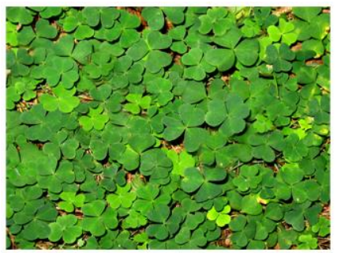

# L.4.10 图片

**Pictures**

## L.4.10.1 介绍

=== "中文"

    DrawingML 图片文件格式分为以下主题：

    - 指定基本图片
    - 为该图片附加属性
    - 图片变换
    
    理解上述主题的最好方法是按照上面的顺序涵盖它们. 

=== "英文"

    **Introduction**

    The DrawingML Picture file format is broken down into the following subjects:

    - Specifying a basic picture
    - Attaching properties to this picture
    - Transforming this picture
    
    The best way to understand the above subjects is to cover them in the ordering above. 

## L.4.10.2 指定基本图片

=== "中文"

    可以使用图片元素 `pic` 将图片插入到演示文稿幻灯片中，该元素与 `shape` 元素类似，但包含一些关键差异，可以更完整地存储图片信息。 这个基本图片元素应该包含 `blipfill` 和一些基本的**非视觉图片属性**(non-visual picture properties)。

    
    
    ```xml
    <p:pic>
        <p:nvPicPr>
            <p:cNvPr id="4" name="St_Patrick's_Day.jpg" />
            <p:cNvPicPr>
                <a:picLocks noChangeAspect="1" />
            </p:cNvPicPr>
            <p:nvPr />
        </p:nvPicPr>
        <p:blipFill>
            <a:blip r:embed="rId2" />
            <a:stretch>
                <a:fillRect />
            </a:stretch>
        </p:blipFill>
        <p:spPr>
            <a:xfrm>
                <a:off x="1346200" y="914400" />
                <a:ext cx="3657600" cy="2743200" />
            </a:xfrm>
            <a:prstGeom prst="rect">
                <a:avLst />
            </a:prstGeom>
            <a:noFill />
            <a:ln>
                <a:noFill />
            </a:ln>
        </p:spPr>
    </p:pic>
    ```

=== "英文"

    **Specifying a Basic Picture**

    A picture can be inserted into a presentation slide by use of the picture element, pic, which is similar to the shape element but contains some key differences that enable more complete storage of picture information. This basic picture element should contain a blipfill and some basic non-visual picture properties.

    
    
    ```xml
    <p:pic>
        <p:nvPicPr>
            <p:cNvPr id="4" name="St_Patrick's_Day.jpg" />
            <p:cNvPicPr>
                <a:picLocks noChangeAspect="1" />
            </p:cNvPicPr>
            <p:nvPr />
        </p:nvPicPr>
        <p:blipFill>
            <a:blip r:embed="rId2" />
            <a:stretch>
                <a:fillRect />
            </a:stretch>
        </p:blipFill>
        <p:spPr>
            <a:xfrm>
                <a:off x="1346200" y="914400" />
                <a:ext cx="3657600" cy="2743200" />
            </a:xfrm>
            <a:prstGeom prst="rect">
                <a:avLst />
            </a:prstGeom>
            <a:noFill />
            <a:ln>
                <a:noFill />
            </a:ln>
        </p:spPr>
    </p:pic>
    ```

## L.4.10.3 将特性附加到该图片

=== "中文"

    现在已经指定了基本图片，我们可以继续处理更复杂的特性，例如重新着色选项和图片描述。 在下图中，请注意曾经是绿色的图片已重新着色为紫色。 这可以通过利用双色调元素来完成，该元素允许设置两种基色以用于重新着色整个图片。 第一个用于作用于图片的较暗区域，第二个用于作用于较亮的区域。 我们可以在下面看到黑色（`#000000`）确实用于下面较暗的区域，而 `accent4`（在本例中为紫色）用于较亮的区域。

    

    ```xml
    <p:pic>
        <p:nvPicPr>
            <p:cNvPr id="4" name="St_Patrick's_Day.jpg" descr="This is a Saint Patrick's day picture" />
            <p:cNvPicPr>
                <a:picLocks noChangeAspect="1" />
            </p:cNvPicPr>
            <p:nvPr />
        </p:nvPicPr>
        <p:blipFill>
            <a:blip r:embed="rId2">
                <a:duotone>
                    <a:srgbClr val="000000" />
                    <a:schemeClr val="accent4" />
                </a:duotone>
            </a:blip>
            <a:stretch>
                <a:fillRect />
            </a:stretch>
        </p:blipFill>
        <p:spPr>
            <a:xfrm>
                <a:off x="1346200" y="914400" />
                <a:ext cx="3657600" cy="2743200" />
            </a:xfrm>
            <a:prstGeom prst="rect">
                <a:avLst />
            </a:prstGeom>
            <a:noFill />
            <a:ln>
                <a:noFill />
            </a:ln>
        </p:spPr>
    </p:pic>
    ```

=== "英文"

    **Attaching Properties to this Picture**

    Now that the base picture has been specified, we can move on to more complicated properties, such as recolor options and picture descriptions. In the picture below, notice that the picture that was once green has been re-colored in a purple hue. This can be done by utilizing the duotone element, which allows for the setting of two base colors to use for re-coloring the entire picture. The first is used to act upon the darker regions of the picture and the second is used to act upon the lighter regions. This we can see below that black (#000000) is indeed used below for the darker regions while accent4 (purple in this case) is used for the lighter areas.

    

    ```xml
    <p:pic>
        <p:nvPicPr>
            <p:cNvPr id="4" name="St_Patrick's_Day.jpg" descr="This is a Saint Patrick's day picture" />
            <p:cNvPicPr>
                <a:picLocks noChangeAspect="1" />
            </p:cNvPicPr>
            <p:nvPr />
        </p:nvPicPr>
        <p:blipFill>
            <a:blip r:embed="rId2">
                <a:duotone>
                    <a:srgbClr val="000000" />
                    <a:schemeClr val="accent4" />
                </a:duotone>
            </a:blip>
            <a:stretch>
                <a:fillRect />
            </a:stretch>
        </p:blipFill>
        <p:spPr>
            <a:xfrm>
                <a:off x="1346200" y="914400" />
                <a:ext cx="3657600" cy="2743200" />
            </a:xfrm>
            <a:prstGeom prst="rect">
                <a:avLst />
            </a:prstGeom>
            <a:noFill />
            <a:ln>
                <a:noFill />
            </a:ln>
        </p:spPr>
    </p:pic>
    ```

## L.4.10.4 变换这张图片

=== "中文"

    现在已经指定了基本特性和附加图片特性，我们可以开始合并形状特性。 下面是与上述相同的图片，应用了 3D 相机透视以及简单的阴影和白色轮廓。 这些形状特性与可应用于形状元素的特性相同。 此处可以通过图片周围的边框看到图片特定的差异。 边界不是向内和向外生长，而是仅向外生长。
    
    

    ```xml
    <p:pic>
        <p:nvPicPr>
            <p:cNvPr id="4" name="St_Patrick's_Day.jpg" descr="This is a Saint Patrick's day picture" />
            <p:cNvPicPr>
                <a:picLocks noChangeAspect="1" />
            </p:cNvPicPr>
            <p:nvPr />
        </p:nvPicPr>
        <p:blipFill>
            <a:blip r:embed="rId2">
                <a:duotone>
                    <a:srgbClr val="000000" />
                    <a:schemeClr val="accent4" />
                </a:duotone>
            </a:blip>
            <a:stretch>
                <a:fillRect />
            </a:stretch>
        </p:blipFill>
        <p:spPr>
            <a:xfrm>
                <a:off x="1346200" y="914400" />
                <a:ext cx="3657600" cy="2743200" />
            </a:xfrm>
            <a:prstGeom prst="rect">
                <a:avLst />
            </a:prstGeom>
            <a:noFill />
            <a:ln w="57150">
                <a:solidFill>
                    <a:schemeClr val="bg1" />
                </a:solidFill>
            </a:ln>
            <a:effectLst>
                <a:outerShdw blurRad="50800" dist="50800" dir="2700000" algn="tl" rotWithShape="0">
                    <a:srgbClr val="7D7D7D">
                        <a:alpha val="65000" />
                    </a:srgbClr>
                </a:outerShdw>
            </a:effectLst>
            <a:scene3d>
                <a:camera prst="perspectiveRelaxedModerately" />
                <a:lightRig rig="threePt" dir="t">
                    <a:rot lat="0" lon="0" rev="18900000" />
                </a:lightRig>
            </a:scene3d>
        </p:spPr>
    </p:pic>
    ```

=== "英文"

    **Transforming this Picture**

    Now that both basic properties and additional picture properties have been specified, we can begin incorporating shape properties. Below is the same picture as described above, with 3D camera perspective applied along with a simple shadow and a white outline. These shape properties are the same that can be applied to a shape element. One picture-specific difference can be seen here with the border around the picture. Instead of the border growing both inward and outward, it only grows outward.
    
    

    ```xml
    <p:pic>
        <p:nvPicPr>
            <p:cNvPr id="4" name="St_Patrick's_Day.jpg" descr="This is a Saint Patrick's day picture" />
            <p:cNvPicPr>
                <a:picLocks noChangeAspect="1" />
            </p:cNvPicPr>
            <p:nvPr />
        </p:nvPicPr>
        <p:blipFill>
            <a:blip r:embed="rId2">
                <a:duotone>
                    <a:srgbClr val="000000" />
                    <a:schemeClr val="accent4" />
                </a:duotone>
            </a:blip>
            <a:stretch>
                <a:fillRect />
            </a:stretch>
        </p:blipFill>
        <p:spPr>
            <a:xfrm>
                <a:off x="1346200" y="914400" />
                <a:ext cx="3657600" cy="2743200" />
            </a:xfrm>
            <a:prstGeom prst="rect">
                <a:avLst />
            </a:prstGeom>
            <a:noFill />
            <a:ln w="57150">
                <a:solidFill>
                    <a:schemeClr val="bg1" />
                </a:solidFill>
            </a:ln>
            <a:effectLst>
                <a:outerShdw blurRad="50800" dist="50800" dir="2700000" algn="tl" rotWithShape="0">
                    <a:srgbClr val="7D7D7D">
                        <a:alpha val="65000" />
                    </a:srgbClr>
                </a:outerShdw>
            </a:effectLst>
            <a:scene3d>
                <a:camera prst="perspectiveRelaxedModerately" />
                <a:lightRig rig="threePt" dir="t">
                    <a:rot lat="0" lon="0" rev="18900000" />
                </a:lightRig>
            </a:scene3d>
        </p:spPr>
    </p:pic>
    ```
