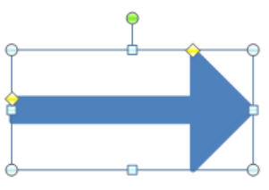
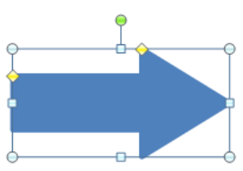
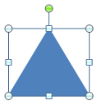
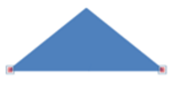
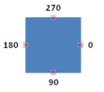

# L.4.9 形状定义和属性

**Shape Definitions and Attributes**

## L.4.9.1 介绍

=== "中文"

    DrawingML 的这一方面主要处理形状及其属性，分为两个主题:
    
    - 使用预设形状
    - 定义自定义形状及其属性

=== "英文"

    **Introduction**

    This aspect of DrawingML deals mainly with the shapes and their attributes, and is broken down into two topics:
    
    - Working with preset shapes
    - Defining custom shapes and their properties

## L.4.9.2 坐标系 :earth_asia:

=== "中文"

    要指定形状，必须首先理解一些高级系统，即所使用的坐标系。 这些是文档、形状和路径坐标系，在以下子条款中描述。

=== "英文"

    **The Coordinate Systems**

    To specify a shape there are a few high level systems that must first be understood, namely the coordinate systems that are used. These are the document, shape and path coordinate systems, described in the following sub clauses.

### L.4.9.2.1 文档坐标系

=== "中文"

    要首先指定文档中的形状，必须了解**文档坐标系**。 该系统具有 `x` 和 `y` 分量，并以文档左上角的值 (0,0) 开始。 随着 `x` 坐标的增加，该点向右移动。 随着 `y` 坐标增加，该点向下移动。 文档坐标系内的测量单位是 **EMU**。 除了指定形状的位置之外，还必须指定形状的**宽度和高度**，这称为**形状的范围**。 该值再次使用EMU单位测量。 要指定这两个值，将使用以下变换。

    ```xml
    <p:sp>
        <p:spPr>
            <a:xfrm>
                <a:off x="3200400" y="1600200"/>
                <a:ext cx="1200000" cy="1000000"/>
            </a:xfrm>
        </p:spPr>
    </p:sp>
    ```

    在这里我们可以看到这个新形状放置在文档坐标系内的 `x = 3200400` 和 `y = 1600200` 处。 另外，我们看到这个形状的宽度为 1200000 EMU，高度为1000000 EMU。

    宽度和高度设置包含整个形状的边界框。

=== "英文"

    **The Document Coordinate System**

    To first specify a shape within a document the document coordinate system must be understood. This system has both an x and y component and starts with a value of (0,0) in the upper left corner of the document. As the x-coordinate increases, the point moves to the right. As the y-coordinate increases, the point moves downwards. The units of measurement within the document coordinate system are EMUs. In addition to specifying a position for the shape, you must also specify the width and height of the shape, which is called the extent of the shape. This value is again measured in EMUs. To specify these two values, the following transform would be used.

    ```xml
    <p:sp>
        <p:spPr>
            <a:xfrm>
                <a:off x="3200400" y="1600200"/>
                <a:ext cx="1200000" cy="1000000"/>
            </a:xfrm>
        </p:spPr>
    </p:sp>
    ```

    Here we can see that this new shape is placed at x = 3200400 and y = 1600200 within the document coordinate system. In addition, we see that this shape has a width of 1200000 EMUs and a height of 1000000 EMUs.

    The width and height set the bounding box within which the entire shape is contained.

### L.4.9.2.2 形状坐标系

=== "中文"

    现在我们已经指定了宽度和高度，现在我们可以开始解释形状坐标系。 形状坐标系同时具有 `x` 和 `y` 分量，并以形状左上角的 `(0,0)` 值开始。 该坐标系的宽度和高度由形状的范围指定，最近在上面指定，单位再次是 **EMU**。 该坐标系用于定义许多形状属性的位置。

=== "英文"

    **The Shape Coordinate System**

    Now that we have a width and height specified, we can now move into the explanation of the shape coordinate system. The shape coordinate system has both an x and y component and starts with a value of (0,0) in the upper left corner of the shape. The width and height of this coordinate system are specified by the extent of the shape, which was recently specified above, and the units are once again EMUs. This coordinate system is used to define the locations of many of the shape attributes.

### L.4.9.2.3 路径坐标系

=== "中文"

    最终坐标系是**路径坐标系**，它也具有 `x` 和 `y` 分量，并从形状左上角的值 `(0,0)` 开始。 现在必须知道，该坐标系是唯一的，因为它的单位是相对于坐标空间的指定宽度和高度的。 **路径坐标系与形状坐标系具有完全相同的 EMU 尺寸，但单位不同**。 形状坐标系使用 **EMU**，{++ **而路径坐标系使用 (1/width) 作为 x 单位，使用 (1/height) 作为 y 单位** ++}。 也就是说，如果指定路径的宽度为 `2`、高度为 `1`，则路径坐标 `(1,1)` 将等于形状坐标系中的 `(600000,1000000)`。 一旦描述了路径元素，稍后就可以更好地理解**路径坐标系**。

    请注意，所有尺寸和坐标都必须使用整数指定。

=== "英文"

    **The Path Coordinate System**

    The final coordinate system is the path coordinate system which also has both an x and y component and starts with a value of (0,0) in the upper left corner of the shape. Now it must be known that this coordinate system is a unique one in that its units are relative to the specified width and height of the coordinate space. The path coordinate system has exactly the same EMU dimensions as the shape coordinate system but different units. While the shape coordinate system uses EMUs, the path coordinate system uses (1/width) as the x units and (1/height) as the y units. That is if the path was  specified to have a width of 2 and a height of 1, then the path coordinate (1,1) would be equivalent to (600000,1000000) in the shape coordinate system. The path coordinate system is better understood later, once the path element is described.

    Note that all dimensions and coordinates must be specified using whole numbers.

## L.4.9.3 指定预设形状

=== "中文"

    在 DrawingML 的“形状定义和属性”部分中，有许多可以使用的预定义形状，确切地说有 `187` 个。 当然，如果用户不希望使用预设形状，则始终可以选择指定自定义形状，这将在 [§L.4.9.4] 中进一步描述。

=== "英文"

    **Specifying a Preset Shape**

    Within the Shape Definitions and Attributes section of DrawingML there are many pre-defined shapes that can be used, 187 to be exact. Of course, if the user does not wish to use a preset shape there is always the option of specifying a custom shape that is described further in §L.4.9.4. 

### L.4.9.3.1 定义预设形状

=== "中文"

    指定预设形状非常容易，因为这是围绕预设的整个概念。 它们旨在解决形状定义的最常见情况。

    例如，要指定心形，可以使用以下 DrawingML 代码。

    ```xml
    <p:sp>
        <p:spPr>
            <a:xfrm>
                <a:off x="1981200" y="533400"/>
                <a:ext cx="1143000" cy="1066800"/>
            </a:xfrm>
            <a:prstGeom prst="heart">
        </a:prstGeom>
        </p:spPr>
    </p:sp>
    ```

    

    该心形是由生成应用程序使用该形状的自定义形状代码来渲染的，该形状在参考文档中的 `ST_ShapeTypes` 中有完整记录。 因此，我们看到用户需要指定预设名称才能在文档中放置形状。

=== "英文"

    **Defining a Preset Shape**

    It is quite easy to specify a preset shape as that is the whole notion around presets. They are meant to solve the most common cases of shape definition.

    To specify a heart shape for instance the following DrawingML code can be used.

    ```xml
    <p:sp>
        <p:spPr>
            <a:xfrm>
                <a:off x="1981200" y="533400"/>
                <a:ext cx="1143000" cy="1066800"/>
            </a:xfrm>
            <a:prstGeom prst="heart">
        </a:prstGeom>
        </p:spPr>
    </p:sp>
    ```

    

    This heart is rendered by the generating application using the custom shape code for this shape, which is fully documented within ST_ShapeTypes located in the reference documentation. Thus, we see that the user need on specify the preset name to place a shape within their document.

### L.4.9.3.2 调整预设形状

=== "中文"

    虽然指定预设形状很方便并且大多数时候看起来都不错。 用户可能还需要调整此预设以更适合其文档的需要。 为此，我们引入调整值的概念。 预设形状是使用直线、曲线和计算构建的，就像定义自定义形状一样。 为了允许调整这些预设形状，我们将形状的某些属性基于调整值而不是具体尺寸。 这意味着可以修改它们，从而修改形状的几何形状。

    将使用以下 DrawingML 代码指定一个简单的箭头。

    ```xml
    <p:sp>
        <p:spPr>
            <a:xfrm>
                <a:off x="3276600" y="990600"/>
                <a:ext cx="978408" cy="484632"/>
            </a:xfrm>
            <a:prstGeom prst="rightArrow">
            <a:avLst>
                <a:gd name="adj1" fmla="val 50000"/>
                <a:gd name="adj2" fmla="val 50000"/>
            </a:avLst>
            </a:prstGeom>
        </p:spPr>
    </p:sp>
    ```

    

    这指定了上面显示的基本箭头，这可能足以满足用户的文档需求，但也可能不够。 如果此标准箭头不够，则可以调整此形状的两个调整值。 例如，如果箭头主体太大，则可以减小 `adj1` 的值。 以下 DrawingML 代码将指定这种情况。

    ```xml
    <a:gd name="adj1" fmla="val 18553"/>
    ```

    

    同样，如果箭头本身太短，则可以增加 `adj2` 的值。 以下 DrawingML 代码将指定这种情况。

    ```xml
    <a:gd name="adj2" fmla="val 81447"/>
    ```

    

    因此，可以看出，虽然每个预设确实是具有预定义几何形状的预设，但它是可以修改的。 通过使用调整值，用户能够根据其文档需求自定义预设形状，而无需指定完全自定义的形状。

    请注意，此处用于调整值的值没有实际单位，因为它们只是构成形状几何的方程中的输入参数。 有关这些方程及其参数的更多信息将在 [§L.4.9.4.2] 中讨论。

=== "英文"

    **Adjusting a Preset Shape**

    While specifying a preset shape is convenient and looks good most of the time. There might also be the need for the user to adjust this preset to more closely suit the needs of their document. For this we introduce the notion of adjust values. The preset shape is built using lines, curves and calculations, just as a custom shape would be defined. To allow for the adjusting of these preset shapes we have based  certain properties of shapes on adjust values rather than concrete dimensions. This means that they can be modified which in turn modifies the geometry of the shape.

    A simple arrow would be specified using the following DrawingML code.

    ```xml
    <p:sp>
        <p:spPr>
            <a:xfrm>
                <a:off x="3276600" y="990600"/>
                <a:ext cx="978408" cy="484632"/>
            </a:xfrm>
            <a:prstGeom prst="rightArrow">
            <a:avLst>
                <a:gd name="adj1" fmla="val 50000"/>
                <a:gd name="adj2" fmla="val 50000"/>
            </a:avLst>
            </a:prstGeom>
        </p:spPr>
    </p:sp>
    ```

    

    This specifies the basic arrow shown above which might be sufficient for the document needs of the user but it also might not. If this standard arrow is not sufficient then the two adjust values for this shape can be adjusted. For instance, if the body of the arrow is too large then the value for adj1 can be decreased. The following DrawingML code would specify such a case.

    ```xml
    <a:gd name="adj1" fmla="val 18553"/>
    ```

    

    Similarly, if the arrow head itself was too short then the value of adj2 can be increased. The following DrawingML code would specify such a case.

    ```xml
    <a:gd name="adj2" fmla="val 81447"/>
    ```

    

    Thus, it can be seen that while each preset is indeed a preset with a pre-defined geometry, it can be modified. Through the use of adjust values, the user is able to custom fit a preset shape to their document needs without having to specify an entirely custom shape.

    Note that the values used here for adjust values have no real units as they are simply input parameters into the equations that make up the shape geometry. More on these equations and their parameters are discussed in §L.4.9.4.2.

## L.4.9.4 指定自定义形状

=== "中文"

    除了指定预设形状之外，还可以指定自定义形状。 这是通过从一组构造方法定义几何形状并将各种形状属性应用于该几何形状来实现的。 这补充了预设形状，使用户有机会使用任何认为必要的自定义属性来指定完整的形状。

=== "英文"

    **Specifying a Custom Shape**

    In addition to the specifying of a preset shape there is also the possibility of a specifying a custom shape. This is accomplished by defining a geometry from a set of construction methods and applying various shape properties to this geometry. This compliments preset shapes, giving the user the opportunity to specify a complete shape with any custom properties that are deemed necessary.

### L.4.9.4.1 定义几何形状

=== "中文"

    就像预设形状一样，自定义形状具有由偏移和范围变换值指定的位置和形状边界框。 形状坐标系由这些值定义，如上面第 1.2 节所述。 **路径坐标系**也部分由这些值定义，因为它的宽度和高度由这些值设置。 然而，路径系统的单位由路径的指定宽度和高度决定。

    可以使用以下 DrawingML 代码指定具有单个路径的自定义形状。

    ```xml
    <p:sp>
        <p:spPr>
            <a:xfrm>
                <a:off x="3200400" y="1600200" />
                <a:ext cx="1200000" cy="1000000" />
            </a:xfrm>
            <a:custGeom>
                <a:pathLst>
                    <a:path w="2" h="2">
                        <a:moveTo>
                            <a:pt x="0" y="2" />
                        </a:moveTo>
                        <a:lnTo>
                            <a:pt x="2" y="2" />
                        </a:lnTo>
                        <a:lnTo>
                            <a:pt x="1" y="0" />
                        </a:lnTo>
                        <a:close />
                    </a:path>
                </a:pathLst>
            </a:custGeom>
        </p:spPr>
    </p:sp>
    ```

    

    从上面的代码中可以看出，路径的宽度和高度为 `2`。**这意味着路径坐标空间的 x 坐标单位为（1/2 * 形状宽度(shape width)），单位为（1/2 * 形状高度(shape height)） 为 y 坐标。** 这样我们就可以看到**路径坐标系**中的坐标 `(2,2)` 与**形状坐标系**中的 **(1200000,1000000)** 相同。

    为了定义上面的**形状路径**，我们可以看到有几个不同的部分来定义这个自定义形状。 第一个是定义所谓的路径列表中的第一条路径。 应该注意的是，路径列表中可以有多个路径，有些已填充，有些未填充，有些已勾勒出轮廓，有些未填充。 要定义路径，我们必须通过以下 DrawingML 指定该路径的**宽度**、**高度**和**单位**。

    ```xml
    <a:path w="2" h="2"/>
    ```

    如前所述，这会为此路径设置**路径坐标系**。 接下来，我们需要将绘图光标移动到路径坐标系中我们希望开始绘制形状的点。 下面的 DrawingML 就是这样做的。

    ```xml
    <a:moveTo>
        <a:pt x="0" y="2"/>
    </a:moveTo>
    ```

    这会将绘图光标移动到左下位置 **(0,2)**，相当于形状坐标系中的 **(0,1000000)**。 接下来，我们现在可以开始通过以下线条绘制形状中的第一条线。

    ```xml
    <a:lnTo>
        <a:pt x="2" y="2"/>
    </a:lnTo>
    ```

    这会从当前绘图光标位置 **(0,2)** 到 **(2,2)** （路径坐标系的右下角）绘制一条线。 这相当于在形状坐标系中画一条从**（0,1000000）**到**（1200000,1000000）**的线。 现在我们已经绘制了三角形的底边，我们可以通过以下操作继续绘制形状的最后一条边。

    ```xml
    <a:lnTo>
        <a:pt x="1" y="0"/>
    </a:lnTo>
    ```

    这将绘制从当前绘图光标位置 **(2,2)** 到 **(1,0) **绘制的最后一条线，该位置位于路径坐标系的顶部中间。 这相当于在形状坐标系中从**(1200000,1000000)**到**(600000,1000000)**画一条线。 绘制大部分三角形后，在路径末尾指定的`<close/>`元素会绘制一条从路径中的最后一个点回到路径中的第一个点的线。

    ```xml
    <a:close/>
    ```

    这最终确定了指定形状路径的边缘。 由于该路径的填充设置为正常，因此无论是否指定该关闭标记，该路径都会填充。 然而，它的指定决定了在最终绘制光标点和路径起点之间绘制有最终边缘。 既然路径已经完全指定，这个形状就可以被填充，从而被认为完成了。

=== "英文"

    **Defining the Geometry**

    Just like a preset shape, a custom shape has a position and a shape bounding box that is specified by the offset and extent transform values. The shape coordinate system is defined by these values as was described in section 1.2 above. The path coordinate system is also partially defined by these in that it has it’s width and height set by these values. The units of the path system however are determined by the specified width and height of the path.

    A custom shape with a single path can be specified using the following DrawingML code.

    ```xml
    <p:sp>
        <p:spPr>
            <a:xfrm>
                <a:off x="3200400" y="1600200" />
                <a:ext cx="1200000" cy="1000000" />
            </a:xfrm>
            <a:custGeom>
                <a:pathLst>
                    <a:path w="2" h="2">
                        <a:moveTo>
                            <a:pt x="0" y="2" />
                        </a:moveTo>
                        <a:lnTo>
                            <a:pt x="2" y="2" />
                        </a:lnTo>
                        <a:lnTo>
                            <a:pt x="1" y="0" />
                        </a:lnTo>
                        <a:close />
                    </a:path>
                </a:pathLst>
            </a:custGeom>
        </p:spPr>
    </p:sp>
    ```

    

    As can be seen in the above code, the path has a width and height of 2. This means that the path coordinate space has units of (1/2 * shape width) for x-coordinate and (1/2 * shape height) for the ycoordinate. Thu we see that a coordinate of (2,2) in the path coordinate system is the same as (1200000,1000000) within the shape coordinate system.

    To define the shape path above we can see that there are a few different parts to defining this custom shape. The first is to define the first path in what is called the path list. It should be noted that the path list can have multiple paths in it, some filled, some not, some outlined, some not. To define the path we must specify the width, height and thus units for this path via the following DrawingML.

    ```xml
    <a:path w="2" h="2"/>
    ```

    This sets up the path coordinate system for this path as was previously described. Next we need to move the drawing cursor to the point in this path coordinate system that we wish to start drawing our shape from. The following DrawingML does just that.

    ```xml
    <a:moveTo>
        <a:pt x="0" y="2"/>
    </a:moveTo>
    ```

    This moves the drawing cursor to the bottom left position (0,2) which is equivalent to (0,1000000) in the shape coordinate system. Following this we can now start by drawing the first line in the shape via the following line.

    ```xml
    <a:lnTo>
        <a:pt x="2" y="2"/>
    </a:lnTo>
    ```

    This draws a line from the current drawing cursor position of (0,2) to (2,2) which is the bottom right corner of the path coordinate system. This is equivalent to drawing a line from (0,1000000) to (1200000,1000000) in the shape coordinate system. Now that we have the bottom edge of the triangle drawn we can continue to the final edge in the shape via the following.

    ```xml
    <a:lnTo>
        <a:pt x="1" y="0"/>
    </a:lnTo>
    ```

    This draws the final line that is drawn from the current drawing cursor position of (2,2) to (1,0) which is in the top middle of the path coordinate system. This is equivalent to drawing a line from (1200000,1000000) to (600000,1000000) in the shape coordinate system. With most of the triangle drawn the `<close/>` element specified at the end of the path draws a line from the last point in the path back to the first point in the path.

    ```xml
    <a:close/>
    ```

    This finalizes the edges of the shape path being specified. Since the fill of this path is set to normal, this path has a fill no matter if this close tag is specified or not. However, the fact that it is specified determines that there is a final edge drawn between the final drawing cursor point and the path starting point. Now that the path has been fully specified, this shape can be filled and thus be considered finished.

### L.4.9.4.2 调整几何形状

=== "中文"

    现在我们已经展示了如何指定自定义形状，我们可以看看如何调整它。 此调整不同于使用形状变换元素进行的典型调整大小。 使用这些形状调整方法，可以使形状具有许多不同的调整大小/调整特性。

=== "英文"

    **Adjusting the Geometry**

    Now that we have shown how a custom shape can be specified we can look at how it might be adjusted. This adjusting is different from the typical resizing that can happen by using the shape transform elements. Using these shape adjusting methods, a shape can be made to have many different resize/adjustment characteristics.

### L.4.9.4.3 几何引导(guides)

=== "中文"

    形状内的引导本质上是具有一定数量的输入和单个输出的方程。 参考线用于计算形状的构造值，因此可以操纵它来控制形状的整体几何形状。

    下面的 DrawingML 中可以看到这样的示例。

    ```xml
    <gdLst>
        <gd name="y1" fmla="*/ h adj1 100"/>
    </gdLst>
    ```

    本指南根据 3 个输入参数计算其输出，并将该输出分配给名为 `y1` 的指南。 这里计算中使用的公式是乘除公式。 本指南的结果按以下方式计算：`y1 = ((h * adj1) / 100)`。 计算出此处的结果后，稍后可以在`<gdlst>`或`<path>`中使用指南 `y1` 来计算进一步的值。 也就是说，它可以用作计算另一个指导值的输入。 然后，这些指导允许基于一系列方程而不是静态路径坐标值的路径。 要在定义路径时使用指导(guides)，我们只需在路径列表中指定以下内容即可。

    ```xml
    <a:lnTo>
        <a:pt x="2" y="y1"/>
    </a:lnTo>
    ```

    这将绘制一条线到点 `(2,y1)`，其中 `y1` 是上面所示的引导方程的计算结果。 然后，这条线的绘制会根据 `h` 和 `adj1` 的输入参数而变化，这也是之前计算的指导(guides)。

    请注意，虽然 `h` 是先前计算的指南。 它不是针对每个形状进行计算的，而是生成应用程序为形状提供的内置指南。

=== "英文"

    **Geometry Guides**

    A guide within a shape is essentially an equation with a set number of inputs and a single output. A guide is used to calculate construction values for a shape and thus can be manipulated to govern the shape's overall geometry.

    An example of this can be seen in the following DrawingML.

    ```xml
    <gdLst>
        <gd name="y1" fmla="*/ h adj1 100"/>
    </gdLst>
    ```

    This guide calculates it’s output based on 3 input parameters and assign this output to a guide named y1. The formula that is used in the calculation here is the multiply divide formula. The result for this guide is calculated in the following manner: y1 = ((h * adj1) / 100). After the result here is calculated, the guide y1 can be used later within the `<gdlst>` or` <path>` to calculate further values. That is it can be used as an input for calculating another guide value. These guides then allow for a path to be based off of series of equations rather than static path coordinate values. To use a guide in the defining of a path we would simply specify the following within the path list.

    ```xml
    <a:lnTo>
        <a:pt x="2" y="y1"/>
    </a:lnTo>
    ```

    This would draw a line to the point (2,y1) where y1 is the calculated result of the guide equation shown above. The drawing of this line then changes based on the input parameters of h and adj1 which are previously calculated guides as well.

    Note that while h is a previously calculated guide. It is not calculated for each shape, rather it is a built-in guide that the generating application makes available to the shape.

#### L.4.9.4.3.1 调整手柄

=== "中文"

    为了允许调整形状的 UI，我们引入了**调整手柄**的概念。 **该调整手柄链接到调整值，然后将这些值用作先前定义的引导方程的输入**。 因此，这里描述的数字链直接改变了相关形状的几何形状。 可以指定两种类型的调整手柄。 **`XY` 调节手柄作用于水平/垂直方向，并具有两个相关的导向装置，分别是水平导向装置和垂直导向装置。 极向调节手柄以极向方式起作用，并且还具有两个相关的导轨。 一个用于径向宽度，另一个用于径向角度。 指定调整手柄具有 x 和 y 坐标以及这些调整手柄。** 然后可以在生成应用程序的 UI 中移动该调整手柄，以调整一对参考线，从而调整正在渲染的形状。

    可以通过以下 DrawingML 指定调整手柄。

    ```xml
    <ahXY gdRefX="adj1" minX="-2147483647" maxX="2147483647" gdRefY="adj2"
        minY="-2147483647" maxY="2147483647">
        <pos x="x1" y="y1"/>
    </ahXY>
    ```

    上面是一个 **XY 调整手柄**，它有两个引导引用、`x` 和 `y` 坐标的最小和最大允许位置，以及形状坐标系中应放置此调整手柄的位置。

=== "英文"

    **Adjust Handles**

    To allow for the adjusting UI of a shape we introduce the notion of an adjust handle. This adjust handle is linked to adjust values that are then used as input to the guide equations defined previously. The numerical chain described here thus directly changes the geometry of the related shape. There are two types of adjust handles that can be specified. An XY adjust handle acts in the horizontal/vertical direction and has two related guides, both a horizontal and a vertical respectively. A polar adjust handle acts in a polar manner and has two related guides as well. One guide for the radial width and the other for the radial angle. An adjust handle is specified to have an x and y coordinate as well as these adjust handles. This adjust handle can then be moved around in a generating application’s UI to adjust a pair of guides which in turn adjusts the shape being rendered.

    An adjust handle can be specified by the following DrawingML.

    ```xml
    <ahXY gdRefX="adj1" minX="-2147483647" maxX="2147483647" gdRefY="adj2"
        minY="-2147483647" maxY="2147483647">
        <pos x="x1" y="y1"/>
    </ahXY>
    ```

    Above is an XY adjust handle that has two guide references, a min and max allowed position for both the x and y coordinates as well as a position within the shape coordinate system where this adjust handle should be placed.

### L.4.9.4.4 附加特性

=== "中文"

    **Additional Properties**

    除了指定形状的几何形状以及所有相关的调整之外，还有一些其他具有特殊意义的特性。 这些特性不会影响形状的几何形状，而是增强形状，使其可用于更专业的任务。

=== "英文"

    **Additional Properties**

    In addition to specifying the geometry for a shape and all the associated adjustments for it there are also a few other properties that are of special significance. These properties do not act on the geometry of the shape but instead enhance a shape so that it can be used for a more specialized task.

#### L.4.9.4.4.1 连接点

=== "中文"

    正如人们在尝试绘制具有形状和这些形状之间的连接的图表时可能经历过的那样，在不完全重新绘制形状之间的连接的情况下移动图表的一部分是相当困难的。 为此，存在**连接位置**的概念，它**允许指定形状内的特定点以将连接形状附加到其上**。 这允许用户从一组形状构建图表并使用连接形状将它们连接在一起。 连接位置在连接列表中指定，**由 x 坐标、y 坐标和连接角度组成**。

    以下 DrawingML 代码定义了两个连接点，该三角形的每条边各有一个。

    ```xml
    <a:cxnLst>
        <a:cxn ang="10800000">
            <a:pos x="0" y="679622"/>
        </a:cxn>
        <a:cxn ang="0">
            <a:pos x="1705233" y="679622"/>
        </a:cxn>
    </a:cxnLst>
    ```

    

    连接角度的工作原理是指定连接器应连接的角度（以 `60,000` 度为单位）。 下图显示了实际的连接点以及与该点的侧面相对应的连接角度。 生成应用程序连接器路由算法使用该信息以及形状的几何形状来正确地围绕连接的形状路由连接器。

    

=== "英文"

    **Connection Sites**

    As one might have experienced when trying to draw a diagram with shapes and connections between those shapes, it is quite difficult to move a part of your diagram without entirely redrawing the connections between shapes. For this, there is the notion of connection sites that allow for the specification of specific points within a shape to attach connection shapes to. This allows a user to build a diagram from a set of shapes and connect them together using connection shapes. A connection site is specified within the connection list and consists of an x-coordinate, y-coordinate and an attachment angle.

    The following DrawingML code defines two connection sites, one at each edge of this triangle.

    ```xml
    <a:cxnLst>
        <a:cxn ang="10800000">
            <a:pos x="0" y="679622"/>
        </a:cxn>
        <a:cxn ang="0">
            <a:pos x="1705233" y="679622"/>
        </a:cxn>
    </a:cxnLst>
    ```

    

    The attachment angle works by specifying an angle in 60,000ths of a degree that a connector should attach to. The diagram below shows an actual connection point and the attachment angles that correspond to the sides of this point. This information along with the geometry of the shape is used by the generating applications connector routing algorithm to correctly route connectors around connected shapes.

    

#### L.4.9.4.4.2 文本矩形 :earth_asia:

=== "中文"

    每个形状内都有一个**文本框**，*允许将文本附加到任何给定的形状*。 **文本矩形定义文本在形状内的位置**。 根据为附加到此形状的文本正文选择的“自动调整(Auto-fit)”选项，文本可能会故意流出此文本矩形之外。 还必须指出的是，该文本矩形也是用于计算`<prstTxWarp>`几何形状的边界框。 该文本矩形的 EMU 尺寸用于计算该几何形状，就像变换范围元素用于计算实际形状一样。

    以下 DrawingML 指定形状内的文本矩形。

    ```xml
    <a:rect l="0" t="0" r="1200000" b="1000000"/>
    ```

    上面显示的文本矩形的左边缘为 `0` 的 `x` 坐标，上边缘为 `0` 的 `y` 坐标，右边缘为 `1200000` 的 `x` 坐标，下边缘为 `1000000` 的 `y` 坐标。 这有效地指定了宽度为 `1200000` 个 EMU、高度为 `1000000` 个 EMU 的空间。

    请注意，可以设置此文本矩形的边缘，以便允许将文本放置在形状的实际几何形状之外。

=== "英文"

    **Text Rectangle**

    Within each shape is a text box that allows for the attaching of text to any given shape. The text rectangle defines where text resides within the shape. Depending on Auto-fit options that are selected for the body of text attached to this shape the text might intentionally flow outside this text rectangle. It must also be pointed out that this text rectangle is also the bounding box that is used to compute the geometry of a `<prstTxWarp>`. The EMU dimensions of this text rectangle is used to compute this geometry just like the transform extent element is used to compute the actual shape.

    The following DrawingML specifies a text rectangle within a shape.

    ```xml
    <a:rect l="0" t="0" r="1200000" b="1000000"/>
    ```

    The text rectangle shown above has a left edge of 0 x-coordinate, top edge of 0 y-coordinate, right edge of 1200000 x-coordinate and a bottom edge of 1000000 y-coordinate. This effectively specifies a space that is 1200000 EMUs in width and 1000000 EMUs in height.

    Note that the edges of this text rectangle can be set so as to allow text to be placed outside the actual geometry of the shape.
