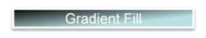
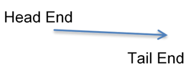
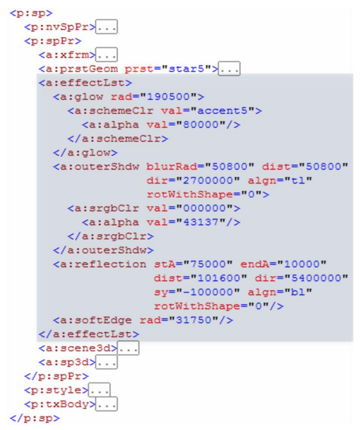
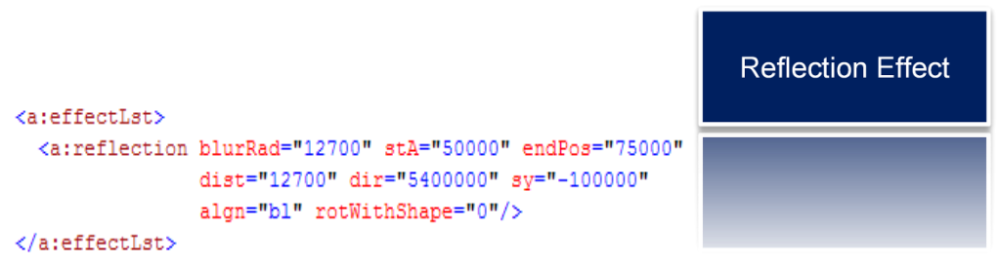
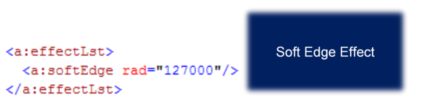
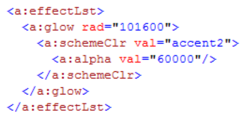

# L.4.8 形状属性和效果

**Shape Properties and Effects**

## L.4.8.1 介绍

=== "中文"

    还涵盖了颜色模型，因为填充、线条和效果都参考颜色模型架构来表示颜色。

=== "英文"

    **Introduction**

    Color Models are also covered, as Fills, Lines, and Effects all reference color model schemas to represent color.

## L.4.8.2 颜色模型

=== "中文"

    有多种表达颜色的方法：scrgbClr、srgbClr、hslClr、sysClr、schemeClr 和 prstClr。 尽管 srgbClr 是最常用的模型，但拥有各种等效颜色模型的基本原理源于对自然表达颜色选择的不同方式的渴望。

    ```xml
    <a:scrgbClr r="10000" g="20000" b="30000"/>
    ```

=== "英文"

    **Color Models**

    There are several methods of expressing color: scrgbClr, srgbClr, hslClr, sysClr, schemeClr, and prstClr. Although srgbClr is the most commonly used model, the rationale for having various equivalent color models stems from a desire to have different ways of naturally expressing a color choice. 

### L.4.8.2.1 scrgbClr

=== "中文"

    scrgbClr 是表达红、绿、蓝颜色的传统形式。 值以百分比表示。 r、g 和 b 都是必需的，分别对应于红色、绿色和蓝色。

    ```xml
    <a:scrgbClr r="10000" g="20000" b="30000"/>
    ```

=== "英文"

    **scrgbClr**

    scrgbClr is a legacy form of expressing Red, Green, Blue color. Values are expressed in Percentages. r, g, and b are all required and correspond to red, green, and blue, respectively.

    ```xml
    <a:scrgbClr r="10000" g="20000" b="30000"/>
    ```

### L.4.8.2.2 srgbClr

=== "中文"

    srgbClr 与 scrgbClr 类似，不同之处在于，它们不是将值表示为百分比，而是使用每种颜色的两个十六进制数字（按 RGB 顺序）指定。

    ```xml
    <a:srgbClr val="FFFF00"/>
    ```

=== "英文"

    **srgbClr**

    srgbClr is similar to scrgbClr with the exception that instead of expressing the values as percentages,they are specified using two hex digits per color, in the order RGB.

    ```xml
    <a:srgbClr val="FFFF00"/>
    ```

### L.4.8.2.3 hslClr

=== "中文"

    hslClr 使用色调、饱和度和发光颜色模型表示颜色。 值以百分比表示。 h、s 和 l 都是必需的，分别对应于色调、饱和度和发光度。 假设感知伽玛值为 2.2。

    ```xml
    <a:hslClr h="10000" s="20000" l="30000"/>
    ```

=== "英文"

    **hslClr**

    hslClr represents a color using the Hue, Saturation, and Luminescence color model. Values are expressed in Percentages. h, s, and l are all required, and correspond to hue, saturation, and luminescence respectively. A perceptual gamma of 2.2 is assumed.

    ```xml
    <a:hslClr h="10000" s="20000" l="30000"/>
    ```

### L.4.8.2.4 sysClr

=== "中文"

    sysClr 代表系统颜色，并引入间接级别。 例如，指定：

    ```xml
    <a:sysClr val="windowText"/>
    ```

    将颜色绑定为系统中为“窗口文本”选择的颜色。 可能的值为：

    ```text
    scrollBar
    background
    activeCaption
    inactiveCaption
    menu
    window
    windowFrame
    menuText
    windowText
    captionText
    activeBorder
    inactiveBorder
    appWorkspace
    highlight
    highlightText
    btnFace
    btnShadow
    grayText
    btnText
    inactiveCaptionText
    btnHighlight
    3dDkShadow
    3dLight
    infoText
    infoBk
    hotLight
    gradientActiveCaption
    gradientInactiveCaption
    menuHighlight
    menuBar
    ```

=== "英文"

    **sysClr**

    sysClr represents a system color, and introduces a level of indirection. For example, specifying:

    ```xml
    <a:sysClr val="windowText"/>
    ```

    binds the color to be the color chosen in the system for "Window Text". The possible values are:

    ```text
    scrollBar
    background
    activeCaption
    inactiveCaption
    menu
    window
    windowFrame
    menuText
    windowText
    captionText
    activeBorder
    inactiveBorder
    appWorkspace
    highlight
    highlightText
    btnFace
    btnShadow
    grayText
    btnText
    inactiveCaptionText
    btnHighlight
    3dDkShadow
    3dLight
    infoText
    infoBk
    hotLight
    gradientActiveCaption
    gradientInactiveCaption
    menuHighlight
    menuBar
    ```

### L.4.8.2.5 schemeClr

=== "中文"

    schemaClr 代表主题中的颜色。 如果主题绑定发生变化，颜色也会发生变化。 例如，指定：

    ```xml
    <a:schemeClr val="lt1"/>
    ```

    将颜色绑定为当前主题的 Light 1 颜色。 可能的值为：

    - accent1 - 额外方案颜色 1
    - accent2 - 额外方案颜色 2
    - accent3 - 额外方案颜色 3
    - accent4 - 额外方案颜色 4
    - accent5 - 额外方案颜色 5
    - accent6 - 额外方案颜色 6
    - bg1 - 语义背景颜色
    - bg2 - 语义附加背景颜色
    - dk1 - 主深色 1
    - dk2 - 主深色 2
    - folHlink - 已点击的超链接颜色
    - hlink -  超链接颜色
    - lt1 -  主浅色 1
    - lt2 -  主浅色 2
    - phClr - 主题定义中使用的颜色，意思是“使用样式的颜色”
    - tx1 -  语义文本颜色
    - tx2 -  语义附加文本颜色
    
    ???+ success "译注: 关于 phClr"

        原文参考: http://officeopenxml.com/prSlide-color.php

        **主题内的颜色占位符**

        **注意:** 关于在主题(themes)中使用**占位颜色**(placeholders for colors)， 例如: 主题可以定义实心填充(solid fill)，如下所示，使用 占位符 `phClr` 作为值。 这意味着填充将**使用引用主题填充样式时提供的指定颜色**。 假设主题中出现以下内容。

        ```xml
        <!--主题填充样式中定义的列表-->
        <a:fillStyleLst>
            <a:solidFill>
                <a:schemeClr val="phClr"/>
            </a:solidFill>
            ...
        </a:fillStyleLst>
        ```

        此填充可以在带有 `<p:style>` 元素的形状中引用，使用样式中 `<a:fillRef>` 元素的 `idx` 属性。`<a:fillRef>` 使用子 `<a:schemeClr>` 元素指定的主题颜色。 下面的 `accent2` 颜色被指定为用于**代替主题中占位符的颜色**。

        ```xml
        <p:style>
            ...
            <a:fillRef idx="1">
                <a:schemeClr val="accent2"/>
            </a:fillRef>
            ...
        </p:style>
        ```

        在这个例子中，这似乎是不必要的操作。 但是，请记住，主题内的 `<a:schemeClr>` 元素规范可能会**指定许多不同的效果和颜色变换（作为子元素），因此颜色可能只是整体填充外观的一个组成部分。** 例如: 主题中定义的背景填充样式列表

        ```xml
        <a:bgFillStyleLst>
            <a:solidFill>
                <a:schemeClr val="phClr" /> <!--占位符颜色 -->
            </a:solidFill>
            <a:solidFill>
                <a:schemeClr val="phClr">  <!--占位符颜色， 但同时指定了颜色变换 -->
                    <a:tint val="95000" />
                    <a:satMod val="170000" />
                </a:schemeClr>
            </a:solidFill>
            <a:gradFill rotWithShape="1">
                <a:gsLst>
                    <a:gs pos="0">
                        <a:schemeClr val="phClr"> <!--占位符颜色， 但同时指定了颜色变换 -->
                            <a:tint val="93000" />
                            <a:satMod val="150000" />
                            <a:shade val="98000" />
                            <a:lumMod val="102000" />
                        </a:schemeClr>
                    </a:gs>
                    <a:gs pos="50000">
                        <a:schemeClr val="phClr"> <!--占位符颜色， 但同时指定了颜色变换 -->
                            <a:tint val="98000" />
                            <a:satMod val="130000" />
                            <a:shade val="90000" />
                            <a:lumMod val="103000" />
                        </a:schemeClr>
                    </a:gs>
                    <a:gs pos="100000">
                        <a:schemeClr val="phClr"> <!--占位符颜色， 但同时指定了颜色变换 -->
                            <a:shade val="63000" />
                            <a:satMod val="120000" />
                        </a:schemeClr>
                    </a:gs>
                </a:gsLst>
                <a:lin ang="5400000" scaled="0" />
            </a:gradFill>
        </a:bgFillStyleLst>
        ```

        使用时，可能是这样:

        ```xml
        <p:cSld>
            <p:bg>
                <p:bgRef idx="1001">   <!-- 使用主题中定义的bgFillStyleLst中的填充样式 -->
                    <a:schemeClr val="bg1"/> <!-- 使用主题中定义的bg1指定的颜色 -->
                </p:bgRef>
            </p:bg>
            <p:spTree>
                ... 
            </p:spTree>
        </p:cSld>
        ```

=== "英文"

    **schemeClr**

    schemeClr represents a color from a theme. The color changes if theme bindings change. For example, specifying:

    ```xml
    <a:schemeClr val="lt1"/>
    ```

    binds the color to be Light 1 color of the current theme. The possible values are:

    - accent1 - extra scheme color 1
    - accent2 - extra scheme color 2
    - accent3 - extra scheme color 3
    - accent4 - extra scheme color 4
    - accent5 - extra scheme color 5
    - accent6 - extra scheme color 6
    - bg1 - semantic background color
    - bg2 - semantic additional background color
    - dk1 - main dark color 1
    - dk2 - main dark color 2
    - folHlink - followed hyperlink color
    - hlink -  hyperlink color
    - lt1 -  Main light color 1
    - lt2 -  main light color 2
    - phClr - a color used in theme definitions which means "use the color of
    - the -  style"
    - tx1 -  semantic text color
    - tx2 -  semantic additional text color

### L.4.8.2.6 prstClr

=== "中文"

    prstClr 代表预设颜色。 这是颜色的旧定义，目前已不再使用。 预设颜色是从旧版 Office 中提供的多个预设中进行的选择。

    ```xml
    <a:prstClr val="black"/>
    ```

    所选颜色是“黑色(black)”。 根据 DrawingML 架构的定义，此设置的有效值为：

    ```xml
    aliceBlue
    antiqueWhite
    aqua
    aquamarine
    azure
    beige
    bisque
    black
    blanchedAlmond
    blue
    blueViolet
    brown
    burlyWood
    cadetBlue
    chartreuse
    chocolate
    coral
    cornflowerBlue
    cornsilk
    crimson
    cyan
    darkBlue
    darkCyan
    darkGray
    darkGrey
    darkGreen
    darkKhaki
    darkMagenta
    darkOliveGreen
    darkOrange
    darkOrchid
    darkRed
    darkSalmon
    darkSeaGreen
    darkSlateBlue
    darkSlateGray
    darkSlateGrey
    darkTurquoise
    darkViolet
    dkBlue
    dkCyan
    dkGoldenrod
    dkGray
    dkGrey
    dkGreen
    dkKhaki
    dkMagenta
    dkOliveGreen
    dkOrange
    dkOrchid
    dkRed
    dkSalmon
    dkSeaGreen
    dkSlateBlue
    dkSlateGray
    dkSlateGrey
    dkTurquoise
    dkViolet
    deepPink
    deepSkyBlue
    dimGray
    dimGrey
    dodgerBlue
    firebrick
    floralWhite
    forestGreen
    fuchsia
    gainsboro
    ghostWhite
    gold
    goldenrod
    gray
    grey
    green
    greenYellow
    honeydew
    hotPink
    indianRed
    indigo
    ivory
    khaki
    lavender
    lavenderBlush
    lawnGreen
    lemonChiffon
    lightBlue
    lightCoral
    lightCyan
    lightGoldenrodYellow
    lightGray
    lightGreen
    lightPink
    lightSalmon
    lightSeaGreen
    lightSkyBlue
    lightSlateGray
    lightSteelBlue
    lightYellow
    ltBlue
    ltCoral
    ltCyan
    ltGoldenrodYellow
    ltGray
    ltGrey
    ltGreen
    ltPink
    ltSalmon
    ltSeaGreen
    ltSkyBlue
    ltSlateGray
    ltSlateGrey
    ltSteelBlue
    ltYellow
    lime
    limeGreen
    linen
    magenta
    maroon
    medAquamarine
    medBlue
    medOrchid
    medPurple
    medSeaGreen
    medSlateBlue
    medSpringGreen
    medTurquoise
    medVioletRed
    mediumAquamarine
    mediumBlue
    mediumOrchid
    mediumPurple
    mediumSeaGreen
    mediumSlateBlue
    mediumSpringGreen
    mediumTurquoise
    mediumVioletRed
    midnightBlue
    mintCream
    mistyRose
    moccasin
    navajoWhite
    navy
    oldLace
    olive
    oliveDrab
    orange
    orangeRed
    orchid
    paleGoldenrod
    paleGreen
    paleTurquoise
    paleVioletRed
    papayaWhip
    peachPuff
    peru
    pink
    plum
    powderBlue
    purple
    red
    rosyBrown
    royalBlue
    saddleBrown
    salmon
    sandyBrown
    seaGreen
    seaShell
    sienna
    silver
    skyBlue
    slateBlue
    slateGray
    slateGrey
    snow
    springGreen
    steelBlue
    tan
    teal
    thistle
    tomato
    transparent
    turquoise
    violet
    wheat
    white
    whiteSmoke
    yellow
    yellowGreen
    ```

=== "英文"

    **prstClr**

    prstClr represents a preset color. This is a legacy definition of colors which is no longer currently used. A preset color is a choice from among several presets provided in older versions of Office. 

    ```xml
    <a:prstClr val="black"/>
    ```

    The selected color is "black". Valid values for this setting, as defined by the DrawingML schema, are:

    ```xml
    aliceBlue
    antiqueWhite
    aqua
    aquamarine
    azure
    beige
    bisque
    black
    blanchedAlmond
    blue
    blueViolet
    brown
    burlyWood
    cadetBlue
    chartreuse
    chocolate
    coral
    cornflowerBlue
    cornsilk
    crimson
    cyan
    darkBlue
    darkCyan
    darkGray
    darkGrey
    darkGreen
    darkKhaki
    darkMagenta
    darkOliveGreen
    darkOrange
    darkOrchid
    darkRed
    darkSalmon
    darkSeaGreen
    darkSlateBlue
    darkSlateGray
    darkSlateGrey
    darkTurquoise
    darkViolet
    dkBlue
    dkCyan
    dkGoldenrod
    dkGray
    dkGrey
    dkGreen
    dkKhaki
    dkMagenta
    dkOliveGreen
    dkOrange
    dkOrchid
    dkRed
    dkSalmon
    dkSeaGreen
    dkSlateBlue
    dkSlateGray
    dkSlateGrey
    dkTurquoise
    dkViolet
    deepPink
    deepSkyBlue
    dimGray
    dimGrey
    dodgerBlue
    firebrick
    floralWhite
    forestGreen
    fuchsia
    gainsboro
    ghostWhite
    gold
    goldenrod
    gray
    grey
    green
    greenYellow
    honeydew
    hotPink
    indianRed
    indigo
    ivory
    khaki
    lavender
    lavenderBlush
    lawnGreen
    lemonChiffon
    lightBlue
    lightCoral
    lightCyan
    lightGoldenrodYellow
    lightGray
    lightGreen
    lightPink
    lightSalmon
    lightSeaGreen
    lightSkyBlue
    lightSlateGray
    lightSteelBlue
    lightYellow
    ltBlue
    ltCoral
    ltCyan
    ltGoldenrodYellow
    ltGray
    ltGrey
    ltGreen
    ltPink
    ltSalmon
    ltSeaGreen
    ltSkyBlue
    ltSlateGray
    ltSlateGrey
    ltSteelBlue
    ltYellow
    lime
    limeGreen
    linen
    magenta
    maroon
    medAquamarine
    medBlue
    medOrchid
    medPurple
    medSeaGreen
    medSlateBlue
    medSpringGreen
    medTurquoise
    medVioletRed
    mediumAquamarine
    mediumBlue
    mediumOrchid
    mediumPurple
    mediumSeaGreen
    mediumSlateBlue
    mediumSpringGreen
    mediumTurquoise
    mediumVioletRed
    midnightBlue
    mintCream
    mistyRose
    moccasin
    navajoWhite
    navy
    oldLace
    olive
    oliveDrab
    orange
    orangeRed
    orchid
    paleGoldenrod
    paleGreen
    paleTurquoise
    paleVioletRed
    papayaWhip
    peachPuff
    peru
    pink
    plum
    powderBlue
    purple
    red
    rosyBrown
    royalBlue
    saddleBrown
    salmon
    sandyBrown
    seaGreen
    seaShell
    sienna
    silver
    skyBlue
    slateBlue
    slateGray
    slateGrey
    snow
    springGreen
    steelBlue
    tan
    teal
    thistle
    tomato
    transparent
    turquoise
    violet
    wheat
    white
    whiteSmoke
    yellow
    yellowGreen
    ```

## L.4.8.3 颜色变换

=== "中文"

    颜色变换是对基础颜色的相关属性的修改。 例如，透明度是与颜色相关的属性。 颜色变换被指定为任何颜色模型标签的子标签。

    ```xml
    <a:solidFill>
        <a:srgbClr val="00B050">
            <a:alpha val="51000"/>
        </a:srgbClr>
    </a:solidFill>
    ```

    以下是允许的颜色变换以及它们所应用的变换的描述：

    - tint: 产生其输入颜色的较浅版本。 10% 色调是输入颜色的 10% 与 90% 白色相结合。
    - shade: 产生其输入颜色的较暗版本。 10% 阴影是输入颜色的 10% 与 90% 黑色的组合。
    - comp: 产生其输入颜色的补色。 例如，红色的补色是绿色。
    - inv: 产生其输入颜色的反色。 例如，红色 (1,0,0) 的逆是青色 (0,1,1)。
    - gray: 考虑红、绿、蓝原色的相对强度，生成输入颜色的灰度。
    - alpha: 产生具有指定不透明度的输入颜色，但其颜色不变。
    - alphaOff: 产生其输入颜色的或多或少不透明的版本。 Alpha 偏移永远不会将 Alpha 增加到超过 100% 或减少到 0% 以下； 即，变换的结果将 alpha 固定在 [0%,100%] 范围内。 10% 的 Alpha 偏移会将 50% 的不透明度增加到 60%。 -10% Alpha 偏移会将 50% 的不透明度降低到 40%。
    - alphaMod: 产生其输入颜色的或多或少不透明的版本。 Alpha 调制永远不会将 Alpha 值增加到超过 100%。 200% Alpha 调制使输入颜色的不透明度是以前的两倍。 50% Alpha 调制使输入颜色的不透明度减半。
    - hue: 生成具有指定色调的输入颜色，但其饱和度和亮度保持不变。
    - hueOff: 生成色调发生变化但饱和度和亮度不变的输入颜色。
    - hueMod: 产生输入颜色，其色调按给定百分比调制。
    - sat: 生成具有指定饱和度的输入颜色，但其色调和亮度保持不变。 通常饱和度值落在 [0%, 100%] 范围内。
    - satOff: 生成饱和度发生变化但色调和亮度不变的输入颜色。
    - satMod: 生成输入颜色，其饱和度按给定百分比进行调制。 50% 饱和度调制可将饱和度降低一半。 200% 饱和度调制使饱和度加倍。
    - lum: 生成具有指定亮度的输入颜色，但其色调和饱和度保持不变。 通常，亮度值落在 [0%,100%] 范围内。
    - lumOff: 生成亮度发生变化但色调和饱和度不变的输入颜色。
    - lumMod: 产生输入颜色，其亮度按给定百分比调制。 50% 亮度调制会将亮度降低一半。 200% 亮度调制使亮度加倍。
    - red: 生成具有指定红色分量的输入颜色，但其绿色和蓝色分量不变。
    - redOff: 生成红色分量发生变化但绿色和蓝色分量不变的输入颜色。
    - redMod: 产生输入颜色，其红色分量按给定百分比调制。 50% 红色调制将红色分量减少一半。 200% 红色调制使红色分量加倍。
    - green: 生成具有指定绿色分量的输入颜色，但其红色和蓝色分量不变。
    - greenOff: 产生绿色分量发生变化但红色和蓝色分量不变的输入颜色。
    - greenMod: 产生输入颜色，其绿色分量按给定百分比调制。 50% 绿色调制将绿色成分减少一半。 200% 绿色调制使绿色分量加倍。
    - blue: 生成具有指定蓝色分量的输入颜色，但其红色和绿色分量不变。
    - blueOff: 生成蓝色分量发生变化但红色和绿色分量不变的输入颜色。
    - blueMod: 产生输入颜色，其蓝色分量按给定百分比调制。 50% 蓝色调制将蓝色分量减少一半。 200% 蓝色调制使蓝色分量加倍。
    - gamma: 产生其输入颜色的 sRGB gamma 偏移。
    - invGamma: 产生其输入颜色的逆 sRGB gamma 偏移。

=== "英文"

    **Color Transforms**

    A color transform is a modification to related properties of an underlying color. For example, transparency is a property that is related to color. Color transforms are specified as child tags off any color model's tag.

    ```xml
    <a:solidFill>
        <a:srgbClr val="00B050">
            <a:alpha val="51000"/>
        </a:srgbClr>
    </a:solidFill>
    ```

    The following are the allowed color transforms and descriptions of the transformations they apply:

    - tint: Yields a lighter version of its input color. A 10% tint is 10% of the input color combined with 90% white.
    - shade: Yields a darker version of its input color. A 10% shade is 10% of the input color combined with 90% black.
    - comp: Yields the complement of its input color. For example, the complement of red is green.
    - inv: Yields the inverse of its input color. For example, the inverse of red (1,0,0) is cyan (0,1,1).
    - gray: Yields a grayscale of its input color, taking into relative intensities of the red, green, and blue primaries.
    - alpha: Yields its input color with the specified opacity, but with its color unchanged.
    - alphaOff: Yields a more or less opaque version of its input color. An alpha offset never increases the alpha beyond 100% or decreases below 0%; i.e., the result of the transform pins the alpha to the range of [0%,100%]. A 10% alpha offset increases a 50% opacity to 60%. A -10% alpha offset decreases a 50% opacity to 40%.
    - alphaMod: Yields a more or less opaque version of its input color. An alpha modulate never increases the alpha beyond 100%. A 200% alpha modulate makes an input color twice as opaque as before. A 50% alpha modulate makes an input color half as opaque as before.
    - hue: Yields the input color with the specified hue, but with its saturation and luminance unchanged.
    - hueOff: Yields the input color with its hue shifted, but with its saturation and luminance unchanged.
    - hueMod: Yields the input color with its hue modulated by the given percentage.
    - sat: Yields the input color with the specified saturation, but with its hue and luminance unchanged. Typically saturation values fall in the range [0%, 100%].
    - satOff: Yields the input color with its saturation shifted, but with its hue and luminance unchanged.
    - satMod: Yields the input color with its saturation modulated by the given percentage. A 50% saturation modulate reduces the saturation by half. A 200% saturation modulate doubles the saturation.
    - lum: Yields the input color with the specified luminance, but with its hue and saturation unchanged. Typically, luminance values fall in the range [0%,100%].
    - lumOff: Yields the input color with its luminance shifted, but with its hue and saturation unchanged.
    - lumMod: Yields the input color with its luminance modulated by the given percentage. A 50% luminance modulate reduces the luminance by half. A 200% luminance modulate doubles the luminance.
    - red: Yields the input color with the specified red component, but with its green and blue components unchanged.
    - redOff: Yields the input color with its red component shifted, but with its green and blue components unchanged.
    - redMod: Yields the input color with its red component modulated by the given percentage. A 50% red modulate reduces the red component by half. A 200% red modulate doubles the red component.
    - green: Yields the input color with the specified green component, but with its red and blue components unchanged.
    - greenOff: Yields the input color with its green component shifted, but with its red and blue components unchanged.
    - greenMod: Yields the input color with its green component modulated by the given percentage. A 50% green modulate reduces the green component by half. A 200% green modulate doubles the green component.
    - blue: Yields the input color with the specified blue component, but with its red and green components unchanged.
    - blueOff: Yields the input color with its blue component shifted, but with its red and green components unchanged.
    - blueMod: Yields the input color with its blue component modulated by the given percentage. A 50% blue modulate reduces the blue component by half. A 200% blue modulate doubles the blue component.
    - gamma: Yields the sRGB gamma shift of its input color.
    - invGamma: Yields the inverse sRGB gamma shift of its input color.

## L.4.8.4 填充特性

=== "中文"

=== "英文"

    **Fills**

    填充有六种类型：

    - No Fill
    - Solid Fill
    - Gradient Fill
    - Blip Fill
    - Pattern Fill
    - Group Fill

    这些类型描述了所有填充的一般结构； 然而，并非所有位置都允许所有填充。 例如，在线上不允许使用图片填充(Blip Fill)和组填充(Group Fill)。

### L.4.8.4.1 Solid Fills

=== "中文"

    ```xml
    <p:sp>
        <p:nvSpPr>…</p:nvSpPr>
        <p:spPr>
            <a:xfrm>
                <a:off x="5410200" y="2438400" />
                <a:ext cx="2895600" cy="304800" />
            </a:xfrm>
            <a:prstGeom prst="rect">
                <a:avLst />
            </a:prstGeom>
            <a:solidFill>
                <a:srgbClr val="FFFF00" />
            </a:solidFill>
        </p:spPr>
        <p:style>…</p:style>
        <p:txBody>…</p:txBody>
    </p:sp>
    ```

    

    纯色填充使用任何颜色模型指定单一颜色

=== "英文"

    **Solid Fills**

    ```xml
    <p:sp>
        <p:nvSpPr>…</p:nvSpPr>
        <p:spPr>
            <a:xfrm>
                <a:off x="5410200" y="2438400" />
                <a:ext cx="2895600" cy="304800" />
            </a:xfrm>
            <a:prstGeom prst="rect">
                <a:avLst />
            </a:prstGeom>
            <a:solidFill>
                <a:srgbClr val="FFFF00" />
            </a:solidFill>
        </p:spPr>
        <p:style>…</p:style>
        <p:txBody>…</p:txBody>
    </p:sp>
    ```

    

    A solid fill specifies a single color, using any color model

### L.4.8.4.2 Gradient Fills

=== "中文"

    ```xml
    <a:gradFill>
        <a:gsLst>
            <a:gs pos="69000">
                <a:schemeClr val="accent1"/>
            </a:gs>
            <a:gs pos="0">
                <a:scrgbClr r="0" g="0" b="0"/>
            </a:gs>
        </a:gsLst>
        <a:lin ang="2700000" scaled="1"/>
    </a:gradFill>
    ```

    

    (阴影文本是渐变停止列表.)

    渐变填充由三个元素组成：渐变停止点列表、着色规范以及一些属性。

    渐变填充有两个可用属性。

    - 翻转指定在使用平铺区域填充较大的填充区域时如何翻转平铺区域.
    - rotWithShape 指定形状旋转时填充是否随形状一起旋转.

    渐变停止列表是构成渐变填充的位置和颜色的列表。 位置以百分比指定。

    着色规范指定两种可能的渐变填充类型：**线性或基于路径**。 **线性填充**遵循由直线角度指定的直线方向。 基于**路径的填充**遵循明确定义的路径（例如形状、圆形或矩形）的轮廓。

    

=== "英文"

    **Gradient Fills**

    ```xml
    <a:gradFill>
        <a:gsLst>
            <a:gs pos="69000">
                <a:schemeClr val="accent1"/>
            </a:gs>
            <a:gs pos="0">
                <a:scrgbClr r="0" g="0" b="0"/>
            </a:gs>
        </a:gsLst>
        <a:lin ang="2700000" scaled="1"/>
    </a:gradFill>
    ```

    

    (The shaded text is the Gradient Stop List.)

    Gradient Fills consist of three elements: a list of gradient stops, a shading specification, as well as some attributes.

    Two attributes are available on gradient fills.

    - flip specifies how to flip a tile region when using it to fill a larger fill region.
    - rotWithShape specifies whether the fill rotates along with a shape when the shape is rotated.

    A gradient stop list is a list of locations and colors that make up the gradient fill. Positions are specified as percentages.

    The shading specification specifies the two possible kinds of gradient fills: linear, or path based. A linear fill follows a straight-line direction as specified by the angle of the line. A path-based fill follows the contours of a well-defined path (such as a shape, circle, or rectangle).

    

### L.4.8.4.3 Blip Fills

=== "中文"

    ```xml
    <p:blipFill>
        <a:blip r:embed="rId4" r:link=""/>
        <a:srcRect 1="11000" t="14000"
                   r="20000" b="28667"/>
        <a:stretch>
            <a:fillRect/>
        </a:stretch>
    </p:blipFill>
    ```

    

    BLIP 是指二进制大图像或图片。 光点填充由多个组件组成：参考(Blip Reference)、源矩形(Source Rectangle)和填充模式(Fill Mode)。

    Blip 引用 `a:blip` 是对 `blip` 内容本身的主要引用。 参考 ID 用作主链接，其属性允许指定 blip 的压缩级别（以下之一：电子邮件、屏幕、打印、hqprint、none）。 可以选择指定 Blip 效果来指示原始 blip 内容的修改。 光点效果(Blip Effects)有：

    ```xml
    alphaBiLevel
    alphaCeiling
    alphaFloor
    alphaInv
    alphaMod
    alphaModFix
    alphaRepl
    biLevel
    blur
    clrChange
    clrRepl
    duotone
    fillOverlay
    grayscl
    hsl
    lum
    tint
    ```

    光点效果(blip effects)镜像颜色变换（有关光点效果(blip effects)的描述，请参阅颜色变换子条款中的描述）。

    源矩形(Source Rectangle), `a:srcRect`, 用于实现图像裁剪，表示感兴趣内容的矩形窗口。

    最后，可以使用两种填充模式：**平铺和拉伸**。 这指示当用户将图像大小调整到大于源矩形的区域时要执行的行为。 平铺“平铺(tiles)”图像，以便简单地复制图像内容，同时拉伸缩放源矩形内容以填充 `fillRect`（blip 填充形状的边界框）的边界。

=== "英文"

    **Blip Fills**

    ```xml
    <p:blipFill>
        <a:blip r:embed="rId4" r:link=""/>
        <a:srcRect 1="11000" t="14000"
                   r="20000" b="28667"/>
        <a:stretch>
            <a:fillRect/>
        </a:stretch>
    </p:blipFill>
    ```

    

    BLIPs refer to Binary Large Image or Pictures. Blip Fills are made up of several components: a Blip Reference, a Source Rectangle, and a Fill Mode.

    The Blip reference, a:blip, is the main reference to the blip content itself. A reference ID serves as the main link with an attribute allowed to specify compression level of the blip (one of: email, screen, print, hqprint, none). A Blip Effect can optionally be specified to indicate a modification of the raw blip content. Blip Effects are:

    ```xml
    alphaBiLevel
    alphaCeiling
    alphaFloor
    alphaInv
    alphaMod
    alphaModFix
    alphaRepl
    biLevel
    blur
    clrChange
    clrRepl
    duotone
    fillOverlay
    grayscl
    hsl
    lum
    tint
    ```

    The blip effects mirror the color transformations (see the descriptions in the color transformations subclause for descriptions of Blip Effects).

    A Source Rectangle, a:srcRect, is used to implement image cropping, and indicates the rectangular window of content which is of interest.

    Finally, two fill modes are possible, tiling, and stretching. This indicates the behavior to be performed when the user resizes an image to an area larger than the source rectangle. Tiling 'tiles' an image so that image content is simply duplicated while stretching scales the source rectangle content to fill the bounds of the fillRect (bounding box of blip filled shape). 

### L.4.8.4.4 Pattern Fills

=== "中文"

    

    图案填充(Pattern Fills)是旧版 Office 11 填充，由前景色、背景色和预设图案值组成。 可能的模式值为：

    ```xml
    pct5
    pct10
    pct20
    pct25
    pct30
    pct40
    pct50
    pct60
    pct70
    pct75
    pct80
    pct90
    horz
    vert
    ltHorz
    ltVert
    dkHorz
    dkVert
    narHorz
    narVert
    dashHorz
    dashVert
    cross
    dnDiag
    upDiag
    ltDnDiag
    ltUpDiag
    dkDnDiag
    dkUpDiag
    wdDnDiag
    wdUpDiag
    dashDnDiag
    dashUpDiag
    diagCross
    smCheck
    lgCheck
    smGrid
    lgGrid
    dotGrid
    smConfetti
    lgConfetti
    horzBrick
    diagBrick
    solidDmnd
    openDmnd
    dotDmnd
    plaid
    sphere
    weave
    divot
    shingle
    wave
    trellis
    zigZag
    ```

=== "英文"

    **Pattern Fills**

    

    Pattern Fills are legacy Office 11 fills which consist of a Foreground Color, a Background Color and a preset pattern value. Possible pattern values are:

    ```xml
    pct5
    pct10
    pct20
    pct25
    pct30
    pct40
    pct50
    pct60
    pct70
    pct75
    pct80
    pct90
    horz
    vert
    ltHorz
    ltVert
    dkHorz
    dkVert
    narHorz
    narVert
    dashHorz
    dashVert
    cross
    dnDiag
    upDiag
    ltDnDiag
    ltUpDiag
    dkDnDiag
    dkUpDiag
    wdDnDiag
    wdUpDiag
    dashDnDiag
    dashUpDiag
    diagCross
    smCheck
    lgCheck
    smGrid
    lgGrid
    dotGrid
    smConfetti
    lgConfetti
    horzBrick
    diagBrick
    solidDmnd
    openDmnd
    dotDmnd
    plaid
    sphere
    weave
    divot
    shingle
    wave
    trellis
    zigZag
    ```

### L.4.8.4.5 Group Fills

=== "中文"

    当对象组合在一起时，组填充是一种方便的结构，用于指示任何单个元素的填充属性继承自父组的填充属性。 

    ```xml
    <p:grpSp>
        <p:nvGrpSpPr>…</p:nvGrpSpPr>
        <p:grpSpPr>
            <a:xfrm>…</a:xfrm>
            <a:solidFill>
                <a:srgbClr val="00B050" />
            </a:solidFill>
        </p:grpSpPr>
        <p:sp>
            <p:nvSpPr>…</p:nvSpPr>
            <p:spPr>
                <a:xfrm>…</a:xfrm>
                <a:prstGeom prst="rect">…</a:prstGeom>
                <a:grpFill />
            </p:spPr>
            <p:style>…</p:style>
            <p:txBody>…</p:txBody>
        </p:sp>
        <p:sp>
            <p:nvSpPr>…</p:nvSpPr>
            <p:spPr>
                <a:xfrm>…</a:xfrm>
                <a:prstGeom prst="rect">… 
                <a:>
                    <a:grpFill />
                    <p:style>…</p:style>
                    <p:txBody>…</p:txBody>
                </a:></a:prstGeom>
            </p:spPr>
        </p:sp>
    </p:grpSp>
    ```

    

=== "英文"

    **Group Fills**

    When objects are grouped together, a group fill is a convenient structure for indicating that the fill properties of any individual element inherits from the fill properties of parent group. 

    ```xml
    <p:grpSp>
        <p:nvGrpSpPr>…</p:nvGrpSpPr>
        <p:grpSpPr>
            <a:xfrm>…</a:xfrm>
            <a:solidFill>
                <a:srgbClr val="00B050" />
            </a:solidFill>
        </p:grpSpPr>
        <p:sp>
            <p:nvSpPr>…</p:nvSpPr>
            <p:spPr>
                <a:xfrm>…</a:xfrm>
                <a:prstGeom prst="rect">…</a:prstGeom>
                <a:grpFill />
            </p:spPr>
            <p:style>…</p:style>
            <p:txBody>…</p:txBody>
        </p:sp>
        <p:sp>
            <p:nvSpPr>…</p:nvSpPr>
            <p:spPr>
                <a:xfrm>…</a:xfrm>
                <a:prstGeom prst="rect">… 
                <a:>
                    <a:grpFill />
                    <p:style>…</p:style>
                    <p:txBody>…</p:txBody>
                </a:></a:prstGeom>
            </p:spPr>
        </p:sp>
    </p:grpSp>
    ```

    

## L.4.8.5 线条特性

=== "中文"

    虽然很明显，线条特性 `a:ln` 用于表示线条的特性，但可能不太明显的是该结构可以出现的位置。 线条不仅仅是线条——几乎任何对象都可以具有线条特性——通常指的是形状、图片或文本上可能存在的轮廓。 在这种情况下使用的线还产生我们希望保留的附加特征 - 就像线段相遇（即线连接）时发生的情况一样。 因此，在理解本节有关线特性的内容时，重要的是要可视化两种可能的情况——单个线段和该线段的特性，以及多个线段的情况（例如，自动形状的轮廓）。 通过考虑这两种情况，大多数特性的含义变得直观清晰。

    线条特性由几个部分组成：**线条填充特性、线条虚线特性、线条连接特性、头/尾特性以及一些属性。**

=== "英文"

    **Line Properties**

    While it is obvious that line properties, a:ln are used to represent properties for lines, what might be less obvious is where this structure can appear. Lines aren't just for lines-- just about any object can have a line property-- usually referring to the outlines that are possible on shapes, pictures, or text. Lines used in this context also yield additional characteristics we wish to persist-- like what happens when line segments meet (i.e., line joins). So when understanding this section on line properties, it's important to visualize two possible cases-- a single line segment and the properties of that segment, and the case of multiple line segments (e.g., an outline of an autoshape). By considering both cases, the meaning of most properties becomes intuitively clear.

    Line properties consist of several sections: line fill properties, line dash properties, line join properties, head/tail properties, as well as a few attributes.

### L.4.8.5.1 线条填充特性

=== "中文"

    线填充特性是一般填充特性的真子集。 可以使用以下之一：`noFill`、`solidFill`、`gradFill` 或 `pattFill`。 线条填充属性不允许使用点填充(Blip fills)和组填充(group fills)。

=== "英文"

    **Line Fill Properties**

    Line fill properties are a proper subset of general fill properties. One of the following can be used: noFill, solidFill, gradFill, or pattFill. Blip fills and group fills are not permitted for line fill properties.

### L.4.8.5.2 线条虚线特性

=== "中文"

    线条虚线特性可以是预设之一：`a:prstDash`，也可以是自定义虚线方案：`a:custDash`。 对于预设，可以使用以下选项：

    - **solid**: Solid (continuous) pen.
    - **dot**: Dot style. [- - - - - - - - - - - ]
    - **dash**: Short dash style. [---- ---- ---- ---- ---- ---- ]
    - **lgDash**: Long dash style. [-------- -------- -------- -------- ]
    - **dashDot**" Short dash followed by dot. [---- - ---- - ---- - ---- - ]
    - **lgDashDot**: Long dash followed by dot. [-------- - -------- - -------- - ]
    - **lgDashDotDot**: Long dash followed by two dots. [-------- - - -------- - - ]
    - **sysDash**: System short dash style (PS_DASH). [--- --- --- --- --- --- --- --- --- --- --- ]
    - **sysDot**: System dot style (PS_DOT). [- - - - - - - - - - - - - - - - - - - - - - ]
    - **sysDashDot**: System short dash and one dot (PS_DASHDOT) [--- - --- - --- - --- - --- - --- - --- - --- - ]
    - **sysDashDotDot**: System short dash and two dots (PS_DASHDOTDOT) [--- - - --- - - --- - - --- - - --- - - --- - - ]

=== "英文"

    **Line Dash Properties**

    Line Dash properties can be either one of the presets, a:prstDash, or a custom dashing scheme, a:custDash. For the presets, the following options are available:

    - solid: Solid (continuous) pen.
    - dot: Dot style. [- - - - - - - - - - - ]
    - dash: Short dash style. [---- ---- ---- ---- ---- ---- ]
    - lgDash: Long dash style. [-------- -------- -------- -------- ]
    - dashDot" Short dash followed by dot. [---- - ---- - ---- - ---- - ]
    - lgDashDot: Long dash followed by dot. [-------- - -------- - -------- - ]
    - lgDashDotDot: Long dash followed by two dots. [-------- - - -------- - - ]
    - sysDash: System short dash style (PS_DASH). [--- --- --- --- --- --- --- --- --- --- --- ]
    - sysDot: System dot style (PS_DOT). [- - - - - - - - - - - - - - - - - - - - - - ]
    - sysDashDot: System short dash and one dot (PS_DASHDOT) [--- - --- - --- - --- - --- - --- - --- - --- - ]
    - sysDashDotDot: System short dash and two dots (PS_DASHDOTDOT) [--- - - --- - - --- - - --- - - --- - - --- - - ]

#### L.4.8.5.2.1 自定义虚线

=== "中文"

    自定义虚线允许完全灵活地表达任何虚线方案。 由于自定义虚线的表达方式，自定义虚线也称为虚线停止列表，a:ds。 列表的元素指定两个属性：d 表示虚线相对于线宽的长度，sp 表示空格相对于线宽的长度。 可以将任意数量的元素组合成虚线停止列表，以实现表达虚线方案(dashing schemes)的完全通用性。

=== "英文"

    **Custom Dashes**

    Custom dashes allow full flexibility in expressing any dashing scheme. Custom dashes are also known as dash stop lists, a:ds, due to the way the custom dashes are expressed. An element of the list specifies two attributes: d for the length of the dash relative to line width, and sp for length of the space relative to line width. Any number of elements can be combined into a dash stop list for full generality in expressing dashing schemes.

### L.4.8.5.3 线条连接特性

=== "中文"

    ```xml
    <a:ln w="38100" cap="sq" cmpd="thickThin" algn="ctr">
        <a:solidFill>
            <a:schemeClr val="lt1"/>
        </a:solidFill>
        <a:prstDash val="sysDot"/>
        <a:bevel/>
    </a:ln>
    ```

    线连接特性用于表达线段相交时所发生情况的视觉外观。 它们可以是圆形、斜角或斜接的。 请注意以下矩形的角，它们说明了线连接特性的效果。

    

    线连接特性的唯一属性是 `lim`。 该属性限制了线可以延伸以形成连接的数量。 通常，这种情况相对较少发生，但在几乎平行线的情况下，此属性就会发挥作用。

=== "英文"

    **Line Join Properties**

    ```xml
    <a:ln w="38100" cap="sq" cmpd="thickThin" algn="ctr">
        <a:solidFill>
            <a:schemeClr val="lt1"/>
        </a:solidFill>
        <a:prstDash val="sysDot"/>
        <a:bevel/>
    </a:ln>
    ```

    Line join properties are for expressing the visual appearance of what happens when line segments meet. They can be round, beveled, or mitered. Notice the corners of the following rectangles, which illustrate the effect line join properties have.

    

    The only attribute of line join properties is lim. This attribute limits the amount by which lines can be extended to form a join. Normally, this is a relatively infrequent occurrence, but in the case of nearly parallel lines, this attribute comes into play.

### L.4.8.5.4 头/尾特性

=== "中文"

    头/尾端特性指定线的头或尾是否有任何特殊附件。 所有参数均在属性中指定：`type`、`w`（线端宽度与线宽的比值）和 `len`（线端相对于线宽的长度）。 默认情况下，不应用任何头/尾端属性。 类型可以是以下之一：无(none)、三角形(triangle)、隐形(stealth)、菱形(diamond)、椭圆形(oval)、箭头(arrow)。 `w` 和`len`可以是`sm`、`med`和`lg`之一，分别对应小、中、大。

    ```xml
    <a:ln w="25400" cap="rnd" cmpd="sng" algn="ctr">
        <a:solidFill>
            <a:srgbClr val="4F81BD"/>
        </a:solidFill>
        <a:prstDash val="solid"/>
        <a:tailEnd type="arrow" w="lg" len="lg"/>
    </a:ln>
    ```

    

=== "英文"

    **Head/Tail End Properties**

    Head/Tail End properties specify whether there are any special attachments to the head or the tail of a line. All parameters are specified in attributes: a type, a w (width of line end to width of line), and a len (length of the end relative to the line width). By default, no head/tail end properties are applied. The type can be one of: none, triangle, stealth, diamond, oval, arrow. w and len can be one of sm, med and lg corresponding to small, medium, and large respectively.

    ```xml
    <a:ln w="25400" cap="rnd" cmpd="sng" algn="ctr">
        <a:solidFill>
            <a:srgbClr val="4F81BD"/>
        </a:solidFill>
        <a:prstDash val="solid"/>
        <a:tailEnd type="arrow" w="lg" len="lg"/>
    </a:ln>
    ```

    

### L.4.8.5.5 线条属性

=== "中文"

    线特性 `a:ln` 有几个属性： `w` 指定线宽。 `cap` 指定线端是否为圆形(round)（值 `rnd`）、方形(square)（`sq`）或平坦(flat)（`flat`）。

    

    `cmpd` 指定复合线类型。 其允许值如下所示：

    

=== "英文"

    **Line Attributes**

    Line Properties, a:ln, takes several attributes: w specifies the line width. cap specifies whether the line ends are round (value rnd), square (sq), or flat (flat).

    

    cmpd specifies a compound line type. Its permitted values are shown below:

    

## L.4.8.6 效果

=== "中文"

    阴影最自然地应用于形状，但与填充特性和线条特性一样，它们也可以应用于形状、图片和文本。 效果有两种表示方式：通过阴影列表 `a:effectLst` 或阴影容器 `a:effectDag`。

=== "英文"

    **Effects**

    Effects are most naturally applied to shapes, but like fill properties and line properties, they can apply to shapes, pictures, and text. Effects are represented two ways: via an Effect List, a:effectLst, or an effects container, a:effectDag.

### L.4.8.6.1 效果列表

=== "中文"

    

    效果列表由一个或多个可以依次应用的原始效果组成。 原语(primitives)是：

    ```texg
    Blur
    fillOverlay
    glow
    innerShdw
    outerShdw
    prstShdw
    reflection
    softEdge
    ```

=== "英文"

    **Blur**

    

    An effect list is made up of one or more primitive effects that can be applied one after another. The primitives are:

    ```texg
    Blur
    fillOverlay
    glow
    innerShdw
    outerShdw
    prstShdw
    reflection
    softEdge
    ```

### L.4.8.6.2 模糊

=== "中文"

    模糊会模糊所有颜色通道，包括 Alpha。 这里应用两个属性，`rad`（模糊半径）和`grow`（布尔值）。 增长指定边界是否应因模糊而增长。

=== "英文"

    **Blur**

    Blur blurs all color channels, including alpha. Two attributes, rad (radius of blur) and grow (boolean), apply here. grow specifies if the bounds should grow as a result of the blurring.

### L.4.8.6.3 内部阴影

=== "中文"

    

    内部阴影包含颜色选择以及三个属性：

    - **blurRad**: 模糊半径
    - **dist**: 阴影偏移多远
    - **dir**: 偏移阴影的方向

=== "英文"

    **Blur**

    

    Inner Shadows contain a color choice, as well as three attributes:

    - blurRad: blur radius
    - dist: how far to offset the shadow
    - dir: direction to offset the shadow

### L.4.8.6.4 外部阴影

=== "中文"

    

    外部阴影包含颜色选择以及多个属性：

    - blurRad: 模糊半径
    - dist: 阴影偏移多远
    - dir: 偏移阴影的方向
    - sx, sy: 水平/垂直比例因子
    - kx, ky: 水平/垂直倾斜角度
    - algn: 阴影对齐。 首先进行对齐，并有效地设置缩放、倾斜和偏移的原点
    - rotWithShape: (boolean) 随着形状旋转阴影

=== "英文"

    **Outer Shadow**

    

    Outer shadows contain a color choice as well as several attributes:

    - blurRad: blur radius
    - dist: how far to offset the shadow
    - dir: direction to offset the shadow
    - sx, sy: horizontal/vertical scale factors
    - kx, ky: horizontal/vertical skew angles
    - algn: shadow alignment. Alignment happens first and effectively sets the origin for scale, skew, and offset
    - rotWithShape: (boolean) Rotate shadow with shape

### L.4.8.6.5 预设阴影

=== "中文"

    预设阴影由颜色选择和预设阴影组成：

    ```xml
    shdw1
    shdw2
    shdw3
    shdw4
    shdw5
    shdw6
    shdw7
    shdw8
    shdw9
    shdw10
    shdw11
    shdw12
    shdw13
    shdw14
    shdw15
    shdw16
    shdw17
    shdw18
    shdw19
    shdw20
    ```

    预设阴影的属性是：

    - **dist**: 阴影偏移多远
    - **dir**: 偏移阴影的方向

=== "英文"

    **Preset Shadows**

    Preset shadows consist of a color choice, and a preset shadow:

    ```xml
    shdw1
    shdw2
    shdw3
    shdw4
    shdw5
    shdw6
    shdw7
    shdw8
    shdw9
    shdw10
    shdw11
    shdw12
    shdw13
    shdw14
    shdw15
    shdw16
    shdw17
    shdw18
    shdw19
    shdw20
    ```

    The attributes for Preset Shadows are:

    - dist: how far to offset the shadow
    - dir: direction to offset the shadow

### L.4.8.6.6 反射效果

=== "中文"

    

    反射完全通过属性来表示：

    - **blurRad**: 模糊半径
    - **stA**: （Start Alpha）开始反射不透明度
    - **stPos**: 沿着起始 alpha 值的梯度斜坡的起始位置
    - **endA**: (End Alpha) 结束反射不透明度
    - **endPos**: 沿梯度的结束位置，结束 alpha 值的斜坡
    - **dist**: 抵消反射多远
    - **dir**: 偏移反射的方向
    - **fadeDir**: alpha 梯度的方向，相对于形状本身的斜坡
    - **sx, sy**: 水平/垂直比例因子
    - **kx, ky**: 水平/垂直倾斜角度
    - **algn**: 反射对准
    - **rotWithShape**: (boolean) 随着形状旋转反射

=== "英文"

    **Reflection Effects**

    

    Reflections are represented entirely through attributes:

    - blurRad: Blur Radius
    - stA: (Start Alpha) starting reflection opacity
    - stPos: start position along gradient ramp of start alpha value
    - endA: (End Alpha) ending reflection opacity
    - endPos: end position along gradient, ramp of end alpha value
    - dist: how far to offset reflection
    - dir: Direction to offset reflection
    - fadeDir: direction of alpha gradient, ramp relative to shape itself
    - sx, sy: horizontal/vertical scale factors
    - kx, ky: horizontal/vertical skew angles
    - algn: reflection alignment
    - rotWithShape: (boolean) rotate reflection with shape

### L.4.8.6.7 软边缘效果

=== "中文"

    

    软边缘根据指定的模糊半径 `rad` 模糊所应用对象的边缘。

=== "英文"

    **Soft Edge Effects**

    

    Soft Edge blurs the edges of the applied object subject to the specified blur radius rad.

### L.4.8.6.8 发光效果

=== "中文"

    

    发光效果与软边缘效果非常相似，但不同之处在于，除了 `rad` 之外，它还允许颜色特性。 基本上，发光是一种软边缘效果，除了使用指定的颜色而不是对象的颜色。

=== "英文"

    **Glow Effects**

    

    A glow effect is very similar to a soft edge effect, but differs in that it permits a color specification in addition to rad. Basically, a glow is a soft edge effect, except with the color specified used instead of the object's color.
