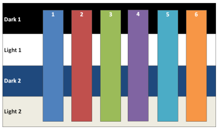
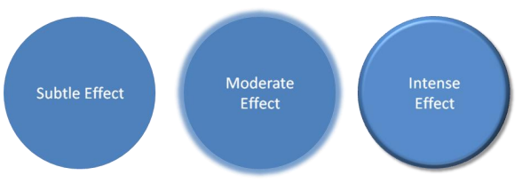

# L.4.3 样式

**Styles**

## L.4.3.1 介绍

=== "中文"

    这部分 DrawingML 处理文档主题中包含的共享方面的定义。 共享样式表定义了一组独立于应用程序的样式，可以应用于文档中的对象，并影响文档及其包含的信息和对象的外观。 例如，在演示文稿中，形状可以具有特定的外观，而在电子邮件中，所有文本都可以具有特定的属性，并且标题具有样式。

    第二个主题是 DrawingML 中使用的表格样式的定义。 表格样式定义了表格的外观，无论该表格中存在什么数据。

=== "英文"

    **Styles**

    This piece of DrawingML deals with the definition of the shared aspects contained within a document theme. The shared-style sheet defines an application-independent set of styling that can be applied to objects within a document and which affects the look of the document and the information and objects it contains. For example, in a presentation, shapes can have a certain look, whereas in an e-mail, all of the text can have certain properties, and headings are styled.

    A second topic is the definition of a table style as used within DrawingML. A table style defines the look of a table egardless of the data present in that table.

## L.4.3.2 共享样式表

=== "中文"

    DrawingML 中的共享样式表负责包含可在给定文档中使用的不同格式选项和样式选项。

=== "英文"

    **Introduction**

    The shared-style sheet within DrawingML is responsible for containing different formatting options and style options that can be used within a given document.

### L.4.3.2.1 主题

=== "中文"

    **主题**是与**共享样式表**关联的根级复杂类型。 这种复杂类型包含主题可用的所有不同格式选项，并定义在文档中使用主题对象时文档的整体外观和感觉。 在下面的图 1 中，我们可以看到演示文稿中同一张幻灯片应用两个不同主题的示例。

    

    图 1: 应用于演示文稿中同一张幻灯片的主题。 不仅字体和颜色发生变化，形状和表格的效果也发生变化。

    主题由四个主要部分组成，尽管 `themeElements` 元素是保存主题中定义的主要格式的部分。 其他部分提供对 themeElements 中包含的信息的覆盖、默认和添加。 定义主题的复杂类型 `CT_OfficeStyleSheet` 按以下方式定义：

    ```xml
    <complexType name="CT_OfficeStyleSheet">
        <sequence>
            <element name="themeElements" type="CT_BaseStyles" minOccurs="1" maxOccurs="1" />
            <element name="objectDefaults" type="CT_ObjectStyleDefaults" minOccurs="0" maxOccurs="1" />
            <element name="extraClrSchemeLst" type="CT_ColorSchemeList" minOccurs="0" maxOccurs="1" />
            <element name="custClrLst" type="CT_CustomColorList" minOccurs="0" maxOccurs="1" />
            <element name="extLst" type="CT_OfficeArtExtensionList" minOccurs="0" maxOccurs="1" />
        </sequence>
        <attribute name="name" type="xsd:string" use="optional" default="" />
    </complexType>
    ```

    此复杂类型还包含 `CT_OfficeArtExtensionList`，用于此复杂类型的未来扩展。

=== "英文"

    **Theme**

    The theme is the root-level complex type associated with a shared-style sheet. This complex type holds all of the different formatting options available to a theme, and defines the overall look and feel of a document when themed objects are used within the document. In figure 1 below, we can see an example of two different themes applied to the same slide in a presentation.

    

    Figure 1: A theme applied to the same slide in a presentation. Not only does the font and colors change, but also the effects applied to the shapes and table.

    A theme consists of four main parts, although the themeElements element is the piece that holds the main formatting defined within the theme. The other parts provide overrides, defaults, and additions to the information contained in themeElements. The complex type defining a theme, CT_OfficeStyleSheet, is defined in the following manner:

    ```xml
    <complexType name="CT_OfficeStyleSheet">
        <sequence>
            <element name="themeElements" type="CT_BaseStyles" minOccurs="1"
            maxOccurs="1"/>
            <element name="objectDefaults" type="CT_ObjectStyleDefaults"
            minOccurs="0" maxOccurs="1"/>
            <element name="extraClrSchemeLst" type="CT_ColorSchemeList"
            minOccurs="0" maxOccurs="1"/>
            <element name="custClrLst" type="CT_CustomColorList" minOccurs="0"
            maxOccurs="1"/>
            <element name="extLst" type="CT_OfficeArtExtensionList"
            minOccurs="0" maxOccurs="1"/>
        </sequence>
        <attribute name="name" type="xsd:string" use="optional" default=""/>
    </complexType>
    ```

    This complex type also holds a CT_OfficeArtExtensionList, which is used for future extensibility of this complex type.

### L.4.3.2.2 主题的所有元素

=== "中文"

    复杂类型 `CT_BaseStyles` 定义**主题**的主题元素，并且是主题的主力。 给定文档使用的大部分**共享主题信息**均在此处定义。 在这个复杂的类型中定义了**颜色方案**、**字体方案**和**样式矩阵**（格式方案），该**样式矩阵**为文档的不同部分定义了不同的格式选项。 复杂类型 `CT_BaseStyles` 按以下方式定义：

    ```xml
    <complexType name="CT_BaseStyles">
        <sequence>
            <element name="clrScheme" type="CT_ColorScheme" minOccurs="1"
                maxOccurs="1"/>
            <element name="fontScheme" type="CT_FontScheme" minOccurs="1"
                maxOccurs="1"/>
            <element name="fmtScheme" type="CT_StyleMatrix" minOccurs="1"
                maxOccurs="1"/>
            <element name="extLst" type="CT_OfficeArtExtensionList"
                minOccurs="0" maxOccurs="1"/>
        </sequence>
    </complexType>
    ```

=== "英文"

    **Theme Elements**

    The complex type CT_BaseStyles defines the theme elements for a theme, and is the workhorse of the theme. The bulk of the shared theme information that is used by a given document is defined here. Within this complex type is defined a color scheme, a font scheme, and a style matrix (format scheme) that defines different formatting options for different pieces of a document. The complex type CT_BaseStyles is defined in the following manner:

    ```xml
    <complexType name="CT_BaseStyles">
        <sequence>
            <element name="clrScheme" type="CT_ColorScheme" minOccurs="1"
                maxOccurs="1"/>
            <element name="fontScheme" type="CT_FontScheme" minOccurs="1"
                maxOccurs="1"/>
            <element name="fmtScheme" type="CT_StyleMatrix" minOccurs="1"
                maxOccurs="1"/>
            <element name="extLst" type="CT_OfficeArtExtensionList"
                minOccurs="0" maxOccurs="1"/>
        </sequence>
    </complexType>
    ```

### L.4.3.2.3 颜色方案

=== "中文"

    复杂类型 `CT_ColorScheme` 定义了主题的一组颜色。 该组颜色由十二个颜色槽组成，每个颜色槽可以容纳一种选择的颜色。 颜色按以下方式组织：

    - Dark 1 (dk1) – 这代表深色，通常定义为系统文本颜色
    - Light 1 (lt1) – 这代表一种浅色，通常定义为系统窗口颜色
    - Dark 2 (dk2) – 这代表使用的第二种深色
    - Light 2 (lt2) – 这代表使用的第二种浅色
    - Accents 1 至 6 (accent1 至 accent6) – 这六种颜色可用作主题中的强调色
    - Hyperlink (hlink) – 超链接的颜色
    - Followed Hyperlink (folHlink) – 已关注超链接的颜色

    这些颜色定义对象可以在文档中使用的主题颜色。 当对象使用主题颜色时，对象的颜色会在主题更改时发生变化，但如果对象使用的主题颜色是强调 1，则始终映射到强调 1。 定义和使用主题颜色的示例如图 2 所示。

    

    图 2: 为 dark1/2、light1/2 和六种强调色定义和使用的示例颜色。

    复杂类型 `CT_ColorScheme` 的定义方式如下：

    ```xml
    <complexType name="CT_ColorScheme">
        <sequence>
            <element name="dk1" type="CT_Color" minOccurs="1" maxOccurs="1" />
            <element name="lt1" type="CT_Color" minOccurs="1" maxOccurs="1" />
            <element name="dk2" type="CT_Color" minOccurs="1" maxOccurs="1" />
            <element name="lt2" type="CT_Color" minOccurs="1" maxOccurs="1" />
            <element name="accent1" type="CT_Color" minOccurs="1" maxOccurs="1" />
            <element name="accent2" type="CT_Color" minOccurs="1" maxOccurs="1" />
            <element name="accent3" type="CT_Color" minOccurs="1" maxOccurs="1" />
            <element name="accent4" type="CT_Color" minOccurs="1" maxOccurs="1" />
            <element name="accent5" type="CT_Color" minOccurs="1" maxOccurs="1" />
            <element name="accent6" type="CT_Color" minOccurs="1" maxOccurs="1" />
            <element name="hlink" type="CT_Color" minOccurs="1" maxOccurs="1" />
            <element name="folHlink" type="CT_Color" minOccurs="1" maxOccurs="1" />
            <element name="extLst" type="CT_OfficeArtExtensionList" minOccurs="0" maxOccurs="1" />
        </sequence>
        <attribute name="name" type="xsd:string" use="required" />
    </complexType>
    ```

=== "英文"

    **Color Scheme**

    The complex type CT_ColorScheme defines a set of colors for the theme. The set of colors consists of twelve color slots that can each hold a color of choice. The colors are organized in the following way:

    - Dark 1 (dk1) – This represents a dark color, usually defined as a system text color
    - Light 1 (lt1) – This represents a light color, usually defined as the system window color
    - Dark 2 (dk2) – This represents a second dark color for use
    - Light 2 (lt2) – This represents a second light color for use
    - Accents 1 through 6 (accent1 through accent6) – These are six colors which can be used as     accent colors in the theme
    - Hyperlink (hlink) – The color of hyperlinks
    - Followed Hyperlink (folHlink) – The color of a followed hyperlink

    These colors define the theme colors that objects can utilize within a document. When an object uses a theme color, the color of the object can change when the theme is changed, but always maps to accent 1 if that were the theme color used by the object. An example of theme colors defined and used can be seen in figure 2.

    

    Figure 2: Sample colors defined and used for dark1/2, light1/2, and the six accent colors.

    The complex type CT_ColorScheme is defined in the following manner:

    ```xml
    <complexType name="CT_ColorScheme">
        <sequence>
            <element name="dk1" type="CT_Color" minOccurs="1" maxOccurs="1"/>
            <element name="lt1" type="CT_Color" minOccurs="1" maxOccurs="1"/>
            <element name="dk2" type="CT_Color" minOccurs="1" maxOccurs="1"/>
            <element name="lt2" type="CT_Color" minOccurs="1" maxOccurs="1"/>
            <element name="accent1" type="CT_Color" minOccurs="1"
                maxOccurs="1"/>
            <element name="accent2" type="CT_Color" minOccurs="1"
                maxOccurs="1"/>
            <element name="accent3" type="CT_Color" minOccurs="1"
                maxOccurs="1"/>
            <element name="accent4" type="CT_Color" minOccurs="1"
                maxOccurs="1"/>
            <element name="accent5" type="CT_Color" minOccurs="1"
                maxOccurs="1"/>
            <element name="accent6" type="CT_Color" minOccurs="1"
                maxOccurs="1"/>
            <element name="hlink" type="CT_Color" minOccurs="1" maxOccurs="1"/>
            <element name="folHlink" type="CT_Color" minOccurs="1"
                maxOccurs="1"/>
            <element name="extLst" type="CT_OfficeArtExtensionList"
                minOccurs="0" maxOccurs="1"/>
        </sequence>
        <attribute name="name" type="xsd:string" use="required"/>
    </complexType>
    ```

### L.4.3.2.4 字体方案

=== "中文"

    复杂类型 `CT_FontScheme` 定义字体对(pair)。 该对(pair)由**主要字体**和**次要字体**组成。 使用的示例是文档标题中使用的主要字体和文档段落部分中使用的次要字体。 **主要字体**和**次要字体**是通过基于每种语言定义的字体集合来定义的。 例如，可以仅定义一种基于拉丁语的字体，或者可以为主要或次要字体的不同局部定义许多不同的字体。 文档中使用的字体取决于用户的语言。

    复杂类型 `CT_FontScheme` 按以下方式定义：

    ```xml
    <complexType name="CT_FontScheme">
        <sequence>
            <element name="majorFont" type="CT_FontCollection" minOccurs="1"
                maxOccurs="1"/>
            <element name="minorFont" type="CT_FontCollection" minOccurs="1"
                maxOccurs="1"/>
            <element name="extLst" type="CT_OfficeArtExtensionList"
                minOccurs="0" maxOccurs="1"/>
        </sequence>
        <attribute name="name" type="xsd:string" use="required"/>
    </complexType>
    ```

=== "英文"

    **Font Scheme**

    The complex type CT_FontScheme defines a font pair. The pair consists of a major font and a minor font. An example of use would be the major font used in headings for a document and the minor font used for the paragraph parts of a document. The major and minor fonts are defined through a collection of font faces defined on a per-language basis. For example, one can define only a Latin-based font, or one can define many different fonts for different locals for a major or minor font. The font used in the document depends on the user’s language.

    The complex type CT_FontScheme is defined in the following manner:

    ```xml
    <complexType name="CT_FontScheme">
        <sequence>
            <element name="majorFont" type="CT_FontCollection" minOccurs="1"
                maxOccurs="1"/>
            <element name="minorFont" type="CT_FontCollection" minOccurs="1"
                maxOccurs="1"/>
            <element name="extLst" type="CT_OfficeArtExtensionList"
                minOccurs="0" maxOccurs="1"/>
        </sequence>
        <attribute name="name" type="xsd:string" use="required"/>
    </complexType>
    ```

### L.4.3.2.5 主要和次要字体（字体集合）

=== "中文"

    复杂类型 `CT_FontCollection` 定义了字体方案中使用的主要字体和次要字体。 字体集合包含拉丁文、东亚文和复杂脚本的字体定义。 除了这三个定义之外，还可以定义一种用于特定语言的字体。
    
    复杂类型 `CT_FontCollection` 的定义方式如下：

    ```xml
    <complexType name="CT_FontCollection">
        <sequence>
            <element name="latin" type="CT_TextFont" minOccurs="1"
                maxOccurs="1"/>
            <element name="ea" type="CT_TextFont" minOccurs="1" maxOccurs="1"/>
            <element name="cs" type="CT_TextFont" minOccurs="1" maxOccurs="1"/>
            <element name="font" type="CT_SupplementalFont" minOccurs="0"
                maxOccurs="unbounded"/>
            <element name="extLst" type="CT_OfficeArtExtensionList"
                minOccurs="0" maxOccurs="1"/>
        </sequence>
    </complexType>
    ```

=== "英文"

    **Major and Minor Font (Font Collection)**

    The complex type CT_FontCollection defines a major and minor font which is used in the font scheme. A font collection consists of a font definition for Latin, East Asian, and complex script. On top of these three definitions, one can also define a font for use in a specific language or languages.
    
    The complex type CT_FontCollection is defined in the following manner:

    ```xml
    <complexType name="CT_FontCollection">
        <sequence>
            <element name="latin" type="CT_TextFont" minOccurs="1"
                maxOccurs="1"/>
            <element name="ea" type="CT_TextFont" minOccurs="1" maxOccurs="1"/>
            <element name="cs" type="CT_TextFont" minOccurs="1" maxOccurs="1"/>
            <element name="font" type="CT_SupplementalFont" minOccurs="0"
                maxOccurs="unbounded"/>
            <element name="extLst" type="CT_OfficeArtExtensionList"
                minOccurs="0" maxOccurs="1"/>
        </sequence>
    </complexType>
    ```

### L.4.3.2.6 补充字体

=== "中文"

    复杂类型 `CT_SupplementalFont` 定义了用于主题中语言特定字体的附加字体。 例如，可以指定一种仅在日语上下文中使用的字体。
    
    复杂类型 `CT_SupplementalFont` 按以下方式定义：

    ```xml
    <complexType name="CT_SupplementalFont">
        <attribute name="script" type="xsd:string" use="required"/>
        <attribute name="typeface" type="ST_TextTypeface" use="required"/>
    </complexType>
    ```

=== "英文"

    **Supplemental Font**

    The complex type CT_SupplementalFont defines an additional font that is used for language specific fonts in themes. For example, one can specify a font that gets used only within the Japanese language context.
    
    The complex type CT_SupplementalFont is defined in the following manner:

    ```xml
    <complexType name="CT_SupplementalFont">
        <attribute name="script" type="xsd:string" use="required"/>
        <attribute name="typeface" type="ST_TextTypeface" use="required"/>
    </complexType>
    ```

### L.4.3.2.7 格式方案（样式矩阵）

=== "中文"

    复杂类型 `CT_StyleMatrix` 定义了一组格**式化选项**，这些**选项**可由将某种样式应用于对象的给定部分的文档引用。 例如，在给定形状（例如矩形）中，可以引用主题线条样式、主题效果和主题填充，这些主题特定于主题并在主题更改时更改。 所有这些格式选项都在此样式矩阵中定义。 **背景填充**也可以包含在样式矩阵中。 这对于引用不同背景填充作为幻灯片背景的演示文稿最有用（但并非演示文稿所独有）。 每种类型的格式定义了三组，对应于每种风格的微妙、中等和强烈版本。 样式的组合用于创建，例如形状样式。 例如，形状样式利用微妙的填充、适度的线条和强烈的效果来定义形状的整体外观。

    复杂类型 `CT_StyleMatrix` 按以下方式定义：

    ```xml
    <complexType name="CT_StyleMatrix">
        <sequence>
            <element name="fillStyleLst" type="CT_FillStyleList" minOccurs="1"
                maxOccurs="1"/>
            <element name="lnStyleLst" type="CT_LineStyleList" minOccurs="1"
                maxOccurs="1"/>
            <element name="effectStyleLst" type="CT_EffectStyleList"
                minOccurs="1" maxOccurs="1"/>
            <element name="bgFillStyleLst" type="CT_BackgroundFillStyleList"
                minOccurs="1" maxOccurs="1"/>
        </sequence>
        <attribute name="name" type="xsd:string" use="optional" default=""/>
    </complexType>
    ```

=== "英文"

    **Format Scheme (Style Matrix)**

    The complex type CT_StyleMatrix defines a set of formatting options, which can be referenced by documents that apply a certain style to a given part of an object. For example, in a given shape, say a rectangle, one can reference a themed line style, themed effect, and themed fill that would be theme specific and change when the theme is changed. All of these formatting options are defined within this style matrix. Background fills can also be contained within the style matrix. This is most useful to presentations (but not unique to presentations) which reference different background fills as slide backgrounds. Three sets of each type of formatting are defined, corresponding to subtle, moderate, and intense versions of each style. Combinations of styles are used to create, for example a shape style. An example of this would be a shape style utilizing a subtle fill, moderate line, and intense effect to define the overall look of a shape.

    The complex type CT_StyleMatrix is defined in the following manner:

    ```xml
    <complexType name="CT_StyleMatrix">
        <sequence>
            <element name="fillStyleLst" type="CT_FillStyleList" minOccurs="1"
                maxOccurs="1"/>
            <element name="lnStyleLst" type="CT_LineStyleList" minOccurs="1"
                maxOccurs="1"/>
            <element name="effectStyleLst" type="CT_EffectStyleList"
                minOccurs="1" maxOccurs="1"/>
            <element name="bgFillStyleLst" type="CT_BackgroundFillStyleList"
                minOccurs="1" maxOccurs="1"/>
        </sequence>
        <attribute name="name" type="xsd:string" use="optional" default=""/>
    </complexType>
    ```

### L.4.3.2.8 填充样式列表

=== "中文"

    复杂类型 `CT_FillStyleList` 定义了一组三种**填充类型**。 目前仅使用三种填充类型，分别对应于微妙、中等和强烈填充，但可以定义的填充数量是无限的。 图 3 中可以看到可能存在的三种填充的示例。在该图中，我们在细微槽中使用纯蓝色填充，在中等槽中使用渐变填充，在强烈槽中使用图像填充。

    

    图 3: 三种不同的填充相对强度增加。

    复杂类型 `CT_FillStyleList` 的定义方式如下：

    ```xml
    <complexType name="CT_FillStyleList">
        <sequence>
            <group ref="EG_FillProperties" minOccurs="3" maxOccurs="unbounded"/>
        </sequence>
    </complexType>
    ```

=== "英文"

    **Fill Style List**

    The complex type CT_FillStyleList defines a set of three fill types. Currently, only three fill types are used, corresponding to subtle, moderate, and intense fills, but the number of fills that can be defined is unbounded. An example of three fills that could be present can be seen in figure 3. In this figure, we have a solid blue fill in the subtle slot, a gradient fill in the moderate slot, and an image fill in the intense slot.

    

    Figure 3: Three different fills increasing in relative intensity.

    The complex type CT_FillStyleList is defined in the following manner:

    ```xml
    <complexType name="CT_FillStyleList">
        <sequence>
            <group ref="EG_FillProperties" minOccurs="3" maxOccurs="unbounded"/>
        </sequence>
    </complexType>
    ```

### L.4.3.2.9 线条样式列表

=== "中文"

    复杂类型 `CT_LineStyleList` 定义一组**三种线型**。 与填充样式列表一样，目前仅使用三种样式，分别对应于**细线**、**中等线**和**粗线**。

    复杂类型 `CT_LineStyleList` 的定义方式如下：

    ```xml
    <complexType name="CT_LineStyleList">
        <sequence>
            <element name="ln" type="CT_LineProperties" minOccurs="3"
                maxOccurs="unbounded"/>
        </sequence>
    </complexType>
    ```

=== "英文"

    **Line Style List**

    The complex type CT_LineStyleList defines a set of three line styles. As with the fill style list, currently only three styles are utilized corresponding to a subtle line, moderate line, and intense line.

    The complex type CT_LineStyleList is defined in the following manner:

    ```xml
    <complexType name="CT_LineStyleList">
        <sequence>
            <element name="ln" type="CT_LineProperties" minOccurs="3"
                maxOccurs="unbounded"/>
        </sequence>
    </complexType>
    ```

### L.4.3.2.10 效果样式列表

=== "中文"

    复杂类型 CT_EffectStyleList 定义一组三种**效果样式**。 与前面提到的样式列表一样，当前使用三种样式，对应于**微妙、中等和强烈的效果样式**，但该列表仍然不受限制。 在图 4 中，我们看到用蓝色填充对给定形状应用了微妙、中等和强烈的效果。 微妙的效果基本上是没有效果，而中等的效果是围绕形状的发光，而强烈的效果是 3-D 斜角以及应用于形状的阴影。

    

    图 4: 微妙、中等和强烈的效果应用于具有蓝色填充的形状。

    复杂类型 `CT_EffectStyleList` 的定义方式如下：

    ```xml
    <complexType name="CT_EffectStyleList">
        <sequence>
            <element name="effectStyle" type="CT_EffectStyleItem" minOccurs="3"
                maxOccurs="unbounded"/>
        </sequence>
    </complexType>
    ```

=== "英文"

    **Effect Style List**

    The complex type CT_EffectStyleList defines a set of three effect styles. As with the previously mentioned style lists, three styles are currently utilized corresponding to subtle, moderate, and intense effect styles, but the list remains unbounded. In figure 4 we see subtle, moderate, and intense effects applied to a given shape with a blue fill. The subtle effect is, basically, no effect, whereas the moderate effect is a glow surrounding the shape, and the intense effect is a 3-D bevel along with a shadow applied to the shape.

    

    Figure 4: Subtle, moderate, and intense effects applied to a shape that has a blue fill.

    The complex type CT_EffectStyleList is defined in the following manner:

    ```xml
    <complexType name="CT_EffectStyleList">
        <sequence>
            <element name="effectStyle" type="CT_EffectStyleItem" minOccurs="3"
                maxOccurs="unbounded"/>
        </sequence>
    </complexType>
    ```

### L.4.3.2.11 效果样式项

=== "中文"

    复杂类型 `CT_EffectStyleItem` 保存给定效果样式的属性。 在这种复杂的类型中，我们可以定义一系列效果（模糊、阴影、反射等）以及要应用于对象的任何 3-D 属性。 图 4 是如何将效果应用于形状的基本示例。
    
    复杂类型 `CT_EffectStyleItem` 按以下方式定义：

    ```xml
    <complexType name="CT_EffectStyleItem">
        <sequence>
            <group ref="EG_EffectProperties" minOccurs="1" maxOccurs="1"/>
            <element name="scene3d" type="CT_Scene3D" minOccurs="0"
                maxOccurs="1"/>
            <element name="sp3d" type="CT_Shape3D" minOccurs="0" maxOccurs="1"/>
        </sequence>
    </complexType>
    ```

=== "英文"

    **Effect Style Item**

    The complex type CT_EffectStyleItem holds the properties for a given effect style. Within this complex type, one can define a list of effects (blur, shadow, reflection, etc.) along with any 3-D properties that are to be applied to an object. A basic example of how effects can be applied to a shape can be seen in figure 4.
    
    The complex type CT_EffectStyleItem is defined in the following manner:

    ```xml
    <complexType name="CT_EffectStyleItem">
        <sequence>
            <group ref="EG_EffectProperties" minOccurs="1" maxOccurs="1"/>
            <element name="scene3d" type="CT_Scene3D" minOccurs="0"
                maxOccurs="1"/>
            <element name="sp3d" type="CT_Shape3D" minOccurs="0" maxOccurs="1"/>
        </sequence>
    </complexType>
    ```

### L.4.3.2.12 背景填充样式列表

=== "中文"

    复杂类型 `CT_BackgroundFillStyleList` 定义了一组类似于填充样式列表的三种**填充类型**。 同样，他们定义了三种填充类型，分别对应于**微妙、中等和强烈的背景填充**，但列表本身是无限的。 例如，背景填充意味着应用于幻灯片背景，或者作为形状或表格中的背景填充。

    复杂类型 `CT_BackgroundFillStyleList` 的定义方式如下：

    ```xml
    <complexType name="CT_BackgroundFillStyleList">
        <sequence>
            <group ref="EG_FillProperties" minOccurs="3" maxOccurs="unbounded"/>
        </sequence>
    </complexType>
    ```

=== "英文"

    **Background Fill Style List**

    The complex type CT_BackgroundFillStyleList defines a set of three fill types similar to the fill style list. Again, they define three fill types corresponding to subtle, moderate, and intense background fills but the list itself is unbounded. The background-fills are meant, for example, to be applied to a slide background, or as the background fill in a shape or table.
    
    The complex type CT_BackgroundFillStyleList is defined in the following manner:

    ```xml
    <complexType name="CT_BackgroundFillStyleList">
        <sequence>
            <group ref="EG_FillProperties" minOccurs="3" maxOccurs="unbounded"/>
        </sequence>
    </complexType>
    ```

### L.4.3.2.13 表格样式

=== "中文"

    表格样式负责可应用于表格的快速格式化。 这种快速格式化会考虑不同的因素，例如是否应强调第一行或最后一行，或者表格上是否存在条带。 所有这些不同类型的格式都可以在表格样式中定义。 图 5 是在同一张表格上使用不同表格样式的示例。

    

    图 5: 使用的不同表格样式

    将表格样式应用于表格会整体格式化表格。 表格样式有许多复杂的类型。 在定义表格样式本身之前，首先讨论表格样式的各个部分。

=== "英文"

    **Table Styles**

    Table styles are responsible for the rapid formatting that can be applied to a table. This rapid formatting takes different things into account, such as if the first row or last row should be emphasized, or if there is banding present on the table. All of these different types of formatting can be defined within a table style. An example of different table styles in use on the same table can be seen in figure 5.

    

    Figure 5: Different table styles in use.

    The application of a table style to a table formats the table in its entirety. There are numerous complex types that make up a table style. The pieces of a table style are discussed first, before defining the table style itself.

### L.4.3.2.14 3D单元格

=== "中文"

    复杂类型 `CT_Cell3D` 定义单个单元可以拥有的所有 **3-D 属性**。 就表格而言，这些 3D 属性可以是斜角以及单元的材料和灯光装置。 关于 `CT_Cell3D` 这三个部分的更多解释可以在 3-D 文档中找到。 这些属性应用于每个单元格，而不是应用于整个表。 `CT_Cell3D` 按以下方式定义：

    ```xml
    <xsd:complexType name="CT_Cell3D">
        <xsd:sequence>
            <xsd:element name="bevel" type="CT_Bevel" minOccurs="1"
                maxOccurs="1" />
            <xsd:element name="lightRig" type="CT_LightRig" minOccurs="0"
                maxOccurs="1" />
            <xsd:element name="ext" type="CT_OfficeArtExtension" minOccurs="0"
                maxOccurs="1" />
        </xsd:sequence>
        <xsd:attribute name="prstMaterial" type="ST_PresetMaterialType"
            use="optional" default="plastic" />
    </xsd:complexType>
    ```

    此复杂类型还包含 `CT_OfficeArtExtension`。 这种复杂类型用于未来的可扩展性，并且在整个表格区域的其他地方都可以看到。

=== "英文"

    **Cell 3D**

    The complex type CT_Cell3D defines all of the 3-D properties that an individual cell can hold. In the case of a table, these 3-D properties can be a bevel along with a material and a light rig for the cell. More explanation of these three pieces of a CT_Cell3D can be found in the document on 3-D. These properties are applied on a per-cell basis, rather than to the table as a whole. A CT_Cell3D is defined in the following manner:

    ```xml
    <xsd:complexType name="CT_Cell3D">
        <xsd:sequence>
            <xsd:element name="bevel" type="CT_Bevel" minOccurs="1"
                maxOccurs="1" />
            <xsd:element name="lightRig" type="CT_LightRig" minOccurs="0"
                maxOccurs="1" />
            <xsd:element name="ext" type="CT_OfficeArtExtension" minOccurs="0"
                maxOccurs="1" />
        </xsd:sequence>
        <xsd:attribute name="prstMaterial" type="ST_PresetMaterialType"
            use="optional" default="plastic" />
    </xsd:complexType>
    ```

    This complex type also holds a CT_OfficeArtExtension. This complex type is used for future extensibility and is seen elsewhere throughout the tables area.

### L.4.3.2.15 主题化的样式

=== "中文"

    共有三个组和一个复杂类型，说明可以主题化的风格作品。 这些主题方面要么从样式矩阵中提取，要么定义实际的填充或效果。 如果他们从矩阵中提取样式，那么对文档主题的更新也会动态更新特定样式。 这三个组由以下组组成：

    ```xml
    <xsd:group name="EG_ThemeableFillStyle">
        <xsd:choice>
            <xsd:element name="fill" type="CT_FillProperties" minOccurs="1"
                maxOccurs="1" />
            <xsd:element name="fillRef" type="CT_StyleMatrixReference"
                minOccurs="1" maxOccurs="1" />
        </xsd:choice>
    </xsd:group>
    <xsd:group name="EG_ThemeableEffectStyle">
        <xsd:choice>
            <xsd:element name="effect" type="CT_EffectProperties" minOccurs="1"
                maxOccurs="1" />
            <xsd:element name="effectRef" type="CT_StyleMatrixReference"
                minOccurs="1" maxOccurs="1" />
        </xsd:choice>
    </xsd:group>
    <xsd:group name="EG_ThemeableFontStyles">
        <xsd:choice>
            <xsd:element name="font" type="CT_FontCollection" minOccurs="1"
                maxOccurs="1" />
            <xsd:element name="fontRef" type="CT_FontReference" minOccurs="1"
                maxOccurs="1" />
        </xsd:choice>
    </xsd:group>
    ```

    首先，这三个组都提供了使用主题样式或自己定义样式的选择。 该组中的最后一个复杂类型是用于执行与上述三个相同任务的复杂类型，只是它处理表中的行。 复杂类型 `CT_ThemeableLineStyle` 定义为：

    ```xml
    <xsd:complexType name="CT_ThemeableLineStyle">
        <xsd:choice>
            <xsd:element name="ln" type="CT_LineProperties" minOccurs="1"
                maxOccurs="1" />
            <xsd:element name="lnRef" type="CT_StyleMatrixReference"
                minOccurs="1" maxOccurs="1" />
        </xsd:choice>
    </xsd:complexType>
    ```

=== "英文"

    **Themeable Styles**

    There are three groups and a complex type that account for style pieces that can be themed. These themed-aspects either pull from the style matrix, or they define an actual fill or effect for example. If they pull their style from the matrix, then an update to the document theme also updates the particular style dynamically. The three groups consist of the following groups:

    ```xml
    <xsd:group name="EG_ThemeableFillStyle">
        <xsd:choice>
            <xsd:element name="fill" type="CT_FillProperties" minOccurs="1"
                maxOccurs="1" />
            <xsd:element name="fillRef" type="CT_StyleMatrixReference"
                minOccurs="1" maxOccurs="1" />
        </xsd:choice>
    </xsd:group>
    <xsd:group name="EG_ThemeableEffectStyle">
        <xsd:choice>
            <xsd:element name="effect" type="CT_EffectProperties" minOccurs="1"
                maxOccurs="1" />
            <xsd:element name="effectRef" type="CT_StyleMatrixReference"
                minOccurs="1" maxOccurs="1" />
        </xsd:choice>
    </xsd:group>
    <xsd:group name="EG_ThemeableFontStyles">
        <xsd:choice>
            <xsd:element name="font" type="CT_FontCollection" minOccurs="1"
                maxOccurs="1" />
            <xsd:element name="fontRef" type="CT_FontReference" minOccurs="1"
                maxOccurs="1" />
        </xsd:choice>
    </xsd:group>
    ```

    The three groups above all give a choice between using a themed style, or defining the style themselves. The last complex type in this group is a complex type used to perform the same task as the above three, only it deals with the lines in the table. The complex type CT_ThemeableLineStyle is defined as:

    ```xml
    <xsd:complexType name="CT_ThemeableLineStyle">
        <xsd:choice>
            <xsd:element name="ln" type="CT_LineProperties" minOccurs="1"
                maxOccurs="1" />
            <xsd:element name="lnRef" type="CT_StyleMatrixReference"
                minOccurs="1" maxOccurs="1" />
        </xsd:choice>
    </xsd:complexType>
    ```

### L.4.3.2.16 开/关属性定义

=== "中文"

    简单类型 `ST_OnOffStyleType` 定义具有 `on`、`off` 或 `default` 值的类型。 **默认值表示遵循父级设置**。 这对于主题化的属性很重要(themed property)，这意味着遵循主题的内容。 对于无主题的属性，这意味着遵循属性继承链中的父设置。

=== "英文"

    **On/Off Property Definition**

    The simple type ST_OnOffStyleType defines a type with values of on, off, or default. The default value means to follow the parent settings. This comes into play for a themed property, which means follow what the theme says. For an unthemed property, this means to follow the parent setting in the property inheritance chain.

### L.4.3.2.17 文本属性

=== "中文"

    复合类型 `CT_TableStyleTextStyle` 定义可设置样式的**表格文本属性**。 文本属性包含对主题化字体样式的引用以及启用或禁用的粗体和斜体。 `CT_TableStyleTextStyle` 按以下方式定义：

    ```xml
    <xsd:complexType name="CT_TableStyleTextStyle">
        <xsd:sequence>
            <xsd:group ref="EG_ThemeableFontStyles" minOccurs="0" maxOccurs="1" />
            <xsd:group ref="EG_ColorChoice" minOccurs="0" maxOccurs="1" />
            <xsd:element name="ext" type="CT_OfficeArtExtension" minOccurs="0" maxOccurs="1" />
        </xsd:sequence>
        <xsd:attribute name="b" type="ST_OnOffStyleType" use="optional" default="def" />
        <xsd:attribute name="i" type="ST_OnOffStyleType" use="optional" default="def" />
    </xsd:complexType>
    ```

=== "英文"

    **Text Properties**

    The compelex type CT_TableStyleTextStyle defines the table text properties that can be styled. The text properties contain a reference to a themeable font style along with bold and italic being enabled or disabled. The CT_TableStyleTextStyle is defined in the following manner:

    ```xml
    <xsd:complexType name="CT_TableStyleTextStyle">
        <xsd:sequence>
            <xsd:group ref="EG_ThemeableFontStyles" minOccurs="0"
                maxOccurs="1" />
            <xsd:group ref="EG_ColorChoice" minOccurs="0" maxOccurs="1" />
            <xsd:element name="ext" type="CT_OfficeArtExtension" minOccurs="0"
                maxOccurs="1" />
        </xsd:sequence>
        <xsd:attribute name="b" type="ST_OnOffStyleType" use="optional"
            default="def" />
        <xsd:attribute name="i" type="ST_OnOffStyleType" use="optional"
            default="def" />
    </xsd:complexType>
    ```

### L.4.3.2.18 单元格边框属性

=== "中文"

    复杂类型 `CT_TableCellBorderStyle` 定义可在表格中设置样式的边框的属性。 边框样式可应用于表格中以下不同类型的边框：

    - left – 左边框
    - right – 右边框
    - top – 上边框
    - bottom – 下边框
    - insideH – 内部水平边框
    - insideV – 内部垂直边框
    - tl2br – 从左上角到右下角的对角边框
    - tr2bl – 从右上角到左下角的对角边框

    复杂类型的定义方式如下：

    ```xml
    <xsd:complexType name="CT_TableCellBorderStyle">
        <xsd:sequence>
            <xsd:element name="left" type="CT_ThemeableLineStyle" minOccurs="0" maxOccurs="1" />
            <xsd:element name="right" type="CT_ThemeableLineStyle" minOccurs="0" maxOccurs="1" />
            <xsd:element name="top" type="CT_ThemeableLineStyle" minOccurs="0" maxOccurs="1" />
            <xsd:element name="bottom" type="CT_ThemeableLineStyle" minOccurs="0" maxOccurs="1" />
            <xsd:element name="insideH" type="CT_ThemeableLineStyle" minOccurs="0" maxOccurs="1" />
            <xsd:element name="insideV" type="CT_ThemeableLineStyle" minOccurs="0" maxOccurs="1" />
            <xsd:element name="tl2br" type="CT_ThemeableLineStyle" minOccurs="0" maxOccurs="1" />
            <xsd:element name="tr2bl" type="CT_ThemeableLineStyle" minOccurs="0" maxOccurs="1" />
            <xsd:element name="ext" type="CT_OfficeArtExtension" minOccurs="0" maxOccurs="1" />
        </xsd:sequence>
    </xsd:complexType>
    ```

=== "英文"

    **Cell Border Properties**

    The complex type CT_TableCellBorderStyle defines the properties of the borders that can be styled in a table. The border styles can be applied to the following different types of borders in a table:

    - left – left border
    - right – right border
    - top – top border
    - bottom – bottom border
    - insideH – inner horizontal borders
    - insideV – inner vertical borders
    - tl2br – diagonal border from top left corner to bottom right corner
    - tr2bl – diagonal border from top right corner to bottom left corner

    The complex type is defined in the following manner:

    ```xml
    <xsd:complexType name="CT_TableCellBorderStyle">
        <xsd:sequence>
            <xsd:element name="left" type="CT_ThemeableLineStyle" minOccurs="0" maxOccurs="1" />
            <xsd:element name="right" type="CT_ThemeableLineStyle" minOccurs="0" maxOccurs="1" />
            <xsd:element name="top" type="CT_ThemeableLineStyle" minOccurs="0" maxOccurs="1" />
            <xsd:element name="bottom" type="CT_ThemeableLineStyle" minOccurs="0" maxOccurs="1" />
            <xsd:element name="insideH" type="CT_ThemeableLineStyle" minOccurs="0" maxOccurs="1" />
            <xsd:element name="insideV" type="CT_ThemeableLineStyle" minOccurs="0" maxOccurs="1" />
            <xsd:element name="tl2br" type="CT_ThemeableLineStyle" minOccurs="0" maxOccurs="1" />
            <xsd:element name="tr2bl" type="CT_ThemeableLineStyle" minOccurs="0" maxOccurs="1" />
            <xsd:element name="ext" type="CT_OfficeArtExtension" minOccurs="0" maxOccurs="1" />
        </xsd:sequence>
    </xsd:complexType>
    ```

### L.4.3.2.19 单元格样式属性

=== "中文"

    复杂类型 `CT_TableStyleCellStyle` 包含可设置样式的单元格属性的定义。 在这个复杂的类型中包含边框样式、单元格填充样式和单元格 3-D。 复杂类型的定义方式如下：

    ```xml
    <xsd:complexType name="CT_TableStyleCellStyle">
        <xsd:sequence>
            <xsd:element name="tcBdr" type="CT_TableCellBorderStyle" minOccurs="0" maxOccurs="1" />
            <xsd:group ref="EG_ThemeableFillStyle" minOccurs="0" maxOccurs="1" />
            <xsd:element name="cell3D" type="CT_Cell3D" minOccurs="0" maxOccurs="1" />
        </xsd:sequence>
    </xsd:complexType>
    ```

=== "英文"

    **Cell Style Properties**

    The complex type CT_TableStyleCellStyle contains the definition for cell properties which can be styled. Within this complex type are held the border style, cell fill style, and the cell 3-D. The complex type is defined in the following manner:

    ```xml
    <xsd:complexType name="CT_TableStyleCellStyle">
        <xsd:sequence>
            <xsd:element name="tcBdr" type="CT_TableCellBorderStyle"
                minOccurs="0" maxOccurs="1" />
            <xsd:group ref="EG_ThemeableFillStyle" minOccurs="0"
                maxOccurs="1" />
            <xsd:element name="cell3D" type="CT_Cell3D" minOccurs="0"
                maxOccurs="1" />
        </xsd:sequence>
    </xsd:complexType>
    ```

### L.4.3.2.20 表格背景样式

=== "中文"

    复杂类型 `CT_TableBackgroundStyle` 定义与表格背景关联的样式元素。 表格背景样式可以包含填充和效果。 复杂类型的定义方式如下：

    ```xml
    <xsd:complexType name="CT_TableBackgroundStyle">
        <xsd:sequence>
            <xsd:group ref="EG_ThemeableFillStyle" minOccurs="0" maxOccurs="1" />
            <xsd:group ref="EG_ThemeableEffectStyle" minOccurs="0" maxOccurs="1" />
        </xsd:sequence>
    </xsd:complexType>
    ```

=== "英文"

    **Table Background Style**

    The complex type CT_TableBackgroundStyle defines the style elements associated with the background of the table. The table background style can contain a fill and effect. The complex type is defined in the following manner:

    ```xml
    <xsd:complexType name="CT_TableBackgroundStyle">
        <xsd:sequence>
            <xsd:group ref="EG_ThemeableFillStyle" minOccurs="0"
                maxOccurs="1" />
            <xsd:group ref="EG_ThemeableEffectStyle" minOccurs="0"
                maxOccurs="1" />
        </xsd:sequence>
    </xsd:complexType>
    ```

### L.4.3.2.21 表格部分样式

=== "中文"

    复杂类型 `CT_TablePartStyle` 定义用于保存表的单个部分的样式信息的结构。 该表分为 13 个不同的部分，本文档的下一个小节对此进行了解释。 表格部分包含文本样式和单元格样式，并按以下方式定义：

    ```xml
    <xsd:complexType name="CT_TablePartStyle">
        <xsd:sequence>
            <xsd:element name="tcTxStyle" type="CT_TableStyleTextStyle"
                minOccurs="0" maxOccurs="1" />
            <xsd:element name="tcStyle" type="CT_TableStyleCellStyle"
                minOccurs="0" maxOccurs="1" />
        </xsd:sequence>
    </xsd:complexType>
    ```

=== "英文"

    **Table Part Style**

    The complex type CT_TablePartStyle defines a structure for holding the style information for a single part of the table. The table is broken up in 13 different parts, which are explained in the next subclause of this document. A table part contains a text style and a cell style and is defined in the following manner:

    ```xml
    <xsd:complexType name="CT_TablePartStyle">
        <xsd:sequence>
            <xsd:element name="tcTxStyle" type="CT_TableStyleTextStyle"
                minOccurs="0" maxOccurs="1" />
            <xsd:element name="tcStyle" type="CT_TableStyleCellStyle"
                minOccurs="0" maxOccurs="1" />
        </xsd:sequence>
    </xsd:complexType>
    ```

### L.4.3.2.22 表格样式

=== "中文"

    复杂类型 `CT_TableStyle` 定义实际的表格样式。 除了表格背景之外，还可以在表格样式中定义 13 个不同的部分。 考虑到第一行、第一列、最后一行、最后一列、行带和列带选项的开/关状态的 6 种组合，这些部分一起定义表格的样式。 构成表格样式的表格的不同部分是：

    - tableBg – 表格背景（这不是 `CT_TablePartStyle`）
    - wholeTable – 整个表格的格式设置
    - band1Horizontal – 启用行分段时应用，这是第一个行样式，与 band2Horiztonal 交替
    - band2Horizontal – 启用行分段时应用，这是第二个行样式，与 band1Horizontal 交替
    - band1Vertical – 启用列带化时应用，这是第一个列样式，与 band2Vertial 交替
    - band2Vertical – 启用列带化时应用，这是第二个列样式，与 band1Vertical 交替
    - lastCol – 启用最后一列格式时，格式应用于最后一列
    - firstCol – 启用第一列格式时，格式应用于第一列
    - lastRow – 启用最后一行格式时，格式应用于最后一行
    - firstRow – 启用第一行格式时，格式应用于第一行
    - seCell – 启用最后一列和最后一行时，格式应用于表格东南角的单元格
    - swCell – 启用第一列和最后一行时，格式应用于表格西南角的单元格
    - neCell – 启用最后一列和第一行时，格式应用于表格东北角的单元格
    - nwCell – 启用第一列和第一行时，格式应用于表格西北角的单元格
    
    表格样式定义如下：

    ```xml
    <xsd:complexType name="CT_TableStyle">
        <xsd:sequence>
            <xsd:element name="tblBg" type="CT_TableBackgroundStyle" minOccurs="0" maxOccurs="1" />
            <xsd:element name="wholeTbl" type="CT_TablePartStyle" minOccurs="0" maxOccurs="1" />
            <xsd:element name="band1H" type="CT_TablePartStyle" minOccurs="0" maxOccurs="1" />
            <xsd:element name="band2H" type="CT_TablePartStyle" minOccurs="0" maxOccurs="1" />
            <xsd:element name="band1V" type="CT_TablePartStyle" minOccurs="0" maxOccurs="1" />
            <xsd:element name="band2V" type="CT_TablePartStyle" minOccurs="0" maxOccurs="1" />
            <xsd:element name="lastCol" type="CT_TablePartStyle" minOccurs="0" maxOccurs="1" />
            <xsd:element name="firstCol" type="CT_TablePartStyle" minOccurs="0" maxOccurs="1" />
            <xsd:element name="lastRow" type="CT_TablePartStyle" minOccurs="0" maxOccurs="1" />
            <xsd:element name="seCell" type="CT_TablePartStyle" minOccurs="0" maxOccurs="1" />
            <xsd:element name="swCell" type="CT_TablePartStyle" minOccurs="0" maxOccurs="1" />
            <xsd:element name="firstRow" type="CT_TablePartStyle" minOccurs="0" maxOccurs="1" />
            <xsd:element name="neCell" type="CT_TablePartStyle" minOccurs="0" maxOccurs="1" />
            <xsd:element name="nwCell" type="CT_TablePartStyle" minOccurs="0" maxOccurs="1" />
            <xsd:element name="ext" type="CT_OfficeArtExtension" minOccurs="0" maxOccurs="1" />
        </xsd:sequence>
        <xsd:attribute name="styleId" type="ST_Guid" use="required" />
        <xsd:attribute name="styleName" type="xsd:string" use="required" />
    </xsd:complexType>
    ```

    表格样式中还包含 ID 和名称。 名称显示为表格样式的名称，ID 是与表格样式关联的唯一 ID (GUID)。

=== "英文"

    **Table Style**

    The complex type CT_TableStyle defines the actual table style. Apart from the table background, 13 different parts that can be defined in a table style. These parts work together to define the styling for a table, given the 6 combinations of on/off states for the first row, first column, last row, last column, row banding, and column banding options. The different parts of a table that make up a table style are:

    - tableBg – table background (this is not a CT_TablePartStyle)
    - wholeTable – formatting for the entire table
    - band1Horizontal – applied when row banding is enabled, this is the first row style, which alternates with band2Horiztonal
    - band2Horizontal – applied when row banding is enabled, this is the second row style, which alternates with band1Horizontal
    - band1Vertical – applied when column banding is enabled, this is the first column style, which alternates with band2Vertial
    - band2Vertical – applied when column banding is enabled, this is the second column style, which alternates with band1Vertical
    - lastCol – formatting applied to the last column when last column formatting is enabled
    - firstCol – formatting applied to the first column when first column formatting is enabled
    - lastRow – formatting applied to the last row when last row formatting is enabled
    - firstRow – formatting applied to the first row when first row formatting is enabled
    - seCell – formatting applied to the cell in the southeast corner of the table when last column and last row are enabled
    - swCell – formatting applied to the cell in the southwest corner of the table when first column and last row are enabled
    - neCell – formatting applied to the cell in the northeast corner of the table when the last column and first row are enabled
    - nwCell – formatting applied to the cell in the northwest corner of the table when the first column and first row are enabled
    
    The table style is defined in the following manner:

    ```xml
    <xsd:complexType name="CT_TableStyle">
        <xsd:sequence>
            <xsd:element name="tblBg" type="CT_TableBackgroundStyle" minOccurs="0" maxOccurs="1" />
            <xsd:element name="wholeTbl" type="CT_TablePartStyle" minOccurs="0" maxOccurs="1" />
            <xsd:element name="band1H" type="CT_TablePartStyle" minOccurs="0" maxOccurs="1" />
            <xsd:element name="band2H" type="CT_TablePartStyle" minOccurs="0" maxOccurs="1" />
            <xsd:element name="band1V" type="CT_TablePartStyle" minOccurs="0" maxOccurs="1" />
            <xsd:element name="band2V" type="CT_TablePartStyle" minOccurs="0" maxOccurs="1" />
            <xsd:element name="lastCol" type="CT_TablePartStyle" minOccurs="0" maxOccurs="1" />
            <xsd:element name="firstCol" type="CT_TablePartStyle" minOccurs="0" maxOccurs="1" />
            <xsd:element name="lastRow" type="CT_TablePartStyle" minOccurs="0" maxOccurs="1" />
            <xsd:element name="seCell" type="CT_TablePartStyle" minOccurs="0" maxOccurs="1" />
            <xsd:element name="swCell" type="CT_TablePartStyle" minOccurs="0" maxOccurs="1" />
            <xsd:element name="firstRow" type="CT_TablePartStyle" minOccurs="0" maxOccurs="1" />
            <xsd:element name="neCell" type="CT_TablePartStyle" minOccurs="0" maxOccurs="1" />
            <xsd:element name="nwCell" type="CT_TablePartStyle" minOccurs="0" maxOccurs="1" />
            <xsd:element name="ext" type="CT_OfficeArtExtension" minOccurs="0" maxOccurs="1" />
        </xsd:sequence>
        <xsd:attribute name="styleId" type="ST_Guid" use="required" />
        <xsd:attribute name="styleName" type="xsd:string" use="required" />
    </xsd:complexType>
    ```

    Also contained within the table style are an ID and a name. The name shows up as the name for the table style, and the ID is the unique id (GUID) that is associated with the table style.

### L.4.3.2.23 表格样式列表

=== "中文"

    处理表格样式的最终复杂类型只是**表格样式的列表**。 该列表中还包含**默认样式**，当使用默认样式时，该样式将应用于表格。 复杂类型 `CT_TableStyleList` 的定义方式如下：

    ```xml
    <xsd:complexType name="CT_TableStyleList">
        <xsd:sequence>
            <xsd:element name="tblStyle" type="CT_TableStyle" minOccurs="0"
                maxOccurs="unbounded" />
        </xsd:sequence>
        <xsd:attribute name="def" type="ST_Guid" use="required" />
    </xsd:complexType>
    ```

=== "英文"

    **Table Style List**

    The final complex type dealing with table styles is simply a list of table styles. Also contained in this list is the default style which gets applied to the table when the a default is to be used. The complex type CT_TableStyleList is defined in the following manner:

    ```xml
    <xsd:complexType name="CT_TableStyleList">
        <xsd:sequence>
            <xsd:element name="tblStyle" type="CT_TableStyle" minOccurs="0"
                maxOccurs="unbounded" />
        </xsd:sequence>
        <xsd:attribute name="def" type="ST_Guid" use="required" />
    </xsd:complexType>
    ```
