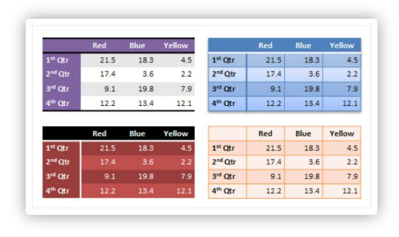

# L.4.5 表格

**Tables**

## L.4.5.1 Introduction

=== "中文"

    DrawingML 在这些方面描述表的定义和关联的样式信息。 第一部分描述表格样式方面，第二部分描述 DrawingML 中表格的定义。

=== "英文"

    **Introduction**

    This aspect of DrawingML deals with the definition of a table and the associated styling information. The first part describes the table styles aspect, while the second part describes the definition of a table within DrawingML. 

## L.4.5.2 表格样式

=== "中文"

    表格样式负责可应用于表格的快速格式化。 这种快速格式化会考虑不同的因素，例如是否应强调第一行或最后一行，或者表格上是否存在条带。 所有这些不同类型的格式都可以在表格样式中定义。 图 1 是在同一张桌子上使用不同表格样式的示例。

    

    图 1: 使用的不同表格样式

    将表格样式应用于表格会整体格式化表格。 许多复杂的类型构成了表格样式。 在定义表格样式本身之前，首先讨论表格样式的各个部分。

=== "英文"

    **Table Styles**

    Table styles are responsible for the rapid formatting that can be applied to a table. This rapid formatting takes different things into account, such as if the first row or last row should be emphasized, or if there is banding present on the table. All of these different types of formatting can be defined within a table style. An example of different table styles in use on the same table can be seen in figure 1.

    

    Figure 6: Different table styles in use.

    The application of a table style to a table formats the table in its entirety. A number of complex types make up a table style. The pieces of a table style are discussed first, before the table style itself is defined.

### L.4.5.2.1 单元格 3-D

=== "中文"

    复杂类型 CT_Cell3D 定义单个单元可以拥有的所有 3-D 属性。 就桌子而言，这些 3D 属性可以是斜角以及单元的材料和灯光装置。 （关于 `CT_Cell3D` 的这三个部分的更多说明可以在 §L.4.6 中找到。）这些属性应用于每个单元格，而不是应用于整个表。 `CT_Cell3D` 按以下方式定义：

    ```xml
    <xsd:complexType name="CT_Cell3D">
        <xsd:sequence>
            <xsd:element name="bevel" type="CT_Bevel" minOccurs="1" maxOccurs="1" />
            <xsd:element name="lightRig" type="CT_LightRig" minOccurs="0" maxOccurs="1" />
            <xsd:element name="extLst" type="CT_OfficeArtExtensionList" minOccurs="0" maxOccurs="1" />
        </xsd:sequence>
        <xsd:attribute name="prstMaterial" type="ST_PresetMaterialType" use="optional" default="plastic" />
    </xsd:complexType>
    ```

    此复杂类型还包含 `CT_OfficeArtExtensionList`。 这种复杂类型用于未来的可扩展性，并且在整个表格区域的其他地方都可以看到。

=== "英文"

    **Cell 3-D**

    The complex type, CT_Cell3D, defines all of the 3-D properties that an individual cell can hold. In the case of a table, these 3-D properties can be a bevel along with a material and a light rig for the cell. (More explanation of these three pieces of a CT_Cell3D can be found in §L.4.6.) These properties are applied on a per-cell basis, rather than to the table as a whole. A CT_Cell3D is defined in the following manner:

    ```xml
    <xsd:complexType name="CT_Cell3D">
        <xsd:sequence>
            <xsd:element name="bevel" type="CT_Bevel" minOccurs="1" maxOccurs="1" />
            <xsd:element name="lightRig" type="CT_LightRig" minOccurs="0" maxOccurs="1" />
            <xsd:element name="extLst" type="CT_OfficeArtExtensionList" minOccurs="0" maxOccurs="1" />
        </xsd:sequence>
        <xsd:attribute name="prstMaterial" type="ST_PresetMaterialType" use="optional" default="plastic" />
    </xsd:complexType>
    ```

    This complex type also holds a CT_OfficeArtExtensionList. This complex type is used for future extensibility and is seen elsewhere throughout the tables area.

### L.4.5.2.2 主题化样式

=== "中文"

    三个组和一个复杂类型说明了可以主题化的样式作品。 这些主题方面要么来自样式矩阵，要么定义实际的填充或效果。 如果他们从矩阵中提取样式，那么对文档主题的更新也会动态更新特定样式。 这三个组由以下组组成：

    ```xml
    <xsd:group name="EG_ThemeableFillStyle">
        <xsd:choice>
            <xsd:element name="fill" type="CT_FillProperties" minOccurs="1" maxOccurs="1" />
            <xsd:element name="fillRef" type="CT_StyleMatrixReference" minOccurs="1" maxOccurs="1" />
        </xsd:choice>
    </xsd:group>
    <xsd:group name="EG_ThemeableEffectStyle">
        <xsd:choice>
            <xsd:element name="effect" type="CT_EffectProperties" minOccurs="1" maxOccurs="1" />
            <xsd:element name="effectRef" type="CT_StyleMatrixReference" minOccurs="1" maxOccurs="1" />
        </xsd:choice>
    </xsd:group>
    <xsd:group name="EG_ThemeableFontStyles">
        <xsd:choice>
            <xsd:element name="font" type="CT_FontCollection" minOccurs="1" maxOccurs="1" />
            <xsd:element name="fontRef" type="CT_FontReference" minOccurs="1" maxOccurs="1" />
        </xsd:choice>
    </xsd:group>
    ```

    首先，这三个组都提供了使用主题样式或自己定义样式之间的选择。 该组中的最后一个类型是复杂类型，用于执行与上述三个类型相同的任务，只是它处理表中的行。 复杂类型 `CT_ThemeableLineStyle` 定义为：

    ```xml
    <xsd:complexType name="CT_ThemeableLineStyle">
        <xsd:choice>
            <xsd:element name="ln" type="CT_LineProperties" minOccurs="1" maxOccurs="1" />
            <xsd:element name="lnRef" type="CT_StyleMatrixReference" minOccurs="1" maxOccurs="1" />
        </xsd:choice>
    </xsd:complexType>
    ```

=== "英文"

    **Themeable Styles**

    Three groups and a complex type account for style pieces that can be themed. These themed aspects either pull from the style matrix, or they define an actual fill or effect for example. If they pull their style from the matrix, then an update to the document theme also updates the particular style dynamically. The three groups consist of the following groups:

    ```xml
    <xsd:group name="EG_ThemeableFillStyle">
        <xsd:choice>
            <xsd:element name="fill" type="CT_FillProperties" minOccurs="1" maxOccurs="1" />
            <xsd:element name="fillRef" type="CT_StyleMatrixReference" minOccurs="1" maxOccurs="1" />
        </xsd:choice>
    </xsd:group>
    <xsd:group name="EG_ThemeableEffectStyle">
        <xsd:choice>
            <xsd:element name="effect" type="CT_EffectProperties" minOccurs="1" maxOccurs="1" />
            <xsd:element name="effectRef" type="CT_StyleMatrixReference" minOccurs="1" maxOccurs="1" />
        </xsd:choice>
    </xsd:group>
    <xsd:group name="EG_ThemeableFontStyles">
        <xsd:choice>
            <xsd:element name="font" type="CT_FontCollection" minOccurs="1" maxOccurs="1" />
            <xsd:element name="fontRef" type="CT_FontReference" minOccurs="1" maxOccurs="1" />
        </xsd:choice>
    </xsd:group>
    ```

    The three groups above all give a choice between using a themed style or defining the style themselves. The last type in this group is a complex type used to perform the same task as the above three, only it deals with the lines in the table. The complex type, CT_ThemeableLineStyle, is defined as:

    ```xml
    <xsd:complexType name="CT_ThemeableLineStyle">
        <xsd:choice>
            <xsd:element name="ln" type="CT_LineProperties" minOccurs="1" maxOccurs="1" />
            <xsd:element name="lnRef" type="CT_StyleMatrixReference" minOccurs="1" maxOccurs="1" />
        </xsd:choice>
    </xsd:complexType>
    ```

### L.4.5.2.3 开/关属性定义

=== "中文"

    简单类型 `ST_OnOffStyleType` 定义具有 `on`、`off` 或 `default` 值的类型。 **默认值表示遵循父级设置**。 这对于主题化的属性很重要(themed property)，这意味着遵循主题的内容。 对于无主题的属性，这意味着遵循属性继承链中的父设置。

=== "英文"

    **On/Off Property Definition**

    The simple type ST_OnOffStyleType defines a type with values of on, off, or default. The default value means to follow the parent settings. This comes into play for a themed property, which means follow what the theme says. For an unthemed property, this means to follow the parent setting in the property inheritance chain.

### L.4.5.2.4 文本属性

=== "中文"

    复合类型 `CT_TableStyleTextStyle` 定义可设置样式的**表格文本属性**。 文本属性包含对主题化字体样式的引用以及启用或禁用的粗体和斜体。 `CT_TableStyleTextStyle` 按以下方式定义：

    ```xml
    <xsd:complexType name="CT_TableStyleTextStyle">
        <xsd:sequence>
            <xsd:group ref="EG_ThemeableFontStyles" minOccurs="0" maxOccurs="1" />
            <xsd:group ref="EG_ColorChoice" minOccurs="0" maxOccurs="1" />
            <xsd:element name="ext" type="CT_OfficeArtExtension" minOccurs="0" maxOccurs="1" />
        </xsd:sequence>
        <xsd:attribute name="b" type="ST_OnOffStyleType" use="optional" default="def" />
        <xsd:attribute name="i" type="ST_OnOffStyleType" use="optional" default="def" />
    </xsd:complexType>
    ```

=== "英文"

    **Text Properties**

    The compelex type CT_TableStyleTextStyle defines the table text properties that can be styled. The text properties contain a reference to a themeable font style along with bold and italic being enabled or disabled. The CT_TableStyleTextStyle is defined in the following manner:

    ```xml
    <xsd:complexType name="CT_TableStyleTextStyle">
        <xsd:sequence>
            <xsd:group ref="EG_ThemeableFontStyles" minOccurs="0"
                maxOccurs="1" />
            <xsd:group ref="EG_ColorChoice" minOccurs="0" maxOccurs="1" />
            <xsd:element name="ext" type="CT_OfficeArtExtension" minOccurs="0"
                maxOccurs="1" />
        </xsd:sequence>
        <xsd:attribute name="b" type="ST_OnOffStyleType" use="optional"
            default="def" />
        <xsd:attribute name="i" type="ST_OnOffStyleType" use="optional"
            default="def" />
    </xsd:complexType>
    ```

### L.4.5.2.5 单元格边框属性

=== "中文"

    复杂类型 `CT_TableCellBorderStyle` 定义可在表格中设置样式的边框的属性。 边框样式可应用于表格中以下不同类型的边框：

    - left – 左边框
    - right – 右边框
    - top – 上边框
    - bottom – 下边框
    - insideH – 内部水平边框
    - insideV – 内部垂直边框
    - tl2br – 从左上角到右下角的对角边框
    - tr2bl – 从右上角到左下角的对角边框

    复杂类型的定义方式如下：

    ```xml
    <xsd:complexType name="CT_TableCellBorderStyle">
        <xsd:sequence>
            <xsd:element name="left" type="CT_ThemeableLineStyle" minOccurs="0" maxOccurs="1" />
            <xsd:element name="right" type="CT_ThemeableLineStyle" minOccurs="0" maxOccurs="1" />
            <xsd:element name="top" type="CT_ThemeableLineStyle" minOccurs="0" maxOccurs="1" />
            <xsd:element name="bottom" type="CT_ThemeableLineStyle" minOccurs="0" maxOccurs="1" />
            <xsd:element name="insideH" type="CT_ThemeableLineStyle" minOccurs="0" maxOccurs="1" />
            <xsd:element name="insideV" type="CT_ThemeableLineStyle" minOccurs="0" maxOccurs="1" />
            <xsd:element name="tl2br" type="CT_ThemeableLineStyle" minOccurs="0" maxOccurs="1" />
            <xsd:element name="tr2bl" type="CT_ThemeableLineStyle" minOccurs="0" maxOccurs="1" />
            <xsd:element name="ext" type="CT_OfficeArtExtension" minOccurs="0" maxOccurs="1" />
        </xsd:sequence>
    </xsd:complexType>
    ```

=== "英文"

    **Cell Border Properties**

    The complex type CT_TableCellBorderStyle defines the properties of the borders that can be styled in a table. The border styles can be applied to the following different types of borders in a table:

    - left – left border
    - right – right border
    - top – top border
    - bottom – bottom border
    - insideH – inner horizontal borders
    - insideV – inner vertical borders
    - tl2br – diagonal border from top left corner to bottom right corner
    - tr2bl – diagonal border from top right corner to bottom left corner

    The complex type is defined in the following manner:

    ```xml
    <xsd:complexType name="CT_TableCellBorderStyle">
        <xsd:sequence>
            <xsd:element name="left" type="CT_ThemeableLineStyle" minOccurs="0" maxOccurs="1" />
            <xsd:element name="right" type="CT_ThemeableLineStyle" minOccurs="0" maxOccurs="1" />
            <xsd:element name="top" type="CT_ThemeableLineStyle" minOccurs="0" maxOccurs="1" />
            <xsd:element name="bottom" type="CT_ThemeableLineStyle" minOccurs="0" maxOccurs="1" />
            <xsd:element name="insideH" type="CT_ThemeableLineStyle" minOccurs="0" maxOccurs="1" />
            <xsd:element name="insideV" type="CT_ThemeableLineStyle" minOccurs="0" maxOccurs="1" />
            <xsd:element name="tl2br" type="CT_ThemeableLineStyle" minOccurs="0" maxOccurs="1" />
            <xsd:element name="tr2bl" type="CT_ThemeableLineStyle" minOccurs="0" maxOccurs="1" />
            <xsd:element name="ext" type="CT_OfficeArtExtension" minOccurs="0" maxOccurs="1" />
        </xsd:sequence>
    </xsd:complexType>
    ```

### L.4.5.2.6 单元格样式属性

=== "中文"

    复杂类型 `CT_TableStyleCellStyle` 包含可设置样式的单元格属性的定义。 在这个复杂的类型中包含边框样式、单元格填充样式和单元格 3-D。 复杂类型的定义方式如下：

    ```xml
    <xsd:complexType name="CT_TableStyleCellStyle">
        <xsd:sequence>
            <xsd:element name="tcBdr" type="CT_TableCellBorderStyle" minOccurs="0" maxOccurs="1" />
            <xsd:group ref="EG_ThemeableFillStyle" minOccurs="0" maxOccurs="1" />
            <xsd:element name="cell3D" type="CT_Cell3D" minOccurs="0" maxOccurs="1" />
        </xsd:sequence>
    </xsd:complexType>
    ```

=== "英文"

    **Cell Style Properties**

    The complex type CT_TableStyleCellStyle contains the definition for cell properties which can be styled. Within this complex type are held the border style, cell fill style, and the cell 3-D. The complex type is defined in the following manner:

    ```xml
    <xsd:complexType name="CT_TableStyleCellStyle">
        <xsd:sequence>
            <xsd:element name="tcBdr" type="CT_TableCellBorderStyle"
                minOccurs="0" maxOccurs="1" />
            <xsd:group ref="EG_ThemeableFillStyle" minOccurs="0"
                maxOccurs="1" />
            <xsd:element name="cell3D" type="CT_Cell3D" minOccurs="0"
                maxOccurs="1" />
        </xsd:sequence>
    </xsd:complexType>
    ```

### L.4.5.2.7 表格背景属性

=== "中文"

    复杂类型 `CT_TableBackgroundStyle` 定义与表格背景关联的样式元素。 表格背景样式可以包含填充和效果。 复杂类型的定义方式如下：

    ```xml
    <xsd:complexType name="CT_TableBackgroundStyle">
        <xsd:sequence>
            <xsd:group ref="EG_ThemeableFillStyle" minOccurs="0" maxOccurs="1" />
            <xsd:group ref="EG_ThemeableEffectStyle" minOccurs="0" maxOccurs="1" />
        </xsd:sequence>
    </xsd:complexType>
    ```

=== "英文"

    **Table Background Style**

    The complex type CT_TableBackgroundStyle defines the style elements associated with the background of the table. The table background style can contain a fill and effect. The complex type is defined in the following manner:

    ```xml
    <xsd:complexType name="CT_TableBackgroundStyle">
        <xsd:sequence>
            <xsd:group ref="EG_ThemeableFillStyle" minOccurs="0"
                maxOccurs="1" />
            <xsd:group ref="EG_ThemeableEffectStyle" minOccurs="0"
                maxOccurs="1" />
        </xsd:sequence>
    </xsd:complexType>
    ```

### L.4.5.2.8 表格部分属性

=== "中文"

    复杂类型 `CT_TablePartStyle` 定义用于保存表的单个部分的样式信息的结构。 该表分为 13 个不同的部分，本文档的下一个小节对此进行了解释。 表格部分包含文本样式和单元格样式，并按以下方式定义：

    ```xml
    <xsd:complexType name="CT_TablePartStyle">
        <xsd:sequence>
            <xsd:element name="tcTxStyle" type="CT_TableStyleTextStyle"
                minOccurs="0" maxOccurs="1" />
            <xsd:element name="tcStyle" type="CT_TableStyleCellStyle"
                minOccurs="0" maxOccurs="1" />
        </xsd:sequence>
    </xsd:complexType>
    ```

=== "英文"

    **Table Part Style**

    The complex type CT_TablePartStyle defines a structure for holding the style information for a single part of the table. The table is broken up in 13 different parts, which are explained in the next subclause of this document. A table part contains a text style and a cell style and is defined in the following manner:

    ```xml
    <xsd:complexType name="CT_TablePartStyle">
        <xsd:sequence>
            <xsd:element name="tcTxStyle" type="CT_TableStyleTextStyle"
                minOccurs="0" maxOccurs="1" />
            <xsd:element name="tcStyle" type="CT_TableStyleCellStyle"
                minOccurs="0" maxOccurs="1" />
        </xsd:sequence>
    </xsd:complexType>
    ```

### L.4.5.2.9 表格样式

=== "中文"

    复杂类型 `CT_TableStyle` 定义实际的表格样式。 除了表格背景之外，还可以在表格样式中定义 13 个不同的部分。 考虑到第一行、第一列、最后一行、最后一列、行带和列带选项的开/关状态的 6 种组合，这些部分一起定义表格的样式。 构成表格样式的表格的不同部分是：

    - tableBg – 表格背景（这不是 `CT_TablePartStyle`）
    - wholeTable – 整个表格的格式设置
    - band1Horizontal – 启用行分段时应用，这是第一个行样式，与 band2Horiztonal 交替
    - band2Horizontal – 启用行分段时应用，这是第二个行样式，与 band1Horizontal 交替
    - band1Vertical – 启用列带化时应用，这是第一个列样式，与 band2Vertial 交替
    - band2Vertical – 启用列带化时应用，这是第二个列样式，与 band1Vertical 交替
    - lastCol – 启用最后一列格式时，格式应用于最后一列
    - firstCol – 启用第一列格式时，格式应用于第一列
    - lastRow – 启用最后一行格式时，格式应用于最后一行
    - firstRow – 启用第一行格式时，格式应用于第一行
    - seCell – 启用最后一列和最后一行时，格式应用于表格东南角的单元格
    - swCell – 启用第一列和最后一行时，格式应用于表格西南角的单元格
    - neCell – 启用最后一列和第一行时，格式应用于表格东北角的单元格
    - nwCell – 启用第一列和第一行时，格式应用于表格西北角的单元格
    
    表格样式定义如下：

    ```xml
    <xsd:complexType name="CT_TableStyle">
        <xsd:sequence>
            <xsd:element name="tblBg" type="CT_TableBackgroundStyle" minOccurs="0" maxOccurs="1" />
            <xsd:element name="wholeTbl" type="CT_TablePartStyle" minOccurs="0" maxOccurs="1" />
            <xsd:element name="band1H" type="CT_TablePartStyle" minOccurs="0" maxOccurs="1" />
            <xsd:element name="band2H" type="CT_TablePartStyle" minOccurs="0" maxOccurs="1" />
            <xsd:element name="band1V" type="CT_TablePartStyle" minOccurs="0" maxOccurs="1" />
            <xsd:element name="band2V" type="CT_TablePartStyle" minOccurs="0" maxOccurs="1" />
            <xsd:element name="lastCol" type="CT_TablePartStyle" minOccurs="0" maxOccurs="1" />
            <xsd:element name="firstCol" type="CT_TablePartStyle" minOccurs="0" maxOccurs="1" />
            <xsd:element name="lastRow" type="CT_TablePartStyle" minOccurs="0" maxOccurs="1" />
            <xsd:element name="seCell" type="CT_TablePartStyle" minOccurs="0" maxOccurs="1" />
            <xsd:element name="swCell" type="CT_TablePartStyle" minOccurs="0" maxOccurs="1" />
            <xsd:element name="firstRow" type="CT_TablePartStyle" minOccurs="0" maxOccurs="1" />
            <xsd:element name="neCell" type="CT_TablePartStyle" minOccurs="0" maxOccurs="1" />
            <xsd:element name="nwCell" type="CT_TablePartStyle" minOccurs="0" maxOccurs="1" />
            <xsd:element name="ext" type="CT_OfficeArtExtension" minOccurs="0" maxOccurs="1" />
        </xsd:sequence>
        <xsd:attribute name="styleId" type="ST_Guid" use="required" />
        <xsd:attribute name="styleName" type="xsd:string" use="required" />
    </xsd:complexType>
    ```

    表格样式中还包含 ID 和名称。 名称显示为表格样式的名称，ID 是与表格样式关联的唯一 ID (GUID)。

=== "英文"

    **Table Style**

    The complex type CT_TableStyle defines the actual table style. Apart from the table background, 13 different parts that can be defined in a table style. These parts work together to define the styling for a table, given the 6 combinations of on/off states for the first row, first column, last row, last column, row banding, and column banding options. The different parts of a table that make up a table style are:

    - tableBg – table background (this is not a CT_TablePartStyle)
    - wholeTable – formatting for the entire table
    - band1Horizontal – applied when row banding is enabled, this is the first row style, which alternates with band2Horiztonal
    - band2Horizontal – applied when row banding is enabled, this is the second row style, which alternates with band1Horizontal
    - band1Vertical – applied when column banding is enabled, this is the first column style, which alternates with band2Vertial
    - band2Vertical – applied when column banding is enabled, this is the second column style, which alternates with band1Vertical
    - lastCol – formatting applied to the last column when last column formatting is enabled
    - firstCol – formatting applied to the first column when first column formatting is enabled
    - lastRow – formatting applied to the last row when last row formatting is enabled
    - firstRow – formatting applied to the first row when first row formatting is enabled
    - seCell – formatting applied to the cell in the southeast corner of the table when last column and last row are enabled
    - swCell – formatting applied to the cell in the southwest corner of the table when first column and last row are enabled
    - neCell – formatting applied to the cell in the northeast corner of the table when the last column and first row are enabled
    - nwCell – formatting applied to the cell in the northwest corner of the table when the first column and first row are enabled
    
    The table style is defined in the following manner:

    ```xml
    <xsd:complexType name="CT_TableStyle">
        <xsd:sequence>
            <xsd:element name="tblBg" type="CT_TableBackgroundStyle" minOccurs="0" maxOccurs="1" />
            <xsd:element name="wholeTbl" type="CT_TablePartStyle" minOccurs="0" maxOccurs="1" />
            <xsd:element name="band1H" type="CT_TablePartStyle" minOccurs="0" maxOccurs="1" />
            <xsd:element name="band2H" type="CT_TablePartStyle" minOccurs="0" maxOccurs="1" />
            <xsd:element name="band1V" type="CT_TablePartStyle" minOccurs="0" maxOccurs="1" />
            <xsd:element name="band2V" type="CT_TablePartStyle" minOccurs="0" maxOccurs="1" />
            <xsd:element name="lastCol" type="CT_TablePartStyle" minOccurs="0" maxOccurs="1" />
            <xsd:element name="firstCol" type="CT_TablePartStyle" minOccurs="0" maxOccurs="1" />
            <xsd:element name="lastRow" type="CT_TablePartStyle" minOccurs="0" maxOccurs="1" />
            <xsd:element name="seCell" type="CT_TablePartStyle" minOccurs="0" maxOccurs="1" />
            <xsd:element name="swCell" type="CT_TablePartStyle" minOccurs="0" maxOccurs="1" />
            <xsd:element name="firstRow" type="CT_TablePartStyle" minOccurs="0" maxOccurs="1" />
            <xsd:element name="neCell" type="CT_TablePartStyle" minOccurs="0" maxOccurs="1" />
            <xsd:element name="nwCell" type="CT_TablePartStyle" minOccurs="0" maxOccurs="1" />
            <xsd:element name="ext" type="CT_OfficeArtExtension" minOccurs="0" maxOccurs="1" />
        </xsd:sequence>
        <xsd:attribute name="styleId" type="ST_Guid" use="required" />
        <xsd:attribute name="styleName" type="xsd:string" use="required" />
    </xsd:complexType>
    ```

    Also contained within the table style are an ID and a name. The name shows up as the name for the table style, and the ID is the unique id (GUID) that is associated with the table style.

### L.4.5.2.10 表格样式列表

=== "中文"

    处理表格样式的最终复杂类型只是**表格样式的列表**。 该列表中还包含**默认样式**，当使用默认样式时，该样式将应用于表格。 复杂类型 `CT_TableStyleList` 的定义方式如下：

    ```xml
    <xsd:complexType name="CT_TableStyleList">
        <xsd:sequence>
            <xsd:element name="tblStyle" type="CT_TableStyle" minOccurs="0"
                maxOccurs="unbounded" />
        </xsd:sequence>
        <xsd:attribute name="def" type="ST_Guid" use="required" />
    </xsd:complexType>
    ```

=== "英文"

    **Table Style List**

    The final complex type dealing with table styles is simply a list of table styles. Also contained in this list is the default style which gets applied to the table when the a default is to be used. The complex type CT_TableStyleList is defined in the following manner:

    ```xml
    <xsd:complexType name="CT_TableStyleList">
        <xsd:sequence>
            <xsd:element name="tblStyle" type="CT_TableStyle" minOccurs="0"
                maxOccurs="unbounded" />
        </xsd:sequence>
        <xsd:attribute name="def" type="ST_Guid" use="required" />
    </xsd:complexType>
    ```

## L.4.5.3 表格的定义

=== "中文"

    在本小节中，重点是表的实际定义以及表中包含的数据。 本子条款中的复杂类型没有表样式子条款那么多，但它们的组织方式与表样式部分相同。

=== "英文"

    **Table Definition**

    In this subclause, the focus is on the actual definition of a table and the data contained within the table. There are not as many complex types in this subclause as with the table style subclause, but they are organized in the same way as the table style section.

### L.4.5.3.1 单元格属性

=== "中文"

    复杂类型 `CT_TableCellProperties` 包含处理给定单元格属性的所有信息。 单元格属性包含不同线条属性 (ln*)、单元格填充属性、3-D 属性、单元格边距信息 (mar*)、锚定信息（`anchor` 和 `anchorCtr`）、垂直文本类型以及最后的部分。 定义水平文本溢出 (`horzOverflow`) 行为的属性。 与本文档中定义的许多其他类型一样，`CT_TableCellProperties` 包含为将来的扩展性保留的元素。 复杂类型的定义方式如下：

    ```xml
    <xsd:complexType name="CT_TableCellProperties">
        <xsd:sequence>
            <xsd:element name="lnL" type="CT_LineProperties" minOccurs="0" maxOccurs="1" />
            <xsd:element name="lnR" type="CT_LineProperties" minOccurs="0" maxOccurs="1" />
            <xsd:element name="lnT" type="CT_LineProperties" minOccurs="0" maxOccurs="1" />
            <xsd:element name="lnB" type="CT_LineProperties" minOccurs="0" maxOccurs="1" />
            <xsd:element name="lnTlToBr" type="CT_LineProperties" minOccurs="0" maxOccurs="1" />
            <xsd:element name="lnBlToTr" type="CT_LineProperties" minOccurs="0" maxOccurs="1" />
            <xsd:element name="cell3D" type="CT_Cell3D" minOccurs="0" maxOccurs="1" />
            <xsd:group ref="EG_FillProperties" minOccurs="0" maxOccurs="1" />
            <xsd:element name="extLst" type="CT_OfficeArtExtensionList" minOccurs="0" maxOccurs="1" />
        </xsd:sequence>
        <xsd:attribute name="marL" type="ST_Coordinate32" use="optional" default="91440" />
        <xsd:attribute name="marR" type="ST_Coordinate32" use="optional" default="91440" />
        <xsd:attribute name="marT" type="ST_Coordinate32" use="optional" default="45720" />
        <xsd:attribute name="marB" type="ST_Coordinate32" use="optional" default="45720" />
        <xsd:attribute name="vert" type="ST_TextVerticalType" use="optional" default="horz" />
        <xsd:attribute name="anchor" type="ST_TextAnchoringType" use="optional" default="t" />
        <xsd:attribute name="anchorCtr" type="xsd:boolean" use="optional" default="false" />
        <xsd:attribute name="horzOverflow" type="ST_TextHorzOverflowType" use="optional" default="clip" />
    </xsd:complexType>
    ```

=== "英文"

    **Cell Properties**

    The complex type, CT_TableCellProperties, holds all the information that deals with the properties of a given cell. The cell properties contain a section for the different line properties (ln*), the cell fill properties, the 3-D properties, cell margin information (mar*), anchoring information (anchor and anchorCtr), a vertical text type, and finally an attribute which defines the behavior of horizontal text overflow (horzOverflow). As with many other types defined in this document, CT_TableCellProperties contains an element reserved for future extensibility. The complex type is defined in the following manner:

    ```xml
    <xsd:complexType name="CT_TableCellProperties">
        <xsd:sequence>
            <xsd:element name="lnL" type="CT_LineProperties" minOccurs="0" maxOccurs="1" />
            <xsd:element name="lnR" type="CT_LineProperties" minOccurs="0" maxOccurs="1" />
            <xsd:element name="lnT" type="CT_LineProperties" minOccurs="0" maxOccurs="1" />
            <xsd:element name="lnB" type="CT_LineProperties" minOccurs="0" maxOccurs="1" />
            <xsd:element name="lnTlToBr" type="CT_LineProperties" minOccurs="0" maxOccurs="1" />
            <xsd:element name="lnBlToTr" type="CT_LineProperties" minOccurs="0" maxOccurs="1" />
            <xsd:element name="cell3D" type="CT_Cell3D" minOccurs="0" maxOccurs="1" />
            <xsd:group ref="EG_FillProperties" minOccurs="0" maxOccurs="1" />
            <xsd:element name="extLst" type="CT_OfficeArtExtensionList" minOccurs="0" maxOccurs="1" />
        </xsd:sequence>
        <xsd:attribute name="marL" type="ST_Coordinate32" use="optional" default="91440" />
        <xsd:attribute name="marR" type="ST_Coordinate32" use="optional" default="91440" />
        <xsd:attribute name="marT" type="ST_Coordinate32" use="optional" default="45720" />
        <xsd:attribute name="marB" type="ST_Coordinate32" use="optional" default="45720" />
        <xsd:attribute name="vert" type="ST_TextVerticalType" use="optional" default="horz" />
        <xsd:attribute name="anchor" type="ST_TextAnchoringType" use="optional" default="t" />
        <xsd:attribute name="anchorCtr" type="xsd:boolean" use="optional" default="false" />
        <xsd:attribute name="horzOverflow" type="ST_TextHorzOverflowType" use="optional" default="clip" />
    </xsd:complexType>
    ```

### L.4.5.3.2 列

=== "中文"

    复杂类型 `CT_TableCol` 定义表列元素。 表列元素仅保存表中给定列的宽度以及为将来的可扩展性保留的元素。 复杂类型定义为：

    ```xml
    <xsd:complexType name="CT_TableCol">
        <xsd:sequence>
            <xsd:element name="extLst" type="CT_OfficeArtExtensionList" minOccurs="0" maxOccurs="1" />
        </xsd:sequence>
        <xsd:attribute name="w" type="ST_Coordinate" use="required" />
    </xsd:complexType>
    ```

=== "英文"

    **Column**

    The complex type, CT_TableCol, defines a table column element. The table column element simply holds the width for a given column in a table along with an element reserved for future extensibility. The complex type is defined as:

    ```xml
    <xsd:complexType name="CT_TableCol">
        <xsd:sequence>
            <xsd:element name="extLst" type="CT_OfficeArtExtensionList" minOccurs="0" maxOccurs="1" />
        </xsd:sequence>
        <xsd:attribute name="w" type="ST_Coordinate" use="required" />
    </xsd:complexType>
    ```

### L.4.5.3.3 表格网格

=== "中文"

    复杂类型 `CT_TableGrid` 定义表列元素的列表，或者更确切地说 `CT_TableCol` 复杂类型。 `CT_TableGrid` 应包含表中每一列的 `CT_TableCol`，其定义方式如下：

    ```xml
    <xsd:complexType name="CT_TableGrid">
        <xsd:sequence>
            <xsd:element name="gridCol" type="CT_TableCol" minOccurs="0" maxOccurs="unbounded" />
        </xsd:sequence>
    </xsd:complexType>
    ```

=== "英文"

    **Table Grid**

    The complex type, CT_TableGrid, defines a list of table column elements, or rather CT_TableCol complex types. The CT_TableGrid should contain a CT_TableCol for each column in the table and it is defined in the following manner:

    ```xml
    <xsd:complexType name="CT_TableGrid">
        <xsd:sequence>
            <xsd:element name="gridCol" type="CT_TableCol" minOccurs="0" maxOccurs="unbounded" />
        </xsd:sequence>
    </xsd:complexType>
    ```

### L.4.5.3.4 单元格

=== "中文"

    复杂类型 `CT_TableCell` 定义表中的单元格。 在这个复杂的类型中，有一个文本正文，它保存单元格的数据以及应用于文本的任何格式。 该复杂类型还包含已定义的表单元格属性复杂类型。 `rowSpan` 和 `gridSpan` 属性与 `hMerge` 和 `vMerge` 属性一起可用。 `hMerge` 和 `vMerge` 属性定义当前单元格是否应该与前一个单元格水平或垂直合并。 这就是表的解析和创建方式。 复杂类型 `CT_TableCell` 定义为：

    ```xml
    <xsd:complexType name="CT_TableCell">
        <xsd:sequence>
            <xsd:element name="txBody" type="CT_TextBody" minOccurs="0" maxOccurs="1" />
            <xsd:element name="tcPr" type="CT_TableCellProperties" minOccurs="0" maxOccurs="1" />
            <xsd:element name="extLst" type="CT_OfficeArtExtensionList" minOccurs="0" maxOccurs="1" />
        </xsd:sequence>
        <xsd:attribute name="rowSpan" type="xsd:int" use="optional" default="1" />
        <xsd:attribute name="gridSpan" type="xsd:int" use="optional" default="1" />
        <xsd:attribute name="hMerge" type="xsd:boolean" use="optional" default="false" />
        <xsd:attribute name="vMerge" type="xsd:boolean" use="optional" default="false" />
    </xsd:complexType>
    ```

=== "英文"

    **Cell**

    The complex type, CT_TableCell, defines a cell in a table. Within this complex type lies a text body which holds the data of the cell along with any formatting applied to the text. This complex type also holds a table cell property complex type which has already been defined. The rowSpan and gridSpan attributes are available along with hMerge and vMerge attributes. The hMerge and vMerge attributes define if the current cell is supposed to be merged with the previous cell horizontally or vertically. This is how the table is parsed and created. The complex type, CT_TableCell, is defined as:

    ```xml
    <xsd:complexType name="CT_TableCell">
        <xsd:sequence>
            <xsd:element name="txBody" type="CT_TextBody" minOccurs="0" maxOccurs="1" />
            <xsd:element name="tcPr" type="CT_TableCellProperties" minOccurs="0" maxOccurs="1" />
            <xsd:element name="extLst" type="CT_OfficeArtExtensionList" minOccurs="0" maxOccurs="1" />
        </xsd:sequence>
        <xsd:attribute name="rowSpan" type="xsd:int" use="optional" default="1" />
        <xsd:attribute name="gridSpan" type="xsd:int" use="optional" default="1" />
        <xsd:attribute name="hMerge" type="xsd:boolean" use="optional" default="false" />
        <xsd:attribute name="vMerge" type="xsd:boolean" use="optional" default="false" />
    </xsd:complexType>
    ```

### L.4.5.3.5 行

=== "中文"

    复杂类型 `CT_TableRow` 定义表行。 这种复杂类型比类似的表列复杂类型更复杂，因为它包含一系列 `CT_TableCell` 结构以及行的高度。 复杂类型的定义方式如下：

    ```xml
    <xsd:complexType name="CT_TableRow">
        <xsd:sequence>
            <xsd:element name="tc" type="CT_TableCell" minOccurs="0" maxOccurs="unbounded" />
            <xsd:element name="extLst" type="CT_OfficeArtExtensionList" minOccurs="0" maxOccurs="1" />
        </xsd:sequence>
        <xsd:attribute name="h" type="ST_Coordinate" use="required" />
    </xsd:complexType>
    ```

=== "英文"

    **Row**

    The complex type, CT_TableRow, defines a table row. This complex type is somewhat more complex than the similar table column complex type in that it holds a sequence of CT_TableCell structures along with a height for the row. The complex type is defined in the following way:

    ```xml
    <xsd:complexType name="CT_TableRow">
        <xsd:sequence>
            <xsd:element name="tc" type="CT_TableCell" minOccurs="0" maxOccurs="unbounded" />
            <xsd:element name="extLst" type="CT_OfficeArtExtensionList" minOccurs="0" maxOccurs="1" />
        </xsd:sequence>
        <xsd:attribute name="h" type="ST_Coordinate" use="required" />
    </xsd:complexType>
    ```

### L.4.5.3.6 表格属性

=== "中文"

    复杂类型 `CT_TableProperties` 定义整个表的属性。 此复杂类型中包含当前应用于表的表样式的定义，或应用于表的内置表样式的 GUID。 在这种复杂类型中还包括从右到左的设置、应用于表格的效果（阴影、反射等）、背景填充信息以及不同开/关表格样式选项的状态。 复杂类型定义为：

    ```xml
    <xsd:complexType name="CT_TableProperties">
        <xsd:sequence>
            <xsd:group ref="EG_FillProperties" minOccurs="0" maxOccurs="1" />
            <xsd:group ref="EG_EffectProperties" minOccurs="0" maxOccurs="1" />
            <xsd:choice oxsd:cname="TableStyleOrLink" minOccurs="0" maxOccurs="1">
                <xsd:element name="tableStyle" type="CT_TableStyle" />
                <xsd:element name="tableStyleId" type="ST_Guid" />
            </xsd:choice>
            <xsd:element name="extLst" type="CT_OfficeArtExtensionList" minOccurs="0" maxOccurs="1" />
        </xsd:sequence>
        <xsd:attribute name="rtl" type="xsd:boolean" use="optional" default="false" />
        <xsd:attribute name="firstRow" type="xsd:boolean" use="optional" default="false" />
        <xsd:attribute name="firstCol" type="xsd:boolean" use="optional" default="false" />
        <xsd:attribute name="lastRow" type="xsd:boolean" use="optional" default="false" />
        <xsd:attribute name="lastCol" type="xsd:boolean" use="optional" default="false" />
        <xsd:attribute name="bandRow" type="xsd:boolean" use="optional" default="false" />
        <xsd:attribute name="bandCol" oxsdtype="xsd:boolean" use="optional" default="false" />
    </xsd:complexType>
    ```

=== "英文"

    **Table Properties**

    The complex type, CT_TableProperties, defines the properties for a table as a whole. Within this complex type is a definition for a table style that is currently applied to the table, or the GUID for the built in table style that is applied to the table. Also in this complex type are right-to-left settings, the effects applied to the table (shadow, reflection, etc), background fill information, and the states for the different on/off table style options. The complex type is defined as:

    ```xml
    <xsd:complexType name="CT_TableProperties">
        <xsd:sequence>
            <xsd:group ref="EG_FillProperties" minOccurs="0" maxOccurs="1" />
            <xsd:group ref="EG_EffectProperties" minOccurs="0" maxOccurs="1" />
            <xsd:choice oxsd:cname="TableStyleOrLink" minOccurs="0" maxOccurs="1">
                <xsd:element name="tableStyle" type="CT_TableStyle" />
                <xsd:element name="tableStyleId" type="ST_Guid" />
            </xsd:choice>
            <xsd:element name="extLst" type="CT_OfficeArtExtensionList" minOccurs="0" maxOccurs="1" />
        </xsd:sequence>
        <xsd:attribute name="rtl" type="xsd:boolean" use="optional" default="false" />
        <xsd:attribute name="firstRow" type="xsd:boolean" use="optional" default="false" />
        <xsd:attribute name="firstCol" type="xsd:boolean" use="optional" default="false" />
        <xsd:attribute name="lastRow" type="xsd:boolean" use="optional" default="false" />
        <xsd:attribute name="lastCol" type="xsd:boolean" use="optional" default="false" />
        <xsd:attribute name="bandRow" type="xsd:boolean" use="optional" default="false" />
        <xsd:attribute name="bandCol" oxsdtype="xsd:boolean" use="optional" default="false" />
    </xsd:complexType>
    ```

### L.4.5.3.7 表格

=== "中文"

    最后的复杂类型 `CT_Table` 是表的根元素。 这种复杂类型包含在 DrawingML 中创建表格所需的所有信息。 `CT_Table` 内包含表属性、表网格和表行。 `CT_Table` 按以下方式定义：

    ```xml
    <xsd:complexType name="CT_Table">
        <xsd:sequence>
            <xsd:element name="tblPr" type="CT_TableProperties" minOccurs="0" maxOccurs="1" />
            <xsd:element name="tblGrid" type="CT_TableGrid" minOccurs="1" maxOccurs="1" />
            <xsd:element name="tr" type="CT_TableRow" minOccurs="0" maxOccurs="unbounded" />
        </xsd:sequence>
    </xsd:complexType>
    ```

=== "英文"

    **Table**

    The final complex type, CT_Table, is the root element for a table. This complex type holds all the information that is needed to create a table within DrawingML. Within CT_Table are the table properties, a table grid, and a table row. A CT_Table is defined in the following manner:

    ```xml
    <xsd:complexType name="CT_Table">
        <xsd:sequence>
            <xsd:element name="tblPr" type="CT_TableProperties" minOccurs="0" maxOccurs="1" />
            <xsd:element name="tblGrid" type="CT_TableGrid" minOccurs="1" maxOccurs="1" />
            <xsd:element name="tr" type="CT_TableRow" minOccurs="0" maxOccurs="unbounded" />
        </xsd:sequence>
    </xsd:complexType>
    ```
