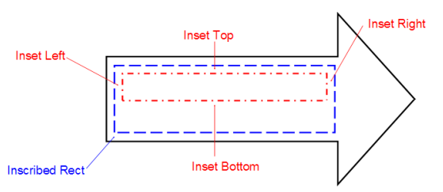
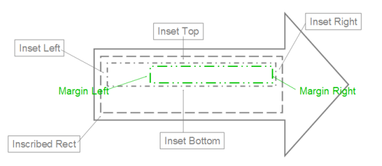
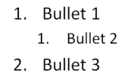
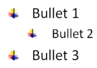
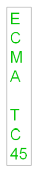

# L.4.4 文本

**Text**

## L.4.4.1 简介

=== "中文"

    本小节提供了 DrawingML 文本的高级概述。

    了解这些架构（因为它们彼此相关）的最佳方法是按以下顺序了解 DrawingML 文本文件格式。

    - 文本概述
    - 正文级别的属性
    - 段落级别的属性
    - Run和字符级别的属性

    配套模式建立在本文档中讨论的基础上。 由于下面会遇到这些问题，因此提供了它们的指南中的重点。

    本小节提供了 DrawingML 文件格式文本部分的结构化细分。 其他子条款建立在这个基础上，并解释有关文本框架、文本样式、文本字段和嵌入字体等主题的更多信息。

    请注意，本文档中描述的 DrawingML 文本与 WordprocessingML 文本不同，因为它周围的文件框架已针对以图形为中心、类似演示的方式进行了优化。 相比之下，WordprocessingML Text 允许以针对打印文档布局优化的格式存储文本，但不适用于 `<a:>` 命名空间中的基于艺术的文本。

    请注意，本文档中使用的“p”命名空间引用了 PresentationML 特定的模式(Schema)，而本文档中使用的“a”命名空间引用了DrawingML 特定的模式(Schema)。

=== "英文"

    **Introduction**

    This subclause provides a high-level overview of DrawingML text.

    The best way to understand these schemas as they relate to one another is to learn about the

    DrawingML Text file format in the following order.

    - Text Overview
    - Body Level Properties
    - Paragraph Level Properties
    - Run and Character Level Properties

    Companion schemas build on the ones discussed in this document. As these are encountered below, pointers to them are provided.

    This subclause provides a structured breakdown of the text portion of the DrawingML file format. Other subclauses build on this foundation and explain more about topics such as text frame, text styles, text fields, and embedded fonts.

    Note that DrawingML Text described within this document is distinct from WordprocessingML Text in that the file framework surrounding it has been optimized for use in a graphics-centric, presentation-like manner. As a contrast, WordprocessingML Text allows for text to be stored in a format that is optimized for layout of printed documents but not for art-based text as is found within the <a:> namespace.

    Note that the use of the "p" namespace within this document references to the PresentationML-specific schemas while the use of the "a" namespace within this document references to the DrawingML-specific schemas.

## L.4.4.2 概述

=== "中文"

    考虑具有以下基本结构的 XML 树：

    ```xml
    <sld>
        <cSld>
            <spTree>
                <nvGrpSpPr>…</nvGrpSpPr>
                <grpSpPr>…</grpSpPr>
                <sp>
                    <nvSpPr>…</nvSpPr>
                    <spPr>…</spPr>
                    <style>…</style>
                    <txBody>
                        <bodyPr rtlCol="0" anchor="ctr" />
                        <lstStyle />
                        <p>
                            <pPr algn="ctr" />
                            <r>
                                <t>Your text here!</t>
                            </r>
                        </p>
                    </txBody>
                </sp>
                <sp>…</sp>
            </spTree>
        </cSld>
    </sld>
    ```

    在上面的结构中，我们对匹配的 `p:txBody` 标签中包含的内容感兴趣。 对该标签与上述基本幻灯片结构相关的理解涵盖了有效消化本描述的其余部分所需的模式(Schema)背景。
    
    {++

    请注意，**形状是所有文本所在的标准容器**。 通常，*该形状没有附加任何视觉属性，因此不会渲染可见的形状*； 尽管如此，**形状仍然存在并且确实包含任何内容文本**。
    
    ++}
    
    每个形状都包含一个嵌入矩形，其中**包含附加到该形状的任何文本**。 该形状具有在所有四个边（顶部、底部、左侧和右侧）上缓冲此矩形的**边距**或插图(insets)，就像页面上的边距一样。 在考虑形状内的文本时，记住这些插入(inset)属性很有用。
    
    下面提供了对此的说明。

    

    让我们看看 `p:txBody` 中包含的不同元素标签。 下面列出的只是这里讨论的那些标签。 （请注意，此示例框架是一个骨架，并未完全显示所需的所有元素和属性。）

    ```xml
    <p:txBody>
        <a:bodyPr />                required, 只列出一次.
        <a:lstStyle />              optional, 如果存在仅列出一次.
        <a:p>                       required, 实例数量没有限制.
            <a:pPr />               optional, 如果存在仅列出一次.
            <a:r>                   required, 实例数量没有限制.
                <a:rPr />           optional, 如果存在仅列出一次.
                <a:t>Your text here!</a:t>
                                    本次run的实际文本包含在此处.
            </a:r>
            <a:endParaRPr />        optional, 如果存在仅列出一次.
        </a:p>
    </p:txBody>
    ```

    <table border=1>
        <tr>
            <th>**元素(Element)**</th>
            <th>**用途(Purpose)**</th>
            <th>**描述(Description)**</th>
        </tr>
        <tr>
            <td>a:bodyPr</td>
            <td>正文属性(Body Properties)</td>
            <td>
                描述文本锚点、形状自动调整、列数、文本变形以及 3D 场景和灯光效果。 参见[§L.4.4.3]。
            </td>
        </tr>
        <tr>
            <td>a:lstStyle</td>
            <td>列表样式(List Style)</td>
            <td>
                用于定义段落及其九个列表级别的样式属性。
            </td>
        </tr>
        <tr>
            <td>a:p</td>
            <td>单个段落(Single Paragraph)</td>
            <td>
                包含单个段落及其相应的段落级属性。 这里还包含组成该段落的所有文本运行(run)。 参见[§L.4.4.3.4]。
            </td>
        </tr>
        <tr>
            <td>a:pPr</td>
            <td>段落属性(Paragraph Properties)</td>
            <td>
                描述相应段落的呈现格式和样式。 可以在此空间内使用的一些可能的设置包括但不限于以下内容：间距、边距和对齐方式。 参见[§L.4.4.3.4]。
            </td>
        </tr>
        <tr>
            <td>a:r</td>
            <td>单个运行(Single Run)</td>
            <td>
                指定段落中是否存在一系列文本。 运行(run)表示可以以文件格式表示的最精细的文本形式。 参见[§L.4.4.3.8]。
            </td>
        </tr>
        <tr>
            <td>a:rPr</td>
            <td>运行属性(Run Properties)</td>
            <td>
                允许将属性附加到其父 `a:r` 元素指定的文本串。 这些属性包括但不限于以下内容：下划线、删除线和文本大写。 参见[§L.4.4.3.8]。
            </td>
        </tr>
        <tr>
            <td>a:t</td>
            <td>实际文本(Actual text)</td>
            <td>
                允许存储所有这些正文、段落和运行级别属性所描述的特定文本。 该标签是最重要的，因为它为之前的所有其他元素和属性提供了上下文。
            </td>
        </tr>
        <tr>
            <td>a:endParaRPr</td>
            <td>持久运行属性(Persistent Run Properties)</td>
            <td>
                指定当用户在此段落之后开始输入其他文本时要保留的属性。 仅当该段落后面的样式与段落本身不同时才应设置此属性。
            </td>
        </tr>
    </table>

=== "英文"

    **Overview**

    Consider an XML tree that has the following basic structure:

    ```xml
    <sld>
        <cSld>
            <spTree>
                <nvGrpSpPr>…</nvGrpSpPr>
                <grpSpPr>…</grpSpPr>
                <sp>
                    <nvSpPr>…</nvSpPr>
                    <spPr>…</spPr>
                    <style>…</style>
                    <txBody>
                        <bodyPr rtlCol="0" anchor="ctr" />
                        <lstStyle />
                        <p>
                            <pPr algn="ctr" />
                            <r>
                                <t>Your text here!</t>
                            </r>
                        </p>
                    </txBody>
                </sp>
                <sp>…</sp>
            </spTree>
        </cSld>
    </sld>
    ```

    In the structure above, we are interested in the content contained within the matching p:txBody tags. The understanding of this tag in relation to the basic slide structure above encompasses the schema background needed to digest effectively the remainder of this description.
    
    Note that shapes are the standard container within which all text resides. Usually, the shape does not have any visual properties attached to it and thus no visible shape is rendered; nonetheless, a shape is still present and does house any content text.
    
    Each shape contains an inset rectangle that houses any text attached to that shape. The shape has margins or insets that buffer this rectangle on all four sides (top, bottom, left, and right) just like margins on a page. When thinking about text within a shape, it is useful to keep these inset properties in mind.
    
    An illustration of this is provided below.

    

    Let's look at the different element tags contained within p:txBody. Listed below are only those tags discussed here. (Note that this sample framework is a skeleton and does not fully show all elements and attributes needed.)

    ```xml
    <p:txBody>
        <a:bodyPr />                required, only listed once.
        <a:lstStyle />              optional, if present only listed once.
        <a:p>                       required, no limit on the number of instances.
            <a:pPr />               optional, if present only listed once.
            <a:r>                   required, no limit on the number of instances.
                <a:rPr />           optional, if present only listed once.
                <a:t>Your text here!</a:t>
                                    Actual text for this run is contained here.
            </a:r>
            <a:endParaRPr />        optional, if present only listed once.
        </a:p>
    </p:txBody>
    ```

    <table border=1>
        <tr>
            <th>**Element**</th>
            <th>**Purpose**</th>
            <th>**Description**</th>
        </tr>
        <tr>
            <td>a:bodyPr</td>
            <td>Body Properties</td>
            <td>
                Describes text anchor points, shape autofit, number of columns, text warping, and 3D scenes and lighting effects. See §L.4.4.3.
            </td>
        </tr>
        <tr>
            <td>a:lstStyle</td>
            <td>List Style</td>
            <td>
                Used to define style properties for the paragraph and its nine list levels.
            </td>
        </tr>
        <tr>
            <td>a:p</td>
            <td>Single Paragraph</td>
            <td>
                Houses a single paragraph and its corresponding paragraphlevel properties. Contained within here are also all the text runs that comprise this paragraph. See §L.4.4.3.4.
            </td>
        </tr>
        <tr>
            <td>a:pPr</td>
            <td>Paragraph Properties</td>
            <td>
                Describes the format and style with which the corresponding paragraph is presented. Some possible settings that can be utilized within this space include, but are not limited to, the following: spacing, margins, and alignment. See §L.4.4.3.4.
            </td>
        </tr>
        <tr>
            <td>a:r</td>
            <td>Single Run</td>
            <td>
                Specifies the existence of a run of text within a paragraph. A run represents the most granular form of text that can be represented in the file format. See §L.4.4.3.8.
            </td>
        </tr>
        <tr>
            <td>a:rPr</td>
            <td>Run Properties </td>
            <td>
                Allows the attachment of properties to the run of text specified by its parent a:r element. These properties include, but are not limited to, the following: underline, strikethrough, and text caps. See §L.4.4.3.8.
            </td>
        </tr>
        <tr>
            <td>a:t</td>
            <td>Actual text</td>
            <td>
                Allows for the storage of the specific text that all these body, paragraph and run level properties are describing. This tag is the most important as it gives context to all the other elements and attributes that have come before it.
            </td>
        </tr>
        <tr>
            <td>a:endParaRPr</td>
            <td>Persistent Run Properties</td>
            <td>
                Specifies the properties that are to persist should the user begin to enter additional text after this paragraph. This property should only be set when the style that should follow this paragraph is different from the paragraph itself.
            </td>
        </tr>
    </table>

## L.4.4.3 正文级别属性

=== "中文"

    在本节中，我们将探讨可以附加到整个正文的各种属性。 如上面的示例 XML 所示，共有三个可用的基本属性级别。 正文层面的属性是其中最广泛的。 请注意，其中一些正文级属性作为属性应用于正文属性标记，而其他属性则表示为子元素。 应用每个属性的具体方法可以在上面列出的模式(Schema)中找到。

    ```xml
    <p:txBody>
        <a:bodyPr />    《= 本条涵盖的主要内容(Main element)
        <a:lstStyle />
        <a:p>
            <a:pPr />
            <a:r>
                <a:rPr />
                <a:t>Your text here!</a:t>
            </a:r>
        </a:p>
    </p:txBody>
    ```

=== "英文"

    **Body Level Properties**

    In this subclause, we'll explore the sorts of properties that can be attached to the body as a whole. As shown in the sample XML above, there are three essential property levels available. The body-level properties are to the broadest of these. Note that some of these body-level properties are applied as attributes to the body property tag while others are expressed as child elements. The specific method by which each property is applied can be found in the schemas listed above. 

    ```xml
    <p:txBody>
        <a:bodyPr />    《= Main element covered in this subclause 
        <a:lstStyle />
        <a:p>
            <a:pPr />
            <a:r>
                <a:rPr />
                <a:t>Your text here!</a:t>
            </a:r>
        </a:p>
    </p:txBody>
    ```

### L.4.4.3.1 设置文本区域

=== "中文"

    让我们从最初如何描述文本区域开始。 该区域是该正文的所有子文本所在的容器。 首先，了解**插入(inset)属性**很有用； 具体来说，顶部、底部、左侧和右侧插入属性也称为文本正文的内部边距。 锚点属性(anchor attribute)允许我们指定文本区域应锚定在其边界矩形内的位置。 

    下面的内部绿色框突出显示了该边界矩形的图示。 请注意，此处的边界矩形固定在右侧。

    

    这是文本在里面的显示方式。 属性自动调整允许三种基本场景：

    - No AutoFit: 允许文本流到容器之外.
    - Normal AutoFit: 使用定义的约束调整文本大小以适合容器区域。 （当文本太大或太长而无法放入文本容器时使用。）
    - Shape AutoFit: 实际文本容器的大小已调整以包含所有文本。 （这是唯一可以导致容器尺寸发生变化的选项。）

    术语流(term flow)用于描述文本在此文本区域内移动的方式，并描述每个正文属性如何影响文本区域内的文本。
    
    文本流动的一种方式是从一行到下一行。 这可以通过使用 `textwrapping` 属性自动完成。 另一种方法是使用列。 XML 框架允许指定多个列，文本将自动分解为这些列。 此功能还允许指定列间距和从右到左的布局，而不是默认的从左到右的布局。 文本流动的另一种方式是垂直而不是水平。 为此，可以描述许多不同形式的垂直文本：从出现旋转的文本到字符真正堆叠的文本。 当指定东亚字体时，甚至可以使文本以不同的方式流动。

    在查看流(flow)时，讨论溢出的可能性很有用。 也就是说，文本必须流到文本区域之外，因为它太大而无法容纳在内部。 为此，有两种常见的溢出类型：垂直和水平。 垂直溢出可以通过三种方式处理：

    - overflow: 这允许文本流(flow)到文本区域之外.

        

    - ellipsis: 这会裁剪溢出的文本并添加“...”以表示存在隐藏文本.

        

    - clip: 这会将文本裁剪为省略号，但不会插入“...”，因此用户不会发现存在隐藏文本. 

        

=== "英文"

    **Setting Up the Text Area**

    Let's start with how a text area might be initially described. This area is the container within which all the child text for this body resides. First, it is useful to understand the inset properties; specifically,  he top, bottom, left and right inset properties that are also known as internal margins for the text body. The anchor attribute allows us to specify where the text area should be anchored within its bounding rectangle. 

    An illustration of this bounding rectangle is highlighted below by the inner green box. Notice here that the bounding rectangle is anchored to the right.

    

    Hereis how the text appears inside. Attribute AutoFit allows for three basic scenarios:

    - No AutoFit: The text is allowed to flow outside the container.
    - Normal AutoFit: The text is resized using defined constraints to fit inside the container area. (This is used when the text is too large or long to fit in the text container.)
    - Shape AutoFit: The actual text container is resized to contain all the text. (This is the only option that can cause the container to have its dimensions changed.)

    The term flow is used to describe the way in which text moves around inside this text area, and to describe how each of the body properties affects the text within the text area.
    
    One way that text can flow is from one line to the next. This can be done automatically by using the textwrapping attribute. Another way is to use columns. The XML framework allows for the specification of a number of columns into which the text is to be automatically broken. This feature also allows for the specifying of the spacing of columns and a right-to-left layout instead of the default left-to-right. Another way that text can flow is vertical instead of horizontal. For this, there are many different forms of vertical text that can be described: from text that appears rotated to text where the characters are truly stacked. The text can even be made to flow differently when an East Asian font is specified.

    When looking at the flow it is useful to discuss the potential for overflow. That is, the text must flow outside the text area because it is too large to fit inside. For this, there are two common overflow types: vertical and horizontal. The vertical overflow can be handled in three ways:

    - overflow: This allows the text to flow outside the text area.

        

    - ellipsis: This crops the text that overflows and adds "…" to denote that there is hidden text.

        

    - clip: This crops the text just as ellipsis but does not insert "…", so the user has no indication that there is hidden text. 

        

### L.4.4.3.2 操作文本

=== "中文"

    让我们看看如何在文本正文级别进一步增强文本。 请注意，以下属性仅适用于整个文本正文，因此不能应用于特定段落或在文本正文中运行。 这些属性如下：

    - Text Warping: 文本区域内的文本根据预定义的形状自行扭曲。 该形状位于前面描述的边界框内。 这种效果称为文本扭曲，并在 DrawingML 中进一步定义其预设形状。

        

    - 3D Text: 文本可以根据 3D 场景进行描述。 使用此标签提供了三个基本选项:
    
        - 文本驻留在 3D 场景中，但作为平面文本.
        - 文本可以驻留在 3D 场景中，并对其应用 3D 效果（例如斜角或挤压）。
        - 文本位于 3D 场景之上。

    - Rotated and Upright Text: 可以指定应用于文本区域内的文本的特定旋转。 请注意，这与应用于文本区域所在形状的旋转不同。 如果未专门设置此属性，则使用容器形状的旋转。

=== "英文"

    **Manipulating the Text**

    Let's look at the ways in which the text can be further enhanced at the text body level. Note that the properties that follow apply only to the text body as a whole and thus cannot be applied to a specific paragraph or run within the text body. Theses properties are as follows:

    - Text Warping: Text within the text area is made to distort itself according to a predefined shape. This shape resides within the bounding box described earlier. This effect is known as text warping and has its preset shapes defined further within DrawingML.

        

    - 3D Text: Text can be described with respect to a 3D scene. Using this tag provides three basic options:
    
        - The text resides within a 3D scene, but as planar text.
        - The text is allowed to reside within the 3D scene and has 3D effects (such as bevel or extrusion) applied to it.
        - The text resides on top of a 3D scene.
    - Rotated and Upright Text: A particular rotation can be specified that is applied to the text within the text area. Note that this is different from the rotation that is applied to the shape within which the text area resides. If this attribute is not specifically set then the rotation of the container shape is used.

### L.4.4.3.3 向后和向前兼容性

=== "中文"

    在考虑对过去设计和未来创新的支持时，以下领域值得关注。
    
    - From WordArt: 这是特定于处理以前的艺术字文本的。 既然文本被简单地描述为形状，则不需要特定于艺术字的描述。 然而，需要确定哪些文本来自旧的艺术字样式，以防需要以旧格式写回它们。
    - Future Extensions: 未来扩展的能力已通过 ext 标签提供给 body 属性标签。 这可以以最广泛的方式使用，因为它是一个复杂的类型，因此可以描述最复杂的未来属性。 请注意，下面的每个模式子条款都有自己的 ext 标签(tag)。

=== "英文"

    **Backwards and Forwards Compatibility**

    The following areas are of interest when considering support for both past design and future innovation.
    
    - From WordArt: This is specific to dealing with previous WordArt text. Now that text is described as simply a shape, there is no need for a WordArt-specific description. There is, however, the need to identify which pieces of text were from the old WordArt styles in case there is the need to write them back out in their old format.
    - Future Extensions: The ability for future extensions has been provided to the body property tag via the ext tag. This can be used the widest way possible as it is a complex type and can thus describe the most complex future properties. Note that each of the schema subclauses below have their own ext tag.

### L.4.4.3.4 段落级别属性

=== "中文"

    在本小节中，我们探讨可以将哪些类型的属性附加到**整个段落**。 与前面描述的正文标记的属性相比，段落级属性允许对文本进行更精细的描述。 请记住，可以在此级别应用的属性不是正文或运行级别的重复项，而是仅对段落元素是**唯一**的。 再次需要注意的是，其中一些段落级属性作为段落属性标记的属性应用，而其他属性则表示为子元素。 应用每个属性的具体方法可以在上面列出的模式(schema)中找到。

    ```xml
    <p:txBody>
        <a:bodyPr />
        <a:lstStyle />
        <a:p>
        <a:pPr />     《= 本条涵盖的主要内容
        <a:r>
            <a:rPr />
            <a:t>Your text here!</a:t>
        </a:r></a:p>
    </p:txBody>
    ```

=== "英文"

    **Paragraph-Level Properties**

    In this subclause, we explore what sorts of properties can be attached to a paragraph as a whole. Paragraph-level properties allow for a more granular description of the text than the properties of the body tag described earlier. Keep in mind that the properties that can be applied at this level are not duplicates of the body or run levels, but unique only to the paragraph element. Once again, it should be noted that some of these paragraph-level properties are applied as attributes to the paragraph property tag while others are expressed as child elements. The specific method by which each property is applied can be found in the schemas listed above.

    ```xml
    <p:txBody>
        <a:bodyPr />
        <a:lstStyle />
        <a:p>
        <a:pPr />     《= Main element covered in this subclause 
        <a:r>
            <a:rPr />
            <a:t>Your text here!</a:t>
        </a:r></a:p>
    </p:txBody>
    ```

### L.4.4.3.5 间距、对齐方式和方向

=== "中文"

    XML 文件格式允许以行间距的形式指定行之间的间距，也可以通过边距和特殊的前后间距指定段落外的间距。 除此之外，还可以指定段落开头的缩进间距。

    标准对齐选项包括左对齐、右对齐、居中、两端对齐和分布式。 对齐对齐会导致每行文本被拉伸到某个点。 为了确保短行保持可读性，它们不会被拉伸。 分布式对齐非常相似，但会拉伸每一行，无论该行的长度如何。

    使用特定的 rtl 标签(tag)将文本方向指定为从左到右（默认）或从右到左。

=== "英文"

    **Spacing, Alignment, and Direction**

    The XML file format allows for the specifying of spacing both between lines in the form of line spacing, and also outside the paragraph via margins and special before/after spacing. In addition to this, there is also the ability to specify indent spacing for the beginning of the paragraph.

    The standard alignment options include left-aligned, right-aligned, centered, justified, and distributed. Justified alignment causes each line of text to be stretched out to a certain point. To ensure that short lines remain readable, they are not stretched. Distributed alignment is quite similar, but stretches every line, regardless of that line's length.

    Text direction is specified as either left-to-right (the default) or right-to-left using the specific rtl tag.

### L.4.4.3.6 制表符和换行符

=== "中文"

    当默认制表符不足以容纳相关段落时，可以选择在 XML 文件格式中包含自定义制表位。 为此所需的信息是默认制表符大小属性和显示适用于该段落的所有制表符停止位置的完整制表符停止列表。 请记住，如果文件格式中未明确声明制表位，则在需要制表符时应用程序的业务逻辑必须使用其自己的默认位置。

    换行符是一个标签，通知应用程序是否应根据拉丁语法规则或东亚语法规则将文本字符串分成多行。 东亚选项使用避头尾设置来确定是否允许单词作为文本行的开头或结尾。

=== "英文"

    **Tabs and Line Breaks**

    When the default tabs are not sufficient for the paragraph in question there is the option of including custom tab stops in the XML file format. The information required for this is both a default tab size attribute and a full tab stop list showing all tab stop positions that apply to this paragraph. Keep in mind that if tab stops are not explicitly stated in the file format that the business logic of the application must use its own default positions if tabs are needed.
    
    Line break is a tag that informs the application as to whether it should break up a string of text onto multiple lines based on Latin grammar rules or East Asian grammar rules. The East Asian option uses the Kinsoku settings to determine whether a word is allowed to begin or end a line of text.

### L.4.4.3.7 添加项目符号

=== "中文"

    项目符号是按段落指定的，因此可以在单个文本正文中混合和匹配项目符号，以显示为连贯的文本组。 可用的子弹类型有：

    - 字符项目符号(Character Bullets): 使用字体字符来表示项目符号，并且可以设置为以任何大小（文本百分比）、颜色（所有可用，包括主题颜色）和字体显示。 属性有项目符号颜色、项目符号大小、项目符号字体、项目符号字符（代表实际项目符号）
    
        

    - 自动编号项目符号(Auto-Numbered Bullets): 使用应用程序逻辑仅使用项目符号方案和起始编号将一系列数字/字符分配给特定的项目符号项目。 （使用起始编号时，起始编号后列出的所有项目符号段落都会根据最后已知的起始编号自动编号。此自动编号的范围仅在其当前文本正文内，起始编号不会延续 到不同的文本正文。）属性包括“开始位置”编号、“项目符号方案”（字母、罗马数字等）、“项目符号颜色”、“项目符号大小”和“项目符号字体”。
    
        

    - 图片项目符号(Blip Bullets): 使用图片来表示项目符号项目。 这种类型的应用项目符号唯一可用的附加属性是大小（文本的百分比）。 如果该图形不在应用程序的标准图形集中，则附加的图形将转换为 PNG 格式，放置在文档容器中，并给出一个稍后用于引用该图像的关系 ID。 属性是嵌入 id（对应于项目符号图形）和项目符号大小。
    
        

=== "英文"

    **Adding Bullets**

    Bullets are specified per paragraph, so bullets can be mixed and matched within a single text body to appear as a coherent text group. The types of bullets available are:

    - Character Bullets: Uses a font character to denote a bullet and can be set to appear in any size (percentage of text), color (all available including theme colors), and font. The properties are Bullet Color, Bullet Size, Bullet Font Typeface, Bullet Character (represents the actual bullet)
    
        

    - Auto-Numbered Bullets: Uses the application logic to assign a series of numbers/characters to a specific bulleted item using just a bullet scheme and a starting number. (When a starting number is used, all bulleted paragraphs listed after the start number are automatically numbered based on this last known start number. The scope of this auto-numbering is only within its current text body, no start at number would ever carry over to a different text body.) The properties are Start At number, Bullet Scheme (letters, roman numerals, etc.), Bullet Color, Bullet Size, and Bullet Font Typeface.
    
        

    - Blip Bullets: Uses a picture to denote a bulleted item. The only additional property available with this type of applied bullet is the size (percentage of text). If the graphic is not in the applications tandard set of graphics then the attached graphic is converted to a PNG format, placed in the document container and is given a relationship id that is used later to reference the image. The properties are Embed id (corresponds to a bullet graphic) and Bullet Size
    
        

### L.4.4.3.8 Run级和字符级属性

=== "中文"

    在本小节中，我们将探讨此 XML 框架中可用的最精细的文本属性，即在文本运行和字符级别描述的属性。 此级别通常是将文本分解为不同格式的部分的级别，因为最常用的文本属性几乎都驻留在此级别。 这允许表示一些非常详细的格式。 同样，应该注意的是，为了保持一致性，其中一些运行和字符级别属性作为属性应用于运行属性标记，而其他属性则表示为子元素。 应用每个属性的具体方法可以在上面列出的模式中找到。

    ```xml
    <p:txBody>
        <a:bodyPr />
        <a:lstStyle />
        <a:p>
            <a:pPr />
            <a:r>
            <a:rPr />        《= 本条涵盖的主要内容(main element)
            <a:t>Your text here!</a:t></a:r>
        </a:p>
    </p:txBody>
    ```

=== "英文"

    **Run-Level and Character-Level Properties**

    In this subclause, we'll explore the most granular text properties available in this XML framework, namely those described at the text run and character level. This level is usually the level in which text is broken up into differently formatted parts, because the most commonly used text properties almost all reside at this level. This allows for some very detailed formatting to be represented. Again, it should be noted that for consistency that some of these run and character level properties are applied as attributes to the run property tag while others are expressed as child elements. The specific method by which each property is applied can be found in the schemas listed above.

    ```xml
    <p:txBody>
        <a:bodyPr />
        <a:lstStyle />
        <a:p>
            <a:pPr />
            <a:r>
            <a:rPr />        《= Main element covered in this subclause 
            <a:t>Your text here!</a:t></a:r>
        </a:p>
    </p:txBody>
    ```

### L.4.4.3.9 视觉特性

=== "中文"

    当寻求格式化一系列文本时，可能需要指定的第一个属性是字体。 XML 文件格式不仅允许指定拉丁字体，还允许指定东亚、复杂脚本和符号字体。 这四个字体桶为应用程序提供了附加信息，用于以适合特定字体的方式布局文本。 除了实际使用的字体之外，还有字体的大小。 要指定这一点，只需使用 `sz` 属性和一个以磅为单位的大小的 `1/100` 的值。
    
    XML 框架中允许的其他常见格式属性包括**粗体**、**斜体**、**下划线**和**删除线**。 粗体和斜体属性的使用只需通过布尔值 `0` 或 `1` 即可。但是，使用**下划线和删除线可以进行更具体的选择**。 下划线有 17 个值，范围从单线到波浪双线。 除了指定要使用的下划线样式之外，框架还可以指定下划线的填充属性。 

    它们是纯色、多色渐变和纹理填充。 对于删除线，有两种选择：单删除线和双删除线。

    当标准格式不够时，可以为特定的文本运行定义更复杂的效果。 这些属性的基本细分是**线条属性**、**填充属性**和**效果属性**。 每个区域中都封装有各种可定制的效果。 例如，快速查看线条属性，可以揭示指定颜色、渐变或图案填充以及应用的宽度和样式的能力。 沿着这些线，**填充属性允许透明填充、实心填充、渐变填充、纹理填充甚至图片填充**。 虽然这些功能本身就为 XML 文件格式在描述文本方面提供了足够的稳健性，但还可以使用其他功能。 由于文本被视为与形状相同，因此**一串文本几乎可以应用所有形状效果**，就像它是一个形状一样。 这些效果包括**阴影**、**发光**和**反射**，并放置在运行属性标签下的效果列表中。 下面提供了这些线条、填充和效果的示例。

    ```xml
    <a:rPr>
        <a:ln>
            <a:solidFill … /> 《= 这儿是线条特性
        </a:ln>
        <a:gradFill>
            <a:gsLst … /> 《= 这儿是填充特性
        </a:gradFill>
        <a:effectLst>
            <a:reflection … /> 《= 这儿是阴影(Effect)属性
        </a:effectLst>
    </a:rPr>
    ```

    一些额外的属性值得注意：

    - Minimum kerning size: 这指定了仍然发生字距调整的最小字体大小。 当没有标签存在时，默认值为 0，允许任何文本大小的**字距调整**。
    - Spacing between characters: 这里的单位与字体大小的单位相同。 沿着指定水平间距的思路，可以通过基线标签指定垂直间距。 这通常用于下标和上标文本，并以与字体大小相同的单位指定。
    - Capitalization and Normalize: 大写将字符的大小写设置为全部小写字母或全部大写字母。 对于此属性，除了“无(none)”设置之外，只有这两个设置，此时此属性将被忽略。 标准化高度采用所有较短的字符并调整它们的高度，以便它们与较高的字符相同。 该属性通过布尔值设置。

=== "英文"

    **Visual Properties**

    When looking to format a run of text the first property that one might need to specify would be the font typeface. The XML file format allows for the specification of not only Latin Fonts but also East Asian, Complex Script, and Symbol fonts as well. These four font buckets give the application additional information that is used to layout text in a manner fitting for the specific font. Along with the actual font being used, comes the size of the font. To specify this simply use the sz attribute and along with a value that is 1/100th of the size in points.
    
    Other common formatting properties allowed in the XML framework are bold, italic, underline and strikethrough. The use of both the bold and italic properties is simply via a Boolean value of 0 or 1. The usage of the underline and strikethrough, however, allow a more specific selection to be made. There are 17 values for underline, which range from a single line to wavy double lines. In addition to specifying the style of underline that is to be used, the framework can also specify fill properties for the underline. 

    These are solid color, multi-color gradient, and texture fill. For strikethrough, there are two options: single and double strike through.

    When standard formatting isn't adequate, more complex effects can be defined for a specific run of text. The basic breakdown for these is line properties, fill properties and effect properties. Encapsulated within each of these areas is a wide range of customizable effects. A quick look at line properties, for example, reveals the ability to specify a color, gradient, or pattern fill, along with a width and style applied. Along these lines fill properties allows for transparent fill, solid fill, gradient fill, texture fill and even picture fill. While these features alone give the XML file format plenty of robustness in describing text, other features are also available. Because text is treated the same as a shape, a run of text can have virtually all shape effects applied to it just as if it were a shape. These effects include shadow, glow, and reflection, and are placed in an effect list under the run properties tag. An example of what these lines, fills and effects might look like is provided below.

    ```xml
    <a:rPr>
        <a:ln>
            <a:solidFill … /> 《= Line properties here
        </a:ln>
        <a:gradFill>
            <a:gsLst … /> 《= Fill properties here
        </a:gradFill>
        <a:effectLst>
            <a:reflection … /> 《= Effect properties here
        </a:effectLst>
    </a:rPr>
    ```

    A few additional properties are worth noting:

    - Minimum kerning size: This specifies the smallest font size at which kerning still occurs. When no tag is present for this the default value is 0, allowing kerning at any text size.
    - Spacing between characters: The units here are the same as are used for font size. Along the lines of specifying horizontal spacing, vertical spacing can be specified via the baseline tag. This is typically used for subscript and superscript text and is specified in the same units as font size.
    - Capitalization and Normalize: Capitalization sets the case of the character to either all small caps or all large caps. For this property there are only these two settings aside from the "none" setting at which point this property is ignored. Normalize height takes all shorter characters and adjusts their height up so that they are the same as taller characters. This property is set via a Boolean value.

### L.4.4.3.10 交互性属性

=== "中文"

    超链接(Hyperlinks)
    
    :   XML 文件格式允许输入通过单击或鼠标悬停激活的超链接。 这两个标签分别是 `HyperlinkClick` 和 `HyperlinkMouseOver`。 它们都允许指定指向另一个资源的链接，就像在常见网站上找到的链接一样。

    拼写和智能标签(Spelling and Smart Tags)
        
    :   尽管拼写很大程度上是文本编辑的应用程序定义的一部分，并且最有可能在应用程序本身内完成，但可以通过几种方法将拼写设置和首选项保留在文件格式中。 一种方法是通过拼写错误位，它只是保存是否存在已知的拼写错误。 接下来是拼写脏位。 每当用户输入新文本并且应用程序没有机会检查这段文本上的拼写错误时，就会设置此设置。 最后，在这个领域中，我们实际上有一个用户偏好，即不进行校样，该偏好会在下次打开文档时保留。 这允许用户指定他们不想检查拼写的单词。 与拼写检查一起出现的是智能标签的概念，必须像拼写错误一样检查智能标签。 为此，有两个相关标签。 第一个是智能标签清理，它允许设置一个布尔值，以确定是否已检查这部分文本是否存在新的智能标签。 接下来是实际的智能标签 ID。 一旦一段文本被确定为智能标签，就会分配一个智能标签 ID，该 ID 指向实际的智能标签信息。

=== "英文"

    **Properties for Interactivity**

    Hyperlinks: The XML file format allows for the inputting of hyperlinks that are activated by either click or mouse over. These two tags are HyperlinkClick and HyperlinkMouseOver, respectfully. They both allow for the specifying of a link to another resource very much like those found on a common website.

    Spelling and Smart Tags: Although spelling is very much an application-defined part of text editing and is most likely to be done within the application itself there are a few ways that spelling settings and preferences can be persisted within the file format. One way is through the spelling error bit, which simply saves whether there is a known spelling mistake. The next is the spelling dirty bit. This gets set whenever the user has entered new text and the application has not had a chance to check for spelling errors on this piece of text. Lastly, in this realm we actually have a user preference of no proofing that is persisted for the next time a document is opened. This allows the user to specify a word that they do not want to have checked for spelling. Along with spell-checking comes the notion of smart tags which must be checked for just like spelling mistakes. For this there are two related tags. The first is the smart tag clean, which allows for a boolean value to be set determining if this portion of text has been checked for the presence of new smart tags. The next is the actual smart tag id. Once a piece of text has been determined to be a smart tag then a smart tag id is assigned which points to the actual smart tag information.

### L.4.4.3.11 国际语言支持

=== "中文"

    存在语言 ID 的概念，它只是一个帮助应用程序布置文本的值。 对此有帮助的标签是语言 ID 标签和备用语言 ID 标签。 这些共同使得文件格式更加稳健，并且可以针对单次文本处理多种语言。 此外，还有 `kumimoji` 标签，它通过指定数字是与文本垂直显示（默认）还是水平显示来帮助东亚文本的布局。 下面提供了应用了组字词的一系列文本的插图。

    

=== "英文"

    **International Language Support**

    There exists the notion of the language id, which is simply a value that assists the application in laying out the text. The tags that help with this are the language id tag and the alternate language id tag. Together, these allow the file format to be robust and handle multiple languages for a single run of text. In addition, there is also the kumimoji tag, which aids with the layout of East Asian text by specifying whether numbers appear vertically with text (default) or horizontally. An illustration of a run of text with kumimoji applied is provided below.

    
