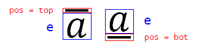
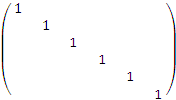
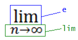
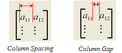
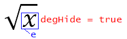
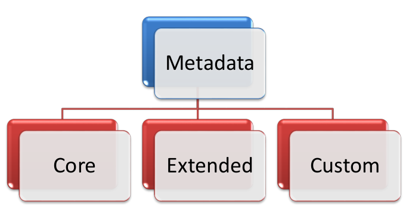

# L.6 Shared MLs 简介

**Introduction to Shared MLs**

## L.6.1 数学

**Math**

=== "中文"

    在 Office 数学标记语言 (OMML) 中，所有数学文本都显示在数学区域中。 此类文本可以由方程、数学表达式或简单变量组成。 数学区域由 `oMath` 和 `oMathPara` 元素表示。 有两种数学区域：内联(inline)和显示(display)。 内联数学区域与不在数学区域中的文本一起显示在一行或多行上。 显示数学区域填充整个段落。 更具体地说，显示数学区域由数学段落组成，由 `oMathPara` 元素表示。 数学段落是一组由软回车符分隔的一个或多个方程或表达式； 也就是说，它们是组成单个段落的独立数学实体。 数学段落有其自己的理由，可能与父（非数学）段落的理由不同。 数学段落中的所有对象都具有相同类型的理由。

    显示(diaplay)和内联(inline)数学区域具有本质上不同的格式特征。 内联数学区域通常消耗较少的垂直空间，以帮助最小化或消除非数学段落行间距的变化。 例如，这是通过减小内联分数和 n 元对象(n-ary objects)相对于其显示大小的大小来实现的。 OMML 具有文档级属性，可设置某些数学区域属性的默认选择。 其中包括显示数学区域属性，即默认情况下是否将积分和其他 n 元限制显示在 n 元运算符的下方和上方，或者显示为下标和上标。

    以下小节介绍了构成 OMML 模式大部分的每个数学对象。 由于这种语言是为文本处理而不是计算而设计的，因此在以 XML 表示形式编写数学区域时，会更多地关注数学文本的布局和外观，而不是数学语义。也就是说 $\overrightarrow{abc}$ 和 $\overbrace{abc}$ 由同一对象表示，尽管它们具有不同的数学含义，因为两者都由与拉伸字符配对的文本组成。类似地，$\frac{n}{k}$ 和 $\frac{n}{k}$ 都用分数对象表示。 尽管在数学上它们具有不同的含义，但它们的布局相似。 另一个例子是 $x^2$ ，它可以是 $x$ 的平方或张量分量。 无论这些语义如何，它都由上标对象表示。
    
    尽管本节中描述的功能主要是关于表达式和数学文本的外观，但 ECMA-376 中定义的其他标记提供了独立的功能，可以计算数学公式和表达式。 SpreadsheetML (§L.2.15.1) 中的公式和 WordprocessingML (§L.1.17.1) 中的字段是两个示例。

=== "英文"

    In the Office Math Markup Language (OMML), all mathematical text appears in math zones. Such text can consist of equations, mathematical expressions or simple variables. A math zone is represented by the oMath and oMathPara elements. There are two kinds of math zones: inline and display. An inline math zone appears on a line or lines along with text that is not in the math zone. A display math zone fills a whole paragraph. More specifically, a display math zone consists of a math paragraph, which is represented by the oMathPara element. The math paragraph is a group of one or more equations or expressions separated by soft carriage returns; that is, they are separate mathematical entities that comprise a single paragraph. A math paragraph has its own justification that can differ from that of the parent (non-math) paragraph. All objects within a math paragraph have the same type of justification.

    Display and inline math zones have innately different formatting characteristics. Inline math zones typically consume less vertical space to help minimize or eliminate changes in the non-math paragraph line spacing. This is accomplished, for example, by reducing the size of inline fractions and n-ary objects relative to their display sizes. OMML has document-level properties that set the default choices for some math-zone properties. These include the display math-zone properties of whether integral and other n-ary limits are displayed by default below and above an n-ary operator or as subscripts and superscripts.
    
    The following subclauses introduce each of the math objects that comprise the majority of the OMML schema. Since this language is designed for text processing rather than calculations, when writing math zones in an XML representation, more attention is given to the layout and appearance of mathematical  text than to mathematical semantics. That is $\overrightarrow{abc}$ and $\overbrace{abc}$ are represented by the same object,  although they have different mathematical meanings, because both consist of text paired with a stretching character. Similarly,$\frac{n}{k} $ and $\frac{n}{k} $ are both represented by a fraction object. Though mathematically they have different meaning, their layout is similar. Another example is $x^2$ , which could be $x$ squared or a tensor component. Regardless of these semantics, it is represented by a superscript object.
    
    Although the functionality described in this clause is primarily about the appearance of expressions and mathematical text, other markup defined in ECMA-376 provides independent functionality enabling mathematical formulas and expressions to be calculated. Formulas in SpreadsheetML (§L.2.15.1) and Fields in WordprocessingML (§L.1.17.1) are two examples.

### L.6.1.1 强调对象

**Accent Object**

=== "中文"

    重音对象用于表示任何具有位于基础上方的组合变音标记的基线文本。 重音只有一个子元素，即基本元素。 重音符号本身作为属性存储。
    
    例如，考虑以下带有变音符号的字母：

    $$\dot{a}  \ddot{a}   \widetilde{a} \hat{a}  \vec{a}  $$

    本示例中最后一个字母的 XML 为：

    ```xml
    <m:acc>
        <m:accPr>
            <m:chr m:val="->" />
        </m:accPr>
        <m:e>
            <m:r>
                <m:t>a</m:t>
            </m:r>
        </m:e>
    </m:acc>
    ```

    在此示例中，这些字母的 XML 表示形式的唯一区别是重音字符。

    

=== "英文"

    The accent object is used to represent any baseline text having a combining diacritical mark placed above the base. The accent has only one child, the base element. The accent mark itself is stored as a property.
    
    For example, consider the following letters having diacritical marks:

    $$\dot{a}  \ddot{a}   \widetilde{a} \hat{a}  \vec{a}  $$

    The XML for the last letter in this example is:

    ```xml
    <m:acc>
        <m:accPr>
            <m:chr m:val="->" />
        </m:accPr>
        <m:e>
            <m:r>
                <m:t>a</m:t>
            </m:r>
        </m:e>
    </m:acc>
    ```

    In this example, the only difference in the XML representations of these letters is the accent character. 

    

### L.6.1.2 条形对象

**Bar Object**

=== "中文"

    这段英文描述的是一个数学公式中的条形对象（bar object），它由基线文本（baseline text）和其上方或下方绘制的条形（bar）组成。条形对象只有一个子元素，即基元素（base element）。条形的位置存储为属性。
    
    例如：
    
    
    
    这个例子中的两个表达式的XML代码如下：
    
    ```xml
    <m:oMathPara>
        <m:oMath>
            <m:bar>
                <m:barPr>
                    <m:pos m:val="top" />
                </m:barPr>
                <m:e>
                    <m:r>
                        <m:t>a</m:t>
                    </m:r>
                </m:e>
            </m:bar>
            <m:bar>
                <m:e>
                    <m:r>
                        <m:t>a</m:t>
                    </m:r>
                </m:e>
            </m:bar>
        </m:oMath>
    </m:oMathPara>
    ```
    
    如果省略了 `<m:pos m:val="top" />`，则条形默认位于底部（如第二个条形元素实例所示）。
    
    翻译为中文如下：
    
    条形对象由基线文本和其上方或下方绘制的条形组成。条形对象仅有一个子元素，即基元素。条形的位置以属性形式存储。
    
    例如：
    
    
    
    在这个例子中，两个表达式的XML代码如下：
    
    ```xml
    <m:oMathPara>
        <m:oMath>
            <m:bar>
                <m:barPr>
                    <m:pos m:val="top" />
                </m:barPr>
                <m:e>
                    <m:r>
                        <m:t>a</m:t>
                    </m:r>
                </m:e>
            </m:bar>
            <m:bar>
                <m:e>
                    <m:r>
                        <m:t>a</m:t>
                    </m:r>
                </m:e>
            </m:bar>
        </m:oMath>
    </m:oMathPara>
    ```
    
    如果省略了 `<m:pos m:val="top" />`，则条形默认位于底部（如第二个条形元素实例所示）。

=== "英文"

    The bar object consists of baseline text with a bar drawn above or below the base. The bar has only one child, the base element. The location of the bar is stored as a property.
    
    For example:
    
    
    
    The XML for the two expressions in this example is:
    
    ```xml
    <m:oMathPara>
        <m:oMath>
            <m:bar>
                <m:barPr>
                    <m:pos m:val="top" />
                </m:barPr>
                <m:e>
                    <m:r>
                        <m:t>a</m:t>
                    </m:r>
                </m:e>
            </m:bar>
            <m:bar>
                <m:e>
                    <m:r>
                        <m:t>a</m:t>
                    </m:r>
                </m:e>
            </m:bar>
        </m:oMath>
    </m:oMathPara>
    ```
    
    If `<m:pos m:val="top" />` is omitted, the bar defaults to the bottom (as shown in the second instance of the bar element).

### L.6.1.3 边框盒子对象

**Border Box Object**

=== "中文"

    边框盒子对象由数学文本组成——通常是作者希望特别指出或给予特别关注的公式——被边框所包围。边框的任何边缘组合都可以被隐藏。例如：
    
    
    
    边框框还可以用来通过水平、垂直或对角线（从左上到右下或从右上到左下）划线来“划掉”文本，如下例所示：
    
    
    
    示例 XML：
    ```xml
    <m:bBox>
        <m:bBoxPr>
            <m:show m:val="all" /> <!-- 显示所有边缘 -->
            <!-- 可以设置不同的值来隐藏特定的边缘 -->
        </m:bBoxPr>
        <m:e>
            <m:r>
                <m:t>数学公式文本</m:t>
            </m:r>
        </m:e>
    </m:bBox>
    ```
    
    请注意，由于原文中提到了图片，但实际的图片链接无法访问，因此在翻译中我使用了原文中的图片说明。如果需要具体的XML结构示例，可以根据实际的图片内容和需求来调整XML代码。
    
    ```xml
    <m:oMathPara>
        <m:oMath>
            <m:borderBox>
                <m:borderBoxPr>
                    <m:strikeTLBR m:val="on" />
                </m:borderBoxPr>
                <m:e>
                    <m:sSup>
                        <m:e>
                            <m:r>
                                <m:t>a</m:t>
                            </m:r>
                        </m:e>
                        <m:sup>
                            <m:r>
                                <m:t>2</m:t>
                            </m:r>
                        </m:sup>
                    </m:sSup>
                    <m:r>
                        <m:t>=</m:t>
                    </m:r>
                    <m:sSup>
                        <m:e>
                            <m:r>
                                <m:t>b</m:t>
                            </m:r>
                        </m:e>
                        <m:sup>
                            <m:r>
                                <m:t>2</m:t>
                            </m:r>
                        </m:sup>
                    </m:sSup>
                    <m:r>
                        <m:t>+</m:t>
                    </m:r>
                    <m:sSup>
                        <m:e>
                            <m:r>
                                <m:t>c</m:t>
                            </m:r>
                        </m:e>
                        <m:sup>
                            <m:r>
                                <m:t>2</m:t>
                            </m:r>
                        </m:sup>
                    </m:sSup>
                </m:e>
            </m:borderBox>
        </m:oMath>
    </m:oMathPara>
    ```

=== "英文"

    The Border Box object consists of math text—often a formula the author wishes to call out or giv special attention to—surrounded by a border. Any combination of the edges of the border can b hidden. For example:
    
    
    
    The Border Box can also be used to "cross out" text with a horizontal, vertical, or diagonal (from top-left to bottom-right or from top-right to bottom-left) strikethrough, as illustrated by the following example:
    
    
    
    Example XML:
    
    ```xml
    <m:oMathPara>
        <m:oMath>
            <m:borderBox>
                <m:borderBoxPr>
                    <m:strikeTLBR m:val="on" />
                </m:borderBoxPr>
                <m:e>
                    <m:sSup>
                        <m:e>
                            <m:r>
                                <m:t>a</m:t>
                            </m:r>
                        </m:e>
                        <m:sup>
                            <m:r>
                                <m:t>2</m:t>
                            </m:r>
                        </m:sup>
                    </m:sSup>
                    <m:r>
                        <m:t>=</m:t>
                    </m:r>
                    <m:sSup>
                        <m:e>
                            <m:r>
                                <m:t>b</m:t>
                            </m:r>
                        </m:e>
                        <m:sup>
                            <m:r>
                                <m:t>2</m:t>
                            </m:r>
                        </m:sup>
                    </m:sSup>
                    <m:r>
                        <m:t>+</m:t>
                    </m:r>
                    <m:sSup>
                        <m:e>
                            <m:r>
                                <m:t>c</m:t>
                            </m:r>
                        </m:e>
                        <m:sup>
                            <m:r>
                                <m:t>2</m:t>
                            </m:r>
                        </m:sup>
                    </m:sSup>
                </m:e>
            </m:borderBox>
        </m:oMath>
    </m:oMathPara>
    ```

### L.6.1.4 盒子对象

**Box Object**

=== "中文"

    盒子对象用于组合表达式或方程的组成部分（例如复合运算符的多个字符），对盒子内的所有内容应用单一属性。盒子具有多种不同的目的，包括将字符组合成一个单一的运算符（运算符模拟器），并因此继承运算符的对齐和手动断行属性；组合微分，例如 $dx$; 防止在内部发生换行；以及允许内部文本具有不同的脚本级别。
    
    作为运算符模拟器的盒子示例：
    
    
    
    示例：
    
    \[ a == b \]
    
    示例 XML：
    
    ```xml
    <m:oMathPara>
        <m:oMath>
            <m:r>
                <m:t>a</m:t>
            </m:r>
            <m:box>
                <m:boxPr>
                    <m:opEmu m:val="on" />
                </m:boxPr>
                <m:e>
                    <m:r>
                        <m:t>==</m:t>
                    </m:r>
                </m:e>
            </m:box>
            <m:r>
                <m:t>b</m:t>
            </m:r>
        </m:oMath>
    </m:oMathPara>
    ```

=== "英文"

    The Box object is used to group components of an expression or equation (such as the multiple characters of a compound operator), to apply a single property to everything in the box. The Box serves a number of distinct purposes, including grouping characters to form a single operator (an operator emulator), and thereby inheriting the alignment and manual break properties of operators; grouping a differential such as $dx$; preventing line breaks from occurring within; and allowing text inside to have a different script level.
    
    
    An example of a Box serving as an operator emulator is:
    
    
    
    Example:
    
    $$𝑎 == 𝑏$$
    
    Example XML:
    
    ```xml
    <m:oMathPara>
        <m:oMath>
            <m:r>
                <m:t>a</m:t>
            </m:r>
            <m:box>
                <m:boxPr>
                    <m:opEmu m:val="on" />
                </m:boxPr>
                <m:e>
                    <m:r>
                        <m:t>==</m:t>
                    </m:r>
                </m:e>
            </m:box>
            <m:r>
                <m:t>b</m:t>
            </m:r>
        </m:oMath>
    </m:oMathPara>
    ```

### L.6.1.5 定界符

**Delimiters**

=== "中文"

    定界符由开闭定界字符（如括号、大括号、方括号和竖线）以及它们所包含的元素组成。如果定界符内包含两个或更多的元素，则会使用分隔符。
    
    定界符可以扩展到它们所包含对象的高度。例如，括号可能会长得很高以包含这个多行矩阵：。或者，根据用户的决定，它们可以保持自己的高度，不管内部内容如何，如 。
    
    定界符有一个单一的子对象，即基础参数，可以在对象中多次使用，表示要使用分隔符字符。例如：
    
    
    
    如果分隔符字符在XML中没有指定，则使用竖线。
    
    示例：
    
    $$(x^{2}|y^{2})$$
    
    示例 XML：
    
    ```xml
    <m:oMathPara>
        <m:oMath>
            <m:d>
                <m:e>
                    <m:sSup>
                        <m:e>
                            <m:r>
                                <m:t>x</m:t>
                            </m:r>
                        </m:e>
                        <m:sup>
                            <m:r>
                                <m:t>2</m:t>
                            </m:r>
                        </m:sup>
                    </m:sSup>
                </m:e>
                <m:e>
                    <m:sSup>
                        <m:e>
                            <m:r>
                                <m:t>y</m:t>
                            </m:r>
                        </m:e>
                        <m:sup>
                            <m:r>
                                <m:t>2</m:t>
                            </m:r>
                        </m:sup>
                    </m:sSup>
                </m:e>
            </m:d>
        </m:oMath>
    </m:oMathPara>
    ```

=== "英文"

    Delimiters consist of opening and closing delimiting characters (such as parentheses, braces, brackets, and vertical bars), and an element contained inside. If two or more elements are contained within delimiters, separating characters are used.
    
    Delimiters can grow to the height of the object they contain. For example, parentheses could grow quite tall to enclose this multi-row matrix: . Or, at the user's discretion, they can maintain their height regardless of the content inside, as in  . 
    
    Delimiters have a single child object, the base argument, which can be used multiple times in the object to signify that a separator character is to be used. For example:
    
    
    
    If the separator character is not specified in XML, the vertical bar is used.
    
    Example:
    
    $$(x^{2}|y^{2})$$
    
    Example XML:
    
    ```xml
    <m:oMathPara>
        <m:oMath>
            <m:d>
                <m:e>
                    <m:sSup>
                        <m:e>
                            <m:r>
                                <m:t>x</m:t>
                            </m:r>
                        </m:e>
                        <m:sup>
                            <m:r>
                                <m:t>2</m:t>
                            </m:r>
                        </m:sup>
                    </m:sSup>
                </m:e>
                <m:e>
                    <m:sSup>
                        <m:e>
                            <m:r>
                                <m:t>y</m:t>
                            </m:r>
                        </m:e>
                        <m:sup>
                            <m:r>
                                <m:t>2</m:t>
                            </m:r>
                        </m:sup>
                    </m:sSup>
                </m:e>
            </m:d>
        </m:oMath>
    </m:oMathPara>
    ```

### L.6.1.6 数组对象

**Array Object**

=== "中文"

    数组对象由一个或多个表达式或方程组成，它们被组合为一个对象。在数组内，多个组件可以相互对齐。
    
    数组的例子包括：$\begin{array}{l} 2 x+3 y+z=10 \\ 4 x+y-z=3 \end{array}$ 和 $f(x)=\left\{\begin{array}{cc} -x, & x<0 \\ x, & x \geq 0 \end{array}\right.$
    
    示例 XML（左侧示例）：
    
    ```xml
    <m:eqArr>
        <m:e>
            <m:r>
                <m:t>2&times;x+3&times;y+z=10</m:t>
            </m:r>
        </m:e>
        <m:e>
            <m:r>
                <m:t>4&times;x+y-z=3</m:t>
            </m:r>
        </m:e>
    </m:eqArr>
    ```
    
    注意：上述的 '&' 用于对齐。更多关于这些的信息，请参见下面的字面量运算符和运算符模拟器。
    
    数组可以有“最大分布”，使它们占据包含它们的列的整个宽度，如：
    
    
    
    或者，它们可以有“对象分布”，使得边缘和文本之间有均匀的间距（距离1 = 距离2 = 距离3）：
    
    
    
    请注意，由于原文中提到了图片，但实际的图片链接无法访问，因此在翻译中我使用了原文中的图片说明。如果需要具体的XML结构示例，可以根据实际的图片内容和需求来调整XML代码。

=== "英文"

    The Array object consists of one or more expressions or equations grouped as an object. Within the array, multiple components can be aligned to each other.
    
    Examples of arrays are: $\begin{array}{l} 2 x+3 y+z=10 \\ 4 x+y-z=3 \end{array}$ and $f(x)=\left\{\begin{array}{cc} -x, & x<0 \\ x, & x \geq 0 \end{array}\right.$
    
    Example XML (left example):
    
    ```xml
    <m:eqArr>
        <m:e>
            <m:r>
                <m:t>2&x+&3&y+&&z=&10&</m:t>
            </m:r>
        </m:e>
        <m:e>
            <m:r>
                <m:t>4&x+&&y-&&z=&3&</m:t>
            </m:r>
        </m:e>
    </m:eqArr>
    ```
    
    Note: The ‘&’s above are used for alignment. See Literal Operators and Operator Emulators below for more on these.
    
    Arrays can have "maximum distribution" such that they occupy the entire width of the column that contains them, as in:
    
    
    
    Or, they can have "object distribution" such that there is even spacing between the margin and text (distance1 = distance2 = distance 3):
    
    

### L.6.1.7 分数对象

**Fraction Object**

=== "中文"

    分数对象由分子和分母组成，通常由分数条分隔。分数对象用于区分不同风格的分数。它还用于分类堆叠对象，该对象将一个元素放置在另一个元素之上，没有分数条。以下是四种类型的分数：
    
    堆叠分数：$\frac{a}{b}$
    
    斜分数：$^a/_b$
    
    线性分数：$a/b$
    
    堆叠（无条）分数：$\substack{n\\k}$
    
    示例 XML（上述显示的线性分数）：
    
    ```xml
    <m:oMathPara>
        <m:oMath>
            <m:f>
                <m:fPr>
                    <m:type m:val="lin" /> <!-- 设置分数类型为线性 -->
                </m:fPr>
                <m:num>
                    <m:r>
                        <m:t>a</m:t> <!-- 分子 -->
                    </m:r>
                </m:num>
                <m:den>
                    <m:r>
                        <m:t>b</m:t> <!-- 分母 -->
                    </m:r>
                </m:den>
            </m:f>
        </m:oMath>
    </m:oMathPara>
    ```
    
    !!! info "译注"
    
        请注意，XML示例中的 `m:` 前缀可能代表特定的命名空间，具体取决于使用的XML标准或文档类型定义（DTD）。

=== "英文"

    The Fraction object consists of a numerator and denominator usually separated by a fraction bar. The Fraction object is used to classify the different styles of fractions. It is also used to classify the stack object, which places one element above another, with no fraction bar. The four types of fractions are shown below:
    
    Stacked Fraction: $\frac{a}{b}$
    
    Skewed Fraction: $^a/_b$
    
    Linear Fraction: $a/b$
    
    Stack (noBar) Fraction: $\substack{n\\k}$
    
    Example XML (Linear Fraction Shown Above):
    
    ```xml
    <m:oMathPara>
        <m:oMath>
            <m:f>
                <m:fPr>
                    <m:type m:val="lin" />
                </m:fPr>
                <m:num>
                    <m:r>
                        <m:t>a</m:t>
                    </m:r>
                </m:num>
                <m:den>
                    <m:r>
                        <m:t>b</m:t>
                    </m:r>
                </m:den>
            </m:f>
        </m:oMath>
    </m:oMathPara>
    ```

### L.6.1.8 函数应用对象

**Function Apply Object**

=== "中文"

    函数应用对象由应用于基本元素中给出的函数参数的一个函数名称组成。默认情况下，函数名称不使用数学斜体。函数应用对象由一个函数名称（字符串或对象）和一个作用于其上的基本元素组成。
    
    示例 1：
    
    $$\sin x$$
    
    示例 1 XML：
    
    ```xml
    <m:oMathPara>
        <m:oMath>
            <m:func>
                <m:funcPr>
                    <m:ctrlPr>
                        <w:rPr>
                            <w:i />
                        </w:rPr>
                    </m:ctrlPr>
                </m:funcPr>
                <m:fName>
                    <m:r>
                        <m:rPr>
                            <m:sty m:val="p" /> <!-- 设置样式为正体，即不使用斜体 -->
                        </m:rPr>
                        <m:t>sin</m:t>
                    </m:r>
                </m:fName>
                <m:e>
                    <m:r>
                        <m:t>x</m:t>
                    </m:r>
                </m:e>
            </m:func>
        </m:oMath>
    </m:oMathPara>
    ```
    
    示例 2：
    
    以下函数应用对象更为复杂：
    
    
    
    示例 3：
    
    $$\lim_{x \to 0} x_n$$
    
    请注意，示例 2 的图片链接无法访问，因此无法提供具体的XML结构。示例 3 的XML结构可能如下：
    
    ```xml
    <m:oMathPara>
        <m:oMath>
            <m:limLow>
                <m:e>
                    <m:r>
                        <m:t>x_n</m:t>
                    </m:r>
                </m:e>
                <m:lim>
                    <m:r>
                        <m:t>x \to 0</m:t>
                    </m:r>
                </m:lim>
            </m:limLow>
        </m:oMath>
    </m:oMathPara>
    ```
    
    在这个示例中，`<m:limLow>` 表示下极限，其中 `<m:e>` 包含极限表达式，`<m:lim>` 包含趋近的条件。XML结构可能根据实际使用的XML标准或文档类型定义（DTD）有所不同。
    
    示例 3 XML:
    
    ```xml
    <m:oMathPara>
        <m:oMath>
            <m:func>
                <m:fName>
                    <m:limLow>
                        <m:e>
                            <m:r>
                                <m:rPr>
                                    <m:sty m:val="p" />
                                </m:rPr>
                                <m:t>lim</m:t>
                            </m:r>
                        </m:e>
                        <m:lim>
                            <m:r>
                                <m:t>n→∞</m:t>
                            </m:r>
                        </m:lim>
                    </m:limLow>
                </m:fName>
                <m:e>
                    <m:sSub>
                        <m:e>
                            <m:r>
                                <m:t>x</m:t>
                            </m:r>
                        </m:e>
                        <m:sub>
                            <m:r>
                                <m:t>n</m:t>
                            </m:r>
                        </m:sub>
                    </m:sSub>
                </m:e>
            </m:func>
        </m:oMath>
    </m:oMathPara>
    ```
    
    用户可以修改函数名称中的文本，或者可以添加字符串，以便文本处理器自动识别为函数名称。

=== "英文"

    The Function Apply object consists of a function name applied to the function argument(s) given in a base element. The function name, by default, does not use math italics. The Function Apply object consists of a function name (a string or object) and a base element acted upon.
    
    Example 1:
    
    $$sin x$$
    
    Example 1 XML:
    
    ```xml
    <m:oMathPara>
        <m:oMath>
            <m:func>
                <m:funcPr>
                    <m:ctrlPr>
                        <w:rPr>
                            <w:i />
                        </w:rPr>
                    </m:ctrlPr>
                </m:funcPr>
                <m:fName>
                    <m:r>
                        <m:rPr>
                            <m:sty m:val="p" />
                        </m:rPr>
                        <m:t>sin</m:t>
                    </m:r>
                </m:fName>
                <m:e>
                    <m:r>
                        <m:t>x</m:t>
                    </m:r>
                </m:e>
            </m:func>
        </m:oMath>
    </m:oMathPara>
    ```
    
    Example 2:
    
    The following Function Apply object is more complex:
    
    
    
    Example 3:
    
    $$\lim_{x \to 0} x_n$$
    
    Example 3 XML:
    
    ```xml
    <m:oMathPara>
        <m:oMath>
            <m:func>
                <m:fName>
                    <m:limLow>
                        <m:e>
                            <m:r>
                                <m:rPr>
                                    <m:sty m:val="p" />
                                </m:rPr>
                                <m:t>lim</m:t>
                            </m:r>
                        </m:e>
                        <m:lim>
                            <m:r>
                                <m:t>n→∞</m:t>
                            </m:r>
                        </m:lim>
                    </m:limLow>
                </m:fName>
                <m:e>
                    <m:sSub>
                        <m:e>
                            <m:r>
                                <m:t>x</m:t>
                            </m:r>
                        </m:e>
                        <m:sub>
                            <m:r>
                                <m:t>n</m:t>
                            </m:r>
                        </m:sub>
                    </m:sSub>
                </m:e>
            </m:func>
        </m:oMath>
    </m:oMathPara>
    ```
    
    The user can modify the text in a function name, or can add strings to be recognized automatically by the text processor as function names.

### L.6.1.9 组合字符对象

**Group Character Object**

=== "中文"

    组合字符对象由位于文本上方或下方的字符组成，通常用于视觉上对项目进行分组。另外，文本可以位于一个拉伸字符的上方或下方（例如：）。在以下示例中，位于上括号上方的文本不是分组字符对象的一部分；它仅用于演示对象在实际使用中的例子：
    
    

=== "英文"

    The Group Character object consists of a character drawn above or below text, often with the purpose of visually grouping items. Alternatively, text can be drawn above or below a stretched character (example: ). In the following example, the text above the overbrace is not part of the group
    character object; it is included only to demonstrate a real-world example of the object in use:
    
    

### L.6.1.10 上极限和下极限

**Upper and Lower Limits**

=== "中文"

    上极限和下极限在XML表示中被视为独立的（但相似的）对象。它们都由基线上的文本和紧接在其上方或下方的缩小尺寸的文本组成。示例包括：
    
     和 $\overset{k\space\space times}{\overbrace{x+x+...}}$，其中在第二个示例中，上极限是  而基是 ${\overbrace{x+x+...}}$。

=== "英文"

    Upper Limits and Lower Limits are treated as separate (but similar) objects in the XML representation. Both consist of text on the baseline and reduced-size text immediately above or below it. Examples include:
    
     and $\overset{k\space\space times}{\overbrace{x+x+...}}$, where in the second example the upper limit is  and the base is ${\overbrace{x+x+...}}$

### L.6.1.11 矩阵对象

**Matrix Object**

=== "中文"

    矩阵对象由一个或多个元素组成，这些元素排列在一行或多行以及一列或多列中（不包括定界符）。示例包括：$\begin{pmatrix}  1 & 2\\  3 & 4\\  5 & 6 \end{pmatrix}$ 和$\begin{bmatrix} 1 & \\ & 1 \end{bmatrix}$.
    
    示例 XML（左矩阵）：
    
    ```xml
    <m:oMathPara>
        <m:oMath>
            <m:d>
                <m:e>
                    <m:m>
                        <m:mPr>
                            <m:mcs>
                                <m:mc>
                                    <m:mcPr>
                                        <m:count m:val="2" /> <!-- 列数 -->
                                        <m:mcJc m:val="center" /> <!-- 矩阵水平对齐方式 -->
                                    </m:mcPr>
                                </m:mc>
                            </m:mcs>
                        </m:mPr>
                        <m:mr>
                            <m:e>
                                <m:r>
                                    <m:t>1</m:t>
                                </m:r>
                            </m:e>
                            <m:e>
                                <m:r>
                                    <m:t>2</m:t>
                                </m:r>
                            </m:e>
                        </m:mr>
                        <!-- 后续行和列的元素以类似方式添加 -->
                    </m:m>
                </m:e>
            </m:d>
        </m:oMath>
    </m:oMathPara>
    ```
    
    整个矩阵可以根据周围的文本在中心、顶行或底行对齐。这个属性被定义为 `baseJc`。列间距可以使用 `cGp`、`cGpRule` 和 `cSp` 来定义。列间隔指的是一列结束和下一列开始之间的空间；列间距指的是相邻列的两个对应边缘之间的空间。
    
    
    
    行间距也可以使用 `rSp` 和 `rSpRule` 来定义。行间距定义为相邻矩阵行基线之间的距离。
    
    
    
    最后，矩阵可以有隐藏的占位符（`hidePlc`）。上面的单位矩阵有隐藏的占位符，而以下矩阵显示了占位符：
    
    
    
    请注意，示例中的图片链接无法访问，因此无法提供具体的图片内容。如果需要具体的XML结构示例，可以根据实际的图片内容和需求来调整XML代码。

=== "英文"

    The Matrix object consists of one or more elements laid out in one or more rows and one or more columns (delimiters not included). Examples include $\begin{pmatrix}  1 & 2\\  3 & 4\\  5 & 6 \end{pmatrix}$ and $\begin{bmatrix} 1 & \\ & 1 \end{bmatrix}$.
    
    Example XML (left matrix):
    
    ```xml
    <m:oMathPara>
        <m:oMath>
            <m:d>
                <m:e>
                    <m:m>
                        <m:mPr>
                            <m:mcs>
                                <m:mc>
                                    <m:mcPr>
                                        <m:count m:val="2" />
                                        <m:mcJc m:val="center" />
                                    </m:mcPr>
                                </m:mc>
                            </m:mcs>
                        </m:mPr>
                        <m:mr>
                            <m:e>
                                <m:r>
                                    <m:t>1</m:t>
                                </m:r>
                            </m:e>
                            <m:e>
                                <m:r>
                                    <m:t>2</m:t>
                                </m:r>
                            </m:e>
                        </m:mr>
                        <m:mr>
                            <m:e>
                                <m:r>
                                    <m:t>3</m:t>
                                </m:r>
                            </m:e>
                            <m:e>
                                <m:r>
                                    <m:t>4</m:t>
                                </m:r>
                            </m:e>
                        </m:mr>
                        <m:mr>
                            <m:e>
                                <m:r>
                                    <m:t>5</m:t>
                                </m:r>
                            </m:e>
                            <m:e>
                                <m:r>
                                    <m:t>6</m:t>
                                </m:r>
                            </m:e>
                        </m:mr>
                    </m:m>
                </m:e>
            </m:d>
        </m:oMath>
    </m:oMathPara>
    ```
    
    The entire matrix can be aligned, with respect to the surrounding text, at the center, with the top row, or with the bottom row. This property is defined as baseJc. Spacing between columns can be defined using cGp, cGpRule, and cSp. Column Gap refers to the space between the end of one column and the start of the next; column spacing refers to the space between two corresponding edges of adjacent columns.
    
    
    
    Row spacing can also be defined using rSp and rSpRule. Row spacing is defined as the distance between  baselines on adjacent matrix rows:
    
    
    
    Finally, a matrix can have hidden placeholders (hidePlc). The identity matrix above has hidden placeholders, while the following matrix has placeholders showing:
    
    

### L.6.1.12 N-ary 对象

**N-ary Object**

=== "中文"

    n-ary 对象由一个 n-ary 字符、一个基础（或操作数）以及可选的上下限组成，如下所示：
    
    
    
    仅第三个 n-ary 对象的示例 XML：
    
    ```xml
    <m:oMathPara>
        <m:oMath>
            <m:nary>
                <m:naryPr>
                    <m:chr m:val="∏" /> <!-- n-ary 字符 -->
                    <m:limLoc m:val="undOvr" /> <!-- 限制位置 -->
                </m:naryPr>
                <m:sub> <!-- 下限 -->
                    <m:r>
                        <m:t>k=1</m:t>
                    </m:r>
                </m:sub>
                <m:sup> <!-- 上限 -->
                    <m:r>
                        <m:t>n</m:t>
                    </m:r>
                </m:sup>
                <m:e> <!-- 基础 -->
                    <m:sSub>
                        <m:e>
                            <m:r>
                                <m:t>A</m:t>
                            </m:r>
                        </m:e>
                        <m:sub>
                            <m:r>
                                <m:t>k</m:t>
                            </m:r>
                        </m:sub>
                    </m:sSub>
                </m:e>
            </m:nary>
        </m:oMath>
    </m:oMathPara>
    ```
    
    n-ary 对象的组成部分如下：
    
    
    
    n-ary 对象的其他属性包括：
    
    - grow：指定 n-ary 对象是否扩展到其操作数的高度，或者保持固定高度。
    - limLoc：指定 n-ary 限制的位置：要么在 n-ary 操作符的右侧（subSup 位置），要么在上方和下方居中（undOvr 位置）。
    - supHide：指定如果上限制为空，则隐藏且不显示占位符。
    - subHide：指定如果下限制为空，则隐藏且不显示占位符。
    
    请注意，示例中的图片链接无法访问，因此无法提供具体的图片内容。如果需要具体的XML结构示例，可以根据实际的图片内容和需求来调整XML代码。

=== "英文"

    The n-ary object consists of an n-ary character, a base (or operand), and optional upper and lower limits, as in:
    
    
    
    Example XML (third n-ary object only):
    
    ```xml
    <m:oMathPara>
        <m:oMath>
            <m:nary>
                <m:naryPr>
                    <m:chr m:val="∏" />
                    <m:limLoc m:val="undOvr" />
                </m:naryPr>
                <m:sub>
                    <m:r>
                        <m:t>k=1</m:t>
                    </m:r>
                </m:sub>
                <m:sup>
                    <m:r>
                        <m:t>n</m:t>
                    </m:r>
                </m:sup>
                <m:e>
                    <m:sSub>
                        <m:e>
                            <m:r>
                                <m:t>A</m:t>
                            </m:r>
                        </m:e>
                        <m:sub>
                            <m:r>
                                <m:t>k</m:t>
                            </m:r>
                        </m:sub>
                    </m:sSub>
                </m:e>
            </m:nary>
        </m:oMath>
    </m:oMathPara>
    ```
    
    The components of an n-ary object are as follows:
    
    
    
    Other properties of the n-ary object are:
    
    - grow: specifies whether the n-ary object grows to the height of its operand, or stays a fixed height
    - limLoc: specifies the placement of n-ary limits: either to the right of the n-ary operator (the subSup position) or centered above and below (the undOvr position).
    - supHide: specifies that an empty upper limit is hidden and no placeholder shows
    - subHide: specifies that an empty lower limit is hidden and no placeholder shows

### L.6.1.13 文字运算符和运算符模拟器

**Literal Operators and Operator Emulators**

=== "中文"

    文字运算符（Literal Operators）和运算符模拟器（Operator Emulators）是 Office Open XML 数学标记语言中的两种特殊运算符类型。这些运算符类型及其属性已经被详细记录并作为 Unicode 技术说明发布（参见 <http://www.unicode.org/notes/tn28/UTN28-PlainTextMath-v2.pdf>）。
    
    线性格式运算符，如“=”、“+”和“\[”，通常是具有特殊含义的单个 Unicode 字符。例如，“/”线性格式运算符通常表示它和它的操作数应该“构建”成一个分数。因此，线性字符串“a/b”被解释为 $\frac{a}{b}$。文字运算符“\”可以用来剥离“/”运算符的隐含特殊含义，以便不发生这种构建。这是因为文字运算符指示后续的 Unicode 字符应该按字面意义解释，而不是赋予其通常的特殊含义。
    
    一个包含文字运算符的线性字符串示例可能是“c = a \\/ b”。这个字符串表明“/”字符应该按字面意义理解，而不是用来构建方程 $c=\frac{a}{b}$。使用文字运算符“\”，结果得到的是方程 $c=a/b$。这个方程的 XML 如下所示：（看起来是内联的，即不是数学段落）
    
    ```xml
    <m:oMathPara>
        <m:oMath>
            <m:r>
                <m:t>c=a</m:t>
            </m:r>
            <m:r>
                <m:rPr>
                    <m:lit /> <!-- 表示后续字符按字面意义解释 -->
                </m:rPr>
                <m:t>/</m:t>
            </m:r>
            <m:r>
                <m:t>b</m:t>
            </m:r>
        </m:oMath>
    </m:oMathPara>
    ```
    
    单字符线性格式运算符具有对齐、作为换行点或具有相关参数大小属性的能力。有时我们希望有多字符运算符具有这些属性，例如“`==`”，这就是运算符模拟器元素（opEmu）和盒子元素（box）的用处所在。如前所述，盒子元素用来组合表达式或方程的组成部分。注意，盒子不是一个可见的盒子。它只是一种分组机制。opEmu 元素也用来指示盒子及其内容必须像单个运算符一样行为，并继承运算符的属性。这意味着，例如，组合的字符可以作为换行点，并可以与其他运算符对齐。运算符模拟器通常在一个或多个字符组合形成运算符时使用，如“`==`”、“`++`”等。一个盒子和 opEmu 结合使用的好例子在 [§7.1.4]，盒子对象中有展示。
    
    对齐点是运算符的一个独特属性。它们允许单个数学区域内的多个对象根据它们各自的运算符对齐，以提高可读性。对齐点是通过使用“&”字符在线性格式中设置的。一个方程根据其运算符对齐的示例在 [§7.1.6]，数组对象中有展示。在那个示例和下面的示例中，和号被解释为交替的对齐和间隔值。每个行的开头（由 `<m:e>` 元素表示）隐含了一个间隔值，而每个随后的奇数‘&’是一个对齐点，每个偶数‘&’是可以在其中添加空间以对齐表达式或方程的位置。一个简单的示例如下：
    
    示例：
    
    $$\begin{align*} x+9y=15 \\ 8x+y=5 \end{align*}$$
    
    示例 XML：
    
    ```xml
    <m:eqArr>
        <m:e>
            <m:r>
                <m:t>&amp;x+&amp;9&amp;y =&amp;15&amp;</m:t>
            </m:r>
        </m:e>
        <m:e>
            <m:r>
                <m:t>8&amp;x+&amp;&amp;y =&amp;5&amp;</m:t>
            </m:r>
        </m:e>
    </m:eqArr>
    ```

=== "英文"

    Literal Operators and Operator Emulators are two special operators in the Office Open XML Math Markup Language. These operator types and their properties have been well documented and published as a Unicode Technical Note (<http://www.unicode.org/notes/tn28/UTN28-PlainTextMath-v2.pdf>).
    
    Linear format operators such as “=”, “+”, and “\[“, are usually single Unicode characters that have special meaning. For example, the “/” linear format operator usually signals that it and its operands should be “built up” into a fraction. Consequently, the linear string “a/b” is interpreted to mean $\frac{a}{b}$. The Literal Operator “\” can be used to strip the implied special meaning of the “/” operator so that this build up does not occur. This happens because the literal operator dictates that the following Unicode character be interpreted literally and not be given its usual special meaning.
    
    An example linear string with a literal operator might be “c = a \\/ b”. This string would indicate that the “/” character should be taken literally and not used to build the equation into $c=\frac{a}{b}$ . With the literal operator “\”, the result is the equation $c=a/b$. The XML for this equation is as follows: (looks inline, i.e., not a math para)
    
    ```xml
    <m:oMathPara>
        <m:oMath>
            <m:r>
                <m:t>c=a</m:t>
            </m:r>
            <m:r>
                <m:rPr>
                    <m:lit />
                </m:rPr>
                <m:t>/</m:t>
            </m:r>
            <m:r>
                <m:t>b</m:t>
            </m:r>
        </m:oMath>
    </m:oMathPara>
    ```
    
    Single-character linear format operators have the ability to be aligned, serve as line break points, or have associated argument size attributes. Sometimes it is desirable to have multi-character operators that have these properties, such as “`==`”, which is where the operator emulator element (opEmu) and the box element (box) are useful. A box element, as explained previously, is used to group components of an expression or equation. Note that the box is not a visible box. It is only a grouping mechanism. The opEmu element is also used to signify that the box and its contents must behave as a single operator and inherit the properties of an operator. This means, for example, that the grouped characters can serve as a point for a line break and can be aligned to other operators. Operator Emulators are often used when one or more characters combine to form an operator, such as “`==`”, “`++`”, etc. A good example of a box and opEmu combination is shown in [§7.1.4], Box Object.
    
    Alignment points are one of the unique properties of operators. They allow multiple objects in a single math zone to be aligned against their various operators to improve readability. Alignment points are set through linear format using the “&” character. An example of equations being aligned to their operators is shown in [§7.1.6], Array Object. In that example and the example below, ampersands are interpreted as alternating align and spacer values. A spacer value is implied at the beginning of each line (represented by an `<m:e>` element) while every following odd ‘&’ is an alignment point and every even ‘&’ is a place where space can be added to align expressions or equations. A brief example of this is as follows:
    
    Example:
    
    $$\begin{align*} x+9y=15 \\ 8x+y=5 \end{align*}$$
    
    Example XML:
    
    ```xml
    <m:eqArr>
        <m:e>
            <m:r>
                <m:t>&amp;x+&amp;9&amp;y =&amp;15&amp;</m:t>
            </m:r>
        </m:e>
        <m:e>
            <m:r>
                <m:t>8&amp;x+&amp;&amp;y =&amp;5&amp;</m:t>
            </m:r>
        </m:e>
    </m:eqArr>
    ```


### L.6.1.14 Phantom 对象

**Phantom Object**

=== "中文"

    Phantom 对象允许在布局期间添加或抑制额外的水平、垂直或两者的间距，以增强外观效果。
    
    在以下示例中，两个根号不平衡：$\sqrt{\frac{a}{b}} = \sqrt{x}$。为了改善排版，根号的横线和底端点应对齐。为此，用户应调整第二个根号的高度，使其等于分数的高度。但是，不应在宽度上添加额外的填充。用户可以通过在第二个根号下插入一个分数的 phantom 来实现，如图所示： 。在这种情况下，根号对齐，phantom 分数充当增加垂直间距但不增加宽度（zeroWid）的幽灵文本。phantom 还可以用于单独或结合垂直空间添加水平空间。
    
    phantom 并不总是不可见的。“smash”是一种 phantom，其中内容保持可见。然而，文本布局时可以忽略部分或全部 smash。例如，查看以下两个根号：
    
    
    
    挑剔的排版师可能希望在第一个示例中，“d”的顶部和根号横线之间的垂直间距更小。通过将差分放在一个 smash 中并将其高度设置为零（zeroAsc），可以减少间距。
    
    请注意，在同一示例中，当将差分项放在 phantom 中时，第一个和第二个字符之间的间距发生变化。同样，挑剔的排版师希望尽管存在 phantom，但差分间距仍能保持不变。通过为 phantom 分配透明间距（transp），可以保留正确的间距。
    
    最后，zeroDesc phantom 允许在布局期间忽略 phantom 基底的下降。以下示例说明了 zeroDesc 的用法：
    
    
    
    无论 phantom 是可见还是隐藏（show 属性），每个 phantom 属性都可以应用。
    
    示例：
    
    $$\sqrt{y}$$
    
    示例 XML：
    
    ```xml
    <m:rad>
        <m:e>
            <m:phant>
                <m:phantPr>
                    <m:zeroDesc m:val="on" />
                </m:phantPr>
                <m:e>
                    <m:r>
                        <m:t>y</m:t>
                    </m:r>
                </m:e>
            </m:phant>
        </m:e>
    </m:rad>
    ```

=== "英文"

    The Phantom object allows extra spacing, horizontal, vertical, or both, to be added or suppressed during layout for enhanced appearance.
    
    In the following example, the two radicals are unbalanced: $\sqrt{\frac{a}{b} } =\sqrt{x}$ . For enhanced typography, the radical bars and bottom points should line up. To accomplish this, the user should adjust the height of the second radical, to make it the height of the fraction. However, no extra padding should be added to the width. The user can accomplish this by inserting a phantom of the fraction under the second radical, as in:  In this case, the radicals line up, and the phantom fraction acts as ghost text that adds vertical space but no width (zeroWid). The phantom can also be used to add horizontal space, alone or in conjunction with vertical space.
    
    Phantoms are not always invisible. The "smash" is a type of phantom in which the content remains visible. However, part or all of the smash can be ignored during layout of text around it. For example, examine the following two radicals:
    
    
    
    A discerning typographer might desire less vertical spacing between the tip of the "d" and the radical bar in the first example. By placing the differential in a smash and assigning it zero height (zeroAsc), the spacing is reduced.
    
    Note that in this same example, when the differential term is placed inside a phantom, the spacing between the first and second characters changes. Again, the discerning typographer wishes that despite the presence of the phantom, differential spacing is retained. By assigning the phantom transparency for spacing (transp), proper spacing is preserved.
    
    Finally, zeroDesc phantom allows the descent of the phantom base to be ignored during layout. The following example illustrates the usage of zeroDesc:
    
    
    
    Each of the phantom properties can be applied whether the phantom is visible or hidden (the show property).
    
    Example:
    
    $$\sqrt{y}$$
    
    Example XML:
    
    ```xml
    <m:rad>
        <m:e>
            <m:phant>
                <m:phantPr>
                    <m:zeroDesc m:val="on" />
                </m:phantPr>
                <m:e>
                    <m:r>
                        <m:t>y</m:t>
                    </m:r>
                </m:e>
            </m:phant>
        </m:e>
    </m:rad>
    ```


### L.6.1.15 根号对象

**Radical Object**

=== "中文"

    根号对象由一个根号、一个基数 e 和一个可选的度数组成。当度数不显示且不应出现占位符字符时，使用 degHide 属性。
    
     

=== "英文"

    The Radical object consists of a radical, a base e, and an optional degree. When the degree is not shown and a placeholder character is not to appear, the property degHide is used.
    
     

### L.6.1.16 脚本 (上标, 下标, 上下标, 前下上标)

**Scripts (Superscript, Subscript, SubSuperscript, PreSubSuperscript)**

=== "中文"

    有四种不同但相关的对象，它们由一个基底和一个较小的“脚本”项组成，该脚本项可以升高或降低，位于基底的左侧或右侧。它们分别是下标、上标、下上标和前下上标：
    
    $$x_n \space\space x^n \space\space x_m^n \space\space _m^nx$$ 
    
    示例 XML（仅包括上面第二和第三个示例）：
    
    ```xml
    <m:oMathPara>
        <m:oMath>
            <m:sSup>
                <m:e>
                    <m:r>
                        <m:t>x</m:t>
                    </m:r>
                </m:e>
                <m:sup>
                    <m:r>
                        <m:t>n</m:t>
                    </m:r>
                </m:sup>
            </m:sSup>
            <m:r>
                <m:t xml:space="preserve"></m:t>
            </m:r>
            <m:sSubSup>
                <m:e>
                    <m:r>
                        <m:t>x</m:t>
                    </m:r>
                </m:e>
                <m:sub>
                    <m:r>
                        <m:t>m</m:t>
                    </m:r>
                </m:sub>
                <m:sup>
                    <m:r>
                        <m:t>n</m:t>
                    </m:r>
                </m:sup>
            </m:sSubSup>
        </m:oMath>
    </m:oMathPara>
    ```
    
    下上标对象可以选择对齐脚本（alnScr），如下所示：
    
     vs. .

=== "英文"

    There are four distinct but related objects that consist of a base and a smaller “script” term either raised or lowered, on the left or right of the base. These are the Subscript, Superscript, SubSuperscript, and PreSubSuperscript:
    
    $$x_n \space\space x^n \space\space x_m^n \space\space _m^nx$$ 
    
    Example XML (second and third examples above only):
    
    ```xml
    <m:oMathPara>
        <m:oMath>
            <m:sSup>
                <m:e>
                    <m:r>
                        <m:t>x</m:t>
                    </m:r>
                </m:e>
                <m:sup>
                    <m:r>
                        <m:t>n</m:t>
                    </m:r>
                </m:sup>
            </m:sSup>
            <m:r>
                <m:t xml:space="preserve"></m:t>
            </m:r>
            <m:sSubSup>
                <m:e>
                    <m:r>
                        <m:t>x</m:t>
                    </m:r>
                </m:e>
                <m:sub>
                    <m:r>
                        <m:t>m</m:t>
                    </m:r>
                </m:sub>
                <m:sup>
                    <m:r>
                        <m:t>n</m:t>
                    </m:r>
                </m:sup>
            </m:sSubSup>
        </m:oMath>
    </m:oMathPara>
    ```
    
    The SubSuperscript has the option of aligning scripts (alnScr), as in:
    
     vs. .

### L.6.1.17 数学段落

**Math Paragraphs**

=== "中文"

    数学段落存在于 `<m:oMathPara>` 元素之间，由一个或多个方程或表达式组成。（本子条款中的示例均基于表达式）每个表达式都存在于它自己的 `<m:oMath>` 块中。以下示例展示了如何在一个数学段落中布局表达式：
    
    ```xml
    <m:oMathPara>
        <m:oMathParaPr>
            ...数学段落属性
        </m:oMathParaPr>
        <m:oMath>
            ...一个表达式
        </m:oMath>
        <m:oMath>
            ...另一个表达式
        </m:oMath>
    </m:oMathPara>
    ```
    
    当数学段落是 Office Open XML WordprocessingML 文档的一部分时，数学段落存在于文档的 `<w:body>` 块内。即使段落中没有其他文本，它们也始终存在于 `<w:p>` 块中。下面的示例展示了上述 XML 作为 WordprocessingML 文档一部分的情况：
    
    示例 XML：
    
    ```xml
    <?xml version="1.0"?>
    <w:document xmlns:w="…">
        <w:body>
            <w:p>
                <m:oMathPara>
                    <m:oMathParaPr>...数学段落属性</m:oMathParaPr>
                    <m:oMath>...一个表达式</m:oMath>
                    <m:oMath>...另一个表达式</m:oMath>
                </m:oMathPara>
            </w:p>
        </w:body>
    </w:document>
    ```
    
    显示方程或表达式（通常为了简洁起见，这些简单地称为“显示方程”）始终位于数学段落内。然而，内联方程或表达式（通常简称为“内联方程”）可能不属于数学段落，如果它们位于现有的 WordprocessingML 段落（`<w:p>` 块）中。下面的示例说明了这样的内联方程：
    
    示例：
    
    
    
    示例 XML：
    
    ```xml
    <w:document>
        <w:body>
            <w:p>
                <w:r>
                    <w:t>下面的公式计算圆的面积：</w:t>
                </w:r>
                <m:oMath>
                    <m:r>
                        <m:t>A=π</m:t>
                    </m:r>
                    <m:sSup>
                        <m:e>
                            <m:r>
                                <m:t>r</m:t>
                            </m:r>
                        </m:e>
                        <m:sup>
                            <m:r>
                                <m:t>2</m:t>
                            </m:r>
                        </m:sup>
                    </m:sSup>
                </m:oMath>
                <w:r>
                    <w:t>。</w:t>
                </w:r>
            </w:p>
        </w:body>
    </w:document>
    ```
    
    在 WordprocessingML 文档中，`<m:oMath>` 块通常在各个点上包含 WordprocessingML，以描述所需的格式，例如颜色、字体、字符效果、注释和其他非数学特定的效果和显示特性。DrawingML 和 Office Open XML 标准中定义的其他标记也可以存在于 oMath 块内。这些额外的非 OMML 组件在定义表达式或方程时是可选的。以下示例包含 WordprocessingML 以描述所需的文本效果。
    
    示例：
    
    $$E=mc^2$$
    
    示例 XML：
    
    ```xml
    <m:oMathPara>
        <m:oMath>
            <m:r>
                <w:rPr>
                    <w:rFonts w:ascii="Cambria Math" w:hAnsi="Cambria Math" />
                    <w:emboss />
                    <w:sz w:val="32" />
                    <w:szCs w:val="32" />
                </w:rPr>
                <m:t>E=m</m:t>
            </m:r>
            <m:sSup>
                <m:sSupPr>
                    <m:ctrlPr>
                        <w:rPr>
                            <w:rFonts w:ascii="Cambria Math" w:hAnsi="Cambria Math" />
                            <w:i />
                            <w:emboss />
                            <w:sz w:val="32" />
                            <w:szCs w:val="32" />
                        </w:rPr>
                    </m:ctrlPr>
                </m:sSupPr>
                <m:e>
                    <m:r>
                        <w:rPr>
                            <w:rFonts w:ascii="Cambria Math" w:hAnsi="Cambria Math" />
                            <w:emboss />
                            <w:sz w:val="32" />
                            <w:szCs w:val="32" />
                        </w:rPr>
                        <m:t>c</m:t>
                    </m:r>
                </m:e>
                <m:sup>
                    <m:r>
                        <w:rPr>
                            <w:rFonts w:ascii="Cambria Math" w:hAnsi="Cambria Math" />
                            <w:emboss />
                            <w:sz w:val="32" />
                            <w:szCs w:val="32" />
                        </w:rPr>
                        <m:t>2</m:t>
                    </m:r>
                </m:sup>
            </m:sSup>
        </m:oMath>
    </m:oMathPara>
    ```
    
    在上述示例中，使用 WordprocessingML 描述所使用的字体、所需的字符效果和字符大小。此示例中的 `<w:rFonts>` 标签仅在“Cambria Math”不是此文档的默认字体时才是必要的。文档编辑器可以选择在代价是添加潜在不必要/冗余 XML 的情况下过于详细。

=== "英文"

    Math paragraphs exist between oMathPara elements and are comprised of one or more equations or expressions. (The examples in this subclause are all based on expressions) .Each expression exists within its own `<m:oMath>` block. An example of how expressions would be laid out in a single math paragraph is shown below:
    
    ```xml
    <m:oMathPara>
        <m:oMathParaPr>
            ...math paragraph properties
        </m:oMathParaPr>
        <m:oMath>
            ...an expression
        </m:oMath>
        <m:oMath>
            ...another expression
        </m:oMath>
    </m:oMathPara>
    ```
    
    When part of an Office Open XML WordprocessingML document, Math Paragraphs exist inside the `<w:body>` block of the document. They also always exist in `<w:p>` blocks even if there is no additional text in the paragraph. An example of the above XML as part of a WordprocessingML document is shown below:
    
    Example XML:
    
    ```xml
    <?xml version="1.0"?>
    <w:document xmlns:w="…">
        <w:body>
            <w:p>
                <m:oMathPara>
                    <m:oMathParaPr>...math paragraph properties</m:oMathParaPr>
                    <m:oMath>...an expression</m:oMath>
                    <m:oMath>...another expression</m:oMath>
                </m:oMathPara>
            </w:p>
        </w:body>
    </w:document>
    ```
    
    Display equations or expressions (typically, these are simply referred to as just "Display Equations" for the sake of brevity) are always inside a Math Paragraph. Inline equations or expressions (typically referred to as just "Inline equations"), however, might not be part of a Math Paragraph if they are inside an existing WordprocessingML paragraph (`<w:p>` block). Such an inline equation is illustrated by the following example:
    
    Example:
    
    
    
    Example XML:
    
    ```xml
    <w:document>
        <w:body>
            <w:p>
                <w:r>
                    <w:t>The following formula calculates the ares of a circle:</w:t>
                </w:r>
                <m:oMath>
                    <m:r>
                        <m:t>A=π</m:t>
                    </m:r>
                    <m:sSup>
                        <m:e>
                            <m:r>
                                <m:t>r</m:t>
                            </m:r>
                        </m:e>
                        <m:sup>
                            <m:r>
                                <m:t>2</m:t>
                            </m:r>
                        </m:sup>
                    </m:sSup>
                </m:oMath>
                <w:r>
                    <w:t>.</w:t>
                </w:r>
            </w:p>
        </w:body>
    </w:document>
    ```
    
    When inside a WordprocessingML document, `<m:oMath>` blocks commonly include WordprocessingML at various points to describe desired formatting such as color, font, character effects, annotations, and other non-math-specific effects and display features. DrawingML and other mark-ups defined in the Office Open XML standard can also exist inside oMath blocks. These additional non-OMML components are optional when defining an expression or equation. The following example includes WordprocessingML to describe desired text effects.
    
    Example:
    
    $$E=mc^2$$
    
    Example XML:
    
    ```xml
    <m:oMathPara>
        <m:oMath>
            <m:r>
                <w:rPr>
                    <w:rFonts w:ascii="Cambria Math" w:hAnsi="Cambria Math" />
                    <w:emboss />
                    <w:sz w:val="32" />
                    <w:szCs w:val="32" />
                </w:rPr>
                <m:t>E=m</m:t>
            </m:r>
            <m:sSup>
                <m:sSupPr>
                    <m:ctrlPr>
                        <w:rPr>
                            <w:rFonts w:ascii="Cambria Math" w:hAnsi="Cambria Math" />
                            <w:i />
                            <w:emboss />
                            <w:sz w:val="32" />
                            <w:szCs w:val="32" />
                        </w:rPr>
                    </m:ctrlPr>
                </m:sSupPr>
                <m:e>
                    <m:r>
                        <w:rPr>
                            <w:rFonts w:ascii="Cambria Math" w:hAnsi="Cambria Math" />
                            <w:emboss />
                            <w:sz w:val="32" />
                            <w:szCs w:val="32" />
                        </w:rPr>
                        <m:t>c</m:t>
                    </m:r>
                </m:e>
                <m:sup>
                    <m:r>
                        <w:rPr>
                            <w:rFonts w:ascii="Cambria Math" w:hAnsi="Cambria Math" />
                            <w:emboss />
                            <w:sz w:val="32" />
                            <w:szCs w:val="32" />
                        </w:rPr>
                        <m:t>2</m:t>
                    </m:r>
                </m:sup>
            </m:sSup>
        </m:oMath>
    </m:oMathPara>
    ```
    
    In the above example, WordprocessingML is used to describe the font used, the character effect desired, and the character size desired. The `<w:rFonts>` tag in this example would only be necessary if “Cambria Math” were not the default font for this document. Document editors have the option of being overly explicit at the expense of adding potentially unnecessary / redundant XML.

## L.6.2 元数据

**Metadata**

=== "中文"

    Office Open XML 文档元数据由 43 个定义明确的属性和用户定义的自定义属性组成。元数据属性分为三个类别：核心、扩展和自定义。
    
    
    
    每个元数据类别由具有相应关系类型、内容类型和架构的文档部分表示。每个元数据属性都与一个元数据部分相关联。
    
    下表列出了所有定义明确的元数据属性：
    
    | **属性**             | **类别** |
    | -------------------- | -------- |
    | category             | 核心     |
    | contentStatus        | 核心     |
    | Created              | 核心     |
    | Creator              | 核心     |
    | description          | 核心     |
    | identifier           | 核心     |
    | keywords             | 核心     |
    | language             | 核心     |
    | lastModifiedBy       | 核心     |
    | lastPrinted          | 核心     |
    | modified             | 核心     |
    | revision             | 核心     |
    | subject              | 核心     |
    | title                | 核心     |
    | version              | 核心     |
    | Application          | 扩展     |
    | AppVersion           | 扩展     |
    | Characters           | 扩展     |
    | CharactersWithSpaces | 扩展     |
    | Company              | 扩展     |
    | DigSig               | 扩展     |
    | DocSecurity          | 扩展     |
    | HeadingPairs         | 扩展     |
    | HiddenSlides         | 扩展     |
    | HLinks               | 扩展     |
    | HyperlinkBase        | 扩展     |
    | HyperlinksChanged    | 扩展     |
    | Lines                | 扩展     |
    | LinksUpToDate        | 扩展     |
    | Manager              | 扩展     |
    | MMClips              | 扩展     |
    | Notes                | 扩展     |
    | Pages                | 扩展     |
    | Paragraphs           | 扩展     |
    | PresentationFormat   | 扩展     |
    | ScaleCrop            | 扩展     |
    | SharedDoc            | 扩展     |
    | Slides               | 扩展     |
    | Template             | 扩展     |
    | TitlesOfParts        | 扩展     |
    | TotalTime            | 扩展     |
    | Words                | 扩展     |

=== "英文"

    Office Open XML document metadata consists of 43 well-defined properties and user-defined custom properties. Metadata properties are divided into three categories: Core, Extended, and Custom.
    
    
    
    Each metadata category is represented by a document part with a corresponding relationship type, content type, and schema. Each metadata property is associated with exactly one metadata part.
    
    The following table lists all well-defined metadata properties:
    
    | **Property**         | **Category** |
    | -------------------- | ------------ |
    | category             | Core         |
    | contentStatus        | Core         |
    | Created              | Core         |
    | Creator              | Core         |
    | description          | Core         |
    | identifier           | Core         |
    | keywords             | Core         |
    | language             | Core         |
    | lastModifiedBy       | Core         |
    | lastPrinted          | Core         |
    | modified             | Core         |
    | revision             | Core         |
    | subject              | Core         |
    | title                | Core         |
    | version              | Core         |
    | Application          | Extended     |
    | AppVersion           | Extended     |
    | Characters           | Extended     |
    | CharactersWithSpaces | Extended     |
    | Company              | Extended     |
    | DigSig               | Extended     |
    | DocSecurity          | Extended     |
    | HeadingPairs         | Extended     |
    | HiddenSlides         | Extended     |
    | HLinks               | Extended     |
    | HyperlinkBase        | Extended     |
    | HyperlinksChanged    | Extended     |
    | Lines                | Extended     |
    | LinksUpToDate        | Extended     |
    | Manager              | Extended     |
    | MMClips              | Extended     |
    | Notes                | Extended     |
    | Pages                | Extended     |
    | Paragraphs           | Extended     |
    | PresentationFormat   | Extended     |
    | ScaleCrop            | Extended     |
    | SharedDoc            | Extended     |
    | Slides               | Extended     |
    | Template             | Extended     |
    | TitlesOfParts        | Extended     |
    | TotalTime            | Extended     |
    | Words                | Extended     |

### L.6.2.1 元数据属性

**Metadata Properties**

=== "中文"

    元数据属性表示为具有相关名称和数据类型的 XML 元素。属性有两种类型：简单属性和复杂属性。简单属性是单一的 XML 元素，其数据类型和值由该 XML 元素的数据类型和值定义。复杂属性包含嵌套的变体类型 XML 元素，这些元素定义了复杂数据（如数组和向量）的数据类型和值。元数据属性是不可重复的，必须在其相关的元数据部分内定义。所有元数据属性可以为空或省略。如果元数据部分的所有属性都被省略，则该部分可以从文档中排除。
    
    简单属性和自定义复杂属性示例：
    
    ```xml
    <dc:creator>John Smith</dc:creator>
    <property fmtid="{D5CDD505-2E9C-101B-9397-08002B2CF9AE}" pid="2" name="Editor">
        <vt:lpwstr>John Smith</vt:lpwstr>
    </property>
    ```

=== "英文"

    Metadata properties are represented as XML elements with associated name and datatype. There are two kinds of properties: simple and complex. Simple properties are singular XML elements whose data type and value is defined by the datatype and value of that XML element. Complex properties contain nested variant type XML elements that define the datatype and value of complex data such as arrays and vectors. Metadata properties are non-repeatable and must be defined within their associated metadata part. All metadata properties can be empty or omitted. If all properties of a metadata part are omitted, that part can be excluded from the document.
    
    Simple property and custom complex property
    
    ```xml
    <dc:creator>John Smith</dc:creator>
    <property fmtid="{D5CDD505-2E9C-101B-9397-08002B2CF9AE}" pid="2"
        name="Editor">
        <vt:lpwstr>John Smith</vt:lpwstr>
    </property>
    ```

### L.6.2.2 核心属性

**Core Properties**

=== "中文"
    
    核心属性是一组预定义的元数据属性，适用于所有包，并且在ECMA-376-2标准中[第11节]有详细讨论。

=== "英文"
    
    Core properties are a predefined set of metadata properties common to all packages, and are discussed in detail in ECMA-376-2, [§11].

### L.6.2.3 扩展属性

**Extended Properties**

=== "中文"
    
    扩展属性是一组预定义的元数据属性，特别适用于Office Open XML文档。扩展属性由24个简单属性和3个复杂属性组成，这些属性存储在通过关系类型`http://purl.oclc.org/ooxml/officeDocument/relationships/extendedProperties`指定的部件中。这些属性可以包括文档的创建时间、修改时间、作者、标题、主题、关键词、修订号等信息，它们为用户提供了一种方式来存储和管理有关文档的额外信息。

=== "英文"
    
    Extended properties are a predefined set of metadata properties that are specifically applicable to Office Open XML documents. Extended properties consist of 24 simple properties and 3 complex properties stored in the part targeted by the relationship of type: `http://purl.oclc.org/ooxml/officeDocument/relationships/extendedProperties`.

### L.6.2.4 自定义属性

**Custom Properties**

=== "中文"
    
    自定义属性允许用户通过用户定义的属性来扩展预定义的元数据属性。自定义属性存储在通过关系类型 `http://purl.oclc.org/ooxml/officeDocument/relationships/customProperties` 指定的部分中。每个属性都表示为一个属性 XML 元素，并通过名称、fmtid 和 pid 属性唯一标识。所有自定义属性都被视为复杂属性。自定义属性的数据类型和值由其子元素变体类型 XML 元素指定。
    
    !!! info "译注"

        在Office Open XML文档中，自定义属性可以用于存储特定的信息，这些信息对于应用程序或用户来说是独特的，并且不包含在标准的元数据属性中。例如，可以创建自定义属性来存储项目的截止日期、文档的版本号或任何其他需要的元数据。这些自定义属性随后可以在应用程序中使用，以执行自动化任务或提供额外的文档上下文。

=== "英文"
    
    Custom properties allow users to extend pre-defined metadata properties with user-defined properties. Custom properties are stored in the part targeted by the relationship of type: `http://purl.oclc.org/ooxml/officeDocument/relationships/customProperties`. Each property is represented as a property XML element and uniquely identified through the name, fmtid, and pid attributes. All custom properties are considered complex properties. The datatype and value of custom properties are specified by its child variant type XML elements.

### L.6.2.5 变体类型

**Variant Types**

=== "中文"
    
    Office Open XML 定义了 35 个 XML 元素，代表常用的变体类型，以支持复杂数据的表示和双向转换。变体类型 XML 元素用作复杂元数据属性的子元素，以定义数据类型和值。

=== "英文"
    
    Office Open XML defines 35 XML elements representing commonly-used variant types to enable the representation and round-tripping of complex data. Variant type XML elements are used as child elements of complex metadata properties to define the datatype and value.

## L.6.3 自定义XML数据

**Custom XML Data**

=== "中文"

    在Office Open XML文档中，有时需要或希望在包的内容中存储自定义XML数据（即，不是由Office Open XML规范定义的格式）。为满足这一需求，Office Open XML允许将任意XML作为`http://purl.oclc.org/ooxml/officeDocument/relationships/customXml`关系的靶目标存储在包内（源部件在第一部分中列出）。
    
    以下是使用此机制的潜在用途示例：
    
    - 一个文档可能收集并显示来自后端数据源的信息，并且可能希望存储后端数据的原始形式，以便日后能够操作并上传回原始数据源。
    - 文档作者可能希望以Office Open XML规范现有元数据模式未定义的XML格式存储额外的元数据。
    - 文档管理系统可能希望为该文档存储跟踪工作流状态、保留政策等的数据，与文档一起。
    
    一旦存在于包中，这些自定义XML数据必须作为与文档、电子表格或演示文稿的内容不同的独立部分来维护。如果有多个不同的自定义XML数据流，每个数据流都作为包内的一个独立部分来维护，以便每个部分可以独立于其他所有部分进行操作。
    
    每个自定义XML数据部分还可以与自定义XML数据属性部分有一个隐式关系，该部分存储：
    
    - 必须用于验证自定义XML数据部分内容的所有XML模式的目标命名空间。
    - 一个GUID，该GUID必须在此部分的生命周期内保持不变（因此可以用来唯一标识它）。

=== "英文"

    Within an Office Open XML document, it is sometimes desirable or necessary to store custom XML data (that is, data in a format not defined by this Office Open XML specification) within the contents of the package. To accommodate this need, Office Open XML allows the storage of any arbitrary XML within a package as the target of the `http://purl.oclc.org/ooxml/officeDocument/relationships/customXml` relationship (source parts are listed within Part 1).
    
    The following examples illustrate potential uses of this mechanism:
    
    - A document which collects and displays information from a backend data source might want to store the original form of that backend data, so it can be manipulated and uploaded to the original data source at a later date.
    - A document author might wish to store additional metadata in an XML format not defined by this Office Open XML specification's existing metadata schemas.
    - A document management system might wish to store data tracking the workflow status, retention policies, and so on for this document along with the document.
    
    Once present within a package, this custom XML data must be maintained as a distinct part separate from the contents of the document, spreadsheet, or presentation. If there are multiple distinct streams of custom XML data, each is maintained as a separate part within the package, so that each can be manipulated independently of all others.
    
    Each Custom XML Data part can also have an implicit relationship to a Custom XML Data Properties part
    which stores:
    
    - The target namespace of all XML schemas which must be used to validate the content of the custom XML data part.
    - A GUID which must remain constant over the lifetime of this part (and can therefore be used to uniquely identify it).

## L.6.4 参考文献

**Bibliography**

=== "中文"
    
    Office Open XML提供了存储参考文献条目的功能，以便根据在XSLT中定义的一组文档规则，在文档中自动格式化引用和参考文献。

=== "英文"
    
    Office Open XML offers functionality to store bibliography entries to permit automatic formatting of citations and bibliographies in the document according to a set of documentation rules defined in an XSLT.

### L.6.4.1 来源类型

**Types of Sources**

=== "中文"

    Office Open XML格式支持一系列预定义的参考文献来源类型，这些类型基于各种引用和参考文献风格指南中最常用的类别。可以根据需要扩展预定义的来源类型集。扩展此集的推荐方法是使用“Misc”（杂项）来源类型，然后利用ECMA-376-3中描述的方法，通过添加新的属性或元素来扩展格式。以下是一些预定义的来源类型：
    
    - 书籍（Book）
    - 书籍章节（BookSection）
    - 期刊文章（JournalArticle）
    - 杂志或报纸文章（MagOrNewsArticle）
    - 会议论文集（ConferenceProceedings）
    - 报告（Report）
    - 声音制品（SoundRecording）
    - 表演（Performance）
    - 艺术品（Art）
    - 来自互联网站点的文件（DocumentFromInternetSite）
    - 互联网站点（InternetSite）
    - 电影（Film）
    - 访谈（Interview）
    - 专利（Patent）
    - 电子来源（ElectronicSource）
    - 案例（Case）
    - 杂项（Misc）
    
    这些类型为用户提供了一种方法，以便在文档中以标准化和自动化的方式引用不同类型的来源。

=== "英文"

    The Office Open XML formats support a collection of predefined source types for bibliography entries based on the categories most commonly used in various citation and bibliography style guidelines . The set of predefined source types can be extended as needed. The recommended approach for extending this set is to use the Misc source type, and then leverage the methods described in ECMA-376-3 for extending the format with new attributes or elements. The following types of sources are predefined:
    
    - Book (Book)
    - BookSection (Book Section)
    - JournalArticle (Journal Article)
    - MagOrNewsArticle (Magazine or Newspaper Article)
    - ConferenceProceedings (Conference Proceedings)
    - Report (Report)
    - SoundRecording (Sound Recording)
    - Performance (Performance)
    - Art (Art)
    - DocumentFromInternetSite (Document from Internet Site)
    - InternetSite (Internet Site)
    - Film (Film)
    - Interview (Interview)
    - Patent (Patent)
    - ElectronicSource (Electronic Source)
    - Case (Case)
    - Misc (Miscellaneous)

### L.6.4.2 子元素

**Child Elements**

=== "中文"

    每个`Source`元素都包含多个子元素，每个子元素代表参考文献条目中的不同数据片段。例如，一本书可能有作者、标题、出版者、年份和城市等信息。大多数子元素的含义都是不言而喻的，但本文档特别关注一些更复杂的子元素。
    
    子元素包括：
    
    - AbbreviatedCaseNumber（案件编号缩写）
    - AlbumTitle（专辑标题）
    - Author（作者）
    - BookTitle（书名）
    - Broadcaster（广播公司）
    - BroadcastTitle（广播标题）
    - CaseNumber（案件编号）
    - ChapterNumber（章节编号）
    - City（城市）
    - Comments（评论）
    - ConferenceName（会议名称）
    - Country（国家）
    - CountryRegion（国家/地区）
    - Court（法院）
    - Day（日期）
    - DayAccessed（访问日期）
    - Department（部门）
    - Distributor（发行商）
    - Edition（版本）
    - Guid（全局唯一标识符）
    - Institution（机构）
    - InternetSiteTitle（网站标题）
    - Issue（期号）
    - JournalName（期刊名称）
    - LCID（区域设置标识符）
    - Medium（媒介）
    - Month（月份）
    - MonthAccessed（访问月份）
    - NumberVolumes（卷数）
    - Pages（页码）
    - PatentNumber（专利号）
    - PeriodicalTitle（期刊标题）
    - PlacePublished（出版地）
    - ProductionCompany（制作公司）
    - PublicationTitle（出版物标题）
    - Publisher（出版者）
    - RecordingNumber（录音编号）
    - RefOrder（引用顺序）
    - Reporter（报告人）
    - SourceType（来源类型）
    - ShortTitle（简短标题）
    - StandardNumber（标准编号）
    - StateProvince（州/省）
    - Station（站点）
    - Tag（标签）
    - Theater（剧院）
    - ThesisType（论文类型）
    - Title（标题）
    - Type（类型）
    - URL（统一资源定位符）
    - Version（版本）
    - Volume（卷）
    - Year（年份）
    - YearAccessed（访问年份）
    
    以下是定义类型为Book的来源的XML示例，标题为"Office Open XML formats"，作者为Jones, Brian和Davis, Tristan：
    
    ```xml
    <b:Source>
        <b:Tag>Las07</b:Tag>
        <b:SourceType>Book</b:SourceType>
        <b:Author>
            <b:Author>
                <b:NameList>
                    <b:Person>
                        <b:Last>Jones</b:Last>
                        <b:First>Brian</b:First>
                    </b:Person>
                    <b:Person>
                        <b:Last>Davis</b:Last>
                        <b:First>Tristan</b:First>
                    </b:Person>
                </b:NameList>
            </b:Author>
        </b:Author>
        <b:Title>Office Open XML formats</b:Title>
        <b:Year>2007</b:Year>
        <b:City>Trondheim</b:City>
        <b:Publisher>Publisher</b:Publisher>
        <b:Comments>Comments</b:Comments>
        <b:RefOrder>1</b:RefOrder>
        <b:Guid>{DCC25FA1-67CC-4013-B56A-2D42CED7FF0C}</b:Guid>
        <b:LCID>0</b:LCID>
    </b:Source>
    ```

=== "英文"

    Each Source element has a number of elements as children, each of which represents a different piece of data for the bibliography entries. For example, a book might have an author, title, publisher, year, and city. Most are self-explanatory, but this document pays special attention to some of the more complex children.
    
    The child elements are:
    
    - AbbreviatedCaseNumber
    - AlbumTitle
    - Author
    - BookTitle
    - Broadcaster
    - BroadcastTitle
    - CaseNumber
    - ChapterNumber
    - City
    - Comments
    - ConferenceName
    - Country
    - CountryRegion
    - Court
    - Day
    - DayAccessed
    - Department
    - Distributor
    - Edition
    - Guid
    - Institution
    - InternetSiteTitle
    - Issue
    - JournalName
    - LCID
    - Medium
    - Month
    - MonthAccessed
    - NumberVolumes
    - Pages
    - PatentNumber
    - PeriodicalTitle
    - PlacePublished
    - ProductionCompany
    - PublicationTitle
    - Publisher
    - RecordingNumber
    - RefOrder
    - Reporter
    - SourceType
    - ShortTitle
    - StandardNumber
    - StateProvince
    - Station
    - Tag
    - Theater
    - ThesisType
    - Title
    - Type
    - URL
    - Version
    - Volume
    - Year
    - YearAccessed
    
    An example of the XML defining a source of type Book with the title Office Open XML formats, and two Authors named Jones, Brian and Davis, Tristan is:
    
    ```xml
    <b:Source>
        <b:Tag>Las07</b:Tag>
        <b:SourceType>Book</b:SourceType>
        <b:Author>
            <b:Author>
                <b:NameList>
                    <b:Person>
                        <b:Last>Jones</b:Last>
                        <b:First>Brian</b:First>
                    </b:Person>
                    <b:Person>
                        <b:Last>Davis</b:Last>
                        <b:First>Tristan</b:First>
                    </b:Person>
                </b:NameList>
            </b:Author>
        </b:Author>
        <b:Title>Office Open XML formats</b:Title>
        <b:Year>2007</b:Year>
        <b:City>Trondheim</b:City>
        <b:Publisher>Publisher</b:Publisher>
        <b:Comments>Comments</b:Comments>
        <b:RefOrder>1</b:RefOrder>
        <b:Guid>{DCC25FA1-67CC-4013-B56A-2D42CED7FF0C}</b:Guid>
        <b:LCID>0</b:LCID>
    </b:Source>
    ```

### L.6.4.3 作者

**Author**

=== "中文"

    在Office Open XML中，有时会出现具有相同名称的两个元素：Author。第一个`Author`元素是一个容器，用于存储当前来源所归属的一组贡献者。第二个`Author`元素是第一个的子元素，用于表示单个贡献者。贡献者集合定义如下：
    
    - 艺术家（Artist）
    - 作者（Author）
    - 书籍作者（BookAuthor）
    - 编译者（Compiler）
    - 作曲家（Composer）
    - 指挥家（Conductor）
    - 法律顾问（Counsel）
    - 导演（Director）
    - 编辑（Editor）
    - 受访者（Interviewee）
    - 采访者（Interviewer）
    - 发明家（Inventor）
    - 表演者（Performer）
    - 制片人（ProducerName）
    - 翻译者（Translator）
    - 作家（Writer）
    
    例如，一个包含作者（Davis, Tristan）、编辑（Jaeschke, Rex）和翻译者（Jones, Brian）的参考文献来源将通过一组元素来表示，这些元素代表三个贡献者及其特定角色，并且这些元素位于外部`Author`元素内部，如下所示：
    
    ```xml
    <b:Author>
        <b:Author> <!-- 表示作者 -->
            <b:NameList>
                <b:Person>
                    <b:Last>Davis</b:Last>
                    <b:First>Tristan</b:First>
                </b:Person>
            </b:NameList>
        </b:Author>
        <b:Editor> <!-- 表示编辑 -->
            <b:NameList>
                <b:Person>
                    <b:Last>Jaeschke</b:Last>
                    <b:First>Rex</b:First>
                </b:Person>
            </b:NameList>
        </b:Editor>
        <b:Translator> <!-- 表示翻译者 -->
            <b:NameList>
                <b:Person>
                    <b:Last>Jones</b:Last>
                    <b:First>Brian</b:First>
                </b:Person>
            </b:NameList>
        </b:Translator>
    </b:Author>
    ```
    
    这种结构允许在单个参考文献条目中清晰地区分和表示多个贡献者及其角色。

=== "英文"

    There are two elements with the same name: Author. The first Author element is a container for the set of contributors attributed to the current source. The second Author element is a child of the first and is used to represent a single contributor. The set of contributors is defined as:
    
    - Artist
    - Author
    - BookAuthor
    - Compiler
    - Composer
    - Conductor
    - Counsel
    - Director
    - Editor
    - Interviewee
    - Interviewer
    - Inventor
    - Performer
    - ProducerName
    - Translator
    - Writer
    
    For example, a bibliographic source with an author (Davis, Tristan), editor (Jaeschke, Rex), and translator (Jones, Brian) would be represented by a group of elements representing the three contributors and their specific roles inside an outer Author element, as in:
    
    ```xml
    <b:Author>
        <b:Author>
            <b:NameList>
                <b:Person>
                    <b:Last>Davis</b:Last>
                    <b:First>Tristan</b:First>
                </b:Person>
            </b:NameList>
        </b:Author>
        <b:Editor>
            <b:NameList>
                <b:Person>
                    <b:Last>Jaeschke</b:Last>
                    <b:First>Rex</b:First>
                </b:Person>
            </b:NameList>
        </b:Editor>
        <b:Translator>
            <b:NameList>
                <b:Person>
                    <b:Last>Jones</b:Last>
                    <b:First>Brian</b:First>
                </b:Person>
            </b:NameList>
        </b:Translator>
    </b:Author>
    ```

### L.6.4.4 LCID, Guid, Tag, and RefOrder

**LCID, Guid, Tag, and RefOrder**

=== "中文"

    `Source`元素的四个子元素为使用外部定义的样式表生成参考文献列表的应用程序提供了重要的功能。`LCID`元素描述了在显示参考文献条目时应使用的语言。此数据片段为应用程序提供了有关引用和参考文献的语法的指令（包括国际名称格式、日期格式和标点符号）。
    
    如果应用程序希望唯一标识`Source`元素中描述的参考文献条目，可以利用`Guid`和`Tag`元素。例如，当将`Source`元素引入文档中，并且该`Source`元素的`Tag`值与文档中已有的另一个`Source`元素的`Tag`值匹配时，现有`Source`元素的值可能会被新的`Source`元素覆盖。具有相同`Tag`元素值的两个`Source`元素不能在同一文档中共存。然后，`GUID`可以与`Tag`结合使用，以指示是否编辑了`Source`元素。当一个文档中的`Source`元素被编辑时，应用程序可能会决定将编辑应用到其他文档中的匹配`Source`元素。
    
    `RefOrder`元素对于一个来源表示在文档文本中首次引用该来源的数字序列中的位置。当参考文献样式按文档中的顺序排序而不是按字母顺序排序时，此信息将被使用。

=== "英文"

    Four of the child elements for the Source element support important functionality for consuming applications that generate bibliographies using an externally defined stylesheet. The LCID element describes the language to be used when displaying the bibliography entry. This piece of data provides an instruction to the consuming application on the grammar of the citations and bibliography (including international name formats, date formats, and punctuation marks).
    
    The Guid and Tag elements can be leveraged if an application wishes to uniquely identify the bibliography entry described in the Source element. For example, when a Source element is brought into a document and the Tag value for that Source element matches that of another Source element already in the document, the existing Source elements values could be overwritten with the new Source element. Two Source elements with the same Tag element value cannot exist in the same document. GUIDs can then be used in conjunction with Tags to indicate whether a Source element has been edited. When a Source element from one document has been edited, an application might decide to apply the edits to matching Source elements in other documents.
    
    The RefOrder element for a source indicates the position, in numeric sequence, for the first reference to the source within the document text. This information is used in bibliography styles that sort sources by order in the document rather than alphabetical order.
