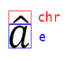

# L.6 Shared MLs 简介

**Introduction to Shared MLs**

!!! info "NOTE"

    pdf 原文共 31 页.

## L.6.1 数学

=== "中文"

    在 Office 数学标记语言 (OMML) 中，所有数学文本都显示在数学区域中。 此类文本可以由方程、数学表达式或简单变量组成。 数学区域由 `oMath` 和 `oMathPara` 元素表示。 有两种数学区域：内联(inline)和显示(display)。 内联数学区域与不在数学区域中的文本一起显示在一行或多行上。 显示数学区域填充整个段落。 更具体地说，显示数学区域由数学段落组成，由 `oMathPara` 元素表示。 数学段落是一组由软回车符分隔的一个或多个方程或表达式； 也就是说，它们是组成单个段落的独立数学实体。 数学段落有其自己的理由，可能与父（非数学）段落的理由不同。 数学段落中的所有对象都具有相同类型的理由。

    显示(diaplay)和内联(inline)数学区域具有本质上不同的格式特征。 内联数学区域通常消耗较少的垂直空间，以帮助最小化或消除非数学段落行间距的变化。 例如，这是通过减小内联分数和 n 元对象(n-ary objects)相对于其显示大小的大小来实现的。 OMML 具有文档级属性，可设置某些数学区域属性的默认选择。 其中包括显示数学区域属性，即默认情况下是否将积分和其他 n 元限制显示在 n 元运算符的下方和上方，或者显示为下标和上标。

    以下小节介绍了构成 OMML 模式大部分的每个数学对象。 由于这种语言是为文本处理而不是计算而设计的，因此在以 XML 表示形式编写数学区域时，会更多地关注数学文本的布局和外观，而不是数学语义。也就是说 $\overrightarrow{abc}$ 和 $\overbrace{abc}$ 由同一对象表示，尽管它们具有不同的数学含义，因为两者都由与拉伸字符配对的文本组成。类似地，$\frac{n}{k} $ 和 $\frac{n}{k} $ 都用分数对象表示。 尽管在数学上它们具有不同的含义，但它们的布局相似。 另一个例子是 $x^2$ ，它可以是 $x$ 的平方或张量分量。 无论这些语义如何，它都由上标对象表示。
    
    尽管本节中描述的功能主要是关于表达式和数学文本的外观，但 ECMA-376 中定义的其他标记提供了独立的功能，可以计算数学公式和表达式。 SpreadsheetML (§L.2.15.1) 中的公式和 WordprocessingML (§L.1.17.1) 中的字段是两个示例。

=== "英文"

    **Math**

    In the Office Math Markup Language (OMML), all mathematical text appears in math zones. Such text can consist of equations, mathematical expressions or simple variables. A math zone is represented by the oMath and oMathPara elements. There are two kinds of math zones: inline and display. An inline math zone appears on a line or lines along with text that is not in the math zone. A display math zone fills a whole paragraph. More specifically, a display math zone consists of a math paragraph, which is represented by the oMathPara element. The math paragraph is a group of one or more equations or expressions separated by soft carriage returns; that is, they are separate mathematical entities that comprise a single paragraph. A math paragraph has its own justification that can differ from that of the parent (non-math) paragraph. All objects within a math paragraph have the same type of justification.

    Display and inline math zones have innately different formatting characteristics. Inline math zones typically consume less vertical space to help minimize or eliminate changes in the non-math paragraph line spacing. This is accomplished, for example, by reducing the size of inline fractions and n-ary objects relative to their display sizes. OMML has document-level properties that set the default choices for some math-zone properties. These include the display math-zone properties of whether integral and other n-ary limits are displayed by default below and above an n-ary operator or as subscripts and superscripts.
    
    The following subclauses introduce each of the math objects that comprise the majority of the OMML schema. Since this language is designed for text processing rather than calculations, when writing math zones in an XML representation, more attention is given to the layout and appearance of mathematical  text than to mathematical semantics. That is $\overrightarrow{abc}$ and $\overbrace{abc}$ are represented by the same object,  although they have different mathematical meanings, because both consist of text paired with a stretching character. Similarly,$\frac{n}{k} $ and $\frac{n}{k} $ are both represented by a fraction object. Though mathematically they have different meaning, their layout is similar. Another example is $x^2$ , which could be $x$ squared or a tensor component. Regardless of these semantics, it is represented by a superscript object.
    
    Although the functionality described in this clause is primarily about the appearance of expressions and mathematical text, other markup defined in ECMA-376 provides independent functionality enabling mathematical formulas and expressions to be calculated. Formulas in SpreadsheetML (§L.2.15.1) and Fields in WordprocessingML (§L.1.17.1) are two examples.

### L.6.1.1 强调对象

=== "中文"

    重音对象用于表示任何具有位于基础上方的组合变音标记的基线文本。 重音只有一个子元素，即基本元素。 重音符号本身作为属性存储。
    
    例如，考虑以下带有变音符号的字母：

    $$\dot{a}  \ddot{a}   \widetilde{a} \hat{a}  \vec{a}  $$

    本示例中最后一个字母的 XML 为：

    ```xml
    <m:acc>
        <m:accPr>
            <m:chr m:val="->" />
        </m:accPr>
        <m:e>
            <m:r>
                <m:t>a</m:t>
            </m:r>
        </m:e>
    </m:acc>
    ```

    在此示例中，这些字母的 XML 表示形式的唯一区别是重音字符。

    

=== "英文"

    **Accent Object**

    The accent object is used to represent any baseline text having a combining diacritical mark placed above the base. The accent has only one child, the base element. The accent mark itself is stored as a property.
    
    For example, consider the following letters having diacritical marks:

    $$\dot{a}  \ddot{a}   \widetilde{a} \hat{a}  \vec{a}  $$

    The XML for the last letter in this example is:

    ```xml
    <m:acc>
        <m:accPr>
            <m:chr m:val="->" />
        </m:accPr>
        <m:e>
            <m:r>
                <m:t>a</m:t>
            </m:r>
        </m:e>
    </m:acc>
    ```

    In this example, the only difference in the XML representations of these letters is the accent character. 

    

### L.6.1.2 Bar Object

=== "中文"

=== "英文"

    **Bar Object**

### L.6.1.3 Border Box Object

=== "中文"

=== "英文"

    **Border Box Object**

### L.6.1.4 Box Object

=== "中文"

=== "英文"

    **Box Object**

### L.6.1.5 Delimiters

=== "中文"

=== "英文"

    **Delimiters**

### L.6.1.6 Array Object

=== "中文"

=== "英文"

    **Array Object**

### L.6.1.7 Fraction Object

=== "中文"

=== "英文"

    **Fraction Object**

### L.6.1.8 Function Apply Object

=== "中文"

=== "英文"

    **Function Apply Object**

### L.6.1.9 Group Character Object

=== "中文"

=== "英文"

    **Group Character Object**

### L.6.1.10 Upper and Lower Limits

=== "中文"

=== "英文"

    **Upper and Lower Limits**

### L.6.1.11 Matrix Object

=== "中文"

=== "英文"

    **Matrix Object**

### L.6.1.12 N-ary Object

=== "中文"

=== "英文"

    **N-ary Object**

### L.6.1.13 Literal Operators and Operator Emulators

=== "中文"

=== "英文"

    **Literal Operators and Operator Emulators**

### L.6.1.14 Phantom Object

=== "中文"

=== "英文"

    **Phantom Object**

### L.6.1.15 Radical Object

=== "中文"

=== "英文"

    **Radical Object**

### L.6.1.16 Scripts (Superscript, Subscript, SubSuperscript, PreSubSuperscript)

=== "中文"

=== "英文"

    **Scripts (Superscript, Subscript, SubSuperscript, PreSubSuperscript)**

### L.6.1.17 Math Paragraphs

=== "中文"

=== "英文"

    **Math Paragraphs**

## L.6.2 Metadata

=== "中文"

=== "英文"

    **Metadata**

### L.6.2.1 Metadata Properties

=== "中文"

=== "英文"

    **Metadata Properties**

### L.6.2.2 Core Properties

=== "中文"

=== "英文"

    **Core Properties**

### L.6.2.3 Extended Properties

=== "中文"

=== "英文"

    **Extended Properties**

### L.6.2.4 Custom Properties

=== "中文"

=== "英文"

    **Custom Properties**

### L.6.2.5 Variant Types

=== "中文"

=== "英文"

    **Variant Types**

## L.6.3 Custom XML Data

=== "中文"

=== "英文"

    **Custom XML Data**

## L.6.4 Bibliography

=== "中文"

=== "英文"

    **Bibliography**

### L.6.4.1 Types of Sources

=== "中文"

=== "英文"

    **Types of Sources**

### L.6.4.2 Child Elements

=== "中文"

=== "英文"

    **Child Elements**

### L.6.4.3 Author

=== "中文"

=== "英文"

    **Author**

### L.6.4.4 LCID, Guid, Tag, and RefOrder

=== "中文"

=== "英文"

    **LCID, Guid, Tag, and RefOrder**
