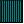
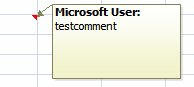

# L.5 VML 简介

=== "中文"

    本节详细介绍了矢量标记语言（Vector Markup Language VML）的组成部分。

=== "英文"

    **Introduction to VML**

    This clause contains a detailed introduction to the components of Vector Markup Language (VML). 

## L.5.1 简介

=== "中文"

    本节概述了 VML 最常见的部分。 VML 格式是最初随 Office 2000 引入的旧格式，出于向后兼容性的原因，在 ECMA-376 中包含并完全定义了该格式。 DrawingML 格式是一种更新且更丰富的格式，创建的目标是最终取代 Office Open XML 格式中 VML 的任何使用。 VML是一种过渡格式； 它包含在 Office Open XML 中只是出于遗留原因。

    从 VML 到 DrawingML 的转换可能会导致信息丢失，因为它们使用不同的模型。 例如，

    - VML 使用平面 XML 结构，而 DrawingML 使用分层结构。 一般来说，从平面 XML 推断层次结构比从层次结构生成平面 XML 困难得多。
    - VML 允许对 DrawingML 中相互不兼容的属性进行组合。

    VML 是一种基于 XML 的高质量矢量图形交换、编辑和交付格式。 VML 促进了各种生产力和设计应用程序之间矢量图形的交换和后续编辑。 VML 基于 XML 1.0，它是一种开放、简单、基于文本的语言，用于描述结构化数据。 VML 还支持其他万维网联盟标准，例如指定样式信息和二维定位的级联样式表 2.0 (CSS)。
    
    由于 VML 格式是为向后兼容而提供的格式，因此许多 VML 元素是在同一个 `urn:schemas-microsoft-com:vml` 命名空间中定义的，当前已使用 VML 的数百万文档正在使用该命名空间。 在文档中，通常通过定义 `xmlns:v="urn:schemas-microsoft-com:vml"` 将其缩短为 VML 标记中的 `v:` 前缀。 用于 VML 的命名空间是旧命名空间。 再次强调，仅出于遗留原因，VML 应被视为 Office Open XML 中包含的已弃用格式，强烈鼓励需要绘图文件格式的新应用程序优先使用 DrawingML 。
    
    其他元素和属性在反映其使用方式的命名空间中定义（ECMA-376 中定义的所有 VML 命名空间都维护旧命名空间结构以实现向后兼容性）：
    
    - `urn:schemas-microsoft-com:office:office (office document)`
    - `urn:schemas-microsoft-com:office:word (word-processing document)`
    - `urn:schemas-microsoft-com:office:excel (spreadsheet document)`
    - `urn:schemas-microsoft-com:office:powerpoint (presentation document)`

=== "英文"

    **Introduction**

    This subclause provides an overview of the most common parts of VML. The VML format is a legacy format originally introduced with Office 2000 and is included and fully defined in ECMA-376 for backwards compatibility reasons. The DrawingML format is a newer and richer format created with the goal of eventually replacing any uses of VML in the Office Open XML formats. VML is a transitionalformat; it is included in Office Open XML for legacy reasons only .

    Conversion from VML to DrawingML can result in information loss, as they use different models. For example,

    - VML uses a flat XML structure, whereas DrawingML uses one that is hierarchical. In general, inferring hierarchical structure from flat XML is much more difficult than generating flat XML from a hierarchy.
    - VML allows combinations of attributes that are mutually incompatible in DrawingML.

    VML is an XML-based exchange, editing, and delivery format for high-quality vector graphics. VML facilitates the exchange and subsequent editing of vector graphics between a wide variety of productivity and design applications. VML is based on XML 1.0, which is an open, simple, text-based language for describing structured data. VML also supports other World Wide Web Consortium standards, such as Cascading Style Sheets 2.0 (CSS), which specifies style information and 2-D positioning.
    
    As the VML format is a format provided for backward compatibility, many VML elements are defined in the same urn:schemas-microsoft-com:vml namespace that is currently used by millions of documents already using VML. In the documentation this is typically shortened to a v: prefix in the VML tag by defining xmlns:v="urn:schemas-microsoft-com:vml". The namespaces used for VML are legacy namespaces. Once again, VML should be considered a deprecated format included in Office Open XML for legacy reasons only and new applications that need a file format for drawings are strongly encouraged to use preferentially DrawingML .
    
    Additional elements and attributes are defined in namespaces that reflect how they are used (all VML namespaces defined in ECMA-376 maintain the legacy namespace structure for backward compatibility):
    
    - urn:schemas-microsoft-com:office:office (office document)
    - urn:schemas-microsoft-com:office:word (word-processing document)
    - urn:schemas-microsoft-com:office:excel (spreadsheet document)
    - urn:schemas-microsoft-com:office:powerpoint (presentation document)

## L.5.2 Shape 元素

=== "中文"

    Shape 元素是VML 的基本构建块。 形状可以单独存在，也可以存在于 Group 元素中。 形状定义了许多控制形状的外观和行为的属性和子元素。 形状必须至少定义路径和大小（宽度、高度）。 VML 还使用 CSS2 样式属性的属性来指定位置和大小。

    请注意，本子条款还适用于由 VML 元素 Arc、Curve、Image、Line、Oval、Polyline、Rect 和 RoundRect 提供的一组预定义形状基元。

    以下属性用于定义最小形状：

    | 属性      | 描述                                  |
    | :-------- | :------------------------------------ |
    | FillColor | 填充形状闭合路径的画笔颜色.           |
    | Position  | 用于放置元素的定位类型.               |
    | Top       | 页面流程中形状相对于其上方元素的位置. |
    | Left      | 文档流中形状相对于其左侧元素的位置.   |
    | Width     | 形状的宽度.                           |
    | Height    | 形状的高度.                           |
    | Path      | 构成形状边缘的线.                     |

    以下示例创建一个最小形状：

    ```xml
    <v:shape fillcolor="green"
        style="position:relative;top:1;left:1;width:50;
         height:50" path="m 1,1 l 1,50, 50,50, 50,1 x e">
    </v:shape>
    ```

    

    虽然 Shape 元素的属性或子元素没有正式的分类，但将它们分组是很有用的。 以下各节广泛描述了 Shape 元素的特征。 这里介绍一些基本属性和元素。 有关完整的详细信息，请参阅第 4 部分中的 VML 参考。

=== "英文"

    **Shape Element**

    The Shape element is the basic building block of VML. A shape can exist on its own or within a Group element. Shape defines many attributes and sub-elements that control the look and behavior of the shape. A shape must define at least a Path and size (Width, Height). VML also uses properties of the CSS2 style attribute to specify positioning and sizing.

    Note that this subclause also applies to the set of pre-defined shape primitives provided by the VML elements Arc, Curve, Image, Line, Oval, Polyline, Rect, and RoundRect. 

    The following attributes are used to define a minimal shape:

    | Attribute | Description                                                                     |
    | :-------- | :------------------------------------------------------------------------------ |
    | FillColor | Brush color that fills the closed path of a shape.                              |
    | Position  | Type of positioning used to place an element.                                   |
    | Top       | Position of the shape relative to the element above it in the flow of the page. |
    | Left      | Position of the shape relative to the element left of it in the document flow.  |
    | Width     | Width of the shape.                                                             |
    | Height    | Height of the shape.                                                            |
    | Path      | Line that makes up the edges of a shape.                                        |

    The following example creates a minimal shape:

    ```xml
    <v:shape fillcolor="green"
        style="position:relative;top:1;left:1;width:50;
         height:50" path="m 1,1 l 1,50, 50,50, 50,1 x e">
    </v:shape>
    ```

    

    Although there is no official categorization of the Shape element’s attributes or sub-elements, it is useful to think of them in groups. The following sections broadly describe the characteristics of the Shape element. A few fundamental attributes and elements are introduced here. For complete details, see the VML reference in Part 4.

### L.5.2.1 几何

**Geometry**

=== "中文"

    以下属性影响形状的基本结构或轮廓。
    
    | **属性** | **描述**                 |
    | :------- | :----------------------- |
    | Adj      | 用于定义公式值的调整值。 |
    | Height*  | 形状的高度。             |
    | Path     | 构成形状边缘的线。       |
    | Width*   | 形状的宽度。             |
    
    * 表示 CSS2 样式属性
    
    | **元素**  | **描述**                 |
    | :-------- | :----------------------- |
    | Callout   | 为形状定义一个标注。     |
    | Extrusion | 为形状定义一个拉伸效果。 |
    | Path      | 为形状定义路径。         |
    | Skew      | 为形状定义倾斜。         |
    | Stroke    | 为形状定义边框。         |
    | TextBox   | 为形状定义文本框。       |
    | TextPath  | 为形状定义文本路径。     |
    
    请注意，Height 和 Width 属性后面带有星号（*），表示它们是 CSS2 样式属性，可以在样式表中进行定义和应用。

=== "英文"

    The following attributes affect the basic structure or outline of the shape.

    | **Attribute** | **Description**                                       |
    | :------------ | :---------------------------------------------------- |
    | Adj           | Adjustment value used to define values for a formula. |
    | Height*       | Height of the shape.                                  |
    | Path          | Line that makes up the edges of a shape.              |
    | Width*        | Width of the shape.                                   |

    * indicates a CSS2 style property

    | **Element** | **Description**                   |
    | :---------- | :-------------------------------- |
    | Callout     | Defines a callout for a shape.    |
    | Extrusion   | Defines an extrusion for a shape. |
    | Path        | Defines a path for a shape.       |
    | Skew        | Defines a skew for a shape.       |
    | Stroke      | Defines a stroke for a shape.     |
    | TextBox     | Defines a textbox for a shape.    |
    | TextPath    | Defines a text path for a shape.  |

#### L.5.2.1.1 高度和宽度属性

=== "中文"

    高度和宽度可以使用以下任何单位指定。 如果未指定单位，则假定为像素(pixels)。

    **相对单位 / Relative**

    - **em**:  元素字体的高度
    - **ex**:  字母“x”的高度
    - **px**:  像素
    - **%**:  百分比

    **绝对单位 / Absolute**

    - **in**: 英寸
    - **cm**: 厘米
    - **mm**: 毫米
    - **pt**: 点
    - **pc**: Picas

    例如:

    ```html
    style="position:relative;top:1;left:1;width:50;height:50"
    style="position:relative;top:1;left:1;width:10%;height:10%"
    ```

=== "英文"

    **Height and Width Attributes**

    Height and Width can be specified using any of the following units. If no unit is specified, pixels is assumed.

    **Relative**

    - **em**:  Height of the element's font
    - **ex**:  Height of the letter "x"
    - **px**:  Pixels
    - **%**:  Percentage

    **Absolute**

    - **in**: Inches
    - **cm**: Centimeters
    - **mm**: Millimeters
    - **pt**: Points
    - **pc**: Picas

    For example:

    ```html
    style="position:relative;top:1;left:1;width:50;height:50"
    style="position:relative;top:1;left:1;width:10%;height:10%"
    ```

#### L.5.2.1.2 路径属性

**Path Attribute**

=== "中文"

    路径属性包含特别格式化的文本，描述了一系列点以及它们之间的连接线，这些点和线定义了形状的轮廓。定义的路径必须是封闭的。路径的开始是通过指定 `m` 和一个坐标来实现的，这表示移动到给定的坐标。使用 `l`（lineto，画线到）和指定后续坐标来绘制线段。使用 `x` 在闭合坐标后闭合线条。路径以 `e` 结束。
    
    例如：
    
    ```python
    path="m 1,1 l 1,50, 50,50, 50,1 x e"
    ```
    
    这从点 (1,1) 开始，画线到点 (1,50)，(50,50) 和 (50,1)，然后闭合线条并结束路径。
    
    指定的坐标对应于相对坐标空间（相对空间中单位的大小可以由 `CoordSize` 属性设置）。形状的实际大小由 `Height`（高度）和 `Width`（宽度）属性确定。
    
    例如：
    
    ```xml
    <v:shape style="position:relative;top:1;left:1;width:5000;height:5000" fillcolor="teal"
        path="m 1,1 l 1,10 10,10 10,1 1,1 x e" />
    ```
    
    
    
    ```xml
    <v:shape style="position:relative;top:1;left:1;width:2500;height:2500" fillcolor="teal"
    path="m 1,1 l 1,10 10,10 10,1 1,1 x e" />
    ```
    
    
    
    可以在路径属性中指定多个封闭的线条路径，每个封闭区域都会被填充。
    
    ```xml
    <v:shape style="position:relative;top:1;left:1;width:5000;height:5000" fillcolor="teal"
    path="m 1,1 l 1,10 10,10 10,1 1,1 x m 20,20 l 20,40 40,40 40,20 20,20 x e" />
    ```
    
    
    
    可选的 `Path` 元素，允许创建更复杂的路径和区域，如果在文档中指定了它，它将覆盖路径属性。

=== "英文"

    The Path attribute contains specially formatted text that describes a set of points and line connections between them that define the shape’s outline. The path defined must be closed. A path is begun by specifying m and a coordinate. This indicates a moveto the given coordinate. Line segments are drawn using l (lineto) and specifying subsequent coordinates. A line is closed with x after the closing coordinate. The path is ended with e.

    For example:
    
    ```python
    path="m 1,1 l 1,50, 50,50, 50,1 x e"
    ```
    
    This starts at (1,1), draws a line to (1,50), (50,50) and (50,1), where the line is closed and the path ended.
    
    The coordinates specified correspond to relative coordinate space (the size of units in relative space can be set by the CoordSize attribute). The shape’s actual size is determined by the Height and Width attributes.
    
    For example:
    
    ```xml
    <v:shape style="position:relative;top:1;left:1;width:5000;
    height:5000" fillcolor="teal"
        path="m 1,1 l 1,10 10,10 10,1 1,1 x e" />
    ```
    
    
    
    ```xml
    <v:shape style="position:relative;top:1;left:1;width:2500;
    height:2500" fillcolor="teal"
    path="m 1,1 l 1,10 10,10 10,1 1,1 x e" />
    ```
    
    
    
    More than one closed line path can be specified in the Path attribute and each closed region is filled.
    
    ```xml
    <v:shape style="position:relative;top:1;left:1;width:5000;
    height:5000" fillcolor="teal"
    path="m 1,1 l 1,10 10,10 10,1 1,1 x m 20,20 l 20,40 40,40
    40,20 20,20 x e" />
    ```
    
    
    
    The optional Path element, which allows for the creation of more complex paths and regions, overrides the Path attribute if it is specified.

### L.5.2.2 放置属性

**Placement**

=== "中文"

    这些属性影响形状的布局和定位。定位可以相对于容器中其他形状或非VML内容来定义。
    
    | **属性**                           | **描述**                                         |
    | ---------------------------------- | ------------------------------------------------ |
    | AllowOverlap                       | 确定一个形状是否可以与其他形状重叠。             |
    | CoordOrigin                        | 指定一个形状边界矩形的坐标单位原点。             |
    | CoordSize                          | 指定一个形状边界矩形的水平和垂直单位。           |
    | Flip\*                             | 切换形状的方向。                                 |
    | Left\*                             | 确定形状相对于文档流中它左侧元素的位置。         |
    | Margin-Bottom\*                    | 指定形状的包含矩形的底边相对于形状锚点的位置。   |
    | Margin-Left\*                      | 指定形状的包含矩形的左边相对于形状锚点的位置。   |
    | Margin-Right\*                     | 指定形状的包含矩形的右边相对于形状锚点的位置。   |
    | Margin-Top\*                       | 指定形状的包含矩形的顶边相对于形状锚点的位置。   |
    | MSO-Position-Horizontal\*          | 为WordprocessingML中的对象指定水平定位数据。     |
    | MSO-Position-Horizontal-Relative\* | 为WordprocessingML中的对象指定相对水平定位数据。 |
    | MSO-Position-Vertical\*            | 为WordprocessingML中的对象指定垂直定位数据。     |
    | MSO-Position-Vertical-Relative\*   | 为WordprocessingML中的对象指定相对垂直定位数据。 |
    | MSO-Wrap-Distance-Bottom\*         | 定义形状底边到围绕它排版的文本的距离。           |
    | MSO-Wrap-Distance-Left\*           | 定义形状左边到围绕它排版的文本的距离。           |
    | MSO-Wrap-Distance-Right\*          | 定义形状右边到围绕它排版的文本的距离。           |
    | MSO-Wrap-Distance-Top\*            | 定义形状顶部到围绕它排版的文本的距离。           |
    | MSO-Wrap-Edited\*                  | 确定包装坐标是否由用户自定义。                   |
    | MSO-Wrap-Mode\*                    | 定义文本的包装模式。                             |
    | Position\*                         | 定义用于放置元素的定位类型。                     |
    | RelativePosition                   | 为对象定义相对位置。                             |
    | Rotation\*                         | 定义形状旋转的角度。                             |
    | Top\*                              | 定义形状相对于页面流中它上方元素的位置。         |
    | Z-Index\*                          | 确定重叠形状的显示顺序。                         |
    
    \* 表示 CSS2 样式属性

=== "英文"

    These attributes affect the layout and placement of shapes. Placement can be defined relative to other shapes or non-VML content that also exists in the container holding the shape.
    
    | **Attribute**                      | **Description**                                                                               |
    | ---------------------------------- | --------------------------------------------------------------------------------------------- |
    | AllowOverlap                       | Determines if a shape can overlap other shapes.                                               |
    | CoordOrigin                        | Specifies the coordinate unit origin of the rectangle that bounds a shape.                    |
    | CoordSize                          | Specifies the horizontal and vertical units of the rectangle that bounds a shape.             |
    | Flip\*                             | Switches the orientation of a shape.                                                          |
    | Left\*                             | Determines the position of the shape relative to the element left of it in the document flow. |
    | Margin-Bottom\*                    | Specifies the bottom edge of the shape's containing rectangle relative to the shape anchor.   |
    | Margin-Left\*                      | Specifies the left edge of the shape's containing rectangle relative to the shape anchor.     |
    | Margin-Right\*                     | Specifies the right edge of the shape's containing rectangle relative to the shape anchor.    |
    | Margin-Top\*                       | Specifies the top edge of the shape's containing rectangle relative to the shape anchor.      |
    | MSO-Position-Horizontal\*          | Specifies the horizontal positioning data for objects in WordprocessingML.                    |
    | MSO-Position-Horizontal-Relative\* | Specifies relative horizontal position data for objects in WordprocessingML.                  |
    | MSO-Position-Vertical\*            | Specifies the vertical position data for objects in WordprocessingML.                         |
    | MSO-Position-Vertical-Relative\*   | Specifies relative vertical position data for objects in WordprocessingML.                    |
    | MSO-Wrap-Distance-Bottom\*         | Defines the distance from the bottom side of the shape to the text that wraps around it.      |
    | MSO-Wrap-Distance-Left\*           | Defines the distance from the left side of the shape to the text that wraps around it.        |
    | MSO-Wrap-Distance-Right\*          | Defines the distance from the right side of the shape to the text that wraps around it.       |
    | MSO-Wrap-Distance-Top\*            | Defines the distance from the shape top to the text that wraps around it.                     |
    | MSO-Wrap-Edited\*                  | Determines whether the wrap coordinates were customized by the user.                          |
    | MSO-Wrap-Mode\*                    | Defines the wrapping mode for text.                                                           |
    | Position\*                         | Defines the type of positioning used to place an element.                                     |
    | RelativePosition                   | Defines a relative position for an object.                                                    |
    | Rotation\*                         | Defines the angle that a shape is rotated.                                                    |
    | Top\*                              | Defines the position of the shape relative to the element above it in the flow of the page.   |
    | Z-Index\*                          | Determines the display order of overlapping shapes.                                           |
    
    \* indicates a CSS2 style property

#### L.5.2.2.1 CoordOrigin 和 CoordSize 属性

**CoordOrigin and CoordSize Attributes**

=== "中文"

    这些属性定义了形状的相对坐标空间。这个空间会被放大或缩小以匹配形状指定的宽度（Width）和高度（Height）。路径属性（Path）中的坐标（或元素）是相对于由 CoordOrigin 和 CoordSize 定义的空间，因此路径定义永远不需要仅仅为了缩放形状而改变。
    
    CoordSize 定义了局部坐标空间的“宽度(width)”和“高度(height)”。CoordOrigin 定义了这个空间的左上角坐标。
    
    例如：
    
    ```python
    coordorigin="0,0"
    coordsize="200,200"  # 局部空间的范围是 (0,0) 到 (200,200)
    
    coordorigin="-100,-100"
    coordsize="200,200"  # 局部空间的范围是 (-100,-100) 到 (100,100)
    ```
    
    这个局部空间定义会影响形状的位置。改变 CoordOrigin 可以在局部空间内平移形状。改变 CoordSize 通过改变局部空间相对于形状的宽度和高度来影响形状的大小。
    
    例如：
    
    ```python
    coordorigin="0,0"
    coordsize="500,500"
    style="position:absolute;top:0;left:0;width:100pt;height:100pt"
    ```
    
    
    
    ```python
    coordorigin="-250,-250"
    coordsize="500,500"
    style="position:absolute;top:0;left:0;width:100pt;height:100pt"
    ```
    
    
    
    ```python
    coordorigin="0,0"
    coordsize="250,250"
    style="position:absolute;top:0;left:0;width:100pt;height:100pt"
    ```
    
    

=== "英文"

    These attributes define the relative coordinate space of a shape. This space is scaled up or down to match the specified Width and Height of the shape. Coordinates in the Path attribute (or element) are relative to the space defined by CoordOrigin and CoordSize, so the Path definition never needs to change simply to scale the shape.
    
    CoordSize defines the “width” and “height” of the local coordinate space. CoordOrigin defines the top-left coordinate of this space.
    
    For example:
    
    ```python
    coordorigin="0,0"
    coordsize="200,200"  # Extents of local space are (0,0) to (200,200)
    
    coordorigin="-100,-100"
    coordsize="200,200"  # Extents of local space are (-100,-100) to (100,100)
    ```
    
    This local space definition affects the position of the shape. Changing the CoordOrigin translates the shape within the local space. Changing the CoordSize affects the size of the shape by changing the size of the local space relative to the shape’s Width and Height.
    
    For example:
    
    ```python
    coordorigin="0,0"
    coordsize="500,500"
    style="position:absolute;top:0;left:0;width:100pt;height:100pt"
    ```
    
    
    
    ```python
    coordorigin="-250,-250"
    coordsize="500,500"
    style="position:absolute;top:0;left:0;width:100pt;height:100pt"
    ```
    
    
    
    ```python
    coordorigin="0,0"
    coordsize="250,250"
    style="position:absolute;top:0;left:0;width:100pt;height:100pt"
    ```
    
    

#### L.5.2.2.2 Position 属性

**Position Attribute**

=== "中文"
    
    定位(Position)可以指定为“静态”（static）、“相对”（relative）或“绝对”（absolute）。静态定位使形状与周围内容的当前流保持一致 - 将忽略 Top 和 Left 属性。相对定位使用 Top 和 Left 属性将形状相对于其在当前流中的位置进行定位。绝对定位使用 Top 和 Left 属性将形状相对于其容器进行定位。

=== "英文"
    
    Position can be specified as “static”, “relative” or “absolute”. Static positioning keeps the shape inline with the current flow of the surrounding content – the Top and Left attributes are ignored. Relative uses the Top and Left attributes to position the shape relative to its position in the current flow. Absolute uses the Top and Left attributes to position the shape with respect to its container.

### L.5.2.3 格式

**Formatting**

=== "中文"

    这些属性和元素影响形状的填充和线条属性。
    
    | **属性**          | **描述**                                             |
    | ----------------- | ---------------------------------------------------- |
    | BorderBottomColor | 内联形状的底部边框颜色。                             |
    | BorderLeftColor   | 内联形状的左边边框颜色。                             |
    | BorderRightColor  | 内联形状的右边边框颜色。                             |
    | BorderTopColor    | 内联形状的顶部边框颜色。                             |
    | BWMode            | 确定形状在黑白输出设备上呈现的方式。                 |
    | BWNormal          | 定义普通黑白输出设备的黑白模式。                     |
    | BWPure            | 定义纯黑白输出设备的黑白模式。                       |
    | Chromakey         | 定义一种颜色作为透明，显示形状后面的东西。           |
    | FillColor         | 定义填充形状闭合路径的画刷颜色。                     |
    | Filled            | 确定是否填充闭合路径。                               |
    | ForceDash         | 确定当形状没有线条或填充时是否使用虚线轮廓绘制形状。 |
    | HR                | 指定一个形状是水平规则线。                           |
    | HRAlign           | 定义水平规则线的对齐方式。                           |
    | HRHeight          | 定义水平规则线的厚度。                               |
    | HRNoShade         | 确定是否显示水平规则线的三维阴影效果。               |
    | HRPct             | 定义水平规则线的长度为页面宽度的百分比。             |
    | HRStd             | 确定一个形状是否是标准水平规则线。                   |
    | HRWidth           | 定义水平规则线的长度。                               |
    | StrokeColor       | 定义描绘形状路径的画刷颜色。                         |
    | Stroked           | 定义是否描绘路径。                                   |
    | StrokeWeight      | 定义描绘形状路径的画刷厚度。                         |
    
    | **元素**  | **描述**             |
    | --------- | -------------------- |
    | Fill      | 为形状定义填充。     |
    | Imagedata | 为形状定义图像数据。 |
    | Shadow    | 为形状定义阴影。     |

=== "英文"

    These attributes and elements affect the fill and line properties of the shape.
    
    | **Attribute**     | **Description**                                                                               |
    | ----------------- | --------------------------------------------------------------------------------------------- |
    | BorderBottomColor | Bottom border color of an inline shape.                                                       |
    | BorderLeftColor   | Left border color of an inline shape.                                                         |
    | BorderRightColor  | Right border color of an inline shape.                                                        |
    | BorderTopColor    | Top border color of an inline shape.                                                          |
    | BWMode            | Determines how a shape renders for black-and-white output devices.                            |
    | BWNormal          | Defines the black-and-white mode for normal black-and-white output devices.                   |
    | BWPure            | Defines the black-and-white mode for pure black-and-white output devices.                     |
    | Chromakey         | Defines a color that is transparent and shows anything behind the shape.                      |
    | FillColor         | Defines the brush color that fills the closed path of a shape.                                |
    | Filled            | Determines whether the closed path is filled.                                                 |
    | ForceDash         | Determines whether a dashed outline is used to draw a shape when a shape has no line or fill. |
    | HR                | Specifies that a shape is a horizontal rule.                                                  |
    | HRAlign           | Defines the alignment of a horizontal rule.                                                   |
    | HRHeight          | Defines the thickness of a horizontal rule.                                                   |
    | HRNoShade         | Determines whether a horizontal rule is displayed with 3-D shading.                           |
    | HRPct             | Defines the length of a horizontal rule as a percentage of page width.                        |
    | HRStd             | Determines whether a shape is a standard horizontal rule.                                     |
    | HRWidth           | Defines the length of a horizontal rule.                                                      |
    | StrokeColor       | Defines the brush color that strokes the path of a shape.                                     |
    | Stroked           | Defines whether the path is stroked.                                                          |
    | StrokeWeight      | Defines the brush thickness that strokes the path of a shape.                                 |
    
    | **Element** | **Description**                 |
    | ----------- | ------------------------------- |
    | Fill        | Defines a fill for a shape.     |
    | Imagedata   | Defines image data for a shape. |
    | Shadow      | Defines a shadow for a shape.   |

### L.5.2.4 其他

**Other**

=== "中文"

    以下是一些杂项属性和元素。
    
    | **属性**          | **描述**                                                          |
    | ----------------- | ----------------------------------------------------------------- |
    | Alt               | 定义代替图形显示的替代文本。                                      |
    | AllowInCell       | 确定形状是否可以放置在表格中。                                    |
    | Bullet            | 确定形状是否是图形项目符号。                                      |
    | Button            | 确定形状是否被视为按钮处理。                                      |
    | Class             | 引用 CSS 样式的定义。                                             |
    | ConnectorType     | 指示用于连接形状的连接符类型。                                    |
    | DoubleClickNotify | 当形状被双击时发送事件消息。                                      |
    | HRef              | 为形状定义一个 URL。当形状被点击时，浏览器加载该 URL。            |
    | ID                | 为元素提供唯一标识符。                                            |
    | InsetMode         | 指定宿主是否计算内部文本边距，而不是使用文本框元素的 inset 属性。 |
    | OLE               | 指定形状是否为嵌入式 OLE 对象。                                   |
    | OLEIcon           | 确定 OLE 对象是否显示为图标。                                     |
    | OnEd              | 确定形状的额外手柄是否隐藏。                                      |
    | OnMouseOver       | 为形状触发鼠标事件。                                              |
    | PreferRelative    | 确定重新格式化后是否保存对象的原始大小。                          |
    | Print             | 确定形状是否打印。                                                |
    | ReGroupID         | 定义形状的先前组。                                                |
    | RuleInitiator     | 确定是否使用规则引擎。                                            |
    | RuleProxy         | 确定是否使用规则引擎的代理。                                      |
    | Spt               | 定义用于识别形状类型的数字。                                      |
    | TableLimits       | 表格中每行的最小高度值列表。                                      |
    | TableProperties   | 确定表格属性。                                                    |
    | Target            | 定义显示 URL 的框架或窗口。                                       |
    | Title             | 定义鼠标指针移动到形状上时显示的文本。                            |
    | Type              | 定义对 ShapeType 元素 ID 的引用。                                 |
    | UserDrawn         | 确定用户是否已将形状添加到母版幻灯片中。                          |
    | UserHidden        | 确定脚本锚点是否隐藏。                                            |
    | Visibility        | 确定是否显示形状。                                                |
    | WrapCoords        | 定义围绕形状的边界多边形。                                        |
    
    | **元素** | **描述**         |
    | -------- | ---------------- |
    | Formulas | 定义形状的公式。 |
    | Handles  | 定义形状的手柄。 |
    | Locks    | 定义形状的锁定。 |

=== "英文"

    These are miscellaneous attributes and elements.
    
    | **Attribute**     | **Description**                                                                                                             |
    | ----------------- | --------------------------------------------------------------------------------------------------------------------------- |
    | Alt               | Defines alternative text to be displayed instead of a graphic.                                                              |
    | AllowInCell       | Determines whether a shape can be placed in a table.                                                                        |
    | Bullet            | Determines whether a shape is a graphical bullet.                                                                           |
    | Button            | Determines whether a shape is processed as a button.                                                                        |
    | Class             | Refers to a definition of a CSS style.                                                                                      |
    | ConnectorType     | Indicates the type of connector used for joining shapes.                                                                    |
    | DoubleClickNotify | Sends an event message when a shape is double-clicked.                                                                      |
    | HRef              | Defines a URL for a shape. When the shape is clicked, the browser loads the URL.                                            |
    | ID                | Provides a unique identifier for an element.                                                                                |
    | InsetMode         | Specifies whether the host calculates the internal text margin instead of using the inset attribute of the textbox element. |
    | OLE               | Specifies whether the shape is an embedded OLE object.                                                                      |
    | OLEIcon           | Determines whether an OLE object is displayed as an icon.                                                                   |
    | OnEd              | Determines whether the extra handles of a shape are hidden.                                                                 |
    | OnMouseOver       | Triggers a mouse event for a shape.                                                                                         |
    | PreferRelative    | Determines whether the original size of an object is saved after reformatting.                                              |
    | Print             | Determines whether the shape is printed.                                                                                    |
    | ReGroupID         | Defines a previous group for a shape.                                                                                       |
    | RuleInitiator     | Determines whether a rules engine is used.                                                                                  |
    | RuleProxy         | Determines whether a proxy for the rules engine is used.                                                                    |
    | Spt               | Defines a number used to identify types of shapes.                                                                          |
    | TableLimits       | List of minimum height values for each row in a table.                                                                      |
    | TableProperties   | Determines table properties.                                                                                                |
    | Target            | Defines a frame or window that a URL is displayed in.                                                                       |
    | Title             | Defines the text displayed when the mouse pointer moves over the shape.                                                     |
    | Type              | Defines a reference to the ID of a ShapeType element.                                                                       |
    | UserDrawn         | Determines whether the user has added the shape to a master slide.                                                          |
    | UserHidden        | Determines whether a script anchor is hidden.                                                                               |
    | Visibility        | Determines whether a shape is displayed.                                                                                    |
    | WrapCoords        | Defines the bounding polygon that surrounds a shape.                                                                        |

    
    | **Element** | **Description**               |
    | ----------- | ----------------------------- |
    | Formulas    | Defines formulas for a shape. |
    | Handles     | Defines handles for a shape.  |
    | Locks       | Defines a lock for a shape.   |


## L.5.3 组合元素

**Group Element**

=== "中文"

    **Group** 元素用于收集多个对象，使它们可以作为一个单一单元进行定位和变换。当对象被插入到一个组中时，它们引用其父容器的坐标空间变为相对于组的局部空间。使用组支持创建由许多子形状组成的复杂形状，这些形状可以被视为一个单一实体。
    
    Group 支持 Shape 元素属性的一个子集。
    
    **属性**：
    
    | —                 | —                 | —                | —               |
    | ----------------- | ----------------- | ---------------- | --------------- |
    | AllowInCell       | Class             | HRPct            | Style           |
    | AllowOverlap      | CoordOrig         | HRStd            | TableLimits     |
    | Alt               | CoordSize         | HRWidth          | TableProperties |
    | BorderBottomColor | DoubleClickNotify | ID               | Target          |
    | BorderLeftColor   | HR                | OnEd             | Title           |
    | BorderRightColor  | HRAlign           | OnMouseOver      | UserDrawn       |
    | BorderTopColor    | HRef              | Print            | UserHidden      |
    | Bullet            | HRHeight          | ReGroupID        | WrapCoords      |
    | Button            | HRNoShade         | RelativePosition | -               |
    
    允许在 Group 内部的元素：
    
    | —     | —     | —         | —         |
    | ----- | ----- | --------- | --------- |
    | Arc   | Image | Polyline  | Shape     |
    | Curve | Line  | Rect      | ShapeType |
    | Group | Oval  | RoundRect | -         |

=== "英文"

    The Group element is used to collect multiple objects so they can be positioned and transformed as a single unit. Objects that reference their parent container’s coordinate space become relative to the group’s local space when inserted into a group. Using groups supports creation of complex shapes, composed of many sub-shapes, that can be treated as a single entity.
    
    Group supports a subset of the Shape element’s attributes.
    
    **Attribute**:
    
    | —                 | —                 | —                | —               |
    | ----------------- | ----------------- | ---------------- | --------------- |
    | AllowInCell       | Class             | HRPct            | Style           |
    | AllowOverlap      | CoordOrig         | HRStd            | TableLimits     |
    | Alt               | CoordSize         | HRWidth          | TableProperties |
    | BorderBottomColor | DoubleClickNotify | ID               | Target          |
    | BorderLeftColor   | HR                | OnEd             | Title           |
    | BorderRightColor  | HRAlign           | OnMouseOver      | UserDrawn       |
    | BorderTopColor    | HRef              | Print            | UserHidden      |
    | Bullet            | HRHeight          | ReGroupID        | WrapCoords      |
    | Button            | HRNoShade         | RelativePosition | -               |
    
    The following elements are allowed inside a Group:
    
    | —     | —     | —         | —         |
    | ----- | ----- | --------- | --------- |
    | Arc   | Image | Polyline  | Shape     |
    | Curve | Line  | Rect      | ShapeType |
    | Group | Oval  | RoundRect | -         |

## L.5.4 ShapeType 元素

**ShapeType Element**

=== "中文"

    ShapeType 元素定义了一个形状的定义或模板。通过创建一个引用 ShapeType 的 Shape 元素来“实例化”这样一个模板。形状可以覆盖其 ShapeType 指定的任何值，或者定义 ShapeType 未提供的属性和元素。ShapeType 不能引用另一个 ShapeType。
    
    ShapeType 使用的属性和元素与 Shape 元素相同，但有以下例外：
    
    ShapeType 不能使用 Type 元素。
    
    CSS 定位属性被忽略，并且不会传递给个别的 Shape 实例。可见性总是隐藏的。
    
    一个 VML 编写代理可以使 ShapeType 可见，在这种情况下，CSS 定位属性就有意义了。
    
    ShapeType 元素用于定义一个形状，并在文档中多次引用它。ShapeType 定义的最有用的属性或元素之一是一个复杂的 Path。由于 Path 坐标是在一个相对坐标空间中定义的，并且会随着形状的高度和宽度进行缩放，这对于定义一个可以根据特定用途自定义缩放和格式化的形状轮廓非常灵活。

=== "英文"

    The ShapeType element defines a definition, or template, for a shape. Such a template is “instantiated” by creating a Shape element that references the ShapeType. The shape can override any value specified by its ShapeType, or define attributes and elements the ShapeType does not provide. A ShapeType cannot reference another ShapeType.
    
    The attributes and elements a ShapeType uses are identical to those of the Shape element, with these exceptions.
    
    ShapeType cannot use the Type element.
    
    CSS positioning attributes are ignored and not passed to individual Shape instances. Visibility is always hidden.
    
    A VML authoring agent can make the ShapeType visible, in which case the CSS positioning attributes are meaningful.
    
    The ShapeType element is used to define a shape once and reference it multiple times throughout a document. One of the most useful attributes or elements a ShapeType defines is a complex Path. Since Path coordinates are defined in a relative coordinate space that scales with a shape’s height and width, this is very flexible for defining a shape outline that can be custom scaled and formatted for a given use.

## L.5.5 VML 在 Office Open XML 格式中的使用

**VML Usage in the Office Open XML Format**

### L.5.5.1 OfficeArt 形状

**OfficeArt Shapes**

=== "中文"

    WordprocessingML 利用了 VML 提供的基于模板的形状定义。以下示例展示了下面屏幕截图中的两个形状是如何创建的。
    
    
    
    首先使用 ShapeType 定义星星。
    
    ```xml
    <v:shapetype id="_x0000_t12" coordsize="21600,21600" o:spt="12"
        path="m10800,l8280,8259,,8259r6720,5146l4200,21600r6600,
        -5019l17400,21600,14880,13405,21600,8259r-8280,xe">
        <v:stroke joinstyle="miter" />
        <v:path gradientshapeok="t" o:connecttype="custom"
            …
        o:connectlocs="10800,0;0,8259;4200,21600;17400,21600;21600,8259"
        textboxrect="6720,8259,14880,15628" />
    </v:shapetype>
    ```
    
    第一个星星通过 Type 属性引用 ShapeType 来创建。它设置了自己的位置和缩放。
    
    ```xml
    <v:shape id="_x0000_s1026" type="#_x0000_t12"
        style="position:absolute;margin-left:33pt;margin-top:25.5pt;
        width:47.25pt;height:47.25pt;z-index:251656704" />
    ```
    
    第二个星星通过引用 ShapeType 并提供自己的位置、缩放和格式化来创建。
    
    ```xml
    <v:shape id="_x0000_s1027" type="#_x0000_t12"
        style="position:absolute;margin-left:145.5pt;margin-top:25.5pt;
        width:47.25pt;height:47.25pt;z-index:251657728"
        fillcolor="#4f81bd [3204]" strokecolor="#f2f2f2 [3041]"
        strokeweight="3pt">
        <v:shadow on="t" type="perspective" color="#27405e [1604]"
            opacity=".5" offset="1pt" offset2="-1pt" />
    </v:shape>
    ```
    
    该示例仅包含两个星星形状。以下是整个文档的内容：
    
    ```xml
    <?xml version="1.0" encoding="UTF-8" standalone="yes" ?>
    <w:document "…">
        <w:body>
            <w:p>
                <w:r w:rsidR="00496863">
                    <w:rPr>
                        <w:noProof />
                    </w:rPr>
                <w:pict>
                    <v:shapetype id="_x0000_t12" coordsize="21600,21600"
                        o:spt="12"
                        path="m10800,l8280,8259,,8259r6720,5146l4200,21600r6600,
                        -5019l17400,21600,14880,13405,21600,8259r-8280,xe">
                        <v:stroke joinstyle="miter" />
                        <v:path gradientshapeok="t" o:connecttype="custom"
                        o:connectlocs="10800,0;0,8259;4200,21600;
                        17400,21600;21600,8259"
                        textboxrect="6720,8259,14880,15628" />
                    </v:shapetype>
                    <v:shape id="_x0000_s1026" type="#_x0000_t12"
                    style="position:absolute;margin-left:33pt;
                    margin-top:25.5pt;
                    width:47.25pt;height:47.25pt;z-index:251656704" />
                </w:pict>
                </w:r>
                <w:r w:rsidR="00496863">
                    <w:rPr>
                        <w:noProof />
                    </w:rPr>
                    <w:pict>
                        <v:shape id="_x0000_s1027" type="#_x0000_t12"
                            style="position:absolute;margin-left:145.5pt;
                            margin-top:25.5pt;width:47.25pt;height:47.25pt;
                            z-index:251657728" fillcolor="#4f81bd [3204]"
                            strokecolor="#f2f2f2 [3041]" strokeweight="3pt">
                            <v:shadow on="t" type="perspective"
                            color="#27405e [1604]"
                            opacity=".5" offset="1pt" offset2="-1pt" />
                        </v:shape>
                    </w:pict>
                </w:r>
            </w:p>
            <w:sectPr w:rsidR="00953D70" w:rsidSect="00667294">
                <w:pgSz w:w="12240" w:h="15840" />
                <w:pgMar w:top="1440" w:right="1440" w:bottom="1440"
                    w:left="1440"
                    w:header="720" w:footer="720" w:gutter="0" />
                <w:cols w:space="720" />
                <w:docGrid w:linePitch="360" />
            </w:sectPr>
        </w:body>
    </w:document>
    ```

=== "英文"

    WordprocessingML takes advantage of the template-based shape definition VML provides. This example shows how the two shapes in the screenshot below are created.
    
    
    
    The star is first defined using a ShapeType.
    
    ```xml
    <v:shapetype id="_x0000_t12" coordsize="21600,21600" o:spt="12"
        path="m10800,l8280,8259,,8259r6720,5146l4200,21600r6600,
        -5019l17400,21600,14880,13405,21600,8259r-8280,xe">
        <v:stroke joinstyle="miter" />
        <v:path gradientshapeok="t" o:connecttype="custom"
            …
        o:connectlocs="10800,0;0,8259;4200,21600;17400,21600;21600,8259"
        textboxrect="6720,8259,14880,15628" />
    </v:shapetype>
    ```
    
    The first star is created by referencing the ShapeType via the Type attribute. It sets its own positioning and scaling.
    
    ```xml
    <v:shape id="_x0000_s1026" type="#_x0000_t12"
        style="position:absolute;margin-left:33pt;margin-top:25.5pt;
        width:47.25pt;height:47.25pt;z-index:251656704" />
    ```
    
    The second star is created by referencing the ShapeType and providing its own positioning, scaling and formatting.
    
    ```xml
    <v:shape id="_x0000_s1027" type="#_x0000_t12"
        style="position:absolute;margin-left:145.5pt;margin-top:25.5pt;
        width:47.25pt;height:47.25pt;z-index:251657728"
        fillcolor="#4f81bd [3204]" strokecolor="#f2f2f2 [3041]"
        strokeweight="3pt">
        <v:shadow on="t" type="perspective" color="#27405e [1604]"
            opacity=".5" offset="1pt" offset2="-1pt" />
    </v:shape>
    ```
    
    The example contains only the two star shapes. What follows is the entire document:
    
    ```xml
    <?xml version="1.0" encoding="UTF-8" standalone="yes" ?>
    <w:document "…">
        <w:body>
            <w:p>
                <w:r w:rsidR="00496863">
                    <w:rPr>
                        <w:noProof />
                    </w:rPr>
                <w:pict>
                    <v:shapetype id="_x0000_t12" coordsize="21600,21600"
                        o:spt="12"
                        path="m10800,l8280,8259,,8259r6720,5146l4200,21600r6600,
                        -5019l17400,21600,14880,13405,21600,8259r-8280,xe">
                        <v:stroke joinstyle="miter" />
                        <v:path gradientshapeok="t" o:connecttype="custom"
                        o:connectlocs="10800,0;0,8259;4200,21600;
                        17400,21600;21600,8259"
                        textboxrect="6720,8259,14880,15628" />
                    </v:shapetype>
                    <v:shape id="_x0000_s1026" type="#_x0000_t12"
                    style="position:absolute;margin-left:33pt;
                    margin-top:25.5pt;
                    width:47.25pt;height:47.25pt;z-index:251656704" />
                </w:pict>
                </w:r>
                <w:r w:rsidR="00496863">
                    <w:rPr>
                        <w:noProof />
                    </w:rPr>
                    <w:pict>
                        <v:shape id="_x0000_s1027" type="#_x0000_t12"
                            style="position:absolute;margin-left:145.5pt;
                            margin-top:25.5pt;width:47.25pt;height:47.25pt;
                            z-index:251657728" fillcolor="#4f81bd [3204]"
                            strokecolor="#f2f2f2 [3041]" strokeweight="3pt">
                            <v:shadow on="t" type="perspective"
                            color="#27405e [1604]"
                            opacity=".5" offset="1pt" offset2="-1pt" />
                        </v:shape>
                    </w:pict>
                </w:r>
            </w:p>
            <w:sectPr w:rsidR="00953D70" w:rsidSect="00667294">
                <w:pgSz w:w="12240" w:h="15840" />
                <w:pgMar w:top="1440" w:right="1440" w:bottom="1440"
                    w:left="1440"
                    w:header="720" w:footer="720" w:gutter="0" />
                <w:cols w:space="720" />
                <w:docGrid w:linePitch="360" />
            </w:sectPr>
        </w:body>
    </w:document>
    ```

### L.5.5.2 SpreadsheetML 注释

**SpreadsheetML Comments**

=== "中文"

    附加到单元格的注释所显示的可见框使用 VML 持久化。注释内容分别作为 SpreadsheetML 的一部分存储。
    
    
    
    包项 xl/worksheets/sheet1.xml 包含以下引用：
    
    ```xml
    <legacyDrawing r:id="rId1" />
    ```
    
    这是在 xl/worksheets/_rels/sheet1.xml.rels 中定义的关系：
    
    ```xml
    <Relationship Id="rId1" Type="…/legacyDrawing"
        Target="../drawings/legacyDrawing1.vml" />
    ```
    
    包项 xl/drawings/legacyDrawing1.vml 定义了黄色渐变矩形。同样，请注意，基本矩形是使用 ShapeType 定义的。如果存在多个注释，这将被重用。
    
    ```xml
    <xml "…">
        <o:shapelayout v:ext="edit">
            <o:idmap v:ext="edit" data="1" />
        </o:shapelayout>
        <v:shapetype id="_x0000_t202" coordsize="21600,21600" o:spt="202"
            path="m,l,21600r21600,l21600,xe">
            <v:stroke joinstyle="miter" />
            <v:path gradientshapeok="t" o:connecttype="rect" />
        </v:shapetype>
        <v:shape id="_x0000_s1027" type="#_x0000_t202"
            style="position:absolute;
            margin-left:107.25pt;margin-top:52.5pt;width:96pt;height:55.5pt;
            z-index:1" fillcolor="#f2f3cb" strokecolor="#81835a"
            o:insetmode="auto">
            <v:fill color2="#fefefb" type="gradient">
                <o:fill v:ext="view" type="gradientUnscaled" />
            </v:fill>
            <v:shadow on="t" color="silver" opacity=".5" obscured="t" />
            <v:path o:connecttype="none" />
            <v:textbox style="mso-direction-alt:auto">
                <div style="text-align:left" />
            </v:textbox>
            <x:ClientData ObjectType="Note">
                <x:MoveWithCells />
                <x:SizeWithCells />
                <x:Anchor>2, 15, 3, 10, 4, 15, 7, 4</x:Anchor>
                <x:AutoFill>False</x:AutoFill>
                <x:Row>4</x:Row>
                <x:Column>1</x:Column>
                <x:Visible />
            </x:ClientData>
        </v:shape>
    </xml>
    ```

=== "英文"

    The visible box shown for comments attached to cells is persisted using VML. The comment contents are stored separately as part of SpreadsheetML.
    
    
    
    The package item xl/worksheets/sheet1.xml contains the following reference:
    
    ```xml
    <legacyDrawing r:id="rId1" />
    ```
    
    This is a relationship defined in xl/worksheets/_rels/sheet1.xml.rels:
    
    ```xml
    <Relationship Id="rId1" Type="…/legacyDrawing"
        Target="../drawings/legacyDrawing1.vml" />
    ```
    
    The package item xl/drawings/legacyDrawing1.vml defines the yellow gradient rectangle. Again, note that the basic rectangle is defined using a ShapeType. This is reused if multiple comments exist.
    
    ```xml
    <xml "…">
        <o:shapelayout v:ext="edit">
            <o:idmap v:ext="edit" data="1" />
        </o:shapelayout>
        <v:shapetype id="_x0000_t202" coordsize="21600,21600" o:spt="202"
            path="m,l,21600r21600,l21600,xe">
            <v:stroke joinstyle="miter" />
            <v:path gradientshapeok="t" o:connecttype="rect" />
        </v:shapetype>
        <v:shape id="_x0000_s1027" type="#_x0000_t202"
            style="position:absolute;
            margin-left:107.25pt;margin-top:52.5pt;width:96pt;height:55.5pt;
            z-index:1" fillcolor="#f2f3cb" strokecolor="#81835a"
            o:insetmode="auto">
            <v:fill color2="#fefefb" type="gradient">
                <o:fill v:ext="view" type="gradientUnscaled" />
            </v:fill>
            <v:shadow on="t" color="silver" opacity=".5" obscured="t" />
            <v:path o:connecttype="none" />
            <v:textbox style="mso-direction-alt:auto">
                <div style="text-align:left" />
            </v:textbox>
            <x:ClientData ObjectType="Note">
                <x:MoveWithCells />
                <x:SizeWithCells />
                <x:Anchor>2, 15, 3, 10, 4, 15, 7, 4</x:Anchor>
                <x:AutoFill>False</x:AutoFill>
                <x:Row>4</x:Row>
                <x:Column>1</x:Column>
                <x:Visible />
            </x:ClientData>
        </v:shape>
    </xml>
    ```

### L.5.5.3 WordprocessingML 文本框

**WordprocessingML Text Box**

=== "中文"

    WordprocessingML 使用 VML 存储所有文本框的几何信息。这个示例展示了如何存储一个简单的文本框。
    
    
    
    所有的 VML 直接嵌入在 word/document.xml 文件中，因为它与其他 XML 混合在一起。VML 用于定义图形内容。在 VML 文本框标签内，添加了有关文本框文本的额外信息。以下是定义文本框的 document.xml 的部分。
    
    ```xml
    <w:r w:rsidR="00735D93">
        <w:rPr>
            <w:noProof />
        </w:rPr>
        <w:pict>
            <v:roundrect id="_x0000_s1027" style="position:absolute;
                margin-left:193.2pt;margin-top:-18pt;width:385.75pt;
                height:36.5pt;z-index:251660288;mso-width-percent:900;
                mso-position-horizontal-relative:page;
                mso-position-vertical-relative:margin;mso-width-percent:900;
                mso-width-relative:margin" arcsize="2543f" o:allowincell="f"
                stroked="f">
                <v:shadow on="t" type="perspective" color="#4f81bd [3204]"
                    origin="-.5,-.5" offset="-3pt,-3pt" offset2="6pt,6pt"
                    matrix=".75,,,.75" />
                <v:textbox style="mso-next-textbox:#_x0000_s1027;
                    mso-fit-shape-to-text:t" inset=",,36pt,18pt">
                    <w:txbxContent>
                        <w:p>
                            <w:pPr>
                                <w:rPr>
                                    <w:i />
                                    <w:color w:val="7F7F7F" w:themeColor="background1"
                                        w:themeShade="7F" />
                                </w:rPr>
                            </w:pPr>
                            <w:r w:rsidR="00CA19B3">
                                <w:rPr>
                                    <w:i />
                                    <w:color w:val="7F7F7F" w:themeColor="background1"
                                        w:themeShade="7F" />
                                </w:rPr>
                                <w:t>Text box</w:t>
                            </w:r>
                        </w:p>
                    </w:txbxContent>
                </v:textbox>
                <w10:wrap type="square" anchorx="page" anchory="margin" />
            </v:roundrect>
        </w:pict>
    </w:r>
    ```
    
    这种通用格式用于任何文本框，例如在文档添加封面页时自动添加的文本框。

=== "英文"

    WordprocessingML stores all textbox geometry using VML. This example shows how a simple text box is stored.
    
    
    
    All the VML is embedded directly in the word/document.xml file as it is intermingled with other XML. VML is used to define the graphic content. Within the VML textbox tag, additional information about the text box text is added. The following is the section of the document.xml that defines the text box.
    
    ```xml
    <w:r w:rsidR="00735D93">
        <w:rPr>
            <w:noProof />
        </w:rPr>
        <w:pict>
            <v:roundrect id="_x0000_s1027" style="position:absolute;
                margin-left:193.2pt;margin-top:-18pt;width:385.75pt;
                height:36.5pt;z-index:251660288;mso-width-percent:900;
                mso-position-horizontal-relative:page;
                mso-position-vertical-relative:margin;mso-width-percent:900;
                mso-width-relative:margin" arcsize="2543f" o:allowincell="f"
                stroked="f">
                <v:shadow on="t" type="perspective" color="#4f81bd [3204]"
                    origin="-.5,-.5" offset="-3pt,-3pt" offset2="6pt,6pt"
                    matrix=".75,,,.75" />
                <v:textbox style="mso-next-textbox:#_x0000_s1027;
                    mso-fit-shape-to-text:t" inset=",,36pt,18pt">
                    <w:txbxContent>
                        <w:p>
                            <w:pPr>
                                <w:rPr>
                                    <w:i />
                                    <w:color w:val="7F7F7F" w:themeColor="background1"
                                        w:themeShade="7F" />
                                </w:rPr>
                            </w:pPr>
                            <w:r w:rsidR="00CA19B3">
                                <w:rPr>
                                    <w:i />
                                    <w:color w:val="7F7F7F" w:themeColor="background1"
                                        w:themeShade="7F" />
                                </w:rPr>
                                <w:t>Text box</w:t>
                            </w:r>
                        </w:p>
                    </w:txbxContent>
                </v:textbox>
                <w10:wrap type="square" anchorx="page" anchory="margin" />
            </v:roundrect>
        </w:pict>
    </w:r>
    ```
    
    This general format is used for any textbox, such as those added automatically when a cover page is added to a document.