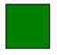

# L.5 VML 简介

=== "中文"

    本节详细介绍了矢量标记语言（Vector Markup Language VML）的组成部分。

    !!! info "NOTE"

        pdf 原文共 14 页.

=== "英文"

    **Introduction to VML**

    This clause contains a detailed introduction to the components of Vector Markup Language (VML). 

## L.5.1 简介

=== "中文"

    本节概述了 VML 最常见的部分。 VML 格式是最初随 Office 2000 引入的旧格式，出于向后兼容性的原因，在 ECMA-376 中包含并完全定义了该格式。 DrawingML 格式是一种更新且更丰富的格式，创建的目标是最终取代 Office Open XML 格式中 VML 的任何使用。 VML是一种过渡格式； 它包含在 Office Open XML 中只是出于遗留原因。

    从 VML 到 DrawingML 的转换可能会导致信息丢失，因为它们使用不同的模型。 例如，

    - VML 使用平面 XML 结构，而 DrawingML 使用分层结构。 一般来说，从平面 XML 推断层次结构比从层次结构生成平面 XML 困难得多。
    - VML 允许对 DrawingML 中相互不兼容的属性进行组合。

    VML 是一种基于 XML 的高质量矢量图形交换、编辑和交付格式。 VML 促进了各种生产力和设计应用程序之间矢量图形的交换和后续编辑。 VML 基于 XML 1.0，它是一种开放、简单、基于文本的语言，用于描述结构化数据。 VML 还支持其他万维网联盟标准，例如指定样式信息和二维定位的级联样式表 2.0 (CSS)。
    
    由于 VML 格式是为向后兼容而提供的格式，因此许多 VML 元素是在同一个 `urn:schemas-microsoft-com:vml` 命名空间中定义的，当前已使用 VML 的数百万文档正在使用该命名空间。 在文档中，通常通过定义 `xmlns:v="urn:schemas-microsoft-com:vml"` 将其缩短为 VML 标记中的 `v:` 前缀。 用于 VML 的命名空间是旧命名空间。 再次强调，仅出于遗留原因，VML 应被视为 Office Open XML 中包含的已弃用格式，强烈鼓励需要绘图文件格式的新应用程序优先使用 DrawingML 。
    
    其他元素和属性在反映其使用方式的命名空间中定义（ECMA-376 中定义的所有 VML 命名空间都维护旧命名空间结构以实现向后兼容性）：
    
    - `urn:schemas-microsoft-com:office:office (office document)`
    - `urn:schemas-microsoft-com:office:word (word-processing document)`
    - `urn:schemas-microsoft-com:office:excel (spreadsheet document)`
    - `urn:schemas-microsoft-com:office:powerpoint (presentation document)`

=== "英文"

    **Introduction**

    This subclause provides an overview of the most common parts of VML. The VML format is a legacy format originally introduced with Office 2000 and is included and fully defined in ECMA-376 for backwards compatibility reasons. The DrawingML format is a newer and richer format created with the goal of eventually replacing any uses of VML in the Office Open XML formats. VML is a transitionalformat; it is included in Office Open XML for legacy reasons only .

    Conversion from VML to DrawingML can result in information loss, as they use different models. For example,

    - VML uses a flat XML structure, whereas DrawingML uses one that is hierarchical. In general, inferring hierarchical structure from flat XML is much more difficult than generating flat XML from a hierarchy.
    - VML allows combinations of attributes that are mutually incompatible in DrawingML.

    VML is an XML-based exchange, editing, and delivery format for high-quality vector graphics. VML facilitates the exchange and subsequent editing of vector graphics between a wide variety of productivity and design applications. VML is based on XML 1.0, which is an open, simple, text-based language for describing structured data. VML also supports other World Wide Web Consortium standards, such as Cascading Style Sheets 2.0 (CSS), which specifies style information and 2-D positioning.
    
    As the VML format is a format provided for backward compatibility, many VML elements are defined in the same urn:schemas-microsoft-com:vml namespace that is currently used by millions of documents already using VML. In the documentation this is typically shortened to a v: prefix in the VML tag by defining xmlns:v="urn:schemas-microsoft-com:vml". The namespaces used for VML are legacy namespaces. Once again, VML should be considered a deprecated format included in Office Open XML for legacy reasons only and new applications that need a file format for drawings are strongly encouraged to use preferentially DrawingML .
    
    Additional elements and attributes are defined in namespaces that reflect how they are used (all VML namespaces defined in ECMA-376 maintain the legacy namespace structure for backward compatibility):
    
    - urn:schemas-microsoft-com:office:office (office document)
    - urn:schemas-microsoft-com:office:word (word-processing document)
    - urn:schemas-microsoft-com:office:excel (spreadsheet document)
    - urn:schemas-microsoft-com:office:powerpoint (presentation document)

## L.5.2 Shape 元素

=== "中文"

    Shape 元素是VML 的基本构建块。 形状可以单独存在，也可以存在于 Group 元素中。 形状定义了许多控制形状的外观和行为的属性和子元素。 形状必须至少定义路径和大小（宽度、高度）。 VML 还使用 CSS2 样式属性的属性来指定位置和大小。

    请注意，本子条款还适用于由 VML 元素 Arc、Curve、Image、Line、Oval、Polyline、Rect 和 RoundRect 提供的一组预定义形状基元。

    以下属性用于定义最小形状：

    | 属性 | 描述 |
    | :---- | :---- |
    | FillColor | 填充形状闭合路径的画笔颜色. |
    | Position |  用于放置元素的定位类型. |
    | Top |  页面流程中形状相对于其上方元素的位置. |
    | Left |  文档流中形状相对于其左侧元素的位置. |
    | Width |  形状的宽度. |
    | Height |  形状的高度. |
    | Path |  构成形状边缘的线. |

    以下示例创建一个最小形状：

    ```xml
    <v:shape fillcolor="green"
        style="position:relative;top:1;left:1;width:50;
         height:50" path="m 1,1 l 1,50, 50,50, 50,1 x e">
    </v:shape>
    ```

    

    虽然 Shape 元素的属性或子元素没有正式的分类，但将它们分组是很有用的。 以下各节广泛描述了 Shape 元素的特征。 这里介绍一些基本属性和元素。 有关完整的详细信息，请参阅第 4 部分中的 VML 参考。

=== "英文"

    **Shape Element**

    The Shape element is the basic building block of VML. A shape can exist on its own or within a Group element. Shape defines many attributes and sub-elements that control the look and behavior of the shape. A shape must define at least a Path and size (Width, Height). VML also uses properties of the CSS2 style attribute to specify positioning and sizing.

    Note that this subclause also applies to the set of pre-defined shape primitives provided by the VML elements Arc, Curve, Image, Line, Oval, Polyline, Rect, and RoundRect. 

    The following attributes are used to define a minimal shape:

    | Attribute | Description |
    | :---- | :---- |
    | FillColor | Brush color that fills the closed path of a shape. |
    |Position |  Type of positioning used to place an element. |
    |Top |  Position of the shape relative to the element above it in the flow of the page. |
    |Left |  Position of the shape relative to the element left of it in the document flow. |
    |Width |  Width of the shape. |
    |Height |  Height of the shape. |
    |Path |  Line that makes up the edges of a shape. |

    The following example creates a minimal shape:

    ```xml
    <v:shape fillcolor="green"
        style="position:relative;top:1;left:1;width:50;
         height:50" path="m 1,1 l 1,50, 50,50, 50,1 x e">
    </v:shape>
    ```

    

    Although there is no official categorization of the Shape element’s attributes or sub-elements, it is useful to think of them in groups. The following sections broadly describe the characteristics of the Shape element. A few fundamental attributes and elements are introduced here. For complete details, see the VML reference in Part 4.

### L.5.2.1 Geometry

=== "中文"

=== "英文"

    **Geometry**

    The following attributes affect the basic structure or outline of the shape.

    | Attribute | Description |
    | :---- | :---- |
    | Adj | Adjustment value used to define values for a formula. |
    | Height* | Height of the shape. |
    | Path | Line that makes up the edges of a shape. |
    | Width* | Width of the shape. |

    * indicates a CSS2 style property

    | Element | Description |
    | :---- | :---- |
    | Callout |  Defines a callout for a shape. |
    | Extrusion | Defines an extrusion for a shape. |
    | Path | Defines a path for a shape. |
    | Skew | Defines a skew for a shape. |
    | Stroke | Defines a stroke for a shape. |
    | TextBox | Defines a textbox for a shape. |
    | TextPath | Defines a text path for a shape. |

#### L.5.2.1.1 高度和宽度属性

=== "中文"

    高度和宽度可以使用以下任何单位指定。 如果未指定单位，则假定为像素(pixels)。

    **相对单位 / Relative**

    - **em**:  元素字体的高度
    - **ex**:  字母“x”的高度
    - **px**:  像素
    - **%**:  百分比

    **绝对单位 / Absolute**

    - **in**: 英寸
    - **cm**: 厘米
    - **mm**: 毫米
    - **pt**: 点
    - **pc**: Picas

    例如:

    ```html
    style="position:relative;top:1;left:1;width:50;height:50"
    style="position:relative;top:1;left:1;width:10%;height:10%"
    ```

=== "英文"

    **Height and Width Attributes**

    Height and Width can be specified using any of the following units. If no unit is specified, pixels is assumed.

    **Relative**

    - **em**:  Height of the element's font
    - **ex**:  Height of the letter "x"
    - **px**:  Pixels
    - **%**:  Percentage

    **Absolute**

    - **in**: Inches
    - **cm**: Centimeters
    - **mm**: Millimeters
    - **pt**: Points
    - **pc**: Picas

    For example:

    ```html
    style="position:relative;top:1;left:1;width:50;height:50"
    style="position:relative;top:1;left:1;width:10%;height:10%"
    ```

#### L.5.2.1.2 Path Attribute

=== "中文"

=== "英文"

    **Path Attribute**

### L.5.2.2 Placement

=== "中文"

=== "英文"

    **Placement**

#### L.5.2.2.1 CoordOrigin and CoordSize Attributes

=== "中文"

=== "英文"

    **CoordOrigin and CoordSize Attributes**

#### L.5.2.2.2 Position Attribute

=== "中文"

=== "英文"

    **Position Attribute**

### L.5.2.3 Formatting

=== "中文"

=== "英文"

    **Formatting**

### L.5.2.4 Other

=== "中文"

=== "英文"

    **Other**

## L.5.3 Group Element

=== "中文"

=== "英文"

    **Group Element**

## L.5.4 ShapeType Element

=== "中文"

=== "英文"

    **ShapeType Element**

## L.5.5 VML Usage in the Office Open XML Format

=== "中文"

=== "英文"

    **VML Usage in the Office Open XML Format**
