# L.1 WordprocessingML 简介

=== "中文"

    本节详细介绍了 WordprocessingML 文档的结构。

=== "英文"

    **Introduction to WordprocessingML**

    This clause contains a detailed introduction to the structure of a WordprocessingML document. 


## L.1.1 故事

**Stories**

=== "中文"

    WordprocessingML 文档由一系列故事组成。每个故事代表文档中一个独特的文本区域。存在以下种类的区域：注释([§L.1.14.5])、尾注([§L.1.12.2])、页脚([§L.1.11.2])、脚注([§L.1.12.1])、框架、术语表文档([§L.1.13])、页眉([§L.1.11.1])、主故事([§L.1.2])、子文档([§L.1.18.2])和文本框([§L.1.18.1])。
    
    除了一个例外（术语表文档），文档中的所有故事都使用一组共同的属性来确定每个故事内容的呈现方式。这些属性包括字体信息、样式定义、编号定义和文档设置。

=== "英文"

    A WordprocessingML document is composed of a collection of stories. Each story represents a distinct region of text within the document. The following kinds of region exist: comment ([§L.1.14.5]), endnote ([§L.1.12.2]), footer ([§L.1.11.2]), footnote ([§L.1.12.1]), frame, glossary document ([§L.1.13]), header ([§L.1.11.1]), main story ([§L.1.2]), subdocument ([§L.1.18.2]), and text box ([§L.1.18.1]).
    
    With one exception (a glossary document), all stories in a document utilize a common set of properties that determine the presentation of the contents of each story. These properties include font information, style definitions, numbering definitions, and document settings.

## L.1.2 基本文档结构

**Basic Document Structure**

=== "中文"

    最简单的 WordprocessingML 文档的主文档故事由以下 XML 元素组成：
    
    - document — WordprocessingML 主文档部分的根元素，它定义了主文档故事。
    - body — 包含组成主故事的块级结构的容器。
    - p — 一个段落。
    - r — 一个运行。
    - t — 文本的范围。
    
    运行是具有共同属性集的故事中的文本区域。WordprocessingML 文档中的文本必须包含在一个或多个运行中。一个段落是作为单元显示的一个或多个运行的集合。运行必须包含在段落中。
    
    考虑以下简单的 WordprocessingML 文档的主文档 XML：
    
    ```xml
    <?xml version="1.0"?>
    <w:document xmlns:w="…">
        <w:body>
            <w:p>
                <w:r>
                    <w:t>Hello, world.</w:t>
                </w:r>
            </w:p>
        </w:body>
    </w:document>
    ```

=== "英文"

    The main document story of the simplest WordprocessingML document consists of the following XML elements:

    - document — The root element for a WordprocessingML's main document part, which defines the main document story.
    - body — The container for the collection of block-level structures that comprise the main story.
    - p — A paragraph.
    - r — A run.
    - t — A range of text.
    
    A run is a region of text in a story with a common set of properties. The text in a WordprocessingML document must be contained within one or more runs. A paragraph is a collection of one or more runs that is displayed as a unit. A run must be contained within a paragraph.

    Consider the following Main Document XML for a simple WordprocessingML document:

    ```xml
    <?xml version="1.0"?>
    <w:document xmlns:w="…">
        <w:body>
            <w:p>
                <w:r>
                    <w:t>Hello, world.</w:t>
                </w:r>
            </w:p>
        </w:body>
    </w:document>
    ```

## L.1.3 主文档故事

**Main Document Story**

=== "中文"

    主文档故事的内容——唯一必需的故事，以使 WordprocessingML 文档符合规范——被封装在 body 元素内。主文档主体的内容是一系列块级结构的集合，这些结构是可以包含和/或与 WordprocessingML 段落作为兄弟元素的 WordprocessingML 元素。
    
    在文档主体中，根据 WordprocessingML 架构定义的有效块级内容集包括：
    
    - 段落
    - 表格
    - 自定义标记（自定义 XML、结构化文档标签）
    - 节属性
    - 注释（评论、修订标记、范围权限标记）
    - 替代格式块
    
    这些块级内容结构（WordprocessingML 的“构建模块”）在以下子条款中定义。

=== "英文"

    The contents of the main document story—the only story that is required for a WordprocessingML document to be conformant—are encapsulated within the body element. The content of the main document body is a collection of block-level structures, which are those WordprocessingML elements that can contain and/or be sibling elements with a WordprocessingML paragraph.
    
    Within the document body, the valid set of block level content, as defined by the WordprocessingML schema, is:
    
    
    - Paragraphs
    - Tables
    - Custom markup (custom XML, structured document tags)
    - Section properties
    - Annotations (comments, revision markers, range permission markers)
    - Alternate format chunks
    
    Each of these block-level content constructs (the 'building blocks' of WordprocessingML) is defined in the following subclauses.

### L.1.3.1 文档背景

**Document Backgrounds**

=== "中文"

    文档元素除了包含主体之外，还可以通过 background 元素及其内容定义文档的背景。此背景应用于文档内所有打印页面。WordprocessingML 中的文档背景可以有一种单一颜色，还可以应用各种绘图效果，如颜色渐变或图案，以及平铺或拉伸的图像。单一背景颜色使用 bgColor 属性在 WordprocessingML 中本地存储。所有其他背景效果由 DrawingML 提供，包裹在 WordprocessingML 的 drawing 元素中。
    
    考虑 WordprocessingML 中一个简单的背景，它由单一颜色组成，并应用了渐变填充：
    
    ```xml
    <w:background w:bgColor="5C83B4">
        <w:drawing>
            <wp:anchor>
                …
            </wp:anchor>
        </w:drawing>
    </w:background>
    ```
    
    背景由两个组件组成：背景填充颜色的 RGB 值为 5C83B4，以及作为 DrawingML 对象存储的背景渐变。

=== "英文"

    As well as containing a body, a document element can also contain the definition of the document's background via the background element and its contents. This background applies to all printed pages within this document. A document background in WordprocessingML can have a single color, as well as the application of various drawing effects such as color gradient or pattern, and a tiled or stretched image. A single background color is stored natively in WordprocessingML using the bgColor attribute. All other background effects are provided by DrawingML, which is wrapped in the WordprocessingML drawing element.

    Consider a simple background in WordprocessingML, which consists of a single color with a gradient fill applied:

    ```xml
    <w:background w:bgColor="5C83B4">
        <w:drawing>
            <wp:anchor>
                …
            </wp:anchor>
        </w:drawing>
    </w:background>
    ```
    
    The background consists of two components: a background fill color of RGB value 5C83B4, and the background gradient stored as a DrawingML object.

## L.1.4 段落和丰富格式

**Paragraphs and Rich Formatting**

### L.1.4.1 段落

**Paragraphs**

=== "中文"

    WordprocessingML 文档中最基本的块级内容单元是段落，使用 p 元素存储。段落定义了一个在新行开始的独立内容分割。段落可以包含三部分信息：可选的段落属性、内联内容（通常是运行）和一组可选的修订 ID，用于比较两个文档的内容。
    
    考虑段落片段 "The quick brown fox jumped …"，该段落居中显示。由于段落中的所有文本都使用斜体强调，在 XML 中，段落的内容具有 justify-center 属性，段落内的每个运行（以及段落标记的运行属性）存储了斜体属性；例如：
    
    ```xml
    <w:p>
        <w:pPr>
            <w:jc w:val="center"/>
            <w:rPr>
                <w:i/>
            </w:rPr>
        </w:pPr>
        <w:r>
            <w:rPr>
                <w:i/>
            </w:rPr>
            <w:t>The quick brown fox jumped…</w:t>
        </w:r>
    </w:p>
    ```
    
    请注意，每个运行都为其内容指定了字符格式化信息，段落指定了段落级格式化（居中对齐）。由于 XML 中的前导和尾随空格通常不重要，因此在重要的情况下，运行需要 xml:space 属性。
    
    段落的属性通过 pPr 元素指定。一些段落属性的例子包括对齐、边框、连字符覆盖、缩进、行距、底纹、文本方向以及寡妇/孤儿控制。
    
    还应注意，pPr 元素可以包含 rPr 元素中的一组运行属性 - 这些属性应用于包含表示段落标记的字形的运行，而不是整个段落。

=== "英文"

    The most basic unit of block-level content within a WordprocessingML document, paragraphs are stored using the p element. A paragraph defines a distinct division of content that begins on a new line. A paragraph can contain three pieces of information: optional paragraph properties, inline content (typically runs), and a set of optional revision IDs used to compare the content of two documents.

    Consider the paragraph fragment "The quick brown fox jumped …" which is centered on a paragraph. As all the text in the paragraph is emphasized using italics, in the XML, the contents of the paragraph have the justify-center property, and each run within the paragraph (as well as the run properties for the paragraph mark) stores the italics property; for example:
    
    ```xml
    <w:p>
        <w:pPr>
            <w:jc w:val="center"/>
            <w:rPr>
                <w:i/>
            </w:rPr>
        </w:pPr>
        <w:r>
            <w:rPr>
                <w:i/>
            </w:rPr>
            <w:t>The quick brown fox jumped…</w:t>
        </w:r>
    </w:p>
    ```
    
    Notice that each run specifies the character formatting information for its contents, and the paragraph specifies the paragraph level formatting (the center-justification). As leading and trailing whitespace is not normally significant in XML, in cases where it is significant, runs require the xml:space attribute.
    
    A paragraph's properties are specified via the pPr element. Some examples of paragraph properties are alignment, border, hyphenation override, indentation, line spacing, shading, text direction, and widow/orphan control.
    
    It should also be noted that a pPr element can contain a set of run properties within a rPr element – these properties are applied to the run which contains the glyph which represents the paragraph mark and not the entire paragraph.

### L.1.4.2 运行

**Runs**

=== "中文"
    
    文档层次结构的下一级是运行，它定义了一个具有共同属性集的文本区域。运行由 r 元素表示，允许生产者组合换行符、样式或格式化属性，将相同的信息应用于运行的所有部分。
    
    正如段落可以有属性一样，运行也可以有属性。r 元素内的所有元素的属性由相应的可选 rPr 运行属性元素控制，该元素必须是 r 元素的第一个子元素。反过来，rPr 元素是应用于 r 元素的其余子元素的一组属性元素的容器。rPr 容器元素内的元素允许使用者控制随后 t 元素中的文本是否加粗、下划线或可见等。运行属性的一些示例包括加粗、边框、字符样式、颜色、字体、字体大小、斜体、字距调整、禁用拼写/语法检查、底纹、小型大写字母、删除线、文本方向和下划线。
    
    考虑 WordprocessingML 文档中的以下运行：
    
    ```xml
    <w:r>
        <w:rPr>
            <w:b/>
            <w:i/>
        </w:rPr>
        <w:t>quick</w:t>
    </w:r>
    ```
    
    运行在其运行内容中指定了两个格式化属性：加粗和斜体。因此，这些属性应用于此运行中的所有内容。
    
    生产者可以将运行拆分为任意数量的较小运行，只要每个较小运行使用相同的属性集，就不会改变文档的内容。
    
    考虑 WordprocessingML 文档中的 "only one word is emphasized" 内容。高效的生产者可以选择使用两个运行输出此内容，如下所示：
    
    ```xml
    <w:r>
        <w:t xml:space="preserve">only one word is </w:t>
    </w:r>
    <w:r>
        <w:rPr>
            <w:i/>
        </w:rPr>
        <w:t>emphasized</w:t>
    </w:r>
    ```
    
    然而，效率较低的生产者可能会使用四个运行，如下所示：
    
    ```xml
    <w:r>
        <w:t>only one</w:t>
    </w:r>
    <w:r>
        <w:t xml:space="preserve"> word is </w:t>
    </w:r>
    <w:r>
        <w:rPr>
            <w:i/>
        </w:rPr>
        <w:t>empha</w:t>
    </w:r>
    <w:r>
        <w:rPr>
            <w:i/>
        </w:rPr>
        <w:t>sized</w:t>
    </w:r>
    ```
    
    尽管后一个示例使用了四个运行而不是两个，但每个文本区域应用的运行信息是相同的，两者都是同样可接受的。
    
    当然，可能需要拆分运行。例如，如果运行中的某些文本的属性被更改，则需要将更改的部分放入其自己的运行中。另一个示例涉及在现有运行中间插入某种标记。这需要将运行拆分为两个，并在它们之间插入标记。
    
    以下运行包含两个句子：
    
    ```xml
    <w:r>
        <w:t>Hello, world. How are you, today?</w:t>
    </w:r>
    ```
    
    如果这些句子中的前两个单词加粗，则需要将运行拆分为两个运行以存储格式化，如下所示：
    
    ```xml
    <w:r>
        <w:rPr>
            <w:b/>
        </w:rPr>
        <w:t xml:space="preserve">Hello, world. </w:t>
    </w:r>
    <w:r>
        <w:t>How are you, today?</w:t>
    </w:r>
    ```
    
    除了文本之外，运行还可以包含许多种文本内容（[§L.1.4.3]）。运行还可以包含用于文档“合并和比较”的一组修订 ID。

=== "英文"
    
    The next level of the document hierarchy is the run, which defines a region of text with a common set of properties. A run is represented by an r element, which allows the producer to combine breaks, styles, or formatting properties, applying the same information to all the parts of the run.
    
    Just as a paragraph can have properties, so too can a run. All of the elements inside an r element have their properties controlled by a corresponding optional rPr run properties element, which must be the first child of the r element. In turn, the rPr element is a container for a set of property elements that are applied to the rest of the children of the r element. The elements inside the rPr container element allow the consumer to control whether the text in the following t elements is bold, underlined, or visible, for example. Some examples of run properties are bold, border, character style, color, font, font size, italic, kerning, disable spelling/grammar check, shading, small caps, strikethrough, text direction, and underline.
    
    Consider the following run within a WordprocessingML document:
    
    ```xml
    <w:r>
        <w:rPr>
            <w:b/>
            <w:i/>
        </w:rPr>
        <w:t>quick</w:t>
    </w:r>
    ```
    
    The run specifies two formatting properties in its run contents: bold and italic. These properties are therefore applied to all content within this run.
    
    A producer can break a run into an arbitrary number of smaller runs, provided each smaller run uses the same set of properties, without changing the content of the document.
    
    Consider the content "only one word is emphasized" in a WordprocessingML document. An efficient producer could choose to output this content using two runs, as follows:
    
    ```xml
    <w:r>
        <w:t xml:space="preserve">only one word is </w:t>
    </w:r>
    <w:r>
        <w:rPr>
            <w:i/>
        </w:rPr>
        <w:t>emphasized</w:t>
    </w:r>
    ```
    
    However, a less efficient producer might use four runs, as follows:
    
    ```xml
    <w:r>
        <w:t>only one</w:t>
    </w:r>
    <w:r>
        <w:t xml:space="preserve"> word is </w:t>
    </w:r>
    <w:r>
        <w:rPr>
            <w:i/>
        </w:rPr>
        <w:t>empha</w:t>
    </w:r>
    <w:r>
        <w:rPr>
            <w:i/>
        </w:rPr>
        <w:t>sized</w:t>
    </w:r>
    ```
    
    Although the latter example uses four runs rather than two, the net run information applied to each region of text is identical, and both are equally acceptable.
    
    Of course, a run might need to be broken. For example, if the properties of some text in a run are changed, the changed part needs to be put into its own run. Another example involves the insertion of some sort of marker into the middle of an existing run. That requires the run be broken into two with the marker inserted between them.
    
    The following run contains two sentences:
    
    ```xml
    <w:r>
        <w:t>Hello, world. How are you, today?</w:t>
    </w:r>
    ```
    
    If the first two words are bolded in these sentences, the run needs to be broken into two runs in order to store the formatting, as follows:
    
    ```xml
    <w:r>
        <w:rPr>
            <w:b/>
        </w:rPr>
        <w:t xml:space="preserve">Hello, world. </w:t>
    </w:r>
    <w:r>
        <w:t>How are you, today?</w:t>
    </w:r>
    ```
    
    Apart from text, a run can also contain numerous kinds of textual content ([§L.1.4.3]) A run can also contain a set of revision IDs used for document "merge and compare".


### L.1.4.3 运行内容

**Run Content**

=== "中文"

    此层级结构中的最低级别是运行内容，即可以在文档中的单个运行中存储的内容。在 WordprocessingML 中，运行内容的类型包括：
    
    - 文本
    - 删除的文本
    - 软换行
    - 域代码
    - 删除的域代码
    - 脚注/尾注引用标记
    - 简单域
    - 页码
    - 制表符
    - 竖排文本（Ruby text）
    - DrawingML 内容
    - 嵌入式对象
    - 图片

=== "英文"

    The lowest level of this hierarchy is run content, that content that can be stored within a single run in a document. In WordprocessingML, the types of run content include:
    
    - Text
    - Deleted text
    - Soft line breaks
    - Field codes
    - Deleted field codes
    - Footnote/endnote reference marks
    - Simple fields
    - Page numbers
    - Tabs
    - Ruby text
    - DrawingML content
    - Embedded objects
    - Pictures


#### L.1.4.3.1 文本

**Text**

=== "中文"

    最常见的运行内容是 t 元素，它是构成文档内容的文本容器。t 元素可以包含任意数量的文本，甚至包括整个文档的内容。然而，通常长文本会被拆分为段落，并且具有不同格式的文本字符串，或者被换行、图形、表格和其他项目中断。t 元素必须被包含在 r 元素内；即，一段文本。一个 r 元素可以包含多个 t 元素，与其他元素交错。
    
    除了 t 元素，WordprocessingML 中还有三种类型的文本：
    
    - delText - 删除的文本
    - instrText - 域代码
    - delInstrText - 删除的域代码
    
    这四种文本类型在 WordprocessingML 中使用独特的元素定义，以便简单的使用者可以通过获取 t 节点的内容来确定文档的文本，而无需检查修订的起始和结束位置等，以确定文本内容的状态。
    
    同样值得注意的是，这些是在 WordprocessingML 文档的主文档部分中唯一可以包含 XML 文本节点的元素。

=== "英文"

    The most common run content is the t element, which is the container for the text that makes up the document's content. A t element can contain an arbitrary amount of text, up to and including the entire document's contents. However, typically, long runs of text are broken up into paragraphs and strings of text having different formats, or are interrupted by line breaks, graphics, tables, and other items. A t element must be enclosed within an r element; i.e., a run of text. An r element can contain multiple t elements, interspersed among other elements.

    Aside from the t element, there are three types of text in WordprocessingML:
    
    - delText - Deleted text
    - instrText - Field codes
    - delInstrText - Deleted field codes

    These four types of text are defined using unique elements in WordprocessingML so that simple consumers can determine the text of the document simply by grabbing the contents of the t node, without needing to check where revisions start and end, etc. to determine the state of the text contents.
    
    It is also notable that these are the only elements in a WordprocessingML document's main document part that can contain a XML text node.

### L.1.4.4 格式化属性值

**Formatting Property Values**

=== "中文"

    一个 rPr 或 pPr 元素的大多数子元素都有一个单一的 val 属性，该属性被限制在特定的一组值中。例如，b（加粗）元素会在 b 元素具有值为 1 的 val 属性时，使随后的文本加粗。如果 b 元素的 val 属性不存在，它默认为 "1"。因此，`<w:b/>` 等同于 `<w:b w:val="1"/>`。
    
    除了默认值（每个元素都有文档记录），在指定省略格式化属性和明确关闭它之间的差异时，这一点特别重要。
    
    例如，考虑以下运行：
    
    ```xml
    <w:r>
        <w:rPr>
            <w:b w:val="0"/>
        </w:rPr>
        <w:t xml:space="preserve">Hello, world. </w:t>
    </w:r>
    ```
    
    这个运行明确声明对于这段文本，加粗属性是关闭的，与以下运行相对：
    
    ```xml
    <w:r>
        <w:t xml:space="preserve">Hello, world. </w:t>
    </w:r>
    ```
    
    这个运行对加粗属性没有说明。当处理使用样式格式化的内容时，这种区别特别重要 - 如果内容没有包含在有样式的段落中，两者将是相同的。然而，如果段落是有样式的，前者无论如何都不会加粗，不管样式信息如何，因为加粗属性的省略意味着“使用底层格式化”。而后者会按照样式设置的加粗属性表达，因为它省略了加粗属性，意味着“底层格式化是什么就是什么”。
    
    一些元素的 val 属性提供了比 1 和 0 更丰富的选择集；u（下划线）元素就是这样一个元素。在这种情况下，同样的规则适用，属性的省略仅仅意味着使用底层属性。

=== "英文"

    Most of the children of an rPr or pPr element have a single val attribute that is limited to a specific set of values. For example, the b (bold) element causes the text that follows it to be bold when the b element has a val attribute with value 1. If the val attribute isn't present for the b element, it defaults to "1". Therefore, `<w:b/>` is equivalent to `<w:b w:val="1"/>`.
    
    Aside from the default values, which are documented with each element, this is particularly important when specifying the difference between omitting a formatting property and explicitly turning it off.
    
    For example, consider the following run:
    
    ```xml
    <w:r>
        <w:rPr>
            <w:b w:val="0"/>
        </w:rPr>
        <w:t xml:space="preserve">Hello, world. </w:t>
    </w:r>
    ```
    
    This run explicitly declares that the bold property is turned off for this text, as opposed to the following run:
    
    ```xml
    <w:r>
        <w:t xml:space="preserve">Hello, world. </w:t>
    </w:r>
    ```
    
    This run says nothing about the bold property. This distinction is particularly important when dealing with content that is formatting using styles - if the content was not contained in a styled paragraph, both would be identical. However, in the case where the paragraph is styled, the former would never be bold regardless of the style information, whereas the latter would express the bold property as set by the style, since it's omission of the bold property means "whatever the underlying formatting is".
    
    Some elements have val attributes that offer a richer set of choices than 1 and 0; the u (underline) element is one such element. In this case, the same rules apply, the omission of the property simply means use the underlying properties. 

## L.1.5 表格

**Tables**

=== "中文"

    WordprocessingML 中的另一种块级内容是表格，它是一组按 *行* 和 *列* 安排的段落（以及其他块级内容）。

=== "英文"

    Another type of block-level content in WordprocessingML, A table is a set of paragraphs (and other block-level content) arranged in *rows* and *columns*.

### L.1.5.1 引言

**Introduction**

=== "中文"

    WordprocessingML 中的表格通过 tbl 元素定义，类似于 HTML 中的 `<table>` 标签。表格元素指定了文档中存在的表格的位置。
    
    tbl 元素有两个子元素来定义其属性：tblPr，定义一组表格属性（如样式和宽度），以及 tblGrid，定义表格的网格布局。tbl 元素还可以包含任意非零数量的行，每行使用 tr 元素指定。每个 tr 元素可以包含任意非零数量的单元格，每个单元格使用 tc 元素指定。
    
    考虑一个空的单单元格表格（即，一个有一行列的表格）和所有边都为 1 点的边框：
    
    <table border="1">
    <tr><td>&nbsp;</td></tr>
    </table>
    
    这个表格由以下 WordprocessingML 表示：
    
    ```xml
    <w:tbl>
        <w:tblPr>
            <w:tblW w:w="5000" w:type="pct"/>
            <w:tblBorders>
                <w:top w:val="single" w:sz="4" w:space="0" w:color="auto"/>
                <w:start w:val="single" w:sz="4" w:space="0" w:color="auto"/>
                <w:bottom w:val="single" w:sz="4" w:space="0" w:color="auto"/>
                <w:end w:val="single" w:sz="4" w:space="0" w:color="auto"/>
            </w:tblBorders>
        </w:tblPr>
        <w:tblGrid>
            <w:gridCol w:w="10296"/>
        </w:tblGrid>
        <w:tr>
            <w:tc>
                <w:tcPr>
                    <w:tcW w:w="0" w:type="auto"/>
                </w:tcPr>
                <w:p/>
            </w:tc>
        </w:tr>
    </w:tbl>
    ```
    
    此表格指定了页面宽度的 100%（tblW 的 type 属性指定了如何解释 w 属性中的宽度值 - pct 指定了百分之一的度量）和表格边框（tblBorders）的表格属性，定义了表格内共享的垂直边缘集的表格网格（稍后讨论），以及一个单行。

=== "英文"

    Tables in WordprocessingML are defined via the tbl element, which is analogous to the HTML `<table>` tag. The table element specifies the location of a table present in the document.

    A tbl element has two elements that define its properties: tblPr, which defines the set of table-wide properties (such as style and width), and tblGrid, which defines the grid layout of the table. A tbl element can also contain an arbitrary non-zero number of rows, where each row is specified with a tr element. Each tr element can contain an arbitrary non-zero number of cells, where each cell is specified with a tc element.
    
    Consider an empty one-cell table (i.e.,; a table with one row, one column) and 1 point borders on all sides:
    
    <table border="1">
    <tr><td>&nbsp;</td></tr>
    </table>
    
    This table is represented by the following WordprocessingML:

    ```xml
    <w:tbl>
        <w:tblPr>
            <w:tblW w:w="5000" w:type="pct"/>
            <w:tblBorders>
                <w:top w:val="single" w:sz="4" w:space="0" w:color="auto"/>
                <w:start w:val="single" w:sz="4" w:space="0" w:color="auto"/>
                <w:bottom w:val="single" w:sz="4" w:space="0" w:color="auto"/>
                <w:end w:val="single" w:sz="4" w:space="0" w:color="auto"/>
            </w:tblBorders>
        </w:tblPr>
        <w:tblGrid>
            <w:gridCol w:w="10296"/>
        </w:tblGrid>
        <w:tr>
            <w:tc>
                <w:tcPr>
                    <w:tcW w:w="0" w:type="auto"/>
                </w:tcPr>
                <w:p/>
            </w:tc>
        </w:tr>
    </w:tbl>
    ```
    
    This table specifies table-wide properties of 100% of page width (tblW's type attribute specifies how the width value in the w attribute must be interpreted—pct specifies a measurement of fiftieths of a percent) and the set of table borders (tblBorders), the table grid which defines a set of shared vertical edges within the table (discussed later), and a single row.

### L.1.5.2 表格属性

**Table Properties**

=== "中文"

    tblPr 元素定义了表格的全局属性，这些属性将应用于表格中的每一行和每一个单元格。完整的表格全局属性集可以在 tblPr 元素的定义中找到。
    
    考虑以下简单的 WordprocessingML 表格：
    
    <table border="1">
        <tr>
            <td>&nbsp;</td>
            <td>&nbsp;</td>
        </tr>
    </table>
    
    这个表格定义了外部和内部表格边框等；并设置为页面宽度的 100% - 这两个都是表格全局属性。生成的表格由以下 WordprocessingML 表示：
    
    ```xml
    <w:tbl>
        <w:tblPr>
            <w:tblW w:w="0" w:type="auto"/>
            <w:tblBorders>
                <w:top w:val="single" w:sz="4" w:space="0" w:color="auto"/>
                <w:start w:val="single" w:sz="4" w:space="0" w:color="auto"/>
                <w:bottom w:val="single" w:sz="4" w:space="0" w:color="auto"/>
                <w:end w:val="single" w:sz="4" w:space="0" w:color="auto"/>
                <w:insideH w:val="single" w:sz="4" w:space="0" w:color="auto"/>
                <w:insideV w:val="single" w:sz="4" w:space="0" w:color="auto"/>
            </w:tblBorders>
        </w:tblPr>
        <w:tblGrid>
            …
        </w:tblGrid>
        <w:tr>
            …
        </w:tr>
    </w:tbl>
    ```
    
    在这个例子中，tblW 元素定义了表格的总宽度，此例中设置为自动（auto），指定表格应根据其内容自动调整大小。tblBorders 元素指定了表格的每个边框，并指定了顶部、左侧、底部、右侧以及内部水平和垂直边框为一点边框。表格全局属性可以通过在表格行属性内指定表格属性覆盖来逐行重写。

=== "英文"

    The tblPr element defines table-wide properties, properties which are applied to each row and cell in the table. The complete set of table-wide properties can be found on the definition for the tblPr element.
    
    Consider the following simple WordprocessingML table:

    <table border="1">
        <tr>
            <td>&nbsp;</td>
            <td>&nbsp;</td>
        </tr>
    </table>
    
    This table defines outside and inside table borders, etc; and is set to 100% of page width - both table-wide properties. The resulting table is represented by the following WordprocessingML:

    ```xml
    <w:tbl>
        <w:tblPr>
            <w:tblW w:w="0" w:type="auto"/>
            <w:tblBorders>
                <w:top w:val="single" w:sz="4" w:space="0" w:color="auto"/>
                <w:start w:val="single" w:sz="4" w:space="0" w:color="auto"/>
                <w:bottom w:val="single" w:sz="4" w:space="0" w:color="auto"/>
                <w:end w:val="single" w:sz="4" w:space="0" w:color="auto"/>
                <w:insideH w:val="single" w:sz="4" w:space="0" w:color="auto"/>
                <w:insideV w:val="single" w:sz="4" w:space="0" w:color="auto"/>
            </w:tblBorders>
        </w:tblPr>
        <w:tblGrid>
            …
        </w:tblGrid>
        <w:tr>
            …
        </w:tr>
    </w:tbl>
    ```
    
    In this example, the tblW element defines the total width of the table, which, in this case, is set to a type attribute value of auto, which specifies that the table should be sized to fit its contents. The tblBorders element specifies each of the table's borders, and specifies a one point border on the top, left, bottom, right and inside horizontal and vertical border. The table-wide properties can be overwritten on an individual row basis by specifying table property overrides within the table row properties.


### L.1.5.3 表格网格

**Table Grid**

=== "中文"

    tblGrid 元素定义了表格的网格。表格中的所有列（包括行前后的空间）都引用此网格。每个 gridCol 定义了表格布局中的一个单一网格列，用于定义表格中垂直线的存在。tblGrid 元素可以包含任意数量的 gridCol 元素，每个 gridCol 元素代表表格中的一个网格列，并定义了一个单一网格条目。当单元格在此表中布局时（如下所述），所有单元格都被强制对齐到由这个网格定义的共享列边缘。
    
    回到前面提到的“单单元格空表”示例，该表有一个宽度为 10296 英担的列。这种度量（英担，或称为 twips）经常在 WordprocessingML 中使用，相当于 1/1440 英寸（一点是 1/72 英寸）：
    
    ```xml
    <w:tblGrid>
        <w:gridCol w:w="10296"/>
    </w:tblGrid>
    ```
    
    考虑以下更复杂的表格，它有两行两列；列没有对齐：
    
    
    
    此表通过在由三个表格网格列组成的表格网格上布局单元格来表示，每个网格列代表表格中的一个逻辑垂直列：
    
    
    
    虚线表示每个表格网格列的虚拟垂直延伸，生成的表格网格在 WordprocessingML 中表示如下：
    
    ```xml
    <w:tblGrid>
        <w:gridCol w:w="2952"/>
        <w:gridCol w:w="4416"/>
        <w:gridCol w:w="1488"/>
    </w:tblGrid>
    <w:tr>
        <w:tc>
            <w:tcPr>
                <w:tcW w:w="7368" w:type="dxa"/>
                <w:gridSpan w:val="2"/>
            </w:tcPr>
            <w:p/>
        </w:tc>
        <w:tc>
            <w:tcPr>
                <w:tcW w:w="1488" w:type="dxa"/>
            </w:tcPr>
            <w:p/>
        </w:tc>
    </w:tr>
    <w:tr>
        <w:tc>
            <w:tcPr>
                <w:tcW w:w="2952" w:type="dxa"/>
            </w:tcPr>
            <w:p/>
        </w:tc>
        <w:tc>
            <w:tcPr>
                <w:tcW w:w="5904" w:type="dxa"/>
                <w:gridSpan w:val="2"/>
            </w:tcPr>
            <w:p/>
        </w:tc>
    </w:tr>
    ```
    
    请注意，每个不跨越一个网格列的单元格（即，跨越两个相邻垂直线）必须通过提供 gridSpan 元素来指定这一事实，其值决定了此单元格跨越了多少网格列。每个 gridCol 元素代表表格中共享的“列”（单元格贴合的列）即使它在视觉上不出现。

=== "英文"

    The tblGrid element defines the grid for the table. All columns in the table (including the space before and after a row) reference this grid. Each gridCol defines a single grid column within the table’s layout, which is used to define the presence of a vertical line within the table. A tblGrid element can contain an arbitrary number of gridCol elements, where each gridCol element represents one grid column in the table and defines a single grid entry. When cells are laid out within this table, as discussed below, all cells are forced to snap the shared column edges defined by this grid.
    
    Returning to the earlier 'one-cell empty table' example, the table has one column with a width of 10,296 twentieths of a point. This measurement (twentieths of a point, or twips) is frequently used in WordprocessingML, and translates to 1/1440th of an inch (one-twentieth of a point, which is itself 1/72nd of an inch):.
    
    ```xml
    <w:tblGrid>
        <w:gridCol w:w="10296"/>
    </w:tblGrid>
    ```
    
    Consider the following, more complex table that has two rows and two columns; the columns are not aligned:
        
    

    This table is represented by laying out the cells on a table grid consisting of three table grid columns, each grid column representing a logical vertical column in the table:
        
    

    The dashed lines represent the virtual vertical continuations of each table grid column, and the resulting table grid is represented as the following in WordprocessingML:

    ```xml
    <w:tblGrid>
        <w:gridCol w:w="2952"/>
        <w:gridCol w:w="4416"/>
        <w:gridCol w:w="1488"/>
    </w:tblGrid>
    <w:tr>
        <w:tc>
            <w:tcPr>
                <w:tcW w:w="7368" w:type="dxa"/>
                <w:gridSpan w:val="2"/>
            </w:tcPr>
            <w:p/>
        </w:tc>
        <w:tc>
            <w:tcPr>
                <w:tcW w:w="1488" w:type="dxa"/>
            </w:tcPr>
            <w:p/>
        </w:tc>
    </w:tr>
    <w:tr>
        <w:tc>
            <w:tcPr>
                <w:tcW w:w="2952" w:type="dxa"/>
            </w:tcPr>
            <w:p/>
        </w:tc>
        <w:tc>
            <w:tcPr>
                <w:tcW w:w="5904" w:type="dxa"/>
                <w:gridSpan w:val="2"/>
            </w:tcPr>
            <w:p/>
        </w:tc>
    </w:tr>
    ```
    
    Notice that each of the cells which do not span one grid column (i.e., span two adjacent vertical lines) must specify this fact by supplying a gridSpan element with a value which determines how many grid columns this cell spans. Each gridCol element represents a shared 'column' in a table (to which the cells snap) even if it doesn’t appear visually.

### L.1.5.4 表格行和单元格

**Table Rows and Cells**

=== "中文"

    表格的一行是通过使用 tr 元素来定义的，它类似于 HTML 中的 `<tr>` 标签。tr 元素充当表格内容中一行单元格的容器。
    
    tr 元素有一个格式化子元素 trPr，它定义了行属性（如行的宽度）以及它是否可以跨页分割。每个属性都是由 trPr 元素下的单独子元素定义的。表格行属性的完整集合可以在 trPr 元素的定义中找到。同样，表格行可以包含两种内容：自定义标记（自定义 XML 或结构化文档标签）和表格单元格。
    
    行中的单元格包含表格的内容，并通过 tc 元素定义，类似于 HTML 中的 `<td>` 标签。
    
    tc 元素有一个格式化子元素 tcPr，它定义了单元格的属性。每个独特的属性都是通过这个元素的子元素来指定的。表格单元格属性的完整集合可以在 tcPr 元素的定义中找到。同样，表格单元格可以包含任何有效的块级内容，如 WordprocessingML 架构所定义，允许在表格单元格内嵌套段落和表格。
    
    在下面的示例中，tcW 元素定义了单元格的宽度，其中属性 w 是 twips（英担）中的值。这里，单元格的宽度为 8856 个单位，单位由属性 type 定义。在这种情况下，dxa 表示 twips。
    
    ```xml
    <w:tr>
        <w:tc>
            <w:tcPr>
                <w:tcW w:w="8856" w:type="dxa"/>
            </w:tcPr>
            <w:p/>
        </w:tc>
    </w:tr>
    ```
    
    tc 元素包含单元格的内容，在本例中，是一个空的 p 元素。
    
    考虑一个包含文本 “Hello, world” 的单元格的表格：
    
    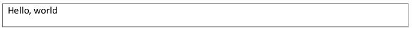
    
    这个表格的内容由以下 XML 表示：
    
    ```xml
    <w:tr>
        <w:tc>
            <w:tcPr>
                <w:tcW w:w="1770" w:type="dxa"/>
            </w:tcPr>
            <w:p>
                <w:r>
                    <w:t>Hello, world</w:t>
                </w:r>
            </w:p>
        </w:tc>
    </w:tr>
    ```
    
    在行和单元格级别，属性还必须指定行和单元格如何在表格网格上放置。
    
    trPr 元素包含有关在行完成后应省略的网格单位数量的信息（使用 gridBefore 和 gridAfter 元素），允许行在网格的不同列上开始，以及使用 wBefore 和 wAfter 元素为该领先/尾随空间的首选宽度。tcPr 元素还包含有关单元格如何跨越网格的信息，使用 gridSpan 元素，它确定当前单元格所占的网格单位数量，以及使用 tcW 元素为该单元格的首选宽度。
    
    在前面提到的具有两行不同大小单元格的复杂表格中，消费者必须表示包含三个网格列的表格（每个不同的垂直线一个）。考虑下面表格第一行的 XML：
    
    ```xml
    <w:tr>
        <w:tc>
            <w:tcPr>
                <w:tcW w:w="7368" w:type="dxa" />
                <w:gridSpan w:val="2" />
            </w:tcPr>
            <w:p />
        </w:tc>
        <w:tc>
            <w:tcPr>
                <w:tcW w:w="1488" w:type="dxa" />
            </w:tcPr>
            <w:p/>
        </w:tc>
    </w:tr>
    ```
    
    再次，gridSpan 元素是单元格在表格网格上布局时跨越的网格列数。在这个例子中，第一行的第一单元格包含两个网格列。同样，单元格使用 tcW 元素指定了其首选宽度，这告诉消费者该单元格在布局时所需的宽度。
    
    需要注意的是，表格中的每个宽度都是首选宽度 - 因为表格必须始终满足网格，冲突的表格属性必须通过以特定方式覆盖首选宽度来解决，如下所示。

=== "英文"

    A table row is defined using a tr element, which is analogous to the HTML `<tr>` tag. The tr element acts as a container for a row of cells with the table’s content.
    
    A tr element has one formatting child element, trPr, which defines the row properties (such as the row’s width) and whether it can split across a page. Each property is defined by an individual child element under the trPr element. The complete set of table row properties can be found on the definition for the trPr element. As well, a table row can contain two kinds of content: custom markup (custom XML or structured document tags), and table cells.
    
    The cells in a row contain the table’s content and are defined by tc elements, which are analogous to HTML `<td>` tags.
    
    A tc element has one formatting child element, tcPr, which defines the properties for the cell. Each unique property is specified by a child element of this element. The complete set of table cell properties can be found on the definition for the tcPr element. As well, a table cell can contain any valid block-level content, as defined by the WordprocessingML schema, which allows for the nesting of paragraphs and tables within table cells.
    
    In the example below, the tcW element defines the width of the cell, where the attribute w is the value in twips. Here the width of the cell is 8,856 units, where units are defined by the attribute type. In this case, dxa represents twips.
    
    ```xml
    <w:tr>
        <w:tc>
            <w:tcPr>
                <w:tcW w:w="8856" w:type="dxa"/>
            </w:tcPr>
            <w:p/>
        </w:tc>
    </w:tr>
    ```
    
    The tc element contains the cell's content, which, in this case, is an empty p element.
    
    Consider a table having one cell, which contains the text “Hello, world”:
    
    
    
    This table's content is represented by the following XML:
    
    ```xml
    <w:tr>
        <w:tc>
            <w:tcPr>
                <w:tcW w:w="1770" w:type="dxa"/>
            </w:tcPr>
            <w:p>
                <w:r>
                    <w:t>Hello, world</w:t>
                </w:r>
            </w:p>
        </w:tc>
    </w:tr>
    ```
    
    At both the row and cell levels, the properties must also specify how the rows and cells are placed on the table grid.
    
    The trPr element contains information about the number of grid units which should be omitted ('skipped') before and after the row is complete using the gridBefore and gridAfter elements, allowing rows to start at different columns on the grid, as well as a preferred width for that leading/trailing space using the wBefore and wAfter elements. The tcPr element also contains grid information pertaining to how many grids a cell spans using the gridSpan element, which determines how many grid units are consumed by the current cell, as well as a preferred width for that cell using the tcW element. 
    
    In the earlier complex table having two rows of two differently sized cells, a consumer must represent that table containing three grid columns (one per distinct vertical line). Consider the following XML for the first row of that table:
    
    ```xml
    <w:tr>
        <w:tc>
            <w:tcPr>
                <w:tcW w:w="7368" w:type="dxa" />
                <w:gridSpan w:val="2" />
            </w:tcPr>
            <w:p />
        </w:tc>
        <w:tc>
            <w:tcPr>
                <w:tcW w:w="1488" w:type="dxa" />
            </w:tcPr>
            <w:p/>
        </w:tc>
    </w:tr>
    ```
    
    Again, the gridSpan element is the number of grid columns that cell spans when being laid out on th table grid. In this example, the first cell of the first row contains two grid columns. As well, the cel specifies its preferred width using the tcW element, which tells the consumer the width desired by tha cell at layout time.
    
    It is important to note that every width in a table is a preferred width - because the table must satisfy the grid at all times, conflicting table properties must be resolved by overriding preferred widths in a specific manner, shown below.


### L.1.5.5 表格布局

**Table Layout**

=== "中文"

    根据上表中显示的信息，该表格被指定为一系列属性：

    - 表格级属性（例如，首选宽度）
    - 表格列网格
    - 行级属性（例如，行开始/结束前后的网格单位）
    - 单元格级属性（例如，跨越的网格单位数量）

    为了将这一组属性操作成一个表格，使用以下逻辑，具体取决于表格的类型：

=== "英文"

    Given the information shown in the table shown above, the table is specified as a series of properties:
    
    - Table-level properties (e.g., preferred width)
    - Table column grid
    - Row-level properties (e.g., grid units before/after row start/end)
    - Cell-level properties (e.g., number of grid units spanned)
    
    In order to manipulate this set of properties into a table, the following logics are used, depending on the type of table:


### L.1.5.6 固定宽度表格

**Fixed Width Tables**

=== "中文"
    
    第一种类型的表格是固定宽度表格，即不会根据内容动态调整大小的表格。在固定宽度表格中，表格信息按以下方式使用：
    
    - 表格网格用于创建表格中共享的列集及其在 tblGrid 元素中定义的初始宽度。
    - 表格的总宽度根据 tblW 属性定义——如果设置为 auto 或 nil，则宽度尚未确定，并使用行和单元格信息进行指定。
    - 读取第一行表格，并跳过行开始前的初始网格单位数量。跳过的网格列宽度使用 wBefore 属性设置。
    - 第一个单元格放置在网格上，使用 tcW 属性设置由 gridSpan 指定的网格列跨度的宽度。
    - 其他每个单元格依次放置在网格上。
    - 如果在任何阶段，单元格请求的首选宽度超过了表格的首选宽度，则每个网格列的大小按比例缩小以适应表格宽度。
    - 如果网格被超出（例如，tblGrid 指定了三列网格，但第二个单元格有三个网格跨度），则动态增加网格，新的网格列使用默认宽度。
    - 对于每个后续行，单元格放置在网格上，如果宽度不一致，则每个网格列调整为请求宽度的最大值，通过向最后一个结束于该网格列的单元格添加宽度来实现。同样，如果在任何时候，单元格请求的空间超过表格宽度，则每个网格列的大小按比例缩小以适应表格宽度。

=== "英文"
    
    The first type of table is a fixed width table, a table that does not dynamically resize based on its contents. In a fixed width table, the table information is used in the following manner:
    
    - The table grid is used to create the set of shared columns in the table and their initial widths as defined in the tblGrid element
    - The table’s total width is defined based on the tblW property – if it is set to auto or nil, then the width is not yet determined and is specified using the row and cell information.
    - The first table row is read and the initial number of grid units before the row starts is skipped. The width of the skipped grid columns is set using the wBefore property.
    - The first cell is placed on the grid, and the width of the specified grid column span set by gridSpan is set based on the tcW property.
    - Each additional cell is placed on the grid.
    - If at any stage, the preferred width requested for the cells exceeds the preferred width of the table, then each grid column is proportionally reduced in size to fit the table width.
    - If the grid is exceeded (e.g., tblGrid specifies three grid columns, but the second cell has a gridSpan of three), the grid is dynamically increased with a default width for the new grid column.
    - For each subsequent row, cells are placed on the grid, and each grid column is adjusted to be the maximum value of the requested widths (if the widths do not agree) by adding width to the last cell that ends with that grid column. Again, if at any point, the space requested for the cells exceeds the width of the table, then each grid column is proportionally reduced in size to fit the table width.

### L.1.5.7 自动调整表格

**AutoFit Tables**

=== "中文"
    
    在自适应表格（指定应“根据表格内容自适应”的表格）中，表格信息按以下方式使用：
    
    - 执行上述步骤以布置固定宽度版本的表格。
    - 计算最小内容宽度——包括所有可能的换行位置的单元格内容宽度（如果内容宽度更小，则为单元格宽度），以及最大内容宽度——假设没有由明确换行符生成的换行的单元格内容宽度。
    - 跨单个网格列的所有单元格的最小和最大内容宽度即为该列的最小和最大内容宽度。
    - 对于跨多个网格列的单元格，根据需要扩大其所跨的所有单元格，以满足该单元格的最小宽度。
    - 如果网格列中的任何单元格有首选宽度，则第一个这样的宽度覆盖该列内容的最大宽度。
    - 将文本放置在表格的单元格中，遵循每个单元格内容的最小内容宽度。如果单元格的最小内容宽度超过当前宽度，则按以下顺序覆盖偏好设置：
    - 首先，通过将所有其他网格列按比例缩小到其最小宽度来覆盖列宽。这样，该单元格可以增长到其最小和最大宽度之间的任意宽度。
    - 接下来，覆盖首选表格宽度，直到表格达到页面宽度。
    - 最后，根据需要在每个单元格的内容中强制换行。

=== "英文"
    
    In an AutoFit table (one which specifies that it should “AutoFit to table contents”), the table information is used in the following manner:
    
    - Perform the steps above to lay out the fixed width version of the table.
    - Calculate the minimum content width - the width of the cell's contents including all possible line breaking locations (or the cell's width, if the width of the content is smaller), and the maximum content width -the width of the cell's contents (assuming no line breaking not generated by explicit line breaks).
    - The minimum and maximum content width of all cells that span a single grid column is the minimum and maximum content width of that column.
    - For cells which span multiple grid columns, enlarge all cells which it spans as needed to meet that cell's minimum width.
    - If any cell in a grid column has a preferred width, the first such width overrides the maximum width of the column's contents.
    - Place the text in the cells in the table, respecting the minimum content width of each cell's content. If a cell's minimum content width exceeds the cell's current width, preferences are overridden as follows:
    - First, override the column widths by making all other grid columns proportionally smaller until each it at its minimum width. This cell can then grow to any width between its own minimum and maximum width.
    - Next, override the preferred table width until the table reaches the page width.
    - Finally, force a line break in each cell's contents as needed

### L.1.5.8 复杂表格示例

**Complex Table Example**

=== "中文"

    上述属性最好通过示例来说明：
    
    如上所示，表格单元格可以水平合并。这通过单个表格单元格表示，其 gridSpan 属性定义了该表格单元格在当前行消耗的网格单位数。考虑以下固定宽度表格，它在实际上只是一个七列网格上大量使用调整大小和合并的单元格。（箭头指向网格的每个（不可见）垂直线，数字指的是网格列）：
    
    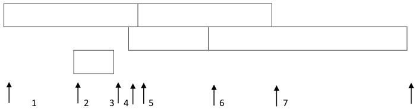
    
    尽管表格在视觉上很复杂，但标准规则适用：表格中的第一个单元格只是一个水平跨越四个网格单位的单元格，如 gridSpan 元素中所指定，其首选宽度是 2952 英担，如 tcW 元素中所指定：
    
    ```xml
    <w:tc>
        <w:tcPr>
            <w:tcW w:w="2952" w:type="dxa"/>
            <w:gridSpan w:val="4"/>
        </w:tcPr>
        <w:p/>
    </w:tc>
    ```
    
    同样，所有从网格的开头和结尾缩进的单元格都使用 gridBefore 和 gridAfter 元素指定该缩进。例如，表格第二行的 XML 显示该行从表格的三个网格单位开始：
    
    ```xml
    <w:tr>
        <w:trPr>
            <w:gridBefore w:val="3"/>
            <w:wBefore w:w="2748" w:type="dxa"/>
        </w:trPr>
        …
    </w:tr>
    ```
    
    如果我们将这个固定宽度的表格，并在第三行的单个单元格中引入一个长字符串，我们会发现这个文本的存在并不影响单元格的宽度：
    
    
    
    如果我们现在打开 AutoFit 属性，并在第三行的单元格中插入文本，该单元格仅跨越网格列二，我们会发现这个 AutoFit 表格的算法导致网格列二的所有单元格大小增加，相应地减少其他网格列的大小，以适应最后一单元格中的长不断裂的字符串：
    
    
    
    其他每个网格列都减少了，但由于所有列还没有达到它们的最小大小，表格的宽度没有增加，即使表格还没有达到页面宽度。

=== "英文"

    The properties above are best illustrated by example:
    
    As shown above, table cells can be merged horizontally. This is represented with a single table cell whose gridSpan property defines the number of grid units consumed by that table cell for the current row. Consider the following fixed width table, which makes extensive use of resized and merged cells on what is actually just a seven-column grid. (The arrows point to each (invisible) vertical line of the grid and the numbers refer to the grid columns):
    
    
    
    Although the table is visually complex, the standard rules apply: the first cell in the table is simply a cell which spans four grid units horizontally, as specified in the gridSpan element, and whose preferred with is 2952 twips, specified in the tcW element:
    
    ```xml
    <w:tc>
        <w:tcPr>
            <w:tcW w:w="2952" w:type="dxa"/>
            <w:gridSpan w:val="4"/>
        </w:tcPr>
        <w:p/>
    </w:tc>
    ‵‵‵
    
    Similarly, all cells indented from the stand and end of the grid specify that indent using the gridBefore and gridAfter elements. For example, the XML for the second row in the table shows that that row starts three grid units into the table:
    
    ```xml
    <w:tr>
        <w:trPr>
            <w:gridBefore w:val="3"/>
            <w:wBefore w:w="2748" w:type="dxa"/>
        </w:trPr>
        …
    </w:tr>
    ```
    
    If we take this fixed width table and introduce a long string into the single cell in row 3, we see that the presence of this text does not affect cell widths:
    
    
    
    If we now turn on the AutoFit property and insert text into the cell in row three, which spans only grid column two, we see that the algorithm for this AutoFit table causes all cells in grid column two to increase in size, proportionally decreasing the other grid columns’ size to accommodate the long non- breaking string in the last cell:
    
    
    
    Each of the other grid columns was reduced, but since all columns are not at their minimum size, the table width is not increased even though the table is not yet at the page width.

### L.1.5.9 垂直合并单元格

**Vertically Merged Cells**

=== "中文"

    尽管前面的示例可能暗示了表格有严格的行定义，但表格单元格也可以垂直合并。tcPr 元素可以包含 vMerge 元素，该元素定义了表格内垂直合并的网格列的范围。vMerge 元素的 val 属性设置为 restart 表示开始一个垂直合并的单元格范围。vMerge 元素的 val 属性设置为 continue（默认值）表示继续垂直合并的网格列。在第一个和最后一个合并单元格之间，作为垂直合并部分的每个单元格都必须有一个 vMerge 元素来继续垂直合并。
    
    例如，考虑一个有两行两列的表格：
    
    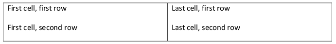
    
    将第二列的两行合并，得到以下表格：
    
    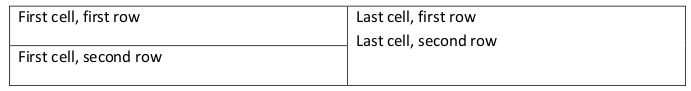
    
    第一行的最后一个单元格开始了一个合并，这个合并在它下面的单元格中完成，产生以下 WordprocessingML：
    
    ```xml
    <w:tr>
        <w:tc>
            <w:p>
                <w:r>
                    <w:t>第一行，第一单元格</w:t>
                </w:r>
            </w:p>
        </w:tc>
        <w:tc>
            <w:tcPr>
                <w:vMerge w:val="restart"/>
            </w:tcPr>
            <w:p>
                <w:r>
                    <w:t>第一行，最后一单元格</w:t>
                </w:r>
            </w:p>
            <w:p>
                <w:r>
                    <w:t>第二行，最后一单元格</w:t>
                </w:r>
            </w:p>
        </w:tc>
    </w:tr>
    <w:tr>
        <w:tc>
            <w:p>
                <w:r>
                    <w:t>第二行，第一单元格</w:t>
                </w:r>
            </w:p>
        </w:tc>
        <w:tc>
            <w:tcPr>
                <w:vMerge/>
            </w:tcPr>
            <w:p/>
        </w:tc>
    </w:tr>
    ```
    
    如上所示，值为 restart 的 vMerge 开始（或重新开始）一个合并区域，而没有值的单元格与上面的单元格合并。

=== "英文"

    Although the previous examples might have implied that tables have strict definition of rows, table cells can also be merged vertically. The tcPr element can contain the vMerge element that defines the extent of vertically merged grid columns within a table. A vMerge element with its val attribute set to restart marks the start of a vertically merged cell range. A vMerge element with the val attribute set to continue (the default value) marks the continuation of a vertically merged grid column. Cells between the first and last merged cell that are part of the vertical merge each must have a vMerge element to continue the vertical merge.
    
    For example, consider a table with two rows and two columns:
    
    
    
    Merging the two rows in the second column results in the following table:
    
    
    
    The last cell in the first row starts a merge that is completed in the cell below it, resulting in the following WordprocessingML:
    
    ```xml
    <w:tr>
        <w:tc>
            <w:p>
                <w:r>
                    <w:t>First cell, first row</w:t>
                </w:r>
            </w:p>
        </w:tc>
        <w:tc>
            <w:tcPr>
                <w:vMerge w:val="restart"/>
            </w:tcPr>
            <w:p>
                <w:r>
                    <w:t>Last cell, first row</w:t>
                </w:r>
            </w:p>
            <w:p>
                <w:r>
                    <w:t>Last cell, second row</w:t>
                </w:r>
            </w:p>
        </w:tc>
    </w:tr>
    <w:tr>
        <w:tc>
            <w:p>
                <w:r>
                    <w:t>First cell, second row</w:t>
                </w:r>
            </w:p>
        </w:tc>
        <w:tc>
            <w:tcPr>
                <w:vMerge/>
            </w:tcPr>
            <w:p/>
        </w:tc>
    </w:tr>
    ```
    
    As shown, the vMerge with a value of restart begins (or restarts) a merged region, and the cell with no value is merged with the one above.


## L.1.6 自定义标记

**Custom Markup**

=== "中文"

    WordprocessingML 文档中可以插入三种不同的非标准语义形式，每种形式都有其特定的预期用途：
    
    - 智能标签
    - 自定义 XML 标记
    - 结构化文档标签（内容控件）
    
    这些形式的用途和呈现方式将在以下各节中进行描述。

=== "英文"

    There are three distinct forms in which extra-standard semantics can be inserted into a WordprocessingML document, each with their own specific intended usage:
    
    - Smart tags
    - Custom XML markup
    - Structured document tags (content controls)
    
    The usage and presentation of each of these forms is described in the following sections.

### L.1.6.1 智能标签

**Smart Tags**

=== "中文"

    WordprocessingML 文档中可以嵌入的第一种非标准语义是智能标签。智能标签允许在文档中的任意运行或运行集周围添加语义信息，以提供有关其中包含数据种类的信息。
    
    考虑 WordprocessingML 文档中的以下文本，其中智能标签围绕股票符号 "CNTS"（智能标签显示为紫色虚线下划线）：
    
        This is a stock symbol: CNTS
    
    这段文本将转换为以下 WordprocessingML 标记：
    
    ```xml
    <w:p w:rsidR="00672474" w:rsidRDefault="00672474">
        <w:r>
            <w:t xml:space="preserve">This is a stock symbol: </w:t>
        </w:r>
        <w:smartTag w:uri="http://purl.oclc.org/ooxml/smartTags" 
            w:element="stockticker">
            <w:r>
                <w:t>MSFT</w:t>
            </w:r>
        </w:smartTag>
    </w:p>
    ```
    
    如上所示，智能标签由 smartTag 元素限定，它环绕包含智能标签文本部分的运行（或运行集）。
    
    智能标签本身携带两段必需的信息，这两者共同包含此智能标签的自定义语义。
    
    首先是智能标签的命名空间（包含在 uri 属性中）。这允许智能标签指定一个 URI，该 URI 应与此智能标签一起循环传输，并可供使用者使用。它打算用于指定此智能标签所属的智能标签系列 - 例如，在上述示例中，智能标签属于 http://purl.oclc.org/ooxml/smartTags 命名空间。
    
    其次是智能标签的元素名称（包含在 element 属性中）。这允许智能标签指定一个名称，该名称应与此智能标签一起循环传输，并且再次可供使用者使用。它打算用于指定此类智能标签的唯一名称 - 例如，在上述示例中，智能标签指定其数据为 stockticker 类。
    
    除了上述指定的必需信息外，智能标签还可以通过将它们添加到智能标签的属性包中，包含任意数量的额外属性作为命名空间/名称/值集。
    
    使用上述示例，向智能标签添加一个名为 fullCompanyName 的新属性，没有命名空间，值为 Microsoft Corporation，则意味着要增加 smartTagPr 元素，并添加此新属性，如下所示：
    
    ```xml
    <w:smartTag w:uri="http://purl.oclc.org/ooxml/smartTags" 
        w:element="stockticker">
        <w:smartTagPr>
            <w:attr w:name="fullCompanyName" w:val="Microsoft Corporation"/>
        </w:smartTagPr>
        <w:r>
            <w:t>MSFT</w:t>
        </w:r>
    </w:smartTag>
    ```
    
    如上所见，生成的 XML 只是增加了一个 attr 元素，该元素指定了属性包的属性和值。
    
    生产者可以在 WordprocessingML 文档的任何运行级内容周围嵌入智能标签，以嵌入有关所包含数据系列和类别的附加信息。这允许使用 uri 和 element 属性中提供的信息，对文档的特定区域进行“标记”，而无需提供超出此范围的上下文。
    
    消费者可以读取此智能标签数据，并提供围绕这些命名空间/元素对的附加功能，这些功能可能或可能不是特定于文档中的该智能标签类别。
    
    此功能的示例包括：通过用户界面添加/删除此标记的能力，提供在此数据分类的上下文中操作的能力等。

=== "英文"

    The first form of extra-standard semantics that can be embedded in a WordprocessingML document are smart tags. Smart tags allow semantic information to be added around an arbitrary run or set of runs within a document to provide information about the kind of data contained within.
    
    Consider the following text in a WordprocessingML document, with a smart tag around the stock symbol 'CNTS' (where the smart tag is displayed using a purple dotted underline):
    
        This is a stock symbol: CNTS
    
    This text would translate to the following WordprocessingML markup:
    
    ```xml
    <w:p w:rsidR="00672474" w:rsidRDefault="00672474">
        <w:r>
            <w:t xml:space="preserve">This is a stock symbol: </w:t>
        </w:r>
        <w:smartTag w:uri="http://purl.oclc.org/ooxml/smartTags"
            w:element="stockticker">
            <w:r>
                <w:t>MSFT</w:t>
            </w:r>
        </w:smartTag>
    </w:p>
    ```
    
    As shown above, the smart tag is delimited by the smartTag element, which surrounds the run (or runs) which contain the text which is part of the smart tag.
    
    The smart tag itself carries two required pieces of information, which together contain the customer semantics for this smart tag.
    
    The first of these is the namespace for this smart tag (contained in the uri attribute). This allows the smart tag to specify a URI which should be round-tripped with this smart tag and be available to a consumer. It is intended to be used to specify a family of smart tags to which this one belongs – for example, in the sample above, the smart tag belongs to the http://purl.oclc.org/ooxml/smartTags namespace.
    
    The second of these is the element name for this smart tag (contained in the element attribute). This allows the smart tag to specify a name which should be round-tripped with this smart tag and again available to a consumer. It is intended to be used to specify a unique name for this class of smart tag – for example, in the sample above, the smart tag specifies that its data is of class stockticker.
    
    As well as the required information specified above, a smart tag can also contain any number of additional properties in namespace/name/value sets by adding them to the smart tag’s property bag.
    
    Using the example above, adding a new property called fullCompanyName with no namespace and value Microsoft Corporation to the smart tag would mean augmenting the output to add the smartTagPr element with this new property as follows:
    
    ```xml
    <w:smartTag w:uri="http://purl.oclc.org/ooxml/smartTags"
        w:element="stockticker">
        <w:smartTagPr>
            <w:attr w:name="fullCompanyName" w:val="Microsoft Corporation"/>
        </w:smartTagPr>
        <w:r>
            <w:t>MSFT</w:t>
        </w:r>
    </w:smartTag>
    ```
    
    The resulting XML, as seen above, simply adds an attr element which specifies the property and value for the property bag.
    
    A producer can embed a smart tag around any run-level content in a WordprocessingML document in order to embed additional information about the family and class of the data contained within. This allows ‘tagging’ of specific regions of a document with these semantics without need to provide context beyond the information provided in the uri and element attributes.
    
    A consumer can read this smart tag data and provide additional functionality around these namespace/element pairs, which might or might not be specific to that smart tag class in the document.
    
    Examples of this functionality include: the ability to add/remove this markup via a user interface, ability to provide actions to operating in the context of this data classification, etc.

### L.1.6.2 自定义 XML 标记

**Custom XML Markup**

=== "中文"

    WordprocessingML 文档中可以嵌入的另一种非标准语义是自定义 XML 标记。自定义 XML 标记允许将任何有效的 XML Schema 文件中定义的 XML 元素应用于 WordprocessingML 文档的内容中的两个位置之一：围绕一个或多个段落（在块级）；或围绕文档中的任意运行或运行集（在内联级别），以在相关联的 XML Schema 定义文件定义的上下文和结构中提供该内容的语义。
    
    自定义 XML 标记与智能标签之间的区别在于，自定义 XML 标记与自定义 XML 架构的内容相对应；这意味着，如下所示，自定义 XML 标记可以在块级用于标记文档的内容，超出一个或多个运行的水平，以及在内联（运行）级别。它还可以由生产者在运行时针对自定义 XML 架构进行验证。
    
    考虑一个简单的 XML Schema，它定义了两个元素：一个根元素 invoice 和一个子元素 customerName - 前者定义了这个文件的内容是发票，后者指定了所包含的文本是客户的名称：
    
    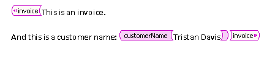
    
    这个输出将转换为以下 WordprocessingML 标记：
    
    ```xml
    <w:customXml w:uri="http://www.example.com/2006/invoice" 
        w:element="invoice">
        <w:p>
            <w:r>
                <w:t>This is an invoice.</w:t>
            </w:r>
        </w:p>
        <w:p>
            <w:r>
                <w:t xml:space="preserve">And this is a customer name: </w:t>
            </w:r>
            <w:customXml w:uri="http://www.example.com/2006/invoice" 
                w:element="customerName">
                <w:r>
                    <w:t>Tristan Davis</w:t>
                </w:r>
            </w:customXml>
        </w:p>
    </w:customXml>
    ```
    
    如上所示，来自客户供应的 XML 架构中的每个 XML 元素在文档输出中表示为 customXml 元素。
    
    类似于上面的智能标签示例，文档中的自定义 XML 元素有两个必需的属性。
    
    首先是 uri 属性，其内容指定了文档中自定义 XML 元素的命名空间。在上面的示例中，元素属于 http://www.example.com/2006/invoice 命名空间。
    
    其次是 element 属性，其内容指定了文档中此位置的自定义 XML 元素的名称。在上面的示例中，根元素称为 invoice，子元素称为 customerName。
    
    除了上述指定的必需信息外，自定义 XML 元素还可以指定任意数量的属性（如相关联的 XML Schema 中所指定）。要添加此信息，customXmlPr（自定义 XML 元素上的属性）指定一个或多个 attr 元素。
    
    使用上面的示例，我们可以按如下方式向 customerName 元素添加一个类型属性：
    
    ```xml
    <w:customXml w:uri="http://www.example.com/2006/invoice" 
        w:element="customerName">
        <w:customXmlPr>
            <w:attr w:uri="http://www.example.com/2006/invoice"  w:name="type"
                w:val="individual"/>
        </w:customXmlPr>
        <w:r>
            <w:t>Tristan Davis</w:t>
        </w:r>
    </w:customXml>
    ```
    
    如上所见，生成的 XML 只是增加了一个 attr 元素，该元素指定了自定义 XML 元素的属性。
    
    生产者可以在 WordprocessingML 文档中嵌入自定义 XML 元素，围绕块级或运行级内容，以便在 WordprocessingML 内容中嵌入额外标准 XML Schema 的结构。这允许使用来自此架构的语义对文档的特定区域进行“标记”，同时确保结果文件可以验证 WordprocessingML 架构。
    
    消费者可以读取此自定义 XML 标记，并提供围绕此额外标准 XML 标记的附加功能，这些功能可能或可能不是特定于该 XML 命名空间。此功能的示例包括：通过用户界面添加/删除此 XML 标记的能力，在此命名空间的上下文中提供操作的能力等。
    
    每个自定义 XML 元素类似于指定 XML 架构中的 XML 元素，并且可以在文档中任意嵌套到任何深度。此功能仅受 XML Schema 文件本身和当前文档的内容限制。

=== "英文"

    The next form of extra-standard semantics that can be embedded in a WordprocessingML document is custom XML markup. Custom XML markup allows the application of the XML elements defined in any valid XML Schema file to be applied to the contents of a WordprocessingML document in one of two locations: around a paragraph or set of paragraphs (at the block level); or around an arbitrary run or set of runs within a document (at the inline level) to provide semantics to that content within the context and structures defined by the associated XML Schema definition file.
    
    The distinction between custom XML markup and smart tags is based on the fact that custom XML markup corresponds with the contents of a custom XML schema; which means that as shown below, custom XML markup can be used at the block-level to mark up the contents of a document on levels beyond that of one or more runs as well as on the inline (run) level. It can also be validated against a custom XML schema by a producer at run time.
    
    Consider a simple XML Schema which defines two elements: a root element of invoice, and a chil element of customerName - the first defining that this file's contents are an invoice, and the secon specifying that the enclosed text as a customer's name:
    
    
    
    This output would translate to the following WordprocessingML markup:
    
    ```xml
    <w:customXml w:uri="http://www.example.com/2006/invoice"
        w:element="invoice">
        <w:p>
            <w:r>
                <w:t>This is an invoice.</w:t>
            </w:r>
        </w:p>
        <w:p>
            <w:r>
                <w:t xml:space="preserve">And this is a customer name: </w:t>
            </w:r>
            <w:customXml w:uri="http://www.example.com/2006/invoice"
                w:element="customerName">
                <w:r>
                    <w:t>Tristan Davis</w:t>
                </w:r>
            </w:customXml>
        </w:p>
    </w:customXml>
    ```
    
    As shown above, each of the XML elements from the customer-supplied XML schema is represented within the document output as a customXml element.
    
    Similar to the smart tag example above, a custom XML element in a document has two required attributes.
    
    The first is the uri attribute, whose contents specify the namespace of the custom XML element in the document. In the example above, the elements each belong to the http://www.example.com/2006/invoice namespace.
    
    The second is the element attribute, whose contents specify the name of the custom XML element at this location in the document. In the example above, the root element is called invoice and the child element is called customerName.
    
    As well as the required information specified above, custom XML elements can also specify any number of attributes (as specified in the associated XML Schema) on the element. To add this information, the customXmlPr (properties on the custom XML element) specify one or more attr elements.
    
    Using the example above, we can add a type attribute to the customerName element as follows:
    
    ```xml
    <w:customXml w:uri="http://www.example.com/2006/invoice"
        w:element="customerName">
        <w:customXmlPr>
            <w:attr w:uri="http://www.example.com/2006/invoice" w:name="type"
                w:val="individual"/>
        </w:customXmlPr>
        <w:r>
            <w:t>Tristan Davis</w:t>
        </w:r>
    </w:customXml>
    ```
    
    The resulting XML, as seen above, simply adds an attr element which specifies the attribute for the custom XML element.
    
    A producer can embed a custom XML element around or with block-level or run-level content in a WordprocessingML document in order to embed the structure of the extra-standard XML Schema within the WordprocessingML content. This allows ‘tagging’ of specific regions of a document with the semantics from this schema, while ensuring that the resulting file can be validated to the WordprocessingML schemas.
    
    A consumer can read this custom XML markup and provide additional functionality around this extra-standard XML markup, which might or might not be specific to that particular XML namespace. Examples of this functionality include: the ability to add/remove this XML markup via a user interface, ability to provide actions to operating in the context of this namespace, etc.
    
    Each custom XML element is analogous to an XML element in the specified XML schema, and can be nested arbitrarily to any depth in the document. This facility is limited only by the XML Schema file itself, and the contents of the current document.

### L.1.6.3 结构化文档标签

**Structured Document Tags**

=== "中文"

    可以嵌入到 WordprocessingML 文档中的最后一种额外标准语义形式是结构化文档标签（SDT）。
    
    如上所示，智能标签和自定义 XML 标记都提供了一种在文档中嵌入客户定义语义的方式：智能标签通过为文档中的运行或一组运行提供基本的命名空间/名称的能力；自定义 XML 标记通过使用任何有效的 XML 架构文件指定 XML 元素和属性来标记文档的能力。
    
    然而，这些技术中的每一种虽然都提供了一种添加所需语义信息的方法，但都没有提供一种方法来影响文档内的呈现或交互。为弥合这两者之间的鸿沟，结构化文档标签允许同时指定客户语义以及影响文档中数据呈现的能力。
    
    这意味着客户可以定义标签的语义和上下文，然后可以使用一组预定义的丰富属性来定义其在 WordprocessingML 文档呈现中的行为和外观。
    
    考虑一个区域，该区域应标记为“生日”的语义，供用户在文档中输入其出生日期。理想情况下，该区域还应使用日期选择器，允许用户从日历中输入日期：
    
    
    
    该内容将转换为以下 WordprocessingML 标记：
    
    ```xml
    <w:sdt>
        <w:sdtPr>
            <w:alias w:val="Birthday"/>
            <w:id w:val="8775518"/>
            <w:placeholder>
                <w:docPart w:val="DefaultPlaceholder_22479095"/>
            </w:placeholder>
            <w:showingPlcHdr/>
            <w:date>
                <w:dateFormat w:val="M/d/yyyy"/>
                <w:lid w:val="EN-US"/>
            </w:date>
        </w:sdtPr>
        <w:sdtContent>
            <w:p>
                <w:r>
                    <w:rPr>
                        <w:rStyle w:val="PlaceholderText"/>
                    </w:rPr>
                    <w:t>Click here to enter a date…</w:t>
                </w:r>
            </w:p>
        </w:sdtContent>
    </w:sdt>
    ```
    
    如上所示，WordprocessingML 文件中的每个结构化文档标签都使用 `sdt` 元素表示。
    
    在一个结构化文档标签中，有两个子元素包含此 SDT 的定义和内容。第一个是 `sdtPr` 元素，包含为此结构化文档标签指定的属性集。第二个是 `sdtContent` 元素，包含在此结构化文档标签内的所有内容。

=== "英文"

    The final form of extra-standard semantics that can be embedded in a WordprocessingML document is the structured document tag (SDT).
    
    As shown above, smart tags and custom XML markup each provide a facility for embedding customer-defined semantics into the document: smart tags, via the ability to provide a basic namespace/name for a run or set of runs within a documents; and custom XML markup, via the ability to tag the document with XML elements and attributes specified by any valid XML Schema file.
    
    However, each of these techniques, while they each provide a way to add the desired semantic information, does not provide a way to affect the presentation or interaction within the document. To bridge these two worlds, structured document tags allow both the specification of customer semantics as well as the ability to influence the presentation of that data in the document.
    
    This means that the customer can define the semantics and context of the tag, but can then use a rich set of pre-defined properties to define its behavior and appearance within the WordprocessingML document's presentation.
    
    Consider a region which should be tagged with the semantic of "birthday", for the user to enter their date or birth into the document. Ideally, this region would also utilize a date picker to allow the user to enter the date from a calendar::
    
    
    
    This content would translate to the following WordprocessingML markup:
    
    ```xml
    <w:sdt>
        <w:sdtPr>
            <w:alias w:val="Birthday"/>
            <w:id w:val="8775518"/>
            <w:placeholder>
                <w:docPart w:val="DefaultPlaceholder_22479095"/>
            </w:placeholder>
            <w:showingPlcHdr/>
            <w:date>
                <w:dateFormat w:val="M/d/yyyy"/>
                <w:lid w:val="EN-US"/>
            </w:date>
        </w:sdtPr>
        <w:sdtContent>
            <w:p>
                <w:r>
                    <w:rPr>
                        <w:rStyle w:val="PlaceholderText"/>
                    </w:rPr>
                    <w:t>Click here to enter a date…</w:t>
                </w:r>
            </w:p>
        </w:sdtContent>
    </w:sdt>
    ```
    
    As shown above, each of the structured document tags in the WordprocessingML file is represented using the sdt element.
    
    Within a structured document tag, there are two child elements which contain the definition and the content of this SDT. The first of these is the sdtPr element, which contains the set of properties specified for this structured document tag. The second is the sdtContent element, which contains all the content which is contained within this structured document tag.

#### L.1.6.3.1 结构化文档标签属性

**Structured Document Tag Properties**

=== "中文"

    在 SDT 的属性中，可以设置各种属性来影响文档中此内容的外观和行为。这些属性可以分为四组：
    
    - 共享属性
    - 锁定属性
    - 结构化文档标签类型
    - 结构化文档标签类型特定的属性
    
    结构化文档标签（SDT）的完整属性集位于 `sdtPr` 元素上。
    
    第一组是所有类型 SDT 共享的属性。这些属性包括但不限于 SDT 的语义名称、一个在各会话中唯一标识该控件的唯一 ID（整数）以及应显示为占位符文本的文档构建块的引用。
    
    下一组是标签的锁定属性——这些属性指定是否允许任何消费者编辑 SDT 的内容，或者从文档中删除 SDT 本身。
    
    第三组是结构化文档标签的类型，指定内容应如何在文档中表达。这些类型包括：纯文本（所有内容为一种格式）、富文本、日期选择器、组合框、下拉列表和图片。每种 SDT 类型提供的用户界面限制将内容限制为仅由 SDT 类型指定的内容（例如，图片不能包含文本）。
    
    最后，SDT 类型特定的属性包含在该类型的上下文中合理的属性。例如，日期选择器的日期格式或下拉列表/组合框的下拉列表条目。SDT 类型特定的属性作为类型元素的子元素存储。
    
    参考上面的示例，日期属性存储在日期元素下，如下所示：
    
    ```xml
    <w:sdtPr>
        …
        <w:date>
            <w:dateFormat w:val="M/d/yyyy"/>
            <w:lid w:val="EN-US"/>
        </w:date>
    </w:sdtPr>
    ```
    
    这确保了这些属性仅在适当的上下文中可用。

=== "英文"

    Within the SDT’s properties, various properties can be set which affect the appearance and behavior of this content in the document. These properties can be divided into four groups:
    
    - Shared properties
    - Locking properties
    - Structured document tag type
    - Structured document tag type-specific properties
    
    The complete set of properties for a structured document tag (SDT) are found on the sdtPr element.
    
    The first group is properties shared by all types of SDTs. These include, but are not limited to, the semantic name for the SDT, a unique ID (as an integer) that is round-tripped and allows the control to be uniquely identified across sessions, and a reference to a document building block that should be displayed as placeholder text.
    
    The next group is the locking properties for the tag – these specify whether any consumer should allow the contents of the SDT to be edited, or the SDT itself to be deleted from the document.
    
    The next group, the structured document tag’s type, specifies how the content should be expressed in a document. These include: plain text (all contents are of one formatting), rich text, date picker, combo box, drop-down list, and image. Each of the SDT types provides user interface restrictions that restrict the contents to only those specified by the SDT type (e.g., the picture cannot contain text).
    
    Finally, the SDT type-specific properties contain properties that are sensible in the context of that type. For example, the date format for a date picker or the drop-down list entries for a drop-down list/combo box. SDT type-specific properties are stored as children of the type’s element.
    
    Referring to the example above, the date properties are stored underneath the date element, as follows:
    
    ```xml
    <w:sdtPr>
        …
        <w:date>
            <w:dateFormat w:val="M/d/yyyy"/>
            <w:lid w:val="EN-US"/>
        </w:date>
    </w:sdtPr>
    ```
    
    This ensures that these properties are only available in the appropriate context(s).


#### L.1.6.3.2 结构化文档标签内容

**Structured Document Tag Content**

=== "中文"

    sdt 元素的第二个子元素是 sdtContent 元素，它包含了所有包含在此结构化文档标签中的内容。

=== "英文"

    The second child of the sdt element is the sdtContent element, which contains all the content which is contained within this structured document tag.

#### L.1.6.3.3 XML 映射

**XML Mapping**

=== "中文"
    
    SDT（结构化文档标签）的一个额外属性允许它们的内容存储在文档的另一个部分中。特别是，可以存储在文件内的自定义 XML 数据存储中。dataBinding 元素的存在表明，此 SDT 的内容仅仅是存储在特定自定义 XML 数据存储部分的某个特定 XML 元素中数据的缓存。

=== "英文"
    
    An additional property for SDTs allows their contents to be stored in another part (in particular, in the custom XML data storage within the file). The presence of the dataBinding element specifies that the contents of this SDT are simply a cache of the data stored at a particular XML element in a particular custom XML data storage part.

## L.1.7 节

**Sections**

=== "中文"
    
    在主文档内容中，通常需要将内容进行比段落更大范围的分组（例如，确保某一特定的段落和表格集以横向视图打印，而文档的其余部分则以纵向视图打印）。为了对这些内容进行分组，可以将文档划分为多个部分，每个部分定义文档中的一个内容区域，并允许应用一组段落级别的属性。

    考虑一个包含两个段落内容的 WordprocessingML 文档，其中第一个段落应在纵向打印的页面上显示，第二个段落应在横向打印的页面上显示（页面内容应在基础页面上向左旋转90度）。
    
    为了使这些段落在具有不同页面方向特征的不同页面上，每个段落会分成两个部分。查看上述示例的 WordprocessingML：
    
    ```xml
    <w:body>
        <w:p>
            <w:pPr>
                <w:sectPr>
                    <w:pgSz w:w="12240" w:h="15840"/>
                    <w:pgMar w:top="1440" w:right="1800" w:bottom="1440"
                        w:left="1800" w:header="720" w:footer="720" w:gutter="0"/>
                    <w:cols w:space="720"/>
                    <w:docGrid w:linePitch="360"/>
                </w:sectPr>
            </w:pPr>
            <w:r>
                <w:t>This is sentence one.</w:t>
            </w:r>
        </w:p>
        <w:p>
            <w:r>
                <w:t>This is sentence two.</w:t>
            </w:r>
        </w:p>
        <w:sectPr>
            <w:pgSz w:w="15840" w:h="12240" w:orient="landscape"/>
            <w:pgMar w:top="1800" w:right="1440" w:bottom="1800"
                w:left="1440" w:header="720" w:footer="720" w:gutter="0"/>
            <w:cols w:space="720"/>
            <w:docGrid w:linePitch="360"/>
        </w:sectPr>
    </w:body>
    ```
    
    这种语法使用两个不同的 `sectPr` 元素定义了两个部分：第一个部分的页面尺寸为宽 12,240 个二十分之一点，高 15,840 个二十分之一点；第二个部分的页面尺寸为宽 15,840 个二十分之一点，高 12,240 个二十分之一点，并以横向模式显示。

=== "英文"
    
    Within the main document story, there is also often a need for groupings of content on a basis large than a paragraph (for example, ensuring that a specific set of paragraphs and tables are printed i landscape view, while ensuring that the remainder of the document is printed in portrait view). In orde to group this content, a document can be divided into multiple sections, each of which defines a regio of content in the document and allows the application of a set of section-level properties.
    
    Consider a WordprocessingML document with two paragraphs of content, the first of which should be displayed on a page printed in portrait view, and the second of which should be displayed on a page printed in landscape view (the page content should be rotated 90 degrees to the left on the underlying page).
    
    In order to have each of these paragraphs on different pages having different page orientation characteristics, this document would be split into two sections. Looking at the WordprocessingML for the example above:
    
    ```xml
    <w:body>
        <w:p>
            <w:pPr>
                <w:sectPr>
                    <w:pgSz w:w="12240" w:h="15840"/>
                    <w:pgMar w:top="1440" w:right="1800" w:bottom="1440"
                        w:left="1800" w:header="720" w:footer="720" w:gutter="0"/>
                    <w:cols w:space="720"/>
                    <w:docGrid w:linePitch="360"/>
                </w:sectPr>
            </w:pPr>
            <w:r>
                <w:t>This is sentence one.</w:t>
            </w:r>
        </w:p>
        <w:p>
            <w:r>
                <w:t>This is sentence two.</w:t>
            </w:r>
        </w:p>
        <w:sectPr>
            <w:pgSz w:w="15840" w:h="12240" w:orient="landscape"/>
            <w:pgMar w:top="1800" w:right="1440" w:bottom="1800"
                w:left="1440" w:header="720" w:footer="720" w:gutter="0"/>
            <w:cols w:space="720"/>
            <w:docGrid w:linePitch="360"/>
        </w:sectPr>
    </w:body>
    ```
    
    This syntax defines two sections using two distinct sectPr elements: the first has a page size of 12,240 twentieths of a point wide and 15,640 twentieths of a point tall; the second has a page size of 15,640 twentieths of a point wide and 12,240 twentieths of a point tall, and is oriented in landscape mode.

### L.1.7.1 节属性

**Section Properties**

=== "中文"

    如上所示，节的结尾定义为应用于该节最后一个段落的一组属性 - 将该段落标记转换为节分隔符（即，关闭一个节的段落）。

    这些属性包含在 sectPr 元素中，该元素位于该节最后一个段落的段落属性（pPr 元素）内。在节属性的定义中，指定了要应用于该节的属性（包括但不限于页面大小和方向、行编号设置、边距和列）。节属性的完整集合位于 sectPr 元素的定义中。
    
    唯一的例外是文档中的最后一组节属性。这些属性存储为 body 元素的最后一个子元素。这样做是因为文档的最后一个段落必须指定段落属性，而这种语法强制规定了必须指定最后一组节属性。
    
    回到我们的例子，第一个节分隔符在该节的最后一个段落中定义，但最后的节属性存储在最终段落之后。

=== "英文"

    As shown above, the end of a section is defined as a set of properties applied to the last paragraph in that section—converting that paragraph mark into a section break (i.e., a paragraph that closes a section).
    
    Those properties are contained in a sectPr element, which is located within the paragraph properties (the pPr element) for the final paragraph in that section. Within the definition of section properties, the properties to be applied to that section (including, but not limited to, page size and orientation, line numbering settings, margins, and columns) are specified. The complete set of section properties is located on the definition for the sectPr element.
    
    The only exception to this rule is the final set of section properties in this document. These are stored as the last child of the body element. This is done because the document’s last paragraph must specify paragraph properties, and this syntax enforces that the final set of section properties are specified.
    
    Going back to our example, the first section break is defined within the last paragraph for that section, but the last section properties are stored after the final paragraph.


### L.1.7.2 节分隔符

**Section Breaks**

=== "中文"
    
    除了指定节的属性外，还使用 type 元素指定节分隔符的类型。WordprocessingML 支持四种不同的节分隔符类型：
    
    - 下一页节分隔符（如果未指定 type，则为默认类型），它从下一页开始新节。
    - 奇数页节分隔符，它从下一个奇数页开始新节。
    - 偶数页节分隔符，它从下一个偶数页开始新节。
    - 连续节分隔符，它从下一个段落开始新节。这意味着连续节分隔符可能不会指定某些页面级别的节属性，因为它们必须从下一节继承。然而，这些分隔符可以指定其他节属性，如行编号和脚注/尾注设置。

=== "英文"
    
    As well as specifying the section's properties, the type of section break is specified using the type element. WordprocessingML supports four distinct types of section breaks:
    
    - Next page section breaks (the default if type is not specified), which begin the new section on the following page.
    - Odd page section breaks, which begin the new section on the next odd-numbered page.
    - Even page section breaks, which begin the new section on the next even-numbered page.
    - Continuous section breaks, which begin the new section on the following paragraph. This means that continuous section breaks might not specify certain page-level section properties, since they must be inherited from the following section. These breaks, however, can specify other section properties, such as line numbering and footnote/endnote settings.


## L.1.8 样式

**Styles**

=== "中文"

    在查看了 WordprocessingML 文件中的块级内容的主要元素之后，现在需要查看存储在文档中的信息，这些信息会影响这些内容的显示方式。
    
    第一组这样的信息是样式。在 WordprocessingML 文件中，样式是预定义的段落和/或字符属性集，可以应用于文档中的文本。这允许格式化属性独立于内容存储和管理，允许在单个位置（例如，通过更改样式 styleId Heading1，而不是查找并更改文档中的每个段落）更改文档内容的外观。
    
    在文字处理文档中，"Normal"（普通）段落样式可以具有任意数量的格式化属性，例如，字体 = 宋体；字号 = 12pt；段落对齐方式 = 左对齐。引用此段落样式的所有段落将自动继承这些属性。

=== "英文"

    After looking at the primary elements of block-level content in a WordprocessingML file, it is now necessary to look at the information stored in the document that affects how this content is displayed.
    
    The first such group of information is styles. Within a WordprocessingML file, styles are predefined sets of paragraph and/or character properties which can be applied to text within the document. This allows the formatting properties to be stored and managed independently from the content, allowing the look of document content to be changed in a single location (e.g., the look of all first-level headings is changed by changing the style with styleId Heading1 rather than looking for and changing each paragraph in the document).
    
    The Normal paragraph style in a word processing document can have any number of formatting properties, e.g., font face = Times New Roman; font size = 12pt; paragraph justification = left). All paragraphs that reference this paragraph style would automatically inherit these properties.


### L.1.8.1 样式部件

**Styles Part**

=== "中文"

    WordprocessingML 文档中的样式信息存储在包内的样式部分，通过与主文档或术语表文档部分的隐式关系存储，关系类型为 `http://purl.oclc.org/ooxml/officeDocument/relationships/styles`，内容类型为 `vnd-openxmlformats.officedocument.wordprocessingml-styles+xml`。
    
    样式部分为文档存储两种类型的样式信息：
    
    - 样式定义
    - 潜在样式信息
    
    ??? info "译注"

        样式定义包括文档中所有预定义样式的属性，如字体大小、颜色、段落间距等。这些样式可以是段落样式、字符样式、表格样式等。
        
        潜在样式信息指的是文档中未明确定义为特定样式的文本格式。这些样式可能由于直接格式化文本而创建，而不是应用预定义样式。潜在样式信息允许 Word 处理应用程序在必要时推断和应用样式，以保持文档的一致性和可管理性。

=== "英文"

    Style information in a WordprocessingML document is stored in the Styles part within the package, which is stored via an implicit relationship from the Main Document or Glossary Document part of relationship type http://purl.oclc.org/ooxml/officeDocument/relationships/styles and has a content type of vnd-openxmlformats.officedocument.wordprocessingml-styles+xml.
    
    The styles part stores two types of style information for the document:
    
    - Style definitions
    - Latent style information


### L.1.8.2 样式定义

**Style Definitions**

=== "中文"

    在 WordprocessingML 文档中定义的每种样式都需要一个样式定义。样式定义包含了使用者在 WordprocessingML 文档中存储和显示该样式所需的所有必要信息，并且使用样式元素（style element）来定义。WordprocessingML 中任何样式的样式定义可以被划分为三个部分（注意：样式属性的完整定义可以在样式元素的参考信息中找到）：
    
    - 通用样式属性
    - 样式“类型”
    - 类型特定的属性
    
    通用样式属性指的是无论样式类型如何都可以使用的属性集；例如，样式名称、样式的附加别名、样式 ID（文档内容通过它来引用样式）、样式是否隐藏、样式是否锁定等。
    
    考虑文档中名为“Heading 1”的样式如下：
    
    ```xml
    <w:style w:type="paragraph" w:styleId="Heading1">
        <w:name w:val="Heading 1"/>
        <w:basedOn w:val="Normal"/>
        <w:next w:val="Normal"/>
        <w:link w:val="Heading1Char"/>
        <w:uiPriority w:val="1"/>
        <w:qFormat/>
        <w:rsid w:val="00F303CE"/>
        …
    </w:style>
    ```
    
    上述样式定义中，特定于此样式类型的格式化信息之上是一组通用样式属性，这些属性定义了所有样式类型共享的信息。
    
    样式类型指的是定义使用此样式定义创建的样式类型的样式属性。WordprocessingML 支持六种类型的样式定义：
    
    - 段落样式
    - 字符样式
    - 链接样式（段落 + 字符）
    - 表格样式
    - 编号样式
    - 默认段落 + 字符属性
    
    参考上面的“Heading 1”示例，type 属性有一个值“paragraph”，这表明以下样式定义是一个段落样式。

=== "英文"

    Each style defined within a WordprocessingML document requires a style definition. The style definition contains all of the information needed by a consumer to store and display that style within a WordprocessingML document, and is defined using the style element. The style definition for any style in WordprocessingML can be divided into three segments (Note: the complete definition of style properties can be found on the reference for the style element):
    
    - Common style properties
    - Style ‘types’
    - Type specific properties
    
    Common style properties refer to the set of properties which can be used regardless of the type of style; for example, the style name, additional aliases for the style, a style ID (used by the document content to refer to the style), if style is hidden, if style is locked, etc.
    
    Consider a style called Heading 1 in a document as follows:
    
    ```xml
    <w:style w:type="paragraph" w:styleId="Heading1">
        <w:name w:val="Heading 1"/>
        <w:basedOn w:val="Normal"/>
        <w:next w:val="Normal"/>
        <w:link w:val="Heading1Char"/>
        <w:uiPriority w:val="1"/>
        <w:qFormat/>
        <w:rsid w:val="00F303CE"/>
        …
    </w:style>
    ```
    
    Above the formatting information specific to this style type are a set of common style properties which define information shared by all style types.
    
    Style types refer to the property on a style that defines the type of style created with this style definition. WordprocessingML supports six types of style definitions:
    
    - Paragraph styles
    - Character styles
    - Linked styles (paragraph + character)
    - Table styles
    - Numbering styles
    - Default paragraph + character properties
    
    Referring to the Heading 1 example above, the type attribute has a value of paragraph, which indicates that the following style definition is a paragraph style.


### L.1.8.3 段落样式

**Paragraph Styles**

=== "中文"

    第一种样式定义，段落样式，是应用于整个段落内容以及段落标记的样式。这个定义意味着样式可以定义字符属性（适用于文档中的文本的属性）以及段落属性（适用于段落定位和外观的属性）。段落样式不能被文档中的运行引用，它们必须通过段落的段落属性（pPr）元素中的 pStyle 元素引用。
    
    段落样式有三个定义类型特定的特征：
    
    - 样式上的 type 属性有一个值 "paragraph"，这表明以下样式定义是段落样式。
    - next 元素定义了一个编辑行为，它提供了当在这种样式的段落末尾按下 ENTER 时自动应用到下一个段落的段落样式。
    - 样式使用 pPr 和 rPr 元素分别指定段落级和字符级属性。在这种情况下，运行属性是应用于段落中每个运行的属性集。
    
    然后通过在段落属性的 pStyle 元素中引用此样式的 styleId 属性值来应用段落样式。
    
    考虑一个名为 "Test Paragraph Style" 的段落样式，它定义了：段落间距 = 双倍，段落缩进 = 1"（仅首行）；字体 = Algerian，字体颜色 = 红色，字号 = 20 磅。生成的样式定义将是：
    
    ```xml
    <w:style w:type="paragraph" w:styleId="TestParagraphStyle">
        <w:name w:val="Test Paragraph Style"/>
        <w:qFormat/>
        <w:rsid w:val="00F85845"/>
        <w:pPr>
            <w:spacing w:line="480" w:lineRule="auto"/>
            <w:ind w:firstLine="1440"/>
        </w:pPr>
        <w:rPr>
            <w:rFonts w:ascii="Algerian" w:hAnsi="Algerian"/>
            <w:color w:val="ED1C24"/>
            <w:sz w:val="40"/>
        </w:rPr>
    </w:style>
    ```
    
    注意，样式的字符属性在 rPr 元素下，段落属性在 pPr 元素下。
    
    这种样式的段落文档内容将是：
    
    ```xml
    <w:p>
        <w:pPr>
            <w:pStyle w:val="TestParagraphStyle"/>
        </w:pPr>
        <w:r>
            <w:t xml:space="preserve">Here is some fancy Text</w:t>
        </w:r>
    </w:p>
    ```
    
    pStyle 元素将段落与样式定义链接起来。

=== "英文"

    The first type of style definition, paragraph styles are styles that apply to the contents of an entire paragraph as well as the paragraph mark. This definition implies that the style can define both character properties (properties that apply to text within the document) as well as paragraph properties (properties which apply to the positioning and appearance of the paragraph). Paragraph styles cannot be referenced by runs within a document, they must be referenced by the pStyle element within a paragraph’s paragraph properties (pPr) element.
    
    A paragraph style has three defining type-specific characteristics:
    
    - The type attribute on the style has a value of paragraph, which indicates that the following style definition is a paragraph style.
    - The next element defines an editing behavior which supplies the paragraph style to be automatically applied to the next paragraph when ENTER is pressed at the end of a paragraph of this style.
    - The style specifies both paragraph-level and character-level properties using the pPr and rPr elements, respectively. In this case, the run properties are the set of properties applied to each run in the paragraph.
    
    The paragraph style is then applied to paragraphs by referencing the styleId attribute value for this style in the paragraph properties’ pStyle element.
    
    Consider a paragraph style titled "Test Paragraph Style" which defines: paragraph spacing = double, paragraph indent = 1” (first line only); font = Algerian, font color = red, font size = 20 points. The resulting style definition would be:
    
    ```xml
    <w:style w:type="paragraph" w:styleId="TestParagraphStyle">
        <w:name w:val="Test Paragraph Style"/>
        <w:qFormat/>
        <w:rsid w:val="00F85845"/>
        <w:pPr>
            <w:spacing w:line="480" w:lineRule="auto"/>
            <w:ind w:firstLine="1440"/>
        </w:pPr>
        <w:rPr>
            <w:rFonts w:ascii="Algerian" w:hAnsi="Algerian"/>
            <w:color w:val="ED1C24"/>
            <w:sz w:val="40"/>
        </w:rPr>
    </w:style>
    ```
    
    Notice that the character properties for the style are under the rPr element, and the paragraph properties are under the pPr element.
    
    The document content for a paragraph of this style would be:
    
    ```xml
    <w:p>
        <w:pPr>
            <w:pStyle w:val="TestParagraphStyle"/>
        </w:pPr>
        <w:r>
            <w:t xml:space="preserve">Here is some fancy Text</w:t>
        </w:r>
    </w:p>
    ```
    
    The pStyle element links the paragraph with the style definition.


### L.1.8.4 字符样式

**Character Styles**

=== "中文"

    第二种样式定义，字符样式，是应用于文档内容中一个或多个运行的文本的样式。这个定义意味着样式只能定义字符属性（适用于段落中的文本的属性），因为它不能应用于段落。字符样式只能通过文档中的运行来引用，并且必须通过运行的运行属性元素内的 rStyle 元素引用。
    
    字符样式有两个定义类型特定的特征：
    
    - 样式上的 type 属性有一个值 "character"，这表明以下样式定义是字符样式。
    - 样式只使用 rPr 元素指定字符级属性。在这种情况下，运行属性是应用于每种样式的每个运行的属性集。
    
    然后通过在运行属性的 rStyle 元素中引用此样式的 styleId 属性值来应用字符样式。
    
    考虑一个名为 "Test Character Style" 的字符样式，它定义了；字体 = Courier New，字体颜色 = 黄色；下划线。生成的样式定义将是：
    
    ```xml
    <w:style w:type="character" w:styleId="TestCharacterStyle">
        <w:name w:val="Test Character Style"/>
        <w:uiPriority w:val="99"/>
        <w:qFormat/>
        <w:rsid w:val="00E77BF0"/>
        <w:rPr>
            <w:rFonts w:ascii="Courier New" w:hAnsi="Courier New"/>
            <w:color w:val="FFF200"/>
            <w:u w:val="single"/>
        </w:rPr>
    </w:style>
    ```
    
    注意，使用此样式应用的字符属性在 rPr 元素下。带有这种样式运行的段落的文档内容将是：
    
    ```xml
    <w:p>
        <w:r>
            <w:t xml:space="preserve">The following text is in the </w:t>
        </w:r>
        <w:r>
            <w:rPr>
                <w:rStyle w:val="TestCharacterStyle"/>
            </w:rPr>
            <w:t>character style</w:t>
        </w:r>
        <w:r>
            <w:t>.</w:t>
        </w:r>
    </w:p>
    ```
    
    第二个运行中的 rStyle 元素将该运行与样式定义链接起来，继承该运行的格式化属性。

=== "英文"

    The next type of style definition, character styles are styles which apply to the contents of one or more runs of text within a document’s contents. This definition implies that the style can only define character properties (properties which apply to text within a paragraph) because it cannot be applied to paragraphs. Character styles can only be referenced by runs within a document, and they must be referenced by the rStyle element within a run’s run properties element.
    
    A character style has two defining type-specific characteristics:
    
    - The type attribute on the style has a value of character, which indicates that the following style definition is a character style.
    - The style specifies only character-level properties using the rPr element. In this case, the run properties are the set of properties applied to each  run which is of this style.
    
    The character style is then applied to runs by referencing the styleId attribute value for this style in the run properties’ rStyle element.
    
    Consider a character style titled "Test Character Style" which defines; font = Courier New, font color = yellow; underline. The resulting style definition would be:
    
    ```xml
    <w:style w:type="character" w:styleId="TestCharacterStyle">
        <w:name w:val="Test Character Style"/>
        <w:uiPriority w:val="99"/>
        <w:qFormat/>
        <w:rsid w:val="00E77BF0"/>
        <w:rPr>
            <w:rFonts w:ascii="Courier New" w:hAnsi="Courier New"/>
            <w:color w:val="FFF200"/>
            <w:u w:val="single"/>
        </w:rPr>
    </w:style>
    ```
    
    Notice that the character properties applied using this style are under the rPr element. The document content for a paragraph with a run of this style would be:
    
    ```xml
    <w:p>
        <w:r>
            <w:t xml:space="preserve">The following text is in the </w:t>
        </w:r>
        <w:r>
            <w:rPr>
                <w:rStyle w:val="TestCharacterStyle"/>
            </w:rPr>
            <w:t>character style</w:t>
        </w:r>
        <w:r>
            <w:t>.</w:t>
        </w:r>
    </w:p>
    ```
    
    The rStyle element in the second run links that run with the style definition, inheriting the formatting properties for that run.

### L.1.8.5 链接样式

**Linked Styles**

=== "中文"
    
    下一种样式定义，链接样式实际上是一对样式的组合，可以应用于 WordprocessingML 文档中的一个或多个运行的文本内容或一个或多个段落的全部内容。这个定义意味着样式可以定义一组字符属性（适用于段落中的文本的属性）以及一组段落属性（适用于段落定位和外观的属性），因为必须能够将样式应用于段落以及字符。
    
    为了实现这些双重用途，链接样式实际上是 WordprocessingML 文档中的一个段落样式和一个字符样式的配对。每种样式在样式部分中都是独立存在的，但是通过 link 元素链接，该元素指定这些样式是链接样式定义的各自一半，并应在运行时被视为一种样式。
    
    链接样式使用的一个典型例子是引用样式 - 如果将样式应用于段落，引用文本应该额外缩进以创建块引用效果，但如果将样式应用于段落中的文本，则只应用字符级别的效果。
    
    考虑以下两种样式，它们构成了定义以下内容的链接样式配对：字体为 Arial，字体颜色为绿色；段落间距为双倍，缩进为左缩进 1 英寸。生成的样式定义将是：
    
    ```xml
    <w:style w:type="paragraph" w:styleId="TestLinkedStyle">
        <w:name w:val="Test Linked Style"/>
        <w:link w:val="TestLinkedStyleChar"/>
        <w:qFormat/>
        <w:rsid w:val="009C1646"/>
        <w:pPr>
            <w:spacing w:line="480" w:lineRule="auto"/>
            <w:ind w:left="1440"/>
        </w:pPr>
        <w:rPr>
            <w:rFonts w:ascii="Arial" w:hAnsi="Arial"/>
            <w:color w:val="22B14C"/>
        </w:rPr>
    </w:style>
    <w:style w:type="character" w:styleId="TestLinkedStyleChar">
        <w:name w:val="Test Linked Style Char"/>
        <w:link w:val="TestLinkedStyle"/>
        <w:rsid w:val="009C1646"/>
        <w:rPr>
            <w:rFonts w:ascii="Arial" w:hAnsi="Arial"/>
            <w:color w:val="22B14C"/>
        </w:rPr>
    </w:style>
    ```
    
    段落样式中的 link 元素指定了 TestLinkedStyleChar，即配对字符样式的 styleId，字符样式中的 link 元素指定了 TestLinkedStyle，即配对段落样式的 styleId，创建了一个链接样式组合。
    
    链接样式的段落级实例只能通过文档中的段落引用，并且必须通过段落的段落属性元素（pPr）中的 pStyle 元素引用，该元素必须引用链接样式的段落版本。链接样式的字符级实例只能通过文档中运行的运行属性元素（rPr）引用，并且必须通过运行属性元素中的 rStyle 元素引用，该元素必须引用链接样式的字符版本。
    
    在上面的例子中，链接样式定义由段落样式组成，它指定了运行和段落属性，以及字符样式，它只指定运行属性。带有此链接样式的段落的文档内容将是：
    
    ```xml
    <w:p>
        <w:pPr>
            <w:pStyle w:val="TestLinkedStyle"/>
        </w:pPr>
        <w:r>
            <w:t xml:space="preserve">A para version of Test Linked Style.</w:t>
        </w:r>
    </w:p>
    ```
    
    段落属性中的 pStyle 元素将段落与链接样式定义的段落版本链接起来。
    
    带有此链接样式运行的段落的文档内容将是：
    
    ```xml
    <w:p>
        <w:r>
            <w:t xml:space="preserve">Next run is character version of </w:t>
        </w:r>
        <w:r>
            <w:rPr>
                <w:rStyle w:val="TestLinkedStyleChar"/>
            </w:rPr>
            <w:t>Test Linked Style</w:t>
        </w:r>
        <w:r>
            <w:t>.</w:t>
        </w:r>
    </w:p>
    ```
    
    第二个运行的属性中的 rStyle 元素将运行与链接样式定义的字符版本链接起来。

=== "英文"

    The next type of style definition, linked styles are actually a paired combination of styles which can be applied to the contents of one or more runs of text within a document’s contents or the entire contents of one or more paragraphs in a WordprocessingML document. This definition implies that the style can define both a set of character properties (properties which apply to text within a paragraph) as well as a set of paragraph properties (properties which apply to the positioning and appearance of the paragraph) because it must be possible to apply the style to paragraphs as well as characters.
    
    In order to accomplish these dual uses, a linked style is actually a pairing of a paragraph style and a character style in the WordprocessingML document. Each style exists uniquely within the styles part, but is linked by the link element, which specifies that these styles are each half of a linked style definition and should be treated as one style at runtime.
    
    A typical example of the use of a linked style is a quote style - if the style is applied to a paragraph, the quoted text should be indented additionally to create a block quote effect, but if the style is applied to text in a paragraph, only the character level effects should be applied.
    
    Consider the following two styles which comprise a linked style pairing that defines the following: font is Arial, font color is green; paragraph spacing is double, and indent is 1 inch left. The resulting style definitions would be:
    
    ```xml
    <w:style w:type="paragraph" w:styleId="TestLinkedStyle">
        <w:name w:val="Test Linked Style"/>
        <w:link w:val="TestLinkedStyleChar"/>
        <w:qFormat/>
        <w:rsid w:val="009C1646"/>
        <w:pPr>
            <w:spacing w:line="480" w:lineRule="auto"/>
            <w:ind w:left="1440"/>
        </w:pPr>
        <w:rPr>
            <w:rFonts w:ascii="Arial" w:hAnsi="Arial"/>
            <w:color w:val="22B14C"/>
        </w:rPr>
    </w:style>
    <w:style w:type="character" w:styleId="TestLinkedStyleChar">
        <w:name w:val="Test Linked Style Char"/>
        <w:link w:val="TestLinkedStyle"/>
        <w:rsid w:val="009C1646"/>
        <w:rPr>
            <w:rFonts w:ascii="Arial" w:hAnsi="Arial"/>
            <w:color w:val="22B14C"/>
        </w:rPr>
    </w:style>
    ```
    
    The link element in the paragraph style specifies TestLinkedStyleChar, the styleId of the paired character style, and the link element in the character style specifies TestLinkedStyle, the styleId of the paired paragraph style, creating a linked style combination.
    
    Paragraph-level instances of linked styles can only be referenced by paragraphs within a document, and they must be referenced by the pStyle element within the paragraph’s paragraph properties element (pPr), which must reference the paragraph version of the linked style. Character-level instances of linked styles can only be referenced by a run's run properties element (rPr) within a document, and they must be referenced by the rStyle element within the run properties element which must reference the character version of the linked style.
    
    In the example above, the linked style definition is composed of the paragraph style, which specifies both the run and paragraph properties, and the character style, which specifies only the run properties. The document content for a paragraph with this linked style would be:
    
    ```xml
    <w:p>
        <w:pPr>
            <w:pStyle w:val="TestLinkedStyle"/>
        </w:pPr>
        <w:r>
            <w:t xml:space="preserve">A para version of Test Linked Style.</w:t>
        </w:r>
    </w:p>
    ```
    
    The pStyle element in the paragraph’s properties links the paragraph with the paragraph version of the linked style definition.
    
    The document content for a paragraph with a run of this linked style would be:
    
    ```xml
    <w:p>
        <w:r>
            <w:t xml:space="preserve">Next run is character version of </w:t>
        </w:r>
        <w:r>
            <w:rPr>
                <w:rStyle w:val="TestLinkedStyleChar"/>
            </w:rPr>
            <w:t>Test Linked Style</w:t>
        </w:r>
        <w:r>
            <w:t>.</w:t>
        </w:r>
    </w:p>
    ```
    
    The rStyle element in the second run’s properties links the run with the character version of the linked style definition.


### L.1.8.6 编号样式

**Numbering Styles**

=== "中文"

    编号样式是定义文档中多级编号格式的公共样式属性的样式定义。这意味着编号样式只定义了一个单一的段落属性：使用 numPr 元素引用存储在文档编号部分中的编号定义。
    
    与段落和字符样式不同，编号样式永远不会被文档中的内容直接引用 - 相反，一个抽象的编号定义（在本节的编号主题中介绍）指定它实际上是编号样式的基础编号信息。
    
    考虑一个名为“Test Numbering Style”的编号样式：
    
    ```xml
    <w:style w:type="numbering" w:styleId="TestNumberingStyle">
        <w:name w:val="Test Numbering Style" />
        <w:uiPriority w:val="99" />
        <w:rsid w:val="0045009F" />
        <w:pPr>
            <w:numPr>
                <w:numId w:val="1" />
            </w:numPr>
        </w:pPr>
    </w:style>
    ```
    
    在编号样式定义中指定的唯一信息是对这个编号样式定义的编号信息的编号定义的引用。

=== "英文"

    Numbering styles are style definitions which specify common style properties for a multi-level numbering format within a document. This means that a numbering style defines only a single paragraph property: a reference to a numbering definition stored in the document’s numbering part, using the numPr element.
    
    Unlike paragraph and character styles, numbering styles are never directly referenced by content in the document – instead, an abstract numbering definition (covered in the numbering topic of this section) specifies that it is actually the underlying numbering information for a numbering style.
    
    Consider a numbering style “Test Numbering Style”:
    
    ```xml
    <w:style w:type="numbering" w:styleId="TestNumberingStyle">
        <w:name w:val="Test Numbering Style" />
        <w:uiPriority w:val="99" />
        <w:rsid w:val="0045009F" />
        <w:pPr>
            <w:numPr>
                <w:numId w:val="1" />
            </w:numPr>
        </w:pPr>
    </w:style>
    ```
    
    The only information specified in the numbering style definition is a reference to the numbering definition for the numbering information which is defined by this numbering style.


### L.1.8.7 表格样式

**Table Styles**

=== "中文"

    最后一种传统样式定义，表格样式，是应用于文档中零个或多个表格内容的样式。这个定义意味着样式只能定义表格属性（适用于表格及其组成行和单元格的属性），然而，表格样式也可以定义段落属性（适用于段落定位和外观的属性）以及字符属性（适用于运行的属性），用于文档中指定表格内的所有段落和运行。表格样式只能通过文档中的表格引用，并且必须通过表格的表格属性（tblPr）元素内的 tblStyle 元素引用。
    
    像上面讨论的样式定义一样，表格样式指定了可以应用于表格的所有属性，以及表格内容的段落和字符属性。然而，与其他样式定义不同，表格样式允许为表格的不同区域定义条件性格式。
    
    这些表格条件性格式如下应用于表格的不同区域：
    
    
    
    表格的所有行也可以在交替行/列的基础上有条件地格式化，如下所示：
    
    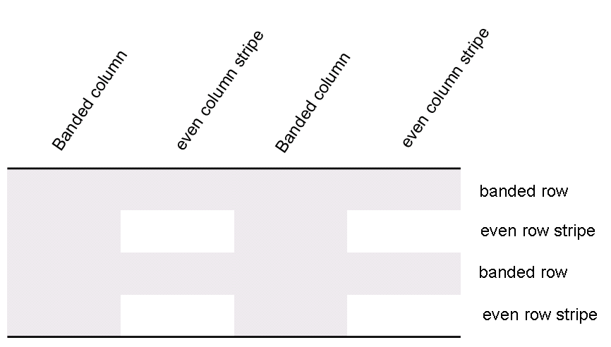
    
    如果指定了，这些条件性格式将按以下顺序应用（因此后续格式将覆盖先前格式的属性）：
    
    - 整个表格
    - 带状列，偶数列带状
    - 带状行，偶数行带状
    - 第一行，最后一行
    - 第一列，最后一列
    - 左上角，右上角，左下角，右下角
    
    考虑一个定义如下的表格样式 "Test Table Style"：所有单元格在所有边都有 1 磅的表格边框，单元格左右两边有 0.1 英寸的单元格边距，单元格上下两边有 0 英寸的单元格边距，以及特定于标题行的格式设置：红色底纹，粗体文本如下：
    
    ```xml
    <w:style w:type="table" w:styleId="TestTableStyle">
        <w:name w:val="Test Table Style"/>
        <w:basedOn w:val="TableNormal"/>
        <w:uiPriority w:val="99"/>
        <w:rsid w:val="00340CC4"/>
        <w:tblPr>
        <w:tblBorders>
            <w:top w:val="single" w:sz="4" w:space="0" w:color="auto"/>
            <w:left w:val="single" w:sz="4" w:space="0" w:color="auto"/>
            <w:bottom w:val="single" w:sz="4" w:space="0" w:color="auto"/>
            <w:right w:val="single" w:sz="4" w:space="0" w:color="auto"/>
            <w:insideH w:val="single" w:sz="4" w:space="0" w:color="auto"/>
            <w:insideV w:val="single" w:sz="4" w:space="0" w:color="auto"/>
        </w:tblBorders>
        <w:tblCellMar>
            <w:top w:w="0" w:type="dxa"/>
            <w:left w:w="108" w:type="dxa"/>
            <w:bottom w:w="0" w:type="dxa"/>
            <w:right w:w="108" w:type="dxa"/>
        </w:tblCellMar>
        </w:tblPr>
            <w:tblStylePr w:type="firstRow">
            <w:rPr>
                <w:b/>
            </w:rPr>
            <w:tcPr>
                <w:shd w:val="clear" w:color="auto" w:fill="ED1C24"/>
            </w:tcPr>
        </w:tblStylePr>
    </w:style>
    ```
    
    tblPr 元素包含应用于整个表格的格式设置，tblStylePr 元素的 type 属性值为 firstRow 包含第一行表格的格式设置，特别是粗体运行属性和红色单元格底纹。
    
    文档中的单个表格实例使用表格属性（tblPr）中的 tblStyle 元素定义与表格样式的关联，如上所述。然而，单个表格可以选择是否分别应用表格的条件格式的以下方面：
    
    - 第一行
    - 最后一行
    - 第一列
    - 最后一列
    - 行带状
    - 列带状
    
    条件格式的使用或省略使用 tblLook 元素指定，该元素包含多个属性，指示哪些属性被应用和省略。
    
    考虑两个使用表格样式 "Style2" 的表格；一个指定它只应使用表格样式中的标题行和页脚行条件格式属性，另一个指定它应使用标题行、页脚行和带状行条件格式：
    
    ```xml
    <w:tbl>
        <w:tblPr>
            <w:tblStyle w:val="Style2"/>
            <w:tblW w:w="0" w:type="auto"/>
            <w:tblLook w:firstRow="true" w:lastRow="true"
                w:noHBand="true" w:noVBand="true"/>
        </w:tblPr>
        …
    </w:tbl>
    …
    <w:tbl>
        <w:tblPr>
            <w:tblStyle w:val="Style2"/>
            <w:tblW w:w="0" w:type="auto"/>
            <w:tblLook w:firstRow="true" w:lastRow="true"
                w:noVBand="true"/>
        </w:tblPr>
        …
    </w:tbl>
    ```
    
    表格使用 tblLook 元素指定适当的条件格式集，如 tblStyle 元素中的相同表格样式和不同的 tblLook 值所见。

=== "英文"

    The last conventional type of style definition, table styles are styles which apply to the contents of zero or more tables within a document. This definition implies that the style can only define table properties (properties which apply to the table and its constituent rows and cells), however a table style can also define paragraph properties (properties which apply to the positioning and appearance of paragraphs) as well as character properties (properties which apply to runs) for all of the paragraphs and runs within the specified table in the document. Table styles can only be referenced by tables within a document, and they must be referenced by the tblStyle element within a table’s table properties (tblPr) element.
    
    Like the style definitions discussed above, table styles specify all of the properties that can be applied to a table, as well as paragraph and character properties for the table’s contents. However, unlike other style definitions, table styles allow for the definition of conditional formats for different regions of the table.
    
    These table conditional formats are applied to different regions of the table as follows:
    
    
    
    All rows in the table can also have conditional formatting on an alternating row/column basis as well as follows:
    
    
    
    When specified, these conditional formats are applied in the following order (therefore subsequent formats override properties on previous formats):
    
    - Whole table
    - Banded columns, even column banding
    - Banded rows, even row banding
    - First row, last row
    - First column, last column
    - Top left, top right, bottom left, bottom right
    
    Consider a table style “Test Table Style” defined as follows: all cells with 1pt table borders on all sides,
    0.1” cell margins on left and right of cells, and 0” cell margins on top and bottom of cells, as well as
    header row specific formatting of: red shading, bold text as follows:
    
    ```xml
    <w:style w:type="table" w:styleId="TestTableStyle">
        <w:name w:val="Test Table Style"/>
        <w:basedOn w:val="TableNormal"/>
        <w:uiPriority w:val="99"/>
        <w:rsid w:val="00340CC4"/>
        <w:tblPr>
        <w:tblBorders>
            <w:top w:val="single" w:sz="4" w:space="0" w:color="auto"/>
            <w:left w:val="single" w:sz="4" w:space="0" w:color="auto"/>
            <w:bottom w:val="single" w:sz="4" w:space="0" w:color="auto"/>
            <w:right w:val="single" w:sz="4" w:space="0" w:color="auto"/>
            <w:insideH w:val="single" w:sz="4" w:space="0" w:color="auto"/>
            <w:insideV w:val="single" w:sz="4" w:space="0" w:color="auto"/>
        </w:tblBorders>
        <w:tblCellMar>
            <w:top w:w="0" w:type="dxa"/>
            <w:left w:w="108" w:type="dxa"/>
            <w:bottom w:w="0" w:type="dxa"/>
            <w:right w:w="108" w:type="dxa"/>
        </w:tblCellMar>
        </w:tblPr>
            <w:tblStylePr w:type="firstRow">
            <w:rPr>
                <w:b/>
            </w:rPr>
            <w:tcPr>
                <w:shd w:val="clear" w:color="auto" w:fill="ED1C24"/>
            </w:tcPr>
        </w:tblStylePr>
    </w:style>
    ```
    
    The tblPr element holds the formatting which is applied to the entire table, and the tblStylePr element with a type attribute value of firstRow holds the formatting for the first table row, specifically the bold run property and red cell shading.
    
    An individual instance of a table defines an association with a table style using the tblStyle element in the table’s properties (tblPr), as discussed above. However, individual tables can choose whether to apply the following aspects of the table’s conditional formats individually:
    
    - First row
    - Last row
    - First column
    - Last column
    - Row banding
    - Column banding
    
    The use or omission conditional formats are specified using the tblLook element, which contains a number of attributes that indicate which properties are applied and omitted.
    
    Consider two tables using the table style "Style2"; one which specifies that it should only use the header row and footer row conditional formatting properties from the table style, and the other which specifies that it should use the header row, footer row, and banded row conditional formatting:
    
    ```xml
    <w:tbl>
        <w:tblPr>
            <w:tblStyle w:val="Style2"/>
            <w:tblW w:w="0" w:type="auto"/>
            <w:tblLook w:firstRow="true" w:lastRow="true"
                w:noHBand="true" w:noVBand="true"/>
        </w:tblPr>
        …
    </w:tbl>
    …
    <w:tbl>
        <w:tblPr>
            <w:tblStyle w:val="Style2"/>
            <w:tblW w:w="0" w:type="auto"/>
            <w:tblLook w:firstRow="true" w:lastRow="true"
                w:noVBand="true"/>
        </w:tblPr>
        …
    </w:tbl>
    ```
    
    The tables each specify the appropriate set of conditional formats using the tblLook element, as seen b the identical table styles in the tblStyle element, and different tblLook values.


### L.1.8.8 默认文档段落和字符属性

**Default Document Paragraph and Character Properties**

=== "中文"

    WordprocessingML 文档中的最后一种样式是文档的默认段落和字符属性。尽管从严格意义上讲这不是样式（因为这套属性集不能直接应用于文本），它定义了文档中段落和运行继承的基本格式化属性集。
    
    接下来的部分，标题为“样式继承”，将准确解释默认文档段落和字符属性如何影响文档中所有内容的外观。

=== "英文"

    The final type of style in a WordprocessingML document is the default paragraph and character properties for the document. Although this is not a style in the strict sense of the word (because this property set cannot directly be applied to text) it defines the basic set of formatting properties which are inherited by paragraphs and runs in the document.
    
    The following section, entitled Style Inheritance, explains exactly how the default document paragraph and character properties influence the appearance of all content in the document.

### L.1.8.9 样式继承

**Style Inheritance**

=== "中文"

    为了编译出由任何给定样式指定的完整段落和字符属性集（如适当），消费者必须遵循样式继承规则来确定该集中的每个属性。
    
    样式继承规定，任何给定类型的样式都可以从该类型的其他样式继承，因此消费者必须通过跟随继承树来“构建”样式信息。这种继承是通过basedOn元素定义的，它指定了父样式的styleId。
    
    “Tristan Test”段落样式可以从“Heading 1”段落样式继承属性，而“Heading 1”段落样式本身可以从“Normal”段落样式继承属性。
    
    为了构建最终的样式，消费者必须追溯层级结构（跟随每个basedOn值回到一个没有basedOn元素的样式（不基于另一种样式）。通过跟随树的每个层级，适当地应用指定的段落和/或字符属性，构建出最终的样式。当属性发生冲突时，它们会被后续层级覆盖（这包括关闭在早期层级设置的属性）。未指定的属性简单地不会改变在早期层级指定的属性。
    
    考虑一个字符样式“Green”，它只指定文本颜色为绿色，但继承自另一个字符样式“Base”，后者定义了Arial字体和粗体：
    
    ```xml
    <w:style w:type="character" w:styleId="Green">
        <w:name w:val="Green" />
        <w:basedOn w:val="Base" />
        <w:rPr>
            <w:color w:val="22B14C" />
        </w:rPr>
    </w:style>
    …
    <w:style w:type="character" w:styleId="Base">
        <w:name w:val="Base" />
        <w:rPr>
            <w:rFonts w:ascii="Arial" w:hAnsi="Arial" />
            <w:b />
        </w:rPr>
    </w:style>
    ```
    
    Green字符样式的定义有一个basedOn元素，它指定了Base样式。这意味着任何使用Green样式的地方都被定义为粗体、绿色、Arial字体的文本。
    
    相反，生产者不应该在样式上输出任何已经被样式层级中的前一个层级设置的属性，以及那些与文档默认值匹配的属性。这意味着如果文档默认值或样式层级中的任何前一个层级指定了一个在此层级未改变的属性，那么该属性就不应该成为WordprocessingML中结果样式定义的一部分。在样式层级中多次添加属性不是错误的，但不必要地重复，因为设置已经应用到文本上，导致文件大小不必要地增加。
    
    如果文档默认字体是Bauhaus 93，而Heading 1样式也指定了Bauhaus 93字体，那么生产者就不应该为Heading 1样式定义输出任何rFonts元素，因为这种格式是从文档默认值继承的。

=== "英文"

    In order to compile the complete set of paragraph and character properties specified by any given style (as appropriate), a consumer must follow the rule of style inheritance to determine each property in that set.
    
    Style inheritance states that styles of any given type can inherit from other styles of that type, and therefore a consumer must ‘build up’ the style information by following the inheritance tree. This inheritance is defined via the basedOn element, which specifies the styleId of the parent style.
    
    The “Tristan Test” paragraph style can inherit properties from the “Heading 1” paragraph style, which itself can inherit properties from the “Normal” paragraph style.
    
    To build up the resulting style, a consumer must trace the hierarchy (following each basedOn value back to a style which has no basedOn element (is not based on another style). The resulting style is the constructed by following each level in the tree, applying the specified paragraph and/or characte properties as appropriate. When properties conflict, they are overridden by each subsequent level (thi includes turning OFF a property set at an earlier level). Properties which are not specified simply do no change those specified at earlier levels.
    
    Consider a character style “Green” which specifies only that the text color is green, but inherits from another character style “Base” which defines a font face of Arial, as well as bold:
    
    ```xml
    <w:style w:type="character" w:styleId="Green">
        <w:name w:val="Green" />
        <w:basedOn w:val="Base" />
        <w:rPr>
            <w:color w:val="22B14C" />
        </w:rPr>
        </w:style>
            …
        <w:style w:type="character" w:styleId="Base">
        <w:name w:val="Base" />
        <w:rPr>
            <w:rFonts w:ascii="Arial" w:hAnsi="Arial" />
            <w:b />
        </w:rPr>
    </w:style>
    ```
    
    The definition of the Green character style has a basedOn element which specifies the Base style. This means that any use of the Green style is defined as bold, green, Arial text.
    
    Conversely, a producer should not output any property on a style which has already been set by a previous level of the style hierarchy, as well as those which match the document defaults. This means that if the document defaults or any previous level in a style’s hierarchy specify a property which is unchanged at this level, that property should not be part of the style definition in the resulting WordprocessingML. Adding a property at multiple levels in the style hierarchy is not an error, but unnecessarily duplicative as the setting is already applied to the text, resulting in an unnecessary increase to file size.
    
    If the document default font is Bauhaus 93 and the Heading 1 style also specifies the Bauhaus 93 font, then a producer should not output any rFonts element for the Heading 1 style definition, because that formatting is inherited from the document defaults.

### L.1.8.10 样式应用

**Style Application**

=== "中文"

    在文件中可用的各种风格口味中，可以对同一内容应用多种风格类型，这意味着属性必须以特定的确定性顺序应用。与继承一样，一种类型设置的最终格式属性可以由后续类型保持不变、移除或更改。

    以下表格说明了这些默认值的应用顺序，以及每种属性影响的属性：
    
    
    
    这个过程可以描述如下：首先，将文档默认值应用于文档中的所有运行和段落。接下来，表格样式属性应用于文档中的每个表格，遵循每个表格指定的条件格式包含和排除。接下来，编号项和段落属性应用于每个使用编号样式格式化的段落。然后，段落和运行属性根据段落样式定义应用于每个段落。接下来，运行属性应用于每个应用了特定字符样式的运行。最后，我们应用直接格式化（不是来自样式的段落或运行属性）。

=== "英文"

    With the various flavors of styles available, multiple style types can be applied to the same content within a file, which means that properties must be applied in a specific deterministic order. As with inheritance, the resulting formatting properties set by one type can be unchanged, removed, or altered by following types.
    
    The following table illustrates the order of application of these defaults, and which properties are impacted by each:
    
    
    
    This process can be described as follows: First, the document defaults are applied to all runs and paragraphs in the document. Next, the table style properties are applied to each table in the document, following the conditional formatting inclusions and exclusions specified per table. Next, numbered item and paragraph properties are applied to each paragraph formatted with a numbering style. Next, paragraph and run properties are applied to each paragraph as defined by the paragraph style. Next, run properties are applied to each run with a specific character style applied. Finally, we apply direct formatting (paragraph or run properties not from styles).

### L.1.8.11 潜在样式

**Latent Styles**

=== "中文"

    文档中样式部分存储的最后信息，除了样式定义信息之外，是*潜在样式*信息。
    
    *潜在样式*是指包含在文档模板中但尚未在当前文档实例中实例化（使用）的所有样式。
    
    在WordprocessingML中，通常有必须在文档模板的所有样式上设置的属性，无论它们是否正在使用：例如，样式是否可以在当前文档中应用（锁定状态）、UI排序优先级、样式是否应该在用户界面中显示等。为了使文档正确运行，必须在文档内存储此信息，以便消费者可以仅从文档中确定必要的样式信息（而无需访问模板）。然而，如果文档要存储所有样式的所有样式信息以仅存储此信息，那将是极其低效的，因此使用潜在样式来存储仅必要的样式属性，而不必在文档中缓存所有样式信息。
    
    为了有效地做到这一点，文档在样式部分声明了一个latentStyles元素，该元素定义了应用于文档中所有潜在样式的默认属性。所有属性与默认潜在样式属性不匹配的样式都使用lsdException元素明确定义。
    
    考虑存储在文档样式部分的以下潜在样式信息：
    
    ```xml
    <w:latentStyles w:defLockedState="0" w:defUIPriority="99"
        w:defSemiHidden="1" w:defUnhideWhenUsed="1" w:defQFormat="0"
        w:count="180">
        <w:lsdException w:name="Normal" w:unhideWhenUsed="0"
            w:qFormat="1"/>
        <w:lsdException w:name="heading 1" w:semiHidden="0" w:uiPriority="1"/>
        <w:lsdException w:name="heading 2" w:uiPriority="1"
            w:unhideWhenUsed="1"/>
        <w:lsdException w:name="heading 3" w:semiHidden="0"/>
        <w:lsdException w:name="heading 4" w:uiPriority="1" w:qFormat="1"/>
        <w:lsdException w:name="heading 5" w:uiPriority="1" w:qFormat="1"/>
        <w:lsdException w:name="heading 6" w:uiPriority="1" w:qFormat="1"/>
        <w:lsdException w:name="heading 7" w:uiPriority="1" w:qFormat="1"/>
        <w:lsdException w:name="heading 8" w:uiPriority="1" w:qFormat="1"/>
        <w:lsdException w:name="heading 9" w:uiPriority="1" w:qFormat="1"/>
        <w:lsdException w:name="Normal Indent" w:uiPriority="6" w:qformat="1"/>
    </w:latentStyles>
    ```
    
    latentStyles元素上的属性定义了应用于此文档所有潜在样式的属性。所有属性与默认潜在样式属性不匹配的样式都使用lsdException元素上的值明确定义。

=== "英文"

    The final piece of information stored in the styles part in the document, aside from style definition information, is *latent style* information.
    
    *Latent styles* are all styles contained in a document’s template which have not yet been instantiated (used) in the current instance of the document.
    
    In WordprocessingML, there are often properties which must be set on all styles in a document template regardless of whether they are being used: for example, whether or not the style can be applied in the current document (locked state), UI sorting priority, whether the style should be shown in the user interface, etc. In order for the document to function correctly, it is essential that this information is stored within the document, so that a consumer can determine the necessary style information from the document alone (without access to the template). However, it would be grossly inefficient for the document to store all style information for all styles simply to store this information, so latent styles are used to store just the necessary style properties without caching all style information in the document.
    
    In order to do this efficiently, the document declares a latentStyles element in the styles part which defines the default properties applied to all latent styles in the document. All styles whose properties do not match the default for the set of style properties which must be defined for all styles are explicitly defined using the lsdException element.
    
    Consider the following latent style information stored in a document’s styles part:
    
    ```xml
    <w:latentStyles w:defLockedState="0" w:defUIPriority="99"
        w:defSemiHidden="1" w:defUnhideWhenUsed="1" w:defQFormat="0"
        w:count="180">
        <w:lsdException w:name="Normal" w:unhideWhenUsed="0"
            w:qFormat="1"/>
        <w:lsdException w:name="heading 1" w:semiHidden="0" w:uiPriority="1"/>
        <w:lsdException w:name="heading 2" w:uiPriority="1"
            w:unhideWhenUsed="1"/>
        <w:lsdException w:name="heading 3" w:semiHidden="0"/>
        <w:lsdException w:name="heading 4" w:uiPriority="1" w:qFormat="1"/>
        <w:lsdException w:name="heading 5" w:uiPriority="1" w:qFormat="1"/>
        <w:lsdException w:name="heading 6" w:uiPriority="1" w:qFormat="1"/>
        <w:lsdException w:name="heading 7" w:uiPriority="1" w:qFormat="1"/>
        <w:lsdException w:name="heading 8" w:uiPriority="1" w:qFormat="1"/>
        <w:lsdException w:name="heading 9" w:uiPriority="1" w:qFormat="1"/>
        <w:lsdException w:name="Normal Indent" w:uiPriority="6" w:qformat="1"/>
    </w:latentStyles>
    ```
    
    The attributes on the latentStyles element define the properties applied to all latent styles for this document. All styles whose properties do not match the default latent styles properties are explicitly defined using the values on the lsdException elements.

## L.1.9 字体

**Fonts**

### L.1.9.1 字体引用

**Font References**

=== "中文"

    在WordprocessingML文档中，字体信息可以通过任何一组运行属性引用，既可以作为样式定义的一部分，也可以直接应用于文档内容中的一个或多个运行。这种引用是通过引用运行属性中的rFonts元素使用的字体的主要名称来建立的，将该运行与所需的字体相关联。
    
    例如，考虑一段文本已被直接格式化为使用Arial Black字体。此设置将在运行的属性上按以下方式指定：
    
    ```xml
    <w:r>
        <w:rPr>
            <w:rFonts w:ascii="Arial Black" w:hAnsi="Arial Black" />
        </w:rPr>
        <w:t>这段文本使用了Arial Black字体。</w:t>
    </w:r>
    ```
    
    rFonts元素指定应使用Arial Black字体对运行进行格式化。应用程序随后可以在格式化此运行时查找并使用主要名称为Arial Black的字体。

=== "英文"

    Within a WordprocessingML document, font face information can be referenced by any set of run properties, both as part of a style definition or direct formatting on one or more runs in the document's contents. This reference is established by referencing the primary name of the font face that is used in the rFonts element of the run properties, linking that run with the desired font face.
    
    For example, consider a run of text that has been directly formatted to use the Arial Black font face. This setting would be specified as follows on the run's properties:
    
    ```xml
    <w:r>
        <w:rPr>
            <w:rFonts w:ascii="Arial Black" w:hAnsi="Arial Black" />
        </w:rPr>
        <w:t>This run of text uses the Arial Black font face.</w:t>
    </w:r>
    ```
    
    The rFonts element specifies that the run should be formatted using the Arial Black font face. Applications can then look up and use the font with primary name of Arial Black when formatting this run.

### L.1.9.2 字体引用类型

**Font Reference Types**

=== "中文"

    在上面的例子中，存在两个属性，都引用了主要名称为Arial Black的字体。这个简单的例子说明了WordprocessingML文档能够存储多达四种字体，这些字体可以用于运行内容的格式化，如下所示：
    
    - ASCII 字体
    - 高 ANSI 字体
    - 东亚字体
    - 复杂脚本字体
    
    这些字体各自用于格式化运行中属于其范围的字符：
    
    *ASCII 字体* 格式化所有 ASCII 范围内的字符（Unicode 字符值 U+0000–U+007F）。这个字体是通过 rFonts 元素上的 ascii 属性指定的。
    
    *东亚字体* 格式化所有属于 Unicode 子范围的东亚语言字符。这个字体是通过 rFonts 元素上的 eastAsia 属性指定的。
    
    *复杂脚本字体* 格式化所有属于 Unicode 子范围的复杂脚本语言字符。这个字体是通过 rFonts 元素上的 cs 属性指定的。
    
    高 ANSI 字体格式化所有属于 Unicode 子范围的字符，这些字符没有被上述任一组明确包含。这个字体是通过 rFonts 元素上的 hAnsi 属性指定的。
    
    例如，考虑一个定义如下的运行文本：
    
    ```xml
    <w:r>
        <w:rPr>
            <w:rFonts w:ascii="Arial Black" w:hAnsi="Arial Black" w:cs="Arial"
                w:eastAsia="SimSun"/>
        </w:rPr>
        …
    </w:r>
    ```
    
    rFonts 元素指定这个运行的内容格式化如下：
    
    - 复杂脚本字符使用 Arial 字体
    - 东亚字符使用 SimSun 字体
    - 所有其他字符使用 Arial Black 字体

=== "英文"

    In the example above, two attributes were present, both referring to the font face with primary name Arial Black. This simple case illustrates the ability for a WordprocessingML document to store up to four fonts which can be used on the contents of a run, as follows:
    
    - ASCII font
    - High ANSI font
    - East Asian font
    - Complex Script font
    
    Each of these font faces is used to format the characters in the run that fall under their purview:
    
    The *ASCII font* formats all characters in the ASCII range (Unicode character values U+0000–U+007F). This font is specified using the ascii attribute on the rFonts element.
    
    The *East Asian font* formats all characters that belong to Unicode sub ranges for East Asian languages. This font is specified using the eastAsia attribute on the rFonts element.
    
    The *complex script* font formats all characters that belong to Unicode sub ranges for complex script languages. This font is specified using the cs attribute on the rFonts element.
    
    The high ANSI font formats all characters that belong to Unicode sub ranges other than those explicitly included by one of the groups above. This font is specified using the hAnsi attribute on the rFonts element.
    
    For example, consider a run of text defined as follows:
    
    ```xml
    <w:r>
        <w:rPr>
            <w:rFonts w:ascii="Arial Black" w:hAnsi="Arial Black" w:cs="Arial"
                w:eastAsia="SimSun"/>
        </w:rPr>
        …
    </w:r>
    ```
    
    The rFonts element specifies that the contents of this run are formatted as follows:
    
    - Complex script characters used the Arial font
    - East Asian characters used the SimSun font
    - All other characters used the Arial Black font

### L.1.9.3 不明确字符

**Ambiguous Characters**

=== "中文"

    在将字符分类到上述四个插槽之一时，某些字符的分类可能是模糊的（结果分类同样适用于一个或多个字体插槽）。
    
    为了处理这个问题，字体信息还可以包括一个提示（hint），它指定如何将模糊的映射解析到一个字体插槽中。这些信息存储在 rFonts 元素上的 hint 属性上，并指定了这些模糊字符所属的类别。
    
    例如，如果 hint 属性的值为 eastAsia，那么所有模糊的字符都必须使用东亚字体进行格式化。

=== "英文"

    When classifying characters into one of the four slots defined above, it is likely that the classification of some characters is ambiguous (the resulting classification would be equally applicable for one or more font slots).

    To handle this, the font face information can also include a hint, which specifies how ambiguous mappings are resolved into a font slot. This information is stored on the hint attribute on the rFonts element, and specifies the bucket into which these ambiguous characters fall.
    
    For example, if the hint attribute has a value of eastAsia, then all ambiguous characters must be formatted using the East Asian font face.
    
### L.1.9.4 字体表

**Font Table**

=== "中文"
    
    在文档中，字体表包含有关文档中使用的字体的信息，以便：
    
    - 应用程序在系统上没有所需的字体时，能够使用最合适的字体进行替换。由于一些字体是商业分发的，所以文档可能会使用一个或多个字体，这些字体在打开当前系统的机器上可能不可用。这些信息允许无法找到所需字体的应用程序执行最合适的可能匹配。
    - 在文档中嵌入字体，以防止需要字体替换。
    
    字体表部分通过来自主文档部分或术语表文档部分的隐式关系存储，并且具有关系类型 http://purl.oclc.org/ooxml/officeDocument/relationships/fontTable，并具有内容类型 vnd-openxmlformats.officedocument.wordprocessingml-fontTable+xml。

=== "英文"
    
    Within a document, the font table contains information about the fonts used in the document to allow:
    
    - Applications to perform substitution with the most appropriate possible font when the desired font face is not available on the system. Since some fonts are commercially distributed, it is possible for a document to be formatted with one or more fonts that are not available depending on the machine opening the current system. This information allows the application that cannot locate the desired font to perform the most appropriate possible match.
    - Embedding of fonts in the document to prevent the need for font substitution
    
    The font table part is stored via an implicit relationship from either the main document part or the glossary document part, and has a relationship type of http://purl.oclc.org/ooxml/officeDocument/relationships/fontTable, and a content type of vnd-openxmlformats.officedocument.wordprocessingml-fontTable+xml.


### L.1.9.5 字体替换数据

**Font Substitution Data**

=== "中文"

    文档中字体表存储的数据的第一类是一组可选的字体度量信息，这些信息从字体中查询出来并存储在文档中，以便未来的应用程序在所需的字体不可用时可以使用它们。如果在当前系统上找不到特定的字体，则使用这些数据来替换最匹配其特性的字体。
    
    例如，考虑为Arial Black字体存储的字体替换数据：
    
    ```xml
    <w:font w:name="Arial Black">
        <w:panose1 w:val="020B0A04020102020204" />
        <w:charset w:val="00" />
        <w:family w:val="swiss" />
        <w:pitch w:val="variable" />
        <w:sig w:usb0="00000287" w:usb1="00000000" w:usb2="00000000"
            w:usb3="00000000" w:csb0="0000009F" w:csb1="00000000" />
    </w:font>
    ```
    
    这些数据通过名称属性与名为Arial Black的字体关联，并存储了以下关于字体的信息（有关更多详细信息，请参见字体的参考资料）：
    
    - 字体的Panose-1编号
    - 字体的字符集
    - 字体的家族
    - 字体的间距
    - 字体支持的代码页和Unicode子范围

=== "英文"

    The first classification of data stored in the font table are an optional set of font metrics which are queried from the font and stored in the document such that future applications can utilize them when the desired font is not available. If a particular font face cannot be located on the current system, then this data is used to substitute a font that most appropriately matches its characteristics.

    For example, consider the font substitution data stored for the Arial Black font:

    ```xml
    <w:font w:name="Arial Black">
        <w:panose1 w:val="020B0A04020102020204" />
        <w:charset w:val="00" />
        <w:family w:val="swiss" />
        <w:pitch w:val="variable" />
        <w:sig w:usb0="00000287" w:usb1="00000000" w:usb2="00000000"
            w:usb3="00000000" w:csb0="0000009F" w:csb1="00000000" />
    </w:font>
    ```

    This data is linked to the font face with a name of Arial Black via the name attribute, and stores the following information about the font (see the reference material on fonts for more details):
    
    - The font's Panose-1 number
    - The character set of the font
    - The font's family
    - The font's pitch
    - The code pages and Unicode sub ranges supported by the font

### L.1.9.6 字体嵌入

**Font Embedding**

=== "中文"

    除了提供字体度量信息外，应用程序还可以被指示将字体的内容（部分或全部）嵌入到文档中，这个过程称为字体嵌入。字体嵌入字面上是将字体的混淆版本嵌入到文件中，以便它可以被检索并用于查看此文档的内容 - 但是混淆确保了字体不能被提取并用于任何其他文档（因为它可能具有商业许可）。
    
    在字体表中，当嵌入一个字体时，对于需要的每种字体形式都有明确的关系：
    
    - 常规
    - 粗体
    - 斜体
    - 粗体 + 斜体
    
    每种形式都使用此主题参考资料中描述的机制进行混淆。

=== "英文"

    As well as providing information about the font's metrics, applications can be directed to embed the contents of a font (partially or as a whole) into a document, a process known as font embedding. Font embedding literally embeds an obfuscated version of the font into the file so that it can be retrieved and used to view the contents of this document - but the obfuscation ensures that the font cannot be extracted and used for any other document (as it might have a commercial license).
    
    Within the font table, when a font is embedded there are explicit relationships to each font form needed:
    
    - Regular
    - Bold
    - Italic
    - Bold + Italic
    
    Each form is obfuscated using the mechanism described in the reference material on this subject.

### L.1.9.7 主题字体

**Theme Fonts**

=== "中文"

    除了存储标准的字体信息，运行属性还可以存储一种称为主题字体的字体信息抽象。主题字体是指定字体信息不使用适当的字体名称存储在属性值中，而是作为对文档主题部分的引用，允许字体信息作为主题数据的一部分集中存储和管理。可以把主题字体理解为“字体的样式”，就像样式是对存储在另一部分的格式化的引用一样。
    
    主题字体是使用rFonts元素中的主题属性变体来指定的，而不是存储实际的字体名称。
    
    例如，考虑如下定义的一段文本：
    
    ```xml
    <w:r>
        <w:rPr>
            <w:rFonts w:asciiTheme="minorHAnsi" w:hAnsiTheme="minorHAnsi" />
        </w:rPr>
        …
    </w:r>
    ```
    
    rFonts元素的属性值asciiTheme和hAnsiTheme都存储了对文档主题部分中存储的主题字体的引用（即，没有名为minorHAnsi的主要字体）。
    
    一旦建立了这些信息，它就与存储在文档设置中的主题语言数据结合起来，以从主题部分解析适当的主题字体。主题部分的语法和格式存储在DrawingML语法中，并在该部分进行讨论。

=== "英文"

    As well as storing standard font face information, run properties can store an abstraction for font face information known as theme fonts. Theme fonts are values that specify that the font face information for a run is not stored in the attribute value using the appropriate font face name, but is rather a reference into the document's theme part, allowing font face information to be stored and managed centrally as part of the theme data. It is appropriate to think of theme fonts as a "style for fonts" in the same way in which a style is a reference to the formatting that is stored centrally in another part.
    
    Theme fonts are specified using the theme attribute variants in the rFonts element, rather than storing the actual font face name.
    
    For example, consider a run of text defined as follows:
    
    ```xml
    <w:r>
        <w:rPr>
            <w:rFonts w:asciiTheme="minorHAnsi" w:hAnsiTheme="minorHAnsi" />
        </w:rPr>
        …
    </w:r>
    ```
    
    The rFonts element's attribute values of asciiTheme and hAnsiTheme both store a reference to a theme font stored in the document's theme part (i.e., there is no font with the primary name minorHAnsi).
    
    Once this information has been established, it is combined with the theme language data stored in the document's settings to resolve the appropriate theme fonts from the theme part. The syntax and format of the theme part are stored in the DrawingML syntax and discussed in that section.


## L.1.10 编号

**Numbering**

=== "中文"

    WordprocessingML中的编号指的是用于标记文本段落的符号——阿拉伯数字、罗马数字、符号字符（"项目符号"）、文本字符串等。
    
    以下两个段落都包含WordprocessingML定义的编号：第一个使用阿拉伯数字，第二个使用符号字符：
    
    1. 这是一个带有编号信息的段落。
    
    - 这也是一个带有编号信息的段落。

=== "英文"

    Numbering in WordprocessingML refers to symbols—Arabic numerals, Roman numerals, symbol characters ("bullets"), text strings, etc.—that are used to label individual paragraphs of text.
    
    The following two paragraphs each contain numbering as defined by WordprocessingML: the first uses an Arabic numeral, the second a symbol character:
    
    1. This is a paragraph with numbering information.
    
    - This is also a paragraph with numbering information.

### L.1.10.1 编号部件

**Numbering Part**

=== "中文"
    
    WordprocessingML文档中的编号信息存储在包中的Numbering部分，该部分通过来自主文档部分或术语表文档部分的隐式关系存储，关系类型为http://purl.oclc.org/ooxml/officeDocument/relationships/numbering，内容类型为vnd-openxmlformats.officedocument.wordprocessingml-numbering+xml。

=== "英文"
    
    Numbering information in a WordprocessingML document is stored in the Numbering part within the package, which is stored via an implicit relationship from the Main Document part or Glossary Document part of relationship type http://purl.oclc.org/ooxml/officeDocument/relationships/numbering and has a content type of vnd-openxmlformats.officedocument.wordprocessingml-numbering+xml.

### L.1.10.2 编号定义

**Numbering Definitions**

=== "中文"

    WordprocessingML文档中特定编号信息的规范称为编号定义。编号定义存储在两个组件中：
    
    - 抽象编号定义
    - 编号定义实例
    
    如下方所示，它们的关系（本质上）类似于抽象类和继承类的关系。

=== "英文"

    The specification of a specific set of numbering information is called a numbering definition. Numbering definitions are stored in two components:
    
    - Abstract numbering definitions
    - Numbering definition instances
    
    As shown below, their relationship is (essentially) that of an abstract and an inherited class.


### L.1.10.3 抽象编号定义

**Abstract Numbering Definitions**

=== "中文"

    抽象编号定义是WordprocessingML文档中所有编号信息的基础，因为它定义了文档中一组特定编号段落的外观和行为，并且使用abstractNum元素定义。尽管抽象编号定义包含了一种编号的所有编号信息，但它们不能被内容直接引用（因此它们的抽象称谓），它们必须由编号定义实例继承，而编号定义实例本身可以被内容引用。WordprocessingML中特定的抽象编号定义可以分为两部分：
    
    - 通用编号属性
    - 编号级别
    
    所有抽象编号属性的完整定义可以在abstractNum元素的参考资料中找到。
    
    通用编号属性指的是所有抽象编号定义可以指定的属性，无论它们的内容如何。通用编号属性的例子包括：编号ID（唯一标识一个编号定义）、编号定义类型（单级、多级、多级混合）、编号名称，以及稍后将在本子句中详细讨论的可选编号样式引用。
    
    考虑WordprocessingML文档中抽象编号定义的以下示例：
    
    ```xml
    <w:abstractNum w:abstractNumId="4">
        <w:nsid w:val="1DE04504" />
        <w:multiLevelType w:val="hybridMultilevel" />
        <w:lvl w:ilvl="0" w:tplc="0409000F">
            …
        </w:lvl>
        <w:lvl w:ilvl="1" w:tplc="04090019">
            …
        </w:lvl>
        <w:lvl w:ilvl="2" w:tplc="04090019">
            …
        </w:lvl>
        <w:lvl w:ilvl="3" w:tplc="0409000F">
            …
        </w:lvl>
        …
    </w:abstractNum>
    ```
    
    这个编号定义指定了两个通用属性：一个编号ID（使用nsid元素）为1DE04504，和一个列表类型（使用multiLevelType元素）为hybridMultilevel，这指定了这个抽象编号定义不止一个级别并且包含多个编号格式。
    
    抽象编号定义的另一部分是指定一个或多个编号级别，每个级别都为这个编号定义中的一个级别定义了一组独特的格式化属性。
    
    考虑引用同一种编号定义的三个编号段落，但每个段落依次引用该列表中的不同级别：
    
    
    
    尽管段落各自引用了相同的抽象编号定义（稍后讨论），但每个段落引用了抽象编号定义中的一个单独级别，因此每个段落都有一套独特的段落和编号属性。
    
    需要注意的是，抽象编号定义中的级别概念是指文件格式中定义的级别，而与WordprocessingML文档中编号段落的逻辑缩进无关。
    
    考虑WordprocessingML中的另一组编号段落，每个后续段落是不同的级别，但引用了相同的抽象编号定义：
    
    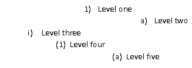
    
    在这个例子中，编号定义的每个级别的属性使得每个级别的段落任意缩进。然而，这仍然是一个完全可接受的编号定义，每个段落都代表了相同编号定义的后续级别。
    
    在抽象编号级别定义中，每个编号级别由一个lvl元素表示，该元素定义了单个编号级别的编号信息。编号级别指定以下属性：起始数字值、数字格式表示代码（例如，1与字符串字面量One）、相关联的段落样式、应使这个编号级别重新开始的前一个级别、编号文本、数字对齐方式、这个级别的段落属性缩进等。所有编号级别属性的完整定义可以在lvl元素的参考资料中找到。
    
    考虑WordprocessingML中的以下编号级别定义：
    
    ```xml
    <w:lvl w:ilvl="1">
        <w:start w:val="4"/>
        <w:nfc w:val="3"/>
        <w:pStyle w:val="Heading1"/>
        <w:lvlText w:val="BEFORE %2 AFTER %1 END"/>
        <w:lvlJc w:val="start"/>
        <w:pPr>
            <w:tabs>
                <w:tab w:val="num" w:pos="2880"/>
            </w:tabs>
            <w:ind w:left="288" w:firstLine="1152"/>
        </w:pPr>
    </w:lvl>
    ```
    
    这个特定的编号级别定义了以下信息：
    
    - 这是这个编号定义的第1级别（第二级别）
    - 从数字4开始
    - 使用数字格式3（翻译为1, 2, 3等）
    - 当使用这个级别时，应用Heading1样式
    - 对于这个编号使用以下级别文本：BEFORE %2 AFTER %1 END
    - 左对齐编号
    - 设置左缩进为288磅的二十分之一点，第一行缩进为1152磅的二十分之一点
    
    这些信息用于显示引用这个编号定义的第1级别的段落的编号。
    
    特别重要的是lvlText元素，它定义了每个编号级别的编号文本内容。它的语法允许在编号中放置任何字符串字面量（例如，ARTICLE在ARTICLE I, ARTICLE II, ARTICLE III等中），以及列表中当前级别或任何前一个级别的编号值。
    
    参考上面的编号级别定义，lvlText定义如下：
    
    ```xml
    <w:lvlText w:val="BEFORE %2 AFTER %1 END"/>
    ```
    
    这个级别文本指定了三个字符串字面量（BEFORE, AFTER, END）与文档中的第1级别和第0级别的当前编号值混合。因此，假设第0级别只是一个简单的数字，插入时将读取为：
    
    ```text
    1
        BEFORE 1 AFTER 1 END
        BEFORE 2 AFTER 1 END
        BEFORE 3 AFTER 1 END
    2
        BEFORE 1 AFTER 2 END
        BEFORE 2 AFTER 2 END
        …
    ```
    
    %1和%2值分别对应此列表的第0级别和第1级别的值。

=== "英文"

    An abstract numbering definition is the basis for all numbering information in a WordprocessingM document, as it defines the appearance and behavior of a specific set of numbered paragraphs in  document, and is defined using the abstractNum element. Although abstract numbering definition contain all of the numbering information for one type of numbering, they cannot be directly reference by content (hence their abstract designation), they must be inherited by a numbering definitio instance, which itself can be referenced by content. A specific abstract numbering definition i WordprocessingML can be divided into two parts:
    
    - Common numbering properties
    - Numbering levels
    
    The complete definition of all abstract numbering properties can be found in the reference for the abstractNum element.
    
    Common numbering properties refer to the properties that can be specified by all abstract numberin definitions regardless of their contents. Examples of common numbering properties include:  numbering ID (which uniquely identifies a numbering definition), the numbering definition type (singl level, multi-level, multi-level hybrid), the numbering name, and optional numbering style references, a discussed in detail later in this subclause.
    
    Consider the following example of an abstract numbering definition in a WordprocessingML document:
    
    ```xml
    <w:abstractNum w:abstractNumId="4">
        <w:nsid w:val="1DE04504" />
        <w:multiLevelType w:val="hybridMultilevel" />
        <w:lvl w:ilvl="0" w:tplc="0409000F">
            …
        </w:lvl>
        <w:lvl w:ilvl="1" w:tplc="04090019">
            …
        </w:lvl>
        <w:lvl w:ilvl="2" w:tplc="04090019">
            …
        </w:lvl>
        <w:lvl w:ilvl="3" w:tplc="0409000F">
            …
        </w:lvl>
        …
    </w:abstractNum>
    ```
    
    This numbering definition specifies two common properties: a numbering ID (using the nsid element) of 1DE04504, and a list type (using the multiLevelType element) of hybridMultilevel, which specifies that this abstract numbering definition is more than one level and contains multiple numbering formats.
    
    The other part of an abstract numbering definition is the specification of one or more numbering levels, each of which defines a unique set of formatting properties for one level in this numbering definition.
    
    Consider three numbered paragraphs that reference the same numbering definition, but each, in turn, reference a different level within that list:
    
    
    
    Although the paragraphs each reference the same abstract numbering definition (which is discussed later), each refers to a separate level within that abstract numbering definition, and therefore each has a unique set of paragraph and numbering properties.
    
    It is important to note that the concept of levels in an abstract numbering definition refers to the levels as defined in the file format, and in no way the logical indentation of numbered paragraphs within a WordprocessingML document.
    
    Consider another set of numbered paragraphs in WordprocessingML, where each subsequent paragraph is a different level but references the same abstract numbering definition:
    
    
    
    In this example, the properties of each level of the numbering definition is such that the paragraphs for each level are indented arbitrarily. However, this is still a completely acceptable numbering definition, and the paragraphs each represent subsequent levels of the same numbering definition.
    
    Within an abstract numbering level definition, each numbering level is represented by an lvl element that defines a single level of numbering information. Numbering levels specify the following properties: starting number value, a number format presentation code (e.g., 1 vs. the string literal One), an associated paragraph style, which previous level should cause this numbering level to restart, the numbering text, number justification, a paragraph properties indentation for this level, etc. The complete definition of all numbering level properties can be found on the reference for the lvl element.
    
    Consider the following numbering level definition in WordprocessingML:
    
    ```xml
    <w:lvl w:ilvl="1">
        <w:start w:val="4"/>
        <w:nfc w:val="3"/>
        <w:pStyle w:val="Heading1"/>
        <w:lvlText w:val="BEFORE %2 AFTER %1 END"/>
        <w:lvlJc w:val="start"/>
        <w:pPr>
            <w:tabs>
                <w:tab w:val="num" w:pos="2880"/>
            </w:tabs>
            <w:ind w:left="288" w:firstLine="1152"/>
        </w:pPr>
    </w:lvl>
    ```
    
    This particular numbering level defines the following information:
    
    - This is level 1 (the second level) for this numbering definition
    - Start at number 4
    - Use number format 3 (which translates to 1, 2, 3, and so on)
    - When this level is used, apply the Heading1 style
    - Use the following level text for the number: BEFORE %2 AFTER %1 END
    - Left justify the number
    - Set a left indent of 288 twentieths of a point, and a first line indent of 1152 twentieths of a point
    
    This information is used to display the number for paragraphs of level 1 the reference this numberin definition.
    
    Of particular significance is the lvlText element, which defines the content of the number text for each numbering level. Its syntax allows any string literal to be placed in the number (e.g., the ARTICLE in ARTICLE I, ARTICLE II, ARTICLE III, and so on), as well as the current value of the number for this or any previous level in the list.
    
    Referring to the numbering level definition above, the lvlText is defined as follows:
    
    ```xml
    <w:lvlText w:val="BEFORE %2 AFTER %1 END"/>
    ```
    
    This level text specifies three literal strings (BEFORE, AFTER, END) mixed with the current numbering value from level 1 and level 0 in the document. Therefore, assuming level 0 is just a simple number, when inserted it would read:
    
    ```text
    1
      BEFORE 1 AFTER 1 END
      BEFORE 2 AFTER 1 END
      BEFORE 3 AFTER 1 END
    2
      BEFORE 1 AFTER 2 END
      BEFORE 2 AFTER 2 END
      …
    ```
    
    The %1 and %2 values correspond to the value for level 0 and 1 of this list, respectively.


### L.1.10.4 编号定义实例

**Numbering Definition Instances**

=== "中文"

    编号定义实例是文档中可以被零个或多个段落引用的具体编号信息实例。编号定义实例使用 num 元素定义。WordprocessingML 中特定的编号定义实例可以分为两部分：
    
    - 抽象编号引用
    - （可选）级别覆盖
    
    所有编号定义实例属性的定义可以在 num 元素的参考资料中找到。
    
    编号定义实例中的必需信息是，实例必须使用 abstractNumId 元素引用一个抽象编号定义。该元素指定要继承的抽象编号定义信息的 abstractNumId 属性的值。
    
    考虑一个文档的 WordprocessingML，其中包含四个编号定义实例，其中两个引用相同的底层抽象编号定义：
    
    ```xml
    <w:numbering>
        …
        <w:num w:numId="2">
            <w:abstractNumId w:val="0" />
        </w:num>
        <w:num w:numId="3">
            <w:abstractNumId w:val="1" />
        </w:num>
        <w:num w:numId="4">
            <w:abstractNumId w:val="4" />
        </w:num>
        <w:num w:numId="5">
            <w:abstractNumId w:val="4" />
        </w:num>
    </w:numbering>
    ```
    
    如上所示，前两个编号定义实例分别引用了 abstractNumId 值 0 和 1，最后两个都引用了 abstractNumId 为 4 的抽象编号定义。
    
    编号定义实例的第二（可选）信息部分是使用 lvlOverride 元素的一个或多个编号级别覆盖。该元素指定应用于此实例继承的抽象编号定义中的零个或多个级别的一组可选覆盖。
    
    考虑一个从抽象编号定义（abstractNumId 为 4）继承信息的编号定义实例，但是希望对编号定义的级别 0 使用不同的属性集。生成的 WordprocessingML 将如下所示：
    
    ```xml
    <w:num w:numId="6">
        <w:abstractNumId w:val="4" />
        <w:lvlOverride w:ilvl="0">
            <w:lvl w:ilvl="0">
                <w:start w:val="4" />
                <w:lvlText w:val="%1)" />
                <w:lvlJc w:val="start" />
                <w:pPr>
                    <w:ind w:left="360" w:hanging="360" />
                </w:pPr>
            </w:lvl>
        </w:lvlOverride>
    </w:num>
    ```
    
    此级别用指定的编号属性集覆盖列表的级别 0，替换了抽象编号定义中的那些属性。

=== "英文"

    A numbering definition instance is a specific instantiation of numbering information that can be referenced by zero or more paragraphs within the document. A numbering definition instance is defined using the num element. A specific numbering definition instance in WordprocessingML can be divided into two parts:
    
    - An abstract numbering reference
    - (Optional) level overrides
    
    The definition of all numbering definition instance properties can be found on the reference for the num element.
    
    The required piece of information in a numbering definition instance, the instance must reference an abstract numbering definition using the abstractNumId element. This element specifies the value of the abstractNumId attribute for the inherited abstract numbering definition information.
    
    Consider the WordprocessingML for a document with four numbering definition instances, two of which reference the same underlying abstract numbering definition:
    
    ```xml
    <w:numbering>
        …
        <w:num w:numId="2">
            <w:abstractNumId w:val="0" />
        </w:num>
        <w:num w:numId="3">
            <w:abstractNumId w:val="1" />
        </w:num>
        <w:num w:numId="4">
            <w:abstractNumId w:val="4" />
        </w:num>
        <w:num w:numId="5">
            <w:abstractNumId w:val="4" />
        </w:num>
    </w:numbering>
    ```
    
    As shown above, the first two numbering definition instances reference abstractNumId values of 0 and 1 respectively, and the last two both reference the abstract numbering definition with an abstractNumId of 4.
    
    The second (and optional) piece of information for a numbering definition instance is one or more numbering level overrides using the lvlOverride element. This element specifies a set of optional overrides applied to zero or more levels from the abstract numbering definition inherited by this instance.
    
    Consider a numbering definition instance that inherits its information from the abstract numbering definition with abstractNumId of 4, but wishes to use a different set of properties for level 0 of the numbering definition. The resulting WordprocessingML would look like:
    
    ```xml
    <w:num w:numId="6">
        <w:abstractNumId w:val="4" />
        <w:lvlOverride w:ilvl="0">
            <w:lvl w:ilvl="0">
                <w:start w:val="4" />
                <w:lvlText w:val="%1)" />
                <w:lvlJc w:val="start" />
                <w:pPr>
                    <w:ind w:left="360" w:hanging="360" />
                </w:pPr>
            </w:lvl>
        </w:lvlOverride>
    </w:num>
    ```
    
    This level overrides level 0 of the list with the specified set of numbering properties, replacing those in the abtract numbering definition.


### L.1.10.5 将编号应用到段落

**Applying Numbering to Paragraphs**

=== "中文"

    一旦在编号部分定义了编号信息，就必须将这些信息与文档中的段落关联起来，以便在一个或多个内容段落上显示编号。
    
    为了实现这一点，编号段落通过段落属性元素（pPr元素）内的numPr元素来标识。段落内的编号属性是使用两个特定元素指定的，这两个元素指定要使用的编号定义信息：
    
    - 编号定义实例引用
    - 编号级别引用
    
    编号定义实例引用是使用numId元素指定的。这个元素包含了对编号部分中特定编号定义实例内的numId属性的引用，将此段落链接到该编号定义实例。
    
    编号级别引用是使用ilvl元素指定的。这个元素包含了对指定编号定义实例的级别信息中ilvl属性的引用，指定了此编号段落要使用的引用编号定义实例中的编号级别。
    
    考虑WordprocessingML文档中以下编号段落：
    
    这些四个编号段落都引用了相同的编号定义，生成了以下WordprocessingML：
    
    ```xml
    <w:p>
        <w:pPr>
            <w:numPr>
                <w:ilvl w:val="0" />
                <w:numId w:val="5" />
            </w:numPr>
        </w:pPr>
        <w:r>
            <w:t>第一级别项目一</w:t>
        </w:r>
    </w:p>
    <w:p>
        <w:pPr>
            <w:numPr>
                <w:ilvl w:val="1" />
                <w:numId w:val="5" />
            </w:numPr>
        </w:pPr>
        <w:r>
            <w:t>第二级别项目一</w:t>
        </w:r>
    </w:p>
    <w:p>
        <w:pPr>
            <w:numPr>
                <w:ilvl w:val="0" />
                <w:numId w:val="5" />
            </w:numPr>
        </w:pPr>
        <w:r>
            <w:t>第一级别项目二</w:t>
        </w:r>
    </w:p>
    <w:p>
        <w:pPr>
            <w:numPr>
                <w:ilvl w:val="1" />
                <w:numId w:val="5" />
            </w:numPr>
        </w:pPr>
        <w:r>
            <w:t>第二级别项目二</w:t>
        </w:r>
    </w:p>
    ```
    
    在这些编号段落中，通过ilvl元素及其val属性分别引用了编号定义的级别0和级别1，但是numId元素总是引用val为5的编号定义实例。
    
    当前文档中来自相同编号定义的段落使用此编号级别的lvlRestart元素中指定的级别时，任何特定编号级别的编号将重新启动。
    
    考虑WordprocessingML文档中一组编号段落，其中：
    
    - 第一级别设置为在每个级别0之后重新启动（lvlRestart为1）
    - 第二级别设置为永不重新启动（lvlRestart为0）
    
    正如示例所示，第一级别（a, b, c等）的编号在每个级别0使用后重新启动，但第二级别（i, ii, iii等）的编号永不重新启动。

=== "英文"

    Once numbering information is defined in the numbering part, this information must be associated with paragraphs within the document in order to display numbering on one or more paragraphs of content.
    
    To accomplish this, numbered paragraphs are identified by the numPr element within the paragraph's properties element (the pPr element). The numbering properties within a paragraph are specified using two specific elements that specify the numbering definition information to use:
    
    - A numbering definition instance reference
    - A numbering level reference
    
    The numbering definition instance reference is specified using the numId element. This element contains a reference to the numId attribute in a specific numbering definition instance within the numbering part, which links this paragraph to that numbering definition instance.
    
    The numbering level reference is specified using the ilvl element. This element contains a reference t the ilvl attribute in the specified numbering definition instance's level information, which specifies th numbering level within the referenced numbering definition instance to be used by this numbere paragraph.
    
    Consider the following numbered paragraphs in a WordprocessingML document:
    
    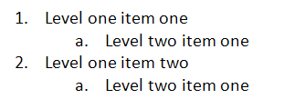
    
    These four numbered paragraphs, all referencing the same numbering definition, produce the following WordprocessingML:
    
    ```xml
    <w:p>
        <w:pPr>
            <w:numPr>
            <w:ilvl w:val="0" />
            <w:numId w:val="5" />
            </w:numPr>
        </w:pPr>
        <w:r>
            <w:t>Level one item one</w:t>
        </w:r>
    </w:p>
    <w:p>
        <w:pPr>
            <w:numPr>
            <w:ilvl w:val="1" />
            <w:numId w:val="5" />
            </w:numPr>
        </w:pPr>
        <w:r>
            <w:t>Level two item one</w:t>
        </w:r>
    </w:p>
    <w:p>
        <w:pPr>
            <w:numPr>
            <w:ilvl w:val="0" />
            <w:numId w:val="5" />
            </w:numPr>
        </w:pPr>
        <w:r>
            <w:t>Level one item two</w:t>
        </w:r>
    </w:p>
    <w:p>
        <w:pPr>
            <w:numPr>
            <w:ilvl w:val="1" />
            <w:numId w:val="5" />
            </w:numPr>
        </w:pPr>
        <w:r>
            <w:t>Level two item one</w:t>
        </w:r>
    </w:p>
    ```
    
    In these numbered paragraphs, level 0 and 1 of the numbering definition are referenced through the ilvl element with a val attribute of 0 or 1, respectively, however, the numId element always references the numbering definition instance with a val of 5.
    
    The numbering at any particular numbering level is restarted when a paragraph in the current document from the same numbering definition uses the level specified in the lvlRestart element for this numbering level.
    
    Consider a set of numbered paragraphs in a WordprocessingML document where:
    
    - Level 1 is set to restart after each level 0 (lvlRestart of 1)
    - Level 2 is set to never restart (lvlRestart of 0)
    
    
    
    As the example shows, the numbering at level 1 (a, b, c, and so on) restarts after each level 0 is used, but level 2 (i, ii, iii, and so on) never restarts.


### L.1.10.6 完整故事

**The Complete Story**

=== "中文"

    总结文档中编号信息的使用，段落属性指定了一个 numPr 元素，该元素通过 numId 元素引用一个编号定义实例。编号定义实例通过 abstractNumId 元素指定继承的抽象编号定义。然后，段落还使用 ilvl 元素从编号定义实例中指定列表级别。
    
    考虑以下 WordprocessingML 中的编号段落：
    
    ```xml
    <w:p>
        <w:pPr>
            <w:numPr>
                <w:ilvl w:val="0" />
                <w:numId w:val="5" />
            </w:numPr>
        </w:pPr>
        <w:r>
            <w:t>Numbered paragraph</w:t>
        </w:r>
    </w:p>
    ```
    
    基于 numId 为 5，段落使用了 numId 为 5 的编号定义实例：
    
    ```xml
    <w:numbering>
        …
        <w:num w:numId="5">
            <w:abstractNumId w:val="4" />
        </w:num>
    </w:numbering>
    ```
    
    基于 abstractNumId 为 4，该实例继承了 abstractNumId 为 4 的抽象编号定义：
    
    ```xml
    <w:numbering>
        <w:abstractNum w:abstractNumId="4">
            <w:nsid w:val="FFFFFF7F" />
            <w:multiLevelType w:val="singleLevel" />
            <w:lvl w:ilvl="0">
                <w:start w:val="1" />
                <w:lvlText w:val="%1." />
                <w:lvlJc w:val="start" />
                <w:pPr>
                <w:tabs>
                    <w:tab w:val="num" w:pos="720" />
                </w:tabs>
                <w:ind w:left="720" w:hanging="360" />
                </w:pPr>
            </w:lvl>
        </w:abstractNum>
        …
    </w:numbering>
    ```
    
    由于编号定义实例没有为 ilvl 0 指定覆盖，所以应用了抽象编号定义中相应级别的定义到文本中。

=== "英文"

    To summarize the use of numbering information in a document, the paragraph properties specify a numPr element, which references a numbering definition instance via the numId element. The numbering definition instance specifies an inherited abstract numbering definition via the abstractNumId element. The paragraph then also specifies the list level from the numbering definition instance using the ilvl element.
    
    Consider the following WordprocessingML for a numbered paragraph:
    
    ```xml
    <w:p>
        <w:pPr>
            <w:numPr>
            <w:ilvl w:val="0" />
            <w:numId w:val="5" />
            </w:numPr>
        </w:pPr>
        <w:r>
            <w:t>Numbered paragraph</w:t>
        </w:r>
    </w:p>
    ```
    
    Based on the numId of 5, the paragraph uses the numbering definition instance with a numId of 5:
    
    ```xml
    <w:numbering>
        …
        <w:num w:numId="5">
            <w:abstractNumId w:val="4" />
        </w:num>
    </w:numbering>
    ```
    
    Based on the abstractNumId of 4, this instance inherits the abstract numbering definition with an abstractNumId of 4:
    
    ```xml
    <w:numbering>
        <w:abstractNum w:abstractNumId="4">
            <w:nsid w:val="FFFFFF7F" />
            <w:multiLevelType w:val="singleLevel" />
            <w:lvl w:ilvl="0">
                <w:start w:val="1" />
                <w:lvlText w:val="%1." />
                <w:lvlJc w:val="start" />
                <w:pPr>
                <w:tabs>
                    <w:tab w:val="num" w:pos="720" />
                </w:tabs>
                <w:ind w:left="720" w:hanging="360" />
                </w:pPr>
            </w:lvl>
        </w:abstractNum>
        …
    </w:numbering>
    ```
    
    Since the numbering definition instance does not specify an override for ilvl 0, the definition for the corresponding level from the abstract numbering definition is applied to the text.


### L.1.10.7 编号样式

**Numbering Styles**

=== "中文"

    如样式子句（[§L.1.8]）中所述，编号样式是样式定义，它在文档中为多级编号格式指定通用的格式化属性。这意味着样式部分中的编号样式定义只定义了一个属性：使用 numPr 元素内的 numId 元素引用存储在文档编号部分的编号定义实例。那个编号定义实例指定了一个抽象的编号样式，其中包含了编号样式的编号级别信息。它还通过 styleLink 元素反向引用编号样式的 styleId 属性，指定它是编号样式的基础。
    
    与段落和字符样式不同，编号样式永远不会被文档中的内容直接引用——相反，一个抽象的编号定义指定它包含编号样式的基本编号信息，一个或多个编号定义实例引用那个抽象编号定义。

=== "英文"

    As stated earlier in the styles subclause ([§L.1.8]), numbering styles are style definitions which specify common formatting properties for a multi-level numbering format within a document. This means that a numbering style definition in the styles part defines only a single property: a reference to a numbering definition instance stored in the document’s numbering part, using the numId element within the numPr element. That numbering definition instance specifies an abstract numbering style, which contains the numbering level information for the numbering style. It also specifies that it is the basis for the numbering style by back-referencing the numbering style's styleId attribute via the styleLink element.
    
    Unlike paragraph and character styles, numbering styles are never directly referenced by content in the document—instead, an abstract numbering definition specifies that it contains the underlying numbering information for a numbering style, and one or more numbering definition instances reference that abstract numbering definition.

### L.1.10.8 引用编号样式

**Referencing Numbering Styles**

=== "中文"

    要在文档中使用编号样式，一个或多个段落的段落属性再次指定一个 numPr 元素，该元素通过 numId 元素引用一个编号定义实例。编号定义实例本身再次通过 abstractNumId 元素指定继承的抽象编号定义。
    
    在这个阶段，抽象编号定义通过以下方式之一指定它是基于编号样式的：
    
    - 抽象编号样式不包含级别数据，只通过 numStyleLink 元素指定对编号样式的 styleId 属性的引用。
    - 抽象编号样式包含编号样式的编号级别信息，并通过 styleLink 元素引用编号样式的 styleId 属性，指定它是编号样式的基础。
    
    尽管每种方法的结果相同，但以下两个示例分别说明了每种语法：
    
    考虑第一种编号样式语法，其中段落的编号基于一个抽象编号定义，该定义仅通过 numStyleLink 引用编号样式。段落的内容将包括以下内容：
    
    ```xml
    <w:p>
        <w:pPr>
            <w:numPr>
                <w:ilvl w:val="0" />
                <w:numId w:val="6" />
            </w:numPr>
        </w:pPr>
        <w:r>
            <w:t>这个段落通过 numStyleLink 引用了一个编号样式。</w:t>
        </w:r>
    </w:p>
    ```
    
    numId 元素引用了一个值为 6 的编号定义实例，位于编号部分：
    
    ```xml
    <w:num w:numId="6">
        <w:abstractNumId w:val="0" />
    </w:num>
    ```
    
    基于 abstractNumId 为 0，此实例继承了 abstractNumId 为 0 的抽象编号定义：
    
    ```xml
    <w:abstractNum w:abstractNumId="0">
        <w:nsid w:val="38901FA4" />
        <w:multiLevelType w:val="multilevel" />
        <w:numStyleLink w:val="TestNumberingStyle" />
    </w:abstractNum>
    ```
    
    这个抽象编号定义不包含编号信息 - 它只是通过引用该样式上的 styleId 属性，指出它从编号样式 TestNumberingStyle 继承了编号信息：
    
    ```xml
    <w:style w:type="numbering" w:styleId="TestNumberingStyle">
        <w:name w:val="Test Numbering Style" />
        <w:uiPriority w:val="99" />
        <w:rsid w:val="00DB3C4B" />
        <w:pPr>
            <w:numPr>
                <w:numId w:val="4" />
            </w:numPr>
        </w:pPr>
    </w:style>
    ```
    
    样式通过 numId 元素引用了一个编号定义实例：
    
    ```xml
    <w:num w:numId="4">
        <w:abstractNumId w:val="2" />
    </w:num>
    ```
    
    基于 abstractNumId 为 2，此实例继承了 abstractNumId 为 2 的抽象编号定义：
    
    ```xml
    <w:abstractNum w:abstractNumId="2">
        <w:nsid w:val="46364EB7" />
        <w:multiLevelType w:val="multilevel" />
        <w:styleLink w:val="TestNumberingStyle" />
        <w:lvl w:ilvl="0">
            <w:lvlText w:val="%1 %1 %1" />
            <w:lvlJc w:val="start" />
            <w:pPr>
                <w:tabs>
                    <w:tab w:val="num" w:pos="360" />
                </w:tabs>
                <w:ind w:left="0" w:firstLine="0" />
            </w:pPr>
        </w:lvl>
        …
    </w:abstractNum>
    ```
    
    这个抽象编号定义为编号格式的每个级别定义了属性（级别 1 到 9 为简洁起见省略）。由于两个编号定义实例都没有为级别 0 指定覆盖，所以来自抽象编号格式 2 的属性被应用到结果编号定义实例的级别 0，并通过对 ilvl 元素应用到文本。
    
    考虑第二种编号样式语法，其中段落的编号基于一个抽象编号定义，该定义定义了编号信息，并通过 styleLink 引用编号样式。段落的内容将包括以下内容：
    
    ```xml
    <w:p>
        <w:pPr>
            <w:numPr>
                <w:ilvl w:val="0" />
                <w:numId w:val="4" />
            </w:numPr>
        </w:pPr>
        <w:r>
            <w:t>这个段落通过 styleLink 引用了一个编号样式。</w:t>
        </w:r>
    </w:p>
    ```
    
    numId 元素引用了一个值为 4 的编号定义实例，位于编号部分：
    
    ```xml
    <w:num w:numId="4">
        <w:abstractNumId w:val="2" />
    </w:num>
    ```
    
    基于 abstractNumId 为 2，此实例继承了 abstractNumId 为 2 的抽象编号定义：
    
    ```xml
    <w:abstractNum w:abstractNumId="2">
        …
    </w:abstractNum>
    ```
    
    这个抽象编号定义定义了编号格式的每个级别的属性（为简洁起见省略了级别 1 到 9），并通过 styleLink 元素引用了编号样式的 styleId，指定它是编号格式的基础编号信息。由于编号定义实例没有为级别 0 指定覆盖，所以来自抽象编号格式 2 的属性被应用到结果编号定义实例的级别 0，并通过 ilvl 元素应用到文本。

=== "英文"

    To use a numbering style in a document, the paragraph properties for one or more paragraphs again specify a numPr element, which references a numbering definition instance via the numId element. The numbering definition instance itself again specifies an inherited abstract numbering definition via the abstractNumId element.
    
    At this stage, the abstract numbering definition specifies that it is based on a numbering style via either of the following:
    
    - The abstract numbering style contains no level data, and simply specifies a reference to the numbering style's styleId attribute via the numStyleLink element.
    - The abstract numbering style contains the numbering level information for the numbering style, and specifies that it is the basis for the numbering style by referencing the numbering style's styleId attribute via the styleLink element. 
    
    Although the result of each method is identical, the following two examples illustrate each of the syntaxes:
    
    Consider the first numbering style syntax, in which the numbering on a paragraph is based on an abstract numbering definition which simply references the numbering style via numStyleLink. The contents of the paragraph would consist of the following:
    
    ```xml
    <w:p>
        <w:pPr>
            <w:numPr>
            <w:ilvl w:val="0" />
            <w:numId w:val="6" />
            </w:numPr>
        </w:pPr>
        <w:r>
            <w:t>This paragraph references a numbering style via
                numStyleLink.</w:t>
        </w:r>
    </w:p>
    ```
    
    The numId element references a numbering definition instance with a value of 6, located in the numbering part:
    
    ```xml
    <w:num w:numId="6">
        <w:abstractNumId w:val="0" />
    </w:num>
    ```
    
    Based on the abstractNumId of 0, this instance inherits the abstract numbering definition with an abstractNumId of 0:
    
    ```xml
    <w:abstractNum w:abstractNumId="0">
        <w:nsid w:val="38901FA4" />
        <w:multiLevelType w:val="multilevel" />
        <w:numStyleLink w:val="TestNumberingStyle" />
    </w:abstractNum>
    ```
    
    This abstract numbering definition contains no numbering information - it simply notes that it inherits the numbering information from the numbering style TestNumberingStyle by referencing the styleId attribute on that style:
    
    ```xml
    <w:style w:type="numbering" w:styleId="TestNumberingStyle">
        <w:name w:val="Test Numbering Style" />
        <w:uiPriority w:val="99" />
        <w:rsid w:val="00DB3C4B" />
        <w:pPr>
            <w:numPr>
                <w:numId w:val="4" />
            </w:numPr>
        </w:pPr>
    </w:style>
    ```
    
    The style references a numbering definition instance, again via the numId element:
    
    ```xml
    <w:num w:numId="4">
    <w:abstractNumId w:val="2" />
    </w:num>
    ```
    
    Based on the abstractNumId of 2, this instance inherits the abstract numbering definition with an abstractNumId of 2:
    
    ```xml
    <w:abstractNum w:abstractNumId="2">
        <w:nsid w:val="46364EB7" />
        <w:multiLevelType w:val="multilevel" />
        <w:styleLink w:val="TestNumberingStyle" />
        <w:lvl w:ilvl="0">
            <w:lvlText w:val="%1 %1 %1" />
            <w:lvlJc w:val="start" />
            <w:pPr>
                <w:tabs>
                    <w:tab w:val="num" w:pos="360" />
                </w:tabs>
                <w:ind w:left="0" w:firstLine="0" />
            </w:pPr>
        </w:lvl>
        …
    </w:abstractNum>
    ```
    
    This abstract numbering definition defines the properties for each level of the numbering format (levels 1 through 9 omitted for brevity). Since neither of the numbering definition instances specified overrides for level 0, the properties from abstract numbering format 2 are applied to level 0 in the resulting numbering definition instance and are applied to the text via the ilvl element.
    
    Consider the second numbering style syntax, in which the numbering on a paragraph is based on an abstract numbering definition which defines the numbering information and references the numbering style via styleLink. The contents of the paragraph would consist of the following:
    
    ```xml
    <w:p>
    <w:pPr>
    <w:numPr>
    <w:ilvl w:val="0" />
    <w:numId w:val="4" />
    </w:numPr>
    </w:pPr>
    <w:r>
    <w:t>This paragraph references a numbering style via styleLink.</w:t>
    </w:r>
    </w:p>
    ```
    
    The numId element references a numbering definition instance with a value of 4, located in the numbering part:
    
    ```xml
    <w:num w:numId="4">
    <w:abstractNumId w:val="2" />
    </w:num>
    ```
    
    Based on the abstractNumId of 2, this instance inherits the abstract numbering definition with an abstractNumId of 2:
    
    ```xml
    <w:abstractNum w:abstractNumId="2">
        <w:nsid w:val="46364EB7" />
        <w:multiLevelType w:val="multilevel" />
        <w:styleLink w:val="TestNumberingStyle" />
        <w:lvl w:ilvl="0">
            <w:lvlText w:val="%1 %1 %1" />
            <w:lvlJc w:val="start" />
            <w:pPr>
                <w:tabs>
                    <w:tab w:val="num" w:pos="360" />
                </w:tabs>
                <w:ind w:left="0" w:firstLine="0" />
            </w:pPr>
        </w:lvl>
        …
    </w:abstractNum>
    ```
    
    This abstract numbering definition defines the properties for each level of the numbering format (levels 1 through 9 omitted for brevity) and specifies that it is the underlying numbering information for a numbering format by referencing the styleId of that numbering style via the styleLink element. Since the numbering definition instances specified no override for level 0, the properties from abstract numbering format 2 are applied to level 0 in the resulting numbering definition instance and are applied to the text via the ilvl element.


## L.1.11 页眉和页脚

**Headers and Footers**

=== "中文"
    
    *页眉*和*页脚*指的是可以出现在WordprocessingML文档每个页面顶部或底部的文本、图形或数据（例如页码、日期、文档标题等）。
    
    页眉出现在页面的上边距（页面主内容的上方），而页脚出现在文档页面的下边距（页面主内容的下方）；例如：
        
    
    
    由于WordprocessingML是基于流程的格式，通过指定文档中特定节的所有页面的页眉和页脚来应用它们。

=== "英文"
    
    *Headers* and *footers* refer to text, graphics, or data (such as page number, date, document title, and so on) that can appear at the top or bottom of each page in a WordprocessingML document. 
    
    A header appears in the top margin (above the main document content on the page), while a footer appears in the bottom margin of a document page (below the main document content on the page); for example:
    
    
    
    Since WordprocessingML is a flow-based format, headers and footers are applied by specifying the headers and footers for all pages in a particular section of a document.

### L.1.11.1 页眉部分

**Header Part**

=== "中文"
    
    WordprocessingML文档中的页眉信息存储在包内的页眉部分，该部分通过与主文档部分或术语表文档部分的隐式关系存储，关系类型为http://purl.oclc.org/ooxml/officeDocument/relationships/header，内容类型为vnd-openxmlformats.officedocument.wordprocessingml-header+xml。

=== "英文"

    Header information in a WordprocessingML document is stored in a header part within the package, which is stored via an implicit relationship from the Main Document part or the Glossary Document part of relationship type http://purl.oclc.org/ooxml/officeDocument/relationships/header and has a content type of vnd-openxmlformats.officedocument.wordprocessingml-header+xml.

### L.1.11.2 页脚部分

**Footer Part**

=== "中文"
    
    WordprocessingML文档中的页脚信息存储在包内的页脚部分，该部分通过与主文档部分或术语表文档部分的隐式关系存储，关系类型为`http://purl.oclc.org/ooxml/officeDocument/relationships/footer`，内容类型为`vnd-openxmlformats.officedocument.wordprocessingml-footer+xml`。

=== "英文"

    Footer information in a WordprocessingML document is stored in a footer part within the package, which is stored via an implicit relationship from the Main Document part or the Glossary Document part of relationship type http://purl.oclc.org/ooxml/officeDocument/relationships/footer and has a content type of vnd-openxmlformats.officedocument.wordprocessingml-footer+xml.

### L.1.11.3 页眉和页脚

**Headers and Footers**

=== "中文"

    正如上文所述，页眉和页脚信息存储在包内的一个个页眉或页脚部分中。
    
    hdr 元素定义了文档的单个页眉，而 ftr 元素定义了文档的单个页脚。页眉和页脚在 WordprocessingML 中只是另一个文档故事。在页眉或页脚的根元素内，元素的内容与文档主体元素的内容相似，并包含所谓的*区块级标记*——可以在 WordprocessingML 文档中作为段落的同级元素存在的标记。
    
    在文档的每个节中，可以有最多三种不同类型的页眉和页脚：
    
    - 第一页页眉/页脚
    - 奇数页页眉/页脚
    - 偶数页页眉/页脚
    
    *第一页页眉*和*页脚*指定了一个必须出现在节的第一页的独特的页眉或页脚。*奇数页页眉*和*页脚*指定了一个必须出现在给定节的所有奇数页上的独特的页眉和页脚。*偶数页页眉*和*页脚*指定了一个必须出现在给定节的所有偶数页上的独特页眉和页脚。
    
    不同的页眉或页脚对于像书籍这样的装订文档非常有用，如下图所示。
    
    
    
    考虑以下简单的单页文档，其中包含一个页眉：
    
    
    
    此文档定义了一个包含文本 "Header" 的页眉。页眉的内容存储在一个独特的页眉部分中。生成的页眉由以下 WordprocessingML 表示：
    
    ```xml
    <w:hdr>
        <w:p>
            <w:r>
                <w:t>Header</w:t>
            </w:r>
        </w:p>
    </w:hdr>
    ```
    
    由于页眉是区块级内容的容器，所有区块级内容都可以在其中使用。在这个特定的例子中，内容是单个段落。
    
    考虑一个更复杂的三页文档，其中定义了不同的第一页、奇数页和偶数页页眉：
    
    
    
    此文档定义了三个页眉，存储在三个不同的页眉部分中。生成的页眉由以下 WordprocessingML 表示：
    
    第一页页眉部分：
    
    ```xml
    <w:hdr>
        <w:p>
            <w:r>
                <w:t>First</w:t>
            </w:r>
        </w:p>
    </w:hdr>
    ```
    
    偶数页页眉部分：
    
    ```xml
    <w:hdr>
        <w:p>
            <w:r>
                <w:t>Even</w:t>
            </w:r>
        </w:p>
    </w:hdr>
    ```
    
    奇数页页眉部分：
    
    ```xml
    <w:hdr>
        <w:p>
            <w:r>
                <w:t>Odd</w:t>
            </w:r>
        </w:p>
    </w:hdr>
    ```

=== "英文"

    As described above, header and footer information is stored in one or more header or footer parts within the package.
    
    The hdr element defines a single header for the document, while the ftr element defines a single footer for the document. Headers and footers are just another document story in WordprocessingML. Within the root element of the header or footer, the content of the element is similar to the content of the body element, and contains what is referred to as *block-level markup* —markup that can exist as a sibling element to paragraphs in a WordprocessingML document.
    
    Within each section of a document there can be up to three different types of headers and footers:
    
    - First page header/footer
    - Odd page header/footer
    - Even page header/footer
    
    *First page headers* and *footers* specify a unique header or footer that must appear on the first page of a section. *Odd page headers* and *footers* specify a unique header and footer that must appear on all odd numbered pages for a given section. *Even page headers* and *footers* specify a unique header and footer that must appear on all even numbered pages in a given section.
    
    Different headers or footers can be useful for bounded documents like books, as shown in the figure below.
    
    
    
    Consider the following simple one-page document with one header:
    
    
    
    This document defines one header with the text Header. The header's content is stored in a unique Header part. The resulting header is represented by the following WordprocessingML:
    
    ```xml
    <w:hdr>
        <w:p>
            <w:r>
                <w:t>Header</w:t>
            </w:r>
        </w:p>
    </w:hdr>
    ```
    
    Since headers are containers of block level contents, all block level contents can be used within them. In this particular example, the content is a single paragraph.
    
    Consider a more complex three-page document with different first, odd, and even page headers defined:
    
    
    
    This document defines three headers stored in three different header parts. The resulting headers are represented by the following WordprocessingML:
    
    First page header part:
    
    ```xml
    <w:hdr>
        <w:p>
            <w:r>
                <w:t>First</w:t>
            </w:r>
        </w:p>
    </w:hdr>
    ```
    
    Even page header part:
    
    ```xml
    <w:hdr>
        <w:p>
            <w:r>
                <w:t>Even</w:t>
            </w:r>
        </w:p>
    </w:hdr>
    ```
    
    Odd page header part:
    
    ```xml
    <w:hdr>
        <w:p>
            <w:r>
                <w:t>Odd</w:t>
            </w:r>
        </w:p>
    </w:hdr>
    ```


### L.1.11.4 多个节

**Multiple Sections**

=== "中文"

    文档可以拥有多个节，每个节可以定义多达三个页眉和页脚。默认情况下，除了第一节外，其他节会继承前一节的页眉和页脚引用，除非该节指定了页眉和页脚引用。
    
    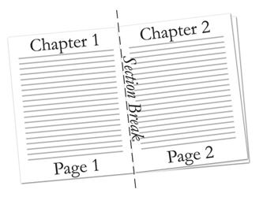
    
    考虑一个两页、两节的文档，只定义了第一节的页眉。该文档定义了一个页眉，并在第一节中引用了它。文档由以下 WordprocessingML 表示：
    
    ```xml
    <w:body>
        …
        <w:p>
            <w:pPr>
                <w:sectPr>
                    <w:headerReference r:id="rId6" />
                    …
                </w:sectPr>
            </w:pPr>
            …
        </w:p>
        …
        <w:sectPr>
            …
        </w:sectPr>
    </w:body>
    ```
    
    第二节没有明确引用页眉。相反，第二节继承了前一节的页眉。

=== "英文"

    Documents are capable of having multiple sections, where each section can define up to three headers and footers. By default, sections other than the first section inherit the previous header and footer references, unless that section specifies header and footer references.
    
    
    
    Consider a two-page, two-section document with only the first section header defined. This document defines one header that is referenced in the first section. The document is represented by the following WordprocessingML:
    
    ```xml
    <w:body>
        …
        <w:p>
            <w:pPr>
                <w:sectPr>
                    <w:headerReference r:id="rId6" />
                    …
                </w:sectPr>
            </w:pPr>
            …
        </w:p>
        …
        <w:sectPr>
            …
        </w:sectPr>
    </w:body>
    ```
    
    The second section does not explicitly reference a header. Instead, the second section inherits the header from the previous section.

### L.1.11.5 空页眉或页脚

**Empty Header or Footer**

=== "中文"

    在文档中，除了第一节之外，不指定某个节的页眉和页脚引用会导致该节继承前一节的页眉和页脚引用。为了声明一个空的页眉或页脚，必须创建一个引用到空（null）页眉或页脚的关系，如下所示：
    
    ```xml
    <Relationship Id="rId2" Type="http://…/header" Target="null" />
    ```
    
    这里的“null”属性值指定了不应该从前一节继承页眉或页脚，而应该显式地使用一个空白的页眉或页脚。

=== "英文"

    Not specifying a header and footer reference in a section, other than the first section, causes the document to inherit the previous section's header and footer references. In order to declare an empty header or footer, a header or footer reference must be made to a null header or footer relationship, as follows:
    
    ```xml
    <Relationship Id="rId2" Type="http:// …/header" Target="null" />
    ```
    
    The null attribute value specifies that the header or footer must not be inherited from the previous section, and a blank header or footer must explicitly be used.


## L.1.12 脚注和尾注

**Footnotes and Endnotes**

=== "中文"

    脚注和尾注是用于文档和书籍中的独立文本故事，用于显示借用材料的来源，或者输入不打断文档正常阅读流程的解释性或补充信息。
    
    脚注通常位于页面底部或被引用文本下方，尾注通常放在文档或节的末尾。如果文档被划分为一个或多个节，每个节的文档可以包含尾注。
    
    脚注和尾注都由两部分组成：
    
    - 正文中的注释引用标记，表示有附加信息在脚注或尾注中，每个都有一个编号系统，告诉读者是否要在页面末尾或文档或节的末尾查找注释。
    - 实际的脚注或尾注故事内容。
    
    以下是一个文档中应用脚注的示例：
    
    
    
    注释引用标记跟在被注释文本之后，指定有相关的脚注信息；脚注本身位于当前页面的底部。
    
    考虑以下文档中应用尾注的示例：
    
    
    
    注释引用标记跟在被注释文本之后，指定有相关的尾注信息；尾注本身位于当前节的末尾。

=== "英文"

    Footnotes and endnotes are separate text stories used in documents and books to show the source of borrowed material or to enter explanatory or supplementary information that does not interrupt the normal reading flow of the document.
    
    Footnotes are typically located at the bottom of a page or beneath text being referenced, and endnotes are typically placed at the end of a document or at the end of a section. If document has been divided up into one or more sections, each section of a document can contain endnotes.
    
    Both footnotes and endnotes consist of two parts:
    
    - A note reference mark in the body text to indicate that additional information is in a footnote or endnote, with a numbering system used for each to tell readers whether to look for the note at the end of the page or the end of the document or section.
    - The actual footnote or endnote story content.
    
    Here's an example of a footnote applied to text in a document:
    
    
    
    The note reference mark follows the noted text and specifies that there is associated footnote information; the footnote itself is at the bottom of the current page.
    
    Consider the following example of an endnote applied to text in a document:
    
    
    
    The note reference mark follows the noted text and specifies that there is associated endnote information; the endnote itself is at the end of the current section.

### L.1.12.1 脚注部件

**Footnote Part**

=== "中文"
        
    WordprocessingML文档中的脚注信息存储在包内的脚注部分，该部分通过与主文档部分或术语表文档部分的隐式关系存储，关系类型为`http://purl.oclc.org/ooxml/officeDocument/relationships/footnotes`，内容类型为`vnd-openxmlformats.officedocument.wordprocessingml-footnotes+xml`。

=== "英文"
    
    Footnote information in a WordprocessingML document is stored in the footnotes part within the package, which is stored via an implicit relationship from the Main Document part or Glossary Document part of relationship type http://purl.oclc.org/ooxml/officeDocument/relationships/footnotes and has a content type of vnd-openxmlformats.officedocument.wordprocessingml- footnotes+xml.

### L.1.12.2 尾注部件

**Endnote Part**

=== "中文"
    
    WordprocessingML文档中的尾注信息存储在包内的尾注部分，该部分通过与主文档部分或术语表文档部分的隐式关系存储，关系类型为`http://purl.oclc.org/ooxml/officeDocument/relationships/endnotes`，内容类型为`vnd-openxmlformats.officedocument.wordprocessingml-endnotes+xml`。

=== "英文"

    Endnote information in a WordprocessingML document is stored in the Endnotes part within the package, which is stored via an implicit relationship from the Main Document part or Glossary Document part of relationship type http://purl.oclc.org/ooxml/officeDocument/relationships/endnotes and has a content type of vnd-openxmlformats.officedocument.wordprocessingml- endnotes+xml.

### L.1.12.3 脚注和尾注

**Footnotes and Endnotes**

=== "中文"

    正如上文所述，脚注和尾注信息存储在包内相应的脚注和尾注部分中。下面的脚注元素指定了文档的三个或更多脚注，每个脚注由 footnote 元素标识。尾注元素指定了文档的三个或更多尾注，每个尾注由 endnote 元素标识。每个脚注或尾注元素都与一个唯一 ID 关联，由属性 id 指定。
    
    考虑在脚注部分定义的三种不同类型的脚注，每种都由 footnote 元素标识。每种脚注的使用方式在下一小节中定义：
    
    ```xml
    <w:footnotes …>
        <w:footnote w:type="separator" w:id="0">
            …
        </w:footnote>
        <w:footnote w:type="continuationSeparator" w:id="1">
            …
        </w:footnote>
        <w:footnote w:id="2">
            …
        </w:footnote>
    </w:footnotes>
    ```
    
    类似地，考虑在尾注部分定义的三种不同类型的尾注，每种都由 endnote 元素标识。每种尾注的使用方式在下一小节中定义：
    
    ```xml
    <w:endnotes …>
        <w:endnote w:type="separator" w:id="0">
            …
        </w:endnote>
        <w:endnote w:type="continuationSeparator" w:id="1">
            …
        </w:endnote>
        <w:endnote w:id="2">
            …
        </w:endnote>
    </w:endnotes>
    ```
    
    脚注和尾注只是 WordprocessingML 中另一种段落。在脚注或尾注元素内，脚注或尾注可以包含任何有效的区块级内容，这些内容由 WordprocessingML 架构定义。

=== "英文"

    As described above, footnote and endnote information is stored in the corresponding footnotes and endnotes part within the package. The footnotes element below specifies three or more footnotes, each identified by the footnote element, for the document. The endnotes element specifies three or more endnotes, each identified by the endnote element, for the document. Each footnote or endnote element is associated with a unique ID, specified by the attribute id.
    
    Consider three different types of footnotes, each identified by a footnote element, defined in the Footnotes part. The use of each type of footnote is defined in the next subclause:
    
    ```xml
    <w:footnotes …>
        <w:footnote w:type="separator" w:id="0">
            …
        </w:footnote>
        <w:footnote w:type="continuationSeparator" w:id="1">
            …
        </w:footnote>
        <w:footnote w:id="2">
            …
        </w:footnote>
    </w:footnotes>
    ```
    
    Similarly consider three different types of endnotes, each identified by an endnote element, defined in the Endnotes part. The use of each type of endnote is defined in the next subclause:
    
    ```xml
    <w:endnotes …>
        <w:endnote w:type="separator" w:id="0">
            …
        </w:endnote>
        <w:endnote w:type="continuationSeparator" w:id="1">
            …
        </w:endnote>
        <w:endnote w:id="2">
            …
        </w:endnote>
    </w:endnotes>
    ```
    
    Footnotes and endnotes are just another kind of paragraph in WordprocessingML. Within the footnote or endnote element, the footnote or endnote can contain any valid block-level content, as defined by the WordprocessingML schema.


### L.1.12.4 脚注和尾注类型

**Footnote and Endnote Types**

=== "中文"

    文档中有四种不同类型的脚注和尾注：
    
    - 普通 – 包含文档中任何脚注（或尾注）的文本。
    - 分隔符 – 定义用于将脚注（或尾注）与文档文本分隔开的分隔符。
    - 续行分隔符 – 当脚注或尾注从上一页继续时，定义用于将脚注或尾注与文档文本分隔开的分隔符。
    - 续行通知 – 定义通知文本，让读者知道脚注（或尾注）已延续到下一页。
    
    类型属性指定脚注或尾注的类型。普通脚注或尾注通过类型属性值为普通或省略类型属性来指定。同时，必须在脚注或尾注定义中存在脚注引用标记，由 footnoteRef 元素指定，或尾注引用标记，由 endnoteRef 元素指定。
    
    考虑以下文档中的一页，其中一些文本在页末被脚注引用：
    
    页末的脚注文本是普通类型的脚注，由以下 WordprocessingML 表示：
    
    ```xml
    <w:footnote w:id="2">
        <w:p>
            <w:pPr>
                <w:pStyle w:val="FootnoteText" />
            </w:pPr>
            <w:r>
                <w:rPr>
                    <w:rStyle w:val="FootnoteReference" />
                </w:rPr>
                <w:footnoteRef />
            </w:r>
            <w:r>
                <w:t>Cool reference</w:t>
            </w:r>
        </w:p>
    </w:footnote>
    ```
    
    在脚注元素中不指定任何类型属性，默认为普通类型的脚注。在这个例子中，脚注有一个独特的 ID 2。脚注的文本包含在文本运行中。像任何段落一样，脚注可以与特定的样式关联，在这个例子中，段落使用了 FootnoteText 段落样式。同样，像任何运行一样，脚注可以与特定的样式关联，在这个例子中，运行使用了 FootnoteReference 运行样式。
    
    分隔符脚注或尾注由 separator 指定。这些类型的脚注或尾注定义了用于将文档文本与脚注或尾注分开的分隔符的外观。与分隔符类型结合使用时，必须在脚注或尾注定义中存在脚注或尾注分隔符引用标记，由 separator 元素指定。
    
    考虑以下文档中的一页，其中一些文本在页末被脚注引用：
    
    将文档文本与脚注分开的线条由以下 WordprocessingML 表示：
    
    ```xml
    <w:footnote w:type="separator" w:id="0">
        <w:p>
            <w:pPr>
                <w:spacing w:after="0" w:line="240" w:lineRule="auto" />
            </w:pPr>
            <w:r>
                <w:separator />
            </w:r>
        </w:p>
    </w:footnote>
    ```
    
    在这个例子中，脚注有一个独特的 ID 0。线分隔符后垂直间距为 0 磅的二十分之一点。线分隔符与文本之间的垂直间距为 240 磅的二十分之一点。
    
    续行分隔符脚注或尾注由 continuationSeparator 指定。这些类型的脚注或尾注定义了用于将文档文本与脚注或尾注分开的分隔符的外观，当脚注或尾注从下一页继续时。与 continuationSeparator 类型结合使用时，必须在脚注或尾注定义中存在脚注或尾注续行分隔符引用标记，由 continuationSeparator 元素指定。
    
    考虑以下文档中的两页，其中一些文本被一个延续到下一页的脚注引用：
    
    
    
    将文档文本与延续到下一页的脚注分开的线条（上图中用红色圈出）是续行分隔符脚注，由以下 WordprocessingML 表示：
    
    ```xml
    <w:footnote w:type="continuationSeparator" w:id="1">
        <w:p >
            <w:pPr>
                <w:spacing w:after="0" w:line="240" w:lineRule="auto" />
            </w:pPr>
            <w:r>
                <w:continuationSeparator />
            </w:r>
        </w:p>
    </w:footnote>
    ```
    
    在这个例子中，脚注有一个独特的 ID 1。线分隔符后垂直间距为 0 磅的二十分之一点。线分隔符与文本之间的垂直间距为 240 磅的二十分之一点。
    
    续行通知脚注或尾注由 continuationNotice 指定。这些类型的脚注或尾注指定文本，让读者知道脚注或尾注已延续到下一页。
    
    考虑以下文档中的两页，其中一些文本被一个延续到下一页的脚注引用。给读者一个续行通知，表明脚注延续到下一页：
    
    
    
    续行通知文本位于脚注底部，表明脚注已延续到下一页（上文中读作 continued on next page），由以下 WordprocessingML 表示：
    
    ```xml
    <w:footnote w:type="continuationNotice" w:id="3">
        <w:p >
            <w:pPr>
                <w:spacing w:after="0" w:line="240" w:lineRule="auto" />
            </w:pPr>
            <w:r>
                <w:t>(continued on next page)</w:t>
            </w:r>
        </w:p>
    </w:footnote>
    ```
    
    在这个例子中，脚注有一个独特的 ID 3。显示在脚注文本后的文本是 (continued on next page)。

=== "英文"

    There are four different types of footnotes and endnotes:
    
    - Normal – contain the text of any footnote (or endnote) in the document.
    - Separator – define the separator used to separate the footnote (or endnote) from the document text.
    - Continuation separator – define the separator used to separate the footnote (or endnote) from the document text when the footnote or endnote is a continuation from the previous page.
    - Continuation notice – define the notice text to let readers know that the footnote (or endnote) has continued on the next page.
    
    The attribute type specifies the type of footnote or endnote. Normal footnotes or endnotes are specified by a type attribute value of normal or by omitting the type attribute. In conjunction, a footnote reference mark, specified by footnoteRef element, or endnote reference mark, specified by endnoteRef element, must be present within the footnote or endnote definition.
    
    
    
    Consider the following page in a document, where some text is referenced by a footnote at the end of a page:
    
    The footnote text at the bottom of the page is a normal footnote type, represented by the following WordprocessingML:
    
    ```xml
    <w:footnote w:id="2">
        <w:p>
            <w:pPr>
                <w:pStyle w:val="FootnoteText" />
            </w:pPr>
            <w:r>
                <w:rPr>
                    <w:rStyle w:val="FootnoteReference" />
                </w:rPr>
                <w:footnoteRef />
            </w:r>
            <w:r>
                <w:t>Cool reference</w:t>
            </w:r>
        </w:p>
    </w:footnote>
    ```
    
    Not specifying any type attribute in the footnote element defaults to being a normal type of footnote. In this example, the footnote has a unique ID of 2. The text of the footnote is contained in the text run. Like any paragraph, footnotes can be associated with a particular style, and, in this example, the paragraph uses the FootnoteText paragraph style. Similarly, like any run, footnotes can be associated with a particular style, and, in this example, the run uses the FootnoteReference run style.
    
    Separator footnotes or endnotes are specified by separator. These types of footnotes or endnotes define the look of the separator used to separate document text from footnotes or endnotes. In conjunction to separator type, a footnote or endnote separator reference mark, specified by a separator element must be present within the footnote or endnote definition.
    
    Consider the following page in a document, where some text is referenced by a footnote at the end of a page:
    
    
    
    The line separating the document text from the footnote is represented by the following WordprocessingML:
    
    ```xml
    <w:footnote w:type="separator" w:id="0">
        <w:p>
            <w:pPr>
                <w:spacing w:after="0" w:line="240" w:lineRule="auto" />
            </w:pPr>
            <w:r>
                <w:separator />
            </w:r>
        </w:p>
    </w:footnote>
    ```
    
    In this example, the footnote has a unique ID of 0. The vertical spacing after the line separator is 0 twentieths of a point. The vertical spacing between the line separator and text is 240 twentieths of a point.
    
    Continuation separator footnotes or endnotes are specified by continuationSeparator. These types of footnotes or endnotes define the look of the separator used to separate document text from footnotes or endnotes when the footnote or endnote continues the next page. In conjunction to a
    
    continuationSeparator type, a footnote or endnote continuation separator reference mark, specified by continuationSeparator element must be present within the footnote or endnote definition.
    
    Consider the following two pages in a document, where some text is referenced by a footnote that extends to the next page:
    
    
    
    The line separating the document text from the footnote that is continued on the next page (circled in red in the image above) is the continuation separator footnote, and is represented by the following WordprocessingML:
    
    ```xml
    <w:footnote w:type="continuationSeparator" w:id="1">
        <w:p >
            <w:pPr>
                <w:spacing w:after="0" w:line="240" w:lineRule="auto" />
            </w:pPr>
            <w:r>
                <w:continuationSeparator />
            </w:r>
        </w:p>
    </w:footnote>
    ```
    
    In this example, the footnote has a unique ID of 1. The vertical spacing after the line separator is 0 twentieths of a point. The vertical spacing between the line separator and text is 240 twentieths of a point.
    
    Continuation notice footnotes or endnotes are specified by continuationNotice. These types o footnotes or endnotes specify the text to let readers know that the footnote or endnote is continued o the next page.
    
    Consider the following two pages in a document, where some text is referenced by a footnote that extends to the next page. A continuation notice is given to readers to indicate that the footnote extends to the next page:
    
    
    
    The continuation notice text is at the bottom of the footnote indicating that the footnote is continued t the next page (which reads continued on next page above) and is represented by the followin WordprocessingML:
    
    ```xml
    <w:footnote w:type="continuationNotice" w:id="3">
    <w:p >
    <w:pPr>
    <w:spacing w:after="0" w:line="240" w:lineRule="auto" />
    </w:pPr>
    <w:r>
    <w:t>(continued on next page)</w:t>
    </w:r>
    </w:p>
    </w:footnote>
    ```
    
    In this example, the footnote has a unique ID of 3. The text that shows up after the footnote text is (continued on next page).

### L.1.12.5 脚注和尾注引用

**Footnote and Endnote Reference**

=== "中文"

    一旦脚注或尾注信息在脚注或尾注部分定义，这些信息必须与文档中的文档文本关联起来，以便显示脚注或尾注。每个脚注或尾注都由一个唯一 ID 标识，该 ID 引用在脚注或尾注部分指定的脚注或尾注定义。脚注或尾注引用由文本运行元素（r 元素）内的 footnoteReference 或 endnoteReference 元素标识。footnoteReference 或 endnoteReference 元素指向脚注或尾注部分中定义的脚注或尾注 ID。
    
    考虑以下单页文档，其中一些文本在文档页末被脚注引用：
    
    
    
    脚注引用文本由以下 WordprocessingML 表示：
    
    ```xml
    <w:p>
        <w:r>
            <w:t>Some referenced text</w:t>
        </w:r>
        <w:r>
            <w:rPr>
                <w:rStyle w:val="FootnoteReference" />
            </w:rPr>
            <w:footnoteReference w:id="2" />
        </w:r>
    </w:p>
    ```
    
    脚注引用了脚注部分中 ID 等于 2 的脚注。像任何运行一样，脚注可以与特定的样式关联，在这个例子中，运行使用了 FootnoteReference 运行样式。脚注的样式定义了脚注的外观和编号。

=== "英文"

    Once footnote or endnote information is defined in the footnotes or endnotes part, this information must be associated with document text within the document in order to display the footnotes or endnotes. Each footnote or endnote is identified by a unique ID that references footnote or endnote definitions specified in the footnotes or endnotes part. Footnote or endnote references are identified by the footnoteReference or endnoteReference element within the text run's element (the r element). The footnoteReference or endnoteReference element points to the footnote or endnote ID defined in the footnotes or endnotes part.
    
    Consider the following one-page document, where some text is referenced by a footnote at the end of the document page:
    
    
    
    The footnote references text and is represented by the following WordprocessingML:
    
    ```xml
    <w:p>
        <w:r>
            <w:t>Some referenced text</w:t>
        </w:r>
        <w:r>
            <w:rPr>
                <w:rStyle w:val="FootnoteReference" />
            </w:rPr>
            <w:footnoteReference w:id="2" />
        </w:r>
    </w:p>
    ```
    
    The footnote references the footnote in the footnotes part with ID equals to 2. Like any run, footnotes can be associated with a particular style, and, in this example, the run uses the FootnoteReference run style. The style of the footnote defines the look and numbering of the footnote.


## L.1.13 术语表文档

**Glossary Document**

=== "中文"
    
    WordprocessingML文档的介绍中正式引入了“故事”的概念，即包含区块级内容（如段落和表格）的文字处理文档的各个范围。WordprocessingML文档中的一些故事示例包括：主文档、页眉、页脚、注释、脚注和尾注。
    
    当时，故事由两个特征定义：
    
    - 它是包含区块级内容的独特区域
    - 所有文档故事共享同一套属性（例如，样式定义、编号定义和设置）
    
    术语表文档虽然遵循了第一个规则，实际上却违背了第二个。
    
    在WordprocessingML文件中，*术语表文档*是附加的存储位置，用于存储必须随文档一起传输的额外文档内容，但在被明确添加到文档之前，它不应当作为主文档的一部分显示在打印中。
    
    术语表文档还必须拥有主文档部分提供的所有关系的单独实例 - 这意味着术语表文档必须在WordprocessingML文档中拥有自己的样式定义、编号定义、注释、页眉、页脚等。
    
    考虑一个必须包含十个可选条款的文档，这些条款可以通过用户界面插入。显然，在这些条款被明确插入之前，让这十个条款出现在主文档故事的内容中是不理想的，因此，它们每个都可以存储在术语表文档中，并根据需要通过用户界面插入。
    
    在术语表文档中，每个不同的文档内容区域被称为*术语表文档条目*，并通过对docPart元素进行定义。这些文档部分可以包含任何区块级WordprocessingML元素，并且还可以通过对术语表文档条目的属性应用一组分类和行为。
    
    考虑以下WordprocessingML文档中术语表文档部分内容的定义：
    
    ```xml
    <w:glossaryDocument>
        <w:docParts>
            <w:docPart>
                <w:docPartPr>
                    …
                </w:docPartPr>
                <w:docPartBody>
                    <w:p>
                        <w:r>
                            <w:t>Sample entry.</w:t>
                        </w:r>
                    </w:p>
                </w:docPartBody>
            </w:docPart>
            <w:docPart>
                …
            </w:docPart>
        </w:docParts>
    </w:glossaryDocument>
    ```
    
    glossaryDocument元素定义了术语表文档部分的内容。在术语表文档中，每个docPart元素包含一个术语表文档条目的定义：在这种情况下，术语表文档中有两条条目，其中第一个包含一个带有一段文本的段落。
    
    每个术语表文档条目由两个组件组成：
    
    - 使用docPartPr元素指定的条目的属性
    - 使用docPartBody元素指定的条目的内容
    
    前者指定了条目插入时的信息（例如，其分类），后者存储了构成条目的区块级内容。

=== "英文"
    
    The introduction to a WordprocessingML document formally introduced the concept of stories, individual ranges of a word-processing document containing block-level content like paragraphs and tables. Some examples of stories in a WordprocessingML document include the following: the main document, headers, footers, comments, footnotes, and endnotes.
    
    At that time, a story was defined by two characteristics:
    
    - It is a unique region containing block-level content
    - All document stories shared the same set of properties (e.g., style definitions, numbering definitions, and settings)
    
    The glossary document, although it follows the first rule, actually defies the second. 
    
    Within a WordprocessingML file, the *glossary document* is a supplemental storage location for additional document content which must travel with the document, but which must not be displayed for printed as part of the main document until it is explicitly added to that document by deliberate action.
    
    The glossary document must also be afforded a separate instance of all of the relationships that are provided on the main document part - this means that the glossary document must have its own style definitions, numbering definitions, comments, headers, footers, etc. within the WordprocessingML document.
    
    Consider a document that must include ten optional clauses that can be inserted through a user interface. It is clearly not desirable to have these ten clauses appear in the main document story's contents before they are explicitly inserted, therefore each of them can be stored in the glossary document and inserted via the user interface as needed. 
    
    Within the glossary document, each distinct region of document content is referred to as a *glossary document entry*, and is defined via the docPart element. These document parts can contain any block- level WordprocessingML element, and can also have a set of classifications and behaviors applied to them via the glossary document entry's properties.
    
    Consider the following definition for the contents of a glossary document part within  WordprocessingML document:
    
    ```xml
    <w:glossaryDocument>
        <w:docParts>
            <w:docPart>
                <w:docPartPr>
                    …
                </w:docPartPr>
                <w:docPartBody>
                    <w:p>
                        <w:r>
                            <w:t>Sample entry.</w:t>
                        </w:r>
                    </w:p>
                </w:docPartBody>
            </w:docPart>
            <w:docPart>
                …
            </w:docPart>
        </w:docParts>
    </w:glossaryDocument>
    ```
    
    The glossaryDocument element defines the contents of the glossary document part. Within the glossary document, each docPart element contains the definition for one glossary document entry: in this case, there are two entries in the glossary document, the first of which contains a single paragraph with a single run of text.
    
    Each glossary document entry consists of two components:
    
    - The entry's properties, specified using the docPartPr element
    - The entry's contents, specified using the docPartBody element
    
    The first specifies information about the entry (e.g., its classification) for when it is inserted, the latter stores the block level content which constitutes the entry.


## L.1.14 注释

**Annotations**

### L.1.14.1 引言

**Introduction**

=== "中文"

    注释是各种补充标记中的一种，可以存储在文档内容中某个文本区域的内部或周围。存储在文档中的补充信息类型可以包括评论([§L.1.14.5])、修订([§L.1.14.7])、拼写和/或语法错误([§L.1.14.10])、书签信息([§L.1.14.8])以及可选的编辑权限([§L.1.14.9])。
    
    在文档内容中，注释以三种不同的形式存储：
    
    - 内联
    - 交叉结构
    - 属性
    
    这三种形式的存在是为了保持与当前文字处理应用程序的传统注释功能的兼容性，以及满足基于XML格式的要求（即生成的XML标记的良构性）。这三种形式在子句[§L.1.14.2]到[§L.1.14.4]中描述的各个注释类型中被引用。

=== "英文"

    An annotation is one of various kinds of supplementary markup, which can be stored inside or around a region of text within the document's contents. The kinds of supplementary information stored within a document can include comments ([§L.1.14.5]), revisions ([§L.1.14.7]), spelling and/or grammatical errors ([§L.1.14.10]), bookmark information ([§L.1.14.8]), and optional editing permissions ([§L.1.14.9]).
    
    Within a document's contents, annotations are stored in one of three different forms:
    
    - Inline
    - Cross-Structure
    - Properties
    
    These three forms are needed in order to maintain compatibility with both the legacy annotations functionality of current word-processing applications and the requirements of an XML-based format (i.e., well-formedness of the resulting XML markup). These three forms are referenced within the individual annotation types described in subclauses [§L.1.14.2] through [§L.1.14.4].


### L.1.14.2 内联注释

**Inline Annotations**

=== "中文"

    *内联注释*是一种注释形式，不需要特殊处理就能保持生成的WordprocessingML输出的XML良构性要求。在这些情况下，一个单一的XML元素必须封装正在注释的文档内容的全部内容。
    
    考虑以下WordprocessingML标记，用于一个段落，阅读为"The quick brown fox jumps over the jet lagged dog."，其中"jet lagged"在编辑应用程序跟踪修订时替换了之前的文本"lazy"：
    
    ```xml
    <w:p>
        <w:r>
            <w:t xml:space="preserve">The quick brown fox jumps over the </w:t>
        </w:r>
        <w:del …>
        <w:r>
            <w:delText>lazy</w:delText>
        </w:r>
        </w:del>
        <w:ins …>
        <w:r>
            <w:t>jet lagged</w:t>
        </w:r>
        </w:ins>
        <w:r>
            <w:t xml:space="preserve"> dog.</w:t>
        </w:r>
    </w:p>
    ```
    
    del和ins元素各自完全封装了它们各自注释的范围（分别标记为删除和插入），因为它们是内联注释。

=== "英文"

    An *inline annotation* is a form of annotation that does not require special handling in order to maintain the XML well-formedness requirements of the resulting WordprocessingML output. In these cases, a single XML element must encapsulate the entire contents of the document content which is being annotated.
    
    Consider the following WordprocessingML markup for a paragraph that reads The quick brown fox jumps over the jet lagged dog., where jet lagged replaced the previous text lazy when the editing application was tracking revisions:
    
    ```xml
    <w:p>
        <w:r>
            <w:t xml:space="preserve">The quick brown fox jumps over the </w:t>
        </w:r>
        <w:del … >
        <w:r>
            <w:delText>lazy</w:delText>
        </w:r>
        </w:del>
        <w:ins … >
        <w:r>
            <w:t>jet lagged</w:t>
        </w:r>
        </w:ins>
        <w:r>
            <w:t xml:space="preserve"> dog.</w:t>
        </w:r>
    </w:p>
    ```
    
    The del and ins elements each fully encapsulate the extent of their respective annotations (a marked deletion and insertion, respectively), as they are inline annotations.


### L.1.14.3 跨结构注释

**Cross-Structure Annotations**

=== "中文"

    *交叉结构注释*是一种可以跨越WordprocessingML标记部分的注释形式。（交叉结构注释可以跨越多个段落的部分，自定义XML标记元素内容的一半等。）在这些情况下，注释的区域由两个元素限定，一个起始元素和一个结束元素，分别标记注释内容的起始点和结束点，但它们不包含注释内容。匹配的起始和结束标记具有相同的id属性值。
    
    考虑以下WordprocessingML标记，用于两个段落，每个段落都阅读"Example Text"，在第一个段落的第二个词和第二个段落的第一个词之间添加了一个书签：
    
    ```xml
    <w:p>
        <w:r>
            <w:t>Example</w:t>
        </w:r>
        <w:bookmarkStart w:id="0" w:name="sampleBookmark" />
        <w:r>
            <w:t xml:space="preserve"> text.</w:t>
        </w:r>
    </w:p>
    <w:p>
        <w:r>
            <w:t>Example</w:t>
        </w:r>
        <w:bookmarkEnd w:id="0" />
        <w:r>
            <w:t xml:space="preserve"> text.</w:t>
        </w:r>
    </w:p>
    ```
    
    bookmarkStart和bookmarkEnd元素指定了书签的起始和结束位置，但不能包含该书签，因为该书签跨越了两个段落的部分。它们是因为id属性值对两者都指定为0而成为一组的一部分。

=== "英文"

    A *cross-structure annotation* is a form of annotation that can span portions of WordprocessingML markup. (Cross-structure annotations can span parts of multiple paragraphs, one half of a custom XML markup element's contents, and so on.) In these cases, the annotation's region is delimited by two elements, a start element and an end element, which mark the start and end points of the annotated content, respectively, but do not contain it. Matching start and end markers have the same id attribute value.
    
    Consider the following WordprocessingML markup for two paragraphs, each reading Example Text, where a bookmark has been added spanning the second word in paragraph one, and the first word in paragraph two:
    
    ```xml
    <w:p>
        <w:r>
            <w:t>Example</w:t>
        </w:r>
        <w:bookmarkStart w:id="0" w:name="sampleBookmark" />
        <w:r>
            <w:t xml:space="preserve"> text.</w:t>
        </w:r>
    </w:p>
    <w:p>
        <w:r>
            <w:t>Example</w:t>
        </w:r>
        <w:bookmarkEnd w:id="0" />
        <w:r>
            <w:t xml:space="preserve"> text.</w:t>
        </w:r>
    </w:p>
    ```
    
    The bookmarkStart and bookmarkEnd elements specify the location where the bookmark starts and ends, but cannot contain that bookmark because it spans parts of two paragraphs. They are part of one group because the id attribute value specifies 0 for both.


### L.1.14.4 属性注释

**Property Annotations**

=== "中文"

    属性注释是一种存储在对象上的注释形式（属性注释可以出现在段落属性、运行属性、表格行等上）。在这些情况下，注释的语义由属性定义，因为它们可以影响内容和/或格式。
    
    考虑以下WordprocessingML标记，用于一个阅读"Example Text"的段落，其中第一个词在编辑应用程序跟踪修订时应用了加粗属性：
    
    ```xml
    <w:p>
        <w:r>
            <w:rPr>
                <w:b/>
                <w:rPrChange …>
                    <w:rPr/>
                </w:rPrChange>
            </w:rPr>
            <w:t>Example</w:t>
        </w:r>
        <w:r>
            <w:t xml:space="preserve"> text.</w:t>
        </w:r>
    </w:p>
    ```
    
    rPrChange元素包含与特定作者在特定时间相关的一组先前应用的修订属性。它本身作为属性存储在被修改的父运行上。

=== "英文"

    A property annotation is a form of annotation that is stored as a property on an object (Property annotations can appear on paragraph properties, run properties, table rows, and so on.) In these cases, the annotation's semantics are defined by the property, as they can affect content and/or formatting.
    
    Consider the following WordprocessingML markup for a paragraph reading Example Text, where the first word had the bold property applied when the editing application was tracking revisions:
    
    ```xml
    <w:p>
        <w:r>
            <w:rPr>
                <w:b/>
                <w:rPrChange … >
                    <w:rPr/>
                </w:rPrChange>
            </w:rPr>
            <w:t>Example</w:t>
        </w:r>
        <w:r>
            <w:t xml:space="preserve"> text.</w:t>
        </w:r>
    </w:p>
    ```
    
    The rPrChange element contains the set of previously applied revision properties associated with a particular author at a particular time. It is stored itself as a property on the parent run which was modified.

### L.1.14.5 评论

**Comments**

=== "中文"

    评论是一种注释，它锚定在文档内容的某个区域，但是包含存储在其自己独立的文档故事中的任意数量的区块级内容。在WordprocessingML文档中，评论存储在文档包内的单独的评论部分。
    
    WordprocessingML文档中的评论分为两个组件：
    
    - 评论锚点（评论所适用的文本）
    - 评论内容（评论的文本）
    
    评论锚点是定义评论所锚定的文本区域的交叉结构注释。评论内容是评论的文本。
    
    考虑WordprocessingML文档中的一个段落，其中第二个词被注释了：
    
    
    
    评论的第一个组件是文档内容，它定义了评论的范围，并引用评论部分中特定的评论：
    
    ```xml
    <w:p>
        <w:r>
            <w:t xml:space="preserve">Some </w:t>
        </w:r>
        <w:commentRangeStart w:id="0" />
        <w:r>
            <w:t>text.</w:t>
        </w:r>
        <w:commentRangeEnd w:id="0" />
        <w:r>
            <w:commentReference w:id="0" />
        </w:r>
    </w:p>
    ```
    
    commentRangeStart和commentRangeEnd元素限定了应用了ID为0的评论的运行内容（在这种情况下，单个运行的文本）。随后的commentReference元素将前面的运行内容与评论部分中ID为0的评论链接起来。如果没有所有这三个元素，范围和评论就不能链接（尽管前两个元素是可选的，在这种情况下，评论必须锚定在评论参考标记上）。
    
    评论的第二个组件是评论内容，它定义了评论中的文本：
    
    ```xml
    <w:comment w:id="0" w:author="Joe Smith"
    w:date="2006-04-06T13:50:00Z" w:initials="User">
    <w:p>
    <w:pPr>
    <w:pStyle w:val="CommentText" />
    </w:pPr>
    <w:r>
    <w:rPr>
    <w:rStyle w:val="CommentReference" />
    </w:rPr>
    <w:annotationRef />
    </w:r>
    <w:r>
    <w:t>comment</w:t>
    </w:r>
    </w:p>
    </w:comment>
    ```
    
    在这个例子中，评论指定它是由作者Joe Smith通过作者和日期属性插入的，初始值为User。它通过id属性与运行内容链接，该属性与上面使用commentReference元素指定的0值匹配。评论的区块级内容指定其文本是comment，评论内容的风格基于名为CommentReference的字符样式。

=== "英文"

    A comment is an annotation that is anchored to a region of document content, but which contains an arbitrary amount of block-level content stored in its own separate document story. Within a WordprocessingML document, comments are stored in a separate comments part within the document package.
    
    A comment in a WordprocessingML document is divided into two components:
    
    - The comment anchor (the text to which the comment applies)
    - The comment content (the contents of the comment)
    
    The comment anchor is the cross-structure annotation that defines the region of text on which the comment in anchored. The comment content is the text of the comment.
    
    Consider a paragraph in a WordprocessingML document whose second word is annotated with a comment:
    
    
    
    The first component to this comment is the document content, which defines the extents of the comment and references the specific comment in the comments part:
    
    ```xml
    <w:p>
        <w:r>
            <w:t xml:space="preserve">Some </w:t>
        </w:r>
        <w:commentRangeStart w:id="0" />
        <w:r>
            <w:t>text.</w:t>
        </w:r>
        <w:commentRangeEnd w:id="0" />
        <w:r>
            <w:commentReference w:id="0" />
        </w:r>
    </w:p>
    ```
    
    The commentRangeStart and commentRangeEnd elements delimit the run content to which the comment with an id of 0 applies (in this case, the single run of text). The commentReference element that follows links the preceding run content with a comment in the comments part having an id of 0. Without all three of these elements, the range and comment cannot be linked (although the first two elements are optional, in which case the comment must be anchored at the comment reference mark)
    
    The second component to this comment is the comment content, which defines the text in the comment:
    
    ```xml
    <w:comment w:id="0" w:author="Joe Smith"
    w:date="2006-04-06T13:50:00Z" w:initials="User">
    <w:p>
    <w:pPr>
    <w:pStyle w:val="CommentText" />
    </w:pPr>
    <w:r>
    <w:rPr>
    <w:rStyle w:val="CommentReference" />
    </w:rPr>
    <w:annotationRef />
    </w:r>
    <w:r>
    <w:t>comment</w:t>
    </w:r>
    </w:p>
    </w:comment>
    ```
    
    In this example, the comment specifies that it was inserted by author Joe Smith with the initials User via the author and date attributes. It is linked to the run content via the id attribute, which matches the value of 0 specified using the commentReference element above. The block-level content of the comment specifies that its text is comment and the style of the comment content is based off of the character style with the name CommentReference.

### L.1.14.6 评论部件

**Comments Part**

=== "中文"
    
    WordprocessingML文档中的注释信息存储在包中的注释部分，该部分通过来自主文档或术语表文档部分的隐式关系存储，关系类型为`http://…/comments`，内容类型为`vnd-openxmlformats.officedocument.wordprocessingml-comments+xml`。

=== "英文"
    
    Comment information in a WordprocessingML document is stored in the Comments part within the package, which is stored via an implicit relationship from the Main Document or Glossary Document part of relationship type http://…/comments and has a content type of vnd-openxmlformats.officedocument.wordprocessingml-comments+xml.


### L.1.14.7 修订

**Revisions**

=== "中文"

    *修订*提供了一种机制，用于存储有关文档演变的信息（即，一个或多个作者对文档所做的修改集合）。当应用程序向WordprocessingML文档的内容添加修订时，根据它们指定的修订类型，通过存储以下内容之一来实现：
    
    - 文档的当前状态（删除存储了文本的当前状态作为已删除，意味着其原始状态是以前存在的内容）
    - 文档的初始状态（运行的初始属性明确存储在先前的运行属性块中，因为当前运行属性始终是rPr元素的子元素）
    
    修订由两个必需的信息片段组成：
    
    - 修订类型（通过修订元素的名称指定）
    - 唯一的修订标识符（用于唯一标识修订）
    
    以及可选信息：
    
    - 修订的作者
    - 修订的日期和时间
    修订使用内联注释格式或属性注释格式存储。
    
    考虑WordprocessingML文档中的一个文本段落，其中插入了一个词，如下所示：
    
    
    
    这个段落将文本词标记为插入的修订，并表示为以下WordprocessingML：
    
    ```xml
    <w:p>
        <w:r>
            <w:t xml:space="preserve">Some </w:t>
        </w:r>
        <w:ins w:id="0" w:author="Joe Smith" w:date="2006-03-31T12:50:00Z">
            <w:r>
                <w:t>text</w:t>
            </w:r>
        </w:ins>
    </w:p>
    ```
    
    ins元素包含了必须被视为标记为插入的所有内容（即，文本词）。
    
    这意味着它包含了两个必需的信息片段：通过修订元素的名称（ins）指定的修订类型；以及唯一的修订标识符0。
    
    该元素还存储了有关修订的可选信息：Joe Smith在2006年3月31日中午12:50插入了文本词。
    
    在WordprocessingML文档中，可以使用以下类型的修订来跟踪文档的更改（每个注释的括号中为形式）：
    
    - 插入（运行内容的内联注释，表格和段落的属性注释）
    - 删除（运行内容的内联注释，表格和段落的属性注释）
    - 移动（内联注释）
    - 运行/段落/表格/编号/节属性的更改（属性注释）
    - 自定义XML标记的更改（属性注释）

=== "英文"

    A *revision* provides a mechanism for storing information about the evolution of the document (i.e., the set of modifications made to a document by one of more authors). When an application adds revisions to the content of a WordprocessingML document, depending on the revision type they are specifying this by storing either:
    
    - The current state of the document (a deletion stores the current state of the text as deleted, and implies that its original state was the content that used to exist)
    - The initial state of the document (a run's initial properties are explicitly stored in a previous run properties block, as the current run properties are always those that are the child of the rPr element
    
    A revision consists of two required pieces of information:
    
    - The revision type (specified via the name of the revision element)
    - A unique revision identifier (used to uniquely identify revisions)
    
    As well as optional information:
    
    - The author of the revision
    - The date and time of the revision
    A revision is stored using the inline annotation format or the property annotation format.
    
    Consider a paragraph of text in a WordprocessingML document in which one word has been inserted, as follows:
    
    
    
    This paragraph has the word text marked inserted as a revision, and is represented as the following WordprocessingML:
    
    ```xml
    <w:p>
        <w:r>
            <w:t xml:space="preserve">Some </w:t>
        </w:r>
        <w:ins w:id="0" w:author="Joe Smith" w:date="2006-03-31T12:50:00Z">
            <w:r>
                <w:t>text</w:t>
            </w:r>
        </w:ins>
    </w:p>
    ```
    
    The ins element contains all of the content that must be treated as revision marked as inserted (i.e., the word text).
    
    This means that it contains both required pieces of information: the revision type, specified by the name of the revision element (ins); and a unique revision identifier of 0.
    
    The element also stores the optional information about the revision: the word text was inserted by Joe Smith on March 31, 2006 at 12:50 pm.
    
    Within a WordprocessingML document, the following types of revisions can be used to track the changes to a document (each annotation's form in parentheses):
    
    - Insertions (inline annotations for run content, property annotations for tables and paragraphs)
    - Deletions (inline annotations for run content, property annotations for tables and paragraphs)
    - Moves (inline annotations)
    - Changes to run/paragraph/table/numbering/section properties (property annotations)
    - Changes to custom XML markup (property annotations)

### L.1.14.8 书签

**Bookmarks**

=== "中文"

    *书签*指的是内容的一个任意区域，该区域有界限，并且与之关联有一个唯一名称。
    
    由于书签是先于XML和良构性概念出现的传统文字处理功能，它们可以在文档内容的任何位置开始和结束，因此，必须使用[§L.1.14.3]中描述的交叉结构注释格式。
    
    考虑以下WordprocessingML标记，用于两个段落，每个段落都读作"Example Text"，在第一段的第二个词和第二段的第一个词之间添加了一个书签：
    
    ```xml
    <w:p>
        <w:r>
            <w:t>Example</w:t>
        </w:r>
        <w:bookmarkStart w:id="0" w:name="sampleBookmark" />
        <w:r>
            <w:t xml:space="preserve"> text.</w:t>
        </w:r>
    </w:p>
    <w:p>
        <w:r>
            <w:t>Example</w:t>
        </w:r>
        <w:bookmarkEnd w:id="0" />
        <w:r>
            <w:t xml:space="preserve"> text.</w:t>
        </w:r>
    </w:p>
    ```
    
    bookmarkStart和bookmarkEnd元素指定了书签的起始和结束位置，但不能使用单个标签包含它，因为它跨越了两个段落的部分。然而，这两个标签是因为id属性值对两者都指定为0而成为一组的一部分。

=== "英文"

    A *bookmark* refers to an arbitrary region of content that is bounded and has a unique name associated with it.
    
    Because bookmarks are a legacy word-processing function that predates the concepts of XML and well-formedness, they can start and end at any location within a document's contents and, therefore, must use the cross-structure annotation format described in [§L.1.14.3].
    
    Consider the following WordprocessingML markup for two paragraphs, each reading Example Text, where a bookmark has been added spanning the second word in paragraph one and the first word in paragraph two:
    
    ```xml
    <w:p>
        <w:r>
            <w:t>Example</w:t>
        </w:r>
        <w:bookmarkStart w:id="0" w:name="sampleBookmark" />
        <w:r>
            <w:t xml:space="preserve"> text.</w:t>
        </w:r>
    </w:p>
    <w:p>
        <w:r>
            <w:t>Example</w:t>
        </w:r>
        <w:bookmarkEnd w:id="0" />
        <w:r>
            <w:t xml:space="preserve"> text.</w:t>
        </w:r>
    </w:p>
    ```
    
    The bookmarkStart and bookmarkEnd elements specify the location where the bookmark starts and ends, but cannot contain it using a single tag because it spans parts of two paragraphs. However, the two tags are part of one group because the id attribute value specifies 0 for both.

### L.1.14.9 范围权限

**Range Permissions**

=== "中文"

    范围权限是指一种特殊类型的书签，用于控制哪些用户子集可以编辑文档的特定区域。范围权限指定了用户或用户集，当文档保护由documentProtection元素启用并设置为readOnly或comments时，这些用户被允许编辑它们之间的所有内容。
    
    与书签类似，范围权限是先于XML和良构性概念出现的传统文字处理功能，因此它们可以在文档内容的任何位置开始和结束，因此，必须使用[§L.1.14.3]中描述的交叉结构注释格式。
    
    考虑以下WordprocessingML标记，用于一个单一段落，其中添加了一个范围权限，跨越了“范围权限”这个词：
    
    ```xml
    <w:p>
        <w:r>
            <w:t xml:space="preserve">This is a </w:t>
        </w:r>
        <w:permStart w:id="0" w:edGrp="everyone"/>
        <w:r>
            <w:t>range permission</w:t>
        </w:r>
        <w:permEnd w:id="0"/>
        <w:r>
            <w:t>.</w:t>
        </w:r>
    </w:p>
    ```
    
    permStart和permEnd元素指定了范围权限的起始和结束位置。这两个标签是一组的一部分，因为id属性值对两者都指定为0。
    
    如果启用了文档保护，那么除了这个范围权限之外，文档中的任何内容都不应该是可编辑的，这个范围权限可以由打开文档的所有用户编辑（使用编辑器组everyone指定）。

=== "英文"

    A range permission refers to a special type of bookmark used to control which subset(s) of users can edit a particular region of a document. Range permissions specify the user, or set of users, that are allowed to edit all content between them whenever the document protection specified by the documentProtection element is enabled and set to readOnly or comments.
    
    Like bookmarks, range permissions are a legacy word-processing function that predates the concepts of XML and well-formedness, so they can start and end at any location within a document's contents and, therefore, must use the cross-structure annotation format described in [§L.1.14.3].
    
    Consider the following WordprocessingML markup for a single paragraph, where a range permission has
    been added spanning the words range permission:
    
    ```xml
    <w:p>
        <w:r>
            <w:t xml:space="preserve">This is a </w:t>
        </w:r>
        <w:permStart w:id="0" w:edGrp="everyone"/>
        <w:r>
            <w:t>range permission</w:t>
        </w:r>
        <w:permEnd w:id="0"/>
        <w:r>
            <w:t>.</w:t>
        </w:r>
    </w:p>
    ```
    
    The permStart and permEnd elements specify the location where the range permission starts and ends. The two tags are part of one group because the id attribute value specifies 0 for both.
    
    If document protection was enabled, then no content in this document must be editable except for this range permission, which is editable by all users that open the document (specified using an editor group of everyone).


### L.1.14.10 拼写和语法

**Spelling and Grammar**

=== "中文"

    *拼写和语法错误*是一种注释，用于指定文档内容中现有拼写和/或语法错误的位置。拼写和语法错误使用交叉结构注释格式。
    
    **理由**：当WordprocessingML文档被保存时，应用程序可以选择保存当前标记的拼写和语法错误，原因有两个：
    
    - 为了提高文档后续加载的性能（因为这些加载操作可以依赖于文档持久化的校验状态）
    - 为了存储不应被标记为校验错误的单词，而不管它们通常会如何被校验工具引擎标记（即，存储拼写和语法例外情况）。
    
    考虑以下段落，包含两个拼写错误的单词，其中第二个单词已被明确标记为不是拼写错误。这个段落将由以下WordprocessingML标记组成：
    
    ```xml
    <w:p>
        <w:proofErr w:val="spellStart"/>
        <w:r>
            <w:t>erqwt</w:t>
        </w:r>
        <w:proofErr w:val="spellEnd"/>
        <w:r>
            <w:t xml:space="preserve"> werewr</w:t>
        </w:r>
    </w:p>
    ```
    
    proofErr元素，其val属性值分别为spellStart和spellEnd，限定了这段落中作为拼写错误存储的内容的开始和结束。由于第二个单词没有包含在该范围内，因此它没有被存储为拼写错误。

=== "英文"

    A *spelling and grammar error* is an annotation used to specify the locations of an existing spelling and/or grammatical error within the contents of a document. Spelling and grammar errors use the cross-structure annotation format.
    
    **Rationale**: When a WordprocessingML document is saved, applications can choose to save currently flagged spelling and grammar errors, for two reasons:
    
    - In order to increase the performance subsequent loads of the document (as those load operations can rely on the persisted proofing state of the document)
    - In order to store words which must not be marked as proofing errors regardless of how they would normally be flagged by the proofing tools engine (i.e., to store spelling and grammar exceptions).
    
    Consider the following paragraph consisting of two misspelled words, where the second word has been
    explicitly flagged as not being a spelling error. This paragraph would consist of the following
    WordprocessingML markup:
    
    ```xml
    <w:p>
        <w:proofErr w:val="spellStart"/>
        <w:r>
            <w:t>erqwt</w:t>
        </w:r>
        <w:proofErr w:val="spellEnd"/>
        <w:r>
            <w:t xml:space="preserve"> werewr</w:t>
        </w:r>
    </w:p>
    ```
    
    The proofErr elements, with a val attribute value of spellStart and spellEnd, respectively, delimit the start and end of the content in this paragraph that is stored as a spelling error. Since the second word is not included in that range, it is not stored as a spelling error.

## L.1.15 邮件合并

**Mail Merge**

=== "中文"

    邮件合并是指通过一个符合规范的宿主应用程序和/或数据源访问应用程序，将WordprocessingML文档连接到外部数据并用其填充的过程。在邮件合并过程中，包含连接到外部数据源所需数据的WordprocessingML文档被称为源文档。换句话说，源文档是一个包含必要元素和属性的WordprocessingML文档，使其能够连接到外部数据源，但尚未与任何数据合并。
    
    应用程序利用源文档生成包含合并文档中的静态内容以及来自指定外部数据源的数据的新文档。通过将外部数据导入源文档而产生的文档被称为合并文档。源文档和合并文档是如何指定的将在以下各节中解释。

=== "英文"

    Mail merge refers to a process by which a WordprocessingML document is connected to and populated with external data by a conforming hosting application and/or data source access application. A WordprocessingML document that contains the necessary data to connect to an external data source during a Mail Merge is known as a source document. In other words, a source document is a WordprocessingML document containing the elements and attributes necessary to enable the document to connect to an external data source, but not yet merged with any data.
    
    Applications leverage source documents to generate new documents containing the static content contained in the merged document as well as data from the specified external data source. The documents that result from importing external data into a source document are known as merged documents. How source documents and merged documents are specified is explained in the following sections.


### L.1.15.1 邮件合并、WordprocessingML 和托管应用程序

**Mail Merge, WordprocessingML, and Hosting Applications**

=== "中文"

    邮件合并过程的两个关键部分是：
    
    1. 连接到外部数据源
    2. 用外部数据填充邮件合并字段
    
    需要注意的是，邮件合并过程中除了连接到外部数据源和用外部数据填充邮件合并字段之外的方面，由宿主应用程序自行决定。
    
    作为额外的例子，WordprocessingML提供了一个元素，供宿主应用程序用作标志，以指定由邮件合并生成的合并文档上要采取的操作。换句话说，可以通过WordprocessingML指定执行以下操作：
    
    - 为每个合并文档创建一个新文档
    - 生成并发送包含合并文档的电子邮件
    - 打印合并文档
    
    但是，合并文档上采取的任何特定操作都由应用程序决定。

=== "英文"

    The two key parts of the mail merge process are:
    
    1. Connecting to an external data source
    2. Populating mail merge fields with external data
    
    It is important to note that aspects of the mail merge process outside of connecting to an external data source and populating mail merge fields with external data, are at the discretion of the hosting application.
    
    As an additional example, WordprocessingML provides an element to be used as a flag by hosting applications to specify action to be taken on the merged documents that are generated by a mail merge. In other words, performing actions such as:
    
    - creating a new document for each merged document
    - generating and sending emails containing merged document
    - printing merged documents
    
    can be specified through WordprocessingML, but what if any specific action is taken on merged documents is determined by the application.


### L.1.15.2 将文档连接到外部数据源

**Connecting Documents to an External Data Source**

=== "中文"

    正如所提到的，源文档是由一个WordprocessingML文档构成，它包含了通过符合规范的宿主应用程序和/或数据源访问应用程序连接到外部数据源所需的数据。这种连接的存在和参数在mailMerge元素中指定。该元素通过指定以下数据，使得WordprocessingML文档能够连接到外部数据源：
    
    - 外部数据的位置（例如，文件路径）
    - 外部数据源包含的数据类型（例如，数据库和电子表格）
    - 如何访问数据
    
    考虑一个文档，它包含静态的WordprocessingML结构，如段落，以及两个WordprocessingML邮件合并字段，分别调用礼节性头衔和姓氏数据。
    
    如果将以下WordprocessingML添加到此文档中，该文档将变成一个源文档，而不仅仅是一个标准的WordprocessingML文档，因为mailMerge元素指定了使宿主应用程序和/或数据源访问应用程序能够将文档连接到外部数据源所需的元素和属性。
    
    ```xml
    <w:mailMerge>
    …
    <w:dataType w:val="database" />
    <w:query w:val="SELECT * FROM Table1" />
    <w:dataSource r:id="rId1" />
    …
    </w:mailMerge>
    ```
    
    在这里，dataType和dataSource元素指定了给定文档必须连接到由r:id属性的值rId1引用的外部数据源。在连接到外部数据源时，合并文档以及宿主应用程序和/或数据源访问应用程序可以根据connectString和query元素指定的方式从外部数据源提取数据。

=== "英文"

    As mentioned, a source document is the single WordprocessingML document that contains the data necessary to be connected to an external data source by a conforming hosting application and/or data source access application. The presence and parameters of this connection are specified within the mailMerge element. This element enables WordprocessingML documents to be connected to an external data source by specifying the following data:
    
    - Where the external data is located (e.g., file path)
    - What type of data the external data source contains (e.g., database and spreadsheet)
    - How the data is accessed
    
    Consider a document containing static WordprocessingML constructs such as paragraphs in addition to two WordprocessingML mail merge fields calling for Courtesy Title and Last Name data.
    
    
    
    If the following WordprocessingML was added to this document, this document would become a source document rather than just a standard WordprocessingML document, as the mailMerge element specifies the elements and attributes necessary to enable the hosting applications and/or data source access applications to connect the document to an external data source.
    
    ```xml
    <w:mailMerge>
    …
    <w:dataType w:val="database" />
    <w:query w:val="SELECT * FROM Table1" />
    <w:dataSource r:id="rId1" />
    …
    </w:mailMerge>
    ```
    
    Here, the dataType and dataSource elements specify that the given document must be connected to the external data source referenced by the r:id attribute's value of rId1. While connected to the external data source, the merged document together with the hosting application and/or data source access application can extract data from the external data source as specified by the connectString and query elements.


### L.1.15.3 用外部数据填充合并文档

**Populating Merged Documents with External Data**

=== "中文"
    
    在宿主应用程序能够用外部数据填充合并文档之前，必须在合并文档中插入邮件合并字段，并将它们映射到外部数据。外部数据如何映射到给定的邮件合并字段是由WordprocessingML元素fieldMapData决定的。
    
    考虑前一个例子中的合并文档，它包含了两个邮件合并字段，分别调用礼节性头衔和姓氏。下面的WordprocessingML展示了如何将外部数据映射到合并文档的邮件合并字段：
    
    ```xml
    <w:fieldMapData>
        <w:type w:val="dbColumn" />
        <w:name w:val="Customer Title" />
        <w:mappedName w:val="Courtesy Title" />
        <w:column w:val="9" />
    </w:fieldMapData>
    <w:fieldMapData>
        <w:type w:val="dbColumn" />
        <w:name w:val="Customer Last Name" />
        <w:mappedName w:val="Last Name" />
        <w:column w:val="10" />
    </w:fieldMapData>
    ```
    
    在第一个fieldMapData元素中，子元素column、name、type和mappedName指定，指定的外部数据库中标题为'Customer Title'的第十列中包含的数据，分别映射到调用'Courtesy Title'数据的邮件合并字段。在第二个fieldMapData元素中，子元素column、name、type和mappedName指定，指定的外部数据库中的第十一列包含的数据，将映射到标题为Customer Last Name或预定义的合并字段名称Last Name的合并字段。
    
    一旦合并文档的邮件合并字段映射到外部数据，宿主应用程序和/或数据源访问应用程序就可以用适用的外部数据填充相应的字段。
    
    考虑一个符合规范的宿主应用程序和/或数据源访问应用程序，它希望用适用的外部数据填充前一个例子中的合并文档中的邮件合并字段。此外，假设指定的外部数据源包含两条记录——一条是Mr. John Doe的，一条是Ms. Jane Smith的。将Customer Title列的外部数据映射到调用礼节性头衔数据的邮件合并字段，将Customer Last Name列映射到调用姓氏数据的邮件合并字段，用外部数据填充此合并文档中的字段。
    
    然后，邮件合并过程通过指定的外部数据库运行，并用指定数据库中Customer Title和Customer Last Name列的数据填充邮件合并字段，并生成两个包含指定外部数据以及源文档静态内容的合并文档（如下表所示）：
    
    <table>
        <tr>
            <td><strong>源文档</strong></td>
            <td><strong>合并文档已填充了第一个外部数据源条目。</td>
            <td>合并文档已填充了第二个外部数据源条目。</td>
        </tr>
        <tr>
            <td>
                Dear{MERGEFIELD "Courtesy <br/>
                Title" \m} {MERGEFIELD "Last<br/>
                Name" \m},<br/><br/>
                Sample text. Sample text. Sample<br/>
                text. Sample text. Sample text.<br/>
                Sample text. Sample text. Sample<br/>
                text. Sample text. Sample text.<br/>
                Sample text. Sample text. Sample<br/>
                text. Sample text. Sample text.<br/><br/>
                Sincerely,
            </td>
            <td>
                Dear Mr. Doe: <br/><br/>
                Sample text. Sample text.<br/>
                Sample text. Sample text.<br/>
                Sample text. Sample text.<br/>
                Sample text. Sample text.<br/>
                Sample text. Sample text.<br/>
                Sample text. Sample text.<br/>
                Sample text. Sample text.<br/>
                Sample text.<br/><br/>
                Sincerely,
            </td>
            <td>
                Dear Ms. Smith: <br/><br/>
                Sample text. Sample text.<br/>
                Sample text. Sample text.<br/>
                Sample text. Sample text.<br/>
                Sample text. Sample text.<br/>
                Sample text. Sample text.<br/>
                Sample text. Sample text.<br/>
                Sample text. Sample text.<br/>
                Sample text.<br/><br/>
                Sincerely,
            </td>
        </tr>
    </table>

=== "英文"

    Before the hosting application can populate merged documents with external data, mail merge fields must be inserted into the merged document and mapped to the external data. How external data is mapped to given mail merge fields is determined by the WordprocessingML element fieldMapData.
    
    Consider the example merged document from the previous example which contained the two mail merge fields calling for Courtesy Title and Last Name. The WordprocessingML below demonstrates how mapping of the external data to the merged document's mail merge fields occurs:
    
    ```xml
    <w:fieldMapData>
        <w:type w:val="dbColumn" />
        <w:name w:val="Customer Title" />
        <w:mappedName w:val="Courtesy Title" />
        <w:column w:val="9" />
    </w:fieldMapData>
    <w:fieldMapData>
        <w:type w:val="dbColumn" />
        <w:name w:val="Customer Last Name" />
        <w:mappedName w:val="Last Name" />
        <w:column w:val="10" />
    </w:fieldMapData>
    ```
    
    Within the first fieldMapData element, the child elements column, name, type, and mappedName specify that the data contained within tenth column titled 'Customer Title', in the specified external database, is to be mapped to the mail merge field calling for 'Courtesy Title' data, respectively. Within the second fieldMapData element, the child elements column, name, type, and mappedName specify that the data contained within eleventh column in the specified external database is to be mapped to the merge field titled Customer Last Name or the predefined merge field name Last Name.
    
    Once a merged document's mail merge fields have been mapped to external data, the hosting application and/or data source access application can populate the respective fields with applicable external data.
    
    Consider a conforming hosting application and/or data source access application that wishes to populate the mail merge fields within the merged document from the previous example with applicable external data. In addition, consider that the specified external data source contains two records--one for Mr. John Doe and one for Ms. Jane Smith. With external data from the Customer Title column mapped to the Mail Merge field calling for Courtesy Title data, and the Customer Last Name column mapped to the Mail Merge field calling for Last Name data to populate the fields within this merged document with external data.
    
    The mail merge process then runs through the specified external database and populate the mail merge fields with the data from the Customer Title and Customer Last Name columns in the specified database, and generate two of merged documents containing the specified external data as well as the static contents of the source document (illustrated in the table below):
    
    <table>
        <tr>
            <td><strong>Source Document</strong></td>
            <td><strong>Merged document populated <br/>with first external data source <br/>entry</td>
            <td>Merged document populated <br/>with second external data <br/>source entry</td>
        </tr>
        <tr>
            <td>
                Dear{MERGEFIELD "Courtesy <br/>
                Title" \m} {MERGEFIELD "Last<br/>
                Name" \m},<br/><br/>
                Sample text. Sample text. Sample<br/>
                text. Sample text. Sample text.<br/>
                Sample text. Sample text. Sample<br/>
                text. Sample text. Sample text.<br/>
                Sample text. Sample text. Sample<br/>
                text. Sample text. Sample text.<br/><br/>
                Sincerely,
            </td>
            <td>
                Dear Mr. Doe: <br/><br/>
                Sample text. Sample text.<br/>
                Sample text. Sample text.<br/>
                Sample text. Sample text.<br/>
                Sample text. Sample text.<br/>
                Sample text. Sample text.<br/>
                Sample text. Sample text.<br/>
                Sample text. Sample text.<br/>
                Sample text.<br/><br/>
                Sincerely,
            </td>
            <td>
                Dear Ms. Smith: <br/><br/>
                Sample text. Sample text.<br/>
                Sample text. Sample text.<br/>
                Sample text. Sample text.<br/>
                Sample text. Sample text.<br/>
                Sample text. Sample text.<br/>
                Sample text. Sample text.<br/>
                Sample text. Sample text.<br/>
                Sample text.<br/><br/>
                Sincerely,
            </td>
        </tr>
    </table>

## L.1.16 设置

**Settings**

=== "中文"

    一个*设置*指定了一个存储的偏好，该偏好在处理文档内容时必须使用。换句话说，设置指的是必须应用于WordprocessingML文档的指定行为，这些行为是按文档逐一应用的。就像段落和文本运行具有适用于其内容的属性一样，整个WordprocessingML文档利用设置来指定适用于整个文档的属性和行为。
    
    这些设置通常分为三类：
    
    - 文档设置 — 影响当前文档的外观和行为的设置，以及存储文档级状态。
    - 兼容性设置 — 告诉应用程序执行旨在保持先前文字处理应用程序的视觉输出的行为。
    - 网页设置 — 影响文档在保存为HTML时必须如何处理的设置。

=== "英文"

    A *setting* specifies a stored preference that must be used when processing the contents of the document. In other words, settings refer to specified behaviors that must be applied to WordprocessingML documents on a document by document basis. Just like paragraphs and text runs have properties specified that apply to their contents, entire WordprocessingML documents leverage settings to specify properties and behaviors that apply to the entire document.
    
    These settings are typically divided into three categories:
    
    - *Document Settings* — Settings that influence the appearance and behavior of the current document, as well as storing document-level state.
    - *Compatibility Settings* — Settings that tell applications to perform behaviors which are designed to maintain visual output of previous word-processing applications.
    - *Web Settings* — Settings that affect how a document must be handled when it is saved as HTML.

### L.1.16.1 文档设置

**Document Settings**

=== "中文"

    一个*文档设置*指定了影响特定文档处理的文档级属性，并影响当前文档的外观和行为，以及存储的文档级状态。所有文档设置都可以在文档设置部分找到。
    
    考虑一个应用了doNotHyphenateCaps文档设置的文档。作为一个文档设置，此元素指定了由全部大写字母组成的单词是否必须在给定文档中进行连字符分割。具体来说，如果全部大写字母的单词不需要连字符分割，这个要求可以通过向设置部分添加以下WordprocessingML来指定：
    
    ```xml
    <w:doNotHyphenateCaps w:val="true"/>
    ```
    指定由全部大写字母组成的单词必须进行连字符分割，如下所示：
    
    
    
    如果省略了此元素，那么当文档进行连字符分割时，全部大写字母的单词必须进行连字符分割，如下所示：
    
    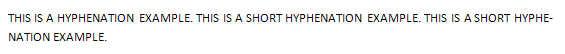
    
    请注意，图片链接和编号在翻译中保持不变，因为它们是特定于文档的资源引用。

=== "英文"

    A *document setting* specifies a document-level property that affects the handling of a given document, and influences the appearance and behavior of the current document, as well as the stored document- level state. All document settings are found in the Document Settings part.
    
    Consider a document in which the document setting doNotHyphenateCaps is applied. As a document setting this element specifies whether words comprised of all capitalized letters must be hyphenated or not throughout the given document.. Specifically, if words in ALL CAPITAL LETTERS must not be hyphenated, this requirement would be specified by adding the following WordprocessingML to the settings part:
    
    ```xml
    <w:doNotHyphenateCaps w:val="true"/>
    ```
    Specifying that words comprised of ALL CAPITAL LETTERS must be hyphenated, as illustrated below:
    
    
    
    If this element is omitted, then words in ALL CAPITAL LETTERS must be hyphenated when the documen is hyphenated, as illustrated below:
    
    

### L.1.16.2 兼容性设置

**Compatibility Settings**

=== "中文"

    一个*兼容性设置*是用于模拟早期文字处理应用程序创建的文档行为的可选设置。建议新的WordprocessingML文档不包含任何兼容性设置。如果需要兼容性设置，它们将存储在文档设置部分（[§L.1.16.1]）。
    
    考虑一个应用了ww11IndentRules兼容性设置的文档。作为一个兼容性设置，此元素指定了应用于整个给定文档的缩进行为，以保持与早期文字处理应用程序的视觉一致性。具体来说，如果应用于编号的缩进在靠近包装对象时不应被抑制，这个要求可以通过向设置部分添加以下WordprocessingML来指定：
    
    ```xml
    <w:compat>
        <w:ww11IndentRules />
    </w:compat>
    ```
    
    指定应用于编号的缩进在靠近包装对象时不应被抑制，如下所示：
    
    
    
    如果省略了此元素，则应用于编号的缩进在靠近包装对象时必须被抑制，如下所示：
    
    
    
    请注意，图片链接和编号在翻译中保持不变，因为它们是特定于文档的资源引用。

=== "英文"

    A *compatibility setting* is an optional setting used to mimic behavior of documents created in earlier word-processing applications. It is recommended that new WordprocessingML documents contain no compatibility settings. If compatibility settings are needed, they are stored in the Document Settings part ([§L.1.16.1]).
    
    Consider a document in which the compatibility setting ww11IndentRules is applied. As a compatibility setting, this element specifies an indentation behavior to be applied throughout the given document to preserve visual fidelity with an earlier word processing application. Specifically, if the indentation applied to numbering when positioned next to a wrapped object must not be suppressed, this requirement would be specified by adding the following WordprocessingML to the settings part
    
    ```xml
    <w:compat>
        <w:ww11IndentRules />
    </w:compat>
    ```
    
    Specifying that indentation applied to numbering when positioned next to a wrapped object must not
    be suppressed, as illustrated below:
    
    
    
    If this element is omitted, then indentation applied to numbering when positioned next to a wrapped object must be suppressed, as illustrated below:
    
    

### L.1.16.3 网页设置

**Web Settings**

=== "中文"

    一个*网页设置*是用于指定在将网页保存为WordprocessingML文档，或者将WordprocessingML文档保存为网页时适用的文档级属性的设置。因此，如果给定的WordprocessingML文档不是从网页创建的，并且从未成为网页，则文档中不需要任何网页设置。如果需要，网页设置存储在网页设置部分。
    
    考虑一个应用了allowPNG网页设置的文档。作为一个网页设置，此元素指定在将文档保存为网页时是否使用PNG图形格式来持久保存图像。具体来说，如果在将文档保存为网页时使用PNG图形格式，这个要求可以通过向设置部分添加以下WordprocessingML来指定：
    
    ```xml
    <w:webSettings>
        <w:allowPNG />
    </w:webSettings>
    ```
    
    如果省略了此元素，则在将文档保存为网页时将使用JPEG图形格式来持久保存图像。

=== "英文"

    A *web setting* is a setting used to specify a document-level property that is applicable when saving a web page as a WordprocessingML document, or when saving a WordprocessingML document as a webpage. Thus, if a given WordprocessingML document was not created from a web page, and never becomes a web page, no web settings are needed within the document. If they are needed, web settings are stored in the Web Settings part.
    
    Consider a document in which the web setting allowPNG is applied. As a web setting, this element specifies if the PNG graphics format is used for persisting images when saving the document as a web page. Specifically, if the PNG graphics format is used when saving a document as a web page, this requirement would be specified by adding the following WordprocessingML to the settings part:
    
    ```xml
    <w:webSettings>
        <w:allowPNG />
    </w:webSettings>
    ```
    
    If this element is omitted, then the JPEG graphics format is used for persisting images when saving the document as a web page.


## L.1.17 域和超链接

*Fields and Hyperlinks*

### L.1.17.1 域

**Fields**

=== "中文"

    大多数文字处理文档中的文本是静态的；也就是说，除非作为编辑的结果直接更改，否则其内容保持不变，不管文档的其他部分如何变化。然而，某些有用的信息片段在其文档生命周期内可以改变值。考虑一个引用页码的情况，如“有关此主题的更多信息，请参见第56页。”显然，硬编码页码为56意味着当文档的大小或布局发生变化时，需要手动替换该数字。即使是对任何边距、行间距或字体大小的简单更改，都可能使此类引用无效。
    
    字段提供了一种机制，可以向文档中添加占位符，如页面引用编号，这些占位符在文档渲染用于显示或打印时会被其对应的值替换。字段的其他应用包括但不限于自动编号表格和图表、文档创建和当前日期时间、文档作者信息，以及计算表格列的总计。
    
    一个*字段*是一组代码，指示WordprocessingML消费者自动将文本、图形、页码和其他材料插入到文档中。（DATE字段会导致插入当前日期。）当消费者执行字段的代码时插入到文档中的文本或图形被称为该字段的字段结果。执行字段代码的行为被称为字段更新。任何字段如何或何时更新不在ECMA-376的范围之内。

=== "英文"

    Most text in a word processing document is static; that is, unless it is directly changed as the result of editing, its contents remain the same, no matter how the rest of the document might change. However, certain useful pieces of information can change value over the life of a document. Consider the case of a reference to a page number, as in "For more information on this topic, see page 56." Clearly, hard coding the page number as 56 means that that number needs to be manually replaced as the document's size or layout is changed. Even a simple change to any margin, line spacing, or font size can invalidate such references.
    
    Fields provide a mechanism for placeholders, such as page reference numbers, that can be added to a document such that those placeholders are replaced by their corresponding values when the document is rendered for display or print. Other applications for fields include, but are not limited to, automatic numbering of tables and figures, document creation and current date and time, document author information, and the computation of totals for a table column.
    
    A *field* is a set of codes that instructs a WordprocessingML consumer to insert text, graphics, page numbers, and other material into a document automatically. (The DATE field causes the current date to be inserted.) The text or graphics inserted into a document when a consumer carries out a field's codes is referred to as the field result for that field. The act of carrying out a field's codes is referred to as a field update. As to how or when any field is updated is outside the scope of ECMA-376.

### L.1.17.2 超链接

**Hyperlinks**

=== "中文"

    WordprocessingML文档除了可以使用字段实现动态运行内容外，还可以包含一个或多个超链接，这些超链接允许将两个不同的WordprocessingML内容区域（类似于HTML页面中的超链接）连接起来。WordprocessingML超链接可以是以下几种类型：
    
    - 内部文档：超链接可以指向当前WordprocessingML文档中的任何书签。
    - 跨文档：超链接可以指向另一个WordprocessingML包，并指定该包中的书签。
    - 其他目的地：超链接可以指向任何其他URI位置。

=== "英文"

    As well as allowing for dynamic run content using fields, a WordprocessingML document can contain one or more hyperlinks, which allow for the linking of two disparate regions of WordprocessingML content (analogous to hyperlinks in HTML pages). WordprocessingML hyperlinks can be any of the following:
    
    - Intradocument: A hyperlink can target any bookmark contained within the current WordprocessingML document.
    - Interdocument: A hyperlink can target another WordprocessingML package, as well as specify a bookmark within that package.
    - Other destinations: A hyperlink can target any other URI location.


## L.1.18 其他主题

**Miscellaneous Topics**

### L.1.18.1 文本框

**Text Boxes**

=== "中文"

    所有的基于VML的绘图对象（连接符除外）都支持在其范围内添加丰富的WordprocessingML内容。当WordprocessingML内容被添加到绘图对象时，生成的文本被包含在一个文本框内。
    
    当WordprocessingML内容被包含在文本框中时，文本在一个单独的txbxContent元素中表示，该元素包含所有所需的WordprocessingML内容。文本框内容不能包含对其他文档故事的引用，也不能包含其他txbxContent元素。也就是说，嵌套形状不能拥有丰富内容。

=== "英文"

    All VML-based drawing objects (except for connectors) support the addition of rich WordprocessingML content within their extents. When WordprocessingML contents have been added to a drawing object, the resulting text is contained within a text box.
    
    When WordprocessingML content is contained within a text box, the text is represented within a single txbxContent element that contains all of the desired WordprocessingML content. Text box content cannot contain references to other document stories, nor can it contain other txbxContent elements. That is, nested shapes cannot have rich content.


### L.1.18.2 子文档

**Subdocuments**

=== "中文"

    在WordprocessingML文档中，有时需要将一个大型文档拆分成两个或多个独立的WordprocessingML文档文件，允许每个文件独立分发、编辑和处理。
    
    一本书可能包含五个章节，每个章节由不同的作者编辑。因此，书籍的编辑可能希望创建六个WordprocessingML文档——每个作者一个，用于编辑他们的章节，以及一个主文档，适当地整合这五个章节的内容。
    
    当一个WordprocessingML文档以这种方式由其他WordprocessingML文档组成时，生成的文档是主文档及其子文档。
    
    - 主文档是一个文档，它合并一个或多个子文档（以及可选的WordprocessingML内容）来创建一个更大的文档。
    - 子文档是一个WordprocessingML文档——文档中没有特定的信息将其分类为子文档。
    
    考虑一个用于写书的WordprocessingML文档：
    
    
    
    为了允许这个文档由多个作者编写，书中的每一章都放在一个单独的文件中（如下所示的红色部分）：
    
    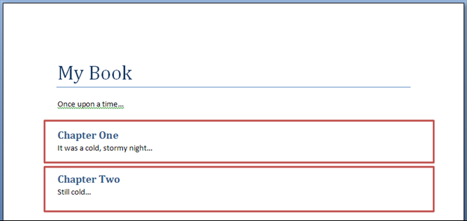
    
    结果是三个WordprocessingML文档：
    
    - 一个主文档（包含书名、第一段和对每个章节子文档的引用）
    - 两个子文档（每个章节一个）

=== "英文"

    Within a WordprocessingML document, it is sometimes necessary to break a large document into two or more separate WordprocessingML document files, allowing each of these files to be distributed, edited, and handled independently.
    
    A book might consist of five chapters, each edited by a separate author. The editor for the book would therefore desire to create six WordprocessingML documents - one for each author to work on their chapter, and a main document which collates the content of the five chapters appropriately.
    
    When a WordprocessingML document is composed of other WordprocessingML documents in this way, the resulting documents are a master document and its subdocuments.
    
    - A master document is a document which incorporates one or more subdocuments (as well as optional WordprocessingML content) to create a larger document
    - A subdocument is a WordprocessingML document—there is no specific information in a document which classifies it as such
    
    Consider a WordprocessingML document, which is being used to write a book:
    
    
    
    To allow this document to be written by multiple authors, each chapter in the book is placed in a separate file (the sections highlighted in red below):
    
    
    
    The result is three WordprocessingML documents:
    
    - A master document (containing the title of the book, the first paragraph, and references to the subdocuments for each chapter)
    - Two subdocuments (one for each chapter)

### L.1.18.3 导入外部内容

**Importing External Content**

=== "中文"

    在生成WordprocessingML文档时，有时需要在文档中包含现有文档内容（以下简称外部内容）。文档中的外部内容通常被包含，是因为它以不同于Office Open XML规范定义的WordprocessingML格式存储。
    
    为了便于包含此类内容，而不需要将其转换作为包含在文档中的先决条件，WordprocessingML包括了应用程序实现以任意格式导入外部内容的功能，作为WordprocessingML文档的一部分。这种功能称为*外部内容导入*，允许在WordprocessingML包中包含任意内容类型的内容易，然后当包被理解该内容类型的应用程序使用时，将其打开并合并到主文档中。
    
    考虑一个基于以下现有HTML内容创建的WordprocessingML文档：
    
    ```html
    <html … >
        <body style="margin-left:200px;margin-top:50px">
            <p>Paragraph one.</p>
            <blockquote style="border:5px solid #00FFFF">Paragraph in a
                blockquote.</blockquote>
            <p>Paragraph two.</p>
        </body>
    </html>
    ```
    
    这些内容可以使用Office Open XML规范定义的XML语法转换为其WordprocessingML等效项，或者更基础的工具可以使用外部内容导入将HTML文档包含在WordprocessingML包内，允许随后的内容使用者导入生成的HTML。当打开生成的WordprocessingML包时，如果它是由使用应用程序理解的替代格式，则必须打开HTML文档，并将其迁移到主WordprocessingML文档中的适当位置。

=== "英文"

    When generating WordprocessingML documents, it is sometimes necessary to include existing document content (henceforth called external content) within the document. External content in a document is typically included because it was stored in a format other than the WordprocessingML format defined by this Office Open XML specification.
    
    In order to facilitate the inclusion of such content without requiring its conversion as a prerequisite to its inclusion in a document, WordprocessingML includes the facility for applications to implement the import of external content in any format as part of a WordprocessingML document. This functionality, called *external content import*, allows the inclusion of content of an arbitrary content type within the WordprocessingML package, which can then be opened and merged into the main document when the package is consumed by applications which understand that content type.
    
    Consider a WordprocessingML document which is being created based on the following existing HTML content:
    
    ```html
    <html … >
        <body style="margin-left:200px;margin-top:50px">
            <p>Paragraph one.</p>
            <blockquote style="border:5px solid #00FFFF">Paragraph in a
                blockquote.</blockquote>
            <p>Paragraph two.</p>
        </body>
    </html>
    ```
    
    This content can be converted to its WordprocessingML equivalents using the XML syntax defined by this Office Open XML specification, or a more basic tool can use the external content import to include the HTML document within a WordprocessingML package, allowing a subsequent consumer of that content to import the resulting HTML. When the resulting WordprocessingML package is opened, if it is an alternate format understood by the consuming application, the HTML document must be opened and migrated into the appropriate location in the main WordprocessingML document.


### L.1.18.4 往返替代内容

**Roundtripping Alternate Content**

=== "中文"

    Office Open XML定义了一种机制，用于存储不被Office Open XML规范定义的内容，例如未来软件应用程序开发的扩展功能，这些应用程序利用Office Open XML格式。这种机制允许存储一系列内容的替代表示，使用应用程序可以使用第一个满足其要求的替代方案。
    
    设想一个应用程序创建了一个新的段落属性，旨在使其文本颜色在显示时随机变化。这个功能在Office Open XML规范中没有定义，因此应用程序可能选择创建一个替代表示，对于不了解此扩展的客户，使用AlternateContent块为每个字符设置不同的手动颜色，如下所示：
    
    ```xml
    <ve:AlternateContent xmlns:ve="…">
        <ve:Choice Requires="colors" xmlns:colors="urn:randomTextColors">
            <w:p>
                <w:pPr>
                    <colors:random colors:val="true" />
                </w:pPr>
                <w:r>
                    <w:t>Random colors!</w:t>
                </w:r>
            </w:p>
        </ve:Choice>
        <ve:Fallback>
            <w:p>
                <w:r>
                    <w:rPr>
                        <w:color w:val="FF0000" />
                    </w:rPr>
                    <w:t>R</w:t>
                </w:r>
                <w:r>
                    <w:rPr>
                        <w:color w:val="00FF00" />
                    </w:rPr>
                    <w:t>a</w:t>
                </w:r>
                …
            </w:p>
        </ve:Fallback>
    </ve:AlternateContent>
    ```
    
    需要新颜色扩展的Choice元素使用其命名空间中的random元素，而Fallback元素允许不支持此命名空间的客户看到适当的替代表示。
    
    这些替代内容块可以出现在WordprocessingML文档的任何位置，应用程序必须适当地处理和处理它们（选择适当的选择）。
    
    然而，WordprocessingML并没有明确定义一组位置，应用程序必须在可能的情况下尝试存储并往返所有未采用的选择。
    
    如果应用程序不理解颜色扩展，结果文件（如果要保持替代选择，将如下所示）：
    
    ```xml
    <ve:AlternateContent xmlns:ve="…">
        <ve:Choice Requires="colors" xmlns:colors="urn:randomTextColors">
            …
        </ve:Choice>
        <ve:Fallback>
            …
        </ve:Fallback>
    </ve:AlternateContent>
    ```
    
    选择处理后，文件将如下所示：
    
    ```xml
    <w:p>
        <w:r>
            <w:rPr>
                <w:color w:val="FF0000" />
            </w:rPr>
            <w:t>R</w:t>
        </w:r>
        <w:r>
            <w:rPr>
                <w:color w:val="00FF00" />
            </w:rPr>
            <w:t>a</w:t>
        </w:r>
        …
    </w:p>
    ```

=== "英文"

    Office Open XML defines a mechanism for the storage of content which is not defined by this Office Open XML specification, for example extensions developed by future software applications which leverage the Office Open XML formats. This mechanism allows for the storage of a series of alternative representations of content, of which the consuming application can use the first alternative whose requirements are met.
    
    Consider an application which creates a new paragraph property intended to make the colors of its text change randomly when it is displayed. This functionality is not defined in this Office Open XML specification, and so the application might choose to create an alternative representation setting a different manual color on each character for clients which do not understand this extension using an AlternateContent block as follows:
    
    ```xml
    <ve:AlternateContent xmlns:ve="…">
        <ve:Choice Requires="colors" xmlns:colors="urn:randomTextColors">
            <w:p>
                <w:pPr>
                    <colors:random colors:val="true" />
                </w:pPr>
                <w:r>
                    <w:t>Random colors!</w:t>
                </w:r>
            </w:p>
        </ve:Choice>
        <ve:Fallback>
            <w:p>
                <w:r>
                    <w:rPr>
                        <w:color w:val="FF0000" />
                    </w:rPr>
                    <w:t>R</w:t>
                </w:r>
                <w:r>
                    <w:rPr>
                        <w:color w:val="00FF00" />
                    </w:rPr>
                    <w:t>a</w:t>
                </w:r>
                …
            </w:p>
        </ve:Fallback>
    </ve:AlternateContent>
    ```
    
    The Choice element that requires the new color extensions uses the random element in its namespace, and the Fallback element allows clients that do not support this namespace to see an appropriate alternative representation.
    
    These alternate content blocks can occur at any location within a WordprocessingML document, and applications must handle and process them appropriately (taking the appropriate choice).
    
    However, WordprocessingML does not explicitly define a set of locations where applications must attempt to store and roundtrip all non-taken choices whenever possible.
    
    If an application does not understand the colors extension, the resulting file (if alternate choices are to be preserved would appear as follows:
    
    ```xml
    <ve:AlternateContent xmlns:ve="…">
        <ve:Choice Requires="colors" xmlns:colors="urn:randomTextColors">
            …
        </ve:Choice>
        <ve:Fallback>
            …
        </ve:Fallback>
    </ve:AlternateContent>
    ```
    
    The file would then appear as follows after the choice is processed:
    
    ```xml
    <w:p>
        <w:r>
            <w:rPr>
                <w:color w:val="FF0000" />
            </w:rPr>
            <w:t>R</w:t>
        </w:r>
        <w:r>
            <w:rPr>
                <w:color w:val="00FF00" />
            </w:rPr>
            <w:t>a</w:t>
        </w:r>
        …
    </w:p>
    ```

### L.1.18.5 使用不同的日历系统

**Use of Different Calendar Systems**

=== "中文"

    Office Open XML 支持以下日历的使用：
    
    - 公历（Gregorian）
    - 希伯来阴历（Hebrew Lunar）
    - 伊斯兰阴历（Hijri Lunar）
    - 日本天皇纪年（Japanese Emperor Era）
    - 韩国檀君纪年（Korean Tangun Era）
    - 阇那纪年（Saka Era）
    - 台湾历（Taiwanese）
    - 泰国佛历（Thai Buddhist）
    
    这些日历在简单类型 `ST_CalendarType` 中列举，并可在 WordprocessingML 中使用，例如：
    
    结构化文档标签日历格式（[§17.5.2.3]）
    
    基于日期的字段（[§17.16.5.11]， [§17.16.5.13]， [§17.16.5.47]， [§17.16.5.53]）
    
    例如，`ST_CalendarType` 支持的日历（[§22.9.2.1]）可以通过日期和时间字段显示，如下所示：
    
    <table>
        <tr>
            <td><strong>日历类型</strong></td>
            <td><strong>字段指令</strong></td>
            <td><strong>结果（在 2007-12-17T00:00.00）</strong></td>
        </tr>
        <tr>
            <td>公历</td>
            <td>DATE \@ "d MMMM yyyy"</td>
            <td>2007年12月17日</td>
        </tr>
        <tr>
            <td>希伯来阴历</td>
            <td>
                DATE \@ "d MMMM yyyy" \h <br/><br/>
                使用 lang 元素（§17.3.2.20）在包含字段指令的运行中使用的<br/>
                BCP 47 语言代码的语言组件等于 he。
            </td>
            <td>5768年提别月8日</td>
        </tr>
        <tr>
            <td>伊斯兰阴历</td>
            <td>
                DATE \@ "d MMMM yyyy" \h<br/><br/>
                使用 lang 元素（§17.3.2.20）在包含字段指令的运行中使用的<br/>
                BCP 47 语言代码的语言组件等于 ar。
            </td>
            <td>1428年宰牲节月8日</td>
        </tr>
        <tr>
            <td>日本天皇纪年</td>
            <td>DATE \@ "d MMMM ee"</td>
            <td>19年12月17日</td>
        </tr>
        <tr>
            <td>韩国檀君纪年</td>
            <td>
                DATE \@ "d MMMM ggg"<br/><br/>
                使用 lang 元素（§17.3.2.20）在包含字段指令的运行中使用的<br/>
                BCP 47 语言代码的语言组件等于 ko。
            </td>
            <td>단기17年12月17日</td>
        </tr>
        <tr>
            <td>阇那纪年</td>
            <td>DATE \@ "d MMMM yyyy" \s</td>
            <td>1929年阿格拉哈亚那月26日</td>
        </tr>
        <tr>
            <td>台湾历</td>
            <td>
                DATE \@ "d MMMM ggg"<br/><br/>
                使用 lang 元素（§17.3.2.20）在包含字段指令的运行中使用的<br/>
                BCP 47 语言代码等于 zh-TW。
            </td>
            <td>平成17年12月17日</td>
        </tr>
        <tr>
            <td>泰国佛历</td>
            <td>DATE \@ "d MMMM bbbb"</td>
            <td>2550年12月17日</td>
        </tr>
    </table>


=== "英文"

    Office Open XML supports the use of the following calendars:
    
    - Gregorian
    - Hebrew Lunar
    - Hijri Lunar
    - Japanese Emperor Era
    - Korean Tangun Era
    - Saka Era
    - Taiwanese
    - Thai Buddhist
    
    These calendars are enumerated in the ST_CalendarType simple type, and can be used in WordprocessingML, e.g.:
    
    Structured Document Tag calendar formats ([§17.5.2.3])
    
    Date-based Fields ([§17.16.5.11], [§17.16.5.13], [§17.16.5.47], [§17.16.5.53])
    
    As an illustration, the calendars supported by ST_CalendarType ([§22.9.2.1]) can be displayed through the date and time fields as shown below:
    
    <table>
        <tr>
            <td><strong>Calendar Type</strong></td>
            <td><strong>Field Instructions</strong></td>
            <td><strong>Result (on 2007-12-17T00:00.00)</strong></td>
        </tr>
        <tr>
            <td>Gregorian</td>
            <td>DATE \@ "d MMMM yyyy"</td>
            <td>17 December 2007</td>
        </tr>
        <tr>
            <td>Hebrew Lunar</td>
            <td>DATE\@ "d MMMM yyyy" \h <br/><br/>
                The language component of the BCP 47<br/>
                language code used by the lang element<br/>
                (§17.3.2.20) on the run containing the<br/>
                field instructions equals he.
            </td>
            <td>8 Tevet 5768</td>
        </tr>
        <tr>
            <td>aaa</td>
            <td>DATE \@ "d MMMM yyyy" \h<br/><br/>
            The language component of the BCP 47<br/>
            language code used by the lang element<br/>
            (§17.3.2.20) on the run containing the<br/>
            field instructions equals ar.
            </td>
            <td>8 Thoul Hijjah 1428</td>
        </tr>
        <tr>
            <td>Japanese Emperor Era</td>
            <td>DATE \@ "d MMMM ee"</td>
            <td>17 December 19</td>
        </tr>
        <tr>
            <td>Korean Tangun Era</td>
            <td>DATE\@ "d MMMM ggg"<br/><br/>
            The language component of the BCP 47<br/>
            language code used by the lang element<br/>
            (§17.3.2.20) on the run containing the<br/>
            field instructions equals ko.
        </td>
            <td>17 December 단기</td>
        </tr>
        <tr>
            <td>Saka Era</td>
            <td>DATE \@ "d MMMM yyyy" \s</td>
            <td>26 Agrahayana 1929</td>
        </tr>
        <tr>
            <td>Taiwanese</td>
            <td>DATE\@ "d MMMM ggg"<br/><br/>
            The lang element (§17.3.2.20) on the run<br/>
            containing the field instructions equals<br/>
            zh-TW.</td>
            <td>17 December 平成</td>
        </tr>
        <tr>
            <td>Thai Buddhist Era</td>
            <td>DATE \@ "d MMMM bbbb"</td>
            <td>17 ธันวาคม 2550</td>
        </tr>
    </table>


[§L.1.1]: #l11-故事
[§L.1.2]: #l12-基本文档结构
[§L.1.3]: #l13-主文档故事
[§L.1.3.1]: #l131-文档背景
[§L.1.4]: #l14-段落和丰富格式
[§L.1.4.1]: #l141-段落
[§L.1.4.2]: #l142-运行
[§L.1.4.3]: #l143-运行内容
[§L.1.4.3.1]: #l1431-文本
[§L.1.4.4]: #l144-格式化属性值
[§L.1.5]: #l15-表格
[§L.1.5.1]: #l151-引言
[§L.1.5.2]: #l152-表格属性
[§L.1.5.3]: #l153-表格网格
[§L.1.5.4]: #l154-表格行和单元格
[§L.1.5.5]: #l155-表格布局
[§L.1.5.6]: #l156-固定宽度表格
[§L.1.5.7]: #l157-自动调整表格
[§L.1.5.8]: #l158-复杂表格示例
[§L.1.5.9]: #l159-垂直合并单元格
[§L.1.6]: #l16-自定义标记
[§L.1.6.1]: #l161-智能标签
[§L.1.6.2]: #l162-自定义-xml-标记
[§L.1.6.3]: #l163-结构化文档标签
[§L.1.6.3.1]: #l1631-结构化文档标签属性
[§L.1.6.3.2]: #l1632-结构化文档标签内容
[§L.1.6.3.3]: #l1633-xml-映射
[§L.1.7]: #l17-节
[§L.1.7.1]: #l171-节属性
[§L.1.7.2]: #l172-节分隔符
[§L.1.8]: #l18-样式
[§L.1.8.1]: #l181-样式部件
[§L.1.8.2]: #l182-样式定义
[§L.1.8.3]: #l183-段落样式
[§L.1.8.4]: #l184-字符样式
[§L.1.8.5]: #l185-链接样式
[§L.1.8.6]: #l186-编号样式
[§L.1.8.7]: #l187-表格样式
[§L.1.8.8]: #l188-默认文档段落和字符属性
[§L.1.8.9]: #l189-样式继承
[§L.1.8.10]: #l1810-样式应用
[§L.1.8.11]: #l1811-潜在样式
[§L.1.9]: #l19-字体
[§L.1.9.1]: #l191-字体引用
[§L.1.9.2]: #l192-字体引用类型
[§L.1.9.3]: #l193-不明确字符
[§L.1.9.4]: #l194-字体表
[§L.1.9.5]: #l195-字体替换数据
[§L.1.9.6]: #l196-字体嵌入
[§L.1.9.7]: #l197-主题字体
[§L.1.10]: #l110-编号
[§L.1.10.1]: #l1101-编号部件
[§L.1.10.2]: #l1102-编号定义
[§L.1.10.3]: #l1103-抽象编号定义
[§L.1.10.4]: #l1104-编号定义实例
[§L.1.10.5]: #l1105-将编号应用到段落
[§L.1.10.6]: #l1106-完整故事
[§L.1.10.7]: #l1107-编号样式
[§L.1.10.8]: #l1108-引用编号样式
[§L.1.11]: #l111-页眉和页脚
[§L.1.11.1]: #l1111-页眉部分
[§L.1.11.2]: #l1112-页脚部分
[§L.1.11.3]: #l1113-页眉和页脚
[§L.1.11.4]: #l1114-多个节
[§L.1.11.5]: #l1115-空页眉或页脚
[§L.1.12]: #l112-脚注和尾注
[§L.1.12.1]: #l1121-脚注部件
[§L.1.12.2]: #l1122-尾注部件
[§L.1.12.3]: #l1123-脚注和尾注
[§L.1.12.4]: #l1124-脚注和尾注类型
[§L.1.12.5]: #l1125-脚注和尾注引用
[§L.1.13]: #l113-术语表文档
[§L.1.14]: #l114-注释
[§L.1.14.1]: #l1141-引言
[§L.1.14.2]: #l1142-内联注释
[§L.1.14.3]: #l1143-跨结构注释
[§L.1.14.4]: #l1144-属性注释
[§L.1.14.5]: #l1145-评论
[§L.1.14.6]: #l1146-评论部件
[§L.1.14.7]: #l1147-修订
[§L.1.14.8]: #l1148-书签
[§L.1.14.9]: #l1149-范围权限
[§L.1.14.10]: #l11410-拼写和语法
[§L.1.15]: #l115-邮件合并
[§L.1.15.1]: #l1151-邮件合并wordprocessingml-和托管应用程序
[§L.1.15.2]: (#l1152-将文档连接到外部数据源
[§L.1.15.3]: (#l1153-用外部数据填充合并文档
[§L.1.16]: #l116-设置
[§L.1.16.1]: #l1161-文档设置
[§L.1.16.2]: #l1162-兼容性设置
[§L.1.16.3]: #l1163-网页设置
[§L.1.17]: #l117-域和超链接
[§L.1.17.1]: #l1171-域
[§L.1.17.2]: #l1172-超链接
[§L.1.18]: #l118-其他主题
[§L.1.18.1]: #l1181-文本框
[§L.1.18.2]: #l1182-子文档
[§L.1.18.3]: #l1183-导入外部内容
[§L.1.18.4]: #l1184-往返替代内容
[§L.1.18.5]: #l1185-使用不同的日历系统


[§17.5.2.3]: ../chapter17/05custom.md#17523-calendar-日期选择器日历类型
[§17.16.5.11]: ../chapter17/16fields.md#1716511-创建日期createdate
[§17.16.5.13]: ../chapter17/16fields.md#1716513-日期date
[§17.16.5.47]: ../chapter17/16fields.md#1716547-打印日期printdate
[§17.16.5.53]: ../chapter17/16fields.md#1716553-保存日期savedate
[§22.9.2.1]: ../chapter22/sharedsimpletypes.md#22921-st_calendartype-日历类型