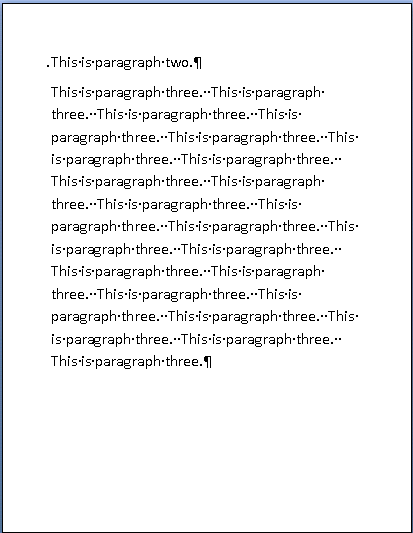
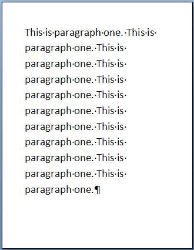
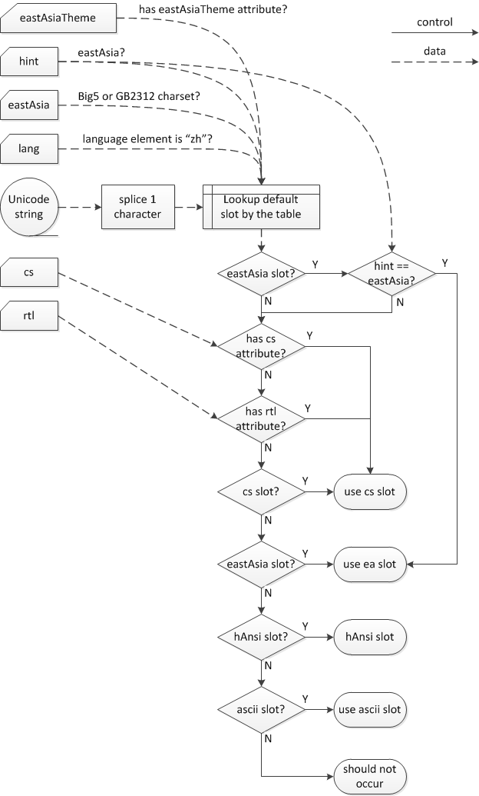
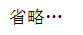

# 17.3 段落和富文本格式

**Paragraphs and Rich Formatting**

=== "中文"

    WordprocessingML文档的基础是其实际的文本内容。这些文本内容可以存储在许多上下文中（表格、文本框等），但在WordprocessingML中，文本内容的最基本形式是段落，使用p元素来指定（[§17.3.1.22]）。
    
    在段落中，所有段落级别的富文本格式都存储在pPr元素中（[§17.3.1.25]；[§17.3.1.26]）。[注：一些段落属性的示例包括对齐、边框、连字符覆盖、缩进、行间距、底纹、文本方向以及孤行/孤字控制。注释结束]
    
    在段落内，文本被分组为一个或多个运行，由r元素表示（[§17.3.2.25]），它们定义了具有共同属性集的文本区域。
    
    就像段落可以具有富文本格式一样，运行也可以。r元素内的所有元素都由相应的可选rPr运行属性元素控制（[§17.7.9.1]；[§17.3.2.27]）。[注：一些运行属性的示例包括粗体、下划线或可见性。注释结束]
    
    在运行中，运行内容是文档中可以显示的可能对象和字符的集合。

=== "英文"

    The basis of a WordprocessingML document is its actual text contents. Those text contents can be stored in many contexts (tables, text boxes, etc.), but the most basic form of text contents in WordprocessingML is the paragraph, specified using the p element ([§17.3.1.22]).
    
    Within the paragraph, all rich formatting at the paragraph level is stored within the pPr element ([§17.3.1.25]; [§17.3.1.26]). [Note: Some examples of paragraph properties are alignment, border, hyphenation override, indentation, line spacing, shading, text direction, and widow/orphan control. end note]
    
    Within the paragraph, text is grouped into one or more runs, represented by the r element ([§17.3.2.25]), which define a region of text with a common set of properties.
    
    Just as a paragraph can have rich formatting, so too can a run. All of the elements inside an r element have their properties controlled by a corresponding optional rPr run properties element ([§17.7.9.1]; [§17.3.2.27]). [Note: Some examples of run properties are bold, underlined, or visible. end note]
    
    Within runs, run content is the set of possible objects and characters which can be displayed in the document.

## TOC

- [17.3 段落和富文本格式](#173-段落和富文本格式)

### 段落

- [17.3.1 段落](#1731-段落) -aaa
    - [17.3.1.1 adjustRightInd (使用文档网格时自动调整右缩进)](#17311-adjustrightind-使用文档网格时自动调整右缩进)
    - [17.3.1.2 autoSpaceDE (自动调整拉丁文和东亚文本的间距)](#17312-autospacede-自动调整拉丁文和东亚文本的间距)
    - [17.3.1.3 autoSpaceDN (自动调整东亚文本和数字的间距)](#17313-autospacedn-自动调整东亚文本和数字的间距)
    - [17.3.1.4 bar (对开页面之间的段落边框)](#17314-bar-对开页面之间的段落边框)
    - [17.3.1.5 between (相同段落之间的段落边框)](#17315-between-相同段落之间的段落边框)
    - [17.3.1.6 bidi (从右到左的段落布局)](#17316-bidi-从右到左的段落布局)
    - [17.3.1.7 bottom (相同段落下方的段落边框)](#17317-bottom-相同段落下方的段落边框)
    - [17.3.1.8 cnfStyle (段落条件格式)](#17318-cnfstyle-段落条件格式)
    - [17.3.1.9 contextualSpacing (使用相同样式时忽略上方和下方的间距)](#17319-contextualspacing-使用相同样式时忽略上方和下方的间距)
    - [17.3.1.10 divId (关联的 HTML div ID)](#173110-divid-关联的-html-div-id)
    - [17.3.1.11 framePr (文本框属性)](#173111-framepr-文本框属性)
    - [17.3.1.12 ind (段落缩进)](#173112-ind-段落缩进)
    - [17.3.1.13 jc (段落对齐)](#173113-jc-段落对齐)
    - [17.3.1.14 keepLines (将所有行保留在一页上)](#173114-keeplines-将所有行保留在一页上)
    - [17.3.1.15 keepNext (使段落与下一段保持一致)](#173115-keepnext-使段落与下一段保持一致)
    - [17.3.1.16 kinsoku (对每行的第一个和最后一个字符使用东亚版式规则)](#173116-kinsoku-对每行的第一个和最后一个字符使用东亚版式规则)
    - [17.3.1.17 left (左段落边框)](#173117-left-左段落边框)
    - [17.3.1.18 mirrorIndents (使用左/右缩进作为内部/外部缩进)](#173118-mirrorindents-使用左右缩进作为内部外部缩进)
    - [17.3.1.19 numPr (编号定义实例参考)](#173119-numpr-编号定义实例参考)
    - [17.3.1.20 outlineLvl (相关大纲级别)](#173120-outlinelvl-相关大纲级别)
    - [17.3.1.21 overflowPunct (允许标点符号超出文本范围)](#173121-overflowpunct-允许标点符号超出文本范围)
    - [17.3.1.22 p (段落)](#173122-p-段落)
    - [17.3.1.23 pageBreakBefore (从下一页开始段落)](#173123-pagebreakbefore-从下一页开始段落)
    - [17.3.1.24 pBdr (段落边框合集)](#173124-pbdr-段落边框合集)
    - [17.3.1.25 pPr (上一段落属性)](#173125-ppr-上一段落属性)
    - [17.3.1.26 pPr (段落属性)](#173126-ppr-段落属性)
    - [17.3.1.27 pStyle (引用的段落样式)](#173127-pstyle-引用的段落样式)
    - [17.3.1.28 right (段落右边框)](#173128-right-段落右边框)
    - [17.3.1.29 rPr (段落标记的运行属性)](#173129-rpr-段落标记的运行属性)
    - [17.3.1.30 rPr (段落标记的上一个运行属性)](#173130-rpr-段落标记的上一个运行属性)
    - [17.3.1.31 shd (段落底纹)](#173131-shd-段落底纹)
    - [17.3.1.32 snapToGrid (使用文档网格设置设置行间段落间距)](#173132-snaptogrid-使用文档网格设置设置行间段落间距)
    - [17.3.1.33 spacing (行与段落上方/下方的间距)](#173133-spacing-行与段落上方下方的间距)
    - [17.3.1.34 suppressAutoHyphens (禁止段落连字符)](#173134-suppressautohyphens-禁止段落连字符)
    - [17.3.1.35 suppressLineNumbers (抑制段落的行号)](#173135-suppresslinenumbers-抑制段落的行号)
    - [17.3.1.36 suppressOverlap (防止文本框重叠)](#173136-suppressoverlap-防止文本框重叠)
    - [17.3.1.37 tab (自定义制表位)](#173137-tab-自定义制表位)
    - [17.3.1.38 tabs (自定义制表位合集)](#173138-tabs-自定义制表位合集)
    - [17.3.1.39 textAlignment (线上的垂直字符对齐方式)](#173139-textalignment-线上的垂直字符对齐方式)
    - [17.3.1.40 textboxTightWrap (允许周围的段落紧密包裹到文本框内容)](#173140-textboxtightwrap-允许周围的段落紧密包裹到文本框内容)
    - [17.3.1.41 textDirection (段落文本流方向)](#173141-textdirection-段落文本流方向)
    - [17.3.1.42 top (相同段落上方的段落边框)](#173142-top-相同段落上方的段落边框)
    - [17.3.1.43 topLinePunct (压缩行首标点符号)](#173143-toplinepunct-压缩行首标点符号)
    - [17.3.1.44 widowControl (允许第一行/最后一行显示在单独的页面上)](#173144-widowcontrol-允许第一行最后一行显示在单独的页面上)
    - [17.3.1.45 wordWrap (允许在字符级别换行)](#173145-wordwrap-允许在字符级别换行)

### 运行

- [17.3.2 运行(Run)](#1732-运行run)
    - [17.3.2.1 b (粗体)](#17321-b-粗体)
    - [17.3.2.2 bCs (复杂字体粗体)](#17322-bcs-复杂字体粗体)
    - [17.3.2.3 bdo (双向覆盖)](#17323-bdo-双向覆盖)
    - [17.3.2.4 bdr (文本边框)](#17324-bdr-文本边框)
    - [17.3.2.5 caps (将所有字符显示为大写字母)](#17325-caps-将所有字符显示为大写字母)
    - [17.3.2.6 color (运行内容颜色)](#17326-color-运行内容颜色)
    - [17.3.2.7 cs (在运行时使用复杂的脚本格式)](#17327-cs-在运行时使用复杂的脚本格式)
    - [17.3.2.8 dir (双向嵌入级别)](#17328-dir-双向嵌入级别)
    - [17.3.2.9 dstrike (双删除线)](#17329-dstrike-双删除线)
    - [17.3.2.10 eastAsianLayout (东亚版式设置)](#173210-eastasianlayout-东亚版式设置)
    - [17.3.2.11 effect (动画文字效果)](#173211-effect-动画文字效果)
    - [17.3.2.12 em (强调标记)](#173212-em-强调标记)
    - [17.3.2.13 emboss (压花)](#173213-emboss-压花)
    - [17.3.2.14 fitText (手动运行宽度)](#173214-fittext-手动运行宽度)
    - [17.3.2.15 highlight (文本突出显示)](#173215-highlight-文本突出显示)
    - [17.3.2.16 i (斜体)](#173216-i-斜体)
    - [17.3.2.17 iCs (复杂字体斜体)](#173217-ics-复杂字体斜体)
    - [17.3.2.18 imprint (印记)](#173218-imprint-印记)
    - [17.3.2.19 kern (字体字距调整)](#173219-kern-字体字距调整)
    - [17.3.2.20 lang (运行内容的语言)](#173220-lang-运行内容的语言)
    - [17.3.2.21 noProof (不检查拼写或语法)](#173221-noproof-不检查拼写或语法)
    - [17.3.2.22 oMath (Office Open XML 数学)](#173222-omath-office-open-xml-数学)
    - [17.3.2.23 outline (显示字符轮廓)](#173223-outline-显示字符轮廓)
    - [17.3.2.24 position (垂直升高或降低的文本)](#173224-position-垂直升高或降低的文本)
    - [17.3.2.25 r (文本运行)](#173225-r-文本运行)
    - [17.3.2.26 rFonts (运行字体)](#173226-rfonts-运行字体)
    - [17.3.2.27 rPr (上一个运行属性)](#173227-rpr-上一个运行属性)
    - [17.3.2.28 rPr (运行属性)](#173228-rpr-运行属性)
    - [17.3.2.29 rStyle (引用的字符样式)](#173229-rstyle-引用的字符样式)
    - [17.3.2.30 rtl (从右到左文本)](#173230-rtl-从右到左文本)
    - [17.3.2.31 shadow (阴影)](#173231-shadow-阴影)
    - [17.3.2.32 shd (运行着色)](#173232-shd-运行着色)
    - [17.3.2.33 smallCaps (小号大写字母)](#173233-smallcaps-小号大写字母)
    - [17.3.2.34 snapToGrid (使用文档网格设置来设置字符间距)](#173234-snaptogrid-使用文档网格设置来设置字符间距)
    - [17.3.2.35 spacing (字符间距调整)](#173235-spacing-字符间距调整)
    - [17.3.2.36 specVanish (段落标记始终隐藏)](#173236-specvanish-段落标记始终隐藏)
    - [17.3.2.37 strike (单删除线)](#173237-strike-单删除线)
    - [17.3.2.38 sz (非复杂脚本字体大小)](#173238-sz-非复杂脚本字体大小)
    - [17.3.2.39 szCs (复杂脚本字体大小)](#173239-szcs-复杂脚本字体大小)
    - [17.3.2.40 u (下划线)](#173240-u-下划线)
    - [17.3.2.41 vanish (隐藏文本)](#173241-vanish-隐藏文本)
    - [17.3.2.42 vertAlign (下标/上标文本)](#173242-vertalign-下标上标文本)
    - [17.3.2.43 w (展开/收缩文本)](#173243-w-展开收缩文本)
    - [17.3.2.44 webHidden (网页隐藏文本)](#173244-webhidden-网页隐藏文本)

### 运行内容

- [17.3.3 运行内容](#1733-运行内容)
    - [17.3.3.1 br (折断/换行)](#17331-br-折断换行)
    - [17.3.3.2 contentPart (内容部分)](#17332-contentpart-内容部分)
    - [17.3.3.3 control (嵌入式控制)](#17333-control-嵌入式控制)
    - [17.3.3.4 cr (回车)](#17334-cr-回车)
    - [17.3.3.5 dayLong (日期块 - 长日格式)](#17335-daylong-日期块---长日格式)
    - [17.3.3.6 dayShort (日期块 - 短日格式)](#17336-dayshort-日期块---短日格式)
    - [17.3.3.7 delText (删除的文本)](#17337-deltext-删除的文本)
    - [17.3.3.8 dirty (无效的字段缓存)](#17338-dirty-无效的字段缓存)
    - [17.3.3.9 drawing (DrawingML对象)](#17339-drawing-drawingml对象)
    - [17.3.3.10 hps (拼音指南文字字体大小)](#173310-hps-拼音指南文字字体大小)
    - [17.3.3.11 hpsBaseText (拼音指南基本文本字体大小)](#173311-hpsbasetext-拼音指南基本文本字体大小)
    - [17.3.3.12 hpsRaise (拼音指南文本与拼音指南基础文本之间的距离)](#173312-hpsraise-拼音指南文本与拼音指南基础文本之间的距离)
    - [17.3.3.13 lastRenderedPageBreak (最后计算的分页符的位置)](#173313-lastrenderedpagebreak-最后计算的分页符的位置)
    - [17.3.3.14 lid (语音指南的语言 ID)](#173314-lid-语音指南的语言-id)
    - [17.3.3.15 monthLong (日期块 - 长月份格式)](#173315-monthlong-日期块---长月份格式)
    - [17.3.3.16 monthShort (日期块 - 短月份格式)](#173316-monthshort-日期块---短月份格式)
    - [17.3.3.17 movie (嵌入式视频)](#173317-movie-嵌入式视频)
    - [17.3.3.18 noBreakHyphen (不间断连字符)](#173318-nobreakhyphen-不间断连字符)
    - [17.3.3.19 object (嵌入对象)](#173319-object-嵌入对象)
    - [17.3.3.20 objectEmbed (嵌入对象属性)](#173320-objectembed-嵌入对象属性)
    - [17.3.3.21 objectLink (链接对象属性)](#173321-objectlink-链接对象属性)
    - [17.3.3.22 pgNum (页码块)](#173322-pgnum-页码块)
    - [17.3.3.23 ptab (绝对位置制表符)](#173323-ptab-绝对位置制表符)
    - [17.3.3.24 rt (拼音指南文字)](#173324-rt-拼音指南文字)
    - [17.3.3.25 ruby (拼音指南)](#173325-ruby-拼音指南)
    - [17.3.3.26 rubyAlign (拼音指南文本对齐方式)](#173326-rubyalign-拼音指南文本对齐方式)
    - [17.3.3.27 rubyBase (拼音指南基本文本)](#173327-rubybase-拼音指南基本文本)
    - [17.3.3.28 rubyPr (拼音指南属性)](#173328-rubypr-拼音指南属性)
    - [17.3.3.29 softHyphen (可选连字符)](#173329-softhyphen-可选连字符)
    - [17.3.3.30 sym (符号字符)](#173330-sym-符号字符)
    - [17.3.3.31 t (文本)](#173331-t-文本)
    - [17.3.3.32 tab (制表符)](#173332-tab-制表符)
    - [17.3.3.33 yearLong (日期块 - 长年格式)](#173333-yearlong-日期块---长年格式)
    - [17.3.3.34 yearShort (日期块 - 短年份格式)](#173334-yearshort-日期块---短年份格式)

### 边框属性

- [17.3.4 边框属性 (CT\_Border)](#1734-边框属性-ct_border)

### 着色属性

- [17.3.5 着色属性 (CT\_Shd)](#1735-着色属性-ct_shd)


## 17.3.1 段落

**Paragraphs**

=== "中文"
    
    在WordprocessingML文档中，段落是块级内容的最基本单元，使用p元素（[§17.3.1.22]）存储。段落定义了WordprocessingML文档中的一个独立内容部分，该部分从新行开始。
    
    [示例：考虑段落片段“The quick brown fox jumped…”，该片段在段落中居中。对齐属性是段落级别的属性，因此在段落属性上表示如下：
    
    ```xml
    <w:p>
        <w:pPr>
            <w:jc w:val="center"/>
            <w:rPr>
                <w:i/>
            </w:rPr>
        </w:pPr>
        <w:r>
            <w:rPr>
                <w:i/>
            </w:rPr>
            <w:t xml:space="preserve">The quick brown fox jumped…</w:t>
        </w:r>
    </w:p>
    ```
    
    注意，每个运行指定其内容的字符格式信息，而段落指定段落级别的格式（居中对齐）。值得注意的是，由于XML中通常不会将前导和尾随空格视为显著的，因此一些运行需要使用xml:space元素指定其空格是显著的。结束示例]
    
    段落的属性通过pPr元素指定（[§17.3.1.25]; [§17.3.1.26]）。[注意：一些段落属性的示例包括对齐、边框、连字符覆盖、缩进、行间距、底纹、文本方向以及孤行/孤字控制。结束注意]

=== "英文"
    
    The most basic unit of block-level content within a WordprocessingML document, paragraphs are stored using the p element (§17.3.1.22). A paragraph defines a distinct division of content with a WordprocessingML document which begins on a new line.
    
    [Example: Consider the paragraph fragment "The quick brown fox jumped … " which is centered on a paragraph. The justification property is a paragraph level property, and therefore is expressed on the paragraph properties as follows:
    
    ```xml
    <w:p>
        <w:pPr>
            <w:jc w:val="center"/>
            <w:rPr>
                <w:i/>
            </w:rPr>
        </w:pPr>
        <w:r>
            <w:rPr>
                <w:i/>
            </w:rPr>
            <w:t xml:space="preserve">The quick brown fox jumped … </w:t>
        </w:r>
    </w:p>
    ```
    
    
    Notice that each run specifies the character formatting information for its contents, and the paragraph specifies the paragraph level formatting (the center-justification). It is also notable that since leading and trailing whitespace is not normally significant in XML; some runs require an attribute specifying that their whitespace is significant via the xml:space element. end example]
    
    A paragraph's properties are specified via the pPr element ([§17.3.1.25]; [§17.3.1.26]). [Note: Some examples of paragraph properties are alignment, border, hyphenation override, indentation, line spacing, shading, text direction, and widow/orphan control. end note]

### 17.3.1.1 adjustRightInd (使用文档网格时自动调整右缩进)

**adjustRightInd (Automatically Adjust Right Indent When Using Document Grid)**

=== "中文"
    
    该元素指定当为当前节使用docGrid元素（[§17.6.5]）定义了文档网格时，对给定段落是否应自动调整右缩进，从而修改此段落上使用的当前右缩进。
    
    [注意：此设置用于确保该段落的断行不是由行末字符的宽度决定的。结束注意]
    
    如果在给定段落上省略了此元素，则其值由先前在样式层次结构的任何级别上设置的设置确定（即，先前的设置保持不变）。如果在样式层次结构中从未指定此设置，则其值假定为true。
    
    [示例：考虑一个段落，其中当前段落的右缩进不应根据文档网格中设置的字符间距自动确定。可以使用以下WordprocessingML指定此设置：
    
    ```xml
    <w:p>
        <w:pPr>
            …
            <w:adjustRightInd w:val="false" />
        </w:pPr>
        …
    </w:p>
    ```
    
    通过将val明确设置为false，该段落使用其指定的右缩进设置，而不考虑父节的文档网格的存在。结束示例]
    
    此元素的内容模型由[§17.17.4]中的通用布尔属性定义。

=== "英文"
    
    This element specifies whether the right indent shall be automatically adjusted for the given paragraph when a document grid has been defined for the current section using the docGrid element ([§17.6.5]), modifying of the current right indent used on this paragraph.
    
    [Note: This setting is used in order to ensure that the line breaking for that paragraph is not determined by the width of the final character on the line. end note]
    
    If this element is omitted on a given paragraph, its value is determined by the setting previously set at any level of the style hierarchy (i.e. that previous setting remains unchanged). If this setting is never specified in the style hierarchy, its value is assumed to be true.
    
    [Example: Consider a paragraph in which the right indent on the current paragraph should not be automatically determined based on the character pitch set in the document grid. This setting would be specified using the following WordprocessingML:
    
    ```xml
    <w:p>
        <w:pPr>
            …
            <w:adjustRightInd w:val="false" />
        </w:pPr>
        …
    </w:p>
    ```
    
    By explicitly setting the val to false, this paragraph uses its specified right indent settings regardless of the presence of the document grid for the parent section. end example]
    
    This element’s content model is defined by the common boolean property definition in [§17.17.4].

### 17.3.1.2 autoSpaceDE (自动调整拉丁文和东亚文本的间距)

**autoSpaceDE (Automatically Adjust Spacing of Latin and East Asian Text)**

=== "中文"
    
    该元素指定当前段落中的拉丁文本区域和东亚文本区域之间的字符间距是否应自动调整。这些区域应由段落中文本内容的Unicode字符值确定。
    
    【注：此属性用于确保拉丁文本区域与相邻的东亚文本之间的间距足够，以便拉丁文本可以在东亚文本中轻松阅读。结束注释】
    
    如果在给定段落中省略了此元素，则其值由先前在样式层次结构的任何级别上设置的设置确定（即该先前设置保持不变）。如果在样式层次结构中从未指定此设置，则假定其值为true。
    
    【示例：考虑一个段落，其中间距不应根据拉丁文本和东亚文本的存在自动调整。可以使用以下WordprocessingML指定此设置：
    
    ```xml
    <w:p>
        <w:pPr>
            …
            <w:autoSpaceDE w:val="false" />
        </w:pPr>
        …
    </w:p>
    ```
    
    通过将val明确设置为false，此段落不得自动调整相邻的拉丁文本和东亚文本的间距。结束示例】
    
    该元素的内容模型由[§17.17.4]中的通用布尔属性定义确定。

=== "英文"
    
    This element specifies whether inter-character spacing shall automatically be adjusted between regions of Latin text and regions of East Asian text in the current paragraph. These regions shall be determined by the Unicode character values of the text content within the paragraph.
    
    [Note: This property is used to ensure that the spacing between regions of Latin text and adjoining East Asian text is sufficient on each side such that the Latin text can be easily read within the East Asian text. end note]
    
    If this element is omitted on a given paragraph, its value is determined by the setting previously set at any level of the style hierarchy (i.e. that previous setting remains unchanged). If this setting is never specified in the style hierarchy, its value is assumed to be true.
    
    [Example: Consider a paragraph in which the spacing should not be automatically adjusted based on the presence of Latin and East Asian text. This setting would be specified using the following WordprocessingML:
    
    ```xml
    <w:p>
        <w:pPr>
            …
            <w:autoSpaceDE w:val="false" />
        </w:pPr>
        …
    </w:p>
    ```
    
    By explicitly setting the val to false, this paragraph must not automatically adjust the spacing of adjoining Latin and East Asian text. end example]
    
    This element’s content model is defined by the common boolean property definition in §17.17.4.

### 17.3.1.3 autoSpaceDN (自动调整东亚文本和数字的间距)

**autoSpaceDN (Automatically Adjust Spacing of East Asian Text and Numbers)**

=== "中文"

    该元素指定了当前段落中数字区域和东亚文本区域之间的字符间距是否应自动调整。这些区域将由段落内文本内容的Unicode字符值确定。
    
    【注：此属性用于确保数字区域和相邻的东亚文本之间的间距足够，以便数字可以在东亚文本中轻松阅读。结束注释】
    
    如果在给定段落中省略了该元素，则其值将由样式层次结构的任何级别先前设置的设置确定（即该先前设置保持不变）。如果在样式层次结构中从未指定此设置，则其值被假定为true。
    
    【示例：考虑一个段落，其中间距不应根据数字和东亚文本的存在自动调整。可以使用以下WordprocessingML指定此设置：
    
    ```xml
    <w:p>
        <w:pPr>
            …
            <w:autoSpaceDN w:val="false" />
        </w:pPr>
        …
    </w:p>
    ```
    
    通过将val明确设置为false，该段落会自动调整相邻数字和东亚文本的间距。结束示例】
    
    该元素的内容模型由[§17.17.4]中定义的通用布尔属性定义确定。

=== "英文"

    This element specifies whether inter-character spacing shall automatically be adjusted between regions of numbers and regions of East Asian text in the current paragraph. These regions shall be determined by the Unicode character values of the text content within the paragraph.
    
    [Note: This property is used to ensure that the spacing between regions of numbers and adjoining East Asian text is sufficient on each side such that the numbers can be easily read within the East Asian text. end note]
    
    If this element is omitted on a given paragraph, its value is determined by the setting previously set at any level of the style hierarchy (i.e. that previous setting remains unchanged). If this setting is never specified in the style hierarchy, its value is assumed to be true.
    
    [Example: Consider a paragraph in which the spacing should not be automatically adjusted based on the presence of numbers and East Asian text. This setting would be specified using the following WordprocessingML:
    
    ```xml
    <w:p>
        <w:pPr>
            …
            <w:autoSpaceDN w:val="false" />
        </w:pPr>
        …
    </w:p>
    ```
    
    By explicitly setting the val to false, this paragraph automatically adjusts the spacing of adjoining numbers and East Asian text. end example]
    
    This element’s content model is defined by the common boolean property definition in [§17.17.4].

### 17.3.1.4 bar (对开页面之间的段落边框)

**bar (Paragraph Border Between Facing Pages)**

=== "中文"
    
    该元素指定了当父节的部分设置指定使用镜像页边距打印该节时，可以显示在段落内边缘的边框，使用 mirrorMargins 元素（[§17.15.1.57]）。[注：此信息在 WordprocessingML 中用于保持与传统文档格式的兼容性，并可根据需要删除和/或忽略。结束注]
    
    如果在给定段落中省略了此元素，则其值由在样式层次结构的任何级别先前设置的设置确定（即该先前设置保持不变）。如果在样式层次结构中从未指定此设置，则不应将条形边框应用于当前段落。
    
    [示例：考虑以下段落的 WordprocessingML 定义，用于其段落边框：
    
    ```xml
    <w:p>
        <w:pPr>
            <w:pBdr>
                <w:top w:val="single" w:sz="24" w:space="1" w:color="F2DCDB"
                    w:themeColor="accent2" w:themeTint="33" />
                <w:left w:val="single" w:sz="24" w:space="4" w:color="B97034"
                    w:themeColor="accent6" w:themeShade="BF" />
                <w:bottom w:val="single" w:sz="24" w:space="1" w:color="F2DCDB"
                    w:themeColor="accent2" w:themeTint="33" />
                <w:right w:val="single" w:sz="24" w:space="4" w:color="C3D69B"
                    w:themeColor="accent3" w:themeTint="99" />
                <w:bar w:val="single" w:sz="24" w:space="1" w:color="4F81BD"
                    w:themeColor="accent1" />
            </w:pBdr>
        </w:pPr>
        <w:r>
            <w:t>示例段落。</w:t>
        </w:r>
    </w:p>
    ```
    
    此段落具有由 bar 元素定义的单行条形边框。结束示例]
    
    该元素的内容模型由 [§17.3.4] 中的常用边框属性定义确定。

=== "英文"
    
    This element specifies the border which can be displayed on the inside edge of the paragraph when the parent's section settings specify that the section shall be printed using mirrored margins using the mirrorMargins element (§17.15.1.57). [Note: This information is present in the WordprocessingML for the purposes of legacy document format compatibility, and it can be removed and/or ignored as required. end note]
    
    If this element is omitted on a given paragraph, its value is determined by the setting previously set at any level of the style hierarchy (i.e. that previous setting remains unchanged). If this setting is never specified in the style hierarchy, then no bar border shall be applied to the current paragraph.
    
    
    [Example: Consider the following paragraph's WordprocessingML definition for its paragraph borders:
    
    ```xml
    <w:p>
        <w:pPr>
            <w:pBdr>
                <w:top w:val="single" w:sz="24" w:space="1" w:color="F2DCDB"
                    w:themeColor="accent2" w:themeTint="33" />
                <w:left w:val="single" w:sz="24" w:space="4" w:color="B97034"
                    w:themeColor="accent6" w:themeShade="BF" />
                <w:bottom w:val="single" w:sz="24" w:space="1" w:color="F2DCDB"
                    w:themeColor="accent2" w:themeTint="33" />
                <w:right w:val="single" w:sz="24" w:space="4" w:color="C3D69B"
                    w:themeColor="accent3" w:themeTint="99" />
                <w:bar w:val="single" w:sz="24" w:space="1" w:color="4F81BD"
                    w:themeColor="accent1" />
            </w:pBdr>
        </w:pPr>
        <w:r>
            <w:t>Sample paragraph.</w:t>
        </w:r>
    </w:p>
    ```
    
    This paragraph has a single line bar border as defined by the bar element. end example]
    
    This element’s content model is defined by the common border properties definition in [§17.3.4].

### 17.3.1.5 between (相同段落之间的段落边框)

**between (Paragraph Border Between Identical Paragraphs)**

=== "中文"
    
    该元素指定了在具有相同段落边框设置的一组段落之间显示的边框。
    
    为了确定任何两个相邻段落是否应该具有中间边框或单独的顶部和底部边框，将比较这两个相邻段落的边框设置。如果这两个段落的边框信息对于所有可能的段落边框都是相同的，则显示中间边框。否则，每个段落分别使用其底部和顶部边框。如果此边框指定了空间属性，则忽略该值 - 此边框始终位于具有相同后续段落的每个段落的底部，考虑到行间距后的任何空间。
    
    如果在给定段落上省略了此元素，则其值由先前在样式层次结构的任何级别上设置的设置确定（即，先前的设置保持不变）。如果在样式层次结构中从未指定此设置，则在相同段落之间不应用中间边框。
    
    【示例：考虑以下两个段落的WordprocessingML定义：
    
    ```xml
    <w:p>
        <w:pPr>
            <w:pBdr>
                <w:top w:val="single" w:sz="24" w:space="1" w:color="F2DCDB" w:themeColor="accent2" w:themeTint="33" />
                <w:left w:val="single" w:sz="24" w:space="4" w:color="B97034" w:themeColor="accent6" w:themeShade="BF" />
                <w:bottom w:val="single" w:sz="24" w:space="1" w:color="F2DCDB" w:themeColor="accent2" w:themeTint="33" />
                <w:right w:val="single" w:sz="24" w:space="4" w:color="C3D69B" w:themeColor="accent3" w:themeTint="99" />
                <w:between w:val="single" w:sz="24" w:space="1" w:color="4F81BD" w:themeColor="accent1" />
            </w:pBdr>
        </w:pPr>
        <w:r>
            <w:t>First paragraph.</w:t>
        </w:r>
    </w:p>
    <w:p>
        <w:pPr>
            <w:pBdr>
                <w:top w:val="single" w:sz="24" w:space="1" w:color="F2DCDB" w:themeColor="accent2" w:themeTint="33" />
                <w:left w:val="single" w:sz="24" w:space="4" w:color="B97034" w:themeColor="accent6" w:themeShade="BF" />
                <w:bottom w:val="single" w:sz="24" w:space="0" w:color="F2DCDB" w:themeColor="accent2" w:themeTint="33" />
                <w:right w:val="single" w:sz="24" w:space="4" w:color="C3D69B" w:themeColor="accent3" w:themeTint="99" />
                <w:between w:val="single" w:sz="24" w:space="1" w:color="4F81BD" w:themeColor="accent1" />
            </w:pBdr>
        </w:pPr>
        <w:r>
            <w:t>Second paragraph.</w:t>
        </w:r>
    </w:p>
    ```
    
    
    由于两个段落之间的底部段落边框不同（底部间距值从1变为0），这些段落不使用之间的边框，而是段落一使用其底部边框，段落二使用其顶部边框。如果这些值相同，那么段落一下方将有一个之间的边框，段落二则没有顶部边框。示例结束】
    
    此元素的内容模型由[§17.3.4]中定义的常用边框属性定义确定。

=== "英文"
    
    This element specifies the border which shall be displayed between each paragraph in a set of paragraphs which have the same set of paragraph border settings.
    
    To determine if any two adjoining paragraphs should have a between border or an individual top and bottom border, the set of borders on the two adjoining paragraphs are compared. If the border information on those two paragraphs is identical for all possible paragraphs borders, then the between border is displayed. Otherwise, each paragraph shall use its bottom and top border, respectively. If this border specifies a space attribute, that value is ignored - this border is always located at the bottom of each paragraph with an identical following paragraph, taking into account any space after the line pitch.
    
    If this element is omitted on a given paragraph, its value is determined by the setting previously set at any level of the style hierarchy (i.e. that previous setting remains unchanged). If this setting is never specified in the style hierarchy, then no between border shall be applied between identical paragraphs.
    
    [Example: Consider the following two paragraphs' WordprocessingML definition:
    
    ```xml
    <w:p>
        <w:pPr>
            <w:pBdr>
                <w:top w:val="single" w:sz="24" w:space="1" w:color="F2DCDB" w:themeColor="accent2" w:themeTint="33" />
                <w:left w:val="single" w:sz="24" w:space="4" w:color="B97034" w:themeColor="accent6" w:themeShade="BF" />
                <w:bottom w:val="single" w:sz="24" w:space="1" w:color="F2DCDB" w:themeColor="accent2" w:themeTint="33" />
                <w:right w:val="single" w:sz="24" w:space="4" w:color="C3D69B" w:themeColor="accent3" w:themeTint="99" />
                <w:between w:val="single" w:sz="24" w:space="1" w:color="4F81BD" w:themeColor="accent1" />
            </w:pBdr>
        </w:pPr>
        <w:r>
            <w:t>First paragraph.</w:t>
        </w:r>
    </w:p>
    <w:p>
        <w:pPr>
            <w:pBdr>
                <w:top w:val="single" w:sz="24" w:space="1" w:color="F2DCDB" w:themeColor="accent2" w:themeTint="33" />
                <w:left w:val="single" w:sz="24" w:space="4" w:color="B97034" w:themeColor="accent6" w:themeShade="BF" />
                <w:bottom w:val="single" w:sz="24" w:space="0" w:color="F2DCDB" w:themeColor="accent2" w:themeTint="33" />
                <w:right w:val="single" w:sz="24" w:space="4" w:color="C3D69B" w:themeColor="accent3" w:themeTint="99" />
                <w:between w:val="single" w:sz="24" w:space="1" w:color="4F81BD" w:themeColor="accent1" />
            </w:pBdr>
        </w:pPr>
        <w:r>
            <w:t>Second paragraph.</w:t>
        </w:r>
    </w:p>
    ```
    
    
    Since the bottom paragraph border is different between the two paragraphs (the bottom space value goes from 1 to 0), these paragraphs do not use the between border, and instead paragraph one uses its bottom border, and paragraph two uses its top border. If those values were identical, then paragraph one would have a between border below it, and paragraph two would have no top border. end example]
    
    This element’s content model is defined by the common border properties definition in [§17.3.4].

### 17.3.1.6 bidi (从右到左的段落布局)

**bidi (Right to Left Paragraph Layout)**

=== "中文"
    
    这个元素指定了这个段落应该从右到左显示。这个属性只影响以下一组段落级属性：

    - ind（[§17.3.1.12]）
    - jc（[§17.3.1.13]）
    - tab（[§17.3.1.37]）
    - textDirection（[§17.3.1.41]）

    这个设置本身不影响段落内文本的顺序 - 详细描述请参见rtl元素（[§17.3.2.30]）。

    这个元素指定了段落内文本的基本方向是从右到左（参见Unicode标准附录＃9中的HL1）。另请参见第1部分，[§I.2]。

    [示例：考虑一个具有以下bidi属性设置的段落：

    ```xml
    <w:p>
        <w:pPr>
            <w:bidi/>
        </w:pPr>
        …
    </w:p>
    ```

    现在这个段落的方向是从右到左，这意味着所有段落属性都是从右到左显示（例如，段落标记符号（如果有）显示在右侧，并且段落第一行的缩进出现在页面的右侧）。示例结束]

    这个元素的内容模型由[§17.17.4]中的通用布尔属性定义定义。

=== "英文"
    
    This element specifies that this paragraph shall be displayed from right to left. This property only affects the following set of paragraph-level properties:
    
    - ind ([§17.3.1.12])
    - jc ([§17.3.1.13])
    - tab ([§17.3.1.37])
    - textDirection ([§17.3.1.41])
    
    This setting alone does not affect the ordering of text within the paragraph – see the rtl element ([§17.3.2.30]) for a detailed description.
    
    This element specifies that the base direction of the text within the paragraph is right-to-left (see HL1 in the Unicode Standard Annex #9). See also Part 1, [§I.2].
    
    [Example: Consider a paragraph with the bidi property set as follows:
    
    ```xml
    <w:p>
        <w:pPr>
            <w:bidi/>
        </w:pPr>
        …
    </w:p>
    ```
    
    This paragraph direction is now right to left, which means that all paragraph properties are displayed right to left (e.g. the paragraph marker glyph (if any) is displayed on the right, and indentation for the first line of the paragraph occurs on the right side of the page). end example]
    
    This element’s content model is defined by the common boolean property definition in [§17.17.4].

### 17.3.1.7 bottom (相同段落下方的段落边框)

**bottom (Paragraph Border Below Identical Paragraphs)**

=== "中文"
    
    该元素指定了应在具有相同段落边框设置的一组段落下方显示的边框。

    为了确定任何两个相邻段落是否应具有单独的顶部和底部边框或中间边框，将比较这两个相邻段落上的边框集。如果这两个段落的边框信息不同，则第一个段落应使用其底部边框，接下来的段落应使用其顶部边框。否则，使用中间边框。如果此边框指定了空间属性，则该值确定文本底部之后（忽略任何下方空间）应在绘制此边框之前留下的空间，以点表示。
    
    如果在给定段落上省略了此元素，则其值由在样式层次结构的任何级别上先前设置的设置确定（即该先前设置保持不变）。如果在样式层次结构中从未指定此设置，则不应在相同段落下方应用中间边框。
    
    【示例：考虑以下两个段落的WordprocessingML定义：
    
    ```xml
    <w:p>
        <w:pPr>
            <w:pBdr>
                <w:top w:val="single" w:sz="24" w:space="1" w:color="F2DCDB" w:themeColor="accent2" w:themeTint="33" />
                <w:left w:val="single" w:sz="24" w:space="4" w:color="B97034" w:themeColor="accent6" w:themeShade="BF" />
                <w:bottom w:val="single" w:sz="24" w:space="1" w:color="F2DCDB" w:themeColor="accent2" w:themeTint="33" />
                <w:right w:val="single" w:sz="24" w:space="4" w:color="C3D69B" w:themeColor="accent3" w:themeTint="99" />
                <w:between w:val="single" w:sz="24" w:space="1" w:color="4F81BD" w:themeColor="accent1" />
            </w:pBdr>
        </w:pPr>
        <w:r>
            <w:t>First paragraph.</w:t>
        </w:r>
    </w:p>
    <w:p>
        <w:pPr>
            <w:pBdr>
                <w:top w:val="single" w:sz="24" w:space="1" w:color="F2DCDB" w:themeColor="accent2" w:themeTint="33" />
                <w:left w:val="single" w:sz="24" w:space="4" w:color="B97034" w:themeColor="accent6" w:themeShade="BF" />
                <w:bottom w:val="single" w:sz="24" w:space="0" w:color="F2DCDB" w:themeColor="accent2" w:themeTint="33" />
                <w:right w:val="single" w:sz="24" w:space="4" w:color="C3D69B" w:themeColor="accent3" w:themeTint="99" />
                <w:between w:val="single" w:sz="24" w:space="1" w:color="4F81BD" w:themeColor="accent1" />
            </w:pBdr>
        </w:pPr>
        <w:r>
            <w:t>Second paragraph.</w:t>
        </w:r>
    </w:p>
    ```
    
    
    由于两个段落之间的段落边框不同（底部间距值从1变为0），第一个段落使用其底部边框，该边框位于该段落文本下方一点处。示例结束】
    
    此元素的内容模型由[§17.3.4]中定义的常见边框属性定义。

=== "英文"
    
    This element specifies the border which shall be displayed below a set of paragraphs which have the same paragraph border settings.
    
    To determine if any two adjoining paragraphs shall have an individual top and bottom border or a between border, the set of borders on the two adjoining paragraphs are compared. If the border information on those two paragraphs is different, then the first paragraph shall use its bottom border and the following paragraph shall use its top border. Otherwise, the between border is used. If this border specifies a space attribute, that value determines the space after the bottom of the text (ignoring any space below) which should be left before this border is drawn, specified in points.
    
    If this element is omitted on a given paragraph, its value is determined by the setting previously set at any level of the style hierarchy (i.e. that previous setting remains unchanged). If this setting is never specified in the style hierarchy, then no between border shall be applied below identical paragraphs.
    
    [Example: Consider the following two paragraphs' WordprocessingML definition:
    
    ```xml
    <w:p>
        <w:pPr>
            <w:pBdr>
                <w:top w:val="single" w:sz="24" w:space="1" w:color="F2DCDB" w:themeColor="accent2" w:themeTint="33" />
                <w:left w:val="single" w:sz="24" w:space="4" w:color="B97034" w:themeColor="accent6" w:themeShade="BF" />
                <w:bottom w:val="single" w:sz="24" w:space="1" w:color="F2DCDB" w:themeColor="accent2" w:themeTint="33" />
                <w:right w:val="single" w:sz="24" w:space="4" w:color="C3D69B" w:themeColor="accent3" w:themeTint="99" />
                <w:between w:val="single" w:sz="24" w:space="1" w:color="4F81BD" w:themeColor="accent1" />
            </w:pBdr>
        </w:pPr>
        <w:r>
            <w:t>First paragraph.</w:t>
        </w:r>
    </w:p>
    <w:p>
        <w:pPr>
            <w:pBdr>
                <w:top w:val="single" w:sz="24" w:space="1" w:color="F2DCDB" w:themeColor="accent2" w:themeTint="33" />
                <w:left w:val="single" w:sz="24" w:space="4" w:color="B97034" w:themeColor="accent6" w:themeShade="BF" />
                <w:bottom w:val="single" w:sz="24" w:space="0" w:color="F2DCDB" w:themeColor="accent2" w:themeTint="33" />
                <w:right w:val="single" w:sz="24" w:space="4" w:color="C3D69B" w:themeColor="accent3" w:themeTint="99" />
                <w:between w:val="single" w:sz="24" w:space="1" w:color="4F81BD" w:themeColor="accent1" />
            </w:pBdr>
        </w:pPr>
        <w:r>
            <w:t>Second paragraph.</w:t>
        </w:r>
    </w:p>
    ```
    
    
    Since the paragraph border is different between the two paragraphs (the bottom space value goes from 1 to 0), paragraph one uses its bottom border, which is located one point below the text in that paragraph. end example]
    
    This element’s content model is defined by the common border properties definition in [§17.3.4].

### 17.3.1.8 cnfStyle (段落条件格式)

**cnfStyle (Paragraph Conditional Formatting)**

=== "中文"
    
    这个元素指定了一组条件表格样式格式属性，这些属性已应用于此段落，如果此段落包含在表格单元格中。[注：此属性是一种优化，消费者可以使用它来确定段落上的给定属性是表格样式属性的结果还是段落本身的直接格式化。结束注释]

    如果此属性在不包含在表格单元格中的段落上指定，则在阅读文档内容时应忽略其内容。
    
    [示例：考虑一个位于表格右上角的段落，应用了表格样式，并且表格格式为从左到右。此段落需要指定以下WordprocessingML：
    
    ```xml
    <w:p>
        <w:pPr>
            <w:cnfStyle w:firstRow="true" w:lastColumn="true" w:firstRowLastColumn="true" />
            …
        </w:pPr>
        …
    </w:p>
    ```
    
    此段落通过设置适当的属性指定了它具有来自表格样式的条件属性，用于父表的第一列、第一行和右上角。结束示例]
    
    ??? abstract "Attributes"
    
        **evenHBand**（偶数水平带）
        
        :   指定对象已继承应用于父对象的偶数水平带的条件属性。
        
            [示例：考虑一个应用了表格样式的表格中第二行的段落，并且带宽为一行。此段落需要指定以下WordprocessingML：
            
            ```xml
            <w:p>
                <w:pPr>
                    <w:cnfStyle w:evenHBand="true" />
                    …
                </w:pPr>
                …
            </w:p>
            ```
            
            此段落指定它具有父表格的偶数水平带的表格样式的条件属性。示例结束]
            
            此属性的可能值由ST_OnOff简单类型（[§22.9.2.7]）定义。
        
        **evenVBand**（偶数垂直带）
        
        :   指定对象已继承应用于父对象的偶数垂直带的条件属性。
        
            [示例：考虑一个应用了表格样式的表格中第二列的段落，并且带宽为一列。此段落需要指定以下WordprocessingML：
            
            ```xml
            <w:p>
                <w:pPr>
                    <w:cnfStyle w:evenVBand="true" />
                    …
                </w:pPr>
                …
            </w:p>
            ```
            
            此段落指定它具有父表格的偶数垂直带的表格样式的条件属性。示例结束]
            
            此属性的可能值由ST_OnOff简单类型（[§22.9.2.7]）定义。
    
        **firstColumn**（第一列）
        
        :   指定对象已继承应用于父对象的第一列的条件属性。
        
            [示例：考虑一个表格中第一列中的段落，应用了表格样式。此段落需要指定以下WordprocessingML：
            
            ```xml
            <w:p>
                <w:pPr>
                    <w:cnfStyle w:firstColumn="true" />
                    …
                </w:pPr>
                …
            </w:p>
            ```
            
            此段落指定它具有父表格的第一列的表格样式的条件属性。示例结束]
            
            此属性的可能值由ST_OnOff简单类型（[§22.9.2.7]）定义。
        
        **firstRow**（第一行）
        
        :   指定对象已继承应用于父对象的第一行的条件属性。
        
            [示例：考虑一个表格顶部行中的段落，应用了表格样式。此段落需要指定以下WordprocessingML：
            
            ```xml
            <w:p>
                <w:pPr>
                    <w:cnfStyle w:firstRow="true" />
                    …
                </w:pPr>
                …
            </w:p>
            ```
            
            此段落指定它具有父表格的第一行的表格样式的条件属性。示例结束]
            
            此属性的可能值由ST_OnOff简单类型（[§22.9.2.7]）定义。
    
        **firstRowFirstColumn**（第一行和第一列）
        
        :   指定对象已继承应用于父对象的第一行和第一列中的单元格的条件属性。
            
            [示例：考虑表格中第一行和第一列中的段落。此段落需要指定以下WordprocessingML：
            
            ```xml
            <w:p>
                <w:pPr>
                    <w:cnfStyle w:firstRow="true" w:firstColumn="true" w:firstRowFirstColumn="true" />
                    …
                </w:pPr>
                …
            </w:p>
            ```
            
            此段落指定它具有父表格中第一行和第一列中的单元格的表格样式的条件属性。示例结束]
            
            此属性的可能值由ST_OnOff简单类型（[§22.9.2.7]）定义。
        
        **firstRowLastColumn**（第一行和最后一列）
        
        :   指定对象已继承应用于父对象的第一行和最后一列中的单元格的条件属性。
        
            [示例：考虑表格中第一行和最后一列中的段落。此段落需要指定以下WordprocessingML：
            
            ```xml
            <w:p>
                <w:pPr>
                    <w:cnfStyle w:firstRow="true" w:lastColumn="true" w:firstRowLastColumn="true" />
                    …
                </w:pPr>
                …
            </w:p>
            ```
            
            此段落指定它具有父表格中第一行和最后一列中的单元格的表格样式的条件属性。示例结束]
            
            此属性的可能值由ST_OnOff简单类型（[§22.9.2.7]）定义。
    
        **lastColumn**（最后一列）
        
        :   指定对象已继承应用于父对象最后一列的条件属性。
        
            [示例：考虑一个表格中最后一列的段落，应用了表格样式。此段落需要指定以下WordprocessingML：
            
            ```xml
            <w:p>
                <w:pPr>
                    <w:cnfStyle w:lastColumn="true" />
                    …
                </w:pPr>
                …
            </w:p>
            ```
            
            此段落指定它具有父表格最后一列的表格样式的条件属性。示例结束]
            
            此属性的可能值由ST_OnOff简单类型（[§22.9.2.7]）定义。
        
        **lastRow**（最后一行）
        
        :   指定对象已继承应用于父对象最后一行的条件属性。
        
            [示例：考虑一个表格中底部行的段落，应用了表格样式。此段落需要指定以下WordprocessingML：
            
            ```xml
            <w:p>
                <w:pPr>
                    <w:cnfStyle w:lastRow="true" />
                    …
                </w:pPr>
                …
            </w:p>
            ```
            
            此段落指定它具有父表格最后一行的表格样式的条件属性。示例结束]
            
            此属性的可能值由ST_OnOff简单类型（[§22.9.2.7]）定义。
    
        **lastRowFirstColumn**（最后一行和第一列）
        
        :   指定对象已继承应用于父对象中最后一行和第一列的单元格的条件属性。
        
            [示例：考虑表格中最后一行和第一列的段落。此段落需要指定以下WordprocessingML：
            
            ```xml
            <w:p>
                <w:pPr>
                    <w:cnfStyle w:lastRow="true" w:firstColumn="true" w:lastRowFirstColumn="true" />
                    …
                </w:pPr>
                …
            </w:p>
            ```
            
            此段落指定它具有父表中最后一行和第一列单元格的表样式的条件属性。示例结束]
            
            此属性的可能值由ST_OnOff简单类型（[§22.9.2.7]）定义。
        
        **lastRowLastColumn**（最后一行和最后一列）
        
        :   指定对象已继承应用于父对象中最后一行和最后一列的单元格的条件属性。
        
            [示例：考虑表格中最后一行和最后一列的段落。此段落需要指定以下WordprocessingML：
            
            ```xml
            <w:p>
                <w:pPr>
                    <w:cnfStyle w:lastRow="true" w:firstColumn="true" w:lastRowLastColumn="true" />
                    …
                </w:pPr>
                …
            </w:p>
            ```
            
            此段落指定它具有父表中最后一行和最后一列单元格的表样式的条件属性。示例结束]
            
            此属性的可能值由ST_OnOff简单类型（[§22.9.2.7]）定义。
    
        **oddHBand**（奇数水平带）
        
        :   指定对象已继承应用于父对象的奇数水平带的条件属性。
        
            [示例：考虑一个应用了表格样式的表格中第三行的段落，其中带宽为一列。此段落需要指定以下WordprocessingML：
            
            ```xml
            <w:p>
                <w:pPr>
                    <w:cnfStyle w:oddHBand="true" />
                    …
                </w:pPr>
                …
            </w:p>
            ```
            
            此段落指定它具有父表格的奇数水平带的表格样式的条件属性。示例结束]
            
            此属性的可能值由ST_OnOff简单类型（[§22.9.2.7]）定义。
        
        **oddVBand**（奇数垂直带）
        
        :   指定对象已继承应用于父对象的奇数垂直带的条件属性。
        
            [示例：考虑一个应用了表格样式的表格中第三列的段落，其中带宽为一列。此段落需要指定以下WordprocessingML：
            
            ```xml
            <w:p>
                <w:pPr>
                    <w:cnfStyle w:oddVBand="true" />
                    …
                </w:pPr>
                …
            </w:p>
            ```
            
            此段落指定它具有父表格的奇数垂直带的表格样式的条件属性。示例结束]
            
            此属性的可能值由ST_OnOff简单类型（[§22.9.2.7]）定义。
    
    [Note: The W3C XML Schema definition of this element’s content model (CT_Cnf) is located in §A.1. end note]

=== "英文"
    
    This element specifies the set of conditional table style formatting properties which have been applied to this paragraph, if this paragraph is contained within a table cell. [Note: This property is an optimization which can be used by consumers to determine if a given property on a paragraph is the result of the table style properties vs. direct formatting on the paragraph itself. end note]
    
    If this property is specified on a paragraph which is not contained within a table cell, then its contents shall be ignored when reading the contents of the document.
    
    [Example: Consider a paragraph in the top right corner of a table with a table style applied and where the table is formatted as left to right. This paragraph would need to specify the following WordprocessingML:
    
    ```xml
    <w:p>
        <w:pPr>
            <w:cnfStyle w:firstRow="true" w:lastColumn="true" w:firstRowLastColumn="true" />
            …
        </w:pPr>
        …
    </w:p>
    ```
    
    
    This paragraph specifies that it has the conditional properties from the table style for the first column, first row, and the top right corner of the parent table by setting the appropriate attributes. end example]
    
    ??? abstract "Attributes"
    
        **evenHBand** (Even Numbered Horizontal Band)
    
        :   Specifies that the object has inherited the conditional properties applied to the even numbered horizontal bands of the parent object.
    
            [Example: Consider a paragraph in the second row of a table with a table style applied, and where the band width is one row. This paragraph would need to specify the following WordprocessingML:
    
            ```xml
            <w:p>
                <w:pPr>
                    <w:cnfStyle w:evenHBand="true" />
                    …
                </w:pPr>
                …
            </w:p>
            ```
    
            This paragraph specifies that it has the conditional properties from the table style for the even numbered horizontal bands of the parent table. end example]
            
            The possible values for this attribute are defined by the ST_OnOff simple type ([§22.9.2.7]).
    
        **evenVBand** (Even Numbered Vertical Band)
    
        :   Specifies that the object has inherited the conditional properties applied to the even numbered vertical bands of the parent object.
    
            [Example: Consider a paragraph in the second column of a table with a table style applied, and where the band width is one column. This paragraph would need to specify the following WordprocessingML:
    
            ```xml
            <w:p>
                <w:pPr>
                    <w:cnfStyle w:evenVBand="true" />
                    …
                </w:pPr>
                …
            </w:p>
            ```
    
            This paragraph specifies that it has the conditional properties from the table style for the even numbered vertical bands of the parent table. end example]
            
            The possible values for this attribute are defined by the ST_OnOff simple type ([§22.9.2.7]).
    
        **firstColumn** (First Column)
    
        :   Specifies that the object has inherited the conditional properties applied to the first column of the parent object.
    
            [Example: Consider a paragraph in the first column of a table with a table style applied. This paragraph would need to specify the following WordprocessingML:
    
            ```xml
            <w:p>
                <w:pPr>
                    <w:cnfStyle w:firstColumn="true" />
                    …
                </w:pPr>
                …
            </w:p>
            ```
    
            This paragraph specifies that it has the conditional properties from the table style for the first column of the parent table. end example]
            
            The possible values for this attribute are defined by the ST_OnOff simple type ([§22.9.2.7]).
    
        **firstRow** (First Row)
    
        :   Specifies that the object has inherited the conditional properties applied to the first row of the parent object.
    
            [Example: Consider a paragraph in the top row of a table with a table style applied. This paragraph would need to specify the following WordprocessingML:
    
            ```xml
            <w:p>
                <w:pPr>
                    <w:cnfStyle w:firstRow="true" />
                    …
                </w:pPr>
                …
            </w:p>
            ```
    
            This paragraph specifies that it has the conditional properties from the table style for the first row of the parent table. end example]
            
            The possible values for this attribute are defined by the ST_OnOff simple type ([§22.9.2.7]).
    
        **firstRowFirstColumn** (First Row and First Column)
    
        :   Specifies that the object has inherited the conditional properties applied to the cell that is in the first row and first column of the parent object.
    
            [Example: Consider a paragraph in the first row and first column of a table. This paragraph would need to specify the following WordprocessingML:
    
            ```xml
            <w:p>
                <w:pPr>
                    <w:cnfStyle w:firstRow="true" w:firstColumn="true" w:firstRowFirstColumn="true" />
                    …
                </w:pPr>
                …
            </w:p>
            ```
    
            This paragraph specifies that it has the conditional properties from the table style for the cell in the first row and first column of the parent table. end example]
            
            The possible values for this attribute are defined by the ST_OnOff simple type ([§22.9.2.7]).
    
        **firstRowLastColumn** (First Row and Last Column)
    
        :   Specifies that the object has inherited the conditional properties applied to the cell that is in the first row and last column of the parent object.
    
            [Example: Consider a paragraph in the first row and last column of a table. This paragraph would need to specify the following WordprocessingML:
    
            ```xml
            <w:p>
                <w:pPr>
                    <w:cnfStyle w:firstRow="true" w:lastColumn="true" w:firstRowLastColumn="true" />
                    …
                </w:pPr>
                …
            </w:p>
            ```
    
            This paragraph specifies that it has the conditional properties from the table style for the cell in the first row and last column of the parent table. end example]
            
            The possible values for this attribute are defined by the ST_OnOff simple type ([§22.9.2.7]).
    
        **lastColumn** (Last Column)
    
        :   Specifies that the object has inherited the conditional properties applied to the last column of the parent object.
    
            [Example: Consider a paragraph in the last column of a table with a table style applied. This paragraph would need to specify the following WordprocessingML:
    
            ```xml
            <w:p>
                <w:pPr>
                    <w:cnfStyle w:lastColumn="true" />
                    …
                </w:pPr>
                …
            </w:p>
            ```
    
            This paragraph specifies that it has the conditional properties from the table style for the last column of the parent table. end example]
            
            The possible values for this attribute are defined by the ST_OnOff simple type ([§22.9.2.7]).
    
        **lastRow** (Last Row)
    
        :   Specifies that the object has inherited the conditional properties applied to the last row of the parent object.
    
            [Example: Consider a paragraph in the bottom row of a table with a table style applied. This paragraph would need to specify the following WordprocessingML:
    
            ```xml
            <w:p>
                <w:pPr>
                    <w:cnfStyle w:lastRow="true" />
                    …
                </w:pPr>
                …
            </w:p>
            ```
    
            This paragraph specifies that it has the conditional properties from the table style for the last row of the parent table. end example]
            
            The possible values for this attribute are defined by the ST_OnOff simple type ([§22.9.2.7]).
    
        **lastRowFirstColumn** (Last Row and First Column)
    
        :   Specifies that the object has inherited the conditional properties applied to the cell that is in the last row and first column of the parent object.
    
            [Example: Consider a paragraph in the last row and first column of a table. This paragraph would need to specify the following WordprocessingML:
    
            ```xml
            <w:p>
                <w:pPr>
                    <w:cnfStyle w:lastRow="true" w:firstColumn="true" w:lastRowFirstColumn="true" />
                    …
                </w:pPr>
                …
            </w:p>
            ```
    
            This paragraph specifies that it has the conditional properties from the table style for the cell in the last row and first column of the parent table. end example]
            
            The possible values for this attribute are defined by the ST_OnOff simple type ([§22.9.2.7]).
    
        **lastRowLastColumn** (Last Row and Last Column)
    
        :   Specifies that the object has inherited the conditional properties applied to the cell that is in the last row and last column of the parent object.
    
            [Example: Consider a paragraph in the last row and last column of a table. This paragraph would need to specify the following WordprocessingML:
    
            ```xml
            <w:p>
                <w:pPr>
                    <w:cnfStyle w:lastRow="true" w:firstColumn="true" w:lastRowLastColumn="true" />
                    …
                </w:pPr>
                …
            </w:p>
            ```
    
            This paragraph specifies that it has the conditional properties from the table style for the cell in the last row and last column of the parent table. end example]
            
            The possible values for this attribute are defined by the ST_OnOff simple type ([§22.9.2.7]).
    
        **oddHBand** (Odd Numbered Horizontal Band)
    
        :   Specifies that the object has inherited the conditional properties applied to the odd numbered horizontal bands of the parent object.
    
            [Example: Consider a paragraph in the third row of a table with a table style applied, and where the band width is one column. This paragraph would need to specify the following WordprocessingML:
    
            ```xml
            <w:p>
                <w:pPr>
                    <w:cnfStyle w:oddHBand="true" />
                    …
                </w:pPr>
                …
            </w:p>
            ```
    
            This paragraph specifies that it has the conditional properties from the table style for the odd numbered horizontal bands of the parent table. end example]
            
            The possible values for this attribute are defined by the ST_OnOff simple type ([§22.9.2.7]).
    
        **oddVBand** (Odd Numbered Vertical Band)
    
        :   Specifies that the object has inherited the conditional properties applied to the odd numbered vertical bands of the parent object.
    
            [Example: Consider a paragraph in the third column of a table with a table style applied, and where the band width is one column. This paragraph would need to specify the following WordprocessingML:
    
            ```xml
            <w:p>
                <w:pPr>
                    <w:cnfStyle w:oddVBand="true" />
                    …
                </w:pPr>
                …
            </w:p>
            ```
    
            This paragraph specifies that it has the conditional properties from the table style for the odd numbered vertical bands of the parent table. end example]
            
            The possible values for this attribute are defined by the ST_OnOff simple type ([§22.9.2.7]).
    
    [Note: The W3C XML Schema definition of this element’s content model (CT_Cnf) is located in §A.1. end note]
        

### 17.3.1.9 contextualSpacing (使用相同样式时忽略上方和下方的间距)

**contextualSpacing (Ignore Spacing Above and Below When Using Identical Styles)**

=== "中文"
    
    该元素指定在此段落之前或之后指定的任何空间（使用间距(spacing)元素（[§17.3.1.33]）指定）不应在前后段落为相同段落样式时应用，分别影响顶部和底部间距。【示例：此值通常用于列表中的段落，其中不希望存在连续列表项之间的任何空间，即使是从另一个样式继承而来的。示例结束】

    如果在给定段落上省略了此元素，则其值由在样式层次结构的任何级别上先前设置的设置确定（即先前的设置保持不变）。如果在样式层次结构中从未指定此设置，则不会忽略间距。如果存在，则从此段落上方或下方的间距中减去此设置，如果上下文间距关闭，则不会低于零。
    
    【示例：考虑以下定义的两个段落：
    ```xml
    <w:p>
        <w:pPr>
            <w:pStyle w:val="TestParagraphStyle" />
            <w:spacing w:after="200"/>
            <w:contextualSpacing/>
        </w:pPr>
        …
    </w:p>
    <w:p>
        <w:pPr>
            <w:pStyle w:val="TestParagraphStyle" />
            <w:spacing w:before="240"/>
        </w:pPr>
        …
    </w:p>
    ```
    
    第一个段落指定后间距为10点，第二个段落指定前间距为12点，因此根据间距元素的规则，净段落间距应为12点。然而，由于第一个段落指定其间距在相同样式的段落之间应省略，并且两个段落使用相同的TestParagraphStyle，该值从总值中减去，因此段落间距为2点。示例结束】
    
    该元素的内容模型由[§17.17.4]中的通用布尔属性定义定义。

=== "英文"
    
    This element specifies that any space specified before or after this paragraph, specified using the spacing element (§17.3.1.33), should not be applied when the preceding and following paragraphs are of the same paragraph style, affecting the top and bottom spacing respectively. [Example: This value is typically used for paragraphs in lists, in which any space between subsequent list items, even if inherited from another style, is not desirable. end example]
    
    If this element is omitted on a given paragraph, its value is determined by the setting previously set at any level of the style hierarchy (i.e. that previous setting remains unchanged). If this setting is never specified in the style hierarchy, then spacing is not ignored. If it is present, then the spacing above or below on this paragraph is subtracted from the spacing  hich would have been present if contextual spacing was off, never going below zero.
    
    [Example: Consider two paragraphs defined as follows:
    
    ```xml
    <w:p>
        <w:pPr>
            <w:pStyle w:val="TestParagraphStyle" />
            <w:spacing w:after="200"/>
            <w:contextualSpacing/>
        </w:pPr>
        …
    </w:p>
    <w:p>
        <w:pPr>
            <w:pStyle w:val="TestParagraphStyle" />
            <w:spacing w:before="240"/>
        </w:pPr>
        …
    </w:p>
    ```
    
    The first paragraph specifies a spacing after of 10 points, and the second paragraph specifies a spacing before of 12 points, therefore according to the rules on the spacing element, the net paragraph spacing should be 12 points. However, since the first paragraph specifies that its spacing should be omitted between paragraphs of the same style, and the two paragraphs use the same TestParagraphStyle, that value is subtracted from the total, therefore the paragraphs are spaced by 2 points. end example]
    
    This element’s content model is defined by the common boolean property definition in [§17.17.4].

### 17.3.1.10 divId (关联的 HTML div ID)

**divId (Associated HTML div ID)**

=== "中文"
    
    这个元素指定了当文档以HTML格式保存时，该段落应位于指定的HTML div标签内。然后使用此ID来查找存储在divs（[§17.15.2.8]）元素中的相关div。【注：当以WordprocessingML格式保存时，此元素用于保留现有HTML文档的保真度。结束注】。

    如果段落未指定此元素，则将关闭前一个段落引用的任何div，并且当保存为HTML时，此段落不属于任何div。如果在当前文档的divs集合中不存在指定的id，则将关闭前一个段落引用的任何div，并且当保存为HTML时，此段落不属于任何div。
    
    【示例：考虑以下WordprocessingML段落片段：
    
    ```xml
    <w:p>
        <w:pPr>
            <w:divId w:val="1512645511" />
        </w:pPr>
    </w:p>
    ```
    
    此段落指定其属于存储在divs元素中的id为1512645511的HTML div。结束示例】
    
    ??? abstract "属性"
    
        **val**（十进制数值）
        
        :   指定此属性的内容包含一个十进制数。
        
            这个十进制数的内容根据父XML元素的上下文进行解释。
            
            【示例：考虑以下简单类型ST_DecimalNumber的数值WordprocessingML属性：
            
            ```xml
            <… w:val="1512645511" />
            ```
            
            val属性的值是一个十进制数，其值必须根据父元素的上下文进行解释。结束示例】
            
            此属性的可能值由ST_DecimalNumber简单类型（[§17.18.10]）定义。
    
    [Note: The W3C XML Schema definition of this element’s content model (CT_DecimalNumber) is located in §A.1. end note]

=== "英文"
    
    This element specifies that this paragraph should be located within the specified HTML div tag when this document is saved in HTML format. This ID is then used to look up the associated div stored in the divs ([§17.15.2.8]) element. [Note: This element is used to preserve the fidelity of existing HTML documents when saved in the WordprocessingML format. end note].
    
    If the paragraph does not specify this element, then any div referenced by the previous paragraph is closed, and this paragraph shall not belong to any div when saved as HTML. If this specified id does not exist in the collection of divs the current document, then any div referenced by the previous paragraph is closed, and this paragraph shall not belong to any div when saved as HTML.
    
    [Example: Consider the following WordprocessingML paragraph fragment:
    
    ```xml
    <w:p>
        <w:pPr>
            <w:divId w:val="1512645511" />
        </w:pPr>
    </w:p>
    ```
    
    This paragraph specifies that it belongs to the HTML div with id 1512645511, stored in the divs element. end example]
    
    ??? abstract "Attributes"
    
        **val** (Decimal Number Value)
    
        :   Specifies that the contents of this attribute contains a decimal number.
    
            The contents of this decimal number are interpreted based on the context of the parent XML element.
            
            [Example: Consider the following numeric WordprocessingML property of simple type ST_DecimalNumber:
            
            ```xml
            <… w:val="1512645511" />
            ```
            
            The value of the val attribute is a decimal number whose value must be interpreted in the context of the parent element. end example]
            
            The possible values for this attribute are defined by the ST_DecimalNumber simple type ([§17.18.10]).
    
    [Note: The W3C XML Schema definition of this element’s content model (CT_DecimalNumber) is located in §A.1. end note]

### 17.3.1.11 framePr (文本框属性)

**framePr (Text Frame Properties)**

=== "中文"
    
    该元素指定关于当前段落与文本框架相关的信息。文本框架是文档中定位在文档的独立区域或框架中的文字段落，并且可以相对于文档中非框架段落的特定大小和位置进行定位。

    framePr元素指定的第一条信息是当前段落实际上是文框架中的一部分。这一信息仅通过段落属性中的framePr元素的存在来指定。如果省略了framePr元素，则该段落将不会成为文框架中的任何一部分。
    
    第二条信息涉及文档中当前文本框架的段落集合。这是根据framePr元素上的属性确定的。如果在两个相邻段落上指定的属性值集合相同，则这两个段落将被视为是同一文本框架的一部分，并在文档中的同一框架内呈现。
    
    [示例：考虑一个文档，其中以下两个段落相邻地位于一起：
    
    ```xml
    <w:p>
        <w:pPr>
            <w:framePr w:w="2191" w:h="811" w:hRule="exact" w:hSpace="180" w:wrap="around" w:vAnchor="text" w:hAnchor="page" w:x="1921"/>
        </w:pPr>
        <w:r>
            <w:t>第一段</w:t>
        </w:r>
    </w:p>
    <w:p>
        <w:pPr>
            <w:framePr w:w="2191" w:h="810" w:hRule="exact" w:hSpace="180" w:wrap="around" w:vAnchor="text" w:hAnchor="page" w:x="1921"/>
        </w:pPr>
        <w:r>
            <w:t>第二段。</w:t>
        </w:r>
    </w:p>
    ```
    
    这两个段落，尽管每个都是由于framePr元素的存在而成为文本框架的一部分，但由于不同的h值（810与811），它们是不同的文本框架。结束示例]
    
    框架相对于其属性值存储的定位应根据文档中的下一个段落计算，该段落本身不是文本框的一部分。

    【示例：考虑一个文档，其中以下三个段落相邻排列：

    ```xml
    <w:p>
        <w:pPr>
            <w:framePr w:w="2191" w:h="811" w:hRule="exact" w:hSpace="180" w:wrap="around" w:vAnchor="text" w:hAnchor="page" w:x="1921" />
        </w:pPr>
        <w:r>
            <w:t>第一段</w:t>
        </w:r>
    </w:p>
    <w:p>
        <w:pPr>
            <w:framePr w:w="2191" w:h="811" w:hRule="exact" w:hSpace="180" w:wrap="around" w:vAnchor="text" w:hAnchor="page" w:x="1921" />
        </w:pPr>
        <w:r>
            <w:t>第二段。</w:t>
        </w:r>
    </w:p>
    ```
    
    前两个段落形成一个单独的文本框，其通过其属性值与其后的第一个非框架段落（示例中的第三个段落）相关联。示例结束】
    
    ??? abstract "Attributes"
    
        **anchorLock**（将框锚定到段落）
        
        :   指定框始终保持相对于本文档中其前后的非框段落的相同逻辑位置。
        
            这意味着修改此文档的使用者应确保此文本框始终直接位于其当前所在的非框段落正上方，通过根据需要调整框的定位属性，随着段落在文档中移动而不是移动框在文档中的逻辑位置，如果这样更合适的话。
            
            如果省略此属性，则此框将不具有锁定的锚定位置。
            
            [示例：考虑包含在文本框中的以下WordprocessingML段落：
            
            ```xml
            <w:p>
                <w:pPr>
                    <w:framePr w:w="2419" w:h="2189" w:hRule="exact" w:hSpace="187" w:wrap="around" w:vAnchor="text" w:hAnchor="page" w:x="1643" w:y="73" w:anchorLock="1" />
                </w:pPr>
                <w:r>
                    <w:t>文本框内容。</w:t>
                </w:r>
            </w:p>
            ```
            
            此文本框使用anchorLock属性具有锁定的锚定。如果将文本框向下移动，必须调整文本框属性以相对于父段落的相同逻辑位置 - 段落不能在文档中重新定位，这导致框的属性发生变化，如下所示：
            
            ```xml
            <w:p>
                <w:pPr>
                    <w:framePr w:w="2419" w:h="2189" w:hRule="exact" w:hSpace="187" w:wrap="around" w:vAnchor="text" w:hAnchor="page" w:x="1643" w:y="-5247" w:anchorLock="1" />
                </w:pPr>
                <w:r>
                    <w:t>文本框内容。</w:t>
                </w:r>
            </w:p>
            ```
            
            非框段落在文档中下移了5320个点的二十分之一，框的垂直定位属性被调整以确保其在段落排序中的逻辑位置保持恒定，而其视觉位置发生了变化。结束示例]
            
            此属性的可能值由ST_OnOff简单类型（[§22.9.2.7]）定义。
    
        **dropCap**（首字下沉帧）
        
        :   指定当前帧包含一个首字下沉，该首字下沉将位于文档中下一个非帧段落的开头。其内容将用于指定该首字下沉相对于该段落应如何定位。
        
            如果省略了此属性，则此帧将不被视为首字下沉帧。
            
            [注：尽管首字下沉只是一个文本帧，但此元素用于确定首字下沉应如何相对于后续非帧段落定位（请参阅可能的值），而不是依赖于绝对大小。结束注释]
            
            [示例：考虑以下包含应定位为首字下沉的文本帧的段落：
            
            ```xml
            <w:p>
                <w:pPr>
                    <w:framePr w:dropCap="margin" w:lines="3" w:hSpace="432" w:wrap="around" w:vAnchor="text" w:hAnchor="page" />
                </w:pPr>
                <w:r>
                    <w:t>A</w:t>
                </w:r>
            </w:p>
            ```
            
            
            dropCap属性指定了一个margin值，因此此首字下沉位于当前文本开始之前的文本边距之外。结束示例]
            
            此属性的可能值由ST_DropCap简单类型（[§17.18.20]）定义。
    
        **h**（框架高度）
        
        :   指定框架的高度。
        
            此高度以点的二十分之一表示。
            
            如果省略此属性，则其值应假定为0。
            
            根据此文本框的hRule属性的值，定义h属性的值的含义如下：
            
            - 如果hRule的值为auto，则框架的高度应根据其内容的高度自动确定。此值将被忽略。
            - 如果hRule的值为atLeast，则框架的高度应至少为此属性的值。
            - 如果hRule的值为exact，则框架的高度应正好为此属性的值。
            
            [示例：考虑以下包含文本框的段落：
            
            ```xml
            <w:p>
                <w:pPr>
                    <w:framePr w:w="2419" w:h="2189" w:hRule="atLeast" w:hSpace="187" w:wrap="around" w:vAnchor="text" w:hAnchor="page" w:x="1643" w:y="73" />
                </w:pPr>
                <w:r>
                    <w:t>文本框内容。</w:t>
                </w:r>
            </w:p>
            ```
            
            h属性指定了2189点的二十分之一的值，因此此文本框的高度至少为2189点的二十分之一，不考虑其内容，因为其hRule值设置为atLeast。结束示例]
            
            此属性的可能值由ST_TwipsMeasure简单类型（[§22.9.2.14]）定义。
    
        **hAnchor**（框架水平定位基准）
        
        :   指定应计算 x 属性中的水平定位的基本对象。
        
            文本框架可以相对于水平定位：
            
            - 在任何文本运行之前的页面垂直边缘（从左到右段落的左边缘，从右到左段落的右边缘）
            - 在任何文本运行之前的文本边距垂直边缘（从左到右段落的左边缘，从右到左段落的右边缘）
            - 锚定段落所在的列的文本边距的垂直边缘
            
            如果省略此属性，则假定其值为页面。
            
            [示例：考虑一个文本框架，应在从左到右的文档中的列的右侧一英寸处定位。可以使用以下 WordprocessingML 指定此文本框架：
            
            ```xml
            <w:pPr>
                <w:framePr … w:x="1440" w:hAnchor="column" />
            </w:pPr>
            ```
            
            这些框架属性指定它们相对于锚定段落的列，并相对于该列，框架应在文本流的方向（在本例中为右侧）上为 1440 个点的二十分之一。结束示例]
            
            此属性的可能值由 ST_HAnchor 简单类型（[§17.18.35]）定义。
    
        **hRule**（框架高度类型）
        
        :   指定为此框架指定的高度的含义。
        
            根据此文本框架的hRule属性的值，定义h属性值的含义如下：
            
            - 如果hRule的值为auto，则框架的高度应根据其内容的高度自动确定。忽略h值。
            - 如果hRule的值为atLeast，则框架的高度应至少为h属性的值。
            - 如果hRule的值为exact，则框架的高度应正好为h属性的值。
            
            如果省略此属性，则假定其值为auto。
            
            [示例：考虑包含文本框架的以下段落：
            
            ```xml
            <?xml version="1.0"?>
            <w:p>
                <w:pPr>
                    <w:framePr w:w="2419" w:h="2189" w:hRule="atLeast" w:hSpace="187" w:wrap="around" w:vAnchor="text" w:hAnchor="page" w:x="1643" w:y="73" />
                </w:pPr>
                <w:r>
                    <w:t>文本框架内容。</w:t>
                </w:r>
            </w:p>
            ```
            
            h属性指定为2189个点的二十分之一，因此此文本框架的高度至少为2189个点的二十分之一，无论其内容如何，因为其hRule值设置为atLeast。结束示例]
            此属性的可能值由ST_HeightRule简单类型（[§17.18.37]）定义。
    
        **hSpace**（水平框架填充）
        
        :   指定当前文本框与任何非框架文本之间应保持的最小距离，当此文本框上的环绕属性设置为around时，允许文本绕过此对象流动。
        
            此距离以点的二十分之一表示。
            
            如果环绕值未设置为around，则将忽略此值。如果省略此属性，则假定其值为0。
            
            [示例：考虑一个文本框，其左右两侧应与任何非框架文本保持至少半英寸的间距。可以使用以下WordprocessingML指定此约束：
        
            ```xml
            <w:pPr>
                <w:framePr … w:hSpace="720" w:wrap="around" />
            </w:pPr>
            ```
            
            around的环绕值允许文本绕过此文本框，hSpace属性指定文本与此框架之间的间距必须至少为720点的二十分之一。示例结束]
        
            此属性的可能值由ST_TwipsMeasure简单类型（[§22.9.2.14]）定义。
    
        **lines**（行中的首字下沉高度）
        
        :   指定非框架段落中的行数，用于计算首字下沉的高度，该文本框架与之锚定。
        
            如果当前框架不是首字下沉（父framePr元素没有dropCap属性），则忽略此值。如果当前文本框架是首字下沉并且存在此属性，则将忽略任何其他垂直定位信息。如果省略此属性，则其值应被视为1。
            
            【示例：考虑以下包含应定位为首字下沉的文本框架的段落：
            
            ```xml
            <w:p>
                <w:pPr>
                    <w:framePr w:dropCap="margin" w:lines="3" w:hSpace="432" w:wrap="around" w:vAnchor="text" w:hAnchor="page" w:y="400" w:yAlign="text" />
                </w:pPr>
                <w:r>
                    <w:t>O</w:t>
                </w:r>
            </w:p>
            ```
            
            由于此框架被用作首字下沉，将忽略y和yAlign属性，首字下沉的高度为锚定段落的前三行。结束示例】
            
            此属性的可能值由ST_DecimalNumber简单类型（[§17.18.10]）定义。
    
        **vAnchor**（框架垂直定位基础）
        
        :   指定应从中计算y属性中的水平定位的基本对象。
        
            文本框架可以相对于水平页面边缘（在任何文本运行之前）水平定位：
            
            - 文本边距的水平边缘（在任何文本运行之前）水平定位
            - 页面的水平边缘（在任何文本运行之前）水平定位
            
            如果省略此属性，则假定其值为页面。
            
            [示例：考虑一个文本框架，应在从上到下的文档中页面顶部以下两英寸处定位。可以使用以下WordprocessingML指定此文本框架：
            
            ```xml
            <w:pPr>
                <w:framePr … w:y="2880" w:vAnchor="page" />
            </w:pPr>
            ```
            
            这些框架属性指定它们相对于锚定页面，并且相对于该列，框架应该在文本流的方向（在本例中向下）中为2880个点的二十分之一。结束示例]
            
            此属性的可能值由ST_VAnchor简单类型（[§17.18.100]）定义。
    
        **vSpace**（垂直框架填充）
        
        :   指定当前文本框与位于其上方或下方的任何非框架文本之间必须保持的最小距离。
        
            此距离以点的二十分之一表示。
            
            如果省略此属性，则假定其值为0。
            
            [示例：考虑一个文本框，其顶部和底部应至少与任何非框架文本保持半英寸间距。可以使用以下WordprocessingML指定此约束：
        
            ```xml
            <w:pPr>
                <w:framePr … w:vSpace="720" />
            </w:pPr>
            ```
            
            vspace属性指定文本与此框架之间的间距必须至少为720点的二十分之一。示例结束]
        
            此属性的可能值由ST_TwipsMeasure简单类型（[§22.9.2.14]）定义。
            
        **w**（框架宽度）
        
        :   指定此文本框宽度的确切值。
        
            此值以点的二十分之一指定。
            
            当存在此属性时，文本框将呈现为指定的确切宽度。如果省略此属性，则文本框宽度将由文本框内内容的最大行宽自动确定。
        
            [示例：考虑以下指定文本框的WordprocessingML片段：
        
            ```xml
            <w:p>
                <w:pPr>
                    <w:framePr w:w="2419" w:h="2189" w:hRule="atLeast" w:hSpace="187" w:wrap="around" w:vAnchor="text" w:hAnchor="page" w:x="1643" w:y="73" />
                </w:pPr>
                <w:r>
                    <w:t>文本框内容。</w:t>
                </w:r>
            </w:p>
            ```
            
            此文本框指定其宽度必须为2419点。如果删除此属性，则文本框将以内容“文本框内容。”的宽度呈现。示例结束]
        
            此属性的可能值由ST_TwipsMeasure简单类型（[§22.9.2.14]）定义。
    
        **wrap**（围绕框架的文本环绕）
        
        :   指定应允许围绕此文本框内容的文本环绕样式。此属性确定非框架文本是否允许围绕此框架内容流动。
        
            如果省略此属性，则假定其值为around。
            
            [示例：考虑以下指定文本框的WordprocessingML片段：
            
            ```xml
            <w:p>
                <w:pPr>
                    <w:framePr w:w="2419" w:h="2189" w:hRule="atLeast" w:hSpace="187" w:wrap="around" w:vAnchor="text" w:hAnchor="page" w:x="1643" w:y="73" />
                </w:pPr>
                <w:r>
                    <w:t>文本框内容。</w:t>
                </w:r>
            </w:p>
            ```
            
            此文本框指定，当在页面上呈现框架时，通常会流向同一行的任何非文本框段落必须被允许这样做。结束示例]
            
            此属性的可能值由ST_Wrap简单类型（[§17.18.104]）定义。
        
        **x**（绝对水平位置）
        
        :   指定文本框的绝对水平位置。此绝对位置相对于此文本框的hAnchor属性指定的水平锚点而言。
        
            此值以点的二十分之一表示。如果为正，则文本框在文档中水平文本流的方向上位于锚定对象之后。如果为负，则文本框在文档中水平文本流的方向上位于锚定对象之前。
            
            如果还指定了xAlign属性，则将忽略此值。如果省略此属性，则假定其值为0。
            
            [示例：考虑以下指定文本框的WordprocessingML片段：
            
            ```xml
            <w:p>
                <w:pPr>
                    <w:framePr w:w="2419" w:h="2189" w:hRule="atLeast" 
                        w:hSpace="187" w:wrap="around" w:vAnchor="text" 
                        w:hAnchor="page" w:x="1643" w:y="73" />
                </w:pPr>
                <w:r>
                    <w:t>文本框内容。</w:t>
                </w:r>
            </w:p>
            ```
            
            此文本框指定，它应该位于页面的垂直边缘（从hAnchor属性）之后的1643点的二十分之一处。结束示例]
            
            此属性的可能值由ST_SignedTwipsMeasure简单类型（[§17.18.81]）定义。
    
        **xAlign**（相对水平位置）
        
        :   指定文本框的相对水平位置。此相对位置是相对于此文本框的hAnchor属性指定的水平锚点而言。
        
            如果省略此属性，则未指定此属性，x属性的值将确定文本框的绝对水平位置。如果指定了此属性，则此属性的位置将取代x属性中指定的任何值，并且该值将被忽略。
            
            【示例：考虑以下指定文本框的WordprocessingML片段：
            
            ```xml
            <w:p>
                <w:pPr>
                    <w:framePr w:w="2419" w:h="2189" w:hRule="atLeast" 
                        w:hSpace="187" w:wrap="around" w:vAnchor="text" 
                        w:hAnchor="page" w:x="1643" w:xAlign="left" w:y="73" />
                </w:pPr>
                <w:r>
                    <w:t>文本框内容。</w:t>
                </w:r>
            </w:p>
            ```
            
            此文本框指定其水平放置位置相对于页面正好为1643个点的二十分之一，但通过xAlign属性的存在，该确切位置被覆盖，使框架放置在页面的左侧。结束示例】
            
            此属性的可能值由ST_XAlign简单类型（[§22.9.2.18]）定义。
    
        **y**（绝对垂直位置）
        
        :   指定文本框的绝对垂直位置。此绝对位置是相对于此文本框的vAnchor属性指定的垂直锚点而言的。
        
            此数值以点的二十分之一为单位表示。如果为正值，则文本框在文档中垂直文本流的方向上位于锚定对象之后。如果为负值，则文本框在文档中垂直文本流的方向上位于锚定对象之前。
            
            如果还指定了yAlign属性，则将忽略此数值。如果省略此属性，则其值应被视为0。
            
            【示例：考虑以下指定文本框的WordprocessingML片段：
            
            ```xml
            <w:p>
                <w:pPr>
                    <w:framePr w:w="2419" w:h="2189" w:hRule="atLeast"
                        w:hSpace="187" w:wrap="around" w:vAnchor="text"
                        w:hAnchor="page" w:x="1643" w:y="73" />
                </w:pPr>
                <w:r>
                    <w:t>文本框内容。</w:t>
                </w:r>
            </w:p>
            ```
            
            此文本框指定应位于锚定段落文本的顶部垂直边缘以下79点的二十分之一处（根据vAnchor属性），假设垂直文本方向为自上而下。结束示例】
            
            此属性的可能值由ST_SignedTwipsMeasure简单类型（[§17.18.81]）定义。
    
        **yAlign**（相对垂直位置）
        
        :   指定文本框的相对垂直位置。此相对位置是相对于为此文本框指定的垂直锚点（vAnchor属性）而言的。
        
            如果省略此属性，则未指定此属性，y属性的值将确定文本框的绝对水平位置。如果指定了此属性，则此属性的位置将取代y属性中指定的任何值，并且该值将被忽略，除非vAnchor设置为文本，此时不允许任何相对定位，并且将被忽略。
            
            【示例：考虑以下指定文本框的WordprocessingML片段：
            
            ```xml
            <w:p>
                <w:pPr>
                    <w:framePr w:w="2419" w:h="2189" w:hRule="atLeast"
                        w:hSpace="187" w:wrap="around" w:vAnchor="margin"
                        w:hAnchor="page" w:x="1643" w:y="73" w:yAlign="center" />
                </w:pPr>
                <w:r>
                    <w:t>文本框内容。</w:t>
                </w:r>
            </w:p>
            ```
            
            此文本框指定其垂直放置位置相对于顶部边距为73个点的二十分之一，但由于yAlign属性的存在，确切位置被覆盖，以使框架位于边距的中心。结束示例】
            
            此属性的可能值由ST_YAlign简单类型（[§22.9.2.20]）定义。
    
    [Note: The W3C XML Schema definition of this element’s content model (CT_FramePr) is located in §A.1. end note]

=== "英文"
    
    This element specifies information about the current paragraph with regard to text frames. Text frames are paragraphs of text in a document which are positioned in a separate region or frame in the document, and can be positioned with a specific size and position relative to non-frame paragraphs in the current document.
    
    The first piece of information specified by the framePr element is that the current paragraph is actually part of a text frame in the document. This information is specified simply by the presence of the framePr element in paragraph's properties. If the framePr element is omitted, the paragraph shall not be part of any text frame in the document.
    
    The second piece of information concerns the set of paragraphs which are part of the current text frame in the document. This is determined based on the attributes on the framePr element. If the set of attribute values specified on two adjacent paragraphs is identical, then those two paragraphs shall be considered to be part of the same text frame and rendered within the same frame in the document.
    
    [Example: Consider a document in which the following two paragraphs are located adjacent to one another:
    
    ```xml
    <w:p>
        <w:pPr>
            <w:framePr w:w="2191" w:h="811" w:hRule="exact" w:hSpace="180" w:wrap="around" w:vAnchor="text" w:hAnchor="page" w:x="1921"/>
        </w:pPr>
        <w:r>
            <w:t>Paragraph One</w:t>
        </w:r>
    </w:p>
    <w:p>
        <w:pPr>
            <w:framePr w:w="2191" w:h="810" w:hRule="exact" w:hSpace="180" w:wrap="around" w:vAnchor="text" w:hAnchor="page" w:x="1921"/>
        </w:pPr>
        <w:r>
            <w:t>Paragraph Two.</w:t>
        </w:r>
    </w:p>
    ```
    
    These two paragraphs, although each is a part of a text frame due to the presence of the framePr element, are different text frames because of the differing h value - 810 vs. 811. end example]
    
    The positioning of the frame relative to the properties stored on its attribute values shall be calculated relative to the next paragraphs in the document which is itself not part of a text frame.
    
    [Example: Consider a document in which the following three paragraphs are located adjacent to one another:
    
    ```xml
    <w:p>
        <w:pPr>
            <w:framePr w:w="2191" w:h="811" w:hRule="exact" w:hSpace="180" w:wrap="around" w:vAnchor="text" w:hAnchor="page" w:x="1921" />
        </w:pPr>
        <w:r>
            <w:t>Paragraph One</w:t>
        </w:r>
    </w:p>
    <w:p>
        <w:pPr>
            <w:framePr w:w="2191" w:h="811" w:hRule="exact" w:hSpace="180" w:wrap="around" w:vAnchor="text" w:hAnchor="page" w:x="1921" />
        </w:pPr>
        <w:r>
            <w:t>Paragraph Two.</w:t>
        </w:r>
    </w:p>
    <w:p />
    ```
    
    The first two paragraphs form a single text frame, which is anchored using its attribute values relative to the first non-frame paragraph following it (the third paragraph in the example). end example]
    
    ??? abstract "Attributes"
    
        **anchorLock** (Lock Frame Anchor to Paragraph)
        
        :   Specifies that the frame shall always remain in the same logical position relative to the non-frame paragraphs which precede and follow it in this document.
    
            This means that consumers which modify this document shall ensure that this text frame remains directly above the non-frame paragraph which it is currently above, by adjusting the frame's positioning properties as needed as the paragraph is moved throughout the document rather than moving the frame's logical location within the paragraphs in the document, if that would be more appropriate.
            
            If this attribute is omitted, then this frame shall not have a locked anchor position.
            
            [Example: Consider the following WordprocessingML paragraph contained in a text frame:
            
            ```xml
            <w:p>
                <w:pPr>
                    <w:framePr w:w="2419" w:h="2189" w:hRule="exact" w:hSpace="187" w:wrap="around" w:vAnchor="text" w:hAnchor="page" w:x="1643" w:y="73" w:anchorLock="1" />
                </w:pPr>
                <w:r>
                    <w:t>Text Frame Content.</w:t>
                </w:r>
            </w:p>
            ```
            
            This text frame has a locked anchor using the anchorLock attribute. If the text frame is moved down in the document, the text frame properties must be adjusted to be relative to the parent paragraph's same logical position - the paragraph cannot be relocated in the document, which results in changes to the frame's properties as follows:
    
            ```xml
            <w:p>
                <w:pPr>
                    <w:framePr w:w="2419" w:h="2189" w:hRule="exact" w:hSpace="187" w:wrap="around" w:vAnchor="text" w:hAnchor="page" w:x="1643" w:y="-5247" w:anchorLock="1" />
                </w:pPr>
                <w:r>
                    <w:t>Text Frame Content.</w:t>
                </w:r>
            </w:p>
            ```
            
            The non-frame paragraph was relocated 5320 twentieths of a point below its original ocation in the document, and the frame's vertical positioning properties were adjusted o ensure its logical location within the paragraph ordering was constant while its visual location was changed. end example]
            
            The possible values for this attribute are defined by the ST_OnOff simple type ([§22.9.2.7]).
    
        **dropCap** (Drop Cap Frame)
    
        :   Specifies that the current frame contains a drop cap to be located at the beginning of the next non-frame paragraph in the document. Its contents shall be used to specify how that drop cap should be positioned relative to that paragraph.
    
            If this attribute is omitted, then this frame shall not be considered a drop cap frame.
            
            [Note: Although a drop cap is simply a text frame, this element is used to determine how the cap should be positioned relative to the following non-frame paragraph in relative terms (see possible values), rather than relying on absolute sizing. end note]
            
            [Example: Consider the following paragraph containing a text frame which should be positioned as a drop cap:
            
            ```xml
            <w:p>
                <w:pPr>
                    <w:framePr w:dropCap="margin" w:lines="3" w:hSpace="432" w:wrap="around" w:vAnchor="text" w:hAnchor="page" />
                </w:pPr>
                <w:r>
                    <w:t>A</w:t>
                </w:r>
            </w:p>
            ```
            
            
            The dropCap attribute specifies a value of margin, so this drop cap is placed outside of the text margin before the start of the current text. end example]
            
            The possible values for this attribute are defined by the ST_DropCap simple type ([§17.18.20]).
    
        **h** (Frame Height)
    
        :   Specifies the frame's height.
    
            This height is expressed in twentieths of a point.
            
            If this attribute is omitted, then its value shall be assumed to be 0.
            
            The meaning of the value of the h attribute is defined based on the value of the hRule attribute for this text frame as follows:
            
            - If the value of hRule is auto, then the frame's height should be automatically determined based on the height of its contents. This value is ignored.
            - If the value of hRule is atLeast, then the frame's height should be at least the value of this attribute.
            - If the value of hRule is exact, then the frame's height should be exactly the value of this attribute.
            
            [Example: Consider the following paragraph containing a text frame:
            
            ```xml
            <w:p>
                <w:pPr>
                    <w:framePr w:w="2419" w:h="2189" w:hRule="atLeast" w:hSpace="187" w:wrap="around" w:vAnchor="text" w:hAnchor="page" w:x="1643" w:y="73" />
                </w:pPr>
                <w:r>
                    <w:t>Text Frame Content.</w:t>
                </w:r>
            </w:p>
            ```
                    
                    
            The h attribute specifies a value of 2189 twentieths of a point, so this text frame is a minimum of 2189 twentieths of a point high regardless of its contents, since its hRule value is set to atLeast. end example]
            
            The possible values for this attribute are defined by the ST_TwipsMeasure simple type ([§22.9.2.14]).
    
        **hAnchor** (Frame Horizontal Positioning Base)
    
        :   Specifies the base object from which the horizontal positioning in the x attribute should be calculated.
    
            A text frame can be horizontally positioned relative to:
    
            - The vertical edge of the page before any runs of text (the left edge for left-to-right paragraphs, the right edge for right-to-left paragraphs)
            - The vertical edge of the text margin before any runs of text (the left edge for left-to-right paragraphs, the right edge for right-to-left paragraphs)
            - The vertical edge of the text margin for the column in which the anchor paragraph is located
    
            If this attribute is omitted, then its value shall be assumed to be page.
    
            [Example: Consider a text frame which should be positioned one inch to the right of its column in a left-to-right document. This text frame would be specified using the following WordprocessingML:
    
            ```xml
            <w:pPr>
                <w:framePr … w:x="1440" w:hAnchor="column" />
            </w:pPr>
            ```
    
            These frame properties specify that they are relative to the anchor paragraph's column, and that relative to that column, the frame should be 1440 twentieths of a point in the direction of the flow of text (right, in this case). end example]
    
            The possible values for this attribute are defined by the ST_HAnchor simple type ([§17.18.35]).
    
        **hRule** (Frame Height Type)
    
        :   Specifies the meaning of the height specified for this frame.
            
            The meaning of the value of the h attribute is defined based on the value of the hRule attribute for this text frame as follows:
            
            - If the value of hRule is auto, then the frame's height should be automatically determined based on the height of its contents. The h value is ignored.
            - If the value of hRule is atLeast, then the frame's height should be at least the value the h attribute.
            - If the value of hRule is exact, then the frame's height should be exactly the value of the h attribute.
            
            If this attribute is omitted, then its value shall be assumed to be auto.
            
            [Example: Consider the following paragraph containing a text frame:
            
            ```xml
            <?xml version="1.0"?>
            <w:p>
                <w:pPr>
                    <w:framePr w:w="2419" w:h="2189" w:hRule="atLeast" w:hSpace="187" w:wrap="around" w:vAnchor="text" w:hAnchor="page" w:x="1643" w:y="73" />
                </w:pPr>
                <w:r>
                    <w:t>Text Frame Content.</w:t>
                </w:r>
            </w:p>
            ```
            
            The h attribute specifies a value of 2189 twentieths of a point, so this text frame is a minimum of 2189 twentieths of a point high regardless of its contents, since its hRule value is set to atLeast. end example]
            The possible values for this attribute are defined by the ST_HeightRule simple type ([§17.18.37]).
    
        **hSpace** (Horizontal Frame Padding)
    
        :   Specifies the minimum distance which shall be maintained between the current text frame and any non-frame text which has been allowed to flow around this object when the wrap attribute on this text frame is set to around.
    
            This distance is expressed in twentieths of a point.
            
            If the wrap value is not set to around, this value shall be ignored. If this attribute is omitted, its value shall be assumed to be 0.
            
            [Example: Consider a text frame which should have a minimum of a one-half inch spacing from any non-frame text on its left and right sides. This constraint would be specified using the following WordprocessingML:
    
            ```xml
            <w:pPr>
                <w:framePr … w:hSpace="720" w:wrap="around" />
            </w:pPr>
            ```
            
            The wrap value of around allows text to wrap around this text frame, and the hSpace attribute specifies that the spacing between text and this frame must be a minimum of 720 twentieths of a point. end example]
    
            The possible values for this attribute are defined by the ST_TwipsMeasure simple type (§22.9.2.14).
    
        **lines** (Drop Cap Vertical Height in Lines)
    
        :   Specifies the number of lines in the non-frame paragraph to which this text frame is anchored which should be used to calculate the drop cap's height.
            
            If the current frame is not a drop cap (the parent framePr element does not have the dropCap attribute), this value is ignored. If the current text frame is a dropped cap and this attribute is present, then any other vertical positioning information shall be ignored. If this attribute is omitted, then its value shall be considered to be 1.
            
            [Example: Consider the following paragraph containing a text frame which should be positioned as a drop cap:
    
            ```xml
            <w:p>
                <w:pPr>
                    <w:framePr w:dropCap="margin" w:lines="3" w:hSpace="432" w:wrap="around" w:vAnchor="text" w:hAnchor="page" w:y="400" w:yAlign="text" />
                </w:pPr>
                <w:r>
                    <w:t>O</w:t>
                </w:r>
            </w:p>
            ```
            
            Since this frame is being used as a dropped cap, the y and yAlign attributes are ignored and the height of the drop cap is the first three lines of the anchor paragraph. end example]
    
            The possible values for this attribute are defined by the ST_DecimalNumber simple type ([§17.18.10]).
    
        **vAnchor** (Frame Vertical Positioning Base)
    
        :   Specifies the base object from which the horizontal positioning in the y attribute should e calculated.
    
            A text frame can be horizontally positioned relative to:
    
            - The horizontal edge of the page before any runs of text (the top edge for top-to-bottom sections, the bottom for bottom-to-top sections)
            - The horizontal edge of the text margin before any runs of text (the top edge for top-to-bottom sections, the bottom for bottom-to-top sections)
            - The horizontal edge of the page before any runs of text (the top edge for top-to-bottom sections, the bottom for bottom-to-top sections)
    
            If this attribute is omitted, then its value shall be assumed to be page.
    
            [Example: Consider a text frame which should be positioned two inches below the page top in a top-to-bottom document. This text frame would be specified using the following WordprocessingML:
    
            ```xml
            <w:pPr>
                <w:framePr … w:y="2880" w:vAnchor="page" />
            </w:pPr>
            ```
            
            These frame properties specify that they are relative to the anchor page, and that relative to that column, the frame should be 2880 twentieths of a point in the direction of the flow of text (down, in this case). end example]
    
            The possible values for this attribute are defined by the ST_VAnchor simple type ([§17.18.100]).
    
        **vSpace** (Vertical Frame Padding)
    
        :   Specifies the minimum distance which shall be maintained between the current text frame and any non-frame text which is above or below this text frame.
    
            This distance is expressed in twentieths of a point.
            
            If this attribute is omitted, its value shall be assumed to be 0.
            
            [Example: Consider a text frame which should have a minimum of a one-half inch spacing from any non-frame text on its top and bottom sides. This constraint would be specified using the following WordprocessingML:
    
            ```xml
            <w:pPr>
                <w:framePr … w:vSpace="720" />
            </w:pPr>
            ```
            
            The vspace attribute specifies that the spacing between text and this frame must be a minimum of 720 twentieths of a point. end example]
    
            The possible values for this attribute are defined by the ST_TwipsMeasure simple type ([§22.9.2.14]).
    
        **w** (Frame Width)
    
        :   Specifies the exact value for this text frame's width.
    
            This value is specified in twentieths of a point.
            
            When this attribute is present, the text frame shall be rendered to the exact width specified. If this attribute is omitted, the text frame width shall be automatically determined by the maximum line width of the content within the text frame.
    
            [Example: Consider the following WordprocessingML fragment specifying a text frame:
    
            ```xml
            <w:p>
                <w:pPr>
                    <w:framePr w:w="2419" w:h="2189" w:hRule="atLeast" w:hSpace="187" w:wrap="around" w:vAnchor="text" w:hAnchor="page" w:x="1643" w:y="73" />
                </w:pPr>
                <w:r>
                    <w:t>Text Frame Content.</w:t>
                </w:r>
            </w:p>
            ```
            
            This text frame specifies that its width must be exactly 2419 twips. If this attribute was removed, the text frame would be rendered at the width of the content Text Frame Content. end example]
    
            The possible values for this attribute are defined by the ST_TwipsMeasure simple type ([§22.9.2.14]).
    
        **wrap** (Text Wrapping Around Frame)
    
        :   Specifies the style of text wrapping which should be allowed around the contents of this text frame. This attribute determines if non-frame text shall be allowed to flow around the contents of this frame.
            
            If this attribute is omitted, its value shall be assumed to be around.
        
            [Example: Consider the following WordprocessingML fragment specifying a text frame:
    
            ```xml
            <w:p>
                <w:pPr>
                    <w:framePr w:w="2419" w:h="2189" w:hRule="atLeast" w:hSpace="187" w:wrap="around" w:vAnchor="text" w:hAnchor="page" w:x="1643" w:y="73" />
                </w:pPr>
                <w:r>
                    <w:t>Text Frame Content.</w:t>
                </w:r>
            </w:p>
            ```
            
            This text frame specifies that when the frame is rendered on the page, any non-text frame paragraphs which would normally flow onto the same lines must be allowed to do so. end example]
    
            The possible values for this attribute are defined by the ST_Wrap simple type ([§17.18.104]).
    
        **x** (Absolute Horizontal Position)
    
        :   Specifies an absolute horizontal position for the text frame. This absolute position is specified relative to the horizontal anchor specified by the hAnchor attribute for this text frame.
    
            This value is expressed in twentieths of a point. If it is positive, then the text frame is positioned after the anchor object in the direction of horizontal text flow in this document. If it is negative, then the text frame is positioned before the anchor object in the direction of horizontal text flow in this document.
            
            If the xAlign attribute is also specified, then this value is ignored. If this attribute is omitted, then its value shall be assumed to be 0.
            
            [Example: Consider the following WordprocessingML fragment specifying a text frame:
    
            ```xml
            <w:p>
                <w:pPr>
                    <w:framePr w:w="2419" w:h="2189" w:hRule="atLeast" 
                        w:hSpace="187" w:wrap="around" w:vAnchor="text" 
                        w:hAnchor="page" w:x="1643" w:y="73" />
                </w:pPr>
                <w:r>
                    <w:t>Text Frame Content.</w:t>
                </w:r>
            </w:p>
            ```
            
            This text frame specifies that it should be located exactly 1643 twentieths of a point after the vertical edge of the page (from the hAnchor attribute). end example]
                    
            The possible values for this attribute are defined by the ST_SignedTwipsMeasure simple type ([§17.18.81]).
    
        **xAlign** (Relative Horizontal Position)
    
        :   Specifies a relative horizontal position for the text frame. This relative position is specified relative to the horizontal anchor specified by the hAnchor attribute for this text frame.
            
            If omitted, this attribute is not specified and the value of the x attribute determines the absolute horizontal position of the text frame. If specified, the position for this attribute supersede any value which is specified in the x attribute, and that value is ignored.
            
            [Example: Consider the following WordprocessingML fragment specifying a text frame:
    
            ```xml
            <w:p>
                <w:pPr>
                    <w:framePr w:w="2419" w:h="2189" w:hRule="atLeast" 
                        w:hSpace="187" w:wrap="around" w:vAnchor="text" 
                        w:hAnchor="page" w:x="1643" w:xAlign="left" w:y="73" />
                </w:pPr>
                <w:r>
                    <w:t>Text Frame Content.</w:t>
                </w:r>
            </w:p>
            ```
            
            This text frame specifies that it has a horizontal placement of exactly 1643 twentieths of a point relative to the page, but that exact placement is overridden by the presence of the xAlign attribute to place the frame on the left side of the page. end example]
    
            The possible values for this attribute are defined by the ST_XAlign simple type ([§22.9.2.18]).
    
        **y** (Absolute Vertical Position)
    
        :   Specifies an absolute vertical position for the text frame. This absolute position is specified relative to the vertical anchor specified by the vAnchor attribute for this text frame.
    
            This value is expressed in twentieths of a point. If it is positive, then the text frame is positioned after the anchor object in the direction of vertical text flow in this document. If it is negative, then the text frame is positioned before the anchor object in the
            direction of vertical text flow in this document.
            
            If the yAlign attribute is also specified, then this value is ignored. If this attribute is omitted, then its value shall be assumed to be 0.
            
            [Example: Consider the following WordprocessingML fragment specifying a text frame:
    
            ```xml
            <w:p>
                <w:pPr>
                    <w:framePr w:w="2419" w:h="2189" w:hRule="atLeast"
                        w:hSpace="187" w:wrap="around" w:vAnchor="text"
                        w:hAnchor="page" w:x="1643" w:y="73" />
                </w:pPr>
                <w:r>
                    <w:t>Text Frame Content.</w:t>
                </w:r>
            </w:p>
            ```
            
            This text frame specifies that it should be located exactly 79 twentieths of a point below the top vertical edge of the anchor's paragraph's text (from the vAnchor attribute), assuming that the vertical text direction is top to bottom. end example]
    
            The possible values for this attribute are defined by the ST_SignedTwipsMeasure simple type ([§17.18.81]).
    
        **yAlign** (Relative Vertical Position)
    
        :   Specifies a relative vertical position for the text frame. This relative position is specified relative to the vertical anchor specified by the vAnchor attribute for this text frame.
    
            If omitted, this attribute is not specified and the value of the y attribute determines the absolute horizontal position of the text frame. If specified, the position for this attribute supersedes any value which is specified in the y attribute, and that value is ignored, unless the vAnchor is set to text, in which case any relative positioning is not allowed, and is itself ignored.
    
            [Example: Consider the following WordprocessingML fragment specifying a text frame:
    
            ```xml
            <w:p>
                <w:pPr>
                    <w:framePr w:w="2419" w:h="2189" w:hRule="atLeast"
                        w:hSpace="187" w:wrap="around" w:vAnchor="margin"
                        w:hAnchor="page" w:x="1643" w:y="73" w:yAlign="center" />
                </w:pPr>
                <w:r>
                    <w:t>Text Frame Content.</w:t>
                </w:r>
            </w:p>
            ```
            
            This text frame specifies that it has a vertical placement of exactly 73 twentieths of a point relative to the top margin, but that exact placement is overridden by the presence of the yAlign attribute to place the frame in the center of the margin. end example]
    
            The possible values for this attribute are defined by the ST_YAlign simple type ([§22.9.2.20]).
    
    [Note: The W3C XML Schema definition of this element’s content model (CT_FramePr) is located in §A.1. end note]

### 17.3.1.12 ind (段落缩进)

**ind (Paragraph Indentation)**

=== "中文"
    
    该元素指定应用于当前段落的缩进属性集。

    缩进设置可以根据个别情况进行覆盖 - 如果在给定段落中省略了该元素的任何单个属性，则其值由在样式层次结构的任何级别上先前设置的设置确定（即该先前设置保持不变）。如果在样式层次结构中从未指定该元素的任何单个属性，则不会对段落应用该缩进类型的缩进。
    
    [示例：考虑一个段落，该段落应该从文本边距的左右两侧各缩进一英寸，除了每个段落的第一行，该行应该只从文本边距（开始该段落的一侧）缩进四分之一英寸。使用以下WordprocessingML指定这组缩进：
    
    ```xml
    <w:pPr>
        <w:ind w:start="1440" w:end="1440" w:hanging="1080" />
    </w:pPr>
    ```
    
    这组缩进属性指定应在该段落的文本边距的左右两侧提供1440个点的缩进，并且应在第一个段落的文本中应用1080个点的悬挂缩进（朝向文本边距），从而使其从文本边距缩进四分之一英寸。结束示例]
    
    ??? abstract "Attributes"
    
        **end**（结束缩进）
        
        :   指定应放置在本段落末尾的缩进量 - 在从左到右的段落中，该缩进位于本段落的右文本边距和该段落内容的右边缘之间，在从右到左的段落中，该缩进位于左文本边距和该段落文本的左边缘之间。如果为本段落指定了mirrorIndents属性（[§17.3.1.18]），则此缩进用于外部页面边缘 - 奇数页的左页面边缘和偶数页的右页面边缘。
        
            如果省略了此属性，则假定其值为零。
            
            此元素的所有其他值均相对于尾部文本边距，负值定义为将文本移动到文本边距之外，正值将文本移动到文本边距内。此外，如果指定了endChars属性，则将忽略此值。
            
            [示例：考虑以下WordprocessingML片段：
            
            ```xml
            <w:pPr>
                <w:ind w:start="720" w:end="-1440" />
            </w:pPr>
            ```
            
            此一组段落缩进指定了本段落的文本应在本文档中向右文本边距缩进1440个二十分之一点（一英寸），假设这是一个从左到右的段落。结束示例]
            
            此属性的可能值由ST_SignedTwipsMeasure简单类型（[§17.18.81]）定义。
    
        **endChars**（字符单位中的结束缩进）

        :   指定应放置在本段落末尾的缩进量 - 在从左到右的段落中，位于本段落的右文本边距和该段落内容的右边缘之间，在从右到左的段落中，位于左文本边距和该段落文本的左边缘之间。如果为此段落指定了mirrorIndents属性（[§17.3.1.18]），则此缩进用于外部页面边缘 - 奇数页的左页面边缘和偶数页的右页面边缘。

            此值以字符单位的百分之一指定。
            
            如果省略此属性，则假定其值为零。
            
            此元素的所有其他值均相对于尾部文本边距，负值定义为使文本移动超出文本边距，正值使文本移动到文本边距内。此外，如果指定了end属性，则其值将被忽略，并被此值取代。
            
            [示例：考虑以下WordprocessingML片段：
            
            ```xml
            <w:pPr>
                <w:ind w:endChars="250" />
            </w:pPr>
            ```
            
            此段落缩进设置指定此段落的文本应从文档中的右文本边距向右缩进两个半字符单位，假设这是一个从左到右的段落。示例结束]
            
            此属性的可能值由ST_DecimalNumber简单类型（[§17.18.10]）定义。

        **firstLine**（额外的首行缩进）
        
        :   指定应应用于父段落第一行的额外缩进。此额外缩进相对于为父段落中所有其他行指定的段落缩进而言。
        
            firstLine和hanging属性是互斥的，如果两者都指定，则将忽略firstLine值。如果还指定了firstLineChars属性，则将忽略此值。如果省略此属性，则假定其值为零（如果需要）。
            
            [示例：考虑以下WordprocessingML片段：
            
            ```xml
            <w:pPr>
                <w:ind w:start="1440" w:end="720" w:firstLine="1440" />
            </w:pPr>
            ```
            
            此缩进设置指定第一行应从所有剩余段落指定的缩进处向右缩进1440个点的二十分之一（一英寸），如由start属性指定的1440个点的二十分之一。这使得第一行从文本边距向右缩进两英寸。示例结束]
            
            此属性的可能值由ST_TwipsMeasure简单类型（[§22.9.2.14]）定义。
    
        **firstLineChars**（字符单位中的额外首行缩进）

        :   指定应用于父段落第一行的额外缩进。此额外缩进是相对于为父段落中的所有其他行指定的段落缩进而言的。
        
            它以字符单位的百分之一来指定。
        
            firstLineChars 和 hangingChars 属性是互斥的，如果两者都被指定，则忽略 firstLineChars 的值。如果还指定了 firstLine 属性，则此值将取代其它值。如果省略此属性，则其值将被假定为零（如果需要）。
        
            [示例：考虑以下 WordprocessingML 片段：
        
            ```xml
            <w:pPr>
                <w:ind w:start="1440" w:end="720" w:firstLineChars="140" />
            </w:pPr>
            ```
            
            这组缩进指定第一行应该从为所有其余段落指定的缩进中缩进 140 个字符单位，而该缩进是由 start 属性指定的 1440 点的二十分之一。结束示例]
        
            此属性的可能值由 ST_DecimalNumber 简单类型（[§17.18.10]）定义。

        **hanging**（从第一行移除的缩进）
        
        :   指定应从父段落的第一行移除的缩进，通过将第一行的缩进向文本流方向的开始移动。
        
            此缩进是相对于为父段落中的所有其他行指定的段落缩进而言的。
            firstLine 和 hanging 属性是互斥的，如果两者都被指定，则忽略 firstLine 的值。如果还指定了 hangingChars 属性，则忽略此值。如果省略此属性，则其值将被假定为零（如果需要）。
            
            [示例：考虑以下 WordprocessingML 片段：
        
            ```xml
            <w:pPr>
                <w:ind w:start="1440" w:end="720" w:hanging="720" />
            </w:pPr>
            ```
            
            这组缩进指定第一行应该从为所有其余段落指定的缩进中向文本边距方向缩进 720 点的二十分之一（一英寸），而该缩进是由 start 属性指定的 1440 点的二十分之一。这使第一行从文本边距处缩进半英寸。结束示例]
        
            此属性的可能值由 ST_TwipsMeasure 简单类型（[§22.9.2.14]）定义。
    
        **hangingChars**（以字符单位为单位移除首行缩进）

        :   指定应从父段落的第一行移除的缩进量，通过将第一行的缩进向文本流方向的开头移动。
        
            此缩进相对于为父段落中的所有其他行指定的段落缩进而指定。
            
            它以字符单位的百分之一指定。
            
            firstLineChars和hangingChars属性是互斥的，如果两者都指定，则将忽略firstLine值。如果还指定了hanging属性，则其值将被此值取代。如果省略此属性，则假定其值为零（如果需要）。
            
            [示例：考虑以下WordprocessingML片段：
            
            ```xml
            <w:pPr>
                <w:ind w:start="1440" w:end="720" w:hangingChars="100" />
            </w:pPr>
            ```
            
            这组缩进指定第一行应该从所有剩余段落指定的缩进处向文本边距缩进一个字符单位，即由start属性指定的1440点的二十分之一。结束示例]
            
            此属性的可能值由ST_DecimalNumber简单类型（[§17.18.10]）定义。
    
        **start**（开始缩进）

        :   指定应放置在本段落开头的缩进量 - 在从左到右的段落中，该段落的左文本边距和该段落内容的左边缘之间，以及在从右到左的段落中，右文本边距和该段落文本的右边缘之间。如果为此段落指定了mirrorIndents属性（[§17.3.1.18]），则此缩进用于内部页面边缘 - 奇数页的右页面边缘和偶数页的左页面边缘。
        
            如果省略了此属性，则假定其值为零。
            
            此元素的所有其他值均相对于前导文本边距，负值定义为使文本移动超出文本边距，正值将文本移动到文本边距内部。此值仅可通过使用firstLine或hanging属性仅对第一行进行覆盖。此外，如果指定了startChars属性，则将忽略此值。
            
            [示例：考虑以下WordprocessingML片段：
            
            ```xml
            <w:pPr>
                <w:ind w:start="720" w:end="2880" />
            </w:pPr>
            ```
            
            此段落缩进设置指定此段落的文本应在此文档中距左文本边距720个点（半英寸）缩进，假设这是一个从左到右的段落。结束示例]
            
            此属性的可能值由ST_SignedTwipsMeasure简单类型（[§17.18.81]）定义。

        **startChars**（以字符单位指定的开始缩进）
        
        :   指定应放置在本段落开头的缩进量 - 在从左到右的段落中，该段落的左文本边距和该段落内容的左边缘之间，以及在从右到左的段落中，右文本边距和该段落文本的右边缘之间。如果为此段落指定了mirrorIndents属性（[§17.3.1.18]），则此缩进用于内部页面边缘 - 奇数页的右页面边缘和偶数页的左页面边缘。
        
            此值以百分之一字符单位指定。
            
            如果省略了此属性，则假定其值为零。
            
            此元素的所有其他值均相对于前导文本边距，负值定义为使文本移动超出文本边距，正值将文本移动到文本边距内部。此值仅可通过使用firstLine或hanging属性仅对第一行进行覆盖。此外，如果指定了start属性，则其值将被忽略，并由此值取代。
            
            [示例：考虑以下WordprocessingML片段：
            
            ```xml
            <w:pPr>
                <w:ind w:startChars="250" />
            </w:pPr>
            ```
            
            此段落缩进设置指定此段落的文本应在此文档中距左文本边距两个半字符单位缩进，假设这是一个从左到右的段落。结束示例]
            
            此属性的可能值由ST_DecimalNumber简单类型（[§17.18.10]）定义。
    
    [Note: The W3C XML Schema definition of this element’s content model (CT_Ind) is located in §A.1. end note]

=== "英文"
    
    This element specifies the set of indentation properties applied to the current paragraph.
    
    Indentation settings are overriden on an individual basis - if any single attribute on this element is omitted on a given paragraph, its value is determined by the setting previously set at any level of the style hierarchy (i.e. that previous setting remains unchanged). If any single attribute on this element is never specified in the style hierarchy, then no indentation of that indentation type is applied to the paragraph.
    
    [Example: Consider a paragraph which should have a one inch indentation from the text margins on both the left and the right sides, except for the first line in each paragraph, which should only be indented one quarter of an inch from the text margin (on the side which begins the flow of text for this paragraph). This set of indentations is specified using the following WordprocessingML:
    
    ```xml
    <w:pPr>
        <w:ind w:start="1440" w:end="1440" w:hanging="1080" />
    </w:pPr>
    ```
    
    This set of indentation properties specifies that a 1440 twentieths of a point indentation should be provided on both the left and the right side of the text margins for this paragraph, and that a 1080 twentieths of a point hanging indent (towards the text margin) should be applied to the text in the first paragraph, giving it a net one- quarter inch indent from the text margin. end example]
    
    ??? abstract "Attributes"
    
        **end** (End Indentation)
    
        :   Specifies the indentation which shall be placed at the end of this paragraph – between the right text margin for this paragraph and the right edge of that paragraph's content in a left to right paragraph, and the left text margin and the left edge of that paragraph's text in a right to left paragraph. If the mirrorIndents property ([§17.3.1.18]) is specified for this paragraph, then this indent is used for the outside page edge - the left page edge for odd numbered pages and the right page edge for even numbered pages.
    
            If this attribute is omitted, its value shall be assumed to be zero.
            
            All other values for this element are relative to the trailing text margin, Negative values are defined such that the text is moved past the text margin, positive values move the text inside the text margin. As well, if the endChars attribute is specified, then this value is ignored.
            
            [Example: Consider the following WordprocessingML fragment:
    
            ```xml
            <w:pPr>
                <w:ind w:start="720" w:end="-1440" />
            </w:pPr>
            ```
            
            This set of paragraph indentations specifies that this paragraph's text should be indented 1440 twentieths of a point (one inch) into the right text margin in this document, assuming this is a left to right paragraph. end example]
            
            The possible values for this attribute are defined by the ST_SignedTwipsMeasure simple type ([§17.18.81]).
    
        **endChars** (End Indentation in Character Units)
    
        :   Specifies the indentation which shall be placed at the end of this paragraph – between the right text margin for this paragraph and the right edge of that paragraph's content in a left to right paragraph, and the left text margin and the left edge of that paragraph's text in a right to left paragraph. If the mirrorIndents property ([§17.3.1.18]) is specified for this paragraph, then this indent is used for the outside page edge - the left page edge for odd numbered pages and the right page edge for even numbered pages.
            
            This value is specified in hundredths of a character unit.
            
            If this attribute is omitted, its value shall be assumed to be zero.
            
            All other values for this element are relative to the trailing text margin, negative values are defined such that the text is moved past the text margin, positive values move the text inside the text margin. As well, if the end attribute is specified, then its value is ignored, and is superseded by this value.
            
            [Example: Consider the following WordprocessingML fragment:
    
            ```xml
            <w:pPr>
                <w:ind w:endChars="250" />
            </w:pPr>
            ```
            
            This set of paragraph indentations specifies that this paragraph's text should be indented two and a half character units from the right text margin in this document, assuming this is a left to right paragraph. end example]
            
            The possible values for this attribute are defined by the ST_DecimalNumber simple type ([§17.18.10]).
    
        **firstLine** (Additional First Line Indentation)
    
        :   Specifies the additional indentation which shall be applied to the first line of the parent paragraph. This additional indentation is specified relative to the paragraph indentation which is specified for all other lines in the parent paragraph.
            
            The firstLine and hanging attributes are mutually exclusive, if both are specified, then the firstLine value is ignored. If the firstLineChars attribute is also specified, then this value is ignored. If this attribute is omitted, then its value shall be assumed to be zero (if needed).
            
            [Example: Consider the following WordprocessingML fragment:
    
            ```xml
            <w:pPr>
                <w:ind w:start="1440" w:end="720" w:firstLine="1440" />
            </w:pPr>
            ```
            
            This set of indentations specifies that the first line should be indented 1440 twentieths of a point (one inch) from the indentation specified for all remaining paragraphs, which is the 1440 twentieths of a point, as specified by the start attribute. This gives the first line a two inch indentation from the text margin. end example]
    
            The possible values for this attribute are defined by the ST_TwipsMeasure simple type ([§22.9.2.14]).
    
        **firstLineChars** (Additional First Line Indentation in Character Units)
    
        :   Specifies the additional indentation which shall be applied to the first line of the parent paragraph. This additional indentation is specified relative to the paragraph indentation which is specified for all other lines in the parent paragraph.
    
            It is specified in one hundredths of a character unit.
    
            The firstLineChars and hangingChars attributes are mutually exclusive, if both are specified, then the firstLineChars value is ignored. If the firstLine attribute is also specified, then this value supersedes its other value. If this attribute is omitted, then its value shall be assumed to be zero (if needed).
    
            [Example: Consider the following WordprocessingML fragment:
    
            ```xml
            <w:pPr>
                <w:ind w:start="1440" w:end="720" w:firstLineChars="140" />
            </w:pPr>
            ```
            
            This set of indentations specifies that the first line should be indented 140 hundredths of a character units from the indentation specified for all remaining paragraphs, which is the 1440 twentieths of a point specified by the start attribute. end example]
            
            The possible values for this attribute are defined by the ST_DecimalNumber simple type ([§17.18.10]).
    
        **hanging** (Indentation Removed from First Line)
    
        :   Specifies the indentation which shall be removed from the first line of the parent paragraph, by moving the indentation on the first line back towards the beginning of the direction of text flow.
    
            This indentation is specified relative to the paragraph indentation which is specified for all other lines in the parent paragraph.
            The firstLine and hanging attributes are mutually exclusive, if both are specified, then the firstLine value is ignored. If the hangingChars attribute is also specified, then this value is ignored. If this attribute is omitted, its value shall be assumed to be zero (if needed).
            
            [Example: Consider the following WordprocessingML fragment:
    
            ```xml
            <w:pPr>
                <w:ind w:start="1440" w:end="720" w:hanging="720" />
            </w:pPr>
            ```
            
            This set of indentations specifies that the first line should be indented 720 twentieths of a point (one inch) towards the text margin from the indentation specified for all remaining paragraphs, which is the 1440 twentieths of a point specified by the start attribute. This gives the first line a one-half inch indentation from the text margin. end example]
            
            The possible values for this attribute are defined by the ST_TwipsMeasure simple type ([§22.9.2.14]).
    
        **hangingChars** (Indentation Removed From First Line in Character Units)
    
        :   Specifies the indentation which shall be removed from the first line of the parent paragraph, by moving the indentation on the first line back towards the beginning of the direction of text flow.
    
            This indentation is specified relative to the paragraph indentation which is specified for all other lines in the parent paragraph.
    
            It is specified in one hundredths of a character unit.
            
            The firstLineChars and hangingChars attributes are mutually exclusive, if both are specified, then the firstLine value is ignored. If the hanging attribute is also specified, then its value is superseded by this value. If this attribute is omitted, its value shall be assumed to be zero (if needed).
            
            [Example: Consider the following WordprocessingML fragment:
    
            ```xml
            <w:pPr>
                <w:ind w:start="1440" w:end="720" w:hangingChars="100" />
            </w:pPr>
            ```
            
            This set of indentations specifies that the first line should be indented one character unit towards the text margin from the indentation specified for all remaining paragraphs, which is the 1440 twentieths of a point specified by the start attribute. end example]
    
            The possible values for this attribute are defined by the ST_DecimalNumber simple type ([§17.18.10]).
    
        **start** (Start Indentation)
    
        :   Specifies the indentation which shall be placed at the start of this paragraph – between the left text margin for this paragraph and the left edge of that paragraph's content in a left to right paragraph, and the right text margin and the right edge of that paragraph's text in a right to left paragraph. If the mirrorIndents property (§17.3.1.18) is specified for this paragraph, then this indent is used for the inside page edge - the right page edge for odd numbered pages and the left page edge for even numbered pages.
    
            If this attribute is omitted, its value shall be assumed to be zero.
            
            All other values for this element are relative to the leading text margin, Negative values are defined such that the text is moved past the text margin, positive values move the text inside the text margin. This value can be superseded for the first line only via use of the firstLine or hanging attributes. As well, if the startChars attribute is specified, then this value is ignored.
            
            [Example: Consider the following WordprocessingML fragment:
    
            ```xml
            <w:pPr>
                <w:ind w:start="720" w:end="2880" />
            </w:pPr>
            ```
            
            This set of paragraph indentations specifies that this paragraph's text should be indented 720 twentieths of a point (one half inch) from the left text margin in this document, assuming this is a left to right paragraph. end example]
            
            The possible values for this attribute are defined by the ST_SignedTwipsMeasure simple type ([§17.18.81]).
    
        **startChars** (Start Indentation in Character Units)
    
        :   Specifies the indentation which shall be placed at the start of this paragraph – between the left text margin for this paragraph and the left edge of that paragraph's content in a left to right paragraph, and the right text margin and the right edge of that paragraph's text in a right to left paragraph. If the mirrorIndents property (§17.3.1.18) is specified for this paragraph, then this indent is used for the inside page edge - the right page edge for odd numbered pages and the left page edge for even numbered pages.
    
            This value is specified in hundredths of a character unit.
            
            If this attribute is omitted, its value shall be assumed to be zero.
            
            All other values for this element are relative to the leading text margin, Negative values are defined such that the text is moved past the text margin, positive values move the text inside the text margin. This value can be superseded for the first line only via use of the firstLine or hanging attributes. As well, if the start attribute is specified, then its value is ignored, and is superseded by this value.
            
            [Example: Consider the following WordprocessingML fragment:
    
            ```xml
            <w:pPr>
                <w:ind w:startChars="250" />
            </w:pPr>
            ```
            
            This set of paragraph indentations specifies that this paragraph's text should be indented two and a half character units from the left text margin in this document, assuming this is a left to right paragraph. end example]
            
            The possible values for this attribute are defined by the ST_DecimalNumber simple type (§17.18.10).
    
    [Note: The W3C XML Schema definition of this element’s content model (CT_Ind) is located in §A.1. end note]

### 17.3.1.13 jc (段落对齐)

**jc (Paragraph Alignment)**

=== "中文"

    该元素指定了应用于本段落文本的段落对齐方式。

    如果在给定段落中省略了该元素，则其值由样式层次结构的任何级别先前设置的设置确定（即该先前设置保持不变）。如果在样式层次结构中从未指定此设置，则不会应用段落对齐。
    
    [示例：考虑一个段落，应右对齐到文档中的右页边段落范围。此约束在以下WordprocessingML内容中指定：
    
    ```xml
    <w:pPr>
    <w:jc w:val="end" />
    </w:pPr>
    ```
    
    现在该段落在页面上右对齐。end 示例]
    
    ??? abstract "Attributes"
    
        **val**（对齐类型）

        :   指定应用于文档中父对象的对齐方式。
        
            此属性的可能值（见下文）始终指定为左对齐相对于段落的前沿，因此在从右到左和从左到右的文档之间会改变语义。
            
            [示例：考虑以下WordprocessingML片段，用于文档中的段落：
            
            ```xml
            <w:pPr>
                <w:jc w:val="end" />
            </w:pPr>
            ```
            
            对于从左到右的段落，此段落现在右对齐在页面上，对于从右到左的段落，左对齐。结束示例]
            
            此属性的可能值由ST_Jc简单类型（[§17.18.44]）定义。
    
    [Note: The W3C XML Schema definition of this element’s content model (CT_Jc) is located in §A.1. end note]

=== "英文"

    This element specifies the paragraph alignment which shall be applied to text in this paragraph.
    
    If this element is omitted on a given paragraph, its value is determined by the setting previously set at any level of the style hierarchy (i.e. that previous setting remains unchanged). If this setting is never specified in the style hierarchy, then no alignment is applied to the paragraph.
    
    [Example: Consider a paragraph which should be right justified to the right page side paragraph extents within a document. This constraint is specified in the following WordprocessingML content:
    
    ```xml
    <w:pPr>
    <w:jc w:val="end" />
    </w:pPr>
    ```
    
    The paragraph is now right justified on the page. end example]
    
    ??? abstract "Attributes"
    
        **val** (Alignment Type)
    
        :   Specifies the justification which should be applied to the parent object within a ocument.
    
            The possible values (see below) for this attribute are always specified with left specifying justification relative to the leading edge of the paragraph, and therefore change semantic between right-to-left and left-to-right documents.
    
            [Example: Consider the following WordprocessingML fragment for a paragraph in a document:
            
            ```xml
            <w:pPr>
                <w:jc w:val="end" />
            </w:pPr>
            ```
            
            
            This paragraph is now right justified on the page for a left-to-right paragraph, left justified for a right-to-left paragraph. end example]
            
            The possible values for this attribute are defined by the ST_Jc simple type ([§17.18.44]).
    
    [Note: The W3C XML Schema definition of this element’s content model (CT_Jc) is located in §A.1. end note]

### 17.3.1.14 keepLines (将所有行保留在一页上)

**keepLines (Keep All Lines On One Page)**

=== "中文"

    这个元素指定了这个段落的所有行在可能的情况下应该保持在同一页。

    【注：这意味着如果当前段落的内容由于段落文本的放置而通常会跨越两页，那么这个段落中的所有行应该移动到下一页，以确保它们一起显示。如果这不可能，因为段落中的所有行无论如何都会超过一页，那么这个段落中的行应该从新的一页开始，之后需要分页符。
    
    如果在给定段落中省略了这个元素，则其值由在样式层次结构的任何级别之前设置的设置确定（即，之前的设置保持不变）。如果在样式层次结构中从未指定此设置，则不应用此属性。结束注】
    
    【示例：考虑一个 WordprocessingML 文档，其中定义了一个代码片段（例如本文档中的模式片段），这些代码片段应该永远不会跨越页面边界以提高可读性。可以使用以下 WordprocessingML 段落属性来指定这个约束：
    
    ```xml
    <w:pPr>
        <w:keepLines />
        …
    </w:pPr>
    ```
    
    这个设置确保了模式片段在可能的情况下显示在一页上。结束示例】
    
    This element’s content model is defined by the common boolean property definition in [§17.17.4].

=== "英文"

    This element specifies that all lines of this paragraph should be maintained on a single page whenever possible.
    
    [Note: This means that if the contents of the current paragraph would normally span across two pages due to the placement of the paragraph's text, all lines in this paragraph should be moved onto the next page to ensure they are displayed together. If this is not possible because all lines in the paragraph would exceed a single page in any case, then lines in this paragraph should start on a new page, with page breaks as needed afterwards.
    
    If this element is omitted on a given paragraph, its value is determined by the setting previously set at any level of the style hierarchy (i.e., that previous setting remains unchanged). If this setting is never specified in the style hierarchy, then this property shall not be applied. end note]
    
    [Example: Consider a WordprocessingML document in which a code fragment (such as the schema fragments in this document) are defined such that they should never be broken across a page boundary in order to improve readability. This constraint would be specified using the following paragraph properties in WordprocessingML:
    
    ```xml
    <w:pPr>
        <w:keepLines />
        …
    </w:pPr>
    ```
    
    This setting ensures that the schema fragment is displayed on one page if possible. end example]
    
    This element’s content model is defined by the common boolean property definition in [§17.17.4].

### 17.3.1.15 keepNext (使段落与下一段保持一致)

**keepNext (Keep Paragraph With Next Paragraph)**

=== "中文"
    
    这个元素指定，当前段落的内容在尽可能的情况下，与后续段落的内容至少部分地在同一页上渲染。

    这意味着如果当前段落的内容通常完全渲染在与后续段落不同的页面上（因为两个段落中只有一个能够适应在第一页上剩余的空间），那么这两个段落将会在同一页上渲染。该属性可以在多个段落之间链接，以确保所有段落都在同一页上渲染，而不会有任何干扰的页面边界。如果在任何情况下，这些使用此属性分组的整个段落集合都会超过一页，则这组“keep with next”段落将从新的一页开始，随后需要分页。
    
    如果在给定段落中省略了此元素，则其值由样式层次结构的任何级别之前设置的设置确定（即，先前的设置保持不变）。如果在样式层次结构中从未指定此设置，则不应用此属性。
    
    【示例：考虑以下具有三个段落的文档：
    
      
    
    如上所示，第二段落和第三段落分别渲染在两个单独的页面上。
    
    然而，生产者可以通过设置keepNext元素来指定第二段落不应该在没有第三段落任何部分的情况下显示，如下所示：
    
    ```xml
    <w:pPr>
        <w:keepNext/>
        …
    </w:pPr>
    ```
    
    这将确保第二段落与第三段落显示在同一页上：
    
      
    
    然而，如果第一个段落也被设置为keepNext，那么这组分组的段落将超过一页，因此这组段落将被分组并从第一页开始，导致第二个段落重新出现在第一页：
    
      
    
    由于段落无法全部放在一页上，它们都从第一页开始并根据需要流动。结束示例】
    
    This element’s content model is defined by the common boolean property definition in [§17.17.4].

=== "英文"
    
    This element specifies that the contents of this paragraph are at least partly rendered on the same page as the following paragraph whenever possible.
    
    This means that if the contents of the current paragraph would normally be completely rendered on a different page than the following paragraph (because only one of the two paragraphs would fit on the remaining space on the first page), then both paragraphs shall be rendered on a single page. This property can be chained between multiple paragraphs to ensure that all paragraphs are rendered on a single page without any intervening page boundaries. If this is not possible the entire set of paragraphs that are grouped together using this property would exceed a single page in any case, then the set of "keep with next" paragraphs shall start on a new page, with page breaks as needed afterwards.
    
    If this element is omitted on a given paragraph, its value is determined by the setting previously set at any level of the style hierarchy (i.e. that previous setting remains unchanged). If this setting is never specified in the style hierarchy, then this property shall not be applied.
    
    [Example: Consider the following document with three paragraphs:
    
      
    
    As shown above, the second paragraph and third paragraph are being rendered on two separate pages.
    
    However, a producer can specify that the second paragraph should not be displayed without any part of the third by setting the keepNext element as follows:
    
    ```xml
    <w:pPr>
        <w:keepNext/>
        …
    </w:pPr>
    ```
    
    This would ensure that the second paragraph is displayed on the same page as the third paragraph:
    
      
    
    However, if the first paragraph was also set to keepNext, then this set of grouped paragraphs would exceed a age, therefore the set of paragraphs would be grouped and start on the first page, resulting in the second aragraph reappearing on page one:
    
      
    
    Since the paragraphs cannot all be put on one page, they all start on page one and flow as needed. end example]
    
    This element’s content model is defined by the common boolean property definition in [§17.17.4].

### 17.3.1.16 kinsoku (对每行的第一个和最后一个字符使用东亚版式规则)

**kinsoku (Use East Asian Typography Rules for First and Last Character per Line)**

=== "中文"
    
    该元素指定了是否应用东亚排版和断行规则来确定每行的起始和结束字符。此属性仅适用于本段落中的简体中文、繁体中文和日文文本。

    如果在给定段落中省略了此元素，则其值由样式层次结构的任何级别之前设置的设置确定（即，先前的设置保持不变）。如果在样式层次结构中从未指定此设置，则该属性应用于本段落中的简体中文、繁体中文和日文文本。
    
    如果在当前段落上设置了这些规则，则将以下规则应用于段落中除第一个和最后一个字符之外的所有第一个和最后一个字符。默认情况下，kinsoku段落使用以下设置：
    
    中文 (简体)
    
    - 不能作为行的开始:
    
        !%),.:;>?]}¢¨°·ˇˉ―‖’”…‰′″›℃∶、。〃〉》」』】〕〗〞︶︺︾﹀﹄﹚﹜﹞！＂％＇），．：；？］｀｜｝～￠
        
        (Unicode character values: U+0021, U+0025, U+0029, U+002C, U+002E, U+003A, U+003B, U+003E, U+003F, U+005D, U+007D, U+00A2, U+00A8, U+00B0, U+00B7, U+02C7, U+02C9, U+2015, U+2016, U+2019, U+201D, U+2026, U+2030, U+2032, U+2033, U+203A, U+2103, U+2236, U+3001, U+3002, U+3003, U+3009, U+300B, U+300D, U+300F, U+3011, U+3015, U+3017, U+301E, U+FE36, U+FE3A, U+FE3E, U+FE40, U+FE44, U+FE5A, U+FE5C, U+FE5E, U+FF01, U+FF02, U+FF05, U+FF07, U+FF09, U+FF0C, U+FF0E, U+FF1A, U+FF1B, U+FF1F, U+FF3D, U+FF40, U+FF5C, U+FF5D, U+FF5E, and U+FFE0, respectively)
    
    - 不能作为行的结束:
    
        $([{£¥·‘“〈《「『【〔〖〝﹙﹛﹝＄（．［｛￡￥
    
        (Unicode character values: U+0024, U+0028, U+005B, U+007B, U+00A3, U+00A5, U+00B7, U+2018, U+201C, U+3008, U+300A, U+300C, U+300E, U+3010, U+3014, U+3016, U+301D, U+FE59, U+FE5B, U+FE5D, U+FF04, U+FF08, U+FF0E, U+FF3B, U+FF5B, U+FFE1, and U+FFE5, respectively)
    
    中文 (繁体)
    
    - 不能作为行的开始:
        
        !),.:;?]}¢·–—’”•‥…‧′╴、。〉》」』】〕〞︰︱︳︴︶︸︺︼︾﹀﹂﹄﹏﹐﹑﹒﹔﹕﹖﹗﹚﹜﹞！），．：；？］｜｝､
            
        (Unicode character values: U+0021, U+0029, U+002C, U+002E, U+003A, U+003B, U+003F, U+005D, U+007D, U+00A2, U+00B7, U+2013, U+2014, U+2019, U+201D, U+2022, U+2025, U+2026, U+2027, U+2032, U+2574, U+3001, U+3002, U+3009, U+300B, U+300D, U+300F, U+3011, U+3015, U+301E, U+FE30, U+FE31, U+FE33, U+FE34, U+FE36, U+FE38, U+FE3A, U+FE3C, U+FE3E, U+FE40, U+FE42, U+FE44, U+FE4F, U+FE50, U+FE51, U+FE52, U+FE54, U+FE55, U+FE56, U+FE57, U+FE5A, U+FE5C, U+FE5E, U+FF01, U+FF09, U+FF0C, U+FF0E, U+FF1A, U+FF1B, U+FF1F, U+FF3D, U+FF5C, U+FF5D, and U+FF64, respectively)
    
    - 不能作为行的结束:
    
        ([{£¥‘“‵〈《「『【〔〝︵︷︹︻︽︿﹁﹃﹙﹛﹝（｛
    
        (Unicode character values: U+0028, U+005B, U+007B, U+00A3, U+00A5, U+2018, U+201C, U+2035, U+3008, U+300A, U+300C, U+300E, U+3010, U+3014, U+301D, U+FE35, U+FE37, U+FE39, U+FE3B, U+FE3D, U+FE3F, U+FE41, U+FE43, U+FE59, U+FE5B, U+FE5D, U+FF08, and U+FF5B, respectively)
    
    日文(Japanese)
    
    - 不能作为行的开始:
    
        !%),.:;?]}¢°’”‰′″℃、。々〉》」』】〕゛゜ゝゞ・ヽヾ！％），．：；？］｝｡｣､･ﾞﾟ￠
    
        (Unicode character values: U+0021, U+0025, U+0029, U+002C, U+002E, U+003A, U+003B, U+003F, U+005D, U+007D, U+00A2, U+00B0, U+2019, U+201D, U+2030, U+2032, U+2033, U+2103, U+3001, U+3002, U+3005, U+3009, U+300B, U+300D, U+300F, U+3011, U+3015, U+309B, U+309C, U+309D, U+309E, U+30FB, U+30FD, U+30FE, U+FF01, U+FF05, U+FF09, U+FF0C, U+FF0E, U+FF1A, U+FF1B, U+FF1F, U+FF3D, U+FF5D, U+FF61, U+FF63, U+FF64, U+FF65, U+FF9E, U+FF9F, and U+FFE0, respectively)
    
    - 不能作为行的结束:
    
        $([\{£¥‘“〈《「『【〔＄（［｛｢￡￥
    
        (Unicode character values: U+0024, U+0028, U+005B, U+005C, U+007B, U+00A3, U+00A5, U+2018, U+201C, U+3008, U+300A, U+300C, U+300E, U+3010, U+3014, U+FF04, U+FF08, U+FF3B, U+FF5B, U+FF62, U+FFE1, and U+FFE5, respectively)
    
    韩语(Korean)
    
    - 不能作为行的开始:
    
        !%),.:;?]}¢°’”′″℃〉》」』】〕！％），．：；？］｝￠
    
        (Unicode character values: U+0021, U+0025, U+0029, U+002C, U+002E, U+003A, U+003B, U+003F, U+005D, U+007D, U+00A2, U+00B0, U+2019, U+201D, U+2032, U+2033, U+2103, U+3009, U+300B, U+300D, U+300F, U+3011, U+3015, U+FF01, U+FF05, U+FF09, U+FF0C, U+FF0E, U+FF1A, U+FF1B, U+FF1F, U+FF3D, U+FF5D, and U+FFE0, respectively)
    
    - 不能作为行的结束:
    
        $([\{£¥‘“〈《「『【〔＄（［｛￡￥￦
    
        (Unicode character values: U+0024, U+0028, U+005B, U+005C, U+007B, U+00A3, U+00A5, U+2018, U+201C, U+3008, U+300A, U+300C, U+300E, U+3010, U+3014, U+FF04, U+FF08, U+FF3B, U+FF5B, U+FFE1, U+FFE5, and U+FFE6, respectively)
    
    如果在文档设置部分设置了strictFirstAndLastChars属性([§17.15.1.82])，那么以下设置将取代日语的默认设置：
    
    - 不能作为行的开始:
    
        !%),.:;?]}¢°’”‰′″℃、。々〉》」』】〕ぁぃぅぇぉっゃゅょゎ゛゜ゝゞァィゥェォッャュョヮヵヶ・ーヽヾ！％），．：；？］｝｡｣､･ｧｨｩｪｫｬｭｮｯｰﾞﾟ￠
    
        (Unicode character values: U+0021, U+0025, U+0029, U+002C, U+002E, U+003A, U+003B, U+003F, U+005D, U+007D, U+00A2, U+00B0, U+2019, U+201D, U+2030, U+2032, U+2033, U+2103, U+3001, U+3002, U+3005, U+3009, U+300B, U+300D, U+300F, U+3011, U+3015, U+3041, U+3043, U+3045, U+3047, U+3049, U+3063, U+3083, U+3085, U+3087, U+308E, U+309B, U+309C, U+309D, U+309E, U+30A1, U+30A3, U+30A5, U+30A7, U+30A9, U+30C3, U+30E3, U+30E5, U+30E7, U+30EE, U+30F5, U+30F6, U+30FB, U+30FC, U+30FD, U+30FE, U+FF01, U+FF05, U+FF09, U+FF0C, U+FF0E, U+FF1A, U+FF1B, U+FF1F, U+FF3D, U+FF5D, U+FF61, U+FF63, U+FF64, U+FF65, U+FF67, U+FF68, U+FF69, U+FF6A, U+FF6B, U+FF6C, U+FF6D, U+FF6E, U+FF6F, U+FF70, U+FF9E, U+FF9F, and U+FFE0, respectively)
    
    - 不能作为行的结束:
    
        $([\{£¥‘“〈《「『【〔＄（［｛｢￡￥
    
        (Unicode character values: U+0024, U+0028, U+005B, U+005C, U+007B, U+00A3, U+00A5, U+2018, U+201C, U+3008, U+300A, U+300C, U+300E, U+3010, U+3014, U+FF04, U+FF08, U+FF3B, U+FF5B, U+FF62, U+FFE1, and U+FFE5, respectively)
    
    如果在文档设置部分设置了 noLineBreaksBefore 属性（[§17.15.1.59]），则指定的字符不能以指定语言开始一行。如果在文档设置部分设置了noLineBreaksAfter属性（[§17.15.1.58]），则指定的字符不能以指定语言结束一行。在这两种情况下，这些设置将覆盖上述默认设置。

    【示例：考虑一个不应使用kinsoku断行属性的段落的文档。此段落将定义以下WordprocessingML：
    
    ```xml
    <w:pPr>
        <w:kinsoku w:val="off" />
    </w:pPr>
    ```
    
    此段落现在将不受任何kinsoku断行规则的影响，上述指定的字符可以按照它们通常的方式开始和结束行。结束示例】
    
    This element’s content model is defined by the common boolean property definition in [§17.17.4].

=== "英文"
    
    This element specifies whether East Asian typography and line-breaking rules shall be applied to text in this paragraph to determine which characters can begin and end each line. This property only applies to Simplified Chinese, Traditional Chinese, and Japanese text in this paragraph.
    
    If this element is omitted on a given paragraph, its value is determined by the setting previously set at any level of the style hierarchy (i.e. that previous setting remains unchanged). If this setting is never specified in the style hierarchy, then this property shall be applied to Simplified Chinese, Traditional Chinese, and Japanese text in this paragraph.
    
    If these rules are set on the current paragraph, then the following rules are applied to the all first and last characters in the paragraph except the first and last character in the paragraph. By default, the following settings are used for kinsoku paragraphs:
    
    Chinese (Simplified)
    
    - Cannot start a line:
    
        !%),.:;>?]}¢¨°·ˇˉ―‖’”…‰′″›℃∶、。〃〉》」』】〕〗〞︶︺︾﹀﹄﹚﹜﹞！＂％＇），．：；？］｀｜｝～￠
        
        (Unicode character values: U+0021, U+0025, U+0029, U+002C, U+002E, U+003A, U+003B, U+003E, U+003F, U+005D, U+007D, U+00A2, U+00A8, U+00B0, U+00B7, U+02C7, U+02C9, U+2015, U+2016, U+2019, U+201D, U+2026, U+2030, U+2032, U+2033, U+203A, U+2103, U+2236, U+3001, U+3002, U+3003, U+3009, U+300B, U+300D, U+300F, U+3011, U+3015, U+3017, U+301E, U+FE36, U+FE3A, U+FE3E, U+FE40, U+FE44, U+FE5A, U+FE5C, U+FE5E, U+FF01, U+FF02, U+FF05, U+FF07, U+FF09, U+FF0C, U+FF0E, U+FF1A, U+FF1B, U+FF1F, U+FF3D, U+FF40, U+FF5C, U+FF5D, U+FF5E, and U+FFE0, respectively)
    
    - Cannot end a line:
    
        $([{£¥·‘“〈《「『【〔〖〝﹙﹛﹝＄（．［｛￡￥
    
        (Unicode character values: U+0024, U+0028, U+005B, U+007B, U+00A3, U+00A5, U+00B7, U+2018, U+201C, U+3008, U+300A, U+300C, U+300E, U+3010, U+3014, U+3016, U+301D, U+FE59, U+FE5B, U+FE5D, U+FF04, U+FF08, U+FF0E, U+FF3B, U+FF5B, U+FFE1, and U+FFE5, respectively)
    
    Chinese (Traditional)
    
    - Cannot start a line:
        
        !),.:;?]}¢·–—’”•‥…‧′╴、。〉》」』】〕〞︰︱︳︴︶︸︺︼︾﹀﹂﹄﹏﹐﹑﹒﹔﹕﹖﹗﹚﹜﹞！），．：；？］｜｝､
            
        (Unicode character values: U+0021, U+0029, U+002C, U+002E, U+003A, U+003B, U+003F, U+005D, U+007D, U+00A2, U+00B7, U+2013, U+2014, U+2019, U+201D, U+2022, U+2025, U+2026, U+2027, U+2032, U+2574, U+3001, U+3002, U+3009, U+300B, U+300D, U+300F, U+3011, U+3015, U+301E, U+FE30, U+FE31, U+FE33, U+FE34, U+FE36, U+FE38, U+FE3A, U+FE3C, U+FE3E, U+FE40, U+FE42, U+FE44, U+FE4F, U+FE50, U+FE51, U+FE52, U+FE54, U+FE55, U+FE56, U+FE57, U+FE5A, U+FE5C, U+FE5E, U+FF01, U+FF09, U+FF0C, U+FF0E, U+FF1A, U+FF1B, U+FF1F, U+FF3D, U+FF5C, U+FF5D, and U+FF64, respectively)
    
    - Cannot end a line:
    
        ([{£¥‘“‵〈《「『【〔〝︵︷︹︻︽︿﹁﹃﹙﹛﹝（｛
    
        (Unicode character values: U+0028, U+005B, U+007B, U+00A3, U+00A5, U+2018, U+201C, U+2035, U+3008, U+300A, U+300C, U+300E, U+3010, U+3014, U+301D, U+FE35, U+FE37, U+FE39, U+FE3B, U+FE3D, U+FE3F, U+FE41, U+FE43, U+FE59, U+FE5B, U+FE5D, U+FF08, and U+FF5B, respectively)
    
    Japanese
    
    - Cannot start a line:
    
        !%),.:;?]}¢°’”‰′″℃、。々〉》」』】〕゛゜ゝゞ・ヽヾ！％），．：；？］｝｡｣､･ﾞﾟ￠
    
        (Unicode character values: U+0021, U+0025, U+0029, U+002C, U+002E, U+003A, U+003B, U+003F, U+005D, U+007D, U+00A2, U+00B0, U+2019, U+201D, U+2030, U+2032, U+2033, U+2103, U+3001, U+3002, U+3005, U+3009, U+300B, U+300D, U+300F, U+3011, U+3015, U+309B, U+309C, U+309D, U+309E, U+30FB, U+30FD, U+30FE, U+FF01, U+FF05, U+FF09, U+FF0C, U+FF0E, U+FF1A, U+FF1B, U+FF1F, U+FF3D, U+FF5D, U+FF61, U+FF63, U+FF64, U+FF65, U+FF9E, U+FF9F, and U+FFE0, respectively)
    
    - Cannot end a line:
    
        $([\{£¥‘“〈《「『【〔＄（［｛｢￡￥
    
        (Unicode character values: U+0024, U+0028, U+005B, U+005C, U+007B, U+00A3, U+00A5, U+2018, U+201C, U+3008, U+300A, U+300C, U+300E, U+3010, U+3014, U+FF04, U+FF08, U+FF3B, U+FF5B, U+FF62, U+FFE1, and U+FFE5, respectively)
    
    Korean
    
    - Cannot start a line:
    
        !%),.:;?]}¢°’”′″℃〉》」』】〕！％），．：；？］｝￠
    
        (Unicode character values: U+0021, U+0025, U+0029, U+002C, U+002E, U+003A, U+003B, U+003F, U+005D, U+007D, U+00A2, U+00B0, U+2019, U+201D, U+2032, U+2033, U+2103, U+3009, U+300B, U+300D, U+300F, U+3011, U+3015, U+FF01, U+FF05, U+FF09, U+FF0C, U+FF0E, U+FF1A, U+FF1B, U+FF1F, U+FF3D, U+FF5D, and U+FFE0, respectively)
    
    - Cannot end a line:
    
        $([\{£¥‘“〈《「『【〔＄（［｛￡￥￦
    
        (Unicode character values: U+0024, U+0028, U+005B, U+005C, U+007B, U+00A3, U+00A5, U+2018, U+201C, U+3008, U+300A, U+300C, U+300E, U+3010, U+3014, U+FF04, U+FF08, U+FF3B, U+FF5B, U+FFE1, U+FFE5, and U+FFE6, respectively)
    
    If the strictFirstAndLastChars property (§17.15.1.82) is set in the Document Settings part, then the following settings supersede the defaults for Japanese:
    
    - Cannot start a line:
    
        !%),.:;?]}¢°’”‰′″℃、。々〉》」』】〕ぁぃぅぇぉっゃゅょゎ゛゜ゝゞァィゥェォッャュョヮヵヶ・ーヽヾ！％），．：；？］｝｡｣､･ｧｨｩｪｫｬｭｮｯｰﾞﾟ￠
    
        (Unicode character values: U+0021, U+0025, U+0029, U+002C, U+002E, U+003A, U+003B, U+003F, U+005D, U+007D, U+00A2, U+00B0, U+2019, U+201D, U+2030, U+2032, U+2033, U+2103, U+3001, U+3002, U+3005, U+3009, U+300B, U+300D, U+300F, U+3011, U+3015, U+3041, U+3043, U+3045, U+3047, U+3049, U+3063, U+3083, U+3085, U+3087, U+308E, U+309B, U+309C, U+309D, U+309E, U+30A1, U+30A3, U+30A5, U+30A7, U+30A9, U+30C3, U+30E3, U+30E5, U+30E7, U+30EE, U+30F5, U+30F6, U+30FB, U+30FC, U+30FD, U+30FE, U+FF01, U+FF05, U+FF09, U+FF0C, U+FF0E, U+FF1A, U+FF1B, U+FF1F, U+FF3D, U+FF5D, U+FF61, U+FF63, U+FF64, U+FF65, U+FF67, U+FF68, U+FF69, U+FF6A, U+FF6B, U+FF6C, U+FF6D, U+FF6E, U+FF6F, U+FF70, U+FF9E, U+FF9F, and U+FFE0, respectively)
    
    - Cannot end a line:
    
        $([\{£¥‘“〈《「『【〔＄（［｛｢￡￥
    
        (Unicode character values: U+0024, U+0028, U+005B, U+005C, U+007B, U+00A3, U+00A5, U+2018, U+201C, U+3008, U+300A, U+300C, U+300E, U+3010, U+3014, U+FF04, U+FF08, U+FF3B, U+FF5B, U+FF62, U+FFE1, and U+FFE5, respectively)
    
    If the noLineBreaksBefore property (§17.15.1.59) is set in the Document Settings part, then the characters it specifies cannot begin a line for the specified language. If the noLineBreaksAfter property (§17.15.1.58) is set in the Document Settings part, then the characters it specifies cannot end a line for the specified language. In both cases, those settings shall supersede the defaults specified above.
    
    [Example: Consider a document with a paragraph which should not use the kinsoku line breaking properties. This paragraph would define the following WordprocessingML:
    
    ```xml
    <w:pPr>
        <w:kinsoku w:val="off" />
    </w:pPr>
    ```
    
    This paragraph would now be exempt from any kinsoku line breaking rules, and the characters specified above are allowed to begin and end lines as they normally would. end example]
    
    This element’s content model is defined by the common boolean property definition in [§17.17.4].

### 17.3.1.17 left (左段落边框)

**left (Left Paragraph Border)**

=== "中文"
    
    该元素指定在指定段落周围页面的左侧显示的边框。这不会根据段落方向而改变。

    要确定任何两个相邻段落是否应该具有跨越整行高度的左边框，左边框应该绘制在顶部边框之间或顶部的边框（对于当前段落应渲染的那个），以及底部边框之间或底部的边框（对于当前段落应渲染的那个）。
    
    如果在给定段落中省略了此元素，则其值由样式层次结构的任何级别之前设置的设置确定（即，先前的设置保持不变）。如果在样式层次结构中从未指定此设置，则不应用左边框。
    
    【示例：考虑以下两个段落的WordprocessingML定义：
    
    ```xml
    <w:p>
        <w:pPr>
            <w:pBdr>
                <w:top w:val="single" w:sz="24" w:space="1" w:color="F2DCDB" w:themeColor="accent2" w:themeTint="33" />
                <w:left w:val="single" w:sz="24" w:space="4" w:color="B97034" w:themeColor="accent6" w:themeShade="BF" />
                <w:bottom w:val="single" w:sz="24" w:space="1" w:color="F2DCDB" w:themeColor="accent2" w:themeTint="33" />
                <w:right w:val="single" w:sz="24" w:space="4" w:color="C3D69B" w:themeColor="accent3" w:themeTint="99" />
                <w:between w:val="single" w:sz="24" w:space="1" w:color="4F81BD" w:themeColor="accent1" />
            </w:pBdr>
        </w:pPr>
        <w:r>
            <w:t>First paragraph.</w:t>
        </w:r>
    </w:p>
    <w:p>
        <w:pPr>
            <w:pBdr>
                <w:top w:val="single" w:sz="24" w:space="1" w:color="F2DCDB" w:themeColor="accent2" w:themeTint="33" />
                <w:left w:val="single" w:sz="24" w:space="4" w:color="B97034" w:themeColor="accent6" w:themeShade="BF" />
                <w:bottom w:val="single" w:sz="24" w:space="1" w:color="F2DCDB" w:themeColor="accent2" w:themeTint="33" />
                <w:right w:val="single" w:sz="24" w:space="4" w:color="C3D69B" w:themeColor="accent3" w:themeTint="99" />
                <w:between w:val="single" w:sz="24" w:space="1" w:color="4F81BD" w:themeColor="accent1" />
            </w:pBdr>
        </w:pPr>
        <w:r>
            <w:t>Second paragraph.</w:t>
        </w:r>
    </w:p>
    ```
    
    由于两个段落之间的段落边框设置是相同的，所以段落之间通过between边框相连。因此，这些段落在第一个段落的顶部和between边框之间以及第二个段落的between和底部边框之间绘制左边框。结束示例】
    
    This element’s content model is defined by the common border properties definition in [§17.3.4].

=== "英文"
    
    This element specifies the border which shall be displayed on the left side of the page around the specified paragraph. This shall not change based on the paragraph direction.
    
    To determine if any two adjoining paragraphs should have a left border which spans the full line height or not, the left border shall be drawn between the top border or between border at the top (whichever would be rendered for the current paragraph), and the bottom border or between border at the bottom (whichever would be rendered for the current paragraph).
    
    If this element is omitted on a given paragraph, its value is determined by the setting previously set at any level of the style hierarchy (i.e. that previous setting remains unchanged). If this setting is never specified in the style hierarchy, then no left border shall be applied.
    
    [Example: Consider the following two paragraphs' WordprocessingML definition:
    
    ```xml
    <w:p>
        <w:pPr>
            <w:pBdr>
                <w:top w:val="single" w:sz="24" w:space="1" w:color="F2DCDB" w:themeColor="accent2" w:themeTint="33" />
                <w:left w:val="single" w:sz="24" w:space="4" w:color="B97034" w:themeColor="accent6" w:themeShade="BF" />
                <w:bottom w:val="single" w:sz="24" w:space="1" w:color="F2DCDB" w:themeColor="accent2" w:themeTint="33" />
                <w:right w:val="single" w:sz="24" w:space="4" w:color="C3D69B" w:themeColor="accent3" w:themeTint="99" />
                <w:between w:val="single" w:sz="24" w:space="1" w:color="4F81BD" w:themeColor="accent1" />
            </w:pBdr>
        </w:pPr>
        <w:r>
            <w:t>First paragraph.</w:t>
        </w:r>
    </w:p>
    <w:p>
        <w:pPr>
            <w:pBdr>
                <w:top w:val="single" w:sz="24" w:space="1" w:color="F2DCDB" w:themeColor="accent2" w:themeTint="33" />
                <w:left w:val="single" w:sz="24" w:space="4" w:color="B97034" w:themeColor="accent6" w:themeShade="BF" />
                <w:bottom w:val="single" w:sz="24" w:space="1" w:color="F2DCDB" w:themeColor="accent2" w:themeTint="33" />
                <w:right w:val="single" w:sz="24" w:space="4" w:color="C3D69B" w:themeColor="accent3" w:themeTint="99" />
                <w:between w:val="single" w:sz="24" w:space="1" w:color="4F81BD" w:themeColor="accent1" />
            </w:pBdr>
        </w:pPr>
        <w:r>
            <w:t>Second paragraph.</w:t>
        </w:r>
    </w:p>
    ```
    
    Since the paragraph border set is identical between the two paragraphs, the paragraphs are connected by a between border. These paragraphs therefore draw the left border between the top and between borders for the first paragraph, and the between and bottom borders for the second paragraph. end example]
    
    This element’s content model is defined by the common border properties definition in [§17.3.4].

### 17.3.1.18 mirrorIndents (使用左/右缩进作为内部/外部缩进)

**mirrorIndents (Use Left/Right Indents as Inside/Outside Indents)**

=== "中文"
    
    该元素指定段落缩进是否应被解释为镜像缩进。当存在该元素时，起始缩进将变为内部缩进（最靠近装订线的一侧），结束缩进将变为外部缩进（最远离装订线的一侧）。【注：此镜像通常用于当文档的内容用于生成签名时——生成的页面组合然后放置在装订线上。当签名在从左到右的文档中打印时，第一页、第三页等被打印在组合纸张的左侧，而第二页、第四页等被打印在右侧，然后装订和折叠。对于从右到左的文档，第一页、第三页等被打印在组合纸张的右侧，而第二页、第四页等被打印在左侧。结束注释】。

    如果为该段落指定了 mirrorIndents 属性，则奇数页的内侧页边缘是结束页边缘，偶数页的内侧页边缘是起始页边缘。相反，奇数页的外侧页边缘是起始页边缘，偶数页的外侧页边缘是结束页边缘。上文中的奇数和偶数编号指的是分页文档中页面的序数位置，而不是每页上可能出现的页码。
    
    如果在给定段落中省略了此元素，则其值由样式层次结构的任何级别之前设置的设置确定（即，先前的设置保持不变）。如果在样式层次结构中从未指定此设置，则不应用此属性。
    
    【示例：考虑文档的第一页上的一个段落，当打印和装订生成的文档时，应该从文本边界向内缩进一英寸。这意味着如果该段落在奇数页上，则有一英寸的右缩进，如果在偶数页上，则有一英寸的左缩进。可以使用以下WordprocessingML来指定这组缩进属性：
    
    ```xml
    <w:pPr>
        <w:ind w:start="1440" />
        <w:mirrorIndents />
    </w:pPr>
    ```
    
    该缩进属性集指定了一个1440 twip的缩进应提供在文本边界的前端。然而，由于设置了mirrorIndents属性，起始缩进实际上是内部缩进，如果此段落在第一页，则必须从文本边界产生一英寸的右缩进。结束示例】
    
    This element’s content model is defined by the common boolean property definition in [§17.17.4].

=== "英文"
    
    This element specifies whether the paragraph indents should be interpreted as mirrored indents. When this element is present, the start indent shall become the inside indent (the one closest to the binding) and the end indent shall become the outside indent (the one furthest from the binding). [Note: This mirroring is typically used when the contents of the document are used to generate signatures – combinations of pages which are then placed in a binding. When signatures are printed in a left-to-right document, the first, third, etc. pages are printed on the left side of the combined sheet, and the second, fourth, etc. are printed on its right side, then bound and folded. For a right-to-left document, the first, third, etc. pages are printed on the right side of the combined sheet, and the second, fourth, etc. are printed on its left side. end note]
    
    If the mirrorIndents property is specified for this paragraph, then the inside page edge is the end page edge for odd numbered pages and the start page edge for even numbered pages. Conversely, the outside page edge is the start page edge for odd numbered pages and the end page edge for even numbered pages. Odd and even numbering in the text above refers to the ordinal position of the page in the paginated document, not to the page number which may appear on each page.
    
    If this element is omitted on a given paragraph, its value is determined by the setting previously set at any level of the style hierarchy (i.e. that previous setting remains unchanged). If this setting is never specified in the style hierarchy, then this property shall not be applied.
    
    [Example: Consider a paragraph on the first page of a document which should have a one inch indentation from the text margins on the inside edge when the resulting document is printed and bound. This means that the paragraph has a one inch right border if it is on an odd numbered page, and a one inch left border if it is on an even numbered page. This set of indentations is specified using the following WordprocessingML:
    
    ```xml
    <w:pPr>
        <w:ind w:start="1440" />
        <w:mirrorIndents />
    </w:pPr>
    ```
    
    This set of indentation properties specifies that a 1440 twip indentation should be provided on the leading side of the text margins for this paragraph. However, since the mirrorIndents property is set, the start indent is really the inside indent, and if this paragraph is on page one, must result in a one inch right indent from the text margin. end example]
    
    This element’s content model is defined by the common boolean property definition in [§17.17.4].

### 17.3.1.19 numPr (编号定义实例参考)

**numPr (Numbering Definition Instance Reference)**

=== "中文"
    
    该元素指定当前段落使用由特定编号定义实例定义的编号信息。

    该元素的存在指定了该段落继承了在num元素（[§17.9.15]）中指定的编号定义所指定的属性，该编号定义在lvl元素（[§17.9.6]）中指定的级别处，并且该段落在文本流开始之前应该有一个相关的编号。当此元素出现作为段落样式的段落格式的一部分时，那么使用ilvl元素定义的任何编号级别都将被忽略，而将使用关联抽象编号定义的pStyle元素（[§17.9.23]）。
    
    【示例：考虑文档中的一个段落，应该与编号定义ID为0的编号定义的级别4关联。将段落与此编号定义相关联可以使用以下WordprocessingML来指定：
    
    ```xml
    <w:pPr>
        <w:numPr>
            <w:ilvl w:val="4" />
            <w:numId w:val="0" />
        </w:numPr>
    </w:pPr>
    ```
    
    numPr元素指定该段落必须包含编号信息，其子元素指定该编号信息的编号定义必须在该编号定义中具有编号ID为0和级别为4。结束示例】
    
    [Note: The W3C XML Schema definition of this element’s content model (CT_NumPr) is located in §A.1. end note]

=== "英文"
    
    This element specifies that the current paragraph uses numbering information that is defined by a particular numbering definition instance.
    
    The presence of this element specifies that the paragraph inherits the properties specified by the numbering definition in the num element ([§17.9.15]) at the level specified by the level specified in the lvl element ([§17.9.6]) and shall have an associated number positioned before the beginning of the text flow in this paragraph. When this element appears as part of the paragraph formatting for a paragraph style, then any numbering level defined using the ilvl element shall be ignored, and the pStyle element ([§17.9.23]) on the associated abstract numbering definition shall be used instead.
    
    [Example: Consider a paragraph in a document which should be associated with level 4 of a numbering definition with ID 0. Associating the paragraph with this numbering definition would be specified using the following WordprocessingML:
    
    ```xml
    <w:pPr>
        <w:numPr>
            <w:ilvl w:val="4" />
            <w:numId w:val="0" />
        </w:numPr>
    </w:pPr>
    ```
    
    The numPr element specifies that this paragraph must contain numbering information, and its children specify that the numbering definition for that numbering information must have a numId of 0 and an ilvl of 4 within that numbering definition. end example]
    
    [Note: The W3C XML Schema definition of this element’s content model (CT_NumPr) is located in §A.1. end note]

### 17.3.1.20 outlineLvl (相关大纲级别)

**outlineLvl (Associated Outline Level)**

=== "中文"
    
    该元素指定文档中当前段落关联的大纲级别。大纲级别指定一个整数，定义了相关文本的级别。此级别不会影响文档中文本的外观，但将用于计算TOC字段（[§17.16.5.68]），如果已设置适当的字段开关，并且可以由使用者提供额外的应用行为。

    文档中文本的大纲级别（使用val属性指定）可以从0到9，其中9特别指示此段落未应用任何大纲级别。如果省略了此元素，则假定内容的大纲级别为9（无级别）。
    
    【示例：考虑文档中应用了大纲级别1的一个段落。此段落将指定以下WordprocessingML：
    
    ```xml
    <w:pPr>
        <w:outlineLvl w:val="0" />
    </w:pPr>
    ```
    
    此段落现在是大纲级别1，如果插入了利用大纲级别的目录字段，此段落中的文本将在目录中处于一级。结束示例】
    
    ??? abstract "属性"
    
        **val**（十进制数值）
    
        :   指定此属性内容包含一个十进制数。
    
            此十进制数的内容根据父 XML 元素的上下文进行解释。
    
            [示例：考虑简单类型 ST_DecimalNumber 的以下数字 WordprocessingML 属性：
    
            ```xml
            <… w:val="1512645511" />
            ```
    
            val 属性的值是一个十进制数，其值必须在父元素的上下文中进行解释。结束示例]
    
            此属性的可能值由 ST_DecimalNumber 简单类型（§17.18.10）定义。
    
    [Note: The W3C XML Schema definition of this element’s content model (CT_DecimalNumber) is located in §A.1. end note]

=== "英文"
    
    This element specifies the outline level which shall be associated with the current paragraph in the document. The outline level specifies an integer which defines the level of the associated text. This level shall not affect the appearance of the text in the document, but shall be used to calculate the TOC field ([§17.16.5.68]) if the appropriate field switches have been set, and can be used by consumers to provide additional application behavior.
    
    The outline level of text in the document (specified using the val attribute) can be from 0 to 9, where 9 specifically indicates that there is no outline level specifically applied to this paragraph. If this element is omitted, then the outline level of the content is assumed to be 9 (no level).
    
    [Example: Consider a paragraph in a document which has outline level 1 applied to it. This paragraph would specify the following WordprocessingML:
    
    ```xml
    <w:pPr>
        <w:outlineLvl w:val="0" />
    </w:pPr>
    ```
    
    This paragraph is now of outline level 1, and if a table of contents field is inserted that utilizes outlines levels, the text in this paragraph is at level one in the TOC. end example]
    
    ??? abstract "Attributes"
    
        **val** (Decimal Number Value)
    
        :   Specifies that the contents of this attribute contains a decimal number.
    
            The contents of this decimal number are interpreted based on the context of the parent XML element.
            
            [Example: Consider the following numeric WordprocessingML property of simple type ST_DecimalNumber:
            
            ```xml
            <… w:val="1512645511" />
            ```
            
            The value of the val attribute is a decimal number whose value must be interpreted in the context of the parent element. end example]
            
            The possible values for this attribute are defined by the ST_DecimalNumber simple type ([§17.18.10]).
    
    [Note: The W3C XML Schema definition of this element’s content model (CT_DecimalNumber) is located in §A.1. end note]

### 17.3.1.21 overflowPunct (允许标点符号超出文本范围)

**overflowPunct (Allow Punctuation to Extend Past Text Extents)**

=== "中文"
    
    该元素指定，当超出缩进/边距应用的范围时，如果超出范围的字符是标点符号，则允许该段落中的文本延伸一个字符。

    省略此元素会将其值设置为 true。
    
    【示例：考虑一个包含以下字符串的WordprocessingML文档，该字符串位于行尾：
    
    ```text
    "This is some text in quotation marks"
    ```
    
    通常，如果文本范围通常会落在字母 s 和闭合引号之间，即使标点符号不是 marks 这个单词的一部分（因为省略 overflowPunct 等同于将其 val 属性设置为 true），引号也将允许延伸一个字符超出行的末尾。
    
    然而，如果不希望将此行为应用于此段落，生产者可以通过在WordprocessingML中设置属性来指定：
    
    ```xml
    <w:pPr>
        <w:overflowPunct w:val="0" />
    </w:pPr>
    ```
    
    现在，该行将在字母 s 之后换行，而不考虑下一个字符是否是引号。结束示例】
    
    This element’s content model is defined by the common boolean property definition in [§17.17.4].

=== "英文"
    
    This element specifies that the text in this paragraph shall be allowed to extend one character beyond the extents applied by any indents/margins when the character that extends past those extents is a punctuation character.
    
    Omitting this element sets its value to true.
    
    [Example: Consider a WordprocessingML document with the following string at the end of a line:
    
    ```text
    "This is some text in quotation marks"
    ```
    
    Typically, if the text extents would normally fall between the letter s and the closing quotation mark, the quotation mark would be allowed to extend past the end of the line by one character even though the punctuation is not part of the word marks (since the omission of overflowPunct is equivalent to setting its val attribute to true).
    
    However, if this behavior should not be applied to this paragraph, a producer can specify this by setting the property in the WordprocessingML:
    
    ```xml
    <w:pPr>
        <w:overflowPunct w:val="0" />
    </w:pPr>
    ```
    
    The line would now break after the letter s, regardless of the fact that the next character is a quotation mark. end example]
    
    This element’s content model is defined by the common boolean property definition in [§17.17.4].

### 17.3.1.22 p (段落)

**p (Paragraph)**

=== "中文"
    
    该元素指定文档中的一个段落内容。

    WordprocessingML文档中段落的内容应包括以下四种类型的内容的任意组合：
    
    - 段落属性（Paragraph properties）
    - 注解（书签、批注、修订）（Annotations (bookmarks, comments, revisions)）
    - 自定义标记（Custom markup）
    - 运行级别内容（字段、超链接、运行）（ Run level content (fields, hyperlinks, runs)）
    
    【示例：考虑一个包含单个段落的基本WordprocessingML文档。此段落将表示如下：
    
    ```xml
    <w:document>
        <w:body>
            <w:p>
                <w:r>
                    <w:t>Text</w:t>
                </w:r>
                <w:fldSimple w:instr="AUTHOR">
                    <w:r>
                        <w:t>Author Name</w:t>
                    </w:r>
                </w:fldSimple>
            </w:p>
        </w:body>
    </w:document>
    ```
    
    p 元素是段落中所有内容的容器，在此示例中包括文本运行和简单字段。结束示例】
    
    ??? abstract "Attributes"
    
        **rsidDel**（段落删除的修订标识符）

        :   指定用于跟踪段落从主文档中删除时的编辑会话的标识符。
        
            如果存在相同值的所有 rsid* 属性，则表示这些区域在同一编辑会话期间（在连续的保存操作之间的时间）内被修改。
            
            生产者可以选择增加修订保存 ID 的值，以指示后续的编辑会话，以表明修改的顺序相对于文档中其他修改的顺序。
            
            此属性的可能值由 ST_LongHexNumber 简单类型（[§17.18.50]）定义。

        **rsidP**（段落属性的修订标识符）

        :   此属性指定用于跟踪在此文档中最后修改段落属性时的编辑会话的标识符。

            如果存在相同值的所有 rsid* 属性，则表示这些区域在同一编辑会话期间（在连续的保存操作之间的时间）内被修改。
            
            生产者可以选择增加修订保存 ID 的值，以指示后续的编辑会话，以表明修改的顺序相对于文档中其他修改的顺序。
            
            此属性的可能值由 ST_LongHexNumber 简单类型（[§17.18.50]）定义。

        **rsidR**（段落的修订标识符）

        :   此属性指定用于跟踪将段落添加到主文档时的编辑会话的标识符。
            
            如果存在相同值的所有 rsid* 属性，则表示这些区域在同一编辑会话期间（在连续的保存操作之间的时间）内被修改。
            
            生产者可以选择增加修订保存 ID 的值，以指示后续的编辑会话，以表明修改的顺序相对于文档中其他修改的顺序。
            
            此属性的可能值由 ST_LongHexNumber 简单类型（[§17.18.50]）定义。

        **rsidRDefault**（运行的默认修订标识符）

        :   此属性指定用于此段落中所有未明确声明 rsidR 属性的运行的标识符。该属性允许使用者优化在文档中编写 rsid* 值的位置。
            
            如果存在相同值的所有 rsid* 属性，则表示这些区域在同一编辑会话期间（在连续的保存操作之间的时间）内被修改。
            
            生产者可以选择增加修订保存 ID 的值，以指示后续的编辑会话，以表明修改的顺序相对于文档中其他修改的顺序。
            
            此属性的可能值由 ST_LongHexNumber 简单类型（[§17.18.50]）定义。

        **rsidRPr**（段落标志格式的修订标识符）

        :   此属性指定用于跟踪最后修改主文档中段落标志表示的字形字符时的编辑会话的标识符。
            
            如果存在相同值的所有 rsid* 属性，则表示这些区域在同一编辑会话期间（在连续的保存操作之间的时间）内被修改。
            
            生产者可以选择增加修订保存 ID 的值，以指示后续的编辑会话，以表明修改的顺序相对于文档中其他修改的顺序。
            
            此属性的可能值由 ST_LongHexNumber 简单类型（[§17.18.50]）定义。
    
    [Note: The W3C XML Schema definition of this element’s content model (CT_P) is located in §A.1. end note]

=== "英文"
    
    This element specifies a paragraph of content in the document.
    
    The contents of a paragraph in a WordprocessingML document shall consist of any combination of the following four kinds of content:
    
    - Paragraph properties
    - Annotations (bookmarks, comments, revisions)
    - Custom markup
    - Run level content (fields, hyperlinks, runs)
    
    [Example: Consider a basic WordprocessingML document with a single paragraph. This paragraph would be expressed as follows:
    
    ```xml
    <w:document>
        <w:body>
            <w:p>
                <w:r>
                    <w:t>Text</w:t>
                </w:r>
                <w:fldSimple w:instr="AUTHOR">
                    <w:r>
                        <w:t>Author Name</w:t>
                    </w:r>
                </w:fldSimple>
            </w:p>
        </w:body>
    </w:document>
    ```
    
    The p element is the container for all of the content in the paragraph, which in this example includes both a text run and a simple field. end example]
    
    ??? abstract "Attributes"
    
        **rsidDel** (Revision Identifier for Paragraph Deletion)
    
        :   Specifies an identifier used to track the editing session when the paragraph was deleted from the main document.
    
            All rsid* attributes throughout this document with the same value, if present, shall indicate that those regions were modified during the same editing session (time between subsequent save actions).
    
            A producer can choose to increment the revision save ID value to indicate subsequent editing sessions to indicate the order of the modifications relative to other modifications in this document.
    
            The possible values for this attribute are defined by the ST_LongHexNumber simple type ([§17.18.50]).
    
        **rsidP** (Revision Identifier for Paragraph Properties)
    
        :   This attribute specifies an identifier used to track the editing session when the paragraph's properties were last modified in this document.
    
            All rsid* attributes throughout this document with the same value, if present, shall indicate that those regions were modified during the same editing session (time between subsequent save actions).
            
            A producer can choose to increment the revision save ID value to indicate subsequent editing sessions to indicate the order of the modifications relative to other modifications in this document.
            
            The possible values for this attribute are defined by the ST_LongHexNumber simple type ([§17.18.50]).
    
        **rsidR** (Revision Identifier for Paragraph)
    
        :   This attribute specifies an identifier used to track the editing session when the paragraph was added to the main document.
    
            All rsid* attributes throughout this document with the same value, if present, shall indicate that those regions were modified during the same editing session (time between subsequent save actions).
            
            A producer can choose to increment the revision save ID value to indicate subsequent editing sessions to indicate the order of the modifications relative to other modifications in this document.
            
            The possible values for this attribute are defined by the ST_LongHexNumber simple type ([§17.18.50]).
    
        **rsidRDefault** (Default Revision Identifier for Runs)
    
        :   This attribute specifies an identifier used for all runs in this paragraph which do not explicitly declare an rsidR attribute. This attribute allows consumers to optimize the locations where rsid* values are written in this document.
    
            All rsid* attributes throughout this document with the same value, if present, shall indicate that those regions were modified during the same editing session (time between subsequent save actions).
            
            A producer can choose to increment the revision save ID value to indicate subsequent editing sessions to indicate the order of the modifications relative to other modifications in this document.
                    
            The possible values for this attribute are defined by the ST_LongHexNumber simple type ([§17.18.50]).
    
        **rsidRPr** (Revision Identifier for Paragraph Glyph Formatting)
    
        :   This attribute specifies an identifier used to track the editing session when the glyph character representing the paragraph mark was last modified in the main document.
    
            All rsid* attributes throughout this document with the same value, if present, shall indicate that those regions were modified during the same editing session (time between subsequent save actions).
            
            A producer can choose to increment the revision save ID value to indicate subsequent editing sessions to indicate the order of the modifications relative to other modifications in this document.
                    
            The possible values for this attribute are defined by the ST_LongHexNumber simple type ([§17.18.50]).
    
    [Note: The W3C XML Schema definition of this element’s content model (CT_P) is located in §A.1. end note]

### 17.3.1.23 pageBreakBefore (从下一页开始段落)

**pageBreakBefore (Start Paragraph on Next Page)**

=== "中文"
    
    该元素指定当前段落的内容呈现在新页面的开头。

    这意味着，如果当前段落的内容通常应该呈现在主文档的页面中间，那么该段落将被呈现在一个新页面上，就好像在文档的WordprocessingML内容中该段落之前有一个分页符。此属性覆盖了任何使用keepNext属性的情况，因此如果任何段落希望与此段落在同一页上，它们仍然会被分隔开。
    
    如果在给定段落上省略了此元素，则其值由在样式层次结构中先前设置的设置确定（即该先前设置保持不变）。如果在样式层次结构中从未指定此设置，则不应用此属性。
    
    【示例：考虑具有三个段落的以下文档：
    
      
    
    如上所示，第二段落呈现在第一页的底部。然而，生产者可以通过设置pageBreakBefore元素来指定第二段落应该显示在新页面的顶部，如下所示：
    
    ```xml
    <w:pPr>
        <w:pageBreakBefore/>
    </w:pPr>
    ```
    
    这将确保第二段落显示在新页面上：
    
      
    
    由于指定了段落要在新页面上开始，即使它可以放在第一页上，它也从第二页开始。结束示例】
    
    This element’s content model is defined by the common boolean property definition in [§17.17.4].

=== "英文"
    
    This element specifies that the contents of this paragraph are rendered on the start of a new page.
    
    This means that if the contents of the current paragraph would normally be rendered on the middle of a page in the host document, then the paragraph shall be rendered on a new page as if the paragraph was preceded by a page break in the WordprocessingML contents of the document. This property supersedes any use of the keepNext property, so that if any paragraph wishes to be on the same page as this paragraph, they are still be separated by a page break.
    
    If this element is omitted on a given paragraph, its value is determined by the setting previously set at any level of the style hierarchy (i.e. that previous setting remains unchanged). If this setting is never specified in the style hierarchy, then this property shall not be applied.
    
    [Example: Consider the following document with three paragraphs:
    
      
    
    As shown above, the second paragraph is rendered at the bottom of page one. However, a producer can specify that the second paragraph should be displayed at the top of a new page by setting the pageBreakBefore element as follows:
    
    ```xml
    <w:pPr>
        <w:pageBreakBefore/>
    </w:pPr>
    ```
    
    This would ensure that the second paragraph is displayed on a new page:
    
      
    
    Since the paragraph is specified to start on a new page, it begins page two even though it could have fit on page one. end example]
    
    This element’s content model is defined by the common boolean property definition in [§17.17.4].

### 17.3.1.24 pBdr (段落边框合集)

**pBdr (Paragraph Borders)**

=== "中文"
    
    该元素指定父段落的边框。每个子元素应指定一种特定类型的边框（左、右、底部、顶部和之间）。

    如果在给定段落上省略了此元素，则其值由在样式层次结构中先前设置的设置确定（即该先前设置保持不变）。如果在样式层次结构中从未指定此设置，则不应用任何段落边框。
    
    【示例：考虑一对具有三点红色边框和它们之间有六点边框的段落。这些段落各自具有以下段落边框集：
    
    ```xml
    <w:pBdr>
        <w:top w:val="single" w:sz="24" w:space="1" w:color="FF0000" />
        <w:left w:val="single" w:sz="24" w:space="4" w:color="FF0000" />
        <w:bottom w:val="single" w:sz="24" w:space="1" w:color="FF0000" />
        <w:right w:val="single" w:sz="24" w:space="4" w:color="FF0000" />
        <w:between w:val="single" w:sz="48" w:space="1" w:color="4D5D2C" />
    </w:pBdr>
    ```
    
    结果段落具有相同的 pBdr 值，因此它们将作为单元使用其周围的顶部、左侧、底部和右侧边框，并且它们之间有一个边框。此匹配启发式方法在 pBdr 元素的子元素中进一步讨论。结束示例】
    
    [Note: The W3C XML Schema definition of this element’s content model (CT_PBdr) is located in §A.1. end note]

=== "英文"
    
    This element specifies the borders for the parent paragraph. Each child element shall specify a specific kind of border (left, right, bottom, top, and between).
    
    If this element is omitted on a given paragraph, its value is determined by the setting previously set at any level of the style hierarchy (i.e. that previous setting remains unchanged). If this setting is never specified in the style hierarchy, then no paragraph borders shall be applied.
    
    [Example: Consider a pairing of paragraphs which have a three point red border around them, and a six point border between them. These paragraphs would each have the following set of paragraph borders:
    
    ```xml
    <w:pBdr>
        <w:top w:val="single" w:sz="24" w:space="1" w:color="FF0000" />
        <w:left w:val="single" w:sz="24" w:space="4" w:color="FF0000" />
        <w:bottom w:val="single" w:sz="24" w:space="1" w:color="FF0000" />
        <w:right w:val="single" w:sz="24" w:space="4" w:color="FF0000" />
        <w:between w:val="single" w:sz="48" w:space="1" w:color="4D5D2C" />
    </w:pBdr>
    ```
    
    The resulting paragraphs have identical pBdr values, therefore they would use the top, left, bottom, and right borders around them as a units, and the between border between each other. This matching heuristic is further discussed in the child elements of the pBdr element. end example]
    
    [Note: The W3C XML Schema definition of this element’s content model (CT_PBdr) is located in §A.1. end note]


### 17.3.1.25 pPr (上一段落属性)

**pPr (Previous Paragraph Properties)**

=== "中文"
    
    该元素指定了一组段落属性，这些属性应该被归因于特定作者在特定时间的修订。该元素包含了由一个作者跟踪的一组特定修订的属性集。

    【示例：考虑一个应该具有一组段落格式化属性的段落，这些属性是在启用修订跟踪时添加的。此修订后的属性集在段落属性中如下指定：
    
    ```xml
    <w:p>
        <w:pPr>
            <w:pBdr>
                <w:bottom w:val="single" w:sz="8" w:space="4" w:color="4F81BD" />
            </w:pBdr>
            <w:pPrChange w:author="user1">
                <w:pPr>
                    <w:spacing w:after="300" />
                    <w:contextualSpacing />
                </w:pPr>
            </w:pPrChange>
        </w:pPr>
    </w:p>
    ```
    
    在pPrChange下的pPr元素指定了应用于当前段落的属性，其中启用了修订跟踪 - 在本例中，使用spacing元素（[§17.3.1.33]）指定段落后的间距，并且应该使用contextualSpacing元素（[§17.3.1.9]）忽略相同样式的上/下段落的间距。结束示例】
    
    [Note: The W3C XML Schema definition of this element’s content model (CT_PPrBase) is located in [§A.1]. end note]

=== "英文"
    
    This element specifies a set of paragraph properties which shall be attributed to a revision by a particular author and at a particular time. This element contains the set of properties which have been tracked as a specific set of revisions by one author.
    
    [Example: Consider a paragraph which should have a set of paragraph formatting properties that were added with revision tracking turned on. This set of revised properties is specified in the paragraph properties as follows:
    
    ```xml
    <w:p>
        <w:pPr>
            <w:pBdr>
                <w:bottom w:val="single" w:sz="8" w:space="4" w:color="4F81BD" />
            </w:pBdr>
            <w:pPrChange w:author="user1">
                <w:pPr>
                    <w:spacing w:after="300" />
                    <w:contextualSpacing />
                </w:pPr>
            </w:pPrChange>
        </w:pPr>
    </w:p>
    ```
    
    The pPr element under pPrChange specifies the properties which are applied to the current paragraph with revision tracking turned on - in this case, spacing after the paragraph using the spacing element ([§17.3.1.33]), and that spacing should be ignored for paragraphs above/below of the same style using the contextualSpacing element ([§17.3.1.9]). end example]
    
    [Note: The W3C XML Schema definition of this element’s content model (CT_PPrBase) is located in [§A.1]. end note]


### 17.3.1.26 pPr (段落属性)

**pPr (Paragraph Properties)**

=== "中文"
    
    该元素指定了一组段落属性，这些属性应用于父段落的内容，在所有样式/编号/表格属性都已应用到文本后。这些属性被定义为直接格式化，因为它们直接应用于段落，并覆盖了样式的任何格式化。

    【示例：考虑一个应该具有一组段落格式化属性的段落。这组属性在段落属性中如下指定：
    
    ```xml
    <w:p>
        <w:pPr>
            <w:pBdr>
                <w:bottom w:val="single" w:sz="8" w:space="4" w:color="4F81BD" />
            </w:pBdr>
            <w:spacing w:after="300" />
            <w:contextualSpacing />
        </w:pPr>
    </w:p>
    ```
    
    pPr元素指定应用于当前段落的属性 - 在本例中，使用bottom元素（[§17.3.1.7]）指定段落底部的边框，使用spacing元素（[§17.3.1.33]）指定段落后的间距，并且应该使用contextualSpacing元素（[§17.3.1.9]）忽略相同样式的上/下段落的间距。结束示例】
    
    [Note: The W3C XML Schema definition of this element’s content model (CT_PPr) is located in §A.1. end note]

=== "英文"
    
    This element specifies a set of paragraph properties which shall be applied to the contents of the parent paragraph after all style/numbering/table properties have been applied to the text. These properties are defined as direct formatting, since they are directly applied to the paragraph and supersede any formatting from styles.
    
    [Example: Consider a paragraph which should have a set of paragraph formatting properties. This set of properties is specified in the paragraph properties as follows:
    
    ```xml
    <w:p>
        <w:pPr>
            <w:pBdr>
                <w:bottom w:val="single" w:sz="8" w:space="4" w:color="4F81BD" />
            </w:pBdr>
            <w:spacing w:after="300" />
            <w:contextualSpacing />
        </w:pPr>
    </w:p>
    ```
    
    The pPr element specifies the properties which are applied to the current paragraph - in this case, a bottom paragraph border using the bottom element ([§17.3.1.7]), spacing after the paragraph using the spacing element ([§17.3.1.33]), and that spacing should be ignored for paragraphs above/below of the same style using the contextualSpacing element ([§17.3.1.9]). end example]
    
    [Note: The W3C XML Schema definition of this element’s content model (CT_PPr) is located in §A.1. end note]

### 17.3.1.27 pStyle (引用的段落样式)

**pStyle (Referenced Paragraph Style)**

=== "中文"
    
    该元素指定了段落样式的样式标识符，该样式标识符应用于格式化该段落的内容。

    这种格式化应用于样式层次结构中的以下位置：
    
    - 文档默认值（Document defaults）
    - 表格样式（Table styles）
    - 编号样式（Numbering styles）
    - 段落样式（本元素）(Paragraph styles(this element))
    - 字符样式（Character styles）
    - 直接格式化（Direct Formatting）
    
    这意味着所有在 style 元素（[§17.7.4.17]）中指定的属性，其styleId与此元素val属性中的值相对应的属性，都应该应用于层次结构中适当级别的段落。
    
    如果省略了此元素，或者它引用了不存在的样式，则当前段落不应用任何段落样式。此外，如果段落属性是段落样式的一部分，则会忽略此属性。
    
    【示例：考虑以下WordprocessingML片段：
    
    ```xml
    <w:pPr>
        <w:pStyle w:val="TestParagraphStyle" />
        <w:ind w:start="1440" />
    </w:pPr>
    ```
    
    该段落指定它继承由styleId为TestParagraphStyle的段落样式指定的所有段落属性，然后使用起始缩进值为1440个twentieths of a point覆盖任何缩进。结束示例】
    
    ??? abstract "Attributes"
    
        **val**（字符串值）
        
        :   指定其内容包含一个字符串。
        
            这个字符串的内容根据父XML元素的上下文进行解释。
            
            【示例：考虑以下WordprocessingML片段：
            
            ```xml
            <w:pPr>
                <w:pStyle w:val="Heading1" />
            </w:pPr>
            ```
                        
            val属性的值是关联段落样式的styleId。然而，考虑以下片段：
            
            ```xml
            <w:sdtPr>
                <w:alias w:val="SDT Title Example" />
                …
            </w:sdtPr>
            ```
            
            在这种情况下，val属性中的字符串值是最近祖先结构化文档标记的标题。在每种情况下，该值在父元素的上下文中进行解释。结束示例】
            
            该属性的可能值由ST_String简单类型（[§22.9.2.13]）定义。
    
    [Note: The W3C XML Schema definition of this element’s content model (CT_String) is located in §A.1. end note]

=== "英文"
    
    This element specifies the style ID of the paragraph style which shall be used to format the contents of this paragraph.
    
    This formatting is applied at the following location in the style hierarchy:
    
    - Document defaults
    - Table styles
    - Numbering styles
    - Paragraph styles (this element)
    - Character styles
    - Direct Formatting
    
    This means that all properties specified in the style element ([§17.7.4.17]) with a styleId which corresponds to the value in this element's val attribute are applied to the paragraph at the appropriate level in the hierarchy.
    
    If this element is omitted, or it references a style which does not exist, then no paragraph style shall be applied to the current paragraph. As well, this property is ignored if the paragraph properties are part of a paragraph style.
    
    [Example: Consider the following WordprocessingML fragment:
    
    ```xml
    <w:pPr>
        <w:pStyle w:val="TestParagraphStyle" />
        <w:ind w:start="1440" />
    </w:pPr>
    ```
    
    This paragraph specifies that it inherits all of the paragraph properties specified by the paragraph style with a styleId of TestParagraphStyle, which then has any indentation properties overridden with a start indentation of 1440 twentieths of a point, and no indentation for any other value. end example]
    
    ??? abstract "Attributes"
    
        **val** (String Value)
    
        :   Specifies that its contents contain a string.
    
            The contents of this string are interpreted based on the context of the parent XML element.
    
            [Example: Consider the following WordprocessingML fragment:
    
            ```xml
            <w:pPr>
                <w:pStyle w:val="Heading1" />
            </w:pPr>
            ```
                    
            The value of the val attribute is the ID of the associated paragraph style's styleId. However, consider the following fragment:
    
            ```xml
            <w:sdtPr>
                <w:alias w:val="SDT Title Example" />
                …
            </w:sdtPr>
            ```
            
            In this case, the decimal number in the val attribute is the caption of the nearest ancestor structured document tag. In each case, the value is interpreted in the context of the parent element. end example]
            
            The possible values for this attribute are defined by the ST_String simple type ([§22.9.2.13]).
    
    [Note: The W3C XML Schema definition of this element’s content model (CT_String) is located in §A.1. end note]

### 17.3.1.28 right (段落右边框)

**right (Right Paragraph Border)**

=== "中文"
    
    这个元素指定了页面右侧围绕指定段落显示的边框。这不会根据段落方向而改变。

    要确定任何两个相邻的段落是否应该具有横跨整个行高的右边框，右边框应该绘制在顶部边框或顶部之间的边框之间（对于当前段落要呈现的边框），以及底部边框或底部之间的边框之间（对于当前段落要呈现的边框）。
    
    如果在给定段落中省略了这个元素，则其值由先前在样式层次结构的任何级别上设置的设置确定（即，先前的设置保持不变）。如果在样式层次结构中从未指定此设置，则不应用任何右边框。
    
    【示例：考虑以下两个段落的WordprocessingML定义：
    
    ```xml
    <w:p>
        <w:pPr>
            <w:pBdr>
                <w:top w:val="single" w:sz="24" w:space="1" w:color="F2DCDB" w:themeColor="accent2" w:themeTint="33" />
                <w:left w:val="single" w:sz="24" w:space="4" w:color="B97034" w:themeColor="accent6" w:themeShade="BF" />
                <w:bottom w:val="single" w:sz="24" w:space="1" w:color="F2DCDB" w:themeColor="accent2" w:themeTint="33" />
                <w:right w:val="single" w:sz="24" w:space="4" w:color="C3D69B" w:themeColor="accent3" w:themeTint="99" />
                <w:between w:val="single" w:sz="24" w:space="1" w:color="4F81BD" w:themeColor="accent1" />
            </w:pBdr>
        </w:pPr>
        <w:r>
            <w:t>First paragraph.</w:t>
        </w:r>
    </w:p>
    <w:p>
        <w:pPr>
            <w:pBdr>
                <w:top w:val="single" w:sz="24" w:space="1" w:color="F2DCDB" w:themeColor="accent2" w:themeTint="33" />
                <w:left w:val="single" w:sz="24" w:space="4" w:color="B97034" w:themeColor="accent6" w:themeShade="BF" />
                <w:bottom w:val="single" w:sz="24" w:space="1" w:color="F2DCDB" w:themeColor="accent2" w:themeTint="33" />
                <w:right w:val="single" w:sz="24" w:space="4" w:color="C3D69B" w:themeColor="accent3" w:themeTint="99" />
                <w:between w:val="single" w:sz="24" w:space="1" w:color="4F81BD" w:themeColor="accent1" />
            </w:pBdr>
        </w:pPr>
        <w:r>
            <w:t>Second paragraph.</w:t>
        </w:r>
    </w:p>
    ```
    
    由于两个段落之间的段落边框集是相同的，所以这些段落由两个段落之间的边框连接。因此，这些段落绘制了第一个段落的顶部和中间边框之间的右边框，以及第二个段落的中间和底部边框之间的右边框。结束示例】
    
    This element’s content model is defined by the common border properties definition in [§17.3.4].

=== "英文"
    
    This element specifies the border which shall be displayed on the right side of the page around the specified paragraph. This shall not change based on the paragraph direction.
    
    To determine if any two adjoining paragraphs should have a right border which spans the full line height or not, the right border shall be drawn between the top border or between border at the top (whichever would be rendered for the current paragraph), and the bottom border or between border at the bottom (whichever would be rendered for the current paragraph).
    
    If this element is omitted on a given paragraph, its value is determined by the setting previously set at any level of the style hierarchy (i.e. that previous setting remains unchanged). If this setting is never specified in the style hierarchy, then no right border shall be applied.
    
    [Example: Consider the following two paragraphs' WordprocessingML definition:
    
    ```xml
    <w:p>
        <w:pPr>
            <w:pBdr>
                <w:top w:val="single" w:sz="24" w:space="1" w:color="F2DCDB" w:themeColor="accent2" w:themeTint="33" />
                <w:left w:val="single" w:sz="24" w:space="4" w:color="B97034" w:themeColor="accent6" w:themeShade="BF" />
                <w:bottom w:val="single" w:sz="24" w:space="1" w:color="F2DCDB" w:themeColor="accent2" w:themeTint="33" />
                <w:right w:val="single" w:sz="24" w:space="4" w:color="C3D69B" w:themeColor="accent3" w:themeTint="99" />
                <w:between w:val="single" w:sz="24" w:space="1" w:color="4F81BD" w:themeColor="accent1" />
            </w:pBdr>
        </w:pPr>
        <w:r>
            <w:t>First paragraph.</w:t>
        </w:r>
    </w:p>
    <w:p>
        <w:pPr>
            <w:pBdr>
                <w:top w:val="single" w:sz="24" w:space="1" w:color="F2DCDB" w:themeColor="accent2" w:themeTint="33" />
                <w:left w:val="single" w:sz="24" w:space="4" w:color="B97034" w:themeColor="accent6" w:themeShade="BF" />
                <w:bottom w:val="single" w:sz="24" w:space="1" w:color="F2DCDB" w:themeColor="accent2" w:themeTint="33" />
                <w:right w:val="single" w:sz="24" w:space="4" w:color="C3D69B" w:themeColor="accent3" w:themeTint="99" />
                <w:between w:val="single" w:sz="24" w:space="1" w:color="4F81BD" w:themeColor="accent1" />
            </w:pBdr>
        </w:pPr>
        <w:r>
            <w:t>Second paragraph.</w:t>
        </w:r>
    </w:p>
    ```
    
    Since the paragraph border set is identical between the two paragraphs, the paragraphs are connected by a between border. These paragraphs therefore draw the right border between the top and between borders for the first paragraph, and the between and bottom borders for the second paragraph. end example]
    
    This element’s content model is defined by the common border properties definition in [§17.3.4].

### 17.3.1.29 rPr (段落标记的运行属性)

**rPr (Run Properties for the Paragraph Mark)**

=== "中文"

    这个元素指定应用于表示该段落标记的字符的字形的一组运行属性。作为文档中的一个实际字符，段落标记可以被格式化，因此应能够像文档中的任何其他字符一样表示这种格式化。

    如果此元素不存在，则段落标记未经格式化，就像文本中的任何其他运行一样。
    
    【示例：考虑以下显示为以下内容的文本运行，包括使用¶作为段落标记字形的显示格式：
    
    ```text
    This is some text and the paragraph mark.¶
    ```
    
    如果我们将段落标记的显示格式化为红色，并给它一个 72 点的字体大小，那么 WordprocessingML 必须在段落中反映这种格式化，如下所示：
    
    ```xml
    <w:pPr>
        <w:rPr>
            <w:color w:val="FF0000" />
            <w:sz w:val="144" />
        </w:rPr>
    </w:pPr>
    ```
    
    段落标记的格式化存储在段落属性下的 rPr 元素中，因为没有为段落标记本身保存运行。结束示例】
    
    此元素内容模型（CT_ParaRPr）的 W3C XML Schema 定义位于§A.1。上表中的每个子元素不得超过一次。【注意：由于 W3C XML Schema 语言的限制，此限制未反映在元素的内容模型中。】

=== "英文"

    This element specifies the set of run properties applied to the glyph used to represent the physical location of the paragraph mark for this paragraph. This paragraph mark, being a physical character in the document, can be formatted, and therefore shall be capable of representing this formatting like any other character in the document.
    
    If this element is not present, the paragraph mark is unformatted, as with any other run of text.
    
    [Example: Consider a run of text displayed as follows, including a display format using the pilcrow sign ¶ for th paragraph mark glyph:
    
    ```text
    This is some text and the paragraph mark.¶
    ```
    
    If we format the display formatting for the paragraph mark by making it red and giving it a 72 point font size, then the WordprocessingML must reflect this formatting on the paragraph as follows:

    ```xml
    <w:pPr>
        <w:rPr>
            <w:color w:val="FF0000" />
            <w:sz w:val="144" />
        </w:rPr>
    </w:pPr>
    ```
    
    The paragraph glyph's formatting is stored in the rPr element under the paragraph properties, since there is no run saved for the paragraph mark itself. end example]
    
    The W3C XML Schema definition of this element’s content model (CT_ParaRPr) is located in §A.1. Each child element from the above table shall not occur more than once. [Note: This restriction is not reflected in the element's content model due to limitations of W3C XML Schema language. end note]


### 17.3.1.30 rPr (段落标记的上一个运行属性)

**rPr (Previous Run Properties for the Paragraph Mark)**

=== "中文"
    
    该元素指定应用于表示该段落标记的物理位置的字符的字形的一组运行属性，这些属性应该归因于特定作者和特定时间的修订。该元素包含一个由一个作者跟踪的特定一组修订的属性集。

    【示例：考虑一个运行，其中包含启用了修订跟踪的一组运行格式属性。修订后的属性集在运行属性中指定如下：
    
    ```xml
    <?xml version="1.0"?>
    <w:p>
        <w:pPr>
            <w:rPr>
                <w:b />
                <w:imprint />
                <w:lang w:val="en-CA" />
                <w:rPrChange w:id="1" w:author="user1">
                    <w:rPr>
                        <w:i />
                        <w:dstrike w:val="false" />
                    </w:rPr>
                </w:rPrChange>
            </w:rPr>
        </w:pPr>
    </w:p>
    ```
    
    在rPrChange下的rPr元素指定了应用于表示段落标记的运行的属性，在启用修订跟踪之前，本例中使用i元素（[§17.3.2.16]）斜体，并且必须使用dstrike元素（[§17.3.2.9]）关闭基于样式层次结构应用的任何双删除线。结束示例】
    
    该元素的内容模型（CT_ParaRPrOriginal）的 W3C XML Schema 定义位于 [§A.1]。上表中的每个子元素不得超过一次。【注意：由于 W3C XML Schema 语言的限制，此限制未反映在元素的内容模型中。】

=== "英文"
    
    This element specifies a set of run properties applied to the glyph used to represent the physical location of the paragraph mark for this paragraph which shall be attributed to a revision by a particular author and at a particular time. This element contains the set of properties which have been tracked as a specific set of revisions by one author.
    
    [Example: Consider a run which has a set of run formatting properties that were added with revision tracking turned on. This set of revised properties is specified in the run properties as follows:

    ```xml
    <?xml version="1.0"?>
    <w:p>
        <w:pPr>
            <w:rPr>
                <w:b />
                <w:imprint />
                <w:lang w:val="en-CA" />
                <w:rPrChange w:id="1" w:author="user1">
                    <w:rPr>
                        <w:i />
                        <w:dstrike w:val="false" />
                    </w:rPr>
                </w:rPrChange>
            </w:rPr>
        </w:pPr>
    </w:p>
    ```
    
    The rPr element under rPrChange specifies the properties which are applied to the run representing the paragraph mark before the revision tracking was turned on - in this case, italics using the i element ([§17.3.2.16]), and that any double strikethrough which was applied based on the style hierarchy must be turned off using the dstrike element ([§17.3.2.9]). end example]
    
    The W3C XML Schema definition of this element’s content model (CT_ParaRPrOriginal) is located in [§A.1]. Each child element from the above table shall not occur more than once. [Note: This restriction is not reflected in the element's content model due to limitations of W3C XML Schema language. end note]

### 17.3.1.31 shd (段落底纹)

**shd (Paragraph Shading)**

=== "中文"
    
    该元素指定应用于段落内容的底纹。

    该底纹由三个组件组成：
    
    - 背景颜色（Background Color）
    - （可选）图案（ (optional) Pattern）
    - （可选）图案颜色（ (optional) Pattern Color）
    
    通过在段落后面设置背景颜色，然后使用图案提供的掩码在该背景上应用图案颜色来应用结果底纹。
    
    如果在给定段落中省略了此元素，则其值由在样式层次结构中先前设置的设置确定（即，该先前设置保持不变）。如果在样式层次结构中从未指定此设置，则不应用任何段落底纹。
    
    【示例：考虑一个必须具有由主题颜色 accent3 和主题填充 accent6 重叠使用 20% 填充图案的背景的段落。此要求使用以下 WordprocessingML 指定：
    
    ```xml
    <w:pPr>
        <w:shd w:val="pct20" w:themeColor="accent6" w:themeFill="accent3" />
    </w:pPr>
    ```
    
    根据pct20图案掩码，生成的段落在前景图案颜色 accent6 下使用背景颜色 accent3。结束示例】
    
    此元素的内容模型由[§17.3.5]中的常见底纹属性定义。

=== "英文"
    
    This element specifies the shading applied to the contents of the paragraph.
    
    This shading consists of three components:
    
    - Background Color
    - (optional) Pattern
    - (optional) Pattern Color
    
    The resulting shading is applied by setting the background color behind the paragraph, then applying the pattern color using the mask supplied by the pattern over that background.
    
    If this element is omitted on a given paragraph, its value is determined by the setting previously set at any level of the style hierarchy (i.e. that previous setting remains unchanged). If this setting is never specified in the style hierarchy, then no paragraph shading shall be applied.
    
    [Example: Consider a paragraph which must have a background consisting of a theme color accent3 with a theme color accent6 overlaid using a 20% fill pattern. This requirement is specified using the following WordprocessingML:
    
    ```xml
    <w:pPr>
        <w:shd w:val="pct20" w:themeColor="accent6" w:themeFill="accent3" />
    </w:pPr>
    ```

    The resulting paragraph uses the background color accent3 under the foreground pattern color accent6 as specified by the pct20 pattern mask. end example]
    
    This element’s content model is defined by the common shading properties definition in [§17.3.5].

### 17.3.1.32 snapToGrid (使用文档网格设置设置行间段落间距)

**snapToGrid (Use Document Grid Settings for Inter-Line Paragraph Spacing)**

=== "中文"
    
    该元素指定当前段落在布局段落内容时是否应使用在docGrid元素（§17.6.5）中定义的每页文档网格线设置。此设置确定是否应根据文档网格指定的方式向本段落中的每行添加额外的行间距。

    如果在给定段落中省略了此元素，则其值由在样式层次结构中先前设置的设置确定（即，该先前设置保持不变）。如果在样式层次结构中从未指定此设置，则当为该文档定义文档网格时，段落将使用文档网格来排列文本。
    
    【示例：考虑一个具有允许每页 15 行的文档网格的部分中的两个单倍行距段落。此文档网格有效地指定必须向每行添加额外的 45.6 点的行间距，以确保生成的页面仅包含 15 行文本。
    
    如果在第一个段落上设置了此属性，但在第二个段落上关闭了此属性，如下所示：
    
    ```xml
    <w:p>
        <w:pPr>
            <w:snapToGrid w:val="off" />
        </w:pPr>
        …
    </w:p>
    <w:p>
        …
    </w:p>
    ```
    
    则生成的文档必须在第二个段落的每行中添加 45.6 点的额外行间距，但在第一个段落的每行中不添加额外的行间距，因为关闭了snapToGrid属性。结束示例】
    
    This element’s content model is defined by the common boolean property definition in [§17.17.4].

=== "英文"
    
    This element specifies whether the current paragraph should use the document grid lines per page settings defined in the docGrid element ([§17.6.5]) when laying out the contents in the paragraph. This setting determines whether the additional line pitch specified in the document grid shall be added to each line in this paragraph as specified by the document grid.
    
    If this element is omitted on a given paragraph, its value is determined by the setting previously set at any level of the style hierarchy (i.e. that previous setting remains unchanged). If this setting is never specified in the style hierarchy, then the paragraph shall use the document grid to lay out text when a document grid is defined for this document.
    
    [Example: Consider two single-spaced paragraphs in a section with a document grid set to allow 15 lines per page. This document grid would effectively specifies that an additional line pitch of 45.6 points must be added to each line in order to ensure that the resulting page contains only 15 lines of text.
    
    If this property is set on the first paragraph, but turned off on the second paragraph, as follows:
    
    ```xml
    <w:p>
        <w:pPr>
            <w:snapToGrid w:val="off" />
        </w:pPr>
        …
    </w:p>
    <w:p>
        …
    </w:p>
    ```
    
    The resulting document must have 45.6 points of additional line pitch added to each line in paragraph two, but zero lines of additional line pitch added to each line in paragraph one, since the snapToGrid property is turned off. end example]
    
    This element’s content model is defined by the common boolean property definition in [§17.17.4].

### 17.3.1.33 spacing (行与段落上方/下方的间距)

**spacing (Spacing Between Lines and Above/Below Paragraph)**

=== "中文"

    该元素指定在消费者显示段落内容时应用于该段落内容的行间距和段间距。
    
    如果对于给定段落省略了此元素，则其属性表示的每个设置的值由在样式层次结构中先前设置的设置确定（即，该先前设置保持不变）。如果样式层次结构中以前未指定设置，则其值如下面对应属性所描述。
    
    【示例：考虑以下 WordprocessingML 段落：
    
    ```xml
    <w:pPr>
        <w:spacing w:after="200" w:line="276" w:lineRule="auto" />
    </w:pPr>
    ```
    
    此段落指定每段后面至少有 200 个二十分之一点，每行间距根据正常单倍行距计算的 1.15 倍（276 除以 240）自动计算。结束示例】
    
    在确定任意两个段落之间的间距时，消费者应使用每个段落的行间距的最大值、第一个段落后面的间距以及第二个段落前面的间距来确定段落之间的净间距。
    
    【示例：考虑文档中连续的两个单倍行距段落，第一个指定间距为 12 点，第二个指定间距为 4 点。这些约束使用以下 WordprocessingML 表示：
    
    ```xml
    <w:p>
        <w:pPr>
            <w:spacing w:after="240" />
        </w:pPr>
        …
        </w:p>
    <w:p>
        <w:pPr>
            <w:spacing w:before="80" />
        </w:pPr>
        …
    </w:p>
    ```
    
    第一个段落和第二个段落之间的间距为 12 点，因为这是两个段落之间请求的最大间距。结束示例】

    ??? abstract "Attributes"
    
        **after**（段后间距）
    
        :   指定在文档中此段落最后一行之后应添加的间距，单位为绝对单位。
        
            如果在给定段落中省略了此属性，则表示的设置的值为样式层次结构中先前设置的值。如果在样式层次结构中从未指定此设置，则该段落的内容下方不应用任何间距。
            
            如果还指定了afterLines属性或afterAutoSpacing属性，则将忽略此属性值。
            
            【示例：考虑以下 WordprocessingML 段落：
            
            ```xml
            <w:p>
                <w:pPr>
                    <w:spacing w:after="240" />
                </w:pPr>
                …
            </w:p>
            ```
            
            该段落必须在其最后几行下方至少有 240 个二十分之一点的间距，尽管实际间距可以由行间距或下一个段落的上方间距中的较大者确定。结束示例】
            
            此属性的可能值由ST_TwipsMeasure简单类型定义。
    
        **afterAutospacing**（自动确定段后间距）
        
        :   指定消费者是否应根据段落内容自动确定此段落之后的间距。
        
            此自动间距应与在 HTML 文档中应用未指定明确前后间距时应用于段落的间距相匹配。
            
            如果指定了此属性，则忽略after或afterLines中的任何值，并且间距由消费者自动确定。
            
            如果在给定段落中省略了此属性，则表示的设置的值为样式层次结构中先前设置的值。如果在样式层次结构中从未指定此设置，则自动间距被关闭。
            
            【示例：考虑文档中必须根据段落内容自动确定其后的间距的段落。此约束由以下 WordprocessingML 指定：
            
            ```xml
            <w:pPr>
                <w:spacing … w:afterAutospacing="1" />
            </w:pPr>
            ```
            
            结果段落的间距下方的最后一行必须由消费者自动确定，以匹配指定的 HTML 文档。结束示例】
            
            此属性的可能值由ST_OnOff简单类型定义。
    
        **afterLines**（段后间距的行单位）
        
        :   指定应在文档中此段落的最后一行之后添加的间距，以行单位指定此属性的值。
        
            此属性的值以每行百分之一为单位指定。
            
            如果还指定了afterAutoSpacing属性，则将忽略此属性值。如果在样式层次结构中从未指定此设置，则其值应为零。
            
            【示例：考虑以下 WordprocessingML 段落：
            
            ```xml
            <w:p>
                <w:pPr>
                    <w:spacing w:afterLines="300" />
                </w:pPr>
                …
            </w:p>
            ```
            
            该段落必须在其最后几行下方至少有 3 行的间距，尽管实际间距可以由行间距或下一个段落的上方间距中的较大者确定。结束示例】
            
            此属性的可能值由ST_DecimalNumber简单类型定义。
    
        **before** (段前间距)
    
        :   指定应在文档中此段落的第一行之前添加的间距，以绝对单位指定此属性的值。
    
            如果在给定段落中省略了此属性，则表示的设置的值为样式层次结构中先前设置的值。如果在样式层次结构中从未指定此设置，则段落的内容上方不应用任何间距。
    
            如果还指定了beforeLines属性或beforeAutoSpacing属性，则将忽略此属性值。
            
            【示例：考虑以下 WordprocessingML 段落：
    
            ```xml
            <w:p>
                <w:pPr>
                    <w:spacing w:before="80" />
                </w:pPr>
                …
            </w:p>
            ```
            
            该段落的第一行上方必须至少有 80 个点的间距，尽管实际间距可以由行间距或前一个段落的最后一行下方的间距中的较大者确定。结束示例】
            
            此属性的可能值由ST_TwipsMeasure简单类型定义([§22.9.2.14])。
    
        **beforeAutospacing** (自动确定段前间距)
    
        :   指定消费者是否应根据段落内容自动确定此段落之前的间距。
    
            此自动间距应与在 HTML 文档中应用未指定明确前后间距时应用于段落的间距相匹配。
    
            如果指定了此属性，则忽略before或beforeLines中的任何值，并且间距由消费者自动确定。
            
            如果在给定段落中省略了此属性，则表示的设置的值为样式层次结构中先前设置的值。如果在样式层次结构中从未指定此设置，则自动间距被关闭。
            
            【示例：考虑文档中必须根据段落内容自动确定其上方的间距的段落。此约束由以下 WordprocessingML 指定：
    
            ```xml
            <w:p>
                <w:pPr>
                    <w:spacing … w:beforeAutospacing="1" />
                </w:pPr>
                …
            </w:p>
            ```
            
            结果段落的第一行上方的间距必须由消费者自动确定，以匹配指定的 HTML 文档。结束示例】
            
            此属性的可能值由ST_OnOff简单类型定义([§22.9.2.7])。
    
        **beforeLines**（段前间距，以行单位）
    
        :   指定应在文档中此段落的第一行之前添加的间距，以行单位指定此属性的值。
        
            此属性的值以百分之一行为单位指定。
            
            如果还指定了beforeAutoSpacing属性，则将忽略此属性值。如果在样式层次结构中从未指定此设置，则其值应为零。
            
            【示例：考虑以下 WordprocessingML 段落：
            
            ```xml
            <w:p>
                <w:pPr>
                    <w:spacing w:beforeLines="100" />
                </w:pPr>
                …
            </w:p>
            ```
            
            该段落的第一行上方必须至少有 1 行的间距，尽管实际间距可以由行间距或前一个段落的最后一行下方的间距中的较大者确定。结束示例】
            
            此属性的可能值由ST_DecimalNumber简单类型定义([§17.18.10]).
        
        **line**（段内行间距）
        
        :   此属性指定段落内文本行之间的垂直间距。
        
            如果在给定段落中省略了此属性，则表示的设置的值为样式层次结构中先前设置的值。如果在样式层次结构中从未指定此设置，则该段落内的行应用单行（无额外）行间距。
            
            如果lineRule属性的值为atLeast或exact，则此属性的值应解释为点的二十分之一。当lineRule属性的值为atLeast或exact时，文本应按照以下方式定位于该行高度内：
            
            - 当行高度太小时，文本应位于行底部（即从上到下剪切）
            - 当行高度太大时，文本应居中于可用空间中。
            
            如果lineRule属性的值为auto，则line属性的值应解释为行的240分之一，以简单类型的值描述的方式。
            
            【示例：考虑应具有行高的1.15倍的段落的以下 WordprocessingML。此约束应使用以下 WordprocessingML 指定：
            
            ```xml
            <w:p>
                <w:pPr>
                    <w:spacing w:line="276" w:lineRule="auto" />
                </w:pPr>
                …
            </w:p>
            ```
            
            auto值的lineRule属性指定line属性的值应按照单行高的240分之一解释，这意味着净间距是276/240分之一行，或者高出1.15行。结束示例】
            
            此属性的可能值由ST_SignedTwipsMeasure简单类型定义([§17.18.81]).
    
        **lineRule**（行间距规则）
    
        :   指定如何计算存储在line属性中的行间距。
        
            如果省略此属性，则假定它的值是auto，如果存在line属性值。
            
            如果此属性的值为atLeast或exactly，则line属性的值应按照简单类型的值描述的方式解释为点的二十分之一。
            
            如果此属性的值为auto，则line属性的值应按照简单类型的值描述的方式解释为行的240分之一。
            
            【示例：考虑以下应具有行高的1.15倍的段落的 WordprocessingML。此约束应使用以下 WordprocessingML 指定：
            
            ```xml
            <w:pPr>
                <w:spacing w:line="276" w:lineRule="auto" />
            </w:pPr>
            ```
            
            auto值的lineRule属性指定line属性的值应按照单行高的240分之一解释。结束示例】
            
            此属性的可能值由ST_LineSpacingRule简单类型定义([§17.18.48]).
    
    [Note: The W3C XML Schema definition of this element’s content model (CT_Spacing) is located in §A.1. end note]

=== "英文"

    This element specifies the inter-line and inter-paragraph spacing which shall be applied to the contents of this paragraph when it is displayed by a consumer.
    
    If this element is omitted for a given paragraph, the values of the settings represented by each of its attributes is determined by the setting previously set at any level of the style hierarchy (i.e., that previous setting remains unchanged). If a setting is not previously specified in the style hierarchy, then its value is as described by the corresponding attribute below.
    
    [Example: Consider the following WordprocessingML paragraph:
    
    ```xml
    <w:pPr>
        <w:spacing w:after="200" w:line="276" w:lineRule="auto" />
    </w:pPr>
    ```
    
    This paragraph specifies that it must have at least 200 twentieths of a point after the last line in each paragraph, and that the spacing in each line should be automatically calculated based on a 1.15 times (276 divided by 240) the normal single spacing calculation. end example]
    
    When determining the spacing between any two paragraphs, a consumer shall use the maximum of the inter-line spacing in each paragraph, the spacing after the first paragraph and the spacing before the second paragraph to determine the net spacing between the paragraphs.
    
    [Example: Consider two consecutive single-spaced paragraphs in a document, the first of which specifies spacing below of 12 points, the second of which specifies spacing above of 4 points. These constraints are expressed using the following WordprocessingML:
    
    ```xml
    <w:p>
        <w:pPr>
            <w:spacing w:after="240" />
        </w:pPr>
        …
        </w:p>
    <w:p>
        <w:pPr>
            <w:spacing w:before="80" />
        </w:pPr>
        …
    </w:p>
    ```
    
    The resulting spacing between the first and second paragraph is 12 points, since that is the largest spacing requested between the two paragraphs. end example]
    
    ??? abstract "Attributes"
    
        **after** (Spacing Below Paragraph)
    
        :   Specifies the spacing that should be added after the last line in this paragraph in the document in absolute units.
            
            If this attribute is omitted on a given paragraph, the value of the setting it represents is the value previously set in the style hierarchy. If this setting is never specified in the style hierarchy, then the paragraph shall have no spacing applied below its contents.
            
            If the afterLines attribute or the afterAutoSpacing attribute is also specified, then this attribute value is ignored.
            
            [Example: Consider the following WordprocessingML paragraph:
            
            ```xml
            <w:p>
                <w:pPr>
                    <w:spacing w:after="240" />
                </w:pPr>
                …
            </w:p>
            ```
            
            This paragraph must have a minimum spacing below its final lines of 240 twentieths of a point, although the actual spacing can be determined by the inter-line spacing or the spacing above the following paragraph, if either are greater. end example]
            
            The possible values for this attribute are defined by the ST_TwipsMeasure simple type ([§22.9.2.14]).
    
        **afterAutospacing** (Automatically Determine Spacing Below Paragraph)
    
        :   Specifies whether a consumer shall automatically determine the spacing after this paragraph based on its contents.
    
            This automatic spacing shall match the spacing which would be applied to the paragraph in an HTML document where no explicit spacing before/after is specified.
    
            If this attribute is specified, then any value in after or afterLines is ignored, and the spacing is automatically determined by the consumer.
            
            If this attribute is omitted on a given paragraph, the value of the setting it represents is the value previously set in the style hierarchy. If this setting is never specified in the style hierarchy, then automatic spacing is turned off.
            
            [Example: Consider a paragraph in a document whose spacing below must automatically be determined by the consumer based on the paragraph's contents. This constraint would be specified by the following WordprocessingML:
            
            ```xml
            <w:pPr>
                <w:spacing … w:afterAutospacing="1" />
            </w:pPr>
            ```
            
            The resulting paragraph must have the spacing below its last line determined automatically by the consumer to match an HTML document as specified. end example]
    
            The possible values for this attribute are defined by the ST_OnOff simple type ([§22.9.2.7]).
    
        **afterLines** (Spacing Below Paragraph in Line Units)
    
        :   Specifies the spacing that should be added after the last line in this paragraph in the document in line units.
            
            The value of this attribute is specified in one hundredths of a line.
            
            If the afterAutoSpacing attribute is also specified, then this attribute value is ignored. If this setting is never specified in the style hierarchy, then its value shall be zero.
            
            [Example: Consider the following WordprocessingML paragraph:
            
            ```xml
            <w:p>
                <w:pPr>
                    <w:spacing w:afterLines="300" />
                </w:pPr>
                …
            </w:p>
            ```
            
            This paragraph must have a minimum spacing below its final lines of 3 lines, although the actual spacing can be determined by the inter-line spacing or the spacing above the following paragraph, if either are greater. end example]
            
            The possible values for this attribute are defined by the ST_DecimalNumber simple type ([§17.18.10]).
    
        **before** (Spacing Above Paragraph)
    
        :   Specifies the spacing that should be added above the first line in this paragraph in the document in absolute units.
    
            If this attribute is omitted on a given paragraph, the value of the setting it represents is the value previously set in the style hierarchy. If this setting is never specified in the style hierarchy, then the paragraph shall have no spacing applied above its contents.
            
            If the beforeLines attribute or the beforeAutoSpacing attribute is also specified, then this attribute value is ignored.
    
            [Example: Consider the following WordprocessingML paragraph:
    
            ```xml
            <w:p>
                <w:pPr>
                    <w:spacing w:before="80" />
                </w:pPr>
                …
            </w:p>
            ```
            
            This paragraph must have a minimum spacing above its first line of 80 twentieths of a point, although the actual spacing can be determined by the inter-line spacing or the spacing below the last line in the preceding paragraph, if either are greater. end example]
    
            The possible values for this attribute are defined by the ST_TwipsMeasure simple type ([§22.9.2.14]).
    
        **beforeAutospacing** (Automatically Determine Spacing Above Paragraph)
    
        :   Specifies whether a consumer shall automatically determine the spacing before this paragraph based on its contents.
    
            This automatic spacing shall match the spacing which would be applied to the paragraph in an HTML document where no explicit spacing before/after is specified.
    
            If this attribute is specified, then any value in before or beforeLines is ignored, and the spacing is automatically determined by the consumer.
            
            If this attribute is omitted on a given paragraph, the value of the setting it represents is the value previously set it the style hierarchy. If this setting is never specified in the style hierarchy, then automatic spacing is turned off.
            
            [Example: Consider a paragraph in a document whose spacing above must automatically be determined by the consumer based on the paragraph's contents. This constraint would be specified by the following WordprocessingML:
    
            ```xml
            <w:p>
                <w:pPr>
                    <w:spacing … w:beforeAutospacing="1" />
                </w:pPr>
                …
            </w:p>
            ```
            
            The resulting paragraph must have the spacing above its first line determined automatically by the consumer to match an HTML document as specified. end example]
    
            The possible values for this attribute are defined by the ST_OnOff simple type ([§22.9.2.7]).
    
        **beforeLines** (Spacing Above Paragraph in Line Units)
    
        :   Specifies the spacing that should be added before the first line in this paragraph in the document in line units.
    
            The value of this attribute is specified in one hundredths of a line.
    
            If the beforeAutoSpacing attribute is also specified, then this attribute value is ignored. If this setting is never specified in the style hierarchy, then its value shall be zero.
    
            [Example: Consider the following WordprocessingML paragraph:
    
            ```xml
            <w:p>
                <w:pPr>
                    <w:spacing w:beforeLines="100" />
                </w:pPr>
                …
            </w:p>
            ```
            
            This paragraph must have a minimum spacing above its first line of 1 line, although the actual spacing can be determined by the inter-line spacing or the spacing below the preceding paragraph, if either are greater. end example]
    
            The possible values for this attribute are defined by the ST_DecimalNumber simple type ([§17.18.10]).
    
        **line** (Spacing Between Lines in Paragraph)
    
        :   This attribute specifies the amount of vertical spacing between lines of text within this paragraph.
    
            If this attribute is omitted on a given paragraph, the value of the setting it represents is the value previously set in the style hierarchy. If this setting is never specified in the style hierarchy, then single (no additional) line spacing shall be applied to lines within this paragraph.
    
            If the value of the lineRule attribute is either atLeast or exact, then the value of this attribute shall be interpreted as twentieths of a point. When the value of the lineRule attribute is either atLeast or exact, the text shall be positioned as follows within that line height:
    
            - When the line height is too small, the text shall be positioned at the bottom of the line (i.e. clipped from the top down)
            - When the line height is too large, the text shall be centered in the available space.
    
            If the value of the lineRule attribute is auto, then the value of the line attribute shall be interpreted as 240ths of a line, in the manner described by the simple type's values.
    
            [Example: Consider the following WordprocessingML paragraph which should have an inter-line spacing of 1.15 times the line height. This constraint would be specified using the following WordprocessingML:
    
            ```xml
            <w:p>
                <w:pPr>
                    <w:spacing w:line="276" w:lineRule="auto" />
                </w:pPr>
                …
            </w:p>
            ```
            
            The lineRule attribute value of auto specifies that the value of the line attribute is to be interpreted in 240ths of a single line height, which means that the net spacing is 276/240ths of a line or 1.15 lines tall. end example]
    
            The possible values for this attribute are defined by the ST_SignedTwipsMeasure simple type ([§17.18.81]).
    
        **lineRule** (Spacing Between Lines)
    
        :   Specifies how the spacing between lines is calculated as stored in the line attribute.
    
            If this attribute is omitted, then it shall be assumed to be of a value auto if a line attribute value is present.
            
            If the value of this attribute is either atLeast or exactly, then the value of the line attribute shall be interpreted as twentieths of a point, in the manner described by the simple type's values.
            
            If the value of this attribute is auto, then the value of the line attribute shall be interpreted as 240ths of a line, in the manner described by the simple type's values.
            
            [Example: Consider the following WordprocessingML paragraph which should have an inter-line spacing of 1.15 times the line height. This constraint would be specified using the following WordprocessingML:
    
            ```xml
            <w:pPr>
                <w:spacing w:line="276" w:lineRule="auto" />
            </w:pPr>
            ```
            
            The lineRule attribute value of auto specifies that the value of the line attribute is to be interpreted in 240ths of a single line height. end example]
    
            The possible values for this attribute are defined by the ST_LineSpacingRule simple type ([§17.18.48]).
    
    [Note: The W3C XML Schema definition of this element’s content model (CT_Spacing) is located in §A.1. end note]

### 17.3.1.34 suppressAutoHyphens (禁止段落连字符)

**suppressAutoHyphens (Suppress Hyphenation for Paragraph)**

=== "中文"
    
    这个元素指定了当使用文档设置中的autoHyphenation元素（[§17.15.1.10]）请求时，消费者是否应对该段落执行任何连字处理。该元素指定了当前段落是否应免于由文档消费者应用于该文档的任何连字处理。

    如果在给定的段落中省略了此元素，则其值由之前在样式层次结构的任何级别上设置的设置确定（即，该先前设置保持不变）。如果样式层次结构中从未指定此设置，则文档的默认连字处理设置，如autoHyphenation元素中所指定的那样，将应用于该段落的内容。
    
    【示例：考虑一个文档，必须由消费者自动连字处理，因为它在其文档设置中将autoHyphenation元素设置为true。如果此段落应免于该连字处理过程，则可以使用以下 WordprocessingML 指定该要求：
    
    ```xml
    <w:pPr>
        <w:suppressAutoHyphens />
    </w:pPr>
    ```
    
    然后，该段落将在显示时免于消费者的连字处理，而不管文档的连字处理设置如何。结束示例】
    
    This element’s content model is defined by the common boolean property definition in [§17.17.4].

=== "英文"
    
    This element specifies whether any hyphenation shall be performed on this paragraph by the consumer when requested using the autoHyphenation element (§17.15.1.10) in the document's settings. This element specifies whether the current paragraph should be exempted from any hyphenation which is applied by the consumer on this document.
    
    If this element is omitted on a given paragraph, its value is determined by the setting previously set at any level of the style hierarchy (i.e. that previous setting remains unchanged). If this setting is never specified in the style hierarchy, then the default hyphenation settings for the document, as specified in the autoHyphenation element, shall apply to the contents of this paragraph.
    
    [Example: Consider a document which must be hyphenated automatically by a consumer, since it has the autoHyphenation element set to true in its document settings. If this paragraph should be exempted from that hyphenation pass, this requirement would be specified using the following WordprocessingML:
    
    ```xml
    <w:pPr>
        <w:suppressAutoHyphens />
    </w:pPr>
    ```
    
    The paragraph would then be exempted from hyphenation by a consumer at display time, regardless of the hyphenation settings for the document. end example]
    
    This element’s content model is defined by the common boolean property definition in [§17.17.4].


### 17.3.1.35 suppressLineNumbers (抑制段落的行号)

**suppressLineNumbers (Suppress Line Numbers for Paragraph)**

=== "中文"
    
    这个元素指定了当段落的父节设置中使用lnNumType元素（§17.6.8）请求行编号时，消费者是否应计算该段落中的行编号。该元素指定了当前段落的行是否应免于由文档消费者应用于该文档的行编号，不仅抑制了编号的显示，而且从行编号计算中删除了这些行。

    如果在给定的段落中省略了此元素，则其值由之前在样式层次结构的任何级别上设置的设置确定（即，该先前设置保持不变）。如果样式层次结构中从未指定此设置，则节的默认行编号设置，如lnNumType元素中所指定的那样，将应用于该段落的每一行。
    
    【示例：考虑一个包含三个段落的文档，每个段落都显示在五行中，所有段落都包含在一个指定了lnNumType元素的节中。如果要求第二段落免于行编号，可以使用以下WordprocessingML指定此要求：
    
    ```xml
    <w:pPr>
        <w:suppressLineNumbers />
    </w:pPr>
    ```
    
    然后，在显示时，该段落将免于行编号，这将导致第一个段落使用第1至第5行的行号，第二个段落没有行号，第三个段落使用第6至第10行的行号。结束示例】
    
    This element’s content model is defined by the common boolean property definition in [§17.17.4].

=== "英文"
    
    This element specifies whether line numbers shall be calculated for lines in this paragraph by the consumer when line numbering is requested using the lnNumType element ([§17.6.8]) in the paragraph's parent section settings. This element specifies whether the current paragraph's lines should be exempted from line numbering which is applied by the consumer on this document, not just suppressing the display of the numbering, but removing these lines from the line numbering calculation.
    
    If this element is omitted on a given paragraph, its value is determined by the setting previously set at any level of the style hierarchy (i.e. that previous setting remains unchanged). If this setting is never specified in the style hierarchy, then the default line number settings for the section, as specified in the lnNumType element shall apply to each line of this paragraph.
    
    [Example: Consider a document with three paragraphs, each of which are displayed on five lines , all contained in a section which has the lnNumType element specified. If the second paragraph should be exempted from that line numbering, this requirement would be specified using the following WordprocessingML:
    
    <w:pPr>
        <w:suppressLineNumbers />
    </w:pPr>
    
    The paragraph would then be exempted from line by a consumer at display time, which would result in paragraph one using line numbers one through five, the second paragraph having no line numbers, and the third paragraph using line numbers six through ten. end example]
    
    This element’s content model is defined by the common boolean property definition in [§17.17.4].

### 17.3.1.36 suppressOverlap (防止文本框重叠)

**suppressOverlap (Prevent Text Frames From Overlapping)**

=== "中文"
    
    该元素指定了当一个文本框与另一个文本框在显示时相交时，是否允许其内容重叠。如果一个文本框不能重叠其他文本框，那么在显示时将重新定位以防止这种重叠。

    如果在给定段落中省略了该元素，则其值由之前在样式层次结构的任何级别上设置的设置确定（即，该先前设置保持不变）。如果样式层次结构中从未指定此设置，则允许在相同位置显示的另一个文本框之间允许重叠。
    
    【示例：考虑一个包含两个允许相互重叠的文本框的文档。如果第二个文本框应该重叠另一个文本框的内容，则可以通过以下WordprocessingML指定该约束：
    
    ```xml
    <w:p>
        …
    </w:p>
    <w:p>
        <w:pPr>
            <w:framePr … />
            <w:suppressOverlap />
        </w:pPr>
        …
    </w:p>
    ```
    
    指定了 suppressOverlap 属性的结果文本框永远不会与任何相交的文本框重叠。结束示例】
    
    This element’s content model is defined by the common boolean property definition in [§17.17.4].

=== "英文"
    
    This element specifies whether a text frame which intersects another text frame at display time shall be allowed to overlap the contents of the other text frame. If a text frame cannot overlap other text frames, it shall be repositioned when displayed to prevent this overlap as needed.
    
    If this element is omitted on a given paragraph, its value is determined by the setting previously set at any level of the style hierarchy (i.e. that previous setting remains unchanged). If this setting is never specified in the style hierarchy, then overlap shall be allowed between a text frame which intersects another text frame displayed at the same location.
    
    [Example: Consider a document with two text frames which are allowed to overlap each other. If the second text frame should overlap the contents of another text frame, that constraint would be specified via the following WordprocessingML:
    
    ```xml
    <w:p>
        …
    </w:p>
    <w:p>
        <w:pPr>
            <w:framePr … />
            <w:suppressOverlap />
        </w:pPr>
        …
    </w:p>
    ```
    
    The resulting text frame with the suppressOverlap property specified would never overlap any intersecting text frames. end example]
    
    This element’s content model is defined by the common boolean property definition in [§17.17.4].


### 17.3.1.37 tab (自定义制表位)

**tab (Custom Tab Stop)**

=== "中文"
    
    该元素指定在文档中一组段落属性中定义的单个自定义制表位。制表位位置始终相对于其所在段落的前导边缘进行测量（即，从左到右段落的左边缘，从右到左段落的右边缘）。

    【示例：考虑一个位于WordprocessingML文档中1.5英寸处的自定义制表位。该制表位将包含在定义制表位的tab元素中，如下所示：
    
    ```xml
    <w:tab w:val="start" w:pos="2160" />
    ```
    
    tab元素为当前段落属性集指定了自定义制表位的所有属性。结束示例】

    ??? abstract "Atrributes"

        **leader**（制表符前导字符）
        
        :   指定用于填充以此自定义制表位结束的制表符所创建的空间的字符。此字符将根据需要重复，直到完全填满制表符字符生成的制表位间距。

            如果省略了此属性，则不会使用任何制表符前导字符。
        
            [示例：考虑一个应该由一系列下划线字符前置的制表位，如下所示：
        
            ```text
            ______________制表位处的文本
            ```
        
            这个制表位将具有下划线作为leader属性的值，表示制表位必须在需要时由下划线字符前置以填充制表符间距。结束示例]
            
            The possible values for this attribute are defined by the ST_TabTlc simple type ([§17.18.85]).

        **pos**（制表位位置）

        :   指定当前自定义制表位相对于当前页面边距的位置。
        
            允许负值，并将制表位移动到当前页面边距内指定的量。
        
            [示例：考虑一个在WordprocessingML文档中位于1.5英寸处的自定义制表位。该制表位将包含在一个指定制表位的tab元素中，如下所示：
        
            ```xml
            <w:tab w:val="start" w:pos="2160" />
            ```
        
            pos属性指定了这个自定义制表位必须位于起始文本边距内2160个点（1.5英寸）。结束示例]

            The possible values for this attribute are defined by the ST_SignedTwipsMeasure simple type ([§17.18.81]).

        **val**（制表位类型）

        :   指定自定义制表位的样式，确定制表位的行为以及应用于在当前自定义制表位输入的文本的对齐方式。
        
            clear的值是独特的，它指定当文档下次被支持渲染文档内容的消费者编辑时，此制表位将被移除。
            
            [示例：考虑一个在WordprocessingML文档中位于1.5英寸处的自定义制表位。该制表位将包含在一个指定制表位的tab元素中，如下所示：
            
            ```xml
            <w:tab w:val="start" w:pos="2160" />
            ```
            
            val属性指定此自定义制表位必须将其位置处输入的所有文本向左对齐。结束示例]

            The possible values for this attribute are defined by the ST_TabJc simple type ([§17.18.84]).

    [Note: The W3C XML Schema definition of this element’s content model (CT_TabStop) is located in §A.1. end note]

=== "英文"
    
    This element specifies a single custom tab stop defined within a set of paragraph properties in a document. A tab stop location shall always be measured relative to the leading edge of the paragraph in which it is used (that is, the left edge for a left-to-right paragraph, and the right edge for a right-to-left paragraph).
    
    [Example: Consider a custom tab stops at 1.5" in a WordprocessingML document. This tab stop would be contained within a tab element defining the tab stop as follows:
    
    ```xml
    <w:tab w:val="start" w:pos="2160" />
    ```
    
    The tab element specifies all of the properties for the custom tab stop for the current paragraph property set. end example]

    ??? abstract "Atrributes"

        **leader** (Tab Leader Character)

        :   Specifies the character which shall be used to fill in the space created by a tab which ends at this custom tab stop. This character shall be repeated as required to completely fill the tab spacing generated by the tab character.
        
            If this attribute is omitted, then no tab leader character shall be used.
            
            [Example: Consider a tab stop which should be preceded by a sequence of underscore characters, as follows:
            
            ```text
            ______________Text at the tab stop
            ```
            
            This tab stop would have a leader attribute value of underscore, indicating that the tab stop must be preceded by underscore characters as needed to fill the tab spacing. end example]
            
            The possible values for this attribute are defined by the ST_TabTlc simple type ([§17.18.85]).

        **pos** (Tab Stop Position)

        :   Specifies the position of the current custom tab stop with respect to the current page margins.

            Negative values are permitted and move the tab stop into the current page margin the specified amount.

            [Example: Consider a custom tab stops at 1.5" in a WordprocessingML document. This tab stop would be contained within a tab element defining the tab stop as follows:
            
            ```xml
            <w:tab w:val="start" w:pos="2160" />
            ```
            
            The pos attribute specifies that this custom tab stop must be located 2160 points (1.5 inches) inside the starting text margin. end example]

            The possible values for this attribute are defined by the ST_SignedTwipsMeasure simple type ([§17.18.81]).

        **val** (Tab Stop Type)

        :   Specifies the style of custom tab stop, which determines the behavior of the tab stop and the alignment which shall be applied to text entered at the current custom tab stop.

            The value of clear is unique and specifies that this tab stop shall be removed when the document is next edited by a consumer which supports rendering the document contents.
            
            [Example: Consider a custom tab stops at 1.5" in a WordprocessingML document. This tab stop would be contained within a tab element defining the tab stop as follows:
            
            ```xml
            <w:tab w:val="start" w:pos="2160" />
            ```
            
            The val attribute specifies that this custom tab stop must align all text entered at its location to its left. end example]

            The possible values for this attribute are defined by the ST_TabJc simple type ([§17.18.84]).

    [Note: The W3C XML Schema definition of this element’s content model (CT_TabStop) is located in §A.1. end note]

### 17.3.1.38 tabs (自定义制表位合集)

**tabs (Set of Custom Tab Stops)**

=== "中文"
    
    这个元素指定了当前段落中所有制表符要使用的一系列自定义制表位。

    如果在给定段落中省略了此元素，则其值由先前在样式层次结构的任何级别上设置的设置确定（即，该先前设置保持不变）。如果在样式层次结构中从未指定此设置，则此段落将不使用自定义制表位。
    
    此外，此属性是可添加的 - 样式层次结构中的每个级别的制表位都会相互添加，以确定段落的全部制表位。通过在ind元素（[§17.3.1.12]）上的hanging属性指定的悬挂缩进也将隐式创建一个自定义制表位在其位置。
    
    [示例：考虑一个段落，其中包含两个分别位于1.5英寸和3.5英寸处的自定义制表位。这两个制表位将包含在一个tabs元素中，该元素定义了段落的制表位集，如下所示：
    
    ```xml
    <w:pPr>
        <w:tabs>
            <w:tab w:val="start" w:pos="2160" />
            <w:tab w:val="start" w:pos="5040" />
        </w:tabs>
    </w:pPr>
    ```
    
    tabs元素指定了当前段落的所有自定义制表位。结束示例]
    
    [Note: The W3C XML Schema definition of this element’s content model (CT_Tabs) is located in §A.1. end note]

=== "英文"
    
    This element specifies a sequence of custom tab stops which shall be used for any tab characters in the current paragraph.
    
    If this element is omitted on a given paragraph, its value is determined by the setting previously set at any level of the style hierarchy (i.e. that previous setting remains unchanged). If this setting is never specified in the style hierarchy, then no custom tab stops shall be used for this paragraph.
    
    As well, this property is additive - tab stops at each level in the style hierarchy are added to each other to determine the full set of tab stops for the paragraph. A hanging indent specified via the hanging attribute on the ind element (§17.3.1.12) shall also always implicitly create a custom tab stop at its location.
    
    [Example: Consider a paragraph which contains two custom tab stops at 1.5" and 3.5", respectively. These two tab stops would be contained within a tabs element defining the set of tab stops of the paragraph as follows:
    
    ```xml
    <w:pPr>
        <w:tabs>
            <w:tab w:val="start" w:pos="2160" />
            <w:tab w:val="start" w:pos="5040" />
        </w:tabs>
    </w:pPr>
    ```
    
    The tabs element specifies all of the customized tab stops for the current paragraph. end example]
    
    [Note: The W3C XML Schema definition of this element’s content model (CT_Tabs) is located in §A.1. end note]

### 17.3.1.39 textAlignment (线上的垂直字符对齐方式)

**textAlignment (Vertical Character Alignment on Line)**

=== "中文"
    
    该元素指定了段落中每行显示的所有文本的垂直对齐方式。如果行高（在添加任何额外间距之前）大于一行或多行字符的高度，所有字符将按照该元素指定的方式相互对齐。

    如果在给定段落中省略了此元素，则其值由先前在样式层次结构的任何级别上设置的设置确定（即，该先前设置保持不变）。如果在样式层次结构中从未指定此设置，则所有字符在行上的垂直对齐方式将由使用者自动确定。
    
    [示例：考虑以下不同字体大小的文本段落：
    
    
    
    如果该段落的文本必须根据最大字符高度的顶部点对齐，则可以在 WordprocessingML 中指定该要求如下：
    
    ```xml
    <w:pPr>
        <w:textAlignment w:val="top" />
    </w:pPr>
    ```
    
    结果文本将顶部对齐，如下所示：
    
    
    
    所有字符都按照行上的最大字符范围进行对齐。结束示例]
    
    ??? abstract "Attributes"
    
        val（垂直字符对齐位置）

        :   指定用于对齐当前段落中每行字符的垂直对齐样式。

            [示例：考虑一个不同字体大小的文本段落，其文本必须根据每行中每个字符的基线点对齐。此要求将在 WordprocessingML 中指定如下：

            ```xml
            <w:pPr>
                <w:textAlignment w:val="baseline" />
            </w:pPr>
            ```

            结果文本将根据每行上每个字符的基线进行对齐。结束示例]
            
            The possible values for this attribute are defined by the ST_TextAlignment simple type ([§17.18.91]).
    
    [Note: The W3C XML Schema definition of this element’s content model (CT_TextAlignment) is located in §A.1. end note]

=== "英文"
    
    This element specifies the vertical alignment of all text on each line displayed within a paragraph. If the line height (before any added spacing) is larger than one or more characters on the line, all characters are aligned to each other as specified by this element.
    
    If this element is omitted on a given paragraph, its value is determined by the setting previously set at any level of the style hierarchy (i.e. that previous setting remains unchanged). If this setting is never specified in the style hierarchy, then the vertical alignment of all characters on the line shall be automatically determined by the consumer.
    
    [Example: Consider a paragraph of text of different font sizes, as follows:
    
    
    
    If the text on this paragraph must be aligned based on the top point of the maximum character height, that requirement would be specified as follows in the WordprocessingML:
    
    ```xml
    <w:pPr>
        <w:textAlignment w:val="top" />
    </w:pPr>
    ```
    
    The resulting text would be top aligned, as follows:
    
    
    
    The characters are all aligned to the maximum character extent on the line. end example]
    
    ??? abstract "Attributes"
    
        val (Vertical Character Alignment Position)
    
        :   Specifies the style of vertical alignment which shall be used to align the characters on each line in the current paragraph.
    
            [Example: Consider a paragraph of text of different font sizes which must be aligned based on the baseline point of each character in each line. This requirement would be specified as follows in the WordprocessingML:
    
            ```xml
            <w:pPr>
                <w:textAlignment w:val="baseline" />
            </w:pPr>
            ```
            
            The resulting text would be aligned to the baseline for each character on the line. end example]
            
            The possible values for this attribute are defined by the ST_TextAlignment simple type ([§17.18.91]).
    
    [Note: The W3C XML Schema definition of this element’s content model (CT_TextAlignment) is located in §A.1. end note]

### 17.3.1.40 textboxTightWrap (允许周围的段落紧密包裹到文本框内容)

**textboxTightWrap (Allow Surrounding Paragraphs to Tight Wrap to Text Box Contents)**

=== "中文"
    
    这个元素指定了是否允许文本框中的段落，周围的文本可以与空文本框边界重叠，并且紧密地围绕文本框内的文本边界。

    该元素仅适用于包含在文本框内（具有 txbxContent 祖先）的段落，否则将被忽略。
    
    如果父文本框不符合以下三个条件，则此属性无效：
    
    - 文本框环绕应设置为紧密
    - 文本框边框不应设置
    - 文本框阴影不应设置
    
    如果在给定段落中省略了此元素，则其值由之前在样式层次结构的任何级别上设置的设置确定（即，该先前设置保持不变）。如果在样式层次结构中从未指定此设置，则文本框中的段落没有紧密包裹的覆盖，文本将紧密围绕文本框边界。
    
    [示例：考虑一个带有紧密包裹的文本框，它跨越页面的三分之二，如下所示：
    
    
    
    周围的文本紧密地围绕文本框的边界。如果消费者必须紧密围绕文本的边界，则可以使用以下 WordprocessingML 指定该要求：
    
    ```xml
    <w:pPr>
        <w:textboxTightWrap w:val="allLines" />
    </w:pPr>
    ```
    
    这将导致内容的以下显示：

    

    结果的文本框内的段落使用了`textboxTightWrap`元素，指定文本应该紧密地包裹到段落的边界。 结束示例]
    
    ??? abstract "Attributes"
    
        **val**（紧密包裹到段落边界的行数）

        :   指定在显示文档时，父段落中应允许文本紧密地包裹到段落（而不是文本框）边界的行数。
            
            [示例：考虑一个文本框中的段落，符合上述指定的条件，该段落仅允许其第一行的文本包裹到文本边界。这个要求将使用以下的 WordprocessingML 来指定：
            
            ```xml
            <w:pPr>
                <w:textboxTightWrap w:val="firstLineOnly" />
            </w:pPr>
            ```
            
            结果段落将只允许文本紧密地包裹到其第一行的内容。所有其他行将包裹到文本框的边界。结束示例]
            
            The possible values for this attribute are defined by the ST_TextboxTightWrap simple type ([§17.18.92]).
    
    [Note: The W3C XML Schema definition of this element’s content model (CT_TextboxTightWrap) is located in §A.1. end note]

=== "英文"
    
    This element specifies whether, for paragraphs in a text box, the surrounding text shall be allowed to overlap with the empty text box boundaries and tight wrap to the extents of the text within the text box.
    
    This element shall only be read for paragraphs which are contained within a text box (have a txbxContent ancestor), ignored otherwise.
    
    If the parent text box does not meet the following three criteria, then this property has no effect:
    
    - The text box wrapping shall be set to tight
    - The text box border shall not be set
    - The text box shading shall not be set
    
    If this element is omitted on a given paragraph, its value is determined by the setting previously set at any level of the style hierarchy (i.e. that previous setting remains unchanged). If this setting is never specified in the style hierarchy, then paragraphs in a text box have no tight wrapping overrides, and text shall wrap to the extents of the text box.
    
    [Example: Consider a document with a tight wrapped text box which extends two-thirds of the way across the page, as follows:
    
    
    
    The surrounding text is tightly wrapped to the extents of the text box. If the consumer must tight wrap to the extents of the text, that requirement would be specified using the following WordprocessingML:
    
    ```xml
    <w:pPr>
        <w:textboxTightWrap w:val="allLines" />
    </w:pPr>
    ```
    
    This would result in the following display of the content:

    

    The resulting paragraphs within the textbox use the textboxTightWrap element to specify that text should be tightly wrapped to the paragraph's extents. end example]
    
    ??? abstract "Attributes"
    
        **val** (Lines to Tight Wrap to Paragraph Extents)
    
        :   Specifies the lines in the parent paragraph which shall allow the text to be tight wrapped to the paragraph (and not the text box) extents when displaying the document.
            
            [Example: Consider a paragraph in a text box which meets the criteria specified above which must allow wrapping to the text extents on its first line only. That requirement would be specified using the following WordprocessingML:
            
            ```xml
            <w:pPr>
                <w:textboxTightWrap w:val="firstLineOnly" />
            </w:pPr>
            ```
            
            The resulting paragraph would allow text to tightly wrap to the contents of its first line only. All other lines would wrap to the text box's extents. end example]
            
            The possible values for this attribute are defined by the ST_TextboxTightWrap simple type ([§17.18.92]).
    
    [Note: The W3C XML Schema definition of this element’s content model (CT_TextboxTightWrap) is located in §A.1. end note]

### 17.3.1.41 textDirection (段落文本流方向)

**textDirection (Paragraph Text Flow Direction)**

=== "中文"
    
    该元素指定了该段落的文本流方向。

    如果在给定段落中省略了此元素，则其值由先前在样式层次结构的任何级别上设置的设置确定（即，先前的设置保持不变）。如果样式层次结构中从未指定此设置，则段落将继承父节的文本流设置。
    
    [示例：考虑一个文档，其中有一个段落，文本必须是垂直定向的，从页面上的左到右水平流动。可以通过以下WordprocessingML指定此设置：
    
    ```xml
    <w:pPr>
        <w:textDirection w:val="lr" />
    </w:pPr>
    ```
    
    textDirection元素通过val属性中的lr值指定了文本流必须是垂直定向的，后续行从左到右堆叠。 示例结束]
    
    ??? abstract "Attributes"
    
        val（文本流的方向）

        :   指定此对象的文本流方向。
        
            [示例：考虑一个文档，其中一个部分的文本应该垂直定向，在页面上水平从左到右流动。需要以下WordprocessingML设置：
            
            ```xml
            <w:sectPr>
                …
                <w:textDirection w:val="lr" />
            </w:sectPr>
            ```
            
            textDirection元素通过val属性中的lr值指定了文本流必须是垂直定向的，后续行从左到右堆叠。示例结束]
            
            The possible values for this attribute are defined by the ST_TextDirection simple type ([§17.18.93]).
    
    [Note: The W3C XML Schema definition of this element’s content model (CT_TextDirection) is located in §A.1. end note]

=== "英文"
    
    This element specifies the direction of the text flow for this paragraph.
    
    If this element is omitted on a given paragraph, its value is determined by the setting previously set at any level of the style hierarchy (i.e. that previous setting remains unchanged). If this setting is never specified in the style hierarchy, then the paragraph shall inherit the text flow settings from the parent section.
    
    [Example: Consider a document with a paragraph in which text must be oriented vertically, flowing from left to right horizontally on the page.This setting would be specified with the following WordprocessingML:
    
    ```xml
    <w:pPr>
        <w:textDirection w:val="lr" />
    </w:pPr>
    ```
    
    The textDirection element specifies via the lr value in the val attribute that the text flow must be oriented vertically, with subsequent lines stacked from left to right. end example]
    
    ??? abstract "Attributes"
    
        val (Direction of Text flow)
    
        :   Specifies the direction of the text flow for this object.
            
            [Example: Consider a document with a section in which text be oriented vertically, flowing from left to right horizontally on the page.This setting requires the following WordprocessingML:
            
            ```xml
            <w:sectPr>
                …
                <w:textDirection w:val="lr" />
            </w:sectPr>
            ```
            
            The textDirection element specifies via the lr value in the val attribute that the text flow must be oriented vertically, with subsequent lines stacked from left to right. end example]
            
            The possible values for this attribute are defined by the ST_TextDirection simple type ([§17.18.93]).
    
    [Note: The W3C XML Schema definition of this element’s content model (CT_TextDirection) is located in §A.1. end note]

### 17.3.1.42 top (相同段落上方的段落边框)

**top (Paragraph Border Above Identical Paragraphs)**

=== "中文"
    
    这个元素指定了一个边框，它将显示在具有相同段落边框设置的一组段落的上方。

    为了确定任何两个相邻段落是否应具有单独的顶部和底部边框或者一个中间边框，将比较两个相邻段落的边框集合。如果这两个段落的边框信息在所有可能的段落边框上都是相同的，那么就会显示一个中间边框。否则，最后一个段落应使用其底部边框，下一个段落应分别使用其顶部边框。如果此边框指定了 space 属性，则该值确定在绘制此边框之前应该在文本上方留下的空间（忽略任何上方的间距），以点为单位指定。
    
    如果在给定段落中省略了此元素，则其值由在样式层次结构的任何级别上先前设置的设置确定（即，该先前设置保持不变）。如果在样式层次结构中从未指定此设置，则将不会在相同的段落上方应用中间边框。
    
    [示例：考虑以下两个段落的 WordprocessingML 定义：
    
    ```xml
    <w:p>
        <w:pPr>
            <w:pBdr>
                <w:top w:val="single" w:sz="24" w:space="1" w:color="F2DCDB" w:themeColor="accent2" w:themeTint="33" />
                <w:left w:val="single" w:sz="24" w:space="4" w:color="B97034" w:themeColor="accent6" w:themeShade="BF" />
                <w:bottom w:val="single" w:sz="24" w:space="1" w:color="F2DCDB" w:themeColor="accent2" w:themeTint="33" />
                <w:right w:val="single" w:sz="24" w:space="4" w:color="C3D69B" w:themeColor="accent3" w:themeTint="99" />
                <w:between w:val="single" w:sz="24" w:space="1" w:color="4F81BD" w:themeColor="accent1" />
            </w:pBdr>
        </w:pPr>
        <w:r>
            <w:t>First paragraph.</w:t>
        </w:r>
    </w:p>
    <w:p>
        <w:pPr>
            <w:pBdr>
                <w:top w:val="single" w:sz="24" w:space="1" w:color="F2DCDB" w:themeColor="accent2" w:themeTint="33" />
                <w:left w:val="single" w:sz="24" w:space="4" w:color="B97034" w:themeColor="accent6" w:themeShade="BF" />
                <w:bottom w:val="single" w:sz="24" w:space="0" w:color="F2DCDB" w:themeColor="accent2" w:themeTint="33" />
                <w:right w:val="single" w:sz="24" w:space="4" w:color="C3D69B" w:themeColor="accent3" w:themeTint="99" />
                <w:between w:val="single" w:sz="24" w:space="1" w:color="4F81BD" w:themeColor="accent1" />
            </w:pBdr>
        </w:pPr>
        <w:r>
            <w:t>Second paragraph.</w:t>
        </w:r>
    </w:p>
    ```
    
    由于两个段落之间的段落边框不同（底部的 space 值从 1 变为 0），段落二使用其顶部边框，该边框位于该段落中的文本之上一个点处。示例结束]
    
    This element’s content model is defined by the common border properties definition in [§17.3.4].

=== "英文"
    
    This element specifies the border which shall be displayed above a set of paragraphs which have the same set of paragraph border settings.
    
    To determine if any two adjoining paragraphs shall have an individual top and bottom border or a between border, the set of borders on the two adjoining paragraphs are compared. If the border information on those two paragraphs is identical for all possible paragraphs borders, then the between border is displayed. Otherwise, the final paragraph shall use its bottom border and the following paragraph shall use its top border, respectively. If this border specifies a space attribute, that value determines the space above the text (ignoring any spacing above) which should be left before this border is drawn, specified in points.
    
    If this element is omitted on a given paragraph, its value is determined by the setting previously set at any level of the style hierarchy (i.e. that previous setting remains unchanged). If this setting is never specified in the style hierarchy, then no between border shall be applied above identical paragraphs.
    
    [Example: Consider the following two paragraphs' WordprocessingML definition:
    
    ```xml
    <w:p>
        <w:pPr>
            <w:pBdr>
                <w:top w:val="single" w:sz="24" w:space="1" w:color="F2DCDB" w:themeColor="accent2" w:themeTint="33" />
                <w:left w:val="single" w:sz="24" w:space="4" w:color="B97034" w:themeColor="accent6" w:themeShade="BF" />
                <w:bottom w:val="single" w:sz="24" w:space="1" w:color="F2DCDB" w:themeColor="accent2" w:themeTint="33" />
                <w:right w:val="single" w:sz="24" w:space="4" w:color="C3D69B" w:themeColor="accent3" w:themeTint="99" />
                <w:between w:val="single" w:sz="24" w:space="1" w:color="4F81BD" w:themeColor="accent1" />
            </w:pBdr>
        </w:pPr>
        <w:r>
            <w:t>First paragraph.</w:t>
        </w:r>
    </w:p>
    <w:p>
        <w:pPr>
            <w:pBdr>
                <w:top w:val="single" w:sz="24" w:space="1" w:color="F2DCDB" w:themeColor="accent2" w:themeTint="33" />
                <w:left w:val="single" w:sz="24" w:space="4" w:color="B97034" w:themeColor="accent6" w:themeShade="BF" />
                <w:bottom w:val="single" w:sz="24" w:space="0" w:color="F2DCDB" w:themeColor="accent2" w:themeTint="33" />
                <w:right w:val="single" w:sz="24" w:space="4" w:color="C3D69B" w:themeColor="accent3" w:themeTint="99" />
                <w:between w:val="single" w:sz="24" w:space="1" w:color="4F81BD" w:themeColor="accent1" />
            </w:pBdr>
        </w:pPr>
        <w:r>
            <w:t>Second paragraph.</w:t>
        </w:r>
    </w:p>
    ```
    
    Since the paragraph border is different between the two paragraphs (the bottom space value goes from 1 to 0), paragraph two uses its top border, which is located one point above the text in that paragraph. end example]
    
    This element’s content model is defined by the common border properties definition in §17.3.4.

### 17.3.1.43 topLinePunct (压缩行首标点符号)

**topLinePunct (Compress Punctuation at Start of a Line)**

=== "中文"
    
    这个元素指定了当标点符号出现在行首时，是否应该压缩它，以便后续字符可以相应地移动。

    如果在给定的段落中省略了此元素，则其值由样式层次结构的任何级别先前设置的设置确定（即，该先前设置保持不变）。如果在样式层次结构中从未指定此设置，则即使在行首出现时，该段落中的标点符号也不会被压缩。
    
    [示例：考虑一个段落，应允许行首的标点符号被压缩，以防止它占用不必要的空间。可以使用以下WordprocessingML来指定此约束：
    
    ```xml
    <w:pPr>
        <w:topLinePunct w:val="on" />
    </w:pPr>
    ```
    
    topLinePunct元素指定在显示此段落时必须允许此压缩。示例结束]
    
    This element’s content model is defined by the common boolean property definition in [§17.17.4].

=== "英文"
    
    This element specifies whether punctuation shall be compressed when it appears as the first character in a line, allowing subsequent characters on the line to be move in accordingly.
    
    If this element is omitted on a given paragraph, its value is determined by the setting previously set at any level of the style hierarchy (i.e. that previous setting remains unchanged). If this setting is never specified in the style hierarchy, then punctuation shall not be compressed in this paragraph, even when it appears at the start of a line.
    
    [Example: Consider a paragraph which should allow punctuation at the start of a line to be compressed, in order to prevent it from taking up unnecessary space. This constraint is specified using the following WordprocessingML:
    
    ```xml
    <w:pPr>
        <w:topLinePunct w:val="on" />
    </w:pPr>
    ```
    
    The topLinePunct element specifies that this compression must be allowed when displaying this paragraph. end example]
    
    This element’s content model is defined by the common boolean property definition in [§17.17.4].

### 17.3.1.44 widowControl (允许第一行/最后一行显示在单独的页面上)

**widowControl (Allow First/Last Line to Display on a Separate Page)**

=== "中文"
    
    这个元素指定了消费者是否应该防止此段落的单行在显示时出现在独立页面上，并将该行移动到下一页。

    在页面上显示段落时，有时段落的第一行会显示为前一页的最后一行，而所有后续行会显示在下一页上。此属性确保消费者应该将单行也移动到下一页，以防止单独一页上仅有一行。此外，如果单行出现在页面顶部，消费者还应该将前一行移动到下一页，以防止单行显示在单独的页面上。
    
    如果在给定的段落中省略了此元素，则其值由样式层次结构的任何级别先前设置的设置确定（即，该先前设置保持不变）。如果在样式层次结构中从未指定此设置，则该段落应该在通常发生时防止单行显示在单独的页面上。
    
    [示例：考虑一个文档，其中一个段落在显示时必须显示为四行。如果此段落通常会被布置为其第一行在一页底部，其后续行在下一页上显示，如下所示：
    
     
    
    该属性将确保每个段落的默认行为都防止了这种情况，通过将该行移动到下一个段落，如下所示：
    
     
    
    但是，如果通过指定以下WordprocessingML来覆盖此默认设置：
    
    <w:pPr>
        <w:widowControl w:val="off" />
    </w:pPr>
    
    指定widowControl元素的值为off意味着显示此文档的消费者不能将第一行移到单独的页面，如果它与所有其他行分开（如上面的第一张图片）。示例结束]
    
    This element’s content model is defined by the common boolean property definition in [§17.17.4].

=== "英文"
    
    This element specifies whether a consumer shall prevent a single line of this paragraph from being displayed on a separate page from the remaining content at display time by moving the line onto the following page.
    
    When displaying a paragraph in a page, it is sometimes the case that the first line of that paragraph would display as the last line on one page, and all subsequent lines would display on the following page. This property ensures that a consumer shall move the single line to the following page as well to prevent having one line on its own page. As well, if a single line appears at the top of a page, a consumer shall move the preceding line onto the following page as well, to prevent a single line from being displayed on a separate page.
    
    If this element is omitted on a given paragraph, its value is determined by the setting previously set at any level of the style hierarchy (i.e. that previous setting remains unchanged). If this setting is never specified in the style hierarchy, then this paragraph shall prevent a single line from being shown on a separate page whenever it would normally occur.
    
    [Example: Consider a document with a paragraph which must be shown on four lines at display time. If this paragraph would normally be laid out with its first line at the bottom of one page, and its following lines on the next page, as follows:
    
     
    
    This property would ensure that the default behavior for each paragraph prevented this, by moving this line onto the following paragraph as follows:
    
     
    
    However, if this default is overridden by specifying the following WordprocessingML:
    
    <w:pPr>
        <w:widowControl w:val="off" />
    </w:pPr>
    
    The specifying of the widowControl element with value off means that the consumer displaying this document must not move the first line onto a separate page if it would be separated from all other lines (the first picture above). end example]
    
    This element’s content model is defined by the common boolean property definition in [§17.17.4].

### 17.3.1.45 wordWrap (允许在字符级别换行)

**wordWrap (Allow Line Breaking At Character Level)**

=== "中文"
    
    该元素指定了消费者是否应该在文本超出行的文本范围时通过在字符级别上分割单词（在字符级别上分割）或将单词移至下一行（在单词级别上分割）来分割文本。【注意：应用程序应该避免在会改变内容语义或外观的情况下分割文本。结束注意】

    如果在给定的段落中省略了此元素，则其值由样式层次结构的任何级别先前设置的设置确定（即，该先前设置保持不变）。如果在样式层次结构中从未指定此设置，则该段落应该在显示时按单词级别而不是字符级别分割空格分隔的语言中的单词。
    
    [示例：考虑一个段落，其第一行以单词world结束，该行的文本范围通常会落在字母o和字母r之间。如果省略了此元素，生产者通常会将整个单词world移至下一行，因为该单词不适合第一行的文本范围内。然而，如果此文档允许单词在字符级别被分割，该约束将如下所示指定：
    
    ```xml
    <w:pPr>
        <w:wordWrap w:val="off" />
    </w:pPr>
    ```
    
    结果段落指定了wordWrap被关闭，因此单词“world”将在确切的两个字符（o和r）之间被分割成两行以匹配文本范围。示例结束] 
    
    This element’s content model is defined by the common boolean property definition in [§17.17.4].

=== "英文"
    
    This element specifies whether a consumer shall break text which exceeds the text extents of a line by breaking the word across two lines (breaking on the character level) or by moving the word to the following line (breaking on the word level). [Note: Applications are discouraged from breaking text when it would change the semantics or appearance of the content. end note]
    
    If this element is omitted on a given paragraph, its value is determined by the setting previously set at any level of the style hierarchy (i.e. that previous setting remains unchanged). If this setting is never specified in the style hierarchy, then this paragraph shall break words in space-delimited languages at the word level, not the character level when it is displayed.
    
    [Example: Consider a paragraph whose first line ends with the word world, where the text extents for that line would normally fall between the letter o and the letter r. If this element is omitted, a producer would normally move the entire word world to the following line, since the word does not fit within the first line's text extents. However, if this document should allow words to be broken at the character level, that constraint would be specified as follows:
    
    ```xml
    <w:pPr>
        <w:wordWrap w:val="off" />
    </w:pPr>
    ```
    
    The resulting paragraph specifies that wordWrap is turned off, therefore the word "world" would be broken into two lines between the exact two characters (o and r) that match the text extents. end example] 
    
    This element’s content model is defined by the common boolean property definition in [§17.17.4].

## 17.3.2 运行(Run)

**Run**

=== "中文"
    
    文档层次结构的下一个级别是运行（run），它定义了具有共同属性集的文本区域。一个运行由一个r元素（[§17.3.2.25]）表示，允许生产者指定一组格式属性，将相同的信息应用于运行中的所有内容。

    正如段落可以具有属性一样，运行也可以具有属性。r元素内的所有元素的属性都由相应的可选rPr运行属性元素（[§17.7.9.1]；[§17.3.2.27]）控制，该元素应该是r元素的第一个子元素。反过来，rPr元素是一个容器，其中包含一组应用于r元素其余子元素的属性元素。【注意：rPr容器元素内的元素允许消费者控制以下运行内容是否加粗、下划线或可见，例如。结束注意】
    
    [示例：考虑一个WordprocessingML文档中的以下运行：
    
    ```xml
    <w:r>
        <w:rPr>
            <w:b/>
            <w:i/>
        </w:rPr>
        <w:t>quick</w:t>
    </w:r>
    ```
    
    该运行在其运行内容中指定了两个格式属性：加粗和斜体。因此，这些属性被应用于该运行中的所有内容。示例结束]

=== "英文"
    
    The next level of the document hierarchy is the run, which defines a region of text with a common set of properties. A run is represented by an r element ([§17.3.2.25]), which allows the producer to specify a single set of formatting properties, applying the same information to all the contents of the run.
    
    Just as a paragraph can have properties, so too can a run. All of the elements inside an r element have their properties controlled by a corresponding optional rPr run properties element ([§17.7.9.1]; [§17.3.2.27]), which shall be the first child of the r element. In turn, the rPr element is a container for a set of property elements that are applied to the rest of the children of the r element. [Note: The elements inside the rPr container element allow the consumer to control whether the content in the following run content is bold, underlined, or visible, for example. end note]
    
    [Example: Consider the following run within a WordprocessingML document:
    
    ```xml
    <w:r>
        <w:rPr>
            <w:b/>
            <w:i/>
        </w:rPr>
        <w:t>quick</w:t>
    </w:r>
    ```
    
    The run specifies two formatting properties in its run contents: bold and italic. These properties are therefore applied to all content within this run. end example]

### 17.3.2.1 b (粗体)

**b (Bold)**

=== "中文"
    
    该元素指定了在文档中显示时，加粗属性是否应该应用于该运行内容中所有非复杂脚本字符。
    
    这个格式属性是一个开关属性（[§17.7.3]）。
    
    如果此元素不存在，则默认值是保留样式层次结构中先前级别应用的格式。如果在样式层次结构中从未应用此元素，则不应将加粗应用于非复杂脚本字符。
    
    [示例：考虑一个文本运行，必须为该运行的非复杂脚本内容显式关闭加粗属性。可以使用以下WordprocessingML指定此约束：
    
    ```xml
    <w:rPr>
        <w:b w:val="false"/>
    </w:rPr>
    ```
    
    该运行明确声明了该运行的非复杂脚本内容的加粗属性为false。示例结束]
    
    This element’s content model is defined by the common boolean property definition in [§17.17.4].

=== "英文"
    
    This element specifies whether the bold property shall be applied to all non-complex script characters in the contents of this run when displayed in a document.
    
    This formatting property is a toggle property (§17.7.3).
    
    If this element is not present, the default value is to leave the formatting applied at previous level in the style hierarchy. If this element is never applied in the style hierarchy, then bold shall not be applied to non-complex script characters.
    
    [Example: Consider a run of text which must have the b property explicitly turned off for the non complex script contents of the run. This constraint is specified using the following WordprocessingML:
    
    ```xml
    <w:rPr>
        <w:b w:val="false"/>
    </w:rPr>
    ```
    
    This run explicitly declares that the b property is false for the non-complex script contents of this run. end example]
    
    This element’s content model is defined by the common boolean property definition in [§17.17.4].

### 17.3.2.2 bCs (复杂字体粗体)

**bCs (Complex Script Bold)**

=== "中文"
    
    该元素指定了在文档中显示时，加粗属性是否应该应用于该运行内容中所有复杂脚本字符。

    这个格式属性是一个开关属性（[§17.7.3]）。
    
    如果此元素不存在，则默认值是保留样式层次结构中先前级别应用的格式。如果在样式层次结构中从未应用此元素，则不应将加粗应用于复杂脚本字符。
    
    [示例：考虑一个文本运行，必须为该运行的复杂脚本内容显式打开bCs属性（加粗）。可以使用以下WordprocessingML指定此约束：
    
    ```xml
    <w:rPr>
        <w:bCs w:val="true"/>
    </w:rPr>
    ```
    
    该运行明确声明了bCs属性为true，因此加粗被打开，应用于该运行的复杂脚本内容。示例结束]
    
    This element’s content model is defined by the common boolean property definition in [§17.17.4].

=== "英文"
    
    This element specifies whether the bold property shall be applied to all complex script characters in the contents of this run when displayed in a document.
    
    This formatting property is a toggle property ([§17.7.3]).
    
    If this element is not present, the default value is to leave the formatting applied at previous level in the style hierarchy. If this element is never applied in the style hierarchy, then bold shall not be applied to complex script characters.
    
    [Example: Consider a run of text which must have the bCs property (bold) explicitly turned on for the complex script contents of the run. This constraint is specified using the following WordprocessingML:
    
    ```xml
    <w:rPr>
        <w:bCs w:val="true"/>
    </w:rPr>
    ```
    
    This run explicitly declares that the bCs property is true , so bold is turned on for the complex script contents of this run. end example]
    
    This element’s content model is defined by the common boolean property definition in [§17.17.4].


### 17.3.2.3 bdo (双向覆盖)

**bdo (Bidirectional Override)**

=== "中文"
    
    该元素指定了一个方向性覆盖，其应用方式由双向算法描述（参见Unicode技术报告＃9）。【注意：此标记的存在在功能上等同于在Unicode文本字符串的起始元素位置上存在LRO/RLO字符，并在结束元素位置上存在相应的PDF字符。结束注意】

    [示例：右到左覆盖可以用于强制显示由混合英文、数字和希伯来文本组成的产品编号，写成从右到左的形式，如下所示。 （假设小写文本是英文，大写文本是阿拉伯文或希伯来文）：

    ```xml
    <w:r>
        <w:t xml:space="preserve">part number: </w:t>
    </w:r>
    <w:bdo w:val=”rtl”>
        <w:r>
            <w:t>ad-326D-FG</w:t>
        </w:r>
    </w:bdo>
    ```
    
    这将生成以下文本布局：
    
    ```text
        part number: GF-D623-da.
    ```
    
    双向覆盖强制所有字符显示为从右到左，无论其分类如何。结束示例]
    
    ??? abstract "属性"
    
        **val**（覆盖方向）
        
        :   指定应用的覆盖方向。
        
            如果省略了此属性，则假定覆盖方向为ltr。
        
            [示例：例如，考虑以下双向覆盖：

            ```xml
            <w:bdo w:val="rtl">
                …
            </w:bdo>
            ```
        
            val属性明确声明了覆盖应用为从右到左。结束示例]
            
            The possible values for this attribute are defined by the ST_Direction simple type ([§17.18.12]).

    [Note: The W3C XML Schema definition of this element’s content model (CT_BdoContentRun) is located in §A.1. end note]

=== "英文"
    
    This element specifies a directional override, which shall be applied as described by the Bidirectional Algorithm (cf. Unicode Technical Report #9). [Note: The presence of this markup is functionally equivalent to the presence of a LRO/RLO character at the location of the start element, and a corresponding PDF character at the location of the end element in a string of Unicode text. end note]
    
    [Example: The right-to-left override can be used to force a product part number made of mixed English, digits, and Hebrew text written from right-to-left, as follows. (Assume lower-case text is English and the upper-case text is Arabic or Hebrew):
    
    <w:r>
    <w:t xml:space="preserve">part number: </w:t>
    </w:r>
    <w:bdo w:val=”rtl”>
    <w:r>
    <w:t>ad-326D-FG</w:t>
    </w:r>
    </w:bdo>
    
    This generates the following text layout:
    
    ```text
        part number: GF-D623-da.
    ```
    
    The bidirectional override forces all characters to be displayed right-to-left, regardless of their classification. end example]

    ??? abstract "Attributes"

        **val** (Direction of Override)

        :   Specifies the direction of the override being applied.

            If this attribute is omitted, the override shall be assumed to be ltr.

            [Example: For example, consider the following bidirectional override:
            
            ```xml
            <w:bdo w:val="rtl">
            …
            </w:bdo>
            ```
            
            The val attribute explicitly declares that the override is applied right to left. end example]
            
            The possible values for this attribute are defined by the ST_Direction simple type ([§17.18.12]).

    [Note: The W3C XML Schema definition of this element’s content model (CT_BdoContentRun) is located in §A.1. end note]

### 17.3.2.4 bdr (文本边框)

**bdr (Text Border)**

=== "中文"
    
    该元素指定了当前运行文本的边框信息。

    bdr元素指定的第一部分信息是在显示时当前文本应该有边框。这个信息仅通过运行属性中存在bdr元素来指定。
    
    第二部分信息涉及共享当前运行边框的运行集合。这是根据bdr元素上的属性确定的。如果两个相邻运行的属性值集合是相同的，则这两个运行将被视为同一运行边框组的一部分，并在文档中以相同的边框集合呈现。
    
    如果此元素不存在，则默认值是保留样式层次结构中先前级别应用的格式。如果在样式层次结构中从未应用此元素，则不应在此运行中应用运行边框。
    
    [示例：考虑一个文档，其中以下两个运行相邻：
    
    ```xml
    <w:r>
        <w:rPr>
            <w:bdr w:val="single" w:sz="36" w:space="0" w:color="B8CCE4"
                w:themeColor="accent1" w:themeTint="66" />
        </w:rPr>
        <w:t xml:space="preserve">run one</w:t>
    </w:r>
    <w:r >
        <w:rPr>
            <w:b />
            <w:bdr w:val="single" w:sz="36" w:space="0" w:color="B8CCE4"
                w:themeColor="accent1" w:themeTint="66" />
        </w:rPr>
        <w:t>run two</w:t>
    </w:r>
    ```
    
    尽管这两个运行各自不同，但由于两个运行之间的bdr元素是相同的，因此在渲染文本边框时它们被合并。示例结束]
    
    This element’s content model is defined by the common border properties definition in [§17.3.4].

=== "英文"
    
    This element specifies information about the border applied to the text in the current run.
    
    The first piece of information specified by the bdr element is that the current shall have a border when displayed. This information is specified simply by the presence of the bdr element in run's properties.
    
    The second piece of information concerns the set of runs which share the current run border. This is determined based on the attributes on the bdr element. If the set of attribute values specifies on two adjacent runs is identical, then those two runs shall be considered to be part of the same run border group and rendered within the same set of borders in the document.
    
    If this element is not present, the default value is to leave the formatting applied at previous level in the style hierarchy. If this element is never applied in the style hierarchy, then no run border shall be applied to the text in this run.
    
    [Example: Consider a document in which the following two runs are located adjacent to one another:
    
    ```xml
    <w:r>
        <w:rPr>
            <w:bdr w:val="single" w:sz="36" w:space="0" w:color="B8CCE4"
                w:themeColor="accent1" w:themeTint="66" />
        </w:rPr>
        <w:t xml:space="preserve">run one</w:t>
    </w:r>
    <w:r >
        <w:rPr>
            <w:b />
            <w:bdr w:val="single" w:sz="36" w:space="0" w:color="B8CCE4"
                w:themeColor="accent1" w:themeTint="66" />
        </w:rPr>
        <w:t>run two</w:t>
    </w:r>
    ```
    
    These two runs, although each is distinct, are combined when rendering the text border because the bdr elements are identical between the two runs. end example]
    
    This element’s content model is defined by the common border properties definition in [§17.3.4].


### 17.3.2.5 caps (将所有字符显示为大写字母)

**caps (Display All Characters As Capital Letters)**

=== "中文"
    
    该元素指定了该文本运行中的任何小写字符都应仅格式化为它们的大写字符等效项以供显示。此属性不影响该运行中的任何非字母字符，并且不会更改小写文本的Unicode字符，只会更改其显示方式。

    这个格式属性是一个开关属性（[§17.7.3]）。
    
    如果此元素不存在，则默认值是保留样式层次结构中先前级别应用的格式。如果在样式层次结构中从未应用此元素，则字符不会被格式化为大写字母。
    
    该元素不应与同一运行中的smallCaps（[§17.3.2.33]）属性一起出现，因为它们在外观上是互斥的。
    
    [示例：考虑单词Hello, world，它们必须在文档中以全大写形式显示。在WordprocessingML中，可以如下指定此约束：
    
    ```xml
    <w:r>
        <w:rPr>
            <w:caps w:val="true" />
        </w:rPr>
        <w:t>Hello, world</w:t>
    </w:r>
    ```
    
    即使由于使用了caps元素而在运行内容中使用了小写字符，但此运行显示为HELLO, WORLD。如果删除此属性，则显示原始字符形式（它们不会丢失）。示例结束]
    
    This element’s content model is defined by the common boolean property definition in [§17.17.4].

=== "英文"
    
    This element specifies that any lowercase characters in this text run shall be formatted for display only as their capital letter character equivalents. This property does not affect any non-alphabetic character in this run, and does not change the Unicode character for lowercase text, only the method in which it is displayed.
    
    This formatting property is a toggle property ([§17.7.3]).
    
    If this element is not present, the default value is to leave the formatting applied at previous level in the style hierarchy. If this element is never applied in the style hierarchy, then the characters are not formatted as capital letters.
    
    This element shall not be present with the smallCaps (§17.3.2.33) property on the same run, since they are mutually exclusive in terms of appearance.
    
    [Example: Consider the words Hello, world, which must be displayed in all capital letters in a document. This constraint is specified as follows in the WordprocessingML:
    
    ```xml
    <w:r>
        <w:rPr>
            <w:caps w:val="true" />
        </w:rPr>
        <w:t>Hello, world</w:t>
    </w:r>
    ```
    
    This run displays as HELLO, WORLD, even though the lowercase characters are used in the run contents due to the use of the caps element. If this property is removed, the original character forms is displayed (they are not lost). end example]
    
    This element’s content model is defined by the common boolean property definition in [§17.17.4].


### 17.3.2.6 color (运行内容颜色)

**color (Run Content Color)**

=== "中文"
    
    该元素指定在文档中显示此运行内容时所使用的颜色。

    此颜色可以明确指定，也可以设置为允许消费者根据运行内容后面的背景颜色自动选择合适的颜色。
    
    如果此元素不存在，则默认值是保留样式层次结构中先前级别应用的格式。如果在样式层次结构中从未应用此元素，则字符被设置为允许消费者根据运行内容后面的背景颜色自动选择合适的颜色。
    
    [示例：考虑一个文本运行，其内容应该使用文档的主题部分中的accent3主题颜色显示。在生成的WordprocessingML中，该要求将指定如下：

    ```xml
    <w:rPr>
        <w:color w:themeColor="accent3" />
    </w:rPr>
    ```
    
    color属性指定该运行应使用accent3主题颜色。示例结束]

    ??? abstract "Attributes"

        **themeColor**（运行内容主题颜色）

        :   指定应应用于当前运行的主题颜色。
    
            指定的主题颜色是对文档的主题部分中预定义主题颜色之一的引用，该部分允许在文档中集中设置颜色信息。
    
            如果指定了themeColor属性，则对于此运行，val属性将被忽略。
    
            [示例：考虑一个文本运行，其内容应该使用文档的主题部分中的accent3主题颜色显示。在生成的WordprocessingML中，该要求将指定如下：
    
            ```xml
            <w:rPr>
                <w:color w:themeColor="accent3" />
            </w:rPr>
            ```
    
            color属性指定该运行必须使用accent3主题颜色。示例结束]
            
            The possible values for this attribute are defined by the ST_ThemeColor simple type ([§17.18.97]).

        **themeShade**（运行内容主题颜色阴影）

        :   指定应用于此运行内容所提供的主题颜色（如果有）的阴影值。
    
            如果提供了themeTint，则将忽略此属性的值。
    
            如果提供了themeShade，则它将应用于主题颜色的RGB值，以确定应用于此运行的最终颜色。
    
            themeShade值以十六进制编码的形式存储，表示应用于当前边框的阴影值（从0到255）。
    
            [示例：考虑在文档中应用了40%的阴影到一个运行。此阴影的计算如下所示：
    
            ```text
            𝑆𝑥𝑚𝑙 = 0.4 ∗ 255
                = 102
                = 66(十六进制)
            ```
    
            文件格式中的结果主题阴影值将为66。示例结束]
    
            给定输入的红色、绿色或蓝色颜色值 C（从0到255）、输出颜色值 C'（从0到255）和阴影值 S（从0到100），阴影应用如下：
    
            $$C^{'} = \left (1 - \frac{s}{100}\right ) C$$
    
            [示例：考虑一个文档，其中一个运行使用了accent6主题颜色，其RGB值（以RRGGBB十六进制格式）为F79646。
    
            绿色分量的十六进制值为96（十进制为150）。应用50%的阴影公式后，绿色分量的输出十进制值为75，或十六进制值为4B。此转换后的值可以在生成的运行颜色WordprocessingML的val属性中看到：
    
            ```xml
            <w:color w:val="7B4B23" w:themeColor="accent6"
            w:themeShade="80" />
            ```
    
            示例结束]
            
            The possible values for this attribute are defined by the ST_UcharHexNumber simple type ([§17.18.98]).

        **themeTint**（运行内容主题颜色色调）

        :   指定应用于此运行内容所提供的主题颜色（如果有）的色调值。
    
            如果提供了themeTint，则它将应用于主题颜色的RGB值，以确定应用于此运行的最终颜色。
    
            themeTint值以十六进制编码的形式存储，表示应用于当前边框的色调值（从0到255）。
    
            [示例：考虑在文档中应用了60%的色调到一个运行。此色调的计算如下所示：
    
            ```text
            𝑆𝑥𝑚𝑙 = 0.6 ∗ 255
                = 153
                = 99(十六进制)
            ```
    
            文件格式中的结果主题色调值将为99。示例结束]
    
            给定输入的红色、绿色或蓝色颜色值 C（从0到255）、输出颜色值 C'（从0到255）和色调值 T（从0到100），色调应用如下：
    
            $$c' = \left ( 1 - \frac{T}{100}  \right )(255 - C) + C $$
    
            [示例：考虑一个文档，其中一个运行使用了accent1主题颜色，其RGB值（以RRGGBB十六进制格式）为C0504D。
    
            绿色分量的十六进制值为50（十进制为80）。应用60%的色调公式后，绿色分量的输出十进制值为150，或十六进制值为96。此转换后的值可以在生成的运行颜色的WordprocessingML val属性中看到：
    
            ```xml
            <w:color w:val="D99694" w:themeColor="accent1" w:themeTint="99"/>
            ```
    
            示例结束]
            
            The possible values for this attribute are defined by the ST_UcharHexNumber simple type ([§17.18.98]).

        **val**（运行内容颜色）

        :   指定此运行的颜色。
        
            此颜色可以表示为十六进制值（以RRGGBB格式），也可以为auto，以允许消费者根据需要自动确定运行颜色。
            
            如果运行通过themeColor属性指定了使用主题颜色，则此值将被主题颜色值所取代。
            
            [示例：考虑一个值为auto的运行颜色，如下所示：
            
            ```xml
            <w:rPr>
                <w:color … w:val="auto" />
            </w:rPr>
            
            因此，此颜色可以根据需要由消费者自动修改，例如，以确保运行内容与页面背景颜色区分开。示例结束]
            
            The possible values for this attribute are defined by the ST_HexColor simple type ([§17.18.38]).
            
    [Note: The W3C XML Schema definition of this element’s content model (CT_Color) is located in §A.1. end note]

=== "英文"
    
    This element specifies the color which shall be used to display the contents of this run in the document.
    
    This color can be explicitly specified, or set to allow the consumer to automatically choose an appropriate color based on the background color behind the run's content.
    
    If this element is not present, the default value is to leave the formatting applied at previous level in the style hierarchy. If this element is never applied in the style hierarchy, then the characters are set to allow the consumer to automatically choose an appropriate color based on the background color behind the run's content.
    
    [Example: Consider a run of text which should be displayed using the accent3 theme color from the document’s Theme part. This requirement would be specified as follows in the resulting WordprocessingML:
    
    ```xml
    <w:rPr>
        <w:color w:themeColor="accent3" />
    </w:rPr>
    ```
    
    The color attribute specifies that the run shall use the accent3 theme color. end example]

    ??? abstract "Attributes"

        themeColor (Run Content Theme Color)

        :   Specifies a theme color which should be applied to the current run.

            The specified theme color is a reference to one of the predefined theme colors, located in the document's Theme part, which allows for color information to be set centrally in the document.

            If the themeColor attribute is specified, then the val attribute is ignored for this run. 

            [Example: Consider a run of text which should be displayed using the accent3 theme color from the document’s Theme part. This requirement would be specified as follows in the resulting WordprocessingML:
            
            ```xml
            <w:rPr>
                <w:color w:themeColor="accent3" />
            </w:rPr>
            ```
            
            The color attribute specifies that the run must use the accent3 theme color. end example]
            
            The possible values for this attribute are defined by the ST_ThemeColor simple type ([§17.18.97]).

        **themeShade** (Run Content Theme Color Shade)

        :   Specifies the shade value applied to the supplied theme color (if any) for this run’s contents.

            If the themeTint is supplied, the value of this attribute shall be ignored.

            If the themeShade is supplied, then it is applied to the RGB value of the theme color to determine the final color applied to this run.

            The themeShade value is stored as a hex encoding of the shade value (from 0 to 255) applied to the current border.
            
            [Example: Consider a shade of 40% applied to a run in a document. This shade is calculated as follows:

            ```text
            𝑆𝑥𝑚𝑙 = 0.4 ∗ 255
                = 102
                = 66(ℎ𝑒𝑥)
            ```

            The resulting themeShade value in the file format would be 66. end example]

            Given an input red, green, or blue color value C (from 0-255), an output color value of C' (from 0-255), and a shade value S (from 0-100), the shade is applied as follows:

            $$C^{'} = \left (1 - \frac{s}{100}\right ) C$$

            [Example: Consider a document with a run using the accent6 theme color, whose RGB value (in RRGGBB hex format) is F79646.

            The hex value for the green component is 96 - 150 in decimal. Applying the shade formula with shade of 50%, the output decimal value of the green component is 75, or a hex value of 4B. This transformed value can be seen in the resulting run color WordprocessingML's val attribute:

            ```xml
            <w:color w:val="7B4B23" w:themeColor="accent6"
            w:themeShade="80" />
            ```
            
            end example]
            
            The possible values for this attribute are defined by the ST_UcharHexNumber simple type ([§17.18.98]).

        **themeTint** (Run Content Theme Color Tint)

        :   Specifies the tint value applied to the supplied theme color (if any) for this run’s contents.

            If the themeTint is supplied, then it is applied to the RGB value of the theme color to determine the final color applied to this run.
            
            The themeTint value is stored as a hex encoding of the tint value (from 0 to 255) applied to the current border.
            
            [Example: Consider a tint of 60% applied to a run in a document. This tint is calculated as follows:

            ```text
            𝑆𝑥𝑚𝑙 = 0.6 ∗ 255
                = 153
                = 99(ℎ𝑒𝑥)
            ```

            The resulting themeTint value in the file format would be 99. end example]

            Given an input red, green, or blue color value C (from 0-255), an output color value of C' (from 0-255), and a tint value T (from 0-100), the tint is applied as follows:

            $$c' = \left ( 1 - \frac{T}{100}  \right )(255 - C) + C $$

            [Example: Consider a document with a run using the accent1 theme color, whose RGB value (in RRGGBB hex format) is C0504D.
            
            The hex value for the green component is 50 - 80 in decimal. Applying the tint formula with tint of 60%, the output decimal value of the green component is 150, or a hex value of 96. This transformed value can be seen in the resulting run color's WordprocessingML val attribute:

            ```xml
            <w:color w:val="D99694" w:themeColor="accent1" w:themeTint="99"/>
            ```
            
            end example]
            
            The possible values for this attribute are defined by the ST_UcharHexNumber simple type ([§17.18.98]).

        **val** (Run Content Color)

        :   Specifies the color for this run.
            
            This color can either be presented as a hex value (in RRGGBB format), or auto to allow a consumer to automatically determine the run color as appropriate.
            
            If the run specifies the use of a theme color via the themeColor attribute, then this value is superseded by the theme color value.
            
            [Example: Consider a run color with value auto, as follows:
            
            ```xml
            <w:rPr>
                <w:color … w:val="auto" />
            </w:rPr>
            
            This color therefore can be automatically be modified by a consumer as appropriate, for example, in order to ensure that the run contents can be distinguished against the page's background color. end example]
            
            The possible values for this attribute are defined by the ST_HexColor simple type ([§17.18.38]).
            
    [Note: The W3C XML Schema definition of this element’s content model (CT_Color) is located in §A.1. end note]

### 17.3.2.7 cs (在运行时使用复杂的脚本格式)

**cs (Use Complex Script Formatting on Run)**

=== "中文"
    
    该元素指定了无论其Unicode字符值如何，此运行的内容是否应被视为复杂脚本文本，以确定此运行的格式。

    这意味着在确定结果格式属性时，消费者应使用应用于该运行的复杂脚本格式化（示例：bCs值（[§17.3.2.2]）而不是b值（[§17.3.2.1]））。）
    
    如果此元素不存在，则默认值是保留样式层次结构中先前级别应用的格式。如果在样式层次结构中从未应用此元素，则根据内容的Unicode字符位置设置运行内容为复杂脚本。
    
    [示例：考虑WordprocessingML文档中的以下英文文本运行：
    
    ```xml
    <w:r>
        <w:rPr>
            <w:bCs/>
            <w:i/>
            <w:cs/>
        </w:rPr>
        <w:t>some English text</w:t>
    </w:r>
    ```
    
    此运行对复杂脚本字符应用了加粗，对非复杂脚本字符应用了斜体。然而，由于设置了cs属性，因此在确定结果格式时，此运行中的文本必须被视为复杂脚本文本。因此，该运行在显示时具有加粗格式，但没有斜体格式。示例结束]
    
    This element’s content model is defined by the common boolean property definition in [§17.17.4].

=== "英文"
    
    This element specifies whether the contents of this run shall be treated as complex script text regardless of their Unicode character values when determining the formatting for this run.
    
    This means that a consumer shall use the complex script formatting applied to the run [Example: The bCs value ([§17.3.2.2]), not the b value ([§17.3.2.1]). end example] when determining the resulting formatting properties.
    
    If this element is not present, the default value is to leave the formatting applied at previous level in the style hierarchy. If this element is never applied in the style hierarchy, then the run contents are set to complex script based on the Unicode character positions of the content.
    
    [Example: Consider the following run of English text in a WordprocessingML document:
    
    ```xml
    <w:r>
        <w:rPr>
            <w:bCs/>
            <w:i/>
            <w:cs/>
        </w:rPr>
        <w:t>some English text</w:t>
    </w:r>
    ```
    
    This run has bold applied to complex script characters, and italics applied to non-complex script characters. However, since the cs property is set, the text in this run must be treated as complex script text when determining the resulting formatting. Therefore, the run has bold formatting, but no italic formatting when displayed. end example]
    
    This element’s content model is defined by the common boolean property definition in [§17.17.4].


### 17.3.2.8 dir (双向嵌入级别)

**dir (Bidirectional Embedding Level)**

=== "中文"
    
    该元素指定其内容的嵌入级别应增加，如双向算法（参见Unicode技术报告＃9）中所述。与rtl元素（[§17.3.2.30]）不同，此元素可以嵌套，并会适当增加嵌入级别。在此元素内部，rtl元素的语义将继续适用，指定适当嵌入级别上应用的字符分类的高级覆盖。[注：此标记的存在在功能上等同于在Unicode文本字符串的起始元素的位置处存在LRE/RLE字符，以及在结束元素的位置处存在相应的PDF字符。]

    [示例：考虑一个从左到右的段落，其中包含右到左语言的引用，但引用本身包含从左到右的文本。在这种情况下，引用内的文本布局应该从右到左阅读。将此元素添加到引用周围会增加嵌入级别，并导致所需的布局。（假设小写文本为英文，大写文本为阿拉伯文或希伯来文）：
    
    ```xml
    <w:r>
        <w:t>he said: “</w:t>
    </w:r>
    <w:dir w:val="rtl">
        <w:r>
            <w:rPr>
                <w:rtl />
            </w:rPr>
            <w:t>I LEAVE FOR</w:t>
        </w:r>
        <w:r>
            <w:t>united states</w:t>
        </w:r>
        <w:r>
            <w:rPr>
                <w:rtl />
            </w:rPr>
            <w:t xml:space="preserve"> TOMORROW</w:t>
        </w:r>
    </w:dir>
    <w:r>
        <w:t>”.</w:t>
    </w:r>
    ```
    
    交替的RTL和LTR元素有助于解决此运行内字符的分类，如下所示：
    
    ```text
        he said: “I LEAVE FOR united states TOMORROW”.
        LLLLLLLLLLRRRRRRRRRRRRLLLLLLLLLLLLLRRRRRRRRRLL
    ```
    
    但引用被包含在RTL嵌入中的事实生成了以下嵌入级别：
    
    ```text
        he said: “I LEAVE FOR united states TOMORROW”.
        0000000000111111111111222222222222211111111100
    ```
    
    这会生成以下文本布局：
    
    ```text
        he said: “WORROMOT united states ROF EVAEL I”.
    ```
    
    示例结束]
    
    ??? abstract "Attributes"
    
        **val**（嵌入方向）

        :   指定正在应用的嵌入的方向。
        
            如果省略此属性，则假定嵌入为从左到右。
        
            [示例：例如，考虑以下双向嵌入：
            
            ```xml
            <w:dir w:val="rtl">
            …
            </w:dir>
            ```
            
            val属性明确声明了嵌入是从右到左应用的。示例结束]
            
            The possible values for this attribute are defined by the ST_Direction simple type ([§17.18.12]).
    
    [Note: The W3C XML Schema definition of this element’s content model (CT_DirContentRun) is located in §A.1. end note]

=== "英文"
    
    This element specifies that the embedding level of its contents shall be increased, as described by the Bidirectional Algorithm (cf. Unicode Technical Report #9). Unlike the rtl element (§17.3.2.30), this element can be nested and causes the embedding level to increase appropriately. Within this element, the semantics for the rtl element shall continue apply, specifying a high-level override of the character classification applied at the appropriate embedding level. [Note: The presence of this markup is functionally equivalent to the presence of a LRE/RLE character at the location of the start element, and a corresponding PDF character at the location of the end element in a string of Unicode text. end note]
    
    [Example: Consider a left-to-right paragraph that has a quote in a right-to-left language, but the quote itself includes left-to-right text. In this case, the text layout within the quote should be read from right-to-left. Adding this element around the quote increases the embedding level and result in the desired layout. (Assume the lower-case text is English and the upper-case text is Arabic or Hebrew):
    
    ```xml
    <w:r>
        <w:t>he said: “</w:t>
    </w:r>
    <w:dir w:val="”rtl”">
        <w:r>
            <w:rPr>
                <w:rtl />
            </w:rPr>
            <w:t>I LEAVE FOR</w:t>
        </w:r>
        <w:r>
            <w:t>united states</w:t>
        </w:r>
        <w:r>
            <w:rPr>
                <w:rtl />
            </w:rPr>
            <w:t xml:space="preserve"> TOMORROW</w:t>
        </w:r>
    </w:dir>
    <w:r>
        <w:t>”.</w:t>
    </w:r>
    ```
    
    
    The alternating RTL and LTR elements help in resolving the classification of characters within this run as follows:
    
    ```text
        he said: “I LEAVE FOR united states TOMORROW”.
        LLLLLLLLLLRRRRRRRRRRRRLLLLLLLLLLLLLRRRRRRRRRLL
    ```
    
    But the fact that the quote is enclosed in an RTL embedding; the following embedding levels are generated:
    
    ```text
        he said: “I LEAVE FOR united states TOMORROW”.
        0000000000111111111111222222222222211111111100
    ```
    
    This generates the following text layout:
    
    ```text
        he said: “WORROMOT united states ROF EVAEL I”.
    ```
    
    end example]
    
    ??? abstract "Attributes"
    
        **val** (Direction of Embedding)
    
        :   Specifies the direction of the embedding being applied.
    
            If this attribute is omitted, the embedding shall be assumed to be ltr.
    
            [Example: For example, consider the following bidirectional embedding:
            
            ```xml
            <w:dir w:val="rtl">
            …
            </w:dir>
            ```
            
            The val attribute explicitly declares that the embedding is applied right to left. end example]
            
            The possible values for this attribute are defined by the ST_Direction simple type ([§17.18.12]).
    
    [Note: The W3C XML Schema definition of this element’s content model (CT_DirContentRun) is located in §A.1. end note]

### 17.3.2.9 dstrike (双删除线)

**dstrike (Double Strikethrough)**

=== "中文"
    
    该元素指定此运行的内容应该以每个字符显示两条水平线的形式显示。

    如果该元素不存在，则默认值是保留样式层次结构中先前级别应用的格式。如果该元素在样式层次结构中从未应用过，则不会对该运行的内容应用双删除线。
    
    此元素不应与同一运行中的删除线属性（[§17.3.2.37]）一起出现，因为它们在外观上是互斥的。
    
    [示例：考虑一个文本运行，其内容必须明确打开 dstrike 属性以显示运行的内容。可以使用以下 WordprocessingML 指定此约束：
    
    <w:rPr>
        <w:dstrike w:val="true"/>
    </w:rPr>
    
    此运行明确声明 dstrike 属性为 true，因此该运行的内容具有两条水平删除线。示例结束]
    
    This element’s content model is defined by the common boolean property definition in [§17.17.4].

=== "英文"
    
    This element specifies that the contents of this run shall be displayed with two horizontal lines through each character displayed on the line.
    
    If this element is not present, the default value is to leave the formatting applied at previous level in the style hierarchy. If this element is never applied in the style hierarchy, then double strikethrough shall not be applied to the contents of this run.
    
    This element shall not be present with the strike (§17.3.2.37) property on the same run, since they are mutually exclusive in terms of appearance.
    
    [Example: Consider a run of text which must have the dstrike property explicitly turned on for the contents of the run. This constraint is specified using the following WordprocessingML:
    
    <w:rPr>
        <w:dstrike w:val="true"/>
    </w:rPr>
    
    This run explicitly declares that the dstrike property is true, so the contents of this run has two horizontal strikethrough lines. end example]
    
    This element’s content model is defined by the common boolean property definition in [§17.17.4].

### 17.3.2.10 eastAsianLayout (东亚版式设置)

**eastAsianLayout (East Asian Typography Settings)**

=== "中文"
    
    该元素指定应用于运行内容的任何东亚排版设置。此元素表示的具体排版设置包括“两行合一”和“横排竖排”选项。

    “两行合一”设置指定该运行中的字符应在文档中的单行上写出，通过在常规行内创建两个子行，并在这些子行之间均匀布局文本来实现。
    
    [示例：考虑一个段落，其中包含文本“两行合一”，必须在文档中的单个逻辑行内显示。在 WordprocessingML 中，可以将此约束指定为：
    
    ```xml
    <w:r>
        <w:rPr>
            <w:eastAsianLayout w:id="1" w:combine="on" />
        </w:rPr>
        <w:t>两行合一</w:t>
    </w:r>
    ```
    
    结果文本将显示在其他文本的两个子行内，如下所示：
    
    
    
    示例结束]
    
    “横排竖排”设置指定该运行中的字符应在文档中显示时向左旋转 90 度，而在段落中保持与所有其他文本在同一行。
    
    [示例：考虑一个段落，其中包含文本“this word is vertical”，其中单词“vertical”必须在文档中垂直显示。在 WordprocessingML 中，可以将此约束指定为：
    
    ```xml
    <w:r>
        <w:rPr>
            <w:eastAsianLayout w:id="2" w:vert="on" />
        </w:rPr>
        <w:t>vertical</w:t>
    </w:r>
    ```
    
    结果文本将与其他文本内容呈 90 度旋转。示例结束]
    
    ??? abstract "Attributes"
    
        **combine**（两行合一）

        :   指定当前运行的内容是否应使用上面在父元素中描述的“两行合一”逻辑组合成一行。

            如果省略了此属性，则此运行将不会显示在两个子行上。

            [示例：考虑一个段落，其中包含文本“两行合一”，必须在文档中的单个逻辑行内显示。在 WordprocessingML 中，可以将此约束指定为：

            ```xml
            <w:r>
                <w:rPr>
                    <w:eastAsianLayout w:id="1" w:combine="on" />
                </w:rPr>
                <w:t>两行合一</w:t>
            </w:r>
            ```
    
            结果文本将显示在此行上的其他文本的两个子行内。示例结束]
            
            The possible values for this attribute are defined by the ST_OnOff simple type ([§22.9.2.7]).
    
        **combineBrackets**（显示两行合一的括号）

        :   指定在显示时两行合一文本应该被括号括起来。此属性的值确定括号样式，用于放置在组合文本周围。

            如果未指定此属性，则在文档中显示时不会在此内容周围放置括号。如果未指定 combine 属性，则将忽略此属性。

            [示例：考虑一个段落，其中包含文本“两行合一”，必须在文档中的单个逻辑行内显示，并在花括号内显示。在 WordprocessingML 中，可以将此约束指定为：

            ```xml
            <w:r>
                <w:rPr>
                    <w:eastAsianLayout w:id="1" w:combine="on"
                        w:combineBrackets="curly"/>
                </w:rPr>
                <w:t>两行合一</w:t>
            </w:r>
            ```

            结果文本将在此行上的其他文本内显示两个子行，并在显示时用花括号括起来。示例结束]
            
            The possible values for this attribute are defined by the ST_CombineBrackets simple type ([§17.18.8]).
    
        **id**（东亚排版运行标识符）

        :   指定一个唯一的标识符，用于将包含 eastAsianLayout 元素的多个运行相互链接，以确保它们的内容在文档中正确显示。

            这意味着，由于格式上的差异而被分隔成多个运行文本的多个运行可以被识别为属于同一组东亚排版属性，尽管它们被分成多个运行。

            [示例：考虑文档中的以下三个运行：
    
            ```xml
            <w:r>
                <w:rPr>
                    <w:eastAsianLayout w:id="-1552701694" w:combine="lines" w:combineBrackets="curly" />
                </w:rPr>
                <w:t>two</w:t>
            </w:r>
            <w:r>
                <w:rPr>
                    <w:u w:val="single" w:color="4F81BD" w:themeColor="accent1" />
                    <w:eastAsianLayout w:id="-1552701694" w:combine="lines" w:combineBrackets="curly" />
                </w:rPr>
                <w:t>lines in</w:t>
            </w:r>
            <w:r>
                <w:rPr>
                    <w:eastAsianLayout w:id="-1552701694" w:combine="lines" w:combineBrackets="curly" />
                </w:rPr>
                <w:t>one</w:t>
            </w:r>
            ```
    
            尽管有三个内容运行，但基于 id 属性中的相同值，所有三个区域必须组合成一个“两行合一”的区域。示例结束]
    
            The possible values for this attribute are defined by the ST_DecimalNumber simple type ([§17.18.10]).
    
        **vert**（横排竖排（旋转文本））

        :   指定在文档中显示时，此运行中的字符应与其他内容相比，向左旋转 270 度。

            如果省略了此属性，则此运行的内容不会相对于正常文本流进行旋转。
    
            [示例：考虑一个段落，其中包含文本“this word is vertical”，其中单词“vertical”必须在文档中垂直显示。在 WordprocessingML 中，可以将此约束指定为：
    
            ```xml
            <w:r>
                <w:rPr>
                    <w:eastAsianLayout w:id="2" w:vert="on" />
                </w:rPr>
                <w:t>vertical</w:t>
            </w:r>
            ```
    
            结果文本将与其他文本内容呈 270 度旋转。示例结束]
            
            The possible values for this attribute are defined by the ST_OnOff simple type ([§22.9.2.7]).
    
        **vertCompress**（压缩旋转文本至行高）

        :   指定在显示时，旋转的文本是否应压缩，以确保它适合现有行高，而不会增加行的整体高度。

            如果未指定 vert 属性，则将忽略此属性。如果省略了此属性，则当文本被旋转时不会压缩以适应行的现有高度。
    
            [示例：考虑一个段落，其中包含文本“this word is vertical”，其中单词“vertical”必须在文档中垂直显示，但不能改变行的高度。在 WordprocessingML 中，可以将此约束指定为：
    
            ```xml
            <w:r>
                <w:rPr>
                    <w:eastAsianLayout w:id="2" w:vert="true"
                        w:vertCompress="true" />
                </w:rPr>
                <w:t>vertical</w:t>
            </w:r>
            ```
    
            结果文本将被压缩以适应所有非压缩字符定义的行高。示例结束]
            
            The possible values for this attribute are defined by the ST_OnOff simple type ([§22.9.2.7]).
    
    [Note: The W3C XML Schema definition of this element’s content model (CT_EastAsianLayout) is located in §A.1. end note]  

=== "英文"
    
    This element specifies any East Asian typography settings which shall be applied to the contents of the run. The specific typography settings represented by this element include the two lines in one and horizontal in vertical text options.
    
    The two lines in one setting specifies that the characters in this run should be written out on a single line in the document by creating two sub-lines within the regular line, and laying out this text equally between those sub lines.
    
    [Example: Consider a paragraph with the text two lines in one, which must be displayed within a single logical line in the document. This constraint would be specified as follows in the WordprocessingML:
    
    ```xml
    <w:r>
        <w:rPr>
            <w:eastAsianLayout w:id="1" w:combine="on" />
        </w:rPr>
        <w:t>two lines in one</w:t>
    </w:r>
    ```
    
    The resulting text would be displayed on two sub lines within the other text on this line, like this:
    
    
    
    end example]
    
    The horizontal in vertical setting specifies that characters in this run should be rendered with a 90 degree rotation to the left from all other contents of the line when displayed in the document, while keeping the text on the same line as all other text in the paragraph.
    
    [Example: Consider a paragraph with the text this word is vertical, of which the word vertical must be displayed vertically within the document. This constraint would be specified as follows in the WordprocessingML:
    
    ```xml
    <w:r>
        <w:rPr>
            <w:eastAsianLayout w:id="2" w:vert="on" />
        </w:rPr>
        <w:t>vertical</w:t>
    </w:r>
    ```
    
    The resulting text would be displayed with a 90 degree rotation from the other text content. end example]
    
    ??? abstract "Attributes"
    
        **combine** (Two Lines in One)
    
        :   Specifies whether the contents of the current run should be combined into one line using the two lines in one logic described above in the parent element.
            
            If this attribute is omitted, then this run shall not be displayed on two sub lines.
            
            [Example: Consider a paragraph with the text two lines in one, which must be displayed within a single logical line in the document. This constraint would be specified as follows in the WordprocessingML:
            
            ```xml
            <w:r>
            <w:rPr>
            <w:eastAsianLayout w:id="1" w:combine="on" />
            </w:rPr>
            <w:t>two lines in one</w:t>
            </w:r>
            ```
            
            The resulting text would be displayed on two sub lines within the other text on this line. end example]
            
            The possible values for this attribute are defined by the ST_OnOff simple type ([§22.9.2.7]).
    
        **combineBrackets** (Display Brackets Around Two Lines in One)
    
        :   Specifies that the two lines in one text should be enclosed within a pair of brackets when displayed. This attribute's values determine the bracket style to put around combined text.
            
            If this attribute is not specified, then no brackets shall be placed around this content when displayed in the document. If the combine attribute is not specified, then this attribute is ignored.
    
            [Example: Consider a paragraph with the text two lines in one, which must be displayed within a single logical line in the document and enclosed in curly brackets. This constraint would be specified as follows in the WordprocessingML:
            
            ```xml
            <w:r>
                <w:rPr>
                    <w:eastAsianLayout w:id="1" w:combine="on"
                        w:combineBrackets="curly"/>
                </w:rPr>
                <w:t>two lines in one</w:t>
            </w:r>
            ```
            
            The resulting text would be displayed on two sub lines within the other text on this line and enclosed within curly brackets when displayed. end example]
            
            The possible values for this attribute are defined by the ST_CombineBrackets simple type ([§17.18.8]).
    
        **id** (East Asian Typography Run ID)
    
        :   Specifies a unique ID which shall be used to link multiple runs containing eastAsianLayout element to each other to ensure that their contents are correctly displayed in the document.
            
            This means that multiple runs which are broken apart due to differences in formatting can be identified as belonging to the same grouping in terms of eastAsianLayout properties, although they are separated into multiple runs of text.
            
            [Example: Consider the following three runs in a document:
            
            ```xml
            <w:r>
                <w:rPr>
                    <w:eastAsianLayout w:id="-1552701694" w:combine="lines" w:combineBrackets="curly" />
                </w:rPr>
                <w:t>two</w:t>
            </w:r>
            <w:r>
                <w:rPr>
                    <w:u w:val="single" w:color="4F81BD" w:themeColor="accent1" />
                    <w:eastAsianLayout w:id="-1552701694" w:combine="lines" w:combineBrackets="curly" />
                </w:rPr>
                <w:t>lines in</w:t>
            </w:r>
            <w:r>
                <w:rPr>
                    <w:eastAsianLayout w:id="-1552701694" w:combine="lines" w:combineBrackets="curly" />
                </w:rPr>
                <w:t>one</w:t>
            </w:r>
            ```
            
            Although there are three runs of content, all three regions must be combined into a single two lines in one region based on the identical value used in the id attribute for all three runs. end example]
    
            The possible values for this attribute are defined by the ST_DecimalNumber simple type ([§17.18.10]).
    
        **vert** (Horizontal in Vertical (Rotate Text))
    
        :   Specifies that characters in this run should be rendered with a 270 degree rotation to the left from all other contents of the line when displayed in the document as described above.
            
            If this attribute is omitted, then the contents of this run shall not be rotated with respect to the normal text flow.
            
            [Example: Consider a paragraph with the text this word is vertical, of which the word vertical must be displayed vertically within the document. This constraint would be specified as follows in the WordprocessingML:
            
            ```xml
            <w:r>
                <w:rPr>
                    <w:eastAsianLayout w:id="2" w:vert="on" />
                </w:rPr>
                <w:t>vertical</w:t>
            </w:r>
            ```
            
            The resulting text would be displayed with a 270 degree rotation from the other text content. end example]
            
            The possible values for this attribute are defined by the ST_OnOff simple type ([§22.9.2.7]).
    
        **vertCompress** (Compress Rotated Text to Line Height)
    
        :   Specifies whether the rotated text shall be compressed at display time in order to ensure that it fits into the existing line height without increasing the overall height of the line.
    
            If the vert attribute is not specified, then this attribute is ignored. If this attribute is omitted, then text shall not be compressed in order to fit into the existing height of the line when it is rotated.
            
            [Example: Consider a paragraph with the text this word is vertical, of which the word vertical must be displayed vertically within the document but must not change the height of the line. This constraint would be specified as follows in the WordprocessingML:
            
            ```xml
            <w:r>
                <w:rPr>
                    <w:eastAsianLayout w:id="2" w:vert="true"
                        w:vertCompress="true" />
                </w:rPr>
                <w:t>vertical</w:t>
            </w:r>
            ```
            
            The resulting text would be compressed in order to fit the height of the line as defined by all non-compressed characters. end example]
            
            The possible values for this attribute are defined by the ST_OnOff simple type ([§22.9.2.7]).
    
    [Note: The W3C XML Schema definition of this element’s content model (CT_EastAsianLayout) is located in §A.1. end note]  


### 17.3.2.11 effect (动画文字效果)

**effect (Animated Text Effect)**

=== "中文"
    
    该元素指定在呈现此运行的内容时应该显示的动画文本效果。该效果在运行文本的范围周围呈现，与运行边框在相同位置呈现（如果存在零像素的填充）。

    如果该元素不存在，则默认值是保留样式层次结构中先前级别应用的格式。如果该元素在样式层次结构中从未应用过，则不会对该运行的内容应用任何文本效果。
    
    [示例：考虑一个文本运行，其必须具有由多个彩色闪烁灯组成的动画文本效果（有关每个效果的描述，请参见可能的属性值）。可以使用以下 WordprocessingML 指定此约束：

    ```xml
    <w:rPr>
        <w:effect w:val="lights"/>
    </w:rPr>
    ```
    
    此运行明确声明效果属性为 lights，因此该运行的内容具有动画闪烁灯文本效果。示例结束]
    
    ??? abstract "Attributes"
    
        **val**（动画文本效果类型）

        :  指定应该应用于此文本运行的动画文本效果的类型。

            [示例：考虑一个文本运行，其必须具有由多个彩色闪烁灯组成的动画文本效果。可以使用以下 WordprocessingML 指定此约束：

            ```xml
            <w:rPr>
                <w:effect w:val="lights"/>
            </w:rPr>
            ```
    
            此运行明确声明了一种文本效果的类型，使用 val 属性，为 lights，因此该运行的内容具有动画闪烁灯文本效果。示例结束]
            
            The possible values for this attribute are defined by the ST_TextEffect simple type ([§17.18.94]).
    
    [Note: The W3C XML Schema definition of this element’s content model (CT_TextEffect) is located in §A.1. end note]

=== "英文"
    
    This element specifies an animated text effect which should be displayed when rendering the contents of this run. This effect is rendered around the extents of the text in the run in the same location as a run border with zero pixels of padding would be rendered (if such a run border was present).
    
    If this element is not present, the default value is to leave the formatting applied at previous level in the style hierarchy. If this element is never applied in the style hierarchy, then no text effect shall be applied to the contents of this run.
    
    [Example: Consider a run of text which must have an animated text effect consisting of multiple colored flashing lights (see possible attribute values for descriptions of each effect). This constraint is specified using the following WordprocessingML:
    
    <w:rPr>
        <w:effect w:val="lights"/>
    </w:rPr>
    
    This run explicitly declares that the effect property is lights, so the contents of this run has an animated lights text effect. end example]
    
    ??? abstract "Attributes"
    
        **val** (Animated Text Effect Type)
    
        :   Specifies the type of animated text effect which shall be applied to this text run.
    
            [Example: Consider a run of text which must have an animated text effect consisting of multiple colored flashing lights. This constraint is specified using the following WordprocessingML:
            
            ```xml
            <w:rPr>
                <w:effect w:val="lights"/>
            </w:rPr>
            ```
            
            This run explicitly declares a type of text effect, using the val property, of lights, so the contents of this run has the animated lights text effect. end example]
            
            The possible values for this attribute are defined by the ST_TextEffect simple type ([§17.18.94]).
    
    [Note: The W3C XML Schema definition of this element’s content model (CT_TextEffect) is located in §A.1. end note]

### 17.3.2.12 em (强调标记)

**em (Emphasis Mark)**

=== "中文"
    
    该元素指定应该应用于该运行中的每个非空格字符的强调标记。强调标记是一个附加字符，其显示位置相对于应用的字符是依赖于语言和书写方向的。强调标记由 val 属性的内容指定。如果该元素不存在，则默认值是保留样式层次结构中先前级别应用的格式。如果该元素在样式层次结构中从未应用过，则不会对该运行中的任何字符应用任何强调标记。

    [示例：考虑一个文本运行，其应该具有点形式的强调标记。可以使用以下 WordprocessingML 指定此约束：
    
    ```xml
    <w:rPr>
        <w:em w:val="dot"/>
    </w:rPr>
    ```
    
    示例结束]
    
    ??? abstract "Attributes"
    
        **val** (强调标记类型)
    
        :   指定应用于该运行中每个非空格字符的强调标记。
    
            The possible values for this attribute are defined by the ST_Em simple type ([§17.18.24]).
        
    [Note: The W3C XML Schema definition of this element’s content model (CT_Em) is located in §A.1. end note]

=== "英文"
    
    This element specifies the emphasis mark that shall be applied to each non-space character in this run. An emphasis mark is an additional character whose display position relative to the character to which it is applied is language- and writing-direction-dependent. The emphasis mark is specified by the contents of the val attribute. If this element is not present, the default value is to leave the formatting applied at the previous level in the style hierarchy. If this element is never applied in the style hierarchy, then no emphasis mark shall be applied to any character in this run.
    
    [Example: Consider a run of text that is to have a dot emphasis mark applied to it. This is specified using the following WordprocessingML:
    
    ```xml
    <w:rPr>
        <w:em w:val="dot"/>
    </w:rPr>
    ```
    
    end example]
    
    ??? abstract "Attributes"
    
        **val** (Emphasis Mark Type)
    
        :   Specifies the emphasis mark applied to each non-space character in this run.
    
            The possible values for this attribute are defined by the ST_Em simple type ([§17.18.24]).
        
    [Note: The W3C XML Schema definition of this element’s content model (CT_Em) is located in §A.1. end note]

### 17.3.2.13 emboss (压花)

**emboss (Embossing)**

=== "中文"
    
    该元素指定此运行的内容应该显示为凸起效果，使文本看起来像是从页面上凸出来的浮雕效果。
    
    此格式属性是一个开关属性([§17.7.3])。
    
    如果该元素不存在，则默认值是保留样式层次结构中先前级别应用的格式。如果该元素在样式层次结构中从未应用过，则不会对该运行的内容应用浮雕效果。
    
    此元素不应与同一运行中的压印或轮廓属性一起出现，因为它们在外观上是互斥的。
    
    [示例：考虑一个文本运行，其内容必须显式地打开凸起属性。可以使用以下 WordprocessingML 指定此约束：
    
    ```xml
    <w:rPr>
        <w:emboss w:val="true"/>
    </w:rPr>
    ```
    
    此运行明确声明了凸起属性为 true，因此该运行的内容呈现浮雕效果。示例结束]
    
    This element’s content model is defined by the common boolean property definition in [§17.17.4].

=== "英文"
    
    This element specifies that the contents of this run should be displayed as if embossed, which makes text appear as if it is raised off the page in relief.
    
    This formatting property is a toggle property ([§17.7.3]).
    
    If this element is not present, the default value is to leave the formatting applied at previous level in the style hierarchy. If this element is never applied in the style hierarchy, then embossing shall not be applied to the contents of this run.
    
    This element shall not be present with either the imprint ([§17.3.2.18]) or outline ([§17.3.2.23]) properties on the same run, since they are mutually exclusive in terms of appearance.
    
    [Example: Consider a run of text which must have the emboss property explicitly turned on for the contents of the run. This constraint is specified using the following WordprocessingML:
    
    ```xml
    <w:rPr>
        <w:emboss w:val="true"/>
    </w:rPr>
    ```
    
    This run explicitly declares that the emboss property is true, so the contents of this run appear embossed. end example]
    
    This element’s content model is defined by the common boolean property definition in [§17.17.4].


### 17.3.2.14 fitText (手动运行宽度)

**fitText (Manual Run Width)**

=== "中文"
    
    该元素指定此运行的内容不应基于其内容的宽度自动显示，而是其内容应调整大小以适应 val 属性指定的宽度。当显示时，应通过等比例增加/减少此运行内容中每个字符的大小来执行此扩展/收缩。

    如果省略了该元素，则此运行的内容将根据其内容的大小进行显示。
    
    [示例：考虑一个文档，其中有一个运行，必须在正好半英寸的空间中显示，而不考虑其内容。可以使用以下 WordprocessingML 指定此约束：
    
    ```xml
    <w:r>
        <w:rPr>
            <w:fitText w:id="50" w:val="720" />
        </w:rPr>
        <w:t>This text must be displayed in one-half of an inch.</w:t>
    </w:r>
    ```
    
    当在文档中显示时，结果运行内容必须正好显示为 720 个二十分之一点（半英寸）。示例结束]
    
    ??? abstract "Attributes"
    
        **id**（适应文本运行标识符）
        
        :   指定一个唯一的标识符，用于将包含 fitText 元素的多个连续运行相互链接，以确保它们的内容在文档中正确合并到指定的宽度中。
        
            这意味着，由于格式上的差异而被分隔成多个运行的多个运行可以被识别为属于同一组适应文本属性，尽管它们在 WordprocessingML 中是多个文本运行。
            
            如果运行不是连续的，则将忽略 id 属性，并且运行不会被链接。
            
            如果省略了此属性，则此运行没有 id，并且不会与父段落中的任何其他运行链接。
            
            [示例：考虑文档中的以下三个运行，这些运行在显示时应该适应到正好一英寸：
            
            ```xml
            <w:r>
                <w:rPr>
                    <w:fitText w:id="99" w:val="1440" />
                </w:rPr>
                <w:t>fit this into</w:t>
            </w:r>
            <w:r>
                <w:rPr>
                    <w:b/>
                    <w:fitText w:id="99" w:val="1440" />
                </w:rPr>
                <w:t>one</w:t>
            </w:r>
            <w:r>
                <w:rPr>
                    <w:fitText w:id="99" w:val="1440" />
                </w:rPr>
                <w:t>inch</w:t>
            </w:r>
            ```
            
            尽管有三个内容运行，但根据所有三个运行中使用的相同 id 属性值，所有三个区域必须合并为单个适应文本区域（例如，它们全部适应到一英寸，而不是每个都适应到一英寸）。示例结束]
            
            The possible values for this attribute are defined by the ST_DecimalNumber simple type ([§17.18.10]).
        
        **val**（数值）
        
        :   此属性指定文档中显示时此运行应适应的确切宽度空间。
        
            [示例：考虑一个文档，其中有一个运行，必须在正好半英寸的空间中显示，而不考虑其内容。可以使用以下 WordprocessingML 指定此约束：
        
            ```xml
            <w:r>
                <w:rPr>
                    <w:fitText w:id="50" w:val="720" />
                </w:rPr>
                <w:t>This text must be displayed in one-half of an inch.</w:t>
            </w:r>
            ```
            
            当在文档中显示时，结果运行内容必须正好显示为 720 个二十分之一点（半英寸）。示例结束]
            
            The possible values for this attribute are defined by the ST_TwipsMeasure simple type ([§22.9.2.14]).
        
        [Note: The W3C XML Schema definition of this element’s content model (CT_FitText) is located in §A.1. end note]

=== "英文"
    
    This element specifies that the contents of this run shall not be automatically displayed based on the width of its contents, rather its contents shall be resized to fit the width specified by the val attribute. This expansion/contraction shall be performed by equally increasing/decreasing the size of each character in this run's contents when displayed.
    
    If this element is omitted, then the contents of this run shall be displayed based on the size of its contents. [Example: Consider a document with a run which must be displayed in exactly one-half inch of space, regardless of its contents. This constraint would be specified using the following WordprocessingML:
    
    ```xml
    <w:r>
    <w:rPr>
    <w:fitText w:id="50" w:val="720" />
    </w:rPr>
    <w:t>This text must be displayed in one-half of an inch.</w:t>
    </w:r>
    ```
    
    
    The resulting run contents must be displayed in exactly 720 twentieths of a point (one half of an inch) when displayed in a document. end example]
    
    ??? abstract "Attributes"
    
        **id** (Fit Text Run ID)
    
        :   Specifies a unique ID which shall be used to link multiple contiguous runs containing fitText elements to each other to ensure that their contents are correctly merged into the specified width in the document.
            
            This means that multiple runs which are broken apart due to differences in formatting can be identified as belonging to the same grouping in terms of fitText properties, although they are multiple runs of text in the WordprocessingML.
            
            If the runs are not contiguous, then the id attribute is ignored, and the runs are not linked.
            
            If this attribute is omitted, then this run has no id and shall not be linked with any other run in the parent paragraph.
            
            [Example: Consider the following three runs in a document, which should be fit into exactly one inch at display time:
    
            ```xml
            <w:r>
                <w:rPr>
                    <w:fitText w:id="99" w:val="1440" />
                </w:rPr>
                <w:t>fit this into</w:t>
            </w:r>
            <w:r>
                <w:rPr>
                    <w:b/>
                    <w:fitText w:id="99" w:val="1440" />
                </w:rPr>
                <w:t>one</w:t>
            </w:r>
            <w:r>
                <w:rPr>
                    <w:fitText w:id="99" w:val="1440" />
                </w:rPr>
                <w:t>inch</w:t>
            </w:r>
            
            Although there are three runs of content, all three regions must be combined into a single fit text region (e.g. they all fit into one inch, rather than one inch each) based on the identical value used in the id attribute for all three runs. end example]
            
            The possible values for this attribute are defined by the ST_DecimalNumber simple type ([§17.18.10]).
        
        **val** (Value)
        
        :   This attribute specifies the exact width of space which this run shall be fit into when displayed in the document.
            
            [Example: Consider a document with a run which must be displayed in exactly one-half inch of space, regardless of its contents. This constraint would be specified using the following WordprocessingML:
            
            ```xml
            <w:r>
                <w:rPr>
                    <w:fitText w:id="50" w:val="720" />
                </w:rPr>
                <w:t>This text must be displayed in one-half of an inch.</w:t>
            </w:r>
            ```
            
            The resulting run contents must be displayed in exactly 720 twentieths of a point (one half of an inch) when displayed in a document. end example]
            
            The possible values for this attribute are defined by the ST_TwipsMeasure simple type ([§22.9.2.14]).
        
        [Note: The W3C XML Schema definition of this element’s content model (CT_FitText) is located in §A.1. end note]

### 17.3.2.15 highlight (文本突出显示)

**highlight (Text Highlighting)**

=== "中文"
    
    该元素指定一个高亮颜色，作为此运行内容背后的背景应用。

    如果此运行具有使用 shd 元素（[§17.3.2.32]）指定的任何背景阴影，则当显示此运行的内容时，背景阴影将被高亮颜色取代。
    
    如果该元素不存在，则默认值是保留样式层次结构中先前级别应用的格式。如果该元素在样式层次结构中从未应用过，则不会对该运行的内容应用文本高亮。
    
    [示例：考虑一个段落中的运行，其中除了应用了运行阴影外，还使用 highlight 元素应用了黄色文本高亮。可以使用以下 WordprocessingML 指定此格式：
    
    ```xml
    <w:rPr>
        <w:highlight w:val="yellow" />
        <w:shd w:themeFill="accent2" w:themeFillTint="66" />
    </w:rPr>
    ```
    
    结果运行的内容将显示黄色高亮，因为高亮颜色会替代运行内容的阴影。示例结束]
    
    ??? abstract "Attributes"
    
        **val**（高亮颜色）
        
        :   指定应应用于此运行内容的文本高亮颜色。
        
            [示例：考虑一个必须显示为彩色文本高亮的文本运行。可以使用以下 WordprocessingML 指定此高亮：
            
            ```xml
            <w:rPr>
                <w:highlight w:val="red" />
            </w:rPr>
            ```
            
            结果文本高亮将为红色，因为这是 val 属性指定的颜色。示例结束]
            
            此属性的可能值由 ST_HighlightColor 简单类型（[§17.18.40]）定义。
    
    [Note: The W3C XML Schema definition of this element’s content model (CT_Highlight) is located in §A.1. end note]

=== "英文"
    
    This element specifies a highlighting color which is applied as a background behind the contents of this run.
    
    If this run has any background shading specified using the shd element (§17.3.2.32), then the background shading shall be superseded by the highlighting color when the contents of this run are displayed.
    
    If this element is not present, the default value is to leave the formatting applied at previous level in the style hierarchy. If this element is never applied in the style hierarchy, then text highlighting shall not be applied to the contents of this run.
    
    [Example: Consider a run within a paragraph which has run shading applied as well as yellow text highlighting using the highlight element. This formatting is specified using the following WordprocessingML:
    
    <w:rPr>
        <w:highlight w:val="yellow" />
        <w:shd w:themeFill="accent2" w:themeFillTint="66" />
    </w:rPr>
    
    The resulting run would have yellow highlighting visible over its contents, as the highlighting supersedes the shading for the contents of the run. end example]
    
    ??? abstract "Attributes"
    
        val (Highlighting Color)
    
        :   Specifies the color of the text highlighting which shall be applied to the contents of this run.
    
            [Example: Consider a text run which must be displayed with colored text highlighting. This highlighting would be specified using the following WordprocessingML:
            
            ```xml
            <w:rPr>
                <w:highlight w:val="red" />
            </w:rPr>
            ```
            
            The resulting text highlighting would be red, as this is the color specified by the val attribute. end example]
            
            The possible values for this attribute are defined by the ST_HighlightColor simple type ([§17.18.40]).
    
    [Note: The W3C XML Schema definition of this element’s content model (CT_Highlight) is located in §A.1. end note]

### 17.3.2.16 i (斜体)

**i (Italics)**

=== "中文"
    
    该元素指定在文档中显示时，是否应将斜体属性应用于此运行内容中的所有非复杂脚本字符。

    该格式属性是一个切换属性 ([§17.7.3])。
    
    如果该元素不存在，则默认值是保留样式层次结构中先前级别应用的格式。如果该元素在样式层次结构中从未应用过，则不会将斜体应用于非复杂脚本字符。
    
    [示例：考虑一个文本运行，其必须明确打开斜体属性以应用于运行的非复杂脚本内容。可以使用以下 WordprocessingML 指定此约束：
    
    ```xml
    <w:rPr>
        <w:i />
    </w:rPr>
    ```
    
    此运行明确声明了斜体属性对于此运行的非复杂脚本内容为 true。示例结束]
    
    This element’s content model is defined by the common boolean property definition in [§17.17.4].

=== "英文"
    
    This element specifies whether the italic property should be applied to all non-complex script characters in the contents of this run when displayed in a document.
    
    This formatting property is a toggle property ([§17.7.3]).
    
    If this element is not present, the default value is to leave the formatting applied at previous level in the style hierarchy .If this element is never applied in the style hierarchy, then italics shall not be applied to non-complex script characters.
    
    [Example: Consider a run of text which must have the i property explicitly turned on for the non-complex script contents of the run. This constraint is specified using the following WordprocessingML:
    
    ```xml
    <w:rPr>
        <w:i />
    </w:rPr>
    ```
    
    This run explicitly declares that the i property is true for the non-complex script contents of this run. end example] 
    
    This element’s content model is defined by the common boolean property definition in [§17.17.4].


### 17.3.2.17 iCs (复杂字体斜体)

**iCs (Complex Script Italics)**

=== "中文"
    
    该元素指定在文档中显示时，是否应将斜体属性应用于此运行内容中的所有复杂脚本字符。

    该格式属性是一个切换属性（[§17.7.3]）。
    
    如果该元素不存在，则默认值是保留样式层次结构中先前级别应用的格式。如果该元素在样式层次结构中从未应用过，则不会将斜体应用于复杂脚本字符。
    
    [示例：考虑一个文本运行，其必须明确打开斜体属性以应用于运行的复杂脚本内容。可以使用以下 WordprocessingML 指定此约束：
    
    ```xml
    <w:rPr>
        <w:iCs w:val="true"/>
    </w:rPr>
    ```
    
    此运行明确声明了 iCs 属性为 true，因此斜体已应用于此运行的复杂脚本内容。示例结束]
    
    This element’s content model is defined by the common boolean property definition in [§17.17.4].

=== "英文"
    
    This element specifies whether the italic property should be applied to all complex script characters in the contents of this run when displayed in a document.
    
    This formatting property is a toggle property ([§17.7.3]).
    
    If this element is not present, the default value is to leave the formatting applied at previous level in the style hierarchy. If this element is never applied in the style hierarchy, then italics shall not be applied to complex script characters.
    
    [Example: Consider a run of text which must have the iCs property explicitly turned on for the complex script contents of the run. This constraint is specified using the following WordprocessingML:
    
    ```xml
    <w:rPr>
        <w:iCs w:val="true"/>
    </w:rPr>
    ```
    
    This run explicitly declares that the iCs property is true, so italics are turned on for the complex script contents of this run. end example]
    
    This element’s content model is defined by the common boolean property definition in [§17.17.4].


### 17.3.2.18 imprint (印记)

**imprint (Imprinting)**

=== "中文"
    
    该元素指定此运行的内容应该显示为压印效果，使文本看起来像是被印制或压入页面中（也称为“凹版”）。

    该格式属性是一个切换属性([§17.7.3])。
    
    如果该元素不存在，则默认值是保留样式层次结构中先前级别应用的格式。如果该元素在样式层次结构中从未应用过，则不会将凹印应用于此运行的内容。
    
    此元素不应与同一运行中的浮雕或轮廓属性一起出现，因为它们在外观上是互斥的。
    
    [示例：考虑一个文本运行，其必须明确打开压印属性以应用于运行的内容。可以使用以下 WordprocessingML 指定此约束：
    
    ```xml
    <w:rPr>
        <w:imprint w:val="true"/>
    </w:rPr>
    ```
    
    此运行明确声明了压印属性为 true，因此此运行的内容显示为压印效果。示例结束]
    
    This element’s content model is defined by the common boolean property definition in [§17.17.4].

=== "英文"
    
    This element specifies that the contents of this run should be displayed as if imprinted, which makes text appear to be imprinted or pressed into page (also referred to as 'engrave').
    
    This formatting property is a toggle property ([§17.7.3]).
    
    If this element is not present, the default value is to leave the formatting applied at previous level in the style hierarchy. If this element is never applied in the style hierarchy, then imprinting shall not be applied to the contents of this run.
    
    This element shall not be present with either the emboss ([§17.3.2.13]) or outline ([§17.3.2.23]) properties on the same run, since they are mutually exclusive in terms of appearance.
    
    [Example: Consider a run of text which must have the imprint property explicitly turned on for the contents of the run. This constraint is specified using the following WordprocessingML:
    
    ```xml
    <w:rPr>
        <w:imprint w:val="true"/>
    </w:rPr>
    ```
    
    This run explicitly declares that the imprint property is true, so the contents of this run appear imprinted. end example]
    
    This element’s content model is defined by the common boolean property definition in [§17.17.4].

### 17.3.2.19 kern (字体字距调整)

**kern (Font Kerning)**

=== "中文"
    
    该元素指定是否应用字体紧排到此运行的内容。如果指定了它，那么在显示此运行的字符时，紧排将根据需要自动调整。
    
    val 属性指定了如果指定了此设置，则应自动调整紧排的最小字体大小。如果 sz 元素（[§17.3.2.38]）中的字体大小小于此值，则不会执行任何字体紧排。
    
    如果该元素不存在，则默认值是保留样式层次结构中先前级别应用的格式。如果该元素在样式层次结构中从未应用过，则不会将字体紧排应用于此运行的内容。
    
    [示例：考虑以下具有指定字体紧排属性的 WordprocessingML 运行：
    
    ```xml
    <w:r>
        <w:rPr>
            <w:kern w:val="28" />
            <w:sz w:val="22" />
        </w:rPr>
    </w:r>
    ```
    
    即使通过 kern 元素打开了字体紧排，但是此运行的内容不应进行紧排，因为该设置仅适用于字体大小为 14 点（28 半点）或更大的字体。如果 kern 元素的 val 属性小于或等于 sz 元素的 val 属性，则将应用紧排：
    
    ```xml
    <w:r>
        <w:rPr>
            <w:kern w:val="22" />
            <w:sz w:val="22" />
        </w:rPr>
    </w:r>
    ```
    
    示例结束]
    
    ??? abstract "Attributes"
    
        **val**（半点测量）
        
        :   指定以半点（英寸的 1/144）为单位的正测量值。
        
            该属性值的内容根据父 XML 元素的上下文进行解释。
            
            [示例：考虑以下 WordprocessingML 片段：
            
            ```
            <… w:val="30" />
            ```
            
            val 属性中的值为 30，相当于 15 点（30 半点）。
            
            此值在父元素的上下文中进行解释。示例结束]
            
            The possible values for this attribute are defined by the ST_HpsMeasure simple type ([§17.18.42]).
    
    [Note: The W3C XML Schema definition of this element’s content model (CT_HpsMeasure) is located in §A.1. end note]

=== "英文"
    
    This element specifies whether font kerning shall be applied to the contents of this run. If it is specified, then kerning shall be automatically adjusted when displaying characters in this run as needed.
    
    The val attribute specifies the smallest font size which shall have its kerning automatically adjusted if this setting is specified. If the font size in the sz element (§17.3.2.38) is smaller than this value, then no font kerning shall be performed.
    
    If this element is not present, the default value is to leave the formatting applied at previous level in the style hierarchy. If this element is never applied in the style hierarchy, then font kerning shall not be applied to the contents of this run.
    
    [Example: Consider the following WordprocessingML run which has font kerning properties specified:
    
    ```xml
    <w:r>
        <w:rPr>
            <w:kern w:val="28" />
            <w:sz w:val="22" />
        </w:rPr>
    </w:r>
    ```
    
    Even though font kerning is turned on via the kern element, the contents of this run must not be kerned because that settings only applied to font sizes of 14 points (28 half-points) or larger. If the kern element's val attribute was less than or equal to the sz element's val attribute, then kerning would be applied:
    
    <w:r>
        <w:rPr>
            <w:kern w:val="22" />
            <w:sz w:val="22" />
        </w:rPr>
    </w:r>
    
    end example]
    
    ??? abstract "Attributes"
    
        **val** (Half Point Measurement)
    
        :   Specifies a positive measurement specified in half-points (1/144 of an inch).
            
            The contents of this attribute value are interpreted based on the context of the parent XML element.
            
            [Example: Consider the following WordprocessingML fragment:
            
            ```
            <… w:val="30" />
            ```
            
            The value in the val attribute is 30, which is equivalent to 15 points (30 half-points). 
            
            This value is interpreted in the context of the parent element. end example]
            
            The possible values for this attribute are defined by the ST_HpsMeasure simple type ([§17.18.42]).
    
    [Note: The W3C XML Schema definition of this element’s content model (CT_HpsMeasure) is located in §A.1. end note]

### 17.3.2.20 lang (运行内容的语言)

**lang (Languages for Run Content)**

=== "中文"
    
    该元素指定在处理此运行的内容时，应使用哪些语言来检查拼写和语法（如果请求）。
    
    如果该元素不存在，则默认值是保留样式层次结构中先前级别应用的格式。如果该元素在样式层次结构中从未应用过，则将自动根据其内容使用任何所需的方法来确定此运行内容的语言。
    
    [示例：考虑一个包含拉丁字符和复杂脚本字符的运行。如果这些内容应分别被解释为法语（加拿大）和希伯来语，那么在生成的 WordprocessingML 中，该要求将被指定如下：
    
    ```xml
    <w:r>
        <w:rPr>
            <w:lang w:val="fr-CA" w:bidi="he-IL" />
        </w:rPr>
    </w:r>
    ```
    
    生成的运行指定了任何复杂脚本内容必须被视为希伯来语进行拼写和语法检查，而任何拉丁字符内容必须被视为法语（加拿大）进行拼写和语法检查。示例结束]
    
    ??? abstract "Attributes"

        **bidi**（复杂脚本语言）
        
        :   指定处理此运行的内容时应使用的语言，这些内容使用了复杂脚本字符，由运行内容的 Unicode 字符值确定。
        
            如果省略了此属性，则将根据内容自动确定使用复杂脚本字符的此运行的语言，使用任何适当的方法。
            
            [示例：考虑一个包含复杂脚本字符的运行。如果这些内容应被解释为希伯来语，那么在生成的 WordprocessingML 中，该要求将被指定如下：
            
            ```xml
            <w:r>
            <w:rPr>
            <w:lang w:bidi="he-IL" />
            </w:rPr>
            </w:r>
            ```
            
            生成的运行指定了任何复杂脚本内容必须使用希伯来语词典和语法引擎进行拼写和语法检查（如果可用）。示例结束]
            
            The possible values for this attribute are defined by the ST_Lang simple type ([§22.9.2.6]).
        
        **eastAsia**（东亚语言）
        
        :   指定处理此运行的内容时应使用的语言，这些内容使用了东亚字符，由运行内容的 Unicode 字符值确定。
        
            如果省略了此属性，则将根据内容自动确定使用东亚字符的此运行的语言，使用任何适当的方法。
            
            [示例：考虑一个包含东亚字符的运行。如果这些内容应被解释为韩语，那么在生成的 WordprocessingML 中，该要求将被指定如下：
            
            ```xml
            <w:r>
            <w:rPr>
            <w:lang w:eastAsia="ko-KR" />
            </w:rPr>
            </w:r>
            ```
            
            生成的运行指定了任何东亚字符内容必须使用韩语词典和语法引擎进行拼写和语法检查（如果可用）。示例结束]
            
            The possible values for this attribute are defined by the ST_Lang simple type ([§22.9.2.6]).
        
        **val**（拉丁语言）
        
        :   指定处理此运行的内容时应使用的语言，这些内容使用了拉丁字符，由运行内容的 Unicode 字符值确定。
        
            如果省略了此属性，则将根据内容自动确定使用拉丁字符的此运行的语言，使用任何适当的方法。
            
            [示例：考虑一个包含拉丁字符的运行。如果这些内容应被解释为英语（加拿大），那么在生成的 WordprocessingML 中，该要求将被指定如下：
            
            ```xml
            <w:r>
                <w:rPr>
                    <w:lang w:val="en-CA" />
                </w:rPr>
            </w:r>
            ```
            
            生成的运行指定了任何拉丁字符内容必须使用英语（加拿大）词典和语法引擎进行拼写和语法检查（如果可用）。示例结束]
            
            The possible values for this attribute are defined by the ST_Lang simple type ([§22.9.2.6]).
    
    [Note: The W3C XML Schema definition of this element’s content model (CT_Language) is located in §A.1. end note]

=== "英文"
    
    This element specifies the languages which shall be used to check spelling and grammar (if requested) when processing the contents of this run.
    
    If this element is not present, the default value is to leave the formatting applied at previous level in the style hierarchy. If this element is never applied in the style hierarchy, then the languages for the contents of this run shall be automatically determined based on their contents using any method desired.
    
    [Example: Consider a run which contains both Latin and complex script characters in its contents. If those contents should be interpreted as French (Canada) and Hebrew, respectively, that requirement would be specified as follows in the resulting WordprocessingML:
    
    ```xml
    <w:r>
        <w:rPr>
            <w:lang w:val="fr-CA" w:bidi="he-IL" />
        </w:rPr>
    </w:r>
    ```
    
    The resulting run specifies that any complex script contents must be spell and grammar checked as if they were Hebrew, and any Latin character contents must be spell and grammar checked as if they were French (Canada). end example]
    
    ??? abstract "Attributes"

        **bidi** (Complex Script Language)

        :   Specifies the language which shall be used when processing the contents of this run which use complex script characters, as determined by the Unicode character values of the run content.
            
            If this attribute is omitted, then the languages for the contents of this run using complex script characters shall be automatically determined based on their contents using any appropriate method.
            
            [Example: Consider a run which contains complex script characters in its contents. If those contents should be interpreted as Hebrew, that requirement would be specified as follows in the resulting WordprocessingML:
            
            ```xml
            <w:r>
            <w:rPr>
            <w:lang w:bidi="he-IL" />
            </w:rPr>
            </w:r>
            ```
            
            The resulting run specifies that any complex script contents must be spell and grammar checked using a Hebrew dictionary and grammar engine, if one is available. end example]
            
            The possible values for this attribute are defined by the ST_Lang simple type ([§22.9.2.6]).
        
        **eastAsia** (East Asian Language)

        :   Specifies the language which shall be used when processing the contents of this run which use East Asian characters, as determined by the Unicode character values of the run content.

            If this attribute is omitted, then the languages for the contents of this run using East Asian characters shall be automatically determined based on their contents using any appropriate method.
            
            [Example: Consider a run which contains East Asian characters in its contents. If those contents should be interpreted as Korean, that requirement would be specified as follows in the resulting WordprocessingML:
            
            ```xml
            <w:r>
            <w:rPr>
            <w:lang w:eastAsia="ko-KR" />
            </w:rPr>
            </w:r>
            ```
            
            
            The resulting run specifies that any complex script contents must be spell and grammar checked using a Korean dictionary and grammar engine, if one is available. end example]
            
            The possible values for this attribute are defined by the ST_Lang simple type ([§22.9.2.6]).
        
        **val** (Latin Language)

        :   Specifies the language which shall be used to check spelling and grammar (if requested) when processing the contents of this run which use Latin characters, as determined by the Unicode character values of the run content.

            If this attribute is omitted, then the languages for the contents of this run using Latin characters shall be automatically determined based on their contents using any appropriate method.
            
            [Example: Consider a run which contains Latin characters in its contents. If those contents should be interpreted as English (Canada), that requirement would be specified as follows in the resulting WordprocessingML:
            
            ```xml
            <w:r>
                <w:rPr>
                    <w:lang w:val="en-CA" />
                </w:rPr>
            </w:r>
            ```
            
            
            The resulting run specifies that any complex script contents must be spell and grammar checked using a English (Canada) dictionary and grammar engine, if one is available. end example]
            
            The possible values for this attribute are defined by the ST_Lang simple type ([§22.9.2.6]).
    
    [Note: The W3C XML Schema definition of this element’s content model (CT_Language) is located in §A.1. end note]

### 17.3.2.21 noProof (不检查拼写或语法)

**noProof (Do Not Check Spelling or Grammar)**

=== "中文"
    
    这个元素指定了当文档被扫描查找拼写和语法错误时，该运行的内容不会报告任何错误。【注：是否通过不检查区域的拼写和语法来实现，或者仅仅是抑制结果，完全取决于使用者/生产者的决定。注释结束】
    
    如果此元素不存在，则默认值是保留应用于样式层次结构中先前级别的格式。如果在样式层次结构中从未应用过此元素，则该运行的内容中不会抑制拼写和语法错误。
    
    【示例：考虑一个文本运行，其内容永远不应该报告拼写或语法错误，例如，在 ECMA-376 中包含的 XML 片段。这个约束可以使用以下 WordprocessingML 来指定：
    
    ```xml
    <w:rPr>
    <w:noProof w:val="true"/>
    </w:rPr>
    ```
    
    该运行明确声明 noProof 属性为 true，因此该运行的内容永远不会报告拼写或语法错误。示例结束】
    
    This element’s content model is defined by the common boolean property definition in [§17.17.4].

=== "英文"
    
    This element specifies that the contents of this run shall not report any errors when the document is scanned for spelling and grammar. [Note: It is entirely at the consumer's/producer's discretion whether this is done by not checking the region for spelling and grammar, or simply by suppressing the results. end note]
    
    If this element is not present, the default value is to leave the formatting applied at previous level in the style hierarchy. If this element is never applied in the style hierarchy, then spelling and grammar error shall not be suppressed on the contents of this run.
    
    [Example: Consider a run of text which must not ever have spelling or grammar errors reported for the contents of the run, for example, the XML fragments included in ECMA-376. This constraint is specified using the following WordprocessingML:
    
    ```xml
    <w:rPr>
    <w:noProof w:val="true"/>
    </w:rPr>
    ```
    This run explicitly declares that the noProof property is true, so the contents of this run never report spelling or grammar errors. end example]
    
    This element’s content model is defined by the common boolean property definition in [§17.17.4].


### 17.3.2.22 oMath (Office Open XML 数学)

**oMath (Office Open XML Math)**

=== "中文"
    
    这个元素指定，这个运行包含的 WordprocessingML 应当被处理，就好像它是 Office Open XML Math 一样。

    【理由：就像其他运行属性可以应用于表示段落标记的字形一样，也可以在空段落上创建一个 Office Open XML Math 方程。由于该段落标记必须由 WordprocessingML 定义，因此无法使用 Office Open XML Math 标记存储该段落。相反，此运行属性存储在段落标记的运行属性上，以指示段落标记是 Office Open XML Math 方程的一部分。例如，下面的第一个段落以 Office Open XML Math 格式存储：
    
    
    
    段落必须是一个 p（[§17.3.1.22]）元素，但这意味着将 Math 标记保存为 WordprocessingML 包时会丢失数据。为了防止数据丢失，此属性将 Math 属性存储为运行属性。理由结束】
    
    如果此元素不存在，则默认值是保留应用于样式层次结构中先前级别的格式。如果在样式层次结构中从未应用过此元素，则此运行不应被视为 Office Open XML Math。
    
    此属性可以应用于任何运行，但这只应该在用户界面中引入运行是数学的语义，不应改变文本的外观。
    
    【示例：考虑一个 WordprocessingML 段落，在该段落中，段落标记字形（段落标记 - ¶）已被格式化为 Math。由于这个标记不是实际的运行，因此无法将其写成 Office Open XML Math 语法，并且必须将其写成实际运行的属性，如下所示：
    
    ```xml
    <w:pPr>
    <w:rPr>
    <w:oMath />
    </w:rPr>
    </w:pPr>
    ```
    
    因此，此属性用于往返传输此段落标记字符上的数学设置。示例结束】
    
    This element’s content model is defined by the common boolean property definition in [§17.17.4].

=== "英文"
    
    This element specifies that this run contains WordprocessingML which shall be handled as though it was Office Open XML Math.
    
    [Rationale: Like other run properties can be applied to the glyph representing the paragraph mark, it is possible to create an Office Open XML Math equation on an empty paragraph as well. Since that paragraph mark must be defined by WordprocessingML, it is not possible to store the paragraph using the Office Open XML Math markup. Instead, this run property is stored on the paragraph mark's run properties to indicate that the paragraph mark is part of an Office Open XML Math equation. For example, the first paragraph below is stored as Office Open XML Math:
    
    
    
    The paragraph must be a p ([§17.3.1.22]) element, but that would mean the data loss of the Math markup when saving as a WordprocessingML package. In order to prevent that data loss, this property stores the Math property as a run property. end rationale]
    
    If this element is not present, the default value is to leave the formatting applied at previous level in the style hierarchy. If this element is never applied in the style hierarchy, then this run shall not be treated as Office Open XML Math.
    
    This property can be applied to any run, but that should only introduce the semantic that the run is math in the user interface, and shall not change the appearance of the text.
    
    [Example: Consider a paragraph in WordprocessingML where the paragraph mark glyph (the pilcrow mark - ¶) has been formatted as Math. Since this mark is not an actual run, it cannot be written out in the Office Open XML Math syntax, and must be written out as a property on the actual run as follows:
    
    ```xml
    <w:pPr>
    <w:rPr>
    <w:oMath />
    </w:rPr>
    </w:pPr>
    ```
    
    This property is therefore used to roundtrip the math setting on this paragraph mark character. end example]
    
    This element’s content model is defined by the common boolean property definition in [§17.17.4].

### 17.3.2.23 outline (显示字符轮廓)

**outline (Display Character Outline)**

=== "中文"
    
    该元素指定该运行的内容应该显示为具有轮廓，通过在运行中每个字符字形的内部和外部边框周围绘制一像素宽的边框。该格式化属性是一个切换属性（[§17.7.3]）。
    
    如果该元素不存在，则默认值是保留应用于样式层次结构中先前级别的格式。如果该元素在样式层次结构中从未被应用过，则不应将轮廓应用于该运行的内容。
    
    该元素不应与相同运行中的浮雕（[§17.3.2.13]）或压痕（[§17.3.2.18]）属性同时出现，因为它们在外观上是互斥的。
    
    【示例：考虑一个文本运行，其轮廓属性必须明确关闭。该约束可以使用以下 WordprocessingML 指定：
    
    ```xml
    <w:rPr>
        <w:outline w:val="false"/>
    </w:rPr>
    ```
    
    该运行明确声明轮廓属性为false，因此该运行的内容不会显示为具有外部轮廓。示例结束】
    
    This element’s content model is defined by the common boolean property definition in [§17.17.4].

=== "英文"
    
    This element specifies that the contents of this run should be displayed as if they have an outline, by drawing a one pixel wide border around the inside and outside borders of each character glyph in the run. This formatting property is a toggle property ([§17.7.3]).
    
    If this element is not present, the default value is to leave the formatting applied at previous level in the style hierarchy. If this element is never applied in the style hierarchy, then outline shall not be applied to the contents of this run.
    
    This element shall not be present with either the emboss ([§17.3.2.13]) or imprint ([§17.3.2.18]) properties on the same run, since they are mutually exclusive in terms of appearance.
    
    [Example: Consider a run of text which must have the outline property explicitly turned off for the contents of the run. This constraint is specified using the following WordprocessingML:
    
    ```xml
    <w:rPr>
        <w:outline w:val="false"/>
    </w:rPr>
    ```
    
    This run explicitly declares that the outline property is false, so the contents of this run do not appear as if they have an exterior outline around them. end example]
    
    This element’s content model is defined by the common boolean property definition in [§17.17.4].

### 17.3.2.24 position (垂直升高或降低的文本)

**position (Vertically Raised or Lowered Text)**

=== "中文"
        
    该元素指定相对于周围非定位文本的默认基线，文本应该被提升或降低的量。这允许重新定位文本，而不改变内容的字体大小。
    
    如果val属性为正数，则父运行将被提升到周围文本的基线上方指定数量的半点。如果val属性为负数，则父运行将被降低到周围文本的基线下方指定数量的半点。
    
    如果该元素不存在，则默认值是保留应用于样式层次结构中先前级别的格式。如果该元素在样式层次结构中从未被应用过，则相对于该运行内容的默认基线位置，文本不会被提升或降低。
    
    【示例：考虑一个运行，其内容在显示时必须相对于默认基线位置提升12点。此需求将使用以下 WordprocessingML 指定：
    
    ```xml
    <w:rPr>
        <w:position w:val="24" />
    </w:rPr>
    ```
    
    由于val属性的内容为正数，因此结果运行将位于默认基线位置上方24个半点。示例结束】
    
    ??? abstract "Attributes"
    
        **val**（有符号半点度量）
        
        :   指定半点（1/144英寸）中的正数或负数度量。
        
            该属性值的内容根据父 XML 元素的上下文进行解释。
            
            [示例：考虑以下 WordprocessingML 片段：
            
            ```xml
            <w:rPr>
                <w:position w:val="-12" />
            </w:rPr>
            ```
            
            在这种情况下，val 属性中的值表示指定运行相对于周围文本基线提升或下降的量。
            
            在所有情况下，该值都是在父元素的上下文中进行解释的。示例结束]
            
            The possible values for this attribute are defined by the ST_SignedHpsMeasure simple type ([§17.18.80]).
    
    [Note: The W3C XML Schema definition of this element’s content model (CT_SignedHpsMeasure) is located in §A.1. end note]

=== "英文"
    
    This element specifies the amount by which text shall be raised or lowered for this run in relation to the default baseline of the surrounding non-positioned text. This allows the text to be repositioned without altering the font size of the contents.
    
    If the val attribute is positive, then the parent run shall be raised above the baseline of the surrounding text by the specified number of half-points. If the val attribute is negative, then the parent run shall be lowered below the baseline of the surrounding text by the specified number of half-points.
    
    If this element is not present, the default value is to leave the formatting applied at previous level in the style hierarchy. If this element is never applied in the style hierarchy, then the text shall not be raised or lowered relative to the default baseline location for the contents of this run.
    
    [Example: Consider a run which must be positioned 12 points above the default baseline location when displaying its contents. This requirement would be specified using the following WordprocessingML:
    
    ```xml
    <w:rPr>
    <w:position w:val="24" />
    </w:rPr>
    ```
    
    The resulting run is positioned 24 half-points above the default baseline location because the contents of the val attribute are positive. end example]
    
    ??? abstract "Attributes"
    
        **val** (Signed Half-Point Measurement)
    
        :   Specifies a positive or negative measurement in half-points (1/144 of an inch).
    
            The contents of this attribute value are interpreted based on the context of the parent XML element.
            
            [Example: Consider the following WordprocessingML fragment:
            
            <w:rPr>
                <w:position w:val="-12" />
            </w:rPr>
            
            In this case, the value in the val attribute is amount by which the specified run must be raised or lowered compared to the baseline of the surrounding text.
            
            In all cases, the value is interpreted in the context of the parent element. end example]
            
            The possible values for this attribute are defined by the ST_SignedHpsMeasure simple type ([§17.18.80]).
    
    [Note: The W3C XML Schema definition of this element’s content model (CT_SignedHpsMeasure) is located in §A.1. end note]

### 17.3.2.25 r (文本运行)

**r (Text Run)**

=== "中文"
    
    该元素指定了父字段、超链接、自定义 XML 元素、结构化文档标记、智能标记或段落中的一段内容。
    
    WordprocessingML 文档中的一段内容可以由任意组合的内容组成。
    
    [示例：考虑一个包含一对运行的基本 WordprocessingML 段落。该运行将表示如下：

    ```xml
    <w:document>
        <w:body>
            <w:p>
                <w:r>
                    <w:t>文本</w:t>
                </w:r>
                <w:fldSimple w:instr="作者">
                    <w:r>
                        <w:t>作者姓名</w:t>
                    </w:r>
                </w:fldSimple>
            </w:p>
        </w:body>
    </w:document>
    ```
    
    在此示例中，r 元素是运行中所有内容的容器，其中包括段落中的运行和简单字段内的运行。示例结束]
    
    ??? abstract "Attributes"
    
        **rsidDel**（删除的运行修订标识符）
        
        :   指定一个唯一标识符，用于跟踪编辑会话，在此会话中，从主文档中删除了该运行。
        
            如果存在，此文档中所有具有相同值的 rsid* 属性应指示这些区域在同一编辑会话期间（连续保存操作之间的时间）被修改。
        
            生产者可以选择增加修订保存 ID 值，以指示后续编辑会话，以表明相对于此文档中其他修改的顺序。
        
            此属性的可能值由 ST_LongHexNumber 简单类型定义（[§17.18.50]）。
        
        **rsidR**（运行修订标识符）
        
        :   指定一个唯一标识符，用于跟踪编辑会话，在此会话中，将运行添加到主文档中。
        
            如果存在，此文档中所有具有相同值的 rsid* 属性应指示这些区域在同一编辑会话期间（连续保存操作之间的时间）被修改。
        
            生产者可以选择增加修订保存 ID 值，以指示后续编辑会话，以表明相对于此文档中其他修改的顺序。
        
            此属性的可能值由 ST_LongHexNumber 简单类型定义（[§17.18.50]）。
        
        **rsidRPr**（运行属性修订标识符）
        
        :   指定一个唯一标识符，用于跟踪编辑会话，在此会话中，上次修改了主文档中的运行属性。
        
            如果存在，此文档中所有具有相同值的 rsid* 属性应指示这些区域在同一编辑会话期间（连续保存操作之间的时间）被修改。
        
            生产者可以选择增加修订保存 ID 值，以指示后续编辑会话，以表明相对于此文档中其他修改的顺序。
        
            此属性的可能值由 ST_LongHexNumber 简单类型定义（[§17.18.50]）。
    
    [Note: The W3C XML Schema definition of this element’s content model (CT_R) is located in §A.1. end note]

=== "英文"
    
    This element specifies a run of content in the parent field, hyperlink, custom XML element, structured document tag, smart tag, or paragraph.
    
    The contents of a run in a WordprocessingML document shall consist of any combination of run content.
    
    [Example: Consider a basic WordprocessingML paragraph with a pair of runs. This run would be expressed as follows:
    
    ```xml
    <w:document>
        <w:body>
            <w:p>
                <w:r>
                    <w:t>Text</w:t>
                </w:r>
                <w:fldSimple w:instr="AUTHOR">
                    <w:r>
                        <w:t>Author Name</w:t>
                    </w:r>
                </w:fldSimple>
            </w:p>
        </w:body>
    </w:document>
    ```
    
    The r element is the container for all of the content in the run, which in this example includes both a run in the paragraph and a run within a simple field. end example]
    
    ??? abstract "Attributes"
    
        **rsidDel** (Revision Identifier for Run Deletion)
    
        :   Specifies a unique identifier used to track the editing session when the run was deleted from the main document.
            
            All rsid* attributes throughout this document with the same value, if present, shall indicate that those regions were modified during the same editing session (time between subsequent save actions).
    
            A producer can choose to increment the revision save ID value to indicate subsequent editing sessions to indicate the order of the modifications relative to other modifications in this document.
            
            The possible values for this attribute are defined by the ST_LongHexNumber simple type ([§17.18.50]).
    
        **rsidR** (Revision Identifier for Run)
    
        :   Specifies a unique identifier used to track the editing session when the run was added to the main document.
    
            All rsid* attributes throughout this document with the same value, if present, shall indicate that those regions were modified during the same editing session (time between subsequent save actions).
    
            A producer can choose to increment the revision save ID value to indicate subsequent editing sessions to indicate the order of the modifications relative to other modifications in this document.
            
            The possible values for this attribute are defined by the ST_LongHexNumber simple type ([§17.18.50]).
    
        **rsidRPr** (Revision Identifier for Run Properties)
    
        :   Specifies a unique identifier used to track the editing session when the run properties were last modified in the main document.
    
            All rsid* attributes throughout this document with the same value, if present, shall indicate that those regions were modified during the same editing session (time between subsequent save actions).
            
            A producer can choose to increment the revision save ID value to indicate subsequent editing sessions to indicate the order of the modifications relative to other modifications in this document.
            
            The possible values for this attribute are defined by the ST_LongHexNumber simple type ([§17.18.50]).
    
    [Note: The W3C XML Schema definition of this element’s content model (CT_R) is located in §A.1. end note]

### 17.3.2.26 rFonts (运行字体)

**rFonts (Run Fonts)**

=== "中文"
    
    此元素指定应用于显示此运行的文本内容的字体。在单个运行内，最多可以有四种类型的字体槽，每种类型允许使用唯一的字体：

    - ASCII（即，前 128 个 Unicode 代码点）
    - 高 ANSI
    - 复杂文本
    - 东亚

    如果此元素不存在，则默认值是保留在样式层次结构中前一级别应用的格式。如果此元素在样式层次结构中从未应用过，则文本将显示在支持该字符集的任何默认字体中。

    [示例：考虑一个包含阿拉伯文和英文文本的单个文本运行，可以表示如下：

    ```xml
    <w:r>
        <w:rPr>
            <w:rFonts w:ascii="Courier New" w:cs="Times New Roman" />
        </w:rPr>
        <w:t>English ‫العربية‬</w:t>
    </w:r>
    ```

    在此运行中，“English” 和 “‫”العربية‬ 应根据以下两步算法处于 ASCII 字体槽中。因此，它们都应该使用 Courier New 字体。

    相同的内容也可以表示如下：

    ```xml
    <w:r>
        <w:rPr>
            <w:rFonts w:ascii="Courier New" w:cs="Times New Roman" />
        <w:rtl/>
        </w:rPr>
        <w:t>English ‫العربية‬</w:t>
    </w:r>
    ```

    在此运行中，“English” 和 “‫”العربية‬ 应根据两步算法处于复杂文本字体槽中。因此，它们都应该使用 Times New Roman 字体。结束示例]

    对于运行中的每个 Unicode 字符，可以使用以下两步方法确定字体槽：

    1. 使用下表根据其 Unicode 代码点决定内容的分类。
       
    <table border=1>
        <tr>
            <td><strong>Unicode Block</strong></td>
            <td><strong>Range</strong></td>
            <td><strong>Classification</strong></td>
        </tr>
        <tr>
            <td>Basic Latin</td>
            <td>U+0000–U+007F</td>
            <td>ASCII font</td>
        </tr>
        <tr>
            <td>Latin-1 补充</td>
            <td>U+00A0–U+00FF</td>
            <td>高 ANSI 字体，有以下几个例外情况：
                <ul>
                    <li>如果 hint 属性的值为 eastAsia，则以下字符使用东亚字体（如果已定义则使用 eastAsiaTheme）：A1、A4、A7至A8、AA、AD、AF、B0至B4、B6至BA、BC至BF、D7、F7</li>
                </ul>
                如果 hint 属性的值为 eastAsia，并且在 lang 元素的 eastAsia 属性中指定的语言组件是“zh”，则以下字符使用东亚字体（如果已定义则使用 eastAsiaTheme）：E0至E1、E8至EA、EC至ED、F2至F3、F9至FA、FC
            </td>
        </tr>
        <tr>
            <td>Latin Extended-A</td>
            <td>U+0100–U+017F</td>
            <td>*High* ANSI 字体，以下是一个例外：<br/>
                如果 hint 属性的值为 eastAsia，并且在 lang 元素的 eastAsia 属性中指定的语言组件是“zh”，或者东亚字体（如果定义了，则是 eastAsiaTheme）的字符集是 Big5 或 GB2312，则使用东亚字体。
            </td>
        </tr>
        <tr>
            <td>Latin Extended-B</td>
            <td>U+0180–U+024F</td>
            <td>高 ANSI 字体，以下是一个例外情况：<br/>
                如果 hint 属性的值为 eastAsia，并且在 lang 元素的 eastAsia 属性中指定的语言组件是“zh”，或者东亚字体（如果定义了，则是 eastAsiaTheme）的字符集是 Big5 或 GB2312，则使用东亚字体。       
            </td>
        </tr>
        <tr>
            <td>IPA Extensions</td>
            <td>U+0250–U+02AF</td>
            <td>高 ANSI 字体，有以下例外：<br/>
                如果 hint 属性的值是 eastAsia，并且在 lang 元素的 eastAsia 属性中指定的语言组件是“zh”，或者东亚字体（如果定义了，则为 eastAsiaTheme）的字符集是 Big5 或 GB2312，则使用东亚字体。
            </td>
        </tr>
        <tr>
            <td>Spacing Modifier Letters</td>
            <td>U+02B0–U+02FF</td>
            <td>如果 hint 属性的值是 eastAsia，则使用东亚字体，否则使用高 ANSI 字体。</td>
        </tr>
        <tr>
            <td>Combining Diacritical Marks</td>
            <td>U+0300–U+036F</td>
            <td>如果 hint 属性的值是 eastAsia，则使用东亚字体，否则使用高 ANSI 字体。</td>
        </tr>
        <tr>
            <td>Greek</td>
            <td>U+0370–U+03CF</td>
            <td>如果 hint 属性的值是 eastAsia，则使用东亚字体，否则使用高 ANSI 字体。</td>
        </tr>
        <tr>
            <td>Cyrillic</td>
            <td>U+0400–U+04FF</td>
            <td>如果 hint 属性的值是 eastAsia，则使用东亚字体，否则使用高 ANSI 字体。</td>
        </tr>
        <tr>
            <td>Hebrew</td>
            <td>U+0590–U+05FF</td>
            <td>ASCII font</td>
        </tr>
        <tr>
            <td>Arabic</td>
            <td>U+0600–U+06FF</td>
            <td>ASCII font</td>
        </tr>
        <tr>
            <td>Syriac</td>
            <td>U+0700–U+074F</td>
            <td>ASCII font</td>
        </tr>
        <tr>
            <td>Arabic Supplement</td>
            <td>U+0750–U+077F</td>
            <td>ASCII font</td>
        </tr>
        <tr>
            <td>Thaana</td>
            <td>U+0780–U+07BF</td>
            <td>ASCII font</td>
        </tr>
        <tr>
            <td>Hangul Jamo</td>
            <td>U+1100–U+11FF</td>
            <td>East Asian font</td>
        </tr>
        <tr>
            <td>Latin Extended Additional</td>
            <td>U+1E00–U+1EFF</td>
            <td>高 ANSI 字体，以下是一个例外：<br/>
                如果 hint 属性的值为 eastAsia 并且在 lang 元素的 eastAsia 属性中指定的语言组件是“zh”，则使用东亚字体。
            </td>
        </tr>
        <tr>
            <td>Greek Extended</td>
            <td>U+1F00–U+1FFF</td>
            <td>High ANSI font</td>
        </tr>
        <tr>
            <td>General Punctuation</td>
            <td>U+2000–U+206F</td>
            <td>如果 hint 属性的值是 eastAsia，则使用东亚字体，否则使用高 ANSI 字体。</td>
        </tr>
        <tr>
            <td>Superscripts and Subscripts</td> 
            <td>U+2070–U+209F</td>
            <td>如果 hint 属性的值是 eastAsia，则使用东亚字体，否则使用高 ANSI 字体。</td>
        </tr>
        <tr>
            <td>Currency Symbols</td> 
            <td>U+20A0–U+20CF</td>
            <td>如果 hint 属性的值是 eastAsia，则使用东亚字体，否则使用高 ANSI 字体。</td>
        </tr>
        <tr>
            <td>Combining Diacritical Marks for Symbols</td> 
            <td>U+20D0–U+20FF</td>
            <td>如果 hint 属性的值是 eastAsia，则使用东亚字体，否则使用高 ANSI 字体。</td>
        </tr>
        <tr>
            <td>Letter-like Symbols</td> 
            <td>U+2100–U+214F</td>
            <td>如果 hint 属性的值是 eastAsia，则使用东亚字体，否则使用高 ANSI 字体。</td>
        </tr>
        <tr>
            <td>Number Forms</td> 
            <td>U+2150–U+218F</td>
            <td>如果 hint 属性的值是 eastAsia，则使用东亚字体，否则使用高 ANSI 字体。</td>
        </tr>
        <tr>
            <td>Arrows</td> 
            <td>U+2190–U+21FF</td>
            <td>如果 hint 属性的值是 eastAsia，则使用东亚字体，否则使用高 ANSI 字体。</td>
        </tr>
        <tr>
            <td>Mathematical Operators</td> 
            <td>U+2200–U+22FF</td>
            <td>如果 hint 属性的值是 eastAsia，则使用东亚字体，否则使用高 ANSI 字体。</td>
        </tr>
        <tr>
            <td>Miscellaneous</td> 
            <td>TechnicalU+2300–U+23FF</td>
            <td>如果 hint 属性的值是 eastAsia，则使用东亚字体，否则使用高 ANSI 字体。</td>
        </tr>
        <tr>
            <td>Control Pictures</td> 
            <td>+2400–U+243F</td>
            <td>如果 hint 属性的值是 eastAsia，则使用东亚字体，否则使用高 ANSI 字体。</td>
        </tr>
        <tr>
            <td>Optical Character Recognition</td> 
            <td>U+2440–U+245F</td>
            <td>如果 hint 属性的值是 eastAsia，则使用东亚字体，否则使用高 ANSI 字体。</td>
        </tr>
        <tr>
            <td>Enclosed Alphanumerics</td> 
            <td>U+2460–U+24FF</td>
            <td>如果 hint 属性的值是 eastAsia，则使用东亚字体，否则使用高 ANSI 字体。</td>
        </tr>
        <tr>
            <td>Box Drawing</td> 
            <td>U+2500–U+257F</td>
            <td>如果 hint 属性的值是 eastAsia，则使用东亚字体，否则使用高 ANSI 字体。</td>
        </tr>
        <tr>
            <td>Block Elements</td> 
            <td>U+2580–U+259F</td>
            <td>如果 hint 属性的值是 eastAsia，则使用东亚字体，否则使用高 ANSI 字体。</td>
        </tr>
        <tr>
            <td>Geometric Shapes</td> 
            <td>U+25A0–U+25FF</td>
            <td>如果 hint 属性的值是 eastAsia，则使用东亚字体，否则使用高 ANSI 字体。</td>
        </tr>
        <tr>
            <td>Miscellaneous Symbols</td> 
            <td>U+2600–U+26FF</td>
            <td>如果 hint 属性的值是 eastAsia，则使用东亚字体，否则使用高 ANSI 字体。</td>
        </tr>
        <tr>
            <td>Dingbats</td>
            <td>U+2700–U+27BF</td>
            <td>如果 hint 属性的值是 eastAsia，则使用东亚字体，否则使用高 ANSI 字体。</td>
        </tr>
        <tr>
            <td>CJK Radicals Supplement</td>
            <td>U+2E80–U+2EFF</td>
            <td>East Asian font</td>
        </tr>
        <tr>
            <td>Kangxi Radicals</td>
            <td>U+2F00–U+2FDF</td>
            <td>East Asian font</td>
        </tr>
        <tr>
            <td>Ideographic Description Characters</td>
            <td>U+2FF0–U+2FFF</td>
            <td>East Asian font</td>
        </tr>
        <tr>
            <td>CJK Symbols and Punctuation</td>
            <td>U+3000–U+303F</td>
            <td>East Asian font</td>
        </tr>
        <tr>
            <td>Hiragana</td>
            <td>U+3040–U+309F</td>
            <td>East Asian font</td>
        </tr>
        <tr>
            <td>Katakana</td>
            <td>U+30A0–U+30FF</td>
            <td>East Asian font</td>
        </tr>
        <tr>
            <td>Bopomofo</td>
            <td>U+3100–U+312F</td>
            <td>East Asian font</td>
        </tr>
        <tr>
            <td>Hangul Compatibility Jamo</td>
            <td>U+3130–U+318F</td>
            <td>East Asian font</td>
        </tr>
        <tr>
            <td>Kanbun</td>
            <td>U+3190–U+319F</td>
            <td>East Asian font</td>
        </tr>
        <tr>
            <td>Enclosed CJK Letters and Months</td>
            <td>U+3200–U+32FF</td>
            <td>East Asian font</td>
        </tr>
        <tr>
            <td>CJK Compatibility</td>
            <td>U+3300–U+33FF</td>
            <td>East Asian font</td>
        </tr>
        <tr>
            <td>CJK Unified Ideographs Extension A</td>
            <td>U+3400–U+4DBF</td>
            <td>East Asian font</td>
        </tr>
        <tr>
            <td>CJK Unified Ideographs</td>
            <td>U+4E00–U+9FAF</td>
            <td>East Asian font</td>
        </tr>
        <tr>
            <td>Yi Syllables</td>
            <td>U+A000–U+A48F</td>
            <td>East Asian font</td>
        </tr>
        <tr>
            <td>Yi Radicals</td>
            <td>U+A490–U+A4CF</td>
            <td>East Asian font</td>
        </tr>
        <tr>
            <td>Hangul Syllables</td>
            <td>U+AC00–U+D7AF</td>
            <td>East Asian font</td>
        </tr>
        <tr>
            <td>High Surrogates</td>
            <td>U+D800–U+DB7F</td>
            <td>East Asian font</td>
        </tr>
        <tr>
            <td>High Private Use Surrogates</td>
            <td>U+DB80–U+DBFF</td>
            <td>East Asian font</td>
        </tr>
        <tr>
            <td>Low Surrogates</td>
            <td>U+DC00–U+DFFF</td>
            <td>East Asian font</td>
        </tr>
        <tr>
            <td>Private Use Area</td>
            <td>U+E000–U+F8FF</td>
            <td>如果 hint 属性的值是 eastAsia，则使用东亚字体，否则使用高 ANSI 字体。</td>
        </tr>
        <tr>
            <td>CJK Compatibility Ideographs</td>
            <td>U+F900–U+FAFF</td>
            <td>East Asian font</td>
        </tr>
        <tr>
            <td>Alphabetic Presentation Forms</td>
            <td>U+FB00–U+FB4F</td>
            <td>如果 hint 属性的值是 eastAsia，则对于范围在 FB00 至 FB1C 的字符使用东亚字体，否则使用高 ANSI 字体。对于范围在 FB1D 至 FB4F 的字符，使用 ASCII 字体。
            </td>
        </tr>
        <tr>
            <td>Arabic Presentation Forms-A</td>
            <td>U+FB50–U+FDFF</td>
            <td>ASCII font</td>
        </tr>
        <tr>
            <td>CJK Compatibility Forms</td>
            <td>U+FE30–U+FE4F</td>
            <td>East Asian font</td>
        </tr>
        <tr>
            <td>Small Form Variants</td>
            <td>U+FE50–U+FE6F</td>
            <td>East Asian font</td>
        </tr>
        <tr>
            <td>Arabic Presentation Forms-B</td>
            <td>U+FE70–U+FEFE</td>
            <td>ASCII font</td>
        </tr>
        <tr>
            <td>Halfwidth and Fullwidth Forms</td>
            <td>U+FF00–U+FFEF</td>
            <td>East Asian font</td>
        </tr>
    </table>

    <ol start="2">
        <li>
            如果在第一步之后，字符被归类为东亚，并且 hint 属性的值为 eastAsia，则该字符应该使用东亚字体槽。
            <ol>
                <li>
                    否则，如果此运行中存在 &lt;w:cs/&gt; 或 &lt;w:rtl/&gt;，则该字符应该使用复杂文本字体槽，而不考虑其 Unicode 代码点。
                    <ol>
                        <li>
                            否则，根据上表中的分类确定字符所使用的字体槽。
                        </li>
                    </ol>
                </li>
            </ol>
        </li>
    </ol>

    确定了运行的字体槽后，适当的格式化元素（无论是复杂脚本还是非复杂脚本）将影响内容。

    [注：此过程也在以下图表中表示：
    
    

    注释结束]
    
    [示例：考虑包含英文和中文字符的文本 WordprocessingML：
    
    ```xml
    <w:rPr>
        <w:rFonts w:hint=”eastAsia”/>
        <w:bCs/>
        <w:rtl/>
    </w:rPr>
    <w:t> English 中文</w:t>
    ```
    
    在此示例中，首先检查表中的所有字符。因为“中文”属于东亚分类，并且运行中 hint 属性的值为 eastAsia，所以字符应该使用东亚字体槽，进而 `<w:bCs/>` 应该不能使其加粗。至于英文，因为它不属于东亚分类，并且在此运行中存在 `<w:rtl/>`，所以应该使用复杂文本字体槽，而不考虑其 Unicode 代码点。因此，在文档中，英文应该是加粗的，而中文应该是常规的，如下所示：
    
    

    示例结束]
    
    [示例：考虑一个包含阿拉伯文和英文文本的单个文本运行，如下所示：
    
    ```text
    English‫العربية‬
    ```
    
    这个内容可以在单个 WordprocessingML 运行中表示：
    
    ```xml
    <w:r>
        <w:t>English ‫العربية‬</w:t>
    </w:r>
    ```
    
    尽管它在同一个运行中，但通过为运行中的 ASCII 和 CS 字符指定不同的字体，内容在不同的字体中：

    ```xml

    <w:r>
        <w:rPr>
            <w:rFonts w:ascii="Courier New" w:cs="Times New Roman" />
        </w:rPr>
        <w:t>English ‫العربية‬</w:t>
    </w:r>
    ```
    
    因此，此文本运行必须使用 Courier New 字体来表示范围为 U+0000 至 U+007F 的所有字符，并且必须使用 Times New Roman 字体来表示复杂脚本范围中的所有字符。示例结束]
    
    ??? abstract "Attributes"
    
        **ascii**（ASCII 字体）
        
        :   指定一个字体，用于格式化父运行中 Unicode 代码点范围（U+0000–U+007F）内的所有字符。
        
            如果还指定了 asciiTheme 属性，则应忽略此属性，并改用该值。
            
            如果此属性不存在，则默认值是保留在样式层次结构中前一级别应用的格式。如果此属性在样式层次结构中从未应用过，则文本将显示在支持这些字符的任何默认字体中。
            
            [示例：考虑一个包含此范围内字符的文本运行，必须使用 Courier New 字体显示。在生成的 WordprocessingML 中，应按如下方式指定此要求：
        
            ```xml
            <w:rPr>
                <w:rFonts w:ascii="Courier New" />
            </w:rPr>
            ```
            
            ascii 属性指定该运行必须使用 Courier New 字体来表示此范围内的所有文本。示例结束]
            
            此属性的可能值由 ST_String 简单类型（[§22.9.2.13]）定义。
        
        **asciiTheme**（ASCII 主题字体）
        
        :   指定一个主题字体，用于格式化父运行中 Unicode 代码点范围（U+0000–U+007F）内的所有字符。此主题字体是对文档的主题部分中预定义的主题字体之一的引用，允许在文档中集中设置字体信息。
                
            如果还指定了 ascii 属性，则应忽略该属性，并改用此值。
            
            如果此属性不存在，则默认值是保留在样式层次结构中前一级别应用的格式。如果此属性在样式层次结构中从未应用过，则文本将显示在由 ascii 属性指定的字体中。
            
            [示例：考虑一个 ASCII 文本运行，必须使用 majorAscii 主题字体显示。在生成的 WordprocessingML 中，应按如下方式指定此要求：
        
            ```xml
            <w:rPr>
                <w:rFonts w:asciiTheme="majorAscii" />
            </w:rPr>
            ```
            
            ascii 属性指定该运行必须使用文档主题部分中定义的 majorAscii 主题字体来表示此范围内的所有文本。示例结束]
            
            此属性的可能值由 ST_Theme 简单类型（[§17.18.96]）定义。
    
        **cs**（复杂文本字体）
        
        :   指定一个字体，用于格式化父运行中确定为复杂文本字体槽的所有字符。
        
            如果还指定了 cstheme 属性，则应忽略此属性，并改用该值。
            
            如果此属性不存在，则默认值是保留在样式层次结构中前一级别应用的格式。如果此属性在样式层次结构中从未应用过，则文本将显示在支持复杂文本内容的任何默认字体中。
            
            [示例：考虑一个阿拉伯文本运行，必须使用 Arial Unicode MS 字体显示。在生成的 WordprocessingML 中，应按如下方式指定此要求：
        
            ```xml
            <w:rPr>
                <w:rFonts w:cs="Arial Unicode MS" />
                <w:cs />
            </w:rPr>
            ```
            
            cs 属性指定该运行必须使用 Arial Unicode MS 字体来表示复杂文本范围内的所有文本。示例结束]
        
            此属性的可能值由 ST_String 简单类型（[§22.9.2.13]）定义。
        
        **cstheme**（复杂文本主题字体）
        
        :   指定一个主题字体，用于格式化父运行中确定为复杂文本字体槽的所有字符。此主题字体是对文档的主题部分中预定义的主题字体之一的引用，允许在文档中集中设置字体信息。
            
            如果还指定了 cs 属性，则应忽略该属性，并改用此值。
            
            如果此属性不存在，则默认值是保留在样式层次结构中前一级别应用的格式。如果此属性在样式层次结构中从未应用过，则文本将显示在由 cs 属性指定的字体中。
            
            [示例：考虑一个阿拉伯文本运行，必须使用 majorBidi 主题字体显示。在生成的 WordprocessingML 中，应按如下方式指定此要求：
        
            ```xml
            <w:rPr>
                <w:rFonts w:cstheme="majorBidi" />
                <w:cs />
            </w:rPr>
            ```
            
            cstheme 属性指定该运行必须使用文档主题部分中定义的 majorBidi 主题字体来表示复杂文本范围内的所有文本。示例结束]
        
            此属性的可能值由 ST_Theme 简单类型（[§17.18.96]）定义。
    
        **eastAsia**（东亚字体）
        
        :   指定一个字体，用于格式化父运行中东亚 Unicode 代码点范围内的所有字符。
        
            如果还指定了 eastAsiaTheme 属性，则应忽略此属性，并改用该值。
            
            如果此属性不存在，则默认值是保留在样式层次结构中前一级别应用的格式。如果此属性在样式层次结构中从未应用过，则文本将显示在支持东亚内容的任何默认字体中。
            
            [示例：考虑一个包含日文文本的运行，必须使用 MS Mincho 字体显示。在生成的 WordprocessingML 中，应按如下方式指定此要求：
        
            ```xml
            <w:rPr>
                <w:rFonts w:eastAsia="MS Mincho" />
            </w:rPr>
            ```
            
            eastAsia 属性指定该运行必须使用 MS Mincho 字体来表示东亚范围内的所有文本。示例结束]
        
            此属性的可能值由 ST_String 简单类型（§22.9.2.13）定义。
        
        **eastAsiaTheme**（东亚主题字体）
        
        :   指定一个主题字体，用于格式化父运行中东亚 Unicode 代码点范围内的所有字符。此主题字体是对文档的主题部分中预定义的主题字体之一的引用，允许在文档中集中设置字体信息。
        
            如果还指定了 eastAsia 属性，则应忽略该属性，并改用此值。
            
            如果此属性不存在，则默认值是保留在样式层次结构中前一级别应用的格式。如果此属性在样式层次结构中从未应用过，则文本将显示在由 eastAsia 属性指定的字体中。
            
            [示例：考虑一个包含日文文本的运行，必须使用 minorEastAsia 主题字体显示。在生成的 WordprocessingML 中，应按如下方式指定此要求：
        
            ```xml
            <w:rPr>
                <w:rFonts w:eastAsiaTheme="minorEastAsia" />
            </w:rPr>
            ```
        
            eastAsiaTheme 属性指定该运行必须使用文档主题部分中定义的 minorEastAsia 主题字体来表示东亚范围内的所有文本。示例结束]
        
            此属性的可能值由 ST_Theme 简单类型（[§17.18.96]）定义。
        
        **hAnsi**（高 ANSI 字体）
        
        :   指定一个字体，用于格式化父运行中的 Unicode 代码点范围内的所有字符，这些字符不属于上述定义的三个类别之一，在 WordprocessingML 中称为高 ANSI 范围。
        
            如果还指定了 hAnsiTheme 属性，则应忽略此属性，并改用该值。
            
            如果此属性不存在，则默认值是保留在样式层次结构中前一级别应用的格式。如果此属性在样式层次结构中从未应用过，则文本将显示在支持高 ANSI 内容的任何默认字体中。
            
            [示例：考虑一个包含在高 ANSI 范围内的文本运行，必须使用 Bauhaus 93 字体显示。在生成的 WordprocessingML 中，应按如下方式指定此要求：
        
            ```xml
            <w:rPr>
                <w:rFonts w:hAnsi="Bauhaus 93" />
            </w:rPr>
            ```
        
            hAnsi 属性指定该运行必须使用 Bauhaus 93 字体来表示高 ANSI 范围内的所有文本。示例结束]
        
            此属性的可能值由 ST_String 简单类型（§22.9.2.13）定义。
        
        **hAnsiTheme**（高 ANSI 主题字体）
        
        :   指定一个主题字体，用于格式化父运行中的 Unicode 代码点范围内的所有字符，这些字符不属于上述定义的三个类别之一，在 WordprocessingML 中称为高 ANSI 范围。此主题字体是对文档的主题部分中预定义的主题字体之一的引用，允许在文档中集中设置字体信息。
        
            如果还指定了 hAnsi 属性，则应忽略该属性，并改用此值。
            
            如果此属性不存在，则默认值是保留在样式层次结构中前一级别应用的格式。如果此属性在样式层次结构中从未应用过，则文本将显示在由 hAnsi 属性指定的字体中。
            
            [示例：考虑一个包含在高 ANSI 范围内的文本运行，必须使用 minorHAnsi 主题字体显示。在生成的 WordprocessingML 中，应按如下方式指定此要求：
        
            ```xml
            <w:rPr>
                <w:rFonts w:hAnsiTheme="minorHAnsi" />
            </w:rPr>
            ```
        
            hAnsiTheme 属性指定该运行必须使用文档主题部分中定义的 minorHAnsi 主题字体来表示高 ANSI 范围内的所有文本。示例结束]
        
            此属性的可能值由 ST_Theme 简单类型（[§17.18.96]）定义。
        
        **hint**（字体内容类型）
        
        :   指定应用于当前运行中任何模糊字符的字体类型。
        
            存在某些字符不是显式存储在文档中的，可以映射到上述四种类别中的多个类别。此属性应用于调停冲突，并确定如何处理此运行中的歧义。[注：这主要用于处理段落标记符号和其他未存储为文本的字符在 WordprocessingML 文档中的格式。结束注释]如果省略了此属性，则可以通过任何可用的方法解决这种模糊性。
        
            [示例：考虑两个运行，其中都包含文本中的省略号，但提示不同。第一个运行在 WordprocessingML 中指定如下：
        
            ```xml
            <w:r>
                <w:rPr>
                    <w:rFonts/>
                </w:rPr>
                <w:t>省略号…</w:t>
            </w:r>
            ```
        
            此文本片段在文档中显示如下：
        
            
        
            第二个运行在 WordprocessingML 中指定如下：
        
            ```xml
            <w:r>
                <w:rPr>
                    <w:rFonts w:hint="eastAsia" />
                </w:rPr>
                <w:t>省略号…</w:t>
            </w:r>
            ```
        
            此文本片段在文档中显示如下：
        
            
        
            尽管两个运行中的“…”具有相同的 Unicode 代码点，但第一个运行使用 ASCII 字体槽，而第二个运行使用 East Asian 字体槽，由提示属性确定。因此，这两个省略号在文档中看起来不同。结束示例]
        
            [示例：考虑表示段落标记符号的运行，它不作为物理字符存储。因此，可以使用运行指定的任何字体格式化此字符，可以使用以下 WordprocessingML 解决此歧义：
        
            ```xml
            <w:pPr>
                <w:rPr>
                    <w:rFonts w:hint="eastAsia" />
                </w:rPr>
            </w:pPr>
            ```
        
            提示属性指定该运行必须使用针对此范围定义的 eastAsia 字体（主题或非主题，取决于东亚文本的使用情况）。结束示例]
        
            此属性的可能值由 ST_Hint 简单类型（[§17.18.41]）定义。

=== "英文"
    
    This element specifies the fonts which shall be used to display the text contents of this run. Within a single run, there can be up to four types of font slot which shall each be allowed to use a unique font:
    
    - ASCII (i.e., the first 128 Unicode code points)
    - High ANSI
    - Complex Script
    - East Asian
    
    If this element is not present, the default value is to leave the formatting applied at previous level in the style hierarchy. If this element is never applied in the style hierarchy, then the text shall be displayed in any default font which supports that set of characters.
    
    [Example: Consider a single text run with both Arabic and English text, which can be expressed as follows:
    
    ```xml
    <w:r>
        <w:rPr>
            <w:rFonts w:ascii="Courier New" w:cs="Times New Roman" />
        </w:rPr>
        <w:t>English ‫العربية‬</w:t>
    </w:r>
    ```
    
    In this run, both “English” and “‫”العربية‬ should be in ASCII font slot, according to the two-step algorithm below. Therefore, both of them should be in the Courier New font face.
    
    The same content can also be expressed as follows:
    
    ```xml
    <w:r>
        <w:rPr>
            <w:rFonts w:ascii="Courier New" w:cs="Times New Roman" />
        <w:rtl/>
        </w:rPr>
        <w:t>English ‫العربية‬</w:t>
    </w:r>
    ```
    
    In this run, both “English” and “‫”العربية‬ should be in Complex Script font slot, according to the two-step algorithm. Therefore, both of them should be in the Times New Roman font face. end example]
    
    For each Unicode character in a run, the font slot can be determined using the following two-step methodology:
    
    1. Use the table below to decide the classification of the content, based on its Unicode code point.
       
    <table border=1>
        <tr>
            <td><strong>Unicode Block</strong></td>
            <td><strong>Range</strong></td>
            <td><strong>Classification</strong></td>
        </tr>
        <tr>
            <td>Basic Latin</td>
            <td>U+0000–U+007F</td>
            <td>ASCII font</td>
        </tr>
        <tr>
            <td>Latin-1 Supplement</td>
            <td>U+00A0–U+00FF</td>
            <td>High ANSI font, with the following exceptions:
                <ul>
                    <li>If the value of the hint attribute is eastAsia, the following characters use East Asian font (or eastAsiaTheme if defined): A1, A4, A7 – A8, AA, AD, AF, B0 – B4, B6 – BA, BC – BF, D7, F7
                    </li>
                </ul>
                If the value of the hint attribute is eastAsia and the language component of the language specified in the eastAsia attribute on the lang element is “zh”, the following characters use East Asian font (or eastAsiaTheme if defined): E0 – E1, E8 – EA, EC – ED, F2 – F3, F9 – FA, FC
            </td>
        </tr>
        <tr>
            <td>Latin Extended-A</td>
            <td>U+0100–U+017F</td>
            <td>*High* ANSI font, with the following exception:<br/>
                If the value of the hint attribute is eastAsia, and the language component of the language specified in the eastAsia attribute on the lang element is “zh”, or the character set of the East Asian font (or eastAsiaTheme if defined) font is Big5 or GB2312, then East Asian font is used.
            </td>
        </tr>
        <tr>
            <td>Latin Extended-B</td>
            <td>U+0180–U+024F</td>
            <td>High ANSI font, with the following exception:<br/>
                If the value of the hint attribute is eastAsia, and the language component of the language specified in the eastAsia attribute on the lang element is “zh”, or the character set of the East Asian font (or eastAsiaTheme if defined) font is Big5 or GB2312, then East Asian font is used.        
            </td>
        </tr>
        <tr>
            <td>IPA Extensions</td>
            <td>U+0250–U+02AF</td>
            <td>High ANSI font, with the following exception:<br/>
                If the value of the hint attribute is eastAsia, and the language component of the language specified in the eastAsia attribute on the lang element is “zh”, or the character set of the East Asian font (or eastAsiaTheme if defined) font is Big5 or GB2312, then East Asian font is used.
            </td>
        </tr>
        <tr>
            <td>Spacing Modifier Letters</td>
            <td>U+02B0–U+02FF</td>
            <td>If the value of the hint attribute is eastAsia then East Asian font is used, otherwise High ANSI font is used.</td>
        </tr>
        <tr>
            <td>Combining Diacritical Marks</td>
            <td>U+0300–U+036F</td>
            <td>If the value of the hint attribute is eastAsia then East Asian font is used, otherwise High ANSI font is used.</td>
        </tr>
        <tr>
            <td>Greek</td>
            <td>U+0370–U+03CF</td>
            <td>If the value of the hint attribute is eastAsia then East Asian font is used, otherwise High ANSI font is used.</td>
        </tr>
        <tr>
            <td>Cyrillic</td>
            <td>U+0400–U+04FF</td>
            <td>If the value of the hint attribute is eastAsia then East Asian font is used, otherwise High ANSI font is used.</td>
        </tr>
        <tr>
            <td>Hebrew</td>
            <td>U+0590–U+05FF</td>
            <td>ASCII font</td>
        </tr>
        <tr>
            <td>Arabic</td>
            <td>U+0600–U+06FF</td>
            <td>ASCII font</td>
        </tr>
        <tr>
            <td>Syriac</td>
            <td>U+0700–U+074F</td>
            <td>ASCII font</td>
        </tr>
        <tr>
            <td>Arabic Supplement</td>
            <td>U+0750–U+077F</td>
            <td>ASCII font</td>
        </tr>
        <tr>
            <td>Thaana</td>
            <td>U+0780–U+07BF</td>
            <td>ASCII font</td>
        </tr>
        <tr>
            <td>Hangul Jamo</td>
            <td>U+1100–U+11FF</td>
            <td>East Asian font</td>
        </tr>
        <tr>
            <td>Latin Extended Additional</td>
            <td>U+1E00–U+1EFF</td>
            <td>High ANSI font, with the following exception:<br/>
                If the value of the hint attribute is eastAsia and the language component of the language specified in the eastAsia attribute on the lang element is “zh”, then East Asian is used.
            </td>
        </tr>
        <tr>
            <td>Greek Extended</td>
            <td>U+1F00–U+1FFF</td>
            <td>High ANSI font</td>
        </tr>
        <tr>
            <td>General Punctuation</td>
            <td>U+2000–U+206F</td>
            <td>If the value of the hint attribute is eastAsia then East Asian font is used, otherwise High ANSI font is used.</td>
        </tr>
        <tr>
            <td>Superscripts and Subscripts</td> 
            <td>U+2070–U+209F</td>
            <td>If the value of the hint attribute is eastAsia then East Asian font is used, otherwise High ANSI font is used.</td>
        </tr>
        <tr>
            <td>Currency Symbols</td> 
            <td>U+20A0–U+20CF</td>
            <td>If the value of the hint attribute is eastAsia then East Asian font is used, otherwise High ANSI font is used.</td>
        </tr>
        <tr>
            <td>Combining Diacritical Marks for Symbols</td> 
            <td>U+20D0–U+20FF</td>
            <td>If the value of the hint attribute is eastAsia then East Asian font is used, otherwise High ANSI font is used.</td>
        </tr>
        <tr>
            <td>Letter-like Symbols</td> 
            <td>U+2100–U+214F</td>
            <td>If the value of the hint attribute is eastAsia then East Asian font is used, otherwise High ANSI font is used.</td>
        </tr>
        <tr>
            <td>Number Forms</td> 
            <td>U+2150–U+218F</td>
            <td>If the value of the hint attribute is eastAsia then East Asian font is used, otherwise High ANSI font is used.</td>
        </tr>
        <tr>
            <td>Arrows</td> 
            <td>U+2190–U+21FF</td>
            <td>If the value of the hint attribute is eastAsia then East Asian font is used, otherwise High ANSI font is used.</td>
        </tr>
        <tr>
            <td>Mathematical Operators</td> 
            <td>U+2200–U+22FF</td>
            <td>If the value of the hint attribute is eastAsia then East Asian font is used, otherwise High ANSI font is used.</td>
        </tr>
        <tr>
            <td>Miscellaneous</td> 
            <td>TechnicalU+2300–U+23FF</td>
            <td>If the value of the hint attribute is eastAsia then East Asian font is used, otherwise High ANSI font is used.</td>
        </tr>
        <tr>
            <td>Control Pictures</td> 
            <td>+2400–U+243F</td>
            <td>If the value of the hint attribute is eastAsia then East Asian font is used, otherwise High ANSI font is used.</td>
        </tr>
        <tr>
            <td>Optical Character Recognition</td> 
            <td>U+2440–U+245F</td>
            <td>If the value of the hint attribute is eastAsia then East Asian font is used, otherwise High ANSI font is used.</td>
        </tr>
        <tr>
            <td>Enclosed Alphanumerics</td> 
            <td>U+2460–U+24FF</td>
            <td>If the value of the hint attribute is eastAsia then East Asian font is used, otherwise High ANSI font is used.</td>
        </tr>
        <tr>
            <td>Box Drawing</td> 
            <td>U+2500–U+257F</td>
            <td>If the value of the hint attribute is eastAsia then East Asian font is used, otherwise High ANSI font is used.</td>
        </tr>
        <tr>
            <td>Block Elements</td> 
            <td>U+2580–U+259F</td>
            <td>If the value of the hint attribute is eastAsia then East Asian font is used, otherwise High ANSI font is used.</td>
        </tr>
        <tr>
            <td>Geometric Shapes</td> 
            <td>U+25A0–U+25FF</td>
            <td>If the value of the hint attribute is eastAsia then East Asian font is used, otherwise High ANSI font is used.</td>
        </tr>
        <tr>
            <td>Miscellaneous Symbols</td> 
            <td>U+2600–U+26FF</td>
            <td>If the value of the hint attribute is eastAsia then East Asian font is used, otherwise High ANSI font is used.</td>
        </tr>
        <tr>
            <td>Dingbats</td>
            <td>U+2700–U+27BF</td>
            <td>If the value of the hint attribute is eastAsia then East Asian font is used, otherwise High ANSI font is used.</td>
        </tr>
        <tr>
            <td>CJK Radicals Supplement</td>
            <td>U+2E80–U+2EFF</td>
            <td>East Asian font</td>
        </tr>
        <tr>
            <td>Kangxi Radicals</td>
            <td>U+2F00–U+2FDF</td>
            <td>East Asian font</td>
        </tr>
        <tr>
            <td>Ideographic Description Characters</td>
            <td>U+2FF0–U+2FFF</td>
            <td>East Asian font</td>
        </tr>
        <tr>
            <td>CJK Symbols and Punctuation</td>
            <td>U+3000–U+303F</td>
            <td>East Asian font</td>
        </tr>
        <tr>
            <td>Hiragana</td>
            <td>U+3040–U+309F</td>
            <td>East Asian font</td>
        </tr>
        <tr>
            <td>Katakana</td>
            <td>U+30A0–U+30FF</td>
            <td>East Asian font</td>
        </tr>
        <tr>
            <td>Bopomofo</td>
            <td>U+3100–U+312F</td>
            <td>East Asian font</td>
        </tr>
        <tr>
            <td>Hangul Compatibility Jamo</td>
            <td>U+3130–U+318F</td>
            <td>East Asian font</td>
        </tr>
        <tr>
            <td>Kanbun</td>
            <td>U+3190–U+319F</td>
            <td>East Asian font</td>
        </tr>
        <tr>
            <td>Enclosed CJK Letters and Months</td>
            <td>U+3200–U+32FF</td>
            <td>East Asian font</td>
        </tr>
        <tr>
            <td>CJK Compatibility</td>
            <td>U+3300–U+33FF</td>
            <td>East Asian font</td>
        </tr>
        <tr>
            <td>CJK Unified Ideographs Extension A</td>
            <td>U+3400–U+4DBF</td>
            <td>East Asian font</td>
        </tr>
        <tr>
            <td>CJK Unified Ideographs</td>
            <td>U+4E00–U+9FAF</td>
            <td>East Asian font</td>
        </tr>
        <tr>
            <td>Yi Syllables</td>
            <td>U+A000–U+A48F</td>
            <td>East Asian font</td>
        </tr>
        <tr>
            <td>Yi Radicals</td>
            <td>U+A490–U+A4CF</td>
            <td>East Asian font</td>
        </tr>
        <tr>
            <td>Hangul Syllables</td>
            <td>U+AC00–U+D7AF</td>
            <td>East Asian font</td>
        </tr>
        <tr>
            <td>High Surrogates</td>
            <td>U+D800–U+DB7F</td>
            <td>East Asian font</td>
        </tr>
        <tr>
            <td>High Private Use Surrogates</td>
            <td>U+DB80–U+DBFF</td>
            <td>East Asian font</td>
        </tr>
        <tr>
            <td>Low Surrogates</td>
            <td>U+DC00–U+DFFF</td>
            <td>East Asian font</td>
        </tr>
        <tr>
            <td>Private Use Area</td>
            <td>U+E000–U+F8FF</td>
            <td>If the value of the hint attribute is eastAsia then East Asian font is used, otherwise High ANSI font is used.
            </td>
        </tr>
        <tr>
            <td>CJK Compatibility Ideographs</td>
            <td>U+F900–U+FAFF</td>
            <td>East Asian font</td>
        </tr>
        <tr>
            <td>Alphabetic Presentation Forms</td>
            <td>U+FB00–U+FB4F</td>
            <td>If the value of the hint attribute is eastAsia then East Asian font is used for characters in the range FB00 – FB1C, otherwise High ANSI font is used. For the range FB1D – FB4F, ASCII font is used.
            </td>
        </tr>
        <tr>
            <td>Arabic Presentation Forms-A</td>
            <td>U+FB50–U+FDFF</td>
            <td>ASCII font</td>
        </tr>
        <tr>
            <td>CJK Compatibility Forms</td>
            <td>U+FE30–U+FE4F</td>
            <td>East Asian font</td>
        </tr>
        <tr>
            <td>Small Form Variants</td>
            <td>U+FE50–U+FE6F</td>
            <td>East Asian font</td>
        </tr>
        <tr>
            <td>Arabic Presentation Forms-B</td>
            <td>U+FE70–U+FEFE</td>
            <td>ASCII font</td>
        </tr>
        <tr>
            <td>Halfwidth and Fullwidth Forms</td>
            <td>U+FF00–U+FFEF</td>
            <td>East Asian font</td>
        </tr>
    </table>
    
    <ol start="2">
        <li>
            If, after the first step, the character falls into East Asian classification and the value of the hint attribute is eastAsia, then the character should use East Asian font slot
            <ol>
                <li>
                    Otherwise, if there is &lt;w:cs/&gt; or &lt;w:rtl/&gt; in this run, then the character should use Complex Script font slot, regardless of its Unicode code point.
                    <ol>
                        <li>
                            Otherwise, the character is decided using the font slot that is corresponding to the classification in the table above.
                        </li>
                    </ol>
                </li>
            </ol>
        </li>
    </ol>
    
    Once the font slot for the run has been determined using the above steps, the appropriate formatting elements
    (either complex script or non-complex script) will affect the content.
    
    [Note: This process is also represented in the following diagram:  
    
    
    
    end note]
    
    [Example: Consider text with both English and East Asian character in this WordprocessingML:
    
    ```xml
    <w:rPr>
        <w:rFonts w:hint=”eastAsia”/>
        <w:bCs/>
        <w:rtl/>
    </w:rPr>
    <w:t> English 中文</w:t>
    ```
    
    In this example, all the characters in the table are first checked. Because 中文 falls into East Asian classification and plus the value of the hint attribute is eastAsia in the run, the characters should use East Asian font slot, and in turn `<w:bCs/>` ([§17.3.2.2]) should not be able to make it bold. As to English, because it does not fall into the East Asian classification and there is `<w:rtl/>` in this run, it should use Complex Script font slot, regardless of its Unicode code point. And in turn, `<w:bCs/>` should be able to make it bold. Therefore, in the document, English should be bold, while 中文 should be regular, as illustrated below:
    
    
    
    end example]
    
    [Example: Consider a single text run with both Arabic and English text, as follows:
    
    ```text
    English‫العربية‬
    ```
    
    This content can be expressed in a single WordprocessingML run:
    
    ```xml
    <w:r>
        <w:t>English ‫العربية‬</w:t>
    </w:r>
    ```
    
    Although it is in the same run, the content is in different font faces by specifying a different font for ASCII and CS characters in the run:
    
    ```xml
    <w:r>
    <w:rPr>
    <w:rFonts w:ascii="Courier New" w:cs="Times New Roman" />
    </w:rPr>
    <w:t>English ‫العربية‬</w:t>
    </w:r>
    ```
    
    This text run must therefore use the Courier New font for all characters in the range U+0000 to U+007F, and must use the Times New Roman font for all characters in the Complex Script range. end example]
    
    ??? abstract "Attributes"
    
        **ascii** (ASCII Font)
    
        :   Specifies a font which shall be used to format all characters in the Unicode code point range (U+0000–U+007F) within the parent run.
    
            If the asciiTheme attribute is also specified, then this attribute shall be ignored and that value shall be used instead.
            
            If this attribute is not present, the default value is to leave the formatting applied at previous level in the style hierarchy. If this attribute is never applied in the style hierarchy, then the text shall be displayed in any default font which supports these characters.
            
            [Example: Consider a run of text consisting of characters in this range, which must be displayed using the Courier New font. This requirement would be specified as follows in the resulting WordprocessingML:
    
            ```xml
            <w:rPr>
                <w:rFonts w:ascii="Courier New" />
            </w:rPr>
            ```
            
            The ascii attribute specifies that the run must use the Courier New font for all text in thisrange. end example]
            
            The possible values for this attribute are defined by the ST_String simple type ([§22.9.2.13]).
    
        **asciiTheme** (ASCII Theme Font)
    
        :   Specifies a theme font which shall be used to format all characters in the Unicode code point range (U+0000–U+007F) within the parent run. This theme font is a reference to one of the predefined theme fonts, located in the document's Theme part,which allows for font information to be set centrally in the document.
                
            If the ascii attribute is also specified, then that attribute shall be ignored and this value shall be used instead.
            
            If this attribute is not present, the default value is to leave the formatting applied at previous level in the style hierarchy. If this attribute is never applied in the style hierarchy, then the text shall be displayed in the font specified by the ascii attribute.
            
            [Example: Consider a run of ASCII text which must be displayed using the majorAscii theme font. This requirement would be specified as follows in the resulting WordprocessingML:
    
            ```xml
            <w:rPr>
                <w:rFonts w:asciiTheme="majorAscii" />
            </w:rPr>
            ```
            
            The ascii attribute specifies that the run must use the majorAscii theme font as defined in the document's themes part for all text in this range. end example]
            
            The possible values for this attribute are defined by the ST_Theme simple type ([§17.18.96]).
    
        **cs** (Complex Script Font)
    
        :   Specifies a font which shall be used to format all characters that are determined to be in the Complex Script font slot within the parent run.
    
            If the cstheme attribute is also specified, then this attribute shall be ignored and that value shall be used instead.
            
            If this attribute is not present, the default value is to leave the formatting applied at previous level in the style hierarchy. If this attribute is never applied in the style hierarchy, then the text shall be displayed in any default font which supports complex script content.
            
            [Example: Consider a run of Arabic text which must be displayed using the Arial Unicode MS font. This requirement would be specified as follows in the resulting WordprocessingML:
    
            ```xml
            <w:rPr>
                <w:rFonts w:cs="Arial Unicode MS" />
                <w:cs />
            </w:rPr>
            ```
            
            The cs attribute specifies that the run must use the Arial Unicode MS font for all text in a complex script range. end example]
    
            The possible values for this attribute are defined by the ST_String simple type ([§22.9.2.13]).
    
        **cstheme** (Complex Script Theme Font)
    
        :   Specifies a theme font which shall be used to format all characters that are determined to be in the Complex Script font slot within the parent run. This theme font is a reference to one of the predefined theme fonts, located in the document's Theme part,which allows for font information to be set centrally in the document.
            
            If the cs attribute is also specified, then that attribute shall be ignored and this value shall be used instead.
            
            If this attribute is not present, the default value is to leave the formatting applied at previous level in the style hierarchy. If this attribute is never applied in the style hierarchy, then the text shall be displayed in the font specified by the cs attribute.
            
            [Example: Consider a run of Arabic text that must be displayed using the majorBidi theme font. This requirement would be specified as follows in the resulting WordprocessingML:
    
            ```xml
            <w:rPr>
                <w:rFonts w:cstheme="majorBidi" />
                <w:cs />
            </w:rPr>
            ```
            
            The cstheme attribute specifies that the run must use the majorBidi theme font as defined in the document's themes part for all text in a complex script range. end example]
    
            The possible values for this attribute are defined by the ST_Theme simple type ([§17.18.96]).
    
        **eastAsia** (East Asian Font)
    
        :   Specifies a font which shall be used to format all characters in an East Asian Unicode code point range within the parent run.
    
            If the eastAsiaTheme attribute is also specified, then this attribute shall be ignored and that value shall be used instead.
            
            If this attribute is not present, the default value is to leave the formatting applied at previous level in the style hierarchy. If this attribute is never applied in the style hierarchy, then the text shall be displayed in any default font which supports East Asian content.
            
            [Example: Consider a run of Japanese text which must be displayed using the MS Mincho font. This requirement would be specified as follows in the resulting WordprocessingML:
    
            ```xml
            <w:rPr>
                <w:rFonts w:eastAsia="MS Mincho" />
            </w:rPr>
            ```
            
            The eastAsia attribute specifies that the run must use the MS Mincho font for all text in an East Asian range. end example]
    
            The possible values for this attribute are defined by the ST_String simple type (§22.9.2.13).
        
        **eastAsiaTheme** (East Asian Theme Font)
    
        :   Specifies a theme font which shall be used to format all characters in an East Asian Unicode code point range within the parent run. This theme font is a reference to one of the predefined theme fonts, located in the document's Theme part,which allows for font information to be set centrally in the document.
    
            If the eastAsia attribute is also specified, then that attribute shall be ignored and this value shall be used instead.
    
            If this attribute is not present, the default value is to leave the formatting applied at previous level in the style hierarchy. If this attribute is never applied in the style hierarchy, then the text shall be displayed in the font specified by the eastAsia attribute.
            
            [Example: Consider a run of Japanese text which must be displayed using the minorEastAsia theme font. This requirement would be specified as follows in the resulting WordprocessingML:
    
            ```xml
            <w:rPr>
                <w:rFonts w:eastAsiaTheme="minorEastAsia" />
            </w:rPr>
            ```
    
            The eastAsiaTheme attribute specifies that the run must use the minorEastAsia theme font as defined in the document's themes part for all text in an East Asian range. end example]
    
            The possible values for this attribute are defined by the ST_Theme simple type ([§17.18.96]).
        
        **hAnsi** (High ANSI Font)
    
        :   Specifies a font which shall be used to format all characters in a Unicode code point range within the parent run which does not fall into one of the three categories defined above, which is called the high ANSI range in WordprocessingML.
    
            If the hAnsiTheme attribute is also specified, then this attribute shall be ignored and that value shall be used instead.
            
            If this attribute is not present, the default value is to leave the formatting applied at previous level in the style hierarchy. If this attribute is never applied in the style hierarchy, then the text shall be displayed in any default font which supports high ANSI content.
            
            [Example: Consider a run of text which falls into a high ANSI range, and must be displayed using the Bauhaus 93 font. This requirement would be specified as follows in the resulting WordprocessingML:
    
            ```xml
            <w:rPr>
                <w:rFonts w:hAnsi="Bauhaus 93" />
            </w:rPr>
            ```
    
            The hAnsi attribute specifies that the run must use the Bauhaus 93 font for all text in a high ANSI range. end example]
    
            The possible values for this attribute are defined by the ST_String simple type ([§22.9.2.13]).
        
        **hAnsiTheme** (High ANSI Theme Font)
    
        :   Specifies a theme font which shall be used to format all characters in a Unicode code point range within the parent run which does not fall into one of the three categories defined above, which is called the high ANSI range in WordprocessingML. This theme font is a reference to one of the predefined theme fonts, located in the document's Theme part,which allows for font information to be set centrally in the document.
    
            If the hAnsi attribute is also specified, then that attribute shall be ignored and this value shall be used instead.
            
            If this attribute is not present, the default value is to leave the formatting applied at previous level in the style hierarchy. If this attribute is never applied in the style hierarchy, then the text shall be displayed in the font specified by the hAnsi attribute.
            
            [Example: Consider a run of text which falls into a high ANSI range, and must be displayed using the minorHAnsi theme font. This requirement would be specified as follows in the resulting WordprocessingML:
    
            ```xml
            <w:rPr>
                <w:rFonts w:hAnsiTheme="minorHAnsi" />
            </w:rPr>
            ```
    
            The hAnsiTheme attribute specifies that the run must use the minorHAnsi theme font as defined in the document's themes part for all text in a high ANSI range. end example]
    
            The possible values for this attribute are defined by the ST_Theme simple type ([§17.18.96]).
        
        **hint** (Font Content Type)
    
        :   Specifies the font type which shall be used to format any ambiguous characters in the current run.
            
            There are certain characters which are not explicitly stored in the document, and can be mapped into multiple categories of the four mentioned above. This attribute shall be used to arbitrate that conflict, and determine how ambiguities in this run shall be handled. [Note: This is primarily used to handle the formatting on the paragraph mark glyph, and other characters that are not stored as text in the WordprocessingML document. end note]
            If this attribute is omitted, then this ambiguity can be resolved by any means available.
            
            [Example: Consider two runs, both of which contains an ellipsis in the text but the hint is different. The first run is specified as follows in the WordprocessingML:
    
            ```xml
            <w:r>
                <w:rPr>
                    <w:rFonts/>
                </w:rPr>
                <w:t>Ellipsis…</w:t>
            </w:r>
            ```
    
            This piece of text would be displayed as below in a document:
        
            
    
            The second run is specified as follows in the WordprocessingML:
    
            ```xml
            <w:r>
                <w:rPr>
                    <w:rFonts w:hint="eastAsia" />
                </w:rPr>
                <w:t>省略…</w:t>
            </w:r>
            ```
    
            This piece of text would be displayed as below in a document:
        
            
    
            Although the “…” in both runs has the same Unicode code point, the first run uses ASCII font slot, while the second run uses the East Asian font slot, as determined by the hint attribute. Therefore, these two ellipses look different in the document. end example]
    
            [Example: Consider the run representing the paragraph mark glyph, which is not stored as a physical character. Since this could therefore be formatted with any of the fonts specified for the run, this ambiguity is resolved using the following WordprocessingML:
    
            ```xml
            <w:pPr>
                <w:rPr>
                    <w:rFonts w:hint="eastAsia" />
                </w:rPr>
            </w:pPr>
            ```
    
            The hint attribute specifies that the run must use the eastAsia font (theme or not, whichever is in use for East Asian text) as defined for this range. end example]
    
            The possible values for this attribute are defined by the ST_Hint simple type ([§17.18.41]).

### 17.3.2.27 rPr (上一个运行属性)

**rPr (Previous Run Properties)**

=== "中文"
    
    该元素指定了一组运行属性，应该由特定作者在特定时间为修订版添加。该元素包含了一个作者跟踪的一组属性，这些属性已经作为特定的修订版本被一个作者跟踪。
    
    [示例：考虑一个带有修订跟踪打开的一组运行格式属性的运行。该修订后的属性集在运行属性中指定如下：
    
    ```xml
    <w:r>
        <w:rPr>
            <w:b />
            <w:imprint />
            <w:lang w:val="en-CA" />
            <w:rPrChange w:author="user1">
                <w:rPr>
                    <w:i />
                    <w:dstrike w:val="false" />
                </w:rPr>
            </w:rPrChange>
        </w:rPr>
    </w:r>
    ```
    
    rPrChange 下的 rPr 元素指定了在打开修订跟踪之前应用于当前运行的属性 - 在此示例中，使用 i 元素（[§17.3.2.16]）进行斜体处理，以及使用 dstrike 元素（[§17.3.2.9]）关闭基于样式层次结构应用的任何双删除线。示例结束]
    
    该元素内容模型的 W3C XML Schema 定义（CT_RPrOriginal）位于 §A.1 中。上述表中的每个子元素不得出现超过一次。[注：由于 W3C XML Schema 语言的限制，此限制未反映在元素的内容模型中。结束注释]

=== "英文"
    
    This element specifies a set of run properties which shall be attributed to a revision by a particular author and at a particular time. This element contains the set of properties which have been tracked as a specific set of revisions by one author.
    
    [Example: Consider a run which has a set of run formatting properties that were added with revision tracking turned on. This set of revised properties is specified in the run properties as follows:
    
    ```xml
    <w:r>
        <w:rPr>
            <w:b />
            <w:imprint />
            <w:lang w:val="en-CA" />
            <w:rPrChange w:author="user1">
                <w:rPr>
                    <w:i />
                    <w:dstrike w:val="false" />
                </w:rPr>
            </w:rPrChange>
        </w:rPr>
    </w:r>
    ```
    
    
    The rPr element under rPrChange specifies the properties which were applied to the current run before revision tracking was turned on - in this case, italics using the i element ([§17.3.2.16]), and that any double strikethrough which was applied based on the style hierarchy must be turned off using the dstrike element ([§17.3.2.9]). end example]
    
    The W3C XML Schema definition of this element’s content model (CT_RPrOriginal) is located in §A.1. Each child element from the above table shall not occur more than once. [Note: This restriction is not reflected in the element's content model due to limitations of W3C XML Schema language. end note]

### 17.3.2.28 rPr (运行属性)

**rPr (Run Properties)**

=== "中文"
    
    该元素指定了一组运行属性，应该在所有样式格式已应用到文本后，应用于父运行内容。这些属性被定义为直接格式化，因为它们直接应用于运行并取代了样式的任何格式。
    
    此格式应用于样式层次结构中的以下位置：
    
    - 文档默认值
    - 表格样式
    - 编号样式
    - 段落样式
    - 字符样式
    - 直接格式化（该元素）
    
    [示例：考虑一个应具有一组运行格式属性的运行。该属性集在运行属性中指定如下：
    
    ```xml
    <w:r>
        <w:rPr>
            <w:b />
            <w:imprint />
            <w:lang w:val="en-CA" />
        </w:rPr>
    </w:r>
    ```
    
    rPr 元素指定了应用于当前运行的属性 - 在此示例中，使用 b 元素（[§17.3.2.1]）对运行内容进行加粗格式化，使用 imprint 元素（[§17.3.2.18]）应用凹印（雕刻）文本效果，并使用 lang 元素（[§17.3.2.20]）指定该文本在拼写或语法检查运行文本时应被解释为英语（加拿大）。示例结束]
    
    该元素内容模型的 W3C XML Schema 定义（CT_RPr）位于 §A.1 中。上述表中的每个子元素不得出现超过一次。[注：由于 W3C XML Schema 语言的限制，此限制未反映在元素的内容模型中。结束注释]

=== "英文"
    
    This element specifies a set of run properties which shall be applied to the contents of the parent run after all style formatting has been applied to the text. These properties are defined as direct formatting, since they are directly applied to the run and supersede any formatting from styles.
    
    This formatting is applied at the following location in the style hierarchy:
    
    - Document defaults
    - Table styles
    - Numbering styles
    - Paragraph styles
    - Character styles
    - Direct formatting (this element)
    
    [Example: Consider a run which should have a set of run formatting properties. This set of properties is specified in the run properties as follows:
    
    ```xml
    <w:r>
        <w:rPr>
            <w:b />
            <w:imprint />
            <w:lang w:val="en-CA" />
        </w:rPr>
    </w:r>
    ```
    
    The rPr element specifies the properties which are applied to the current run - in this case, bold formatting on the run contents using the b element ([§17.3.2.1]), an imprinted (engraved) text effect using the imprint element ([§17.3.2.18]), and that this text should be interpreted as English (Canada) when spell or grammar checking the run text using the lang element ([§17.3.2.20]). end example]
    
    The W3C XML Schema definition of this element’s content model (CT_RPr) is located in §A.1. Each child element from the above table shall not occur more than once. [Note: This restriction is not reflected in the element's content model due to limitations of W3C XML Schema language. end note]

### 17.3.2.29 rStyle (引用的字符样式)

**rStyle (Referenced Character Style)**

=== "中文"
    
    该元素指定了应用于格式化本段落内容的字符样式的样式 ID。
    
    该格式应用于样式层次结构中的以下位置：
    
    - 文档默认值
    - 表格样式
    - 编号样式
    - 段落样式
    - 字符样式（该元素）
    - 直接格式化
    
    这意味着所有在样式元素（§17.7.4.17）中指定的属性，其 styleId 与此元素的 val 属性值相对应的属性，将被应用于层次结构中适当级别的运行。
    
    如果省略此元素，或者它引用一个不存在的样式，则不会应用任何字符样式于当前段落。此外，如果运行属性是字符样式的一部分，则忽略此属性。
    
    [示例：考虑以下 WordprocessingML 片段：
    
    ```xml
    <w:rPr>
        <w:pStyle w:val="TestCharacterStyle" />
        <w:b />
        <w:i />
    </w:rPr>
    ```
    
    该运行指定它继承了具有样式 ID 为 TestCharacterStyle 的段落样式指定的所有运行属性，然后将任何粗体或斜体设置覆盖并应用于该运行。示例结束]
    
    ??? abstract "Attributes"
    
        **val**（字符串值）
        
        :   指定其内容包含一个字符串。
        
            该字符串的内容根据父 XML 元素的上下文进行解释。
            
            [示例：考虑以下 WordprocessingML 片段：
            
            ```xml
            <w:pPr>
                <w:pStyle w:val="Heading1" />
            </w:pPr>
            ```
            
            val 属性的值是关联段落样式的 styleId。
            
            但是，考虑以下片段：
            
            ```xml
            <w:sdtPr>
                <w:alias w:val="SDT Title Example" />
                …
            </w:sdtPr>
            ```
            
            在这种情况下，val 属性中的十进制数是最近的祖先结构化文档标记的标题。在每种情况下，值都是根据父元素的上下文进行解释的。示例结束]
            
            该属性的可能值由 ST_String 简单类型（§22.9.2.13）定义。
    
    [Note: The W3C XML Schema definition of this element’s content model (CT_String) is located in §A.1. end note]

=== "英文"
    
    This element specifies the style ID of the character style which shall be used to format the contents of this paragraph.
    
    This formatting is applied at the following location in the style hierarchy:
    
    - Document defaults
    - Table styles
    - Numbering styles
    - Paragraph styles
    - Character styles (this element)
    - Direct Formatting
    
    This means that all properties specified in the style element (§17.7.4.17) with a styleId which corresponds to the value in this element's val attribute are applied to the run at the appropriate level in the hierarchy.
    
    If this element is omitted, or it references a style which does not exist, then no character style shall be applied to the current paragraph. As well, this property is ignored if the run properties are part of a character style.
    
    [Example: Consider the following WordprocessingML fragment:
    
    ```xml
    <w:rPr>
        <w:pStyle w:val="TestCharacterStyle" />
        <w:b />
        <w:i />
    </w:rPr>
    ```
    
    This run specifies that it inherits all of the run properties specified by the paragraph style with a styleId of TestCharacterStyle, which then have any bold or italics settings overridden and set to be applied to the run. end example]
    
    ??? abstract "Attributes"
    
        **val** (String Value)
    
        :   Specifies that its contents contain a string.
    
            The contents of this string are interpreted based on the context of the parent XML element.
    
            [Example: Consider the following WordprocessingML fragment:
    
            ```xml
            <w:pPr>
                <w:pStyle w:val="Heading1" />
            </w:pPr>
            ```
            
            The value of the val attribute is the ID of the associated paragraph style's styleId.
            
            However, consider the following fragment:
    
            ```xml
            <w:sdtPr>
                <w:alias w:val="SDT Title Example" />
                …
            </w:sdtPr>
            ```
            
            In this case, the decimal number in the val attribute is the caption of the nearest ancestor structured document tag. In each case, the value is interpreted in the context of the parent element. end example]
            
            The possible values for this attribute are defined by the ST_String simple type ([§22.9.2.13]).
    
    [Note: The W3C XML Schema definition of this element’s content model (CT_String) is located in §A.1. end note]

### 17.3.2.30 rtl (从右到左文本)

**rtl (Right To Left Text)**

=== "中文"
    
    该元素指定此运行的内容是否具有从右到左的特性。具体地，当此元素的 val 属性为 true（或等效值）时，将应用以下行为：
    
    - 格式化 – 当显示此运行的内容时，所有字符都将视为复杂脚本字符。这意味着将使用 bCs 元素（[§17.3.2.2]）和 iCs 元素（[§17.3.2.17]）的值来确定粗体和斜体格式，将使用 rFonts 元素（[§17.3.2.26]）上的 cs/cstheme 属性来确定字体，以及将使用 szCs 元素（[§17.3.2.39]）来确定字体大小。
    - 字符方向覆盖 – 当显示此运行的内容时，此属性充当了以下分类的字符的从右到左覆盖（使用 Unicode 字符数据库）：
    
        - 除了欧洲数字、欧洲数字终止符、常见数字分隔符、阿拉伯数字以及（对于希伯来文本）组成数字的欧洲数字分隔符之外的弱类型。
        - 中性类型
    
    - [理由：此覆盖允许应用程序存储和利用高级信息，超出了从 Unicode 双向算法隐式推导的信息。例如，如果字符串“first second”出现在文档中的右到左段落中，则 Unicode 算法在显示时始终会导致 “first second”（因为中性字符被强分类字符包围）。然而，如果空白是使用右到左的输入法输入的（例如希伯来键盘），那么可以使用此属性将该字符分类为 RTL，从而允许在右到左段落中显示“second first”，因为用户明确要求在右到左上下文中输入空格。结束理由]
    
        此元素提供了用于解析单个字符的（Unicode）分类为 L、R、AN 或 EN 的信息。一旦确定了这一点，应该根据 Unicode BiDi 算法的建议对行进行重新排序以保证显示。
    
    此属性不得与强左到右文本一起使用。在该条件下的任何行为都是未指定的。
    
    当此属性关闭时，不得与强右到左文本一起使用。在该条件下的任何行为都是未指定的。
    
    如果此元素不存在，则默认值是保留应用于样式层次结构中先前级别的格式。如果此元素在样式层次结构中从未应用过，则不应将从右到左的特性应用于此运行的内容。
    
    [示例：考虑以下 WordprocessingML 视觉内容：“first second, ‫ثاني‬ ‫أول‬”。此内容可能如下出现在其父段落中：
    
    ```xml
    <w:p>
        <w:r>
            <w:t xml:space="preserve">first second, </w:t>
        </w:r>
        <w:r>
            <w:rPr>
                <w:rtl/>
            </w:rPr>
            <w:t>‫ثاني‬ ‫أول‬</w:t>
        </w:r>
    </w:p>
    ```
    
    第二个运行中的 rtl 元素的存在指定了：
    
    - 该运行的格式化是使用复杂脚本属性变体指定的。
    - 空白字符被视为从右到左。
        
    示例结束]
    
    This element’s content model is defined by the common boolean property definition in [§17.17.4].

=== "英文"
    
    This element specifies whether the contents of this run shall have right-to-left characteristics. Specifically, the following behaviors are applied when this element’s val attribute is true (or an equivalent):
    
    - Formatting – When the contents of this run are displayed, all characters shall be treated as complex script characters. This means that the values of the bCs element (§17.3.2.2) and the iCs element (§17.3.2.17) shall be use to determine bold and italic formatting, that the cs/cstheme attributes on the rFonts element (§17.3.2.26) shall be used to determine the font face, and the szCs element (§17.3.2.39) shall be used to determine the font size.
    - Character Directionality Override – When the contents of this run are displayed, this property acts as a right-to-left override for characters which are classified as follows (using the Unicode Character Database):
    
        - Weak types except European Number, European Number Terminator, Common Number Separator, Arabic Number and (for Hebrew text) European Number Separator when constituting part of a number
        - Neutral types
    
    - [Rationale: This override allows applications to store and utilize higher-level information beyond that implicitly derived from the Unicode Bidirectional algorithm. For example, if the string “first second” appears in a right-to-left paragraph inside a document, the Unicode algorithm would always result in “first second” at display time (since the neutral character is surrounded by strongly classified characters). However, if the whitespace was entered using a right-to-left input method (e.g. a Hebrew keyboard), then that character could be classified as RTL using this property, allowing the display of “second first” in a right-to-left paragraph, since the user explicitly asked for the space in a right-to-left context. end rationale]
    
        This element provides information used to resolve the (Unicode) classifications of individual characters as either L, R, AN or EN. Once this is determined, the line should be displayed subject to the recommendation of the Unicode BiDi algorithm in reordering resolved levels.
    
    This property shall not be used with strongly left-to-right text. Any behavior under that condition is unspecified. .
    
    This property, when off, shall not be used with strong right-to-left text. Any behavior under that condition is unspecified.
    
    If this element is not present, the default value is to leave the formatting applied at previous level in the style hierarchy. If this element is never applied in the style hierarchy, then right to left characteristics shall not be applied to the contents of this run.
    
    [Example: Consider the following WordprocessingML visual content: “first second, ‫ثاني‬ ‫أول‬”. This content might appear as follows within its parent paragraph:
    
    ```xml
    <w:p>
        <w:r>
            <w:t xml:space="preserve">first second, </w:t>
        </w:r>
        <w:r>
            <w:rPr>
                <w:rtl/>
            </w:rPr>
            <w:t>‫ثاني‬ ‫أول‬</w:t>
        </w:r>
    </w:p>
    ```
    
    The presence of the rtl element on the second run specifies that:
    
    - The formatting on that run is specified using the complex-script property variants.
    - The whitespace character is treated as right-to-left.
      
    end example]
    
    This element’s content model is defined by the common boolean property definition in [§17.17.4].

### 17.3.2.31 shadow (阴影)

**shadow (Shadow)**

=== "中文"
    
    该元素指定此运行的内容应该显示为每个字符都有阴影。对于从左到右的文本，阴影位于文本下方且在其右侧；对于从右到左的文本，阴影位于文本下方且在其左侧。
    
    这个格式化属性是一个切换属性（[§17.7.3]）。
    
    如果此元素不存在，则默认值是保留应用于样式层次结构中先前级别的格式。如果此元素在样式层次结构中从未应用过，则不应将阴影应用于此运行的内容。
    
    该元素不应与相同运行中的凸出（[§17.3.2.13]）或浮雕（[§17.3.2.18]）属性同时出现，因为它们在外观上是互斥的。
    
    [示例：考虑一个文本运行，其内容必须显式地打开阴影属性。可以使用以下 WordprocessingML 来指定此约束：

    ```xml
    <w:rPr>
        <w:shadow w:val="true"/>
    </w:rPr>
    ```
    
    此运行明确声明了阴影属性为 true，因此此运行的内容将显示为有阴影。示例结束]
    
    This element’s content model is defined by the common boolean property definition in [§17.17.4].

=== "英文"
    
    This element specifies that the contents of this run shall be displayed as if each character has a shadow. For left- to-right text, the shadow is beneath the text and to its right; for right-to-left text, the shadow is beneath the text and to its left.
    
    This formatting property is a toggle property ([§17.7.3]).
    
    If this element is not present, the default value is to leave the formatting applied at previous level in the style hierarchy. If this element is never applied in the style hierarchy, then shadowing shall not be applied to the contents of this run.
    
    This element shall not be present with either the emboss ([§17.3.2.13]) or imprint ([§17.3.2.18]) properties on the same run, since they are mutually exclusive in terms of appearance.
    
    [Example: Consider a run of text which must have the shadow property explicitly turned on for the contents of the run. This constraint is specified using the following WordprocessingML:
    
    ```xml
    <w:rPr>
        <w:shadow w:val="true"/>
    </w:rPr>
    ```
    
    This run explicitly declares that the shadow property is true, so the contents of this run appear with a shadow. end example]
    
    This element’s content model is defined by the common boolean property definition in [§17.17.4].


### 17.3.2.32 shd (运行着色)

**shd (Run Shading)**

=== "中文"
    
    与段落底纹类似，此元素指定应用于运行内容的底纹。
    
    此底纹由三个组成部分组成：
    
    - 背景颜色
    - （可选）图案
    - （可选）图案颜色
    
    通过在段落后面设置背景颜色，然后使用图案提供的遮罩在该背景上应用图案颜色，从而应用结果底纹。
    
    如果此元素不存在，则默认值是保留应用于样式层次结构中先前级别的格式。如果此元素在样式层次结构中从未应用过，则不应将运行底纹应用于此运行的内容。
    
    [示例：考虑一个必须具有背景，其中使用主题颜色 accent6 和 20% 填充图案叠加的主题颜色 text2。可以使用以下 WordprocessingML 来指定此要求：
    
    ```xml
    <w:pPr>
        <w:shd w:val="pct20" w:themeColor="text2" w:themeFill="accent6" />
    </w:pPr>
    ```
    
    结果运行使用了背景颜色 accent6，在前景图案颜色 text2 下，如所指定的 pct20 图案遮罩所示。示例结束]
    
    This element’s content model is defined by the common shading properties definition in [§17.3.5].

=== "英文"
    
    Like paragraph shading, this element specifies the shading applied to the contents of the run.
    
    This shading consists of three components:
    
    - Background Color
    - (optional) Pattern
    - (optional) Pattern Color
    
    The resulting shading is applied by setting the background color behind the paragraph, then applying the pattern color using the mask supplied by the pattern over that background.
    
    If this element is not present, the default value is to leave the formatting applied at previous level in the style hierarchy. If this element is never applied in the style hierarchy, then run shading shall not be applied to the contents of this run.
    
    [Example: Consider a run which must have a background consisting of a theme color accent6 with a theme color text2 overlaid using a 20% fill pattern. This requirement is specified using the following WordprocessingML:
    
    ```xml
    <w:pPr>
        <w:shd w:val="pct20" w:themeColor="text2" w:themeFill="accent6" />
    </w:pPr>
    ```
    
    The resulting run uses the background color accent6 under the foreground pattern color text2 as specified by the pct20 pattern mask. end example]
    
    This element’s content model is defined by the common shading properties definition in [§17.3.5].

### 17.3.2.33 smallCaps (小号大写字母)

**smallCaps (Small Caps)**

=== "中文"

    这个元素指定了在此文本运行中的所有小写字符都应该被格式化为它们的大写字母等价字符，并且以比实际指定给这段文本的字体大小小两点的字体大小进行显示。该属性不影响此运行中的任何非字母字符，并且不改变小写文本的 Unicode 字符，只是改变了它们的显示方式。如果该字体不能比当前大小小两个点，则将以最小可能的大写字母字体大小显示。
    
    此格式化属性是一个**切换属性**(*toggle property*)([§17.7.3])。
    
    如果此元素不存在，则默认值是保留在*样式层次结构(style hierarchy)*中的上一级应用的格式。如果此元素从未在样式层次结构中应用过，则字符不会被格式化为大写字母。
    
    此元素不应与相同运行中的*大写属性(caps ([§17.3.2.5]) property)*同时出现，因为它们在外观上是互斥的。
    
    [示例：考虑需要在文档中以小型大写字母显示单词“Hello, world”。这个约束在 WordprocessingML 中指定如下：
    
    ```xml
    <w:r>
        <w:rPr>
            <w:smallCaps w:val="true" />
            <w:sz w:val="24" />
        </w:rPr>
        <w:t>Hello, world</w:t>
    </w:r>
    ```
    
    该运行使用 12 点的大写字母显示首字母 H 和 W，以及 10 点的大写字母显示运行中的小写字母，即使实际运行内容中使用的是小写字符。如果删除此属性，则显示原始字符形式（它们不会丢失）。结束示例]
    
    该元素的内容模型由 [§17.17.4] 中的常用布尔属性定义。

=== "英文"

    This element specifies that all small letter characters in this text run shall be formatted for display only as their capital letter character equivalents in a font size two points smaller than the actual font size specified for this text. This property does not affect any non-alphabetic character in this run, and does not change the Unicode character for lowercase text, only the method in which it is displayed. If this font cannot be made two point smaller than the current size, then it shall be displayed as the smallest possible font size in capital letters.
    
    This formatting property is a toggle property ([§17.7.3]).
    
    If this element is not present, the default value is to leave the formatting applied at previous level in the style hierarchy. If this element is never applied in the style hierarchy, then the characters are not formatted as capital letters.
    
    This element shall not be present with the caps ([§17.3.2.5]) property on the same run, since they are mutually exclusive in terms of appearance.
    
    [Example: Consider the words Hello, world, which must be displayed in small capital letters in a document. This constraint is specified as follows in the WordprocessingML:
    
    ```xml
    <w:r>
        <w:rPr>
            <w:smallCaps w:val="true" />
            <w:sz w:val="24" />
        </w:rPr>
        <w:t>Hello, world</w:t>
    </w:r>
    ```
    
    
    This run displays using a 12 point capital letter for the capital letter H and W, and a 10 point capital letter for the lowercase letters in the run, even though the lowercase characters are used in actual run contents. If this property is removed, the original character forms is displayed (they are not lost). end example]
    
    This element’s content model is defined by the common boolean property definition in [§17.17.4].

### 17.3.2.34 snapToGrid (使用文档网格设置来设置字符间距)

**snapToGrid (Use Document Grid Settings For Inter-Character Spacing)**

=== "中文"
    
    该元素指定当前运行是否应使用 docGrid 元素（[§17.6.5]）中定义的文档网格每行字符设置来布局此运行中的内容。此设置确定是否应根据文档网格中指定的额外字符间距来添加每个字符。
    
    如果此元素不存在，则默认值是保留应用于样式层次结构中先前级别的格式。如果此元素在样式层次结构中从未应用过，则当父节定义了文档网格时，该运行将使用文档网格设置来布局文本。
    
    [示例：考虑一个部分中的两个运行，其中文档网格设置为每行允许 20 个字符。该文档网格实际上指定每行必须添加额外的字符间距，以确保结果行仅包含 20 个东亚字符。
    
    如果在第一个运行上设置了此属性，但在第二个运行上关闭了此属性，如下所示：
    
    ```xml
    <w:r>
        <w:t>Run One</w:t>
    </w:r>
    <w:r>
        <w:rPr>
            <w:snapToGrid w:val="off" />
        </w:rPr>
        <w:t>Run Two</w:t>
    </w:r>
    ```
    
    则结果文档必须在第一个运行中的每个字符中添加所需的额外字符间距，但在第二个运行中的每个字符中添加零额外字符间距，因为关闭了 snapToGrid 属性。示例结束]
    
    This element’s content model is defined by the common boolean property definition in [§17.17.4].

=== "英文"
    
    This element specifies whether the current run should use the document grid characters per line settings defined in the docGrid element ([§17.6.5]) when laying out the contents in this run. This setting determines whether the additional character pitch specified in the document grid shall be added to each character in this run as specified by the document grid.
    
    If this element is not present, the default value is to leave the formatting applied at previous level in the style hierarchy. If this element is never applied in the style hierarchy, then the run shall use the document grid setting to lay out text when a document grid is defined for the parent section.
    
    [Example: Consider two runs in a section with a document grid set to allow 20 characters per line. This document grid would effectively specifies that an additional character pitch must be added to each line in order to ensure that the resulting line contains only 20 East Asian characters.
    
    If this property is set on the first run, but turned off on the second run, as follows:
    
    ```xml
    <w:r>
        <w:t>Run One</w:t>
    </w:r>
    <w:r>
        <w:rPr>
            <w:snapToGrid w:val="off" />
        </w:rPr>
        <w:t>Run Two</w:t>
    </w:r>
    ```
    
    The resulting document must have the required additional character pitch added to each character in run one, but zero additional character pitch added to each character in run two, since the snapToGrid property is turned off. end example]
    
    This element’s content model is defined by the common boolean property definition in [§17.17.4].

### 17.3.2.35 spacing (字符间距调整)

**spacing (Character Spacing Adjustment)**

=== "中文"
    
    该元素指定在文档中呈现本运行的每个字符之前，应添加或移除的字符间距量。此属性产生的效果相当于应用于运行内容的文档网格添加的额外字符间距。
    
    如果此元素不存在，则默认值是保留应用于样式层次结构中先前级别的格式。如果此元素从未应用于样式层次结构中，则运行的内容不应对任何字符应用额外的字符间距。
    
    [示例：考虑一个文本运行，其中必须明确地在运行内容中的每个字符之间添加十个点的额外字符间距。可以使用以下 WordprocessingML 指定此约束：
    
    ```xml
    <w:rPr>
        <w:spacing w:val="200"/>
    </w:rPr>
    ```
    
    此运行明确声明间距值为 200，因此此运行的内容显示为它们之间添加了 10 个额外点的间距。示例结束]
    
    ??? abstract "属性"
    
        **val**（点的二十分之一中的正或负值）
        
        :   指定点的二十分之一的正或负测量值（相当于英寸的 1/1440）。
        
            应根据父 XML 元素的上下文解释此测量值。
            
            [示例：考虑一个类型为 ST_SignedTwipsMeasure 的属性值为 -720。此属性值指定负半英寸或 -36 点（-720 二十分之一的点 = -36 点 = -0.5 英寸）。示例结束]
            
            此属性的可能值由 ST_SignedTwipsMeasure 简单类型定义（[§17.18.81]）。
    
    [Note: The W3C XML Schema definition of this element’s content model (CT_SignedTwipsMeasure) is located in §A.1. end note]

=== "英文"
    
    This element specifies the amount of character pitch which shall be added or removed after each character in this run before the following character is rendered in the document. This property has an effect equivalent to the additional character pitched added by a document grid applied to the contents of a run.
    
    If this element is not present, the default value is to leave the formatting applied at previous level in the style *hierarchy*. If this element is never applied in the style hierarchy, then the run shall not have any additional character pitch applied to any character in its contents.
    
    [Example: Consider a run of text which must have ten points of additional character spacing explicitly added to each character within the contents of the run. This constraint is specified using the following
    WordprocessingML:
    
    ```xml
    <w:rPr>
        <w:spacing w:val="200"/>
    </w:rPr>
    ```
    
    This run explicitly declares that the spacing value is 200, so the contents of this run appear as if they have 10 additional points of spacing added between them. end example]
    
    ??? abstract "Attributes"
    
        **val** (Positive or Negative Value in Twentieths of a Point)
    
        :   Specifies a positive or negative measurement in twentieths of a point (equivalent to 1/1440th of an inch).
    
            The contents of this measurement shall be interpreted based on the context of the parent XML element.
            
            [Example: Consider an attribute value of -720 whose type is ST_SignedTwipsMeasure. This attribute value specifies a value of negative one-half of an inch or -36 points (- 720 twentieths of a point = -36 points = -0.5 inches). end example]
            
            The possible values for this attribute are defined by the ST_SignedTwipsMeasure simple type ([§17.18.81]).
    
    [Note: The W3C XML Schema definition of this element’s content model (CT_SignedTwipsMeasure) is located in §A.1. end note]

### 17.3.2.36 specVanish (段落标记始终隐藏)

**specVanish (Paragraph Mark Is Always Hidden)**

=== "中文"
    
    该元素指定给定的运行应始终表现为隐藏，即使当前文档中显示隐藏文本时也是如此。
    
    此属性仅用于指定段落标记永远不应用于断开段落的末尾以进行显示，即使它在文档中显示，就像通常隐藏的段落未在文档中显示一样。[注意：此属性通常用于确保可以将段落样式应用于段落的一部分，并且仍然显示为目录（在以前的文字处理器中，如果将样式用作字符样式，则会忽略其使用。结束注意] 如果此元素应用于任何其他运行，则可以忽略它。
    
    如果此元素不存在，则默认值是保留应用于样式层次结构中先前级别的格式。如果此元素从未应用于样式层次结构中，则段落标记的运行属性将不始终被视为隐藏。
    
    [示例：考虑永远不应用于断开段落的段落标记在文档中。可以使用以下 WordprocessingML 指定此约束：
    
    ```xml
    <w:pPr>
        <w:rPr>
            <w:specVanish />
        </w:rPr>
    </w:pPr>
    ```
    
    specVanish 元素的存在意味着该段落标记必须始终被视为隐藏（永远不应用于断开段落以进行显示），但可以用于标记段落样式的使用结束。示例结束]
    
    This element’s content model is defined by the common boolean property definition in [§17.17.4].

=== "英文"
    
    This element specifies that the given run shall always behave as if it is hidden, even when hidden text is being displayed in the current document.
    
    This property shall only be used to specify that a paragraph mark shall never be used to break the end of a paragraph for display, even if it is being shown on the document, as would be the case if a regularly hidden paragraph was not being displayed in the document. [Note: This property was typically used to ensure that a paragraph style can be applied to a part of a paragraph, and still appear as in the Table of Contents (which in previous word processors would ignore the use of the style if it were being used as a character style. end note] If this element is applied to any other run, it can be ignored.
    
    If this element is not present, the default value is to leave the formatting applied at previous level in the *style hierarchy*. If this element is never applied in the style hierarchy, then the run properties for the paragraph mark shall not always be treated as if hidden.
    
    [Example: Consider a paragraph mark which never be used to break the end of the paragraph in the document. This constraint is specified using the following WordprocessingML:
    
    ```xml
    <w:pPr>
        <w:rPr>
            <w:specVanish />
        </w:rPr>
    </w:pPr>
    ```
    
    The presence of the specVanish element means that this paragraph mark must always be treated as hidden (must never be used to end the paragraph for display), but can be used to mark the end of use of a paragraph style. end example]
    
    This element’s content model is defined by the common boolean property definition in [§17.17.4].


### 17.3.2.37 strike (单删除线)

**strike (Single Strikethrough)**

=== "中文"
    
    该元素指定此运行的内容应该显示为一条横贯线穿过文本中心。
    
    这种格式化属性是一个切换属性（[§17.7.3]）。
    
    如果此元素不存在，则默认值是保留应用于样式层次结构中先前级别的格式。如果此元素在样式层次结构中从未应用过，则删除线将不会应用于此运行的内容。
    
    此元素不应出现在同一运行中的dstrike（[§17.3.2.9]）属性中，因为在外观上它们是互斥的。
    
    [示例：考虑一个文本运行，其内容必须明确地打开删除线属性。可以使用以下 WordprocessingML 指定此约束：
    
    ```xml
    <w:rPr>
        <w:strike w:val="true"/>
    </w:rPr>
    ```
    
    此运行明确声明删除线属性为 true，因此此运行的内容具有单个水平删除线。示例结束]
    
    This element’s content model is defined by the common boolean property definition in [§17.17.4].

=== "英文"
    
    This element specifies that the contents of this run shall be displayed with a single horizontal line through the center of the line.
    
    This formatting property is a toggle property (§17.7.3).
    
    If this element is not present, the default value is to leave the formatting applied at previous level in the *style hierarchy*. If this element is never applied in the style hierarchy, then strikethrough shall not be applied to the contents of this run.
    
    This element shall not be present with the dstrike (§17.3.2.9) property on the same run, since they are mutually exclusive in terms of appearance.
    
    [Example: Consider a run of text which must have the strike property explicitly turned on for the contents of the run. This constraint is specified using the following WordprocessingML:
    
    ```xml
    <w:rPr>
        <w:strike w:val="true"/>
    </w:rPr>
    ```
    
    This run explicitly declares that the strike property is true, so the contents of this run has a single horizontal strikethrough line. end example]
    
    This element’s content model is defined by the common boolean property definition in [§17.17.4].

### 17.3.2.38 sz (非复杂脚本字体大小)

**sz (Non-Complex Script Font Size)**

=== "中文"
    
    该元素指定在显示时应用于此运行内容中所有非复杂脚本字符的字体大小。此元素的val属性指定的字体大小以半点值表示。
    
    如果此元素不存在，则默认值是保留在*样式层次结构*中前一级别应用的字体大小。如果此元素在样式层次结构中从未应用过，则可以为非复杂脚本字符使用任何适当的字体大小。
    
    [示例：考虑一个文本运行，其非复杂脚本内容必须具有明确的字体大小为13.5点。可以使用以下 WordprocessingML 指定此约束：
    
    ```xml
    <w:rPr>
    <w:sz w:val="27"/>
    </w:rPr>
    ``` 
    
    此运行明确声明了sz属性为27半点，用于此运行的非复杂脚本内容，因此文本显示为13.5点字体大小。示例结束]
    
    ??? abstract "属性"
    
        **val**（半点度量）
        
        :   指定以半点（1/144英寸）为单位的正测量。
        
            此属性值的内容根据父 XML 元素的上下文进行解释。
            
            [示例：考虑以下 WordprocessingML 片段：
            
            ```xml 
            <… w:val="30" />
            ```
            
            val 属性中的值为30，相当于15点（30个半点）。此值在父元素的上下文中进行解释。示例结束]
            
            该属性的可能值由 ST_HpsMeasure 简单类型定义（§17.18.42）。
    
    [Note: The W3C XML Schema definition of this element’s content model (CT_HpsMeasure) is located in §A.1. end note]

=== "英文"
    
    This element specifies the font size which shall be applied to all non complex script characters in the contents of this run when displayed. The font sizes specified by this element’s val attribute are expressed as half-point values.
    
    If this element is not present, the default is to leave the font size at the value applied at the previous level in the *style hierarchy*. If this element is never applied in the style hierarchy, then any appropriate font size can be used for non complex script characters.
    
    [Example: Consider a run of text which must have an explicit font size of 13.5 points for the non complex script contents of the run. This constraint is specified using the following WordprocessingML:
    
    ```xml
    <w:rPr>
    <w:sz w:val="27"/>
    </w:rPr>
    ``` 
    
    This run explicitly declares that the sz property is 27 half-point for the non-complex script contents of this run, so the text is displayed in 13.5 point font size. end example]
    
    ??? abstract "Attributes"
    
        **val** (Half Point Measurement)
    
        :   Specifies a positive measurement specified in half-points (1/144 of an inch).
    
            The contents of this attribute value are interpreted based on the context of the parent XML element.
            
            [Example: Consider the following WordprocessingML fragment:
            
            ```xml 
            <… w:val="30" />
            ```
            
            The value in the val attribute is 30, which is equivalent to 15 points (30 half-points). This value is interpreted in the context of the parent element. end example]
            
            The possible values for this attribute are defined by the ST_HpsMeasure simple type ([§17.18.42]).
    
    [Note: The W3C XML Schema definition of this element’s content model (CT_HpsMeasure) is located in §A.1. end note]

### 17.3.2.39 szCs (复杂脚本字体大小)

**szCs (Complex Script Font Size)**

=== "中文"
    
    该元素指定在显示时应用于此运行内容中所有复杂脚本字符的字体大小。此元素的val属性指定的字体大小以半点值表示。
    
    如果此元素不存在，则默认值是保留在样式层次结构中前一级别应用的字体大小。如果此元素在样式层次结构中从未应用过，则可以为复杂脚本字符使用任何适当的字体大小。
    
    [示例：考虑一个文本运行，其复杂脚本内容必须具有明确的字体大小为10点。可以使用以下 WordprocessingML 指定此约束：
    
    ```xml
    <w:rPr>
    <w:szCs w:val="20"/>
    </w:rPr>
    ```
    
    此运行明确声明了 sz 属性为20半点，用于此运行的复杂脚本内容，因此文本显示为10点字体大小。示例结束]
    
    ??? abstract "属性"
    
        **val**（半点度量）
        
        :   指定以半点（1/144英寸）为单位的正测量。
        
            此属性值的内容根据父 XML 元素的上下文进行解释。
            
            [示例：考虑以下 WordprocessingML 片段：
            
            ```xml 
            <… w:val="30" />
            ```
            
            val 属性中的值为30，相当于15点（30个半点）。此值在父元素的上下文中进行解释。示例结束]
            
        The possible values for this attribute are defined by the ST_HpsMeasure simple type ([§17.18.42]).
    
    [Note: The W3C XML Schema definition of this element’s content model (CT_HpsMeasure) is located in §A.1. end note]

=== "英文"
    
    This element specifies the font size which shall be applied to all complex script characters in the contents of this run when displayed. The font sizes specified by this element’s val attribute are expressed as half-point values.
    
    If this element is not present, the default is to leave the font size at the value applied at the previous level in the style hierarchy. If this element is never applied in the style hierarchy, then any appropriate font size can be used for complex script characters.
    
    [Example: Consider a run of text which must have an explicit font size of 10 points for the complex script contents of the run. This constraint is specified using the following WordprocessingML:
    
    ```xml
    <w:rPr>
        <w:szCs w:val="20"/>
    </w:rPr>
    ```
    
    This run explicitly declares that the sz property is 20 half-point for the non-complex script contents of this run, so the text is displayed in 10 point font size. end example]
    
    ??? abstract "Attributes"
    
        **val** (Half Point Measurement)
    
        :   Specifies a positive measurement specified in half-points (1/144 of an inch).
    
            The contents of this attribute value are interpreted based on the context of the parent XML element.
            
            [Example: Consider the following WordprocessingML fragment:
            
            ```xml 
            <… w:val="30" />
            ```
            
            The value in the val attribute is 30, which is equivalent to 15 points (30 half-points). This value is interpreted in the context of the parent element. end example]
            
        The possible values for this attribute are defined by the ST_HpsMeasure simple type ([§17.18.42]).
    
    [Note: The W3C XML Schema definition of this element’s content model (CT_HpsMeasure) is located in §A.1. end note]

### 17.3.2.40 u (下划线)

**u (Underline)**

=== "中文"
    
    该元素指定此运行内容应与下划线一起显示，下划线直接出现在字符高度下方（减去字符所在行上下间距）。

    如果此元素不存在，则默认值是保留在样式层次结构中前一级别应用的格式。如果在样式层次结构中从未应用此元素，则不应将下划线应用于此运行的内容。
    
    [示例：考虑一个文本运行，其内容必须明确打开双下划线。可以使用以下 WordprocessingML 指定此约束：
    
    ```xml
    <w:rPr>
        <w:u w:val="double"/>
    </w:rPr>
    ```
    
    此运行明确使用 u 属性声明下划线。下划线的 val 值为 double，因此此运行上的下划线样式必须为双线。示例结束]
    
    ??? abstract "Attributes"
    
        **color**（下划线颜色）
        
        :   指定此运行上划线的颜色。
        
            这种颜色可以呈现为十六进制值（RRGGBB 格式），或者是自动的，以允许使用者根据需要自动确定下划线颜色。
            
            如果下划线通过 themeColor 属性指定使用主题颜色，则此值将被主题颜色值所取代。
            
            【示例】考虑一个颜色为自动的运行，如下所示：
            
            ```xml
            <w:rPr>
                <w:u … w:color="auto" />
            </w:rPr>
            ```
            
            因此，使用者可以根据需要自动修改这种颜色，例如，为了确保下划线能够与页面的背景颜色区分开。示例结束】
            
            此属性的可能值由 ST_HexColor 简单类型定义（[§17.18.38]）。
        
        **themeColor**（下划线主题颜色）
        
        :   指定应用于当前下划线的主题颜色。
        
            指定的主题颜色是对文档主题部分中预定义的主题颜色之一的引用，这允许在文档中集中设置颜色信息。
            
            如果指定了 themeColor 属性，则将忽略此下划线的颜色属性。
            
            【示例】考虑一行文本的下划线，其下划线应使用文档主题部分中的 accent3 主题颜色显示。此要求可以如下在生成的 WordprocessingML 中指定：
            
            ```xml
            <w:rPr>
                <w:u … w:themeColor="accent3" />
            </w:rPr>
            ```
            
            themeColor 属性指定下划线必须使用 accent3 主题颜色。示例结束】
            
            此属性的可能值由 ST_ThemeColor 简单类型定义（[§17.18.97]）。
    
        **themeShade**（下划线主题颜色阴影）
        
        :   指定应用于此下划线的提供的主题颜色（如果有）的阴影值。
        
            如果提供了 themeTint，则将忽略此属性的值。
            
            如果提供了 themeShade，则将其应用于主题颜色的 RGB 值，以确定应用于此下划线的最终颜色。
            
            themeShade 值存储为应用于当前边框的阴影值（从 0 到 255）的十六进制编码。
            
            【示例】考虑文档中应用的 40% 阴影。此阴影计算如下：
            
            ```text
            𝑆𝑥𝑚𝑙 = 0.4 ∗ 255
                = 102
                = 66(ℎ𝑒𝑥)
            ```
            
            文件格式中的结果主题阴影值为 66。示例结束】
            
            给定一个以 RRGGBB 格式定义的 RGB 颜色，阴影的应用如下：
            
            - 将颜色转换为 HSL 颜色格式（值从 0 到 1）
            - 修改亮度因子如下：
            
                ```text
                L′ = L ∗ Shadepercentage
                ```
            - 将结果 HSL 颜色转换为 RGB
            
            【示例】考虑一个使用 accent2 主题颜色作为背景的文档，其 RGB 值（以 RRGGBB 十六进制格式）为 C0504D。
            
            等效的 HSL 颜色值为 $\left(\frac{1}{360},0.48,0.53\right)$。
            
            将阴影百分比设置为 75%，应用于亮度后，我们得到：
            
            ```text
            𝐿′  = 0.53 ∗ 0.75
                = 0.39698
            ```
            
            将得到的 HSL 颜色值 $\left(\frac{1}{360},0.48,0.396698\right)$ 转换回 RGB，我们得到 943634。
            
            此转换后的值可以在结果下划线的颜色属性中看到：
            
            ```xml 
            <w:u w:color="943634" w:themeColor="accent2" w:themeShade="BF" />
            ```
            
            示例结束】
            
            此属性的可能值由 ST_UcharHexNumber 简单类型定义（[§17.18.98]）。
        
        **themeTint**（下划线主题颜色着色）
        
        :   指定应用于此下划线的提供的主题颜色（如果有）的着色值。
        
            如果提供了 themeTint，则将其应用于主题颜色的 RGB 值，以确定应用于此运行的最终颜色。
            
            themeTint 值存储为应用于当前边框的着色值（从 0 到 255）的十六进制编码。
            
            【示例】考虑文档中应用的 60% 着色。此着色计算如下：
            
            ```xml
            𝑇𝑥𝑚𝑙 = 0.6 ∗ 255
                = 153
                = 99(ℎ𝑒𝑥)
            ```
            
            文件格式中的结果 themeTint 值为 99。示例结束】
            
            给定一个以 RRGGBB 格式定义的 RGB 颜色，着色的应用如下：
            
            - 将颜色转换为 HSL 颜色格式（值从 0 到 1）
            - 修改亮度因子如下：
            
                $$ L′ = L ∗ 着色百分比 + (1 − 着色百分比 ) $$
                    
            - 将结果 HSL 颜色转换为 RGB
            
            【示例】考虑一个文档，其中背景使用了 accent2 主题颜色，其 RGB 值（以 RRGGBB 十六进制格式）为 4F81BD。
            
            等效的 HSL 颜色值为 $\left(\frac{213}{360},0.45,0.53\right)$。
            
            应用着色百分比为 60% 的着色公式到亮度后，我们得到：
            
            ```text 
            𝐿′ = 0.53 ∗ 0.6 + (1 − .6)
                = 0.71
            ```
            
            得到的 HSL 颜色值为 $\left(\frac{213}{360},0.45,0.71\right)$。并将其转换回 RGB，我们得到 95B3D7。
            
            这个转换后的值可以在结果下划线格式的 WordprocessingML 颜色属性中看到：
            
            ```xml
            <w:u … w:color="95B3D7" w:themeColor="accent2" w:themeTint="99" />
            ```
                    
            示例结束】
            
            此属性的可能值由 ST_UcharHexNumber 简单类型定义（[§17.18.98]）。
    
        **val**（下划线样式）
        
        :   指定用于创建应用于此运行文本下方的下划线的模式。
        
            这些可能的模式在下面引用的简单类型中显示。
            
            如果省略了此属性，则其值由先前在样式层次结构的任何级别设置的设置确定。如果在样式层次结构中从未指定此设置，则其值应为 "auto"。
            
            【示例】考虑一个文本运行，必须为运行内容显式打开双下划线。此约束使用以下 WordprocessingML 指定：
            
            ```xml
            <w:rPr>
                <w:u w:val="double"/>
            </w:rPr>
            ```
            
            此运行的下划线 val 值为 double，因此此运行上的下划线样式必须是双线。示例结束】
            
            此属性的可能值由 ST_Underline 简单类型定义（[§17.18.99]）。
    
    [Note: The W3C XML Schema definition of this element’s content model (CT_Underline) is located in §A.1. end note]

=== "英文"
    
    This element specifies that the contents of this run should be displayed along with an underline appearing directly below the character height (less all spacing above and below the characters on the line).
    
    If this element is not present, the default value is to leave the formatting applied at previous level in the style hierarchy. If this element is never applied in the style hierarchy, then an underline shall not be applied to the contents of this run.
    
    [Example: Consider a run of text which must have a double underline explicitly turned on for the contents of the run. This constraint is specified using the following WordprocessingML:
    
    ```xml
    <w:rPr>
        <w:u w:val="double"/>
    </w:rPr>
    ```
    
    This run explicitly declares an underline using the u property. The val of that underline is double, so the style of the underline on this run must be a double line. end example]
    
    ??? abstract "Attributes"
    
        **color** (Underline Color)
    
        :   Specifies the color for the underlining on this run.
            
            This color can either be presented as a hex value (in RRGGBB format), or auto to allow a consumer to automatically determine the underline color as appropriate.
            
            If the underline specifies the use of a theme color via the themeColor attribute, then this value is superseded by the theme color value.
            
            [Example: Consider a run color with value auto, as follows:
    
            ```xml
            <w:rPr>
                <w:u … w:color="auto" />
            </w:rPr>
            ```
            
            This color therefore can be automatically be modified by a consumer as appropriate, for example, in order to ensure that the underline can be distinguished against the page's background color. end example]
            
            The possible values for this attribute are defined by the ST_HexColor simple type ([§17.18.38]).
    
        **themeColor** (Underline Theme Color)
    
        :   Specifies a theme color which should be applied to the current underline.
    
            The specified theme color is a reference to one of the predefined theme colors, located in the document's Theme part, which allows for color information to be set centrally in the document.
            
            If the themeColor attribute is specified, then the color attribute is ignored for this underline.
            
            [Example: Consider an underlined run of text whose underline should be displayed using the accent3 theme color from the document’s Theme part. This requirement would be specified as follows in the resulting WordprocessingML:
    
            ```xml
            <w:rPr>
                <w:u … w:themeColor="accent3" />
            </w:rPr>
            ```
            
            The themeColor attribute specifies that the underline must use the accent3 theme color. end example]
            
            The possible values for this attribute are defined by the ST_ThemeColor simple type ([§17.18.97]).
    
        **themeShade** (Underline Theme Color Shade)
    
        :   Specifies the shade value applied to the supplied theme color (if any) for this underline.
    
            If the themeTint is supplied, the value of this attribute shall be ignored.
            
            If the themeShade is supplied, then it is applied to the RGB value of the theme color to determine the final color applied to this underline.
            
            The themeShade value is stored as a hex encoding of the shade value (from 0 to 255) applied to the current border.
            
            [Example: Consider a shade of 40% applied to a underline in a document. This shade is calculated as follows:
    
            ```text
            𝑆𝑥𝑚𝑙 = 0.4 ∗ 255
                = 102
                = 66(ℎ𝑒𝑥)
            ```
            
            The resulting themeShade value in the file format would be 66. end example]
            
            Given an RGB color defined as three hex values in RRGGBB format, the shade is applied as follows:
            
            - Convert the color to the HSL color format (values from 0 to 1)
            - Modify the luminance factor as follows:
              
                ```text
                L′ = L ∗ Shadepercentage
                ```
            - Convert the resultant HSL color to RGB
            
            [Example: Consider a document with a background using the accent2 theme color, whose RGB value (in RRGGBB hex format) is C0504D.
            
            The equivalent HSL color value would be $\left ( \frac{1}{360},0.48,0.53  \right ) $.
            
            Applying the shade formula with a shade percentage of 75% to the luminance, we get:
            
            ```text
            𝐿′  = 0.53 ∗ 0.75
                = 0.39698
            ```
            
            Taking the resulting HSL color value of $\left ( \frac{1}{360},0.48,0.396698  \right ) $ and converting back to RGB, we get 943634.
            we get 943634.
            
            This transformed value can be seen in the resulting underline's color attribute:
    
            ```xml 
            <w:u w:color="943634" w:themeColor="accent2" w:themeShade="BF" />
            ```
            
            end example]
            
            The possible values for this attribute are defined by the ST_UcharHexNumber simple type ([§17.18.98]).
        
        **themeTint** (Underline Theme Color Tint)
    
        :   Specifies the tint value applied to the supplied theme color (if any) for this underline's contents.
    
            If the themeTint is supplied, then it is applied to the RGB value of the theme color to determine the final color applied to this run.
    
            The themeTint value is stored as a hex encoding of the tint value (from 0 to 255) applied to the current border.
    
            [Example: Consider a tint of 60% applied to an underline in a document. This tint is calculated as follows:
    
            ```xml
            𝑇𝑥𝑚𝑙 = 0.6 ∗ 255
                = 153
                = 99(ℎ𝑒𝑥)
            ```
    
            The resulting themeTint value in the file format would be 99. end example]
            
            Given an RGB color defined as three hex values in RRGGBB format, the shade is applied as follows:
            
            - Convert the color to the HSL color format (values from 0 to 1)
            - Modify the luminance factor as follows:
            
                $$ L′ = L ∗ Tint_{pct} + (1 − Tint{pct} ) $$
                
            - Convert the resultant HSL color to RGB
    
            [Example: Consider a document with a background using the accent2 theme color, whose RGB value (in RRGGBB hex format) is 4F81BD.
    
            The equivalent HSL color value would be $\left ( \frac{213}{360},0.45,0.53  \right ) $.
    
            Applying the tint formula with a tint percentage of 60% to the luminance, we get:
    
            ```text 
            𝐿′ = 0.53 ∗ 0.6 + (1 − .6)
               = 0.71
            ```
    
            Taking the resulting HSL color value of $\left ( \frac{213}{360},0.45,0.71  \right ) $. and converting back to RGB, we get 95B3D7.
    
            This transformed value can be seen in the resulting underline formatting's WordprocessingML color attribute:
    
            ```xml
            <w:u … w:color="95B3D7" w:themeColor="accent2" w:themeTint="99" />
            ```
                    
            end example]
            The possible values for this attribute are defined by the ST_UcharHexNumber simple type ([§17.18.98]).
    
        **val** (Underline Style)
    
        :   Specifies the pattern which shall be used to create the underline applied beneath the text in this run.
            
            Each of these possible patterns are shown in the simple type referenced below.
            
            If this attribute is omitted, its value is determined by the setting previously set at any level of the style hierarchy. If this setting is never specified in the style hierarchy, then its value shall be "auto".
            
            [Example: Consider a run of text which must have a double underline explicitly turned on for the contents of the run. This constraint is specified using the following WordprocessingML:
            
            ```xml 
            <w:rPr>
                <w:u w:val="double"/>
            </w:rPr>
            ```
            
            The val of the underline on this run is double, so the style of the underline on this run must be a double line. end example]
            
            The possible values for this attribute are defined by the ST_Underline simple type ([§17.18.99]).
    
    [Note: The W3C XML Schema definition of this element’s content model (CT_Underline) is located in §A.1. end note]

### 17.3.2.41 vanish (隐藏文本)

**vanish (Hidden Text)**

=== "中文"
    
    该元素指定是否在文档显示时将此运行内容隐藏。【注：该设置应影响文本的正常显示，但应用程序可能有设置以强制显示隐藏文本。】
    
    此格式化属性是一个切换属性（[§17.7.3]）。
    
    如果此元素不存在，则默认值是保留应用于样式层次结构中先前级别的格式。如果此元素在样式层次结构中从未应用，则在文档中显示时此文本不应被隐藏。
    
    【示例：考虑一个文本运行，其内容必须为隐藏文本属性打开。此约束使用以下 WordprocessingML 指定：
    
    ```xml
    <w:rPr>
        <w:vanish />
    </w:rPr>
    ```
    
    此运行声明 vanish 属性已设置为此运行的内容，因此在显示文档内容时此运行的内容被隐藏。示例结束】
    
    This element’s content model is defined by the common boolean property definition in [§17.17.4].

=== "英文"
    
    This element specifies whether the contents of this run shall be hidden from display at display time in a document. [Note: The setting should affect the normal display of text, but an application can have settings to force hidden text to be displayed. end note]
    
    This formatting property is a toggle property (§17.7.3).
    
    If this element is not present, the default value is to leave the formatting applied at previous level in the *style hierarchy* .If this element is never applied in the style hierarchy, then this text shall not be hidden when displayed in a document.
    
    [Example: Consider a run of text which must have the hidden text property turned on for the contents of the run. This constraint is specified using the following WordprocessingML:
    
    ```xml
    <w:rPr>
        <w:vanish />
    </w:rPr>
    ```
    
    This run declares that the vanish property is set for the contents of this run, so the contents of this run is hidden when the document contents are displayed. end example]
    
    This element’s content model is defined by the common boolean property definition in [§17.17.4].


### 17.3.2.42 vertAlign (下标/上标文本)

**vertAlign (Subscript/Superscript Text)**

=== "中文"
    
    该元素指定对当前运行内容相对于运行文本的默认外观应用的对齐方式。这允许文本被重新定位为下标或上标，而不改变运行属性的字体大小。
    
    如果此元素不存在，则默认值是保留应用于样式层次结构中先前级别的格式。如果此元素在样式层次结构中从未应用，则文本相对于运行内容的默认基线位置不应为下标或上标。
    
    【示例：考虑一个运行，其内容在显示时必须定位为上标。此要求可以使用以下 WordprocessingML 指定：
    
    ```xml
    <w:rPr>
        <w:vertAlign w:val="superscript" />
    </w:rPr>
    ```
    
    结果运行被定位为上标，因此它以较小的尺寸呈现在运行内容的默认基线位置之上。示例结束】
    
    ??? abstract "属性"
    
        **val**（下标/上标值）
        
        :   指定应用于当前运行内容的垂直对齐类型。
        
            【示例：考虑一个运行，其内容在显示时必须定位为上标。此要求可以使用以下 WordprocessingML 指定：
            
            ```xml
            <w:rPr>
                <w:vertAlign w:val="superscript" />
            </w:rPr>
            ```
            
            val 属性的值为 superscript，因此运行的内容以较小的尺寸呈现在运行内容的默认基线位置之上。示例结束】
            
            此属性的可能值由 ST_VerticalAlignRun 简单类型（[§22.9.2.17]）定义。
    
    [Note: The W3C XML Schema definition of this element’s content model (CT_VerticalAlignRun) is located in §A.1. end note]

=== "英文"
    
    This element specifies the alignment which shall be applied to the contents of this run in relation to the default appearance of the run's text. This allows the text to be repositioned as subscript or superscript without altering the font size of the run properties.
    
    If this element is not present, the default value is to leave the formatting applied at previous level in the style hierarchy. If this element is never applied in the style hierarchy, then the text shall not be subscript or superscript relative to the default baseline location for the contents of this run.
    
    [Example: Consider a run which must be positioning as superscript when displaying its contents. This requirement would be specified using the following WordprocessingML:
    
    ```xml
    <w:rPr>
        <w:vertAlign w:val="superscript" />
    </w:rPr>
    ```
    
    The resulting run is positioned as superscript, therefore it is rendered in a smaller size above the default baseline location for the contents of the run. end example]

    ??? abstract "Attributes"

        **val** (Subscript/Superscri pt Value)

        :   Specifies the type of vertical alignment applied to the contents of the current run.

            [Example: Consider a run which must be positioning as superscript when displaying its contents. This requirement would be specified using the following WordprocessingML:
            
            ```xml
            <w:rPr>
                <w:vertAlign w:val="superscript" />
            </w:rPr>
            ```
            
            The value of the val attribute is superscript, therefore the run's contents are rendered in a smaller size above the default baseline location for the contents of the run. end example]
            
            The possible values for this attribute are defined by the ST_VerticalAlignRun simple type ([§22.9.2.17]).
    
    [Note: The W3C XML Schema definition of this element’s content model (CT_VerticalAlignRun) is located in §A.1. end note]

### 17.3.2.43 w (展开/收缩文本)

**w (Expanded/Compressed Text)**

=== "中文"
    
    这个元素指定了在文档中呈现每个字符时应该扩展的量。此属性具有拉伸或压缩运行中每个字符的宽度的功能，而不是通过添加额外字符间距而不改变在行上显示的实际字符宽度的间距(spacing)元素（[§17.3.2.35]）。
    
    如果此元素不存在，则默认值是保留在样式层次结构中前一个级别应用的格式。如果此元素从未应用于样式层次结构中，则运行将以其正常宽度的100％显示。
    
    【示例：考虑一个文本运行，在其中每个字符在显示时必须扩展到其正常宽度的200％。可以使用以下 WordprocessingML 指定此约束：
    
    ```xml
    <w:rPr>
        <w:w w:val="200%"/>
    </w:rPr>
    ```
    
    这个运行显式声明了 w 值为200％，因此此运行的内容通过拉伸每个字符的宽度以显示为其正常字符宽度的200％。结束示例】
    
    ??? abstract "属性"
    
        **val**（文本扩展/压缩值）
        
        :   指定相对于其正常（100％）字符宽度，此运行的内容应扩展或压缩的百分比。
        
            如果省略此属性，则此运行的内容将以其正常大小的100％显示。
            
            【示例：考虑一个文本运行，在其中每个字符在显示时必须压缩到其正常宽度的200％。可以使用以下 WordprocessingML 指定此约束：
            
            ```xml
            <w:rPr>
                <w:w w:val="50%"/>
            </w:rPr>
            ```
            
            这个运行显式声明了 w 值为50％，因此此运行的内容通过压缩每个字符的宽度以显示为其正常字符宽度的50％。结束示例】
            
            此属性的可能值由 ST_TextScale 简单类型（[§17.18.95]）定义。
    
    [Note: The W3C XML Schema definition of this element’s content model (CT_TextScale) is located in §A.1. end note]

=== "英文"
    
    This element specifies the amount by which each character shall be expanded or when the character is rendered in the document. This property has an of stretching or compressing each character in the run, as opposed to the spacing element (§17.3.2.35) which expands/compresses the text by adding additional character pitch but not changing the width of the actual characters displayed on the line.

    If this element is not present, the default value is to leave the formatting applied at previous level in the style hierarchy. If this element is never applied in the style hierarchy, then the run shall be displayed at 100% of its normal width.
    
    [Example: Consider a run of text which must be expanded to 200% of its normal width when displaying each character within the contents of the run. This constraint is specified using the following WordprocessingML:
    
    ```xml
    <w:rPr>
    <w:w w:val="200%"/>
    </w:rPr>
    ```xml
    
    This run explicitly declares that the w value is 200%, so the contents of this run appear at 200% of their normal
    character width by stretching the width of each character. end example]

    ??? abstract "Attributes"

        **val** (Text Expansion/Compres sion Value)

        :   Specifies that the percentage by which the contents of this run shall be expanded or compressed with respect to its normal (100%) character width.

            If this attribute is omitted, then the contents of this run shall be displayed at 100% of its normal size.
            
            [Example: Consider a run of text which must be compressed to 200% when displaying each character within the contents of the run. This constraint is specified using the following WordprocessingML:
            
            ```xml
            <w:rPr>
                <w:w w:val="50%"/>
            </w:rPr>
            ```
            
            This run explicitly declares that the w value is 50%, so the contents of this run appear at 50% of their normal character width by compressing the width of each character. end example]
            
            The possible values for this attribute are defined by the ST_TextScale simple type ([§17.18.95]).
    
    [Note: The W3C XML Schema definition of this element’s content model (CT_TextScale) is located in §A.1. end note]

### 17.3.2.44 webHidden (网页隐藏文本)

**webHidden (Web Hidden Text)**

=== "中文"
    
    这个元素指定了在文档以网页视图（[§17.18.102]）显示时，此运行的内容是否应在显示时隐藏。【注意：该设置应该影响网页视图中文本的正常显示，但是应用程序可以具有强制显示隐藏文本的设置。结束注意】
    
    如果此元素不存在，则默认值是保留在样式层次结构中前一个级别应用的格式。如果此元素从未应用于样式层次结构中，则在网页视图中显示文档时，此文本不应被隐藏。
    
    【示例：考虑一个文本运行，其中运行的内容必须具有隐藏文本属性。可以使用以下 WordprocessingML 指定此约束：
    
    ```xml
    <w:rPr>
        <w:webHidden />
    </w:rPr>
    ```
    
    结束示例】
    
    This element’s content model is defined by the common boolean property definition in [§17.17.4].

=== "英文"
    
    This element specifies whether the contents of this run shall be hidden from display at display time in a document when the document is being displayed in a web page view (§17.18.102). [Note: The setting should affect the normal display of text in a web page view, but an application can have settings to force hidden text to be displayed. end note]
    
    If this element is not present, the default value is to leave the formatting applied at previous level in the style hierarchy .If this element is never applied in the style hierarchy, this text shall not be hidden when displayed in a document in a web page view.
    
    [Example: Consider a run of text which must have the hidden text property turned on for the contents of the run. This constraint is specified using the following WordprocessingML:
    
    ```xml
    <w:rPr>
        <w:webHidden />
    </w:rPr>
    ```
    
    end example]
    
    This element’s content model is defined by the common boolean property definition in [§17.17.4].

## 17.3.3 运行内容

**Run Content**

=== "中文"
    
    文档层次结构的最终级别是运行内容，其定义为可以作为文档中特定运行的内容包含的一组元素。
    
    【注意：WordprocessingML 中的运行内容类型包括：
    
    - 文本
    - 字段代码
    - DrawingML 对象
    - 字段
    
    结束注意】
    
    【示例：考虑 WordprocessingML 文档中的以下运行：
    
    ```xml
    <w:r>
        <w:rPr>
            <w:b/>
            <w:i/>
        </w:rPr>
        <w:t>quick</w:t>
    </w:r>
    ```
    
    运行内容包含在 t 元素内的单个运行文本字符串，读作 quick。结束示例】

=== "英文"
    
    The final level of the document hierarchy is run content, which is defined as the set of elements which can be contained as the contents of a particular run in a document.
    
    [Note: Types of run content in WordprocessingML include:
    
    - Text
    - Field Codes
    - DrawingML objects
    - Fields
    
    end note]
    
    [Example: Consider the following run within a WordprocessingML document:
    
    ```xml
    <w:r>
        <w:rPr>
            <w:b/>
            <w:i/>
        </w:rPr>
        <w:t>quick</w:t>
    </w:r>
    ```
    
    The run content consists of a single string of run text inside the t element, which reads quick. end example]


### 17.3.3.1 br (折断/换行)

**br (Break)**

=== "中文"

    该元素指定在运行内容的当前位置放置一个换行符。换行符是一种特殊字符，用于覆盖基于文档内容的正常布局执行的正常换行。【示例：对于英语，正常换行仅在断字空格或可选连字符之后发生。示例结束】
    
    此换行符的行为（在此换行后文本应该重新开始的位置）将由其类型和清除属性值决定，如下所述。
    
    【示例：考虑一个WordprocessingML文档中的以下句子：
    
    ```text
    This is a simple sentence.
    ```
    
    通常情况下，就像上面显示的那样，此句子将显示在单行中，因为它的长度不足以需要换行（给定当前页面的宽度）。然而，如果在单词 is 之后插入一个文本换行符（典型的换行符），如下所示：
    
    ```xml
    <w:r>
    <w:t>This is</w:t>
    <w:br/>
    <w:t xml:space="preserve"> a simple sentence.</w:t>
    </w:r>
    ```
    
    这意味着这个换行符必须被视为一个简单的换行符，并在该单词之后换行：
    
    ```text
    This is
     a simple sentence.
    ```
    
    换行符强制使以下文本在文档中的下一行重新开始。示例结束】
    
    ??? abstract "属性"
    
        **clear**（文本换行符的重启位置）
    
        :   指定当换行的类型属性具有 textWrapping 值时将用作下一个可用行的位置。此属性仅在当前运行显示在未跨越全文范围的行上时影响重启位置，这是由于存在浮动对象（有关详细信息，请参见可能的值）。
    
            如果此换行符不是样式 textWrapping，则应忽略此属性。如果省略此属性，则在需要时假定其值为 none。
        
            【示例：考虑一个文本换行符，它应该将重启位置强制到跨越页面文本范围的下一行（没有中断行的浮动对象）。
        
            这个换行是 textWrapping 样式的，因为它必须只前进到下一行，但 clear 值必须指定，这个重启位置必须忽略不跨越全文宽度的所有行，因此指定值为 all，如下所示：
        
            ```xml
            <w:br w:type="textWrapping" w:clear="all" />
            ```
            
            因此，此换行符不得使用下一个可用行，而是必须使用忽略不跨越全文宽度的所有行的下一个可用行。示例结束】
        
            此属性的可能值由 ST_BrClear 简单类型定义([§17.18.3])。
    
        **type**（换行符类型）
    
        :   指定当前换行符的换行类型。换行类型确定应用此手动换行符后文本内容中文本应放置的下一个位置（有关详细信息，请参见可能的值）。
    
            如果省略此属性，则假定它是样式 textWrapping。
        
            【示例：考虑一个手动换行符，它必须将文本移动到文档中的下一个文本列，而不仅仅是下一个可用行。因此，此换行将被指定如下：
        
            ```xml
            <w:br w:type="column"/>
            ```
        
            type 属性指定一个列值，这意味着换行符必须强制文档中的下一个字符在新的文本列中的下一行重新开始。示例结束】
        
            此属性的可能值由 ST_BrType 简单类型定义([§17.18.4])。
    
    【注意：此元素内容模型（CT_Br）的 W3C XML Schema 定义位于 §A.1。结束】

=== "英文"
    
    This element specifies that a break shall be placed at the current location in the run content. A break is a special character which is used to override the normal line breaking that would be performed based on the normal layout of the document’s contents. [Example: Normal breaking for English would occur only after a breaking space or optional hyphen character. end example]
    
    The behavior of this break character (the location where text shall be restarted after this break) shall be determined by its type and clear attribute values, described below.
    
    [Example: Consider the following sentence in a WordprocessingML document:
    
    ```text
    This is a simple sentence.
    ```
    
    Normally, just as shown above, this sentence would be displayed on a single line as it is not long enough to require line breaking (given the width of the current page). However, if a text wrapping break character (a typical line break) were inserted after the word is, as follows:
    
    ```xml
    <w:r>
    <w:t>This is</w:t>
    <w:br/>
    <w:t xml:space="preserve"> a simple sentence.</w:t>
    </w:r>
    ```
    
    This would imply that this break must be treated as a simple line break, and break the line after that word:
    
    ```text
    This is
     a simple sentence.
    ```
    
    The break character forced the following text to be restarted on the next available line in the document. end example]
    
    ??? abstract "Attributes"
    
        **clear** (Restart Location For Text Wrapping Break)
    
        :   Specifies the location which shall be used as the next available line when the break’s type attribute has a value of textWrapping. This property only affects the restart location when the current run is being displayed on a line which does not span the full text extents due to the presence of a floating object (see possible values for details).
    
        If this break is not of style textWrapping, then this attribute shall be ignored. If this attribute is omitted, then its value shall be assumed to be none if needed.
    
        [Example: Consider a text wrapping break character which should force the restart location to the next line which spans the full width of the text extents of the page (there are no floating objects which interrupt the line).
    
        This line break is of style textWrapping, since it must only advance to the next line, but the clear value must specify that this restart location must ignore all lines which are not of the full line width by specifying a value of all, as follows:
    
        ```xml
        <w:br w:type="textWrapping" w:clear="all" />
        ```
        
        This break must therefore not use the next available line, but rather the next available line ignoring all lines which do not span the full text width. end example]
    
        The possible values for this attribute are defined by the ST_BrClear simple type ([§17.18.3]).
    
        **type** (Break Type)
    
        :   Specifies the break type of the current break. The break type determines the next location where text shall be placed after this manual break is applied to the text contents (see possible values for details).
    
        If this attribute is omitted, then it shall be assumed to be of style textWrapping.
    
        [Example: Consider a manual break which must advance the text to the next text column in the document, rather than just the next available line. This break would therefore be specified as follows:
    
        ```xml
        <w:br w:type="column"/>
        ```
    
        The type attribute specifies a value of column, which means that the break must force the next character in the document to be restarted on the next line in a new text column in the document. end example]
    
        The possible values for this attribute are defined by the ST_BrType simple type ([§17.18.4]).
    
    [Note: The W3C XML Schema definition of this element’s content model (CT_Br) is located in §A.1. end note]

### 17.3.3.2 contentPart (内容部分)

**contentPart (Content Part)**

=== "中文"
    
    这个元素指定了对 ECMA-376 未定义格式的 XML 内容的引用。【注：此部分允许原生使用其他常用的交换格式，例如：
    
    - MathML（<http://www.w3.org/TR/MathML2/>）
    - SMIL（<http://www.w3.org/TR/REC-smil/>）
    - SVG（<http://www.w3.org/TR/SVG11/>）
    
    结束注】
    
    此元素指定的显式关系的关系类型应为 http://purl.oclc.org/ooxml/officeDocument/relationships/customXml，并且具有 Internal 的 TargetMode 属性值。如果应用程序无法处理所定位部分的内容类型指定的内容，则应继续处理文件。如果可能，它还应提供一些指示未知内容未被导入的指示。
    
    【示例：考虑一个包含以下 MathML 标记的 WordprocessingML 文档，其部分命名为 math1.xml：
    
    ```xml
    <mml:math xmlns:mml="http://www.w3.org/1998/Math/MathML">
        <mml:mi>r</mml:mi>
        <mml:mo>=</mml:mo>
        <mml:msup>
            <mml:mrow>
                <mml:mfenced separators="|">
                    <mml:mrow>
                        <mml:mi>V</mml:mi>
                        <mml:mfrac>
                            <mml:mrow>
                                <mml:mn>3</mml:mn>
                            </mml:mrow>
                            <mml:mrow>
                                <mml:mn>4</mml:mn>
                                <mml:mi>π</mml:mi>
                            </mml:mrow>
                        </mml:mfrac>
                    </mml:mrow>
                </mml:mfenced>
            </mml:mrow>
            <mml:mrow>
                <mml:mfrac>
                    <mml:mrow>
                        <mml:mn>1</mml:mn>
                    </mml:mrow>
                    <mml:mrow>
                        <mml:mn>3</mml:mn>
                    </mml:mrow>
                </mml:mfrac>
            </mml:mrow>
        </mml:msup>
    </mml:math>
    ```
    
    主文档部分将引用此内容如下：
    
    ```xml
    <w:body>
        …
        <w:p>
            <w:r>
                <w:contentPart r:id="rId8" />
            </w:r>
        </w:p>
        …
    </w:body>
    ```
    
    contentPart 元素指定了由 ID 为 rId8 的关系所定位的内容是 WordprocessingML 文档的一部分。检查相应关系部分项的内容，我们可以看到该关系的目标：
    
    ```xml
    <Relationships … >
        …
        <Relationship Id="rId8" TargetMode="Internal"
            Type="http://purl.oclc.org/ooxml/officeDocument/relationships/customXml"
            Target="math1.xml" />
        …
    </Relationships>
    ```
    
    相应的关系部分项显示，要导入的文件位于主文档旁边，命名为 math1.xml。结束示例】
    
    ??? abstract "Attributes"
    
        id（与部件的关系）
        
        :   命名空间：http://purl.oclc.org/ooxml/officeDocument/relationships
        
            指定与指定部分的关系 ID。
            
            指定的关系必须与父元素所需的关系类型匹配：
            
            - 对于 contentPart 元素，关系类型为 http://purl.oclc.org/ooxml/officeDocument/relationships/customXml
            - 对于 footerReference 元素，关系类型为 http://purl.oclc.org/ooxml/officeDocument/relationships/footer
            - 对于 headerReference 元素，关系类型为 http://purl.oclc.org/ooxml/officeDocument/relationships/header
            - 对于 embedBold、embedBoldItalic、embedItalic 或 embedRegular 元素，关系类型为 http://purl.oclc.org/ooxml/officeDocument/relationships/font
            - 对于 printerSettings 元素，关系类型为 http://purl.oclc.org/ooxml/officeDocument/relationships/printerSettings
            - 对于 longDesc 或 hyperlink 元素，关系类型为 http://purl.oclc.org/ooxml/officeDocument/relationships/hyperlink
            
            【示例：考虑一个具有以下 id 属性的 XML 元素：
            
            ```xml
            <… r:id="rId10" />
            ```
            
            标记指定了关系 ID 为 rId1 的关联关系部分，其中包含父 XML 元素的相应关系信息。结束示例】
            
            此属性的可能值由 ST_RelationshipId 简单类型（[§22.8.2.1]）定义。
    
    [Note: The W3C XML Schema definition of this element’s content model (CT_Rel) is located in §A.1. end note]  

=== "英文"
    
    This element specifies a reference to XML content in a format not defined by ECMA-376. [Note: This part allows the native use of other commonly used interchange formats, such as:
    
    - MathML (<http://www.w3.org/TR/MathML2/>)
    - SMIL (<http://www.w3.org/TR/REC-smil/>)
    - SVG (<http://www.w3.org/TR/SVG11/>)
    
    end note]
    
    The relationship type of the explicit relationship specified by this element shall be http://purl.oclc.org/ooxml/officeDocument/relationships/customXml and have a TargetMode attribute value of Internal. If an application cannot process content of the content type specified by the targeted part, then it should continue to process the file. If possible, it should also provide some indication that unknown content was not imported.
    
    [Example: Consider a WordprocessingML document which includes the following MathML markup in a part named math1.xml:
    
    ```xml
    <mml:math xmlns:mml="http://www.w3.org/1998/Math/MathML">
        <mml:mi>r</mml:mi>
        <mml:mo>=</mml:mo>
        <mml:msup>
            <mml:mrow>
                <mml:mfenced separators="|">
                    <mml:mrow>
                        <mml:mi>V</mml:mi>
                        <mml:mfrac>
                            <mml:mrow>
                                <mml:mn>3</mml:mn>
                            </mml:mrow>
                            <mml:mrow>
                                <mml:mn>4</mml:mn>
                                <mml:mi>π</mml:mi>
                            </mml:mrow>
                        </mml:mfrac>
                    </mml:mrow>
                </mml:mfenced>
            </mml:mrow>
            <mml:mrow>
                <mml:mfrac>
                    <mml:mrow>
                        <mml:mn>1</mml:mn>
                    </mml:mrow>
                    <mml:mrow>
                        <mml:mn>3</mml:mn>
                    </mml:mrow>
                </mml:mfrac>
            </mml:mrow>
        </mml:msup>
    </mml:math>
    ```
    
    The Main Document Part would reference this content as follows:
    
    ```xml
    <w:body>
        …
        <w:p>
            <w:r>
                <w:contentPart r:id="rId8" />
            </w:r>
        </w:p>
        …
    </w:body>
    ```
    
    The contentPart element specifies that the content targeted by the relationship with an ID of rId8 is part of the WordprocessingML document. Examining the contents of the corresponding relationship part item, we can see the targets for that relationship:
    
    ```xml
    <Relationships … >
        …
        <Relationship Id="rId8" TargetMode="Internal"
            Type="http://purl.oclc.org/ooxml/officeDocument/relationships/customXml"
            Target="math1.xml" />
        …
    </Relationships>
    ```
    
    The corresponding relationship part item shows that the file to be imported is located next to the main document and is named math1.xml. end example]
    
    ??? abstract "Attributes"
    
        id (Relationship to Part)
    
        :   Namespace:http://purl.oclc.org/ooxml/officeDocument/relationships
            
            Specifies the relationship ID to a specified part.
    
            The specified relationship shall match the relationship type required by the parent element:
            
            - http://purl.oclc.org/ooxml/officeDocument/relationships/customXml for the contentPart element
            - http://purl.oclc.org/ooxml/officeDocument/relationships/footer for the footerReference element
            - http://purl.oclc.org/ooxml/officeDocument/relationships/header for the headerReference element
            - http://purl.oclc.org/ooxml/officeDocument/relationships/font for the embedBold, embedBoldItalic, embedItalic, or embedRegular elements
            - http://purl.oclc.org/ooxml/officeDocument/relationships/printerSettings for the printerSettings element
            - http://purl.oclc.org/ooxml/officeDocument/relationships/hyperlink for the  longDesc or hyperlink element
            
            [Example: Consider an XML element which has the following id attribute:
            
            ```xml
            <… r:id="rId10" />
            ```
            
            The markup specifies the associated relationship part with relationship ID rId1 contains the corresponding relationship information for the parent XML element. end example]
            
            The possible values for this attribute are defined by the ST_RelationshipId simple type ([§22.8.2.1]).
    
    [Note: The W3C XML Schema definition of this element’s content model (CT_Rel) is located in §A.1. end note]  

### 17.3.3.3 control (嵌入式控制)

**control (Embedded Control)**

=== "中文"
    
    该元素指定父嵌入对象是嵌入式控件的表示。在文档显示时，应使用此元素来关联适当的嵌入式控件设置和属性。
    
    如果嵌入式控件不存在、由于应用程序设置无法加载，或者不受支持，则应使用适当的占位图像，以提供在文档中适当位置上存在嵌入式控件的表示。
    
    【示例：考虑一个包含嵌入式控件的运行。可以使用以下 WordprocessingML 指定该运行：
    
    ```xml
    <w:r>
        <w:object>
            …
            <w:control r:id="rId99" w:shapeid="10" … />
        </w:object>
    </w:r>
    ```
    
    control 元素指示父嵌入对象是嵌入式控件，其设置和属性存储在此元素上，并且使用 id 属性指定的关系的（可选）目标。结束示例】
    
    ??? abstract "Attributes"
    
        id（嵌入式控件属性关系引用）
        
        :   命名空间：http://purl.oclc.org/ooxml/officeDocument/relationships
            
            指定包含此嵌入式控件属性的关系的关系 ID。此属性包袋包含在 Office Open XML 包中的一个单独的部分中。
        
            此属性明确指定的关系必须是类型为 http://purl.oclc.org/ooxml/officeDocument/relationships/control，否则文档将被视为不符合规范。
        
            如果省略此属性，则在实例化时，嵌入式控件将不会获得属性包袋。
        
            【示例：考虑文档中嵌入式控件的以下 WordprocessingML 标记：
        
            ```xml
            <w:control r:id="rId5" w:name="CheckBox1"
                w:shapeid="_x0000_s1027" />
            ```
        
            关系引用命名空间中的 id 属性指定关系 ID 为 rId5 的关系必须包含此嵌入式控件的属性数据。结束示例】
        
            此属性的可能值由 ST_RelationshipId 简单类型定义（[§22.8.2.1]）。
        
        **name**（嵌入式控件的唯一名称）
        
        :   指定此嵌入式控件的唯一名称。此名称必须在此文档中的所有控件中唯一。
        
            【示例：考虑文档中嵌入式控件的以下 WordprocessingML 标记：
        
            ```xml
            <w:control r:id="rId5" w:name="CheckBox1"
                w:shapeid="_x0000_s1027" />
            ```
        
            name 属性指定此控件的唯一名称必须为 CheckBox1。结束示例】
        
            此属性的可能值由 ST_String 简单类型定义（[§22.9.2.13]）。
    
        **shapeid**（形状引用）
        
        :   指定形状 ID，用于定义此嵌入式控件在文档中的呈现和位置，如果使用 DrawingML 语法浮动控件。
        
            【注：此定位数据足以在以下任何情况下显示控件：
        
            - 嵌入式控件不在当前机器上
            - 禁用了嵌入式控件
            - 不支持此控件类型的嵌入式控件
            
            结束注】
        
            通过查找 id 属性与此属性中指定的值相匹配的 DrawingML 对象来解析此形状 ID 引用。如果没有这样的形状存在，则控件将以内联方式呈现在文档内容中的当前运行位置。
        
            如果省略此属性，则此嵌入式控件将在父运行的当前位置内联显示。
        
            【示例：考虑文档中嵌入式控件的以下 WordprocessingML 标记：
        
            ```xml
            <w:control r:id="rId5" w:name="CheckBox1" w:shapeid="10" />
            ```
            
            shapeid 属性指定具有 id 属性值为 10 的 DrawingML 对象必须包含此嵌入式控件的定位数据。结束示例】
        
            此属性的可能值由 ST_String 简单类型定义（[§22.9.2.13]）。
        
    [Note: The W3C XML Schema definition of this element’s content model (CT_Control) is located in §A.1. end note]

=== "英文"
    
    This element specifies that the parent embedded object is a representation of an embedded control. This element shall be used to associate the appropriate embedded control settings and properties when the document is displayed.
    
    If the embedded control is not present, cannot be loaded due to application settings, or is not supported, then a suitable placeholder image shall be used to provide a representation of the presence of an embedded control at the appropriate location in the document.
    
    [Example: Consider a run which consists of an embedded control. That run would be specified using the following WordprocessingML:
    
    ```xml
    <w:r>
        <w:object>
            …
            <w:control r:id="rId99" w:shapeid="10" … />
        </w:object>
    </w:r>
    ```
    
    The control element indicates that the parent embedded object is an embedded control, whose settings and properties are stored on this element and the (optional) target of the relationship specified using the id attribute. end example]
    
    ??? abstract "Attributes"
    
        id (Embedded Control Properties Relationship Reference)
    
        :   Namespace:http://purl.oclc.org/ooxml/officeDocument/relationships
    
            Specifies the relationship ID for the relationship which contains the properties for this embedded control. This property bag is contained in a separate part within the Office Open XML package.
    
            The relationship explicitly targeted by this attribute shall be of type http://purl.oclc.org/ooxml/officeDocument/relationships/control or the document shall be conisdered non-conformant.
            
            If this attribute is omitted, then the embedded control shall be given no property bag when instantiated.
                
            [Example: Consider the following WordprocessingML markup for an embedded control in a document:
            
            ```xml
            <w:control r:id="rId5" w:name="CheckBox1"
                w:shapeid="_x0000_s1027" />
            ```
            
            The id attribute in the relationship reference namespace specifies that the relationship with relationship ID rId5 must contain the property data for this embedded control. end example]
            
            The possible values for this attribute are defined by the ST_RelationshipId simple type ([§22.8.2.1]).
    
        **name** (Unique Name for Embedded Control)
    
        :   Specifies a unique name for this embedded control. This name shall be unique across all controls in this document.
            
            [Example: Consider the following WordprocessingML markup for an embedded control in a document:
            
            ```xml
            <w:control r:id="rId5" w:name="CheckBox1"
                w:shapeid="_x0000_s1027" />
            ```
            
            The name attribute specifies that the unique name for this control must be CheckBox1. end example]
            
            The possible values for this attribute are defined by the ST_String simple type ([§22.9.2.13]).
    
        **shapeid** (Shape Reference)
    
        :   Specifies the shape ID for a shape which shall be used to define the presentation and location of this embedded control within the document if the control is floating using the DrawingML syntax.
    
            [Note: This positioning data is sufficient to display the control in any case where:
    
            - The embedded control is not on the current machine
            - Embedded controls are disabled
            - Embedded controls of this control type are not supported
            
            end note]
    
            This shape ID reference is resolved by looking for a DrawingML object whose id attribute matches the value specified within this attribute. If no such shape exists, then the control shall be rendered inline in the document content at the current run content location.
    
            If this attribute is omitted, then this embedded control shall be displayed inline in the current location in the parent run.
    
            [Example: Consider the following WordprocessingML markup for an embedded control in a document:
    
            ```xml
            <w:control r:id="rId5" w:name="CheckBox1" w:shapeid="10" />
            ```
            
            The shapeid attribute specifies that the DrawingML object with an id attribute value of 10 must contain the positioning data for this embedded control. end example]
    
            The possible values for this attribute are defined by the ST_String simple type ([§22.9.2.13]).
        
    [Note: The W3C XML Schema definition of this element’s content model (CT_Control) is located in §A.1. end note]

### 17.3.3.4 cr (回车)

**cr (Carriage Return)**

=== "中文"
    
    此元素指定在运行内容的当前位置放置回车符。回车符相当于 Unicode 字符 000D，并用于结束 WordprocessingML 中的当前文本行。
    
    在运行内容中的回车符的行为应与具有空类型和清除属性的分隔符字符相同，它将结束当前行并查找下一个可用的行来继续。
    
    【示例：考虑 WordprocessingML 文档中的以下句子：
    
    ```text
    This is another simple sentence.
    ```
    
    通常情况下，就像上面显示的那样，这个句子会显示在单行上，因为它的长度不足以需要换行（给定当前页面的宽度）。然而，如果在单词 another 之后插入一个回车符，如下所示：
    
    ```xml
    <w:r>
    <w:t>This is another</w:t>
    <w:cr/>
    <w:t xml:space="preserve"> simple sentence.</w:t>
    </w:r>
    ```
    
    这将意味着此回车符必须强制换行，并在该单词后断行：
    
    ```text
    This is another
        simple sentence.
    ```
    
    回车符强制下一个文本在文档中的下一个可用行上重新开始。结束示例】
    
    [Note: The W3C XML Schema definition of this element’s content model (CT_Empty) is located in §A.1. end note]

=== "英文"
    
    This element specifies that a carriage return shall be placed at the current location in the run content. A carriage return is the equivalent of Unicode character 000D, and is used to end the current line of text in WordprocessingML.
    
    The behavior of a carriage return in run content shall be identical to a break character with null type and clear attributes, which shall end the current line and find the next available line on which to continue.
    
    [Example: Consider the following sentence in a WordprocessingML document:
    
    ```text
    This is another simple sentence.
    ```
    
    Normally, just as shown above, this sentence would be displayed on a single line as it is not long enough to require line breaking (given the width of the current page). However, if a carriage return were inserted after the word another, as follows:
    
    ```xml
    <w:r>
    <w:t>This is another</w:t>
    <w:cr/>
    <w:t xml:space="preserve"> simple sentence.</w:t>
    </w:r>
    ```
    
    This would imply that this carriage return character must force a line break, and break the line after that word:
    
    ```text
    This is another
     simple sentence.
    ```
    
    The carriage return character forced the following text to be restarted on the next available line in the document. end example]
    
    [Note: The W3C XML Schema definition of this element’s content model (CT_Empty) is located in §A.1. end note]

### 17.3.3.5 dayLong (日期块 - 长日格式)

**dayLong (Date Block - Long Day Format)**

=== "中文"
    
    该元素指定在运行内容的当前位置存在一个日期块。日期块是一个不可编辑的文本区域，应该显示通过指定日期格式过滤的当前日期（见下文）。【注意：日期块是用于与旧版文字处理软件兼容性的遗留构造，除非在读取文档时消费，否则不应生成它 - 建议使用 DATE 字段代替。结束注意】
    
    日期块应该使用宿主应用程序的主要编辑语言显示，而不管父运行的 lang 属性（[§17.3.2.20]）中指定的语言是什么。
    
    长日期格式的日期块应该使用 DDDD 的日期格式，检索主要编辑语言的长日期格式。
    
    【示例：考虑具有以下运行内容的 WordprocessingML 运行：
    
    ```xml
    <w:r>
    <w:t xml:space="preserve">这是一个长日期： </w:t>
    <w:dayLong />
    </w:r>
    ```
    
    此运行指定在文档中字符串文字 This is a long date: 后面必须放置一个长日期格式的日期块。假设宿主应用程序的主要编辑语言是法语（加拿大），今天的日期是 2006-04-12，此运行将显示如下：
    
    ```text
    这是一个长日期：mercredi
    ```
    
    结束示例】
    
    [Note: The W3C XML Schema definition of this element’s content model (CT_Empty) is located in §A.1. end note]

=== "英文"
    
    This element specifies the presence of a date block at the current location in the run content. A date block is a non-editable region of text which shall display the current date filtered through the specified date picture (see following paragraphs) . [Note: The date block is a legacy construct used for compatibility with older word processors, and should not be produced unless it was consumed while reading a document – it is recommended that the DATE field is used in its place. end note]
    
    A date block shall be displayed using the primary editing language of the host application, regardless of the languages specified in the parent run’s lang property (§17.3.2.20).
    
    The long day format date block shall use a date picture of DDDD, retrieving the long day format for the primary editing language.
    
    [Example: Consider a WordprocessingML run with the following run content:
    
    ```xml
    <w:r>
    <w:t xml:space="preserve">This is a long date: </w:t>
    <w:dayLong />
    </w:r>
    ```
    
    This run specifies that a long day format date block must be placed after the text string literal This is a long date: in the document. Assuming that the host application’s primary editing language is French (Canada) and today’s date is 2006-04-12, this run would be displayed as follows:
    
    ```text
    This is a long date: mercredi
    ```
    
    end example]
    
    [Note: The W3C XML Schema definition of this element’s content model (CT_Empty) is located in §A.1. end note]


### 17.3.3.6 dayShort (日期块 - 短日格式)

**dayShort (Date Block - Short Day Format)**

=== "中文"
        
    该元素指定在运行内容的当前位置存在一个日期块。日期块是一个不可编辑的文本区域，应该显示通过指定日期格式过滤的当前日期（见下文）。【注意：日期块是用于与旧版文字处理软件兼容性的遗留构造，除非在读取文档时消费，否则不应生成它 - 建议使用 DATE 字段代替。结束注意】
    
    日期块应该使用宿主应用程序的主要编辑语言显示，而不管父运行的 lang 属性（[§17.3.2.20]）中指定的语言是什么。
    
    短日期格式的日期块应该使用 DD 的日期格式，检索主要编辑语言的短日期格式。
    
    【示例：考虑具有以下运行内容的 WordprocessingML 运行：
    
    ```xml
    <w:r>
        <w:t xml:space="preserve">这是一个短日期： </w:t>
        <w:dayShort />
    </w:r>
    ```
    
    此运行指定在文档中字符串文字 This is a short date: 后面必须放置一个短日期格式的日期块。假设宿主应用程序的主要编辑语言是英语（加拿大），今天的日期是 2006-04-12，此运行将显示如下：
    
    ```text
    这是一个短日期：12
    ```
    
    结束示例】
    
    [Note: The W3C XML Schema definition of this element’s content model (CT_Empty) is located in §A.1. end note]

=== "英文"
    
    This element specifies the presence of a date block at the current location in the run content. A date block is a non-editable region of text which shall display the current date filtered through the specified date picture (see following paragraphs) . [Note: The date block is a legacy construct used for compatibility with older word processors, and should not be produced unless it was consumed while reading a document – it is recommended that the DATE field is used in its place. end note]
    
    A date block shall be displayed using the primary editing language of the host application, regardless of the languages specified in the parent run’s lang property (§17.3.2.20).
    
    The short day format date block shall use a date picture of DD, retrieving the short day format for the primary editing language.
    
    [Example: Consider a WordprocessingML run with the following run content:
    
    ```xml
    <w:r>
        <w:t xml:space="preserve">This is a short date: </w:t>
        <w:dayShort />
    </w:r>
    ```
    
    This run specifies that a short day format date block must be placed after the text string literal This is a short date: in the document. Assuming that the host application’s primary editing language is English (Canada) and today’s date is 2006-04-12, this run would be displayed as follows:
    
    ```text
    This is a short date: 12
    ```
    
    end example]
    
    [Note: The W3C XML Schema definition of this element’s content model (CT_Empty) is located in §A.1. end note]

### 17.3.3.7 delText (删除的文本)

**delText (Deleted Text)**

=== "中文"
    
    该元素指定此运行包含文档中要显示的文字。delText 元素应用于所有作为已删除区域的一部分的文本区域中的文本运行，该已删除区域使用 del 元素（[§17.13.5.14]）。
    
    【示例：考虑一个 WordprocessingML 内容的段落，其内容为 This is deleted text，其中单词 deleted text 是文档中已删除区域的一部分。因此，此段落将表示如下：
    
    ```xml
    <w:p>
        <w:r>
            <w:t xml:space="preserve">This is </w:t>
        </w:r>
        <w:del w:author="Cooper W.">
        <w:r>
            <w:delText>deleted text</w:delText>
        </w:r>
        </w:del>
    </w:p>
    ```
    
    已删除的文本包含在 delText 节点中，而常规文本包含在 t 节点中。结束示例】
    
    ??? abstract "属性"
    
        xml:space（内容包含重要空白）
        
        :   Namespace：http://www.w3.org/XML/1998/namespace
        
            指定如何使用 W3C 空格保留规则处理此元素内容中的空白。
            
            [示例：考虑包含在 WordprocessingML 文档中的以下运行：
            
            ```xml
            <w:r>
                <w:t>
            </w:r>
            significant whitespace
            </w:t>
            ```
            
            尽管在运行中的文本内容两侧都有三个空格，但该空白没有被特别标记为重要空白，因此它受当前在该运行范围内指定的空格保留规则的影响。结束示例]
            
            此属性的可能值由 XML 1.0 规范的 §2.10 定义。
    
        [Note: The W3C XML Schema definition of this element’s content model (CT_Text) is located in §A.1. end note]

=== "英文"
    
    This element specifies that this run contains literal text which shall be displayed in the document. The delText element shall be used for all text runs which are part of a region of text that is contained in a deleted region using the del element ([§17.13.5.14]).
    
    [Example: Consider a paragraph of WordprocessingML content which reads This is deleted text, where the words deleted text are part of a deleted region of the document. This paragraph would therefore be represented as follows:
    
    ```xml
    <w:p>
        <w:r>
            <w:t xml:space="preserve">This is </w:t>
        </w:r>
        <w:del w:author="Cooper W.">
        <w:r>
            <w:delText>deleted text</w:delText>
        </w:r>
        </w:del>
    </w:p>
    ```
    
    The deleted text is contained in a delText node, while the regular text is contained in a t node. end example]
    
    ??? abstract "Attributes"
    
        xml:space (Content Contains Significant Whitespace)
    
        :   Namespace:http://www.w3.org/XML/1998/namespace
    
            Specifies how white space should be handled for the contents of this element using the W3C space preservation rules.
            
            [Example: Consider the following run contained within a WordprocessingML document:
            
            ```xml
            <w:r>
                <w:t>
            </w:r>
            significant whitespace
            </w:t>
            ```
            
            Although there are three spaces on each side of the text content in the run, that whitespace has not been specifically marked as significant, therefore it is subject to the space preservation rules currently specified in that run's scope. end example]
            
            The possible values for this attribute are defined by §2.10 of the XML 1.0 specification.
    
        [Note: The W3C XML Schema definition of this element’s content model (CT_Text) is located in §A.1. end note]

### 17.3.3.8 dirty (无效的字段缓存)

**dirty (Invalidated Field Cache)**

=== "中文"
    
    该元素指定字段已更改，并且在符合规范的消费者中将更新结果。 
    
    该元素的内容模型由 [§17.17.4] 中的通用布尔属性定义。

=== "英文"
    
    This element specifies that the field has been changed and the results shall be updated on open in a conforming consumer.
    
    This element’s content model is defined by the common boolean property definition in [§17.17.4].

### 17.3.3.9 drawing (DrawingML对象)

**drawing (DrawingML Object)**

=== "中文"
    
    该元素指定在运行内容中的此位置有一个DrawingML对象。该DrawingML对象的布局属性使用WordprocessingML Drawing语法（[§20.4]）来指定。

    [示例：考虑一个运行内容为图片，该图片与段落中的文本在同一行（即，位于行中并影响行高）。该运行将使用以下WordprocessingML指定：
    
    ```xml
    <w:r>
        <w:drawing>
            <wp:inline>
                …
            </wp:inline>
        </w:drawing>
    </w:r>
    ```
    
    drawing元素指示当前位置的运行中有一个DrawingML对象及其WordprocessingML Drawing定位数据（例如图片或图表）。示例结束]
    
    [Note: The W3C XML Schema definition of this element’s content model (CT_Drawing) is located in §A.1. end note]

=== "英文"
    
    This element specifies that a DrawingML object is located at this position in the run’s contents. The layout properties of this DrawingML object are specified using the WordprocessingML Drawing syntax ([§20.4]).
    
    [Example: Consider a run which consists of a picture which is in line with the text in that paragraph (i.e. on the line and affects the line height). That run would be specified using the following WordprocessingML:
    
    ```xml
    <w:r>
        <w:drawing>
            <wp:inline>
                …
            </wp:inline>
        </w:drawing>
    </w:r>
    ```
    
    The drawing element indicates that a DrawingML object and its WordprocessingML Drawing positioning data are located at the current position in the run (e.g. a picture or a chart). end example]
    
    [Note: The W3C XML Schema definition of this element’s content model (CT_Drawing) is located in §A.1. end note]

### 17.3.3.10 hps (拼音指南文字字体大小)

**hps (Phonetic Guide Text Font Size)**

=== "中文"
    
    该元素指定在显示时应用于拼音指南文本内容的字体大小。
    
    如果该元素与拼音指南文本rt元素（[§17.3.3.24]）上的运行属性不一致，则将忽略那些属性，并且此元素将确定拼音指南文本的大小。
    
    [示例：考虑一个拼音指南文本的运行，必须具有13.5磅的显式字体大小。可以使用以下WordprocessingML来指定这个约束：
    
    ```xml
    <w:rubyPr>
        …
        <w:hps w:val="27"/>
        …
    </w:rubyPr>
    ```
    
    此运行中的ruby文本的hps属性为27个半点，因此拼音指南文本以13.5磅的字体大小显示。示例结束]
    
    ??? abstract "Attributes"
    
        **val**（半点度量）
        
        :   指定以半点（英寸的1/144）为单位的正测量值。
        
            该属性值的内容根据父 XML 元素的上下文进行解释。
            
            [示例：考虑以下 WordprocessingML 片段：
            
            ```xml
            <… w:val="30" />
            ```
            
            val 属性中的值为 30，相当于 15 磅（30 半点）。
            
            此值在父元素的上下文中进行解释。示例结束]
            
            The possible values for this attribute are defined by the ST_HpsMeasure simple type ([§17.18.42]).
    
    [Note: The W3C XML Schema definition of this element’s content model (CT_HpsMeasure) is located in §A.1. end note]

=== "英文"
    
    This element specifies the font size which shall be applied to the phonetic guide text in the contents of this run
    when displayed.
    
    If this element disagrees with the run properties on the phonetic guide text rt element ([§17.3.3.24]), then those
    properties shall be ignored and this element shall determine the size of the phonetic guide text.
    
    [Example: Consider a run of phonetic guide text which must have an explicit font size of 13.5 points. This
    constraint is specified using the following WordprocessingML:
    
    ```xml
    <w:rubyPr>
        …
        <w:hps w:val="27"/>
        …
    </w:rubyPr>
    ```
    
    The hps property is 27 half-points for the ruby text in this run, so the phonetic guide text is displayed in 13.5 point font size. end example]
    
    ??? abstract "Attributes"
    
        **val** (Half Point Measurement)
    
        :   Specifies a positive measurement specified in half-points (1/144 of an inch).
    
            The contents of this attribute value are interpreted based on the context of the parent
            XML element.
            
            [Example: Consider the following WordprocessingML fragment:
            
            ```xml
            <… w:val="30" />
            ```
            
            The value in the val attribute is 30, which is equivalent to 15 points (30 half-points).
            
            This value is interpreted in the context of the parent element. end example]
            
            The possible values for this attribute are defined by the ST_HpsMeasure simple type ([§17.18.42]).
    
    [Note: The W3C XML Schema definition of this element’s content model (CT_HpsMeasure) is located in §A.1. end note]

### 17.3.3.11 hpsBaseText (拼音指南基本文本字体大小)

**hpsBaseText (Phonetic Guide Base Text Font Size)**

=== "中文"

    这个元素指定了在显示时应用于当前音节指南文本的基础文本的字体大小。如果该元素与音节指南基础文本 rubyBase 元素（[§17.3.3.27]）上的运行属性不一致，则应忽略此属性，并且该运行中的 sz 元素（[§17.3.2.38]）将确定音节指南基础文本的大小。
    
    [示例：考虑一个音节指南基础文本的运行，它应具有 30 磅的明确字体大小。可以使用以下 WordprocessingML 指定这个约束：
    
    ```xml
    <w:rubyPr>
        …
        <w:hpsBaseText w:val="60"/>
        …
    </w:rubyPr>
    ```
    
    在这个音节指南中，hpsBaseText 属性是 60 半点，因此音节指南基础文本显示为 30 磅的字体大小。示例结束]
    
    ??? abstract "Attributes"
    
        **val**（半点测量）
        
        :   指定以半点（1/144 英寸）为单位的正值测量。
        
            该属性值的内容根据父 XML 元素的上下文进行解释。
            
            [示例：考虑以下 WordprocessingML 片段：
            
            ```xml
            <… w:val="30" />
            ```
            
            val 属性中的值为 30，相当于 15 磅（30 半点）。
            
            这个值是根据父元素的上下文进行解释的。示例结束]
                
            The possible values for this attribute are defined by the ST_HpsMeasure simple type ([§17.18.42]).
    
    [Note: The W3C XML Schema definition of this element’s content model (CT_HpsMeasure) is located in §A.1. end note]

=== "英文"

    This element specifies the font size which shall be applied to the base text of this phonetic guide text when displayed. If this element disagrees with the run properties on the phonetic guide base text rubyBase element ([§17.3.3.27]), then this property shall be ignored and the sz element ([§17.3.2.38]) in that run shall determine the size of the phonetic guide base text.
    
    [Example: Consider a run of phonetic guide base text which shall have an explicit font size of 30 points. This constraint is specified using the following WordprocessingML:
    
    ```xml
    <w:rubyPr>
        …
        <w:hpsBaseText w:val="60"/>
        …
    </w:rubyPr>
    ```
    
    The hpsBaseText property is 60 half-points for the base text in this phonetic guide, so the phonetic guide base text is displayed in 30 point font size. end example]
    
    ??? abstract "Attributes"
    
        **val** (Half Point Measurement)
    
        :   Specifies a positive measurement specified in half-points (1/144 of an inch).
            
            The contents of this attribute value are interpreted based on the context of the parent
            XML element.
            
            [Example: Consider the following WordprocessingML fragment:
            
            ```xml
            <… w:val="30" />
            ```
            
            The value in the val attribute is 30, which is equivalent to 15 points (30 half-points).
            
            This value is interpreted in the context of the parent element. end example]
            
            The possible values for this attribute are defined by the ST_HpsMeasure simple type ([§17.18.42]).
    
    [Note: The W3C XML Schema definition of this element’s content model (CT_HpsMeasure) is located in §A.1. end note]

### 17.3.3.12 hpsRaise (拼音指南文本与拼音指南基础文本之间的距离)

**hpsRaise (Distance Between Phonetic Guide Text and Phonetic Guide Base Text)**

=== "中文"
    
    这个元素指定了当显示这个注音文本时，注音文本基本文本与注音文本之间应保留的距离。
    
    [示例：考虑一个注音文本的运行，注音文本基本文本和注音文本之间必须有 10 磅的距离。可以使用以下 WordprocessingML 指定此约束：
    
    ```xml
    <w:rubyPr>
        …
        <w:hpsRaise w:val="20"/>
        …
    </w:rubyPr>
    ```
    
    hpsRaise 属性是注音文本的 20 半点，因此注音文本显示在注音文本基本文本的上方 10 磅。示例结束]
    
    ??? abstract "Attributes"
    
        **val**（半点度量）
        
        :   指定以半点（1/144英寸）为单位的正度量。
        
            此属性值的内容根据父 XML 元素的上下文进行解释。
            
            [示例：考虑以下 WordprocessingML 片段：
            
            ```xml
            <… w:val="30" />
            ```
            
            val 属性中的值为 30，相当于 15 磅（30 半点）。
            
            此值根据父元素的上下文进行解释。示例结束]
            
            The possible values for this attribute are defined by the ST_HpsMeasure simple type ([§17.18.42]).
    
    [Note: The W3C XML Schema definition of this element’s content model (CT_HpsMeasure) is located in §A.1. end note]

=== "英文"
    
    This element specifies the distance which shall be left between the phonetic guide base text and the phonetic guide text when this phonetic guide text is displayed.
    
    [Example: Consider a run of phonetic guide text which must have 10 points between the phonetic guide base text and the phonetic guide text. This constraint is specified using the following WordprocessingML:
    
    ```xml
    <w:rubyPr>
        …
        <w:hpsRaise w:val="20"/>
        …
    </w:rubyPr>
    ```
    
    The hpsRaise property is 20 half-points for the phonetic guide, so the phonetic guide text is displayed 10 points above the phonetic guide base text. end example]
    
    ??? abstract "Attributes"
    
        val (Half Point Measurement)
    
        :   Specifies a positive measurement specified in half-points (1/144 of an inch).
            
            The contents of this attribute value are interpreted based on the context of the parent XML element.
            
            [Example: Consider the following WordprocessingML fragment:
            
            ```xml
            <… w:val="30" />
            ```
            
            The value in the val attribute is 30, which is equivalent to 15 points (30 half-points).
            
            This value is interpreted in the context of the parent element. end example]
            
            The possible values for this attribute are defined by the ST_HpsMeasure simple type ([§17.18.42]).
    
    [Note: The W3C XML Schema definition of this element’s content model (CT_HpsMeasure) is located in §A.1. end note]

### 17.3.3.13 lastRenderedPageBreak (最后计算的分页符的位置)

**lastRenderedPageBreak (Position of Last Calculated Page Break)**

=== "中文"
    
    这个元素指定了在最后保存时由分页应用程序分页其内容的文档中，此位置被界定为页面的结束。
    
    [指南：当保存为WordprocessingML时，应用程序必须使用此元素来指定文档中的分页位置，以便其他应用程序（例如辅助软件）在阅读文档时利用此信息。结束指南]
    
    [示例：考虑一个包含文本“这是页面的结尾”的运行，其中“结尾”一词是页面上的最后一个词。 如果保存此文件的应用程序对此内容进行了分页，可以将该信息与文件一起保存如下：
    
    ```xml
    <w:r>
        <w:t>This is the end</w:t>
            <w:lastRenderedPageBreak/>
        <w:t xml:space="preserve"> of the page</w:t>
    </w:r>
    ```
    
    lastRenderedPageBreak 元素指示由于对此内容进行分页而导致的页面分隔符位于“end”和“of”之间。示例结束]
    
    [Note: The W3C XML Schema definition of this element’s content model (CT_Empty) is located in §A.1. end note]

=== "英文"
    
    This element specifies that this position delimited the end of a page when this document was last saved by an application which paginates its content.
    
    [Guidance: This element must be used by applications to specify the locations of page breaks within a document when it is saved as WordprocessingML, in order to allow other applications (e.g. assistive software) to utilize this information when reading the document. end guidance]
    
    [Example: Consider a run which consists of the text This is the end of the page, where the word end was the last word on a page. If the application saving this file had paginated this content, that information can be saved with the file as follows:
    
    ```xml
    <w:r>
        <w:t>This is the end</w:t>
            <w:lastRenderedPageBreak/>
        <w:t xml:space="preserve"> of the page</w:t>
    </w:r>
    ```
    
    The lastRenderedPageBreak element indicates that there was a page break resulting from pagination of this content, which occurred between the word end and the word of. end example]
    
    [Note: The W3C XML Schema definition of this element’s content model (CT_Empty) is located in §A.1. end note]


### 17.3.3.14 lid (语音指南的语言 ID)

**lid (Language ID for Phonetic Guide)**

=== "中文"
    
    这个元素指定了用于这个音标指南的语言。
    
    [示例：考虑一个使用日语作为其语言的音标指南文本的运行。 使用以下WordprocessingML指定了这个约束：
    
    ```xml
    <w:rubyPr>
        …
        <w:lid w:val="ja-JP"/>
        …
    </w:rubyPr>
    ```
    
    lid 属性对于音标指南是 ja-JP，因此指定了音标指南为日语。 示例结束]
    
    ??? abstract "Attributes"
    
        **val**（语言代码）
        
        :   指定特定语言的标识符。
            
            此代码在父 XML 元素的上下文中进行解释。
            
            [示例：考虑一个必须指定英语（加拿大）语言的对象。该对象将使用标识符 en-CA 来指定此语言。示例结束]
            
            The possible values for this attribute are defined by the ST_Lang simple type ([§22.9.2.6]).
    
    [Note: The W3C XML Schema definition of this element’s content model (CT_Lang) is located in §A.1. end note]

=== "英文"
    
    This element specifies the language which shall be used for this phonetic guide.
    
    [Example: Consider a run of phonetic guide text which is using Japanese as it language. This constraint is specified using the following WordprocessingML:
    
    ```xml
    <w:rubyPr>
        …
        <w:lid w:val="ja-JP"/>
        …
    </w:rubyPr>
    ```
    
    The lid property is ja-JP for the phonetic guide, so the phonetic guide is specified to be Japanese. end example]
    
    ??? abstract "Attributes"
    
        **val** (Language Code)
    
        :   Specifies an identifier for a specific language.
            
            This code is interpreted in the context of the parent XML element.
            
            [Example: Consider an object which must specify the English(Canada) language. That object would use an identifier of en-CA to specify this language. end example]
            
            The possible values for this attribute are defined by the ST_Lang simple type ([§22.9.2.6]).
    
    [Note: The W3C XML Schema definition of this element’s content model (CT_Lang) is located in §A.1. end note]

### 17.3.3.15 monthLong (日期块 - 长月份格式)

**monthLong (Date Block - Long Month Format)**

=== "中文"
    
    这个元素指定了在运行内容的当前位置存在一个日期块。日期块是一个非可编辑的文本区域，应显示通过指定日期图片过滤后的当前日期（请参阅下面的段落）。【注意：日期块是用于与旧版文字处理软件兼容性的遗留结构，除非在阅读文档时被使用，否则不应生成 - 建议使用 DATE 字段替代。】 
    
    日期块应使用主机应用程序的主编辑语言显示，而不管父运行的 lang 属性（[§17.3.2.20]）中指定的语言是什么。
    
    长月份格式日期块应使用日期图片 MMMM，以检索主编辑语言的长月份格式。
    
    【示例：考虑一个具有以下运行内容的 WordprocessingML 运行：
    
    ```xml
    <w:r>
        <w:t xml:space="preserve">This is a long date: </w:t>
        <w:monthLong />
    </w:r>
    ```
    
    该运行指定了在文档中文本字符串 This is a long date: 后面放置一个长月份格式日期块。假设主机应用程序的主编辑语言是法语（加拿大），今天的日期是 2006-04-12，则该运行将显示为：
    
    ```text
        This is a long date: avril
    ```
    
    示例结束】
    
    [Note: The W3C XML Schema definition of this element’s content model (CT_Empty) is located in §A.1. end note]

=== "英文"
    
    This element specifies the presence of a date block at the current location in the run content. A date block is a non-editable region of text which shall display the current date filtered through the specified date picture (see following paragraphs) . [Note: The date block is a legacy construct used for compatibility with older word processors, and should not be produced unless it was consumed while reading a document – it is recommended that the DATE field is used in its place. end note]
    
    A date block shall be displayed using the primary editing language of the host application, regardless of the languages specified in the parent run’s lang property (§17.3.2.20).
    
    The long month format date block shall use a date picture of MMMM, retrieving the long month format for the primary editing language.
    
    [Example: Consider a WordprocessingML run with the following run content:
    
    ```xml
    <w:r>
        <w:t xml:space="preserve">This is a long date: </w:t>
        <w:monthLong />
    </w:r>
    ```
    
    This run specifies that a long month format date block shall be placed after the text string literal This is a long date: in the document. Assuming that the host application’s primary editing language is French (Canada) and today’s date is 2006-04-12, this run would be displayed as follows:
    
    ```text
        This is a long date: avril
    ```
    
    end example]
    
    [Note: The W3C XML Schema definition of this element’s content model (CT_Empty) is located in §A.1. end note]


### 17.3.3.16 monthShort (日期块 - 短月份格式)

**monthShort (Date Block - Short Month Format)**

=== "中文"
    
    该元素指定了在运行内容的当前位置存在一个日期块。日期块是一个非可编辑的文本区域，应显示通过指定的日期图片过滤后的当前日期（请参阅下面的段落）。【注意：日期块是用于与旧版文字处理软件兼容性的遗留结构，除非在阅读文档时被使用，否则不应生成 - 建议使用 DATE 字段替代。】
    
    日期块应使用主机应用程序的主编辑语言显示，而不管父运行的 lang 属性（§17.3.2.20）中指定的语言是什么。
    
    短月份格式日期块应使用日期图片 MM，以检索主编辑语言的短月份格式。
    
    【示例：考虑一个具有以下运行内容的 WordprocessingML 运行：
    
    ```xml
    <w:r>
        <w:t xml:space="preserve">This is a short date: </w:t>
        <w:monthShort />
    </w:r>
    ```
    
    该运行指定了在文档中文本字符串 This is a short date: 后面放置一个短月份格式日期块。假设主机应用程序的主编辑语言是英语（加拿大），今天的日期是 2006-04-12，则该运行将显示为：
    
    ```xml
        This is a short date: 04
    ```
    
    示例结束】
    
    [Note: The W3C XML Schema definition of this element’s content model (CT_Empty) is located in §A.1. end note]

=== "英文"
    
    This element specifies the presence of a date block at the current location in the run content. A date block is a non-editable region of text which shall display the current date filtered through the specified date picture (see following paragraphs). [Note: The date block is a legacy construct used for compatibility with older word processors, and should not be produced unless it was consumed while reading a document – it is recommended that the DATE field is used in its place. end note]
    
    A date block shall be displayed using the primary editing language of the host application, regardless of the languages specified in the parent run’s lang property (§17.3.2.20).
    
    The short month format date block shall use a date picture of MM, retrieving the short month format for the primary editing language.
    
    [Example: Consider a WordprocessingML run with the following run content:
    
    ```xml
    <w:r>
        <w:t xml:space="preserve">This is a short date: </w:t>
        <w:monthShort />
    </w:r>
    ```
    
    This run specifies that a short month format date block must be placed after the text string literal This is a short date: in the document. Assuming that the host application’s primary editing language is English (Canada) and today’s date is 2006-04-12, this run would be displayed as follows:
    
    ```xml
        This is a short date: 04
    ```
    
    end example]
    
    [Note: The W3C XML Schema definition of this element’s content model (CT_Empty) is located in §A.1. end note]

### 17.3.3.17 movie (嵌入式视频)

**movie (Embedded Video)**

=== "中文"
    
    该元素指定了文档中的一个位置，指定的父图像应被视为嵌入式电影的静态占位符。【注意：在[§15.2.17]中提供了建议的视频类型列表。】当在文档中的此位置请求时，应显示指定电影文件的内容。当支持时，应指定要显示的嵌入式电影的位置，该位置由其 Id 属性与此元素上的 id 属性匹配的关系指定。
    
    如果此元素指定的关系的关系类型不是 http://purl.oclc.org/ooxml/officeDocument/relationships/movie，或者不存在，则文档将被视为不符合规范。如果应用程序无法处理由目标部分指定的内容类型的外部内容，则可以忽略它。
    
    【示例：考虑一个包含用于电影的静态图像的 DrawingML 形状的 WordprocessingML 文档：
    
    ```xml
    <w:object>
        <w:drawing>
            …
        </w:drawing>
        <w:movie r:id="rIdMovie" />
    </w:object>
    ```
    
    movie 元素指定了由 ID 为 rIdMovie 的关系所定位的部分必须在文档开头导入。检查相应关系部分项的内容，我们可以看到该关系的目标：
    
    ```xml
    <Relationships … >
        …
        <Relationship Id="rIdMovie" TargetMode="Internal"
            Type="http://purl.oclc.org/ooxml/officeDocument/movie" Target="movie.mov" />
        …
    </Relationships>
    ```
    
    相应的关系部分项显示，电影文件位于主文档旁边，名称为 movie.mov。示例结束】
    
    ??? abstract "Attributes"
    
        id（与部件的关系）
        
        :   命名空间：http://purl.oclc.org/ooxml/officeDocument/relationships
        
            指定与指定部分的关系 ID。
        
            指定的关系应与父元素所需的关系类型匹配：
        
            - 对于 contentPart 元素，关系类型应为 http://purl.oclc.org/ooxml/officeDocument/relationships/customXml
            - 对于 footerReference 元素，关系类型应为 http://purl.oclc.org/ooxml/officeDocument/relationships/footer
            - 对于 headerReference 元素，关系类型应为 http://purl.oclc.org/ooxml/officeDocument/relationships/header
            - 对于 embedBold、embedBoldItalic、embedItalic 或 embedRegular 元素，关系类型应为 http://purl.oclc.org/ooxml/officeDocument/relationships/font
            - 对于 printerSettings 元素，关系类型应为 http://purl.oclc.org/ooxml/officeDocument/relationships/printerSettings
            - 对于 longDesc 或 hyperlink 元素，关系类型应为 http://purl.oclc.org/ooxml/officeDocument/relationships/hyperlink
        
            [示例：考虑一个具有以下 id 属性的 XML 元素：
            
            ```xml
            <… r:id="rId10" />
            ```
            
            该标记指定了关系 ID 为 rId1 的关联部分包含了父 XML 元素的相应关系信息。示例结束]
            
            The possible values for this attribute are defined by the ST_RelationshipId simple typ ([§22.8.2.1]).
    
    [Note: The W3C XML Schema definition of this element’s content model (CT_Rel) is located in §A.1. end note]

=== "英文"
    
    This element specifies a location within a document where the specified parent image shall be treated as a static placeholder for an embedded movie. [Note: A list of suggested video types in provided in §15.2.17. end note]The specified movie file's contents should be displayed when requested at this location in the document. The location of the embedded movie to be displayed when supported shall be specified by the relationship whose Id attribute matches the id attribute on this element.
    
    If the relationship type of the relationship specified by this element is not http://purl.oclc.org/ooxml/officeDocument/relationships/movie, or is not present, then the document shall be considered non-conformant. If an application cannot process external content of the content type specified by the targeted part, then it can be ignored.
    
    [Example: Consider a WordprocessingML document which contains a DrawingML shape holding the static image for a movie:
    
    ```xml
    <w:object>
        <w:drawing>
            …
        </w:drawing>
        <w:movie r:id="rIdMovie" />
    </w:object>
    ```
    
    The movie element specifies that the part targeted by the relationship with an ID of rIdMovie must be imported at the beginning of the document. Examining the contents of the corresponding relationship part item, we can see the targets for that relationship:
    
    ```xml
    <Relationships … >
        …
        <Relationship Id="rIdMovie" TargetMode="Internal"
            Type="http://purl.oclc.org/ooxml/officeDocument/movie" Target="movie.mov" />
        …
    </Relationships>
    ```
    
    The corresponding relationship part item shows that the movie file is located next to the main document and is named movie.mov. end example]
    
    ??? abstract "Attributes"
    
        id (Relationship to Part)
    
        :   Namespace: http://purl.oclc.or g/ooxml/officeDoc ument/relationships
        
            Specifies the relationship ID to a specified part.
    
            The specified relationship shall match the relationship type required by the parent element:
    
            - http://purl.oclc.org/ooxml/officeDocument/relationships/customXml for the contentPart element
            - http://purl.oclc.org/ooxml/officeDocument/relationships/footer for the footerReference element
            - http://purl.oclc.org/ooxml/officeDocument/relationships/header for the headerReference element
            - http://purl.oclc.org/ooxml/officeDocument/relationships/font for the embedBold, embedBoldItalic, embedItalic, or embedRegular elements
            - http://purl.oclc.org/ooxml/officeDocument/relationships/printerSettings for the printerSettings element
            - http://purl.oclc.org/ooxml/officeDocument/relationships/hyperlink for the longDesc or hyperlink element
        
            [Example: Consider an XML element which has the following id attribute:
            
            ```xml
            <… r:id="rId10" />
            ```
            
            The markup specifies the associated relationship part with relationship ID rId1 contains the corresponding relationship information for the parent XML element. end example]
            
            The possible values for this attribute are defined by the ST_RelationshipId simple typ ([§22.8.2.1]).
    
    [Note: The W3C XML Schema definition of this element’s content model (CT_Rel) is located in §A.1. end note]

### 17.3.3.18 noBreakHyphen (不间断连字符)

**noBreakHyphen (Non Breaking Hyphen Character)**

=== "中文"
    
    这个元素指定在当前位置放置一个非断开连字符。
    
    在运行内容中，非断开连字符的行为是使用与连字符(U+002D)相同的字形显示，但不允许该连字符成为换行位置（与连字符不同，连字符允许换行）。
    
    [示例：考虑在 WordprocessingML 文档中的以下句子：‘每个公民都有一个形如“999-99-9999”的独特社会安全号码，其中每个 9 代表一个十进制数字。’该句子中涉及字符串文字的片段可以在 WordprocessingML 中表示如下：
    
    ```xml
    <w:r>
        <w:t>Number of the form “999-99-9999”, where</w:t>
    </w:r>
    ```
    
    但是，考虑到在渲染时，右边距设置得使得引号内的字符串跨越多行，连字符可能作为可能的换行点，例如：
    
    ```text
        每个公民都有一个形如“999-99-
        9999”的独特社会安全号码，其中…
    ``` 
    
    如果这样的换行是不希望的，那么可以将这些连字符标记为非断开，如下所示：
    
    ```xml
    <w:r>
        <w:t>Number of the form “999</w:t>
    </w:r>
    <w:r>
        <w:noBreakHyphen />
        <w:t>99</w:t>
    </w:r>
    <w:r>
        <w:noBreakHyphen />
        <w:t>9999”, where</w:t>
    </w:r>
    ```
    
    在这种情况下，对于相同的边距设置，渲染的结果可能如下所示：
    
    ```text
        每个公民都有一个形如“999-99-9999”的独特社会安全号码，其中…
    ```
    
    示例结束]
    
    [Note: The W3C XML Schema definition of this element’s content model (CT_Empty) is located in §A.1. end note]

=== "英文"
    
    This element specifies that a non breaking hyphen character shall be placed at the current location in the run content.
    
    The behavior of a non-breaking hyphen in run content shall be to display using the same glyph as the hyphen-minus character (U+002D), however, without that hyphen being a line breaking position (unlike the hyphen-minus character, which does allow line breaking).
    
    [Example: Consider the following sentence in a WordprocessingML document: ‘Each citizen has a unique Social Security Number of the form “999-99-9999”, where each 9 represents a decimal digit.’ The fragment of this sentence involving the string literal might be represented in WordprocessingML, as follows:
    
    ```xml
    <w:r>
        <w:t>Number of the form “999-99-9999”, where</w:t>
    </w:r>
    ```
    
    However, consider the case in which, on rendering, the right margin was such that the quoted string is broken across multiple lines with the hyphens being used as possible line breaking points; for example:.
    
    ```text
        Each citizen has a unique Social Security Number of the form “999-99-
        9999”, where …
    ``` 
    
    If such line breaks are undesirable, those hyphens can be marked as non-breaking, as follows:
    
    ```xml
    <w:r>
        <w:t>Number of the form “999</w:t>
    </w:r>
    <w:r>
        <w:noBreakHyphen />
        <w:t>99</w:t>
    </w:r>
    <w:r>
        <w:noBreakHyphen />
        <w:t>9999”, where</w:t>
    </w:r>
    ```
    
    in which case, for the same margin settings, the rendered result might be like the following:
    
    ```text
        Each citizen has a unique Social Security Number of the form
        “999-99-9999”, where …
    ```
    
    end example]
    
    [Note: The W3C XML Schema definition of this element’s content model (CT_Empty) is located in §A.1. end note]

### 17.3.3.19 object (嵌入对象)

**object (Embedded Object)**

=== "中文"
    
    这个元素指定了一个嵌入对象位于运行内容中的当前位置。该嵌入对象的布局属性以及可选的静态表示是使用 drawing 元素（[§17.3.3.9]）指定的。

    [示例：考虑一个运行，其中包含一个嵌入对象，该对象与段落中的文本同行（即位于同一行，并影响行高）。该运行可以使用以下 WordprocessingML 进行指定：
    
    ```xml
    <w:r>
        <w:object>
            <w:drawing>
                …
            </w:drawing>
        </w:object>
    </w:r>
    ``` 
    
    object 元素指示一个嵌入对象及其定位数据位于运行的当前位置（例如，一个嵌入对象）。示例结束]
    
    ??? abstract "Attributes"
    
        **dxaOrig**（原始图像宽度）
        
        :   指定文档中当前控件的图像表示的原始（自然）宽度。一些矢量图像格式不在其格式中存储原生大小，因此只有在这些情况下才应使用此属性来存储此信息，以便根据需要适当地恢复图像。
        
            如果省略此属性，则应使用存储在其格式中的图像的自然宽度。
            
            [示例：考虑以下用于嵌入对象的 WordprocessingML：
            
            ```xml
            <w:object w:dxaOrig="3360" w:dyaOrig="2520">
            …
            </w:object>
            ```
            
            dxaOrig 属性的值为 3360，指定用于嵌入对象的图像不存储其原生宽度，但该宽度应为 3360 个点的二十分之一。示例结束]
            
            此属性的可能值由 ST_TwipsMeasure 简单类型定义（[§22.9.2.14]）。
    
        **dyaOrig**（原始图像高度）
        
        :   指定文档中当前控件的图像表示的原始（自然）高度。一些矢量图像格式不在其格式中存储原生大小，因此只有在这些情况下才应使用此属性来存储此信息，以便根据需要适当地恢复图像。
        
            如果省略此属性，则应使用存储在其格式中的图像的自然高度。
            
            [示例：考虑以下用于嵌入对象的 WordprocessingML：
            
            ```xml
            <w:object w:dxaOrig="3360" w:dyaOrig="2520">
            …
            </w:object>
            ```
            
            dyaOrig 属性的值为 2520，指定用于嵌入对象的图像不存储其原生高度，但该高度应为 2520 个点的二十分之一。示例结束]
            
            The possible values for this attribute are defined by the ST_TwipsMeasure simple type ([§22.9.2.14]).
    
    [Note: The W3C XML Schema definition of this element’s content model (CT_Object) is located in §A.1. end note]

=== "英文"
    
    This element specifies that an embedded object is located at this position in the run’s contents. The layout properties of this embedded object, as well as an optional static representation, are specified using the drawing element ([§17.3.3.9]).
    
    [Example: Consider a run which consists of an embedded object which is in line with the text in that paragraph (i.e. on the line and affects the line height). That run would be specified using the following WordprocessingML:
    
    ```xml
    <w:r>
        <w:object>
            <w:drawing>
                …
            </w:drawing>
        </w:object>
    </w:r>
    ``` 
    
    The object element indicates that an embedded object and its positioning data are located at the current position in the run (e.g. an embedded object). end example]
    
    
    ??? abstract "Attributes"
    
        **dxaOrig** (Original Image Width)
    
        :   Specifies the original (natural) width of the image representation of the current control within the document. Some vector image formats do not store a native size within their format, and this attribute shall only be used in those cases to store this information, so that the image can be appropriately restored as needed.
    
            If this attribute is omitted, then the natural width of the image as stored in its format shall be used.
            
            [Example: Consider the following WordprocessingML for an embedded object:
            
            ```xml
            <w:object w:dxaOrig="3360" w:dyaOrig="2520">
            …
            </w:object>
            ```
            
            The dxaOrig attribute has a value of 3360, which specifies that the image used for the embedded object doesn't store its native width, but that width should be 3360 twentieths of a point. end example]
            
            The possible values for this attribute are defined by the ST_TwipsMeasure simple type ([§22.9.2.14]).
    
        **dyaOrig** (Original Image Height)
    
        :   Specifies the original (natural) height of the image representation of the current control within the document. Some vector image formats do not store a native size within their format, and this attribute shall only be used in those cases to store this information, so that the image can be appropriately restored as needed.
            
            If this attribute is omitted, then the natural height of the image as stored in its format shall be used.
            
            [Example: Consider the following WordprocessingML for an embedded object:
            
            ```xml
            <w:object w:dxaOrig="3360" w:dyaOrig="2520">
            …
            </w:object>
            ```
            
            The dyaOrig attribute has a value of 2520, which specifies that the image used for the embedded object doesn't store its native height, but that height should be 2520 twentieths of a point. end example]
            
            The possible values for this attribute are defined by the ST_TwipsMeasure simple type ([§22.9.2.14]).
    
    [Note: The W3C XML Schema definition of this element’s content model (CT_Object) is located in §A.1. end note]

### 17.3.3.20 objectEmbed (嵌入对象属性)

**objectEmbed (Embedded Object Properties)**

=== "中文"

    这个元素指定了嵌入对象的视觉属性和关联的服务器应用程序。
    
    [示例：以下演示了一个视频文件嵌入到 WordprocessingML 文档中：
    
    ```xml
    <w:object … >
        <w:drawing> … </w:drawing>
        <w:objectEmbed drawAspect="content" r:id="rId3" progId="AVIFile"
            shapeId="10"/>
    </w:object>
    ```
    
    示例结束]
    
    ??? abstract "属性"
    
        **drawAspect**（对象表示）
    
        :   指定对象在应用程序中的视觉表示方式。
    
            [示例：
            
            ```xml
            <w:objectEmbed … drawAspect="content"/>
            ```
            
            示例结束]
            
            如果省略此属性，则应忽略父元素。
            
            此属性的可能值由 ST_ObjectDrawAspect 简单类型（[§17.18.60]）定义。
        
        **fieldCodes**（字段开关）
    
        :   此元素指定应存储在嵌入对象中的 WordprocessingML 字段开关，使用 LINK 字段中定义的字段开关集合，如 [§17.16.5.32] 中指定的那样。该元素应指定代表对象的字段的确切字段开关。
            
            [理由：传统的文字处理器使用字段来表示嵌入对象 - 此元素存储了未明确定义的嵌入对象的字段开关，以便不丢失其内容的保真度。结束理由]
            
            [示例：
            
            ```xml
            <w:objectEmbed … fieldCodes="\f 0"/>
            ``` 
            
            此嵌入对象指定了额外的 LINK 字段代码值 \f 0，指定嵌入对象必须保留其源格式（如 [§17.16.5.32] 中定义的）。
            
            示例结束]
            
            如果省略此属性，则应忽略父元素。
            
            此属性的可能值由 ST_String 简单类型（[§22.9.2.13]）定义。

        **id**（与嵌入对象数据相关的关系）
        
        :   命名空间：http://purl.oclc.org/ooxml/officeDocument/relationships
        
            指定了指向包含嵌入对象数据的嵌入对象部分的关系的关系 ID。
            
            指定的关系必须是类型为 http://purl.oclc.org/ooxml/officeDocument/relationships/oleObject，否则文档将被视为不符合规范。
            
            [示例：考虑一个具有以下 id 属性的 XML 元素：
            
            ```xml
            <… r:id="rId1" />
            ``` 
            
            标记指定了关系 ID 为 rId1 的相关关系部分指向包含相应嵌入对象信息的部分。示例结束]
            
            此属性的可能值由 ST_RelationshipId 简单类型（[§22.8.2.1]）定义。
        
        **progId**（对象应用程序）
        
        :   指定与对象关联的应用程序。
                
            [示例：
            
            ```xml
            <w:objectEmbed … progId="AVIFile"/>
            ``` 
            示例结束]
            
            如果省略此属性，则应忽略父元素。
            
            此属性的可能值由 ST_String 简单类型（[§22.9.2.13]）定义。
        
        **shapeId**（对象形状）
        
        :   指定对象关联的形状。形状提供了对象的视觉占位符，此属性设置为占位符形状的 ID。
            
            [示例：
            
            ```xml
            <w:objectEmbed … shapeId="10"/>
            ``` 
            
            示例结束]
            
            如果省略此属性，则应忽略父元素。
            
            此属性的可能值由 ST_String 简单类型（[§22.9.2.13]）定义。
    
    [Note: The W3C XML Schema definition of this element’s content model (CT_ObjectEmbed) is located in §A.1. end note]

=== "英文"

    This element specifies the visual properties and associated server application of an embedded object.
    
    [Example: The following demonstrates a video file embedded in a WordprocessingML document:
    
    ```xml
    <w:object … >
        <w:drawing> … </w:drawing>
        <w:objectEmbed drawAspect="content" r:id="rId3" progId="AVIFile"
            shapeId="10"/>
    </w:object>
    ```
    
    end example]
    
    ??? abstract "Attributes"
    
        **drawAspect** (Object Representation)
    
        :   Specifies how the object is represented visually in the application.
    
            [Example:
            
            ```xml
            <w:objectEmbed … drawAspect="content"/>
            ```
            
            end example]
            
            If this attribute is omitted, the parent element shall be ignored.
            
            The possible values for this attribute are defined by the ST_ObjectDrawAspect simple type ([§17.18.60]).
        
        **fieldCodes** (Field Switches)
    
        :   This element specifies the WordprocessingML field switches which shall be stored with an embedded object, using the set of field switches defined by the LINK field, as specified in [§17.16.5.32]. This element shall specify the exact field switches for the field which represents the object.
            
            [Rationale: Legacy word processors used fields to represent embedded objects - this element stores the field switches not explicitly defined for embeddings so as not to lose the fidelity of their contents. end rationale]
            
            [Example:
            
            ```xml
            <w:objectEmbed … fieldCodes="\f 0"/>
            ``` 
            
            This embedded object specifies additional LINK field code values of \f 0, which specifies that the embedded object must retain its source formatting (as defined in [§17.16.5.32]).
            
            end example]
            
            If this attribute is omitted, the parent element shall be ignored.
            
            The possible values for this attribute are defined by the ST_String simple type ([§22.9.2.13]).
    
        id (Relationship to Embedded Object Data)
    
        :   Namespace:http://purl.oclc.org/ooxml/officeDocument/relationships
    
            Specifies the relationship ID for the relationship which targets the Embedded Object Part containing the embedded object data.
            
            The specified relationship shall be of type http://purl.oclc.org/ooxml/officeDocument/relationships/oleObject or the document shall be considered non-conformant.
            
            [Example: Consider an XML element which has the following id attribute:
            
            ```xml
            <… r:id="rId1" />
            ``` 
            
            The markup specifies the associated relationship part with relationship ID rId1 targets the part containing the corresponding embedded object information. end example]
            
            The possible values for this attribute are defined by the ST_RelationshipId simple type ([§22.8.2.1]).
        
        **progId** (Object Application)
    
        :   Specifies the application associated with the object.
                
            [Example:
            
            ```xml
            <w:objectEmbed … progId="AVIFile"/>
            ``` 
            end example]
            
            If this attribute is omitted, the parent element shall be ignored.
            
            The possible values for this attribute are defined by the ST_String simple type ([§22.9.2.13]).
    
        **shapeId** (Object Shape)
    
        :   Specifies the shape with which the object is associated. A shape provides the visual placeholder for an object and this attribute is set to the ID of the placeholder shape.
            
            [Example:
            
            ```xml
            <w:objectEmbed … shapeId="10"/>
            ``` 
            
            end example]
            
            If this attribute is omitted, the parent element shall be ignored.
            
            The possible values for this attribute are defined by the ST_String simple type ([§22.9.2.13]).
    
    [Note: The W3C XML Schema definition of this element’s content model (CT_ObjectEmbed) is located in §A.1. end note]

### 17.3.3.21 objectLink (链接对象属性)

**objectLink (Linked Object Properties)**

=== "中文"
    
    这个元素指定了嵌入链接对象的可视属性、相关服务器应用程序和刷新模式。
    
    [示例：以下演示了一个嵌入在 WordprocessingML 文档中的视频文件：
    
    ```xml
    <w:object … >
    <w:drawing> … </w:drawing>
    <w:objectLink drawAspect="icon" r:id="rId3" progId="AVIFile" shapeId="10"
        updateMode="user"/>
    </w:object>
    ```
    
    示例结束]
    
    ??? abstract "属性"
    
        **drawAspect**（对象表示）
    
        :   指定对象在应用程序中的可视表示方式。
    
            [示例：
            
            ```xml
            <w:objectEmbed … drawAspect="content"/>
            ```
            
            示例结束]
            
            此属性的可能值由 ST_ObjectDrawAspect 简单类型（[§17.18.60]）定义。
        
        **fieldCodes**（字段开关）
    
        :   此元素指定了应存储在嵌入对象中的 WordprocessingML 字段开关，使用 LINK 字段中定义的一组字段开关，如 [§17.16.5.32] 中所指定的。此元素应指定用于表示对象的字段的确切字段开关。
            
            [原因：传统的文字处理器使用字段来表示嵌入对象 - 此元素存储了未明确定义为嵌入的字段开关，以保持其内容的保真度。终点原理]
            
            [示例：
            
            ```xml
            <w:objectEmbed … fieldCodes="\f 0"/>
            ```
            
            此嵌入对象指定了额外的 LINK 字段代码值 \f 0，指定嵌入对象必须保留其源格式设置（如 [§17.16.5.32] 中定义）。
            
            示例结束]
            
            此属性的可能值由 ST_String 简单类型（[§22.9.2.13]）定义。
        
        **id**（嵌入对象数据关联）
        
        :   命名空间：http://purl.oclc.org/ooxml/officeDocument/relationships
            
            指定关联 ID，用于指向包含嵌入对象数据的嵌入对象部分的关联。
            
            指定的关联必须是类型为 http://purl.oclc.org/ooxml/officeDocument/relationships/oleObject，否则文档将被视为不符合规范。
            
            [示例：考虑一个具有以下 id 属性的 XML 元素：
            
            ```xml
            <… r:id="rId1" />
            ```
            
            该标记指定了关联 ID 为 rId1 的关联部分，目标是包含相应嵌入对象信息的部分。示例结束]
            
            此属性的可能值由 ST_RelationshipId 简单类型（[§22.8.2.1]）定义。
        
        **lockedField**（对象刷新标志）
        
        :   指定对象的外观是否已锁定。如果已锁定，则当前表示将被锁定，以防止任何用户交互或自动应用行为修改其内容。
        
            [示例：
            
            ```xml
            <w:objectLink … lockedField="true"/>
            ```
            
            示例结束]
            
            如果省略此属性，则将忽略父元素。
            
            此属性的可能值由 ST_OnOff 简单类型（[§22.9.2.7]）定义。
        
        **progId**（对象应用程序）
        
        :   指定与对象关联的应用程序。
        
            [示例：
            
            ```xml
            <w:objectEmbed … progId="AVIFile"/>
            ```
            
            示例结束]
            
            此属性的可能值由 ST_String 简单类型（[§22.9.2.13]）定义。
        
        **shapeId**（对象形状）
        
        :   指定对象关联的形状。形状为对象提供了可视化的占位符，此属性设置为占位符形状的 ID。
            
            [示例：
            
            ```xml
            <w:objectEmbed … shapeId="10"/>
            ```
            
            示例结束]
            
            此属性的可能值由 ST_String 简单类型（[§22.9.2.13]）定义。
        
        **updateMode**（对象更新模式）
        
        :   指定对象如何使用新数据进行更新 - 自动更新还是由用户按需更新。
            
            [示例：
            
            ```xml
            <w:objectLink … updateMode="always"/>
            ```
            
            示例结束]
            
            此属性的可能值由 ST_ObjectUpdateMode 简单类型（[§17.18.61]）定义。
    
    [Note: The W3C XML Schema definition of this element’s content model (CT_ObjectLink) is located in §A.1. end note]

=== "英文"
    
    This element specifies the visual properties, associated server application and refresh mode of an embedded linked object.
    
    [Example: The following demonstrates a video file embedded in a WordprocessingML document:
    
    ```xml
    <w:object … >
    <w:drawing> … </w:drawing>
    <w:objectLink drawAspect="icon" r:id="rId3" progId="AVIFile" shapeId="10"
        updateMode="user"/>
    </w:object>
    ```
    
    end example]
    
    ??? abstract "Attributes"
    
        **drawAspect** (Object Representation)
    
        :   Specifies how the object is represented visually in the application.
    
            [Example:
            
            ```xml
            <w:objectEmbed … drawAspect="content"/>
            ```
            
            end example]
            
            The possible values for this attribute are defined by the ST_ObjectDrawAspect simple type ([§17.18.60]).
        
        **fieldCodes** (Field Switches)
    
        :   This element specifies the WordprocessingML field switches which shall be stored with an embedded object, using the set of field switches defined by the LINK field, as specified in [§17.16.5.32]. This element shall specify the exact field switches for the field which represents the object.
            
            [Rationale: Legacy word processors used fields to represent embedded objects - this element stores the field switches not explicitly defined for embeddings so as not to use the fidelity of their contents. end rationale]
            
            [Example:
            
            <w:objectEmbed … fieldCodes="\f 0"/>
            
            This embedded object specifies additional LINK field code values of \f 0, which specifies that the embedded object must retain its source formatting (as defined in [§17.16.5.32]).
            
            end example]
            
            The possible values for this attribute are defined by the ST_String simple type ([§22.9.2.13]).
        
        **id** (Relationship to Embedded Object Data)
    
        :   Namespace:http://purl.oclc.org/ooxml/officeDocument/relationships
            
            Specifies the relationship ID for the relationship which targets the Embedded Object Part containing the embedded object data.
            
            The specified relationship shall be of type http://purl.oclc.org/ooxml/officeDocument/relationships/oleObject or the document shall be considered non-conformant.
            
            [Example: Consider an XML element which has the following id attribute:
            
            ```xml
            <… r:id="rId1" />
            ```
            
            The markup specifies the associated relationship part with relationship ID rId1 targets the part containing the corresponding embedded object information. end example]
            
            The possible values for this attribute are defined by the ST_RelationshipId simple type ([§22.8.2.1]).
        
        **lockedField** (Object Refresh Flag)
    
        :   Specifies whether the object's appearance is locked. If it is locked, the object's current representation shall be locked to prevent any user interaction or automatic application behavior from modifying its contents.
    
            [Example:
            
            ```xml
            <w:objectLink … lockedField="true"/>
            ```
            
            end example]
            
            If this attribute is omitted, the parent element shall be ignored.
            
            The possible values for this attribute are defined by the ST_OnOff simple type ([§22.9.2.7]).
    
        **progId** (Object Application)
    
        :   Specifies the application associated with the object.
    
            [Example:
            
            ```xml
            <w:objectEmbed … progId="AVIFile"/>
            ```
            
            end example]
            
            The possible values for this attribute are defined by the ST_String simple type([§22.9.2.13]).
        
        **shapeId** (Object Shape)
    
        :   Specifies the shape with which the object is associated. A shape provides the visual placeholder for an object and this attribute is set to the ID of the placeholder shape.
            
            [Example:
            
            ```xml
            <w:objectEmbed … shapeId="10"/>
            ```
            
            end example]
            
            The possible values for this attribute are defined by the ST_String simple type ([§22.9.2.13]).
        
        **updateMode** (Object Update Mode)
    
        :   Specifies how the object is updated with new data - automatically or on-demand by the user.
            
            [Example:
            
            ```xml
            <w:objectLink … updateMode="always"/>
            ```
            
            end example]
            
            The possible values for this attribute are defined by the ST_ObjectUpdateMode simple type ([§17.18.61]).
    
    [Note: The W3C XML Schema definition of this element’s content model (CT_ObjectLink) is located in §A.1. end note]

### 17.3.3.22 pgNum (页码块)

**pgNum (Page Number Block)**

=== "中文"
    
    这个元素指定在当前运行内容中存在一个页码块。页码块是一个不可编辑的文本区域，应显示当前页面使用升序的十进制数字。[注：页码块是为了与旧版文字处理软件兼容而使用的遗留结构，除非在读取文档时使用，否则不应生成-建议使用PAGENUM字段替代。结束注释]
    
    页码块应该使用升序的十进制数字显示，不管父运行的 lang 属性（[§17.3.2.20]）中指定了哪种语言。
    
    [示例：考虑一个包含以下运行内容的 WordprocessingML 运行：
    
    ```xml
    <w:r>
    <w:t xml:space="preserve">This is the current page: </w:t>
    <w:pgNum />
    </w:r>
    ```
    
    此运行指定在文档中的文本字符串文字“这是当前页面：”之后放置一个页码块。假设此内容位于第一页，此运行将显示为：
    
    ```text
        This is the current page: 1
    ```
    
    示例结束]
    
    [Note: The W3C XML Schema definition of this element’s content model (CT_Empty) is located in §A.1. end note]

=== "英文"
    
    This element specifies the presence of a page number block at the current location in the run content. A page number block is a non-editable region of text which shall display the current page using ascending decimal numbers. [Note: The page number block is a legacy construct used for compatibility with older word processors, and should not be produced unless it was consumed while reading a document – it is recommended that the PAGENUM field is used in its place. end note]
    
    A page number block shall be displayed using ascending decimal numbers, regardless of the languages specified in the parent run’s lang property ([§17.3.2.20]).
    
    [Example: Consider a WordprocessingML run with the following run content:
    
    <w:r>
    <w:t xml:space="preserve">This is the current page: </w:t>
    <w:pgNum />
    </w:r>
    ``` 
    
    This run specifies that a page number block must be placed after the text string literal This is the current page: in the document. Assuming that this content is on the first page, this run would be displayed as follows:
    
    ```text
        This is the current page: 1
    ```
    
    end example]
    
    [Note: The W3C XML Schema definition of this element’s content model (CT_Empty) is located in §A.1. end note]

### 17.3.3.23 ptab (绝对位置制表符)

**ptab (Absolute Position Tab Character)**

=== "中文"
    
    这个元素指定在运行内容的当前位置放置一个绝对位置制表符。绝对位置制表符是一个字符，用于在显示这个 WordprocessingML 内容时，根据以下逻辑推进当前文本行上的位置：
    
    不管使用 tabs 元素（[§17.3.1.38]）定义了多少个自定义制表位，绝对位置制表符字符应该按照其 alignment 和 relativeTo 属性指定的位置前进。制表符字符的最终位置不受任何自定义制表位的添加或 defaultTabStop 元素（[§17.15.1.25]）值的更改的影响。
    
    如果无法在当前行上找到位置制表符指定的对齐位置，因为起始位置在该点之后，则制表符字符应前进到文档中下一个可用行上的该位置。
    
    [示例：考虑一个段落，其中包含两个自定义制表位，分别位于 1.5 英寸和 3.5 英寸处。这两个制表位将包含在定义段落的制表位集的 tabs 元素中，如下所示：
    
    ```xml
    <w:pPr>
        <w:tabs>
            <w:tab w:val="start" w:pos="2160" />
            <w:tab w:val="start" w:pos="5040" />
        </w:tabs>
    </w:pPr>
    ```
    
    如果在该段落中的一个运行中添加了一个位置制表符，起始位置在页边距内的 1 英寸处，定义如下：
    
    ```xml
    <w:ptab … w:alignment="center" w:relativeTo="margin" />
    ```
    
    那么这个位置制表符将忽略下一个自定义制表位和使用 ind 元素（[§17.3.1.12]）定义的当前段落的缩进，并且将根据文本边距居中放置于该行，必要时移到新的一行。示例结束]
    
    ??? abstract "Attributes"
    
        **alignment**（位置制表位对齐）
        
        :   指定在行上位置制表位的位置，以及应用于当前位置制表位之后文本的对齐方式。
        
            [示例：考虑一个 WordprocessingML 文档中的位置制表位，它必须移动到文本边距的左边缘，并且其后续文本应左对齐。此位置制表位将定义如下：
            
            ```xml
            <w:ptab w:alignment="left" w:relativeTo="margin" … />
            ```
            
            alignment 属性指定了这个绝对位置制表位必须相对于页边距的左边缘对齐。示例结束]
            
            此属性的可能值由 ST_PTabAlignment 简单类型定义（[§17.18.71]）。
        
        **leader**（制表符前导字符）
        
        :   指定用于填充位置制表符创建的空间的字符。该字符将根据需要重复，以完全填充位置制表符字符生成的制表符间距。
        
            [示例：考虑一个位置制表位，其前面应该是一系列下划线字符，如下所示：
            
            ```text
            ______________位于位置制表位的文本
            ```
            
            此制表位将具有下划线的 leader 属性值，表示制表位必须在需要时前置下划线字符以填充制表符间距。示例结束]
            
            此属性的可能值由 ST_PTabLeader 简单类型定义（[§17.18.72]）。
        
        **relativeTo**（位置制表符基准）
        
        :   指定用于计算此位置制表符字符的绝对定位的范围。
        
            [示例：考虑一个在 WordprocessingML 文档中的位置制表符，其结果位置应该在文本边距上居中，忽略任何自定义制表符以及段落上的任何文本缩进。该位置制表符将定义如下：
            
            ```xml
            <w:ptab w:relativeTo="margin" … />
            ```
            
            relativeTo 属性指定此绝对位置制表符必须相对于边距。示例结束]
            
            该属性的可能值由 ST_PTabRelativeTo 简单类型定义（[§17.18.73]）。
    
    [Note: The W3C XML Schema definition of this element’s content model (CT_PTab) is located in §A.1. end note]

=== "英文"
    
    This element specifies that an absolute position tab character shall be placed at the current location in the run content. An absolute position tab is a character which is used to advance the position on the current line of text when displaying this WordprocessingML content, using the following logic:
    
    Regardless of any number of custom tab stops defined using the tabs element (§17.3.1.38) , the absolute position tab character shall advance to the position specified by its alignment and relativeTo attributes. The resulting end position of the tab character shall not be affected by the addition of any custom tab stops or changes to the value of the defaultTabStop element (§17.15.1.25).
    
    If the alignment location specified by the positional tab cannot be found on the current line, because the starting location is past that point, then the tab character shall advance to that location on the next available line in the document.
    
    [Example: Consider a paragraph which contains two custom tab stops at 1.5" and 3.5", respectively. These two tab stops would be contained within a tabs element defining the set of tab stops of the paragraph as follows:
    
    
    ```xml
    <w:pPr>
    <w:tabs>
    <w:tab w:val="start" w:pos="2160" />
    <w:tab w:val="start" w:pos="5040" />
    </w:tabs>
    </w:pPr>
    ```
    
    If a positional tab character was added to a run in this paragraph starting at 1” inside the margin and was defined as follows:
    
    ```xml
    <w:ptab … w:alignment="center" w:relativeTo="margin" />
    ```
    
    This positional tab would then ignore the next custom tab stop and the indents on the current paragraph defined using the ind element (§17.3.1.12) and would advance to the center of the line with respect to the text margins, moving to a new line if needed. end example]
    
    ??? abstract "Attributes"
    
        **alignment** (Positional Tab Stop Alignment)
    
        :   Specifies the location of the positional tab stop on the line, as well as the alignment which shall be applied to text subsequent to the current positional tab stop.
            
            [Example: Consider a positional tab stop in a WordprocessingML document who must move to the left edge of the text margins and whose subsequent text should be left aligned. This positional tab stop would be defined as follows:
            
            ```xml
            <w:ptab w:alignment="left" w:relativeTo="margin" … />
            ```
            
            The alignment attribute specifies that this absolute position tab stop must align on the left edge of the line relative to the margin. end example]
            
            The possible values for this attribute are defined by the ST_PTabAlignment simple type ([§17.18.71]).
        
        **leader** (Tab Leader Character)
    
        :   Specifies the character which shall be used to fill in the space created by a positional tab. This character shall be repeated as required to completely fill the tab spacing generated by the positional tab character.
            
            [Example: Consider a positional tab stop which should be preceded by a sequence of underscore characters, as follows:
            
            ```xml
            ______________Text at the positional tab stop
            ```
            
            This tab stop would have a leader attribute value of underscore, indicating that the tab stop must be preceded by underscore characters as needed to fill the tab spacing. end example]
            
            The possible values for this attribute are defined by the ST_PTabLeader simple type ([§17.18.72]).
        
        **relativeTo** (Positional Tab Base)
    
        :   Specifies the extents which shall be used to calculate the absolute positioning of this positional tab character.
            
            [Example: Consider a positional tab stop in a WordprocessingML document that should have a resulting position that is centered on the text margins, ignoring both any custom tab stops and any text indents on the paragraph. This positional tab stop would be defined as follows:
            
            ```xml
            <w:ptab w:relativeTo="margin" … />
            ```
            
            The relativeTo attribute specifies that this absolute position tab stop must be relative to the margin. end example]
            
            The possible values for this attribute are defined by the ST_PTabRelativeTo simple type ([§17.18.73]).
    
    [Note: The W3C XML Schema definition of this element’s content model (CT_PTab) is located in §A.1. end note]

### 17.3.3.24 rt (拼音指南文字)

**rt (Phonetic Guide Text)**

=== "中文"
    
    这个元素指定了当前文档中音标指南中的指导文本的存在。
    
    指导文本运行的内容在子元素 r 中指定（[§17.3.2.25]）。
    
    [示例：考虑以下两个运行，每个都包含一个音标指南：
    
    ```text
    tō kyō
    東  京
    ```
    
    指导文本运行将使用以下 WordprocessingML 指定：
    
    ```xml
    <w:rt>
        …
        <w:r>
            <w:t>tō</w:t>
        </w:r>
    </w:rt>
    ```
    
    指导文本包含在 rt 元素中的运行中。示例结束]
    
    [Note: The W3C XML Schema definition of this element’s content model (CT_RubyContent) is located in §A.1. end note]

=== "英文"
    
    This element specifies the presence of the guide text within a phonetic guide at the current location in the document.
    
    The contents of the guide text run are specified in the child r element (§17.3.2.25).
    
    [Example: Consider the following two runs, each containing a phonetic guide:
    
    ```text
    tō kyō
    東  京
    ```
    
    The guide text run would be specified using the following WordprocessingML:
    
    ```xml
    <w:rt>
        …
        <w:r>
            <w:t>tō</w:t>
        </w:r>
    </w:rt>
    ```
    
    The guide text is contained in a run within the rt element. end example]
    
    [Note: The W3C XML Schema definition of this element’s content model (CT_RubyContent) is located in §A.1. end note]

### 17.3.3.25 ruby (拼音指南)

**ruby (Phonetic Guide)**

=== "中文"
    
    这个元素指定了文档中当前位置的音标指南的存在。音标指南（通常称为日文假名）是一段内容，其中基本文本显示在此段落中文本的正常基线位置，而音标指南文本在文档中显示在其上方。由此产生的构造称为音标指南，因为它通常用于将一种语言中的单词映射到另一种语言的语音。
    
    基本文本存储在 rubyBase 元素中（[§17.3.3.27]），指南文本存储在 rt 元素中（[§17.3.3.24]）。
    
    [示例：考虑以下两个运行，每个都包含一个音标指南：
    
    ```text
    tō kyō
    東  京
    ```
    
    第一个运行将使用以下 WordprocessingML 指定：
    
    ```xml
    <w:r>
        <w:ruby>
            <w:rubyPr>
                …
            </w:rubyPr>
            <w:rt>
                …
                <w:r>
                    <w:t>tō</w:t>
                </w:r>
            </w:rt>
            <w:rubyBase>
                …
                <w:r>
                    <w:t>東</w:t>
                </w:r>
            </w:rubyBase>
        </w:ruby>
    </w:r>
    ```
    
    基本文本包含在 rubyBase 元素中的运行中，指南文本包含在 rt 元素中的运行中。示例结束]
    
    [Note: The W3C XML Schema definition of this element’s content model (CT_Ruby) is located in §A.1. end note]

=== "英文"
    
    This element specifies the presence of a phonetic guide at the current location in the document. A phonetic guide (often called ruby text) is a run of content with base text which appears at the normal baseline location for text in this run, with phonetic guide text displayed above it in the document. The resulting construct is called a phonetic guide as it is typically used to map words in one language to another phonetically.
    
    The base text is stored in the rubyBase element ([§17.3.3.27]) and the guide text is stored in the rt element ([§17.3.3.24]).
    
    [Example: Consider the following two runs, each containing a phonetic guide:
    
    ```text
    tō kyō
    東  京
    ```
    
    The first run would be specified using the following WordprocessingML:
    
    ```xml
    <w:r>
        <w:ruby>
            <w:rubyPr>
                …
            </w:rubyPr>
            <w:rt>
                …
                <w:r>
                    <w:t>tō</w:t>
                </w:r>
            </w:rt>
            <w:rubyBase>
                …
                <w:r>
                    <w:t>東</w:t>
                </w:r>
            </w:rubyBase>
        </w:ruby>
    </w:r>
    ```
    
    The base text is contained in a run within the rubyBase element, and the guide text is contained in a run within the rt element. end example]
    
    [Note: The W3C XML Schema definition of this element’s content model (CT_Ruby) is located in §A.1. end note]

### 17.3.3.26 rubyAlign (拼音指南文本对齐方式)

**rubyAlign (Phonetic Guide Text Alignment)**

=== "中文"
    
    这个元素指定了当显示这个音标指南时，用于确定音标指南文本相对于基本文本的放置方式的对齐设置。
    
    [示例：考虑一个音标指南文本的运行，其假名文本必须位于基本文本的最左侧。使用以下WordprocessingML指定这个约束：
    
    ```xml
    <w:rubyPr>
        …
        <w:rubyAlign w:val="left"/>
        …
    </w:rubyPr>
    ```
    
    rubyAlign 属性对于音标指南是 left，因此假名文本显示在基本文本的左侧。示例结束]
    
    ??? abstract "属性"
    
        **val**（音标指南文本对齐）
    
        :   指定要应用于音标指南文本的对齐类型。
    
            [示例：考虑一个音标指南文本的运行，其假名文本必须位于基本文本的最右侧。使用以下WordprocessingML指定这个约束：
    
            ```xml
            <w:rubyPr>
            …
            <w:rubyAlign w:val="left"/>
            …
            </w:rubyPr>
            ```
    
            val 属性的值对于音标指南是 right，因此假名文本显示在基本文本的右侧。示例结束]
            
            The possible values for this attribute are defined by the ST_RubyAlign simple type ([§17.18.75]).
        
    [Note: The W3C XML Schema definition of this element’s content model (CT_RubyAlign) is located in §A.1. end note]

=== "英文"
    
    This element specifies the alignment setting which shall be used to determine the placement of phonetic guide text with respect to the base text when this phonetic guide is displayed.
    
    [Example: Consider a run of phonetic guide text which must have the ruby text positioned to the far left of the base text. This constraint is specified using the following WordprocessingML:
    
    ```xml
    <w:rubyPr>
        …
        <w:rubyAlign w:val="left"/>
        …
    </w:rubyPr>
    ```
    
    The rubyAlign property is left for the phonetic guide, so the ruby text is displayed on the left side of the base text. end example]
    
    ??? abstract "Attributes"
    
        **val** (Phonetic Guide Text Alignment
    
        :   Specifies the type of alignment to be applied to the phonetic guide text.
    
            [Example: Consider a run of phonetic guide text which must have the ruby text positioned to the far right of the base text. This constraint is specified using the following WordprocessingML:
    
            ```xml
            <w:rubyPr>
            …
            <w:rubyAlign w:val="left"/>
            …
            </w:rubyPr>
            ```
            
            The value of the val attribute is right for the phonetic guide, so the ruby text is displayed on the right side of the base text. end example]
            
            The possible values for this attribute are defined by the ST_RubyAlign simple type ([§17.18.75]).
        
    [Note: The W3C XML Schema definition of this element’s content model (CT_RubyAlign) is located in §A.1. end note]

### 17.3.3.27 rubyBase (拼音指南基本文本)

**rubyBase (Phonetic Guide Base Text)**

=== "中文"
    
    这个元素指定了当前文档位置处的音标指南中的基本文本的存在。
    
    基本文本运行的内容在子元素 r 中指定。
    
    [示例：考虑以下两个运行，每个都包含一个音标指南：
    
    ```text
    tō kyō
    東  京
    ```
    
    基本文本运行将使用以下WordprocessingML指定：
    
    ```xml
    <w:rubyBase>
        …
        <w:r>
            <w:t>東</w:t>
        </w:r>
    </w:rubyBase>
    ```
    
    基本文本包含在 rubyBase 元素内的一个运行中。示例结束]
    
    [Note: The W3C XML Schema definition of this element’s content model (CT_RubyContent) is located in §A.1. end note]

=== "英文"
    
    This element specifies the presence of the base text within a phonetic guide at the current location in the document.
    
    The contents of the base text run are specified in the child r element ([§17.3.2.25]).
    
    [Example: Consider the following two runs, each containing a phonetic guide:
    
    ```text
    tō kyō
    東  京
    ```
    
    The base text run would be specified using the following WordprocessingML:
    
    ```xml
    <w:rubyBase>
        …
        <w:r>
            <w:t>東</w:t>
        </w:r>
    </w:rubyBase>
    ```
    
    The base text is contained in a run within the rubyBase element. end example]
    
    [Note: The W3C XML Schema definition of this element’s content model (CT_RubyContent) is located in §A.1. end note]

### 17.3.3.28 rubyPr (拼音指南属性)

**rubyPr (Phonetic Guide Properties)**

=== "中文"
    
    这个元素指定了一组属性，这些属性确定了文档中音节指南的行为和外观。
    
    【示例：考虑以下包含音节指南的两个运行：
    
    ```text
    tō kyō
    東  京
    ```
    
    这两个音节指南的属性如下：
    
    ```xml
    <w:r>
        <w:ruby>
            <w:rubyPr>
                <w:rubyAlign w:val="distributeSpace" />
                <w:hps w:val="16" />
                <w:hpsRaise w:val="20" />
                <w:hpsBaseText w:val="22" />
                <w:lid w:val="ja-JP" />
            </w:rubyPr>
            …
        </w:ruby>
    </w:r>
    ```
    
    音节指南属性指定了指南文本必须：
    
    - 分布在顶部（使用rubyAlign元素）
    - 8 磅字体大小（使用hps元素）
    - 在基本文本上方 10 磅（使用hpsRaise元素）
    - 日语（使用lid元素）
    
    此外，音节指南属性还指定了基本文本必须：
    
    - 11 磅字体大小（使用hpsBaseText元素）
    
    示例结束】
    
    [Note: The W3C XML Schema definition of this element’s content model (CT_RubyPr) is located in §A.1. end note]

=== "英文"
    
    This element specifies a set of properties which determine the behavior and appearance of a phonetic guide within the document.
    
    [Example: Consider the following two runs, each containing a phonetic guide:
    
    ```text
    tō kyō
    東  京
    ```
    
    The properties for both of these phonetic guides are as follows:
    
    ```xml
    <w:r>
        <w:ruby>
            <w:rubyPr>
                <w:rubyAlign w:val="distributeSpace" />
                <w:hps w:val="16" />
                <w:hpsRaise w:val="20" />
                <w:hpsBaseText w:val="22" />
                <w:lid w:val="ja-JP" />
            </w:rubyPr>
            …
        </w:ruby>
    </w:r>
    ```
    
    The phonetic guide properties specify that the guide text must be:
    
    - Distributed across the top (using the rubyAlign element)
    - 8 point font face (using the hps element)
    - 10 points above the base text (using the hpaRaise element)
    - Japanese (using the lid element)
    
    As well, the phonetic guide properties specify that the base text must be:
    
    - 11 point font face (using the hpsBaseText element)
    
    end example]
    
    [Note: The W3C XML Schema definition of this element’s content model (CT_RubyPr) is located in §A.1. end note]

### 17.3.3.29 softHyphen (可选连字符)

**softHyphen (Optional Hyphen Character)**

=== "中文"
    
    这个元素指定在运行内容的当前位置放置一个可选的连字符字符。可选连字符是一个字符，可用作当前文本行的分隔字符，在显示这个WordprocessingML内容时使用以下逻辑：
    
    - 当这个字符不是用于断开行的字符时，它不会改变文本的正常显示（它的宽度为零）
    - 当这个字符是用于断开行的字符时，它将在文本显示中使用连字符减号字符
    
    【注：通常使用这个字符标记单词可以选择加入连字符而不会导致连字符字符不必要地显示的位置。结束注释】
    
    【示例：考虑WordprocessingML文档中的以下句子：
    
    ```text
    This sentence needs to be long enough to cause some kind of line breaking.
    ```
    
    通常情况下，就像上面所示，这个句子不会显示在单独的一行上，因为它足够长以需要换行（给定当前页面的宽度）。然而，如果在 breaking 之后插入一个可选连字符，如下所示：
    
    ```xml
    <w:r>
        <w:t>This sentence needs to be long enough to cause some kind of line br</w:t>
        <w:softHyphen/>
        <w:t>eaking.</w:t>
    </w:r>
    ```
    
    这将允许在该位置进行换行，并且当该位置是换行点时，在该字符后的单词中会插入一个连字符减号：
    
    ```text
    This sentence needs to be long enough to cause some kind of line breaking.
    ```
    
    如果这不是换行点，那么在该位置不会显示任何字符：
    
    ```text
    This sentence should not be long enough to cause line breaking.
    ```
    
    这个句子现在不会在该位置断开，所以单词 breaking 中不会出现连字符。结束示例】
    
    [Note: The W3C XML Schema definition of this element’s content model (CT_Empty) is located in §A.1. end note]

=== "英文"
    
    This element specifies that an optional hyphen character shall be placed at the current location in the run
    content. An optional hyphen is a character which can be used as a line breaking character for the current line of
    text when displaying this WordprocessingML content, using the following logic:
    
    - When this character is not the character which is used to break the line, then it shall not change the normal display of text (it shall have zero width)
    - When this character is the character used to break the line, it shall display using the hyphen-minus character within the display of text
    
    [Note: This character is typically used to mark locations where a word can optionally be hyphenated without causing the hyphen character to be displayed unnecessarily. end note]
    
    [Example: Consider the following sentence in a WordprocessingML document:
    
    ```text
    This sentence needs to be long enough to cause some kind of line breaking.
    ```
    
    Normally, just as shown above, this sentence not would be displayed on a single line as it is long enough to require line breaking (given the width of the current page). However, if an optional hyphen were inserted after the letter r in breaking, as follows:
    
    ```xml
    <w:r>
        <w:t>This sentence needs to be long enough to cause some kind of line br</w:t>
        <w:softHyphen/>
        <w:t>eaking.</w:t>
    </w:r>
    ```
    
    This would allow a break at that position, and when that location is the point of the line break, would insert a hyphen-minus in the word after that character:
    
    ```text
    This sentence needs to be long enough to cause some kind of line breaking.
    ```
    
    If this was not the point of the line break, then no character would be displayed at that location: 
    
    ```text
    This sentence should not be long enough to cause line breaking.
    ```
    
    The sentence now does not break at that location, so no hyphen appears in the word breaking. end example]
    
    [Note: The W3C XML Schema definition of this element’s content model (CT_Empty) is located in §A.1. end note]


### 17.3.3.30 sym (符号字符)

**sym (Symbol Character)**

=== "中文"
    
    这个元素指定了在运行内容的当前位置存在一个符号字符。符号字符是运行内容中的特殊字符，不使用rFonts元素（[§17.3.2.26]）（或样式层次结构）中指定的任何运行字体。
    
    相反，这个字符应通过从font属性中指定的字体中提取char属性中指定的十六进制值的字符来确定。
    
    【示例：考虑包含以下运行内容的运行：
    
    ```text
    This is a symbol character:
    ```
    
    该运行中的最后一个字符是 Wingdings 字体中的一个符号字符，并且该运行指定如下：
    
    ```xml
    <w:r>
    <w:rPr>
    <w:rFonts w:ascii="Courier New" w:hAnsi="Courier New" />
    </w:rPr>
    <w:t>This is a symbol character:</w:t>
    <w:sym w:font="Wingdings" w:char="F03A" />
    </w:r>
    ```
    
    生成的符号使用 sym 元素指定，由字符代码 003A 格式化为 Wingdings，即使运行属性指定了 Courier New 字体。结束示例】
    
    ??? abstract "Attributes"
    
        **char**（符号字符代码）
        
        :   指定符号的 Unicode 字符值的十六进制代码。
        
            当此值存储在 char 属性中时，可以以以下两种格式之一存储：
            
            直接使用字体字形的 Unicode 字符值
            将实际字符值加上 F000，将此字符值转移到 Unicode 私用区域中，从而创建一个 Unicode 字符值。
            
            【注：使用后一种语法允许与传统的文字处理格式进行互操作，因为它们使用此技术来存储特定字符或字符集来自不符合 Unicode 的字体的事实，因此对此范围执行的任何字体匹配（如果指定的字体不存在）都是不可取的，因为无法预测结果字形及其外观。结束注释】
            
            【示例：考虑定义了单个符号字符的运行：
        
            ```xml
            <w:r>
                <w:rPr>
                    <w:rFonts w:ascii="Arial Black" w:hAnsi="Arial Black" />
                </w:rPr>
                <w:sym w:font="Wingdings" w:char="F045" />
            </w:r>
            ``` 
            
            符号字符必须使用其 font 属性中定义的字体，因此使用 Wingdings 字体。从该字体中使用的字符值是通过从 char 属性中的值中移除 F000 值获得的，因此是该字体中十六进制位置为 0045 的字符。结束示例】
            
            此属性的可能值由 ST_ShortHexNumber 简单类型定义（[§17.18.79]）。
        
        **font**（符号字符字体）
        
        :   指定用于格式化此符号字符的字体。
        
            【示例：考虑定义了单个符号字符的运行：
        
            ```xml
            <w:r>
                <w:rPr>
                    <w:rFonts w:ascii="Arial Black" w:hAnsi="Arial Black" />
                </w:rPr>
                <w:sym w:font="Wingdings" w:char="F045" />
            </w:r>
            ```
        
            虽然运行指定其内容必须使用 Arial Black 字体，但符号字符必须使用其 font 属性中定义的字体，因此使用 Wingdings 字体。结束示例】
            
            此属性的可能值由 ST_String 简单类型定义（[§22.9.2.13]）。
    
    [Note: The W3C XML Schema definition of this element’s content model (CT_Sym) is located in §A.1. end note]

=== "英文"
    
    This element specifies the presence of a symbol character at the current location in the run’s content. A symbol character is a special character within a run’s content which does not use any of the run fonts specified in the rFonts element (§17.3.2.26) (or by the style hierarchy).
    
    Instead, this character shall be determined by pulling the character with the hexadecimal value specified in the char attribute from the font specified in the font attribute.
    
    [Example: Consider a run containing the following run content:
    
    ```text
    This is a symbol character:
    ```
    
    The last character in that run is a symbol character from the Wingdings font, and the run is specified as follows:
    
    ```xml
    <w:r>
    <w:rPr>
    <w:rFonts w:ascii="Courier New" w:hAnsi="Courier New" />
    </w:rPr>
    <w:t>This is a symbol character:</w:t>
    <w:sym w:font="Wingdings" w:char="F03A" />
    </w:r>
    ```
    
    The resulting symbol is the specified using the sym element, and consists of character code 003A formatted as Wingdings, even though the run properties specify the Courier New font. end example]
    
    ??? abstract "Attributes"
    
        **char** (Symbol Character Code)
    
        :   Specifies the hexadecimal code for the Unicode character value of the symbol.
    
            When this value is stored in the char attribute, it can be stored in either of the following two formats:
            
            Directly in its Unicode character value from the font glyph
            In a Unicode character value created by adding F000 to the actual character value,
            shifting the character value of this character into the Unicode private use area.
            
            [Note: The use of the latter syntax allows for interoperability with legacy word processing formats, as they used this technique to store the fact that a particular character or set of characters came from a font which was not Unicode compliant, and therefore any font matching performed on this range (if the specified font was not present) would be undesirable, as the resulting glyphs and their appearance could not be predicted. end note]
            
            [Example: Consider a run with a single symbol character defined as follows:
    
            ```xml
            <w:r>
                <w:rPr>
                    <w:rFonts w:ascii="Arial Black" w:hAnsi="Arial Black" />
                </w:rPr>
                <w:sym w:font="Wingdings" w:char="F045" />
            </w:r>
            ``` 
            
            The symbol character must use the font defined in its font attribute and hence use the Wingdings font. The character value for the character to be used from this font is obtained by removing the F000 value from the value in the char attribute, and therefore is the character at hexadecimal position 0045 in that font. end example]
            
            The possible values for this attribute are defined by the ST_ShortHexNumber simple type ([§17.18.79]).
        
        **font** (Symbol Character Font)
    
        :   Specifies a font which shall be used to format this symbol character.
    
            [Example: Consider a run with a single symbol character defined as follows:
    
            ```xml
            <w:r>
                <w:rPr>
                    <w:rFonts w:ascii="Arial Black" w:hAnsi="Arial Black" />
                </w:rPr>
                <w:sym w:font="Wingdings" w:char="F045" />
            </w:r>
            ```
    
            Although the run specifies that its contents must use the Arial Black font, the symbol character must use the font defined in its font attribute and hence use the Wingdings font. end example]
            
            The possible values for this attribute are defined by the ST_String simple type ([§22.9.2.13]).
    
    [Note: The W3C XML Schema definition of this element’s content model (CT_Sym) is located in §A.1. end note]

### 17.3.3.31 t (文本)

**t (Text)**

=== "中文"

    这个元素指定该运行包含在文档中显示的文字。t 元素应用于所有不属于以下情况的文本运行：
    
    - 属于使用 del 元素（[§17.13.5.14]）包含的已删除区域的一部分
    - 属于包含在字段代码中的文本区域的一部分
    
    【示例：考虑一个包含“这是文字”的WordprocessingML内容的段落。因此，该段落将表示为：
    
    ```xml
    <w:p>
        <w:r>
            <w:t>This is text</w:t>
        </w:r>
    </w:p>
    ``` 
    
    该文本包含在 t 节点中。结束示例】
    
    ??? abstract "属性"
    
        xml:space（内容包含重要空白）
    
        :   命名空间：http://www.w3.org/XML/1998/namespace
    
            使用W3C空白保留规则指定此元素内容中空白如何处理。
            
            【示例：考虑包含在WordprocessingML文档中的以下运行：
            
            ```xml 
            <w:r>
                <w:t>significant whitespace</w:t>
            </w:r>
            ```
            
            虽然文本内容两侧有三个空格，但这些空格没有被特别标记为重要空白，因此它们受制于当前在该运行范围内指定的空白保留规则。结束示例】
            
            此属性的可能值由XML 1.0规范的§2.10定义。
    
    [Note: The W3C XML Schema definition of this element’s content model (CT_Text) is located in §A.1. end note]

=== "英文"

    This element specifies that this run contains literal text which shall be displayed in the document. The t element shall be used for all text runs which are not:
    
    - Part of a region of text that is contained in a deleted region using the del element (§17.13.5.14)
    - Part of a region of text that is contained within a field code
    
    [Example: Consider a paragraph of WordprocessingML content which reads This is text. This paragraph would therefore be represented as follows:
    
    ```xml
    <w:p>
        <w:r>
            <w:t>This is text</w:t>
        </w:r>
    </w:p>
    ``` 
    
    The text is contained in a t node. end example]
    
    ??? abstract "Attributes"
    
        xml:space (Content Contains Significant Whitespace)
    
        :   Namespace:http://www.w3.org/XML/1998/namespace
    
            Specifies how white space should be handled for the contents of this element using the W3C space preservation rules.
            
            [Example: Consider the following run contained within a WordprocessingML document:
            
            ```xml 
            <w:r>
                <w:t>significant whitespace</w:t>
            </w:r>
            ```
            
            Although there are three spaces on each side of the text content in the run, that whitespace has not been specifically marked as significant, therefore it is subject to the space preservation rules currently specified in that run's scope. end example]
            
            The possible values for this attribute are defined by §2.10 of the XML 1.0 specification.
    
    [Note: The W3C XML Schema definition of this element’s content model (CT_Text) is located in §A.1. end note]

### 17.3.3.32 tab (制表符)

**tab (Tab Character)**

=== "中文"
    
    这个元素指定在运行内容的当前位置放置一个制表符字符。制表符是一个字符，用于在显示此WordprocessingML内容时，根据以下逻辑在当前文本行上推进位置：
    
    - 当使用 tabs 元素（[§17.3.1.38]）定义了一个或多个自定义制表位时，则制表符将推进到下一个自定义制表位位置，该位置比制表符的起始位置更远。
    - 当当前位置在行中没有更远的自定义制表位时，则制表符将推进到 defaultTabStop 元素（[§17.15.1.25]）宽度值的最近倍数处。
    
    【示例：考虑一个段落，其中包含两个自定义制表位，分别在1.5英寸和3.5英寸处。这两个制表位将包含在定义段落制表位集的 tabs 元素中，如下所示：
    
    ```xml
    <w:pPr>
        <w:tabs>
            <w:tab w:val="start" w:pos="2160" />
            <w:tab w:val="start" w:pos="5040" />
        </w:tabs>
    </w:pPr>
    ``` 
    
    如果在这个段落中的一个运行中添加了一个制表符字符，并且在所有前置内容布局完成后出现在1.4英寸的位置，则此制表符将移动到1.5英寸的位置。如果制表符字符在所有前置内容布局完成后出现在1.6英寸的位置，则此制表符将移动到3.5英寸的位置。在这两种情况下，制表符都推进到了下一个自定义制表位。结束示例】
    
    [Note: The W3C XML Schema definition of this element’s content model (CT_Empty) is located in §A.1. end note]

=== "英文"
    
    This element specifies that a tab character shall be placed at the current location in the run content. An tab is a character which is used to advance the position on the current line of text when displaying this WordprocessingML content, using the following logic:
    
    - When there are one or more custom tab stops defined using the tabs element ([§17.3.1.38]) , then the tab character shall advance to the next custom tab stop location which is further along than the starting location of the tab
    - When there are no custom tab stops which are further than the current position in the line, the tab character shall advance to the nearest multiple of the defaultTabStop element ([§17.15.1.25]) width value.
    
    [Example: Consider a paragraph which contains two custom tab stops at 1.5" and 3.5", respectively. These two tab stops would be contained within a tabs element defining the set of tab stops of the paragraph as follows:
    
    ```xml
    <w:pPr>
        <w:tabs>
            <w:tab w:val="start" w:pos="2160" />
            <w:tab w:val="start" w:pos="5040" />
        </w:tabs>
    </w:pPr>
    ``` 
    
    If a tab character was added to a run in this paragraph and appeared 1.4” along the line after all preceding content was laid out, then this tab would move the position to 1.5”. If the tab character appeared 1.6” along the line after all preceding content was laid out, then this tab would move the position to 3.5”. In both cases, the tab advanced to the next custom tab stop. end example]
    
    [Note: The W3C XML Schema definition of this element’s content model (CT_Empty) is located in §A.1. end note]

### 17.3.3.33 yearLong (日期块 - 长年格式)

**yearLong (Date Block - Long Year Format)**

=== "中文"
    
    这个元素指定在运行内容的当前位置存在一个日期块。日期块是一个不可编辑的文本区域，它将通过指定的日期格式（见下文）显示当前日期。【注：日期块是一个用于与较旧的文字处理器兼容的遗留构造，除非在阅读文档时消耗了它，否则不应生成它 - 建议使用 DATE 字段代替。结束注释】
    
    日期块应该使用主机应用程序的主要编辑语言显示，而不管父运行的 lang 属性（[§17.3.2.20]）中指定的语言是什么。
    
    长年份格式的日期块应使用 YYYY 的日期格式，检索主要编辑语言的长年份格式。
    
    【示例：考虑一个包含以下运行内容的WordprocessingML运行：
    
    ```xml
    <w:r>
        <w:t xml:space="preserve">This is a long date: </w:t>
        <w:yearLong />
    </w:r>
    ```
    
    此运行指定在文档中文本字符串 This is a long date: 之后放置一个长年份格式的日期块。假设主机应用程序的主要编辑语言为英语（加拿大），今天的日期为 2006-04-12，则此运行将显示如下：
    
    ```text
    This is a long date: 2006
    ```
    
    结束示例】

    [Note: The W3C XML Schema definition of this element’s content model (CT_Empty) is located in §A.1. end note]

=== "英文"
    
    This element specifies the presence of a date block at the current location in the run content. A date block is a non-editable region of text which shall display the current date filtered through the specified date picture (see following paragraphs). [Note: The date block is a legacy construct used for compatibility with older word processors, and should not be produced unless it was consumed while reading a document – it is recommended that the DATE field is used in its place. end note]
    
    A date block shall be displayed using the primary editing language of the host application, regardless of the languages specified in the parent run’s lang property ([§17.3.2.20]).
    
    The long year format date block shall use a date picture of YYYY, retrieving the long year format for the primary editing language.
    
    [Example: Consider a WordprocessingML run with the following run content:
    
    ```xml
    <w:r>
        <w:t xml:space="preserve">This is a long date: </w:t>
        <w:yearLong />
    </w:r>
    ```
    
    This run specifies that a long year format date block must be placed after the text string literal This is a long date: in the document. Assuming that the host application’s primary editing language is English (Canada) and today’s date is 2006-04-12, this run would be displayed as follows:
    
    ```text
    This is a long date: 2006
    ```
    
    end example]
    [Note: The W3C XML Schema definition of this element’s content model (CT_Empty) is located in §A.1. end note]

### 17.3.3.34 yearShort (日期块 - 短年份格式)

**yearShort (Date Block - Short Year Format)**

=== "中文"
    
    这个元素指定在运行内容的当前位置存在一个日期块。日期块是一个不可编辑的文本区域，它将通过指定的日期格式（见下文）显示当前日期。【注：日期块是一个用于与较旧的文字处理器兼容的遗留构造，除非在阅读文档时消耗了它，否则不应生成它 - 建议使用 DATE 字段代替。结束注释】
    
    日期块应该使用主机应用程序的主要编辑语言显示，而不管父运行的 lang 属性（[§17.3.2.20]）中指定的语言是什么。
    
    短年份格式的日期块应使用 YY 的日期格式，检索主要编辑语言的短年份格式。
    
    【示例：考虑一个包含以下运行内容的WordprocessingML运行：
    
    ```xml
    <w:r>
    <w:t xml:space="preserve">This is a short date: </w:t>
    <w:yearShort />
    </w:r>
    ```
    
    此运行指定在文档中文本字符串 This is a short date: 之后放置一个短年份格式的日期块。假设主机应用程序的主要编辑语言为法语（加拿大），今天的日期为 2006-04-12，则此运行将显示如下：
    
    ```text
    This is a short date: 06
    ```
    
    结束示例】
    
    [Note: The W3C XML Schema definition of this element’s content model (CT_Empty) is located in §A.1. end note]

=== "英文"
    
    This element specifies the presence of a date block at the current location in the run content. A date block is a non-editable region of text which shall display the current date filtered through the specified date picture (see following paragraphs). [Note: The date block is a legacy construct used for compatibility with older word processors, and should not be produced unless it was consumed while reading a document – it is recommended that the DATE field is used in its place. end note]
    
    A date block shall be displayed using the primary editing language of the host application, regardless of the languages specified in the parent run’s lang property ([§17.3.2.20]).
    
    The short year format date block shall use a date picture of YY, retrieving the short year format for the primary editing language.
    
    [Example: Consider a WordprocessingML run with the following run content:
    
    ```xml
    <w:r>
    <w:t xml:space="preserve">This is a short date: </w:t>
    <w:yearShort />
    </w:r>
    ```
    
    This run specifies that a short year format date block shall be placed after the text string literal This is a short date: in the document. Assuming that the host application’s primary editing language is French (Canada) and today’s date is 2006-04-12, this run would be displayed as follows:
    
    ```text
    This is a short date: 06
    ```
    
    end example]
    
    [Note: The W3C XML Schema definition of this element’s content model (CT_Empty) is located in §A.1. end note]

## 17.3.4 边框属性 (CT_Border)

**Border Properties (CT_Border)**

=== "中文"
        
    这个常见的复合类型指定了用于定义对象边框的一组属性。
    
    【示例：考虑以下运行边框：
    
    ```xml
    <w:r>
        <w:rPr>
            <w:bdr w:val="single" w:sz="36" w:space="0" w:themeColor="accent1"
                w:themeTint="66" />
        </w:rPr>
        <w:t xml:space="preserve">run one</w:t>
    </w:r>
    ```
    
    bdr 元素指定了一个带有3.5点宽度的单线边框，使用文档的 accent1 主题颜色。结束示例】
    
    ??? abstract "Attributes"
    
        **color**（边框颜色）
        
        :   指定此边框的颜色。
            
            此值可以定义为：
            
            - 使用 RGB 颜色模型的颜色值，其红色、绿色和蓝色值被写为范围在 0 到 255 的数字，进行十六进制编码，并连接起来。
            
                【示例：全强度的红色将是 255 红色、0 绿色、0 蓝色，编码为 FF, 00, 00，并连接为 FF0000。结束示例】。RGB 颜色在 sRGB 色彩空间中指定。
            
            - auto，以允许消费者自动确定边框颜色，以便使文档的文本可读性更高。【示例：具有白色文本和自动背景颜色的文档可能会导致使用黑色背景，以确保内容的可读性。结束示例】
            
            【示例：考虑具有值 auto 的边框颜色，如下所示：
            
            ```xml
            <w:bottom … w:color="auto"/>
            ```
            
            因此，此颜色可以根据需要由消费者自动修改，例如，以确保边框可以与页面的背景颜色区分开。结束示例】
            
            如果边框样式（val 属性）指定使用艺术边框，则忽略此属性。同样，如果边框通过 themeColor 属性指定使用主题颜色，则此值将被主题颜色值所取代。
            
            此属性的可能值由 ST_HexColor 简单类型（[§17.18.38]）定义。
        
        **frame**（创建边框效果）
        
        :   指定是否应修改指定的边框，以创建框架效果，即将边框的外观从最靠近文本的边缘反转为最远离文本的边缘。
            
            如果省略此属性，则不会给边框添加任何框架效果。
            
            【示例：考虑必须显示带有框架效果的底部边框，如以下 WordprocessingML 中所指定的：
            
            ```xml
            <w:bottom w:frame="true" … />
            ``` 
            
            此框架的 val 为 true，表示必须应用边框框架效果。结束示例】
            
            此属性的可能值由 ST_OnOff 简单类型（[§22.9.2.7]）定义。
        
        **shadow**（边框阴影）
        
        :   指定是否应修改此边框以创建阴影外观。
        
            对于右边和底边框，通过在正常边框位置的下方和右边复制边框来实现。对于右边和顶边框，通过将边框移动到其原始位置的下方和右边来实现。
            
            如果省略此属性，则不会给边框添加阴影效果。
            
            【示例：考虑必须带有阴影效果的顶部边框，导致以下 WordprocessingML：
            
            ```xml
            <w:bottom w:shadow="true" … />
            ```
            
            此框架的 val 为 true，表示必须将阴影效果应用于边框。结束示例】
            
            此属性的可能值由 ST_OnOff 简单类型（[§22.9.2.7]）定义。
        
        **space**（边框间距测量）
        
        :   指定用于将此边框放置在父对象上的间距偏移量。
        
            当文档具有相对于页面边缘的页面边框（在 pgBorders 上的 offsetFrom 属性的值为 page 时），它应指定页面边缘与此边框起始位置之间的距离（以点为单位）。
            
            当文档具有相对于文本范围的页面边框（在 pgBorders 上的 offsetFrom 属性的值为 text 时），或任何其他边框类型时，它应指定对象边缘与此边框起始位置之间的距离（以点为单位）。
            
            【示例：考虑一个文档，其中一组页面边框都指定为距页面边缘 24 点。生成的 WordprocessingML 如下所示：
            
            ```xml
            <w:pgBorders w:offsetFrom="page">
                <w:bottom … w:space="24" />
            </w:pgBorders>
            ```
            
            offsetFrom 属性指定 space 值提供页面边框与页面边缘的偏移量，space 属性的值指定页面偏移必须为 24 点。结束示例】
            
            此属性的可能值由 ST_PointMeasure 简单类型（[§17.18.68]）定义。
    
        **sz**（边框宽度）
        
        :   指定当前边框的宽度。
            
            如果边框样式（val 属性）指定为线条边框，则此边框的宽度以点的八分之一的测量值指定，最小值为两个（四分之一点） ，最大值为 96（十二点）。超出此范围的任何值都可以重新分配为更合适的值。
            
            如果边框样式（val 属性）指定为艺术边框，则此边框的宽度以点的测量值指定，最小值为一，最大值为 31。超出此范围的任何值都可以重新分配为更合适的值。
            
            【示例：考虑一个文档，其中四周都有三点宽的虚线边框，导致以下 WordprocessingML 标记：
            
            ```xml
            <w:top w:val="dashed" w:sz="24" …/>
            <w:left w:val="dashed" w:sz="24" …/>
            <w:bottom w:val="dashed" w:sz="24" …/>
            <w:right w:val="dashed" w:sz="24" …/>
            ```
            
            边框样式是使用 val 属性指定的，因为该边框样式是线条边框（虚线），sz 属性指定了八分之一点的尺寸（24 八分之一点 = 3 点）。结束示例】
            
            此属性的默认值由应用程序定义。
            
            【注意：建议实现者写入此属性以确保互操作性。结束注意】
            
            此属性的可能值由 ST_EighthPointMeasure 简单类型（[§17.18.23]）定义。
        
        **themeColor**（边框主题颜色）
        
        :   指定用于生成边框颜色的基础主题颜色。边框颜色是与 themeColor 关联的 RGB 值，进一步通过 themeTint 或 themeShade（如果存在）进行转换，否则背景颜色是与 themeColor 关联的 RGB 值。
        
            指定的主题颜色是对文档主题部分（[§14.2.7] 和 [§20.1.6.9]）中预定义主题颜色之一的引用，这允许在文档中集中设置颜色信息。
            
            为确定显示的颜色，执行以下操作：
            
            - 使用 ST_ThemeColor 简单类型（[§17.18.97]）中指定的映射，读取 clrSchemeMapping 元素（[§17.15.1.20]）上的适当属性。
            - 使用该值和 ST_ColorSchemeIndex 简单类型（[§17.18.103]）中指定的映射，读取文档主题部分中的适当元素以获取基础主题颜色。
            - 根据 themeTint 或 themeShade 属性的存在，修改指定的颜色。
            
            【示例：考虑配置为使用 accent2 主题颜色的一组边框，导致以下 WordprocessingML 标记：
            
            ```xml
            <w:top … w:themeColor="accent2" w:themeTint="99" />
            <w:bottom … w:themeColor="accent2" w:themeTint="99" />
            <w:left … w:themeColor="accent2" w:themeTint="99" />
            <w:right … w:themeColor="accent2" w:themeTint="99" />
            ```
            
            如果 Settings 部分包含以下标记：
            
            ```xml
            <w:clrSchemeMapping … w:accent2="accent2"/>
            ```
            
            并且 Theme 部分包含以下 XML 标记：
            
            ```xml
            <a:accent2>
                <a:srgbClr val="4F81BD"/>
            </a:accent2>
            ```
            
            那么生成的边框颜色将是 95B3D7（应用于原始主题颜色的 60% 着色效果的结果；有关详细信息，请参见下面的 themeTint 计算）。结束示例】
            
            The possible values for this attribute are defined by the ST_ThemeColor simple type ([§17.18.97]).
        
        **themeShade**（主题颜色阴影）
        
        :   指定应用于此边框实例的提供的主题颜色（如果有）的阴影值。如果不存在 themeColor 属性，则不使用此属性。
        
            如果提供了 themeTint，则将忽略此属性的值。
            
            如果提供了 themeShade，则将其应用于主题颜色的 RGB 值，以确定应用于此下划线的最终颜色。
            
            themeShade 值以当前边框应用的阴影值（从 0 到 255）的十六进制编码形式存储。
            
            【示例：考虑在文档中应用了 40% 的阴影下划线。此阴影的计算如下：
            
            ```text
            𝑆𝑥𝑚𝑙 = 0.4 ∗ 255
                = 102
                = 66(ℎ𝑒𝑥)
            ```
            
            文件格式中的结果 themeShade 值将是 66。结束示例】
            
            给定一个以 RRGGBB 格式的三个十六进制值定义的 RGB 颜色，阴影应用如下：
            
            - 将颜色转换为 HSL 颜色格式（值从 0 到 1）
            - 按以下方式修改亮度因子：
                
                ```text
                L′ = L ∗ Shadepercentage
                ```
            - 将得到的 HSL 颜色转换为 RGB
            
            【示例：考虑一个使用 accent2 主题颜色的文档背景，其 RGB 值（以 RRGGBB 十六进制格式）为 C0504D。
            
            等效的 HSL 颜色值将是 $\left (\frac{1}{360},0.48,0.53 \right)$。
            
            应用了 75% 亮度阴影的阴影公式后，我们得到：
            
            ```text
            𝐿′  = 0.53 ∗ 0.75
                = 0.39698
            ```
            
            取得的 HSL 颜色值为 $\left(\frac{1}{360},0.48,0.396698\right)$，再转换回 RGB，我们得到 943634。
            
            这个转换后的值可以在结果背景的颜色属性中看到：
            
            ```xml 
            <w:top w:val="single" w:sz="4" w:space="24" 
                w:color="943634" w:themeColor="accent2" 
                w:themeShade="BF"/>
            ```
            
            结束示例】
            
            The possible values for this attribute are defined by the ST_UcharHexNumber simple type ([§17.18.98]).
            
        **themeTint**（主题颜色色调）
        
        :   指定应用于此边框实例的提供的主题颜色（如果有）的色调值。如果不存在 themeColor 属性，则不使用此属性。
        
            如果提供了 themeTint，则将其应用于主题颜色（来自主题部分）的 RGB 值，以确定应用于此边框的最终颜色。
            
            themeTint 值以当前边框应用的色调值（从 0 到 255）的十六进制编码形式存储。
            
            【示例：考虑在文档中应用了 60% 的色调下划线。此色调的计算如下：
            
            ```xml
            𝑇𝑥𝑚𝑙 = 0.6 ∗ 255
                = 153
                = 99(ℎ𝑒𝑥)
            ```
            
            文件格式中的结果 themeTint 值将是 99。结束示例】
            
            给定一个以 RRGGBB 格式的三个十六进制值定义的 RGB 颜色，色调应用如下：
            
            - 将颜色转换为 HSL 颜色格式（值从 0 到 1）
            - 按以下方式修改亮度因子：
            
                $$ L′ = L ∗ Tint_{pct} + (1 − Tint_{pct}) $$
                
            - 将得到的 HSL 颜色转换为 RGB
            
            【示例：考虑一个使用 accent2 主题颜色的文档背景，其 RGB 值（以 RRGGBB 十六进制格式）为 4F81BD。
            
            等效的 HSL 颜色值将是 $\left ( \frac{213}{360},0.45,0.53  \right ) $。
            
            应用了 60% 色调的色调公式后，我们得到：
            
            ```text 
            𝐿′ = 0.53 ∗ 0.6 + (1 − .6)
                = 0.71
            ```
            
            取得的 HSL 颜色值为 $\left ( \frac{213}{360},0.45,0.71  \right ) $。再转换回 RGB，我们得到 95B3D7。
            
            这个转换后的值可以在结果背景的颜色属性中看到：
            
            ```xml
            <w:top w:val="single" w:sz="4" w:space="24" w:color="95B3D7" w:themeColor="accent2" w:themeTint="99"/>
            ```
                        
            结束示例】
            
            此属性的可能值由 ST_UcharHexNumber 简单类型（[§17.18.98]）定义。
        
        **val**（边框样式）
        
        :   指定此对象使用的边框样式。
            
            此边框可以是艺术边框（沿边框重复的图像 - 仅用于页面边框）或线条边框（沿边框重复的线条格式） - 有关每种边框样式的描述，请参阅简单类型定义。
            
            【示例：考虑一个左边框，导致以下 WordprocessingML：
        
            ```xml
            <w:left w:val="single" …/>
            ``` 
            
            此边框的 val 为 single，表示边框样式为单线。结束示例】
            
            The possible values for this attribute are defined by the ST_Border simple type ([§17.18.2]).
    
    [Note: The W3C XML Schema definition of this complex type’s content model (CT_Border) is located in §A.1. end note]

=== "英文"
    
    This common complex type specifies the set of attributes used to define a object's border.
    
    [Example: Consider the following run border:
    
    ```xml
    <w:r>
        <w:rPr>
            <w:bdr w:val="single" w:sz="36" w:space="0" w:themeColor="accent1"
                w:themeTint="66" />
        </w:rPr>
        <w:t xml:space="preserve">run one</w:t>
    </w:r>
    ```
    
    The bdr element specifies a single line border with a width of 3.5 points using the document's accent1 theme color. end example]
    
    ??? abstract "Attributes"
    
        **color** (Border Color)
    
        :   Specifies the color for this border.
            
            This value can be defined as either:
            
            - A color value using the RGB color model whose red, green, and blue values are written as numbers in the range 0 to 255, hex encoded, and concatenated.
            
                [Example: Full intensity red would be 255 red, 0 green, 0 blue, encoded to FF, 00, 00, and concatenated to FF0000. end example] . RGB colors are specified in the sRGB color space.
            
            - auto to allow a consumer to automatically determine the border color in order to make the document's text readable. [Example: A document with white text and a background color of auto might result in the use of a black background, in order to ensure legibility of the content. end example]
            
            [Example: Consider a border color with value auto, as follows:
            
            ```xml
            <w:bottom … w:color="auto"/>
            ```
            
            This color therefore can be automatically be modified by a consumer as appropriate, for example, in order to ensure that the border can be distinguished against the page's background color. end example]
            
            If the border style (the val attribute) specifies the use of an art border, this attribute is ignored. As well, if the border specifies the use of a theme color via the themeColor attribute, this value is superseded by the theme color value.
            
            The possible values for this attribute are defined by the ST_HexColor simple type ([§17.18.38]).
    
        **frame** (Create Frame Effect)
    
        :   Specifies whether the specified border should be modified to create a frame effect by reversing the border's appearance from the edge nearest the text to the edge furthest from the text.
            
            If this attribute is omitted, then the border is not given any frame effect.
            
            [Example: Consider a bottom border which must appear with a frame effect, which is specified in the following WordprocessingML:
            
            ```xml
            <w:bottom w:frame="true" … />
            ``` 
            
            This frame's val is true, indicating that the border frame effect must be applied. end example]
            
            The possible values for this attribute are defined by the ST_OnOff simple type ([§22.9.2.7]).
        
        **shadow** (Border Shadow)
    
        :   Specifies whether this border should be modified to create the appearance of a shadow.
    
            For the right and bottom borders, this is accomplished by duplicating the border below and right of the normal border location. For the right and top borders, this is accomplished by moving the order down and to the right of its original location.
            
            If this attribute is omitted, then the border is not given the shadow effect.
            
            [Example: Consider a top border which must appear with a shadow effect, resulting in the following WordprocessingML:
            
            ```xml
            <w:bottom w:shadow="true" … />
            ```
            
            This frame's val is true, indicating that the shadow effect must be applied to the border. end example]
            
            The possible values for this attribute are defined by the ST_OnOff simple type ([§22.9.2.7]).
        
        **space** (Border Spacing Measurement)
    
        :   Specifies the spacing offset that shall be used to place this border on the parent object.
    
            When a document has a page border that is relative to the page edges (using a value of page in the offsetFrom attribute on pgBorders ([§17.6.10])), it shall specify the distance between the edge of the page and the beginning of this border in points.
            
            When a document has a page border that is relative to the text extents (using a value of text in the offsetFrom attribute on pgBorders ([§17.6.10])), or any other border type, it shall specify the distance between the edge of the object and the beginning of this border in points.
            
            [Example: Consider a document with a set of page borders all specified to appear 24 points from the edge of the page. The resulting WordprocessingML would be as follows:
            
            ```xml
            <w:pgBorders w:offsetFrom="page">
                <w:bottom … w:space="24" />
            </w:pgBorders>
            ```
            
            The offsetFrom attribute specifies that the space value provides the offset of the page border from the page edge, and the value of the space attribute specifies that the page offset must be 24 points. end example]
            
            The possible values for this attribute are defined by the ST_PointMeasure simple type ([§17.18.68]).
    
        **sz** (Border Width)
    
        :   Specifies the width of the current border.
            
            If the border style (val attribute) specifies a line border, the width of this border is specified in measurements of eighths of a point, with a minimum value of two (one- fourth of a point) and a maximum value of 96 (twelve points). Any values outside this range can be reassigned to a more appropriate value.
            
            If the border style (val attribute) specifies an art border, the width of this border is specified in measurements of points, with a minimum value of one and a maximum value of 31. Any values outside this range can be reassigned to a more appropriate value.
            
            [Example: Consider a document with a three point wide dashed line border on all sides, resulting in the following WordprocessingML markup:
            
            ```xml
            <w:top w:val="dashed" w:sz="24" …/>
            <w:left w:val="dashed" w:sz="24" …/>
            <w:bottom w:val="dashed" w:sz="24" …/>
            <w:right w:val="dashed" w:sz="24" …/>
            ```
            
            The border style is specified using the val attribute, and because that border style is a line border (dashed), the sz attribute specifies the size in eighths of a point (24 eighths of a point = 3 points). end example]
            
            The default value of this attribute is application-defined.
            
            [Note: It is recommended that implementers write this attribute to ensure interoperability. end note]
            
            The possible values for this attribute are defined by the ST_EighthPointMeasure simple type ([§17.18.23]).
        
        **themeColor** (Border Theme Color)
    
        :   Specifies the base theme color used to generate the border color. The border color is the RGB value associated with themeColor as further transformed by themeTint or themeShade (if one is present), else the background color is the RGB value associated with themeColor.
            
            The specified theme color is a reference to one of the predefined theme colors, located in the document's Theme part ([§14.2.7] and [§20.1.6.9]), which allows color information to be set centrally in the document.
            
            To determine the color to display, the following actions are performed:
            
            - Using the mapping specified in the ST_ThemeColor simple type (§17.18.97), the appropriate attribute on the clrSchemeMapping element (§17.15.1.20) is read. 
            - Using that value and the mapping specified in the ST_ColorSchemeIndex simple type ([§17.18.103]), the appropriate element in the document’s Theme part is read to get the base theme color.
            - The specified color is modified based on the presence of the themeTint or themeShade attribute.
            
            [Example: Consider a set of borders configured to use the accent2 theme color, resulting in the following WordprocessingML markup:
            
            ```xml
            <w:top … w:themeColor="accent2" w:themeTint="99" />
            <w:bottom … w:themeColor="accent2" w:themeTint="99" />
            <w:left … w:themeColor="accent2" w:themeTint="99" />
            <w:right … w:themeColor="accent2" w:themeTint="99" />
            ```
            
            If the Settings part contained the following markup:
            
            ```xml
            <w:clrSchemeMapping … w:accent2="accent2"/>
            ```
            
            and the Theme part contained the following XML markup:
            
            ```xml
            <a:accent2>
                <a:srgbClr val="4F81BD"/>
            </a:accent2>
            ```
            
            the resulting border color would be 95B3D7 (the result of a 60% tint applied to the original theme color; see the calculations in themeTint below for details). end example]
            
            The possible values for this attribute are defined by the ST_ThemeColor simple type ([§17.18.97]).
        
        **themeShade** (Underline Theme Color Shade)
        
        :   Specifies the shade value applied to the supplied theme color (if any) for this border instance. If the themeColor attribute is not present, then this attribute shall not be used.
    
            If the themeTint is supplied, the value of this attribute shall be ignored.
            
            If the themeShade is supplied, then it is applied to the RGB value of the theme color to determine the final color applied to this underline.
            
            The themeShade value is stored as a hex encoding of the shade value (from 0 to 255) applied to the current border.
            
            [Example: Consider a shade of 40% applied to a underline in a document. This shade is calculated as follows:
    
            ```text
            𝑆𝑥𝑚𝑙 = 0.4 ∗ 255
                = 102
                = 66(ℎ𝑒𝑥)
            ```
            
            The resulting themeShade value in the file format would be 66. end example]
            
            Given an RGB color defined as three hex values in RRGGBB format, the shade is applied as follows:
            
            - Convert the color to the HSL color format (values from 0 to 1)
            - Modify the luminance factor as follows:
                
                ```text
                L′ = L ∗ Shadepercentage
                ```
            - Convert the resultant HSL color to RGB
            
            [Example: Consider a document with a background using the accent2 theme color, whose RGB value (in RRGGBB hex format) is C0504D.
            
            The equivalent HSL color value would be $\left (\frac{1}{360},0.48,0.53 \right)$.
            
            Applying the shade formula with a shade percentage of 75% to the luminance, we get:
            
            ```text
            𝐿′  = 0.53 ∗ 0.75
                = 0.39698
            ```
            
            Taking the resulting HSL color value of $\left(\frac{1}{360},0.48,0.396698\right)$ and converting back to RGB, we get 943634.
            we get 943634.
            
            This transformed value can be seen in the resulting background's color attribute:
    
            ```xml 
            <w:top w:val="single" w:sz="4" w:space="24" 
                w:color="943634" w:themeColor="accent2" 
                w:themeShade="BF"/>
            ```
            
            end example]
            
            The possible values for this attribute are defined by the ST_UcharHexNumber simple type ([§17.18.98]).
            
        **themeTint** (Underline Theme Color Tint)
    
        :   Specifies the tint value applied to the supplied theme color (if any) for this border instance. If the themeColor attribute is not present, then this attribute shall not be used.
    
            If the themeTint is supplied, then it is applied to the RGB value of the theme color (from the theme part) to determine the final color applied to this border.
    
            The themeTint value is stored as a hex encoding of the tint value (from 0 to 255) applied to the current border.
    
            [Example: Consider a tint of 60% applied to an underline in a document. This tint is calculated as follows:
    
            ```xml
            𝑇𝑥𝑚𝑙 = 0.6 ∗ 255
                = 153
                = 99(ℎ𝑒𝑥)
            ```
    
            The resulting themeTint value in the file format would be 99. end example]
            
            Given an RGB color defined as three hex values in RRGGBB format, the shade is applied as follows:
            
            - Convert the color to the HSL color format (values from 0 to 1)
            - Modify the luminance factor as follows:
            
                $$ L′ = L ∗ Tint_{pct} + (1 − Tint{pct} ) $$
                
            - Convert the resultant HSL color to RGB
    
            [Example: Consider a document with a background using the accent2 theme color, whose RGB value (in RRGGBB hex format) is 4F81BD.
    
            The equivalent HSL color value would be $\left ( \frac{213}{360},0.45,0.53  \right ) $.
    
            Applying the tint formula with a tint percentage of 60% to the luminance, we get:
    
            ```text 
            𝐿′ = 0.53 ∗ 0.6 + (1 − .6)
                = 0.71
            ```
    
            Taking the resulting HSL color value of $\left ( \frac{213}{360},0.45,0.71  \right ) $. and converting back to RGB, we get 95B3D7.
    
            This transformed value can be seen in the resulting background's color attribute:
    
            ```xml
            <w:top w:val="single" w:sz="4" w:space="24" w:color="95B3D7" w:themeColor="accent2" w:themeTint="99"/>
            ```
                    
            end example]
    
            The possible values for this attribute are defined by the ST_UcharHexNumber simple type ([§17.18.98]).
        
        **val** (Border Style)
    
        :   Specifies the style of border used on this object.
            
            This border can either be an art border (a repeated image along the borders - shall only be used for page borders) or a line border (a line format repeated along the borders) - see the simple type definition for a description of each border style.
            
            [Example: Consider a left border resulting in the following WordprocessingML:
            
            ```xml
            <w:left w:val="single" …/>
            ``` 
            
            This border's val is single, indicating that the border style is a single line. end example]
            
            The possible values for this attribute are defined by the ST_Border simple type ([§17.18.2]).
    
    [Note: The W3C XML Schema definition of this complex type’s content model (CT_Border) is located in §A.1. end note]

## 17.3.5 着色属性 (CT_Shd)

**Shading Properties (CT_Shd)**

=== "中文"
    
    这个常见的复合类型指定了用于定义对象阴影的一组属性。

    【示例：考虑以下段落的阴影：
    
    ```xml
    <w:pPr>
        <w:shd w:val="pct20" w:themeColor="accent6" w:themeFill="accent3" />
    </w:pPr>
    ```
    
    生成的段落使用了 accent3 的背景色，在前景图案色 accent6 中使用了 pct20 的模式掩码。结束示例】
    
    ??? abstract "Attributes"
    
        **color**（阴影图案颜色）
        
        :   指定用于此阴影的任何前景图案的颜色，使用 val 属性指定。
        
            这种颜色可以以十六进制值（RRGGBB 格式）表示，或者以 auto 表示，以便消费者可以根据需要自动确定前景阴影颜色。
        
            如果阴影样式（val 属性）指定不使用阴影格式或者省略，则此属性无效。另外，如果阴影通过 themeColor 属性指定使用主题颜色，则该值将被主题颜色值所取代。
        
            如果省略了此属性，则其值将被视为 auto。
        
            【示例：考虑具有前景颜色值为 auto 的样式为 pct20 的阴影，如下所示：
        
            ```xml
            <w:shd w:val="pct20"… w:color="auto"/>
            ```
        
            因此，此阴影图案的前景颜色可以根据需要自动调整，例如，以确保阴影颜色与页面的背景颜色相区分。结束示例】
        
            此属性的可能值由 ST_HexColor 简单类型（[§17.18.38]）定义。
            
        **fill**（阴影背景颜色）
        
        :   指定用于此阴影背景的颜色。
        
            这种颜色可以以十六进制值（RRGGBB 格式）表示，或者以 auto 表示，以便消费者可以根据需要自动确定背景阴影颜色。
        
            如果省略了此属性，则其值将被视为 auto。
        
            【示例：考虑使用十六进制值 C3D69B 作为背景颜色的阴影，使用以下 WordprocessingML：
        
            ```xml
            <w:shd w:val="pct15" w:fill="C3D69B" />
            ```
        
            因此，此阴影的背景颜色是十六进制值为 C3D69B 的颜色。结束示例】
        
            如果阴影通过 themeFill 属性指定使用主题颜色，则该值将被主题颜色值所取代。
            
            The possible values for this attribute are defined by the ST_HexColor simple type ([§17.18.38]).
        
        **themeColor**（阴影图案主题颜色）
        
        :   指定一个主题颜色，应用于使用 val 属性指定的任何前景图案的阴影。
        
            指定的主题颜色是对文档主题部分中预定义的主题颜色之一的引用，这允许在文档中集中设置颜色信息。
        
            如果省略了此属性，则不应用任何主题颜色，而应使用 color 属性来确定阴影图案颜色。
        
            【示例：考虑一个段落，其背景必须由一个主题颜色 accent3 和一个主题颜色 accent6 叠加，使用 20% 的填充图案。这个要求使用以下 WordprocessingML 来指定：
        
            ```xml
            <w:pPr>
                <w:shd w:val="pct20" w:themeColor="accent6"
                    w:themeFill="accent3" />
            </w:pPr>
            ``` 
            
            生成的段落在由 pct20 模式掩码指定的区域中使用了前景图案颜色 accent6。结束示例】
            
            The possible values for this attribute are defined by the ST_ThemeColor simple type ([§17.18.97]).
    
        **themeFill**（阴影背景主题颜色）
        
        :   指定应用于此阴影背景的主题颜色。
        
            指定的主题颜色是对文档主题部分中预定义的主题颜色之一的引用，这允许在文档中集中设置颜色信息。
        
            如果省略了此属性，则不应用任何主题颜色，而应使用 fill 属性来确定阴影背景颜色。
        
            【示例：考虑一个段落，其背景必须由一个主题颜色 accent3 和一个主题颜色 accent6 叠加，使用 20% 的填充图案。这个要求使用以下 WordprocessingML 来指定：
            
            ```xml
            <w:shd w:val="pct20" w:themeColor="accent6"
            w:themeFill="accent3" />
            ```
            
            生成的阴影使用了由 accent3 主题颜色指定的背景颜色。结束示例】
            
            The possible values for this attribute are defined by the ST_ThemeColor simple type ([§17.18.97]).
    
        **themeFillShade**（底纹背景主题颜色阴影）
        
        :   指定应用于所提供的主题颜色（如果有）的阴影值，用于此底纹颜色。
        
            如果提供了 themeFillShade，则它将应用于来自主题部分的 themeFill 颜色的 RGB 值，以确定应用于此边框的最终颜色。
            
            themeFillShade 值以十六进制编码的阴影值（从 0 到 255）存储，应用于当前边框。
            
            【示例：考虑在文档中应用了 40% 的背景底纹颜色的阴影。这个阴影的计算如下：
            
            ```text
            𝑆𝑥𝑚𝑙 = 0.4 ∗ 255
                = 102
                = 66(ℎ𝑒𝑥)
            ```
            
            文件格式中得到的 themeFillShade 值将是 66。结束示例】
            
            给定的 RGB 颜色定义为 RRGGBB 格式的三个十六进制值，阴影应用如下：
            
            - 将颜色转换为 HSL 色彩格式（值从 0 到 1）
            - 修改亮度因子如下：
            
                $$L′ = L ∗ Shade_{percentage}$$
            
            - 将结果的 HSL 色彩转换为 RGB
            
            【示例：考虑一个使用 accent2 主题颜色的文档的背景。其 RGB 值（以 RRGGBB 十六进制格式）为 C0504D。
            
            相应的 HSL 色彩值将是 $\left ( \frac{1}{360}, 0.48,0.53  \right )$。
            
            将阴影百分比设置为 75%，应用于亮度后，我们得到：
            
            ```text
            𝐿′  = 0.53 ∗ 0.75
                = 0.39698
            ```
            
            取得的 HSL 色彩值为 $\left ( \frac{1}{360}, 0.48,0.39698  \right )$，将其转换回 RGB，我们得到 943634。
            
            在生成的底纹的 fill 属性中可以看到此转换后的值：
            
            ```xml
            <w:shd w:val="pct15" w:fill="943634" w:themeFill="accent2"
            w:themeFillShade="BF" />
            ```
            
            结束示例】
            
            The possible values for this attribute are defined by the ST_UcharHexNumber simple type ([§17.18.98]).
    
        **themeFillTint**（底纹背景主题颜色色调）
        
        :   指定应用于所提供的主题颜色（如果有）的色调值，用于此底纹实例。
        
            如果提供了 themeFillTint，则它将应用于来自主题部分的 themeFill 颜色的 RGB 值，以确定应用于此边框的最终颜色。
            
            themeFillTint 值以十六进制编码的色调值（从 0 到 255）存储，应用于当前边框。
            
            【示例：考虑在文档中应用了 60% 的边框色调。这个色调的计算如下：
            
            ```text
            𝑆𝑥𝑚𝑙 = 0.6 ∗ 255
                = 153
                = 99(ℎ𝑒𝑥)
            ```
            
            文件格式中得到的 themeFillTint 值将是 99。结束示例】
            
            给定的 RGB 颜色定义为 RRGGBB 格式的三个十六进制值，色调的应用如下：
            
            - 将颜色转换为 HSL 色彩格式（值从 0 到 1）
            - 修改亮度因子如下：
            
                $$L′ = L ∗ Tint_{pct} + (1 - Tint_{pct})$$
            
            - 将结果的 HSL 色彩转换为 RGB
            
            【示例：考虑一个使用 accent2 主题颜色的文档的背景。其 RGB 值（以 RRGGBB 十六进制格式）为 4F81BD。
            
            相应的 HSL 色彩值将是 $\left ( \frac{1}{360}, 0.48,0.53  \right )$。
            
            将色调百分比设置为 60%，应用于亮度后，我们得到：
            
            ```text
            𝐿′  = 0.53 ∗ 0.6 + (1 - .6)
                = 0.71
            ```
            
            取得的 HSL 色彩值为 $\left ( \frac{213}{360}, 0.45,0.71  \right )$，将其转换回 RGB，我们得到 95B3D7。
            
            这个转换后的值可以在生成的底纹的 fill 属性中看到：
            
            ```xml
            <w:top w:val="single" w:sz="4" w:space="24"
                w:fill="95B3D7" w:themeFillColor="accent2"
                w:themeFillTint="99" />
            ```
            
            结束示例】
            
            The possible values for this attribute are defined by the ST_UcharHexNumber simple type ([§17.18.98]).
    
        **themeShade**（底纹图案主题颜色阴影）
        
        :   指定应用于所提供的主题颜色（如果有）的阴影值，用于此底纹颜色。
        
            如果提供了 themeTint，则将忽略此属性的值。
            
            如果提供了 themeShade，则将应用于来自主题部分的 themeColor 颜色的 RGB 值，以确定应用于此边框的最终颜色。
            
            themeShade 值以十六进制编码的应用于当前边框的阴影值（从 0 到 255）存储。
            
            【示例：考虑在文档中应用了 40% 的底纹阴影颜色。这个阴影的计算如下：
            
            ```text
            𝑆𝑥𝑚𝑙 = 0.4 ∗ 255
                = 102
                = 66(ℎ𝑒𝑥)
            ```
            
            文件格式中得到的 themeFillShade 值将是 66。结束示例】
            
            给定的 RGB 颜色定义为 RRGGBB 格式的三个十六进制值，阴影的应用如下：
            
            - 将颜色转换为 HSL 色彩格式（值从 0 到 1）
            - 修改亮度因子如下：
            
                $$L′ = L ∗ Shade_{percentage}$$
            
            - 将结果的 HSL 色彩转换为 RGB
            
            【示例：考虑一个使用 accent2 主题颜色的文档的背景。其 RGB 值（以 RRGGBB 十六进制格式）为 C0504D。
            
            相应的 HSL 色彩值将是 $\left ( \frac{1}{360}, 0.48,0.53  \right )$。
            
            将阴影百分比设置为 75%，应用于亮度后，我们得到：
            
            ```text
            𝐿′  = 0.53 ∗ 0.75
                = 0.39698
            ```
            
            取得的 HSL 色彩值为 $\left ( \frac{1}{360}, 0.48,0.39698  \right )$，将其转换回 RGB，我们得到 943634。
            
            这个转换后的值可以在生成的底纹的 fill 属性中看到：
            
            ```xml
            <w:shd w:val="pct15" w:fill="943634" w:themeFill="accent2"
            w:themeFillShade="BF" />
            ```
            
            结束示例】
            
            The possible values for this attribute are defined by the ST_UcharHexNumber simple type ([§17.18.98]).
    
        **themeTint**（底纹图案主题颜色色调）
        
        :   指定应用于所提供的主题颜色（如果有）的色调值，用于此底纹颜色实例。
        
            如果提供了 themeTint，则将应用于来自主题部分的 themeFill 颜色的 RGB 值，以确定应用于此边框的最终颜色。
            
            themeTint 值以十六进制编码的色调值（从 0 到 255）存储，应用于当前边框。
            
            【示例：考虑在文档中应用了 60% 的边框色调。这个色调的计算如下：
            
            ```text
            𝑆𝑥𝑚𝑙 = 0.6 ∗ 255
                = 153
                = 99(ℎ𝑒𝑥)
            ```
            
            文件格式中得到的 themeTint 值将是 99。结束示例】
            
            给定的 RGB 颜色定义为 RRGGBB 格式的三个十六进制值，色调的应用如下：
            
            - 将颜色转换为 HSL 色彩格式（值从 0 到 1）
            - 修改亮度因子如下：
            
                $$L′ = L ∗ Tint_{pct} + (1 - Tint_{pct})$$
            
            - 将结果的 HSL 色彩转换为 RGB
            
            【示例：考虑一个使用 accent2 主题颜色的文档的背景。其 RGB 值（以 RRGGBB 十六进制格式）为 4F81BD。
            
            相应的 HSL 色彩值将是 $\left ( \frac{213}{360}, 0.48,0.53  \right )$。
            
            将色调百分比设置为 60%，应用于亮度后，我们得到：
            
            ```text
            𝐿′  = 0.53 ∗ 0.6 + (1 - .6)
                = 0.71
            ```
            
            取得的 HSL 色彩值为 $\left ( \frac{213}{360}, 0.45,0.71  \right )$，将其转换回 RGB，我们得到 95B3D7。
            
            这个转换后的值可以在生成的底纹的颜色属性中看到：
            
            ```xml
            <w:shd w:val="pct15" w:color="95B3D7" w:themeColor="accent2"
                w:themeTint="99" />
            ```
            
            结束示例】
            
            The possible values for this attribute are defined by the ST_UcharHexNumber simple type ([§17.18.98]).
    
        **val**（底纹图案）
        
        :   指定用于在段落底纹的背景颜色上铺设图案颜色的图案。
        
            这个图案由一个掩码组成，应用于背景底纹颜色，以确定图案颜色应该显示的位置。下面引用的简单类型值显示了每个可能的掩码。
            
            【示例：考虑一个使用 10% 前景填充的阴影段落，生成的 WordprocessingML 如下所示：
            
            ```xml
            <w:shd w:val="pct10" … />
            ```
            
            这个底纹的 val 是 pct10，表示边框样式是 10% 的前景填充掩码。结束示例】
            
            The possible values for this attribute are defined by the ST_Shd simple type ([§17.18.78]).
    
    [Note: The W3C XML Schema definition of this complex type’s content model (CT_Shd) is located in §A.1. end note]

=== "英文"
    
    This common complex type specifies the set of attributes used to define a object's shading.
    
    [Example: Consider the following paragraph shading:
    
    ```xml
    <w:pPr>
        <w:shd w:val="pct20" w:themeColor="accent6" w:themeFill="accent3" />
    </w:pPr>
    ```
    
    The resulting paragraph uses the background color accent3 under the foreground pattern color accent6 as specified by the pct20 pattern mask. end example]
    
    ??? abstract "Attributes"
    
        **color** (Shading Pattern Color)
    
        :   Specifies the color used for any foreground pattern specified for this shading using the val attribute.
        
            This color can either be presented as a hex value (in RRGGBB format), or auto to allow a consumer to automatically determine the foreground shading color as appropriate.
            
            If the shading style (the val attribute) specifies the use of no shading format or is omitted, then this property has no effect. Also, if the shading specifies the use of a theme color via the themeColor attribute, then this value is superseded by the theme color value.
            
            If this attribute is omitted, then its value shall be assumed to be auto.
            
            [Example: Consider a shading of style pct20 with a foreground color value of auto, as follows:
            
            ```xml
            <w:shd w:val="pct20"… w:color="auto"/>
            ```
            
            The foreground color for this shading pattern therefore can be automatically be modified by a consumer as appropriate, for example, in order to ensure that the shading color can be distinguished against the page's background color. end example]
            
            The possible values for this attribute are defined by the ST_HexColor simple type ([§17.18.38]).
            
        **fill** (Shading Background Color)
    
        :   Specifies the color used for the background for this shading.
            
            This color can either be presented as a hex value (in RRGGBB format), or auto to allow a consumer to automatically determine the background shading color as appropriate. 
    
            If this attribute is omitted, then its value shall be assumed to be auto.
            
            [Example: Consider a shading using a background color of hex value C3D69B, using the following WordprocessingML:
            
            ```xml
            <w:shd w:val="pct15" w:fill="C3D69B" />
            ```
            
            The background color for this shading therefore is a color with a hex value of C3D69B. end example]
            
            If the shading specifies the use of a theme color via the themeFill attribute, then this value is superseded by the theme color value.
            
            The possible values for this attribute are defined by the ST_HexColor simple type ([§17.18.38]).
        
        **themeColor** (Shading Pattern Theme Color)
    
        :   Specifies a theme color which should be applied to any foreground pattern specified for this shading using the val attribute.
    
            The specified theme color is a reference to one of the predefined theme colors, located in the document's themes part, which allows for color information to be set centrally in the document.
            
            If this attribute is omitted, then no theme color is applied, and the color attribute shall be used to determine the shading pattern color.
            
            [Example: Consider a paragraph which must have a background consisting of a theme color accent3 with a theme color accent6 overlaid using a 20% fill pattern. This requirement is specified using the following WordprocessingML:
    
            ```xml
            <w:pPr>
                <w:shd w:val="pct20" w:themeColor="accent6"
                    w:themeFill="accent3" />
            </w:pPr>
            ``` 
            
            The resulting paragraph uses the foreground pattern color accent6 in the region specified by the pct20 pattern mask. end example]
            
            The possible values for this attribute are defined by the ST_ThemeColor simple type ([§17.18.97]).
    
        **themeFill** (Shading Background Theme Color)
    
        :   Specifies a theme color which should be applied to the background for this shading.
    
            The specified theme color is a reference to one of the predefined theme colors, located in the document's themes part, which allows for color information to be set centrally in the document.
            
            If this attribute is omitted, then no theme color is applied, and the fill attribute shall be used to determine the shading background color.
            
            [Example: Consider a paragraph which must have a background consisting of a theme color accent3 with a theme color accent6 overlaid using a 20% fill pattern. This requirement is specified using the following WordprocessingML:
            
            ```xml
            <w:shd w:val="pct20" w:themeColor="accent6"
            w:themeFill="accent3" />
            ```
            
            The resulting shading uses the background color specified by the accent3 theme color. end example]
            
            The possible values for this attribute are defined by the ST_ThemeColor simple type ([§17.18.97]).
    
        **themeFillShade** (Shading Background Theme Color Shade)
    
        :   Specifies the shade value applied to the supplied theme color (if any) for this shading color.
    
            If the themeFillShade is supplied, then it is applied to the RGB value of the themeFill color (from the theme part) to determine the final color applied to this border.
    
            The themeFillShade value is stored as a hex encoding of the shade value (from 0 to 255) applied to the current border.
            
            [Example: Consider a shade of 40% applied to a background shading color in a document. This shade is calculated as follows:
            
            ```text
            𝑆𝑥𝑚𝑙 = 0.4 ∗ 255
                = 102
                = 66(ℎ𝑒𝑥)
            ```
    
            The resulting themeFillShade value in the file format would be 66. end example]
            
            Given an RGB color defined as three hex values in RRGGBB format, the shade is applied as follows:
            
            - Convert the color to the HSL color format (values from 0 to 1)
            - Modify the luminance factor as follows:
            
                $$L′ = L ∗ Shade_{percentage}$$
            
            - Convert the resultant HSL color to RGB
            
            [Example: Consider a document with a background using the accent2 theme color, whose RGB value (in RRGGBB hex format) is C0504D.
            
            The equivalent HSL color value would be $\left ( \frac{1}{360}, 0.48,0.53  \right )$.
            
            Applying the shade formula with a shade percentage of 75% to the luminance, we get:
            
            ```text
            𝐿′  = 0.53 ∗ 0.75
                = 0.39698
            ```
            
            Taking the resulting HSL color value of $\left ( \frac{1}{360}, 0.48,0.39698  \right )$ and converting back to RGB, we get 943634.
            
            This transformed value can be seen in the resulting shading's fill attribute:
            
            ```xml
            <w:shd w:val="pct15" w:fill="943634" w:themeFill="accent2"
            w:themeFillShade="BF" />
            ```
            
            end example]
            
            The possible values for this attribute are defined by the ST_UcharHexNumber simple type ([§17.18.98]).
    
        **themeFillTint** (Shading Background Theme Color Tint)
    
        :   Specifies the tint value applied to the supplied theme color (if any) for this shading instance.
    
            If the themeFillTint is supplied, then it is applied to the RGB value of the themeFill color (from the theme part) to determine the final color applied to this border.
            
            The themeFillTint value is stored as a hex encoding of the tint value (from 0 to 255) applied to the current border.
            
            [Example: Consider a tint of 60% applied to a border in a document. This tint is calculated as follows:
            
            ```text
            𝑆𝑥𝑚𝑙 = 0.6 ∗ 255
                = 153
                = 99(ℎ𝑒𝑥)
            ```
    
            The resulting themeFillTint value in the file format would be 99. end example]
    
            Given an RGB color defined as three hex values in RRGGBB format, the shade is applied as follows:
            
            - Convert the color to the HSL color format (values from 0 to 1)
            - Modify the luminance factor as follows:
            
                $$L′ = L ∗ Tint_{pct} + (1 - Tint_{pct})$$
            
            - Convert the resultant HSL color to RGB
            
            [Example: Consider a document with a background using the accent2 theme color, whose RGB value (in RRGGBB hex format) is 4F81BD.
            
            The equivalent HSL color value would be $\left ( \frac{1}{360}, 0.48,0.53  \right )$.
            
            Applying the shade formula with a shade percentage of 60% to the luminance, we get:
            
            ```text
            𝐿′  = 0.53 ∗ 0.6 + (1 - .6)
                = 0.71
            ```
            
            Taking the resulting HSL color value of $\left ( \frac{213}{360}, 0.45,0.71  \right )$ and converting back to RGB, we get 95B3D7.
            
            This transformed value can be seen in the resulting shading's fill attribute:
            
            ```xml
            <w:top w:val="single" w:sz="4" w:space="24"
                w:fill="95B3D7" w:themeFillColor="accent2"
                w:themeFillTint="99" />
            ```
            
            end example]
            
            The possible values for this attribute are defined by the ST_UcharHexNumber simple type ([§17.18.98]).
    
        **themeShade** (Shading Pattern Theme Color Shade)
    
        :   Specifies the shade value applied to the supplied theme color (if any) for this shading color.
            
            If the themeTint is supplied, the value of this attribute shall be ignored.
                    
            If the themeShade is supplied, then it is applied to the RGB value of the themeColor color (from the theme part) to determine the final color applied to this border.
    
            The themeShade value is stored as a hex encoding of the shade value (from 0 to 255) applied to the current border.
    
            [Example: Consider a shade of 40% applied to a background shading color in a document. This shade is calculated as follows:
            
            ```text
            𝑆𝑥𝑚𝑙 = 0.4 ∗ 255
                = 102
                = 66(ℎ𝑒𝑥)
            ```
    
            The resulting themeFillShade value in the file format would be 66. end example]
            
            Given an RGB color defined as three hex values in RRGGBB format, the shade is applied as follows:
            
            - Convert the color to the HSL color format (values from 0 to 1)
            - Modify the luminance factor as follows:
            
                $$L′ = L ∗ Shade_{percentage}$$
            
            - Convert the resultant HSL color to RGB
            
            [Example: Consider a document with a background using the accent2 theme color, whose RGB value (in RRGGBB hex format) is C0504D.
            
            The equivalent HSL color value would be $\left ( \frac{1}{360}, 0.48,0.53  \right )$.
            
            Applying the shade formula with a shade percentage of 75% to the luminance, we get:
            
            ```text
            𝐿′  = 0.53 ∗ 0.75
                = 0.39698
            ```
            
            Taking the resulting HSL color value of $\left ( \frac{1}{360}, 0.48,0.39698  \right )$ and converting back to RGB, we get 943634.
            
            This transformed value can be seen in the resulting shading's fill attribute:
            
            ```xml
            <w:shd w:val="pct15" w:fill="943634" w:themeFill="accent2"
            w:themeFillShade="BF" />
            ```
            
            end example]
            
            The possible values for this attribute are defined by the ST_UcharHexNumber simple type ([§17.18.98]).
    
        **themeTint** (Shading Pattern Theme Color Tint)
    
        :   Specifies the tint value applied to the supplied theme color (if any) for this shading instance.
    
            If the themeTint is supplied, then it is applied to the RGB value of the themeFill color (from the theme part) to determine the final color applied to this border.
            
            The themeTint value is stored as a hex encoding of the tint value (from 0 to 255) applied to the current border.
            
            [Example: Consider a tint of 60% applied to a border in a document. This tint is calculated as follows:
            
            ```text
            𝑆𝑥𝑚𝑙 = 0.6 ∗ 255
                = 153
                = 99(ℎ𝑒𝑥)
            ```
    
            The resulting themeTint value in the file format would be 99. end example]
    
            Given an RGB color defined as three hex values in RRGGBB format, the shade is applied as follows:
            
            - Convert the color to the HSL color format (values from 0 to 1)
            - Modify the luminance factor as follows:
            
                $$L′ = L ∗ Tint_{pct} + (1 - Tint_{pct})$$
            
            - Convert the resultant HSL color to RGB
            
            [Example: Consider a document with a background using the accent2 theme color, whose RGB value (in RRGGBB hex format) is 4F81BD.
            
            The equivalent HSL color value would be $\left ( \frac{213}{360}, 0.48,0.53  \right )$.
            
            Applying the shade formula with a shade percentage of 60% to the luminance, we get:
            
            ```text
            𝐿′  = 0.53 ∗ 0.6 + (1 - .6)
                = 0.71
            ```
            
            Taking the resulting HSL color value of $\left ( \frac{213}{360}, 0.45,0.71  \right )$ and converting back to RGB, we get 95B3D7.
            
            This transformed value can be seen in the resulting shading's color attribute:
            
            ```xml
            <w:shd w:val="pct15" w:color="95B3D7" w:themeColor="accent2"
                w:themeTint="99" />
            ```
            
            end example]
            
            The possible values for this attribute are defined by the ST_UcharHexNumber simple type ([§17.18.98]).
    
        **val** (Shading Pattern)
    
        :   Specifies the pattern which shall be used to lay the pattern color over the background color for this paragraph shading.
            
            This pattern consists of a mask which is applied over the background shading color to get the locations where the pattern color should be shown. Each of these possible masks are shown in the simple type values referenced below.
            
            [Example: Consider a shaded paragraph which uses a 10 percent foreground fill, resulting in the following WordprocessingML:
            
            ```xml
            <w:shd w:val="pct10" … />
            ```
            
            This shading val is pct10, indicating that the border style is a 10 percent foreground fill mask. end example]
            
            The possible values for this attribute are defined by the ST_Shd simple type ([§17.18.78]).
    
    [Note: The W3C XML Schema definition of this complex type’s content model (CT_Shd) is located in §A.1. end note]


[§17.3.1]: #1731-段落
[§17.3.1.1]: #17311-adjustrightind-使用文档网格时自动调整右缩进
[§17.3.1.2]: #17312-autospacede-自动调整拉丁文和东亚文本的间距
[§17.3.1.3]: #17313-autospacedn-自动调整东亚文本和数字的间距
[§17.3.1.4]: #17314-bar-对开页面之间的段落边框
[§17.3.1.5]: #17315-between-相同段落之间的段落边框
[§17.3.1.6]: #17316-bidi-从右到左的段落布局
[§17.3.1.7]: #17317-bottom-相同段落下方的段落边框
[§17.3.1.8]: #17318-cnfstyle-段落条件格式
[§17.3.1.9]: #17319-contextualspacing-使用相同样式时忽略上方和下方的间距
[§17.3.1.10]: #173110-divid-关联的-html-div-id
[§17.3.1.11]: #173111-framepr-文本框属性
[§17.3.1.12]: #173112-ind-段落缩进
[§17.3.1.13]: #173113-jc-段落对齐
[§17.3.1.14]: #173114-keeplines-将所有行保留在一页上
[§17.3.1.15]: #173115-keepnext-使段落与下一段保持一致
[§17.3.1.16]: #173116-kinsoku-对每行的第一个和最后一个字符使用东亚版式规则
[§17.3.1.17]: #173117-left-左段落边框
[§17.3.1.18]: #173118-mirrorindents-使用左右缩进作为内部外部缩进
[§17.3.1.19]: #173119-numpr-编号定义实例参考
[§17.3.1.20]: #173120-outlinelvl-相关大纲级别
[§17.3.1.21]: #173121-overflowpunct-允许标点符号超出文本范围
[§17.3.1.22]: #173122-p-段落
[§17.3.1.23]: #173123-pagebreakbefore-从下一页开始段落
[§17.3.1.24]: #173124-pbdr-段落边框合集
[§17.3.1.25]: #173125-ppr-上一段落属性
[§17.3.1.26]: #173126-ppr-段落属性
[§17.3.1.27]: #173127-pstyle-引用的段落样式
[§17.3.1.28]: #173128-right-段落右边框
[§17.3.1.29]: #173129-rpr-段落标记的运行属性
[§17.3.1.30]: #173130-rpr-段落标记的上一个运行属性
[§17.3.1.31]: #173131-shd-段落底纹
[§17.3.1.32]: #173132-snaptogrid-使用文档网格设置设置行间段落间距
[§17.3.1.33]: #173133-spacing-行与段落上方下方的间距
[§17.3.1.34]: #173134-suppressautohyphens-禁止段落连字符
[§17.3.1.35]: #173135-suppresslinenumbers-抑制段落的行号
[§17.3.1.36]: #173136-suppressoverlap-防止文本框重叠
[§17.3.1.37]: #173137-tab-自定义制表位
[§17.3.1.38]: #173138-tabs-自定义制表位合集
[§17.3.1.39]: #173139-textalignment-线上的垂直字符对齐方式
[§17.3.1.40]: #173140-textboxtightwrap-允许周围的段落紧密包裹到文本框内容
[§17.3.1.41]: #173141-textdirection-段落文本流方向
[§17.3.1.42]: #173142-top-相同段落上方的段落边框
[§17.3.1.43]: #173143-toplinepunct-压缩行首标点符号
[§17.3.1.44]: #173144-widowcontrol-允许第一行最后一行显示在单独的页面上
[§17.3.1.45]: #173145-wordwrap-允许在字符级别换行
[§17.3.2]: #1732-运行run
[§17.3.2.1]: #17321-b-粗体
[§17.3.2.2]: #17322-bcs-复杂字体粗体
[§17.3.2.3]: #17323-bdo-双向覆盖
[§17.3.2.4]: #17324-bdr-文本边框
[§17.3.2.5]: #17325-caps-将所有字符显示为大写字母
[§17.3.2.6]: #17326-color-运行内容颜色
[§17.3.2.7]: #17327-cs-在运行时使用复杂的脚本格式
[§17.3.2.8]: #17328-dir-双向嵌入级别
[§17.3.2.9]: #17329-dstrike-双删除线
[§17.3.2.10]: #173210-eastasianlayout-东亚版式设置
[§17.3.2.11]: #173211-effect-动画文字效果
[§17.3.2.12]: #173212-em-强调标记
[§17.3.2.13]: #17321-b-粗体
[§17.3.2.14]: #173214-fittext-手动运行宽度
[§17.3.2.15]: #173215-highlight-文本突出显示
[§17.3.2.16]: #173216-i-斜体
[§17.3.2.17]: #173217-ics-复杂字体斜体
[§17.3.2.18]: #173218-imprint-印记
[§17.3.2.19]: #173219-kern-字体字距调整
[§17.3.2.20]: #173220-lang-运行内容的语言
[§17.3.2.21]: #173221-noproof-不检查拼写或语法
[§17.3.2.22]: #173222-omath-office-open-xml-数学
[§17.3.2.23]: #173223-outline-显示字符轮廓
[§17.3.2.24]: #173224-position-垂直升高或降低的文本
[§17.3.2.25]: #173225-r-文本运行
[§17.3.2.26]: #173226-rfonts-运行字体
[§17.3.2.27]: #173227-rpr-上一个运行属性
[§17.3.2.28]: #173228-rpr-运行属性
[§17.3.2.29]: #173229-rstyle-引用的字符样式
[§17.3.2.30]: #173230-rtl-从右到左文本
[§17.3.2.31]: #173231-shadow-阴影
[§17.3.2.32]: #173232-shd-运行着色
[§17.3.2.33]: #173233-smallcaps-小号大写字母
[§17.3.2.34]: #173234-snaptogrid-使用文档网格设置来设置字符间距
[§17.3.2.35]: #173235-spacing-字符间距调整
[§17.3.2.36]: #173236-specvanish-段落标记始终隐藏
[§17.3.2.37]: #173237-strike-单删除线
[§17.3.2.38]: #173238-sz-非复杂脚本字体大小
[§17.3.2.39]: #173239-szcs-复杂脚本字体大小
[§17.3.2.40]: #173240-u-下划线
[§17.3.2.41]: #173241-vanish-隐藏文本
[§17.3.2.42]: #173242-vertalign-下标上标文本
[§17.3.2.43]: #173243-w-展开收缩文本
[§17.3.2.44]: #173244-webhidden-网页隐藏文本
[§17.3.3]: #1733-运行内容
[§17.3.3.1]: #17331-br-折断换行
[§17.3.3.2]: #17332-contentpart-内容部分
[§17.3.3.3]: #17333-control-嵌入式控制
[§17.3.3.4]: #17334-cr-回车
[§17.3.3.5]: #17335-daylong-日期块---长日格式
[§17.3.3.6]: #17336-dayshort-日期块---短日格式
[§17.3.3.7]: #17337-deltext-删除的文本
[§17.3.3.8]: #17338-dirty-无效的字段缓存
[§17.3.3.9]: #17339-drawing-drawingml对象
[§17.3.3.10]: #173310-hps-拼音指南文字字体大小
[§17.3.3.11]: #173311-hpsbasetext-拼音指南基本文本字体大小
[§17.3.3.12]: #173312-hpsraise-拼音指南文本与拼音指南基础文本之间的距离
[§17.3.3.13]: #173313-lastrenderedpagebreak-最后计算的分页符的位置
[§17.3.3.14]: #173314-lid-语音指南的语-id
[§17.3.3.15]: #173315-monthlong-日期块---长月份格式
[§17.3.3.16]: #173316-monthshort-日期块---短月份格式
[§17.3.3.17]: #173317-movie-嵌入式视频
[§17.3.3.18]: #173318-nobreakhyphen-不间断连字符
[§17.3.3.19]: #173319-object-嵌入对象
[§17.3.3.20]: #173320-objectembed-嵌入对象属性
[§17.3.3.21]: #173321-objectlink-链接对象属性
[§17.3.3.22]: #173322-pgnum-页码块
[§17.3.3.23]: #173323-ptab-绝对位置制表符
[§17.3.3.24]: #173324-rt-拼音指南文字
[§17.3.3.25]: #173325-ruby-拼音指南
[§17.3.3.26]: #173326-rubyalign-拼音指南文本对齐方式
[§17.3.3.27]: #173327-rubybase-拼音指南基本文本
[§17.3.3.28]: #173328-rubypr-拼音指南属性
[§17.3.3.29]: #173329-softhyphen-可选连字符
[§17.3.3.30]: #173330-sym-符号字符
[§17.3.3.31]: #173331-t-文本
[§17.3.3.32]: #173332-tab-制表符
[§17.3.3.33]: #173333-yearlong-日期块---长年格式
[§17.3.3.34]: #173334-yearshort-日期块---短年份格式
[§17.3.4]: #1734-边框属性-ct_border
[§17.3.5]: #1735-着色属性-ct_shd

[§14.2.7]: ../chapter-14.md#1427-主题部件

[§15.2.17]: ../chapter-15.md#15217-视频部件

[§17.6.5]: ./06sections.md#1765-docgrid-文档网格
[§17.6.8]: ./06sections.md#1768-lnnumtype-行编号设置

[§17.7.3]: ./07styles.md#1773-切换属性
[§17.7.4.17]: ./07styles.md#177417-style-样式定义
[§17.7.9.1]: ./07styles.md#17791-rpr-run-属性

[§17.9.6]: ./09numbering.md#1796-lvl-编号级别定义
[§17.9.15]: ./09numbering.md#17915-num-编号定义实例
[§17.9.23]: ./09numbering.md#17923-pstyle-段落样式关联的编号级别


[§17.13.5.14]: ./13annotations.md#1713514-del-删除运行内容

[§17.15.1.10]: ./15settings.md#1715110-autohyphenation-显示时自动连接文档内容
[§17.15.1.20]: ./15settings.md#1715120-clrschememapping-主题颜色映射
[§17.15.1.25]: ./15settings.md#1715125-defaulttabstop-自动制表位之间的距离
[§17.15.1.57]: ./15settings.md#1715157-mirrormargins-镜像页边距
[§17.15.1.58]: ./15settings.md#1715158-nolinebreaksafter-无法结束行的自定义字符集
[§17.15.1.59]: ./15settings.md#1715159-nolinebreaksbefore-不能以行开头的自定义字符集
[§17.15.2.8]: ./15settings.md#171528-divs-有关-html-div-元素的信息

[§17.16.5.32]: ./16fields.md#1716532-链接link
[§17.16.5.68]: ./16fields.md#1716568-目录toc

[§17.17.4]: ./17miscellaneous.md#17174-布尔属性-ct_onoff

[§17.18.2]: ./18simpletypes.md#17182-st_border-边框样式
[§17.18.3]: ./18simpletypes.md#17183-st_brclear-换行文本换行重新开始位置
[§17.18.4]: ./18simpletypes.md#17184-st_brtype-break-类型
[§17.18.8]: ./18simpletypes.md#17188-st_combinebrackets-两行合一封闭字符类型
[§17.18.10]: ./18simpletypes.md#171810-st_decimalnumber-十进制数值
[§17.18.12]: ./18simpletypes.md#171812-st_direction-双向方向类型
[§17.18.20]: ./18simpletypes.md#171820-st_dropcap-文本框架首字下沉位置
[§17.18.23]: ./18simpletypes.md#171823-st_eighthpointmeasure-以八分之一点为单位的测量
[§17.18.24]: ./18simpletypes.md#171824-st_em-强调标记类型
[§17.18.35]: ./18simpletypes.md#171835-st_hanchor-水平锚点位置
[§17.18.37]: ./18simpletypes.md#171837-st_heightrule-高度规则
[§17.18.38]: ./18simpletypes.md#171838-st_hexcolor-色值
[§17.18.40]: ./18simpletypes.md#171840-st_highlightcolor-文本突出显示颜色
[§17.18.41]: ./18simpletypes.md#171841-st_hint-字体类型提示
[§17.18.42]: ./18simpletypes.md#171842-st_hpsmeasure-以半点测量
[§17.18.44]: ./18simpletypes.md#171844-st_jc-水平对齐类型
[§17.18.48]: ./18simpletypes.md#171848-st_linespacingrule-行距规则
[§17.18.50]: ./18simpletypes.md#171850-st_longhexnumber-八位十六进制值
[§17.18.60]: ./18simpletypes.md#171860-st_objectdrawaspect-嵌入对象表示
[§17.18.61]: ./18simpletypes.md#171861-st_objectupdatemode-嵌入对象更新模式
[§17.18.68]: ./18simpletypes.md#171868-st_pointmeasure-以点为单位的测量
[§17.18.71]: ./18simpletypes.md#171871-st_ptabalignment-绝对位置标签对齐
[§17.18.72]: ./18simpletypes.md#171872-st_ptableader-绝对位置制表符引导符
[§17.18.73]: ./18simpletypes.md#171873-st_ptabrelativeto-绝对位置-标签定位底座
[§17.18.74]: ./18simpletypes.md#171874-st_restartnumber-脚注尾注编号重新开始位置
[§17.18.75]: ./18simpletypes.md#171875-st_rubyalign-拼音指南文本对齐
[§17.18.78]: ./18simpletypes.md#171878-st_shd-底纹图案
[§17.18.79]: ./18simpletypes.md#171879-st_shorthexnumber-四位十六进制值
[§17.18.80]: ./18simpletypes.md#171880-st_signedhpsmeasure-以半点为单位的带符号测量
[§17.18.81]: ./18simpletypes.md#171881-st_signedtwipsmeasure-以二十分之一为单位的有符号测量
[§17.18.91]: ./18simpletypes.md#171891-st_textalignment-垂直文本对齐类型
[§17.18.92]: ./18simpletypes.md#171892-st_textboxtightwrap-文本框内的行紧密环绕
[§17.18.93]: ./18simpletypes.md#171893-st_textdirection-文本流方向
[§17.18.94]: ./18simpletypes.md#171894-st_texteffect-动画文字效果
[§17.18.95]: ./18simpletypes.md#171895-st_textscale-文本扩展压缩百分比
[§17.18.96]: ./18simpletypes.md#171896-st_theme-主题字体
[§17.18.97]: ./18simpletypes.md#171897-st_themecolor-主题颜色
[§17.18.98]: ./18simpletypes.md#171898-st_ucharhexnumber-两位十六进制值
[§17.18.99]: ./18simpletypes.md#171899-st_underline-下划线图案
[§17.18.100]: ./18simpletypes.md#1718100-st_vanchor-垂直锚点位置
[§17.18.102]: ./18simpletypes.md#1718102-st_view-文档视图值
[§17.18.103]: ./18simpletypes.md#1718103-st_wmlcolorschemeindex-主题颜色参考
[§17.18.104]: ./18simpletypes.md#1718104-st_wrap-文本环绕文本框架类型

[§20.4]: ../chapter20/worddrawing.md
[§20.1.6.9]: ../chapter20/main/shared_style_sheet.md#20169-theme-主题

[§22.9.2.6]: ../chapter22/sharedsimpletypes.md#22926-st_lang-语言参考
[§22.9.2.7]: ../chapter22/sharedsimpletypes.md#22927-st_onoff-开关值
[§22.9.2.13]: ../chapter22/sharedsimpletypes.md#229213-st_string-字符串
[§22.9.2.14]: ../chapter22/sharedsimpletypes.md#229214-st_twipsmeasure-以二十分之一点为单位的测量
[§22.9.2.18]: ../chapter22/sharedsimpletypes.md#229218-st_xalign-水平对齐位置
[§22.9.2.20]: ../chapter22/sharedsimpletypes.md#229220-st_yalign-垂直对齐位置