# 17.4 表格

**Tables**

=== "中文"

    在 WordprocessingML 中,表格是一种块级内容形式,它是一组按行列排列的段落(以及其他块级内容)。WordprocessingML 中的表格是通过 tbl 元素定义的,这与 HTML 中的 `<table>` 标签类似。tbl 元素指定了文档中表格的位置。
    
    tbl 元素([§17.4.37])有两个元素定义了它的属性:
    
    - tblPr ([§17.4.59]),定义了表格范围内的属性(如样式和宽度)
    - tblGrid ([§17.4.48]),定义了表格的网格布局。
    
    tbl 元素还可以包含任意数量(大于零)的行,每个行用 tr 元素([§17.4.78])指定。每个 tr 元素可以包含任意数量(大于零)的单元格,每个单元格用 tc 元素([§17.4.65])指定。
    
    [示例:考虑一个只有一个单元格的空表格(即一行一列),并在所有 4 边都添加 1 磅的边框,如下所示:
    
    该表格由以下 WordprocessingML 表示:
    
    ```xml
    <w:tbl>
        <w:tblPr>
            <w:tblW w:w="5000" w:type="pct"/>
            <w:tblBorders>
                <w:top w:val="single" w:sz="4" w:space="0" w:color="auto"/>
                <w:start w:val="single" w:sz="4" w:space="0" w:color="auto"/>
                <w:bottom w:val="single" w:sz="4" w:space="0" w:color="auto"/>
                <w:end w:val="single" w:sz="4" w:space="0" w:color="auto"/>
            </w:tblBorders>
        </w:tblPr>
        <w:tblGrid>
            <w:gridCol w:w="10296"/>
        </w:tblGrid>
        <w:tr>
            <w:tc>
                <w:tcPr>
                    <w:tcW w:w="0" w:type="auto"/>
                </w:tcPr>
                <w:p/>
            </w:tc>
        </w:tr>
    </w:tbl>
    ```
    
    该表格指定了使用 tblW 元素的页面宽度的% 的表格范围属性,以及使用 tblBorders 元素的一组表格边框,使用 tblGrid 元素定义了表格网格,并使用 tr 元素定义了一个单行。end example]

=== "英文"
    
    Another form of block-level content in WordprocessingML, a table is a set of paragraphs (and other block-level content) arranged in rows and columns. Tables in WordprocessingML are defined via the tbl element, which is analogous to the HTML `<table>` tag. The table element specifies the location of a table present in the document.
    
    A tbl element ([§17.4.37]) has two elements that define its properties:
    
    - tblPr ([§17.4.59]), which defines the set of table-wide properties (such as style and width)
    - tblGrid ([§17.4.48]), which defines the grid layout of the table.
    
    A tbl element can also contain an arbitrary non-zero number of rows, where each row is specified with a tr element ([§17.4.78]). Each tr element can contain an arbitrary non-zero number of cells, where each cell is specified with a tc element ([§17.4.65]).
    
    [Example: Consider an empty one-cell table (i.e.; a table with one row, one column) and 1 point borders on all
    sides as follows:
    
    This table is represented by the following WordprocessingML:
    
    ```xml
    <w:tbl>
        <w:tblPr>
            <w:tblW w:w="5000" w:type="pct"/>
            <w:tblBorders>
                <w:top w:val="single" w:sz="4" w:space="0" w:color="auto"/>
                <w:start w:val="single" w:sz="4" w:space="0" w:color="auto"/>
                <w:bottom w:val="single" w:sz="4" w:space="0" w:color="auto"/>
                <w:end w:val="single" w:sz="4" w:space="0" w:color="auto"/>
            </w:tblBorders>
        </w:tblPr>
        <w:tblGrid>
            <w:gridCol w:w="10296"/>
        </w:tblGrid>
        <w:tr>
            <w:tc>
                <w:tcPr>
                    <w:tcW w:w="0" w:type="auto"/>
                </w:tcPr>
                <w:p/>
            </w:tc>
        </w:tr>
    </w:tbl>
    ```
    
    
    This table specifies table-wide properties of% of page width using the tblW element and the set of table borders using the tblBorders element, the table grid which defines a set of shared vertical edges within the table using the tblGrid element, and a single row using the tr element. end example]

## 17.4.1 bidiVisual (视觉上从右到左的表格)

**bidiVisual (Visually Right to Left Table)**

=== "中文"

    这个元素指定了该表格中的单元格应以从右到左的方向显示。这个元素还影响所有表格级属性的应用。
    
    当指定此属性时，表格中所有单元格（及表格级属性）的顺序应假设表格为正常的从左到右表格，但单元格应以从右到左的方向显示。【例如：在一个视觉上从右到左的表格中，第一个单元格的左边框必须显示在该单元格的右侧（也就是最右边的单元格）。结束示例】
    
    如果省略此元素，则表格不应以从右到左的方式显示。
    
    【例如：考虑以下设置了逻辑从右到左属性的表格：
    
    <table border="1">
        <tr>
            <td></td>
            <td>Three</td>
            <td>Two</td>
            <td>One</td>
        </tr>
        <tr>
            <td></td>
            <td></td>
            <td></td>
            <td></td>
        </tr>
        <tr>
            <td></td>
            <td></td>
            <td></td>
            <td></td>
        </tr>
    </table>
    
    这个属性在 WordprocessingML 中的指定如下：
    
    ```xml
    <w:tblPr>
        <w:bidiVisual/>
    </w:tblPr>
    ```
    
    由于 bidiVisual 元素指定这是一个视觉上从右到左的表格，实际的表格数据将按其逻辑顺序存储如下：
    
    ```xml
    <w:tr>
        <w:tc>
            <w:p>
                <w:r>
                    <w:t>One</w:t>
                </w:r>
            </w:p>
        </w:tc>
        <w:tc>
            <w:p>
                <w:r>
                    <w:t>Two</w:t>
                </w:r>
            </w:p>
        </w:tc>
        <w:tc>
            <w:p>
                <w:r>
                    <w:t>Three</w:t>
                </w:r>
            </w:p>
        </w:tc>
        <w:tc>
            <w:p/>
        </w:tc>
    </w:tr>
    ```
    
    第一个逻辑单元格包含文本 One 的内容首先存储在文件格式中，并在视觉上显示在该表格的最右侧。结束示例】
    
    This element’s content model is defined by the common boolean property definition in [§17.17.4].

=== "英文"

    This element specifies that the cells with this table shall be visually represented in a right to left direction. This element also affects the application of all table-level properties.

    When this property is specified, then the ordering of all cells (and table-level properties) in this table shall be applied to the table assuming that the table is a normal left to right table, but the table cells shall be displayed in a right to left direction. [Example: A left border on the first table cell must be displayed on the right side of that cell (which would be the rightmost cell) in a visually right to left table. end example]
    
    If this element is omitted, then the table shall not be presented right to left.
    
    [Example: Consider the following table which has the logical right to left property set:
    
    <table border="1">
        <tr>
            <td></td>
            <td>Three</td>
            <td>Two</td>
            <td>One</td>
        </tr>
        <tr>
            <td></td>
            <td></td>
            <td></td>
            <td></td>
        </tr>
        <tr>
            <td></td>
            <td></td>
            <td></td>
            <td></td>
        </tr>
    </table>
    
    This property would be specified in the WordprocessingML as follows:
    
    ```xml
    <w:tblPr>
        <w:bidiVisual/>
    </w:tblPr>
    ```
    
    Since the bidiVisual element specifies this is a visually right to left table, the actual table data would be stored
    in its logical order as follows:
    
    ```xml
    <w:tr>
        <w:tc>
            <w:p>
                <w:r>
                    <w:t>One</w:t>
                </w:r>
            </w:p>
        </w:tc>
        <w:tc>
            <w:p>
                <w:r>
                    <w:t>Two</w:t>
                </w:r>
            </w:p>
        </w:tc>
        <w:tc>
            <w:p>
                <w:r>
                    <w:t>Three</w:t>
                </w:r>
            </w:p>
        </w:tc>
        <w:tc>
            <w:p/>
        </w:tc>
    </w:tr>
    ```
    
    The first logical cell with text One is stored first in the file format, and displayed on the rightmost in this table
    visually. end example]
    
    This element’s content model is defined by the common boolean property definition in [§17.17.4].

## 17.4.2 bottom (表格单元格底部边距异常)

**bottom (Table Cell Bottom Margin Exception)**

=== "中文"

    该元素指定了在表格中某个特定单元格的内容底部范围与单元格边框之间应留出的空间量。此设置应覆盖表格属性中 bottom 元素指定的单元格底部边距定义（[§17.4.5]）。
    
    该值以其类型属性所应用的单位指定。对于该元素，任何类型为 pct 或 auto 的宽度值应被忽略。
    
    如果省略此元素，则该单元格应使用表格属性中 bottom 元素中定义的底部单元格边距（[§17.4.5]）。
    
    【示例：考虑一个包含两个单元格的表格，其中第一个单元格的底部边距通过例外情况指定为比其他单元格边距大十倍（0.2 英寸对比 0.02 英寸）：
    
    <table border="1">
        <tr>
            <td>This text fills the extents of the cell.</td>
        </tr>
        <tr>
            <td>So does this</td>
        </tr>
    </table>
    
    表格中第一个单元格的 WordprocessingML 指定如下：
    
    ```xml
    <w:tc>
        <w:tcPr>
            <w:tcMar>
                <w:bottom w:w="288" w:type="dxa" />
            </w:tcMar>
        </w:tcPr>
    </w:tc>
    ```
    
    此表格中的第一个单元格应用了一个例外情况，将单元格底部边距设置为 288 个二十分之一点（0.2 英寸）。结束示例】
    
    This element’s content model is defined by the common table measurement definition in [§17.4.87].

=== "英文"

    This element specifies the amount of space which shall be left between the bottom extent of the cell contents and the border of a specific table cell within a table. This setting shall override the table cell bottom margin definition specified by the bottom element contained within the table properties ([§17.4.5]).
    
    This value is specified in the units applied via its type attribute. Any width value of type pct or auto for this element shall be ignored.
    
    If omitted, then this table cell shall use the bottom cell margins defined in the bottom element contained within the table properties ([§17.4.5]).
    
    [Example: Consider a table with two cells in which the first table cell’s bottom margin is specified via an exception to be ten times larger (0.2 inches vs. 0.02 inches) than the other table cell margins:
    
    <table border="1">
        <tr>
            <td>This text fills the extents of the cell.</td>
        </tr>
        <tr>
            <td>So does this</td>
        </tr>
    </table>
    
    The first cell in the table would be specified using the following WordprocessingML:
    
    ```xml
    <w:tc>
        <w:tcPr>
            <w:tcMar>
                <w:bottom w:w="288" w:type="dxa" />
            </w:tcMar>
        </w:tcPr>
    </w:tc>
    ```
    
    The first cell in this table has an exception applied to the table cell bottom cell margin setting it to 288 twentieths of a point (0.2 inches). end example]
    
    This element’s content model is defined by the common table measurement definition in [§17.4.87].

## 17.4.3 bottom (表格单元格底部边框)

**bottom (Table Cell Bottom Border)**

=== "中文"
    
    该元素指定了当前表格单元格底部显示的边框。此单元格边框在文档中的显示方式应由以下设置决定：
    
    - 如果应用于单元格的 net tblCellSpacing 元素值（[§17.4.44];[§17.4.43];[§17.4.45]）为非零值，则单元格边框始终显示。
    - 否则，边框的显示受 tcBorders 元素（[§17.4.66]）和 tblBorders 元素（[§17.4.39];[§17.4.38]）定义的冲突解决算法的影响。
    
    如果省略此元素，则该表格单元格的底部没有单元格边框，并且其边框可以根据需要使用表格的边框设置。
    
    【示例：考虑一个表格，其中第一行的第一个单元格指定了底部单元格边框
    
    
    
    此底部单元格边框使用以下 WordprocessingML 指定：
    
    ```xml
    <w:tc>
        <w:tcPr>
            …
            <w:tcBorders>
                <w:bottom w:val="thinThickThinSmallGap" w:sz="24" w:space="0" w:color="FF0000"/>
            </w:tcBorders>
        </w:tcPr>
        <w:p/>
    </w:tc>
    ```
    
    bottom 元素指定了一种类型为 thinThinThickSmallGap 的三点边框。结束示例】
    
    This element’s content model is defined by the common border properties definition in [§17.3.4].

=== "英文"
    
    This element specifies the border which shall be displayed at the bottom of the current table cell. The appearance of this table cell border in the document shall be determined by the following settings:
    
    - If the net tblCellSpacing element value ([§17.4.44];[§17.4.43];[§17.4.45]) applied to the cell is non-zero, then the cell border shall always be displayed
    - Otherwise, the display of the border is subject to the conflict resolution algorithm defined by the tcBorders element ([§17.4.66]) and the tblBorders element ([§17.4.39];[§17.4.38])
    
    If this element is omitted, then the bottom of this table cell shall not have a cell border, and its border can use the table's border settings as appropriate.
    
    [Example: Consider a table in which the first cell in the first row specifies a bottom cell border
    
    
    
    This bottom cell border is specified using the following WordprocessingML:
    
    ```xml
    <w:tc>
        <w:tcPr>
            …
            <w:tcBorders>
                <w:bottom w:val="thinThickThinSmallGap" w:sz="24" w:space="0"
                    w:color="FF0000"/>
            </w:tcBorders>
        </w:tcPr>
        <w:p/>
    </w:tc>
    ```
    
    The bottom element specifies a three point border of type thinThinThickSmallGap. end example]
    
    This element’s content model is defined by the common border properties definition in [§17.3.4].

## 17.4.4 bottom (表格底部边框)

**bottom (Table Bottom Border)**

=== "中文"

    该元素指定了当前表格底部显示的边框。此表格边框在文档中的显示方式应由以下设置决定：
    
    - 边框的显示受 tcBorders 元素（[§17.4.66]）和 tblBorders 元素（[§17.4.39];[§17.4.38]）定义的冲突解决算法的影响。
    
    如果省略此元素，则该表格底部将使用关联表格样式指定的边框。如果样式层次结构中未指定底部边框，则该表格将没有底部边框。
    
    【示例：考虑一个表格，其中表格属性指定了底部表格边框，如下所示：
    
    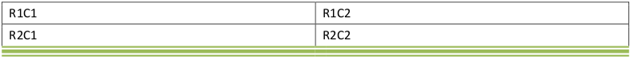
    
    此底部表格边框使用以下 WordprocessingML 指定：
    
    ```xml
    <w:tbl>
        <w:tblPr>
            <w:tblBorders>
                <w:bottom w:val="thinThickThinMediumGap" w:sz="24" w:space="0" w:color="D0D0D0" w:themeColor="accent3" w:themeTint="99"/>
            </w:tblBorders>
        </w:tblPr>
        …
    </w:tbl>
    ```
    
    bottom 元素指定了一种类型为 thinThinThickMediumGap 的三点底部表格边框。结束示例】
    
    This element’s content model is defined by the common border properties definition in [§17.3.4].

=== "英文"

    This element specifies the border which shall be displayed at the bottom of the current table. The appearance of this table border in the document shall be determined by the following settings:
    
    - The display of the border is subject to the conflict resolution algorithm defined by the tcBorders element ([§17.4.66]) and the tblBorders element ([§17.4.39];[§17.4.38])
    
    If this element is omitted, then the bottom of this table shall have the border specified by the associated table style. If no bottom border is specified in the style hierarchy, then this table shall not have a bottom border.
    
    [Example: Consider a table in which the table properties specifies a bottom table border, as follows:
    
    
    
    This bottom table border is specified using the following WordprocessingML:
    
    ```xml
    <w:tbl>
        <w:tblPr>
            <w:tblBorders>
                <w:bottom w:val="thinThickThinMediumGap" w:sz="24" w:space="0"
                    w:color="D0D0D0" w:themeColor="accent3" w:themeTint="99"/>
            </w:tblBorders>
        </w:tblPr>
        …
    </w:tbl>
    ```
    
    The bottom element specifies a three point bottom table border of type thinThinThickMediumGap. end example]
    
    This element’s content model is defined by the common border properties definition in [§17.3.4].

## 17.4.5 bottom (表格单元格底部边距默认值)

**bottom (Table Cell Bottom Margin Default)**

=== "中文"
    
    该元素指定了在父表格（或表格行）内所有表格单元格的内容底部范围与边框之间应留出的空间量。此设置可以被表格单元格属性中 bottom 元素指定的单元格底部边距定义覆盖（[§17.4.2]）。
    
    该值以其类型属性所应用的单位指定。对于该元素，任何类型为 pct 或 auto 的宽度值应被忽略。
    
    如果省略此元素，则应继承关联表格样式的表格单元格边距。如果在样式层次结构中从未指定底部边距，则默认情况下此表格将没有底部单元格填充（除非有单独的单元格覆盖）。
    
    【示例：考虑一个 2x2 的表格，其中默认表格单元格底部边距被指定为 0.25 英寸，如下所示（以下图第一个单元格中的箭头所示）：
    
    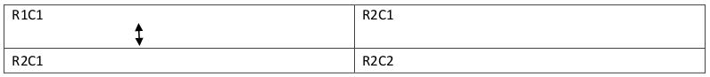
    
    此表格属性使用以下 WordprocessingML 标记指定：
    
    ```xml
    <w:tbl>
        <w:tblPr>
            <w:tblCellMar>
                <w:bottom w:w="360" w:type="dxa"/>
            </w:tblCellMar>
        </w:tblPr>
        …
    </w:tbl>
    ```
    
    表格中的每个单元格都有一个默认的单元格边距，设置为 360 个二十分之一点。结束示例】
    
    This element’s content model is defined by the common table measurement definition in [§17.4.87].

=== "英文"
    
    This element specifies the amount of space which shall be left between the bottom extent of the cell contents and the border of all table cells within the parent table (or table row). This setting can be overridden by the table cell bottom margin definition specified by the bottom element contained within the table cell's properties ([§17.4.2]).
    
    This value is specified in the units applied via its type attribute. Any width value of type pct or auto for this element shall be ignored.
    
    If this element is omitted, then it shall inherit the table cell margin from the associated table style. If a bottom margin is never specified in the style hierarchy, then this table shall have no bottom cell padding by default (excepting individual cell overrides).
    
    [Example: Consider a two by two table in which the default table cell bottom margin is specified to be exactly 0.25 inches, as follows (marked with an arrow in the first table cell below):
    
    
    
    This table property is specified using the following WordprocessingML markup:
    
    ```xml
    <w:tbl>
        <w:tblPr>
            <w:tblCellMar>
                <w:bottom w:w="360" w:type="dxa"/>
            </w:tblCellMar>
        </w:tblPr>
        …
    </w:tbl>
    ```
    
    Every cell in the table has a default cell margin setting it to 360 twentieths of a point. end example]
    
    This element’s content model is defined by the common table measurement definition in [§17.4.87].

## 17.4.6 cantSplit (表格行不能跨页中断)

**cantSplit (Table Row Cannot Break Across Pages)**

=== "中文"
    
    该元素指定了当前单元格内的内容是否应在单个页面上呈现。当显示表格单元格的内容时（如 ECMA-376 标准中的表格单元格），可能会出现页面断裂落在单元格内容中的情况，导致该单元格的内容分布在两个不同的页面上。如果设置了此属性，则所有表格行的内容应在同一页面上呈现，如果有必要，将当前行的起始位置移动到新页面的开始处。如果该表格行的内容无法在单个页面上容纳，则该行应在新页面上开始，并根据需要流动到多个页面。
    
    如果未出现此元素，则默认行为由关联的表格样式中的设置决定。如果样式层次结构中未指定此属性，则该表格行允许跨多个页面拆分。
    
    【示例：考虑以下内容显示在 WordprocessingML 文档的两个不同页面上：
    
    
    
    当显示此内容时，文档中第二个表格行的内容显示在两个不同的页面上。如果需要将此行的内容显示在一个页面上，则该要求应如下指定：
    
    ```xml
    <w:tr>
    <w:trPr>
    …
    <w:cantSplit />
    </w:trPr>
    …
    </w:tr>
    ```
    
    cantSplit 元素的存在指定了表格行不能跨多个页面断开，因此第二个表格行在新页面上开始：
    
    
    
    因此，此设置确保内容始终在单个页面上显示（如果它可以容纳在一个页面上）。结束示例】
    
    This element’s content model is defined by the common boolean property definition in [§17.17.4].

=== "英文"
    
    This element specifies whether the contents within the current cell shall be rendered on a single page. When displaying the contents of a table cell (such as the table cells in ECMA-376), it is possible that a page break would fall within the contents of a table cell, causing the contents of that cell to be displayed across two different pages. If this property is set, then all contents of a table row shall be rendered on the same page by moving the start of the current row to the start of a new page if necessary. If the contents of this table row cannot fit on a single page, then this row shall start on a new page and flow onto multiple pages as necessary.
    
    If this element is not present, the default behavior is dictated by the setting in the associated table style. If this property is not specified in the style hierarchy, then this table row shall be allowed to split across multiple pages.
    
    [Example: Consider the following content displayed on two different pages of a WordprocessingML document:
    
    
    
    When this content is displayed, the contents of the 2nd table row in this document are displayed across two different pages. If the contents of this row are to be displayed on one page, then this requirement would be specified as follows:
    
    ```xml
    <w:tr>
    <w:trPr>
    …
    <w:cantSplit />
    </w:trPr>
    …
    </w:tr>
    ```
    
    The presence of the cantSplit element specifies that the table row must not be broken across multiple pages, therefore the second table row starts on a new page:
    
    
    
    This setting therefore ensures that the content is always displayed on a single page (if it fits on one page). end example]
    
    This element’s content model is defined by the common boolean property definition in [§17.17.4].


## 17.4.7 cnfStyle (表行条件格式)

**cnfStyle (Table Row Conditional Formatting)**

=== "中文"
    
    该元素指定了应用于此表格行的条件表格样式格式属性集。【注意：此属性是一种优化，用于消费者确定表格行上的给定属性是表格样式条件格式属性的结果，还是直接在表格单元格上进行的格式设置。它指定了应用于此单元格的表格样式中的条件格式的组件，以便在文档显示后可以应用表格的条件格式，而不会让表格样式属性覆盖样式层次结构。结束注意】
    
    如果省略此元素，则其值应假定为位掩码中的所有条目均为零。
    
    【示例：考虑一个位于表格顶部的表格行，应用了一个表格样式。此表格单元格需要指定以下 WordprocessingML 以表达该事实：
    
    ```xml
    <w:tr>
        <w:trPr>
            <w:cnfStyle w:firstRow="true" />
            …
        </w:trPr>
        …
    </w:tr>
    ```
    
    此表格行通过设置适当的属性值，指定它具有来自父表格的第一行的表格样式的条件属性。结束示例】
    
    ??? abstract "Attributes"
    
        - **evenHBand**（偶数水平带）

            指定对象继承了应用于父对象的偶数水平带的条件属性。
    
            【示例：考虑一个位于表格第二行的段落，应用了表格样式，并且带宽为一行。此段落需要指定以下 WordprocessingML：
    
            ```xml
            <w:p>
                <w:pPr>
                    <w:cnfStyle w:evenHBand="true" />
                    …
                </w:pPr>
                …
            </w:p>
            ```
    
            此段落指定它具有来自父表格的偶数水平带的表格样式的条件属性。结束示例】
    
            此属性的可能值由 ST_OnOff 简单类型定义（[§22.9.2.7]）。

        - **evenVBand**（偶数垂直带）

            指定对象继承了应用于父对象的偶数垂直带的条件属性。
    
            【示例：考虑一个位于表格第二列的段落，应用了表格样式，并且带宽为一列。此段落需要指定以下 WordprocessingML：
    
            ```xml
            <w:p>
                <w:pPr>
                    <w:cnfStyle w:evenVBand="true" />
                    …
                </w:pPr>
                …
            </w:p>
            ```
    
            此段落指定它具有来自父表格的偶数垂直带的表格样式的条件属性。结束示例】
    
            此属性的可能值由 ST_OnOff 简单类型定义（[§22.9.2.7]）。

        - **firstColumn**（第一列）

            指定对象继承了应用于父对象的第一列的条件属性。
    
            【示例：考虑一个位于表格第一列的段落，应用了表格样式。
    
            此段落需要指定以下 WordprocessingML：
    
            ```xml
            <w:p>
                <w:pPr>
                    <w:cnfStyle w:firstColumn="true" />
                    …
                </w:pPr>
                …
            </w:p>
            ```
    
            此段落指定它具有来自父表格的第一列的表格样式的条件属性。结束示例】
    
            此属性的可能值由 ST_OnOff 简单类型定义（[§22.9.2.7]）。
    
        - **firstRow**（第一行）

            指定对象继承了应用于父对象的第一行的条件属性。

            【示例：考虑一个位于应用了表格样式的表格顶部的段落。此段落需要指定以下 WordprocessingML：

            ```xml
            <w:p>
                <w:pPr>
                    <w:cnfStyle w:firstRow="true" />
                    …
                </w:pPr>
                …
            </w:p>
            ```

            此段落指定它具有来自父表格的第一行的表格样式的条件属性。结束示例】

            此属性的可能值由 ST_OnOff 简单类型定义（[§22.9.2.7]）。

        - **firstRowFirstColumn**（第一行和第一列）

            指定对象继承了应用于父对象的第一行和第一列的单元格的条件属性。

            【示例：考虑一个位于表格的第一行和第一列的段落。此段落需要指定以下 WordprocessingML：

            ```xml
            <w:p>
                <w:pPr>
                    <w:cnfStyle w:firstRow="true" w:firstColumn="true"
                        w:firstRowFirstColumn="true" />
                    …
                </w:pPr>
                …
            </w:p>
            ```

            此段落指定它具有来自父表格的第一行和第一列单元格的表格样式的条件属性。结束示例】

            此属性的可能值由 ST_OnOff 简单类型定义（[§22.9.2.7]）。

        - **firstRowLastColumn**（第一行和最后一列）

            指定对象继承了应用于父对象的第一行和最后一列的单元格的条件属性。

            【示例：考虑一个位于表格的第一行和最后一列的段落。此段落需要指定以下 WordprocessingML：

            ```xml
            <w:p>
                <w:pPr>
                    <w:cnfStyle w:firstRow="true" w:lastColumn="true"
                        w:firstRowLastColumn="true" />
                    …
                </w:pPr>
                …
            </w:p>
            ```

            此段落指定它具有来自父表格的第一行和最后一列单元格的表格样式的条件属性。结束示例】

            此属性的可能值由 ST_OnOff 简单类型定义（[§22.9.2.7]）。
    
        - **lastColumn**（最后一列）

            指定对象继承了应用于父对象的最后一列的条件属性。

            【示例：考虑一个位于应用了表格样式的表格最后一列的段落。此段落需要指定以下 WordprocessingML：

            ```xml
            <w:p>
                <w:pPr>
                    <w:cnfStyle w:lastColumn="true" />
                    …
                </w:pPr>
                …
            </w:p>
            ```

            此段落指定它具有来自父表格的最后一列的表格样式的条件属性。结束示例】

            此属性的可能值由 ST_OnOff 简单类型定义（[§22.9.2.7]）。

        - **lastRow**（最后一行）

            指定对象继承了应用于父对象的最后一行的条件属性。

            【示例：考虑一个位于应用了表格样式的表格底部行的段落。此段落需要指定以下 WordprocessingML：

            ```xml
            <w:p>
                <w:pPr>
                    <w:cnfStyle w:lastRow="true" />
                    …
                </w:pPr>
                …
            </w:p>
            ```

            此段落指定它具有来自父表格的最后一行的表格样式的条件属性。结束示例】

            此属性的可能值由 ST_OnOff 简单类型定义（[§22.9.2.7]）。

        - **lastRowFirstColumn**（最后一行和第一列）

            指定对象继承了应用于父对象的最后一行和第一列的单元格的条件属性。

            【示例：考虑一个位于表格的最后一行和第一列的段落。此段落需要指定以下 WordprocessingML：

            ```xml
            <w:p>
                <w:pPr>
                    <w:cnfStyle w:lastRow="true" w:firstColumn="true"
                        w:lastRowFirstColumn="true" />
                    …
                </w:pPr>
                …
            </w:p>
            ```

            此段落指定它具有来自父表格的最后一行和第一列单元格的表格样式的条件属性。结束示例】

            此属性的可能值由 ST_OnOff 简单类型定义（[§22.9.2.7]）。
    
        - **lastRowLastColumn**（最后一行和最后一列）

            指定对象继承了应用于父对象的最后一行和最后一列的单元格的条件属性。

            【示例：考虑一个位于表格的最后一行和最后一列的段落。此段落需要指定以下 WordprocessingML：

            ```xml
            <w:p>
                <w:pPr>
                    <w:cnfStyle w:lastRow="true" w:lastColumn="true"
                        w:lastRowLastColumn="true" />
                    …
                </w:pPr>
                …
            </w:p>
            ```

            此段落指定它具有来自父表格的最后一行和最后一列单元格的表格样式的条件属性。结束示例】

            此属性的可能值由 ST_OnOff 简单类型定义（[§22.9.2.7]）。

        - **oddHBand**（奇数水平带）

            指定对象继承了应用于父对象的奇数水平带的条件属性。

            【示例：考虑一个位于应用了表格样式的表格第三行的段落，并且带宽为一列。此段落需要指定以下 WordprocessingML：

            ```xml
            <w:p>
                <w:pPr>
                    <w:cnfStyle w:oddHBand="true" />
                    …
                </w:pPr>
                …
            </w:p>
            ```

            此段落指定它具有来自父表格的奇数水平带的表格样式的条件属性。结束示例】

            此属性的可能值由 ST_OnOff 简单类型定义（[§22.9.2.7]）。

        - **oddVBand**（奇数垂直带）

            指定对象继承了应用于父对象的奇数垂直带的条件属性。

            【示例：考虑一个位于应用了表格样式的表格第三列的段落，并且带宽为一列。此段落需要指定以下 WordprocessingML：

            ```xml
            <w:p>
                <w:pPr>
                    <w:cnfStyle w:oddVBand="true" />
                    …
                </w:pPr>
                …
            </w:p>
            ```

            此段落指定它具有来自父表格的奇数垂直带的表格样式的条件属性。结束示例】

            此属性的可能值由 ST_OnOff 简单类型定义（[§22.9.2.7]）。
    
    [Note: The W3C XML Schema definition of this element’s content model (CT_Cnf) is located in §A.1. end note]

=== "英文"
    
    This element specifies the set of conditional table style formatting properties which have been applied to this table row. [Note: This property is an optimization which is used by consumers to determine if a given property on a table row is the result of the table style conditional formatting properties vs. direct formatting on the table cell itself. It specifies the components of the conditional formatting in the table style applied to this cell, so that the table's conditional formatting can be applied after the document is displayed without having the table style properties override the style hierarchy. end note]
    
    If this element is omitted, then its value shall be assumed to be zero for all entries in the bit mask.
    
    [Example: Consider a table row in the top of a table with a table style applied. This table cell would need to specify the following WordprocessingML to express that fact:
    
    ```xml
    <w:tr>
        <w:trPr>
            <w:cnfStyle w:firstRow="true" />
            …
        </w:trPr>
        …
    </w:tr>
    ```
    
    This table row specifies that it has the conditional properties from the table style for the first row of the parent
    table by setting the appropriate attribute value. end example]
    
    ??? abstract "Attributes"
    
        - **evenHBand** (Even Numbered Horizontal Band)
    
            Specifies that the object has inherited the conditional properties applied to the even numbered horizontal bands of the parent object.
            
            [Example: Consider a paragraph in the second row of a table with a table style applied, and where the band width is one row. This paragraph would need to specify the following WordprocessingML:
            
            ```xml
            <w:p>
                <w:pPr>
                    <w:cnfStyle w:evenHBand="true" />
                    …
                </w:pPr>
                …
            </w:p>
            ```
            
            This paragraph specifies that it has the conditional properties from the table style for the even numbered horizontal bands of the parent table. end example]
            
            The possible values for this attribute are defined by the ST_OnOff simple type ([§22.9.2.7]).
    
        - **evenVBand** (Even Numbered Vertical Band)
    
            Specifies that the object has inherited the conditional properties applied to the even numbered vertical bands of the parent object.
            
            [Example: Consider a paragraph in the second column of a table with a table style applied, and where the band width is one column. This paragraph would need to specify the following WordprocessingML:
            
            ```xml
            <w:p>
                <w:pPr>
                    <w:cnfStyle w:evenVBand="true" />
                    …
                </w:pPr>
                …
            </w:p>
            ```
            
            This paragraph specifies that it has the conditional properties from the table style for the even numbered vertical bands of the parent table. end example]
            
            The possible values for this attribute are defined by the ST_OnOff simple type ([§22.9.2.7]).
    
        - **firstColumn** (First Column)
    
            Specifies that the object has inherited the conditional properties applied to the first column of the parent object.
            
            [Example: Consider a paragraph in the first column of a table with a table style applied.
            
            This paragraph would need to specify the following WordprocessingML:
            
            ```xml
            <w:p>
                <w:pPr>
                    <w:cnfStyle w:firstColumn="true" />
                    …
                </w:pPr>
                …
            </w:p>
            ```
            
            This paragraph specifies that it has the conditional properties from the table style for the first column of the parent table. end example]
            
            The possible values for this attribute are defined by the ST_OnOff simple type ([§22.9.2.7]).
    
        - **firstRow** (First Row)
    
            Specifies that the object has inherited the conditional properties applied to the first row of the parent object.
            
            [Example: Consider a paragraph in the top row of a table with a table style applied. This paragraph would need to specify the following WordprocessingML:
            
            ```xml
            <w:p>
                <w:pPr>
                    <w:cnfStyle w:firstRow="true" />
                    …
                </w:pPr>
                …
            </w:p>
            ```
            
            This paragraph specifies that it has the conditional properties from the table style for the first row of the parent table. end example]
            
            The possible values for this attribute are defined by the ST_OnOff simple type ([§22.9.2.7]).
    
        - **firstRowFirstColumn** (First Row and First Column)
    
            Specifies that the object has inherited the conditional properties applied to the cell that is in the first row and first column of the parent object.
            
            [Example: Consider a paragraph in the first row and first column of a table. This paragraph would need to specify the following WordprocessingML:
            
            ```xml
            <w:p>
                <w:pPr>
                    <w:cnfStyle w:firstRow="true" w:firstColumn="true"
                        w:firstRowFirstColumn="true" />
                    …
                </w:pPr>
                …
            </w:p>
            ```
            
            This paragraph specifies that it has the conditional properties from the table style for the cell in the first row and first column of the parent table. end example]
            
            The possible values for this attribute are defined by the ST_OnOff simple type ([§22.9.2.7]).
    
        - **firstRowLastColumn** (First Row and Last Column)
    
            Specifies that the object has inherited the conditional properties applied to the cell that is in the first row and last column of the parent object.
            
            [Example: Consider a paragraph in the first row and last column of a table. This paragraph would need to specify the following WordprocessingML:
            
            ```xml
            <w:p>
                <w:pPr>
                    <w:cnfStyle w:firstRow="true" w:lastColumn="true"
                        w:firstRowLastColumn="true" />
                    …
                </w:pPr>
                …
            </w:p>
            ```
            
            This paragraph specifies that it has the conditional properties from the table style for th cell in the first row and last column of the parent table. end example]
            
            The possible values for this attribute are defined by the ST_OnOff simple type ([§22.9.2.7]).
    
        - **lastColumn** (Last Column)
    
            Specifies that the object has inherited the conditional properties applied to the last column of the parent object.
            
            [Example: Consider a paragraph in the last column of a table with a table style applied. This paragraph would need to specify the following WordprocessingML:
            
            ```xml
            <w:p>
                <w:pPr>
                    <w:cnfStyle w:lastColumn="true" />
                    …
                </w:pPr>
                …
            </w:p>
            ```
            
            This paragraph specifies that it has the conditional properties from the table style for the last column of the parent table. end example]
            
            The possible values for this attribute are defined by the ST_OnOff simple type ([§22.9.2.7]).
    
        - **lastRow** (Last Row)
    
            Specifies that the object has inherited the conditional properties applied to the last row of the parent object.
            
            [Example: Consider a paragraph in the bottom row of a table with a table style applied. This paragraph would need to specify the following WordprocessingML:
            
            ```xml
            <w:p>
                <w:pPr>
                    <w:cnfStyle w:lastRow="true" />
                    …
                </w:pPr>
                …
            </w:p>
            ```
            
            This paragraph specifies that it has the conditional properties from the table style for the last row of the parent table. end example]
            
            The possible values for this attribute are defined by the ST_OnOff simple type ([§22.9.2.7]).
    
        - **lastRowFirstColumn** (Last Row and First Column)
    
            Specifies that the object has inherited the conditional properties applied to the cell that is in the last row and first column of the parent object.
            
            [Example: Consider a paragraph in the last row and first column of a table. This paragraph would need to specify the following WordprocessingML:
            
            ```xml
            <w:p>
                <w:pPr>
                    <w:cnfStyle w:lastRow="true" w:firstColumn="true"
                        w:lastRowFirstColumn="true" />
                    …
                </w:pPr>
                …
            </w:p>
            ```
            
            This paragraph specifies that it has the conditional properties from the table style for the cell in the last row and first column of the parent table. end example]
            
            The possible values for this attribute are defined by the ST_OnOff simple type ([§22.9.2.7]).
    
        - **lastRowLastColumn** (Last Row and Last Column)
    
            Specifies that the object has inherited the conditional properties applied to the cell that is in the last row and last column of the parent object.
            
            [Example: Consider a paragraph in the last row and last column of a table. This paragraph would need to specify the following WordprocessingML:
            
            ```xml
            <w:p>
                <w:pPr>
                    <w:cnfStyle w:lastRow="true" w:lastColumn="true"
                        w:lastRowLastColumn="true" />
                    …
                </w:pPr>
                …
            </w:p>
            ```
            
            This paragraph specifies that it has the conditional properties from the table style for the cell in the last row and last column of the parent table. end example]
            
            The possible values for this attribute are defined by the ST_OnOff simple type ([§22.9.2.7]).
    
        - **oddHBand** (Odd Numbered Horizontal Band)
    
            Specifies that the object has inherited the conditional properties applied to the odd numbered horizontal bands of the parent object.
            
            [Example: Consider a paragraph in the third row of a table with a table style applied, and where the band width is one column. This paragraph would need to specify the following WordprocessingML:
            
            ```xml
            <w:p>
                <w:pPr>
                    <w:cnfStyle w:oddHBand="true" />
                    …
                </w:pPr>
                …
            </w:p>
            ```
            
            This paragraph specifies that it has the conditional properties from the table style for the odd numbered horizontal bands of the parent table. end example]
            
            The possible values for this attribute are defined by the ST_OnOff simple type ([§22.9.2.7]).
    
        - **oddVBand** (Odd Numbered Vertical Band)
    
            Specifies that the object has inherited the conditional properties applied to the odd numbered vertical bands of the parent object.
            
            [Example: Consider a paragraph in the third column of a table with a table style applied, and where the band width is one column. This paragraph would need to specify the following WordprocessingML:
            
            ```xml
            <w:p>
                <w:pPr>
                    <w:cnfStyle w:oddVBand="true" />
                    …
                </w:pPr>
                …
            </w:p>
            ```
            
            This paragraph specifies that it has the conditional properties from the table style for the odd numbered vertical bands of the parent table. end example]
            
            The possible values for this attribute are defined by the ST_OnOff simple type ([§22.9.2.7]).
    
    [Note: The W3C XML Schema definition of this element’s content model (CT_Cnf) is located in §A.1. end note]

## 17.4.8 cnfStyle (表格单元格条件格式)

**cnfStyle (Table Cell Conditional Formatting)**

=== "中文"

    该元素指定应用于此表格单元格的一组条件表格样式格式化属性。【注：此属性是一种优化，用于由使用者确定表格单元格上的给定属性是否是表格样式条件格式化属性与表格单元格本身的直接格式化的结果。它指定了应用于此单元格的表格样式中的条件格式化的组件，以便在文档显示后应用表格的条件格式化，而不会使表格样式属性覆盖样式层次结构。结束注解】
    
    如果省略此元素，则其值应假定为位掩码中所有条目的零。
    
    【示例：考虑一个应用了表格样式的表格中右上角的表格单元格，并且表格按从左到右的格式进行了格式化。此表格单元格需要指定以下 WordprocessingML 来表示这一事实：
    
    ```xml
    <w:tc>
        <w:tcPr>
            <w:cnfStyle w:firstRow="true" w:lastColumn="true"
                w:firstRowLastColumn="true" />
            …
        </w:tcPr>
        …
    </w:tc>
    ```
    
    此表格单元格指定其具有来自表格样式的条件属性，即父表格的第一列、第一行和右上角，通过设置适当的属性。结束示例】
    
    ??? abstract "Attributes"
    
        - **evenHBand**（偶数水平带）

            指定对象继承了应用于父对象的偶数水平带的条件属性。
    
            【示例：考虑一个位于表格第二行的段落，应用了表格样式，并且带宽为一行。此段落需要指定以下 WordprocessingML：
    
            ```xml
            <w:p>
                <w:pPr>
                    <w:cnfStyle w:evenHBand="true" />
                    …
                </w:pPr>
                …
            </w:p>
            ```
    
            此段落指定它具有来自父表格的偶数水平带的表格样式的条件属性。结束示例】
    
            此属性的可能值由 ST_OnOff 简单类型定义（[§22.9.2.7]）。

        - **evenVBand**（偶数垂直带）

            指定对象继承了应用于父对象的偶数垂直带的条件属性。
    
            【示例：考虑一个位于表格第二列的段落，应用了表格样式，并且带宽为一列。此段落需要指定以下 WordprocessingML：
    
            ```xml
            <w:p>
                <w:pPr>
                    <w:cnfStyle w:evenVBand="true" />
                    …
                </w:pPr>
                …
            </w:p>
            ```
    
            此段落指定它具有来自父表格的偶数垂直带的表格样式的条件属性。结束示例】
    
            此属性的可能值由 ST_OnOff 简单类型定义（[§22.9.2.7]）。

        - **firstColumn**（第一列）

            指定对象继承了应用于父对象的第一列的条件属性。
    
            【示例：考虑一个位于表格第一列的段落，应用了表格样式。
    
            此段落需要指定以下 WordprocessingML：
    
            ```xml
            <w:p>
                <w:pPr>
                    <w:cnfStyle w:firstColumn="true" />
                    …
                </w:pPr>
                …
            </w:p>
            ```
    
            此段落指定它具有来自父表格的第一列的表格样式的条件属性。结束示例】
    
            此属性的可能值由 ST_OnOff 简单类型定义（[§22.9.2.7]）。
    
        - **firstRow**（第一行）

            指定对象继承了应用于父对象的第一行的条件属性。

            【示例：考虑一个位于应用了表格样式的表格顶部的段落。此段落需要指定以下 WordprocessingML：

            ```xml
            <w:p>
                <w:pPr>
                    <w:cnfStyle w:firstRow="true" />
                    …
                </w:pPr>
                …
            </w:p>
            ```

            此段落指定它具有来自父表格的第一行的表格样式的条件属性。结束示例】

            此属性的可能值由 ST_OnOff 简单类型定义（[§22.9.2.7]）。

        - **firstRowFirstColumn**（第一行和第一列）

            指定对象继承了应用于父对象的第一行和第一列的单元格的条件属性。

            【示例：考虑一个位于表格的第一行和第一列的段落。此段落需要指定以下 WordprocessingML：

            ```xml
            <w:p>
                <w:pPr>
                    <w:cnfStyle w:firstRow="true" w:firstColumn="true"
                        w:firstRowFirstColumn="true" />
                    …
                </w:pPr>
                …
            </w:p>
            ```

            此段落指定它具有来自父表格的第一行和第一列单元格的表格样式的条件属性。结束示例】

            此属性的可能值由 ST_OnOff 简单类型定义（[§22.9.2.7]）。

        - **firstRowLastColumn**（第一行和最后一列）

            指定对象继承了应用于父对象的第一行和最后一列的单元格的条件属性。

            【示例：考虑一个位于表格的第一行和最后一列的段落。此段落需要指定以下 WordprocessingML：

            ```xml
            <w:p>
                <w:pPr>
                    <w:cnfStyle w:firstRow="true" w:lastColumn="true"
                        w:firstRowLastColumn="true" />
                    …
                </w:pPr>
                …
            </w:p>
            ```

            此段落指定它具有来自父表格的第一行和最后一列单元格的表格样式的条件属性。结束示例】

            此属性的可能值由 ST_OnOff 简单类型定义（[§22.9.2.7]）。
    
        - **lastColumn**（最后一列）

            指定对象继承了应用于父对象的最后一列的条件属性。

            【示例：考虑一个位于应用了表格样式的表格最后一列的段落。此段落需要指定以下 WordprocessingML：

            ```xml
            <w:p>
                <w:pPr>
                    <w:cnfStyle w:lastColumn="true" />
                    …
                </w:pPr>
                …
            </w:p>
            ```

            此段落指定它具有来自父表格的最后一列的表格样式的条件属性。结束示例】

            此属性的可能值由 ST_OnOff 简单类型定义（[§22.9.2.7]）。

        - **lastRow**（最后一行）

            指定对象继承了应用于父对象的最后一行的条件属性。

            【示例：考虑一个位于应用了表格样式的表格底部行的段落。此段落需要指定以下 WordprocessingML：

            ```xml
            <w:p>
                <w:pPr>
                    <w:cnfStyle w:lastRow="true" />
                    …
                </w:pPr>
                …
            </w:p>
            ```

            此段落指定它具有来自父表格的最后一行的表格样式的条件属性。结束示例】

            此属性的可能值由 ST_OnOff 简单类型定义（[§22.9.2.7]）。

        - **lastRowFirstColumn**（最后一行和第一列）

            指定对象继承了应用于父对象的最后一行和第一列的单元格的条件属性。

            【示例：考虑一个位于表格的最后一行和第一列的段落。此段落需要指定以下 WordprocessingML：

            ```xml
            <w:p>
                <w:pPr>
                    <w:cnfStyle w:lastRow="true" w:firstColumn="true"
                        w:lastRowFirstColumn="true" />
                    …
                </w:pPr>
                …
            </w:p>
            ```

            此段落指定它具有来自父表格的最后一行和第一列单元格的表格样式的条件属性。结束示例】

            此属性的可能值由 ST_OnOff 简单类型定义（[§22.9.2.7]）。
    
        - **lastRowLastColumn**（最后一行和最后一列）

            指定对象继承了应用于父对象的最后一行和最后一列的单元格的条件属性。

            【示例：考虑一个位于表格的最后一行和最后一列的段落。此段落需要指定以下 WordprocessingML：

            ```xml
            <w:p>
                <w:pPr>
                    <w:cnfStyle w:lastRow="true" w:lastColumn="true"
                        w:lastRowLastColumn="true" />
                    …
                </w:pPr>
                …
            </w:p>
            ```

            此段落指定它具有来自父表格的最后一行和最后一列单元格的表格样式的条件属性。结束示例】

            此属性的可能值由 ST_OnOff 简单类型定义（[§22.9.2.7]）。

        - **oddHBand**（奇数水平带）

            指定对象继承了应用于父对象的奇数水平带的条件属性。

            【示例：考虑一个位于应用了表格样式的表格第三行的段落，并且带宽为一列。此段落需要指定以下 WordprocessingML：

            ```xml
            <w:p>
                <w:pPr>
                    <w:cnfStyle w:oddHBand="true" />
                    …
                </w:pPr>
                …
            </w:p>
            ```

            此段落指定它具有来自父表格的奇数水平带的表格样式的条件属性。结束示例】

            此属性的可能值由 ST_OnOff 简单类型定义（[§22.9.2.7]）。

        - **oddVBand**（奇数垂直带）

            指定对象继承了应用于父对象的奇数垂直带的条件属性。

            【示例：考虑一个位于应用了表格样式的表格第三列的段落，并且带宽为一列。此段落需要指定以下 WordprocessingML：

            ```xml
            <w:p>
                <w:pPr>
                    <w:cnfStyle w:oddVBand="true" />
                    …
                </w:pPr>
                …
            </w:p>
            ```

            此段落指定它具有来自父表格的奇数垂直带的表格样式的条件属性。结束示例】

            此属性的可能值由 ST_OnOff 简单类型定义（[§22.9.2.7]）。
    
    [Note: The W3C XML Schema definition of this element’s content model (CT_Cnf) is located in §A.1. end note]

=== "英文"

    This element specifies the set of conditional table style formatting properties which have been applied to this table cell. [Note: This property is an optimization which is used by consumers to determine if a given property on a table cell is the result of the table style conditional formatting properties vs. direct formatting on the table cell itself. It specifies the components of the conditional formatting in the table style applied to this cell, so that the table's conditional formatting can be applied after the document is displayed without having the table style properties override the style hierarchy. end note]
    
    If this element is omitted, then its value shall be assumed to be zero for all entries in the bit mask.
    
    [Example: Consider a table cell in the top right corner of a table with a table style applied and where the table is formatted as left to right. This table cell would need to specify the following WordprocessingML to express that fact:
    
    ```xml
    <w:tc>
        <w:tcPr>
            <w:cnfStyle w:firstRow="true" w:lastColumn="true"
                w:firstRowLastColumn="true" />
            …
        </w:tcPr>
        …
    </w:tc>
    ```
    
    This table cell specifies that it has the conditional properties from the table style for the first column, first row, and the top right corner of the parent table by setting the appropriate attributes. end example]
        
    ??? abstract "Attributes"
    
        - **evenHBand** (Even Numbered Horizontal Band)
    
            Specifies that the object has inherited the conditional properties applied to the even numbered horizontal bands of the parent object.
            
            [Example: Consider a paragraph in the second row of a table with a table style applied, and where the band width is one row. This paragraph would need to specify the following WordprocessingML:
            
            ```xml
            <w:p>
                <w:pPr>
                    <w:cnfStyle w:evenHBand="true" />
                    …
                </w:pPr>
                …
            </w:p>
            ```
            
            This paragraph specifies that it has the conditional properties from the table style for the even numbered horizontal bands of the parent table. end example]
            
            The possible values for this attribute are defined by the ST_OnOff simple type ([§22.9.2.7]).
    
        - **evenVBand** (Even Numbered Vertical Band)
    
            Specifies that the object has inherited the conditional properties applied to the even numbered vertical bands of the parent object.
            
            [Example: Consider a paragraph in the second column of a table with a table style applied, and where the band width is one column. This paragraph would need to specify the following WordprocessingML:
            
            ```xml
            <w:p>
                <w:pPr>
                    <w:cnfStyle w:evenVBand="true" />
                    …
                </w:pPr>
                …
            </w:p>
            ```
            
            This paragraph specifies that it has the conditional properties from the table style for the even numbered vertical bands of the parent table. end example]
            
            The possible values for this attribute are defined by the ST_OnOff simple type ([§22.9.2.7]).
    
        - **firstColumn** (First Column)
    
            Specifies that the object has inherited the conditional properties applied to the first column of the parent object.
            
            [Example: Consider a paragraph in the first column of a table with a table style applied.
            
            This paragraph would need to specify the following WordprocessingML:
            
            ```xml
            <w:p>
                <w:pPr>
                    <w:cnfStyle w:firstColumn="true" />
                    …
                </w:pPr>
                …
            </w:p>
            ```
            
            This paragraph specifies that it has the conditional properties from the table style for the first column of the parent table. end example]
            
            The possible values for this attribute are defined by the ST_OnOff simple type ([§22.9.2.7]).
    
        - **firstRow** (First Row)
    
            Specifies that the object has inherited the conditional properties applied to the first row of the parent object.
            
            [Example: Consider a paragraph in the top row of a table with a table style applied. This paragraph would need to specify the following WordprocessingML:
            
            ```xml
            <w:p>
                <w:pPr>
                    <w:cnfStyle w:firstRow="true" />
                    …
                </w:pPr>
                …
            </w:p>
            ```
            
            This paragraph specifies that it has the conditional properties from the table style for the first row of the parent table. end example]
            
            The possible values for this attribute are defined by the ST_OnOff simple type ([§22.9.2.7]).
    
        - **firstRowFirstColumn** (First Row and First Column)
    
            Specifies that the object has inherited the conditional properties applied to the cell that is in the first row and first column of the parent object.
            
            [Example: Consider a paragraph in the first row and first column of a table. This paragraph would need to specify the following WordprocessingML:
            
            ```xml
            <w:p>
                <w:pPr>
                    <w:cnfStyle w:firstRow="true" w:firstColumn="true"
                        w:firstRowFirstColumn="true" />
                    …
                </w:pPr>
                …
            </w:p>
            ```
            
            This paragraph specifies that it has the conditional properties from the table style for the cell in the first row and first column of the parent table. end example]
            
            The possible values for this attribute are defined by the ST_OnOff simple type ([§22.9.2.7]).
    
        - **firstRowLastColumn** (First Row and Last Column)
    
            Specifies that the object has inherited the conditional properties applied to the cell that is in the first row and last column of the parent object.
            
            [Example: Consider a paragraph in the first row and last column of a table. This paragraph would need to specify the following WordprocessingML:
            
            ```xml
            <w:p>
                <w:pPr>
                    <w:cnfStyle w:firstRow="true" w:lastColumn="true"
                        w:firstRowLastColumn="true" />
                    …
                </w:pPr>
                …
            </w:p>
            ```
            
            This paragraph specifies that it has the conditional properties from the table style for th cell in the first row and last column of the parent table. end example]
            
            The possible values for this attribute are defined by the ST_OnOff simple type ([§22.9.2.7]).
    
        - **lastColumn** (Last Column)
    
            Specifies that the object has inherited the conditional properties applied to the last column of the parent object.
            
            [Example: Consider a paragraph in the last column of a table with a table style applied. This paragraph would need to specify the following WordprocessingML:
            
            ```xml
            <w:p>
                <w:pPr>
                    <w:cnfStyle w:lastColumn="true" />
                    …
                </w:pPr>
                …
            </w:p>
            ```
            
            This paragraph specifies that it has the conditional properties from the table style for the last column of the parent table. end example]
            
            The possible values for this attribute are defined by the ST_OnOff simple type ([§22.9.2.7]).
    
        - **lastRow** (Last Row)
    
            Specifies that the object has inherited the conditional properties applied to the last row of the parent object.
            
            [Example: Consider a paragraph in the bottom row of a table with a table style applied. This paragraph would need to specify the following WordprocessingML:
            
            ```xml
            <w:p>
                <w:pPr>
                    <w:cnfStyle w:lastRow="true" />
                    …
                </w:pPr>
                …
            </w:p>
            ```
            
            This paragraph specifies that it has the conditional properties from the table style for the last row of the parent table. end example]
            
            The possible values for this attribute are defined by the ST_OnOff simple type ([§22.9.2.7]).
    
        - **lastRowFirstColumn** (Last Row and First Column)
    
            Specifies that the object has inherited the conditional properties applied to the cell that is in the last row and first column of the parent object.
            
            [Example: Consider a paragraph in the last row and first column of a table. This paragraph would need to specify the following WordprocessingML:
            
            ```xml
            <w:p>
                <w:pPr>
                    <w:cnfStyle w:lastRow="true" w:firstColumn="true"
                        w:lastRowFirstColumn="true" />
                    …
                </w:pPr>
                …
            </w:p>
            ```
            
            This paragraph specifies that it has the conditional properties from the table style for the cell in the last row and first column of the parent table. end example]
            
            The possible values for this attribute are defined by the ST_OnOff simple type ([§22.9.2.7]).
    
        - **lastRowLastColumn** (Last Row and Last Column)
    
            Specifies that the object has inherited the conditional properties applied to the cell that is in the last row and last column of the parent object.
            
            [Example: Consider a paragraph in the last row and last column of a table. This paragraph would need to specify the following WordprocessingML:
            
            ```xml
            <w:p>
                <w:pPr>
                    <w:cnfStyle w:lastRow="true" w:lastColumn="true"
                        w:lastRowLastColumn="true" />
                    …
                </w:pPr>
                …
            </w:p>
            ```
            
            This paragraph specifies that it has the conditional properties from the table style for the cell in the last row and last column of the parent table. end example]
            
            The possible values for this attribute are defined by the ST_OnOff simple type ([§22.9.2.7]).
    
        - **oddHBand** (Odd Numbered Horizontal Band)
    
            Specifies that the object has inherited the conditional properties applied to the odd numbered horizontal bands of the parent object.
            
            [Example: Consider a paragraph in the third row of a table with a table style applied, and where the band width is one column. This paragraph would need to specify the following WordprocessingML:
            
            ```xml
            <w:p>
                <w:pPr>
                    <w:cnfStyle w:oddHBand="true" />
                    …
                </w:pPr>
                …
            </w:p>
            ```
            
            This paragraph specifies that it has the conditional properties from the table style for the odd numbered horizontal bands of the parent table. end example]
            
            The possible values for this attribute are defined by the ST_OnOff simple type ([§22.9.2.7]).
    
        - **oddVBand** (Odd Numbered Vertical Band)
    
            Specifies that the object has inherited the conditional properties applied to the odd numbered vertical bands of the parent object.
            
            [Example: Consider a paragraph in the third column of a table with a table style applied, and where the band width is one column. This paragraph would need to specify the following WordprocessingML:
            
            ```xml
            <w:p>
                <w:pPr>
                    <w:cnfStyle w:oddVBand="true" />
                    …
                </w:pPr>
                …
            </w:p>
            ```
            
            This paragraph specifies that it has the conditional properties from the table style for the odd numbered vertical bands of the parent table. end example]
            
            The possible values for this attribute are defined by the ST_OnOff simple type ([§22.9.2.7]).
    
    [Note: The W3C XML Schema definition of this element’s content model (CT_Cnf) is located in §A.1. end note]

## 17.4.9 divId (关联的 HTML div ID)

**divId (Associated HTML div ID)**

=== "中文"
    
    该元素指定与当前表格行关联的 HTML div 信息。此信息存储在 Web 设置部分中，用于将一个或多个表格行与特定的 HTML div 元素关联起来。【注：此属性用于在将 HTML 文档保存为 WordprocessingML 格式时，防止丢失所有 HTML div 信息，以便稍后将文档保存回 HTML 格式并替换存储的信息，因为 HTML div 可以在任意区域存储格式化属性。结束注解】
    
    为了确定关联的 HTML div 属性，将使用此元素上的 val 属性的值查找一个与此值匹配的关联 div 元素（[§17.15.2.8]）的 id 属性。
    
    如果此表格行没有 divId 元素，那么此表格行将不具有任何关联的 HTML div 信息。如果此元素存在，但 val 属性指定了一个没有关联 div 元素的 id 值，则将忽略此元素。
    
    【示例：考虑一个定义如下的 HTML 文档：
    
    ```xml
    <html>
        <body>
            <div style="…">
                <table>
                    <tr>
                        <td>R1C1</td>
                        …
                    </tr>
                </table>
                <p>
                    …
                </p>
            </div>
            …
        </body>
    </html>
    ```
    
    此 HTML 文档指定了一个跨越表格和第一个段落的 div。如果将此文档保存为 WordprocessingML，则表格的两行和段落必须具有指向 Web 设置部分中相同 div 信息的 divId：
    
    ```xml
    <w:trPr>
        …
        <w:divId w:val="1102603671"/>
    </w:trPr>
    ```
    
    然后，val 属性指向存储关联 div 属性的 div 元素：
    
    ```xml
    <w:divs>
        <w:div w:id="1102603671">
            …
        </w:div>
    </w:divs>
    ```
    
    这指定了此表格的行是单个 HTML div 的一部分。结束示例】
    
    ??? abstract "属性"
    
        - **val**（十进制数值）
    
            指定此属性的内容包含一个十进制数。
            
            此十进制数的内容根据父 XML 元素的上下文进行解释。
            
            【示例：考虑以下简单类型 ST_DecimalNumber 的数值 WordprocessingML 属性：
            
            ```xml
            <… w:val="1512645511" />
            ```
    
            val 属性的值是一个十进制数，其值必须根据父元素的上下文进行解释。结束示例】
            
            此属性的可能值由 ST_DecimalNumber 简单类型定义（[§17.18.10]）。
    
    [Note: The W3C XML Schema definition of this element’s content model (CT_DecimalNumber) is located in §A.1. end note]

=== "英文"
    
    This element specifies the HTML div information which is associated with the current table row. This information, stored in the Web Settings part, is used to associate one or more table rows with a particular HTML div element. [Note: This property is used when saving an HTML document into the WordprocessingML format in order to prevent a loss of all HTML div information, so that the document can later be saved back into HTML format and have the stored information replaced, since the HTML div can store formatting properties on arbitrary regions. end note]
    
    In order to determine the associated HTML div properties, the value of the val attribute on this element is used to look up an associated div element ([§17.15.2.8]) whose id attribute matches this value.
    
    If this table row does not have a divId element present, then this table row shall not have any associated HTML div information. If this element is present, but the val attribute specifies an id value which does not have an associated div element, then this element is ignored.
    
    [Example: Consider an HTML document defined as follows:
    
    ```xml
    <html>
        <body>
            <div style="…">
                <table>
                    <tr>
                        <td>R1C1</td>
                        …
                    </tr>
                </table>
                <p>
                    …
                </p>
            </div>
            …
        </body>
    </html>
    ```
    
    This HTML document specifies a div spanning the table and the first paragraph. If this document is saved into WordprocessingML, then both the rows of the table and the paragraph must have a divId which points at the same div information in the web settings part:
    
    ```xml
    <w:trPr>
        …
        <w:divId w:val="1102603671"/>
    </w:trPr>
    ```
    
    The val attribute then points at a div element which stores the associated div properties:
    
    ```xml
    <w:divs>
        <w:div w:id="1102603671">
            …
        </w:div>
    </w:divs>
    ```
    
    This specifies that this table's rows are part of a single HTML div. end example]
    
    ??? abstract "Attributes"
    
        - **val** (Decimal Number Value)
    
            Specifies that the contents of this attribute contains a decimal number.
            
            The contents of this decimal number are interpreted based on the context of the parent XML element.
            
            [Example: Consider the following numeric WordprocessingML property of simple type ST_DecimalNumber:
            
            ```xml
            <… w:val="1512645511" />
            ```
    
            The value of the val attribute is a decimal number whose value must be interpreted in the context of the parent element. end example]
            
            The possible values for this attribute are defined by the ST_DecimalNumber simple type ([§17.18.10]).
    
    [Note: The W3C XML Schema definition of this element’s content model (CT_DecimalNumber) is located in §A.1. end note]

    
## 17.4.10 end (表格单元格尾随边距异常)

**end (Table Cell Trailing Margin Exception)**

=== "中文"

    该元素指定了当前单元格文本内容的尾部范围与表格中特定单个表格单元格的尾部边框之间应存在的空间量。此设置将覆盖表格属性中包含的 end 元素指定的单元格尾部边距定义（[§17.4.11]）。
    
    此值以其 type 属性应用的单位指定。对于此元素的类型为百分比或自动的任何宽度值都将被忽略。
    
    如果省略，则此表格单元格将使用表格属性中包含的 end 元素指定的尾部单元格边距。
    
    【示例：考虑一个两行两列的从左到右的表格，其中第二行的第一个表格单元格的尾部边距通过异常指定为0.5英寸，如下图所示的区域：
    
    
    
    此单元格的异常将使用以下 WordprocessingML 指定：
    
    ```xml
    <w:tc>
        <w:tcPr>
            <w:tcMar>
                <w:end w:w="720" w:type="dxa" />
            </w:tcMar>
        </w:tcPr>
        …
    </w:tc>
    ```
    
    此表格中的 R2C1 单元格具有应用于表格单元格尾部单元格边距的异常，将其设置为720个点（0.5英寸）。结束示例】
    
    This element’s content model is defined by the common table measurement definition in [§17.4.87].

=== "英文"

    This element specifies the amount of space which shall be present between the trailing extent of the current cell's text contents and the trailing border of a specific individual table cell within a table. This setting shall override the table cell trailing margin definition specified by the end element contained within the table properties ([§17.4.11]).
    
    This value is specified in the units applied via its type attribute. Any width value of type pct or auto for this element shall be ignored.
    
    If omitted, then this table cell shall use the trailing cell margins defined in the end element contained within the table properties ([§17.4.11]).
    
    [Example: Consider a two row, two column LTR table in which the first table cell in the second row has a trailing margin which is specified via an exception to be 0.5 inches, the region marked with an arrow in the table below:
    
    
    
    The exception on this cell would be specified using the following WordprocessingML:
    
    ```xml
    <w:tc>
        <w:tcPr>
            <w:tcMar>
                <w:end w:w="720" w:type="dxa" />
            </w:tcMar>
        </w:tcPr>
        …
    </w:tc>
    ```
    
    The R2C1 cell in this table has an exception applied to the table cell trailing cell margin setting it to 720 twentieths of a point (0.5 inches). end example]
    
    This element’s content model is defined by the common table measurement definition in [§17.4.87].


## 17.4.11 end (表格单元格尾随边距默认值)

**end (Table Cell Trailing Margin Default)**

=== "中文"

    该元素指定了在父表格（或表格行）中所有表格单元格的尾部内容和尾部边框之间应存在的空间量。此设置可以被表格单元格属性中包含的 end 元素指定的单元格尾部边距覆盖（[§17.4.10]）。
    
    此值以其 type 属性应用的单位指定。对于此元素的类型为百分比或自动的任何宽度值都将被忽略。
    
    如果省略，则它将继承与关联表格样式相关联的表格单元格边距。如果从未在样式层次结构中指定尾部边距，则此表将具有默认的 115 个点（0.08 英寸）左单元格填充（除非单个单元格被覆盖）。
    
    【示例：考虑一个两行两列的从左到右的表格，其中默认表格单元格尾部边距被指定为确切的 0.25 英寸，如下图所示（在下面的第一个表格单元格中用箭头标记）：
    
    
    
    此表格属性使用以下 WordprocessingML 标记指定：
    
    ```xml
    <w:tbl>
        <w:tblPr>
            <w:tblCellMar>
                <w:end w:w="360" w:type="dxa"/>
            </w:tblCellMar>
        </w:tblPr>
        …
    </w:tbl>
    ```
    
    表格中的每个单元格都具有将其默认尾部单元格边距设置为 360 个点的设置。结束示例】
    
    This element’s content model is defined by the common table measurement definition in [§17.4.87].

=== "英文"

    This element specifies the amount of space which shall be present between the trailing extent of the cell contents and the trailing border of all table cells within the parent table (or table row) . This setting can be overridden by the table cell trailing margin definition specified by the end element contained within the table cell's properties ([§17.4.10]).
    
    This value is specified in the units applied via its type attribute. Any width value of type pct or auto for this element shall be ignored.
    
    If this element is omitted, then it shall inherit the table cell margin from the associated table style. If a trailing margin is never specified in the style hierarchy, this table shall have 115 twentieths of a point (0.08 inches) left cell padding by default (excepting individual cell overrides).
    
    [Example: Consider a two by two LTR table in which the default table cell trailing margin is specified to be exactly 0.25 inches, as follows (marked with an arrow in the first table cell below):
    
    
    
    This table property is specified using the following WordprocessingML markup:
    
    ```xml
    <w:tbl>
        <w:tblPr>
            <w:tblCellMar>
                <w:end w:w="360" w:type="dxa"/>
            </w:tblCellMar>
        </w:tblPr>
        …
    </w:tbl>
    ```
    
    Every cell in the table has a default trailing cell margin setting it to 360 twentieths of a point. end example]
    
    This element’s content model is defined by the common table measurement definition in [§17.4.87].

## 17.4.12 end (表格单元格后缘边框)

**end (Table Cell Trailing Edge Border)**

=== "中文"
    
    该元素指定当前表格单元格的尾部边界（LTR 表格的右侧，RTL 表格的左侧）应显示的边框。文档中此表格单元格边框的外观将由以下设置确定：
    
    - 如果应用于单元格的净 tblCellSpacing 元素值（[§17.4.44]; [§17.4.43]; [§17.4.45]）为非零，则始终显示单元格边框。
    - 否则，边框的显示将受到由 tcBorders 元素（[§17.4.66]）和 tblBorders 元素（[§17.4.39]; [§17.4.38]）定义的冲突解决算法的影响。
    
    如果省略此元素，则此表格单元格的尾部边缘将不显示单元格边框，并且其边框可以根据需要使用表格的边框设置。
    
    【示例：考虑一个 LTR 表格，在其中第一行的第二个单元格指定尾部边界单元格边框如下：
    
    
    
    此尾部边界单元格边框使用以下 WordprocessingML 指定：
    
    ```xml
    <w:tc>
        <w:tcPr>
            …
            <w:tcBorders>
                <w:end w:val="double" w:sz="4" w:space="0" w:color="FF0000" />
            </w:tcBorders>
        </w:tcPr>
        <w:p/>
    </w:tc>
    ```
    
    end 元素在表格单元格的尾部边缘上指定了一个类型为双重的 ½ 点边框。结束示例】
    
    This element’s content model is defined by the common border properties definition in [§17.3.4].

=== "英文"
    
    This element specifies the border which shall be displayed on the trailing edge of the current table cell (right for LTR tables, left for RTL tables). The appearance of this table cell border in the document shall be determined by the following settings:
    
    - If the net tblCellSpacing element value ([§17.4.44];[§17.4.43];[§17.4.45]) applied to the cell is non-zero, then the cell border shall always be displayed
    - Otherwise, the display of the border is subject to the conflict resolution algorithm defined by the tcBorders element ([§17.4.66]) and the tblBorders element ([§17.4.39];[§17.4.38])
    
    If this element is omitted, then the trailing edge of this table cell shall not have a cell border, and its border can use the table's border settings as appropriate.
    
    [Example: Consider an LTR table in which the second cell in the first row specifies a trailing dge cell border as follows:
    
    
    
    This trailing edge cell border is specified using the following WordprocessingML:
    
    ```xml
    <w:tc>
        <w:tcPr>
            …
            <w:tcBorders>
                <w:end w:val="double" w:sz="4" w:space="0" w:color="FF0000" />
            </w:tcBorders>
        </w:tcPr>
        <w:p/>
    </w:tc>
    ```
    
    The end element specifies a ½ point border of type double on the trailing edge of the table cell. end example]
    
    This element’s content model is defined by the common border properties definition in [§17.3.4].

## 17.4.13 end (表格后缘边框)

**end (Table Trailing Edge Border)**

=== "中文"
    
    该元素指定当前表格的尾部边界（LTR 表格的右侧，RTL 表格的左侧）应显示的边框。文档中此表格边框的外观将由以下设置确定：
    
    - 边框的显示受到由 tcBorders 元素（[§17.4.66]）和 tblBorders 元素（[§17.4.39]; [§17.4.38]）定义的冲突解决算法的影响。
    
    如果省略此元素，则此表格的尾部边缘将具有由关联表格样式指定的边框。如果样式层次结构中未指定尾部边界，则此表格将不具有尾部边界。
    
    【示例：考虑一个 LTR 表格，在其中表格属性指定了尾部边界表格边框，如下所示：
    
    
    
    此尾部边界表格边框使用以下 WordprocessingML 指定：
    
    ```xml
    <w:tbl>
        <w:tblPr>
            <w:tblBorders>
                <w:end w:val="thinThickThinMediumGap" w:sz="24" w:space="0"
                    w:color="D0D0D0" w:themeColor="accent3" w:themeTint="99"/>
            </w:tblBorders>
        </w:tblPr>
        …
    </w:tbl>
    ```
    
    end 元素指定了一个类型为 thinThinThickMediumGap 的三点尾部边界表格边框。结束示例】
    
    This element’s content model is defined by the common border properties definition in [§17.3.4].

=== "英文"
    
    This element specifies the border which shall be displayed at the trailing edge of the current table (right for LTR tables, left for RTL tables). The appearance of this table border in the document shall be determined by the following settings:
    
    - The display of the border is subject to the conflict resolution algorithm defined by the tcBorders element ([§17.4.66]) and the tblBorders element ([§17.4.39];[§17.4.38])
    
    If this element is omitted, then the trailing edge of this table shall have the border specified by the associated table style. If no trailing edge border is specified in the style hierarchy, then this table shall not have a trailing edge border.
    
    [Example: Consider an LTR table in which the table properties specify a trailing edge table border, as follows:
    
    
    
    This trailing edge table border is specified using the following WordprocessingML:
    
    ```xml
    <w:tbl>
        <w:tblPr>
            <w:tblBorders>
                <w:end w:val="thinThickThinMediumGap" w:sz="24" w:space="0"
                    w:color="D0D0D0" w:themeColor="accent3" w:themeTint="99"/>
            </w:tblBorders>
        </w:tblPr>
        …
    </w:tbl>
    ```
    
    The end element specifies a three point trailing edge table border of type thinThinThickMediumGap. end example]
    
    This element’s content model is defined by the common border properties definition in [§17.3.4].

## 17.4.14 gridAfter (最后一个单元格之后的网格列)

**gridAfter (Grid Columns After Last Cell)**

=== "中文"
    
    该元素指定了父表格的表格网格（[§17.4.48]; [§17.4.47]）中，表格行中最后一个单元格之后应保留的网格列数。
    
    如果此元素与将所有此行中的表格单元格添加到网格后文档网格的剩余大小存在冲突，则将忽略它。如果未指定此元素，则其值将被假定为零个网格单位。
    
    【示例：考虑一个表格，其第二行比第一行提前了一个网格单位：
    
    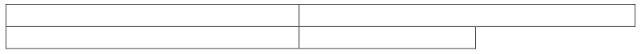
    
    在此表格中，第二行在其单元格内容之后留下一个网格单位，使用以下 WordprocessingML 表示：
    
    ```xml
    <w:tr>
        <w:trPr>
            <w:gridAfter w:val="1" />
            …
        </w:trPr>
        …
    </w:tr>
    ```
    
    gridAfter 元素指定了行内容后面保留了 1 个网格单位。结束示例】
    
    [Note: The W3C XML Schema definition of this element’s content model (CT_DecimalNumber) is located in §A.1. end note]

=== "英文"
    
    This element specifies the number of grid columns in the parent table's table grid ([§17.4.48]; [§17.4.47]) which shall be left after the last cell in the table row.
    
    If this element conflicts with the remaining size of the document grid after all table cells in this row have been added to the grid, then it shall be ignored. If this element is not specified, then its value shall be assumed to be zero grid units.
    
    [Example: Consider a table whose second row ends before the first row by one grid unit:
    
    
    
    In this table, the second row leaves one grid unit after its cell contents, which is represented using the following
    WordprocessingML:
    
    ```xml
    <w:tr>
        <w:trPr>
            <w:gridAfter w:val="1" />
            …
        </w:trPr>
        …
    </w:tr>
    ```
    
    The gridAfter element specifies that 1 grid unit remains after the row's contents. end example]
    
    ??? abstract "Attributes"
    
    - **val** (Decimal Number Value)
    
        Specifies that the contents of this attribute contains a decimal number.
        
        The contents of this decimal number are interpreted based on the context of the parent XML element.
        
        [Example: Consider the following numeric WordprocessingML property of simple type ST_DecimalNumber:
        
        ```xml
        <… w:val="1512645511" />
        ```
        
        The value of the val attribute is a decimal number whose value must be interpreted in the context of the parent element. end example]
        
        The possible values for this attribute are defined by the ST_DecimalNumber simple type ([§17.18.10]).
    
    [Note: The W3C XML Schema definition of this element’s content model (CT_DecimalNumber) is located in §A.1. end note]

## 17.4.15 gridBefore (第一个单元格之前的网格列)

**gridBefore (Grid Columns Before First Cell)**

=== "中文"
    
    该元素指定父表格的表格网格（[§17.4.48]; [§17.4.47]）中，在将该表格行的内容（其表格单元格）添加到父表格之前必须跳过的网格列数。【注：此属性用于指定其前导边缘（对于从左到右的表格为左边，对于从右到左的表格为右边）不从第一个网格列（相同的共享边缘）开始的表格。】如果省略此元素，则其值应被假定为零个网格单元。如果此元素的值大于表格网格的大小，则应忽略该值，并且行中的第一个单元格可以跨越整个表格网格（即，如果存在第二个单元格，则应从表格中的最后一个共享边缘开始）。【示例：考虑一个从第一个网格单元格之后开始的表格的第二行：
    
    
    
    在此表格中，第二行在开始时跳过了一个网格单位，以下是相应的 WordprocessingML：
    
    ```xml
    <w:tr>
        <w:trPr>
            <w:gridBefore w:val="1" />
            …
        </w:trPr>
        …
    </w:tr>
    ```
    
    示例结束】
    
    
    ??? abstract "属性"
    
        - **val**（十进制数值）
        
            指定此属性的内容包含一个十进制数。
            
            此十进制数的内容根据父 XML 元素的上下文进行解释。
            
            【示例：考虑以下简单类型 ST_DecimalNumber 的数值 WordprocessingML 属性：
            
            ```xml
            <… w:val="1512645511" />
            ```
            
            val 属性的值是一个十进制数，其值必须根据父元素的上下文进行解释。示例结束】
            
            此属性的可能取值由 ST_DecimalNumber 简单类型定义（[§17.18.10]）。
    
    [Note: The W3C XML Schema definition of this element’s content model (CT_DecimalNumber) is located in §A.1. end note]

=== "英文"
    
    This element specifies the number of grid columns in the parent table's table grid ([§17.4.48]; [§17.4.47]) which must be skipped before the contents of this table row (its table cells) are added to the parent table. [Note: This property is used to specify tables whose leading edge (left for left-to-right tables, right for right-to-left tables) does not start at the first grid column (the same shared edge). end note]
    
    If this element is omitted, then its value shall be assumed to be zero grid units. If this element's value is larger than the size of the table grid, then the value shall be ignored and the first cell in the row can span the full table grid (i.e. the second cell, if one exists, should start at the last shared edge in the table).
    
    [Example: Consider a table whose second row starts after the first grid unit:
    
    
    
    In this table, the second row skips one grid unit at the beginning which is represented by the following WordprocessingML:
    
    ```xml
    <w:tr>
        <w:trPr>
            <w:gridBefore w:val="1" />
            …
        </w:trPr>
        …
    </w:tr>
    ```
    
    end example]
    
    ??? abstract "Attributes"
    
        - **val** (Decimal Number Value)
    
            Specifies that the contents of this attribute contains a decimal number.
            
            The contents of this decimal number are interpreted based on the context of the parent XML element.
            
            [Example: Consider the following numeric WordprocessingML property of simple type ST_DecimalNumber:
            
            ```xml
            <… w:val="1512645511" />
            ```
            
            The value of the val attribute is a decimal number whose value must be interpreted in the context of the parent element. end example]
            
            The possible values for this attribute are defined by the ST_DecimalNumber simple type ([§17.18.10]).
    
    [Note: The W3C XML Schema definition of this element’s content model (CT_DecimalNumber) is located in §A.1. end note]

## 17.4.16 gridCol (网格列定义)

**gridCol (Grid Column Definition)**

=== "中文"
    
    该元素指定表格网格中的单个网格列的存在和详细信息。网格列是表格中的逻辑列，用于指定表格中共享垂直边缘的存在。然后，当将表格单元格添加到此表格时，这些共享边缘（或者查看介于这些共享边缘之间的网格列）决定了如何将表格单元格放置到表格网格中。
    
    【示例：如果表格行指定其前面有两个网格列，则它将从表格中的第三个垂直边缘开始，包括未被所有列共享的边缘。示例结束】
    
    如果表格网格不符合表格中一个或多个行的要求（即，它未定义足够的网格列），则在处理表格时可以根据需要重新定义网格。
    
    【示例：考虑以下更复杂的表格，它有两行和两列；如下所示，列没有对齐：
    
    
    
    该表格通过将单元格布局在由三个表格网格列组成的表格网格上来表示，每个网格列代表表格中的一个逻辑垂直列：
    
    
    
    虚线表示每个表格网格列的虚拟垂直延续，因此得到的表格网格表示为以下 WordprocessingML：
    
    ```xml
    <w:tblGrid>
        <w:gridCol w:w="5051" />
        <w:gridCol w:w="3008" />
        <w:gridCol w:w="1531" />
    </w:tblGrid>
    ```
    
    示例结束】
    
    ??? abstract "属性"
    
        - **w**（网格列宽度）
    
            指定此网格列的宽度。
            
            【注意：此值并不单独确定文档中生成的网格列的实际宽度。当表格在文档中显示时，这些宽度确定每个网格列的初始宽度，然后可以被以下内容覆盖：
            
            - 应用于当前表格行的表格布局算法（[§17.4.52];[§17.4.53]）
            - 显示的表格中的特定单元格的首选宽度（这是上述算法的输入）
            
            注意结束】
            
            此值以点的二十分之一为单位指定。
            
            如果省略了此属性，则假定网格列的最后保存宽度为零。
            
            【示例：考虑以下表格网格定义：
            
            ```xml
            <w:tblGrid>
                <w:gridCol w:w="6888"/>
                <w:gridCol w:w="248"/>
                <w:gridCol w:w="886"/>
                <w:gridCol w:w="1554"/>
            </w:tblGrid>
            ```
            
            此表格网格指定四个网格列，每个初始大小分别为 6888 点的二十分之一，248 点的二十分之一，886 点的二十分之一和 1554 点的二十分之一。示例结束】
            
            此属性的可能取值由 ST_TwipsMeasure 简单类型定义（[§22.9.2.14]）。
            
    [Note: The W3C XML Schema definition of this element’s content model (CT_TblGridCol) is located in §A.1. end note]

=== "英文"
    
    This element specifies the presence and details about a single grid column within a table grid. A grid column is a logical column in a table used to specify the presence of a shared vertical edge in the table. When table cells are then added to this table, these shared edges (or grid columns, looking at the column between those shared edges) determine how table cells are placed into the table grid.
    
    [Example: If a table row specifies that it is preceded by two grid columns, then it would start on the third vertical edge in the table including edges which are not shared by all columns. end example]
    
    If the table grid does not match the requirements of one or more rows in the table (i.e. it does not define enough grid columns), then the grid can be redefined as needed when the table is processed.
    
    [Example: Consider the following, more complex table that has two rows and two columns; as shown, the columns are not aligned:
    
    
    
    This table is represented by laying out the cells on a table grid consisting of three table grid columns as follows, each grid column representing a logical vertical column in the table:
    
    
    
    The dashed lines represent the virtual vertical continuations of each table grid column, and thus resulting table grid is represented as the following in WordprocessingML:
    
    ```xml
    <w:tblGrid>
        <w:gridCol w:w="5051" />
        <w:gridCol w:w="3008" />
        <w:gridCol w:w="1531" />
    </w:tblGrid>
    ```
    
    end example]
    
    ??? abstract "Attributes"
    
        - **w** (Grid Column Width)
    
            Specifies the width of this grid column.
            
            [Note: This value does not solely determine the actual width of the resulting grid column in the document. When the table is displayed in a document, these widths determine the initial width of each grid column, which can then be overridden by:
            
            - The table layout algorithm ([§17.4.52];[§17.4.53]) applied to the current table row(s) 
            - The preferred widths of specific cells which are part of that grid column as the table is displayed (which is an input to the algorithm above)
            
            end note]
            
            This value is specified in twentieths of a point.
            
            If this attribute is omitted, then the last saved width of the grid column is assumed to be zero.
            
            [Example: Consider the following table grid definition:
            
            ```xml
            <w:tblGrid>
                <w:gridCol w:w="6888"/>
                <w:gridCol w:w="248"/>
                <w:gridCol w:w="886"/>
                <w:gridCol w:w="1554"/>
            </w:tblGrid>
            ```
            
            This table grid specifies four grid columns, each of which has an initial size of 6888 twentieths of a point, 248 twentieths of a point, 886 twentieths of a point, and 1554 twentieths of a point respectively. end example]
            
            The possible values for this attribute are defined by the ST_TwipsMeasure simple type ([§22.9.2.14]).
            
    [Note: The W3C XML Schema definition of this element’s content model (CT_TblGridCol) is located in §A.1. end note]

## 17.4.17 gridSpan (当前表格单元格跨越的网格列)

**gridSpan (Grid Columns Spanned by Current Table Cell)**

=== "中文"
    
    该元素指定了父表格的表格网格中当前单元格应跨越的网格列数。该属性允许单元格具有合并的外观，因为它们跨越表格中其他单元格的垂直边界。
    
    如果省略了此元素，则假定该单元格跨越的网格单位数为一。如果 val 属性指定的网格单位数超过表格网格的大小，则表格网格将根据需要进行扩充，以创建所需数量的网格列。
    
    【示例：考虑以下具有两行两列的表格，其中列没有对齐：
    
    
    
    该表格通过将单元格布局在由三个表格网格列组成的表格网格上来表示，每个网格列代表表格中的一个逻辑垂直列：
    
    
    
    第一行的第一个表格单元格跨越两个网格列单位。第二行的第二个单元格也跨越两个网格列单位（请参见上面示例中用强调线表示的网格线）。此表格使用以下 WordprocessingML 表示：
    
    ```xml
    <w:tbl>
        …
        <w:tr>
            <w:tc>
                <w:tcPr>
                    …
                    <w:gridSpan w:val="2" />
                </w:tcPr>
                …
            </w:tc>
            …
        </w:tr>
        <w:tr>
            <w:tc>
                …
            </w:tc>
            <w:tc>
                <w:tcPr>
                    …
                    <w:gridSpan w:val="2" />
                </w:tcPr>
                …
            </w:tc>
        </w:tr>
    </w:tbl>
    ```
    
    gridSpan 元素指示每个单元格跨越的表格网格列数（对于 R1C1 和 TR2C2，为两个。示例结束】
    
    ??? abstract "属性"
    
        - **val**（十进制数值）
        
            指定此属性的内容包含一个十进制数。
            
            此十进制数的内容根据父 XML 元素的上下文进行解释。
            
            【示例：考虑以下简单类型 ST_DecimalNumber 的数字 WordprocessingML 属性：
            
            ```xml
            <… w:val="1512645511" />
            ```
            
            val 属性的值是一个十进制数，其值必须根据父元素的上下文进行解释。示例结束】
            
            此属性的可能取值由 ST_DecimalNumber 简单类型定义（[§17.18.10]）。
    
    [Note: The W3C XML Schema definition of this element’s content model (CT_DecimalNumber) is located in §A.1. end note]

=== "英文"
    
    This element specifies the number of grid columns in the parent table's table grid which shall be spanned by the current cell. This property allows cells to have the appearance of being merged, as they span vertical boundaries of other cells in the table.
    
    If this element is omitted, then the number of grid units spanned by this cell shall be assumed to be one. If the number of grid units specified by the val attribute exceeds the size of the table grid, then the table grid shall be augmented as needed to create the number of grid columns required.
    
    [Example: Consider the following table that has two rows and two columns where the columns are not aligned:
    
    
    
    This table is represented by laying out the cells on a table grid consisting of three table grid columns, each grid column representing a logical vertical column in the table:
    
    
    
    The first table cell in the first row spans two grid column units. The second cell in the second row also consumes two grid column units (see the grid lines represented using emphasized lines in the example above). This table is represented using the following WordprocessingML:
    
    
    ```xml
    <w:tbl>
        …
        <w:tr>
            <w:tc>
                <w:tcPr>
                    …
                    <w:gridSpan w:val="2" />
                </w:tcPr>
                …
            </w:tc>
            …
        </w:tr>
        <w:tr>
            <w:tc>
                …
            </w:tc>
            <w:tc>
                <w:tcPr>
                    …
                    <w:gridSpan w:val="2" />
                </w:tcPr>
                …
            </w:tc>
        </w:tr>
    </w:tbl>
    ```
    
    The gridSpan element indicates the number of columns spanned by each cell with respect to the table grid (in the case of R1C1 and TR2C2, two. end example]
    
    ??? abstract "Attributes"
    
        - **val** (Decimal Number Value)
    
            Specifies that the contents of this attribute contains a decimal number.
            
            The contents of this decimal number are interpreted based on the context of the parent XML element.
            
            [Example: Consider the following numeric WordprocessingML property of simple type ST_DecimalNumber:
            
            ```xml
            <… w:val="1512645511" />
            ```
            
            The value of the val attribute is a decimal number whose value must be interpreted in the context of the parent element. end example]
            
            The possible values for this attribute are defined by the ST_DecimalNumber simple type ([§17.18.10]).
    
    [Note: The W3C XML Schema definition of this element’s content model (CT_DecimalNumber) is located in §A.1. end note]

## 17.4.18 header (标题单元格参考)

**header (Header Cell Reference)**

=== "中文"
    
    该元素使用唯一标识符指定对当前表格单元格关联的表头单元格的引用。表示引用的标识符将存储在此元素的 val 属性上，并用于引用当前表格的表头单元格 tc 元素的 id 属性的唯一标识符值。由其 id 属性中的特定唯一标识符指定的表头单元格 tc 元素的内容将用作与引用该特定唯一标识符的表格单元格关联的表头信息。
    
    如果省略了此元素或无法解析表头单元格标识符的值，则不会将表头单元格与当前表格单元格关联。
    
    【示例：考虑以下具有值 A、B、C 和 D 的四个表头单元格以及具有值 x1、x2、y1 和 y2 的四个数据单元格的 3 x 3 表格：
    
    <table>
        <tr>
            <td></td>
            <td>A</td>
            <td>B</td>
        </tr>
        <tr>
            <td>C</td>
            <td>x1</td>
            <td>x2</td>
        </tr>
        <tr>
            <td>D</td>
            <td>y1</td>
            <td>y2</td>
        </tr>
    </table>
    
    每个数据单元格与两个表头单元格相关联，可以在 WordprocessingML 中表示如下：
    
    ```xml
    <w:tbl>
        …
        <w:tr>
            …
            <w:tc >
                …
            </w:tc>
            <w:tc w:id="HeaderA">
                …
                <w:p>
                    <w:r>
                        <w:t>A</w:t>
                    </w:r>
                </w:p>
            </w:tc>
            …
        </w:tr>
        <w:tr>
            …
            <w:tc w:id="HeaderC">
                …
                <w:p>
                    <w:r>
                        <w:t>C</w:t>
                    </w:r>
                </w:p>
            </w:tc>
            <w:tc>
                <w:tcPr>
                    …
                    <w:headers>
                        <w:header w:val="HeaderA" />
                        <w:header w:val="HeaderC" />
                    </w:headers>
                    …
                </w:tcPr>
                <w:p>
                    <w:r>
                        <w:t>x1</w:t>
                    </w:r>
                </w:p>
            </w:tc>
            …
        </w:tr>
    </w:tbl>
    ```
    
    headers 元素指定与具有值为 x1 的表格单元格关联的表头单元格列表。在这个示例中，具有内容值 x1 的表格单元格与具有 HeaderA 和 HeaderC id 的表头相关联。
    
    ??? abstract "属性"
    
        - **val**（字符串值）
        
            指定其内容包含一个字符串。
            
            此字符串的内容根据父 XML 元素的上下文进行解释。
            
            [示例：考虑以下 WordprocessingML 片段：
            
            ```xml
            <w:pPr>
                <w:pStyle w:val="Heading1" />
            </w:pPr>
            ```
            
            val 属性的值是关联段落样式的 styleId。
            
            但是，考虑以下片段：
            
            ```xml
            <w:sdtPr>
                <w:alias w:val="SDT Title Example" />
                …
            </w:sdtPr>
            ```
            
            在这种情况下，val 属性中的十进制数是最近祖先结构化文档标记的标题。在每种情况下，值都是根据父元素的上下文进行解释的。结束示例]
            
            此属性的可能值由 ST_String 简单类型定义（[§22.9.2.13]）。
    
    [Note: The W3C XML Schema definition of this element’s content model (CT_String) is located in §A.1. end note]

=== "英文"
    
    This element specifies a reference, using a unique identifier, to a table header cell that is associated with the current table cell. The identifier representing the reference shall be stored on this element’s val attribute and is used to reference the unique identifier value of the id attribute of a header cell tc element of the current table. The contents of the table header cell tc element designated by the specific unique identifier in its id attribute shall be used as the table header information associated with the table cell that references that specific unique identifier.
    
    If this element is omitted or the value of the header cell identifier cannot be resolved, no header cell shall be associated with the current table cell.
    
    [Example: Consider the following 3 x 3 table with four header cells with values A, B, C, and D and four data cells with values x1, x2, y1, and y2:
    
    <table>
        <tr>
            <td></td>
            <td>A</td>
            <td>B</td>
        </tr>
        <tr>
            <td>C</td>
            <td>x1</td>
            <td>x2</td>
        </tr>
        <tr>
            <td>D</td>
            <td>y1</td>
            <td>y2</td>
        </tr>
    </table>
    
    Each of the data cells is associated with two header cells and can be represented in WordprocessingML as follows:
    
    ```xml
    <w:tbl>
        …
        <w:tr>
            …
            <w:tc >
                …
            </w:tc>
            <w:tc w:id="HeaderA">
                …
                <w:p>
                    <w:r>
                        <w:t>A</w:t>
                    </w:r>
                </w:p>
            </w:tc>
            …
        </w:tr>
        <w:tr>
            …
            <w:tc w:id="HeaderC">
                …
                <w:p>
                    <w:r>
                        <w:t>C</w:t>
                    </w:r>
                </w:p>
            </w:tc>
            <w:tc>
                <w:tcPr>
                    …
                    <w:headers>
                        <w:header w:val="HeaderA" />
                        <w:header w:val="HeaderC" />
                    </w:headers>
                    …
                </w:tcPr>
                <w:p>
                    <w:r>
                        <w:t>x1</w:t>
                    </w:r>
                </w:p>
            </w:tc>
            …
        </w:tr>
    </w:tbl>
    ```
    
    The headers element specifies the list of header cells associated with the table cell that has a value of x1. In this example the table cell with the content value of x1 is associated with headers that have an id of HeaderA and HeaderC. end example]
    
    ??? abstract "Attributes"
    
        - **val** (String Value)
    
            Specifies that its contents contain a string.
            
            The contents of this string are interpreted based on the context of the parent XML element.
            
            [Example: Consider the following WordprocessingML fragment:
            
            ```xml
            <w:pPr>
                <w:pStyle w:val="Heading1" />
            </w:pPr>
            ```
            
            The value of the val attribute is the ID of the associated paragraph style's styleId.
            
            However, consider the following fragment:
            
            ```xml
            <w:sdtPr>
                <w:alias w:val="SDT Title Example" />
                …
            </w:sdtPr>
            ```
            
            In this case, the decimal number in the val attribute is the caption of the nearest ancestor structured document tag. In each case, the value is interpreted in the context of the parent element. end example]
            
            The possible values for this attribute are defined by the ST_String simple type ([§22.9.2.13]).
    
    [Note: The W3C XML Schema definition of this element’s content model (CT_String) is located in §A.1. end note]

## 17.4.19 headers (与表格单元关联的标题单元)

**headers (Header Cells Associated With Table Cell)**

=== "中文"
    
    此元素指定标题单元格列表，如子标题元素所指定，提供与当前表格单元格相关联的标题信息。每个标题单元格应指定一个唯一标识符，由标题单元格tc元素上的id属性指定。此元素通常用于收集关于数据和子标题单元格的标题信息。
    
    如果省略此元素或不存在子标题元素，则不应将任何标题单元格与给定表格单元格关联。
    
    【示例：考虑以下具有值A、B、C和D的四个标题单元格以及具有值x1、x2、y1和y2的四个数据单元格的3 x 3表格：
    
    <table>
        <tr>
            <td></td>
            <td>A</td>
            <td>B</td>
        </tr>
        <tr>
            <td>C</td>
            <td>x1</td>
            <td>x2</td>
        </tr>
        <tr>
            <td>D</td>
            <td>y1</td>
            <td>y2</td>
        </tr>
    </table>
    
    每个数据单元格与两个标题单元格相关联，可以在WordProcessingML中表示如下：
    
    ```xml
    <w:tbl>
        …
        <w:tr>
            …
            <w:tc >
                …
            </w:tc>
            <w:tc w:id="HeaderA">
                …
                <w:p>
                    <w:r>
                        <w:t>A</w:t>
                    </w:r>
                </w:p>
            </w:tc>
            …
        </w:tr>
        <w:tr>
            …
            <w:tc w:id="HeaderC">
                …
                <w:p>
                    <w:r>
                        <w:t>C</w:t>
                    </w:r>
                </w:p>
            </w:tc>
            <w:tc>
                <w:tcPr>
                    …
                    <w:headers>
                        <w:header w:val="HeaderA" />
                        <w:header w:val="HeaderC" />
                    </w:headers>
                    …
                </w:tcPr>
                <w:p>
                    <w:r>
                        <w:t>x1</w:t>
                    </w:r>
                </w:p>
            </w:tc>
            …
        </w:tr>
    </w:tbl>
    ```
    
    headers元素指定与具有值x1的表格单元格相关联的标题单元格列表。在此示例中，x1与具有HeaderA和HeaderC id的标题相关联。示例结束】

    [Note: The W3C XML Schema definition of this element’s content model (CT_Headers) is located in §A.1. end note]

=== "英文"
    
    This element specifies the list of header cells, as specified by children header elements, that provide header
    information associated with the current table cell. Each header cell shall specify a unique identifier, as specified
    by the use of the attribute id on the header cell tc element. This element is typically used to gather header
    information about data and sub header cells.
    
    If this element is omitted or no children header element exists, no header cell shall be associated with the given
    table cell.
    
    [Example: Consider the following 3 x 3 table with four header cells with values A, B, C, and D and four data cells
    with values x1, x2, y1, and y2:
        
    <table>
        <tr>
            <td></td>
            <td>A</td>
            <td>B</td>
        </tr>
        <tr>
            <td>C</td>
            <td>x1</td>
            <td>x2</td>
        </tr>
        <tr>
            <td>D</td>
            <td>y1</td>
            <td>y2</td>
        </tr>
    </table>
    
    Each of the data cells is associated with two header cells and can be represented in WordProcessingML as follows:
    
    ```xml
    <w:tbl>
        …
        <w:tr>
            …
            <w:tc >
                …
            </w:tc>
            <w:tc w:id="HeaderA">
                …
                <w:p>
                    <w:r>
                        <w:t>A</w:t>
                    </w:r>
                </w:p>
            </w:tc>
            …
        </w:tr>
        <w:tr>
            …
            <w:tc w:id="HeaderC">
                …
                <w:p>
                    <w:r>
                        <w:t>C</w:t>
                    </w:r>
                </w:p>
            </w:tc>
            <w:tc>
                <w:tcPr>
                    …
                    <w:headers>
                        <w:header w:val="HeaderA" />
                        <w:header w:val="HeaderC" />
                    </w:headers>
                    …
                </w:tcPr>
                <w:p>
                    <w:r>
                        <w:t>x1</w:t>
                    </w:r>
                </w:p>
            </w:tc>
            …
        </w:tr>
    </w:tbl>
    ```
    
    The headers element specifies the list of header cells associated with the table cell that has a value of x1. In this example x1 is associated with headers that have an id of HeaderA and HeaderC. end example]
    
    [Note: The W3C XML Schema definition of this element’s content model (CT_Headers) is located in §A.1. end note]

## 17.4.20 hidden (隐藏表行标记)

**hidden (Hidden Table Row Marker)**

=== "中文"
    
    该元素指定当前表格行的结束字符所代表的字形不会显示在当前文档中。
    
    【注：此设置用于隐藏行尾符号，以确保整个表格行被隐藏并不在文档中显示，因为如果行的任何部分可见，则该行会被显示。结束注】
    
    【注：应用程序可以具有允许显示隐藏内容的设置，在这种情况下，此内容可以可见 - 此属性并不意味着取代该设置。结束注】
    
    如果省略此元素，则此表格行将不会在文档中隐藏。
    
    【示例：考虑一个具有指定隐藏行的表格，该要求使用以下WordprocessingML来指定：
    
    ```xml
    <w:tbl>
        …
        <w:tr>
            <w:trPr>
                <w:hidden />
                …
            </w:trPr>
            …
        </w:tr>
    </w:tbl>
    ```
    
    在此示例中，该行将不会显示也不会打印，因为隐藏元素在表格行的属性中被指定。示例结束】
    
    该元素的内容模型由[§17.17.4]中的通用布尔属性定义确定。

=== "英文"
    
    This element specifies that the glyph representing the end character of current table row shall not be displayed in the current document.
    
    [Note: This setting is used to hide the end of row glyph in order to ensure that the entire table row is hidden and not displayed in the document, as if any part of the row is visible, the row is displayed. end note] 
    
    [Note: Applications can have settings which allow hidden content to be displayed, in which case this content can be visible - this property is not meant to supersede that setting. end note]
    
    If this element is omitted, then this table row shall not be hidden in the document.
    
    [Example: Consider a table with a table row in which the row is specified to be hidden. That requirement is specified using the following WordprocessingML:
    
    ```xml
    <w:tbl>
        …
        <w:tr>
            <w:trPr>
                <w:hidden />
                …
            </w:trPr>
            …
        </w:tr>
    </w:tbl>
    ```
    
    In this example this row is not be displayed nor printed, as the hidden element is specified on in table row's properties. end example]
    
    This element’s content model is defined by the common boolean property definition in [§17.17.4].

## 17.4.21 hideMark (在行高计算中忽略单元格末尾标记)

**hideMark (Ignore End Of Cell Marker In Row Height Calculation)**

=== "中文"

    该元素指定结束单元格符号是否会影响表格中给定表格行的高度。如果指定了该元素，则只有该单元格中的打印字符将用于确定行高度。
    
    【理由：通常，表格行的高度由该行中所有单元格中的所有字形的高度决定，包括非打印的单元格结束符号字符。然而，如果这些字符没有格式化，它们总是使用文档默认的样式属性创建。这意味着表格行的高度永远不能减小到低于单元格结束标记符号的大小，而不手动格式化该运行中的每个段落。
    
    在典型文档中，这种行为是可取的，因为它防止了没有内容的表格行“消失”。但是，如果表格行被用作边框（例如，通过对其单元格进行着色或放置图像），那么这种行为将使得无法拥有一个合理小的虚拟边框，而不必直接格式化每个单元格的内容。该设置指定该单元格的结束单元格符号应该被忽略，允许其折叠到其内容的高度，而不必格式化每个单元格的结束单元格标记，这将导致格式化输入到该单元格中的任何文本。结束理由】
    
    如果省略此元素，则将包括单元格标记符号在内，以确定该行的高度。
    
    【示例：考虑以下WordprocessingML表格：
    
    
    
    请注意，此表格行中唯一的打印内容使用5点字体显示，但行高受到空单元格中结束单元格标记的影响。
    
    如果该表格中第二行中的每个单元格都设置为排除此计算中的表格单元格，使用以下WordprocessingML：
    
    ```xml
    <w:tcPr>
        <w:hideMark/>
    </w:tcPr>
    ```
    
    则生成的表格必须排除单元格标记以计算行高：
    
    
    
    hideMark元素指定排除每个单元格标记，导致行高由实际运行内容定义。结束示例】
    
    This element’s content model is defined by the common boolean property definition in [§17.17.4].

=== "英文"

    This element specifies whether the end of cell glyph shall influence the height of the given table row in the table. If it is specified, then only printing characters in this cell shall be used to determine the row height.
    
    [Rationale: Typically, the height of a table row is determined by the height of all glyphs in all cells in that row, including the non-printing end of cell glyph characters. However, if these characters are not formatted, they are always created with the document default style properties. This means that the height of a table row cannot ever be reduced below the size of the end of cell marker glyph without manually formatting each paragraph in that run.
    
    In a typical document, this behavior is desirable as it prevents table rows from 'disappearing' if they have no content. However, if a table row is being used as a border (for example, by shading its cells or putting an image in them), then this behavior makes it impossible to have a virtual border that is reasonably small without formatting each cell's content directly. This setting specifies that the end of cell glyph shall be ignored for this cell, allowing it to collapse to the height of its contents without formatting each cell's end of cell marker, which would have the side effect of formatting any text ever entered into that cell. end rationale]
    
    If this element is omitted, then the end of cell marker shall be included in the determination of the height of this row.
    
    [Example: Consider the following WordprocessingML table:
    
    
    
    Notice that the only printing content in this table row is displayed using 5 point font, yet the row height is influenced by the end of cell markers in the empty cells.
    
    If each cell in the second row in this table was set to exclude the table cell from this calculation, using the following WordprocessingML:
    
    ```xml
    <w:tcPr>
        <w:hideMark/>
    </w:tcPr>
    ```
    
    The resulting table must exclude the cell markers from the row height calculation:
    
    
    
    The hideMark element specified that each cell marker was excluded, resulting in the row height being defined by the actual run contents. end example]
    
    This element’s content model is defined by the common boolean property definition in [§17.17.4].

## 17.4.22 insideH (表格内水平边缘边框)

**insideH (Table Inside Horizontal Edges Border)**

=== "中文"

    该元素指定在父表格的最外边缘之外的所有水平表格单元格边框上应显示的边框（所有不是顶部或底部边框的水平边框）。
    
    该表格单元格边框在文档中的显示方式应由以下设置确定：
    
    - 边框在内部边缘上的显示取决于由tcBorders元素（[§17.4.66]）和tblBorders元素（[§17.4.39];[§17.4.38]）定义的冲突解析算法。
    
    如果省略此元素，则该表格的内部水平边框将具有与关联表格样式中指定的边框相同的边框。如果在样式层次结构中未指定内部水平边框，则该表格将不具有内部水平边框。
    
    【示例：考虑一个表格，在该表格中，表格指定在所有内部水平和垂直边缘上都有边框，如下所示：
    
    
    
    这个内部水平单元格边框使用以下WordprocessingML指定：
    
    ```xml
    <w:tblPr>
        <w:tblBorders>
            <w:insideH w:val="thickThinSmallGap" w:sz="24" w:space="0" w:color="auto"/>
            <w:insideV w:val="thickThinSmallGap" w:sz="24" w:space="0" w:color="auto"/>
        </w:tblBorders>
        …
    </w:tblPr>
    ```
    
    insideH元素指定了一个3点的thickThinSmallGap类型的边框。结束示例】
    
    This element’s content model is defined by the common border properties definition in [§17.3.4].

=== "英文"

    This element specifies the border which shall be displayed on all horizontal table cell borders which are not on an outmost edge of the parent table (all horizontal borders which are not the topmost or bottommost border).
    
    The appearance of this table cell border in the document shall be determined by the following settings:
    
    - The display of the border on interior edges is subject to the conflict resolution algorithm defined by the tcBorders element ([§17.4.66]) and the tblBorders element ([§17.4.39];[§17.4.38])
    
    If this element is omitted, then the inside horizontal borders of this table shall have the border specified by the associated table style. If no inside horizontal edge border is specified in the style hierarchy, then this table shall not have an inside horizontal edge border.
    
    [Example: Consider a table in which the table specifies a border on all interior horizontal and vertical edges, as follows:
    
    
    
    This interior horizontal cell border is specified using the following WordprocessingML:
    
    ```xml
    <w:tblPr>
        <w:tblBorders>
            <w:insideH w:val="thickThinSmallGap" w:sz="24" w:space="0" w:color="auto"/>
            <w:insideV w:val="thickThinSmallGap" w:sz="24" w:space="0" w:color="auto"/>
        </w:tblBorders>
        …
    </w:tblPr>
    ```
    
    The insideH element specifies a 3-point border of type thickThinSmallGap. end example]
    
    This element’s content model is defined by the common border properties definition in [§17.3.4].

## 17.4.23 insideH (表格单元格内部水平边缘边框)

**insideH (Table Cell Inside Horizontal Edges Border)**

=== "中文"
    
    该元素指定应显示在当前表格单元格组的所有内部水平边缘上的边框。【注：尽管单个表格单元格没有内部边缘的概念，在大多数情况下这个属性将变得无用，但它被用于确定应用于表格样式中的特定单元格组的单元格边框，例如，在第一列中的单元格集合上的内部水平边缘。结束注】
    
    该表格单元格边框在文档中的显示方式应由以下设置确定：
    
    - 如果应用于单元格的净tblCellSpacing元素值（[§17.4.44]；[§17.4.43]；[§17.4.45]）是非零的，则始终显示单元格边框。
    - 否则，边框的显示取决于由tcBorders元素（[§17.4.66]）和tblBorders元素（[§17.4.39]；[§17.4.38]）定义的冲突解析算法。
    
    如果省略此元素，则表格上指定的条件格式不会更改其表格单元格集合上的当前一组内部边缘边框（即，它们的当前设置将保持不变）。
    
    【示例：考虑一个表格，在该表格中，与关联的表格样式中指定的第一列上的条件格式指定了所有内部水平线的双线红色单元格边框，如下所示：
    
    
    
    这个内部水平边缘单元格边框使用以下WordprocessingML指定：
    
    ```xml
    <w:tblStylePr w:type="firstCol">
        <w:tcPr>
            <w:tcBorders>
                <w:insideH w:val="double" w:sz="4" w:space="0" w:color="FF0000"/>
            </w:tcBorders>
        </w:tcPr>
    </w:tblStylePr>
    ```
    
    insideH元素指定了一个¼点的双线边框类型。结束示例】
    
    This element’s content model is defined by the common border properties definition in [§17.3.4].

=== "英文"
    
    This element specifies the border which shall be displayed on all interior horizontal edges of the current group of table cells. [Note: Although individual table cells have no concept of an internal edge, which would render this property useless in most cases, it is used to determine the cell borders to apply to a specific group of cells as part of table conditional formatting in a table style, for example, the inside horizontal edges on the set of cells in the first column. end note]
    
    The appearance of this table cell border in the document shall be determined by the following settings:
    
    - If the net tblCellSpacing element value ([§17.4.44];[§17.4.43];[§17.4.45]) applied to the cell is non-zero, then the cell border shall always be displayed
    - Otherwise, the display of the border is subject to the conflict resolution algorithm defined by the tcBorders element ([§17.4.66]) and the tblBorders element ([§17.4.39];[§17.4.38])
    
    If this element is omitted, then the specified conditional formatting on the table shall not change the current set of internal edge borders on its set of table cells (i.e. their current setting shall remain unchanged).
    
    [Example: Consider a table in which the conditional formatting on the first column specified in the associated table style pecifies a double line red cell border for all internal horizontal lines as follows:
    
    
    
    This inner horizontal edge cell border is specified using the following WordprocessingML:
    
    ```xml
    <w:tblStylePr w:type="firstCol">
        <w:tcPr>
            <w:tcBorders>
                <w:insideH w:val="double" w:sz="4" w:space="0" w:color="FF0000"/>
            </w:tcBorders>
        </w:tcPr>
    </w:tblStylePr>
    ```
    
    The insideH element specifies a ¼ point border of type double. end example]
    
    This element’s content model is defined by the common border properties definition in [§17.3.4].

## 17.4.24 insideV (表格内部垂直边缘边框)

**insideV (Table Inside Vertical Edges Border)**

=== "中文"
    
    该元素指定应显示在父表格的最外边缘之外的所有垂直表格单元格边框上的边框（所有垂直边框，不是最左边或最右边的边框）。该表格单元格边框在文档中的显示方式应由以下设置确定：
    
    - 边框在内部边缘上的显示取决于由tcBorders元素（[§17.4.66]）和tblBorders元素（[§17.4.39];[§17.4.38]）定义的冲突解析算法。
    
    如果省略此元素，则此表格的内部垂直边框将具有与关联表格样式中指定的边框相同的边框。如果在样式层次结构中未指定内部垂直边框，则该表格中的这些单元格将不具有内部垂直边框。
    
    【示例：考虑一个表格，在该表格中，表格指定了所有内部水平和垂直边缘上的边框，如下所示：
    
    
    
    这个内部水平单元格边框使用以下WordprocessingML指定：
    
    ```xml
    <w:tblPr>
        <w:tblBorders>
            <w:insideH w:val="thickThinSmallGap" w:sz="24" w:space="0"
                w:color="auto"/>
            <w:insideV w:val="thickThinSmallGap" w:sz="24" w:space="0"
                w:color="auto"/>
        </w:tblBorders>
        …
    </w:tblPr>
    ```
    
    insideV元素指定了一个3点的thickThinSmallGap类型的边框。结束示例】
    
    This element’s content model is defined by the common border properties definition in [§17.3.4].

=== "英文"
    
    This element specifies the border which shall be displayed on all vertical table cell borders which are not on an outmost edge of the parent table (all horizontal borders which are not the leftmost or rightmost border). The appearance of this table cell border in the document shall be determined by the following settings:
    
    - The display of the border on interior edges is subject to the conflict resolution algorithm defined by the
    tcBorders element ([§17.4.66]) and the tblBorders element ([§17.4.39];[§17.4.38])
    
    If this element is omitted, then the inside vertical borders of this table shall have the border specified by the associated table style. If no inside vertical edge border is specified in the style hierarchy, then those cells in this table shall not have an inside vertical edge border.
    
    [Example: Consider a table in which the table specifies a border on all interior horizontal and vertical edges, as follows:
    
    

    This interior horizontal cell border is specified using the following WordprocessingML:
    
    ```xml
    <w:tblPr>
        <w:tblBorders>
            <w:insideH w:val="thickThinSmallGap" w:sz="24" w:space="0"
                w:color="auto"/>
            <w:insideV w:val="thickThinSmallGap" w:sz="24" w:space="0"
                w:color="auto"/>
        </w:tblBorders>
        …
    </w:tblPr>
    ```
    
    The insideV element specifies a 3-point border of type thickThinSmallGap. end example]
    
    This element’s content model is defined by the common border properties definition in [§17.3.4].

## 17.4.25 insideV (表格单元格内部垂直边缘边框)

**insideV (Table Cell Inside Vertical Edges Border)**

=== "中文"
    
    该元素指定应显示在当前表格单元格组的所有内部垂直边缘上的边框。【注：尽管单个表格单元格没有内部边缘的概念，在大多数情况下这个属性将变得无用，但它被用于确定应用于表格样式中的特定单元格组的单元格边框，例如，在标题行中的单元格集合上的内部垂直边缘。结束注】
    
    该表格单元格边框在文档中的显示方式应由以下设置确定：
    
    - 如果应用于单元格的净tblCellSpacing元素值（[§17.4.44];[§17.4.43];[§17.4.45]）是非零的，则始终显示单元格边框。
    - 否则，边框的显示取决于由tcBorders元素（[§17.4.66]）和tblBorders元素（[§17.4.39];[§17.4.38]）定义的冲突解析算法。
    
    如果省略此元素，则表格上指定的条件格式不会更改其表格单元格集合上的当前一组内部边缘边框（即，它们的当前设置将保持不变）。
    
    【示例：考虑一个表格，在该表格中，与关联的表格样式中指定的标题行上的条件格式指定了所有内部垂直线的双线红色单元格边框，如下所示：
    
    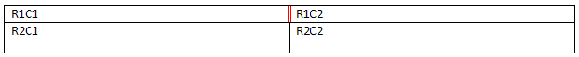
    
    这个内部垂直边缘单元格边框使用以下WordprocessingML指定：
    
    ```xml
    <w:tblStylePr w:type="firstRow">
        <w:tcPr>
            <w:tcBorders>
                <w:insideV w:val="double" w:sz="4" w:space="0" w:color="FF0000"/>
            </w:tcBorders>
        </w:tcPr>
    </w:tblStylePr>
    ```
    
    insideV元素指定了一个¼点的双线边框类型。结束示例】
    
    This element’s content model is defined by the common border properties definition in [§17.3.4].

=== "英文"
    
    This element specifies the border which shall be displayed on all interior vertical edges of the current group of table cells. [Note: Although individual table cells have no concept of an internal edge, which would render this property useless in most cases, it is used to determine the cell borders to apply to a specific group of cells as part of table conditional formatting in a table style, for example, the inside vertical edges on the set of cells in the header row. end note]
    
    The appearance of this table cell border in the document shall be determined by the following settings:
    
    - If the net tblCellSpacing element value ([§17.4.44];[§17.4.43];[§17.4.45]) applied to the cell is non-zero, then the cell border shall always be displayed
    - Otherwise, the display of the border is subject to the conflict resolution algorithm defined by the tcBorders element ([§17.4.66]) and the tblBorders element ([§17.4.39];[§17.4.38])
    
    If this element is omitted, then the specified conditional formatting on the table shall not change the current set of internal edge borders on its set of table cells (i.e. their current setting shall remain unchanged).
    
    [Example: Consider a table in which the conditional formatting on the header row in the associated table style specifies a double line red cell border for all internal vertical lines as follows:
    
    
    
    This inner vertical edge cell border is specified using the following WordprocessingML:
    
    ```xml
    <w:tblStylePr w:type="firstRow">
        <w:tcPr>
            <w:tcBorders>
                <w:insideV w:val="double" w:sz="4" w:space="0" w:color="FF0000"/>
            </w:tcBorders>
        </w:tcPr>
    </w:tblStylePr>
    ```
    
    The insideV element specifies a ¼ point border of type double. end example]
    
    This element’s content model is defined by the common border properties definition in [§17.3.4].

## 17.4.26 jc (表对齐异常)

**jc (Table Alignment Exception)**

=== "中文"
    
    此元素指定了当前表格属性异常列表中的行集合相对于当前部分的文本边距的对齐方式。当将表格放置在宽度与边距不同的WordprocessingML文档中时，此属性用于确定表格相对于这些边距的位置。如果父表格使用bidiVisual元素（[§17.4.1]）从右到左排列，则属性的解释将被反转。
    
    如果在表格上省略此属性，则对齐方式将由父表格上的默认表格属性集确定。
    
    [示例：考虑以下居中于文本边距的WordprocessingML表格，其中的一部分行通过表格属性异常被左对齐到左边距：
    
    
    
    
    可以使用以下WordprocessingML来指定该异常：
    
    ```xml
    <w:tblPrEx>
        <w:jc w:val="start"/>
    </w:tblPrEx>
    ```
    
    jc元素指定了作为表格属性异常的行集合必须相对于文本边距左对齐。结束示例]
    
    ??? abstract "属性"
    
        - **val**（对齐类型）
    
            指定应用于父表格的对齐方式。
            
            [示例：考虑以下文档中表格的WordprocessingML片段：
            
            ```xml
            <w:tblPr>
            <w:jc w:val="center" />
            </w:tblPr>
            ```
            
            此表格现在在页面上居中。结束示例]
            
            此属性的可能值由ST_JcTable简单类型（[§17.18.45]）定义。
    
    [Note: The W3C XML Schema definition of this element’s content model (CT_JcTable) is located in §A.1. end note]

=== "英文"
    
    This element specifies the alignment of the set of rows which are part of the current table properties exception list with respect to the text margins in the current section. When a table is placed in a WordprocessingML document that does not have the same width as the margins, this property is used to determine how the table is positioned with respect to those margins. The interpretation of property is reversed if the parent table is right to left using the bidiVisual element ([§17.4.1]).
    
    If this property is omitted on a table, then the justification shall be determined by the default set of table properties on the parent table.
    
    [Example: Consider the following WordprocessingML table, centered on the text margins with a subset of its rows justified to the left margin by a table property exception:
    
    
    
    
    That exception would be specified using the following WordprocessingML:
    
    ```xml
    <w:tblPrEx>
        <w:jc w:val="start"/>
    </w:tblPrEx>
    ```
    
    The jc element specifies that the rows which are part of the table properties exception table must be left aligned with respect to the text margins. end example]
    
    ??? abstract "Attributes"
    
        - **val** (Alignment Type)
    
            Specifies the justification which should be applied to the parent table.
            
            [Example: Consider the following WordprocessingML fragment for a table in a document:
            
            ```xml
            <w:tblPr>
            <w:jc w:val="center" />
            </w:tblPr>
            ```
            
            This table is now centered on the page. end example]
            
            The possible values for this attribute are defined by the ST_JcTable simple type ([§17.18.45]).
    
    [Note: The W3C XML Schema definition of this element’s content model (CT_JcTable) is located in §A.1. end note]

## 17.4.27 jc (表格行对齐)

**jc (Table Row Alignment)**

=== "中文"
    
    此元素指定了父表格中单个行相对于当前部分的文本边距的对齐方式。当将表格放置在宽度与边距不同的WordprocessingML文档中时，此属性用于确定表格中特定行相对于这些边距的位置。如果父表格使用bidiVisual元素（[§17.4.1]）从右到左排列，则属性的解释将被反转。
    
    如果在表格上省略此属性，则对齐方式将由父表格上的默认表格属性集确定。
    
    [示例：考虑以下居中于文本边距的WordprocessingML表格，其中第二行通过表格行级别对齐被左对齐到左边距：
    
    
    
    可以使用以下WordprocessingML来指定该行级别设置：
    
    ```xml
    <w:trPr>
        <w:jc w:val="start"/>
    </w:trPr>
    ```
    
    jc元素指定了作为表格属性异常的行集合必须相对于文本边距左对齐。结束示例]
    
    ??? abstract "属性"
    
        - **val**（对齐类型）
    
            指定应用于父表格的对齐方式。
            
            [示例：考虑以下文档中表格的WordprocessingML片段：
            
            ```xml
            <w:tblPr>
                <w:jc w:val="center" />
            </w:tblPr>
            ```
            
            此表格现在在页面上居中。结束示例]
            
            此属性的可能值由ST_JcTable简单类型（[§17.18.45]）定义。
    
    [Note: The W3C XML Schema definition of this element’s content model (CT_JcTable) is located in §A.1. end note]

=== "英文"
    
    This element specifies the alignment of a single row in the parent table with respect to the text margins in the current section. When a table is placed in a WordprocessingML document that does not have the same width as the margins, this property is used to determine how a specific row in that table is positioned with respect to those margins. The interpretation of property is reversed if the parent table is right to left using the bidiVisual element ([§17.4.1]).
    
    If this property is omitted on a table, then the justification shall be determined by the default set of table properties on the parent table.
    
    [Example: Consider the following WordprocessingML table, centered on the text margins with its second rows justified to the left margin by a table row level justification:
    
    
    
    That row level setting would be specified using the following WordprocessingML:
    
    ```xml
    <w:trPr>
        <w:jc w:val="start"/>
    </w:trPr>
    ```
    
    The jc element specifies that the rows which are part of the table properties exception table must be left aligned with respect to the text margins. end example]
    
    ??? abstract "Attributes"
    
        - **val** (Alignment Type)
    
            Specifies the justification which should be applied to the parent table.
            
            [Example: Consider the following WordprocessingML fragment for a table in a document:
            
            ```xml
            <w:tblPr>
                <w:jc w:val="center" />
            </w:tblPr>
            ```
            
            This table is now centered on the page. end example]
            
            The possible values for this attribute are defined by the ST_JcTable simple type ([§17.18.45]).
    
    [Note: The W3C XML Schema definition of this element’s content model (CT_JcTable) is located in §A.1. end note]

## 17.4.28 jc (表格对齐)

**jc (Table Alignment)**

=== "中文"
    
    该元素指定了当前表格相对于当前部分的文本边距的对齐方式。当将表格放置在宽度与边距不同的WordprocessingML文档中时，此属性用于确定表格相对于这些边距的位置。如果父表格使用bidiVisual元素（[§17.4.1]）从右到左排列，则属性的解释将被反转。
    
    如果在表格上省略此属性，则对齐方式将由相关表格样式确定。如果在样式层次结构中未指定此属性，则表格将从主要边距（在从左到右的表格中为左边距，而在从右到左的表格中为右边距）左对齐，并且缩进为零。
    
    [示例：考虑以下默认左对齐的WordprocessingML表格：
    
    <table border="1">
        <tr>
            <td>R1C1</td>
            <td>R1C2</td>
            <td>R1C3</td>
        </tr>
        <tr>
            <td>R2C1</td>
            <td>R2C2</td>
            <td>R2C3</td>
        </tr>
    </table>
    
    此表格未填满文本边距的整个宽度。如果要将表格右对齐到边距，如下所示：
    
    
    
    可以使用以下WordprocessingML来指定该要求：
    
    ```xml
    <w:tblPr>
        <w:jc w:val="end"/>
    </w:tblPr>
    ```
    
    jc元素指定了表格必须相对于文本边距右对齐。结束示例]
    
    ??? abstract "属性"
    
        - **val**（对齐类型）
    
            指定应用于父表格的对齐方式。
            
            [示例：考虑以下文档中表格的WordprocessingML片段：
            
            ```xml
            <w:tblPr>
                <w:jc w:val="center" />
            </w:tblPr>
            ```
            
            此表格现在在页面上居中。结束示例]
            
            此属性的可能值由ST_JcTable简单类型（[§17.18.45]）定义。
    
    [Note: The W3C XML Schema definition of this element’s content model (CT_JcTable) is located in §A.1. end note]

=== "英文"
    
    This element specifies the alignment of the current table with respect to the text margins in the current section. When a table is placed in a WordprocessingML document that does not have the same width as the margins, this property is used to determine how the table is positioned with respect to those margins. The interpretation of property is reversed if the parent table is right to left using the bidiVisual element ([§17.4.1]).
    
    If this property is omitted on a table, then the justification shall be determined by the associated table style. I this property is not specified in the style hierarchy, then the table shall be left justified with zero indentatio from the leading margin (the left margin in a left-to-right table or the right margin in a right-to-left table).
    
    [Example: Consider the following WordprocessingML table, justified to the left margin by default:
    
    <table border="1">
        <tr>
            <td>R1C1</td>
            <td>R1C2</td>
            <td>R1C3</td>
        </tr>
        <tr>
            <td>R2C1</td>
            <td>R2C2</td>
            <td>R2C3</td>
        </tr>
    </table>
    
    This table does not fill the entire width of the text margins. If the table should be right justified to the margin, as follows:
    
    
    
    That requirement would be specified using the following WordprocessingML:
    
    ```xml
    <w:tblPr>
        <w:jc w:val="end"/>
    </w:tblPr>
    ```
    
    The jc element specifies that the table must be right aligned with respect to the text margins. end example]
    
    ??? abstract "Attributes"
    
        - **val** (Alignment Type)
    
            Specifies the justification which should be applied to the parent table.
            
            [Example: Consider the following WordprocessingML fragment for a table in a document:
            
            ```xml
            <w:tblPr>
                <w:jc w:val="center" />
            </w:tblPr>
            ```
            
            This table is now centered on the page. end example]
            
            The possible values for this attribute are defined by the ST_JcTable simple type ([§17.18.45]).
    
    [Note: The W3C XML Schema definition of this element’s content model (CT_JcTable) is located in §A.1. end note]

## 17.4.29 noWrap (不要包裹单元格内容)

**noWrap (Don't Wrap Cell Content)**

=== "中文"
    
    该元素指定了当父表格在文档中显示时，该表格单元格应该如何布局。此设置仅影响当为该行设置了tblLayout为使用自动算法时 ([§17.4.52]; [§17.4.53])，该单元格的行为。
    
    该设置应该在tcW元素 ([§17.4.71]) 的上下文中解释如下：
    
    - 如果表格单元格宽度具有固定的 type 属性值，则该元素指定了当行上的其他单元格没有达到绝对最小宽度时，该表格单元格绝不应该小于该固定值。
    
    - 如果表格单元格宽度具有百分比或自动 type 属性值，则该元素指定了在运行自动适应算法时，该表格单元格的内容应被视为没有断字符（内容应被视为单一连续的不可断字符串）。
    
    如果省略此元素，则单元格内容应允许换行（如果是固定的首选宽度值，则可以根据需要缩小单元格，并且如果是百分比或自动宽度值，则应将内容视为具有断字符）。
    
    [示例：考虑以下三行三列的WordprocessingML表格：
    
    
    
    在这个表格中，每个单元格的固定首选宽度为2.38英寸（3427个二十分之一点），并且该行的 tblLayout 被设置为使用自动算法 ([§17.4.52]; [§17.4.53])。如果将长的非断字符字符串添加到中间行中，如下所示，两个单元格将调整以覆盖其偏好并容纳该字符串：
    
    
    
    然而，如果第一个表格单元格包含 noWrap 元素，如下所示：
    
    ```xml
    <w:tcPr>
        <w:noWrap/>
    </w:tcPr>
    ```
    
    noWrap 元素指定了因为它是一个固定宽度的单元格，该单元格在所有其他单元格达到其最小尺寸之前不应该被折叠到其原始尺寸，因此在这个例子中，单元格保持其宽度：
    
    
    
    结束示例]
    
    This element’s content model is defined by the common boolean property definition in [§17.17.4].

=== "英文"
    
    This element specifies how this table cell shall be laid out when the parent table is displayed in a document. This setting only affects the behavior of the cell when the tblLayout for this row ([§17.4.52]; [§17.4.53]) is set to use the auto algorithm.
    
    This setting shall be interpreted in the context of the tcW element ([§17.4.71]) as follows:
    
    If the table cell width has a type attribute value of fixed, then this element specifies that that this table cell shall never be smaller than that fixed value when other cells on the line are not at their absolute minimum width.
    
    If the table cell width has a type attribute value of pct or auto, then this element specifies that when running the auto fit algorithm, the contents of that this table cell shall be treated as though they have no breaking characters (the contents should be treated as a single contiguous non-breaking string)
    
    If this element is omitted, then cell content shall be allowed to wrap (the cell can be shrunk as needed if it is a fixed preferred width value, and the contents shall be treated as having breaking characters if it is a percentage or automatic width value).
    
    [Example: Consider the following three row by three column WordprocessingML table:
    
    
    
    In this table, each cell has a fixed preferred width of 2.38 inches (3427 twentieths of a point), and the tblLayout for this row ([§17.4.52]; [§17.4.53]) is set to use the auto algorithm. If a long non breaking string is added to the middle row, as follows, the two cells are adjusted to override their preferences and accommodate the string:
    
    
    
    However, if the first table cell has the noWrap element present as follows:
    
    ```xml
    <w:tcPr>
        <w:noWrap/>
    </w:tcPr>
    ```
    
    The noWrap element specifies that because it is a fixed width cell, that cell shall not be collapsed beyond its original size until all other cells are at their minimum size, so in this example the cell maintains its width:
    
    
    
    end example]
    
    This element’s content model is defined by the common boolean property definition in [§17.17.4].

## 17.4.30 shd (表底纹异常)

**shd (Table Shading Exception)**

=== "中文"
    
    这个元素指定了作为表级属性异常的一部分，应用于当前行中所有单元格的底纹。与段落底纹类似，此底纹应用于表格边框之前的标签内容，无论文本是否存在 - 与单元格底纹不同，表底纹应包括任何单元格填充。此属性应被此行中任何单元格上的任何单元格级底纹所取代。
    
    该底纹由三个组成部分组成：
    
    - 背景颜色
    - （可选）图案
    - （可选）图案颜色
    
    通过在段落后设置背景颜色，然后使用图案提供的蒙版在该背景上应用图案颜色来应用生成的底纹。
    
    如果省略了此元素，则单元格底纹将由当前表格的表级单元格底纹设置确定。
    
    [示例：考虑一个表格，其中最后两行具有在背景2主题颜色中给出主题颜色底纹的表级属性异常，如下所示：
    
    
    
    此表级底纹异常将使用以下WordprocessingML指定：
    
    ```xml
    <w:tblPrEx>
        <w:jc w:val="start" />
        <w:shd w:val="clear" w:color="auto" w:fill="EEECE1" w:themeFill="background2"
        />
    </w:tblPrEx>
    ```
    
    shd元素指定使用背景2的背景主题颜色，使用清晰图案的单元格底纹。
    
    示例结束]
    
    This element’s content model is defined by the common shading properties definition in [§17.3.5].

=== "英文"
    
    This element specifies the shading which shall be applied to all cells in the current row as part of a set of table-level property exceptions. Similarly to paragraph shading, this shading shall be applied to the contents of the tab up to the table borders, regardless of the presence of text - unlike cell shading, table shading shall include any cell padding. This property shall be superseded by any cell-level shading on any cell in this row ([§17.4.32]).
    
    This shading consists of three components:
    
    - Background Color
    - (optional) Pattern
    - (optional) Pattern Color
    
    The resulting shading is applied by setting the background color behind the paragraph, then applying the pattern color using the mask supplied by the pattern over that background.
    
    If this element is omitted, then the cell shading shall be determined by the table-level cell shading settings ([§17.4.31]) for the current table.
    
    [Example: Consider a table in which the final two rows have a set of table-level property exceptions giving them theme color shading in the background2 theme color, as follows:
    
    
    
    This table-level shading exception would be specified using the following WordprocessingML:
    
    ```xml
    <w:tblPrEx>
        <w:jc w:val="start" />
        <w:shd w:val="clear" w:color="auto" w:fill="EEECE1" w:themeFill="background2"
        />
    </w:tblPrEx>
    ```
    
    The shd element specifies cell shading with a clear pattern using a background theme color of background2.
    
    end example]
    
    This element’s content model is defined by the common shading properties definition in [§17.3.5].

## 17.4.31 shd (表格底纹)

**shd (Table Shading)**

=== "中文"
    
    该元素指定了应用于当前表的底纹。与段落底纹类似，此底纹应用于标签内容直至表边界，无论文本是否存在 - 与单元格底纹不同，表底纹应包括任何单元格填充。此属性应被通过任何表级属性异常（[§17.4.30]）；或此行中任何单元格上的任何单元格级底纹所取代（[§17.4.32]）。
    
    该底纹由三个组成部分组成：
    
    - 背景颜色
    - （可选）图案
    - （可选）图案颜色
    
    通过在段落后设置背景颜色，然后使用图案提供的蒙版在该背景上应用图案颜色来应用生成的底纹。
    
    如果省略了此元素，则此表格中的单元格将具有由相关表样式指定的底纹。如果在样式层次结构中未指定单元格底纹，则此表中的单元格将不具有任何单元格底纹（即它们将是透明的）。
    
    [示例：考虑一个表格，其中第一行的第一个单元格具有单元格级别的红色底纹，如下所示：
    
    
    
    此表级单元格底纹将使用以下WordprocessingML指定：
    
    ```xml
    <w:tbl>
        <w:tblPr>
            <w:shd w:val="clear" w:color="auto" w:fill="FF0000"/>
            …
        </w:tblPr>
        …
    </w:tbl>
    ```
    
    shd元素指定使用红色（FF0000）的背景颜色，使用清晰图案的单元格底纹。示例结束]
    
    This element’s content model is defined by the common shading properties definition in [§17.3.5].

=== "英文"
    
    This element specifies the shading which shall be applied to the extents the current table. Similarly to paragraph shading, this shading shall be applied to the contents of the tab up to the table borders, regardless of the presence of text - unlike cell shading, table shading shall include any cell padding. This property shall be superseded by any cell-level shading via any table-level property exceptions ([§17.4.30]); or on any cell in this row ([§17.4.32]).
    
    This shading consists of three components:
    
    - Background Color
    - (optional) Pattern
    - (optional) Pattern Color
    
    The resulting shading is applied by setting the background color behind the paragraph, then applying the pattern color using the mask supplied by the pattern over that background.
    
    If this element is omitted, then the cells within this table shall have the shading specified by the associated table style. If no cell shading is specified in the style hierarchy, then the cells in this table shall not have any cell shading (i.e. they shall be transparent).
    
    [Example: Consider a table in which the first cell in the first row has cell-level red shading, as follows:
    
    
    
    This table level cell shading would be specified using the following WordprocessingML:
    
    ```xml
    <w:tbl>
        <w:tblPr>
            <w:shd w:val="clear" w:color="auto" w:fill="FF0000"/>
            …
        </w:tblPr>
        …
    </w:tbl>
    ```
    
    The shd element specifies cell shading with a clear pattern using a background color of FF0000 (red). end example]
    
    This element’s content model is defined by the common shading properties definition in [§17.3.5].

## 17.4.32 shd (表格单元格底纹)

**shd (Table Cell Shading)**

=== "中文"
    
    该元素指定了应用于当前表格单元格范围的底纹。类似于段落底纹，此底纹应用于单元格内容直至单元格边界，无论文本是否存在。
    
    该底纹由三个组成部分组成：
    
    - 背景颜色
    - （可选）图案
    - （可选）图案颜色
    
    通过在段落后设置背景颜色，然后使用图案提供的蒙版在该背景上应用图案颜色来应用生成的底纹。
    
    如果省略了此元素，则当前表格中的单元格底纹将由表级别或表级别异常的单元格底纹设置确定（[§17.4.30];[§17.4.31]）。
    
    [示例：考虑一个表格，其中第一行的第一个单元格具有单元格级别的红色底纹，如下所示：
    
    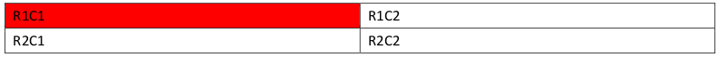
    
    此单元格底纹将使用以下WordprocessingML指定：
    
    ```xml
    <w:tc>
        <w:tcPr>
            <w:shd w:val="clear" w:color="auto" w:fill="FF0000" />
        </w:tcPr>
    </w:tc>
    ```
    
    shd元素指定使用红色（FF0000）的背景颜色，使用清晰图案的单元格底纹。示例结束]
    
    This element’s content model is defined by the common shading properties definition in [§17.3.5].

=== "英文"
    
    This element specifies the shading which shall be applied to the extents of the current table cell. Similarly to paragraph shading, this shading shall be applied to the contents of the cell up to the cell borders, regardless of the presence of text.
    
    This shading consists of three components:
    
    - Background Color
    - (optional) Pattern
    - (optional) Pattern Color
    
    The resulting shading is applied by setting the background color behind the paragraph, then applying the pattern color using the mask supplied by the pattern over that background.
    
    If this element is omitted, then the cell shading shall be determined by the table-level or table-level exception cell shading settings ([§17.4.30];[§17.4.31]) for the current table.
    
    [Example: Consider a table in which the first cell in the first row has cell-level red shading, as follows:
    
    
    
    This cell shading would be specified using the following WordprocessingML:
    
    ```xml
    <w:tc>
        <w:tcPr>
            <w:shd w:val="clear" w:color="auto" w:fill="FF0000" />
        </w:tcPr>
    </w:tc>
    ```
    
    The shd element specifies cell shading with a clear pattern using a background color of FF0000 (red). end example]
    
    This element’s content model is defined by the common shading properties definition in [§17.3.5].

## 17.4.33 start (表格单元前缘边框)

**start (Table Cell Leading Edge Border)**

=== "中文"
    
    该元素指定了应显示在当前表格单元格前沿（LTR表格为左侧，RTL表格为右侧）的边框。文档中该表格单元格边框的外观应由以下设置确定：
    
    - 如果应用于单元格的净tblCellSpacing元素值（[§17.4.44];[§17.4.43];[§17.4.45]）为非零，则始终显示单元格边框
    - 否则，边框的显示取决于由tcBorders元素（[§17.4.66]）和tblBorders元素（[§17.4.39];[§17.4.38]）定义的冲突解决算法
    
    如果省略了此元素，则此表格单元格的前沿将不具有单元格边框，并且其边框可以根据需要使用表格的边框设置。
    
    [示例：考虑一个LTR表格，其中第一行的第二个单元格指定了前沿单元格边框：
    
    
    
    此前沿单元格边框将使用以下WordprocessingML指定：
    
    ```xml
    <w:tc>
        <w:tcPr>
            …
            <w:tcBorders>
                <w:start w:val="double" w:sz="4" w:space="0" w:color="FF0000" />
            </w:tcBorders>
        </w:tcPr>
        <w:p/>
    </w:tc>
    ```
    
    start元素指定了类型为double、宽度为½点的单元格前沿边框。示例结束]
    
    This element’s content model is defined by the common border properties definition in [§17.3.4].

=== "英文"
    
    This element specifies the border which shall be displayed on the leading edge of the current table cell (left for LTR tables, right for RTL tables). The appearance of this table cell border in the document shall be determined by the following settings:
    
    - If the net tblCellSpacing element value ([§17.4.44];[§17.4.43];[§17.4.45]) applied to the cell is non-zero, then the cell border shall always be displayed
    - Otherwise, the display of the border is subject to the conflict resolution algorithm defined by the tcBorders element ([§17.4.66]) and the tblBorders element ([§17.4.39];[§17.4.38])
    
    If this element is omitted, then the leading edge of this table cell shall not have a cell border, and its border can use the table's border settings as appropriate.
    
    [Example: Consider an LTR table in which the second cell in the first row specifies a leading edge cell border:
    
    
    
    This leading edge cell border is specified using the following WordprocessingML:
    
    ```xml
    <w:tc>
        <w:tcPr>
            …
            <w:tcBorders>
                <w:start w:val="double" w:sz="4" w:space="0" w:color="FF0000" />
            </w:tcBorders>
        </w:tcPr>
        <w:p/>
    </w:tc>
    ```
    
    The start element specifies a ½ point border of type double on the leading edge of the table cell. end example]
    
    This element’s content model is defined by the common border properties definition in [§17.3.4].

## 17.4.34 start (表格单元前导边距默认值)

**start (Table Cell Leading Margin Default)**

=== "中文"
    
    该元素指定了应在单元格内容的前沿与父表格（或表格行）中所有表格单元格的前沿之间留下的空间量。此设置可以通过单元格的属性中包含的start元素指定的表格单元格前导边距定义进行覆盖（[§17.4.35]）。
    
    此值以其type属性应用的单位指定。对于此元素，类型为pct或auto的任何宽度值都将被忽略。
    
    如果省略了此元素，则应从关联表样式继承表格单元格边距。如果在样式层次结构中从未指定前导边距，则此表将默认具有115个点的左单元格填充（除非有单独的单元格覆盖）。
    
    [示例：考虑一个2x2的LTR表格，其中默认的表格单元格前导边距被指定为确切的0.25英寸，如下所示（在下面的第一个表格单元格中用箭头标记）：
    
    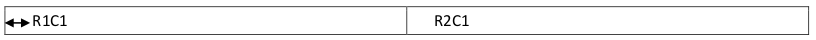
    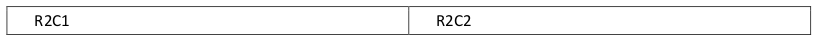
    
    此表属性使用以下WordprocessingML标记指定：
    
    ```xml
    <w:tbl>
        <w:tblPr>
            <w:tblCellMar>
                <w:start w:w="360" w:type="dxa"/>
            </w:tblCellMar>
        </w:tblPr>
        …
    </w:tbl>
    ```
    
    表中的每个单元格都具有将其默认前导单元格边距设置为360个点的设置。示例结束]
    
    This element’s content model is defined by the common table measurement definition in [§17.4.87].

=== "英文"
    
    This element specifies the amount of space which shall be left between the leading edge of the cell contents and the leading edge of all table cells within the parent table (or table row). This setting can be overridden by the table cell leading margin definition specified by the start element contained within the table cell's properties ([§17.4.35]).
    
    This value is specified in the units applied via its type attribute. Any width value of type pct or auto for this element shall be ignored.
    
    If this element is omitted, then it shall inherit the table cell margin from the associated table style. If a leading margin is never specified in the style hierarchy, this table shall have 115 twentieths of a point (0.08 inches) left cell padding by default (excepting individual cell overrides).
    
    [Example: Consider a two by two LTR table in which the default table cell leading margin is specified to be exactly 0.25 inches, as follows (marked with an arrow in the first table cell below):
    
    
    
    
    This table property is specified using the following WordprocessingML markup:
    
    ```xml
    <w:tbl>
        <w:tblPr>
            <w:tblCellMar>
                <w:start w:w="360" w:type="dxa"/>
            </w:tblCellMar>
        </w:tblPr>
        …
    </w:tbl>
    ```
    
    Every cell in the table has a default leading cell margin setting it to 360 twentieths of a point. end example]
    
    This element’s content model is defined by the common table measurement definition in [§17.4.87].

## 17.4.35 start (表格单元前导边距异常)

**start (Table Cell Leading Margin Exception)**

=== "中文"
    
    该元素指定了应在当前单元格内容的前沿与表格中特定单个单元格的前沿边框之间留下的空间量。此设置应覆盖表格属性中包含的start元素指定的表格单元格前导边距定义（[§17.4.34]）。
    
    此值以其type属性应用的单位指定。对于此元素，类型为pct或auto的任何宽度值都将被忽略。
    
    如果省略了此元素，则此表格单元格将使用表格属性中包含的start元素定义的前导单元格边距。
    
    [示例：考虑一个两行两列的LTR表格，其中第二行的第一个表格单元格通过异常指定的前导边距为0.5英寸，导致文本位于单元格内部0.5英寸处，如下所示：
    
    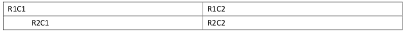
    
    可以使用以下WordprocessingML为此单元格指定异常：
    
    ```xml
    <w:tc>
        <w:tcPr>
            <w:tcMar>
                <w:start w:w="720" w:type="dxa" />
            </w:tcMar>
        </w:tcPr>
    </w:tc>
    ```
    
    此表中的R2C1单元格具有应用于表格单元格前导边距设置的异常，使其为720个点（0.5英寸）。示例结束]
    
    This element’s content model is defined by the common table measurement definition in [§17.4.87].

=== "英文"
    
    This element specifies the amount of space which shall be left between the leading extent of the current cell contents and the leading edge border of a specific individual table cell within a table. This setting shall override the table cell leading margin definition specified by the start element contained within the table properties ([§17.4.34]).
    
    This value is specified in the units applied via its type attribute. Any width value of type pct or auto for this element shall be ignored.
    
    If omitted, then this table cell shall use the leading cell margins defined in the start element contained within the table properties ([§17.4.34]).
    
    [Example: Consider a two row, two column LTR table in which the first table cell in the second row has a leading margin which is specified via an exception to be 0.5 inches, causing the text to be position 0.5" inside the cell, as follows:
    
    
    
    The exception on this cell would be specified using the following WordprocessingML:
    
    ```xml
    <w:tc>
        <w:tcPr>
            <w:tcMar>
                <w:start w:w="720" w:type="dxa" />
            </w:tcMar>
        </w:tcPr>
    </w:tc>
    ```
    
    The R2C1 cell in this table has an exception applied to the table cell leading margin setting it to 720 twentieths of a point (0.5 inches). end example]
    
    This element’s content model is defined by the common table measurement definition in [§17.4.87].

## 17.4.36 start (表格前缘边框)

**start (Table Leading Edge Border)**

=== "中文"
    
    该元素指定了应在当前表格的前沿（LTR表格为左侧，RTL表格为右侧）显示的边框。文档中该表格边框的外观应由以下设置确定：
    
    - 边框的显示取决于由tcBorders元素（[§17.4.66]）和tblBorders元素（[§17.4.39];[§17.4.38]）定义的冲突解决算法
    
    如果省略了此元素，则此表格的前沿将具有由相关表样式指定的边框。如果在样式层次结构中未指定前沿边框，则此表将不具有左边框。
    
    [示例：考虑一个LTR表格，其中表格属性指定了前沿表格边框，如下所示：
    
    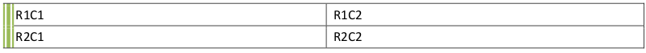
    
    此前沿表格边框将使用以下WordprocessingML指定：
    
    ```xml
    <w:tbl>
        <w:tblPr>
            <w:tblBorders>
                <w:start w:val="thinThickThinMediumGap" w:sz="24" w:space="0"
                    w:color="D0D0D0" w:themeColor="accent3" w:themeTint="99"/>
            </w:tblBorders>
        </w:tblPr>
        …
    </w:tbl>
    ```
    
    start元素指定了类型为thinThinThickMediumGap的三点前沿表格边框。示例结束]
    
    This element’s content model is defined by the common border properties definition in [§17.3.4].

=== "英文"
    
    This element specifies the border which shall be displayed at the leading edge of the current table (left for LTR tables, right for RTL tables). The appearance of this table border in the document shall be determined by the following settings:
    
    - The display of the border is subject to the conflict resolution algorithm defined by the tcBorders element ([§17.4.66]) and the tblBorders element ([§17.4.39];[§17.4.38])
    
    If this element is omitted, then the leading edge of this table shall have the border specified by the associated table style. If no leading edge border is specified in the style hierarchy, then this table shall not have a left border.
    
    [Example: Consider an LTR table in which the table properties specify a leading edge table border, as follows:
    
    
    
    This leading edge table border is specified using the following WordprocessingML:
    
    ```xml
    <w:tbl>
        <w:tblPr>
            <w:tblBorders>
                <w:start w:val="thinThickThinMediumGap" w:sz="24" w:space="0"
                    w:color="D0D0D0" w:themeColor="accent3" w:themeTint="99"/>
            </w:tblBorders>
        </w:tblPr>
        …
    </w:tbl>
    ```
    
    The start element specifies a three point leading edge table border of type thinThinThickMediumGap. end example]
    
    This element’s content model is defined by the common border properties definition in [§17.3.4].

## 17.4.37 tbl (表格)

**tbl (Table)**

=== "中文"
    
    该元素指定了文档中存在的表格的内容。表格是一组段落（和其他块级内容），按行和列排列。WordprocessingML中的表格通过tbl元素定义，类似于HTML中的table标签。
    
    当文档内容中存在两个具有相同样式（[§17.4.62]）的tbl元素，并且没有任何插入的p元素时，相应的表格将被视为单个表格。
    
    [示例：考虑一个空的单元格表格（即一个行、一个列的表格）和四周都有1点边框：
    
    
    
    该表格由以下WordprocessingML表示：
    
    ```xml
    <w:tbl>
        <w:tblPr>
            <w:tblW w:w="5000" w:type="pct"/>
            <w:tblBorders>
                <w:top w:val="single" w:sz="4" w:space="0" w:color="auto"/>
                <w:start w:val="single" w:sz="4" w:space="0" w:color="auto"/>
                <w:bottom w:val="single" w:sz="4" w:space="0" w:color="auto"/>
                <w:end w:val="single" w:sz="4" w:space="0" w:color="auto"/>
            </w:tblBorders>
        </w:tblPr>
        <w:tblGrid>
            <w:gridCol w:w="10296"/>
        </w:tblGrid>
        <w:tr>
            <w:tc>
                <w:tcPr>
                    <w:tcW w:w="0" w:type="auto"/>
                </w:tcPr>
                <w:p/>
            </w:tc>
        </w:tr>
    </w:tbl>
    ```
    
    此表格使用tblW元素（[§17.4.63]）指定了100%页面宽度的表格宽度；使用tblBorders元素（[§17.4.38]）指定了一组表格边框；使用tblGrid元素（[§17.4.48]）定义了表格内共享的一组垂直边缘；并使用tr元素（[§17.4.78]）定义了单个表格行。示例结束]
    
    [Note: The W3C XML Schema definition of this element’s content model (CT_Tbl) is located in §A.1. end note]

=== "英文"
    
    This element specifies the contents of a table present in the document. A table is a set of paragraphs (and other block-level content) arranged in rows and columns. Tables in WordprocessingML are defined via the tbl element, which is analogous to the HTML table tag.
    
    When two tbl elements having the same style ([§17.4.62]) are present within the document content, without any intervening p elements, the corresponding tables shall be treated as a single table.
    
    [Example: Consider an empty one-cell table (i.e.; a table with one row, one column) and 1 point borders on all sides:
    
    
    
    This table is represented by the following WordprocessingML:
    
    ```xml
    <w:tbl>
        <w:tblPr>
            <w:tblW w:w="5000" w:type="pct"/>
            <w:tblBorders>
                <w:top w:val="single" w:sz="4" w:space="0" w:color="auto"/>
                <w:start w:val="single" w:sz="4" w:space="0" w:color="auto"/>
                <w:bottom w:val="single" w:sz="4" w:space="0" w:color="auto"/>
                <w:end w:val="single" w:sz="4" w:space="0" w:color="auto"/>
            </w:tblBorders>
        </w:tblPr>
        <w:tblGrid>
            <w:gridCol w:w="10296"/>
        </w:tblGrid>
        <w:tr>
            <w:tc>
                <w:tcPr>
                    <w:tcW w:w="0" w:type="auto"/>
                </w:tcPr>
                <w:p/>
            </w:tc>
        </w:tr>
    </w:tbl>
    ```
    
    This table specifies table-wide properties of 100% of page width using the tblW element ([§17.4.63]); a the set of table borders using the tblBorders element ([§17.4.38]); the table grid which defines a set of shared vertical edges within the table using the tblGrid element ([§17.4.48]); and a single table row using the tr element ([§17.4.78]). end example]
    
    [Note: The W3C XML Schema definition of this element’s content model (CT_Tbl) is located in §A.1. end note]

## 17.4.38 tblBorders (表格边框合集)

**tblBorders (Table Borders)**

=== "中文"
    
    该元素使用其子元素定义的六种边框类型，指定了当前表格边缘的边框集合。
    
    如果任何行的单元格间距非零，如使用tblCellSpacing元素（[§17.4.44]; [§17.4.43]; [§17.4.45]）指定的，那么没有边框冲突，表格边框（或如果指定了表级别异常边框，则显示表级别异常边框）将显示出来。
    
    如果单元格间距为零，则存在冲突 [示例：在第一列的所有单元格的左边框和表格的左边框之间的冲突。示例结束]，应按以下方式解决：
    
    - 如果存在单元格边框，则显示单元格边框
    - 如果没有单元格边框，但在此表格行上存在表级别异常边框，则显示表级别异常边框
    - 如果没有单元格或表级别异常边框，则显示表格边框
    
    如果省略了此元素，则此表格将具有由关联表样式指定的边框。如果在样式层次结构中未指定边框，则此表格将不具有任何表格边框。
    
    [示例：考虑一个没有关联表样式的表格，通过直接格式化定义了一组表格边框，如下所示：
    
    
    
    这些表格边框使用以下WordprocessingML指定：
    
    ```xml
    <w:tbl>
        <w:tblPr>
            <w:tblW w:w="0" w:type="auto"/>
            <w:tblBorders>
                <w:top w:val="single" w:sz="4" w:space="0" w:color="000000" w:themeColor="text1"/>
                <w:start w:val="single" w:sz="4" w:space="0" w:color="000000" w:themeColor="text1"/>
                <w:bottom w:val="single" w:sz="4" w:space="0" w:color="000000" w:themeColor="text1"/>
                <w:end w:val="single" w:sz="4" w:space="0" w:color="000000" w:themeColor="text1"/>
                <w:insideH w:val="single" w:sz="4" w:space="0" w:color="000000" w:themeColor="text1"/>
                <w:insideV w:val="single" w:sz="4" w:space="0" w:color="000000" w:themeColor="text1"/>
            </w:tblBorders>
            …
        </w:tblPr>
        …
    </w:tbl>
    ```
    
    tblBorders元素指定了应用于当前表格的一组表格边框。示例结束]
    
    [Note: The W3C XML Schema definition of this element’s content model (CT_TblBorders) is located in §A.1. end note]

=== "英文"
    
    This element specifies the set of borders for the edges of the current table, using the six border types defined by its child elements.
    
    If the cell spacing for any row is non-zero as specified using the tblCellSpacing element ([§17.4.44]; [§17.4.43]; [§17.4.45]), then there is no border conflict and the table border (or table-level exception border, if one is specified) shall be displayed.
    
    If the cell spacing is zero, then there is a conflict [Example: Between the left border of all cells in the first column and the left border of the table. end example], which shall be resolved as follows:
    
    - If there is a cell border, then the cell border shall be displayed
    - If there is no cell border but there is a table-level exception border on this table row, then the table-level exception border shall be displayed
    - If there is no cell or table-level exception border, then the table border shall be displayed
    
    If this element is omitted, then this table shall have the borders specified by the associated table style. If no borders are specified in the style hierarchy, then this table shall not have any table borders.
    
    [Example: Consider a table with no associated table style, which defines a set of table borders via direct formatting as follows:
    
    
    
    These table borders are specified using the following WordprocessingML:
    
    ```xml
    <w:tbl>
        <w:tblPr>
            <w:tblW w:w="0" w:type="auto"/>
            <w:tblBorders>
                <w:top w:val="single" w:sz="4" w:space="0" w:color="000000" w:themeColor="text1"/>
                <w:start w:val="single" w:sz="4" w:space="0" w:color="000000" w:themeColor="text1"/>
                <w:bottom w:val="single" w:sz="4" w:space="0" w:color="000000" w:themeColor="text1"/>
                <w:end w:val="single" w:sz="4" w:space="0" w:color="000000" w:themeColor="text1"/>
                <w:insideH w:val="single" w:sz="4" w:space="0" w:color="000000" w:themeColor="text1"/>
                <w:insideV w:val="single" w:sz="4" w:space="0" w:color="000000" w:themeColor="text1"/>
            </w:tblBorders>
            …
        </w:tblPr>
        …
    </w:tbl>
    ```
    
    The tblBorders element specifies the set of table borders applied to the current table. end example]
    
    [Note: The W3C XML Schema definition of this element’s content model (CT_TblBorders) is located in §A.1. end note]

## 17.4.39 tblBorders (表格边框异常合集)

**tblBorders (Table Borders Exceptions)**

=== "中文"
    
    该元素通过一组表级别属性异常，使用其子元素定义的六种边框类型，指定了父表格行边缘的边框集合。
    
    如果任何行的单元格间距非零，如使用tblCellSpacing元素（[§17.4.44]; [§17.4.43]; [§17.4.45]）指定的，那么没有边框冲突，并且将显示表级别异常边框。
    
    如果单元格间距为零，则存在冲突 [示例：在第一列的所有单元格的左边框和表级别异常的左边框之间的冲突。示例结束]，应按以下方式解决：
    
    - 如果存在单元格边框，则显示单元格边框
    - 如果不存在单元格边框，则显示表级别异常边框
    
    如果省略了此元素，则此表格将具有由关联表级别边框（[§17.4.38]）指定的边框。
    
    [示例：考虑一个表格，其中最后两行通过一组表级别属性异常指定了一组更粗的表格边框，如下所示：
    
    
    
    这些表格边框通过一组表级别属性异常指定，使用以下WordprocessingML指定：
    
    ```xml
    <w:tr>
        <w:tblPrEx>
            <w:tblBorders>
                <w:top w:val="single" w:sz="24" w:space="0" w:color="000000"  w:themeColor="text1"/>
                <w:start w:val="single" w:sz="24" w:space="0" w:color="000000"  w:themeColor="text1"/>
                <w:bottom w:val="single" w:sz="24" w:space="0" w:color="000000"  w:themeColor="text1"/>
                <w:end w:val="single" w:sz="24" w:space="0" w:color="000000"  w:themeColor="text1"/>
                <w:insideH w:val="single" w:sz="24" w:space="0" w:color="000000"  w:themeColor="text1"/>
                <w:insideV w:val="single" w:sz="24" w:space="0" w:color="000000"  w:themeColor="text1"/>
            </w:tblBorders>
        </w:tblPrEx>
    </w:tr>
    ```
    
    tblBorders元素指定了作为表级别属性异常的一部分应用于此表格最后两行的表格边框。示例结束]
    
    [Note: The W3C XML Schema definition of this element’s content model (CT_TblBorders) is located in §A.1. end note]

=== "英文"
    
    This element specifies the set of borders for the edges of the parent table row via a set of table-level property exceptions, using the six border types defined by its child elements.
    
    If the cell spacing for any row is non-zero as specified using the tblCellSpacing element ([§17.4.44]; [§17.4.43]; [§17.4.45]), then there is no border conflict and the table-level exception border shall be displayed.
    
    If the cell spacing is zero, then there is a conflict [Example: Between the left border of all cells in the first column and the left border of the table-level exceptions. end example], which shall be resolved as follows:
    
    - If there is a cell border, then the cell border shall be displayed
    - If there is no cell border, then the table-level exception border shall be displayed
    
    If this element is omitted, then this table shall have the borders specified by the associated table level borders ([§17.4.38]).
    
    [Example: Consider a table in which the final two rows have a set of table-level property exceptions giving them a thicker set of table borders, as follows:
    
    
    
    These table borders are specified via a set of table-level property exceptions using the following WordprocessingML:
    
    ```xml
    <w:tr>
        <w:tblPrEx>
            <w:tblBorders>
                <w:top w:val="single" w:sz="24" w:space="0" w:color="000000"  w:themeColor="text1"/>
                <w:start w:val="single" w:sz="24" w:space="0" w:color="000000"  w:themeColor="text1"/>
                <w:bottom w:val="single" w:sz="24" w:space="0" w:color="000000"  w:themeColor="text1"/>
                <w:end w:val="single" w:sz="24" w:space="0" w:color="000000"  w:themeColor="text1"/>
                <w:insideH w:val="single" w:sz="24" w:space="0" w:color="000000"  w:themeColor="text1"/>
                <w:insideV w:val="single" w:sz="24" w:space="0" w:color="000000"  w:themeColor="text1"/>
            </w:tblBorders>
        </w:tblPrEx>
    </w:tr>
    ```
    
    The tblBorders element specifies the set of table borders applied to the final two rows in this table as part of the table-level property exceptions. end example]
    
    [Note: The W3C XML Schema definition of this element’s content model (CT_TblBorders) is located in §A.1. end note]

## 17.4.40 tblCaption (表格标题)

**tblCaption (Table Caption)**

=== "中文"
    
    该元素指定了表的标题。
    
    [示例：考虑一个指定了标题的表。此对象可能包含以下 XML 标记：
    
    ```xml
    <w:tbl>
        <w:tblPr>
            <w:tblCaption w:val="这是表的标题" />
            …
        </w:tblPr>
    </w:tbl>
    ```
    
    示例结束]
    
    ??? abstract "属性"
    
        - **val** (字符串值)
        
            指定其内容包含一个字符串。
            
            此字符串的内容根据父 XML 元素的上下文进行解释。
            
            [示例：考虑以下 WordprocessingML 片段：
            
            ```xml
            <w:pPr>
                <w:pStyle w:val="Heading1" />
            </w:pPr>
            ```
            
            val 属性的值是关联段落样式的 styleId 的 ID。
            
            但是，考虑以下片段：
            
            ```xml
            <w:sdtPr>
                <w:alias w:val="SDT Title Example" />
                …
            </w:sdtPr>
            ```
            
            在这种情况下，val 属性中的十进制数是最近祖先结构化文档标记的标题。在每种情况下，值都是在父元素的上下文中解释的。示例结束]
            
            此属性的可能值由 ST_String 简单类型 ([§22.9.2.13]) 定义。
    
    [Note: The W3C XML Schema definition of this element’s content model (CT_String) is located in §A.1. end note]

=== "英文"
    
    This element specifies the caption for the table.
    
    [Example: Consider a table which specifies a caption. This object might contain the following XML markup:
    
    ```xml
    <w:tbl>
        <w:tblPr>
            <w:tblCaption w:val="Here is the caption of the table" />
            …
        </w:tblPr>
    </w:tbl>
    ```
    
    end example]
    
    ??? abstract "Attributes"
    
        - **val** (String Value)
    
            Specifies that its contents contain a string.
            
            The contents of this string are interpreted based on the context of the parent XML element.
            
            [Example: Consider the following WordprocessingML fragment:
            
            ```xml
            <w:pPr>
                <w:pStyle w:val="Heading1" />
            </w:pPr>
            ```
            
            The value of the val attribute is the ID of the associated paragraph style's styleId.
            
            However, consider the following fragment:
            
            ```xml
            <w:sdtPr>
                <w:alias w:val="SDT Title Example" />
                …
            </w:sdtPr>
            ```
            
            In this case, the decimal number in the val attribute is the caption of the nearest ancestor structured document tag. In each case, the value is interpreted in the context of the parent element. end example]
            
            The possible values for this attribute are defined by the ST_String simple type ([§22.9.2.13]).
    
    [Note: The W3C XML Schema definition of this element’s content model (CT_String) is located in §A.1. end note]

## 17.4.41 tblCellMar (表格单元格边距异常)

**tblCellMar (Table Cell Margin Exceptions)**

=== "中文"
    
    该元素通过一组表级属性异常指定了父表行中所有单元格的单元格边距。这些设置可以被包含在表格单元格属性内的tcMar元素指定的表格单元格边距定义所覆盖 ([§17.4.41])。
    
    如果省略了此元素，则它应从表级单元格边距 ([§17.4.42]) 继承表格单元格边距。
    
    [示例：考虑一个表，其最后两行通过表级属性异常被定义为所有边的默认单元格边距为0.1英寸，如下所示：
    
    
    
    通过以下 WordprocessingML 指定了此表格单元格边距异常集合：
    
    ```xml
    <w:tblPrEx>
        <w:tblCellMar>
            <w:top w:w="144" w:type="dxa"/>
            <w:start w:w="144" w:type="dxa"/>
            <w:bottom w:w="144" w:type="dxa"/>
            <w:end w:w="144" w:type="dxa"/>
        </w:tblCellMar>
        …
    </w:tblPrEx>
    ```
    
    作为 tblPrEx 的子元素的 tblCellMar 指定了当前表中最后两行中所有单元格的默认单元格边距，此示例中为所有边 144 点的二十分之一。示例结束]
    
    [Note: The W3C XML Schema definition of this element’s content model (CT_TblCellMar) is located in §A.1. end note]

=== "英文"
    
    This element specifies a set of cell margins for all cells in the parent table row via a set of table-level property exceptions. These settings can be overridden by the table cell margin definition specified by the tcMar element contained within the table cell's properties ([§17.4.41]).
    
    If this element is omitted, then it shall inherit the table cell margins from the table-level cell margins ([§17.4.42]).
    
    [Example: Consider a table whose final two rows are defined to have default cell margins of 0.1 inches for all sides via a table-level property exception, as follows:
    
    
    
    This set of table cell margin exceptions is specified using the following WordprocessingML:
    
    ```xml
    <w:tblPrEx>
        <w:tblCellMar>
            <w:top w:w="144" w:type="dxa"/>
            <w:start w:w="144" w:type="dxa"/>
            <w:bottom w:w="144" w:type="dxa"/>
            <w:end w:w="144" w:type="dxa"/>
        </w:tblCellMar>
        …
    </w:tblPrEx>
    ```
    
    The tblCellMar element as a child of tblPrEx specifies the set of default cell margins for all cells in final two rows in current table, in this case, 144 twentieths of a point on all sides. end example]
    
    [Note: The W3C XML Schema definition of this element’s content model (CT_TblCellMar) is located in §A.1. end note]

## 17.4.42 tblCellMar (表格单元格边距默认值)

**tblCellMar (Table Cell Margin Defaults)**

=== "中文"
    
    该元素指定了当前表中所有单元格的默认单元格边距设置。这些设置可以被包含在表格单元格属性内的tcMar元素指定的表格单元格边距定义 ([§17.4.68]) 或一组表级属性异常 ([§17.4.41]) 所覆盖。
    
    如果省略了此元素，则它应从相关表样式中继承表格单元格边距。如果在样式层次结构中从未指定表格边距，则每个边距应使用其默认边距大小（参见子元素定义）。
    
    [示例：考虑一个表，其默认单元格边距为所有边的0.1英寸，如下所示：
    
    
    
    通过以下 WordprocessingML 指定了此默认表格单元格边距集合：
    
    ```xml
    <w:tblPr>
        <w:tblCellMar>
            <w:top w:w="144" w:type="dxa"/>
            <w:start w:w="144" w:type="dxa"/>
            <w:bottom w:w="144" w:type="dxa"/>
            <w:end w:w="144" w:type="dxa"/>
        </w:tblCellMar>
        …
    </w:tblPr>
    ```
    
    作为 tblPr 的子元素的 tblCellMar 指定了当前表中所有单元格的默认单元格边距集合，在此示例中为所有边 144 点的二十分之一。示例结束]
    
    [Note: The W3C XML Schema definition of this element’s content model (CT_TblCellMar) is located in §A.1. end note]

=== "英文"
    
    This element specifies the default cell margin settings for all cells in the current table. These setting can be overridden by the table cell margin definition specified by the tcMar element contained within the table cell's properties ([§17.4.68]) or by a set of table-level property exceptions ([§17.4.41]).
    
    If this element is omitted, then it shall inherit the table cell margins from the associated table style. If table margins are never specified in the style hierarchy, then each margin shall use its default margin size (see child element definitions).
    
    [Example: Consider a table defined to have default cells margins of 0.1 inches for all sides, as follows:
    
    
    
    This set of default table cell margins would be specified using the following WordprocessingML:
    
    ```xml
    <w:tblPr>
        <w:tblCellMar>
            <w:top w:w="144" w:type="dxa"/>
            <w:start w:w="144" w:type="dxa"/>
            <w:bottom w:w="144" w:type="dxa"/>
            <w:end w:w="144" w:type="dxa"/>
        </w:tblCellMar>
        …
    </w:tblPr>
    ```
    
    The tblCellMar element as a child of tblPr specifies the set of default cell margins for all cells in the current table, in this case, 144 twentieths of a point. end example]
    
    [Note: The W3C XML Schema definition of this element’s content model (CT_TblCellMar) is located in §A.1. end note]

## 17.4.43 tblCellSpacing (表格行单元格间距)

**tblCellSpacing (Table Row Cell Spacing)**

=== "中文"
    
    该元素指定了父行中所有单元格的默认表格单元格间距（相邻单元格与表格边缘之间的间距）。如果指定了此元素，则它表示表格中所有单元格之间应保留的最小空间，包括表格边框的宽度。需要注意的是，行级单元格间距应添加在文本边距内，并与没有行级缩进或单元格间距的单元格中文本范围的最内侧起始边对齐。行级单元格间距不应增加整体表格的宽度。
    
    此值以其类型属性应用的单位指定。任何类型为pct或auto的宽度值将被忽略。
    
    [示例：考虑一个表，其第一个单元格有一个六点宽的表格边框，单元格间距值为0.01英寸。生成的表格将每个单元格之间保留0.01英寸的空间，无论单元格边框的宽度如何，如下所示（注意没有边框覆盖任何其他边框）：
    
    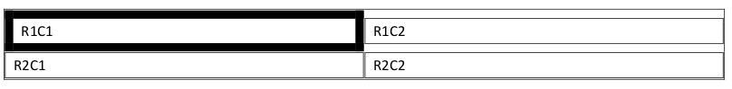
    
    示例结束]
    
    如果省略此元素，则此行中的单元格应从相关表格级别属性继承单元格间距。
    
    [示例：考虑一个表，其第二行通过表格行属性指定了所有边为0.1英寸的单元格间距，如下所示：
    
    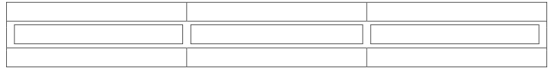
    
    此表格行的单元格间距使用以下 WordprocessingML 指定：
    
    ```xml
    <w:trPr>
        <w:tblCellSpacing w:w="144" w:type="dxa"/>
        …
    </w:trPr>
    ```
    
    作为 trPr 的子元素的 tblCellSpacing 指定了当前行中所有单元格之间的默认单元格间距，在此示例中为144点的二十分之一。示例结束]
    
    This element’s content model is defined by the common table measurement definition in [§17.4.87].

=== "英文"
    
    This element specifies the default table cell spacing (the spacing between adjacent cells and the edges of the table) for all cells in the parent row. If specified, this element specifies the minimum amount of space which shall be left between all cells in the table including the width of the table borders in the calculation. It is important to note that row-level cell spacing shall be added inside of the text margins, which shall be aligned with the innermost starting edge of the text extents in a cell without row-level indentation or cell spacing. Row- level cell spacing shall not increase the width of the overall table.
    
    This value is specified in the units applied via its type attribute. Any width value of type pct or auto for this element shall be ignored.
    
    [Example: Consider a table whose first cell has a six point wide table border, and a table cell spacing value of 0.01 inches. The resulting table would have 0.01 inches of space between each table cell regardless of the width of the cell border, as follows (notice that no border is covered by any other border):
    
    
    
    end example]
    
    If this element is omitted, then the cells in this row shall inherit the cell spacing from the associated table level properties.
    
    [Example: Consider a table where the second row has a cell spacing of 0.1 inches for all sides specified via the table row properties as follows:
    
    
    
    This table row cell spacing is specified using the following WordprocessingML:
    
    ```xml
    <w:trPr>
    <w:tblCellSpacing w:w="144" w:type="dxa"/>
    …
    </w:trPr>
    ```
    
    The tblCellSpacing element as a child of trPr specifies the default cell spacing between all cells in the current row, in this case 144 twentieths of a point. end example]
    
    This element’s content model is defined by the common table measurement definition in [§17.4.87].

## 17.4.44 tblCellSpacing (表格单元格间距异常)

**tblCellSpacing (Table Cell Spacing Exception)**

=== "中文"
    
    该元素作为一组表级属性异常的一部分，指定了父表行中所有单元格的表格单元格间距例外。如果指定了此元素，它表示在包含表格边框宽度的计算后，父行中所有单元格之间应保留的最小空间。此设置将被行单元格间距值 ([§17.4.43]) 覆盖。需要注意的是，表级单元格间距应添加在文本边距之外，并与表格单元格中文本范围的最内侧起始边对齐。
    
    此值以其类型属性应用的单位指定。任何类型为pct或auto的宽度值将被忽略。
    
    [示例：考虑一个表，其第一个单元格有一个六点宽的表格边框，单元格间距值为0.01英寸。生成的表格将每个单元格之间保留0.01英寸的空间，无论单元格边框的宽度如何，如下所示（注意没有边框覆盖任何其他边框）：
    
    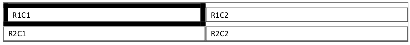
    
    示例结束]
    
    如果省略此元素，则行应从表级单元格间距设置 ([§17.4.42]) 继承表格单元格间距，行级覆盖除外。
    
    [示例：考虑一个表，其最后两行通过表级属性异常定义为所有边的单元格间距为0.1英寸，如下所示：
    
    
    
    此表格单元格间距例外使用以下 WordprocessingML 指定：
    
    ```xml
    <w:tblPrEx>
        <w:tblCellSpacing w:w="144" w:type="dxa"/>
        …
    </w:tblPrEx>
    ```
    
    作为 tblPrEx 的子元素的 tblCellSpacing 指定了当前表中最后两行中所有单元格之间的默认单元格间距，此示例中为144点的二十分之一。示例结束]
    
    This element’s content model is defined by the common table measurement definition in [§17.4.87].

=== "英文"
    
    This element specifies a table cell spacing exception for all cells in the parent table row as part of a set of table- level property exceptions. If specified, this element specifies the minimum amount of space which shall be left between all cells in the parent row after including the width of the table borders in the calculation. This setting shall be superseded by the row cell spacing value ([§17.4.43]). It is important to note that table-level cell spacing shall be added outside of the text margins, which shall be aligned with the innermost starting edge of the text extents in a table cell.
    
    This value is specified in the units applied via its type attribute. Any width value of type pct or auto for this element shall be ignored.
    
    [Example: Consider a table whose first cell has a six point wide table border, and a table cell spacing value of 0.01 inches. The resulting table would have 0.01 inches of space between each table cell regardless of the width of the cell border, as follows (notice that no border is covered by any other border):
    
    
    
    end example]
    
    If this element is omitted, then the row shall inherit the table cell spacing from the table-level cell spacing setting ([§17.4.42]), excepting the case of a row level override.
    
    [Example: Consider a table whose final two rows are defined to have cell spacing of 0.1 inches for all sides via a table-level property exception, as follows:
    
    
    
    This table cell spacing exception is specified using the following WordprocessingML:
    
    ```xml
    <w:tblPrEx>
        <w:tblCellSpacing w:w="144" w:type="dxa"/>
        …
    </w:tblPrEx>
    ```
    
    The tblCellSpacing element as a child of tblPrEx specifies the default cell spacing between all cells in final two rows in the current table, in this case 144 twentieths of a point. end example]
    
    This element’s content model is defined by the common table measurement definition in [§17.4.87].

## 17.4.45 tblCellSpacing (表格单元格间距默认值)

**tblCellSpacing (Table Cell Spacing Default)**

=== "中文"
    
    该元素指定了父表中所有单元格的默认表格单元格间距（相邻单元格与表格边缘之间的间距）。如果指定了此元素，则它表示在计算表格边框宽度后，表格中所有单元格之间应保留的最小空间。此设置将依次被表级例外 ([§17.4.44]) 或行单元格间距值 ([§17.4.43]) 覆盖。需要注意的是，表级单元格间距应添加在文本边距之外，并与表格单元格中文本范围的最内侧起始边对齐。
    
    此值以其类型属性应用的单位指定。任何类型为pct或auto的宽度值将被忽略。
    
    [示例：考虑一个表，其第一个单元格有一个六点宽的表格边框，单元格间距值为0.01英寸。生成的表格将每个单元格之间保留0.01英寸的空间，无论单元格边框的宽度如何，如下所示（注意没有边框覆盖任何其他边框）：
    
    
    
    示例结束]
    
    如果省略此元素，则表格应从相关表样式中继承表格单元格间距。如果在样式层次结构中从未指定表格单元格间距，则不会向父表添加任何单元格间距。
    
    [示例：考虑一个默认单元格间距为所有边0.1英寸的表，如下所示：
    
    
    
    此表格单元格间距默认值使用以下 WordprocessingML 指定：
    
    ```xml
    <w:tblPr>
        <w:tblCellSpacing w:w="144" w:type="dxa"/>
        …
    </w:tblPr>
    ```
    
    作为 tblPr 的子元素的 tblCellSpacing 指定了当前表中所有单元格之间的默认单元格间距，在此示例中为144点的二十分之一。示例结束]
    
    This element’s content model is defined by the common table measurement definition in [§17.4.87].
    

=== "英文"
    
    This element specifies the default table cell spacing (the spacing between adjacent cells and the edges of the table) for all cells in the parent table. If specified, this element specifies the minimum amount of space which shall be left between all cells in the table including the width of the table borders in the calculation. This setting shall be superseded by a table-level exception ([§17.4.44]) or the row cell spacing value ([§17.4.43]) in that order. It is important to note that table-level cell spacing shall be added outside of the text margins, which shall be aligned with the innermost starting edge of the text extents in a table cell.
    
    This value is specified in the units applied via its type attribute. Any width value of type pct or auto for this
    element shall be ignored.
    
    [Example: Consider a table whose first cell has a six point wide table border, and a table cell spacing value of
    0.01 inches. The resulting table would have 0.01 inches of space between each table cell regardless of the width
    of the cell border, as follows (notice that no border is covered by any other border):
    
    
    
    end example]
    
    If this element is omitted, then the table shall inherit the table cell spacing from the associated table style. If table cell spacing is never specified in the style hierarchy, no cell spacing shall be added to the parent table.
    
    [Example: Consider a table with a default cell spacing of 0.1 inches for all sides as follows:
    
    
    
    This table cell spacing deafult is specified using the following WordprocessingML:
    
    ```xml
    <w:tblPr>
        <w:tblCellSpacing w:w="144" w:type="dxa"/>
        …
    </w:tblPr>
    ```
    
    The tblCellSpacing element as a child of tblPr specifies the default cell spacing between all cells in the current table, in this case 144 twentieths of a point. end example]
    
    This element’s content model is defined by the common table measurement definition in [§17.4.87].
    
## 17.4.46 tblDescription (表格描述)

**tblDescription (Table Description)**

=== "中文"
    
    该元素指定表格的描述。
    
    [示例：考虑一个指定了描述的表格。此对象可能包含以下 XML 标记：
    
    ```xml
    <w:tbl>
        <w:tblPr>
            <w:tblDescription w:val="这里是表格的描述" />
            …
        </w:tblPr>
    </w:tbl>
    ```
    
    示例结束]
    
    ??? abstract "属性"
    
    - **val** (字符串值)
    
        指定其内容包含一个字符串。
        
        此字符串的内容根据父 XML 元素的上下文进行解释。
        
        [示例：考虑以下 WordprocessingML 片段：
        
        ```xml
        <w:pPr>
            <w:pStyle w:val="Heading1" />
        </w:pPr>
        ```
        
        val 属性的值是关联段落样式的 styleId 的 ID。
        
        但是，考虑以下片段：
        
        ```xml
        <w:sdtPr>
            <w:alias w:val="SDT Title Example" />
            …
        </w:sdtPr>
        ```
        
        在这种情况下，val 属性中的十进制数是最近祖先结构化文档标记的标题。在每种情况下，值都是在父元素的上下文中解释的。示例结束]
        
        此属性的可能值由 ST_String 简单类型 ([§22.9.2.13]) 定义。
    
    [Note: The W3C XML Schema definition of this element’s content model (CT_String) is located in §A.1. end note]

=== "英文"
    
    This element specifies the description for the table.
    
    [Example: Consider a table which specifies a description. This object might contain the following XML markup:
    
    ```xml
    <w:tbl>
        <w:tblPr>
            <w:tblDescription w:val="Here is the description of the table" />
            …
        </w:tblPr>
    </w:tbl>
    ```
    
    end example]
    
    ??? abstract "Attributes"
    
        - **val** (String Value)
    
            Specifies that its contents contain a string.
            
            The contents of this string are interpreted based on the context of the parent XML element.
            
            [Example: Consider the following WordprocessingML fragment:
            
            ```xml
            <w:pPr>
                <w:pStyle w:val="Heading1" />
            </w:pPr>
            ```
            The value of the val attribute is the ID of the associated paragraph style's styleId.
            
            However, consider the following fragment:
            
            ```xml
            <w:sdtPr>
                <w:alias w:val="SDT Title Example" />
                …
            </w:sdtPr>
            ```
            
            In this case, the decimal number in the val attribute is the caption of the nearest ancestor structured document tag. In each case, the value is interpreted in the context of the parent element. end example]
            
            The possible values for this attribute are defined by the ST_String simple type ([§22.9.2.13]).
    
    [Note: The W3C XML Schema definition of this element’s content model (CT_String) is located in §A.1. end note]

## 17.4.47 tblGrid (上一个表格网格)

**tblGrid (Previous Table Grid)**

=== "中文"
        
    该元素指定了先前的表格网格状态，其修改应归因于特定作者在特定时间的修订。该元素包含在某位作者进行特定修订前的表格网格设置。表格网格定义了一组网格列，这些网格列定义了表格所有共享的垂直边缘，以及每个网格列的默认宽度。这些网格列宽度然后根据使用的表格布局算法来确定表格的大小 ([§17.4.52];[§17.4.53])。
    
    [示例：考虑以下具有四个垂直边缘（网格列）的表格：
    
    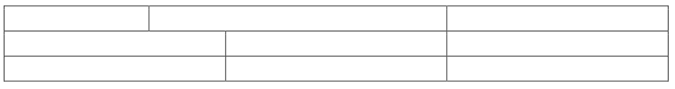
    
    如果我们现在通过减少最后一列的大小来修改此表格，而不改变整个表格的宽度，如下所示：
    
    
    
    此表格将具有由以下四个网格列组成的表格网格：
    
    ```xml
    <w:tblGrid>
        <w:gridCol w:w="2088"/>
        <w:gridCol w:w="1104"/>
        <w:gridCol w:w="3583"/>
        <w:gridCol w:w="2801"/>
        <w:tblGridChange w:id="1">
            <w:tblGrid>
                <w:gridCol w:w="2088"/>
                <w:gridCol w:w="1104"/>
                <w:gridCol w:w="3192"/>
                <w:gridCol w:w="3192"/>
            </w:tblGrid>
        </w:tblGridChange>
    </w:tblGrid>
    ```
    
    作为 tblGridChange 子元素的 tblGrid 包含表格网格的先前定义，包括所有的网格列以及这些列的原始宽度。示例结束]
    
    [Note: The W3C XML Schema definition of this element’s content model (CT_TblGridBase) is located in §A.1. end note]

=== "英文"
    
    This element specifies a previous table grid state, the modifications to which shall be attributed to a revision by a particular author and at a particular time. This element contains the table grid settings which were previously in place before a specific set of revisions by one author. The table grid is a definition of the set of grid columns which define all of the shared vertical edges of the table, as well as default widths for each of these grid columns. These grid column widths are then used to determine the size of the table based on the table layout algorithm used ([§17.4.52];[§17.4.53]).
    
    [Example: Consider the following table with four vertical edges (grid columns):
    
    
    
    If we now modify this table by reducing the size of the last column without changing the overall table width, as follows:
    
    
    
    This table would have a table grid consisting of four grid columns as follows:
    
    ```xml
    <w:tblGrid>
        <w:gridCol w:w="2088"/>
        <w:gridCol w:w="1104"/>
        <w:gridCol w:w="3583"/>
        <w:gridCol w:w="2801"/>
        <w:tblGridChange w:id="1">
            <w:tblGrid>
                <w:gridCol w:w="2088"/>
                <w:gridCol w:w="1104"/>
                <w:gridCol w:w="3192"/>
                <w:gridCol w:w="3192"/>
            </w:tblGrid>
        </w:tblGridChange>
    </w:tblGrid>
    ```
    
    The tblGrid element as a child of tblGridChange contains the previous definition for the table grid, consisting of all for grid columns as well as the original widths for those columns. end example]
    
    [Note: The W3C XML Schema definition of this element’s content model (CT_TblGridBase) is located in §A.1. end note]

## 17.4.48 tblGrid (表格网格)

**tblGrid (Table Grid)**

=== "中文"
    
    该元素指定了当前表格的表格网格。表格网格定义了一组网格列，这些网格列定义了表格所有共享的垂直边缘，以及每个网格列的默认宽度。这些网格列宽度随后根据使用的表格布局算法来确定表格的大小 ([§17.4.52];[§17.4.53])。
    
    如果省略了表格网格，则将从表格的实际内容中构建一个新网格，假设所有网格列的宽度为0。
    
    [示例：考虑以下具有四个垂直边缘（网格列）的表格：
    
    
    
    此表格将具有由以下四个网格列组成的表格网格：
    
    ```xml
    <w:tblGrid>
        <w:gridCol w:w="2088"/>
        <w:gridCol w:w="1104"/>
        <w:gridCol w:w="3192"/>
        <w:gridCol w:w="3192"/>
    </w:tblGrid>
    ```
    
    tblGrid 元素包含表格网格的当前定义，包括所有网格列以及这些列的默认宽度。示例结束]
    
    [Note: The W3C XML Schema definition of this element’s content model (CT_TblGrid) is located in §A.1. end note]

=== "英文"
    
    This element specifies the table grid for the current table. The table grid is a definition of the set of grid columns which define all of the shared vertical edges of the table, as well as default widths for each of these grid columns. These grid column widths are then used to determine the size of the table based on the table layout algorithm used ([§17.4.52];[§17.4.53]).
    
    If the table grid is omitted, then a new grid shall be constructed from the actual contents of the table assuming that all grid columns have a width of 0.
    
    [Example: Consider the following table with four vertical edges (grid columns):
    
    
    
    This table would have a table grid consisting of four grid columns as follows:
    
    ```xml
    <w:tblGrid>
        <w:gridCol w:w="2088"/>
        <w:gridCol w:w="1104"/>
        <w:gridCol w:w="3192"/>
        <w:gridCol w:w="3192"/>
    </w:tblGrid>
    ```
    
    The tblGrid element contains the current definition for the table grid, consisting of all for grid columns as well as default widths for those columns. end example]
    
    [Note: The W3C XML Schema definition of this element’s content model (CT_TblGrid) is located in §A.1. end note]

## 17.4.49 tblHeader (在每个新页面上重复表行)

**tblHeader (Repeat Table Row on Every New Page)**

=== "中文"
    
    该元素指定当前表格行应在显示表格的每个新页面顶部重复。这使得该表格行在每个页面上表现得像一个“标题”行。此元素可以应用于表格结构顶部的任意数量的行，以生成多行表格标题。
    
    如果省略此元素，则该表格行不会在显示表格的每个新页面上重复。此外，如果该行与表格的第一行不连续连接（即，如果该表格行不是第一行，或在此行与第一行之间的所有行都未标记为标题行），则此属性将被忽略。
    
    [示例：考虑一个表格，其第一行必须在每个新页面上重复，例如 ECMA-376 中的属性列表：
    
    
    
    注意表格中的第一行在第二页顶部重复。此需求将在该行的 WordprocessingML 中指定如下：
    
    ```xml
    <w:trPr>
        <w:tblHeader />
    </w:trPr>
    ```
    
    tblHeader 元素指定该表格行在每个页面的顶部作为标题行重复。示例结束]
    
    This element’s content model is defined by the common boolean property definition in [§17.17.4].

=== "英文"
    
    This element specifies that the current table row shall be repeated at the top of each new page on which part of this table is displayed. This gives this table row the behavior of a 'header' row on each of these pages. This element can be applied to any number of rows at the top of the table structure in order to generate multi-row table headers.
    
    If this element is omitted, this table row shall not be repeated on each new page on which the table is displayed. As well, if this row is not contiguously connected with the first row of the table (that is, if this table row is not either the first row, or all rows between this row and the first row are not marked as header rows) then this property shall be ignored.
    
    [Example: Consider a table which must have its first row repeated on each new page, like the attribute listings in ECMA-376, for example:
    
    
    
    Notice that the first row in the table is repeated on the top of the second page. This requirement would be specified as follows in the WordprocessingML for that row:
    
    ```xml
    <w:trPr>
        <w:tblHeader />
    </w:trPr>
    ```
    
    The tblHeader element specifies that this table row is repeated as a header row at the top of each page. end example]
    
    This element’s content model is defined by the common boolean property definition in [§17.17.4].

## 17.4.50 tblInd (表格从前导边距缩进)

**tblInd (Table Indent from Leading Margin)**

=== "中文"
    
    该元素指定在文档中当前表格的前导边缘之前添加的缩进（在从左到右的表格中为左边缘，在从右到左的表格中为右边缘）。此缩进应将表格按指定量移入文本边距内。
    
    该值按照其 type 属性指定的单位来表示。对于此元素，任何类型为 pct 或 auto 的宽度值都将被忽略。
    
    如果省略此元素，则表格将从关联的表格样式中继承表格缩进。如果在样式层次结构中从未指定表格缩进，则不会向父表格添加缩进。如果在应用 jc 元素的值后，任何表格行的最终对齐方式不是左对齐（[§17.4.26];[§17.4.27];[§17.4.28]），则此属性将被忽略。
    
    [示例：考虑一个表格，必须从左边距缩进一英寸，如下所示：
    
    
    
    此设置将使用以下 WordprocessingML 指定：
    
    ```xml
    <w:tblPr>
        <w:jc w:val="start"/>
        <w:tblInd w:w="1440" w:type="dxa"/>
    </w:tblPr>
    ```
    
    如果现在通过将 jc 元素的值设置为 right 来修改此表格的属性，以在右侧对齐，如下所示：
    
    ```xml
    <w:tblPr>
        <w:jc w:val="end"/>
        <w:tblInd w:w="1440" w:type="dxa"/>
    </w:tblPr>
    ```
    
    由于对齐不再在前导边缘（左边），因此此表格现在将没有缩进：
    
    
    
    示例结束]
    
    This element’s content model is defined by the common table measurement definition in [§17.4.87].

=== "英文"
    
    This element specifies the indentation which shall be added before the leading edge of the current table in the document (the left edge in a left-to-right table, and the right edge in a right-to-left table). This indentation should shift the table into the text margin by the specified amount.
    
    This value is specified in the units applied via its type attribute. Any width value of type pct or auto for this element shall be ignored.
    
    If this element is omitted, then the table shall inherit the table indentation from the associated table style. If table indentation is never specified in the style hierarchy, no indentation shall be added to the parent table. If the resulting justification on any table row is not left after applying the value of the jc element from the three levels of this property ([§17.4.26];[§17.4.27];[§17.4.28]), then this property shall be ignored.
    
    [Example: Consider a table which must be indented one inch from the left margin, as follows:
    
    
    
    This setting would be specified using the following WordprocessingML:
    
    ```xml
    <w:tblPr>
        <w:jc w:val="start"/>
        <w:tblInd w:w="1440" w:type="dxa"/>
    </w:tblPr>
    ```
    
    If the properties on this table were now modified to justify it on the right side by setting the value of the jc element to right, as follows:
    
    ```xml
    <w:tblPr>
        <w:jc w:val="end"/>
        <w:tblInd w:w="1440" w:type="dxa"/>
    </w:tblPr>
    ```
    
    This table would now have no indent, as the justification is no longer on the leading edge (left):
    
    
    
    end example]
    
    This element’s content model is defined by the common table measurement definition in [§17.4.87].

## 17.4.51 tblInd (表从前导边距缩进异常)

**tblInd (Table Indent from Leading Margin Exception)**

=== "中文"
    
    该元素指定了在应用了这一组表格级属性例外的父表格行的前导边缘之前添加的缩进。此缩进应将表格按指定量移入文档的文本边距内（在从左到右的表格中为左边缘，在从右到左的表格中为右边缘）。
    
    该值按照其 type 属性指定的单位来表示。对于此元素，任何类型为 pct 或 auto 的宽度值都将被忽略。
    
    如果省略此元素，则表格将从关联的表格级属性设置中继承表格缩进。如果在应用 jc 元素的值后，父表格行的最终对齐方式不是左对齐（[§17.4.26];[§17.4.27];[§17.4.28]），则此属性将被忽略。
    
    [示例：考虑一个表格，其最后两行必须通过表格级属性例外定义从左边距缩进一英寸，如下所示：
    
    
    
    此设置将使用以下 WordprocessingML 指定：
    
    ```xml
    <w:tblPrEx>
        <w:tblInd w:w="1440" w:type="dxa"/>
    </w:tblPrEx>
    ```
    
    作为 tblPrEx 的子元素的 tblInd 指定了具有表格级属性例外的行必须缩进1440个二十分之一点（一英寸）。示例结束]
    
    This element’s content model is defined by the common table measurement definition in [§17.4.87].

=== "英文"
    
    This element specifies the indentation which shall be added before the leading edge of the set of parent table rows which have this set of table-level property exceptions applied. This indentation should shift the table into the text margin by the specified amount in the document (the left edge in a left-to-right table, and the right edge in a right-to-left table).
    
    This value is specified in the units applied via its type attribute. Any width value of type pct or auto for this element shall be ignored.
    
    If this element is omitted, then the table shall inherit the table indentation from the associated table level property setting. If the resulting justification on the parent table row is not left after applying the value of the jc element from the three levels of this property ([§17.4.26];[§17.4.27];[§17.4.28]), then this property shall be ignored.
    
    [Example: Consider a table in which the last two rows must be indented one inch from the left margin via a table-level property exception definition, as follows:
    
    
    
    This setting would be specified using the following WordprocessingML:
    
    ```xml
    <w:tblPrEx>
        <w:tblInd w:w="1440" w:type="dxa"/>
    </w:tblPrEx>
    ```
    
    The tblInd element as a child of tblPrEx specifies that the rows with the table-level property exception must be indented by 1440 twentieths of a point (one inch). end example]
    
    This element’s content model is defined by the common table measurement definition in [§17.4.87].

## 17.4.52 tblLayout (表格布局)

**tblLayout (Table Layout)**

=== "中文"

    这个元素指定了用于在文档中布置该表格内容的算法。当表格在文档中显示时，可以使用固定宽度或自动调整布局算法（每种算法详见val属性引用的简单类型）。
    
    如果省略了这个元素，则该元素的值应被假定为auto。
    
    [示例：考虑一个必须使用固定宽度表格布局算法的表格。这一要求使用以下WordprocessingML指定：
    
    ```xml
    <w:tblPr>
        <w:tblLayout w:type="fixed"/>
    </w:tblPr>
    ```
    
    tblLayout元素指定了表格必须使用固定布局算法。 结束示例]
    
    ??? abstract "属性"
    
        - **type**（表格布局设置）
    
            指定用于布置父表格内容的算法（有关使用的每种算法的详细信息，请参见简单类型定义）。
            
            [示例：考虑一个必须使用自动调整宽度表格布局算法的表格。这一要求使用以下WordprocessingML指定：
            
            ```xml
            <w:tblPr>
                <w:tblLayout w:type="autofit"/>
            </w:tblPr>
            ```
            
            tblLayout元素指定了表格必须使用自动布局算法。 结束示例]
            
            此属性的可能值由ST_TblLayoutType简单类型定义（[§17.18.87]）。
    
    [Note: The W3C XML Schema definition of this element’s content model (CT_TblLayoutType) is located in §A.1. end note]

=== "英文"

    This element specifies the algorithm which shall be used to lay out the contents of this table within the document. When a table is displayed in a document, it can either be displayed using a fixed width or autofit layout algorithm (each discussed in the simple type referenced by the val attribute).
    
    If this element is omitted, then the value of this element shall be assumed to be auto.
    
    [Example: Consider a table which must use the fixed width table layout algorithm. This requirement is specified using the following WordprocessingML:
    
    ```xml
    <w:tblPr>
        <w:tblLayout w:type="fixed"/>
    </w:tblPr>
    ```
    
    The tblLayout element specifies that the table must use the fixed layout algorithm. end example]
    
    ??? abstract "Attributes"
    
        - **type** (Table Layout Setting)
    
            Specifies the algorithm which shall be used to lay out the contents of the parent table (see simple type definition for details on each algorithm used).
            
            [Example: Consider a table which must use the AutoFit width table layout algorithm. This requirement is specified using the following WordprocessingML:
            
            ```xml
            <w:tblPr>
                <w:tblLayout w:type="autofit"/>
            </w:tblPr>
            ```
    
            The tblLayout element specifies that the table must use the auto layout algorithm. en example]
            
            The possible values for this attribute are defined by the ST_TblLayoutType simple type ([§17.18.87]).
    
    [Note: The W3C XML Schema definition of this element’s content model (CT_TblLayoutType) is located in §A.1. end note]

    
## 17.4.53 tblLayout (表格布局异常)

**tblLayout (Table Layout Exception)**

=== "中文"
    
    该元素指定了应该使用的算法来布置表格中具有父元素指定的表级属性异常集的所有行的内容。当表格在文档中显示时，可以使用固定宽度或自动调整布局算法（每种算法详见val属性引用的简单类型）。
    
    如果省略了这个元素，则该元素的值应被假定为auto。
    
    [示例：考虑一个必须使用固定宽度表格布局算法的表格。这一要求使用以下WordprocessingML指定：
    
    ```xml
    <w:tblPrEx>
        <w:tblLayout w:type="fixed"/>
    </w:tblPrEx>
    ```
    
    tblLayout元素指定了表格必须使用固定布局算法。 结束示例]
    
    ??? abstract "属性"
    
        - **type**（表格布局设置）
        
            指定用于布置父表格内容的算法（有关使用的每种算法的详细信息，请参见简单类型定义）。
            
            [示例：考虑一个必须使用自动调整宽度表格布局算法的表格。这一要求使用以下WordprocessingML指定：
            
            ```xml
            <w:tblPr>
                <w:tblLayout w:type="autofit"/>
            </w:tblPr>
            ```
            
            tblLayout元素指定了表格必须使用自动布局算法。 结束示例]
            
            此属性的可能值由ST_TblLayoutType简单类型定义（[§17.18.87]）。
    
    [Note: The W3C XML Schema definition of this element’s content model (CT_TblLayoutType) is located in §A.1 end note]

=== "英文"
    
    This element specifies the algorithm which shall be used to lay out the contents of all rows with this table within the table which have the set of table-level property exceptions specified by the parent element. When a table is displayed in a document, it can either be displayed using a fixed width or autofit layout algorithm (each discussed in the simple type referenced by the val attribute).
    
    If this element is omitted, then the value of this element shall be assumed to be auto.
    
    [Example: Consider a table which must use the fixed width table layout algorithm. This requirement is specified using the following WordprocessingML:
    
    ```xml
    <w:tblPrEx>
        <w:tblLayout w:type="fixed"/>
    </w:tblPrEx>
    ```
    
    The tblLayout element specifies that the table must use the fixed layout algorithm. end example]
    
    ??? abstract "Attributes"
    
    - **type** (Table Layout Setting)
    
        Specifies the algorithm which shall be used to lay out the contents of the parent table (see simple type definition for details on each algorithm used).
        
        [Example: Consider a table which must use the AutoFit width table layout algorithm. This requirement is specified using the following WordprocessingML:
        
        ```xml
        <w:tblPr>
            <w:tblLayout w:type="autofit"/>
        </w:tblPr>
        ```
        
        The tblLayout element specifies that the table must use the auto layout algorithm. end example]
    
        The possible values for this attribute are defined by the ST_TblLayoutType simple type ([§17.18.87]).
    
    [Note: The W3C XML Schema definition of this element’s content model (CT_TblLayoutType) is located in §A.1 end note]

## 17.4.54 tblLook (表格样式条件格式设置异常)

**tblLook (Table Style Conditional Formatting Settings Exception)**

=== "中文"
    
    该元素指定了应用于具有当前表级属性异常的表格行集的条件格式的条件格式组件。表格样式可以指定多达六种不同的可选条件格式[示例：对第一列进行不同的格式设置。结束示例]，然后可以将其应用于父表格中的单个表格行或省略。
    
    默认设置是应用行和列条带格式，但不应用第一行、最后一行、第一列或最后一列的格式。
    
    [示例：考虑一个必须使用所引用的表格样式中以下条件格式属性的表格：
    
    - 第一行条件格式
    - 最后一行条件格式
    - 无行条带格式
    - 无列条带格式
    
    生成的WordprocessingML将被指定如下：
    
    ```xml
    <w:tblPrEx>
        <w:tblLook w:firstRow="true" w:lastRow="true" w:noHBand="true" w:noVBand="true" />
    </w:tblPrEx>
    ```
    
    tblLook元素指定了应用于当前表格的表格样式的哪些组件。结束示例]
    
    ??? abstract "属性"
    
        - **firstColumn**（第一列）
        
            指定应将第一列的条件格式应用于表格。
            
            此属性的可能值由ST_OnOff简单类型定义（[§22.9.2.7]）。
            
        - **firstRow**（第一行）
        
            指定应将第一行的条件格式应用于表格。
            
            此属性的可能值由ST_OnOff简单类型定义（[§22.9.2.7]）。
            
        - **lastColumn**（最后一列）
        
            指定应将最后一列的条件格式应用于表格。
            
            此属性的可能值由ST_OnOff简单类型定义（[§22.9.2.7]）。
            
        - **lastRow**（最后一行）
        
            指定应将最后一行的条件格式应用于表格。
            
            此属性的可能值由ST_OnOff简单类型定义（[§22.9.2.7]）。
            
        - **noHBand**（无水平条带）
        
            指定不应将水平条带的条件格式应用于表格。
            
            此属性的可能值由ST_OnOff简单类型定义（[§22.9.2.7]）。
            
        - **noVBand**（无垂直条带）
        
            指定不应将垂直条带的条件格式应用于表格。
            
            此属性的可能值由ST_OnOff简单类型定义（[§22.9.2.7]）。
    
    [Note: The W3C XML Schema definition of this element’s content model (CT_TblLook) is located in §A.1. end note]

=== "英文"
    
    This element specifies the components of the conditional formatting of the referenced table style (if one exists) which shall be applied to the set of table rows with the current table-level property exceptions. A table style can specify up to six different optional conditional formats [Example: Different formatting for first column. end example], which then can be applied or omitted from individual table rows in the parent table.
    
    The default setting is to apply the row and column banding formatting, but not the first row, last row, first column, or last column formatting.
    
    [Example: Consider a table which must use the following conditional formatting properties from the referenced table style:
    
    - First row conditional formatting
    - Last row conditional formatting
    - No row banding formatting
    - No column banding formatting
    
    The resulting WordprocessingML would be specified as follows:
    
    ```xml
    <w:tblPrEx>
        <w:tblLook w:firstRow="true" w:lastRow="true" w:noHBand="true" w:noVBand="true" />
    </w:tblPrEx>
    ```
    
    The tblLook element specifies which components of the table style are applied to the current table. end example]
    
    ??? abstract "Attributes"
    
        - **firstColumn** (First Column)
    
            Specifies that the first column conditional formatting shall be applied to the table.
    
            The possible values for this attribute are defined by the ST_OnOff simple type ([§22.9.2.7]).
    
        - **firstRow** (First Row)
    
            Specifies that the first row conditional formatting shall be applied to the table.
    
            The possible values for this attribute are defined by the ST_OnOff simple type ([§22.9.2.7]).
    
        - **lastColumn** (Last Column)
    
            Specifies that the last column conditional formatting shall be applied to the table.
    
            The possible values for this attribute are defined by the ST_OnOff simple type ([§22.9.2.7]).
    
        - **lastRow** (Last Row)
    
            Specifies that the last row conditional formatting shall be applied to the table.
    
            The possible values for this attribute are defined by the ST_OnOff simple type ([§22.9.2.7]).
    
        - **noHBand** (No Horizontal Banding)
    
            Specifies that the horizontal banding conditional formatting shall not be applied to the table.
    
            The possible values for this attribute are defined by the ST_OnOff simple type ([§22.9.2.7]).
    
        - **noVBand** (No Vertical Banding)
    
            Specifies that the vertical banding conditional formatting shall not be applied to the table.
    
            The possible values for this attribute are defined by the ST_OnOff simple type ([§22.9.2.7]).
    
    [Note: The W3C XML Schema definition of this element’s content model (CT_TblLook) is located in §A.1. end note]

## 17.4.55 tblLook (表格样式条件格式设置)

**tblLook (Table Style Conditional Formatting Settings)**

=== "中文"

    该元素指定了所引用的表格样式（如果存在）的条件格式的组件，应用于当前表格。表格样式可以指定多达六种不同的可选条件格式[示例：对第一列进行不同的格式设置。结束示例]，然后可以应用或省略文档中各个表格中的这些格式。
    
    默认设置是应用行和列条带格式，但不应用第一行、最后一行、第一列或最后一列的格式。
    
    [示例：考虑一个必须使用所引用的表格样式中以下条件格式属性的表格：
    
    - 第一行条件格式
    - 最后一行条件格式
    - 无行条带格式
    - 无列条带格式
    
    生成的WordprocessingML将被指定如下：
    
    ```xml
    <w:tblPr>
        <w:tblLook w:firstRow="true" w:lastRow="true" w:noHBand="true" w:noVBand="true" />
    </w:tblPr>
    ```
    
    tblLook元素指定了应用于当前表格的表格样式的哪些组件。结束示例]
    
    ??? abstract "属性"
    
        - **firstColumn**（第一列）
        
            指定应将第一列的条件格式应用于表格。
            
            此属性的可能值由ST_OnOff简单类型定义（[§22.9.2.7]）。
            
        - **firstRow**（第一行）
        
            指定应将第一行的条件格式应用于表格。
            
            此属性的可能值由ST_OnOff简单类型定义（[§22.9.2.7]）。
            
        - **lastColumn**（最后一列）
        
            指定应将最后一列的条件格式应用于表格。
            
            此属性的可能值由ST_OnOff简单类型定义（[§22.9.2.7]）。
            
        - **lastRow**（最后一行）
        
            指定应将最后一行的条件格式应用于表格。
            
            此属性的可能值由ST_OnOff简单类型定义（[§22.9.2.7]）。
            
        - **noHBand**（无水平条带）
        
            指定不应将水平条带的条件格式应用于表格。
            
            此属性的可能值由ST_OnOff简单类型定义（[§22.9.2.7]）。
            
        - **noVBand**（无垂直条带）
        
            指定不应将垂直条带的条件格式应用于表格。
            
            此属性的可能值由ST_OnOff简单类型定义（[§22.9.2.7]）。
    
    [Note: The W3C XML Schema definition of this element’s content model (CT_TblLook) is located in §A.1. end note]

=== "英文"

    This element specifies the components of the conditional formatting of the referenced table style (if one exists) which shall be applied to the current table. A table style can specify up to six different optional conditional formats [Example: Different formatting for first column. end example], which then can be applied or omitted from individual tables in the document.
    
    The default setting is to apply the row and column banding formatting, but not the first row, last row, first column, or last column formatting.
    
    [Example: Consider a table which must use the following conditional formatting properties from the referenced table style:
    
    - First row conditional formatting
    - Last row conditional formatting
    - No row banding formatting
    - No column banding formatting
    
    The resulting WordprocessingML would be specified as follows:
    
    ```xml
    <w:tblPr>
        <w:tblLook w:firstRow="true" w:lastRow="true" w:noHBand="true" w:noVBand="true" />
    </w:tblPr>
    ```
    
    The tblLook element specifies which components of the table style are applied to the current table. end example]
        
    ??? abstract "Attributes"
    
        - **firstColumn** (First Column)
    
            Specifies that the first column conditional formatting shall be applied to the table.
    
            The possible values for this attribute are defined by the ST_OnOff simple type ([§22.9.2.7]).
    
        - **firstRow** (First Row)
    
            Specifies that the first row conditional formatting shall be applied to the table.
    
            The possible values for this attribute are defined by the ST_OnOff simple type ([§22.9.2.7]).
    
        - **lastColumn** (Last Column)
    
            Specifies that the last column conditional formatting shall be applied to the table.
    
            The possible values for this attribute are defined by the ST_OnOff simple type ([§22.9.2.7]).
    
        - **lastRow** (Last Row)
    
            Specifies that the last row conditional formatting shall be applied to the table.
    
            The possible values for this attribute are defined by the ST_OnOff simple type ([§22.9.2.7]).
    
        - **noHBand** (No Horizontal Banding)
    
            Specifies that the horizontal banding conditional formatting shall not be applied to the table.
    
            The possible values for this attribute are defined by the ST_OnOff simple type ([§22.9.2.7]).
    
        - **noVBand** (No Vertical Banding)
    
            Specifies that the vertical banding conditional formatting shall not be applied to the table.
    
            The possible values for this attribute are defined by the ST_OnOff simple type ([§22.9.2.7]).
    
    [Note: The W3C XML Schema definition of this element’s content model (CT_TblLook) is located in §A.1. end note]

## 17.4.56 tblOverlap (浮动表允许其他表重叠)

**tblOverlap (Floating Table Allows Other Tables to Overlap)**

=== "中文"
    
    该元素指定了当前表格在文档中显示时是否允许其他浮动表格与其重叠。如果指定了，则不会进行任何调整以防止具有属性的表格在显示时重叠。如果关闭，则将根据需要调整表格以防止在显示时重叠，并根据需要调整浮动表格的属性。
    
    如果在给定表格上省略了此元素，则该表格在显示时将允许其他表格重叠。如果父表格不是通过tblpPr元素（[§17.4.57]）进行浮动，则将忽略此元素。
    
    [示例：考虑一个WordprocessingML文档中的两个浮动表格，显示时重叠，如下所示：
    
    
    
    如果其中任何一个表格指定不允许重叠，使用以下WordprocessingML：
    
    ```xml
    <w:tblPr>
        <w:tblOverlap w:val="never"/>
    </w:tblPr>
    ```
    
    生成的表格不能重叠，并且必须在显示时进行调整，以防止任何重叠，例如：
    
    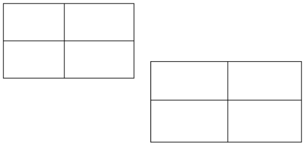
    
    值为never的tblOverlap元素指定指定的表格不能与文档中的其他浮动表格重叠。结束示例]
    
    ??? abstract "属性"
    
        - **val**（浮动表格重叠设置）
        
            指定在文档中显示时浮动表格是否允许其他浮动表格与其重叠。
            
            [示例：以下WordprocessingML指定表格不允许重叠：
            
            ```xml
            <w:tblOverlap w:val="never" />
            ```
            
            结束示例]
            
            此属性的可能值由ST_TblOverlap简单类型定义（[§17.18.88]）。
    
    [Note: The W3C XML Schema definition of this element’s content model (CT_TblOverlap) is located in §A.1. end note]

=== "英文"
    
    This element specifies whether the current table shall allow other floating tables to overlap its extents when the tables are displayed in a document. If specified, then no adjustment shall be made to prevent tables whose properties would normally cause them to overlap from overlapping when displayed. If turned off, then the tables shall be adjusted as needed to prevent them from overlapping when displayed by adjusting the floating table properties as needed.
    
    If this element is omitted on a given table, then this table shall allow other tables to overlap when displayed. If the parent table is not floating via the tblpPr element ([§17.4.57]), then this element shall be ignored.
    
    [Example: Consider two floating tables in a WordprocessingML document which overlap when displayed, as follows:
    
    
    
    If either of these tables specifies that it must not allow overlapping, using the following WordprocessingML:
    
    ```xml
    <w:tblPr>
        <w:tblOverlap w:val="never"/>
    </w:tblPr>
    ```
    
    The resulting tables must not overlap, and must be adjusted at display time to prevent any overlapping, for example:
    
    
    
    The tblOverlap element with a value of never specifies that the specified table cannot overlap with other floating tables in the document. end example]
    
    ??? abstract "Attributes"
    
        - **val** (Floating Table Overlap Setting)
    
            Specifies whether a floating table shall allow other floating tables in the document to overlap its extents when displayed.
            
            [Example: The following WordprocessingML specifies that the table is not allowed to overlap:
            
            ```xml
            <w:tblOverlap w:val="never" />
            ```
            
            end example]
            
            The possible values for this attribute are defined by the ST_TblOverlap simple type ([§17.18.88]).
    
    [Note: The W3C XML Schema definition of this element’s content model (CT_TblOverlap) is located in §A.1. end note]

## 17.4.57 tblpPr (浮动表定位)

**tblpPr (Floating Table Positioning)**

=== "中文"
    
    该元素指定了关于当前表格的浮动表格的信息。浮动表格是文档中不属于文本主体流的表格，而是绝对定位于当前文档中的非框架内容的特定大小和位置。
    
    tblpPr元素指定的第一个信息是当前表格实际上是一个浮动表格。这个信息仅通过表格属性中存在tblpPr元素来指定。如果省略了tblpPr元素，则表格在文档中不浮动。
    
    第二个信息是表格的定位，由存储在tblpPr元素上的属性值指定。在所有绝对定位情况下，表格的定位是相对于其左上角位置的。对于相对定位（例如，居中），表格的定位是相对于其整个框架的。
    
    请注意，表格仍然在文件中具有逻辑位置（即其在文档中块级元素内的位置）。这个逻辑位置将用于计算表格相对于段落的位置，使用文档中下一个常规（非表格、非框架）段落。
    
    [示例：考虑一个浮动表格，其在页面范围上的顶部和左侧边缘距离页面范围边缘各三英寸（即左上角位于3英寸 x 3英寸）。可以使用以下WordprocessingML指定这个浮动表格：
    
    ```xml
    <w:tbl>
        <w:tblPr>
            <w:tblpPr w:leftFromText="144" w:rightFromText="144" w:topFromText="144"
                w:bottomFromText="144" w:vertAnchor="page" w:horzAnchor="page" w:tblpX="4320"
                w:tblpY="4320"/>
            …
        </w:tblPr>
    …</w:tbl>
    ```
    
    tblpPr元素的存在指示这个表格是一个浮动表格，其属性指定浮动表格应该从当前页面的顶部和左侧边缘各移动4320个twentieths of a point（即3英寸）。结束示例]
        
    ??? abstract "Attributes"
    
        - **bottomFromText**（表格底部到文本的距离）

            指定当前浮动表格与位于该浮动表格下方段落中的文本顶部之间应保持的最小距离。
            
            此距离以点的二十分之一表示。
            
            如果省略了此属性，则应假定其值为0。
            
            [示例：考虑一个浮动表格，其底部应至少与底部任意文本保持半英寸的间距。可以使用以下WordprocessingML指定这个约束：
            
            ```xml
            <w:tblPr>
                <w:tblpPr … w:bottomFromText="720" />
            </w:tblPr>
            ```
            
            bottomFromText属性指定文本和此浮动表格之间的间距至少为720点的二十分之一。结束示例]
            
            此属性的可能值由ST_TwipsMeasure简单类型定义（[§22.9.2.14]）。

        - **horzAnchor**（表格水平锚点）

            指定在计算tblpX和/或tblpXSpec属性中的水平定位时应从哪个基本对象开始计算。
            
            浮动表格可以相对于以下对象进行水平定位：
            
            - 任何文本行之前的页面的垂直边缘（对于从左到右的段落，左边缘；对于从右到左的段落，右边缘）
            - 任何文本行之前的文本边距的垂直边缘（对于从左到右的段落，左边缘；对于从右到左的段落，右边缘）
            - 锚定段落所在列的文本边距的垂直边缘
            
            如果省略了此属性，则应假定其值为page。
            
            [示例：考虑一个浮动表格，在从左到右的文档中，应位于其列的右边一英寸。可以使用以下WordprocessingML指定这个浮动表格：
            
            ```xml
            <w:tblPr>
                <w:tblpPr … w:tblpX="1440" w:horzAnchor="margin" />
            </w:tblPr>
            ```
            
            这些表格属性指定它们相对于当前边距，并且相对于该列，浮动表格应为1440点的二十分之一。结束示例]
            
            此属性的可能值由ST_HAnchor简单类型定义（[§17.18.35]）。
    
        - **leftFromText**（表格左侧到文本的距离）

            指定当前浮动表格与位于该浮动表格左侧的段落文本边缘之间应保持的最小距离。
            
            此距离以点的二十分之一表示。
            
            如果省略了此属性，则应假定其值为0。
            
            [示例：考虑一个浮动表格，其左侧应至少与任何左侧文本保持半英寸的间距。可以使用以下WordprocessingML指定这个约束：
            
            ```xml
            <w:tblPr>
                <w:tblpPr … w:leftFromText="720" />
            </w:tblPr>
            ```
            
            leftFromText属性指定文本和此浮动表格之间的间距至少为720点的二十分之一。结束示例]
            
            此属性的可能值由ST_TwipsMeasure简单类型定义（[§22.9.2.14]）。

        - **rightFromText**（表格右侧到文本的距离）

            指定当前浮动表格与位于该浮动表格右侧的段落文本边缘之间应保持的最小距离。
            
            此距离以点的二十分之一表示。
            
            如果省略了此属性，则应假定其值为0。
            
            [示例：考虑一个浮动表格，其右侧应至少与任何右侧文本保持半英寸的间距。可以使用以下WordprocessingML指定这个约束：
            
            ```xml
            <w:tblPr>
                <w:tblpPr … w:rightFromText="720" />
            </w:tblPr>
            ```
            
            rightFromText属性指定文本和此浮动表格之间的间距至少为720点的二十分之一。结束示例]
            
            此属性的可能值由ST_TwipsMeasure简单类型定义（[§22.9.2.14]）。
    
        - **tblpX**（与锚点的绝对水平距离）

            指定浮动表格的绝对水平位置。这个绝对位置是相对于此浮动表格的水平锚点（由horzAnchor属性指定）指定的水平锚点而言的。
            
            此值以点的二十分之一表示。如果为正数，则浮动表格位于文档中水平文本流的方向上的锚点对象之后。如果为负数，则浮动表格位于文档中水平文本流的方向上的锚点对象之前。
            
            如果还指定了tblpXSpec属性，则将忽略此值。如果省略了此属性，则应假定其值为0。
            
            [示例：考虑以下指定浮动表格的WordprocessingML片段：
            
            ```xml
            <w:tbl>
                <w:tblPr>
                    <w:tblpPr … w:horzAnchor="page" w:tblpX="1643"/>
                </w:tblPr>
                …
            </w:tbl>
            ```
            
            这个浮动表格指定其应位于页面的垂直边缘之后的1643点的二十分之一（来自horizAnchor属性）。结束示例]
            
            此属性的可能值由ST_SignedTwipsMeasure简单类型定义（[§17.18.81]）。

        - **tblpXSpec**（与锚点的相对水平对齐）

            指定浮动表格的相对水平位置。这个相对位置是相对于此浮动表格的水平锚点（由horzAnchor属性指定）指定的水平锚点而言的。
            
            如果省略了此属性，则未指定此属性，tblpX属性的值确定浮动表格的绝对水平位置。如果指定了，则此属性的位置将覆盖在tblpX属性中指定的任何值，并且该值将被忽略。
            
            [示例：考虑以下指定浮动表格的WordprocessingML片段：
            
            ```xml
            <w:tbl>
                <w:tblPr>
                    <w:tblpPr … w:horzAnchor="page" w:tblpX="1643"
                        w:tblpXSpec="left"/>
                </w:tblPr>
                …
            </w:tbl>
            ```
            
            这个浮动表格指定其相对于页面的水平放置位置为1643点的二十分之一，但通过tblpXSpec属性的存在，这个确切的放置位置被覆盖为将表格放置在页面的左侧。结束示例]
            
            此属性的可能值由ST_XAlign简单类型定义（[§22.9.2.18]）。
    
        - **tblpY**（与锚点的绝对垂直距离）

            指定浮动表格的绝对垂直位置。这个绝对位置是相对于此浮动表格的垂直锚点（由vertAnchor属性指定）指定的垂直锚点而言的。
            
            此值以点的二十分之一表示。如果为正数，则浮动表格位于文档中垂直文本流的方向上的锚点对象之后。
            
            如果为负数，则浮动表格位于文档中垂直文本流的方向上的锚点对象之前。
            
            如果还指定了tblpYSpec属性，则将忽略此值。如果省略了此属性，则应假定其值为0。
            
            [示例：考虑以下指定浮动表格的WordprocessingML片段：
            
            ```xml
            <w:tbl>
                <w:tblPr>
                    <w:tblpPr … w:vertAnchor="text" w:tblpY="73" />
                </w:tblPr>
                …
            </w:tbl>
            ```
            
            这个浮动表格指定其应位于锚点段落文本的顶部垂直边缘的下方79点的二十分之一（来自vertAnchor属性），假设垂直文本方向是自上而下。结束示例]
            
            此属性的可能值由ST_SignedTwipsMeasure简单类型定义（[§17.18.81]）。

        - **tblpYSpec**（与锚点的相对垂直对齐）

            指定浮动表格的相对垂直位置。这个相对位置是相对于此浮动表格的垂直锚点（由vertAnchor属性指定）指定的垂直锚点而言的。
            
            如果省略了此属性，则未指定此属性，tblpY属性的值确定浮动表格的绝对水平位置。如果指定了，则此属性的位置将覆盖在tblpY属性中指定的任何值，并且该值将被忽略，除非vertAnchor设置为text，在这种情况下，任何相对定位都不允许，并且将被本身忽略。
            
            [示例：考虑以下指定浮动表格的WordprocessingML片段：
            
            ```xml
            <w:tbl>
                <w:tblPr>
                    <w:tblpPr … w:vertAnchor="margin" w:tblpY="73"
                        w:tblpYSpec="center"/>
                </w:tblPr>
                …
            </w:tbl>
            ```
            
            这个浮动表格指定其相对于上边距的垂直放置位置为73点的二十分之一，但通过tblpYSpec属性的存在，这个确切的放置位置被覆盖为将表格放置在边距的中心。结束示例]
            
            此属性的可能值由ST_YAlign简单类型定义（[§22.9.2.20]）。

        - **topFromText**（表格顶部到文本的距离）

            指定当前浮动表格与位于该浮动表格上方的段落文本边缘之间应保持的最小距离。
            
            此距离以点的二十分之一表示。
            
            如果省略了此属性，则应假定其值为0。
            
            [示例：考虑一个浮动表格，其顶部应至少与其上方的任何文本保持半英寸的间距。可以使用以下WordprocessingML指定这个约束：
            
            ```xml
            <w:tblPr>
            <w:tblpPr … w:topFromText="720" />
            </w:tblPr>
            ```
            
            topFromText属性指定文本和此浮动表格之间的间距至少为720点的二十分之一。结束示例]
            
            此属性的可能值由ST_TwipsMeasure简单类型定义（[§22.9.2.14]）。
    
        - **vertAnchor**（表格垂直锚点）

            指定用于计算tblpY属性中的垂直定位的基准对象。
            
            浮动表格可以相对于以下对象进行垂直定位：
            
            - 在任何文本运行之前的页面的水平边缘（对于自上而下的部分是顶部边缘，对于自下而上的部分是底部边缘）
            - 在任何文本运行之前的文本页边缘（对于自上而下的部分是顶部边缘，对于自下而上的部分是底部边缘）
            - 在任何文本运行之前的页面的水平边缘（对于自上而下的部分是顶部边缘，对于自下而上的部分是底部边缘）
            
            如果省略了此属性，则应假定其值为page。

            [示例：考虑一个浮动表格，应位于自上而下文档的页面顶部以下两英寸处。可以使用以下WordprocessingML指定这个浮动表格：

            ```xml
            <w:tblPr>
                <w:tblpPr … w:tblpY="2880" w:vertAnchor="page" />
            </w:tblPr>
            ```

            这些浮动表格属性指定它们相对于锚定页面，并且相对于该页面，表格应在文本流的方向上（在这种情况下是向下）移动2880点的二十分之一。结束示例]
            
            此属性的可能值由ST_VAnchor简单类型定义（[§17.18.100]）。
    
    [Note: The W3C XML Schema definition of this element’s content model (CT_TblPPr) is located in §A.1. end note]

=== "英文"
    
    This element specifies information about the current table with regard to floating tables. Floating tables are tables in a document which are not part of the main text flow in the document, and are instead absolutely positioned with a specific size and position relative to non-frame content in the current document.
    
    The first piece of information specified by the tblpPr element is that the current table is actually a floating table. This information is specified simply by the presence of the tblpPr element in table's properties. If the tblpPr element is omitted, the table shall not floating in the document.
    
    The second piece of information is the positioning of the table, which is specified by the attribute values stored on the tblpPr element. In all absolute positioning cases, the positioning of the table is relative to its top-left corner position. For relative positioning (e.g. center), the positioning of the table is relative to its entire frame.
    
    Note that the table still has a logical position in the file (its location within the block-level elements in the document). This logical location shall be used to calculate the position of the table relative to a paragraph, using the next regular (non-table, non-frame) paragraph in the document.
    
    [Example: Consider a floating table which is positioned three inches from the edge of the page extents on both its top and left edges (i.e. the top-left corner occurs at 3" x 3"). This floating table would be specified using the following WordprocessingML:
    
    ```xml
    <w:tbl>
        <w:tblPr>
            <w:tblpPr w:leftFromText="144" w:rightFromText="144" w:topFromText="144"
                w:bottomFromText="144" w:vertAnchor="page" w:horzAnchor="page" w:tblpX="4320"
                w:tblpY="4320"/>
            …
        </w:tblPr>
    …</w:tbl>
    ```
    
    The presence of the tblpPr element dictates that this table is a floating table, and its attributes specify that the floating table shall be anchored 4320 twentieths of a point (3 inches) from the top and left edges of the current page. end example]
        
    ??? abstract "Attributes"
    
        - **bottomFromText** (Distance From Bottom of Table to Text)
    
            Specifies the minimum distance which shall be maintained between the current floating table and the top of text in the paragraph which is below this floating table.
            
            This distance is expressed in twentieths of a point.
            
            If this attribute is omitted, its value shall be assumed to be 0.
            
            [Example: Consider a floating table which should have a minimum of a one-half inch spacing from any text on its bottom side. This constraint would be specified using the following WordprocessingML:
            
            ```xml
            <w:tblPr>
                <w:tblpPr … w:bottomFromText="720" />
            </w:tblPr>
            ```
            
            The bottomFromText attribute specifies that the spacing between text and this floating table shall be a minimum of 720 twentieths of a point. end example]
            
            The possible values for this attribute are defined by the ST_TwipsMeasure simple type ([§22.9.2.14]).
        
        - **horzAnchor** (Table Horizontal Anchor)
        
            Specifies the base object from which the horizontal positioning in the tblpX and/or tblpXSpec attribute should be calculated.
            
            A floating table can be horizontally positioned relative to:
            
            - The vertical edge of the page before any runs of text (the left edge for left-to-right paragraphs, the right edge for right-to-left paragraphs)
            - The vertical edge of the text margin before any runs of text (the left edge for left-to-right paragraphs, the right edge for right-to-left paragraphs)
            - The vertical edge of the text margin for the column in which the anchor paragraph is located
            
            If this attribute is omitted, then its value shall be assumed to be page.
            
            [Example: Consider a floating table which should be positioned one inch to the right of its column in a left-to-right document. This floating table would be specified using the following WordprocessingML:
            
            ```xml
            <w:tblPr>
                <w:tblpPr … w:tblpX="1440" w:horzAnchor="margin" />
            </w:tblPr>
            ```
            
            These table properties specify that they are relative to the current margin, and that relative to that column, the floating table should be 1440 twentieths of a point. end example]
            
            The possible values for this attribute are defined by the ST_HAnchor simple type ([§17.18.35]).
    
        - **leftFromText** (Distance From Left of Table to Text)
    
            Specifies the minimum distance which shall be maintained between the current floating table and the edge of text in the paragraph which is to the left of this floating table.
            
            This distance is expressed in twentieths of a point.
            
            If this attribute is omitted, its value shall be assumed to be 0.
            
            [Example: Consider a floating table which should have a minimum of a one-half inch spacing from any text on its left. This constraint would be specified using the following WordprocessingML:
            
            ```xml
            <w:tblPr>
                <w:tblpPr … w:leftFromText="720" />
            </w:tblPr>
            ```
            
            The leftFromText attribute specifies that the spacing between text and this floating table must be a minimum of 720 twentieths of a point. end example]
            
            The possible values for this attribute are defined by the ST_TwipsMeasure simple type ([§22.9.2.14]).
    
        - **rightFromText** (Distance From Right of Table to Text)
    
            Specifies the minimum distance which shall be maintained between the current floating table and the edge of text in the paragraph which is to the right of this floating table.
            
            This distance is expressed in twentieths of a point.
            
            If this attribute is omitted, its value shall be assumed to be 0.
            
            [Example: Consider a floating table which should have a minimum of a one-half inch spacing from any text on its right. This constraint would be specified using the following WordprocessingML:
            
            ```xml
            <w:tblPr>
                <w:tblpPr … w:rightFromText="720" />
            </w:tblPr>
            ```
            
            The rightFromText attribute specifies that the spacing between text and this floating table must be a minimum of 720 twentieths of a point. end example]
            
            The possible values for this attribute are defined by the ST_TwipsMeasure simple type ([§22.9.2.14]).
    
        - **tblpX** (Absolute Horizontal Distance From Anchor)
    
            Specifies an absolute horizontal position for the floating table. This absolute position is specified relative to the horizontal anchor specified by the horzAnchor attribute for this floating table.
            
            This value is expressed in twentieths of a point. If it is positive, then the floating table is positioned after the anchor object in the direction of horizontal text flow in this document. If it is negative, then the floating table is positioned before the anchor object in the direction of horizontal text flow in this document.
            
            If the tblpXSpec attribute is also specified, then this value is ignored. If this attribute is omitted, then its value shall be assumed to be 0.
            
            [Example: Consider the following WordprocessingML fragment specifying a floating table:
            
            <w:tbl>
                <w:tblPr>
                    <w:tblpPr … w:horzAnchor="page" w:tblpX="1643"/>
                </w:tblPr>
                …
            </w:tbl>
            
            
            This floating table specifies that it should be located exactly 1643 twentieths of a point after the vertical edge of the page (from the horizAnchor attribute). end example]
            
            The possible values for this attribute are defined by the ST_SignedTwipsMeasure simple type ([§17.18.81]).
    
        - **tblpXSpec** (Relative Horizontal Alignment From Anchor)
    
            Specifies a relative horizontal position for the floating table. This relative position is specified relative to the horizontal anchor specified by the horizAnchor attribute for this floating table.
            
            If omitted, this attribute is not specified and the value of the tblpX attribute determines the absolute horizontal position of the floating table. If specified, the position for this attribute supersedes any value which is specified in the tblpX attribute, and that value is ignored.
            
            [Example: Consider the following WordprocessingML fragment specifying a floating table:
            
            ```xml
            <w:tbl>
                <w:tblPr>
                    <w:tblpPr … w:horzAnchor="page" w:tblpX="1643"
                        w:tblpXSpec="left"/>
                </w:tblPr>
                …
            </w:tbl>
            ```
            
            This floating table specifies that it has a horizontal placement of exactly 1643 twentieths of a point relative to the page, but that exact placement is overridden by the presence of the tblpXSpec attribute to place the table on the left side of the page. end example]
            
            The possible values for this attribute are defined by the ST_XAlign simple type ([§22.9.2.18]).
    
        - **tblpY** (Absolute Vertical Distance From Anchor)
    
            Specifies an absolute vertical position for the floating table. This absolute position is specified relative to the vertical anchor specified by the vertAnchor attribute for this floating table.
            
            This value is expressed in twentieths of a point. If it is positive, then the floating table is positioned after the anchor object in the direction of vertical text flow in this document.
            
            If it is negative, then the floating table is positioned before the anchor object in the direction of vertical text flow in this document.
            
            If the tblpYSpec attribute is also specified, then this value is ignored. If this attribute is omitted, then its value shall be assumed to be 0.
            
            [Example: Consider the following WordprocessingML fragment specifying a floating table:
            
            ```xml
            <w:tbl>
                <w:tblPr>
                    <w:tblpPr … w:vertAnchor="text" w:tblpY="73" />
                </w:tblPr>
                …
            </w:tbl>
            ```
            
            This floating table specifies that it should be located exactly 79 twentieths of a point below the top vertical edge of the anchor's paragraph's text (from the vertAnchor attribute), assuming that the vertical text direction is top to bottom. end example]
            
            The possible values for this attribute are defined by the ST_SignedTwipsMeasure simple type ([§17.18.81]).
    
        - **tblpYSpec** (Relative Vertical Alignment from Anchor)
    
            Specifies a relative vertical position for the floating table. This relative position is specified relative to the vertical anchor specified by the vertAnchor attribute for this floating table.
            
            If omitted, this attribute is not specified and the value of the tblpY attribute determines the absolute horizontal position of the floating table. If specified, the position for this attribute supersedes any value which is specified in the tblpY attribute, and that value is ignored, unless the vertAnchor is set to text, in which case any relative positioning is not allowed, and is itself ignored.
            
            [Example: Consider the following WordprocessingML fragment specifying a floating table:
            
            ```xml
            <w:tbl>
                <w:tblPr>
                    <w:tblpPr … w:vertAnchor="margin" w:tblpY="73"
                        w:tblpYSpec="center"/>
                </w:tblPr>
                …
            </w:tbl>
            ```
            
            This floating table specifies that it has a vertical placement of exactly 73 twentieths of a point relative to the top margin, but that exact placement is overridden by the presence of the tblpYSpec attribute to place the table in the center of the margin. end example]
            
            The possible values for this attribute are defined by the ST_YAlign simple type ([§22.9.2.20]).
    
        - **topFromText** (Distance From Top of Table to Text)
    
            Specifies the minimum distance which shall be maintained between the current floating table and the bottom edge of text in the paragraph which is above this floating table.
            
            This distance is expressed in twentieths of a point.
            
            If this attribute is omitted, its value shall be assumed to be 0.
            
            [Example: Consider a floating table which should have a minimum of a one-half inch spacing from any text above it. This constraint would be specified using the following WordprocessingML:
            
            ```xml
            <w:tblPr>
            <w:tblpPr … w:topFromText="720" />
            </w:tblPr>
            ```
            
            The topFromText attribute specifies that the spacing between text and this floating table must be a minimum of 720 twentieths of a point. end example]
            
            The possible values for this attribute are defined by the ST_TwipsMeasure simple type ([§22.9.2.14]).
    
        - **vertAnchor** (Table Vertical Anchor)
    
            Specifies the base object from which the vertical positioning in the tblpY attribute should be calculated.
            
            A floating table can be horizontally positioned relative to:
            
            - The horizontal edge of the page before any runs of text (the top edge for top-to- bottom sections, the bottom for bottom-to-top sections)
            - The horizontal edge of the text margin before any runs of text (the top edge for top-to-bottom sections, the bottom for bottom-to-top sections)
            - The horizontal edge of the page before any runs of text (the top edge for top-to- bottom sections, the bottom for bottom-to-top sections)
            
            If this attribute is omitted, then its value shall be assumed to be page.
    
            [Example: Consider a floating table which should be positioned two inches below the page top in a top-to-bottom document. This floating table would be specified using the following WordprocessingML:
    
            ```xml
            <w:tblPr>
                <w:tblpPr … w:tblpY="2880" w:vertAnchor="page" />
            </w:tblPr>
            ```
    
            These floating table properties specify that they are relative to the anchor page, and that relative to that page, the table should be 2880 twentieths of a point in the direction of the flow of text (down, in this case). end example]
            
            The possible values for this attribute are defined by the ST_VAnchor simple type ([§17.18.100]).
    
    [Note: The W3C XML Schema definition of this element’s content model (CT_TblPPr) is located in §A.1. end note]

## 17.4.58 tblPr (上一个表属性)

**tblPr (Previous Table Properties)**

=== "中文"
    
    此元素指定了一组先前的表格属性，其修改应归因于特定作者在特定时间进行的修订。该元素包含了在一个特定作者的一组修订之前曾经存在的表格属性设置。这些属性影响父表中所有行和单元格的外观，但可以被各个表级别、行和单元格级别的属性覆盖，每个属性都有自己的定义。
    
    【示例】考虑以下简单的WordprocessingML表格：
    
    
    
    如果将表格对齐设置为居中，并将表格底纹设置为红色，并启用修订标记，如下所示：
    
    
    
    在WordprocessingML中，跟踪此表格上的修订将如下指定：
    
    ```xml
    <w:tblPr>
        <w:tblStyle w:val="TableGrid"/>
        <w:tblW w:w="0" w:type="auto"/>
        <w:jc w:val="center"/>
        <w:shd w:val="clear" w:color="auto" w:fill="FF0000"/>
        <w:tblLook w:firstRow="true" w:firstColumn="true"
            w:noVBand="true" />
        <w:tblPrChange w:id="0" … >
            <w:tblPr>
                <w:tblStyle w:val="TableGrid"/>
                <w:tblW w:w="0" w:type="auto"/>
                <w:tblLook w:firstRow="true" w:firstColumn="true"
                    w:noVBand="true" />
            </w:tblPr>
        </w:tblPrChange>
    </w:tblPr>
    ```
    
    作为tblPrChange的子元素的tblPr包含了表格属性的先前定义，包括当前跟踪修订之前设置的属性。【示例结束】
    
    [Note: The W3C XML Schema definition of this element’s content model (CT_TblPrBase) is located in §A.1. en note]

=== "英文"
    
    This element specifies a previous set of table properties, the modifications to which shall be attributed to a revision by a particular author and at a particular time. This element contains the table property settings which were previously in place before a specific set of revisions by one author. These properties affect the appearance of all rows and cells within the parent table, but can be overridden by individual table-level exception, row, and cell level properties, as defined by each property.
    
    [Example: Consider the following simple WordprocessingML table:
    
    
    
    If the table justification is set to center and the table shading to set to red with revision marking on, as follows:
    
    
    
    The revision tracked on this table would be specified as follows in the WordprocessingML:
    
    ```xml
    <w:tblPr>
        <w:tblStyle w:val="TableGrid"/>
        <w:tblW w:w="0" w:type="auto"/>
        <w:jc w:val="center"/>
        <w:shd w:val="clear" w:color="auto" w:fill="FF0000"/>
        <w:tblLook w:firstRow="true" w:firstColumn="true"
            w:noVBand="true" />
        <w:tblPrChange w:id="0" … >
            <w:tblPr>
                <w:tblStyle w:val="TableGrid"/>
                <w:tblW w:w="0" w:type="auto"/>
                <w:tblLook w:firstRow="true" w:firstColumn="true"
                    w:noVBand="true" />
            </w:tblPr>
        </w:tblPrChange>
    </w:tblPr>
    ```
    
    The tblPr element as a child of tblPrChange contains the previous definition for the table properties, consisting of the properties set before the current tracked revision. end example]
    
    [Note: The W3C XML Schema definition of this element’s content model (CT_TblPrBase) is located in §A.1. en note]

## 17.4.59 tblPr (表属性)

**tblPr (Table Properties)**

=== "中文"
    
    此元素指定应用于当前表格的一组表格级别属性。这些属性影响父表中所有行和单元格的外观，但可以被各个表级别、行和单元格级别的属性覆盖，每个属性都有自己的定义。
    
    【示例】考虑以下简单的WordprocessingML表格：
    
    
    
    此表格定义了所有边框类型的一点单边框，并设置为页面宽度的100% - 这两个是表格级别的属性。结果表格由以下WordprocessingML表示：
    
    ```xml
    <w:tbl>
        <w:tblPr>
            <w:tblW w:w="0" w:type="auto"/>
            <w:tblBorders>
                <w:top w:val="single" w:sz="4" w:space="0" w:color="auto"/>
                <w:start w:val="single" w:sz="4" w:space="0" w:color="auto"/>
                <w:bottom w:val="single" w:sz="4" w:space="0" w:color="auto"/>
                <w:end w:val="single" w:sz="4" w:space="0" w:color="auto"/>
                <w:insideH w:val="single" w:sz="4" w:space="0" w:color="auto"/>
                <w:insideV w:val="single" w:sz="4" w:space="0" w:color="auto"/>
            </w:tblBorders>
        </w:tblPr>
        …
    </w:tbl>
    ```
    
    在此示例中，tblW元素（[§17.4.63]）定义了表格的总宽度，这里设置为auto类型，指定表格应自动调整大小以适应其内容。tblBorders元素（[§17.4.38]）指定了表格的每条边框，并指定了上、左、下、右、内部水平和垂直边框的一点边框。【示例结束】
    
    [Note: The W3C XML Schema definition of this element’s content model (CT_TblPr) is located in §A.1. end note]

=== "英文"
    
    This element specifies the set of table-wide properties applied to the current table. These properties affect the appearance of all rows and cells within the parent table, but can be overridden by individual table-level exception, row, and cell level properties as defined by each property.
    
    [Example: Consider the following simple WordprocessingML table:
    
    
    
    This table defines a one point single border for all border types and is set to 100% of page width - both table-wide properties. The resulting table is represented by the following WordprocessingML:
    
    ```xml
    <w:tbl>
        <w:tblPr>
            <w:tblW w:w="0" w:type="auto"/>
            <w:tblBorders>
                <w:top w:val="single" w:sz="4" w:space="0" w:color="auto"/>
                <w:start w:val="single" w:sz="4" w:space="0" w:color="auto"/>
                <w:bottom w:val="single" w:sz="4" w:space="0" w:color="auto"/>
                <w:end w:val="single" w:sz="4" w:space="0" w:color="auto"/>
                <w:insideH w:val="single" w:sz="4" w:space="0" w:color="auto"/>
                <w:insideV w:val="single" w:sz="4" w:space="0" w:color="auto"/>
            </w:tblBorders>
        </w:tblPr>
        …
    </w:tbl>
    ```
    
    In this example, the tblW element ([§17.4.63]) defines the total width of the table, which, in this case, is set to a type of auto, which specifies that the table should be automatically sized to fit its contents. The tblBorders element ([§17.4.38]) specifies each of the table's borders, and specifies a one point border on the top, left, bottom, right and inside horizontal and vertical border. end example]
    
    [Note: The W3C XML Schema definition of this element’s content model (CT_TblPr) is located in §A.1. end note]

## 17.4.60 tblPrEx (表级属性异常)

**tblPrEx (Table-Level Property Exceptions)**

=== "中文"

    此元素指定一组表格属性，应用于此行的内容，而不是在tblPr元素中指定的表格属性。
    
    【注意：这些属性通常用于旧文档的情况，以及两个现有独立表格合并的情况（为了防止第二个表格的外观被第一个表格的外观覆盖）。结束注意】
    
    【示例：考虑WordprocessingML文档中的以下两个表格：
    
    
    
    这两个表格每个都具有不同的表级别边框设置。如果将这两个表格之间的段落删除并将表格合并在一起，很明显不希望第二个表格失去其格式并匹配第一个表格的属性。因此，当表格合并如下所示时（请注意，现在只有一个表格）：
    
    
    
    表格的最后三行的结果WordprocessingML将包括以下一组表级别属性异常：
    
    ```xml
    <w:tr>
        <w:tblPrEx>
            <w:tblBorders>
                <w:top w:val="thinThickThinMediumGap" w:sz="24" w:space="0" w:color="auto"/>
                <w:start w:val="thinThickThinMediumGap" w:sz="24" w:space="0" w:color="auto"/>
                <w:bottom w:val="thinThickThinMediumGap" w:sz="24" w:space="0" w:color="auto"/>
                <w:end w:val="thinThickThinMediumGap" w:sz="24" w:space="0" w:color="auto"/>
                <w:insideH w:val="thinThickThinMediumGap" w:sz="24" w:space="0" w:color="auto"/>
                <w:insideV w:val="thinThickThinMediumGap" w:sz="24" w:space="0" w:color="auto"/>
            </w:tblBorders>
        </w:tblPrEx>
        …
    </w:tr>
    ```
    
    tblPrEx元素包含了对当前表格行覆盖的所有表级别属性。结束示例】
    
    【注意：此元素内容模型（CT_TblPrEx）的W3C XML Schema定义位于§A.1。结束注意】

=== "英文"

    This element specifies a set of table properties which shall be applied to the contents of this row in place of the table properties specified in the tblPr element.
    
    [Note: These properties are typically used in cases involving legacy documents, as well as cases where two existing independent tables are merged (in order to prevent the look of the second table from being superseded by the first table). end note]
    
    [Example: Consider the following two tables in a WordprocessingML document:
    
    
    
    These two tables each have a different set of table level borders. If the interceding paragraphs between these two tables is removed and the tables are merged together, it is obviously undesirable to have the second table lose its formatting and match the properties of the first table. Therefore, when the tables are merged as follows (note that there is now only one table):
    
    
    
    The resulting WordprocessingML for the last three rows of the table would include the following set of table- level property exceptions:
    
    ```xml
    <w:tr>
        <w:tblPrEx>
            <w:tblBorders>
                <w:top w:val="thinThickThinMediumGap" w:sz="24" w:space="0" w:color="auto"/>
                <w:start w:val="thinThickThinMediumGap" w:sz="24" w:space="0" w:color="auto"/>
                <w:bottom w:val="thinThickThinMediumGap" w:sz="24" w:space="0" w:color="auto"/>
                <w:end w:val="thinThickThinMediumGap" w:sz="24" w:space="0" w:color="auto"/>
                <w:insideH w:val="thinThickThinMediumGap" w:sz="24" w:space="0" w:color="auto"/>
                <w:insideV w:val="thinThickThinMediumGap" w:sz="24" w:space="0" w:color="auto"/>
            </w:tblBorders>
        </w:tblPrEx>
        …
    </w:tr>
    ```
    
    The tblPrEx element contains all table-level properties which are being overridden for the current row in the table. end example]
    
    [Note: The W3C XML Schema definition of this element’s content model (CT_TblPrEx) is located in §A.1. end note]

## 17.4.61 tblPrEx (上一个的表级属性异常)

**tblPrEx (Previous Table-Level Property Exceptions)**

=== "中文"
    
    此元素指定了一组之前的表级别属性异常，其修改应归因于特定作者在特定时间的修订。此元素包含了在某一作者进行一组特定修订之前先前存在的表级别属性异常。
    
    【示例：考虑WordprocessingML文档中的以下两个表格。如果删除这两个表格之间的段落并将表格合并在一起，显然不希望第二个表格失去其格式并匹配第一个表格的属性。因此，当表格如下合并时（请注意，现在只有一个表格）：
    
    
    
    如果将边框类型更改为红色边框，类型为thinThickThinSmallGap并进行修订跟踪，如下所示：
    
    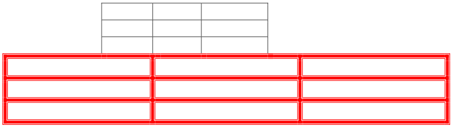
    
    表格的最后三行的结果WordprocessingML将包括以下一组带有修订跟踪的表级别属性异常：
    
    ```xml
    <w:tr>
        <w:tblPrEx>
            <w:tblBorders>
                    <w:top w:val="thinThickThinMediumGap" w:sz="24" w:space="0" w:color="auto"/>
                    <w:start w:val="thinThickThinMediumGap" w:sz="24" w:space="0" w:color="auto"/>
                    <w:bottom w:val="thinThickThinMediumGap" w:sz="24" w:space="0" w:color="auto"/>
                    <w:end w:val="thinThickThinMediumGap" w:sz="24" w:space="0" w:color="auto"/>
                    <w:insideH w:val="thinThickThinMediumGap" w:sz="24" w:space="0" w:color="auto"/>
                    <w:insideV w:val="thinThickThinMediumGap" w:sz="24" w:space="0" w:color="auto"/>
            </w:tblBorders>
            <w:tblPrExChange w:id="9" … >
                <w:tblPrEx>
                    <w:tblBorders>
                        <w:top w:val="thinThickThinSmallGap" w:sz="24" w:space="0" w:color="FF0000"/>
                        <w:start w:val="thinThickThinSmallGap" w:sz="24" w:space="0" w:color="FF0000"/>
                        <w:bottom w:val="thinThickThinSmallGap" w:sz="24" w:space="0" w:color="FF0000"/>
                        <w:end w:val="thinThickThinSmallGap" w:sz="24" w:space="0" w:color="FF0000"/>
                        <w:insideH w:val="thinThickThinSmallGap" w:sz="24" w:space="0" w:color="FF0000"/>
                        <w:insideV w:val="thinThickThinSmallGap" w:sz="24" w:space="0" w:color="FF0000"/>
                    </w:tblBorders>
                </w:tblPrEx>
            </w:tblPrExChange>
        </w:tblPrEx>
        …
    </w:tr>
    ```
    
    作为tblPrExChange的子元素的tblPrEx包含了先前为表级别属性异常定义的内容，即在当前跟踪修订之前设置的属性。结束示例】
    
    [Note: The W3C XML Schema definition of this element’s content model (CT_TblPrExBase) is located in §A.1. end note]

=== "英文"
    
    This element specifies a previous set of table-level property exceptions, the modifications to which shall be attributed to a revision by a particular author and at a particular time. This element contains the table-level property exceptions which were previously in place before a specific set of revisions by one author.
    
    [Example: Consider the following two tables in a WordprocessingML document. If the interceding paragraphs between these two tables is removed and the tables are merged together, it is obviously undesirable to have the second table lose its formatting and match the properties of the first table. Therefore, when the tables are merged as follows (note that there is now only one table):
    
    
    
    If the border type is changed to a red border of type thinThickThinSmallGap with revisions tracked, as follows:
    
    
    
    The resulting WordprocessingML for the last three rows of the table would include the following set of table-
    level property exceptions with revision tracking:
    
    ```xml
    <w:tr>
        <w:tblPrEx>
            <w:tblBorders>
                    <w:top w:val="thinThickThinMediumGap" w:sz="24" w:space="0" w:color="auto"/>
                    <w:start w:val="thinThickThinMediumGap" w:sz="24" w:space="0" w:color="auto"/>
                    <w:bottom w:val="thinThickThinMediumGap" w:sz="24" w:space="0" w:color="auto"/>
                    <w:end w:val="thinThickThinMediumGap" w:sz="24" w:space="0" w:color="auto"/>
                    <w:insideH w:val="thinThickThinMediumGap" w:sz="24" w:space="0" w:color="auto"/>
                    <w:insideV w:val="thinThickThinMediumGap" w:sz="24" w:space="0" w:color="auto"/>
            </w:tblBorders>
            <w:tblPrExChange w:id="9" … >
                <w:tblPrEx>
                    <w:tblBorders>
                        <w:top w:val="thinThickThinSmallGap" w:sz="24" w:space="0" w:color="FF0000"/>
                        <w:start w:val="thinThickThinSmallGap" w:sz="24" w:space="0" w:color="FF0000"/>
                        <w:bottom w:val="thinThickThinSmallGap" w:sz="24" w:space="0" w:color="FF0000"/>
                        <w:end w:val="thinThickThinSmallGap" w:sz="24" w:space="0" w:color="FF0000"/>
                        <w:insideH w:val="thinThickThinSmallGap" w:sz="24" w:space="0" w:color="FF0000"/>
                        <w:insideV w:val="thinThickThinSmallGap" w:sz="24" w:space="0" w:color="FF0000"/>
                    </w:tblBorders>
                </w:tblPrEx>
            </w:tblPrExChange>
        </w:tblPrEx>
        …
    </w:tr>
    ```
    
    The tblPrEx element as a child of tblPrExChange contains the previous definition for the table-level property exceptions, consisting of the properties set before the current tracked revision. end example]
    
    [Note: The W3C XML Schema definition of this element’s content model (CT_TblPrExBase) is located in §A.1. end note]

## 17.4.62 tblStyle (参考表格样式)

**tblStyle (Referenced Table Style)**

=== "中文"
    
    这个元素指定了表格样式的样式ID，该样式将用于格式化该表格的内容。
    
    此格式应用于样式层次结构中的以下位置：
    
    - 文档默认值
    - 表格样式（此元素）
    - 编号样式
    - 段落样式
    - 字符样式
    - 直接格式设置
    
    这意味着样式元素（[§17.7.4.17]）中指定的所有属性，其styleId对应于此元素val属性中的值，在层次结构中的适当级别上应用于表格。
    
    如果省略了此元素，或者引用了不存在的样式，则不会将任何表格样式应用于当前表格。此外，如果表格属性本身是表格样式的一部分，则此属性将被忽略。
    
    【示例：考虑以下WordprocessingML片段：
    
    ```xml
    <w:tblPr>
        <w:tblStyle w:val="TestTableStyle" />
    </w:tblPr>
    ```
    
    该表格指定它将继承styleId为TestTableStyle的表格样式指定的所有表格属性。结束示例】
    
    ??? abstract "属性"
    
        - **val**（字符串值）
    
            指定其内容包含一个字符串。
            
            此字符串的内容根据父XML元素的上下文进行解释。
            
            【示例：考虑以下WordprocessingML片段：
            
            ```xml
            <w:pPr>
            <w:pStyle w:val="Heading1" />
            </w:pPr>
            ```
            
            val属性的值是关联段落样式的styleId。
            
            但是，考虑以下片段：
            
            ```xml
            <w:sdtPr>
            <w:alias w:val="SDT Title Example" />
            …
            </w:sdtPr>
            ```
            
            在这种情况下，val属性中的十进制数是最近的祖先结构化文档标记的标题。在每种情况下，值都是在父元素的上下文中解释的。结束示例】
            
            此属性的可能值由ST_String简单类型（[§22.9.2.13]）定义。
    
    [Note: The W3C XML Schema definition of this element’s content model (CT_String) is located in §A.1. end note]

=== "英文"
    
    This element specifies the style ID of the table style which shall be used to format the contents of this table.
    
    This formatting is applied at the following location in the style hierarchy:
    
    - Document defaults
    - Table styles (this element)
    - Numbering styles
    - Paragraph styles
    - Character styles
    - Direct Formatting
    
    This means that all properties specified in the style element ([§17.7.4.17]) with a styleId which corresponds to the value in this element's val attribute are applied to the table at the appropriate level in the hierarchy.
    
    If this element is omitted, or it references a style which does not exist, then no table style shall be applied to the current table. As well, this property is ignored if the table properties are themselves part of a table style.
    
    [Example: Consider the following WordprocessingML fragment:
    
    ```xml
    <w:tblPr>
        <w:tblStyle w:val="TestTableStyle" />
    </w:tblPr>
    ```
    
    This table specifies that it inherits all of the table properties specified by the table style with a styleId of TestTableStyle. end example]
    
    ??? abstract "Attributes"
    
    - **val** (String Value)
    
        Specifies that its contents contain a string.
        
        The contents of this string are interpreted based on the context of the parent XML element.
        
        [Example: Consider the following WordprocessingML fragment:
        
        ```xml
        <w:pPr>
        <w:pStyle w:val="Heading1" />
        </w:pPr>
        ```
        
        The value of the val attribute is the ID of the associated paragraph style's styleId.
        
        However, consider the following fragment:
        
        ```xml
        <w:sdtPr>
        <w:alias w:val="SDT Title Example" />
        …
        </w:sdtPr>
        ```
        
        In this case, the decimal number in the val attribute is the caption of the nearest ancestor structured document tag. In each case, the value is interpreted in the context of the parent element. end example]
        
        The possible values for this attribute are defined by the ST_String simple type ([§22.9.2.13]).
    
    [Note: The W3C XML Schema definition of this element’s content model (CT_String) is located in §A.1. end note]

## 17.4.63 tblW (首选表格宽度)

**tblW (Preferred Table Width)**

=== "中文"
    
    这个元素指定了该表格的首选宽度。这个首选宽度是表格布局算法的一部分，由tblLayout元素（[§17.4.52]; [§17.4.53]）指定 - 算法的完整描述在ST_TblLayout简单类型中（[§17.18.87]）。
    
    表格中的所有宽度都被视为首选，因为：
    
    - 表格应满足由tblGrid元素（[§17.4.48]）指定的共享列
    - 两个或更多宽度可能对同一网格列的宽度具有冲突的值
    - 表格布局算法（[§17.18.87]）可能需要覆盖首选项
    
    此值是通过其type属性应用的单位中指定的。对于此元素，任何类型为pct的宽度值应相对于页面的文本范围（不包括边距）进行计算。
    
    如果省略了此元素，则单元格宽度应为auto类型。
    
    【示例：考虑一个定义如下的WordprocessingML表格：
    
    ```xml
    <w:tbl>
        <w:tblPr>
            <w:tblW w:type="dxa" w:w="1440"/>
        </w:tblPr>
        …
    </w:tbl>
    ```
    
    此表格指定其首选表格宽度为1440个点的二十分之一（一英寸）。因此，生成的表格将被调整大小，以保持该首选宽度，如下所示：
    
    
    
    文本“Hello world”使中间单元格变大，其他两个单元格被调整大小以保持整体表格宽度的一英寸的首选宽度：
    
    
    
    然而，当中间表格单元需要更大的宽度来容纳不间断的文本时，可以根据需要覆盖该首选项：
    
    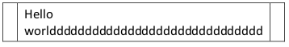
    
    在这种情况下，中间单元格的长不间断字符串导致表格被扩展以防止字符串断裂，因此覆盖了表格上的首选宽度。结束示例】
    
    This element’s content model is defined by the common table measurement definition in [§17.4.87].

=== "英文"
    
    This element specifies the preferred width for this table. This preferred width is used as part of the table layout algorithm specified by the tblLayout element ([§17.4.52]; [§17.4.53]) - full description of the algorithm in the ST_TblLayout simple type ([§17.18.87]).
    
    All widths in a table are considered preferred because:
    
    - The table shall satisfy the shared columns as specified by the tblGrid element ([§17.4.48])
    - Two or more widths can have conflicting values for the width of the same grid column
    - The table layout algorithm ([§17.18.87]) can require a preference to be overridden
    
    This value is specified in the units applied via its type attribute. Any width value of type pct for this element shall be calculated relative to the text extents of the page (page width excluding margins).
    
    If this element is omitted, then the cell width shall be of type auto.
    
    [Example: Consider a WordprocessingML table defined as follows:
    
    ```xml
    <w:tbl>
        <w:tblPr>
            <w:tblW w:type="dxa" w:w="1440"/>
        </w:tblPr>
        …
    </w:tbl>
    ```
    
    This table specifies that it has a preferred table width of 1440 twentieths of a point (one inch). The resulting table would therefore be sized such that the table maintains that preferred width, as follows:
    
    
    
    The text Hello world makes the middle cell larger, and the other two cells are size to maintain the preferred widths of one inch for the overall table width:
    
    
    
    However, when the middle table cell requires a larger width to accommodate non-breaking text, that preference can be overridden as needed:
    
    
    
    In this case, the middle cell's long non breaking string caused the table to be expanded to prevent breaking the string, and therefore to override the preferred width on the table. end example]
    
    This element’s content model is defined by the common table measurement definition in [§17.4.87].

## 17.4.64 tblW (首选表格宽度异常)

**tblW (Preferred Table Width Exception)**

=== "中文"
    
    这个元素通过一组表级属性异常指定了父表行的首选宽度。这个首选宽度作为tblLayout元素（[§17.4.52]; [§17.4.53]）指定的表格布局算法的一部分使用 - 算法的完整描述在ST_TblLayout简单类型中（[§17.18.87]）。
    
    表格中的所有宽度都被视为首选，因为：
    
    - 表格应满足由tblGrid元素（[§17.4.48]）指定的共享列
    - 两个或更多宽度可能对同一网格列的宽度具有冲突的值
    - 表格布局算法（[§17.18.87]）可能需要覆盖首选项
    
    此值是通过其type属性应用的单位中指定的。对于此元素，任何类型为pct的宽度值应相对于页面的文本范围（不包括边距）进行计算。
    
    如果省略了此元素，则单元格宽度应为auto类型。
    
    【示例：考虑一个WordprocessingML表格中定义的行如下：
    
    ```xml
    <w:tr>
        <w:tblPrEx>
            <w:tblW w:type="auto" w:w="1440"/>
        </w:tblPrEx>
        <w:trPr>
        </w:trPr>
        …
    </w:tr>
    ```
    
    这个表级属性异常指定了其首选表格宽度为1440个点的二十分之一（一英寸）。因此，生成的表格行将被调整大小，以保持该首选宽度，如下所示：
    
    
    
    文本“Hello world”使中间单元格变大，其他两个单元格被调整大小以保持整体表格宽度的一英寸的首选宽度：
    
    
    
    然而，当中间表格单元需要更大的宽度来容纳不间断的文本时，可以根据需要覆盖该首选项：
    
    
    
    在这种情况下，中间单元格的长不间断字符串导致表格被扩展以防止字符串断裂，因此覆盖了表格行上的首选宽度。结束示例】
    
    This element’s content model is defined by the common table measurement definition in [§17.4.87].

=== "英文"
    
    This element specifies the preferred width for the parent table row via a set of table-level property exceptions. This preferred width is used as part of the table layout algorithm specified by the tblLayout element ([§17.4.52]; [§17.4.53]) - full description of the algorithm in the ST_TblLayout simple type ([§17.18.87]).
    
    All widths in a table are considered preferred because:
    
    - The table shall satisfy the shared columns as specified by the tblGrid element ([§17.4.48])
    - Two or more widths can have conflicting values for the width of the same grid column
    - The table layout algorithm ([§17.18.87]) can require a preference to be overridden
    
    This value is specified in the units applied via its type attribute. Any width value of type pct for this element shall be calculated relative to the text extents of the page (page width excluding margins).
    
    If this element is omitted, then the cell width shall be of type auto.
    
    [Example: Consider a row in a WordprocessingML table defined as follows:
    
    ```xml
    <w:tr>
        <w:tblPrEx>
            <w:tblW w:type="auto" w:w="1440"/>
        </w:tblPrEx>
        <w:trPr>
        </w:trPr>
        …
    </w:tr>
    ```
    
    This table-level property exception specifies that it has a preferred table width of 1440 twentieths of a point (one inch). The resulting table row would therefore be sized such that the table maintains that preferred width, as follows:
    
    
    
    The text Hello world makes the middle cell larger, and the other two cells are size to maintain the preferred widths of one inch for the overall table width:
    
    
    
    However, when the middle table cell requires a larger width to accommodate non-breaking text, that preference can be overridden as needed:
    
    
    
    In this case, the middle cell's long non breaking string caused the table to be expanded to prevent breaking the string, and therefore to override the preferred width on the table row. end example]
    
    This element’s content model is defined by the common table measurement definition in [§17.4.87].

## 17.4.65 tc (表格单元格)

**tc (Table Cell)**

=== "中文"
    
    该元素指定表行中的单个单元格，其中包含表的内容。WordprocessingML中的表单元格类似于HTML中的td元素。
    
    tc元素具有一个格式化子元素tcPr（[§17.4.69]），它定义了单元格的属性。表单元格上的每个唯一属性由此元素的子元素指定。此外，表单元格可以包含任何块级内容，这允许在表单元格中嵌套段落和表格。
    
    如果表单元格不包含至少一个块级元素，则应将此文档视为损坏。
    
    【示例：考虑由包含文本“Hello, world”的单个表单元格组成的表格：
    
    
    
    此表单元格的内容由以下WordprocessingML表示：
    
    ```xml
    <w:tc>
        <w:tcPr>
            <w:tcW w:w="0" w:type="auto"/>
        </w:tcPr>
        <w:p>
            <w:r>
                <w:t>Hello, world</w:t>
            </w:r>
        </w:p>
    </w:tc>
    ```
    
    tc元素包含使用tcPr元素定义的一组单元格级属性，以及一个块级元素 - 在本例中为段落。结束示例】
    
    ??? 摘要 "属性"
    
        - **id**（表单元格标识符）
        
            指定当前表单元格的唯一标识符。此标识符在表中必须是唯一的，并用于使用headers子元素将此表单元格标识为表中其他单元格的标题单元格。
            
            如果省略此属性，则此表单元格没有唯一标识符。
            
            【示例：考虑定义如下的表单元格：
            
            ```xml
            <w:tc w:id="januaryeight">
                …
            </w:tc>
            ```
            
            id中的值指定了januaryeight的唯一标识符。然后，表中的其他单元格可以通过引用此ID将其引用为行或列标题。结束示例】
            
            此属性的可能值由ST_String简单类型（[§22.9.2.13]）定义。
    
    [Note: The W3C XML Schema definition of this element’s content model (CT_Tc) is located in §A.1. end note]

=== "英文"
    
    This element specifies a single cell in a table row, which contains the table’s content. Table cells in WordprocessingML are analogous to HTML td elements.
    
    A tc element has one formatting child element, tcPr ([§17.4.69]), which defines the properties for the cell. Each unique property on the table cell is specified by a child element of this element. As well, a table cell can contain any block-level content, which allows for the nesting of paragraphs and tables within table cells.
    
    If a table cell does not include at least one block-level element, then this document shall be considered corrupt.
    
    [Example: Consider a table consisting of a single table cell, which contains the text Hello, world:
    
    
    
    This table cell's content is represented by the following WordprocessingML:
    
    ```xml
    <w:tc>
        <w:tcPr>
            <w:tcW w:w="0" w:type="auto"/>
        </w:tcPr>
        <w:p>
            <w:r>
                <w:t>Hello, world</w:t>
            </w:r>
        </w:p>
    </w:tc>
    ```
    
    The tc element contains a set of cell-level properties defined using the tcPr element, and a single block-level element - in this case, a paragraph. end example]
    
    ??? abstract "Attributes"
    
        - **id** (Table Cell Identifier)
        
        Specifies a unique identifier for the current table cell. This identifier shall be unique within the table, and is used to identify this table cell as a header cell for other cells within the table, using the headers child element.
    
        If this attribute is omitted, this table cell has no unique identifier.
        
        [Example: Consider a table cell defined as follows:
        
        ```xml
        <w:tc w:id="januaryeight">
            …
        </w:tc>
        ```
        
        The value in the id specifies a unique identifer of januaryeight. Other cells in the table are then able to reference this cell as a row or column header by referencing this ID. end example]
        
        The possible values for this attribute are defined by the ST_String simple type ([§22.9.2.13]).
    
    [Note: The W3C XML Schema definition of this element’s content model (CT_Tc) is located in §A.1. end note]

## 17.4.66 tcBorders (表格单元格边框合集)

**tcBorders (Table Cell Borders)**

=== "中文"
    
    该元素指定了当前表单元格边缘的边框集合，使用其子元素定义的八种边框类型。
    
    如果任何行的单元格间距非零，如使用tblCellSpacing元素（[§17.4.44]；[§17.4.43]；[§17.4.45]）指定，则永远不会存在边框冲突（因为非零的单元格间距应用于每个单独单元格边框的宽度之上），并且将显示所有表、表级异常和表单元格边框。
    
    如果单元格间距为零，则两个相邻单元格边框之间可能存在冲突【示例：在表的第二列中所有单元格的左边框和表的第一列中所有单元格的右边框之间。结束示例】，应解决如下：
    
    1. 如果任一冲突的表单元格边框为nil或none（无边框），则对立边框将被显示。
    2. 如果单元格边框与表边框冲突，则始终显示单元格边框。
    3. 然后，使用以下公式为每个边框分配权重，并使用此计算的边框值显示在替代边框上：
    
        W<sub>border</sub> = 边框中的线条数 ∗ 边框编号
    
        边框编号应由此列表确定：
    
        - 单线：1
        - 粗线：2
        - 双线：3
        - 点线：4
        - 虚线：5
        - 点虚线：6
        - 点点虚线：7
        - 三重线：8
        - 细粗细小间隙：9
        - 粗细小间隙：10
        - 细粗细小间隙：11
        - 细粗中等间隙：12
        - 粗细中等间隙：13
        - 细粗细中等间隙：14
        - 细粗大间隙：15
        - 粗细大间隙：16
        - 细粗细大间隙：17
        - 波浪线：18
        - 双波浪线：19
        - 短虚线：20
        - 虚线点点画：21
        - 三维浮雕：22
        - 三维雕刻：23
        - 凸出：24
        - 凹入：25
    
    4. 如果边框权重相等，则应以以下优先顺序中较高的为胜：
        
        - 单线
        - 粗线
        - 双线
        - 点线
        - 虚线
        - 点虚线
        - 点点虚线
        - 三重线
        - 细粗细小间隙
        - 粗细小间隙
        - 细粗细小间隙
        - 细粗中等间隙
        - 粗细中等间隙
        - 细粗细中等间隙
        - 细粗大间隙
        - 粗细大间隙
        - 细粗细大间隙
        - 波浪线
        - 双波浪线
        - 短虚线
        - 虚线点点画
        - 三维浮雕
        - 三维雕刻
        - 凸出
        - 凹入
    
    5. 如果边框具有相同的样式，则应按以下方式为每个边框颜色分配亮度值：
    
        亮度 = R + B + 2 ∗ G
    
        具有较小亮度值的颜色将获胜。
    
    6. 如果边框具有相同的上述亮度值，则应按以下方式为每个边框颜色分配新的亮度值：
    
        亮度 = B + 2 ∗ G
        
        具有较小亮度值的颜色将获胜。
    
    7. 如果边框具有相同的上述亮度值，则应按以下方式为每个边框颜色分配亮度值：
    
        亮度 = G
        
        具有较小亮度值的颜色将获胜。
    
    8. 如果边框具有相同的上述亮度值，则它们在功能上相同，并且应显示阅读顺序中的第一个边框。
    
    【示例：考虑以下两个单元格表格（为了清晰起见，单元格间距被扩大）：
    
    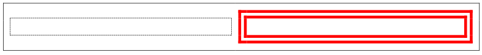
    
    如果我们折叠单元格间距，则所有边缘都存在冲突的边框。对于每个单元格/表边框冲突，规则 #2 表明单元格边框必须获胜。对于两个单元格边框之间的冲突，规则 #3 为右侧单元格的边框提供了更大的边框权重，导致以下表格：
    
    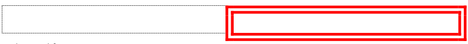
    
    结束示例】
    
    如果省略了此元素，则此表格应具有与关联表样式指定的边框。如果在样式层次结构中未指定边框，则此表格不应具有任何表边框。
    
    【示例：考虑一个表格，其第一个单元格指定由粗双红线组成的单元格级边框，如下所示：
    
    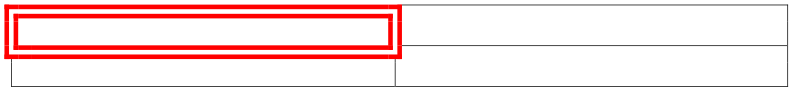
    
    这些单元格边框是使用以下WordprocessingML指定的：
    
    ```xml
    <w:tcPr>
    <w:tcBorders>
    <w:top w:val="double" w:sz="24" w:space="0" w:color="FF0000"/>
    <w:start w:val="double" w:sz="24" w:space="0" w:color="FF0000"/>
    <w:bottom w:val="double" w:sz="24" w:space="0" w:color="FF0000"/>
    <w:end w:val="double" w:sz="24" w:space="0" w:color="FF0000"/>
    </w:tcBorders>
    </w:tcPr>
    ```
    
    tcBorders元素指定应用于第一个单元格的边框集合，作为3点双边框。 结束示例】
    
    [Note: The W3C XML Schema definition of this element’s content model (CT_TcBorders) is located in §A.1. end note]

=== "英文"
    
    This element specifies the set of borders for the edges of the current table cell, using the eight border types defined by its child elements.
    
    If the cell spacing for any row is non-zero as specified using the tblCellSpacing element ([§17.4.44]; [§17.4.43]; [§17.4.45]), then there is never a border conflict (as the non-zero cell spacing is applied above and beyond each individual cell border's width) and all table, table-level exception, and table cell borders shall be displayed.
    
    If the cell spacing is zero, then there can be a conflict between two adjacent cell borders [Example: Between the left border of all cells in the second column and the right border of all cells in the first column of the table. end example], which shall be resolved as follows:
    
    1. If either conflicting table cell border is nil or none (no border), then the opposing border shall be displayed.
    2. If a cell border conflicts with a table border, the cell border always wins.
    3. Each border shall then be assigned a weight using the following formula, and the border value using this calculation shall be displayed over the alternative border:
    
        W<sub>border</sub> = # of lines in border ∗ border number
    
    4. The border number shall be determined by this list:
    
        - single: 1
        - thick: 2
        - double: 3
        - dotted: 4
        - dashed: 5
        - dotDash: 6
        - dotDotDash: 7
        - triple: 8
        - thinThickSmallGap: 9
        - thickThinSmallGap: 10
        - thinThickThinSmallGap: 11
        - thinThickMediumGap: 12
        - thickThinMediumGap: 13
        - thinThickThinMediumGap: 14
        - thinThickLargeGap: 15
        - thickThinLargeGap: 16
        - thinThickThinLargeGap: 17
        - wave: 18
        - doubleWave: 19
        - dashSmallGap: 20
        - dashDotStroked: 21
        - threeDEmboss: 22
        - threeDEngrave: 23
        - outset: 24
        - inset: 25
    
    5. If the borders have an equal weight, than the higher of the two on this precedence list shall win:
        
        - single
        - thick
        - double
        - dotted
        - dashed
        - dotDash
        - dotDotDash
        - triple
        - thinThickSmallGap
        - thickThinSmallGap
        - thinThickThinSmallGap
        - thinThickMediumGap
        - thickThinMediumGap
        - thinThickThinMediumGap
        - thinThickLargeGap
        - thickThinLargeGap
        - thinThickThinLargeGap
        - wave
        - doubleWave
        - dashSmallGap
        - dashDotStroked
        - threeDEmboss
        - threeDEngrave
        - outset
        - inset
    
    6. If the borders have an identical style, than each border color shall be assigned a brightness value as follows:
    
        Brightness = R + B + 2 ∗ G
    
        The color with the smaller brightness value shall win.
    
    7. If the borders have an identical brightness value above, than each border color shall be assigned a new brightness value as follows:
    
        Brightness = B + 2 ∗ G
        
        The color with the smaller brightness value shall win.
    
    8. If the borders have an identical brightness value above, than each border color shall be assigned a brightness value as follows:
    
        Brightness = G
        
        The color with the smaller brightness value shall win.
    
    9. If the borders have an identical brightness value above, then they are functionally identical, and the first border in reading order should be displayed.
    
    [Example: Consider the following two cell table (with exaggerated table cell spacing for clarity):
    
    
    
    If we collapse the cell spacing, there are conflicting borders at all edges. For each cell/table border conflict, rul #2 says that the cell border must win. For the conflict in the center between two cell borders, rule #3 gives us a larger border weight for the right cell's border, resulting in the following table:
    
    
    
    end example]
    
    If this element is omitted, then this table shall have the borders specified by the associated table style. If no borders are specified in the style hierarchy, then this table shall not have any table borders.
    
    [Example: Consider a table whose first cell specifies cell-level borders consisting of a think double red line, as follows:
    
    
    
    These cell borders are specified using the following WordprocessingML:
    
    ```xml
    <w:tcPr>
    <w:tcBorders>
    <w:top w:val="double" w:sz="24" w:space="0" w:color="FF0000"/>
    <w:start w:val="double" w:sz="24" w:space="0" w:color="FF0000"/>
    <w:bottom w:val="double" w:sz="24" w:space="0" w:color="FF0000"/>
    <w:end w:val="double" w:sz="24" w:space="0" w:color="FF0000"/>
    </w:tcBorders>
    </w:tcPr>
    ```
    
    The tcBorders element specifies the set of borders applied to the first cell as a 3 point double border. end example]
    
    [Note: The W3C XML Schema definition of this element’s content model (CT_TcBorders) is located in §A.1. end note]

## 17.4.67 tcFitText (适合单元格内的文本)

**tcFitText (Fit Text Within Cell)**

=== "中文"
    
    该元素指定，当前单元格的内容应根据需要增加或减少字符间距，以适应当前单元格文本范围的宽度。如果该元素上提供的宽度与当前单元格的宽度匹配，则此设置应与将本段落的内容放置在一个运行中并使用fitText元素（[§17.3.2.14]）的行为完全相同。
    
    如果省略了此元素，则此单元格中的文本不应适合当前单元格范围。
    
    【示例：考虑一个2行2列的表格，在其中第一行的两个单元格的内容都设置了fit text属性，如下所示：
    
    ```xml
    <w:tcPr>
        <w:tcFitText w:val="true"/>
    </w:tcPr>
    ```
    
    生成的表格单元格的内容必须适合父表单元格的范围，如下所示：
    
    
    
    结束示例】
    
    This element’s content model is defined by the common boolean property definition in [§17.17.4].

=== "英文"
    
    This element specifies that the contents of the current cell shall have their inter-character spacing increased or reduced as necessary to fit the width of the text extents of the current cell. This setting shall behave identically to placing the contents of this paragraph in a run and using the fitText element ([§17.3.2.14]), if the width provided on that element matched the width of the current cell.
    
    If this element is omitted, then the text in this cell shall not be fit to the current cell extents.
    
    [Example: Consider a 2 row by two column table, in which the contents of the two cells in the first row have both have the fit text property set, as follows:
    
    ```xml
    <w:tcPr>
        <w:tcFitText w:val="true"/>
    </w:tcPr>
    ```
    
    The resulting table cells must have their contents fit to the extents of the parent table cell, as follows:
    
    
    
    end example]
    
    This element’s content model is defined by the common boolean property definition in [§17.17.4].

## 17.4.68 tcMar (单个表格单元格边距)

**tcMar (Single Table Cell Margins)**

=== "中文"

    该元素指定父表中单个表单元格的一组单元格边距。
    
    如果存在此设置，则应覆盖来自表级单元格边距（[§17.4.42]）的表单元格边距。
    
    【示例：考虑一个表格，其第一个单元格被定义为具有0.5英寸的默认单元格边距，而不是表格默认值，如下所示：
    
    
    
    使用以下WordprocessingML指定了此表单元格边距集合：
    
    ```xml
    <w:tcPr>
        <w:tcMar>
            <w:top w:w="720" w:type="dxa"/>
            <w:start w:w="720" w:type="dxa"/>
            <w:bottom w:w="720" w:type="dxa"/>
            <w:end w:w="720" w:type="dxa"/>
        </w:tcMar>
        …
    </w:tcPr>
    ```
    
    作为tcPr的子元素的tcMar元素指定了用于第一个表单元格的一组表单元格边距，在本例中，每个边缘均为720个点的二十分之一。结束示例】
    
    [Note: The W3C XML Schema definition of this element’s content model (CT_TcMar) is located in §A.1. end note]

=== "英文"

    This element specifies a set of cell margins for a single table cell in the parent table.
    
    This setting, if present, shall override the table cell margins from the table-level cell margins ([§17.4.42]).
    
    [Example: Consider a table whose first cell is defined to have default cell margins of 0.5 inches for all sides rather then the table defaults, as follows:
    
    
    
    This set of table cell margins is specified using the following WordprocessingML:
    
    ```xml
    <w:tcPr>
        <w:tcMar>
            <w:top w:w="720" w:type="dxa"/>
            <w:start w:w="720" w:type="dxa"/>
            <w:bottom w:w="720" w:type="dxa"/>
            <w:end w:w="720" w:type="dxa"/>
        </w:tcMar>
        …
    </w:tcPr>
    ```
    
    The tcMar element as a child of tcPr specifies the set of table cell margins used for the first table cell, in this case, 720 twentieths of a point on all sides. end example]
    
    [Note: The W3C XML Schema definition of this element’s content model (CT_TcMar) is located in §A.1. end note]

## 17.4.69 tcPr (表格单元格属性)

**tcPr (Table Cell Properties)**

=== "中文"
    
    该元素指定应用于特定表单元格的一组属性。每个唯一属性由此元素的子元素指定。在任何表级、表级异常或行级属性与相应表单元格属性存在冲突的情况下，这些属性将覆盖表格或行范围的属性。
    
    【示例：考虑一个表格，其中单元格宽度覆盖了以下WordprocessingML中表示的表格宽度：
    
    ```xml
    <w:tbl>
        <w:tblPr>
            <w:tblCellMar>
                <w:start w:w="0" w:type="dxa"/>
            </w:tblCellMar>
            </w:tblPr>
            …
        <w:tr>
        <w:tc>
            <w:tcPr>
                <w:tcMar>
                    <w:start w:w="720" w:type="dxa"/>
                </w:tcMar>
            </w:tcPr>
            …
            </w:tc>
        </w:tr>
    </w:tbl>
    ```
    
    此表单元格具有左边距为720个点的二十分之一（即半英寸），如tcMar元素中所指定的，它覆盖了表级设置的0个左表单元格边距。结束示例】
    
    [Note: The W3C XML Schema definition of this element’s content model (CT_TcPr) is located in §A.1. end note]

=== "英文"
    
    This element specifies the set of properties which shall be applied a specific table cell. Each unique property is specified by a child element of this element. In any instance where there is a conflict between the table level, table-level exception, or row level properties with a corresponding table cell property, these properties shall overwrite the table or row wide properties.
    
    [Example: Consider a table where the cell width overwrites the table width represented in the following WordprocessingML:
    
    ```xml
    <w:tbl>
        <w:tblPr>
            <w:tblCellMar>
                <w:start w:w="0" w:type="dxa"/>
            </w:tblCellMar>
            </w:tblPr>
            …
        <w:tr>
        <w:tc>
            <w:tcPr>
                <w:tcMar>
                    <w:start w:w="720" w:type="dxa"/>
                </w:tcMar>
            </w:tcPr>
            …
            </w:tc>
        </w:tr>
    </w:tbl>
    ```
    
    This table cell has a left cell margin of 720 twentieths of a point (one half inch) as specified in the tcMar element, which overwrites the table level setting of 0 left table cell margin. end example]
    
    [Note: The W3C XML Schema definition of this element’s content model (CT_TcPr) is located in §A.1. end note]

## 17.4.70 tcPr (上一表格单元格属性)

**tcPr (Previous Table Cell Properties)**

=== "中文"
    
    该元素指定先前的一组表单元格属性，其修改应归因于特定作者和特定时间的修订。该元素包含了在某一作者的一组特定修订之前先前存在的表单元格属性设置。每个唯一属性由此元素的子元素指定。在任何表级、表级异常或行级属性与相应表单元格属性存在冲突的情况下，这些属性将覆盖表格或行范围的属性。
    
    【示例：考虑一个基本的2行2列表格，如下所示：
    
    
    
    如果在启用修订跟踪的情况下，将第一个单元格中的单元格底纹设置为红色，如下所示：
    
    
    
    这个修订在相关的WordprocessingML中指定如下：
    
    ```xml
    <w:tc>
        <w:tcPr>
            <w:tcW w:w="4788" w:type="dxa"/>
            <w:shd w:val="clear" w:color="auto" w:fill="FF0000"/>
            <w:tcPrChange w:id="2" …>
                <w:tcPr>
                    <w:tcW w:w="4788" w:type="dxa"/>
                </w:tcPr>
            </w:tcPrChange>
        </w:tcPr>
        <w:p/>
    </w:tc>
    ```
    
    tcPrChange元素下面的tcPr元素指定了在当前文档修订之前先前存在的表单元格属性集。结束示例】
    
    [Note: The W3C XML Schema definition of this element’s content model (CT_TcPrInner) is located in §A.1. end note]

=== "英文"
    
    This element specifies a previous set of table cell properties, the modifications to which shall be attributed to a revision by a particular author and at a particular time. This element contains the table cell property settings which were previously in place before a specific set of revisions by one author. Each unique property is specified by a child element of this element. In any instance where there is a conflict between the table level, table-level exception, or row level properties with a corresponding table cell property, these properties shall overwrite the table or row wide properties.
    
    [Example: Consider a basic two row by two column table as follows:
    
    
    
    If the cell shading in the first cell is set to red with revision tracking enabled, as follows:
    
    
    
    This revision is specified as follows in the associated WordprocessingML:
    
    ```xml
    <w:tc>
        <w:tcPr>
            <w:tcW w:w="4788" w:type="dxa"/>
            <w:shd w:val="clear" w:color="auto" w:fill="FF0000"/>
            <w:tcPrChange w:id="2" …>
                <w:tcPr>
                    <w:tcW w:w="4788" w:type="dxa"/>
                </w:tcPr>
            </w:tcPrChange>
        </w:tcPr>
        <w:p/>
    </w:tc>
    ```
    
    The tcPr element beneath the tcPrChange element specifies the set of table cell properties which were in place before the current revision to the document. end example]
    
    [Note: The W3C XML Schema definition of this element’s content model (CT_TcPrInner) is located in §A.1. end note]

## 17.4.71 tcW (首选表格单元格宽度)

**tcW (Preferred Table Cell Width)**

=== "中文"
    
    该元素指定了此表单元格的首选宽度。此首选宽度作为由tblLayout元素（[§17.4.52]；[§17.4.53]）指定的表格布局算法的一部分使用 - 有关算法的完整描述，请参阅ST_TblLayout简单类型（[§17.18.87]）。
    
    表中的所有宽度都被视为首选宽度，因为：
    
    - 表格应满足由tblGrid元素指定的共享列（[§17.4.48]）
    - 两个或更多个宽度可以对同一网格列的宽度具有冲突的值
    - 表格布局算法（[§17.18.87]）可能需要覆盖首选项
    
    此值由其type属性应用的单位指定。对于此元素的类型pct的任何宽度值应相对于表格的总宽度计算。
    
    如果省略了此元素，则单元格宽度应为自动类型。
    
    【示例：考虑一个定义如下的WordprocessingML表格：
    
    ```xml
    <w:tbl>
        <w:tr>
            <w:tc>
                <w:tcPr>
                    <w:tcW w:type="pct" w:w="33.3%"/>
                </w:tcPr>
                …
            </w:tc>
            <w:tc>
                <w:tcPr>
                    <w:tcW w:type="pct" w:w="33.3%"/>
                </w:tcPr>
                …
            </w:tc>
            <w:tc>
                <w:tcPr>
                    <w:tcW w:type="pct" w:w="33.3%"/>
                </w:tcPr>
                …
            </w:tc>
        </w:tr>
    </w:tbl>
    ```
    
    此表格指定它没有首选表格宽度，但每个单元格必须正好为表格总宽度的33.3％。因此，结果表格将调整大小，以使所有列的宽度等于最大列的宽度，如下所示：
    
    
    
    文本Hello world使得中间单元格变大，其他两个单元格增加大小以保持表格总宽度的三分之一的首选宽度。然而，当中间表格单元格需要更大的尺寸来容纳非断行文本时，可以根据需要覆盖该首选项：
    
    
    
    在这种情况下，中间单元格的长非断行字符串导致表格达到页面的文本边距，因此覆盖了空单元格上的首选宽度。结束示例】
    
    This element’s content model is defined by the common table measurement definition in [§17.4.87].

=== "英文"
    
    This element specifies the preferred width for this table cell. This preferred width is used as part of the table
    layout algorithm specified by the tblLayout element ([§17.4.52]; [§17.4.53]) - full description of the algorithm in
    the ST_TblLayout simple type ([§17.18.87]).
    
    All widths in a table are considered preferred because:
    
    - The table shall satisfy the shared columns as specified by the tblGrid element ([§17.4.48])
    - Two or more widths can have conflicting values for the width of the same grid column
    - The table layout algorithm ([§17.18.87]) can require a preference to be overridden
    
    This value is specified in the units applied via its type attribute. Any width value of type pct for this element shall be calculated relative to the overall width of the table.
    
    If this element is omitted, then the cell width shall be of type auto.
    
    [Example: Consider a WordprocessingML table defined as follows:
    
    ```xml
    <w:tbl>
        <w:tr>
            <w:tc>
                <w:tcPr>
                    <w:tcW w:type="pct" w:w="33.3%"/>
                </w:tcPr>
                …
            </w:tc>
            <w:tc>
                <w:tcPr>
                    <w:tcW w:type="pct" w:w="33.3%"/>
                </w:tcPr>
                …
            </w:tc>
            <w:tc>
                <w:tcPr>
                    <w:tcW w:type="pct" w:w="33.3%"/>
                </w:tcPr>
                …
            </w:tc>
        </w:tr>
    </w:tbl>
    ```
    
    This table specifies that it has no preferred table width, but each cell must be exactly 33.3 percent of the overall table width. The resulting table would therefore be sized such that all columns are of the width of the maximum column, as follows:
    
    
    
    The text Hello world makes the middle cell larger, and the other two cells are increased in size to maintain the preferred widths of one-third of the overall table width. However, when the middle table cell requires a larger size to accommodate non-breaking text, that preference can be overridden as needed:
    
    
    
    In this case, the middle cell's long non breaking string caused the table to reach the text margins on the page, and therefore to override the preferred widths on the empty cells. end example]
    
    This element’s content model is defined by the common table measurement definition in [§17.4.87].

## 17.4.72 textDirection (表格单元格文本流方向)

**textDirection (Table Cell Text Flow Direction)**

=== "中文"

    该元素指定此表单元格的文本流方向。
    
    如果在给定的表单元格上省略了此元素，则其值由先前设置的任何样式层次结构的水平方向上的设置确定（即，先前的设置保持不变）。如果在样式层次结构中从未指定此设置，则表单元格应继承父节的文本流设置。
    
    【示例：考虑一个具有一个单元格的表格，在该单元格中，所有表单元格的文本流都是垂直定向的，从右向左水平流动：
    
    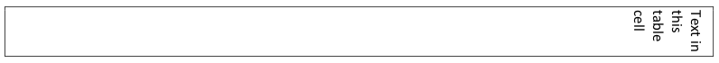
    
    该表单元格将使用以下WordprocessingML指定此文本流：
    
    ```xml
    <w:tc>
        <w:tcPr>
            …
            <w:textDirection w:val="rl" />
        </w:tcPr>
        …
    </w:tc>
    ```
    
    textDirection元素通过val属性中的rl值指定，文本流应垂直定向，并且随后的行从右向左堆叠。结束示例】
    
    ??? abstract "属性"
    
        - **val**（文本流方向）
    
            指定此对象的文本流方向。
            
            [示例：考虑一个文档，其中一个部分的文本必须是垂直定向的，在页面上水平从左到右流动。此设置需要以下WordprocessingML：
            
            ```xml
            <w:sectPr>
                …
                <w:textDirection w:val="lr" />
            </w:sectPr>
            ```
            
            textDirection元素通过val属性中的lr值指定，文本流应垂直定向，并且随后的行从左到右堆叠。结束示例]
            
            此属性的可能值由ST_TextDirection简单类型（[§17.18.93]）定义。
    
    [Note: The W3C XML Schema definition of this element’s content model (CT_TextDirection) is located in §A.1. end note]

=== "英文"

    This element specifies the direction of the text flow for this table cell.
    
    If this element is omitted on a given table cell, its value is determined by the setting previously set at any level of the style hierarchy (i.e. that previous setting remains unchanged). If this setting is never specified in the style hierarchy, then the table cell shall inherit the text flow settings from the parent section.
    
    [Example: Consider a table with one cell in which all the table cell's text flow is oriented vertically, flowing from right to left horizontally within that cell:
    
    
    
    This table cell would specify this text flow using the following WordprocessingML:
    
    ```xml
    <w:tc>
        <w:tcPr>
            …
            <w:textDirection w:val="rl" />
        </w:tcPr>
        …
    </w:tc>
    ```
    
    The textDirection element specifies via the rl value in the val attribute that the text flow is to be oriented vertically, with subsequent lines stacked from right to left. end example]
    
    ??? abstract "Attributes"
    
        - **val** (Direction of Text Flow)
    
            Specifies the direction of the text flow for this object.
            
            [Example: Consider a document with a section in which text must be oriented vertically, flowing from left to right horizontally on the page. This setting requires the following WordprocessingML:
            
            ```xml
            <w:sectPr>
                …
                <w:textDirection w:val="lr" />
            </w:sectPr>
            ```
            
            The textDirection element specifies via the lr value in the val attribute that the text flow be oriented vertically, with subsequent lines stacked from left to right. end example]
            
            The possible values for this attribute are defined by the ST_TextDirection simple type ([§17.18.93]).
    
    [Note: The W3C XML Schema definition of this element’s content model (CT_TextDirection) is located in §A.1. end note]

## 17.4.73 tl2br (表格单元格左上到右下对角边框)

**tl2br (Table Cell Top Left to Bottom Right Diagonal Border)**

=== "中文"
    
    该元素指定应在当前表单元格内的从左上到右下对角线上显示的边框。
    
    如果省略了此元素，则此表单元格的左上到右下对角线上不应有单元格边框，并且其边框可以根据需要使用表格的边框设置。
    
    【示例：考虑一个表格，在其中第一行的第一个单元格指定了如下左上到右下对角线的单元格边框：
    
    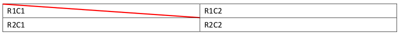
    
    此对角线单元格边框使用以下WordprocessingML指定：
    
    ```xml
    <w:tc>
        <w:tcPr>
            …
            <w:tcBorders>
                <w:tl2br w:val="double" w:sz="4" w:space="0" w:color="FF0000"/>
            </w:tcBorders>
        </w:tcPr>
        <w:p/>
    </w:tc>
    ```
    
    tl2br元素指定了表单元格对角线上的双重类型的½点边框。结束示例】
    
    This element’s content model is defined by the common border properties definition in [§17.3.4].

=== "英文"
    
    This element specifies the border which shall be displayed on the top left side to bottom right diagonal within the current table cell.
    
    If this element is omitted, then the top left to bottom right diagonal of this table cell shall not have a cell border, and its border can use the table's border settings as appropriate.
    
    [Example: Consider a table in which the first cell in the first row specifies a top left to bottom right diagonal cell border as follows:
    
    
    
    This diagonal cell border is specified using the following WordprocessingML:
    
    ```xml
    <w:tc>
        <w:tcPr>
            …
            <w:tcBorders>
                <w:tl2br w:val="double" w:sz="4" w:space="0" w:color="FF0000"/>
            </w:tcBorders>
        </w:tcPr>
        <w:p/>
    </w:tc>
    ```
    
    The tl2br element specifies a ½ point border of type double on the table cell's diagonal. end example]
    
    This element’s content model is defined by the common border properties definition in [§17.3.4].

## 17.4.74 top (表格单元格顶部边框)

**top (Table Cell Top Border)**

=== "中文"
    
    该元素指定应在当前表单元格的顶部显示的边框。此表单元格边框在文档中的外观应由以下设置确定：
    
    - 如果应用于单元格的净tblCellSpacing元素值（[§17.4.44]；[§17.4.43]；[§17.4.45]）为非零，则始终应显示单元格边框
    - 否则，边框的显示取决于由tcBorders元素（[§17.4.66]）和tblBorders元素（[§17.4.39]；[§17.4.38]）定义的冲突解决算法
    
    如果省略了此元素，则此表单元格的顶部不应有单元格边框，并且其边框可以根据需要使用表格的边框设置。
    
    【示例：考虑一个表格，在其中第一行的第一个单元格指定了一个顶部单元格边框，如下所示：
    
    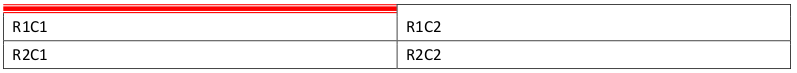
    
    此顶部单元格边框使用以下WordprocessingML指定：
    
    ```xml
    <w:tc>
        <w:tcPr>
            …
            <w:tcBorders>
                <w:top w:val="thinThickThinSmallGap" w:sz="24" w:space="0"
                    w:color="FF0000"/>
            </w:tcBorders>
        </w:tcPr>
        <w:p/>
    </w:tc>
    ```
    
    top元素指定了一个类型为thinThinThickSmallGap的三点边框。结束示例】
    
    This element’s content model is defined by the common border properties definition in [§17.3.4].

=== "英文"
    
    This element specifies the border which shall be displayed at the top of the current table cell. The appearance of this table cell border in the document shall be determined by the following settings:
    
    - If the net tblCellSpacing element value ([§17.4.44];[§17.4.43];[§17.4.45]) applied to the cell is non-zero, then the cell border shall always be displayed
    - Otherwise, the display of the border is subject to the conflict resolution algorithm defined by the tcBorders element ([§17.4.66]) and the tblBorders element ([§17.4.39];[§17.4.38])
    
    If this element is omitted, then the top of this table cell shall not have a cell border, and its border can use the table's border settings as appropriate.
    
    [Example: Consider a table in which the first cell in the first row specifies a top cell border , as follows:
    
    
    
    This top cell border is specified using the following WordprocessingML:
    
    ```xml
    <w:tc>
        <w:tcPr>
            …
            <w:tcBorders>
                <w:top w:val="thinThickThinSmallGap" w:sz="24" w:space="0"
                    w:color="FF0000"/>
            </w:tcBorders>
        </w:tcPr>
        <w:p/>
    </w:tc>
    ```
    
    The top element specifies a three point border of type thinThinThickSmallGap. end example]
    
    This element’s content model is defined by the common border properties definition in [§17.3.4].

## 17.4.75 top (表格单元格上边距默认值)

**top (Table Cell Top Margin Default)**

=== "中文"
    
    该元素指定应在单元格内容的顶部范围和父表中所有表单元格的顶部边框之间留下的空间量。此设置可以被包含在表单元格属性（[§17.4.77]）中的top元素指定的表单元格顶部边距定义所覆盖。
    
    该值由其type属性应用的单位指定。对于此元素的类型pct或auto的任何宽度值都将被忽略。
    
    如果省略了此元素，则它应继承与关联表样式的表单元格边距。如果在样式层次结构中从未指定顶部边距，则此表格默认情况下不应具有顶部单元格填充（除了单个单元格覆盖）。
    
    【示例：考虑一个二乘二表格，在其中默认表单元格顶部边距被指定为正好0.25英寸，如下所示（在下面的第一个表单元格中用箭头标记）：
    
    
    
    此表格属性使用以下WordprocessingML标记指定：
    
    ```xml
    <w:tbl>
        <w:tblPr>
            <w:tblCellMar>
                <w:top w:w="360" w:type="dxa"/>
            </w:tblCellMar>
        </w:tblPr>
        …
    </w:tbl>
    ```
    
    表中的每个单元格都具有将其设置为360个二十分之一点的默认单元格边距。结束示例】
    
    This element’s content model is defined by the common table measurement definition in [§17.4.87].

=== "英文"
    
    This element specifies the amount of space which shall be left between the top extent of the cell contents and the top border of all table cells within the parent table. This setting can be overridden by the table cell top margin definition specified by the top element contained within the table cell's properties ([§17.4.77]).
    
    This value is specified in the units applied via its type attribute. Any width value of type pct or auto for this element shall be ignored.
    
    If this element is omitted, then it shall inherit the table cell margin from the associated table style. If a top margin is never specified in the style hierarchy, then this table shall have no top cell padding by default (excepting individual cell overrides).
    
    [Example: Consider a two by two table in which the default table cell top margin is specified to be exactly 0.25 inches, as follows (marked with an arrow in the first table cell below):
    
    
    
    This table property is specified using the following WordprocessingML markup:
    
    ```xml
    <w:tbl>
        <w:tblPr>
            <w:tblCellMar>
                <w:top w:w="360" w:type="dxa"/>
            </w:tblCellMar>
        </w:tblPr>
        …
    </w:tbl>
    ```
    
    Every cell in the table has a default cell margin setting it to 360 twentieths of a point. end example]
    
    This element’s content model is defined by the common table measurement definition in [§17.4.87].

## 17.4.76 top (表格上边框)

**top (Table Top Border)**

=== "中文"
    
    该元素指定应在当前表格的顶部显示的边框。此表格边框在文档中的外观应由以下设置确定：
    
    - 边框的显示取决于由tcBorders元素（[§17.4.66]）和tblBorders元素（[§17.4.39]；[§17.4.38]）定义的冲突解决算法。
    
    如果省略了此元素，则此表格的顶部应具有由关联表样式指定的边框。
    
    如果在样式层次结构中未指定顶部边框，则此表格不应具有顶部边框。
    
    【示例：考虑一个表格，在其中表格属性指定了顶部表格边框，如下所示：
    
    
    
    此顶部表格边框使用以下WordprocessingML指定：
    
    ```xml
    <w:tbl>
        <w:tblPr>
            <w:tblBorders>
                <w:top w:val="thinThickThinMediumGap" w:sz="24" w:space="0"
                    w:color="D0D0D0" w:themeColor="accent3" w:themeTint="99"/>
            </w:tblBorders>
        </w:tblPr>
        …
    </w:tbl>
    ```
    
    top元素指定了一个类型为thinThinThickMediumGap的三点顶部表格边框。结束示例】
    
    This element’s content model is defined by the common border properties definition in [§17.3.4].

=== "英文"
    
    This element specifies the border which shall be displayed at the top of the current table. The appearance of this table border in the document shall be determined by the following settings:
    
    - The display of the border is subject to the conflict resolution algorithm defined by the tcBorders element ([§17.4.66]) and the tblBorders element ([§17.4.39];[§17.4.38])
    
    If this element is omitted, then the top of this table shall have the border specified by the associated table style.
    
    If no top border is specified in the style hierarchy, then this table shall not have a top border.
    
    [Example: Consider a table in which the table properties specifies a top table border, as follows:
    
    
    
    This top table border is specified using the following WordprocessingML:
    
    ```xml
    <w:tbl>
        <w:tblPr>
            <w:tblBorders>
                <w:top w:val="thinThickThinMediumGap" w:sz="24" w:space="0"
                    w:color="D0D0D0" w:themeColor="accent3" w:themeTint="99"/>
            </w:tblBorders>
        </w:tblPr>
        …
    </w:tbl>
    ```
    
    The top element specifies a three point top table border of type thinThinThickMediumGap. end example].
    
    This element’s content model is defined by the common border properties definition in [§17.3.4].

## 17.4.77 top (表格单元格上边距异常)

**top (Table Cell Top Margin Exception)**

=== "中文"
    
    该元素指定了在表格中的特定单元格内容的顶部边界和表格中特定单元格顶部边框之间应留出的空间量。此设置应覆盖表格属性中包含的顶部元素指定的表格单元格顶部边距定义（[§17.4.75]）。
    
    此值以其type属性应用的单位指定。对于此元素，任何类型为pct或auto的宽度值都将被忽略。
    
    如果省略，则此表格单元格将使用在表格属性中包含的顶部元素中定义的底部单元格边距（[§17.4.75]）。
    
    【示例：考虑一个带有两个单元格的表格，其中通过例外指定第一个表格单元格的顶部边距要比其他表格单元格的边距大十倍（0.2英寸对比0.02英寸）：
    
    
    
    表格中的第一个单元格将使用以下WordprocessingML进行指定：
    
    ```xml
    <w:tc>
        <w:tcPr>
            <w:tcMar>
                <w:top w:w="288" w:type="dxa" />
            </w:tcMar>
        </w:tcPr>
    </w:tc>
    ```
    
    这个表格中的第一个单元格应用了一个例外，将表格单元格的顶部边距设置为288个点的二十分之一（0.2英寸）。示例结束】
    
    This element’s content model is defined by the common table measurement definition in [§17.4.87].

=== "英文"
    
    This element specifies the amount of space which shall be left between the top extent of the cell contents and the top border of a specific table cell within a table. This setting shall override the table cell top margin definition specified by the top element contained within the table properties ([§17.4.75]).
    
    This value is specified in the units applied via its type attribute. Any width value of type pct or auto for this element shall be ignored.
    
    If omitted, then this table cell shall use the bottom cell margins defined in the top element contained within the table properties ([§17.4.75]).
    
    [Example: Consider a table with two cells in which the first table cell’s top margin is specified via an exception to be ten times larger (0.2 inches vs. 0.02 inches) than the other table cell margins:
    
    
    
    The first cell in the table would be specified using the following WordprocessingML:
    
    ```xml
    <w:tc>
        <w:tcPr>
            <w:tcMar>
                <w:top w:w="288" w:type="dxa" />
            </w:tcMar>
        </w:tcPr>
    </w:tc>
    ```
    
    The first cell in this table has an exception applied to the table cell top cell margin setting it to 288 twentieths of a point (0.2 inches). end example]
    
    This element’s content model is defined by the common table measurement definition in [§17.4.87].

## 17.4.78 tr (表格行)

**tr (Table Row)**

=== "中文"
    
    该元素指定一个单独的表格行，其中包含表格的单元格。WordprocessingML中的表格行类似于HTML的tr元素。
    
    一个tr元素具有一个格式化的子元素trPr（[§17.4.81]），它定义了该行的属性。表格行上的每个唯一属性都由该元素的子元素指定。此外，表格行可以包含任何行级内容，这允许使用表格单元格。
    
    如果表格单元格不包含除行属性之外的至少一个子元素，则此文档应被视为损坏。
    
    【示例：考虑由一个单元格组成的单个表格，其中包含文本Hello, world：
    
    
    
    这个表格行的内容由以下WordprocessingML表示：
    
    ```xml
    <w:tr>
        <w:tc>
            <w:tcPr>
                <w:tcW w:w="0" w:type="auto"/>
            </w:tcPr>
            <w:p>
                <w:r>
                    <w:t>Hello, world</w:t>
                </w:r>
            </w:p>
        </w:tc>
    </w:tr>
    ```
    
    tr元素包含一个行级元素 - 在这种情况下是一个表格单元格。示例结束】
    
    ??? abstract "Attributes"
    
        - **rsidDel**（删除表格行的修订标识符）

            指定一个用于跟踪从主文档中删除该行时的编辑会话的唯一标识符。
            
            如果文档中存在具有相同值的所有rsid*属性，则应表明这些区域在同一个编辑会话中被修改（在连续保存操作之间的时间）。
            
            生产者可以选择增加修订保存ID值，以指示后续的编辑会话，从而表明修改相对于该文档中其他修改的顺序。
            
            此属性的可能值由ST_LongHexNumber简单类型（[§17.18.50]）定义。

        - **rsidR**（表格行的修订标识符）

            指定一个用于跟踪将表格行添加到主文档时的编辑会话的唯一标识符。
            
            如果文档中存在具有相同值的所有rsid*属性，则应表明这些区域在同一个编辑会话中被修改（在连续保存操作之间的时间）。
            
            生产者可以选择增加修订保存ID值，以指示后续的编辑会话，从而表明修改相对于该文档中其他修改的顺序。
            
            此属性的可能值由ST_LongHexNumber简单类型（[§17.18.50]）定义。

        - **rsidRPr**（表格行字符格式的修订标识符）

            指定一个用于跟踪最后修改主文档中表示表格行标记的字形字符时的编辑会话的唯一标识符。
            
            如果文档中存在具有相同值的所有rsid*属性，则应表明这些区域在同一个编辑会话中被修改（在连续保存操作之间的时间）。
            
            生产者可以选择增加修订保存ID值，以指示后续的编辑会话，从而表明修改相对于该文档中其他修改的顺序。
            
            此属性的可能值由ST_LongHexNumber简单类型（[§17.18.50]）定义。

        - **rsidTr**（表格行属性的修订标识符）

            指定一个用于跟踪在此文档中最后修改表格行属性时的编辑会话的唯一标识符。
            
            如果文档中存在具有相同值的所有rsid*属性，则应表明这些区域在同一个编辑会话中被修改（在连续保存操作之间的时间）。
            
            生产者可以选择增加修订保存ID值，以指示后续的编辑会话，从而表明修改相对于该文档中其他修改的顺序。
            
            此属性的可能值由ST_LongHexNumber简单类型（[§17.18.50]）定义。
    
    [Note: The W3C XML Schema definition of this element’s content model (CT_Row) is located in §A.1. end note]

=== "英文"
    
    This element specifies a single table row, which contains the table’s cells. Table rows in WordprocessingML are analogous to HTML tr elements.
    
    A tr element has one formatting child element, trPr ([§17.4.81]), which defines the properties for the row. Each unique property on the table row is specified by a child element of this element. As well, a table row can contain any row-level content, which allows for the use of table cells.
    
    If a table cell does not include at least one child element other than the row properties, then this document shall be considered corrupt.
    
    [Example: Consider a table consisting of a single table cell, which contains the text Hello, world:
    
    
    
    This table row's content is represented by the following WordprocessingML:
    
    ```xml
    <w:tr>
        <w:tc>
            <w:tcPr>
                <w:tcW w:w="0" w:type="auto"/>
            </w:tcPr>
            <w:p>
                <w:r>
                    <w:t>Hello, world</w:t>
                </w:r>
            </w:p>
        </w:tc>
    </w:tr>
    ```
    
    The tr element contains a single row-level element - in this case, a table cell. end example]
    
    ??? abstract "Attributes"
    
        - **rsidDel** (Revision Identifier for Table Row Deletion)
    
            Specifies a unique identifier used to track the editing session when the row was deleted from the main document.
            
            All rsid* attributes throughout this document with the same value, if present, shall indicate that those regions were modified during the same editing session (time between subsequent save actions).
            
            A producer can choose to increment the revision save ID value to indicate subsequent editing sessions to indicate the order of the modifications relative to other modifications in this document.
            
            The possible values for this attribute are defined by the ST_LongHexNumber simple type ([§17.18.50]).
    
        - **rsidR** (Revision Identifier for Table Row)
    
            Specifies a unique identifier used to track the editing session when the table row was added to the main document.
            
            All rsid* attributes throughout this document with the same value, if present, shall indicate that those regions were modified during the same editing session (time between subsequent save actions).
            
            A producer can choose to increment the revision save ID value to indicate subsequent editing sessions to indicate the order of the modifications relative to other modifications in this document.
            
            The possible values for this attribute are defined by the ST_LongHexNumber simple type ([§17.18.50]).
    
        - **rsidRPr** (Revision Identifier for Table Row Glyph Formatting)
    
            Specifies a unique identifier used to track the editing session when the glyph character representing the table row mark was last modified in the main document.
            
            All rsid* attributes throughout this document with the same value, if present, shall indicate that those regions were modified during the same editing session (time between subsequent save actions).
            
            A producer can choose to increment the revision save ID value to indicate subsequent editing sessions to indicate the order of the modifications relative to other modifications in this document.
            
            The possible values for this attribute are defined by the ST_LongHexNumber simple type ([§17.18.50]).
    
        - **rsidTr** (Revision Identifier for Table Row Properties)
    
            Specifies a unique identifier used to track the editing session when the table row's properties were last modified in this document.
            
            All rsid* attributes throughout this document with the same value, if present, shall indicate that those regions were modified during the same editing session (time between subsequent save actions).
            
            A producer can choose to increment the revision save ID value to indicate subsequent editing sessions to indicate the order of the modifications relative to other modifications in this document.
            
            The possible values for this attribute are defined by the ST_LongHexNumber simple type ([§17.18.50]).
    
    [Note: The W3C XML Schema definition of this element’s content model (CT_Row) is located in §A.1. end note]

## 17.4.79 tr2bl (表格单元格右上到左下对角边框)

**tr2bl (Table Cell Top Right to Bottom Left Diagonal Border)**

=== "中文"
    
    该元素指定当前表格单元格内从右上到左下的对角线上应显示的边框。
    
    如果省略了此元素，则该表格单元格的右上到左下对角线将不会有单元格边框，并且其边框可以根据需要使用表格的边框设置。
    
    【示例：考虑一个表格，其中第二行的第二个单元格指定了如下的右上到左下对角线的单元格边框：
    
    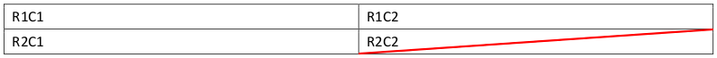
    
    使用以下WordprocessingML指定了这个对角线单元格边框：
    
    ```xml
    <w:tc>
        <w:tcPr>
            …
            <w:tcBorders>
                <w:tr2bl w:val="double" w:sz="4" w:space="0" w:color="FF0000"/>
            </w:tcBorders>
        </w:tcPr>
        <w:p/>
    </w:tc>
    ```
    
    tr2bl元素指定了表格单元格对角线上的双倍宽度为½点的边框。示例结束】
    
    This element’s content model is defined by the common border properties definition in [§17.3.4].

=== "英文"
    
    This element specifies the border which shall be displayed on the top right to bottom left diagonal within the current table cell.
    
    If this element is omitted, then the top right to bottom left diagonal of this table cell shall not have a cell border, and its border can use the table's border settings as appropriate.
    
    [Example: Consider a table in which the second cell in the second row specifies a top right to bottom left diagonal cell border as follows:
    
    
    
    This diagonal cell border is specified using the following WordprocessingML:
    
    ```xml
    <w:tc>
        <w:tcPr>
            …
            <w:tcBorders>
                <w:tr2bl w:val="double" w:sz="4" w:space="0" w:color="FF0000"/>
            </w:tcBorders>
        </w:tcPr>
        <w:p/>
    </w:tc>
    ```
    
    The tr2bl element specifies a ½ point border of type double on the table cell's diagonal. end example]
    
    This element’s content model is defined by the common border properties definition in [§17.3.4].

## 17.4.80 trHeight (表格行高)

**trHeight (Table Row Height)**

=== "中文"
    
    该元素指定当前表格中当前表格行的高度。该高度将用于确定表格行的最终高度，可以是绝对值或相对值（取决于其属性值）。
    
    如果省略，则表格行将自动调整其高度以适应其内容所需的高度（相当于hRule值为auto）。
    
    【示例：考虑以下WordprocessingML表格：
    
    
    
    检查此表格的WordprocessingML，未指定trHeight元素，因此行高度由其内容自动确定（在第一行中，文本为Some text in R1C1.）。如果要将第一行的高度限制为0.1英寸高（144个点的二十分之一），则可以使用trHeight元素指定如下：
    
    ```xml
    <w:trPr>
        <w:trHeight w:val="144" w:hRule="exact"/>
    </w:trPr>
    ```
    
    结果的表格行将正好高144个点的二十分之一：
    
    
    
    示例结束】
    
    ??? abstract "属性"
    
        - **hRule**（表格行高度类型）
    
            指定为该表格行指定的高度的含义。
            
            根据此表格行的hRule属性的值，val属性的值的含义如下所示：
            
            - 如果hRule的值为auto，则表格行的高度应根据其内容的高度自动确定。忽略h值。
            - 如果hRule的值为atLeast，则表格行的高度应至少为h属性的值。
            - 如果hRule的值为exact，则表格行的高度应完全等于h属性的值。
            
            如果省略了此属性，则其值应被视为auto。
            
            【示例：考虑以下包含表格行的段落：
            
            ```xml
            <w:tr>
            <w:trPr>
            <w:trHeight w:val="2189" w:hRule="atLeast"/>
            </w:trPr>
            …
            </w:tr>
            ```
            
            hRule属性指定了atLeast的值，因此表格行的高度至少为2189个点的二十分之一，无论其内容如何，因为其val值为2189个点的二十分之一。示例结束】
            
            此属性的可能值由ST_HeightRule简单类型（[§17.18.37]）定义。
    
        - **val**（表格行高度）
    
            指定表格行的高度。
            
            该高度以点的二十分之一表示。
            
            如果省略了此属性，则其值应被视为0。
            
            根据此表格行的hRule属性的值，val属性的含义如下所示：
            
            - 如果hRule的值为auto，则表格行的高度应根据其内容的高度自动确定。忽略此值。
            - 如果hRule的值为atLeast，则表格行的高度应至少为此属性的值。
            - 如果hRule的值为exact，则表格行的高度应完全等于此属性的值。
            
            【示例：考虑以下表格行：
            
            ```xml
            <w:tr>
            <w:trPr>
            <w:trHeight w:val="2189" w:hRule="atLeast"/>
            </w:trPr>
            …
            </w:tr>
            ```
            
            val属性指定了2189个点的二十分之一的值，因此无论其内容如何，该表格行的高度至少为2189个点的二十分之一（如果需要则增加），因为其hRule值设置为atLeast。示例结束】
            
            此属性的可能值由ST_TwipsMeasure简单类型（[§22.9.2.14]）定义。
        
    [Note: The W3C XML Schema definition of this element’s content model (CT_Height) is located in §A.1. end note]

=== "英文"
    
    This element specifies the height of the current table row within the current table. This height shall be used to determine the resulting height of the table row, which can be absolute or relative (depending on its attribute values).
    
    If omitted, then the table row shall automatically resize its height to the height required by its contents (the equivalent of an hRule value of auto).
    
    [Example: Consider the following WordprocessingML table:
    
    
    
    Examining the WordprocessingML for this table, the trHeight element is not specified, so the row heights are automatically determined by their contents (in the first row, the text Some text in R1C1.). If the first row shall be restricted to 0.1 inches high (144 twentieths of a point) regardless of its contents, that would be specified using the trHeight element as follows:
    
    ```xml
    <w:trPr>
        <w:trHeight w:val="144" w:hRule="exact"/>
    </w:trPr>
    ```
    
    The resulting table row would be exactly 144 twentieths of a point high:
    
    
    
    end example]
    
    ??? abstract "Attributes"
    
        - **hRule** (Table Row Height Type)
    
            Specifies the meaning of the height specified for this table row.
            
            The meaning of the value of the val attribute is defined based on the value of the hRule attribute for this table row as follows:
            
            - If the value of hRule is auto, then the table row's height should be automatically determined based on the height of its contents. The h value is ignored.
            - If the value of hRule is atLeast, then the table row's height should be at least the value the h attribute.
            - If the value of hRule is exact, then the table row's height should be exactly the value of the h attribute.
            
            If this attribute is omitted, then its value shall be assumed to be auto.
            
            [Example: Consider the following paragraph containing a table row:
            
            ```xml
            <w:tr>
            <w:trPr>
            <w:trHeight w:val="2189" w:hRule="atLeast"/>
            </w:trPr>
            …
            </w:tr>
            ```
            
            The hRule attribute specifies a value of atLeast, so the table row is a minimum of 2189 twentieths of a point high regardless of its contents, since its val value is 2189 twentieths of a point. end example]
            
            The possible values for this attribute are defined by the ST_HeightRule simple type ([§17.18.37]).
    
        - **val** (Table Row Height)
    
            Specifies the table row's height.
            
            This height is expressed in twentieths of a point.
            
            If this attribute is omitted, then its value shall be assumed to be 0.
            
            The meaning of the value of the val attribute is defined based on the value of the hRule attribute for this table row as follows:
            
            - If the value of hRule is auto, then the table row's height should be automatically determined based on the height of its contents. This value is ignored.
            - If the value of hRule is atLeast, then the table row's height should be at least the value of this attribute.
            - If the value of hRule is exact, then the table row's height should be exactly the value of this attribute.
            
            [Example: Consider the following table row:
            
            ```xml
            <w:tr>
            <w:trPr>
            <w:trHeight w:val="2189" w:hRule="atLeast"/>
            </w:trPr>
            …
            </w:tr>
            ```
            
            The val attribute specifies a value of 2189 twentieths of a point, so this table row is a minimum of 2189 twentieths of a point high regardless of its contents (growing if needed), since its hRule value is set to atLeast. end example]
            
            The possible values for this attribute are defined by the ST_TwipsMeasure simple type ([§22.9.2.14]).
        
    [Note: The W3C XML Schema definition of this element’s content model (CT_Height) is located in §A.1. end note]


## 17.4.81 trPr (表格行属性)

**trPr (Table Row Properties)**

=== "中文"

    该元素指定应用于当前表格行的行级属性集合。每个唯一属性由此元素的子元素指定。这些属性影响父表格中当前行中所有单元格的外观，但可以被各个单元格级别的属性覆盖，如每个属性所定义的那样。
    
    【示例：考虑以下WordprocessingML表格：
    
    
    
    第一行必须具有一个表格行级别的属性，该属性指定无论其内容如何，该行的高度都应限制为0.1英寸（144个点的二十分之一），可使用trHeight元素指定如下：
    
    ```xml
    <w:trPr>
        <w:trHeight w:val="144" w:hRule="exact"/>
        …
    </w:trPr>
    ```
    
    trPr元素指定应用于文档中当前表格行的表格行属性集合，本例中使用了trHeight元素指定了行高要求（[§17.4.80]）。示例结束】
    
    [Note: The W3C XML Schema definition of this element’s content model (CT_TrPr) is located in §A.1. end note]

=== "英文"

    This element specifies the set of row-level properties applied to the current table row. Each unique property is specified by a child element of this element. These properties affect the appearance of all cells in the current row within the parent table, but can be overridden by individual cell-level properties, as defined by each property.
    
    [Example: Consider the following WordprocessingML table:
    
    
    
    The first row must have a table-row level property which specifies that it shall be restricted to 0.1 inches high (144 twentieths of a point) regardless of its contents, that would be specified using the trHeight element as follows:
    
    ```xml
    <w:trPr>
        <w:trHeight w:val="144" w:hRule="exact"/>
        …
    </w:trPr>
    ```
    
    The trPr element specifies the set of table row properties applied to the current table row in the document, in this case a row height requirement using the trHeight element ([§17.4.80]). end example]
    
    [Note: The W3C XML Schema definition of this element’s content model (CT_TrPr) is located in §A.1. end note]

## 17.4.82 trPr (上一个表格行属性)

**trPr (Previous Table Row Properties)**

=== "中文"
    
    该元素指定了一组先前的表格单元格属性，其修改应归因于特定作者在特定时间进行的修订。该元素包含了在某一作者的一组特定修订之前先前设置的表格单元格属性。每个唯一属性由此元素的子元素指定。这些属性影响父表格中当前行中所有单元格的外观，但可以被各个单元格级别的属性覆盖，如每个属性所定义的那样。
    
    【示例：考虑以下WordprocessingML表格：
    
    
    
    此表格的第一行的行高为0.1英寸。如果我们将其更改为至少为0.1英寸的行高，并启用修订标记，则该表格将如下所示：
    
    
    
    生成的WordprocessingML将为：
    
    ```xml
    <w:tr>
        <w:trPr>
            <w:trHeight w:val="144"/>
            <w:trPrChange w:id="2" … >
        <w:trPr>
        <w:trHeight w:hRule="exact" w:val="144"/>
        </w:trPr>
            </w:trPrChange>
        </w:trPr>
        …
    </w:tr>
    ```
    
    trPr元素作为trPrChange的子元素，指定了文档当前修订之前处于有效状态的表格行属性集合。示例结束】
    
    [Note: The W3C XML Schema definition of this element’s content model (CT_TrPrBase) is located in §A.1. end note]

=== "英文"
    
    This element specifies a previous set of table cell properties, the modifications to which shall be attributed to a revision by a particular author and at a particular time. This element contains the table cell property settings which were previously in place before a specific set of revisions by one author. Each unique property is specified by a child element of this element. These properties affect the appearance of all cells in the current row within the parent table, but can be overridden by individual cell-level properties, as defined by each property.
    
    [Example: Consider the following WordprocessingML table:
    
    
    
    This table has a row height for row one of exactly 0.1". If we change that to a row height of at least 0.1" with
    revision marking enabled, the table would appear as follows:
    
    
    
    The resulting WordprocessingML would be:
    
    ```xml
    <w:tr>
        <w:trPr>
            <w:trHeight w:val="144"/>
            <w:trPrChange w:id="2" … >
        <w:trPr>
        <w:trHeight w:hRule="exact" w:val="144"/>
        </w:trPr>
            </w:trPrChange>
        </w:trPr>
        …
    </w:tr>
    ```
    
    The trPr element as a child of trPrChange specifies the set of table row properties which were in place before the current revision to the document. end example]
    
    [Note: The W3C XML Schema definition of this element’s content model (CT_TrPrBase) is located in §A.1. end note]

## 17.4.83 vAlign (表格单元格垂直对齐方式)

**vAlign (Table Cell Vertical Alignment)**

=== "中文"
    
    该元素指定当前表格单元格内文本的垂直对齐方式。该文本的垂直对齐方式由val属性的值确定。
    
    【示例：考虑一个只有一个单元格的表格，其中文本垂直对齐到单元格底部：
    
    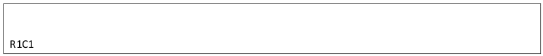
    
    可以使用以下WordprocessingML指定这个要求：
    
    ```xml
    <w:tc>
        <w:tcPr>
            <w:vAlign w:val="bottom" />
        </w:tcPr>
        <w:p>
            <w:r>
                <w:t>R1C1</w:t>
            </w:r>
        </w:p>
    </w:tc>
    ```
    
    vAlign元素指定了单元格内容的垂直对齐方式，这里是单元格底部。
    
    示例结束】
    
    ??? abstract "属性"
    
        - **val**（垂直对齐设置）
    
            指定在父容器（页或表格单元格）的顶部和底部边界之间文本的垂直对齐方式。
            
            [示例：考虑一个区域，其中文本必须在父元素中垂直居中。这将需要一个val值为center，以便指定所有垂直对齐都相对于父元素居中。对于一个节，这个设置将如下所示：
            
            ```xml
            <w:vAlign w:val="center" />
            ```
            
            center的val属性指定内容相对于其容器（在本例中为页面）居中。示例结束】
            
            此属性的可能值由ST_VerticalJc简单类型（[§17.18.101]）定义。
    
    [Note: The W3C XML Schema definition of this element’s content model (CT_VerticalJc) is located in §A.1. end note]

=== "英文"
    
    This element specifies the vertical alignment for text within the current table cell. The vertical alignment of this text is determined by the value of the val attribute.
    
    [Example: Consider a table with a single cell with text vertically aligned to the bottom of the cell:
    
    
    
    This requirement would be specified using the following WordprocessingML:
    
    ```xml
    <w:tc>
        <w:tcPr>
            <w:vAlign w:val="bottom" />
        </w:tcPr>
        <w:p>
            <w:r>
                <w:t>R1C1</w:t>
            </w:r>
        </w:p>
    </w:tc>
    ```
    
    The vAlign element specifies the vertical alignment of the cell contents, in the case, the bottom of the table cell.
    
    end example]
    
    ??? abstract "Attributes"
    
        - **val** (Vertical Alignment Setting)
    
            Specifies the vertical alignment for text between the top and bottom margins of the parent container (page or table cell).
            
            [Example: Consider a region where the text must be vertically centered in the parent element. This would require a val value of center, in order to specify that all justification vertically must be centered relative to the parent. For a section, this setting would be specified as follows:
            
            ```xml
            <w:vAlign w:val="center" />
            ```
            
            The val attribute of center specifies that the content is centered relative to its container (in this case, the page). end example]
            
            The possible values for this attribute are defined by the ST_VerticalJc simple type ([§17.18.101]).
    
    [Note: The W3C XML Schema definition of this element’s content model (CT_VerticalJc) is located in §A.1. end note]

## 17.4.84 vMerge (垂直合并单元格)

**vMerge (Vertically Merged Cell)**

=== "中文"
    
    该元素指定此单元格是表格中一组垂直合并单元格的一部分。该元素上的val属性确定了此单元格相对于表格中前一个单元格的定义方式（即，此单元格是继续垂直合并还是开始一组新的合并单元格）。
    
    如果省略了此元素，则此单元格不应是任何垂直合并单元格组的一部分，并且任何前面单元格的垂直合并组将被关闭。如果一组垂直合并的单元格没有跨越相同的网格列，则文档不符合规范。
    
    【示例：考虑一个有三行两列的表格，其中最后一列完全垂直合并：
    
    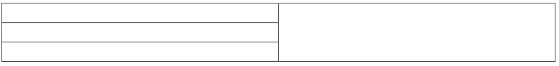
    
    第一行中的第二个单元格开始了一个垂直合并，该合并在最后一个单元格中完成，生成以下WordprocessingML：】
    
    ```xml
    <w:tbl>
        …
        <w:tr>
            <w:tc>
                …
            </w:tc>
            <w:tc>
                …
            </w:tc>
            <w:tc>
                <w:tcPr>
                    <w:vMerge w:val="restart"/>
                </w:tcPr>
                …
            </w:tc>
        </w:tr>
        <w:tr>
            <w:tc>
                …
            </w:tc>
            <w:tc>
                …
            </w:tc>
            <w:tc>
                <w:tcPr>
                    <w:vMerge w:val="continue"/>
                </w:tcPr>
                …
            </w:tc>
        </w:tr>
        <w:tr>
            <w:tc>
                …
            </w:tc>
            <w:tc>
                …
            </w:tc>
            <w:tc>
                <w:tcPr>
                    <w:vMerge w:val="continue"/>
                </w:tcPr>
                …
            </w:tc>
        </w:tr>
    </w:tbl>
    ```
    
    vMerge元素定义了垂直合并的单元格，以及每个单元格如何合并在一起。
    
    ??? abstract "属性"
        
        - **val**（垂直合并类型）
        
            指定表格单元格如何成为垂直合并区域的一部分。这确定了单元格是否应连接到现有的任何合并单元格组，或者开始一个新的合并单元格组。有关每种类型的完整描述，请参考简单类型定义。
            
            如果省略了此属性，则其值应被视为continue。
            
            【示例：考虑一个表格单元格，其中垂直合并开始。这个设置表示为以下WordprocessingML：
            
            ```xml
            <w:tcPr>
            <w:vMerge w:val="restart"/>
            </w:tcPr>
            ```
            
            restart的属性值指定此元素必须在此表格中开始一个新的垂直合并区域。示例结束】
            
            此属性的可能值由ST_Merge简单类型（[§17.18.57]）定义。
    
    [Note: The W3C XML Schema definition of this element’s content model (CT_VMerge) is located in §A.1. end note]

=== "英文"
    
    This element specifies that this cell is part of a vertically merged set of cells in a table. The val attribute on this element determines how this cell is defined with respect to the previous cell in the table (i.e., whether this cell continues the vertical merge or starts a new merged group of cells).
    
    If this element is omitted, then this cell shall not be part of any vertically merged grouping of cells, and any vertically merged group of preceding cells shall be closed. If a vertically merged group of cells do not span the same set of grid columns, then the document is non-conformant.
    
    [Example: Consider a table with three rows and two columns with the last column completely vertically merged:
    
    
    
    The second cell in the first row starts a vertical merge that is completed in the last cell, resulting in the following WordprocessingML:
    
    ```xml
    <w:tbl>
        …
        <w:tr>
            <w:tc>
                …
            </w:tc>
            <w:tc>
                …
            </w:tc>
            <w:tc>
                <w:tcPr>
                    <w:vMerge w:val="restart"/>
                </w:tcPr>
                …
            </w:tc>
        </w:tr>
        <w:tr>
            <w:tc>
                …
            </w:tc>
            <w:tc>
                …
            </w:tc>
            <w:tc>
                <w:tcPr>
                    <w:vMerge w:val="continue"/>
                </w:tcPr>
                …
            </w:tc>
        </w:tr>
        <w:tr>
            <w:tc>
                …
            </w:tc>
            <w:tc>
                …
            </w:tc>
            <w:tc>
                <w:tcPr>
                    <w:vMerge w:val="continue"/>
                </w:tcPr>
                …
            </w:tc>
        </w:tr>
    </w:tbl>
    ```
    
    The vMerge element defines the cells that are vertically merged, and how each cell is merged together. end example]
    
    ??? abstract "Attributes"
        
        - **val** (Vertical Merge Type)
        
            Specifies how the table cell is part of a vertically merged region. This determines whether the cell should join onto an existing grouping of merged cells if any exist, or start a new group of merged cells. Refer to the simple type definition for a full description of each type.
            
            If this attribute is omitted, its value shall be assumed to be continue.
            
            [Example: Consider a table cell where a vertical cell merge begins . This setting is represented as the following WordprocessingML:
            
            ```xml
            <w:tcPr>
            <w:vMerge w:val="restart"/>
            </w:tcPr>
            ```
            
            The attribute value of restart specifies that this element must start a new vertically merged region in this table. end example]
            
            The possible values for this attribute are defined by the ST_Merge simple type ([§17.18.57]).
    
    [Note: The W3C XML Schema definition of this element’s content model (CT_VMerge) is located in §A.1. end note]


## 17.4.85 wAfter (表行后的首选宽度)

**wAfter (Preferred Width After Table Row)**

=== "中文"

    该元素指定了在表格行后面的网格列的总数的首选宽度，如gridAfter元素（[§17.4.14]）所指定。此首选宽度是由tblLayout元素（[§17.4.52]; [§17.4.53]）指定的表格布局算法的一部分 - 该算法的完整描述在ST_TblLayout简单类型中（[§17.18.87]）。
    
    在表格中，所有宽度都被视为首选，因为：
    
    - 表格应满足由tblGrid元素（[§17.4.48]）指定的共享列
    - 两个或更多的宽度可能对同一网格列的宽度有冲突的值
    - 表格布局算法（[§17.18.87]）可能需要覆盖首选项
    
    此值是通过其type属性应用的单位中指定的。对于此元素，类型为pct的任何宽度值都应相对于页面的文本范围（不包括页边距）进行计算。
    
    如果省略了此元素，则单元格宽度将为auto类型。
    
    【示例：考虑一个定义如下的WordprocessingML表格行：
    
    ```xml
    <w:tr>
        <w:trPr>
            <w:gridAfter w:val="2"/>
            <w:wAfter w:type="dxa" w:w="1440"/>
        </w:trPr>
        …
    </w:tr>
    ```
    
    该表格指定了在该行结束后的两个网格列的首选表格宽度为1440个点的二十分之一（一英寸）。因此，生成的表格将尽可能调整大小，以便该组网格列在可能的情况下为一英寸，例如该表格中的第二行：
    
    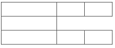
    
    示例结束】
    
    This element’s content model is defined by the common table measurement definition in [§17.4.87].

=== "英文"

    This element specifies the preferred width for the total number of grid columns after this table row as specified in the gridAfter element ([§17.4.14]). This preferred width is used as part of the table layout algorithm specified by the tblLayout element ([§17.4.52]; [§17.4.53]) - full description of the algorithm in the ST_TblLayout simple type ([§17.18.87]).
    
    All widths in a table are considered preferred because:
    
    - The table shall satisfy the shared columns as specified by the tblGrid element ([§17.4.48])
    - Two or more widths can have conflicting values for the width of the same grid column
    - The table layout algorithm ([§17.18.87]) can require a preference to be overridden
    
    This value is specified in the units applied via its type attribute. Any width value of type pct for this element shall be calculated relative to the text extents of the page (page width excluding margins).
    
    If this element is omitted, then the cell width shall be of type auto.
    
    [Example: Consider a WordprocessingML table row defined as follows:
    
    ```xml
    <w:tr>
        <w:trPr>
            <w:gridAfter w:val="2"/>
            <w:wAfter w:type="dxa" w:w="1440"/>
        </w:trPr>
        …
    </w:tr>
    ```
    
    This table specifies that it has a preferred table width of 1440 twentieths of a point (one inch) for the two grid columns after the end of that row. The resulting table would therefore be sized such that that set of grid columns is one inch whenever possible, for example the second row in this table:
    
    
    
    end example]
    
    This element’s content model is defined by the common table measurement definition in [§17.4.87].

## 17.4.86 wBefore (表行之前的首选宽度)

**wBefore (Preferred Width Before Table Row)**

=== "中文"
    
    该元素指定了在该表格行之前的网格列的总数的首选宽度，如gridAfter元素（[§17.4.14]）所指定。此首选宽度是由tblLayout元素（[§17.4.52]; [§17.4.53]）指定的表格布局算法的一部分 - 该算法的完整描述在ST_TblLayout简单类型中（[§17.18.87]）。
    
    在表格中，所有宽度都被视为首选，因为：
    
    - 表格应满足由tblGrid元素（[§17.4.48]）指定的共享列
    - 两个或更多的宽度可能对同一网格列的宽度有冲突的值
    - 表格布局算法（[§17.18.87]）可能需要覆盖首选项
    
    此值是通过其type属性应用的单位中指定的。对于此元素，类型为pct的任何宽度值都应相对于页面的文本范围（不包括页边距）进行计算。
    
    如果省略了此元素，则单元格宽度将为auto类型。
    
    【示例：考虑一个定义如下的WordprocessingML表格行：
    
    ```xml
    <w:tr>
        <w:trPr>
            <w:gridBefore w:val="1"/>
            <w:wBefore w:type="dxa" w:w="1440"/>
        </w:trPr>
        …
    </w:tr>
    ```
    
    该表格指定了在该行开始之前的网格列的首选表格宽度为1440个点的二十分之一（一英寸）。因此，生成的表格将尽可能调整大小，以便该网格列在可能的情况下为一英寸，例如该表格中的第二行：
    
    
    
    示例结束】
    
    This element’s content model is defined by the common table measurement definition in [§17.4.87].

=== "英文"
    
    This element specifies the preferred width for the total number of grid columns before this table row as specified in the gridAfter element ([§17.4.14]). This preferred width is used as part of the table layout algorithm specified by the tblLayout element ([§17.4.52]; [§17.4.53]) - full description of the algorithm in the ST_TblLayout simple type ([§17.18.87]).
    
    All widths in a table are considered preferred because:
    
    - The table shall satisfy the shared columns as specified by the tblGrid element ([§17.4.48])
    - Two or more widths can have conflicting values for the width of the same grid column
    - The table layout algorithm ([§17.18.87]) might require a preference to be overridden
    
    This value is specified in the units applied via its type attribute. Any width value of type pct for this element shall be calculated relative to the text extents of the page (page width excluding margins).
    
    If this element is omitted, then the cell width shall be of type auto.
    
    [Example: Consider a WordprocessingML table row defined as follows:
    
    ```xml
    <w:tr>
        <w:trPr>
            <w:gridBefore w:val="1"/>
            <w:wBefore w:type="dxa" w:w="1440"/>
        </w:trPr>
        …
    </w:tr>
    ```
    
    This table specifies that it has a preferred table width of 1440 twentieths of a point (one inch) for the grid column before the start of the row. The resulting table would therefore be sized such that that grid column is one inch whenever possible, for example the second row in this table:
    
    
    
    end example]
    
    This element’s content model is defined by the common table measurement definition in [§17.4.87].

## 17.4.87 表格测量 (CT_TblWidth)

**Table Measurement (CT_TblWidth)**

=== "中文"
    
    这个常见的复杂类型指定在表格中使用的度量。这些属性包含两个信息：
    
    - 度量的类型（基于百分比、绝对值或自动）
    - 度量的值
    
    【示例：考虑以下表格度量：
    
    ```xml
    <… w:type="pct" w:w="100%"/>
    ```
    
    type属性指定度量是基于百分比的，而w属性指定度量为100%。示例结束】
    
    ??? abstract "属性"
    
        - **type**（表格宽度类型）
    
            指定由父元素的w属性定义的宽度属性的单位。此属性用于定义表格的各种属性，包括：单元格间距、首选宽度和表格边距。
    
            如果省略了此属性，则其值应被视为dxa（点的二十分之一）。
            
            【示例：考虑一个具有类型为dxa的表格单元格底部单元格间距的表格，如下所示：
    
            ```xml
            <w:bottom … w:type="dxa" />
            ```
            
            因此，必须使用此类型来解释w属性中指定的宽度，作为点的二十分之一的值。示例结束】
            
            如果type属性的值和w属性指定的实际度量矛盾，则将忽略type属性指定的类型。
            
            此属性的可能值由ST_TblWidth简单类型（[§17.18.90]）定义。
    
        - **w**（表格宽度值）
        
            指定由父元素定义的宽度属性的值。此属性用于定义表格的各种属性，包括：单元格间距、首选宽度和表格边距。
            
            如果省略了此属性，则其值应被视为0。
            
            【示例：考虑一个具有302的底部边距的表格，如下所示：
            
            ```xml
            <w:bottom w:w="302" w:type="dxa" />
            ```
            
            因此，必须使用w属性中的值来确定相对于type属性指定的单位的宽度。在这种情况下，类型是点的二十分之一（dxa），所以宽度为302个点的二十分之一（0.2097英寸）。示例结束】
            
            此属性的可能值由ST_MeasurementOrPercen简单类型（[§17.18.107]）定义。
    
    [Note: The W3C XML Schema definition of this complex type’s content model (CT_TblWidth) is located in §A.1. end note]

=== "英文"
    
    This common complex type specifies a measurement to be used within a table. These properties contain two pieces of information:
    
    - The type of measurement (percentage-based, absolute, or automatic)
    - The value of the measurement
    
    [Example: Consider the following table measurement:
    
    ```xml
    <… w:type="pct" w:w="100%"/>
    ```
    
    The type attribute specifies that the measurement is percentage-based, and the w attribute specifies the measurement is 100%. end example]
    
    ??? abstract "Attributes"
    
        - **type** (Table Width Type)
    
            Specifies the units of the width property being defined by the parent element’s w attribute. This property is used to define various properties of a table, including: cell spacing, preferred width, and table margins.
    
            If this attribute is omitted, then its value shall be assumed to be dxa (twentieths of a point).
            
            [Example: Consider a table with a table cell bottom cell spacing with a type of dxa, as follows:
    
            ```xml
            <w:bottom … w:type="dxa" />
            ```
            
            This type must therefore be used to interpret the width specified in the w attribute as a value in twentieths of a point. end example]
            
            If the value of the type attribute and the actual measurement specified by the w attribute are contradictory, the type specified by the type attribute shall be ignored.
            
            The possible values for this attribute are defined by the ST_TblWidth simple type ([§17.18.90]).
    
        - **w** (Table Width Value)
        
            Specifies the value of the width property being defined by the parent element. This property is used to define various properties of a table, including: cell spacing, preferred widths, and table margins.
            
            If this attribute is omitted, then its value shall be assumed to be 0.
            
            [Example: Consider a table with a bottom margin with a width of 302, as follows:
            
            ```xml
            <w:bottom w:w="302" w:type="dxa" />
            ```
            
            The value in the w attribute must therefore be used to determine the width being specified in the context of the units specified in the type attribute. In this case, the type is twentieths of a point (dxa), so the width is 302 twentieths of a point (.2097 inches). end example]
            
            The possible values for this attribute are defined by the ST_MeasurementOrPercen simple type ([§17.18.107]).
    
    [Note: The W3C XML Schema definition of this complex type’s content model (CT_TblWidth) is located in §A.1. end note]

[§17.4.1]: #1741-bidivisual-视觉上从右到左的表格
[§17.4.2]: #1742-bottom-表格单元格底部边距异常
[§17.4.3]: #1743-bottom-表格单元格底部边框
[§17.4.4]: #1744-bottom-表格底部边框
[§17.4.5]: #1745-bottom-表格单元格底部边距默认值
[§17.4.6]: #1746-cantsplit-表格行不能跨页中断
[§17.4.7]: #1747-cnfstyle-表行条件格式
[§17.4.8]: #1748-cnfstyle-表格单元格条件格式
[§17.4.9]: #1749-divid-关联的-html-div-id
[§17.4.10]: #17410-end-表格单元格尾随边距异常
[§17.4.11]: #17411-end-表格单元格尾随边距默认值
[§17.4.12]: #17412-end-表格单元格后缘边框
[§17.4.13]: #17413-end-表格后缘边框
[§17.4.14]: #17414-gridafter-最后一个单元格之后的网格列
[§17.4.15]: #17415-gridbefore-第一个单元格之前的网格列
[§17.4.16]: #17416-gridcol-网格列定义
[§17.4.17]: #17417-gridspan-当前表格单元格跨越的网格列
[§17.4.18]: #17418-header-标题单元格参考
[§17.4.19]: #17419-headers-与表格单元关联的标题单元
[§17.4.20]: #17420-hidden-隐藏表行标记
[§17.4.21]: #17421-hidemark-在行高计算中忽略单元格末尾标记
[§17.4.22]: #17422-insideh-表格内水平边缘边框
[§17.4.23]: #17423-insideh-表格单元格内部水平边缘边框
[§17.4.24]: #17424-insidev-表格内部垂直边缘边框
[§17.4.25]: #17425-insidev-表格单元格内部垂直边缘边框
[§17.4.26]: #17426-jc-表对齐异常
[§17.4.27]: #17427-jc-表格行对齐
[§17.4.28]: #17428-jc-表格对齐
[§17.4.29]: #17429-nowrap-不要包裹单元格内容
[§17.4.30]: #17430-shd-表底纹异常
[§17.4.31]: #17431-shd-表格底纹
[§17.4.32]: #17432-shd-表格单元格底纹
[§17.4.33]: #17433-start-表格单元前缘边框
[§17.4.34]: #17434-start-表格单元前导边距默认值
[§17.4.35]: #17435-start-表格单元前导边距异常
[§17.4.36]: #17436-start-表格前缘边框
[§17.4.37]: #17437-tbl-表格
[§17.4.38]: #17438-tblborders-表格边框合集
[§17.4.39]: #17439-tblborders-表格边框异常合集
[§17.4.40]: #17440-tblcaption-表格标题
[§17.4.41]: #17441-tblcellmar-表格单元格边距异常
[§17.4.42]: #17442-tblcellmar-表格单元格边距默认值
[§17.4.43]: #17443-tblcellspacing-表格行单元格间距
[§17.4.44]: #17444-tblcellspacing-表格单元格间距异常
[§17.4.45]: #17445-tblcellspacing-表格单元格间距默认值
[§17.4.46]: #17446-tbldescription-表格描述
[§17.4.47]: #17447-tblgrid-上一个表格网格
[§17.4.48]: #17448-tblgrid-表格网格
[§17.4.49]: #17449-tblheader-在每个新页面上重复表行
[§17.4.50]: #17450-tblind-表格从前导边距缩进
[§17.4.51]: #17451-tblind-表从前导边距缩进异常
[§17.4.52]: #17452-tbllayout-表格布局
[§17.4.53]: #17453-tbllayout-表格布局异常
[§17.4.54]: #17454-tbllook-表格样式条件格式设置异常
[§17.4.55]: #17455-tbllook-表格样式条件格式设置
[§17.4.56]: #17456-tbloverlap-浮动表允许其他表重叠
[§17.4.57]: #17457-tblppr-浮动表定位
[§17.4.58]: #17458-tblpr-上一个表属性
[§17.4.59]: #17459-tblpr-表属性
[§17.4.60]: #17460-tblprex-表级属性异常
[§17.4.61]: #17461-tblprex-上一个的表级属性异常
[§17.4.62]: #17462-tblstyle-参考表格样式
[§17.4.63]: #17463-tblw-首选表格宽度
[§17.4.64]: #17464-tblw-首选表格宽度异常
[§17.4.65]: #17465-tc-表格单元格
[§17.4.66]: #17466-tcborders-表格单元格边框合集
[§17.4.67]: #17467-tcfittext-适合单元格内的文本
[§17.4.68]: #17468-tcmar-单个表格单元格边距
[§17.4.69]: #17469-tcpr-表格单元格属性
[§17.4.70]: #17470-tcpr-上一表格单元格属性
[§17.4.71]: #17471-tcw-首选表格单元格宽度
[§17.4.72]: #17472-textdirection-表格单元格文本流方向
[§17.4.73]: #17473-tl2br-表格单元格左上到右下对角边框
[§17.4.74]: #17474-top-表格单元格顶部边框
[§17.4.75]: #17475-top-表格单元格上边距默认值
[§17.4.76]: #17476-top-表格上边框
[§17.4.77]: #17477-top-表格单元格上边距异常
[§17.4.78]: #17478-tr-表格行
[§17.4.79]: #17479-tr2bl-表格单元格右上到左下对角边框
[§17.4.80]: #17480-trheight-表格行高
[§17.4.81]: #17481-trpr-表格行属性
[§17.4.82]: #17482-trpr-上一个表格行属性
[§17.4.83]: #17483-valign-表格单元格垂直对齐方式
[§17.4.84]: #17484-vmerge-垂直合并单元格
[§17.4.85]: #17485-wafter-表行后的首选宽度
[§17.4.86]: #17486-wbefore-表行之前的首选宽度
[§17.4.87]: #17487-表格测量-ct_tblwidth

[§17.3.2.14]: ./03paragraphs.md#173214-fittext-手动运行宽度
[§17.3.4]: ./03paragraphs.md#1734-边框属性-ct_border
[§17.3.5]: ./03paragraphs.md#1735-着色属性-ct_shd

[§17.7.4.17]: ./07styles.md#177417-style-样式定义

[§17.15.2.8]: ./15settings.md#171528-divs-有关-html-div-元素的信息

[§17.17.4]: ./17miscellaneous.md#17174-布尔属性-ct_onoff

[§17.18.10]: ./18simpletypes.md#171810-st_decimalnumber-十进制数值
[§17.18.35]: ./18simpletypes.md#171835-st_hanchor-水平锚点位置
[§17.18.37]: ./18simpletypes.md#171837-st_heightrule-高度规则
[§17.18.45]: ./18simpletypes.md#171845-st_jctable-表格对齐类型
[§17.18.50]: ./18simpletypes.md#171850-st_longhexnumber-八位十六进制值
[§17.18.57]: ./18simpletypes.md#171857-st_merge-合并单元格类型
[§17.18.81]: ./18simpletypes.md#171881-st_signedtwipsmeasure-以二十分之一为单位的有符号测量
[§17.18.87]: ./18simpletypes.md#171887-st_tbllayouttype-表格布局类型
[§17.18.88]: ./18simpletypes.md#171888-st_tbloverlap-表格重叠设置
[§17.18.90]: ./18simpletypes.md#171890-st_tblwidth-表格宽度单位
[§17.18.93]: ./18simpletypes.md#171893-st_textdirection-文本流方向
[§17.18.100]: ./18simpletypes.md#1718100-st_vanchor-垂直锚点位置
[§17.18.101]: ./18simpletypes.md#1718101-st_verticaljc-垂直排列型
[§17.18.107]: ./18simpletypes.md#1718107-st_measurementorpercent-测量值或百分比值

[§22.9.2.7]: ../chapter22/sharedsimpletypes.md#22927-st_onoff-开关值
[§22.9.2.13]: ../chapter22/sharedsimpletypes.md#229213-st_string-字符串
[§22.9.2.14]: ../chapter22/sharedsimpletypes.md#229214-st_twipsmeasure-以二十分之一点为单位的测量
[§22.9.2.18]: ../chapter22/sharedsimpletypes.md#229218-st_xalign-水平对齐位置
[§22.9.2.20]: ../chapter22/sharedsimpletypes.md#229220-st_yalign-垂直对齐位置
