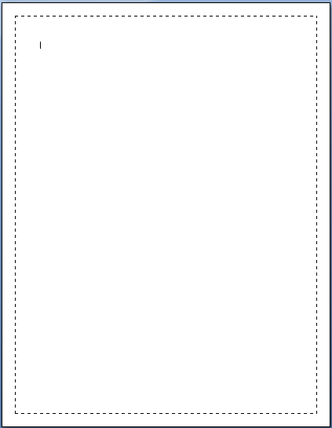
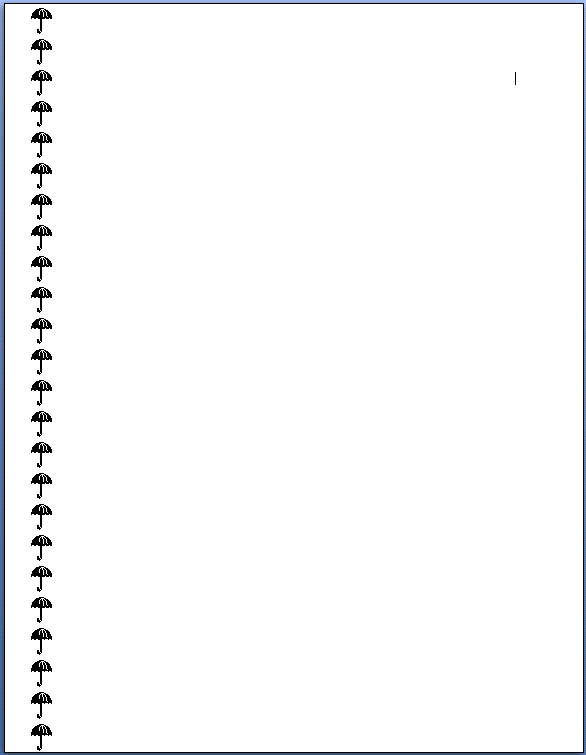

# 17.6 节

**Sections**

=== "中文"
    
    WordprocessingML不会本地存储页面的概念，因为它是基于段落和行的（这些由内容的使用者布局到页面上）。然而，尽管WordprocessingML格式中没有存储页面的概念，但通常需要在文档中存储关于页面或一组页面的信息，以便存储用于格式化一组段落所出现的页面的信息。在WordprocessingML中，通过使用节来存储这些信息。
    
    在WordprocessingML中，节是具有一组特定属性的段落分组，用于定义文本所出现的页面，以及其他适用于所有段落外观的节级属性。
    
    [示例：考虑一个包含四个段落文本的文档，要在横向模式下打印一页，然后是十个段落文本要在纵向模式下打印。这个要求意味着需要关于布局每个文本分组所使用的页面的信息 - 前四个段落可能需要一页，或者十页。
    
    因此，不要试图缓存关于页面数量和属性的知识（如果XML由不了解页面布局的生成器操作，这些知识可能会变得不正确），而是通过将文档分成两个节来存储这些信息，如下所示：
    
    ```xml
    <w:p>
        …
    </w:p>
    <w:p>
        …
    </w:p>
    <w:p>
        …
    </w:p>
    <w:p>
        <w:sectPr>
            …
            （第一个节的属性在此处）
            <w:pgSz … w:orient="landscape" />
            …
        </w:sectPr>
        …
    </w:p>
    …
    <w:p>
        <w:sectPr>
            …
            （第二个节的属性在此处）
            <w:pgSz … w:orient="landscape" />
            …
        </w:sectPr>
        …
    </w:p>
    ```
    
    示例结束]

=== "英文"

    WordprocessingML does not natively store the concept of pages, since it is based on paragraphs and runs (which are laid out on to pages by consumers of this content). However, although there is no concept of storing pages in the WordprocessingML format, it is often necessary to store information about a page or group of pages in a document, in order to store information that is to be used to format the pages on which a set of paragraphs appear. In WordprocessingML, this information is stored via the use of sections.
    
    In WordprocessingML, sections are groupings of paragraphs that have a specific set of properties used to define the pages on which the text appears, as well as other section-level (applying to all paragraphs' appearance) properties.
    
    [Example: Consider a document with four paragraphs of text that is to be printed on a page in landscape mode, ollowed by ten paragraphs of text that are to be printed in portrait mode. This requirement implies information about the page(s) used to lay out each grouping of text—the first four paragraphs could require one page, or ten.
    
    Therefore, rather than try to cache knowledge of the number of pages and their properties (which is likely to become incorrect if the XML is manipulated by a producer that does not understand page layout), this information is stored by breaking the document into two sections, as follows:
    
    ```xml
    <w:p>
        …
    </w:p>
    <w:p>
        …
    </w:p>
    <w:p>
        …
    </w:p>
    <w:p>
        <w:sectPr>
            …
            (section one properties go here)
            <w:pgSz … w:orient="landscape" />
            …
        </w:sectPr>
        …
    </w:p>
    …
    <w:p>
        <w:sectPr>
            …
            (section two properties go here)
            <w:pgSz … w:orient="landscape" />
            …
        </w:sectPr>
        …
    </w:p>
    ```
    
    end example]

## TOC

- [17.6 节](#176-节)
    - [TOC](#toc)
    - [17.6.1 bidi (从右到左部分布局)](#1761-bidi-从右到左部分布局)
    - [17.6.2 bottom (下边框)](#1762-bottom-下边框)
    - [17.6.3 col (单列定义)](#1763-col-单列定义)
    - [17.6.4 cols (列定义)](#1764-cols-列定义)
    - [17.6.5 docGrid (文档网格)](#1765-docgrid-文档网格)
    - [17.6.6 formProt (仅允许编辑表单字段)](#1766-formprot-仅允许编辑表单字段)
    - [17.6.7 left (左边框)](#1767-left-左边框)
    - [17.6.8 lnNumType (行编号设置)](#1768-lnnumtype-行编号设置)
    - [17.6.9 paperSrc (页面源信息)](#1769-papersrc-页面源信息)
    - [17.6.10 pgBorders (页面边框)](#17610-pgborders-页面边框)
    - [17.6.11 pgMar (页边距)](#17611-pgmar-页边距)
    - [17.6.12 pgNumType (页码设置)](#17612-pgnumtype-页码设置)
    - [17.6.13 pgSz (页面尺寸)](#17613-pgsz-页面尺寸)
    - [17.6.14 printerSettings (参考打印机设置数据)](#17614-printersettings-参考打印机设置数据)
    - [17.6.15 right (右边框)](#17615-right-右边框)
    - [17.6.16 rtlGutter (页面右侧装订线)](#17616-rtlgutter-页面右侧装订线)
    - [17.6.17 sectPr (文档最终节属性)](#17617-sectpr-文档最终节属性)
    - [17.6.18 sectPr (节属性)](#17618-sectpr-节属性)
    - [17.6.19 sectPr (上一节属性)](#17619-sectpr-上一节属性)
    - [17.6.20 textDirection (文本流方向)](#17620-textdirection-文本流方向)
    - [17.6.21 top (上边框)](#17621-top-上边框)
    - [17.6.22 type (节类型)](#17622-type-节类型)
    - [17.6.23 vAlign (页面上的垂直文本对齐方式)](#17623-valign-页面上的垂直文本对齐方式)


## 17.6.1 bidi (从右到左部分布局)

**bidi (Right to Left Section Layout)**

=== "中文"
    
    该元素指定该部分应使用从右向左的页面方向呈现。此属性仅影响部分级别的属性，不影响此部分内容中文本的布局。
    
    【示例：考虑一个具有以下设置的bidi属性的部分：
    
    ```xml
    <w:sectPr>
        …
        <w:bidi/>
    </w:sectPr>
    ```
    
    现在，该部分的方向是从右向左的，这意味着所有部分级别的属性都以从右向左的方式显示（例如，页面编号显示在文本右侧；列从右向左填充）。但是，文本的布局由应用在文本级别的属性确定。示例结束】
    
    该元素的内容模型由[§17.17.4]中的常用布尔属性定义。

=== "英文"
    
    This element specifies that this section shall be presented using a right-to-left page direction. This property only affects section-level properties, and does not affect the layout of text within the contents of this section.
    
    [Example: Consider a section with the bidi property set as follows:
    
    ```xml
    <w:sectPr>
        …
        <w:bidi/>
    </w:sectPr>
    ```
    
    This section direction is now right-to-left, which means that all section level properties are displayed right-to-left (e.g., page numbers are displayed on the right of text; columns are populated from right-to-left). However, the layout of text is determined by properties applied at the text level. end example]
    
    This element’s content model is defined by the common boolean property definition in [§17.17.4].


## 17.6.2 bottom (下边框)

**bottom (Bottom Border)**

=== "中文"
    
    该元素指定了在本节中每个页面底部显示的页面边框的呈现和显示方式。
    
    【示例：考虑一个要求每个页面底部都有由一个苹果的重复图像组成的边框的部分，如下所示：
    
    
    
    这个边框将导致以下的WordprocessingML：
    
    ```xml
    <w:sectPr>
        …
        <w:pgBorders>
            <w:bottom w:val="apples" …/>
        </w:pgBorders>
        …
    </w:sectPr>
    ```
    
    因为页面只有一个底部边框，所以在页面边框集合中只指定了底部元素。示例结束】
    
    当文档具有相对于页面边缘的底部边框（使用pgBorders上的offsetFrom属性）时，它应跨越页面底部边缘，在其属性定义的位置停止，直到：
    
    - 与相应的左侧或右侧页面边框相交（如果指定了一个）。
    - 达到页面的边缘。
    
    【示例：在上面的示例中，WordprocessingML中没有指定左侧或右侧边框，因此消费者必须将边框从页面的一侧绘制到另一侧。示例结束】
    
    当文档具有相对于文本的底部边框（使用pgBorders上的offsetFrom属性）时，它应仅跨越必要的宽度以满足跨越文本宽度的要求。当文档指定了由bottomLeft、bottomRight和/或id属性指定的自定义边框艺术时，它应使用相应的关系部件项作为底部左下角、底部右下角和/或底部边框的图像。如果找不到相应的关系部件项，则消费者应使用val属性的值指定的边框。如果无法解析val属性的相应值，则在显示页面时不存在底部左下角、底部右下角或底部边框。
    
    当文档通过id属性指定了自定义边框艺术，而没有指定bottomRight和/或bottomLeft属性时，由id属性的相应关系部件项解析的底部边框应跨越到由bottomRight和/或bottomLeft属性未指定的角落。 
    
    
    ??? abstract "Attributes"
        
        **bottomLeft**（自定义定义的底部左边框关系引用）
        
        :   命名空间：http://purl.oclc.org/ooxml/officeDocument/relationships
        
            指定了包含父元素的自定义底部左边框图像的关系ID。此自定义边框图像包含在WordprocessingML包中的单独部分中。
        
            此属性显式指定的关系应为类型http://purl.oclc.org/ooxml/officeDocument/relationships/image，否则文档将被视为不符合规范。
        
            如果省略此属性，则不使用自定义底部左边框。
        
            【示例：考虑以下WordprocessingML标记，用于文档中的自定义底部左边框：
        
            ```xml
            <w:bottom w:val="custom" 
                r:bottomLeft="rIdCustomBottomLeftBorder" …/>
            ```
        
            关系引用命名空间中的id属性指定了关系ID为rIdCustomBottomLeftBorder的关系必须包含文档的自定义底部左边框图像。示例结束】
        
            此属性的可能值由ST_RelationshipId简单类型定义（[§22.8.2.1]）。
        
        **bottomRight**（自定义定义的底部右边框关系引用）

        :   命名空间：http://purl.oclc.org/ooxml/officeDocument/relationships

            指定了包含父元素的自定义底部右边框图像的关系ID。此自定义边框图像包含在WordprocessingML包中的单独部分中。

            此属性显式指定的关系应为类型http://purl.oclc.org/ooxml/officeDocument/relationships/image，否则文档将被视为不符合规范。

            如果省略此属性，则不使用自定义底部右边框。

            【示例：考虑以下WordprocessingML标记，用于文档中的自定义底部右边框：

            ```xml
            <w:bottom w:val="custom" 
                r:bottomRight="rIdCustomBottomRightBorder" …/> 
            ```

            关系引用命名空间中的id属性指定了关系ID为rIdCustomBottomRightBorder的关系必须包含文档的自定义底部右边框图像。示例结束】

            此属性的可能值由ST_RelationshipId简单类型定义（[§22.8.2.1]）。
                
        **color**（边框颜色）

        :   指定此边框的颜色。

            此值可以定义为以下之一：

            - 使用RGB颜色模型的颜色值，其红色、绿色和蓝色值被写为0到255范围内的数字，以十六进制编码，并连接在一起。
            
                【示例：完全强度的红色将是255红色，0绿色，0蓝色，编码为FF、00、00，并连接为FF0000。示例结束】。RGB颜色在sRGB色彩空间中指定。
            
            - auto，以允许消费者自动确定边框颜色，以使文档的文本可读性。

                【示例：具有白色文本和自动背景颜色的文档可能会导致使用黑色背景，以确保内容的可读性。示例结束】
            
            【示例：考虑以下值为auto的边框颜色：
            
            ```xml
            <w:bottom … w:color="auto"/ > 
            ```
            
            因此，此颜色可以由消费者自动修改，以便确保边框可以与页面的背景颜色区分开。示例结束】

            如果边框样式（val属性）指定使用艺术边框，则将忽略此属性。此外，如果边框通过themeColor属性指定使用主题颜色，则此值将被主题颜色值所取代。

            此属性的可能值由ST_HexColor简单类型定义（[§17.18.38]）。
            
        **frame**（创建框架效果）
        
        :   指定是否应修改指定的边框以创建框架效果，即将边框的外观从最靠近文本的边缘反转到最远离文本的边缘。
        
            如果省略此属性，则不给边框添加任何框架效果。
        
            【示例：考虑一个必须显示框架效果的底部边框，在以下的WordprocessingML中指定如下：
            
            ```xml
            <w:bottom w:frame="true" … />  
            ```
            
            此处frame的val为true，表示必须应用边框框架效果。示例结束】
        
            此属性的可能值由ST_OnOff简单类型定义（[§22.9.2.7]）。
        
        **id**（自定义定义的边框关系引用）
        
        :   命名空间：http://purl.oclc.org/ooxml/officeDocument/relationships
        
            指定了包含父元素的自定义边框图像的关系ID。此自定义边框图像包含在WordprocessingML包中的单独部分中。
        
            此属性显式指定的关系应为类型http://purl.oclc.org/ooxml/officeDocument/relationships/image，否则文档将被视为不符合规范。
        
            如果省略此属性，则不使用自定义边框。
        
            【示例：考虑以下WordprocessingML标记，用于文档中的自定义底部边框：
            
            ```xml
            <w:bottom w:val="custom" r:id="rIdCustomBottomBorder" …/> 
            ```
            
            关系引用命名空间中的id属性指定了关系ID为rIdCustomBottomBorder的关系必须包含文档的自定义底部边框图像。示例结束】
        
            此属性的可能值由ST_RelationshipId简单类型定义（[§22.8.2.1]）。 
        
        **shadow**（边框阴影）
        
        :   指定是否应修改此边框以创建阴影效果。
        
            对于右边和底部边框，这通过在正常边框位置的下方和右侧复制边框来实现。对于右边和顶部边框，这通过将边框移动到其原始位置的下方和右侧来实现。
        
            如果省略此属性，则不给边框添加阴影效果。
        
            【示例：考虑一个必须显示阴影效果的顶部边框，导致以下的WordprocessingML：
        
            ```xml
            <w:bottom w:shadow="true" … />  
            ```
        
            此处frame的val为true，表示必须应用阴影效果到边框。示例结束】
        
            此属性的可能值由ST_OnOff简单类型定义（[§22.9.2.7]）。
        
        **space**（边框间距测量）
        
        :   指定应用于将此边框放置在父对象上的间距偏移量。
        
            当文档具有相对于页面边缘的页面边框（在pgBorders的offsetFrom属性中使用page值（[§17.6.10]））时，它应指定页面边缘与此边框开始之间的距离，以点为单位。
        
            当文档具有相对于文本范围的页面边框（在pgBorders的offsetFrom属性中使用text值（[§17.6.10]））或任何其他边框类型时，它应指定对象边缘与此边框开始之间的距离，以点为单位。
        
            【示例：考虑一个文档，其中一组页面边框都被指定为距页面边缘24点。生成的WordprocessingML如下：
        
            ```xml
            <w:pgBorders w:offsetFrom="page">  
                <w:bottom … w:space="24" />  
            </w:pgBorders>
            ```
        
            offsetFrom属性指定space值提供了页面边框与页面边缘之间的偏移量，space属性的值指定页面偏移必须为24点。示例结束】
        
            此属性的可能值由ST_PointMeasure简单类型定义（[§17.18.68]）。
        
        **sz**（边框宽度）
        
        :   指定当前边框的宽度。
        
            如果边框样式（val属性）指定为线条边框，则此边框的宽度以点的八分之一为单位进行测量，最小值为2（四分之一点）最大值为96（十二点）。超出此范围的任何值都可以重新分配为更合适的值。
        
            如果边框样式（val属性）指定为艺术边框，则此边框的宽度以点为单位进行测量，最小值为1，最大值为31。超出此范围的任何值都可以重新分配为更合适的值。
        
            【示例：考虑一个所有边都为三点宽的虚线边框的文档，导致以下的WordprocessingML标记：
        
            ```xml
            <w:top w:val="dashed" w:sz="24" …/>  
            <w:left w:val="dashed" w:sz="24" …/>  
            <w:bottom w:val="dashed" w:sz="24" …/>  
            <w:right w:val="dashed" w:sz="24" …/>  
            ```
        
            使用val属性指定边框样式，并且由于该边框样式为线条边框（虚线），sz属性指定了大小为八分之一点（24八分之一点=3点）。示例结束】
        
            此属性的可能值由ST_EighthPointMeasure简单类型定义（[§17.18.23]）。
        
        **themeColor**（边框主题颜色）
        
        :   指定用于生成边框颜色的基本主题颜色。边框颜色是与themeColor相关联的RGB值，进一步通过themeTint或themeShade（如果存在）进行变换，否则背景颜色是与themeColor相关联的RGB值。
        
            指定的主题颜色是对预定义主题颜色之一的引用，位于文档的主题部分（[§14.2.7]和[§20.1.6.9]），这允许在文档中集中设置颜色信息。
        
            要确定要显示的颜色，执行以下操作：
        
            - 使用ST_ThemeColor简单类型中指定的映射，读取clrSchemeMapping元素（[§17.15.1.20]）上的适当属性。
            - 使用该值和ST_ColorSchemeIndex简单类型中指定的映射，读取文档主题部分中的适当元素，以获取基本主题颜色。
            - 根据themeTint或themeShade属性的存在修改指定的颜色。
        
            【示例：考虑一组配置为使用accent2主题颜色的边框，导致以下的WordprocessingML标记：
        
            ```xml
            <w:top … w:themeColor="accent2" w:themeTint="99" />  
            <w:bottom … w:themeColor="accent2" w:themeTint="99" />  
            <w:left … w:themeColor="accent2" w:themeTint="99" />  
            <w:right … w:themeColor="accent2" w:themeTint="99" />  
            ``` 
        
            如果Settings部分包含以下标记：
        
            ```xml
            <w:clrSchemeMapping … w:accent2="accent 2"/> 
            ``` 
        
            和Theme部分包含以下XML标记：
        
            ```xml
            <a:accent 2> 
                <a:srgbClr val=" 4F81BD"/> 
            </a:accent 2> 
            ``` 
        
            则结果边框颜色将为95B3D7（应用到原始主题颜色的60%着色结果；有关详细信息，请参见下面的themeTint中的计算）。示例结束】
        
            此属性的可能值由ST_ThemeColor简单类型定义（[§17.18.97]）。 
                
        **themeShade**（边框主题颜色阴影）
        
        :   指定应用于此边框实例的提供的主题颜色（如果有）的阴影值。如果themeColor属性不存在，则不使用此属性。
        
            如果提供了themeTint，则将忽略此属性。
        
            如果提供了themeShade，则将其应用于主题颜色（来自主题部分）的RGB值，以确定应用于此边框的最终颜色。
        
            themeShade值以阴影值（从0到255）的十六进制编码存储，应用于当前边框。
        
            【示例：考虑文档中应用了40％的阴影值到边框。此阴影值计算如下：
        
            ```text
            𝑆ℎ𝑎𝑑𝑒=0.4∗255  
                =102  
                =66（十六进制）
            ```
        
            文件格式中的结果themeShade值为66。示例结束】
        
            给定以RRGGBB格式定义的RGB颜色为三个十六进制值，阴影应用如下：
        
            - 将颜色转换为HSL颜色格式（值从0到1）
            - 修改亮度因子如下：
        
            $$L′ = L ∗ Shade_{percentage}$$
        
            - 将得到的HSL颜色转换为RGB
        
            【示例：考虑一个使用accent2主题颜色的背景的文档，其RGB值（以RRGGBB十六进制格式）为C0504D。
        
            等效的HSL颜色值为（1/360，0.48，0.53）。
        
            应用75％阴影到亮度的阴影公式，我们得到：
        
            ```text
            𝐿′ = 0.53∗0.75 
                = 0.39698 
            ```
        
            取得到的HSL颜色值（1/360，0.48，0.39698）并转换回RGB，我们得到943634。
        
            此转换值可以在结果背景的颜色属性中看到：
        
            ```xml
            <w:top w:val="single" w:sz="4" w:space="24"  
                w:color=" 943634" w:themeColor="accent2"  
                w:themeShade="BF"/>  
            ```
        
            示例结束】
        
            此属性的可能值由ST_UcharHexNumber简单类型定义（[§17.18.98]）。
        
        **themeTint**（边框主题颜色色调）
        
        :   指定应用于此边框实例的提供的主题颜色（如果有）的色调值。如果themeColor属性不存在，则不使用此属性。
        
            如果提供了themeTint，则将其应用于主题颜色（来自主题部分）的RGB值，以确定应用于此边框的最终颜色。
        
            themeTint值以色调值（从0到255）的十六进制编码存储，应用于当前边框。
        
            【示例：考虑文档中应用了60％的色调值到边框。此色调值计算如下：
        
            ```text
            𝑇𝑥𝑚𝑙 =0.6∗255  
                =153  
                =99（十六进制）
            ```
        
            文件格式中的结果themeTint值为99。示例结束】
        
            给定以RRGGBB格式定义的RGB颜色为三个十六进制值，色调应用如下：
        
            - 将颜色转换为HSL颜色格式（值从0到1）
            - 修改亮度因子如下：
        
            $$L′ = L ∗ Tint_{pct} + (1 − Tint_{pct})$$ 
        
            - 将得到的HSL颜色转换为RGB
        
            【示例：考虑一个使用accent2主题颜色的背景的文档，其RGB值（以RRGGBB十六进制格式）为4F81BD。
        
            等效的HSL颜色值为（213/360，0.45，0.53）。
        
            应用60％色调到亮度的色调公式，我们得到：
        
            ```text
            𝐿′=0.53∗0.6+(1−.6) 
            =0.71 
            ```
        
            取得到的HSL颜色值（213/360，0.45，0.71）并转换回RGB，我们得到95B3D7。
        
            此转换值可以在结果背景的颜色属性中看到：
        
            ```xml
            <w:top w:val="single" w:sz="4" w :space="24"  
                w:color=" 95B3D7" w:themeColor="accent2"  
                w:themeTint="99"/>  
            ```
        
            示例结束】
        
            此属性的可能值由ST_UcharHexNumber简单类型定义（[§17.18.98]）。
        
        **val**（边框样式）指定此对象使用的边框样式。

        :   此边框可以是艺术边框（沿边框重复的图像 - 仅用于页面边框）或线条边框（沿边框重复的线条格式） - 有关每种边框样式的描述，请参阅简单类型定义。
        
            【示例：考虑一个左边框，导致以下WordprocessingML：
            
            ```xml
            <w:left w:val="single" …/>  
            ```
            
            此边框的val为single，表示边框样式为单线。示例结束】
        
            此属性的可能值由ST_Border简单类型定义（[§17.18.2]）。 
     
    [Note : The W3C XML Schema definition of this element’s content model ( CT_BottomPageBorder ) is loca ted in §A.1. end note ] 

=== "英文"
    
    This element specifies the presentation and display of the page border displayed at the bottom of each page in this section.
    
    [Example: Consider a section in which all pages must have a bottom border consisting of a repeated image of an apple, like this:
    
    
    
    This border would result in the following WordprocessingML:
    
    ```xml
    <w:sectPr>
        …
        <w:pgBorders>
            <w:bottom w:val="apples" …/>
        </w:pgBorders>
        …
    </w:sectPr>
    ```
    
    Because the page only has a bord er at the bottom, only the bottom element is specified within the set of page borders. end example ] 
    
    When a document has a bottom border that is relative to the page edges (using the offsetFrom  attribute on pgBorders ), it shall span the bottom edge of the p age at the location defined by its properties, stopping when:  
    
    - It intersects with the corresponding left or right page border (if one is specified).  
    - It reaches the edge of the page.  
    - 
    [Example : In the example above, no left or right border was specified in th e WordprocessingML, so a consumer must draw the border from one edge of the page to the other. end example ] 
    
    When a document has a bottom border that is relative to the text (using the offsetFrom  attribute on pgBorders ), it shall span only the necessary wid th to satisfy the requirement of spanning the width of the text.  When a document has custom border art specified by the bottomLeft , bottomRight , and/or id attributes, it shall use the corresponding relationship part item as an image for the bottom left cor ner, bottom right corner, and/or bottom border, respectively. If the corresponding relationship part item cannot be located, the consumer shall use the border specified by the value of the val attribute. If the corresponding value of the val attribute cann ot be resolved no bottom left corner, bottom right corner, or bottom border is present when the page is displayed.  
    
    When a document has a custom border art specified by the id attribute without specifying the bottomRight and/or bottomLeft  attributes, the b ottom border as resolved by the corresponding relationship part item of the id attribute shall span to the corners not specified by bottomRight  and/or bottomLeft  attributes.  
    
    
    ??? abstract "Attributes"
        
        **bottomLeft** (Custom Defined Bottom Left Border Relationship Reference)
    
        :   Namespace: http://purl.oclc.org/ooxml/officeDocument/relationships 
    
            Specifies the relationship ID for the relationship which contains the custom bottom left border image for the parent element. This custom border image is containe d in a separate part within the WordprocessingML package.  
             
            The relationship explicitly targeted by this attribute shall be of type http://purl.oclc.org/ooxml/officeDocument/relationships/image  or the document shall be considered non -conformant.  
             
            If this attribute is omitted, then no custom bottom left border shall be used . 
             
            [Example : Consider the following WordprocessingML markup for a custom bottom left 
            border in a document:  
             
            ``xml
            <w:bottom w:val="custom" 
                r:bottomLeft="rIdCustomBottomLeftBorder" …/>
            ```
             
            The id attribute in the relationship reference namespace specifies that the relationship with relationship ID rIdCustomBottomLeftBorder  must  contain the custom bottom left border image for the document. end example ] 
    
            The possible values for this attribut e are defined by the ST_RelationshipId  simple type ([§22.8.2.1] ). 
        
        **bottomRight**  (Custom Defined Bottom Right Border Relationship Reference ) 
         
        :   Namespace: http://purl.oclc.org/ooxml/officeDocument/relationships 
        
            Specifies the relationship ID for the relationship which contains the custom bottom right border image for the parent element. This custom border image is contained in a separate part within the WordprocessingML package.  
                     
            The relationship explicitly targeted by this attribute shall be of type http://purl.oclc.org/ooxml/officeDocument/relationships/image  or the document shall be considered non -conformant.  
                
            If this attribute is omitted, then no custom bottom left border shall be used.  
                
            [Example : Consider the following WordprocessingML markup for a custom bottom right border in a document:  
            
            ```xml
            <w:bottom w:val="custom" 
                r:bottomRight="rIdCustomBottomRightBorder" …/> 
            ```
                
            The id attribute in the relationship reference namespace specifies that the relationship with relationship ID rIdCustomBottomRightBorder  must  contain the custom bottom right border image for the document. end example ] 
                
            The possible values for this attri bute are defined by the ST_RelationshipId  simple type ([§22.8.2.1]). 
                
        **color**  (Border Color ) 
        
        :   Specifies the color for this border.  
     
            This value can be defined as either:  
            
            - A color value using the RGB color model whose red, green, and blue values are written as numbers in the range 0 to 255, hex encoded, and concatenated. 
            
                [Example : Full intensity red would be 255 red, 0 g reen, 0 blue, encoded to FF, 00, 00, and concatenated to FF0000 . end example ] . RGB colors are specified in the sRGB color space.  
            
            - auto  to allow a consumer to automatically determine the border color in order to make the document's text readable. [ Example : A document with white text and a background color of auto  might result in the use of a black background, in order to ensure legibility of the content. end example ] 
             
            [Example : Consider a border color with value auto , as follows:  
            
            ```xml
            <w:bottom … w:color="auto"/ > 
            ```
             
            This color therefore can be automatically be modified by a consumer as appropriate, for example, in order to ensure that the border can be distinguished against the page's background color. end example ] 
    
            If the border style (the val attribute) specifies  the use of an art border, this attribute is ignored. As well, if the border specifies the use of a theme color via the themeColor attribute, this value is superseded by the theme color value.  
             
            The possible values for this attribute are defined by the ST_HexColor simple type ([§17.18.38]). 
            
        **frame**  (Create Frame Effect ) 
        
        :   Specifies whether the specified border should be modified to create a frame effect by reversing the border's appearance from the edge nearest the text to the edge furthest from the text.  
         
            If this attribute is omitted, then the border is not given any frame effect.  
             
            [Example : Consider a bottom border w hich must appear with a frame effect, which is specified in the following WordprocessingML:  
            
            ```xml
            <w:bottom w:frame="true" … />  
            ```
             
            This frame's val is true , indicating that the border frame effect must be applied. end example ] 
             
            The possible values for this attribute are defined by the ST_OnOff  simple type ([§22.9.2.7] ). 
            
        **id** (Custom Defined Border Relationship Reference ) 
         
        :   Namespace: http://purl.oclc.org/ooxml/officeDocument/relationships 
        
            Specifies the relationship ID for the relationship which contains the custom border image for the parent element. This custom border image is contained in a  separate part within the WordprocessingML package.  
         
            The relationship explicitly targeted by this attribute shall be of type http://purl.oclc.org/ooxml/officeDocument/relationships/image  or the document shall be considered non -conformant.  
             
            If this attribut e is omitted, then no custom border shall be used.  
             
            [Example : Consider the following WordprocessingML markup for a custom bottom border in a document:  
        
            ```xml
            <w:bottom w:val="custom" r:id="rIdCustomBottomBorder" …/> 
            ```
             
            The id attribute in the relationship referenc e namespace specifies that the relationship with relationship ID rIdCustomBottomBorder  must  contain the custom bottom border image for the document. end example ] 
             
            The possible values for this attribute are defined by the ST_RelationshipId simple type ([§22.8.2.1] ). 
        
        **shadow**  (Border Shadow ) 
        
        :   Specifies whether this border should be modified to create the appearance of a shadow.  
        
            For the right and bottom borders, this is accomplished by duplicating the border below and right of the normal border location. For the right and top borders, this is accomplished by moving the order down and to the right of its original locatio n. 
             
            If this attribute is omitted, then the border is not given the shadow effect.  
             
            [Example : Consider a top border which must appear with a shadow effect, resulting in the following WordprocessingML:  
            
            ```xml
            <w:bottom w:shadow="true" … />  
            ```
             
            This frame's val is true, indicating that the shadow effect must be applied to the border. 
        
            end example ] 
             
            The possible values for this attribute are defined by the ST_OnOff  simple type ([§22.9.2.7] ). 
        
        **space**  (Border Spacing Measurement ) 
        
        :   Specifies the spacing offset that shall be used to place this border on the parent object.  
         
            When a document has a page border that is relative to the page edges (using a value of page  in the offsetFrom  attribute on pgBorders  ([§17.6.10] )), it shall specify the distance between the edge of the page and the beginning of this border in points.  
             
            When a document has a page border that is relative to the text extents (using a value of text  in the offsetFrom attribute on pgBorders ([§17.6.10] )), or any other border type, it shall specify the distance between the edge of the object and the beginning of this border in points.  
             
            [Example : Consider a document with a set of page borders all specified to appear 24 points from the edge of the page. The resulting WordprocessingML would be as follows:  
             
            ```xml
            <w:pgBorders w:offsetFrom="page">  
              <w:bottom … w:space="24" />  
            </w:pgBorders>
            ```
             
            The offsetFrom  attribute specifies that the space  value provides the offset of the page border from the page edge, and the value of the s pace attribute specifies that the page offset must be 24  points. end example ] 
             
            The possible values for this attribute are defined by the ST_PointMeasure  simple type  ([§17.18.68] ). 
        
        **sz** (Border Width ) 
        
        :   Specifies the width of the current border.  
             
            If the border style ( val attribute) specifies a line border, the width of this border is specified in measurements of eighth s of a point, with a minimum value of two (one - fourth of a point) and a maximum value of 96 (twelve points). Any values outside this range can be reassigned to a more appropriate value.  
            
            If the border style ( val attribute) specifies an art border, the widt h of this border is specified in measurements of points, with a minimum value of one and a maximum value of 31. Any values outside this range can be reassigned to a more appropriate value.  
         
            [Example : Consider a document with a three point wide dashed line border on all sides, resulting in the following WordprocessingML markup:  
            
            ```xml
            <w:top w:val="dashed" w:sz="24" …/>  
            <w:left w:val="dashed" w:sz="24" …/>  
            <w:bottom w:val="dashed" w:sz="24" …/>  
            <w:right w:val="dashed" w:sz="24" …/>  
            ```
             
            The border style is specified using the val attribute, and because that border style is a line border ( dashed ), the sz attribute specifies the size in eighths of a point (24  eighths of a point = 3  points). end example ] 
             
            The possible values for this attri bute are defined by the ST_EighthPointMeasure  simple type ([§17.18.23] ). 
        
        **themeColor**  (Border Theme Color ) 
        
        :   Specifies the base theme color used to generate the border color. The border color is the RGB value associated with themeColor  as further transformed by themeTint  or themeShade  (if one is present), else the background color is the RGB value associated with  themeColor . 
         
            The specified theme color is a reference to one of the predefined theme colors, located in the document's Theme part ([§14.2.7]  and [§20.1.6.9] ), which allows color information to be set centrally in the document.  
             
            To determine the color to display, the following a ctions are performed:  
            
            - Using the mapping specified in the ST_ThemeColor  simple type ([§17.18.97] ), the appropriate attribute on the clrSchemeMapping  element ([§17.15.1.20] ) is read.  
            - Using that value and the mapping  specified in the  ST_ColorSchemeIndex  simple type ([§17.18.103] ), the appropriate element in the document’s Theme p art is read to get the base theme color.  
            - The specified color is modified based on the presence of the themeTint or themeShade  attribute.  
             
            [Example : Consider a set of borders configured to use the accent2  theme color, resulting in the following Wordprocessi ngML markup:  
            
            ```xml
            <w:top … w:themeColor="accent2" w:themeTint="99" />  
            <w:bottom … w:themeColor="accent2" w:themeTint="99" />  
            <w:left … w:themeColor="accent2" w:themeTint="99" />  
            <w:right … w:themeColor="accent2" w:themeTint="99" />  
            ``` 
        
            If the Settings part contained the following markup:  
            
            ```xml
            <w:clrSchemeMapping … w:accent2="accent 2"/> 
            ``` 
            
            and the Theme part contained the following XML markup:  
             
            ```xml
            <a:accent 2> 
              <a:srgbClr val=" 4F81BD"/> 
            </a:accent 2> 
            ``` 
             
            the resulting border  color would be 95B3D7  (the result of a 60% tint  applied to the original theme color; see the calculations in themeTint  below for details) . end example ] 
             
            The possible values for this attribute are defined by the ST_ThemeColor  simple type ([§17.18.97] ). 
        
        **themeShade**  (Border Theme Color Shade ) 
        
        :   Specifies the shade value applied to the supplied theme color (if any) for this border 
        instance.  If the themeColor  attribute is not present, then this attribute shall not be used .  
         
            If the themeTint  is supplied, the value of this attribute shall be ignored.  
             
            If the themeShade  is supplied, then it is applied to the RGB value of the theme color (from the theme part) to determine the final color applied to this border.  
             
            The themeShade  value is stored as a hex encoding of the shade value (from  0–255) applied to the current border.  
             
            [Example : Consider a shade of 40% applied to a border in a document. This shade is calculated as follows:  
            
            ```text
            𝑆𝑥𝑚𝑙=0.4∗255  
                =102  
                =66(ℎ𝑒𝑥) 
            ```
             
            The resulting themeShade  value in the file format would be  66. end example ] 
             
            Given an RGB color defined as three hex values in RRGGBB format, the shade is applied as follows:  
            
            - Convert the color to th e HSL color format  (values from 0 to 1)  
            - Modify the luminance factor as follows:  
             
            $$L′ = L ∗ Shade_{percentage}$$
             
            - Convert the resultant HSL color to RGB  
             
            [Example : Consider a document with a background using the accent2  theme color, whose RGB value (in RRGGBB hex for mat) is C0504D . 
        
            The equivalent HSL color value would be (1/360,0.48,0.53).  
             
            Applying the shade formula with a shade percentage of 75% to the luminance, we get:  
            
            ```text
            𝐿′ = 0.53∗0.75 
               = 0.39698 
            ``` 
             
            Taking the resulting HSL color value of (1/360,0.48,0.39698) and converting back to RGB, we get 943634 . 
             
            This transformed value can be seen in the resulting background's color  attribute:  
            
            ```xml
            <w:top w:val="single" w:sz="4" w:space="24"  
              w:color=" 943634" w:themeColor="accent2"  
              w:themeShade="BF"/>  
            ```
            
            end example ] 
             
            The possible values for this attribute are defined by the ST_UcharHexNumber  simple  type ([§17.18.98] ). 
        
        **themeTint**  (Border Theme Color Tint ) 
        
        :   Specifies the tint value applied to the supplied theme color (if any) for this border instance. If the themeColor  attribute is not present, then this attribute shall not be used . 
         
            If the themeTint  is supplied, then it is applied  to the RGB value of the theme color (from the theme part) to determine the final color applied to this border.  
             
            The themeTint  value is stored as a hex encoding of the tint value (from  0–255) applied to the current border.  
             
            [Example : Consider a tint of 60%  applied to a border in a document. This tint is calculated as follows:  
             
            ```text
            𝑇𝑥𝑚𝑙 =0.6∗255  
                =153  
                =99(ℎ𝑒𝑥) 
            ```
             
            The resulting themeTint  value in the file format would be  99. end example ] 
             
            Given an RGB  color defined as three hex values in RRGGBB format, the shade is applied  as follows:  
            
            - Convert the color to the HSL color format  (values from 0 to 1)  
            - Modify the luminance factor as follows:  
             
            $$L′ = L ∗ Tint_{pct} + (1 − Tint_{pct})$$ 
            
            - Convert the resultant HSL color to RGB  
             
            [Example : Consider a document with a background using the accent2  theme color, whose RGB value (in RRGGBB hex format) is 4F81BD . 
             
            The equivalent HSL color value would be  (213/360,0.45,0.53).  
             
            Applying the tint formula with a tint percentage of 60% to the lumi nance, we get:  
            
            ```text
            𝐿′=0.53∗0.6+(1−.6) 
            =0.71 
            ```
             
            Taking the resulting HSL color value of (213/360,0.45,0.71)and converting back to RGB, we get 95B3D7 . 
             
            This transformed value can be seen in the resulting background's color  attribute:  
            
            ```xml
            <w:top w:val="single" w:sz="4" w :space="24"  
              w:color=" 95B3D7" w:themeColor="accent2"  
              w:themeTint="99"/>  
            ```
             
            end example ] 
             
            The possible values for this attribute are defined by the ST_UcharHexNumber  simple type ([§17.18.98] ). 
        
        
        **val** (Border Style ) Specifies the style of border used on this object.  
        
        :   This border can either be an art border (a repeated image along the borders - shall only be used for page borders) or a line border (a line format repeated along the borders) - see the simple type definition for a description of each border style.  
             
            [Example : Consider a left border resulting in the following WordprocessingML:  
            
            ```xml
            <w:left w:val="single" …/>  
            ``` 
            
            This border's val is single , indicating that the border style is a single line. end example ] 
             
            The possible values for this attribute are defined by the ST_Border  simple type ([§17.18.2] ). 
     
    [Note : The W3C XML Schema definition of this element’s content model ( CT_BottomPageBorder ) is loca ted in §A.1. end note ] 

## 17.6.3 col (单列定义)

**col (Single Column Definition)**

=== "中文"
    
    这个元素指定了此部分内文本的单列属性。

    【示例：考虑一个宽度为两英寸的单列，该列后面还有一英寸的空白，导致以下WordprocessingML：
    
    ```xml
    <w:cols … >  
      <w:col w:w="2880" w:space="1440"/>  
      … 
    </w:cols>  
    ```
    
    结果列指定其宽度为2,880个点的二十分之一，后面有1,440个点的二十分之一的空白。示例结束】

    如果fixedWidth属性设置为false或省略，则仅使用col元素的内容来计算列的数量和大小。
    
    ??? abstract "属性"
    
        **space**（后续列之前的间距）
        
        :   指定当前列和下一列之间的间距（以点的二十分之一为单位）。
        
            【示例：考虑一个文本列，其后面要有一英寸的空白。因此，此文本列间距将是1x72=144点宽，这相当于1,440点的二十分之一。结果WordprocessingML指定了间距宽度为点的二十分之一：
            
            ```xml
            <w:col … w:space="1440"/>  
            ```
            
            示例结束】
            
            对于部分中的最后一个文本列，不允许在列后添加间距，如果存在，则忽略任何间距值。
            
            此属性的可能值由ST_TwipsMeasure简单类型定义（[§22.9.2.14]）。
        
        **w**（列宽度）
        
        :   指定此文本列的宽度（以点的二十分之一为单位）。
        
            【示例：考虑一个文本列，其宽度为两英寸。因此，此文本列将是2x72=144点宽，这相当于2,880点的二十分之一。结果WordprocessingML指定了宽度为点的二十分之一的列宽度：
            
            ```xml
            <w:col … w:w="2880"/>  
            ``` 
            
            示例结束】
            
            当父cols元素的equalWidth属性值为false（或等效值）时，必须存在此属性。
            
            此属性的可能值由ST_TwipsMeasure简单类型定义（[§22.9.2.14]）。
            
    [Note: The W3C XML Schema definition of this element’s content model (CT_Column) is located in §A.1. end note]

=== "英文"
    
    This element specifies the properties for a single column of text within thi s section.  
    [Example : Consider a single column with a width of two inches, which also has a one -inch space after the 
    column, resulting in the following WordprocessingML:  
    
    ```xml
    <w:cols … >  
      <w:col w:w="2880" w:space="1440"/>  
      … 
    </w:cols>  
    ```
    
    The resulting column specifies its width of 2,880 twentieths of a point and space following of 1,440 twentieths 
    of a point. end example ] 
    
    The contents of the col element are only used to calculate the number and size of columns if the fixedWidth  
    attribute i s set to false  or omitted.  
    
    ??? abstract "Attributes"
    
        **space**  (Space Before Following Column ) 
        
        :   Specifies the spacing (in twentieths of a point) between the current column and the next 
        column.  
         
        [Example : Consider a text column that is to have a one -inch space  after it. This text column spacing would therefore be 1x72=144 points wide, which translates to 1,440 twentieths of a point. The resulting WordprocessingML specifies that spacing width in twentieths of a point:  
        
        ```xml
        <w:col … w:space="1440"/>  
        ```
        
        end example ] 
         
        For the last text column in the section, no spacing is allowed after the column, and, if present, any space  value is ignored.  
         
        The possible values for this attribute are defined by the ST_TwipsMeasure  simple type ([§22.9.2.14] ). 
    
        **w** (Column Width ) 
        
        :   Specifies the width (in twentieths of a point) of this text column.  
             
            [Example : Consider a text column, which is to be two  inches wide. This text column would therefore be 2x72=144 points wide, which translates to 2,880 twentieths of a point. The resulting WordprocessingML specifies that column width in twentieths of a point:  
            
            ```xml
            <w:col … w:w="2880"/>  
            ``` 
            
            end example ]  
    
            This attribute must be present when the parent cols element has an equalWidth attribute value of false (or equivalent).
            
            The possible values for this attribute are defined by the ST_TwipsMeasure simple type ([§22.9.2.14]).
            
    [Note: The W3C XML Schema definition of this element’s content model (CT_Column) is located in §A.1. end note]

## 17.6.4 cols (列定义)

**cols (Column Definitions)**

=== "中文"
    
    该元素指定了文档中此部分定义的一组列。

    【示例：考虑一个文档，在其中一个部分定义了两列，分别为4.16英寸和1.83英寸，导致以下WordprocessingML：
    
    ```xml
    <w:cols w:equalWidth="0">  
      <w:col w:w="2640" w:space="720"/>  
      <w:col w:w="6000"/>  
    </w:cols>  
    ```
    
    cols元素定义了此部分定义的列集合，因为equalWidth为0，列数由包含在列定义中的col元素的数量定义。在这种情况下，第一列宽度为2,640个点的二十分之一（因为2640/1440英寸的一半等于1.83英寸），之后有半英寸的空白，第二列宽度为6,000个点的二十分之一（4.16英寸）。示例结束】
    
    根据equalWidth属性的存在，消费者应该使用以下方式呈现列：
    
    - 如果equalWidth为true，则列使用作为cols元素属性存储的数据进行定义（如下所定义）。
    - 如果equalWidth为false，则列使用每个子col元素的存在和数据进行定义（[§17.6.3]）。
    
    ??? abstract "Attributes"
            
        **equalWidth**（等宽列）
        
        :   指定当前部分中的所有文本列是否具有相等的宽度。
        
            如果此属性存在且其值设置为true或1，则此文本部分的所有列均具有相等的宽度，并按以下方式计算：
            
            - 取页面宽度（从页边距到页边距）
            - 除以num属性中指定的列数
            - 对于每一列，将space属性中定义的空间留在其后
            - 每一列的剩余宽度即为文本列的宽度。
            
            如果此属性存在且其值设置为false或0，则此文本部分的所有列具有不同的宽度，并由每个col元素定义，如下所示：
            
            - 每个col元素定义一个单独的列
            - 每个w属性定义文本列的宽度
            - 每个space属性定义文本列后的空间
            
            【示例：考虑具有以下列信息的部分：
            
            ```xml
            <w:cols w:num="3" w:space="1440"  
            w:equalWidth="1">  
            <w:col w:w="2880" w:space="2880" />  
            <w:col w:w="2880" w:space="1440" />  
            <w:col w:w="2880" />  
            </w:cols>  
            ```
            
            这组列的equalWidth值设置为1，因此忽略了col元素，并且有三个相等大小的列（num值为3），每个列后面都有一英寸（space值为1440点的二十分之一）的空间。示例结束】
            
            此属性的可能值由ST_OnOff简单类型定义（[§22.9.2.7]）。
        
        **num**（相等宽度列的数量）
        
        :   指定当前部分中的文本列数。
        
            如果所有列的宽度不相等（equalWidth属性未设置），则忽略此元素，并且列的数量由cols元素下定义的col元素的数量定义。
            
            【示例：考虑具有以下列信息的部分：
            
            ```xml
            <w:cols w:num="3" w:space="1440"  
                w:equalWidth="1">  
                … 
            </w:cols>  
            ```
            
            这组列的equalWidth值设置为1，因此有三个相等大小的列，因为num属性的值为3。示例结束】
            
            此属性的可能值由ST_DecimalNumber简单类型定义（[§17.18.10]）。
        
        **sep**（在列之间绘制线条）
        
        :   指定是否在本节中的每个文本列之间绘制垂直线条。
        
            如果设置为true或1，则在本节中的每个列之间的间距中心绘制一条垂直线。
            
            【示例：考虑具有以下列信息的部分：
            
            ```xml
            <w:cols w:sep="1">  
                … 
            </w:cols>  
            ```
            
            这组列的sep值设置为1，因此在本节中的每个列之间必须有一条垂直线分隔。示例结束】
            
            此属性的可能值由ST_OnOff简单类型定义（[§22.9.2.7]）。
        
        **space**（等宽度列之间的间距）
        
        :   指定当前部分中文本列之间的间距。
        
            如果所有列的宽度不相等（equalWidth属性未设置），则忽略此元素，并且列之间的间距由在cols元素下定义的每个col元素上的space属性定义。
            
            【示例：考虑具有以下列信息的部分：
            
            ```xml
            <w:cols w:num="3" w:space="1440"  
                w:equalWidth="1">  
                … 
            </w:cols>  
            ```
            
            这组列的equalWidth值设置为1，因此有三个相等大小的列，每个列后面都有一英寸（space值为1440点的二十分之一）的空间。示例结束】
            
            此属性的可能值由ST_TwipsMeasure简单类型定义（[§22.9.2.14]）。
         
    [Note: The W3C XML Schema definition of this element’s content model ( CT_Columns ) is located in § A.1. end note ] 

=== "英文"
    
    This element specifies the set of columns defined for this section in the document.  
    
    [Example : Consider a document in which a section defines two columns of 4.16" and 1.83", respectively, resulting in the following WordprocessingML: 
    
    ```xml
    <w:cols w:equalWidth="0">  
      <w:col w:w="2640" w:space="720"/>  
      <w:col w:w="6000"/>  
    </w:cols>  
    ```
    
    The cols element defines the set of columns defined for this section, which because equalWidth  is 0, are defined by the number of col elements contained in the column definition. In this case, the first column is 2,640  twentieths of a point wide (as 2640/1440ths o f an inch equals 1.83 inches) with one -half of an inch space after, and the second column is 6,000  twentieths of a point wide (4.16 inches). end example ] 
    
    Based on the presence of the equalWidth  attribute, a consumer shall render the columns using:  
    
    - If equal Width  is true , then the columns are defined using the data stored as attributes of the cols element (defined below).  
    - If equalWidth  is false , then the columns are defined using the presence and data on each child col  element ([§17.6.3] ). 
    
    ??? abstract "Attributes"
    
        **equalWidth**  (Equal Column Widths ) 
        
        :   Specifies whether all text columns in th e current section are of equal width.  
         
            If this attribute is present and its value is set to true  or 1, then all columns for this text 
            section are of an equal width and are calculated as follows:  
            
            - Take width of page (from margin to margin)  
            - Divide by number o f columns specified in num  attribute  
            - For each column, leave space after as defined in the space  attribute  
            - Remaining width of each column is the text column width.  
             
            If this attribute is present and its value is set to false  or 0, then all columns for this text section are of different widths and are defined by each col element as follows:  
    
            - Each col element defines a single column  
            - Each w attribute defines the text column width  
            - Each space  attribute defines the space after the text column  
            
            [Example : Consider a section with column information defined as follows:  
    
            ```xml
            <w:cols w:num="3" w:space="1440"  
            w:equalWidth="1">  
            <w:col w:w="2880" w:space="2880" />  
            <w:col w:w="2880" w:space="1440" />  
            <w:col w:w="2880" />  
            </w:cols>  
            ```
            
            This set of columns has a equalWidth  value set to  1, therefore the col elements are ignored, and there are three equally sized columns ( num  value of  3), each with one inch (space  value of 1440  twentieths of a point) of space after. end example ] 
            
            The possible values for this attribute are defin ed by the ST_OnOff  simple type ([§22.9.2.7] ). 
    
        **num**  (Number of Equal Width Columns ) 
        
        :   Specifies the number of text columns in the current section.  
         
            If all columns are not of equal width (the equalWidth  attribute is not set), then this element is ignored, and the number of columns is defined by the number of col elements defined under the cols element.  
             
            [Example : Consid er a section with column information defined as follows:  
            
            ```xml
            <w:cols w:num="3" w:space="1440"  
              w:equalWidth="1">  
              … 
            </w:cols>  
            ```
             
            This set of columns has a equalWidth  value set to  1, therefore there are three equally sized columns, as the num  attribute has a value of  3. end example ] 
             
            The possible values for this attribute are defined by the ST_DecimalNumber  simple type ([§17.18.10] ). 
        
        **sep** (Draw Line Between Columns ) 
        
        :   Specifies if a vertical line is drawn between each of the text columns in this section.  
         
            If set to true  or 1, then a vertical line shall be drawn in the center of the spacing between each column in this section.  
             
            [Example : Consider a section with column information defined as follows:  
            
            ```xml
            <w:cols w:sep="1">  
             … 
            </w:cols>  
            ```
             
            This set of columns has a sep value set to  1, therefore there must be a vertical line separating each column in this sectio n. end example ] 
             
            The possible values for this attribute are defined by the ST_OnOff  simple type ([§22.9.2.7] ). 
        
        **space**  (Spacing Between Equal Width Columns ) 
        
        :   Specifies the spacing between text columns in the current section.  
         
            If all columns are not of equal width (the equalWidth  attribute is not set), then this element is ignored, and the spacing after columns is defined by the space  attribute on each of the col elements defined under the cols element.  
             
            [Example : Consider a section with column information defined as follows:  
            
            ```xml
            <w:cols w:num="3" w:space="1440"  
              w:equalWidth="1">  
              … 
            </w:cols>  
            ```
            
            This set of columns has a equalWidth  value set to  1, therefore there are three equally sized columns, each with one inch ( space  value of 1440  twentieths of a point) of space after. end exam ple] 
             
            The possible values for this attribute are defined by the ST_TwipsMeasure  simple type ([§22.9.2.14] ). 
         
    [Note: The W3C XML Schema definition of this element’s content model ( CT_Columns ) is located in § A.1. end note ] 


## 17.6.5 docGrid (文档网格)

**docGrid (Document Grid)**

=== "中文"
    
    该元素指定文档网格的设置，通过为本节中的所有东亚文本内容指定每行字符数和每页行数，实现对文档中全角字符的精确布局。

    [示例：考虑一个文档，文档网格设置为每行20个字符，每页20行，并通过将字符对齐到网格（snapToChars属性）来实现，如下所示：
    
    
    
    如图所示，该文档每行仅允许20个东亚字符，通过调整字符间距确保每行仅有20个字符。示例结束]
    
    如果在此行中穿插拉丁文本，则将其放置在所需的网格单元数上以适应内容，但不会影响其他网格位置。
    
    [示例：考虑上述示例添加英文文本“Latin text”，如下所示：
    
    
    
    拉丁文本跨越两个网格单元，因此将其放置在这两个单元的中心；不会影响其他网格位置，因此第二行的文本现在横跨了两个额外的网格单元。示例结束]
    
    ??? abstract "Attributes"
    
        **charSpace**（文档网格字符间距）
        
        :   指定在本节中每行文本所允许的文档网格字符数。
        
            该属性的值应通过将期望的字符间距与正常字体大小的字符间距之差乘以4096来确定。如果省略了此属性，则默认值为零。
        
            然后，该值将用于将指定点大小的字符间距添加到本节中的每个字符上【注：这导致正常样式的文本每行具有特定的字符数。】
        
            【示例：考虑一个正常字体大小为11点的节，其中定义了21点间距的文档网格。生成的WordprocessingML定义如下：
        
            ```xml
            <w:docGrid w:charSpace="40960" …/>  
            ```
        
            charSpace属性指定值为40960，这意味着网格中每个字符的字符间距与正常字体的差值为10点，从而导致本节中所有字符的字符间距为11+10 = 21点。示例结束】
        
            文本的个别运行可以通过指定该运行文本不应通过snapToGrid元素（[§17.3.2.34]）对文档网格进行捕捉来覆盖为文档网格指定的行间距信息。
        
            此属性的可能值由ST_DecimalNumber简单类型定义（[§17.18.10]）。
    
        **linePitch**（文档网格行间距）

        :   指定在假定所有行都应用相等行间距的情况下，文档网格中允许的行数。除非文档的兼容性设置中存在adjustLineHeightInTable元素（[§17.15.3.1]），否则不应将此行间距添加到出现在表单元格中的任何行中。
        
            此属性以点的二十分之一为单位指定，并定义了文本在此页面上的每行间距，以便使所需数量的单倍行距文本适合于当前页面。
        
            【示例：考虑一个标准的8.5x11英寸页面，其中定义了一个20字符宽，20行的文档网格。生成的WordprocessingML定义如下：
        
            ```xml
            <w:docGrid w:linePitch="684" …/>  
            ```
        
            linePitch属性指定，34.2点是每行在此页面上允许的行距，以保持特定的文档网格。示例结束】
        
            个别段落可以通过以下方式覆盖为文档网格指定的行间距信息：
            
            - 使用spacing元素（[§17.3.1.33]）上的lineRule属性指定精确行间距值为exact。
            - 通过snapToGrid元素（[§17.3.1.32]）指定段落文本不应捕捉到文档网格。
        
            此属性的可能值由ST_DecimalNumber简单类型定义（[§17.18.10]）。
    
        **type**（文档网格类型）

        :   指定当前文档网格的样式，定义网格的行为。
        
            网格可以定义一种网格，将所有东亚字符捕捉到网格位置，但将拉丁文本保留其默认间距；将指定的字符间距添加到每行中的每个字符；或仅影响当前部分的行间距。
        
            [示例：考虑上文讨论的文档，其中文档网格定义如下，以便通过捕捉字符到网格来使每行有20个字符，每页有20行：
        
            
        
            此文档具有类型属性为snapToChars，指定网格必须将东亚字符强制放置到每行20个字符的位置。示例结束]
        
            如果省略了此属性，则将使用值"default"。
        
            [注：以这种方式禁用文档网格而不是省略docGrid元素允许在重新启用文档网格时保留文档网格设置。注结束]
        
            此属性的可能值由ST_DocGrid简单类型定义（[§17.18.14]）。
    
    [Note: The W3C XML Schema definition of this element’s content model (CT_DocGrid) is located in §A.1. end note]

=== "英文"
    
    This element specifies the settings for the document grid, which enables precise layout of full -width East Asian language characters within a document by specifying the desired number of ch aracters per line and lines per page for all East Asian text content in this section.  
    
    [Example : Consider a document with the document grid defined to allow 20  characters per line, and 20  lines per page by snapping characters to the grid ( type  attribute of snapToChars ) as follows:  
    
    
    
    As shown, this document allows for only 20  East Asian characters per line by adjusting the inter -character 
    spacing to ensure that there are only 20  characters per line. end example ] 
    
    If Latin text is interspersed on this line, the n it is placed across the number of grid units needed to fit the  content, but all other grid positions are unaffected.  
    
    [Example : Consider the example above with the addition of the text "Latin text" in English, as follows: 
    
    
    
    The Latin text spans two grid units, so it is placed in the center of those two units; no other grid positions are affected, so the text on the second line now spans two additional grid units. end example ] 
    
    ??? abstract "Attributes"
    
        **charSpace**  (Document Grid Character Pitch ) 
        
        :   Specifies the number of characters to be allowed on the document grid for each line in this section.  
         
            This attribute's value shall be specified by multiplying the difference between the desired character pitch and the character pitch fo r that character in the font size of the Normal font by 4096 . If this attribute is omitted, the default value is zero.  
             
            This value shall then be used to add the character pitch for the specified point size to each character in the section [Note : This resul ts in text in the Normal style having a specific number of characters per line. end note ] 
     
            [Example : Consider a section with a Normal font size of 11 points on which a 21 point pitch document grid has been defined.. The resulting WordprocessingML would be defined as follows:  
            
            ```xml
            <w:docGrid w:charSpace="40960" …/>  
            ```
            
            The charSpace  attribute specifies a value of 40960 , which means that the delta between the character pitch of each character in the grid and the Normal font is 10 points, resulting in a character pit ch of 11+10 = 21 points for all characters in this section. end 
            example ] 
             
            Individual runs of text can override the line pitch information specified for the document grid by specifying that the run text shall not snap to the document grid via the snapToGrid  element ( [§17.3.2.34] ). 
             
            The possible values for this attribute are defined by the ST_DecimalNumber  simple type ([§17.18.10] ). 
    
        **linePitch**  (Document Grid Line Pitch ) 
            
        :   Specifies the number of lines to be allowed on the document grid for the current page assuming all lines have equal line pitch applied to them. This line pitch shall not be added to any line which appears within a table cell unless the adjustLineHeightInTable element ([§17.15.3.1] ) is present in the document's compatibility settings.  
         
            This attribute is specified in twentieths of a point , and defines the pitch for each line of text on this page such that the desired number of single spaced lines of text fits on the current page.  
             
            [Example : Consider a standard 8.5x11" page on which a 20  character wide, 20  line document grid has been define d. The resulting WordprocessingML would be defined as follows:  
            
            ```xml
            <w:docGrid w:linePitch="684" …/>  
            ```
            
            The linePitch  attribute specifies that 34.2 points is to the amount of pitch allowed for each line on this page in order to maintain the specific document gri d. end example ] 
             
            Individual paragraphs can override the line pitch information specified for the document grid by either:  
            
            - Specifying an exact line spacing value using the lineRule  attribute of value exact on the spacing  element ([§17.3.1.33] ). 
            - Specifying that the paragraph text shall not snap to the document grid via the snapToGrid  element ([§17.3.1.32] ). 
             
            The possible values for this attribute are defined by the ST_DecimalNumber  simple type ([§17.18.10]).
    
        **type**  (Document Grid Type ) 
        
        :   Specifies the style of the current document grid, which defines the grid behavior.  
     
            The grid can define a grid which snaps all East Asian characters to grid positions, but leaves Latin text with its default spacing; a grid which adds the specified character pitch to each character on each row; or a grid which affects only the line pitch for the current section . 
             
            [Example : Consider the document discussed above with the document grid defined to allow 20  characters per line, and 20  lines per page by snapping characters to the grid as follows:  
            
            
    
            This document has a type attribute of snapToChars, which specifies that the grid must force East Asian characters to fit 20 to a line. end example]
    
            If this attribute is omitted, the value “default” shall be used.
            
            [Note: Disabling the document grid in this way rather than omitting the docGrid element allows for the preservation of document grid settings if and when the document grid is re-enabled. end note]
            
            The possible values for this attribute are defined by the ST_DocGrid simple type ([§17.18.14]).
    
    [Note: The W3C XML Schema definition of this element’s content model (CT_DocGrid) is located in §A.1. end note]

## 17.6.6 formProt (仅允许编辑表单字段)

**formProt (Only Allow Editing of Form Fields)**

=== "中文"
    
    这个元素指定了当前部分的内容应该受到保护，以防止用户编辑（如果使用者正在显示文档并允许用户进行修改），除了当前部分的任何表单字段或嵌入控件中包含的文本。

    [示例：考虑一个由三个文本段落和一个单个文本表单字段组成的部分，该字段位于第二个段落的开头。如果以这种方式保护此部分，则用户只能编辑文本表单字段的内容，而所有其他内容将被锁定以防止用户编辑。示例结束]
    
    此属性的强制执行由documentProtection元素（[§17.15.1.29]）确定，因为可以指定保护而不打开它。
    
    该元素的内容模型由[§17.17.4]中的常见布尔属性定义。

=== "英文"
    
    This element specifies that the contents of the current section shall be protected such that they cannot be edited by a user (if the consumer is displaying the document and allowing the user to make modification) except for the text contained in any form field or embedded control that is part of the current section.
    
    [Example: Consider a section consisting of three paragraphs of text and a single text form field, located at the beginning of the second paragraph. If this section is protected in this manner, a user would only be permitted to edit the contents of the text form field, and all other contents would be locked to prevent user edits. end example]
    
    The enforcement of this property is determined by the documentProtection element ([§17.15.1.29]), as it is possible to specify protection without turning it on.
    
    This element’s content model is defined by the common boolean property definition in [§17.17.4].


## 17.6.7 left (左边框)

**left (Left Border)**

=== "中文"
    
    这个元素指定了在本节中每个页面左侧显示的页面边框的呈现和显示方式。

    [示例：考虑一个部分，在该部分中，所有页面都有一个由一个重复图像组成的左边框，例如下图：
    
    
    
    这个边框会导致以下的WordprocessingML：
    
    ```xml
    <w:sectPr>  
      … 
      <w:pgBorders>  
        <w:left w:val="seattle" …/>  
      </w:pgBorders>  
      … 
    </w:sectPr>  
    ```
    
    因为页面只在左边有边框，所以在页面边框集合中只指定了左边的元素。
    
    示例结束]
    
    当文档具有相对于页面边缘的左边框（使用pgBorders上的offsetFrom属性值为page）时，它应跨越页面的左边缘，位置由其属性定义，停止条件为：
    
    - 它与相应的顶部或底部页面边框相交（如果有指定的话）。
    - 它达到页面的边缘。
    
    [示例：在上面的示例中，WordprocessingML中未指定顶部或底部边框，因此使用者必须从页面的一边画到另一边。示例结束]
    
    当文档具有相对于文本的左边框（使用pgBorders上的offsetFrom属性值为text）时，它只应跨越必要的宽度以满足跨越文本宽度的要求。
    
    当文档具有由id属性指定的自定义边框艺术时，它应使用相应的关系部件项目作为左边框的图像。如果无法找到相应的关系部件项目，则使用者应使用val属性的值指定的边框。如果无法解析val属性的相应值，则在显示页面时没有左边框存在。
    
    ??? abstract "Attributes"
    
        **color**（边框颜色）

        :   指定此边框的颜色。
        
            这个值可以定义为：
            
            - 使用RGB颜色模型的颜色值，其中红色、绿色和蓝色的值以0到255范围内的数字表示，以十六进制编码，并连接起来。
            
                [示例：全强度的红色将是255红色，0绿色，0蓝色，编码为FF，00，00，并连接为FF0000。示例结束]。RGB颜色在sRGB颜色空间中指定。
            
            - “auto”，允许使用者自动确定边框颜色，以使文档的文本可读性更好。
            
                [示例：文本为白色，背景颜色为“auto”的文档可能会使用黑色背景，以确保内容的可读性。示例结束]
            
            [示例：考虑一个值为“auto”的边框颜色，如下所示：
            
            ```xml
            <w:bottom … w:color="auto"/>
            ```
            
            因此，消费者可以根据需要自动修改此颜色，例如，以确保边框与页面背景颜色有所区分。示例结束]
            
            如果边框样式（val属性）指定使用艺术边框，则将忽略此属性。同样，如果边框通过themeColor属性指定使用主题颜色，则此值将被主题颜色值所取代。
            
            此属性的可能值由ST_HexColor simple type（[§17.18.38]）定义。
        
        **frame**（创建框架效果）

        :   指定是否应修改指定的边框以创建框架效果，方法是将边框的外观从最靠近文本的边缘反转到最远离文本的边缘。
        
            如果省略了此属性，则边框不会给出任何框架效果。
            
            [示例：考虑一个必须以框架效果显示的底部边框，如下所示的WordprocessingML：
            
            ```xml
            <w:bottom w:frame="true" … />
            ```
            
            此框架的val为true，表示必须应用边框框架效果。示例结束]
            
            此属性的可能值由ST_OnOff simple type（[§22.9.2.7]）定义。
        
        **id**（自定义定义的边框关系引用）
        
        :   命名空间：http://purl.oclc.org/ooxml/officeDocument/relationships
        
            指定包含父元素的自定义边框图像的关系ID。此自定义边框图像包含在WordprocessingML包中的单独部分中。
            
            此属性明确针对的关系应为 http://purl.oclc.org/ooxml/officeDocument/relationships/image 类型，否则文档将被视为不符合规范。
            
            如果省略了此属性，则不会使用自定义边框。
            
            [示例：考虑文档中自定义底部边框的以下WordprocessingML标记：
            
            ```xml
            <w:bottom w:val="custom" r:id="rIdCustomBottomBorder" …/>
            ```
            
            关系引用命名空间中的id属性指定关系ID rIdCustomBottomBorder 的关系必须包含文档的自定义底部边框图像。示例结束]
            
            此属性的可能值由ST_RelationshipId simple type（[§22.8.2.1]）定义。
        
        **shadow**（边框阴影）

        :   指定是否应修改此边框以创建阴影外观。
        
            对于右边和底边的边框，通过复制正常边框位置下方和右侧的边框来实现。对于右边和顶边的边框，通过将边框移到其原始位置的下方和右侧来实现。
            
            如果省略了此属性，则不会给边框添加阴影效果。
            
            [示例：考虑必须出现阴影效果的顶部边框，导致以下WordprocessingML：
            
            ```xml
            <w:bottom w:shadow="true" … />
            ```
            
            此属性的val为true，表示必须将阴影效果应用于边框。示例结束]
            
            此属性的可能值由ST_OnOff simple type（[§22.9.2.7]）定义。
        
        **space**（边框间距测量）
        
        :   指定用于将此边框放置在父对象上的间距偏移量。
        
            当文档具有相对于页面边缘的页面边框（在pgBorders的offsetFrom属性上使用page值）时，它应指定页面边缘与此边框开头之间的距离（以点为单位）。
            
            当文档具有相对于文本范围（在pgBorders的offsetFrom属性上使用text值）或任何其他边框类型的页面边框时，它应指定对象边缘与此边框开头之间的距离（以点为单位）。
            
            [示例：考虑一个具有一组页面边框，所有页面边框都指定为距页面边缘24点。生成的WordprocessingML如下所示：
            
            ```xml
            <w:pgBorders w:offsetFrom="page">
                <w:bottom … w:space="24" />
            </w:pgBorders>
            ```
            
            offsetFrom属性指定space值提供了页面边框与页面边缘的偏移量，space属性的值指定页面偏移量必须为24点。示例结束]
            
            此属性的可能值由ST_PointMeasure simple type ([§17.18.68])定义。
        
        **sz**（边框宽度）

        :   指定当前边框的宽度。
        
            如果边框样式（val属性）指定为线边框，则此边框的宽度以点的八分之一的度量单位进行指定，最小值为2（四分之一点） ，最大值为96（十二点）。超出此范围的任何值都可以重新分配为更合适的值。
            
            如果边框样式（val属性）指定为艺术边框，则此边框的宽度以点的度量单位进行指定，最小值为1，最大值为31。超出此范围的任何值都可以重新分配为更合适的值。
            
            [示例：考虑一个在所有边上都有三点宽虚线边框的文档，生成的WordprocessingML标记如下：
            
            ```xml
            <w:top w:val="dashed" w:sz="24" …/>
            <w:left w:val="dashed" w:sz="24" …/>
            <w:bottom w:val="dashed" w:sz="24" …/>
            <w:right w:val="dashed" w:sz="24" …/>
            ```
            
            边框样式使用val属性指定，并且因为该边框样式是线边框（虚线），所以sz属性指定了以点的八分之一为单位的大小（24点的八分之一 = 3点）。示例结束]
            
            此属性的可能值由ST_EighthPointMeasure simple type ([§17.18.23])定义。
    
        **themeColor**（边框主题颜色）

        :   指定用于生成边框颜色的基本主题颜色。边框颜色是与themeColor关联的RGB值，进一步由themeTint或themeShade（如果存在）进行转换，否则背景颜色是与themeColor关联的RGB值。
        
            指定的主题颜色是对预定义主题颜色之一的引用，位于文档的主题部分（[§14.2.7]和[§20.1.6.9]），这允许在文档中集中设置颜色信息。
            
            为确定要显示的颜色，执行以下操作:
            
            - 使用ST_ThemeColor simple type ([§17.18.97])中指定的映射，读取clrSchemeMapping元素（[§17.15.1.20]）上的适当属性。
            - 使用该值和ST_ColorSchemeIndex simple type ([§17.18.103])中指定的映射，在文档的主题部分中读取相应的元素以获取基本主题颜色。
            - 根据是否存在themeTint或themeShade属性来修改指定的颜色。
            
            [示例: 考虑一组边框配置为使用accent2主题颜色，生成的WordprocessingML标记如下:
            
            ```xml
            <w:top … w:themeColor="accent2" w:themeTint="99" />  
            <w:bottom … w:themeColor="accent2" w:themeTint="99" />  
            <w:left … w:themeColor="accent2" w:themeTint="99" />  
            <w:right … w:themeColor="accent2" w:themeTint="99" />  
            ```
            
            如果Settings部分包含以下标记:
            
            ```xml
            <w:clrSchemeMapping … w:accent2="accent 2"/> 
            ``` 
            
            并且Theme部分包含以下XML标记:
            
            ```xml
            <a:accent 2> 
              <a:srgbClr val=" 4F81BD"/> 
            </a:accent 2> 
            ``` 
            
            则生成的边框颜色将是95B3D7（原始主题颜色应用60％色调的结果;有关详细信息，请参见下面的themeTint中的计算）。示例结束]
            
            此属性的可能值由ST_ThemeColor simple type ([§17.18.97])定义。
        
        **themeShade**（边框主题颜色阴影）

        :   指定应用于此边框实例的提供的主题颜色（如果有）的阴影值。如果不存在themeColor属性，则不应使用此属性。
        
            如果提供了themeTint，则将忽略此属性的值。
            
            如果提供了themeShade，则将其应用于主题颜色（来自主题部分）的RGB值，以确定应用于此边框的最终颜色。
            
            themeShade值以十六进制编码的形式存储为应用于当前边框的阴影值（从0到255）。
            
            [示例: 考虑在文档中应用了40％的阴影值到边框。此阴影的计算如下:
            
            ```text
            𝑆ℎ𝑎𝑑𝑒=0.4∗255  
                =102  
                =66(十六进制)
            ```
            
            在文件格式中生成的themeShade值将是66。示例结束]
            
            给定以RRGGBB格式的三个十六进制值定义的RGB颜色，阴影的应用如下:
            
            - 将颜色转换为HSL颜色格式（值从0到1）
            - 根据以下方式修改亮度因子:
            
                $$L′ = L ∗ Shade_{percentage}$$
            
            - 将结果的HSL颜色转换为RGB
            
            [示例: 考虑一个使用accent2主题颜色的背景的文档，其RGB值（以RRGGBB十六进制格式）为C0504D。
            
            等效的HSL颜色值为（1/360,0.48,0.53）。
            
            将阴影百分比设置为75％应用到亮度时，我们得到:
            
            ```text
            𝐿′  = 0.53∗0.75 
                = 0.39698 
            ``` 
            
            取得的HSL颜色值为（1/360,0.48,0.39698），转换回RGB，我们得到943634。
            
            这个转换后的值可以在结果背景的颜色属性中看到:
            
            ```xml
            <w:top w:val="single" w:sz="4" w:space="24"  
                w:color=" 943634" w:themeColor="accent2"  
                w:themeShade="BF"/>  
            ```
            
            示例结束]
            
            此属性的可能值由ST_UcharHexNumber simple type ([§17.18.98])定义。
            
        **themeTint**（边框主题颜色着色）

        :   指定应用于此边框实例的提供的主题颜色（如果有）的着色值。如果不存在themeColor属性，则不应使用此属性。
        
            如果提供了themeTint，则将其应用于主题颜色（来自主题部分）的RGB值，以确定应用于此边框的最终颜色。
            
            themeTint值以十六进制编码的形式存储为应用于当前边框的着色值（从0到255）。
            
            [示例：考虑在文档中应用了60％的着色值到边框。此着色的计算如下:
            
            ```text
            𝑇𝑖𝑛𝑡 =0.6∗255  
                =153  
                =99(十六进制)
            ```
            
            在文件格式中生成的themeTint值将是99。示例结束]
            
            给定以RRGGBB格式的三个十六进制值定义的RGB颜色，着色的应用如下:
            
            - 将颜色转换为HSL颜色格式（值从0到1）
            - 根据以下方式修改亮度因子:
            
                $$L′ = L ∗ Tint_{pct} + (1 − Tint_{pct})$$ 
            
            - 将结果的HSL颜色转换为RGB
            
            [示例：考虑一个使用accent2主题颜色的背景的文档，其RGB值（以RRGGBB十六进制格式）为4F81BD。
            
            等效的HSL颜色值为（213/360,0.45,0.53）。
            
            将着色百分比设置为60％应用到亮度时，我们得到:
            
            ```text
            𝐿′=0.53∗0.6+(1−.6) 
            =0.71 
            ```
            
            取得的HSL颜色值为（213/360,0.45,0.71），转换回RGB，我们得到95B3D7。
            
            这个转换后的值可以在结果背景的颜色属性中看到:
            
            ```xml
            <w:top w:val="single" w:sz="4" w :space="24"  
                w:color=" 95B3D7" w:themeColor="accent2"  
                w:themeTint="99"/>  
            ```
            
            示例结束]
            
            此属性的可能值由ST_UcharHexNumber simple type ([§17.18.98])定义。
    
        **val**（边框样式）

        :   指定此对象使用的边框样式。
        
            这个边框可以是艺术边框（沿边框重复的图像 - 只应用于页面边框）或线条边框（沿边框重复的线条格式） - 有关每种边框样式的描述，请参阅简单类型定义。
            
            [示例：考虑一个左边框，生成以下WordprocessingML：
            
            ```xml
            <w:left w:val="single" …/>
            ```
            
            这个边框的val是single，表示边框样式是单线。示例结束]
            
            此属性的可能值由ST_Border simple type ([§17.18.2])定义。
    
    [Note: The W3C XML Schema definition of this element’s content model (CT_PageBorder) is located in §A.1. end note]

=== "英文"
    
    This element specifies the presentation and display of the page border displayed at the left of each page in this section.
    
    [Example: Consider a section in which all pages have a left border consisting of a repeated image of an umbrella, like this:
    
    
    
    This border would result in the following WordprocessingML:  
    
    ```xml
    <w:sectPr>  
      … 
      <w:pgBorders>  
        <w:left w:val="seattle" …/>  
      </w:pgBorders>  
      … 
    </w:sectPr>  
    ```
    
    Because the page only has a border at the left, only the left element is specified within the set of page borders. 
    
    end example ] 
    
    When a document has a left border that is relative to the page edges (using the offsetFrom  attribute va lue of  page  on pgBorders ), it shall span the left edge of the page at the location defined by its properties, stopping when:  
    
    - It intersects with the corresponding top or bottom page border (if one is specified).  
    - It reaches the edge of the page.  
    
    [Example : In the example above, no top or bottom border was specified in the WordprocessingML, so a  consumer must draw the border from one edge of the page to the other. end example ] 
    
    When a document has a left border that is relative to the text (using the offsetFrom  attribute value of text  on pgBorders ), it shall span only the necessary width to satisfy the requirement of spanning the width of the text.  
    
    When a document has custom border art specified by the id attribute, it shall use the corresponding relationship part item as an image for the left border. If the corresponding relationship part item cannot be located, the consumer shall use the border specified by the value of the val attribute. If the corresponding value of the val attribute cannot be resolved, no lef t border is pres ent when the page is displayed.  
    
    ??? abstract "Attributes"
    
        **color** (Border Color)
    
        :   Specifies the color for this border.
    
            This value can be defined as either:
            
            - A color value using the RGB color model whose red, green, and blue values are written as numbers in the range 0 to 255, hex encoded, and concatenated.
            
                [Example: Full intensity red would be 255 red, 0 green, 0 blue, encoded to FF, 00, 00, and concatenated to FF0000. end example] . RGB colors are specified in the sRGB color space.
            
            - auto to allow a consumer to automatically determine the border color in order to make the document's text readable. [Example: A document with white text and a background color of auto might result in the use of a black background, in order to ensure legibility of the content. end example]
            
            [Example: Consider a border color with value auto, as follows:
            
            ```xml
            <w:bottom … w:color="auto"/>
            ```
            
            This color therefore can be automatically be modified by a consumer as appropriate, for example, in order to ensure that the border can be distinguished against the page's background color. end example]
            
            If the border style (the val attribute) specifies the use of an art border, this attribute is ignored. As well, if the border specifies the use of a theme color via the themeColor attribute, this value is superseded by the theme color value.
            
            The possible values for this attribute are defined by the ST_HexColor simple type ([§17.18.38]).
        
        **frame** (Create Frame Effect)
    
        :   Specifies whether the specified border should be modified to create a frame effect by reversing the border's appearance from the edge nearest the text to the edge furthest from the text.
            
            If this attribute is omitted, then the border is not given any frame effect.
            
            [Example: Consider a bottom border which must appear with a frame effect, which is specified in the following WordprocessingML:
            
            ```xml
            <w:bottom w:frame="true" … />
            ```
            
            This frame's val is true, indicating that the border frame effect must be applied. end example]
            
            The possible values for this attribute are defined by the ST_OnOff simple type ([§22.9.2.7]).
        
        **id** (Custom Defined Border Relationship Reference)
    
        :   Namespace: http://purl.oclc.org/ooxml/officeDocument/relationships
    
            Specifies the relationship ID for the relationship which contains the custom border image for the parent element. This custom border image is contained in a separate part within the WordprocessingML package.
    
            The relationship explicitly targeted by this attribute shall be of type http://purl.oclc.org/ooxml/officeDocument/relationships/image or the document shall be considered non-conformant.
    
            If this attribute is omitted, then no custom border shall be used.
            
            [Example: Consider the following WordprocessingML markup for a custom bottom border in a document:
            
            ```xml
            <w:bottom w:val="custom" r:id="rIdCustomBottomBorder" …/>
            ```
            
            The id attribute in the relationship reference namespace specifies that the relationship with relationship ID rIdCustomBottomBorder must contain the custom bottom border image for the document. end example]
            
            The possible values for this attribute are defined by the ST_RelationshipId simple type ([§22.8.2.1]).
        
        **shadow** (Border Shadow)
    
        :   Specifies whether this border should be modified to create the appearance of a shadow.
    
            For the right and bottom borders, this is accomplished by duplicating the border below and right of the normal border location. For the right and top borders, this is accomplished by moving the order down and to the right of its original location.
            
            If this attribute is omitted, then the border is not given the shadow effect.
            
            [Example: Consider a top border which must appear with a shadow effect, resulting in the following WordprocessingML:
            
            ```xml
            <w:bottom w:shadow="true" … />
            ```
            
            This frame's val is true, indicating that the shadow effect must be applied to the border.
            
            end example]
            
            The possible values for this attribute are defined by the ST_OnOff simple type ([§22.9.2.7]).
        
        **space** (Border Spacing Measurement)
    
        :   Specifies the spacing offset that shall be used to place this border on the parent object.
            
            When a document has a page border that is relative to the page edges (using a value of page in the offsetFrom attribute on pgBorders ([§17.6.10])), it shall specify the distance between the edge of the page and the beginning of this border in points.
            
            When a document has a page border that is relative to the text extents (using a value of text in the offsetFrom attribute on pgBorders ([§17.6.10])), or any other border type, it shall specify the distance between the edge of the object and the beginning of this border in points.
            
            [Example: Consider a document with a set of page borders all specified to appear 24 points from the edge of the page. The resulting WordprocessingML would be as follows:
            
            ```xml
            <w:pgBorders w:offsetFrom="page">
                <w:bottom … w:space="24" />
            </w:pgBorders>
            ```
            
            The offsetFrom attribute specifies that the space value provides the offset of the page border from the page edge, and the value of the space attribute specifies that the page offset must be 24 points. end example]
            
            The possible values for this attribute are defined by the ST_PointMeasure simple type ([§17.18.68]).
        
        **sz** (Border Width)
    
        :   Specifies the width of the current border.
            
            If the border style (val attribute) specifies a line border, the width of this border isspecified in measurements of eighths of a point, with a minimum value of two (one-fourth of a point) and a maximum value of 96 (twelve points). Any values outside thisrange can be reassigned to a more appropriate value.
            
            If the border style (val attribute) specifies an art border, the width of this border isspecified in measurements of points, with a minimum value of one and a maximum valueof 31. Any values outside this range can be reassigned to a more appropriate value.
            
            [Example: Consider a document with a three point wide dashed line border on all sides,resulting in the following WordprocessingML markup:
            
            ```xml
            <w:top w:val="dashed" w:sz="24" …/>
            <w:left w:val="dashed" w:sz="24" …/>
            <w:bottom w:val="dashed" w:sz="24" …/>
            <w:right w:val="dashed" w:sz="24" …/>
            ```
            
            The border style is specified using the val attribute, and because that border style is a line border (dashed), the sz attribute specifies the size in eighths of a point (24 eighths of a point = 3 points). end example]
            
            The possible values for this attribute are defined by the ST_EighthPointMeasure simple type ([§17.18.23]).
    
        **themeColor**  (Border Theme Color ) 
            
            :   Specifies the base theme color used to generate the border color. The border color is the RGB value associated with themeColor as further transformed by themeTint or themeShade (if one is present), else the background color is the RGB value associated with themeColor.
             
                The specified theme color is a reference to one of the predefined theme colors, located in the document's Theme part ([§14.2.7]  and [§20.1.6.9] ), which allows color information to be set centrally in the document.  
                 
                To determine the color to display, the following a ctions are performed:  
                
                - Using the mapping specified in the ST_ThemeColor  simple type ([§17.18.97] ), the appropriate attribute on the clrSchemeMapping  element ([§17.15.1.20] ) is read.  
                - Using that value and the mapping  specified in the  ST_ColorSchemeIndex  simple type ([§17.18.103] ), the appropriate element in the document’s Theme p art is read to get the base theme color.  
                - The specified color is modified based on the presence of the themeTint or themeShade  attribute.  
                 
                [Example : Consider a set of borders configured to use the accent2  theme color, resulting in the following Wordprocessi ngML markup:  
                
                ```xml
                <w:top … w:themeColor="accent2" w:themeTint="99" />  
                <w:bottom … w:themeColor="accent2" w:themeTint="99" />  
                <w:left … w:themeColor="accent2" w:themeTint="99" />  
                <w:right … w:themeColor="accent2" w:themeTint="99" />  
                ``` 
            
                If the Settings part contained the following markup:  
                
                ```xml
                <w:clrSchemeMapping … w:accent2="accent 2"/> 
                ``` 
                
                and the Theme part contained the following XML markup:  
                 
                ```xml
                <a:accent 2> 
                  <a:srgbClr val=" 4F81BD"/> 
                </a:accent 2> 
                ``` 
                 
                the resulting border  color would be 95B3D7  (the result of a 60% tint  applied to the original theme color; see the calculations in themeTint  below for details) . end example ] 
                 
                The possible values for this attribute are defined by the ST_ThemeColor  simple type ([§17.18.97] ). 
        
        **themeShade**  (Border Theme Color Shade ) 
        
        :   Specifies the shade value applied to the supplied theme color (if any) for this border instance. If the themeColor attribute is not present, then this attribute shall not be used.
            
            If the themeTint  is supplied, the value of this attribute shall be ignored.  
                
            If the themeShade  is supplied, then it is applied to the RGB value of the theme color (from the theme part) to determine the final color applied to this border.  
                
            The themeShade  value is stored as a hex encoding of the shade value (from  0–255) applied to the current border.  
                
            [Example : Consider a shade of 40% applied to a border in a document. This shade is calculated as follows:  
            
            ```text
            𝑆𝑥𝑚𝑙=0.4∗255  
                =102  
                =66(ℎ𝑒𝑥) 
            ```
                
            The resulting themeShade  value in the file format would be  66. end example ] 
                
            Given an RGB color defined as three hex values in RRGGBB format, the shade is applied as follows:  
            
            - Convert the color to th e HSL color format  (values from 0 to 1)  
            - Modify the luminance factor as follows:  
                
            $$L′ = L ∗ Shade_{percentage}$$
                
            - Convert the resultant HSL color to RGB  
                
            [Example : Consider a document with a background using the accent2  theme color, whose RGB value (in RRGGBB hex for mat) is C0504D . 
        
            The equivalent HSL color value would be (1/360,0.48,0.53).  
                
            Applying the shade formula with a shade percentage of 75% to the luminance, we get:  
            
            ```text
            𝐿′ = 0.53∗0.75 
                = 0.39698 
            ``` 
                
            Taking the resulting HSL color value of (1/360,0.48,0.39698) and converting back to RGB, we get 943634 . 
                
            This transformed value can be seen in the resulting background's color  attribute:  
            
            ```xml
            <w:top w:val="single" w:sz="4" w:space="24"  
                w:color=" 943634" w:themeColor="accent2"  
                w:themeShade="BF"/>  
            ```
            
            end example ] 
                
            The possible values for this attribute are defined by the ST_UcharHexNumber  simple  type ([§17.18.98] ). 
            
        **themeTint**  (Border Theme Color Tint ) 
        
        :   Specifies the tint value applied to the supplied theme color (if any) for this border instance. If the themeColor attribute is not present, then this attribute shall not be used.
            
            If the themeTint  is supplied, then it is applied  to the RGB value of the theme color (from the theme part) to determine the final color applied to this border.  
                
            The themeTint  value is stored as a hex encoding of the tint value (from  0–255) applied to the current border.  
                
            [Example : Consider a tint of 60%  applied to a border in a document. This tint is calculated as follows:  
                
            ```text
            𝑇𝑥𝑚𝑙 =0.6∗255  
                =153  
                =99(ℎ𝑒𝑥) 
            ```
                
            The resulting themeTint  value in the file format would be  99. end example ] 
                
            Given an RGB  color defined as three hex values in RRGGBB format, the shade is applied  as follows:  
            
            - Convert the color to the HSL color format  (values from 0 to 1)  
            - Modify the luminance factor as follows:  
                
            $$L′ = L ∗ Tint_{pct} + (1 − Tint_{pct})$$ 
            
            - Convert the resultant HSL color to RGB  
                
            [Example : Consider a document with a background using the accent2  theme color, whose RGB value (in RRGGBB hex format) is 4F81BD . 
                
            The equivalent HSL color value would be  (213/360,0.45,0.53).  
                
            Applying the tint formula with a tint percentage of 60% to the lumi nance, we get:  
            
            ```text
            𝐿′=0.53∗0.6+(1−.6) 
            =0.71 
            ```
                
            Taking the resulting HSL color value of (213/360,0.45,0.71)and converting back to RGB, we get 95B3D7 . 
                
            This transformed value can be seen in the resulting background's color  attribute:  
            
            ```xml
            <w:top w:val="single" w:sz="4" w :space="24"  
                w:color=" 95B3D7" w:themeColor="accent2"  
                w:themeTint="99"/>  
            ```
                
            end example ] 
                
            The possible values for this attribute are defined by the ST_UcharHexNumber  simple type ([§17.18.98] ). 
    
        **val** (Border Style)
    
        :   Specifies the style of border used on this object.
    
            This border can either be an art border (a repeated image along the borders - shall only be used for page borders) or a line border (a line format repeated along the borders) - see the simple type definition for a description of each border style.
            
            [Example: Consider a left border resulting in the following WordprocessingML:
            
            ```xml
            <w:left w:val="single" …/>
            ```
            
            This border's val is single, indicating that the border style is a single line. end example]
            
            The possible values for this attribute are defined by the ST_Border simple type ([§17.18.2]).
    
    [Note: The W3C XML Schema definition of this element’s content model (CT_PageBorder) is located in §A.1. end note]

## 17.6.8 lnNumType (行编号设置)

**lnNumType (Line Numbering Settings)**

=== "中文"
    
    这个元素指定了在文档中此节的每一列文字前显示的行号设置。

    [示例：考虑文档每一页使用的行号，它指定了：每一行都有行号，每个新页面从一重新开始计数。这个行号方案可以使用以下WordprocessingML进行定义：
    
    ```xml
    <w:sectPr>
        …
        <w:lnNumType w:countBy="1" />
    </w:sectPr>
    ```
    
    这个内容指定了每一行都应包含行号，每页重新开始（默认情况），根据文本自动放置（默认情况），并且行号应重新从一开始计数（默认情况）。示例结束]
    
    ??? abstract "Attributes"
    
        **countBy**（显示的行号递增量）

        :   指定在当前文档中显示的行号递增量。
        
            尽管每行都有一个关联的行号，但只有该值的偶数倍的行才会显示行号。
            
            如果缺少此属性，则不会将行号应用于该节。
            
            [示例：考虑一个只有每五行必须有行号的文档。
            
            这个设置的WordprocessingML如下：
            
            ```xml
            <w:lnNumType … w:countBy="5"/>
            ```
            
            该设置确保只有行号是该值的倍数（例如5、10和15）的行才会显示行号。示例结束]
            
            此属性的可能值由ST_DecimalNumber简单类型定义([§17.18.10])。

        **distance**（文本和行号之间的距离）
        
        :   指定文本页边距和该节中出现的任何行号之间的距离。
        
            [示例：考虑一个文档，其中行号必须距离文本页边距半英寸。此设置的WordprocessingML如下：
            
            ```xml
            <w:lnNumType … w:distance="720"/>
            ```
            
            距离属性指定文本页边距和行号之间必须有720个twip的间距。示例结束]
            
            - 如果缺少此属性，则行号相对于周围文本的定位由实现定义。
            
            此属性的可能值由ST_TwipsMeasure简单类型定义([§22.9.2.14])。
    
        **restart**（行号重新开始设置）

        :   指定本节中的行号何时应重置为start属性值指定的行号。

            每行的行号递增，直到达到此元素指定的重新开始点为止。
    
            [示例：考虑此文档每页使用的行号，其中指定了行号必须在每个新页面顶部重新开始。此行号设置将使用以下WordprocessingML定义：
    
            ```xml
            <w:sectPr>
                …
                <w:lnNumType w:restart="newPage" … />
            </w:sectPr>
            ```
    
            newPage的值指定行号必须在每页顶部重新开始，重新开始的值由start属性指定。在本例中，newPage是默认值，因此可以完全省略此值。示例结束]
    
            此属性的可能值由ST_LineNumberRestart简单类型定义([§17.18.47])。

        **start**（行号起始值）

        :   指定每当通过restart属性重新开始行号时，第一行要使用的起始值。
    
            [示例：考虑一个文档，其中行号必须出现在每五行中，
    
            但第一行必须被视为行号。此设置需要以下WordprocessingML语法：
    
            ```xml
            <w:lnNumType w:start="3" w:countBy="5"/>
            ```
    
            start属性指定行号必须从数字3开始计数。示例结束]
    
            此属性的可能值由ST_DecimalNumber简单类型定义 ([§17.18.10])。
    
    [Note: The W3C XML Schema definition of this element’s content model (CT_LineNumber) is located in §A.1. end note]

=== "英文"
    
    This element specifies the settings for line numbering to be displayed before each column of text in this section in the document.
    
    [Example: Consider the line numbering used on each page of this document, which specifies: line numbering for each line, restarting at one at the top of each new page. This line-numbering scheme would be defined using the following WordprocessingML:
    
    ```xml
    <w:sectPr>
        …
        <w:lnNumType w:countBy="1" />
    </w:sectPr>
    ```
    
    This content specifies that line numbers shall be included on each line, restart on each page (the default), be placed automatically based on the text (the default), and shall restart at one (the default). end example]
    
    ??? abstract "Attributes"
    
        **countBy** (Line Number Increments to Display)
    
        :   Specifies the line number increments to be displayed in the current document.
    
            Although each line has an associated line number, only lines which are an even multiple of this value shall be displayed.
            
            If this attribute is missing, no line numbering shall be applied to the section.
    
            [Example: Consider a document in which only every fifth line must have a line number.
            
            The resulting WordprocessingML for this setting would be:
            
            ```xml
            <w:lnNumType … w:countBy="5"/>
            ```
            
            This setting ensures that only lines whose number is a multiple of (e.g. 5, 10, and 15) has a line number displayed. end example]
            
            The possible values for this attribute are defined by the ST_DecimalNumber simple type ([§17.18.10]).
        
        **distance** (Distance Between Text and Line Numbering)
    
        :   Specifies the distance between the text margin and the edge of any line numbers appearing in that section.
            
            [Example: Consider a document in which the line numbering must appear one-half inch from the text margin. The WordprocessingML for this setting is:
            
            
            ```xml
            <w:lnNumType … w:distance="720"/>
            ```
            
            The distance attribute specifies that there must be a 720 twip spacing between the text margin and the line numbering. end example]
            If this attribute is missing, the line number positioning according to the surrounding text is implementation-defined.
            
            The possible values for this attribute are defined by the ST_TwipsMeasure simple type ([§22.9.2.14]).
    
        **restart** (Line Numbering Restart Setting)
    
        :   Specifies when the line numbering in this section shall be reset to the line number specified by the start attribute's value.
    
            The line numbering increments for each line (even if it is not displayed) until it reaches the restart point specified by this element.
    
            [Example: Consider the line numbering used on each page of this document, which specifies that line numbering must restart at the top of each new page. This line numbering setting would be defined using the following WordprocessingML:
    
            ```xml
            <w:sectPr>
                …
                <w:lnNumType w:restart="newPage" … />
            </w:sectPr>
            ```
            
            The value of newPage specifies that the line numbers must restart at the top of each page to the value specified by the start attribute. In this case, newPage is the default, so this value could have been omitted entirely. end example]
            
            The possible values for this attribute are defined by the ST_LineNumberRestart simple type ([§17.18.47]).
    
        **start** (Line Numbering Starting Value)
    
        :   Specifies the starting value used for the first line whenever the line numbering is restarted by use of the restart attribute.
    
            [Example: Consider a document in which line numbering must appear on every fifth line,
            
            but the first line must be treated as line number . This setting would require the following WordprocessingML syntax:
            
            ```xml
            <w:lnNumType w:start="3" w:countBy="5"/>
            ```
            
            The start attribute specifies that line numbers must be counted starting from the number 3. end example]
            
            The possible values for this attribute are defined by the ST_DecimalNumber simple type ([§17.18.10]).
    
    [Note: The W3C XML Schema definition of this element’s content model (CT_LineNumber) is located in §A.1. end note]

## 17.6.9 paperSrc (页面源信息)

**paperSrc (Paper Source Information)**

=== "中文"

    这个元素指定了打印不同页面时应该使用的打印机托盘的打印机特定设置。
    
    [示例：考虑一个必须在文档的这一部分中打印所有页面时使用最佳托盘的部分。使用以下的WordprocessingML 来指定这些信息：
    
    ```xml
    <w:paperSrc w:first="1" w:other="1" />
    ```
    
    paperSrc 元素上的属性指定了在打印此部分时要使用的托盘的打印机代码。结束示例]
    
    ??? abstract "属性"
        
        **first**（第一页打印机托盘代码）

        :   指定一个打印机特定代码，唯一标识用于打印此部分文档中第一页的特定打印机托盘。
                
            值为1（默认）明确用于指示打印机应根据打印页面的大小自动选择适当的打印机托盘。
            
            [示例：考虑一个部分，在打印此部分中的第一页时必须使用最佳托盘。使用以下的WordprocessingML 来指定这些信息：
            
            ```xml
            <w:paperSrc w:first="1" w:other="1" />
            ```
            
            paperSrc 元素上的第一个属性指定，在打印此部分中的第一页时，打印机必须根据打印页面的大小自动选择适当的打印机托盘。结束示例]
            
            此属性的可能值由 ST_DecimalNumber 简单类型（[§17.18.10]）定义。
        
        **other**（非第一页打印机托盘代码）

        :   指定一个打印机特定代码，唯一标识用于打印此部分文档中每个后续（非第一页）页面的特定打印机托盘。
            
            值为1（默认）明确用于指示打印机应根据打印页面的大小自动选择适当的打印机托盘。
            
            [示例：考虑一个部分，在打印此部分中的所有页面时必须使用最佳托盘。使用以下的WordprocessingML 来指定这些信息：
            
            ```xml
            <w:paperSrc w:first="1" w:other="1" />
            ```
            
            paperSrc 元素上的其他属性指定，在此部分中的第一页后打印所有页面时，打印机必须根据打印页面的大小自动选择适当的打印机托盘。结束示例]
    
            此属性的可能值由 ST_DecimalNumber 简单类型（[§17.18.10]）定义。
    
    [Note: The W3C XML Schema definition of this element’s content model (CT_PaperSource) is located in §A.1. end note]

=== "英文"
    
    This element specifies printer-specific settings for the printer tray(s) that shall be used to print different pages in this section in the document.
    
    [Example: Consider a section which must use the best possible tray when printing all pages in this section. This information is specified using the following WordprocessingML:
    
    ```xml
    <w:paperSrc w:first="1" w:other="1" />
    ```
    
    The attributes on the paperSrc element specify the printer codes for the trays to be used when printing this section. end example]
    
    ??? abstract "属性"
        
        **first** (First Page Printer Tray Code)
    
        :   Specifies a printer-specific code that uniquely identifies a specific printer tray to be used to print the first page of this section in the document.
            
            A first value of 1 (the default) is specifically used to indicate that the printer shall automatically select the appropriate printer tray based on the printed page size.
            
            [Example: Consider a section which must use the best possible tray when printing the first page in this section. This information is specified using the following WordprocessingML:
            
            ```xml
            <w:paperSrc w:first="1" w:other="1" />
            ```
            
            The first attribute on the paperSrc element specifies that the printer must automatically select the appropriate printer tray based on the printed page size when printing the first page in this section. end example]
            
            The possible values for this attribute are defined by the ST_DecimalNumber simple type ([§17.18.10]).
        
        **other** (Non-First Page Printer Tray Code)
    
        :   Specifies a printer-specific code that uniquely identifies a specific printer tray to be used to print the each subsequent (non-first) page of this section in the document.
            
            An value of 1 (the default) is specifically used to indicate that the printer shall automatically select the appropriate printer tray based on the printed page size.
            
            [Example: Consider a section which must use the best possible tray when printing the all pages in this section. This information is specified using the following WordprocessingML:
            
            ```xml
            <w:paperSrc w:first="1" w:other="1" />
            ```
            
            The other attribute on the paperSrc element specifies that the printer must automatically select the appropriate printer tray based on the printed page size when printing all pages after the first in this section. end example]
            
            The possible values for this attribute are defined by the ST_DecimalNumber simple type ([§17.18.10]).
    
    [Note: The W3C XML Schema definition of this element’s content model (CT_PaperSource) is located in §A.1.
    end note]

## 17.6.10 pgBorders (页面边框)

**pgBorders (Page Borders)**

=== "中文"
    
    此元素指定本节中每一页的页面边框。 pgBorders 元素的每个子元素都指定了特定的边框（左侧、右侧、底部或顶部）。
    
    [示例：考虑一个页面，指定了四边都有虚线边框，如下所示：
    
    
    
    此页面边框设置将使用以下WordprocessingML指定：
    
    ```xml
    <w:pgBorders w:offsetFrom="page">  
        <w:top w:val="dashed" w:sz="4" w:space="24" w:color="auto" />  
        <w:left w:val="dashed" w:sz="4" w:space="24" w:color="auto" />  
        <w:bottom w:val="dashed" w:sz="4" w:space="24" w:color="auto" />  
        <w:right w:val="dashed" w:sz="4" w:space="24" w:color="auto" />  
    </w:pgBorders>  
    ```
    
    四个页面边框分别由顶部、左侧、底部和右侧元素唯一定义。
    
    存储了定义所有页面边框放置的全局设置直接在 pgBorders 元素上。示例结束]
    
    ??? abstract "Attributes"
            
        **display**（显示页面边框的页面）
        
        :   指定在此节中应在哪些页面上打印页面边框。  
            
            如果省略此属性，则页面边框将显示在此节中的所有页面上（等同于 allPages 的值）。
                
            [示例：考虑文档中的一个部分，其中页面边框只能打印在第一页上。使用以下WordprocessingML指定此设置：
            
            ```xml
            <w:pgBorders w:display="firstPage">  
                … 
            </w:pgBorders>  
            ```
                
            display 属性指定只有第一页必须显示为此节定义的页面边框。示例结束]
        
            此属性的可能值由 ST_PageBorderDisplay 简单类型定义（[§17.18.62]）。
        
        **offsetFrom**（页面边框定位）
        
        :   指定如何计算页面边框的相对定位。
        
            如果此属性的值为 page，则每个页面边框上的 space 属性应解释为在页面边框之前应留下的距离，距离页面边缘的距离。
            
            如果此属性的值为 text，则每个页面边框上的 space 属性应解释为在页面边框之前应留下的距离，距离文本边距的距离。
            
            [示例：考虑以下WordprocessingML片段：
            
            ```xml
            <w:pgBorders w:offsetFrom="page">
                <w:top w:val="dashed" w:space="24" />
                <w:left w:val="dashed" w:space="24" />
                <w:bottom w:val="dashed" w:space="24"/>
                <w:right w:val="dashed" w:space="24"/>
            </w:pgBorders>
            ```
            
            此片段指定页面边框必须从页面边缘向内缩进 24 点。
            
            这与具有相同 space 属性值的以下片段不同：
            
            ```xml
            <w:pgBorders w:offsetFrom="text">
                <w:top w:val="dashed" w:space="24" />
                <w:left w:val="dashed" w:space="24" />
                <w:bottom w:val="dashed" w:space="24"/>
                <w:right w:val="dashed" w:space="24"/>
            </w:pgBorders>
            ```
            
            在这种情况下，页面边框向内缩进 24 点，但在这种情况下，该偏移量是相对于文本边距计算的。示例结束]
        
            此属性的可能值由 ST_PageBorderOffset 简单类型定义（[§17.18.63]）。
        
        **zOrder**（页面边框的Z顺序）
        
        :   指定页面边框在此文档中是位于交叉文本和对象之上还是之下。
        
            [示例：考虑一个文档，其中页面边框必须显示在任何交叉文本之下，如下所示：
            
            
            
            通过将zOrder属性设置为back来指定此设置，该属性指定页面边框必须显示在所有交叉文本和对象之后。示例结束]
            
            此属性的可能值由ST_PageBorderZOrder简单类型（[§17.18.64]）定义。
    
    [Note: The W3C XML Schema definition of this element’s content model (CT_PageBorders) is located in §A.1. end note]

=== "英文"
    
    This element specifies the page borders for each page in this section. Each child element of the pgBorders element specifies a specific of border (left, right, bottom, or top).
    
    [Example: Consider a page that specifies a dashed line border around each of the four sides of the page, as follows:
    
    
    
    This page border setting would be specified using the following WordprocessingML: 
    
    ```xml
    <w:pgBorders w:offsetFrom="page">  
      <w:top w:val="dashed" w:sz="4" w:space="24" w:color="auto" />  
      <w:left w:val="dashed" w:sz="4" w :space="24" w:color="auto" />  
      <w:bottom w:val="dashed" w:sz="4" w:space="24" w:color="auto" />  
      <w:right w:val="dashed" w:sz="4" w:space="24" w:color="auto" />  
    </w:pgBorders>  
    ```
    
    The four page borders are each uniquely defined by the top, left, bottom , and right  elements, respectively. 
    Global settings that define the placement of all page borders are stored on the pgBorders  element directly. end example ] 
    
    ??? abstract "Attributes"
    
        **display** (Pages to Display Page Borders ) 
        
        :   Specifies the pages in this sectio n on which the page border shall be printed.  
         
            If this attribute is omitted, then the page borders shall be displayed on all pages in this section (equivalent to a value of allPages ). 
             
            [Example : Consider a section in a document for which the page border mus t only be printed on the first page. This setting is specified using the following WordprocessingML:  
            
            ```xml
            <w:pgBorders w:display="firstPage">  
              … 
            </w:pgBorders>  
            ```
             
            The display  attribute specifies that only the first page must display the page border defined for this section. end example ] 
            
            The possible values for this attribute are defined by the ST_PageBorderDisplay simple type ([§17.18.62]).
        
        **offsetFrom** (Page Border Positioning)
    
        :   Specifies how the relative positioning of the page borders shall be calculated.
    
            If the value of this attribute is page, then the space attribute on each page border shall be interpreted as the distance from the edge of the page that shall be left before the page border.
            
            If the value of this attribute is text, then the space attribute on each page border shall be interpreted as the distance from the text margins that shall be left before the page border.
            
            [Example: Consider the following WordprocessingML fragment:
            
            ```xml
            <w:pgBorders w:offsetFrom="page">
                <w:top w:val="dashed" w:space="24" />
                <w:left w:val="dashed" w:space="24" />
                <w:bottom w:val="dashed" w:space="24"/>
                <w:right w:val="dashed" w:space="24"/>
            </w:pgBorders>
            ```
            
            This fragment specifies that the page borders must be indented 24 points from the page extents.
            
            This is distinct from the following fragment with identical space attribute values:
            
            ```xml
            <w:pgBorders w:offsetFrom="text">
                <w:top w:val="dashed" w:space="24" />
                <w:left w:val="dashed" w:space="24" />
                <w:bottom w:val="dashed" w:space="24"/>
                <w:right w:val="dashed" w:space="24"/>
            </w:pgBorders>
            ```
            
            In this case, the page borders is offset by 24 points, but in this case, that offset is calculated relative to the text margins. end example]
            
            The possible values for this attribute are defined by the ST_PageBorderOffset simple type ([§17.18.63]).
        
        **zOrder** (Z-Ordering of Page Border)
    
        :   Specifies whether the page border is positioned above or below intersecting texts and objects in this document.
    
            [Example: Consider a document in which the page border must be displayed below any intersecting text as follows:
    
            
    
            This setting is specified by setting the zOrder attribute to back, which specifies that the page border must be display behind all intersecting text and objects. end example]
    
            The possible values for this attribute are defined by the ST_PageBorderZOrder simple type ([§17.18.64]).
    
    [Note: The W3C XML Schema definition of this element’s content model (CT_PageBorders) is located in §A.1. end note]

## 17.6.11 pgMar (页边距)

**pgMar (Page Margins)**

=== "中文"
    
    这个元素指定了本节中所有页面的页边距。
    
    [示例：考虑一个四周都有一英寸边距的页面。指定这些边距需要以下的WordprocessingML：
    
    ```xml
    <w:sectPr>
        <w:pgMar w:header="720" w:bottom="1440" w:top="1440" w:right="1440"
            w:left="1440" w:footer="720" w:gutter="0" />
        …
    </w:sectPr>
    ```
    
    这个部分指定了四周都为1,440个点（一英寸）的页面边距。示例结束]
    
    [注：参考《日文排版要求》第48页，具有双向页眉和页码的竖排书籍的典型位置（a）、（b）、（c）、（d）和（f），以及具有双向页眉和页码的横排书籍的典型位置（a）、（b）、（c）和（d），可以使用WordprocessingML来表示。注结束]
    
    ??? abstract "Attributes"
    
        **bottom**（页面底部间距）
        
        :   指定主文档的文本页边距底部与本节中所有页面底部之间的距离（以点的二十分之一为单位）。
        
            如果底部的值为非负，则文本将放置在以下两者中的较大者处：
            
            - 底部的值
            - 页脚文本的范围
            
            [示例：考虑一个文档，其中页脚必须从页面范围的底部开始一英寸，但主文档内容指定它们必须从页面范围开始的一半英寸。为了指定这些边界，可以在WordprocessingML中指定以下页面边距：
            
            ```xml
            <w:pgMar … w:bottom="720"
                w:footer="1440"/>
            ```
            
            此片段指定页脚必须从页面底部开始1440点的二十分之一，但主文档内容必须从页面底部开始720点的二十分之一。在这种情况下，由于页脚范围在这种情况下肯定更大，底部文本范围在页脚区域的顶部结束。示例结束]
            
            负值表示主文档的内容应从页面范围的底部开始测量，而不考虑该文档的页脚，因此应重叠页脚文本。
            
            [示例：考虑一个文档，其中页脚必须从页面范围的底部开始一英寸，但主文档内容必须从页面范围开始的一半英寸。为了指定这些边界，可以在WordprocessingML中指定以下页面边距：
            
            ```xml
            <w:pgMar … w:bottom="-720"
            w:footer="1440"/>
            ```
            
            此片段指定页脚必须从页面底部开始1440点的二十分之一，而主文档内容必须从页面底部开始720点的二十分之一。在这种情况下，由于底部的值为负值，底部文本范围从页面底部开始的一半英寸，并重叠任何页脚文本。示例结束]
            
            此属性的可能值由ST_SignedTwipsMeasure简单类型（[§17.18.81]）定义。
    
        **footer**（页脚底部间距）
        
        :   指定页面底部边缘到页脚底部边缘的距离（以点的二十分之一为单位）。
        
            [示例：考虑一个文档，其中页脚必须从页面范围底部上方一英寸开始。
            
            要指定此边界，必须在WordprocessingML中指定以下页面边距：
            
            ```xml
            <w:pgMar … w:footer="1440"/>
            ```
            
            此片段指定页脚必须从页面底部开始1440点的二十分之一。结束示例]
            
            此属性的可能值由ST_TwipsMeasure简单类型（[§22.9.2.14]）定义。
        
        **gutter**（页面装订线间距）
        
        :   指定当前部分中每个页面的页面装订线。
        
            页面装订线定义了添加到指定边距上的额外空间量，超过任何现有边距值。[注意：此设置通常在创建用于装订的文档时使用，以确保打印材料装订后消耗装订线后仍存在边距。结束注意]
            
            [示例：考虑一个文档，在页面范围左边缘的一英寸之后必须开始边距，之后的一半英寸被页面装订隐藏。
            
            要指定此条件，用户可以简单地使用1.5英寸的左边距，如果稍后更改边距，则会丢失，或者可以在WordprocessingML中指定一个半英寸的装订线跟随：
            
            ```xml
            <w:pgMar … w:gutter="720"/>
            ```
            
            此片段指定装订线必须跨越720点的二十分之一，之后必须添加任何边距值。结束示例]
            
            此属性的可能值由ST_TwipsMeasure简单类型（[§22.9.2.14]）定义。
    
        **header**（页眉顶部间距）
        
        :   指定从页面顶部边缘到页眉顶部边缘的距离（以点的二十分之一为单位）。
        
            [示例：考虑一个文档，其中页眉必须从页面范围的顶部下方两英寸开始。为了指定这个边界，在WordprocessingML中必须指定以下页面边距：
            
            ```xml
            <w:pgMar … w:header="2880"/>
            ```
            
            此片段指定页眉必须从页面顶部开始2880点的二十分之一。示例结束]
            
            此属性的可能值由ST_TwipsMeasure简单类型（[§22.9.2.14]）定义。
            
        **left**（左边距间距）
        
        :   指定页面左边缘与文档文本范围左边缘之间的距离（以点的二十分之一为单位）。
        
            [示例：考虑一个文档，其中左文本范围必须从页面范围内部向内两英寸开始。为了指定这个边界，在WordprocessingML中必须指定以下页面边距：
            
            ```xml
            <w:pgMar … w:left="2880"/>
            ``` 
            
            此片段指定左边距必须从页面左边缘开始延伸2880点的二十分之一。示例结束]
            
            此属性的可能值由ST_TwipsMeasure简单类型（[§22.9.2.14]）定义。
        
        **right**（右边距间距）
        
        :   指定页面右边缘与文档文本范围右边缘之间的距离（以点的二十分之一为单位）。
        
            [示例：考虑一个文档，其中右文本范围必须从页面内部向内一英寸开始。
                
            为了指定这个边界，在WordprocessingML中必须指定以下页面边距：
            
            ```xml
            <w:pgMar … w:right="1440"/>
            ```
            
            此片段指定右边距必须从页面右边缘开始延伸1440点的二十分之一。示例结束]
            
            此属性的可能值由ST_TwipsMeasure简单类型（[§22.9.2.14]）定义。
        
        **top**（顶部边距间距）
        
        :   指定主文档的文本边距顶部与本节中所有页面顶部之间的距离（以点的二十分之一为单位）。
        
            如果 top 的值为非负，则文本将放置在以下两者中的较大者处：
            
            - top 的值
            - 页眉文本的范围
            
            【示例：考虑一个文档，其中页眉必须距离页面范围顶部一英寸，但主文档内容指定它们必须距离页面范围的一半英寸开始。为了指定这些边界，可以在 WordprocessingML 中指定以下页面边距：
            
            ```xml
            <w:pgMar … w:top="720" w:header="1440"/>
            ```
            
            此片段指定页眉必须距离页面顶部 1440 点的二十分之一，但主文档内容必须距离页面顶部 720 点的二十分之一。在这种情况下，由于页眉范围在这种情况下保证更大，主文本范围结束于页眉区域底部。结束示例】
            
            负值表示主文档内容应从页面范围顶部开始测量，而不考虑该文档的页眉，因此应重叠页眉文本。
            
            【示例：考虑一个文档，其中页眉必须距离页面范围顶部一英寸，但主文档内容必须距离页面范围的一半英寸开始。为了指定这些边界，可以在 WordprocessingML 中指定以下页面边距：
            
            ```xml
            <w:pgMar … w:top="-720"
                w:header="1440"/>
            ```
            
            此片段指定页眉必须距离页面顶部 1440 点的二十分之一，主文档内容必须距离页面顶部 720 点的二十分之一。在这种情况下，由于 top 的值为负，顶部文本范围从页面顶部开始，重叠任何页眉文本。结束示例】
            
            此属性的可能值由 ST_SignedTwipsMeasure 简单类型（[§17.18.81]）定义。

    [Note: The W3C XML Schema definition of this element’s content model (CT_PageMar) is located in §A.1. end note]

=== "英文"
    
    This element specifies the page margins for all pages in this section.
    
    [Example: Consider a page with a one-inch margin on all sides. Specifying these margins requires the following WordprocessingML:
    
    ```xml
    <w:sectPr>
        <w:pgMar w:header="720" w:bottom="1440" w:top="1440" w:right="1440"
            w:left="1440" w:footer="720" w:gutter="0" />
        …
    </w:sectPr>
    ```
    
    This section specifies page margins of 1,440 twentieths of a point (one inch) on all sides. end example]
    
    [Note: With reference to Fig. 48 of Requirements for Japanese Text Layout, typical positions (a), (b), (c), (d), and (f), but not (e), of running heads and page numbers for vertically set books with double running heads, and typical positions (a), (b), (c), and (d) of running heads and page numbers for horizontally set books with double running heads, can be represented using WordprocessingML. end note]
    
    ??? abstract "Attributes"
    
        **bottom** (Page Bottom Spacing)
    
        :   Specifies the distance (in twentieths of a point) between the bottom of the text margins for the main document and the bottom of the page for all pages in this section.
    
            If the value of bottom is non-negative, then the text is placed at the greater of:
    
            - The value of bottom
            - The extent of the footer text
    
            [Example: Consider a document where the footer must start one inch of the bottom of the page extent, but the contents of the main document story specify that they must start one-half of an inchh from the page extents. To specify these boundaries, the following page margins can specified in the WordprocessingML:
            
            ```xml
            <w:pgMar … w:bottom="720"
                w:footer="1440"/>
            ```
            
            This fragment specifies that the footer must start 1440 twentieths of a point from the bottom of the page, but the main document story must start 720 twentieths of a point from the bottom of the page. Since the footer extent is guaranteed to be greater in this case, the bottom text extent ends at the top of the footer region. end example]
            
            A negative value indicates that the contents of the main document shall be measured from the bottom of the page extent regardless of the footer for that document, and therefore shall overlap the footer text.
            
            [Example: Consider a document where the footer must start one inch of the bottom of the page extent, but the contents of the main document story must start one-half of an inch from the page extents. To specify these boundaries, the following page margins can be specified in the WordprocessingML:
            
            
            ```xml
            <w:pgMar … w:bottom="-720"
            w:footer="1440"/>
            ```
            
            This fragment specifies that the footer must start 1440 twentieths of a point from the bottom of the page, and the main document story must start 720 twentieths of a point from the bottom of the page. Since the value of bottom is negative in this case, the bottom text extent starts one-half of an inch from the bottom of the page and overlaps any footer text. end example]
            
            The possible values for this attribute are defined by the ST_SignedTwipsMeasure simple type ([§17.18.81]).
    
        **footer** (Spacing to Bottom of Footer)
    
        :   Specifies the distance (in twentieths of a point) from the bottom edge of the page to the bottom edge of the footer.
    
            [Example: Consider a document where the footer must start one inch above the bottom of the page extent.
            
            To specify this boundary, the following page margins must specified in the WordprocessingML:
            
            ```xml
            <w:pgMar … w:footer="1440"/>
            ```
            
            This fragment specifies that the footer must start 1440 twentieths of a point from the bottom of the page. end example]
    
            The possible values for this attribute are defined by the ST_TwipsMeasure simple type ([§22.9.2.14]).
    
        **gutter** (Page Gutter Spacing)
    
        :   Specifies the page gutter for each page in the current section.
    
            The page gutter defines the amount of extra space added to the specified margin, above any existing margin values. [Note: This setting is typically used when a document is being created for binding, in order to ensure that the resulting margins are present after the binding gutter is consumed by the printed matter binding. end note]
            
            [Example: Consider a document where the margin must start one inch of the left edge of the page extent after one-half of an inch is hidden by the page binding.
            
            To specify this condition, a user could simply use a left margin of 1.5 inches, which would be lost if the margins are later changed, or could specify a one-half inch gutters follows in the WordprocessingML:
            
            ```xml
            <w:pgMar … w:gutter="720"/>
            ```
            
            This fragment specifies that the gutter must span 720 twentieths of a point, after which any margin value must be added. end example]
            
            The possible values for this attribute are defined by the ST_TwipsMeasure simple type ([§22.9.2.14]).
    
        **header** (Spacing to Top of Header)
    
        :   Specifies the distance (in twentieths of a point) from the top edge of the page to the top edge of the header.
    
            [Example: Consider a document where the header must start two inches below the top of the page extent. To specify this boundary, the following page margins must specified in the WordprocessingML:
            
            ```xml
            <w:pgMar … w:header="2880"/>
            ```
            
            This fragment specifies that the header must start 2880 twentieths of a point from the top of the page. end example]
            
            The possible values for this attribute are defined by the ST_TwipsMeasure simple type ([§22.9.2.14]).
    
        **left** (Left Margin Spacing)
    
        :   Specifies the distance (in twentieths of a point) between the left edge of the page and the left edge of the text extents for this document.
            
            [Example: Consider a document where the left text extent must start two inches inside the page extent. To specify this boundary, the following page margins must specified in the WordprocessingML:
            
            ```xml
            <w:pgMar … w:left="2880"/>
            ``` 
            
            This fragment specifies that the left margin must span 2880 twentieths of a point from the left edge of the page. end example]
            
            The possible values for this attribute are defined by the ST_TwipsMeasure simple type ([§22.9.2.14]).
    
        **right** (Right Margin Spacing)
    
        :   Specifies the distance (in twentieths of a point) between the right edge of the page and the right edge of the text extents for this document.
    
            [Example: Consider a document where the right text extent must start one inch inside the page.
            
            To specify this boundary, the following page margins must specified in the WordprocessingML:
            
            ```xml
            <w:pgMar … w:right="1440"/>
            ```
            
            This fragment specifies that the right margin must span 1440 twentieths of a point from the right edge of the page. end example]
            
            The possible values for this attribute are defined by the ST_TwipsMeasure simple type ([§22.9.2.14]).
        
        **top** (Top Margin Spacing)
    
        :   Specifies the distance (in twentieths of a point) between the top of the text margins for the main document and the top of the page for all pages in this section.
    
            If the value of top is non-negative, then the text is placed at the greater of:
            
            - The value of top
            - The extent of the header text
            
            [Example: Consider a document where the header must start one inch from the top of the page extent, but the contents of the main document story specify that they must start one-half of an inch from the page extents. To specify these boundaries, the following page margins can be specified in the WordprocessingML:
    
            ```xml
            <w:pgMar … w:top="720" w:header="1440"/>
            ```
            
            This fragment specifies that the header must start 1440 twentieths of a point from the top of the page, but the main document story must start 720 twentieths of a point from the top of the page. Since the header extent is guaranteed to be greater in this case, the main text extent ends at the bottom of the header region. end example]
            
            A negative value indicates that the contents of the main document shall be measured from the top of the page extent regardless of the header for that document, and therefore shall overlap the header text.
        
            [Example: Consider a document where the header must start one inch from the top of the page extent, but the contents of the main document story must start one-half of an inch from the page extents. To specify these boundaries, the following page margins can be specified in the WordprocessingML:
    
            ```xml
            <w:pgMar … w:top="-720"
                w:header="1440"/>
            ```
            
            This fragment specifies that the header must start 1440 twentieths of a point from the top of the page, and the main document story must start 720 twentieths of a point from the top of the page. Since the value of top is negative in this case, the top text extent starts one-half of an inch from the top of the page and overlaps any header text. end example]
            
            The possible values for this attribute are defined by the ST_SignedTwipsMeasure simple type ([§17.18.81]).
    
    [Note: The W3C XML Schema definition of this element’s content model (CT_PageMar) is located in §A.1. end note]

## 17.6.12 pgNumType (页码设置)

**pgNumType (Page Numbering Settings)**

=== "中文"
    
    这个元素指定了当前部分内容中出现的所有页码的页码设置。

    【示例：考虑一个部分，其中页码必须从第25页开始。以下的WordprocessingML语法指定了这个要求：
    
    ```xml
    <w:sectPr>
        …
        <w:pgNumType w:start="25"/>
    </w:sectPr>
    ```
    
    pgNumType元素指定了这个部分的编号必须从第25页开始。示例结束】
    
    ??? abstract "Attributes"
    
        **chapSep**（章节分隔符字符）
        
        :   指定在本节中为页码设置了章节样式时，章节号和页码之间应出现的分隔符字符。
        
            如果未提供chapStyle属性，或者指定的标题级别没有关联的编号格式，则将忽略此值，因为字段不会输出章节号。
            
            【示例：考虑文档中的一个部分，其中必须使用冒号字符将章节与页码分隔开。可以使用以下WordprocessingML来指定此约束：
            
            ```xml
            <w:pgNumType w:chapSep="colon" w:chapStyle="1" />
            ```
            
            chapSep属性声明了章节号和页码必须由冒号分隔（例如，第一章，第一页为1:1）。示例结束】
            
            此属性的可能值由ST_ChapterSep简单类型（[§17.18.6]）定义。
        
        **chapStyle**（章标题样式）
        
        :   指定应用于文档中章标题的标题样式的基于一的索引，该样式将用作本节所有页码的章标题，方法是找到该样式的最近标题并提取编号信息。
        
            如果指定的标题样式在当前部分中不存在，或者没有编号格式，则将根据需要使用任何先前级别的标题格式作为指定的章号。如果没有标题具有编号信息和/或在该部分中使用，则将从页码数据中省略章节和章节分隔符。
            
            【示例：考虑具有指定chapStyle为1（标题1样式）和chapSep为破折号的具有页码属性的部分中的一个页码。
            
            这意味着对于该部分中的每个页码，最近的标题1样式的编号值用作章值，后跟一个破折号，然后是该部分中的页码。示例结束】
            
            此属性的可能值由ST_DecimalNumber简单类型（[§17.18.10]）定义。
        
        **fmt**（页码格式）
        
        :   指定在本节中用于所有页码的数字格式。
        
            [示例：fmt 值为 lowerLetter 表示消费者必须在本节的每一页使用小写字母：a，b，c… 结束示例]
            
            此属性的可能值由 ST_NumberFormat 简单类型定义（[§17.18.59]）。
        
        **start**（起始页码）
        
        :   指定出现在本节第一页上的页码。
        
            如果省略此值，则编号将从上一节中最高页码继续。
            
            [示例：考虑以下 WordprocessingML：
            
            ```xml
            <w:pgNumType w:fmt="lowerLetter"/>
            ```
            
            因为起始值被省略，本节中的页码从上一节中最高页码的值开始。
            
            这意味着如果上一节以第 7 页结束，本节将从第 8 页开始。结束示例]
            
            此属性的可能值由 ST_DecimalNumber 简单类型定义（[§17.18.10]）。
    
    [Note: The W3C XML Schema definition of this element’s content model (CT_PageNumber) is located in §A.1. end note]

=== "英文"
    
    This element specifies the page numbering settings for all page numbers that appear in the contents of the current section.
    
    [Example: Consider a section in which the page numbers must start at page 25. The following WordprocessingML syntax specifies that requirement:
    
    ```xml
    <w:sectPr>
        …
        <w:pgNumType w:start="25"/>
    </w:sectPr>
    ```
    
    The pgNumType element specifies that numbering on this section must start from page number 25. end example]
    
    ??? abstract "Attributes"
    
        **chapSep** (Chapter Separator Character)
    
        :   Specifies the separator character that shall appear between the chapter and page number, if a chapter style has been set for page numbers in this section.
            
            If the chapStyle attribute is not present, or its specified heading level does not have an associated numbering format, then this value is ignored, since no chapter number is output by the field.
    
            [Example: Consider a section in a document in which the chapter must be separated from the page number using a colon character. This constraint would be specified using the following WordprocessingML:
    
            ```xml
            <w:pgNumType w:chapSep="colon" w:chapStyle="1" />
            ```
            
            The chapSep attribute declares that the chapter and page number must be separated by a colon (e.g. 1:1 for chapter one, page one). end example]
            
            The possible values for this attribute are defined by the ST_ChapterSep simple type ([§17.18.6]).
        
        **chapStyle** (Chapter Heading Style)
        
        :   Specifies the one-based index of the heading style applied to chapter titles in the document which shall be used as chapter headings in all page numbers for this section, by locating the nearest heading of that style and extracting the numbering information.
    
            If the specified heading style does not exist in the current section, or does not have a numbering format, then any previous level heading format shall be used as needed as the specified chapter number. If no heading has numbering information and/or is used in the section, then the chapter and chapter separator shall be omitted from the page numbering data.
            
            [Example: Consider a page number in a section with page numbering properties that specify a chapStyle of 1 (Heading 1 style) and a chapSep of dash.
            
            This means that for each page number in this section, the numbering value of the nearest Heading 1 style is used for the chapter value, and is followed by a dash, then the page number in that section. end example]
            
            The possible values for this attribute are defined by the ST_DecimalNumber simple type ([§17.18.10]).
        
        **fmt** (Page Number Format)
    
        :   Specifies the number format that shall be used for all page numbering in this section.
            
            [Example: A fmt value of lowerLetter indicates that a consumer must use lowercase letters for each page in this section: a,b,c… end example]
            
            The possible values for this attribute are defined by the ST_NumberFormat simple type ([§17.18.59]).
    
        **start** (Starting Page Number)
    
        :   Specifies the page number that appears on the first page of the section.
    
            If this value is omitted, numbering continues from the highest page number in the previous section.
            
            [Example: Consider the following WordprocessingML:
            
            ```xml
            <w:pgNumType w:fmt="lowerLetter"/>
            ```
            
            Because the start value is omitted, the page numbers in this section begin at the value of the highest page in the previous section.
            
            This means that if the previous section ended in page 7, this section would start with page 8. end example]
            
            The possible values for this attribute are defined by the ST_DecimalNumber simple type ([§17.18.10]).
    
    [Note: The W3C XML Schema definition of this element’s content model (CT_PageNumber) is located in §A.1. end note]

## 17.6.13 pgSz (页面尺寸)

**pgSz (Page Size)**

=== "中文"
    
    该元素指定当前部分中所有页面的属性（大小和方向）。

    [示例：考虑一个必须在A4纸上打印的部分。该纸张的WordprocessingML如下所示：
    
    ```xml
    <w:pgSz w:w="11907" w:h="16839" />
    ```
    
    此输出说明该部分中所有页面的宽度必须为11907个点的二十分之一（11907个点的二十分之一 = 8.269英寸），高度必须为16839个点的二十分之一（16939个点的二十分之一 = 11.694英寸）。示例结束]
    
    ??? abstract "Attributes"
    
        **code**（打印纸张代码）
        
        :   指定一个可选值，可用于存储当前纸张大小的标识符。
        
            此代码仅用于显示当前纸张大小的描述。不应使用此设置来确定目标纸张大小（即，如果省略了w和h属性，则此设置没有意义）。
            
            [示例：考虑以下WordprocessingML片段：
            
            ```xml
            <w:pgSz w:w="12240" w:h="15840" w:code="240" />
            ```
            
            code属性指定了一个值为240，由于w和h属性指定了一个8.5英寸乘11英寸的页面大小，可以用于确定此纸张大小的适当用户标签 - 例如，“Letter”或“8.5 by 11”。属性code指定了生成应用程序对此纸张大小的唯一标识符值为240。
            
            无论w和h属性是否存在，此值本身并不确定纸张大小。结束示例]
            
            此属性的可能值由ST_DecimalNumber简单类型（[§17.18.10]）定义。
        
        **h**（页面高度）
        
        :   指定当前部分中所有页面的高度（以点的二十分之一为单位）。
        
            [示例：考虑以下WordprocessingML：
            
            ```xml
            <w:pgSz w:w="15840" w:h="12240" />
            ```
            
            此部分中的所有页面显示在一个高度为12240点的页面上（8.5英寸）。结束示例]
            
            此属性的可能值由ST_TwipsMeasure简单类型（[§22.9.2.14]）定义。
    
        **orient**（页面方向）
        
        :   指定本节中所有页面的方向。
        
            此信息用于确定在打印机上使用的实际纸张尺寸。
            
            [示例：横向模式下宽11英寸，长8.5英寸的页面使用8.5x11英寸纸张，因为对于此横向部分的页面，宽度和高度与打印页面相反。示例结束]
            
            这意味着对于本节中的页面，实际纸张尺寸的宽度和高度是相反的。如果省略了此属性，则将暗示为纵向。
            
            [示例：考虑以下WordprocessingML：
            
            ```xml
            <w:pgSz w:w="15840" w:h="12240" w:orient="landscape" />
            ```
            
            尽管页面宽度为11英寸，页面高度为8.5英寸，但根据w和h属性，因为orient属性设置为landscape，本节中的页面将以横向模式打印在8.5x11英寸纸张上。示例结束]
            
            此属性的可能值由ST_PageOrientation简单类型（[§17.18.65]）定义。
        
        **w**（页面宽度）
        
        :   此属性指示当前部分中所有页面的宽度（以点的二十分之一为单位）。
        
            [示例：考虑以下WordprocessingML：
            
            ```xml
            <w:pgSz w:w="15840" w:h="12240" />
            ```
            
            本节中所有页面显示在宽度为15840点的页面上（11英寸）。示例结束]
            
            此属性的可能值由ST_TwipsMeasure简单类型（[§22.9.2.14]）定义。
    
    [Note: The W3C XML Schema definition of this element’s content model (CT_PageSz) is located in §A.1. end note]

=== "英文"
    
    This element specifies the properties (size and orientation) for all pages in the current section.
    
    [Example: Consider a section that must be printed on A4 paper. The WordprocessingML for this paper size is as follows:
    
    ```xml
    <w:pgSz w:w="11907" w:h="16839" />
    ```
    
    This output states that all pages in this section must be 11907 twentieths of a point wide (11907 twentieths of a point = 8.269") and 16839 twentieths of a point high (16939 twentieths of a point = 11.694"). end example]
    
    ??? abstract "Attributes"
    
        **code** (Printer Paper Code)
    
        :   Specifies an optional value which can be used to store an identifier for the current paper size.
            
            This code is stored solely to show a description for the current paper size. This setting should not be used to determine the target paper size (i.e. if the w and h attributes are omitted, this setting has no meaning).
            
            [Example: Consider the following WordprocessingML fragment:
            
            ```xml
            <w:pgSz w:w="12240" w:h="15840" w:code="240" />
            ```
            
            The code attribute specifies a value of 240, whichis, since the w and h attributes specify a page size of 8.5 inches by 11 inches, can be used to determine the appropriate user label for this paper size – for example, “Letter” or “8.5 by 11”. The attribute code specifies that the producing application’s unique identifier value for this paper size was 240.
            
            This value does not itself determine the paper size, regardless of the presence of the w and h attributes. end example]
            
            The possible values for this attribute are defined by the ST_DecimalNumber simple type ([§17.18.10]).
    
        **h** (Page Height)
    
        :   Specifies the height (in twentieths of a point) for all pages in the current section.
    
            [Example: Consider the following WordprocessingML:
            
            ```xml
            <w:pgSz w:w="15840" w:h="12240" />
            ```
            
            All pages in this section are displayed on a page that is 12240 twentieths of a point (8.5") tall. end example]
            
            The possible values for this attribute are defined by the ST_TwipsMeasure simple type ([§22.9.2.14]).
    
        **orient** (Page Orientation)
    
        :   Specifies the orientation of all pages in this section.
            
            This information is used to determine the actual paper size to use on the printer.
            
            [Example: Pages 11" wide by 8.5" long in landscape mode use 8.5"x11" paper, because the width and height are reversed for pages in this landscape section with respect to the printed page. end example]
            
            This implies that the actual paper size width and height are reversed for pages in this section. If this attribute is omitted, then portrait shall be implied.
            
            [Example: Consider the following WordprocessingML:
            
            ```xml
            <w:pgSz w:w="15840" w:h="12240" w:orient="landscape" />
            ```
            
            Although the page width is 11", and page height is 8.5", according to the w and h attributes, because the orient attribute is set to landscape, pages in this section are printed on 8.5x11" paper in landscape mode. end example]
            
            The possible values for this attribute are defined by the ST_PageOrientation simple type ([§17.18.65]).
    
        **w** (Page Width)
    
        :   This attribute indicates the width (in twentieths of a point) for all pages in the current section.
    
            [Example: Consider the following WordprocessingML:
            
            ```xml
            <w:pgSz w:w="15840" w:h="12240" />
            ```
            
            All pages in this section are displayed on a page that is 15840 twentieths of a point (11") wide. end example]
            
            The possible values for this attribute are defined by the ST_TwipsMeasure simple type ([§22.9.2.14]).
    
    [Note: The W3C XML Schema definition of this element’s content model (CT_PageSz) is located in §A.1. end note]

## 17.6.14 printerSettings (参考打印机设置数据)

**printerSettings (Reference to Printer Settings Data)**

=== "中文"

    该元素指定了与包含有关此部分使用的打印机设置信息的打印机设置部分之间的显式关系。
    
    如果省略了此元素，则此部分不会关联任何附加设置。
    
    [示例：考虑一个需要为每个部分存储额外打印机设置的生产者。这样的生产者的文档将具有以下部分属性：
    
    ```xml
    <w:sectPr>
        …
        <w:printerSettings r:id="rId10" />
    </w:sectPr>
    ```
    
    生成的主文档部分将与具有关系ID为rId10的适当打印机设置部分建立关系。示例结束]
    
    ??? abstract "Attributes"
    
        **id**（与部件的关系）
        
        :   指定与指定部件的关系ID。
        
            指定的关系应与父元素所需的关系类型匹配：
            
            - http://purl.oclc.org/ooxml/officeDocument/relationships/customXml 适用于 contentPart 元素
            - http://purl.oclc.org/ooxml/officeDocument/relationships/footer 适用于 footerReference 元素
            - http://purl.oclc.org/ooxml/officeDocument/relationships/header 适用于 headerReference 元素
            - http://purl.oclc.org/ooxml/officeDocument/relationships/font 适用于 embedBold、embedBoldItalic、embedItalic 或 embedRegular 元素
            - http://purl.oclc.org/ooxml/officeDocument/relationships/printerSettings 适用于 printerSettings 元素
            - http://purl.oclc.org/ooxml/officeDocument/relationships/hyperlink 适用于 longDesc 或 hyperlink 元素
            
            [示例：考虑一个具有以下 id 属性的 XML 元素：
            
            ```xml
            <… r:id="rId10" />
            ```
            
            该标记指定了关系ID为 rId1 的关联关系部件包含了父 XML 元素的相应关系信息。示例结束]
            
            此属性的可能值由 ST_RelationshipId 简单类型（[§22.8.2.1]）定义。
    
    [Note: The W3C XML Schema definition of this element’s content model (CT_Rel) is located in §A.1. end note]

=== "英文"

    This element specifies an explicit relationship to a Printer Settings part containing information about the printer settings used for this section.
    
    If this element is omitted, than no additional settings are associated with this section.
    
    [Example: Consider a producer which needed to store additional printer settings for each section. A document from such a producer would have the following section properties:
    
    ```xml
    <w:sectPr>
        …
        <w:printerSettings r:id="rId10" />
    </w:sectPr>
    ```
    
    The resulting Main Document part would a relationship to the appropriate Printer Settings part with a relationship ID of rId10. end example]
    
    ??? abstract "Attributes"
    
        **id** (Relationship to Part)
    
        :   Specifies the relationship ID to a specified part.
            
            The specified relationship shall match the relationship type required by the parent element:
            
            - http://purl.oclc.org/ooxml/officeDocument/relationships/customXml for the contentPart element
            - http://purl.oclc.org/ooxml/officeDocument/relationships/footer for the footerReference element
            - http://purl.oclc.org/ooxml/officeDocument/relationships/header for the headerReference element
            - http://purl.oclc.org/ooxml/officeDocument/relationships/font for the embedBold, embedBoldItalic, embedItalic, or embedRegular elements
            - http://purl.oclc.org/ooxml/officeDocument/relationships/printerSettings for the printerSettings element
            - http://purl.oclc.org/ooxml/officeDocument/relationships/hyperlink for the longDesc or hyperlink element
            
            [Example: Consider an XML element which has the following id attribute:
            
            ```xml
            <… r:id="rId10" />
            ```
            
            The markup specifies the associated relationship part with relationship ID rId1 contains the corresponding relationship information for the parent XML element. end example]
            
            The possible values for this attribute are defined by the ST_RelationshipId simple type ([§22.8.2.1]).
    
    [Note: The W3C XML Schema definition of this element’s content model (CT_Rel) is located in §A.1. end note]

## 17.6.15 right (右边框)

**right (Right Border)**

=== "中文"
    
    该元素指定了在本节中每页右侧显示的页面边框的呈现和显示方式。

    [示例：考虑一个要求所有页面右侧边框都由重复显示的伞图像组成的节，如下所示：
    
    
    
    这个边框将导致以下的WordprocessingML：
    
    ```xml
    <w:sectPr>  
      … 
      <w:pgBorders>  
        <w:right w:val="seattle" …/>  
      </w:pgBorders>  
      … 
    </w:sectPr>  
    ```
    
    因为页面只有右侧有边框，所以在页面边框集合中只指定了右侧元素。示例结束]
    
    当文档具有相对于页面边缘的右侧边框（使用pgBorders上的offsetFrom属性值为页面），它应跨越页面右边缘，并在其属性定义的位置停止，直到：
    
    - 与相应的顶部或底部页面边框相交（如果有指定的话）
    - 达到页面的边缘。
    
    [示例：在上面的示例中，WordprocessingML中未指定顶部或底部边框，因此消费者必须将边框从页面的一边绘制到另一边。示例结束]
    
    当文档具有相对于文本的右侧边框（使用pgBorders上的offsetFrom属性值为文本），它应仅跨越必要的宽度以满足跨越文本宽度的要求。
    
    当文档具有由id属性指定的自定义边框艺术时，应使用相应的关系部件项作为右侧边框的图像。如果无法找到相应的关系部件项，则消费者应使用val属性值指定的边框。如果无法解析val属性的相应值，则在显示页面时不会出现右侧边框。
    
    ??? abstract "Attributes"
    
        **color**（边框颜色）
        
        :   指定此边框的颜色。
        
            此值可以定义为以下之一：
            
            - 使用 RGB 颜色模型的颜色值，其红、绿和蓝值以 0 到 255 范围内的数字编写，以十六进制编码并连接而成。
            
                [示例：全强度红色将是 255 红，0 绿，0 蓝，编码为 FF，00，00，并连接为 FF0000。结束示例]。RGB 颜色在 sRGB 颜色空间中指定。
            
            - auto 以允许消费者自动确定边框颜色，以使文档的文本可读。[示例：具有白色文本和自动背景颜色的文档可能会导致使用黑色背景，以确保内容的可读性。结束示例]
            
            [示例：考虑具有值 auto 的边框颜色，如下所示：
            
            ```xml
            <w:bottom … w:color="auto"/>
            ```
            
            因此，消费者可以自动根据需要修改此颜色，例如，以确保边框可以与页面的背景颜色区分开。结束示例]
            
            如果边框样式（val 属性）指定使用艺术边框，则将忽略此属性。同样，如果边框通过 themeColor 属性指定使用主题颜色，则此值将被主题颜色值取代。
            
            此属性的可能值由 ST_HexColor 简单类型（[§17.18.38]）定义。
        
        **frame**（创建框架效果）
        
        :   指定是否应修改指定的边框以创建框架效果，即将边框的外观从最靠近文本的边缘反转为最远离文本的边缘。
        
            如果省略此属性，则边框不会获得任何框架效果。
            
            [示例：考虑必须以框架效果显示的底部边框，在以下 WordprocessingML 中指定：
            
            ```xml
            <w:bottom w:frame="true" … />
            ```
            
            此框架的 val 为 true，表示必须应用边框框架效果。结束示例]
            
            此属性的可能值由 ST_OnOff 简单类型（[§22.9.2.7]）定义。
        
        **id**（自定义定义的边框关系引用）
        
        :   命名空间：http://purl.oclc.org/ooxml/officeDocument/relationships
        
            指定包含父元素的自定义边框图像的关系ID。此自定义边框图像包含在WordprocessingML包中的单独部分中。
            
            此属性明确指定的关系应为类型http://purl.oclc.org/ooxml/officeDocument/relationships/image，否则文档将被视为不符合规范。
            
            如果省略此属性，则不会使用自定义边框。
            
            [示例：考虑以下用于文档中自定义底部边框的WordprocessingML标记：
            
            ```xml
            <w:bottom w:val="custom" r:id="rIdCustomBottomBorder" …/>
            ```
            
            关系引用命名空间中的id属性指定，关系ID为rIdCustomBottomBorder的关系必须包含文档的自定义底部边框图像。示例结束]
            
            此属性的可能值由ST_RelationshipId简单类型（[§22.8.2.1]）定义。
        
        **shadow**（边框阴影）
        
        :   指定是否应修改此边框以创建阴影外观。
            
            对于右边和底边框，通过复制正常边框位置下方和右侧的边框来实现。对于右边和顶边框，通过将边框移动到其原始位置的下方和右侧来实现。
            
            如果省略此属性，则边框不会获得阴影效果。
            
            [示例：考虑必须以阴影效果显示的顶边框，导致以下WordprocessingML：
            
            ```xml
            <w:bottom w:shadow="true" … />
            ```
            
            此框的val为true，表示必须将阴影效果应用于边框。示例结束]
            
            此属性的可能值由ST_OnOff简单类型（[§22.9.2.7]）定义。
        
        **space**（边框间距测量）
        
        :   指定应用于将此边框放置在父对象上的间距偏移量。
        
            当文档具有相对于页面边缘的页面边框（在pgBorders（[§17.6.10]）上的offsetFrom属性中使用page值），它应指定页面边缘与此边框开头之间的距离（以点为单位）。
            
            当文档具有相对于文本范围的页面边框（在pgBorders（[§17.6.10]）上的offsetFrom属性中使用text值），或任何其他边框类型时，它应指定对象边缘与此边框开头之间的距离（以点为单位）。
            
            [示例：考虑一个具有一组页面边框的文档，所有边框都指定为距离页面边缘24点。生成的WordprocessingML如下所示：
            
            ```xml
            <w:pgBorders w:offsetFrom="page">
                <w:bottom … w:space="24" />
            </w:pgBorders>
            ```
            
            offsetFrom属性指定space值提供了页面边框与页面边缘之间的偏移量，space属性的值指定页面偏移必须为24点。结束示例]
            
            此属性的可能值由ST_PointMeasure简单类型（[§17.18.68]）定义。
    
        **sz**（边框宽度）

        :   指定当前边框的宽度。
        
            如果边框样式（val 属性）指定为线边框，则此边框的宽度以点的八分之一为单位进行指定，最小值为两个（四分之一点），最大值为 96（十二点）。超出此范围的任何值都可以重新分配为更合适的值。
            
            如果边框样式（val 属性）指定为艺术边框，则此边框的宽度以点为单位进行指定，最小值为一，最大值为 31。超出此范围的任何值都可以重新分配为更合适的值。
            
            [示例：考虑一个在所有边上都有三点宽虚线边框的文档，导致以下 WordprocessingML 标记：
            ```xml
            <w:top w:val="dashed" w:sz="24" …/>
            <w:left w:val="dashed" w:sz="24" …/>
            <w:bottom w:val="dashed" w:sz="24" …/>
            <w:right w:val="dashed" w:sz="24" …/>
            ```
            
            边框样式是使用 val 属性指定的，因为该边框样式是线边框（虚线），sz 属性指定了点的八分之一的大小（24 点的八分之一 = 3 点）。结束示例]
            
            此属性的可能值由 ST_EighthPointMeasure 简单类型（[§17.18.23]）定义。
    
        **themeColor**（边框主题颜色）

        :   指定用于生成边框颜色的基本主题颜色。边框颜色是与themeColor关联的RGB值，进一步通过themeTint或themeShade（如果存在）进行转换，否则背景颜色是与themeColor关联的RGB值。
        
            指定的主题颜色是对文档主题部分（[§14.2.7]和[§20.1.6.9]）中预定义主题颜色之一的引用，允许在文档中集中设置颜色信息。
            
            为确定要显示的颜色，执行以下操作：
            
            - 使用ST_ThemeColor简单类型（[§17.18.97]）中指定的映射，读取clrSchemeMapping元素（[§17.15.1.20]）上的适当属性。
            - 使用该值和ST_ColorSchemeIndex简单类型（[§17.18.103]）中指定的映射，读取文档主题部分中的适当元素以获取基本主题颜色。
            - 根据themeTint或themeShade属性的存在修改指定的颜色。
            
            [示例：考虑一组边框配置为使用accent2主题颜色，导致以下WordprocessingML标记：
            
            ```xml
            <w:top … w:themeColor="accent2" w:themeTint="99" />
            <w:bottom … w:themeColor="accent2" w:themeTint="99" />
            <w:left … w:themeColor="accent2" w:themeTint="99" />
            <w:right … w:themeColor="accent2" w:themeTint="99" />
            ```
            
            如果设置部分包含以下标记：
            
            ```xml
            <w:clrSchemeMapping … w:accent2="accent2"/>
            ```
            
            并且主题部分包含以下XML标记：
            
            ```xml
            <a:accent2>
                <a:srgbClr val="4F81BD"/>
            </a:accent2>
            ```
            
            则生成的边框颜色将为95B3D7（原始主题颜色应用60%的色调后的结果；有关详细信息，请参阅下面的themeTint中的计算）。结束示例]
            
            此属性的可能值由ST_ThemeColor简单类型（[§17.18.97]）定义。
    
        **themeShade**（边框主题颜色阴影）
        
        :   指定应用于此边框实例的提供的主题颜色（如果有）的阴影值。如果未出现themeColor属性，则不应使用此属性。
        
            如果提供了themeTint，则应忽略此属性的值。
            
            如果提供了themeShade，则将其应用于主题部分的主题颜色（从主题部分）的RGB值，以确定应用于此边框的最终颜色。
            
            themeShade值存储为当前边框应用的阴影值（从0到255的范围）的十六进制编码。
            
            [示例：考虑文档中应用了40％的阴影值到边框。此阴影值计算如下：
            
            ```text
            𝑆𝑥𝑚𝑙=0.4∗255
                =102
                =66(十六进制)
            ```
            
            文件格式中生成的themeShade值将是66。end example]
            
            给定用RRGGBB格式的三个十六进制值定义的RGB颜色，阴影应用如下：
            
            - 将颜色转换为HSL颜色格式（值从0到1）
            - 根据以下方法修改亮度因子：
            
            $$L′ = L ∗ Shade_{percentage}$$
            
            - 将得到的HSL颜色转换为RGB
            
            [示例：考虑具有使用accent2主题颜色的背景的文档，其RGB值（以RRGGBB十六进制格式）为C0504D。
            
            等效的HSL颜色值为（1/360,0.48,0.53）。
            
            将阴影百分比设置为75％的阴影公式应用于亮度，我们得到：
            
            ```text
            𝐿′ = 0.53∗0.75
                = 0.39698
            ```
            
            取得的HSL颜色值（1/360,0.48,0.39698），并将其转换回RGB，我们得到943634。
            
            可以在生成的背景的颜色属性中看到此转换后的值：
            
            ```xml
            <w:top w:val="single" w:sz="4" w:space="24"
                w:color=" 943634" w:themeColor="accent2"
                w:themeShade="BF"/>
            ```
            
            end example]
            
            此属性的可能值由ST_UcharHexNumber简单类型定义（[§17.18.98]）。
            
        **themeTint**（边框主题颜色色调）
        
        :   指定应用于此边框实例的提供的主题颜色（如果有）的色调值。如果未出现themeColor属性，则不应使用此属性。
        
            如果提供了themeTint，则应用于主题部分的主题颜色（从主题部分）的RGB值，以确定应用于此边框的最终颜色。
            
            themeTint值存储为当前边框应用的色调值（从0到255的范围）的十六进制编码。
            
            [示例：考虑文档中应用了60％的色调到边框。此色调计算如下：
            
            ```text
            𝑇𝑥𝑚𝑙 =0.6∗255
                =153
                =99(十六进制)
            ```
            
            文件格式中生成的themeTint值将是99。end example]
            
            给定用RRGGBB格式的三个十六进制值定义的RGB颜色，色调应用如下：
            
            - 将颜色转换为HSL颜色格式（值从0到1）
            - 根据以下方法修改亮度因子：
            
            $$L′ = L ∗ Tint_{pct} + (1 − Tint_{pct})$$
            
            - 将得到的HSL颜色转换为RGB
            
            [示例：考虑具有使用accent2主题颜色的背景的文档，其RGB值（以RRGGBB十六进制格式）为4F81BD。
            
            等效的HSL颜色值为（213/360,0.45,0.53）。
            
            将色调百分比设置为60％的色调公式应用于亮度，我们得到：
            
            ```text
            𝐿′=0.53∗0.6+(1−.6)
            =0.71
            ```
            
            取得的HSL颜色值为（213/360,0.45,0.71），并将其转换回RGB，我们得到95B3D7。
            
            可以在生成的背景的颜色属性中看到此转换后的值：
            
            ```xml
            <w:top w:val="single" w:sz="4" w :space="24"
                w:color=" 95B3D7" w:themeColor="accent2"
                w:themeTint="99"/>
            ```
            
            end example]
            
            此属性的可能值由ST_UcharHexNumber简单类型定义（[§17.18.98]）。
        
        **val**（边框样式）
        
        :   指定用于此对象的边框样式。
        
            这个边框可以是艺术边框（沿边框重复的图像 - 仅用于页面边框）或线条边框（沿边框重复的线条格式） - 有关每种边框样式的描述，请参见简单类型定义。
            
            [示例：考虑一个左边框导致以下WordprocessingML：

            ```xml
            <w:left w:val="single" …/>
            ```
            
            此边框的val为single，表示边框样式为单线。end example]
            
            此属性的可能值由ST_Border简单类型定义确定（[§17.18.2]）。
    
    [Note: The W3C XML Schema definition of this element’s content model (CT_PageBorder) is located in §A.1. end note]

=== "英文"
    
    This element specifies the presentation and display of the page border displayed at the right of each page in this section.
    
    [Example: Consider a section in which all pages must have a right border consisting of a repeated image of an umbrella, like this:
    
    
    
    This border would res ult in the following WordprocessingML:  
    
    ```xml
    <w:sectPr>  
      … 
      <w:pgBorders>  
        <w:right w:val="seattle" …/>  
      </w:pgBorders>  
      … 
    </w:sectPr>  
    ```
    
    Because the page has a border at the right only, only the right element is specified within the set of page borders. end example]
    
    When a document has a right border that is relative to the page edges (using the offsetFrom attribute value of page on pgBorders), it shall span the right edge of the page at the location defined by its properties, stopping when:
    
    
    - It intersects with the corresponding top or bottom page border (if one is specified)
    - It reaches the edge of the page.
    
    [Example: In the example above, no top or bottom border was specified in the WordprocessingML, so a consumer must draw the border from one edge of the page to the other. end example]
    
    When a document has a right border that is relative to the text (using the offsetFrom attribute value of text on pgBorders), it shall only span the necessary width to satisfy the requirement of spanning the width of the text.
    
    When a document has custom border art specified by the id attribute, it shall use the corresponding relationship part item as an image for the right border. If the corresponding relationship part item cannot be located, the consumer shall use the border specified by the value of the val attribute. If the corresponding value of the val attribute cannot be resolved, no right border is present when the page is displayed.
    
    ??? abstract "Attributes"
    
        **color** (Border Color)
    
        :   Specifies the color for this border.
    
            This value can be defined as either:
            
            - A color value using the RGB color model whose red, green, and blue values are written as numbers in the range 0 to 255, hex encoded, and concatenated.
                
                [Example: Full intensity red would be 255 red, 0 green, 0 blue, encoded to FF, 00, 00, and concatenated to FF0000. end example] . RGB colors are specified in the sRGB color space.
            
            - auto to allow a consumer to automatically determine the border color in order to make the document's text readable. [Example: A document with white text and a background color of auto might result in the use of a black background, in order to ensure legibility of the content. end example]
            
            [Example: Consider a border color with value auto, as follows:
            
            ```xml
            <w:bottom … w:color="auto"/>
            ```
            
            This color therefore can be automatically be modified by a consumer as appropriate, for example, in order to ensure that the border can be distinguished against the page's background color. end example]
            
            If the border style (the val attribute) specifies the use of an art border, this attribute is ignored. As well, if the border specifies the use of a theme color via the themeColor attribute, this value is superseded by the theme color value.
            
            The possible values for this attribute are defined by the ST_HexColor simple type ([§17.18.38]).
        
        **frame** (Create Frame Effect)
    
        :   Specifies whether the specified border should be modified to create a frame effect by reversing the border's appearance from the edge nearest the text to the edge furthest from the text.
            
            If this attribute is omitted, then the border is not given any frame effect.
            
            [Example: Consider a bottom border which must appear with a frame effect, which is specified in the following WordprocessingML:
            
            ```xml
            <w:bottom w:frame="true" … />
            ```
            
            This frame's val is true, indicating that the border frame effect must be applied. end example]
            
            The possible values for this attribute are defined by the ST_OnOff simple type ([§22.9.2.7]).
        
        **id** (Custom Defined Border Relationship Reference)
    
        :   Namespace: http://purl.oclc.org/ooxml/officeDocument/relationships
    
            Specifies the relationship ID for the relationship which contains the custom border image for the parent element. This custom border image is contained in a separate part within the WordprocessingML package.
    
            The relationship explicitly targeted by this attribute shall be of type http://purl.oclc.org/ooxml/officeDocument/relationships/image or the document shall be considered non-conformant.
            
            If this attribute is omitted, then no custom border shall be used.
            
            [Example: Consider the following WordprocessingML markup for a custom bottom border in a document:
            
            ```xml
            <w:bottom w:val="custom" r:id="rIdCustomBottomBorder" …/>
            ```
            
            The id attribute in the relationship reference namespace specifies that the relationship with relationship ID rIdCustomBottomBorder must contain the custom bottom border image for the document. end example]
            
            The possible values for this attribute are defined by the ST_RelationshipId simple type ([§22.8.2.1]).
        
        **shadow** (Border Shadow)
    
        :   Specifies whether this border should be modified to create the appearance of a shadow.
            
            For the right and bottom borders, this is accomplished by duplicating the border below and right of the normal border location. For the right and top borders, this is accomplished by moving the order down and to the right of its original location.
            
            If this attribute is omitted, then the border is not given the shadow effect.
    
            [Example: Consider a top border which must appear with a shadow effect, resulting in the following WordprocessingML:
            
            ```xml
            <w:bottom w:shadow="true" … />
            ```
            
            This frame's val is true, indicating that the shadow effect must be applied to the border. end example]
            
            The possible values for this attribute are defined by the ST_OnOff simple type ([§22.9.2.7]).
        
        **space** (Border Spacing Measurement)
    
        :   Specifies the spacing offset that shall be used to place this border on the parent object.
    
            When a document has a page border that is relative to the page edges (using a value of page in the offsetFrom attribute on pgBorders ([§17.6.10])), it shall specify the distance between the edge of the page and the beginning of this border in points.
            
            When a document has a page border that is relative to the text extents (using a value of text in the offsetFrom attribute on pgBorders ([§17.6.10])), or any other border type, it shall specify the distance between the edge of the object and the beginning of this border in points.
            
            [Example: Consider a document with a set of page borders all specified to appear 24 points from the edge of the page. The resulting WordprocessingML would be as follows:
            
            ```xml
            <w:pgBorders w:offsetFrom="page">
                <w:bottom … w:space="24" />
            </w:pgBorders>
            ```
            
            The offsetFrom attribute specifies that the space value provides the offset of the page border from the page edge, and the value of the space attribute specifies that the page offset must be 24 points. end example]
            
            The possible values for this attribute are defined by the ST_PointMeasure simple type ([§17.18.68]).
    
        **sz** (Border Width)
        
        :   Specifies the width of the current border.
            
            If the border style (val attribute) specifies a line border, the width of this border is specified in measurements of eighths of a point, with a minimum value of two (one-fourth of a point) and a maximum value of 96 (twelve points). Any values outside this range can be reassigned to a more appropriate value.
            
            If the border style (val attribute) specifies an art border, the width of this border is specified in measurements of points, with a minimum value of one and a maximum value of 31. Any values outside this range can be reassigned to a more appropriate value.
            
            [Example: Consider a document with a three point wide dashed line border on all sides, resulting in the following WordprocessingML markup:
    
            ```xml
            <w:top w:val="dashed" w:sz="24" …/>
            <w:left w:val="dashed" w:sz="24" …/>
            <w:bottom w:val="dashed" w:sz="24" …/>
            <w:right w:val="dashed" w:sz="24" …/>
            ```
            
            The border style is specified using the val attribute, and because that border style is a line border (dashed), the sz attribute specifies the size in eighths of a point (24 eighths of a point = 3 points). end example]
            
            The possible values for this attribute are defined by the ST_EighthPointMeasure simple type ([§17.18.23]).
    
        **themeColor** (Border Theme Color)
    
        :   Specifies the base theme color used to generate the border color. The border color is the RGB value associated with themeColor as further transformed by themeTint or themeShade (if one is present), else the background color is the RGB value associated with themeColor.
    
            The specified theme color is a reference to one of the predefined theme colors, located in the document's Theme part ([§14.2.7] and [§20.1.6.9]), which allows color information to be set centrally in the document.
            
            To determine the color to display, the following actions are performed:
            
            - Using the mapping specified in the ST_ThemeColor simple type ([§17.18.97]), the appropriate attribute on the clrSchemeMapping element ([§17.15.1.20]) is read.
            - Using that value and the mapping specified in the ST_ColorSchemeIndex simple type ([§17.18.103]), the appropriate element in the document’s Theme part is read to get the base theme color.
            - The specified color is modified based on the presence of the themeTint or themeShade attribute.
            
            [Example: Consider a set of borders configured to use the accent2 theme color, resulting in the following WordprocessingML markup:
    
            ```xml
            <w:top … w:themeColor="accent2" w:themeTint="99" />
            <w:bottom … w:themeColor="accent2" w:themeTint="99" />
            <w:left … w:themeColor="accent2" w:themeTint="99" />
            <w:right … w:themeColor="accent2" w:themeTint="99" />
            ```
            
            If the Settings part contained the following markup:
    
            ```xml
            <w:clrSchemeMapping … w:accent2="accent2"/>
            ```
            
            and the Theme part contained the following XML markup:
    
            ```xml
            <a:accent2>
                <a:srgbClr val="4F81BD"/>
            </a:accent2>
            ```
            
            the resulting border color would be 95B3D7 (the result of a 60% tint applied to the original theme color; see the calculations in themeTint below for details). end example]
            
            The possible values for this attribute are defined by the ST_ThemeColor simple type ([§17.18.97]).
    
        **themeShade**  (Border Theme Color Shade ) 
            
        :   Specifies the shade value applied to the supplied theme color (if any) for this border 
        instance.  If the themeColor  attribute is not present, then this attribute shall not be used .  
            
            If the themeTint  is supplied, the value of this attribute shall be ignored.  
                
            If the themeShade  is supplied, then it is applied to the RGB value of the theme color (from the theme part) to determine the final color applied to this border.  
                
            The themeShade  value is stored as a hex encoding of the shade value (from  0–255) applied to the current border.  
                
            [Example : Consider a shade of 40% applied to a border in a document. This shade is calculated as follows:  
            
            ```text
            𝑆𝑥𝑚𝑙=0.4∗255  
                =102  
                =66(ℎ𝑒𝑥) 
            ```
                
            The resulting themeShade  value in the file format would be  66. end example ] 
                
            Given an RGB color defined as three hex values in RRGGBB format, the shade is applied as follows:  
            
            - Convert the color to th e HSL color format  (values from 0 to 1)  
            - Modify the luminance factor as follows:  
                
            $$L′ = L ∗ Shade_{percentage}$$
                
            - Convert the resultant HSL color to RGB  
                
            [Example : Consider a document with a background using the accent2  theme color, whose RGB value (in RRGGBB hex for mat) is C0504D . 
        
            The equivalent HSL color value would be (1/360,0.48,0.53).  
                
            Applying the shade formula with a shade percentage of 75% to the luminance, we get:  
            
            ```text
            𝐿′ = 0.53∗0.75 
                = 0.39698 
            ``` 
                
            Taking the resulting HSL color value of (1/360,0.48,0.39698) and converting back to RGB, we get 943634 . 
                
            This transformed value can be seen in the resulting background's color  attribute:  
            
            ```xml
            <w:top w:val="single" w:sz="4" w:space="24"  
                w:color=" 943634" w:themeColor="accent2"  
                w:themeShade="BF"/>  
            ```
            
            end example ] 
                
            The possible values for this attribute are defined by the ST_UcharHexNumber  simple  type ([§17.18.98] ). 
            
        **themeTint**  (Border Theme Color Tint ) 
        
        :   Specifies the tint value applied to the supplied theme color (if any) for this border instance. If the themeColor  attribute is not present, then this attribute shall not be used . 
            
            If the themeTint  is supplied, then it is applied  to the RGB value of the theme color (from the theme part) to determine the final color applied to this border.  
                
            The themeTint  value is stored as a hex encoding of the tint value (from  0–255) applied to the current border.  
                
            [Example : Consider a tint of 60%  applied to a border in a document. This tint is calculated as follows:  
                
            ```text
            𝑇𝑥𝑚𝑙 =0.6∗255  
                =153  
                =99(ℎ𝑒𝑥) 
            ```
                
            The resulting themeTint  value in the file format would be  99. end example ] 
                
            Given an RGB  color defined as three hex values in RRGGBB format, the shade is applied  as follows:  
            
            - Convert the color to the HSL color format  (values from 0 to 1)  
            - Modify the luminance factor as follows:  
                
            $$L′ = L ∗ Tint_{pct} + (1 − Tint_{pct})$$ 
            
            - Convert the resultant HSL color to RGB  
                
            [Example : Consider a document with a background using the accent2  theme color, whose RGB value (in RRGGBB hex format) is 4F81BD . 
                
            The equivalent HSL color value would be  (213/360,0.45,0.53).  
                
            Applying the tint formula with a tint percentage of 60% to the lumi nance, we get:  
            
            ```text
            𝐿′=0.53∗0.6+(1−.6) 
            =0.71 
            ```
                
            Taking the resulting HSL color value of (213/360,0.45,0.71)and converting back to RGB, we get 95B3D7 . 
                
            This transformed value can be seen in the resulting background's color  attribute:  
            
            ```xml
            <w:top w:val="single" w:sz="4" w :space="24"  
                w:color=" 95B3D7" w:themeColor="accent2"  
                w:themeTint="99"/>  
            ```
                
            end example ] 
                
            The possible values for this attribute are defined by the ST_UcharHexNumber  simple type ([§17.18.98] ). 
        
        **val** (Border Style)
    
        :   Specifies the style of border used on this object.
    
            This border can either be an art border (a repeated image along the borders - shall only be used for page borders) or a line border (a line format repeated along the borders) - see the simple type definition for a description of each border style.
            
            [Example: Consider a left border resulting in the following WordprocessingML:
            
            ```xml
            <w:left w:val="single" …/>
            ```
            
            This border's val is single, indicating that the border style is a single line. end example]
            
            The possible values for this attribute are defined by the ST_Border simple type ([§17.18.2]).
    
    [Note: The W3C XML Schema definition of this element’s content model (CT_PageBorder) is located in §A.1. end note]


## 17.6.16 rtlGutter (页面右侧装订线)

**rtlGutter (Gutter on Right Side of Page)**

=== "中文"
    
    该元素指定页面装订线仅放置在该节的页面右侧。页面装订线定义了在指定的页边距上增加的额外空间量，超过任何现有的页边距值。

    [注意：通常在创建文档以进行装订时使用此设置，以确保印刷品装订消耗了装订线后仍存在所需的边距。结束注意]
    
    如果通过省略gutterAtTop元素（[§17.15.1.50]）将装订线设置在页面的一侧，则默认情况下每个节的装订线都放置在左侧，除非rtlGutter元素覆盖了该默认设置。
    
    [示例：考虑一个具有三个部分的文档，其中装订线属性定义如下：
    
    ```xml
    <w:p>
        <w:pPr>
            <w:sectPr>
                <w:pgMar w:gutter="1440" …/>
                …
            </w:sectPr>
        </w:pPr>
    </w:p>
    …
    <w:p>
        <w:pPr>
            <w:sectPr>
                <w:pgMar w:gutter="1440" …/>
                <w:rtlGutter w:val="0" />
                …
            </w:sectPr>
        </w:pPr>
    </w:p>
    …
    <w:p>
        <w:pPr>
            <w:sectPr>
                <w:pgMar w:gutter="1440" …/>
                <w:rtlGutter />
                …
            </w:sectPr>
        </w:pPr>
    </w:p>
    ```
    
    第一节和第二节都将装订线放置在左侧，第一个通过省略rtlGutter属性，第二个通过明确关闭它。然而，第三节通过使用rtlGutter属性将装订线移至右侧。结束示例]
    
    如果指定了gutterAtTop元素（[§17.15.1.50]）并且为true，则每个节的装订线位于顶部，此设置将被忽略。
    
    该元素的内容模型由[§17.17.4]中的通用布尔属性定义。

=== "英文"
    
    This element specifies that the page gutter shall be placed on the right side of the page for this section only. The page gutter defines the amount of extra space added to the specified margin, above any existing margin values.
    
    [Note: This setting is typically used when a document is being created for binding, in order to ensure that the resulting margins are present after the binding gutter is consumed by the printed matter binding. end note]
    
    If the gutter is set to the side of the page by the omission of the gutterAtTop element ([§17.15.1.50]), then each section's gutter is placed at the left by default, unless that default is overridden by the rtlGutter element.
    
    [Example: Consider a document with three sections, with gutter properties defined as follows:
    
    ```xml
    <w:p>
        <w:pPr>
            <w:sectPr>
                <w:pgMar w:gutter="1440" …/>
                …
            </w:sectPr>
        </w:pPr>
    </w:p>
    …
    <w:p>
        <w:pPr>
            <w:sectPr>
                <w:pgMar w:gutter="1440" …/>
                <w:rtlGutter w:val="0" />
                …
            </w:sectPr>
        </w:pPr>
    </w:p>
    …
    <w:p>
        <w:pPr>
            <w:sectPr>
                <w:pgMar w:gutter="1440" …/>
                <w:rtlGutter />
                …
            </w:sectPr>
        </w:pPr>
    </w:p>
    ```
    
    The first and second sections both place the gutter on the left side, the first by omission of the rtlGutter attribute, and the second by explicitly turning it off. The third section, however, moves the gutter to the right side via the use of the rtlGutter attribute. end example]
    
    If the gutterAtTop element ([§17.15.1.50]) is specified and true, then each section's gutter is at the top and this setting is ignored.
    
    This element’s content model is defined by the common boolean property definition in [§17.17.4].

## 17.6.17 sectPr (文档最终节属性)

**sectPr (Document Final Section Properties)**

=== "中文"
    
    该元素定义了文档的最后一节的节属性。[注意：对于任何其他节，属性都存储为与给定节的最后一段相对应的段落元素的子元素。结束注意]

    [示例：考虑一个具有多个节的文档。对于除最后一节之外的所有节，sectPr元素都存储为该节中最后一个段落的子元素。对于最后一节，此信息存储为body元素的最后一个子元素，如下所示：
    
    ```xml
    <w:body>
        <w:p>
            …
        </w:p>
        …
        <w:sectPr>
            (最后一节的属性)
        </w:sectPr>
    </w:body>
    ```
    
    end example]
    
    ??? abstract "Attributes"
    
        **rsidDel**（节删除修订标识）
        
        :   指定用于跟踪编辑会话的唯一标识符，当此节的节标记从文档中删除时使用。
        
            如果存在，本文档中所有等值的rsid*属性将指示这些区域在同一编辑会话期间被修改。
        
            制作人可以选择递增修订保存 ID 值，以指示后续的编辑会话（在保存操作之间的编辑），以指示执行的保存的顺序。
        
            此属性的可能值由ST_LongHexNumber简单类型定义（[§17.18.50]）。
        
        **rsidR**（节添加修订标识）
        
        :   指定用于跟踪编辑会话的唯一标识符，当此节的节标记添加到文档中时使用。
        
            如果存在，本文档中所有等值的rsid*属性将指示这些区域在同一编辑会话期间被修改。
        
            制作人可以选择递增修订保存 ID 值，以指示后续的编辑会话（在保存操作之间的编辑），以指示执行的保存的顺序。
        
            此属性的可能值由ST_LongHexNumber简单类型定义（[§17.18.50]）。
        
        **rsidRPr**（物理节标记字符修订标识）
        
        :   指定用于跟踪编辑会话的唯一标识符，当表示此节标记的物理字符最后一次被格式化时使用。
        
            如果存在，本文档中所有等值的rsid*属性将指示这些区域在同一编辑会话期间被修改。
        
            制作人可以选择递增修订保存 ID 值，以指示后续的编辑会话（在保存操作之间的编辑），以指示执行的保存的顺序。
        
            此属性的可能值由ST_LongHexNumber简单类型定义（[§17.18.50]）。
        
        **rsidSect**（节属性修订标识）
        
        :   指定用于跟踪编辑会话的唯一标识符，当表示此节标记的物理字符最后一次被格式化时使用。
        
            如果存在，本文档中所有等值的rsid*属性将指示这些区域在同一编辑会话期间被修改。
            
            制作人可以选择递增修订保存 ID 值，以指示后续的编辑会话（在保存操作之间的编辑），以指示执行的保存的顺序。
        
            此属性的可能值由ST_LongHexNumber简单类型定义（[§17.18.50]）。
    
    [Note: The W3C XML Schema definition of this element’s content model (CT_SectPr) is located in §A.1. end note]

=== "英文"
    
    This element defines the section properties for the final section of the document. [Note: For any other section the properties are stored as a child element of the paragraph element corresponding to the last paragraph in the given section. end note]
    
    [Example: Consider a document with multiple sections. For all sections except the final section, the sectPr element is stored as a child element of the last paragraph in the section. For the final section, this information is stored as the last child element of the body element, as follows:
    
    ```xml
    <w:body>
        <w:p>
            …
        </w:p>
        …
        <w:sectPr>
            (final section's properties)
        </w:sectPr>
    </w:body>
    ```
    
    end example]
    
    
    ??? abstract "Attributes"
    
        **rsidDel** (Section Deletion Revision ID)
    
        :   Specifies a unique identifier used to track the editing session when the section mark for this section was deleted from the document.
            
            All rsid* attributes throughout this document of an equal value, if present, shall indicate that those regions were modified during the same editing session.
            
            A producer can choose to increment the revision save ID value to indicate subsequent editing sessions (editing between save actions) to indicate the order of the saves performed.
            
            The possible values for this attribute are defined by the ST_LongHexNumber simple type ([§17.18.50]).
        
        **rsidR** (Section Addition Revision ID)
    
        :   Specifies a unique identifier used to track the editing session when the section mark for this section was added to the document.
    
            All rsid* attributes throughout this document of an equal value, if present, shall indicate that those regions were modified during the same editing session.
            
            A producer can choose to increment the revision save ID value to indicate subsequent editing sessions (editing between save actions) to indicate the order of the saves performed.
            
            The possible values for this attribute are defined by the ST_LongHexNumber simple type ([§17.18.50]).
        
        **rsidRPr** (Physical Section Mark Character Revision ID)
    
        :   Specifies a unique identifier used to track the editing session when the physical character representing this section mark was last formatted.
    
            All rsid* attributes throughout this document of an equal value, if present, shall indicate that those regions were modified during the same editing session.
            
            A producer can choose to increment the revision save ID value to indicate subsequent editing sessions (editing between save actions) to indicate the order of the saves performed.
            
            The possible values for this attribute are defined by the ST_LongHexNumber simple type ([§17.18.50]).
        
        **rsidSect** (Section Properties Revision ID)
    
        :   Specifies a unique identifier used to track the editing session when the physical character representing this section mark was last formatted.
    
            All rsid* attributes throughout this document of an equal value, if present, shall indicate that those regions were modified during the same editing session.
            
            A producer can choose to increment the revision save ID value to indicate subsequent editing sessions (editing between save actions) to indicate the order of the saves performed.
            
            The possible values for this attribute are defined by the ST_LongHexNumber simple type ([§17.18.50]).
    
    [Note: The W3C XML Schema definition of this element’s content model (CT_SectPr) is located in §A.1. end note]

## 17.6.18 sectPr (节属性)

**sectPr (Section Properties)**

=== "中文"
    
    该元素定义了文档中某一节的节属性。[注意：对于文档中的最后一节，节属性被存储为body元素的子元素。结束注意]

    [示例：考虑一个具有多个节的文档。对于除最后一节之外的所有节，sectPr元素都存储为该节中最后一个段落的子元素，如下所示：
    
    ```xml
    <w:body>
        <w:p>
            <w:pPr>
                <w:sectPr>
                    (最后一节的属性)
                </w:sectPr>
            </w:pPr>
            …
        </w:p>
        …
        <w:sectPr>
            (最后一节的属性)
        </w:sectPr>
    </w:body>
    ```
    
    结束示例]
    
    ??? abstract "Attributes"
    
        **rsidDel**（节删除修订标识）
        
        :   指定用于跟踪编辑会话的唯一标识符，当此节的节标记从文档中删除时使用。
        
            如果存在，本文档中所有等值的rsid*属性将指示这些区域在同一编辑会话期间被修改。
        
            制作人可以选择递增修订保存 ID 值，以指示后续的编辑会话（在保存操作之间的编辑），以指示执行的保存的顺序。
        
            此属性的可能值由ST_LongHexNumber简单类型定义（[§17.18.50]）。
        
        **rsidR**（节添加修订标识）
        
        :   指定用于跟踪编辑会话的唯一标识符，当此节的节标记添加到文档中时使用。
        
            如果存在，本文档中所有等值的rsid*属性将指示这些区域在同一编辑会话期间被修改。
        
            制作人可以选择递增修订保存 ID 值，以指示后续的编辑会话（在保存操作之间的编辑），以指示执行的保存的顺序。
        
            此属性的可能值由ST_LongHexNumber简单类型定义（[§17.18.50]）。
        
        **rsidRPr**（物理节标记字符修订标识）
        
        :   指定用于跟踪编辑会话的唯一标识符，当表示此节标记的物理字符最后一次被格式化时使用。
        
            如果存在，本文档中所有等值的rsid*属性将指示这些区域在同一编辑会话期间被修改。
        
            制作人可以选择递增修订保存 ID 值，以指示后续的编辑会话（在保存操作之间的编辑），以指示执行的保存的顺序。
        
            此属性的可能值由ST_LongHexNumber简单类型定义（[§17.18.50]）。
        
        **rsidSect**（节属性修订标识）
        
        :   指定用于跟踪编辑会话的唯一标识符，当表示此节标记的物理字符最后一次被格式化时使用。
        
            如果存在，本文档中所有等值的rsid*属性将指示这些区域在同一编辑会话期间被修改。
        
            制作人可以选择递增修订保存 ID 值，以指示后续的编辑会话（在保存操作之间的编辑），以指示执行的保存的顺序。
        
            此属性的可能值由ST_LongHexNumber简单类型定义（[§17.18.50]）。
    
    [Note: The W3C XML Schema definition of this element’s content model (CT_SectPr) is located in §A.1. end note]

=== "英文"
    
    This element defines the section properties for the a section of the document. [Note: For the last section in the document, the section properties are stored as a child element of the body element. end note]
    
    [Example: Consider a document with multiple sections. For all sections except the final section, the sectPr element is stored as a child element of the last paragraph in the section, as follows:
    
    ```xml
    <w:body>
        <w:p>
            <w:pPr>
                <w:sectPr>
                    (final section's properties)
                </w:sectPr>
            </w:pPr>
            …
        </w:p>
        …
        <w:sectPr>
            (final section's properties)
        </w:sectPr>
    </w:body>
    ```
    
    end example]
    
    ??? abstract "Attributes"
    
        **rsidDel** (Section Deletion Revision ID)
    
        :   Specifies a unique identifier used to track the editing session when the section mark for this section was deleted from the document.
            
            All rsid* attributes throughout this document of an equal value, if present, shall indicate that those regions were modified during the same editing session.
            
            A producer can choose to increment the revision save ID value to indicate subsequent editing sessions (editing between save actions) to indicate the order of the saves performed.
            
            The possible values for this attribute are defined by the ST_LongHexNumber simple type ([§17.18.50]).
    
        **rsidR** (Section Addition Revision ID)
    
        :   Specifies a unique identifier used to track the editing session when the section mark for this section was added to the document.
            
            All rsid* attributes throughout this document of an equal value, if present, shall indicate that those regions were modified during the same editing session.
            
            A producer can choose to increment the revision save ID value to indicate subsequent editing sessions (editing between save actions) to indicate the order of the saves performed.
            
            The possible values for this attribute are defined by the ST_LongHexNumber simple type ([§17.18.50]).
        
        **rsidRPr** (Physical Section Mark Character Revision ID)
    
        :   Specifies a unique identifier used to track the editing session when the physical character representing this section mark was last formatted.
    
            All rsid* attributes throughout this document of an equal value, if present, shall indicate that those regions were modified during the same editing session.
            
            A producer can choose to increment the revision save ID value to indicate subsequent editing sessions (editing between save actions) to indicate the order of the saves performed.
            
            The possible values for this attribute are defined by the ST_LongHexNumber simple type ([§17.18.50]).
        
        **rsidSect** (Section Properties Revision ID)
    
        :   Specifies a unique identifier used to track the editing session when the physical character representing this section mark was last formatted.
    
            All rsid* attributes throughout this document of an equal value, if present, shall indicate that those regions were modified during the same editing session.
            
            A producer can choose to increment the revision save ID value to indicate subsequent editing sessions (editing between save actions) to indicate the order of the saves performed.
            
            The possible values for this attribute are defined by the ST_LongHexNumber simple type ([§17.18.50]).
    
    [Note: The W3C XML Schema definition of this element’s content model (CT_SectPr) is located in §A.1. end note]

## 17.6.19 sectPr (上一节属性)

**sectPr (Previous Section Properties)**

=== "中文"
    
    当作为sectPrChange的子元素指定时，sectPr元素指定了在文档被设置为跟踪所有修订时被修改的一组节属性。

    [示例：如果在启用修订跟踪的情况下更改了页面方向，则以下WordprocessingML定义了该更改的内容：
    
    ```xml
    <w:sectPr>
        …
        <w:sectPrChange …>
            <w:sectPr>
                <w:pgSz w:w="15840" w:h="12240"/>
            </w:sectPr>
        </w:sectPrChange>
    </w:sectPr>
    ```
    
    此修订的一部分被更改的属性存储在此sectPr元素中。结束示例]
    
    ??? abstract "Attributes"
    
        **rsidDel**（节删除修订标识）
        
        :   指定一个唯一标识符，用于跟踪编辑会话，当此节的节标记从文档中删除时使用。
        
            如果存在，本文档中所有等值的rsid*属性将指示这些区域在同一编辑会话期间被修改。
        
            制作人可以选择递增修订保存 ID 值，以指示后续的编辑会话（在保存操作之间的编辑），以指示执行的保存的顺序。
        
            此属性的可能值由ST_LongHexNumber简单类型定义（[§17.18.50]）。
        
        **rsidR**（节添加修订标识）
        
        :   指定一个唯一标识符，用于跟踪编辑会话，当此节的节标记添加到文档中时使用。
        
            如果存在，本文档中所有等值的rsid*属性将指示这些区域在同一编辑会话期间被修改。
        
            制作人可以选择递增修订保存 ID 值，以指示后续的编辑会话（在保存操作之间的编辑），以指示执行的保存的顺序。
        
            此属性的可能值由ST_LongHexNumber简单类型定义（[§17.18.50]）。
        
        **rsidRPr**（物理节标记字符修订标识）
        
        :   指定一个唯一标识符，用于跟踪编辑会话，当表示此节标记的物理字符最后一次被格式化时使用。
        
            如果存在，本文档中所有等值的rsid*属性将指示这些区域在同一编辑会话期间被修改。
        
            制作人可以选择递增修订保存 ID 值，以指示后续的编辑会话（在保存操作之间的编辑），以指示执行的保存的顺序。
        
            此属性的可能值由ST_LongHexNumber简单类型定义（[§17.18.50]）。
        
        **rsidSect**（节属性修订标识）
        
        :   指定一个唯一标识符，用于跟踪编辑会话，当表示此节标记的物理字符最后一次被格式化时使用。
        
            如果存在，本文档中所有等值的rsid*属性将指示这些区域在同一编辑会话期间被修改。
        
            制作人可以选择递增修订保存 ID 值，以指示后续的编辑会话（在保存操作之间的编辑），以指示执行的保存的顺序。
        
            此属性的可能值由ST_LongHexNumber简单类型定义（[§17.18.50]）。
    
    [Note: The W3C XML Schema definition of this element’s content model (CT_SectPrBase) is located in §A.1. end note]

=== "英文"
    
    When specified as a child element of sectPrChange, the sectPr element specifies a set of section properties that were modified when the document was set to track all revisions.
    
    [Example: If the page orientation was changed with revision tracking enabled, the following WordprocessingML defines the contents of that change:
    
    ```xml
    <w:sectPr>
        …
        <w:sectPrChange …>
            <w:sectPr>
                <w:pgSz w:w="15840" w:h="12240"/>
            </w:sectPr>
        </w:sectPrChange>
    </w:sectPr>
    ```
    
    The properties that were changed as part of this revision are stored in this sectPr element. end example]
    
    ??? abstract "Attributes"
    
        **rsidDel** (Section Deletion Revision ID)
    
        :   Specifies a unique identifier used to track the editing session when the section mark for this section was deleted from the document.
    
            All rsid* attributes throughout this document of an equal value, if present, shall indicate that those regions were modified during the same editing session.
            
            A producer can choose to increment the revision save ID value to indicate subsequent editing sessions (editing between save actions) to indicate the order of the saves performed.
            
            The possible values for this attribute are defined by the ST_LongHexNumber simple type ([§17.18.50]).
    
        **rsidR** (Section Addition Revision ID)
        
        :   Specifies a unique identifier used to track the editing session when the section mark for this section was added to the document.
            
            All rsid* attributes throughout this document of an equal value, if present, shall indicate that those regions were modified during the same editing session.
            
            A producer can choose to increment the revision save ID value to indicate subsequent editing sessions (editing between save actions) to indicate the order of the saves performed.
            
            The possible values for this attribute are defined by the ST_LongHexNumber simple type ([§17.18.50]).
        
        **rsidRPr** (Physical Section Mark Character Revision ID)
    
        :   Specifies a unique identifier used to track the editing session when the physical character representing this section mark was last formatted.
    
            All rsid* attributes throughout this document of an equal value, if present, shall indicate that those regions were modified during the same editing session.
            
            A producer can choose to increment the revision save ID value to indicate subsequent editing sessions (editing between save actions) to indicate the order of the saves performed.
            
            The possible values for this attribute are defined by the ST_LongHexNumber simple type ([§17.18.50]).
        
        **rsidSect** (Section Properties Revision ID)
    
        :   Specifies a unique identifier used to track the editing session when the physical character representing this section mark was last formatted.
    
            All rsid* attributes throughout this document of an equal value, if present, shall indicate that those regions were modified during the same editing session.
            
            A producer can choose to increment the revision save ID value to indicate subsequent editing sessions (editing between save actions) to indicate the order of the saves performed.
            
            The possible values for this attribute are defined by the ST_LongHexNumber simple type ([§17.18.50]).
    
    [Note: The W3C XML Schema definition of this element’s content model (CT_SectPrBase) is located in §A.1. end note]

## 17.6.20 textDirection (文本流方向)

**textDirection (Text Flow Direction)**

=== "中文"
    
    这个元素指定了本节文本流的方向。

    [示例：考虑一个文档中的一个节，其中文本以垂直方向排列，水平地从页面的左向右流动。此设置需要以下的WordprocessingML：
    
    ```xml
    <w:sectPr>
        …
        <w:textDirection w:val="lr" />
    </w:sectPr>
    ```
    
    textDirection元素通过val属性中的lr值指定了文本流是垂直方向排列的，后续的行从左向右堆叠。结束示例]
    
    ??? abstract "属性"
    
        **val**（文本流方向）
    
        :   指定此对象的文本流方向。
    
            [示例：考虑一个文档中的一个节，其中文本必须以垂直方向排列，水平地从页面的左向右流动。此设置需要以下的WordprocessingML：
    
            ```xml
            <w:sectPr>
                …
                <w:textDirection w:val="lr" />
            </w:sectPr>
            ```
    
            textDirection元素通过val属性中的lr值指定了文本流必须是垂直方向排列的，后续的行从左向右堆叠。结束示例]
    
            此属性的可能值由ST_TextDirection简单类型定义（[§17.18.93]）。
    
    [Note: The W3C XML Schema definition of this element’s content model (CT_TextDirection) is located in §A.1. end note]

=== "英文"
    
    This element specifies the direction of the text flow for this section.
    
    [Example: Consider a document with a section in which text be oriented vertically, flowing from left to right horizontally on the page. This setting requires the following WordprocessingML:
    
    ```
    <w:sectPr>
        …
        <w:textDirection w:val="lr" />
    </w:sectPr>
    ```
    
    The textDirection element specifies via the lr value in the val attribute that the text flow be oriented vertically, with subsequent lines stacked from left to right. end example]
    
    
    ??? abstract "Attributes"
    
        **val** (Direction of Text Flow)
    
        :   Specifies the direction of the text flow for this object.
    
            [Example: Consider a document with a section in which text must be oriented vertically, flowing from left to right horizontally on the page. This setting requires the following WordprocessingML:
            
            ```xml
            <w:sectPr>
                …
                <w:textDirection w:val="lr" />
            </w:sectPr>
            ```
            
            The textDirection element specifies via the lr value in the val attribute that the text flow must be oriented vertically, with subsequent lines stacked from left to right.end example]
            
            The possible values for this attribute are defined by the ST_TextDirection simple type ([§17.18.93]).
    
    [Note: The W3C XML Schema definition of this element’s content model (CT_TextDirection) is located in §A.1. end note]

## 17.6.21 top (上边框)

**top (Top Border)**

=== "中文"
    
    该元素指定了在本节中每页顶部显示的页面边框的呈现和显示方式。

    [示例：考虑一个节，其中所有页面必须具有由气球重复图像组成的顶部边框，如下所示：
    
    
    
    这个边框将导致以下的WordprocessingML：
    
    ```xml
    <w:sectPr>
        …
        <w:pgBorders>
            <w:top w:val="balloons3Colors" …/>
        </w:pgBorders>
        …
    </w:sectPr>
    ```
    
    因为页面只在顶部有边框，所以在页面边框集中只指定了顶部元素。结束示例]
    
    当文档具有相对于页面边缘的顶部边框（使用pgBorders上的offsetFrom属性值为页面的情况）时，它应跨越页面顶边，位置由其属性定义，当：
    - 与相应的左边或右边页面边框相交（如果指定了一个）
    - 达到页面边缘时。
    
    [示例：在上面的示例中，WordprocessingML中未指定左侧或右侧边框，因此使用者必须从页面的一边绘制边框到另一边。结束示例]
    
    当文档具有相对于文本的顶部边框（使用pgBorders上的offsetFrom属性值为文本的情况）时，它只应跨越必要的宽度以满足跨越文本宽度的要求。 当文档具有由属性topLeft、topRight和/或id指定的自定义边框艺术时，应使用相应的关系部分项作为顶部左上角、顶部右上角和/或顶部边框的图像。 如果无法解析相应的关系部分项，则使用者应使用val属性的值指定的边框。 如果无法解析val属性的相应值，则在显示页面时不会出现顶部左上角、顶部右上角或顶部边框。
    
    当文档具有由id属性指定的自定义边框艺术，但未指定topRight和/或topLeft属性时，由id属性的相应关系部分项解析的顶部边框应跨越未由topRight和/或topLeft属性指定的角落。
    
    ??? abstract "Attributes"
        
        **color**（边框颜色）
        
        :   指定此边框的颜色。
        
            此值可以定义为：
        
            - 使用RGB颜色模型的颜色值，其红色、绿色和蓝色值以0到255范围内的数字编写，以十六进制编码并连接起来。
                
                [示例：全强度的红色将是255红色、0绿色、0蓝色，编码为FF，00，00，并连接为FF0000。结束示例]。RGB颜色在sRGB色彩空间中指定。
            
            - auto，以允许使用者自动确定边框颜色，以使文档的文本可读。 [示例：具有白色文本和背景色为auto的文档可能会使用黑色背景，以确保内容的可读性。结束示例]
            
            [示例：考虑一个具有值auto的边框颜色，如下所示：
        
            ```xml
            <w:bottom … w:color="auto"/>
            ```
        
            因此，此颜色可以由使用者自动修改为适当的颜色，例如，以确保边框能够与页面的背景颜色区分开。结束示例]
        
            如果边框样式（val属性）指定使用艺术边框，则忽略此属性。此外，如果边框通过themeColor属性指定使用主题颜色，则此值将被主题颜色值取代。
        
            此属性的可能值由ST_HexColor简单类型定义（[§17.18.38]）。
        
        **frame**（创建框架效果）
        
        :   指定是否应修改指定的边框以创建框架效果，即将边框的外观从最靠近文本的边缘反转到最远离文本的边缘。
        
            如果省略此属性，则边框不会获得任何框架效果。
        
            [示例：考虑一个底部边框，它必须带有框架效果，在以下的WordprocessingML中指定如下：
        
            ```xml
            <w:bottom w:frame="true" … />
            ```
        
            此框架的val为true，表示必须应用边框框架效果。结束示例]
        
            此属性的可能值由ST_OnOff简单类型定义（[§22.9.2.7]）。
        
        **id**（自定义边框关系引用）
        
        :   命名空间: http://purl.oclc.org/ooxml/officeDocument/relationships
        
            指定关系ID，该关系包含父元素的自定义边框图像。此自定义边框图像包含在WordprocessingML包中的单独部分中。
        
            此属性显式指定的关系应为类型为 http://purl.oclc.org/ooxml/officeDocument/relationships/image 的关系，否则文档将被视为不符合规范。
        
            如果省略此属性，则不会使用自定义边框。
            
            [示例：考虑以下WordprocessingML标记中的自定义底部边框：
            
            ```xml
            <w:bottom w:val="custom" r:id="rIdCustomBottomBorder" …/>
            ```
            
            在关系引用命名空间中的id属性指定关系ID rIdCustomBottomBorder 必须包含文档的自定义底部边框图像。结束示例]
            
            此属性的可能值由ST_RelationshipId简单类型定义（[§22.8.2.1]）。
        
        **shadow**（边框阴影）
        
        :   指定是否应修改此边框以创建阴影外观。
            
            对于右边和底边的边框，通过在正常边框位置的下方和右方复制边框来实现此目的。对于右边和顶边的边框，通过将边框移动到其原始位置的下方和右方来实现。
            
            如果省略此属性，则不会给边框添加阴影效果。
        
            [示例：考虑一个顶部边框，必须带有阴影效果，结果如下的WordprocessingML：
            
            ```xml
            <w:bottom w:shadow="true" … />
            ```
            
            此框架的val为true，表示必须将阴影效果应用于边框。结束示例]
            
            此属性的可能值由ST_OnOff简单类型定义（[§22.9.2.7]）。
        
        **space**（边框间距测量）
        
        :   指定应用于将此边框放置在父对象上的间距偏移量。
        
            当文档具有相对于页面边缘的页面边框（在pgBorders（[§17.6.10]）的offsetFrom属性中使用page值）时，它应该指定页面边缘与此边框开始之间的距离（以点为单位）。
            
            当文档具有相对于文本范围（在pgBorders（[§17.6.10]）的offsetFrom属性中使用text值）或任何其他边框类型的页面边框时，它应该指定对象边缘与此边框开始之间的距离（以点为单位）。
            
            [示例：考虑一个文档，其中一组页面边框都指定距离页面边缘24个点。生成的WordprocessingML如下所示：
            
            ```xml
            <w:pgBorders w:offsetFrom="page">
                <w:bottom … w:space="24" />
            </w:pgBorders>
            ```
            
            offsetFrom属性指定space值提供页面边框与页面边缘之间的偏移量，space属性的值指定页面偏移必须为24个点。结束示例]
            
            此属性的可能值由ST_PointMeasure简单类型定义（[§17.18.68]）。
        
        **sz**（边框宽度）
        
        :   指定当前边框的宽度。
            
            如果边框样式（val属性）指定为线条边框，则此边框的宽度以点的八分之一为度量单位指定，最小值为2（四分之一点），最大值为96（十二点）。超出此范围的任何值都可以重新分配为更合适的值。
            
            如果边框样式（val属性）指定为艺术边框，则此边框的宽度以点为度量单位指定，最小值为1，最大值为31。超出此范围的任何值都可以重新分配为更合适的值。
            
            [示例：考虑一个在所有边上都具有三点宽的虚线边框的文档，生成的WordprocessingML标记如下所示：
        
            ```xml
            <w:top w:val="dashed" w:sz="24" …/>
            <w:left w:val="dashed" w:sz="24" …/>
            <w:bottom w:val="dashed" w:sz="24" …/>
            <w:right w:val="dashed" w:sz="24" …/>
            ```
            
            边框样式使用val属性指定，由于该边框样式为线条边框（虚线），sz属性指定了点的八分之一单位的大小（24点的八分之一 = 3点）。结束示例]
            
            此属性的可能值由ST_EighthPointMeasure简单类型定义（[§17.18.23]）。
    
        **themeColor**（边框主题颜色）
        
        :   指定用于生成边框颜色的基本主题颜色。边框颜色是与themeColor关联的RGB值，进一步由themeTint或themeShade（如果存在）进行转换，否则背景颜色是与themeColor关联的RGB值。
        
            指定的主题颜色是对预定义主题颜色之一的引用，位于文档的主题部分（[§14.2.7]和[§20.1.6.9]）中，该部分允许在文档中集中设置颜色信息。
            
            要确定要显示的颜色，执行以下操作：
            
            - 使用ST_ThemeColor简单类型（[§17.18.97]）中指定的映射，读取clrSchemeMapping元素（[§17.15.1.20]）上的适当属性。
            - 使用该值和ST_ColorSchemeIndex简单类型（[§17.18.103]）中指定的映射，读取文档主题部分中的适当元素，以获取基本主题颜色。
            - 根据是否存在themeTint或themeShade属性来修改指定的颜色。
            
            [示例：考虑一组配置为使用accent2主题颜色的边框，生成的WordprocessingML标记如下所示：
        
            ```xml
            <w:top … w:themeColor="accent2" w:themeTint="99" />
            <w:bottom … w:themeColor="accent2" w:themeTint="99" />
            <w:left … w:themeColor="accent2" w:themeTint="99" />
            <w:right … w:themeColor="accent2" w:themeTint="99" />
            ```
            
            如果设置部分包含以下标记：
        
            ```xml
            <w:clrSchemeMapping … w:accent2="accent2"/>
            ```
            
            并且主题部分包含以下XML标记：
        
            ```xml
            <a:accent2>
                <a:srgbClr val="4F81BD"/>
            </a:accent2>
            ```
            
            则生成的边框颜色将为95B3D7（应用于原始主题颜色的60％色调的结果；有关详细信息，请参阅下面的themeTint中的计算）。结束示例]
            
            此属性的可能值由ST_ThemeColor简单类型（[§17.18.97]）定义。
    
        **themeShade**（边框主题颜色阴影）
        
        :   指定应用于此边框实例的提供的主题颜色（如果有）的阴影值。如果未提供themeColor属性，则不应使用此属性。
        
            如果提供了themeTint，则将忽略此属性的值。
            
            如果提供了themeShade，则将其应用于主题部分中的主题颜色（从主题部分获取）的RGB值，以确定应用于此边框的最终颜色。
            
            themeShade值以阴影值的十六进制编码（从0到255）存储，应用于当前边框。
            
            [示例：考虑文档中应用了40％的阴影到边框的情况。此阴影的计算如下：
            
            ```text
            𝑆ℎ𝑎𝑑𝑒=0.4∗255  
                =102  
                =66(十六进制) 
            ```
            
            文件格式中生成的themeShade值将为66。结束示例]
            
            鉴于RGB颜色以RRGGBB格式的三个十六进制值定义，阴影应用如下：
            
            - 将颜色转换为HSL颜色格式（值从0到1）
            - 根据以下方式修改亮度因子：
                
            $$L′ = L ∗ Shade_{percentage}$$
                
            - 将结果的HSL颜色转换为RGB
            
            [示例：考虑文档中使用accent2主题颜色的背景，其RGB值（以RRGGBB十六进制格式）为C0504D。
            
            等效的HSL颜色值将是（1/360，0.48，0.53）。
            
            将阴影百分比设置为75％并应用到亮度中，我们得到：
            
            ```text
            𝐿′ = 0.53∗0.75 
                = 0.39698 
            ``` 
            
            将结果的HSL颜色值（1/360，0.48，0.39698）转换回RGB，我们得到943634。
            
            此转换后的值可以在结果背景的颜色属性中看到：
            
            ```xml
            <w:top w:val="single" w:sz="4" w:space="24"  
                w:color="943634" w:themeColor="accent2"  
                w:themeShade="BF"/>  
            ```
            
            结束示例]
            
            此属性的可能值由ST_UcharHexNumber简单类型（[§17.18.98]）定义。
            
        **themeTint**（边框主题颜色色调）
        
        :   指定应用于此边框实例的提供的主题颜色（如果有）的色调值。如果未提供themeColor属性，则不应使用此属性。
        
            如果提供了themeTint，则将其应用于主题部分中的主题颜色（从主题部分获取）的RGB值，以确定应用于此边框的最终颜色。
            
            themeTint值以应用于当前边框的色调值（从0到255）的十六进制编码形式存储。
            
            [示例：考虑文档中应用了60％的色调到边框的情况。此色调的计算如下：
            
            ```text
            𝑇𝑥𝑚𝑙 =0.6∗255  
                =153  
                =99(十六进制) 
            ```
            
            文件格式中生成的themeTint值将为99。结束示例]
            
            鉴于RGB颜色以RRGGBB格式的三个十六进制值定义，色调应用如下：
            
            - 将颜色转换为HSL颜色格式（值从0到1）
            - 根据以下方式修改亮度因子：
                
            $$L′ = L ∗ Tint_{pct} + (1 − Tint_{pct})$$
            
            - 将结果的HSL颜色转换为RGB
            
            [示例：考虑文档中使用accent2主题颜色的背景，其RGB值（以RRGGBB十六进制格式）为4F81BD。
            
            等效的HSL颜色值将是（213/360,0.45,0.53）。
            
            将色调百分比设置为60％并应用到亮度中，我们得到：
            
            ```text
            𝐿′=0.53∗0.6+(1−.6) 
            =0.71 
            ```
            
            将结果的HSL颜色值（213/360,0.45,0.71）转换回RGB，我们得到95B3D7。
            
            此转换后的值可以在结果背景的颜色属性中看到：
            
            ```xml
            <w:top w:val="single" w:sz="4" w :space="24"  
            w:color=" 95B3D7" w:themeColor="accent2"  
            w:themeTint="99"/>  
            ```
            
            结束示例]
            
            此属性的可能值由ST_UcharHexNumber简单类型（[§17.18.98]）定义。 
        
        **topLeft**（自定义顶部左边框关系引用）
        
        :   命名空间：.../officeDocument/2006/relationships
        
            指定关系ID，该关系包含父元素的自定义顶部左边框图像。此自定义边框图像包含在WordprocessingML包的单独部分中。
        
            此属性明确指定的关系必须是类型为http://schemas.openxmlformats.org/officeDocument/2006/relationships/image，否则文档将被视为不符合规范。
        
            如果省略此属性，则不应使用自定义顶部左边框。
        
            [示例：考虑文档中自定义顶部左边框的以下WordprocessingML标记：
        
            ```xml
            <w:top w:val="custom" r:topLeft="rIdCustomTopLeftBorder" …/>
            ```
        
            关系引用命名空间中的id属性指定关系ID为rIdCustomTopLeftBorder的关系必须包含文档的自定义顶部左边框图像。结束示例]
        
            此属性的可能值由ST_RelationshipId简单类型（[§22.8.2.1]）定义。
        
        **topRight**（自定义顶部右边框关系引用）
        
        :   命名空间：.../officeDocument/2006/relationships
        
            指定关系ID，该关系包含父元素的自定义顶部右边框图像。此自定义边框图像包含在WordprocessingML包的单独部分中。
        
            此属性明确指定的关系必须是类型为http://schemas.openxmlformats.org/officeDocument/2006/relationships/image，否则文档将被视为不符合规范。
        
            如果省略此属性，则在实例化父元素时不应使用自定义顶部右边框。
        
            [示例：考虑文档中自定义顶部右边框的以下WordprocessingML标记：
        
            ```xml
            <w:top w:val="custom" r:topRight="rIdCustomTopRightBorder" … />
            ```
        
            关系引用命名空间中的id属性指定关系ID为rIdCustomTopRightBorder的关系必须包含文档的自定义顶部右边框图像。结束示例]
        
            此属性的可能值由ST_RelationshipId简单类型（[§22.8.2.1]）定义。
        
        **val**（边框样式）
        
        :   指定在此对象上使用的边框样式。
            
            此边框可以是艺术边框（沿边框重复的图像 - 仅用于页面边框）或线性边框（沿边框重复的线条格式） - 有关每种边框样式的描述，请参阅简单类型定义。
            
            [示例：考虑一个左边框，产生以下WordprocessingML：
        
            ```xml
            <w:left w:val="single" …/>
            ```
        
            此边框的val为single，表示边框样式是单条线。结束示例]
        
            此属性的可能值由ST_Border简单类型（[§17.18.2]）定义。
    
    [Note: The W3C XML Schema definition of this element’s content model (CT_TopPageBorder) is located in §A.1. end note]

=== "英文"
    
    This element specifies the presentation and display of the page border displayed at the top of each page in this section.
    
    [Example: Consider a section in which all pages must have a top border consisting of a repeated image of balloons, like this:
    
    
    
    This border would result in the following WordprocessingML:
    
    ```xml
    <w:sectPr>
        …
        <w:pgBorders>
            <w:top w:val="balloons3Colors" …/>
        </w:pgBorders>
        …
    </w:sectPr>
    ```
    
    Because the page only has a border at the top, only the top element is specified within the set of page borders. end example]
    
    When a document has a top border that is relative to the page edges (using an offsetFrom attribute value of page on pgBorders), it shall span the top edge of the page at the location defined by its properties, stopping when:
    
    - It intersects with the corresponding left or right page border (if one is specified)
    - It reaches the edge of the page.
    
    [Example: In the example above, no left or right border was specified in the WordprocessingML, so a consumer must draw the border from one edge of the page to the other. end example]
    
    When a document has a top border that is relative to the text (using the offsetFrom attribute value of text on pgBorders), it shall only span the necessary width to satisfy the requirement of spanning the width of the text. When a document has custom border art specified by attributes topLeft, topRight, and/or id, it shall use the corresponding relationship part item as an image for the top left corner, top right corner, and/or top border, respectively. If the corresponding relationship part item cannot be resolved the consumer shall use the border specified by the value of the val attribute. If the corresponding value of the val attribute cannot be resolved no top left corner, top right corner, or top border is present when the page is displayed.
    
    When a document has a custom border art specified by attribute id without specifying either attributes topRight and/or topLeft, the top border as resolved by the corresponding relationship part item of attribute id shall span to the corners not specified by topRight and/or topLeft attributes.
    
    ??? abstract "Attributes"
        
        **color** (Border Color)
    
        :   Specifies the color for this border.
    
            This value can be defined as either:
            
            - A color value using the RGB color model whose red, green, and blue values are written as numbers in the range 0 to 255, hex encoded, and concatenated.
                
                [Example: Full intensity red would be 255 red, 0 green, 0 blue, encoded to FF, 00, 00, and concatenated to FF0000. end example] . RGB colors are specified in the sRGB color space.
            
            - auto to allow a consumer to automatically determine the border color in order to make the document's text readable. [Example: A document with white text and a background color of auto might result in the use of a black background, in order to ensure legibility of the content. end example]
            
            [Example: Consider a border color with value auto, as follows:
            
            ```xml
            <w:bottom … w:color="auto"/>
            ```
            
            This color therefore can be automatically be modified by a consumer as appropriate, for example, in order to ensure that the border can be distinguished against the page's background color. end example]
            
            If the border style (the val attribute) specifies the use of an art border, this attribute is ignored. As well, if the border specifies the use of a theme color via the themeColor attribute, this value is superseded by the theme color value.
            
            The possible values for this attribute are defined by the ST_HexColor simple type ([§17.18.38]).
        
        **frame** (Create Frame Effect)
    
        :   Specifies whether the specified border should be modified to create a frame effect by reversing the border's appearance from the edge nearest the text to the edge furthest from the text.
            
            If this attribute is omitted, then the border is not given any frame effect.
            
            [Example: Consider a bottom border which must appear with a frame effect, which is specified in the following WordprocessingML:
            
            ```xml
            <w:bottom w:frame="true" … />
            ```
            
            This frame's val is true, indicating that the border frame effect must be applied. end example]
            
            The possible values for this attribute are defined by the ST_OnOff simple type ([§22.9.2.7]).
        
        **id** (Custom Defined Border Relationship Reference)
        
        :   Namespace: http://purl.oclc.org/ooxml/officeDocument/relationships
    
            Specifies the relationship ID for the relationship which contains the custom border image for the parent element. This custom border image is contained in a separate part within the WordprocessingML package.
    
            The relationship explicitly targeted by this attribute shall be of type http://purl.oclc.org/ooxml/officeDocument/relationships/image or the document shall be considered non-conformant.
            
            If this attribute is omitted, then no custom border shall be used.
            
            [Example: Consider the following WordprocessingML markup for a custom bottom border in a document:
            
            ```xml
            <w:bottom w:val="custom" r:id="rIdCustomBottomBorder" …/>
            ```
            
            The id attribute in the relationship reference namespace specifies that the relationship with relationship ID rIdCustomBottomBorder must contain the custom bottom border image for the document. end example]
            
            The possible values for this attribute are defined by the ST_RelationshipId simple type ([§22.8.2.1]).
        
        **shadow** (Border Shadow)
    
        :   Specifies whether this border should be modified to create the appearance of a shadow.
            
            For the right and bottom borders, this is accomplished by duplicating the border below and right of the normal border location. For the right and top borders, this is accomplished by moving the order down and to the right of its original location.
            
            If this attribute is omitted, then the border is not given the shadow effect.
    
            [Example: Consider a top border which must appear with a shadow effect, resulting in the following WordprocessingML:
            
            ```xml
            <w:bottom w:shadow="true" … />
            ```
            
            This frame's val is true, indicating that the shadow effect must be applied to the border. end example]
            
            The possible values for this attribute are defined by the ST_OnOff simple type ([§22.9.2.7]).
        
        **space** (Border Spacing Measurement)
    
        :   Specifies the spacing offset that shall be used to place this border on the parent object.
    
            When a document has a page border that is relative to the page edges (using a value of page in the offsetFrom attribute on pgBorders ([§17.6.10])), it shall specify the distance between the edge of the page and the beginning of this border in points.
            
            When a document has a page border that is relative to the text extents (using a value of text in the offsetFrom attribute on pgBorders ([§17.6.10])), or any other border type, it shall specify the distance between the edge of the object and the beginning of this border in points.
            
            [Example: Consider a document with a set of page borders all specified to appear 24 points from the edge of the page. The resulting WordprocessingML would be as follows:
            
            ```xml
            <w:pgBorders w:offsetFrom="page">
                <w:bottom … w:space="24" />
            </w:pgBorders>
            ```
            
            The offsetFrom attribute specifies that the space value provides the offset of the page border from the page edge, and the value of the space attribute specifies that the page offset must be 24 points. end example]
            
            The possible values for this attribute are defined by the ST_PointMeasure simple type ([§17.18.68]).
    
        **sz** (Border Width)
        
        :   Specifies the width of the current border.
            
            If the border style (val attribute) specifies a line border, the width of this border is specified in measurements of eighths of a point, with a minimum value of two (one-fourth of a point) and a maximum value of 96 (twelve points). Any values outside this range can be reassigned to a more appropriate value.
            
            If the border style (val attribute) specifies an art border, the width of this border is specified in measurements of points, with a minimum value of one and a maximum value of 31. Any values outside this range can be reassigned to a more appropriate value.
            
            [Example: Consider a document with a three point wide dashed line border on all sides, resulting in the following WordprocessingML markup:
    
            ```xml
            <w:top w:val="dashed" w:sz="24" …/>
            <w:left w:val="dashed" w:sz="24" …/>
            <w:bottom w:val="dashed" w:sz="24" …/>
            <w:right w:val="dashed" w:sz="24" …/>
            ```
            
            The border style is specified using the val attribute, and because that border style is a line border (dashed), the sz attribute specifies the size in eighths of a point (24 eighths of a point = 3 points). end example]
            
            The possible values for this attribute are defined by the ST_EighthPointMeasure simple type ([§17.18.23]).
    
        **themeColor** (Border Theme Color)
    
        :   Specifies the base theme color used to generate the border color. The border color is the RGB value associated with themeColor as further transformed by themeTint or themeShade (if one is present), else the background color is the RGB value associated with themeColor.
    
            The specified theme color is a reference to one of the predefined theme colors, located in the document's Theme part ([§14.2.7] and [§20.1.6.9]), which allows color information to be set centrally in the document.
            
            To determine the color to display, the following actions are performed:
            
            - Using the mapping specified in the ST_ThemeColor simple type ([§17.18.97]), the appropriate attribute on the clrSchemeMapping element ([§17.15.1.20]) is read.
            - Using that value and the mapping specified in the ST_ColorSchemeIndex simple type ([§17.18.103]), the appropriate element in the document’s Theme part is read to get the base theme color.
            - The specified color is modified based on the presence of the themeTint or themeShade attribute.
            
            [Example: Consider a set of borders configured to use the accent2 theme color, resulting in the following WordprocessingML markup:
    
            ```xml
            <w:top … w:themeColor="accent2" w:themeTint="99" />
            <w:bottom … w:themeColor="accent2" w:themeTint="99" />
            <w:left … w:themeColor="accent2" w:themeTint="99" />
            <w:right … w:themeColor="accent2" w:themeTint="99" />
            ```
            
            If the Settings part contained the following markup:
    
            ```xml
            <w:clrSchemeMapping … w:accent2="accent2"/>
            ```
            
            and the Theme part contained the following XML markup:
    
            ```xml
            <a:accent2>
                <a:srgbClr val="4F81BD"/>
            </a:accent2>
            ```
            
            the resulting border color would be 95B3D7 (the result of a 60% tint applied to the original theme color; see the calculations in themeTint below for details). end example]
            
            The possible values for this attribute are defined by the ST_ThemeColor simple type ([§17.18.97]).
    
        **themeShade**  (Border Theme Color Shade ) 
            
        :   Specifies the shade value applied to the supplied theme color (if any) for this border 
        instance.  If the themeColor  attribute is not present, then this attribute shall not be used .  
            
            If the themeTint  is supplied, the value of this attribute shall be ignored.  
                
            If the themeShade  is supplied, then it is applied to the RGB value of the theme color (from the theme part) to determine the final color applied to this border.  
                
            The themeShade  value is stored as a hex encoding of the shade value (from  0–255) applied to the current border.  
                
            [Example : Consider a shade of 40% applied to a border in a document. This shade is calculated as follows:  
            
            ```text
            𝑆𝑥𝑚𝑙=0.4∗255  
                =102  
                =66(ℎ𝑒𝑥) 
            ```
                
            The resulting themeShade  value in the file format would be  66. end example ] 
                
            Given an RGB color defined as three hex values in RRGGBB format, the shade is applied as follows:  
            
            - Convert the color to th e HSL color format  (values from 0 to 1)  
            - Modify the luminance factor as follows:  
                
            $$L′ = L ∗ Shade_{percentage}$$
                
            - Convert the resultant HSL color to RGB  
                
            [Example : Consider a document with a background using the accent2  theme color, whose RGB value (in RRGGBB hex for mat) is C0504D . 
        
            The equivalent HSL color value would be (1/360,0.48,0.53).  
                
            Applying the shade formula with a shade percentage of 75% to the luminance, we get:  
            
            ```text
            𝐿′ = 0.53∗0.75 
                = 0.39698 
            ``` 
                
            Taking the resulting HSL color value of (1/360,0.48,0.39698) and converting back to RGB, we get 943634 . 
                
            This transformed value can be seen in the resulting background's color  attribute:  
            
            ```xml
            <w:top w:val="single" w:sz="4" w:space="24"  
                w:color=" 943634" w:themeColor="accent2"  
                w:themeShade="BF"/>  
            ```
            
            end example ] 
                
            The possible values for this attribute are defined by the ST_UcharHexNumber  simple  type ([§17.18.98] ). 
            
        **themeTint**  (Border Theme Color Tint ) 
        
        :   Specifies the tint value applied to the supplied theme color (if any) for this border instance. If the themeColor  attribute is not present, then this attribute shall not be used . 
            
            If the themeTint  is supplied, then it is applied  to the RGB value of the theme color (from the theme part) to determine the final color applied to this border.  
                
            The themeTint  value is stored as a hex encoding of the tint value (from  0–255) applied to the current border.  
                
            [Example : Consider a tint of 60%  applied to a border in a document. This tint is calculated as follows:  
                
            ```text
            𝑇𝑥𝑚𝑙 =0.6∗255  
                =153  
                =99(ℎ𝑒𝑥) 
            ```
                
            The resulting themeTint  value in the file format would be  99. end example ] 
                
            Given an RGB  color defined as three hex values in RRGGBB format, the shade is applied  as follows:  
            
            - Convert the color to the HSL color format  (values from 0 to 1)  
            - Modify the luminance factor as follows:  
                
            $$L′ = L ∗ Tint_{pct} + (1 − Tint_{pct})$$ 
            
            - Convert the resultant HSL color to RGB  
                
            [Example : Consider a document with a background using the accent2  theme color, whose RGB value (in RRGGBB hex format) is 4F81BD . 
                
            The equivalent HSL color value would be  (213/360,0.45,0.53).  
                
            Applying the tint formula with a tint percentage of 60% to the lumi nance, we get:  
            
            ```text
            𝐿′=0.53∗0.6+(1−.6) 
            =0.71 
            ```
                
            Taking the resulting HSL color value of (213/360,0.45,0.71)and converting back to RGB, we get 95B3D7 . 
                
            This transformed value can be seen in the resulting background's color  attribute:  
            
            ```xml
            <w:top w:val="single" w:sz="4" w :space="24"  
                w:color=" 95B3D7" w:themeColor="accent2"  
                w:themeTint="99"/>  
            ```
                
            end example ] 
                
            The possible values for this attribute are defined by the ST_UcharHexNumber  simple type ([§17.18.98] ). 
        
        **topLeft** (Custom Defined Top Left Border Relationship Reference)
    
        :   Namespace: .../officeDocument/2006/relationships
    
            Specifies the relationship ID for the relationship which contains the custom top left border image for the parent element. This custom border image is contained in a separate part within the WordprocessingML package.
    
            The relationship explicitly targeted by this attribute shall be of type http://schemas.openxmlformats.org/officeDocument/2006/relationships/image or the document shall be considered non-conformant.
            
            If this attribute is omitted, then no custom top left border shall be used.
            
            [Example: Consider the following WordprocessingML markup for a custom top left border in a document:
            
            ```xml
            <w:top w:val="custom" r:topLeft="rIdCustomTopLeftBorder" …/>
            ```
            
            The id attribute in the relationship reference namespace specifies that the relationship with relationship ID rIdCustomTopLeftBorder must contain the custom top left border image for the document. end example]
            
            The possible values for this attribute are defined by the ST_RelationshipId simple type ([§22.8.2.1]).
        
        **topRight** (Custom Defined Top Right Border Relationship Reference)
    
        :   Namespace: .../officeDocument/2006/relationships
            
            Specifies the relationship ID for the relationship which contains the custom top right border image for the parent element. This custom border image is contained in a separate part within the WordprocessingML package.
    
            The relationship explicitly targeted by this attribute shall be of type http://schemas.openxmlformats.org/officeDocument/2006/relationships/image or the document shall be considered non-conformant.
            
            
            If this attribute is omitted, then no custom top left border shall be used when the parent element is instantiated.
            
            [Example: Consider the following WordprocessingML markup for a custom top right border in a document:
    
            ```xml
            <w:top w:val="custom" r:topRight="rIdCustomTopRightBorder" … />
            ```
    
            The id attribute in the relationship reference namespace specifies that the relationship with relationship ID rIdCustomTopRightBorder must contain the custom top right border image for the document. end example]
            
            The possible values for this attribute are defined by the ST_RelationshipId simple type ([§22.8.2.1]).
        
        **val** (Border Style)
    
        :   Specifies the style of border used on this object.
            
            This border can either be an art border (a repeated image along the borders - shall only be used for page borders) or a line border (a line format repeated along the borders) - see the simple type definition for a description of each border style.
            
            [Example: Consider a left border resulting in the following WordprocessingML:
            
            ```xml
            <w:left w:val="single" …/>
            ```
            
            This border's val is single, indicating that the border style is a single line. end example]
            
            The possible values for this attribute are defined by the ST_Border simple type ([§17.18.2]).
    
    [Note: The W3C XML Schema definition of this element’s content model (CT_TopPageBorder) is located in §A.1. end note]


## 17.6.22 type (节类型)

**type (Section Type)**

=== "中文"
    
    这个元素指定当前节的节类型。节类型指定当前节的内容如何相对于前一个节放置。

    WordprocessingML支持五种不同类型的分节符：
    
    - 下一页分节符（如果未指定类型，则为默认值），它们将新的节放置在下一页上。
    - 奇数页分节符，将新的节放置在下一个奇数页上。
    - 偶数页分节符，将新的节放置在下一个偶数页上。
    - 连续分节符，将新的节放置在下一个段落上。这意味着连续的分节符可能不会指定某些页面级别的部分属性，因为它们将从后续节继承。但是，这些分节符可以指定其他节属性，例如行编号和脚注/尾注设置。
    - 分栏分节符，将新的节放置在页面上的下一列上。

    ??? abstract "属性"
    
        指定当前节的节类型。
    
        [示例：考虑一个必须在文档的下一页开始的部分。指定此设置的WordprocessingML如下所示：
    
        ```xml
        <w:sectPr>
            …
            <w:type w:val="nextPage"/>
        </w:sectPr>
        ```
    
        nextPage值指定此节从下一页开始。结束示例]
    
        此属性的可能值由ST_SectionMark简单类型（[§17.18.77]）定义。
    
    [Note: The W3C XML Schema definition of this element’s content model (CT_SectType) is located in §A.1. end note]

=== "英文"
    
    This element specifies the section type of the current section. The section type specifies how the contents of the current section shall be placed relative to the previous section.
    
    WordprocessingML supports five distinct types of section breaks:
    
    - Next page section breaks (the default if type is not specified), which begin the new section on the following page.
    - Odd page section breaks, which begin the new section on the next odd-numbered page.
    - Even page section breaks, which begin the new section on the next even-numbered page.
    - Continuous section breaks, which begin the new section on the following paragraph. This means that continuous section breaks might not specify certain page-level section properties, since they shall be inherited from the following section. These breaks, however, can specify other section properties, such as line numbering and footnote/endnote settings.
    - Column section breaks, which begin the new section on the next column on the page.
    
    ??? abstract "Attributes"
    
        Specifies the section type of the current section.
    
        [Example: Consider a section that must start on the next page in the document. The WordprocessingML specifying this would look like:
        
        ```xml
        <w:sectPr>
            …
            <w:type w:val="nextPage"/>
        </w:sectPr>
        ```
        
        The nextPage value specifies that this section starts on the next page. end example]
    
        The possible values for this attribute are defined by the ST_SectionMark simple type ([§17.18.77]).
    
    [Note: The W3C XML Schema definition of this element’s content model (CT_SectType) is located in §A.1. end note]

## 17.6.23 vAlign (页面上的垂直文本对齐方式)

**vAlign (Vertical Text Alignment on Page)**

=== "中文"
    
    该元素指定当前节页面上文本的垂直对齐方式，相对于每页主文档故事中的顶部和底部页边距。

    [示例：考虑一个被用作标题页的节，其中文本必须垂直居中。为了使文本在页面上垂直居中，使用以下WordprocessingML：
    
    ```xml
    <w:sectPr>
        …
        <w:vAlign w:val="center" />
    </w:sectPr>
    ```
    
    center的vAlign值指定文本必须在本节中的所有页面的顶部和底部文本边距的中心布局。结束示例]
    
    ??? abstract "属性"
    
        **val** (垂直对齐设置)
    
        :   指定父容器（页面或表格单元格）的顶部和底部边距之间文本的垂直对齐方式。
    
            [示例：考虑一个区域，其中文本必须在父元素中垂直居中。这将需要一个val值为center，以便指定所有垂直对齐相对于父容器都居中。对于一个节，该设置将如下所示：
    
            ```xml
            <w:vAlign w:val="center" />
            ```
    
            center的val属性指定内容相对于其容器（在本例中为页面）居中。结束示例]
    
            此属性的可能值由ST_VerticalJc简单类型（[§17.18.101]）定义。
    
    [Note: The W3C XML Schema definition of this element’s content model (CT_VerticalJc) is located in §A.1. end note]

=== "英文"
    
    This element specifies the vertical alignment for text on pages in the current section, relative to the top and bottom margins in the main document story on each page.
    
    [Example: Consider a section used as a title page on which text must be vertically centered. In order to center the text vertically on the page, the following WordprocessingML is used:
    
    ```xml
    <w:sectPr>
        …
        <w:vAlign w:val="center" />
    </w:sectPr>
    ```
    
    The vAlign value of center specifies that text must be laid out in the center of the top and bottom text margins for all pages in this section. end example]
    
    ??? abstract "Attributes"
    
        **val** (Vertical Alignment Setting)
    
        :   Specifies the vertical alignment for text between the top and bottom margins of the parent container (page or table cell).
    
            [Example: Consider a region where the text must be vertically centered in the parent element. This would require a val value of center, in order to specify that all justification vertically must be centered relative to the parent. For a section, this setting would be specified as follows:
            
            ```xml
            <w:vAlign w:val="center" />
            ```
            
            The val attribute of center specifies that the content is centered relative to its container (in this case, the page). end example]
            
            The possible values for this attribute are defined by the ST_VerticalJc simple type ([§17.18.101]).
    
    [Note: The W3C XML Schema definition of this element’s content model (CT_VerticalJc) is located in §A.1. end note]

[§17.3.1.32]: ./03paragraphs.md#173132-snaptogrid-使用文档网格设置设置行间段落间距
[§17.3.1.33]: ./03paragraphs.md#173133-spacing-行与段落上方下方的间距
[§17.3.2.34]: ./03paragraphs.md#173234-snaptogrid-使用文档网格设置来设置字符间距

[§17.6.1]: #1761-bidi-从右到左部分布局
[§17.6.2]: #1762-bottom-下边框
[§17.6.3]: #1763-col-单列定义
[§17.6.4]: #1764-cols-列定义
[§17.6.5]: #1765-docgrid-文档网格
[§17.6.6]: #1766-formprot-仅允许编辑表单字段
[§17.6.7]: #1767-left-左边框
[§17.6.8]: #1768-lnnumtype-行编号设置
[§17.6.9]: #1769-papersrc-页面源信息
[§17.6.10]: #17610-pgborders-页面边框
[§17.6.11]: #17611-pgmar-页边距
[§17.6.12]: #17612-pgnumtype-页码设置
[§17.6.13]: #17613-pgsz-页面尺寸
[§17.6.14]: #17614-printersettings-参考打印机设置数据
[§17.6.15]: #17615-right-右边框
[§17.6.16]: #17616-rtlgutter-页面右侧装订线
[§17.6.17]: #17617-sectpr-文档最终节属性
[§17.6.18]: #17618-sectpr-节属性
[§17.6.19]: #17619-sectpr-上一节属性
[§17.6.20]: #17620-textdirection-文本流方向
[§17.6.21]: #17621-top-上边框
[§17.6.22]: #17622-type-节类型
[§17.6.23]: #17623-valign-页面上的垂直文本对齐方式


[§14.2.7]: ../chapter-14.md#1427-主题部件

[§15.2.17]: ../chapter-15.md#15217-视频部件

[§17.6.5]: ./06sections.md#1765-docgrid-文档网格
[§17.6.8]: ./06sections.md#1768-lnnumtype-行编号设置

[§17.7.3]: ./07styles.md#1773-切换属性
[§17.7.4.17]: ./07styles.md#177417-style-样式定义
[§17.7.9.1]: ./07styles.md#17791-rpr-run-属性

[§17.9.6]: ./09numbering.md#1796-lvl-编号级别定义
[§17.9.15]: ./09numbering.md#17915-num-编号定义实例
[§17.9.23]: ./09numbering.md#17923-pstyle-段落样式关联的编号级别


[§17.13.5.14]: ./13annotations.md#1713514-del-删除运行内容

[§17.15.1.10]: ./15settings.md#1715110-autohyphenation-显示时自动连接文档内容
[§17.15.1.20]: ./15settings.md#1715120-clrschememapping-主题颜色映射
[§17.15.1.29]: ./15settings.md#1715129-documentprotection-文档编辑限制
[§17.15.1.25]: ./15settings.md#1715125-defaulttabstop-自动制表位之间的距离
[§17.15.1.50]: ./15settings.md#1715150-gutterattop-将装订线放置在页面顶部
[§17.15.1.57]: ./15settings.md#1715157-mirrormargins-镜像页边距
[§17.15.1.58]: ./15settings.md#1715158-nolinebreaksafter-无法结束行的自定义字符集
[§17.15.1.59]: ./15settings.md#1715159-nolinebreaksbefore-不能以行开头的自定义字符集
[§17.15.2.8]: ./15settings.md#171528-divs-有关-html-div-元素的信息
[§17.15.3.1]: ./15settings.md#171531-adjustlineheightintable-将文档网格线间距添加到表格单元格中的线

[§17.16.5.32]: ./16fields.md#1716532-链接link
[§17.16.5.68]: ./16fields.md#1716568-目录toc

[§17.17.4]: ./17miscellaneous.md#17174-布尔属性-ct_onoff

[§17.18.2]: ./18simpletypes.md#17182-st_border-边框样式
[§17.18.3]: ./18simpletypes.md#17183-st_brclear-换行文本换行重新开始位置
[§17.18.4]: ./18simpletypes.md#17184-st_brtype-break-类型
[§17.18.5]: ./18simpletypes.md#17185-st_captionpos-自动字幕定位值
[§17.18.6]: ./18simpletypes.md#17186-st_chaptersep-章节分隔符类型
[§17.18.7]: ./18simpletypes.md#17187-st_characterspacing-字符级空白压缩设置
[§17.18.8]: ./18simpletypes.md#17188-st_combinebrackets-两行合一封闭字符类型
[§17.18.10]: ./18simpletypes.md#171810-st_decimalnumber-十进制数值
[§17.18.12]: ./18simpletypes.md#171812-st_direction-双向方向类型
[§17.18.14]: ./18simpletypes.md#171814-st_docgrid-文档网格类型
[§17.18.20]: ./18simpletypes.md#171820-st_dropcap-文本框架首字下沉位置
[§17.18.23]: ./18simpletypes.md#171823-st_eighthpointmeasure-以八分之一点为单位的测量
[§17.18.24]: ./18simpletypes.md#171824-st_em-强调标记类型
[§17.18.35]: ./18simpletypes.md#171835-st_hanchor-水平锚点位置
[§17.18.37]: ./18simpletypes.md#171837-st_heightrule-高度规则
[§17.18.38]: ./18simpletypes.md#171838-st_hexcolor-色值
[§17.18.40]: ./18simpletypes.md#171840-st_highlightcolor-文本突出显示颜色
[§17.18.41]: ./18simpletypes.md#171841-st_hint-字体类型提示
[§17.18.42]: ./18simpletypes.md#171842-st_hpsmeasure-以半点测量
[§17.18.44]: ./18simpletypes.md#171844-st_jc-水平对齐类型
[§17.18.47]: ./18simpletypes.md#171847-st_linenumberrestart-行编号重新启动位置
[§17.18.48]: ./18simpletypes.md#171848-st_linespacingrule-行距规则
[§17.18.50]: ./18simpletypes.md#171850-st_longhexnumber-八位十六进制值
[§17.18.59]: ./18simpletypes.md#171859-st_numberformat-编号格式
[§17.18.60]: ./18simpletypes.md#171860-st_objectdrawaspect-嵌入对象表示
[§17.18.61]: ./18simpletypes.md#171861-st_objectupdatemode-嵌入对象更新模式
[§17.18.62]: ./18simpletypes.md#171862-st_pageborderdisplay-页面边框显示选项
[§17.18.63]: ./18simpletypes.md#171863-st_pageborderoffset-页面边框定位底座
[§17.18.64]: ./18simpletypes.md#171864-st_pageborderzorder-页面边框-z-顺序
[§17.18.65]: ./18simpletypes.md#171865-st_pageorientation-页面方向
[§17.18.68]: ./18simpletypes.md#171868-st_pointmeasure-以点为单位的测量
[§17.18.71]: ./18simpletypes.md#171871-st_ptabalignment-绝对位置标签对齐
[§17.18.72]: ./18simpletypes.md#171872-st_ptableader-绝对位置制表符引导符
[§17.18.73]: ./18simpletypes.md#171873-st_ptabrelativeto-绝对位置-标签定位底座
[§17.18.74]: ./18simpletypes.md#171874-st_restartnumber-脚注尾注编号重新开始位置
[§17.18.75]: ./18simpletypes.md#171875-st_rubyalign-拼音指南文本对齐
[§17.18.76]: ./18simpletypes.md#171876-st_sdtdatemappingtype-日期存储格式类型
[§17.18.77]: ./18simpletypes.md#171877-st_sectionmark-节类型
[§17.18.78]: ./18simpletypes.md#171878-st_shd-底纹图案
[§17.18.79]: ./18simpletypes.md#171879-st_shorthexnumber-四位十六进制值
[§17.18.80]: ./18simpletypes.md#171880-st_signedhpsmeasure-以半点为单位的带符号测量
[§17.18.81]: ./18simpletypes.md#171881-st_signedtwipsmeasure-以二十分之一为单位的有符号测量
[§17.18.91]: ./18simpletypes.md#171891-st_textalignment-垂直文本对齐类型
[§17.18.92]: ./18simpletypes.md#171892-st_textboxtightwrap-文本框内的行紧密环绕
[§17.18.93]: ./18simpletypes.md#171893-st_textdirection-文本流方向
[§17.18.94]: ./18simpletypes.md#171894-st_texteffect-动画文字效果
[§17.18.95]: ./18simpletypes.md#171895-st_textscale-文本扩展压缩百分比
[§17.18.96]: ./18simpletypes.md#171896-st_theme-主题字体
[§17.18.97]: ./18simpletypes.md#171897-st_themecolor-主题颜色
[§17.18.98]: ./18simpletypes.md#171898-st_ucharhexnumber-两位十六进制值
[§17.18.99]: ./18simpletypes.md#171899-st_underline-下划线图案
[§17.18.100]: ./18simpletypes.md#1718100-st_vanchor-垂直锚点位置
[§17.18.101]: ./18simpletypes.md#1718101-st_verticaljc-垂直排列型
[§17.18.102]: ./18simpletypes.md#1718102-st_view-文档视图值
[§17.18.103]: ./18simpletypes.md#1718103-st_wmlcolorschemeindex-主题颜色参考
[§17.18.104]: ./18simpletypes.md#1718104-st_wrap-文本环绕文本框架类型

[§20.4]: ../chapter20/worddrawing.md
[§20.1.6.9]: ../chapter20/main/shared_style_sheet.md#20169-theme-主题

[§22.9.2.6]: ../chapter22/sharedsimpletypes.md#22926-st_lang-语言参考
[§22.9.2.7]: ../chapter22/sharedsimpletypes.md#22927-st_onoff-开关值
[§22.9.2.13]: ../chapter22/sharedsimpletypes.md#229213-st_string-字符串
[§22.9.2.14]: ../chapter22/sharedsimpletypes.md#229214-st_twipsmeasure-以二十分之一点为单位的测量
[§22.9.2.18]: ../chapter22/sharedsimpletypes.md#229218-st_xalign-水平对齐位置
[§22.9.2.20]: ../chapter22/sharedsimpletypes.md#229220-st_yalign-垂直对齐位置

[§22.8.2.1]: ../chapter22/officedocumentrelationships.md#22821-st_relationshipid-显式关系-id