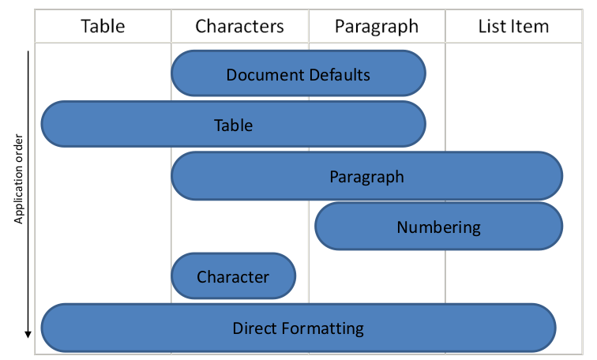
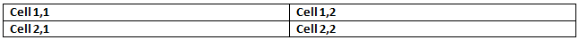

# 17.7 样式

**Styles**

=== "中文"

    在WordprocessingML文件中，样式是预定义的表格、编号、段落和/或字符属性的集合，可以应用于文档中的文本。这使得格式属性可以独立于内容进行存储和管理，从而可以通过更改单个位置（例如，通过更改具有样式ID Heading1的样式来更改文档内容的外观，而不是查找并更改文档中的每个段落）来更改文档内容的外观。

    【例：在文字处理文档中，普通段落样式可以具有任意数量的格式属性，例如字体 = Times New Roman；字号 = 12pt；段落对齐 = 左对齐。引用此段落样式的所有段落将自动继承这些属性。结束例】
    
    在WordprocessingML文档中定义的每个样式都需要样式定义。样式定义包含消费者存储并在WordprocessingML文档中显示该样式所需的所有信息，并使用样式元素进行定义。WordprocessingML中任何样式的样式定义可以分为三个部分，样式属性的完整定义可以在样式元素的参考中找到([§17.7.4.17])：
    
    - 通用样式属性
    - 样式类型
    - 类型特定的格式属性
    
    这三个部分将在以下子条款中讨论。

=== "英文"

    Within a WordprocessingML file, styles are predefined sets of table, numbering, paragraph, and/or character properties which can be applied to text within the document. This allows the formatting properties to be stored and managed independently from the content, allowing the look of document content to be changed in a single location (e.g. the look of all first-level headings is changed by changing the style with styleId Heading1 rather than looking for and changing each paragraph in the document).
    
    [Example: The Normal paragraph style in a word processing document can have any number of formatting properties, e.g. font face = Times New Roman; font size = 12pt; paragraph justification = left). All paragraphs which reference this paragraph style would automatically inherit these properties. end example]
    
    Each style defined within a WordprocessingML document requires a style definition. The style definition contains all of the information needed by a consumer to store and display that style within a WordprocessingML document, and is defined using the style element. The style definition for any style in WordprocessingML can be divided into three segments The complete definition of style properties can be found on the reference for the style element ([§17.7.4.17]):
    
    - General style properties
    - Style types
    - Type specific formatting properties
    
    Each of these three segments are discussed in the following subclauses.

## TOC

- [17.7 样式](#177-样式)
    - [TOC](#toc)
    - [17.7.1 样式继承](#1771-样式继承)
    - [17.7.2 样式层次结构](#1772-样式层次结构)
    - [17.7.3 切换属性](#1773-切换属性)
    - [17.7.4 常规样式属性](#1774-常规样式属性)
        - [17.7.4.1 aliases (替代样式名称)](#17741-aliases-替代样式名称)
        - [17.7.4.2 autoRedefine (自动将用户格式合并到样式定义中)](#17742-autoredefine-自动将用户格式合并到样式定义中)
        - [17.7.4.3 basedOn (父样式 ID)](#17743-basedon-父样式-id)
        - [17.7.4.4 hidden (从用户界面隐藏样式)](#17744-hidden-从用户界面隐藏样式)
        - [17.7.4.5 latentStyles (潜在样式信息)](#17745-latentstyles-潜在样式信息)
        - [17.7.4.6 link (链接的样式引用)](#17746-link-链接的样式引用)
        - [17.7.4.7 locked (样式无法应用)](#17747-locked-样式无法应用)
        - [17.7.4.8 lsdException (潜在样式异常)](#17748-lsdexception-潜在样式异常)
        - [17.7.4.9 name (主要样式名称)](#17749-name-主要样式名称)
        - [17.7.4.10 next (下一段落的样式)](#177410-next-下一段落的样式)
        - [17.7.4.11 personal (电子邮件消息文本样式)](#177411-personal-电子邮件消息文本样式)
        - [17.7.4.12 personalCompose (电子邮件信息撰写样式)](#177412-personalcompose-电子邮件信息撰写样式)
        - [17.7.4.13 personalReply (电子邮件回复样式)](#177413-personalreply-电子邮件回复样式)
        - [17.7.4.14 qFormat (主要样式)](#177414-qformat-主要样式)
        - [17.7.4.15 rsid (样式定义的修订标识符)](#177415-rsid-样式定义的修订标识符)
        - [17.7.4.16 semiHidden (从主用户界面隐藏样式)](#177416-semihidden-从主用户界面隐藏样式)
        - [17.7.4.17 style (样式定义)](#177417-style-样式定义)
        - [17.7.4.18 styles (样式定义合集)](#177418-styles-样式定义合集)
        - [17.7.4.19 uiPriority (可选的用户界面排序顺序)](#177419-uipriority-可选的用户界面排序顺序)
        - [17.7.4.20 unhideWhenUsed (使用样式时删除半隐藏属性)](#177420-unhidewhenused-使用样式时删除半隐藏属性)
    - [17.7.5 文档默认值](#1775-文档默认值)
        - [17.7.5.1 docDefaults (文档默认的段落和运行属性)](#17751-docdefaults-文档默认的段落和运行属性)
        - [17.7.5.2 pPr (段落属性)](#17752-ppr-段落属性)
        - [17.7.5.3 pPrDefault (默认段落属性)](#17753-pprdefault-默认段落属性)
        - [17.7.5.4 rPr (Run属性)](#17754-rpr-run属性)
        - [17.7.5.5 rPrDefault (默认Run属性)](#17755-rprdefault-默认run属性)
    - [17.7.6 表格样式](#1776-表格样式)
        - [17.7.6.1 pPr (表格样式条件格式段落属性)](#17761-ppr-表格样式条件格式段落属性)
        - [17.7.6.2 rPr (表格样式条件格式Run属性)](#17762-rpr-表格样式条件格式run属性)
        - [17.7.6.3 tblPr (表格样式条件格式表格属性)](#17763-tblpr-表格样式条件格式表格属性)
        - [17.7.6.4 tblPr (样式表属性)](#17764-tblpr-样式表属性)
        - [17.7.6.5 tblStyleColBandSize (列带中的列数)](#17765-tblstylecolbandsize-列带中的列数)
        - [17.7.6.6 tblStylePr (样式条件表格式化属性)](#17766-tblstylepr-样式条件表格式化属性)
        - [17.7.6.7 tblStyleRowBandSize (行带中的行数)](#17767-tblstylerowbandsize-行带中的行数)
        - [17.7.6.8 tcPr (表格样式条件格式表格单元格属性)](#17768-tcpr-表格样式条件格式表格单元格属性)
        - [17.7.6.9 tcPr (样式表单元格属性)](#17769-tcpr-样式表单元格属性)
        - [17.7.6.10 trPr (表格样式条件格式表格行属性)](#177610-trpr-表格样式条件格式表格行属性)
        - [17.7.6.11 trPr (样式表行属性)](#177611-trpr-样式表行属性)
    - [17.7.7 编号样式](#1777-编号样式)
    - [17.7.8 段落样式](#1778-段落样式)
        - [17.7.8.1 段落样式中的编号](#17781-段落样式中的编号)
        - [17.7.8.2 pPr (样式段落属性)](#17782-ppr-样式段落属性)
    - [17.7.9 Run (字符) 样式](#1779-run-字符-样式)
        - [17.7.9.1 rPr (Run 属性)](#17791-rpr-run-属性)

## 17.7.1 样式继承

**Style Inheritance**

=== "中文"
    
    为了编译任何给定样式指定的完整段落和字符属性集（视情况而定），消费者应遵循样式继承规则来确定该集合中的每个属性。
    
    样式继承规定了任何给定样式类型的样式可以从该样式类型的其他样式中继承，因此，消费者应通过遵循继承树来“建立”样式信息。此继承是通过basedOn元素定义的，该元素指定了父样式的styleId。
    
    【示例： “Tristan Test”段落样式可以从“Heading 1”段落样式继承属性，后者可以从“Normal”段落样式继承属性。结束示例】
    
    为了建立最终的样式，消费者应追踪层次结构（跟随每个basedOn值）回到没有basedOn元素（不基于其他样式）的样式。然后，通过遵循树中的每个级别来构建结果样式，并根据需要应用指定的段落和/或字符属性。当属性冲突时，它们被每个后续级别覆盖（这包括关闭在较早级别设置的属性）。未指定的属性简单地不会改变在较早级别指定的那些属性。
    
    【示例：考虑一个字符样式Green，它仅指定文本颜色为绿色，但是继承自另一个字符样式Base，后者定义了Arial字体以及加粗：
    
    ```xml
    <w:style w:type="character" w:styleId="Green">
        <w:name w:val="Green" />
        <w:basedOn w:val="Base" />
        <w:rPr>
            <w:color w:val="22B14C" />
        </w:rPr>
    </w:style>
    …
    <w:style w:type="character" w:styleId="Base">
        <w:name w:val="Base" />
        <w:rPr>
            <w:rFonts w:ascii="Arial" w:hAnsi="Arial" />
            <w:b />
        </w:rPr>
    </w:style>
    ```
    
    Green字符样式的定义具有指定Base样式的basedOn元素。这意味着对Green样式的任何使用都被定义为粗体、绿色、Arial文本。结束示例】
    
    相反，生产者不应输出已由样式层次结构的先前级别设置的任何样式上的任何属性，以及与文档默认值匹配的属性。这意味着如果文档默认值或样式层次结构中的任何先前级别指定在此级别未更改的属性，则该属性不应包含在生成的WordprocessingML中的样式定义中。
    
    【示例：如果文档默认字体是Bauhaus 93，而“Heading 1”样式也指定了Bauhaus 93字体，则生产者不应为“Heading 1”样式定义输出任何rFonts元素，因为该格式是从文档默认值继承的。结束示例】

=== "英文"
    
    In order to compile the complete set of paragraph and character properties specified by any given style (as appropriate), a consumer shall follow the rule of style inheritance to determine each property in that set.
    
    Style inheritance states that styles of any given style type can inherit from other styles of that style type, and therefore a consumer shall ‘build up’ the style information by following the inheritance tree. This inheritance is defined via the basedOn element, which specifies the styleId of the parent style.
    
    [Example: The “Tristan Test” paragraph style can inherit properties from the “Heading 1” paragraph style, which itself can inherit properties from the “Normal” paragraph style. end example]
    
    To build up the resulting style, a consumer shall trace the hierarchy (following each basedOn value) back to a style which has no basedOn element (is not based on another style). The resulting style is then constructed by following each level in the tree, applying the specified paragraph and/or character properties as appropriate. When properties conflict, they are overridden by each subsequent level (this includes turning OFF a property set at an earlier level). Properties which are not specified simply do not change those specified at earlier levels.
    
    [Example: Consider a character style Green which specifies only that the text color is green, but inherits from another character style Base which defines a font face of Arial, as well as bold:
    
    ```xml
    <w:style w:type="character" w:styleId="Green">
        <w:name w:val="Green" />
        <w:basedOn w:val="Base" />
        <w:rPr>
            <w:color w:val="22B14C" />
        </w:rPr>
    </w:style>
    …
    <w:style w:type="character" w:styleId="Base">
        <w:name w:val="Base" />
        <w:rPr>
            <w:rFonts w:ascii="Arial" w:hAnsi="Arial" />
            <w:b />
        </w:rPr>
    </w:style>
    ```
    
    The definition of the Green character style has a basedOn element which specifies the Base style. This means that any use of the Green style is defined as bold, green, Arial text. end example]
    
    Conversely, a producer should not output any property on a style which has already been set by a previous level of the style hierarchy, as well as those which match the document defaults. This means that if the document defaults or any previous level in a style’s hierarchy specify a property which is unchanged at this level, that property should not be part of the style definition in the resulting WordprocessingML.
    
    [Example: If the document default font is Bauhaus 93 and the Heading 1 style also specifies the Bauhaus 93 font, then a producer should not output any rFonts element for the Heading 1 style definition, because that formatting is inherited from the document defaults. end example]

## 17.7.2 样式层次结构

**Style Hierarchy**

=== "中文"

    有各种风格可供选择（请参阅下面的每个子条款），可以将多个样式类型应用于文件中的同一内容，这意味着属性应按照特定的确定性顺序应用。与继承一样，由一个样式类型设置的结果格式属性可以保持不变、删除或被后续样式类型更改。
    
    下表说明了这些默认值的应用顺序，以及每个值受到哪些属性的影响：
    
    
    
    这个过程可以描述如下：  
    
    - 首先，文档默认值应用于文档中的所有运行和段落。  
    - 接下来，表样式属性应用于文档中的每个表，遵循每个表指定的条件格式化包含和排除。  
    - 接下来，应用编号项目和段落属性到每个使用编号样式格式化的段落。
    - 接下来，段落和运行属性应用于每个由段落样式定义的段落。  
    - 接下来，运行属性应用于每个应用了特定字符样式的运行。  
    - 最后，我们应用直接格式化（非样式的段落或运行属性）。如果这种直接格式化包括编号，则应用该编号 + 相关的段落属性。  
    
    如果rFonts元素的值（[§17.3.2.26]）引用了不可用的字体，应用程序将通过一种称为字体替换的过程确定合适的替代字体，该过程在[§17.8.2]中定义。

=== "英文"

    With the various flavors of styles available (see each of the subclauses below), multiple style types can be applied to the same content within a file, which means that properties shall be applied in a specific deterministic order. As with inheritance, the resulting formatting properties set by one style type can be unchanged, removed, or altered by following style types.
    
    The following table illustrates the order of application of these defaults, and which properties are impacted by each:
    
    
    
    This process can be described as follows:  
    
    - First, the doc ument defaults are applied to all runs and paragraphs in the document.  
    - Next, the table style properties are applied to each table in the document , following the conditional formatting inclusions and exclusions specified per table.  
    - Next, numbered  item and paragraph properties are applie d to each paragraph formatted with a numbering style.
    - Next, paragraph and run properties are applied to each paragraph  as defined by the paragraph style.  
    - Next, run properties are applied to each run with a specific character style applied.  
    - Finally, we appl y direct formatting (paragraph or run properties not from styles) . If this direct formatting includes numbering, that numbering + the associated paragraph properties are applied.  
      
    If the value of the rFonts  element ([§17.3.2.26] ) references a font which is not available, applications determine a suitable alternative font via a process called font substitution, which is defined in [§17.8.2].


## 17.7.3 切换属性

**Toggle Properties**

=== "中文"
    
    在[§17.3.2]中定义的某些字符属性被指定为切换属性。【示例：加粗和斜体属性是切换属性。结束示例】如前两节（[§17.7.1]和[§17.7.2]）所示，几种样式可以影响应用于WordprocessingML文档中给定内容的格式化。当同一格式属性出现在影响应用于运行的内容的一个或多个样式中时，组合效果取决于格式属性是否是切换属性。
    
    如果属性不是切换属性，则其值应按照[§17.7.1]和[§17.7.2]中描述的顺序应用，而且只使用该顺序中的最后一个值。
    
    如果属性是切换属性，则其值（限于true和false（或等效值1和0））应按以下方式组合：
    
    - 如果切换属性在应用于给定内容的直接格式化中明确设置，则应使用直接格式化中的值。
    - 否则，影响内容的样式中的该切换属性的实例应按以下方式组合：
    
        - 如果切换属性的多个实例出现在样式层次结构的相同级别上，则以下算法遇到的第一个值应被使用（如果未遇到任何值，则该属性采用其默认值）。
    
            - 尝试读取样式中的值。
            - 如果不存在，并且样式具有带有非空值的basedOn元素，则重复第1步，使用basedOn元素指定的样式。
            - 【示例：如果段落样式对加粗属性未设置任何值为false，而由其basedOn元素指定的段落样式指定其为true，则应用样式定义的结果将将加粗值设置为true（在层次结构中的第一个值）。结束示例】
    
        - 如果切换属性的值出现在样式层次结构的多个级别上（[§17.7.2]），则它们的有效值应按以下方式组合：
    
        - 如果文档默认值指定的值为true，则有效值为true。
        - 否则，值将按照布尔异或组合，如下所示：
    
            $$value_{effective} = val_{table} XOR val_{paragraph} XOR val_{character}$$
    
            即，如果对于样式层次结构的奇数级别，其有效值为true，则应将此有效值应用于内容。
    
    以下布尔属性是切换属性：[§17.3.2.1]（加粗），[§17.3.2.2]（复杂脚本加粗），[§17.3.2.5]（显示所有字符为大写），[§17.3.2.13]（浮雕），[§17.3.2.16]（斜体），[§17.3.2.17]（复杂脚本斜体），[§17.3.2.18]（压印），[§17.3.2.23]（显示字符轮廓），[§17.3.2.31]（阴影），[§17.3.2.33]（小型大写），[§17.3.2.37]（单删除线），[§17.3.2.41]（隐藏文本）。
    
    【示例：考虑一个表格样式，在其basedOn链中有两个样式。如果表格样式的basedOn链中解析的加粗属性（切换属性）的值为true，则指定该属性应应用于表格内容：
    
    
    
    如果表格中的单个段落也应用了段落样式，其basedOn链中有三个样式解析为true的情况下，上述切换属性逻辑将切换加粗属性，导致其内容未应用加粗。将此应用于下面的第一个单元格中的段落，生成的表格如下所示：
    
    
    
    导致加粗属性取此值的计算如下所示：
    
    
    
    (&lt;- 符号表示 basedOn 引用的遍历)
    
    结束示例】

=== "英文"

    Certain character properties defined in [§17.3.2] are specified as toggle properties. [Example: the Bold and Italics properties are toggle properties. end example] As indicated in the previous two sections ([§17.7.1] and [§17.7.2]) several styles can affect the formatting applied to a given piece of content within a WordprocessingML document. When the same formatting property appears in one or more styles that affect the content applied to a run, the combined effect depends on whether or not the formatting property is a toggle property.
    
    If the property is not a toggle property, then its values shall be applied in the order described in [§17.7.1] and [§17.7.2], and only its last value in that order shall be used.
    
    If the property is a toggle property, then its values, which are limited to true and false (or the equivalent
    values 1 and 0) shall be combined as follows:
    
    - If a toggle property is explicitly set in direct formatting applied to a given piece of content, then its value in the direct formatting shall be used.
    - Otherwise, the instances of that toggle property in the styles that affect the content shall be combined in the following manner:
    
        - If multiple instances of the toggle property appear at the same level of the style hierarchy, then the first value encountered by the following algorithm shall be used (if no value is encountered, the property takes on its default value).
    
            - Attempt to read the value in the style.
            - If it does not exist and the style has a basedOn element with a non-empty value, repeat step 1 using the style specified by the basedOn element.
            - [Example: If a paragraph style sets no value for the bold property to false and the paragraph style specified by its basedOn element specifies that it is true, the result of applying the style definition sets the value of bold to true (the first value in the hierarchy). end example]
    
        - If the value of the toggle property appears at multiple levels of the style hierarchy ([§17.7.2]), their effective values shall be combined as follows:
    
        - If the value specified by the document defaults is true, the effective value is true.
        - Otherwise, the values are combined by a Boolean XOR as follows:
    
            $$value_{effective} = val_{table} XOR val_{paragraph} XOR val_{character}$$
    
            i.e., the effective value to be applied to the content shall be true if its effective value is true for an odd number of levels of the style hierarchy.
    
    The following Boolean properties are toggle properties: [§17.3.2.1] (Bold), [§17.3.2.2] (Complex Script Bold), [§17.3.2.5] (Display All Characters as Capital Letters), [§17.3.2.13] (Embossing), [§17.3.2.16] (Italics), [§17.3.2.17] (Complex Script Italics), [§17.3.2.18] (Imprinting), [§17.3.2.23] (Display Character Outline), [§17.3.2.31] (Shadow), [§17.3.2.33] (Small Caps), [§17.3.2.37] (Single Strikethrough), [§17.3.2.41] (Hidden Text).
    
    [Example: Consider a table style with two styles in its basedOn chain. If the resolved value of the bold property (a toggle property) within the basedOn chain of the table style is true, that specifies that this property should be applied to the contents of the table:
    
    
    
    If a single paragraph within that table also has a paragraph style applied, with three styles in its basedOn chain that resolve to a value of true, the toggle property logic above would toggle the bold property, resulting in bold not being applied to its contents. Applying this to the paragraph in the first cell below, the resulting table would appear as follows:
    
    
    
    
    The calculation which results in this value for the bold property is displayed below:
    
    
    
    end example]

## 17.7.4 常规样式属性

**General Style Properties**

=== "中文"
    
    通用样式属性(General style properties)是指一组属性，无论样式的类型如何都可以使用。

    【示例：在样式定义中，样式名称、样式的附加别名、样式ID（用于文档内容引用样式）、样式是否隐藏、样式是否锁定等都是通用样式属性。结束示例】
    
    【示例：考虑一个名为Heading 1的样式，在文档中如下所示：
    
    ```xml
    <w:style w:type="paragraph" w:styleId="Heading1">
        <w:name w:val="Heading 1"/>
        <w:basedOn w:val="Normal"/>
        <w:next w:val="Normal"/>
        <w:link w:val="Heading1Char"/>
        <w:uiPriority w:val="1"/>
        <w:qFormat/>
        <w:rsid w:val="00F303CE"/>
        …
    </w:style>
    ```
    
    在上述格式化信息特定于此样式类型之上，有一组通用样式属性，定义了所有样式类型共享的信息。结束示例】

=== "英文"
    
    General style properties refer to the set of properties which can be used regardless of the type of style.
    
    [Example: Within a style definition the style name, additional aliases for the style, a style ID (used by the document content to refer to the style), if style is hidden, if style is locked, etc. are general style properties. end example]
    
    [Example: Consider a style called Heading 1 in a document as follows:
    
    ```xml
    <w:style w:type="paragraph" w:styleId="Heading1">
        <w:name w:val="Heading 1"/>
        <w:basedOn w:val="Normal"/>
        <w:next w:val="Normal"/>
        <w:link w:val="Heading1Char"/>
        <w:uiPriority w:val="1"/>
        <w:qFormat/>
        <w:rsid w:val="00F303CE"/>
        …
    </w:style>
    ```
    
    Above the formatting information specific to this style type are a set of general style properties which define information shared by all style types. end example]


### 17.7.4.1 aliases (替代样式名称)

**aliases (Alternate Style Names)**

=== "中文"
        
    这个元素指定了父样式定义的一组备用名称。这些名称可以根据需要在应用程序的用户界面中使用。备用名称应存储在该元素的val属性中，每个名称之间应以一个或多个连续逗号字符（Unicode字符值002C）分隔。所有存在的逗号都应解释为分隔符字符，绝不作为备用样式名称的一部分。
    
    如果存在备用样式名称，则当在stylePaneFormatFilter元素中设置了适当的值时，将在用户界面中使用这些备用样式名称替代name元素（[§17.7.4.9]）中指定的内置名称。
    
    如果省略了该元素，则该样式将不具有任何备用样式名称。
    
    【示例：考虑具有主要名称和两个备用名称的样式，使用name和aliases元素定义如下：
    
    ```xml
    <w:style w:styleId="TestStyle" … >
        <w:name w:val="GD20Complex"/>
        <w:aliases w:val="Regional Growth,Complex Growth"/>
        …
    </w:style>
    ```
    
    该样式使用name元素（[§17.7.4.9]）指定了主要名称GD20Complex，以及使用aliases元素指定了两个备用名称Regional Growth和Complex Growth。结束示例】
    
    ??? abstract "属性"
    
        **val** (字符串值)
    
        :   指定其内容包含一个字符串。
    
            根据父 XML 元素的上下文解释此字符串的内容。
            
            【示例：考虑以下 WordprocessingML 片段：
    
            ```xml
            <w:pPr>
            <w:pStyle w:val="Heading1" />
            </w:pPr>
            ```
    
            val 属性的值是关联段落样式的styleId。
            但是，考虑以下片段：
            
    
            ```xml
            <w:sdtPr>
            <w:alias w:val="SDT Title Example" />
            …
            </w:sdtPr>
            ```
            
            在这种情况下，val 属性中的十进制数字是最近的祖先结构化文档标记的标题。在每种情况下，值都是在父元素的上下文中解释的。结束示例]
            
            此属性的可能值由ST_String简单类型（[§22.9.2.13]）定义。
    
    【注：该元素内容模型（CT_String）的 W3C XML Schema 定义位于 §A.1。结束注】

=== "英文"
    
    This element specifies the set of alternative names for the parent style definition. These names can be used in an application's user interface as desired. The alternate names shall be stored in this element's val attribute, and each name shall be separated by one or more consecutive comma characters (Unicode character value 002C). All commas present shall be interpreted as separator character and never as part of an alternate style name.
    
    If present, the alternate style names shall be used in the user interface in place of the built-in name specified in the name element ([§17.7.4.9]) when the appropriate value is set in the stylePaneFormatFilter element ([§17.15.1.86]).
    
    If this element is omitted, then the style shall not have any alternate style names.
    
    [Example: Consider a style with a primary name and two alternate names, defined using the name and aliases elements, as follows:
    
    ```xml
    <w:style w:styleId="TestStyle" … >
        <w:name w:val="GD20Complex"/>
        <w:aliases w:val="Regional Growth,Complex Growth"/>
        …
    </w:style>
    ```
    
    This style specifies that it has the primary name GD20Complex using the name element ([§17.7.4.9]), as well as two alternate names Regional Growth and Complex Growth using the aliases element. end example]
    
    ??? abstract "Attributes"
    
        **val** (String Value)
    
        :   Specifies that its contents contain a string.
    
            The contents of this string are interpreted based on the context of the parent XML element.
            
            [Example: Consider the following WordprocessingML fragment:
    
            ```xml
            <w:pPr>
                <w:pStyle w:val="Heading1" />
            </w:pPr>
            ```
    
            The value of the val attribute is the ID of the associated paragraph style's styleId.
            However, consider the following fragment:
            
    
            ```xml
            <w:sdtPr>
                <w:alias w:val="SDT Title Example" />
                …
            </w:sdtPr>
            ```
            
            In this case, the decimal number in the val attribute is the caption of the nearest ancestor structured document tag. In each case, the value is interpreted in the context of the parent element. end example]
            
            The possible values for this attribute are defined by the ST_String simple type ([§22.9.2.13]).
            
            [Note: The W3C XML Schema definition of this element’s content model (CT_String) is located in §A.1. end note]

### 17.7.4.2 autoRedefine (自动将用户格式合并到样式定义中)

**autoRedefine (Automatically Merge User Formatting Into Style Definition)**

=== "中文"

    这个元素指定了应用程序是否在修改应用了此样式的整个段落内容时自动修改此样式，确保虽然只有一个文本实例应用了此样式被修改，但该更改被存储在样式上，因此传播到使用该样式的所有位置。
    
    如果省略了此元素，则格式化将不会自动合并回样式定义中。
    
    【示例：考虑在 WordprocessingML 文档中定义的如下样式：
    
    ```xml
    <w:style w:styleId="Normal" … >
        <w:name w:val="Normal"/>
        <w:autoRedefine/>
        <w:rPr>
            <w:b/>
        </w:rPr>
        …
    </w:style>
    ```
    
    通过使用autoRedefine元素，此样式指定任何应用了此样式的文本所应用的任何格式化都必须合并回样式定义中（当然，前提是这是一个段落样式）。
    
    例如，考虑使用上述 Normal 样式的文档：
    
    
    
    第一个和第三个段落使用了 Normal 样式，因此应用了粗体属性。如果应用程序要对整个第一个段落添加下划线格式，如下所示：
    
    
    
    该属性不会被保存为直接格式化，而是被用来更新相关的 Normal 样式以添加此属性，使用了u元素（[§17.3.2.40]）。
    
    ```xml
    <w:style w:styleId="Normal" … >
        <w:name w:val="Normal"/>
        <w:autoRedefine/>
        <w:rPr>
            <w:b/>
            <w:u/>
        </w:rPr>
        …
    </w:style>
    ```
    
    由于此属性会自动合并到样式中，它也会出现在第三个段落中（请注意，上述步骤通常会自动修改为下面显示的状态，而不是如上所示的离散状态）。
    
    
    
    结束示例】
    
    该元素的内容模型由[§17.17.4]中的常见布尔属性定义。

=== "英文"
    
    This element specifies whether an application shall automatically modify this style when the contents of an entire paragraph in the document with this style applied are modified, ensuring that although only a single instance of text with this style was modified, that change is stored on the style and therefore propagated to all locations where the style is in use.
    
    If this element is omitted, then formatting shall not automatically be merged back into the style definition. 
    
    [Example: Consider a style defined as follows in a WordprocessingML document:
    
    
    <w:style w:styleId="Normal" … >
        <w:name w:val="Normal"/>
        <w:autoRedefine/>
        <w:rPr>
            <w:b/>
        </w:rPr>
        …
    </w:style>
    ```
    
    This style specifies via the use of the autoRedefine element that any formatting applied to text which uses this style must be merged back into the style definition (assuming, of course, that this is a paragraph style).
    
    For example, consider a document which uses the Normal style as defined above:
    
    
    
    The first and third paragraphs use the Normal style, and hence have the bold property applied. If an application were to add the underline formatting to the entire first paragraph, as follows:
    
    
    
    That property, rather than being saved as direct formatting, must be used to update the associated Normal style to add this property, specified using the u element ([§17.3.2.40]).
    
    ```xml
    <w:style w:styleId="Normal" … >
        <w:name w:val="Normal"/>
        <w:autoRedefine/>
        <w:rPr>
            <w:b/>
            <w:u/>
        </w:rPr>
        …
    </w:style>
    ```
    
    Since this property is automatically merged into the style, it would also appear on the third paragraph (note that the step above would normally be automatically modified into the state shown below, and not discrete as shown above).
    
    
    
    end example]
    
    This element’s content model is defined by the common boolean property definition in [§17.17.4].

### 17.7.4.3 basedOn (父样式 ID)

**basedOn (Parent Style ID)**

=== "中文"
        
    该元素指定了父样式的样式ID，该样式从中继承样式继承。样式继承是指一组样式相互继承，以生成单个样式的属性集。该元素的val属性指定了样式继承中父样式的styleId属性。
    
    如果省略了该元素，则该样式不应基于当前文档中的任何其他样式（即，该元素是样式的样式继承的根）。如果当前文档中没有任何样式指定val属性中存在的styleId，则应忽略该元素（即，该元素是样式的样式继承的根）。
    
    如果存在具有此styleId的样式，则应遵循以下限制：
    
    - 如果当前样式是表样式，则父样式也必须是表样式，否则应忽略该元素。
    - 如果当前样式是段落样式，则父样式也必须是段落样式，否则应忽略该元素。
    - 如果当前样式是字符样式，则父样式也必须是字符样式，否则应忽略该元素。
    - 如果当前样式是编号样式，则应忽略该元素。
    
    [示例：考虑以下定义的三个WordprocessingML字符样式：
    
    - 具有styleId值为Strong的字符样式，其属性包括粗体属性
    - 具有styleId值为Underline的字符样式，其属性包括下划线属性
    - 具有styleId值为Emphasis的字符样式，其属性包括斜体属性
    
    每个字符样式定义了单个字符格式属性。如果每个元素的basedOn值定义如下：

    ```xml
    <w:style w:styleId="Strong">
        <w:basedOn w:val="Underline"/>
        …
        <w:rPr>
            <w:b/>
        </w:rPr>
    </w:style>
    <w:style w:styleId="Underline">
        <w:basedOn w:val="Emphasis"/>
        …
        <w:rPr>
            <w:u/>
        </w:rPr>
    </w:style>
    <w:style w:styleId="Emphasis">
        …
        <w:rPr>
            <w:i/>
        </w:rPr>
    </w:style>
    ```

    强调样式基于下划线样式，而下划线样式则基于强调样式。这意味着强调样式的实际定义如下：
    
    - 粗体(Bold)
    - 下划线(Underline)（继承自下划线）
    - 斜体(Italics)（继承自强调）
    
    强调样式的样式链定义如下：
    
    - 强调(Emphasis)
    - 下划线(Underline)
    - 强调(Strong)
    
    类似地，下划线样式的样式链定义如下：
    
    - 强调(Emphasis)
    - 下划线(Underline)
    
    在每种情况下，样式链是所有样式的列表，这些样式按顺序组合以生成任何给定样式的全部属性集。示例结束】
    
    ??? abstract "Attributes"
    
        **val**（字符串值）
        
        :   指定其内容包含一个字符串。
            
            这个字符串的内容根据父 XML 元素的上下文进行解释。
            
            【示例：考虑以下 WordprocessingML 片段：

            ```xml
            <w:pPr>
                <w:pStyle w:val="Heading1" />
            </w:pPr>
            ```
            
            val 属性的值是关联段落样式的 styleId 的 ID。
            
            然而，考虑以下片段：

            ```xml
            <w:sdtPr>
                <w:alias w:val="SDT Title Example" />
                …
            </w:sdtPr>
            ```

            在这种情况下，val 属性中的十进制数是最近的祖先结构化文档标记的标题。在每种情况下，该值在父元素的上下文中进行解释。结束示例】
            
            此属性的可能值由 ST_String 简单类型（[§22.9.2.13]）定义。
    
    [Note: The W3C XML Schema definition of this element’s content model (CT_String) is located in §A.1. end note]

=== "英文"
    
    This element specifies the style ID of the parent style from which this style inherits in the style inheritance. The style inheritance refers to a set of styles which inherit from one another to produce the resulting set of properties for a single style. The val attribute of this element specifies the styleId attribute for the parent style in the style inheritance.
    
    If this element is omitted, then this style shall not be based on any other style in the current document (i.e. this element is the root of the style inheritance for a style). If no style in the current document specifies the styleId present in the val attribute, then this element shall be ignored (i.e. this element is the root of the style inheritance for a style).
    
    If a style with this styleId is present, then it shall be subject to the following restrictions:
    
    - If the current style is a table style, then the parent style shall also be a table style, or this element shall be ignored.
    - If the current style is a paragraph style, then the parent style shall also be a paragraph style, or this element shall be ignored.
    - If the current style is a character style, then the parent style shall also be a character style, or this element shall be ignored.
    - If the current style is a numbering style, then this element shall be ignored.
    
    [Example: Consider three WordprocessingML character styles defined as follows:
    
    - A character style with a styleId value of Strong whose properties consist of the bold property
    - A character style with a styleId value of Underline whose properties consist of the underline property
    - A character style with a styleId value of Emphasis whose properties consist of the italics property
    
    Each of these character styles defines a single character formatting property. If the basedOn values for each element were defined as follows:
    
    ```xml
    <w:style w:styleId="Strong">
        <w:basedOn w:val="Underline"/>
        …
        <w:rPr>
            <w:b/>
        </w:rPr>
    </w:style>
    <w:style w:styleId="Underline">
        <w:basedOn w:val="Emphasis"/>
        …
        <w:rPr>
            <w:u/>
        </w:rPr>
    </w:style>
    <w:style w:styleId="Emphasis">
        …
        <w:rPr>
            <w:i/>
        </w:rPr>
    </w:style>
    ```
    
    The Strong style is based on the Underline style which is in turn based on the Emphasis style. This means that the actual definition of the Strong style would be as follows:
    
    - Bold
    - Underline (inherited from Underline)
    - Italics (inherited from Emphasis)
    
    The style chain for the Strong style would be defined as follows:
    
    - Emphasis
    - Underline
    - Strong
    
    Similarly, the style chain for the Underline style would be defined as follows:
    
    - Emphasis
    - Underline
    
    In each case, the style chain is the list of all styles which are combined in order to produce the entire set of properties for any given style. end example]
    
    ??? abstract "Attributes"
    
        **val** (String Value)
    
        :   Specifies that its contents contain a string.
    
            The contents of this string are interpreted based on the context of the parent XML element.
            
            [Example: Consider the following WordprocessingML fragment:
            
            ```xml
            <w:pPr>
                <w:pStyle w:val="Heading1" />
            </w:pPr>
            ```
            
            The value of the val attribute is the ID of the associated paragraph style's styleId.
            
            However, consider the following fragment:
            
            ```xml
            <w:sdtPr>
            <w:alias w:val="SDT Title Example" />
            …
            </w:sdtPr>
            ```
            
            In this case, the decimal number in the val attribute is the caption of the nearest ancestor structured document tag. In each case, the value is interpreted in the context of the parent element. end example]
            
            The possible values for this attribute are defined by the ST_String simple type ([§22.9.2.13]).
    
    [Note: The W3C XML Schema definition of this element’s content model (CT_String) is located in §A.1. end note]

### 17.7.4.4 hidden (从用户界面隐藏样式)

**hidden (Hide Style From User Interface)**

=== "中文"
    
    该元素指定了当应用程序加载此文档时，此样式是否应该从任何用户界面中隐藏。如果设置了该元素，则此样式可用于格式化内容（即引用此样式的任何内容应具有其属性正常），但该样式将从与该应用程序关联的所有用户界面中隐藏。[注：此设置通常用于隐藏应用程序内部正在使用但不应在典型情况下用作格式化的样式。结束注释]
    
    如果省略了该元素，则样式不需要从用户界面中隐藏。
    
    [示例：考虑一个主名称为InternalStyle的样式，不应在任何用户界面中显示。可以使用以下WordprocessingML来指定此要求：

    ```xml
    <w:style … w:styleId="Style2">
        <w:name w:val="InternalStyle"/>
        <w:hidden/>
        …
    </w:style>
    ```
    
    hidden元素指定此样式定义应与文件往返传输（因为它是文档的一部分），但不应在处理此文档的应用程序的任何用户界面中显示。结束示例]
    
    This element’s content model is defined by the common boolean property definition in [§17.17.4].

=== "英文"
    
    This element specifies whether this style shall be hidden from any and all user interfaces when this document is loaded by an application. If this element is set, then this style can be used to format content (i.e. any content which references this style shall have its properties as normal), but the style shall be hidden from all user interface associated with that application. [Note: This setting is typically used to hide styles which are being used internally by an application which should not be used as formatting in a typical case. end note]
    
    If this element is omitted, then the style shall not be required to be hidden from the user interface.
    
    [Example: Consider a style with a primary name of InternalStyle that should not be displayed in any user interface. This requirement would be specified using the following WordprocessingML:
    
    ```xml
    <w:style … w:styleId="Style2">
        <w:name w:val="InternalStyle"/>
        <w:hidden/>
        …
    </w:style>
    ```
    
    The hidden element specifies that this style definition shall be round-tripped with the file (since it is part of the document) but should not be displayed in any user interface associated with an application which processes this document. end example]
    
    This element’s content model is defined by the common boolean property definition in [§17.17.4].


### 17.7.4.5 latentStyles (潜在样式信息)

**latentStyles (Latent Style Information)**

=== "中文"
    
    该元素指定应用于此文档的一组潜在样式的属性。潜在样式是指应用程序已知但未包含在当前文档中的任何样式定义集。【示例：潜在样式可以包括特定托管应用程序已知的附加样式。示例结束】
    
    当样式定义嵌入文档时，它指定了两个不同的属性组：
    
    - 行为属性(Behavior properties)
    - 格式属性(Formatting properties)
    
    显然，在每个文档中嵌入特定应用程序已知的所有样式将极大地增加文件大小。潜在样式提供了一种存储信息片段的方式，用于第一组（行为属性）应用于所有应用程序已知的样式，而无需存储第二组（格式属性）。
    
    如果省略此元素，则其各个属性所代表的设置值由下面属性描述中的默认值给出。
    
    【示例：考虑一个包含在两种样式中指定文本的WordprocessingML文档：Heading1或Normal。基于此，文档只需要存储这两种样式的格式属性，从而节省了保存托管应用程序支持的所有样式所需的额外开销。
    
    但是，如果documentProtection元素（[§17.15.1.29]）指定托管应用程序应阻止任何已锁定元素（[§17.7.4.7]）设置为false的样式的使用，则该应用程序已知的所有样式的锁定状态变得有用且必要以维护文档的当前状态。使用潜在样式，可以存储此信息，而无需存储这些样式的任何格式属性。
    
    例如，如果文档中未存储的所有样式必须被锁定，除了具有主名称（[§17.7.4.9]）为Heading 2的样式。可以使用潜在样式来指定此要求如下：
    
    ```xml
    <w:latentStyles … w:defLockedState="true">
    <w:lsdException w:name="Heading 2" w:locked="false"/>
    </w:latentStyles>
    ```
    
    latentStyles元素指定任何托管应用程序已知的所有潜在样式必须具有默认锁定状态为true，除了任何已知托管应用程序的主名称为Heading 2的样式，其潜在样式定义指定其锁定状态必须为false。示例结束】
    
    ??? abstract "Attributes"
        
        **count**（潜在样式计数）
        
        :   指定在首次处理此文档时应将已知样式的数量初始化为当前潜在样式默认值。【注：应用程序可根据需要使用此属性，以确保仅有在创建此文档时已知的样式数量会使用父元素上的默认值进行初始化，并且所有新的已知样式将使用它们的默认值。结束注】
        
            【示例：考虑一个 WordprocessingML 文档，其中只有前 20 个潜在样式必须被初始化。此要求将被指定如下：
            
            ```xml
            <w:latentStyles w:count="20" … >
                …
            </w:latentStyles>
            ```
            
            count 属性指定了在文档首次打开时必须将 20 个已知样式初始化为默认设置，并且任何额外的样式应使用应用程序定义的默认值。结束示例】
            
            此属性的可能值由 ST_DecimalNumber 简单类型（[§17.18.10]）定义。
        
        **defLockedState**（默认样式锁定设置）
        
        :   指定应用于当前文档中未明确定义的由托管应用程序提供的任何样式的锁定元素（[§17.7.4.7]）的默认设置。对于存在潜在样式异常（[§17.7.4.8]）的每个样式，此设置将被覆盖。
        
            如果省略此属性，则当前文档中所有潜在样式的默认锁定状态应为 false。
            
            【示例：考虑一个 WordprocessingML 文档，其中所有未存储在文档中的样式必须被锁定。此要求将使用潜在样式指定如下：
            
            ```xml
            <w:latentStyles … w:defLockedState="true">
            …
            </w:latentStyles>
            ```
            
            defLockedState 属性指定了当前文档中所有潜在样式的默认锁定元素设置为 true。结束示例】
            
            此属性的可能值由 ST_OnOff 简单类型（[§22.9.2.7]）定义。
            
        **defQFormat**（默认主样式设置）
        
        :   指定qFormat元素（[§17.7.4.14]）的默认设置，应用于主机应用程序提供的任何未在当前文档中明确定义的样式。对于存在潜在样式异常（[§17.7.4.8]）的每个样式，将覆盖此设置。
        
            如果省略此属性，则当前文档中所有潜在样式的默认qFormat状态应为false。
            
            [示例：考虑一个WordprocessingML文档，其中所有未存储在文档中的样式都不得标记为主样式。可以使用潜在样式来指定此要求，如下所示：
            
            ```xml
            <w:latentStyles … w:defQFormat="false">
                …
            </w:latentStyles>
            ```
            
            defQFormat属性指定当前文档中所有潜在样式的默认qFormat元素设置为false。示例结束]
            
            此属性的可能值由ST_OnOff简单类型（[§22.9.2.7]）定义。
        
        **defSemiHidden**（默认半隐藏设置）
        
        :   指定semiHidden元素（[§17.7.4.16]）的默认设置，应用于主机应用程序提供的任何未在当前文档中明确定义的样式。对于存在潜在样式异常（[§17.7.4.8]）的每个样式，将覆盖此设置。
        
            如果省略此属性，则当前文档中所有潜在样式的默认semiHidden状态应为false。
            
            [示例：考虑一个WordprocessingML文档，其中所有未存储在文档中的样式都不得标记为半隐藏。可以使用潜在样式来指定此要求，如下所示：
            
            ```xml
            <w:latentStyles … w:defSemiHidden="false">
                …
            </w:latentStyles>
            ```
            
            defSemiHidden属性指定当前文档中所有潜在样式的默认semiHidden元素设置为false。示例结束]
            
            此属性的可能值由ST_OnOff简单类型（[§22.9.2.7]）定义。
            
        **defUIPriority**（默认用户界面优先级设置）
        
        :   指定uiPriority元素（[§17.7.4.19]）的默认设置，该设置应用于主机应用程序提供的任何未在当前文档中明确定义的样式。对于存在潜在样式异常（[§17.7.4.8]）的每个样式，此设置将被覆盖。
        
            如果省略此属性，则当前文档中所有潜在样式的默认uiPriority状态为99。
            
            [示例：考虑一个WordprocessingML文档，其中所有未存储在文档中的样式不能标记为半隐藏。可以使用潜在样式来指定此要求，如下所示：
            
            ```xml
            <w:latentStyles … w:defUIPriority="10">
            …
            </w:latentStyles>
            ```
            
            defUIPriority属性指定当前文档中所有潜在样式必须默认具有uiPriority元素设置为10。示例结束]
            
            此属性的可能值由ST_DecimalNumber简单类型（[§17.18.10]）定义。
        
        **defUnhideWhenUsed**（默认隐藏直到使用设置）
        
        :   指定unhideWhenUsed元素（[§17.7.4.20]）的默认设置，该设置应用于主机应用程序提供的任何未在当前文档中明确定义的样式。对于存在潜在样式异常（[§17.7.4.8]）的每个样式，此设置将被覆盖。
        
            如果省略此属性，则当前文档中所有潜在样式的默认unhideWhenUsed状态为false。
            
            [示例：考虑一个WordprocessingML文档，其中所有未存储在文档中的样式必须在文档内容中使用时才显示。
            
            可以使用潜在样式来指定此要求，如下所示：
            
            ```xml
            <w:latentStyles … w:defUnhideWhenUsed="true">
            …
            </w:latentStyles>
            ```
            
            defUnhideWhenUsed属性指定当前文档中所有潜在样式必须默认具有unhideWhenUsed元素设置为true。示例结束]
            
            此属性的可能值由ST_OnOff简单类型（[§22.9.2.7]）定义。
    
    [Note: The W3C XML Schema definition of this element’s content model (CT_LatentStyles) is located in §A.1. end note]

=== "英文"
    
    This element specifies the properties which shall be applied to a set of latent styles for this document. Latent styles refer to any set of style definitions known to an application which have not been included in the current document. [Example: Latent styles can include additional styles known by a particular hosting application. end example]
    
    When a style definition is embedded in a document, it specifies two distinct groups of properties:
    
    - Behavior properties
    - Formatting properties
    
    Obviously, embedding all the styles known to a particular application in each document which it produces would drastically increase the file size. Latent styles provide a way to store pieces of information for the first group (behavior properties) which shall be specified for all styles known to an application without requiring the storage of the second group (formatting properties).
    
    If this element is omitted, the values of the settings represented by each of its attributes are given by the defaults in the attribute descriptions below.
    
    [Example: Consider a WordprocessingML document which contains text specified in one of two styles: Heading1 or Normal. Based on this, the document only needs to store the formatting properties for those two styles, saving the additional overhead which would be required to save all of the styles supported by the hosting application.
    
    However, if the documentProtection element ([§17.15.1.29]) specifies that the hosting application shall prevent the use of any style whose locked element ([§17.7.4.7]) is set to false, then the locking state of all styles known to that application become useful and necessary to maintain the current state of the document. Using latent styles, this information can be stored without storing any formatting properties for those styles.
    
    For example, if all styles which are not stored in the document must be locked except for the style with a primary name ([§17.7.4.9]) of Heading 2. This requirement would be specified using latent styles as follows:
    
    ```xml
    <w:latentStyles … w:defLockedState="true">
    <w:lsdException w:name="Heading 2" w:locked="false"/>
    </w:latentStyles>
    ```
    
    The latentStyles element specifies that all latent styles known to any hosting application must have a default locking state of true except for any style known to the hosting application with a primary name of Heading 2, whose latent style definition specifies that its locked state must be false. end example]
    
    ??? abstract "Attributes"
        
        **count** (Latent Style Count)
    
        :   Specifies the number of known styles which shall be initialized to the current latent style defaults when this document is first processed. [Note: This property can be used by an application as needed to ensure that only the number of styles known when this document was created are initialized with the defaults on the parent element, and that all new known styles use their default values. end note]
    
            [Example: Consider a WordprocessingML document in which only the first 20 latent styles must be initialized. This requirement would be specified as follows:
            
            ```xml
            <w:latentStyles w:count="20" … >
                …
            </w:latentStyles>
            ```
            
            The count attribute specifies that 20 known styles must be initialized to the default settings when the document is first opened, and any additional styles should use the defaults defined by the application. end example]
            
            The possible values for this attribute are defined by the ST_DecimalNumber simple type ([§17.18.10]).
        
        **defLockedState** (Default Style Locking Setting)
    
        :   Specifies the default setting for the locked element ([§17.7.4.7]) which shall be applied to any style made available by the hosting application which is not explicitly defined in the current document. This setting shall be overridden for every style for which a latent style exception ([§17.7.4.8]) exists.
            
            If this attribute is omitted, the default locked state for all latent styles in the current document shall be false.
            
            [Example: Consider a WordprocessingML document in which all styles which are not stored in the document must be locked. This requirement would be specified using latent styles as follows:
            
            ```xml
            <w:latentStyles … w:defLockedState="true">
            …
            </w:latentStyles>
            ```
            
            The defLockedState attribute specifies that all latent styles in the current document must have a locked element setting of true by default. end example]
    
            The possible values for this attribute are defined by the ST_OnOff simple type ([§22.9.2.7]).
        
        **defQFormat** (Default Primary Style Setting)
    
        :   Specifies the default setting for the qFormat element ([§17.7.4.14]) which shall be applied to any style made available by the hosting application which is not explicitly defined in the current document. This setting shall be overridden for every style for which a latent style exception ([§17.7.4.8]) exists.
    
            If this attribute is omitted, the default qFormat state for all latent styles in the current document shall be false.
            
            [Example: Consider a WordprocessingML document in which all styles which are not stored in the document must not be marked as primary styles. This requirement would be specified using latent styles as follows:
    
            ```xml
            <w:latentStyles … w:defQFormat="false">
                …
            </w:latentStyles>
            ```
            
            The defQFormat attribute specifies that all latent styles in the current document must have a qFormat element setting of false by default. end example] 
            
            The possible values for this attribute are defined by the ST_OnOff simple type ([§22.9.2.7]).
        
        **defSemiHidden** (Default Semi-Hidden Setting)
    
        :   Specifies the default setting for the semiHidden element ([§17.7.4.16]) which shall be applied to any style made available by the hosting application which is not explicitly defined in the current document. This setting shall be overridden for every style for which a latent style exception ([§17.7.4.8]) exists.
            
            If this attribute is omitted, the default semiHidden state for all latent styles in the current document shall be false.
            
            [Example: Consider a WordprocessingML document in which all styles which are not stored in the document must not be marked as semi-hidden. This requirement would be specified using latent styles as follows:
            
            ```xml
            <w:latentStyles … w:defSemiHidden="false">
                …
            </w:latentStyles>
            ```
            
            The defSemiHidden attribute specifies that all latent styles in the current document must have a semiHidden element setting of false by default. end example]
            
            The possible values for this attribute are defined by the ST_OnOff simple type ([§22.9.2.7]).
        
        **defUIPriority** (Default User Interface Priority Setting)
    
        :   Specifies the default setting for the uiPriority element ([§17.7.4.19]) which shall be applied to any style made available by the hosting application which is not explicitly defined in the current document. This setting shall be overridden for every style for which a latent style exception ([§17.7.4.8]) exists.
            
            If this attribute is omitted, the default uiPriority state for all latent styles in the current document shall be 99.
            
            [Example: Consider a WordprocessingML document in which all styles which are not stored in the document must not be marked as semi-hidden. This requirement would be specified using latent styles as follows:
            
            ```xml
            <w:latentStyles … w:defUIPriority="10">
            …
            </w:latentStyles>
            ```
            ```
            
            The defUIPriority attribute specifies that all latent styles in the current document must have a uiPriority element setting of 10 by default. end example]
            
            The possible values for this attribute are defined by the ST_DecimalNumber simple type ([§17.18.10]).
        
        **defUnhideWhenUsed** (Default Hidden Until Used Setting)
    
        :   Specifies the default setting for the unhideWhenUsed element ([§17.7.4.20]) which shall be applied to any style made available by the hosting application which is not explicitly defined in the current document. This setting shall be overridden for every style for which a latent style exception ([§17.7.4.8]) exists.
    
            If this attribute is omitted, the default unhideWhenUsed state for all latent styles in the current document shall be false.
            
            [Example: Consider a WordprocessingML document in which all styles which are not stored in the document must be hidden until they are used in the document's contents.
            
            This requirement would be specified using latent styles as follows:
            
            ```xml
            <w:latentStyles … w:defUnhideWhenUsed="true">
            …
            </w:latentStyles>
            ```
            
            The defUnhideWhenUsed attribute specifies that all latent styles in the current document must have a unhideWhenUsed element setting of true by default. end example]
            
            The possible values for this attribute are defined by the ST_OnOff simple type ([§22.9.2.7]).
    
    [Note: The W3C XML Schema definition of this element’s content model (CT_LatentStyles) is located in §A.1. end note]

### 17.7.4.6 link (链接的样式引用)

**link (Linked Style Reference)**

=== "中文"
    
    该元素指定了构成链接样式的样式配对。链接样式是段落样式和字符样式的分组，在用户界面中用于允许应用相同的格式属性集：
    
    - 到一个或多个整个段落的内容（即作为段落样式）
    - 到一个或多个段落内的运行内容（即作为字符样式）
    
    每种样式在文件格式中仍然独立存在，因为在样式元素（[§17.7.4.18]）中同时存在段落样式和字符样式，但这两种样式将合并为一种，并根据它们是否应用于运行或段落来适当应用，通过引用通过该元素的val属性引用的配对链接样式的styleId属性。
    
    没有子链接元素的样式元素不是链接样式配对的一部分。如果当前文档中没有样式指定val属性中存在的styleId，则将忽略该元素。
    
    如果存在具有此styleId的样式，则应符合以下限制：
    
    - 如果父样式是表格样式，则将忽略该元素。
    - 如果父样式是段落样式，则该元素的val属性必须引用字符样式，否则将忽略该元素。
    - 如果父样式是字符样式，则该元素的val属性必须引用段落样式，否则将忽略该元素。
    - 如果父样式是编号样式，则将忽略该元素。
    
    [示例：考虑在WordprocessingML文档中定义如下的链接样式：
    
    ```xml
    <w:style w:type="paragraph" w:styleId="TestParagraphStyle">
        <w:link w:val="TestCharacterStyle"/>
        …
        </w:style>
    <w:style w:type="character" w:styleId="TestCharacterStyle">
        <w:link w:val="TestParagraphStyle"/>
        …
    </w:style>
    ```
    
    通过链接元素将段落样式和字符样式配对，用于从字符样式定义中引用段落样式的styleId，反之亦然。由于根据上述规则允许此配对，因此必须将结果组合用作链接样式，该样式在应用程序中显示为一个样式，但根据需要使用字符和/或段落样式。示例结束]
    
    ??? abstract "Attributes"
        
        **val**（字符串值）
        
        :   指定其内容包含一个字符串。
        
            该字符串的内容根据父 XML 元素的上下文进行解释。
            
            【示例：考虑以下 WordprocessingML 片段：
            
            ```xml
            <w:pPr>
            <w:pStyle w:val="Heading1" />
            </w:pPr>
            ```
            
            val 属性的值是关联段落样式的 styleId 的 ID。
            
            但是，考虑以下片段：
            
            ```xml
            <w:sdtPr>
            <w:alias w:val="SDT Title Example" />
            …
            </w:sdtPr>
            ```
            
            在这种情况下，val 属性中的十进制数是最近的祖先结构化文档标记的标题。在每种情况下，该值在父元素的上下文中进行解释。结束示例】
            
            此属性的可能值由 ST_String 简单类型（[§22.9.2.13]）定义。
    
    [Note: The W3C XML Schema definition of this element’s content model (CT_String) is located in §A.1. end note]

=== "英文"
    
    This element specifies the pairing of styles which comprise a linked style. A linked style is a grouping of a paragraph style and character style which is used in a user interface to allow the same set of formatting properties to be applied:
    
    - To the contents of one or more entire paragraphs (i.e. as a paragraph style)
    - To the contents of one or more runs within a paragraph (i.e. as a character style)
    
    Each style continues to exist independently in the file format as there is both a paragraph and character style present within the styles element ([§17.7.4.18]), however these two styles shall be merged into one and applied appropriately based on whether they are applied to run(s) or paragraph(s), by referencing the styleId attribute of the paired linked style via this element's val attribute.
    
    A style element without a child link element is not part of a linked style pairing. If no style in the current document specifies the styleId present in the val attribute, then this element shall be ignored.
    
    If a style with this styleId is present, then it shall be subject to the following restrictions:
    
    
    - If the parent style is a table style, then this element shall be ignored.
    - If the parent style is a paragraph style, then this element’s val attribute must refer to a character style, or this element shall be ignored.
    - If the parent style is a character style, then this element’s val attribute must refer to a paragraph style, or this element shall be ignored.
    - If the parent style is a numbering style, then this element shall be ignored.
    
    [Example: Consider a linked style defined as follows in a WordprocessingML document:
    
    ```xml
    <w:style w:type="paragraph" w:styleId="TestParagraphStyle">
        <w:link w:val="TestCharacterStyle"/>
        …
        </w:style>
    <w:style w:type="character" w:styleId="TestCharacterStyle">
        <w:link w:val="TestParagraphStyle"/>
        …
    </w:style>
    ```
    
    This pairing of a paragraph style and a character style are linked via the link element, which is used to reference the styleId of the paragraph style from the character style definition and vice versa. Because this pairing is permitted based on the rules above, the resulting combination must be used as a linked style, which appears as one style in an application, but uses the character and/or paragraph style as appropriate. end example]
    
    
    ??? abstract "Attributes"
        
        **val** (String Value)
    
        :   Specifies that its contents contain a string.
    
            The contents of this string are interpreted based on the context of the parent XML element.
    
            [Example: Consider the following WordprocessingML fragment:
            
            ```xml
            <w:pPr>
            <w:pStyle w:val="Heading1" />
            </w:pPr>
            ```
            
            The value of the val attribute is the ID of the associated paragraph style's styleId.
            
            However, consider the following fragment:
            
            
            ```xml
            <w:sdtPr>
            <w:alias w:val="SDT Title Example" />
            …
            </w:sdtPr>
            ```
            
            In this case, the decimal number in the val attribute is the caption of the nearest ancestor structured document tag. In each case, the value is interpreted in the context of the parent element. end example]
            
            The possible values for this attribute are defined by the ST_String simple type ([§22.9.2.13]).
    
    [Note: The W3C XML Schema definition of this element’s content model (CT_String) is located in §A.1. end note]

### 17.7.4.7 locked (样式无法应用)

**locked (Style Cannot Be Applied)**

=== "中文"
    
    该元素指定应用程序在加载和/或修改文档时是否应阻止使用此样式。如果设置了该元素，则可以使用此样式来格式化现有内容（即引用此样式的任何内容都应具有其属性），但应阻止通过与该应用程序相关的所有机制应用样式的新实例。
    
    如果省略了该元素，则应用程序处理此文档时不应阻止使用样式。
    
    [示例：考虑一个具有主名称为“测试样式”的样式，应锁定并阻止将其添加到给定文档中的任何内容。可以使用以下WordprocessingML来指定此要求：
    
    ```xml
    <w:style … w:styleId="TestStyle">
        <w:name w:val="Test Style"/>
        <w:locked/>
        …
    </w:style>
    ```
    
    锁定元素的存在指定必须通过与该应用程序相关的所有机制阻止应用样式的新实例。示例结束]
    
    该元素的内容模型由[§17.17.4]中定义的通用布尔属性定义确定。

=== "英文"
    
    This element specifies whether an application shall prevent the use of this style when this document is loaded and/or modified. If this element is set, then this style can be used to format existing content (i.e. any content which references this style shall have its properties as normal), but new instances of the style shall be prevented from being applied via all mechanisms associated with that application.
    
    If this element is omitted, then the use of the style shall not be prevented by an application processing this document.
    
    [Example: Consider a style with a primary name of Test Style which should be locked, and prevented from being added to any content in a given document. This requirement would be specified using the following WordprocessingML:
    
    ```xml
    <w:style … w:styleId="TestStyle">
        <w:name w:val="Test Style"/>
        <w:locked/>
        …
    </w:style>
    ```
    
    The presence of the locked element specifies that new instances of the style must be prevented from being applied via all mechanisms associated with that application. end example]
    
    This element’s content model is defined by the common boolean property definition in [§17.17.4].

### 17.7.4.8 lsdException (潜在样式异常)

**lsdException (Latent Style Exception)**

=== "中文"
    
    该元素指定了应用于此文档的单个潜在样式的属性。潜在样式是指任何已知样式定义集，这些定义未包含在当前文档中。
    
    [示例：考虑一个包含在两种样式之一（Heading1或Normal）中指定文本的WordprocessingML文档。基于此，文档只需要存储这两种样式的格式属性，从而节省了保存托管应用程序支持的所有样式所需的额外开销。
    
    然而，如果documentProtection元素（[§17.15.1.29]）指定托管应用程序必须阻止使用任何其locked元素（[§17.7.4.7]）设置为false的样式，则该应用程序已知的所有样式的锁定状态变得有用且必要以维持文档的当前状态。使用潜在样式，可以存储此信息，而无需存储这些样式的任何格式属性。
    
    例如，如果所有未存储在文档中的样式必须被锁定，除了具有主名称（[§17.7.4.9]）为Heading 2的样式。可以使用潜在样式来指定此要求，如下所示：
    
    ```xml
    <w:latentStyles … w:defLockedState="true">
        <w:lsdException w:name="Heading 2" w:locked="false"/>
    </w:latentStyles>
    ```
    
    lsdException元素指定具有主名称Heading 2的潜在样式必须具有false的锁定状态设置。示例结束]
    
    如果省略此元素，则latentStyles元素上指定的默认值没有潜在样式异常。
    
    ??? abstract "Attributes"
        
        **locked**（潜在样式锁定设置）
        
        :   指定将应用于具有匹配样式名称值的潜在样式的锁定元素（[§17.7.4.7]）的默认设置。
        
            如果省略此属性，则此潜在样式的默认锁定状态将由父潜在样式元素上的defLockedState属性确定。
            
            [示例：考虑一个WordprocessingML文档，其中所有未存储在文档中的样式必须被锁定，除了TestStyle样式。可以使用潜在样式来指定此要求，如下所示：
            
            ```xml
            <w:latentStyles … w:defLockedState="true">
            <w:lsdException w:name="TestStyle" w:locked="false"/>
            </w:latentStyles>
            ```
            
            潜在样式异常上的locked属性指定TestStyle样式必须默认具有false的锁定元素设置。示例结束]
            
            此属性的可能值由ST_OnOff简单类型（[§22.9.2.7]）定义。
        
        **name**（主样式名称）
        
        :   指定应继承此一组潜在样式属性异常的样式的主名称。
        
            如果当前应用程序不知道具有当前名称的内部主样式，则可以忽略此一组潜在样式异常。
            
            [示例：考虑一个WordprocessingML文档，其中所有未存储在文档中的样式必须被锁定，除了TestStyle样式。可以使用潜在样式来指定此要求，如下所示：
            
            ```xml
            <w:latentStyles … w:defLockedState="true">
            <w:lsdException w:name="TestStyle" w:locked="false"/>
            </w:latentStyles>
            ```
            
            潜在样式异常上的name属性指定TestStyle样式必须具有此一组潜在样式属性（如果应用程序知道具有此名称的样式）。示例结束]
            
            此属性的可能值由ST_String简单类型（[§22.9.2.13]）定义。
                
        **qFormat**（潜在样式主样式设置）
        
        :   指定应用于具有匹配样式名称值的潜在样式的qFormat元素（[§17.7.4.14]）的默认设置。
        
            如果省略此属性，则将通过父潜在样式元素上的defQFormat属性确定此潜在样式的默认qFormat状态。
            
            [示例：考虑一个WordprocessingML文档，其中所有未存储在文档中的样式必须不是主样式，除了TestStyle样式。可以使用潜在样式来指定此要求，如下所示：
            
            ```xml
            <w:latentStyles … w:defQFormat="false">
                <w:lsdException w:name="TestStyle" w:qFormat="true"/>
            </w:latentStyles>
            ```
            
            潜在样式异常上的qFormat属性指定TestStyle样式必须默认具有qFormat元素设置为true。结束示例]
            
            此属性的可能值由ST_OnOff简单类型（[§22.9.2.7]）定义。
        
        **semiHidden**（半隐藏文本覆盖）
        
        :   指定应用于具有匹配样式名称值的潜在样式的semiHidden元素（[§17.7.4.16]）的默认设置。
        
            如果省略此属性，则将通过父潜在样式元素上的defSemiHidden属性确定此潜在样式的默认semiHidden状态。
            
            [示例：考虑一个WordprocessingML文档，其中所有未存储在文档中的样式必须不是半隐藏的，除了TestStyle样式。可以使用潜在样式来指定此要求，如下所示：
            
            ```xml
            <w:latentStyles … w:defSemiHidden="false">
                <w:lsdException w:name="TestStyle" w:semiHidden="true"/>
            </w:latentStyles>
            ```
            
            潜在样式异常上的semiHidden属性指定TestStyle样式必须默认具有semiHidden元素设置为true。结束示例]
            
            此属性的可能值由ST_OnOff简单类型（[§22.9.2.7]）定义。
        
        **uiPriority**（覆盖默认排序顺序）
        
        :   指定应用于具有匹配样式名称值的潜在样式的uiPriority元素（[§17.7.4.19]）的默认设置。
        
            如果省略此属性，则此潜在样式的默认uiPriority状态将由父latentStyles元素上的defUIPriority属性确定。
            
            [示例：考虑一个WordprocessingML文档，其中所有未存储在文档中的样式必须具有优先级值为10，除了TestStyle样式。
            
            可以使用潜在样式来指定此要求，如下所示：
            
            ```xml
            <w:latentStyles … w:defUIPriority="10">
            <w:lsdException w:name="TestStyle" w:uiPriority="25"/>
            </w:latentStyles>
            ```
            
            潜在样式异常上的uiPriority属性指定TestStyle样式必须具有默认的uiPriority元素设置为25。结束示例]
            
            此属性的可能值由ST_DecimalNumber简单类型（[§17.18.10]）定义。
        
        **unhideWhenUsed**（在使用时取消隐藏）
        
        :   指定应用于具有匹配样式名称值的潜在样式的unhideWhenUsed元素（[§17.7.4.20]）的默认设置。
        
            如果省略此属性，则此潜在样式的默认unhideWhenUsed状态将由父latentStyles元素上的defUnhideWhenUsed属性确定。
            
            [示例：考虑一个WordprocessingML文档，其中所有样式在使用前都应该被隐藏，除了TestStyle样式。可以使用潜在样式来指定此要求，如下所示：
            
            ```xml
            <w:latentStyles … w:defUnhideWhenUsed="true">
            <w:lsdException w:name="TestStyle" w:unhideWhenUsed="false"/>
            </w:latentStyles>
            ```
            
            潜在样式异常上的unhideWhenUsed属性指定TestStyle样式必须具有默认的unhideWhenUsed元素设置为false。结束示例]
            
            此属性的可能值由ST_OnOff简单类型（[§22.9.2.7]）定义。
        
    [Note: The W3C XML Schema definition of this element’s content model (CT_LsdException) is located in §A.1. end note]

=== "英文"
    
    This element specifies the properties which shall be applied a single latent style for this document. Latent styles refer to any set of known style definitions which have not been included in the current document.
    
    [Example: Consider a WordprocessingML document which contains text specified in one of two styles: Heading1 or Normal. Based on this, the document only needs to store the formatting properties for those two styles, saving the additional overhead which would be required to save all of the styles supported by the hosting application.
    
    However, if the documentProtection element ([§17.15.1.29]) specifies that the hosting application must prevent the use of any style whose locked element ([§17.7.4.7]) is set to false, then the locking state of all styles known to that application become useful and necessary to maintain the current state of the document. Using latent styles, this information can be stored without storing any formatting properties for those styles.
    
    For example, if all styles which are not stored in the document must be locked except for the style with a primary name ([§17.7.4.9]) of Heading 2. This requirement would be specified using latent styles as follows:
    
    ```xml
    <w:latentStyles … w:defLockedState="true">
        <w:lsdException w:name="Heading 2" w:locked="false"/>
    </w:latentStyles>
    ```
    
    The lsdException element specifies that the latent style with a primary name of Heading 2 must have a locked state setting of false. end example]
    
    If this element is omitted, there are no latent style exceptions to the defaults specified on the latentStyles element.
    
    
    ??? abstract "Attributes"
        
        **locked** (Latent Style Locking Setting)
    
        :   Specifies the default setting for the locked element ([§17.7.4.7]) which shall be applied to the latent style with the matching style name value.
            
            If this attribute is omitted, the default locked state for this latent style shall be determined by the defLockedState attribute on the parent latentStyles element.
    
            [Example: Consider a WordprocessingML document in which all styles which are not stored in the document must be locked except for the TestStyle style. This requirement would be specified using latent styles as follows:
            
            ```xml
            <w:latentStyles … w:defLockedState="true">
                <w:lsdException w:name="TestStyle" w:locked="false"/>
            </w:latentStyles>
            ```
            
            The locked attribute on the latent style exception specifies that the TestStyle style must have a locked element setting of false by default. end example]
            
            The possible values for this attribute are defined by the ST_OnOff simple type ([§22.9.2.7]).
        
        **name** (Primary Style Name)
    
        :   Specifies the primary name for the style which shall inherit this set of latent style property exceptions.
            
            If the current application does not know of an internal primary style with the current name, then this set of latent style exceptions can be ignored.
            
            [Example: Consider a WordprocessingML document in which all styles which are not stored in the document must be locked except for the TestStyle style. This requirement would be specified using latent styles as follows:
            
            ```xml
            <w:latentStyles … w:defLockedState="true">
            <w:lsdException w:name="TestStyle" w:locked="false"/>
            </w:latentStyles>
            ```
            
            The name attribute on the latent style exception specifies that the TestStyle style must have this set of latent style properties (if the application knows of a style with this name). end example]
            
            The possible values for this attribute are defined by the ST_String simple type ([§22.9.2.13]).
        
        **qFormat** (Latent Style Primary Style Setting)
    
        :   Specifies the default setting for the qFormat element ([§17.7.4.14]) which shall be applied to the latent style with the matching style name value.
    
            If this attribute is omitted, the default qFormat state for this latent style shall be determined by the defQFormat attribute on the parent latentStyles element.
            
            [Example: Consider a WordprocessingML document in which all styles which are not stored in the document must not be primary styles except for the TestStyle style. This requirement would be specified using latent styles as follows:
    
            ```xml
            <w:latentStyles … w:defQFormat="false">
                <w:lsdException w:name="TestStyle" w:qFormat="true"/>
            </w:latentStyles>
            ```
            
            The qFormat attribute on the latent style exception specifies that the TestStyle style must have a qFormat element setting of true by default. end example]
            
            The possible values for this attribute are defined by the ST_OnOff simple type ([§22.9.2.7]).
    
        **semiHidden** (Semihidden text override)
    
        :   Specifies the default setting for the semiHidden element ([§17.7.4.16]) which shall be applied to the latent style with the matching style name value.
    
            If this attribute is omitted, the default semiHidden state for this latent style shall be determined by the defSemiHidden attribute on the parent latentStyles element.
            
            [Example: Consider a WordprocessingML document in which all styles which are not stored in the document must not be semi-hidden except for the TestStyle style. This requirement would be specified using latent styles as follows:
    
            ```xml
            <w:latentStyles … w:defSemiHidden="false">
                <w:lsdException w:name="TestStyle" w:semiHidden="true"/>
            </w:latentStyles>
            ```
            
            The semiHidden attribute on the latent style exception specifies that the TestStyle style must have a semiHidden element setting of true by default. end example]
            
            The possible values for this attribute are defined by the ST_OnOff simple type ([§22.9.2.7]).
        
        **uiPriority** (Override default sorting order)
    
        :   Specifies the default setting for the uiPriority element ([§17.7.4.19]) which shall be applied to the latent style with the matching style name value.
    
            If this attribute is omitted, the default uiPriority state for this latent style shall be determined by the defUIPriority attribute on the parent latentStyles element.
            
            [Example: Consider a WordprocessingML document in which all styles which are not stored in the document must have a priority value of 10 except for the TestStyle style.
            
            This requirement would be specified using latent styles as follows:
    
            ```xml
            <w:latentStyles … w:defUIPriority="10">
            <w:lsdException w:name="TestStyle" w:uiPriority="25"/>
            </w:latentStyles>
            ```
            
            The uiPriority attribute on the latent style exception specifies that the TestStyle style must have a uiPriority element setting of 25 by default. end example]
            
            The possible values for this attribute are defined by the ST_DecimalNumber simple type ([§17.18.10]).
        
        **unhideWhenUsed** (Unhide when used)
    
        :   Specifies the default setting for the unhideWhenUsed element ([§17.7.4.20]) which shall be applied to the latent style with the matching style name value.
    
            If this attribute is omitted, the default unhideWhenUsed state for this latent style shall be determined by the defUnhideWhenUsed attribute on the parent latentStyles element.
            
            [Example: Consider a WordprocessingML document in which all styles are to be hidden until used except for the TestStyle style. This requirement would be specified using latent styles as follows:
            
            ```xml
            <w:latentStyles … w:defUnhideWhenUsed="true">
                <w:lsdException w:name="TestStyle" w:unhideWhenUsed="false"/>
            </w:latentStyles>
            ```
            
            The unhideWhenUsed attribute on the latent style exception specifies that the TestStyle style must have an unhideWhenUsed element setting of false by default. end example]
            
            The possible values for this attribute are defined by the ST_OnOff simple type ([§22.9.2.7]).
        
    [Note: The W3C XML Schema definition of this element’s content model (CT_LsdException) is located in §A.1. end note]

### 17.7.4.9 name (主要样式名称)

**name (Primary Style Name)**

=== "中文"
    
    该元素指定了文档中当前样式的主要名称。此名称可根据需要在应用程序的用户界面中使用。该样式的实际主要名称存储在其val属性中。
    
    如果存在，备用样式名称（[§17.7.4.1]）应在用户界面中替代内置名称，当在stylePaneFormatFilter元素（[§17.15.1.85]）中设置适当值时。
    
    如果省略此元素，则该样式将没有主要样式名称。
    
    [示例：考虑一个具有主要名称和两个备用名称的样式，使用name和aliases元素定义如下：
    
    ```xml
    <w:style w:styleId="TestStyle" … >
        <w:name w:val="GD20Complex"/>
        <w:aliases w:val="Regional Growth,Complex Growth"/>
        …
    </w:style>
    ```
    
    此样式使用name元素指定其具有主要名称GD20Complex。示例结束]
    
    ??? abstract "Attributes"
        
        **val**（字符串值）
        
        :   指定其内容包含一个字符串。
        
            这个字符串的内容根据父 XML 元素的上下文进行解释。
            
            【示例：考虑以下 WordprocessingML 片段：
            
            ```xml
            <w:pPr>
                <w:pStyle w:val="Heading1" />
            </w:pPr>
            ```
            
            val 属性的值是关联段落样式的 styleId 的 ID。
            
            然而，考虑以下片段：
            
            ```xml
            <w:sdtPr>
                <w:alias w:val="SDT Title Example" />
                …
            </w:sdtPr>
            ```
            
            在这种情况下，val 属性中的十进制数是最近的祖先结构化文档标记的标题。在每种情况下，该值在父元素的上下文中进行解释。结束示例】
            
            此属性的可能值由 ST_String 简单类型（[§22.9.2.13]）定义。
    
    [Note: The W3C XML Schema definition of this element’s content model (CT_String) is located in §A.1. end note]

=== "英文"
    
    This element specifies the primary name for the current style in the document. This name can be used in an application's user interface as desired. The actual primary name for this style is stored in its val attribute.
    
    If present, the alternate style names ([§17.7.4.1]) shall be used in the user interface in place of the built-in name specified when the appropriate value is set in the stylePaneFormatFilter element ([§17.15.1.85]).
    
    If this element is omitted, then the style shall not have a primary style name.
    
    [Example: Consider a style with a primary name and two alternate names, defined using the name and aliases elements, as follows:
    
    ```xml
    <w:style w:styleId="TestStyle" … >
        <w:name w:val="GD20Complex"/>
        <w:aliases w:val="Regional Growth,Complex Growth"/>
        …
    </w:style>
    ```
    
    This style specifies that it has the primary name GD20Complex using the name element. end example]
    
    ??? abstract "Attributes"
        
        **val** (String Value)
    
        :   Specifies that its contents contain a string.
    
            The contents of this string are interpreted based on the context of the parent XML element.
            
            [Example: Consider the following WordprocessingML fragment:
            
            ```xml
            <w:pPr>
                <w:pStyle w:val="Heading1" />
            </w:pPr>
            ```
            
            The value of the val attribute is the ID of the associated paragraph style's styleId.
            
            However, consider the following fragment:
            
            ```xml
            <w:sdtPr>
                <w:alias w:val="SDT Title Example" />
                …
            </w:sdtPr>
            ```
            
            In this case, the decimal number in the val attribute is the caption of the nearest ancestor structured document tag. In each case, the value is interpreted in the context of the parent element. end example]
            
            The possible values for this attribute are defined by the ST_String simple type ([§22.9.2.13]).
    
    [Note: The W3C XML Schema definition of this element’s content model (CT_String) is located in §A.1. end note]

### 17.7.4.10 next (下一段落的样式)

**next (Style For Next Paragraph)**

=== "中文"
    
    该元素指定了在应用了父段落样式的段落后创建的新段落上自动应用的样式。[注：当当前样式的使用仅限于一个段落时，通常不希望将此样式应用于后续段落 - 例如，标题样式可能会指定其后续段落必须返回到常规文本格式。结束注释]
    
    如果在除段落样式之外的任何样式类型的样式上指定了该元素，则将忽略此元素。如果不存在样式的styleId与此元素的val属性匹配，或该样式不是段落样式，则将忽略此元素。
    
    如果省略了该元素，则下一个段落将使用与当前段落相同的段落样式。
    
    [示例：考虑在WordprocessingML文档中定义如下样式：
    
    ```xml
    <w:style w:styleId="TestParagraphStyle" … >
        <w:name w:val="测试段落样式"/>
        <w:next w:val="AnotherParagraphStyle"/>
        <w:rPr>
            <w:b/>
        </w:rPr>
        …
    </w:style>
    ```
    
    该样式通过使用next元素指定，文档中下一个段落的样式必须是其styleId属性值为AnotherParagraphStyle的段落样式（如果存在这样的段落样式）。结束示例]
    
    ??? abstract "Attributes"
        
        **val**（字符串值）
        
        :   指定其内容包含一个字符串。
        
            这个字符串的内容根据父 XML 元素的上下文进行解释。
            
            【示例：考虑以下 WordprocessingML 片段：
            
            ```xml
            <w:pPr>
                <w:pStyle w:val="Heading1" />
            </w:pPr>
            ```
            
            val 属性的值是关联段落样式的 styleId 的 ID。
            
            但是，考虑以下片段：
            
            ```xml
            <w:sdtPr>
                <w:alias w:val="SDT Title Example" />
                …
            </w:sdtPr>
            ```
            
            在这种情况下，val 属性中的十进制数是最近的祖先结构化文档标记的标题。在每种情况下，该值在父元素的上下文中进行解释。示例结束】
            
            此属性的可能值由 ST_String 简单类型（[§22.9.2.13]）定义。
    
    [Note: The W3C XML Schema definition of this element’s content model (CT_String) is located in §A.1. end note]

=== "英文"
    
    This element specifies the style which shall automatically be applied to a new paragraph created following a paragraph with the parent paragraph style applied. [Note: This setting is typically used when the use of the current style is limited to one paragraph at most, and it would typically be undesirable to apply this style to following paragraphs - for example, a title style might specify that its following paragraphs must return to regular text formatting. end note]
    
    If this element is specified on a style of any style type other than a paragraph style, this element shall be ignored. If no style whose styleId matches the val attribute of this element exists or that style is not a paragraph style, this element shall be ignored.
    
    If this element is omitted, then the following paragraph shall use the same paragraph style as the current paragraph.
    
    [Example: Consider a style defined as follows in a WordprocessingML document:
    
    ```xml
    <w:style w:styleId="TestParagraphStyle" … >
        <w:name w:val="Test Paragraph Style"/>
        <w:next w:val="AnotherParagraphStyle"/>
        <w:rPr>
            <w:b/>
        </w:rPr>
        …
    </w:style>
    ```
    
    This style specifies via the use of the next element that the style for the next paragraph in the document must be the paragraph style whose styleId attribute value is AnotherParagraphStyle (if such a paragraph style exists). end example]
    
    ??? abstract "Attributes"
        
        **val** (String Value)
    
        :   Specifies that its contents contain a string.
    
            The contents of this string are interpreted based on the context of the parent XML element.
            
            [Example: Consider the following WordprocessingML fragment:
            
            ```xml
            <w:pPr>
                <w:pStyle w:val="Heading1" />
            </w:pPr>
            ```
            
            The value of the val attribute is the ID of the associated paragraph style's styleId.
            
            However, consider the following fragment:
            
            ```xml
            <w:sdtPr>
                <w:alias w:val="SDT Title Example" />
                …
            </w:sdtPr>
            ```
            
            In this case, the decimal number in the val attribute is the caption of the nearest ancestor structured document tag. In each case, the value is interpreted in the context ofthe parent element. end example]
            
            The possible values for this attribute are defined by the ST_String simple type ([§22.9.2.13]).
    
    [Note: The W3C XML Schema definition of this element’s content model (CT_String) is located in §A.1. end note]

### 17.7.4.11 personal (电子邮件消息文本样式)

**personal (E-Mail Message Text Style)**

=== "中文"
    
    该元素指定了父样式，在电子邮件消息的上下文中使用时，默认用于格式化一个或多个用户的所有消息文本。【注：此设置不提供关于样式的任何额外语义，但可在电子邮件的上下文中使用，自动重新格式化电子邮件消息的内容，同时忽略任何故意应用样式的内容（因为此样式隐式应用于消息文本，无需用户交互）。结束注】
    
    如果此元素在非字符样式的任何样式类型上指定，则应忽略此元素。如果不存在与此元素的val属性匹配的styleId的样式，或该样式不是字符样式，则应忽略此元素。
    
    如果省略此元素，则当前样式在电子邮件消息的上下文中不应被视为消息文本样式。
    
    【示例：考虑在WordprocessingML文档中定义如下样式：
    
    ```xml
    <w:style w:styleId="EmailText" w:type="character" >
        <w:name w:val="EmailText"/>
        <w:personal w:val="true" />
        <w:rPr>
            …
        </w:rPr>
    </w:style>
    ```
    
    通过使用personal元素，此样式指定了该样式是用于在电子邮件上下文中格式化消息文本的样式。结束示例】
    
    This element’s content model is defined by the common boolean property definition in [§17.17.4].

=== "英文"
    
    This element specifies that the parent style, when in use in the context of an e-mail message, was used by default to format all message text from one or more users. [Note: This setting does not provide any additional semantic about the style, but can be used in the context of e-mail to automatically reformat the contents of the e-mail message while ignoring any content to which styles were deliberately applied (since this style was implicitly applied to message text without user interaction). end note]
    
    If this element is specified on a style of any style type other than a character style, this element shall be ignored. If no style whose styleId matches the val attribute of this element exists or that style is not a character style, this element shall be ignored.
    
    If this element is omitted, then the current style shall not be considered a message text style in the context of e- mail messages.
    
    [Example: Consider a style defined as follows in a WordprocessingML document:
    
    ```xml
    <w:style w:styleId="EmailText" w:type="character" >
        <w:name w:val="EmailText"/>
        <w:personal w:val="true" />
        <w:rPr>
            …
        </w:rPr>
    </w:style>
    ```
    
    This style specifies via the use of the personal element that this style is a style used to format message text in the context of e-mail. end example]
    
    This element’s content model is defined by the common boolean property definition in [§17.17.4].

### 17.7.4.12 personalCompose (电子邮件信息撰写样式)

**personalCompose (E-Mail Message Composition Style)**

=== "中文"
    
    该元素指定了父样式，在电子邮件消息的上下文中使用时，默认用于格式化电子邮件消息中的新消息文本。【注：此设置不提供关于样式的任何额外语义，但可在电子邮件的上下文中用于自动格式化电子邮件消息中新消息的内容。结束注】
    
    如果此元素在非字符样式的任何样式类型上指定，则应将此元素忽略。如果不存在样式的styleId与此元素的val属性匹配，或该样式不是字符样式，则应将此元素忽略。
    
    如果省略此元素，则当前样式在电子邮件消息的上下文中不应被视为消息组成文本样式。
    
    【示例：考虑在WordprocessingML文档中定义如下样式：
    
    ```xml
    <w:style w:styleId="EmailText" w:type="character" >
    <w:name w:val="EmailText"/>
    <w:personalCompose w:val="true" />
    <w:rPr>
    …
    </w:rPr>
    </w:style>
    ```
    
    通过personalCompose元素的使用，此样式指定为用于在电子邮件上下文中格式化新消息文本的样式。结束示例】
    
    This element’s content model is defined by the common boolean property definition in [§17.17.4].

=== "英文"
    
    This element specifies that the parent style, when in use in the context of an e-mail message, can be used by default to format new message text within the e-mail message. [Note: This setting does not provide any additional semantic about the style, but can be used in the context of e-mail to automatically format the contents of new test in the e-mail message. end note]
    
    If this element is specified on a style of any style type other than a character style, this element shall be ignored. If no style whose styleId matches the val attribute of this element exists or that style is not a character style, this element shall be ignored.
    
    If this element is omitted, then the current style shall not be considered a message composition text style in the context of e-mail messages.
    
    [Example: Consider a style defined as follows in a WordprocessingML document:
    
    ```xml
    <w:style w:styleId="EmailText" w:type="character" >
    <w:name w:val="EmailText"/>
    <w:personalCompose w:val="true" />
    <w:rPr>
    …
    </w:rPr>
    </w:style>
    ```
    
    This style specifies via the use of the personalCompose element that this style is a style used to format new message text in the context of e-mail. end example]
    
    This element’s content model is defined by the common boolean property definition in [§17.17.4].


### 17.7.4.13 personalReply (电子邮件回复样式)

**personalReply (E-Mail Message Reply Style)**

=== "中文"
    
    该元素指定，当在电子邮件消息的上下文中使用时，父样式可以默认用于格式化电子邮件消息中现有消息文本的新回复生成时。【注：此设置不提供关于样式的任何额外语义，但可用于在电子邮件上下文中自动格式化电子邮件消息中现有测试内容。结束注】
    
    如果此元素在非字符样式的任何样式类型上指定，则应将此元素忽略。如果不存在样式的styleId与此元素的val属性匹配，或该样式不是字符样式，则应将此元素忽略。
    
    如果省略此元素，则当前样式在电子邮件消息的上下文中不应被视为消息回复文本样式。
    
    【示例：考虑在WordprocessingML文档中定义如下样式：
    
    ```xml
    <w:style w:styleId="EmailText" w:type="character" >
        <w:name w:val="EmailText"/>
        <w:personalReply w:val="true" />
        <w:rPr>
            …
        </w:rPr>
    </w:style>
    ```
    
    通过使用personalReply元素，此样式指定该样式用于格式化电子邮件上下文中现有消息文本。结束示例】
    
    This element’s content model is defined by the common boolean property definition in [§17.17.4].

=== "英文"
    
    This element specifies that the parent style, when in use in the context of an e-mail message, can be used by default to format existing message text within the e-mail message when a new reply is generated. [Note: This setting does not provide any additional semantic about the style, but can be used in the context of e-mail to automatically format the contents of existing test in the e-mail message. end note]
    
    If this element is specified on a style of any style type other than a character style, this element shall be ignored. If no style whose styleId matches the val attribute of this element exists or that style is not a character style, this element shall be ignored.
    
    If this element is omitted, then the current style shall not be considered a message reply text style in the context of e-mail messages.
    
    [Example: Consider a style defined as follows in a WordprocessingML document:
    
    ```xml
    <w:style w:styleId="EmailText" w:type="character" >
        <w:name w:val="EmailText"/>
        <w:personalReply w:val="true" />
        <w:rPr>
            …
        </w:rPr>
    </w:style>
    ```
    
    This style specifies via the use of the personalReply element that this style is a style used to format existing message text in the context of e-mail. end example]
    
    This element’s content model is defined by the common boolean property definition in [§17.17.4].

### 17.7.4.14 qFormat (主要样式)

**qFormat (Primary Style)**

=== "中文"
    
    这个元素指定了当应用程序加载此文档时，是否应将此样式视为主样式。如果设置了此元素，则表示当前文档中已将此样式指定为特别重要，并且应用程序可以以任何所需方式使用此信息。【注：此设置不意味着样式的任何行为，只表示该样式对于此文档非常重要。结束注】
    
    如果省略了此元素，则该样式不会被视为此文档的主样式。
    
    【示例：考虑一个名为PrimaryStyleExample的主样式，应被视为文档的主样式。可以使用以下WordprocessingML来指定此要求：
    
    ```xml
    <w:style … w:styleId="PStyle">
        <w:name w:val="PrimaryStyleExample"/>
        <w:qFormat/>
        …
    </w:style>
    ```
    
    qFormat元素指定此样式定义必须被视为此文档的主样式。
    
    结束示例】
    
    This element’s content model is defined by the common boolean property definition in [§17.17.4].

=== "英文"
    
    This element specifies whether this style shall be treated as a primary style when this document is loaded by an application. If this  lement is set, then this style has been designated as being particularly important for the current document, and this information can be  sed by an application in any means desired. [Note: This setting
    
    does not imply any behavior for the style, only that the style is of particular significance for this document. end note]
    
    If this element is omitted, then the style shall not be considered a primary style for this document.
    
    [Example: Consider a style with a primary name of PrimaryStyleExample that should be treated as a primary style for the document. This requirement would be specified using the following WordprocessingML:
    
    ```xml
    <w:style … w:styleId="PStyle">
        <w:name w:val="PrimaryStyleExample"/>
        <w:qFormat/>
        …
    </w:style>
    ```
    
    The qFormat element specifies that this style definition must be treated as a primary style for this document.
    
    end example]
    
    This element’s content model is defined by the common boolean property definition in [§17.17.4].

### 17.7.4.15 rsid (样式定义的修订标识符)

**rsid (Revision Identifier for Style Definition)**

=== "中文"
    
    该元素指定一个唯一的四位数字，用于确定最后修改此样式定义的编辑会话。该值应符合以下约束：所有指定相同rsid*值的文档元素应对应于在同一编辑会话中进行的更改。编辑会话被定义为发生在任意两个连续保存操作之间的编辑期间。[注：此设置不暗示样式的任何行为，只是该样式在一个特定编辑会话中最后被修改。此信息可以由应用程序以任何所需方式进行解释。结束注]
    
    如果省略此元素，则不应将修订标识符与父样式定义关联。
    
    [示例：考虑一个名为PrimaryStyleExample的主样式的样式，定义如下：
    
    ```xml
    <w:style … w:styleId="PStyle">
        <w:name w:val="PrimaryStyleExample"/>
        <w:rsid w:val="3E412D01"/>
        …
    </w:style>
    ```
    
    rsid元素指定此样式定义最后在与值3E412D01对应的编辑会话中进行了编辑。结束示例]
    
    ??? abstract "Attributes"
        
        **val**（长十六进制数值）
        
        :   指定一个作为四位十六进制数的数值，其十进制数值的内容根据父 XML 元素的上下文进行解释。
        
            【示例：考虑简单类型 ST_LongHexNumber 属性的以下值：00BE2C6C。
            
            此值是允许的，因为它包含四个十六进制数字，每个数字是实际十进制数值的一个八位编码。因此，可以根据父 XML 元素的上下文进行需要的解释，结束示例】
            
            此属性的可能值由 ST_LongHexNumber 简单类型定义（[§17.18.50]）。
            
    [Note: The W3C XML Schema definition of this element’s content model (CT_LongHexNumber) is located in §A.1. end note]

=== "英文"
    
    This element specifies a unique four digit number which shall be used to determine the editing session in which this style definition was last modified. This value shall follow this following constraint: All document elements which specify the same rsid* values shall correspond to changes made during the same editing session. An editing session is defined as the period of editing which takes place between any two subsequent save actions. [Note: This setting does not imply any behavior for the style, only that the style was last modified during one particular editing session. This information can be interpreted by an application in any manner desired. end note]
    
    If this element is omitted, then no revision identifier shall be associated with the parent style definition.
    
    [Example: Consider a style with a primary name of PrimaryStyleExample that is defined as follows:
    
    ```xml
    <w:style … w:styleId="PStyle">
        <w:name w:val="PrimaryStyleExample"/>
        <w:rsid w:val="3E412D01"/>
        …
    </w:style>
    ```
    
    The rsid element specifies that this style definition was last edited in the editing session corresponding to the value 3E412D01. end example]
    
    ??? abstract "Attributes"
        
        **val** (Long Hexadecimal Number Value)
    
        :   Specifies a number value specified as a four digit hexadecimal number, whose contents of this decimal number are interpreted based on the context of the parent XML element.
    
            [Example: Consider the following value for an attribute of simple type ST_LongHexNumber: 00BE2C6C.
            
            This value is permitted, as it contains four hexadecimal digits, each an encoding of an octet of the actual decimal number value. It can therefore be interpreted as desired in the context of the parent XML element, end example]
            
            The possible values for this attribute are defined by the ST_LongHexNumber simple type ([§17.18.50]).
    
    [Note: The W3C XML Schema definition of this element’s content model (CT_LongHexNumber) is located in §A.1. end note]

### 17.7.4.16 semiHidden (从主用户界面隐藏样式)

**semiHidden (Hide Style From Main User Interface)**

=== "中文"
    
    这个元素指定了当应用程序加载此文档时，是否应该将此样式从主用户界面中隐藏。如果设置了此元素，则可以使用此样式来格式化内容（即引用此样式的任何内容都应该具有其正常属性），但是该样式应该在与该应用程序关联的主用户界面中隐藏。
    
    【注：不应由ECMA-376来规定“主”用户界面的解释，可以由应用程序根据需要定义。
    
    此设置旨在定义一种样式属性，允许在高级用户界面中查看和修改样式，而不会在较低级别的设置中暴露样式，例如，用于格式化评论内容的样式通常不应该显示在简单用户界面中（因为通常不需要修改它），但是完全使用隐藏元素（[§17.7.4.4]）隐藏它将是不合适的，因为非常高级的用户可能想要更改其外观。结束注】
    
    如果省略了此元素，则不需要将该样式从主用户界面中隐藏。
    
    【示例：考虑一个名为“评论样式”的样式，不应该在主用户界面中显示。可以使用以下WordprocessingML来指定此要求：
    
    ```xml
    <w:style … w:styleId="CStyle">
        <w:name w:val="Comment Style"/>
        <w:semiHidden/>
        …
    </w:style>
    ```
    
    semiHidden元素指定此样式定义不应在处理此文档的应用程序中的任何主用户界面中显示。结束示例】
    
    This element’s content model is defined by the common boolean property definition in [§17.17.4].

=== "英文"
    
    This element specifies whether this style shall be hidden from the main user interface when this document is loaded by an application. If this element is set, then this style can be used to format content (i.e. any content which references this style shall have its properties as normal), but the style shall be hidden from the main user interface associated with that application.
    
    [Note: The interpretation of a "main" user interface must not be dictated by ECMA-376, and can be defined by an application as appropriate.
    
    This setting is intended to define a style property which allows styles to be seen and modified in an advanced user interface, without exposing the style in a less advanced setting, for example, the style which is used to format the contents of a comment should typically not be shown in a simple user interface (as it is uncommon to want to modify it), but would be inappropriate to hide completely using the hidden element ([§17.7.4.4]), as very advanced users might want to change its appearance. end note]
    
    If this element is omitted, then the style shall not be required to be hidden from the main user interface.
    
    [Example: Consider a style with a primary name of Comment Style that should not be displayed in the main user interface. This requirement would be specified using the following WordprocessingML:
    
    ```xml
    <w:style … w:styleId="CStyle">
        <w:name w:val="Comment Style"/>
        <w:semiHidden/>
        …
    </w:style>
    ```
    
    The semiHidden element specifies that this style definition should not be displayed in any main user interface associated with an application which processes this document. end example]
    
    This element’s content model is defined by the common boolean property definition in [§17.17.4].

### 17.7.4.17 style (样式定义)

**style (Style Definition)**

=== "中文"
    
    这个元素指定了WordprocessingML文档中单个样式的定义。样式是一组预定义的表格、编号、段落和/或字符属性，可以应用于文档中的区域。
    
    任何样式定义的样式定义可以分为三个部分：
    
    - 通用样式属性(General style properties)
    - 样式类型(Style type)
    - 样式类型特定属性(Style type-specific properties)
    
    通用样式属性是指可以在不考虑样式类型的情况下使用的属性集；例如，样式名称，样式的其他别名，样式ID（文档内容用来引用样式的），样式是否隐藏，样式是否锁定等。
    
    【示例：考虑文档中名为“标题1”的样式如下所示：
    
    ```xml
    <w:style w:type="paragraph" w:styleId="Heading1">
        <w:name w:val="Heading 1"/>
        <w:basedOn w:val="Normal"/>
        <w:next w:val="Normal"/>
        <w:link w:val="Heading1Char"/>
        <w:uiPriority w:val="1"/>
        <w:qFormat/>
        <w:rsid w:val="00F303CE"/>
        …
    </w:style>
    ```
    
    上面针对此样式类型的格式信息之上是一组通用样式属性，定义了所有样式类型共享的信息。结束示例】
    
    样式类型是指样式上的属性，用于定义使用此样式定义创建的样式的类型。WordprocessingML通过样式定义的类型属性的值支持六种样式定义类型：
    
    - 段落样式(Paragraph styles)
    - 字符样式(Character styles)
    - 链接样式（段落+字符）(Linked styles (paragraph + character))【注：通过 link 元素（[§17.7.4.6]）实现。结束注释】
    - 表格样式(Table styles)
    - 编号样式(Numbering styles)
    - 默认段落+字符属性(Default paragraph + character properties)
    
    [示例：考虑文档中名为 Heading 1 的样式如下所示：
    
    ```xml
    <w:style w:type="paragraph" w:styleId="Heading1">
        <w:name w:val="Heading 1"/>
        <w:basedOn w:val="Normal"/>
        <w:next w:val="Normal"/>
        <w:link w:val="Heading1Char"/>
        <w:uiPriority w:val="1"/>
        <w:qFormat/>
        <w:rsid w:val="00F303CE"/>
        …
    </w:style>
    ```
    
    type 属性的值为 paragraph，表示以下样式定义是一个段落样式。示例结束]
    
    样式类型特定属性指的是样式的有效载荷：其格式信息以及仅适用于该样式类型的任何属性。
    
    [示例：考虑一个名为普通表的主要名称为 Normal Table 的表样式定义如下：
    
    ```xml
    <w:style w:type="table" w:default="1" w:styleId="TableNormal">
        <w:name w:val="Normal Table"/>
        …
        <w:tblPr>
            <w:tblInd w:w="0" w:type="dxa"/>
            <w:tblCellMar>
                <w:top w:w="0" w:type="dxa"/>
                <w:start w:w="108" w:type="dxa"/>
                <w:bottom w:w="0" w:type="dxa"/>
                <w:end w:w="108" w:type="dxa"/>
            </w:tblCellMar>
        </w:tblPr>
    </w:style>
    ```
    
    tblPr 元素包含此表样式的格式有效载荷，仅适用于表样式。示例结束]
    
    ??? abstract "Attributes"
        
        **customStyle**（用户定义样式）
        
        :   指定此样式为用户定义样式（即非应用程序自动生成的样式）。此设置（具体为true或其等效值）不应允许应用程序自动更改与样式相关联的格式，但可用于指定，如果已知相关样式ID，则可以将某些用户界面行为应用于其定义。【示例：样式的主要名称可以本地化以匹配当前用户界面语言。示例结束】
        
            如果省略此属性，则应假定该样式为内置样式。
            
            【示例：考虑以下定义的段落样式：
            
            ```xml
            <w:style w:type="paragraph" w:styleId="MyStyle"
                w:customStyle="true">
                <w:name w:val="My Paragraph Style"/>
                <w:rPr>
                    <w:b/>
                </w:rPr>
            </w:style>
            ```
            
            此段落样式指定其为用户定义样式，使用customStyle属性的值为true。因此，如果应用程序与样式ID MyStyle 关联了行为，则可以对该样式采取行动。示例结束】
            
            此属性的可能值由ST_OnOff简单类型（[§22.9.2.7]）定义。
        
        **default**（默认样式）
        
        :   指定此样式为此样式类型的默认样式。
        
            此属性与type属性一起使用，用于确定应用于未明确声明样式的对象的样式。【示例：设置了默认属性的段落样式是应用于所有未明确使用pStyle元素（[§17.3.1.27]）引用段落样式的段落的段落样式。示例结束】
            
            如果未为任何样式指定此属性，则不应用任何属性于指定样式类型的对象。如果多个样式指定了此属性，则将使用具有此属性的样式的最后一个实例。
            
            【示例：考虑以下定义的段落样式：
            
            ```xml
            <w:style w:type="paragraph" w:default="1" w:styleId="MyStyle" >
            <w:name w:val="My Paragraph Style"/>
            <w:rPr>
            <w:b/>
            </w:rPr>
            </w:style>
            ```
            
            此段落样式指定为默认段落样式，因此所有未明确引用段落样式的段落必须应用此样式。
            
            例如，考虑同一WordprocessingML文档中的以下段落：
            
            ```xml
            <w:p>
            <w:pPr>
            <w:pStyle w:val="Normal"/>
            </w:pPr>
            …
            </w:p>
            <w:p>
            …
            </w:p>
            ```
            
            第一个段落的内容必须应用Normal段落样式，而第二个段落的内容必须应用MyStyle段落样式，因为它未明确引用段落样式，因此继承默认样式。示例结束】
            
            此属性的可能值由ST_OnOff简单类型（[§22.9.2.7]）定义。
        
        **styleId**（样式ID）
        
        :   指定父样式定义的唯一标识符。此标识符应在多个上下文中使用，以在文档中唯一引用此样式定义。
        
            [示例：以下是通过其styleId属性值引用样式的元素示例：
            
            - 通过元素如 pStyle 元素（[§17.3.1.27]）、rStyle元素（[§17.3.2.29]）和tblStyle元素（[§17.4.62]）分别用于段落、运行和表格的内容引用样式。
            - 通过 link 元素（[§17.7.4.6]）链接样式的段落和字符版本。
            - 通过basedOn元素（[§17.7.4.3]）引用样式继承的父样式。
            结束示例]
            
            如果多个样式定义各自声明其styleId的相同值，则第一个这样的实例应保留其当前标识符，所有其他实例可以以任何所需方式重新分配。此重新分配不需要修复内容中对这些样式定义的引用（即，由于文档格式不正确，某些内容可能会丢失其样式定义信息）。
            
            如果未指定此属性，则可以以任何所需方式分配样式ID。
            [示例：考虑以下定义的段落样式：
            
            ```xml
            <w:style w:type="paragraph" w:styleId="MyStyle" >
                <w:name w:val="My Paragraph Style"/>
                <w:rPr>
                    <w:b/>
                </w:rPr>
            </w:style>
            ```
            
            此段落样式指定其样式标识符必须为MyStyle，使用styleId属性。
            
            现在考虑同一WordprocessingML文档中的以下段落：
            
            ```xml
            <w:p>
                <w:pPr>
                    <w:pStyle w:val="MyStyle"/>
                </w:pPr>
                …
            </w:p>
            <w:p>
                …
            </w:p>
            ```
            
            第一个段落的内容必须应用加粗段落属性，因为其段落属性指定它们必须继承其styleId为MyStyle的段落样式，因此使用样式层次结构的规则继承其属性。结束示例]
            
            此属性的可能值由ST_String简单类型（[§22.9.2.13]）定义。
        
        **type**（样式类型）
        
        :   指定由此元素定义的样式定义的类型。WordprocessingML支持六种样式定义类型：
        
            - 段落样式(Paragraph styles)
            - 字符样式(Character styles)
            - 表格样式(Table styles)
            - 编号样式(Numbering styles)
            - 链接样式（段落 + 字符）(Linked styles (paragraph + character))
            - 默认段落 + 字符属性 (Default paragraph + character properties)
        
            前四种样式类型中的每一种对应于此属性中的不同值，因此定义了当前样式的样式类型。[注：最后两种样式类型是独特的，它们不仅仅是一种样式类型：链接样式是通过链接元素（[§17.7.4.6]）将字符和段落样式配对；文档默认属性是通过docDefaults元素（[§17.7.5.1]）定义的。结束注]
        
            如果未指定此属性，则应假定默认值为段落。
        
            [示例：考虑以下定义的样式：
        
            ```xml
            <w:style w:type="paragraph" … >
                <w:name w:val="My Paragraph Style"/>
                <w:rPr>
                    <w:b/>
                </w:rPr>
            </w:style>
            ```
        
            段落的type属性值指定此样式定义创建了一个段落样式。结束示例]
        
            此属性的可能值由ST_StyleType简单类型（[§17.18.83]）定义。
    
    [Note: The W3C XML Schema definition of this element’s content model (CT_Style) is located in §A.1. end note]

=== "英文"
    
    This element specifies the definition of a single style within a WordprocessingML document. A style is a predefined set of table, numbering, paragraph, and/or character properties which can be applied to regions within a document.
    
    The style definition for any style definition can be divided into three segments:
    
    - General style properties
    - Style type
    - Style type-specific properties
    
    General style properties refers to the set of properties which can be used regardless of the style type; for example, the style name, additional aliases for the style, a style ID (used by the document content to refer to the style), if style is hidden, if style is locked, etc.
    
    [Example: Consider a style called Heading 1 in a document as follows:

    ```xml
    <w:style w:type="paragraph" w:styleId="Heading1">
        <w:name w:val="Heading 1"/>
        <w:basedOn w:val="Normal"/>
        <w:next w:val="Normal"/>
        <w:link w:val="Heading1Char"/>
        <w:uiPriority w:val="1"/>
        <w:qFormat/>
        <w:rsid w:val="00F303CE"/>
        …
    </w:style>
    ```
    
    Above the formatting information specific to this style type are a set of general style properties which define information shared by all style types. end example]
    
    Style types refers to the property on a style which defines the type of style created with this style definition. WordprocessingML supports six types of style definitions by the values for the style definition's type attribute:
    
    - Paragraph styles
    - Character styles
    - Linked styles (paragraph + character) [Note: Accomplished via the link element ([§17.7.4.6]). end note]
    - Table styles
    - Numbering styles
    - Default paragraph + character properties
    
    [Example: Consider a style called Heading 1 in a document as follows:

    ```xml
    <w:style w:type="paragraph" w:styleId="Heading1">
        <w:name w:val="Heading 1"/>
        <w:basedOn w:val="Normal"/>
        <w:next w:val="Normal"/>
        <w:link w:val="Heading1Char"/>
        <w:uiPriority w:val="1"/>
        <w:qFormat/>
        <w:rsid w:val="00F303CE"/>
        …
    </w:style>
    ```
    
    The type attribute has a value of paragraph, which indicates that the following style definition is a paragraph style. end example]
    
    Style type-specific properties refers to the payload of the style: its formatting information as well as any properties which apply only to that style type.
    
    [Example: Consider a table style with primary name Normal Table defined as follows:

    ```xml
    <w:style w:type="table" w:default="1" w:styleId="TableNormal">
        <w:name w:val="Normal Table"/>
        …
        <w:tblPr>
            <w:tblInd w:w="0" w:type="dxa"/>
            <w:tblCellMar>
                <w:top w:w="0" w:type="dxa"/>
                <w:start w:w="108" w:type="dxa"/>
                <w:bottom w:w="0" w:type="dxa"/>
                <w:end w:w="108" w:type="dxa"/>
            </w:tblCellMar>
        </w:tblPr>
    </w:style>
    ```
    
    The tblPr element contains the formatting payload for this table style, which is only applicable to a table style. end example]
    
    ??? abstract "Attributes"
        
        **customStyle** (User-Defined Style)
    
        :   Specifies that this style is a user-defined style (i.e. it is not a style which was automatically generated by an application). This setting (specifically a value of true or its equivalents) shall not allow the formatting associated with the style to be changed automatically by an application, but can be used to specify that if the associated style ID is known, certain user interface behaviors can be applied to its definition. [Example: The style's primary name can be localized to match the current user interface language. end example]
    
            If this attribute is omitted, then the style shall be assumed to be a built-in style.
            
            [Example: Consider a paragraph style defined as follows:
    
            ```xml
            <w:style w:type="paragraph" w:styleId="MyStyle"
                w:customStyle="true">
                <w:name w:val="My Paragraph Style"/>
                <w:rPr>
                    <w:b/>
                </w:rPr>
            </w:style>
            ```
    
            This paragraph style specifies that it is a user-defined style using the customStyle attribute's value of true. An application can therefore take action on the style if it has behaviors associated with the style ID MyStyle. end example]
            
            The possible values for this attribute are defined by the ST_OnOff simple type ([§22.9.2.7]).
        
        **default** (Default Style)
    
        :   Specifies that this style is the default for this style type.
    
            This property is used in conjunction with the type attribute to determine the style which is applied to objects that do not explicitly declare a style. [Example: The paragraph style with the default attribute set is the paragraph style applied to all paragraphs which do not explicitly reference a paragraph style using the pStyle element ([§17.3.1.27]). end example]
            
            If this attribute is not specified for any style, then no properties shall be applied to objects of the specified style type. If this attribute is specified by multiple styles, then the last instance of a style with this property shall be used.
            
            [Example: Consider a paragraph style defined as follows:
    
    
            ```xml
            <w:style w:type="paragraph" w:default="1" w:styleId="MyStyle" >
            <w:name w:val="My Paragraph Style"/>
            <w:rPr>
            <w:b/>
            </w:rPr>
            </w:style>
            ```
            
            This paragraph style specifies that it is the default paragraph style, and therefore all paragraphs which do not explicitly reference a paragraph style must have this style applied.
            
            For example, consider the following paragraphs from the same WordprocessingML document:
    
            ```xml
            <w:p>
                <w:pPr>
                    <w:pStyle w:val="Normal"/>
                </w:pPr>
                …
            </w:p>
            <w:p>
                …
            </w:p>
            ```
            
            The contents of the first paragraph must have the Normal paragraph style applied to them, while the contents of the second paragraph must have the MyStyle paragraph style applied, since it does not explicitly reference a paragraph style and therefore inherits the default. end example]
            
            The possible values for this attribute are defined by the ST_OnOff simple type ([§22.9.2.7]).
        
        **styleId** (Style ID)
        
        :   Specifies a unique identifier for the parent style definition. This identifier shall be used in multiple contexts to uniquely reference this style definition within the document.
            
            [Example: The following are examples of elements which reference a style via its styleId attribute value:
            
            - To reference a style from content using elements like the pStyle element ([§17.3.1.27]), rStyle element ([§17.3.2.29]), and the tblStyle element ([§17.4.62]) for paragraphs, runs, and tables, respectively.
            - To link the paragraph and character versions of a style via the link element ([§17.7.4.6])
            - To reference the parent style for style inheritance via the basedOn element ([§17.7.4.3])
            end example]
            
            
            If multiple style definitions each declare the same value for their styleId, then the first such instance shall keep its current identifier with all other instances being reassigned in any manner desired. This reassignment shall not require references to those style definitions to be 'repaired' in the content (i.e. some content might lose its style definition information, since the document was ill-formed).
            
            If this attribute is not specified, then a style ID can be assigned in any manner desired.
            [Example: Consider a paragraph style defined as follows:
            
            ```xml
            <w:style w:type="paragraph" w:styleId="MyStyle" >
                <w:name w:val="My Paragraph Style"/>
                <w:rPr>
                    <w:b/>
                </w:rPr>
            </w:style>
            ```
            
            This paragraph style specifies that its style identifier must be MyStyle using the styleId attribute.
            
            Now consider the following paragraphs from the same WordprocessingML document:
            
            ```xml
            <w:p>
                <w:pPr>
                    <w:pStyle w:val="MyStyle"/>
                </w:pPr>
                …
            </w:p>
            <w:p>
                …
            </w:p>
            ```
            
            The contents of the first paragraph must have the bold paragraph property applied to them because their paragraph properties specify that they must inherit the paragraph style whose styleId is MyStyle therefore inheriting its properties using the rules of the style hierarchy. end example]
            
            The possible values for this attribute are defined by the ST_String simple type ([§22.9.2.13]).
        
        **type** (Style Type)
    
        :   Specifies the type of style definition defined by this element. WordprocessingML supports six types of style definitions:
            
            - Paragraph styles
            - Character styles
            - Table styles
            - Numbering styles
            - Linked styles (paragraph + character)
            - Default paragraph + character properties
            
            Each of the first four style types corresponds to a different value in this attribute, and therefore defines the style type of the current style. [Note: The last two style types are unique in that they are not simply a style type: a linked style is a pairing of a character and paragraph style via the link element ([§17.7.4.6]); and the document default properties are defined via the docDefaults element ([§17.7.5.1]). end note]
            
            If this attribute is not specified, then the default value shall be assumed to be paragraph.
            
            [Example: Consider a style defined as follows:
            
            ```xml
            <w:style w:type="paragraph" … >
                <w:name w:val="My Paragraph Style"/>
                <w:rPr>
                    <w:b/>
                </w:rPr>
            </w:style>
            ```
            
            The type attribute value of paragraph specifies that this style definition creates a paragraph style. end example]
            
            The possible values for this attribute are defined by the ST_StyleType simple type ([§17.18.83]).
    
    [Note: The W3C XML Schema definition of this element’s content model (CT_Style) is located in §A.1. end note]

### 17.7.4.18 styles (样式定义合集)

**styles (Style Definitions)**

=== "中文"
    
    该元素指定了存储在WordprocessingML文档中的所有样式信息：样式定义以及潜在样式信息。
    
    【示例：文字处理文档中的普通段落样式可以具有任意数量的格式属性，例如字体 = Times New Roman；字号 = 12pt；段落对齐 = 左对齐。引用此段落样式的所有段落将自动继承这些属性。示例结束】
    
    【注：此元素内容模型（CT_Styles）的W3C XML模式定义位于§A.1。注释结束】

=== "英文"
    
    This element specifies all of the style information stored in the WordprocessingML document: style definitions as well as latent style information.
    
    [Example: The Normal paragraph style in a word processing document can have any number of formatting properties, e.g. font face = Times New Roman; font size = 12pt; paragraph justification = left). All paragraphs which reference this paragraph style would automatically inherit these properties. end example]
    
    [Note: The W3C XML Schema definition of this element’s content model (CT_Styles) is located in §A.1. end note]

### 17.7.4.19 uiPriority (可选的用户界面排序顺序)

**uiPriority (Optional User Interface Sorting Order)**

=== "中文"
    
    该元素指定一个数字，可用于在应用程序加载此文档时对用户界面中的样式定义集进行排序，建议的设置在stylePaneSortMethod元素中指定（[§17.15.1.86]）。如果设置了该元素，则应使用此优先级按升序值对所有可用样式进行排序。
    
    如果省略了该元素，则该样式将不具有关联的优先级值，并且在指定了建议的排序顺序设置时，将被排序到样式定义列表的末尾（与无穷大优先级值几乎等效）。
    
    [示例：考虑一个具有主要名称为“评论样式”的样式，应具有关联的优先级值为十。可以使用以下WordprocessingML来指定此要求：
    
    ```xml
    <w:style … w:styleId="CStyle">
        <w:name w:val="Comment Style"/>
        <w:uiPriority w:val="10"/>
        …
    </w:style>
    ```
    
    uiPriority元素指定，当使用stylePaneSortMethod元素（[§17.15.1.86]）按建议顺序列出样式时，此样式定义应按值为10进行排序。
    
    end example]
    
    ??? abstract "Attributes"
        
        **val**（十进制数值）
        
        :   指定此属性的内容包含一个十进制数。
        
            这个十进制数的内容根据父 XML 元素的上下文进行解释。
            
            【示例：考虑以下简单类型 T_DecimalNumber 的数值 WordprocessingML 属性：
            
            ```xml
            <… w:val="1512645511" />
            ```
            
            val 属性的值是一个十进制数，其值必须在父元素的上下文中进行解释。结束示例】
            
            此属性的可能值由 ST_DecimalNumber 简单类型（[§17.18.10]）定义。
    
    [Note: The W3C XML Schema definition of this element’s content model (CT_DecimalNumber) is located in §A.1. end note]

=== "英文"
    
    This element specifies a number which can be used to sort the set of style definitions in a user interface when this document is loaded by an application and the recommended setting is specified in the stylePaneSortMethod element ([§17.15.1.86]). If this element is set, then this priority shall be used to sort all available styles in ascending value order.
    
    If this element is omitted, then the style shall not have an associated priority value and shall be sorted to the end of the list of style definitions (more or less equivalent to a priority value of infinity) when the recommended sort order setting is specified.
    
    [Example: Consider a style with a primary name of Comment Style that should have an associated priority value of ten. This requirement would be specified using the following WordprocessingML:
    
    ```xml
    <w:style … w:styleId="CStyle">
        <w:name w:val="Comment Style"/>
        <w:uiPriority w:val="10"/>
        …
    </w:style>
    ```
    
    The uiPriority element specifies that this style definition should be sorted into the list of styles using a value of 10 when the styles are listed in recommended order using the stylePaneSortMethod element ([§17.15.1.86]).
    
    end example]
    
    ??? abstract "Attributes"
        
        **val** (Decimal Number Value)
        
        :   Specifies that the contents of this attribute contains a decimal number.
    
            The contents of this decimal number are interpreted based on the context of the parent XML element.
            
            [Example: Consider the following numeric WordprocessingML property of simple type T_DecimalNumber:
    
            ```xml
            <… w:val="1512645511" />
            ```
            
            The value of the val attribute is a decimal number whose value must be interpreted in the context of the parent element. end example]
            
            The possible values for this attribute are defined by the ST_DecimalNumber simple type ([§17.18.10]).
    
    [Note: The W3C XML Schema definition of this element’s content model (CT_DecimalNumber) is located in §A.1. end note]

### 17.7.4.20 unhideWhenUsed (使用样式时删除半隐藏属性)

**unhideWhenUsed (Remove Semi-Hidden Property When Style Is Used)**

=== "中文"
    
    该元素指定了当文档内容使用此样式时，是否应删除 semiHidden 属性（[§17.7.4.16]）。如果设置了该元素，则应用程序应确保，即使在样式上指定了 semiHidden 元素，当文档被重新保存时，如果样式被文档中的任何内容引用，该属性也会被删除。
    
    如果省略了该元素，则样式在文档内容中使用时不会自动丢失 semi-hidden 属性。
    
    [示例：考虑一个主要名称为“测试段落样式”的样式，在使用之前不应在主用户界面中显示。可以使用以下 WordprocessingML 来指定此要求：
    
    ```xml
    <w:style … w:styleId="TestStyle">
        <w:name w:val="Test Paragraph Style"/>
        <w:semiHidden/>
        <w:unhideWhenUsed/>
        …
    </w:style>
    ```
    
    unhideWhenUsed 元素指定此样式定义在处理此文档的应用程序关联的任何主用户界面中，直到被文档内容引用之前不应显示。如果向文档添加了引用此样式的段落：
    
    ```xml
    <w:p>
        <w:pPr>
            <w:pStyle w:val="TestStyle"/>
        </w:pPr>
        …
    </w:p>
    ```
    
    此样式现在被文档内容引用，并且在保存时将删除 semiHidden 元素。示例结束]
    
    该元素的内容模型由 [§17.17.4] 中的通用布尔属性定义。

=== "英文"
    
    This element specifies whether the semiHidden property ([§17.7.4.16]) shall be removed when this style is used by the content of the document. If this element is set, then an application shall ensure that even if the semiHidden element is specified on a style, that this property is removed when the document is resaved if the style is referenced by any content in the document.
    
    If this element is omitted, then the style shall not automatically lose the semi-hidden property when it is used in the document contents.
    
    [Example: Consider a style with a primary name of Test Paragraph Style that should not be displayed in the
    main user interface until it is used. This requirement would be specified using the following WordprocessingML:
    
    ```xml
    <w:style … w:styleId="TestStyle">
        <w:name w:val="Test Paragraph Style"/>
        <w:semiHidden/>
        <w:unhideWhenUsed/>
        …
    </w:style>
    ```
    
    The unhideWhenUsed element specifies that this style definition should not be displayed in any main user interface associated with an application which processes this document until it is referenced by document content. If a paragraph was added to the document which referenced this style:
    
    ```xml
    <w:p>
        <w:pPr>
            <w:pStyle w:val="TestStyle"/>
        </w:pPr>
        …
    </w:p>
    ```
    
    This style is now referenced by the document's contents and would have the semiHidden element removed on save. end example]
    
    This element’s content model is defined by the common boolean property definition in [§17.17.4].


## 17.7.5 文档默认值

**Document Defaults**

=== "中文"

    当显示WordprocessingML文档时，应用于文档中所有文本区域的第一条格式化信息是文档默认值。文档默认值指定了应继承当前WordprocessingML文档所有故事中每个段落和文本运行的默认属性集。如果该文本未引用任何其他格式化信息，这些属性将单独定义结果文本的格式。
    
    【示例：考虑WordprocessingML文档主文档部分的以下片段：
    
    ```xml
    <w:body>
        <w:p>
            <w:r>
                <w:t>Hello, world</w:t>
            </w:r>
        </w:p>
    </w:body>
    ```
    
    此段落和文本运行均未指定任何格式化信息（即，段落和文本运行分别不具有pPr元素或rPr元素）。因此，应用于此文本的唯一格式化将是应用于文档中所有段落和文本运行的文档默认值中的格式化。
    
    请注意，这并不意味着这些属性仅适用于没有格式化的文本 - 它们实际上是应用于所有文本的第一条格式化信息（在这种情况下，没有其他格式化）。结束示例】

=== "英文"
    
    The first formatting information which is applied to all regions of text in a WordprocessingML document when that document is displayed is the document defaults. The document defaults specify the default set of properties which shall be inherited by every paragraph and run of text within all stories of the current WordprocessingML document. If no other formatting information was referenced by that text, these properties would solely define the formatting of the resulting text.
    
    [Example: Consider the following fragment from the main document part of a WordprocessingML document:
    
    ```xml
    <w:body>
        <w:p>
            <w:r>
                <w:t>Hello, world</w:t>
            </w:r>
        </w:p>
    </w:body>
    ```
    
    This paragraph and run of text both specify no formatting information (i.e. the paragraph and run possess neither a pPr element nor an rPr element respectively). Therefore, the only formatting applied to this text shall be the formatting in the document defaults which is applied to all paragraphs and runs in the document.
    
    Note that this does not imply that these properties are only applied to text with no formatting - they are rather applied to all text before all other formatting (and in this case, there is no other formatting). end example]


### 17.7.5.1 docDefaults (文档默认的段落和运行属性)

**docDefaults (Document Default Paragraph and Run Properties)**

=== "中文"
    
    该元素指定了应用于当前WordprocessingML文档中每个段落和文本运行的默认段落和运行属性集。这些属性首先应用于样式层次结构中；因此，它们会被任何进一步冲突的格式覆盖，但如果没有进一步的格式存在，则会应用。
    
    如果省略了此元素，则文档默认值将由托管应用程序定义。
    
    [示例：考虑以下WordprocessingML文档的文档默认值定义：

    ```xml
    <w:docDefaults>
        <w:rPrDefault>
            <w:rPr>
                <w:b/>
            </w:rPr>
        </w:rPrDefault>
        <w:pPrDefault>
            <w:pPr>
                <w:jc w:val="center"/>
            </w:pPr>
        </w:pPrDefault>
    </w:docDefaults>
    ```
    
    docDefaults的子元素指定了居中文本的默认段落属性和粗体文本的默认运行属性。将此格式应用于同一文档的主文档部分中的以下片段：

    ```xml
    <w:body>
        <w:p>
            <w:r>
                <w:t>Hello, world</w:t>
            </w:r>
        </w:p>
    </w:body>
    ```
    
    此段落不包含任何格式属性，因此，使用样式层次结构，文档默认段落和运行属性将按照docDefaults元素中指定的方式应用，生成的段落将按照jc元素（[§17.3.1.13]）指定的方式居中，以及按照b元素（[§17.3.2.1]）指定的方式加粗。示例结束]
    
    [Note: The W3C XML Schema definition of this element’s content model (CT_DocDefaults) is located in §A.1. end note]

=== "英文"
    
    This element specifies the set of default paragraph and run properties which shall be applied to every paragraph and run in the current WordprocessingML document. These properties are applied first in the style hierarchy; therefore they are superseded by any further conflicting formatting, but apply if no further formatting is present.
    
    If this element is omitted, then the document defaults shall be application-defined by the hosting application.
    
    [Example: Consider the following definition for the document defaults for a WordprocessingML document:
    
    ```xml
    <w:docDefaults>
    <w:rPrDefault>
    <w:rPr>
    <w:b/>
    </w:rPr>
    </w:rPrDefault>
    <w:pPrDefault>
    <w:pPr>
    <w:jc w:val="center"/>
    </w:pPr>
    </w:pPrDefault>
    </w:docDefaults>
    ```
    
    The child elements of docDefaults specify a default paragraph property of centered text and a default run property of bold text. Applying this formatting to the following fragment from the main document part of the same document:
    
    ```xml
    <w:body>
    <w:p>
    <w:r>
    <w:t>Hello, world</w:t>
    </w:r>
    </w:p>
    </w:body>
    ```
    
    This paragraph contains no formatting properties, therefore, using the style hierarchy the document default paragraph and run properties are applied as specified within the docDefaults element and the resulting paragraph is centered as specified in the jc element ([§17.3.1.13]) as well as bold as specified via the b element ([§17.3.2.1]). end example]
    
    [Note: The W3C XML Schema definition of this element’s content model (CT_DocDefaults) is located in §A.1. end note]


### 17.7.5.2 pPr (段落属性)

**pPr (Paragraph Properties)**

=== "中文"
    
    该元素指定了一组段落属性，这些属性包括当前WordprocessingML文档的默认段落属性。[理由：pPr元素存在于pPrDefault元素中的原因是为了方便在WordprocessingML文档中重新使用任何一组段落属性 - 因为段落属性始终是单个pPr元素的子元素，所以该元素可以完整地移动到所需的新位置，而无需进行其他修改。结束理由]
    
    如果省略此元素，则当前文档的默认段落属性不存在（即没有默认段落属性，因此默认值是应用程序定义的）。
    
    [示例：考虑以下WordprocessingML文档的文档默认值定义：
    
    ```xml
    <w:docDefaults>
        <w:pPrDefault>
            <w:pPr>
                <w:jc w:val="center"/>
            </w:pPr>
        </w:pPrDefault>
        …
    </w:docDefaults>
    ```
    
    作为pPrDefault元素的子元素的pPr元素包含此文档的默认段落属性集 - 在此示例中，是居中对齐的值。结束示例]
    
    [Note: The W3C XML Schema definition of this element’s content model (CT_PPrGeneral) is located in §A.1. end note]

=== "英文"
    
    This element specifies the set of paragraph properties which comprise the default paragraph properties for the current WordprocessingML document. [Rationale: The reason that a pPr element is present within the pPrDefault element is to allow for easy repurposing of any set of paragraph properties within a WordprocessingML document - since the paragraph properties are always child elements of a single pPr element, that element can simply be relocated in its entirety to the desired new location without additional modifications. end rationale]
    
    If this element is omitted, then the default paragraph properties for the current document are non-existent (i.e. there are no default paragraph properties, and the defaults are therefore application-defined).
    
    [Example: Consider the following definition for the document defaults for a WordprocessingML document:
    
    ```xml
    <w:docDefaults>
        <w:pPrDefault>
            <w:pPr>
                <w:jc w:val="center"/>
            </w:pPr>
        </w:pPrDefault>
        …
    </w:docDefaults>
    ```
    
    The pPr element as a child of the pPrDefault element contains the set of default paragraph properties for this document - in this case, a justification value of center. end example]
    
    [Note: The W3C XML Schema definition of this element’s content model (CT_PPrGeneral) is located in §A.1. end note]


### 17.7.5.3 pPrDefault (默认段落属性)

**pPrDefault (Default Paragraph Properties)**

=== "中文"
    
    该元素指定了当前文档的一组默认段落属性的存在。实际的段落属性存储在当前元素的pPr子元素中。
    
    如果省略了该元素，则当前文档的默认段落属性不存在（即文档中没有默认段落属性，因此默认值是应用程序定义的）。
    
    [示例：考虑以下 WordprocessingML 文档的文档默认值定义：

    ```xml
    <w:docDefaults>
        <w:pPrDefault>
            <w:pPr>
                <w:jc w:val="center"/>
            </w:pPr>
        </w:pPrDefault>
        …
    </w:docDefaults>
    ```
    
    pPrDefault 元素是该文档的默认段落属性集合的容器。示例结束]
    
    [Note: The W3C XML Schema definition of this element’s content model (CT_PPrDefault) is located in §A.1. end note]

=== "英文"
    
    This element specifies the presence of a set of default paragraph properties for the current document. The actual paragraph properties are stored within the pPr child element of the current element.
    
    If this element is omitted, then the default paragraph properties for the current document are non-existent (i.e. there are no default paragraph properties in the document, and the defaults are therefore application-defined).
    
    [Example: Consider the following definition for the document defaults for a WordprocessingML document:
    
    ```xml
    <w:docDefaults>
        <w:pPrDefault>
            <w:pPr>
                <w:jc w:val="center"/>
            </w:pPr>
        </w:pPrDefault>
        …
    </w:docDefaults>
    ```
    
    The pPrDefault element is a container for the set of default paragraph properties for this document. end example]
    
    [Note: The W3C XML Schema definition of this element’s content model (CT_PPrDefault) is located in §A.1. end note]


### 17.7.5.4 rPr (Run属性)

**rPr (Run Properties)**

=== "中文"
    
    该元素指定了组成当前WordprocessingML文档默认运行属性集的运行属性。[理由：rPrDefault元素中存在rPr元素的原因是为了允许在WordprocessingML文档中轻松重新利用任何运行属性集 - 因为运行属性始终是单个rPr元素的子元素，所以该元素可以完整地移动到所需的新位置而无需额外修改。结束理由]
    
    如果省略此元素，则当前文档的默认运行属性不存在（即没有默认运行属性，因此默认值由应用程序定义）。
    
    [示例：考虑以下WordprocessingML文档的文档默认值定义：
    
    ```xml
    <w:docDefaults>
        …
        <w:rPrDefault>
            <w:rPr>
                <w:b/>
            </w:rPr>
        </w:rPrDefault>
    </w:docDefaults>
    ```
    
    作为rPrDefault元素的子元素的rPr元素包含了此文档的默认运行属性集 - 在本例中为粗体文本。结束示例]
    
    该元素内容模型（CT_RPr）的W3C XML模式定义位于§A.1。上表中的每个子元素不得出现超过一次。
    
    [注：由于W3C XML模式语言的限制，此限制未反映在元素的内容模型中。结束注]

=== "英文"
    
    This element specifies the set of run properties which comprise the default run properties for the current WordprocessingML document. [Rationale: The reason that an rPr element is present within the rPrDefault element is to allow for easy repurposing of any set of run properties within a WordprocessingML document - since the run properties are always child elements of a single rPr element, that element can simply be relocated in its entirety to the desired new location without additional modifications. end rationale]
    
    If this element is omitted, then the default run properties for the current document are non-existent (i.e. there are no default run properties, and the defaults are therefore application-defined).
    
    [Example: Consider the following definition for the document defaults for a WordprocessingML document:
    
    ```xml
    <w:docDefaults>
        …
        <w:rPrDefault>
            <w:rPr>
                <w:b/>
            </w:rPr>
        </w:rPrDefault>
    </w:docDefaults>
    ```
    
    The rPr element as a child of the rPrDefault element contains the set of default run properties for this document - in this case, bold text. end example]
    
    The W3C XML Schema definition of this element’s content model (CT_RPr) is located in §A.1. Each child element from the above table shall not occur more than once. [Note: This restriction is not reflected in the element's content model due to limitations of W3C XML Schema language.end note]

### 17.7.5.5 rPrDefault (默认Run属性)

**rPrDefault (Default Run Properties)**

=== "中文"
    
    该元素指定了当前文档的一组默认运行属性的存在。实际的运行属性存储在当前元素的rPr子元素中。
    
    如果省略了该元素，则当前文档的默认运行属性不存在（即文档中没有默认运行属性，因此默认值是应用程序定义的）。
    
    [示例：考虑以下WordprocessingML文档的文档默认值定义：
    
    ```xml
    <w:docDefaults>
        …
        <w:rPrDefault>
            <w:rPr>
                <w:b/>
            </w:rPr>
        </w:rPrDefault>
    </w:docDefaults>
    ```
    
    rPrDefault元素是此文档的默认运行属性集合的容器。示例结束]
    
    [Note: The W3C XML Schema definition of this element’s content model (CT_RPrDefault) is located in §A.1. end note]

=== "英文"
    
    This element specifies the presence of a set of default run properties for the current document. The actual run properties are stored within the rPr child element of the current element.
    
    If this element is omitted, then the default run properties for the current document are non-existent (i.e. there are no default run properties in the document, and the defaults are therefore application-defined).
    
    [Example: Consider the following definition for the document defaults for a WordprocessingML document:
    
    ```xml
    <w:docDefaults>
        …
        <w:rPrDefault>
            <w:rPr>
                <w:b/>
            </w:rPr>
        </w:rPrDefault>
    </w:docDefaults>
    ```
    
    The rPrDefault element is a container for the set of default run properties for this document. end example]
    
    [Note: The W3C XML Schema definition of this element’s content model (CT_RPrDefault) is located in §A.1. end note]


## 17.7.6 表格样式

**Table Styles**

=== "中文"

    表格样式是应用于文档中零个或多个表格内容的样式定义。这个定义可能意味着该样式只能定义表格属性（适用于表格及其组成行和单元格的属性），然而，表格样式还可以为文档中指定表格的所有段落和文本运行定义段落属性（适用于段落的定位和外观）以及字符属性（适用于运行）。
    
    表格样式只能被文档中的表格引用，并且它们应被表格的表格属性（[§17.4.62]）中的tblStyle元素引用。
    
    如上所述，表格样式可以指定适用于表格的所有属性，以及表格内容中的段落和字符属性。然而，与其他样式定义不同，表格样式允许为表格的不同区域定义条件格式。
    
    这些表格条件格式应用于表格的不同区域如下：
    
    
    
    表格中的所有行也可以根据交替行/列的方式具有条件格式，如下所示：
    
    
    
    当指定时，这些条件格式应按以下顺序应用（因此后续格式将覆盖前面格式上的属性）：
    
    - 整个表格
    - 条纹列，偶数列条纹
    - 条纹行，偶数行条纹
    - 第一行，最后一行
    - 第一列，最后一列
    - 左上角，右上角，左下角，右下角
    
    【示例：考虑一个名为测试表格样式的表格样式，定义如下：
    
    - 所有单元格具有1pt的表格边框
    - 单元格左右各有0.1英寸的单元格边距
    - 单元格顶部和底部没有边距
    
    以及特定于标题行的格式化：
    
    - 红色底纹
    - 加粗文本】
    
    ```xml
    <w:style w:type="table" w:styleId="TestTableStyle">
        <w:name w:val="Test Table Style"/>
        <w:basedOn w:val="TableNormal"/>
        <w:uiPriority w:val="99"/>
        <w:rsid w:val="00340CC4"/>
        <w:tblPr>
            <w:tblBorders>
                <w:top w:val="single" w:sz="4" w:space="0" w:color="auto"/>
                <w:start w:val="single" w:sz="4" w:space="0" w:color="auto"/>
                <w:bottom w:val="single" w:sz="4" w:space="0" w:color="auto"/>
                <w:end w:val="single" w:sz="4" w:space="0" w:color="auto"/>
                <w:insideH w:val="single" w:sz="4" w:space="0" w:color="auto"/>
                <w:insideV w:val="single" w:sz="4" w:space="0" w:color="auto"/>
            </w:tblBorders>
            <w:tblCellMar>
                <w:top w:w="0" w:type="dxa"/>
                <w:start w:w="108" w:type="dxa"/>
                <w:bottom w:w="0" w:type="dxa"/>
                <w:end w:w="108" w:type="dxa"/>
            </w:tblCellMar>
        </w:tblPr>
        <w:tblStylePr w:type="firstRow">
            <w:rPr>
                <w:b/>
            </w:rPr>
            <w:tcPr>
                <w:shd w:val="clear" w:color="auto" w:fill="ED1C24"/>
            </w:tcPr>
        </w:tblStylePr>
    </w:style>
    ```
    
    tblPr元素保存应用于整个表格的格式，而具有类型属性值为firstRow的tblStylePr元素保存第一行表格的格式，特别是加粗的文本运行属性和红色的单元格底纹。
    
    一个独立的表格实例使用表格属性（tblPr）中的tblStyle元素与表格样式关联，如上所述。然而，单个表格可以选择是否单独应用以下表格的条件格式方面：
    
    - 第一行
    - 最后一行
    - 第一列
    - 最后一列
    - 行条纹
    - 列条纹
    
    使用tblLook元素来指定条件格式的使用或省略，该元素包含多个属性，指示应用和省略哪些属性。
    
    【示例：考虑使用表格样式Style2的两个表格；一个指定它只应用表格样式的标题行和页脚行的条件格式属性，另一个指定它应用标题行、页脚行和行条纹的条件格式：
    
    ```xml
    <w:tbl>
        <w:tblPr>
            <w:tblStyle w:val="Style2"/>
            <w:tblW w:w="0" w:type="auto"/>
            <w:tblLook w:firstRow="true" w:lastRow="true"
                w:noHBand="true" w:noVBand="true" />
        </w:tblPr>
        …
    </w:tbl>
    …
    <w:tbl>
        <w:tblPr>
            <w:tblStyle w:val="Style2"/>
            <w:tblW w:w="0" w:type="auto"/>
            <w:tblLook w:firstRow="true" w:lastRow="true"
                w:noVBand="true" />
        </w:tblPr>
        …
    </w:tbl>
    ```
    
    这些表格使用tblLook元素分别指定适当的条件格式集，可通过tblStyle元素中相同的表格样式和不同的tblLook值来查看。结束示例】

=== "英文"
    
    Table styles are style definitions which apply to the contents of zero or more tables within a document. This definition can imply that the style can only define table properties (properties which apply to the table and its constituent rows and cells), however a table style can also define paragraph properties (properties which apply to the positioning and appearance of paragraphs) as well as character properties (properties which apply to runs) for all of the paragraphs and runs within the specified table in the document.
    
    Table styles can only be referenced by tables within a document, and they shall be referenced by the tblStyle element ([§17.4.62]) within a table’s table properties.
    
    As discussed above, table styles can specify all of the properties that can be applied to a table, as well as paragraph and character properties for the table’s contents. However, unlike other style definitions, table styles allow for the definition of conditional formats for different regions of the table.
    
    These table conditional formats are applied to different regions of the table as follows:
    
    
    
    All rows in the table can also have conditional formatting on an alternating row/column basis as well as follows:
    
    
    
    When specified, these conditional formats shall be applied in the following order (therefore subsequent formats override properties on previous formats):
    
    - Whole table
    - Banded columns, even column banding
    - Banded rows, even row banding
    - First row, last row
    - First column, last column
    - Top left, top right, bottom left, bottom right
    
    [Example: Consider a table style Test Table Style defined as follows:
    
    - All cells with 1pt table borders on all sides
    - 0.1” cell margins on left and right of cells
    - 0” cell margins on top and bottom of cells
    
    As well as header row specific formatting of
    
    - Red shading
    - Bold text
    
    ```xml
    <w:style w:type="table" w:styleId="TestTableStyle">
        <w:name w:val="Test Table Style"/>
        <w:basedOn w:val="TableNormal"/>
        <w:uiPriority w:val="99"/>
        <w:rsid w:val="00340CC4"/>
        <w:tblPr>
            <w:tblBorders>
                <w:top w:val="single" w:sz="4" w:space="0" w:color="auto"/>
                <w:start w:val="single" w:sz="4" w:space="0" w:color="auto"/>
                <w:bottom w:val="single" w:sz="4" w:space="0" w:color="auto"/>
                <w:end w:val="single" w:sz="4" w:space="0" w:color="auto"/>
                <w:insideH w:val="single" w:sz="4" w:space="0" w:color="auto"/>
                <w:insideV w:val="single" w:sz="4" w:space="0" w:color="auto"/>
            </w:tblBorders>
            <w:tblCellMar>
                <w:top w:w="0" w:type="dxa"/>
                <w:start w:w="108" w:type="dxa"/>
                <w:bottom w:w="0" w:type="dxa"/>
                <w:end w:w="108" w:type="dxa"/>
            </w:tblCellMar>
        </w:tblPr>
        <w:tblStylePr w:type="firstRow">
            <w:rPr>
                <w:b/>
            </w:rPr>
            <w:tcPr>
                <w:shd w:val="clear" w:color="auto" w:fill="ED1C24"/>
            </w:tcPr>
        </w:tblStylePr>
    </w:style>
    ```
    
    The tblPr element holds the formatting which is applied to the entire table, and the tblStylePr element with a type attribute value of firstRow holds the formatting for the first table row, specifically the bold run property and red cell shading. end example]
    
    An individual instance of a table defines an association with a table style using the tblStyle element in the table’s properties (tblPr), as discussed above. However, individual tables can choose whether to apply the following aspects of the table’s conditional formats individually:
    
    - First row
    - Last row
    - First column
    - Last column
    - Row banding
    - Column banding
    
    The use or omission of conditional formats shall be specified using the tblLook element, which contains a a number of attributes that indicate which properties are applied and omitted.
    
    [Example: Consider two tables using the table style Style2; one which specifies that it should only use the header row and footer row conditional formatting properties from the table style, and the other which specifies that it should use the header row, footer row, and banded row conditional formatting:
    
    ```xml
    <w:tbl>
        <w:tblPr>
            <w:tblStyle w:val="Style2"/>
            <w:tblW w:w="0" w:type="auto"/>
            <w:tblLook w:firstRow="true" w:lastRow="true"
                w:noHBand="true" w:noVBand="true" />
        </w:tblPr>
        …
    </w:tbl>
    …
    <w:tbl>
        <w:tblPr>
            <w:tblStyle w:val="Style2"/>
            <w:tblW w:w="0" w:type="auto"/>
            <w:tblLook w:firstRow="true" w:lastRow="true"
                w:noVBand="true" />
        </w:tblPr>
        …
    </w:tbl>
    ```
    
    The tables each specify the appropriate set of conditional formats using the tblLook element, as seen by the identical table styles in the tblStyle element, and different tblLook values. end example]

### 17.7.6.1 pPr (表格样式条件格式段落属性)

**pPr (Table Style Conditional Formatting Paragraph Properties)**

=== "中文"
    
    该元素指定了应用于表格中所有与父tblStylePr元素上指定的条件格式类型匹配的段落的段落属性集。这些属性按照样式层次结构中指定的顺序应用。
    
    [示例：考虑一个包含其firstRow条件格式的表格样式，定义如下：
    
    ```xml
    <w:style w:type="table" w:styleId="exampleTableStyle">
        …
        <w:tblStylePr w:type="firstRow">
            <w:pPr>
                <w:jc w:val="center"/>
            </w:pPr>
            …
        </w:tblStylePr>
    </w:style>
    ```
    
    在tblStylePr元素中指定的pPr元素指定了必须应用于符合firstRow类型值指定的条件的表格的所有部分的段落属性集 - 表格的所有标题行。在这个示例中，应用的单个段落属性是通过jc元素（[§17.3.1.13]）的居中对齐值。示例结束]
    
    [Note: The W3C XML Schema definition of this element’s content model (CT_PPrGeneral) is located in §A.1. end note]

=== "英文"
    
    This element specifies the set of paragraph properties which shall be applied to all paragraphs within a table which match the conditional formatting type specified on the parent tblStylePr element. These properties are applied in the order specified via the style hierarchy.
    
    [Example: Consider a table style which contains conditional formatting for its firstRow, defined as follows:
    
    ```xml
    <w:style w:type="table" w:styleId="exampleTableStyle">
        …
        <w:tblStylePr w:type="firstRow">
            <w:pPr>
                <w:jc w:val="center"/>
            </w:pPr>
            …
        </w:tblStylePr>
    </w:style>
    ```
    
    The pPr element specified within the tblStylePr element specifies the set of paragraph properties which must be applied to all parts of the table which meet the criteria specified by the type value of firstRow - all of the header rows of the table. In this example, the single paragraph property applied is an alignment value of center via the jc element ([§17.3.1.13]). end example]
    
    [Note: The W3C XML Schema definition of this element’s content model (CT_PPrGeneral) is located in §A.1. end note]

### 17.7.6.2 rPr (表格样式条件格式Run属性)

**rPr (Table Style Conditional Formatting Run Properties)**

=== "中文"
    
    该元素指定了应用于表格中所有符合父tblStylePr元素上指定的条件格式类型的运行的运行属性集。这些属性按照样式层次结构中指定的顺序应用。
    
    [示例：考虑一个包含其firstRow条件格式的表格样式，定义如下：
    
    ```xml
    <w:style w:type="table" w:styleId="exampleTableStyle">
        …
        <w:tblStylePr w:type="firstRow">
            <w:rPr>
                <w:i/>
            </w:rPr>
            …
        </w:tblStylePr>
    </w:style>
    ```
    
    在tblStylePr元素中指定的rPr元素指定了必须应用于符合firstRow类型值指定的标准的表格的所有部分的运行属性集 - 表格的所有标题行。在此示例中，应用的单个运行属性是通过i元素斜体（[§17.3.2.16]）。结束示例]
    
    该元素的内容模型（CT_RPr）的W3C XML模式定义位于§A.1。上述表中的每个子元素不得出现超过一次。[注意：由于W3C XML模式语言的限制，此限制未反映在元素的内容模型中。结束注意]

=== "英文"
    
    This element specifies the set of run properties which shall be applied to all runs within a table which match the conditional formatting type specified on the parent tblStylePr element. These properties are applied in the order specified via the style hierarchy.
    
    [Example: Consider a table style which contains conditional formatting for its firstRow, defined as follows:
    
    ```xml
    <w:style w:type="table" w:styleId="exampleTableStyle">
        …
        <w:tblStylePr w:type="firstRow">
            <w:rPr>
                <w:i/>
            </w:rPr>
            …
        </w:tblStylePr>
    </w:style>
    ```
    
    The rPr element specified within the tblStylePr element specifies the set of run properties which must be applied to all parts of the table which meet the criteria specified by the type value of firstRow - all of the header rows of the table. In this example, the single run property applied is italics via the i element ([§17.3.2.16]). end example]
    
    The W3C XML Schema definition of this element’s content model (CT_RPr) is located in §A.1. Each child element from the above table shall not occur more than once. [Note: This restriction is not reflected in the element's content model due to limitations of W3C XML Schema language.end note]


### 17.7.6.3 tblPr (表格样式条件格式表格属性)

**tblPr (Table Style Conditional Formatting Table Properties)**

=== "中文"
    
    该元素指定了应用于表格中所有符合父tblStylePr元素上指定的条件格式类型的区域的表格属性集。这些属性按照样式层次结构中指定的顺序应用。
    
    如果当前的条件格式类型不包含一个或多个完整的表格行，则无法应用于单个单元格或列的表格属性[示例：表格对齐。结束示例]可以被忽略。
    
    例如：考虑一个包含其firstRow条件格式的表格样式，定义如下：
    
    ```xml
    <w:style w:type="table" w:styleId="exampleTableStyle">
        …
        <w:tblStylePr w:type="firstRow">
            <w:tblPr>
                <w:tblCellSpacing w:w="29" w:type="dxa"/>
            </w:tblPr>
            …
        </w:tblStylePr>
    </w:style>
    ```
    
    在tblStylePr元素中指定的tblPr元素指定了必须应用于符合firstRow类型值指定的标准的表格的所有部分的表格属性 - 表格的所有标题行。在这个示例中，应用的单个表格属性是通过tblCellSpacing元素（[§17.4.45]）设置的默认表格单元间距值为0.02英寸。结束示例。
    
    [Note: The W3C XML Schema definition of this element’s content model (CT_TblPrBase) is located in §A.1. end note]

=== "英文"
    
    This element specifies the set of table properties which shall be applied to all regions within a table which match the conditional formatting type specified on the parent tblStylePr element. These properties are applied in the order specified via the style hierarchy.
    
    If the current conditional formatting type does not consist of one or more full table rows, then table properties which cannot be applied to a single cell or column [Example: Table justification. end example] can be ignored.
    
    [Example: Consider a table style which contains conditional formatting for its firstRow, defined as follows:
    
    ```xml
    <w:style w:type="table" w:styleId="exampleTableStyle">
        …
        <w:tblStylePr w:type="firstRow">
            <w:tblPr>
                <w:tblCellSpacing w:w="29" w:type="dxa"/>
            </w:tblPr>
            …
        </w:tblStylePr>
    </w:style>
    ```
    
    The tblPr element specified within the tblStylePr element specifies the set of table properties which must be applied to all parts of the table which meet the criteria specified by the type value of firstRow - all of the header rows of the table. In this example, the single table property applied is a default table cell spacing value of 0.02 inches via the tblCellSpacing element ([§17.4.45]). end example]
    
    [Note: The W3C XML Schema definition of this element’s content model (CT_TblPrBase) is located in §A.1. end note]

### 17.7.6.4 tblPr (样式表属性)

**tblPr (Style Table Properties)**

=== "中文"
    
    这个元素指定了应用于表格的一组表格属性。这些属性不是有条件的，应始终应用（尽管它们是在所有有条件格式属性之前应用）。
    
    [示例：考虑以下定义的表格样式：
    
    ```xml
    <w:style w:type="table" w:styleId="exampleTableStyle">
        <w:tblPr>
            <w:tblCellSpacing w:w="15" w:type="dxa"/>
        </w:tblPr>
        …
        <w:tblStylePr w:type="firstRow">-
            <w:tblPr>
                <w:tblCellSpacing w:w="29" w:type="dxa"/>
            </w:tblPr>
            …
        </w:tblStylePr>
    </w:style>
    ```
    
    在样式元素内指定的tblPr元素指定了必须应用于表格所有部分的一组表格属性。在这个示例中，应用的单个表格属性是通过tblCellSpacing元素（[§17.4.45]）设置的默认表格单元间距值为0.01英寸。结束示例]
    
    [Note: The W3C XML Schema definition of this element’s content model (CT_TblPrBase) is located in §A.1. end note]

=== "英文"
    
    This element specifies the set of table properties which shall be applied to the table. These properties are not conditional and shall always be applied (although they are applied before all conditional formatting properties).
    
    [Example: Consider a table style defined as follows:
    
    ```xml
    <w:style w:type="table" w:styleId="exampleTableStyle">
        <w:tblPr>
            <w:tblCellSpacing w:w="15" w:type="dxa"/>
        </w:tblPr>
        …
        <w:tblStylePr w:type="firstRow">-
            <w:tblPr>
                <w:tblCellSpacing w:w="29" w:type="dxa"/>
            </w:tblPr>
            …
        </w:tblStylePr>
    </w:style>
    ```
    
    The tblPr element specified within the style element specifies the set of table properties which must be applied to all parts of the table. In this example, the single table property applied is a default table cell spacing value of 0.01 inches via the tblCellSpacing element ([§17.4.45]). end example]
    
    [Note: The W3C XML Schema definition of this element’s content model (CT_TblPrBase) is located in §A.1. end note]

### 17.7.6.5 tblStyleColBandSize (列带中的列数)

**tblStyleColBandSize (Number of Columns in Column Band)**

=== "中文"
    
    该元素指定了每个表格样式列带所包含的列数。该元素确定目前表格的每个列带包含多少列，使得在表格格式化时，可以将列带格式应用于一组列（而不仅仅是单个交替列）。
    
    如果省略该元素，则默认认为每个单个列带中的列数为1。例如，考虑以下定义的表格样式：
    
    ```xml
    <w:style w:type="table" w:styleId="exampleTableStyle">
        <w:tblPr>
            <w:tblStyleRowBandSize w:val="3" />
            <w:tblStyleColBandSize w:val="2" />
        </w:tblPr>
        …
    </w:style>
    ```
    
    tblStyleColBandSize元素指定每个列带的宽度必须是2列 - 因此，在表格中，必须对列1和2、5和6等应用band1Vert列带条件格式。示例结束。
    
    ??? abstract "Attributes"

        **val**（十进制数值）

        :   指定此属性的内容包含一个十进制数。
        
            这个十进制数的内容根据父 XML 元素的上下文进行解释。
            
            [示例：考虑以下简单类型 ST_DecimalNumber 的数值 WordprocessingML 属性：
            
            ```xml
            <… w:val="1512645511" />
            ```
            
            val 属性的值是一个十进制数，其值必须在父元素的上下文中进行解释。结束示例]
            
            此属性的可能值由 ST_DecimalNumber 简单类型定义（[§17.18.10]）。
    
    [Note: The W3C XML Schema definition of this element’s content model (CT_DecimalNumber) is located in §A.1 end note]

=== "英文"
    
    This element specifies the number of columns which shall comprise each a table style column band for this table style. This element determines how many columns constitute each of the column bands for the current table, allowing column band formatting to be applied to groups of columns (rather than just single alternating columns) when the table is formatted.
    
    If this element is omitted, then the default number of columns in a single column band shall be assumed to be 1. [Example: Consider a table style defined as follows:
    
    ```xml
    <w:style w:type="table" w:styleId="exampleTableStyle">
        <w:tblPr>
            <w:tblStyleRowBandSize w:val="3" />
            <w:tblStyleColBandSize w:val="2" />
        </w:tblPr>
        …
    </w:style>
    ```
    
    The tblStyleColBandSize element specifies that the width of each column band must be 2 columns - therefore band1Vert column banding conditional formatting must be applied to columns 1 and 2, 5 and 6, etc. in the table. end example]
    
    ??? abstract "Attributes"

        **val** (Decimal Number Value)

        :   Specifies that the contents of this attribute contains a decimal number.

            The contents of this decimal number are interpreted based on the context of the parent XML element.
            
            [Example: Consider the following numeric WordprocessingML property of simple type ST_DecimalNumber:
            
            ```xml
            <… w:val="1512645511" />
            ```
            
            The value of the val attribute is a decimal number whose value must be interpreted in the context of the parent element. end example]
            
            The possible values for this attribute are defined by the ST_DecimalNumber simple type ([§17.18.10]).
    
    [Note: The W3C XML Schema definition of this element’s content model (CT_DecimalNumber) is located in §A.1 end note]

### 17.7.6.6 tblStylePr (样式条件表格式化属性)

**tblStylePr (Style Conditional Table Formatting Properties)**

=== "中文"
    
    该元素指定了一组格式属性，这些属性应根据在type属性上指定的要求匹配的表部分进行有条件地应用。这些表条件格式应用于表的不同区域，如下所示：
    
    表中的所有行也可以根据交替行/列的基础进行条件格式设置，如下所示：
    
    当指定时，这些条件格式应按以下顺序应用（因此后续格式将覆盖先前格式的属性）：
    
    - 整个表
    - 带状列，偶数列带状
    - 带状行，偶数行带状
    - 第一行，最后一行
    - 第一列，最后一列
    - 左上，右上，左下，右下
    
    [示例：考虑一个包含条件格式设置的表样式，定义如下：

    ```xml
    <w:style w:type="table" w:styleId="exampleTableStyle">
        …
        <w:tblStylePr w:type="firstRow">
            <w:tblPr>
                <w:tblCellSpacing w:w="29" w:type="dxa"/>
            </w:tblPr>
            …
        </w:tblStylePr>
    </w:style>
    ```
    
    tblStylePr元素指定了一组表属性，这些属性必须有条件地应用于符合type属性指定的标准的表的所有部分（在本例中，当前表的所有标题行）。
    
    end example]
    
    ??? abstract "Attributes"
    
        **type**（表格样式条件格式类型）

        :   指定应用当前条件格式属性的表格部分。
        
            [示例：考虑一个包含条件格式的表格样式，定义如下：
            
            ```xml
            <w:style w:type="table" …>
                …
                <w:tblStylePr w:type="lastRow">
                    …
                </w:tblStylePr>
            </w:style>
            ```
            
            lastRow 的 type 属性值指定这组条件格式属性仅应用于表格的最后一行。结束示例]
        
        此属性的可能值由 ST_TblStyleOverrideType 简单类型（[§17.18.89]）定义。
    
    [Note: The W3C XML Schema definition of this element’s content model (CT_TblStylePr) is located in §A.1. end note]

=== "英文"
    
    This element specifies a set of formatting properties which shall be conditionally applied to the parts of a table which match the requirement specified on the type attribute. These table conditional formats are applied to different regions of the table as follows:
    
    
    
    All rows in the table can also have conditional formatting on an alternating row/column basis as well as follows:
    
    
    
    When specified, these conditional formats shall be applied in the following order (therefore subsequent formats override properties on previous formats):
    
    - Whole table
    - Banded columns, even column banding
    - Banded rows, even row banding
    - First row, last row
    - First column, last column
    - Top left, top right, bottom left, bottom right
    
    [Example: Consider a table style which contains conditional formatting, defined as follows:
    
    ```xml
    <w:style w:type="table" w:styleId="exampleTableStyle">
        …
        <w:tblStylePr w:type="firstRow">
            <w:tblPr>
                <w:tblCellSpacing w:w="29" w:type="dxa"/>
            </w:tblPr>
            …
        </w:tblStylePr>
    </w:style>
    ```
    
    The tblStylePr element specifies a set of table properties which must be conditionally applied to all parts of the table which meet the criteria specified by the type attribute (in this case, all heading rows for the current table).
    
    end example]
    
    ??? abstract "Attributes"
    
        **type** (Table Style Conditional Formatting Type)
    
        :   Specifies the section of the table to which the current conditional formatting properties shall be applied.
            
            [Example: Consider a table style which contains conditional formatting, defined as follows:
            
            ```xml
            <w:style w:type="table" …>
                …
                <w:tblStylePr w:type="lastRow">
                    …
                </w:tblStylePr>
            </w:style>
            ```
            
            The type attribute value of lastRow specifies that this set of conditional formatting properties must be applied to the last row of the table only. end example]
            
            The possible values for this attribute are defined by the ST_TblStyleOverrideType simple type ([§17.18.89]).
    
    [Note: The W3C XML Schema definition of this element’s content model (CT_TblStylePr) is located in §A.1. end note]

### 17.7.6.7 tblStyleRowBandSize (行带中的行数)

**tblStyleRowBandSize (Number of Rows in Row Band)**

=== "中文"
    
    该元素指定了每个表格样式的行带应包含的行数。该元素确定了当前表格中每个行带包含多少行，允许在格式化表格时将行带格式应用于一组行（而不仅仅是单个交替行）。

    如果省略了该元素，则将假定单个行带中的默认行数为1。
    
    [示例：考虑以下定义的表格样式：

    ```xml
    <w:style w:type="table" w:styleId="exampleTableStyle">
        <w:tblPr>
            <w:tblStyleRowBandSize w:val="3" />
            <w:tblStyleColBandSize w:val="2" />
        </w:tblPr>
        …
    </w:style>
    ```
    
    tblStyleRowBandSize元素指定每个行带的宽度必须为3列 - 因此，必须将band1Horiz行带条件格式应用于表格中的第1至3行，第7至9行等。结束示例]
    
    ??? abstract "Attributes"
    
        **val**（十进制数值）

        :   指定此属性的内容包含一个十进制数。
            
            这个十进制数的内容根据父 XML 元素的上下文进行解释。
            
            [示例：考虑以下简单类型 ST_DecimalNumber 的数值 WordprocessingML 属性：
            
            ```xml
            <… w:val="1512645511" />
            ```
            
            val 属性的值是一个十进制数，其值必须在父元素的上下文中进行解释。结束示例]
            
            此属性的可能值由 ST_DecimalNumber 简单类型（[§17.18.10]）定义。
    
    [Note: The W3C XML Schema definition of this element’s content model (CT_DecimalNumber) is located in §A.1. end note]

=== "英文"
    
    This element specifies the number of rows which shall comprise each a table style row band for this table style. This element determines how many rows constitute each of the row bands for the current table, allowing row band formatting to be applied to groups of rows (rather than just single alternating rows) when the table is formatted.
    
    If this element is omitted, then the default number of rows in a single row band shall be assumed to be 1. 
    
    [Example: Consider a table style defined as follows:
    
    ```xml
    <w:style w:type="table" w:styleId="exampleTableStyle">
        <w:tblPr>
            <w:tblStyleRowBandSize w:val="3" />
            <w:tblStyleColBandSize w:val="2" />
        </w:tblPr>
        …
    </w:style>
    ```
    
    The tblStyleRowBandSize element specifies that the width of each row band must be 3 columns - therefore band1Horiz row banding conditional formatting must be applied to row 1 through 3, 7 through 9, etc. in the table. end example]
    
    ??? abstract "Attributes"
    
        **val** (Decimal Number Value)
    
        :   Specifies that the contents of this attribute contains a decimal number.
    
            The contents of this decimal number are interpreted based on the context of the parent XML element.
            
            [Example: Consider the following numeric WordprocessingML property of simple type ST_DecimalNumber:
            
            ```xml
            <… w:val="1512645511" />
            ```
            
            The value of the val attribute is a decimal number whose value must be interpreted in the context of the parent element. end example]
            
            The possible values for this attribute are defined by the ST_DecimalNumber simple type ([§17.18.10]).
    
    [Note: The W3C XML Schema definition of this element’s content model (CT_DecimalNumber) is located in §A.1. end note]

### 17.7.6.8 tcPr (表格样式条件格式表格单元格属性)

**tcPr (Table Style Conditional Formatting Table Cell Properties)**

=== "中文"
    
    该元素指定了应用于表格中所有与父tblStylePr元素上指定的条件格式类型匹配的区域的表格单元属性集。这些属性按照样式层次结构中指定的顺序应用。

    [示例：考虑一个包含其firstRow条件格式的表格样式，定义如下：
    
    ```xml
    <w:style w:type="table" w:styleId="exampleTableStyle">
        …
        <w:tblStylePr w:type="firstRow">
            <w:tcPr>
                <w:tcBorders>
                <w:top w:val="nil" />
                <w:start w:val="nil" />
                <w:bottom w:val="nil" />
                <w:end w:val="nil" />
                <w:insideH w:val="nil" />
                <w:insideV w:val="nil" />
                </w:tcBorders>
            </w:tcPr>
            …
        </w:tblStylePr>
    </w:style>
    ```
    
    在tblStylePr元素中指定的tcPr元素指定了必须应用于表格的所有部分的表格单元属性集，这些部分符合firstRow的type值指定的条件 - 表格的所有标题行。在此示例中，应用的单个表格单元属性是通过tcBorders元素（[§17.4.66]）应用的一组表格单元边框。在这种情况下，这些单元边框仅将任何先前的单元边框重置为nil。
    
    示例结束]
    
    [Note: The W3C XML Schema definition of this element’s content model (CT_TcPr) is located in §A.1. end note]

=== "英文"
    
    This element specifies the set of table cell properties which shall be applied to all regions within a table which match the conditional formatting type specified on the parent tblStylePr element. These properties are applied in the order specified via the style hierarchy.
    
    [Example: Consider a table style which contains conditional formatting for its firstRow, defined as follows:
    
    ```xml
    <w:style w:type="table" w:styleId="exampleTableStyle">
        …
        <w:tblStylePr w:type="firstRow">
            <w:tcPr>
                <w:tcBorders>
                <w:top w:val="nil" />
                <w:start w:val="nil" />
                <w:bottom w:val="nil" />
                <w:end w:val="nil" />
                <w:insideH w:val="nil" />
                <w:insideV w:val="nil" />
                </w:tcBorders>
            </w:tcPr>
            …
        </w:tblStylePr>
    </w:style>
    ```
    
    The tcPr element specified within the tblStylePr element specifies the set of table cell properties which must be applied to all parts of the table which meet the criteria specified by the type value of firstRow - all of the header rows of the table. In this example, the single table cell property applied is a set of table cell borders via the tcBorders element ([§17.4.66]). In this case, these cell borders simply reset any previous cell borders to nil. 
    
    end example]
    
    [Note: The W3C XML Schema definition of this element’s content model (CT_TcPr) is located in §A.1. end note]


### 17.7.6.9 tcPr (样式表单元格属性)

**tcPr (Style Table Cell Properties)**

=== "中文"
    
    该元素指定应用于表格的一组表格单元格属性。这些属性不是有条件的，应始终应用（尽管它们是在所有有条件格式设置之前应用）。

    [示例：考虑以下定义的表格样式：

    ```xml
    <w:style w:type="table" w:styleId="exampleTableStyle">
        <w:tcPr>
            <w:tcFitText/>
        </w:tcPr>
    </w:style>
    ```
    
    在样式元素中指定的tcPr元素指定了必须应用于表格所有部分的表格单元格属性集。在此示例中，应用的单个表格单元格属性是通过tcFitText元素设置的适合文本设置（[§17.4.67]）。示例结束]
    
    [Note: The W3C XML Schema definition of this element’s content model (CT_TcPr) is located in §A.1. end note]

=== "英文"
    
    This element specifies the set of table cell properties which shall be applied to the table. These properties are not conditional and shall always be applied (although they are applied before all conditional formatting properties).
    
    [Example: Consider a table style defined as follows:
    
    ```xml
    <w:style w:type="table" w:styleId="exampleTableStyle">
        <w:tcPr>
            <w:tcFitText/>
        </w:tcPr>
    </w:style>
    ```
    
    The tcPr element specified within the style element specifies the set of table cell properties which must be applied to all parts of the table. In this example, the single table cell property applied is the fit text setting via the tcFitText element ([§17.4.67]). end example]
    
    [Note: The W3C XML Schema definition of this element’s content model (CT_TcPr) is located in §A.1. end note]


### 17.7.6.10 trPr (表格样式条件格式表格行属性)

**trPr (Table Style Conditional Formatting Table Row Properties)**

=== "中文"
    
    该元素指定了应用于表格中所有符合父tblStylePr元素上指定的条件格式类型的所有行的表格行属性集。这些属性按照样式层次结构中指定的顺序应用。

    [示例：考虑一个包含其firstRow条件格式的表格样式，定义如下：
    
    ```xml
    <w:style w:type="table" w:styleId="exampleTableStyle">
        …
        <w:tblStylePr w:type="firstRow">
            <w:trPr>
                <w:tblHeader/>
                <w:cantSplit/>
            </w:trPr>
            …
        </w:tblStylePr>
    </w:style>
    ```
    
    在tblStylePr元素中指定的trPr元素指定了必须应用于表格的所有行的表格行属性集，这些行符合firstRow的type值指定的条件 - 表格的所有标题行。在此示例中，应用的表格行属性是这些行必须通过tblHeader元素（[§17.4.49]）在每个页面上重复显示，以及这些行不能使用cantSplit元素（[§17.4.6]）跨页面分割。示例结束]
    
    [Note: The W3C XML Schema definition of this element’s content model (CT_TrPr) is located in §A.1. end note]

=== "英文"
    
    This element specifies the set of table row properties which shall be applied to all rows within a table which match the conditional formatting type specified on the parent tblStylePr element. These properties are applied in the order specified via the style hierarchy.
    
    [Example: Consider a table style which contains conditional formatting for its firstRow, defined as follows:
    
    ```xml
    <w:style w:type="table" w:styleId="exampleTableStyle">
        …
        <w:tblStylePr w:type="firstRow">
            <w:trPr>
                <w:tblHeader/>
                <w:cantSplit/>
            </w:trPr>
            …
        </w:tblStylePr>
    </w:style>
    ```
    
    The trPr element specified within the tblStylePr element specifies the set of table row properties which must be applied to all rows of the table which meet the criteria specified by the type value of firstRow - all of the header rows of the table. In this example, the table row properties applied are the fact that these rows must be repeated on each page via the tblHeader element ([§17.4.49]) and the fact that these rows must not be split across pages using the cantSplit element ([§17.4.6]). end example]
    
    [Note: The W3C XML Schema definition of this element’s content model (CT_TrPr) is located in §A.1. end note]

### 17.7.6.11 trPr (样式表行属性)

**trPr (Style Table Row Properties)**

=== "中文"
    
    该元素指定应用于表格的一组表行属性。这些属性不是有条件的，应始终应用（尽管它们是在所有有条件格式属性之前应用）。

    [示例：考虑以下定义的表格样式：
    
    ```xml
    <w:style w:type="table" w:styleId="exampleTableStyle">
        <w:trPr>
            <w:jc w:val="center"/>
        </w:trPr>
    </w:style>
    ```
    
    在样式元素中指定的trPr元素指定了必须应用于表格所有部分的一组表行属性。在此示例中，应用的单个表行属性是通过jc元素设置为居中的对齐设置（[§17.4.27]）。示例结束]
    
    [Note: The W3C XML Schema definition of this element’s content model (CT_TrPr) is located in §A.1. end note]

=== "英文"
    
    This element specifies the set of table row properties which shall be applied to the table. These properties are not conditional and shall always be applied (although they are applied before all conditional formatting properties).
    
    [Example: Consider a table style defined as follows:
    
    ```xml
    <w:style w:type="table" w:styleId="exampleTableStyle">
        <w:trPr>
            <w:jc w:val="center"/>
        </w:trPr>
    </w:style>
    ```
    
    The trPr element specified within the style element specifies the set of table row properties which must be applied to all parts of the table. In this example, the single table row property applied is the alignment setting of center via the jc element ([§17.4.27]). end example]
    
    [Note: The W3C XML Schema definition of this element’s content model (CT_TrPr) is located in §A.1. end note]


## 17.7.7 编号样式

**Numbering Styles**

=== "中文"

    编号样式是指定文档中多级编号格式的常见样式属性的样式定义。这意味着编号样式仅定义单个段落属性：使用numPr元素引用存储在文档编号部分的编号定义。
    
    与段落和字符样式不同，编号样式从不直接由文档中的内容引用 - 相反，一个抽象的编号定义（在编号部分中介绍）指定它实际上是编号样式的基础编号信息。
    
    【示例：考虑一个编号样式“测试编号样式”：

    ```xml
    <w:style w:type="numbering" w:styleId="TestNumberingStyle">
        <w:name w:val="测试编号样式" />
        <w:uiPriority w:val="99" />
        <w:rsid w:val="0045009F" />
        <w:pPr>
            <w:numPr>
                <w:numId w:val="1" />
            </w:numPr>
        </w:pPr>
    </w:style>
    ```
    
    编号样式定义中唯一指定的信息是对为此编号样式定义的编号信息的编号定义的引用。结束示例】

=== "英文"
    
    Numbering styles are style definitions which specify common style properties for a multi-level numbering format within a document. This means that a numbering style defines only a single paragraph property: a reference to a numbering definition stored in the document’s numbering part, using the numPr element.
    
    Unlike paragraph and character styles, numbering styles are never directly referenced by content in the document – instead, an abstract numbering definition (covered in the numbering section) specifies that it is actually the underlying numbering information for a numbering style.
    
    [Example: Consider a numbering style “Test Numbering Style”:
    
    ```xml
    <w:style w:type="numbering" w:styleId="TestNumberingStyle">
        <w:name w:val="Test Numbering Style" />
        <w:uiPriority w:val="99" />
        <w:rsid w:val="0045009F" />
        <w:pPr>
            <w:numPr>
                <w:numId w:val="1" />
            </w:numPr>
        </w:pPr>
    </w:style>
    ```
    
    The only information specified in the numbering style definition is a reference to the numbering definition for the numbering information which is defined by this numbering style. end example]

## 17.7.8 段落样式

**Paragraph Styles**

=== "中文"

    段落样式是应用于整个段落及段落标记的样式。这个定义意味着该样式可以定义字符属性（适用于文档中的文本）以及段落属性（适用于段落的定位和外观）。段落样式不能被文档中的文本运行直接引用；它们应该由段落的段落属性元素中的pStyle元素（[§17.3.1.27]）引用。
    
    段落样式具有三个定义样式类型特定的特征：
    
    - 样式上的type属性值为paragraph，表示以下样式定义为段落样式。
    - next元素定义了一个编辑行为，当在此样式的段落末尾按ENTER时，自动将段落样式应用于下一个段落。
    - 样式使用pPr和rPr元素分别指定段落级和字符级属性。在这种情况下，运行属性是应用于段落中每个运行的属性集。
    
    然后通过在段落属性的pStyle元素中引用此样式的styleId属性值，将段落样式应用于段落。
    
    【示例：考虑一个名为“测试段落样式”的段落样式，定义如下；字体=Algerian，字体大小=20；字体颜色=红色；段落间距=双倍；段落缩进=1英寸（仅首行）。生成的样式定义如下：
    
    ```xml
    <w:style w:type="paragraph" w:styleId="TestParagraphStyle">
        <w:name w:val="测试段落样式"/>
        <w:qFormat/>
        <w:rsid w:val="00F85845"/>
        <w:pPr>
            <w:spacing w:line="480" w:lineRule="auto"/>
            <w:ind w:firstLine="1440"/>
        </w:pPr>
        <w:rPr>
            <w:rFonts w:ascii="Algerian" w:hAnsi="Algerian"/>
            <w:color w:val="ED1C24"/>
            <w:sz w:val="40"/>
        </w:rPr>
    </w:style>
    ```
    
    注意样式的字符属性位于rPr元素下，段落属性位于pPr元素下。
    
    使用此样式的段落的文档内容如下：
    
    ```xml
    <w:p>
        <w:pPr>
            <w:pStyle w:val="TestParagraphStyle"/>
        </w:pPr>
        <w:r>
            <w:t xml:space="preserve">这里是一些花哨的文本</w:t>
        </w:r>
    </w:p>
    ```
    
    pStyle元素将段落与样式定义关联。结束示例】

=== "英文"

    Paragraph styles are styles which apply to the contents of an entire paragraph as well as the paragraph mark. This definition implies that the style can define both character properties (properties which apply to text within the document) as well as paragraph properties (properties which apply to the positioning and appearance of the paragraph). Paragraph styles cannot be referenced by runs within a document; they shall be referenced by the pStyle element ([§17.3.1.27]) within a paragraph’s paragraph properties element.
    
    A paragraph style has three defining style type-specific characteristics:
    
    - The type attribute on the style has a value of paragraph, which indicates that the following style definition is a paragraph style.
    - The next element defines an editing behavior which supplies the paragraph style to be automatically applied to the next paragraph when ENTER is pressed at the end of a paragraph of this style.
    - The style specifies both paragraph-level and character-level properties using the pPr and rPr elements, respectively. In this case, the run properties are the set of properties applied to each run in the paragraph.
    
    The paragraph style is then applied to paragraphs by referencing the styleId attribute value for this style in the paragraph properties’ pStyle element.
    
    [Example: Consider a paragraph style titled "Test Paragraph Style" which defines; font = Algerian, font size = 20; font color = red; paragraph spacing = double; paragraph indent = 1” (first line only). The resulting style definition would be:
    
    ```xml
    <w:style w:type="paragraph" w:styleId="TestParagraphStyle">
        <w:name w:val="Test Paragraph Style"/>
        <w:qFormat/>
        <w:rsid w:val="00F85845"/>
        <w:pPr>
            <w:spacing w:line="480" w:lineRule="auto"/>
            <w:ind w:firstLine="1440"/>
        </w:pPr>
        <w:rPr>
            <w:rFonts w:ascii="Algerian" w:hAnsi="Algerian"/>
            <w:color w:val="ED1C24"/>
            <w:sz w:val="40"/>
        </w:rPr>
    </w:style>
    ```
    
    Notice that the character properties for the style are under the rPr element, and the paragraph properties are under the pPr element.
    
    The document content for a paragraph of this style would be:
    
    ```xml
    <w:p>
        <w:pPr>
            <w:pStyle w:val="TestParagraphStyle"/>
        </w:pPr>
        <w:r>
            <w:t xml:space="preserve">Here is some fancy Text</w:t>
        </w:r>
    </w:p>
    ```
    
    The pStyle element links the paragraph with the style definition. end example]


### 17.7.8.1 段落样式中的编号

**Numbering in Paragraph Styles**

=== "中文"
        
    当段落样式引用应该同时应用的编号定义和级别时，该引用应以略有不同的方式进行，具体如下：
    
    - 当创建编号引用作为直接格式化时，该引用包含对编号定义实例的引用 + 编号级别
    
    【示例：考虑一个WordprocessingML文档中的带编号段落，其编号是直接格式化（不是来自样式的格式化）的结果。这个带编号的段落可能用以下WordprocessingML表示：
    
    ```xml
    <w:p>
        <w:pPr>
            <w:numPr>
                <w:ilvl w:val="0" />
                <w:numId w:val="5" />
            </w:numPr>
        </w:pPr>
        <w:r>
            <w:t>一级</w:t>
        </w:r>
    </w:p>
    ```
    
    numPr元素包含两个信息：
    
    - numId元素（引用的编号定义实例）
    - ilvl元素（在该编号定义中的级别）
    
    结束示例】
    
    - 当编号作为段落样式的一部分时，该引用仅包含对编号定义的引用。然后，该编号定义又对应用此样式的级别上的段落样式进行引用。

    【示例：考虑一个WordprocessingML文档中的带编号段落，其编号是段落样式的结果。这个带编号的段落可能用以下WordprocessingML表示：
    
    ```xml
    <w:p>
        <w:pPr>
            <w:pStyle w:val="TestParagraphStyle"/>
        </w:pPr>
        <w:r>
            <w:t>一级</w:t>
        </w:r>
    </w:p>
    ```
    
    段落通过其styleId属性引用样式，该属性本身如下所示：
    
    ```xml
    <w:style w:styleId="TestParagraphStyle" … >
        <w:pPr>
            <w:numPr>
                <w:numId w:val="5" />
            </w:numPr>
        </w:pPr>
    </w:style>
    ```
    
    numPr元素包含一个信息：
    
    - numId元素（引用的编号定义实例）
    
    显然，这是不足以应用编号的，因为我们需要知道应用哪个级别，所以在适当的级别上使用pStyle元素指定了这些信息：
    
    ```xml
    <w:abstractNum w:abstractNumId="1">
        …
        <w:lvl w:ilvl="0">
            …
            <w:pStyle w:val="TestParagraphStyle" />
            <w:pPr>
                <w:tabs>
                    <w:tab w:val="num" w:pos="720" />
                </w:tabs>
                <w:ind w:start="720" w:hanging="360" />
            </w:pPr>
            …
        </w:lvl>
    </w:abstractNum>
    ```
    
    在这种情况下，底层抽象编号定义的级别0指定它与段落样式TestParagraphStyle相关联，因此必须应用编号的这个级别以及段落样式。结束示例】
    
    当段落样式引用编号时，其属性应在样式属性之前应用（样式的段落属性应覆盖编号级别的段落属性）。

=== "英文"
    
    When a paragraph style references a numbering definition and level which shall also be applied, that reference shall be done in a way slightly different from the typical numbering reference as follows:
    
    - When a numbering reference is created as direct formatting, that reference consists of a reference to the numbering definition instance + a numbering level
    
    [Example: Consider a numbered paragraph in a WordprocessingML document whose numbering is a result of direct formatting (formatting not from a style). This numbered paragraph might be represented using the following WordprocessingML:
    
    ```xml
    <w:p>
        <w:pPr>
            <w:numPr>
                <w:ilvl w:val="0" />
                <w:numId w:val="5" />
            </w:numPr>
        </w:pPr>
        <w:r>
            <w:t>Level one</w:t>
        </w:r>
    </w:p>
    ```
    
    The numPr element contains two pieces of information:
    
    - The numId element (the numbering definition instance referenced)
    - The ilvl element (the level within that numbering definition)
    
    end example]
    
    - When numbering is done as part of a paragraph style, that reference consists of a reference to the numbering definition only. The numbering definition then in turn has a reference to the paragraph style on the level which shall be associated with this style
    
    [Example: Consider a numbered paragraph in a WordprocessingML document whose numbering is a result of a paragraph style. This numbered paragraph might be represented using the following WordprocessingML:
    
    ```xml
    <w:p>
        <w:pPr>
            <w:pStyle w:val="TestParagraphStyle"/>
        </w:pPr>
        <w:r>
            <w:t>Level one</w:t>
        </w:r>
    </w:p>
    ```
    
    The paragraph references the style via its styleId attribute, which itself looks like this:
    
    ```xml
    <w:style w:styleId="TestParagraphStyle" … >
        <w:pPr>
            <w:numPr>
                <w:numId w:val="5" />
            </w:numPr>
        </w:pPr>
    </w:style>
    ```
    
    The numPr element contains one piece of information:
    
    - The numId element (the numbering definition instance referenced)
    
    Obviously, this is insufficient to apply the numbering since we need to know which level to apply, so this information is specified on the appropriate level using the pStyle element:
    
    ```xml
    <w:abstractNum w:abstractNumId="1">
        …
        <w:lvl w:ilvl="0">
            …
            <w:pStyle w:val="TestParagraphStyle" />
            <w:pPr>
                <w:tabs>
                    <w:tab w:val="num" w:pos="720" />
                </w:tabs>
                <w:ind w:start="720" w:hanging="360" />
            </w:pPr>
            …
        </w:lvl>
    </w:abstractNum>
    ```
    
    In this case, level 0 of the underlying abstract numbering definition specifies that it is associated with paragraph style TestParagraphStyle, so this level of the numbering must be applied along with the paragraph style. end example]
    
    When numbering is referenced by a paragraph style, its properties shall be applied before the style's properties (the style's paragraph properties shall override the numbering level's paragraph properties).

### 17.7.8.2 pPr (样式段落属性)

**pPr (Style Paragraph Properties)**

=== "中文"
    
    该元素指定应用于段落的段落属性集。
    
    【示例：考虑一个定义如下的段落样式：

    ```xml  
    <w:style w:type="paragraph" w:styleId="TestParaStyle">
        <w:pPr>
            <w:keepLines/>
        </w:pPr>
    </w:style>
    ```
    
    在样式元素内指定的pPr元素指定了必须应用于引用段落的段落属性集。在此示例中，应用的单个段落属性是段落必须通过keepLines元素（[§17.3.1.14]）显示为单页。结束示例】
    
    【注意：该元素内容模型的W3C XML Schema定义（CT_PPrGeneral）位于§A.1。】

=== "英文"
    
    This element specifies the set of paragraph properties which shall be applied to the paragraph.
    
    [Example: Consider a paragraph style defined as follows:
    
    ```xml
    <w:style w:type="paragraph" w:styleId="TestParaStyle">
        <w:pPr>
            <w:keepLines/>
        </w:pPr>
    </w:style>
    ```
    
    The pPr element specified within the style element specifies the set of paragraph properties which must be applied to the referencing paragraph. In this example, the single paragraph property applied is the fact that the paragraph must be displayed on a single page via the keepLines element ([§17.3.1.14]). end example]
    
    [Note: The W3C XML Schema definition of this element’s content model (CT_PPrGeneral) is located in §A.1. end note]


## 17.7.9 Run (字符) 样式

**Run (Character) Styles**

=== "中文"
        
    字符样式是应用于文档内容中一个或多个文本运行的样式。这个定义意味着该样式只能定义字符属性（适用于段落中的文本），因为它不能应用于段落。字符样式只能由文档中的文本运行引用，并且它们应该由文本运行的运行属性元素中的rStyle元素引用。
    
    字符样式具有两个定义样式类型特定的特征：
    
    - 样式上的type属性值为character，表示以下样式定义为字符样式。
    - 样式仅使用rPr元素指定字符级属性。在这种情况下，运行属性是应用于此样式的每个运行的属性集。
    
    然后通过在运行属性的rStyle元素中引用此样式的styleId属性值，将字符样式应用于运行。
    
    【示例：考虑一个名为“测试字符样式”的字符样式，定义如下；字体=Courier New，字体颜色=黄色；下划线。生成的样式定义如下：

    ```xml
    <w:style w:type="character" w:styleId="TestCharacterStyle">
        <w:name w:val="测试字符样式"/>
        <w:uiPriority w:val="99"/>
        <w:qFormat/>
        <w:rsid w:val="00E77BF0"/>
        <w:rPr>
            <w:rFonts w:ascii="Courier New" w:hAnsi="Courier New"/>
            <w:color w:val="FFF200"/>
            <w:u w:val="single"/>
        </w:rPr>
    </w:style>
    ```

    注意使用此样式应用的字符属性位于rPr元素下。具有此样式运行的段落的文档内容如下：

    ```xml
    <w:p>
        <w:r>
            <w:t xml:space="preserve">The following text is in the </w:t>
        </w:r>
        <w:r>
            <w:rPr>
                <w:rStyle w:val="TestCharacterStyle"/>
            </w:rPr>
            <w:t>character style</w:t>
        </w:r>
        <w:r>
            <w:t>.</w:t>
        </w:r>
    </w:p>
    ```
    
    第二个运行中的rStyle元素将该运行与样式定义相关联，继承该运行的格式属性。结束示例】

=== "英文"
    
    Character styles are styles which apply to the contents of one or more runs of text within a document’s contents. This definition implies that the style can only define character properties (properties which apply to text within a paragraph) because it cannot be applied to paragraphs. Character styles can only be referenced by runs within a document, and they shall be referenced by the rStyle element within a run’s run properties element.
    
    A character style has two defining style type-specific characteristics:
    
    - The type attribute on the style has a value of character, which indicates that the following style definition is a character style.
    - The style specifies only character-level properties using the rPr element. In this case, the run properties are the set of properties applied to each run which is of this style.
    
    The character style is then applied to runs by referencing the styleId attribute value for this style in the run properties’ rStyle element.
    
    [Example: Consider a character style titled "Test Character Style" which defines; font = Courier New, font color = yellow; underline. The resulting style definition would be:

    ```xml
    <w:style w:type="character" w:styleId="TestCharacterStyle">
        <w:name w:val="Test Character Style"/>
        <w:uiPriority w:val="99"/>
        <w:qFormat/>
        <w:rsid w:val="00E77BF0"/>
        <w:rPr>
            <w:rFonts w:ascii="Courier New" w:hAnsi="Courier New"/>
            <w:color w:val="FFF200"/>
            <w:u w:val="single"/>
        </w:rPr>
    </w:style>
    ```
    
    Notice that the character properties applied using this style are under the rPr element. The document content for a paragraph with a run of this style would be:

    ```xml
    <w:p>
        <w:r>
            <w:t xml:space="preserve">The following text is in the </w:t>
        </w:r>
        <w:r>
            <w:rPr>
                <w:rStyle w:val="TestCharacterStyle"/>
            </w:rPr>
            <w:t>character style</w:t>
        </w:r>
        <w:r>
            <w:t>.</w:t>
        </w:r>
    </w:p>
    ```
    
    The rStyle element in the second run links that run with the style definition, inheriting the formatting properties for that run. end example]
    

### 17.7.9.1 rPr (Run 属性)

**rPr (Run Properties)**

=== "中文"

    该元素指定应用于文本运行的运行属性集。
    
    【示例：考虑一个定义如下的字符样式：

    ```xml
    <w:style w:type="character" w:styleId="TestCharStyle">
        <w:rPr>
            <w:dstrike/>
        </w:rPr>
    </w:style>
    ```
    
    在样式元素内指定的rPr元素指定了必须应用于引用运行的运行属性集。在此示例中，应用的单个运行属性是段落必须通过dstrike元素（[§17.3.2.9]）显示为双删除线。结束示例】
    
    该元素的内容模型（CT_RPr）的W3C XML Schema定义位于§A.1中。上表中的每个子元素不得出现多次。【注意：由于W3C XML Schema语言的限制，该限制未反映在元素的内容模型中。】

=== "英文"

    This element specifies the set of run properties which shall be applied to the run.
    
    [Example: Consider a character style defined as follows:
    
    ```xml
    <w:style w:type="character" w:styleId="TestCharStyle">
        <w:rPr>
            <w:dstrike/>
        </w:rPr>
    </w:style>
    ```
    
    The rPr element specified within the style element specifies the set of run properties which must be applied to the referencing run. In this example, the single run property applied is the fact that the paragraph must be displayed with double strikethrough via the dstrike element ([§17.3.2.9]). end example]
    
    The W3C XML Schema definition of this element’s content model (CT_RPr) is located in §A.1. Each child element from the above table shall not occur more than once. [Note: This restriction is not reflected in the element's content model due to limitations of W3C XML Schema language.end note]

[§17.7.1]: #1771-样式继承
[§17.7.2]: #1772-样式层次结构
[§17.7.3]: #1773-切换属性
[§17.7.4]: #1774-常规样式属性
[§17.7.4.1]: #17741-aliases-替代样式名称
[§17.7.4.2]: #17742-autoredefine-自动将用户格式合并到样式定义中
[§17.7.4.3]: #17743-basedon-父样式-id
[§17.7.4.4]: #17744-hidden-从用户界面隐藏样式
[§17.7.4.5]: #17745-latentstyles-潜在样式信息
[§17.7.4.6]: #17746-link-链接的样式引用
[§17.7.4.7]: #17747-locked-样式无法应用
[§17.7.4.8]: #17748-lsdexception-潜在样式异常
[§17.7.4.9]: #17749-name-主要样式名称
[§17.7.4.10]: #177410-next-下一段落的样式
[§17.7.4.11]: #177411-personal-电子邮件消息文本样式
[§17.7.4.12]: #177412-personalcompose-电子邮件信息撰写样式
[§17.7.4.13]: #177413-personalreply-电子邮件回复样式
[§17.7.4.14]: #177414-qformat-主要样式
[§17.7.4.15]: #177415-rsid-样式定义的修订标识符
[§17.7.4.16]: #177416-semihidden-从主用户界面隐藏样式
[§17.7.4.17]: #177417-style-样式定义
[§17.7.4.18]: #177418-styles-样式定义合集
[§17.7.4.19]: #177419-uipriority-可选的用户界面排序顺序
[§17.7.4.20]: #177420-unhidewhenused-使用样式时删除半隐藏属性
[§17.7.5]: #1775-文档默认值
[§17.7.5.1]: #17751-docdefaults-文档默认的段落和运行属性
[§17.7.5.2]: #17752-ppr-段落属性
[§17.7.5.3]: #17753-pprdefault-默认段落属性
[§17.7.5.4]: #17754-rpr-run属性
[§17.7.5.5]: #17755-rprdefault-默认run属性
[§17.7.6]: #1776-表格样式
[§17.7.6.1]: #17761-ppr-表格样式条件格式段落属性
[§17.7.6.2]: #17762-rpr-表格样式条件格式run属性
[§17.7.6.3]: #17763-tblpr-表格样式条件格式表格属性
[§17.7.6.4]: #17764-tblpr-样式表属性
[§17.7.6.5]: #17765-tblstylecolbandsize-列带中的列数
[§17.7.6.6]: #17766-tblstylepr-样式条件表格式化属性
[§17.7.6.7]: #17767-tblstylerowbandsize-行带中的行数
[§17.7.6.8]: #17768-tcpr-表格样式条件格式表格单元格属性
[§17.7.6.9]: #17769-tcpr-样式表单元格属性
[§17.7.6.10]: #177610-trpr-表格样式条件格式表格行属性
[§17.7.6.11]: #177611-trpr-样式表行属性
[§17.7.7]: #1777-编号样式
[§17.7.8]: #1778-段落样式
[§17.7.8.1]: #17781-段落样式中的编号
[§17.7.8.2]: #17782-ppr-样式段落属性
[§17.7.9]: #1779-run-字符-样式
[§17.7.9.1]: #17791-rpr-run-属性


[§17.3.1]: ./03paragraphs.md#1731-段落
[§17.3.1.1]: ./03paragraphs.md#17311-adjustrightind-使用文档网格时自动调整右缩进
[§17.3.1.2]: ./03paragraphs.md#17312-autospacede-自动调整拉丁文和东亚文本的间距
[§17.3.1.3]: ./03paragraphs.md#17313-autospacedn-自动调整东亚文本和数字的间距
[§17.3.1.4]: ./03paragraphs.md#17314-bar-对开页面之间的段落边框
[§17.3.1.5]: ./03paragraphs.md#17315-between-相同段落之间的段落边框
[§17.3.1.6]: ./03paragraphs.md#17316-bidi-从右到左的段落布局
[§17.3.1.7]: ./03paragraphs.md#17317-bottom-相同段落下方的段落边框
[§17.3.1.8]: ./03paragraphs.md#17318-cnfstyle-段落条件格式
[§17.3.1.9]: ./03paragraphs.md#17319-contextualspacing-使用相同样式时忽略上方和下方的间距
[§17.3.1.10]: ./03paragraphs.md#173110-divid-关联的-html-div-id
[§17.3.1.11]: ./03paragraphs.md#173111-framepr-文本框属性
[§17.3.1.12]: ./03paragraphs.md#173112-ind-段落缩进
[§17.3.1.13]: ./03paragraphs.md#173113-jc-段落对齐
[§17.3.1.14]: ./03paragraphs.md#173114-keeplines-将所有行保留在一页上
[§17.3.1.15]: ./03paragraphs.md#173115-keepnext-使段落与下一段保持一致
[§17.3.1.16]: ./03paragraphs.md#173116-kinsoku-对每行的第一个和最后一个字符使用东亚版式规则
[§17.3.1.17]: ./03paragraphs.md#173117-left-左段落边框
[§17.3.1.18]: ./03paragraphs.md#173118-mirrorindents-使用左右缩进作为内部外部缩进
[§17.3.1.19]: ./03paragraphs.md#173119-numpr-编号定义实例参考
[§17.3.1.20]: ./03paragraphs.md#173120-outlinelvl-相关大纲级别
[§17.3.1.21]: ./03paragraphs.md#173121-overflowpunct-允许标点符号超出文本范围
[§17.3.1.22]: ./03paragraphs.md#173122-p-段落
[§17.3.1.23]: ./03paragraphs.md#173123-pagebreakbefore-从下一页开始段落
[§17.3.1.24]: ./03paragraphs.md#173124-pbdr-段落边框合集
[§17.3.1.25]: ./03paragraphs.md#173125-ppr-上一段落属性
[§17.3.1.26]: ./03paragraphs.md#173126-ppr-段落属性
[§17.3.1.27]: ./03paragraphs.md#173127-pstyle-引用的段落样式
[§17.3.1.28]: ./03paragraphs.md#173128-right-段落右边框
[§17.3.1.29]: ./03paragraphs.md#173129-rpr-段落标记的运行属性
[§17.3.1.30]: ./03paragraphs.md#173130-rpr-段落标记的上一个运行属性
[§17.3.1.31]: ./03paragraphs.md#173131-shd-段落底纹
[§17.3.1.32]: ./03paragraphs.md#173132-snaptogrid-使用文档网格设置设置行间段落间距
[§17.3.1.33]: ./03paragraphs.md#173133-spacing-行与段落上方下方的间距
[§17.3.1.34]: ./03paragraphs.md#173134-suppressautohyphens-禁止段落连字符
[§17.3.1.35]: ./03paragraphs.md#173135-suppresslinenumbers-抑制段落的行号
[§17.3.1.36]: ./03paragraphs.md#173136-suppressoverlap-防止文本框重叠
[§17.3.1.37]: ./03paragraphs.md#173137-tab-自定义制表位
[§17.3.1.38]: ./03paragraphs.md#173138-tabs-自定义制表位合集
[§17.3.1.39]: ./03paragraphs.md#173139-textalignment-线上的垂直字符对齐方式
[§17.3.1.40]: ./03paragraphs.md#173140-textboxtightwrap-允许周围的段落紧密包裹到文本框内容
[§17.3.1.41]: ./03paragraphs.md#173141-textdirection-段落文本流方向
[§17.3.1.42]: ./03paragraphs.md#173142-top-相同段落上方的段落边框
[§17.3.1.43]: ./03paragraphs.md#173143-toplinepunct-压缩行首标点符号
[§17.3.1.44]: ./03paragraphs.md#173144-widowcontrol-允许第一行最后一行显示在单独的页面上
[§17.3.1.45]: ./03paragraphs.md#173145-wordwrap-允许在字符级别换行
[§17.3.2]: ./03paragraphs.md#1732-运行run
[§17.3.2.1]: ./03paragraphs.md#17321-b-粗体
[§17.3.2.2]: ./03paragraphs.md#17322-bcs-复杂字体粗体
[§17.3.2.3]: ./03paragraphs.md#17323-bdo-双向覆盖
[§17.3.2.4]: ./03paragraphs.md#17324-bdr-文本边框
[§17.3.2.5]: ./03paragraphs.md#17325-caps-将所有字符显示为大写字母
[§17.3.2.6]: ./03paragraphs.md#17326-color-运行内容颜色
[§17.3.2.7]: ./03paragraphs.md#17327-cs-在运行时使用复杂的脚本格式
[§17.3.2.8]: ./03paragraphs.md#17328-dir-双向嵌入级别
[§17.3.2.9]: ./03paragraphs.md#17329-dstrike-双删除线
[§17.3.2.10]: ./03paragraphs.md#173210-eastasianlayout-东亚版式设置
[§17.3.2.11]: ./03paragraphs.md#173211-effect-动画文字效果
[§17.3.2.12]: ./03paragraphs.md#173212-em-强调标记
[§17.3.2.13]: ./03paragraphs.md#17321-b-粗体
[§17.3.2.14]: ./03paragraphs.md#173214-fittext-手动运行宽度
[§17.3.2.15]: ./03paragraphs.md#173215-highlight-文本突出显示
[§17.3.2.16]: ./03paragraphs.md#173216-i-斜体
[§17.3.2.17]: ./03paragraphs.md#173217-ics-复杂字体斜体
[§17.3.2.18]: ./03paragraphs.md#173218-imprint-印记
[§17.3.2.19]: ./03paragraphs.md#173219-kern-字体字距调整
[§17.3.2.20]: ./03paragraphs.md#173220-lang-运行内容的语言
[§17.3.2.21]: ./03paragraphs.md#173221-noproof-不检查拼写或语法
[§17.3.2.22]: ./03paragraphs.md#173222-omath-office-open-xml-数学
[§17.3.2.23]: ./03paragraphs.md#173223-outline-显示字符轮廓
[§17.3.2.24]: ./03paragraphs.md#173224-position-垂直升高或降低的文本
[§17.3.2.25]: ./03paragraphs.md#173225-r-文本运行
[§17.3.2.26]: ./03paragraphs.md#173226-rfonts-运行字体
[§17.3.2.27]: ./03paragraphs.md#173227-rpr-上一个运行属性
[§17.3.2.28]: ./03paragraphs.md#173228-rpr-运行属性
[§17.3.2.29]: ./03paragraphs.md#173229-rstyle-引用的字符样式
[§17.3.2.30]: ./03paragraphs.md#173230-rtl-从右到左文本
[§17.3.2.31]: ./03paragraphs.md#173231-shadow-阴影
[§17.3.2.32]: ./03paragraphs.md#173232-shd-运行着色
[§17.3.2.33]: ./03paragraphs.md#173233-smallcaps-小号大写字母
[§17.3.2.34]: ./03paragraphs.md#173234-snaptogrid-使用文档网格设置来设置字符间距
[§17.3.2.35]: ./03paragraphs.md#173235-spacing-字符间距调整
[§17.3.2.36]: ./03paragraphs.md#173236-specvanish-段落标记始终隐藏
[§17.3.2.37]: ./03paragraphs.md#173237-strike-单删除线
[§17.3.2.38]: ./03paragraphs.md#173238-sz-非复杂脚本字体大小
[§17.3.2.39]: ./03paragraphs.md#173239-szcs-复杂脚本字体大小
[§17.3.2.40]: ./03paragraphs.md#173240-u-下划线
[§17.3.2.41]: ./03paragraphs.md#173241-vanish-隐藏文本
[§17.3.2.42]: ./03paragraphs.md#173242-vertalign-下标上标文本
[§17.3.2.43]: ./03paragraphs.md#173243-w-展开收缩文本
[§17.3.2.44]: ./03paragraphs.md#173244-webhidden-网页隐藏文本
[§17.3.3]: ./03paragraphs.md#1733-运行内容
[§17.3.3.1]: ./03paragraphs.md#17331-br-折断换行
[§17.3.3.2]: ./03paragraphs.md#17332-contentpart-内容部分
[§17.3.3.3]: ./03paragraphs.md#17333-control-嵌入式控制
[§17.3.3.4]: ./03paragraphs.md#17334-cr-回车
[§17.3.3.5]: ./03paragraphs.md#17335-daylong-日期块---长日格式
[§17.3.3.6]: ./03paragraphs.md#17336-dayshort-日期块---短日格式
[§17.3.3.7]: ./03paragraphs.md#17337-deltext-删除的文本
[§17.3.3.8]: ./03paragraphs.md#17338-dirty-无效的字段缓存
[§17.3.3.9]: ./03paragraphs.md#17339-drawing-drawingml对象
[§17.3.3.10]: ./03paragraphs.md#173310-hps-拼音指南文字字体大小
[§17.3.3.11]: ./03paragraphs.md#173311-hpsbasetext-拼音指南基本文本字体大小
[§17.3.3.12]: ./03paragraphs.md#173312-hpsraise-拼音指南文本与拼音指南基础文本之间的距离
[§17.3.3.13]: ./03paragraphs.md#173313-lastrenderedpagebreak-最后计算的分页符的位置
[§17.3.3.14]: ./03paragraphs.md#173314-lid-语音指南的语-id
[§17.3.3.15]: ./03paragraphs.md#173315-monthlong-日期块---长月份格式
[§17.3.3.16]: ./03paragraphs.md#173316-monthshort-日期块---短月份格式
[§17.3.3.17]: ./03paragraphs.md#173317-movie-嵌入式视频
[§17.3.3.18]: ./03paragraphs.md#173318-nobreakhyphen-不间断连字符
[§17.3.3.19]: ./03paragraphs.md#173319-object-嵌入对象
[§17.3.3.20]: ./03paragraphs.md#173320-objectembed-嵌入对象属性
[§17.3.3.21]: ./03paragraphs.md#173321-objectlink-链接对象属性
[§17.3.3.22]: ./03paragraphs.md#173322-pgnum-页码块
[§17.3.3.23]: ./03paragraphs.md#173323-ptab-绝对位置制表符
[§17.3.3.24]: ./03paragraphs.md#173324-rt-拼音指南文字
[§17.3.3.25]: ./03paragraphs.md#173325-ruby-拼音指南
[§17.3.3.26]: ./03paragraphs.md#173326-rubyalign-拼音指南文本对齐方式
[§17.3.3.27]: ./03paragraphs.md#173327-rubybase-拼音指南基本文本
[§17.3.3.28]: ./03paragraphs.md#173328-rubypr-拼音指南属性
[§17.3.3.29]: ./03paragraphs.md#173329-softhyphen-可选连字符
[§17.3.3.30]: ./03paragraphs.md#173330-sym-符号字符
[§17.3.3.31]: ./03paragraphs.md#173331-t-文本
[§17.3.3.32]: ./03paragraphs.md#173332-tab-制表符
[§17.3.3.33]: ./03paragraphs.md#173333-yearlong-日期块---长年格式
[§17.3.3.34]: ./03paragraphs.md#173334-yearshort-日期块---短年份格式
[§17.3.4]: ./03paragraphs.md#1734-边框属性-ct_border
[§17.3.5]: ./03paragraphs.md#1735-着色属性-ct_shd


[§17.3.1.32]: ./03paragraphs.md#173132-snaptogrid-使用文档网格设置设置行间段落间距
[§17.3.1.33]: ./03paragraphs.md#173133-spacing-行与段落上方下方的间距
[§17.3.2.34]: ./03paragraphs.md#173234-snaptogrid-使用文档网格设置来设置字符间距

[§17.4.6]: ./04tabls.md#1746-cantsplit-表格行不能跨页中断
[§17.4.27]: ./04tabls.md#17427-jc-表格行对齐
[§17.4.45]: ./04tabls.md#17445-tblcellspacing-表格单元格间距默认值
[§17.4.49]: ./04tabls.md#17449-tblheader-在每个新页面上重复表行
[§17.4.62]: ./04tabls.md#17462-tblstyle-参考表格样式
[§17.4.66]: ./04tabls.md#17466-tcborders-表格单元格边框合集
[§17.4.67]: ./04tabls.md#17467-tcfittext-适合单元格内的文本

[§17.6.1]: #1761-bidi-从右到左部分布局
[§17.6.2]: #1762-bottom-下边框
[§17.6.3]: #1763-col-单列定义
[§17.6.4]: #1764-cols-列定义
[§17.6.5]: #1765-docgrid-文档网格
[§17.6.6]: #1766-formprot-仅允许编辑表单字段
[§17.6.7]: #1767-left-左边框
[§17.6.8]: #1768-lnnumtype-行编号设置
[§17.6.9]: #1769-papersrc-页面源信息
[§17.6.10]: #17610-pgborders-页面边框
[§17.6.11]: #17611-pgmar-页边距
[§17.6.12]: #17612-pgnumtype-页码设置
[§17.6.13]: #17613-pgsz-页面尺寸
[§17.6.14]: #17614-printersettings-参考打印机设置数据
[§17.6.15]: #17615-right-右边框
[§17.6.16]: #17616-rtlgutter-页面右侧装订线
[§17.6.17]: #17617-sectpr-文档最终节属性
[§17.6.18]: #17618-sectpr-节属性
[§17.6.19]: #17619-sectpr-上一节属性
[§17.6.20]: #17620-textdirection-文本流方向
[§17.6.21]: #17621-top-上边框
[§17.6.22]: #17622-type-节类型
[§17.6.23]: #17623-valign-页面上的垂直文本对齐方式


[§14.2.7]: ../chapter-14.md#1427-主题部件

[§15.2.17]: ../chapter-15.md#15217-视频部件

[§17.6.5]: ./06sections.md#1765-docgrid-文档网格
[§17.6.8]: ./06sections.md#1768-lnnumtype-行编号设置

[§17.7.3]: ./07styles.md#1773-切换属性
[§17.7.4.6]: ./07styles.md#17746-link-链接的样式引用
[§17.7.4.17]: ./07styles.md#177417-style-样式定义
[§17.7.9.1]: ./07styles.md#17791-rpr-run-属性


[§17.8.2]: ./08fonts.md#1782-字体替换

[§17.9.6]: ./09numbering.md#1796-lvl-编号级别定义
[§17.9.15]: ./09numbering.md#17915-num-编号定义实例
[§17.9.23]: ./09numbering.md#17923-pstyle-段落样式关联的编号级别


[§17.13.5.14]: ./13annotations.md#1713514-del-删除运行内容

[§17.15.1.10]: ./15settings.md#1715110-autohyphenation-显示时自动连接文档内容
[§17.15.1.20]: ./15settings.md#1715120-clrschememapping-主题颜色映射
[§17.15.1.29]: ./15settings.md#1715129-documentprotection-文档编辑限制
[§17.15.1.25]: ./15settings.md#1715125-defaulttabstop-自动制表位之间的距离
[§17.15.1.50]: ./15settings.md#1715150-gutterattop-将装订线放置在页面顶部
[§17.15.1.57]: ./15settings.md#1715157-mirrormargins-镜像页边距
[§17.15.1.58]: ./15settings.md#1715158-nolinebreaksafter-无法结束行的自定义字符集
[§17.15.1.59]: ./15settings.md#1715159-nolinebreaksbefore-不能以行开头的自定义字符集
[§17.15.1.85]: ./15settings.md#1715185-stylepaneformatfilter-建议的文档样式列表过滤
[§17.15.1.86]: ./15settings.md#1715186-stylepanesortmethod-文档样式列表的建议排序
[§17.15.2.8]: ./15settings.md#171528-divs-有关-html-div-元素的信息
[§17.15.3.1]: ./15settings.md#171531-adjustlineheightintable-将文档网格线间距添加到表格单元格中的线

[§17.16.5.32]: ./16fields.md#1716532-链接link
[§17.16.5.68]: ./16fields.md#1716568-目录toc

[§17.17.4]: ./17miscellaneous.md#17174-布尔属性-ct_onoff

[§17.18.2]: ./18simpletypes.md#17182-st_border-边框样式
[§17.18.3]: ./18simpletypes.md#17183-st_brclear-换行文本换行重新开始位置
[§17.18.4]: ./18simpletypes.md#17184-st_brtype-break-类型
[§17.18.5]: ./18simpletypes.md#17185-st_captionpos-自动字幕定位值
[§17.18.6]: ./18simpletypes.md#17186-st_chaptersep-章节分隔符类型
[§17.18.7]: ./18simpletypes.md#17187-st_characterspacing-字符级空白压缩设置
[§17.18.8]: ./18simpletypes.md#17188-st_combinebrackets-两行合一封闭字符类型
[§17.18.10]: ./18simpletypes.md#171810-st_decimalnumber-十进制数值
[§17.18.12]: ./18simpletypes.md#171812-st_direction-双向方向类型
[§17.18.14]: ./18simpletypes.md#171814-st_docgrid-文档网格类型
[§17.18.20]: ./18simpletypes.md#171820-st_dropcap-文本框架首字下沉位置
[§17.18.23]: ./18simpletypes.md#171823-st_eighthpointmeasure-以八分之一点为单位的测量
[§17.18.24]: ./18simpletypes.md#171824-st_em-强调标记类型
[§17.18.35]: ./18simpletypes.md#171835-st_hanchor-水平锚点位置
[§17.18.37]: ./18simpletypes.md#171837-st_heightrule-高度规则
[§17.18.38]: ./18simpletypes.md#171838-st_hexcolor-色值
[§17.18.40]: ./18simpletypes.md#171840-st_highlightcolor-文本突出显示颜色
[§17.18.41]: ./18simpletypes.md#171841-st_hint-字体类型提示
[§17.18.42]: ./18simpletypes.md#171842-st_hpsmeasure-以半点测量
[§17.18.44]: ./18simpletypes.md#171844-st_jc-水平对齐类型
[§17.18.47]: ./18simpletypes.md#171847-st_linenumberrestart-行编号重新启动位置
[§17.18.48]: ./18simpletypes.md#171848-st_linespacingrule-行距规则
[§17.18.50]: ./18simpletypes.md#171850-st_longhexnumber-八位十六进制值
[§17.18.59]: ./18simpletypes.md#171859-st_numberformat-编号格式
[§17.18.60]: ./18simpletypes.md#171860-st_objectdrawaspect-嵌入对象表示
[§17.18.61]: ./18simpletypes.md#171861-st_objectupdatemode-嵌入对象更新模式
[§17.18.62]: ./18simpletypes.md#171862-st_pageborderdisplay-页面边框显示选项
[§17.18.63]: ./18simpletypes.md#171863-st_pageborderoffset-页面边框定位底座
[§17.18.64]: ./18simpletypes.md#171864-st_pageborderzorder-页面边框-z-顺序
[§17.18.65]: ./18simpletypes.md#171865-st_pageorientation-页面方向
[§17.18.68]: ./18simpletypes.md#171868-st_pointmeasure-以点为单位的测量
[§17.18.71]: ./18simpletypes.md#171871-st_ptabalignment-绝对位置标签对齐
[§17.18.72]: ./18simpletypes.md#171872-st_ptableader-绝对位置制表符引导符
[§17.18.73]: ./18simpletypes.md#171873-st_ptabrelativeto-绝对位置-标签定位底座
[§17.18.74]: ./18simpletypes.md#171874-st_restartnumber-脚注尾注编号重新开始位置
[§17.18.75]: ./18simpletypes.md#171875-st_rubyalign-拼音指南文本对齐
[§17.18.76]: ./18simpletypes.md#171876-st_sdtdatemappingtype-日期存储格式类型
[§17.18.77]: ./18simpletypes.md#171877-st_sectionmark-节类型
[§17.18.78]: ./18simpletypes.md#171878-st_shd-底纹图案
[§17.18.79]: ./18simpletypes.md#171879-st_shorthexnumber-四位十六进制值
[§17.18.80]: ./18simpletypes.md#171880-st_signedhpsmeasure-以半点为单位的带符号测量
[§17.18.81]: ./18simpletypes.md#171881-st_signedtwipsmeasure-以二十分之一为单位的有符号测量
[§17.18.82]: ./18simpletypes.md#171882-st_stylesort-样式排序设置
[§17.18.83]: ./18simpletypes.md#171883-st_styletype-样式类型
[§17.18.86]: ./18simpletypes.md#171886-st_targetscreensz-生成网页的目标屏幕尺寸
[§17.18.89]: ./18simpletypes.md#171889-st_tblstyleoverridetype-条件表样式格式设置类型
[§17.18.91]: ./18simpletypes.md#171891-st_textalignment-垂直文本对齐类型
[§17.18.92]: ./18simpletypes.md#171892-st_textboxtightwrap-文本框内的行紧密环绕
[§17.18.93]: ./18simpletypes.md#171893-st_textdirection-文本流方向
[§17.18.94]: ./18simpletypes.md#171894-st_texteffect-动画文字效果
[§17.18.95]: ./18simpletypes.md#171895-st_textscale-文本扩展压缩百分比
[§17.18.96]: ./18simpletypes.md#171896-st_theme-主题字体
[§17.18.97]: ./18simpletypes.md#171897-st_themecolor-主题颜色
[§17.18.98]: ./18simpletypes.md#171898-st_ucharhexnumber-两位十六进制值
[§17.18.99]: ./18simpletypes.md#171899-st_underline-下划线图案
[§17.18.100]: ./18simpletypes.md#1718100-st_vanchor-垂直锚点位置
[§17.18.101]: ./18simpletypes.md#1718101-st_verticaljc-垂直排列型
[§17.18.102]: ./18simpletypes.md#1718102-st_view-文档视图值
[§17.18.103]: ./18simpletypes.md#1718103-st_wmlcolorschemeindex-主题颜色参考
[§17.18.104]: ./18simpletypes.md#1718104-st_wrap-文本环绕文本框架类型

[§20.4]: ../chapter20/worddrawing.md
[§20.1.6.9]: ../chapter20/main/shared_style_sheet.md#20169-theme-主题

[§22.9.2.6]: ../chapter22/sharedsimpletypes.md#22926-st_lang-语言参考
[§22.9.2.7]: ../chapter22/sharedsimpletypes.md#22927-st_onoff-开关值
[§22.9.2.13]: ../chapter22/sharedsimpletypes.md#229213-st_string-字符串
[§22.9.2.14]: ../chapter22/sharedsimpletypes.md#229214-st_twipsmeasure-以二十分之一点为单位的测量
[§22.9.2.18]: ../chapter22/sharedsimpletypes.md#229218-st_xalign-水平对齐位置
[§22.9.2.20]: ../chapter22/sharedsimpletypes.md#229220-st_yalign-垂直对齐位置

[§22.8.2.1]: ../chapter22/officedocumentrelationships.md#22821-st_relationshipid-显式关系-id