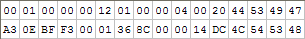

# 17.8 字体


**Fonts**

=== "中文"
    
    WordprocessingML文档的下一个组成部分是存储有关文档中使用的字体的信息。WordprocessingML存储有关字体的两个信息：
    
    - （可选）有关字体的信息，以启用字体替换。字体替换是一种过程，当应用程序无法找到特定字体时，它会尝试找到最接近预期外观的字体。
    
    - （可选）一个或多个嵌入字体的形式，用于无法访问该字体的系统。当字体被嵌入时，它们被混淆以确保它们仅用于查看嵌入它们的文档的内容，而不用于其他目的。
    
    [示例：考虑存储在文档字体表部分的以下信息：
    
    ```xml
    <w:fonts>
        <w:font w:name="Times New Roman">
            <w:panose1 w:val="02020603050405020304" />
            <w:charset w:val="00" />
            <w:family w:val="roman" />
            <w:pitch w:val="variable" />
            <w:sig w:usb0="20002A87" w:usb1="80000000" w:usb2="00000008"
                w:usb3="00000000" w:csb0="000001FF" w:csb1="00000000" />
            <w:embedRegular r:id="rId10" w:fontKey="{302EE813-EB4A-4642-A93A-
                89EF99B2457E}" />
        </w:font>
    </w:fonts>
    ```
    
    字体表包含有关Times New Roman字体的信息；具体来说，用于在字体不可用时定位替代字体以及与常规字体的嵌入形式的关系。示例结束]

=== "英文"
    
    The next component of a WordprocessingML document is storing information about the fonts used in the document. WordprocessingML stores two pieces of information about fonts:
    
    - (optionally) Information about the font to enable font substitution. Font substitution is a process by which an application, when it cannot locate a specific font, attempts to locate the closest possible match to the intended appearance of the font
    
    - (optionally) One or more embedded forms of the font for use on systems which do not have access to the font. When fonts are embedded, they are obfuscated to ensure that they are only used to view the contents of the document in which they are embedded, and for no other purpose.
    
    [Example: Consider the following information stored in a document's font table part:
    
    ```xml
    <w:fonts>
        <w:font w:name="Times New Roman">
            <w:panose1 w:val="02020603050405020304" />
            <w:charset w:val="00" />
            <w:family w:val="roman" />
            <w:pitch w:val="variable" />
            <w:sig w:usb0="20002A87" w:usb1="80000000" w:usb2="00000008"
                w:usb3="00000000" w:csb0="000001FF" w:csb1="00000000" />
            <w:embedRegular r:id="rId10" w:fontKey="{302EE813-EB4A-4642-A93A-
                89EF99B2457E}" />
        </w:font>
    </w:fonts>
    ```
    
    
    The font table contains information about the Times New Roman font; specifically, information used to locate a substitute font when it is not available and a relationship to the embedded form of the regular form of the font. end example]

## TOC

- [17.8 字体](#178-字体)
    - [TOC](#toc)
    - [17.8.1 字体嵌入](#1781-字体嵌入)
    - [17.8.2 字体替换](#1782-字体替换)
    - [17.8.3 元素](#1783-元素)
        - [17.8.3.1 altName (字体的替代名称)](#17831-altname-字体的替代名称)
        - [17.8.3.2 charset (字体支持的字符集)](#17832-charset-字体支持的字符集)
        - [17.8.3.3 embedBold (粗体样式字体样式嵌入)](#17833-embedbold-粗体样式字体样式嵌入)
        - [17.8.3.4 embedBoldItalic (粗体斜体字体样式嵌入)](#17834-embedbolditalic-粗体斜体字体样式嵌入)
        - [17.8.3.5 embedItalic (斜体字体样式嵌入)](#17835-embeditalic-斜体字体样式嵌入)
        - [17.8.3.6 embedRegular (常规字体样式嵌入)](#17836-embedregular-常规字体样式嵌入)
        - [17.8.3.7 embedSystemFonts (嵌入通用系统字体)](#17837-embedsystemfonts-嵌入通用系统字体)
        - [17.8.3.8 embedTrueTypeFonts (嵌入 TrueType 字体)](#17838-embedtruetypefonts-嵌入-truetype-字体)
        - [17.8.3.9 family (字体系列)](#17839-family-字体系列)
        - [17.8.3.10 font (单一字体的属性)](#178310-font-单一字体的属性)
        - [17.8.3.11 fonts (字体表根元素)](#178311-fonts-字体表根元素)
        - [17.8.3.12 notTrueType (不是 TrueType 轮廓字体)](#178312-nottruetype-不是-truetype-轮廓字体)
        - [17.8.3.13 panose1 (Panose-1 字体分类号)](#178313-panose1-panose-1-字体分类号)
        - [17.8.3.14 pitch (字体间距)](#178314-pitch-字体间距)
        - [17.8.3.15 saveSubsetFonts (嵌入时的字体子集)](#178315-savesubsetfonts-嵌入时的字体子集)
        - [17.8.3.16 sig (支持的 Unicode 子范围和代码页)](#178316-sig-支持的-unicode-子范围和代码页)

## 17.8.1 字体嵌入

**Font Embedding**

=== "中文"
    
    在WordprocessingML文档中，字体嵌入是指在当前文档中包含所使用的一些或全部字体的过程，以确保在随后打开文档时可以使用这些字体。

    嵌入的字体存储在包中的嵌入字体部件。
    
    当字体嵌入在WordprocessingML文档中时，应该对其进行混淆，以防止在文档之外使用。此混淆应使用以下算法进行：
    
    - 生成一个GUID，用作并存储为混淆密钥
    - 颠倒GUID中的字节顺序（即大端序排序）
    - 将该值与二进制的前32个字节进行异或运算：分别对0-15进行一次，对16-31进行一次
    - 将结果文件存储在文档中，并将混淆密钥存储在fontKey属性中
    
    【示例：假设要嵌入的字体的前32个字节如下：
    
    
    
    为了将此字体混淆以进行存储：
    
    - 生成一个GUID（例如001B70DC-AA60-4AD5-90EC-18A0948E1EAE）
    - 颠倒其顺序（例如AE1E8E94-A018-EC90-D54A-60AADC701B00）
    - 将GUID与前16个字节和后16个字节进行异或运算
    
    得到的32个字节将是：
    
    
    
    示例结束】
    
    要检索用于查看此文档内容的混淆字体，请重复上述过程以检索原始字体。

=== "英文"
    
    Within a WordprocessingML document, font embedding refers to a process in which the some or all of the fonts used in the current document are included in that document such that it can be guaranteed that they are available for use when the document is subsequently opened.
    
    Embedded fonts are stored in an Embedded Font part within the package.
    
    When a font is embedded within a WordprocessingML document, it shall be obfuscated to prevent it from being used outside of this document. This obfuscation shall be done using the following algorithm:
    
    - Generate a GUID, which is used and stored as the obfuscation key
    - Reverse the order of the bytes in the GUID (i.e. Big Endian ordering)
    - XOR the value with the first 32 bytes of the binary: once against 0-15, once against 16-31
    - Store the resulting file in the document, and store the obfuscation key in the fontKey attribute
    
    [Example: Consider a font to be embedded whose first 32 bytes are as follows: 
    
    
    
    To obfuscate this font for storage:
    
    - Generate a GUID (e.g. 001B70DC-AA60-4AD5-90EC-18A0948E1EAE)
    - Reverse its order (e.g. AE1E8E94-A018-EC90-D54A-60AADC701B00)
    - XOR the GUID with the first and second 16 bytes
    
    The resulting 32 bytes would be:
    
    
    
    end example]
    
    To retrieve an obfuscated font for viewing the content of this document only, repeat the procedure above to retrieve the original font.


## 17.8.2 字体替换

**Font Substitution**

=== "中文"
    
    rFonts元素([§17.3.2.26])引用了应用于WordprocessingML文档中每个文本运行的字体。然而，基于这些字体的可用性(例如，使用自定义字体)，应用程序可能无法找到指定的字体。寻找合适替代字体的过程称为字体替换。

    用于字体替换的确切算法高度依赖于执行替换时最理想的特征：每个字形的相似外观(以最大程度增加视觉熟悉度)，相似的物理特征(以最小化行高和断字的变化)等。ECMA-376建议应用程序按照以下信息片段的最接近匹配(按降序优先级)来确定合适的替代字体；但是，应用程序可以自由地应用更复杂的逻辑：

    - sig ([§17.8.3.16])
    - charset ([§17.8.3.2])
    - panose1 ([§17.8.3.13])
    - pitch ([§17.8.3.14])
    - family ([§17.8.3.9])
    - altName ([§17.8.3.1])
    - notTrueType ([§17.8.3.12])

=== "英文"
    
    The rFonts element ([§17.3.2.26]) references the font which is applied to each run of text within a WordprocessingML document. However, based on the availability of these fonts (for example, the use of a custom font), an application might not be able to locate the specified font. The process of finding a suitable alternative font is known as font substitution.
    
    The exact algorithm which is used for font substitution is highly dependent on the characteristics which are most desirable when performing the substitution: similar appearance of each glyph (to maximize visual familiarity), similar physical characteristics (to minimize changes in line height and breaking), etc. ECMA-376 recommends that applications looking for the closest match to the following pieces of information (in descending priority) in order to determine a suitable alternative font; however, applications are free to apply more sophisticated logic in its place:
    
    - sig ([§17.8.3.16])
    - charset ([§17.8.3.2])
    - panose1 ([§17.8.3.13])
    - pitch ([§17.8.3.14])
    - family ([§17.8.3.9])
    - altName ([§17.8.3.1])
    - notTrueType ([§17.8.3.12])

## 17.8.3 元素 

**Elements**

=== "中文"
    
    以下元素构成字体表的内容：

=== "英文"

    The following elements comprise the content of the font table:

### 17.8.3.1 altName (字体的替代名称)

**altName (Alternate Names for Font)**

=== "中文"
    
    该元素指定了一组备用名称，可用于定位父元素指定的字体。这组备用名称存储在逗号分隔的列表中，所有相邻的逗号都被忽略（即，名称A，名称B的值等同于名称A,,,,,,,,,名称B）。
    
    当应用程序无法使用字体元素（[§17.8.3.10]）的字体属性上存储的主名称来定位字体时，应使用每个备用名称尝试定位字体，并使用第一个定位到匹配的字体。
    
    使用此元素存储的字体名称应在其XML声明中由字体部分指定的编码中指定；字体名称将由XML解析器解释。[注意：UTF-8 不支持用于 OpenType 字体中的字体名称，并且并非始终支持文件系统中的文件名。例如，旧版日文 Microsoft Windows 使用 Windows-31J 作为文件名。为了在此属性的值中使用现有字体名称，它们应转换为适合此标准的字符编码，并应避免从字体文件中复制原始字节序列。结束注意]
    
    如果省略了此元素，则父字体没有备用名称。
    
    [示例：考虑为单个字体存储的以下信息：
    
    ```xml
    <w:font w:name="SimSun">
        <w:altName w:val="Arial Unicode MS" />
        …
    </w:font>
    ```
    
    altName 元素指定了当找不到名称为 SimSun（主字体名称）的字体时，应用程序在基于字体度量进行替换之前，应尝试定位名称为 Arial Unicode MS 的字体。结束示例]
    
    ??? abstract "Attributes"
    
        **val**（字符串值）
        
        :   指定其内容包含一个字符串。
        
            此字符串的内容根据父 XML 元素的上下文进行解释。
            
            [示例：考虑以下 WordprocessingML 片段：
    
            ```xml
            <w:pPr>
                <w:pStyle w:val="Heading1" />
            </w:pPr>
            ```
            
            val 属性的值是关联段落样式的 styleId 的 ID。
            
            但是，请考虑以下片段：
    
            ```xml
            <w:sdtPr>
                <w:alias w:val="SDT Title Example" />
                …
            </w:sdtPr>
            ```
            
            在这种情况下，val 属性中的十进制数是最近的祖先结构化文档标记的标题。在每种情况下，值都是在父元素的上下文中解释的。结束示例]
            
            此属性的可能值由 ST_String 简单类型 ([§22.9.2.13]) 定义。
    
    [Note: The W3C XML Schema definition of this element’s content model (CT_String) is located in §A.1. end note]

=== "英文"
    
    This element specifies a set of alternative names which can be used to locate the font specified by the parent element. This set of alternative names is stored in a comma-delimited list, with all adjacent commas ignored (i.e. a value of Name A, Name B is equivalent to Name A,,,,,,,,, Name B).
    
    When an application cannot locate a font using the primary name stored on the font attribute of the font element ([§17.8.3.10]), it should use each alternate name in term to attempt to locate the font, and use the first font for which is locates a match.
    
    Font names stored using this element shall be specified in the encoding specified by the Fonts part in its XML declaration; the name of the font will be interpreted by the XML parser. [Note: UTF-8 is not supported for font names within OpenType fonts, and is not always supported for file names in file systems. For example, older Japanese versions of Microsoft Windows use Windows-31J for filenames. To use extant font names in the values of this attribute, they should be converted to the character encoding appropriate for this standard and copying raw byte sequences from font files should be avoided. end note]
    
    If this element is omitted, then no alternate names are present for the parent font.
    
    [Example: Consider the following information stored for a single font:
    
    ```xml
    <w:font w:name="SimSun">
        <w:altName w:val="Arial Unicode MS" />
        …
    </w:font>
    ```
    
    The altName element specifies that when no font with a name of SimSun (the primary font name) can be located, that applications should attempt to locate a font with the name Arial Unicode MS before doing substitution based on the font metrics. end example]
    
    ??? abstract "Attributes"
    
        **val** (String Value)
    
        :   Specifies that its contents contain a string.
    
            The contents of this string are interpreted based on the context of the parent XML element.
            
            [Example: Consider the following WordprocessingML fragment:
            
            ```xml
            <w:pPr>
                <w:pStyle w:val="Heading1" />
            </w:pPr>
            ```
            
            The value of the val attribute is the ID of the associated paragraph style's styleId.
            
            However, consider the following fragment:
            
            ```xml
            <w:sdtPr>
                <w:alias w:val="SDT Title Example" />
                …
            </w:sdtPr>
            ```
            
            In this case, the decimal number in the val attribute is the caption of the nearest ancestor structured document tag. In each case, the value is interpreted in the context of the parent element. end example]
            
            The possible values for this attribute are defined by the ST_String simple type ([§22.9.2.13]).
    
    
    [Note: The W3C XML Schema definition of this element’s content model (CT_String) is located in §A.1. end note]

### 17.8.3.2 charset (字体支持的字符集)

**charset (Character Set Supported By Font)**

=== "中文"
    
    该元素指定了父字体支持的字符集。此信息可根据字体替换逻辑定义，用于在该字体不可用时定位适当的替代字体。此信息通过查询字体确定，当字体不可用时不得修改。
    
    如果不存在此元素，则假定此字体的字符集为 ISO/IEC 8859-1 字符集。
    
    [示例：考虑为单个字体存储的以下信息：
    
    ```xml
    <w:font w:name="SimSun">
        <w:charset w:characterSet="GBK" />
        …
    </w:font>
    ```
    
    charset 元素通过其 characterSet 属性的值 GBK 指定了该字体使用 GBK 字符集。结束示例]
    
    ??? abstract "属性"
    
        **characterSet**（字符集的 IANA 名称）
        
        :   与字体关联的字符集的名称。此属性允许的值由 IANA 注册表中列出的名称和别名定义。
            
            此属性的可能值由 ST_String 简单类型 ([§22.9.2.13]) 定义。
    
    [Note: The W3C XML Schema definition of this element’s content model (CT_Charset) is located in §A.1. end note]

=== "英文"
    
    This element specifies the character set which is supported by the parent font. This information can be used as defined in font substitution logic to locate an appropriate substitute font when this font is not available. This information is determined by querying the font when present and shall not be modified when the font is not available.
    
    If this element is not present, then the character set for this font shall be assumed to be the ISO/IEC 8859-1 character set.
    
    [Example: Consider the following information stored for a single font:
    
    ```xml
    <w:font w:name="SimSun">
        <w:charset w:characterSet="GBK" />
        …
    </w:font>
    ```
    
    The charset element specifies via its characterSet attribute value of GBK that this font uses the GBK character set. end example]
    
    ??? abstract "Attributes"
    
        :   characterSet (IANA Name of Character Set)
        
            Name of the character set associated with the font. The values allowed by this attribute are defined by the names and aliases listed in the IANA registration table.
            
            The possible values for this attribute are defined by the ST_String simple type ([§22.9.2.13]).
    
    [Note: The W3C XML Schema definition of this element’s content model (CT_Charset) is located in §A.1. end note]

### 17.8.3.3 embedBold (粗体样式字体样式嵌入)

**embedBold (Bold Style Font Style Embedding)**

=== "中文"
    
    该元素指定了字体的粗体形式在嵌入时的嵌入字体存储信息。当对文本运行应用粗体时，将使用此形式。
    
    如果省略此元素，则文档中不存储字体的粗体形式。id 属性所指向的关系应为嵌入字体类型，否则文档将被视为不符合规范。
    
    [示例：考虑一个 WordprocessingML 文档，其中 Arial 字体已经被嵌入到文件中。可以使用以下 WordprocessingML 指定此状态：
    
    ```xml
    <w:font w:name="Arial">
        …
        <w:embedBold r:id="rId10" />
    </w:font>
    ```
    
    embedBold 元素指定了可以使用与 ID rId10 关联的嵌入字体来检索嵌入的 Arial 字体的粗体形式。结束示例]
    
    ??? abstract "Attributes"
    
        **fontKey**（嵌入字体混淆密钥）
        
        :   指定用于混淆此嵌入字体的密钥。此密钥可用于仅用于查看此 WordprocessingML 文档的目的检索嵌入字体，使用 [§17.8.1] 中描述的算法。
        
            如果省略此属性，则不提供此字体的密钥。
            
            [示例：考虑一个 WordprocessingML 文档，其中 Arial 字体已经被嵌入到文件中。可以使用以下 WordprocessingML 指定此状态：
            
            ```xml
            <w:font w:name="Arial">
                …
                <w:embedRegular r:id="rId10" w:fontKey="{302EE813-EB4A-4642-
                A93A-89EF99B2457E}" />
            </w:font>
            ```
            
            fontKey 属性的值为 {302EE813-EB4A-4642-A93A-89EF99B2457E}，因此如果需要，可以使用此密钥和上述算法检索与 ID rId10 关联的嵌入 Arial 字体。结束示例]
            
            此属性的可能值由 ST_Guid 简单类型 ([§22.9.2.4]) 定义。
    
        **id**（与部分的关系）
        
        :   命名空间：http://purl.oclc.org/ooxml/officeDocument/relationships
        
            指定到指定部分的关系 ID。
        
            指定的关系应与父元素所需的关系类型相匹配：
            
            - contentPart 元素的关系类型为 http://purl.oclc.org/ooxml/officeDocument/relationships/customXml
            - footerReference 元素的关系类型为 http://purl.oclc.org/ooxml/officeDocument/relationships/footer
            - headerReference 元素的关系类型为 http://purl.oclc.org/ooxml/officeDocument/relationships/header
            - embedBold、embedBoldItalic、embedItalic 或 embedRegular 元素的关系类型为 http://purl.oclc.org/ooxml/officeDocument/relationships/font
            - printerSettings 元素的关系类型为 http://purl.oclc.org/ooxml/officeDocument/relationships/printerSettings
            - longDesc 或 hyperlink 元素的关系类型为 http://purl.oclc.org/ooxml/officeDocument/relationships/hyperlink
            
            [示例：考虑一个具有以下 id 属性的 XML 元素：
            
            ```xml
            <… r:id="rId10" />
            ```
            
            标记指定了关联关系部分，关系 ID 为 rId1，其中包含了父 XML 元素的相应关系信息。结束示例]
            
            此属性的可能值由 ST_RelationshipId 简单类型 ([§22.8.2.1]) 定义。

        **subsetted**（嵌入字体已子集化）
        
        :   指定由 id 属性定位的嵌入字体已被子集化。
        
            子集化是一种机制，仅将此 WordprocessingML 文档内容中使用的字形存储在嵌入字体中，以防止由于使用大型嵌入字体的少量字形而使文件变得不必要地庞大。
        
            如果省略此属性，则将不处理 id 属性定位的嵌入字体，就好像它已经被子集化一样。
        
            [示例：考虑一个将 Arial 字体嵌入到文件中并经过子集化的 WordprocessingML 文档。可以使用以下 WordprocessingML 指定此状态：
            
            ```xml
            <w:font w:name="Arial">
                …
                <w:embedRegular r:id="rId10" w:subsetted="true" />
            </w:font>
            ```
        
            subsetted 属性的值为 true，因此必须将与 ID rId10 关联的嵌入 Arial 字体视为子集化字体。结束示例]
            
            此属性的可能值由 ST_OnOff 简单类型 ([§22.9.2.7]) 定义。
    
    [Note: The W3C XML Schema definition of this element’s content model (CT_FontRel) is located in §A.1. end note]

=== "英文"
    
    This element specifies information about the embedded font storage for the bold form of a font, when it is embedded. This form is used when bold is applied to a text run.
    
    If this element is omitted, then no bold form of the font is stored in the document. The relationship targeted by the id attribute shall be of the embedded font type, or the document shall be considered to be non-conformant.
    
    
    [Example: Consider a WordprocessingML document in which the Arial font has been embedded in the file. This status would be specified using the following WordprocessingML:
    
    ```xml
    <w:font w:name="Arial">
        …
        <w:embedBold r:id="rId10" />
    </w:font>
    ```
    
    The embedBold element specifies that the embedded font targeted with the relationship with ID rId10 can be used to retrieve the bold form of the embedded Arial font. end example]
    
    ??? abstract "Attributes"
    
        **fontKey** (Embedded Font Obfuscation Key)
        
        :   Specifies the key which was used to obfuscate this embedded font. This key can be used to retrieve the embedded font for the purposes of viewing this WordprocessingML document only, using the algorithm described in [§17.8.1].
    
            If this attribute is omitted, then no key is provided for this font.
            
            [Example: Consider a WordprocessingML document in which the Arial font has been embedded in the file. This status would be specified using the following WordprocessingML:
            
            ```xml
            <w:font w:name="Arial">
                …
                <w:embedRegular r:id="rId10" w:fontKey="{302EE813-EB4A-4642-
                A93A-89EF99B2457E}" />
            </w:font>
            ```
            
            The fontKey attribute has a value of {302EE813-EB4A-4642-A93A-89EF99B2457E}, therefore the embedded Arial font targeted with the relationship with ID rId10 can be retrieved if needed by using this key and the algorithm above. end example]
            
            The possible values for this attribute are defined by the ST_Guid simple type ([§22.9.2.4]).
    
        **id** (Relationship to Part)
    
        :   Namespace: http://purl.oclc.org/ooxml/officeDocument/relationships
    
            Specifies the relationship ID to a specified part.
        
            The specified relationship shall match the relationship type required by the parent element:
            
            - http://purl.oclc.org/ooxml/officeDocument/relationships/customXml for the contentPart element
            - http://purl.oclc.org/ooxml/officeDocument/relationships/footer for the footerReference element
            - http://purl.oclc.org/ooxml/officeDocument/relationships/header for the headerReference element
            - http://purl.oclc.org/ooxml/officeDocument/relationships/font for the embedBold, embedBoldItalic, embedItalic, or embedRegular elements
            - http://purl.oclc.org/ooxml/officeDocument/relationships/printerSettings for the printerSettings element
            - http://purl.oclc.org/ooxml/officeDocument/relationships/hyperlink for the longDesc or hyperlink element
            
            [Example: Consider an XML element which has the following id attribute:
            
            ```xml
            <… r:id="rId10" />
            ```
            
            The markup specifies the associated relationship part with relationship ID rId1 contains the corresponding relationship information for the parent XML element. end example]
            
            The possible values for this attribute are defined by the ST_RelationshipId simple type ([§22.8.2.1]).
        
        **subsetted** (Embedded Font Is Subsetted)
    
        :   Specifies that the embedded font targeted by the id attribute has been subsetted.
    
            Subsetting is a mechanism by which only the glyphs used in the contents of this WordprocessingML document are stored in an embedded font, in order to prevent the file from becoming unnecessarily large from the use of a small number of glyphs from a large embedded font.
            
            If this attribute is omitted, then the embedded font target by the id attribute shall not be handled as though it is subsetted.
            
            [Example: Consider a WordprocessingML document in which the Arial font has been embedded in the file after subsetting. This status would be specified using the following WordprocessingML:
            
            ```xml
            <w:font w:name="Arial">
                …
                <w:embedRegular r:id="rId10" w:subsetted="true" />
            </w:font>
            ```
            
            The subsetted attribute has a value of true, therefore the embedded Arial font targeted with the relationship with ID rId10 must be treated as a subsetted font. end example]
            
            The possible values for this attribute are defined by the ST_OnOff simple type ([§22.9.2.7]).
    
    [Note: The W3C XML Schema definition of this element’s content model (CT_FontRel) is located in §A.1. end note]

### 17.8.3.4 embedBoldItalic (粗体斜体字体样式嵌入)

**embedBoldItalic (Bold Italic Font Style Embedding)**

=== "中文"
    
    该元素指定了字体的粗斜体形式在嵌入时的嵌入字体存储信息。当对文本运行应用粗体和斜体时，将使用此形式。

    如果省略此元素，则文档中不存储字体的粗斜体形式。
    
    [示例：考虑一个将 Arial 字体嵌入到文件中的 WordprocessingML 文档。可以使用以下 WordprocessingML 指定此状态：
    
    ```xml
    <w:font w:name="Arial">
        …
        <w:embedBoldItalic r:id="rId11" />
    </w:font>
    ```

    embedBoldItalic 元素指定了可以使用与 ID rId11 关联的嵌入字体来检索嵌入的 Arial 字体的粗斜体形式。结束示例]
    
    ??? abstract "Attributes"
    
        **fontKey**（嵌入字体混淆密钥）
        
        :   指定用于混淆此嵌入字体的密钥。此密钥可用于仅用于查看此 WordprocessingML 文档的目的检索嵌入字体，使用 [§17.8.1] 中描述的算法。
        
            如果省略此属性，则不提供此字体的密钥。
            
            [示例：考虑一个 WordprocessingML 文档，其中 Arial 字体已经被嵌入到文件中。可以使用以下 WordprocessingML 指定此状态：
            
            ```xml
            <w:font w:name="Arial">
                …
                <w:embedRegular r:id="rId10" w:fontKey="{302EE813-EB4A-4642-
                A93A-89EF99B2457E}" />
            </w:font>
            ```
            
            fontKey 属性的值为 {302EE813-EB4A-4642-A93A-89EF99B2457E}，因此如果需要，可以使用此密钥和上述算法检索与 ID rId10 关联的嵌入 Arial 字体。结束示例]
            
            此属性的可能值由 ST_Guid 简单类型 ([§22.9.2.4]) 定义。
    
        **id**（与部分的关系）
        
        :   命名空间：http://purl.oclc.org/ooxml/officeDocument/relationships
        
            指定到指定部分的关系 ID。
        
            指定的关系应与父元素所需的关系类型相匹配：
            
            - contentPart 元素的关系类型为 http://purl.oclc.org/ooxml/officeDocument/relationships/customXml
            - footerReference 元素的关系类型为 http://purl.oclc.org/ooxml/officeDocument/relationships/footer
            - headerReference 元素的关系类型为 http://purl.oclc.org/ooxml/officeDocument/relationships/header
            - embedBold、embedBoldItalic、embedItalic 或 embedRegular 元素的关系类型为 http://purl.oclc.org/ooxml/officeDocument/relationships/font
            - printerSettings 元素的关系类型为 http://purl.oclc.org/ooxml/officeDocument/relationships/printerSettings
            - longDesc 或 hyperlink 元素的关系类型为 http://purl.oclc.org/ooxml/officeDocument/relationships/hyperlink
            
            [示例：考虑一个具有以下 id 属性的 XML 元素：
            
            ```xml
            <… r:id="rId10" />
            ```
            
            标记指定了关联关系部分，关系 ID 为 rId1，其中包含了父 XML 元素的相应关系信息。结束示例]
            
            此属性的可能值由 ST_RelationshipId 简单类型 ([§22.8.2.1]) 定义。

        **subsetted**（嵌入字体已子集化）
        
        :   指定由 id 属性定位的嵌入字体已被子集化。
        
            子集化是一种机制，仅将此 WordprocessingML 文档内容中使用的字形存储在嵌入字体中，以防止由于使用大型嵌入字体的少量字形而使文件变得不必要地庞大。
        
            如果省略此属性，则将不处理 id 属性定位的嵌入字体，就好像它已经被子集化一样。
        
            [示例：考虑一个将 Arial 字体嵌入到文件中并经过子集化的 WordprocessingML 文档。可以使用以下 WordprocessingML 指定此状态：
            
            ```xml
            <w:font w:name="Arial">
                …
                <w:embedRegular r:id="rId10" w:subsetted="true" />
            </w:font>
            ```
        
            subsetted 属性的值为 true，因此必须将与 ID rId10 关联的嵌入 Arial 字体视为子集化字体。结束示例]
            
            此属性的可能值由 ST_OnOff 简单类型 ([§22.9.2.7]) 定义。
    
    [Note: The W3C XML Schema definition of this element’s content model (CT_FontRel) is located in §A.1. end note]

=== "英文"
    
    This element specifies information about the embedded font storage for the bold italic form of a font, when it is embedded. This form is used when bold and italics are applied to a text run.
    
    If this element is omitted, then no bold italic form of the font is stored in the document.
    
    [Example: Consider a WordprocessingML document in which the Arial font has been embedded in the file. This status would be specified using the following WordprocessingML:
    
    ```xml
    <w:font w:name="Arial">
        …
        <w:embedBoldItalic r:id="rId11" />
    </w:font>
    ```
    
    The embedBoldItalic element specifies that the embedded font targeted with the relationship with ID rId11 can be used to retrieve the bold italic form of the embedded Arial font. end example]
    
    ??? abstract "Attributes"
    
        **fontKey** (Embedded Font Obfuscation Key)
    
        :   Specifies the key which was used to obfuscate this embedded font. This key can be used to retrieve the embedded font for the purposes of viewing this WordprocessingML document only, using the algorithm described in [§17.8.1].
    
            If this attribute is omitted, then no key is provided for this font.
            
            [Example: Consider a WordprocessingML document in which the Arial font has been embedded in the file. This status would be specified using the following WordprocessingML:
            
            ```xml
            <w:font w:name="Arial">
                …
                <w:embedRegular r:id="rId10" w:fontKey="{302EE813-EB4A-4642-
                    A93A-89EF99B2457E}" />
            </w:font>
            ```
            
            The fontKey attribute has a value of {302EE813-EB4A-4642-A93A-89EF99B2457E}, therefore the embedded Arial font targeted with the relationship with ID rId10 can be retrieved if needed by using this key and the algorithm above. end example]
            
            The possible values for this attribute are defined by the ST_Guid simple type ([§22.9.2.4]).
        
        **id** (Relationship to Part)
    
        :   Namespace: http://purl.oclc.org/ooxml/officeDocument/relationships
    
            Specifies the relationship ID to a specified part.
        
            The specified relationship shall match the relationship type required by the parent element:
            
            - http://purl.oclc.org/ooxml/officeDocument/relationships/customXml for the contentPart element
            - http://purl.oclc.org/ooxml/officeDocument/relationships/footer for the footerReference element
            - http://purl.oclc.org/ooxml/officeDocument/relationships/header for the headerReference element
            - http://purl.oclc.org/ooxml/officeDocument/relationships/font for the embedBold, embedBoldItalic, embedItalic, or embedRegular elements
            - http://purl.oclc.org/ooxml/officeDocument/relationships/printerSettings for the printerSettings element
            - http://purl.oclc.org/ooxml/officeDocument/relationships/hyperlink for the longDesc or hyperlink element
            
            [Example: Consider an XML element which has the following id attribute:
            
            ```xml
            <… r:id="rId10" />
            ```
            
            The markup specifies the associated relationship part with relationship ID rId1 contains the corresponding relationship information for the parent XML element. end example]
            
            The possible values for this attribute are defined by the ST_RelationshipId simple type ([§22.8.2.1]).
        
        **subsetted** (Embedded Font Is Subsetted)
    
        :   Specifies that the embedded font targeted by the id attribute has been subsetted.
    
            *Subsetting* is a mechanism by which only the glyphs used in the contents of this WordprocessingML document are stored in an embedded font, in order to prevent the file from becoming unnecessarily large from the use of a small number of glyphs from a large embedded font.
            
            If this attribute is omitted, then the embedded font target by the id attribute shall not be handled as though it is subsetted.
            
            [Example: Consider a WordprocessingML document in which the Arial font has been embedded in the file after subsetting. This status would be specified using the following WordprocessingML:
            
            
            <w:font w:name="Arial">
                …
                <w:embedRegular r:id="rId10" w:subsetted="true" />
            </w:font>
            
            
            The subsetted attribute has a value of true, therefore the embedded Arial font targeted with the relationship with ID rId10 must be treated as a subsetted font. end example]
            
            The possible values for this attribute are defined by the ST_OnOff simple type ([§22.9.2.7]).
    
    [Note: The W3C XML Schema definition of this element’s content model (CT_FontRel) is located in §A.1. end note]

### 17.8.3.5 embedItalic (斜体字体样式嵌入)

**embedItalic (Italic Font Style Embedding)**

=== "中文"
    
    该元素指定了字体的斜体形式在嵌入时的嵌入字体存储信息。当对文本运行应用斜体时，将使用此形式。

    如果省略此元素，则文档中不存储字体的斜体形式。
    
    [示例：考虑一个将 Arial 字体嵌入到文件中的 WordprocessingML 文档。可以使用以下 WordprocessingML 指定此状态：
    
    ```xml
    <w:font w:name="Arial">
        …
        <w:embedItalic r:id="rId12" />
    </w:font>
    ```
    
    embedItalic 元素指定了可以使用与 ID rId12 关联的嵌入字体来检索嵌入的 Arial 字体的斜体形式。结束示例]
    
    ??? abstract "Attributes"
    
        **fontKey**（嵌入字体混淆密钥）
        
        :   指定用于混淆此嵌入字体的密钥。此密钥可用于仅用于查看此 WordprocessingML 文档的目的检索嵌入字体，使用 [§17.8.1] 中描述的算法。
        
            如果省略此属性，则不提供此字体的密钥。
            
            [示例：考虑一个 WordprocessingML 文档，其中 Arial 字体已经被嵌入到文件中。可以使用以下 WordprocessingML 指定此状态：
            
            ```xml
            <w:font w:name="Arial">
                …
                <w:embedRegular r:id="rId10" w:fontKey="{302EE813-EB4A-4642-
                A93A-89EF99B2457E}" />
            </w:font>
            ```
            
            fontKey 属性的值为 {302EE813-EB4A-4642-A93A-89EF99B2457E}，因此如果需要，可以使用此密钥和上述算法检索与 ID rId10 关联的嵌入 Arial 字体。结束示例]
            
            此属性的可能值由 ST_Guid 简单类型 ([§22.9.2.4]) 定义。
    
        **id**（与部分的关系）
        
        :   命名空间：http://purl.oclc.org/ooxml/officeDocument/relationships
        
            指定到指定部分的关系 ID。
        
            指定的关系应与父元素所需的关系类型相匹配：
            
            - contentPart 元素的关系类型为 http://purl.oclc.org/ooxml/officeDocument/relationships/customXml
            - footerReference 元素的关系类型为 http://purl.oclc.org/ooxml/officeDocument/relationships/footer
            - headerReference 元素的关系类型为 http://purl.oclc.org/ooxml/officeDocument/relationships/header
            - embedBold、embedBoldItalic、embedItalic 或 embedRegular 元素的关系类型为 http://purl.oclc.org/ooxml/officeDocument/relationships/font
            - printerSettings 元素的关系类型为 http://purl.oclc.org/ooxml/officeDocument/relationships/printerSettings
            - longDesc 或 hyperlink 元素的关系类型为 http://purl.oclc.org/ooxml/officeDocument/relationships/hyperlink
            
            [示例：考虑一个具有以下 id 属性的 XML 元素：
            
            ```xml
            <… r:id="rId10" />
            ```
            
            标记指定了关联关系部分，关系 ID 为 rId1，其中包含了父 XML 元素的相应关系信息。结束示例]
            
            此属性的可能值由 ST_RelationshipId 简单类型 ([§22.8.2.1]) 定义。

        **subsetted**（嵌入字体已子集化）
        
        :   指定由 id 属性定位的嵌入字体已被子集化。
        
            子集化是一种机制，仅将此 WordprocessingML 文档内容中使用的字形存储在嵌入字体中，以防止由于使用大型嵌入字体的少量字形而使文件变得不必要地庞大。
        
            如果省略此属性，则将不处理 id 属性定位的嵌入字体，就好像它已经被子集化一样。
        
            [示例：考虑一个将 Arial 字体嵌入到文件中并经过子集化的 WordprocessingML 文档。可以使用以下 WordprocessingML 指定此状态：
            
            ```xml
            <w:font w:name="Arial">
                …
                <w:embedRegular r:id="rId10" w:subsetted="true" />
            </w:font>
            ```
        
            subsetted 属性的值为 true，因此必须将与 ID rId10 关联的嵌入 Arial 字体视为子集化字体。结束示例]
            
            此属性的可能值由 ST_OnOff 简单类型 ([§22.9.2.7]) 定义。
    
    [Note: The W3C XML Schema definition of this element’s content model (CT_FontRel) is located in §A.1. end note]

=== "英文"
    
    This element specifies information about the embedded font storage for the italic form of a font, when it is embedded. This form is used when italics are applied to a text run.

    If this element is omitted, then no italic form of the font is stored in the document.
    
    [Example: Consider a WordprocessingML document in which the Arial font has been embedded in the file. This status would be specified using the following WordprocessingML:
    
    ```xml
    <w:font w:name="Arial">
        …
        <w:embedItalic r:id="rId12" />
    </w:font>
    ```
    
    The embedItalic element specifies that the embedded font targeted with the relationship with ID rId12 can be used to retrieve the italic form of the embedded Arial font. end example]
    
    ??? abstract "Attributes"
    
        **fontKey** (Embedded Font Obfuscation Key)
    
        :   Specifies the key which was used to obfuscate this embedded font. This key can be used to retrieve the embedded font for the purposes of viewing this WordprocessingML document only, using the algorithm described in [§17.8.1].
    
            If this attribute is omitted, then no key is provided for this font.
            
            [Example: Consider a WordprocessingML document in which the Arial font has been embedded in the file. This status would be specified using the following WordprocessingML:
            
            ```xml
            <w:font w:name="Arial">
                …
                <w:embedRegular r:id="rId10" w:fontKey="{302EE813-EB4A-4642-
                    A93A-89EF99B2457E}" />
            </w:font>
            ```
            
            The fontKey attribute has a value of {302EE813-EB4A-4642-A93A-89EF99B2457E}, therefore the embedded Arial font targeted with the relationship with ID rId10 can be retrieved if needed by using this key and the algorithm above. end example]
            
            The possible values for this attribute are defined by the ST_Guid simple type ([§22.9.2.4]).
        
        **id** (Relationship to Part)
    
        :   Namespace: http://purl.oclc.org/ooxml/officeDocument/relationships
    
            Specifies the relationship ID to a specified part.
        
            The specified relationship shall match the relationship type required by the parent element:
            
            - http://purl.oclc.org/ooxml/officeDocument/relationships/customXml for the contentPart element
            - http://purl.oclc.org/ooxml/officeDocument/relationships/footer for the footerReference element
            - http://purl.oclc.org/ooxml/officeDocument/relationships/header for the headerReference element
            - http://purl.oclc.org/ooxml/officeDocument/relationships/font for the embedBold, embedBoldItalic, embedItalic, or embedRegular elements
            - http://purl.oclc.org/ooxml/officeDocument/relationships/printerSettings for the printerSettings element
            - http://purl.oclc.org/ooxml/officeDocument/relationships/hyperlink for the longDesc or hyperlink element
            
            [Example: Consider an XML element which has the following id attribute:
            
            ```xml
            <… r:id="rId10" />
            ```
            
            The markup specifies the associated relationship part with relationship ID rId1 contains the corresponding relationship information for the parent XML element. end example]
            
            The possible values for this attribute are defined by the ST_RelationshipId simple type ([§22.8.2.1]).
        
        **subsetted** (Embedded Font Is Subsetted)
    
        :   Specifies that the embedded font targeted by the id attribute has been subsetted.
    
            *Subsetting* is a mechanism by which only the glyphs used in the contents of this WordprocessingML document are stored in an embedded font, in order to prevent the file from becoming unnecessarily large from the use of a small number of glyphs from a large embedded font.
            
            If this attribute is omitted, then the embedded font target by the id attribute shall not be handled as though it is subsetted.
            
            [Example: Consider a WordprocessingML document in which the Arial font has been embedded in the file after subsetting. This status would be specified using the following WordprocessingML:
            
            
            <w:font w:name="Arial">
                …
                <w:embedRegular r:id="rId10" w:subsetted="true" />
            </w:font>
            
            
            The subsetted attribute has a value of true, therefore the embedded Arial font targeted with the relationship with ID rId10 must be treated as a subsetted font. end example]
            
            The possible values for this attribute are defined by the ST_OnOff simple type ([§22.9.2.7]).
    
    [Note: The W3C XML Schema definition of this element’s content model (CT_FontRel) is located in §A.1. end note]

### 17.8.3.6 embedRegular (常规字体样式嵌入)

**embedRegular (Regular Font Style Embedding)**

=== "中文"
    
    该元素指定了字体的常规形式在嵌入时的嵌入字体存储信息。当文本运行未应用粗体或斜体时使用此形式。

    如果省略此元素，则文档中不存储字体的常规形式。
    
    [示例：考虑一个将 Arial 字体嵌入到文件中的 WordprocessingML 文档。可以使用以下 WordprocessingML 指定此状态：
    
    ```xml
    <w:font w:name="Arial">
        …
        <w:embedRegular r:id="rId13" />
    </w:font>
    ```
    
    embedRegular 元素指定了可以使用与 ID rId13 关联的嵌入字体来检索嵌入的 Arial 字体的常规形式。结束示例]
    
    ??? abstract "Attributes"
    
        **fontKey**（嵌入字体混淆密钥）
        
        :   指定用于混淆此嵌入字体的密钥。此密钥可用于仅用于查看此 WordprocessingML 文档的目的检索嵌入字体，使用 [§17.8.1] 中描述的算法。
        
            如果省略此属性，则不提供此字体的密钥。
            
            [示例：考虑一个 WordprocessingML 文档，其中 Arial 字体已经被嵌入到文件中。可以使用以下 WordprocessingML 指定此状态：
            
            ```xml
            <w:font w:name="Arial">
                …
                <w:embedRegular r:id="rId10" w:fontKey="{302EE813-EB4A-4642-
                A93A-89EF99B2457E}" />
            </w:font>
            ```
            
            fontKey 属性的值为 {302EE813-EB4A-4642-A93A-89EF99B2457E}，因此如果需要，可以使用此密钥和上述算法检索与 ID rId10 关联的嵌入 Arial 字体。结束示例]
            
            此属性的可能值由 ST_Guid 简单类型 ([§22.9.2.4]) 定义。
    
        **id**（与部分的关系）
        
        :   命名空间：http://purl.oclc.org/ooxml/officeDocument/relationships
        
            指定到指定部分的关系 ID。
        
            指定的关系应与父元素所需的关系类型相匹配：
            
            - contentPart 元素的关系类型为 http://purl.oclc.org/ooxml/officeDocument/relationships/customXml
            - footerReference 元素的关系类型为 http://purl.oclc.org/ooxml/officeDocument/relationships/footer
            - headerReference 元素的关系类型为 http://purl.oclc.org/ooxml/officeDocument/relationships/header
            - embedBold、embedBoldItalic、embedItalic 或 embedRegular 元素的关系类型为 http://purl.oclc.org/ooxml/officeDocument/relationships/font
            - printerSettings 元素的关系类型为 http://purl.oclc.org/ooxml/officeDocument/relationships/printerSettings
            - longDesc 或 hyperlink 元素的关系类型为 http://purl.oclc.org/ooxml/officeDocument/relationships/hyperlink
            
            [示例：考虑一个具有以下 id 属性的 XML 元素：
            
            ```xml
            <… r:id="rId10" />
            ```
            
            标记指定了关联关系部分，关系 ID 为 rId1，其中包含了父 XML 元素的相应关系信息。结束示例]
            
            此属性的可能值由 ST_RelationshipId 简单类型 ([§22.8.2.1]) 定义。

        **subsetted**（嵌入字体已子集化）
        
        :   指定由 id 属性定位的嵌入字体已被子集化。
        
            子集化是一种机制，仅将此 WordprocessingML 文档内容中使用的字形存储在嵌入字体中，以防止由于使用大型嵌入字体的少量字形而使文件变得不必要地庞大。
        
            如果省略此属性，则将不处理 id 属性定位的嵌入字体，就好像它已经被子集化一样。
        
            [示例：考虑一个将 Arial 字体嵌入到文件中并经过子集化的 WordprocessingML 文档。可以使用以下 WordprocessingML 指定此状态：
            
            ```xml
            <w:font w:name="Arial">
                …
                <w:embedRegular r:id="rId10" w:subsetted="true" />
            </w:font>
            ```
        
            subsetted 属性的值为 true，因此必须将与 ID rId10 关联的嵌入 Arial 字体视为子集化字体。结束示例]
            
            此属性的可能值由 ST_OnOff 简单类型 ([§22.9.2.7]) 定义。
    
    [Note: The W3C XML Schema definition of this element’s content model (CT_FontRel) is located in §A.1. end note]

=== "英文"
    
    This element specifies information about the embedded font storage for the regular form of a font, when it is embedded. This form is used when neither bold nor italics is applied to a text run.

    If this element is omitted, then no regular form of the font is stored in the document.
    
    [Example: Consider a WordprocessingML document in which the Arial font has been embedded in the file. This status would be specified using the following WordprocessingML:
    
    ```xml
    <w:font w:name="Arial">
        …
        <w:embedRegular r:id="rId13" />
    </w:font>
    ```

    The embedRegular element specifies that the embedded font targeted with the relationship with ID rId13 can be used to retrieve the regular form of the embedded Arial font. end example]
    
    ??? abstract "Attributes"
    
        **fontKey** (Embedded Font Obfuscation Key)
    
        :   Specifies the key which was used to obfuscate this embedded font. This key can be used to retrieve the embedded font for the purposes of viewing this WordprocessingML document only, using the algorithm described in [§17.8.1].
    
            If this attribute is omitted, then no key is provided for this font.
            
            [Example: Consider a WordprocessingML document in which the Arial font has been embedded in the file. This status would be specified using the following WordprocessingML:
            
            ```xml
            <w:font w:name="Arial">
                …
                <w:embedRegular r:id="rId10" w:fontKey="{302EE813-EB4A-4642-
                    A93A-89EF99B2457E}" />
            </w:font>
            ```
            
            The fontKey attribute has a value of {302EE813-EB4A-4642-A93A-89EF99B2457E}, therefore the embedded Arial font targeted with the relationship with ID rId10 can be retrieved if needed by using this key and the algorithm above. end example]
            
            The possible values for this attribute are defined by the ST_Guid simple type ([§22.9.2.4]).
        
        **id** (Relationship to Part)
    
        :   Namespace: http://purl.oclc.org/ooxml/officeDocument/relationships
    
            Specifies the relationship ID to a specified part.
        
            The specified relationship shall match the relationship type required by the parent element:
            
            - http://purl.oclc.org/ooxml/officeDocument/relationships/customXml for the contentPart element
            - http://purl.oclc.org/ooxml/officeDocument/relationships/footer for the footerReference element
            - http://purl.oclc.org/ooxml/officeDocument/relationships/header for the headerReference element
            - http://purl.oclc.org/ooxml/officeDocument/relationships/font for the embedBold, embedBoldItalic, embedItalic, or embedRegular elements
            - http://purl.oclc.org/ooxml/officeDocument/relationships/printerSettings for the printerSettings element
            - http://purl.oclc.org/ooxml/officeDocument/relationships/hyperlink for the longDesc or hyperlink element
            
            [Example: Consider an XML element which has the following id attribute:
            
            ```xml
            <… r:id="rId10" />
            ```
            
            The markup specifies the associated relationship part with relationship ID rId1 contains the corresponding relationship information for the parent XML element. end example]
            
            The possible values for this attribute are defined by the ST_RelationshipId simple type ([§22.8.2.1]).
        
        **subsetted** (Embedded Font Is Subsetted)
    
        :   Specifies that the embedded font targeted by the id attribute has been subsetted.
    
            *Subsetting* is a mechanism by which only the glyphs used in the contents of this WordprocessingML document are stored in an embedded font, in order to prevent the file from becoming unnecessarily large from the use of a small number of glyphs from a large embedded font.
            
            If this attribute is omitted, then the embedded font target by the id attribute shall not be handled as though it is subsetted.
            
            [Example: Consider a WordprocessingML document in which the Arial font has been embedded in the file after subsetting. This status would be specified using the following WordprocessingML:
            
            
            <w:font w:name="Arial">
                …
                <w:embedRegular r:id="rId10" w:subsetted="true" />
            </w:font>
            
            
            The subsetted attribute has a value of true, therefore the embedded Arial font targeted with the relationship with ID rId10 must be treated as a subsetted font. end example]
            
            The possible values for this attribute are defined by the ST_OnOff simple type ([§22.9.2.7]).
    
    [Note: The W3C XML Schema definition of this element’s content model (CT_FontRel) is located in §A.1. end note]

### 17.8.3.7 embedSystemFonts (嵌入通用系统字体)

**embedSystemFonts (Embed Common System Fonts)**

=== "中文"
    
    该元素指定，当使用字体嵌入功能并启用了 embedTrueTypeFonts 元素（[§17.8.3.8]）时，应用程序应嵌入常见系统字体。常见系统字体是指通常始终存在于计算机上的一组字体，不由 ECMA-376 定义。

    如果省略此元素，则在打开字体嵌入时，不应该在当前文档中嵌入定义为常见系统字体的字体集。如果省略或为 embedTrueTypeFonts 元素设置为 false，则此设置不起作用。
    
    [示例：考虑一个 WordprocessingML 文档，规定必须嵌入字体，包括常见系统字体。这个要求可以在文档设置部分使用以下 WordprocessingML 指定：

    ```xml
    <w:embedTrueTypeFonts w:val="true" />
    <w:embedSystemFonts w:val="true"/>
    ```
    
    embedSystemFonts 元素的 val 属性值为 true，指定了在使用时应将常见系统字体包含在此文档中。结束示例]
    
    该元素的内容模型由 [§17.17.4] 中的常见布尔属性定义。

=== "英文"
    
    This element specifies that applications shall embed common system fonts when they are in use and font embedding is enabled for this document using the embedTrueTypeFonts element ([§17.8.3.8]). Common system fonts refer to a set of fonts which are typically always present on a machine, and are not defined by ECMA-376.
    
    If this element is omitted, then the set of fonts defined as common system fonts should not be embedded in the current document when font embedded is turned on. If the embedTrueTypeFonts element is omitted or false, then this setting has no effect.
    
    [Example: Consider a WordprocessingML document that specifies that it must embed fonts, including common system fonts. This requirement would be specified using the following WordprocessingML in the document settings part:
    
    ```xml
    <w:embedTrueTypeFonts w:val="true" />
    <w:embedSystemFonts w:val="true"/>
    ```
    
    The embedSystemFonts element's val attribute has a value of true specifying that common system fonts should be included in this document when they are used. end example]
    
    This element’s content model is defined by the common boolean property definition in [§17.17.4].

### 17.8.3.8 embedTrueTypeFonts (嵌入 TrueType 字体)

**embedTrueTypeFonts (Embed TrueType Fonts)**

=== "中文"
    
    该元素指定，应用程序在保存文档时应该嵌入文档中使用的字体。这些字体应该根据 [§17.8.1] 中指定的算法进行嵌入。

    如果省略此元素，则文档中使用的字体不应该被嵌入。
    
    [示例：考虑一个 WordprocessingML 文档，规定必须嵌入字体，包括常见系统字体。这个要求可以在文档设置部分使用以下 WordprocessingML 指定：
    
    ```xml
    <w:embedTrueTypeFonts w:val="true" />
    <w:embedSystemFonts w:val="true"/>
    ```
    
    embedTrueType 元素的 val 属性值为 true，指定了当使用时应该在此文档中嵌入字体。结束示例]
    
    该元素的内容模型由 [§17.17.4] 中的常见布尔属性定义。

=== "英文"
    
    This element specifies that applications shall embed the fonts in use in this document when it is saved. These fonts shall be embedded subject to the algorithm specified in [§17.8.1].
    
    If this element is omitted, then fonts in use should not be embedded in the current document.
    
    [Example: Consider a WordprocessingML document that specifies that it shall embed fonts, including common system fonts. This requirement would be specified using the following WordprocessingML in the document settings part:
    
    ```xml
    <w:embedTrueTypeFonts w:val="true" />
    <w:embedSystemFonts w:val="true"/>
    ```
    
    The embedTrueType element's val attribute has a value of true specifying that fonts should be embedded in this document when they are used. end example]
    
    This element’s content model is defined by the common boolean property definition in [§17.17.4].

### 17.8.3.9 family (字体系列)

**family (Font Family)**

=== "中文"

    该元素指定当前字体的字体系列。此信息可根据字体替换逻辑中的定义，在此字体不可用时定位适当的替代字体。此信息通过查询字体确定，当字体存在时不得修改。

    如果省略此元素，则其值应被假定为 auto。
    
    [示例：考虑为单个字体存储的以下信息：
    
    ```xml
    <w:font w:name="Calibri">
        <w:family w:val="swiss" />
        …
    </w:font>
    ```
    
    通过 family 元素的 val 属性值 swiss 指定了此字体属于 Swiss 字体系列。结束示例]
    
    ??? abstract "属性"
    
        **val**（字体系列值）
    
        :   指定父字体的字体系列。
        
            [示例：考虑为单个字体存储的以下信息：

            ```xml
            <w:font w:name="Times New Roman">
                <w:family w:val="roman" />
                …
            </w:font>
            ```
            
            val 属性值 roman 指定了此字体属于 Roman 字体系列。结束示例]
            
            此属性的可能值由 ST_FontFamily 简单类型 ([§17.18.30]) 定义。
    
    [Note: The W3C XML Schema definition of this element’s content model (CT_FontFamily) is located in §A.1. end note]

=== "英文"

    This element specifies the font family of the current font. This information can be used as defined in font substitution logic to locate an appropriate substitute font when this font is not available. This information is determined by querying the font when present and shall not be modified when the font is not available.
    
    If this element is omitted, then its value shall be assumed to be auto.
    
    [Example: Consider the following information stored for a single font:
    
    ```xml
    <w:font w:name="Calibri">
        <w:family w:val="swiss" />
        …
    </w:font>
    ```
    
    The family element specifies via its val attribute value of swiss that this font is part of the Swiss family. end example]
    
    ??? abstract "Attributes"
    
        **val** (Font Family Value)
    
        :   Specifies the font family for the parent font.
    
            [Example: Consider the following information stored for a single font:
            
            ```xml
            <w:font w:name="Times New Roman">
                <w:family w:val="roman" />
                …
            </w:font>
            ```
            
            The val attribute value of swiss that this font is part of the Roman family. end example]
            
            The possible values for this attribute are defined by the ST_FontFamily simple type ([§17.18.30]).
    
    [Note: The W3C XML Schema definition of this element’s content model (CT_FontFamily) is located in §A.1. end note]

### 17.8.3.10 font (单一字体的属性)

**font (Properties for a Single Font)**

=== "中文"
    
    该元素指定了文档中使用的字体之一的属性。对于文档中使用的每种字体，都应该编写一个字体元素，并包括：

    - 字体在文档中的名称
    - （可选）允许其他应用程序根据需要定位适当的替代字体的字体度量
    - （可选）字体的嵌入形式

    [示例：考虑为单个字体存储的以下信息：

    ```xml
    <w:font w:name="Times New Roman">
        <w:panose1 w:val="02020603050405020304" />
        <w:charset w:val="00" />
        <w:family w:val="roman" />
        <w:pitch w:val="variable" />
        <w:sig w:usb0="20002A87" w:usb1="80000000" w:usb2="00000008" w:usb3="00000000"
            w:csb0="000001FF" w:csb1="00000000" />
    </w:font>
    ```

    字体元素包含有关 Times New Roman 字体的信息；具体来说，用于在字体不可用时定位替代字体的信息。结束示例]
    
    ??? abstract "Attributes"
    
        **name**（主要字体名称）
        
        :   指定当前字体的主要名称。此名称将用于将存储在此元素中的信息与文档内容中 rFonts 元素（[§17.3.2.26]）中此值的用法进行关联。
        
            [示例：考虑为单个字体存储的以下信息：

            ```xml
            <w:font w:name="Times New Roman">
                …
            </w:font>
            ```
            
            name 属性指定了此元素中包含的信息必须用于查找文档内容中所有使用 Times New Roman 字体的信息。结束示例]
            
            此属性的可能值由 ST_String 简单类型 ([§22.9.2.13]) 定义。
        
    [Note: The W3C XML Schema definition of this element’s content model (CT_Font) is located in §A.1. end note]

=== "英文"
    
    This element specifies the properties for one of the fonts used in this document. A font element shall be written out for each font face used in the document, and includes:
    
    - The name of the font as used in the document's stories
    - (optionally) Font metrics allowing other applications to locate appropriate substitute fonts as needed
    - (optionally) Embedded forms of the font
    
    [Example: Consider the following information stored for a single font:
    
    ```xml
    <w:font w:name="Times New Roman">
        <w:panose1 w:val="02020603050405020304" />
        <w:charset w:val="00" />
        <w:family w:val="roman" />
        <w:pitch w:val="variable" />
        <w:sig w:usb0="20002A87" w:usb1="80000000" w:usb2="00000008" w:usb3="00000000"
            w:csb0="000001FF" w:csb1="00000000" />
    </w:font>
    ```
    
    The font element contains information about the Times New Roman font; specifically, information used to locate a substitute font if it is not available. end example]
    
    
    ??? abstract "Attributes"
    
        **name** (Primary Font Name)
    
        :   Specifies the primary name of the current font. This name shall be used to link the information stored in this element with uses of this value in the rFonts element ([§17.3.2.26]) in document content.
            
            [Example: Consider the following information stored for a single font:
            
            ```xml
            <w:font w:name="Times New Roman">
                …
            </w:font>
            ```
            
            The name attribute specifies that the information contained in this element must be used to look up information about all uses of the Times New Roman font in the document contents. end example]
            
            The possible values for this attribute are defined by the ST_String simple type ([§22.9.2.13]).
        
    [Note: The W3C XML Schema definition of this element’s content model (CT_Font) is located in §A.1. end note]

### 17.8.3.11 fonts (字体表根元素)

**fonts (Font Table Root Element)**

=== "中文"
    
    该元素指定了 WordprocessingML 文档中字体表部分的根元素，并指定了文档中使用的字体的信息，每个字体都包含在一个子字体元素中。

    [示例：考虑存储在字体表部分中的以下信息：

    ```xml
    <w:fonts>
        <w:font w:name="Times New Roman">
            …
        </w:font>
        <w:font w:name="Arial">
            …
        </w:font>
    </w:fonts>
    ```
    
    fonts 元素包含了文档中所有使用的字体的信息 - 在这个示例中，包括 Times New Roman 和 Arial 字体。结束示例]
    
    [Note: The W3C XML Schema definition of this element’s content model (CT_FontsList) is located in §A.1. end note]

=== "英文"
    
    This element specifies the root element for a font table part within a WordprocessingML document, and specifies information about the fonts used in this document, each contained within a child font element.
    
    [Example: Consider the following information stored in a font table part:
    
    ```xml
    <w:fonts>
        <w:font w:name="Times New Roman">
            …
        </w:font>
        <w:font w:name="Arial">
            …
        </w:font>
    </w:fonts>
    ```
    
    The fonts element contains information about all fonts used in the document - in this example, the Times New Roman and Arial fonts. end example]
    
    [Note: The W3C XML Schema definition of this element’s content model (CT_FontsList) is located in §A.1. end note]

### 17.8.3.12 notTrueType (不是 TrueType 轮廓字体)

**notTrueType (Not a TrueType outline Font)**

=== "中文"
    
    该元素指定此字体不是符合 ISO/IEC 14496-22:2007 格式的 TrueType 轮廓字体。此信息可用于字体替换逻辑，以在字体不可用时定位适当的替代字体。此信息通过查询字体确定，当字体存在时不得修改。

    如果省略此元素，则假定字体是包含 TrueType 轮廓的符合 ISO/IEC 14496-22:2007 格式的字体。
    
    [示例：考虑为单个字体存储的以下信息：
    
    ```xml
    <w:font w:name="JonsFont">
        <w:notTrueType w:val="true" />
        …
    </w:font>
    ```
    
    notTrueType 元素通过其 val 属性值为 true 指定了此字体不是包含 TrueType 轮廓的字体。结束示例]
    
    This element’s content model is defined by the common boolean property definition in [§17.17.4].

=== "英文"
    
    This element specifies that this font is not a font including TrueType outline in a format conforming to ISO/IEC 14496-22:2007. This information can be used in font substitution logic to locate an appropriate substitute font when this font is not available. This information is determined by querying the font when present and shall not be modified when the font is not available.
    
    If this element is omitted, then the font shall be assumed to be a font including TrueType outline in a format conforming to ISO/IEC 14496-22:2007.
    
    [Example: Consider the following information stored for a single font:
    
    ```xml
    <w:font w:name="JonsFont">
        <w:notTrueType w:val="true" />
        …
    </w:font>
    ```
    
    The notTrueType element specifies via its val attribute value of true that this font is not a font including TrueType outline. end example]
    
    This element’s content model is defined by the common boolean property definition in [§17.17.4].

### 17.8.3.13 panose1 (Panose-1 字体分类号)

**panose1 (Panose-1 Typeface Classification Number)**

=== "中文"
    
    该元素指定 ISO/IEC 14496-22 中 [§5.2.7.17] 中所示的 Panose-1 分类号。此信息可用于字体替换逻辑，以在字体不可用时定位适当的替代字体。此信息通过查询字体确定，当字体存在时不得修改。

    如果省略此元素，则不可用 Panose-1 信息。
    
    [示例：考虑为单个字体存储的以下信息：
    
    ```xml
    <w:font w:name="Times New Roman">
        <w:panose1 w:val="02020603050405020304" />
        …
    </w:font>
    ```
    
    panose1 元素通过其 val 属性值 02020603050405020304 指定了其 Panose-1 号。结束示例]
    
    ??? abstract "属性"
    
        **val**（值）
    
        :   指定字体的 Panose-1 分类号，存储为 Panose 号码的每个数字的两位十六进制编码序列。
        
            [示例：考虑为单个字体存储的以下信息：
            
            ```xml
            <w:panose1 w:val="020F0603050405020304" />
            ```
            
            val 属性指定 Panose-1 号码中的数字为：2,15,6,3,5,2,3,4。结束示例]
            
            此属性的可能值由 ST_Panose 简单类型 ([§22.9.2.8]) 定义。
            
    [Note: The W3C XML Schema definition of this element’s content model (CT_Panose) is located in §A.1. end note]

=== "英文"
    
    This element specifies the Panose-1 classification number shown in [§5.2.7.17] of ISO/IEC 14496-22. This information can be used as defined in font substitution logic to locate an appropriate substitute font when this font is not available. This information is determined by querying the font when present and shall not be modified when the font is not available.
    
    If this element is omitted, then no Panose-1 information is available.
    
    [Example: Consider the following information stored for a single font:
    
    ```xml
    <w:font w:name="Times New Roman">
        <w:panose1 w:val="02020603050405020304" />
        …
    </w:font>
    ```
    
    The panose1 element specifies its Panose-1 number via its val attribute value of 02020603050405020304. end example]
    
    ??? abstract "Attributes"
    
        **val** (Value)
    
        :   Specifies the Panose-1 classification number for the font, stored as a series of two digit hexadecimal encodings of each digits of the Panose number.
            
            [Example: Consider the following information stored for a single font:
            
            ```xml
            <w:panose1 w:val="020F0603050405020304" />
            ```
            
            The val attribute specifies that the digits in the Panose-1 number are: 2,15,6,3,5,2,3,4. end example]
            
            The possible values for this attribute are defined by the ST_Panose simple type ([§22.9.2.8]).
            
    [Note: The W3C XML Schema definition of this element’s content model (CT_Panose) is located in §A.1. end note]

### 17.8.3.14 pitch (字体间距)

**pitch (Font Pitch)**

=== "中文"
    
    该元素指定当前字体的字体间距。此信息可用于字体替换逻辑，以在字体不可用时定位适当的替代字体。此信息通过查询字体确定，当字体存在时不得修改。

    如果省略此元素，则假定其值为默认值。
    
    [示例：考虑为单个字体存储的以下信息：
    
    ```xml
    <w:font w:name="Courier New">
        <w:pitch w:val="fixed" />
        …
    </w:font>
    ```
    
    pitch 元素通过其 val 属性值 fixed 指定这是一个固定宽度字体。结束示例]
    
    ??? abstract "属性"
    
        **val**（值）
    
        :   指定字体的字体间距。
        
            [示例：考虑为单个字体存储的以下信息：
            
            ```xml
            <w:pitch w:val="variable" />
            ```
            
            val 属性值 variable 指定这是一个可变宽度字体。结束示例]
            
            此属性的可能值由 ST_Pitch 简单类型 ([§17.18.66]) 定义。
    
    [Note: The W3C XML Schema definition of this element’s content model (CT_Pitch) is located in §A.1. end note]

=== "英文"
    
    This element specifies the font pitch of the current font. This information can be used as defined in font substitution logic to locate an appropriate substitute font when this font is not available. This information is determined by querying the font when present and shall not be modified when the font is not available.
    
    If this element is omitted, then its value shall be assumed to be default.
    
    [Example: Consider the following information stored for a single font:
    
    ```xml
    <w:font w:name="Courier New">
        <w:pitch w:val="fixed" />
        …
    </w:font>
    ```
    
    The pitch element specifies via its val attribute value of fixed that this is a fixed width font. end example]
    
    ??? abstract "Attributes"
    
        **val** (Value)
    
        :   Specifies the font pitch for the font.
    
            [Example: Consider the following information stored for a single font:
    
            ```xml
            <w:pitch w:val="variable" />
            ```
    
            The val attribute value of variable specifies that this is a variable width font. end example]
            
            The possible values for this attribute are defined by the ST_Pitch simple type ([§17.18.66]).
    
    [Note: The W3C XML Schema definition of this element’s content model (CT_Pitch) is located in §A.1. end note]
        
### 17.8.3.15 saveSubsetFonts (嵌入时的字体子集)

**saveSubsetFonts (Subset Fonts When Embedding)**

=== "中文"
    
    该元素指定应用程序在启用文档的字体嵌入功能（使用 embedTrueTypeFonts 元素 [§17.8.3.8]）时，应当对字体进行子集化。子集化是一种机制，只有在 WordprocessingML 文档的内容中使用的字形才会存储在嵌入的字体中，以防止文件因为使用大型嵌入字体的少量字形而变得过大。

    如果省略此元素，则在打开字体嵌入功能时，字体集合不应在当前文档中进行子集化。如果省略 embedTrueTypeFonts 元素或其值为 false，则此设置无效。
    
    [示例：考虑一个要求对嵌入字体进行子集化的 WordprocessingML 文档。此要求将在文档设置部分使用以下 WordprocessingML 指定：
    
    ```xml
    <w:embedTrueTypeFonts w:val="true" />
    <w:saveSubsetFonts w:val="true"/>
    ```
    
    embedSystemFonts 元素的 val 属性值为 true，指定了在将字体嵌入文档时应对字体进行子集化。结束示例]
    
    This element’s content model is defined by the common boolean property definition in [§17.17.4].

=== "英文"
    
    This element specifies that applications shall subset fonts when font embedding is enabled for this document using the embedTrueTypeFonts element ([§17.8.3.8]). Subsetting is a mechanism by which only the glyphs used in the contents of this WordprocessingML document are stored in an embedded font, in order to prevent the file from becoming unnecessarily large from the use of a small number of glyphs from a large embedded font.
    
    If this element is omitted, then the set of fonts should not be subsetted in the current document when font embedded is turned on. If the embedTrueTypeFonts element is omitted or false, then this setting has no effect.
    
    [Example: Consider a WordprocessingML document that specifies that it must subset embedded fonts. This requirement would be specified using the following WordprocessingML in the document settings part:
    
    ```xml
    <w:embedTrueTypeFonts w:val="true" />
    <w:saveSubsetFonts w:val="true"/>
    ```
    
    The embedSystemFonts element's val attribute has a value of true specifying fonts should be subsetted in this document when they are embedded. end example]
    
    This element’s content model is defined by the common boolean property definition in [§17.17.4].

### 17.8.3.16 sig (支持的 Unicode 子范围和代码页)

**sig (Supported Unicode Subranges and Code Pages)**

=== "中文"
    
    该元素指定了用于提供字形的代码页和 Unicode 子范围的信息，使用了 ISO/IEC 14496-22 中 [§5.2.7.18] 和 [§5.2.7.28] 中定义的机制。此信息可用于字体替换逻辑，以在字体不可用时定位适当的替代字体。此信息通过查询字体确定，当字体存在时不得修改。
    
    在存储 Unicode 子范围信息时，仅当该字体完全支持整个子范围时，位图中的相应位才应设置。
    
    如果省略此元素，则不可用支持的代码页/Unicode 子范围信息。
    
    [示例：考虑为单个字体存储的以下信息：
    
    ```xml
    <w:font w:name="Times New Roman">
        <w:sig w:usb0="20002A87" w:usb1="80000000" w:usb2="00000008" w:usb3="00000000"
            w:csb0="000001FF" w:csb1="00000000" />
        …
    </w:font>
    ```
    
    sig 元素通过其属性指定了支持的代码页和 Unicode 子范围。例如，支持的代码页包括：
    
    - 拉丁 1 (Latin 1)
    - 拉丁 2：东欧 (Latin 2: Eastern Europe)
    - 西里尔 (Cyrillic)
    - 希腊 (Greek)
    - 土耳其 (Turkish)
    - 波罗的海 (Baltic)
    
    结束示例]
    
    ??? abstract "Attributes"
    
        **csb0**（代码页位字段的低 32 位）
        
        :   指定了一个四位十六进制编码，表示父字体支持的字符集或代码页的前 64 位代码页位字段的前 32 位。该字段使用 ISO/IEC 14496-22 §5.2.7.28 中 ulCodePageRange1 定义的格式。
        
            [示例：考虑以下字体信息：
            
            ```xml
            <w:font w:name="Lucida Console">
            <w:sig w:csb0="0000001F" … />
            …
            </w:font>
            ```
            
            csb0 属性值 0000001F 指定了此字体支持以下代码页：
            
            - 拉丁 1
            - 拉丁 2：东欧
            - 西里尔
            - 希腊
            - 土耳其
            
            结束示例]
            
            此属性的可能值由 ST_LongHexNumber 简单类型 ([§17.18.50]) 定义。
    
        **csb1**（代码页位字段的高 32 位）
        
        :   指定了一个四位十六进制编码，表示父字体支持的字符集或代码页的64位代码页位字段的高32位。该字段使用 ISO/IEC 14496-22 §5.2.7.28 中 ulCodePageRange2 定义的格式。
        
            [示例：考虑以下字体信息：
        
            ```xml
            <w:font w:name="Lucida Console">
                <w:sig w:csb1="00000000" … />
                …
            </w:font>
            ```
            
            csb1 属性值 00000000 指定此字体不支持任何指定的代码页。结束示例]
        
            此属性的可能值由 ST_LongHexNumber 简单类型 ([§17.18.50]) 定义。
        
        **usb0**（Unicode 子集位字段的前 32 位）
        
        :   指定了一个四位十六进制编码，表示由 ISO/IEC 14496-22 §5.2.7.18 中 ulUnicodeRange1 定义的 128 位 Unicode 子集位字段 (USB) 的前 32 位。
        
            [示例：考虑以下字体信息：
            
            ```xml
            <w:font w:name="Times New Roman">
                <w:sig w:usb0="20002A87" … />
                …
            </w:font>
            ```
            
            usb0 属性值 20002A87 指定了位字段的前 32 位为 00100000000000000010101010000111，对应于：
            
            - 基本拉丁文
            - 拉丁文-1 补充
            - 拉丁文扩展-A
            - 基本希腊文
            - 西里尔文
            - 基本希伯来文
            - 基本阿拉伯文
            - 拉丁文扩展附加
            
            结束示例]
        
            此属性的可能值由 ST_LongHexNumber 简单类型 ([§17.18.50]) 定义。
        
        **usb1**（Unicode 子集位字段的第二个 32 位）
        
        :   指定了一个四位十六进制编码，表示由 ISO/IEC 14496-22 §5.2.7.18 中 ulUnicodeRange2 定义的 128 位 Unicode 子集位字段 (USB) 的第二个 32 位。
        
            [示例：考虑以下字体信息：
            
            ```xml
            <w:font w:name="Times New Roman">
                <w:sig w:usb1="80000000" … />
                …
            </w:font>
            ```
            
            usb1 属性值 80000000 指定了位字段的第二个 32 位为 10000000000000000000000000000000，对应于：
            
            - 阿拉伯文表示形式-A
            
            结束示例]
        
            此属性的可能值由 ST_LongHexNumber 简单类型 ([§17.18.50]) 定义。
        
        **usb2**（Unicode 子集位字段的第三个 32 位）
        
        :   指定了一个四位十六进制编码，表示由 ISO/IEC 14496-22 §5.2.7.18 中 ulUnicodeRange3 定义的 128 位 Unicode 子集位字段 (USB) 的第三个 32 位。
        
            [示例：考虑以下字体信息：
            
            ```xml
            <w:font w:name="Times New Roman">
                <w:sig w:usb2="00000008" … />
                …
            </w:font>
            ```
            
            usb2 属性值 00000008 指定了位字段的第三个 32 位为 00000000000000000000000000001000，对应于：
            
            - 阿拉伯文表示形式-B
            
            结束示例]
        
            此属性的可能值由 ST_LongHexNumber 简单类型 ([§17.18.50]) 定义。
        
        **usb3**（Unicode 子集位字段的第四个 32 位）
        
        :   指定了一个四位十六进制编码，表示由 ISO/IEC 14496-22 §5.2.7.18 中 ulUnicodeRange4 定义的 128 位 Unicode 子集位字段 (USB) 的第四个 32 位。
        
            [示例：考虑以下字体信息：
            
            ```xml
            <w:font w:name="Times New Roman">
                <w:sig w:usb3="00000000" … />
                …
            </w:font>
            ```
            
            usb3 属性值 00000000 指定了位字段的第四个 32 位为 00000000000000000000000000000000，对应于无子集。结束示例]
        
            此属性的可能值由 ST_LongHexNumber 简单类型 ([§17.18.50]) 定义。
    
    [Note: The W3C XML Schema definition of this element’s content model (CT_FontSig) is located in §A.1. end note]

=== "英文"
    
    This element specifies information identifying the code pages and Unicode subranges for which the parent font provides glyphs using the mechanism defined in [§5.2.7.18] and [§5.2.7.28] of ISO/IEC 14496-22. This information can be used as defined in font substitution logic to locate an appropriate substitute font when this font is not available. This information is determined by querying the font when present and shall not be modified when the font is not available.
    
    When storing Unicode subrange information, the appropriate bit in the bitfield shall only be set if the entire subrange is supported by that font.
    
    If this element is omitted, then no supported code page/Unicode subrange information is available.
    
    [Example: Consider the following information stored for a single font:
    
    ```xml
    <w:font w:name="Times New Roman">
        <w:sig w:usb0="20002A87" w:usb1="80000000" w:usb2="00000008" w:usb3="00000000"
            w:csb0="000001FF" w:csb1="00000000" />
        …
    </w:font>
    ```
    
    The sig element specifies the supported code pages and Unicode sub ranges via its attributes. For example, the
    code pages supported are:
    
    - Latin 1
    - Latin 2: Eastern Europe
    - Cyrillic
    - Greek
    - Turkish
    - Baltic
    
    end example]
    
    ??? abstract "Attributes"
    
        **csb0** (Lower 32 Bits of Code Page Bit Field)
        
        :   Specifies a four digit hexadecimal encoding of the first 32 bits of the 64-bit code-page bit field that identifies which specific character sets or code pages are supported by the parent font using the format defined by ulCodePageRange1 in §5.2.7.28 of ISO/IEC 14496-22.
    
            [Example: Consider font information specified as follows:
            
            ```xml
            <w:font w:name="Lucida Console">
            <w:sig w:csb0="0000001F" … />
            …
            </w:font>
            ```
            
            The csb0 attribute value of 0000001F specifies that the following code pages are supported by this font:
            
            - Latin 1
            - Latin 2: Eastern Europe
            - Cyrillic
            - Greek
            - Turkish
            
            end example]
            
            The possible values for this attribute are defined by the ST_LongHexNumber simple type ([§17.18.50]).
    
        **csb1** (Upper 32 Bits of Code Page Bit Field)
    
        :   Specifies a four digit hexadecimal encoding of the upper 32 bits of the 64-bit code-page bit field that identifies which specific character sets or code pages are supported by the parent font using the format defined by ulCodePageRange2 in [§5.2.7.28] of ISO/IEC 14496-22.
        
            [Example: Consider font information specified as follows:
    
            ```xml
            <w:font w:name="Lucida Console">
                <w:sig w:csb1="00000000" … />
                …
            </w:font>
            ```
            
            The csb1 attribute value of 00000000 specifies that none of the specified code pages are supported by this font. end example]
            
            The possible values for this attribute are defined by the ST_LongHexNumber simple type ([§17.18.50]).
    
        **usb0** (First 32 Bits of Unicode Subset Bitfield)
    
        :   Specifies the first 32 bits of the 128-bit Unicode subset bit field (USB) as defined by ulUnicodeRange1 of [§5.2.7.18] of ISO/IEC 14496-22.
    
            [Example: Consider font information specified as follows:
            
            ```xml
            <w:font w:name="Times New Roman">
                <w:sig w:usb0="20002A87" … />
                …
            </w:font>
            ```
            
            The usb0 attribute value of 20002A87 specifies that the first 32 bits of the bitfield are 00100000000000000010101010000111, which corresponds to:
            
            - Basic Latin
            - Latin-1 Supplement
            - Latin Extended-A
            - Basic Greek
            - Cyrillic
            - Basic Hebrew
            - Basic Arabic
            - Latin Extended Additional
            
            end example]
            
            The possible values for this attribute are defined by the ST_LongHexNumber simple type ([§17.18.50]).
        
        **usb1** (Second 32 Bits of Unicode Subset Bitfield)
    
        :   Specifies the second 32 bits of the 128-bit Unicode subset bit field (USB) as defined by ulUnicodeRange2 of §5.2.7.18 of ISO/IEC 14496-22.
            
            [Example: Consider font information specified as follows:
            
            ```xml
            <w:font w:name="Times New Roman">
                <w:sig w:usb1="80000000" … />
                …
            </w:font>
            ```
            
            The usb0 attribute value of 80000000 specifies that the first 32 bits of the bitfield are 10000000000000000000000000000000, which corresponds to:
            
            - Arabic Presentation Forms-A
            
            end example]
            
            The possible values for this attribute are defined by the ST_LongHexNumber simple type ([§17.18.50]).
    
        **usb2** (Third 32 Bits of Unicode Subset Bitfield)
    
        :   Specifies the third 32 bits of the 128-bit Unicode subset bit field (USB) as defined by ulUnicodeRange3 of §5.2.7.18 of ISO/IEC 14496-22.
    
            [Example: Consider font information specified as follows:
            
            ```xml
            <w:font w:name="Times New Roman">
                <w:sig w:usb2="00000008" … />
                …
            </w:font>
            ```
            
            The usb0 attribute value of 80000000 specifies that the first 32 bits of the bitfield are 00000000000000000000000000001000, which corresponds to:
            
            - Arabic Presentation Forms-B
            
            end example]
            
            The possible values for this attribute are defined by the ST_LongHexNumber simple type ([§17.18.50]).
        
        **usb3** (Fourth 32 Bits of Unicode Subset Bitfield)
        
        :   Specifies the fourth 32 bits of the 128-bit Unicode subset bit field (USB) as defined by ulUnicodeRange4 of §5.2.7.18 of ISO/IEC 14496-22.
    
            [Example: Consider font information specified as follows:
            
            ```xml
            <w:font w:name="Times New Roman">
                <w:sig w:usb3="00000000" … />
                …
            </w:font>
            ```
            
            The usb3 attribute value of 00000000 specifies that the first 32 bits of the bitfield are 00000000000000000000000000000000, which corresponds to no subranges. end example]
            
            The possible values for this attribute are defined by the ST_LongHexNumber simple type ([§17.18.50]).
    
    [Note: The W3C XML Schema definition of this element’s content model (CT_FontSig) is located in §A.1. end note]


[§17.8.1]: #1781-字体嵌入
[§17.8.2]: #1782-字体替换
[§17.8.3]: #1783-元素
[§17.8.3.1]: #17831-altname-字体的替代名称
[§17.8.3.2]: #17832-charset-字体支持的字符集
[§17.8.3.3]: #17833-embedbold-粗体样式字体样式嵌入
[§17.8.3.4]: #17834-embedbolditalic-粗体斜体字体样式嵌入
[§17.8.3.5]: #17835-embeditalic-斜体字体样式嵌入
[§17.8.3.6]: #17836-embedregular-常规字体样式嵌入
[§17.8.3.7]: #17837-embedsystemfonts-嵌入通用系统字体
[§17.8.3.8]: #17838-embedtruetypefonts-嵌入-truetype-字体
[§17.8.3.9]: #17839-family-字体系列
[§17.8.3.10]: #178310-font-单一字体的属性
[§17.8.3.11]: #178311-fonts-字体表根元素
[§17.8.3.12]: #178312-nottruetype-不是-truetype-轮廓字体
[§17.8.3.13]: #178313-panose1-panose-1-字体分类号
[§17.8.3.14]: #178314-pitch-字体间距
[§17.8.3.15]: #178315-savesubsetfonts-嵌入时的字体子集
[§17.8.3.16]: #178316-sig-支持的-unicode-子范围和代码页

[§5.2.7.17]: https://www.iso.org/standard/74461.html

[§17.3.2.26]: ./03paragraphs.md#173226-rfonts-运行字体


[§17.17.4]: ./17miscellaneous.md#17174-布尔属性-ct_onoff


[§17.18.30]: ./18simpletypes.md#171830-st_fontfamily-字体系列值
[§17.18.50]: ./18simpletypes.md#171850-st_longhexnumber-八位十六进制值
[§17.18.66]: ./18simpletypes.md#171866-st_pitch-字体间距值

[§22.8.2.1]: ../chapter22/officedocumentrelationships.md#22821-st_relationshipid-显式关系-id

[§22.9.2.4]: ../chapter22/sharedsimpletypes.md#22924-st_guid-128-bit-guid
[§22.9.2.6]: ../chapter22/sharedsimpletypes.md#22926-st_lang-语言参考
[§22.9.2.7]: ../chapter22/sharedsimpletypes.md#22927-st_onoff-开关值
[§22.9.2.13]: ../chapter22/sharedsimpletypes.md#229213-st_string-字符串
[§22.9.2.14]: ../chapter22/sharedsimpletypes.md#229214-st_twipsmeasure-以二十分之一点为单位的测量
[§22.9.2.18]: ../chapter22/sharedsimpletypes.md#229218-st_xalign-水平对齐位置
[§22.9.2.20]: ../chapter22/sharedsimpletypes.md#229220-st_yalign-垂直对齐位置