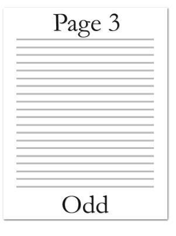

# 17.10 标题和页脚

**Headers and Footers**

=== "中文"
    
    标题和页脚是指出现在WordprocessingML文档每页顶部或底部的文本、图形或数据（如页码、日期、文档标题等）。
    
    页眉出现在页面顶端边距（页面主要文档内容之上），而页脚出现在文档页面底端边距（页面主要文档内容之下）。
    
    
    
    由于WordprocessingML是基于流的格式，通过指定文档特定部分的所有页面的页眉和页脚来应用页眉和页脚。
    
    在文档的每个部分中，可以有最多三种不同类型的页眉和页脚：
    
    - 第一页页眉/页脚
    - 奇数页页眉/页脚
    - 偶数页页眉/页脚
    
    第一页页眉和页脚指定了在该部分的第一页上出现的唯一页眉或页脚。奇数页页眉和页脚指定了在给定部分的所有奇数编号页面上出现的唯一页眉和页脚。偶数页页眉和页脚指定了在给定部分的所有偶数编号页面上出现的唯一页眉和页脚。

=== "英文"
    
    Headers and footers refer to text, graphics or data (such as page number, date, document title, and so on) that can appear at the top or bottom of each page in a WordprocessingML document.
    
    A header appears in the top margin (above the main document content on the page), while a footer appears i the bottom margin of a document page (below the main document content on the page).
    
    
    
    Since WordprocessingML is a flow-based format, headers and footers are applied by specifying the headers and footers for all pages in a particular section of a document.
    
    Within each section of a document there can be up to three different types of headers and footers:
    
    - First page header/footer
    - Odd page header/footer
    - Even page header/footer
    
    First page headers and footers specify a unique header or footer which shall appear on the first page of a section. Odd page headers and footers specify a unique header and footer which shall appear on all odd numbered pages for a given section. Even page headers and footers specify a unique header and footer which shall appear on all even numbered pages in a given section.


## 17.10.1 evenAndOddHeaders (不同的偶数/奇数页页眉和页脚)

**evenAndOddHeaders (Different Even/Odd Page Headers and Footers)**

=== "中文"
    
    此元素指定文档中的各节是否应为奇数页和偶数页使用不同的页眉和页脚（分别为奇数页页眉/页脚和偶数页页眉/页脚）。
    
    如果 `val` 属性设置为 `true`，那么文档中的每个节将使用奇数页页眉用于节中的所有奇数页，并使用偶数页页眉用于节中的所有偶数页（根据父节的页码起始值来确定第一页是奇数还是偶数，如 `pgNumType` 元素上的 `start` 属性所指定）。如果 `val` 属性设置为 `false`，则节中的所有页面将使用奇数页页眉。
    
    此设置不会影响每个节的首页页眉的存在，该页眉通过 `titlePg` 元素（[§17.10.6]）指定。如果指定了首页页眉，则所有后续页面都将应用此设置，包括奇数/偶数页计数中的第一页。
    
    如果此元素设置为 `false` 且指定了偶数页页眉/页脚，则将其忽略，且仅显示奇数页页眉/页脚。相反，如果此元素设置为 `true` 且某节省略了某种页眉/页脚类型，则应从前一节继承相应的页眉/页脚；如果这是文档的第一节，则根据需要创建一个空白页眉/页脚（不会使用其他页眉/页脚类型代替）。
    
    如果省略此元素，则其值应假定为 `false`。
    
    【示例：考虑一个文档，它的每个节必须具有不同的奇数页和偶数页页眉。此要求必须使用以下 WordprocessingML 指定：
    
    ```xml
    <w:settings>
        …
        <w:evenAndOddHeaders />
        …
    </w:settings>
    ```
    
    由于设置了 `evenAndOddHeaders` 属性（且其默认值为 `true`），该文档现在具有不同的奇数页和偶数页的页眉和页脚。示例结束】
    
    This element’s content model is defined by the common boolean property definition in [§17.17.4].

=== "英文"
    
    This element specifies whether sections in this document shall have different headers and footers for even and odd pages (an odd page header/footer and an even page header/footer).
    
    If the val attribute is set to true, then each section in the document shall use an odd page header for all odd numbered pages in the section, and an even page header for all even numbered pages in the section (counting from the starting value of page numbering for the parent section to determine if the first page is even or odd, as specified with the start attribute on the pgNumType element). If the val attribute is set to false, then all pages in a section shall use the odd page header.
    
    This setting does not affect the presence of a first page header on each section, which is specified using the titlePg element ([§17.10.6]). If a first page header is specified, then all subsequent pages shall have this setting applied, including the first page in the odd/even page count.
    
    If this element is set to false and an even page header/footer is specified , then it shall be ignored and only the odd page header/footer shall be displayed. Conversely, if this element is set to true and either header/footer type is omitted for a given section, the appropriate header/footer should be inherited from the previous section; if this is the first section in the document, then a blank header/footer shall be created as needed (another header/footer type shall not be used in its place).
    
    If this element is omitted, then its value shall be assumed to be false.
    
    [Example: Consider a document which must have a different even and odd page header for each section in its contents. This requirement must be specified using the following WordprocessingML:
    
    ```xml
    <w:settings>
        …
        <w:evenAndOddHeaders />
        …
    </w:settings>
    ```
    
    Since the evenAndOddHeaders property is set (and its default value is true), this document now has different headers and footers for even and odd pages. end example]
    
    This element’s content model is defined by the common boolean property definition in [§17.17.4].


## 17.10.2 footerReference (页脚参考)

**footerReference (Footer Reference)**

=== "中文"
    
    此元素指定一个页脚，该页脚将与文档中的当前节关联。这个页脚将通过id属性进行引用，该属性指定与WordprocessingML包中相应Footer部分的显式关系。
    
    如果此元素指定的关系的关系类型不是 http://purl.oclc.org/ooxml/officeDocument/relationships/footer ，或者不存在，或者其TargetMode属性值不是Internal，那么该文档将被视为不合规。
    
    在文档的每个节中，可以有多达三种不同类型的页脚：
    
    - 第一页页脚
    - 奇数页页脚
    - 偶数页页脚
    
    当前footerReference指定的页脚类型通过type属性指定。
    
    如果某一节省略了任何类型的页脚，则适用以下规则：
    
    - 如果未指定第一页页脚的footerReference，并且指定了titlePg元素，则第一页页脚应从前一节继承；如果这是文档的第一节，则将创建一个新的空白页脚。如果未指定titlePg元素，则不显示第一页页脚，而使用奇数页页脚代替。
    - 如果未指定偶数页页脚的footerReference，并且指定了evenAndOddHeaders元素，则偶数页页脚应从前一节继承；如果这是文档的第一节，则将创建一个新的空白页脚。如果未指定evenAndOddHeaders元素，则不显示偶数页页脚，而使用奇数页页脚代替。
    - 如果未指定奇数页页脚的footerReference，则奇数页页脚应从前一节继承；如果这是文档的第一节，则将创建一个新的空白页脚。
    
    【示例：考虑一个三页文档，其中定义了不同的第一页、奇数页和偶数页页脚，如下所示：
    
    
    
    此文档定义了三个页脚，每个页脚都有一个来自文档部分的唯一关系ID，如下的包装标记所示：
    
    ```xml
    <Relationships
        xmlns="http://schemas.openxmlformats.org/package/2006/relationships">
        …
        <Relationship Id="rId6"
            Type="http://purl.oclc.org/ooxml/officeDocument/relationships/footer" Target="footer1.xml"
            />
        <Relationship Id="rId7"
            Type="http://purl.oclc.org/ooxml/officeDocument/relationships/footer" Target="footer2.xml"
            />
        <Relationship Id="rId10"
            Type="http://purl.oclc.org/ooxml/officeDocument/relationships/footer" Target="footer3.xml"
            />
        …
    </Relationships>
    ```
    
    然后，这些关系在节的属性中通过以下WordprocessingML进行引用：
    
    ```xml
    <w:sectPr>
        …
        <w:footerReference r:id="rId6" w:type="first" />
        <w:footerReference r:id="rId7" w:type="default" />
        <w:footerReference r:id="rId10" w:type="even" />
        …
    </w:sectPr>
    ```
    
    生成的节必须在第一页使用关系ID为rId6的页脚部分，在所有后续的偶数页使用关系ID为rId10的页脚部分，并在所有后续的奇数页使用关系ID为rId7的页脚部分。示例结束】
    
    ??? abstract "Attributes"
    
        **id**（部件关系）
        
        :   命名空间: http://purl.oclc.org/ooxml/officeDocument/relationships
        
            指定与指定部分的关系ID。
        
            指定的关系应与父元素要求的关系类型匹配：
            
            - contentPart元素对应http://purl.oclc.org/ooxml/officeDocument/relationships/customXml
            - footerReference元素对应http://purl.oclc.org/ooxml/officeDocument/relationships/footer
            - headerReference元素对应http://purl.oclc.org/ooxml/officeDocument/relationships/header
            - embedBold、embedBoldItalic、embedItalic或embedRegular元素对应http://purl.oclc.org/ooxml/officeDocument/relationships/font
            - printerSettings元素对应http://purl.oclc.org/ooxml/officeDocument/relationships/printerSettings
            - longDesc或hyperlink元素对应http://purl.oclc.org/ooxml/officeDocument/relationships/hyperlink
            
            【示例：考虑一个具有以下id属性的XML元素：
            
            ```xml
            <… r:id="rId10" />
            ```
            
            该标记指定与关系ID rId10相关的关系部分包含父XML元素的相应关系信息。示例结束】
            
            该属性的可能值由ST_RelationshipId简单类型定义（[§22.8.2.1]）。
        
        **type**（页眉或页脚类型）
        
        :   指定目标关系ID所指定的页眉或页脚类型。此页眉/页脚类型决定当前页眉或页脚显示在哪些页面上。
        
            如果任何节包含超过一个的同类型页眉或页脚，则该文档将被视为不合规。
            
            【示例：考虑一个具有以下WordprocessingML的文档：
            
            ```xml
            <w:sectPr>
            …
            <w:footerReference r:id="rId6" w:type="first" />
            <w:footerReference r:id="rId7" w:type="first" />
            <w:footerReference r:id="rId10" w:type="even" />
            …
            </w:sectPr>
            ```
            
            生成的节有两个类型为first的页脚，因此不合规。示例结束】
            
            【示例：考虑一个指定以下页眉引用的WordprocessingML节：
            
            ```xml
            <w:headerReference r:id="rId10" w:type="first" />
            ```
            
            生成的节必须在第一页使用指定的页眉部分。示例结束】
            
            该属性的可能值由ST_HdrFtr简单类型定义（[§17.18.36]）。
    
    [Note: The W3C XML Schema definition of this element’s content model (CT_HdrFtrRef) is located in §A.1. end note]

=== "英文"
    
    This element specifies a single footer which shall be associated with the current section in the document. 
    
    This footer shall be referenced via the id attribute, which specifies an explicit relationship to the appropriate Footer part in the WordprocessingML package.
    
    If the relationship type of the relationship specified by this element is not
    http://purl.oclc.org/ooxml/officeDocument/relationships/footer, is not present, or does not have a
    TargetMode attribute value of Internal, then the document shall be considered non-conformant.
    Within each section of a document there can be up to three different types of footers:
    
    - First page footer
    - Odd page footer
    - Even page footer
    
    The footer type specified by the current footerReference is specified via the type attribute.
    
    If any type of footer is omitted for a given section, then the following rules shall apply.
    
    
    - If no footerReference for the first page footer is specified and the titlePg element is specified, then the first page footer shall be inherited from the previous section or, if this is the first section in the document, a new blank footer shall be created. If the titlePg element is not specified, then no first page footer shall be shown, and the odd page footer shall be used in its place.
    - If no footerReference for the even page footer is specified and the evenAndOddHeaders element is specified, then the even page footer shall be inherited from the previous section or, if this is the first section in the document, a new blank footer shall be created. If the evenAndOddHeaders element is not specified, then no even page footer shall be shown. and the odd page footer shall be used in its place.
    - If no footerReference for the odd page footer is specified then the odd page footer shall be inherited from the previous section or, if this is the first section in the document, a new blank footer shall be created.
    
    [Example: Consider a three page document with different first, odd, and even page footers defined as follows:
    
    
    
    This document defines three footers, each of have a relationship from the document part with a unique relationship ID, as shown in the following packaging markup:
    
    ```xml
    <Relationships
        xmlns="http://schemas.openxmlformats.org/package/2006/relationships">
            …
    <Relationship Id="rId6"
        Type="http://purl.oclc.org/ooxml/officeDocument/relationships/footer" Target="footer1.xml"
        />
    <Relationship Id="rId7"
        Type="http://purl.oclc.org/ooxml/officeDocument/relationships/footer" Target="footer2.xml"
        />
    <Relationship Id="rId10"
        Type="http://purl.oclc.org/ooxml/officeDocument/relationships/footer" Target="footer3.xml"
        />
        …
    </Relationships>
    ```
    
    These relationships are then referenced in the section's properties using the following WordprocessingML:
    
    ```xml
    <w:sectPr>
        …
        <w:footerReference r:id="rId6" w:type="first" />
        <w:footerReference r:id="rId7" w:type="default" />
        <w:footerReference r:id="rId10" w:type="even" />
        …
    </w:sectPr>
    ```
    
    The resulting section must use the footer part with relationship id rId6 for the first page, the footer part with relationship id rId10 for all subsequent even pages, and the footer part with relationship id rId7 for all subsequent odd pages. end example]
    
    ??? abstract "Attributes"
    
        **id** (Relationship to Part)
    
        :   Namespace: http://purl.oclc.org/ooxml/officeDocument/relationships
    
            Specifies the relationship ID to a specified part.
    
            The specified relationship shall match the relationship type required by the parent element:
            
            - http://purl.oclc.org/ooxml/officeDocument/relationships/customXml for the contentPart element
            - http://purl.oclc.org/ooxml/officeDocument/relationships/footer for the footerReference element
            - http://purl.oclc.org/ooxml/officeDocument/relationships/header for the headerReference element
            - http://purl.oclc.org/ooxml/officeDocument/relationships/font for the embedBold, embedBoldItalic, embedItalic, or embedRegular elements
            - http://purl.oclc.org/ooxml/officeDocument/relationships/printerSettings for the printerSettings element
            - http://purl.oclc.org/ooxml/officeDocument/relationships/hyperlink for the longDesc or hyperlink element
            
            [Example: Consider an XML element which has the following id attribute:
            
            ```xml
            <… r:id="rId10" />
            ```
            
            The markup specifies the associated relationship part with relationship ID rId1 contains the corresponding relationship information for the parent XML element. end example]
            
            The possible values for this attribute are defined by the ST_RelationshipId simple type ([§22.8.2.1]).
        
        **type** (Header or Footer Type)
    
        :   Specifies the type of header or footer specified by the target relationship ID. This header/footer type determines the page(s) on which the current header or footer shall be displayed.
    
            If any section contains more than a single header or footer of each type, then the document shall be considered non-conformant.
            
            [Example: Consider a document with the following WordprocessingML:
            
            ```xml
            <w:sectPr>
            …
            <w:footerReference r:id="rId6" w:type="first" />
            <w:footerReference r:id="rId7" w:type="first" />
            <w:footerReference r:id="rId10" w:type="even" />
            …
            </w:sectPr>
            ```
            
            The resulting section has two footers of type first, and therefore is non-conformant. end example]
            
            [Example: Consider a WordprocessingML section which specifies the following header reference:
            
            ```xml
            <w:headerReference r:id="rId10" w:type="first" />
            ```
            
            The resulting section must use the specified header part for the first page. end example]
            
            The possible values for this attribute are defined by the ST_HdrFtr simple type ([§17.18.36]).
    
    [Note: The W3C XML Schema definition of this element’s content model (CT_HdrFtrRef) is located in §A.1. end note]

## 17.10.3 ftr (页脚)

**ftr (Footer)**

=== "中文"
    
    该元素指定一个或多个WordprocessingML文档节中使用的单个页脚的内容。
    
    在ftr元素中，元素的内容类似于body元素（[§17.2.2]）的内容，包含所谓的块级标记——可以作为WordprocessingML文档中段落的兄弟元素存在的标记。
    
    【示例：考虑以下带有一个页脚的简单单页文档：
    
    
    
    该文档定义了一个包含文本“Footer”的页脚。页脚的内容存储在一个唯一的Footer部分中。生成的页脚由以下WordprocessingML表示：
    
    ```xml
    <w:ftr>
        <w:p>
            <w:r>
                <w:t>Footer</w:t>
            </w:r>
        </w:p>
    </w:ftr>
    ```
    
    由于页脚是块级内容的容器，所有块级元素都可以在其中使用。在此示例中，内容是一个单独的段落。示例结束】
    
    【示例：考虑一个更复杂的三页文档，其中定义了不同的第一页、奇数页和偶数页页脚：
    
      
    
    该文档定义了存储在三个不同页脚部分中的三个页脚。生成的页脚由以下WordprocessingML表示：
    
    第一页页脚部分：
    
    ```xml
    <w:ftr>
        <w:p>
            <w:r>
                <w:t>First</w:t>
            </w:r>
        </w:p>
    </w:ftr>
    ```
    
    偶数页页脚部分：
    
    ```xml
    <w:ftr>
        <w:p>
            <w:r>
                <w:t>Even</w:t>
            </w:r>
        </w:p>
    </w:ftr>
    ```
    
    奇数页页脚部分：
    
    ```xml
    <w:ftr>
        <w:p>
            <w:r>
                <w:t>Odd</w:t>
            </w:r>
        </w:p>
    </w:ftr>
    ```
    
    示例结束】
    
    [Note: The W3C XML Schema definition of this element’s content model (CT_HdrFtr) is located in §A.1. end note]
    

=== "英文"
    
    This element specifies the content for a single footer for use within one or more sections of a WordprocessingML document.
    
    Within the ftr element, the content of the element is similar to the content of the body ([§17.2.2]) element, and contains what is referred to as block-level markup - markup which can exist as a sibling element to paragraphs in a WordprocessingML document.
    
    [Example: Consider the following simple one page document with one footer:
    
    
    
    This document defines one footer with the text footer. The footer contents are stored in a unique footer part. The resulting footer is represented by the following WordprocessingML:
    
    ```xml
    <w:ftr>
        <w:p>
            <w:r>
                <w:t>Footer</w:t>
            </w:r>
        </w:p>
    </w:ftr>
    ```
    
    Since footers are containers of block level contents, all block level elements can be used within them. In this particular example, the content is a single paragraph. end example]
    
    [Example: Consider a more complex three page document with different first, odd, and even page footers defined:
    
      
    
    This document defines three footers stored in three different footer parts. The resulting footers are represented by the following WordprocessingML:
    
    First page footer part:
    
    ```xml
    <w:ftr>
        <w:p>
            <w:r>
                <w:t>First</w:t>
            </w:r>
        </w:p>
    </w:ftr>
    ```
    
    Even page footer part:
    
    ```xml
    <w:ftr>
        <w:p>
            <w:r>
                <w:t>Even</w:t>
            </w:r>
        </w:p>
    </w:ftr>
    ```
    
    Odd page footer part:
    
    ```xml
    <w:ftr>
        <w:p>
            <w:r>
                <w:t>Odd</w:t>
            </w:r>
        </w:p>
    </w:ftr>
    ```
    
    end example]
    
    [Note: The W3C XML Schema definition of this element’s content model (CT_HdrFtr) is located in §A.1. end note]
    

## 17.10.4 hdr (页眉)

**hdr (Header)**

=== "中文"

    该元素指定在一个或多个WordprocessingML文档的节中使用的单个页眉的内容。
    
    在hdr元素中，元素的内容类似于body元素（[§17.2.2]）的内容，包含所谓的块级标记 - 可以作为WordprocessingML文档中段落的兄弟元素存在的标记。
    
    【示例：考虑以下带有一个页眉的简单单页文档：
    
    
    
    该文档定义了一个包含文本"Header"的页眉。页眉的内容存储在一个唯一的Header部分中。生成的页眉由以下WordprocessingML表示：
    
    ```xml
    <w:hdr>
        <w:p>
            <w:r>
                <w:t>Header</w:t>
            </w:r>
        </w:p>
    </w:hdr>
    ```
    
    由于页眉是块级内容的容器，所有块级元素都可以在其中使用。在此示例中，内容是一个单独的段落。示例结束】
    
    【示例：考虑一个更复杂的三页文档，其中定义了不同的第一页、奇数页和偶数页页眉：
    
    
    
    该文档定义了存储在三个不同页眉部分中的三个页眉。生成的页眉由以下WordprocessingML表示：
    
    第一页页眉部分：
    
    ```xml
    <w:hdr>
        <w:p>
            <w:r>
                <w:t>First</w:t>
            </w:r>
        </w:p>
    </w:hdr>
    ```
    
    偶数页页眉部分：
    
    ```xml
    <w:hdr>
        <w:p>
            <w:r>
                <w:t>Even</w:t>
            </w:r>
        </w:p>
    </w:hdr>
    ```
    
    奇数页页眉部分：
    
    ```xml
    <w:hdr>
        <w:p>
            <w:r>
                <w:t>Odd</w:t>
            </w:r>
        </w:p>
    </w:hdr>
    ```
    
    示例结束】
    
    [Note: The W3C XML Schema definition of this element’s content model (CT_HdrFtr) is located in §A.1. end note]

=== "英文"

    This element specifies the content for a single header for use within one or more sections of a WordprocessingML document.
    
    Within the hdr element, the content of the element is similar to the content of the body ([§17.2.2]) element, and contains what is referred to as block-level markup - markup which can exist as a sibling element to paragraphs in a WordprocessingML document.
    
    [Example: Consider the following simple one page document with one header:
    
    
    
    This document defines one header with the text Header. The header's contents is stored in a unique Header part. The resulting header is represented by the following WordprocessingML:
    
    ```xml
    <w:hdr>
        <w:p>
            <w:r>
                <w:t>Header</w:t>
            </w:r>
        </w:p>
    </w:hdr>
    ```
    
    Since headers are containers of block level contents, all block level elements can be used within them. In this particular example, the content is a single paragraph. end example]
    
    [Example: Consider a more complex three page document with different first, odd, and even page headers defined:
    
    
    
    
    This document defines three headers stored in three different header parts. The resulting headers are represented by the following WordprocessingML:
    
    First page header part:
    
    ```xml
    <w:hdr>
        <w:p>
            <w:r>
                <w:t>First</w:t>
            </w:r>
        </w:p>
    </w:hdr>
    ```
    
    Even page header part:
    
    ```xml
    <w:hdr>
        <w:p>
            <w:r>
                <w:t>Even</w:t>
            </w:r>
        </w:p>
    </w:hdr>
    ```
    
    Odd page header part:
    
    ```xml
    <w:hdr>
        <w:p>
            <w:r>
                <w:t>Odd</w:t>
            </w:r>
        </w:p>
    </w:hdr>
    ```
    
    end example]
    
    [Note: The W3C XML Schema definition of this element’s content model (CT_HdrFtr) is located in §A.1. end note]


## 17.10.5 headerReference (页眉参考)

**headerReference (Header Reference)**

=== "中文"
    
    该元素指定一个应与文档当前节关联的单个页眉。该页眉将通过id属性进行引用，该属性指定了与WordprocessingML包中的相应页眉部分的显式关系。
    
    如果此元素指定的关系类型不是 http://purl.oclc.org/ooxml/officeDocument/relationships/header ，或不存在，或其TargetMode属性值不是Internal，那么文档将被视为不符合规范。
    
    在文档的每一节中，最多可以有三种不同类型的页眉：
    
    - 首页页眉
    - 奇数页页眉
    - 偶数页页眉
    
    当前headerReference指定的页眉类型通过type属性来指定。
    
    如果在给定节中省略了任何类型的页眉，则将应用以下规则：
    
    - 如果未指定首页页眉的headerReference且指定了titlePg元素，则首页页眉应从上一节继承，或者如果这是文档的第一节，则应创建一个新的空白页眉。如果未指定titlePg元素，则不显示首页页眉，并使用奇数页页眉代替。
    - 如果未指定偶数页页眉的headerReference且指定了evenAndOddHeaders元素，则偶数页页眉应从上一节继承，或者如果这是文档的第一节，则应创建一个新的空白页眉。如果未指定evenAndOddHeaders元素，则不显示偶数页页眉，并使用奇数页页眉代替。
    - 如果未指定奇数页页眉的headerReference，则奇数页页眉应从上一节继承，或者如果这是文档的第一节，则应创建一个新的空白页眉。
    
    【示例：考虑一个定义了不同的首页、奇数页和偶数页页眉的三页文档，如下所示：
    
    
    
    该文档定义了三个页眉，每个页眉都有一个来自文档部分的唯一关系ID，如下包标记所示：
    
    ```xml
    <Relationships
        xmlns="http://schemas.openxmlformats.org/package/2006/relationships">
        …
        <Relationship Id="rId2"
            Type="http://purl.oclc.org/ooxml/officeDocument/relationships/header"
            Target="header1.xml" />
        <Relationship Id="rId3"
            Type="http://purl.oclc.org/ooxml/officeDocument/relationships/header"
            Target="header2.xml" />
        <Relationship Id="rId5"
            Type="http://purl.oclc.org/ooxml/officeDocument/relationships/header"
            Target="header3.xml" />
        …
    </Relationships>
    ```
    
    这些关系在节的属性中通过以下WordprocessingML进行引用：
    
    ```xml
    <w:sectPr>
        …
        <w:headerReference r:id="rId3" w:type="first" />
        <w:headerReference r:id="rId5" w:type="default" />
        <w:headerReference r:id="rId2" w:type="even" />
        …
    </w:sectPr>
    ```
    
    生成的节必须使用关系ID为rId3的页眉部分作为首页页眉，关系ID为rId2的页眉部分作为所有后续偶数页页眉，关系ID为rId5的页眉部分作为所有后续奇数页页眉。示例结束】
    
    ??? abstract "Attributes"
    
        **id**（与部件的关系）
        
        :   命名空间：http://purl.oclc.org/ooxml/officeDocument/relationships
        
            指定与指定部分的关系ID。
        
            指定的关系应与父元素要求的关系类型匹配：
            
            - 对于contentPart元素：http://purl.oclc.org/ooxml/officeDocument/relationships/customXml
            - 对于footerReference元素：http://purl.oclc.org/ooxml/officeDocument/relationships/footer
            - 对于headerReference元素：http://purl.oclc.org/ooxml/officeDocument/relationships/header
            - 对于embedBold、embedBoldItalic、embedItalic或embedRegular元素：http://purl.oclc.org/ooxml/officeDocument/relationships/font
            - 对于printerSettings元素：http://purl.oclc.org/ooxml/officeDocument/relationships/printerSettings
            - 对于longDesc或hyperlink元素：http://purl.oclc.org/ooxml/officeDocument/relationships/hyperlink
            
            【示例：考虑一个具有以下id属性的XML元素：
            
            ```xml
            <… r:id="rId10" />
            ```
            
            该标记指定了关系ID为rId10的关联关系部分，其中包含了父XML元素的相应关系信息。示例结束】
            
            此属性的可能值由ST_RelationshipId简单类型定义（[§22.8.2.1]）。
        
        **type**（页眉或页脚类型）
        
        :   指定目标关系ID所指定的页眉或页脚类型。该页眉/页脚类型决定了当前页眉或页脚应显示在哪些页面上。
        
            如果任何节包含多于一个每种类型的页眉或页脚，则文档将被视为不符合规范。
            
            【示例：考虑一个包含以下WordprocessingML的文档：
            
            ```xml
            <w:sectPr>
            …
            <w:footerReference r:id="rId6" w:type="first" />
            <w:footerReference r:id="rId7" w:type="first" />
            <w:footerReference r:id="rId10" w:type="even" />
            …
            </w:sectPr>
            ```
            
            生成的节有两个类型为first的页脚，因此不符合规范。示例结束】
            
            【示例：考虑一个指定以下页眉引用的WordprocessingML节：
            
            ```xml
            <w:headerReference r:id="rId10" w:type="first" />
            ```
            
            生成的节必须使用指定的页眉部分作为第一页的页眉。示例结束】
            
            此属性的可能值由ST_HdrFtr简单类型定义（[§17.18.36]）。
    
    [Note: The W3C XML Schema definition of this element’s content model (CT_HdrFtrRef) is located in §A.1. end note]

=== "英文"
    
    This element specifies a single header which shall be associated with the current section in the document. This header shall be referenced via the id attribute, which specifies an explicit relationship to the appropriate Header part in the WordprocessingML package.
    
    If the relationship type of the relationship specified by this element is not http://purl.oclc.org/ooxml/officeDocument/relationships/header, is not present, or does not have a TargetMode attribute value of Internal, then the document shall be considered non-conformant.
    
    Within each section of a document there can be up to three different types of headers:
    
    - First page header
    - Odd page header
    - Even page header
    
    The header type specified by the current headerReference is specified via the type attribute.
    
    If any type of header is omitted for a given section, then the following rules shall apply.
    
    - If no headerReference for the first page header is specified and the titlePg element is specified, then the first page header shall be inherited from the previous section or, if this is the first section in the document, a new blank header shall be created. If the titlePg element is not specified, then no first page header shall be shown, and the odd page header shall be used in its place.
    - If no headerReference for the even page header is specified and the evenAndOddHeaders element is specified, then the even page header shall be inherited from the previous section or, if this is the first section in the document, a new blank header shall be created. If the evenAndOddHeaders element is not specified, then no even page header shall be shown, and the odd page header shall be used in its place.
    - If no headerReference for the odd page header is specified then the odd page header shall be inherited from the previous section or, if this is the first section in the document, a new blank header shall be created.
    
    [Example: Consider a three page document with different first, odd, and even page header defined as follows:
    
    
    
    This document defines three headers, each of have a relationship from the document part with a unique relationship ID, as shown in the following packaging markup:
    
    ```xml
    <Relationships
        xmlns="http://schemas.openxmlformats.org/package/2006/relationships">
        …
        <Relationship Id="rId2"
            Type="http://purl.oclc.org/ooxml/officeDocument/relationships/header"
            Target="header1.xml" />
        <Relationship Id="rId3"
            Type="http://purl.oclc.org/ooxml/officeDocument/relationships/header"
            Target="header2.xml" />
        <Relationship Id="rId5"
            Type="http://purl.oclc.org/ooxml/officeDocument/relationships/header"
            Target="header3.xml" />
        …
    </Relationships>
    ```
    
    These relationships are then referenced in the section's properties using the following WordprocessingML:
    
    ```xml
    <w:sectPr>
        …
        <w:headerReference r:id="rId3" w:type="first" />
        <w:headerReference r:id="rId5" w:type="default" />
        <w:headerReference r:id="rId2" w:type="even" />
        …
    </w:sectPr>
    ```
    
    The resulting section must use the header part with relationship id rId3 for the first page, the header part with relationship id rId2 for all subsequent even pages, and the header part with relationship id rId5 for all subsequent odd pages. end example]
    
    ??? abstract "Attributes"
    
        **id** (Relationship to Part)
    
        :   Namespace: http://purl.oclc.org/ooxml/officeDocument/relationships
    
            Specifies the relationship ID to a specified part.
    
            The specified relationship shall match the relationship type required by the parent element:
            
            - http://purl.oclc.org/ooxml/officeDocument/relationships/customXml for the contentPart element
            - http://purl.oclc.org/ooxml/officeDocument/relationships/footer for the footerReference element
            - http://purl.oclc.org/ooxml/officeDocument/relationships/header for the headerReference element
            - http://purl.oclc.org/ooxml/officeDocument/relationships/font for the embedBold, embedBoldItalic, embedItalic, or embedRegular elements
            - http://purl.oclc.org/ooxml/officeDocument/relationships/printerSettings for the printerSettings element
            - http://purl.oclc.org/ooxml/officeDocument/relationships/hyperlink for the longDesc or hyperlink element
            
            
            [Example: Consider an XML element which has the following id attribute:
            
            ```xml
            <… r:id="rId10" />
            ```
            
            The markup specifies the associated relationship part with relationship ID rId1 contains the corresponding relationship information for the parent XML element. end example]
            
            The possible values for this attribute are defined by the ST_RelationshipId simple type ([§22.8.2.1]).
    
        **type** (Header or Footer Type)
    
        :   Specifies the type of header or footer specified by the target relationship ID. This header/footer type determines the page(s) on which the current header or footer shall be displayed.
    
            If any section contains more than a single header or footer of each type, then the
            document shall be considered non-conformant.
            
            [Example: Consider a document with the following WordprocessingML:
            
            ```xml
            <w:sectPr>
            …
            <w:footerReference r:id="rId6" w:type="first" />
            <w:footerReference r:id="rId7" w:type="first" />
            <w:footerReference r:id="rId10" w:type="even" />
            …
            </w:sectPr>
            ```
            
            The resulting section has two footers of type first, and therefore is non-conformant. end example]
            
            [Example: Consider a WordprocessingML section which specifies the following header reference:
            
            ```xml
            <w:headerReference r:id="rId10" w:type="first" />
            ```
            
            The resulting section must use the specified header part for the first page. end example]
            
            The possible values for this attribute are defined by the ST_HdrFtr simple type ([§17.18.36]).
    
    [Note: The W3C XML Schema definition of this element’s content model (CT_HdrFtrRef) is located in §A.1. end note]

## 17.10.6 titlePg (第一页页眉和页脚的不同)

**titlePg (Different First Page Headers and Footers)**

=== "中文"
    
    此元素指定文档中的父节是否应为其首页设置不同的页眉和页脚。
    
    如果val属性设置为true，则文档中的父节将在该节的首页使用首页页眉。如果val属性设置为false，则父节的首页将使用父节的页码起始值来决定首页是否应使用偶数页或奇数页的页眉/页脚，如pgNumType元素的start属性所指定的那样。
    
    此设置不影响所有节中的偶数页和奇数页页眉的存在情况，这由evenAndOddHeaders元素（[§17.10.1]）指定。
    
    如果此元素设置为false且指定了首页页眉/页脚，则它将被忽略，并且只显示奇数页页眉/页脚。相反，如果此元素设置为true且给定节没有指定首页页眉/页脚类型，则首页页眉/页脚应继承自前一节；如果这是文档中的第一节，则将创建一个空白的页眉/页脚（不会使用其他页眉/页脚类型替代）。
    
    如果省略此元素，则其值应视为false。
    
    【示例：考虑一个必须具有不同首页页眉的节。此需求使用以下WordprocessingML指定：
    
    ```xml
    <w:sectPr>
        …
        <w:titlePg />
        …
    </w:sectPr>
    ```
    
    由于存在titlePg属性（其默认属性值为true），因此该文档现在具有不同的首页页眉和页脚。示例结束】
    
    此元素的内容模型由[§17.17.4]中的常见布尔属性定义。

=== "英文"
    
    This element specifies whether the parent section in this document shall have a different header and footer for its first page.
    
    If the val attribute is set to true, then the parent section in the document shall use a first page header for the first page in the section. If the val attribute is set to false, then the first page in the parent section shall use the starting value of page numbering for the parent section to determine if the first page should use the even or odd header/footer, as specified with the start attribute on the pgNumType element.
    
    This setting does not affect the presence of even and odd page header on all sections, which is specified using the evenAndOddHeaders element ([§17.10.1]).
    
    If this element is set to false and a first page header/footer is specified , then it shall be ignored and only the odd page header/footer shall be displayed. Conversely, if this element is set to true and the first page header/footer type is omitted for the given section, the first page header/footer should be inherited from the previous section; if this is the first section in the document, then a blank header/footer shall be created (another header/footer type shall not be used in its place).
    
    If this element is omitted, then its value shall be assumed to be false.
    
    [Example: Consider a section which must have a different first page header. This requirement is specified using the following WordprocessingML:
    
    ```xml
    <w:sectPr>
        …
        <w:titlePg />
        …
    </w:sectPr>
    ```
    
    Since the titlePg property is present (and its default attribute value is true), this document now has a different header and footer for its first page. end example]
    
    This element’s content model is defined by the common boolean property definition in [§17.17.4].


[§17.10.1]: #17101-evenandoddheaders-不同的偶数奇数页页眉和页脚
[§17.10.2]: #17102-footerreference-页脚参考
[§17.10.3]: #17103-ftr-页脚
[§17.10.4]: #17104-hdr-页眉
[§17.10.5]: #17105-headerreference-页眉参考
[§17.10.6]: #17106-titlepg-第一页页眉和页脚的不同

[§17.2.2]: ./02maindocment.md#1722-body-文档正文

[§17.17.4]: ./17miscellaneous.md#17174-布尔属性-ct_onoff

[§17.18.36]: ./18simpletypes.md#171836-st_hdrftr-页眉或页脚类型

[§22.8.2.1]: ../chapter22/officedocumentrelationships.md#22821-st_relationshipid-显式关系-id