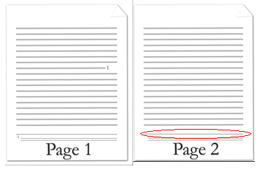
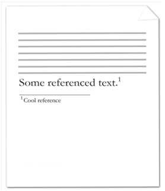
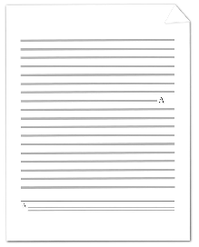

# 17.11 脚注和尾注

**Footnotes and Endnotes**

=== "中文"
    
    *脚注*和*尾注*是文档和书籍中用来显示借用材料的来源或输入解释性或补充性信息的独立文本部分，不会打断文档的正常阅读流程。
    
    脚注通常位于页面底部或被引用文本下方，而尾注通常放置在文档末尾或某个章节的末尾。如果文档被分成一个或多个章节，每个章节都可以包含尾注。
    
    脚注和尾注都由两部分组成：
    
    - 正文中的注释标记，用于指示有附加信息在脚注或尾注中，每个标记都使用编号系统，告诉读者是在页面末尾还是文档或章节的末尾查找注释。
    - 实际的脚注或尾注内容。
    
    【示例：将脚注应用于文档中的文本的示例：
    
    
    
    注释标记跟随被注释的文本，并指示有相关的脚注信息，脚注本身位于当前页面底部。示例结束】
    
    【示例：考虑以下将尾注应用于文档中的文本的示例：
    
    
    
    注释标记跟随被注释的文本，并指示有相关的尾注信息，尾注本身位于当前章节的末尾。示例结束】

=== "英文"
    
    *Footnotes* and *endnotes* are separate text stories used in documents and books to show the source of borrowed material or to enter explanatory or supplementary information which does not interrupt the normal reading flow of the document.
    
    Footnotes are typically located at the bottom of a page or beneath text being referenced, and endnotes are typically placed at the end of a document or at the end of a section. If document has been divided up into one or more sections, each section of a document can contain endnotes.
    
    Both footnotes and endnotes consist of two parts:
    
    
    - A note reference mark in the body text to indicate that additional information is in a footnote or endnote, with a numbering system used for each to tell readers whether to look for the note at the end of the page or the end of the document or section.
    - The actual footnote or endnote story content.
    
    [Example: Example of a footnote applied to text in a document:
    
    
    
    The note reference mark follows the noted text and specifies that there is associated footnote information, and the footnote itself is at the bottom of the current page. end example]
    
    [Example: Consider the following example of an endnote applied to text in a document:
    
    
    
    The note reference mark follows the noted text and specifies that there is associated endnote information, and the endnote itself is at the end of the current section. end example]

## 17.11.1 continuationSeparator (连续分隔符)

**continuationSeparator (Continuation Separator Mark)**

=== "中文"
    
    此元素指定当前运行中的续页分隔符标记的存在。续页分隔符标记是一条水平线，跨越主文档内容的文本宽度。
    
    【注：续页分隔符标记通常用于续页脚注或尾注的上下文中。这些脚注和尾注类型定义了用于将主文档内容与在前一页开始的脚注或尾注的续页部分分隔开的脚注/尾注。 结束注】
    
    【示例：考虑文档中的以下两页，其中某些文本被延续到下一页的脚注引用（续页分隔符用红色圈出）：
    
    
    
    将文档文本与续页脚注分隔开的线表示如下的WordprocessingML代码：
    
    ```xml
    <w:footnote w:type="continuationSeparator" w:id="1">
        <w:p>
            <w:r>
                <w:continuationSeparator />
            </w:r>
        </w:p>
    </w:footnote>
    ```
    
    在此示例中，脚注的内容仅由一个续页分隔符组成，显示为跨越文本宽度的水平线。 结束示例】
    
    【注：此元素内容模型（CT_Empty）的W3C XML Schema定义位于§A.1。 结束注】

=== "英文"
    
    This element specifies the presence of a continuation separator mark within the current run. A continuation separator mark is a horizontal line which spans the width of the main story's text extents.
    
    [Note: The continuation separator mark is typically used within the context of continuation separator footnotes or endnotes. These footnote and endnote types define the footnote/endnote used to separate the contents of the main document story from continuation of footnotes or endnotes which began on a previous page. end note]
    
    [Example: Consider the following two pages in a document, where some text is referenced by a footnote that extends to the next page (with the continuation separator circled in red):
    
    ！[123](./imgs/Image9562.png)
    
    The line separating the document text from the footnote that is continued on the next page is represented by
    the following WordprocessingML:
    
    ```xml
    <w:footnote w:type="continuationSeparator" w:id="1">
        <w:p>
            <w:r>
                <w:continuationSeparator />
            </w:r>
        </w:p>
    </w:footnote>
    ```
    
    In this example, the footnote has a content which consists of a single continuationSeparator, which is displayed as a horizontal line across the text extents. end example] 
    
    [Note: The W3C XML Schema definition of this element’s content model (CT_Empty) is located in §A.1. end note]


## 17.11.2 endnote (尾注内容)

**endnote (Endnote Content)**

=== "中文"
    
    此元素指定WordprocessingML文档中单个尾注的内容。每个尾注应由单个尾注元素表示，该元素可以包含任何块级内容。
    
    【示例：考虑一个包含单个尾注的文档，该尾注由尾注元素在尾注部分中定义：
    
    ```xml
    <w:endnotes>
        <w:endnote w:id="2">
            <w:p>
                <w:pPr>
                    <w:pStyle w:val="EndnoteText" />
                </w:pPr>
                <w:r>
                    <w:rPr>
                        <w:rStyle w:val="EndnoteReference" />
                    </w:rPr>
                    <w:endnoteRef />
                </w:r>
                <w:r>
                    <w:t xml:space="preserve">This is an endnote</w:t>
                </w:r>
            </w:p>
        </w:endnote>
    </w:endnotes>
    ```
    
    此尾注包含一个尾注引用标记以及尾注文本 “This is an endnote”。 结束示例】
    
    ??? abstract "Attributes"
    
        **id**（脚注/尾注ID）
        
        :   指定一个唯一的ID，用于将脚注或尾注的内容与文档中相应的脚注/尾注引用标记匹配，使用`footnoteRef`或`endnoteRef`元素，根据需要进行匹配。
        
            如果省略此属性，则该脚注或尾注将没有ID。如果多个脚注共享相同的ID，则该文档将被视为不合规。如果多个尾注共享相同的ID，则该文档也将被视为不合规。
            
            【示例：考虑在脚注部分定义的以下脚注：
            
            ```xml
            <w:footnotes>
                <w:footnote w:type="normal" w:id="0">
                    …
                </w:footnote>
                …
            </w:footnotes>
            ```
            
            此脚注的内容与具有匹配ID的脚注引用关联，如下所示：
            
            ```xml
            <w:p>
                <w:r>
                    <w:footnoteReference w:id="0" />
                </w:r>
            </w:p>
            ```
            
            结果段落具有一个脚注引用标记，该标记引用ID为0的脚注编号。 结束示例】
            
            此属性的可能值由ST_DecimalNumber简单类型定义（[§17.18.10]）。
        
        **type**（脚注/尾注类型）
        
        :   指定当前脚注或尾注内容定义中的脚注或尾注类型。
        
            如果省略此属性，则它将被视为正常类型。如果脚注或尾注不是正常类型，则不应由主文档内容中的`footnoteReference`或`endnoteReference`元素引用。
            
            【示例：考虑在WordprocessingML文档中定义的以下脚注：
            
            ```xml
            <w:footnote w:type="continuationSeparator" w:id="1">
                <w:p>
                    <w:r>
                        <w:continuationSeparator />
                    </w:r>
                </w:p>
            </w:footnote>
            ```
            
            在此示例中，脚注的类型为`continuationSeparator`，必须由消费者用于将续页脚注与主文档内容分隔开（详见简单类型的完整细节）。 结束示例】
            
            此属性的可能值由ST_FtnEdn简单类型定义（[§17.18.33]）。
    
    [Note: The W3C XML Schema definition of this element’s content model (CT_FtnEdn) is located in §A.1. end note]

=== "英文"
    
    This element specifies the content of a single endnote within a WordprocessingML document. Each endnote shall be represented by a single endnote element, which can contain any block-level content.
    
    [Example: Consider a document with a single endnote, identified by a endnote element, defined in the endnotes part:
    
    ```xml
    <w:endnotes>
        <w:endnote w:id="2">
            <w:p>
                <w:pPr>
                    <w:pStyle w:val="EndnoteText" />
                </w:pPr>
                <w:r>
                    <w:rPr>
                        <w:rStyle w:val="EndnoteReference" />
                    </w:rPr>
                    <w:endnoteRef />
                </w:r>
                <w:r>
                    <w:t xml:space="preserve">This is an endnote</w:t>
                </w:r>
            </w:p>
        </w:endnote>
    </w:endnotes>
    ```
    
    This endnote contains an endnote reference mark, as well as the endnote text This is an endnote. end example]
    
    ??? abstract "Attributes"
    
        **id** (Footnote/Endnote ID)
    
        :   Specifies a unique ID which shall be used to match the contents of a footnote or endnote to the associated footnote/endnote reference mark in the document using the footnoteRef or endnoteRef element, as appropriate.
    
            If this attribute is omitted, then this footnote or endnote shall have no ID. If more than one footnote shares the same ID, then this document shall be considered non- conformant. If more than one endnote shares the same ID, then this document shall be considered non-conformant.
            
            [Example: Consider the following footnote as defined in the footnotes part:
            
            ```xml
            <w:footnotes>
                <w:footnote w:type="normal" w:id="0">
                    …
                </w:footnote>
                …
            </w:footnotes>
            ```
            
            The contents of this footnote are associated with the footnoteReference with a matching ID, as follows:
            
            ```xml
            <w:p>
                <w:r>
                    <w:footnoteReference w:id="0" />
                </w:r>
            </w:p>
            ```
            
            The resulting paragraph has a footnote reference mark which references the footnote number value of the footnote with an id of 0. end example]
            
            The possible values for this attribute are defined by the ST_DecimalNumber simple type ([§17.18.10]).
        
        **type** (Footnote/Endnote Type)
    
        :   Specifies the type of footnote or endnote contained within the current footnote or endnote content definition.
    
            If this attribute is omitted, then it shall be considered to be of style normal. If a footnote or endnote is not of style normal, then it shall not be referenced by a footnoteReference or endnoteReference element within the main document story.
            
            [Example: Consider the following example of a footnote defined in a WordprocessingML document as follows:
            
            ```xml
            <w:footnote w:type="continuationSeparator" w:id="1">
                <w:p>
                    <w:r>
                        <w:continuationSeparator />
                    </w:r>
                </w:p>
            </w:footnote>
            ```
            
            In this example, the footnote is of style continuationSeparator and must be used by a consumer to separate continued footnotes from the main document contents (see simple type for full details). end example]
            
            The possible values for this attribute are defined by the ST_FtnEdn simple type ([§17.18.33]).
    
    [Note: The W3C XML Schema definition of this element’s content model (CT_FtnEdn) is located in §A.1. end note]

## 17.11.3 endnote (特别尾注列表)

**endnote (Special Endnote List)**

=== "中文"
    
    此元素指定当前文档中所有非普通样式的尾注的ID。每种其他类型的尾注都应在此列表中引用，否则将不加载。如果某个尾注未在此元素下列出，但文档内容需要它，那么该文档将被视为不符合规范。
    
    【示例：考虑一个文档，该文档有三个尾注，表示为以下的WordprocessingML：
    
    ```xml
    <w:endnotes …>
        <w:endnote w:type="separator" w:id="0">
            …
        </w:endnote>
        <w:endnote w:type="continuationSeparator" w:id="1">
            …
        </w:endnote>
        <w:endnote w:id="2">
            …
        </w:endnote>
    </w:endnotes>
    ```
    
    所有非普通样式的尾注必须在endnotePr元素中指定，如下所示：
    
    ```xml
    <w:endnotePr>
        <w:endnote w:id="0" />
        <w:endnote w:id="1" />
    </w:endnotePr>
    ```
    
    这表明消费者应将id属性值为0和1的尾注视为特殊尾注，并应相应地处理它们。示例结束】
    
    
    ??? abstract "Attributes"
    
        **id**（脚注/尾注ID）
        
        :   指定一个唯一的ID，用于将脚注或尾注的内容与文档中使用footnoteReference或endnoteReference元素的关联脚注/尾注引用标记匹配。
        
            如果多个脚注共享相同的ID，则该文档将被视为不符合规范。如果多个尾注共享相同的ID，则该文档也将被视为不符合规范。
            
            【示例：考虑以下在脚注部分定义的脚注：
            
            ```xml
            <w:footnotes>
                <w:footnote w:type="normal" w:id="0">
                    …
                </w:footnote>
                …
            </w:footnotes>
            ```
            
            此脚注的内容与具有匹配ID的footnoteReference相关联，如下所示：
            
            ```xml
            <w:p>
                <w:r>
                    <w:footnoteReference w:id="0" />
                </w:r>
            </w:p>
            ```
            
            由此生成的段落具有脚注引用标记，该标记引用ID为0的脚注的脚注编号值。示例结束】
            
            此属性的可能值由ST_DecimalNumber简单类型定义（[§17.18.10]）。
    
    [Note: The W3C XML Schema definition of this element’s content model (CT_FtnEdnSepRef) is located in §A.1. end note]

=== "英文"
    
    This element specifies the ID for all endnotes which are located in the current document that are not of style normal. Each other type of endnote shall be referenced in this list, or it shall not be loaded. If an endnote is not listed beneath this element, and it is required by the document content, then the document shall be considered non-conformant.
    
    [Example: Consider a document that has three endnotes represented by the following WordprocessingML:
    
    ```xml
    <w:endnotes …>
        <w:endnote w:type="separator" w:id="0">
            …
        </w:endnote>
        <w:endnote w:type="continuationSeparator" w:id="1">
            …
        </w:endnote>
        <w:endnote w:id="2">
            …
        </w:endnote>
    </w:endnotes>
    ```
    
    Each of the endnotes which are not of style normal must be specified in the endnotePr element, as follows:
    
    
    ```xml
    <w:endnotePr>
        <w:endnote w:id="0" />
        <w:endnote w:id="1" />
    </w:endnotePr>
    ```
    
    
    This indicates to the consumer that the endnotes with an id attribute value of 0 and 1 are special endnotes, and should be treated accordingly. end example]
    
    
    ??? abstract "Attributes"
    
        **id** (Footnote/Endnote ID)
    
        :   Specifies a unique ID that shall be used to match the contents of a footnote or endnote to the associated footnote/endnote reference mark in the document using the footnoteReference or endnoteReference element, as appropriate.
    
            If more than one footnote shares the same ID, then this document shall be considered non-conformant. If more than one endnote shares the same ID, then this document shall be considered non-conformant.
            
            [Example: Consider the following footnote as defined in the footnotes part:
            
            ```xml
            <w:footnotes>
                <w:footnote w:type="normal" w:id="0">
                    …
                </w:footnote>
                …
            </w:footnotes>
            ```
            
            The contents of this footnote are associated with the footnoteReference with a matching
            ID, as follows:
            
            ```xml
            <w:p>
                <w:r>
                    <w:footnoteReference w:id="0" />
                </w:r>
            </w:p>
            ```
            
            The resulting paragraph has a footnote reference mark which references the footnote number value of the footnote with an id of 0. end example]
            
            The possible values for this attribute are defined by the ST_DecimalNumber simple type ([§17.18.10]).
    
    [Note: The W3C XML Schema definition of this element’s content model (CT_FtnEdnSepRef) is located in §A.1. end note]


## 17.11.4 endnotePr (文档范围的尾注属性)

**endnotePr (Document-Wide Endnote Properties)**

=== "中文"
    
    此元素指定当前文档的尾注属性。这些属性中的每一个都作为子元素存储在endnotePr元素内。
    
    这些属性可以通过章节范围的endnotePr元素（[§17.11.5]）为特定章节覆盖。
    
    【示例：考虑以下包含两个章节的文档，其中每个章节的尾注都出现在该章节的末尾，并使用小写罗马数字编号：
    
    
    
    由于两个章节是相同的，尾注属性被指定为文档范围级别的属性（这不是必须的，但最有效），如下所示：
    
    ```xml
    <w:settings>
        …
        <w:endnotePr>
            <w:pos w:val="sectEnd"/>
            <w:numFmt w:val="lowerRoman" />
        </w:endnotePr>
        …
    </w:settings>
    ```
    
    注意，pos元素可以省略，因为它使用的是默认值。示例结束】
    
    [Note: The W3C XML Schema definition of this element’s content model (CT_EdnDocProps) is located in §A.1. end note]
    

=== "英文"
    
    This element specifies the endnote properties for the current document. Each of these properties are stored as a child element within the endnotePr element.
    
    These properties can be overridden for a specific section via the section-wide endnotePr element ([§17.11.5]).
    
    [Example: Consider the following document with two sections, where the endnotes for each section appears at the end of that section and use lower case roman numerals:
    
    
    
    Since both sections are identical, the endnote properties are specified as document-wide level properties (this is not necessary but is most efficient) as follows:
    
    ```xml
    <w:settings>
        …
        <w:endnotePr>
            <w:pos w:val="sectEnd"/>
            <w:numFmt w:val="lowerRoman" />
        </w:endnotePr>
        …
    </w:settings>
    ```
    
    Note that the pos element could have been omitted since it is using its default value. end example]
    
    [Note: The W3C XML Schema definition of this element’s content model (CT_EdnDocProps) is located in §A.1. end note]
    
## 17.11.5 endnotePr (节范围的尾注属性)

**endnotePr (Section-Wide Endnote Properties)**

=== "中文"
    
    此元素指定当前章节的尾注属性。这些属性是对文档范围内尾注属性（[§17.11.4]）的覆盖，并作为子元素存储在endnotePr元素内。
    
    如果某个章节省略了此元素，则该章节将使用文档范围内定义的尾注属性。
    
    【示例：考虑一个由三个章节组成的文档，其中第一章节的尾注使用小写罗马数字，第三章节的尾注使用《芝加哥手册》的格式。
    
    每个章节的WordprocessingML如下所示：
    
    ```xml
    <w:sectPr>
        <w:endnotePr>
            <w:numFmt w:val="lowerRoman" />
        </w:endnotePr>
    </w:sectPr>
    …
    <w:sectPr>
        …
    </w:sectPr>
    …
    <w:sectPr>
        …
    </w:sectPr>
    ```
    
    假设文档范围内的尾注设置指定使用《芝加哥手册》的格式，如下所示：
    
    ```xml
    <w:settings>
        <w:endnotePr>
            <w:numFmt w:val="chicago" />
        </w:endnotePr>
    </w:settings>
    ```
    
    生成的文档将覆盖第一章节的尾注编号格式为lowerRoman，但第三章节（以及如果第二章节有尾注的话，第二章节）将使用chicago尾注编号格式。示例结束】
    
    [Note: The W3C XML Schema definition of this element’s content model (CT_EdnProps) is located in §A.1. end note]

=== "英文"
    
    This element specifies the endnote properties for the current section. Each of these properties are an override of the document-wide endnote properties ([§17.11.4]) and are stored as a child element within the endnotePr element.
    
    If this element is omitted for a given section, then that section shall use the endnote properties defined at the document-wide level.
    
    [Example: Consider a document consisting of three sections, which has endnotes in the first section which use lowercase roman numerals, and endnotes in the third section which use the Chicago Manual of Style format.
    
    The WordprocessingML for each section would be specified as follows:
    
    ```xml
    <w:sectPr>
        <w:endnotePr>
            <w:numFmt w:val="lowerRoman" />
        </w:endnotePr>
    </w:sectPr>
    …
    <w:sectPr>
        …
    </w:sectPr>
    …
    <w:sectPr>
        …
    </w:sectPr>
    ```
    
    This assumes that the document-wide endnote settings are specified to use the Chicago Manual of Style format, as follows:
    
    
    ```xml
    <w:settings>
        <w:endnotePr>
            <w:numFmt w:val="chicago" />
        </w:endnotePr>
    </w:settings>
    ```
    
    The resulting document would override the endnote numbering format for the first section to lowerRoman, but would use the chicago endnote numbering format for section three (and would also use it for section two if that section had endnotes. end example]
    
    [Note: The W3C XML Schema definition of this element’s content model (CT_EdnProps) is located in §A.1. end note]

## 17.11.6 endnoteRef (尾注参考标记)

**endnoteRef (Endnote Reference Mark)**

=== "中文"
    
    此元素指定尾注引用标记的存在。尾注引用标记是一段自动编号的文本，遵循由numFmt元素设置的编号格式（[§17.11.17]）。
    
    如果在不是尾注部分的文本段中指定了尾注引用标记，则可以忽略该尾注引用标记。
    
    【示例：考虑以下文档，其中某些文本在文档末尾由一个尾注引用：
    
    
    
    在上图中，尾注引用标记是在实际尾注内的小写罗马数字。尾注的内容（包括尾注引用标记）由以下的WordprocessingML表示：
    
    ```xml
    <w:endnote w:id="2">
        <w:p>
            <w:pPr>
                <w:pStyle w:val="EndnoteText" />
            </w:pPr>
            <w:r>
                <w:rPr>
                    <w:rStyle w:val="EndnoteReference" />
                </w:rPr>
                <w:endnoteRef />
            </w:r>
            <w:r>
                <w:t>Cool reference</w:t>
            </w:r>
        </w:p>
    </w:endnote>
    ```
    
    生成的尾注包含了实际的尾注内容“Cool reference”，前面有一个自动编号的尾注引用标记。由于这是文档中的第一个尾注，该自动编号的引用标记使用小写罗马数字“i”。示例结束】
    
    [Note: The W3C XML Schema definition of this element’s content model (CT_Empty) is located in §A.1. end note]

=== "英文"
    
    This element specifies the presence of an endnote reference mark. An endnote reference mark is a run of automatically numbered text which follows the numbering format set forth via the numFmt element ([§17.11.17]).
    
    If an endnote reference mark is specified within a run which is not part of an endnote, then that endnote reference mark can be ignored.
    
    [Example: Consider the following document where some text is referenced by an endnote at the end of the document:
    
    
    
    The endnote reference mark is the lower case roman numeral within the actual endnote itself in the diagram above. The contents of the endnote (including the endnote reference mark) are represented by the following WordprocessingML:
    
    ```xml
    <w:endnote w:id="2">
        <w:p>
            <w:pPr>
                <w:pStyle w:val="EndnoteText" />
            </w:pPr>
            <w:r>
                <w:rPr>
                    <w:rStyle w:val="EndnoteReference" />
                </w:rPr>
                <w:endnoteRef />
            </w:r>
            <w:r>
                <w:t>Cool reference</w:t>
            </w:r>
        </w:p>
    </w:endnote>
    
    The resulting endnote contains the literal endnote content of Cool reference, preceding by an automatically numbered endnote reference mark. Since this is the first endnote in the document, that automatically numbered reference mark uses the lower case roman numeral i. end example]
    
    [Note: The W3C XML Schema definition of this element’s content model (CT_Empty) is located in §A.1. end note]


## 17.11.7 endnoteReference (尾注参考)

**endnoteReference (Endnote Reference)**

=== "中文"
    
    此元素指定尾注引用的存在。尾注引用是一段自动编号的文本，用于引用父文档中的特定尾注，并继承尾注引用标记的编号。
    
    如果在脚注或尾注中指定了尾注引用，则该文档将被视为不符合规范。
    
    【示例：考虑以下文档，其中某些文本在文档末尾由一个尾注引用：
    
    
    
    在上图中，尾注引用是文档内容中的小写罗马数字。
    
    包含尾注引用的段落内容由以下的WordprocessingML表示：
    
    ```xml
    <w:p>
        <w:r>
            <w:t>This text is followed by an endnote</w:t>
        </w:r>
        <w:r>
            <w:rPr>
                <w:rStyle w:val="EndnoteReference" />
            </w:rPr>
            <w:endnoteReference w:id="2" />
        </w:r>
        <w:r>
            <w:t>.</w:t>
        </w:r>
    </w:p>
    ```
    
    生成的段落包含文本内容“This text is followed by an endnote”，后跟一个自动编号的尾注引用。由于这是文档中的第一个尾注，该自动编号的引用继承了尾注引用标记的小写罗马数字“i”。
    
    示例结束】
    
    ??? abstract "Attributes"
    
        **customMarkFollows** (Suppress Footnote/Endnote Reference Mark)
    
        :   Specifies that the current footnote or endnote shall not have an associated footnote or endnote reference mark, as appropriate.
    
            This attribute shall be used to specify that a particular footnote or endnote shall not increment the numbering for its associated footnote/endnote numbering format, so that the use of a footnote with a custom footnote mark does not cause a missing value in the footnote/endnote values. The display of the mark is specified via the footnoteRef/endnoteRef elements, as appropriate.
            
            If this attribute is omitted, then the footnote or endnote reference mark shall not be skipped when incrementing over this footnote or endnote.
            
            [Example: Consider a footnote with an id value of 1 that uses a custom footnote mark:
            
            ```xml
            <w:footnotes>
            <w:footnote w:id="0">
            …
            </w:footnote>
            <w:footnote w:id="2">
            …
            </w:footnote>
            <w:footnote w:id="2">
            …
            </w:footnote>
            </w:footnotes>
            ```
            
            If the numbering format for footnotes in this document is upperRoman, then the first footnote must be I, the second is suppressed, and the third is II, noticing that the second does not increment the numbering sequence. end example]
            
            The possible values for this attribute are defined by the ST_OnOff simple type ([§22.9.2.7]).
    
        **id** (Footnote/Endnote ID Reference)
    
        :   Specifies the footnote or endnote which is being referenced by the current footnote or endnote reference in the document.
            
            If the resulting footnote or endnote ID is not present in the footnotes or endnote part (as appropriate), then this document shall be considered non-conformant.
            
            [Example: Consider a paragraph with an endnote reference, represented by the following WordprocessingML:
            
            ```xml
            <w:p>
                <w:r>
                    <w:t>This text is followed by an endnote</w:t>
                </w:r>
                <w:r>
                    <w:endnoteReference w:id="2" />
                </w:r>
                <w:r>
                    <w:t>.</w:t>
                </w:r>
            </w:p>
            ```
            
            This text references the endnote in the document's endnotes part which has an id value of 2. end example]
            
            The possible values for this attribute are defined by the ST_DecimalNumber simple type ([§17.18.10]).
    
    [Note: The W3C XML Schema definition of this element’s content model (CT_FtnEdnRef) is located in §A.1. end note]

=== "英文"
    
    This element specifies the presence of an endnote reference. An endnote reference is a run of automatically numbered text which references a particular endnote within the parent document, and inherits the endnote reference mark's numbering.
    
    If an endnote reference is specified within a footnote or endnote, then the document shall be considered non-conformant.
    
    [Example: Consider the following document where some text is referenced by an endnote at the end of the document:
    
    
    
    The endnote reference is the lower case roman numeral within the document content in the diagram above.
    
    The contents of the paragraph which contains the endnote reference are represented by the followingWordprocessingML:
    
    ```xml
    <w:p>
        <w:r>
            <w:t>This text is followed by an endnote</w:t>
        </w:r>
        <w:r>
            <w:rPr>
                <w:rStyle w:val="EndnoteReference" />
            </w:rPr>
            <w:endnoteReference w:id="2" />
        </w:r>
        <w:r>
            <w:t>.</w:t>
        </w:r>
    </w:p>
    ```
    
    The resulting paragraph contains the literal text content of This text is followed by an endnote, followed by an automatically numbered endnote reference. Since this is the first endnote in the document, that automatically numbered reference inherits the lower case roman numeral i from the endnote reference mark.
    
    end example]
    
    ??? abstract "Attributes"
    
        **customMarkFollows** (Suppress Footnote/Endnote Reference Mark)
    
        :   Specifies that the current footnote or endnote shall not have an associated footnote or endnote reference mark, as appropriate.
    
            This attribute shall be used to specify that a particular footnote or endnote shall not increment the numbering for its associated footnote/endnote numbering format, so that the use of a footnote with a custom footnote mark does not cause a missing value in the footnote/endnote values. The display of the mark is specified via the footnoteRef/endnoteRef elements, as appropriate.
            
            If this attribute is omitted, then the footnote or endnote reference mark shall not be skipped when incrementing over this footnote or endnote.
            
            [Example: Consider a footnote with an id value of 1 that uses a custom footnote mark:
            
            ```xml
            <w:footnotes>
            <w:footnote w:id="0">
            …
            </w:footnote>
            <w:footnote w:id="2">
            …
            </w:footnote>
            <w:footnote w:id="2">
            …
            </w:footnote>
            </w:footnotes>
            ```
            
            If the numbering format for footnotes in this document is upperRoman, then the first footnote must be I, the second is suppressed, and the third is II, noticing that the second does not increment the numbering sequence. end example]
            
            The possible values for this attribute are defined by the ST_OnOff simple type ([§22.9.2.7]).
    
        **id** (Footnote/Endnote ID Reference)
    
        :   Specifies the footnote or endnote which is being referenced by the current footnote or endnote reference in the document.
            
            If the resulting footnote or endnote ID is not present in the footnotes or endnote part (as appropriate), then this document shall be considered non-conformant.
            
            [Example: Consider a paragraph with an endnote reference, represented by the following WordprocessingML:
            
            ```xml
            <w:p>
                <w:r>
                    <w:t>This text is followed by an endnote</w:t>
                </w:r>
                <w:r>
                    <w:endnoteReference w:id="2" />
                </w:r>
                <w:r>
                    <w:t>.</w:t>
                </w:r>
            </w:p>
            ```
            
            This text references the endnote in the document's endnotes part which has an id value of 2. end example]
            
            The possible values for this attribute are defined by the ST_DecimalNumber simple type ([§17.18.10]).
    
    [Note: The W3C XML Schema definition of this element’s content model (CT_FtnEdnRef) is located in §A.1. end note]

## 17.11.8 endnotes (文档尾注)

**endnotes (Document Endnotes)**

=== "中文"
    
    该元素指定文档中的所有尾注集合，包括尾注分隔符和续注通知。该元素是尾注部分的根节点。
    
    【示例：考虑以下尾注部分内容的示例：
    
    ```xml
    <w:endnotes>
        <w:endnote w:type="separator" w:id="0">
            …
        </w:endnote>
        <w:endnote w:type="continuationSeparator" w:id="1">
            …
        </w:endnote>
        <w:endnote w:id="2">
            …
        </w:endnote>
        </w:endnotes>
    ```xml
    
    尾注部分包含一个普通尾注的定义，以及该文档的分隔符和续注分隔符尾注。示例结束】
    
    [Note: The W3C XML Schema definition of this element’s content model (CT_Endnotes) is located in §A.1. end note]

=== "英文"
    
    This element specifies the set of all endnotes in the document, including endnote separators and continuation notices. This element is the root node for the Endnotes part.
    
    [Example: Consider the following example of the contents of the endnotes part:
    
    ```xml
    <w:endnotes>
        <w:endnote w:type="separator" w:id="0">
            …
        </w:endnote>
        <w:endnote w:type="continuationSeparator" w:id="1">
            …
        </w:endnote>
        <w:endnote w:id="2">
            …
        </w:endnote>
        </w:endnotes>
    ```xml
    
    The endnotes part contains the definition for one normal endnote, as well as the separator and continuation separator endnote for this document. end example]
    
    [Note: The W3C XML Schema definition of this element’s content model (CT_Endnotes) is located in §A.1. end note]

## 17.11.9 footnote (特别脚注列表)

**footnote (Special Footnote List)**

=== "中文"
    
    该元素指定当前文档中所有非普通样式的脚注的ID。每种其他类型的脚注都应在此列表中引用，否则将不加载。这意味着，如果特殊脚注未在此元素下列出，并且文档内容需要它，则文档将被视为不符合规范。
    
    【示例：考虑一个具有以下WordprocessingML表示的三个脚注的文档：
    
    ```xml
    <w:footnotes>
        <w:footnote w:type="separator" w:id="0">
            …
        </w:footnote>
        <w:footnote w:type="continuationSeparator" w:id="1">
            …
        </w:footnote >
        <w:footnote w:id="2">
            …
        </w:footnote>
    </w:footnotes>
    ```
    
    所有非普通样式的脚注必须在footnotePr元素中指定，如下所示：
    
    ```xml
    <w:footnotePr>
        <w:footnote w:id="0" />
        <w:footnote w:id="1" />
    </w:footnotePr>
    ```
    
    这表明对消费者，具有id属性值为0和1的脚注是特殊脚注，应相应地处理。示例结束】
    
    ??? abstract "Attributes"
        
        **id**（脚注/尾注ID）
        
        :   指定一个唯一的ID，用于将脚注或尾注的内容与文档中使用footnoteReference或endnoteReference元素相匹配的相关脚注/尾注引用标记。
            
            如果多个脚注共享相同的ID，则该文档将被视为不符合规范。如果多个尾注共享相同的ID，则该文档也将被视为不符合规范。
            
            【示例：考虑以下在脚注部分定义的脚注：
            
            ```xml
            <w:footnotes>
                <w:footnote w:type="normal" w:id="0">
                    …
                </w:footnote>
                …
            </w:footnotes>
            ```
            
            此脚注的内容与具有匹配ID的footnoteReference相关联，如下所示：
            
            ```xml
            <w:p>
                <w:r>
                    <w:footnoteReference w:id="0" />
                </w:r>
            </w:p>
            ```
            
            由此生成的段落具有一个脚注引用标记，该标记引用ID为0的脚注的脚注编号值。示例结束】
            
            此属性的可能值由ST_DecimalNumber简单类型定义（[§17.18.10]）。
    
    [Note: The W3C XML Schema definition of this element’s content model (CT_FtnEdnSepRef) is located in §A.1. end note]

=== "英文"
    
    This element specifies the ID for all footnotes which are located in the current document that are not of style normal. Each other type of footnote shall be referenced in this list, or it shall not be loaded. This means that if a special footnote is not listed beneath this element, and it is required by the document content, then the document shall be considered non-conformant.
    
    [Example: Consider a document that has three footnotes represented by the following WordprocessingML:
    
    ```xml
    <w:footnotes>
        <w:footnote w:type="separator" w:id="0">
            …
        </w:footnote>
        <w:footnote w:type="continuationSeparator" w:id="1">
            …
        </w:footnote >
        <w:footnote w:id="2">
            …
        </w:footnote>
    </w:footnotes>
    ```
    
    Each of the footnotes which are not of style normal must be specified in the footnotePr element, as follows:
    
    ```xml
    <w:footnotePr>
        <w:footnote w:id="0" />
        <w:footnote w:id="1" />
    </w:footnotePr>
    ```
    
    This indicates to the consumer that the footnotes with an id attribute value of 0 and 1 are special footnotes, and should be treated accordingly. end example]
    
    ??? abstract "Attributes"
        
        **id** (Footnote/Endnote ID)
    
        :   Specifies a unique ID that shall be used to match the contents of a footnote or endnote to the associated footnote/endnote reference mark in the document using the footnoteReference or endnoteReference element, as appropriate.
    
            If more than one footnote shares the same ID, then this document shall be considered non-conformant. If more than one endnote shares the same ID, then this document shall be considered non-conformant.
            
            [Example: Consider the following footnote as defined in the footnotes part:
            
            ```xml
            <w:footnotes>
                <w:footnote w:type="normal" w:id="0">
                    …
                </w:footnote>
                …
            </w:footnotes>
            ```
            
            The contents of this footnote are associated with the footnoteReference with a matching
            ID, as follows:
            
            ```xml
            <w:p>
                <w:r>
                    <w:footnoteReference w:id="0" />
                </w:r>
            </w:p>
            ```
            
            The resulting paragraph has a footnote reference mark which references the footnote number value of the footnote with an id of 0. end example]
            
            The possible values for this attribute are defined by the ST_DecimalNumber simple type ([§17.18.10]).
    
    [Note: The W3C XML Schema definition of this element’s content model (CT_FtnEdnSepRef) is located in §A.1. end note]

## 17.11.10 footnote (脚注内容)

**footnote (Footnote Content)**

=== "中文"
    
    该元素指定了WordprocessingML文档中单个脚注的内容。每个脚注应由单个footnote元素表示，该元素可以包含任何块级内容。
    
    【示例：考虑一个具有单个脚注的文档，由footnote元素标识，在脚注部分定义如下：
    
    ```xml
    <w:footnotes>
        <w:footnote w:id="2">
            <w:p>
                <w:pPr>
                    <w:pStyle w:val="FootnoteText" />
                </w:pPr>
                <w:r>
                    <w:rPr>
                        <w:rStyle w:val="FootnoteReference" />
                    </w:rPr>
                    <w:footnoteRef />
                </w:r>
                <w:r>
                    <w:t xml:space="preserve">This is a sample footnote</w:t>
                </w:r>
            </w:p>
        </w:footnote>
    </w:footnotes>
    ```
    
    该脚注包含一个脚注引用标记，以及脚注文本“This is a sample footnote”。示例结束】
        
    ??? abstract "Attributes"
    
        **id**（脚注/尾注ID）
        
        :   指定一个唯一的ID，用于将脚注或尾注的内容与文档中相应的脚注/尾注引用标记匹配，使用`footnoteRef`或`endnoteRef`元素，根据需要进行匹配。
        
            如果省略此属性，则该脚注或尾注将没有ID。如果多个脚注共享相同的ID，则该文档将被视为不合规。如果多个尾注共享相同的ID，则该文档也将被视为不合规。
            
            【示例：考虑在脚注部分定义的以下脚注：
            
            ```xml
            <w:footnotes>
                <w:footnote w:type="normal" w:id="0">
                    …
                </w:footnote>
                …
            </w:footnotes>
            ```
            
            此脚注的内容与具有匹配ID的脚注引用关联，如下所示：
            
            ```xml
            <w:p>
                <w:r>
                    <w:footnoteReference w:id="0" />
                </w:r>
            </w:p>
            ```
            
            结果段落具有一个脚注引用标记，该标记引用ID为0的脚注编号。 结束示例】
            
            此属性的可能值由ST_DecimalNumber简单类型定义（[§17.18.10]）。
        
        **type**（脚注/尾注类型）
        
        :   指定当前脚注或尾注内容定义中的脚注或尾注类型。
        
            如果省略此属性，则它将被视为正常类型。如果脚注或尾注不是正常类型，则不应由主文档内容中的`footnoteReference`或`endnoteReference`元素引用。
            
            【示例：考虑在WordprocessingML文档中定义的以下脚注：
            
            ```xml
            <w:footnote w:type="continuationSeparator" w:id="1">
                <w:p>
                    <w:r>
                        <w:continuationSeparator />
                    </w:r>
                </w:p>
            </w:footnote>
            ```
            
            在此示例中，脚注的类型为`continuationSeparator`，必须由消费者用于将续页脚注与主文档内容分隔开（详见简单类型的完整细节）。 结束示例】
            
            此属性的可能值由ST_FtnEdn简单类型定义（[§17.18.33]）。
    
    [Note: The W3C XML Schema definition of this element’s content model (CT_FtnEdn) is located in §A.1. end note]

=== "英文"
    
    This element specifies the content of a single footnote within a WordprocessingML document. Each footnote shall be represented by a single footnote element, which can contain any block-level content.
    
    [Example: Consider a document with a single footnote, identified by a footnote element, defined in the footnotes part as follows:
    
    ```xml
    <w:footnotes>
        <w:footnote w:id="2">
            <w:p>
                <w:pPr>
                    <w:pStyle w:val="FootnoteText" />
                </w:pPr>
                <w:r>
                    <w:rPr>
                        <w:rStyle w:val="FootnoteReference" />
                    </w:rPr>
                    <w:footnoteRef />
                </w:r>
                <w:r>
                    <w:t xml:space="preserve">This is a sample footnote</w:t>
                </w:r>
            </w:p>
        </w:footnote>
    </w:footnotes>
    ```
    
    This footnote contains an footnote reference mark, as well as the endnote text This is a sample footnote. end example]
        
    ??? abstract "Attributes"
    
        **id** (Footnote/Endnote ID)
    
        :   Specifies a unique ID which shall be used to match the contents of a footnote or endnote to the associated footnote/endnote reference mark in the document using the footnoteRef or endnoteRef element, as appropriate.
    
            If this attribute is omitted, then this footnote or endnote shall have no ID. If more than one footnote shares the same ID, then this document shall be considered non- conformant. If more than one endnote shares the same ID, then this document shall be considered non-conformant.
            
            [Example: Consider the following footnote as defined in the footnotes part:
            
            ```xml
            <w:footnotes>
                <w:footnote w:type="normal" w:id="0">
                    …
                </w:footnote>
                …
            </w:footnotes>
            ```
            
            The contents of this footnote are associated with the footnoteReference with a matching ID, as follows:
            
            ```xml
            <w:p>
                <w:r>
                    <w:footnoteReference w:id="0" />
                </w:r>
            </w:p>
            ```
            
            The resulting paragraph has a footnote reference mark which references the footnote number value of the footnote with an id of 0. end example]
            
            The possible values for this attribute are defined by the ST_DecimalNumber simple type ([§17.18.10]).
        
        **type** (Footnote/Endnote Type)
    
        :   Specifies the type of footnote or endnote contained within the current footnote or endnote content definition.
    
            If this attribute is omitted, then it shall be considered to be of style normal. If a footnote or endnote is not of style normal, then it shall not be referenced by a footnoteReference or endnoteReference element within the main document story.
            
            [Example: Consider the following example of a footnote defined in a WordprocessingML document as follows:
            
            ```xml
            <w:footnote w:type="continuationSeparator" w:id="1">
                <w:p>
                    <w:r>
                        <w:continuationSeparator />
                    </w:r>
                </w:p>
            </w:footnote>
            ```
            
            In this example, the footnote is of style continuationSeparator and must be used by a consumer to separate continued footnotes from the main document contents (see simple type for full details). end example]
            
            The possible values for this attribute are defined by the ST_FtnEdn simple type ([§17.18.33]).
    
    [Note: The W3C XML Schema definition of this element’s content model (CT_FtnEdn) is located in §A.1. end note]

## 17.11.11 footnotePr (节范围的脚注属性)

**footnotePr (Section-Wide Footnote Properties)**

=== "中文"
    
    该元素指定当前章节的脚注属性。这些属性是对文档范围内脚注属性（[§17.11.12]）的覆盖，并作为子元素存储在footnotePr元素内。
    
    如果对于给定章节省略了此元素，则该章节将使用文档范围内定义的脚注属性。
    
    【示例：考虑一个包含三个章节的文档，其中第一章节的脚注出现在文本下方，第三章节的脚注出现在页面底部。每个章节的WordprocessingML如下所示：
    
    ```xml
    <w:sectPr>
        <w:footnotePr>
            <w:pos w:val="beneathText" />
        </w:footnotePr>
    </w:sectPr>
    …
    <w:sectPr>
        …
    </w:sectPr>
    …
    <w:sectPr>
        …
    </w:sectPr>
    ```
    
    假设文档范围内的脚注设置未指定pos元素（§17.11.21），而使用了默认的页面底部定位，如下所示：
    
    ```xml
    <w:settings>
        <w:footnotePr>
        …
        </w:footnotePr>
    </w:settings>
    ```
    
    生成的文档将覆盖第一章节的脚注定位为beneathText，但将第三章节的脚注定位为页面底部（如果第二章节也有脚注，则也使用页面底部定位）。示例结束】
    
    [Note: The W3C XML Schema definition of this element’s content model (CT_FtnProps) is located in §A.1. end note]

=== "英文"
    
    This element specifies the footnote properties for the current section. Each of these properties are an override of the document-wide footnote properties ([§17.11.12]) and are stored as a child element within the footnotePr element.
    
    If this element is omitted for a given section, then that section shall use the footnote properties defined at the document-wide level.
    
    [Example: Consider a document consisting of three sections, which has footnotes in the first section which appear below text, and footnotes in the third section which appear at the bottom of the page. The WordprocessingML for each section would be specified as follows:
    
    ```xml
    <w:sectPr>
        <w:footnotePr>
            <w:pos w:val="beneathText" />
        </w:footnotePr>
    </w:sectPr>
    …
    <w:sectPr>
        …
    </w:sectPr>
    …
    <w:sectPr>
        …
    </w:sectPr>
    ```
    
    This assumes that the document-wide footnote settings are specified as the default positioning at the bottom of the page by omitting the pos element (§17.11.21), as follows:
    
    ```xml
    <w:settings>
        <w:footnotePr>
        …
        </w:footnotePr>
    </w:settings>
    ```
    
    The resulting document would override the footnote positioning for the first section to beneathText, but would use the pageBottom footnote positioning for section three (and would also use it for section two if that section had footnotes. end example]
    
    [Note: The W3C XML Schema definition of this element’s content model (CT_FtnProps) is located in §A.1. end note]

## 17.11.12 footnotePr (文档范围的脚注属性)

**footnotePr (Document-Wide Footnote Properties)**

=== "中文"
    
    该元素指定了此文档的脚注属性。每个属性都作为footnotePr元素内的唯一元素存储。
    
    这些属性可以通过章节范围的footnotePr元素（§17.11.11）覆盖。
    
    【示例：考虑以下一页文档，其中脚注出现在引用的文本下方：
    
    
    
    由于文档只包含一个脚注，脚注属性可以存储在章节范围或文档范围的脚注属性中。假设它们存储在后者中，则脚注属性由以下WordprocessingML表示：
    
    ```xml
    <w:settings>
        …
        <w:footnotePr>
            <w:pos w:val="beneathText" />
        </w:footnotePr>
        …
    </w:settings>
    ```
    
    脚注属性指定了脚注出现在所注文本的下方。示例结束】
    
    [Note: The W3C XML Schema definition of this element’s content model (CT_FtnDocProps) is located in §A.1. end note]

=== "英文"
    
    This element specifies the footnote properties for this document. Each property is stored as a unique element within the footnotePr element.
    
    These properties can be overridden for a specific section via the section-wide footnotePr element ([§17.11.11]). 
    
    [Example: Consider the following one page document, where the footnote appears beneath the text it references:
    
    
    
    Since the document consists of a single footnote, the footnote properties can be stored in either the section-wide or document-wide footnote properties. Assuming that they are stored in the latter, the footnote properties are represented by the following WordprocessingML:
    
    ```
    <w:settings>
        …
        <w:footnotePr>
            <w:pos w:val="beneathText" />
        </w:footnotePr>
        …
    </w:settings>
    ```
    
    The footnote properties specify that footnotes appear below the noted text end example]
    
    [Note: The W3C XML Schema definition of this element’s content model (CT_FtnDocProps) is located in §A.1. end note]

## 17.11.13 footnoteRef (脚注参考标记)

**footnoteRef (Footnote Reference Mark)**

=== "中文"
    
    该元素指定脚注引用标记的存在。脚注引用标记是一段自动编号的文本，遵循由脚注numFmt元素设置的编号格式（[§17.11.18]）。
    
    如果脚注引用标记在不是脚注的文本段中指定，则可以忽略该脚注引用标记。
    
    【示例：考虑以下文档，其中某些文本在页面末尾由脚注引用：
    
    
    
    在上图中，脚注引用标记是实际脚注内的十进制数字。脚注的内容（包括脚注引用标记）由以下WordprocessingML表示：
    
    ```xml
    <w:footnote w:id="2">
        <w:p>
            <w:pPr>
                <w:pStyle w:val="FootnoteText" />
            </w:pPr>
            <w:r>
                <w:rPr>
                    <w:rStyle w:val="FootnoteReference" />
                </w:rPr>
                <w:footnoteRef />
            </w:r>
            <w:r>
                <w:t>Cool reference</w:t>
            </w:r>
        </w:p>
    </w:footnote>
    ```
    
    生成的脚注包含文本内容“Cool reference”，前面有一个自动编号的脚注引用标记。由于这是文档中的第一个脚注，该自动编号的引用标记使用第一个十进制数字1。同时需要注意的是，不需要使用FootnoteText和FootnoteReference样式，这些样式可以由特定生产者自动添加，以赋予脚注内容特定的样式（就像使用样式的任何其他方式一样）。示例结束】
    
    [Note: The W3C XML Schema definition of this element’s content model (CT_Empty) is located in §A.1. end note]

=== "英文"
    
    This element specifies the presence of a footnote reference mark. A footnote reference mark is a run of automatically numbered text which follows the numbering format set forth via the footnote numFmt element ([§17.11.18]).
    
    If a footnote reference mark is specified within a run which is not part of a footnote, then that footnote reference mark can be ignored.
    
    [Example: Consider the following document where some text is referenced by a footnote at the end of the page:
    
    
    
    The footnote reference mark is the decimal number within the actual footnote itself in the image above. The contents of the footnote (including the footnote reference mark) are represented by the following WordprocessingML:
    
    ```xml
    <w:footnote w:id="2">
        <w:p>
            <w:pPr>
                <w:pStyle w:val="FootnoteText" />
            </w:pPr>
            <w:r>
                <w:rPr>
                    <w:rStyle w:val="FootnoteReference" />
                </w:rPr>
                <w:footnoteRef />
            </w:r>
            <w:r>
                <w:t>Cool reference</w:t>
            </w:r>
        </w:p>
    </w:footnote>
    ```
    
    The resulting footnote contains the literal endnote content of Cool reference, preceding by an automatically numbered footnote reference mark. Since this is the first footnote in the document, that automatically numbered reference mark uses the first decimal number 1. It is also important to note that the use of styles FootnoteText and FootnoteReference is not required, these can simply be added by a particular producer automatically to give the footnote contents are particular style (just like any other use of styles). end example]
    
    [Note: The W3C XML Schema definition of this element’s content model (CT_Empty) is located in §A.1. end note]


## 17.11.14 footnoteReference (脚注参考)

**footnoteReference (Footnote Reference)**

=== "中文"
    
    该元素指定了脚注引用的存在。脚注引用是一段自动编号的文本，用于引用父文档中的特定脚注，并继承脚注引用标记的编号。
    
    如果在脚注或尾注中指定了脚注引用，则该文档将被视为不符合规范。
    
    【示例：考虑以下文档，其中某些文本在页面底部由脚注引用：
    
    
    
    在上图中，脚注引用是文档内容中的上标十进制数字。
    
    包含脚注引用的段落内容由以下的WordprocessingML表示：
    
    ```xml
    <w:p>
        <w:r>
            <w:t>Some referenced text.</w:t>
        </w:r>
        <w:r>
            <w:rPr>
                <w:rStyle w:val="FootnoteReference" />
            </w:rPr>
            <w:footnoteReference w:id="2" />
        </w:r>
    </w:p>
    ```
    
    生成的段落包含文本内容“Some referenced text.”，后跟一个自动编号的脚注引用。由于这是文档中的第一个脚注，该自动编号的引用继承了脚注引用标记的十进制编号1。示例结束】
    
    ??? abstract "Attributes"
    
        **customMarkFollows**（抑制脚注/尾注引用标记）
        
        :   指定当前脚注或尾注不应具有相应的脚注或尾注引用标记，视情况而定。
        
            该属性应用于指定特定脚注或尾注不应递增其关联脚注/尾注编号格式的编号，以便使用具有自定义脚注标记的脚注不会导致脚注/尾注值的缺失。标记的显示通过适当使用footnoteRef/endnoteRef元素来指定。
            
            如果省略此属性，则在递增至该脚注或尾注时，脚注或尾注引用标记将不被跳过。
            
            【示例：考虑一个具有id值为1的脚注，使用自定义脚注标记：
            
            ```xml
            <w:footnotes>
                <w:footnote w:id="0">
                    …
                </w:footnote>
                <w:footnote w:id="2">
                    …
                </w:footnote>
                <w:footnote w:id="2">
                    …
                </w:footnote>
            </w:footnotes>
            ```
            
            如果该文档中脚注的编号格式为upperRoman，则第一个脚注必须为I，第二个被抑制，第三个为II，注意第二个不会递增编号序列。示例结束】
            
            该属性的可能值由ST_OnOff简单类型定义（[§22.9.2.7]）。
        
        **id**（脚注/尾注ID引用）
        
        :   指定当前脚注或尾注引用所引用的脚注或尾注在文档中的位置。
        
            如果结果脚注或尾注ID在脚注或尾注部分（视情况而定）中不存在，则该文档将被视为不符合规范。
            
            【示例：考虑一个具有尾注引用的段落，由以下WordprocessingML表示：
            
            ```xml
            <w:p>
                <w:r>
                    <w:t>This text is followed by an endnote</w:t>
                </w:r>
                <w:r>
                    <w:endnoteReference w:id="2" />
                </w:r>
                <w:r>
                    <w:t>.</w:t>
                </w:r>
            </w:p>
            ```
            
            该文本引用文档末尾尾注部分的id值为2的尾注。示例结束】
            
            该属性的可能值由ST_DecimalNumber简单类型定义（[§17.18.10]）。
    
    [Note: The W3C XML Schema definition of this element’s content model (CT_FtnEdnRef) is located in §A.1. end note]

=== "英文"
    
    This element specifies the presence of a footnote reference. A footnote reference is a run of automatically numbered text which references a particular footnote within the parent document, and inherits the footnote reference mark's numbering.
    
    If an footnote reference is specified within a footnote or endnote, then the document shall be considered non-conformant.
    
    [Example: Consider the following document where some text is referenced by a footnote at the bottom of the page:
    
    
    
    The footnote reference is the superscript decimal number within the document content in the diagram above.
    
    The contents of the paragraph which contains the footnote reference are represented by the following WordprocessingML:
    
    ```xml
    <w:p>
        <w:r>
            <w:t>Some referenced text.</w:t>
        </w:r>
        <w:r>
            <w:rPr>
                <w:rStyle w:val="FootnoteReference" />
            </w:rPr>
            <w:footnoteReference w:id="2" />
        </w:r>
    </w:p>
    ```
    
    The resulting paragraph contains the literal text content of Some referenced text., followed by an automatically numbered footnote reference. Since this is the first footnote in the document, that automatically numbered reference inherits the decimal number 1 from the footnote reference mark. end example]
    
    
    ??? abstract "Attributes"
    
        **customMarkFollows** (Suppress Footnote/Endnote Reference Mark)
    
        :   Specifies that the current footnote or endnote shall not have an associated footnote or endnote reference mark, as appropriate.
    
            This attribute shall be used to specify that a particular footnote or endnote shall not increment the numbering for its associated footnote/endnote numbering format, so that the use of a footnote with a custom footnote mark does not cause a missing value in the footnote/endnote values. The display of the mark is specified via the footnoteRef/endnoteRef elements, as appropriate.
            
            If this attribute is omitted, then the footnote or endnote reference mark shall not be skipped when incrementing over this footnote or endnote.
            
            [Example: Consider a footnote with an id value of 1 that uses a custom footnote mark:
            
            ```xml
            <w:footnotes>
                <w:footnote w:id="0">
                    …
                </w:footnote>
                <w:footnote w:id="2">
                    …
                </w:footnote>
                <w:footnote w:id="2">
                    …
                </w:footnote>
            </w:footnotes>
            ```
            
            If the numbering format for footnotes in this document is upperRoman, then the first footnote must be I, the second is suppressed, and the third is II, noticing that the second does not increment the numbering sequence. end example]
    
            The possible values for this attribute are defined by the ST_OnOff simple type ([§22.9.2.7]).
        
        **id** (Footnote/Endnote ID Reference)
    
        :   Specifies the footnote or endnote which is being referenced by the current footnote or endnote reference in the document.
    
            If the resulting footnote or endnote ID is not present in the footnotes or endnote part (as appropriate), then this document shall be considered non-conformant.
            
            [Example: Consider a paragraph with an endnote reference, represented by the following WordprocessingML:
            
            ```xml
            <w:p>
                <w:r>
                    <w:t>This text is followed by an endnote</w:t>
                </w:r>
                <w:r>
                    <w:endnoteReference w:id="2" />
                </w:r>
                <w:r>
                    <w:t>.</w:t>
                </w:r>
            </w:p>
            ```
            
            This text references the endnote in the document's endnotes part which has an id value of 2. end example]
            
            The possible values for this attribute are defined by the ST_DecimalNumber simple type ([§17.18.10]).
    
    [Note: The W3C XML Schema definition of this element’s content model (CT_FtnEdnRef) is located in §A.1. end note]


## 17.11.15 footnotes (文档脚注)

**footnotes (Document Footnotes)**

=== "中文"
    
    该元素指定了文档中所有脚注的集合，包括脚注分隔符和续注。该元素是脚注部分的根节点。
    
    【示例：考虑以下脚注部分内容的示例：
    
    ```xml
    <w:footnotes>
        <w:footnote w:type="separator" w:id="0">
            …
        </w:footnote >
        <w:footnote w:type="continuationSeparator" w:id="1">
            …
        </w:footnote>
        <w:footnote w:id="2">
            …
        </w:footnote>
    </w:footnotes>
    ```
    
    脚注部分包含一个普通脚注的定义，以及此文档的分隔符和续注脚注。示例结束】
    
    [Note: The W3C XML Schema definition of this element’s content model (CT_Footnotes) is located in §A.1. end note]

=== "英文"
    
    This element specifies the set of all footnotes in the document, including footnote separators and continuation notices. This element is the root node for the Footnotes part.
    
    [Example: Consider the following example of the contents of the footnotes part:
    
    ```xml
    <w:footnotes>
        <w:footnote w:type="separator" w:id="0">
            …
        </w:footnote >
        <w:footnote w:type="continuationSeparator" w:id="1">
            …
        </w:footnote>
        <w:footnote w:id="2">
            …
        </w:footnote>
    </w:footnotes>
    ```
    
    The footnotes part contains the definition for one normal footnote, as well as the separator and continuation separator footnotes for this document. end example]
    
    [Note: The W3C XML Schema definition of this element’s content model (CT_Footnotes) is located in §A.1. end note]

## 17.11.16 noEndnote (抑制文档中的尾注)

**noEndnote (Suppress Endnotes In Document)**

=== "中文"

    该元素指定此文档中的所有尾注都不应显示或打印。如果此元素放置在文档中除第一个节（section）分隔符之外的任何节分隔符上，则将忽略它。
    
    如果省略此元素，则当前文档中的尾注不会被抑制。
    
    【示例：考虑一个文档，其中在第一节中标记了尾注以被隐藏：
    
    ```xml
    <w:sectPr>
        <w:noEndnote />
    </w:sectPr>
    ```
    
    在此示例中，该文档不显示尾注。示例结束】
    
    This element’s content model is defined by the common boolean property definition in [§17.17.4].

=== "英文"

    This element specifies that all endnotes in this document shall not be displayed or printed. If this element is placed on any section break other than the first section break in the document, it shall be ignored.
    
    If this element is omitted, endnotes shall not be suppressed in the current document.
    
    [Example: Consider a document in which in the first section endnotes are marked to be hidden:
    
    ```xml
    <w:sectPr>
        <w:noEndnote />
    </w:sectPr>
    ```
    
    In this example, this document does not display endnotes. end example]
    
    This element’s content model is defined by the common boolean property definition in [§17.17.4].

## 17.11.17 numFmt (尾注编号格式)

**numFmt (Endnote Numbering Format)**

=== "中文"
    
    该元素指定用于确定所有自动编号尾注引用标记（未设置suppressRef属性的标记）的尾注引用标记值的编号格式。
    
    如果省略此元素，则编号格式应假定为十进制。
    
    【示例：考虑以下脚注引用，编号格式设置为大写字母：
    
    
    
    该脚注编号格式由以下WordprocessingML指定：
    
    ```xml
    <w:footnotePr>
        <w:numFmt w:val="upperLetter" />
    </w:footnotePr>
    ```
    
    示例结束】
    
    ??? abstract "Attributes"
    
        **format**（自定义定义的编号格式）
        
        :   使用XSLT格式属性定义的语法指定自定义编号格式。
        
            此格式应用于父对象中的所有编号。
            
            【示例：值为 &#x30A2; 表示消费者必须使用片假名编号。示例结束】
            
            该属性的可能值由ST_String简单类型定义（[§22.9.2.13]）。
        
        **val**（编号格式类型）
        
        :   指定应用于父对象中的所有编号的编号格式。
        
            【示例：值为 lowerLetter 表示消费者必须在此分组中使用小写字母进行编号：a、b、c… 示例结束】
            
            该属性的可能值由ST_NumberFormat简单类型定义（[§17.18.59]）。
    
    [Note: The W3C XML Schema definition of this element’s content model (CT_NumFmt) is located in §A.1. end note]

=== "英文"
    
    This element specifies the numbering format that shall be used to determine the endnote reference mark value
    for all automatically numbered endnote reference marks (those without the suppressRef attribute set).
    
    If this element is omitted, then the numbering format shall be assume to be decimal.
    
    [Example: Consider the following footnote reference with the number format set to upper case letters:
    
    
    
    This footnote numbering format is specified by the following WordprocessingML:
    
    ```xml
    <w:footnotePr>
        <w:numFmt w:val="upperLetter" />
    </w:footnotePr>
    ```
    
    end example]
    
    ??? abstract "Attributes"
    
        **format** (Custom Defined Number Format)
    
        :   Specifies a custom number format using the syntax defined by the XSLT format attribute.
    
            This format shall be used for all numbering in the parent object.
    
            [Example: A value of &#x30A2; indicates that a consumer must use Katakana numbering. end example]
            
            The possible values for this attribute are defined by the ST_String simple type ([§22.9.2.13]).
    
        **val** (Numbering Format Type)
    
        :   Specifies the number format that shall be used for all numbering in the parent object.
    
            [Example: A value of lowerLetter indicates that a consumer must use lowercase letters for each number in this grouping: a,b,c… end example]
            
            The possible values for this attribute are defined by the ST_NumberFormat simple type ([§17.18.59]).
    
    [Note: The W3C XML Schema definition of this element’s content model (CT_NumFmt) is located in §A.1. end note]

## 17.11.18 numFmt (脚注编号格式)

**numFmt (Footnote Numbering Format)**

=== "中文"
    
    该元素指定用于确定所有自动编号脚注引用标记（未设置suppressRef属性的标记）的脚注引用标记值的编号格式。
    
    如果省略此元素，则编号格式应假定为十进制。
    
    【示例：考虑以下脚注引用，编号格式设置为大写字母：
    
    
    
    该脚注引用编号格式由以下WordprocessingML指定：
    
    ```xml
    <w:footnotePr>
        <w:numFmt w:val="upperLetter" />
    </w:footnotePr>
    ```
    
    示例结束】
    
    ??? abstract "属性"
    
        **format**（自定义定义的编号格式）
    
        :   使用XSLT格式属性定义的语法指定自定义编号格式。
    
            此格式应用于父对象中的所有编号。
    
            【示例：值为 &#x30A2; 表示消费者必须使用片假名编号。示例结束】
            
            该属性的可能值由ST_String简单类型定义（[§22.9.2.13]）。
    
        **val**（编号格式类型）
    
        :   指定应用于父对象中的所有编号的编号格式。
    
            【示例：值为 lowerLetter 表示消费者必须在此分组中使用小写字母进行编号：a、b、c… 示例结束】
            
            该属性的可能值由ST_NumberFormat简单类型定义（[§17.18.59]）。
    
    [Note: The W3C XML Schema definition of this element’s content model (CT_NumFmt) is located in §A.1. end note]

=== "英文"
    
    This element specifies the numbering format that shall be used to determine the footnote reference mark value for all automatically numbered footnote reference marks (those without the suppressRef attribute set).
    
    If this element is omitted, then the numbering format shall be assume to be decimal.
    
    [Example: Consider the following footnote reference with the number format set to upper case letters:
    
    
    
    This footnote numbering format is specified by the following WordprocessingML:
    
    ```xml
    <w:footnotePr>
        <w:numFmt w:val="upperLetter" />
    </w:footnotePr>
    ```
    
    end example]
    
    ??? abstract "Attributes"
    
        **format** (Custom Defined Number Format)
    
        :   Specifies a custom number format using the syntax defined by the XSLT format attribute.
    
            This format shall be used for all numbering in the parent object.
    
            [Example: A value of &#x30A2; indicates that a consumer must use Katakana numbering. end example]
            
            The possible values for this attribute are defined by the ST_String simple type ([§22.9.2.13]).
    
        **val** (Numbering Format Type)
    
        :   Specifies the number format that shall be used for all numbering in the parent object.
    
            [Example: A value of lowerLetter indicates that a consumer must use lowercase letters for each number in this grouping: a,b,c… end example]
            
            The possible values for this attribute are defined by the ST_NumberFormat simple type ([§17.18.59]).
    
    [Note: The W3C XML Schema definition of this element’s content model (CT_NumFmt) is located in §A.1. end note]

## 17.11.19 numRestart (脚注和尾注编号重新开始位置)

**numRestart (Footnote and Endnote Numbering Restart Location)**

=== "中文"
    
    该元素指定何时重新启动脚注或尾注引用标记的所有自动编号。重新启动后，文档中的下一个自动编号脚注或尾注（每个脚注/尾注类型独立处理）将重新开始到指定的numStart值（[§17.11.20]）。
    
    如果省略此元素，则在每个页面或节之间不会重新启动自动编号（一个值为continuous）。
    
    【示例：考虑以下两页文档，在每一页后必须将编号重置为其起始值：
    
    
    
    脚注自动重新开始编号的设置由以下WordprocessingML表示：
    
    ```xml
    <w:footnotePr>
        <w:numRestart w:val="eachPage" />
    </w:footnotePr>
    ```
    
    示例结束】
    
    ??? abstract "属性"
    
        val（自动编号重新启动值）
    
        :   指定何时为当前脚注或尾注集重新启动自动编号。
    
            【示例：考虑一个WordprocessingML文档，其中其尾注的编号必须在每个节之后重新启动，每个节必须在每个页面之后重新启动。此设置由以下WordprocessingML表示：
            
            ```xml
            <w:footnotePr>
                <w:numRestart w:val="eachSect" />
            </w:footnotePr>
            ```
            
            属性值eachSect指定编号在每个节之后重新启动。示例结束】
            
            该属性的可能值由ST_RestartNumber简单类型定义（[§17.18.74]）。
    
    [Note: The W3C XML Schema definition of this element’s content model (CT_NumRestart) is located in §A.1. end note]

=== "英文"
    
    This element specifies when all automatic numbering for the footnote or endnote reference marks shall be restarted. When restarted, the next automatically numbered footnote or endnote in the document (each footnote/endnote type is handled independently) shall restart to the specified numStart value ([§17.11.20]).
    
    If this element is omitted, then automatic numbering shall not be restarted between each page or section (a vlaue of continuous).
    
    [Example: Consider the following two page document where the numbering must be reset after each page to its starting value:
    
    
    
    The footnote automatic restarting of the numbering is represented by the following WordprocessingML:
    
    ```xml
    <w:footnotePr>
        <w:numRestart w:val="eachPage" />
    </w:footnotePr>
    ```
    
    end example]
    
    
    ??? abstract "Attributes"
    
        val (Automatic Numbering Restart Value)
    
        :   Specifies when the automatic numbering shall be restarted for the current set of footnotes or endnotes.
    
            [Example: Consider a WordprocessingML document where the numbering for its endnotes must be restarted after each section must be restarted after each page. This setting is represented by the following WordprocessingML:
            
            ```xml
            <w:footnotePr>
                <w:numRestart w:val="eachSect" />
            </w:footnotePr>
            ```
            
            The val attribute value of eachSect specifies that numbering shal be restarted after each section. end example]
            
            The possible values for this attribute are defined by the ST_RestartNumber simple type ([§17.18.74]).
    
    [Note: The W3C XML Schema definition of this element’s content model (CT_NumRestart) is located in §A.1. end note]

## 17.11.20 numStart (脚注和尾注编号起始值)

**numStart (Footnote and Endnote Numbering Starting Value)**

=== "中文"
    
    该元素指定文档中第一个自动编号脚注或尾注的起始编号或字符，以及由numRestart元素（§17.11.19）指定的重新启动点后的第一个自动编号脚注。该值应以十进制数单位指定，然后相应地转换为适当的编号格式。
    
    如果省略此元素，则起始值应为1。
    
    【示例：考虑以下脚注引用，编号格式设置为大写字母，起始字符设置为D：
    
    
    
    编号格式由以下WordprocessingML指定：
    
    ```xml
    <w:footnotePr>
        <w:numFmt w:val="upperLetter" />
        <w:numStart w:val="4" />
    </w:footnotePr>
    ```
    
    由于D是字母表中的第四个字母，因此起始字符设置为4。示例结束】
    
    ??? abstract "属性"
    
        **val**（十进制数值）
    
        :   指定此属性的内容包含一个十进制数。
    
            此十进制数的内容根据父XML元素的上下文进行解释。
            
            【示例：考虑以下简单类型ST_DecimalNumber的数字WordprocessingML属性：
            
            ```xml
            <… w:val="1512645511" />
            ```
            
            val属性的值是一个十进制数，其值必须在父元素的上下文中进行解释。示例结束】
            
            该属性的可能值由ST_DecimalNumber简单类型定义（[§17.18.10]）。
    
    [Note: The W3C XML Schema definition of this element’s content model (CT_DecimalNumber) is located in §A.1. end note]

=== "英文"
    
    This element specifies the starting number or character for the first automatically numbered footnotes or endnote in the document, as well as the first automatically numbered footnotes after each restart point specified by the numRestart element (§17.11.19). This value shall be specified in decimal number units, then translated accordingly to the appropriate numbering format.
    
    If this element is omitted, then the starting value shall be 1.
    
    [Example: Consider the following footnote reference with the number format set to upper case letters and starting character set to D:
    
    
    
    The number format is specified by the following WordprocessingML:
    
    ```xml
    <w:footnotePr>
        <w:numFmt w:val="upperLetter" />
        <w:numStart w:val="4" />
    </w:footnotePr>
    ```
    
    Since D is the fourth letter in the alphabet, the starting character is set to 4. end example]
    
    ??? abstract "Attributes"
    
        **val** (Decimal Number Value)
    
        :   Specifies that the contents of this attribute contains a decimal number.
    
            The contents of this decimal number are interpreted based on the context of the parent XML element.
            
            [Example: Consider the following numeric WordprocessingML property of simple type ST_DecimalNumber:
            
            ```xml
            <… w:val="1512645511" />
            ```
            
            The value of the val attribute is a decimal number whose value must be interpreted in the context of the parent element. end example]
            
            The possible values for this attribute are defined by the ST_DecimalNumber simple type ([§17.18.10]).
    
    [Note: The W3C XML Schema definition of this element’s content model (CT_DecimalNumber) is located in §A.1. end note]

## 17.11.21 pos (脚注位置)

**pos (Footnote Placement)**

=== "中文"
    
    这个元素指定了当文档中的文本引用脚注时，脚注应该放置在页面的位置。
    
    如果这个元素出现在章节级别，那么它将被忽略。
    
    如果在文档级别省略了这个元素，那么脚注将位于当前页面的底部。
    
    [示例：考虑以下一页文档，其中脚注出现在其引用的文本下方：
    
    
    
    脚注引用的文本是 "Some referenced text"，由以下WordprocessingML表示：
    
    ```xml
    <w:p>
        <w:r>
            <w:t>Some referenced text</w:t>
        </w:r>
        <w:r>
            <w:rPr>
                <w:rStyle w:val="FootnoteReference" />
            </w:rPr>
            <w:footnoteReference w:id="2" />
        </w:r>
    </w:p>
    ```
    
    由于脚注位置必须在当前文本下方，因此必须声明段落属性如下：
    
    ```xml
    <w:sectPr>
        …
        <w:footnotePr>
            <w:pos w:val="beneathText" />
        </w:footnotePr>
        …
    </w:sectPr>
    ```
    
    脚注引用的脚注位于id属性值等于2的脚注部分。在文档的节属性中，指定了脚注位于页面文本下方的位置。结束示例]
    
    ??? abstract "属性"
    
        **val**（脚注位置类型）
    
        :   指定文档中脚注的位置。
    
            [示例：考虑一个文档，其中脚注必须位于其文本下方。该文档的脚注属性必须声明如下：
            
            ```xml
            <w:sectPr>
                <w:footnotePr>
                    <w:pos w:val="beneathText" />
                </w:footnotePr>
                …
            </w:sectPr>
            ```
            
            val属性是beneathText，因此指定了脚注位于页面文本下方。结束示例]
            
            此属性的可能值由ST_FtnPos简单类型定义（[§17.18.34]）。
    
    [Note: The W3C XML Schema definition of this element’s content model (CT_FtnPos) is located in §A.1. end note]

=== "英文"
    
    This element specifies where footnotes shall be placed on the page when they are referenced by text in the current document.
    
    If this element is present at the section level, then it shall be ignored.
    
    If this element is omitted at the document level, then footnotes shall be located at the bottom of the current page.
    
    [Example: Consider the following one page document, where the footnote appears beneath the text that it is referencing:
    
    
    
    The footnote references the text reading Some reference text. and is represented by the following WordprocessingML:
    
    ```xml
    <w:p>
        <w:r>
            <w:t>Some referenced text</w:t>
        </w:r>
        <w:r>
            <w:rPr>
                <w:rStyle w:val="FootnoteReference" />
            </w:rPr>
            <w:footnoteReference w:id="2" />
        </w:r>
    </w:p>
    ```
    
    Since the footnote location must be beneath the current text, the section properties must be declared as follows:
    
    ```xml
    <w:sectPr>
        …
        <w:footnotePr>
            <w:pos w:val="beneathText" />
        </w:footnotePr>
        …
    </w:sectPr>
    ```
    
    The footnote references the footnote in the footnotes part with an id attribute value equal to 2. Within the section properties of the document, the position of footnotes is specified to be beneath the page's text. end example]
    
    ??? abstract "Attributes"
    
        **val** (Footnote Position Type)
    
        :   Specifies the position of footnotes in the document.
    
            [Example: Consider a document in which footnotes must be positioned beneath their text. The footnote properties for this document must be declared as follows:
            
            ```xml
            <w:sectPr>
                <w:footnotePr>
                    <w:pos w:val="beneathText" />
                </w:footnotePr>
                …
            </w:sectPr>
            ```
            
            The val attribute is beneathText, therefore the position of footnotes is specified to be beneath the page's text. end example]
            
            The possible values for this attribute are defined by the ST_FtnPos simple type ([§17.18.34]).
    
    [Note: The W3C XML Schema definition of this element’s content model (CT_FtnPos) is located in §A.1. end note]

## 17.11.22 pos (尾注位置)

**pos (Endnote Placement)**

=== "中文"
    
    这个元素指定了当文档中的文本引用尾注时，尾注应该放置在页面的位置。
    
    如果这个元素出现在章节级别，那么它将被忽略。
    
    如果在文档级别省略了这个元素，那么尾注将位于文档的末尾。
    
    [示例：考虑以下多页、多节的文档，其中尾注出现在引用它的章节的末尾：
    
    
    
    所有章节的尾注设置相同，由以下WordprocessingML在文档级别表示：
    
    ```xml
    <w:settings>
        …
        <w:endnotePr>
            <w:pos w:val="sectEnd" />
            …
        </w:endnotePr>
        …
    </w:settings>
    ```
    
    在文档的属性中，指定了尾注位于每个章节的末尾。
    
    结束示例]
    
    ??? abstract "属性"
    
        **val**（尾注位置类型）
    
        :   指定尾注在父节或文档中的位置。
    
            [示例：考虑一个文档，其中尾注必须位于章节的末尾。该章节的属性必须声明如下：
            
            ```xml
            <w:settings>
                <w:endnotePr>
                    <w:pos w:val="sectEnd" />
                </w:endnotePr>
                …
            </w:settings>
            
            
            val属性是sectEnd，因此指定了尾注位于章节的末尾。结束示例]
            
            此属性的可能值由ST_EdnPos简单类型定义（[§17.18.22]）。
    
    [Note: The W3C XML Schema definition of this element’s content model (CT_EdnPos) is located in §A.1. end note]

=== "英文"
    
    This element specifies where endnotes shall be placed on the page when they are referenced by text in the current document.
    
    If this element is present at the section level, then it shall be ignored.
    
    If this element is omitted at the document level, then endnotes shall be located at the end of the document.
    
    [Example: Consider the following multi-page, multi-section document, where the endnote appears at the end of
    the section in which it is referenced:
    
    
    
    The endnote setting is the same for all sections, and is represented by the following WordprocessingML at the
    document level:
    
    ```xml
    <w:settings>
        …
        <w:endnotePr>
            <w:pos w:val="sectEnd" />
            …
        </w:endnotePr>
        …
    </w:settings>
    ```

    Within the properties of the document, the position of endnotes is specified to be at the end of each section.

    end example]
    
    ??? abstract "Attributes"
    
        **val** (Endnote Position Type)
    
        :   Specifies the position of endnotes on the parent section or the document.
    
            [Example: Consider a document in which endnotes must be positioned at the end of the section. The section properties for this section must be declared as follows:
            
            ```xml
            <w:settings>
                <w:endnotePr>
                    <w:pos w:val="sectEnd" />
                </w:endnotePr>
                …
            </w:settings>
            
            
            The val attribute is endSect, therefore the position of endnotes is specified to be at the end of the section. end example]
            
            The possible values for this attribute are defined by the ST_EdnPos simple type ([§17.18.22]).
    
    [Note: The W3C XML Schema definition of this element’s content model (CT_EdnPos) is located in §A.1. end note]

## 17.11.23 separator (脚注/尾注分隔符)

**separator (Footnote/Endnote Separator Mark)**

=== "中文"
    
    此元素指定当前运行中的分隔符标记的存在。分隔符标记是一条横线，跨越部分文本宽度。
    
    【注：分隔符标记通常在分隔脚注或尾注的上下文中使用。这些脚注和尾注类型定义了用于将主文档内容与该页面上的脚注或尾注内容分隔开的脚注/尾注。 结束注】
    
    【示例：考虑文档中的以下页面，其中某些文本被位于当前页面底部的脚注引用（分隔符用红色圈出）：
    
    
    
    将文档文本与普通脚注分隔开的线是脚注分隔符，其表示如下的WordprocessingML代码：
    
    ```xml
    <w:footnote w:type="separator" w:id="0">
        <w:p>
            <w:r>
                <w:separator />
            </w:r>
        </w:p>
    </w:footnote>
    ```
    
    在此示例中，脚注的内容仅由一个分隔符组成，显示为跨越部分文本宽度的水平线。 结束示例】
    
    【注：此元素内容模型（CT_Empty）的W3C XML Schema定义位于§A.1。 结束注】

=== "英文"
    
    This element specifies the presence of a separator mark within the current run. A separator mark is a horizontal line which spans part of the width text extents.
    
    [Note: The separator mark is typically used within the context of separator footnotes or endnotes. These footnote and endnote types define the footnote/endnote used to separate the contents of the main document story from the contents of footnotes or endnotes on that page. end note]
    
    [Example: Consider the following page in a document, where some text is referenced by a footnote that is located at the bottom of the current page (with the separator circled in red):
    
    
    
    The line separating the document text from the normal footnotes is the footnote separator, and is represented by the following WordprocessingML:
    
    ```xml
    <w:footnote w:type="separator" w:id="0">
        <w:p>
            <w:r>
                <w:separator />
            </w:r>
        </w:p>
    </w:footnote>
    ```
    
    In this example, the footnote has a content which consists of a single separator, which is displayed as a horizontal line across part of the text extents. end example]
    
    [Note: The W3C XML Schema definition of this element’s content model (CT_Empty) is located in §A.1. end note]

[§17.11.1]: #17111-continuationseparator-连续分隔符
[§17.11.2]: #17112-endnote-尾注内容
[§17.11.3]: #17113-endnote-特别尾注列表
[§17.11.4]: #17114-endnotepr-文档范围的尾注属性
[§17.11.5]: #17115-endnotepr-节范围的尾注属性
[§17.11.6]: #17116-endnoteref-尾注参考标记
[§17.11.7]: #17117-endnotereference-尾注参考
[§17.11.8]: #17118-endnotes-文档尾注
[§17.11.9]: #17119-footnote-特别脚注列表
[§17.11.10]: #171110-footnote-脚注内容
[§17.11.11]: #171111-footnotepr-节范围的脚注属性
[§17.11.12]: #171112-footnotepr-文档范围的脚注属性
[§17.11.13]: #171113-footnoteref-脚注参考标记
[§17.11.14]: #171114-footnotereference-脚注参考
[§17.11.15]: #171115-footnotes-文档脚注
[§17.11.16]: #171116-noendnote-抑制文档中的尾注
[§17.11.17]: #171117-numfmt-尾注编号格式
[§17.11.18]: #171118-numfmt-脚注编号格式
[§17.11.19]: #171119-numrestart-脚注和尾注编号重新开始位置
[§17.11.20]: #171120-numstart-脚注和尾注编号起始值
[§17.11.21]: #171121-pos-脚注位置
[§17.11.22]: #171122-pos-尾注位置
[§17.11.23]: #171123-separator-脚注尾注分隔符

[§17.17.4]: ./17miscellaneous.md#17174-布尔属性-ct_onoff

[§17.18.10]: ./18simpletypes.md#171810-st_decimalnumber-十进制数值
[§17.18.22]: ./18simpletypes.md#171822-st_ednpos-尾注定位位置
[§17.18.33]: ./18simpletypes.md#171833-st_ftnedn-脚注或尾注类型
[§17.18.34]: ./18simpletypes.md#171834-st_ftnpos-脚注定位位置
[§17.18.59]: ./18simpletypes.md#171859-st_numberformat-编号格式
[§17.18.74]: ./18simpletypes.md#171874-st_restartnumber-脚注尾注编号重新开始位置


[§22.9.2.7]: ../chapter22/sharedsimpletypes.md#22927-st_onoff-开关值
[§22.9.2.13]: ../chapter22/sharedsimpletypes.md#229213-st_string-字符串