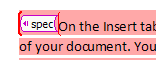
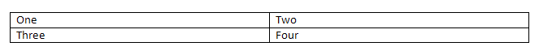
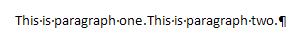
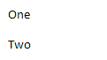
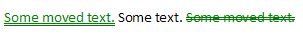

# 17.13 注解/批注

**Annotations**

=== "中文"

    在WordprocessingML文档中，注解是指可以存储在文档内容内或周围的文本区域中的各种类型的补充标记。【示例：文档中存储的补充信息类型包括：注解、修订、拼写和/或语法错误、书签信息和可选编辑权限。示例结束】
    
    在文档内容中，注解以三种不同的方式存储：
    
    - 内联(Inline)
    - "交叉结构(Cross Structure)"
    - 属性(Properties)
    
    为了与当前文字处理应用程序的传统注解功能和基于XML的格式的要求保持兼容性（即生成的XML标记的格式正确性），这三种形式在下面的子条款中描述的各个注解类型中被引用。

=== "英文"

    Within a WordprocessingML document, annotations refer to various types of supplementary markup which can be stored inside or around a region of text within the document's contents. [Example: The types of supplementary information stored within a document can include: comments, revisions, spelling and/or grammatical errors, bookmark information and optional editing permissions. end example]
    
    Within a document's contents, annotations are stored in one of three different methods:
    
    - Inline
    - "Cross Structure"
    - Properties
    
    These three forms are needed in order to maintain compatibility with both the legacy annotations functionality of current word processing applications and the requirements of an XML-based format (i.e. wellformedness of the resulting XML markup). These three forms are referenced within the individual annotation types described in the following sub clauses.

## 17.13.1 内联注解

**Inline Annotations**

=== "中文"

    内联注释描述了所有不需要特殊处理就能保持生成的 WordprocessingML 输出的 XML 格式完整性的注释。在这些情况下，单个 XML 元素应封装正在注释的整个文档内容。
    
    [示例：考虑以下 WordprocessingML 标记，用于表示一个段落，其中的文本是 "The quick brown fox jumps over the jet lagged dog."，其中 "jet lagged" 替换了编辑应用程序在跟踪修订时的先前文本 "lazy"：
    
    ```xml
    <w:p>
        <w:r>
            <w:t xml:space="preserve">The quick brown fox jumps over the </w:t>
        </w:r>
        <w:del … >
            <w:r>
                <w:delText>lazy</w:delText>
            </w:r>
        </w:del>
        <w:ins … >
            <w:r>
                <w:t>jet lagged</w:t>
            </w:r>
        </w:ins>
        <w:r>
            <w:t xml:space="preserve"> dog.</w:t>
        </w:r>
    </w:p>
    ```
    
    del 和 ins 元素（[§17.13.5.14]; [§17.13.5.18]）分别完全封装了各自注释的范围（分别是标记的删除和插入），因为它们是内联注释。结束示例]

=== "英文"

    Inline annotations describe all annotations which do not require special handling in order to maintain the XML wellformedness requirements of the resulting WordprocessingML output. In these cases, a single XML element shall encapsulate the entire contents of the document content which is being annotated.
    
    [Example: Consider the following WordprocessingML markup for a paragraph which reads The quick brown fox jumps over the jet lagged dog., where jet lagged replaced the previous text lazy when the editing application was tracking revisions:
    
    
    ```xml
    <w:p>
        <w:r>
            <w:t xml:space="preserve">The quick brown fox jumps over the </w:t>
        </w:r>
        <w:del … >
            <w:r>
                <w:delText>lazy</w:delText>
            </w:r>
        </w:del>
        <w:ins … >
            <w:r>
                <w:t>jet lagged</w:t>
            </w:r>
        </w:ins>
        <w:r>
            <w:t xml:space="preserve"> dog.</w:t>
        </w:r>
    </w:p>
    ```
    
    The del and ins elements ([§17.13.5.14]; [§17.13.5.18]) each fully encapsulate the extent of their respective annotations (a marked deletion and insertion, respectively), as they are inline annotations. end example]

## 17.13.2 "交叉结构" 注解

**"Cross Structure" Annotations**

=== "中文"
    
    “跨结构”注释描述了一类可以跨越 WordprocessingML 标记的部分的注释【示例：跨结构注释可以跨越多个段落的部分、自定义 XML 标记元素内容的一部分等。结束示例】。在这些情况下，注释的区域由两个元素限定：一个起始元素和一个结束元素。这两个元素标记了注释内容的起点和终点，但不包含注释内容。起始和结束标记通过其 id 属性的公共值进行关联。
    
    【示例：考虑以下 WordprocessingML 标记，用于表示两个段落，每个段落都包含“Example Text”，其中添加了一个书签，跨越了第一段中的第二个单词和第二段中的第一个单词：
    
    ```xml
    <w:p>
        <w:r>
            <w:t>Example</w:t>
        </w:r>
        <w:bookmarkStart w:id="0" w:name="sampleBookmark" />
        <w:r>
            <w:t xml:space="preserve"> text.</w:t>
        </w:r>
    </w:p>
    <w:p>
        <w:r>
            <w:t>Example</w:t>
        </w:r>
        <w:bookmarkEnd w:id="0" />
        <w:r>
            <w:t xml:space="preserve"> text.</w:t>
        </w:r>
    </w:p>
    ```
    
    bookmarkStart 和 bookmarkEnd 元素（[§17.13.6.2]; [§17.13.6.1]）指定了书签的起始和结束位置，但不能包含书签内容，因为书签跨越了两个段落的一部分。它们属于同一个组，因为 id 属性的值都为 0。结束示例】

=== "英文"
    
    "*Cross structure*" annotations describe the class of annotations which can span portions of WordprocessingML markup [Example: Cross structure annotations can span parts of multiple paragraphs, one half of a custom XML markup element's contents, etc. end example]. In these cases, the annotation's region is delimited by two elements: a start element and an end element. These two elements mark the start and end points of the annotated content, but do not contain it. The pairing of the start and end marker are linked via a common value for their id attributes.
    
    [Example: Consider the following WordprocessingML markup for two paragraphs, each reading Example Text, where a bookmark has been added spanning the second word in paragraph one and the first word in paragraph two:
    
    ```xml
    <w:p>
        <w:r>
            <w:t>Example</w:t>
        </w:r>
        <w:bookmarkStart w:id="0" w:name="sampleBookmark" />
        <w:r>
            <w:t xml:space="preserve"> text.</w:t>
        </w:r>
    </w:p>
    <w:p>
        <w:r>
            <w:t>Example</w:t>
        </w:r>
        <w:bookmarkEnd w:id="0" />
        <w:r>
            <w:t xml:space="preserve"> text.</w:t>
        </w:r>
    </w:p>
    ```
    
    The bookmarkStart and bookmarkEnd elements ([§17.13.6.2]; [§17.13.6.1]) specify the location where the bookmark starts and ends, but cannot contain it because it spans part of two paragraphs. They are part of one group because the id attribute value specifies 0 for both. end example]

## 17.13.3 属性注解

**Property Annotations**

=== "中文"
    
    *属性注释*描述了存储为对象属性的注释类别【示例：属性注释可以出现在段落属性、运行属性、表格行等上。结束示例】。在这些情况下，注释的语义由属性定义，因为它们可以影响内容和/或格式。
    
    【示例：考虑以下 WordprocessingML 标记，用于表示一个包含“Example Text”段落，其中在编辑应用程序跟踪修订时，第一个单词应用了粗体属性：
    
    ```xml
    <w:p>
        <w:r>
            <w:rPr>
                <w:b/>
                <w:rPrChange … >
                    <w:rPr/>
                </w:rPrChange>
            </w:rPr>
            <w:t>Example</w:t>
        </w:r>
        <w:r>
            <w:t xml:space="preserve"> text.</w:t>
        </w:r>
    </w:p>
    ```
    
    rPrChange 元素（[§17.13.5.31]; [§17.13.5.30]）包含与特定作者在特定时间关联的先前应用的修订属性集。它本身作为修改的父运行的属性存储。结束示例】

=== "英文"
    
    *Property annotations* describe the class of annotations which are stored as a property on an object [Example: Property annotations can appear on paragraph properties, run properties, table rows, etc. end example] In these cases, the annotation's semantics are defined by the property, as they can affect content and/or formatting.
    
    [Example: Consider the following WordprocessingML markup for a paragraph reading Example Text, where the first word had the bold property applied when the editing application was tracking revisions:
    
    ```xml
    <w:p>
        <w:r>
            <w:rPr>
                <w:b/>
                <w:rPrChange … >
                    <w:rPr/>
                </w:rPrChange>
            </w:rPr>
            <w:t>Example</w:t>
        </w:r>
        <w:r>
            <w:t xml:space="preserve"> text.</w:t>
        </w:r>
    </w:p>
    ```
    
    The rPrChange element ([§17.13.5.31]; [§17.13.5.30]) contains the set of previously applied revision properties associated with a particular author at a particular time. It is stored itself as a property on the parent run which was modified. end example]

## 17.13.4 评论

**Comments**

=== "中文"

    评论描述了锚定在文档内容区域的注释，但包含存储在其自己单独的文档故事中的任意数量的块级内容。在 WordprocessingML 文档中，评论存储在文档包中的单独的评论部分中。
    
    WordprocessingML 文档中的评论分为两个部分：
    
    - 评论锚点（评论适用的文本）
    - 评论内容（评论的内容）
    
    评论锚点是跨结构注释，定义了评论所锚定的文本区域。评论内容是存储在评论部分中的实际评论内容。
    
    【示例：考虑 WordprocessingML 文档中的一个段落，其第二个单词被注释为评论：
    
    
    
    该评论的第一个部分是定义评论范围并引用评论部分中特定评论的文档内容：
    
    ```xml
    <w:p>
        <w:r>
            <w:t xml:space="preserve">Some </w:t>
        </w:r>
        <w:commentRangeStart w:id="0" />
        <w:r>
            <w:t>text.</w:t>
        </w:r>
        <w:commentRangeEnd w:id="0" />
        <w:r>
            <w:commentReference w:id="0" />
        </w:r>
    </w:p>
    ```
    
    commentRangeStart 和 commentRangeEnd 元素（[§17.13.4.4]; [§17.13.4.3]）限定了 id 为 0 的评论适用的运行内容（在本例中为单个文本运行）。接下来的 commentReference 元素（[§17.13.4.5]）将前面的运行内容与评论部分中 id 为 0 的评论链接起来。如果没有这三个元素，则范围和评论无法链接（尽管前两个元素是可选的，在这种情况下，评论必须锚定在评论引用标记处）。
    
    该评论的第二个部分是定义评论中文本的评论内容：
    
    ```xml
    <w:comment w:id="0" w:author="Joe Smith" w:date="2006-04-06T13:50:00Z" w:initials="User">
        <w:p>
            <w:pPr>
                <w:pStyle w:val="CommentText" />
            </w:pPr>
            <w:r>
                <w:rPr>
                    <w:rStyle w:val="CommentReference" />
                </w:rPr>
                <w:annotationRef />
            </w:r>
            <w:r>
                <w:t>comment</w:t>
            </w:r>
        </w:p>
    </w:comment>
    ```
    
    在此示例中，评论指定了它是由作者 Joe Smith 插入的，并通过 author 和 date 属性记录了插入时间，用户首字母为 User。它通过 id 属性与运行内容链接，id 属性的值与上面使用 commentReference 元素指定的值 0 匹配。评论的块级内容指定其文本为 comment，评论内容的样式基于名称为 CommentReference 的字符样式。结束示例】

=== "英文"

    Comments describe annotations which are anchored to a region of document content, but which contain an arbitrary amount of block-level content stored in their own separate document stories. Within a WordprocessingML document, comments are stored in a separate Comments part within the document package.
    
    A comment in a WordprocessingML document is divided into two components:
    
    - The comment anchor (the text on which the comment applies)
    - The comment content (the contents of the comment)
    
    The comment anchor is the cross structure annotation which defines the region of text on which the comment in anchored. The comment content is the content stored in the comments part which contains the actual content of the comment.
    
    [Example: Consider a paragraph in a WordprocessingML document whose second word is annotated with a comment:
    
    
    
    The first component to this comment is the document content which defines the extents of the comment and references the specific comment in the comments part:
    
    ```xml
    <w:p>
        <w:r>
            <w:t xml:space="preserve">Some </w:t>
        </w:r>
        <w:commentRangeStart w:id="0" />
        <w:r>
            <w:t>text.</w:t>
        </w:r>
        <w:commentRangeEnd w:id="0" />
        <w:r>
            <w:commentReference w:id="0" />
        </w:r>
    </w:p>
    ```
    
    The commentRangeStart and commentRangeEnd elements ([§17.13.4.4]; [§17.13.4.3]) delimit the run content to which the comment with an id of 0 applies (in this case, the single run of text). The following commentReference element ([§17.13.4.5]) links the preceding run content with a comment in the comments part with an id of 0. Without all three of these elements, the range and comment cannot be linked (although the first two elements are optional, in which case the comment must be anchored at the comment reference mark)
    
    The second component to this comment is the comment content which defines the text in the comment:
    
    ```xml
    <w:comment w:id="0" w:author="Joe Smith" w:date="2006-04-06T13:50:00Z" w:initials="User">
        <w:p>
            <w:pPr>
                <w:pStyle w:val="CommentText" />
            </w:pPr>
            <w:r>
                <w:rPr>
                    <w:rStyle w:val="CommentReference" />
                </w:rPr>
                <w:annotationRef />
            </w:r>
            <w:r>
                <w:t>comment</w:t>
            </w:r>
        </w:p>
    </w:comment>
    ```
    
    In this example, the comment specifies that it was inserted by author Joe Smith with the initials User via the author and date attributes. It is linked to the run content via the id attribute, which matches the value of 0 specified using the commentReference element above. The block-level content of the comment specifies that its text is comment and the style of the comment content is based off of the character style with the name CommentReference. end example]

### 17.13.4.1 annotationRef (评论信息块)

**annotationRef (Comment Information Block)**

=== "中文"
    
    此元素指定在注释当前位置存在注释引用标记。注释引用标记是一个信息块，表示文档中当前注释的元数据。该注释引用标记通常应由注释者的首字母和与其在文档中位置相关的唯一整数组成，但可以以任何期望的格式显示。
    
    如果在单个注释内容中省略此元素，则可以在阅读顺序的开头（右对左段落中的右边或左对右段落中的左边）添加注释引用标记。此外，注释引用标记可以根据需要在注释内容内重新定位。
    
    [示例：考虑一个带有注释文本的文档，如下所示：
    
    该注释表示为以下 WordprocessingML 片段：
    
    
    
    ```xml
    <w:comment … w:initials="User">
        <w:p>
            <w:r>
                <w:annotationRef />
            </w:r>
            …
        </w:p>
    </w:comment>
    ```
    
    annotationRef 元素指定注释必须以注释引用标记开始。在此示例中，该标记显示为用户首字母“User”和唯一的顺序编号“1”的组合。示例结束]
    
    [Note: The W3C XML Schema definition of this element’s content model (CT_Empty) is located in §A.1. end note]

=== "英文"
    
    This element specifies the presence of an annotation reference mark at the current location in the comment. An annotation reference mark is an information block that represents the metadata about the current comment within the document. This annotation reference mark should typically consist of the initials and a unique integer associated with its position in the document, but can be displayed in any desired format.
    
    If this element is omitted from a single comment's contents, then an annotation reference mark can be added at the start of the comment in reading order (right in a right-to-left paragraph or left in a left-to-right paragraph). As well, an annotation reference mark can be relocated as desired within a comment's content.
    
    [Example: Consider a document with text with an annotated comment as follows:
    
    This comment is represented as the following WordprocessingML fragment:
    
    
    
    ```xml
    <w:comment … w:initials="User">
        <w:p>
            <w:r>
                <w:annotationRef />
            </w:r>
            …
        </w:p>
    </w:comment>
    ```
    
    The annotationRef element specifies that the comment must start with an annotation reference mark. In this example, this mark is displayed as a combination of the user initial, User, and a unique sequential number, 1. end example]
    
    [Note: The W3C XML Schema definition of this element’s content model (CT_Empty) is located in §A.1. end note]

### 17.13.4.2 comment (评论内容)

**comment (Comment Content)**

=== "中文"
    
    该元素指定存储在 WordprocessingML 文档的注释部分中的单个注释的内容。
    
    如果某个注释没有通过正确使用的 commentReference 元素（[§17.13.4.5]）在文档内容中通过匹配的 id 属性引用，如 WordprocessingML 架构所定义，那么加载文档时可以忽略该注释。如果多个注释共享相同的 id 属性值，则只加载一个注释，其他的可以忽略。
    
    [示例：考虑一个带有注释的文档，如下所示：
    
    
    
    该注释表示为以下 WordprocessingML 片段：
    
    ```xml
    <w:comment w:id="1" w:initials="User" w:author="Dan Battagin">
        …
    </w:comment>
    ```
    
    comment 元素指定在注释部分中存在一个单独的注释。示例结束]
    
    ??? abstract "属性"
    
        - **author**（注释作者）
        
            指定 WordprocessingML 文档中注释的作者。
            
            如果省略此属性，则不会将任何作者与父注释类型关联。
            
            [示例：考虑使用以下 WordprocessingML 片段表示的注释：
            
            ```xml
            <… w:id="1" w:author="Example Author">
            …
            </…>
            ```
            
            author 属性指定当前注释的作者为 Example Author，可以根据需要使用。示例结束]
            
            此属性的可能值由 ST_String 简单类型定义（[§22.9.2.13]）。
    
        - **date**（注释日期）

            指定 WordprocessingML 文档中注释的日期信息。此信息的使用不在 ECMA-376 的范围内。
            
            如果省略此属性，则不会将任何日期信息与父注释类型关联。
            
            [示例：考虑使用以下 WordprocessingML 片段表示的注释：
            
            ```xml
            <… w:id="1" w:date="2006-01-01T10:00:00">
            …
            </…>
            ```
            
            date 属性指定当前注释的日期为 2006 年 1 月 1 日上午 10 点，可以根据需要使用。示例结束]
            
            此属性的可能值由 ST_DateTime 简单类型定义（[§17.18.9]）。

        - **id**（注释标识符）
            
            指定 WordprocessingML 文档中注释的唯一标识符。id 属性的限制（如果有）由父 XML 元素定义。
            
            如果省略此属性，则文档不符合规范。
            
            [示例：考虑使用以下 WordprocessingML 片段表示的注释：
            
            ```xml
            <… w:id="1" … >
                …
            </…>
            ```
            
            id 属性指定当前注释的 ID 为 1。该值用于在文档内容中唯一标识此注释。示例结束]
            
            此属性的可能值由 ST_DecimalNumber 简单类型定义（[§17.18.10]）。

        - **initials**（注释作者的首字母）

            指定当前注释作者的首字母缩写。[注意：此信息可用于格式化和显示相关的注释信息块（[§17.13.4.1]），或在应用程序支持的任何用户界面中使用。如果有多个作者的首字母相同，显示作者姓名可能更有用。注意结束]
            
            如果省略此属性，则不会将任何作者与文档中的当前注释关联。
            
            [示例：考虑使用以下 WordprocessingML 片段表示的注释：
            
            ```xml
            <w:comment w:id="1" w:initials="KB" w:author="Krista Bendig">
            …
            </w:comment>
            ```
            
            initials 属性指定当前注释作者的首字母为 KB，可以根据需要使用。示例结束]
            
            此属性的可能值由 ST_String 简单类型定义（[§22.9.2.13]）。
    
    [Note: The W3C XML Schema definition of this element’s content model (CT_Comment) is located in §A.1. end note]

=== "英文"
    
    This element specifies the content of a single comment stored in the Comments part of a WordprocessingML document.
    
    If a comment is not referenced by document content via a matching id attribute on a correct use of the commentReference element ([§17.13.4.5]), as defined by the WordprocessingML schema, then it can be ignored when loading the document. If more than one comment shares the same value for the id attribute, then only one comment shall be loaded and the others can be ignored.
    
    [Example: Consider a document with text with an annotated comment as follows:
    
    
    
    This comment is represented as the following WordprocessingML fragment:
    
    ```xml
    <w:comment w:id="1" w:initials="User" w:author="Dan Battagin">
        …
    </w:comment>
    ```
    
    The comment element specifies the presence of a single comment within the comments part. end example]
    
    ??? abstract "Attributes"
    
        - **author** (Annotation Author)
    
            Specifies the author for an annotation within a WordprocessingML document.
            
            If this attribute is omitted, then no author shall be associated with the parent annotation type.
            
            [Example: Consider a comment represented using the following WordprocessingML fragment:
            
            ```xml
            <… w:id="1" w:author="Example Author">
            …
            </…>
            ```
            
            The author attribute specifies that the author of the current annotation is Example Author, which can be used as desired. end example]
            
            The possible values for this attribute are defined by the ST_String simple type ([§22.9.2.13]).
    
        - **date** (Annotation Date)
    
            Specifies the date information for an annotation within a WordprocessingML document. The use of this information is outside of the scope of ECMA-376
            
            If this attribute is omitted, then no date information shall be associated with the parent annotation type.
            
            [Example: Consider a comment represented using the following WordprocessingML fragment:
            
            ```xml
            <… w:id="1" w:date="2006-01-01T10:00:00">
            …
            </…>
            ```
            
            The date attribute specifies that the date of the current annotation is January 1st 2006 at 10:00 AM, which can be used as desired. end example]
            
            The possible values for this attribute are defined by the ST_DateTime simple type ([§17.18.9]).
    
        - **id** (Annotation Identifier)
            
            Specifies a unique identifier for an annotation within a WordprocessingML document. The restrictions on the id attribute, if any, are defined by the parent XML element.
            
            If this attribute is omitted, then the document is non-conformant.
            
            [Example: Consider an annotation represented using the following WordprocessingML fragment:
            
            ```xml
            <… w:id="1" … >
                …
            </…>
            ```
            
            The id attribute specifies that the ID of the current annotation is 1. This value is used to uniquely identify this annotation within the document content. end example]
            
            The possible values for this attribute are defined by the ST_DecimalNumber simple type ([§17.18.10]).
    
        - **initials** (Initials of Comment Author)
    
            Specifies the initials of the author of the current comment. [Note: This information can be used to format and present the associated comment information block ([§17.13.4.1]), or in any user interface supported by an application. If there is more than one author with the same initials, it might be more useful to display the author name. end note]
            
            If this attribute is omitted, then no author shall be associated with the current comment in the document.
            
            [Example: Consider a comment represented using the following WordprocessingML
            fragment:
            
            ```xml
            <w:comment w:id="1" w:initials="KB" w:author="Krista Bendig">
            …
            </w:comment>
            ```
            
            The initials attribute specifies that the initials of the author of the current comment are KB, which can be used as desired. end example]
            
            The possible values for this attribute are defined by the ST_String simple type ([§22.9.2.13]).
    
    [Note: The W3C XML Schema definition of this element’s content model (CT_Comment) is located in §A.1. end note]

### 17.13.4.3 commentRangeEnd (评论锚点范围结束)

**commentRangeEnd (Comment Anchor Range End)**

=== "中文"
    
    该元素指定 WordprocessingML 文档中注释在内容中的结束范围。该元素上的 id 属性用于链接相应的注释范围起始元素和注释引用。
    
    以下限制适用于该元素：
    
    - 如果该元素出现时没有相应的具有匹配 id 属性值的 commentRangeStart 元素（[§17.13.4.4]），则它应被视为关联注释引用的单一锚点。
    - 如果该元素在当前文档段落中出现时没有相应的具有匹配 id 属性值的 commentReference 元素（[§17.13.4.5]），则文档不符合规范。
    - 如果该元素出现在注释内容段落中（[§17.13.4.2]），则文档不符合规范。
    
    [示例：考虑 WordprocessingML 文档中的一个段落，其第二个单词附有注释：
    
    
    
    该注释的 WordprocessingML 片段定义如下：
    
    ```xml
    <w:p>
        <w:r>
            <w:t xml:space="preserve">Some </w:t>
        </w:r>
        <w:commentRangeStart w:id="0" />
        <w:r>
            <w:t>text.</w:t>
        </w:r>
        <w:commentRangeEnd w:id="0" />
        <w:r>
            <w:commentReference w:id="0" />
        </w:r>
    </w:p>
    ```
    
    commentRangeEnd 元素指定 ID 为 0 的注释范围的结束位置在包含单词“text”的文本运行结束之后。示例结束]
    
    ??? abstract "Attributes"
    
        - **displacedByCustomXml**（为自定义 XML 标记重新定位的注释标记）

            指定父注释的位置应直接与文档中自定义 XML 元素的实际呈现位置相关联。此元素仅在自定义 XML 元素为块级元素（即围绕整个段落）时有效，因为在这种情况下，注释和自定义 XML 元素的逻辑位置和物理位置可能不同。
            
            具体来说，在这种情况下，自定义 XML 会呈现在它所包含的块级对象（段落、表格、表行或表格单元）周围，但实际上会在同一个对象内呈现（即在段落、表格、表行或表格单元内）。这一要求源于在文档的逻辑位置（例如围绕表格）中没有注释位置。
            
            如果省略此属性，则注释应锚定在段落中所有块级自定义 XML 元素的内部。如果存在此属性但指定位置没有块级自定义 XML 标记，则应忽略此属性。
            
            [示例：考虑一个段落包含块级自定义 XML 标记和两个注释锚点（一个在自定义 XML 元素的实际表示之前，一个在之后），如下所示：
            
            
            
            由于这三个项目都在整个段落周围，它们存储在段落外。然而，为了确保它们的相对位置正确存储，任何必须被物理自定义 XML 元素重新定位的注释都指定了此信息，生成以下 WordprocessingML：
            
            ```xml
            …
            <w:commentRangeStart w:id="0" />
            <w:commentRangeStart w:id="1" w:displacedByCustomXml="next" />
            <w:customXml w:element="spec" … />
            <w:p>
                …
            </w:p>
            …
            ```
            
            displacedByCustomXml 属性指定即使这三个项目都在段落周围并且被移动到段落内进行物理表示，ID 为 0 的注释必须在自定义 XML 内，而 ID 为 1 的注释必须重新定位以保持在下一个自定义 XML 元素（spec 元素）的相对位置之外。示例结束]
            
            此属性的可能值由 ST_DisplacedByCustomXml 简单类型定义（[§17.18.13]）。

        - **id**（注释标识符）

            指定 WordprocessingML 文档中注释的唯一标识符。id 属性的限制（如有）由父 XML 元素定义。
            
            如果省略此属性，则文档不符合规范。
            
            [示例：考虑一个使用以下 WordprocessingML 片段表示的注释：
            
            ```xml
            <… w:id="1" … >
            …
            </…>
            ```
            
            id 属性指定当前注释的 ID 为 1。此值用于在文档内容中唯一标识该注释。示例结束]
            
            此属性的可能值由 ST_DecimalNumber 简单类型定义（[§17.18.10]）。
    
    [Note: The W3C XML Schema definition of this element’s content model (CT_MarkupRange) is located in §A.1. end note]

=== "英文"
    
    This element specifies the end of the range around which a comment is anchored in the content of the WordprocessingML document. The id attribute on this element shall be used to link the corresponding comment anchor range start element and comment reference.
    The following restrictions shall be applied to this element:
    
    - If this element occurs without a corresponding commentRangeStart element ([§17.13.4.4]) with a matching id attribute value, then it shall be considered the single anchor point for the associated comment reference.
    - If this element appears without a corresponding commentReference element ([§17.13.4.5]) in the current document story with a matching id attribute value, then the document is non-conformant.
    - If this element appears in a comment content story ([§17.13.4.2]), then the document is non-conformant .
    
    [Example: Consider a paragraph in a WordprocessingML document whose second word is annotated with a comment:
    
    
    
    The WordprocessingML fragment for this comment is defined as follows:
    
    ```xml
    <w:p>
        <w:r>
            <w:t xml:space="preserve">Some </w:t>
        </w:r>
        <w:commentRangeStart w:id="0" />
        <w:r>
            <w:t>text.</w:t>
        </w:r>
        <w:commentRangeEnd w:id="0" />
        <w:r>
            <w:commentReference w:id="0" />
        </w:r>
    </w:p>
    ```
    
    The commentRangeEnd element specifies that the end of the comment range for the comment with an id of 0 is after the end of the run containing the word text. end example]
    
    ??? abstract "Attributes"
    
        - **displacedByCustomXml** (Annotation Marker Relocated For Custom XML Markup)
    
            Specifies that the parent annotation's placement shall be directly linked with the location of the physical presentation of a custom XML element in the document. This element only has an effect when the custom XML element is block-level (i.e. surrounds an entire paragraph), as in this scenario the logical and physical placement of the annotation and custom XML element can differ.
            
            Specifically, in this case, the custom XML is presented *around* the block-level object it encloses (the paragraph, table, table row, or table cell), but is physically represented within that same object (i.e. within the paragraph, table, table row or table cell). This requirement stems from the fact that there is no location for the location of the annotation within the document at its logical location (around a table, for example).
            
            If this attribute is omitted, then the annotation shall be anchored inside of all block-level custom XML elements in the paragraph. If this attribute is present, but no block-level custom XML tag is located at the position it specifies (before or after), then it shall be ignored.
            
            [Example: Consider a paragraph with block level custom XML markup and two comment anchor annotations (one before and one after the custom XML element's physical representation), as follows:
            
            
            
            Since all three of these items are around the entire paragraph, they are stored outside of the paragraph. However, in order to ensure that their relative positions are stored correctly, any annotation which must be displaced by the physical custom XML element specifies this information, resulting in the following WordprocessingML:
            
            ```xml
            …
            <w:commentRangeStart w:id="0" />
            <w:commentRangeStart w:id="1" w:displacedByCustomXml="next" />
            <w:customXml w:element="spec" … />
            <w:p>
                …
            </w:p>
            …
            ```
            
            The displacedByCustomXml attribute specifies that even though all three of these items are around the paragraph and is moved inside the paragraph to be represented physically, the comment with ID 0 must be inside the custom XML, but the comment with ID 1 must be displaced to stay outside of the relative location of the next custom XML element (the spec element). end example]
            
            The possible values for this attribute are defined by the ST_DisplacedByCustomXml simple type ([§17.18.13]).
        
        - **id** (Annotation Identifier)
            
            Specifies a unique identifier for an annotation within a WordprocessingML document. The restrictions on the id attribute, if any, are defined by the parent XML element.
            
            If this attribute is omitted, then the document is non-conformant.
            
            [Example: Consider an annotation represented using the following WordprocessingML fragment:
            
            ```xml
            <… w:id="1" … >
            …
            </…>
            ```
            
            The id attribute specifies that the ID of the current annotation is 1. This value is used to uniquely identify this annotation within the document content. end example]
            
            The possible values for this attribute are defined by the ST_DecimalNumber simple type ([§17.18.10]).
    
    [Note: The W3C XML Schema definition of this element’s content model (CT_MarkupRange) is located in §A.1. end note]

### 17.13.4.4 commentRangeStart (评论锚点范围开始)

**commentRangeStart (Comment Anchor Range Start)**

=== "中文"
    
    该元素指定 WordprocessingML 文档内容中注释锚定范围的起始点。该元素上的 id 属性用于链接相应的注释锚定范围结束元素和注释引用。
    
    对该元素应用以下限制：
    
    - 如果该元素出现时没有带有匹配 id 属性值的相应 commentRangeEnd 元素（[§17.13.4.3]），则它将被视为关联注释引用的单个锚点。
    - 如果该元素出现在当前文档故事中而没有带有匹配 id 属性值的相应 commentReference 元素（[§17.13.4.5]），则文档不符合规范。
    - 如果该元素出现在注释内容故事中（[§17.13.4.2]），则文档不符合规范。
    
    [示例：考虑一个 WordprocessingML 文档中的段落，其中第二个词被注释：
    
    
    
    该注释的 WordprocessingML 片段定义如下：
    
    ```xml
    <w:p>
        <w:r>
            <w:t xml:space="preserve">Some </w:t>
        </w:r>
        <w:commentRangeStart w:id="0" />
        <w:r>
            <w:t>text.</w:t>
        </w:r>
        <w:commentRangeEnd w:id="0" />
        <w:r>
            <w:commentReference w:id="0" />
        </w:r>
    </w:p>
    ```
    
    commentRangeStart 元素指定 id 为 0 的注释范围的起始点位于包含单词 "Some" 的文本运行结束之后。示例结束]
    
    ??? abstract "Attributes"
    
        - **displacedByCustomXml**（为自定义 XML 标记重新定位的注释标记）

            指定父注释的位置应直接与文档中自定义 XML 元素的实际呈现位置相关联。此元素仅在自定义 XML 元素为块级元素（即围绕整个段落）时有效，因为在这种情况下，注释和自定义 XML 元素的逻辑位置和物理位置可能不同。
            
            具体来说，在这种情况下，自定义 XML 会呈现在它所包含的块级对象（段落、表格、表行或表格单元）周围，但实际上会在同一个对象内呈现（即在段落、表格、表行或表格单元内）。这一要求源于在文档的逻辑位置（例如围绕表格）中没有注释位置。
            
            如果省略此属性，则注释应锚定在段落中所有块级自定义 XML 元素的内部。如果存在此属性但指定位置没有块级自定义 XML 标记，则应忽略此属性。
            
            [示例：考虑一个段落包含块级自定义 XML 标记和两个注释锚点（一个在自定义 XML 元素的实际表示之前，一个在之后），如下所示：
            
            
            
            由于这三个项目都在整个段落周围，它们存储在段落外。然而，为了确保它们的相对位置正确存储，任何必须被物理自定义 XML 元素重新定位的注释都指定了此信息，生成以下 WordprocessingML：
            
            ```xml
            …
            <w:commentRangeStart w:id="0" />
            <w:commentRangeStart w:id="1" w:displacedByCustomXml="next" />
            <w:customXml w:element="spec" … />
            <w:p>
                …
            </w:p>
            …
            ```
            
            displacedByCustomXml 属性指定即使这三个项目都在段落周围并且被移动到段落内进行物理表示，ID 为 0 的注释必须在自定义 XML 内，而 ID 为 1 的注释必须重新定位以保持在下一个自定义 XML 元素（spec 元素）的相对位置之外。示例结束]
            
            此属性的可能值由 ST_DisplacedByCustomXml 简单类型定义（[§17.18.13]）。

        - **id**（注释标识符）

            指定 WordprocessingML 文档中注释的唯一标识符。id 属性的限制（如有）由父 XML 元素定义。
            
            如果省略此属性，则文档不符合规范。
            
            [示例：考虑一个使用以下 WordprocessingML 片段表示的注释：
            
            ```xml
            <… w:id="1" … >
            …
            </…>
            ```
            
            id 属性指定当前注释的 ID 为 1。此值用于在文档内容中唯一标识该注释。示例结束]
            
            此属性的可能值由 ST_DecimalNumber 简单类型定义（[§17.18.10]）。
    
    [Note: The W3C XML Schema definition of this element’s content model (CT_MarkupRange) is located in §A.1. end note]

=== "英文"
    
    This element specifies the start of the range around which a comment is anchored in the content of the WordprocessingML document. The id attribute on this element shall be used to link the corresponding comment anchor range end element and comment reference.
    
    The following restrictions shall be applied to this element:
    
    - If this element occurs without a corresponding commentRangeEnd element ([§17.13.4.3]) with a matching id attribute value, then it shall be considered the single anchor point for the associated comment reference.
    - If this element appears without a corresponding commentReference element ([§17.13.4.5]) in the current document story with a matching id attribute value, then the document is non-conformant .
    - If this element appears in a comment content story ([§17.13.4.2]), then the document is non-conformant .
    
    [Example: Consider a paragraph in a WordprocessingML document whose second word is annotated with a comment:
    
    
    
    The WordprocessingML fragment for this comment is defined as follows:
    
    ```xml
    <w:p>
        <w:r>
            <w:t xml:space="preserve">Some </w:t>
        </w:r>
        <w:commentRangeStart w:id="0" />
        <w:r>
            <w:t>text.</w:t>
        </w:r>
        <w:commentRangeEnd w:id="0" />
        <w:r>
            <w:commentReference w:id="0" />
        </w:r>
    </w:p>
    ```
    
    The commentRangeStart element specifies that the start of the comment range for the comment with an id of 0 is after the end of the run containing the word Some. end example]
        
    ??? abstract "Attributes"
    
        - **displacedByCustomXml** (Annotation Marker Relocated For Custom XML Markup)
    
            Specifies that the parent annotation's placement shall be directly linked with the location of the physical presentation of a custom XML element in the document. This element only has an effect when the custom XML element is block-level (i.e. surrounds an entire paragraph), as in this scenario the logical and physical placement of the annotation and custom XML element can differ.
            
            Specifically, in this case, the custom XML is presented *around* the block-level object it encloses (the paragraph, table, table row, or table cell), but is physically represented within that same object (i.e. within the paragraph, table, table row or table cell). This requirement stems from the fact that there is no location for the location of the annotation within the document at its logical location (around a table, for example).
            
            If this attribute is omitted, then the annotation shall be anchored inside of all block-level custom XML elements in the paragraph. If this attribute is present, but no block-level custom XML tag is located at the position it specifies (before or after), then it shall be ignored.
            
            [Example: Consider a paragraph with block level custom XML markup and two comment anchor annotations (one before and one after the custom XML element's physical representation), as follows:
            
            
            
            Since all three of these items are around the entire paragraph, they are stored outside of the paragraph. However, in order to ensure that their relative positions are stored correctly, any annotation which must be displaced by the physical custom XML element specifies this information, resulting in the following WordprocessingML:
            
            ```xml
            …
            <w:commentRangeStart w:id="0" />
            <w:commentRangeStart w:id="1" w:displacedByCustomXml="next" />
            <w:customXml w:element="spec" … />
            <w:p>
                …
            </w:p>
            …
            ```
            
            The displacedByCustomXml attribute specifies that even though all three of these items are around the paragraph and is moved inside the paragraph to be represented physically, the comment with ID 0 must be inside the custom XML, but the comment with ID 1 must be displaced to stay outside of the relative location of the next custom XML element (the spec element). end example]
            
            The possible values for this attribute are defined by the ST_DisplacedByCustomXml simple type ([§17.18.13]).
        
        - **id** (Annotation Identifier)
            
            Specifies a unique identifier for an annotation within a WordprocessingML document. The restrictions on the id attribute, if any, are defined by the parent XML element.
            
            If this attribute is omitted, then the document is non-conformant.
            
            [Example: Consider an annotation represented using the following WordprocessingML fragment:
            
            ```xml
            <… w:id="1" … >
            …
            </…>
            ```
            
            The id attribute specifies that the ID of the current annotation is 1. This value is used to uniquely identify this annotation within the document content. end example]
            
            The possible values for this attribute are defined by the ST_DecimalNumber simple type ([§17.18.10]).
    
    [Note: The W3C XML Schema definition of this element’s content model (CT_MarkupRange) is located in §A.1. end note]

### 17.13.4.5 commentReference (评论内容参考标记)

**commentReference (Comment Content Reference Mark)**

=== "中文"
    
    该元素指定了一个评论内容引用标记的存在，该标记将评论内容（[§17.13.4.2]）与文档故事的内容链接起来。此链接通过匹配 id 属性与该元素的 id 属性相同的评论来建立。由此产生的评论锚定到具有相同 id 属性值（如果存在）的评论范围元素的范围，如下所示：
    
    - 如果 commentRangeStart 和 commentRangeEnd 元素（[§17.13.4.4]; [§17.13.4.3]）都存在，那么评论引用将评论锚定到生成的范围。
    - 如果仅存在 commentRangeStart 和 commentRangeEnd 元素（[§17.13.4.4]; [§17.13.4.3]）中的一个，则文档不符合规范。
    - 如果两个元素都不存在，则评论引用将评论锚定到其当前位置。
    
    如果此元素出现在评论内容故事中（[§17.13.4.2]），则可以忽略它。如果没有 id 属性与该元素的 id 属性匹配的评论存在，则此文档不符合规范。
    
    [示例：考虑一个 WordprocessingML 文档中的段落，其中第二个词被注释：
    
    
    
    该注释的 WordprocessingML 片段定义如下：
    
    ```xml
    <w:p>
        <w:r>
            <w:t xml:space="preserve">Some </w:t>
        </w:r>
        <w:commentRangeStart w:id="0" />
        <w:r>
            <w:t>text.</w:t>
        </w:r>
        <w:commentRangeEnd w:id="0" />
        <w:r>
            <w:commentReference w:id="0" />
        </w:r>
    </w:p>
    ```
    
    commentReference 元素指定注释部分中关联的注释，其 id 属性值为 0。此外，由于存在具有匹配 ID 的起始和结束标记，因此该注释锚定到文档的该区域。示例结束]
    
    ??? abstract "属性"
    
        - **id**（注释标识符）
        
            指定 WordprocessingML 文档中注释的唯一标识符。id 属性的任何限制由父 XML 元素定义。
            
            如果省略此属性，则文档不符合规范。
            
            [示例：考虑使用以下 WordprocessingML 片段表示的注释：
            
            ```xml
            <… w:id="1" … >
                …
            </…>
            ```
            
            id 属性指定当前注释的 ID 为 1。此值用于在文档内容中唯一标识此注释。示例结束]
            
            此属性的可能值由 ST_DecimalNumber 简单类型定义（[§17.18.10]）。
            
    [Note: The W3C XML Schema definition of this element’s content model (CT_Markup) is located in §A.1. end note]

=== "英文"
    
    This element specifies the presence of a comment content reference mark, which links the comment content ([§17.13.4.2]) with the contents of a document story. This link is established by matching the comment whose id attribute matches the id attribute on this element. The resulting comment is anchored to the range with comment range elements with the same id attribute values (if present) as follows:
    
    - If both of the commentRangeStart and commentRangeEnd elements ([§17.13.4.4]; [§17.13.4.3]) are present, then the comment reference shall anchor the comment to the resulting range.
    - If only one of the commentRangeStart and commentRangeEnd elements ([§17.13.4.4]; [§17.13.4.3]) is present, then the document is non-conformant.
    - If neither element is present, then the comment reference shall anchor the comment to its current location.
    
    If this element appears in a comment content story ([§17.13.4.2]), then it can be ignored. If no comment exists with an id attribute which matches the id attribute on this element, then this document is non-conformant.
    
    [Example: Consider a paragraph in a WordprocessingML document whose second word is annotated with a comment:
    
    
    
    The WordprocessingML fragment for this comment is defined as follows:
    
    ```xml
    <w:p>
        <w:r>
            <w:t xml:space="preserve">Some </w:t>
        </w:r>
        <w:commentRangeStart w:id="0" />
        <w:r>
            <w:t>text.</w:t>
        </w:r>
        <w:commentRangeEnd w:id="0" />
        <w:r>
            <w:commentReference w:id="0" />
        </w:r>
    </w:p>
    ```
    
    The commentReference element specifies that the associated comment in the comments part must be the comment whose id attribute value is 0. As well, since a start and end marker exist with a matching ID, this comment is anchored to that region of the document. end example]
    
    ??? abstract "Attributes"
    
        - **id** (Annotation Identifier)
    
            Specifies a unique identifier for an annotation within a WordprocessingML document. The restrictions on the id attribute, if any, are defined by the parent XML element.
            
            If this attribute is omitted, then the document is non-conformant.
            
            [Example: Consider an annotation represented using the following WordprocessingML fragment:
            
            ```xml
            <… w:id="1" … >
                …
            </…>
            ```
            
            The id attribute specifies that the ID of the current annotation is 1. This value is used to uniquely identify this annotation within the document content. end example]
            
            The possible values for this attribute are defined by the ST_DecimalNumber simple type ([§17.18.10]).
            
    [Note: The W3C XML Schema definition of this element’s content model (CT_Markup) is located in §A.1. end note]

### 17.13.4.6 comments (评论合集)

**comments (Comments Collection)**

=== "中文"

    该元素指定了当前文档中定义的所有评论。它是 WordprocessingML 文档的评论部分的根元素。
    
    [示例：考虑以下 WordprocessingML 片段，用于表示 WordprocessingML 文档的评论部分内容：
    
    ```xml
    <w:comments>
        <w:comment … >
            …
        </w:comment>
    </w:comments>
    ```
    
    在此示例中，comments 元素包含了该文档中指定的单个评论。示例结束]
    
    [Note: The W3C XML Schema definition of this element’s content model (CT_Comments) is located in §A.1. end
    note]

=== "英文"

    This element specifies all of the comments defined in the current document. It is the root element of the Comments part of a WordprocessingML document.
    
    [Example: Consider the following WordprocessingML fragment for the content of a comments part in a WordprocessingML document:
    
    ```xml
    <w:comments>
        <w:comment … >
            …
        </w:comment>
    </w:comments>
    ```
    
    The comments element contains the single comment specified by this document in this example. end example]
    
    [Note: The W3C XML Schema definition of this element’s content model (CT_Comments) is located in §A.1. end
    note]


## 17.13.5 修订

**Revisions**

=== "中文"
    
    **修订**在WordprocessingML中提供了一种机制，用于存储有关文档演变的信息（即，一个或多个作者对文档所做的修改集合）。当应用程序将修订添加到WordprocessingML文档的内容时，它们通过存储以下内容来指定（取决于修订类型）：
    
    - 文档的当前状态（删除操作存储当前状态的文本为删除状态，并暗示其原始状态是之前存在的内容）
    - 文档的初始状态（运行的初始属性明确存储在先前的运行属性块中，因为当前的运行属性始终是rPr元素的子元素（[§17.7.9.1]））
    
    一个修订包含两个必需的信息：
    
    - 修订类型（通过修订元素的名称指定）
    - 唯一的修订标识符（用于唯一标识修订）
    
    以及可选信息：
    
    - 修订的作者
    - 修订的日期和时间
    
    【示例：考虑一个WordprocessingML文档中的一段文本，其中一个单词被插入，如下所示：
    
    
    
    这段文字将单词text标记为插入修订，并表示为以下WordprocessingML：
    
    ```xml
    <w:p>
        <w:r>
            <w:t>Some</w:t>
        </w:r>
        <w:ins w:id="0" w:author="Joe Smith" w:date="2006-03-31T12:50:00Z">
            <w:r>
                <w:t>text</w:t>
            </w:r>
        </w:ins>
    </w:p>
    ```
    
    ins元素包含了两个必需的信息：所有必须作为插入标记修订处理的内容（单词text）；唯一的修订标识符为0。
    
    该元素还存储了关于修订的可选信息：单词text是由Joe Smith在2006年3月31日下午12:50插入的。结束示例】
    
    在WordprocessingML文档中，可以使用以下类型的修订来跟踪文档的更改：
    
    - 插入
    - 删除
    - 移动
    - 对运行/段落/表格/编号/节属性的更改
    - 对自定义XML标记的更改

=== "英文"
    
    *Revisions* in WordprocessingML provide a mechanism for storing information about the evolution of the document (i.e. the set of modifications made to a document by one of more authors). When an application adds revisions to the content of a WordprocessingML document, they are specifying this by storing either (depending on the revision type):
    
    - The current state of the document (a deletion stores the current state of the text as deleted, and implies that its original state was the content used to exist)
    - The initial state of the document (a run's initial properties are explicitly stored in a previous run properties block, as the current run properties are always those that are the child of the rPr element ([§17.7.9.1]))
    
    A revision consists of two required pieces of information:
    
    
    - The revision type (specified via the name of the revision element)
    - A unique revision identifier (used to uniquely identify revisions)
    
    As well as optional information:
    
    - The author of the revision
    - The date and time of the revision
    
    [Example: Consider a paragraph of text in a WordprocessingML document in which one word has been inserted, as follows:
    
    
    
    This paragraph has the word text marked inserted as a revision, and is represented as the following WordprocessingML:
    
    ```xml
    <w:p>
        <w:r>
            <w:t>Some</w:t>
        </w:r>
        <w:ins w:id="0" w:author="Joe Smith" w:date="2006-03-31T12:50:00Z">
        <w:r>
            <w:t>text</w:t>
        </w:r>
        </w:ins>
    </w:p>
    ```
    
    The ins element contains both the required information: all of the content which must be treated as revision marked as inserted (the word text); a unique revision identifier of 0.
    
    The element also stores the optional information about the revision: the word text was inserted by Joe Smith on March 31, 2006 at 12:50pm. end example]
    
    Within a WordprocessingML document, the following types of revisions can be used to track the changes to a document:
    
    - Insertions
    - Deletions
    - Moves
    - Changes to run/paragraph/table/numbering/section properties
    - Changes to custom XML markup

### 17.13.5.1 cellDel (表格单元格删除)

**cellDel (Table Cell Deletion)**

=== "中文"
    
    该元素指定在记录修订时，父表格单元格应被视为已从文档中删除。这意味着尽管表格单元格元素在表格结构中存在，但技术上该表格单元格在文档中不再存在。
    
    [示例：考虑一个包含两行两列的表格，如下所示：
    
    
    
    如果该表格的每个单元格的最终列被删除，并且此操作被记录为修订，则生成的 WordprocessingML 将显示每个单元格如下所示：
    
    ```xml
    <w:tbl>
        …
        <w:tr>
            <w:tc>
                <w:r>
                    <w:t>One</w:t>
                </w:r>
            </w:tc>
            <w:tc>
                <w:tcPr>
                    <w:cellDel w:id="0" … />
                </w:tcPr>
                <w:r>
                    <w:t>Two</w:t>
                </w:r>
            </w:tc>
        </w:tr>
        <w:tr>
            <w:tc>
                <w:r>
                    <w:t>Three</w:t>
                </w:r>
            </w:tc>
            <w:tc>
                <w:tcPr>
                    <w:cellDel w:id="1" … />
                </w:tcPr>
                <w:r>
                    <w:t>Four</w:t>
                </w:r>
            </w:tc>
        </w:tr>
    </w:tbl>
    ```
    
    表格单元格属性中带有文本 "Two" 和 "Four" 的单元格中的 cellDel 元素指定这些单元格已从文档中删除。它们的属性（已省略）可以选择性地提供有关删除时间的信息。示例结束]
    
    ??? abstract "Attributes"
    
        - **author**（注释作者）

            指定 WordprocessingML 文档中注释的作者。
            
            如果省略此属性，则不会将任何作者与父注释类型关联。
            
            [示例：考虑使用以下 WordprocessingML 片段表示的注释：
            
            ```xml
            <… w:id="1" w:author="Example Author">
            …
            </…>
            ```
            
            author 属性指定当前注释的作者为 Example Author，可以根据需要使用。 示例结束]
            
            此属性的可能值由 ST_String 简单类型定义（[§22.9.2.13]）。

        - **date**（注释日期）

            指定 WordprocessingML 文档中注释的日期信息。此信息的使用超出了 ECMA-376 的范围。
            
            如果省略此属性，则不会将任何日期信息与父注释类型关联。
            
            [示例：考虑使用以下 WordprocessingML 片段表示的注释：
            
            ```xml
            <… w:id="1" w:date="2006-01-01T10:00:00">
            …
            </…>
            ```
            
            date 属性指定当前注释的日期为 2006 年 1 月 1 日上午 10:00，可以根据需要使用。 示例结束]
            
            此属性的可能值由 ST_DateTime 简单类型定义（[§17.18.9]）。

        - **id**（注释标识符）

            指定 WordprocessingML 文档中注释的唯一标识符。
            
            如果有任何限制，由父 XML 元素定义。
            
            如果省略此属性，则文档不符合规范。
            
            [示例：考虑使用以下 WordprocessingML 片段表示的注释：
            
            ```xml
            <… w:id="1" … >
            …
            </…>
            ```
            
            id 属性指定当前注释的 ID 为 1。此值用于在文档内容中唯一标识此注释。 示例结束]
            
            此属性的可能值由 ST_DecimalNumber 简单类型定义（[§17.18.10]）。
    
    [Note: The W3C XML Schema definition of this element’s content model (CT_TrackChange) is located in §A.1. end note]

=== "英文"
    
    This element specifies that the parent table cell shall be treated as though it was deleted from the document while revisions were being recorded. This means that although the table cell element exists in the structure of the table, the table cell technically no longer exists in the document.
    
    [Example: Consider a document with a two row by two columns table as follows:
    
    
    
    If this table has each cell in its final column deleted and this is tracked as a revision, the resulting WordprocessingML would show each of these cells as deleted as follows:
    
    ```xml
    <w:tbl>
        …
        <w:tr>
            <w:tc>
                <w:r>
                    <w:t>One</w:t>
                </w:r>
            </w:tc>
            <w:tc>
                <w:tcPr>
                    <w:cellDel w:id="0" … />
                </w:tcPr>
                <w:r>
                    <w:t>Two</w:t>
                </w:r>
            </w:tc>
        </w:tr>
        <w:tr>
            <w:tc>
                <w:r>
                    <w:t>Three</w:t>
                </w:r>
            </w:tc>
            <w:tc>
                <w:tcPr>
                    <w:cellDel w:id="1" … />
                </w:tcPr>
                <w:r>
                    <w:t>Four</w:t>
                </w:r>
            </w:tc>
        </w:tr>
    </w:tbl>
    ```
    
    The cellDel elements in the table cell properties of the cells with text Two and Four specify that each of those cells have been deleted from the document. Their attributes (omitted) can optionally provide information about the time at which this deletion took place. end example]
    
    ??? abstract "Attributes"
    
        - **author** (Annotation Author)
        
            Specifies the author for an annotation within a WordprocessingML document.
            
            If this attribute is omitted, then no author shall be associated with the parent annotation type.
            
            [Example: Consider a comment represented using the following WordprocessingML fragment:
            
            ```xml
            <… w:id="1" w:author="Example Author">
            …
            </…>
            ```
            
            The author attribute specifies that the author of the current annotation is ExampleAuthor, which can be used as desired. end example]
            
            The possible values for this attribute are defined by the ST_String simple type ([§22.9.2.13]).
        
        - **date** (Annotation Date)
        
            Specifies the date information for an annotation within a WordprocessingML document. The use of this information is outside of the scope of ECMA-376.
            
            If this attribute is omitted, then no date information shall be associated with the parent annotation type.
            
            [Example: Consider a comment represented using the following WordprocessingML fragment:
            
            ```xml
            <… w:id="1" w:date="2006-01-01T10:00:00">
            …
            </…>
            ```
            
            The date attribute specifies that the date of the current annotation is January 1st 2006 at 10:00 AM, which can be used as desired. end example]
            
            The possible values for this attribute are defined by the ST_DateTime simple type ([§17.18.9]).
        
        - **id** (Annotation Identifier)
        
            Specifies a unique identifier for an annotation within a WordprocessingML document.
            
            The restrictions on the id attribute, if any, are defined by the parent XML element.
            
            If this attribute is omitted, then the document is non-conformant.
            
            [Example: Consider an annotation represented using the following WordprocessingML fragment:
            
            ```xml
            <… w:id="1" … >
            …
            </…>
            ```
            
            The id attribute specifies that the ID of the current annotation is 1. This value is used to uniquely dentify this annotation within the document content. end example]
            
            The possible values for this attribute are defined by the ST_DecimalNumber simple type ([§17.18.10]).
    
    [Note: The W3C XML Schema definition of this element’s content model (CT_TrackChange) is located in §A.1. end note]

### 17.13.5.2 cellIns (表格单元格插入)

**cellIns (Table Cell Insertion)**

=== "中文"

    这个元素指定，父表格单元格应被视为在记录修订版本时插入到文档中的状态。
    
    [示例：考虑一个包含两行两列表格的文档如下所示：
    
    
    
    如果在表格中添加了两个单元格，通过添加额外的列，并且这被跟踪为一个修订版本，那么生成的 WordprocessingML 将显示每个单元格被插入到文档中，如下所示：
    
    ```xml
    <w:tbl>
        …
        <w:tr>
            <w:tc>
                <w:r>
                    <w:t>One</w:t>
                </w:r>
            </w:tc>
            <w:tc>
                <w:r>
                    <w:t>Two</w:t>
                </w:r>
            </w:tc>
            <w:tc>
                <w:tcPr>
                    <w:cellIns w:id="0" … />
                </w:tcPr>
                <w:r>
                    <w:t>New</w:t>
                </w:r>
            </w:tc>
        </w:tr>
        <w:tr>
            <w:tc>
                <w:r>
                    <w:t>Three</w:t>
                </w:r>
            </w:tc>
            <w:tc>
                <w:r>
                    <w:t>Four</w:t>
                </w:r>
            </w:tc>
            <w:tc>
                <w:tcPr>
                    <w:cellIns w:id="1" … />
                </w:tcPr>
                <w:r>
                    <w:t>New</w:t>
                </w:r>
            </w:tc>
        </w:tr>
    </w:tbl>
    ```
    
    表格单元格属性中的 cellIns 元素指定了这些单元格中的每一个都已经被插入到文档中。它们的属性（被省略）可以选择提供关于这些单元格插入的信息（作者、日期等）。示例结束]
    
    ??? abstract "Attributes"
    
        - **author**（注释作者）

            指定 WordprocessingML 文档中注释的作者。
            
            如果省略此属性，则不会将任何作者与父注释类型关联。
            
            [示例：考虑使用以下 WordprocessingML 片段表示的注释：
            
            ```xml
            <… w:id="1" w:author="Example Author">
            …
            </…>
            ```
            
            author 属性指定当前注释的作者为 Example Author，可以根据需要使用。 示例结束]
            
            此属性的可能值由 ST_String 简单类型定义（[§22.9.2.13]）。

        - **date**（注释日期）

            指定 WordprocessingML 文档中注释的日期信息。此信息的使用超出了 ECMA-376 的范围。
            
            如果省略此属性，则不会将任何日期信息与父注释类型关联。
            
            [示例：考虑使用以下 WordprocessingML 片段表示的注释：
            
            ```xml
            <… w:id="1" w:date="2006-01-01T10:00:00">
            …
            </…>
            ```
            
            date 属性指定当前注释的日期为 2006 年 1 月 1 日上午 10:00，可以根据需要使用。 示例结束]
            
            此属性的可能值由 ST_DateTime 简单类型定义（[§17.18.9]）。

        - **id**（注释标识符）

            指定 WordprocessingML 文档中注释的唯一标识符。
            
            如果有任何限制，由父 XML 元素定义。
            
            如果省略此属性，则文档不符合规范。
            
            [示例：考虑使用以下 WordprocessingML 片段表示的注释：
            
            ```xml
            <… w:id="1" … >
            …
            </…>
            ```
            
            id 属性指定当前注释的 ID 为 1。此值用于在文档内容中唯一标识此注释。 示例结束]
            
            此属性的可能值由 ST_DecimalNumber 简单类型定义（[§17.18.10]）。
    
    [Note: The W3C XML Schema definition of this element’s content model (CT_TrackChange) is located in §A.1. end note]

=== "英文"

    This element specifies that the parent table cell shall be treated as though it was inserted into the document while revisions were being recorded.
    
    [Example: Consider a document with a two row by two columns table as follows:
    
    
    
    If this table has two cells added by appending an additional column, and this is tracked as a revision, the resulting WordprocessingML would show each of these cells as inserted as follows:
    
    ```xml
    <w:tbl>
        …
        <w:tr>
            <w:tc>
                <w:r>
                    <w:t>One</w:t>
                </w:r>
            </w:tc>
            <w:tc>
                <w:r>
                    <w:t>Two</w:t>
                </w:r>
            </w:tc>
            <w:tc>
                <w:tcPr>
                    <w:cellIns w:id="0" … />
                </w:tcPr>
                <w:r>
                    <w:t>New</w:t>
                </w:r>
            </w:tc>
        </w:tr>
        <w:tr>
            <w:tc>
                <w:r>
                    <w:t>Three</w:t>
                </w:r>
            </w:tc>
            <w:tc>
                <w:r>
                    <w:t>Four</w:t>
                </w:r>
            </w:tc>
            <w:tc>
                <w:tcPr>
                    <w:cellIns w:id="1" … />
                </w:tcPr>
                <w:r>
                    <w:t>New</w:t>
                </w:r>
            </w:tc>
        </w:tr>
    </w:tbl>
    ```
    
    The cellIns elements in the table cell properties of the cells with text New specify that each of those cells have been inserted into the document. Their attributes (omitted) can optionally provide information about the insertion of these cells (author, date, etc.). end example]
        
    ??? abstract "Attributes"
    
        - **author** (Annotation Author)
    
            Specifies the author for an annotation within a WordprocessingML document.
            
            If this attribute is omitted, then no author shall be associated with the parent annotation type.
            
            [Example: Consider a comment represented using the following WordprocessingML fragment:
            
            ```xml
            <… w:id="1" w:author="Example Author">
            …
            </…>
            ```
            
            The author attribute specifies that the author of the current annotation is ExampleAuthor, which can be used as desired. end example]
            
            The possible values for this attribute are defined by the ST_String simple type ([§22.9.2.13]).
    
        - **date** (Annotation Date)
    
            Specifies the date information for an annotation within a WordprocessingML document. The use of this information is outside of the scope of ECMA-376.
            
            If this attribute is omitted, then no date information shall be associated with the parent annotation type.
            
            [Example: Consider a comment represented using the following WordprocessingML fragment:
            
            ```xml
            <… w:id="1" w:date="2006-01-01T10:00:00">
            …
            </…>
            ```
            
            The date attribute specifies that the date of the current annotation is January 1st 2006 at 10:00 AM, which can be used as desired. end example]
            
            The possible values for this attribute are defined by the ST_DateTime simple type ([§17.18.9]).
    
        - **id** (Annotation Identifier)
    
            Specifies a unique identifier for an annotation within a WordprocessingML document.
            
            The restrictions on the id attribute, if any, are defined by the parent XML element.
            
            If this attribute is omitted, then the document is non-conformant.
            
            [Example: Consider an annotation represented using the following WordprocessingML fragment:
            
            ```xml
            <… w:id="1" … >
            …
            </…>
            ```
            
            The id attribute specifies that the ID of the current annotation is 1. This value is used to uniquely dentify this annotation within the document content. end example]
            
            The possible values for this attribute are defined by the ST_DecimalNumber simple type ([§17.18.10]).
    
    [Note: The W3C XML Schema definition of this element’s content model (CT_TrackChange) is located in §A.1. end note]

### 17.13.5.3 cellMerge (垂直合并/拆分表格单元格)

**cellMerge (Vertically Merged/Split Table Cells)**

=== "中文"
    
    该元素指定了父表格单元格的垂直合并状态在跟踪文档修订时已被修改。该元素上的 vmerge 和 vmergeOrig 属性指定了表格单元格的原始和修改后的垂直合并状态。
    
    [示例：考虑一个包含两行两列表格的文档如下所示：
    
    
    
    如果此表格中的第二列的两个单元格合并成一个，并且此修改被跟踪为一个修订版本，如下所示：
    
    
    
    修订版本的 WordprocessingML 将如下所示：
    
    ```xml
    <w:tbl>
        …
        <w:tr>
            <w:tc>
                <w:r>
                    <w:t>One</w:t>
                </w:r>
            </w:tc>
            <w:tc>
                <w:r>
                    <w:t>Two</w:t>
                </w:r>
            </w:tc>
        </w:tr>
        <w:tr>
            <w:tc>
                <w:r>
                    <w:t>Three</w:t>
                </w:r>
            </w:tc>
            <w:tc>
                <w:tcPr>
                    <w:cellMerge w:id="0" w:vMerge="cont"/>
                </w:tcPr>
                <w:r>
                    <w:t>Four</w:t>
                </w:r>
            </w:tc>
        </w:tr>
    </w:tbl>
    ```
    
    cellMerge 元素指定了对表格中最后一个单元格的垂直合并设置进行了更改，具体来说；该单元格与其上方的单元格进行了垂直合并（获得了修订后的 vmerge 属性值 cont）。示例结束]
    
    ??? abstract "Attributes"
    
        - **author** (Annotation Author)（作者）

            指定 WordprocessingML 文档中注释的作者。

            如果省略此属性，则不应将作者与父注释类型关联。

            [示例：考虑使用以下 WordprocessingML 片段表示的评论：

            ```xml
            <… w:id="1" w:author="例子作者">
                …
            </…>
            ```

            作者属性指定当前注释的作者为例子作者，可根据需要使用。示例结束]

            此属性的可能值由 ST_String 简单类型（[§22.9.2.13]）定义。

        - **date** (Annotation Date)（日期）

            指定 WordprocessingML 文档中注释的日期信息。此信息的使用超出了 ECMA-376 的范围。

            如果省略此属性，则不应将日期信息与父注释类型关联。

            [示例：考虑使用以下 WordprocessingML 片段表示的评论：

            ```xml
            <… w:id="1" w:date="2006-01-01T10:00:00">
                …
            </…>
            ```

            日期属性指定当前注释的日期为 2006 年 1 月 1 日上午 10:00，可根据需要使用。示例结束]

            此属性的可能值由 ST_DateTime 简单类型（[§17.18.9]）定义。

        - **id** (Annotation Identifier)（标识符）

            指定 WordprocessingML 文档中注释的唯一标识符。如果有的话，id 属性的限制由父 XML 元素定义。

            如果省略此属性，则文档不符合规范。

            [示例：考虑使用以下 WordprocessingML 片段表示的注释：

            ```xml
            <… w:id="1" … >
            …
            </…>
            ```

            id 属性指定当前注释的 ID 为 1。此值用于在文档内容中唯一标识此注释。示例结束]

            此属性的可能值由 ST_DecimalNumber 简单类型（[§17.18.10]）定义。

        - **vMerge** (Revised Vertical Merge Setting)（纵向合并）

            指定此修订所应用于父表格单元格的纵向合并设置。

            如果省略此属性，则未提供此修订的修订纵向合并设置（如果未指定此属性或 vmergeOrig 属性，则可以忽略此修订）。

            [示例：考虑一个两行两列的表格，在其中第二列中的单元格被合并，并且此更改以修订形式进行跟踪。表格中的最后一个单元格上的注释将如下所示：

            ```xml
            <w:tc>
                <w:tcPr>
                    <w:cellMerge … w:vMerge="cont" />
                </w:tcPr>
                …
            </w:tc>
            ```

            vmerge 属性值 cont 指定此表格单元格上的修订导致其与其上方之前一组纵向合并的单元格合并（无论是一个单元格还是多个单元格）。示例结束]

            此属性的可能值由 ST_AnnotationVMerge 简单类型（[§17.18.1]）定义。
        
        - **vMergeOrig**（修订删除的垂直合并设置）
        
            指定此修订从父表单元格中删除的垂直合并设置。
            
            如果省略此属性，则假定原始垂直合并设置已恢复（未合并）。
            
            【示例：考虑一个 2 行 2 列的表格，其中第二列中的合并单元格被拆分，并且此更改被作为修订进行跟踪。表格中最后一个单元格上的注释将如下所示：
                
                ```xml
                <w:tc>
                    <w:tcPr>
                        <w:cellMerge … w:vMergeOrig="cont" />
                    </w:tcPr>
                    …
                </w:tc>
                ```
                
                cont 的 vmergeOrig 属性值指定，该表单元格的修订导致其垂直合并属性被删除。示例结束】
                
                此属性的可能值由 ST_AnnotationVMerge 简单类型（[§17.18.1]）定义。
    
    [Note: The W3C XML Schema definition of this element’s content model (CT_CellMergeTrackChange) is located in §A.1. end note]

=== "英文"
    
    This element specifies that the vertical merge state of the parent table cell has been modified while revisions were being tracked for the document. The vmerge and vmergeOrig attributes on this element specify the original and revised vertical merge states of the table cell.
    
    [Example: Consider a document with a two row by two columns table as follows:
    
    
    
    If this table has the two cells in the second column merged into one and this modification is tracked as a revision, as follows:
    
    
    
    The resulting WordprocessingML for the revision would appear as follows:
    
    ```xml
    <w:tbl>
        …
        <w:tr>
            <w:tc>
                <w:r>
                    <w:t>One</w:t>
                </w:r>
            </w:tc>
            <w:tc>
                <w:r>
                    <w:t>Two</w:t>
                </w:r>
            </w:tc>
        </w:tr>
        <w:tr>
            <w:tc>
                <w:r>
                    <w:t>Three</w:t>
                </w:r>
            </w:tc>
            <w:tc>
                <w:tcPr>
                    <w:cellMerge w:id="0" w:vMerge="cont"/>
                </w:tcPr>
                <w:r>
                    <w:t>Four</w:t>
                </w:r>
            </w:tc>
        </w:tr>
    </w:tbl>
    ```
    
    The cellMerge element specifies that changes were made to the vertical merge settings of the last cell in the table, specifically; the cell was vertically merged with the cell above it (gaining a revised vmerge  ttribute value of cont). end example]
    
    ??? abstract "Attributes"
    
        - **author** (Annotation Author)
    
            Specifies the author for an annotation within a WordprocessingML document.
        
            If this attribute is omitted, then no author shall be associated with the parent annotation type.
            
            [Example: Consider a comment represented using the following WordprocessingML fragment:
    
            ```xml
            <… w:id="1" w:author="Example Author">
                …
            </…>
            ```
    
            The author attribute specifies that the author of the current annotation is Example Author, which can be used as desired. end example]
            
            The possible values for this attribute are defined by the ST_String simple type ([§22.9.2.13]).
    
        - **date** (Annotation Date)
    
            Specifies the date information for an annotation within a WordprocessingML document. The use of this information is outside of the scope of ECMA-376.
            
            If this attribute is omitted, then no date information shall be associated with the parent annotation type.
            
            [Example: Consider a comment represented using the following WordprocessingML fragment:
            
            ```xml
            <… w:id="1" w:date="2006-01-01T10:00:00">
                …
            </…>
            ```
            
            The date attribute specifies that the date of the current annotation is January 1st 2006 at 10:00 AM, which can be used as desired. end example]
            
            The possible values for this attribute are defined by the ST_DateTime simple type ([§17.18.9]).
    
        - **id** (Annotation Identifier)
    
            Specifies a unique identifier for an annotation within a WordprocessingML document. The restrictions on the id attribute, if any, are defined by the parent XML element.
        
            If this attribute is omitted, then the document is non-conformant.
        
            [Example: Consider an annotation represented using the following WordprocessingML fragment:
        
            ```xml
            <… w:id="1" … >
            …
            </…>
            ```
        
            The id attribute specifies that the ID of the current annotation is 1. This value is used to uniquely identify this annotation within the document content. end example]
        
            The possible values for this attribute are defined by the ST_DecimalNumber simple type ([§17.18.10]).
        
        - **vMerge** (Revised Vertical Merge Setting)
    
            Specifies the vertical merge setting which was applied to the parent table cell by this revision.
    
            If this attribute is omitted, then no revised vertical merge setting is supplied for this revision (if neither this nor the vmergeOrig attribute is specified, the revision can be ignored).
            
            [Example: Consider a two row by two column table in which the cells in the second column are merged, and this change is tracked as a revision. The annotation on the last cell in the table would appear as follows:
            
            ```xml
            <w:tc>
                <w:tcPr>
                    <w:cellMerge … w:vMerge="cont" />
                </w:tcPr>
                …
            </w:tc>
            ```
            
            The vmerge attribute value of cont specifies that the revision on the table cell resulted in it being merged with the previous set of vertically merged cells above it (whether that was one cell or many). end example]
            
            The possible values for this attribute are defined by the ST_AnnotationVMerge simple type ([§17.18.1]).
        
        - **vMergeOrig** (Vertical Merge Setting Removed by Revision)
        
            Specifies the vertical merge setting which was removed from the parent table cell by this revision.
    
            If this attribute is omitted, then the original vertical merge setting shall be assumed to be rest (not merged).
            
            [Example: Consider a two row by two column table in which the merged cells in the second column are split, and this change is tracked as a revision. The annotation on the last cell in the table would appear as follows:
            
            ```xml
            <w:tc>
                <w:tcPr>
                    <w:cellMerge … w:vMergeOrig="cont" />
                </w:tcPr>
                …
            </w:tc>
            ```
            
            The vmergeOrig attribute value of cont specifies that the revision on the table cell resulted in it having its vertical merge property removed. end example]
            
            The possible values for this attribute are defined by the ST_AnnotationVMerge simple type ([§17.18.1]).
    
    [Note: The W3C XML Schema definition of this element’s content model (CT_CellMergeTrackChange) is located in §A.1. end note]

### 17.13.5.4 customXmlDelRangeEnd (自定义 XML 标记删除结束)

**customXmlDelRangeEnd (Custom XML Markup Deletion End)**

=== "中文"
    
    该元素指定了一个区域的结束，其中自定义 XML 标记已被删除并跟踪为修订。该元素上的 id 属性应用于将此元素与文档中相应的自定义 XML 标记删除开始标记链接起来。
    
    提供自定义 XML 标记的物理表示将导致可插入和删除的区域，但无法由单个修订元素封装，因为其在 WordprocessingML 中的表示形式是自定义 XML 标记的开始或结束 XML 标签。因此，“交叉结构”注释格式包围了此删除适用的 WordprocessingML 区域。
    
    对该元素应用以下限制：
    
    - 如果此元素出现而没有相应的 customXmlDelRangeStart 元素（[§17.13.5.5]）具有匹配的 id 属性值，则文档不符合规范。
    - 如果此元素及其配对的开始封装了没有自定义 XML 标记的范围，则文档不符合规范。
    - 如果存在具有相同 id 属性值的多个结束元素，则文档不符合规范。
    
    [示例：考虑一个具有两个内联自定义 XML 标记元素的文档，如下所示：
    
    ```xml
    <w:p>
        <w:customXml … >
            <w:customXml … >
                <w:r>
                    <w:t>Text.</w:t>
                </w:r>
            </w:customXml>
        </w:customXml>
        <w:r>
            <w:t>More text.</w:t>
        </w:r>
    </w:p>
    ```
    
    现在，如果每个自定义 XML 标记元素的开始和结束标记都有物理表示，想象一下从段落开始到两个结束点之间的区域被删除，并启用了修订。此修订不能由一个 del 元素封装，因为它从第一个自定义 XML 标记元素的外部开始，到达其内部结束，因此必须使用自定义 XML 标记修订的“交叉结构”语法，如下所示：
    
    ```xml
    <w:customXmlDelRangeStart w:id="0" w:author="Devan" />
    <w:customXml … >
        <w:customXml … >
            <w:del … >
                <w:r>
                    <w:delText>Text.</w:delText>
                </w:r>
            </w:del>
        </w:customXml>
        <w:customXmlDelRangeEnd w:id="0" />
    </w:customXml>
    <w:r>
        <w:t>More text.</w:t>
    </w:r>
    </w:p>
    ```
    
    customXmlDelRangeEnd 元素界定了启用修订后已删除所有自定义 XML 元素的区域的结束，并且 del 元素（[§17.13.5.14]）处理了此修订执行的文本删除。由于外部 customXml 元素的结束不在被删除的范围内，因此它没有被标记为修订删除，但其对应的物理字符的开始元素被标记为删除。示例结束]
    
    ??? abstract "Attributes"
    
        - **id**（注释标识符）

            指定 WordprocessingML 文档中注释的唯一标识符。如果有的话，对 id 属性的限制由父 XML 元素定义。

            如果省略了此属性，则文档不符合规范。

            [示例：考虑使用以下 WordprocessingML 片段表示的注释：
            
            ```xml
            <… w:id="1" … >
            …
            </…>
            ```
            
            id 属性指定当前注释的 ID 为 1。此值用于在文档内容中唯一标识此注释。示例结束]

            该属性的可能值由 ST_DecimalNumber 简单类型（[§17.18.10]）定义。
    
    [Note: The W3C XML Schema definition of this element’s content model (CT_Markup) is located in §A.1. end note]

=== "英文"
    
    This element specifies the end of a region in which custom XML markup has been deleted and tracked as a revision. The id attribute on this element shall be used to link this element with the corresponding custom XML markup deletion start marker in the document.
    
    Providing a physical representation of custom XML markup results in regions which can be inserted and deleted, but cannot be encapsulated by a single revision element, since their representation in WordprocessingML is the start or end XML tag for the custom XML markup which it represents. Therefore, the start/end "cross structure" annotation format surrounds the WordprocessingML region to which this deletion applies.
    
    The following restrictions shall be applied to this element:
    
    - If this element occurs without a corresponding customXmlDelRangeStart element ([§17.13.5.5]) with a matching id attribute value, then the document is non-conformant .
    - If this element and its paired start encapsulate a range with no custom XML markup, then the document is non-conformant .
    - If multiple end elements exist with the same id attribute value, then the document is non-conformant .
    
    [Example: Consider a document with two inline custom XML markup elements, as follows:
    
    ```xml
    <w:p>
        <w:customXml … >
            <w:customXml … >
                <w:r>
                    <w:t>Text.</w:t>
                </w:r>
            </w:customXml>
        </w:customXml>
        <w:r>
            <w:t>More text.</w:t>
        </w:r>
    </w:p>
    ```
    
    Now, if each custom XML markup element's start and end tag have a physical representation, imagine that the region from the start of the paragraph until the point between the two end points is deleted with revisions enabled. This revision cannot be encapsulated by one del element, since it starts outside of the first custom XML markup element and ends just inside of it, so it must be done using the custom XML markup revision "cross structure" syntax, as follows:
    
    ```xml
    <w:customXmlDelRangeStart w:id="0" w:author="Devan" />
    <w:customXml … >
        <w:customXml … >
            <w:del … >
                <w:r>
                    <w:delText>Text.</w:delText>
                </w:r>
            </w:del>
        </w:customXml>
        <w:customXmlDelRangeEnd w:id="0" />
    </w:customXml>
    <w:r>
        <w:t>More text.</w:t>
    </w:r>
    </w:p>
    ```
    
    The customXmlDelRangeEnd element delimits the end of the region in which all custom XML elements have been deleted with revisions enabled, and the del element ([§17.13.5.14]) handles the deletion of the text performed by this revision. Since the end of the outer customXml element was not in the deleted range, it is not revision marked deleted, but the corresponding physical character for the start element is. end example]
    
    
    
    ??? abstract "Attributes"
    
        - **id** (Annotation Identifier)
        
            Specifies a unique identifier for an annotation within a WordprocessingML document. The restrictions on the id attribute, if any, are defined by the parent XML element.
        
            If this attribute is omitted, then the document is non-conformant.
    
            [Example: Consider an annotation represented using the following WordprocessingML fragment:
            
            ```xml
            <… w:id="1" … >
            …
            </…>
            ```
            
            The id attribute specifies that the ID of the current annotation is 1. This value is used to uniquely identify this annotation within the document content. end example]
        
        The possible values for this attribute are defined by the ST_DecimalNumber simple type ([§17.18.10]).
    
    [Note: The W3C XML Schema definition of this element’s content model (CT_Markup) is located in §A.1. end note]


### 17.13.5.5 customXmlDelRangeStart (自定义 XML 标记删除开始)

**customXmlDelRangeStart (Custom XML Markup Deletion Start)**

=== "中文"
    
    这个元素指定了一个区域的开始，在这个区域内所有的自定义 XML 标记已被删除并作为修订进行跟踪。此元素上的 id 属性应与文档中相应的自定义 XML 标记删除结束标记关联起来。
    
    提供自定义 XML 标记的物理表示会导致可以插入和删除的区域，但不能由单个修订元素封装，因为它们在 WordprocessingML 中的表示是自定义 XML 标记的起始或结束 XML 标记。因此，开始/结束“交叉结构”注释格式围绕着这个删除适用的 WordprocessingML 区域。
    
    对该元素应适用以下限制：
    
    - 如果此元素出现但没有相应的自定义XmlDelRangeEnd元素（[§17.13.5.4]），并且具有匹配的 id 属性值，则文档不符合规范。
    - 如果此元素及其配对的结束标记封装的区域没有自定义 XML 标记，则文档不符合规范。
    - 如果存在具有相同 id 属性值的多个开始元素，则文档不符合规范。
    
    [示例：考虑具有两个内联自定义 XML 标记元素的文档，如下所示：
    
    ```xml
    <w:p>
        <w:customXml … >
            <w:customXml … >
            <w:r>
                <w:t>Text.</w:t>
            </w:r>
            </w:customXml>
        </w:customXml>
        <w:r>
            <w:t>More text.</w:t>
        </w:r>
    </w:p>
    ```
    
    现在，如果每个自定义 XML 标记元素的起始和结束标记都有物理表示，想象一下从段落的起始点到两个结束点之间的区域被删除，并启用了修订。此修订不能由一个 del 元素封装，因为它从第一个自定义 XML 标记元素的外部开始，并在其内部结束，因此必须使用自定义 XML 标记修订的“交叉结构”语法，如下所示：
    
    ```xml
    <w:p>
        <w:customXmlDelRangeStart w:id="0" w:author="Jamie" />
        <w:customXml … >
            <w:customXml … >
                <w:del … >
                    <w:r>
                        <w:delText>Text.</w:delText>
                    </w:r>
                </w:del>
            </w:customXml>
            <w:customXmlDelRangeEnd w:id="0" />
        </w:customXml>
        <w:r>
            <w:t>More text.</w:t>
        </w:r>
    </w:p>
    ```
    
    customXmlDelRangeStart 元素界定了启用修订的所有自定义 XML 元素已被删除的区域的开始，del 元素（[§17.13.5.14]）处理了此修订执行的文本删除。由于外部 customXml 元素的结束不在已删除的范围内，因此它没有被修订标记删除，但是起始元素的相应物理字符被删除了。示例结束]
    
    ??? abstract "Attributes"
    
        - **author**（注释作者）

            指定 WordprocessingML 文档中注释的作者。
            
            如果省略此属性，则不会将任何作者与父注释类型关联。
            
            [示例：考虑使用以下 WordprocessingML 片段表示的注释：
            
            ```xml
            <… w:id="1" w:author="Example Author">
            …
            </…>
            ```
            
            author 属性指定当前注释的作者为 Example Author，可以根据需要使用。 示例结束]
            
            此属性的可能值由 ST_String 简单类型定义（[§22.9.2.13]）。

        - **date**（注释日期）

            指定 WordprocessingML 文档中注释的日期信息。此信息的使用超出了 ECMA-376 的范围。
            
            如果省略此属性，则不会将任何日期信息与父注释类型关联。
            
            [示例：考虑使用以下 WordprocessingML 片段表示的注释：
            
            ```xml
            <… w:id="1" w:date="2006-01-01T10:00:00">
            …
            </…>
            ```
            
            date 属性指定当前注释的日期为 2006 年 1 月 1 日上午 10:00，可以根据需要使用。 示例结束]
            
            此属性的可能值由 ST_DateTime 简单类型定义（[§17.18.9]）。

        - **id**（注释标识符）

            指定 WordprocessingML 文档中注释的唯一标识符。
            
            如果有任何限制，由父 XML 元素定义。
            
            如果省略此属性，则文档不符合规范。
            
            [示例：考虑使用以下 WordprocessingML 片段表示的注释：
            
            ```xml
            <… w:id="1" … >
            …
            </…>
            ```
            
            id 属性指定当前注释的 ID 为 1。此值用于在文档内容中唯一标识此注释。 示例结束]
            
            此属性的可能值由 ST_DecimalNumber 简单类型定义（[§17.18.10]）。
    
    [Note: The W3C XML Schema definition of this element’s content model (CT_TrackChange) is located in §A.1. end note]

=== "英文"
    
    This element specifies the beginning of a region in which all custom XML markup has been deleted and tracked as a revision. The id attribute on this element shall be used to link this element with the corresponding custom XML markup deletion end marker in the document.
    
    Providing a physical representation of custom XML markup results in regions which can be inserted and deleted, but cannot be encapsulated by a single revision element, since their representation in WordprocessingML is the start or end XML tag for the custom XML markup which it represents. Therefore, the start/end "cross structure" annotation format surrounds the WordprocessingML region to which this deletion applies.
    
    The following restrictions shall be applied to this element:
    
    - If this element occurs without a corresponding customXmlDelRangeEnd element ([§17.13.5.4]) with a matching id attribute value, then the document is non-conformant .
    - If this element and its paired end encapsulate a range with no custom XML markup, then the document is non-conformant .
    - If multiple start elements exist with the same id attribute value, then the document is non-conformant .
    
    [Example: Consider a document with two inline custom XML markup elements, as follows:
    
    ```xml
    <w:p>
        <w:customXml … >
            <w:customXml … >
            <w:r>
                <w:t>Text.</w:t>
            </w:r>
            </w:customXml>
        </w:customXml>
        <w:r>
            <w:t>More text.</w:t>
        </w:r>
    </w:p>
    ```
    
    Now, if each custom XML markup element's start and end tag have a physical representation, imagine that the region from the start of the paragraph until the point between the two end points is deleted with revisions enabled. This revision cannot be encapsulated by one del element, since it starts outside of the first custom XML markup element and ends just inside of it, so it must be done using the custom XML markup revision "cross structure" syntax, as follows:
    
    ```xml
    <w:p>
        <w:customXmlDelRangeStart w:id="0" w:author="Jamie" />
        <w:customXml … >
            <w:customXml … >
                <w:del … >
                    <w:r>
                        <w:delText>Text.</w:delText>
                    </w:r>
                </w:del>
            </w:customXml>
            <w:customXmlDelRangeEnd w:id="0" />
        </w:customXml>
        <w:r>
            <w:t>More text.</w:t>
        </w:r>
    </w:p>
    ```
    
    The customXmlDelRangeStart element delimits the start of the region in which all custom XML elements have
    been deleted with revisions enabled, and the del element ([§17.13.5.14]) handles the deletion of the text
    performed by this revision. Since the end of the outer customXml element was not in the deleted range, it is not
    revision marked deleted, but the corresponding physical character for the start element is. end example]
    
    ??? abstract "Attributes"
    
        - **author** (Annotation Author)
    
            Specifies the author for an annotation within a WordprocessingML document.
            
            If this attribute is omitted, then no author shall be associated with the parent annotation type.
            
            [Example: Consider a comment represented using the following WordprocessingML fragment:
            
            ```xml
            <… w:id="1" w:author="Example Author">
            …
            </…>
            ```
            
            The author attribute specifies that the author of the current annotation is ExampleAuthor, which can be used as desired. end example]
            
            The possible values for this attribute are defined by the ST_String simple type ([§22.9.2.13]).
    
        - **date** (Annotation Date)
    
            Specifies the date information for an annotation within a WordprocessingML document. The use of this information is outside of the scope of ECMA-376.
            
            If this attribute is omitted, then no date information shall be associated with the parent annotation type.
            
            [Example: Consider a comment represented using the following WordprocessingML fragment:
            
            ```xml
            <… w:id="1" w:date="2006-01-01T10:00:00">
            …
            </…>
            ```
            
            The date attribute specifies that the date of the current annotation is January 1st 2006 at 10:00 AM, which can be used as desired. end example]
            
            The possible values for this attribute are defined by the ST_DateTime simple type ([§17.18.9]).
    
        - **id** (Annotation Identifier)
    
            Specifies a unique identifier for an annotation within a WordprocessingML document.
            
            The restrictions on the id attribute, if any, are defined by the parent XML element.
            
            If this attribute is omitted, then the document is non-conformant.
            
            [Example: Consider an annotation represented using the following WordprocessingML fragment:
            
            ```xml
            <… w:id="1" … >
            …
            </…>
            ```
            
            The id attribute specifies that the ID of the current annotation is 1. This value is used to uniquely dentify this annotation within the document content. end example]
            
            The possible values for this attribute are defined by the ST_DecimalNumber simple type ([§17.18.10]).
    
    [Note: The W3C XML Schema definition of this element’s content model (CT_TrackChange) is located in §A.1. end note]

### 17.13.5.6 customXmlInsRangeEnd (自定义 XML 标记插入结束)

**customXmlInsRangeEnd (Custom XML Markup Insertion End)**

=== "中文"
    
    此元素指定了在其中所有自定义 XML 标记已插入并作为修订进行跟踪的区域的结束。此元素上的 id 属性应用于将此元素与文档中对应的自定义 XML 标记插入起始标记链接起来。
    
    提供自定义 XML 标记起始和结束标签的物理表示会导致可独立插入和删除的区域，但不能由单个修订元素封装，因为它们在 WordprocessingML 中的表示是其表示的自定义 XML 标记的开始或结束 XML 标记。因此，开始/结束“交叉结构”注释格式环绕着此插入适用的 WordprocessingML 区域。
    
    对此元素应用以下限制：
    
    - 如果此元素出现而没有相应的带有匹配 id 属性值的 customXmlInsRangeStart 元素（[§17.13.5.7]），则文档不符合规范。
    - 如果此元素及其配对的起始封装了不带有自定义 XML 标记的范围，则文档不符合规范。
    - 如果存在具有相同 id 属性值的多个结束元素，则文档不符合规范。
    
    [示例：考虑一个包含两个内联自定义 XML 标记元素的文档，如下所示：
    
    ```xml
    <w:p>
        <w:customXml … >
            <w:customXml … >
            <w:r>
                <w:t>Text.</w:t>
            </w:r>
            </w:customXml>
        </w:customXml>
        <w:r>
            <w:t>More text.</w:t>
        </w:r>
    </w:p>
    ```
    
    如果每个自定义 XML 标记元素的起始和结束标记都有物理表示，请考虑内部 XML 元素（但不包括其内容）启用了修订进行插入。此修订不能由一个 ins 元素封装，因为元素中的文本不是插入，所以必须使用自定义 XML 标记修订的“交叉结构”语法，如下所示：
    
    ```xml
    <w:p>
        <w:customXml … >
            <w:customXmlInsRangeStart w:id="0" />
            <w:customXml … >
                <w:r>
                    <w:t>Text.</w:t>
                </w:r>
            </w:customXml>
            <w:customXmlInsRangeEnd w:id="0" />
        </w:customXml>
        <w:r>
            <w:t>More text.</w:t>
        </w:r>
    </w:p>
    ```
    
    customXmlInsRangeEnd 元素标志着启用修订插入的所有自定义 XML 元素插入的区域的结束。由于此元素仅影响自定义 XML，因此文本不是修订标记的插入，但自定义 XML 元素的相应物理字符是。示例结束]
    
    ??? abstract "Attributes"
    
        - **id**（注释标识符）

            指定 WordprocessingML 文档中注释的唯一标识符。如果有的话，对 id 属性的限制由父 XML 元素定义。

            如果省略了此属性，则文档不符合规范。

            [示例：考虑使用以下 WordprocessingML 片段表示的注释：
            
            ```xml
            <… w:id="1" … >
            …
            </…>
            ```
            
            id 属性指定当前注释的 ID 为 1。此值用于在文档内容中唯一标识此注释。示例结束]

            该属性的可能值由 ST_DecimalNumber 简单类型（[§17.18.10]）定义。
    
    [Note: The W3C XML Schema definition of this element’s content model (CT_Markup) is located in §A.1. end note]

=== "英文"
    
    This element specifies the end of a region within which all custom XML markup has been inserted and tracked as a revision. The id attribute on this element shall be used to link this element with the corresponding custom XML markup insertion start marker in the document.
    
    Providing a physical representation of the start and end tags of custom XML markup results in regions which can be inserted and deleted independently, but cannot be encapsulated by a single revision element, since their representation in WordprocessingML is the start or end XML tag for the custom XML markup which it represents. Therefore, the start/end "cross structure" annotation format surrounds the WordprocessingML region to which this insertion applies.
    
    The following restrictions shall be applied to this element:
    
    - If this element occurs without a corresponding customXmlInsRangeStart element ([§17.13.5.7]) with a matching id attribute value, then the document is non-conformant .
    - If this element and its paired start encapsulate a range with no custom XML markup, then the document is non-conformant .
    - If multiple end elements exist with the same id attribute value, then the document is non-conformant .
    
    [Example: Consider a document with two inline custom XML markup elements, as follows:
    
    ```xml
    <w:p>
        <w:customXml … >
            <w:customXml … >
            <w:r>
                <w:t>Text.</w:t>
            </w:r>
            </w:customXml>
        </w:customXml>
        <w:r>
            <w:t>More text.</w:t>
        </w:r>
    </w:p>
    ```
    
    If each custom XML markup element's start and end tag have a physical representation, consider that the inner XML element (but not its content) is inserted with revisions enabled. This revision cannot be encapsulated by one ins element, since the text in the element is not an insertion, so it must be done using the custom XML markup revision "cross structure" syntax, as follows:
    
    ```xml
    <w:p>
        <w:customXml … >
            <w:customXmlInsRangeStart w:id="0" />
            <w:customXml … >
                <w:r>
                    <w:t>Text.</w:t>
                </w:r>
            </w:customXml>
            <w:customXmlInsRangeEnd w:id="0" />
        </w:customXml>
        <w:r>
            <w:t>More text.</w:t>
        </w:r>
    </w:p>
    ```
    
    The customXmlInsRangeEnd element delimits the end of the region in which all custom XML elements have been inserted with revisions enabled. Since this element only affects custom XML, the text is not revision marked inserted, but the corresponding physical characters for the custom XML element are. end example]
    
    
    ??? abstract "Attributes"
    
        - **id** (Annotation Identifier)
        
            Specifies a unique identifier for an annotation within a WordprocessingML document. The restrictions on the id attribute, if any, are defined by the parent XML element.
            
            If this attribute is omitted, then the document is non-conformant.
            
            [Example: Consider an annotation represented using the following WordprocessingML fragment:
            
            ```xml
            <… w:id="1" … >
            …
            </…>
            ```
            
            The id attribute specifies that the ID of the current annotation is 1. This value is used to uniquely identify this annotation within the document content. end example]
            
            The possible values for this attribute are defined by the ST_DecimalNumber simple type ([§17.18.10]).
    
    [Note: The W3C XML Schema definition of this element’s content model (CT_Markup) is located in §A.1. end note]

### 17.13.5.7 customXmlInsRangeStart (自定义 XML 标记插入开始)

**customXmlInsRangeStart (Custom XML Markup Insertion Start)**

=== "中文"
    
    此元素指定了在其中所有自定义 XML 标记已插入并作为修订进行跟踪的区域的开头。此元素上的 id 属性应用于将此元素与文档中对应的自定义 XML 标记插入结束标记链接起来。
    
    提供自定义 XML 标记起始和结束标签的物理表示会导致可独立插入和删除的区域，但不能由单个修订元素封装，因为它们在 WordprocessingML 中的表示是其表示的自定义 XML 标记的开始或结束 XML 标记。因此，开始/结束“交叉结构”注释格式环绕着此删除适用的 WordprocessingML 区域。
    
    对此元素应用以下限制：
    
    - 如果此元素出现而没有相应的带有匹配 id 属性值的 customXmlInsRangeEnd 元素（[§17.13.5.6]），则文档不符合规范。
    - 如果此元素及其配对的结束封装了不带有自定义 XML 标记的范围，则文档不符合规范。
    - 如果存在具有相同 id 属性值的多个起始元素，则文档不符合规范。
    
    [示例：考虑一个包含两个内联自定义 XML 标记元素的文档，如下所示：
    
    ```xml
    <w:p>
        <w:customXml … >
            <w:customXml … >
                <w:r>
                    <w:t>Text.</w:t>
                </w:r>
            </w:customXml>
        </w:customXml>
        <w:r>
            <w:t>More text.</w:t>
        </w:r>
    </w:p>
    ```
    
    如果每个自定义 XML 标记元素的起始和结束标记都有物理表示，请考虑内部 XML 元素（但不包括其内容）启用了修订进行插入。此修订不能由一个 ins 元素封装，因为元素中的文本不是插入，所以必须使用自定义 XML 标记修订的“交叉结构”语法，如下所示：
    
    ```xml
    <w:p>
        <w:customXml … >
            <w:customXmlInsRangeStart w:id="0" />
            <w:customXml … >
                <w:r>
                    <w:t>Text.</w:t>
                </w:r>
            </w:customXml>
            <w:customXmlInsRangeEnd w:id="0" />
        </w:customXml>
        <w:r>
            <w:t>More text.</w:t>
        </w:r>
    </w:p>
    ```
    
    customXmlInsRangeStart 元素标志着启用修订插入的所有自定义 XML 元素插入的区域的开始。由于此元素仅影响自定义 XML，因此文本不是修订标记的插入，但自定义 XML 元素的相应物理字符是。示例结束]
    
    ??? abstract "Attributes"
    
        - **author**（注释作者）

            指定 WordprocessingML 文档中注释的作者。
            
            如果省略此属性，则不会将任何作者与父注释类型关联。
            
            [示例：考虑使用以下 WordprocessingML 片段表示的注释：
            
            ```xml
            <… w:id="1" w:author="Example Author">
            …
            </…>
            ```
            
            author 属性指定当前注释的作者为 Example Author，可以根据需要使用。 示例结束]
            
            此属性的可能值由 ST_String 简单类型定义（[§22.9.2.13]）。

        - **date**（注释日期）

            指定 WordprocessingML 文档中注释的日期信息。此信息的使用超出了 ECMA-376 的范围。
            
            如果省略此属性，则不会将任何日期信息与父注释类型关联。
            
            [示例：考虑使用以下 WordprocessingML 片段表示的注释：
            
            ```xml
            <… w:id="1" w:date="2006-01-01T10:00:00">
            …
            </…>
            ```
            
            date 属性指定当前注释的日期为 2006 年 1 月 1 日上午 10:00，可以根据需要使用。 示例结束]
            
            此属性的可能值由 ST_DateTime 简单类型定义（[§17.18.9]）。

        - **id**（注释标识符）

            指定 WordprocessingML 文档中注释的唯一标识符。
            
            如果有任何限制，由父 XML 元素定义。
            
            如果省略此属性，则文档不符合规范。
            
            [示例：考虑使用以下 WordprocessingML 片段表示的注释：
            
            ```xml
            <… w:id="1" … >
            …
            </…>
            ```
            
            id 属性指定当前注释的 ID 为 1。此值用于在文档内容中唯一标识此注释。 示例结束]
            
            此属性的可能值由 ST_DecimalNumber 简单类型定义（[§17.18.10]）。
    
    [Note: The W3C XML Schema definition of this element’s content model (CT_TrackChange) is located in §A.1. end note]

=== "英文"
    
    This element specifies the beginning of a region in which all custom XML markup has been inserted and tracked as a revision. The id attribute on this element shall be used to link this element with the corresponding custom XML markup insertion end marker in the document.
    
    Providing a physical representation of custom XML markup start and end tags results in regions which can be inserted and deleted independently, but cannot be encapsulated by a single revision element, since their representation in WordprocessingML is the start or end XML tag for the custom XML markup which it represents. Therefore, the start/end "cross structure" annotation format surrounds the WordprocessingML region to which this deletion applies.
    
    The following restrictions shall be applied to this element:
    
    - If this element occurs without a corresponding customXmlInsRangeEnd element ([§17.13.5.6]) with a matching id attribute value, then the document is non-conformant .
    - If this element and its paired end encapsulate a range with no custom XML markup, then the document is non-conformant .
    - If multiple start elements exist with the same id attribute value, then the document is non-conformant .
    
    This element specifies the end of a region within which all custom XML markup has been inserted and tracked as a revision. The id attribute on this element shall be used to link this element with the corresponding custom XML markup insertion start marker in the document.
    
    Providing a physical representation of the start and end tags of custom XML markup results in regions which can be inserted and deleted independently, but cannot be encapsulated by a single revision element, since their representation in WordprocessingML is the start or end XML tag for the custom XML markup which it represents. Therefore, the start/end "cross structure" annotation format surrounds the WordprocessingML region to which this insertion applies.
    
    The following restrictions shall be applied to this element:
    
    - If this element occurs without a corresponding customXmlInsRangeStart element ([§17.13.5.7]) with a matching id attribute value, then it shall be ignored and no insertions shall be present in the document.
    - If this element and its paired start encapsulate a range with no custom XML markup, then they shall be ignored and can be omitted when the document is subsequently saved.
    - If multiple end elements exist with the same id attribute value, then the first instance in the document shall be used and subsequent elements should be treated as unmatched (no corresponding start).
    
    [Example: Consider a document with two inline custom XML markup elements, as follows:
    
    ```xml
    <w:p>
        <w:customXml … >
            <w:customXml … >
                <w:r>
                    <w:t>Text.</w:t>
                </w:r>
            </w:customXml>
        </w:customXml>
        <w:r>
            <w:t>More text.</w:t>
        </w:r>
    </w:p>
    ```
    
    If each custom XML markup element's start and end tag have a physical representation, consider that the inner XML element (but not its content) is inserted with revisions enabled. This revision cannot be encapsulated by one ins element, since the text in the element is not an insertion, so it must be done using the custom XML markup revision "cross structure" syntax, as follows:
    
    ```xml
    <w:p>
        <w:customXml … >
            <w:customXmlInsRangeStart w:id="0" />
            <w:customXml … >
                <w:r>
                    <w:t>Text.</w:t>
                </w:r>
            </w:customXml>
            <w:customXmlInsRangeEnd w:id="0" />
        </w:customXml>
        <w:r>
            <w:t>More text.</w:t>
        </w:r>
    </w:p>
    ```
    
    The customXmlInsRangeStart element delimits the start of the region in which all custom XML elements have been inserted with revisions enabled. Since this element only affects custom XML, the text is not revision marked inserted, but the corresponding physical characters for the custom XML element are. end example]
        
    ??? abstract "Attributes"
    
        - **author** (Annotation Author)
    
            Specifies the author for an annotation within a WordprocessingML document.
            
            If this attribute is omitted, then no author shall be associated with the parent annotation type.
            
            [Example: Consider a comment represented using the following WordprocessingML fragment:
            
            ```xml
            <… w:id="1" w:author="Example Author">
            …
            </…>
            ```
            
            The author attribute specifies that the author of the current annotation is ExampleAuthor, which can be used as desired. end example]
            
            The possible values for this attribute are defined by the ST_String simple type ([§22.9.2.13]).
    
        - **date** (Annotation Date)
    
            Specifies the date information for an annotation within a WordprocessingML document. The use of this information is outside of the scope of ECMA-376.
            
            If this attribute is omitted, then no date information shall be associated with the parent annotation type.
            
            [Example: Consider a comment represented using the following WordprocessingML fragment:
            
            ```xml
            <… w:id="1" w:date="2006-01-01T10:00:00">
            …
            </…>
            ```
            
            The date attribute specifies that the date of the current annotation is January 1st 2006 at 10:00 AM, which can be used as desired. end example]
            
            The possible values for this attribute are defined by the ST_DateTime simple type ([§17.18.9]).
    
        - **id** (Annotation Identifier)
    
            Specifies a unique identifier for an annotation within a WordprocessingML document.
            
            The restrictions on the id attribute, if any, are defined by the parent XML element.
            
            If this attribute is omitted, then the document is non-conformant.
            
            [Example: Consider an annotation represented using the following WordprocessingML fragment:
            
            ```xml
            <… w:id="1" … >
            …
            </…>
            ```
            
            The id attribute specifies that the ID of the current annotation is 1. This value is used to uniquely dentify this annotation within the document content. end example]
            
            The possible values for this attribute are defined by the ST_DecimalNumber simple type ([§17.18.10]).
    
    [Note: The W3C XML Schema definition of this element’s content model (CT_TrackChange) is located in §A.1. end note]

### 17.13.5.8 customXmlMoveFromRangeEnd (自定义 XML 标记移动源端)

**customXmlMoveFromRangeEnd (Custom XML Markup Move Source End)**

=== "中文"
    
    该元素指定了一个区域的结束，在此区域内所有自定义 XML 标记都被移动到文档中的另一个位置，并且此移动已被跟踪为修订。此元素上的 id 属性应用于将此元素与文档中对应的自定义 XML 移动源起始标记链接起来。
    
    提供自定义 XML 标记起始和结束标签的物理表示会导致可独立插入和删除的区域，但不能由单个修订元素封装，因为它们在 WordprocessingML 中的表示是其表示的自定义 XML 标记的开始或结束 XML 标记。因此，开始/结束“交叉结构”注释格式环绕着此移动源适用的 WordprocessingML 区域。
    
    对此元素应用以下限制：
    
    - 如果此元素出现而没有相应的带有匹配 id 属性值的 customXmlMoveFromRangeStart 元素（[§17.13.5.9]），则文档不符合规范。
    - 如果此元素及其配对的开始封装了不带有自定义 XML 标记的范围，则文档不符合规范。
    - 如果此元素及其配对的开始位于不完整的移动源容器之外（[§17.13.5.24]; [§17.13.5.23]），并且没有匹配的移动目标容器（[§17.13.5.28]; [§17.13.5.27]），则文档不符合规范。
    - 如果存在具有相同 id 属性值的多个结束元素，则文档不符合规范。
    
    [示例：考虑一个包含单个块级别自定义 XML 标记元素的三段文档，如下所示：
    
    ```xml
    <w:body>
        <w:p/>
        <w:customXml … >
            <w:p/>
        </w:customXml>
        <w:p/>
    </w:body>
    ```
    
    如果将第二段移到文档末尾，并启用修订。因此，此修订必须使用自定义 XML 标记修订的“交叉结构”语法存储，如下所示：
    
    ```xml
    <w:body>
        <w:p/>
        <w:moveFromRangeStart w:id="0" w:name="move1" w:displacedByCustomXml="next"
            w:author="Luna"/>
        <w:customXmlMoveFromRangeStart w:id="1"/>
        <w:customXml … >
            <w:p/>
        </w:customXml>
        <w:customXmlMoveFromRangeEnd w:id="1"/>
        <w:moveFromRangeEnd w:id="0" w:displacedByCustomXml="prev"/>
        <w:p/>
        <w:moveToRangeStart w:id="2" w:name="move1" w:displacedByCustomXml="next"/>
        <w:customXmlMoveToRangeStart w:id="3"/>
        <w:customXml … >
            <w:p/>
        </w:customXml>
        <w:customXmlMoveToRangeEnd w:id="3"/>
        <w:moveFromRangeEnd w:id="2" w:displacedByCustomXml="prev"/>
    </w:body>
    ```
    
    customXmlMoveFromRangeEnd 元素标志着已启用修订的所有自定义 XML 元素已从此位置移动的区域的结束。由于此元素仅影响自定义 XML，因此在存在时，该区域中的任何文本都不是由此元素标记移动的修订，但自定义 XML 元素的相应物理字符是。示例结束]
    
    ??? abstract "Attributes"
    
        - **id**（注释标识符）

            指定 WordprocessingML 文档中注释的唯一标识符。如果有的话，对 id 属性的限制由父 XML 元素定义。

            如果省略了此属性，则文档不符合规范。

            [示例：考虑使用以下 WordprocessingML 片段表示的注释：
            
            ```xml
            <… w:id="1" … >
            …
            </…>
            ```
            
            id 属性指定当前注释的 ID 为 1。此值用于在文档内容中唯一标识此注释。示例结束]

            该属性的可能值由 ST_DecimalNumber 简单类型（[§17.18.10]）定义。
            
    [Note: The W3C XML Schema definition of this element’s content model (CT_Markup) is located in §A.1. end note]

=== "英文"
    
    This element specifies the end of a region within which all custom XML markup was moved to another location in the document and this move was tracked as a revision. The id attribute on this element shall be used to link this element with the corresponding custom XML move source start marker in the document.
    
    Providing a physical representation of the start and end tags of custom XML markup results in regions which can be inserted and deleted independently, but cannot be encapsulated by a single revision element, since their representation in WordprocessingML is the start or end XML tag for the custom XML markup which it represents. Therefore, the start/end "cross structure" annotation format surrounds the WordprocessingML region to which this move source applies.
    
    The following restrictions shall be applied to this element:
    
    - If this element occurs without a corresponding customXmlMoveFromRangeStart element ([§17.13.5.9]) with a matching id attribute value, then the document is non-conformant .
    - If this element and its paired start encapsulate a range with no custom XML markup, then the document is non-conformant .
    - If this element and its paired start occur outside of a well-formed move source container ([§17.13.5.24]; [§17.13.5.23]) with a matching move destination container ([§17.13.5.28]; [§17.13.5.27]), then the document is non-conformant.
    - If multiple end elements exist with the same id attribute value, then the document is non-conformant .
    
    [Example: Consider a three-paragraph document with a single block-level custom XML markup element, as follows:
    
    ```xml
    <w:body>
        <w:p/>
        <w:customXml … >
            <w:p/>
        </w:customXml>
        <w:p/>
    </w:body>
    ```
    
    If the second paragraph is moved to the end of the document with revisions enabled. This revision must therefore be stored using the custom XML markup revision "cross structure" syntax, as follows:
    
    ```xml
    <w:body>
        <w:p/>
        <w:moveFromRangeStart w:id="0" w:name="move1" w:displacedByCustomXml="next"
            w:author="Luna"/>
        <w:customXmlMoveFromRangeStart w:id="1"/>
        <w:customXml … >
            <w:p/>
        </w:customXml>
        <w:customXmlMoveFromRangeEnd w:id="1"/>
        <w:moveFromRangeEnd w:id="0" w:displacedByCustomXml="prev"/>
        <w:p/>
        <w:moveToRangeStart w:id="2" w:name="move1" w:displacedByCustomXml="next"/>
        <w:customXmlMoveToRangeStart w:id="3"/>
        <w:customXml … >
            <w:p/>
        </w:customXml>
        <w:customXmlMoveToRangeEnd w:id="3"/>
        <w:moveFromRangeEnd w:id="2" w:displacedByCustomXml="prev"/>
    </w:body>
    ```
    
    The customXmlMoveFromRangeEnd element delimits the end of the region in which all custom XML elements have been moved from this location with revisions enabled. Since this element only affects custom XML, any text in the region is not revision marked moved by this element when present, but the corresponding physical characters for the custom XML element are. end example]
    
    ??? abstract "Attributes"
    
        - **id** (Annotation Identifier)
    
            Specifies a unique identifier for an annotation within a WordprocessingML document. The restrictions on the id attribute, if any, are defined by the parent XML element.
            
            If this attribute is omitted, then the document is non-conformant.
            
            [Example: Consider an annotation represented using the following WordprocessingML fragment:
            
            ```xml
            <… w:id="1" … >
                …
            </…>
            ```
            
            The id attribute specifies that the ID of the current annotation is 1. This value is used to uniquely identify this annotation within the document content. end example]
            
            The possible values for this attribute are defined by the ST_DecimalNumber simple type ([§17.18.10]).
            
    [Note: The W3C XML Schema definition of this element’s content model (CT_Markup) is located in §A.1. end note]

### 17.13.5.9 customXmlMoveFromRangeStart (自定义 XML 标记 移动源 开始)

**customXmlMoveFromRangeStart (Custom XML Markup Move Source Start)**

=== "中文"
    
    该元素指定了一个区域的开始，在此区域内所有自定义 XML 标记都被移动到文档中的另一个位置，并且此移动已被跟踪为修订。此元素上的 id 属性应用于将此元素与文档中对应的自定义 XML 移动源结束标记链接起来。
    
    提供自定义 XML 标记起始和结束标签的物理表示会导致可独立插入和删除的区域，但不能由单个修订元素封装，因为它们在 WordprocessingML 中的表示是其表示的自定义 XML 标记的开始或结束 XML 标记。因此，开始/结束“交叉结构”注释格式环绕着此移动源适用的 WordprocessingML 区域。
    
    对此元素应用以下限制：
    
    - 如果此元素出现而没有相应的带有匹配 id 属性值的 customXmlMoveFromRangeStart 元素（[§17.13.5.9]），则文档不符合规范。
    - 如果此元素及其配对的开始封装了不带有自定义 XML 标记的范围，则文档不符合规范。
    - 如果此元素及其配对的结束位于不完整的移动源容器之外（[§17.13.5.24]; [§17.13.5.23]），并且没有匹配的移动目标容器（[§17.13.5.28]; [§17.13.5.27]），则文档不符合规范。
    - 如果存在具有相同 id 属性值的多个开始元素，则文档不符合规范。
    
    [示例：考虑一个包含单个块级别自定义 XML 标记元素的三段文档，如下所示：
    
    ```xml
    <w:body>
        <w:p/>
        <w:customXml … >
            <w:p/>
        </w:customXml>
        <w:p/>
    </w:body>
    ```
    
    如果将第二段移到文档末尾，并启用修订。因此，此修订必须使用自定义 XML 标记修订的“交叉结构”语法存储，如下所示：
    
    ```xml
    <w:body>
        <w:p/>
        <w:moveFromRangeStart w:id="0" w:name="move1" w:displacedByCustomXml="next"
            w:author="Luke"/>
        <w:customXmlMoveFromRangeStart w:id="1"/>
        <w:customXml … >
            <w:p/>
        </w:customXml>
        <w:customXmlMoveFromRangeEnd w:id="1"/>
        <w:moveFromRangeEnd w:id="0" w:displacedByCustomXml="prev"/>
        <w:p/>
        <w:moveToRangeStart w:id="2" w:name="move1" w:displacedByCustomXml="next"/>
        <w:customXmlMoveToRangeStart w:id="3"/>
        <w:customXml … >
            <w:p/>
        </w:customXml>
        <w:customXmlMoveToRangeEnd w:id="3"/>
        <w:moveFromRangeEnd w:id="2" w:displacedByCustomXml="prev"/>
    </w:body>
    ```
    
    customXmlMoveFromRangeStart 元素标志着已启用修订的所有自定义 XML 元素已从此位置移动的区域的开始。由于此元素仅影响自定义 XML，因此在存在时，该区域中的任何文本都不是由此元素标记移动的修订，但自定义 XML 元素的相应物理字符是。示例结束]
    
    ??? abstract "Attributes"
    
        - **author**（注释作者）

            指定 WordprocessingML 文档中注释的作者。
            
            如果省略此属性，则不会将任何作者与父注释类型关联。
            
            [示例：考虑使用以下 WordprocessingML 片段表示的注释：
            
            ```xml
            <… w:id="1" w:author="Example Author">
            …
            </…>
            ```
            
            author 属性指定当前注释的作者为 Example Author，可以根据需要使用。 示例结束]
            
            此属性的可能值由 ST_String 简单类型定义（[§22.9.2.13]）。

        - **date**（注释日期）

            指定 WordprocessingML 文档中注释的日期信息。此信息的使用超出了 ECMA-376 的范围。
            
            如果省略此属性，则不会将任何日期信息与父注释类型关联。
            
            [示例：考虑使用以下 WordprocessingML 片段表示的注释：
            
            ```xml
            <… w:id="1" w:date="2006-01-01T10:00:00">
            …
            </…>
            ```
            
            date 属性指定当前注释的日期为 2006 年 1 月 1 日上午 10:00，可以根据需要使用。 示例结束]
            
            此属性的可能值由 ST_DateTime 简单类型定义（[§17.18.9]）。

        - **id**（注释标识符）

            指定 WordprocessingML 文档中注释的唯一标识符。
            
            如果有任何限制，由父 XML 元素定义。
            
            如果省略此属性，则文档不符合规范。
            
            [示例：考虑使用以下 WordprocessingML 片段表示的注释：
            
            ```xml
            <… w:id="1" … >
            …
            </…>
            ```
            
            id 属性指定当前注释的 ID 为 1。此值用于在文档内容中唯一标识此注释。 示例结束]
            
            此属性的可能值由 ST_DecimalNumber 简单类型定义（[§17.18.10]）。
    
    [Note: The W3C XML Schema definition of this element’s content model (CT_TrackChange) is located in §A.1. end note]

=== "英文"
    
    This element specifies the start of a region within which all custom XML markup was moved to another location in the document and this move was tracked as a revision. The id attribute on this element shall be used to link this element with the corresponding custom XML move source end marker in the document.
    
    Providing a physical representation of the start and end tags of custom XML markup results in regions which can be inserted and deleted independently, but cannot be encapsulated by a single revision element, since their representation in WordprocessingML is the start or end XML tag for the custom XML markup which it represents. Therefore, the start/end "cross structure" annotation format surrounds the WordprocessingML region to which this move source applies.
    
    The following restrictions shall be applied to this element:
    
    - If this element occurs without a corresponding customXmlMoveFromRangeStart element ([§17.13.5.9]) with a matching id attribute value, then the document is non-conformant .
    - If this element and its paired start encapsulate a range with no custom XML markup, then the document is non-conformant .
    - If this element and its paired end occur outside of a well-formed move source container ([§17.13.5.24]; [§17.13.5.23]) with a matching move destination container ([§17.13.5.28]; [§17.13.5.27]), then the document is non-conformant.
    - If multiple start elements exist with the same id attribute value, then the document is non-conformant .
    
    [Example: Consider a three-paragraph document with a single block-level custom XML markup element, as follows:
    
    ```xml
    <w:body>
        <w:p/>
        <w:customXml … >
            <w:p/>
        </w:customXml>
        <w:p/>
    </w:body>
    ```
    
    If the second paragraph is moved to the end of the document with revisions enabled. This revision must therefore be stored using the custom XML markup revision "cross structure" syntax, as follows:
    
    ```xml
    <w:body>
        <w:p/>
        <w:moveFromRangeStart w:id="0" w:name="move1" w:displacedByCustomXml="next"
            w:author="Luke"/>
        <w:customXmlMoveFromRangeStart w:id="1"/>
        <w:customXml … >
            <w:p/>
        </w:customXml>
        <w:customXmlMoveFromRangeEnd w:id="1"/>
        <w:moveFromRangeEnd w:id="0" w:displacedByCustomXml="prev"/>
        <w:p/>
        <w:moveToRangeStart w:id="2" w:name="move1" w:displacedByCustomXml="next"/>
        <w:customXmlMoveToRangeStart w:id="3"/>
        <w:customXml … >
            <w:p/>
        </w:customXml>
        <w:customXmlMoveToRangeEnd w:id="3"/>
        <w:moveFromRangeEnd w:id="2" w:displacedByCustomXml="prev"/>
    </w:body>
    ```
    
    The customXmlMoveFromRangeStart element delimits the start of the region in which all custom XML elements have been moved from this location with revisions enabled. Since this element only affects custom XML, any text in the region is not revision marked moved by this element when present, but the corresponding physical characters for the custom XML element are. end example]
        
    ??? abstract "Attributes"
    
        - **author** (Annotation Author)
    
            Specifies the author for an annotation within a WordprocessingML document.
            
            If this attribute is omitted, then no author shall be associated with the parent annotation type.
            
            [Example: Consider a comment represented using the following WordprocessingML fragment:
            
            ```xml
            <… w:id="1" w:author="Example Author">
            …
            </…>
            ```
            
            The author attribute specifies that the author of the current annotation is ExampleAuthor, which can be used as desired. end example]
            
            The possible values for this attribute are defined by the ST_String simple type ([§22.9.2.13]).
    
        - **date** (Annotation Date)
    
            Specifies the date information for an annotation within a WordprocessingML document. The use of this information is outside of the scope of ECMA-376.
            
            If this attribute is omitted, then no date information shall be associated with the parent annotation type.
            
            [Example: Consider a comment represented using the following WordprocessingML fragment:
            
            ```xml
            <… w:id="1" w:date="2006-01-01T10:00:00">
            …
            </…>
            ```
            
            The date attribute specifies that the date of the current annotation is January 1st 2006 at 10:00 AM, which can be used as desired. end example]
            
            The possible values for this attribute are defined by the ST_DateTime simple type ([§17.18.9]).
    
        - **id** (Annotation Identifier)
    
            Specifies a unique identifier for an annotation within a WordprocessingML document.
            
            The restrictions on the id attribute, if any, are defined by the parent XML element.
            
            If this attribute is omitted, then the document is non-conformant.
            
            [Example: Consider an annotation represented using the following WordprocessingML fragment:
            
            ```xml
            <… w:id="1" … >
            …
            </…>
            ```
            
            The id attribute specifies that the ID of the current annotation is 1. This value is used to uniquely dentify this annotation within the document content. end example]
            
            The possible values for this attribute are defined by the ST_DecimalNumber simple type ([§17.18.10]).
    
    [Note: The W3C XML Schema definition of this element’s content model (CT_TrackChange) is located in §A.1. end note]

### 17.13.5.10 customXmlMoveToRangeEnd (自定义 XML 标记移动目标位置结束)

**customXmlMoveToRangeEnd (Custom XML Markup Move Destination Location End)**

=== "中文"
    
    该元素指定了一个区域的结束，在此区域内所有自定义 XML 标记都被移动到文档中的此位置，并且此移动已被跟踪为修订。此元素上的 id 属性应用于将此元素与文档中对应的自定义 XML 移动目标开始标记链接起来。
    
    提供自定义 XML 标记起始和结束标签的物理表示会导致可独立插入和删除的区域，但不能由单个修订元素封装，因为它们在 WordprocessingML 中的表示是其表示的自定义 XML 标记的开始或结束 XML 标记。因此，开始/结束“交叉结构”注释格式环绕着此移动目标适用的 WordprocessingML 区域。
    
    对此元素应用以下限制：
    
    - 如果此元素出现而没有相应的带有匹配 id 属性值的 customXmlMoveToRangeStart 元素（[§17.13.5.11]），则文档不符合规范。
    - 如果此元素及其配对的开始封装了不带有自定义 XML 标记的范围，则文档不符合规范。
    - 如果此元素及其配对的开始位于不完整的移动源容器之外（[§17.13.5.24]; [§17.13.5.23]），并且没有匹配的移动目标容器（[§17.13.5.28]; [§17.13.5.27]），则文档不符合规范。
    - 如果存在具有相同 id 属性值的多个结束元素，则文档不符合规范。
    
    [示例：考虑一个包含单个块级别自定义 XML 标记元素的三段文档，如下所示：
    
    ```xml
    <w:body>
        <w:p/>
        <w:customXml … >
            <w:p/>
        </w:customXml>
        <w:p/>
    </w:body>
    ```
    
    如果将第二段移到文档末尾，并启用修订。因此，此修订必须使用自定义 XML 标记修订的“交叉结构”语法存储，如下所示：
    
    ```xml
    <w:body>
        <w:p/>
        <w:moveFromRangeStart w:id="0" w:name="move1" w:displacedByCustomXml="next"
            w:author="Example Author"/>
        <w:customXmlMoveFromRangeStart w:id="1"/>
        <w:customXml … >
            <w:p/>
        </w:customXml>
        <w:customXmlMoveFromRangeEnd w:id="1"/>
        <w:moveFromRangeEnd w:id="0" w:displacedByCustomXml="prev"/>
        <w:p/>
        <w:moveToRangeStart w:id="2" w:name="move1" w:displacedByCustomXml="next"/>
        <w:customXmlMoveToRangeStart w:id="3"/>
        <w:customXml … >
            <w:p/>
        </w:customXml>
        <w:customXmlMoveToRangeEnd w:id="3"/>
        <w:moveFromRangeEnd w:id="2" w:displacedByCustomXml="prev"/>
    </w:body>
    ```
    
    customXmlMoveToRangeEnd 元素标志着已启用修订的所有自定义 XML 元素已移动到此位置的区域的结束。由于此元素仅影响自定义 XML，因此在存在时，该区域中的任何文本都不是由此元素标记移动的修订，但自定义 XML 元素的相应物理字符是。示例结束]
    
    ??? abstract "Attributes"
    
        - **id**（注释标识符）

            指定 WordprocessingML 文档中注释的唯一标识符。如果有的话，对 id 属性的限制由父 XML 元素定义。

            如果省略了此属性，则文档不符合规范。

            [示例：考虑使用以下 WordprocessingML 片段表示的注释：
            
            ```xml
            <… w:id="1" … >
            …
            </…>
            ```
            
            id 属性指定当前注释的 ID 为 1。此值用于在文档内容中唯一标识此注释。示例结束]

            该属性的可能值由 ST_DecimalNumber 简单类型（[§17.18.10]）定义。
    
    [Note: The W3C XML Schema definition of this element’s content model (CT_Markup) is located in §A.1. end note]

=== "英文"
    
    This element specifies the end of a region within which all custom XML markup was moved to this location in the document and this move was tracked as a revision. The id attribute on this element shall be used to link this element with the corresponding custom XML move destination start marker in the document.
    
    Providing a physical representation of the start and end tags of custom XML markup results in regions which can be inserted and deleted independently, but cannot be encapsulated by a single revision element, since their representation in WordprocessingML is the start or end XML tag for the custom XML markup which it represents. Therefore, the start/end "cross structure" annotation format surrounds the WordprocessingML region to which this move destination applies.
    
    The following restrictions shall be applied to this element:
    
    - If this element occurs without a corresponding customXmlMoveToRangeStart element ([§17.13.5.11]) with a matching id attribute value, then the document is non-conformant.
    - If this element and its paired start encapsulate a range with no custom XML markup, then the document is non-conformant.
    - If this element and its paired start occur outside of a well-formed move source container ([§17.13.5.24]; [§17.13.5.23]) with a matching move destination container ([§17.13.5.28]; [§17.13.5.27]), then the document is non-conformant.
    - If multiple end elements exist with the same id attribute value, then the document is non-conformant .
    
    [Example: Consider a three-paragraph document with a single block-level custom XML markup element, as follows:
    
    ```xml
    <w:body>
        <w:p/>
        <w:customXml … >
            <w:p/>
        </w:customXml>
        <w:p/>
    </w:body>
    ```
    
    If the second paragraph is moved to the end of the document with revisions enabled. This revision must therefore be stored using the custom XML markup revision "cross structure" syntax, as follows:
    
    ```xml
    <w:body>
        <w:p/>
        <w:moveFromRangeStart w:id="0" w:name="move1" w:displacedByCustomXml="next"
            w:author="Example Author"/>
        <w:customXmlMoveFromRangeStart w:id="1"/>
        <w:customXml … >
            <w:p/>
        </w:customXml>
        <w:customXmlMoveFromRangeEnd w:id="1"/>
        <w:moveFromRangeEnd w:id="0" w:displacedByCustomXml="prev"/>
        <w:p/>
        <w:moveToRangeStart w:id="2" w:name="move1" w:displacedByCustomXml="next"/>
        <w:customXmlMoveToRangeStart w:id="3"/>
        <w:customXml … >
            <w:p/>
        </w:customXml>
        <w:customXmlMoveToRangeEnd w:id="3"/>
        <w:moveFromRangeEnd w:id="2" w:displacedByCustomXml="prev"/>
    </w:body>
    ```
    
    The customXmlMoveToRangeEnd element delimits the end of the region in which all custom XML elements have been moved to this location with revisions enabled. Since this element only affects custom XML, any text in the region is not revision marked moved by this element when present, but the corresponding physical characters for the custom XML element are. end example]
    
    
    ??? abstract "Attributes"
    
        - **id** (Annotation Identifier)
    
            Specifies a unique identifier for an annotation within a WordprocessingML document. The restrictions on the id attribute, if any, are defined by the parent XML element.
            
            If this attribute is omitted, then the document is non-conformant.
            
            [Example: Consider an annotation represented using the following WordprocessingML fragment:
            
            ```xml
            <… w:id="1" … >
            …
            </…>
            ```
            
            The id attribute specifies that the ID of the current annotation is 1. This value is used to uniquely identify this annotation within the document content. end example]
            
            The possible values for this attribute are defined by the ST_DecimalNumber simple type ([§17.18.10]).
    
    [Note: The W3C XML Schema definition of this element’s content model (CT_Markup) is located in §A.1. end note]


### 17.13.5.11 customXmlMoveToRangeStart (自定义 XML 标记 移动目标位置 开始) 

**customXmlMoveToRangeStart (Custom XML Markup Move Destination Location Start)**

=== "中文"
    
    该元素指定了一个区域的开始，在此区域内所有自定义 XML 标记都被移动到文档中的此位置，并且此移动已被跟踪为修订。此元素上的 id 属性应用于将此元素与文档中对应的自定义 XML 移动目标结束标记链接起来。
    
    提供自定义 XML 标记起始和结束标签的物理表示会导致可独立插入和删除的区域，但不能由单个修订元素封装，因为它们在 WordprocessingML 中的表示是其表示的自定义 XML 标记的开始或结束 XML 标记。因此，开始/结束“交叉结构”注释格式环绕着此移动目标适用的 WordprocessingML 区域。
    
    对此元素应用以下限制：
    
    - 如果此元素出现而没有相应的带有匹配 id 属性值的 customXmlMoveFromRangeEnd 元素（[§17.13.5.8]），则文档不符合规范。
    - 如果此元素及其配对的开始封装了不带有自定义 XML 标记的范围，则文档不符合规范。
    - 如果此元素及其配对的结束位于不完整的移动源容器之外（[§17.13.5.24]; [§17.13.5.23]），并且没有匹配的移动目标容器（[§17.13.5.28]; [§17.13.5.27]），则文档不符合规范。
    - 如果存在具有相同 id 属性值的多个开始元素，则文档不符合规范。
    
    [示例：考虑一个包含单个块级别自定义 XML 标记元素的三段文档，如下所示：
    
    ```xml
    <w:body>
        <w:p/>
        <w:customXml … >
            <w:p/>
        </w:customXml>
        <w:p/>
    </w:body>
    ```
    
    如果将第二段移到文档末尾，并启用修订。因此，此修订必须使用自定义 XML 标记修订的“交叉结构”语法存储，如下所示：
    
    ```xml
    <w:body>
        <w:p/>
        <w:moveFromRangeStart w:id="0" w:name="move1" w:displacedByCustomXml="next"
            w:author="Example Author"/>
        <w:customXmlMoveFromRangeStart w:id="1"/>
        <w:customXml … >
            <w:p/>
        </w:customXml>
        <w:customXmlMoveFromRangeEnd w:id="1"/>
        <w:moveFromRangeEnd w:id="0" w:displacedByCustomXml="prev"/>
        <w:p/>
        <w:moveToRangeStart w:id="2" w:name="move1" w:displacedByCustomXml="next"/>
        <w:customXmlMoveToRangeStart w:id="3"/>
        <w:customXml … >
            <w:p/>
        </w:customXml>
        <w:customXmlMoveToRangeEnd w:id="3"/>
        <w:moveFromRangeEnd w:id="2" w:displacedByCustomXml="prev"/>
    </w:body>
    ```
    
    customXmlMoveFromRangeStart 元素标志着已启用修订的所有自定义 XML 元素已从此位置移动的区域的开始。由于此元素仅影响自定义 XML，因此在存在时，该区域中的任何文本都不是由此元素标记移动的修订，但自定义 XML 元素的相应物理字符是。示例结束]
    
    ??? abstract "Attributes"
    
        - **author**（注释作者）

            指定 WordprocessingML 文档中注释的作者。
            
            如果省略此属性，则不会将任何作者与父注释类型关联。
            
            [示例：考虑使用以下 WordprocessingML 片段表示的注释：
            
            ```xml
            <… w:id="1" w:author="Example Author">
            …
            </…>
            ```
            
            author 属性指定当前注释的作者为 Example Author，可以根据需要使用。 示例结束]
            
            此属性的可能值由 ST_String 简单类型定义（[§22.9.2.13]）。

        - **date**（注释日期）

            指定 WordprocessingML 文档中注释的日期信息。此信息的使用超出了 ECMA-376 的范围。
            
            如果省略此属性，则不会将任何日期信息与父注释类型关联。
            
            [示例：考虑使用以下 WordprocessingML 片段表示的注释：
            
            ```xml
            <… w:id="1" w:date="2006-01-01T10:00:00">
            …
            </…>
            ```
            
            date 属性指定当前注释的日期为 2006 年 1 月 1 日上午 10:00，可以根据需要使用。 示例结束]
            
            此属性的可能值由 ST_DateTime 简单类型定义（[§17.18.9]）。

        - **id**（注释标识符）

            指定 WordprocessingML 文档中注释的唯一标识符。
            
            如果有任何限制，由父 XML 元素定义。
            
            如果省略此属性，则文档不符合规范。
            
            [示例：考虑使用以下 WordprocessingML 片段表示的注释：
            
            ```xml
            <… w:id="1" … >
            …
            </…>
            ```
            
            id 属性指定当前注释的 ID 为 1。此值用于在文档内容中唯一标识此注释。 示例结束]
            
            此属性的可能值由 ST_DecimalNumber 简单类型定义（[§17.18.10]）。
    
    [Note: The W3C XML Schema definition of this element’s content model (CT_TrackChange) is located in §A.1. end note]

=== "英文"
    
    This element specifies the start of a region within which all custom XML markup was moved to this location in the document and this move was tracked as a revision. The id attribute on this element shall be used to link this element with the corresponding custom XML move destination end marker in the document.
    
    Providing a physical representation of the start and end tags of custom XML markup results in regions which can be inserted and deleted independently, but cannot be encapsulated by a single revision element, since their representation in WordprocessingML is the start or end XML tag for the custom XML markup which it represents. Therefore, the start/end "cross structure" annotation format surrounds the WordprocessingML region to which this move destination applies.
    
    The following restrictions shall be applied to this element:
    
    - If this element occurs without a corresponding customXmlMoveFromRangeEnd element ([§17.13.5.8]) with a matching id attribute value, then the document is non-conformant.
    - If this element and its paired start encapsulate a range with no custom XML markup, then the document is non-conformant.
    - If this element and its paired end occur outside of a well-formed move source container ([§17.13.5.24]; [§17.13.5.23]) with a matching move destination container ([§17.13.5.28]; [§17.13.5.27]), then the document is non-conformant.
    - If multiple start elements exist with the same id attribute value, then the document is non-conformant.
    
    [Example: Consider a three-paragraph document with a single block-level custom XML markup element, as follows:
    
    ```xml
    <w:body>
        <w:p/>
        <w:customXml … >
            <w:p/>
        </w:customXml>
        <w:p/>
    </w:body>
    ```
    
    If the second paragraph is moved to the end of the document with revisions enabled. This revision must therefore be stored using the custom XML markup revision "cross structure" syntax, as follows:
    
    ```xml
    <w:body>
        <w:p/>
        <w:moveFromRangeStart w:id="0" w:name="move1" w:displacedByCustomXml="next"
            w:author="Example Author"/>
        <w:customXmlMoveFromRangeStart w:id="1"/>
        <w:customXml … >
            <w:p/>
        </w:customXml>
        <w:customXmlMoveFromRangeEnd w:id="1"/>
        <w:moveFromRangeEnd w:id="0" w:displacedByCustomXml="prev"/>
        <w:p/>
        <w:moveToRangeStart w:id="2" w:name="move1" w:displacedByCustomXml="next"/>
        <w:customXmlMoveToRangeStart w:id="3"/>
        <w:customXml … >
            <w:p/>
        </w:customXml>
        <w:customXmlMoveToRangeEnd w:id="3"/>
        <w:moveFromRangeEnd w:id="2" w:displacedByCustomXml="prev"/>
    </w:body>
    ```
    
    The customXmlMoveFromRangeStart element delimits the start of the region in which all custom XML elements have been moved from this location with revisions enabled. Since this element only affects custom XML, any text in the region is not revision marked moved by this element when present, but the corresponding physical characters for the custom XML element are. end example]
        
    ??? abstract "Attributes"
    
        - **author** (Annotation Author)
    
            Specifies the author for an annotation within a WordprocessingML document.
            
            If this attribute is omitted, then no author shall be associated with the parent annotation type.
            
            [Example: Consider a comment represented using the following WordprocessingML fragment:
            
            ```xml
            <… w:id="1" w:author="Example Author">
            …
            </…>
            ```
            
            The author attribute specifies that the author of the current annotation is ExampleAuthor, which can be used as desired. end example]
            
            The possible values for this attribute are defined by the ST_String simple type ([§22.9.2.13]).
    
        - **date** (Annotation Date)
    
            Specifies the date information for an annotation within a WordprocessingML document. The use of this information is outside of the scope of ECMA-376.
            
            If this attribute is omitted, then no date information shall be associated with the parent annotation type.
            
            [Example: Consider a comment represented using the following WordprocessingML fragment:
            
            ```xml
            <… w:id="1" w:date="2006-01-01T10:00:00">
            …
            </…>
            ```
            
            The date attribute specifies that the date of the current annotation is January 1st 2006 at 10:00 AM, which can be used as desired. end example]
            
            The possible values for this attribute are defined by the ST_DateTime simple type ([§17.18.9]).
    
        - **id** (Annotation Identifier)
    
            Specifies a unique identifier for an annotation within a WordprocessingML document.
            
            The restrictions on the id attribute, if any, are defined by the parent XML element.
            
            If this attribute is omitted, then the document is non-conformant.
            
            [Example: Consider an annotation represented using the following WordprocessingML fragment:
            
            ```xml
            <… w:id="1" … >
            …
            </…>
            ```
            
            The id attribute specifies that the ID of the current annotation is 1. This value is used to uniquely dentify this annotation within the document content. end example]
            
            The possible values for this attribute are defined by the ST_DecimalNumber simple type ([§17.18.10]).
    
    [Note: The W3C XML Schema definition of this element’s content model (CT_TrackChange) is located in §A.1. end note]

### 17.13.5.12 del (已删除的表行) 

**del (Deleted Table Row)**

=== "中文"
    
    该元素指定父表行应被视为已删除的行，其删除已被跟踪为修订。此设置不应暗示关于此行中表格单元格或其内容的任何修订状态（这些内容应独立进行修订标记），而且应仅影响表行本身。
    
    [示例：考虑一个两行两列的表格，在其中第二行已使用修订标记为删除。可以使用以下 WordprocessingML 指定此要求：
    
    ```xml
    <w:tbl>
        …
        <w:tr>
            <w:tc>
                <w:p/>
            </w:tc>
            <w:tc>
                <w:p/>
            </w:tc>
        </w:tr>
        <w:tr>
            <w:trPr>
                <w:del w:id="0" … />
            </w:trPr>
            <w:tc>
                <w:p/>
            </w:tc>
            <w:tc>
                <w:p/>
            </w:tc>
        </w:tr>
    </w:tbl>
    ```
    
    第二个表行的表行属性上的 del 元素指定了该行已被删除，并且此删除已被跟踪为修订。示例结束]
    
    ??? abstract "Attributes"
    
        - **author**（注释作者）

            指定 WordprocessingML 文档中注释的作者。
            
            如果省略此属性，则不会将任何作者与父注释类型关联。
            
            [示例：考虑使用以下 WordprocessingML 片段表示的注释：
            
            ```xml
            <… w:id="1" w:author="Example Author">
            …
            </…>
            ```
            
            author 属性指定当前注释的作者为 Example Author，可以根据需要使用。 示例结束]
            
            此属性的可能值由 ST_String 简单类型定义（[§22.9.2.13]）。

        - **date**（注释日期）

            指定 WordprocessingML 文档中注释的日期信息。此信息的使用超出了 ECMA-376 的范围。
            
            如果省略此属性，则不会将任何日期信息与父注释类型关联。
            
            [示例：考虑使用以下 WordprocessingML 片段表示的注释：
            
            ```xml
            <… w:id="1" w:date="2006-01-01T10:00:00">
            …
            </…>
            ```
            
            date 属性指定当前注释的日期为 2006 年 1 月 1 日上午 10:00，可以根据需要使用。 示例结束]
            
            此属性的可能值由 ST_DateTime 简单类型定义（[§17.18.9]）。

        - **id**（注释标识符）

            指定 WordprocessingML 文档中注释的唯一标识符。
            
            如果有任何限制，由父 XML 元素定义。
            
            如果省略此属性，则文档不符合规范。
            
            [示例：考虑使用以下 WordprocessingML 片段表示的注释：
            
            ```xml
            <… w:id="1" … >
            …
            </…>
            ```
            
            id 属性指定当前注释的 ID 为 1。此值用于在文档内容中唯一标识此注释。 示例结束]
            
            此属性的可能值由 ST_DecimalNumber 简单类型定义（[§17.18.10]）。
    
    [Note: The W3C XML Schema definition of this element’s content model (CT_TrackChange) is located in §A.1. end note]

=== "英文"
    
    This element specifies that the parent table row shall be treated as a deleted row whose deletion has been tracked as a revision. This setting shall not imply any revision state about the table cells in this row or their contents (which shall be revision marked independently), and shall only affect the table row itself.
    
    [Example: Consider a two row by two column table in which the second row has been marked as deleted using a revision. This requirement would be specified using the following WordprocessingML:
    
    ```xml
    <w:tbl>
        …
        <w:tr>
            <w:tc>
                <w:p/>
            </w:tc>
            <w:tc>
                <w:p/>
            </w:tc>
        </w:tr>
        <w:tr>
            <w:trPr>
                <w:del w:id="0" … />
            </w:trPr>
            <w:tc>
                <w:p/>
            </w:tc>
            <w:tc>
                <w:p/>
            </w:tc>
        </w:tr>
    </w:tbl>
    ```
    
    The del element on the table row properties for the second table row specifies that this row was deleted, and this deletion was tracked as a revision. end example]
        
    ??? abstract "Attributes"
    
        - **author** (Annotation Author)
    
            Specifies the author for an annotation within a WordprocessingML document.
            
            If this attribute is omitted, then no author shall be associated with the parent annotation type.
            
            [Example: Consider a comment represented using the following WordprocessingML fragment:
            
            ```xml
            <… w:id="1" w:author="Example Author">
            …
            </…>
            ```
            
            The author attribute specifies that the author of the current annotation is ExampleAuthor, which can be used as desired. end example]
            
            The possible values for this attribute are defined by the ST_String simple type ([§22.9.2.13]).
    
        - **date** (Annotation Date)
    
            Specifies the date information for an annotation within a WordprocessingML document. The use of this information is outside of the scope of ECMA-376.
            
            If this attribute is omitted, then no date information shall be associated with the parent annotation type.
            
            [Example: Consider a comment represented using the following WordprocessingML fragment:
            
            ```xml
            <… w:id="1" w:date="2006-01-01T10:00:00">
            …
            </…>
            ```
            
            The date attribute specifies that the date of the current annotation is January 1st 2006 at 10:00 AM, which can be used as desired. end example]
            
            The possible values for this attribute are defined by the ST_DateTime simple type ([§17.18.9]).
    
        - **id** (Annotation Identifier)
    
            Specifies a unique identifier for an annotation within a WordprocessingML document.
            
            The restrictions on the id attribute, if any, are defined by the parent XML element.
            
            If this attribute is omitted, then the document is non-conformant.
            
            [Example: Consider an annotation represented using the following WordprocessingML fragment:
            
            ```xml
            <… w:id="1" … >
            …
            </…>
            ```
            
            The id attribute specifies that the ID of the current annotation is 1. This value is used to uniquely dentify this annotation within the document content. end example]
            
            The possible values for this attribute are defined by the ST_DecimalNumber simple type ([§17.18.10]).
    
    [Note: The W3C XML Schema definition of this element’s content model (CT_TrackChange) is located in §A.1. end note]

### 17.13.5.13 del (删除的数学控制字符)

**del (Deleted Math Control Character)**

=== "中文"
    
    该元素指定包含此元素的 Office Open XML Math 控制字符已被删除，并且此删除已被跟踪为修订。
    
    [示例：删除分数线。示例结束]
    
    [示例：考虑 WordprocessingML 文档中的 Office Open XML Math 区域，在该区域中分数线的控制字符已被删除，如下所示：
    
    
    
    此删除表示为以下 WordprocessingML：
    
    ```xml
    <m:f>
        <m:fPr>
            <m:ctrlPr>
                <w:del w:id="0" w:author="Joe Smith" w:date="2006-03-31T12:50:00Z">
                    …
                </w:del>
            </m:ctrlPr>
        </m:fPr>
        …
    </m:f>
    ```
    
    del 元素包含所有必须被视为已删除的修订标记的内容；在这种情况下，分数线是由 Joe Smith 在 2006 年 3 月 31 日下午 12:50 删除的。示例结束]
    
    ??? 摘要 "属性"
    
        - **author**（注释作者）
        
            指定 WordprocessingML 文档中注释的作者。
        
            如果省略此属性，则不应将作者与父注释类型关联。
        
            [示例：考虑使用以下 WordprocessingML 片段表示的注释：
        
            ```xml
            <… w:id="1" w:author="Example Author">
                …
            </…>
            ```
        
            作者属性指定当前注释的作者为 Example Author，可以根据需要使用。示例结束]
        
            此属性的可能值由 ST_String 简单类型（[§22.9.2.13]）定义。
        
        - **date**（注释日期）
        
            指定 WordprocessingML 文档中注释的日期信息。此信息的使用超出了 ECMA-376 的范围。
        
            如果省略此属性，则不应将日期信息与父注释类型关联。
        
            [示例：考虑使用以下 WordprocessingML 片段表示的注释：
        
            ```xml
            <… w:id="1" w:date="2006-01-01T10:00:00">
                …
            </…>
            ```
        
            日期属性指定当前注释的日期为 2006 年 1 月 1 日上午 10:00，可以根据需要使用。示例结束]
        
            此属性的可能值由 ST_DateTime 简单类型（[§17.18.9]）定义。
    
        - **id**（注释标识符）

            指定 WordprocessingML 文档中注释的唯一标识符。如果有的话，id 属性的限制由父 XML 元素定义。
            
            如果省略此属性，则文档不符合规范。
            
            [示例：考虑使用以下 WordprocessingML 片段表示的注释：
            
            ```xml
            <… w:id="1" … >
                …
            </…>
            ```
            
            id 属性指定当前注释的 ID 为 1。该值用于在文档内容中唯一标识此注释。示例结束]
            
            此属性的可能值由 ST_DecimalNumber 简单类型（[§17.18.10]）定义。
    
    [Note: The W3C XML Schema definition of this element’s content model (CT_MathCtrlDel) is located in §A.1. end note]

=== "英文"
    
    This element specifies that the Office Open XML Math control character which contains this element was deleted and tracked as a revision. [Example: The deletion of a fraction bar. end example]
    
    [Example: Consider a region of Office Open XML Math in a WordprocessingML document in which the control character for the fraction bar has been deleted, as follows:
    
    
    
    This deletion is represented as the following WordprocessingML:
    
    ```xml
    <m:f>
        <m:fPr>
            <m:ctrlPr>
                <w:del w:id="0" w:author="Joe Smith" w:date="2006-03-31T12:50:00Z">
                    …
                </w:del>
            </m:ctrlPr>
        </m:fPr>
        …
    </m:f>
    ```
    
    The del element contains all of the content which must be treated as revision marked as deleted; in this case,
    the fraction bar was deleted by Joe Smith on March 31, 2006 at 12:50pm. end example]
    
    ??? abstract "Attributes"
    
        - **author** (Annotation Author)
    
            Specifies the author for an annotation within a WordprocessingML document.
        
            If this attribute is omitted, then no author shall be associated with the parent annotation
            type.
        
            [Example: Consider a comment represented using the following WordprocessingML
            fragment:
        
            ```xml
            <… w:id="1" w:author="Example Author">
                …
            </…>
            ```
        
            The author attribute specifies that the author of the current annotation is Example Author, which can be used as desired. end example]
        
            The possible values for this attribute are defined by the ST_String simple type ([§22.9.2.13]).
    
        - **date** (Annotation Date)
    
            Specifies the date information for an annotation within a WordprocessingML document. The use of this information is outside of the scope of ECMA-376.
            
            If this attribute is omitted, then no date information shall be associated with the parent annotation type.
            
            [Example: Consider a comment represented using the following WordprocessingML fragment:
            
            ```xml
            <… w:id="1" w:date="2006-01-01T10:00:00">
                …
            </…>
            ```
            
            The date attribute specifies that the date of the current annotation is January 1st 2006 at 10:00 AM, which can be used as desired. end example]
            
            The possible values for this attribute are defined by the ST_DateTime simple type ([§17.18.9]).
    
        - **id** (Annotation Identifier)
    
            Specifies a unique identifier for an annotation within a WordprocessingML document. The restrictions on the id attribute, if any, are defined by the parent XML element.
            
            If this attribute is omitted, then the document is non-conformant.
            
            [Example: Consider an annotation represented using the following WordprocessingML
            fragment:
            
            ```xml
            <… w:id="1" … >
                …
            </…>
            ```
            
            The id attribute specifies that the ID of the current annotation is 1. This value is used to uniquely identify this annotation within the document content. end example]
            
            The possible values for this attribute are defined by the ST_DecimalNumber simple type ([§17.18.10]).
    
    [Note: The W3C XML Schema definition of this element’s content model (CT_MathCtrlDel) is located in §A.1. end note]

### 17.13.5.14 del (删除运行内容)

**del (Deleted Run Content)**

=== "中文"
    
    这个元素指定其中包含的内联级内容应被视为已删除的内容，并已作为修订进行跟踪。
    
    [示例：考虑一个WordprocessingML文档中的文本段落，其中一个单词已被删除，如下所示：
    
    此段落将单词"text"标记为已删除的修订，并表示为以下WordprocessingML：
    
    ```xml
    <w:p>
        <w:r>
            <w:t>Some</w:t>
        </w:r>
        <w:del w:id="0" w:author="Joe Smith" w:date="2006-03-31T12:50:00Z">
            <w:r>
                <w:delText>text</w:delText>
            </w:r>
        </w:del>
    </w:p>
    ```
    
    del元素包含所有要作为已删除修订标记的内容；在本例中，单词"text"由Joe Smith于2006年3月31日下午12:50删除。示例结束]
    
    ??? abstract "属性"
    
        - **author**（注释作者）
    
            指定WordprocessingML文档中注释的作者。
            
            如果省略此属性，则不应与父注释类型关联任何作者。
            
            [示例：考虑使用以下WordprocessingML片段表示的注释：
            
            ```xml
            <… w:id="1" w:author="Example Author">
            …
            </…>
            ```
            
            author属性指定当前注释的作者是Example Author，可以根据需要使用。示例结束]
            
            此属性的可能值由ST_String简单类型（[§22.9.2.13]）定义。
        
        - **date**（注释日期）
    
            指定WordprocessingML文档中注释的日期信息。
            
            此信息的使用超出了ECMA-376的范围。
            
            如果省略此属性，则不应将任何日期信息与父注释类型关联。
            
            [示例：考虑使用以下WordprocessingML片段表示的注释：
            
            ```xml
            <… w:id="1" w:date="2006-01-01T10:00:00">
            …
            </…>
            ```
            
            date属性指定当前注释的日期为2006年1月1日上午10:00，可以根据需要使用。示例结束]
            
            此属性的可能值由ST_DateTime简单类型（[§17.18.9]）定义。
    
        - **id**（注释标识符）
    
            指定WordprocessingML文档中注释的唯一标识符。
            
            如果有的话，id属性的限制由父XML元素定义。
            
            如果省略此属性，则文档不符合规范。
            
            [示例：考虑使用以下WordprocessingML片段表示的注释：
            
            ```xml
            <… w:id="1" … >
            …
            </…>
            ```
            
            id属性指定当前注释的ID为1。该值用于在文档内容中唯一标识此注释。示例结束]
            
            此属性的可能值由ST_DecimalNumber简单类型（[§17.18.10]）定义。
    
    [Note: The W3C XML Schema definition of this element’s content model (CT_RunTrackChange) is located in §A.1. end note]

=== "英文"
    
    This element specifies that the inline-level content contained within it shall be treated as deleted content which has been tracked as a revision.
    
    [Example: Consider a paragraph of text in a WordprocessingML document in which one word has been deleted, as follows:
    
    This paragraph has the word text marked deleted as a revision, and is represented as the following WordprocessingML:
    
    ```xml
    <w:p>
        <w:r>
            <w:t>Some</w:t>
        </w:r>
        <w:del w:id="0" w:author="Joe Smith" w:date="2006-03-31T12:50:00Z">
            <w:r>
                <w:delText>text</w:delText>
            </w:r>
        </w:del>
    </w:p>
    ```
    
    The del element contains all of the content which must be treated as revision marked as deleted; in this case, the word text was deleted by Joe Smith on March 31, 2006 at 12:50pm. end example]
    
    ??? abstract "Attributes"
    
        - **author** (Annotation Author)
    
            Specifies the author for an annotation within a WordprocessingML document.
            
            If this attribute is omitted, then no author shall be associated with the parent annotation type.
            
            [Example: Consider a comment represented using the following WordprocessingML fragment:
            
            ```xml
            <… w:id="1" w:author="Example Author">
            …
            </…>
            ```
            
            The author attribute specifies that the author of the current annotation is Example Author, which can be used as desired. end example]
            
            The possible values for this attribute are defined by the ST_String simple type ([§22.9.2.13]).
        
        - **date** (Annotation Date)
    
            Specifies the date information for an annotation within a WordprocessingML document.
            
            The use of this information is outside of the scope of ECMA-376.
            
            If this attribute is omitted, then no date information shall be associated with the parent annotation type.
            
            [Example: Consider a comment represented using the following WordprocessingML fragment:
            
            ```xml
            <… w:id="1" w:date="2006-01-01T10:00:00">
            …
            </…>
            ```
            
            The date attribute specifies that the date of the current annotation is January 1st 2006 at 10:00 AM, which can be used as desired. end example]
            
            The possible values for this attribute are defined by the ST_DateTime simple type ([§17.18.9]).
    
        - **id** (Annotation Identifier)
    
            Specifies a unique identifier for an annotation within a WordprocessingML document.
            The restrictions on the id attribute, if any, are defined by the parent XML element.
            
            If this attribute is omitted, then the document is non-conformant.
            
            [Example: Consider an annotation represented using the following WordprocessingML fragment:
            
            ```xml
            <… w:id="1" … >
            …
            </…>
            ```
            
            The id attribute specifies that the ID of the current annotation is 1. This value is used to uniquely identify this annotation within the document content. end example]
            
            The possible values for this attribute are defined by the ST_DecimalNumber simple type ([§17.18.10]).
    
    [Note: The W3C XML Schema definition of this element’s content model (CT_RunTrackChange) is located in §A.1. end note]

### 17.13.5.15 del (删除的段落)

**del (Deleted Paragraph)**

=== "中文"
    
    这个元素指定，在WordprocessingML文档中，用于标记段落结束的段落标记应被视为已删除（即，该段落的内容不再由此段落标记界定，而是与下一个段落合并 - 但这些内容不会自动标记为已删除），作为已跟踪修订的一部分。
    
    [示例：考虑一个包含两个段落的文档（每个段落由一个段落标记 ¶ 分隔），如下所示：
    
    
    
    如果删除第一个段落结束的物理字符，并将此更改跟踪为修订，结果如下：
    
    
    
    此修订使用以下WordprocessingML表示：
    
    ```xml
    <w:p>
        <w:pPr>
            <w:rPr>
                <w:del w:id="0" … />
            </w:rPr>
        </w:pPr>
        <w:r>
            <w:t>This is paragraph one.</w:t>
        </w:r>
    </w:p>
    <w:p>
        <w:r>
            <w:t>This is paragraph two.</w:t>
        </w:r>
    </w:p>
    ```
    
    对于第一个段落标记的运行属性上的 del 元素指定了该段落标记已被删除，并且此删除已作为修订进行了跟踪。示例结束]
    
    ??? abstract "Attributes"
    
        - **author**（注释作者）

            指定 WordprocessingML 文档中注释的作者。
            
            如果省略此属性，则不会将任何作者与父注释类型关联。
            
            [示例：考虑使用以下 WordprocessingML 片段表示的注释：
            
            ```xml
            <… w:id="1" w:author="Example Author">
            …
            </…>
            ```
            
            author 属性指定当前注释的作者为 Example Author，可以根据需要使用。 示例结束]
            
            此属性的可能值由 ST_String 简单类型定义（[§22.9.2.13]）。

        - **date**（注释日期）

            指定 WordprocessingML 文档中注释的日期信息。此信息的使用超出了 ECMA-376 的范围。
            
            如果省略此属性，则不会将任何日期信息与父注释类型关联。
            
            [示例：考虑使用以下 WordprocessingML 片段表示的注释：
            
            ```xml
            <… w:id="1" w:date="2006-01-01T10:00:00">
            …
            </…>
            ```
            
            date 属性指定当前注释的日期为 2006 年 1 月 1 日上午 10:00，可以根据需要使用。 示例结束]
            
            此属性的可能值由 ST_DateTime 简单类型定义（[§17.18.9]）。

        - **id**（注释标识符）

            指定 WordprocessingML 文档中注释的唯一标识符。
            
            如果有任何限制，由父 XML 元素定义。
            
            如果省略此属性，则文档不符合规范。
            
            [示例：考虑使用以下 WordprocessingML 片段表示的注释：
            
            ```xml
            <… w:id="1" … >
            …
            </…>
            ```
            
            id 属性指定当前注释的 ID 为 1。此值用于在文档内容中唯一标识此注释。 示例结束]
            
            此属性的可能值由 ST_DecimalNumber 简单类型定义（[§17.18.10]）。
    
    [Note: The W3C XML Schema definition of this element’s content model (CT_TrackChange) is located in §A.1. end note]

=== "英文"
    
    This element specifies that the paragraph mark delimiting the end of a paragraph within a WordprocessingML document shall be treated as deleted (i.e. the contents of this paragraph are no longer delimited by this paragraph mark, and are combined with the following paragraph - but those contents shall not automatically be marked as deleted) as part of a tracked revision.
    
    [Example: Consider a document consisting of two paragraphs (with each paragraph delimited by a pilcrow ¶), as follows:
    
    
    
    If the physical character delimiting the end of the first paragraph is deleted and this change is tracked as a
    revision, resulting in the following:
    
    
    
    This revision is represented using the following WordprocessingML:
    
    ```xml
    <w:p>
        <w:pPr>
            <w:rPr>
                <w:del w:id="0" … />
            </w:rPr>
        </w:pPr>
        <w:r>
            <w:t>This is paragraph one.</w:t>
        </w:r>
    </w:p>
    <w:p>
        <w:r>
            <w:t>This is paragraph two.</w:t>
        </w:r>
    </w:p>
    ```
    
    The del element on the run properties for the first paragraph mark specifies that this paragraph mark was deleted, and this deletion was tracked as a revision. end example]
        
    ??? abstract "Attributes"
    
        - **author** (Annotation Author)
    
            Specifies the author for an annotation within a WordprocessingML document.
            
            If this attribute is omitted, then no author shall be associated with the parent annotation type.
            
            [Example: Consider a comment represented using the following WordprocessingML fragment:
            
            ```xml
            <… w:id="1" w:author="Example Author">
            …
            </…>
            ```
            
            The author attribute specifies that the author of the current annotation is ExampleAuthor, which can be used as desired. end example]
            
            The possible values for this attribute are defined by the ST_String simple type ([§22.9.2.13]).
    
        - **date** (Annotation Date)
    
            Specifies the date information for an annotation within a WordprocessingML document. The use of this information is outside of the scope of ECMA-376.
            
            If this attribute is omitted, then no date information shall be associated with the parent annotation type.
            
            [Example: Consider a comment represented using the following WordprocessingML fragment:
            
            ```xml
            <… w:id="1" w:date="2006-01-01T10:00:00">
            …
            </…>
            ```
            
            The date attribute specifies that the date of the current annotation is January 1st 2006 at 10:00 AM, which can be used as desired. end example]
            
            The possible values for this attribute are defined by the ST_DateTime simple type ([§17.18.9]).
    
        - **id** (Annotation Identifier)
    
            Specifies a unique identifier for an annotation within a WordprocessingML document.
            
            The restrictions on the id attribute, if any, are defined by the parent XML element.
            
            If this attribute is omitted, then the document is non-conformant.
            
            [Example: Consider an annotation represented using the following WordprocessingML fragment:
            
            ```xml
            <… w:id="1" … >
            …
            </…>
            ```
            
            The id attribute specifies that the ID of the current annotation is 1. This value is used to uniquely dentify this annotation within the document content. end example]
            
            The possible values for this attribute are defined by the ST_DecimalNumber simple type ([§17.18.10]).
    
    [Note: The W3C XML Schema definition of this element’s content model (CT_TrackChange) is located in §A.1. end note]

### 17.13.5.16 ins (插入的数学控制字符) 

**ins (Inserted Math Control Character)**

=== "中文"
    
    这个元素指定包含它的 Office Open XML Math 控制字符被插入并作为修订进行跟踪。[示例：插入一个分数线。示例结束]
    
    [示例：考虑一个 WordprocessingML 文档中的 Office Open XML Math 区域，其中插入了分数线的控制字符，如下所示：
    
    
    
    这个插入操作被表示为以下的 WordprocessingML：
    
    ```xml
    <m:f>
        <m:fPr>
            <m:ctrlPr>
                <w:ins w:id="0" w:author="Joe Smith" w:date="2006-03-31T12:50:00Z">
                    …
                </w:ins>
            </m:ctrlPr>
        </m:fPr>
        …
    </m:f>
    ```
    
    ins 元素包含了所有必须被视为插入修订标记的内容；在本例中，分数线由 Joe Smith 在2006年3月31日下午12:50插入。示例结束]
    
    ??? abstract "Attributes"
    
        - **author**（注释作者）

            指定 WordprocessingML 文档中注释的作者。

            如果省略了此属性，则不应与父注释类型关联任何作者。

            [示例：考虑以下 WordprocessingML 片段表示的注释：

            ```xml
            <… w:id="1" w:author="示例作者">
                …
            </…>
            ```

            author 属性指定当前注释的作者为示例作者，可以根据需要使用。示例结束]

            此属性的可能值由 ST_String 简单类型定义（[§22.9.2.13]）。

        - **date**（注释日期）

            指定 WordprocessingML 文档中注释的日期信息。此信息的使用超出了 ECMA-376 的范围。

            如果省略了此属性，则不应与父注释类型关联任何日期信息。

            [示例：考虑以下 WordprocessingML 片段表示的注释：

            ```xml
            <… w:id="1" w:date="2006-01-01T10:00:00">
                …
            </…>
            ```

            date 属性指定当前注释的日期为 2006 年 1 月 1 日上午 10:00，可以根据需要使用。示例结束]

            此属性的可能值由 ST_DateTime 简单类型定义（[§17.18.9]）。

        - **id**（注释标识符）

            指定 WordprocessingML 文档中注释的唯一标识符。id 属性的限制（如果有）由父 XML 元素定义。

            如果省略了此属性，则文档不符合规范。

            [示例：考虑以下 WordprocessingML 片段表示的注释：

            ```xml
            <… w:id="1" … >
            …
            </…>
            ```

            id 属性指定当前注释的 ID 为 1。此值用于在文档内容中唯一标识此注释。示例结束]

            此属性的可能值由 ST_DecimalNumber 简单类型定义（[§17.18.10]）。
    
    [Note: The W3C XML Schema definition of this element’s content model (CT_MathCtrlIns) is located in §A.1. end note]

=== "英文"
    
    This element specifies that the Office Open XML Math control character which contains this element was inserted and tracked as a revision. [Example: The insertion of a fraction bar. end example]
    
    [Example: Consider a region of Office Open XML Math in a WordprocessingML document in which the control character for the fraction bar has been inserted, as follows:
    
    
    
    This insertion is represented as the following WordprocessingML:
    
    ```xml
    <m:f>
        <m:fPr>
            <m:ctrlPr>
                <w:ins w:id="0" w:author="Joe Smith" w:date="2006-03-31T12:50:00Z">
                    …
                </w:ins>
            </m:ctrlPr>
        </m:fPr>
        …
    </m:f>
    ```
    
    The ins element contains all of the content which must be treated as revision marked as inserted; in this case, the fraction bar was inserted by Joe Smith on March 31, 2006 at 12:50pm. end example]
    
    ??? abstract "Attributes"
    
        - **author** (Annotation Author)
    
            Specifies the author for an annotation within a WordprocessingML document.
            
            If this attribute is omitted, then no author shall be associated with the parent annotation type.
            
            [Example: Consider a comment represented using the following WordprocessingML fragment:
            
            ```xml
            <… w:id="1" w:author="Example Author">
                …
            </…>
            ```
            
            The author attribute specifies that the author of the current annotation is Example Author, which can be used as desired. end example]
            
            The possible values for this attribute are defined by the ST_String simple type ([§22.9.2.13]).
    
        - **date** (Annotation Date)
    
            Specifies the date information for an annotation within a WordprocessingML document. The use of this information is outside of the scope of ECMA-376.
            
            If this attribute is omitted, then no date information shall be associated with the parent annotation type.
            
            [Example: Consider a comment represented using the following WordprocessingML fragment:
            
            ```xml
            <… w:id="1" w:date="2006-01-01T10:00:00">
                …
            </…>
            ```
            
            The date attribute specifies that the date of the current annotation is January 1st 2006 at 10:00 AM, which can be used as desired. end example]
            
            The possible values for this attribute are defined by the ST_DateTime simple type ([§17.18.9]).
    
        - **id** (Annotation Identifier)
    
            Specifies a unique identifier for an annotation within a WordprocessingML document. The restrictions on the id attribute, if any, are defined by the parent XML element.
            
            If this attribute is omitted, then the document is non-conformant.
            
            [Example: Consider an annotation represented using the following WordprocessingML fragment:
            
            ```xml
            <… w:id="1" … >
            …
            </…>
            ```
            
            The id attribute specifies that the ID of the current annotation is 1. This value is used to uniquely identify this annotation within the document content. end example]
            
            The possible values for this attribute are defined by the ST_DecimalNumber simple type ([§17.18.10]).
    
    [Note: The W3C XML Schema definition of this element’s content model (CT_MathCtrlIns) is located in §A.1. end note]

### 17.13.5.17 ins (插入的表行)

**ins (Inserted Table Row)**

=== "中文"
    
    这个元素指定了父表格行应被视为已插入的行，其插入已被作为修订进行了跟踪。此设置不应暗示任何关于该行中表格单元格或其内容的修订状态（这些内容应该独立地进行修订标记），并且应仅影响表格行本身。
    
    [示例：考虑一个两行两列的表格，其中第二行已经使用修订标记为插入。可以使用以下 WordprocessingML 来指定此要求：
    
    ```xml
    <w:tbl>
        …
        <w:tr>
            <w:tc>
                <w:p/>
            </w:tc>
            <w:tc>
                <w:p/>
            </w:tc>
        </w:tr>
        <w:tr>
            <w:trPr>
                <w:ins w:id="0" … />
            </w:trPr>
            <w:tc>
                <w:p/>
            </w:tc>
            <w:tc>
                <w:p/>
            </w:tc>
        </w:tr>
    </w:tbl>
    ```
    
    第二个表格行的表格行属性中的 ins 元素指定了此行已被插入，并且此插入已作为修订进行了跟踪。示例结束]

    ??? abstract "Attributes"
    
        - **author**（注释作者）

            指定 WordprocessingML 文档中注释的作者。
            
            如果省略此属性，则不会将任何作者与父注释类型关联。
            
            [示例：考虑使用以下 WordprocessingML 片段表示的注释：
            
            ```xml
            <… w:id="1" w:author="Example Author">
            …
            </…>
            ```
            
            author 属性指定当前注释的作者为 Example Author，可以根据需要使用。 示例结束]
            
            此属性的可能值由 ST_String 简单类型定义（[§22.9.2.13]）。

        - **date**（注释日期）

            指定 WordprocessingML 文档中注释的日期信息。此信息的使用超出了 ECMA-376 的范围。
            
            如果省略此属性，则不会将任何日期信息与父注释类型关联。
            
            [示例：考虑使用以下 WordprocessingML 片段表示的注释：
            
            ```xml
            <… w:id="1" w:date="2006-01-01T10:00:00">
            …
            </…>
            ```
            
            date 属性指定当前注释的日期为 2006 年 1 月 1 日上午 10:00，可以根据需要使用。 示例结束]
            
            此属性的可能值由 ST_DateTime 简单类型定义（[§17.18.9]）。

        - **id**（注释标识符）

            指定 WordprocessingML 文档中注释的唯一标识符。
            
            如果有任何限制，由父 XML 元素定义。
            
            如果省略此属性，则文档不符合规范。
            
            [示例：考虑使用以下 WordprocessingML 片段表示的注释：
            
            ```xml
            <… w:id="1" … >
            …
            </…>
            ```
            
            id 属性指定当前注释的 ID 为 1。此值用于在文档内容中唯一标识此注释。 示例结束]
            
            此属性的可能值由 ST_DecimalNumber 简单类型定义（[§17.18.10]）。
    
    [Note: The W3C XML Schema definition of this element’s content model (CT_TrackChange) is located in §A.1. end note]

=== "英文"
    
    This element specifies that the parent table row shall be treated as an inserted row whose insertion has been tracked as a revision. This setting shall not imply any revision state about the table cells in this row or their contents (which shall be revision marked independently), and shall only affect the table row itself.
    
    [Example: Consider a two row by two column table in which the second row has been marked as inserted using a revision. This requirement would be specified using the following WordprocessingML:
    
    ```xml
    <w:tbl>
        …
        <w:tr>
            <w:tc>
                <w:p/>
            </w:tc>
            <w:tc>
                <w:p/>
            </w:tc>
        </w:tr>
        <w:tr>
            <w:trPr>
                <w:ins w:id="0" … />
            </w:trPr>
            <w:tc>
                <w:p/>
            </w:tc>
            <w:tc>
                <w:p/>
            </w:tc>
        </w:tr>
    </w:tbl>
    ```
    
    The ins element on the table row properties for the second table row specifies that this row was inserted, and this insertion was tracked as a revision. end example]
        
    ??? abstract "Attributes"
    
        - **author** (Annotation Author)
    
            Specifies the author for an annotation within a WordprocessingML document.
            
            If this attribute is omitted, then no author shall be associated with the parent annotation type.
            
            [Example: Consider a comment represented using the following WordprocessingML fragment:
            
            ```xml
            <… w:id="1" w:author="Example Author">
            …
            </…>
            ```
            
            The author attribute specifies that the author of the current annotation is ExampleAuthor, which can be used as desired. end example]
            
            The possible values for this attribute are defined by the ST_String simple type ([§22.9.2.13]).
    
        - **date** (Annotation Date)
    
            Specifies the date information for an annotation within a WordprocessingML document. The use of this information is outside of the scope of ECMA-376.
            
            If this attribute is omitted, then no date information shall be associated with the parent annotation type.
            
            [Example: Consider a comment represented using the following WordprocessingML fragment:
            
            ```xml
            <… w:id="1" w:date="2006-01-01T10:00:00">
            …
            </…>
            ```
            
            The date attribute specifies that the date of the current annotation is January 1st 2006 at 10:00 AM, which can be used as desired. end example]
            
            The possible values for this attribute are defined by the ST_DateTime simple type ([§17.18.9]).
    
        - **id** (Annotation Identifier)
    
            Specifies a unique identifier for an annotation within a WordprocessingML document.
            
            The restrictions on the id attribute, if any, are defined by the parent XML element.
            
            If this attribute is omitted, then the document is non-conformant.
            
            [Example: Consider an annotation represented using the following WordprocessingML fragment:
            
            ```xml
            <… w:id="1" … >
            …
            </…>
            ```
            
            The id attribute specifies that the ID of the current annotation is 1. This value is used to uniquely dentify this annotation within the document content. end example]
            
            The possible values for this attribute are defined by the ST_DecimalNumber simple type ([§17.18.10]).
    
    [Note: The W3C XML Schema definition of this element’s content model (CT_TrackChange) is located in §A.1. end note]

### 17.13.5.18 ins (插入的运行内容)

**ins (Inserted Run Content)**

=== "中文"
    
    这个元素指定了其中包含的内联级内容应被视为已插入的内容，并且已作为修订进行了跟踪。
    
    [示例：考虑一个 WordprocessingML 文档中的文本段落，其中插入了一个单词，如下所示：
    
    
    
    这个段落中的单词 "text" 被标记为插入，并且被表示为以下 WordprocessingML：
    
    ```xml
    <w:p>
        <w:r>
            <w:t>Some</w:t>
        </w:r>
        <w:ins w:id="0" w:author="Joe Smith" w:date="2006-03-31T12:50:00Z">
            <w:r>
                <w:t>text</w:t>
            </w:r>
        </w:ins>
    </w:p>
    ```
    
    ins 元素包含了所有需要被视为已插入的修订标记的内容；在这个例子中，单词 "text" 是由 Joe Smith 在 2006 年 3 月 31 日下午 12:50 插入的。示例结束]
    
    ??? abstract "属性"
    
        - **author**（注释作者）
        
            指定 WordprocessingML 文档中注释的作者。
            
            如果省略了此属性，则不应将作者与父注释类型关联。
            
            [示例：考虑以下 WordprocessingML 片段所表示的评论：
            
            ```xml
            <… w:id="1" w:author="Example Author">
            …
            </…>
            ```
            
            author 属性指定当前注释的作者是 Example Author，可以根据需要使用。示例结束]
            
            此属性的可能值由 ST_String 简单类型定义 ([§22.9.2.13])。
        
        - **date**（注释日期）

            指定 WordprocessingML 文档中注释的日期信息。
            
            此信息的使用超出了 ECMA-376 的范围。
            
            如果省略了此属性，则不应将日期信息与父注释类型关联。
            
            [示例：考虑以下 WordprocessingML 片段所表示的评论：
            
            ```xml
            <… w:id="1" w:date="2006-01-01T10:00:00">
            …
            </…>
            ```
            
            date 属性指定当前注释的日期为 2006 年 1 月 1 日上午 10:00，可以根据需要使用。示例结束]
            
            此属性的可能值由 ST_DateTime 简单类型定义 ([§17.18.9])。

        - **id**（注释标识符）

            指定 WordprocessingML 文档中注释的唯一标识符。
            如果有的话，id 属性的限制由父 XML 元素定义。
            
            如果省略了此属性，则文档不符合规范。
            
            [示例：考虑以下 WordprocessingML 片段所表示的注释：
            
            ```xml
            <… w:id="1" … >
            …
            </…>
            ```
            
            id 属性指定当前注释的 ID 为 1。该值用于在文档内容中唯一标识此注释。示例结束]
            
            此属性的可能值由 ST_DecimalNumber 简单类型定义 ([§17.18.10])。
    
    [Note: The W3C XML Schema definition of this element’s content model (CT_RunTrackChange) is located in §A.1. end note]

=== "英文"
    
    This element specifies that the inline-level content contained within it shall be treated as inserted content which has been tracked as a revision.
    
    [Example: Consider a paragraph of text in a WordprocessingML document in which one word has been inserted, as follows:
    
    
    
    This paragraph has the word text marked inserted as a revision, and is represented as the following WordprocessingML:
    
    ```xml
    <w:p>
        <w:r>
            <w:t>Some</w:t>
        </w:r>
        <w:ins w:id="0" w:author="Joe Smith" w:date="2006-03-31T12:50:00Z">
        <w:r>
            <w:t>text</w:t>
        </w:r>
        </w:ins>
    </w:p>
    ```
    
    The ins element contains all of the content which must be treated as revision marked as inserted; in this case, the word text was inserted by Joe Smith on March 31, 2006 at 12:50pm. end example]
        
    ??? abstract "Attributes"
    
        - **author** (Annotation Author)
    
            Specifies the author for an annotation within a WordprocessingML document.
            
            If this attribute is omitted, then no author shall be associated with the parent annotation type.
            
            [Example: Consider a comment represented using the following WordprocessingML fragment:
            
            ```xml
            <… w:id="1" w:author="Example Author">
            …
            </…>
            ```
            
            The author attribute specifies that the author of the current annotation is Example Author, which can be used as desired. end example]
            
            The possible values for this attribute are defined by the ST_String simple type ([§22.9.2.13]).
        
        - **date** (Annotation Date)
    
            Specifies the date information for an annotation within a WordprocessingML document.
            
            The use of this information is outside of the scope of ECMA-376.
            
            If this attribute is omitted, then no date information shall be associated with the parent annotation type.
            
            [Example: Consider a comment represented using the following WordprocessingML fragment:
            
            ```xml
            <… w:id="1" w:date="2006-01-01T10:00:00">
            …
            </…>
            ```
            
            The date attribute specifies that the date of the current annotation is January 1st 2006 at 10:00 AM, which can be used as desired. end example]
            
            The possible values for this attribute are defined by the ST_DateTime simple type ([§17.18.9]).
    
        - **id** (Annotation Identifier)
    
            Specifies a unique identifier for an annotation within a WordprocessingML document.
            The restrictions on the id attribute, if any, are defined by the parent XML element.
            
            If this attribute is omitted, then the document is non-conformant.
            
            [Example: Consider an annotation represented using the following WordprocessingML fragment:
            
            ```xml
            <… w:id="1" … >
            …
            </…>
            ```
            
            The id attribute specifies that the ID of the current annotation is 1. This value is used to uniquely identify this annotation within the document content. end example]
            
            The possible values for this attribute are defined by the ST_DecimalNumber simple type ([§17.18.10]).
    
    [Note: The W3C XML Schema definition of this element’s content model (CT_RunTrackChange) is located in §A.1. end note]

### 17.13.5.19 ins (插入的编号属性)

**ins (Inserted Numbering Properties)**

=== "中文"
    
    这个元素指定了父元素定义的编号信息应被视为以修订方式记录的编号信息。
    
    [示例：考虑一个包含两个段落的 WordprocessingML 文档，分别包含单词 one 和 two，如下所示：
    
    
    
    如果然后对这两个段落应用编号，并且这个编号是以修订方式跟踪的，那么这个修订将被以下 WordprocessingML 表示：
    
    ```xml
    <w:p>
        <w:pPr>
            <w:numPr>
                <w:ilvl w:val="0" />
                <w:numId w:val="1" />
                <w:ins w:id="0" w:author="Joe Smith" w:date="2005-01-01T10:00:00Z" />
            </w:numPr>
        </w:pPr>
        <w:r>
            <w:t>one</w:t>
        </w:r>
    </w:p>
    <w:p>
        <w:pPr>
            <w:numPr>
                <w:ilvl w:val="0" />
                <w:numId w:val="1" />
                <w:ins w:id="0" w:author="Joe Smith" w:date="2005-01-01T10:00:00Z" />
            </w:numPr>
        </w:pPr>
        <w:r>
            <w:t>two</w:t>
        </w:r>
    </w:p>
    ```
    
    作为编号属性的子元素的 ins 元素指定了该文档中的段落已由 Joe Smith 给出编号，并且此更改已被标记为修订。示例结束]
    
    ??? abstract "Attributes"
    
        - **author**（注释作者）

            指定 WordprocessingML 文档中注释的作者。
            
            如果省略此属性，则不会将任何作者与父注释类型关联。
            
            [示例：考虑使用以下 WordprocessingML 片段表示的注释：
            
            ```xml
            <… w:id="1" w:author="Example Author">
            …
            </…>
            ```
            
            author 属性指定当前注释的作者为 Example Author，可以根据需要使用。 示例结束]
            
            此属性的可能值由 ST_String 简单类型定义（[§22.9.2.13]）。

        - **date**（注释日期）

            指定 WordprocessingML 文档中注释的日期信息。此信息的使用超出了 ECMA-376 的范围。
            
            如果省略此属性，则不会将任何日期信息与父注释类型关联。
            
            [示例：考虑使用以下 WordprocessingML 片段表示的注释：
            
            ```xml
            <… w:id="1" w:date="2006-01-01T10:00:00">
            …
            </…>
            ```
            
            date 属性指定当前注释的日期为 2006 年 1 月 1 日上午 10:00，可以根据需要使用。 示例结束]
            
            此属性的可能值由 ST_DateTime 简单类型定义（[§17.18.9]）。

        - **id**（注释标识符）

            指定 WordprocessingML 文档中注释的唯一标识符。
            
            如果有任何限制，由父 XML 元素定义。
            
            如果省略此属性，则文档不符合规范。
            
            [示例：考虑使用以下 WordprocessingML 片段表示的注释：
            
            ```xml
            <… w:id="1" … >
            …
            </…>
            ```
            
            id 属性指定当前注释的 ID 为 1。此值用于在文档内容中唯一标识此注释。 示例结束]
            
            此属性的可能值由 ST_DecimalNumber 简单类型定义（[§17.18.10]）。
    
    [Note: The W3C XML Schema definition of this element’s content model (CT_TrackChange) is located in §A.1. end note]

=== "英文"
    
    This element specifies that the numbering information defined by the parent element shall be treated as numbering information which was recorded as an insertion using revisions.
    
    [Example: Consider two paragraphs in a WordprocessingML document, with the words one and two respectively, as follows:
    
    
    
    If numbering is then applied to these two paragraphs, and this numbering is tracked as a revision, this revision is represented using the following WordprocessingML:
    
    ```xml
    <w:p>
        <w:pPr>
            <w:numPr>
                <w:ilvl w:val="0" />
                <w:numId w:val="1" />
                <w:ins w:id="0" w:author="Joe Smith" w:date="2005-01-01T10:00:00Z" />
            </w:numPr>
        </w:pPr>
        <w:r>
            <w:t>one</w:t>
        </w:r>
    </w:p>
    <w:p>
        <w:pPr>
            <w:numPr>
                <w:ilvl w:val="0" />
                <w:numId w:val="1" />
                <w:ins w:id="0" w:author="Joe Smith" w:date="2005-01-01T10:00:00Z" />
            </w:numPr>
        </w:pPr>
        <w:r>
            <w:t>two</w:t>
        </w:r>
    </w:p>
    ```
    
    The ins element as a child of the numbering properties specifies that the paragraphs in this document have been given numbering properties by Joe Smith and that this change was marked as a revision. end example]
        
    ??? abstract "Attributes"
    
        - **author** (Annotation Author)
    
            Specifies the author for an annotation within a WordprocessingML document.
            
            If this attribute is omitted, then no author shall be associated with the parent annotation type.
            
            [Example: Consider a comment represented using the following WordprocessingML fragment:
            
            ```xml
            <… w:id="1" w:author="Example Author">
            …
            </…>
            ```
            
            The author attribute specifies that the author of the current annotation is ExampleAuthor, which can be used as desired. end example]
            
            The possible values for this attribute are defined by the ST_String simple type ([§22.9.2.13]).
    
        - **date** (Annotation Date)
    
            Specifies the date information for an annotation within a WordprocessingML document. The use of this information is outside of the scope of ECMA-376.
            
            If this attribute is omitted, then no date information shall be associated with the parent annotation type.
            
            [Example: Consider a comment represented using the following WordprocessingML fragment:
            
            ```xml
            <… w:id="1" w:date="2006-01-01T10:00:00">
            …
            </…>
            ```
            
            The date attribute specifies that the date of the current annotation is January 1st 2006 at 10:00 AM, which can be used as desired. end example]
            
            The possible values for this attribute are defined by the ST_DateTime simple type ([§17.18.9]).
    
        - **id** (Annotation Identifier)
    
            Specifies a unique identifier for an annotation within a WordprocessingML document.
            
            The restrictions on the id attribute, if any, are defined by the parent XML element.
            
            If this attribute is omitted, then the document is non-conformant.
            
            [Example: Consider an annotation represented using the following WordprocessingML fragment:
            
            ```xml
            <… w:id="1" … >
            …
            </…>
            ```
            
            The id attribute specifies that the ID of the current annotation is 1. This value is used to uniquely dentify this annotation within the document content. end example]
            
            The possible values for this attribute are defined by the ST_DecimalNumber simple type ([§17.18.10]).
    
    [Note: The W3C XML Schema definition of this element’s content model (CT_TrackChange) is located in §A.1. end note]

### 17.13.5.20 ins (插入的段落)

**ins (Inserted Paragraph)**

=== "中文"
    
    这个元素指定在 WordprocessingML 文档中，标志着段落结束的段落标记应被视为已删除（即，该段落的内容不再由此段落标记分隔，并且与下一个段落合并），作为被跟踪修订的一部分。
    
    [示例：考虑一个由单个段落组成的文档，如下所示：
    
    
    
    如果将第一句移到自己的新段落中，并且这个更改被跟踪为修订，结果如下：
    
    
    
    这个修订通过以下 WordprocessingML 表示：
    
    ```xml
    <w:p>
        <w:pPr>
            <w:rPr>
                <w:ins w:id="0" … />
            </w:rPr>
        </w:pPr>
        <w:r>
            <w:t>This is paragraph one.</w:t>
        </w:r>
    </w:p>
    <w:p>
        <w:r>
            <w:t>This is paragraph two.</w:t>
        </w:r>
    </w:p>
    ```
    
    在第一个段落标记的运行属性上的 ins 元素指定了此段落标记已被插入，并且此插入已被跟踪为修订。示例结束]
    
    ??? abstract "Attributes"
    
        - **author**（注释作者）

            指定 WordprocessingML 文档中注释的作者。
            
            如果省略此属性，则不会将任何作者与父注释类型关联。
            
            [示例：考虑使用以下 WordprocessingML 片段表示的注释：
            
            ```xml
            <… w:id="1" w:author="Example Author">
            …
            </…>
            ```
            
            author 属性指定当前注释的作者为 Example Author，可以根据需要使用。 示例结束]
            
            此属性的可能值由 ST_String 简单类型定义（[§22.9.2.13]）。

        - **date**（注释日期）

            指定 WordprocessingML 文档中注释的日期信息。此信息的使用超出了 ECMA-376 的范围。
            
            如果省略此属性，则不会将任何日期信息与父注释类型关联。
            
            [示例：考虑使用以下 WordprocessingML 片段表示的注释：
            
            ```xml
            <… w:id="1" w:date="2006-01-01T10:00:00">
            …
            </…>
            ```
            
            date 属性指定当前注释的日期为 2006 年 1 月 1 日上午 10:00，可以根据需要使用。 示例结束]
            
            此属性的可能值由 ST_DateTime 简单类型定义（[§17.18.9]）。

        - **id**（注释标识符）

            指定 WordprocessingML 文档中注释的唯一标识符。
            
            如果有任何限制，由父 XML 元素定义。
            
            如果省略此属性，则文档不符合规范。
            
            [示例：考虑使用以下 WordprocessingML 片段表示的注释：
            
            ```xml
            <… w:id="1" … >
            …
            </…>
            ```
            
            id 属性指定当前注释的 ID 为 1。此值用于在文档内容中唯一标识此注释。 示例结束]
            
            此属性的可能值由 ST_DecimalNumber 简单类型定义（[§17.18.10]）。
    
    [Note: The W3C XML Schema definition of this element’s content model (CT_TrackChange) is located in §A.1. end note]

=== "英文"
    
    This element specifies that the paragraph mark delimiting the end of a paragraph within a WordprocessingML
    document shall be treated as deleted (i.e. the contents of this paragraph are no longer delimited by this
    paragraph mark, and are combined with the following paragraph) as part of a tracked revision.
    
    [Example: Consider a document consisting of a single paragraph, as follows:
    
    
    
    If the first sentence is moved into its own new paragraph, and this change is tracked as a revision, resulting in
    the following:
    
    
    
    This revision is represented using the following WordprocessingML:
    
    ```xml
    <w:p>
        <w:pPr>
            <w:rPr>
                <w:ins w:id="0" … />
            </w:rPr>
        </w:pPr>
        <w:r>
            <w:t>This is paragraph one.</w:t>
        </w:r>
    </w:p>
    <w:p>
        <w:r>
            <w:t>This is paragraph two.</w:t>
        </w:r>
    </w:p>
    ```
    
    The ins element on the run properties for the first paragraph mark specifies that this paragraph mark was inserted, and this insertion was tracked as a revision. end example]
        
    ??? abstract "Attributes"
    
        - **author** (Annotation Author)
    
            Specifies the author for an annotation within a WordprocessingML document.
            
            If this attribute is omitted, then no author shall be associated with the parent annotation type.
            
            [Example: Consider a comment represented using the following WordprocessingML fragment:
            
            ```xml
            <… w:id="1" w:author="Example Author">
            …
            </…>
            ```
            
            The author attribute specifies that the author of the current annotation is ExampleAuthor, which can be used as desired. end example]
            
            The possible values for this attribute are defined by the ST_String simple type ([§22.9.2.13]).
    
        - **date** (Annotation Date)
    
            Specifies the date information for an annotation within a WordprocessingML document. The use of this information is outside of the scope of ECMA-376.
            
            If this attribute is omitted, then no date information shall be associated with the parent annotation type.
            
            [Example: Consider a comment represented using the following WordprocessingML fragment:
            
            ```xml
            <… w:id="1" w:date="2006-01-01T10:00:00">
            …
            </…>
            ```
            
            The date attribute specifies that the date of the current annotation is January 1st 2006 at 10:00 AM, which can be used as desired. end example]
            
            The possible values for this attribute are defined by the ST_DateTime simple type ([§17.18.9]).
    
        - **id** (Annotation Identifier)
    
            Specifies a unique identifier for an annotation within a WordprocessingML document.
            
            The restrictions on the id attribute, if any, are defined by the parent XML element.
            
            If this attribute is omitted, then the document is non-conformant.
            
            [Example: Consider an annotation represented using the following WordprocessingML fragment:
            
            ```xml
            <… w:id="1" … >
            …
            </…>
            ```
            
            The id attribute specifies that the ID of the current annotation is 1. This value is used to uniquely dentify this annotation within the document content. end example]
            
            The possible values for this attribute are defined by the ST_DecimalNumber simple type ([§17.18.10]).
    
    [Note: The W3C XML Schema definition of this element’s content model (CT_TrackChange) is located in §A.1. end note]

### 17.13.5.21 moveFrom (移动源段落)

**moveFrom (Move Source Paragraph)**

=== "中文"
    
    这个元素指定父段落已经从此位置移动，并被跟踪为修订。这并不意味着段落内容的修订状态，仅适用于段落作为其自己独特段落的存在。
    
    对这个内容应用以下限制：
    
    - 如果此元素出现在文档中不存在匹配的移动目标容器（[§17.13.5.28]; [§17.13.5.27]）的移动源容器（[§17.13.5.24]; [§17.13.5.23]）之外，则文档不符合规范。
    
    [示例：考虑一个 WordprocessingML 文档，在其中一段文本被移动到文档中的下部。移动的段落将使用以下 WordprocessingML 标记表示：
    
    ```xml
    <w:moveFromRangeStart w:id="0" w:name="aMove"/>
    <w:p>
        <w:pPr>
            <w:rPr>
                <w:moveFrom w:id="1" … />
            </w:rPr>
        </w:pPr>
        …
    </w:p>
    </w:moveFromRangeEnd w:id="0"/>
    ```
    
    作为段落标记运行属性的 moveFrom 元素指定了此段落标记是文档中被移动的内容的一部分。这并不意味着其内容，因为它们后来可能添加，并未作为修订跟踪（必须使用 moveFrom 元素 ([§17.13.5.22]) 将其标记为移动）。示例结束]
    
    ??? abstract "Attributes"
    
        - **author**（注释作者）

            指定 WordprocessingML 文档中注释的作者。
            
            如果省略此属性，则不会将任何作者与父注释类型关联。
            
            [示例：考虑使用以下 WordprocessingML 片段表示的注释：
            
            ```xml
            <… w:id="1" w:author="Example Author">
            …
            </…>
            ```
            
            author 属性指定当前注释的作者为 Example Author，可以根据需要使用。 示例结束]
            
            此属性的可能值由 ST_String 简单类型定义（[§22.9.2.13]）。

        - **date**（注释日期）

            指定 WordprocessingML 文档中注释的日期信息。此信息的使用超出了 ECMA-376 的范围。
            
            如果省略此属性，则不会将任何日期信息与父注释类型关联。
            
            [示例：考虑使用以下 WordprocessingML 片段表示的注释：
            
            ```xml
            <… w:id="1" w:date="2006-01-01T10:00:00">
            …
            </…>
            ```
            
            date 属性指定当前注释的日期为 2006 年 1 月 1 日上午 10:00，可以根据需要使用。 示例结束]
            
            此属性的可能值由 ST_DateTime 简单类型定义（[§17.18.9]）。

        - **id**（注释标识符）

            指定 WordprocessingML 文档中注释的唯一标识符。
            
            如果有任何限制，由父 XML 元素定义。
            
            如果省略此属性，则文档不符合规范。
            
            [示例：考虑使用以下 WordprocessingML 片段表示的注释：
            
            ```xml
            <… w:id="1" … >
            …
            </…>
            ```
            
            id 属性指定当前注释的 ID 为 1。此值用于在文档内容中唯一标识此注释。 示例结束]
            
            此属性的可能值由 ST_DecimalNumber 简单类型定义（[§17.18.10]）。
    
    [Note: The W3C XML Schema definition of this element’s content model (CT_TrackChange) is located in §A.1. end note]

=== "英文"
    
    This element specifies that the parent paragraph has been moved away from this location and tracked as a revision. This does not imply anything about the revision state of the contents of the paragraph, and applies only to the existence of the paragraph as its own unique paragraph.
    
    The following restrictions shall be applied to this content:
    
    - If this element occurs outside of a move source container ([§17.13.5.24]; [§17.13.5.23]) for which a matching move destination container ([§17.13.5.28]; [§17.13.5.27]) exists in the document, then the document is non-conformant.
    
    [Example: Consider a WordprocessingML document in which a paragraph of text is moved down in the document. This moved paragraph would be represented using the following WordprocessingML markup:
    
    ```xml
    <w:moveFromRangeStart w:id="0" w:name="aMove"/>
    <w:p>
        <w:pPr>
            <w:rPr>
                <w:moveFrom w:id="1" … />
            </w:rPr>
        </w:pPr>
        …
    </w:p>
    </w:moveFromRangeEnd w:id="0"/>
    ```
    
    The moveFrom element as a child of the run properties of the paragraph mark specify that this paragraph mark was part of the content which was moved in the document. This implies nothing about the contents, since they can have been added later and not tracked as a revision (they must be marked as a move using the moveFrom element ([§17.13.5.22]) around the run content). end example]
        
    ??? abstract "Attributes"
    
        - **author** (Annotation Author)
    
            Specifies the author for an annotation within a WordprocessingML document.
            
            If this attribute is omitted, then no author shall be associated with the parent annotation type.
            
            [Example: Consider a comment represented using the following WordprocessingML fragment:
            
            ```xml
            <… w:id="1" w:author="Example Author">
            …
            </…>
            ```
            
            The author attribute specifies that the author of the current annotation is ExampleAuthor, which can be used as desired. end example]
            
            The possible values for this attribute are defined by the ST_String simple type ([§22.9.2.13]).
    
        - **date** (Annotation Date)
    
            Specifies the date information for an annotation within a WordprocessingML document. The use of this information is outside of the scope of ECMA-376.
            
            If this attribute is omitted, then no date information shall be associated with the parent annotation type.
            
            [Example: Consider a comment represented using the following WordprocessingML fragment:
            
            ```xml
            <… w:id="1" w:date="2006-01-01T10:00:00">
            …
            </…>
            ```
            
            The date attribute specifies that the date of the current annotation is January 1st 2006 at 10:00 AM, which can be used as desired. end example]
            
            The possible values for this attribute are defined by the ST_DateTime simple type ([§17.18.9]).
    
        - **id** (Annotation Identifier)
    
            Specifies a unique identifier for an annotation within a WordprocessingML document.
            
            The restrictions on the id attribute, if any, are defined by the parent XML element.
            
            If this attribute is omitted, then the document is non-conformant.
            
            [Example: Consider an annotation represented using the following WordprocessingML fragment:
            
            ```xml
            <… w:id="1" … >
            …
            </…>
            ```
            
            The id attribute specifies that the ID of the current annotation is 1. This value is used to uniquely dentify this annotation within the document content. end example]
            
            The possible values for this attribute are defined by the ST_DecimalNumber simple type ([§17.18.10]).
    
    [Note: The W3C XML Schema definition of this element’s content model (CT_TrackChange) is located in §A.1. end note]

### 17.13.5.22 moveFrom (移动源运行内容)

**moveFrom (Move Source Run Content)**

=== "中文"
    
    这个元素指定其中包含的内联级内容将被视为已从此位置移动并作为修订跟踪的内容。
    
    对这个内容应用以下限制：
    
    - 如果此元素出现在文档中不存在匹配的移动目标容器（[§17.13.5.28]; [§17.13.5.27]）的移动源容器（[§17.13.5.24]; [§17.13.5.23]）之外，则文档不符合规范。
    
    [示例：考虑一个 WordprocessingML 文档，其中第一个段落包含两个句子，第一个句子被移动到第二个句子之前，并且此移动被跟踪为修订，如下图所示（在此图中，绿色下划线表示移动目标，绿色删除线表示移动源位置）：
    
    
    
    该文档的句子"Some moved text."被移动到了文档的第一个句子中。这个修订通过以下 WordprocessingML 表示：
    
    ```xml
    <w:p>
        <w:moveToRangeStart w:id="0" … w:name="move1" />
        <w:moveTo w:id="1" … >
        <w:r>
            <w:t>Some moved text.</w:t>
        </w:r>
        </w:moveTo>
        <w:moveToRangeEnd w:id="0" />
        <w:r>
            <w:t xml:space="preserve">Some text.</w:t>
        </w:r>
        <w:moveFromRangeStart w:id="2" … w:name="move1" />
        <w:moveFrom w:id="3" … >
        <w:r>
            <w:t>Some moved text.</w:t>
        </w:r>
        </w:moveFrom>
        <w:moveFromRangeEnd w:id="2" />
    </w:p>
    ```
    
    moveFrom 元素指定其中包含的所有内联级内容必须被视为从文档中当前位置移动的内容。由于这个移动的内容包含在完整的移动源容器（moveFromRangeStart 和 moveFromRangeEnd）中，并且有相应的移动目标，因此此内容被跟踪为移动。示例结束]
        
    ??? abstract "Attributes"
    
        - **author**（注释作者）

            指定 WordprocessingML 文档中注释的作者。
            
            如果省略了此属性，则不应将作者与父注释类型相关联。
            
            [示例：考虑使用以下 WordprocessingML 片段表示的注释：
            
            ```xml
            <… w:id="1" w:author="Example Author">
            …
            </…>
            ```
            
            author 属性指定当前注释的作者是 Example Author，可以根据需要使用。示例结束]
            
            此属性的可能值由 ST_String 简单类型定义（[§22.9.2.13]）。

        - **date**（注释日期）

            指定 WordprocessingML 文档中注释的日期信息。
            
            此信息的使用超出了 ECMA-376 的范围。
            
            如果省略了此属性，则不应将日期信息与父注释类型相关联。
            
            [示例：考虑使用以下 WordprocessingML 片段表示的注释：
            
            ```xml
            <… w:id="1" w:date="2006-01-01T10:00:00">
            …
            </…>
            ```
            
            date 属性指定当前注释的日期为 2006 年 1 月 1 日上午 10:00，可根据需要使用。示例结束]
            
            此属性的可能值由 ST_DateTime 简单类型定义（[§17.18.9]）。

        - **id**（注释标识符）

            指定 WordprocessingML 文档中注释的唯一标识符。
            如果有的话，id 属性的限制由父 XML 元素定义。
            
            如果省略了此属性，则文档不符合规范。
            
            [示例：考虑使用以下 WordprocessingML 片段表示的注释：
            
            ```xml
            <… w:id="1" … >
            …
            </…>
            ```
            
            id 属性指定当前注释的 ID 为 1。此值用于在文档内容中唯一标识此注释。示例结束]
            
            此属性的可能值由 ST_DecimalNumber 简单类型定义（[§17.18.10]）。
    
    [Note: The W3C XML Schema definition of this element’s content model (CT_RunTrackChange) is located in §A.1. end note]

=== "英文"
    
    This element specifies that the inline-level content contained within it shall be treated as content which has been moved away from this location and tracked as a revision.
    
    The following restrictions shall be applied to this content:
    
    - If this element occurs outside of a move source container ([§17.13.5.24]; [§17.13.5.23]) for which a matching move  estination container ([§17.13.5.28]; [§17.13.5.27]) exists in the document, then the document is non-conformant.
    
    [Example: Consider a WordprocessingML document in which the first paragraph contains two sentences, and the first sentence is moved before the second sentence, and this move is tracked as a revision, as follows (in this image, green underline indicates the move destination and the green strikethrough indicates the move source location):
    
    
    
    This document has the sentence Some moved text. moved to the first sentence in the document. This revision is represented using the following WordprocessingML:
    
    ```xml
    <w:p>
        <w:moveToRangeStart w:id="0" … w:name="move1" />
        <w:moveTo w:id="1" … >
        <w:r>
            <w:t>Some moved text.</w:t>
        </w:r>
        </w:moveTo>
        <w:moveToRangeEnd w:id="0" />
        <w:r>
            <w:t xml:space="preserve">Some text.</w:t>
        </w:r>
        <w:moveFromRangeStart w:id="2" … w:name="move1" />
        <w:moveFrom w:id="3" … >
        <w:r>
            <w:t>Some moved text.</w:t>
        </w:r>
        </w:moveFrom>
        <w:moveFromRangeEnd w:id="2" />
    </w:p>
    ```
    
    The moveFrom element specifies that all of the inline-level content contained within must be revision marked as content which was moved from its current location in the document. Because this moved content is contained within a complete move source container (moveFromRangeStart and moveFromRangeEnd) with a corresponding move destination, this content is tracked as a move. end example]
        
    ??? abstract "Attributes"
    
        - **author** (Annotation Author)
    
            Specifies the author for an annotation within a WordprocessingML document.
            
            If this attribute is omitted, then no author shall be associated with the parent annotation type.
            
            [Example: Consider a comment represented using the following WordprocessingML fragment:
            
            ```xml
            <… w:id="1" w:author="Example Author">
            …
            </…>
            ```
            
            The author attribute specifies that the author of the current annotation is Example Author, which can be used as desired. end example]
            
            The possible values for this attribute are defined by the ST_String simple type ([§22.9.2.13]).
        
        - **date** (Annotation Date)
    
            Specifies the date information for an annotation within a WordprocessingML document.
            
            The use of this information is outside of the scope of ECMA-376.
            
            If this attribute is omitted, then no date information shall be associated with the parent annotation type.
            
            [Example: Consider a comment represented using the following WordprocessingML fragment:
            
            ```xml
            <… w:id="1" w:date="2006-01-01T10:00:00">
            …
            </…>
            ```
            
            The date attribute specifies that the date of the current annotation is January 1st 2006 at 10:00 AM, which can be used as desired. end example]
            
            The possible values for this attribute are defined by the ST_DateTime simple type ([§17.18.9]).
    
        - **id** (Annotation Identifier)
    
            Specifies a unique identifier for an annotation within a WordprocessingML document.
            The restrictions on the id attribute, if any, are defined by the parent XML element.
            
            If this attribute is omitted, then the document is non-conformant.
            
            [Example: Consider an annotation represented using the following WordprocessingML fragment:
            
            ```xml
            <… w:id="1" … >
            …
            </…>
            ```
            
            The id attribute specifies that the ID of the current annotation is 1. This value is used to uniquely identify this annotation within the document content. end example]
            
            The possible values for this attribute are defined by the ST_DecimalNumber simple type ([§17.18.10]).
    
    [Note: The W3C XML Schema definition of this element’s content model (CT_RunTrackChange) is located in §A.1. end note]

### 17.13.5.23 moveFromRangeEnd (移动源位置容器 - 结束)

**moveFromRangeEnd (Move Source Location Container - End)**

=== "中文"
    
    这个元素指定了一个区域的结束，该区域的移动源内容是一个命名的移动的一部分。当一个移动源在 WordprocessingML 文档中被存储为修订时，关于该移动源将存储两个信息：
    
    - 一组被移动的内容——包括内联级别的内容（[§17.13.5.22]）和段落（[§17.13.5.21]）
    - 一个移动源容器（或“书签”），它指定了所有标记为移动源的内容都是一个命名移动的一部分。移动容器上的 name 属性将一组移动源内容与相应的移动目标内容组链接起来。
    
    该元素定义了移动修订数据的后者部分的结束——容器。此元素上的 id 属性应该用于将此元素与文档中相应的移动源容器的开始联系起来。
    
    对于使用该元素，以下限制适用：
    
    - 如果该元素出现而没有具有匹配的 id 属性值的相应 moveFromRangeStart 元素（[§17.13.5.24]），则文档不符合规范。
    - 如果该元素及其配对的结束出现而没有匹配的移动目标容器（[§17.13.5.28]；[§17.13.5.27]），则文档不符合规范。
    - 如果多个移动源容器包围相同的文本，则文档不符合规范。
    
    [示例：考虑一个 WordprocessingML 文档，其中第一个段落包含两个句子，第一个句子被移动到第二个句子之前，并且这个移动被跟踪为一个修订，如下所示（在这个图像中，绿色的下划线表示移动目标，绿色的删除线表示移动源位置）：
    
    
    
    该文档将句子“Some moved text.”移动到了文档中的第一个句子。这个修订可以用以下 WordprocessingML 表示：
    
    ```xml
    <w:p>
        <w:moveToRangeStart w:id="0" … w:name="move1" />
            <w:moveTo w:id="1" … >
                <w:r>
                    <w:t>Some moved text.</w:t>
                </w:r>
            </w:moveTo>
        <w:moveToRangeEnd w:id="0" />
        <w:r>
            <w:t xml:space="preserve">Some text.</w:t>
        </w:r>
        <w:moveFromRangeStart w:id="2" … w:name="move1" />
            <w:moveFrom w:id="3" … >
                <w:r>
                    <w:t>Some moved text.</w:t>
                </w:r>
            </w:moveFrom>
        <w:moveFromRangeEnd w:id="2" />
    </w:p>
    ```
    
    moveFromRangeEnd 元素指定了移动源容器的结束，在这个容器中，所有移动的内容都是命名为 move1 的移动的一部分。示例结束]
    
    ??? abstract "Attributes"
    
        - **displacedByCustomXml**（为自定义 XML 标记重新定位的注释标记）

            指定父注释的位置应直接与文档中自定义 XML 元素的实际呈现位置相关联。此元素仅在自定义 XML 元素为块级元素（即围绕整个段落）时有效，因为在这种情况下，注释和自定义 XML 元素的逻辑位置和物理位置可能不同。
            
            具体来说，在这种情况下，自定义 XML 会呈现在它所包含的块级对象（段落、表格、表行或表格单元）周围，但实际上会在同一个对象内呈现（即在段落、表格、表行或表格单元内）。这一要求源于在文档的逻辑位置（例如围绕表格）中没有注释位置。
            
            如果省略此属性，则注释应锚定在段落中所有块级自定义 XML 元素的内部。如果存在此属性但指定位置没有块级自定义 XML 标记，则应忽略此属性。
            
            [示例：考虑一个段落包含块级自定义 XML 标记和两个注释锚点（一个在自定义 XML 元素的实际表示之前，一个在之后），如下所示：
            
            
            
            由于这三个项目都在整个段落周围，它们存储在段落外。然而，为了确保它们的相对位置正确存储，任何必须被物理自定义 XML 元素重新定位的注释都指定了此信息，生成以下 WordprocessingML：
            
            ```xml
            …
            <w:commentRangeStart w:id="0" />
            <w:commentRangeStart w:id="1" w:displacedByCustomXml="next" />
            <w:customXml w:element="spec" … />
            <w:p>
                …
            </w:p>
            …
            ```
            
            displacedByCustomXml 属性指定即使这三个项目都在段落周围并且被移动到段落内进行物理表示，ID 为 0 的注释必须在自定义 XML 内，而 ID 为 1 的注释必须重新定位以保持在下一个自定义 XML 元素（spec 元素）的相对位置之外。示例结束]
            
            此属性的可能值由 ST_DisplacedByCustomXml 简单类型定义（[§17.18.13]）。

        - **id**（注释标识符）

            指定 WordprocessingML 文档中注释的唯一标识符。id 属性的限制（如有）由父 XML 元素定义。
            
            如果省略此属性，则文档不符合规范。
            
            [示例：考虑一个使用以下 WordprocessingML 片段表示的注释：
            
            ```xml
            <… w:id="1" … >
            …
            </…>
            ```
            
            id 属性指定当前注释的 ID 为 1。此值用于在文档内容中唯一标识该注释。示例结束]
            
            此属性的可能值由 ST_DecimalNumber 简单类型定义（[§17.18.10]）。
    
    [Note: The W3C XML Schema definition of this element’s content model (CT_MarkupRange) is located in §A.1. end note]

=== "英文"
    
    This element specifies the end of a region whose move source contents are part of a single named move. When a move source is stored as a revision in a WordprocessingML document, two pieces of information shall be stored about that move source:
    
    - A set of pieces of content which were moved - both inline-level content ([§17.13.5.22]) and paragraphs ([§17.13.5.21])
    - A move source container (or "bookmark") which specifies that all content within it which marked as a move source is part of a single named move. The name attribute on the move container links a group of move source content with the corresponding group of move destination content.
    
    This element defines the end of the latter piece of the move revision data - the container. The id attribute on this element shall be used to link this element with the corresponding start of a move source container in the document.
    
    The following restrictions are applied to the use of this element:
    
    - If this element occurs without a corresponding moveFromRangeStart element ([§17.13.5.24]) with a matching id attribute value, then the document is non-conformant.
    - If this element and its paired end occur without a matching move destination container ([§17.13.5.28]; [§17.13.5.27]), then the document is non-conformant.
    - If multiple move source containers surround the same text, the document is non-conformant.
    
    [Example: Consider a WordprocessingML document in which the first paragraph contains two sentences, and the first sentence is moved before the second sentence, and this move is tracked as a revision, as follows (in this image, green underline indicates the move destination and the green strikethrough indicates the move source location):
    
    
    
    This document has the sentence Some moved text. moved to the first sentence in the document. This revision is represented using the following WordprocessingML:
    
    ```xml
    <w:p>
        <w:moveToRangeStart w:id="0" … w:name="move1" />
            <w:moveTo w:id="1" … >
                <w:r>
                    <w:t>Some moved text.</w:t>
                </w:r>
            </w:moveTo>
        <w:moveToRangeEnd w:id="0" />
        <w:r>
            <w:t xml:space="preserve">Some text.</w:t>
        </w:r>
        <w:moveFromRangeStart w:id="2" … w:name="move1" />
            <w:moveFrom w:id="3" … >
                <w:r>
                    <w:t>Some moved text.</w:t>
                </w:r>
            </w:moveFrom>
        <w:moveFromRangeEnd w:id="2" />
    </w:p>
    ```
    
    The moveFromRangeEnd element specifies the end of the move source container within which all moved
    content is part of the move named move1. end example]
        
    ??? abstract "Attributes"
    
        - **displacedByCustomXml** (Annotation Marker Relocated For Custom XML Markup)
    
            Specifies that the parent annotation's placement shall be directly linked with the location of the physical presentation of a custom XML element in the document. This element only has an effect when the custom XML element is block-level (i.e. surrounds an entire paragraph), as in this scenario the logical and physical placement of the annotation and custom XML element can differ.
            
            Specifically, in this case, the custom XML is presented *around* the block-level object it encloses (the paragraph, table, table row, or table cell), but is physically represented within that same object (i.e. within the paragraph, table, table row or table cell). This requirement stems from the fact that there is no location for the location of the annotation within the document at its logical location (around a table, for example).
            
            If this attribute is omitted, then the annotation shall be anchored inside of all block-level custom XML elements in the paragraph. If this attribute is present, but no block-level custom XML tag is located at the position it specifies (before or after), then it shall be ignored.
            
            [Example: Consider a paragraph with block level custom XML markup and two comment anchor annotations (one before and one after the custom XML element's physical representation), as follows:
            
            
            
            Since all three of these items are around the entire paragraph, they are stored outside of the paragraph. However, in order to ensure that their relative positions are stored correctly, any annotation which must be displaced by the physical custom XML element specifies this information, resulting in the following WordprocessingML:
            
            ```xml
            …
            <w:commentRangeStart w:id="0" />
            <w:commentRangeStart w:id="1" w:displacedByCustomXml="next" />
            <w:customXml w:element="spec" … />
            <w:p>
                …
            </w:p>
            …
            ```
            
            The displacedByCustomXml attribute specifies that even though all three of these items are around the paragraph and is moved inside the paragraph to be represented physically, the comment with ID 0 must be inside the custom XML, but the comment with ID 1 must be displaced to stay outside of the relative location of the next custom XML element (the spec element). end example]
            
            The possible values for this attribute are defined by the ST_DisplacedByCustomXml simple type ([§17.18.13]).
        
        - **id** (Annotation Identifier)
            
            Specifies a unique identifier for an annotation within a WordprocessingML document. The restrictions on the id attribute, if any, are defined by the parent XML element.
            
            If this attribute is omitted, then the document is non-conformant.
            
            [Example: Consider an annotation represented using the following WordprocessingML fragment:
            
            ```xml
            <… w:id="1" … >
            …
            </…>
            ```
            
            The id attribute specifies that the ID of the current annotation is 1. This value is used to uniquely identify this annotation within the document content. end example]
            
            The possible values for this attribute are defined by the ST_DecimalNumber simple type ([§17.18.10]).
    
    [Note: The W3C XML Schema definition of this element’s content model (CT_MarkupRange) is located in §A.1. end note]


### 17.13.5.24 moveFromRangeStart (移动源位置容器 - 开始)

**moveFromRangeStart (Move Source Location Container - Start)**

=== "中文"
    
    这个元素指定了一个区域的开始，其移动源内容是一个命名的单个移动的一部分。当一个移动源在 WordprocessingML 文档中被存储为修订时，关于该移动源将存储两个信息：
    
    - 一组被移动的内容——包括内联级别的内容（[§17.13.5.22]）和段落（[§17.13.5.21]）
    - 一个移动源容器（或“书签”），它指定了所有标记为移动源的内容都是一个命名移动的一部分。移动容器上的 name 属性将一组移动源内容与相应的移动目标内容组链接起来。
    
    该元素定义了移动修订数据的后者部分的开始——容器。此元素上的 id 属性应该用于将此元素与文档中相应的移动源容器的结束联系起来。
    对于使用该元素，以下限制适用：
    
    - 如果该元素出现而没有具有匹配的 id 属性值的相应 moveFromRangeEnd 元素（[§17.13.5.23]），则文档不符合规范。
    - 如果该元素及其配对的结束出现而没有匹配的移动目标容器（[§17.13.5.28]；[§17.13.5.27]），则文档不符合规范。
    - 如果存在多个具有相同 id 属性值的起始元素，则文档不符合规范。
    - 如果多个移动源容器包围相同的文本，则文档不符合规范。
    
    [示例：考虑一个 WordprocessingML 文档，其中第一个段落包含两个句子，第一个句子被移动到第二个句子之前，并且这个移动被跟踪为一个修订，如下所示（在这个图像中，绿色的下划线表示移动目标，绿色的删除线表示移动源位置）：
    
    
    
    该文档将句子“Some moved text.”移动到了文档中的第一个句子。这个修订可以用以下 WordprocessingML 表示：
    
    ```xml
    <w:p>
        <w:moveToRangeStart w:id="0" … w:name="move1" />
            <w:moveTo w:id="1" … >
                <w:r>
                    <w:t>Some moved text.</w:t>
                </w:r>
            </w:moveTo>
        <w:moveToRangeEnd w:id="0" />
        <w:r>
            <w:t xml:space="preserve">Some text.</w:t>
        </w:r>
        <w:moveFromRangeStart w:id="2" … w:name="move1" />
            <w:moveFrom w:id="3" … >
                <w:r>
                    <w:t>Some moved text.</w:t>
                </w:r>
            </w:moveFrom>
        <w:moveFromRangeEnd w:id="2" />
    </w:p>
    ```
    
    moveFromRangeStart 元素指定了移动源容器的开始，在这个容器中，所有移动的内容都是命名为 move1 的移动的一部分。示例结束]
    
    ??? abstract "Attributes"
    
        - **author**（注释作者）

            指定 WordprocessingML 文档中注释的作者。

            如果省略此属性，则不应与父注释类型关联任何作者。
            
            [示例：考虑使用以下 WordprocessingML 片段表示的注释：
            
            ```xml
            <… w:id="1" w:author="Example Author">
            …
            </…>
            ```
            
            author 属性指定当前注释的作者是 Example Author，可以根据需要使用。示例结束]
            
            此属性的可能值由 ST_String 简单类型定义（[§22.9.2.13]）。

        - **colFirst**（书签涵盖的第一个表列）

            指定此行中应包含在此书签中的第一个列的从零开始的索引。

            当书签包含在表格中时，该书签可能仅覆盖该表格中某个列范围内的单元格，方法是：
            
            - 对于所指定列的第一行，通过将 bookmarkStart 元素放置在该行中的第一个表格单元格中来完成。 
            - 通过此属性为每个指定行中包含书签的第一列指定的第一个列。
            - 通过 colLast 属性为每个指定行中包含书签的最后一列指定的最后一列。
            - 对于所指定列的最后一行，通过将 bookmarkEnd 元素放置在该表格行的末尾来完成。

            如果出现此属性，则 colLast 属性也应出现（无论此书签位于何处），否则文档将被视为不符合规范。 如果此属性及其配对出现在不包含在表格中的书签上，则应忽略其值。 如果此值超出 colLast 的值或表格中的列数，则应忽略这两个值。
            
            [示例：考虑一个三行三列的表格，在该表格中必须应用一个表格书签到前两行的前两个单元格的内容中（下面阴影标记的单元格）：
            
            
            
            可以使用以下 WordprocessingML 来指定该书签的表格内容：
            
            ```xml
            <w:tbl>
                …
                <w:tr>
                    <w:tc>
                        <w:bookMarkStart w:colFirst="0" w:colLast="1" w:id="0"
                            w:name="table"/>
                        <w:p/>
                    </w:tc>
                    <w:tc>
                        <w:p/>
                    </w:tc>
                    <w:tc>
                        <w:p/>
                    </w:tc>
                </w:tr>
                <w:tr>
                    <w:tc>
                        <w:p/>
                    </w:tc>
                    <w:tc>
                        <w:p/>
                    </w:tc>
                    <w:tc>
                        <w:p/>
                    </w:tc>
                    <w:bookmarkEnd w:id="0" />
                </w:tr>
                <w:tr>
                    <w:tc>
                        <w:p/>
                    </w:tc>
                    <w:tc>
                        <w:p/>
                    </w:tc>
                    <w:tc>
                        <w:p/>
                    </w:tc>
                </w:tr>
            </w:tbl>
            ```
            
            colFirst 属性指定从第一列开始的所有列必须包含在表格书签中。 这适用于从第一行开始到第二行结束（书签的开始和结束之间的两行）。示例结束]

            此属性的可能值由 ST_DecimalNumber 简单类型定义（[§17.18.10]）。
    
        - **colLast**（书签涵盖的最后一个表列）

            指定此行中应包含在此书签中的最后一列的从零开始的索引。

            当书签包含在表格中时，该书签可能仅覆盖该表格中某个列范围内的单元格，方法是：
            
            - 对于所指定列的第一行，通过将 bookmarkStart 元素放置在该行中的第一个表格单元格中来完成。 
            - 通过 colFirst 属性为每个指定行中包含书签的第一列指定的第一个列。
            - 通过此属性为每个指定行中包含书签的最后一列指定的最后一列。
            - 对于所指定列的最后一行，通过将 bookmarkEnd 元素放置在该表格行的末尾来完成。

            如果出现此属性，则 colFirst 属性也应出现（无论此书签位于何处），否则文档将被视为不符合规范。 如果此属性及其配对出现在不包含在表格中的书签上，则应忽略其值。 如果此值不等于或超过 colFirst 的值或表格中的列数，则应忽略这两个值。
            
            [示例：考虑一个三行三列的表格，在该表格中必须应用一个表格书签到前两行的前两个单元格的内容中（下面阴影标记的单元格）：
            
            
            
            可以使用以下 WordprocessingML 来指定该书签的表格内容：
            
            ```xml
            <w:tbl>
                …
                <w:tr>
                    <w:tc>
                        <w:bookMarkStart w:colFirst="0" w:colLast="1" w:id="0"
                            w:name="table"/>
                        <w:p/>
                    </w:tc>
                    <w:tc>
                        <w:p/>
                    </w:tc>
                    <w:tc>
                        <w:p/>
                    </w:tc>
                </w:tr>
                <w:tr>
                    <w:tc>
                        <w:p/>
                    </w:tc>
                    <w:tc>
                        <w:p/>
                    </w:tc>
                    <w:tc>
                        <w:p/>
                    </w:tc>
                    <w:bookmarkEnd w:id="0" />
                </w:tr>
                <w:tr>
                    <w:tc>
                        <w:p/>
                    </w:tc>
                    <w:tc>
                        <w:p/>
                    </w:tc>
                    <w:tc>
                        <w:p/>
                    </w:tc>
                </w:tr>
            </w:tbl>
            ```
            
            colLast 属性指定应包含在表格书签中的最后一列为第二列。 这适用于从第一行开始到第二行结束（书签的开始和结束之间的两行）。 示例结束]

            此属性的可能值由 ST_DecimalNumber 简单类型定义（[§17.18.10]）。

        - **date**（注释日期）

            指定 WordprocessingML 文档中注释的日期信息。此信息的使用超出了 ECMA-376 的范围。

            如果省略此属性，则不应与父注释类型关联任何日期信息。
            
            [示例：考虑使用以下 WordprocessingML 片段表示的注释：
            
            ```xml
            <… w:id="1" w:date="2006-01-01T10:00:00">
            …
            </…>
            ```
            
            date 属性指定当前注释的日期为 2006 年 1 月 1 日上午 10:00，可根据需要使用。示例结束]
            
            此属性的可能值由 ST_DateTime 简单类型定义（[§17.18.9]）。
    
        - **displacedByCustomXml**（自定义 XML 标记导致注释标记重新定位）

            指定父注释的放置方式应直接与文档中自定义 XML 元素的物理呈现位置相关联。当自定义 XML 元素是块级别时（即围绕整个段落），此元素才会生效，因为在此场景中，注释和自定义 XML 元素的逻辑和物理位置可能不同。
            
            具体来说，在这种情况下，自定义 XML 围绕其包含的块级对象（段落、表格、表格行或表格单元格）呈现，但在同一对象内物理表示（即在段落、表格、表格行或表格单元格内）。这要求源于文档中没有逻辑位置来放置注释（例如，在表格周围）。
            
            如果省略此属性，则注释将锚定在段落中所有块级自定义 XML 元素内部。如果存在此属性，但在其指定的位置（之前或之后）没有找到块级别自定义 XML 标记，则将忽略它。
            
            [示例：考虑一个带有块级别自定义 XML 标记和两个注释锚点注释（一个在自定义 XML 元素的物理表示之前，一个在之后）的段落，如下所示：
            
            
            
            由于这三个项目都围绕整个段落，它们都存储在段落之外。然而，为了确保它们的相对位置正确存储，必须指定必须被物理自定义 XML 元素重新定位的任何注释，导致以下 WordprocessingML：
            
            ```xml
            …
            <w:commentRangeStart w:id="0" />
            <w:commentRangeStart w:id="1" w:displacedByCustomXml="next" />
            <w:customXml w:element="spec" … />
            <w:p>
            …
            </w:p>
            …
            ```
            
            displacedByCustomXml 属性指定，即使这三个项目都围绕段落，并且在段落内物理移动以被表示，ID 为 0 的注释必须位于自定义 XML 内，但 ID 为 1 的注释必须被重新定位以保持在下一个自定义 XML 元素（spec 元素）的相对位置之外。示例结束]
            
            此属性的可能值由 ST_DisplacedByCustomXml 简单类型定义（[§17.18.13]）。

        - **id**（注释标识符）

            指定 WordprocessingML 文档中注释的唯一标识符。如果有的话，id 属性的限制由父 XML 元素定义。
            
            如果省略此属性，则文档不符合规范。
            
            [示例：考虑使用以下 WordprocessingML 片段表示的注释：
            
            ```xml
            <… w:id="1" … >
                …
            </…>
            ```
            
            id 属性指定当前注释的 ID 为 1。此值用于在文档内容中唯一标识此注释。示例结束]
            
            此属性的可能值由 ST_DecimalNumber 简单类型定义（[§17.18.10]）。
    
        - **name**（书签名称）

            指定书签的名称。
            
            如果文档中多个书签共享相同的名称，则应保留第一个书签（由文档顺序中 bookmarkStart 元素的位置定义），并且应忽略所有后续书签。
            
            [示例：考虑以下 XML 表示的围绕单词的书签：
            
            ```xml
            <w:p>
                <w:bookmarkStart w:id="0" w:name="place" />
                <w:r>
                    <w:t>Seattle</w:t>
                </w:r>
                <w:bookmarkEnd w:id="0" />
            </w:p>
            ```
            
            name 属性指定此书签的名称为 place。示例结束]
            
            此属性的可能值由 ST_String 简单类型定义（[§22.9.2.13]）。
    
    [Note: The W3C XML Schema definition of this element’s content model (CT_MoveBookmark) is located in §A.1. end note]

=== "英文"
    
    This element specifies the start of a region whose move source contents are part of a single named move. When a move source is stored as a revision in a WordprocessingML document, two pieces of information shall be stored about that move source:
    
    - A set of pieces of content which were moved - both inline-level content ([§17.13.5.22]) and paragraphs ([§17.13.5.21])
    - A move source container (or "bookmark") which specifies that all content within it which marked as a move source is part of a single named move. The name attribute on the move container links a group of move source content with the corresponding group of move destination content.
    
    This element defines the start of the latter piece of the move revision data - the container. The id attribute on this element shall be used to link this element with the corresponding end of a move source container in the document.
    The following restrictions are applied to the use of this element
    
    - If this element occurs without a corresponding moveFromRangeEnd element ([§17.13.5.23]) with a matching id attribute value, then the document is non-conformant.
    - If this element and its paired end occur without a matching move destination container ([§17.13.5.28]; [§17.13.5.27]), then the document is non-conformant.
    - If multiple start elements exist with the same id attribute value, then the document is non-conformant.
    - If multiple move source containers surround the same text, the document is non-conformant .
    
    [Example: Consider a WordprocessingML document in which the first paragraph contains two sentences, and the first sentence is moved before the second sentence, and this move is tracked as a revision, as follows (in this image, green underline indicates the move destination and the green strikethrough indicates the move source location):
    
    
    
    This document has the sentence Some moved text. moved to the first sentence in the document. This revision is represented using the following WordprocessingML:
    
    ```xml
    <w:p>
        <w:moveToRangeStart w:id="0" … w:name="move1" />
            <w:moveTo w:id="1" … >
                <w:r>
                    <w:t>Some moved text.</w:t>
                </w:r>
            </w:moveTo>
        <w:moveToRangeEnd w:id="0" />
        <w:r>
            <w:t xml:space="preserve">Some text.</w:t>
        </w:r>
        <w:moveFromRangeStart w:id="2" … w:name="move1" />
            <w:moveFrom w:id="3" … >
                <w:r>
                    <w:t>Some moved text.</w:t>
                </w:r>
            </w:moveFrom>
        <w:moveFromRangeEnd w:id="2" />
    </w:p>
    ```
    
    The moveFromRangeStart element specifies the start of the move source container within which all moved content is part of the move named move1. end example]
    
    ??? abstract "Attributes"
    
        - **author** (Annotation Author)
            
            Specifies the author for an annotation within a WordprocessingML document.
    
            If this attribute is omitted, then no author shall be associated with the parent annotation type.
            
            [Example: Consider a comment represented using the following WordprocessingML fragment:
            
            ```xml
            <… w:id="1" w:author="Example Author">
            …
            </…>
            ```
            
            The author attribute specifies that the author of the current annotation is Example Author, which can be used as desired. end example]
            
            The possible values for this attribute are defined by the ST_String simple type ([§22.9.2.13]).
    
        - **colFirst** (First Table Column Covered By Bookmark)
            
            Specifies the zero-based index of the first column in this row which shall be part of this bookmark. 
    
            When a bookmark is contained within a table, it is possible for that bookmark to only cover cells within a certain column and row range within that table, by specifying:
            
            - The first row for which the specified columns are part of the table bookmark. This is accomplished by placing the bookmarkStart element in the first table cell in that row.
            - The first column included in the bookmark for each of the specified row(s) via this attribute.
            - The last column included in the bookmark for each of the specified row(s) via the colLast attribute.
            - The last row for which the specified columns are part of the table bookmark. This is accomplished by placing the  ookmarkEnd element at the end of that table row.
            
            If this attribute appears, then the colLast attribute shall also appear (regardless of where this bookmark is located) or the document shall be considered non-conformant. If this attribute and its pair occur on a bookmark which is not contained in a table, then their values should be ignored. If this value exceeds the value of colLast or the number of columns in the table, then both values should be ignored.
            
            [Example: Consider a three row by three column table where a table bookmark must be applied to the contents of the first two cells in the first two rows in the table (the cells shaded below):
            
            
            
            This bookmark would be specified using the following WordprocessingML for the table's conents:
            
            ```xml
            <w:tbl>
                …
                <w:tr>
                    <w:tc>
                        <w:bookMarkStart w:colFirst="0" w:colLast="1" w:id="0"
                            w:name="table"/>
                        <w:p/>
                    </w:tc>
                    <w:tc>
                        <w:p/>
                    </w:tc>
                    <w:tc>
                        <w:p/>
                    </w:tc>
                </w:tr>
                <w:tr>
                    <w:tc>
                        <w:p/>
                    </w:tc>
                    <w:tc>
                        <w:p/>
                    </w:tc>
                    <w:tc>
                        <w:p/>
                    </w:tc>
                    <w:bookmarkEnd w:id="0" />
                </w:tr>
                <w:tr>
                    <w:tc>
                        <w:p/>
                    </w:tc>
                    <w:tc>
                        <w:p/>
                    </w:tc>
                    <w:tc>
                        <w:p/>
                    </w:tc>
                </w:tr>
            </w:tbl>
            ```
            
            The colFirst attribute specifies that all columns starting with the first column must be included in the table bookmark. This applies starting with the first row and ending with the second row (the two rows within the bookmark's start and end). end example]
            
            The possible values for this attribute are defined by the ST_DecimalNumber simple type ([§17.18.10]).
    
        - **colLast** (Last Table Column Covered By Bookmark)
                
            Specifies the zero-based index of the last column in this row which shall be part of this bookmark.
    
            When a bookmark is contained within a table, it is possible for that bookmark to only cover cells within a certain column and row range within that table, by specifying:
            
            - The first row for which the specified columns are part of the table bookmark. This is accomplished by placing the bookmarkStart element in the first table cell in that row.
            - The first column included in the bookmark for each of the specified row(s) via the colFirst attribute.
            - The last column included in the bookmark for each of the specified row(s) via this attribute.
            - The last row for which the specified columns are part of the table bookmark. This is accomplished by placing the bookmarkEnd element at the end of that table row.
            
            If this attribute appears, then the colFirst attribute shall also appear (regardless of where this bookmark is located) or the document shall be considered non-conformant. If this attribute and its pair occur on a bookmark which is not contained in a table, then their values should be ignored. If this value does not equal or exceed the value of colFirst or the number of columns in the table, then both values should be ignored.
            
            [Example: Consider a three row by three column table where a table bookmark shall be applied to the contents of the first two cells in the first two rows in the table (the cells shaded below):
            
            
            
            This bookmark would be specified using the following WordprocessingML for the table's conents:
            
            ```xml
            <w:tbl>
                …
                <w:tr>
                    <w:tc>
                        <w:bookMarkStart w:colFirst="0" w:colLast="1" w:id="0"
                            w:name="table"/>
                        <w:p/>
                    </w:tc>
                    <w:tc>
                        <w:p/>
                    </w:tc>
                    <w:tc>
                        <w:p/>
                    </w:tc>
                </w:tr>
                <w:tr>
                    <w:tc>
                        <w:p/>
                    </w:tc>
                    <w:tc>
                        <w:p/>
                    </w:tc>
                    <w:tc>
                        <w:p/>
                    </w:tc>
                    <w:bookmarkEnd w:id="0" />
                </w:tr>
                <w:tr>
                    <w:tc>
                        <w:p/>
                    </w:tc>
                    <w:tc>
                        <w:p/>
                    </w:tc>
                    <w:tc>
                        <w:p/>
                    </w:tc>
                </w:tr>
            </w:tbl>
            ```
            
            The colLast attribute specifies that the last column that shall be included in the table bookmark is the second column. This applies starting with the first row and ending with the second row (the two rows within the bookmark's start and end). end example]
            
            The possible values for this attribute are defined by the ST_DecimalNumber simple type ([§17.18.10]).
    
        - **date** (Annotation Date)
    
            Specifies the date information for an annotation within a WordprocessingML document. The use of this information is outside of the scope of ECMA-376.
            
            If this attribute is omitted, then no date information shall be associated with the parent annotation type.
            
            [Example: Consider a comment represented using the following WordprocessingML fragment:
            
            ```xml
            <… w:id="1" w:date="2006-01-01T10:00:00">
            …
            </…>
            ```
            
            The date attribute specifies that the date of the current annotation is January 1st 2006 at 10:00 AM, which can be used as desired. end example]
            
            The possible values for this attribute are defined by the ST_DateTime simple type ([§17.18.9]).
    
        - **displacedByCustomXml** (Annotation Marker Relocated For Custom XML Markup)
    
            Specifies that the parent annotation's placement shall be directly linked with the location of the physical presentation of a custom XML element in the document. This element only has an effect when the custom XML element is block-level (i.e. surrounds an entire paragraph), as in this scenario the logical and physical placement of the annotation and custom XML element can differ.
            
            Specifically, in this case, the custom XML is presented *around* the block-level object it encloses (the paragraph, table, table row, or table cell), but is physically represented within that same object (i.e. within the paragraph, table, table row or table cell). This requirement stems from the fact that there is no location for the location of the annotation within the document at its logical location (around a table, for example).
            
            If this attribute is omitted, then the annotation shall be anchored inside of all block-level custom XML elements in the paragraph. If this attribute is present, but no block-level custom XML tag is located at the position it specifies (before or after), then it shall be ignored.
            
            [Example: Consider a paragraph with block level custom XML markup and two comment anchor annotations (one before and one after the custom XML element's physical representation), as follows:
            
            
            
            Since all three of these items are around the entire paragraph, they are stored outside of the paragraph. However, in order to ensure that their relative positions are stored correctly, any annotation which must be displaced by the physical custom XML element specifies this information, resulting in the following WordprocessingML:
            
            ```xml
            …
            <w:commentRangeStart w:id="0" />
            <w:commentRangeStart w:id="1" w:displacedByCustomXml="next" />
            <w:customXml w:element="spec" … />
            <w:p>
            …
            </w:p>
            …
            ```
            
            The displacedByCustomXml attribute specifies that even though all three of these items are around the paragraph and is moved inside the paragraph to be represented physically, the comment with ID 0 must be inside the custom XML, but the comment with ID 1 must be displaced to stay outside of the relative location of the next custom XML element (the spec element). end example]
            
            The possible values for this attribute are defined by the ST_DisplacedByCustomXml simple type ([§17.18.13]).
    
        - **id** (Annotation Identifier)
    
            Specifies a unique identifier for an annotation within a WordprocessingML document. The restrictions on the id attribute, if any, are defined by the parent XML element.
            
            If this attribute is omitted, then the document is non-conformant.
            
            [Example: Consider an annotation represented using the following WordprocessingML
            fragment:
            
            ```xml
            <… w:id="1" … >
                …
            </…>
            ```
            
            The id attribute specifies that the ID of the current annotation is 1. This value is used to uniquely identify this annotation within the document content. end example]
            
            The possible values for this attribute are defined by the ST_DecimalNumber simple type ([§17.18.10]).
    
        - **name** (Bookmark Name)
    
            Specifies the bookmark name.
            
            If multiple bookmarks in a document share the same name, then the first bookmark (defined by the location of the bookmarkStart element in document order) shall be maintained, and all subsequent bookmarks should be ignored.
            
            [Example: Consider the following XML for a bookmark around a single word:
            
            ```xml
            <w:p>
                <w:bookmarkStart w:id="0" w:name="place" />
                <w:r>
                    <w:t>Seattle</w:t>
                </w:r>
                <w:bookmarkEnd w:id="0" />
            </w:p>
            ```
            
            The name attribute specifies that the name for this bookmark is place. end example]
            
            The possible values for this attribute are defined by the ST_String simple type ([§22.9.2.13]).
    
    [Note: The W3C XML Schema definition of this element’s content model (CT_MoveBookmark) is located in §A.1. end note]

### 17.13.5.25 moveTo (移动目标运行内容)

**moveTo (Move Destination Run Content)**

=== "中文"
    
    此元素指定其中包含的内联级内容应被视为已移至此位置并作为修订进行跟踪的内容。
    
    对此内容应用以下限制：
    
    - 如果此元素出现在文档中存在匹配的移动源容器 ([§17.13.5.24]; [§17.13.5.23]) 的移动目标容器 ([§17.13.5.28]; [§17.13.5.27]) 之外，则文档不符合规范。
    
    [示例：考虑一个 WordprocessingML 文档，其中第一个段落包含两个句子，第一个句子移动到第二个句子之前，并将此移动跟踪为修订，如下所示（在此图像中，绿色下划线表示移动目标，绿色删除线表示移动源位置）：
    
    
    
    此文档将句子“Some moved text.” 移动到文档中的第一个句子中。此修订使用以下 WordprocessingML 表示：
    
    ```xml
    <w:p>
        <w:moveToRangeStart w:id="0" … w:name="move1" />
            <w:moveTo w:id="1" … >
                <w:r>
                    <w:t>Some moved text.</w:t>
                </w:r>
            </w:moveTo>
        <w:moveToRangeEnd w:id="0" />
        <w:r>
            <w:t xml:space="preserve">Some text.</w:t>
        </w:r>
        <w:moveFromRangeStart w:id="2" … w:name="move1" />
            <w:moveFrom w:id="3" … >
                <w:r>
                    <w:t>Some moved text.</w:t>
                </w:r>
            </w:moveFrom>
        <w:moveFromRangeEnd w:id="2" />
    </w:p>
    ```
    
    moveTo 元素指定其中所有的内联级内容必须被标记为已移至文档中当前位置的内容。因为此移动内容包含在具有相应移动源的完整移动目标容器 (moveToRangeStart 和 moveToRangeEnd) 中，所以此内容被跟踪为一次移动。示例结束]
        
    ??? abstract "Attributes"
    
        - **author**（注释作者）

            指定 WordprocessingML 文档中注释的作者。

            如果省略了此属性，则不应将作者与父注释类型关联。

            [示例：考虑使用以下 WordprocessingML 片段表示的评论：

            ```xml
            <… w:id="1" w:author="Example Author">
            …
            </…>
            ```

            author 属性指定当前注释的作者是 Example Author，可以按需要使用。示例结束]

            此属性的可能值由 ST_String 简单类型定义 ([§22.9.2.13])。

        - **date**（注释日期）

            指定 WordprocessingML 文档中注释的日期信息。

            此信息的使用超出了 ECMA-376 的范围。

            如果省略了此属性，则不应将日期信息与父注释类型关联。

            [示例：考虑使用以下 WordprocessingML 片段表示的评论：

            ```xml
            <… w:id="1" w:date="2006-01-01T10:00:00">
            …
            </…>
            ```

            date 属性指定当前注释的日期为 2006 年 1 月 1 日上午 10:00，可以按需要使用。示例结束]

            此属性的可能值由 ST_DateTime 简单类型定义 ([§17.18.9])。

        - **id**（注释标识符）

            指定 WordprocessingML 文档中注释的唯一标识符。
            如果存在 id 属性的限制，则由父 XML 元素定义。

            如果省略了此属性，则文档不符合规范。

            [示例：考虑使用以下 WordprocessingML 片段表示的注释：

            ```xml
            <… w:id="1" … >
            …
            </…>
            ```

            id 属性指定当前注释的 ID 为 1。此值用于在文档内容中唯一标识此注释。示例结束]

            此属性的可能值由 ST_DecimalNumber 简单类型定义 ([§17.18.10])。
    
    [Note: The W3C XML Schema definition of this element’s content model (CT_RunTrackChange) is located in §A.1. end note]

=== "英文"
    
    This element specifies that the inline-level content contained within it shall be treated as content which has been moved to this location and tracked as a revision.
    
    The following restrictions shall be applied to this content:
    
    - If this element occurs outside of a move destination container ([§17.13.5.28]; [§17.13.5.27]) for which a matching move source container ([§17.13.5.24]; [§17.13.5.23]) exists in the document, then the document is non-conformant.
    
    [Example: Consider a WordprocessingML document in which the first paragraph contains two sentences, and the first sentence is moved before the second sentence, and this move is tracked as a revision, as follows (in this image, green underline indicates the move destination and the green strikethrough indicates the move source location):
    
    
    
    This document has the sentence Some moved text. moved to the first sentence in the document. This revision is represented using the following WordprocessingML:
    
    ```xml
    <w:p>
        <w:moveToRangeStart w:id="0" … w:name="move1" />
            <w:moveTo w:id="1" … >
                <w:r>
                    <w:t>Some moved text.</w:t>
                </w:r>
            </w:moveTo>
        <w:moveToRangeEnd w:id="0" />
        <w:r>
            <w:t xml:space="preserve">Some text.</w:t>
        </w:r>
        <w:moveFromRangeStart w:id="2" … w:name="move1" />
            <w:moveFrom w:id="3" … >
                <w:r>
                    <w:t>Some moved text.</w:t>
                </w:r>
            </w:moveFrom>
        <w:moveFromRangeEnd w:id="2" />
    </w:p>
    ```
    
    The moveTo element specifies that all of the inline-level content contained within must be revision marked as content which was moved to its current location in the document. Because this moved content is contained within a complete move destination container (moveToRangeStart and moveToRangeEnd) with a corresponding move source, this content is tracked as a move. end example]
        
    ??? abstract "Attributes"
    
        - **author** (Annotation Author)
    
            Specifies the author for an annotation within a WordprocessingML document.
            
            If this attribute is omitted, then no author shall be associated with the parent annotation type.
            
            [Example: Consider a comment represented using the following WordprocessingML fragment:
            
            ```xml
            <… w:id="1" w:author="Example Author">
            …
            </…>
            ```
            
            The author attribute specifies that the author of the current annotation is Example Author, which can be used as desired. end example]
            
            The possible values for this attribute are defined by the ST_String simple type ([§22.9.2.13]).
        
        - **date** (Annotation Date)
    
            Specifies the date information for an annotation within a WordprocessingML document.
            
            The use of this information is outside of the scope of ECMA-376.
            
            If this attribute is omitted, then no date information shall be associated with the parent annotation type.
            
            [Example: Consider a comment represented using the following WordprocessingML fragment:
            
            ```xml
            <… w:id="1" w:date="2006-01-01T10:00:00">
            …
            </…>
            ```
            
            The date attribute specifies that the date of the current annotation is January 1st 2006 at 10:00 AM, which can be used as desired. end example]
            
            The possible values for this attribute are defined by the ST_DateTime simple type ([§17.18.9]).
    
        - **id** (Annotation Identifier)
    
            Specifies a unique identifier for an annotation within a WordprocessingML document.
            The restrictions on the id attribute, if any, are defined by the parent XML element.
            
            If this attribute is omitted, then the document is non-conformant.
            
            [Example: Consider an annotation represented using the following WordprocessingML fragment:
            
            ```xml
            <… w:id="1" … >
            …
            </…>
            ```
            
            The id attribute specifies that the ID of the current annotation is 1. This value is used to uniquely identify this annotation within the document content. end example]
            
            The possible values for this attribute are defined by the ST_DecimalNumber simple type ([§17.18.10]).
    
    [Note: The W3C XML Schema definition of this element’s content model (CT_RunTrackChange) is located in §A.1. end note]

### 17.13.5.26 moveTo (移动目标段落)

**moveTo (Move Destination Paragraph)**

=== "中文"
    
    该元素指定父段落已被移至此位置，并作为修订进行跟踪。这并不意味着段落内容的修订状态，仅适用于段落自身作为独立段落的存在。
    
    对此内容应用以下限制：
    
    - 如果此元素出现在文档中存在匹配的移动源容器 ([§17.13.5.24]; [§17.13.5.23]) 的移动目标容器 ([§17.13.5.28]; [§17.13.5.27]) 之外，则文档不符合规范。
    
    [示例：考虑一个 WordprocessingML 文档，其中一个文本段落被移到文档中的下方。此移动的段落将使用以下 WordprocessingML 标记表示：
    
    ```xml
    <w:moveToRangeStart w:id="0" w:name="aMove"/>
        <w:p>
            <w:pPr>
                <w:rPr>
                    <w:moveTo w:id="1" … />
                </w:rPr>
            </w:pPr>
            …
        </w:p>
    </w:moveToRangeEnd w:id="0"/>
    ```
    
    作为段落标记的运行属性的子级的 moveTo 元素指定此段落标记是在文档中移动的内容的一部分。这并不意味着内容的存在，因为它们可能是后来添加的，并未被跟踪为修订（必须使用 moveTo 元素 ([§17.13.5.25]) 将其标记为移动内容的一部分）。示例结束]
    
    ??? abstract "Attributes"
    
        - **author**（注释作者）

            指定 WordprocessingML 文档中注释的作者。
            
            如果省略此属性，则不会将任何作者与父注释类型关联。
            
            [示例：考虑使用以下 WordprocessingML 片段表示的注释：
            
            ```xml
            <… w:id="1" w:author="Example Author">
            …
            </…>
            ```
            
            author 属性指定当前注释的作者为 Example Author，可以根据需要使用。 示例结束]
            
            此属性的可能值由 ST_String 简单类型定义（[§22.9.2.13]）。

        - **date**（注释日期）

            指定 WordprocessingML 文档中注释的日期信息。此信息的使用超出了 ECMA-376 的范围。
            
            如果省略此属性，则不会将任何日期信息与父注释类型关联。
            
            [示例：考虑使用以下 WordprocessingML 片段表示的注释：
            
            ```xml
            <… w:id="1" w:date="2006-01-01T10:00:00">
            …
            </…>
            ```
            
            date 属性指定当前注释的日期为 2006 年 1 月 1 日上午 10:00，可以根据需要使用。 示例结束]
            
            此属性的可能值由 ST_DateTime 简单类型定义（[§17.18.9]）。

        - **id**（注释标识符）

            指定 WordprocessingML 文档中注释的唯一标识符。
            
            如果有任何限制，由父 XML 元素定义。
            
            如果省略此属性，则文档不符合规范。
            
            [示例：考虑使用以下 WordprocessingML 片段表示的注释：
            
            ```xml
            <… w:id="1" … >
            …
            </…>
            ```
            
            id 属性指定当前注释的 ID 为 1。此值用于在文档内容中唯一标识此注释。 示例结束]
            
            此属性的可能值由 ST_DecimalNumber 简单类型定义（[§17.18.10]）。
    
    [Note: The W3C XML Schema definition of this element’s content model (CT_TrackChange) is located in §A.1. end note]

=== "英文"
    
    This element specifies that the parent paragraph has been moved to this location and tracked as a revision. This does not imply anything about the revision state of the contents of the paragraph, and applies only to the existence of the paragraph as its own unique paragraph.
    
    The following restrictions shall be applied to this content:
    
    - If this element occurs outside of a move destination container ([§17.13.5.28]; [§17.13.5.27]) for which a matching move source container ([§17.13.5.24]; [§17.13.5.23]) exists in the document, then the document is non-conformant.
    
    [Example: Consider a WordprocessingML document in which a paragraph of text is moved down in the document. This moved paragraph would be represented using the following WordprocessingML markup:
    
    ```xml
    <w:moveToRangeStart w:id="0" w:name="aMove"/>
        <w:p>
            <w:pPr>
                <w:rPr>
                    <w:moveTo w:id="1" … />
                </w:rPr>
            </w:pPr>
            …
        </w:p>
    </w:moveToRangeEnd w:id="0"/>
    ```
    
    The moveTo element as a child of the run properties of the paragraph mark specify that this paragraph mark was part of the content which was moved in the document. This implies nothing about the contents, since they might have been added later and not tracked as a revision (they must be marked as a move using the moveTo element ([§17.13.5.25]) around the run content). end example]
        
    ??? abstract "Attributes"
    
        - **author** (Annotation Author)
    
            Specifies the author for an annotation within a WordprocessingML document.
            
            If this attribute is omitted, then no author shall be associated with the parent annotation type.
            
            [Example: Consider a comment represented using the following WordprocessingML fragment:
            
            ```xml
            <… w:id="1" w:author="Example Author">
            …
            </…>
            ```
            
            The author attribute specifies that the author of the current annotation is ExampleAuthor, which can be used as desired. end example]
            
            The possible values for this attribute are defined by the ST_String simple type ([§22.9.2.13]).
    
        - **date** (Annotation Date)
    
            Specifies the date information for an annotation within a WordprocessingML document. The use of this information is outside of the scope of ECMA-376.
            
            If this attribute is omitted, then no date information shall be associated with the parent annotation type.
            
            [Example: Consider a comment represented using the following WordprocessingML fragment:
            
            ```xml
            <… w:id="1" w:date="2006-01-01T10:00:00">
            …
            </…>
            ```
            
            The date attribute specifies that the date of the current annotation is January 1st 2006 at 10:00 AM, which can be used as desired. end example]
            
            The possible values for this attribute are defined by the ST_DateTime simple type ([§17.18.9]).
    
        - **id** (Annotation Identifier)
    
            Specifies a unique identifier for an annotation within a WordprocessingML document.
            
            The restrictions on the id attribute, if any, are defined by the parent XML element.
            
            If this attribute is omitted, then the document is non-conformant.
            
            [Example: Consider an annotation represented using the following WordprocessingML fragment:
            
            ```xml
            <… w:id="1" … >
            …
            </…>
            ```
            
            The id attribute specifies that the ID of the current annotation is 1. This value is used to uniquely dentify this annotation within the document content. end example]
            
            The possible values for this attribute are defined by the ST_DecimalNumber simple type ([§17.18.10]).
    
    [Note: The W3C XML Schema definition of this element’s content model (CT_TrackChange) is located in §A.1. end note]

### 17.13.5.27 moveToRangeEnd (移动目标位置容器 - 结束)

**moveToRangeEnd (Move Destination Location Container - End)**

=== "中文"
    
    该元素指定了一个区域的结束，其移动目标内容是一个命名移动的一部分。当一个移动源被存储为 WordprocessingML 文档中的修订时，关于该移动目标将存储两个信息：
    
    - 被移动的一组内容片段 - 包括内联级别内容 ([§17.13.5.25]) 和段落 ([§17.13.5.26])
    - 一个移动目标容器（或“书签”），指定其中标记为移动目标的所有内容都是命名移动的一部分。移动容器上的名称属性将一组移动目标内容与相应的移动源内容组链接起来。
    
    该元素定义了移动修订数据的后一部分的结束 - 容器。该元素上的 id 属性应用于将此元素与文档中的相应移动目标容器的起始点链接起来。
    
    对该元素的使用应用以下限制：
    
    - 如果该元素出现而没有与之匹配的 moveToRangeStart 元素 ([§17.13.5.28])，其 id 属性值匹配，则文档不符合规范。
    - 如果该元素及其成对结束出现而没有匹配的移动源容器 ([§17.13.5.24]; [§17.13.5.23])，则文档不符合规范。
    - 如果多个移动目标容器围绕相同的文本，则文档不符合规范。
    
    [示例：考虑一个 WordprocessingML 文档，其中第一个段落包含两个句子，第一个句子被移动到第二个句子之前，并将此移动跟踪为修订，如下所示（在此图像中，绿色下划线表示移动目标，绿色删除线表示移动源位置）：
    
    
    
    该文档将句子“Some moved text.”移动到文档中的第一个句子。此修订使用以下 WordprocessingML 表示：
    
    ```xml
    <w:p>
        <w:moveToRangeStart w:id="0" … w:name="move1" />
            <w:moveTo w:id="1" … >
                <w:r>
                    <w:t>Some moved text.</w:t>
                </w:r>
            </w:moveTo>
        <w:moveToRangeEnd w:id="0" />
        <w:r>
            <w:t xml:space="preserve">Some text.</w:t>
        </w:r>
        <w:moveFromRangeStart w:id="2" … w:name="move1" />
            <w:moveFrom w:id="3" … >
                <w:r>
                    <w:t>Some moved text.</w:t>
                </w:r>
            </w:moveFrom>
        <w:moveFromRangeEnd w:id="2" />
    </w:p>
    ```
    
    moveToRangeEnd 元素指定了移动目标容器的结束，其中所有移动的内容都是名为 move1 的移动的一部分。示例结束]
    
    ??? abstract "Attributes"
    
        - **displacedByCustomXml**（为自定义 XML 标记重新定位的注释标记）

            指定父注释的位置应直接与文档中自定义 XML 元素的实际呈现位置相关联。此元素仅在自定义 XML 元素为块级元素（即围绕整个段落）时有效，因为在这种情况下，注释和自定义 XML 元素的逻辑位置和物理位置可能不同。
            
            具体来说，在这种情况下，自定义 XML 会呈现在它所包含的块级对象（段落、表格、表行或表格单元）周围，但实际上会在同一个对象内呈现（即在段落、表格、表行或表格单元内）。这一要求源于在文档的逻辑位置（例如围绕表格）中没有注释位置。
            
            如果省略此属性，则注释应锚定在段落中所有块级自定义 XML 元素的内部。如果存在此属性但指定位置没有块级自定义 XML 标记，则应忽略此属性。
            
            [示例：考虑一个段落包含块级自定义 XML 标记和两个注释锚点（一个在自定义 XML 元素的实际表示之前，一个在之后），如下所示：
            
            
            
            由于这三个项目都在整个段落周围，它们存储在段落外。然而，为了确保它们的相对位置正确存储，任何必须被物理自定义 XML 元素重新定位的注释都指定了此信息，生成以下 WordprocessingML：
            
            ```xml
            …
            <w:commentRangeStart w:id="0" />
            <w:commentRangeStart w:id="1" w:displacedByCustomXml="next" />
            <w:customXml w:element="spec" … />
            <w:p>
                …
            </w:p>
            …
            ```
            
            displacedByCustomXml 属性指定即使这三个项目都在段落周围并且被移动到段落内进行物理表示，ID 为 0 的注释必须在自定义 XML 内，而 ID 为 1 的注释必须重新定位以保持在下一个自定义 XML 元素（spec 元素）的相对位置之外。示例结束]
            
            此属性的可能值由 ST_DisplacedByCustomXml 简单类型定义（[§17.18.13]）。

        - **id**（注释标识符）

            指定 WordprocessingML 文档中注释的唯一标识符。id 属性的限制（如有）由父 XML 元素定义。
            
            如果省略此属性，则文档不符合规范。
            
            [示例：考虑一个使用以下 WordprocessingML 片段表示的注释：
            
            ```xml
            <… w:id="1" … >
            …
            </…>
            ```
            
            id 属性指定当前注释的 ID 为 1。此值用于在文档内容中唯一标识该注释。示例结束]
            
            此属性的可能值由 ST_DecimalNumber 简单类型定义（[§17.18.10]）。
    
    [Note: The W3C XML Schema definition of this element’s content model (CT_MarkupRange) is located in §A.1. end note]

=== "英文"
    
    This element specifies the end of a region whose move destination contents are part of a single named move. When a move source is stored as a revision in a WordprocessingML document, two pieces of information shall be stored about that move destination:
    
    - A set of pieces of content which were moved - both inline-level content ([§17.13.5.25]) and paragraphs ([§17.13.5.26])
    - A move destination container (or "bookmark") which specifies that all content within it which marked as a move destination is part of a single named move. The name attribute on the move container links a group of move destination content with the corresponding group of move source content.
    
    This element defines the end of the latter piece of the move revision data - the container. The id attribute on this element shall be used to link this element with the corresponding start of a move destination container in the document.
    
    The following restrictions are applied to the use of this element:
    
    - If this element occurs without a corresponding moveToRangeStart element ([§17.13.5.28]) with a matching id attribute value, then the document is non-conformant.
    - If this element and its paired end occur without a matching move source container ([§17.13.5.24]; [§17.13.5.23]), then the document is non-conformant.
    - If multiple move destination containers surround the same text, the document is non-conformant.
    
    [Example: Consider a WordprocessingML document in which the first paragraph contains two sentences, and the first sentence is moved before the second sentence, and this move is tracked as a revision, as follows (in this image, green underline indicates the move destination and the green strikethrough indicates the move source location):
    
    
    
    This document has the sentence Some moved text. moved to the first sentence in the document. This revision is represented using the following WordprocessingML:
    
    ```xml
    <w:p>
        <w:moveToRangeStart w:id="0" … w:name="move1" />
            <w:moveTo w:id="1" … >
                <w:r>
                    <w:t>Some moved text.</w:t>
                </w:r>
            </w:moveTo>
        <w:moveToRangeEnd w:id="0" />
        <w:r>
            <w:t xml:space="preserve">Some text.</w:t>
        </w:r>
        <w:moveFromRangeStart w:id="2" … w:name="move1" />
            <w:moveFrom w:id="3" … >
                <w:r>
                    <w:t>Some moved text.</w:t>
                </w:r>
            </w:moveFrom>
        <w:moveFromRangeEnd w:id="2" />
    </w:p>
    ```
    
    The moveToRangeEnd element specifies the end of the move destination container within which all moved content is part of the move named move1. end example]
        
    ??? abstract "Attributes"
    
        - **displacedByCustomXml** (Annotation Marker Relocated For Custom XML Markup)
    
            Specifies that the parent annotation's placement shall be directly linked with the location of the physical presentation of a custom XML element in the document. This element only has an effect when the custom XML element is block-level (i.e. surrounds an entire paragraph), as in this scenario the logical and physical placement of the annotation and custom XML element can differ.
            
            Specifically, in this case, the custom XML is presented *around* the block-level object it encloses (the paragraph, table, table row, or table cell), but is physically represented within that same object (i.e. within the paragraph, table, table row or table cell). This requirement stems from the fact that there is no location for the location of the annotation within the document at its logical location (around a table, for example).
            
            If this attribute is omitted, then the annotation shall be anchored inside of all block-level custom XML elements in the paragraph. If this attribute is present, but no block-level custom XML tag is located at the position it specifies (before or after), then it shall be ignored.
            
            [Example: Consider a paragraph with block level custom XML markup and two comment anchor annotations (one before and one after the custom XML element's physical representation), as follows:
            
            
            
            Since all three of these items are around the entire paragraph, they are stored outside of the paragraph. However, in order to ensure that their relative positions are stored correctly, any annotation which must be displaced by the physical custom XML element specifies this information, resulting in the following WordprocessingML:
            
            ```xml
            …
            <w:commentRangeStart w:id="0" />
            <w:commentRangeStart w:id="1" w:displacedByCustomXml="next" />
            <w:customXml w:element="spec" … />
            <w:p>
                …
            </w:p>
            …
            ```
            
            The displacedByCustomXml attribute specifies that even though all three of these items are around the paragraph and is moved inside the paragraph to be represented physically, the comment with ID 0 must be inside the custom XML, but the comment with ID 1 must be displaced to stay outside of the relative location of the next custom XML element (the spec element). end example]
            
            The possible values for this attribute are defined by the ST_DisplacedByCustomXml simple type ([§17.18.13]).
        
        - **id** (Annotation Identifier)
            
            Specifies a unique identifier for an annotation within a WordprocessingML document. The restrictions on the id attribute, if any, are defined by the parent XML element.
            
            If this attribute is omitted, then the document is non-conformant.
            
            [Example: Consider an annotation represented using the following WordprocessingML fragment:
            
            ```xml
            <… w:id="1" … >
            …
            </…>
            ```
            
            The id attribute specifies that the ID of the current annotation is 1. This value is used to uniquely identify this annotation within the document content. end example]
            
            The possible values for this attribute are defined by the ST_DecimalNumber simple type ([§17.18.10]).
    
    [Note: The W3C XML Schema definition of this element’s content model (CT_MarkupRange) is located in §A.1. end note]

### 17.13.5.28 moveToRangeStart (移动目标位置容器 - 开始)

**moveToRangeStart (Move Destination Location Container - Start)**

=== "中文"
    
    该元素指定了一个区域的开始，其中移动目标内容是单个命名移动的一部分。当移动目标作为修订存储在 WordprocessingML 文档中时，关于该移动目标将存储两个信息：
    
    - 一组被移动的内容片段 - 包括内联级别内容 ([§17.13.5.25]) 和段落 ([§17.13.5.26])
    - 一个移动目标容器（或“书签”），指定其中标记为移动目标的所有内容都是单个命名移动的一部分。移动容器上的名称属性将一组移动目标内容与相应的移动源内容组链接起来。
    
    该元素定义了移动修订数据的后一部分的开始 - 容器。该元素上的 id 属性应用于将此元素与文档中相应移动目标容器的结束点链接起来。
    
    对该元素的使用应用以下限制：
    
    - 如果该元素出现而没有与之匹配的 moveToRangeEnd 元素 ([§17.13.5.27])，其 id 属性值匹配，则文档不符合规范。
    - 如果该元素及其成对结束出现而没有匹配的移动源容器 ([§17.13.5.24]; [§17.13.5.23])，则文档不符合规范。
    - 如果存在具有相同 id 属性值的多个 start 元素，则文档不符合规范。如果多个移动目标容器围绕相同的文本，则文档不符合规范。
    
    [示例：考虑一个 WordprocessingML 文档，其中第一个段落包含两个句子，第一个句子被移动到第二个句子之前，并将此移动跟踪为修订，如下所示（在此图像中，绿色下划线表示移动目标，绿色删除线表示移动源位置）：
    
    
    
    该文档将句子"Some moved text."移动到文档中的第一个句子。此修订使用以下 WordprocessingML 表示：
    
    ```xml
    <w:p>
        <w:moveToRangeStart w:id="0" … w:name="move1" />
        <w:moveTo w:id="1" … >
            <w:r>
                <w:t>Some moved text.</w:t>
            </w:r>
        </w:moveTo>
        <w:moveToRangeEnd w:id="0" />
        <w:r>
        <w:t xml:space="preserve">Some text.</w:t>
        </w:r>
        <w:moveFromRangeStart w:id="2" … w:name="move1" />
        <w:moveFrom w:id="3" … >
            <w:r>
                <w:t>Some moved text.</w:t>
            </w:r>
        </w:moveFrom>
        <w:moveFromRangeEnd w:id="2" />
    </w:p>
    ```
    
    moveToRangeStart 元素指定了移动目标容器的开始，其中所有移动的内容都是名为 move1 的移动的一部分。示例结束]
        
    ??? abstract "Attributes"
    
        - **author**（批注作者）

            指定 WordprocessingML 文档中批注的作者。

            如果省略了此属性，则不应将作者与父批注类型关联起来。
            
            [示例：考虑使用以下 WordprocessingML 片段表示的注释：
            
            ```xml
            <… w:id="1" w:author="Example Author">
            …
            </…>
            ```
            
            author 属性指定当前注释的作者为 Example Author，可以根据需要使用。示例结束]
            
            此属性的可能值由 ST_String 简单类型（[§22.9.2.13]）定义。

        - **colFirst**（书签覆盖的第一列）

            指定该行中作为此书签一部分的第一列的从零开始的索引。

            当书签包含在表格中时，可以通过指定以下内容，使该书签仅覆盖该表格内的某一列和行范围内的单元格：

            - 指定所述列为表格书签的一部分的第一行。这通过将 bookmarkStart 元素放置在该行中的第一个表格单元格中来实现。
            - 通过此属性指定所述行的每个指定列中包含的第一列。
            - 通过 colLast 属性指定所述行的每个指定列中包含的最后一列。
            - 指定所述列为表格书签的一部分的最后一行。这通过将 bookmarkEnd 元素放置在该表格行的末尾来实现。
            
            如果出现了此属性，则 colLast 属性也应出现（不管此书签位于何处），否则将认为文档不符合规范。如果此属性及其配对出现在不包含在表格中的书签上，则应忽略它们的值。如果此值超出了 colLast 的值或表格中的列数，则应忽略两个值。
            
            [示例：考虑一个三行三列的表格，其中一个表格书签必须应用于表格中前两行的前两个单元格（下图中阴影部分的单元格）：

            
            
            可以使用以下 WordprocessingML 为表格内容指定此书签：
            
            ```xml
            <w:tbl>
                …
                <w:tr>
                    <w:tc>
                        <w:bookMarkStart w:colFirst="0" w:colLast="1" w:id="0"
                            w:name="table"/>
                        <w:p/>
                    </w:tc>
                    <w:tc>
                        <w:p/>
                    </w:tc>
                    <w:tc>
                        <w:p/>
                    </w:tc>
                </w:tr>
                <w:tr>
                    <w:tc>
                        <w:p/>
                    </w:tc>
                    <w:tc>
                        <w:p/>
                    </w:tc>
                    <w:tc>
                        <w:p/>
                    </w:tc>
                    <w:bookmarkEnd w:id="0" />
                </w:tr>
                <w:tr>
                    <w:tc>
                        <w:p/>
                    </w:tc>
                    <w:tc>
                        <w:p/>
                    </w:tc>
                    <w:tc>
                        <w:p/>
                    </w:tc>
                </w:tr>
            </w:tbl>
            ```
            
            colFirst 属性指定从第一列开始的所有列必须包含在表格书签中。这适用于从第一行到第二行（在书签的开始和结束之间的两行）结束的位置。示例结束]
            
            此属性的可能值由 ST_DecimalNumber 简单类型（[§17.18.10]）定义。
    
        - **colLast**（书签覆盖的最后一列）

            指定该行中作为此书签一部分的最后一列的从零开始的索引。

            当书签包含在表格中时，可以通过指定以下内容，使该书签仅覆盖该表格内的某一列和行范围内的单元格：

            - 指定所述列为表格书签的一部分的第一行。这通过将 bookmarkStart 元素放置在该行中的第一个表格单元格中来实现。
            - 通过 colFirst 属性指定所述行的每个指定列中包含的第一列。
            - 通过此属性指定所述行的每个指定列中包含的最后一列。
            - 指定所述列为表格书签的一部分的最后一行。这通过将 bookmarkEnd 元素放置在该表格行的末尾来实现。
            
            如果出现了此属性，则无论此书签位于何处，colFirst 属性也应出现，否则将认为文档不符合规范。如果此属性及其配对出现在不包含在表格中的书签上，则应忽略它们的值。如果此值小于或等于 colFirst 的值或表格中的列数，则应忽略两个值。
            
            [示例：考虑一个三行三列的表格，其中一个表格书签必须应用于表格中前两行的前两个单元格（下图中阴影部分的单元格）：

            
            
            可以使用以下 WordprocessingML 为表格内容指定此书签：
            
            ```xml
            <w:tbl>
                …
                <w:tr>
                    <w:tc>
                        <w:bookMarkStart w:colFirst="0" w:colLast="1" w:id="0"
                            w:name="table"/>
                        <w:p/>
                    </w:tc>
                    <w:tc>
                        <w:p/>
                    </w:tc>
                    <w:tc>
                        <w:p/>
                    </w:tc>
                </w:tr>
                <w:tr>
                    <w:tc>
                        <w:p/>
                    </w:tc>
                    <w:tc>
                        <w:p/>
                    </w:tc>
                    <w:tc>
                        <w:p/>
                    </w:tc>
                    <w:bookmarkEnd w:id="0" />
                </w:tr>
                <w:tr>
                    <w:tc>
                        <w:p/>
                    </w:tc>
                    <w:tc>
                        <w:p/>
                    </w:tc>
                    <w:tc>
                        <w:p/>
                    </w:tc>
                </w:tr>
            </w:tbl>
            ```
            
            colLast 属性指定了在表格书签中应包含的最后一列为第二列。这适用于从第一行到第二行（在书签的开始和结束之间的两行）结束的位置。示例结束]
            
            此属性的可能值由 ST_DecimalNumber 简单类型（[§17.18.10]）定义。

        - **date**（批注日期）

            指定 WordprocessingML 文档中批注的日期信息。此信息的使用超出了 ECMA-376 的范围。

            如果省略了此属性，则不应将日期信息与父批注类型关联起来。
            
            [示例：考虑使用以下 WordprocessingML 片段表示的注释：
            
            ```xml
            <… w:id="1" w:date="2006-01-01T10:00:00">
            …
            </…>
            ```
            
            date 属性指定当前注释的日期为 2006 年 1 月 1 日上午 10:00，可以根据需要使用。示例结束]
            
            此属性的可能值由 ST_DateTime 简单类型（[§17.18.9]）定义。
    
        - **displacedByCustomXml**（注释标记因自定义 XML 标记被重新定位）

            指定父注释的位置应与文档中自定义 XML 元素的实际显示位置直接关联。此元素仅在自定义 XML 元素为块级（即包含整个段落）时有效，因为在这种情况下，注释和自定义 XML 元素的逻辑位置和实际位置可能会不同。
            
            具体来说，在这种情况下，自定义 XML 是在其包含的块级对象（段落、表格、表格行或表格单元格）周围显示的，但实际上是在同一对象内表示的（即在段落、表格、表格行或表格单元格内）。这是因为在文档的逻辑位置中（例如在表格周围）没有注释的位置。
            
            如果省略此属性，则注释应锚定在段落中所有块级自定义 XML 元素的内部。如果存在此属性，但在其指定位置（之前或之后）没有块级自定义 XML 标签，则应忽略它。
            
            [示例：考虑一个具有块级自定义 XML 标记和两个注释锚点注释的段落（一个在自定义 XML 元素的实际表示之前，一个在之后），如下图所示：

            
            
            由于这三个项目都在整个段落的周围，它们存储在段落外部。然而，为了确保正确存储它们的相对位置，必须因物理自定义 XML 元素被重新定位的任何注释都指定此信息，结果如下 WordprocessingML：
            
            ```xml
            …
            <w:commentRangeStart w:id="0" />
            <w:commentRangeStart w:id="1" w:displacedByCustomXml="next" />
            <w:customXml w:element="spec" … />
            <w:p>
            …
            </w:p>
            …
            ```
            
            displacedByCustomXml 属性指定，尽管这三个项目都在段落的周围，并且被移动到段落内以实际显示，但 ID 为 0 的注释必须在自定义 XML 内部，而 ID 为 1 的注释必须被重新定位以保持在下一个自定义 XML 元素（spec 元素）的相对位置之外。示例结束]
            
            此属性的可能值由 ST_DisplacedByCustomXml 简单类型（[§17.18.13]）定义。

        - **id**（注释标识符）

            指定 WordprocessingML 文档中注释的唯一标识符。id 属性的限制（如果有）由父 XML 元素定义。
            
            如果省略此属性，则文档不符合规范。
            
            [示例：考虑使用以下 WordprocessingML 片段表示的注释：
            
            ```xml
            <… w:id="1" … >
                …
            </…>
            ```
            
            id 属性指定当前注释的 ID 为 1。此值用于在文档内容中唯一标识此注释。示例结束]
            
            此属性的可能值由 ST_DecimalNumber 简单类型（[§17.18.10]）定义。

        - **name**（书签名称）

            指定书签名称。
            
            如果文档中的多个书签共享相同的名称，则应保留第一个书签（由文档顺序中的 bookmarkStart 元素位置定义），并忽略所有后续书签。
            
            [示例：考虑以下围绕一个单词的书签 XML：
            
            ```xml
            <w:p>
                <w:bookmarkStart w:id="0" w:name="place" />
                <w:r>
                    <w:t>Seattle</w:t>
                </w:r>
                <w:bookmarkEnd w:id="0" />
            </w:p>
            ```
            
            name 属性指定此书签的名称为 place。示例结束]
            
            此属性的可能值由 ST_String 简单类型（[§22.9.2.13]）定义。
    
    [Note: The W3C XML Schema definition of this element’s content model (CT_MoveBookmark) is located in §A.1. end note]

=== "英文"
    
    This element specifies the start of the region whose move destination contents are part of a single named move. When a move destination is stored as a revision in a WordprocessingML document, two pieces of information shall be stored about that move destination:
    
    - A set of pieces of content which were moved - both inline-level content ([§17.13.5.25]) and paragraphs ([§17.13.5.26])
    - A move destination container (or "bookmark") which specifies that all content within it which marked as a move destination is part of a single named move. The name attribute on the move container links a group of move destination content with the corresponding group of move source content.
    
    This element defines the start of the latter piece of the move revision data - the container. The id attribute on this element shall be used to link this element with the corresponding end of a move destination container in the document.
    
    The following restrictions are applied to the use of this element
    
    - If this element occurs without a corresponding moveToRangeEnd element ([§17.13.5.27]) with a matching id attribute value, then the document is non-conformant.
    - If this element and its paired end occur without a matching move source container ([§17.13.5.24]; [§17.13.5.23]), then the document is non-conformant.
    - If multiple start elements exist with the same id attribute value, then the document is non-conformant. If multiple move destination containers surround the same text, the document is non-conformant.
    
    [Example: Consider a WordprocessingML document in which the first paragraph contains two sentences, and the first sentence is moved before the second sentence, and this move is tracked as a revision, as follows (in this image, green underline indicates the move destination and the green strikethrough indicates the move source location):
    
    
    
    This document has the sentence Some moved text. moved to the first sentence in the document. This revision is represented using the following WordprocessingML:
    
    ```xml
    <w:p>
        <w:moveToRangeStart w:id="0" … w:name="move1" />
        <w:moveTo w:id="1" … >
            <w:r>
                <w:t>Some moved text.</w:t>
            </w:r>
        </w:moveTo>
        <w:moveToRangeEnd w:id="0" />
        <w:r>
        <w:t xml:space="preserve">Some text.</w:t>
        </w:r>
        <w:moveFromRangeStart w:id="2" … w:name="move1" />
        <w:moveFrom w:id="3" … >
            <w:r>
                <w:t>Some moved text.</w:t>
            </w:r>
        </w:moveFrom>
        <w:moveFromRangeEnd w:id="2" />
    </w:p>
    ```
    
    The moveToRangeStart element specifies the start of the move destination container within which all moved content is part of the move named move1. end example]
        
    ??? abstract "Attributes"
    
        - **author** (Annotation Author)
            
            Specifies the author for an annotation within a WordprocessingML document.
    
            If this attribute is omitted, then no author shall be associated with the parent annotation type.
            
            [Example: Consider a comment represented using the following WordprocessingML fragment:
            
            ```xml
            <… w:id="1" w:author="Example Author">
            …
            </…>
            ```
            
            The author attribute specifies that the author of the current annotation is Example Author, which can be used as desired. end example]
            
            The possible values for this attribute are defined by the ST_String simple type ([§22.9.2.13]).
    
        - **colFirst** (First Table Column Covered By Bookmark)
            
            Specifies the zero-based index of the first column in this row which shall be part of this bookmark. 
    
            When a bookmark is contained within a table, it is possible for that bookmark to only cover cells within a certain column and row range within that table, by specifying:
            
            - The first row for which the specified columns are part of the table bookmark. This is accomplished by placing the bookmarkStart element in the first table cell in that row.
            - The first column included in the bookmark for each of the specified row(s) via this attribute.
            - The last column included in the bookmark for each of the specified row(s) via the colLast attribute.
            - The last row for which the specified columns are part of the table bookmark. This is accomplished by placing the  ookmarkEnd element at the end of that table row.
            
            If this attribute appears, then the colLast attribute shall also appear (regardless of where this bookmark is located) or the document shall be considered non-conformant. If this attribute and its pair occur on a bookmark which is not contained in a table, then their values should be ignored. If this value exceeds the value of colLast or the number of columns in the table, then both values should be ignored.
            
            [Example: Consider a three row by three column table where a table bookmark must be applied to the contents of the first two cells in the first two rows in the table (the cells shaded below):
            
            
            
            This bookmark would be specified using the following WordprocessingML for the table's conents:
            
            ```xml
            <w:tbl>
                …
                <w:tr>
                    <w:tc>
                        <w:bookMarkStart w:colFirst="0" w:colLast="1" w:id="0"
                            w:name="table"/>
                        <w:p/>
                    </w:tc>
                    <w:tc>
                        <w:p/>
                    </w:tc>
                    <w:tc>
                        <w:p/>
                    </w:tc>
                </w:tr>
                <w:tr>
                    <w:tc>
                        <w:p/>
                    </w:tc>
                    <w:tc>
                        <w:p/>
                    </w:tc>
                    <w:tc>
                        <w:p/>
                    </w:tc>
                    <w:bookmarkEnd w:id="0" />
                </w:tr>
                <w:tr>
                    <w:tc>
                        <w:p/>
                    </w:tc>
                    <w:tc>
                        <w:p/>
                    </w:tc>
                    <w:tc>
                        <w:p/>
                    </w:tc>
                </w:tr>
            </w:tbl>
            ```
            
            The colFirst attribute specifies that all columns starting with the first column must be included in the table bookmark. This applies starting with the first row and ending with the second row (the two rows within the bookmark's start and end). end example]
            
            The possible values for this attribute are defined by the ST_DecimalNumber simple type ([§17.18.10]).
    
        - **colLast** (Last Table Column Covered By Bookmark)
                
            Specifies the zero-based index of the last column in this row which shall be part of this bookmark.
    
            When a bookmark is contained within a table, it is possible for that bookmark to only cover cells within a certain column and row range within that table, by specifying:
            
            - The first row for which the specified columns are part of the table bookmark. This is accomplished by placing the bookmarkStart element in the first table cell in that row.
            - The first column included in the bookmark for each of the specified row(s) via the colFirst attribute.
            - The last column included in the bookmark for each of the specified row(s) via this attribute.
            - The last row for which the specified columns are part of the table bookmark. This is accomplished by placing the bookmarkEnd element at the end of that table row.
            
            If this attribute appears, then the colFirst attribute shall also appear (regardless of where this bookmark is located) or the document shall be considered non-conformant. If this attribute and its pair occur on a bookmark which is not contained in a table, then their values should be ignored. If this value does not equal or exceed the value of colFirst or the number of columns in the table, then both values should be ignored.
            
            [Example: Consider a three row by three column table where a table bookmark shall be applied to the contents of the first two cells in the first two rows in the table (the cells shaded below):
            
            
            
            This bookmark would be specified using the following WordprocessingML for the table's conents:
            
            ```xml
            <w:tbl>
                …
                <w:tr>
                    <w:tc>
                        <w:bookMarkStart w:colFirst="0" w:colLast="1" w:id="0"
                            w:name="table"/>
                        <w:p/>
                    </w:tc>
                    <w:tc>
                        <w:p/>
                    </w:tc>
                    <w:tc>
                        <w:p/>
                    </w:tc>
                </w:tr>
                <w:tr>
                    <w:tc>
                        <w:p/>
                    </w:tc>
                    <w:tc>
                        <w:p/>
                    </w:tc>
                    <w:tc>
                        <w:p/>
                    </w:tc>
                    <w:bookmarkEnd w:id="0" />
                </w:tr>
                <w:tr>
                    <w:tc>
                        <w:p/>
                    </w:tc>
                    <w:tc>
                        <w:p/>
                    </w:tc>
                    <w:tc>
                        <w:p/>
                    </w:tc>
                </w:tr>
            </w:tbl>
            ```
            
            The colLast attribute specifies that the last column that shall be included in the table bookmark is the second column. This applies starting with the first row and ending with the second row (the two rows within the bookmark's start and end). end example]
            
            The possible values for this attribute are defined by the ST_DecimalNumber simple type ([§17.18.10]).
    
        - **date** (Annotation Date)
    
            Specifies the date information for an annotation within a WordprocessingML document. The use of this information is outside of the scope of ECMA-376.
            
            If this attribute is omitted, then no date information shall be associated with the parent annotation type.
            
            [Example: Consider a comment represented using the following WordprocessingML fragment:
            
            ```xml
            <… w:id="1" w:date="2006-01-01T10:00:00">
            …
            </…>
            ```
            
            The date attribute specifies that the date of the current annotation is January 1st 2006 at 10:00 AM, which can be used as desired. end example]
            
            The possible values for this attribute are defined by the ST_DateTime simple type ([§17.18.9]).
    
        - **displacedByCustomXml** (Annotation Marker Relocated For Custom XML Markup)
    
            Specifies that the parent annotation's placement shall be directly linked with the location of the physical presentation of a custom XML element in the document. This element only has an effect when the custom XML element is block-level (i.e. surrounds an entire paragraph), as in this scenario the logical and physical placement of the annotation and custom XML element can differ.
            
            Specifically, in this case, the custom XML is presented *around* the block-level object it encloses (the paragraph, table, table row, or table cell), but is physically represented within that same object (i.e. within the paragraph, table, table row or table cell). This requirement stems from the fact that there is no location for the location of the annotation within the document at its logical location (around a table, for example).
            
            If this attribute is omitted, then the annotation shall be anchored inside of all block-level custom XML elements in the paragraph. If this attribute is present, but no block-level custom XML tag is located at the position it specifies (before or after), then it shall be ignored.
            
            [Example: Consider a paragraph with block level custom XML markup and two comment anchor annotations (one before and one after the custom XML element's physical representation), as follows:
            
            
            
            Since all three of these items are around the entire paragraph, they are stored outside of the paragraph. However, in order to ensure that their relative positions are stored correctly, any annotation which must be displaced by the physical custom XML element specifies this information, resulting in the following WordprocessingML:
            
            ```xml
            …
            <w:commentRangeStart w:id="0" />
            <w:commentRangeStart w:id="1" w:displacedByCustomXml="next" />
            <w:customXml w:element="spec" … />
            <w:p>
            …
            </w:p>
            …
            ```
            
            The displacedByCustomXml attribute specifies that even though all three of these items are around the paragraph and is moved inside the paragraph to be represented physically, the comment with ID 0 must be inside the custom XML, but the comment with ID 1 must be displaced to stay outside of the relative location of the next custom XML element (the spec element). end example]
            
            The possible values for this attribute are defined by the ST_DisplacedByCustomXml simple type ([§17.18.13]).
    
        - **id** (Annotation Identifier)
    
            Specifies a unique identifier for an annotation within a WordprocessingML document. The restrictions on the id attribute, if any, are defined by the parent XML element.
            
            If this attribute is omitted, then the document is non-conformant.
            
            [Example: Consider an annotation represented using the following WordprocessingML
            fragment:
            
            ```xml
            <… w:id="1" … >
                …
            </…>
            ```
            
            The id attribute specifies that the ID of the current annotation is 1. This value is used to uniquely identify this annotation within the document content. end example]
            
            The possible values for this attribute are defined by the ST_DecimalNumber simple type ([§17.18.10]).
    
        - **name** (Bookmark Name)
    
            Specifies the bookmark name.
            
            If multiple bookmarks in a document share the same name, then the first bookmark (defined by the location of the bookmarkStart element in document order) shall be maintained, and all subsequent bookmarks should be ignored.
            
            [Example: Consider the following XML for a bookmark around a single word:
            
            ```xml
            <w:p>
                <w:bookmarkStart w:id="0" w:name="place" />
                <w:r>
                    <w:t>Seattle</w:t>
                </w:r>
                <w:bookmarkEnd w:id="0" />
            </w:p>
            ```
            
            The name attribute specifies that the name for this bookmark is place. end example]
            
            The possible values for this attribute are defined by the ST_String simple type ([§22.9.2.13]).
    
    [Note: The W3C XML Schema definition of this element’s content model (CT_MoveBookmark) is located in §A.1. end note]

### 17.13.5.29 pPrChange (段落属性的修订信息)

**pPrChange (Revision Information for Paragraph Properties)**

=== "中文"
    
    该元素指定了 WordprocessingML 文档中对一组段落属性的单个修订的详细信息。
    
    该元素将此修订存储如下：
    
    - 该元素的子元素包含在此修订之前应用于该段落的完整段落属性集。
    - 该元素的属性包含有关此修订何时发生的信息（即这些属性何时成为“前”一组段落属性）。
    
    [示例：考虑一个 WordprocessingML 文档中的段落，它被居中，并且此段落属性的更改被跟踪为修订。此修订将使用以下 WordprocessingML 标记指定：
    
    ```xml
    <w:pPr>
        <w:jc w:val="center"/>
        <w:pPrChange w:id="0" w:date="01-01-2006T12:00:00" w:author="John Doe">
            <w:pPr/>
        </w:pPrChange>
    </w:pPr>
    ```
    
    pPrChange 元素指定了在 2006 年 1 月 1 日由 John Doe 对段落属性进行了修订，且该段落上的前一组段落属性为空集（即在 pPr 元素下没有显式存在的段落属性）。示例结束]
    
    ??? abstract "属性"
    
        - **author**（注释作者）
        
            指定 WordprocessingML 文档中注释的作者。
            
            如果省略此属性，则父注释类型将没有关联的作者。
            
            [示例：考虑使用以下 WordprocessingML 片段表示的注释：
            
            ```xml
            <… w:id="1" w:author="Example Author">
            …
            </…>
            ```
            
            author 属性指定当前注释的作者为 Example Author，可以根据需要使用。示例结束]
            
            此属性的可能值由 ST_String 简单类型（[§22.9.2.13]）定义。
        
        - **date**（注释日期）
        
            指定 WordprocessingML 文档中注释的日期信息。此信息的使用超出了 ECMA-376 的范围。
            
            如果省略此属性，则父注释类型将没有关联的日期信息。
            
            [示例：考虑使用以下 WordprocessingML 片段表示的注释：
            
            ```xml
            <… w:id="1" w:date="2006-01-01T10:00:00">
            …
            </…>
            ```
            
            date 属性指定当前注释的日期为 2006 年 1 月 1 日上午 10:00，可以根据需要使用。示例结束]
            
            此属性的可能值由 ST_DateTime 简单类型（[§17.18.9]）定义。
        
        - **id**（注释标识符）
        
            指定 WordprocessingML 文档中注释的唯一标识符。id 属性的限制（如果有）由父 XML 元素定义。
            
            如果省略此属性，则文档不符合规范。
            
            [示例：考虑使用以下 WordprocessingML 片段表示的注释：
            
            ```xml
            <… w:id="1" … >
                …
            </…>
            ```
            
            id 属性指定当前注释的 ID 为 1。此值用于在文档内容中唯一标识此注释。示例结束]
            
            此属性的可能值由 ST_DecimalNumber 简单类型（[§17.18.10]）定义。
    
    [Note: The W3C XML Schema definition of this element’s content model (CT_PPrChange) is located in §A.1. end note]

=== "英文"
    
    This element specifies the details about a single revision to a set of paragraph properties in a WordprocessingML document.
    
    This element stores this revision as follows:
    
    - The child element of this element contains the complete set of paragraph properties which were applied to this paragraph before this revision
    - The attributes of this element contain information about when this revision took place (i.e. when these properties became a 'former' set of paragraph properties).
    
    [Example: Consider a paragraph in a WordprocessingML document which is centered, and this change in th paragraph properties is tracked as a revision. This revision would be specified using the followin WordprocessingML markup:
    
    ```xml
    <w:pPr>
        <w:jc w:val="center"/>
        <w:pPrChange w:id="0" w:date="01-01-2006T12:00:00" w:author="John Doe">
            <w:pPr/>
        </w:pPrChange>
    </w:pPr>
    ```
    
    The pPrChange element specifies that there was a revision to the paragraph properties at 01-01-2006 by John Doe, and the previous set of paragraph properties on the paragraph were the null set (i.e. no paragraph properties explicitly present under the pPr element). end example]
    
    ??? abstract "Attributes"
    
        - **author** (Annotation Author)
    
            Specifies the author for an annotation within a WordprocessingML document.
            
            If this attribute is omitted, then no author shall be associated with the parent annotation type.
            
            [Example: Consider a comment represented using the following WordprocessingML fragment:
            
            ```xml
            <… w:id="1" w:author="Example Author">
            …
            </…>
            ```
            
            The author attribute specifies that the author of the current annotation is Example Author, which can be used as desired. end example]
            
            The possible values for this attribute are defined by the ST_String simple type ([§22.9.2.13]).
    
        - **date** (Annotation Date)
    
            Specifies the date information for an annotation within a WordprocessingML document. The use of this information is outside of the scope of ECMA-376.
            
            If this attribute is omitted, then no date information shall be associated with the parent annotation type.
            
            [Example: Consider a comment represented using the following WordprocessingML fragment:
            
            ```xml
            <… w:id="1" w:date="2006-01-01T10:00:00">
            …
            </…>
            ```
            
            The date attribute specifies that the date of the current annotation is January 1st 2006 at 10:00 AM, which can be used as desired. end example]
            
            The possible values for this attribute are defined by the ST_DateTime simple type ([§17.18.9]).
    
        - **id** (Annotation Identifier)
    
            Specifies a unique identifier for an annotation within a WordprocessingML document. The restrictions on the id attribute, if any, are defined by the parent XML element.
            
            If this attribute is omitted, then the document is non-conformant.
            
            [Example: Consider an annotation represented using the following WordprocessingML fragment:
            
            ```xml
            <… w:id="1" … >
            …
            </…>
            ```
            
            The id attribute specifies that the ID of the current annotation is 1. This value is used to uniquely identify this annotation within the document content. end example]
            
            The possible values for this attribute are defined by the ST_DecimalNumber simple type ([§17.18.10]).
    
    [Note: The W3C XML Schema definition of this element’s content model (CT_PPrChange) is located in §A.1. end note]

### 17.13.5.30 rPrChange (段落标记上的运行属性的修订信息)

**rPrChange (Revision Information for Run Properties on the Paragraph Mark)**

=== "中文"
    
    该元素指定了 WordprocessingML 文档中应用于段落标记的一组运行属性的单个修订的详细信息。
    
    该元素将此修订存储如下：
    
    - 该元素的子元素包含在此修订之前应用于该段落标记的完整运行属性集。
    - 该元素的属性包含有关此修订何时发生的信息（即这些属性何时成为“前”一组运行属性）。
    
    [示例：考虑一个 WordprocessingML 文档中的斜体段落标记，该标记还被加粗，并且运行属性的后一个更改被跟踪为修订。此修订将使用以下 WordprocessingML 标记指定：
    
    ```xml
    <w:rPr>
        <w:b/>
        <w:i/>
        <w:rPrChange w:id="0" w:date="01-01-2006T12:00:00" w:author="John Doe">
            <w:rPr>
                <w:i/>
            </w:rPr>
        </w:rPrChange>
    </w:rPr>
    ```
    
    rPrChange 元素指定了在 2006 年 1 月 1 日由 John Doe 对段落标记的运行属性进行了修订，且先前的运行属性集只是使用 i 元素的斜体（[§17.3.2.16]）。示例结束]
    
    ??? abstract "属性"
    
        - **author**（注释作者）
        
            指定 WordprocessingML 文档中注释的作者。
            
            如果省略此属性，则父注释类型将没有关联的作者。
            
            [示例：考虑使用以下 WordprocessingML 片段表示的注释：
            
            ```xml
            <… w:id="1" w:author="Example Author">
            …
            </…>
            ```
            
            author 属性指定当前注释的作者为 Example Author，可以根据需要使用。示例结束]
            
            此属性的可能值由 ST_String 简单类型（[§22.9.2.13]）定义。
        
        - **date**（注释日期）
        
            指定 WordprocessingML 文档中注释的日期信息。此信息的使用超出了 ECMA-376 的范围。
            
            如果省略此属性，则父注释类型将没有关联的日期信息。
            
            [示例：考虑使用以下 WordprocessingML 片段表示的注释：
            
            ```xml
            <… w:id="1" w:date="2006-01-01T10:00:00">
            …
            </…>
            ```
            
            date 属性指定当前注释的日期为 2006 年 1 月 1 日上午 10:00，可以根据需要使用。示例结束]
            
            此属性的可能值由 ST_DateTime 简单类型（[§17.18.9]）定义。
        
        - **id**（注释标识符）
        
            指定 WordprocessingML 文档中注释的唯一标识符。id 属性的限制（如果有）由父 XML 元素定义。
            
            如果省略此属性，则文档不符合规范。
            
            [示例：考虑使用以下 WordprocessingML 片段表示的注释：
            
            ```xml
            <… w:id="1" … >
                …
            </…>
            ```
            
            id 属性指定当前注释的 ID 为 1。此值用于在文档内容中唯一标识此注释。示例结束]
            
            此属性的可能值由 ST_DecimalNumber 简单类型（[§17.18.10]）定义。
    
    [Note: The W3C XML Schema definition of this element’s content model (CT_ParaRPrChange) is located in §A.1. end note]

=== "英文"
    
    This element specifies the details about a single revision to a set of run properties applied to a paragraph mark within a WordprocessingML document.
    
    This element stores this revision as follows:
    
    - The child element of this element contains the complete set of run properties which were applied to this paragraph mark before this revision
    - The attributes of this element contain information about when this revision took place (i.e. when these properties became a 'former' set of run properties).
      
    [Example: Consider an italicized paragraph mark in a WordprocessingML document which is also made bold and the latter change in the run properties is tracked as a revision. This revision would be specified using the following WordprocessingML markup:
    
    ```xml
    <w:rPr>
        <w:b/>
        <w:i/>
        <w:rPrChange w:id="0" w:date="01-01-2006T12:00:00" w:author="John Doe">
            <w:rPr>
                <w:i/>
            </w:rPr>
        </w:rPrChange>
    </w:rPr>
    ```
    
    The rPrChange element specifies that there was a revision to the paragraph mark's run properties at 01-01-2006 by John Doe, and the previous set of run properties was simply the italicization using the i element ([§17.3.2.16]). end example]
    
    ??? abstract "Attributes"
    
        - **author** (Annotation Author)
    
            Specifies the author for an annotation within a WordprocessingML document.
            
            If this attribute is omitted, then no author shall be associated with the parent annotation type.
            
            [Example: Consider a comment represented using the following WordprocessingML fragment:
            
            ```xml
            <… w:id="1" w:author="Example Author">
            …
            </…>
            ```
            
            The author attribute specifies that the author of the current annotation is Example Author, which can be used as desired. end example]
            
            The possible values for this attribute are defined by the ST_String simple type ([§22.9.2.13]).
    
        - **date** (Annotation Date)
    
            Specifies the date information for an annotation within a WordprocessingML document. The use of this information is outside of the scope of ECMA-376.
            
            If this attribute is omitted, then no date information shall be associated with the parent annotation type.
            
            [Example: Consider a comment represented using the following WordprocessingML fragment:
            
            ```xml
            <… w:id="1" w:date="2006-01-01T10:00:00">
            …
            </…>
            ```
            
            The date attribute specifies that the date of the current annotation is January 1st 2006 at 10:00 AM, which can be used as desired. end example]
            
            The possible values for this attribute are defined by the ST_DateTime simple type ([§17.18.9]).
    
        - **id** (Annotation Identifier)
    
            Specifies a unique identifier for an annotation within a WordprocessingML document. The restrictions on the id attribute, if any, are defined by the parent XML element.
        
            If this attribute is omitted, then the document is non-conformant.
        
            [Example: Consider an annotation represented using the following WordprocessingML fragment:
        
            ```xml
            <… w:id="1" … >
            …
            </…>
            ```
        
            The id attribute specifies that the ID of the current annotation is 1. This value is used to uniquely identify this annotation within the document content. end example]
        
            The possible values for this attribute are defined by the ST_DecimalNumber simple type ([§17.18.10]).
    
    [Note: The W3C XML Schema definition of this element’s content model (CT_ParaRPrChange) is located in §A.1. end note]

### 17.13.5.31 rPrChange (运行属性的修订信息)

**rPrChange (Revision Information for Run Properties)**

=== "中文"
    
    该元素指定了 WordprocessingML 文档中应用于某段文本的一组运行属性的单个修订的详细信息。
    
    该元素将此修订存储如下：
    
    - 该元素的子元素包含在此修订之前应用于该文本的完整运行属性集。
    - 该元素的属性包含有关此修订何时发生的信息（即这些属性何时成为“前”一组运行属性）。
    
    [示例：考虑一个 WordprocessingML 文档中的斜体文本，该文本还被加粗，并且运行属性的后一个更改被跟踪为修订。此修订将使用以下 WordprocessingML 标记指定：
    
    ```xml
    <w:rPr>
        <w:b/>
        <w:i/>
        <w:rPrChange w:id="0" w:date="01-01-2006T12:00:00" w:author="John Doe">
            <w:rPr>
                <w:i/>
            </w:rPr>
        </w:rPrChange>
    </w:rPr>
    ```
    
    rPrChange 元素指定在 2006 年 1 月 1 日由 John Doe 对运行属性进行了修订，且先前的运行属性集只是使用 i 元素的斜体（[§17.3.2.16]）。示例结束]
    
    ??? abstract "属性"
    
        - **author**（注释作者）
        
            指定 WordprocessingML 文档中注释的作者。
            
            如果省略此属性，则父注释类型将没有关联的作者。
            
            [示例：考虑使用以下 WordprocessingML 片段表示的注释：
            
            ```xml
            <… w:id="1" w:author="Example Author">
            …
            </…>
            ```
            
            author 属性指定当前注释的作者为 Example Author，可以根据需要使用。示例结束]
            
            此属性的可能值由 ST_String 简单类型（[§22.9.2.13]）定义。
        
        - **date**（注释日期）
        
            指定 WordprocessingML 文档中注释的日期信息。此信息的使用超出了 ECMA-376 的范围。
            
            如果省略此属性，则父注释类型将没有关联的日期信息。
            
            [示例：考虑使用以下 WordprocessingML 片段表示的注释：
            
            ```xml
            <… w:id="1" w:date="2006-01-01T10:00:00">
            …
            </…>
            ```
            
            date 属性指定当前注释的日期为 2006 年 1 月 1 日上午 10:00，可以根据需要使用。示例结束]
            
            此属性的可能值由 ST_DateTime 简单类型（[§17.18.9]）定义。
        
        - **id**（注释标识符）
        
            指定 WordprocessingML 文档中注释的唯一标识符。id 属性的限制（如果有）由父 XML 元素定义。
            
            如果省略此属性，则文档不符合规范。
            
            [示例：考虑使用以下 WordprocessingML 片段表示的注释：
            
            ```xml
            <… w:id="1" … >
                …
            </…>
            ```
            
            id 属性指定当前注释的 ID 为 1。此值用于在文档内容中唯一标识此注释。示例结束]
            
            此属性的可能值由 ST_DecimalNumber 简单类型（[§17.18.10]）定义。
    
    [Note: The W3C XML Schema definition of this element’s content model (CT_RPrChange) is located in §A.1. end note]

=== "英文"
    
    This element specifies the details about a single revision to a set of run properties in a WordprocessingML document.
    
    This element stores this revision as follows:
    
    - The child element of this element contains the complete set of run properties which were applied to this run before this revision
    - The attributes of this element contain information about when this revision took place (i.e. when these properties became a 'former' set of run properties).
    
    [Example: Consider an italicized run in a WordprocessingML document which is also made bold and the latter change in the run properties is tracked as a revision. This revision would be specified using the following WordprocessingML markup:
    
    ```xml
    <w:rPr>
        <w:b/>
        <w:i/>
        <w:rPrChange w:id="0" w:date="01-01-2006T12:00:00" w:author="John Doe">
    <w:rPr>
    <w:i/>
    </w:rPr>
        </w:rPrChange>
    </w:rPr>
    ```
    
    The rPrChange element specifies that there was a revision to the run properties at 01-01-2006 by John Doe, and the previous set of run properties was simply the italicization using the i element ([§17.3.2.16]). end example]
        
    ??? abstract "Attributes"
    
        - **author** (Annotation Author)
    
            Specifies the author for an annotation within a WordprocessingML document.
            
            If this attribute is omitted, then no author shall be associated with the parent annotation type.
            
            [Example: Consider a comment represented using the following WordprocessingML fragment:
            
            ```xml
            <… w:id="1" w:author="Example Author">
            …
            </…>
            ```
            
            The author attribute specifies that the author of the current annotation is Example Author, which can be used as desired. end example]
            
            The possible values for this attribute are defined by the ST_String simple type ([§22.9.2.13]).
    
        - **date** (Annotation Date)
    
            Specifies the date information for an annotation within a WordprocessingML document. The use of this information is outside of the scope of ECMA-376.
            
            If this attribute is omitted, then no date information shall be associated with the parent annotation type.
            
            [Example: Consider a comment represented using the following WordprocessingML fragment:
            
            ```xml
            <… w:id="1" w:date="2006-01-01T10:00:00">
            …
            </…>
            ```
            
            The date attribute specifies that the date of the current annotation is January 1st 2006 at 10:00 AM, which can be used as desired. end example]
            
            The possible values for this attribute are defined by the ST_DateTime simple type ([§17.18.9]).
    
        - **id** (Annotation Identifier)
    
            Specifies a unique identifier for an annotation within a WordprocessingML document. The restrictions on the id attribute, if any, are defined by the parent XML element.
        
            If this attribute is omitted, then the document is non-conformant.
        
            [Example: Consider an annotation represented using the following WordprocessingML fragment:
        
            ```xml
            <… w:id="1" … >
            …
            </…>
            ```
        
            The id attribute specifies that the ID of the current annotation is 1. This value is used to uniquely identify this annotation within the document content. end example]
        
            The possible values for this attribute are defined by the ST_DecimalNumber simple type ([§17.18.10]).
    
    [Note: The W3C XML Schema definition of this element’s content model (CT_RPrChange) is located in §A.1. end note]

### 17.13.5.32 sectPrChange (节属性的修订信息)

**sectPrChange (Revision Information for Section Properties)**

=== "中文"
    
    该元素指定了 WordprocessingML 文档中应用于段落的章节属性集的单个修订的详细信息。
    
    该元素将此修订存储如下：
    
    - 该元素的子元素包含在此修订之前应用于父章节的完整章节属性集。
    - 该元素的属性包含有关此修订何时发生的信息（即这些属性何时成为“前”一组章节属性）。
    
    [示例：考虑一个 WordprocessingML 文档中的章节，该章节被设置为分为三栏，并且此章节属性的更改被跟踪为修订。此修订将使用以下 WordprocessingML 标记指定：
    
    ```xml
    <w:sectPr>
        <w:cols w:num="3" … >
            …
        </w:cols>
        <w:sectPrChange w:id="0" w:date="01-01-2006T12:00:00" w:author="John Doe">
            <w:sectPr/>
        </w:sectPrChange>
    </w:sectPr>
    ```
    
    sectPrChange 元素指定在 2006 年 1 月 1 日由 John Doe 对章节属性进行了修订，且该章节的先前属性集为空集（即在 sectPr 元素下没有明确的章节属性）。示例结束]
    
    ??? abstract "属性"
    
        - **author**（注释作者）
        
            指定 WordprocessingML 文档中注释的作者。
            
            如果省略此属性，则父注释类型将没有关联的作者。
            
            [示例：考虑使用以下 WordprocessingML 片段表示的注释：
            
            ```xml
            <… w:id="1" w:author="Example Author">
            …
            </…>
            ```
            
            author 属性指定当前注释的作者为 Example Author，可以根据需要使用。示例结束]
            
            此属性的可能值由 ST_String 简单类型（[§22.9.2.13]）定义。
        
        - **date**（注释日期）
        
            指定 WordprocessingML 文档中注释的日期信息。此信息的使用超出了 ECMA-376 的范围。
            
            如果省略此属性，则父注释类型将没有关联的日期信息。
            
            [示例：考虑使用以下 WordprocessingML 片段表示的注释：
            
            ```xml
            <… w:id="1" w:date="2006-01-01T10:00:00">
            …
            </…>
            ```
            
            date 属性指定当前注释的日期为 2006 年 1 月 1 日上午 10:00，可以根据需要使用。示例结束]
            
            此属性的可能值由 ST_DateTime 简单类型（[§17.18.9]）定义。
        
        - **id**（注释标识符）
        
            指定 WordprocessingML 文档中注释的唯一标识符。id 属性的限制（如果有）由父 XML 元素定义。
            
            如果省略此属性，则文档不符合规范。
            
            [示例：考虑使用以下 WordprocessingML 片段表示的注释：
            
            ```xml
            <… w:id="1" … >
                …
            </…>
            ```
            
            id 属性指定当前注释的 ID 为 1。此值用于在文档内容中唯一标识此注释。示例结束]
            
            此属性的可能值由 ST_DecimalNumber 简单类型（[§17.18.10]）定义。
    
    [Note: The W3C XML Schema definition of this element’s content model (CT_RPrChange) is located in §A.1. end note]

=== "英文"
    
    This element specifies the details about a single revision to a set of section properties in a WordprocessingML document.
    
    This element stores this revision as follows:
    
    - The child element of this element contains the complete set of section properties which were applied to the parent section before this revision
    - The attributes of this element contain information about when this revision took place (i.e. when these properties became a 'former' set of section properties).
    
    [Example: Consider a section in a WordprocessingML document which is set to be divided into three columns, and this change in the section properties is tracked as a revision. This revision would be specified using the following WordprocessingML markup:
    
    ```xml
    <w:sectPr>
        <w:cols w:num="3" … >
            …
        </w:cols>
        <w:sectPrChange w:id="0" w:date="01-01-2006T12:00:00" w:author="John Doe">
            <w:sectPr/>
        </w:sectPrChange>
    </w:sectPr>
    ```
    
    The sectPrChange element specifies that there was a revision to the section properties at 01-01-2006 by John Doe, and the previous set of properties on the section were the null set (i.e. no section properties explicitly present under the sectPr element). end example]
            
    ??? abstract "Attributes"
    
        - **author** (Annotation Author)
    
            Specifies the author for an annotation within a WordprocessingML document.
            
            If this attribute is omitted, then no author shall be associated with the parent annotation type.
            
            [Example: Consider a comment represented using the following WordprocessingML fragment:
            
            ```xml
            <… w:id="1" w:author="Example Author">
            …
            </…>
            ```
            
            The author attribute specifies that the author of the current annotation is Example Author, which can be used as desired. end example]
            
            The possible values for this attribute are defined by the ST_String simple type ([§22.9.2.13]).
    
        - **date** (Annotation Date)
    
            Specifies the date information for an annotation within a WordprocessingML document. The use of this information is outside of the scope of ECMA-376.
            
            If this attribute is omitted, then no date information shall be associated with the parent annotation type.
            
            [Example: Consider a comment represented using the following WordprocessingML fragment:
            
            ```xml
            <… w:id="1" w:date="2006-01-01T10:00:00">
            …
            </…>
            ```
            
            The date attribute specifies that the date of the current annotation is January 1st 2006 at 10:00 AM, which can be used as desired. end example]
            
            The possible values for this attribute are defined by the ST_DateTime simple type ([§17.18.9]).
    
        - **id** (Annotation Identifier)
    
            Specifies a unique identifier for an annotation within a WordprocessingML document. The restrictions on the id attribute, if any, are defined by the parent XML element.
        
            If this attribute is omitted, then the document is non-conformant.
        
            [Example: Consider an annotation represented using the following WordprocessingML fragment:
        
            ```xml
            <… w:id="1" … >
            …
            </…>
            ```
        
            The id attribute specifies that the ID of the current annotation is 1. This value is used to uniquely identify this annotation within the document content. end example]
        
            The possible values for this attribute are defined by the ST_DecimalNumber simple type ([§17.18.10]).
    
    [Note: The W3C XML Schema definition of this element’s content model (CT_RPrChange) is located in §A.1. end note]

### 17.13.5.33 tblGridChange (表网格列定义的修订信息)

**tblGridChange (Revision Information for Table Grid Column Definitions)**

=== "中文"
    
    该元素指定了 WordprocessingML 文档中表格网格列定义的单个修订的详细信息。
    
    该元素将此修订存储如下：
    
    - 该元素的子元素包含在此修订之前应用于父表格的表格网格定义
    
    [示例：考虑一个 WordprocessingML 文档中的两列表格，其第一列的宽度显著减少，并且此表格网格的更改被跟踪为修订。此修订将使用以下 WordprocessingML 标记指定：
    
    ```xml
    <w:tblGrid>
        <w:gridCol w:w="1548" />
        <w:gridCol w:w="8028" />
        <w:tblGridChange w:id="1">
            <w:tblGrid>
                <w:gridCol w:w="4788" />
                <w:gridCol w:w="4788" />
            </w:tblGrid>
        </w:tblGridChange>
    </w:tblGrid>
    ```
    
    tblGridChange 元素指定表格网格进行了修订，之前的表格网格两列的宽度均为 4788 个二十分之一点，而当前宽度分别为 1548 和 8028 个二十分之一点。示例结束]
    
    ??? abstract "属性"
    
    - **id**（注释标识符）
    
        指定 WordprocessingML 文档中注释的唯一标识符。id 属性的限制（如果有）由父 XML 元素定义。
        
        如果省略此属性，则文档不符合规范。
        
        [示例：考虑使用以下 WordprocessingML 片段表示的注释：
        
        ```xml
        <… w:id="1" … >
            …
        </…>
        ```
        
        id 属性指定当前注释的 ID 为 1。此值用于在文档内容中唯一标识此注释。示例结束]
        
        此属性的可能值由 ST_DecimalNumber 简单类型（[§17.18.10]）定义。
    
    [Note: The W3C XML Schema definition of this element’s content model (CT_TblGridChange) is located in §A.1. end note]

=== "英文"
    
    This element specifies the details about a single revision to a table's grid column definitions within a WordprocessingML document.
    
    This element stores this revision as follows:
    
    - The child element of this element contains the definition of the table grid which was applied to the parent table before this revision
    
    [Example: Consider a two column table in a WordprocessingML document which has the width of its first column significantly reduced, and this change in the table grid is tracked as a revision. This revision would be specified using the following WordprocessingML markup:
    
    ```xml
    <w:tblGrid>
        <w:gridCol w:w="1548" />
        <w:gridCol w:w="8028" />
        <w:tblGridChange w:id="1">
            <w:tblGrid>
                <w:gridCol w:w="4788" />
                <w:gridCol w:w="4788" />
            </w:tblGrid>
        </w:tblGridChange>
    </w:tblGrid>
    ```
    
    The tblGridChange element specifies that there was a revision to the table grid, and the previous table grid had both columns with a width of 4788 twentieths of a point, vs. their current widths of 1548 and 8028 twentieths of a point respectively. end example]
    
    ??? abstract "Attributes"
    
        - **id** (Annotation Identifier)
    
            Specifies a unique identifier for an annotation within a WordprocessingML document. The restrictions on the id attribute, if any, are defined by the parent XML element.
            
            If this attribute is omitted, then the document is non-conformant.
            
            [Example: Consider an annotation represented using the following WordprocessingML fragment:
            
            ```xml
            <… w:id="1" … >
            …
            </…>
            ```
            
            The id attribute specifies that the ID of the current annotation is 1. This value is used to uniquely identify this annotation within the document content. end example]
            
            The possible values for this attribute are defined by the ST_DecimalNumber simple type ([§17.18.10]).
    
    [Note: The W3C XML Schema definition of this element’s content model (CT_TblGridChange) is located in §A.1. end note]

### 17.13.5.34 tblPrChange (表属性的修订信息)

**tblPrChange (Revision Information for Table Properties)**

=== "中文"
    
    该元素指定了 WordprocessingML 文档中表格属性集的单个修订的详细信息。
    
    该元素将此修订存储如下：
    
    - 该元素的子元素包含在此修订之前应用于父表格的完整表格属性集
    - 该元素的属性包含关于此修订发生时间的信息（即这些属性何时成为“以前的”表格属性集）。
    
    [示例：考虑一个 WordprocessingML 文档中的表格，其关联的表格样式从 LightList 更改为 LightShading，并且此表格属性的更改被跟踪为修订。此修订将使用以下 WordprocessingML 标记指定：
    
    ```xml
    <w:tblPr>
        <w:tblStyle w:val="LightShading"/>
        <w:tblW w:w="0" w:type="auto"/>
        <w:tblLook w:firstRow="true" w:firstColumn="true"
            w:noVBand="true" />
        <w:tblPrChange w:id="0" w:author="Tristan Davis" w:date="2006-06-01T13:39:00Z">
            <w:tblPr>
                <w:tblStyle w:val="LightList"/>
                <w:tblW w:w="0" w:type="auto"/>
                <w:tblLook w:firstRow="true" w:firstColumn="true"
                    w:noVBand="true" />
            </w:tblPr>
        </w:tblPrChange>
    </w:tblPr>
    ```
    
    tblPrChange 元素指定表格属性在 2006-06-01 由 Tristan Davis 进行了修订，表格的先前属性集在子 tblPr 元素中指定（包括表格样式为 LightList）。示例结束]
    
    ??? abstract "属性"
    
        - **author**（注释作者）
    
            指定 WordprocessingML 文档中注释的作者。
            
            如果省略此属性，则不会有作者与父注释类型相关联。
            
            [示例：考虑使用以下 WordprocessingML 片段表示的评论：
            
            ```xml
            <… w:id="1" w:author="Example Author">
            …
            </…>
            ```
            
            author 属性指定当前注释的作者为 Example Author，可以根据需要使用。示例结束]
            
            此属性的可能值由 ST_String 简单类型（[§22.9.2.13]）定义。
    
        - **date**（注释日期）
    
            指定 WordprocessingML 文档中注释的日期信息。此信息的使用不在 ECMA-376 的范围内。
            
            如果省略此属性，则不会有日期信息与父注释类型相关联。
            
            [示例：考虑使用以下 WordprocessingML 片段表示的评论：
            
            ```xml
            <… w:id="1" w:date="2006-01-01T10:00:00">
            …
            </…>
            ```
            
            date 属性指定当前注释的日期为 2006 年 1 月 1 日上午 10:00，可以根据需要使用。示例结束]
            
            此属性的可能值由 ST_DateTime 简单类型（[§17.18.9]）定义。
    
        - **id**（注释标识符）
    
            指定 WordprocessingML 文档中注释的唯一标识符。id 属性的限制（如果有）由父 XML 元素定义。
            
            如果省略此属性，则文档不符合规范。
            
            [示例：考虑使用以下 WordprocessingML 片段表示的注释：
            
            ```xml
            <… w:id="1" … >
            …
            </…>
            ```
            
            id 属性指定当前注释的 ID 为 1。此值用于在文档内容中唯一标识此注释。示例结束]
            
            此属性的可能值由 ST_DecimalNumber 简单类型（[§17.18.10]）定义。
    
    [Note: The W3C XML Schema definition of this element’s content model (CT_TblPrChange) is located in §A.1. end note]

=== "英文"
    
    This element specifies the details about a single revision to a set of table properties in a WordprocessingML document.
    
    This element stores this revision as follows:
    
    - The child element of this element contains the complete set of table properties which were applied to the parent table before this revision
    - The attributes of this element contain information about when this revision took place (i.e. when these properties became a 'former' set of table properties).
      
    [Example: Consider a table in a WordprocessingML document which has the associated table style changed from LightList to LightShading, and this change in the table properties is tracked as a revision. This revision would be specified using the following WordprocessingML markup:
    
    ```xml
    <w:tblPr>
        <w:tblStyle w:val="LightShading"/>
        <w:tblW w:w="0" w:type="auto"/>
        <w:tblLook w:firstRow="true" w:firstColumn="true"
            w:noVBand="true" />
        <w:tblPrChange w:id="0" w:author="Tristan Davis" w:date="2006-06-
            01T13:39:00Z">
            <w:tblPr>
                <w:tblStyle w:val="LightList"/>
                <w:tblW w:w="0" w:type="auto"/>
                <w:tblLook w:firstRow="true" w:firstColumn="true"
                    w:noVBand="true" />
            </w:tblPr>
        </w:tblPrChange>
    </w:tblPr>
    ```
    
    The tblPrChange element specifies that there was a revision to the table properties at 2006-06-01 by Tristan Davis, and the previous set of properties on the table was the set specifies in the child tblPr element (including the table style of LightList). end example]
                
    ??? abstract "Attributes"
    
        - **author** (Annotation Author)
    
            Specifies the author for an annotation within a WordprocessingML document.
            
            If this attribute is omitted, then no author shall be associated with the parent annotation type.
            
            [Example: Consider a comment represented using the following WordprocessingML fragment:
            
            ```xml
            <… w:id="1" w:author="Example Author">
            …
            </…>
            ```
            
            The author attribute specifies that the author of the current annotation is Example Author, which can be used as desired. end example]
            
            The possible values for this attribute are defined by the ST_String simple type ([§22.9.2.13]).
    
        - **date** (Annotation Date)
    
            Specifies the date information for an annotation within a WordprocessingML document. The use of this information is outside of the scope of ECMA-376.
            
            If this attribute is omitted, then no date information shall be associated with the parent annotation type.
            
            [Example: Consider a comment represented using the following WordprocessingML fragment:
            
            ```xml
            <… w:id="1" w:date="2006-01-01T10:00:00">
            …
            </…>
            ```
            
            The date attribute specifies that the date of the current annotation is January 1st 2006 at 10:00 AM, which can be used as desired. end example]
            
            The possible values for this attribute are defined by the ST_DateTime simple type ([§17.18.9]).
    
        - **id** (Annotation Identifier)
    
            Specifies a unique identifier for an annotation within a WordprocessingML document. The restrictions on the id attribute, if any, are defined by the parent XML element.
        
            If this attribute is omitted, then the document is non-conformant.
        
            [Example: Consider an annotation represented using the following WordprocessingML fragment:
        
            ```xml
            <… w:id="1" … >
            …
            </…>
            ```
        
            The id attribute specifies that the ID of the current annotation is 1. This value is used to uniquely identify this annotation within the document content. end example]
        
            The possible values for this attribute are defined by the ST_DecimalNumber simple type ([§17.18.10]).
    
    [Note: The W3C XML Schema definition of this element’s content model (CT_TblPrChange) is located in §A.1. end note]

### 17.13.5.35 tblPrExChange (表级属性异常的修订信息)

**tblPrExChange (Revision Information for Table-Level Property Exceptions)**

=== "中文"
    
    该元素指定了 WordprocessingML 文档中表级属性异常集的单个修订的详细信息。
    
    该元素将此修订存储如下：
    
    - 该元素的子元素包含在此修订之前应用于父表格行的完整表级属性异常集
    - 该元素的属性包含关于此修订发生时间的信息（即这些属性何时成为“以前的”表级异常属性集）。
    
    [示例：考虑一个 WordprocessingML 文档中的表格行集，它们具有表级属性异常，并且将表级属性更改为固定表宽十英寸的更改被跟踪为修订。此修订将使用以下 WordprocessingML 标记指定：
    
    ```xml
    <w:tblPrEx>
        <w:tblW w:w="14400" w:type="dxa"/>
        <w:tblPrExChange w:id="0" w:author="Tristan Davis" w:date="2006-06-01T13:39:00Z">
            <w:tblPrEx>
                <w:tblW w:w="0" w:type="auto"/>
            </w:tblPrEx>
        </w:tblPrExChange>
    </w:tblPrEx>
    ```
    
    tblPrExChange 元素指定表级属性异常在 2006-06-01 由 Tristan Davis 进行了修订，并且在子 tblPrEx 元素中指定了先前的表级属性异常集。示例结束]
    
    ??? abstract "属性"
    
        - **author**（注释作者）
        
            指定 WordprocessingML 文档中注释的作者。
            
            如果省略此属性，则不会有作者与父注释类型相关联。
            
            [示例：考虑使用以下 WordprocessingML 片段表示的评论：
            
            ```xml
            <… w:id="1" w:author="Example Author">
            …
            </…>
            ```
            
            author 属性指定当前注释的作者为 Example Author，可以根据需要使用。示例结束]
            
            此属性的可能值由 ST_String 简单类型（[§22.9.2.13]）定义。
        
        - **date**（注释日期）
        
            指定 WordprocessingML 文档中注释的日期信息。此信息的使用不在 ECMA-376 的范围内。
            
            如果省略此属性，则不会有日期信息与父注释类型相关联。
            
            [示例：考虑使用以下 WordprocessingML 片段表示的评论：
            
            ```xml
            <… w:id="1" w:date="2006-01-01T10:00:00">
            …
            </…>
            ```
            
            date 属性指定当前注释的日期为 2006 年 1 月 1 日上午 10:00，可以根据需要使用。示例结束]
            
            此属性的可能值由 ST_DateTime 简单类型（[§17.18.9]）定义。
        
        - **id**（注释标识符）
        
            指定 WordprocessingML 文档中注释的唯一标识符。id 属性的限制（如果有）由父 XML 元素定义。
            
            如果省略此属性，则文档不符合规范。
            
            [示例：考虑使用以下 WordprocessingML 片段表示的注释：
            
            ```xml
            <… w:id="1" … >
            …
            </…>
            ```
            
            id 属性指定当前注释的 ID 为 1。此值用于在文档内容中唯一标识此注释。示例结束]
            
            此属性的可能值由 ST_DecimalNumber 简单类型（[§17.18.10]）定义。
    
    [Note: The W3C XML Schema definition of this element’s content model (CT_TblPrExChange) is located in §A.1. end note]

=== "英文"
    
    This element specifies the details about a single revision to a set of table-level property exceptions in a WordprocessingML document.
    
    This element stores this revision as follows:
    
    - The child element of this element contains the complete set of table-level property exceptions which were applied to the parent table row before this revision
    - The attributes of this element contain information about when this revision took place (i.e. when these properties became a 'former' set of table-level exception properties).
    
    [Example: Consider a set of table rows which are part of a table in a WordprocessingML document, have table-level property exceptions, and this change in the table-level properties to a fixed table width of ten inches is tracked as a revision. This revision would be specified using the following WordprocessingML markup:
    
    ```xml
    <w:tblPrEx>
        <w:tblW w:w="14400" w:type="dxa"/>
        <w:tblPrExChange w:id="0" w:author="Tristan Davis" w:date="2006-06-
            01T13:39:00Z">
            <w:tblPrEx>
                <w:tblW w:w="0" w:type="auto"/>
            </w:tblPrEx>
        </w:tblPrExChange>
    </w:tblPrEx>
    ```
    
    The tblPrExChange element specifies that there was a revision to the table-level property exceptions at 2006-06-01 by Tristan Davis, and the previous set of table-level property exceptions set specifies in the child tblPrEx element. end example]
                    
    ??? abstract "Attributes"
    
        - **author** (Annotation Author)
    
            Specifies the author for an annotation within a WordprocessingML document.
            
            If this attribute is omitted, then no author shall be associated with the parent annotation type.
            
            [Example: Consider a comment represented using the following WordprocessingML fragment:
            
            ```xml
            <… w:id="1" w:author="Example Author">
            …
            </…>
            ```
            
            The author attribute specifies that the author of the current annotation is Example Author, which can be used as desired. end example]
            
            The possible values for this attribute are defined by the ST_String simple type ([§22.9.2.13]).
    
        - **date** (Annotation Date)
    
            Specifies the date information for an annotation within a WordprocessingML document. The use of this information is outside of the scope of ECMA-376.
            
            If this attribute is omitted, then no date information shall be associated with the parent annotation type.
            
            [Example: Consider a comment represented using the following WordprocessingML fragment:
            
            ```xml
            <… w:id="1" w:date="2006-01-01T10:00:00">
            …
            </…>
            ```
            
            The date attribute specifies that the date of the current annotation is January 1st 2006 at 10:00 AM, which can be used as desired. end example]
            
            The possible values for this attribute are defined by the ST_DateTime simple type ([§17.18.9]).
    
        - **id** (Annotation Identifier)
    
            Specifies a unique identifier for an annotation within a WordprocessingML document. The restrictions on the id attribute, if any, are defined by the parent XML element.
        
            If this attribute is omitted, then the document is non-conformant.
        
            [Example: Consider an annotation represented using the following WordprocessingML fragment:
        
            ```xml
            <… w:id="1" … >
            …
            </…>
            ```
        
            The id attribute specifies that the ID of the current annotation is 1. This value is used to uniquely identify this annotation within the document content. end example]
        
            The possible values for this attribute are defined by the ST_DecimalNumber simple type ([§17.18.10]).
    
    [Note: The W3C XML Schema definition of this element’s content model (CT_TblPrExChange) is located in §A.1. end note]

### 17.13.5.36 tcPrChange (表格单元格属性的修订信息)

**tcPrChange (Revision Information for Table Cell Properties)**

=== "中文"
    
    该元素指定了 WordprocessingML 文档中单个表格单元格属性集的修订详细信息。
    
    该元素将此修订存储如下：
    
    - 该元素的子元素包含在此修订之前应用于父表格单元格的完整表格单元格属性集
    - 该元素的属性包含关于此修订发生时间的信息（即这些属性何时成为“以前的”表格单元格属性集）。
    
    [示例：考虑一个 WordprocessingML 文档中的表格单元格，其中表格单元格属性的更改被跟踪为修订。此修订将使用以下 WordprocessingML 标记指定：
    
    ```xml
    <w:tcPr>
        <w:cnfStyle w:firstColumn="true" />
        <w:tcW w:w="3192" w:type="dxa"/>
        <w:tcPrChange w:id="8" w:author="Tristan Davis" w:date="2006-06-01T13:39:00Z">
            <w:tcPr>
                <w:tcW w:w="3192" w:type="dxa"/>
            </w:tcPr>
        </w:tcPrChange>
    </w:tcPr>
    ```
    
    tcPrChange 元素指定表格单元格属性在 2006-06-01 由 Tristan Davis 进行了修订，之前的单元格属性集在子 tcPr 元素中指定。示例结束]
    
    ??? abstract "属性"
    
        - **author**（注释作者）
        
            指定 WordprocessingML 文档中注释的作者。
            
            如果省略此属性，则不会有作者与父注释类型相关联。
            
            [示例：考虑使用以下 WordprocessingML 片段表示的评论：
            
            ```xml
            <… w:id="1" w:author="Example Author">
            …
            </…>
            ```
            
            author 属性指定当前注释的作者为 Example Author，可以根据需要使用。示例结束]
            
            此属性的可能值由 ST_String 简单类型（[§22.9.2.13]）定义。
        
        - **date**（注释日期）
        
            指定 WordprocessingML 文档中注释的日期信息。此信息的使用不在 ECMA-376 的范围内。
            
            如果省略此属性，则不会有日期信息与父注释类型相关联。
            
            [示例：考虑使用以下 WordprocessingML 片段表示的评论：
            
            ```xml
            <… w:id="1" w:date="2006-01-01T10:00:00">
            …
            </…>
            ```
            
            date 属性指定当前注释的日期为 2006 年 1 月 1 日上午 10:00，可以根据需要使用。示例结束]
            
            此属性的可能值由 ST_DateTime 简单类型（[§17.18.9]）定义。
        
        - **id**（注释标识符）
        
            指定 WordprocessingML 文档中注释的唯一标识符。id 属性的限制（如果有）由父 XML 元素定义。
            
            如果省略此属性，则文档不符合规范。
            
            [示例：考虑使用以下 WordprocessingML 片段表示的注释：
            
            ```xml
            <… w:id="1" … >
            …
            </…>
            ```
            
            id 属性指定当前注释的 ID 为 1。此值用于在文档内容中唯一标识此注释。示例结束]
            
            此属性的可能值由 ST_DecimalNumber 简单类型（[§17.18.10]）定义。
    
    [Note: The W3C XML Schema definition of this element’s content model (CT_TcPrChange) is located in §A.1. end note]

=== "英文"
    
    This element specifies the details about a single revision to a set of table cell properties in a WordprocessingML document.
    
    This element stores this revision as follows:
    
    - The child element of this element contains the complete set of table cell properties which were applied to the parent table before this revision
    - The attributes of this element contain information about when this revision took place (i.e. when these properties became a 'former' set of table cell properties).
    
    [Example: Consider a table cell in a WordprocessingML document which has a change in the table cell properties that is tracked as a revision. This revision would be specified using the following WordprocessingML markup:
    
    ```xml
    <w:tcPr>
        <w:cnfStyle w:firstColumn="true" />
        <w:tcW w:w="3192" w:type="dxa"/>
        <w:tcPrChange w:id="8" w:author="Tristan Davis" w:date="2006-06-01T13:39:00Z">
            <w:tcPr>
                <w:tcW w:w="3192" w:type="dxa"/>
            </w:tcPr>
        </w:tcPrChange>
    </w:tcPr>
    ```
    
    The tcPrChange element specifies that there was a revision to the table cell properties at 2006-06-01 by Tristan Davis, and the previous set of properties on the table cell was the set specifies in the child tcPr element. end example]
                    
    ??? abstract "Attributes"
    
        - **author** (Annotation Author)
    
            Specifies the author for an annotation within a WordprocessingML document.
            
            If this attribute is omitted, then no author shall be associated with the parent annotation type.
            
            [Example: Consider a comment represented using the following WordprocessingML fragment:
            
            ```xml
            <… w:id="1" w:author="Example Author">
            …
            </…>
            ```
            
            The author attribute specifies that the author of the current annotation is Example Author, which can be used as desired. end example]
            
            The possible values for this attribute are defined by the ST_String simple type ([§22.9.2.13]).
    
        - **date** (Annotation Date)
    
            Specifies the date information for an annotation within a WordprocessingML document. The use of this information is outside of the scope of ECMA-376.
            
            If this attribute is omitted, then no date information shall be associated with the parent annotation type.
            
            [Example: Consider a comment represented using the following WordprocessingML fragment:
            
            ```xml
            <… w:id="1" w:date="2006-01-01T10:00:00">
            …
            </…>
            ```
            
            The date attribute specifies that the date of the current annotation is January 1st 2006 at 10:00 AM, which can be used as desired. end example]
            
            The possible values for this attribute are defined by the ST_DateTime simple type ([§17.18.9]).
    
        - **id** (Annotation Identifier)
    
            Specifies a unique identifier for an annotation within a WordprocessingML document. The restrictions on the id attribute, if any, are defined by the parent XML element.
        
            If this attribute is omitted, then the document is non-conformant.
        
            [Example: Consider an annotation represented using the following WordprocessingML fragment:
        
            ```xml
            <… w:id="1" … >
            …
            </…>
            ```
        
            The id attribute specifies that the ID of the current annotation is 1. This value is used to uniquely identify this annotation within the document content. end example]
        
            The possible values for this attribute are defined by the ST_DecimalNumber simple type ([§17.18.10]).
    
    [Note: The W3C XML Schema definition of this element’s content model (CT_TcPrChange) is located in §A.1. end note]

### 17.13.5.37 trPrChange (表行属性的修订信息)

**trPrChange (Revision Information for Table Row Properties)**

=== "中文"
    
    该元素指定了 WordprocessingML 文档中单个表格行属性集的修订详细信息。
    
    该元素将此修订存储如下：
    
    - 该元素的子元素包含在此修订之前应用于父表格行的完整表格行属性集
    - 该元素的属性包含关于此修订发生时间的信息（即这些属性何时成为“以前的”表格行属性集）。
    
    [示例：考虑一个 WordprocessingML 文档中的表格单元格，其中表格行属性的更改被跟踪为修订。此修订将使用以下 WordprocessingML 标记指定：
    
    ```xml
    <w:trPr>
        <w:cantSplit/>
        <w:trPrChange w:id="8" w:author="Tristan Davis" w:date="2006-06-01T13:39:00Z">
            <w:trPr/>
        </w:trPrChange>
    </w:trPr>
    ```
    
    trPrChange 元素指定表格行属性在 2006-06-01 由 Tristan Davis 进行了修订，之前的表格行属性集在子 trPr 元素中指定（在此情况下为空集）。示例结束]
    
    ??? abstract "属性"
    
        - **author**（注释作者）
        
            指定 WordprocessingML 文档中注释的作者。
            
            如果省略此属性，则不会有作者与父注释类型相关联。
            
            [示例：考虑使用以下 WordprocessingML 片段表示的评论：
            
            ```xml
            <… w:id="1" w:author="Example Author">
            …
            </…>
            ```
            
            author 属性指定当前注释的作者为 Example Author，可以根据需要使用。示例结束]
            
            此属性的可能值由 ST_String 简单类型（[§22.9.2.13]）定义。
        
        - **date**（注释日期）
        
            指定 WordprocessingML 文档中注释的日期信息。此信息的使用不在 ECMA-376 的范围内。
            
            如果省略此属性，则不会有日期信息与父注释类型相关联。
            
            [示例：考虑使用以下 WordprocessingML 片段表示的评论：
            
            ```xml
            <… w:id="1" w:date="2006-01-01T10:00:00">
            …
            </…>
            ```
            
            date 属性指定当前注释的日期为 2006 年 1 月 1 日上午 10:00，可以根据需要使用。示例结束]
            
            此属性的可能值由 ST_DateTime 简单类型（[§17.18.9]）定义。
        
        - **id**（注释标识符）
        
            指定 WordprocessingML 文档中注释的唯一标识符。id 属性的限制（如果有）由父 XML 元素定义。
            
            如果省略此属性，则文档不符合规范。
            
            [示例：考虑使用以下 WordprocessingML 片段表示的注释：
            
            ```xml
            <… w:id="1" … >
            …
            </…>
            ```
            
            id 属性指定当前注释的 ID 为 1。此值用于在文档内容中唯一标识此注释。示例结束]
            
            此属性的可能值由 ST_DecimalNumber 简单类型（[§17.18.10]）定义。
    
    [Note: The W3C XML Schema definition of this element’s content model (CT_TrPrChange) is located in §A.1. end note]

=== "英文"
    
    This element specifies the details about a single revision to a set of table row properties in a WordprocessingML document.
    
    This element stores this revision as follows:
    
    - The child element of this element contains the complete set of table row properties which were applied to the parent table row before this revision
    - The attributes of this element contain information about when this revision took place (i.e. when these properties became a 'former' set of table row properties).
    
    [Example: Consider a table cell in a WordprocessingML document which has a change in the table row properties that is tracked as a revision. This revision would be specified using the following WordprocessingML markup:
    
    ```xml
    <w:trPr>
        <w:cantSplit/>
        <w:trPrChange w:id="8" w:author="Tristan Davis" w:date="2006-06-01T13:39:00Z">
            <w:trPr/>
        </w:trPrChange>
    </w:trPr>
    ```
    
    The trPrChange element specifies that there was a revision to the table row properties at 2006-06-01 by Tristan Davis, and the previous set of properties on the table row was the set specified in the child trPr element (in this case, the null set). end example]
                    
    ??? abstract "Attributes"
    
        - **author** (Annotation Author)
    
            Specifies the author for an annotation within a WordprocessingML document.
            
            If this attribute is omitted, then no author shall be associated with the parent annotation type.
            
            [Example: Consider a comment represented using the following WordprocessingML fragment:
            
            ```xml
            <… w:id="1" w:author="Example Author">
            …
            </…>
            ```
            
            The author attribute specifies that the author of the current annotation is Example Author, which can be used as desired. end example]
            
            The possible values for this attribute are defined by the ST_String simple type ([§22.9.2.13]).
    
        - **date** (Annotation Date)
    
            Specifies the date information for an annotation within a WordprocessingML document. The use of this information is outside of the scope of ECMA-376.
            
            If this attribute is omitted, then no date information shall be associated with the parent annotation type.
            
            [Example: Consider a comment represented using the following WordprocessingML fragment:
            
            ```xml
            <… w:id="1" w:date="2006-01-01T10:00:00">
            …
            </…>
            ```
            
            The date attribute specifies that the date of the current annotation is January 1st 2006 at 10:00 AM, which can be used as desired. end example]
            
            The possible values for this attribute are defined by the ST_DateTime simple type ([§17.18.9]).
    
        - **id** (Annotation Identifier)
    
            Specifies a unique identifier for an annotation within a WordprocessingML document. The restrictions on the id attribute, if any, are defined by the parent XML element.
        
            If this attribute is omitted, then the document is non-conformant.
        
            [Example: Consider an annotation represented using the following WordprocessingML fragment:
        
            ```xml
            <… w:id="1" … >
            …
            </…>
            ```
        
            The id attribute specifies that the ID of the current annotation is 1. This value is used to uniquely identify this annotation within the document content. end example]
        
            The possible values for this attribute are defined by the ST_DecimalNumber simple type ([§17.18.10]).
    
    [Note: The W3C XML Schema definition of this element’s content model (CT_TrPrChange) is located in §A.1. end note]


## 17.13.6 书签

**Bookmarks**

=== "中文"
    
    在WordprocessingML文档中，书签指的是界定的内容区域，并且与它们相关联有一个唯一名称。
    
    由于书签是早于XML和格式良好性概念的传统文字处理功能，它们可以在文档内容中的任何位置开始和结束，因此应使用[§17.13.2]中描述的“跨结构”注释格式。
    
    【示例：考虑以下WordprocessingML标记的两段文本，每段都读取Example Text，在第一段的第二个单词和第二段的第一个单词之间添加了一个书签：
    
    ```xml
    <w:p>
        <w:r>
            <w:t>Example</w:t>
        </w:r>
        <w:bookmarkStart w:id="0" w:name="sampleBookmark" />
        <w:r>
            <w:t xml:space="preserve"> text.</w:t>
        </w:r>
    </w:p>
    <w:p>
        <w:r>
            <w:t>Example</w:t>
        </w:r>
        <w:bookmarkEnd w:id="0" />
        <w:r>
            <w:t xml:space="preserve"> text.</w:t>
        </w:r>
    </w:p>
    ```
    
    bookmarkStart和bookmarkEnd元素（[§17.13.6.2]；[§17.13.6.1]）指定书签开始和结束的位置，但无法使用单个标签包含它，因为它跨越了两段的一部分。然而，这两个标签属于同一组，因为它们的id属性值都为0。结束示例】

=== "英文"
    
    Within a WordprocessingML document, bookmarks refer to arbitrary regions of content which are bounded and have a unique name associated with them.
    
    Because bookmarks are a legacy word processing function which predates the concepts of XML and well-formedness, they can start and end at any location within a document's contents and therefore shall use the "cross-structure" annotation format described in [§17.13.2].
    
    [Example: Consider the following WordprocessingML markup for two paragraphs, each reading Example Text, where a bookmark has been added spanning the second word in paragraph one and the first word in paragraph two:
    
    ```xml
    <w:p>
        <w:r>
            <w:t>Example</w:t>
        </w:r>
        <w:bookmarkStart w:id="0" w:name="sampleBookmark" />
        <w:r>
            <w:t xml:space="preserve"> text.</w:t>
        </w:r>
    </w:p>
    <w:p>
        <w:r>
            <w:t>Example</w:t>
        </w:r>
        <w:bookmarkEnd w:id="0" />
        <w:r>
            <w:t xml:space="preserve"> text.</w:t>
        </w:r>
    </w:p>
    ```
    
    The bookmarkStart and bookmarkEnd elements ([§17.13.6.2]; [§17.13.6.1]) specify the location where the bookmark starts and ends, but cannot contain it using a single tag because it spans part of two paragraphs. However, the two tags are part of one group because the id attribute value specifies 0 for both. end example]


### 17.13.6.1 bookmarkEnd (书签结束)

**bookmarkEnd (Bookmark End)**

=== "中文"
    
    此元素指定了 WordprocessingML 文档中书签的结束位置。此结束标记通过与关联的 bookmarkStart 元素的 id 属性值匹配，与相应的开始标记配对。
    
    如果在文档顺序中此元素之前不存在具有匹配 id 属性值的 bookmarkStart 元素，则文档不符合规范。
    
    【示例：考虑一个跨越第一段的一半和第二段的一部分的书签的文档。以下 WordprocessingML 展示了满足此约束的内容示例：
    
    ```xml
    <w:p>
        <w:r>
            <w:t xml:space="preserve">This is sentence one.</w:t>
        </w:r>
        <w:bookmarkStart w:id="0" w:name="testing123"/>
        <w:r>
            <w:t>This is sentence two.</w:t>
        </w:r>
    </w:p>
    <w:p>
        <w:r>
            <w:t xml:space="preserve">This </w:t>
        </w:r>
        <w:bookmarkEnd w:id="0"/>
        <w:r>
            <w:t>is sentence three.</w:t>
        </w:r>
    </w:p>
    ```
    
    bookmarkEnd 元素指定了具有 id 属性值为 0 的 bookmarkStart 元素的书签的区域的结束。在此示例中，这指的是 testing123 书签。示例结束】
    
    ??? abstract "Attributes"
    
        - **displacedByCustomXml**（为自定义 XML 标记重新定位的注释标记）

            指定父注释的位置应直接与文档中自定义 XML 元素的实际呈现位置相关联。此元素仅在自定义 XML 元素为块级元素（即围绕整个段落）时有效，因为在这种情况下，注释和自定义 XML 元素的逻辑位置和物理位置可能不同。
            
            具体来说，在这种情况下，自定义 XML 会呈现在它所包含的块级对象（段落、表格、表行或表格单元）周围，但实际上会在同一个对象内呈现（即在段落、表格、表行或表格单元内）。这一要求源于在文档的逻辑位置（例如围绕表格）中没有注释位置。
            
            如果省略此属性，则注释应锚定在段落中所有块级自定义 XML 元素的内部。如果存在此属性但指定位置没有块级自定义 XML 标记，则应忽略此属性。
            
            [示例：考虑一个段落包含块级自定义 XML 标记和两个注释锚点（一个在自定义 XML 元素的实际表示之前，一个在之后），如下所示：
            
            
            
            由于这三个项目都在整个段落周围，它们存储在段落外。然而，为了确保它们的相对位置正确存储，任何必须被物理自定义 XML 元素重新定位的注释都指定了此信息，生成以下 WordprocessingML：
            
            ```xml
            …
            <w:commentRangeStart w:id="0" />
            <w:commentRangeStart w:id="1" w:displacedByCustomXml="next" />
            <w:customXml w:element="spec" … />
            <w:p>
                …
            </w:p>
            …
            ```
            
            displacedByCustomXml 属性指定即使这三个项目都在段落周围并且被移动到段落内进行物理表示，ID 为 0 的注释必须在自定义 XML 内，而 ID 为 1 的注释必须重新定位以保持在下一个自定义 XML 元素（spec 元素）的相对位置之外。示例结束]
            
            此属性的可能值由 ST_DisplacedByCustomXml 简单类型定义（[§17.18.13]）。

        - **id**（注释标识符）

            指定 WordprocessingML 文档中注释的唯一标识符。id 属性的限制（如有）由父 XML 元素定义。
            
            如果省略此属性，则文档不符合规范。
            
            [示例：考虑一个使用以下 WordprocessingML 片段表示的注释：
            
            ```xml
            <… w:id="1" … >
            …
            </…>
            ```
            
            id 属性指定当前注释的 ID 为 1。此值用于在文档内容中唯一标识该注释。示例结束]
            
            此属性的可能值由 ST_DecimalNumber 简单类型定义（[§17.18.10]）。
    
    [Note: The W3C XML Schema definition of this element’s content model (CT_MarkupRange) is located in §A.1. end note]

=== "英文"
    
    This element specifies the end of a bookmark within a WordprocessingML document. This end marker is matched with the appropriately paired start marker by matching the value of the id attribute from the associated bookmarkStart element.
    
    If no bookmarkStart element exists prior to this element in document order with a matching id attribute value, then the document is non-conformant.
    
    [Example: Consider a document with a bookmark which spans half of paragraph one, and part of paragraph two. The following WordprocessingML illustrates an example of content which fufills this constraint:
    
    ```xml
    <w:p>
        <w:r>
            <w:t xml:space="preserve">This is sentence one.</w:t>
        </w:r>
        <w:bookmarkStart w:id="0" w:name="testing123"/>
        <w:r>
            <w:t>This is sentence two.</w:t>
        </w:r>
    </w:p>
    <w:p>
        <w:r>
            <w:t xml:space="preserve">This </w:t>
        </w:r>
        <w:bookmarkEnd w:id="0"/>
        <w:r>
            <w:t>is sentence three.</w:t>
        </w:r>
    </w:p>
    ```
    
    The bookmarkEnd element specifies the end of the region for the bookmark whose bookmarkStart element has an id attribute value of 0. In this case, this refers to the testing123 bookmark. end example]
            
    ??? abstract "Attributes"
    
        - **displacedByCustomXml** (Annotation Marker Relocated For Custom XML Markup)
    
            Specifies that the parent annotation's placement shall be directly linked with the location of the physical presentation of a custom XML element in the document. This element only has an effect when the custom XML element is block-level (i.e. surrounds an entire paragraph), as in this scenario the logical and physical placement of the annotation and custom XML element can differ.
            
            Specifically, in this case, the custom XML is presented *around* the block-level object it encloses (the paragraph, table, table row, or table cell), but is physically represented within that same object (i.e. within the paragraph, table, table row or table cell). This requirement stems from the fact that there is no location for the location of the annotation within the document at its logical location (around a table, for example).
            
            If this attribute is omitted, then the annotation shall be anchored inside of all block-level custom XML elements in the paragraph. If this attribute is present, but no block-level custom XML tag is located at the position it specifies (before or after), then it shall be ignored.
            
            [Example: Consider a paragraph with block level custom XML markup and two comment anchor annotations (one before and one after the custom XML element's physical representation), as follows:
            
            
            
            Since all three of these items are around the entire paragraph, they are stored outside of the paragraph. However, in order to ensure that their relative positions are stored correctly, any annotation which must be displaced by the physical custom XML element specifies this information, resulting in the following WordprocessingML:
            
            ```xml
            …
            <w:commentRangeStart w:id="0" />
            <w:commentRangeStart w:id="1" w:displacedByCustomXml="next" />
            <w:customXml w:element="spec" … />
            <w:p>
                …
            </w:p>
            …
            ```
            
            The displacedByCustomXml attribute specifies that even though all three of these items are around the paragraph and is moved inside the paragraph to be represented physically, the comment with ID 0 must be inside the custom XML, but the comment with ID 1 must be displaced to stay outside of the relative location of the next custom XML element (the spec element). end example]
            
            The possible values for this attribute are defined by the ST_DisplacedByCustomXml simple type ([§17.18.13]).
        
        - **id** (Annotation Identifier)
            
            Specifies a unique identifier for an annotation within a WordprocessingML document. The restrictions on the id attribute, if any, are defined by the parent XML element.
            
            If this attribute is omitted, then the document is non-conformant.
            
            [Example: Consider an annotation represented using the following WordprocessingML fragment:
            
            ```xml
            <… w:id="1" … >
            …
            </…>
            ```
            
            The id attribute specifies that the ID of the current annotation is 1. This value is used to uniquely identify this annotation within the document content. end example]
            
            The possible values for this attribute are defined by the ST_DecimalNumber simple type ([§17.18.10]).
    
    [Note: The W3C XML Schema definition of this element’s content model (CT_MarkupRange) is located in §A.1. end note]

### 17.13.6.2 bookmarkStart (书签开始) 

**bookmarkStart (Bookmark Start)**

=== "中文"
    
    该元素指定了 WordprocessingML 文档中书签的起始位置。此起始标记通过与关联的 bookmarkEnd 元素的 id 属性值匹配，与相应的结束标记配对。
    
    如果在文档顺序中此元素之后不存在具有匹配 id 属性值的 bookmarkEnd 元素，则文档不符合规范。
    
    如果一个书签在单个表内开始和结束，则该书签可能覆盖表中逻辑相关的不连续部分（例如表中的单个列）。此类书签的放置（并详细描述）通过此元素上的 colFirst 和 colLast 属性完成。
    
    【示例：考虑一个跨越第一段的一半和第二段的一部分的书签的文档。以下 WordprocessingML 展示了满足此约束的内容示例：
    
    ```xml
    <w:p>
        <w:r>
            <w:t xml:space="preserve">This is sentence one.</w:t>
        </w:r>
        <w:bookmarkStart w:id="0" w:name="testing123"/>
        <w:r>
            <w:t>This is sentence two.</w:t>
        </w:r>
    </w:p>
    <w:p>
        <w:r>
            <w:t xml:space="preserve">This </w:t>
        </w:r>
        <w:bookmarkEnd w:id="0"/>
        <w:r>
            <w:t>is sentence three.</w:t>
        </w:r>
    </w:p>
    ```
    
    bookmarkStart 元素指定了 testing123 书签的起始区域。然后，此元素与也具有 id 属性值为 0 的 bookmarkEnd 元素相关联。示例结束】
    
    ??? abstract "Attributes"
        
        - **colFirst**（书签覆盖的第一表格列）

            指定了此行中第一列的零基索引，该列将成为此书签的一部分。

            当一个书签包含在表格中时，该书签可能仅覆盖该表格中某一列和行范围内的单元格，方法是：

            - 指定了指定列是表格书签一部分的第一行。这通过将 bookmarkStart 元素放置在该行的第一个表格单元格中来实现。
            - 通过此属性为每个指定行包含的书签指定的第一列。
            - 通过 colLast 属性为每个指定行包含的书签指定的最后一列。
            - 指定了指定列是表格书签一部分的最后一行。这通过将 bookmarkEnd 元素放置在该表格行的末尾来实现。

            如果出现了该属性，则 colLast 属性也必须出现（无论此书签位于何处），否则文档应视为不符合规范。如果此属性及其配对出现在不包含在表格中的书签上，则应忽略它们的值。如果此属性及其配对不存在于包含在表格中的书签上，则该书签应适用于整个表格。

            如果此元素出现在包含在表格中的书签上，但此值超过 colLast 的值或表格中的列数，则应忽略这两个值，该书签应适用于整个表格。

            【示例：考虑一个三行三列的表格，在该表格中，一个表格书签必须应用于前两行中的前两个单元格（下面阴影着的单元格）：

            

            使用以下 WordprocessingML 指定该书签的内容：

            ```xml
            <w:tbl>
                …
                <w:tr>
                    <w:tc>
                        <w:bookMarkStart w:colFirst="0" w:colLast="1" w:id="0"
                            w:name="table"/>
                        <w:p/>
                    </w:tc>
                    <w:tc>
                        <w:p/>
                    </w:tc>
                    <w:tc>
                        <w:p/>
                    </w:tc>
                </w:tr>
                <w:tr>
                    <w:tc>
                        <w:p/>
                    </w:tc>
                    <w:tc>
                        <w:p/>
                    </w:tc>
                    <w:tc>
                        <w:p/>
                    </w:tc>
                    <w:bookmarkEnd w:id="0" />
                </w:tr>
                <w:tr>
                    <w:tc>
                        <w:p/>
                    </w:tc>
                    <w:tc>
                        <w:p/>
                    </w:tc>
                    <w:tc>
                        <w:p/>
                    </w:tc>
                </w:tr>
            </w:tbl>
            ```

            colFirst 属性指定所有从第一列开始的列都必须包含在表格书签中。这适用于从第一行开始到第二行结束（书签的起始和结束之间的两行）。示例结束】

            此属性的可能值由 ST_DecimalNumber 简单类型定义（[§17.18.10]）。
        
        - **colLast**（书签覆盖的最后一个表格列）

            指定了此行中最后一列的零基索引，该列将成为此书签的一部分。

            当书签包含在表格中时，该书签可能仅覆盖该表格中某一列和行范围内的单元格，方法是：

            - 指定了指定列是表格书签一部分的第一行。这通过将 bookmarkStart 元素放置在该行的第一个表格单元格中来实现。
            - 通过 colFirst 属性为每个指定行包含的书签指定的第一列。
            - 通过此属性为每个指定行包含的书签指定的最后一列。
            - 指定了指定列是表格书签一部分的最后一行。这通过将 bookmarkEnd 元素放置在该表格行的末尾来实现。

            如果出现了该属性，则 colFirst 属性也必须出现（无论此书签位于何处），否则文档应视为不符合规范。如果此属性及其配对出现在不包含在表格中的书签上，则应忽略它们的值。如果此属性及其配对不存在于包含在表格中的书签上，则该书签应适用于整个表格。

            如果此元素出现在包含在表格中的书签上，但此值不等于或超过 colFirst 的值或表格中的列数，则应忽略这两个值，该书签应适用于整个表格。

            【示例：考虑一个三行三列的表格，在该表格中，一个表格书签应该应用于前两行中的前两个单元格（下面阴影着的单元格）：

            

            使用以下 WordprocessingML 指定该书签的内容：

            ```xml
            <w:tbl>
                …
                <w:tr>
                    <w:tc>
                        <w:bookMarkStart w:colFirst="0" w:colLast="1" w:id="0"
                            w:name="table"/>
                        <w:p/>
                    </w:tc>
                    <w:tc>
                        <w:p/>
                    </w:tc>
                    <w:tc>
                        <w:p/>
                    </w:tc>
                </w:tr>
                <w:tr>
                    <w:tc>
                        <w:p/>
                    </w:tc>
                    <w:tc>
                        <w:p/>
                    </w:tc>
                    <w:tc>
                        <w:p/>
                    </w:tc>
                    <w:bookmarkEnd w:id="0" />
                </w:tr>
                <w:tr>
                    <w:tc>
                        <w:p/>
                    </w:tc>
                    <w:tc>
                        <w:p/>
                    </w:tc>
                    <w:tc>
                        <w:p/>
                    </w:tc>
                </w:tr>
            </w:tbl>
            ```

            colLast 属性指定应包含在表格书签中的最后一列是第二列。这适用于从第一行开始到第二行结束（书签的起始和结束之间的两行）。示例结束】

            此属性的可能值由 ST_DecimalNumber 简单类型定义（[§17.18.10]）。
        
        - **displacedByCustomXml**（为自定义 XML 标记重新定位的注释标记）

            指定了父注释的放置方式应直接与文档中自定义 XML 元素的物理呈现位置相关联。此元素仅在自定义 XML 元素为块级（即围绕整个段落）时才有效，因为在这种情况下，注释和自定义 XML 元素的逻辑和物理放置可能会有所不同。

            具体来说，在这种情况下，自定义 XML 呈现为 *围绕* 它所包含的块级对象（段落、表格、表格行或表格单元格），但在同一对象内物理表示（即在段落、表格、表格行或表格单元格内）。这个要求源于在逻辑位置（例如在表格周围）没有注释的位置。

            如果省略了此属性，则注释应该锚定在段落中的所有块级自定义 XML 元素内。如果存在此属性，但在其指定的位置（之前或之后）没有块级自定义 XML 标记，则应将其忽略。

            【示例：考虑一个带有块级自定义 XML 标记的段落和两个注释锚定注释（一个位于自定义 XML 元素的物理表示之前，一个位于之后），如下所示：

            

            由于所有三个项目都围绕整个段落，它们都存储在段落之外。然而，为了确保它们的相对位置被正确存储，任何必须由物理自定义 XML 元素重新定位的注释都会指定此信息，导致以下 WordprocessingML：

            ```xml
            …
            <w:commentRangeStart w:id="0" />
            <w:commentRangeStart w:id="1" w:displacedByCustomXml="next" />
            <w:customXml w:element="spec" … />
            <w:p>
            …
            </w:p>
            …
            ```

            displacedByCustomXml 属性指定，尽管所有三个项目都围绕着段落并且在物理上被移动到段落内表示，但具有 ID 0 的注释必须在自定义 XML 内部，而具有 ID 1 的注释必须被重新定位以保持在下一个自定义 XML 元素（spec 元素）的相对位置之外。示例结束】

            此属性的可能值由 ST_DisplacedByCustomXml 简单类型定义（[§17.18.13]）。
        
        - **id**（注释标识符）

            指定了 WordprocessingML 文档中注释的唯一标识符。如果有的话，id 属性的限制由父 XML 元素定义。

            如果省略了此属性，则文档不符合规范。

            [示例：考虑以下使用 WordprocessingML 表示的注释片段：
            
            ```xml
            <… w:id="1" … >
            …
            </…>
            ```
            
            id 属性指定当前注释的 ID 为 1。此值用于在文档内容中唯一标识此注释。示例结束]

            此属性的可能值由 ST_DecimalNumber 简单类型定义（[§17.18.10]）。

        - **name**（书签名称）

            指定了书签的名称。

            如果文档中多个书签共享相同的名称，则应保留第一个书签（由文档顺序中的 bookmarkStart 元素的位置定义），并忽略所有后续的书签。

            [示例：考虑围绕单个单词的书签的以下 XML：
            
            ```xml
            <w:p>
                <w:bookmarkStart w:id="0" w:name="place" />
                <w:r>
                    <w:t>Seattle</w:t>
                </w:r>
                <w:bookmarkEnd w:id="0" />
            </w:p>
            ```
            
            name 属性指定此书签的名称为 place。示例结束]

            此属性的可能值由 ST_String 简单类型定义（[§22.9.2.13]）。
    
    [Note: The W3C XML Schema definition of this element’s content model (CT_Bookmark) is located in §A.1. end note]

=== "英文"
    
    This element specifies the start of a bookmark within a WordprocessingML document. This start marker is matched with the appropriately paired end marker by matching the value of the id attribute from the associated bookmarkEnd element.
    
    If no bookmarkEnd element exists subsequent to this element in document order with a matching id attribute value, then the document is non-conformant.
    
    If a bookmark begins and ends within a single table, it is possible for that bookmark to cover discontiguous parts of that table which are logically related (e.g. a single column in a table). This kind of placement for a bookmark is accomplished (and described in detail) on the colFirst and colLast attributes on this element.
    
    [Example: Consider a document with a bookmark which spans half of paragraph one, and part of paragraph two. The following WordprocessingML illustrates an example of content which fufills this constraint:
    
    ```xml
    <w:p>
        <w:r>
            <w:t xml:space="preserve">This is sentence one.</w:t>
        </w:r>
        <w:bookmarkStart w:id="0" w:name="testing123"/>
        <w:r>
            <w:t>This is sentence two.</w:t>
        </w:r>
    </w:p>
    <w:p>
        <w:r>
            <w:t xml:space="preserve">This </w:t>
        </w:r>
        <w:bookmarkEnd w:id="0"/>
        <w:r>
            <w:t>is sentence three.</w:t>
        </w:r>
    </w:p>
    ```
    
    The bookmarkStart element specifies the start of the region for the testing123 bookmark. This element is then linked to the bookmarkEnd element which also has an id attribute value of 0. end example]
    
    ??? abstract "Attributes"
        
        - **colFirst** (First Table Column Covered By Bookmark)
        
            Specifies the zero-based index of the first column in this row which shall be part of this bookmark.
            
            When a bookmark is contained within a table, it is possible for that bookmark to only cover cells within a certain column and row range within that table, by specifying:
            
            - The first row for which the specified columns are part of the table bookmark. This is accomplished by placing the bookmarkStart element in the first table cell in that row.
            - The first column included in the bookmark for each of the specified row(s) via this attribute.
            - The last column included in the bookmark for each of the specified row(s) via the colLast attribute.
            - The last row for which the specified columns are part of the table bookmark. This is accomplished by placing the bookmarkEnd element at the end of that table row.
            
            If this attribute appears, then the colLast attribute shall also appear (regardless of where this bookmark is located) or the document shall be considered non-conformant. If this attribute and its pair occur on a bookmark which is not contained in a table, then their values should be ignored. If this attribute and its pair are not present on a bookmark which is contained in a table, the bookmark shall apply to the entire table.
            
            If this element occurs on a bookmark which is contained in a table, but this value exceeds the value of colLast or the number of columns in the table, then both values should be ignored and the bookmark shall apply to the entire table.
            
            [Example: Consider a three row by three column table where a table bookmark must be applied to the contents of the first two cells in the first two rows in the table (the cells shaded below):
            
            
            
            This bookmark would be specified using the following WordprocessingML for the table's conents:
            
            ```xml
            <w:tbl>
                …
                <w:tr>
                    <w:tc>
                        <w:bookMarkStart w:colFirst="0" w:colLast="1" w:id="0"
                            w:name="table"/>
                        <w:p/>
                    </w:tc>
                    <w:tc>
                        <w:p/>
                    </w:tc>
                    <w:tc>
                        <w:p/>
                    </w:tc>
                </w:tr>
                <w:tr>
                    <w:tc>
                        <w:p/>
                    </w:tc>
                    <w:tc>
                        <w:p/>
                    </w:tc>
                    <w:tc>
                        <w:p/>
                    </w:tc>
                    <w:bookmarkEnd w:id="0" />
                </w:tr>
                <w:tr>
                    <w:tc>
                        <w:p/>
                    </w:tc>
                    <w:tc>
                        <w:p/>
                    </w:tc>
                    <w:tc>
                        <w:p/>
                    </w:tc>
                </w:tr>
            </w:tbl>
            ```
            
            The colFirst attribute specifies that all columns starting with the first column must be included in the table bookmark. This applies starting with the first row and ending with the second row (the two rows within the bookmark's start and end). end example]
            
            The possible values for this attribute are defined by the ST_DecimalNumber simple type ([§17.18.10]).
        
        - **colLast** (Last Table Column Covered By Bookmark)
            
            Specifies the zero-based index of the last column in this row which shall be part of this bookmark.
            
            When a bookmark is contained within a table, it is possible for that bookmark to only cover cells within a certain column and row range within that table, by specifying:
            
            - The first row for which the specified columns are part of the table bookmark. This is accomplished by placing the bookmarkStart element in the first table cell in that row.
            - The first column included in the bookmark for each of the specified row(s) via the colFirst attribute.
            - The last column included in the bookmark for each of the specified row(s) via this attribute.
            - The last row for which the specified columns are part of the table bookmark. This is accomplished by placing the bookmarkEnd element at the end of that table row.
            
            If this attribute appears, then the colFirst attribute shall also appear (regardless of where this bookmark is located) or the document shall be considered non-conformant. If this attribute and its pair occur on a bookmark which is not contained in a table, then their values should be ignored. If this attribute and its pair are not present on a bookmark which is contained in a table, the bookmark shall apply to the entire table.
            
            If this element occurs on a bookmark which is contained in a table, but this value does not equal or exceed the value of colFirst or the number of columns in the table, then both values should be ignored and the bookmark shall apply to the entire table.
            
            [Example: Consider a three row by three column table where a table bookmark shall be applied to the contents of the first two cells in the first two rows in the table (the cells shaded below):
            
            
            
            This bookmark would be specified using the following WordprocessingML for the table's conents:
            
            ```xml
            <w:tbl>
                …
                <w:tr>
                    <w:tc>
                        <w:bookMarkStart w:colFirst="0" w:colLast="1" w:id="0"
                            w:name="table"/>
                        <w:p/>
                    </w:tc>
                    <w:tc>
                        <w:p/>
                    </w:tc>
                    <w:tc>
                        <w:p/>
                    </w:tc>
                </w:tr>
                <w:tr>
                    <w:tc>
                        <w:p/>
                    </w:tc>
                    <w:tc>
                        <w:p/>
                    </w:tc>
                    <w:tc>
                        <w:p/>
                    </w:tc>
                    <w:bookmarkEnd w:id="0" />
                </w:tr>
                <w:tr>
                    <w:tc>
                        <w:p/>
                    </w:tc>
                    <w:tc>
                        <w:p/>
                    </w:tc>
                    <w:tc>
                        <w:p/>
                    </w:tc>
                </w:tr>
            </w:tbl>
            ```
            
            The colLast attribute specifies that the last column that shall be included in the table bookmark is the second column. This applies starting with the first row and ending with the second row (the two rows within the bookmark's start and end). end example]
            
            The possible values for this attribute are defined by the ST_DecimalNumber simple type ([§17.18.10]).
        
        - **displacedByCustomXml** (Annotation Marker Relocated For Custom XML Markup)
        
            Specifies that the parent annotation's placement shall be directly linked with the location of the physical presentation of a custom XML element in the document. This element only has an effect when the custom XML element is block-level (i.e. surrounds an entire paragraph), as in this scenario the logical and physical placement of the annotation and custom XML element can differ.
            
            Specifically, in this case, the custom XML is presented *around* the block-level object it encloses (the paragraph, table, table row, or table cell), but is physically represented within that same object (i.e. within the paragraph, table, table row or table cell). This requirement stems from the fact that there is no location for the location of the annotation within the document at its logical location (around a table, for example).
            
            If this attribute is omitted, then the annotation shall be anchored inside of all block-level custom XML elements in the paragraph. If this attribute is present, but no block-level custom XML tag is located at the position it specifies (before or after), then it shall be ignored.
            
            [Example: Consider a paragraph with block level custom XML markup and two comment anchor annotations (one before and one after the custom XML element's physical representation), as follows:
            
            
            
            Since all three of these items are around the entire paragraph, they are stored outside of the paragraph. However, in order to ensure that their relative positions are stored correctly, any annotation which must be displaced by the physical custom XML element specifies this information, resulting in the following WordprocessingML:
            
            ```xml
            …
            <w:commentRangeStart w:id="0" />
            <w:commentRangeStart w:id="1" w:displacedByCustomXml="next" />
            <w:customXml w:element="spec" … />
            <w:p>
            …
            </w:p>
            …
            ```
            
            The displacedByCustomXml attribute specifies that even though all three of these items are around the paragraph and is moved inside the paragraph to be represented physically, the comment with ID 0 must be inside the custom XML, but the comment with ID 1 must be displaced to stay outside of the relative location of the next custom XML element (the spec element). end example]
            
            The possible values for this attribute are defined by the ST_DisplacedByCustomXml simple type ([§17.18.13]).
        
        - **id** (Annotation Identifier)
        
            Specifies a unique identifier for an annotation within a WordprocessingML document. The restrictions on the id attribute, if any, are defined by the parent XML element.
            
            If this attribute is omitted, then the document is non-conformant.
            
            [Example: Consider an annotation represented using the following WordprocessingML
            fragment:
            
            ```xml
            <… w:id="1" … >
            …
            </…>
            ```
            
            The id attribute specifies that the ID of the current annotation is 1. This value is used to
            uniquely identify this annotation within the document content. end example]
            
            The possible values for this attribute are defined by the ST_DecimalNumber simple type ([§17.18.10]).
        
        - **name** (Bookmark Name)
        
            Specifies the bookmark name.
        
            If multiple bookmarks in a document share the same name, then the first bookmark (defined by the location of the bookmarkStart element in document order) shall be maintained, and all subsequent bookmarks should be ignored.
        
            [Example: Consider the following XML for a bookmark around a single word:
            
            ```xml
            <w:p>
                <w:bookmarkStart w:id="0" w:name="place" />
                <w:r>
                    <w:t>Seattle</w:t>
                </w:r>
                <w:bookmarkEnd w:id="0" />
            </w:p>
            ```
            
            The name attribute specifies that the name for this bookmark is place. end example]
            
            The possible values for this attribute are defined by the ST_String simple type ([§22.9.2.13]).
    
    [Note: The W3C XML Schema definition of this element’s content model (CT_Bookmark) is located in §A.1. end note]

## 17.13.7 范围权限

**Range Permissions**

=== "中文"
    
    WordprocessingML文档中的范围权限指的是一种特殊的书签，用于控制哪些用户子集可以编辑文档的特定区域。当documentProtection元素（[§17.15.1.29]）指定的文档保护功能启用且设置为只读或评论时，范围权限会指定允许编辑它们之间所有内容的用户或用户组。
    
    与书签一样，范围权限是一种传统的文字处理功能，早于XML和格式良好性的概念，因此它们可以在文档内容中的任何位置开始和结束，必须使用[§17.13.2]中描述的“跨结构”注释格式。
    
    【示例：考虑以下WordprocessingML标记的单段文本，其中添加了一个范围权限，跨越了单词“range permission”：
    
    ```xml
    <w:p>
        <w:r>
            <w:t xml:space="preserve">This is a </w:t>
        </w:r>
        <w:permStart w:id="0" w:edGrp="everyone"/>
        <w:r>
            <w:t>range permission</w:t>
        </w:r>
        <w:permEnd w:id="0"/>
        <w:r>
            <w:t>.</w:t>
        </w:r>
    </w:p>
    ```
    
    permStart和permEnd元素（[§17.13.7.1]；[§17.13.7.2]）指定范围权限的开始和结束位置。这两个标签属于同一组，因为它们的id属性值都为0。
    
    如果启用了文档保护，则该文档中的任何内容都不能编辑，除了这个范围权限，它可以由打开文档的所有用户编辑（使用everyone编辑组指定）。结束示例】

=== "英文"
    
    Range permissions in a WordprocessingML document refer to a special kind of bookmark used to control which subset(s) of users can edit a particular region of a document. Range permissions specify the user or set of users which are allowed to edit all content between them whenever the document protection specified by the documentProtection element ([§17.15.1.29]) is enabled and set to readOnly or comments.
    
    Like bookmarks, range permissions are a legacy word processing function which predates the concepts of XML and well-formedness, so they can start and end at any location within a document's contents and therefore shall use the "cross-structure" annotation format described in [§17.13.2].
    
    [Example: Consider the following WordprocessingML markup for a single paragraph, where a range permission has been added spanning the words range permission:
    
    ```xml
    <w:p>
        <w:r>
            <w:t xml:space="preserve">This is a </w:t>
        </w:r>
        <w:permStart w:id="0" w:edGrp="everyone"/>
        <w:r>
            <w:t>range permission</w:t>
        </w:r>
        <w:permEnd w:id="0"/>
        <w:r>
            <w:t>.</w:t>
        </w:r>
    </w:p>
    ```
    
    The permStart and permEnd elements ([§17.13.7.1]; [§17.13.7.2]) specify the location where the range permission starts and ends. The two tags are part of one group because the id attribute value specifies 0 for both.
    
    If document protection was enabled, then no content in this document must be editable except for this range permission, which is editable by all users that open the document (specified using an editor group of everyone). end example]

### 17.13.7.1 permEnd (范围权限结束)

**permEnd (Range Permission End)**

=== "中文"
    
    这个元素指定了 WordprocessingML 文档中单个范围权限的结束。这个结束标记通过匹配关联的 permStart 元素中的 id 属性值与合适的起始标记相匹配。
    
    如果在文档中没有匹配 id 属性值的 permStart 元素出现在此元素之前，那么该文档是不合格的。
    
    【示例：考虑一个具有范围权限的文档，该范围权限跨越了第一段的一半和第二段的一部分。以下 WordprocessingML 展示了满足这一约束的内容示例：
    
    ```xml
    <w:p>
        <w:r>
            <w:t xml:space="preserve">这是句子一。</w:t>
        </w:r>
        <w:permStart w:id="0" w:edGrp="everyone"/>
        <w:r>
            <w:t>这是句子二。</w:t>
        </w:r>
    </w:p>
    <w:p>
        <w:r>
            <w:t xml:space="preserve">这 </w:t>
        </w:r>
        <w:permEnd w:id="0"/>
        <w:r>
            <w:t>是句子三。</w:t>
        </w:r>
    </w:p>
    ```
    
    permEnd 元素指定了范围权限区域的结束，该区域的 permStart 元素的 id 属性值为 0。示例结束】
    
    ??? abstract "属性"
    
        - **displacedByCustomXml** (被自定义 XML 标记替代的注释)
    
            指定父注释的放置应与文档中自定义 XML 元素的物理展示位置直接关联。此元素仅在自定义 XML 元素为块级（即包围整个段落）时有效，因为在这种情况下，注释和自定义 XML 元素的逻辑和物理位置可能不同。
    
            具体而言，在这种情况下，自定义 XML 会呈现在它所包围的块级对象（段落、表格、表格行或表格单元格）周围，但物理上表示在同一对象内（即段落、表格、表格行或表格单元格内）。这种要求源于在文档的逻辑位置（例如表格周围）没有注释的位置。
    
            如果省略此属性，则注释应锚定在段落中所有块级自定义 XML 元素内。如果存在此属性但指定位置没有块级自定义 XML 标签，则应忽略该属性。
    
            【示例：考虑一个带有块级自定义 XML 标记和两个注释锚点注释（一个在自定义 XML 元素物理表示之前，另一个之后）的段落，如下图所示：
    
            
    
            由于这三项都在整个段落周围，它们存储在段落外。但是，为了确保它们的相对位置正确存储，任何必须被物理自定义 XML 元素替代的注释都会指定此信息，从而得到以下 WordprocessingML：
    
            ```xml
            …
            <w:commentRangeStart w:id="0" />
            <w:commentRangeStart w:id="1" w:displacedByCustomXml="next" />
            <w:customXml w:element="spec" … />
            <w:p>
            …
            </w:p>
            …
            ```
    
            displacedByCustomXml 属性指定，即使这三项都在段落周围并移动到段落内以物理表示，ID 为 0 的注释必须在自定义 XML 内，但 ID 为 1 的注释必须被替代以保持在下一个自定义 XML 元素（spec 元素）的相对位置外。示例结束】
    
            此属性的可能值由 ST_DisplacedByCustomXml 简单类型定义（[§17.18.13]）。
    
        - **id** (注释 ID)
    
            指定 WordprocessingML 文档中注释的唯一标识符。id 属性的限制（如果有）由父 XML 元素定义。
    
            如果省略此属性，则文档是不合格的。
    
            【示例：考虑使用以下 WordprocessingML 片段表示的注释：
    
            ```xml
            <… w:id="1" … >
            …
            </…>
            ```
    
            id 属性指定当前注释的 ID 为 1。此值用于在文档内容中唯一标识此注释。示例结束】
    
            此属性的可能值由 ST_String 简单类型定义（[§22.9.2.13]）。
    
    [Note: The W3C XML Schema definition of this element’s content model (CT_Perm) is located in §A.1. end note]

=== "英文"
    
    This element specifies the end of a single range permission within a WordprocessingML document. This end marker is matched with the appropriately paired start marker by matching the value of the id attribute from the associated permStart element.
    
    If no permStart element exists prior to this element in document order with a matching id attribute value, then the document is non-conformant.
    
    [Example: Consider a document with a range permission which spans half of paragraph one, and part of paragraph two. The following WordprocessingML illustrates an example of content which fufills this constraint:
    
    ```xml
    <w:p>
        <w:r>
            <w:t xml:space="preserve">This is sentence one.</w:t>
        </w:r>
        <w:permStart w:id="0" w:edGrp="everyone"/>
        <w:r>
            <w:t>This is sentence two.</w:t>
        </w:r>
    </w:p>
    <w:p>
        <w:r>
            <w:t xml:space="preserve">This </w:t>
        </w:r>
        <w:permEnd w:id="0"/>
        <w:r>
            <w:t>is sentence three.</w:t>
        </w:r>
    </w:p>
    ```
    
    The permEnd element specifies the end of the region for the range permission whose permStart element has an id attribute value of 0. end example]
    
    ??? abstract "Attributes"
    
        - **displacedByCustomXml** (Annotation Displaced By Custom XML Markup)
    
            Specifies that the parent annotation's placement shall be directly linked with the location of the physical presentation of a custom XML element in the document. This element only has an effect when the custom XML element is block-level (i.e. surrounds an entire paragraph), as in this scenario the logical and physical placement of the annotation and custom XML element can differ.
            
            Specifically, in this case, the custom XML is presented *around* the block-level object it encloses (the paragraph, table, table row, or table cell), but is physically represented within that same object (i.e. within the paragraph, table, table row or table cell). This requirement stems from the fact that there is no location for the location of the annotation within the document at its logical location (around a table, for example).
            
            If this attribute is omitted, then the annotation shall be anchored inside of all block-level custom XML elements in the paragraph. If this attribute is present, but no block-level custom XML tag is located at the position it specifies (before or after), then it shall be ignored.
            
            [Example: Consider a paragraph with block level custom XML markup and two comment anchor annotations (one before and one after the custom XML element's physical representation), as follows:
            
            
            
            Since all three of these items are around the entire paragraph, they are stored outside of the paragraph. However, in order to ensure that their relative positions are stored correctly, any annotation which must be displaced by the physical custom XML element specifies this information, resulting in the following WordprocessingML:
            
            ```xml
            …
            <w:commentRangeStart w:id="0" />
            <w:commentRangeStart w:id="1" w:displacedByCustomXml="next" />
            <w:customXml w:element="spec" … />
            <w:p>
            …
            </w:p>
            …
            ```
            
            The displacedByCustomXml attribute specifies that even though all three of these items are around the paragraph and is moved inside the paragraph to be represented physically, the comment with ID 0 must be inside the custom XML, but the comment with ID 1 must be displaced to stay outside of the relative location of the next custom XML element (the spec element). end example]
            
            The possible values for this attribute are defined by the ST_DisplacedByCustomXml simple type ([§17.18.13]).
    
        - **id** (Annotation ID)
    
            Specifies a unique identifier for an annotation within a WordprocessingML document. The restrictions on the id attribute, if any, are defined by the parent XML element.
    
            If this attribute is omitted, then the document is non-conformant.
            
            [Example: Consider an annotation represented using the following WordprocessingML fragment:
            
            ```xml
            <… w:id="1" … >
            …
            </…>
            ```
            
            The id attribute specifies that the ID of the current annotation is 1. This value is used to uniquely identify this annotation within the document content. end example]
            
            The possible values for this attribute are defined by the ST_String simple typ ([§22.9.2.13]).
    
    [Note: The W3C XML Schema definition of this element’s content model (CT_Perm) is located in §A.1. end note]

### 17.13.7.2 permStart (范围权限开始)

**permStart (Range Permission Start)**

=== "中文"
    
    该元素指定了 WordprocessingML 文档中范围权限的起始。这个起始标记通过匹配关联的 permEnd 元素中的 id 属性值与合适的结束标记相匹配。
    
    如果在文档中没有具有匹配 id 属性值的 permEnd 元素紧随此元素而来，则文档不符合规范。
    
    如果一个范围权限在单个表格内开始并结束，那么该权限可能覆盖该表格的逻辑相关的不连续部分（例如，表格中的单列）。关于范围权限的这种放置方式（并且有详细描述）是通过该元素上的 colFirst 和 colLast 属性实现的。
    
    【示例：考虑一个跨越第一段的一半和第二段的一部分的范围权限的文档。以下 WordprocessingML 展示了满足此约束的内容示例：
    
    ```xml
    <w:p>
        <w:r>
            <w:t xml:space="preserve">这是句子一。</w:t>
        </w:r>
        <w:permStart w:id="0" w:edGrp="everyone"/>
        <w:r>
            <w:t>这是句子二。</w:t>
        </w:r>
    </w:p>
    <w:p>
        <w:r>
            <w:t xml:space="preserve">这 </w:t>
        </w:r>
        <w:permEnd w:id="0"/>
        <w:r>
            <w:t>是句子三。</w:t>
        </w:r>
    </w:p>
    ```
    
    permStart 元素指定了范围权限的区域的起始。然后，该元素与也具有 id 属性值为 0 的 permEnd 元素相关联。示例结束】
    
    ??? abstract "Attributes"
        
        - **colFirst**（范围权限覆盖的第一个表格列）

            指定了此行中第一个列的零起始索引，该列应属于此范围权限。

            当范围权限包含在表格内时，该范围权限可能仅覆盖表格内某一列范围内的单元格，方法是：
            
            - 对于指定的列中的第一个行，该行将作为表格范围权限的一部分。通过将 permStart 元素放置在该行中的第一个表格单元格中实现此目的。
            - 通过此属性为每个指定的行中的范围权限指定的第一个列。
            - 通过 colLast 属性为每个指定的行中的范围权限指定的最后一列。
            - 对于指定的列中的最后一个行，该行将作为表格范围权限的一部分。通过在该表格行的末尾放置 permEnd 元素来实现此目的。
            
            如果出现了此属性，则无论此范围权限位于何处，colLast 属性也应出现，否则文档将被视为不合格。如果此属性及其对应的属性出现在不包含在表格中的范围权限上，则应忽略其值。如果在包含在表格中的范围权限上未出现此属性及其对应的属性，则范围权限将应用于整个表格。
            
            如果此元素出现在包含在表格中的范围权限上，但此值超出 colLast 或表格中的列数，则应忽略两个值，并且范围权限将应用于整个表格。
            
            【示例：考虑一个三行三列的表格，其中表格范围权限将应用于表格中第一行和第二行的前两个单元格的内容（下方标示的单元格）：

            

            使用以下 WordprocessingML 为表格的内容指定此范围权限：

            ```xml
            <w:tbl>
                …
                <w:tr>
                    <w:tc>
                        <w:permStart w:colFirst="0" w:colLast="1" w:id="0"
                            w:edGrp="everyone"/>
                        <w:p/>
                    </w:tc>
                    <w:tc>
                        <w:p/>
                    </w:tc>
                    <w:tc>
                        <w:p/>
                    </w:tc>
                </w:tr>
                <w:tr>
                    <w:tc>
                        <w:p/>
                    </w:tc>
                    <w:tc>
                        <w:p/>
                    </w:tc>
                    <w:tc>
                        <w:p/>
                    </w:tc>
                    <w:permEnd w:id="0" />
                </w:tr>
                <w:tr>
                    <w:tc>
                        <w:p/>
                    </w:tc>
                    <w:tc>
                        <w:p/>
                    </w:tc>
                    <w:tc>
                        <w:p/>
                    </w:tc>
                </w:tr>
            </w:tbl>
            ```

            colFirst 属性指定从第一列开始的所有列都必须包含在表格范围权限中。这适用于从第一行开始到第二行结束的范围权限的开始和结束的两行。示例结束】

            此属性的可能值由 ST_DecimalNumber 简单类型定义（[§17.18.10]）。
            
        - **colLast**（范围权限覆盖的最后一个表格列）

            指定了此行中最后一个列的零起始索引，该列应属于此范围权限。

            当范围权限包含在表格内时，该范围权限可能仅覆盖表格内某一列范围内的单元格，方法是：
            
            - 对于指定的列中的第一个行，该行将作为表格范围权限的一部分。通过将 permStart 元素放置在该行中的第一个表格单元格中实现此目的。
            - 通过 colFirst 属性为每个指定的行中的范围权限指定的第一个列。
            - 通过此属性为每个指定的行中的范围权限指定的最后一列。
            - 对于指定的列中的最后一个行，该行将作为表格范围权限的一部分。通过在该表格行的末尾放置 permEnd 元素来实现此目的。
            
            如果出现了此属性，则无论此范围权限位于何处，colFirst 属性也应出现，否则文档将被视为不合格。如果此属性及其对应的属性出现在不包含在表格中的范围权限上，则应忽略其值。如果在包含在表格中的范围权限上未出现此属性及其对应的属性，则范围权限将应用于整个表格。
            
            如果此元素出现在包含在表格中的范围权限上，但此值不等于或超过 colFirst 的值或表格中的列数，则应忽略两个值，并且范围权限将应用于整个表格。
            
            【示例：考虑一个三行三列的表格，其中表格范围权限必须应用于表格中第一行和第二行的前两个单元格的内容（下方标示的单元格）：

            

            使用以下 WordprocessingML 为表格的内容指定此范围权限：

            ```xml
            <w:tbl>
                …
                <w:tr>
                    <w:tc>
                        <w:permStart w:colFirst="0" w:colLast="1" w:id="0"
                            w:edGrp="everyone"/>
                        <w:p/>
                    </w:tc>
                    <w:tc>
                        <w:p/>
                    </w:tc>
                    <w:tc>
                        <w:p/>
                    </w:tc>
                </w:tr>
                <w:tr>
                    <w:tc>
                        <w:p/>
                    </w:tc>
                    <w:tc>
                        <w:p/>
                    </w:tc>
                    <w:tc>
                        <w:p/>
                    </w:tc>
                    <w:permEnd w:id="0" />
                </w:tr>
                <w:tr>
                    <w:tc>
                        <w:p/>
                    </w:tc>
                    <w:tc>
                        <w:p/>
                    </w:tc>
                    <w:tc>
                        <w:p/>
                    </w:tc>
                </w:tr>
            </w:tbl>
            ```

            colLast 属性指定必须包含在表格范围权限中的最后一列是第二列。这适用于从第一行开始到第二行结束的范围权限的开始和结束的两行。示例结束】

            此属性的可能值由 ST_DecimalNumber 简单类型定义（[§17.18.10]）。
        
        - **displacedByCustomXml**（由自定义 XML 标记替代的注释）

            指定父注释的放置应直接与文档中自定义 XML 元素的物理呈现位置相关联。该元素仅在自定义 XML 元素为块级（即包围整个段落）时生效，因为在这种情况下，注释和自定义 XML 元素的逻辑和物理放置可能不同。

            具体而言，在此情况下，自定义 XML 元素被呈现为 *环绕* 其所包围的块级对象（段落、表格、表格行或表格单元格），但在物理上表示在同一对象内（即在段落、表格、表格行或表格单元格内）。这一要求源于在文档的逻辑位置（例如在表格周围）没有注释位置的事实。

            如果省略了此属性，则注释应锚定在段落中所有块级自定义 XML 元素内。如果此属性存在，但在指定的位置未找到块级自定义 XML 标签（在其之前或之后），则应将其忽略。

            【示例：考虑一个带有块级自定义 XML 标记和两个注释锚点注释（一个在自定义 XML 元素的物理表示之前，另一个之后），如下所示：

            由于这三个项目都围绕整个段落，它们存储在段落外。然而，为了确保它们的相对位置正确存储，任何必须被物理自定义 XML 元素替代的注释都会指定此信息，导致以下 WordprocessingML：

            ```xml
            …
            <w:commentRangeStart w:id="0" />
            <w:commentRangeStart w:id="1" w:displacedByCustomXml="next" />
            <w:customXml w:element="spec" … />
            <w:p>
            …
            </w:p>
            …
            ```

            displacedByCustomXml 属性指定，即使这三个项目都围绕段落并移动到段落内以物理方式表示，ID 为 0 的注释必须在自定义 XML 内，但 ID 为 1 的注释必须被替代以保持在下一个自定义 XML 元素（spec 元素）的相对位置外。示例结束】

            此属性的可能值由 ST_DisplacedByCustomXml 简单类型定义（[§17.18.13]）。
        
        - **ed**（范围权限的单一用户）

            指定一个单一用户，该用户应被授权编辑此范围（即在启用文档保护时能够编辑此范围的用户）。

            此编辑器可以以以下形式之一存储：
            
            - DOMAIN\username - 用于应使用当前用户的域凭据进行身份验证的用户
            - user@domain.com - 用于应使用用户的电子邮件地址作为凭据进行身份验证的用户
            - user - 用于应使用当前用户的机器凭据进行身份验证的用户
            
            如果既不存在 ed 属性，也不存在 edGrp 属性，则此范围上将不启用范围权限。
            
            【示例：考虑一个定义如下的范围权限：
            
            ```xml
            <w:permStart w:id="0" w:ed="example@example.com" … />
            …
            <w:permEnd w:id="0" />
            ```
            
            example@example.com 的 ed 属性值指定，只有能够使用与该电子邮件地址相关联的应用程序进行身份验证的用户才能在强制执行文档保护时被允许编辑起始和结束标记之间的内容。示例结束】

            此属性的可能值由 ST_String 简单类型定义（[§22.9.2.13]）。

        - **edGrp**（范围权限的编辑组）

            指定一个别名（或编辑组），用于确定当前用户是否被允许编辑文档的此范围。此机制仅提供一组预定义的编辑组，可以由应用程序以任何所需的方式与用户帐户相关联。
            
            如果同时存在 edGrp 和 ed 属性，则忽略 edGrp 的值。
            
            【示例：考虑一个定义如下的范围权限：
            
            ```xml
            <w:permStart w:id="0" w:edGrp="editors" … />
            …
            <w:permEnd w:id="0" />
            ```
            
            编辑组的 edGrp 属性值为编辑者，指定只有当前应用程序将其与编辑组相关联的用户才能在强制执行文档保护时被允许编辑起始和结束标记之间的内容。示例结束】

            此属性的可能值由 ST_EdGrp 简单类型定义（[§17.18.21]）。
        
        - **id**（注释 ID）

            指定 WordprocessingML 文档中注释的唯一标识符。如果有的话，id 属性的限制由父 XML 元素定义。

            如果省略了此属性，则文档不符合规范。
            
            【示例：考虑使用以下 WordprocessingML 片段表示的注释：
            
            ```xml
            <… w:id="1" … >
            …
            </…>
            ```
            
            id 属性指定当前注释的 ID 为 1。此值用于在文档内容中唯一标识此注释。示例结束】

            此属性的可能值由 ST_String 简单类型定义（[§22.9.2.13]）。
    
    [Note: The W3C XML Schema definition of this element’s content model (CT_PermStart) is located in §A.1. end note]

=== "英文"
    
    This element specifies the start of a range permission within a WordprocessingML document. This start marker is matched with the appropriately paired end marker by matching the value of the id attribute from the associated permEnd element.
    
    If no permEnd element exists subsequent to this element in document order with a matching id attribute value, then the document is non-conformant.
    
    If a range permission begins and ends within a single table, it is possible for that permission to cover discontiguous parts of that table which are logically related (e.g. a single column in a table). This type of placement for a range permission is accomplished (and described in detail) on the colFirst and colLast attributes on this element.
    
    [Example: Consider a document with a range permission which spans half of paragraph one, and part of paragraph two. The following WordprocessingML illustrates an example of content which fufills this constraint:
    
    ```xml
    <w:p>
        <w:r>
            <w:t xml:space="preserve">This is sentence one.</w:t>
        </w:r>
        <w:permStart w:id="0" w:edGrp="everyone"/>
        <w:r>
            <w:t>This is sentence two.</w:t>
        </w:r>
    </w:p>
    <w:p>
        <w:r>
            <w:t xml:space="preserve">This </w:t>
        </w:r>
        <w:permEnd w:id="0"/>
        <w:r>
            <w:t>is sentence three.</w:t>
        </w:r>
    </w:p>
    ```
    
    The permStart element specifies the start of the region for the range permission. This element is then linked to the permEnd element which also has an id attribute value of 0. end example]
    
    ??? abstract "Attributes"
        
        - **colFirst** (First Table Column Covered By Range Permission)
            
            Specifies the zero-based index of the first column in this row which shall be part of this range permission.
        
            When a range permission is contained within a table, it is possible for that range permission to only cover cells within a certain column and row range within that table, by specifying:
            
            - The first row for which the specified columns are part of the table range permission. This is accomplished by placing the permStart element in the first table cell in that row.
            - The first column included in the range permission for each of the specified row(s) via this attribute.
            - The last column included in the range permission for each of the specified row(s) via the colLast attribute.
            - The last row for which the specified columns are part of the table range permission. This is accomplished by placing the permEnd element at the end of that table row.
            
            If this attribute appears, then the colLast attribute shall also appear (regardless of where this range permission is located) or the document shall be considered non-conformant. If this attribute and its pair occur on a range permission which is not contained in a table, then their values should be ignored. If this attribute and its pair are not present on a range permission which is contained in a table, the range permission shall apply to the entire table.
            
            If this element occurs on a range permission which is contained in a table, but this value exceeds the value of colLast or the number of columns in the table, then both values should be ignored and the range permission shall apply to the entire table.
            
            [Example: Consider a three row by three column table where a table range permission shall be applied to the contents of the first two cells in the first two rows in the table (the cells shaded below):
            
            
            
            This range permission would be specified using the following WordprocessingML for the table's contents:
            
            ```xml
            <w:tbl>
                …
                <w:tr>
                    <w:tc>
                        <w:permStart w:colFirst="0" w:colLast="1" w:id="0"
                            w:edGrp="everyone"/>
                        <w:p/>
                    </w:tc>
                    <w:tc>
                        <w:p/>
                    </w:tc>
                    <w:tc>
                        <w:p/>
                    </w:tc>
                </w:tr>
                <w:tr>
                    <w:tc>
                        <w:p/>
                    </w:tc>
                    <w:tc>
                        <w:p/>
                    </w:tc>
                    <w:tc>
                        <w:p/>
                    </w:tc>
                    <w:permEnd w:id="0" />
                </w:tr>
                <w:tr>
                    <w:tc>
                        <w:p/>
                    </w:tc>
                    <w:tc>
                        <w:p/>
                    </w:tc>
                    <w:tc>
                        <w:p/>
                    </w:tc>
                </w:tr>
            </w:tbl>
            ```
        
            The colFirst attribute specifies that all columns starting with the first column must be included in the table range permission. This applies starting with the first row and ending with the second row (the two rows within the range permission's start and end). end example]
            
            The possible values for this attribute are defined by the ST_DecimalNumber simple type ([§17.18.10]).
            
        - **colLast** (Last Table Column Covered By Range Permission)
        
            Specifies the zero-based index of the last column in this row which shall be part of this range permission.
        
            When a range permission is contained within a table, it is possible for that range permission to only cover cells within a certain column and row range within that table, by specifying:
            
            - The first row for which the specified columns are part of the table range permission. This is accomplished by placing the permStart element in the first table cell in that row.
            - The first column included in the range permission for each of the specified row(s) via the colFirst attribute.
            - The last column included in the range permission for each of the specified row(s) via this attribute.
            - The last row for which the specified columns are part of the table range permission. This is accomplished by placing the permEnd element at the end of that table row.
            
            If this attribute appears, then the colFirst attribute shall also appear (regardless of where this range permission is located) or the document shall be considered non-conformant. If this attribute and its pair occur on a range permission which is not contained in a table, then their values should be ignored. If this attribute and its pair are not present on a range permission which is contained in a table, the range permission shall apply to the entire table.
            
            If this element occurs on a range permission which is contained in a table, but this value does not equal or exceed the value of colFirst or the number of columns in the table, then both values should be ignored and the range permission shall apply to the entire table.
            
            [Example: Consider a three row by three column table where a table range permission must be applied to the contents of the first two cells in the first two rows in the table (the cells shaded below):
        
            
        
            This range permission would be specified using the following WordprocessingML for the table's contents:
        
            ```xml
            <w:tbl>
                …
                <w:tr>
                    <w:tc>
                        <w:permStart w:colFirst="0" w:colLast="1" w:id="0"
                            w:edGrp="everyone"/>
                        <w:p/>
                    </w:tc>
                    <w:tc>
                        <w:p/>
                    </w:tc>
                    <w:tc>
                        <w:p/>
                    </w:tc>
                </w:tr>
                <w:tr>
                    <w:tc>
                        <w:p/>
                    </w:tc>
                    <w:tc>
                        <w:p/>
                    </w:tc>
                    <w:tc>
                        <w:p/>
                    </w:tc>
                    <w:permEnd w:id="0" />
                </w:tr>
                <w:tr>
                    <w:tc>
                        <w:p/>
                    </w:tc>
                    <w:tc>
                        <w:p/>
                    </w:tc>
                    <w:tc>
                        <w:p/>
                    </w:tc>
                </w:tr>
            </w:tbl>
            ```
        
            The colLast attribute specifies that the last column that must be included in the table range permission is the second column. This applies starting with the first row and ending with the second row (the two rows within the range permission's start and end). end example]
        
            The possible values for this attribute are defined by the ST_DecimalNumber simple type ([§17.18.10]).
        
        - **displacedByCustomXml** (Annotation Displaced By Custom XML Markup)
            
            Specifies that the parent annotation's placement shall be directly linked with the location of the physical presentation of a custom XML element in the document. This element only has an effect when the custom XML element is block-level (i.e. surrounds an entire paragraph), as in this scenario the logical and physical placement of the annotation and custom XML element can differ.
        
            Specifically, in this case, the custom XML is presented *around* the block-level object it encloses (the paragraph, table, table row, or table cell), but is physically represented within that same object (i.e. within the paragraph, table, table row or table cell). This requirement stems from the fact that there is no location for the location of the annotation within the document at its logical location (around a table, for example).
            
            If this attribute is omitted, then the annotation shall be anchored inside of all block-level custom XML elements in the paragraph. If this attribute is present, but no block-level custom XML tag is located at the position it specifies (before or after), then it shall be ignored.
            
            [Example: Consider a paragraph with block level custom XML markup and two comment anchor annotations (one before and one after the custom XML element's physical representation), as follows:
            
            Since all three of these items are around the entire paragraph, they are stored outside of the paragraph. However, in order to ensure that their relative positions are stored correctly, any annotation which must be displaced by the physical custom XML element specifies this information, resulting in the following WordprocessingML:
            
            ```xml
            …
            <w:commentRangeStart w:id="0" />
            <w:commentRangeStart w:id="1" w:displacedByCustomXml="next" />
            <w:customXml w:element="spec" … />
            <w:p>
            …
            </w:p>
            …
            ```
            
            The displacedByCustomXml attribute specifies that even though all three of these items are around the paragraph and is moved inside the paragraph to be represented physically, the comment with ID 0 must be inside the custom XML, but the comment with ID 1 must be displaced to stay outside of the relative location of the next custom XML element (the spec element). end example]
            
            The possible values for this attribute are defined by the ST_DisplacedByCustomXml simple type ([§17.18.13]).
        
        - **ed** (Single User For Range Permission)
        
            Specifies a single user for which this range permission shall be enabled (i.e. a user which shall be able to edit this range when document protection is enabled).
        
            This editor can be stored in one of the following forms:
            
            - DOMAIN\username - for users whose access shall be authenticated using the current user's domain credentials
            - user@domain.com - for users whose access shall be authenticated using the user's e-mail address as credentials
            - user - for users whose access shall be authenticated using the current user's machine credentials
            
            If neither the ed nor edGrp attributes are present, range permission shall not be enabled on this range.
            
            [Example: Consider a range permission defined as follows:
            
            ```xml
            <w:permStart w:id="0" w:ed="example@example.com" … />
            …
            <w:permEnd w:id="0" />
            ```
            
            The ed attribute value of example@example.com specifies that only user(s) who can authenticate with an application as associated with that e-mail address must be allowed to edit the contents between the start and end markers when document protection is being enforced. end example]
            
            The possible values for this attribute are defined by the ST_String simple typ ([§22.9.2.13]).
        
        - **edGrp** (Editor Group For Range Permission)
        
            Specifies an alias (or editing group) which shall be used to determine if the current user shall be allowed to edit this range of the document. This mechanism simply provides a set of predefined editing groups which can be associated with user accounts by applications in any desired manner.
            
            If both the edGrp and ed attributes are present, the value of edGrp is ignored.
            
            [Example: Consider a range permission defined as follows:
            
            ```xml
            <w:permStart w:id="0" w:edGrp="editors" … />
            …
            <w:permEnd w:id="0" />
            ```
            
            The edGrp attribute value of editors specifies that only user(s) who the current application associates with the editors group shall be allowed to edit the contents between the start and end markers when document protection is being enforced. end example]
            
            The possible values for this attribute are defined by the ST_EdGrp simple type ([§17.18.21]).
        
        - **id** (Annotation ID)
        
            Specifies a unique identifier for an annotation within a WordprocessingML document. The restrictions on the id attribute, if any, are defined by the parent XML element.
        
            If this attribute is omitted, then the document is non-conformant.
            
            [Example: Consider an annotation represented using the following WordprocessingML fragment:
            
            ```xml
            <… w:id="1" … >
            …
            </…>
            ```
            
            The id attribute specifies that the ID of the current annotation is 1. This value is used to uniquely identify this annotation within the document content. end example]
            
            The possible values for this attribute are defined by the ST_String simple type ([§22.9.2.13]).
    
    [Note: The W3C XML Schema definition of this element’s content model (CT_PermStart) is located in §A.1. end note]

## 17.13.8 拼写和语法

**Spelling and Grammar**

=== "中文"
    
    WordprocessingML 文档中存储的另一种注释是拼写和语法错误注释，用于指定文档内容中存在的拼写和语法错误的位置。
    
    【理由：当保存 WordprocessingML 文档时，应用程序可以选择保存当前标记的拼写和语法错误，原因有二：
    
    - 为了提高文档的后续加载性能（因为这些加载操作可以依赖于文档的持久校对状态）
    - 为了存储不应被标记为校对错误的单词，无论它们通常会如何被校对工具引擎标记（即存储拼写和语法例外）。
    
    结束理由】
    
    【示例：考虑下面这个包含两个拼写错误的段落，其中第二个单词被明确标记为不是拼写错误。这个段落的 WordprocessingML 标记如下：
    
    ```xml
    <w:p>
        <w:proofErr w:type="spellStart"/>
        <w:r>
            <w:t>erqwt</w:t>
        </w:r>
        <w:proofErr w:type="spellEnd"/>
        <w:r>
            <w:t xml:space="preserve"> werewr</w:t>
        </w:r>
    </w:p>
    ```
    
    proofErr 元素，分别具有 spellStart 和 spellEnd 的 val 属性值，标记了该段落中作为拼写错误存储的内容的开始和结束。由于第二个单词不包含在该范围内，因此它不被存储为拼写错误。结束示例】

=== "英文"
    
    The remaining kind of annotation stored in a WordprocessingML document, spelling and grammar errors are annotations used to specify the locations of existing spelling and grammatical errors within the contents of a document.
    
    [Rationale: When a WordprocessingML document is saved, applications can choose to save currently flagged
    spelling and grammar errors, for two reasons:
    
    - In order to increase the performance subsequent loads of the document (as those load operations can rely on the persisted proofing state of the document)
    - In order to store words which must not be marked as proofing errors regardless of how they would normally be flagged by the proofing tools engine (i.e. to store spelling and grammar exceptions).
    
    end rationale]
    
    [Example: Consider the following paragraph consisting of two misspelled words, where the second word has been explicitly flagged as not being a spelling error. This paragraph would consist of the following WordprocessingML markup:
    
    ```xml
    <w:p>
        <w:proofErr w:type="spellStart"/>
        <w:r>
            <w:t>erqwt</w:t>
        </w:r>
        <w:proofErr w:type="spellEnd"/>
        <w:r>
            <w:t xml:space="preserve"> werewr</w:t>
        </w:r>
    </w:p>
    ```
    
    The proofErr elements, with a val attribute value of spellStart and spellEnd respectively, delimit the start and end the content in this paragraph which is stored as a spelling error. Since the second word is not included in that range, it is not stored as a spelling error. end example]

### 17.13.8.1 proofErr (校对错误锚点)

**proofErr (Proofing Error Anchor)**

=== "中文"
    
    该元素指定了 WordprocessingML 文档中单个校对错误的开始或结束锚的存在。
    
    当校对错误存储在文档中时，其语义应解释如下：
    
    - 每个具有 type 属性值为 spellStart 的校对错误应与下一个 type 属性为 spellEnd 的错误相关联。如果不存在，则应忽略此错误。
    - 每个具有 type 属性值为 spellEnd 的校对错误，如果其之前没有与 type 属性值为 spellStart 的错误（且未先前匹配到结束）相关联，则应忽略此错误。
    - 每个具有 type 属性值为 gramStart 的校对错误应与下一个 type 属性为 gramEnd 的错误相关联。如果不存在，则应忽略此错误。
    - 每个具有 type 属性值为 gramEnd 的校对错误，如果其之前没有与 type 属性值为 gramStart 的错误（且未先前匹配到结束）相关联，则应忽略此错误。
    
    【示例：考虑以下句子，其中主语/谓语不一致。如果一个应用程序识别到此错误并希望将其存储到文档中，该段落将包含以下 WordprocessingML 标记：
    
    ```xml
    <w:p>
        <w:proofErr w:type="gramStart"/>
        <w:r>
            <w:t>This are</w:t>
        </w:r>
        <w:proofErr w:type="gramEnd"/>
        <w:r>
            <w:t xml:space="preserve"> an error.</w:t>
        </w:r>
    </w:p>
    ```
    
    proofErr 元素，分别具有 gramStart 和 gramEnd 的 val 属性值，标记了该段落中作为语法错误存储的内容的开始和结束。结束示例】
    
    ??? abstract "属性"
    
        - **type** (校对错误锚类型)
        
        指定文档中此位置的校对错误锚的类型。此校对错误类型暗示了由父元素定义的必要语义。
        
        【示例：考虑以下句子包含校对错误，其 WordprocessingML 标记如下：
        
        ```xml
        <w:r>
            <w:t>are</w:t>
        </w:r>
        <w:proofErr w:val="gramEnd"/>
        <w:r>
            <w:t xml:space="preserve"> an error.</w:t>
        </w:r>
        ```
        
        val 属性值为 gramEnd 表明校对错误是存储为语法错误内容的结束位置。结束示例】
        
        此属性的可能值由 ST_ProofErr 简单类型定义（[§17.18.70]）。
    
    [Note: The W3C XML Schema definition of this element’s content model (CT_ProofErr) is located in §A.1. end note]

=== "英文"
    
    This element specifies the presence of a start or end anchor for a single proofing error within a WordprocessingML document.
    
    When proofing errors are stored in a document, their semantics shall be interpreted as follows:
    
    - Each proofing error with a type attribute value of spellStart shall be linked with the next error with a type attribute of spellEnd. If one does not exist, then this error should be ignored.
    - Each proofing error with a type attribute value of spellEnd which was not preceded by an error with a type attribute value of spellStart (that was not previously matched to an end) should be ignored.
    - Each proofing error with a type attribute value of gramStart shall be linked with the next error with a type attribute of gramEnd. If one does not exist, then this error should be ignored.
    - Each proofing error with a type attribute value of gramEnd which was not preceded by an error with a type attribute value of gramStart (that was not previously matched to an end) should be ignored.
    
    [Example: Consider the following sentence with a grammatical error in its subject/verb agreement. If an application recognized this error and wished to persist it to the document, this paragraph would consist of the following WordprocessingML markup:
    
    ```xml
    <w:p>
        <w:proofErr w:type="gramStart"/>
        <w:r>
            <w:t>This are</w:t>
        </w:r>
        <w:proofErr w:type="gramEnd"/>
        <w:r>
            <w:t xml:space="preserve"> an error.</w:t>
        </w:r>
    </w:p>
    ```
    
    The proofErr elements, with a val attribute value of gramStart and gramEnd respectively, delimit the start and end the content in this paragraph which is stored as a grammatical error. end example]
    
    ??? abstract "Attributes"
    
        - **type** (Proofing Error Anchor Type)
    
            Specifies the type of proofing error anchor at this location in the document. This proofing error type implies the necessary semantics for this element as defined by the parent element.
    
            [Example: Consider the following sentence with a proofing error, consisting of the following WordprocessingML markup:
            
            ```xml
            <w:r>
                <w:t>are</w:t>
            </w:r>
            <w:proofErr w:val="gramEnd"/>
            <w:r>
                <w:t xml:space="preserve"> an error.</w:t>
            </w:r>
            ```
            
            The val attribute value of gramEnd specifies that the proofing error is the location of the end of content which is stored as a grammatical error. end example]
            
            The possible values for this attribute are defined by the ST_ProofErr simple type ([§17.18.70]).
    
    [Note: The W3C XML Schema definition of this element’s content model (CT_ProofErr) is located in §A.1. end note]


[§17.13.1]: #17131-内联注解
[§17.13.2]: #17132-交叉结构-注解
[§17.13.3]: #17133-属性注解
[§17.13.4]: #17134-评论
[§17.13.4.1]: #171341-annotationref-评论信息块
[§17.13.4.2]: #171342-comment-评论内容
[§17.13.4.3]: #171343-commentrangeend-评论锚点范围结束
[§17.13.4.4]: #171344-commentrangestart-评论锚点范围开始
[§17.13.4.5]: #171345-commentreference-评论内容参考标记
[§17.13.4.6]: #171346-comments-评论合集
[§17.13.5]: #17135-修订
[§17.13.5.1]: #171351-celldel-表格单元格删除
[§17.13.5.2]: #171352-cellins-表格单元格插入
[§17.13.5.3]: #171353-cellmerge-垂直合并拆分表格单元格
[§17.13.5.4]: #171354-customxmldelrangeend-自定义-xml-标记删除结束
[§17.13.5.5]: #171355-customxmldelrangestart-自定义-xml-标记删除开始
[§17.13.5.6]: #171356-customxmlinsrangeend-自定义-xml-标记插入结束
[§17.13.5.7]: #171357-customxmlinsrangestart-自定义-xml-标记插入开始
[§17.13.5.8]: #171358-customxmlmovefromrangeend-自定义-xml-标记移动源端
[§17.13.5.9]: #171359-customxmlmovefromrangestart-自定义-xml-标记-移动源-开始
[§17.13.5.10]: #1713510-customxmlmovetorangeend-自定义-xml-标记移动目标位置结束
[§17.13.5.11]: #1713511-customxmlmovetorangestart-自定义-xml-标记-移动目标位置-开始
[§17.13.5.12]: #1713512-del-已删除的表行
[§17.13.5.13]: #1713513-del-删除的数学控制字符
[§17.13.5.14]: #1713514-del-删除运行内容
[§17.13.5.15]: #1713515-del-删除的段落
[§17.13.5.16]: #1713516-ins-插入的数学控制字符
[§17.13.5.17]: #1713517-ins-插入的表行
[§17.13.5.18]: #1713518-ins-插入的运行内容
[§17.13.5.19]: #1713519-ins-插入的编号属性
[§17.13.5.20]: #1713520-ins-插入的段落
[§17.13.5.21]: #1713521-movefrom-移动源段落
[§17.13.5.22]: #1713522-movefrom-移动源运行内容
[§17.13.5.23]: #1713523-movefromrangeend-移动源位置容器---结束
[§17.13.5.24]: #1713524-movefromrangestart-移动源位置容器---开始
[§17.13.5.25]: #1713525-moveto-移动目标运行内容
[§17.13.5.26]: #1713526-moveto-移动目标段落
[§17.13.5.27]: #1713527-movetorangeend-移动目标位置容器---结束
[§17.13.5.28]: #1713528-movetorangestart-移动目标位置容器---开始
[§17.13.5.29]: #1713529-pprchange-段落属性的修订信息
[§17.13.5.30]: #1713530-rprchange-段落标记上的运行属性的修订信息
[§17.13.5.31]: #1713531-rprchange-运行属性的修订信息
[§17.13.5.32]: #1713532-sectprchange-节属性的修订信息
[§17.13.5.33]: #1713533-tblgridchange-表网格列定义的修订信息
[§17.13.5.34]: #1713534-tblprchange-表属性的修订信息
[§17.13.5.35]: #1713535-tblprexchange-表级属性异常的修订信息
[§17.13.5.36]: #1713536-tcprchange-表格单元格属性的修订信息
[§17.13.5.37]: #1713537-trprchange-表行属性的修订信息
[§17.13.6]: #17136-书签
[§17.13.6.1]: #171361-bookmarkend-书签结束
[§17.13.6.2]: #171362-bookmarkstart-书签开始
[§17.13.7]: #17137-范围权限
[§17.13.7.1]: #171371-permend-范围权限结束
[§17.13.7.2]: #171372-permstart-范围权限开始
[§17.13.8]: #17138-拼写和语法
[§17.13.8.1]: #171381-prooferr-校对错误锚点

[§17.3.2.16]: ./03paragraphs.md#173216-i-斜体

[§17.7.9.1]: ./07styles.md#17791-rpr-run-属性

[§17.15.1.29]: ./15settings.md#1715129-documentprotection-文档编辑限制

[§17.18.1]: ./18simpletypes.md#17181-st_annotationvmerge-表格单元格垂直合并修订类型
[§17.18.9]: ./18simpletypes.md#17189-st_datetime-标准日期和时间存储格式
[§17.18.10]: ./18simpletypes.md#171810-st_decimalnumber-十进制数值
[§17.18.13]: ./18simpletypes.md#171813-st_displacedbycustomxml-替换注释的自定义-xml-标记的位置
[§17.18.21]: ./18simpletypes.md#171821-st_edgrp-范围权限编辑组
[§17.18.70]: ./18simpletypes.md#171870-st_prooferr-校对错误类型

[§22.9.2.13]: ../chapter22/sharedsimpletypes.md#229213-st_string-字符串
