# 17.15 设置

**Settings**

=== "中文"

    在WordprocessingML文档内，设置指定了在处理文档内容时将使用的存储偏好设置。这些设置通常分为三类：
    
    - 文档设置(Document Settings) - 影响当前文档外观和行为的设置，同时存储文档级状态。
    - 兼容性设置(Compatibility Settings) - 告知应用程序执行旨在保持之前文字处理应用程序视觉输出的行为的设置。这些设置是为了向后兼容，并且都可以忽略。
    - Web设置(Web Settings) - 影响将此文档保存为HTML时处理该文档的设置。这些设置主要出于向后兼容的原因，也都可忽略。
    
    前两组存储在文档设置部分，而最后一组存储在Web设置部分。

=== "英文"

    Within a WordprocessingML document, settings specify stored preferences which shall be used when processing the contents of the document. These settings are typically divided into three categories:
    
    - Document Settings - settings which influence the appearance and behavior of the current document, as well as store document-level state.
    - Compatibility Settings - settings which tell applications to perform behaviors which are designed to maintain visual output of previous word processing applications. These settings are for backward compatibility and are all ignorable.
    - Web Settings - settings which affect how this document shall be handled when it is saved as HTML. These settings exist primarily for backward compatibility reasons and are all ignorable.
    
    The first two groups are stored in the Document Settings part, and the last group is stored in the Web Settings part.

## 17.15.1 文档设置

**Document Settings**

=== "中文"

    存储在WordprocessingML中的第一组设置是文档设置。这些设置指定影响当前文档处理的所有文档级属性。

    [示例：考虑以下 WordprocessingML 片段，用于描述 WordprocessingML 文档中的文档设置：
    
    ```xml
    <w:settings>
        <w:defaultTabStop w:val="720" />
        <w:characterSpacingControl w:val="doNotCompress" />
    </w:settings>
    ```
    
    settings 元素包含此文档的所有文档设置。在此示例中，应用了两个设置：使用 defaultTabStop 元素（[§17.15.1.25]）进行0.5英寸的自动制表符增量设置，以及使用 characterSpacingControl 元素（[§17.15.1.18]）进行字符级别的空白压缩设置。结束示例]

=== "英文"
    
    The first group of settings stored in WordprocessingML is document settings. These settings specify all document-level properties which affect the handling of the current document.
    
    [Example: Consider the following WordprocessingML fragment for the document settings in a WordprocessingML document:
    
    <w:settings>
        <w:defaultTabStop w:val="720" />
        <w:characterSpacingControl w:val="doNotCompress" />
    </w:settings>
    
    The settings element contains all of the document settings for this document. In this case, the two settings applied are automatic tab stop increments of 0.5" using the defaultTabStop element ([§17.15.1.25]), and no character level whitespace compression using the characterSpacingControl element ([§17.15.1.18]). end example]

### 17.15.1.1 activeWritingStyle (语法检查设置)

**activeWritingStyle (Grammar Checking Settings)**

=== "中文"
    
    此元素指定了对当前WordprocessingML文档内容进行语法检查的参数信息。[注：应用程序可以按需使用此信息；例如，确定由proofState元素（[§17.15.1.65]）指定的当前语法检查状态是否足够。结束注]
    
    [示例：考虑以下来自文档设置的WordprocessingML片段：
    
    ```xml
    <w:activeWritingStyle w:lang="en-CA" w:vendorID="64" w:dllVersion="131078"
        w:nlCheck="1" w:checkStyle="0" w:appName="testApp" />
    ```
    
    activeWritingStyle元素的lang属性指定应用加拿大英语语言设置进行语法和风格检查；vendorID属性指定与执行语法和风格检查的DLL相关的供应商信息；dllVersion属性指定此DLL的版本；nlCheck属性指定是否执行了自然语言检查；checkStyle属性指定如果可用，宿主应用程序应允许其语法引擎检查给定WordprocessingML文档的语法和风格；appName属性表明一个名为testApp的应用程序指定了给定WordprocessingML的语法检查规则。结束示例]    
    
    ??? abstract "Attributes"
            
        - **appName** (应用名称)
        
            指定定义此元素属性中包含的语法设置的应用程序的名称。
        
            如果应用程序读取这些设置并且不理解此属性的值，则可以忽略其设置，转而使用应用程序的默认设置。
        
            [示例：考虑下面的WordprocessingML：
        
            ```xml
            <w:activeWritingStyle … w:appName="testApp"/>
            ```
            
            appName属性的值为testApp，指定名为testApp的应用程序定义了给定WordprocessingML文档的语法检查规则。结束示例]
            
            此属性的可能值由ST_String简单类型定义（[§22.9.2.13]）。
        
        - **checkStyle** (与语法一起检查风格规则)
        
            指定对文档内容执行的语法内容检查是否包括文档内容的风格规则。如果指定，支持此功能的应用程序在检查文档的语法内容时应同时检查风格规则和语法规则。
        
            [示例：考虑下面的WordprocessingML：
        
            ```xml
            <w:activeWritingStyle … w:checkStyle="false"/>
            ```
            
            checkStyle属性的值为false，指定宿主应用程序在检查给定WordprocessingML文档时只需检查语法规则。结束示例]
            
            此属性的可能值由ST_OnOff简单类型定义（[§22.9.2.7]）。
    
        - **dllVersion** (语法检查引擎版本)

            指定用于检查WordprocessingML文档语法内容的引擎版本。
    
            [示例：考虑以下WordprocessingML片段：
    
            ```xml
            <w:activeWritingStyle … w:dllVersion="131078" />
            ```
            
            dllVersion属性指定用于检查写作风格的DLL版本是与字符串131078关联的写作风格DLL版本。结束示例]
            
            此属性的可能值由ST_String简单类型定义（[§22.9.2.13]）。

        - **lang** (写作风格语言)

            指定用于执行语法内容检查的引擎的语言。
    
            [示例：考虑以下WordprocessingML片段：
    
            ```xml
            <w:activeWritingStyle w:lang="en-CA" …/>
            ```
            
            lang属性的值为en-CA，因此语法检查语言被指定为英语(en)和加拿大(CA)，结果是使用英语(加拿大)语法检查器。结束示例]
            
            此属性的可能值由ST_Lang简单类型定义（[§22.9.2.6]）。

        - **nlCheck** (自然语言语法检查)

            指定用于检查WordprocessingML文档语法内容的引擎是否执行了基于自然语言的分析。
    
            [示例：考虑下面的WordprocessingML：
    
            ```xml
            <w:activeWritingStyle … w:nlCheck="1" />
            ```
            
            nlCheck属性的值为1，指定写作风格DLL支持自然语言分析。结束示例]。
            
            此属性的可能值由ST_OnOff简单类型定义（[§22.9.2.7]）。

        - **vendorID** (语法引擎ID)

            指定一个值，表示用于检查WordprocessingML文档语法内容的写作风格引擎的唯一ID。
    
            [示例：考虑下面的WordprocessingML：
    
            ```xml
            <w:activeWritingStyle … w:vendorID="64"/>
            ```
            
            vendorID属性的值为64，指定使用的语法检查器由字符串64标识。结束示例]
            
            此属性的可能值由ST_String简单类型定义（[§22.9.2.13]）。
    
    [Note: The W3C XML Schema definition of this element’s content model (CT_WritingStyle) is located in §A.1. end note]

=== "英文"
    
    This element specifies information about the parameters of the grammar checking which was performed on the contents of the current WordprocessingML document. [Note: This information can be used as desired by applications; for example, to determine if the current grammar checking state, specified by the proofState element ([§17.15.1.65]) is sufficient. end note]

    [Example: Consider the following WordprocessingML fragment from the document settings:
    
    ```xml
    <w:activeWritingStyle w:lang="en-CA" w:vendorID="64" w:dllVersion="131078"
        w:nlCheck="1" w:checkStyle="0" w:appName="testApp" />
    ```
    
    The activeWritingStyle element's lang attribute specifies that the English (Canada) language setting for grammatical and stylistic checks must be applied; the vendorID attribute specifies information about the vendor associated with the DLL used to perform the grammatical and stylistic checks; the dllVersion attribute specifies the version of this DLL; the nlCheck attribute specifies if natural language checks were performed or not; the checkStyle attribute specifies that the hosting application should allow its grammar engine to check both the grammar and style of the given WordprocessingML document, if that functionality is available; and the appName attribute indicates that an application called testApp specified the grammar checking rules of the given WordprocessingML. end example]
    
    
    ??? abstract "Attributes"
    
        - **appName** (Application Name)
            
            Specifies the name of the application which specified the grammatical settings contained on the attributes for this element.
    
            If an application reads these settings and does not understand the value of this attribute, then its settings can be ignored and the application's default settings used instead.
            
            [Example: Consider the WordprocessingML below:
                
            ```xml
            <w:activeWritingStyle … w:appName="testApp"/>
            ```
            
            The appName attribute has a value of testApp, specifying that the application called testApp specified the grammar checking rules of the given WordprocessingML document. end example]
            
            The possible values for this attribute are defined by the ST_String simple type ([§22.9.2.13]).
    
        - **checkStyle** (Check Stylistic Rules With Grammar)
    
            Specifies if the grammar content checking performed on this document included stylistic rules for the document content. If specified, applications which support this functionality shall check stylistic rules as well as grammatical ones when checking the grammatical content of this document.
            
            [Example: Consider the WordprocessingML below:
            
            ```xml
            <w:activeWritingStyle … w:checkStyle="false"/>
            ```
            
            The checkStyle attribute has a value of false, specifying that hosting applications must only check grammatical rules of the given WordprocessingML document. end example]
            
            The possible values for this attribute are defined by the ST_OnOff simple type ([§22.9.2.7]).
    
        - **dllVersion** (Grammatical Check Engine Version)
            
            Specifies the version of the engine that was used to check the grammatical content of the WordprocessingML document.
            
            [Example: Consider the following WordprocessingML fragment:
            
            ```xml
            <w:activeWritingStyle … w:dllVersion="131078" />
            ```
            
            The dllVersion attribute specifies that the writing style DLL version used to check the writing style of is the writing style DLL version associated with the string 131078. end example]
            
            The possible values for this attribute are defined by the ST_String simple type ([§22.9.2.13]).
    
        - **lang** (Writing Style Language)
    
            Specifies the language of the engine used to perform the grammatical content checking.
            
            [Example: Consider the following WordprocessingML fragment:
            
            ```xml
            <w:activeWritingStyle w:lang="en-CA" …/>
            ```
            
            The lang attribute has a value of en-CA, therefore the grammatical check language is specified as English (en) and Canada (CA), resulting in use of the English (Canada) grammar checker. end example]
            
            The possible values for this attribute are defined by the ST_Lang simple type ([§22.9.2.6]).
    
        - **nlCheck** (Natural Language Grammar Check)
    
            Specifies whether the engine that was used to check the grammatical content of the WordprocessingML document performed natural language-based analysis.
            
            [Example: Consider the WordprocessingML below:
            
            ```xml
            <w:activeWritingStyle … w:nlCheck="1" />
            ```
            
            The nlCheck attribute has a value of 1, specifying that the writing style DLL supported natural language analysis . end example].
            
            The possible values for this attribute are defined by the ST_OnOff simple type ([§22.9.2.7]).
    
        - **vendorID** (Grammatical Engine ID)
    
            Specifies a value indicating a unique ID for the writing style engine that was used to check the grammatical content of the WordprocessingML document.
            
            [Example: Consider the WordprocessingML below:
            
            ```xml
            <w:activeWritingStyle … w:vendorID="64"/>
            ```
            
            The vendorId attribute has a value of 64, specifying that the grammatical checker used is identified by the string 64.end example]
            
            The possible values for this attribute are defined by the ST_String simple type ([§22.9.2.13]).
    
    [Note: The W3C XML Schema definition of this element’s content model (CT_WritingStyle) is located in §A.1. end note]

### 17.15.1.2 alignBordersAndEdges (将段落和表格边框与页面边框对齐)

**alignBordersAndEdges (Align Paragraph and Table Borders with Page Border)**

=== "中文"

    此元素指定，如果段落边框使用pBdr元素([§17.3.1.24])指定，并且表格边框使用tblBorders元素([§17.4.39])指定，并且这些边框与使用pgBorders元素([§17.6.10])定义的页面边框之间的间距小于或等于10.5点（一个字符宽度）或更小，则应调整这些边框以与页面边框对齐。此设置的存在应确保在相邻的页面和段落/表格边框之间没有小于一个字符宽度的间隙，因为完美对齐的边框不应显示，而应优先显示其间的页面边框。
    
    如果省略此元素，则边框不会自动调整以防止小于一个字符宽度的间隙。如果页面边框不是使用pgBorders元素上的offsetFrom属性中的text值从文本范围测量的，则可以忽略它。
    
    [示例：考虑以下来自文档设置的WordprocessingML片段：
    
    ```xml
    <w:alignBordersAndEdges w:val="true"/>
    ```
    
    alignBordersAndEdges元素的值为true，指定必须调整边框以防止小于一个字符宽度的间隙。如果一个文档指定页面边框从文本范围出现4点，并且在该页面内，段落边框指定从文本范围出现1点，通常会这样显示：
    
    
    
    如果存在此元素，则必须调整这些间隙（所有宽度为3点），以确保边框完全对齐并抑制段落边框：
    
    
    
    结束示例]
    
    This element’s content model is defined by the common boolean property definition in [§17.17.4].

=== "英文"

    This element specifies that paragraph borders specified using the pBdr element ([§17.3.1.24]) and table borders using the tblBorders element ([§17.4.39]) shall be adjusted to align with extents of the page border defined using the pgBorders element ([§17.6.10]) if the spacing between these borders is less than or equal to 10.5 points (one character width) or less from the page border. The presence of this setting shall ensure there are no gaps of one character width or less between adjoining page and paragraph/table borders, as borders which are perfectly aligning shall not be displayed in favor of the intervening page border.
    
    If this element is omitted, then borders shall not be automatically adjusted to prevent gaps of less than one character width. If the page border is not measured from the text extents using a value of text in the offsetFrom attribute on the pgBorders element, then it can be ignored.
    
    [Example: Consider the following WordprocessingML fragment from the document settings:
    
    ```xml
    <w:alignBordersAndEdges w:val="true"/>
    ```
    
    The alignBordersAndEdges element has a value of true specifying that borders must be adjusted to prevent gaps of less than one character width. If a document has a page border specified to appear 4 points from the text extents, and within that page a paragraph border specified to appear one point from the text extents, that would normally appear like this:
    
    
    
    If this element is present, then those gaps (which are all of three points in width) must be adjusted to ensure that the borders align exactly and the paragraph border is suppressed:
    
    
    
    end example]
    
    This element’s content model is defined by the common boolean property definition in [§17.17.4].

### 17.15.1.3 alwaysMergeEmptyNamespace (不要将没有命名空间的自定义 XML 元素标记为无效)

**alwaysMergeEmptyNamespace (Do Not Mark Custom XML Elements With No Namespace As Invalid)**

=== "中文"

    此元素指定，当文档打开时，通过customXml元素指定的没有关联命名空间的自定义XML标记是否应被视为错误，并移入特殊的错误命名空间（用于XML模式验证）。如果启用此元素，当应用程序确定当前XML标记位于空命名空间时，这些元素不应自动移入错误命名空间。
    
    如果WordprocessingML文档中不存在此元素，则没有关联命名空间的自定义XML标记在文档打开时将被视为错误，并移入特殊的错误命名空间。
    
    [示例：考虑一个WordprocessingML文档，它不应自动将空命名空间的XML标记标记为无效。这个需求将使用以下WordprocessingML指定：
    
    ```xml
    <w:alwaysMergeEmptyNamespace w:val="true"/>
    ```
    
    alwaysMergeEmptyNamespace元素的val属性值为true，指定空命名空间中的自定义XML标记永远不应被视为错误。结束示例]
    
    此元素的内容模型由[§17.17.4]中定义的通用布尔属性定义。

=== "英文"

    This element specifies whether custom XML markup specified via the customXml element which has no associated namespace shall be treated as an error and moved into a special error namespace (for the purposes of XML schema validation) when the document is opened. If this element is turned on, when an application determines that the current XML markup is in the empty namespace, those elements shall not automatically be moved into an error namespace.
    
    If this element is not present in a WordprocessingML document than custom XML markup which has no associated namespace shall be treated as an error and moved into a special error namespace when the document is opened.
    
    [Example: Consider a WordprocessingML document which should not automatically flag empty namespace XML as invalid. This requirement would be specified using the following WordprocessingML:
    
    ```xml
    <w:alwaysMergeEmptyNamespace w:val="true"/>
    ```
    
    The alwaysMergeEmptyNamespace element's val attribute has a value of true specifying that custom XML markup in the empty namespace must never be treated as an error. end example]
    
    This element’s content model is defined by the common boolean property definition in [§17.17.4].

### 17.15.1.4 alwaysShowPlaceholderText (使用自定义 XML 元素名称作为默认占位符文本)

**alwaysShowPlaceholderText (Use Custom XML Element Names as Default Placeholder Text)**

=== "中文"
    
    此元素指定，文档中使用customXml元素指定的每个自定义XML元素在不包含运行内容时，始终应以某种形式的文档内占位符文本呈现。如果占位符元素([§17.5.2.25])在自定义XML元素的属性中存在，则显示此占位符文本，此效果无影响。如果省略了占位符元素，则应用程序应使用元素的名称生成默认的占位符文本。
    
    如果省略此元素，则在其属性中不包含占位符元素的自定义XML标记将不显示任何占位符文本。
    
    [示例：考虑以下来自文档设置的WordprocessingML片段：
    
    ```xml
    <w:alwaysShowPlaceholderText w:val="true" />
    ```
    
    alwaysShowPlaceholderText元素的值为true，指定如果没有占位符文本，则必须使用元素的名称生成占位符文本。如果定义了两个自定义XML元素，如下所示：
    
    ```xml
    <w:customXml w:name="spec" … >
        <w:customXmlPr>
            <w:placeholder w:val="Type the name of the specification." />
        </w:customXmlPr>
    </w:customXml>
    …
    <w:customXml w:name="spec" … >
    </w:customXml>
    ```
    
    第一个自定义XML元素有占位符文本，而第二个没有，因此如果省略此元素，这两个元素可能显示如下：
    
    
    
    注意，第二个自定义XML元素没有占位符文本，因此不显示。然而，当存在此元素时，应用程序应该在其位置生成默认的占位符文本：
    
    
    
    应用程序从元素名称生成了默认的占位符文本，在文档中产生了[spec]的值。结束示例]
    
    此元素的内容模型由[§17.17.4]中定义的通用布尔属性定义。

=== "英文"
    
    This element specifies that each custom XML element specified using the customXml element within this document shall always show some form of in-document placeholder text presentation when it contains no run content. If the placeholder element ([§17.5.2.25]) is present in the custom XML element's properties, then this is the placeholder text displayed and this effect has no effect. If the placeholder element is omitted, then the application shall use the name of the element to generate default placeholder text in its place.
    
    If this element is omitted, then custom XML markup which does not contain a placeholder element within its properties shall not display any placeholder text.
    
    [Example: Consider the following WordprocessingML fragment from the document settings:
    
    ```xml
    <w:alwaysShowPlaceholderText w:val="true" />
    ```
    
    The alwaysShowPlaceholderText element has a value of true, which specifies that placeholder text must be generated using the element's name if no placeholder text is present. If two custom XML elements are defined as follows:
    
    ```xml
    <w:customXml w:name="spec" … >
        <w:customXmlPr>
            <w:placeholder w:val="Type the name of the specification." />
        </w:customXmlPr>
    </w:customXml>
    …
    <w:customXml w:name="spec" … >
    </w:customXml>
    ```
    
    The first custom XML element has placeholder text, and the second doesn't, so if this element is omitted, these two elements might be displayed as follows:
    
    
    
    Notice that the second custom XML element has no placeholder text, and therefore is not displayed. However, when this element is present, then the application should generate default placeholder text in its place:
    
    
    
    The application generated default placeholder text from the element name, resulting in a value of [spec] in the document. end example]
    
    This element’s content model is defined by the common boolean property definition in [§17.17.4].

### 17.15.1.5 attachedSchema (附加自定义 XML 架构)

**attachedSchema (Attached Custom XML Schema)**

=== "中文"

    此元素指定，当文档加载时，如果宿主应用程序有可用的、目标命名空间与val属性中指定的值匹配的自定义XML架构，则应将其与文档关联。应用程序也可以加载并使用任何附加的架构，以及这里明确提到的架构。[注：然后这些自定义XML架构可以用来验证文档中自定义XML标记的结构等。结束注]
    
    如果文档中没有此类型的元素，则没有明确将自定义XML架构与文档内容关联。
    
    [示例：考虑以下来自文档设置的WordprocessingML片段：
    
    ```xml
    <w:attachedSchema w:val="http://www.example.com/schema1"  />
    <w:attachedSchema w:val="http://www.example.com/schema2"  />
    ```
    
    attachedSchema元素指定，应将具有命名空间http://www.example.com/schema1和http://www.example.com/schema2的两个自定义XML架构与当前文档中的自定义XML标记关联。结束示例]
    
    ??? abstract "Attributes"
    
        - **val** (字符串值)

            指定其内容包含一个字符串。
            
            这个字符串的内容根据父XML元素的上下文来解释。
            
            [示例：考虑以下WordprocessingML片段：
            
            ```xml
            <w:pPr>
                <w:pStyle w:val="Heading1" />
            </w:pPr>
            ```
            
            val属性的值是关联段落样式的styleId的ID。
            然而，考虑以下片段：
            
            ```xml
            <w:sdtPr>
            <w:alias w:val="SDT Title Example" />
            …
            </w:sdtPr>
            ```
            
            在这种情况下，val属性中的十进制数字是最接近的结构化文档标签的标题。在每种情况下，该值都是在父元素的上下文中解释的。结束示例]
    
            此属性的可能值由ST_String简单类型定义（[§22.9.2.13]）。

    [Note: The W3C XML Schema definition of this element’s content model (CT_String) is located in §A.1. end note]

=== "英文"

    This element specifies that the custom XML schema whose target namespace matches the value specified in the val attribute should be associated with this document when it is loaded, if such a schema is available to the hosting application. Applications can also load and utilize any additional schemas as well as those explicitly mentioned here. [Note: These custom XML schemas can then be used to validate the structure of the custom XML markup in the document, etc. end note]
    
    If no elements of this type are present, then no custom XML schemas have been explicitly associated with the contents of this document.
    
    [Example: Consider the following WordprocessingML fragment from the document settings:
    
    ```xml
    <w:attachedSchema w:val="http://www.example.com/schema1" />
    <w:attachedSchema w:val="http://www.example.com/schema2" />
    ```
    
    The attachedSchema elements specify that two custom XML schemas with namespaces of http://www.example.com/schema1 and http://www.example.com/schema2 should be associated with the custom XML markup in the current document. end example]
    
    ??? abstract "Attributes"
    
        - **val** (String Value)
    
            Specifies that its contents contain a string.
            
            The contents of this string are interpreted based on the context of the parent XML element.
            
            [Example: Consider the following WordprocessingML fragment:
            
            ```xml
            <w:pPr>
                <w:pStyle w:val="Heading1" />
            </w:pPr>
            ```
            
            The value of the val attribute is the ID of the associated paragraph style's styleId.
            However, consider the following fragment:
            
            ```xml
            <w:sdtPr>
            <w:alias w:val="SDT Title Example" />
            …
            </w:sdtPr>
            ```
            
            In this case, the decimal number in the val attribute is the caption of the nearest ancestor structured document tag. In each case, the value is interpreted in the context of the parent element. end example]
            
            The possible values for this attribute are defined by the ST_String simple type ([§22.9.2.13]).

    [Note: The W3C XML Schema definition of this element’s content model (CT_String) is located in §A.1. end note]

### 17.15.1.6 attachedTemplate (附加文件模板)

**attachedTemplate (Attached Document Template)**

=== "中文"

    此元素指定文档模板的位置，如果该模板可访问且格式被应用程序支持，则应将其附加到当前的WordprocessingML文档上。具体来说，此元素的val属性应包含相关文档模板的文件路径。
    
    如果省略此元素，则文档将不具有附加的文档模板，应用程序应使用其默认模板代替。
    
    [示例：考虑一个附加到位于本地C驱动器上的名为c:\template.dotx的WordprocessingML模板的WordprocessingML文档。这种关联是使用以下WordprocessingML指定的：
    
    ```xml
    <w:attachedTemplate r:id="rId1" />
    ```
    
    attachedTemplate元素包含引用相关模板的关系的ID。结束示例]
    
    ??? abstract "属性"
    
        - **id** (部分关系)
            
            命名空间：http://purl.oclc.org/ooxml/officeDocument/relationships 
            
            指定与指定部分的关系ID。
    
            指定的关系应与父元素所需的关系类型匹配：
    
            - http://purl.oclc.org/ooxml/officeDocument/relationships/customXml 对于contentPart元素
            - http://purl.oclc.org/ooxml/officeDocument/relationships/footer 对于footerReference元素
            - http://purl.oclc.org/ooxml/officeDocument/relationships/header 对于headerReference元素
            - http://purl.oclc.org/ooxml/officeDocument/relationships/font 对于embedBold, embedBoldItalic, embedItalic, 或 embedRegular元素
            - http://purl.oclc.org/ooxml/officeDocument/relationships/printerSettings 对于printerSettings元素
            - http://purl.oclc.org/ooxml/officeDocument/relationships/hyperlink 对于longDesc或hyperlink元素
    
            [示例：考虑具有以下id属性的XML元素：
            
            ```xml
            <… r:id="rId10" />
            ```
            
            标记指定具有关系ID rId1的关联关系部分包含父XML元素的相应关系信息。结束示例]
            
            此属性的可能值由ST_RelationshipId简单类型定义（[§22.8.2.1]）。
    
    [Note: The W3C XML Schema definition of this element’s content model (CT_Rel) is located in §A.1. end note]

=== "英文"

    This element specifies the location of a document template which shall be attached to the current WordprocessingML document if it is accessible and of a format supported by an application. Specifically, this element's val attribute shall contain the file path of the associated document template.
    
    If this element is omitted, then the document shall not have an attached document template, and applications should use their default template in its place.
    
    [Example: Consider a WordprocessingML document which is attached to a WordprocessingML template located on the local C drive within a file whose name is c:\template.dotx. This association is specified using the following WordprocessingML:
    
    ```xml
    <w:attachedTemplate r:id="rId1" />
    ```
    
    The attachedTemplate element contains the ID of the relationship which references the associated template. end example]
    
    ??? abstract "Attributes"
    
        - **id** (Relationship to Part)
            
            Namespace: http://purl.oclc.org/ooxml/officeDocument/relationships
            
            Specifies the relationship ID to a specified part.
    
            The specified relationship shall match the relationship type required by the parent element:
    
            - http://purl.oclc.org/ooxml/officeDocument/relationships/customXml for the contentPart element
            - http://purl.oclc.org/ooxml/officeDocument/relationships/footer for the footerReference element
            - http://purl.oclc.org/ooxml/officeDocument/relationships/header for the headerReference element
            - http://purl.oclc.org/ooxml/officeDocument/relationships/font for the embedBold, embedBoldItalic, embedItalic, or embedRegular elements
            - http://purl.oclc.org/ooxml/officeDocument/relationships/printerSettings for the printerSettings element
            - http://purl.oclc.org/ooxml/officeDocument/relationships/hyperlink for the longDesc or hyperlink element
    
            [Example: Consider an XML element which has the following id attribute:
            
            ```xml
            <… r:id="rId10" />
            ```
            
            The markup specifies the associated relationship part with relationship ID rId1 contains the corresponding relationship information for the parent XML element. end example]
            
            The possible values for this attribute are defined by the ST_RelationshipId simple type ([§22.8.2.1]).
    
    [Note: The W3C XML Schema definition of this element’s content model (CT_Rel) is located in §A.1. end note]

### 17.15.1.7 autoCaption (单一自动字幕设置)

**autoCaption (Single Automatic Captioning Setting)**

=== "中文"
    
    此元素指定应自动使用标题（[§17.15.1.17]）标记哪些类型的对象，并指定应使用标题元素（[§17.15.1.16]）中定义的标题标记指定的对象。
    
    [示例：考虑下图展示了一个两页的WordprocessingML文档，该文档利用WordprocessingML自动为插入到文档中的WordprocessingML表格标记指定的标题。
    
    
    
    
    这种类型的自动标题设置是使用以下WordprocessingML片段指定的：
    
    ```xml
    <w:captions>
        <w:caption w:name="Table" w:pos="below" w:chapNum="1" w:heading="2"
            w:numFmt="upperLetter" w:sep="hyphen" />
        <w:autoCaptions>
            <w:autoCaption w:name="wfwTable" w:caption="Table" />
        </w:autoCaptions>
    </w:captions>
    ```
    
    在这里，autoCaption元素通过将name属性设置为wfwTable，指定表格将自动标记为标题元素中name属性等于Table的标题，因为标题元素的caption属性的值为Table。结束示例]
    
    ??? abstract "Attributes"
        
        - **caption** (用于自动标题的标题)

            指定在标题元素([§17.15.1.16])中定义的标题，该标题将用于自动标记插入到WordprocessingML文档中的给定类型的对象。标题设置通过将此属性的值与相应标题元素的名称属性匹配来链接。
    
            [示例：考虑下面的WordprocessingML
    
            ```xml
            <w:captions>
                <w:caption w:name="table" w:pos="below" w:chapNum="1"
                    w:heading="0" w:noLabel="1" w:numFmt="upperRoman" />
                <w:autoCaptions>
                    <w:autoCaption w:name="Paint.Picture"
                        w:caption="table" />
                </w:autoCaptions>
            </w:captions>
            ```
            
            通过将name属性设置为等于wfwTable，autoCaption元素指定表格将自动标记为名称属性等于Table的标题（由标题元素的属性名称具有值Table指定）。结束示例]
            
            此属性的可能值由ST_String简单类型([§22.9.2.13])定义。

        - **name** (要自动标题的对象的标识符)

            指定一个唯一标识符，可用于将插入到文档中的对象与标题关联，当插入到WordprocessingML文档中时，这些对象将自动标记为标题。
    
            [示例：考虑下面的WordprocessingML指定WordprocessingML表格应标记为自定义标题：
            
            ```xml
            <w:autoCaption w:name="wfwTables" w:caption="custom" />
            ```
            
            name属性值wfwTables指定WordprocessingML表格必须标记为自定义标题。结束示例]
            
            此属性的可能值由ST_String简单类型([§22.9.2.13])定义。
    
    [Note: The W3C XML Schema definition of this element’s content model (CT_AutoCaption) is located in §A.1. end note]

=== "英文"
    
    This element specifies what type(s) of objects shall automatically labelled with captions ([§17.15.1.17]), and with which captions the specified objects shall be labelled as defined in the caption element ([§17.15.1.16]).
    
    [Example: Consider the diagram below illustrating a two page WordprocessingML document that has leveraged WordprocessingML to automatically label WordprocessingML tables with a specified caption when tables are inserted into the given document.
    
    
    
    
    This type of automatic captioning is specified using the following WordprocessingML fragment:
    
    ```xml
    <w:captions>
        <w:caption w:name="Table" w:pos="below" w:chapNum="1" w:heading="2"
            w:numFmt="upperLetter" w:sep="hyphen" />
        <w:autoCaptions>
            <w:autoCaption w:name="wfwTable" w:caption="Table" />
        </w:autoCaptions>
    </w:captions>
    ```
    
    Here, the autoCaption element specifies through the name attribute being set equal to wfwTable that tables are automatically be labeled with the caption specified in the caption element whose name attribute is equal to Table, as the caption element's caption attribute has a value of Table. end example]
    
    ??? abstract "Attributes"
        
        - **caption** (Caption Used for Automatic Captioning)
        
            Specifies the caption defined in using the caption element ([§17.15.1.16]) which shall be used to automatically label a given type of object inserted in a WordprocessingML document. The caption settings are linked by matching the value of this attribute with the name attribute of the corresponding caption element.
            
            [Example: Consider the WordprocessingML below
            
            ```xml
            <w:captions>
                <w:caption w:name="table" w:pos="below" w:chapNum="1"
                    w:heading="0" w:noLabel="1" w:numFmt="upperRoman" />
                <w:autoCaptions>
                    <w:autoCaption w:name="Paint.Picture"
                        w:caption="table" />
                </w:autoCaptions>
            </w:captions>
            ```
            
            The autoCaption element specifies through the name attribute being set equal to wfwTable that tables are automatically be labeled with the caption whose name attribute is equal to Table (specified by the caption element's attribute name having a value of Table). end example]
            
            The possible values for this attribute are defined by the ST_String simple type ([§22.9.2.13]).
        
        - **name** (Identifier of Object to be Automatically Captioned)
        
            Specifies a unique identifier which can be used to associate objects inserted into the document which are to be automatically labeled with a caption when inserted into the WordprocessingML document.
            
            [Example: Consider the WordprocessingML below specifying that WordprocessingML tables should be labeled with the custom caption:
            
            ```xml
            <w:autoCaption w:name="wfwTables" w:caption="custom" />
            ```
            
            The name attribute value of wfwTables specifies that WordprocessingML tables must be labeled with the custom caption. end example]
            
            The possible values for this attribute are defined by the ST_String simple type ([§22.9.2.13]).
    
    [Note: The W3C XML Schema definition of this element’s content model (CT_AutoCaption) is located in §A.1. end note]

### 17.15.1.8 autoCaptions (自动字幕设置)

**autoCaptions (Automatic Captioning Settings)**

=== "中文"

    此元素指定，当插入WordprocessingML文档时，一个或多种类型的对象将自动使用标题元素([§17.15.1.16])定义的特定标题进行标记。
    
    [示例：考虑以下示例，展示了一个两页的WordprocessingML文档，该文档利用WordprocessingML自动为WordprocessingML表格标记指定的标题。
    
    
    
    
    这种自动标题设置是使用以下WordprocessingML片段指定的：
    
    ```xml
    <w:captions>
        <w:caption w:name="Table" w:pos="below" w:chapNum="1" w:heading="2"
            w:numFmt="upperLetter" w:sep="hyphen" />
        <w:autoCaptions>
            <w:autoCaption w:name="wfwTable" w:caption="Table" />
        </w:autoCaptions>
    </w:captions>
    ```
    
    autoCaptions元素指定了一组对象，当这些对象插入到WordprocessingML文档中时，将自动使用给定的标题进行标记。结束示例]
    
    [注：此元素内容模型（CT_AutoCaptions）的W3C XML Schema定义位于§A.1。结束注]

=== "英文"

    This element specifies that one or more types of objects, when inserted into a WordprocessingML document, are automatically be labeled with a specific caption defined using the caption element ([§17.15.1.16]).
    
    [Example: Consider the following example illustrating a two page WordprocessingML document that has leveraged WordprocessingML to automatically label WordprocessingML tables with a specified caption.
    
    
    
    
    This type of automatic captioning is specified using the following WordprocessingML fragment:
    
    ```xml
    <w:captions>
        <w:caption w:name="Table" w:pos="below" w:chapNum="1" w:heading="2"
            w:numFmt="upperLetter" w:sep="hyphen" />
        <w:autoCaptions>
            <w:autoCaption w:name="wfwTable" w:caption="Table" />
        </w:autoCaptions>
    </w:captions>
    ```
    
    The autoCaptions element specifies set of objects that when inserted into a WordprocessingML document ar automatically be labeled with a given caption. end example]
    
    [Note: The W3C XML Schema definition of this element’s content model (CT_AutoCaptions) is located in §A.1. end note]

### 17.15.1.9 autoFormatOverride (允许自动格式化以覆盖格式化保护设置)

**autoFormatOverride (Allow Automatic Formatting to Override Formatting Protection Settings)**

=== "中文"

    此元素指定应用程序自动应用的格式（即不是由用户或应用程序显式应用的格式）是否允许覆盖通过documentProtection元素([§17.15.1.9])上的格式属性启用的格式保护，当这些格式操作将添加已被显式禁用的格式时。[示例：自动向字符串"1st"中的"st"添加上标格式。结束示例]
    
    如果省略此元素，则不允许任何自动格式化规则覆盖文档启用的格式限制。
    
    [示例：考虑一个WordprocessingML文档，该文档已被保护，用户不能直接格式化文档中的文本。再考虑宿主应用程序的构造是这样的，如果用户输入一个和号，然后是一个或多个字母字符，再是一个和号，那么这些字母字符应该采用斜体格式。
    
    如果省略autoFormatOverride元素或设置为false，并且启用了文档保护，前述事件序列不会导致英文字母字符斜体化，因为防止对该文档进行格式化的文档保护优先于这些事件发生后的格式化。如果在使用活动格式限制时不应阻止此操作，将使用以下WordprocessingML指定：
    
    ```xml
    <w:autoFormatOverride w:val="true"/>
    ```
    
    autoFormatOverride元素的val属性等于true，指定应应用自动格式化行为，不管是否有现行的格式限制。结束示例]
    
    此元素的内容模型由[§17.17.4]中定义的通用布尔属性定义。

=== "英文"

    This element specifies whether formatting automatically applied by an application (i.e. not explicitly applied by a use or an application) shall be allowed to override formatting protection enabled via the formatting attribute on the documentProtection element ([§17.15.1.9]) when those formatting operations would add formatting which has been explicitly disabled. [Example: Automatically adding superscript to the st in the string 1st. end example]
    
    If this element is omitted, then no automatic formatting rule(s) shall be allowed to override the formatting restrictions enabled for the document.
    
    [Example Consider a WordprocessingML document which has been protected such that a user must not be able to directly format text within the document. Consider also that the hosting application has been constructed such that if a user enters a ampersand, then one or more alphabetical characters, then another ampersand, that the alphabetical characters are to take on italicized formatting.
    
    If the autoFormatOverride element is omitted or set to false and document protection is enabled, the aforementioned series of events does not cause the English alphabetical characters to be italicized as the document protection preventing formatting of the document in question supersedes the formatting to take place after these events. If this operation should not be prevented when active formatting restrictions are used, this would be specified using the following WordprocessingML:
    
    ```xml
    <w:autoFormatOverride w:val="true"/>
    ```
    
    The autoFormatOverride element's val attribute is equal to true specifying that the automatic formatting behavior shall be applied regardless of the formatting restrictions in place. End Example]
    
    This element’s content model is defined by the common boolean property definition in [§17.17.4].

### 17.15.1.10 autoHyphenation (显示时自动连接文档内容)

**autoHyphenation (Automatically Hyphenate Document Contents When Displayed)**

=== "中文"

    此元素指定，如果宿主应用程序支持此功能，是否应在显示之前自动对给定WordprocessingML文档的内容进行自动断行。
    
    如果省略此元素，则应用程序在显示此文档时不会自动执行断行。
    
    [示例：考虑下图展示的WordprocessingML文档中的一段文本：
    
    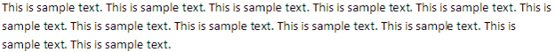
    
    如果此文档的内容在显示时必须自动进行断行，那么将使用以下WordprocessingML在文档设置中指定该要求：
    
    ```xml
    <w:autoHyphenation w:val="true" />
    ```
    
    最终的输出可能如下所示（取决于应用程序的断行算法和断行区域设置([§17.15.1.53])：
    
    
    
    autoHyphenation元素的val属性等于true，文档自动进行断行，单词sample从第二行末尾开始自动断行，因此自动延续到第三行。相反，当autoHyphenation元素的val属性等于off时，整个单词sample延续到第三行，因为它没有自动断行，无法适应第二行。结束示例]
    
    此元素的内容模型由[§17.17.4]中定义的通用布尔属性定义。

=== "英文"

    This element specifies whether the content of a given WordprocessingML document should automatically be hyphenated by the hosting application before it is displayed, if the application supports this functionality.
    
    If this element is omitted, then hyphenation shall not automatically be performed by application displaying this document.
    
    [Example: Consider the images below illustrating a paragraph of text in a WordprocessingML document:
    
    
    
    If the content in this document must automatically be hyphenated when it is displayed, that requirement would be specified using the following WordprocessingML in the document settings:
    
    ```xml
    <w:autoHyphenation w:val="true" />
    ```
    
    The resulting output might look like the following (depending on the application's hyphenation algorithm and the hyphenation zone setting ([§17.15.1.53]):
    
    
    
    The autoHypehenation element has its val attribute equal to true, the document is automatically hyphenated and the word sample, beginning at the end of the second line, is hyphenated automatically and thus carried over onto the third line. Conversely, when the autoHypehnation element has its val attribute equal to off, the entire word sample is carried over to the third line as it was not hyphenated automatically and could not fit onto the second line. end example]
    
    This element’s content model is defined by the common boolean property definition in [§17.17.4].

### 17.15.1.11 bookFoldPrinting (书籍折页印刷)

**bookFoldPrinting (Book Fold Printing)**

=== "中文"
    
    此元素指定是否应将给定WordprocessingML文档的内容作为书帖打印。书帖是打印出来的纸张，展示了一个文档的多个页面，这些页面被折叠并装订在一起，形成小册子，一组小册子可以装订在一起形成类似书籍的出版物。具体来说，此元素指定在给定WordprocessingML文档中的每一页应以横向方式定位，沿页面垂直中线一分为二，两个左边距从页面中线发出，每个页面的左右两侧分别实例化两个右边距。
    
    此元素与bookFoldPrintingSheets元素([§17.15.1.12])结合使用，以使WordprocessingML文档打印出来，以便打印的书帖系列可以被折叠和装订，创建小册子。
    
    此元素对宿主应用程序使用的打印机设置没有影响。换句话说，如果宿主应用程序使用的打印机已被配置为单面打印，包括此WordprocessingML元素的WordprocessingML没有效果。
    
    如果省略此元素，则页面不会被打印为书帖。如果还指定了bookFoldRevPrinting元素([§17.15.1.13])，则应忽略此元素。
    
    [示例：考虑一个四页WordprocessingML文档，使用pgMar元素([§17.6.11])设置了2,160十分之一英寸（一英寸半）的左边距，以及1,440十分之一英寸（一英寸）的底部、右侧和顶部边距，围绕页面的文本范围（下图中灰色阴影区域表示）。这些页面边距使用以下WordprocessingML指定：
    
    ```xml
    <w:pgMar w:header="0" w:top="1440" w:right="1440" w:bottom="1440" w:left="2160"
    w:footer="720" w:gutter="0" />
    ```
    
    设置bookFoldPrinting元素的val属性为true与false，以及bookFoldPrintingSheets元素的val属性为4的必要WordprocessingML及其结果效果，下图中图形化展示—图表未按比例绘制：
    
    <table border="1">
        <tr>
            <td>`<w:bookFoldPrinting w:val="false"/>`</td>
            <td>`<w:bookFoldPrinting w:val="true" />`</td>
        </tr>
        <tr>
            <td>第一张打印纸张</td>
            <td>第一张打印书帖</td>
        </tr>
        <tr>
            <td>
                
            </td>
            <td>
                
            </td>
        </tr>
        <tr>
            <td>第二张打印纸张</td>
            <td>第二张打印书帖</td>
        </tr>
        <tr>
            <td>
                
            </td>
            <td>
                
            </td>
        </tr>
    </table>
    
    假设页面已经以横向方式定位，将bookFoldPrinting元素的val属性设置为true将页面沿垂直中线一分为二，两个左边距从页面中线发出，每个页面的左右两侧分别实例化右边距，使两个书帖可以打印。
    
    此外，此元素与bookFoldPrintingSheets元素结合使用，以使给定WordprocessingML文档打印出来，以便打印的书帖系列可以被折叠和装订，创建小册子。具体来说，书帖可以背对背放置，每张纸张的顶部与底部对齐，并折叠，从而创建小册子。结束示例]
    
    [注：此元素也可以由宿主应用程序利用，以通知应用程序在其用户界面中显示每张纸上的两页，以允许WYSIWYG用户体验。结束注]
    
    此元素的内容模型由[§17.17.4]中定义的通用布尔属性定义。

=== "英文"
    
    This element specifies if the contents of a given WordprocessingML document should be printed as signatures. Signatures are printed sheets, which depict several pages of a document that are folded and bound with other signatures to form a booklet, a set of which can be bound together to form a book like publication. Specifically, this element specifies that each page in a given WordprocessingML document should be oriented in a landscape fashion, divided in half vertically with two left margins emanating from the bisector of the page, and two right margins instantiated at the left and right side of each page.
    
    This element is used in conjunction with the bookFoldPrintingSheets element ([§17.15.1.12]) to enable a WordprocessingML document to be printed such that the series of signatures printed can be folded and bound to create a booklet.
    
    This element has no impact on the settings of printer leveraged by the hosting application. In other words, if the printer leveraged by the hosting application has been configured to print on one side of a page, including the WordprocessingML for this element has no effect.
    
    If this element is omitted, then pages shall not be printed as signatures. If the bookFoldRevPrinting element ([§17.15.1.13]) is also specified, then this element shall be ignored.
    
    [Example: Consider a four page WordprocessingML document with a 2,160 twentieths of a point (one and a half inch) left margin, and 1,440 twentieths of a point (one inch) bottom, right, and top margins using the pgMar element ([§17.6.11]) surrounding the text extents of the page (represented by the gray shaded area in diagrams below). These page margins are specified using the following WordprocessingML:
    
    ```xml
    <w:pgMar w:header="0" w:top="1440" w:right="1440" w:bottom="1440" w:left="2160"
    w:footer="720" w:gutter="0" />
    ```
    
    The necessary WordprocessingML and consequential effect of setting the bookFoldPrinting element's val attribute to true versus false and the bookFoldPrintingSheets element's val attribute to 4, is depicted graphically below—diagrams not drawn to scale:
    
    <table border="1">
        <tr>
            <td>`<w: bookFoldPrinting w:val="false"/>`</td>
            <td>`<w: bookFoldPrinting w:val="true" />`</td>
        </tr>
        <tr>
            <td>First Printed Sheet</td>
            <td>First Printed Signature</td>
        </tr>
        <tr>
            <td>
                
            </td>
            <td>
                
            </td>
        </tr>
        <tr>
            <td>Second Printed Sheet</td>
            <td>Second Printed Signature</td>
        </tr>
        <tr>
            <td>
                
            </td>
            <td>
                
            </td>
        </tr>
    </table>
    
    Assuming the page was already oriented in a landscape fashion, setting the bookFoldPrinting element’s val attribute to true divided the page in half vertically, with two left margins emanating from the bisector of the page, and right margins instantiated at the left and right side of each page, enabling two signatures to be printed.
    
    In addition, this element is used in conjunction with the bookFoldPrintingSheets element to enable the given WordprocessingML document to be printed such that the series of signatures printed can be folded and bound to create a booklet. Specifically, the signatures can be placed back to back, with top the bottom of each sheet aligned, and folded such that a booklet is created. end example]
    
    [Note: This element could also be leveraged by the hosting application to notify the application to display two pages per sheets within its user interface to allow for a WYSIWYG user experience. end note]
    
    This element’s content model is defined by the common boolean property definition in [§17.17.4].

### 17.15.1.12 bookFoldPrintingSheets (每本小册子的页数)

**bookFoldPrintingSheets (Number of Pages Per Booklet)**

=== "中文"

    此元素应与bookFoldPrinting([§17.15.1.11])和bookFoldRevPrinting([§17.15.1.13])元素结合使用，以指定在打印一系列书帖时每个小册子中应包含的页面数量。书帖是打印出来的纸张，展示了将要被折叠并与其他书帖装订在一起以形成小册子的文档的多个页面。小册子可以装订在一起形成类似书籍的出版物。
    
    如果省略此元素，则其默认行为是在单张纸上打印内容。一张纸是一张被折叠和切割以产生书籍的单张纸。
    
    [示例：考虑将一个四页的WordprocessingML文档打印成两套书帖，汇编成单个小册子。此设置将使用文档设置部分中的以下WordprocessingML片段指定：
    
    ```xml
    <w:bookFoldPrinting w:val=“true” />
    <w:bookFoldPrintingSheets w:val="4" />
    ```
    
    bookFoldPrintingSheets元素的val属性指定每个小册子中必须包含4页。由于每个书帖包含两页，并打印成书帖可以背对背放置，每张纸的顶部与底部对齐，并折叠以创建小册子，因此可以创建包含分布在两个书帖上四页的小册子。
    
    此设置在下图中以视觉方式展示（灰色阴影表示页面）：

    | 第一张打印书帖                | 第二张打印书帖                |
    | ----------------------------- | ----------------------------- |
    |  |  |
    
    结束示例]
    
    ??? abstract "属性"
    
        - **val** (十进制数值)
    
            指定此属性的内容包含一个十进制数字。
            
            这个十进制数字的内容根据父XML元素的上下文来解释。
            
            [示例：考虑以下简单类型ST_DecimalNumber的数字WordprocessingML属性：
            
            ```xml
            <… w:val="1512645511" />
            ```
            
            val属性的值是一个十进制数字，其值必须根据父元素的上下文来解释。结束示例]
            
            此属性的可能值由ST_DecimalNumber简单类型([§17.18.10])定义。
    
    [Note: The W3C XML Schema definition of this element’s content model (CT_DecimalNumber) is located in §A.1. end note]

=== "英文"

    
    This element shall be used in conjunction with the bookFoldPrinting ([§17.15.1.11]) and bookFoldRevPrinting ([§17.15.1.13]) elements to specify the number of pages to be included in each booklet when printing a series of signatures. Signatures are printed sheets, which depict several pages of a document that are to be folded and bound with other signatures to form a booklet. Booklets can be bound together to form a book like publication.
    
    If this element is omitted, then its default behavior shall be to print the contents of the content on a single sheet. A sheet is a single piece of paper which is folded and cut to produce a book.
    
    [Example: Consider a four page WordprocessingML document is printed as a set of two signatures to be compiled into a single booklet. This setting would be specified using the following WordprocessingML fragment in the document settings part:
    
    ```xml
    <w:bookFoldPrinting w:val=“true” />
    <w:bookFoldPrintingSheets w:val="4" />
    ```
    
    The bookFoldPrintingSheets element's val attribute specifies that 4 pages must be included in each booklet. Since each signature contains two pages and are printed such that the signatures can be placed back to back, with top the bottom of each sheet aligned, and folded such that the booklet is created, a booklet containing four pages distributed over two signatures can be created.
    
    This setting is depicted visually using the illustration below (gray shading represents a page):

    | First Printed Signature       | Second Printed Signature      |
    | ----------------------------- | ----------------------------- |
    |  |  |

    end example]
    
    ??? abstract "Attributes"
    
        - **val** (Decimal Number Value)
    
            Specifies that the contents of this attribute contains a decimal number.
            
            The contents of this decimal number are interpreted based on the context of the parent XML element.
            
            [Example: Consider the following numeric WordprocessingML property of simple type ST_DecimalNumber:
            
            ```xml
            <… w:val="1512645511" />
            ```
            
            The value of the val attribute is a decimal number whose value must be interpreted in the context of the parent element. end example]
            
            The possible values for this attribute are defined by the ST_DecimalNumber simple type ([§17.18.10]).
    
    [Note: The W3C XML Schema definition of this element’s content model (CT_DecimalNumber) is located in §A.1. end note]

### 17.15.1.13 bookFoldRevPrinting (反向书籍折叠打印)

**bookFoldRevPrinting (Reverse Book Fold Printing)**

=== "中文"
    
    此元素指定是否应以相反的顺序将给定WordprocessingML文档的页面打印为书帖。书帖是打印出来的纸张，展示了将要被折叠并与其他书帖装订在一起以形成小册子的文档的多个页面，一组小册子可以装订在一起形成类似书籍的出版物。具体来说，此元素指定在给定WordprocessingML文档中的每一页应以横向方式定位，并沿垂直中线一分为二，两个左边距从页面中线发出，每个页面的左右两侧分别实例化右边距。
    
    此外，此元素与bookFoldPrintingSheets元素([§17.15.1.12])结合使用，以使给定WordprocessingML文档打印出来，以便打印的书帖系列可以被折叠和装订，创建小册子。
    
    此元素对宿主应用程序使用的打印机设置没有影响。换句话说，如果宿主应用程序使用的打印机已被配置为单面打印，包括此WordprocessingML元素的WordprocessingML没有效果。
    
    如果省略此元素，则页面不会被打印为反向书帖。如果也指定了bookFoldPrinting元素([§17.15.1.11])，则应忽略那个元素，而使用此元素。
    
    [示例：考虑一个四页WordprocessingML文档，使用pgMar元素([§17.6.11])设置了2,160十分之一英寸（一英寸半）的左边距，以及1,440十分之一英寸（一英寸）的底部、右侧和顶部边距，围绕页面的文本范围（下图中灰色阴影区域表示）。这些页面边距使用以下WordprocessingML指定：
    
    ```xml
    <w:pgMar w:header="0" w:top="1440" w:right="1440" w:bottom="1440" w:left="2160"
        w:footer="720" w:gutter="0" />
    ```
    
    设置bookFoldRevPrinting元素的val属性为true与false，以及bookFoldPrintingSheets元素的val属性为4的必要WordprocessingML及其结果效果，下图中图形化展示—图表未按比例绘制：]
    
    <table border="1">
        <tr>
            <td>&lt;w: bookFoldRevPrinting w:val="false"/&gt;</td>
            <td>&lt;w: bookFoldRevPrinting w:val="true"/&gt;<br/>
                &lt;<w: bookFoldPrintingSheets w:val="4"/&gt;</td>
        </tr>
        <tr>
            <td>
                First Printed Sheet
            </td>
            <td>
                First Printed Signature
            </td>
        </tr>
        <tr>
            <td>
                
            </td>
            <td>
                
            </td>
        </tr>
        <tr>
            <td>
                Second Printed Sheet
            </td>
            <td>
                Second Printed Signature
            </td>
        </tr>
        <tr>
            <td>
                
            </td>
            <td>
                
            </td>
        </tr>
    </table>
    
    假设页面已经是横向布局，将bookFoldRevPrinting元素的val属性设置为true会将页面沿垂直中线一分为二，两个左边距从页面中线发出，右边距在每个页面的左右两侧实例化，从而可以打印两个书帖。
    
    此外，此元素与bookFoldPrintingSheets元素结合使用，以使给定的WordprocessingML文档打印出来，打印的书帖系列可以被折叠和装订，创建小册子。具体来说，书帖可以背靠背放置，每张纸张的顶部与底部对齐，并折叠，从而创建小册子。结束示例]
    
    [注：此元素也可以由宿主应用程序利用，以通知应用程序在其用户界面中每张纸上显示两页，以允许WYSIWYG用户体验。结束注]
    
    此元素的内容模型由[§17.17.4]中定义的通用布尔属性定义。

=== "英文"
    
    This element specifies if pages of a given WordprocessingML document are to be printed as signatures in reverse order. Signatures are printed sheets, which depict several pages of a document that are folded and bound with other signatures to form a booklet, a set of which can be bound together to form a book like publication. Specifically, this element specifies that each page in a given WordprocessingML document should be oriented in a landscape fashion and divided in half vertically, with two left margins emanating from the bisector of the page, and right margins instantiated at the left and right side of each page.
    
    In addition, this element is used in conjunction with the bookFoldPrintingSheets element ([§17.15.1.12]) to enable given WordprocessingML document to be printed such that the series of signatures printed can be folded and bound to create a booklet.
    
    This element has no impact on the settings of printer leveraged by the hosting application. In other words, if the printer leveraged by the hosting application has been configured to print on one side of a page, including the WordprocessingML for this element has no effect.
    
    If this element is omitted, then pages shall not be printed as reverse book fold signatures. If the bookFoldPrinting element ([§17.15.1.11]) is also specified, then that element shall be ignored, and this element shall be used instead.
    
    [Example: Consider a four page WordprocessingML document with a 2,160 twentieths of a point (one and a half inch) left margin, and 1,440 twentieths of a point (one inch) bottom, right, and top margins using the pgMar element ([§17.6.11]) surrounding the text extents of the page (represented by the gray shaded area in diagrams below). These page margins are specified using the following WordprocessingML:
    
    ```xml
    <w:pgMar w:header="0" w:top="1440" w:right="1440" w:bottom="1440" w:left="2160"
        w:footer="720" w:gutter="0" />
    ```
    
    The necessary WordprocessingML and consequential effect of setting the bookFoldRevPrinting element's val attribute to true versus false and the bookFoldPrintingSheets element's val attribute to 4, is depicted graphically below—diagrams not drawn to scale:
    
    
    <table border="1">
        <tr>
            <td>&lt;w: bookFoldRevPrinting w:val="false"/&gt;</td>
            <td>&lt;w: bookFoldRevPrinting w:val="true"/&gt;<br/>
                &lt;<w: bookFoldPrintingSheets w:val="4"/&gt;</td>
        </tr>
        <tr>
            <td>
                First Printed Sheet
            </td>
            <td>
                First Printed Signature
            </td>
        </tr>
        <tr>
            <td>
                
            </td>
            <td>
                
            </td>
        </tr>
        <tr>
            <td>
                Second Printed Sheet
            </td>
            <td>
                Second Printed Signature
            </td>
        </tr>
        <tr>
            <td>
                
            </td>
            <td>
                
            </td>
        </tr>
    </table>
    
    Assuming the page was already oriented in a landscape fashion, setting the bookFoldRevPrinting element’s val attribute to true divided the page in half vertically, with two left margins emanating from the bisector of the page, and right margins instantiated at the left and right side of each page, enabling two signatures to be printed.
    
    In addition, this element is used in conjunction with the bookFoldPrintingSheets element to enable the given WordprocessingML document to be printed such that the series of signatures printed can be folded and bound to create a booklet. Specifically, the signatures can be placed back to back, with top the bottom of each sheet aligned, and folded such that a booklet is created. end example]
    
    [Note: This element could also be leveraged by the hosting application to notify the application to display two pages per sheets within its user interface to allow for a WYSIWYG user experience. end note]
    
    This element’s content model is defined by the common boolean property definition in [§17.17.4].

### 17.15.1.14 bordersDoNotSurroundFooter (页面边框不包括页脚)

**bordersDoNotSurroundFooter (Page Border Excludes Footer)**

=== "中文"
    
    此元素指定，使用pgBorders元素([§17.6.10])指定的给定WordprocessingML文档的页面边框不应环绕页脚内容。
    
    如果省略此元素，则页面边框不应排除页面上的页脚。同样，如果pgBorders元素具有不等于text的offsetFrom属性，则应忽略此元素。
    
    [注：如果pgBorders元素具有等于page的offsetFrom属性，则会忽略bordersDoNotSurroundFooter元素，因为指定具有offsetFrom属性等于page的pgBorders元素是为了指定边框在文档中的定位应相对于页面边缘计算，因此与页脚中的文档内容无关。结束注]
    
    [示例：考虑WordprocessingML文档中的以下页面：
    
    
    
    如果修改此WordprocessingML文档以利用此元素启用的行为，将使用文档设置中的以下WordprocessingML片段指定此设置：
    
    ```xml
    <w:bordersDoNotSurroundFooter w:val="true"/>
    ```
    
    bordersDoNotSurroundFooter元素的val属性等于true，指定页面边框不应环绕页脚的文本范围，如下所示：
    
    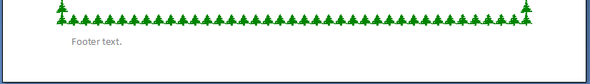
    
    结束示例]
    
    此元素的内容模型由[§17.17.4]中定义的通用布尔属性定义。

=== "英文"
    
    This element specifies that a given WordprocessingML document’s page border specified using the pgBorders element ([§17.6.10]) should not surround contents of the footer.
    
    If this element is omitted, then the page border shall not exclude the footer on the page. As well, this element shall be ignored if the pgBorders element has an offsetFrom attribute which is not equal to text.
    
    [Note: If the pgBorders element has a offsetFrom attribute equal to page, the bordersDoNotSurroundFooter element is ignored as specifying the pgBorders element with a offsetFrom attribute equal to page is to specify that the positioning of borders within the document shall be calculated relative to the edge of the page and therefore irrespective of document content in the footer. end note]
    
    [Example: Consider the following page in a WordprocessingML document:
    
    
    
    If this WordprocessingML document is modified to leverage the behavior enabled by this element, this setting
    would be specified using the following WordprocessingML fragment in the document settings:
    
    ```xml
    <w:bordersDoNotSurroundFooter w:val="true"/>
    ```
    
    The bordersDoNotSurroundFooter element's val attribute is equal to true specifying that the page border
    shall not surround the text extents of the footer, as follows:
    
    
    
    end example]
    
    This element’s content model is defined by the common boolean property definition in [§17.17.4].

### 17.15.1.15 bordersDoNotSurroundHeader (页面边框不包括页眉)

**bordersDoNotSurroundHeader (Page Border Excludes Header)**

=== "中文"
    
    此元素指定，使用pgBorders元素([§17.6.10])指定的给定WordprocessingML文档的页面边框不应环绕页眉内容。
    
    如果省略此元素，则页面边框不应排除页面上的页眉。同样，如果pgBorders元素具有不等于text的offsetFrom属性，则应忽略此元素。
    
    [注：如果pgBorders元素具有等于page的offsetFrom属性，则会忽略bordersDoNotSurroundHeader元素，因为指定具有offsetFrom属性等于page的pgBorders元素是为了指定边框在文档中的定位应相对于页面边缘计算，因此与页眉中的文档内容无关。结束注]
    
    [示例：考虑WordprocessingML文档中的以下页面：
    
    
    
    如果修改此WordprocessingML文档以利用此元素启用的行为，将使用文档设置中的以下WordprocessingML片段指定此设置：
    
    ```xml
    <w:bordersDoNotSurroundHeader w:val="true"/>
    ```
    
    bordersDoNotSurroundHeader元素的val属性等于true，指定页面边框不应环绕页眉的文本范围，如下所示：
    
    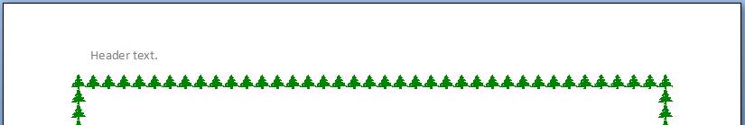
    
    结束示例]
    
    此元素的内容模型由[§17.17.4]中定义的通用布尔属性定义。

=== "英文"
    
    This element specifies that a given WordprocessingML document’s page border specified using the pgBorders element ([§17.6.10]) should not surround contents of the header.
    
    If this element is omitted, then the page border shall not exclude the header on the page. As well, this element shall be ignored if the pgBorders element has a offsetFrom attribute which is not equal to text.
    
    [Note: If the pgBorders element has a offsetFrom attribute equal to page, the bordersDoNotSurroundHeader element is ignored as specifying the pgBorders element with a offsetFrom attribute equal to page is to specify that the positioning of borders within the document shall be calculated relative to the edge of the page and therefore irrespective of document content in the header. end note]
    
    [Example: Consider the following page in a WordprocessingML document:
    
    
    
    If this WordprocessingML document is modified to leverage the behavior enabled by this element, this setting would be specified using the following WordprocessingML fragment in the document settings:
    
    ```xml
    <w:bordersDoNotSurroundHeader w:val="true"/>
    ```
    
    The bordersDoNotSurroundHeader element's val attribute is equal to true specifying that the page border shall not surround the text extents of the header, as follows:
    
    
    
    end example]
    
    This element’s content model is defined by the common boolean property definition in [§17.17.4].

### 17.15.1.16 caption (单一字幕类型定义)

**caption (Single Caption Type Definition)**

=== "中文"
    
    此元素指定了标题的内容和定位，这些标题可用于自动标记WordprocessingML文档中的对象。标题是WordprocessingML文档中包含的对象的标签字符串，通常由一段文本加上一个字段组成，该字段为相似对象集合中的此项编号。
    
    [示例：考虑下图展示了一个包含表格并已被标题标记的WordprocessingML文档：
    
    
    
    在此图中，WordprocessingML文档中包含的表格通过在表格下方插入标题进行标记，标题由字符串“Table”和字段组成，字段的结果显示为十进制数字。自动生成这种形式标题的设置是使用以下WordprocessingML片段指定的：
    
    ```xml
    <w:captions>
        <w:caption w:name="Table" w:pos="below" w:numFmt="decimal" />
    </w:captions>
    ```
    
    caption元素指定了用于自动标记WordprocessingML文档内容的结果标题的参数。具体来说，name和numFmt属性指定，插入给定WordprocessingML文档中的这种类型的标题应由字符串“Table”和递增的十进制数字字段组成。此外，pos属性指定这些标题应放置在它们用于标记的对象下方。
    
    WordprocessingML的设计使得caption元素可以与应用程序结合使用，提供动态标题体验。换句话说，应用程序可以使用上述示例中的WordprocessingML，在WordprocessingML文档中插入表格时，根据autoCaption元素([§17.15.1.7])的定义，在表格下方自动插入由字符串“Table”和递增的十进制数字字段组成的标题。结束示例]
    
    ??? abstract "Attributes"
        
        - **chapNum** (在标题字段中包含章节编号)

            指定是否在WordprocessingML文档中的标题字段内显示与最近的章节标题关联的编号。章节标题是WordprocessingML文档中的一段文本，它使用一个样式进行格式化，该样式已被标题属性指定，用于在文档中划分章节。
            
            只有其styleID属性等于Heading1、Heading2、Heading3、Heading4、Heading5、Heading6、Heading7、Heading8或Heading9的样式才能被指定为用于在文档中划分章节的样式。选择这些标题级别中的哪一个用于确定当前章节编号是由相应标题属性的值定义的。[示例：当chapNum为true且heading为1时，使用Heading1作为章节标题。结束示例]
            
            如果省略此属性，则章节编号将不包含在生成的标题中。
            
            [示例：考虑下图：
            
            
            
            
            此图展示了一个包含两个章节的WordprocessingML文档，每个章节都包含两个带有标题的表格。在本文档中，Heading 2样式已与章节标题关联，并应用于字符串：Chapter 1 - FY02和Chapter 2 - FY03。
            
            具体来说，用于划分章节的样式是styleID属性等于Heading2的样式，这是由caption的heading属性值2在WordprocessingML中指定的，定义如下：
            
            ```xml
            <w:caption w:name="Table" w:pos="below" w:chapNum="true"
                w:heading="2" w:numFmt="upperLetter" w:sep="hyphen" />
            ```
            
            chapNum属性的值为true，指定用于标记文档中表格的标题包含一个符号，该符号对应于其所包含章节的基于1的索引。
            
            这可以从第1章的标题中包含1，第2章的标题中包含2中看出，每个标题都与其相应的章节编号相对应。结束示例]
            
            此属性的可能值由ST_OnOff简单类型([§22.9.2.7])定义。
        
        - **heading** (章节标题样式)

            指定用于划分文档中章节标题的给定样式。
            
            此值用于将章节标题与具有以下styleID属性的段落关联：
            
            - 1：styleID为Heading1的样式
            - 2：styleID为Heading2的样式
            - 3：styleID为Heading3的样式
            - 4：styleID为Heading4的样式
            - 5：styleID为Heading5的样式
            - 6：styleID为Heading6的样式
            - 7：styleID为Heading7的样式
            - 8：styleID为Heading8的样式
            - 9：styleID为Heading9的样式
            - 任何其他值：应用程序定义。可以忽略。
            
            如果省略此属性，则其值假定为1。
            
            [示例：考虑下图：
            
            
            
            
            此图展示了一个包含两个章节的WordprocessingML文档，每个章节都包含两个带有标题的表格。在本文档中，Heading 2样式已与章节标题关联，并应用于字符串：Chapter 1 - FY02和Chapter 2 - FY03。
            
            具体来说，用于划分章节标题的样式是styleID属性等于Heading2的样式，这是由下述WordprocessingML中的heading属性值2指定的。
            
            ```xml
            <w:caption w:name="Table" w:pos="below" w:chapNum="1"
                w:heading="2" w:numFmt="upperLetter" w:sep="hyphen" />
            ```
            
            换句话说，上述WordprocessingML可用于标记插入到给定WordprocessingML文档中的表格，由应用程序生成的标题包括：字符串Table、表格所在的章节对应的十进制数字、sep属性中定义的连字符，以及由numFmt属性定义的、与当前章节中给定表格的顺序对应的大写英文字母。结束示例]
            
            此属性的可能值由ST_DecimalNumber简单类型([§17.18.10])定义。

        - **name** (标题类型名称)

            指定此标题的文本字符串组件。
            
            此值的使用方式如下：
            
            - 当自动向文档添加标题时，将其添加到包含此对象的章节编号和项目编号的字段中。
            - 它用于唯一标记此标题类型，允许通过autoCaption元素([§17.15.1.7])与对象类别关联。
            - 它可以用于在用户界面中标记此标题类型。
            
            [示例：考虑下图展示了一个包含已被标题标记的表格的WordprocessingML文档：
            
            
            
            在此图中，WordprocessingML文档中包含的表格已通过在表格下方插入标题进行标记，标题由字符串Table和十进制数字组成。这种标题格式是用以下WordprocessingML指定的：
            
            ```xml
            <w:caption w:name="Table" w:pos="below" w:numFmt="decimal" />
            ```
            
            具体来说，name属性指定了构成给定标题的字符串的第一部分应由字符串Table组成。结束示例]
            
            此属性的可能值由ST_String简单类型([§22.9.2.13])定义。
        
        - **noLabel** (不包含名称在标题中)

            指定在自动向文档添加标题时，是否应在生成的标题中包含name属性中指定的字符串。如果设置为true，则在添加标题时将省略name属性中的标签文本。
            
            如果省略此属性，则将在标题中添加名称。
            
            [示例：考虑下图展示了一个包含已被标题标记的表格的WordprocessingML文档：
            
            
            
            在此图中，WordprocessingML文档中包含的表格已通过在表格下方插入仅包含十进制数字的标题进行标记。
            
            这种标题格式是使用以下WordprocessingML指定的：
            
            ```xml
            <w:caption w:name="Custom" w:pos="below" w:noLabel="true" w:numFmt="decimal" />
            ```
            
            在这里，noLabel属性等于true，指定当自动添加此标题格式时，不得包含标签。结束示例]
            
            此属性的可能值由ST_OnOff简单类型([§22.9.2.7])定义。

        - **numFmt** (标题编号格式)

            指定在自动生成的标题中包含的编号格式，以指定该项在该集合中的索引（如果在chapNum中指定，则在当前章节中，或在当前文档故事中）。
            
            如果省略此属性，则假定其默认值为十进制。
            
            [示例：考虑下图展示了一个包含已被标题标记的表格的WordprocessingML文档：
            
            
            
            在这个示例中，WordprocessingML文档中包含的表格已通过在表格下方插入仅包含十进制数字的标题进行标记。
            
            这种标题格式是使用以下WordprocessingML指定的：
            
            ```xml
            <w:caption w:name="Custom" w:pos="below" w:noLabel="true" w:numFmt="decimal" />
            ```
            
            在这里，numFmt属性等于decimal，指定在自动插入表格标题时应包含十进制数字。结束示例]
            
            此属性的可能值由ST_NumberFormat简单类型([§17.18.59])定义。
        
        - **pos** (自动标题位置)

            指定自动插入的标题相对于其所标注的对象的位置。
    
            如果省略此属性，则默认值为下方。
    
            [示例：考虑下图展示了一个包含已被标题标记的表格的WordprocessingML文档。
            
            
            
            在此图中，WordprocessingML文档中包含的表格已通过在表格下方插入标题进行标记，标题由字符串Table和十进制数字组成。
            
            这种标题格式是使用以下WordprocessingML指定的：
            
            ```xml
            <w:caption w:name="Table" w:pos="below" w:numFmt="decimal" />
            ```
            
            pos属性指定给定标题应放置在其标注的对象下方。结束示例]
            
            此属性的可能值由ST_CaptionPos简单类型([§17.18.5])定义。

        - **sep** (章节编号/项目索引分隔符)

            指定用于分隔标题中使用的章节编号与标题项目编号的字符。标题格式由三个组件组成：
            
            - （可选的）文字字符串
            - （可选的）章节编号
            - 该标题在章节/文档中的索引
            
            当后两项都存在时，它们使用此属性指定的章节分隔符进行分隔。
    
            如果省略此属性，则其默认值应为连字符。如果章节编号不是标题格式的一部分，则应忽略此参数。
    
            [示例：考虑下图：
            
            
            
            
            此图展示了一个包含两个章节的WordprocessingML文档，每个章节都包含两个带有标题的表格。在本文档中，Heading 2样式已与章节标题关联，并应用于字符串：Chapter 1 - FY02和Chapter 2 - FY03。
    
            具体来说，用于划分章节标题的样式是styleID属性等于Heading2的样式，这是由下述WordprocessingML中的heading属性值2指定的。
            
            ```xml
            <w:caption w:name="Table" w:pos="below" w:chapNum="1"
            w:heading="2" w:numFmt="upperLetter" w:sep="hyphen" />
            ```
            
            sep属性的连字符值指定在文档中显示时，章节编号和标题索引必须用连字符分隔。结束示例]
            
            此属性的可能值由ST_ChapterSep简单类型([§17.18.6])定义。
    
    [Note: The W3C XML Schema definition of this element’s content model (CT_Caption) is located in §A.1. end note]

=== "英文"
    
    This element specifies the contents and positioning for captions which can be used to automatically label objects in a WordprocessingML document. A caption is a string that labels an object included in a WordprocessingML document, and typically consists of a string plus a field which numbers this item within a collection of similar objects.
    
    [Example: Consider the diagram below illustrating a WordprocessingML document containing a table that has been labeled with a caption:
    
    
    
    In this diagram, the table contained in the WordprocessingML document has been labeled by inserting a caption below the table consisting of the string Table followed by a field whose result is a decimal number. The settings which automatically produced this form of caption are specified using the following WordprocessingML fragment:
    
    ```xml
    <w:captions>
    <w:caption w:name="Table" w:pos="below" w:numFmt="decimal" />
    </w:captions>
    ```
    
    The caption element specifies the parameters for the resulting caption to be used to automatically label content within the WordprocessingML document. Specifically, the name and numFmt attributes specify that captions of this caption type inserted in the given WordprocessingML document shall consist of the string Table followed by an incrementing decimal number field. In addition, the pos attribute specifies that these captions shall be placed below the object they are used to label.
    
    WordprocessingML is designed such that the caption element can be used in conjunction with applications to provide a dynamic captioning experience. In other words, an application can use the WordprocessingML in the example above to automatically insert a caption consisting of the string Table followed by an incrementing decimal number field below tables when tables are inserted into a WordprocessingML document as defined by the autoCaption element ([§17.15.1.7]). end example]
    
    ??? abstract "Attributes"
        
        - **chapNum** (Include Chapter Number in Field for Caption)
        
            Specifies whether or not to display numbering associated with the most recent chapter heading in the WordprocessingML document within the caption field. A chapter heading is a paragraph of text within a WordprocessingML document that is formatted with a style that has been specified by the heading attribute to demarcate chapters in documents.
            
            Only a style with its styleID attribute equal to Heading1, Heading2, Heading3, Heading4, Heading5, Heading6, Heading7, Heading8, or Heading9 can be specified as the style used to demarcate chapters in a document. The choice of which of these heading levels shall be used to determine the current chapter number is defined by the value of the corresponding heading attribute. [Example: Heading1 is used as the chapter heading when chapNum is true and heading is 1. end example]
            
            If this attribute is omitted, then chapter numbers shall not be included in the resulting caption.
            
            [Example: Consider the diagram below:
        
            
            
            
            This diagram depicts a WordprocessingML document containing two chapters, each containing two tables labeled with captions. The Heading 2 style has been associated with chapter headings and applied to the strings: Chapter 1 - FY02 and Chapter 2 - FY03 in this document.
        
            Specifically, the style used to demarcate chapters, is the style with a styleID attribute equal to Heading2 as specified by the heading attribute value of 2 in the WordprocessingML for this caption, defined as follows:
            
            ```xml
            <w:caption w:name="Table" w:pos="below" w:chapNum="true"
                w:heading="2" w:numFmt="upperLetter" w:sep="hyphen" />
            ```
            
            The chapNum attribute has a value of true, specifying that the captions used to label the tables within this document contains a symbol corresponding to the one-based index of the chapter in which it is contained.
            
            This can be seen in that the captions in Chapter 1 contain a 1, while the captions in Chapter 2 contain a 2, each corresponding with their respective chapter number. end example]
        
            The possible values for this attribute are defined by the ST_OnOff simple type ([§22.9.2.7]).
        
        - **heading** (Style for Chapter Headings)
        
            Specifies the given style that is used to demarcate chapter headings in a document.
            
            This value is used to link the chapter headings with paragraphs with a styleID attribute as follows:
        
            - 1: Style with styleID of Heading1
            - 2: Style with styleID of Heading2
            - 3: Style with styleID of Heading3
            - 4: Style with styleID of Heading4
            - 5: Style with styleID of Heading5
            - 6: Style with styleID of Heading6
            - 7: Style with styleID of Heading7
            - 8: Style with styleID of Heading8
            - 9: Style with styleID of Heading9
            - Any other value: Application-defined. Can be ignored.
            
            If this attribute is omitted, then its value shall be assumed to be 1.
        
            [Example: Consider the diagram below:
        
            
            
            
            This diagram depicts a WordprocessingML document containing two chapters, each containing two tables labeled with captions. The Heading 2 style has been associated with chapter headings and applied to the strings: Chapter 1 - FY02 and Chapter 2 - FY03 in this document.
        
            Specifically, the style used to demarcate chapter headings is the style with its styleID attribute equal to Heading" as specified by the heading attribute value of 2 in the WordprocessingML below.
            
            ```xml
            <w:caption w:name="Table" w:pos="below" w:chapNum="1"
                w:heading="2" w:numFmt="upperLetter" w:sep="hyphen" />
            ```
            
            In other words, the WordprocessingML above can be used to label tables inserted in a given WordprocessingML document generated by an application with a caption consisting of: the string Table followed by a decimal number corresponding with the chapter number in which the table is present, a hyphen as defined in the sep attribute, and a capital English letter defined by the numFmt attribute corresponding with the given table's ordering within the current chapter. end example]
            
            The possible values for this attribute are defined by the ST_DecimalNumber simple type ([§17.18.10]).
        
        - **name** (Caption Type Name)
        
            Specifies the literal string component of this caption.
            
            This value is used as follows:
            
            - It is added to the field containing the chapter number and item number of this object when a caption is automatically added to the document.
            - It is used to uniquely label this caption type, allowing it to be linked with classes of objects via the autoCaption element ([§17.15.1.7])
            - It can be used to label this caption type in a user interface.
            
            [Example: Consider the diagram below illustrating a WordprocessingML document containing a table that has been labeled with a caption:
            
            
            
            In this diagram, the table contained in the WordprocessingML document has been labeled by inserting a caption below the table consisting of the string Table followed by a decimal number. This caption format is specified with the following WordprocessingML:
            
            ```xml
            <w:caption w:name="Table" w:pos="below" w:numFmt="decimal" />
            ```
            
            Specifically, the name attribute specifies that the first part of the string that comprises the give caption shall consist of the string Table. end example]
            
            The possible values for this attribute are defined by the ST_String simple type ([§22.9.2.13]).
        
        - **noLabel** (Do Not Include Name In Caption)
        
            Specifies if the string specified in the name attribute shall be included in the resulting caption when it is automatically added to the document. If set to true, then the label text in the name attribute is omitted when adding the caption.
            
            If this attribute is omitted, then the name shall be added to the caption.
            
            [Example: Consider the diagram below illustrating a WordprocessingML document containing a table that has been labeled with a caption:
            
            
            
            In this diagram, the table contained in the WordprocessingML document has been
            labeled by inserting a caption below the table consisting of only a decimal number.
            
            This caption format is specified using the following WordprocessingML:
            
            ```xml
            <w:caption w:name="Custom" w:pos="below" w:noLabel="true" w:numFmt="decimal" />
            ```
            
            Here, the noLabel attribute is equal to true specifying that when this caption format is automatically added, it must not include the label. end example]
            
            The possible values for this attribute are defined by the ST_OnOff simple type ([§22.9.2.7]).
        
        - **numFmt** (Caption Numbering Format)
        
            Specifies the format of the numbering which shall be included in an automatically generated caption to specify the index of this item in that collection (within the current chapter if chapNum is specified, or within the current document story).
            
            If this attribute is omitted, then its default value shall be assumed to be decimal.
            
            [Example: Consider the diagram below illustrating a WordprocessingML document containing a table that has been labeled with a caption:
                
            
            
            In this example, the table contained in the WordprocessingML document has been labeled by inserting a caption below the table consisting of only a decimal number.
        
            This caption format is specified using the following WordprocessingML:
            
            ```xml
            <w:caption w:name="Custom" w:pos="below" w:noLabel="true" w:numFmt="decimal" />
            ```
            
            Here, the numFmt attribute is equal to decimal, specifying that a decimal number shall be included in the table caption when it is automatically inserted. End Example]
            
            The possible values for this attribute are defined by the ST_NumberFormat simple typ ([§17.18.59]).
        
        - **pos** (Automatic Caption Placement)
        
            Specifies how an automatically inserted caption shall be positioned relative to the object that it is captioning.
            
            If this attribute is omitted, then the default value shall be below.
            
            [Example: Consider the diagram below illustrating a WordprocessingML document containing a table that has been labeled with a caption.
            
            
            
            In this diagram, the table contained in the WordprocessingML document has been labeled by inserting a caption below the table consisting of the string Table followed by a decimal number.
            
            This caption format is specified using the following WordprocessingML:
            
            ```xml
            <w:caption w:name="Table" w:pos="below" w:numFmt="decimal" />
            ```
            
            The pos attribute specifies that the given caption shall be placed below the object it is labelling. end example]
            
            The possible values for this attribute are defined by the ST_CaptionPos simple type ([§17.18.5]).
        
        - **sep** (Chapter Number/Item Index Separator)
        
            Specifies the character which shall be used to separate the chapter number used in this caption from the caption item numbering. A caption format consists of three components:
            
            - The (optional) literal string
            - The (optional) chapter number
            - The index of this caption within the chapter/document
            
            When the latter two items are both present, they are delimited using the chapter separator specified by this attribute.
            
            If this attribute is omitted, then its default value shall be hyphen. If the chapter number is not part of the caption format, then this parameter shall be ignored.
            
            [Example: Consider the diagram below:
            
            
            
            
            This diagram depicts a WordprocessingML document containing two chapters, each containing two tables labeled with captions. The Heading 2 style has been associated with chapter headings and applied to the strings: Chapter 1 - FY02 and Chapter 2 - FY03 in this document.
            
            Specifically, the style used to demarcate chapter headings is the style with a styleID attribute equal to Heading2 as specified by the heading attribute value of 2 in the WordprocessingML below.
            
            ```xml
            <w:caption w:name="Table" w:pos="below" w:chapNum="1"
            w:heading="2" w:numFmt="upperLetter" w:sep="hyphen" />
            ```
            
            The sep attribute value of hyphen specifies that the chapter number and caption index must be separated by a hyphen character when displayed in the document. end example]
            
            The possible values for this attribute are defined by the ST_ChapterSep simple type ([§17.18.6]).
    
    [Note: The W3C XML Schema definition of this element’s content model (CT_Caption) is located in §A.1. end note]


### 17.15.1.17 captions (字幕设置)

**captions (Caption Settings)**

=== "中文"
    
    此元素指定了给定WordprocessingML文档中关于标题信息的存在。这些信息分为两个部分：
    
    - 子元素caption定义了要自动添加到文档中的单一类型标题的格式。
    - 子元素autoCaptions定义了将自动应用标题格式的对象类型。
    
    这些信息应用于确定当对象被插入到WordprocessingML文档时自动添加到对象的标题。[注：除非在应用程序的默认模板中指定，否则通常忽略此设置。结束注]
    
    [示例：考虑下图展示了一个包含已被标题标记的表格的WordprocessingML文档：
    
    
    
    在此图中，WordprocessingML文档中包含的表格已通过在表格下方插入标题进行标记，标题由字符串Table和十进制数字组成。自动插入的标题格式是使用以下WordprocessingML指定的：
    
    ```xml
    <w:captions>
        <w:caption w:name="Table" w:pos="below" w:numFmt="decimal" />
    </w:captions>
    ```
    
    这里，captions元素指定了在给定WordprocessingML文档中存在一个或多个标题格式及其子元素caption。具体来说，子元素caption指定了在WordprocessingML文档中要使用的单一类型的标题。结束示例]
    
    标题功能利用字段([§17.16.5] )来标记对象，参考以下内容：
    
    - 给定文档内的其他已标记对象
    - 给定文档的同一章节内的其他已标记对象（当通过在标题类型上指定chapNum属性来添加章节编号时。
    
    章节是WordprocessingML文档中的文本部分，由具有已被指定用于划分文档中章节的风格的内容前导。只能指定一种风格为
    
    用于划分文档中章节的单一标题类型的风格。在用于划分章节的风格的下一个实例内容的正上方立即结束一个章节。
    
    [示例：考虑下图：
    
    
    
    
    此图展示了一个包含两个章节的WordprocessingML文档，每个章节都包含两个带有标题的表格。与章节划分相关联的风格已应用于本文档中的字符串：Chapter 1 - FY02和Chapter 2 - FY03。具体来说，用于划分章节的风格是styleID属性等于Heading2的风格，如标题格式的WordprocessingML中的heading属性值2所指定：
    
    ```xml
    <w:caption w:name="Table" w:pos="below" w:chapNum="1" w:heading="2"
        w:numFmt="upperLetter" w:sep="hyphen" />
    ```
    
    换句话说，上述WordprocessingML可用于标记插入到给定WordprocessingML文档中的对象（在此例中为表格），由应用程序生成的标题包括：字符串Table、表格所在的章节对应的十进制数字、连字符和与给定章节中给定表格的索引对应的大写英文字母。结束示例]
    
    【注：WordprocessingML的设计使得caption元素可以与应用程序结合使用，提供动态标题体验。换句话说，应用程序可以使用上述示例中的WordprocessingML，在WordprocessingML文档中插入表格时，根据autoCaption元素([§17.15.1.7])的定义，在表格下方自动插入由字符串Table和递增的十进制数字字段组成的标题。结束注】
    
    [注：此元素的内容模型（CT_Captions）的W3C XML Schema定义位于§A.1。结束注]

=== "英文"
    
    This element specifies the presence of information about captions in a given WordprocessingML document. This information is divided into two components:
    
    - The child element caption defines the format for a single type of caption to be automatically added to the document.
    - The child element autoCaptions defines the types of objects to which a caption format shall automatically be applied.
    
    This information should be used to determine the captions which are automatically added to objects when they are inserted into a WordprocessingML document. [Note: This setting is typically ignored unless it is specified in an application's default template. end note]
    
    [Example: Consider the diagram below illustrating a WordprocessingML document containing a table that has been labeled with a caption:
    
    
    
    In this diagram, the table contained in the WordprocessingML document has been labeled by inserting a caption below the table consisting of the string Table followed by a decimal number. This automatically inserted caption format is specified using the following WordprocessingML:
    
    ```xml
    <w:captions>
        <w:caption w:name="Table" w:pos="below" w:numFmt="decimal" />
    </w:captions>
    ```
    
    Here, the captions element specifies the presence of one or more caption formats in a given WordprocessingML document with its child element caption. Specifically, the child element caption specifies a single type of caption to be used within the WordprocessingML document. end example]
    
    Captioning leverages fields ([§17.16.5]) to label objects with reference to either:
    
    - Other captioned objects within a given document
    - Other captioned objects within the same chapter in a given document (when chapter numbers are added by specifiying the chapNum attribute on the caption type.
    
        A chapter is a section of text within a WordprocessingML document that is preceded by content with a style that has been specified by to demarcate chapters in documents. Only one style can be specified as
        
        the style used for a single caption type to demarcate chapters in a document. A chapter ends immediately above the next instance of content with the style used to demarcate chapters.
    
    [Example: Consider the diagram below:
    
    
    
    
    
    This diagram depicts a WordprocessingML document containing two chapters, each containing two tables labeled with captions. The style associated with chapter demarcation has been applied to the strings: Chapter 1 - FY02 and Chapter 2 - FY03 in this document. Specifically, the style used to demarcate chapters is the style with its styleID attribute equal to Heading2 as specified by the heading attribute value of 2 in the WordprocessingML for the caption format:
    
    ```xml
    <w:caption w:name="Table" w:pos="below" w:chapNum="1" w:heading="2"
        w:numFmt="upperLetter" w:sep="hyphen" />
    ```
    
    In other words, the WordprocessingML above can be used to label objects (in this case, tables) inserted in  given WordprocessingML document generated by an application with a caption consisting of: the string Tabl followed by a decimal number corresponding with the chapter number in which the table is present, a hyphen and a capital English letter corresponding with the given table's index within the given chapter. end example]
    
    [Note: WordprocessingML is designed such that the caption element can be used in conjunction with applications to provide a dynamic captioning experience. In other words, an application can use the WordprocessingML in the example above to automatically insert a caption consisting of the string Table followed by an incrementing decimal number field below tables when tables are inserted into a WordprocessingML document as defined by the autoCaption element ([§17.15.1.7]). end note]
    
    [Note: The W3C XML Schema definition of this element’s content model (CT_Captions) is located in §A.1. end note]

### 17.15.1.18 characterSpacingControl (字符级空白压缩)

**characterSpacingControl (Character-Level Whitespace Compression)**

=== "中文"

    该元素指定当前 WordprocessingML 文档中的全角字符在显示文档内容时应如何压缩以去除额外的空白，具体通过指定可压缩以去除额外空白的字符集。[注：该元素的行为与 CSS 的 text-justify-trim 属性功能完全相同。结束注]
    
    如果省略此元素，则默认值应为 dontCompress。
    
    [示例：请考虑以下 WordprocessingML：
    
    ```xml
    <w:characterSpacingControl w:val="doNotCompress" />
    ```
    
    characterSpacingControl 元素的 val 属性值为 doNotCompress，这指定在显示文档时不应对任何字符应用压缩。结束示例]
    
    ??? abstract "Attributes"
    
        **val**（值）
        
        :   指定在显示此文档内容时应压缩的字符集。
        
            [示例：考虑一个 WordprocessingML 文档，其中仅全角标点字符需要应用空白压缩。此要求通过以下 WordprocessingML 指定：
            
            ```xml
            <w:characterSpacingControl w:val="compressPunctuation"/>
            ```
            
            val 属性值 compressPunctuation 指定在显示文档时，字符压缩应仅应用于全角标点字符。结束示例]
            
            The possible values for this attribute are defined by the ST_CharacterSpacing simple type ([§17.18.7]).
    
    [Note: The W3C XML Schema definition of this element’s content model (CT_CharacterSpacing) is located in §A.1. end note]

=== "英文"

    This element specifies how full-width characters in the current WordprocessingML document should be compressed to remove additional whitespace when the contents of this document are displayed, specifically by specifying the set(s) of characters which can be compressed to remove additional whitespace. [Note: The behavior of this element is functionally identical to the CSS text-justify-trim property. end note]
    
    If this element is omitted, then the default value shall be dontCompress.
    
    [Example: Consider the WordprocessingML below:
    
    ```xml
    <w:characterSpacingControl w:val="doNotCompress" />
    ```
    
    The characterSpacingControl element has a val attribute value of doNotCompress, which specifies that no character compression shall be applied to any character when the document is displayed. end example]
    
    ??? abstract "Attributes"
    
        **val** (Value)
    
        :   Specifies the set(s) of characters which should be compressed when the contents of this document are displayed.
    
            [Example: Consider a WordprocessingML document for which only full-width punctuation characters must have their whitespace compression applied. This requirement would be specified using the following WordprocessingML:
            
            ```xml
            <w:characterSpacingControl w:val="compressPunctuation"/>
            ```
            
            The val attribute value of compressPunctuation specifies that character compression must be applied to full-width punctuation characters only when the document is displayed. end example]
            
            The possible values for this attribute are defined by the ST_CharacterSpacing simple type ([§17.18.7]).
    
    [Note: The W3C XML Schema definition of this element’s content model (CT_CharacterSpacing) is located in §A.1. end note]

### 17.15.1.19 clickAndTypeStyle (应用于自动生成的段落的段落样式)

**clickAndTypeStyle (Paragraph Style Applied to Automatically Generated Paragraphs)**

=== "中文"
    
    该元素指定将应用于在 WordprocessingML 文档中插入文本时自动创建的段落的段落样式，该段落样式通过 style 元素指定。这种样式通过 val 属性引用，该属性存储样式的 style ID（存储在样式定义的 styleId 属性中）。
    
    [指导：考虑在一个应用程序中打开的 WordprocessingML 文档，允许用户将光标放置在文档编辑画布内的任意位置并输入文本。clickAndTypeStyle 元素应用于指定与用户在空白文档某处放置光标并生成新段落后输入的段落文本相关联的段落样式。结束指导]
    
    如果省略此元素，则默认段落样式（其 default 属性设置为 true 的段落样式）将用于自动生成的段落。如果使用 val 属性指定的 styleId 样式不是段落样式或在文档中不存在，则将使用默认段落样式。
    
    [示例：考虑一个 WordprocessingML 文档，其中指定在文档某个区域中自动创建的段落（该区域没有其他样式与之关联）必须与段落样式的 styleId 等于 BalloonText 相关联。
    
    这是通过指定 val 属性等于该样式 ID 值的 clickAndTypeStyle 元素来实现的。这种约束使用以下 WordprocessingML 指定：
    
    ```xml
    <w:clickAndTypeStyle w:val="BalloonText" />
    ```
    
    样式部分中的相应样式定义如下：
    
    ```xml
    <w:style w:type="paragraph" w:styleId="BalloonText">
    …
    </w:style>
    ```
    
    clickAndTypeStyle 元素指定使用 style ID 为 BalloonText 的段落样式。结束示例]
    
    ??? abstract "Attributes"
    
        - **val** (字符串值)

            指定其内容包含一个字符串。
            
            这个字符串的内容根据父XML元素的上下文来解释。
            
            [示例：考虑以下WordprocessingML片段：
            
            ```xml
            <w:pPr>
                <w:pStyle w:val="Heading1" />
            </w:pPr>
            ```
            
            val属性的值是关联段落样式的styleId的ID。
            然而，考虑以下片段：
            
            ```xml
            <w:sdtPr>
            <w:alias w:val="SDT Title Example" />
            …
            </w:sdtPr>
            ```
            
            在这种情况下，val属性中的十进制数字是最接近的结构化文档标签的标题。在每种情况下，该值都是在父元素的上下文中解释的。结束示例]
    
            此属性的可能值由ST_String简单类型定义（[§22.9.2.13]）。
    
    [Note: The W3C XML Schema definition of this element’s content model (CT_String) is located in §A.1. end note]

=== "英文"
    
    This element specifies the paragraph style, specified using the style element, which shall be applied to paragraphs which are automatically created when text is inserted into a WordprocessingML document in an area of the document that has no other style associated with it. This style is referenced via the val attribute, which stores the style ID of the style (stored in the styleId attribute on the style definition).
    
    [Guidance: Consider a WordprocessingML document opened in an application that allows users to place their cursor anywhere within the document editing canvas and enter text. The clickAndTypeStyle element should be used to specify the paragraph style to be associated with the paragraph of text entered after a user places their cursor somewhere in the blank document that results in the generation of new paragraphs. end guidance]
    
    If this element is omitted, then the default paragraph style (the paragraph style whose default attribute is set to true), shall be used for automatically generated paragraphs. If the style whose styleId is specified using the val attribute is not a paragraph style or does not exist in the document, then the default paragraph style shall be used instead.
    
    [Example: Consider a WordprocessingML document that has specified that paragraphs which are automatically created dehe ehie xt xethnehw in a given area of the document which has no other style associated with it must be associated with the paragraph style that has a styleId equal to BalloonText.
    
    This is accomplished by specifying a clickAndTypeStyle element with a val attribute equal to the value of the ID of eeh whtxnhw style. This constraint would be specified using the following WordprocessingML:
    
    ```xml
    <w:clickAndTypeStyle w:val="BalloonText" />
    ```
    
    The corresponding style in the styles part would be defined as follows:
    
    
    ```xml
    <w:style w:type="paragraph" w:styleId="BalloonText">
    …
    </w:style>
    ```
    
    The clickAndTypeStyle element specifies the use of the paragraph style with the style ID of BalloonText. end example]
    
    ??? abstract "Attributes"
    
        **val** (String Value)
    
        :   Specifies that its contents contain a string.
    
            The contents of this string are interpreted based on the context of the parent XML element.
            
            [Example: Consider the following WordprocessingML fragment:
            
            ```xml
            <w:pPr>
                <w:pStyle w:val="Heading1" />
            </w:pPr>
            ```
            
            The value of the val attribute is the ID of the associated paragraph style's styleId.
            
            However, consider the following fragment:
            
            ```xml
            <w:sdtPr>
                <w:alias w:val="SDT Title Example" />
                …
            </w:sdtPr>
            ```
            
            In this case, the decimal number in the val attribute is the caption of the nearest ancestor structured document tag. In each case, the value is interpreted in the context of the parent element. end example]
            
            The possible values for this attribute are defined by the ST_String simple type ([§22.9.2.13]).
    
    [Note: The W3C XML Schema definition of this element’s content model (CT_String) is located in §A.1. end note]

### 17.15.1.20 clrSchemeMapping (主题颜色映射)

**clrSchemeMapping (Theme Color Mappings)**

=== "中文"
    
    该元素指定了在文档的主题部分存储的主题颜色，该主题颜色的值将被映射到此主题颜色。此映射使多个主题颜色能够串联在一起。
    
    [示例：考虑一个 WordprocessingML 文档，必须将主题颜色值 background1 映射到文档主题部分中定义的主题颜色 light1。这一要求将使用以下文档设置中的 WordprocessingML 进行指定：
    
    ```xml
    <w:clrSchemeMapping w:bg1="light1" />
    ```
    
    clrSchemeMapping 元素的属性 background1 的值为 light1，指定主题颜色值 background1 必须映射到主题颜色 light1。结束示例]
    
    ??? abstract "属性"
    
        **accent1**（重点 1 主题颜色映射）
        
        :   指定文档主题部分中的主题颜色，当文档内容引用此颜色时，将使用该颜色。
        
            如果省略此属性，则将使用 accent1 主题颜色。
            
            [示例：考虑一个 WordprocessingML 文档，必须将对主题颜色 accent1 的引用映射到文档主题部分中定义的主题颜色 light1。这一要求将使用以下文档设置中的 WordprocessingML 进行指定：
            
            ```xml
            <w:clrSchemeMapping w:accent1="light1" />
            ```
            
            accent1 属性的值为 light1，指定主题颜色值 accent1 的使用必须映射到主题颜色 light1。结束示例]
            
            此属性的可能值由 ST_WmlColorSchemeIndex 简单类型定义（[§17.18.103]）。
        
        **accent2**（重点2 主题颜色映射）
        
        :   指定文档主题部分中的主题颜色，当文档内容引用此颜色时，将使用该颜色。
            
            如果省略此属性，则将使用 accent2 主题颜色。
        
            [示例：考虑一个 WordprocessingML 文档，必须将对主题颜色 accent2 的引用映射到文档主题部分中定义的主题颜色 hyperlink。这一要求将使用以下文档设置中的 WordprocessingML 进行指定：
            
            ```xml
            <w:clrSchemeMapping w:accent2="hyperlink" />
            ```
            
            accent2 属性的值为 hyperlink，指定主题颜色值 accent2 的使用必须映射到主题颜色 hyperlink。结束示例]
            
            此属性的可能值由 ST_WmlColorSchemeIndex 简单类型定义（[§17.18.103]）。
        
        **accent3**（重点3 主题颜色映射）
        
        :   指定文档主题部分中的主题颜色，当文档内容引用此颜色时，将使用该颜色。
        
            如果省略此属性，则将使用 accent3 主题颜色。
            
            [示例：考虑一个 WordprocessingML 文档，必须将对主题颜色 accent3 的引用映射到文档主题部分中定义的主题颜色 dark1。这一要求将使用以下文档设置中的 WordprocessingML 进行指定：
            
            ```xml
            <w:clrSchemeMapping w:accent3="dark1" />
            ```
            
            accent3 属性的值为 dark1，指定主题颜色值 accent3 的使用必须映射到主题颜色 dark1。结束示例]
            
            此属性的可能值由 ST_WmlColorSchemeIndex 简单类型定义（[§17.18.103]）。
        
        **accent4**（重点4 主题颜色映射）
        
        :   指定文档主题部分中的主题颜色，当文档内容引用此颜色时，将使用该颜色。
        
            如果省略此属性，则将使用 accent4 主题颜色。
            
            [示例：考虑一个 WordprocessingML 文档，必须将对主题颜色 accent4 的引用映射到文档主题部分中定义的主题颜色 dark2。这一要求将使用以下文档设置中的 WordprocessingML 进行指定：
        
            ```xml
            <w:clrSchemeMapping w:accent4="dark2" />
            ```
            
            accent4 属性的值为 dark2，指定主题颜色值 accent4 的使用必须映射到主题颜色 dark2。结束示例]
            
            此属性的可能值由 ST_WmlColorSchemeIndex 简单类型定义（[§17.18.103]）。
    
        **accent5**（重点5 主题颜色映射）
        
        :   指定文档主题部分中的主题颜色，当文档内容引用此颜色时，将使用该颜色。
        
            如果省略此属性，则将使用 accent5 主题颜色。
            
            [示例：考虑一个 WordprocessingML 文档，必须将对主题颜色 accent5 的引用映射到文档主题部分中定义的主题颜色 accent1。这一要求将使用以下文档设置中的 WordprocessingML 进行指定：
            
            ```xml
            <w:clrSchemeMapping w:accent5="accent1" />
            ```
            
            accent5 属性的值为 accent1，指定主题颜色值 accent5 的使用必须映射到主题颜色 accent1。结束示例]
            
            此属性的可能值由 ST_WmlColorSchemeIndex 简单类型定义（[§17.18.103]）。
        
        **accent6**（重点6 主题颜色映射）
        
        :   指定文档主题部分中的主题颜色，当文档内容引用此颜色时，将使用该颜色。
        
            如果省略此属性，则将使用 accent6 主题颜色。
            
            [示例：考虑一个 WordprocessingML 文档，必须将对主题颜色 accent6 的引用映射到文档主题部分中定义的主题颜色 accent1。这一要求将使用以下文档设置中的 WordprocessingML 进行指定：
            
            ```xml
            <w:clrSchemeMapping w:accent6="accent1" />
            ```
            
            accent6 属性的值为 accent1，指定主题颜色值 accent6 的使用必须映射到主题颜色 accent1。结束示例]
            
            此属性的可能值由 ST_WmlColorSchemeIndex 简单类型定义（[§17.18.103]）。
        
        **bg1**（背景 1 主题颜色映射）
        
        :   指定文档主题部分中的主题颜色，当文档内容引用此颜色时，将使用该颜色。
        
            如果省略此属性，则将使用 light1 主题颜色。
            
            [示例：考虑一个 WordprocessingML 文档，必须将对主题颜色 bg1 的引用映射到文档主题部分中定义的主题颜色 light2。这一要求将使用以下文档设置中的 WordprocessingML 进行指定：
            
            ```xml
            <w:clrSchemeMapping w:bg1="light2" />
            ```
            
            bg1 属性的值为 light2，指定主题颜色值 bg1 的使用必须映射到主题颜色 light2。结束示例]
            
            此属性的可能值由 ST_WmlColorSchemeIndex 简单类型定义（[§17.18.103]）。
    
        **bg2**（背景2主题颜色映射）
        
        :   指定文档主题部分中的主题颜色，当文档内容引用此颜色时，将使用该颜色。
        
            如果省略此属性，则将使用 light2 主题颜色。
            
            [示例：考虑一个 WordprocessingML 文档，必须将对主题颜色 bg2 的引用映射到文档主题部分中定义的主题颜色 dark1。这一要求将使用以下文档设置中的 WordprocessingML 进行指定：
            
            ```xml
            <w:clrSchemeMapping w:bg2="dark1" />
            ```
            
            bg2 属性的值为 dark1，指定主题颜色值 bg2 的使用必须映射到主题颜色 dark1。结束示例]
            
            此属性的可能值由 ST_WmlColorSchemeIndex 简单类型定义（[§17.18.103]）。
        
        **followedHyperlink**（已访问超链接主题颜色映射）
        
        :   指定文档主题部分中的主题颜色，当文档内容引用此颜色时，将使用该颜色。
        
            如果省略此属性，则将使用 followedHyperlink 主题颜色。
            
            [示例：考虑一个 WordprocessingML 文档，必须将对主题颜色 followedHyperlink 的引用映射到文档主题部分中定义的主题颜色 hyperlink。这一要求将使用以下文档设置中的 WordprocessingML 进行指定：
            
            ```xml
            <w:clrSchemeMapping w:followedHyperlink="hyperlink" />
            ```
            
            followedHyperlink 属性的值为 hyperlink，指定主题颜色值 followedHyperlink 的使用必须映射到主题颜色 hyperlink。结束示例]
            
            此属性的可能值由 ST_WmlColorSchemeIndex 简单类型定义（[§17.18.103]）。
        
        **hyperlink**（超链接主题颜色映射）
        
        :   指定文档主题部分中的主题颜色，当文档内容引用此颜色时，将使用该颜色。
        
            如果省略此属性，则将使用 hyperlink 主题颜色。
            
            [示例：考虑一个 WordprocessingML 文档，必须将对主题颜色 hyperlink 的引用映射到文档主题部分中定义的主题颜色 accent1。这一要求将使用以下文档设置中的 WordprocessingML 进行指定：
            
            ```xml
            <w:clrSchemeMapping w:hyperlink="accent1" />
            ```
            
            hyperlink 属性的值为 accent1，指定主题颜色值 hyperlink 的使用必须映射到主题颜色 accent1。结束示例]
            
            此属性的可能值由 ST_WmlColorSchemeIndex 简单类型定义（[§17.18.103]）。
    
        **t1**（文本 1 主题颜色映射）
        
        :   指定文档主题部分中的主题颜色，当文档内容引用此颜色时，将使用该颜色。
        
            如果省略此属性，则将使用 t1 主题颜色。
            
            [示例：考虑一个 WordprocessingML 文档，必须将对主题颜色 t1 的引用映射到文档主题部分中定义的主题颜色 light1。这一要求将使用以下文档设置中的 WordprocessingML 进行指定：
            
            ```xml
            <w:clrSchemeMapping w:t1="light1" />
            ```
            
            t1 属性的值为 light1，指定主题颜色值 t1 的使用必须映射到主题颜色 light1。结束示例]
            
            此属性的可能值由 ST_WmlColorSchemeIndex 简单类型定义（[§17.18.103]）。
        
        **t2**（文本 2 主题颜色映射）
        
        :   指定文档主题部分中的主题颜色，当文档内容引用此颜色时，将使用该颜色。
        
            如果省略此属性，则将使用 t2 主题颜色。
            
            [示例：考虑一个 WordprocessingML 文档，必须将对主题颜色 t2 的引用映射到文档主题部分中定义的主题颜色 dark1。这一要求将使用以下文档设置中的 WordprocessingML 进行指定：
            
            ```xml
            <w:clrSchemeMapping w:t2="dark1" />
            ```
            
            t2 属性的值为 dark1，指定主题颜色值 t2 的使用必须映射到主题颜色 dark1。结束示例]
            
            此属性的可能值由 ST_WmlColorSchemeIndex 简单类型定义（[§17.18.103]）。
    
    [Note: The W3C XML Schema definition of this element’s content model (CT_ColorSchemeMapping) is located in §A.1. end note]

=== "英文"
    
    This element specifies the theme color, stored in the document's Theme part to which the value of this theme color shall be mapped. This mapping enables multiple theme colors to be chained together.
    
    [Example: Consider a WordprocessingML document that must have the theme color value background1 mapped to the theme color light1 as defined in the document's theme part. This requirement would be specified using the following WordprocessingML in the document settings:
    
    ```xml
    <w:clrSchemeMapping w:bg1="light1" />
    ```
    
    The clrSchemeMapping element's attribute background1 has a value of light1, specifying that theme color value background1 must be mapped to the theme color light1. end example]
    
    ??? abstract "Attributes"
    
        **accent1** (Accent 1 Theme Color Mapping)
    
        :   Specifies the theme color in the document's theme part which shall be used in place of this color when it is referenced by document content.
    
            If this attribute is omitted, then the accent1 theme color shall be used.
            
            [Example: Consider a WordprocessingML document that must have references to the theme color accent1 mapped to the theme color lt1 as defined in the document's theme part. This requirement would be specified using the following WordprocessingML in the document settings:
            
            
            <w:clrSchemeMapping w:accent1="light1" />
            
            
            The accent1 attribute has a value of light1, specifying that uses of the theme color value accent1 must be mapped to the theme color lt1. end example]
            
            The possible values for this attribute are defined by the ST_WmlColorSchemeIndex simple type ([§17.18.103]).
        
        **accent2** (Accent 2 Theme Color Mapping)
    
        :   Specifies the theme color in the document's theme part which shall be used in place of this color when it is referenced by document content.
            
            If this attribute is omitted, then the accent2 theme color shall be used.
    
            [Example: Consider a WordprocessingML document that must have the references to the theme color accent2 mapped to the theme color hlink as defined in the document's theme part. This requirement would be specified using the following WordprocessingML in the document settings:
            
            ```xml
            <w:clrSchemeMapping w:accent2="hyperlink" />
            ```
            
            The accent2 attribute has a value of hyperlink, specifying that uses of the theme color value accent2 must be mapped to the theme color hlink. end example]
            
            The possible values for this attribute are defined by the ST_WmlColorSchemeIndex simple type ([§17.18.103]).
    
        **accent3** (Accent3 Theme Color Mapping)
    
        :   Specifies the theme color in the document's theme part which shall be used in place of this color when it is referenced by document content.
    
            If this attribute is omitted, then the accent3 theme color shall be used.
            
            [Example: Consider a WordprocessingML document that must have references to the theme color accent3 mapped to the theme color dk1 as defined in the document's theme part. This requirement would be specified using the following WordprocessingML in the document settings:
            
            ```xml
            <w:clrSchemeMapping w:accent3="dark1" />
            ```
            
            The accent3 attribute has a value of dark1, specifying that uses of the theme color value accent3 must be mapped to the theme color dk1. end example]
            
            The possible values for this attribute are defined by the ST_WmlColorSchemeIndex simple type ([§17.18.103]).
    
        **accent4** (Accent4 Theme Color Mapping)
    
        :   Specifies the theme color in the document's theme part which shall be used in place of this color when it is referenced by document content.
    
            If this attribute is omitted, then the accent4 theme color shall be used.
            
            [Example: Consider a WordprocessingML document that must have references to the theme color accent4 mapped to the theme color dk2 as defined in the document's theme part. This requirement would be specified using the following WordprocessingML in the document settings:
    
            ```xml
            <w:clrSchemeMapping w:accent4="dark2" />
            ```
            
            The accent4 attribute has a value of dark2, specifying that uses of the theme color value accent3 must be mapped to the theme color dk2. end example]
            
            The possible values for this attribute are defined by the ST_WmlColorSchemeIndex simple type ([§17.18.103]).
    
        **accent5** (Accent5 Theme Color Mapping)
            
        :   Specifies the theme color in the document's theme part which shall be used in place of this color when it is referenced by document content.
    
            If this attribute is omitted, then the accent5 theme color shall be used.
            
            [Example: Consider a WordprocessingML document that must have references to the theme color accent5 mapped to the theme color accent1 as defined in the document's theme part. This requirement would be specified using the following WordprocessingML in the document settings:
            
            ```xml
            <w:clrSchemeMapping w:accent5="accent1" />
            ```
            
            The accent5 attribute has a value of accent1, specifying that uses of the theme color value accent5 must be mapped to the theme color accent1. end example]
            
            The possible values for this attribute are defined by the ST_WmlColorSchemeIndex simple type ([§17.18.103]).
    
        **accent6** (Accent6 Theme Color Mapping)
    
        :   Specifies the theme color in the document's theme part which shall be used in place of this color when it is referenced by document content.
    
            If this attribute is omitted, then the accent6 theme color shall be used.
            
            [Example: Consider a WordprocessingML document that must have references to the theme color accent6 mapped to the theme color accent1 as defined in the document's theme part. This requirement would be specified using the following WordprocessingML in the document settings:
            
            ```xml
            <w:clrSchemeMapping w:accent6="accent1" />
            ```
            
            The accent6 attribute has a value of accent1, specifying that uses of the theme color value accent6 must be mapped to the theme color accent1. end example]
            
            The possible values for this attribute are defined by the ST_WmlColorSchemeIndex simple type ([§17.18.103]).
    
        **bg1** (Background 1 Theme Color Mapping)
    
        :   Specifies the theme color in the document's theme part which shall be used in place of this color when it is referenced by document content.
    
            If this attribute is omitted, then the light1 theme color shall be used.
            
            [Example: Consider a WordprocessingML document that must have references to the theme color bg1 mapped to the theme color lt2 as defined in the document's theme part. This requirement would be specified using the following WordprocessingML in the document settings:
            
            ```xml
            <w:clrSchemeMapping w:bg1="light2" />
            ```
            
            The bg1 attribute has a value of light2, specifying that uses of the theme color value bg1 must be mapped to the theme color lt2. end example]
            
            The possible values for this attribute are defined by the ST_WmlColorSchemeIndex simple type ([§17.18.103]).
    
        **bg2** (Background 2 Theme Color Mapping)
    
        :   Specifies the theme color in the document's theme part which shall be used in place of this color when it is referenced by document content.
    
            If this attribute is omitted, then the light2 theme color shall be used.
            
            [Example: Consider a WordprocessingML document that must have references to the theme color bg2 mapped to the theme color dk1 as defined in the document's theme part. This requirement would be specified using the following WordprocessingML in the document settings:
            
            ```xml
            <w:clrSchemeMapping w:bg2="dark1" />
            ```
            
            The bg2 attribute has a value of dark1, specifying that uses of the theme color value bg2 must be mapped to the theme color dk1. end example]
            
            The possible values for this attribute are defined by the ST_WmlColorSchemeIndex simple type ([§17.18.103]).
        
        **followedHyperlink** (Followed Hyperlink Theme Color Mapping)
    
        :   Specifies the theme color in the document's theme part which shall be used in place of this color when it is referenced by document content.
    
            If this attribute is omitted, then the followedHyperlink theme color shall be used.
            
            [Example: Consider a WordprocessingML document that must have references to the theme color followedHyperlink mapped to the theme color hyperlink as defined in the document's theme part. This requirement would be specified using the following WordprocessingML in the document settings:
            
            ```xml
            <w:clrSchemeMapping w:followedHyperlink="hyperlink" />
            ```
            
            The followedHyperlink attribute has a value of hyperlink, specifying that uses of the theme color value followedHyperlink must be mapped to the theme color hyperlink. end example]
            
            The possible values for this attribute are defined by the ST_WmlColorSchemeIndex simple type ([§17.18.103]).
        
        **hyperlink** (Hyperlink Theme Color Mapping)
    
        :   Specifies the theme color in the document's theme part which shall be used in place of this color when it is referenced by document content.
        
    
            If this attribute is omitted, then the hyperlink theme color shall be used.
    
            [Example: Consider a WordprocessingML document that must have references to the theme color hyperlink mapped to the theme color accent1 as defined in the document's theme part. This requirement would be specified using the following WordprocessingML in the document settings:
            
            ```xml
            <w:clrSchemeMapping w:hyperlink="accent1" />
            ```
            
            The hyperlink attribute has a value of accent1, specifying that uses of the theme color value hyperlink must be mapped to the theme color accent1. end example]
            
            The possible values for this attribute are defined by the ST_WmlColorSchemeIndex simple type ([§17.18.103]).
    
        **t1** (Text 1 Theme Color Mapping)
    
        :   Specifies the theme color in the document's theme part which shall be used in place of this color when it is referenced by document content.
    
            If this attribute is omitted, then the t1 theme color shall be used.
            
            [Example: Consider a WordprocessingML document that must have references to the theme color t1 mapped to the theme color lt1 as defined in the document's theme part. This requirement would be specified using the following WordprocessingML in the document settings:
            
            ```xml
            <w:clrSchemeMapping w:t1="light1" />
            ```
            
            The t1 attribute has a value of light1, specifying that uses of the theme color value t1 must be mapped to the theme color lt1. end example]
            
            The possible values for this attribute are defined by the ST_WmlColorSchemeIndex simple type ([§17.18.103]).
        
        **t2** (Text 2 Theme Color Mapping)
    
        :   Specifies the theme color in the document's theme part which shall be used in place of this color when it is referenced by document content.
    
            If this attribute is omitted, then the t2 theme color shall be used.
            
            [Example: Consider a WordprocessingML document that must have references to the theme color t2 mapped to the theme color dk1 as defined in the document's theme part. This requirement would be specified using the following WordprocessingML in the document settings:
            
            ```xml
            <w:clrSchemeMapping w:t2="dark1" />
            ```
            
            The t2 attribute has a value of dark1, specifying that uses of the theme color value t2 must be mapped to the theme color dk1. end example]
            
            The possible values for this attribute are defined by the ST_WmlColorSchemeIndex simple type ([§17.18.103]).
    
    [Note: The W3C XML Schema definition of this element’s content model (CT_ColorSchemeMapping) is located in §A.1. end note]

### 17.15.1.21 compat (兼容性设置)

**compat (Compatibility Settings)**

=== "中文"

    此元素为当前文档指定一组可选的兼容性选项。
    
    [示例：考虑一个WordprocessingML文档，其中包含一系列兼容性设置：
    
    ```xml
    <w:settings>
        <w:compat>
            …
        </w:compat>
    </w:settings>
    ```
    
    compat元素为文档指定了一组兼容性设置。结束示例]
    
    [注：此元素的内容模型（CT_Compat）的W3C XML Schema定义位于§A.1。结束注]

=== "英文"

    This element specifies a set of optional compatibility options for the current document.

    [Example: Consider a WordprocessingML document with a series of compatibility settings:
    
    ```xml
    <w:settings>
        <w:compat>
            …
        </w:compat>
    </w:settings>
    ```
    
    The compat element specifies the set of compatibility settings for a document. end example]
    
    [Note: The W3C XML Schema definition of this element’s content model (CT_Compat) is located in §A.1. end note]


### 17.15.1.22 consecutiveHyphenLimit (连续连字符的最大行数)

**consecutiveHyphenLimit (Maximum Number of Consecutively Hyphenated Lines)**

=== "中文"

    此元素指定在显示文档内容时，可以以连字符结尾的连续文本行的最大数量。一旦达到此限制，无论是否满足连字符分割的条件，下一行都不得进行连字符分割。
    
    如果此元素被省略或其val属性等于0，则给定的WordprocessingML文档将没有限制，即可以有无限多连续的以连字符结尾的文本行。
    
    [示例：考虑一个应该自动进行连字符分割的WordprocessingML文档。如果文档内容导致文档中的每一行都出现连字符，如下所示：
    
    
    
    这种输出可能是不想要的。如果文档应该最多只有两个连续的连字符，这个要求是使用以下WordprocessingML在文档设置中指定的：
    
    ```xml
    <w:consecutiveHyphenLimit w:val="2" />
    ```
    
    consecutiveHyphenLimit元素的val属性的值为2，指定最多应允许有两个连字符，限制连字符输出如下：
    
    
    
    结束示例]
    
    ??? abstract "属性"
    
        - **val** (十进制数值)
    
            指定此属性的内容包含一个十进制数字。
            
            这个十进制数字的内容根据父XML元素的上下文来解释。
            
            [示例：考虑以下简单类型ST_DecimalNumber的数字WordprocessingML属性：
            
            ```xml
            <… w:val="1512645511" />
            ```
            
            val属性的值是一个十进制数字，其值必须根据父元素的上下文来解释。结束示例]
            
            此属性的可能值由ST_DecimalNumber简单类型([§17.18.10])定义。
    
    [Note: The W3C XML Schema definition of this element’s content model (CT_DecimalNumber) is located in §A.1. end note]

=== "英文"

    This element specifies the maximum number of consecutive lines of text that can end with a hyphen when the contents of this document are displayed. Once this limit has been reached, the following line shall not be hyphenated regardless of whether or not it meets the criteria needed for hyphenation.
    
    If this element is omitted or has its val attribute equal to 0, the given WordprocessingML document shall have no limit on the number of consecutive lines of text that can end with a hyphen.
    
    [Example: Consider a WordprocessingML document which should automatically be hyphenated. If the contents of this document result in hyphens appearing on every line in the document, as follows:
    
    
    
    This output might be undesirable. If the document shall have a maximum of two consecutive hyphens, this requirement is specified using the following WordprocessingML in the document settings:
    
    ```xml
    <w:consecutiveHyphenLimit w:val="2" />
    ```
    
    The consecutiveHyphenLimit element's val attribute has a value of 2 specifying that a maximum of two hyphens should be allowed, limiting the hyphenation output like this:
    
    
    
    end example]
        
    ??? abstract "Attributes"
    
        - **val** (Decimal Number Value)
    
            Specifies that the contents of this attribute contains a decimal number.
            
            The contents of this decimal number are interpreted based on the context of the parent XML element.
            
            [Example: Consider the following numeric WordprocessingML property of simple type ST_DecimalNumber:
            
            ```xml
            <… w:val="1512645511" />
            ```
            
            The value of the val attribute is a decimal number whose value must be interpreted in the context of the parent element. end example]
            
            The possible values for this attribute are defined by the ST_DecimalNumber simple type ([§17.18.10]).
    
    [Note: The W3C XML Schema definition of this element’s content model (CT_DecimalNumber) is located in §A.1. end note]

### 17.15.1.23 decimalSymbol (现场代码评估的小数点)

**decimalSymbol (Radix Point for Field Code Evaluation)**

=== "中文"
    
    此元素指定在评估当前文档中所有字段内容时应解释为小数点的字符。
    
    [理由：在基于当前文档内容评估字段指令时，为了防止基于当前用户的语言环境对相同字段指令的计算发生更改，有必要知道必须被视为小数点的字符。此元素存储了用于评估文档内容中字段的小数点，而不管加载文件的应用程序的语言环境如何。结束理由]
    
    如果省略此元素，应用程序将使用其当前语言环境设置的默认小数点来评估字段指令。如果此元素的属性值多于一个字符，则文档不符合规范。
    
    [示例：考虑一个WordprocessingML文档，它应该使用逗号字符作为所有字段指令的小数点。这个要求是使用以下WordprocessingML在文档设置中指定的：
    
    ```xml
    <w:decimalSymbol w:val="," />
    ```
    
    decimalSymbol元素的val属性有一个值为逗号，指定必须将逗号字符解释为小数点。
    
    例如，字符串12.345,00将被解释为数值一万二千三百四十五。如果decimalSymbol是句点，相同的字符串将是十二和三百四十五万分之。结束示例]
    
    ??? abstract "Attributes"
    
        - **val** (字符串值)

            指定其内容包含一个字符串。
            
            这个字符串的内容根据父XML元素的上下文来解释。
            
            [示例：考虑以下WordprocessingML片段：
            
            ```xml
            <w:pPr>
                <w:pStyle w:val="Heading1" />
            </w:pPr>
            ```
            
            val属性的值是关联段落样式的styleId的ID。
            然而，考虑以下片段：
            
            ```xml
            <w:sdtPr>
            <w:alias w:val="SDT Title Example" />
            …
            </w:sdtPr>
            ```
            
            在这种情况下，val属性中的十进制数字是最接近的结构化文档标签的标题。在每种情况下，该值都是在父元素的上下文中解释的。结束示例]
    
            此属性的可能值由ST_String简单类型定义（[§22.9.2.13]）。
    
    [Note: The W3C XML Schema definition of this element’s content model (CT_String) is located in §A.1. end note]

=== "英文"
    
    This element specifies the character that shall be interpreted as the radix point when evaluating the contents of all fields in the current document.
    
    [Rationale: When evaluating field instructions based on the contents of the current document, it is necessary to know the character which must be treated as the radix point in order to prevent changes to the calculation of the same field instructions based on the current user's locale. This element stores the radix point which must be used to evaluate fields in the contents of this document, irrespective of the locale of the application loading the file. end rationale]
    
    If this element is omitted, the application shall use the default radix point of its current locale setting to evaluate field instructions. If this element's attribute value is more than a single character, then the document is non-conformant.
    
    [Example: Consider a WordprocessingML document which should use the comma character as the radix point for all field instructions. This requirement is specified using the following WordprocessingML in the document settings:
    
    ```xml
    <w:decimalSymbol w:val="," />
    ```
    
    The decimalSymbol element's val attribute has a value of , specifying that the comma character must be interpreted as the radix point.
    
    For instance, the string 12.345,00 would be interpreted as a numeric value of twelve thousand three hundred and forty five. If the decimalSymbol was a period, the same string would be twelve and three hundred and forty five thousandths. end example]
    
    ??? abstract "Attributes"
    
        - **val** (String Value)
    
            Specifies that its contents contain a string.
    
            The contents of this string are interpreted based on the context of the parent XML element.
            
            [Example: Consider the following WordprocessingML fragment:
            
            ```xml
            <w:pPr>
                <w:pStyle w:val="Heading1" />
            </w:pPr>
            ```
            
            The value of the val attribute is the ID of the associated paragraph style's styleId.
            
            However, consider the following fragment:
            
            ```xml
            <w:sdtPr>
                <w:alias w:val="SDT Title Example" />
                …
            </w:sdtPr>
            ```
            
            In this case, the decimal number in the val attribute is the caption of the nearest ancestor structured document tag. In each case, the value is interpreted in the context of the parent element. end example]
            
            The possible values for this attribute are defined by the ST_String simple type ([§22.9.2.13]).
    
    [Note: The W3C XML Schema definition of this element’s content model (CT_String) is located in §A.1. end note]

### 17.15.1.24 defaultTableStyle (新插入表格的默认表格样式)

**defaultTableStyle (Default Table Style for Newly Inserted Tables)**

=== "中文"
    
    该元素指定表格样式，该样式将自动应用于由应用程序添加到此文档中的表格属性。请注意，它不会更改未引用样式的表格应用的表格样式，而是通过 tblStyle 元素（[§17.4.62]）自动将样式应用于该表格。此链接通过引用将用于格式化新插入表格的表格样式的 styleId 属性值来建立。
    
    如果省略此元素，则不会自动将任何表格样式应用于插入的表格（因此继承默认表格样式）。如果引用的样式不存在或不是表格样式，则不会自动将任何表格样式应用于插入的表格。
    
    [示例：考虑一个 WordprocessingML 文档，该文档应使用 LightShading-Accent3 样式。这一要求通过以下文档设置中的 WordprocessingML 片段指定：
    
    ```xml
    <w:defaultTableStyle w:val="LightShading-Accent3" />
    ```
    
    对应的表格样式必须存在于样式部分：
    
    ```xml
    <w:style w:type="table" w:styleId="LightShading-Accent3">
        …
    </w:style>
    ```
    
    defaultTableStyle 元素的 val 属性值为 LightShading-Accent3，指定该样式自动应用于新插入的表格。结束示例]
    
    ??? abstract "Attributes"
    
        - **val** (字符串值)

            指定其内容包含一个字符串。
            
            这个字符串的内容根据父XML元素的上下文来解释。
            
            [示例：考虑以下WordprocessingML片段：
            
            ```xml
            <w:pPr>
                <w:pStyle w:val="Heading1" />
            </w:pPr>
            ```
            
            val属性的值是关联段落样式的styleId的ID。
            然而，考虑以下片段：
            
            ```xml
            <w:sdtPr>
            <w:alias w:val="SDT Title Example" />
            …
            </w:sdtPr>
            ```
            
            在这种情况下，val属性中的十进制数字是最接近的结构化文档标签的标题。在每种情况下，该值都是在父元素的上下文中解释的。结束示例]
    
            此属性的可能值由ST_String简单类型定义（[§22.9.2.13]）。
            
    [Note: The W3C XML Schema definition of this element’s content model (CT_String) is located in §A.1. end note]

=== "英文"
    
    This element specifies the table style which shall automatically be applied to the table properties of tables added to this document by an application. Note that it does not change the table style applied to tables which do not reference a style, instead, it automatically applies the style to that table via the tblStyle element ([§17.4.62]). This link is made by referencing the styleId attribute value of the table style which shall be used to format newly inserted tables.
    
    If this element is omitted, then no table style shall automatically be applied to inserted tables (therefore inheriting the default table style). If the referenced style is not present or not a table style, then no table style shall automatically be applied to inserted tables.
    
    [Example: Consider a WordprocessingML document which should use the LightShading-Accent3 style. This requirement is specified using the following WordprocessingML in the document settings:
    
    ```xml
    <w:defaultTableStyle w:val="LightShading-Accent3" />
    ```
    
    The corresponding table style must therefore exist in the styles part:
    
    ```xml
    <w:style w:type="table" w:styleId="LightShading-Accent3">
        …
    </w:style>
    ```
    
    The defaultTableStyle element's val attribute has a value of LightShading-Accent3 specifying that that style is applied automatically to newly inserted tables. end example]
    
    ??? abstract "Attributes"
    
        - **val** (字符串值)

            指定其内容包含一个字符串。
            
            这个字符串的内容根据父XML元素的上下文来解释。
            
            [示例：考虑以下WordprocessingML片段：
            
            ```xml
            <w:pPr>
                <w:pStyle w:val="Heading1" />
            </w:pPr>
            ```
            
            val属性的值是关联段落样式的styleId的ID。
            然而，考虑以下片段：
            
            ```xml
            <w:sdtPr>
            <w:alias w:val="SDT Title Example" />
            …
            </w:sdtPr>
            ```
            
            在这种情况下，val属性中的十进制数字是最接近的结构化文档标签的标题。在每种情况下，该值都是在父元素的上下文中解释的。结束示例]
    
            此属性的可能值由ST_String简单类型定义（[§22.9.2.13]）。
            
    [Note: The W3C XML Schema definition of this element’s content model (CT_String) is located in §A.1. end note]

### 17.15.1.25 defaultTabStop (自动制表位之间的距离)

**defaultTabStop (Distance Between Automatic Tab Stops)**

=== "中文"

    该元素指定用于在文档中生成自动制表位的倍数值。自动制表位是指当前段落中所有自定义制表位之后出现的制表位位置。
    
    如果省略此元素，则应以 720 个二十分之一点（0.5 英寸）的间隔生成自动制表位，遍布整个显示页面。
    
    [示例：考虑一个 WordprocessingML 文档，该文档应每 360 个二十分之一点（0.25 英寸）设置一个自动制表位。此要求通过以下文档设置中的 WordprocessingML 片段指定：
    
    ```xml
    <w:defaultTabStop w:val="360" />
    ```
    
    defaultTabStop 元素的 val 属性值为 360，指定自动制表位应每隔四分之一英寸出现在页面上。
    
    如果一个自定义制表位位于 2.28 英寸处，则接下来的三个自动制表位将位于 2.5 英寸、2.75 英寸和 3.0 英寸处（defaultTabStop 值的下三个倍数）。结束示例]
    
    ??? abstract "Attributes"
    
        **val**（以二十分之一点为单位的度量值）
        
        :   指定一个正的度量值，以二十分之一点为单位。该值根据父 XML 元素的上下文进行解释。
        
            [示例：考虑以下具有 val 属性的 WordprocessingML 元素，该属性包含一个以二十分之一点为单位的正度量值：
            
            ```xml
            <… w:val="720" />
            ```
            
            val 属性值为 720，指定该度量值为 720 个二十分之一点（0.5 英寸）。该值由父元素根据需要解释。
            
            结束示例]
            
            The possible values for this attribute are defined by the ST_TwipsMeasure simple type ([§22.9.2.14]).
    
    [Note: The W3C XML Schema definition of this element’s content model (CT_TwipsMeasure) is located in §A.1. end note]

=== "英文"

    This element specifies the value which shall be used as the multiplier to generate automatic tab stops in this document. Automatic tab stops refer to the tab stop locations which occur after all custom tab stops in the current paragraph have been surpassed.
    
    If this element is omitted, then automatic tab stops should be generated at 720 twentieths of a point (0.5") intervals across the displayed page.
    
    [Example: Consider a WordprocessingML document which should have automatic tab stops every 360 twentieths of a point (0.25 inches). This requirement is specified using the following WordprocessingML in the document settings:
    
    ```xml
    <w:defaultTabStop w:val="360" />
    ```
    
    The defaultTabStop element's val attribute has a value of 360 specifying that automatic tab stops shall occur every 1/4th of an inch across the page.
    
    If a custom tab stop was located at 2.28", then the next three automatic tab stops would be at 2.5", 2.75" and 3.0" (the next three multiples of the default tab stop value). end example]
    
    ??? abstract "Attributes"
    
        **val** (Measurement in Twentieths of a Point)
    
        :   pecifies a positive measurement value, specified in twentieths of a point. This value is interpreted based on the context of the parent XML element.
    
            [Example: Consider the following WordprocessingML element with a val attribute containing a positive measurement in twentieths of a point:
            
            ```xml
            <… w:val="720" />
            ```
            
            The val attribute has a value of 720, specifying that this measurement value is 720 twentieths of a point (0.5"). This value is interpreted by the parent element as needed.
            
            end example]
            
            The possible values for this attribute are defined by the ST_TwipsMeasure simple type ([§22.9.2.14]).
    
    [Note: The W3C XML Schema definition of this element’s content model (CT_TwipsMeasure) is located in §A.1. end note]

### 17.15.1.26 displayBackgroundShape (显示文档时显示背景对象)

**displayBackgroundShape (Display Background Objects When Displaying Document)**

=== "中文"

    此元素指定在打印布局视图([§17.18.102])中显示文档时，是否应显示文档背景中定义的图像和颜色，该背景使用背景元素([§17.2.1])定义，并在视图元素([§17.15.1.92])中指定。
    
    如果省略此元素，则在打印布局视图中显示文档时，将不显示背景形状。
    
    [示例：考虑一个WordprocessingML文档，它为所有页面指定了青绿色背景，并以页面布局视图显示，如下所示：
    
    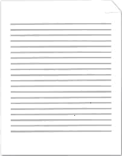
    
    如果不应显示文档的背景，则会使用以下WordprocessingML在文档设置中指定该要求：
    
    ```xml
    <w:displayBackgroundShape w:val="true" />
    ```
    
    结果文档将在页面布局视图中显示背景：
    
    
    
    结束示例]
    
    此元素的内容模型由[§17.17.4]中定义的通用布尔属性定义。

=== "英文"

    This element specifies whether the images and colors defined in the document's background using the background element ([§17.2.1]) shall be displayed when the document is displayed in print layout view ([§17.18.102]) as specified in the view element ([§17.15.1.92]).
    
    If this element is omitted, then background shapes shall not be displayed when the document is displayed in print layout view.
    
    [Example: Consider a WordprocessingML document that has a turquoise background specified for all pages and is being displayed in page layout view, as follows:
    
    
    
    If the document's background should not be displayed, that requirement would be specified using the following WordprocessingML in the document settings:
    
    ```xml
    <w:displayBackgroundShape w:val="true" />
    ```
    
    The resulting document would display the background in page layout view:
    
    
    
    end example]
    
    This element’s content model is defined by the common boolean property definition in [§17.17.4].

### 17.15.1.27 displayHorizontalDrawingGridEvery (水平网格线之间的距离)

**displayHorizontalDrawingGridEvery (Distance between Horizontal Gridlines)**

=== "中文"
    
    此元素指定在文档中，如果显示网格线，允许显示的水平绘图网格线之间的水平网格单位数量，该网格单位使用drawingGridHorizontalSpacing元素([§17.15.1.45])定义。[注：网格线的显示是应用程序级设置，在ECMA-376中未指定。结束注]绘图网格是一个网格，应用程序可以使用它来帮助定位文档中的浮动对象。
    
    如果省略此元素，则将为每个水平网格单位显示网格线。
    
    [示例：考虑下图展示的WordprocessingML文档，其中所有水平网格单位都可见（默认设置)：
    
    
    
    如果此文档中的网格线只应每第4条水平绘图网格线显示一次，那么将使用以下WordprocessingML在文档设置中指定该要求：
    
    ```xml
    <w:displayHorizontalDrawingGridEvery w:val="4" />
    ```
    
    结果网格将如下所示：
    
    
    
    displayHorizontalDrawingGridEvery元素的val属性等于4，因此在打开绘图网格时，文档中每第四条网格线将被显示。结束示例]
    
    ??? abstract "属性"
    
        - **val** (十进制数值)
    
            指定此属性的内容包含一个十进制数字。
            
            这个十进制数字的内容根据父XML元素的上下文来解释。
            
            [示例：考虑以下简单类型ST_DecimalNumber的数字WordprocessingML属性：
            
            ```xml
            <… w:val="1512645511" />
            ```
            
            val属性的值是一个十进制数字，其值必须根据父元素的上下文来解释。结束示例]
            
            此属性的可能值由ST_DecimalNumber简单类型([§17.18.10])定义。
    
    [Note: The W3C XML Schema definition of this element’s content model (CT_DecimalNumber) is located in §A.1. end note]

=== "英文"
    
    This element specifies the number of horizontal grid units defined using the drawingGridHorizontalSpacing element ([§17.15.1.45]) which shall be allowed between subsequent visible horizontal drawing grid lines in this document, if gridlines are being shown. [Note: The display of gridlines is an application-level setting not specified in ECMA-376. end note] The drawing grid is a grid which can be used by applications to help position floating objects in the document.
    
    If this element is omitted, then gridlines shall be displayed for each horizontal grid unit.
    
    [Example: Consider the image below illustrating a WordprocessingML document in which all horizontal grid units are visible (the default setting):
    
    
    
    If the gridlines in this document shall only be displayed for every 4th horizontal drawing gridline, that requirement would be specified using the following WordprocessingML in the document settings:
    
    ```xml
    <w:displayHorizontalDrawingGridEvery w:val="4" />
    ```
    
    The resulting grid would look like the following:
    
    
    
    The displayHorizontalDrawingGridEvery element has its val attribute equal to 4, therefore every fourth gridline is displayed in the document when the drawing grid is turned on. end example]
    
    ??? abstract "Attributes"
    
        - **val** (Decimal Number Value)
    
            Specifies that the contents of this attribute contains a decimal number.
            
            The contents of this decimal number are interpreted based on the context of the parent XML element.
            
            [Example: Consider the following numeric WordprocessingML property of simple type ST_DecimalNumber:
            
            ```xml
            <… w:val="1512645511" />
            ```
            
            The value of the val attribute is a decimal number whose value must be interpreted in the context of the parent element. end example]
            
            The possible values for this attribute are defined by the ST_DecimalNumber simple type ([§17.18.10]).
    
    [Note: The W3C XML Schema definition of this element’s content model (CT_DecimalNumber) is located in §A.1. end note]

### 17.15.1.28 displayVerticalDrawingGridEvery (垂直网格线之间的距离)

**displayVerticalDrawingGridEvery (Distance between Vertical Gridlines)**

=== "中文"
    
    此元素指定在文档中，如果显示网格线，允许显示的垂直网格单位数量，该网格单位使用drawingGridVerticalSpacing元素([§17.15.1.47])定义，用于确定文档中后续垂直网格线之间的间隔。[注：网格线的显示是应用程序级设置，在ECMA-376中未指定。结束注]绘图网格是一个网格，应用程序可以使用它来帮助定位文档中的浮动对象。
    
    如果省略此元素，则不显示垂直网格线。
    
    [示例：考虑下图展示的WordprocessingML文档，其中所有垂直网格单位都可见（默认设置)：
    
    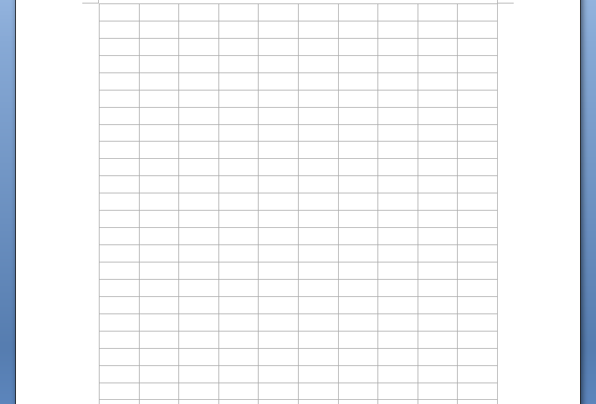
    
    如果此文档中的垂直绘图网格线只应每第4条网格线显示一次，那么将使用以下WordprocessingML在文档设置中指定该要求：
    
    ```xml
    <w:displayVerticalDrawingGridEvery w:val="4" />
    ```
    
    结果网格将如下所示：
    
    
    
    displayVerticalDrawingGridEvery元素的val属性等于4，因此在打开绘图网格时，文档中每第四条垂直网格线将被显示。结束示例]
    
    ??? abstract "属性"
    
        - **val** (十进制数值)
    
            指定此属性的内容包含一个十进制数字。
            
            这个十进制数字的内容根据父XML元素的上下文来解释。
            
            [示例：考虑以下简单类型ST_DecimalNumber的数字WordprocessingML属性：
            
            ```xml
            <… w:val="1512645511" />
            ```
            
            val属性的值是一个十进制数字，其值必须根据父元素的上下文来解释。结束示例]
            
            此属性的可能值由ST_DecimalNumber简单类型([§17.18.10])定义。
    
    [Note: The W3C XML Schema definition of this element’s content model (CT_DecimalNumber) is located in §A.1. end note]

=== "英文"
    
    This element specifies the number of vertical grid units defined using the drawingGridVerticalSpacing element ([§17.15.1.47]) which shall be allowed between subsequent vertical gridlines in this document, if gridlines are being shown. [Note: The display of gridlines is an application-level setting not specified in ECMA-376. end note] The drawing grid is a grid which can be used by applications to help position floating objects in the document.
    
    If this element is omitted, then vertical gridlines shall not be displayed.
    
    [Example: Consider the image below illustrating a WordprocessingML document in which all vertical grid units are visible (the default setting):
    
    
    
    If the vertical drawing gridlines in this document must only be displayed for every 4th gridline, that requirement would be specified using the following WordprocessingML in the document settings:
    
    ```xml
    <w:displayVerticalDrawingGridEvery w:val="4" />
    ```
    
    The resulting grid would look like the following:
    
    
    
    The displayVerticalDrawingGridEvery element has its val attribute equal to 4, therefore every fourth vertical gridline is displayed in the document when the drawing grid is turned on. end example]
        
    ??? abstract "Attributes"
    
        - **val** (Decimal Number Value)
    
            Specifies that the contents of this attribute contains a decimal number.
            
            The contents of this decimal number are interpreted based on the context of the parent XML element.
            
            [Example: Consider the following numeric WordprocessingML property of simple type ST_DecimalNumber:
            
            ```xml
            <… w:val="1512645511" />
            ```
            
            The value of the val attribute is a decimal number whose value must be interpreted in the context of the parent element. end example]
            
            The possible values for this attribute are defined by the ST_DecimalNumber simple type ([§17.18.10]).
    
    [Note: The W3C XML Schema definition of this element’s content model (CT_DecimalNumber) is located in §A.1. end note]

### 17.15.1.29 documentProtection (文档编辑限制)

**documentProtection (Document Editing Restrictions)**

=== "中文"
    
    此元素指定应用于WordprocessingML文档内容的文档保护限制集。当启用enforcement属性时，应用程序在编辑此文档时应强制执行这些限制，否则应忽略（但保留）它们。文档保护是一组限制，用于防止对WordprocessingML文档的全部或部分进行意外更改。[注：此保护不会加密文档，恶意应用程序可能会绕过其使用。此保护不打算作为安全功能。结束注]
    
    如果省略此元素，则不应用于此文档的保护。当要在此元素中哈希并存储密码时，应从UTF-16LE编码的字符串值开始，按照以下方式进行哈希计算。如果在编码的密码中存在前导BOM字符(U+FEFF)，则在哈希计算之前将其删除。
    
    ??? abstract "Attributes"
    
        - **algorithmName** (加密算法名称)

            指定应与盐值属性和输入密码一起使用的特定加密哈希算法，以计算哈希值。
            
            以下值已被保留：
            
            - **MD2**：指定应使用由RFC 1319定义的MD2算法。
            
            [注：由于众所周知的弱点，建议应用程序避免使用此算法存储新的哈希值。结束注]
            
            - **MD4**
            
            指定应使用由RFC 1320定义的MD4算法。
            
            [注：由于众所周知的弱点，建议应用程序避免使用此算法存储新的哈希值。结束注]
            
            - **MD5**
            
            指定应使用由RFC 1321定义的MD5算法。
            
            [注：由于众所周知的弱点，建议应用程序避免使用此算法存储新的哈希值。结束注]
            
            - **RIPEMD-128**
            
            指定应使用由ISO/IEC 10118-3:2004定义的RIPEMD-128算法。
            
            [注：由于众所周知的弱点，建议应用程序避免使用此算法存储新的哈希值。结束注]
            
            - **RIPEMD-160**
            
            指定应使用由ISO/IEC 10118-3:2004定义的RIPEMD-160算法。
            
            - **SHA-1**
            
            指定应使用由ISO/IEC 10118-3:2004定义的SHA-1算法。
            
            - **SHA-256**
            
            指定应使用由ISO/IEC 10118-3:2004定义的SHA-256算法。
            
            - **SHA-384**
            
            指定应使用由ISO/IEC 10118-3:2004定义的SHA-384算法。
            
            - **SHA-512**
            
            指定应使用由ISO/IEC 10118-3:2004定义的SHA-512算法。
            
            - **WHIRLPOOL**
            
            指定应使用由ISO/IEC 10118-3:2004定义的WHIRLPOOL算法。
            
            [示例：考虑一个Open Office XML文档，在其保护元素之一中存储了以下信息：
            
            ```xml
            < … algorithmName="SHA-1" hashValue="9oN7nWkCAyEZib1RomSJTjmPpCY=" />
            ```
            
            “SHA-1”的algorithmName属性值指定必须使用SHA-1哈希算法从用户定义的密码生成哈希。结束示例]
            
            此属性的可能值由ST_String简单类型([§22.9.2.13])定义。
    
        - **edit** (文档编辑限制)

            指定应用于给定WordprocessingML文档的编辑限制集，由下文引用的简单类型定义。
            
            如果省略此属性，消费者应表现得就像没有应用于此文档的编辑限制一样；相当于属性值为none。
            
            [示例：考虑一个包含以下WordprocessingML的WordprocessingML文档，指定托管应用程序必须对给定文档实施只读保护：
            
            ```xml
            <w:documentProtection w:edit="readOnly" w:enforcement="1" />
            ```
            
            edit属性的值为readOnly，enforcement属性的值为1，指定必须对给定文档实施只读文档保护。结束示例]
            
            此属性的可能值由ST_DocProtect简单类型([§17.18.18])定义。

        - **enforcement** (强制文档保护设置)

            指定是否应对给定WordprocessingML文档实施文档保护设置。如果此元素的值为off、0或false，则文档中所有与文档保护相关的WordprocessingML仍然保留在文档中，但不被强制实施。如果此元素的值为on、1或true，则实施文档保护。
            
            如果省略此属性，则应用程序不应强制实施文档保护设置。
            
            [示例：考虑一个包含以下WordprocessingML的WordprocessingML文档，指定托管应用程序必须对给定文档应用只读保护：
            
            ```xml
            <w:documentProtection w:edit="readOnly" w:enforcement="1" />
            ```
            
            enforcement属性的值为1，指定必须对给定文档实施指定的文档保护。结束示例]
            
            此属性的可能值由ST_OnOff简单类型([§22.9.2.7])定义。

        - **formatting** (只允许使用未锁定的样式进行格式化)

            指定是否对给定WordprocessingML文档实施格式化限制。这使文档能够限制可以存在于给定WordprocessingML文档中的样式类型。具体来说，通过将此属性的值设置为true，每个locked元素([§17.7.4.7])的值为true的样式（或locked属性为true的潜在样式([§17.7.4.5])）将不在应用程序中提供使用，也不应进行任何直接格式化。只有locked值为false的样式才能使用。
            
            如果省略此属性，则即使在实施文档保护时，也不应用格式化限制。
            
            [示例：考虑一个必须应用格式化保护的WordprocessingML文档。这个要求将使用以下WordprocessingML在文档设置中指定：
            
            ```xml
            <w:documentProtection w:formatting="true" w:enforcement="true"/>
            ```
            
            如果文档中还存在以下样式定义：
            
            ```xml
            <w:style w:type="paragraph" w:styleId="Heading1">
                <w:name w:val="Heading 1" />
                <w:locked w:val="1" />
                …
            </w:style>
            ```
            
            formatting属性的值为true，指定应用程序不得允许将上述样式添加到WordprocessingML文档中。这并不妨碍该样式的先前使用（这些使用不得被移除），但防止了这种样式的新使用被添加。结束示例]
            
            此属性的可能值由ST_OnOff简单类型([§22.9.2.7])定义。
    
        - **hashValue** (密码哈希值)

            指定存储在此文档中的密码的哈希值。此值应与使用前述属性和父XML元素指定的算法对用户输入的密码进行哈希处理后得到的哈希值进行比较，如果两个值匹配，则不再强制实施保护。
            
            如果省略此值，则reservationPassword属性应包含工作簿的密码哈希。
            
            [示例：考虑一个Open Office XML文档，其保护元素之一中存储了以下信息：
            
            ```xml
            <… AlgorithmName="SHA-1" hashValue="9oN7nWkCAyEZib1RomSJTjmPpCY=" />
            ```
            
            "9oN7nWkCAyEZib1RomSJTjmPpCY=" 的hashValue属性值指定，用户输入的密码必须先通过父元素（如果有）定义的预处理，然后使用SHA-1算法（通过algorithmName属性值SHA-1指定），得到的哈希值必须为9oN7nWkCAyEZib1RomSJTjmPpCY=才能禁用保护。结束示例]
            
            此属性的可能值由W3C XML Schema base64Binary数据类型定义。

        - **saltValue** (密码验证器的盐值)

            指定在对用户输入的密码进行哈希处理以生成hashValue属性之前，添加到密码前的盐值，并且在尝试为比较生成哈希值时，也应将此盐值添加到用户输入的密码前。盐是一个随机字符串，它在用户输入的密码哈希之前添加，以防止恶意方预先计算所有可能的密码/哈希组合，并简单地使用这些预先计算的值（通常称为“字典攻击”）。
            
            如果省略此属性，则在与存储的哈希值比较之前，不应将盐添加到用户输入的密码前进行哈希处理。
            
            [示例：考虑一个Open Office XML文档，其保护元素之一中存储了以下信息：
            
            ```xml
            <… saltValue="ZUdHa+D8F/OAKP3I7ssUnQ=="
            hashValue="9oN7nWkCAyEZib1RomSJTjmPpCY=" />
            ```
            
            "ZUdHa+D8F/OAKP3I7ssUnQ==" 的saltValue属性值指定，在通过指定的哈希算法生成比较用的哈希值之前，必须将此值添加到用户输入的密码前。结束示例]
            
            此属性的可能值由W3C XML Schema base64Binary数据类型定义。

        - **spinCount** (运行哈希算法的迭代次数)

            指定在尝试将用户输入的密码与存储在hashValue属性中的值进行比较时，哈希函数应迭代运行的次数（使用每次迭代的结果加一个4字节的值（从0开始，小端）包含迭代次数作为下一次迭代的输入）。
            
            [理由：多次运行算法相应地增加了穷尽搜索攻击的成本。存储此值允许随着时间的推移增加迭代次数，以适应更快的硬件（因此能够在更短的时间内运行更多的迭代）。结束理由]
            
            [示例：考虑一个Open Office XML文档，其保护元素之一中存储了以下信息：
            
            ```xml
            <… spinCount="100000" hashValue="9oN7nWkCAyEZib1RomSJTjmPpCY=" />
            ```
            
            "100000" 的spinCount属性值指定，必须运行十万次哈希函数才能生成用于与hashValue属性比较的哈希值。结束示例]
            
            此属性的可能值由ST_DecimalNumber简单类型([§17.18.10])定义。
        
    [Note: The W3C XML Schema definition of this element’s content model (CT_DocProtect) is located in §A.1. end note]

=== "英文"
    
    This element specifies the set of document protection restrictions which have been applied to the contents of a WordprocessingML document. These restrictions should be enforced by applications editing this document when the enforcement attribute is turned on, and ignored (but persisted) otherwise. Document protection is a set of restrictions used to prevent unintentional changes to all or part of a WordprocessingML document. [Note: This protection does not encrypt the document, and malicious applications might circumvent its use. This protection is not intended as a security feature. end note]
    
    If this element is omitted, then no protection shall be applied to this document. When a password is to be hashed and stored in this element, it shall be hashed as defined below, starting from a UTF-16LE encoded string value. If there is a leading BOM character (U+FEFF) in the encoded password it is removed before hash calculation.
    
    ??? abstract "Attributes"
    
        - **algorithmName** (Cryptographic Algorithm Name)
    
            Specifies the specific cryptographic hashing algorithm which shall be used along with the salt attribute and input password in order to compute the hash value.
            
            The following values are reserved:
        
            - **MD2**: Specifies that the MD2 algorithm, as defined by RFC 1319, shall be used.
        
                [Note: It is recommended that applications should avoid using this algorithm to store new hash values, due to publically known breaks. end note]
        
            - **MD4**
        
                Specifies that the MD4 algorithm, as defined by RFC 1320, shall be used.
        
                [Note: It is recommended that applications should avoid using this algorithm to store new hash values, due to publically known breaks. end note]
        
            - **MD5**
                
                Specifies that the MD5 algorithm, as defined by RFC 1321, shall be used.
                
                [Note: It is recommended that applications should avoid using this algorithm to store new hash values, due to publically known breaks. end note]
        
            - **RIPEMD-128**
                
                Specifies that the RIPEMD-128 algorithm, as defined by ISO/IEC 10118-3:2004 shall be used.
                
                [Note: It is recommended that applications should avoid using this algorithm to store new hash values, due to publically known breaks. end note]
        
            - **RIPEMD-160**
        
                Specifies that the RIPEMD-160 algorithm, as defined by ISO/IEC 10118-3:2004 shall be used.
        
            - **SHA-1**
        
                Specifies that the SHA-1 algorithm, as defined by ISO/IEC 10118-3:2004 shall be used.
        
            - **SHA-256**
                
                Specifies that the SHA-256 algorithm, as defined by ISO/IEC 10118-3:2004 shall be used.
        
            - **SHA-384**
                
                Specifies that the SHA-384 algorithm, as defined by ISO/IEC 10118-3:2004 shall be used.
        
            - **SHA-512**
        
                Specifies that the SHA-512 algorithm, as defined by ISO/IEC 10118-3:2004 shall be used.
        
            - **WHIRLPOOL**
                
                Specifies that the WHIRLPOOL algorithm, as defined by ISO/IEC 10118-3:2004 shall be used.
            
            [Example: Consider an Office Open XML document with the following information stored in one of its protection elements:
        
            ```xml
            < … algorithmName="SHA-1" hashValue="9oN7nWkCAyEZib1RomSJTjmPpCY=" />
            ```
        
            The algorithmName attribute value of “SHA-1” specifies that the SHA-1 hashing algorithm must be used to generate a hash from the user-defined password. end example]
            
            The possible values for this attribute are defined by the ST_String simple type ([§22.9.2.13]).
    
        - **edit** (Document Editing Restrictions)
    
            Specifies the set of editing restrictions which shall be enforced on a given WordprocessingML document, as defined by the simple type referenced below
            
            If this attribute is omitted, the consumer shall behave as though there are no editing restrictions applied to this document; equivalent to an attribute value of none.
            
            [Example: Consider a WordprocessingML document that contains the following WordprocessingML specifying that hosting applications must enforce read-only protection for a given document:
            
            ```xml
            <w:documentProtection w:edit="readOnly" w:enforcement="1" />
            ```
            
            The edit attribute has a value of readOnly and a enforcement attribute with a value of 1, specifying that read-only document protection must be enforced on the given document. end example]
            
            The possible values for this attribute are defined by the ST_DocProtect simple type ([§17.18.18]).
    
        - **enforcement** (Enforce Document Protection Settings)
    
            Specifies if the document protection settings shall be enforced for a given WordprocessingML document. If the value of this element is off, 0, or false, all the WordprocessingML pertaining to document protection is still preserved in the document, but is not enforced. If the value of this element is on, 1, or true, the document protection is enforced.
            
            If this attribute is omitted, then document protection settings shall not be enforced by applications.
            
            [Example: Consider a WordprocessingML document that contains the following WordprocessingML specifying that hosting applications must apply read-only protection for a given document:
            
            ```xml
            <w:documentProtection w:edit="readOnly" w:enforcement="1" />
            ```
            
            The enforcement attribute has a value of 1, specifying that the document protection specified must be enforced on the given document. end example]
            
            The possible values for this attribute are defined by the ST_OnOff simple type ([§22.9.2.7]).
    
        - **formatting** (Only Allow Formatting With Unlocked Styles)
    
            Specifies if formatting restrictions are in effect for a given WordprocessingML document. This enables the document to restrict the types of styles that can exist in a given WordprocessingML document. Specifically, by setting this attribute's value equal to true, every style whose locked element ([§17.7.4.7]) has a value of true (or latent styles ([§17.7.4.5]) whose locked attribute is true) shall not be available for use in the application, nor should any direct formatting. Only styles with a locked value of false can be used.
    
            If this attribute is omitted, then no formatting restrictions shall be applied, even when document protection is enforced.
            
            [Example: Consider a WordprocessingML document that must apply formatting protection. This requirement would be specified using the following WordprocessingML in the document settings:
            
            ```xml
            <w:documentProtection w:formatting="true" w:enforcement="true"/>
            ```
            
            If the following definition for a style was also present in the document:
            
            ```xml
            <w:style w:type="paragraph" w:styleId="Heading1">
                <w:name w:val="Heading 1" />
                <w:locked w:val="1" />
                …
            </w:style>
            ```
            
            The formatting attribute has a value of true specifying that the applications must not allow the style above to be added to the WordprocessingML document. This does not preclude previous uses of that style (which must not be removed), but does prevent new uses of this style from being added. end example]
            
            The possible values for this attribute are defined by the ST_OnOff simple type ([§22.9.2.7]).
    
        - **hashValue** (Password Hash Value)
    
            Specifies the hash value for the password stored with this document. This value shall be compared with the resulting hash value after hashing the user-supplied password using the algorithm specified by the preceding attributes and parent XML element, and if the two values match, the protection shall no longer be enforced.
            
            If this value is omitted, then the reservationPassword attribute shall contain the password hash for the workbook.
            
            [Example: Consider an Office Open XML document with the following information stored in one of its protection elements:
            
            ```xml
            <… AlgorithmName="SHA-1" hashValue="9oN7nWkCAyEZib1RomSJTjmPpCY=" />
            ```
            
            The hashValue attribute value of 9oN7nWkCAyEZib1RomSJTjmPpCY= specifies that the user-supplied password must be hashed using the pre-processing defined by the parent element (if any) followed by the SHA-1 algorithm (specified via the algorithmName attribute value of SHA-1) and that the resulting has value must be 9oN7nWkCAyEZib1RomSJTjmPpCY= for the protection to be disabled. end example]
            
            The possible values for this attribute are defined by the W3C XML Schema base64Binary datatype.
    
        - **saltValue** (Salt Value for Password Verifier)
    
            Specifies the salt which was prepended to the user-supplied password before it was hashed using the hashing algorithm defined by the preceding attribute values to generate the hashValue attribute, and which shall also be prepended to the user-supplied password before attempting to generate a hash value for comparison. A salt is a random string which is added to a user-supplied password before it is hashed in order to prevent a malicious party from pre-calculating all possible password/hash combinations and simply using those pre-calculated values (often referred to as a "dictionary attack").
            
            If this attribute is omitted, then no salt shall be prepended to the user-supplied password before it is hashed for comparison with the stored hash value.
            
            [Example: Consider an Office Open XML document with the following information stored in one of its protection elements:
            
            ```xml
            <… saltValue="ZUdHa+D8F/OAKP3I7ssUnQ=="
            hashValue="9oN7nWkCAyEZib1RomSJTjmPpCY=" />
            ```
            
            The saltValue attribute value of ZUdHa+D8F/OAKP3I7ssUnQ== specifies that the user-supplied password must have this value prepended before it is run through the specified hashing algorithm to generate a resulting hash value for comparison. end example]
            
            The possible values for this attribute are defined by the W3C XML Schema base64Binary datatype.
    
        - **spinCount** (Iterations to Run Hashing Algorithm)
    
            Specifies the number of times the hashing function shall be iteratively run (runs using each iteration's result plus a 4 byte value (0-based, little endian) containing the number of the iteration as the input for the next iteration) when attempting to compare a user-supplied password with the value stored in the hashValue attribute.
            
            [Rationale: Running the algorithm many times increases the cost of exhaustive search attacks correspondingly. Storing this value allows for the number of iterations to be increased over time to accommodate faster hardware (and hence the ability to run more iterations in less time). end rationale]
            
            [Example: Consider an Office Open XML document with the following information stored in one of its protection elements:
            
            ```xml
            <… spinCount="100000" hashValue="9oN7nWkCAyEZib1RomSJTjmPpCY=" />
            ```
            
            The spinCount attribute value of 100000 specifies that the hashing function must be run one hundred thousand times to generate a hash value for comparison with the hashValue attribute. end example]
            
            The possible values for this attribute are defined by the ST_DecimalNumber simple type ([§17.18.10]).
        
    [Note: The W3C XML Schema definition of this element’s content model (CT_DocProtect) is located in §A.1. end note]

### 17.15.1.30 documentType (文件分类)

**documentType (Document Classification)**

=== "中文"

    此元素指定了给定WordprocessingML文档的分类。
    
    [注：此元素可被宿主应用程序用来根据给定WordprocessingML文档的“类型”提供定制化的用户界面和/或自动格式化行为。结束注]
    
    如果省略此元素，则文档将被归类为普通文档。
    
    [示例：考虑一组应被归类为“信函”的WordprocessingML文档。这个分类将通过这些文档的文档设置中使用以下WordprocessingML来指定：
    
    ```xml
    <w:documentType w:val="letter" />
    ```
    
    documentType元素的val属性等于letter，指定宿主应用程序必须将为信函指定的行为应用于给定的WordprocessingML文档。结束示例]
    
    ??? abstract "属性"
    
        - **val** (文档分类值)
        
            根据引用的简单类型定义中定义的类型指定文档的分类。
            
            [示例：考虑一个应被归类为电子邮件消息的WordprocessingML文档。这个分类将通过文档设置中使用以下WordprocessingML来指定：
            
            ```xml
            <w:documentType w:val="eMail" />
            ```
            
            val属性等于eMail，指定宿主应用程序可以对此文档应用电子邮件行为（如果有）。结束示例]
            
            此属性的可能值由ST_DocType简单类型([§17.18.19])定义。
    
    [Note: The W3C XML Schema definition of this element’s content model (CT_DocType) is located in §A.1. end note]

=== "英文"

    This element specifies the classification of a given WordprocessingML document.
    
    [Note: This element can be used by hosting applications to facilitate customized user interface and/or automatic formatting behaviors based on the 'type' of a given WordprocessingML document. end note]
    
    If this element is omitted, then the document shall be classified as a general document.
    
    [Example: Consider a set of WordprocessingML documents which should be classified as 'letters'. This classification would be specified using the following WordprocessingML in the document settings of these documents:
    
    ```xml
    <w:documentType w:val="letter" />
    ```
    
    The documentType element's val attribute is equal to letter, specifying that the hosting application must apply the behaviors it has specified for letters to the given WordprocessingML document. end example]
    
    ??? abstract "Attributes"
    
        - **val** (Document Classification Value)
        
            Specifies the classification of the document based on the types defined in the referenced simple type definition.
            
            [Example: Consider a WordprocessingML document which should be classified as an e-mail message. This classification would be specified using the following WordprocessingML in the document settings:
            
            ```xml
            <w:documentType w:val="eMail" />
            ```
            
            The val attribute is equal to eMail, specifying that the hosting application can apply e-mail behaviors (if any) to this document. end example]
            
            The possible values for this attribute are defined by the ST_DocType simple type ([§17.18.19]).
    
    [Note: The W3C XML Schema definition of this element’s content model (CT_DocType) is located in §A.1. end note]

### 17.15.1.31 docVar (单文档变量)

**docVar (Single Document Variable)**

=== "中文"
    
    此元素指定单个文档变量的参数。文档变量是在给定WordprocessingML文档中以名称/值对形式持久存储任意客户数据的存储位置。具体来说，此元素通过其name和val属性为给定的文档变量指定名称和值对。
    
    [注：此机制仅出于兼容性维护，应避免使用，而应优先使用ECMA-376中定义的自定义XML数据支持。结束注]
    
    [示例：考虑以下WordprocessingML片段，指定名为example的文档变量，包含值example value：
    
    ```xml
    <w:docVars>
        <w:docVar w:name="example" w:val="example value" />
    </w:docVars>
    ```
    
    docVar元素定义了一个名为example的单个文档变量，使用name属性命名，并通过val属性分配了值example value。结束示例]
    
    ??? abstract "属性"
    
        - **name** (文档变量名称)
    
            指定父文档变量的名称。
            
            [示例：考虑以下WordprocessingML片段，指定一个文档变量：
            
            ```xml
            <w:docVars>
                <w:docVar w:name="example name" w:val="example value" />
            </w:docVars>
            ```
            
            name属性指定文档变量的名称为example name。结束示例]
            
            此属性的可能值由ST_String简单类型([§22.9.2.13])定义。
    
        - **val** (文档变量值)
    
            指定父文档变量的值。
    
            [示例：考虑以下WordprocessingML片段，指定一个文档变量：
    
            ```xml
            <w:docVars>
                <w:docVar w:name="example name" w:val="Tristan Davis" />
            </w:docVars>
            ```
    
            val属性指定文档变量的值为Tristan Davis。结束示例]
    
            此属性的可能值由ST_String简单类型([§22.9.2.13])定义。
    
    [Note: The W3C XML Schema definition of this element’s content model (CT_DocVar) is located in §A.1. end note]

=== "英文"
    
    This element specifies the parameters of a single document variable. A document variable is a storage location for arbitrary customer data in name/value pairs that is persisted in a given WordprocessingML document. Specifically, this element specifies through its name and val attributes the name and value pair for a given document variable.
    
    [Note: This mechanism is maintained for legacy compatibility only, and should be avoided in favor of the custom XML data support defined in ECMA-376. end note]
    
    [Example: Consider the following WordprocessingML fragment specifying a document variable named example and containing the value example value:
    
    ```xml
    <w:docVars>
        <w:docVar w:name="example" w:val="example value" />
    </w:docVars>
    ```
    
    The docVar element defines a single document variable, named example using the name attribute, and assigned the value example value through the val attribute. end example]
    
    ??? abstract "Attributes"
    
        - **name** (Document Variable Name)
    
            Specifies the name of the parent document variable.
            
            [Example: Consider the following WordprocessingML fragment specifying a document variable:
            
            ```xml
            <w:docVars>
                <w:docVar w:name="example name" w:val="example value" />
            </w:docVars>
            ```
            
            The name attribute specifies that the name of the document variable is example name. end example]
            
            The possible values for this attribute are defined by the ST_String simple type ([§22.9.2.13]).
    
        - **val** (Document Variable Value)
    
            Specifies the value of the parent document variable.
        
            [Example: Consider the following WordprocessingML fragment specifying a document variable:
        
            ```xml
            <w:docVars>
                <w:docVar w:name="example name" w:val="Tristan Davis" />
            </w:docVars>
            ```
        
            The val attribute specifies that the value of the document variable is Tristan Davis. end example]
        
            The possible values for this attribute are defined by the ST_String simple type ([§22.9.2.13]).
    
    [Note: The W3C XML Schema definition of this element’s content model (CT_DocVar) is located in §A.1. end note]

### 17.15.1.32 docVars (文档变量)

**docVars (Document Variables)**

=== "中文"
    
    此元素指定WordprocessingML中文档变量的存在。文档变量是存储在给定WordprocessingML文档中的任意客户数据的存储位置，以名称/值对的形式持久保存。
    
    [注：此机制仅为了兼容旧版本而保留，应避免使用，而应优先使用ECMA-376中定义的自定义XML数据支持。结束注]
    
    [示例：考虑以下WordprocessingML指定了三个文档变量：
    
    ```xml
    <w:docVars>
        <w:docVar … />
        <w:docVar … />
        <w:docVar … />
    </w:docVars>
    ```
    
    docVars元素包含三个子元素，每个子元素定义了文档中的一个单一文档变量。结束示例]
    
    [Note: The W3C XML Schema definition of this element’s content model (CT_DocVars) is located in §A.1. end note]

=== "英文"
    
    This element specifies the presence of document variables in a WordprocessingML. A document variable is a storage location for arbitrary customer data in name/value pairs that is persisted in a given WordprocessingML document.
    
    [Note: This mechanism is maintained for legacy compatibility only, and should be avoided in favor of the custom XML data support defined in ECMA-376. end note]
    
    [Example: Consider the following WordprocessingML specifying three document variables:
    
    ```xml
    <w:docVars>
        <w:docVar … />
        <w:docVar … />
        <w:docVar … />
    </w:docVars>
    ```
    
    The docVars element contains three child elements each defining a single document variable in this document. end example]
    
    [Note: The W3C XML Schema definition of this element’s content model (CT_DocVars) is located in §A.1. end note]

### 17.15.1.33 doNotAutoCompressPictures (不自动压缩图像)   

**doNotAutoCompressPictures (Do Not Automatically Compress Images)**

=== "中文"
    
    此元素指定在保存文档以减少生成的WordprocessingML文档的总大小时，不应自动压缩此文档中的图片。
    
    如果省略此元素，应用程序可以在保存文档内容之前对图像执行基本压缩。
    
    [示例：考虑一个WordprocessingML文档，在保存之前永远不应该对其图片进行压缩。这个要求将使用以下WordprocessingML指定：
    
    ```xml
    <w:doNotAutoCompressPictures w:val="true"/>
    ```
    
    doNotAutoCompressPictures元素的val属性值为true，指定在保存文档时图片不得自动压缩。结束示例]
    
    此元素的内容模型由[§17.17.4]中定义的通用布尔属性定义。

=== "英文"
    
    This element specifies that pictures in this document shall not automatically be compressed when saving the document in order to reduce the overall size of the resulting WordprocessingML document.
    
    If this element is omitted, applications can perform basic compression on images before saving the contents of the document.
    
    [Example: Consider a WordprocessingML document which should never have its images compressed before they are saved. This requirement would be specified using the following WordprocessingML:
    
    ```xml
    <w:doNotAutoCompressPictures w:val="true"/>
    ```
    
    The doNotAutoCompressPictures element's val attribute has a value of true specifying that images must not be automatically compressed when the document is saved. end example]
    
    This element’s content model is defined by the common boolean property definition in [§17.17.4].

### 17.15.1.34 doNotDemarcateInvalidXml (不显示无效自定义 XML 标记的视觉指示符)

**doNotDemarcateInvalidXml (Do Not Show Visual Indicator For Invalid Custom XML Markup)**

=== "中文"
    
    此元素指定当应用程序确定当前XML标记（或其内容）违反了附加的XML架构(schemas)的约束条件时，是否应在WordprocessingML文档中包含自定义XML标记的内容周围显示视觉提示。
    
    如果WordprocessingML文档中没有此元素，则应在基于相关XML架构(schemas)被认为是无效的自定义XML标记的内容周围显示视觉提示。
    
    [示例：考虑一个WordprocessingML文档，它不应显示自定义XML标记无效的任何视觉指示。这个要求将使用以下WordprocessingML指定：
    
    ```xml
    <w:doNotDemarcateInvalidXml w:val="true"/>
    ```
    
    doNotDemarcateInvalidXml元素的val属性值为true，指定必须抑制显示此文档中自定义XML标记无效的任何视觉指示。结束示例]
    
    此元素的内容模型由[§17.17.4]中定义的通用布尔属性定义。

=== "英文"
    
    This element specifies whether a visual cue should be displayed around content contained in a WordprocessingML document which is contained with custom XML markup specified via the customXml element when an application determines that the current XML markup (or its contents) violate the constraints of the attached XML schema(s).
    
    If this element is not present in a WordprocessingML document visual cues shall be displayed on content contained in custom XML markup in a WordprocessingML document which is considered to be invalid based on the associated XML schema(s).
    
    [Example: Consider a WordprocessingML document which should show no visual indication of invalid custom XML markup. This requirement would be specified using the following WordprocessingML:
    
    ```xml
    <w:doNotDemarcateInvalidXml w:val="true"/>
    ```
    
    The doNotDemarcateInvalidXml element's val attribute has a value of true specifying the display of any visual indication of invalid custom XML markup must be suppressed for this document. end example]
    
    This element’s content model is defined by the common boolean property definition in [§17.17.4].

### 17.15.1.35 doNotDisplayPageBoundaries (不显示页眉/页脚或页面之间的视觉边界)

**doNotDisplayPageBoundaries (Do Not Display Visual Boundary For Header/Footer or Between Pages)**

=== "中文"
    
    此元素指定在打印布局视图([§17.18.102])中显示文档时，应用程序是否应显示页眉和页脚的内容，或者是否应折叠这些区域以及所有显示页面上的空白区域，以便文本范围直接连续显示。[理由：折叠页面的末端可以更容易地阅读文档的内容，因为文本在页面之间流动而没有空白，同时保持打印布局视图对文档主要内容的WYSIWYG功能。结束理由]
    
    如果省略此元素，则在打印布局视图中显示页面时应显示所有页面的全尺寸（包括空白和页眉/页脚）。
    
    [示例：考虑下图展示的WordprocessingML文档中的两页：
    
    
    
    如果文档在显示时必须自动去除页面之间的空白，那么这个要求将使用以下WordprocessingML在文档设置中指定：
    
    ```xml
    <w:doNotDisplayPageBoundaries w:val="true" />
    ```
    
    结果输出可能如下所示：
    
    
    
    doNotDisplayPageBoundaries元素的val属性等于true，因此文档自动显示时，后续页面上文本范围之间的空白被压缩，使页面更容易查看。结束示例]
    
    此元素的内容模型由[§17.17.4]中定义的通用布尔属性定义。

=== "英文"
    
    This element specifies whether applications displaying this document should display the contents of the header and footer when displaying the document in print layout view ([§17.18.102]) or should collapse those areas as well as the whitespace on all displayed pages so that the text extents are directly following one another. [Rationale: Collapsing the ends of pages makes it easier to read the contents of the document, since the text flows between pages without whitespace, while maintaining the WYSIWYG functionality of print layout view for the document's main content. end rationale]
    
    If this element is omitted, then all pages should be shown at their full size (including whitespace and headers/footers) when they are displayed in print layout view.
    
    [Example: Consider the images below illustrating two pages in a WordprocessingML document:
    
    
    
    If document must automatically have whitespace between pages removed when it is displayed, that requirement would be specified using the following WordprocessingML in the document settings:
    
    ```xml
    <w:doNotDisplayPageBoundaries w:val="true" />
    ```
    
    The resulting output might look like the following:
    
    
    
    The doNotDisplayPageBoundaries element has its val attribute equal to true, therefore the document is automatically displayed with whitespace between text extents on following pages compressed, allowing the pages to be viewed more easily. end example]
    
    This element’s content model is defined by the common boolean property definition in [§17.17.4].

### 17.15.1.36 doNotEmbedSmartTags (保存时删除智能标签)

**doNotEmbedSmartTags (Remove Smart Tags When Saving)**

=== "中文"

    此元素指定在使用smartTag元素指定的任何智能标签是否应在重新保存文档之前从文档内容中移除。此设置还应防止向文档内容中添加新的智能标签。
    
    如果省略此元素，则在保存文件时智能标签不会被从文件中移除。
    
    [示例：考虑一个WordprocessingML文档，它的内容永远不应该保存带有smartTag元素。这个要求是使用以下WordprocessingML片段在文档设置中指定的：
    
    ```xml
    <w:doNotEmbedSmartTags w:val="true"/>
    ```
    
    doNotEmbedSmartTags元素的val属性值为true，指定智能标签永远不应保存在该文档的内容中。例如，如果一个运行时看起来像这样：
    
    ```xml
    <w:p>
        <w:r>
            <w:t xml:space="preserve">Hello</w:t>
        </w:r>
        <w:smartTag … >
            <w:r>
                <w:t>world</w:t>
            </w:r>
        </w:smartTag>
    </w:p>
    ```
    
    此元素的存在指定SmartTag元素必须被移除，然后应用程序可以选择性地合并重复的运行。结束示例]
    
    此元素的内容模型由[§17.17.4]中定义的通用布尔属性定义。

=== "英文"

    This element specifies if any smart tags specified using the smartTag element shall be removed from the contents of this document before it is resaved. This setting shall also prevent the addition of new smart tags to the content of the document.
    
    If this element is omitted, then smart tags shall not be removed from the file when it is saved.
    
    [Example: Consider a WordprocessingML document which should never be saved with smartTag elements in its contents. This requirement is specified using the following WordprocessingML fragment in the document settings:
    
    ```xml
    <w:doNotEmbedSmartTags w:val="true"/>
    ```
    
    The doNotEmbedSmartTags element's val attribute has a value of true specifying that smart tags must never be saved in the contents of this document. For example, if a run formerly looked like this:
    
    ```xml
    <w:p>
        <w:r>
            <w:t xml:space="preserve">Hello</w:t>
        </w:r>
        <w:smartTag … >
            <w:r>
                <w:t>world</w:t>
            </w:r>
        </w:smartTag>
    </w:p>
    ```
    
    The presence of this element specifies that the SmartTag element must be removed, and applications might then choose to combine duplicated runs as desired. end example]
    
    This element’s content model is defined by the common boolean property definition in [§17.17.4].

### 17.15.1.37 doNotHyphenateCaps (请勿将所有大写字母的单词用连字符连接)

**doNotHyphenateCaps (Do Not Hyphenate Words in ALL CAPITAL LETTERS)**

=== "中文"

    此元素指定在自动连字符分割通过autoHyphenation元素([§17.15.1.10])指定时，是否应对全大写字母组成的单词进行连字符分割。
    
    如果省略此元素，则在文档进行连字符分割时，全大写字母的单词将被分割。
    
    [示例：考虑一个自动进行连字符分割的文档，包含以下段落内容：
    
    
    
    如果全大写字母的单词必须不被连字符分割，这个要求可以通过在文档设置部分添加以下WordprocessingML来指定：
    
    ```xml
    <w:doNotHyphenateCaps w:val="true"/>
    ```
    
    结果内容将不会被连字符分割：
    
    
    
    doNotHyphenateCaps元素的val设置为true，指定第一行文本以单词SHORT结束，因为单词HYPHENATION必须移到第二行，因为它不能完全适合在第一行。
    
    相反，将doNotHyphenateCaps元素的val设置为off（默认值）导致第一行文本包含单词HYPHENATION的连字符分割部分，因为允许全大写字母单词的连字符分割。结束示例]
    
    此元素的内容模型由[§17.17.4]中定义的通用布尔属性定义。

=== "英文"

    This element specifies whether or not words comprised of all capital letters shall be hyphenated within a given document when automatic hyphenation is specified via the autoHyphenation element ([§17.15.1.10]).
    
    If this element is omitted, then words in ALL CAPITAL LETTERS shall be hyphenated when the document is hyphenated.
    
    [Example: Consider a document which is automatically hyphenated containing the following paragraph of content:
    
    
    
    If words in ALL CAPITAL LETTERS must not be hyphenated, this requirement would be specified by adding the following WordprocessingML to the document settings part:
    
    ```xml
    <w:doNotHyphenateCaps w:val="true"/>
    ```
    
    The resulting content would not be hyphenated:
    
    
    
    The doNotHyphenateCaps element val set to true, specifying that the first line of text to end with the word SHORT as the word HYPHENATION had to be moved to the second line since it could not fit in its entirety on the first line.
    
    Conversely, setting the doNotHyphenateCaps element val set to off (the default) caused the first line of text to contain a hyphenated portion of the word HYPHENATION as hyphenation of words comprised of all capital letters is permitted. end example]
    
    This element’s content model is defined by the common boolean property definition in [§17.17.4].

### 17.15.1.38 doNotIncludeSubdocsInStats (文档统计中不包括文本框、脚注和尾注中的内容)

**doNotIncludeSubdocsInStats (Do Not Include Content in Text Boxes, Footnotes, and Endnotes in Document Statistics)**

=== "中文"

    此元素指定当应用程序计算给定文档的统计数据时，是否应排除文本框、脚注和尾注中包含的文档内容，当这些值由应用程序计算和/或显示时。
    
    [注：应用程序可能选择计算的一些文档统计数据示例包括：字数、字符数、段落数、页数、行数等。结束注]
    
    [示例：考虑一个WordprocessingML，它指定在计算文档统计数据时不得包括这些文档故事。这个要求将使用文档设置部分中的以下WordprocessingML来指定：
    
    ```xml
    <w:doNotIncludeSubdocsInStats w:val="true"/>
    ```
    
    doNotIncludeSubdocsInStats元素的val属性值为true，指定在计算文档统计数据时只应使用主文档故事的内容。结束示例]
    
    此元素的内容模型由[§17.17.4]中定义的通用布尔属性定义。

=== "英文"

    This element specifies if document content contained in text boxes, footnotes, and endnotes shall be excluded when an application calculates a given document’s statistics when these values are calculated and/or displayed by an application.
    
    [Note: Some examples of document statistics that an application might chose to calculate are: number of words, number of characters, number of paragraphs, number of pages, number of lines, and so on. end note]
    
    [Example: Consider a WordprocessingML that specifies that it must not include these document stories when its contents are used to calculate document statistics. This requirement would be specified using the following WordprocessingML in the document settings part:
    
    ```xml
    <w:doNotIncludeSubdocsInStats w:val="true"/>
    ```
    
    The doNotIncludeSubdocsInStats element's val attribute has a value of true specifying that only the contents of the main document story should be used when calculating document statistics. end example]
    
    This element’s content model is defined by the common boolean property definition in [§17.17.4].

### 17.15.1.39 doNotShadeFormData (不显示表单字段的视觉指示器)

**doNotShadeFormData (Do Not Show Visual Indicator For Form Fields)**

=== "中文"

    此元素指定是否应在WordprocessingML文档中通过FORMTEXT、FORMCHECKBOX或FORMDROPDOWN字段指定的表单字段周围显示视觉提示。
    
    如果WordprocessingML文档中没有此元素，则应在文档中包含的表单字段上显示视觉提示。
    
    [示例：考虑一个WordprocessingML文档，它不应显示表单字段的任何视觉指示。这个要求将使用以下WordprocessingML指定：
    
    ```xml
    <w:doNotShadeFormData w:val="true"/>
    ```
    
    doNotShadeFormData元素的val属性值为true，指定必须抑制此文档中表单字段的任何视觉指示的显示。结束示例]
    
    此元素的内容模型由[§17.17.4]中定义的通用布尔属性定义。

=== "英文"

    This element specifies whether a visual cue should be displayed around form fields contained in a WordprocessingML document specified via the FORMTEXT, FORMCHECKBOX, or FORMDROPDOWN fields.
    
    If this element is not present in a WordprocessingML document visual cues should be displayed on form fields contained in the document.
    
    [Example: Consider a WordprocessingML document which should no visual indication of form fields. This requirement would be specified using the following WordprocessingML:
    
    ```xml
    <w:doNotShadeFormData w:val="true"/>
    ```
    
    The doNotShadeFormData element's val attribute has a value of true specifying the display of any visual indication of form fields must be suppressed for this document. end example]
    
    This element’s content model is defined by the common boolean property definition in [§17.17.4].

### 17.15.1.40 doNotTrackFormatting (跟踪修订时不跟踪格式修订)

**doNotTrackFormatting (Do Not Track Formatting Revisions When Tracking Revisions)**

=== "中文"
    
    此元素指定当trackRevisions元素([§17.15.1.89])开启时，应用程序不应跟踪对WordprocessingML文档格式所做的修订。
    
    如果省略此元素，则当trackRevisions元素开启时，将根据此文档内容的变化生成格式修订。
    
    [示例：考虑一个包含文本"Example"的WordprocessingML文档，必须跟踪修订。以下是文档1中的WordprocessingML示例：
    
    ```xml
    <w:document>
        <w:body>
            <w:p>
                <w:r>
                    <w:t>Example</w:t>
                </w:r>
            </w:p>
        </w:body>
    </w:document>
    ```
    
    如果在此文档末尾添加了单词文本并加粗，生成的WordprocessingML将如下所示：
    
    ```xml
    <w:document>
        <w:body>
            <w:p>
                <w:r>
                    <w:t>Example</w:t>
                </w:r>
                <w:ins … >
                <w:r>
                    <w:rPr>
                        <w:b/>
                        <w:rPrChange … >
                            <w:rPr/>
                        </w:rPrChange>
                    </w:rPr>
                    <w:t>text</w:t>
                </w:r>
                </w:ins>
            </w:p>
        </w:body>
    </w:document>
    ```
    
    如果使用文档设置中的以下WordprocessingML语法关闭了格式更改的跟踪：
    
    ```xml
    <w:settings>
        <w:trackRevisions w:val="true" />
        <w:doNotTrackFormatting w:val="true" />
        …
    </w:settings>
    ```
    
    相同的修订（在文档末尾添加并加粗了单词"text"）将导致以下标记：
    
    ```xml
    <w:document>
        <w:body>
            <w:p>
                <w:r>
                    <w:t>Example</w:t>
                </w:r>
                <w:ins … >
                    <w:r>
                        <w:rPr>
                            <w:b/>
                        </w:rPr>
                        <w:t>text</w:t>
                    </w:r>
                </w:ins>
            </w:p>
        </w:body>
    </w:document>
    ```
    
    doNotTrackFormatting元素的val属性被设置为true，因此文档格式的更改没有作为修订记录在文档的WordprocessingML中。具体来说，对文本应用加粗格式没有作为修订使用rPrChange元素([§17.13.5.31])进行跟踪。结束示例]
    
    此元素的内容模型由[§17.17.4]中定义的通用布尔属性定义。

=== "英文"
    
    This element specifies that applications shall not track revisions made to the formatting of this WordprocessingML document when the trackRevisions element ([§17.15.1.89]) is turned on.
    
    If this element is omitted, then revisions to formatting shall be generated by changes to the contents of this document when the trackRevisions element is turned on.
    
    [Example: Consider a WordprocessingML document containing the text run Example that must have revisions tracked. Example WordprocessingML from Document 1 is given below:
    
    ```xml
    <w:document>
        <w:body>
            <w:p>
                <w:r>
                    <w:t>Example</w:t>
                </w:r>
            </w:p>
        </w:body>
    </w:document>
    ```
    
    If the word text was added to the end of this document and bolded, the resulting WordprocessingML would be output as follows:
    
    ```xml
    <w:document>
        <w:body>
            <w:p>
                <w:r>
                    <w:t>Example</w:t>
                </w:r>
                <w:ins … >
                <w:r>
                    <w:rPr>
                        <w:b/>
                        <w:rPrChange … >
                            <w:rPr/>
                        </w:rPrChange>
                    </w:rPr>
                    <w:t>text</w:t>
                </w:r>
                </w:ins>
            </w:p>
        </w:body>
    </w:document>
    ```
    
    If changes to formatting were turned off using the following WordprocessingML syntax in the document settings:
    
    ```xml
    <w:settings>
        <w:trackRevisions w:val="true" />
        <w:doNotTrackFormatting w:val="true" />
        …
    </w:settings>
    ```
    
    The same revision (the word text was added to the end of this document and bolded) would result in the following markup:
    
    ```xml
    <w:document>
        <w:body>
            <w:p>
                <w:r>
                    <w:t>Example</w:t>
                </w:r>
                <w:ins … >
                    <w:r>
                        <w:rPr>
                            <w:b/>
                        </w:rPr>
                        <w:t>text</w:t>
                    </w:r>
                </w:ins>
            </w:p>
        </w:body>
    </w:document>
    ```
    
    The doNotTrackFormatting element's val attribute was set to true, therefore the changes to the formatting of the document were not tracked as revisions in the document's WordprocessingML. Specifically, applying bold formatting to the text was not tracked as a revision with the rPrChange ([§17.13.5.31]) element. end example]
    
    This element’s content model is defined by the common boolean property definition in [§17.17.4].

### 17.15.1.41 doNotTrackMoves (跟踪修订时不要使用移动语法)

**doNotTrackMoves (Do Not Use Move Syntax When Tracking Revisions)**

=== "中文"
    
    此元素指定当trackRevisions元素([§17.15.1.89])开启时，应用程序不应将对WordprocessingML文档所做的修订作为移动来跟踪，即使该语法是适当的。相反，应用程序应使用标准的插入和删除注释语法。现有的移动不应被修改。[理由：提供此元素是为了实现与早期不了解移动的字处理应用程序的互操作性。结束理由]
    
    如果省略此元素，则当trackRevisions元素开启且适当时，可以通过对此文档内容的更改生成移动注释。
    
    [示例：考虑一个WordprocessingML，它指定其内容中不得添加其他移动。这个要求将使用文档设置部分中的以下WordprocessingML来指定：
    
    ```xml
    <w:doNotTrackMoves w:val="true"/>
    ```
    
    doNotTrackMoves元素的val属性值为true，指定在跟踪此文档的修订时，必须使用插入/删除注释而不是移动。结束示例]
    
    此元素的内容模型由[§17.17.4]中定义的通用布尔属性定义。

=== "英文"
    
    This element specifies that applications shall not track revisions made to this WordprocessingML document as moves when the trackRevisions element ([§17.15.1.89]) is turned on, even when that syntax is appropriate. Instead, applications should use a standard insertion and deletion annotation syntax. Existing moves shall not be modified. [Rationale: This element is provided to enable interoperability with earlier word processing applications which do not understand moves. end rationale]
    
    If this element is omitted, then move annotations can be generated by changes to the contents of this document when the trackRevisions element is turned on as appropriate.
    
    [Example: Consider a WordprocessingML that specifies that it must not have additional moves added to its contents. This requirement would be specified using the following WordprocessingML in the document settings part:
    
    ```xml
    <w:doNotTrackMoves w:val="true"/>
    ```
    
    The doNotTrackMoves element's val attribute has a value of true specifying that insertion/deletion annotations must be used rather than moves when revisions are tracked in this document. end example]
    
    This element’s content model is defined by the common boolean property definition in [§17.17.4].

### 17.15.1.42 doNotUseMarginsForDrawingGridOrigin (不要使用边距绘制网格原点)

**doNotUseMarginsForDrawingGridOrigin (Do Not Use Margins for Drawing Grid Origin)**

=== "中文"
    
    此元素指定页面的左上角不应作为绘图网格的原点。绘图网格是一个虚拟网格，应用程序可以用它来指定绘图对象在页面上的位置（即确保对象对齐等）。如果出现此元素，则网格应从页面的左上边缘开始，而不是文本范围的左上边缘。
    
    如果省略此元素，则网格线应从文本范围的最上边缘开始。
    
    [示例：考虑一个WordprocessingML文档，其绘图网格必须从页面的左上边缘开始。这个要求将使用文档设置中的以下WordprocessingML标记来指定：
    
    ```xml
    <w:doNotUseMarginsForDrawingGridOrigin w:val="true" />
    ```
    
    doNotUseMarginsForDrawingGridOrigin元素的val属性等于true，指定文档的绘图网格必须从页面的左上角开始，而不是文本范围的左上角。结束示例]
    
    此元素的内容模型由[§17.17.4]中定义的通用布尔属性定义。

=== "英文"
    
    This element specifies that the top-left corner of the page shall not be used as the origin for the drawing grid. The drawing grid is a virtual grid which can be used by applications to specify where drawing objects shall be positioned on a page when inserted (i.e. to ensure objects are aligned, etc.). If this element is present the grid shall start at the top-left edge of the page and not the text extents.
    
    If this element is omitted, then the gridlines shall start at the topmost edge of the text extents.
    
    [Example: Consider a WordprocessingML document whose drawing grid must begin at the top left edge of the page. This requirement would be specified using the following WordprocessingML markup in the document settings:
    
    ```xml
    <w:doNotUseMarginsForDrawingGridOrigin w:val="true" />
    ```
    
    The doNotUseMarginsForDrawingGridOrigin element's val attribute is equal to true specifying that the document's drawing grid must begin from the top left corner of the page, rather than the top left corner of the text extents. end example]
    
    This element’s content model is defined by the common boolean property definition in [§17.17.4].

### 17.15.1.43 doNotValidateAgainstSchema (不根据架构验证自定义 XML 标记)

**doNotValidateAgainstSchema (Do Not Validate Custom XML Markup Against Schemas)**

=== "中文"

    此元素指定应用程序不应对此文档中的自定义XML标记与适用的自定义XML架构进行验证，即使这些架构可用。应用程序应静默地表现得好像它无法提供此功能。
    
    如果省略此元素，支持此功能的应用程序应尝试验证自定义XML内容与任何可用的相关自定义XML架构。
    
    [示例：考虑一个WordprocessingML文档，即使应用程序支持此操作，也不应对其自定义XML内容进行验证。这个要求是使用以下WordprocessingML在文档设置中指定的：
    
    ```xml
    <w:doNotValidateAgainstSchema w:val="true" />
    ```
    
    doNotValidateAgainstSchema元素的val属性值为true，指定此文档中的自定义XML标记不得进行验证。结束示例]
    
    此元素的内容模型由[§17.17.4]中定义的通用布尔属性定义。

=== "英文"

    This element specifies that applications shall not validate the custom XML markup in this document against the applicable custom XML schema(s), even when those schemas are available. The application should silently behave as if it was unable to provide this functionality.
    
    If this element is omitted, then applications which support this functionality should attempt to validate the custom XML contents against any available related custom XML schema(s).
    
    [Example: Consider a WordprocessingML document which should not have its custom XML content validated even by applications which support this operation. This requirement is specified using the following WordprocessingML in the document settings:
    
    ```xml
    <w:doNotValidateAgainstSchema w:val="true" />
    ```
    
    The doNotValidateAgainstSchema element's val attribute has a value of true specifying that the custom XML markup in this document must not be validated. end example]
    
    This element’s content model is defined by the common boolean property definition in [§17.17.4].

### 17.15.1.44 drawingGridHorizontalOrigin (绘制网格水平原点)

**drawingGridHorizontalOrigin (Drawing Grid Horizontal Origin Point)**

=== "中文"

    此元素指定页面左边缘的距离，该距离将用作绘图网格中水平网格线的起点。绘图网格是一个虚拟网格，应用程序可能用它来指定插入绘图对象时在页面上的位置（例如，确保对象对齐等）。由于当指定doNotUseMarginsForDrawingGridOrigin元素([§17.15.1.42])时网格总是覆盖整个页面，所以此元素仅影响显示的第一根水平网格线的起始边缘（即，它仅通过该值与一个网格单位宽度的模数来调整网格）。
    
    如果省略此元素，则网格线将从页面的最左边缘开始。如果没有指定doNotUseMarginsForDrawingGridOrigin元素，则忽略此元素。
    
    [示例：考虑一个WordprocessingML文档，其绘图网格必须从页面左边缘前3英寸（4320十分之一磅）开始。这个要求将使用文档设置中的以下WordprocessingML标记来指定：
    
    ```xml
    <w:settings>
        …
        <w:doNotUseMarginsForDrawingGridOrigin w:val="true" />
        <w:drawingGridHorizontalOrigin w:val="4320" />
        …
    </w:settings>
    ```
    
    drawingGridHorizontalOrigin元素的val属性等于4320，指定文档的绘图网格的水平边缘必须从页面左边缘开始3英寸（4320十分之一磅），因为doNotUseMarginsForDrawingGridOrigin元素的val属性等于true。结束示例]
    
    ??? abstract "属性"
    
        - **val** (磅的二十分之一的测量值)
        
            指定一个正的测量值，以磅的二十分之一为单位。这个值根据父XML元素的上下文进行解释。
            
            [示例：考虑以下WordprocessingML元素，其val属性包含一个以磅的二十分之一为单位的正测量值：
            
            ```xml
            <… w:val="720" />
            ```
            
            val属性的值为720，指定这个测量值是720磅的二十分之一（0.5英寸）。这个值根据父元素的需要进行解释。结束示例]
            
            此属性的可能值由ST_TwipsMeasure简单类型([§22.9.2.14])定义。
    
    [Note: The W3C XML Schema definition of this element’s content model (CT_TwipsMeasure) is located in §A.1. end note]

=== "英文"

    This element specifies the distance from of the left edge of the page which shall be used as the origin for the horizontal gridlines used by the drawing grid. The drawing grid is a virtual grid which might be used by applications to specify where drawing objects shall be positioned on a page when inserted (i.e. to ensure objects are aligned, etc.). Since the grid always covers the entire page when the doNotUseMarginsForDrawingGridOrigin element ([§17.15.1.42]) is specified, this element shall only affect the starting edge of the first horizontal gridline displayed (i.e. it only adjusts the grid by the modulus of the value against the width of one grid unit).
    
    If this element is omitted, then the gridlines shall start at the leftmost edge of the page. If the doNotUseMarginsForDrawingGridOrigin element is not specified, then this element is ignored.
    
    [Example: Consider a WordprocessingML document whose drawing grid must begin three inches (4320 twentieths of a point) before the left edge of the page. This requirement would be specified using the following WordprocessingML markup in the document settings:
    
    ```xml
    <w:settings>
        …
        <w:doNotUseMarginsForDrawingGridOrigin w:val="true" />
        <w:drawingGridHorizontalOrigin w:val="4320" />
        …
    </w:settings>
    ```
    
    The drawingGridHorizontalOrigin element's val attribute is equal to 4320 specifying that the horizontal edge of the document's drawing grid must begin three inches (4320 twentieths of a point) from the left edge of the page, since the doNotUseMarginsForDrawingGridOrigin element's val attribute is equal to true. end example]
    
    ??? abstract "Attributes"
    
        - **val** (Measurement in Twentieths of a Point)
        
            Specifies a positive measurement value, specified in twentieths of a point. This value is interpreted based on the context of the parent XML element.
            
            [Example: Consider the following WordprocessingML element with a val attribute containing a positive measurement in twentieths of a point:
            
            ```xml
            <… w:val="720" />
            ```
            
            The val attribute has a value of 720, specifying that this measurement value is 720 twentieths of a point (0.5"). This value is interpreted by the parent element as needed. end example]
            
            The possible values for this attribute are defined by the ST_TwipsMeasure simple type ([§22.9.2.14]).
    
    [Note: The W3C XML Schema definition of this element’s content model (CT_TwipsMeasure) is located in §A.1. end note]

### 17.15.1.45 drawingGridHorizontalSpacing (绘制网格水平网格单位尺寸)

**drawingGridHorizontalSpacing (Drawing Grid Horizontal Grid Unit Size)**

=== "中文"

    此元素指定了文档中水平网格单位的宽度。绘图网格是一个可以被应用程序用来帮助定位文档中浮动对象的网格。
    
    如果省略此元素，则每个水平网格单位的宽度应为180磅的二十分之一度（0.125英寸）。
    
    [示例：考虑下图展示的WordprocessingML文档，其中所有水平网格单位各为144磅的二十分之一度宽（并且全部显示）：
    
    
    
    如果此文档中的网格线必须仅以半英寸为单位显示，则该要求将使用以下WordprocessingML在文档设置中指定：
    
    ```xml
    <w:drawingGridHorizontalSpacing w:val="720" />
    ```
    
    结果网格将如下所示：
    
    
    
    drawingGridHorizontalSpacing元素的val属性等于720，因此每个水平网格线具有半英寸（720磅的二十分之一度）的宽度。结束示例]
    
    ??? abstract "属性"
    
        - **val** (磅的二十分之一的测量值)
    
            指定一个正的测量值，以磅的二十分之一为单位。这个值根据父XML元素的上下文进行解释。
            
            [示例：考虑以下WordprocessingML元素，其val属性包含一个以磅的二十分之一为单位的正测量值：
            
            ```xml
            <… w:val="720" />
            ```
            
            val属性的值为720，指定这个测量值是720磅的二十分之一（0.5英寸）。这个值由父元素根据需要进行解释。结束示例]
            
            此属性的可能值由ST_TwipsMeasure简单类型([§22.9.2.14])定义。
        
    [Note: The W3C XML Schema definition of this element’s content model (CT_TwipsMeasure) is located in §A.1. end note]

=== "英文"

    This element specifies the width of horizontal grid units in this document. The drawing grid is a grid which can be used by applications to help position floating objects in the document.
    
    If this element is omitted, then each horizontal grid unit shall be 180 twentieths of a point (0.125") in width.
    
    [Example: Consider the image below illustrating a WordprocessingML document in which all horizontal grid units are each 144 twentieths of a point wide (and all are showing):
    
    
    
    If the gridlines in this document must only be displayed for every half an inch, that requirement would be specified using the following WordprocessingML in the document settings:
    
    ```xml
    <w:drawingGridHorizontalSpacing w:val="720" />
    ```
    
    The resulting grid would look like the following:
    
    
    
    The drawingGridHorizontalSpacing element has its val attribute equal to 720, therefore every horizontal gridline has a width of one half of an inch (720 twentieths of a point). end example]
    
    ??? abstract "Attributes"
    
        - **val** (Measurement in Twentieths of a Point)
    
            Specifies a positive measurement value, specified in twentieths of a point. This value is interpreted based on the context of the parent XML element.
            
            [Example: Consider the following WordprocessingML element with a val attribute containing a positive measurement in twentieths of a point:
            
            ```xml
            <… w:val="720" />
            ```
            
            The val attribute has a value of 720, specifying that this measurement value is 720 twentieths of a point (0.5"). This value is interpreted by the parent element as needed. end example]
            
            The possible values for this attribute are defined by the ST_TwipsMeasure simple type ([§22.9.2.14]).
        
    [Note: The W3C XML Schema definition of this element’s content model (CT_TwipsMeasure) is located in §A.1. end note]

### 17.15.1.46 drawingGridVerticalOrigin (绘制网格垂直原点)

**drawingGridVerticalOrigin (Drawing Grid Vertical Origin Point)**

=== "中文"

    此元素指定页面顶部边缘的距离，该距离将用作绘图网格中垂直网格线的起点。绘图网格是一个虚拟网格，应用程序可以用它来指定插入绘图对象时在页面上的位置（例如，确保对象对齐等）。由于当指定doNotUseMarginsForDrawingGridOrigin元素([§17.15.1.42])时网格总是覆盖整个页面，所以此元素仅影响显示的第一根垂直网格线的起始边缘（即，它仅通过该值与一个网格单位宽度的模数来调整网格）。
    
    如果省略此元素，则网格线将从页面的最顶端开始。如果没有指定doNotUseMarginsForDrawingGridOrigin元素，则忽略此元素。
    
    [示例：考虑一个WordprocessingML文档，其绘图网格必须从页面顶部边缘前1英寸（1440磅的二十分之一度）开始。这个要求将使用文档设置中的以下WordprocessingML标记来指定：
    
    ```xml
    <w:settings>
        …
        <w:doNotUseMarginsForDrawingGridOrigin w:val="true" />
        <w:drawingGridVerticalOrigin w:val="1440" />
        …
    </w:settings>
    ```
    
    drawingGridVerticalOrigin元素的val属性等于1440，指定文档的绘图网格的垂直边缘必须从页面顶部边缘开始1英寸（1440磅的二十分之一度），因为doNotUseMarginsForDrawingGridOrigin元素的val属性等于true。结束示例]
    
    ??? abstract "属性"
    
        - **val** (磅的二十分之一的测量值)
    
            指定一个正的测量值，以磅的二十分之一为单位。这个值根据父XML元素的上下文进行解释。
            
            [示例：考虑以下WordprocessingML元素，其val属性包含一个以磅的二十分之一为单位的正测量值：
            
            ```xml
            <… w:val="720" />
            ```
            
            val属性的值为720，指定这个测量值是720磅的二十分之一（0.5英寸）。这个值由父元素根据需要进行解释。结束示例]
            
            此属性的可能值由ST_TwipsMeasure简单类型([§22.9.2.14])定义。
        
    [Note: The W3C XML Schema definition of this element’s content model (CT_TwipsMeasure) is located in §A.1. end note]

=== "英文"

    This element specifies the distance from of the top edge of the page which shall be used as the origin for the vertical gridlines used by the drawing grid. The drawing grid is a virtual grid which can be used by applications to specify where drawing objects shall be positioned on a page when inserted (i.e. to ensure objects are aligned, etc.). Since the grid always covers the entire page when the doNotUseMarginsForDrawingGridOrigin element ([§17.15.1.42]) is specified, this element shall only affect the starting edge of the first vertical gridline displayed (i.e. it only adjusts the grid by the modulus of the value against the width of one grid unit).

    If this element is omitted, then the gridlines shall start at the topmost edge of the page. If the doNotUseMarginsForDrawingGridOrigin element is not specified, then this element is ignored.
    
    [Example: Consider a WordprocessingML document whose drawing grid must begin one inch (1440 twentieths of a point) before the top edge of the page. This requirement would be specified using the following WordprocessingML markup in the document settings:

    ```xml
    <w:settings>
        …
        <w:doNotUseMarginsForDrawingGridOrigin w:val="true" />
        <w:drawingGridVerticallOrigin w:val="1440" />
        …
    </w:settings>
    ```
    
    The drawingGridVerticalOrigin element's val attribute is equal to 1440 specifying that the vertical edge of the document's drawing grid must begin one inch (1440 twentieths of a point) from the top edge of the page, since the doNotUseMarginsForDrawingGridOrigin element's val attribute is equal to true. end example]
    
    ??? abstract "Attributes"
    
        - **val** (Measurement in Twentieths of a Point)
    
            Specifies a positive measurement value, specified in twentieths of a point. This value is interpreted based on the context of the parent XML element.
            
            [Example: Consider the following WordprocessingML element with a val attribute containing a positive measurement in twentieths of a point:
            
            ```xml
            <… w:val="720" />
            ```
            
            The val attribute has a value of 720, specifying that this measurement value is 720 twentieths of a point (0.5"). This value is interpreted by the parent element as needed. end example]
            
            The possible values for this attribute are defined by the ST_TwipsMeasure simple type ([§22.9.2.14]).
        
    [Note: The W3C XML Schema definition of this element’s content model (CT_TwipsMeasure) is located in §A.1. end note]

### 17.15.1.47 drawingGridVerticalSpacing (绘制网格垂直网格单位尺寸)

**drawingGridVerticalSpacing (Drawing Grid Vertical Grid Unit Size)**

=== "中文"

    此元素指定了文档中垂直网格单位的宽度。绘图网格是一个可以被应用程序用来帮助定位文档中浮动对象的网格。
    
    如果省略此元素，则每个垂直网格单位的宽度应为180磅的二十分之一度（0.125英寸）。
    
    [示例：考虑下图展示的WordprocessingML文档，其中所有垂直网格单位各为144磅的二十分之一度高（并且全部显示）：
    
    
    
    如果此文档中的垂直网格线必须仅以半英寸为单位显示，则该要求将使用以下WordprocessingML在文档设置中指定：
    
    ```xml
    <w:drawingGridVerticalSpacing w:val="720" />
    ```
    
    结果网格将如下所示：
    
    
    
    drawingGridVerticalSpacing元素的val属性等于720，因此每个垂直网格线具有半英寸（720磅的二十分之一度）的高度。结束示例]
    
    ??? abstract "属性"
    
        - **val** (磅的二十分之一的测量值)
    
            指定一个正的测量值，以磅的二十分之一为单位。这个值根据父XML元素的上下文进行解释。
            
            [示例：考虑以下WordprocessingML元素，其val属性包含一个以磅的二十分之一为单位的正测量值：
            
            ```xml
            <… w:val="720" />
            ```
            
            val属性的值为720，指定这个测量值是720磅的二十分之一（0.5英寸）。这个值由父元素根据需要进行解释。结束示例]
            
            此属性的可能值由ST_TwipsMeasure简单类型([§22.9.2.14])定义。
        
    [Note: The W3C XML Schema definition of this element’s content model (CT_TwipsMeasure) is located in §A.1. end note]

=== "英文"

    This element specifies the width of vertical grid units in this document. The drawing grid is a grid which can be used by applications to help position floating objects in the document.

    If this element is omitted, then each vertical grid unit shall be 180 twentieths of a point (0.125") in width.
    
    [Example: Consider the image below illustrating a WordprocessingML document in which all vertical grid units are each 144 twentieths of a point high (and all are showing):
    
    
    
    If the vertical gridlines in this document must only be displayed for every half an inch, that requirement would
    be specified using the following WordprocessingML in the document settings:

    ```xml
    <w:drawingGridVerticalSpacing w:val="720" />
    ```

    The resulting grid would look like the following:
    
    
    
    The drawingGridVerticalSpacing element has its val attribute equal to 720, therefore every vertical gridline has a height of one half of an inch (720 twentieths of a point). end example]
    
    ??? abstract "Attributes"
    
        - **val** (Measurement in Twentieths of a Point)
    
            Specifies a positive measurement value, specified in twentieths of a point. This value is interpreted based on the context of the parent XML element.
            
            [Example: Consider the following WordprocessingML element with a val attribute containing a positive measurement in twentieths of a point:
            
            ```xml
            <… w:val="720" />
            ```
            
            The val attribute has a value of 720, specifying that this measurement value is 720 twentieths of a point (0.5"). This value is interpreted by the parent element as needed. end example]
            
            The possible values for this attribute are defined by the ST_TwipsMeasure simple type ([§22.9.2.14]).
        
    [Note: The W3C XML Schema definition of this element’s content model (CT_TwipsMeasure) is located in §A.1. end note]

### 17.15.1.48 forceUpgrade (打开时升级文档)

**forceUpgrade (Upgrade Document on Open)**

=== "中文"

    此元素指定文档的内容可以升级，并且升级后的文档不应将其功能限制在仅与早期字处理应用程序兼容的功能上。升级文档所需执行的唯一操作包括：
    
    - 移除此元素。如果应用程序不知道如何升级文档，应忽略此元素并保留。
    - 移除文档上所有保持与以前字处理应用程序兼容的兼容性选项([§17.15.1.21])。仅影响特定行为的兼容性设置不应关闭。
    
    [注：作为升级文档的一部分必须执行的其余操作由应用程序定义，不在ECMA-376的范围之内。结束注]
    
    [示例：考虑一个WordprocessingML文档，它指定在被应用程序打开时必须自动升级。这个要求将使用文档设置部分中的以下WordprocessingML来指定：
    
    ```xml
    <w:forceUpgrade/>
    ```
    
    forceUpgrade元素的存在指定任何支持此操作的应用程序都必须升级此文档。结束示例]
    
    [注：此元素的内容模型（CT_Empty）的W3C XML Schema定义位于§A.1。结束注]

=== "英文"

    This element specifies that the contents of this document can be upgraded and that the resulting document shall not have its functionality limited to only those functions compatible with earlier word processing applications. The only actions required as part of upgrading the document are:
    
    - The removal of this element. If an application does not know how to upgrade a document, this element should be ignored and persisted.
    - The removal of all compatibility options ([§17.15.1.21]) on the document which maintain compatibility with previous word processing applications. The compatibility settings which simply affect a given behavior shall not be turned off.
    
    [Note: The remaining operations which must be performed as part of upgrading the document are application-defined and outside the scope of ECMA-376. end note]
    
    [Example: Consider a WordprocessingML document that specifies that it must automatically be upgraded when it is opened by an application. This requirement would be specified using the following WordprocessingML in the document settings part:
    
    ```xml
    <w:forceUpgrade/>
    ```
    
    The forceUpgrade element's presence specifies that this document must be upgraded by any application which supports this operation. end example]
    
    [Note: The W3C XML Schema definition of this element’s content model (CT_Empty) is located in §A.1. end note]

### 17.15.1.49 formsDesign (重新保存时结构化文档标签占位符的文本)

**formsDesign (Structured Document Tag Placeholder Text Should be Resaved)**

=== "中文"

    此元素指定文档上次保存时，所有结构化文档标签的占位符文本正在被编辑。这意味着当文档打开时，当前在所有显示showingPlcHdr元素([§17.5.2.39])的结构化文档标签中显示的占位符文本应提交到对应的术语表文档条目，使用docPart元素([§17.12.5])指定，以确保术语表文档条目中存储的是最新的占位符文本。如果当前占位符文本不能作为术语表文档条目保存，则应在保存前进行必要的修改。
    
    如果省略此元素，则文档中的占位符文本在文档打开时不应自动重新保存。
    
    [示例：考虑一个WordprocessingML文档，它指定其占位符文本应在文件打开时重新保存到术语表文档中。这个要求将使用文档设置部分中的以下WordprocessingML来指定：
    
    ```xml
    <w:formsDesign w:val="true"/>
    ```
    
    formsDesign元素的val属性值为true，指定任何支持此操作的应用程序都应将此文档重新保存到其术语表文档中。结束示例]
    
    此元素的内容模型由[§17.17.4]中定义的通用布尔属性定义。

=== "英文"

    This element specifies that the document was last saved while the placeholder text of all structured document tags in this document were being edited. This means that the placeholder text currently displayed in all structured document tags which are displaying the showingPlcHdr element ([§17.5.2.39]) shall be committed to the corresponding glossary document entry as specified using the docPart element ([§17.12.5]) when this document is opened, in order to ensure that the most recent placeholder text is stored in the glossary document entry. If the current placeholder text cannot be saved as a glossary document entry, then it should be modified as needed before saving.
    
    If this element is omitted, then the placeholder text in this document should not automatically be resaved when
    the document is opened.
    
    [Example: Consider a WordprocessingML document that specifies that its placeholder text should be resaved to the glossary document when the file is opened. This requirement would be specified using the following WordprocessingML in the document settings part:
    
    ```xml
    <w:formsDesign w:val="true"/>
    ```
    
    The formsDesign element's val attribute has a value of true specifying that this document should be resaved to its glossary document by any application which supports this operation. end example]
    
    This element’s content model is defined by the common boolean property definition in [§17.17.4].

### 17.15.1.50 gutterAtTop (将装订线放置在页面顶部)

**gutterAtTop (Position Gutter At Top of Page)**

=== "中文"

    此元素指定在显示文档时，给定WordprocessingML文档的装订线应位于文档页面的顶部。装订线是由相对的两页内边距形成的空白区域，例如书籍打开时页面文字之间的空白区域。
    
    如果省略此元素，则装订线不应位于页面顶部。如果在给定文档中使用了mirrorMargins([§17.15.1.57])、bookFoldPrinting([§17.15.1.11])、bookFoldRevPrinting([§17.15.1.13])或printTwoOnOne([§17.15.1.64])元素，则不应使用gutterAtTop元素。相反，装订线应自动定位，以实现这些设置的打印和页面布局功能。
    
    [示例：考虑一个WordprocessingML文档，其页面顶部边距和装订线为1440磅的二十分之一度（一英寸），页眉为720磅的二十分之一度（半英寸）。还考虑，装订线必须位于文档页面的顶部。这个要求是使用以下WordprocessingML在节属性中指定的：
    
    ```xml
    <w:pgMar w:top="1440" … w:header="720" … w:gutter="1440" />
    ```
    
    以及以下WordprocessingML在文档设置中：
    
    ```xml
    <w:gutterAtTop w:val="true" />
    ```
    
    结果文档的页面装订线将如下所示：
    
    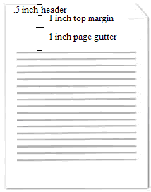
    
    gutterAtTop元素的val属性等于true，指定装订线必须出现在每个页面的顶部。结束示例]
    
    此元素的内容模型由[§17.17.4]中定义的通用布尔属性定义。

=== "英文"

    This element specifies that a given WordprocessingML document’s gutter shall be positioned at the top of the document’s pages when the document is displayed. A gutter is the white space formed by the inner margins of two pages facing one another; such as the white space between the text on pages of a book when the book is opened.
    
    If this element is omitted, then the gutter shall not be positioned at the top of the page. If the mirrorMargins ([§17.15.1.57]), bookFoldPrinting ([§17.15.1.11]), bookFoldRevPrinting ([§17.15.1.13]), or printTwoOnOne ([§17.15.1.64]) elements are used within a given document, the gutterAtTop element shall not be used. Rather, the gutter shall be positioned automatically as necessary to enable the printing and page layout capabilities of these settings.
    
    [Example: Consider a one page WordprocessingML document with a 1,440 twentieths of a point (one inch) top margin and gutter, and a 720 twentieths of a point (one half of an inch) header. Consider also, that the gutter must exist at the top of the document's pages. This requirement is specified using the following WordprocessingML in the section properties:
    
    ```xml
    <w:pgMar w:top="1440" … w:header="720" … w:gutter="1440" />
    ```
    
    And the following WordprocessingML in the document settings:
    
    ```xml
    <w:gutterAtTop w:val="true" />
    ```
    
    The resulting document's pages would have the gutter positioned as follows:
    
    
    
    The gutterAtTop element's val attribute is equal to true, specifying that the gutter must appear at the top of each page. end example]
    
    This element’s content model is defined by the common boolean property definition in [§17.17.4].

### 17.15.1.51 hideGrammaticalErrors (不显示语法错误的视觉指示)

**hideGrammaticalErrors (Do Not Display Visual Indication of Grammatical Errors)**

=== "中文"

    此元素指定是否应在WordprocessingML文档中显示视觉提示，以表明使用proofErr元素([§17.13.8.1])标记的可能语法错误或通过应用程序自己的语法引擎检测到的内容。
    
    如果WordprocessingML文档中没有此元素，则应在文档中显示视觉提示，表明文档内容被认为包含语法错误。
    
    [示例：考虑一个WordprocessingML文档，它不应显示任何语法错误的指示。这个要求将使用以下WordprocessingML指定：
    
    ```xml
    <w:hideGrammaticalErrors w:val="true"/>
    ```
    
    hideGrammaticalErrors元素的val属性值为true，指定必须抑制显示此文档中任何语法错误的任何视觉指示。结束示例]
    
    此元素的内容模型由[§17.17.4]中定义的通用布尔属性定义。

=== "英文"

    This element specifies whether a visual cue should be displayed around run content contained in a WordprocessingML document which has been flagged as a possible grammatical error using the proofErr element ([§17.13.8.1]) or via the application's own grammar engine.
    
    If this element is not present in a WordprocessingML document, visual cues shall be displayed on content contained in a WordprocessingML document which is considered to contain grammatical errors.
    
    [Example: Consider a WordprocessingML document which should show no visual indication of grammatical errors. This requirement would be specified using the following WordprocessingML:
    
    ```xml
    <w:hideGrammaticalErrors w:val="true"/>
    ```
    
    The hideGrammaticalErrors element's val attribute has a value of true specifying the display of any visual indication of grammatical errors must be suppressed for this document. end example]
    
    This element’s content model is defined by the common boolean property definition in [§17.17.4].

### 17.15.1.52 hideSpellingErrors (不显示拼写错误的视觉指示)

**hideSpellingErrors (Do Not Display Visual Indication of Spelling Errors)**

=== "中文"

    此元素指定是否应在WordprocessingML文档中显示视觉提示，以标示文档中被标记为可能的拼写错误的内容，这些标记是通过使用proofErr元素([§17.13.8.1])或通过应用程序自己的拼写检查引擎来完成的。
    
    如果WordprocessingML文档中没有此元素，则应在文档中显示视觉提示，表明文档内容被认为包含拼写错误。
    
    [示例：考虑一个WordprocessingML文档，它不应显示任何拼写错误的指示。这个要求将使用以下WordprocessingML指定：
    
    ```xml
    <w:hideSpellingErrors w:val="true"/>
    ```
    
    hideSpellingErrors元素的val属性值为true，指定必须抑制显示此文档中任何拼写错误的任何视觉指示。结束示例]
    
    此元素的内容模型由[§17.17.4]中定义的通用布尔属性定义。

=== "英文"

    This element specifies whether a visual cue should be displayed around run content contained in a WordprocessingML document which has been flagged as a possible spelling error using the proofErr element ([§17.13.8.1]) or via the application's own spelling engine.
    
    If this element is not present in a WordprocessingML document, visual cues shall be displayed on content contained in a WordprocessingML document which is considered to contain spelling errors.
    
    [Example: Consider a WordprocessingML document which should show no visual indication of spelling errors. This requirement would be specified using the following WordprocessingML:
    
    ```xml
    <w:hideSpellingErrors w:val="true"/>
    ```
    
    The hideSpellingErrors element's val attribute has a value of true specifying the display of any visual indication of spelling errors must be suppressed for this document. end example]
    
    This element’s content model is defined by the common boolean property definition in [§17.17.4].

### 17.15.1.53 hyphenationZone (连字区)

**hyphenationZone (Hyphenation Zone)**

=== "中文"

    此元素指定了在自动或手动对文档内容进行连字符分割时应使用的连字符区域。连字符区域是指在一行末尾可以留下的空白量（或在两端对齐的行中添加的空白量），在尝试对文档中的下一个单词进行连字符分割之前（以减少该行的空白量）。较小的连字符区域应该减少给定文档正文右侧边缘的不整齐程度，因为更多的单词会被分割。相反，较大的连字符区域应该增加给定文档文本右侧边缘的不整齐程度，因为较少的单词会被分割。
    
    如果省略此元素，则在对文档进行连字符分割时将应用默认的连字符区域，即360分之二十点（0.25英寸）。
    
    [示例：考虑下面的图像，展示了WordprocessingML文档中自动连字符分割的段落文本，使用的是默认的连字符区域：
    
    
    
    如果文档必须使用半英寸的连字符区域进行连字符分割，那么将使用以下WordprocessingML在文档设置中指定该要求：
    
    ```xml
    <w:hyphenationZone w:val="720" />
    ```
    
    生成的输出只有在剩余行空白小于半英寸时才会对单词进行连字符分割，看起来如下：
    
    
    
    hyphenationZone元素的val属性等于720，因此文档中的行在剩余行间距小于720分之二十点（0.5英寸）时进行连字符分割，导致连字符数量减少。示例结束]
    
    ??? abstract "属性"
    
        - **val**（以点的二十分之一为单位的测量值）
    
            指定一个正的测量值，以点的二十分之一为单位。该值根据父XML元素的上下文进行解释。
            
            [示例：考虑下面的WordprocessingML元素，val属性包含一个以点的二十分之一为单位的正测量值：
            
            ```xml
            <… w:val="720" />
            ```
            
            val属性的值为720，指定这个测量值是720分之二十点（0.5英寸）。该值由父元素根据需要进行解释。示例结束]
            
            此属性的可能值由ST_TwipsMeasure简单类型定义（[§22.9.2.14]）。
    
    [Note: The W3C XML Schema definition of this element’s content model (CT_TwipsMeasure) is located in §A.1. end note]

=== "英文"

    This element specifies the hyphenation zone which shall be used when automatically or manually hyphenating the contents of this document. The hyphenation zone is the amount of whitespace which can be left at the end of a line (or added to justified lines) before hyphenation should be attempted on the next word in the document (in order to reduce the amount of whitespace on the line). A smaller hyphenation zone should reduce the raggedness of the right edge of a given document's body text, as more words is hyphenated. Conversely, a larger hyphenation zone should increase the raggedness of the right edge of a given document's text, as fewer words is hyphenated.
    
    If this element is omitted, then a default hyphenation zone of 360 twentieths of a point (0.25") shall be applied when performing hyphenation on this document.
    
    [Example: Consider the images below illustrating a paragraph of text in a WordprocessingML document which was automatically hyphenated with the default hyphenation zone:
    
    
    
    If document must instead be hyphenated using a hyphenation zone of one-half of an inch, that requirement would be specified using the following WordprocessingML in the document settings:
    
    ```xml
    <w:hyphenationZone w:val="720" />
    ```
    
    The resulting output would only hyphenate words when the remaining line whitespace was less than half an inch, and would look like the following:
    
    

    The hyphenationZone element has its val attribute equal to 720, therefore lines in the document are hyphenated when the remaining line spacing is less than 72o twentieths of a point (0.5"), resulting in fewer hyphens. end example]
        
    ??? abstract "Attributes"
    
        - **val** (Measurement in Twentieths of a Point)
    
            Specifies a positive measurement value, specified in twentieths of a point. This value is interpreted based on the context of the parent XML element.
            
            [Example: Consider the following WordprocessingML element with a val attribute containing a positive measurement in twentieths of a point:
            
            ```xml
            <… w:val="720" />
            ```
            
            The val attribute has a value of 720, specifying that this measurement value is 720 twentieths of a point (0.5"). This value is interpreted by the parent element as needed. end example]
            
            The possible values for this attribute are defined by the ST_TwipsMeasure simple type ([§22.9.2.14]).
    
    [Note: The W3C XML Schema definition of this element’s content model (CT_TwipsMeasure) is located in §A.1. end note]

### 17.15.1.54 ignoreMixedContent (验证自定义 XML 标记时忽略混合内容)

**ignoreMixedContent (Ignore Mixed Content When Validating Custom XML Markup)**

=== "中文"

    此元素指定，在将此文档中的自定义 XML 标记内容与一个或多个附加的自定义 XML 架构进行验证时，应用程序应忽略所有不包含在叶自定义 XML 标记元素中的文本内容。叶元素是自定义 XML 元素，它没有子自定义 XML 元素（在自定义 XML 树中是叶子）。
    
    如果省略此元素，则在将自定义 XML 标记与一个或多个自定义 XML 架构进行验证时，不应忽略叶元素中的文本内容。
    
    [示例：考虑一个包含以下标记的 WordprocessingML 文档：
    
    ```xml
    <w:customXml w:element="invoice" w:uri="http://www.example.com/invoice"> 
        <w:p>
            <w:r>
                <w:t>Invoice #:</w:t>
            </w:r>
            <w:customXml w:element="id" w:uri="http://www.example.com/invoice"> 
                <w:r>
                    <w:t>012345</w:t>
                </w:r>
            </w:customXml>
        </w:p>
        <w:p>
            <w:r>
                <w:t>Invoice Date:</w:t>
            </w:r>
            <w:customXml w:element="date" w:uri="http://www.example.com/invoice"> 
                <w:r>
                    <w:t>01/29/2009</w:t>
                </w:r>
            </w:customXml>
        </w:p>
    </w:customXml>
    ```
    
    如果从文档中提取所有自定义标记，那么该标记将包括文档中的所有内容，即：
    
    ```xml
    <invoice xmlns="http://www.example.com/invoice"> 
        Invoice #:
        <id>012345</id>
        Invoice Date
        <date>01/29/2009</date>
    </invoice>
    ```
    
    上面显示的内容是为了可读性而格式化的。实际上，XML 中没有这样的空格。
    
    然而，如果存在 ignoreMixedContent 元素，并且其 val 属性值为 true（或等效值），那么应用程序应忽略具有混合内容的元素中的所有文本节点，即：
    
    ```xml
    <invoice xmlns="http://www.example.com/invoice"> 
        <id>012345</id>
        <date>01/29/2009</date>
    </invoice>
    ```
    
    示例结束]
    
    此元素的内容模型由 [§17.17.4] 中定义的通用布尔属性定义。

=== "英文"

    This element specifies that applications should ignore all text content which is not contained within a leaf custom XML markup element when validating the contents of the custom XML markup in this document against one or more attached custom XML schema(s). A leaf element is a custom XML element which has no child custom XML elements (it is a leaf in the custom XML tree).
    
    If this element is omitted, then text content in leaf elements shall not be ignored when validating the custom XML markup against one or more custom XML schema(s).
    
    [Example: Consider a WordprocessingML document that contains the following markup:
    
    ```xml
    <w:customXml w:element="invoice" w:uri="http://www.example.com/invoice">
        <w:p>
            <w:r>
                <w:t>Invoice #:</w:t>
            </w:r>
            <w:customXml w:element="id" w:uri="http://www.example.com/invoice">
                <w:r>
                    <w:t>012345</w:t>
                </w:r>
            </w:customXml>
        </w:p>
        <w:p>
            <w:r>
                <w:t>Invoice Date:</w:t>
            </w:r>
            <w:customXml w:element="date" w:uri="http://www.example.com/invoice">
                <w:r>
                    <w:t>01/29/2009</w:t>
                </w:r>
            </w:customXml>
        </w:p>
    </w:customXml>
    ```
    
    If all the custom markup is extracted from the document, that markup would include all content in the document, i.e.:
    
    ```xml
    <invoice xmlns="http://www.example.com/invoice">
        Invoice #:
        <id>012345</id>
        Invoice Date
        <date>01/29/2009</date>
    </invoice>
    ```
    
    The content shown above is formatted for readability. In fact, there is no such space in the XML.
    
    However, if the ignoreMixedContent element is present with a val attribute value of true (or equivalent) then an application should ignore all text nodes in elements with mixed content, i.e.:
    
    ```xml
    <invoice xmlns="http://www.example.com/invoice">
        <id>012345</id>
        <date>01/29/2009</date>
    </invoice>
    ```
    
    end example]
    
    This element’s content model is defined by the common boolean property definition in [§17.17.4].


### 17.15.1.55 linkStyles (自动更新文档模板的样式)

**linkStyles (Automatically Update Styles From Document Template)**

=== "中文"

    此元素指定，在宿主应用程序打开文档时，应将给定文档中的样式更新以匹配使用 attachedTemplate 元素（[§17.15.1.6]）指定的附加模板中的样式。此设置使附加模板的文档中包含的样式与附加模板中使用的样式保持同步。
    
    如果省略此元素，则无论文档模板是否可用，都不应根据文档模板更新样式。如果无法找到附加的模板或模板不是有效的文件，则应静默忽略此设置。
    
    [示例：考虑一个 WordprocessingML 文档，它应该总是使用文档附加模板中定义的样式更新其样式。此要求将使用文档设置中的以下 WordprocessingML 指定：
    
    ```xml
    <w:settings>
        <w:linkStyles w:val="true" />
        <w:attachedTemplate r:id="rId10" />
        …
    </w:settings>
    ```
    
    linkStyles 元素的 val 属性值为 true，指定应用程序应尝试定位附加模板元素中指定的关系引用的文档模板，并使用该模板中的样式更新文档的样式。示例结束]
    
    此元素的内容模型由 [§17.17.4] 中定义的通用布尔属性定义。

=== "英文"

    This element specifies that styles in the given document shall be updated to match the styles in the attached template specified using the attachedTemplate element ([§17.15.1.6]) when the document is opened by a hosting application. This setting enables the styles contained in documents with attached templates to stay synchronized with the styles used in the attached template.
    
    If this element is omitted, then styles shall not be updated based on the document template regardless of its availability. If the attached template cannot be located or is not a valid file, then this setting should be silently ignored.
    
    [Example: Consider a WordprocessingML document which should always update its styles with those defined in the document's attached template. This requirement would be specified using the following WordprocessingML in the document settings:
    
    ```xml
    
    <w:settings>
        <w:linkStyles w:val="true" />
        <w:attachedTemplate r:id="rId10" />
        …
    </w:settings>
    ```
    
    The linkStyles element has a val attribute value of true, specifying that applications should attempt to locate the document template referenced by the relationship specified in the attachedTemplate element and update the document's styles with the styles from that template. end example]
    
    This element’s content model is defined by the common boolean property definition in [§17.17.4].

### 17.15.1.56 listSeparator (用于字段代码评估的列表分隔符)

**listSeparator (List Separator for Field Code Evaluation)**

=== "中文"

    此元素指定在评估当前文档中所有字段的内容时应解释为列表项分隔符的字符。
    
    [理由：在基于当前文档内容评估字段指令时，需要知道必须作为列表分隔符处理的字符，以防止基于当前用户区域设置对同一字段指令的计算发生变化。此元素存储用于评估文档内容中字段的列表分隔符，而不考虑加载文件的应用程序的区域设置。结束理由]
    
    如果省略此元素，应用程序将使用其当前区域设置的默认列表分隔符来评估字段指令。如果此元素的属性值超过一个字符，则文档不符合规范。
    
    [示例：考虑一个 WordprocessingML 文档，它应该使用分号字符作为所有字段指令的列表分隔符。此要求是使用文档设置中的以下 WordprocessingML 指定的：
    
    ```xml
    <w:listSeparator w:val=";" />
    ```
    
    listSeparator 元素的 val 属性有一个值 ;，指定应将分号字符解释为列表项分隔符。
    
    例如，字符串 10;20,5 将被解释为具有两个值 - 10 和 20,5。如果 listSeparator 是逗号，相同的字符串将被解释为 10;20 和 5。示例结束]
    
    ??? abstract "Attributes"
    
        - **val** (字符串值)

            指定其内容包含一个字符串。
            
            这个字符串的内容根据父XML元素的上下文来解释。
            
            [示例：考虑以下WordprocessingML片段：
            
            ```xml
            <w:pPr>
                <w:pStyle w:val="Heading1" />
            </w:pPr>
            ```
            
            val属性的值是关联段落样式的styleId的ID。
            然而，考虑以下片段：
            
            ```xml
            <w:sdtPr>
            <w:alias w:val="SDT Title Example" />
            …
            </w:sdtPr>
            ```
            
            在这种情况下，val属性中的十进制数字是最接近的结构化文档标签的标题。在每种情况下，该值都是在父元素的上下文中解释的。结束示例]
    
            此属性的可能值由ST_String简单类型定义（[§22.9.2.13]）。
    
    [Note: The W3C XML Schema definition of this element’s content model (CT_String) is located in §A.1. end note]

=== "英文"

    This element specifies the character that shall be interpreted as a list item separator when evaluating the contents of all fields in the current document.
    
    [Rationale: When evaluating field instructions based on the contents of the current document, it is necessary to know the character which must be treated as the list separator in order to prevent changes to the calculation of the same field instructions based on the current user's locale. This element stores the list separator which must be used to evaluate fields in the contents of this document, irrespective of the locale of the application loading the file. end rationale]
    
    If this element is omitted, the application shall use the default list separator of its current locale setting to evaluate field instructions. If this element's attribute value is more than a single character, then the document is non-conformant.
    
    [Example: Consider a WordprocessingML document which should use the semicolon character as the list separator for all field instructions. This requirement is specified using the following WordprocessingML in the document settings:
    
    ```xml
    <w:listSeparator w:val=";" />
    ```
    
    The listSeparator element's val attribute has a value of ; specifying that the semicolon character shall be interpreted as a list item separator.
    
    For instance, the string 10;20,5 would be interpreted as having two values - 10 and 20,5. If the listSeparator was a comma, the same string would be interpreted as 10;20 and 5. end example]
    
    ??? abstract "Attributes"
    
        - **val** (String Value)
        
            Specifies that its contents contain a string.
        
            The contents of this string are interpreted based on the context of the parent XML element.
            
            [Example: Consider the following WordprocessingML fragment:
            
            ```xml
            <w:pPr>
            <w:pStyle w:val="Heading1" />
            </w:pPr>
            ```
            
            The value of the val attribute is the ID of the associated paragraph style's styleId.
            
            However, consider the following fragment:
            
            ```xml
            <w:sdtPr>
            <w:alias w:val="SDT Title Example" />
            …
            </w:sdtPr>
            ```
            
            In this case, the decimal number in the val attribute is the caption of the nearest ancestor structured document tag. In each case, the value is interpreted in the context of the parent element. end example]
            
            The possible values for this attribute are defined by the ST_String simple type ([§22.9.2.13]).
    
    [Note: The W3C XML Schema definition of this element’s content model (CT_String) is located in §A.1. end note]


### 17.15.1.57 mirrorMargins (镜像页边距)

**mirrorMargins (Mirror Page Margins)**

=== "中文"

    此元素指定在每一对偶数页上，章节属性中定义的左和右边距应互换。[注：页码可以任意设置，因此翻转可能不会总是在带有偶数标签的页面上发生。结束注]
    
    [指导：此设置通常用于双面打印并像书一样装订页面。结束指导]
    
    [示例：考虑下面（下方）的图形表示，显示了一个具有1英寸左边距和2英寸右边距的三页WordprocessingML文档。
    
    如果文档设置中存在mirrorMargins元素，并且其val属性等于true，如下所示：
    
    ```xml
    <w:mirrorMargins w:val="true" />
    ```
    
    结果页面的边距如下所示（在此表示中，灰色矩形代表每一页上的文本范围）：
    
    
    
    示例结束]
    
    此元素的内容模型由[§17.17.4]中定义的通用布尔属性定义。

=== "英文"

    This element specifies that the left and right margins defined in the section properties shall be swapped on every second page. [Note: Page numbering can be set arbitrarily, so the flip might not always be on the pages with even-numbered labels. end note]
    
    [Guidance: This setting is generally used when printing on both sides of pages and binding them like a book. end guidance]
    
    [Example: Consider a graphical representation (below) of a three page WordprocessingML document with a left margin of 1" and a right margin of 2".
    
    If the mirrorMargins element is present in the document settings with its val attribute equal to true, as follows:
    
    ```xml
    <w:mirrorMargins w:val="true" />
    ```
    
    The resulting pages has mirrored margins as follows (un this representation, the gray rectangles representing the text extents on each page):
    
    
    
    end example]
    
    This element’s content model is defined by the common boolean property definition in [§17.17.4].

### 17.15.1.58 noLineBreaksAfter (无法结束行的自定义字符集)

**noLineBreaksAfter (Custom Set of Characters Which Cannot End a Line)**

=== "中文"

    此元素指定了一组字符，这些字符在使用 kinsoku 元素（[§17.3.1.16]）进行自定义换行逻辑时，不应出现在文本行的末尾。此约束仅适用于通过 lang 元素（[§17.3.2.20]）标记为此规则语言的文本，或通过 ECMA-376 范围之外的自动检测方法确定的文本。
    
    如果省略此元素，则在使用 kinsoku 元素时，不会使用自定义字符集来限制可以结束行的字符。
    
    [示例：考虑如下显示的 WordprocessingML 文本段落，其中美元符号 $ 被标记为使用以下 WordprocessingML 在运行属性中的日本内容：
    
    ```xml
    <w:r>
        <w:rPr>
            <w:lang w:eastAsia="ja-JP" />
        </w:rPr>
        <w:t>$</w:t>
    </w:r>
    ```
    
    
    
    显示此文本时，结果的第一行以美元符号结束。如果此字符不得用于结束行，那么该要求将如下在文档设置中指定：
    
    ```xml
    <w:noLineBreaksAfter w:lang="ja-JP" w:val="$" />
    ```
    
    noLineBreaksAfter 元素的 val 属性具有值 ja-JP，指定所有在此文档中标记为日文文本的美元符号不得用于结束行。这意味着美元符号字符必须移动到下一行，因为它不能再是行上的最后一个字符：
    
    
    
    示例结束]
    
    ??? abstract "Attributes"
    
        - **lang** （自定义换行规则适用的语言）

            指定父自定义换行规则应用于哪种语言的文本。支持此功能的应用程序应支持以下四种语言的自定义换行：
            
            - 繁体中文
            - 简体中文
            - 日语
            - 韩语
            
            应用程序也可以支持其他语言的自定义换行规则，但这不是必需的。
            
            [示例：考虑一个 WordprocessingML 文档，它必须有一条针对日语的自定义换行规则。该要求将在文档设置中如下指定：
            
            ```xml
            <… w:lang="ja-JP" w:val="$" />
            ```
            
            lang 属性的值为 ja-JP，指定规则必须应用于日文文本。示例结束]
            
            此属性的可能值由 ST_Lang 简单类型定义（[§22.9.2.6]）。

        - **val** （自定义换行规则的字符）

            指定应包含在自定义换行规则中的字符集。
            
            [示例：考虑一个 WordprocessingML 文档，它必须有一条针对日语的自定义换行规则。该要求将在文档设置中如下指定：
            
            ```xml
            <… w:lang="ja-JP" w:val="$" />
            ```
            
            val 属性的值为 $，指定美元符号字符是日文文本的唯一受限字符。示例结束]
            
            此属性的可能值由 ST_String 简单类型定义（[§22.9.2.13]）。
    
    [Note: The W3C XML Schema definition of this element’s content model (CT_Kinsoku) is located in §A.1. end note]

=== "英文"

    This element specifies the set of characters which shall be restricted from ending a line for runs of text which shall be subject to custom line breaking logic using the kinsoku element ([§17.3.1.16]) when the contents of the document are displayed. This constraint shall only apply to text which has been flagged in the language of this rule via the lang element ([§17.3.2.20]) or automatic detection methods outside the scope of ECMA-376.
    
    If this element is omitted, then no custom set of characters shall be used to restrict the characters which can end a line when using the kinsoku element.
    
    [Example: Consider a paragraph of WordprocessingML text displayed as follows, with the dollar symbol $ was flagged as Japanese content using the following WordprocessingML in the run properties:
    
    ```xml
    <w:r>
        <w:rPr>
            <w:lang w:eastAsia="ja-JP" />
        </w:rPr>
        <w:t>$</w:t>
    </w:r>
    ```
    
    
    
    This text is displayed and the resulting first line ends with the dollar sign symbol. If this character must not be used to end a line, that requirement would be specified as follows in the document settings:
    
    ```xml
    <w:noLineBreaksAfter w:lang="ja-JP" w:val="$" />
    ```
    
    The noLineBreaksAfter element's val attribute has a value of ja-JP, specifying that all dollar signs in this document which are marked as Japanese text must not be allowed to end a line. This means that the dollar sign character must therefore be moved to the next line as it can no longer be the last character on a line:
    
    
    
    end example]
    
    ??? abstract "Attributes"
    
        - **lang** (Language For Which Custom Line Breaking Rule Applies)
    
            Specifies the language of text for which the parent custom line breaking rule shall be applied. Applications supporting this functionality shall support custom line breaking for the following four languages:
            
            - Chinese (Traditional)
            - Chinese (Simplified)
            - Japanese
            - Korean
            
            Applications can also support custom line breaking rules for other languages, but this is not required.
            
            [Example: Consider a WordprocessingML document which must have a custom line breaking rule for Japanese. That requirement would be specified as follows in the document settings:
            
            ```xml
            <… w:lang="ja-JP" w:val="$" />
            ```
            
            The lang attribute has a value of ja-JP, specifying that the rules must be applied to Japanese text. end example]
            
            The possible values for this attribute are defined by the ST_Lang simple type ([§22.9.2.6]).
    
        - **val** (Characters For Custom Line Breaking Rule)
    
            Specifies the set of characters which shall be included in the custom line breaking rule.
            
            [Example: Consider a WordprocessingML document which must have a custom line breaking rule for Japanese. That requirement would be specified as follows in the document settings:
            
            ```xml
            <… w:lang="ja-JP" w:val="$" />
            ```
            
            The val attribute has a value of $, specifying that the dollar sign character is the only restricted character for Japanese text. end example]
            
            The possible values for this attribute are defined by the ST_String simple type ([§22.9.2.13]).
    
    [Note: The W3C XML Schema definition of this element’s content model (CT_Kinsoku) is located in §A.1. end note]

### 17.15.1.59 noLineBreaksBefore (不能以行开头的自定义字符集)

**noLineBreaksBefore (Custom Set Of Characters Which Cannot Begin A Line)**

=== "中文"

    此元素指定了一组字符，这些字符在使用 kinsoku 元素（[§17.3.1.16]）进行自定义行断行逻辑时，不应作为新行的开始。此限制仅适用于通过 lang 元素（[§17.3.2.20]）标记为此规则语言的文本，或通过 ECMA-376 范围之外的自动检测方法确定的文本。
    
    如果省略此元素，则在使用 kinsoku 元素时，不会使用自定义字符集来限制可以开始一行的字符。
    
    [示例：考虑如下显示的 WordprocessingML 文本段落，其中美元符号 $ 被标记为使用以下 WordprocessingML 在运行属性中的韩国内容：
    
    ```xml
    <w:r>
        <w:rPr>
            <w:lang w:eastAsia="ko-KR" />
        </w:rPr>
        <w:t>$</w:t>
    </w:r>
    ```
    
    
    
    显示此文本时，结果的第二行以美元符号开始。如果此字符不得用于开始一行，那么该要求将如下在文档设置中指定：
    
    ```xml
    <w:noLineBreaksBefore w:lang="ko-KR" w:val="$" />
    ```
    
    noLineBreaksBefore 元素的 val 属性具有值 ko-KR，指定所有在此文档中标记为韩文文本的美元符号不得用于开始一行。这意味着前一个单词字符必须因此移动到下一行，因为美元符号不能再是一行上的第一个字符：
    
    
    
    示例结束]
    
    ??? abstract "属性"
    
        - **lang** （自定义行断行规则适用的语言）
    
            指定父自定义行断行规则应用于哪种语言的文本。支持此功能的应用程序应支持以下四种语言的自定义行断行：
    
            - 繁体中文
            - 简体中文
            - 日语
            - 韩语
            
            应用程序也可以支持其他语言的自定义行断行规则，但这不是必需的。
            
            [示例：考虑一个 WordprocessingML 文档，它必须有一条针对日语的自定义行断行规则。该要求将在文档设置中如下指定：
    
            ```xml
            <… w:lang="ja-JP" w:val="$" />
            ```
            
            lang 属性的值为 ja-JP，指定规则必须应用于日文文本。示例结束]
            
            此属性的可能值由 ST_Lang 简单类型定义（[§22.9.2.6]）。
    
        - **val** （自定义行断行规则的字符）
    
            指定应包含在自定义行断行规则中的字符集。
            
            [示例：考虑一个 WordprocessingML 文档，它必须有一条针对日语的自定义行断行规则。该要求将在文档设置中如下指定：
    
            ```xml
            <… w:lang="ja-JP" w:val="$" />
            ```
            
            val 属性的值为 $，指定美元符号字符是日文文本的唯一受限字符。示例结束]
            
            此属性的可能值由 ST_String 简单类型定义（[§22.9.2.13]）。
    
    
    [Note: The W3C XML Schema definition of this element’s content model (CT_Kinsoku) is located in §A.1. end note]

=== "英文"

    This element specifies the set of characters which shall be restricted from beginning a new line for runs of text which shall be subject to custom line breaking logic using the kinsoku element ([§17.3.1.16]) when the contents of the document are displayed. This constraint shall only apply to text which has been flagged in the language of this rule via the lang element ([§17.3.2.20]) or automatic detection methods outside the scope of ECMA-376.
    
    If this element is omitted, then no custom set of characters shall be used to restrict the characters which can end a line when using the kinsoku element.
    
    [Example: Consider a paragraph of WordprocessingML text displayed as follows, with the dollar symbol $ was flagged as Korean content using the following WordprocessingML in the run properties:
    
    ```xml
    <w:r>
        <w:rPr>
            <w:lang w:eastAsia="ko-KR" />
        </w:rPr>
        <w:t>$</w:t>
    </w:r>
    ```
    
    
    
    This text is displayed and the resulting second line begins with the dollar sign symbol. If this character must not be used to begin a line, that requirement would be specified as follows in the document settings:
    
    ```xml
    <w:noLineBreaksBefore w:lang="ko-KR" w:val="$" />
    ```
    
    The noLineBreaksBefore element's val attribute has a value of ko-KR, specifying that all dollar signs in this document which are marked as Korean text must not be allowed to begin a line. This means that the previous word character must therefore be moved to the next line as the dollar sign can no longer be the first character on a line:
    
    
    
    end example]
    
    ??? abstract "Attributes"
    
        - **lang** (Language For Which Custom Line Breaking Rule Applies)
    
            Specifies the language of text for which the parent custom line breaking rule shall be applied. Applications supporting this functionality shall support custom line breaking for the following four languages:
            
            - Chinese (Traditional)
            - Chinese (Simplified)
            - Japanese
            - Korean
            
            Applications can also support custom line breaking rules for other languages, but this is not required.
            
            [Example: Consider a WordprocessingML document which must have a custom line breaking rule for Japanese. That requirement would be specified as follows in the document settings:
            
            ```xml
            <… w:lang="ja-JP" w:val="$" />
            ```
            
            The lang attribute has a value of ja-JP, specifying that the rules must be applied to Japanese text. end example]
            
            The possible values for this attribute are defined by the ST_Lang simple type ([§22.9.2.6]).
    
        - **val** (Characters For Custom Line Breaking Rule)
    
            Specifies the set of characters which shall be included in the custom line breaking rule.
            
            [Example: Consider a WordprocessingML document which must have a custom line breaking rule for Japanese. That requirement would be specified as follows in the document settings:
            
            ```xml
            <… w:lang="ja-JP" w:val="$" />
            ```
            
            The val attribute has a value of $, specifying that the dollar sign character is the only restricted character for Japanese text. end example]
            
            The possible values for this attribute are defined by the ST_String simple type ([§22.9.2.13]).
    
    
    [Note: The W3C XML Schema definition of this element’s content model (CT_Kinsoku) is located in §A.1. end note]

### 17.15.1.60 noPunctuationKerning (从不紧排标点字符)

**noPunctuationKerning (Never Kern Punctuation Characters)**

=== "中文"

    此元素指定在启用字符间距调整（kerning）时，当前文档中的标点字符不应进行间距调整。字符间距调整是指宿主应用程序减少相邻字符和/或标点符号间距的过程，以改善文本的视觉外观。调整得当的文本在每对字符和/或每个字符与标点符号之间有相似的空白量。当启用字符间距调整时，拉丁文本总是要进行调整，此选项将控制标点字符是否也进行调整。
    
    如果省略此元素，则在给定运行中启用字符间距调整时，标点字符将进行间距调整。
    
    [示例：考虑一个 WordprocessingML 文档，即使在给定运行中启用了字符间距调整，也不得对标点进行调整。此要求是使用文档设置中的以下 WordprocessingML 指定的：
    
    ```xml
    <w:noPunctuationKerning w:val="true" />
    ```
    
    noPunctuationKerning 元素的 val 属性值为 true，指定在此文档中不得对标点字符进行间距调整。示例结束]
    
    此元素的内容模型由 [§17.17.4] 中定义的通用布尔属性定义。

=== "英文"

    This element specifies that punctuation characters shall not be kerned in the current document when kerning is enabled on a run using the kern element ([§17.3.2.19]). Kerning refers to a process by which a hosting application shall reduce the spacing of adjacent characters and/or punctuation to improve the visual appearance of text. Well kerned text has a similar amount of blank space between each pair of characters and/or each set of a character and punctuation symbol. When kerning is enabled, Latin text shall always be kerned, and this option shall control whether punctuation characters are also kerned.
    
    If this element is omitted, then punctuation characters shall be kerned when kerning is enabled on a given run.
    
    [Example: Consider a WordprocessingML document that must not kern punctuation even when kerning is enabled on a given run. This requirement is specified using the following WordprocessingML in the document settings:
    
    ```xml
    <w:noPunctuationKerning w:val="true" />
    ```
    
    The noPunctuationKerning element's val attribute has a value of true, specifying that punctuation characters must not be kerned in this document. end example]
    
    This element’s content model is defined by the common boolean property definition in [§17.17.4].

### 17.15.1.61 printFormsData (仅打印表单字段内容)

**printFormsData (Only Print Form Field Content)**

=== "中文"

    此元素指定打印此文档的内容时，只应打印使用 FORMTEXT、FORMCHECKBOX 和 FORMDROPDOWN 字段代码在页面上当前位置定义的 WordprocessingML 表单字段的内容 - 所有其他文档内容应被抑制。
    
    [理由：通常使用此设置来允许在电子 WordprocessingML 文档表格形式中复制纸质表格，允许生成的在线文档打印到现有纸质表格的正确位置。结束理由]
    
    如果省略此元素，则应根据正常的打印设置打印整个文档的内容（不仅仅是表单字段）。
    
    [示例：考虑一个 WordprocessingML 文档，第一页的右上角和左下角有表单字段，如下所示（文本框表单字段用灰色阴影表示）：
    
    
    
    如果必须打印在页面上的唯一内容是表单字段的内容，此要求是使用文档设置中的以下 WordprocessingML 指定的：
    
    ```xml
    <w:printFormsData w:val="true" />
    ```
    
    printFormsData 元素的 val 属性值为 true，指定只应打印表单字段数据，当打印时，输出结果如下：
    
    
    
    示例结束]
    
    此元素的内容模型由 [§17.17.4] 中定义的通用布尔属性定义。

=== "英文"

    This element specifies that printing the contents of this document shall only print the contents of WordprocessingML form fields defined using the FORMTEXT, FORMCHECKBOX, and FORMDROPDOWN field codes in their current locations on the page - all other document contents shall be suppressed.
    
    [Rationale: This setting is typically used to allow duplication of paper forms in electronic WordprocessingML document form, allowing the resulting online document to be printed into the correct locations on the existing paper form. end rationale]
    
    If this element is omitted, then the contents of the entire document (not just form fields) should be printed according to the normal print settings.
    
    [Example: Consider a WordprocessingML document which has form fields in the top right and bottom left corners of the first page, as follows (with the text box form fields shaded in grey):
    
    
    
    If the only content which must be printed on the page are the form fields' contents, this requirement is specified using the following WordprocessingML in the document settings:
    
    ```xml
    <w:printFormsData w:val="true" />
    ```
    
    The printFormsData element's val attribute as a value of true, specifying that only form field data shall be printed, resulting in output as follows when printed:
    
    
    
    end example]
    
    This element’s content model is defined by the common boolean property definition in [§17.17.4].

### 17.15.1.62 printFractionalCharacterWidth (打印小数字符宽度)

**printFractionalCharacterWidth (Print Fractional Character Widths)**

=== "中文"

    此元素指定文档的内容应使用分数字符宽度进行打印。当字符之间的间距不是恒定时，就会存在分数字符宽度（即使用了比例字体）。
    
    [注：分数字符宽度通常与较大的字体大小一起使用，以防止字符相互重叠或彼此之间有过多的空间。结束注]
    
    [示例：考虑一个 WordprocessingML 文档，它应该按需使用分数字符宽度进行打印。此要求是使用文档设置中的以下 WordprocessingML 标记指定的：
    
    ```xml
    <w:printFractionalCharacterWidth w:val="true"/>
    ```
    
    printFractionalCharacterWidth 元素的 val 属性等于 true，指定可以按需使用分数字符宽度。示例结束]
    
    此元素的内容模型由 [§17.17.4] 中定义的通用布尔属性定义。

=== "英文"

    This element specifies the contents of this document shall be printed with fractional character widths. Fractional character widths exist when the spacing between characters is not constant (i.e. a proportional font face is used).
    
    [Note: Fractional character widths are generally used in conjunction with large font sizes to prevent characters from running together or having too much space between one another. end note]
    
    [Example: Consider a WordprocessingML document which should be printed using fractional character widths as needed. This requirement is specified using the following WordprocessingML markup in the document settings:
    
    ```xml
    <w:printFractionalCharacterWidth w:val="true"/>
    ```
    
    The printFractionalCharacterWidth element's val attribute is equal to true, specifying that fractional character widths can be used as necessary. end example]
    
    This element’s content model is defined by the common boolean property definition in [§17.17.4].

### 17.15.1.63 printPostScriptOverText (打印带有文档文本的 PostScript 代码)

**printPostScriptOverText (Print PostScript Codes With Document Text)**

=== "中文"

    此元素指定在包含PRINT字段的WordprocessingML文档中指定的PostScript代码应与给定WordprocessingML文档内容中的打印数据一起包含在前景（与文本相同的Z顺序）中。
    
    [注：此设置是为了确保旧版文字处理文档的兼容性。PRINT字段不应被用作ECMA-376中更新技术的替代。结束注]
    
    如果省略此元素，则PRINT字段的内容应打印在文本后面（即在后台）。
    
    [示例：考虑一个包含PRINT字段的WordprocessingML文档，其PostScript代码必须在WordprocessingML文档的前景中打印。此要求是使用文档设置中的以下WordprocessingML指定的：
    
    ```xml
    <w:printPostScriptOverText w:val="true"/>
    ```
    
    printPostScriptOverText元素的val属性等于true，指定PostScript代码必须被视为文档主文本级别的结果（即不是在该文本后面）。示例结束]
    
    此元素的内容模型由[§17.17.4]中定义的通用布尔属性定义。

=== "英文"


    This element specifies that the PostScript codes specified in WordprocessingML documents containing PRINT fields shall be included in foreground (on the same Z-order as text) with the data printed in the contents of a given WordprocessingML document.
    
    [Note: This setting is maintained to ensure compatibility of legacy word processing documents. The PRINT field should not be used in lieu of newer technologies in ECMA-376. end note]
    
    If this element is omitted, then the contents of PRINT fields shall be printed behind text (i.e. in the background). 
    
    [Example: Consider a WordprocessingML document containing PRINT fields whose PostScript code must be printed in the foreground of the WordprocessingML document. This requirement is specified using the following WordprocessingML in the document settings:
    
    ```xml
    <w:printPostScriptOverText w:val="true"/>
    ```
    
    The printPostScriptOverText element's val attribute is equal to true specifying that the PostScript codes must be treated as results for the main text level of the document (i.e. not behind that text). end example]
    
    This element’s content model is defined by the common boolean property definition in [§17.17.4].

### 17.15.1.64 printTwoOnOne (每张打印两页)

**printTwoOnOne (Print Two Pages Per Sheet)**

=== "中文"

    此元素指定当打印此文档时，是否应该在一张纸上打印两页内容。具体来说，此元素指定在给定的WordprocessingML文档中显示的每个页面应该是章节设置中指定的页面大小的一半，两个上边距源自页面中分线的分割处，并且每个页面的顶部和底部都有底边距。
    
    如果省略此元素，则页面应按每张纸一页显示和打印。
    
    [示例：考虑一个只有一个部分的文档，其上边距为2,160点的二十分之一（一英寸半），底部、右侧和左侧边距为1,440点的二十分之一（一英寸），围绕文档编辑画布（由下图中的灰色阴影区域表示）。此页面设置在WordprocessingML中使用以下片段表示：
    
    ```xml
    <w:pgMar w:header="0" w:top="2160" w:right="1440" w:bottom="1440" w:left="1440"
    w:footer="720" w:gutter="0" />
    ```
    
    打印出的页面将如下所示：
    
    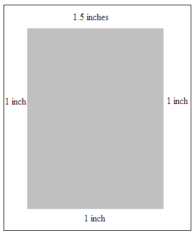
    
    如果文档应该显示和打印为一张单一纸张上打印两页，此要求将使用以下WordprocessingML指定：
    
    ```xml
    <w:printTwoOnOne w:val="true" />
    ```
    
    printTwoOnOne元素的val属性等于true，指定页面应该按每张纸两页打印，考虑到这些页面边距，打印输出将如下所示：
    
    
    
    示例结束]
    
    此元素的内容模型由[§17.17.4]中定义的通用布尔属性定义。

=== "英文"

    This element specifies whether two pages should be printed on one sheet of paper when this document is printed. Specifically, this element specifies that each page displayed for the contents in a given WordprocessingML document should be the page size specified in the section settings divided in half with two top margins originating from the bisector of the page, and bottom margins instantiated at the top and bottom of each page.
    
    If this element is omitted, then pages should be displayed and printed as one per sheet.
    
    [Example: Consider a one section document with a 2,160 twentieths of a point (one and a half inch) top margin, and 1,440 twentieths of a point (one inch) bottom, right, and left margins surrounding the document editing canvas (represented by the gray shaded area in diagrams below). This page setup is represented in WordprocessingML using the following fragment:
    
    ```xml
    <w:pgMar w:header="0" w:top="2160" w:right="1440" w:bottom="1440" w:left="1440"
    w:footer="720" w:gutter="0" />
    ```
    
    The resulting printed pages would appear as follows:
    
    
    
    If a document should be displayed and printed as though two pages were printed on a single sheeting, this requirement would be specified using the following WordprocessingML:
    
    ```xml
    <w:printTwoOnOne w:val="true" />
    ```
    
    The printTwoOnOne element's val attribute is equal to true specifying that pages should be printed two to a sheet, resulting in the following printout given these page margins:
    
    
    
    end example]
    
    This element’s content model is defined by the common boolean property definition in [§17.17.4].

### 17.15.1.65 proofState (拼写和语法检查状态)

**proofState (Spelling and Grammatical Checking State)**

=== "中文"

    此元素指定最后一个处理此文档的应用程序的语法和拼写检查引擎是否在文档上次保存之前完成了文档的语法和拼写检查。修改文档内容而未检查拼写或语法的应用程序应根据需要重置这些状态。
    
    [注：如果此元素指定应用程序的语法和拼写检查引擎在文档上次保存时完成了文档的语法和拼写检查，则随后的应用程序在加载给定的WordprocessingML文档时可能选择不运行它们的语法和拼写检查引擎。
    
    这可能会增加宿主应用程序加载文件的速度，并且不会影响文档的语法或拼写检查状态，因为所有错误已经在上次保存文档时使用proofErr元素([§17.13.8.1])找到并标记，因为文档自上次保存以来没有被编辑，只是被加载。结束注]
    
    [示例：考虑一个由宿主应用程序保存的WordprocessingML文档，该应用程序的拼写和语法检查引擎已完成对给定WordprocessingML文档的语法和拼写检查。这个状态是使用文档设置中的以下WordprocessingML指定的：
    
    ```xml
    <w:proofState w:spelling="clean" w:grammar="clean" />
    ```
    
    proofState元素的属性spelling和grammar都具有值clean，指定宿主应用程序的语法和拼写检查引擎在上次保存给定文档时已完成对文档的语法和拼写检查。示例结束]
    
    ??? abstract "属性"
    
        - **grammar** (语法检查状态)
    
            指定应用程序的语法检查引擎在文档上次保存时是否完成了文档的语法内容检查。
            
            如果省略此属性，则假定其值为dirty（未完成）。
            
            [示例：考虑一个由宿主应用程序保存的WordprocessingML文档，该应用程序的拼写和语法检查引擎已完成对给定WordprocessingML文档的语法和拼写检查。这个状态是使用文档设置中的以下WordprocessingML指定的：
            
            ```xml
            <w:proofState w:spelling="clean" w:grammar="clean" />
            ```
            
            grammar属性的值为clean，指定宿主应用程序的语法检查引擎在上次保存给定文档时已完成对文档的语法检查。示例结束]
            
            此属性的可能值由ST_Proof简单类型([§17.18.69])定义。
    
        - **spelling** (拼写检查状态)
    
            指定应用程序的拼写检查引擎在文档上次保存时是否完成了文档的拼写检查。
            
            如果省略此属性，则假定其值为dirty（未完成）。
            
            [示例：考虑一个由宿主应用程序保存的WordprocessingML文档，该应用程序的拼写和语法检查引擎已完成对给定WordprocessingML文档的语法和拼写检查。这个状态是使用文档设置中的以下WordprocessingML指定的：
            
            ```xml
            <w:proofState w:spelling="clean" w:grammar="clean" />
            ```
            
            spelling属性的值为clean，指定宿主应用程序的拼写检查引擎在上次保存给定文档时已完成对文档的拼写检查。示例结束]
            
            此属性的可能值由ST_Proof简单类型([§17.18.69])定义。
    
    [Note: The W3C XML Schema definition of this element’s content model (CT_Proof) is located in §A.1. end note]

=== "英文"

    This element specifies if the grammar and spell checking engines of the last application to process this document completed checking the grammar and spelling of a the document before the document was last saved. Applications which modify the document contents without checking spelling or grammar should reset these states as needed.
    
    [Note: If this element specifies that an application's grammar and spell checking engines completed checking the grammar and spelling of the document when the document was last saved, then subsequent applications might elect to not run their grammar and spell checking engines when the given WordprocessingML document is loaded.
    
    This might increase the speed with which the hosting application loads the file, and does not compromise the state of the grammar or spell checking of the document, as all errors have already been found and flagged with the proofErr element ([§17.13.8.1]) as the document has not been edited, only loaded, since it was last saved. end note]
    
    [Example: Consider a WordprocessingML document that is saved by a hosting application whose spelling and grammar checking engines have completed checking grammar and spelling in the given WordprocessingML document. This state is specified using the following WordprocessingML in the document settings:
    
    ```xml
    <w:proofState w:spelling="clean" w:grammar="clean" />
    ```
    
    The proofState element's attributes spelling and grammar attribute both have the value clean specifying that the hosting application's grammar and spell checking engines completed checking both the grammar and spelling of the given document when it was last saved. end example]
    
    ??? abstract "Attributes"
    
        - **grammar** (Grammatical Checking State)
    
            Specifies if an application's grammar checking engine completed checking the grammatical content of the document when it was last saved.
            
            If this attribute is omitted, then its value is assumed to be dirty (not complete).
            
            [Example: Consider a WordprocessingML document saved by a hosting application whose spelling and grammar checking engines have completed checking grammar and spelling in the given WordprocessingML document. This state is specified using the following WordprocessingML in the document settings:
            
            ```xml
            <w:proofState w:spelling="clean" w:grammar="clean" />
            ```
            
            The grammar attribute has the value clean specifying that the hosting application's grammar checking engine completed checking the grammar of the given document when it was last saved. end example]
            
            The possible values for this attribute are defined by the ST_Proof simple type ([§17.18.69]).
    
        - **spelling** (Spell Checking State)
    
            Specifies if an application's spell checking engine completed checking the spelling of the
            document when it was last saved.
            
            If this attribute is omitted, then its value is assumed to be dirty (not complete).
            
            [Example: Consider a WordprocessingML document saved by a hosting application whose spelling and grammar checking engines have completed checking grammar and spelling in the given WordprocessingML document. This state is specified using the following WordprocessingML in the document settings:
            
            ```xml
            <w:proofState w:spelling="clean" w:grammar="clean" />
            ```
            
            The spelling attribute has the value clean specifying that the hosting application's spell checking engine completed checking the spelling of the given document when it was last saved. end example]
            
            The possible values for this attribute are defined by the ST_Proof simple type ([§17.18.69]).
    
    [Note: The W3C XML Schema definition of this element’s content model (CT_Proof) is located in §A.1. end note]


### 17.15.1.66 readModeInkLockDown (冻结文档布局)

**readModeInkLockDown (Freeze Document Layout)**

=== "中文"
    
    此元素指定用于显示WordprocessingML文档内容的确切页面和文本尺寸参数集。[理由：此设置通常用于已使用墨迹注释的文档。此设置冻结了文档的呈现方式，以便墨迹注释必须存在于WordprocessingML文档的相同位置，而不管WordprocessingML文档在哪个监视器上呈现。结束理由]
    
    此元素仅影响WordprocessingML文档的显示方式如下：
    
    - 当actualPage属性被指定为true值时，给定WordprocessingML文档的页面将按通常显示的方式渲染。产生的页面可以按需更改其放大设置。所有其他属性将被忽略。
    - 当actualPage属性被指定为false值时，给定WordprocessingML文档的页面将在加载时被呈现为虚拟页面，而不管给定WordprocessingML文档的视图([§17.15.1.92])如何。虚拟页面是没有与给定WordprocessingML文档的打印布局相关联的页面，已被符合要求的宿主应用程序缩放，以提高给定WordprocessingML文档在显示时的可读性。具体来说，w和h属性指定虚拟页面的宽度和高度，fontSz属性指定应用于给定WordprocessingML文档内文本的缩放。
    
    [示例：考虑一个WordprocessingML文档，在其内容显示时必须使用虚拟页面进行显示。这个状态是使用文档设置中的以下WordprocessingML指定的：
    
    ```xml
    <w:readModeInkLockDown w:w="692" w:h="986" w:fontSz="95" w:actualPg="0"/>
    ```
    
    readModeInkLockDown元素具有w和h属性值，这些值指定用于渲染给定WordprocessingML文档的虚拟页面的宽度和高度。最后，fontSz属性指定应用于给定WordprocessingML文档内文本的缩放。示例结束]
    
    ??? abstract "Attributes"
    
        - **actualPg** （使用实际页面，而不是虚拟页面）

            指定应用程序是否应使用实际页面而不是虚拟页面来渲染此WordprocessingML文档。实际页面是按打印方式渲染的页面。
            
            值为true时，指定给定WordprocessingML文档的页面按打印方式渲染，w、h和fontSz属性将被忽略。值为false时，指定给定WordprocessingML文档的页面应使用此元素上的其他属性作为虚拟页面进行渲染。
            
            [示例：考虑一个必须使用虚拟页面显示的WordprocessingML文档。此状态是使用文档设置中的以下WordprocessingML指定的：
            
            ```xml
            <w:readModeInkLockDown w:w="692" w:h="986" w:fontSz="95" w:actualPg="0" />
            ```
            
            actualPg属性等于0，指定给定WordprocessingML文档必须由符合要求的宿主应用程序使用虚拟页面进行渲染。示例结束]
            
            此属性的可能值由ST_OnOff简单类型([§22.9.2.7])定义。

        - **fontSz** （字体大小缩放）

            指定在虚拟页面上显示之前，给定WordprocessingML文档中的文本应按百分比进行缩放，包括百分号符号（U+0025）。
            
            如果actualPage属性等于off、0或false，则仅使用此属性。
            
            [示例：考虑一个必须使用虚拟页面显示的WordprocessingML文档。此状态是使用文档设置中的以下WordprocessingML指定的：
            
            ```xml
            <w:readModeInkLockDown w:w="692" w:h="986" w:fontSz="95%" w:actualPg="0" />
            ```
            
            fontSz属性等于95%，指定WordprocessingML文档中的文本在虚拟页面上显示时，必须以其正常大小的95%显示。示例结束]
            
            此属性的可能值由ST_DecimalNumberOrPercen简单类型([§17.18.11])定义。

        - **h** （虚拟页面高度）

            指定此文档中应使用的虚拟页面的高度。此值以像素为单位指定。
            
            如果actualPage属性等于off、0或false，则仅使用此属性。
            
            [示例：考虑一个必须使用虚拟页面显示的WordprocessingML文档。此状态是使用文档设置中的以下WordprocessingML指定的：
            
            <w:readModeInkLockDown w:w="692" w:h="986" w:fontSz="95" w:actualPg="0" />
            
            h属性等于986，指定此文档中的虚拟页面必须为986像素高。示例结束]
            
            此属性的可能值由ST_PixelsMeasure简单类型([§17.18.67])定义。
            
        - **w** （虚拟页面宽度）
            
            指定此文档中应使用的虚拟页面的宽度。此值以像素为单位指定。
            
            如果actualPage属性等于off、0或false，则仅使用此属性。
            
            [示例：考虑一个必须使用虚拟页面显示的WordprocessingML文档。此状态是使用文档设置中的以下WordprocessingML指定的：
            
            ```xml
            <w:readModeInkLockDown w:w="692" w:h="986" w:fontSz="95" w:actualPg="0" />
            ```
            
            w属性等于692，指定此文档中的虚拟页面必须为692像素宽。示例结束]
            
            此属性的可能值由ST_PixelsMeasure简单类型([§17.18.67])定义。
    
    [Note: The W3C XML Schema definition of this element’s content model (CT_ReadingModeInkLockDown) is located in §A.1. end note]

=== "英文"
    
    This element specifies the exact set of page and text sizing parameters which shall be used to display the contents of a WordprocessingML document. [Rationale: This setting is typically used for documents that have been annotated using ink. This setting freezes the document's presentation such that the ink annotations must exist at the same position of the WordprocessingML document irrespective of the monitor on which the WordprocessingML document is rendered. end rationale]
    
    This element shall only affect the display of WordprocessingML documents as follows:
    
    - When the actualPage attribute is specified with a value of true, the given WordprocessingML document's pages shall be rendered as they would normally be displayed. The resulting pages can have their magnification setting changed as desired. All other attributes shall be ignored.
    - When the actualPage attribute is specified with a value of false, the given WordprocessingML document's pages shall be rendered as virtual pages when loaded by a conforming hosting application irrespective of the given WordprocessingML document's view ([§17.15.1.92]). Virtual pages are pages with no correlation with the printed layout of a given WordprocessingML document that have been scaled by a conforming hosting application to improve the readability of a given WordprocessingML document when it is displayed. Specifically, the w and h attributes specify the width and height of the virtual pages, and the fontSz attribute specifies the scaling to be applied to text within the given WordprocessingML document.
    
    [Example: Consider a WordprocessingML document that must be displayed using virtual pages when its contents
    are displayed. This state is specified using the following WordprocessingML in the document settings:
    
    ```xml
    <w:readModeInkLockDown w:w="692" w:h="986" w:fontSz="95" w:actualPg="0"/>
    ```
    
    The readModeInkLockDown element has w and h attribute values which specify the width and height of the virtual pages to be used to render the given WordprocessingML document. Finally, the fontSz attribute specifies the scaling to be applied to text within the given WordprocessingML document. end example]
    
    ??? abstract "Attributes"
    
        - **actualPg** (Use Actual Pages, Not Virtual Pages)
    
            Specifies if applications shall render this WordprocessingML document with actual pages, not virtual pages. Actual pages are pages rendered as they is printed.
            
            A value of true specifies that the given WordprocessingML document's pages is rendered as they are printed, and the w, h, and fontSz attributes shall be ignored. A value of false specifies that the given WordprocessingML document's pages shall be rendered as virtual pages using the other attributes on this element.
            
            [Example: Consider a WordprocessingML document that must be displayed using virtual pages. This state is specified using the following WordprocessingML in the document settings:
            
            ```xml
            <w:readModeInkLockDown w:w="692" w:h="986" w:fontSz="95" w:actualPg="0" />
            ```
            
            The actualPage attribute is equal to 0 specifying that the given WordprocessingML document must be rendered by conforming hosting applications using virtual pages. end example]
            
            The possible values for this attribute are defined by the ST_OnOff simple type ([§22.9.2.7]).
    
        - **fontSz** (Font Size Scaling)
    
            Specifies the percentage that text in a given WordprocessingML document shall be scaled by before it is displayed on a virtual page, including a trailing percent sign (U+0025).
            
            This attribute shall only be used if the actualPage attribute equals off, 0, or false.
            
            [Example: Consider a WordprocessingML document that must be displayed using virtual pages. This state is specified using the following WordprocessingML in the document settings:
            
            ```xml
            <w:readModeInkLockDown w:w="692" w:h="986" w:fontSz="95%" w:actualPg="0" />
            ```
            
            The fontSz attribute is equal to 95% specifying that the text in the WordprocessingML document must be displayed at 95% of its normal size when it is displayed on a virtual page. end example]
            
            The possible values for this attribute are defined by the ST_DecimalNumberOrPercen simple type ([§17.18.11]).
    
        - **h** (Virtual Page Height)
    
            Specifies the height of the virtual pages which shall be used in this document. This value is specified in pixels.
            
            This attribute shall only be used if the actualPage attribute equals off, 0, or false.
            
            [Example: Consider a WordprocessingML document that must be displayed using virtual pages. This state is specified using the following WordprocessingML in the document settings:
            
            <w:readModeInkLockDown w:w="692" w:h="986" w:fontSz="95" w:actualPg="0" />
            
            The h attribute is equal to 986 specifying that virtual pages in this document must be 986 pixels high. end example]
            
            The possible values for this attribute are defined by the ST_PixelsMeasure simple type ([§17.18.67]).
    
        - **w** (Virtual Page Width)
    
            Specifies the width of the virtual pages which shall be used in this document. This value is specified in pixels.
            
            This attribute shall only be used if the actualPage attribute equals off, 0, or false.
            
            [Example: Consider a WordprocessingML document that must be displayed using virtual pages. This state is specified using the following WordprocessingML in the document settings:
            
            ```xml
            <w:readModeInkLockDown w:w="692" w:h="986" w:fontSz="95" w:actualPg="0" />
            ```
            
            The w attribute is equal to 692 specifying that virtual pages in this document must be 692 pixels wide. end example]
            
            The possible values for this attribute are defined by the ST_PixelsMeasure simple type ([§17.18.67]).
    
    [Note: The W3C XML Schema definition of this element’s content model (CT_ReadingModeInkLockDown) is located in §A.1. end note]

### 17.15.1.67 removeDateAndTime (从注解中删除日期和时间)

**removeDateAndTime (Remove Date and Time from Annotations)**

=== "中文"

    此元素指定在保存当前文档时，应从文档中存在的所有批注中移除日期和时间信息。批注在其XML元素的date属性中存储此信息。
    
    如果省略此元素，则在保存文档时不会移除日期信息。如果未启用removePersonalInformation元素，则应忽略此设置。
    
    [示例：考虑一个WordprocessingML文档，该文档在保存时不得保存批注中的日期和时间信息。此状态是使用文档设置中的以下WordprocessingML指定的：
    
    ```xml
    <w:settings>
        …
        <w:removePersonalInformation w:val="true" />
        <w:removeDateAndTime w:val="true" />
        …
    </w:settings>
    ```
    
    removeDateAndTime元素的val属性的值为true，指定在保存之前，文档中的所有批注必须移除其date属性，从而移除日期和时间信息。示例结束]
    
    此元素的内容模型由[§17.17.4]中定义的通用布尔属性定义。

=== "英文"

    This element specifies that the date and time information shall be removed from all annotations which are present in the current document when it is saved. Annotations store this information in the date attribute on the annotation's XML element.
    
    If this element is omitted, then date information shall not be removed when the document is saved. If the removePersonalInformation element is not turned on, then this setting shall be ignored.
    
    [Example: Consider a WordprocessingML document that must not save date and time information on annotations in the document content. This state is specified using the following WordprocessingML in the document settings:
    
    ```xml
    <w:settings>
        …
        <w:removePersonalInformation w:val="true" />
        <w:removeDateAndTime w:val="true" />
        …
    </w:settings>
    ```
    
    The removeDateAndTime element's val attribute has a value of true specifying that all annotations in the document must have and date and time information removed before they are saved by omitting their date attributes. end example]
    
    This element’s content model is defined by the common boolean property definition in [§17.17.4].

### 17.15.1.68 removePersonalInformation (从文档属性中删除个人信息)

**removePersonalInformation (Remove Personal Information from Document Properties)**

=== "中文"

    此元素指定宿主应用程序在保存给定的WordprocessingML文档时，应移除文档作者的所有个人信息。ECMA-376并未定义个人信息的定义和范围。
    
    如果省略此元素，则在保存文档时不会移除个人信息。
    
    [示例：考虑一个WordprocessingML文档，该文档在保存时不得保存个人信息。此状态是使用文档设置中的以下WordprocessingML指定的：
    
    ```xml
    <w:removePersonalInformation w:val="true" />
    ```
    
    removePersonalInformation元素的val属性的值为true，指定应用程序在保存此文件时必须移除任何个人信息。示例结束]
    
    此元素的内容模型由[§17.17.4]中定义的通用布尔属性定义。

=== "英文"

    This element specifies that hosting applications shall remove all personal information of document authors upon saving a given WordprocessingML document. The definition and extent of personal information is not defined by ECMA-376.
    
    If this element is omitted, then personal information shall not be removed when the document is saved.
    
    [Example: Consider a WordprocessingML document that must not save personal information in the document. This state is specified using the following WordprocessingML in the document settings:
    
    ```xml
    <w:removePersonalInformation w:val="true" />
    ```
    
    The removePersonalInformation element's val attribute has a value of true specifying that applications must remove any personal information when saving this file. end example]
    
    This element’s content model is defined by the common boolean property definition in [§17.17.4].

### 17.15.1.69 revisionView (注解类型的可见性)

**revisionView (Visibility of Annotation Types)**

=== "中文"

    此元素指定在显示WordprocessingML文档时，应显示哪些类型的批注。此设置不会影响到批注的添加或保留，它只影响文档内容中已存在批注（无论是保留的还是在内存中的）的显示。
    
    如果省略此元素，则所有类型的批注都将可见。
    
    [示例：考虑下面的WordprocessingML指定，在打开文档时，只显示给定WordprocessingML文档中的格式和墨迹批注：
    
    ```xml
    <w:revisionView w:markup="false" w:comments="false" w:insDel="false" />
    ```
    
    revisionView元素指定通过设置值为false来抑制标记区域、评论以及内容添加/删除的可见性。由于格式和inkAnnotation属性被省略了，它们继承了默认值true，并且必须被显示。示例结束]
    
    ??? abstract "Attributes"
    
        - **comments** (显示评论)

            指定在显示文档内容时是否应包括评论。
            
            如果省略此属性，则根据应用程序级别的设置，在批注可见时显示评论。
            
            [示例：考虑下面的WordprocessingML指定必须显示评论：
            
            ```xml
            <w:revisionView w:comments="true" />
            ```
            
            comments属性的值为true，指定在显示文档的批注时必须渲染评论。示例结束]
            
            此属性的可能值由ST_OnOff简单类型([§22.9.2.7])定义。

        - **formatting** (显示格式修订)

            指定在显示文档内容时是否应包括属性的修订（即格式修订）。
            
            如果省略此属性，则根据应用程序级别的设置，在批注可见时显示格式修订。
            
            [示例：考虑下面的WordprocessingML指定必须显示格式修订：
            
            ```xml
            <w:revisionView w:formatting="true" />
            ```
            
            formatting属性的值为true，指定在显示文档的批注时必须渲染格式修订。示例结束]
            
            此属性的可能值由ST_OnOff简单类型([§22.9.2.7])定义。

        - **inkAnnotations** (显示墨迹注释)

            指定在显示文档内容时是否应包括墨迹注释。
            
            如果省略此属性，则根据应用程序级别的设置，在批注可见时显示墨迹注释。
            
            [示例：考虑下面的WordprocessingML指定必须显示墨迹注释：
            
            ```xml
            <w:revisionView w:inkAnnotations="true" />
            ```
            
            inkAnnotations属性的值为true，指定在显示文档的批注时必须渲染墨迹注释。示例结束]
            
            此属性的可能值由ST_OnOff简单类型([§22.9.2.7])定义。

        - **insDel** (显示内容修订)

            指定在显示文档内容时是否应包括内容的修订（即插入、删除和移动）。
            
            如果省略此属性，则根据应用程序级别的设置，在批注可见时显示插入、删除和移动。
            
            [示例：考虑下面的WordprocessingML指定必须显示插入、删除和移动：
            
            ```xml
            <w:revisionView w:insDel="true" />
            ```
        
            insDel属性的值为true，指定在显示文档的批注时必须渲染插入、删除和移动。示例结束]
            
            此属性的可能值由ST_OnOff简单类型([§22.9.2.7])定义。

        - **markup** (显示标记区域的视觉指示)

            指定应用程序在显示文档中的批注时，是否应对用于显示批注的任何额外非打印区域进行视觉上的指示。
            
            如果省略此属性，则根据应用程序级别的设置，在它们可见时指示任何额外的非打印区域。
            
            [示例：考虑下面的WordprocessingML指定在显示文档的批注时，不应显示用于注释的非打印区域的视觉指示：
            
            ```xml
            <w:revisionView w:markup="false" />
            ```
            
            markup属性的值为false，指定在显示文档的批注时不应渲染任何指示非打印区域被添加的内容。示例结束]
            
            此属性的可能值由ST_OnOff简单类型([§22.9.2.7])定义。
        
    [Note: The W3C XML Schema definition of this element’s content model (CT_TrackChangesView) is located in §A.1. end note]

=== "英文"

    This element specifies which forms of annotations shall be visible for a WordprocessingML document when it is displayed. This setting shall not affect whether annotations are added or persisted, it shall only affect the display of the annotations which exist in the document's contents (persisted or in memory). 
    
    If this element is omitted, then all forms of annotations shall be visible.
    
    [Example: Consider the WordprocessingML below specifying that only formatting and ink annotations within a given WordprocessingML document must be displayed when the document is opened:
    
    ```xml
    <w:revisionView w:markup="false" w:comments="false" w:insDel="false" />
    ```
    
    The revisionView element specifies that the visibility of the markup region, comments and content additions/deletions must be suppressed by setting a value of false. Since the formatting and inkAnnotation attributes are omitted, they inherit the default of true and must be displayed. end example]
    
    ??? abstract "Attributes"
    
        - **comments** (Display Comments)
    
            Specifies if comments should be included when the contents of this document are displayed.
            
            If this attribute is omitted, then comments shall be displayed when annotations are visible based on application-level settings.
            
            [Example: Consider the WordprocessingML below specifying that comments must be displayed:
            
            ```xml
            <w:revisionView w:comments="true" />
            ```
    
            The comments attribute has a value of true, specifying that comments must be rendered when the document's annotations are displayed. end example]
            
            The possible values for this attribute are defined by the ST_OnOff simple type ([§22.9.2.7]).
    
        - **formatting** (Display Formatting Revisions)
    
            Specifies if revisions to properties (i.e. formatting revisions) should be included when the contents of this document are displayed.
            
            If this attribute is omitted, then formatting revisions shall be displayed when annotations are visible based on application-level settings.
            
            [Example: Consider the WordprocessingML below specifying that formatting revisions must be displayed:
            
            ```xml
            <w:revisionView w:formatting="true" />
            ```
            
            The formatting attribute has a value of true, specifying that formatting revisions must be rendered when the document's annotations are displayed. end example]
            
            The possible values for this attribute are defined by the ST_OnOff simple type ([§22.9.2.7]).
    
        - **inkAnnotations** (Display Ink Annotations)
    
            Specifies if ink annotations should be included when the contents of this document are displayed.
            
            If this attribute is omitted, then ink annotations shall be displayed when annotations are visible based on application-level settings.
            
            [Example: Consider the WordprocessingML below specifying that ink annotations must be displayed:
            
            ```xml
            <w:revisionView w:inkAnnotations="true" />
            ```
            
            The inkAnnotations attribute has a value of true, specifying that ink annotations must be rendered when the document's annotations are displayed. end example]
            
            The possible values for this attribute are defined by the ST_OnOff simple type ([§22.9.2.7]).
    
        - **insDel** (Display Content Revisions)
    
            Specifies if revisions to content (i.e. insertions, deletions, and moves) should be included when the contents of this document are displayed.
            
            If this attribute is omitted, then insertions, deletions, and moves shall be displayed when annotations are visible based on application-level settings.
            
            [Example: Consider the WordprocessingML below specifying that insertions, deletions, and moves must be displayed:
            
            ```xml
            <w:revisionView w:insDel="true" />
            ```
            
            The insDel attribute has a value of true, specifying that insertions, deletions, and moves must be rendered when the document's annotations are displayed. end example]
            
            The possible values for this attribute are defined by the ST_OnOff simple type ([§22.9.2.7]).
    
        - **markup** (Display Visual Indicator Of Markup Area)
    
            Specifies if the application shall visually indicate any additional non-printing area used to display annotations when the annotations in this document are displayed.
            
            If this attribute is omitted, then any additional non-printing area shall be indicated when they are visible based on application-level settings.
            
            [Example: Consider the WordprocessingML below specifying that no visual indicator must be displayed for non-printing regions holding annotations:
            
            ```xml
            <w:revisionView w:markup="false" />
            ```
            
            The markup attribute has a value of false, specifying that nothing must be rendered indicating when a non-printing region is added when the document's annotations are displayed. end example]
            
            The possible values for this attribute are defined by the ST_OnOff simple type ([§22.9.2.7]).
        
    [Note: The W3C XML Schema definition of this element’s content model (CT_TrackChangesView) is located in §A.1. end note]

### 17.15.1.70 rsid (单会话修订保存 ID)

**rsid (Single Session Revision Save ID)**

=== "中文"

    此元素指定与文档单一编辑会话相关联的修订保存ID。编辑会话是开始和结束于产生可编辑文件的任何事件（例如保存或电子邮件发送）之间的时间段，并且不包含此类事件。当修订保存ID被添加到文档中时，应遵循以下规则：
    
    - 每一次编辑会话都应被分配一个比同一文件中所有早期的ID都大的修订保存ID。
    - 修订保存ID应基于当前时间随机生成（以最小化两个不同编辑会话从相同的直接前身开始时被分配相同修订保存ID的机会）。
    - 编辑会话中对文档内容的更改应使用适当的rsid*属性，用当前修订保存ID进行标记。
    - 两个具有相同rsidRoot([§17.15.1.71])的文档之间相同的rsid值，应表示相同的编辑会话。
    
    [注：修订保存ID应在具有相同rsidRoot值的所有文档的上下文中被视为唯一。尽管实际上两个独立的会话可能产生相同的值，但这种情况极为罕见，因为这些值是基于当前时间的。然而，对于具有不同rsidRoot的文档，两个修订保存ID的含义未定义。应用程序可以根据需要使用此信息。结束注]
    
    【示例：考虑来自两个WordprocessingML文档的文档设置中的以下片段：
    
    <table border="1">
        <tr>
            <td>Document 1</td>
            <td>Document 2</td>
        </tr>
        <tr>
            <td>
                &lt;w:rsids&gt;
                    &nbsp;&lt;w:rsidRoot w:val="00464813"/&gt;<br/>
                    &nbsp;&lt;w:rsid w:val="00455AAB" /&gt;<br/>
                    &nbsp;&lt;w:rsid w:val="00464813" /&gt;<br/>
                    &nbsp;&lt;w:rsid w:val="00996E03" /&gt;<br/>
                &lt;/w:rsids&gt;
            </td>
            <td>
                &lt;w:rsids&gt;
                    &nbsp;&lt;w:rsidRoot w:val="00464813"/&gt;<br/>
                    &nbsp;&lt;w:rsid w:val="00455AAB" /&gt;<br/>
                    &nbsp;&lt;w:rsid w:val="00464813" /&gt;<br/>
                    &nbsp;&lt;w:rsid w:val="00473403" /&gt;<br/>
                    &nbsp;&lt;w:rsid w:val="0048414E" /&gt;<br/>
                &lt;/w:rsids&gt;
            </td>
        </tr>
    </table>
    
    rsid元素在两个文档的前三次编辑会话中是相同的，这表明尽管这些文档现在分开了，但它们起源于同一个文档。然后文档被分开，第一个文档之后保存了一次；第二个文档保存了两次。示例结束】
    
    ??? abstract "Attributes"
    
        - **val** (长十六进制数值)
    
            指定一个数字值，表示为四位十六进制数，该十进制数的内容将根据父XML元素的上下文进行解释。
    
            [示例：考虑简单类型ST_LongHexNumber的一个属性值：00BE2C6C。
    
            这个值是允许的，因为它包含四个十六进制数字，每个数字编码了实际十进制数值的一个八位字节。因此，它可以在父XML元素的上下文中按需解释，示例结束]
    
            此属性的可能值由ST_LongHexNumber简单类型([§17.18.50])定义。
    
    [Note: The W3C XML Schema definition of this element’s content model (CT_LongHexNumber) is located in §A.1. end note]

=== "英文"

    This element specifies the revision save ID that was associated with a single editing session for a document. An editing session is a span of time that begins and ends with any event that produces an editable file, such as a save or an e-mail send, and contains no such event. When revision save IDs are added to a document, they shall follow these rules:
    
    - Every editing session shall be assigned a revision save ID that is larger than all earlier ones in the same file
    - Revision save IDs should be randomly generated based on the current time (to minimize the chance that two disparate editing sessions starting with the same immediate predecessor are assigned the same revision save ID)
    - Changes to document content in an editing session shall be stamped with the current revision save ID using the appropriate rsid* attributes
    - An identical rsid value between two documents with the same rsidRoot ([§17.15.1.71]) shall indicate the same editing sessions
    
    
    [Note: A revision save ID should be treated as unique within the context of all documents with the same rsidRoot value. Although in practice it is possible for two independent sessions to result in the same value, this outcome is extremely rare as the values are based on the current time. However, the meaning of two revision save IDs is not defined for documents with a different rsidRoot. Applications can use this information as desired. end note]
    
    [Example: Consider the following fragments from two WordprocessingML documents' document settings:
    
    <table border="1">
        <tr>
            <td>Document 1</td>
            <td>Document 2</td>
        </tr>
        <tr>
            <td>
                &lt;w:rsids&gt;
                    &nbsp;&lt;w:rsidRoot w:val="00464813"/&gt;<br/>
                    &nbsp;&lt;w:rsid w:val="00455AAB" /&gt;<br/>
                    &nbsp;&lt;w:rsid w:val="00464813" /&gt;<br/>
                    &nbsp;&lt;w:rsid w:val="00996E03" /&gt;<br/>
                &lt;/w:rsids&gt;
            </td>
            <td>
                &lt;w:rsids&gt;
                    &nbsp;&lt;w:rsidRoot w:val="00464813"/&gt;<br/>
                    &nbsp;&lt;w:rsid w:val="00455AAB" /&gt;<br/>
                    &nbsp;&lt;w:rsid w:val="00464813" /&gt;<br/>
                    &nbsp;&lt;w:rsid w:val="00473403" /&gt;<br/>
                    &nbsp;&lt;w:rsid w:val="0048414E" /&gt;<br/>
                &lt;/w:rsids&gt;
            </td>
        </tr>
    </table>
    
    The rsid elements are identical for the first three editing sessions for both documents, indicating that these documents, although they are now separate, originated from the same document. The documents were then separated and the first was saved once afterwards; and the second, twice. end example]
    
    ??? abstract "Attributes"
    
        - **val** (Long Hexadecimal Number Value)
    
            Specifies a number value specified as a four digit hexadecimal number), whose contents of this decimal number are interpreted based on the context of the parent XML element.
            
            [Example: Consider the following value for an attribute of simple type ST_LongHexNumber: 00BE2C6C.
            
            This value is permitted, as it contains four hexadecimal digits, each an encoding of an octet of the actual decimal number value. It can therefore be interpreted as desired in the context of the parent XML element, end example]
            
            The possible values for this attribute are defined by the ST_LongHexNumber simple type ([§17.18.50]).
    
    [Note: The W3C XML Schema definition of this element’s content model (CT_LongHexNumber) is located in §A.1. end note]

### 17.15.1.71 rsidRoot (原始文档修订保存 ID)

**rsidRoot (Original Document Revision Save ID)**

=== "中文"

    此元素指定与此文档的首次编辑会话相关联的修订保存ID。
    
    [注：此信息必须在同一个文档的任何副本之间保持相同，因为它们均源自相同的原始编辑会话。应用程序可以根据需要使用此信息。结束注]
    
    如果省略此元素，则原始文档的修订保存ID未知。
    
    [示例：考虑来自两个WordprocessingML文档的文档设置中的以下片段：
    
    <table border="1">
        <tr>
            <td>文档1</td>
            <td>文档2</td>
        </tr>
        <tr>
            <td>
                &lt;w:rsids&gt;
                    &nbsp;&lt;w:rsidRoot w:val="00464813"/&gt;<br/>
                    &nbsp;&lt;w:rsid w:val="00455AAB" /&gt;<br/>
                    &nbsp;&lt;w:rsid w:val="00464813" /&gt;<br/>
                    &nbsp;&lt;w:rsid w:val="00996E03" /&gt;<br/>
                &lt;/w:rsids&gt;
            </td>
            <td>
                &lt;w:rsids&gt;
                    &nbsp;&lt;w:rsidRoot w:val="00464813"/&gt;<br/>
                    &nbsp;&lt;w:rsid w:val="00455AAB" /&gt;<br/>
                    &nbsp;&lt;w:rsid w:val="00464813" /&gt;<br/>
                    &nbsp;&lt;w:rsid w:val="00473403" /&gt;<br/>
                    &nbsp;&lt;w:rsid w:val="0048414E" /&gt;<br/>
                &lt;/w:rsids&gt;
            </td>
        </tr>
    </table>
    
    rsidRoot元素的val属性在两个文档中均为00464813，表明尽管这些文档现在是分开的，但它们源自同一个文档。此信息可以根据需要使用。示例结束]
    
    ??? abstract "Attributes"
    
        - **val** (长十六进制数值)
    
            指定以四位十六进制数形式给出的数值，该数值的内容将根据父XML元素的上下文进行解释。
    
            [示例：考虑简单类型ST_LongHexNumber的属性值：00BE2C6C。
    
            此值是允许的，因为它包含四个十六进制数字，每个数字编码了实际十进制数值的一个八位字节。因此，它可以在父XML元素的上下文中按需解释，示例结束]
    
            此属性的可能值由ST_LongHexNumber简单类型([§17.18.50])定义。
    
    [Note: The W3C XML Schema definition of this element’s content model (CT_LongHexNumber) is located in §A.1. end note]

=== "英文"

    This element specifies the revision save ID which was associated with the first editing session for this document.
    
    [Note: This information must be identical between any number of copies of the same document, as they all originate from the same original editing session. Applications can use this information as desired. end note]
    
    If this element is omitted, then the original document revision save ID is unknown.
    
    [Example: Consider the following fragments from two WordprocessingML documents' document settings:
    
    <table border="1">
        <tr>
            <td>Document 1</td>
            <td>Document 2</td>
        </tr>
        <tr>
            <td>
                &lt;w:rsids&gt;
                    &nbsp;&lt;w:rsidRoot w:val="00464813"/&gt;<br/>
                    &nbsp;&lt;w:rsid w:val="00455AAB" /&gt;<br/>
                    &nbsp;&lt;w:rsid w:val="00464813" /&gt;<br/>
                    &nbsp;&lt;w:rsid w:val="00996E03" /&gt;<br/>
                &lt;/w:rsids&gt;
            </td>
            <td>
                &lt;w:rsids&gt;
                    &nbsp;&lt;w:rsidRoot w:val="00464813"/&gt;<br/>
                    &nbsp;&lt;w:rsid w:val="00455AAB" /&gt;<br/>
                    &nbsp;&lt;w:rsid w:val="00464813" /&gt;<br/>
                    &nbsp;&lt;w:rsid w:val="00473403" /&gt;<br/>
                    &nbsp;&lt;w:rsid w:val="0048414E" /&gt;<br/>
                &lt;/w:rsids&gt;
            </td>
        </tr>
    </table>
    
    The rsidRoot element's val attribute has a value of 00464813 for both documents, indicating that these documents, although they are now separate, originated from the same document. This information can be used as desired. end example]    
        
    ??? abstract "Attributes"
    
        - **val** (Long Hexadecimal Number Value)
    
            Specifies a number value specified as a four digit hexadecimal number), whose contents of this decimal number are interpreted based on the context of the parent XML element.
            
            [Example: Consider the following value for an attribute of simple type ST_LongHexNumber: 00BE2C6C.
            
            This value is permitted, as it contains four hexadecimal digits, each an encoding of an octet of the actual decimal number value. It can therefore be interpreted as desired in the context of the parent XML element, end example]
            
            The possible values for this attribute are defined by the ST_LongHexNumber simple type ([§17.18.50]).
    
    [Note: The W3C XML Schema definition of this element’s content model (CT_LongHexNumber) is located in §A.1. end note]

### 17.15.1.72 rsids (所有修订保存 ID 值的列表)

**rsids (Listing of All Revision Save ID Values)**

=== "中文"

    此元素指定当前文档的修订保存ID值集。修订保存ID值是指四位十六进制值，唯一标识当前文档生命周期中的一次编辑会话。编辑会话是应用程序两次连续保存操作之间的时间段。
    
    [指导：与文档一起存储的修订保存ID集合仅提供有关文档组件最后保存的编辑会话的信息，应用程序可以以任何所需方式使用此信息。结束指导]
    
    如果省略此元素，则无法获取有关此文档的修订保存ID值集的信息。
    
    [示例：考虑一个WordprocessingML文档，其文档设置中存在以下信息：
    
    ```xml
    <w:rsids>
        <w:rsidRoot w:val="00464813" />
        <w:rsid w:val="00455AAB" />
        <w:rsid w:val="00464813" />
        <w:rsid w:val="00473403" />
    </w:rsids>
    ```
    
    rsids元素包含四个子元素，指定文档经过四次不同的编辑会话进行了编辑（即保存了三次）。示例结束]
    
    [注：此元素内容模型（CT_DocRsids）的W3C XML Schema定义位于附录A.1。结束注]

=== "英文"

    This element specifies the set of revision save ID values for the current document. Revision save ID values refer to four digit hexadecimal values which uniquely identify an editing session in the life of the current document. An editing session is the period of time between two subsequent save operations by an application.
    
    [Guidance: The set of revision save IDs stored with a document only supplies information about the editing session in which document components were last saved, which can be used by applications in any manner desired. end guidance]
    
    If this element is omitted, then no information is available about the set of revision save ID values for this document.
    
    [Example: Consider a WordprocessingML document with the following information present in its document settings:
    
    ```xml
    <w:rsids>
        <w:rsidRoot w:val="00464813" />
        <w:rsid w:val="00455AAB" />
        <w:rsid w:val="00464813" />
        <w:rsid w:val="00473403" />
    </w:rsids>
    ```
    
    The rsids element contains four child elements, specifying that the document was edited over four distinct editing sessions (i.e. it was saved three times). end example]
    
    [Note: The W3C XML Schema definition of this element’s content model (CT_DocRsids) is located in §A.1. end note]

### 17.15.1.73 saveFormsData (只保存表单字段内容)

**saveFormsData (Only Save Form Field Content)**

=== "中文"

    此元素指定保存文档内容时，只应以不符合ECMA-376标准的逗号分隔文本格式保存使用FORMTEXT、FORMCHECKBOX和FORMDROPDOWN字段代码定义的WordprocessingML表单字段的内容（即它是从WordprocessingML文档单向导出的）。
    
    [理由：通常使用此设置来允许以WordprocessingML文档形式复制纸质表格，允许将生成的内容作为逗号分隔的文本文件提取。结束理由]
    
    如果省略此元素，则应根据ECMA-376中WordprocessingML的定义保存整个文档的内容（不仅仅是表单字段）。
    
    [示例：考虑一个WordprocessingML文档，第一页的右上角和左下角有表单字段，如下所示（文本框表单字段用灰色阴影表示）：
    
    
    
    如果必须保存的唯一内容是表单字段的内容，此要求是使用文档设置中的以下WordprocessingML指定的：
    
    ```xml
    <w:saveFormsData w:val="true" />
    ```
    
    saveFormsData元素的val属性值为true，指定只应保存表单字段数据，结果在文本文件中的输出如下：
    
    ```text
        one,two
    ```
    
    示例结束]
    
    此元素的内容模型由[§17.17.4]中定义的通用布尔属性定义。

=== "英文"

    This element specifies that saving the contents of this document shall only save the contents of WordprocessingML form fields defined using the FORMTEXT, FORMCHECKBOX, and FORMDROPDOWN field codes in a comma-delimited text format which does not conform to ECMA-376 (i.e. it is a one-way export from a WordprocessingML document).
    
    [Rationale: This setting is typically used to allow duplication of paper forms in electronic WordprocessingML document form, allowing the resulting content to be extracted as a comma-delimited text file. end rationale]
    
    If this element is omitted, then the contents of the entire document (not just form fields) should be saved according to the definition of WordprocessingML in ECMA-376.
    
    [Example: Consider a WordprocessingML document which has form fields in the top right and bottom left corners of the first page, as follows (with the text box form fields shaded in grey):
    
    
    
    If the only content which must be saved are the form fields' contents, this requirement is specified using the following WordprocessingML in the document settings:
    
    ```xml
    <w:saveFormsData w:val="true" />
    ```
    
    The saveFormsData element's val attribute as a value of true, specifying that only form field data must be saved, resulting in output as follows in a text file:
    
    ```text
        one,two
    ```
    
    end example]
    
    This element’s content model is defined by the common boolean property definition in [§17.17.4].

### 17.15.1.74 saveInvalidXml (当自定义 XML 标记无效时允许将文档另存为 XML 文件)

**saveInvalidXml (Allow Saving Document As XML File When Custom XML Markup Is Invalid)**

=== "中文"

    此元素指定，即使文档内容因文档中包含的自定义XML标记的XML架构验证无效，该文档仍应能够保存为一个单一的XML文件格式（不受ECMA-376定义）。此设置对于不含自定义XML标记的文档，或包含自定义XML标记但没有附加架构的文档没有影响。[指导：由于此设置指定了在保存到ECMA-376未定义的另一种文件格式时的行为，这种行为是可选的。结束指导]
    
    如果省略此元素，则应用程序不应允许在文档内容根据文档中包含的自定义XML标记无效时，将其保存为单一XML文件。如果设置了doNotValidateAgainstSchema元素([§17.15.1.43])，则XML永远不会“无效”，并且此属性被忽略。
    
    [示例：考虑一个WordprocessingML文档，即使其自定义XML内容被支持此操作的应用程序标记为无效，也应该保存为单一XML文件。此要求是使用文档设置中的以下WordprocessingML指定的：
    
    ```xml
    <w:saveInvalidXml w:val="true" />
    ```
    
    saveInvalidXml元素的val属性值为true，指定此文档中的内容无论其验证状态如何都可以被保存。示例结束]
    
    此元素的内容模型由[§17.17.4]中定义的通用布尔属性定义。

=== "英文"

    This element specifies that this document should be capable of being saved into a format consisting of a single XML file (not defined by ECMA-376) even when its contents are invalid based XML schema validation of the custom XML markup contained in the document. This setting has no effect on documents that do not contain custom XML markup, or that do contain custom XML markup but do not have a schema attached. [Guidance: Because this setting specifies behavior when saving to an alternative file format not defined by ECMA-376, this behavior is optional. end guidance]
    
    If this element is omitted, then applications should not allow this document to be saved into a single XML file when its contents are invalid based on the custom XML markup contained in the document. If the doNotValidateAgainstSchema element ([§17.15.1.43]) is set, then the XML is never "invalid" and this property is ignored.
    
    [Example: Consider a WordprocessingML document which should be saved into a single XML file even when its custom XML content is marked invalid by applications which support this operation. This requirement is specified using the following WordprocessingML in the document settings:
    
    ```xml
    <w:saveInvalidXml w:val="true" />
    ```
    
    The saveInvalidXml element's val attribute has a value of true specifying that the content in this document can be saved regardless of its validation status. end example]
    
    This element’s content model is defined by the common boolean property definition in [§17.17.4].

### 17.15.1.75 savePreviewPicture (保存时生成文档缩略图)

**savePreviewPicture (Generate Thumbnail For Document On Save)**

=== "中文"

    此元素指定在支持文档缩略图生成的应用程序保存文档时，是否应为文档第一页的内容生成文档的缩略图部分。
    
    如果省略此元素，应用程序可以选择保存缩略图，但这种行为不是必需的。如果指定了此元素，如果支持该功能，则应生成缩略图。
    
    [示例：考虑一个WordprocessingML文档，它指定在保存时必须始终创建文档缩略图。这个要求将使用文档设置部分中的以下WordprocessingML指定：
    
    ```xml
    <w:savePreviewPicture w:val="true"/>
    ```
    
    savePreviewPicture元素的val属性值为true，指定每次保存此文档时应生成文档缩略图。示例结束]
    
    此元素的内容模型由[§17.17.4]中定义的通用布尔属性定义。

=== "英文"

    This element specifies if a document's Thumbnail part should be generated for the contents of the first page of this document when saved by application which support document thumbnail generation.
    
    If this element is omitted, then applications can choose to save a thumbnail, however, that behavior is not required. If this element is specified, a thumbnail shall be produced if that functionality is supported.
    
    [Example: Consider a WordprocessingML document that specifies that a document thumbnail must always be created when it is saved. This requirement would be specified using the following WordprocessingML in the document settings part:
    
    ```xml
    <w:savePreviewPicture w:val="true"/>
    ```
    
    The savePreviewPicture element's val attribute has a value of true specifying that a document thumbnail should be generated each time this document is saved. end example]
    
    This element’s content model is defined by the common boolean property definition in [§17.17.4].

### 17.15.1.76 saveThroughXslt (另存为 XML 文件时使用的自定义 XSL 转换)

**saveThroughXslt (Custom XSL Transform To Use When Saving As XML File)**

=== "中文"

    此元素指定当文档作为单一XML文件（以应用程序定义的格式）保存时，应使用的自定义XSL转换的位置。[指导：由于此设置指定了在保存到ECMA-376未定义的另一种文件格式时的行为，这种行为是可选的。结束指导]
    
    如果省略此元素，则在将此文件作为单一XML文件保存时，不应使用任何自定义XSL转换。如果useXSLTWhenSaving元素([§17.15.1.91])被省略或设置为false，则在将文档作为单一XML文件保存时，不应应用此转换。
    
    [示例：考虑一个XML文档，在将其作为单一XML文件保存时必须应用XSL转换。此要求将使用文档设置中的以下WordprocessingML指定：
    
    ```xml
    <w:useXSLTWhenSaving w:val="on"/>
    <w:saveThroughXslt r:id="rId5" />
    ```
    
    useXSLTWhenSaving元素的val设置为on，表示在保存为单一XML文件时，应用程序必须应用由saveThroughXslt元素的id属性指定的关系所指向的XSLT，该关系位于rId5。示例结束]
    
    ??? abstract "Attributes"
    
        - **id** (XSL转换位置)
    
            命名空间：http://purl.oclc.org/ooxml/officeDocument/relationships 
    
            指定应用于XSL转换的明确关系位置。
    
            此元素指定的关系必须是类型为http://purl.oclc.org/ooxml/officeDocument/relationships/transform，否则此文档将被声明为不符合标准。
            
            如果此属性和solutionID属性都不在场，将不执行XSLT转换。
            
            [示例：考虑一个XML文档，在将其作为单一XML文件保存时必须应用位于c:\Example Transform.xslt的XSL转换。此要求将使用文档设置中的以下WordprocessingML指定：
            
            ```xml
            <w:saveThroughXslt r:id="rId5" />
            ```
            
            saveThroughXslt元素指定在这种情况下保存为单一XML文件时，必须使用位于rId5的关系，那个关系必须指向c:\Example Transform.xslt。示例结束]
            
            此属性的可能值由ST_RelationshipId简单类型([§22.8.2.1])定义。
    
        - **solutionID** (XSL转换的本地标识符)
    
            指定可用于定位要应用的XSL转换的字符串标识符。此属性的语义是应用程序定义的 - 应用程序可以以任何应用程序定义的方式使用此信息来解决要应用的XSL转换的位置。
            
            如果省略此属性，则未为XSL转换指定本地标识符。如果此属性和xslt属性都在场，则首先使用此数据，如果此信息无法成功使用，则仅使用后者。
            
            [示例：考虑一个XML文档，在将其作为单一XML文件保存时必须应用标识符为mySolution的XSL转换。此要求将使用文档设置中的以下WordprocessingML指定：
            
            ```xml
            <w:saveThroughXslt w:solutionID="mySolution" />
            ```
            
            solutionID属性的值为mySolution，表示在保存为单一XML文件时，应用程序必须应用此值标识的XSLT（如果已知）。示例结束]
            
            此属性的可能值由ST_String简单类型([§22.9.2.13])定义。
    
    [Note: The W3C XML Schema definition of this element’s content model (CT_SaveThroughXslt) is located in §A.1. end note]

=== "英文"

    This element specifies the location of a custom XSL transform that shall be used when this document is saved as a single XML file (in an application-defined format). [Guidance: Because this setting specifies behavior when saving to an alternative file format not defined by ECMA-376, this behavior is optional. end guidance]
    
    If this element is omitted, then no custom XSL transform shall be used when saving this file as a single XML file. If the useXSLTWhenSaving element ([§17.15.1.91]) is omitted or set to false, then this transform shall not be applied when the document is saved as a single XML file.
    
    [Example: Consider a XML document that must have the XSL transform applied when the document is saved as a single XML file. This requirement would be specified using the following WordprocessingML in the document settings:
    
    ```xml
    <w:useXSLTWhenSaving w:val="on"/>
    <w:saveThroughXslt r:id="rId5" />
    ```
    
    The useXSLTWhenSaving element's val is set to true indicating that applications must apply the XSLT specified by the relationship targeted by the id attribute of the saveThroughXslt element, located at rId5, when saving as a single XML file. end example]
    
    ??? abstract "Attributes"
    
        - **id** (XSL Transformation Location)
            
            Namespace: http://purl.oclc.org/ooxml/officeDocument/relationships
    
            Specifies an explicit relationship to the location of the XSL Transformation which shall be applied.
    
            The relationship targeted by this element shall be of type http://purl.oclc.org/ooxml/officeDocument/relationships/transform, or this document shall be declared non-conformant.
            
            If neither this attribute nor the solutionID attribute are present, no XSLT transformation shall be performed.
            
            [Example: Consider a XML document that must have the XSL transform located at c:\Example Transform.xslt applied when the document is saved as a single XML file. This requirement would be specified using the following WordprocessingML in the document settings:
            
            ```xml
            <w:saveThroughXslt r:id="rId5" />
            ```
            
            The saveThroughXslt element specifies that the relationship located at rId5 must be used when saving as a single XML file in this case, that relationship must target c:\Example Transform.xslt. end example]
            
            The possible values for this attribute are defined by the ST_RelationshipId simple type ([§22.8.2.1]).
    
        - **solutionID** (Local Identifier for XSL Transform)
    
            Specifies a string identifier that can be used to locate the XSL transform to be applied. The semantics of this attribute are application-defined - applications can use this information in any application-defined manner to resolve the location of the XSL transform to apply.
            
            If this attribute is omitted, then no local identifier is specified for the XSL transform. If both this and the xslt attributes are present, then this data shall be used first, and the latter shall only be used if this information cannot be used successfully.
            
            [Example: Consider a XML document that must have the XSL transform identified by mySolution applied to when the document is saved as a single XML file. This requirement would be specified using the following WordprocessingML in the document settings:
            
            ```xml
            <w:saveThroughXslt w:solutionID="mySolution" />
            ```
            
            The solutionID attribute has a value of mySolution indicating that applications must apply the XSLT identified by this value (if known) when saving as a single XML file. end example]
            
            The possible values for this attribute are defined by the ST_String simple type ([§22.9.2.13]).
    
    [Note: The W3C XML Schema definition of this element’s content model (CT_SaveThroughXslt) is located in §A.1. end note]

### 17.15.1.77 saveXmlDataOnly (仅保存自定义 XML 标记)

**saveXmlDataOnly (Only Save Custom XML Markup)**

=== "中文"

    此元素指定，文档的内容应作为仅包含文档中常规形式的自定义XML标记的XML文件保存。生成的文档不符合ECMA-376标准（即，这是WordprocessingML文档仅导出的保存选项）。
    
    [理由：通常使用此设置从WordprocessingML文档中提取自定义XML标记，以便XML支持的应用程序进一步处理。结束理由]
    
    如果省略此元素，则应根据ECMA-376中WordprocessingML的定义保存整个文档的内容（而不仅仅是自定义XML标记）。
    
    [示例：考虑一个WordprocessingML文档，它应该被保存为一个仅包含其自定义XML标记的XML文件。此要求是使用文档设置中的以下WordprocessingML片段指定的：
    
    ```xml
    <w:saveXmlDataOnly w:val="true"/>
    ```
    
    saveXmlDataOnly元素的val属性值为true，指定在保存此文档时，只应将自定义XML保存到常规XML文件中。例如，文档主体以前是这样的：
    
    ```xml
    <w:body>
        <w:p>
            <w:customXml w:element="root" w:uri="urn:example">
                <w:r>
                    <w:t>Hello, world</w:t>
                </w:r>
            </w:customXml>
        </w:p>
    </w:body>
    ```
    
    此元素的存在指定生成的文档只包含自定义XML标记，结果如下：
    
    ```xml
    <ns0:root xmlns:ns0="urn:example">Hello, world</ns0:root>
    ```
    
    示例结束]
    
    此元素的内容模型由[§17.17.4]中定义的通用布尔属性定义。

=== "英文"

    This element specifies that the contents of this document shall be saved as an XML file containing only the custom XML markup in this document in its regular form. The resulting document does not conform to ECMA-376 (i.e. this is an export-only save option for a WordprocessingML document).
    
    [Rationale: This setting is typically used to extract custom XML markup from a WordprocessingML document for further processing by XML-enabled applications. end rationale]
    
    
    If this element is omitted, then the contents of the entire document (not just custom XML markup) should be saved according to the definition of WordprocessingML in ECMA-376.
    
    [Example: Consider a WordprocessingML document which should be saved as an XML file containing only its custom XML markup. This requirement is specified using the following WordprocessingML fragment in the document settings:
    
    ```xml
    <w:saveXmlDataOnly w:val="true"/>
    ```
    
    The saveXmlDataOnly element's val attribute has a value of true specifying that only custom XML must be saved into a regular XML file when saving this document. For example, the document body formerly looked like this:
    
    ```xml
    <w:body>
        <w:p>
            <w:customXml w:element="root" w:uri="urn:example">
                <w:r>
                    <w:t>Hello, world</w:t>
                </w:r>
            </w:customXml>
        </w:p>
    </w:body>
    ```
    
    The presence of this element specifies that the resulting document only contains the custom Xml markup,
    resulting in the following:
    
    ```xml
    <ns0:root xmlns:ns0="urn:example">Hello, world</ns0:root>
    ```
    
    end example]
    
    This element’s content model is defined by the common boolean property definition in [§17.17.4].

### 17.15.1.78 settings (文档设置)

**settings (Document Settings)**

=== "中文"

    此元素指定应用于WordprocessingML文档的设置。此元素是WordprocessingML文档中文档设置部分的根元素。
    
    [示例：考虑以下文档设置部分的WordprocessingML片段：
    
    ```xml
    <w:settings>
        <w:defaultTabStop w:val="720" />
        <w:characterSpacingControl w:val="doNotCompress" />
    </w:settings>
    ```
    
    settings元素包含此文档的所有设置。在本例中，应用的两个设置是使用defaultTabStop元素自动制表位增量为0.5英寸，以及使用characterSpacingControl元素不进行字符级别的空白压缩。示例结束]
    
    [注：此元素内容模型（CT_Settings）的W3C XML Schema定义位于附录A.1。结束注]

=== "英文"

    This element specifies the settings that are applied to a WordprocessingML document. This element is the root element of the Document Settings part in a WordprocessingML document.
    
    [Example: Consider the following WordprocessingML fragment for the settings part of a document:
    
    ```xml
    <w:settings>
        <w:defaultTabStop w:val="720" />
        <w:characterSpacingControl w:val="doNotCompress" />
    </w:settings>
    ```
    
    The settings element contains all of the settings for this document. In this case, the two settings applied are automatic tab stop increments of 0.5" using the defaultTabStop element, and no character level whitespace compression using the characterSpacingControl element. end example]
    
    [Note: The W3C XML Schema definition of this element’s content model (CT_Settings) is located in §A.1. end note]

### 17.15.1.79 showEnvelope (显示电子邮件标题)

**showEnvelope (Show E-Mail Message Header)**

=== "中文"

    此元素指定，如果打开文件的应用程序支持电子邮件标题，则在打开此文档时应显示电子邮件消息标题。
    
    如果省略此元素，则应用程序在打开此文件时不会自动显示电子邮件消息标题，即使应用程序中可用。
    
    [示例：考虑一个WordprocessingML文档，在打开时应显示电子邮件消息标题。此要求是使用文档设置中的以下WordprocessingML指定的：
    
    ```xml
    <w:showEnvelope w:val="true" />
    ```
    
    showEnvelope元素的val属性值为true，指定在查看文档时必须显示电子邮件消息标题，只要该功能可用。示例结束]
    
    此元素的内容模型由[§17.17.4]中定义的通用布尔属性定义。

=== "英文"

    This element specifies that an e-mail message header shall be displayed when this document is opened, if an e-mail header is supported by the application opening the file.
    
    If this element is omitted, then applications shall not display the e-mail message header automatically when this file is opened, even if one is available in the application opening the file.
    
    [Example: Consider a WordprocessingML document which should show an e-mail message header when opened. This requirement is specified using the following WordprocessingML in the document settings:
    
    ```xml
    <w:showEnvelope w:val="true" />
    ```
    
    The showEnvelope element's val attribute has a value of true specifying that an e-mail message header must be displayed when the document is viewed, whenever such functionality is available. end example]
    
    This element’s content model is defined by the common boolean property definition in [§17.17.4].

### 17.15.1.80 showXMLTags (显示自定义 XML 标记开始/结束位置的视觉指示器)

**showXMLTags (Show Visual Indicators for Custom XML Markup Start/End Locations)**

=== "中文"

    此元素指定，如果文档中存在自定义XML标记，则应为自定义XML标记的起始和结束位置提供某种视觉指示。
    
    如果省略此元素，则应用程序不应提供自定义XML标记起始/结束标签位置的任何视觉指示。
    
    [示例：考虑一个WordprocessingML文档，在该文档中应显示自定义XML标记元素的位置指示。此要求是使用文档设置中的以下WordprocessingML指定的：
    
    ```xml
    <w:showXMLTags w:val="true" />
    ```
    
    showXMLTags元素的val属性值为true，指定在显示文档时，自定义XML标记应具有视觉指示。示例结束]
    
    此元素的内容模型由[§17.17.4]中定义的通用布尔属性定义。

=== "英文"

    This element specifies that some visual indicator shall be provided for the start and end locations of custom XML markup present in this document, if any.
    
    If this element is omitted, then applications should not provide any visual indicator of the locations of custom XML markup start/end tags.
    
    [Example: Consider a WordprocessingML document which should show a visual indicator to the location of custom XML markup elements. This requirement is specified using the following WordprocessingML in the document settings:
    
    ```xml
    <w:showXMLTags w:val="true" />
    ```
    
    The showXMLTags element's val attribute has a value of true specifying that custom XML markup should have a visual indicator in the document when displayed. end example]
    
    This element’s content model is defined by the common boolean property definition in [§17.17.4].

### 17.15.1.81 smartTagType (补充智能标签信息)

**smartTagType (Supplementary Smart Tag Information)**

=== "中文"

    此元素指定了当前WordprocessingML文档中一个或多个智能标签([§17.5.1.9]）的可选补充信息。这些补充数据通过其name和namespaceuri属性链接到它所适用的智能标签。
    
    [示例：考虑一个智能标签，它定义了如下WordprocessingML的补充信息：
    
    ```xml
    <w:smartTagType w:name="companyName" w:namespaceuri="urn:smartTagExample" w:url="http://www.example.com/smartTag"/> 
    ```
    
    name和namespaceuri属性指定了这些数据必须适用于名称为companyName、命名空间URI为urn:smartTagExample的智能标签。补充数据是关联的URL http://www.example.com/smartTag。示例结束]
    
    ??? 摘要 "属性"
    
        - **name** (智能标签名称)
    
            为文档中提供补充数据的智能标签指定名称。
            
            [示例：考虑一个名称为companyName的智能标签。此名称将使用以下WordprocessingML引用：
            
            ```xml
            <w:smartTagType w:name="companyName" … />
            ```
            
            name属性指定此智能标签的名称必须是companyName。示例结束]
            
            此属性的可能值由ST_String简单类型([§22.9.2.13])定义。
    
        - **namespaceuri** (智能标签命名空间)
    
            为提供补充数据的智能标签指定命名空间URI。
            
            如果省略此属性，则假定URI为null（无关联URI）。
            
            [示例：考虑一个必须具有urn:smartTagExample命名空间URI的智能标签。此命名空间将使用以下WordprocessingML引用：
            
            ```xml
            <w:smartTagType w:namespaceuri="urn:smartTagExample" />
            ```
            
            namespaceuri属性指定这些数据适用的智能标签的命名空间必须是urn:smartTagExample。示例结束]
            
            此属性的可能值由ST_String简单类型([§22.9.2.13])定义。
    
        - **url** (智能标签补充URL)
    
            为文档中的特定智能标签类型指定提供的URL。[注：此URL通常用于提供对URL的访问，以便根据智能标签提供者的请求，对此智能标签类型进行额外更新。结束注]
            
            如果省略此属性，则不为此类型提供补充URL。
            
            [示例：考虑一个必须具有http://www.example.com/smartTag补充URL的智能标签。此URL将使用以下WordprocessingML指定：
            
            ```xml
            <w:smartTagType … w:url="http://www.example.com/smartTag"  />
            ```
            
            url属性指定此数据适用的智能标签的补充数据必须是http://www.example.com/smartTag。示例结束]
            
            此属性的可能值由ST_String简单类型([§22.9.2.13])定义。
    
    [Note: The W3C XML Schema definition of this element’s content model (CT_SmartTagType) is located in §A.1. end note]

=== "英文"

    This element specifies optional supplementary information about one or more smart tags ([§17.5.1.9]) used in the current WordprocessingML document. This supplementary data is linked to the smart tag to which it applies via its name and namespaceuri attributes.
    
    [Example: Consider a smart tag which has supplementary information defined as using the following WordprocessingML:
    
    ```xml
    <w:smartTagType w:name="companyName" w:namespaceuri="urn:smartTagExample"
    w:url="http://www.example.com/smartTag"/>
    ```
    
    The name and namespaceuri attributes specify that the smart tag to which this data must be companyName in the urn:smartTagExample namespace. The supplementary data is an associated URL of http://www.example.com/smartTag. end example]
    
    ??? abstract "Attributes"
    
        - **name** (Smart Tag Name)
    
            Specifies the name of the smart tag within the document for which supplementary data is provided.
            
            [Example: Consider a smart tag which has a name of companyName. This name would be referenced using the following WordprocessingML:
            
            ```xml
            <w:smartTagType w:name="companyName" … />
            ```
            
            The name attribute specifies that the name for this smart tag must be companyName. end example]
            
            The possible values for this attribute are defined by the ST_String simple type ([§22.9.2.13]).
    
        - **namespaceuri** (Smart Tag Namespace)
    
            Specifies the namespace URI of the smart tag for which supplementary data is provided.
            
            If this attribute is omitted, the URI shall be assumed to be null (no associated URI).
            
            [Example: Consider a smart tag which must have a namespace URI of urn:smartTagExample. This namespace would be referenced using the following WordprocessingML:
            
            ```xml
            <w:smartTagType w:namespaceuri="urn:smartTagExample" />
            ```
            
            The namespaceuri attribute specifies that the namespace for the smart tag to which this data applies must be urn:smartTagExample. end example]
            
            The possible values for this attribute are defined by the ST_String simple type ([§22.9.2.13]).
    
        - **url** (Smart Tag Supplementary URL)
    
            Specifies a URL provided for a particular smart tag type in this document. [Note: This URL is typically used to provide access to a URL for additional updates to this smart tag type as requested by the smart tag provider. end note]
            
            If this attribute is omitted, then no supplementary URL is provided for this type.
            
            [Example: Consider a smart tag which must have a supplementary URL of http://www.example.com/smartTag. This URL would be specified using the following WordprocessingML:
            
            ```xml
            <w:smartTagType … w:url="http://www.example.com/smartTag" />
            ```
            
            The url attribute specifies that the supplementary data for the smart tag to which this data applies must be http://www.example.com/smartTag . end example]
            
            The possible values for this attribute are defined by the ST_String simple type ([§22.9.2.13]).
    
    [Note: The W3C XML Schema definition of this element’s content model (CT_SmartTagType) is located in §A.1. end note]

### 17.15.1.82 strictFirstAndLastChars (对日语文本使用严格的避头规则)

**strictFirstAndLastChars (Use Strict Kinsoku Rules for Japanese Text)**

=== "中文"

    此元素指定，在对文档中的文本应用kinsoku元素([§17.3.1.16])时，应严格应用Kinsoku规则集来处理日文文本。最终的行断行规则在kinsoku元素中提供。
    
    如果省略此元素，则在对文本应用kinsoku元素时，将应用标准规则来处理日文文本。
    
    [示例：考虑一个WordprocessingML文档，它指定必须对日文文本应用严格的Kinsoku规则。这个要求将使用文档设置部分中的以下WordprocessingML指定：
    
    ```xml
    <w:strictFirstAndLastChars w:val="true"/>
    ```
    
    strictFirstAndLastChars元素的val属性值为true，指定文档必须应用严格的不允许字符集，用于行的开始和结束。示例结束]
    
    此元素的内容模型由[§17.17.4]中定义的通用布尔属性定义。

=== "英文"

    This element specifies that the strict set of Kinsoku rules shall be applied to Japanese text in this document when the kinsoku element ([§17.3.1.16]) is applied to that text. The resulting line breaking rules are provided on the kinsoku element.
    
    If this element is omitted, then standard rules shall apply to Japanese text when the kinsoku element is applied to that text.
    
    [Example: Consider a WordprocessingML document that specifies that strict Kinsoku rules must be applied to Japanese text. This requirement would be specified using the following WordprocessingML in the document settings part:
    
    ```xml
    <w:strictFirstAndLastChars w:val="true"/>
    ```
    
    The strictFirstAndLastChars element's val attribute has a value of true specifying that a document must apply the strict set of disallowed characters for the start and end of a line. end example]
    
    This element’s content model is defined by the common boolean property definition in [§17.17.4].

### 17.15.1.83 styleLockQFSet (防止更换样式零件)

**styleLockQFSet (Prevent Replacement of Styles Part)**

=== "中文"

    此元素指定应用程序在编辑此文档时是否应阻止替换存储在样式部分中的完整样式集。此设置不应妨碍编辑或删除单个样式，相反，它应该只阻止在单一操作中（无论是通过用户界面还是程序化操作）移除和替换整个样式部分。
    
    如果省略此元素，则应用程序可以允许替换此文档中的整个样式部分。
    
    [示例：考虑一个WordprocessingML文档，它指定应用程序必须阻止替换整个样式部分。这个要求将使用文档设置部分中的以下WordprocessingML指定：
    
    ```xml
    <w:styleLockQFSet w:val="true"/>
    ```
    
    styleLockQFSet元素的val属性值为true，指定应允许单个样式更改，但不应通过单一操作整体替换样式数据。示例结束]
    
    此元素的内容模型由[§17.17.4]中定义的通用布尔属性定义。

=== "英文"

    This element specifies whether applications shall prevent the replacement of the complete set of styles stored in the Styles part when editing this document. This setting should not preclude the editing or removal of individual styles, instead, it should only prevent the removal and replacement of the entire styles part in a single operation (either through a user interface or a programmatic operation).
    
    If this element is omitted, then applications can allow the replacement of the entire styles part in this document.
    
    [Example: Consider a WordprocessingML document that specifies that applications must prevent the replacement of the entire styles part. This requirement would be specified using the following WordprocessingML in the document settings part:
    
    ```xml
    <w:styleLockQFSet w:val="true"/>
    ```
    
    The styleLockQFSet element's val attribute has a value of true specifying that individual style changes should be allowed, but the styles data must not be replaced as a whole via a single operation. end example]
    
    This element’s content model is defined by the common boolean property definition in [§17.17.4].


### 17.15.1.84 styleLockTheme (防止主题部分被修改)

**styleLockTheme (Prevent Modification of Themes Part)**

=== "中文"

    此元素指定应用程序在编辑此文档时是否应阻止修改存储在主题部分的文档主题信息。此设置不应妨碍使用主题信息，相反，它应该只阻止在单一操作中（无论是通过用户界面还是程序化操作）修改主题部分。
    
    如果省略此元素，则应用程序可以允许替换或修改此文档中的主题部分。
    
    [示例：考虑一个WordprocessingML文档，它指定应用程序必须阻止修改主题部分。这个要求将使用文档设置部分中的以下WordprocessingML指定：
    
    ```xml
    <w:styleLockTheme w:val="true"/>
    ```
    
    styleLockTheme元素的val属性值为true，指定在修改此文档内容时不得修改主题数据。示例结束]
    
    此元素的内容模型由[§17.17.4]中定义的通用布尔属性定义。

=== "英文"

    This element specifies whether applications shall prevent the modification of the document's theme information stored in the Theme part when editing this document. This setting should not preclude the use of the theme information, instead, it should only prevent the modification of the theme part in a single operation (either through a user interface or a programmatic operation).
    
    If this element is omitted, then applications can allow the replacement or modification of the theme part in this document.
    
    [Example: Consider a WordprocessingML document that specifies that applications must prevent the modification of the theme part. This requirement would be specified using the following WordprocessingML in the document settings part:
    
    ```xml
    <w:styleLockTheme w:val="true"/>
    ```
    
    The styleLockTheme element's val attribute has a value of true specifying that theme data must not be modified when modifying the contents of this document. end example]
    
    This element’s content model is defined by the common boolean property definition in [§17.17.4].


### 17.15.1.85 stylePaneFormatFilter (建议的文档样式列表过滤)

**stylePaneFormatFilter (Suggested Filtering for List of Document Styles)**

=== "中文"

    此元素指定了一组建议的过滤器，如果在用户界面中显示文档样式列表，则应将这些过滤器应用于该列表。
    
    如果省略此元素，则关闭由此元素定义的所有设置。
    
    [示例：考虑文档在其文档设置中具有以下值：
    
    ```xml
    <w:stylePaneFormatFilter w:customStyles="true" w:top3HeadingStyles="true" />
    ```
    
    stylePaneFormatFilter元素的设置指定了文档样式列表的两个建议过滤器选项：
    
    - 只显示自定义样式
    - 应始终在列表中显示具有Heading1至Heading3的styleId的标题样式
    
    示例结束]
    
    ??? abstract "Attributes"
    
        - **allStyles** (显示所有样式)
        
            指定应在文档样式列表中显示样式部分中的所有样式。
            
            此属性的可能值由ST_OnOff简单类型([§22.9.2.7])定义。
    
        - **alternateStyleNames** (使用备用样式名称)
        
            指定如果存在使用name元素([§17.7.4.9])的备用名称，则不应显示样式的主要名称。
            
            此属性的可能值由ST_OnOff简单类型([§22.9.2.7])定义。
    
        - **clearFormatting** (显示样式以清除格式)
        
            指定应在文档样式列表中显示一种样式，该样式从文本中删除所有格式和样式。
            
            此属性的可能值由ST_OnOff简单类型([§22.9.2.7])定义。
    
        - **customStyles** (仅显示自定义样式)
        
            指定应在文档样式列表中显示具有customStyle属性的样式。
            
            此属性的可能值由ST_OnOff简单类型([§22.9.2.7])定义。
    
        - **directFormattingOnNumbering** (显示编号数据上的直接格式化)
        
            指定应在文档样式列表中显示所有独特的直接格式化编号数据，就好像它们各自是一种独特的样式。
            
            此属性的可能值由ST_OnOff简单类型([§22.9.2.7])定义。
    
        - **directFormattingOnParagraphs** (显示段落级别直接格式化)
        
            指定应在文档样式列表中显示所有独特的段落级别直接格式化，就好像它们各自是一种独特的样式。
            
            此属性的可能值由ST_OnOff简单类型([§22.9.2.7])定义。
    
        - **directFormattingOnRuns** (显示运行级别直接格式化)
        
            指定应在文档样式列表中显示所有独特的运行级别直接格式化，就好像它们各自是一种独特的样式。
            
            此属性的可能值由ST_OnOff简单类型([§22.9.2.7])定义。
    
        - **directFormattingOnTables** (显示表格上的直接格式化)
        
            指定应在文档样式列表中显示所有独特的表格直接格式化，就好像它们各自是一种独特的样式。
            
            此属性的可能值由ST_OnOff简单类型([§22.9.2.7])定义。
    
        - **headingStyles** (显示标题样式)
        
            指定应在文档样式列表中显示标题样式（具有Heading1至Heading9的styleId），当先前样式在文档中使用和/或存在于样式部分时。
            
            此属性的可能值由ST_OnOff简单类型([§22.9.2.7])定义。
    
        - **latentStyles** (显示潜在样式)
        
            指定应在文档样式列表中显示所有潜在样式。
            
            此属性的可能值由ST_OnOff简单类型([§22.9.2.7])定义。
    
        - **numberingStyles** (显示编号样式)
        
            指定应在文档样式列表中显示编号样式。
            
            此属性的可能值由ST_OnOff简单类型([§22.9.2.7])定义。
    
        - **stylesInUse** (显示使用的样式)
        
            指定应在文档样式列表中只显示在文档中使用的样式。
            
            此属性的可能值由ST_OnOff简单类型([§22.9.2.7])定义。
    
        - **tableStyles** (显示表格样式)
        
            指定应在文档样式列表中显示表格样式。
            
            此属性的可能值由ST_OnOff简单类型([§22.9.2.7])定义。
    
        - **top3HeadingStyles** (显示标题1至3)
        
            指定应始终在文档样式列表中显示具有Heading1至Heading3的styleId的标题样式。
            
            此属性的可能值由ST_OnOff简单类型([§22.9.2.7])定义。
    
        - **visibleStyles** (仅显示可见样式)
        
            指定如果semiHidden元素([§17.7.4.16])为false且hidden元素([§17.7.4.4])为false，则应仅显示样式。
            
            此属性的可能值由ST_OnOff简单类型([§22.9.2.7])定义。
    
    [Note: The W3C XML Schema definition of this element’s content model (CT_StylePaneFilter) is located in §A.1. end note]

=== "英文"

    This element specifies a set of suggested filters which should be applied to the list of document styles in this application if the styles are displayed in a user interface.
    
    If this element is omitted, then all settings defined by this element are turned off.
    
    [Example: Consider a document with the following value in its document settings:
    
    ```xml
    <w:stylePaneFormatFilter w:customStyles="true" w:top3HeadingStyles="true" />
    ```
    
    The stylePaneFormatFilter element's settings specify two suggested filter options for the list of document styles:
    
    - Only custom styles should be shown
    - Heading styles with a styleId of Heading1 to Heading3 should always be displayed in the list
    
    end example]
    
    ??? abstract "Attributes"
        
        - **allStyles** (Display All Styles)
        
            Specifies that all styles present in the Styles part should be displayed in the list of document styles.
            
            The possible values for this attribute are defined by the ST_OnOff simple type ([§22.9.2.7]).
        
        - **alternateStyleNames** (Use the Alternate Style Name)
        
            Specifies that primary names for styles should not be shown if an alternate name using the name element ([§17.7.4.9]) exists.
            
            The possible values for this attribute are defined by the ST_OnOff simple type ([§22.9.2.7]).
        
        - **clearFormatting** (Display Styles to Remove Formatting)
        
            Specifies that a style should be present which removes all formatting and styles from text.
            
            The possible values for this attribute are defined by the ST_OnOff simple type ([§22.9.2.7]).
        
        - **customStyles** (Display Only Custom Styles)
        
            Specifies that only styles with the customStyle attribute should be displayed in the list of document styles.
            
            The possible values for this attribute are defined by the ST_OnOff simple type ([§22.9.2.7]).
        
        - **directFormattingOnNumbering** (Display Direct Formatting on Numbering Data)
        
            Specifies that all unique forms of direct formatting of numbering data should be displayed in the list of document styles as though they were each a unique style.
                
            The possible values for this attribute are defined by the ST_OnOff simple type ([§22.9.2.7]).
        
        - **directFormattingOnParagraphs** (Display Paragraph Level Direct Formatting)
        
            Specifies that all unique forms of paragraph-level direct formatting should be displayed in the list of document styles as though they were each a unique style.
                
            The possible values for this attribute are defined by the ST_OnOff simple type ([§22.9.2.7]).
            
        - **directFormattingOnRuns** (Display Run Level Direct Formatting)
        
            Specifies that all unique forms of run-level direct formatting should be displayed in the list of document styles as though they were each a unique style.
                
            The possible values for this attribute are defined by the ST_OnOff simple type ([§22.9.2.7]).
        
        - **directFormattingOnTables** (Display Direct Formatting on Tables)
        
            Specifies that all unique forms of direct formatting of tables should be displayed in the list of document styles as though they were each a unique style.
            
            The possible values for this attribute are defined by the ST_OnOff simple type ([§22.9.2.7]).
        
        - **headingStyles** (Display Heading Styles)
        
            Specifies that heading styles (styles with a styleId of Heading1 to Heading9) should be displayed in the list of document styles when the previous style is used in the document and/or is present in the Styles part.
            
            The possible values for this attribute are defined by the ST_OnOff simple type ([§22.9.2.7]).
        
        - **latentStyles** (Display Latent Styles)
        
            Specifies that all latent styles should be displayed in the list of document styles.
            
            The possible values for this attribute are defined by the ST_OnOff simple type ([§22.9.2.7]).
        
        - **numberingStyles** (Display Numbering Styles)
        
            Specifies that numbering styles should be displayed in the list of document styles.
            
            The possible values for this attribute are defined by the ST_OnOff simple type ([§22.9.2.7]).
        
        - **stylesInUse** (Display Styles in Use)
        
            Specifies that only styles used in the document should be displayed in the list of document styles.
            
            The possible values for this attribute are defined by the ST_OnOff simple type ([§22.9.2.7]).
        
        - **tableStyles** (Display Table Styles)
        
            Specifies that table styles should be displayed in the list of document styles.
            
            The possible values for this attribute are defined by the ST_OnOff simple type ([§22.9.2.7]).
        
        - **top3HeadingStyles** (Display Heading 1 through 3)
        
            Specifies that heading styles with a styleId of Heading1 to Heading3 should always be displayed in the list of document styles.
            
            The possible values for this attribute are defined by the ST_OnOff simple type ([§22.9.2.7]).
        
        - **visibleStyles** (Only Show Visible Styles)
        
            Specifies that styles should only be shown if the semiHidden element ([§17.7.4.16]) is false and the hidden element ([§17.7.4.4]) is false.
            
            The possible values for this attribute are defined by the ST_OnOff simple type ([§22.9.2.7]).
    
    [Note: The W3C XML Schema definition of this element’s content model (CT_StylePaneFilter) is located in §A.1. end note]

### 17.15.1.86 stylePaneSortMethod (文档样式列表的建议排序)

**stylePaneSortMethod (Suggested Sorting for List of Document Styles)**

=== "中文"

    此元素指定在用户界面中显示样式列表时，应用于文档样式列表的排序方式。
    
    如果省略此元素，则可见样式应按照宿主应用程序的默认排序方式进行排序。
    
    [示例：考虑文档在其文档设置中具有以下值：
    
    ```xml
    <w:stylePaneSortMethod w:val="type" />
    ```
    
    stylePaneSortMethod元素的val属性指定可见样式应通过类型值进行样式类型（即字符、链接、段落）排序。示例结束]
    
    ??? abstract "Attributes"
    
        - **val** (样式排序)
    
            指定在用户界面中显示文档样式列表时应应用的排序顺序。
            
            此属性的可能值由ST_StyleSort简单类型([§17.18.82])定义。
    
    [Note: The W3C XML Schema definition of this element’s content model (CT_StyleSort) is located in §A.1. end note]

=== "英文"

    This element specifies a sorting which should be applied to the list of styles in this document if the styles are displayed in a user interface.
    
    If this element is omitted, then styles which are visible should be sorted by the default sorting of the host application.
    
    [Example: Consider a document with the following value in its document settings:
    
    ```xml
    <w:stylePaneSortMethod w:val="type" />
    ```
    
    The stylePaneFormatFilter element's val attribute specifies that styles which are visible should be sorted by their style types (i.e. character, linked, paragraph) via a value of type. end example]
    
    ??? abstract "Attributes"
    
        - **val** (Style Sorting)
    
            Specifies a sort order which should be applied to the list of document styles when they are displayed in a user interface.
            
            The possible values for this attribute are defined by the ST_StyleSort simple type ([§17.18.82]).
    
    [Note: The W3C XML Schema definition of this element’s content model (CT_StyleSort) is located in §A.1. end note]

### 17.15.1.87 summaryLength (生成摘要时使用的文档百分比)

**summaryLength (Percentage of Document to Use When Generating Summary)**

=== "中文"

    此元素指定对WordprocessingML文档内容执行的自动文档摘要的大小。自动文档摘要是由宿主应用程序确定的文档中文本的一个子集，用于概括WordprocessingML文档的内容。此元素的val属性指定了对给定WordprocessingML文档执行的自动文档摘要的大小，作为该WordprocessingML文档总大小的百分比。执行自动文档摘要是一个运行时操作，不在ECMA-376的范围之内。
    
    如果省略此元素，则应用程序可以将此文档摘要为任何所需的大小。
    
    [示例：考虑一个WordprocessingML文档，其自动文档摘要应为文档大小的10%。这个要求将使用文档设置部分中的以下WordprocessingML指定：
    
    ```xml
    <w:summaryLength w:val="10%" />
    ```
    
    summaryLength元素的val属性等于10%，指定任何自动文档摘要应为文档大小的10%。示例结束]
    
    ??? abstract "Attributes"
    
        - **val** (百分比值)
    
            指定一个以百分比符号（U+0025）结尾的完整百分点的测量值。
            
            [示例：考虑以下WordprocessingML片段：
            
            ```xml
            <… w:val="50.125%" />
            ```
            
            此值指定了五十又八分之一的百分比。示例结束]
            
            此属性的可能值由ST_DecimalNumberOrPercent简单类型([§17.18.11])定义。
    
    [Note: The W3C XML Schema definition of this element’s content model (CT_DecimalNumberOrPrecent) is located in §A.1. end note]

=== "英文"

    This element specifies the size for automatic document summaries performed on the content of a WordprocessingML document. An automatic document summary is a subset of text contained in a document deemed by the hosting application to summarize the content of the WordprocessingML document. The val attribute of this element specifies the size of an automatic document summary to be performed on a given WordprocessingML document as a percentage of the total size of the given WordprocessingML document. Performing an automatic document summary is a runtime operation outside the scope of ECMA-376.
    
    If this element is omitted, then applications can summarize this document to any desired size.
    
    [Example: Consider a WordprocessingML document whose automatic document summary is to be ten percent of the size of the given WordprocessingML document. This requirement would be specified using the following WordprocessingML in the document settings part:
    
    ```xml
    <w:summaryLength w:val="10%" />
    ```
    
    The summaryLength element's val attribute is equal to 10% specifying that any automatic document summary is to be ten percent of the size of the document. end example]
    
    ??? abstract "Attributes"
    
        - **val** (Value in Percent)
    
            Specifies a measurement in whole percentage points, with a trailing percent sign (U+0025).
            
            [Example: Consider the following WordprocessingML fragment:
            
            ```xml
            <… w:val="50.125%" />
            ```
            
            This value specifies a value of fifty and one-eighth percent. end example]
            
            The possible values for this attribute are defined by the ST_DecimalNumberOrPercent simple type ([§17.18.11]).
    
    [Note: The W3C XML Schema definition of this element’s content model (CT_DecimalNumberOrPrecent) is located in §A.1. end note]

### 17.15.1.88 themeFontLang (主题字体语言)

**themeFontLang (Theme Font Languages)**

=== "中文"
    
    此元素指定用于确定文档主题部分中适当的主题字体的语言，这些主题字体对应于主要/次要主题字体。具体来说，bidi属性用于确定应用于复杂脚本文本的主题字体，eastAsia属性用于确定应用于东亚文本的主题字体，val属性用于确定应用于所有其他文本的主题字体。
    
    这些映射的执行方式如下：
    
    - 对于majorAscii/majorHAnsi，在主题部分中，根据val属性指定的语言定位majorFont元素中的font元素([§20.1.4.1.16])([§20.1.4.1.24])
    - 对于majorBidi，在主题部分中，根据bidi属性指定的语言定位majorFont元素中的font元素
    - 对于majorEastAsia，在主题部分中，根据eastAsia属性指定的语言定位majorFont元素中的font元素
    - 对于minorAscii/minorHAnsi，在主题部分中，根据val属性指定的语言定位minorFont元素中的font元素([§20.1.4.1.25])([§20.1.4.1.24])
    - 对于minorBidi，在主题部分中，根据bidi属性指定的语言定位minorFont元素中的font元素
    - 对于minorEastAsia，在主题部分中，根据eastAsia属性指定的语言定位minorFont元素中的font元素
    - 如果省略此元素，则应使用latin、ea和cs元素([§21.1.2.3.7]; [§21.1.2.3.3]; [§21.1.2.3.1])指定的每个区域的默认字体。
    
    [示例：考虑文档在其文档设置中有以下WordprocessingML：
    
    ```xml
    <w:themeFontLang w:val="ja-JP" />
    ```
    
    themeFontLang元素的val属性值为ja-JP，指定用于拉丁文本的主题字体必须是日语的主题字体。如果主题部分存在以下内容：
    
    ```xml
    …
    <a:majorFont>
    …
    <a:font script="Jpan" typeface="MS Mincho"/>
    …
    </a:majorFont>
    …
    ```
    
    那么这个设置将指定majorAscii和majorHAnsi主题字体枚举必须映射到MS Mincho字体。示例结束]
    

    ??? abstract "Attributes"
    
        - **bidi** (复杂脚本语言)

            指定在处理使用复杂脚本字符的此运行内容时应使用的语言，由运行内容的Unicode字符值确定。
            
            如果省略此属性，则使用复杂脚本字符的此运行内容的语言将基于其内容自动确定，使用任何适当的方法。
            
            [示例：考虑一个运行内容包含复杂脚本字符。如果这些内容应被解释为希伯来语，那么在生成的WordprocessingML中将如下指定此要求：
            
            ```xml
            <w:r>
                <w:rPr>
                    <w:lang w:bidi="he-IL" />
                </w:rPr>
            </w:r>
            ```
            
            生成的运行指定，如果可用，任何复杂脚本内容必须使用希伯来语字典和语法引擎进行拼写和语法检查。示例结束]
            
            此属性的可能值由ST_Lang简单类型([§22.9.2.6])定义。

        - **eastAsia** (东亚语言)

            指定在处理使用东亚字符的此运行内容时应使用的语言，由运行内容的Unicode字符值确定。
            
            如果省略此属性，则使用东亚字符的此运行内容的语言将基于其内容自动确定，使用任何适当的方法。
            
            [示例：考虑一个运行内容包含东亚字符。如果这些内容应被解释为韩语，那么在生成的WordprocessingML中将如下指定此要求：
            
            ```xml
            <w:r>
                <w:rPr>
                    <w:lang w:eastAsia="ko-KR" />
                </w:rPr>
            </w:r>
            ```
            
            生成的运行指定，如果可用，任何复杂脚本内容必须使用韩语字典和语法引擎进行拼写和语法检查。示例结束]
            
            此属性的可能值由ST_Lang简单类型([§22.9.2.6])定义。

        - **val** (拉丁语言)

            指定在处理使用拉丁字符的此运行内容时用于检查拼写和语法（如果请求）的语言，由运行内容的Unicode字符值确定。
            
            如果省略此属性，则使用拉丁字符的此运行内容的语言将基于其内容自动确定，使用任何适当的方法。
            
            [示例：考虑一个运行内容包含拉丁字符。如果这些内容应被解释为加拿大英语，那么在生成的WordprocessingML中将如下指定此要求：
            
            ```xml
            <w:r>
                <w:rPr>
                    <w:lang w:val="en-CA" />
                </w:rPr>
            </w:r>
            ```
            
            生成的运行指定，如果可用，任何复杂脚本内容必须使用加拿大英语字典和语法引擎进行拼写和语法检查。示例结束]
            
            此属性的可能值由ST_Lang简单类型([§22.9.2.6])定义。
    
    [Note: The W3C XML Schema definition of this element’s content model (CT_Language) is located in §A.1. end note]

=== "英文"
    
    This element specifies the language which shall be used to determine the appropriate theme fonts in the document's Theme part which map to the major/minor theme fonts. Specifically, the bidi attribute is used to determine the theme font applied to complex script text, the eastAsia attribute is used to determine the theme font applied to East Asian text, and the val attribute is used to determine the theme font applied to all other text.
    
    These mappings are performed as follows:
    
    - For majorAscii/majorHAnsi, locate the font element ([§20.1.4.1.16]) in the majorFont element ([§20.1.4.1.24]) in the theme part for the language specified by the val attribute
    - For majorBidi, locate the font element in the majorFont element in the theme part for the language specified by the bidi attribute
    - For majorEastAsia, locate the font element in the majorFont element in the theme part for the language specified by the eastAsia attribute
    - For minorAscii/minorHAnsi, locate the font element in the minorFont element ([§20.1.4.1.25]) in the theme part for the language specified by the val attribute
    - For minorBidi, locate the font element in the minorFont element in the theme part for the language specified by the bidi attribute
    - For minorEastAsia, locate the font element in the minorFont element in the theme part for the language specified by the eastAsia attribute
    - If this element is omitted, then the default fonts for each region as specified by the latin, ea, and cs elements ([§21.1.2.3.7]; [§21.1.2.3.3]; [§21.1.2.3.1]) should be used.
    
    [Example: Consider a document with the following WordprocessingML in its document settings:
    
    ```xml
    <w:themeFontLang w:val="ja-JP" />
    ```
    
    The themeFontLang element's val attribute has a value of ja-JP, specifying that the theme fonts used for Latin text must be the theme fonts for Japanese. If the following content was present in the theme part:
    
    ```xml
    …
    <a:majorFont>
    …
    <a:font script="Jpan" typeface="MS Mincho"/>
    …
    </a:majorFont>
    …
    ```
    
    Then this setting would specify that uses of the majorAscii and majorHAnsi theme font enumerations must be mapped to the MS Mincho font. end example]
    
    
    ??? abstract "Attributes"
    
        - **bidi** (Complex Script Language)
        
            Specifies the language which shall be used when processing the contents of this run which use complex script characters, as determined by the Unicode character values of the run content.
            
            If this attribute is omitted, then the languages for the contents of this run using complex script characters shall be automatically determined based on their contents using any appropriate method.
            
            [Example: Consider a run which contains complex script characters in its contents. If those contents should be interpreted as Hebrew, that requirement would be specified as follows in the resulting WordprocessingML:
            
            ```xml
            <w:r>
                <w:rPr>
                    <w:lang w:bidi="he-IL" />
                </w:rPr>
            </w:r>
            ```
            
            The resulting run specifies that any complex script contents must be spell and grammar checked using a Hebrew dictionary and grammar engine, if one is available. end example]
            
            The possible values for this attribute are defined by the ST_Lang simple type ([§22.9.2.6]).
        
        - **eastAsia** (East Asian Language)
        
            Specifies the language which shall be used when processing the contents of this run which use East Asian characters, as determined by the Unicode character values of the run content.
            
            If this attribute is omitted, then the languages for the contents of this run using East Asian characters shall be automatically determined based on their contents using any appropriate method.
            
            [Example: Consider a run which contains East Asian characters in its contents. If those contents should be interpreted as Korean, that requirement would be specified as follows in the resulting WordprocessingML:
            
            ```xml
            <w:r>
                <w:rPr>
                    <w:lang w:eastAsia="ko-KR" />
                </w:rPr>
            </w:r>
            ```
            
            The resulting run specifies that any complex script contents must be spell and grammar checked using a Korean dictionary and grammar engine, if one is available. end example]
            
            The possible values for this attribute are defined by the ST_Lang simple type ([§22.9.2.6]).
        
        - **val** (Latin Language)
        
            Specifies the language which shall be used to check spelling and grammar (if requested) when processing the contents of this run which use Latin characters, as determined by the Unicode character values of the run content.
            
            If this attribute is omitted, then the languages for the contents of this run using Latin characters shall be automatically determined based on their contents using any appropriate method.
            
            [Example: Consider a run which contains Latin characters in its contents. If those contents should be interpreted as English (Canada), that requirement would be specified as follows in the resulting WordprocessingML:
            
            ```xml
            <w:r>
                <w:rPr>
                    <w:lang w:val="en-CA" />
                </w:rPr>
            </w:r>
            ```
            
            The resulting run specifies that any complex script contents must be spell and grammar checked using a English (Canada) dictionary and grammar engine, if one is available. end example]
            
            The possible values for this attribute are defined by the ST_Lang simple type ([§22.9.2.6]).
    
    [Note: The W3C XML Schema definition of this element’s content model (CT_Language) is located in §A.1. end note]


### 17.15.1.89 trackRevisions (跟踪文档修订)

**trackRevisions (Track Revisions to Document)**

=== "中文"
    
    此元素指定应用程序应跟踪对 WordprocessingML 文档所做的修订。修订是对 WordprocessingML 文档的更改，它们被记录以便可以独立查看、接受或删除，并在需要时恢复。当跟踪修订时，此文档的修订子句中的 WordprocessingML 标记描述了必要的语法。
    
    如果省略此元素，则不会通过更改此文档的内容来生成修订。
    
    [示例：考虑一个包含文本运行 Example 的 WordprocessingML 文档，该文档不应跟踪修订。文档 1 中的示例 WordprocessingML 如下所示：
    
    ```xml
    <w:document>
        <w:body>
            <w:p>
                <w:r>
                    <w:t>Example</w:t>
                </w:r>
            </w:p>
        </w:body>
    </w:document>
    ```
    
    相应的文档设置：
    
    ```xml
    <w:settings>
        <w:trackRevisions w:val="false"/>
        …
    </w:settings>
    ```
    
    如果在此文档末尾添加了单词文本并加粗，而没有跟踪修订，生成的 WordprocessingML 将如下输出：
    
    ```xml
    <w:document>
        <w:body>
            <w:p>
                <w:r>
                    <w:t>Example</w:t>
                </w:r>
                <w:r>
                    <w:rPr>
                        <w:b/>
                    </w:rPr>
                    <w:t>text</w:t>
                </w:r>
            </w:p>
        </w:body>
    </w:document>
    ```
    
    相应的文档设置：
    
    ```xml
    <w:settings>
        <w:trackRevisions w:val="false"/>
        …
    </w:settings>
    ```
    
    最后，假设在 trackRevisions 元素的 val 属性设置为 true 时进行了相同的插入和格式化，生成的 WordprocessingML 将如下输出：
    
    ```xml
    <w:document>
        <w:body>
            <w:p>
                <w:r>
                    <w:t>Example</w:t>
                </w:r>
                <w:ins … >
                    <w:r>
                        <w:rPr>
                            <w:b/>
                            <w:rPrChange … >
                        <w:rPr/>
                        </w:rPrChange>
                        </w:rPr>
                        <w:t>text</w:t>
                    </w:r>
                </w:ins>
            </w:p>
        </w:body>
    </w:document>
    ```
    
    相应的文档设置：
    
    ```xml
    <w:settings>
        <w:trackRevisions w:val="true"/>
        …
    </w:settings>
    ```
    
    trackRevisions 元素的 val 属性被设置为 true，因此对文档内容的更改是使用文档的 WordprocessingML 中适当的注释元素插入的。具体来说，将文本 Text 插入到现有文本的右侧被跟踪为使用 ins 元素的修订。此外，将文本加粗的格式设置被跟踪为使用 rPrChange 元素的修订。示例结束]
    
    此元素的内容模型由 [§17.17.4] 中定义的常见布尔属性定义。

=== "英文"
    
    This element specifies that applications shall track revisions made to the WordprocessingML document. Revisions are changes to a WordprocessingML document which are recorded such that they can be viewed independently, accepted or removed, and reverted if needed. When revisions are tracked, the resulting WordprocessingML markup in the Revisions subclause of this document describes the necessary syntax.
    
    If this element is omitted, then revisions shall not be generated by changes to the contents of this document.
    
    [Example: Consider a WordprocessingML document containing the text run Example that must not have revisions tracked. Example WordprocessingML from Document 1 is given below:
    
    ```xml
    <w:document>
        <w:body>
            <w:p>
                <w:r>
                    <w:t>Example</w:t>
                </w:r>
            </w:p>
        </w:body>
    </w:document>
    ```
    
    
    And the corresponding document settings:
    
    ```xml
    <w:settings>
        <w:trackRevisions w:val="false"/>
        …
    </w:settings>
    ```
    
    
    If the word text was added to the end of this document and bolded without revisions tracked, the resulting WordprocessingML would be output as follows:
    
    ```xml
    <w:document>
        <w:body>
            <w:p>
                <w:r>
                    <w:t>Example</w:t>
                </w:r>
                <w:r>
                    <w:rPr>
                        <w:b/>
                    </w:rPr>
                    <w:t>text</w:t>
                </w:r>
            </w:p>
        </w:body>
    </w:document>
    ```
    
    And the corresponding document settings:
    
    ```xml
    
    <w:settings>
        <w:trackRevisions w:val="false"/>
        …
    </w:settings>
    ```
    
    Finally, assume the same insertion and formatting took place when the trackRevisions element's val attribute was set to true, the resulting WordprocessingML would be output as follows:
    
    ```xml
    <w:document>
        <w:body>
            <w:p>
                <w:r>
                    <w:t>Example</w:t>
                </w:r>
                <w:ins … >
                    <w:r>
                        <w:rPr>
                            <w:b/>
                            <w:rPrChange … >
                        <w:rPr/>
                        </w:rPrChange>
                        </w:rPr>
                        <w:t>text</w:t>
                    </w:r>
                </w:ins>
            </w:p>
        </w:body>
    </w:document>
    ```
    
    And the corresponding document settings:
    
    ```xml
    <w:settings>
        <w:trackRevisions w:val="true"/>
        …
    </w:settings>
    ```
    
    The trackRevisions element's val attribute was set to true, therefore the changes to the content of the document were inserted using the appropriate annotation elements in the document's WordprocessingML. Specifically, inserting the text Text to the right of the existing text was tracked as a revision with the ins element. In addition, applying bold formatting to the text was tracked as a revision with the rPrChange element. end example]
    
    This element’s content model is defined by the common boolean property definition in [§17.17.4].

### 17.15.1.90 updateFields (打开时自动重新计算字段)

**updateFields (Automatically Recalculate Fields on Open)**

=== "中文"

    此元素指定在支持字段计算的应用程序打开此文档时，文档中包含的字段是否应自动从字段代码重新计算字段结果。【注：某些字段始终会被重新计算（例如页码编号），因此此元素仅影响通常在打开文档时不自动重新计算的字段。还要注意，此设置不得覆盖任何文档保护（[§17.15.1.29]）或写保护（[§17.15.1.93]）设置。结束注】
    
    如果省略此元素，则在打开此文档时不应自动重新计算字段。
    
    [示例：考虑一个 WordprocessingML 文档，它指定应用程序应在打开此文档时尝试自动从字段代码重新计算字段。此要求将使用文档设置部分中的以下 WordprocessingML 指定：
    
    ```xml
    <w:updateFields w:val="true"/>
    ```
    
    updateFields 元素的 val 属性有一个值为 true，指定在打开此文档时应自动重新计算所有字段。示例结束]
    
    此元素的内容模型由 [§17.17.4] 中定义的常见布尔属性定义。

=== "英文"

    This element specifies whether the fields contained in this document should automatically have their field result recalculated from the field codes when this document is opened by an application which supports field calculations. 【Note: Some fields are always recalculated (e.g. the page numbering), therefore this element only affects fields which are typically not automatically recalculated on opening the document. Also note that this setting must not supersede any document protection ([§17.15.1.29]) or write protection ([§17.15.1.93]) settings. end note】
    
    If this element is omitted, then fields should not automatically be recalculated on opening this document.
    
    [Example: Consider a WordprocessingML document that specifies that applications should attempt to automatically recalculate fields from their field codes upon opening this document. This requirement would be specified using the following WordprocessingML in the document settings part:
    
    ```xml
    <w:updateFields w:val="true"/>
    ```
    
    The updateFields element's val attribute has a value of true specifying that all fields should automatically be
    recalculated when opening this document. end example]
    
    This element’s content model is defined by the common boolean property definition in [§17.17.4].

### 17.15.1.91 useXSLTWhenSaving (通过自定义 XSL 转换将文档另存为 XML 文件)

**useXSLTWhenSaving (Save Document as XML File through Custom XSL Transform)**

=== "中文"

    此元素指定，当此文档作为单个 XML 文件（未由 ECMA-376 定义）保存时，应通过由 saveThroughXslt 元素（[§17.15.1.76]）在此文档中定义的自定义 XSLT 转换来保存。[指南：由于此设置指定了在保存到 ECMA-376 未定义的替代文件格式时的行为，这种行为是可选的。结束指南]
    
    如果指定了 saveXmlDataOnly 元素（[§17.15.1.77]），则要转换的单个 XML 文件是文档的自定义 XML 标记，否则，它处于实现定义的格式。如果由 saveThroughXslt 元素指定的 XSL 转换不存在，则应忽略此设置。
    
    如果省略此元素，则在将此文档作为单个 XML 文件保存时，不应通过自定义 XSLT 转换来保存。
    
    [示例：考虑一个 WordprocessingML 文档，当它作为单个 XML 文件保存时，应通过自定义 XSL 转换来保存。此要求是使用文档设置中的以下 WordprocessingML 指定的：
    
    ```xml
    <w:useXSLTWhenSaving w:val="true" />
    ```
    
    useXSLTWhenSaving 元素的 val 属性有一个值为 true，指定此文档中的内容应通过由 saveThroughXslt 元素指定的自定义 XSLT 作为单个 XML 文件保存。示例结束]
    
    此元素的内容模型由 [§17.17.4] 中定义的常见布尔属性定义。

=== "英文"

    This element specifies that this document should be saved through the custom XSLT transform defined by the saveThroughXslt element ([§17.15.1.76]) in this document when it is saved as a single XML file (not defined by ECMA-376). [Guidance: Because this setting specifies behavior when saving to an alternative file format not defined by ECMA-376, this behavior is optional. end guidance]
    
    If the saveXmlDataOnly element ([§17.15.1.77]) is specified, then the single XML file to be transformed is the custom XML markup of the document, otherwise, it is in an implementation-defined format. If the XSL transform specified by the saveThroughXslt element is not present, then this setting should be ignored.
    
    If this element is omitted, then this document should not be saved through a custom XSL transform when it is saved as a single XML file.
    
    [Example: Consider a WordprocessingML document which should be saved through a custom XSL transform when it is saved as a single XML file. This requirement is specified using the following WordprocessingML in the document settings:
    
    ```xml
    <w:useXSLTWhenSaving w:val="true" />
    ```
    
    The useXSLTWhenSaving element's val attribute has a value of true specifying that the content in this document should be saved as a single XML file through the custom XSLT specified by the saveThroughXslt element. end example]
    
    This element’s content model is defined by the common boolean property definition in [§17.17.4].

### 17.15.1.92 view (文档视图设置)

**view (Document View Setting)**

=== "中文"

    此元素指定应用程序打开此文档时应以何种方式显示文档内容。[注：尽管此标准是针对文件格式的，偶尔也会提供关于处理文件格式之外事物的意图指导，例如将文档渲染到屏幕或打印机上。结束注]
    
    如果省略此元素，则应用程序可以以任何所需的默认状态查看文档。
    
    ??? abstract "Attributes"
    
        - **val** (文档视图设置值)
    
            指定用于渲染 WordprocessingML 文档内容的视图。
            
            应用程序可以省略对 ST_View 简单类型（下面引用）定义的一个或多个视图的支持。如果应用程序加载了包含不支持视图的 WordprocessingML 文档，它应回退到其默认视图（[§17.18.102]）。
            
            [示例：考虑一个 WordprocessingML 文档，它应该以模拟文档在网页浏览器中的外观的视图进行渲染（即没有固定页面宽度）。此意图是使用文档设置中的以下 WordprocessingML 指定的：
            
            ```xml
            <w:view w:val="web" />
            ```
            
            结束示例]
            
            此属性的可能值由 ST_View 简单类型定义（[§17.18.102]）。
    
    [注：此元素内容模型（CT_View）的 W3C XML Schema 定义位于 §A.1。结束注]

=== "英文"

    This element specifies the manner in which the contents of this document should be displayed when opened by an application. [Note: Although this Standard is for a file format, occasionally, guidance is given regarding intent in dealing with things outside that file format, such as the rendering of documents to a screen or printer. end note]
    
    If this element is omitted, then an application can view the document in any desired default state.
    
    ??? abstract "Attributes"
    
        - **val** (Document View Setting Value)
    
            Specifies the view that shall be used to render the contents of a WordprocessingML document.
            
            Applications can omit support for one or more of the views defined by the ST_View simple type (referenced below). If a WordprocessingML document containing an unsupported view is loaded by an application, it shall fall back to its default view ([§17.18.102]).
            
            [Example: Consider a WordprocessingML document that is to be rendered in a view meant to mimic how the document would look in a web browser (i.e. without a fixed page width). This intent is specified using the following WordprocessingML in the document settings:
            
            ```xml
            <w:view w:val="web" />
            ```
            
            end example]
            
            The possible values for this attribute are defined by the ST_View simple type ([§17.18.102]).
    
    [Note: The W3C XML Schema definition of this element’s content model (CT_View) is located in §A.1. end note]

### 17.15.1.93 writeProtection (写保护)

**writeProtection (Write Protection)**

=== "中文"

    此元素指定应用于 WordprocessingML 文档的写保护设置。写保护是指文档内容无法编辑，且不能使用相同的文件名重新保存文档的模式。此设置与文档保护（[§17.15.1.29]）元素独立，但与文档保护一样，此设置不打算用作安全特性，可以被忽略。
    
    当存在时，写保护将导致两种写保护行为之一：
    
    - 如果存在密码属性，或两个属性都被省略，则应用程序将提示输入密码以退出写保护。如果提供的密码与此属性中的哈希值不匹配，则写保护将被启用。
    - 如果仅存在建议属性，应用程序应提供用户界面，建议用户以写保护状态打开此文档。如果用户选择这样做，则文档将被写保护，否则，它将以完全可编辑的状态打开。
    
    如果省略此元素，则当前文档将不应用写保护。
    
    [示例：考虑一个 WordprocessingML 文档，它可以被打开，但只有在提供密码的情况下才能以可编辑状态打开，否则文件将以写保护状态打开。这个要求将使用文档设置中的以下 WordprocessingML 指定：
    
    ```xml
    <w:writeProtection w:hashValue="9oN7nWkCAyEZib1RomSJTjmPpCY=" />
    ```
    
    如果指定了密码属性组 AG_Password 中的属性，则应用程序将需要一个密码才能退出写保护。如果从提供的密码派生的哈希值与属性中的哈希值不匹配，则写保护将被启用。结束示例]
    
    ??? abstract "Attributes"
    
        - **algorithmName** (加密算法名称)
    
            指定与 salt 属性和输入密码一起使用的特定加密哈希算法，以计算哈希值。
            
            以下是保留的值：
    
            - **MD2**：指定应使用 RFC 1319 定义的 MD2 算法。
    
                [注：由于众所周知的漏洞，建议应用程序避免使用此算法存储新的哈希值。结束注]
    
            - **MD4**
    
                指定应使用 RFC 1320 定义的 MD4 算法。
    
                [注：由于众所周知的漏洞，建议应用程序避免使用此算法存储新的哈希值。结束注]
    
            - **MD5**
                
                指定应使用 RFC 1321 定义的 MD5 算法。
                
                [注：由于众所周知的漏洞，建议应用程序避免使用此算法存储新的哈希值。结束注]
    
            - **RIPEMD-128**
                
                指定应使用 ISO/IEC 10118-3:2004 定义的 RIPEMD-128 算法。
                
                [注：由于众所周知的漏洞，建议应用程序避免使用此算法存储新的哈希值。结束注]
    
            - **RIPEMD-160**
    
                指定应使用 ISO/IEC 10118-3:2004 定义的 RIPEMD-160 算法。
    
            - **SHA-1**
    
                指定应使用 ISO/IEC 10118-3:2004 定义的 SHA-1 算法。
    
            - **SHA-256**
                
                指定应使用 ISO/IEC 10118-3:2004 定义的 SHA-256 算法。
    
            - **SHA-384**
                
                指定应使用 ISO/IEC 10118-3:2004 定义的 SHA-384 算法。
    
            - **SHA-512**
    
                指定应使用 ISO/IEC 10118-3:2004 定义的 SHA-512 算法。
    
            - **WHIRLPOOL**
                
                指定应使用 ISO/IEC 10118-3:2004 定义的 WHIRLPOOL 算法。
            
            [示例：考虑一个 Office Open XML 文档，其中包含其保护元素之一中存储的以下信息：
    
            ```xml
            < … algorithmName="SHA-1" hashValue="9oN7nWkCAyEZib1RomSJTjmPpCY=" />
            ```
    
            algorithmName 属性值 "SHA-1" 指定必须使用 SHA-1 哈希算法从用户定义的密码生成哈希。结束示例]
            
            此属性的可能值由 ST_String 简单类型定义（[§22.9.2.13]）。
    
        - **hashValue** (密码哈希值)
    
            指定与此文档存储的密码的哈希值。此值将与使用先前属性和父 XML 元素指定的算法对用户输入的密码进行哈希处理后得到的哈希值进行比较，如果两个值匹配，则不再强制保护。
            
            如果省略此值，则 reservationPassword 属性将包含工作簿的密码哈希。
            
            [示例：考虑一个 Office Open XML 文档，其中包含其保护元素之一中存储的以下信息：
    
            ```xml
            <… AlgorithmName="SHA-1" hashValue="9oN7nWkCAyEZib1RomSJTjmPpCY=" />
            ```
            
            hashValue 属性值 9oN7nWkCAyEZib1RomSJTjmPpCY= 指定用户输入的密码必须使用父元素定义的预处理（如果有）后跟 SHA-1 算法（通过 algorithmName 属性值 SHA-1 指定）进行哈希处理，并且结果哈希值必须为 9oN7nWkCAyEZib1RomSJTjmPpCY= 才能禁用保护。结束示例]
            
            此属性的可能值由 W3C XML Schema base64Binary 数据类型定义。
    
        - **recommended** (在用户界面中推荐写保护)
    
            指定应用程序应在用户界面中推荐用户以写保护状态打开此文档。如果用户选择这样做，则文档将被写保护，否则，它将以完全可编辑的状态打开。
            
            如果省略此属性，则不应提供建议用户以写保护状态打开此文档的用户界面。如果还指定了密码属性，则将忽略此设置。
    
            [示例：考虑一个 WordprocessingML 文档，它指定应用程序必须向此文档推荐写保护。这个要求将使用文档设置中的以下 WordprocessingML 指定：
    
            ```xml
            <w:writeProtection w:recommended="true" />
            ```
            
            recommended 属性有一个值为 true，指定应用程序必须对提供的任何密码进行哈希处理，如果它与此哈希值匹配，则只能停止执行写保护。结束示例]
            
            此属性的可能值由 ST_OnOff 简单类型定义（[§22.9.2.7]）。
    
        - **saltValue** (密码验证器的盐值)
    
            指定在生成 hashValue 属性的哈希值时，将盐值添加到用户输入的密码之前，并且当尝试为比较生成哈希值时，也应将盐值添加到用户输入的密码之前。盐是在哈希用户输入的密码之前添加到用户输入的密码中的随机字符串，以防止恶意方预先计算所有可能的密码/哈希组合，并简单地使用这些预先计算的值（通常称为“字典攻击”）。
    
            如果省略此属性，则在与存储的哈希值进行比较之前，不应将盐添加到用户输入的密码中。
    
            [示例：考虑一个 Office Open XML 文档，其中包含其保护元素之一中存储的以下信息：
    
            ```xml
            <… saltValue="ZUdHa+D8F/OAKP3I7ssUnQ==" hashValue="9oN7nWkCAyEZib1RomSJTjmPpCY=" />
            ```
            
            saltValue 属性值 ZUdHa+D8F/OAKP3I7ssUnQ== 指定在运行指定的哈希算法生成比较的哈希值之前，必须将此值添加到用户输入的密码之前。结束示例]
            
            此属性的可能值由 W3C XML Schema base64Binary 数据类型定义。
    
        - **spinCount** (运行哈希算法的迭代次数)
    
            指定在尝试将用户输入的密码与存储在 hashValue 属性中的值进行比较时，哈希函数应迭代运行的次数（使用每次迭代的结果加上一个 4 字节值（基于 0，小端）作为下一次迭代的输入，该值包含迭代次数）。
    
            [理由：多次运行算法相应地增加了穷举搜索攻击的成本。存储此值允许随着时间的推移增加迭代次数，以适应更快的硬件（因此能够在更短的时间内运行更多迭代）。结束理由]
            
            [示例：考虑一个 Office Open XML 文档，其中包含其保护元素之一中存储的以下信息：
    
            ```xml
            <… spinCount="100000" hashValue="9oN7nWkCAyEZib1RomSJTjmPpCY=" />
            ```
            
            spinCount 属性值 100000 指定必须运行十万次哈希函数，以生成用于与 hashValue 属性进行比较的哈希值。结束示例]
            
            此属性的可能值由 ST_DecimalNumber 简单类型定义（[§17.18.10]）。
    
    
    [Note: The W3C XML Schema definition of this element’s content model (CT_WriteProtection) is located in §A.1. end note]

=== "英文"

    This element specifies the write protection settings which have been applied to a WordprocessingML document. Write protection refers to a mode in which the document's contents cannot be edited, and the document cannot be resaved using the same file name. This setting is independent of the documentProtection ([§17.15.1.29]) element, but like document protection, this setting is not intended as a security feature and can be ignored.
    
    When present, the write protection shall result in one of two write protection behaviors:
    
    - If the password attribute is present, or both attributes are omitted, then the application shall prompt for a password to exit write protection. If the supplied password does not match the hash value in this attribute, then write protection shall be enabled.
    - If only the recommended attribute is present, the application should provide user interface recommending that the user open this document in write protected state. If the user chooses to do so, the document shall be write protected, otherwise, it shall be opened fully editable.
    
    If this element is omitted, then no write protection shall be applied to the current document.
    
    [Example: Consider a WordprocessingML document that can be opened but only in a write protected state unless a password is provided, in which case the file would be opened in an editable state. This requirement would be specified using the following WordprocessingML in the document settings:
    
    ```xml
    <w:writeProtection w:hashValue="9oN7nWkCAyEZib1RomSJTjmPpCY=" />
    ```
    
    If the attributes specified in the password attribute group AG_Password are present, then the application shall require a password to exit write protection. If the hash value derived from supplied password does not match the hash value in the attribute hashValue, then write protection shall be enabled. end example]
    
    ??? abstract "Attributes"
        
        - **algorithmName** (Cryptographic Algorithm Name)
    
            Specifies the specific cryptographic hashing algorithm which shall be used along with the salt attribute and input password in order to compute the hash value.
            
            The following values are reserved:
    
            - **MD2**: Specifies that the MD2 algorithm, as defined by RFC 1319, shall be used.
    
                [Note: It is recommended that applications should avoid using this algorithm to store new hash values, due to publically known breaks. end note]
    
            - **MD4**
    
                Specifies that the MD4 algorithm, as defined by RFC 1320, shall be used.
    
                [Note: It is recommended that applications should avoid using this algorithm to store new hash values, due to publically known breaks. end note]
    
            - **MD5**
                
                Specifies that the MD5 algorithm, as defined by RFC 1321, shall be used.
                
                [Note: It is recommended that applications should avoid using this algorithm to store new hash values, due to publically known breaks. end note]
    
            - **RIPEMD-128**
                
                Specifies that the RIPEMD-128 algorithm, as defined by ISO/IEC 10118-3:2004 shall be used.
                
                [Note: It is recommended that applications should avoid using this algorithm to store new hash values, due to publically known breaks. end note]
    
            - **RIPEMD-160**
    
                Specifies that the RIPEMD-160 algorithm, as defined by ISO/IEC 10118-3:2004 shall be used.
    
            - **SHA-1**
    
                Specifies that the SHA-1 algorithm, as defined by ISO/IEC 10118-3:2004 shall be used.
    
            - **SHA-256**
                
                Specifies that the SHA-256 algorithm, as defined by ISO/IEC 10118-3:2004 shall be used.
    
            - **SHA-384**
                
                Specifies that the SHA-384 algorithm, as defined by ISO/IEC 10118-3:2004 shall be used.
    
            - **SHA-512**
    
                Specifies that the SHA-512 algorithm, as defined by ISO/IEC 10118-3:2004 shall be used.
    
            - **WHIRLPOOL**
                
                Specifies that the WHIRLPOOL algorithm, as defined by ISO/IEC 10118-3:2004 shall be used.
            
            [Example: Consider an Office Open XML document with the following information stored in one of its protection elements:
    
            ```xml
            < … algorithmName="SHA-1" hashValue="9oN7nWkCAyEZib1RomSJTjmPpCY=" />
            ```
    
            The algorithmName attribute value of “SHA-1” specifies that the SHA-1 hashing algorithm must be used to generate a hash from the user-defined password. end example]
            
            The possible values for this attribute are defined by the ST_String simple type ([§22.9.2.13]).
            
        - **hashValue** (Password Hash Value)
    
            Specifies the hash value for the password stored with this document. This value shall be compared with the resulting hash value after hashing the user-supplied password using the algorithm specified by the preceding attributes and parent XML element, and if the two values match, the protection shall no longer be enforced.
            
            If this value is omitted, then the reservationPassword attribute shall contain the password hash for the workbook.
            
            [Example: Consider an Office Open XML document with the following information stored in one of its protection elements:
            
            ```xml
            <… AlgorithmName="SHA-1" hashValue="9oN7nWkCAyEZib1RomSJTjmPpCY=" />
            ```
            
            The hashValue attribute value of 9oN7nWkCAyEZib1RomSJTjmPpCY= specifies that the user-supplied password must be hashed using the pre-processing defined by the parent element (if any) followed by the SHA-1 algorithm (specified via the algorithmName attribute value of SHA-1) and that the resulting has value must be 9oN7nWkCAyEZib1RomSJTjmPpCY= for the protection to be disabled. end example]
            
            The possible values for this attribute are defined by the W3C XML Schema base64Binary datatype.
    
        - **recommended** (Recommend Write Protection in User Interface)
    
            Specifies that applications should provide user interface recommending that the user open this document in write protected state. If the user chooses to do so, the document shall be write protected, otherwise, it shall be opened fully editable. 
            
            If this attribute is omitted, then user interface recommending that the user open this document in write protected state should not be provided. If the password attribute is also specified, then this setting shall be ignored.
    
            [Example: Consider a WordprocessingML document which specifies that applications must recommend write protection to this document. This requirement would be specified using the following WordprocessingML in the document settings:
    
            ```xml
            <w:writeProtection w:recommended="true" />
            ```
            
            The recommended attribute has a value of true specifying that the applications must hash any password provided, and if it matches this hash value, can only then halt enforcement of write protection. end example]
            
            The possible values for this attribute are defined by the ST_OnOff simple type ([§22.9.2.7]).
    
        - **saltValue** (Salt Value for Password Verifier)
    
            Specifies the salt which was prepended to the user-supplied password before it was hashed using the hashing algorithm defined by the preceding attribute values to generate the hashValue attribute, and which shall also be prepended to the user-supplied password before attempting to generate a hash value for comparison. A salt is a random string which is added to a user-supplied password before it is hashed in order to prevent a malicious party from pre-calculating all possible password/hash combinations and simply using those pre-calculated values (often referred to as a "dictionary attack").
            
            If this attribute is omitted, then no salt shall be prepended to the user-supplied password before it is hashed for comparison with the stored hash value.
            
            [Example: Consider an Office Open XML document with the following information stored in one of its protection elements:
            
            ```xml
            <… saltValue="ZUdHa+D8F/OAKP3I7ssUnQ==" hashValue="9oN7nWkCAyEZib1RomSJTjmPpCY=" />
            ```
            
            The saltValue attribute value of ZUdHa+D8F/OAKP3I7ssUnQ== specifies that the user-supplied password must have this value prepended before it is run through the specified hashing algorithm to generate a resulting hash value for comparison. end example]
            
            The possible values for this attribute are defined by the W3C XML Schema base64Binary datatype.
    
        - **spinCount** (Iterations to Run Hashing Algorithm)
    
            Specifies the number of times the hashing function shall be iteratively run (runs using each iteration's result plus a 4 byte value (0-based, little endian) containing the number of the iteration as the input for the next iteration) when attempting to compare a user-supplied password with the value stored in the hashValue attribute.
            
            [Rationale: Running the algorithm many times increases the cost of exhaustive search attacks correspondingly. Storing this value allows for the number of iterations to be increased over time to accommodate faster hardware (and hence the ability to run more iterations in less time). end rationale]
            
            [Example: Consider an Office Open XML document with the following information stored in one of its protection elements:
            
            ```xml
            <… spinCount="100000" hashValue="9oN7nWkCAyEZib1RomSJTjmPpCY=" />
            ```
            
            The spinCount attribute value of 100000 specifies that the hashing function must be run one hundred thousand times to generate a hash value for comparison with the hashValue attribute. end example]
            
            The possible values for this attribute are defined by the ST_DecimalNumber simple type ([§17.18.10]).
    
    
    [Note: The W3C XML Schema definition of this element’s content model (CT_WriteProtection) is located in §A.1. end note]

### 17.15.1.94 zoom (倍率设置)

**zoom (Magnification Setting)**

=== "中文"

    此元素指定应用程序显示文档时应应用的放大级别。缩放级别使用此元素上存储的两个属性来指定：
    
    - val，它存储应用于文档的缩放类型
    - percent，它存储渲染文档时要使用的缩放百分比
    
    如果两个属性都存在，则percent属性应被视为“缓存”值，仅在val属性指定none值时使用。
    
    如果省略此元素，则应用程序可以以任何所需的放大设置显示文档。
    
    [示例：考虑一个 WordprocessingML 文档，在显示时其缩放级别应为百分之七十一。此要求将使用文档设置中的以下 WordprocessingML 片段指定：
    
    ```xml
    <w:zoom w:percent="71%" />
    ```
    
    zoom 元素的 percent 属性值为 71%，指定在显示时给定文档的缩放级别必须设置为百分之七十一。示例结束]
    
    ??? abstract "Attributes"
    
        - **percent** (缩放百分比)
    
            指定在符合要求的宿主应用程序渲染给定 WordprocessingML 文档时应应用的缩放百分比。此值是以整数形式指定的缩放百分比，并带有尾随的百分号（U+0025）。
    
            如果省略此属性，则应用程序可以使用任何所需的默认百分比进行放大。
    
            如果除了 percent 属性之外还实例化了 val 属性，则percent 属性应被视为缓存值，并且仅在 val 属性指定 none 值时使用。如果指定的值超过了符合要求的宿主应用程序中可用的最大缩放级别，则符合要求的宿主应用程序应使用其最大缩放级别显示文档。相应地，如果指定的值小于符合要求的宿主应用程序中可用的最小缩放级别，则符合要求的宿主应用程序应使用其最小缩放级别显示文档。
    
            [示例：考虑一个 WordprocessingML 文档，在符合要求的宿主应用程序渲染时其缩放级别应为百分之五十。此要求将使用以下 WordprocessingML 指定：
    
            ```xml
            <w:zoom w:percent="50%" />
            ```
            
            percent 属性值为 50%，指定在显示时给定的 WordprocessingML 文档必须将其缩放级别设置为百分之五十。示例结束]
            
            此属性的可能值由 ST_DecimalNumberOrPercent 简单类型定义（[§17.18.11]）。
    
        - **val** (缩放类型)
    
            指定在打开时应用于给定文档的缩放类型。
            
            如果此属性不存在，则文档应显示为如果已将值设置为 none，则应依赖 percent 属性的实际缩放百分比。
    
            [示例：考虑一个 WordprocessingML 文档，在显示时应无需任何水平滚动即可看到。此要求将使用以下 WordprocessingML 指定：
    
            ```xml
            <w:zoom w:val="bestFit" w:percent="90%" />
            ```
            
            val 属性等于 bestFit 值，指定应用程序必须动态计算所需的放大倍数，以便给定文档必须在文档的水平平面上可见，无需任何水平滚动即可看到 WordprocessingML 文档页面的任何部分。
            
            由于两个属性都存在，percent 属性必须被视为“缓存”值并被忽略。示例结束]
            
            此属性的可能值由 ST_Zoom 简单类型定义（[§17.18.105]）。
    
    [Note: The W3C XML Schema definition of this element’s content model (CT_Zoom) is located in §A.1. end note]

=== "英文"

    This element specifies the magnification level which should be applied to a document when it is displayed by an application. The zoom level is specified with the use of two attributes stored on this element:
    
    - val, which stores the type of zoom applied to the document
    - percent, which stores the zoom percentage to be used when rendering the document
    
    If both attributes are present, then the percent attribute shall be treated as a 'cached' value and only used when
    the value none is specified for the val attribute.
    
    If this element is omitted, then applications can display the document in any desired magnification setting.
    
    [Example: Consider a WordprocessingML document that is to have its zoom level at seventy one percent when it is displayed. This requirement would be specified using the following WordprocessingML fragment in the document settings:
    
    ```xml
    <w:zoom w:percent="71%" />
    ```
    
    The zoom element's percent attribute has a value of 71%, specifying that the given document must have its zoom level set to seventy one percent when it is displayed. end example]
    
    ??? abstract "Attributes"
    
        - **percent** (Zoom Percentage)
    
            Specifies the zoom percentage that should be applied when a given WordprocessingML document is rendered by conforming hosting applications. This value is the zoom percentage specified as an integer with a trailing percent sign (U+0025).
            
            If this attribute is omitted, then applications can use any desired default percentage for the magnification.
            
            If the val attribute instantiated in addition to the percent attribute, then the percent attribute shall be treated as a cached value and only used when the value none is specified for the val attribute. If the value specified exceeds the maximum zoom level available in a conforming hosting application, the conforming hosting application shall display the document using its maximum zoom level. Correspondingly, if the value specified is less than the minimum zoom level available in the conforming hosting application, the conforming hosting application shall display the document using its minimum zoom level.
            
            [Example: Consider a WordprocessingML document that is to have its zoom level at fifty percent when rendered by conforming hosting applications. This requirement would be specified using the following WordprocessingML:
    
            ```xml
            <w:zoom w:percent="50%" />
            ```
            
            The percent attribute has a value of 50%, specifying that the given WordprocessingML document must to have its zoom level set to fifty percent when it is displayed. end example]
            
            The possible values for this attribute are defined by the ST_DecimalNumberOrPercent simple type ([§17.18.11]).
    
        - **val** (Zoom Type)
    
            Specifies the type of zoom which shall be applied to a given document on open.
            
            If this attribute is not present, then the document shall be displayed as though the value had been set to none, and should rely on the value of the percent attribute for the actual zoom percentage.
            
            [Example: Consider a WordprocessingML document that should be visible without any horizontal scrolling when it is displayed. This requirement would be specified using the following WordprocessingML:
            
            ```xml
            <w:zoom w:val="bestFit" w:percent="90%" />
            ```
            
            The val attribute is equal to the value bestFit specifying that an application must dynamically calculate the magnification needed such that the given document must be visible on the horizontal plane of the document with no horizontal scrolling required to see any part of the WordprocessingML document's pages.
            
            Since both attributes are present, the percent attribute must be treated as a 'cached' value and ignored. end example]
            
            The possible values for this attribute are defined by the ST_Zoom simple type ([§17.18.105]).
    
    [Note: The W3C XML Schema definition of this element’s content model (CT_Zoom) is located in §A.1. end note]

## 17.15.2 Web页面设置

**Web Page Settings**

=== "中文"

    存储在 WordprocessingML 中的下一组设置是网页设置。这些设置指定了两类设置：
    
    - 与 HTML 文档相关的设置（即框架集定义），这些也可以在 WordprocessingML 文档中使用
    - 所有影响文档保存为 HTML 时如何处理的设置。实际上将文档保存为 HTML 超出了 ECMA-376 的范围，但为了确保 WordprocessingML 文档和 HTML 文档之间的最大互操作性，没有明确存储在其他地方的设置存储在这些设置中。
    
    [示例：考虑 WordprocessingML 文档中网页设置的以下 WordprocessingML 片段：
    
    ```xml
    <w:webSettings>
        <w:frameset>
            …
        </w:frameset>
        <w:doNotUseLongFileNames w:val="true" />
    </w:webSettings>
    ```
    
    webSettings 元素包含此文档的所有网页设置。在这种情况下，为该文档指定的网页设置包括：使用框架集元素定义的框架集（[§17.15.2.19]）；以及一个设置，指定当此文件作为网页保存时，所有生成的文件必须使用 doNotUseLongFileNames 元素（[§17.15.2.13]）不超过 8 个字符，扩展名为 3 个字符。结束示例]

=== "英文"

    The next group of settings stored in WordprocessingML is web page settings. These settings specify two categories of settings:
    
    - Settings which are related to HTML documents (i.e. frameset definitions) that can be used in WordprocessingML documents as well
    - All settings which affect how this document shall be handled when it is saved as HTML. Actually saving a document as HTML is outside of the scope of ECMA-376, but in order to ensure the maximum interoperability between a WordprocessingML document and an HTML document, settings not explicitly stored elsewhere are stored in these settings.
      
    [Example: Consider the following WordprocessingML fragment for the web page settings in a WordprocessingML document:
    
    ```xml
    <w:webSettings>
        <w:frameset>
            …
        </w:frameset>
        <w:doNotUseLongFileNames w:val="true" />
    </w:webSettings>
    ```
    
    The webSettings element contains all of the web page settings for this document. In this case, the web page settings specified for this document are: a frameset defined using the frameset element ([§17.15.2.19]); and a setting specifying that when this file is saved as a web page, all resulting files must not exceed 8 octets with 3 octet extension using the doNotUseLongFileNames element ([§17.15.2.13]). end example]

### 17.15.2.1 allowPNG (允许 PNG 作为图形格式)

**allowPNG (Allow PNG as Graphic Format)**

=== "中文"

    此元素指定应用程序在将 WordprocessingML 文档的内容保存为网页时，应允许使用 PNG 文件格式。这包括作为该 HTML 网页一部分使用的所有支持图像。
    
    如果文档中省略了此元素，则在将此文档保存为网页时，不应允许使用 PNG 文件格式，而应使用另一种合适的文件格式（如 JPEG 文件格式）代替。
    
    [注：此设置旨在让应用程序保存可以被不支持读取 PNG 图像的老版 Web 浏览器支持的网页。然而，尽管 PNG 使用无损压缩算法，JPEG 使用“有损”压缩，在某些情况下可能导致图像质量较低。结束注]
    
    [示例：考虑一个 WordprocessingML 文档，其中在网页设置部分包含以下内容：
    
    ```xml
    <w:webSettings>
        <w:allowPNG w:val="true" />
    </w:webSettings>
    ```
    
    allowPNG 元素的 val 属性值为 true，指定应用程序在保存此 WordprocessingML 文档为网页时可以根据需要使用 PNG 图形格式。示例结束]
    
    此元素的内容模型由 [§17.17.4] 中定义的常见布尔属性定义。

=== "英文"

    This element specifies that applications shall allow use of the PNG file format when the contents of this WordprocessingML document are saved as a web page. This includes all supporting images used as part of this HTML web page.
    
    If this element is omitted from the document, then the PNG file format shall not be allowed when this document is saved as a web page, and that another suitable file format (such as the JPEG file format) should be utilized in its place.
    
    [Note: This setting is intended for applications to save web pages which can be supported by legacy web browsers which do not support the reading of PNG images. However, although PNG utilizes a lossless compression algorithm, JPEG uses 'lossy' compression and can in some cases result in lower fidelity images. end note]
    
    [Example: Consider a WordprocessingML document which contains the following content within the web settings part:
    
    ```xml
    <w:webSettings>
        <w:allowPNG w:val="true" />
    </w:webSettings>
    ```
    
    The allowPNG element has a val attribute value of true, which specifies that applications can use the PNG graphic format as needed when saving this WordprocessingML document as a web page. end example]
    
    This element’s content model is defined by the common boolean property definition in [§17.17.4].

### 17.15.2.2 blockQuote (HTML blockquote 元素的数据)

**blockQuote (Data for HTML blockquote Element)**

=== "中文"

    此元素指定当前的 div 元素并不代表 HTML div 元素，而是代表 HTML blockquote 元素。该元素应指定，如果此文档随后保存为 HTML，这个容器应使用 blockquote 元素写出。
    
    如果省略此元素，则当前的 div 元素并不代表 HTML blockquote 元素。如果同时指定了此元素和 bodyDiv 元素（[§17.15.2.3]），那么在所有情况下都应优先考虑此元素。
    
    [示例：考虑如下定义的一个简单 HTML 文档：
    
    ```xml
    <html>
        <body style="margin-left:200px;margin-top:50px">
            <p>段落一。</p>
            <blockquote style="border: 5px solid #00FFFF">
                <p>块引用中的段落。</p>
            </blockquote>
            <p>段落二。</p>
        </body>
    </html>
    ```
    
    当此文档以 WordprocessingML 格式保存时，存储在 div、blockquote 和 body 元素上的信息在 web 设置部分存储如下：
    
    ```xml
    <w:divs>
        <w:div w:id="1626542603">
            …
            <w:divsChild>
                <w:div w:id="313534916">
                    <w:blockQuote w:val="true" />
                    …
                </w:div>
            </w:divsChild>
        </w:div>
    </w:divs>
    ```
    
    blockQuote 元素的 val 属性值为 true，这指定嵌套的 div 元素实际上在文档重新保存为 HTML 时代表一个嵌套的 HTML blockquote。示例结束]
    
    此元素的内容模型由 [§17.17.4] 中定义的常见布尔属性定义。

=== "英文"

    This element specifies that the current div element does not represent an HTML div element, but rather represents an HTML blockquote element. This element shall specify that this container shall be written out using the blockquote element if this document is subsequently saved as HTML.
    
    If this element is omitted, then the current div element does not represent an HTML blockquote element. If both this element and the bodyDiv element ([§17.15.2.3]) are specified, then this element shall take precedence in all cases.
    
    [Example: Consider a simple HTML document defined as follows:
    
    ```xml
    <html>
        <body style="margin-left:200px;margin-top:50px">
            <p>Paragraph one.</p>
            <blockquote style="border: 5px solid #00FFFF">
                <p>Paragraph in a blockquote.</p>
            </blockquote>
            <p>Paragraph two.</p>
        </body>
    </html>
    ```
    
    When this document is saved in the WordprocessingML format, the information stored on the div, blockquote, and body elements is stored in the web setting part as follows:
    
    ```xml
    <w:divs>
        <w:div w:id="1626542603">
            …
            <w:divsChild>
                <w:div w:id="313534916">
                    <w:blockQuote w:val="true" />
                    …
                </w:div>
            </w:divsChild>
        </w:div>
    </w:divs>
    ```
    
    The blockQuote element has a val attribute value of true, which specifies that the nested div element actually represents a nested HTML blockquote when this document is resaved as HTML. end example]
    
    This element’s content model is defined by the common boolean property definition in [§17.17.4].

### 17.15.2.3 bodyDiv (HTML body 元素的数据)

**bodyDiv (Data for HTML body Element)**

=== "中文"

    此元素指定当前的 div 元素并不代表一个 HTML div 元素，而是代表 HTML 正文（body）元素上的格式化属性。该元素应指定，如果此文档随后保存为 HTML，由该容器指定的属性将被写入到正文元素上。
    
    如果省略此元素，则当前的 div 元素并不代表一个 HTML 正文元素。如果同时指定了此元素和 blockQuote 元素（[§17.15.2.2]），那么将忽略此元素。如果此元素被指定在文档的主 div 元素之外的任何 div 上，那么将忽略此元素。
    
    [示例：考虑如下定义的一个简单 HTML 文档：
    
    ```xml
    <html>
        <body style="margin-left:200px;margin-top:50px">
            <p>段落一。</p>
            <blockquote style="border: 5px solid #00FFFF">
                <p>块引用中的段落。</p>
            </blockquote>
            <p>段落二。</p>
        </body>
    </html>
    ```
    
    当此文档以 WordprocessingML 格式保存时，存储在 div、blockquote 和正文元素上的信息在 web 设置部分存储如下：
    
    ```xml
    <w:divs>
        <w:div w:id="1626542603">
            <w:bodyDiv w:val="true" />
                …
                <w:divsChild>
                …
            </w:divsChild>
        </w:div>
    </w:divs>
    ```
    
    bodyDiv 元素的 val 属性值为 true，这指定 div 元素实际上在文档重新保存为 HTML 时代表 HTML 正文上的属性。示例结束]
    
    此元素的内容模型由 [§17.17.4] 中定义的常见布尔属性定义。

=== "英文"

    This element specifies that the current div element does not represent an HTML div element, but rather represents formatting properties on the HTML body element. This element shall specify that the properties specified by this container shall be written out onto the body element if this document is subsequently saved as HTML.
    
    If this element is omitted, then the current div element does not represent an HTML body element. If both this element and the blockQuote element ([§17.15.2.2]) are specified, then this element shall be ignored. If this element is specified on any div which is not the main div element for the document, then this element shall be ignored.
    
    [Example: Consider a simple HTML document defined as follows:
    
    ```xml
    <html>
        <body style="margin-left:200px;margin-top:50px">
            <p>Paragraph one.</p>
            <blockquote style="border: 5px solid #00FFFF">
                <p>Paragraph in a blockquote.</p>
            </blockquote>
            <p>Paragraph two.</p>
        </body>
    </html>
    ```
    
    When this document is saved in the WordprocessingML format, the information stored on the div, blockquote, and body elements is stored in the web setting part as follows:
    
    ```xml
    <w:divs>
        <w:div w:id="1626542603">
            <w:bodyDiv w:val="true" />
                …
                <w:divsChild>
                …
            </w:divsChild>
        </w:div>
    </w:divs>
    ```
    
    The bodyDiv element has a val attribute value of true, which specifies that the div element actually represents properties on the HTML body when this document is resaved as HTML. end example]
    
    This element’s content model is defined by the common boolean property definition in [§17.17.4].

### 17.15.2.4 bottom (HTML div 的底部边框)

**bottom (Bottom Border for HTML div)**

=== "中文"
    
    此元素指定将在当前 HTML div 对象边界底部显示的边框。
    
    如果省略此元素，则此 HTML div 对象将没有底部边框。
    
    [示例：考虑如下定义的一个简单 HTML 文档：
    
    ```html
    <html>
        <body>
            <div style=" border-left-style:solid; border-right-style:groove; border-right-width:1px; border-top-style:dashed; border-top-width:3px; border-bottom-style:outset; border-bottom-width:3px">
                <p>段落文本</p>
            </div>
        </body>
    </html>
    ```
    
    这个 HTML 通常将显示如下（图像按比例缩放）：
    
    
    
    现在，当此文档以 WordprocessingML 格式保存时，存储在 div 元素上的信息在 web 设置部分存储如下：
    
    ```xml
    <w:divs>
        <w:div w:id="1785730240">
            …
            <w:divBdr>
                <w:top w:val="dashed" w:sz="18" w:space="7" w:color="auto" />
                <w:left w:val="single" w:sz="24" w:space="4" w:color="auto" />
                <w:bottom w:val="outset" w:sz="18" w:color="auto" />
                <w:right w:val="threeDEngrave" w:sz="6" w:color="auto" />
            </w:divBdr>
        </w:div>
    </w:divs>
    ```
    
    底部元素指定文档中单个 HTML div 结构的底部边框的边框信息；在这种情况下，为 2.25 磅的下边框，类型为 outset。初始的 3 像素边框转换为 2.25 磅，使用以下逻辑：
    
    
    
    示例结束]
    
    此元素的内容模型由 [§17.3.4] 中定义的常见边框属性定义。

=== "英文"
    
    This element specifies the border which shall be displayed at the bottom of the boundaries of the current HTML div object.
    
    If this element is omitted, then this HTML div object shall not have a bottom border.
    
    [Example: Consider a simple HTML document defined as follows:
    
    ```html
    <html>
        <body>
            <div style=" border-left-style:solid; border-right-style:groove; border-
            right-width:1px; border-top-style:dashed; border-top-width:3px; border-bottom-
            style:outset; border-bottom-width:3px">
                <p>paragraph of text</p>
            </div>
        </body>
    </html>
    ```
    
    This HTML would therefore normally appear as follows (image scaled appropriately):
    
    
    
    Now, when this document is saved in the WordprocessingML format, the information stored on the div elements is stored in the web setting part as follows:
    
    ```xml
    <w:divs>
        <w:div w:id="1785730240">
            …
            <w:divBdr>
                <w:top w:val="dashed" w:sz="18" w:space="7" w:color="auto" />
                <w:left w:val="single" w:sz="24" w:space="4" w:color="auto" />
                <w:bottom w:val="outset" w:sz="18" w:color="auto" />
                <w:right w:val="threeDEngrave" w:sz="6" w:color="auto" />
            </w:divBdr>
        </w:div>
    </w:divs>
    ```
    
    The bottom element specifies border information about the bottom border for the single HTML div structure in the document; in this case, a 2.25 point bottom border of type outset. The initial 3 pixel border was converted to 2.25 points using the following logic:
    
    
    
    end example]
    
    This element’s content model is defined by the common border properties definition in [§17.3.4].

### 17.15.2.5 color (框架分割颜色)

**color (Frameset Splitter Color)**

=== "中文"

    此元素指定 WordprocessingML 文档中框架集内的分隔条颜色。此元素仅应用于文档的根框架集，并且可以忽略文档中所有嵌套框架集的颜色。
    
    如果省略此元素，则应用程序可以自动确定显示 WordprocessingML 文档时分隔条的默认颜色（相当于 val 属性值为 auto）。
    
    [示例：考虑包含以下三个框架的框架集：
    
    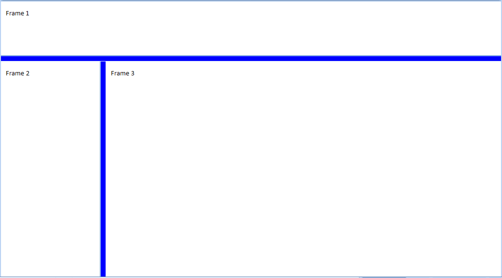
    
    以下属性定义了此框架集中分隔条的呈现方式：
    
    ```xml
    <w:frameset>
        <w:framesetSplitbar>
            <w:w w:val="200" />
            <w:color w:val="0000FF" />
        </w:framesetSplitbar>
        …
    </w:frameset>
    ```
    
    颜色元素的 val 属性指定，在显示文档内容时，分隔条必须以 RGB 颜色 0000FF（蓝色）显示。示例结束]
    
    ??? abstract "Attributes"
    
        - **主题颜色**（运行内容主题颜色）

            指定应用于当前运行的主题颜色。

            指定的主题颜色是对文档主题部分中预定义主题颜色的引用，这允许在文档中集中设置颜色信息。
            
            如果指定了 themeColor 属性，则此运行的 val 属性将被忽略。
            
            [示例：考虑使用文档主题部分中的 accent3 主题颜色显示一段文本。此要求将在生成的 WordprocessingML 中如下指定：
            
            ```xml
            <w:rPr>
                <w:color w:themeColor="accent3" />
            </w:rPr>
            ```
            
            颜色属性指定运行必须使用 accent3 主题颜色。示例结束]
            
            此属性的可能值由 ST_ThemeColor 简单类型定义（[§17.18.97]）。

        - **主题阴影**（运行内容主题颜色阴影）

            指定应用于此运行内容（如果有）的主题颜色的阴影值。
            
            如果提供了 themeTint，则将忽略此属性的值。
            
            如果提供了 themeShade，则将其应用于主题颜色的 RGB 值以确定应用于此运行的最终颜色。
            
            主题阴影值以十六进制编码存储，表示应用于当前边框的阴影值（0 到 255）。
            
            [示例：考虑将 40% 的阴影应用于文档中的一个运行。此阴影计算如下：
            
            ```text
            𝑆𝑥𝑚𝑙 = 0.4 ∗ 255
                = 102
                = 66(ℎ𝑒𝑥)
            ```
            
            文件格式中的结果是 themeShade 值为 66。示例结束]
            
            给定输入红色、绿色或蓝色颜色值 C（从 0-255）、输出颜色值 C'（从 0-255）和阴影值 S（从 0-100），阴影应用如下：
            
            \[C^{'} = \left (1 - \frac{s}{100}\right ) C\]
            
            [示例：考虑文档中的一个运行使用主题颜色 accent6，其 RGB 值（十六进制格式 RRGGBB）是 F79646。
            
            绿色分量的十六进制值是 96 - 十进制为 150。应用 50% 阴影的公式，绿色分量的输出十进制值为 75，或十六进制值为 4B。这个转换后的值可以在运行颜色 WordprocessingML 的 val 属性中看到：
            
            ```xml
            <w:color w:val="7B4B23" w:themeColor="accent6"
            w:themeShade="80" />
            ```
            
            示例结束]
            
            此属性的可能值由 ST_UcharHexNumber 简单类型定义（[§17.18.98]）。

        - **主题色调**（运行内容主题颜色色调）

            指定应用于此运行内容（如果有）的主题颜色的色调值。
            
            如果提供了 themeTint，则将其应用于主题颜色的 RGB 值以确定应用于此运行的最终颜色。
            
            主题色调值以十六进制编码存储，表示应用于当前边框的色调值（0 到 255）。
            
            [示例：考虑将 60% 的色调应用于文档中的一个运行。此色调计算如下：
            
            ```text
            𝑆𝑥𝑚𝑙 = 0.6 ∗ 255
                = 153
                = 99(ℎ𝑒𝑥)
            ```
            
            文件格式中的结果是 themeTint 值为 99。示例结束]
            
            给定输入红色、绿色或蓝色颜色值 C（从 0-255）、输出颜色值 C'（从 0-255）和色调值 T（从 0-100），色调应用如下：
            
            \[c' = \left ( 1 - \frac{T}{100}  \right )(255 - C) + C \]
            
            [示例：考虑文档中的一个运行使用主题颜色 accent1，其 RGB 值（十六进制格式 RRGGBB）是 C0504D。
            
            绿色分量的十六进制值是 50 - 十进制为 80。应用 60% 色调的公式，绿色分量的输出十进制值为 150，或十六进制值为 96。这个转换后的值可以在运行颜色的 WordprocessingML val 属性中看到：
            
            ```xml
            <w:color w:val="D99694" w:themeColor="accent1" w:themeTint="99"/>
            ```
            
            示例结束]
            
            此属性的可能值由 ST_UcharHexNumber 简单类型定义（[§17.18.98]）。

        - **val**（运行内容颜色）
            
            指定此运行的颜色。
                
            此颜色可以以十六进制值（RRGGBB 格式）呈现，或 auto 以允许使用者适当自动确定运行颜色。
            
            如果运行通过 themeColor 属性指定使用主题颜色，则此值将被主题颜色值取代。
            
            [示例：考虑值 auto 的运行颜色，如下：
            
            ```xml
            <w:rPr>
                <w:color … w:val="auto" />
            </w:rPr>
            
            因此，此颜色可以由使用者适当自动修改，例如，为确保运行内容可以与页面背景色区分开来。示例结束]
            
            此属性的可能值由 ST_HexColor 简单类型定义（[§17.18.38]）。
    
    [Note: The W3C XML Schema definition of this element’s content model (CT_Color) is located in §A.1. end note]

=== "英文"

    This element specifies the color of the splitters within the frameset in this WordprocessingML document. This element shall only be honored on the root frameset for this document, and can be ignored for all nested framesets in this document.
    
    If this element is omitted, then the default color of the splitter can be automatically determined by the application displaying this WordprocessingML document (equivalent to a val attribute value of auto).
    
    [Example: Consider a frameset consisting of the following three frames:
    
    
    
    The following properties define the presentation of the splitter bars within this frameset:
    
    ```xml
    <w:frameset>
        <w:framesetSplitbar>
            <w:w w:val="200" />
            <w:color w:val="0000FF" />
        </w:framesetSplitbar>
        …
    </w:frameset>
    ```
    
    The color element's val attribute specifies that the splitters must be displayed in the RGB color 0000FF (blue) when the contents of this document are displayed. end example]
    
    ??? abstract "Attributes"
    
        **themeColor** (Run Content Theme Color)
    
        :   Specifies a theme color which should be applied to the current run.
    
            The specified theme color is a reference to one of the predefined theme colors, located in the document's Theme part, which allows for color information to be set centrally in the document.
    
            If the themeColor attribute is specified, then the val attribute is ignored for this run. 
    
            [Example: Consider a run of text which should be displayed using the accent3 theme color from the document’s Theme part. This requirement would be specified as follows in the resulting WordprocessingML:
            
            ```xml
            <w:rPr>
                <w:color w:themeColor="accent3" />
            </w:rPr>
            ```
            
            The color attribute specifies that the run must use the accent3 theme color. end example]
            
            The possible values for this attribute are defined by the ST_ThemeColor simple type ([§17.18.97]).
    
        **themeShade** (Run Content Theme Color Shade)
    
        :   Specifies the shade value applied to the supplied theme color (if any) for this run’s contents.
    
            If the themeTint is supplied, the value of this attribute shall be ignored.
    
            If the themeShade is supplied, then it is applied to the RGB value of the theme color to determine the final color applied to this run.
    
            The themeShade value is stored as a hex encoding of the shade value (from 0 to 255) applied to the current border.
            
            [Example: Consider a shade of 40% applied to a run in a document. This shade is calculated as follows:
    
            ```text
            𝑆𝑥𝑚𝑙 = 0.4 ∗ 255
                = 102
                = 66(ℎ𝑒𝑥)
            ```
    
            The resulting themeShade value in the file format would be 66. end example]
    
            Given an input red, green, or blue color value C (from 0-255), an output color value of C' (from 0-255), and a shade value S (from 0-100), the shade is applied as follows:
    
            $$C^{'} = \left (1 - \frac{s}{100}\right ) C$$
    
            [Example: Consider a document with a run using the accent6 theme color, whose RGB value (in RRGGBB hex format) is F79646.
    
            The hex value for the green component is 96 - 150 in decimal. Applying the shade formula with shade of 50%, the output decimal value of the green component is 75, or a hex value of 4B. This transformed value can be seen in the resulting run color WordprocessingML's val attribute:
    
            ```xml
            <w:color w:val="7B4B23" w:themeColor="accent6"
            w:themeShade="80" />
            ```
            
            end example]
            
            The possible values for this attribute are defined by the ST_UcharHexNumber simple type ([§17.18.98]).
    
        **themeTint** (Run Content Theme Color Tint)
    
        :   Specifies the tint value applied to the supplied theme color (if any) for this run’s contents.
    
            If the themeTint is supplied, then it is applied to the RGB value of the theme color to determine the final color applied to this run.
            
            The themeTint value is stored as a hex encoding of the tint value (from 0 to 255) applied to the current border.
            
            [Example: Consider a tint of 60% applied to a run in a document. This tint is calculated as follows:
    
            ```text
            𝑆𝑥𝑚𝑙 = 0.6 ∗ 255
                = 153
                = 99(ℎ𝑒𝑥)
            ```
    
            The resulting themeTint value in the file format would be 99. end example]
    
            Given an input red, green, or blue color value C (from 0-255), an output color value of C' (from 0-255), and a tint value T (from 0-100), the tint is applied as follows:
    
            $$c' = \left ( 1 - \frac{T}{100}  \right )(255 - C) + C $$
    
            [Example: Consider a document with a run using the accent1 theme color, whose RGB value (in RRGGBB hex format) is C0504D.
            
            The hex value for the green component is 50 - 80 in decimal. Applying the tint formula with tint of 60%, the output decimal value of the green component is 150, or a hex value of 96. This transformed value can be seen in the resulting run color's WordprocessingML val attribute:
    
            ```xml
            <w:color w:val="D99694" w:themeColor="accent1" w:themeTint="99"/>
            ```
            
            end example]
            
            The possible values for this attribute are defined by the ST_UcharHexNumber simple type ([§17.18.98]).
    
        **val** (Run Content Color)
    
        :   Specifies the color for this run.
            
            This color can either be presented as a hex value (in RRGGBB format), or auto to allow a consumer to automatically determine the run color as appropriate.
            
            If the run specifies the use of a theme color via the themeColor attribute, then this value is superseded by the theme color value.
            
            [Example: Consider a run color with value auto, as follows:
            
            ```xml
            <w:rPr>
                <w:color … w:val="auto" />
            </w:rPr>
            
            This color therefore can be automatically be modified by a consumer as appropriate, for example, in order to ensure that the run contents can be distinguished against the page's background color. end example]
            
            The possible values for this attribute are defined by the ST_HexColor simple type ([§17.18.38]).
    
    [Note: The W3C XML Schema definition of this element’s content model (CT_Color) is located in §A.1. end note]


### 17.15.2.6 div (有关单个 HTML div 元素的信息)

**div (Information About Single HTML div Element)**

=== "中文"

    This element specifies information about a single HTML div, body, or blockquote element which was included in this document, so that that information (which is stored on a logical structure with no direct analog in WordprocessingML) can be maintained when an HTML document is stored in the WordprocessingML format.
    
    The div element stores the following information about these structures:
    
    - The child HTML div, and blockquote elements
    - The borders for the element
    - The margins for the element
    
    When the resulting WordprocessingML document is displayed by an application, the settings specified by this information shall be reflected in the formatting of the resulting paragraphs (i.e. this information shall not only be used when the document is resaved in the HTML format).
    
    [Example: Consider a simple HTML document defined as follows:
    
    ```xml
    <html>
        <body>
            <div style="border-left-style: solid; border-left-width: 1px; border-right-
            style: solid; border-right-width: 1px; padding-left: 4px; padding-right: 4px;
            padding-top: 1px; padding-bottom: 1px; margin-left: 50px">
                <p>Paragraph one.</p>
                <p>Paragraph two.</p>
            </div>
        </body>
    </html>
    ```
    
    This HTML would therefore normally appear as follows (image scaled appropriately):
    
    
    
    The div element specifies all margin and border information about the single HTML div structures in the document; in this case, the left indentation and the left and right borders. end example]
    
    ??? abstract "Attributes"
    
        - **id** (div Data ID)
    
            Specifies a unique decimal number which shall be used to associate one or more structures in the WordprocessingML content with this HTML div information.
            
            When a WordprocessingML structure (a paragraph or a table row) is associated with div information, it shall be associated with the set of information which most immediately contains the current object.
            
            [Example: If a paragraph is wrapped within two HTML div elements, like this:
            
            ```html
            <div>
                <div>
                    <p>Paragraph</p>
                </div>
            </div>
            ```
            
            The resulting WordprocessingML paragraph must reference the div Data ID associated with the inner HTML div element - the fact that it is also contained within the outer HTML div must be implied by the nesting of the corresponding WordprocessingML div elements in the web settings part. end example]
            
            The ID specified by this attribute is then referenced by the divId element for all structures which are immediately contained within the specified HTML div.
            
            [Example: Consider a simple HTML document defined as follows:
            
            ```html
            <html>
                <body style=" margin-top:50px">
                    <p>Paragraph one.</p>
                    <div style="margin-left:50px">
                        <p>Paragraph two.</p>
                    </div>
                </body>
            </html>
            ```
            
            If the outer and inner body and div elements were assigned id attributes as follows:
            
            ```xml
            <w:divs>
                <w:div w:id="1626542603">
                    <w:bodyDiv w:val="1" />
                    …
                    <w:divsChild>
                        <w:div w:id="313534916">
                            …
                        </w:div>
                    </w:divsChild>
                </w:div>
            </w:divs>
            ```
            
            Then the first paragraph would reference the div ID of the outer div (since it is contained by the HTML body element) and the second paragraph would reference the div ID of the inner div (since it is contained within the child HTML div element), as follows:
            
            ```xml
            <w:p>
                <w:pPr>
                    <w:divId w:val="1626542603" />
                </w:pPr>
                <w:r>
                    <w:t>Paragraph one.</w:t>
                </w:r>
            </w:p>
            <w:p>
                <w:pPr>
                    <w:divId w:val="313534916" />
                </w:pPr>
                <w:r>
                    <w:t>Paragraph one.</w:t>
                </w:r>
            </w:p>
            ```
            
            The id attributes on the div elements link each paragraph with the corresponding container div element. end example]
            
            The possible values for this attribute are defined by the ST_DecimalNumber simple type ([§17.18.10]).
    
    [Note: The W3C XML Schema definition of this element’s content model (CT_Div) is located in §A.1. end note]

=== "英文"

    This element specifies information about a single HTML div, body, or blockquote element which was included in this document, so that that information (which is stored on a logical structure with no direct analog in WordprocessingML) can be maintained when an HTML document is stored in the WordprocessingML format.
    
    The div element stores the following information about these structures:
    
    - The child HTML div, and blockquote elements
    - The borders for the element
    - The margins for the element
    
    When the resulting WordprocessingML document is displayed by an application, the settings specified by this information shall be reflected in the formatting of the resulting paragraphs (i.e. this information shall not only be used when the document is resaved in the HTML format).
    
    [Example: Consider a simple HTML document defined as follows:
    
    ```xml
    <html>
        <body>
            <div style="border-left-style: solid; border-left-width: 1px; border-right-
            style: solid; border-right-width: 1px; padding-left: 4px; padding-right: 4px;
            padding-top: 1px; padding-bottom: 1px; margin-left: 50px">
                <p>Paragraph one.</p>
                <p>Paragraph two.</p>
            </div>
        </body>
    </html>
    ```
    
    This HTML would therefore normally appear as follows (image scaled appropriately):
    
    
    
    The div element specifies all margin and border information about the single HTML div structures in the document; in this case, the left indentation and the left and right borders. end example]
    
    ??? abstract "Attributes"
    
        - **id** (div Data ID)
    
            Specifies a unique decimal number which shall be used to associate one or more structures in the WordprocessingML content with this HTML div information.
            
            When a WordprocessingML structure (a paragraph or a table row) is associated with div information, it shall be associated with the set of information which most immediately contains the current object.
            
            [Example: If a paragraph is wrapped within two HTML div elements, like this:
            
            ```html
            <div>
                <div>
                    <p>Paragraph</p>
                </div>
            </div>
            ```
            
            The resulting WordprocessingML paragraph must reference the div Data ID associated with the inner HTML div element - the fact that it is also contained within the outer HTML div must be implied by the nesting of the corresponding WordprocessingML div elements in the web settings part. end example]
            
            The ID specified by this attribute is then referenced by the divId element for all structures which are immediately contained within the specified HTML div.
            
            [Example: Consider a simple HTML document defined as follows:
            
            ```html
            <html>
                <body style=" margin-top:50px">
                    <p>Paragraph one.</p>
                    <div style="margin-left:50px">
                        <p>Paragraph two.</p>
                    </div>
                </body>
            </html>
            ```
            
            If the outer and inner body and div elements were assigned id attributes as follows:
            
            ```xml
            <w:divs>
                <w:div w:id="1626542603">
                    <w:bodyDiv w:val="1" />
                    …
                    <w:divsChild>
                        <w:div w:id="313534916">
                            …
                        </w:div>
                    </w:divsChild>
                </w:div>
            </w:divs>
            ```
            
            Then the first paragraph would reference the div ID of the outer div (since it is contained by the HTML body element) and the second paragraph would reference the div ID of the inner div (since it is contained within the child HTML div element), as follows:
            
            ```xml
            <w:p>
                <w:pPr>
                    <w:divId w:val="1626542603" />
                </w:pPr>
                <w:r>
                    <w:t>Paragraph one.</w:t>
                </w:r>
            </w:p>
            <w:p>
                <w:pPr>
                    <w:divId w:val="313534916" />
                </w:pPr>
                <w:r>
                    <w:t>Paragraph one.</w:t>
                </w:r>
            </w:p>
            ```
            
            The id attributes on the div elements link each paragraph with the corresponding container div element. end example]
            
            The possible values for this attribute are defined by the ST_DecimalNumber simple type ([§17.18.10]).
    
    [Note: The W3C XML Schema definition of this element’s content model (CT_Div) is located in §A.1. end note]

### 17.15.2.7 divBdr (HTML div 的边框集)

**divBdr (Set of Borders for HTML div)**

=== "中文"

    此元素指定当前 HTML div、body 或 blockquote 元素边界的边框集合，使用其子元素定义的四种边框类型。
    
    如果省略此元素，则当前 HTML div、body 或 blockquote 元素将不具有任何边框。
    
    [示例：考虑如下定义的一个简单 HTML 文档：
    
    ```html
    <html>
        <body>
            <div style=" border-left-style:solid; border-right-style:groove; border-right-width:3px; border-top-style:dashed; border-top-width:3px; border-bottom-style:outset; border-bottom-width:3px">
                <p>段落文本</p>
            </div>
        </body>
    </html>
    ```
    
    因此，这个 HTML 通常将显示如下（图像按比例缩放）：
    
    
    
    ```xml
    <w:divs>
        <w:div w:id="1785730240">
            …
            <w:divBdr>
                <w:top w:val="dashed" w:sz="18" w:space="7" w:color="auto" />
                <w:left w:val="single" w:sz="24" w:space="4" w:color="auto" />
                <w:bottom w:val="outset" w:sz="18" w:color="auto" />
                <w:right w:val="threeDEngrave" w:sz="6" w:color="auto" />
            </w:divBdr>
        </w:div>
    </w:divs>
    ```
    
    divBdr 元素指定文档中单个 HTML div 结构的边框信息。示例结束]
    
    [注：此元素内容模型（CT_DivBdr）的 W3C XML Schema 定义位于 §A.1。结束注]

=== "英文"

    This element specifies the set of borders for the boundaries of the current HTML div, body, or blockquote element, using the four border types defined by its child elements.
    
    If this element is omitted, then there shall be no borders associated with the current HTML v, body, or blockquote element.
    
    [Example: Consider a simple HTML document defined as follows:
    
    ```html
    <html>
        <body>
            <div style=" border-left-style:solid; border-right-style:groove; border-
                right-width:3px; border-top-style:dashed; border-top-width:3px; border-bottom-
                style:outset; border-bottom-width:3px">
                <p>paragraph of text</p>
            </div>
        </body>
    </html>
    ```
    
    This HTML would therefore normally appear as follows (image scaled appropriately):
    
    
    
    ```xml
    <w:divs>
        <w:div w:id="1785730240">
            …
            <w:divBdr>
                <w:top w:val="dashed" w:sz="18" w:space="7" w:color="auto" />
                <w:left w:val="single" w:sz="24" w:space="4" w:color="auto" />
                <w:bottom w:val="outset" w:sz="18" w:color="auto" />
                <w:right w:val="threeDEngrave" w:sz="6" w:color="auto" />
            </w:divBdr>
        </w:div>
    </w:divs>
    ```
    
    The divBdr element specifies border information about the single HTML div structure in the document. end example]
    
    [Note: The W3C XML Schema definition of this element’s content model (CT_DivBdr) is located in §A.1. end note]

### 17.15.2.8 divs (有关 HTML div 元素的信息)

**divs (Information about HTML div Elements)**

=== "中文"
    
    此元素指定了文档中包含的所有 HTML div 元素（以及 body 和 blockquote 元素）的所有信息，以便在将 HTML 文档存储为 WordprocessingML 格式时，能够保留这些信息（这些信息存储在没有直接对应项的逻辑结构上）。
    
    divs 元素存储了以下关于这些结构的信息：
    
    - HTML div、blockquote 和 body 元素的父子结构
    - 每个元素的边框
    - 每个元素的边距
    
    当应用程序显示生成的 WordprocessingML 文档时，应反映此信息中指定的设置在结果段落的格式设置中（即，这些信息不仅在文档重新保存为 HTML 格式时使用）。
    
    [示例：考虑如下定义的一个简单 HTML 文档：
    
    ```html
    <html>
        <body style="margin-left:200px;margin-top:50px">
            <p>段落一。</p>
            <blockquote style="border: 5px solid #00FFFF">
                <p>块引用中的段落。</p>
            </blockquote>
            <p>段落二。</p>
        </body>
    </html>
    ```
    
    因此，这个 HTML 通常将显示如下（图像按比例缩放）：
    
    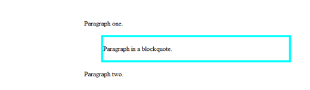
    
    现在，当此文档以 WordprocessingML 格式保存时，存储在 div、blockquote 和 body 元素上的信息在 web 设置部分存储如下：
    
    ```xml
    <w:divs>
        <w:div w:id="1626542603">
            <w:bodyDiv w:val="1" />
            <w:marLeft w:val="3000" />
            <w:marTop w:val="750" />
            …
            <w:divsChild>
                <w:div w:id="313534916">
                    <w:blockQuote w:val="1" />
                    <w:marLeft w:val="720" />
                    <w:marRight w:val="720" />
                    <w:marTop w:val="100" />
                    <w:marBottom w:val="100" />
                    <w:divBdr>
                        <w:top w:val="single" w:sz="36" w:color="00FFFF" />
                        <w:left w:val="single" w:sz="36" w:color="00FFFF" />
                        <w:right w:val="single" w:sz="36" w:color="00FFFF" />
                        <w:bottom w:val="single" w:sz="36" w:color="00FFFF" />
                    </w:divBdr>
                </w:div>
            </w:divsChild>
        </w:div>
    </w:divs>
    ```
    
    divs 元素指定了文档中必要的 HTML 结构的所有边距和边框信息；在本例中，body 元素和嵌套的 blockquote。示例结束]
    
    [注：此元素内容模型（CT_Divs）的 W3C XML Schema 定义位于 §A.1。结束注]

=== "英文"
    
    This element specifies all information about the set of HTML div elements (as well as the body and blockquote elements) which were included in this document, so that that information (which is stored on a logical structure with no direct analog in WordprocessingML) can be maintained when an HTML document is stored in the WordprocessingML format.
    
    The divs element stores the following information about these structures:
    
    - The parent/child structure of HTML div, blockquote, and body elements
    - The borders for each of these elements
    - The margins for each of these elements
    
    When the resulting WordprocessingML document is displayed by an application, the settings specified by this information shall be reflected in the formatting of the resulting paragraphs (i.e. this information shall not only be used when the document is resaved in the HTML format).
    
    [Example: Consider a simple HTML document defined as follows:
    
    ```html
    <html>
        <body style="margin-left:200px;margin-top:50px">
            <p>Paragraph one.</p>
            <blockquote style="border: 5px solid #00FFFF">
                <p>Paragraph in a blockquote.</p>
            </blockquote>
            <p>Paragraph two.</p>
        </body>
    </html>
    ```
    
    This HTML would therefore normally appear as follows (image scaled appropriately):
    
    
    
    Now, when this document is saved in the WordprocessingML format, the information stored on the div, blockquote, and body elements is stored in the web setting part as follows:
    
    ```xml
    <w:divs>
        <w:div w:id="1626542603">
            <w:bodyDiv w:val="1" />
            <w:marLeft w:val="3000" />
            <w:marTop w:val="750" />
            …
            <w:divsChild>
                <w:div w:id="313534916">
                    <w:blockQuote w:val="1" />
                    <w:marLeft w:val="720" />
                    <w:marRight w:val="720" />
                    <w:marTop w:val="100" />
                    <w:marBottom w:val="100" />
                    <w:divBdr>
                        <w:top w:val="single" w:sz="36" w:color="00FFFF" />
                        <w:left w:val="single" w:sz="36" w:color="00FFFF" />
                        <w:right w:val="single" w:sz="36" w:color="00FFFF" />
                        <w:bottom w:val="single" w:sz="36" w:color="00FFFF" />
                    </w:divBdr>
                </w:div>
            </w:divsChild>
        </w:div>
    </w:divs>
    ```
    
    The divs element specifies all of the margin and border information about the necessary HTML structures in the document; in this case, the body element and the nested blockquote. end example]
    
    [Note: The W3C XML Schema definition of this element’s content model (CT_Divs) is located in §A.1. end note]

### 17.15.2.9 divsChild (当前 div 中包含的子 div 元素)

**divsChild (Child div Elements Contained within Current div)**

=== "中文"

    此元素指定当前 HTML div、body 或 blockquote 元素中包含的 HTML div 或 blockquote 元素集合，从而建立这些元素的父子层级关系。
    
    当包含这些对象的 HTML 文档以 WordprocessingML 格式保存时，WordprocessingML 对象使用 divId 元素存储对其最直接的父 div、body 或 blockquote 元素的引用。
    
    然而，由于只存储了一个单一的引用，通常这些信息不足以确定原始 HTML div 数据适当的父子层级关系，以便可以正确应用。此元素允许存储该层级，因为子 HTML div 元素存储在 childDivs 元素中。
    
    [示例：考虑如下定义的一个简单 HTML 文档：
    
    ```xml
    <html>
        <body>
            <div style=" margin-top:50px">
                <p>段落一。</p>
                <div style="margin-left:50px">
                    <p>段落二。</p>
                </div>
            </div>
        </body>
    </html>
    ```
    
    如果外层和内层的 body 和 div 元素分别被赋予了 id 属性 1626542603 和 313534916，那么第一段会引用外层 div 的 div ID（因为它包含在那个 HTML div 元素内），第二段会引用内层 div 的 div ID（因为它包含在子 HTML div 元素内），如下所示：
    
    ```xml
    <w:p>
        <w:pPr>
            <w:divId w:val="1626542603" />
        </w:pPr>
        <w:r>
            <w:t>段落一。</w:t>
        </w:r>
    </w:p>
    <w:p>
        <w:pPr>
            <w:divId w:val="313534916" />
        </w:pPr>
        <w:r>
            <w:t>段落二。</w:t>
        </w:r>
    </w:p>
    ```
    
    然而，这些信息本身是不充分的 - 无法明确第二 div 是包含在还是仅仅与第一 div 相邻。
    
    为了保留这些信息，正确的层级关系存储在 web 设置部分：
    
    ```xml
    <w:divs>
        <w:div w:id="1626542603">
            …
            <w:divsChild>
                <w:div w:id="313534916">
                    …
                </w:div>
            </w:divsChild>
        </w:div>
    </w:divs>
    ```
    
    divsChild 元素包含第二个 div 作为第一个 div 的子元素，指定第一个 div 覆盖了两个段落。示例结束]
    
    [注：此元素内容模型（CT_Divs）的 W3C XML Schema 定义位于 §A.1。结束注]

=== "英文"

    This element specifies the set of HTML div or blockquote elements which are contained within the current HTML div, body, or blockquote element, establishing the parent/child hierarchy of the original set of these elements.
    
    When an HTML document containing these objects is saved in the WordprocessingML format, WordprocessingML objects store a reference to their most immediate parent div, body, or blockquote element using the divId element.
    
    However, since only a single reference is stored, this information is often insufficient to determine the appropriate parent/child hierarchy for the original HTML div data, so it can be applied appropriately. This element allows that hierarchy to be stored, as child HTML div elements are stored within the childDivs element.
    
    [Example: Consider a simple HTML document defined as follows:
    
    ```xml
    <html>
        <body>
            <div style=" margin-top:50px">
                <p>Paragraph one.</p>
                <div style="margin-left:50px">
                    <p>Paragraph two.</p>
                </div>
            </div>
        </body>
    </html>
    ```
    
    If the outer and inner body and div elements were assigned id attributes of 1626542603 and 313534916 respectively, then the first paragraph would reference the div ID of the outer div (since it is contained within that HTML div element) and the second paragraph would reference the div ID of the inner div (since it is contained within the child HTML div element), as follows:
    
    ```xml
    <w:p>
        <w:pPr>
            <w:divId w:val="1626542603" />
        </w:pPr>
        <w:r>
            <w:t>Paragraph one.</w:t>
        </w:r>
    </w:p>
    <w:p>
        <w:pPr>
            <w:divId w:val="313534916" />
        </w:pPr>
        <w:r>
            <w:t>Paragraph one.</w:t>
        </w:r>
    </w:p>
    ```
    
    However, this information alone is insufficient - it is unclear if the second div is contained within, or simply adjacent to, the first one.
    
    In order to preserve this information, the correct hierarchy is stored within the web settings part:
    
    ```xml
    <w:divs>
        <w:div w:id="1626542603">
            …
            <w:divsChild>
                <w:div w:id="313534916">
                    …
                </w:div>
            </w:divsChild>
        </w:div>
    </w:divs>
    ```
    
    The divsChild element contains the second div as a child of the first div, specifying that the first div covers both paragraphs. end example]
    
    [Note: The W3C XML Schema definition of this element’s content model (CT_Divs) is located in §A.1. end note]

### 17.15.2.10 doNotOrganizeInFolder (不要将支持文件放在子目录中)

**doNotOrganizeInFolder (Do Not Place Supporting Files in Subdirectory)**

=== "中文"
    
    此元素指定应用程序在将 WordprocessingML 文档的内容保存为网页时，不应自动将所有支持文件（作为该 HTML 网页一部分的图像等）放置在一个子目录中。通常，将文档作为由多个文件组成的网页保存的应用程序会将所有支持文件保存在主 HTML 文件旁边的子目录中（以保持这些文件的组织）。此元素指定文件应与实际网页位于同一目录中。
    
    如果从文档中省略此元素，则在将此文档作为网页保存时，所有支持文件应保存到主网页文件下的子目录中。
    
    [示例：考虑一个 WordprocessingML 文档，其中包含 web 设置部分中的以下内容：
    
    ```xml
    <w:webSettings>
        <w:doNotOrganizeInFolder w:val="true" />
    </w:webSettings>
    ```
    
    doNotOrganizeInFolder 元素的 val 属性值为 true，指定应用程序在将此 WordprocessingML 文档作为网页保存时，应将所有辅助文件保存在与主网页 HTML 文档相同的目录中。示例结束]
    
    此元素的内容模型由 [§17.17.4] 中定义的常见布尔属性定义。

=== "英文"
    
    This element specifies that applications shall not automatically place all supporting files (images which are part of this HTML web page, etc.) in a subdirectory when the contents of this WordprocessingML document are saved as a web page. Typically, applications which save a document as a web page consisting of multiple files save all supporting files in a subdirectory next to the main HTML file (in order to keep those files organized). This element specifies the files shall be placed in the same directory as the actual web page.
    
    If this element is omitted from the document, then all supporting files should be saved into a subdirectory beneath the main web page file when this document is saved as a web page.
    
    [Example: Consider a WordprocessingML document which contains the following content within the web settings part:
    
    ```xml
    <w:webSettings>
        <w:doNotOrganizeInFolder w:val="true" />
    </w:webSettings>
    ```
    
    The doNotOrganizeInFolder element has a val attribute value of true, which specifies that applications should save all supplementary files in the same directory as the main web page HTML document when saving this WordprocessingML document as a web page. end example]
    
    This element’s content model is defined by the common boolean property definition in [§17.17.4].

### 17.15.2.11 doNotRelyOnCSS (不要依赖 CSS 进行字体格式设置)

**doNotRelyOnCSS (Do Not Rely on CSS for Font Face Formatting)**

=== "中文"

    此元素指定在将 WordprocessingML 文档保存为网页时，应用程序是否可以依赖于 CSS 字体属性（即 font-family 属性）。如果使用此元素，则应使用 HTML 字体元素来代替或与这些 CSS 属性结合使用，以指定生成的网页的字体格式。
    
    如果省略此元素，应用程序可以根据自己的需要选择是否依赖于 CSS 字体属性。
    
    [注：此设置旨在让应用程序保存可以在不支持读取这些 CSS 属性的老版 Web 浏览器上支持的网页，以便在尝试读取和显示生成的网页时，最大化输出的保真度。结束注]
    
    [示例：考虑一个 WordprocessingML 文档，其中在 web 设置部分包含以下内容：
    
    ```xml
    <w:webSettings>
        <w:doNotRelyOnCSS w:val="true" />
    </w:webSettings>
    ```
    
    doNotRelyOnCSS 元素的 val 属性值为 true，指定应用程序在将此 WordprocessingML 文档保存为网页时应包含 HTML 字体元素。例如，这个输出：
    
    ```xml
    <span style='font-family:"Courier New"'>text</span>
    ```
    
    将被保存为以下形式：
    
    ```xml
    <font face="Courier New"><span style='font-family:"Courier New"'>text</span></font>
    ```
    
    示例结束]
    
    此元素的内容模型由 [§17.17.4] 中定义的常见布尔属性定义。

=== "英文"

    This element specifies whether applications can rely on the CSS properties for font face (the font-family property) when saving this WordprocessingML document as a web page. If this element is utilized, then the HTML font element should be used either in place of or in concert with these CSS properties in order to specify the font face formatting for the resulting web page.
    
    If this element is omitted, then applications can choose to rely on the CSS properties for font face as desired.
    
    [Note: This setting is intended for applications to save web pages which can be supported by legacy web browsers which do not support the reading of these CSS properties when attempting to read and display the resulting web page, in order to maximize the fidelity of the resulting output. end note]
    
    [Example: Consider a WordprocessingML document which contains the following content within the web settings part:
    
    ```xml
    <w:webSettings>
        <w:doNotRelyOnCSS w:val="true" />
    </w:webSettings>
    ```
    
    The doNotRelyOnCSS element has a val attribute value of true, which specifies that applications should include
    the HTML font element when saving this WordprocessingML document as a web page. For example, this
    output:
    
    ```xml
    <span style='font-family:"Courier New"'>text</span>
    ```
    
    This output would instead be saved as follows:
    
    ```xml
    <font face="Courier New"><span style='font-family:"Courier
    New"'>text</span></font>
    ```
    
    end example]
    
    This element’s content model is defined by the common boolean property definition in [§17.17.4].

### 17.15.2.12 doNotSaveAsSingleFile (推荐网页格式而不是单一文件网页格式)

**doNotSaveAsSingleFile (Recommend Web Page Format over Single File Web Page Format)**

=== "中文"

    此元素指定应用程序在将 WordprocessingML 文档保存为 HTML 网页时，应推荐使用多文件格式（HTML），而不是单文件格式（MHTML）。此设置不会阻止使用 MHTML 格式；它只会在保存为网页时导致应用程序推荐（通过默认设置）非单文件格式。
    
    [注：此设置主要用于明确支持“另存为网页…”操作的应用程序，以确定生成的网页的默认设置。结束注]
    
    [示例：考虑 WordprocessingML 文档在 web 设置部分包含以下内容：
    
    ```xml
    <w:webSettings>
        <w:doNotSaveAsSingleFile w:val="true" />
    </w:webSettings>
    ```
    
    doNotSaveAsSingleFile 元素指定，在随后将此文档保存为网页时，应用程序应推荐使用多文件格式。示例结束]
    
    此元素的内容模型由 [§17.17.4] 中定义的常见布尔属性定义。

=== "英文"

    This element specifies that applications should recommend that new web page files generated using this WordprocessingML document use a multi-file web page format (HTML), rather than a single-file web page format (MHTML) when this document is saved as an HTML web page. This setting shall not prevent the use of the MHTML format; it shall only cause applications to recommend (via a default) a non single-file format when saving as a web page.
    
    [Note: This setting is primarily intended for applications which explicitly support a "Save as Web Page…" action, in order to determine the default setting for the resulting web page. end note]
    
    [Example: Consider a WordprocessingML document which contains the following content within the web
    settings part:
    
    ```xml
    <w:webSettings>
        <w:doNotSaveAsSingleFile w:val="true" />
    </w:webSettings>
    ```
    
    The doNotSaveAsSingleFile element specifies that applications should recommend a multi-file web page format when this document is subsequently saved as a web page. end example]
    
    This element’s content model is defined by the common boolean property definition in [§17.17.4].

### 17.15.2.13 doNotUseLongFileNames (请勿使用长度超过 8.3 个字符的文件名)

**doNotUseLongFileNames (Do Not Use File Names Longer than 8.3 Characters)**

=== "中文"

    此元素指定应用程序在将此文档保存为网页时，应确保生成的所有文件的文件名不超过八个字符的主体加上三个字符的扩展名。这包括所有支持文件（作为该 HTML 网页一部分的图像等）。生成的文件名不区分大小写。
    
    [注：此设置旨在让应用程序保存可以在不支持读取长文件名的老版 Web 浏览器上支持的网页，以便在尝试读取和显示生成的网页时，最大化输出的保真度。结束注]
    
    [示例：考虑一个 WordprocessingML 文档，在 web 设置部分包含以下内容：
    
    ```xml
    <w:webSettings>
        <w:doNotUseLongFileNames w:val="true" />
    </w:webSettings>
    ```
    
    doNotUseLongFileNames 元素指定应用程序在随后将此文档保存为网页时，应确保生成的所有文件名不超过 8.3 个字符的文件名限制。示例结束]
    
    此元素的内容模型由 [§17.17.4] 中定义的常见布尔属性定义。

=== "英文"

    This element specifies that applications shall ensure that the file names for all files generated when saving this document as a web page do not exceed eight octets with a three octet extension. This includes all supporting files (images which are part of this HTML web page, etc.). The file names generated are not case-sensitive.
    
    [Note: This setting is intended for applications to save web pages which can be supported by legacy web browsers which do not support the reading of long file names when attempting to read and display the resulting web page. end note]
    
    [Example: Consider a WordprocessingML document which contains the following content within the web settings part:
    
    ```xml
    <w:webSettings>
        <w:doNotUseLongFileNames w:val="true" />
    </w:webSettings>
    ```
    
    The doNotUseLongFileNames element specifies that applications should ensure that all file names generated when this document is subsequently saved as a web page do not exceed the 8.3 octet file name limitation. end example]
    
    This element’s content model is defined by the common boolean property definition in [§17.17.4].

### 17.15.2.14 encoding (另存为网页时的输出编码)

**encoding (Output Encoding When Saving as Web Page)**

=== "中文"

    此元素指定将 WordprocessingML 文档保存为 HTML 网页时，应使用的编码。支持此元素的编码集应来源于 http://www.iana.org/assignments/character-sets 提供的标准字符集定义。
    
    如果省略此元素，则在将文档保存为网页时，将使用当前系统的默认编码。如果 val 属性的值未知或不被应用程序支持，则在将文档保存为网页时，也将使用当前系统的默认编码。
    
    [示例：考虑 WordprocessingML 文档在 web 设置部分包含以下内容：
    
    ```xml
    <w:webSettings>
        <w:encoding w:val="utf-8" />
    </w:webSettings>
    ```
    
    encoding 元素的 val 属性值为 utf-8，指定在将此文档保存为网页时，必须以 UTF-8 格式进行编码。示例结束]
        
    ??? abstract "Attributes"
    
        - **val** (字符串值)

            指定其内容包含一个字符串。
            
            这个字符串的内容根据父XML元素的上下文来解释。
            
            [示例：考虑以下WordprocessingML片段：
            
            ```xml
            <w:pPr>
                <w:pStyle w:val="Heading1" />
            </w:pPr>
            ```
            
            val属性的值是关联段落样式的styleId的ID。
            然而，考虑以下片段：
            
            ```xml
            <w:sdtPr>
            <w:alias w:val="SDT Title Example" />
            …
            </w:sdtPr>
            ```
            
            在这种情况下，val属性中的十进制数字是最接近的结构化文档标签的标题。在每种情况下，该值都是在父元素的上下文中解释的。结束示例]
    
            此属性的可能值由ST_String简单类型定义（[§22.9.2.13]）。
            
    [Note: The W3C XML Schema definition of this element’s content model (CT_String) is located in §A.1. end note]

=== "英文"

    This element specifies the encoding which shall be used for the contents of this WordprocessingML document when it is saved as an HTML web page. The set of encodings supported by this element shall be derived from the standard set of character set definitions provided at http://www.iana.org/assignments/character-sets.
    
    If this element is omitted, then the default encoding for the current system shall be used when this document is saved as a web page. If the value of the val attribute is unknown or supported by an application, then the default encoding for the current system shall be used when this document is saved as a web page.
    
    [Example: Consider a WordprocessingML document which contains the following content within the web settings part:
    
    ```xml
    <w:webSettings>
        <w:encoding w:val="utf-8" />
    </w:webSettings>
    ```
    
    The encoding element's val attribute has a value of utf-8, which specifies that this document must be encoded in the UTF-8 format when it is saved as a web page. end example]
        
    ??? abstract "Attributes"
    
        - **val** (String Value)
        
            Specifies that its contents contain a string.
        
            The contents of this string are interpreted based on the context of the parent XML element.
            
            [Example: Consider the following WordprocessingML fragment:
            
            ```xml
            <w:pPr>
            <w:pStyle w:val="Heading1" />
            </w:pPr>
            ```
            
            The value of the val attribute is the ID of the associated paragraph style's styleId.
            
            However, consider the following fragment:
            
            ```xml
            <w:sdtPr>
            <w:alias w:val="SDT Title Example" />
            …
            </w:sdtPr>
            ```
            
            In this case, the decimal number in the val attribute is the caption of the nearest ancestor structured document tag. In each case, the value is interpreted in the context of the parent element. end example]
            
            The possible values for this attribute are defined by the ST_String simple type ([§22.9.2.13]).
            
    [Note: The W3C XML Schema definition of this element’s content model (CT_String) is located in §A.1. end note]

### 17.15.2.15 flatBorders (框架集分割器边框样式)

**flatBorders (Frameset Splitter Border Style)**

=== "中文"

    此元素指定 WordprocessingML 文档中框架集内分隔条的 3D 样式。此元素仅应用于文档的根框架集，并且可以忽略文档中所有嵌套框架集。当启用此属性时，该框架集的边框应为平面（非 3D），否则在显示时可以呈现为 3D 分隔条。
    
    如果省略此元素，则分隔条的默认样式应为 3D 分隔条。
    
    [示例：考虑由以下三个框架组成的框架集：
    
    
    
    以下属性定义了此框架集中分隔条的呈现方式：
    
    ```xml
    <w:frameset>
        <w:framesetSplitbar>
            <w:w w:val="200" />
            <w:color w:val="0000FF" />
            <w:flatBorders w:val="true" />
        </w:framesetSplitbar>
        …
    </w:frameset>
    ```
    
    flatBorders 元素的 val 属性值为 true，指定分隔条的样式必须是平面的（显示时分隔条可能不是 3D）。示例结束]
    
    此元素的内容模型由 [§17.17.4] 中定义的常见布尔属性定义。

=== "英文"

    This element specifies the 3D style of the splitters within the frameset in this WordprocessingML document. This element shall only be honored on the root frameset for this document, and can be ignored for all nested framesets in this document. When this property is turned on, the borders for this frameset shall be flat (not 3D), otherwise they can be presented as 3D splitter when they are displayed.
    
    If this element is omitted, then the default style of the splitter should be a 3D splitter.
    
    [Example: Consider a frameset consisting of the following three frames:
    
    
    
    The following properties define the presentation of the splitter bars within this frameset:
    
    ```xml
    <w:frameset>
        <w:framesetSplitbar>
            <w:w w:val="200" />
            <w:color w:val="0000FF" />
            <w:flatBorders w:val="true" />
        </w:framesetSplitbar>
        …
    </w:frameset>
    ```
    
    The flatBorders element's val attribute has a value of true, which specifies that the style of the splitters must be flat (the splitter might not be 3D when displayed). end example]
    
    This element’s content model is defined by the common boolean property definition in [§17.17.4].

### 17.15.2.16 frame (单个框架属性)

**frame (Single Frame Properties)**

=== "中文"

    此元素指定框架集中单个框架的属性。当文档使用框架集元素定义框架集时，该框架集由一组框架组成，每个框架由单个框架元素指定。
    
    [示例：考虑一个 WordprocessingML 文档，它作为包含以下三个框架的框架集容器：
    
    
    
    此文档的框架集属性由以下 WordprocessingML 在网页设置中指定：
    
    ```xml
    <w:frameset>
        …
        <w:frame>
            <w:sz w:val="20%" />
            <w:name w:val="Frame 1" />
            <w:sourceFileName r:id="rId1" />
        </w:frame>
        <w:frameset>
            …
        </w:frameset>
    </w:frameset>
    ```
    
    框架元素指定文档中单个框架的属性集。在本例中，这些属性（上图中标记为 Frame 1 的框架）指定框架必须具有以下属性：
    
    - 占文档高度的 20%
    - 名称为 Frame 1
    - 框架的内容必须来自关系 ID 为 rId1 的文档
    
    示例结束]
    
    [注：此元素内容模型（CT_Frame）的 W3C XML Schema 定义位于 §A.1。结束注]

=== "英文"

    This element specifies the properties for a single frame within a frameset document. When a document defines a frameset using the frameset element; that frameset is composed of a set of frames, each of which is specified by a single frame element.
    
    [Example: Consider a WordprocessingML document which serves as the frameset container for a frameset consisting of the following three frames:
    
    
    
    The frameset properties for this document are specified by the following WordprocessingML within the web page settings:
    
    ```xml
    <w:frameset>
        …
        <w:frame>
            <w:sz w:val="20%" />
            <w:name w:val="Frame 1" />
            <w:sourceFileName r:id="rId1" />
        </w:frame>
        <w:frameset>
            …
        </w:frameset>
    </w:frameset>
    ```
    
    The frame element specifies the set of properties for a single frame in the document. In this case, these properties (for the frame marked with Frame 1 in the diagram above) specify that the frame must have the following properties:
    
    - A height of 20% of the height of the document
    - A name of Frame 1
    - The contents of the frame must be pulled from the document that is the target of the relationship with ID rId1
    
    end example]
    
    [Note: The W3C XML Schema definition of this element’s content model (CT_Frame) is located in §A.1. end note]


### 17.15.2.17 frameLayout (框架集布局)

**frameLayout (Frameset Layout)**

=== "中文"

    此元素指定框架集（以及嵌套框架集）中框架的显示顺序。创建框架集时，它只能包含按一个方向堆叠的框架：
    
    - 垂直地（一个接一个）
    - 水平地（一个挨着另一个）
    
    该元素指定此框架集中框架的堆叠方式，这也将用于解释 sz 元素（[§17.15.2.39]）为每个框架定义的大小。为了确定此框架集中组成框架的顺序，应使用子框架和框架集元素的顺序。
    
    如果省略此元素，则此框架集中的框架将垂直堆叠在一起（一行框架集）。
    
    [示例：考虑一个 WordprocessingML 文档，它作为包含以下三个框架的框架集容器：
    
    
    
    ```xml
    <w:frameset>
        …
        <w:frameLayout w:val="rows" />
        <w:frame>
        …
        </w:frame>
        <w:frameset>
            <w:frameLayout w:val="cols" />
            <w:frame>
                …
            </w:frame>
            <w:frame>
                …
            </w:frame>
        </w:frameset>
    </w:frameset>
    ```
    
    frameLayout 元素指定外部框架集由单个框架和垂直堆叠的子框架集组成，以及由两个水平堆叠的框架组成的内部嵌套框架集。示例结束]
    
    ??? abstract "Attributes"
    
        - **val** (框架集布局值)
    
            指定用于显示此框架集中框架和嵌套框架集内容的布局类型，由下面引用的简单类型定义。
            
            [示例：考虑 WordprocessingML 文档中定义的框架集布局设置：
            
            ```xml
            <w:frameset>
                <w:frameLayout w:val="cols" />
                …
            </w:frameset>
            ```
            
            val 属性值 cols 指定此框架集的内容必须水平堆叠（在列中）。示例结束]
            
            此属性的可能值由 ST_FrameLayout 简单类型定义（[§17.18.31]）。
    
    [Note: The W3C XML Schema definition of this element’s content model (CT_FrameLayout) is located in §A.1. end note]

=== "英文"

    This element specifies the order in which the frames (and nested framesets) in a frameset shall be displayed. When a frameset is created, it can only contain frames which are stacked in one direction:
    
    - Vertically (one on top of another)
    - Horizontally (one next to another)
    
    This element specifies how the frames in this frameset are stacked, which shall also be used to interpret the sizes defined by the sz element ([§17.15.2.39]) for each frame. In order to determine the ordering of the constituent frames within this frameset, the ordering of the child frame and frameset elements shall be used.
    
    If this element is omitted, then the frames in this frameset shall be stacked vertically on top of one another (a row frameset).
    
    [Example: Consider a WordprocessingML document which serves as the frameset container for a frameset consisting of the following three frames:
    
    
    
    ```xml
    <w:frameset>
        …
        <w:frameLayout w:val="rows" />
        <w:frame>
        …
        </w:frame>
        <w:frameset>
            <w:frameLayout w:val="cols" />
            <w:frame>
                …
            </w:frame>
            <w:frame>
                …
            </w:frame>
        </w:frameset>
    </w:frameset>
    ```
    
    The frameLayout element specifies that the outer frameset is a consists of the single frame and the child frameset stacked vertically, and an inner nested frameset consisting of two frames stacked horizontally. end example]
    
    ??? abstract "Attributes"
    
        - **val** (Frameset Layout Value)
    
            Specifies the type of layout which shall be used to display the contents of the frames and nested framesets within this frameset, as defined by the simple type referenced below.
            
            [Example: Consider a frameset definition within a WordprocessingML document which defines the following frameset layout setting:
            
            ```xml
            <w:frameset>
                <w:frameLayout w:val="cols" />
                …
            </w:frameset>
            ```
            
            The val attribute value of cols specifies that the contents of this frameset must be stacked horizontally (in columns). end example]
            
            The possible values for this attribute are defined by the ST_FrameLayout simple type ([§17.18.31]).
    
    [Note: The W3C XML Schema definition of this element’s content model (CT_FrameLayout) is located in §A.1. end note]

### 17.15.2.18 frameset (嵌套框架集定义)

**frameset (Nested Frameset Definition)**

=== "中文"

    此元素指定在 WordprocessingML 文档中另一个框架集内的嵌套框架集。这个 WordprocessingML 元素类似于 HTML 中的 frameset 元素（当该 frameset 是另一个 frameset 元素的子元素时）。
    
    [示例：考虑一个 WordprocessingML 文档，它作为包含以下三个框架的框架集容器：
    
    
    
    此文档的框架集属性由以下 WordprocessingML 在网页设置中指定：
    
    ```xml
    <w:frameset>
        <w:frameLayout w:val="rows" />
        <w:frame>
            …
        </w:frame>
        <w:frameset>
            <w:frameLayout w:val="cols" />
            <w:frame>
                …
            </w:frame>
            <w:frame>
                …
            </w:frame>
        </w:frameset>
    </w:frameset>
    ```
    
    子 frameset 元素指定内部框架集的框架集定义；该框架集由两个框架（上图中的 Frame 2 和 Frame 3）组成，它们被水平布局为列。示例结束]
    
    [注：此元素内容模型（CT_Frameset）的 W3C XML Schema 定义位于 §A.1。结束注]

=== "英文"

    This element specifies a frameset which has been nested within another frameset within a WordprocessingML document. This WordprocessingML element is analogous to the frameset element in HTML (when that frameset is the child of another frameset element).
    
    [Example: Consider a WordprocessingML document which serves as the frameset container for a frameset consisting of the following three frames:
    
    
    
    The frameset properties for this document are specified by the following WordprocessingML within the web page settings:
    
    ```xml
    <w:frameset>
        <w:frameLayout w:val="rows" />
        <w:frame>
            …
        </w:frame>
        <w:frameset>
            <w:frameLayout w:val="cols" />
            <w:frame>
                …
            </w:frame>
            <w:frame>
                …
            </w:frame>
        </w:frameset>
    </w:frameset>
    ```
    
    The child frameset element specifies the frameset definition for the inner frameset; that frameset consists of two frames (Frame 2 and Frame 3 in the image above) which have been laid out horizontally as columns. end example]
    
    [Note: The W3C XML Schema definition of this element’s content model (CT_Frameset) is located in §A.1. end note]

### 17.15.2.19 frameset (根框架集定义)

**frameset (Root Frameset Definition)**

=== "中文"

    此元素指定本文档是框架集的容器。这个 WordprocessingML 元素类似于 HTML 中的 frameset 元素。
    
    当文档中存在 frameset 元素时，该文档仅作为框架集定义；只要它包含至少一个子框架或框架集元素，其正常文档内容就不会显示。
    
    如果省略此元素，则当前文档不应被视为框架集定义；其常规文档内容将被显示。
    
    [示例：考虑一个 WordprocessingML 文档，它作为包含以下三个框架的框架集容器：
    
    
    
    此文档的框架集属性由以下 WordprocessingML 在网页设置中指定：
    
    ```xml
    <w:frameset>
        <w:frameLayout w:val="rows" />
        <w:frame>
            …
        </w:frame>
        <w:frameset>
            <w:frameLayout w:val="cols" />
            <w:frame>
                …
            </w:frame>
            <w:frame>
                …
            </w:frame>
        </w:frameset>
    </w:frameset>
    ```
    
    父 frameset 元素指定当前文档是一个框架集定义；该框架集由一个单一框架和另一个垂直堆叠的嵌套框架集组成。示例结束]
    
    [注：此元素内容模型（CT_Frameset）的 W3C XML Schema 定义位于 §A.1。结束注]

=== "英文"

    This element specifies that this document is the container for a frameset. This WordprocessingML element is analogous to the frameset element in HTML.
    
    When the frameset element is present within a document, that document shall serve as a frameset definition only; all of its normal document content shall therefore not be displayed as long as it contains at least one child frame or frameset element.
    
    If this element is omitted, then the currently document shall not be treated as a frameset definition; its regular document content shall be displayed.
    
    [Example: Consider a WordprocessingML document which serves as the frameset container for a frameset consisting of the following three frames:
    
    
    
    The frameset properties for this document are specified by the following WordprocessingML within the web page settings:
    
    ```xml
    <w:frameset>
        <w:frameLayout w:val="rows" />
        <w:frame>
            …
        </w:frame>
        <w:frameset>
            <w:frameLayout w:val="cols" />
            <w:frame>
                …
            </w:frame>
            <w:frame>
                …
            </w:frame>
        </w:frameset>
    </w:frameset>
    ```
    
    The parent frameset element specifies that the current document is a frameset definition; that frameset consists of a single frame and another nested frameset stacked vertically. end example]
    
    [Note: The W3C XML Schema definition of this element’s content model (CT_Frameset) is located in §A.1. end note]

### 17.15.2.20 framesetSplitbar (框架集拆分器属性)

**framesetSplitbar (Frameset Splitter Properties)**

=== "中文"

    此元素指定与此框架集相关联的分隔条的属性。分隔条是水平或垂直线，它在框架集中视觉上将一个框架的内容与另一个框架分开。
    
    如果省略此元素，则将使用框架集的所有子框架集属性的默认参数用于此框架集中的所有分隔条。
    
    [示例：考虑由以下三个框架组成的框架集：
    
    
    
    以下属性定义了此框架集中分隔条的呈现方式：
    
    ```xml
    <w:frameset>
        <w:framesetSplitbar>
            <w:w w:val="90" />
            <w:color w:val="auto" />
        </w:framesetSplitbar>
        …
    </w:frameset>
    ```
    
    framesetSplitbar 元素指定了此框架集中所有分隔条的属性；在本例中，这些属性是分隔条必须为 4.5 磅（90/20 磅）宽，且分隔条的颜色必须通过自动属性值 auto 来自动确定。示例结束]
    
    [注：此元素内容模型（CT_FramesetSplitbar）的 W3C XML Schema 定义位于 §A.1。结束注]

=== "英文"

    This element specifies the properties for the splitters associated with this frameset. A splitter is a horizontal or vertical line which visually separates the contents of one frame from another within a frameset.
    
    If this element is omitted, then the default parameters for each of the child frameset properties shall be used for all splitters in this frameset.
    
    [Example: Consider a frameset consisting of the following three frames:
    
    
    
    The following properties define the presentation of the splitter bars within this frameset:
    
    ```xml
    <w:frameset>
        <w:framesetSplitbar>
            <w:w w:val="90" />
            <w:color w:val="auto" />
        </w:framesetSplitbar>
        …
    </w:frameset>
    ```
    
    The framesetSplitbar element specifies the properties for all splitters in this frameset; in this case, those properties are that the splitter must be 4.5 points (90 twentieths of a point) wide, and that the color of the splitter must be automatically determined via the attribute value of auto. end example]
    
    [Note: The W3C XML Schema definition of this element’s content model (CT_FramesetSplitbar) is located in §A.1. end note]

### 17.15.2.21 left (HTML div 的左边框)

**left (Left Border for HTML div)**

=== "中文"

    此元素指定将在当前 HTML div 对象边界左侧显示的边框。
    
    如果省略此元素，则此 HTML div 对象将没有左边框。
    
    [示例：考虑如下定义的一个简单 HTML 文档：
    
    ```html
    <html>
        <body>
            <div style=" border-left-style:solid; border-right-style:groove; border-right-width:1px; border-top-style:dashed; border-top-width:3px; border-bottom-style:outset; border-bottom-width:3px">
                <p>段落文本</p>
            </div>
        </body>
    </html>
    ```
    
    因此，这个 HTML 通常将显示如下（图像按比例缩放）：
    
    
    
    现在，当此文档以 WordprocessingML 格式保存时，存储在 div 元素上的信息在 web 设置部分存储如下：
    
    ```xml
    <w:divs>
        <w:div w:id="1785730240">
            …
            <w:divBdr>
                <w:top w:val="dashed" w:sz="18" w:space="7" w:color="auto" />
                <w:left w:val="single" w:sz="24" w:space="4" w:color="auto" />
                <w:bottom w:val="outset" w:sz="18" w:color="auto" />
                <w:right w:val="threeDEngrave" w:sz="6" w:color="auto" />
            </w:divBdr>
        </w:div>
    </w:divs>
    ```
    
    left 元素指定文档中单个 HTML div 结构的左边框的边框信息；在这种情况下，为 3 磅的单线类型底部边框。初始的 4 像素边框转换为 3 磅，使用以下逻辑：
    
    
    
    示例结束]
    
    此元素的内容模型由 [§17.3.4] 中定义的常见边框属性定义。

=== "英文"

    This element specifies the border which shall be displayed at the left of the boundaries of the current HTML div object.
    
    If this element is omitted, then this HTML div object shall not have a left border.
    
    [Example: Consider a simple HTML document defined as follows:
    
    ```html
    <html>
        <body>
            <div style=" border-left-style:solid; border-right-style:groove; border-
                right-width:1px; border-top-style:dashed; border-top-width:3px; border-bottom-
                style:outset; border-bottom-width:3px">
                <p>paragraph of text</p>
            </div>
        </body>
    </html>
    ```
    
    This HTML would therefore normally appear as follows (image scaled appropriately):
    
    
    
    Now, when this document is saved in the WordprocessingML format, the information stored on the div elements is stored in the web setting part as follows:
    
    ```xml
    <w:divs>
        <w:div w:id="1785730240">
            …
            <w:divBdr>
                <w:top w:val="dashed" w:sz="18" w:space="7" w:color="auto" />
                <w:left w:val="single" w:sz="24" w:space="4" w:color="auto" />
                <w:bottom w:val="outset" w:sz="18" w:color="auto" />
                <w:right w:val="threeDEngrave" w:sz="6" w:color="auto" />
            </w:divBdr>
        </w:div>
    </w:divs>
    ```
    
    The left element specifies border information about the left border for the single HTML div structure in the document; in this case, a 3 point bottom border of type single. The initial 4 pixel border was converted to 3 points using the following logic:
    
    
    
    end example]
    
    This element’s content model is defined by the common border properties definition in [§17.3.4].

### 17.15.2.22 linkedToFile (维护现有文件的链接)

**linkedToFile (Maintain Link to Existing File)**

=== "中文"

    此元素指定，即使父框架集定义的文件被移动，由 sourceFileName 元素([§17.15.2.38])引用的文件作为当前框架的基础也不应更改，即链接应保持完全不变。
    
    [指南：通常，当一个文档被合并到框架集中时，会制作该文档的副本，以便包含框架集的所有文件都存储在单个子目录中（因此它们可以作为单个单元移动）。然而，如果当前文件的链接是绝对的，即使主框架集文档的位置发生变化，也不应更改，那么必须设置此元素以指示该设置。结束指南]
    
    如果省略此元素，那么在父框架集文档被重新保存到另一个位置时，可以按需创建新文件。
    
    [示例：考虑一个 WordprocessingML 文档，它作为包含以下三个框架的框架集容器：
    
    
    
    此文档的框架集属性由以下 WordprocessingML 在网页设置中指定：
    
    ```xml
    <w:frameset>
        …
        <w:frame>
            <w:sz w:val="20%" />
            <w:name w:val="Frame 1" />
            <w:sourceFileName r:id="rId1" />
            <w:linkedToFile w:val="true" />
        </w:frame>
        <w:frameset>
            …
        </w:frameset>
    </w:frameset>
    ```
    
    linkedToFile 元素指定，由 sourceFileName 元素([§17.15.2.38])指定的框架源位置不应被修改，即使父框架集文档被重新保存到另一个位置。示例结束]
    
    此元素的内容模型由 [§17.17.4] 中定义的常见布尔属性定义。

=== "英文"

    This element specifies that the file referenced by the sourceFileName element ([§17.15.2.38]) as the basis for the current frame shall not be changed, even when the file defined by the parent frameset is moved - i.e. the link shall remain exactly as specified.
    
    [Guidance: Typically, when a document is incorporated into a frameset, a copy of that document is made such that all files encompassing the frameset are stored in a single subdirectory (so they can be moved as a single unit). However, if the link to the current file is absolute and must not be changed even when the location of the main frameset document, then this element must be set to indicate that setting. end guidance]
    
    If this element is omitted, then a new file can be created as necessary when the parent frameset document is resaved to another location.
    
    [Example: Consider a WordprocessingML document which serves as the frameset container for a frameset consisting of the following three frames:
    
    
    
    The frameset properties for this document are specified by the following WordprocessingML within the web page settings:
    
    ```xml
    <w:frameset>
        …
        <w:frame>
            <w:sz w:val="20%" />
            <w:name w:val="Frame 1" />
            <w:sourceFileName r:id="rId1" />
            <w:linkedToFile w:val="true" />
        </w:frame>
        <w:frameset>
            …
        </w:frameset>
    </w:frameset>
    ```
    
    The linkedToFile element specifies that the frame source location specified by the sourceFileName element ([§17.15.2.38]) must not be modified, even if the parent frameset document is resaved to another location. end example]
    
    This element’s content model is defined by the common boolean property definition in [§17.17.4].

### 17.15.2.23 longDesc (框架详细描述)

**longDesc (Frame Long Description)**

=== "中文"

    此元素指定了一个显式关系，其目标是框架的长描述。该描述应补充由 title 元素提供的简短描述。此属性类似于 HTML 中框架元素的 longdesc 属性。
    
    如果省略此元素，则不会与给定框架关联长描述。
    
    [示例：考虑一个 WordprocessingML 文档，它作为包含以下三个框架的框架集容器：
    
    
    
    此文档的框架集属性由以下 WordprocessingML 在网页设置中指定：
    
    ```xml
    <w:frameset>
        …
        <w:frame>
            <w:name w:val="Frame 1" />
            <w:title w:val="Menu bar" />
            <w:longDesc r:id="rIdMenuBar" />
        </w:frame>
        <w:frameset>
            <w:title w:val="Navigation and document collection" />
            …
            <w:frame>
                <w:name w:val="Frame 2" />
                <w:title w:val="Navigation bar" />
                <w:longDesc r:id="rIdNavBar" />
            </w:frame>
            <w:frame>
                <w:name w:val="Frame 3" />
                <w:title w:val="Documents" />
                <w:longDesc r:id="rIdDocs" />
            </w:frame>
        </w:frameset>
    </w:frameset>
    ```
    
    longDesc 元素指定，通过关系标识符 rIdMenuBar 定位的部分必须用作框架 1 的补充信息。检查相应关系部件项的内容，我们可以看到该关系的目标：
    
    ```xml
    <Relationships … >
        …
        <Relationship Id="rIdMenuBar" TargetMode="External"
            Type="http://purl.oclc.org/ooxml/officeDocument/relationships/hyperlink" 
            Target="myexample-desc.html#menubar" />
        …
    </Relationships>
    ```
    
    相应的关系部件项显示，框架 1 的长描述补充信息位于 myexample-desc.html#menubar，其中 myexample-desc.html 将 #menubar 描述为 “此框架提供站点主要部分的链接：首页、资源、链接、帮助。” 示例结束]
    
    ??? abstract "Attributes"
    
        - **id** (与部分的关系)
    
            命名空间：http://purl.oclc.org/ooxml/officeDocument/relationships 
            
            指定与指定部分的关系 ID。
    
            指定的关系必须与父元素所需的关系类型匹配：
            
            - http://purl.oclc.org/ooxml/officeDocument/relationships/customXml 用于 contentPart 元素
            - http://purl.oclc.org/ooxml/officeDocument/relationships/footer 用于 footerReference 元素
            - http://purl.oclc.org/ooxml/officeDocument/relationships/header 用于 headerReference 元素
            - http://purl.oclc.org/ooxml/officeDocument/relationships/font 用于 embedBold、embedBoldItalic、embedItalic 或 embedRegular 元素
            - http://purl.oclc.org/ooxml/officeDocument/relationships/printerSettings 用于 printerSettings 元素
            - http://purl.oclc.org/ooxml/officeDocument/relationships/hyperlink 用于 longDesc 或 hyperlink 元素
            
            [示例：考虑具有以下 id 属性的 XML 元素：
            
            ```xml
            <… r:id="rId10" />
            ```
            
            标记指定关系 ID 为 rId1 的相关关系部件包含父 XML 元素的相应关系信息。示例结束]
            
            此属性的可能值由 ST_RelationshipId 简单类型定义（[§22.8.2.1]）。
    
    [Note: The W3C XML Schema definition of this element’s content model (CT_Rel) is located in §A.1. end note]

=== "英文"

    This element specifies an explicit relationship whose target is the long description of the frame. This description should supplement the short description provided by the title element. This property is analogous to the longdesc attribute on the frame element in HTML.
    
    If this element is omitted, then no long description shall be associated with the given frame.
    
    [Example: Consider a WordprocessingML document which serves as the frameset container for a frameset consisting of the following three frames:
    
    
    
    The frameset properties for this document are specified by the following WordprocessingML within the web page settings:
    
    ```xml
    <w:frameset>
        …
        <w:frame>
            <w:name w:val="Frame 1" />
            <w:title w:val="Menu bar" />
            <w:longDesc r:id="rIdMenuBar" />
        </w:frame>
        <w:frameset>
            <w:title w:val="Navigation and document collection" />
            …
            <w:frame>
                <w:name w:val="Frame 2" />
                <w:title w:val="Navigation bar" />
                <w:longDesc r:id="rIdNavBar" />
            </w:frame>
            <w:frame>
                <w:name w:val="Frame 3" />
                <w:title w:val="Documents" />
                <w:longDesc r:id="rIdDocs" />
            </w:frame>
        </w:frameset>
    </w:frameset>
    ```
    
    The longDesc element specifies that the part targeted by the relationship with an id of rIdMenuBar must be used for supplementary information for Frame 1. Examining the contents of the corresponding relationship part item, we can see the targets for that relationship:
    
    ```xml
    <Relationships … >
        …
        <Relationship Id="rIdMenuBar" TargetMode="External"
            Type="http://purl.oclc.org/ooxml/officeDocument/relationships/hyperlink"
            Target="myexample-desc.html#menubar" />
        …
    </Relationships>
    ```
    
    The corresponding relationship part item shows that the long description supplementary information for Frame 1 is located at myexample-desc.html#menubar, where myexample-desc.html describes #menubar as “This frame provides links to the major sections of the site: Home, Resources, Links, Help.” end example]
    
    ??? abstract "Attributes"
    
        - **id** (Relationship to Part)
    
            Namespace: http://purl.oclc.org/ooxml/officeDocument/relationships
            
            Specifies the relationship ID to a specified part.
    
            The specified relationship shall match the relationship type required by the parent element:
            
            - http://purl.oclc.org/ooxml/officeDocument/relationships/customXml for the contentPart element
            - http://purl.oclc.org/ooxml/officeDocument/relationships/footer for the footerReference element
            - http://purl.oclc.org/ooxml/officeDocument/relationships/header for the headerReference element
            - http://purl.oclc.org/ooxml/officeDocument/relationships/font for the embedBold, embedBoldItalic, embedItalic, or embedRegular elements
            - http://purl.oclc.org/ooxml/officeDocument/relationships/printerSettings for the printerSettings element
            - http://purl.oclc.org/ooxml/officeDocument/relationships/hyperlink for the longDesc or hyperlink element
            
            
            [Example: Consider an XML element which has the following id attribute:
            
            ```xml
            <… r:id="rId10" />
            ```
            
            The markup specifies the associated relationship part with relationship ID rId1 contains the corresponding relationship information for the parent XML element. end example]
            
            The possible values for this attribute are defined by the ST_RelationshipId simple type ([§22.8.2.1]).
    
    [Note: The W3C XML Schema definition of this element’s content model (CT_Rel) is located in §A.1. end note]

### 17.15.2.24 marBottom (HTML div 的下边距)

**marBottom (Bottom Margin for HTML div)**

=== "中文"

    此元素指定将在当前 HTML div 对象边界底部显示的边距。
    
    如果省略此元素，则此 HTML div 对象将没有底部边距。
    
    [示例：考虑如下定义的一个简单 HTML 文档：
    
    ```xml
    <html>
        <body>
            <div style="margin-top:100px; margin-left:200px; margin-right:50px; margin-bottom:100px">
                <p>段落文本</p>
            </div>
            <p>另一段文本</p>
        </body>
    </html>
    ```
    
    因此，这个 HTML 通常将显示如下（图像按比例缩放）：
    
    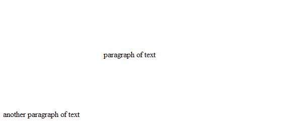
    
    现在，当此文档以 WordprocessingML 格式保存时，存储在 div 元素上的信息在 web 设置部分存储如下：
    
    ```xml
    <w:divs>
        <w:div w:id="1785730240">
            <w:marLeft w:val="3000" />
            <w:marRight w:val="750" />
            <w:marTop w:val="1500" />
            <w:marBottom w:val="1500" />
        </w:div>
    </w:divs>
    ```
    
    marBottom 元素指定文档中单个 HTML div 结构的底部边距信息；在这种情况下，为 75 磅的底部边距。初始的 100 像素边距转换为 75 磅，使用的逻辑如下：
    
    
    
    示例结束]
    
    ??? abstract "Attributes"
    
        - **val** （磅的二十分之几的正数或负数）
    
            指定磅的二十分之几的正数或负数测量值（相当于 1/1440 英寸）。
    
            此测量值的内容应根据父 XML 元素的上下文进行解释。
    
            [示例：考虑类型为 ST_SignedTwipsMeasure 的属性值 -720。
    
            这个属性值指定了负一半英寸或 -36 磅的值（-720 磅的二十分之几 = -36 磅 = -0.5 英寸）。示例结束]
    
            此属性的可能值由 ST_SignedTwipsMeasure 简单类型定义（[§17.18.81]）。
    
    [Note: The W3C XML Schema definition of this element’s content model (CT_SignedTwipsMeasure) is located in §A.1. end note]

=== "英文"

    This element specifies the margin which shall be displayed at the bottom of the boundaries of the current HTML div object.
    
    If this element is omitted, then this HTML div object shall not have a bottom margin.
    
    [Example: Consider a simple HTML document defined as follows:
    
    ```xml
    <html>
        <body>
            <div style="margin-top:100px; margin-left:200px; margin-right:50px; margin-
                bottom:100px">
                <p>paragraph of text</p>
            </div>
            <p>another paragraph of text</p>
        </body>
    </html>
    ```
    
    This HTML would therefore normally appear as follows (image scaled appropriately):
    
    
    
    Now, when this document is saved in the WordprocessingML format, the information stored on the div elements is stored in the web setting part as follows:
    
    ```xml
    <w:divs>
        <w:div w:id="1785730240">
            <w:marLeft w:val="3000" />
            <w:marRight w:val="750" />
            <w:marTop w:val="1500" />
            <w:marBottom w:val="1500" />
        </w:div>
    </w:divs>
    ```
    
    The marBottom element specifies margin information about the bottom margin for the single HTML div structure in the document; in this case, a 75 point bottom margin. The initial 100 pixel margin was converted to 75 points using the following logic:
    
    
    
    end example]
    
    ??? abstract "Attributes"
    
        - **val** (Positive or Negative Value in Twentieths of a Point)
    
            Specifies a positive or negative measurement in twentieths of a point (equivalent to 1/1440th of an inch).
            
            The contents of this measurement shall be interpreted based on the context of the parent XML element.
            
            [Example: Consider an attribute value of -720 whose type is ST_SignedTwipsMeasure.
            
            This attribute value specifies a value of negative one-half of an inch or -36 points (- 720 twentieths of a point = -36 points = -0.5 inches). end example]
            
            The possible values for this attribute are defined by the ST_SignedTwipsMeasure simple type ([§17.18.81]).
    
    [Note: The W3C XML Schema definition of this element’s content model (CT_SignedTwipsMeasure) is located in §A.1. end note]

### 17.15.2.25 marH (框架的顶部和底部边距)

**marH (Top and Bottom Margin for Frame)**

=== "中文"

    此元素指定框架集文档中单个框架的顶部和底部边距高度，如下所示：
    
    
    
    此高度以像素为单位表示。
    
    如果省略此元素，则该框架将不使用任何顶部或底部边距。
    
    [示例：考虑一个文档，其中有一个框架，边距高度已被指定，并以 WordprocessingML 表示如下：
    
    ```xml
    <w:frame>
        <w:marH w:val="594"/>
    </w:frame>
    ```
    
    marH 元素的 val 属性值为 594，指定此框架的顶部和底部边距值为 594 像素，导致内容与框架的顶部和底部边距之间有 594 像素的空间。示例结束]
    
    ??? abstract "Attributes"
    
        - **val** （像素中的测量值）
    
            指定值的内容应包含一个正整数，内容由像素中的正测量值组成。
    
            此测量值的内容应根据父 XML 元素的上下文进行解释。
    
            [示例：考虑属性值为 960，其简单类型为 ST_PixelsMeasure。此属性值指定了 960 像素的值。示例结束]
    
            此属性的可能值由 ST_PixelsMeasure 简单类型定义（[§17.18.67]）。
    
    [Note: The W3C XML Schema definition of this element’s content model (CT_PixelsMeasure) is located in §A.1. end note]

=== "英文"

    This element specifies the top and bottom margin height for a single frame in a frameset document, as follows:
    
    
    
    This height is expressed in pixels.
    
    If this element is omitted, then no top or bottom margin shall be used for this frame.
    
    [Example: Consider a document that has a frame, where the margin height has been specified and is represented as the following WordprocessingML:
    
    ```xml
    <w:frame>
        <w:marH w:val="594"/>
    </w:frame>
    ```
    
    The marH element has a val attribute value of 594, which specifies that this frame has a top and bottom margin value of 594 pixels, resulting in 594 pixels of space between the content and the top and bottom margins of the frame. end example]
    
    ??? abstract "Attributes"
    
        - **val** (Measurement in Pixels)
    
            Specifies a value whose contents shall contain a positive whole number, whose contents consist of a positive measurement in pixels.
    
            The contents of this measurement shall be interpreted based on the context of the parent XML element.
            
            [Example: Consider an attribute value of 960 whose simple type is ST_PixelsMeasure. This attribute value specifies a value of 960 pixels. end example]
            
            The possible values for this attribute are defined by the ST_PixelsMeasure simple type ([§17.18.67]).
    
    [Note: The W3C XML Schema definition of this element’s content model (CT_PixelsMeasure) is located in §A.1. end note]

### 17.15.2.26 marLeft (HTML div 的左边距)

**marLeft (Left Margin for HTML div)**

=== "中文"

    此元素指定将在当前 HTML div 对象边界左侧显示的边距。
    
    如果省略此元素，则此 HTML div 对象将没有左边距。
    
    [示例：考虑如下定义的一个简单 HTML 文档：
    
    ```html
    <html>
        <body>
            <div style="margin-top:100px; margin-left:200px; margin-right:50px; margin-bottom:100px">
                <p>段落文本</p>
            </div>
            <p>另一段落文本</p>
        </body>
    </html>
    ```
    
    因此，这个 HTML 通常将显示如下（图像按比例缩放）：
    
    
    
    现在，当此文档以 WordprocessingML 格式保存时，存储在 div 元素上的信息在 web 设置部分存储如下：
    
    ```xml
    <w:divs>
        <w:div w:id="1785730240">
            <w:marLeft w:val="3000" />
            <w:marRight w:val="750" />
            <w:marTop w:val="1500" />
            <w:marBottom w:val="1500" />
        </w:div>
    </w:divs>
    ```
    
    marLeft 元素指定文档中单个 HTML div 结构的左边距信息；在这种情况下，为 150 磅的左边距。初始的 200 像素边距转换为 150 磅，使用的逻辑如下：
    
    
    
    示例结束]
    
    ??? abstract "Attributes"
    
        - **val** （磅的二十分之几的正数或负数）
    
            指定磅的二十分之几的正数或负数测量值（相当于 1/1440 英寸）。
            
            此测量值的内容应根据父 XML 元素的上下文进行解释。
            
            [示例：考虑属性值为 -720，类型为 ST_SignedTwipsMeasure。
            
            这个属性值指定了负一半英寸或 -36 磅的值（-720 磅的二十分之几 = -36 磅 = -0.5 英寸）。示例结束]
            
            此属性的可能值由 ST_SignedTwipsMeasure 简单类型定义（[§17.18.81]）。
    
    [Note: The W3C XML Schema definition of this element’s content model (CT_SignedTwipsMeasure) is located in §A.1. end note]

=== "英文"

    This element specifies the margin which shall be displayed at the left of the boundaries of the current HTML div object.
    
    If this element is omitted, then this HTML div object shall not have a left margin.
    
    [Example: Consider a simple HTML document defined as follows:
    
    ```html
    <html>
        <body>
            <div style="margin-top:100px; margin-left:200px; margin-right:50px; margin-
                bottom:100px">
                <p>paragraph of text</p>
            </div>
            <p>another paragraph of text</p>
        </body>
    </html>
    ```
    
    This HTML would therefore normally appear as follows (image scaled appropriately):
    
    
    
    Now, when this document is saved in the WordprocessingML format, the information stored on the div elements is stored in the web setting part as follows:
    
    ```xml
    <w:divs>
        <w:div w:id="1785730240">
            <w:marLeft w:val="3000" />
            <w:marRight w:val="750" />
            <w:marTop w:val="1500" />
            <w:marBottom w:val="1500" />
        </w:div>
    </w:divs>
    ```
    
    The marLeft element specifies margin information about the left margin for the single HTML div structure in the document; in this case, a 150 point left margin. The initial 200 pixel margin was converted to 150 points using the following logic:
    
    
    
    end example]
    
    ??? abstract "Attributes"
    
        - **val** (Positive or Negative Value in Twentieths of a Point)
    
            Specifies a positive or negative measurement in twentieths of a point (equivalent to 1/1440th of an inch).
            
            The contents of this measurement shall be interpreted based on the context of the parent XML element.
            
            [Example: Consider an attribute value of -720 whose type is ST_SignedTwipsMeasure.
            
            This attribute value specifies a value of negative one-half of an inch or -36 points (- 720 twentieths of a point = -36 points = -0.5 inches). end example]
            
            The possible values for this attribute are defined by the ST_SignedTwipsMeasure simple type ([§17.18.81]).
    
    [Note: The W3C XML Schema definition of this element’s content model (CT_SignedTwipsMeasure) is located in §A.1. end note]

### 17.15.2.27 marRight (HTML div 的右边距)

**marRight (Right Margin for HTML div)**

=== "中文"

    此元素指定将在当前 HTML div 对象边界右侧显示的边距。
    
    如果省略此元素，则此 HTML div 对象将没有右边距。
    
    [示例：考虑如下定义的一个简单 HTML 文档：
    
    ```html
    <html>
        <body>
            <div style="margin-top:100px; margin-left:200px; margin-right:50px; margin-bottom:100px">
                <p>段落文本</p>
            </div>
            <p>另一段落文本</p>
        </body>
    </html>
    ```
    
    因此，这个 HTML 通常将显示如下（图像按比例缩放）：
    
    
    
    现在，当此文档以 WordprocessingML 格式保存时，存储在 div 元素上的信息在 web 设置部分存储如下：
    
    ```xml
    <w:divs>
        <w:div w:id="1785730240">
            <w:marLeft w:val="3000" />
            <w:marRight w:val="750" />
            <w:marTop w:val="1500" />
            <w:marBottom w:val="1500" />
        </w:div>
    </w:divs>
    ```
    
    marRight 元素指定文档中单个 HTML div 结构的右边距信息；在这种情况下，为 37.5 磅的右边距。初始的 50 像素边距转换为 37.5 磅，使用的逻辑如下：
    
    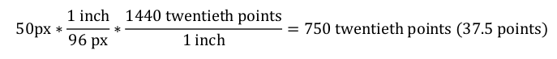
    
    示例结束]
    
    ??? abstract "Attributes"
    
        - **val** （磅的二十分之几的正数或负数）
    
            指定磅的二十分之几的正数或负数测量值（相当于 1/1440 英寸）。
            
            此测量值的内容应根据父 XML 元素的上下文进行解释。
            
            [示例：考虑属性值为 -720，类型为 ST_SignedTwipsMeasure。
            
            这个属性值指定了负一半英寸或 -36 磅的值（-720 磅的二十分之几 = -36 磅 = -0.5 英寸）。示例结束]
            
            此属性的可能值由 ST_SignedTwipsMeasure 简单类型定义（[§17.18.81]）。
    
    [Note: The W3C XML Schema definition of this element’s content model (CT_SignedTwipsMeasure) is located in §A.1. end note]

=== "英文"

    This element specifies the margin which shall be displayed at the right of the boundaries of the current HTML div object.
    
    If this element is omitted, then this HTML div object shall not have a right margin.
    
    [Example: Consider a simple HTML document defined as follows:
    
    ```html
    <html>
        <body>
            <div style="margin-top:100px; margin-left:200px; margin-right:50px; margin-
                bottom:100px">
                <p>paragraph of text</p>
            </div>
            <p>another paragraph of text</p>
        </body>
    </html>
    ```
    
    This HTML would therefore normally appear as follows (image scaled appropriately):
    
    
    
    Now, when this document is saved in the WordprocessingML format, the information stored on the div elements is stored in the web setting part as follows:
    
    ```xml
    <w:divs>
        <w:div w:id="1785730240">
            <w:marLeft w:val="3000" />
            <w:marRight w:val="750" />
            <w:marTop w:val="1500" />
            <w:marBottom w:val="1500" />
        </w:div>
    </w:divs>
    ```
    
    The marRight element specifies margin information about the right margin for the single HTML div structure in the document; in this case, a 37.5 point right margin. The initial 50 pixel margin was converted to 37.5 points using the following logic:
    
    
    
    end example]
    
    ??? abstract "Attributes"
    
        - **val** (Positive or Negative Value in Twentieths of a Point)
    
            Specifies a positive or negative measurement in twentieths of a point (equivalent to 1/1440th of an inch).
            
            The contents of this measurement shall be interpreted based on the context of the parent XML element.
            
            [Example: Consider an attribute value of -720 whose type is ST_SignedTwipsMeasure. This attribute value specifies a value of negative one-half of an inch or -36 points (-720 twentieths of a point = -36 points = -0.5 inches). end example]
            
            The possible values for this attribute are defined by the ST_SignedTwipsMeasure simple type ([§17.18.81]).
    
    [Note: The W3C XML Schema definition of this element’s content model (CT_SignedTwipsMeasure) is located in §A.1. end note]

### 17.15.2.28 marTop (HTML div 的上边距)

**marTop (Top Margin for HTML div)**

=== "中文"

    此元素指定了当前 HTML div 对象边界顶部应显示的边距。
    
    如果省略此元素，则当前 HTML div 对象将没有顶部边距。
    
    [示例：考虑一个定义如下的简单 HTML 文档：
    
    ```xml
    <html>
        <body>
            <div style="margin-top:100px; margin-left:200px; margin-right:50px; margin-bottom:100px">
                <p>段落文本</p>
            </div>
            <p>另一段落文本</p>
        </body>
    </html>
    ```
    
    因此，此 HTML 通常会显示如下（图像按比例缩放）：
    
    
    
    现在，当此文档以 WordprocessingML 格式保存时，存储在 div 元素上的信息存储在 web 设置部分，如下所示：
    
    ```xml
    <w:divs>
        <w:div w:id="1785730240">
            <w:marLeft w:val="3000" />
            <w:marRight w:val="750" />
            <w:marTop w:val="1500" />
            <w:marBottom w:val="1500" />
        </w:div>
    </w:divs>
    ```
    
    marTop 元素指定了文档中单个 HTML div 结构的顶部边距信息；在本例中，为 75 磅的顶部边距。最初的 100 像素边距转换为 75 磅，使用以下逻辑：
    
    
    
    ??? abstract "Attributes"
    
        - **val** （磅的二十分之几的正值或负值）
            
            指定一个以磅的二十分之几为单位的正值或负值的度量（相当于 1/1440 英寸）。
    
            此度量的内容应根据父 XML 元素的上下文进行解释。
            
            [示例：考虑属性值为 -720，类型为 ST_SignedTwipsMeasure。此属性值指定了一个负半英寸或 -36 磅的值（-720 磅的二十分之几 = -36 磅 = -0.5 英寸）。示例结束]
            
            此属性的可能值由 ST_SignedTwipsMeasure 简单类型定义（[§17.18.81]）。
    
    [Note: The W3C XML Schema definition of this element’s content model (CT_SignedTwipsMeasure) is located in §A.1. end note]

=== "英文"

    This element specifies the margin which shall be displayed at the top of the boundaries of the current HTML div object.
    
    If this element is omitted, then this HTML div object shall not have a top margin.
    
    [Example: Consider a simple HTML document defined as follows:
    
    ```xml
    <html>
        <body>
            <div style="margin-top:100px; margin-left:200px; margin-right:50px; margin-
                bottom:100px">
                <p>paragraph of text</p>
            </div>
            <p>another paragraph of text</p>
        </body>
    </html>
    ```
    
    This HTML would therefore normally appear as follows (image scaled appropriately):
    
    
    
    Now, when this document is saved in the WordprocessingML format, the information stored on the div elements is stored in the web setting part as follows:
    
    ```xml
    <w:divs>
        <w:div w:id="1785730240">
            <w:marLeft w:val="3000" />
            <w:marRight w:val="750" />
            <w:marTop w:val="1500" />
            <w:marBottom w:val="1500" />
        </w:div>
    </w:divs>
    ```
    
    The marTop element specifies margin information about the top margin for the single HTML div structure in the document; in this case, a 75 point top margin. The initial 100 pixel margin was converted to 75 points using the following logic:
    
    
    
    ??? abstract "Attributes"
    
        - **val** (Positive or Negative Value in Twentieths of a Point)
            
            Specifies a positive or negative measurement in twentieths of a point (equivalent to 1/1440th of an inch).
    
            The contents of this measurement shall be interpreted based on the context of the parent XML element.
            
            [Example: Consider an attribute value of -720 whose type is ST_SignedTwipsMeasure. This attribute value specifies a value of negative one-half of an inch or -36 points (-720 twentieths of a point = -36 points = -0.5 inches). end example]
            
            The possible values for this attribute are defined by the ST_SignedTwipsMeasure simple type ([§17.18.81]).
    
    [Note: The W3C XML Schema definition of this element’s content model (CT_SignedTwipsMeasure) is located in §A.1. end note]

### 17.15.2.29 marW (框架的左右边距)

**marW (Left and Right Margin for Frame)**

=== "中文"

    此元素指定了一个框架集文档中单个框架的左右边距高度，如下所示：
    
    
    
    此高度以像素为单位表示。
    
    如果省略此元素，则此框架不使用左右边距。
    
    [示例：考虑一个文档中有一个框架，其中框架的边距已经被指定，并以以下 WordprocessingML 表示：
    
    ```xml
    <w:frame>
        <w:marW w:val="294"/>
    </w:frame>
    ```
    
    marW 元素有一个 val 属性值为 294，这指定了此框架有 294 像素的左右边距值，导致内容与框架的左右边距之间有 294 像素的空间。示例结束]
    
    ??? abstract "Attributes"
    
        - **val** （像素中的测量值）
            
            指定一个值，其内容应包含一个正整数，其内容由像素中的正测量值组成。
            
            此测量值的内容应根据父 XML 元素的上下文进行解释。
            
            [示例：考虑一个属性值为 960，其简单类型为 ST_PixelsMeasure。此属性值指定了一个 960 像素的值。示例结束]
            
            此属性的可能值由 ST_PixelsMeasure 简单类型定义（[§17.18.67]）。
    
    [Note: The W3C XML Schema definition of this element’s content model (CT_PixelsMeasure) is located in §A.1 end note]

=== "英文"

    This element specifies the left and right margin height for a single frame in a frameset document, as follows:
    
    
    
    This height is expressed in pixels.
    
    If this element is omitted, then no left or right margin shall be used for this frame.
    
    [Example: Consider a document that has a frame, where the frame's margins have been specified and is represented as the following WordprocessingML:
    
    ```xml
    <w:frame>
        <w:marW w:val="294"/>
    </w:frame>
    ```
    
    The marW element has a val attribute value of 294, which specifies that this frame has a left and right margin value of 294 pixels, resulting in 294 pixels of space between the content and the left and right margins of the frame. end example]
    
    ??? abstract "Attributes"
        
        - **val** (Measurement in Pixels)
            
            Specifies a value whose contents shall contain a positive whole number, whose contents consist of a positive measurement in pixels.
        
            The contents of this measurement shall be interpreted based on the context of the parent XML element.
            
            [Example: Consider an attribute value of 960 whose simple type is ST_PixelsMeasure. This attribute value specifies a value of 960 pixels. end example]
            
            The possible values for this attribute are defined by the ST_PixelsMeasure simple type ([§17.18.67]).
    
    [Note: The W3C XML Schema definition of this element’s content model (CT_PixelsMeasure) is located in §A.1 end note]

### 17.15.2.30 name (框架名称)

**name (Frame Name)**

=== "中文"

    此元素指定了框架集文档中单个框架的名称。此属性类似于 HTML 中框架元素的 name 属性。
    
    [注意：框架的名称可以在通过目标链接等引用框架的网页中使用。结束注意]
    
    如果省略此元素，则当前框架将不与任何名称关联。
    
    [示例：考虑一个 WordprocessingML 文档，它作为包含以下三个框架的框架集容器：
    
    
    
    此文档的框架集属性由网页设置中的以下 WordprocessingML 指定：
    
    ```xml
    <w:frameset>
        …
        <w:frame>
            <w:name w:val="Frame 1" />
        </w:frame>
        <w:frameset>
            …
            <w:frame>
                <w:name w:val="Frame 2" />
            </w:frame>
            <w:frame>
                <w:name w:val="Frame 3" />
            </w:frame>
        </w:frameset>
    </w:frameset>
    ```
    
    name 元素为框架集中的每个框架指定了名称；在本例中，框架的名称分别为 Frame 1、Frame 2 和 Frame 3。示例结束]
            
    ??? abstract "Attributes"
    
        - **val** (字符串值)

            指定其内容包含一个字符串。
            
            这个字符串的内容根据父XML元素的上下文来解释。
            
            [示例：考虑以下WordprocessingML片段：
            
            ```xml
            <w:pPr>
                <w:pStyle w:val="Heading1" />
            </w:pPr>
            ```
            
            val属性的值是关联段落样式的styleId的ID。
            然而，考虑以下片段：
            
            ```xml
            <w:sdtPr>
            <w:alias w:val="SDT Title Example" />
            …
            </w:sdtPr>
            ```
            
            在这种情况下，val属性中的十进制数字是最接近的结构化文档标签的标题。在每种情况下，该值都是在父元素的上下文中解释的。结束示例]
    
            此属性的可能值由ST_String简单类型定义（[§22.9.2.13]）。
    
    [Note: The W3C XML Schema definition of this element’s content model (CT_String) is located in §A.1. end note]

=== "英文"

    This element specifies the name of a single frame within a frameset document. This property is analogous to the name attribute on the frame element in HTML.
    
    [Note: The name of a frame can be used in web pages that reference a frame via targeted links, etc. end note]
    
    If this element is omitted, then the current frame shall have no name associated with it.
    
    [Example: Consider a WordprocessingML document which serves as the frameset container for a frameset consisting of the following three frames:
    
    
    
    The frameset properties for this document are specified by the following WordprocessingML within the web page settings:
    
    ```xml
    <w:frameset>
        …
        <w:frame>
            <w:name w:val="Frame 1" />
        </w:frame>
        <w:frameset>
            …
            <w:frame>
                <w:name w:val="Frame 2" />
            </w:frame>
            <w:frame>
                <w:name w:val="Frame 3" />
            </w:frame>
        </w:frameset>
    </w:frameset>
    ```
    
    The name element specifies the name for each frame within this frameset; in this case, the frames have names of Frame 1, Frame 2, and Frame 3 respectively. end example]
            
    ??? abstract "Attributes"
    
        - **val** (String Value)
        
            Specifies that its contents contain a string.
        
            The contents of this string are interpreted based on the context of the parent XML element.
            
            [Example: Consider the following WordprocessingML fragment:
            
            ```xml
            <w:pPr>
            <w:pStyle w:val="Heading1" />
            </w:pPr>
            ```
            
            The value of the val attribute is the ID of the associated paragraph style's styleId.
            
            However, consider the following fragment:
            
            ```xml
            <w:sdtPr>
            <w:alias w:val="SDT Title Example" />
            …
            </w:sdtPr>
            ```
            
            In this case, the decimal number in the val attribute is the caption of the nearest ancestor structured document tag. In each case, the value is interpreted in the context of the parent element. end example]
            
            The possible values for this attribute are defined by the ST_String simple type ([§22.9.2.13]).
    
    [Note: The W3C XML Schema definition of this element’s content model (CT_String) is located in §A.1. end note]

### 17.15.2.31 noBorder (不显示框架集拆分器)

**noBorder (Do Not Display Frameset Splitters)**

=== "中文"

    此元素指定是否在 WordprocessingML 文档的框架集内容中显示分隔条。此元素仅应用于文档的根框架集，并且可以忽略此文档中所有嵌套框架集。如果存在此元素，则不显示分隔条，并且可以忽略所有其他框架集分隔条属性。
    
    如果省略此元素，则文档中的分隔条将根据 w 和 color 元素的定义显示。
    
    [示例：考虑由以下三个框架组成的框架集：
    
    
    
    以下属性定义了此框架集中分隔条的呈现方式：
    
    ```xml
    <w:frameset>
        <w:framesetSplitbar>
            <w:w w:val="200" />
            <w:color w:val="0000FF" />
        </w:framesetSplitbar>
        …
    </w:frameset>
    ```
    
    如果还指定了 noBorder 元素：
    
    ```xml
    <w:frameset>
        <w:framesetSplitbar>
            <w:w w:val="200" />
            <w:color w:val="0000FF" />
            <w:noBorder w:val="true" />
        </w:framesetSplitbar>
        …
    </w:frameset>
    ```
    
    那么所有框架集分隔条都被抑制：
    
    
    
    noBorder 元素的 val 属性值为 true，这指定了此文档的分隔条不得显示。示例结束]
    
    此元素的内容模型由 [§17.17.4] 中定义的通用布尔属性定义。

=== "英文"

    This element specifies whether the splitters shall be displayed for the contents of the frameset in this WordprocessingML document. This element shall only be honored on the root frameset for this document, and can be ignored for all nested framesets in this document. If this element is present, then no splitters shall be displayed, and all other frameset splitter properties can be ignored.
    
    If this element is omitted, then the splitters in this document shall be displayed as defined by the w and color elements.
    
    [Example: Consider a frameset consisting of the following three frames:
    
    
    
    The following properties define the presentation of the splitter bars within this frameset:
    
    ```xml
    <w:frameset>
        <w:framesetSplitbar>
            <w:w w:val="200" />
            <w:color w:val="0000FF" />
        </w:framesetSplitbar>
        …
    </w:frameset>
    ```
    
    If the noBorder element is also specified:
    
    ```xml
    <w:frameset>
        <w:framesetSplitbar>
            <w:w w:val="200" />
            <w:color w:val="0000FF" />
            <w:noBorder w:val="true" />
        </w:framesetSplitbar>
        …
    </w:frameset>
    ```
    
    Then all frameset splitters are suppressed:
    
    
    
    The noBorder element's val attribute has a value of true, which specifies that the splitters for this document must not be displayed. end example]
    
    This element’s content model is defined by the common boolean property definition in [§17.17.4].

### 17.15.2.32 noResizeAllowed (框架无法调整大小)

**noResizeAllowed (Frame Cannot Be Resized)**

=== "中文"

    此元素指定当此文档的内容以 HTML 格式保存并在 Web 浏览器中显示时，当前框架的大小是否可以修改（即框架是否可以调整大小）。当设置此元素时，框架的大小应设置为其当前值。此属性类似于 HTML 中框架元素的 noresize 属性。
    
    如果省略此元素，框架的大小将是可修改的（在显示时可以调整框架的大小）。
    
    [示例：考虑一个 WordprocessingML 文档，它作为包含以下三个框架的框架集容器：
    
    
    
    此文档的框架集属性由网页设置中的以下 WordprocessingML 指定：
    
    ```xml
    <w:frameset>
        …
        <w:frameset>
            …
            <w:frame>
                <w:name w:val="Frame 2" />
                <w:noResizeAllowed w:val="true" />
            </w:frame>
            …
        </w:frameset>
    </w:frameset>
    ```
    
    noResizeAllowed 元素的 val 属性为 true，这指定了由 Frame 2 指定的框架的大小不得修改（与该框架相交的两条边框不能调整大小）。示例结束]
    
    此元素的内容模型由 [§17.17.4] 中定义的通用布尔属性定义。

=== "英文"

    This element specifies whether or not the size of the current frame shall be modifiable (i.e. whether the frame can be resized) when the contents of this document are saved as HTML and displayed in a web browser. When this element is set, the size of the frame shall be set to its current values. This property is analogous to the noresize attribute on the frame element in HTML.
    
    If this element is omitted, the size of the frame shall be modifiable (the frame can be resized when it is displayed).
    
    [Example: Consider a WordprocessingML document which serves as the frameset container for a frameset consisting of the following three frames:
    
    
    
    The frameset properties for this document are specified by the following WordprocessingML within the web page settings:
    
    ```xml
    <w:frameset>
        …
        <w:frameset>
            …
            <w:frame>
                <w:name w:val="Frame 2" />
                <w:noResizeAllowed w:val="true" />
            </w:frame>
            …
        </w:frameset>
    </w:frameset>
    ```
    
    The noResizeAllowed element has a val attribute of true, which specifies that the size of the frame specified by Frame 2 must not be modifiable (the two borders which intersect that frame cannot be resized). end example]
    
    This element’s content model is defined by the common boolean property definition in [§17.17.4].

### 17.15.2.33 optimizeForBrowser (禁用目标 Web 配置文件不支持的功能)

**optimizeForBrowser (Disable Features Not Supported by Target Web Profile)**

=== "中文"

    此元素指定应用程序是否应尝试为从本文档生成的任何网页定制输出，以及应定制的 HTML 输出。[示例：这可能涉及阻止任何不受目标输出配置文件支持的输出。示例结束] 目标输出配置文件由 target 属性的内容标识。
    
    [示例：考虑一个文档，其网页设置部分包含以下 WordprocessingML：
    
    ```xml
    <w:webSettings>
        …
        <w:optimizeForBrowser w:target="W3C XHTML+CSS1" />
        <w:allowPNG w:val="on"/>
    </w:webSettings>
    ```
    
    optimizeForBrowser 元素指定输出应针对特定的输出目标进行优化。由于 target 属性的值指定了目标为使用 CSS 1 的 W3C XHTML 1.0 输出，因此生成的任何 HTML 都应符合该配置文件。示例结束]
    
    ??? abstract "Attributes"
    
        - **target** （目标输出配置文件）
    
            指定由本文档生成的任何网页的目标 HTML 输出版本。此属性只应包含代表由已发布标准和 W3C 建议定义的输出配置文件的字符串。不应使用产品名称来定义配置文件。
            
            下面列出了以下保留值及其目标：
            
            <table>
                <tr>
                    <td><strong>值</strong></td>
                    <td><strong>目标</strong></td>
                </tr>
                <tr>
                    <td>W3C XHTML+CSS1</td>
                    <td>W3C XHTML 1.0 + CSS 1</td>
                </tr>
                <tr>
                    <td>W3C HTML4+CSS1</td>
                    <td>W3C HTML 4.01 + CSS 1</td>
                </tr>
                <tr>
                    <td>W3C XHTML+CSS2</td>
                    <td>W3C XHTML 1.0 + CSS 2</td>
                </tr>
                <tr>
                    <td>W3C HTML4+CSS2</td>
                    <td>W3C HTML 4.01 + CSS 2</td>
                </tr>
            </table>
            
            如果省略此属性，则 HTML 输出的版本由应用程序定义。
            
            [示例：例如，考虑以下网页发布设置：
            
            ```xml
            <w:optimizeForBrowser w:target="W3C XHTML+CSS2"/>
            ```
            
            target 属性明确声明从本文档生成的任何网页都应针对 W3C XHTML 1.0 + CSS 2。示例结束]
            
            此属性的可能值由 ST_String 简单类型定义（[§22.9.2.13]）。
    
        - **val** （开/关值）
    
            为父 XML 元素定义的属性指定二进制值。
            
            值为 1 或 true 指定应显式应用属性。这是此属性的默认值，当父元素存在但省略此属性时，将使用此默认值。
            
            值为 0 或 false 指定应显式关闭属性。
            
            [示例：例如，考虑以下开/关属性：
            
            ```xml
            <… w:val="false"/>
            ```
            
            val 属性明确声明属性为 false。示例结束]
            
            此属性的可能值由 ST_OnOff 简单类型定义（[§22.9.2.7]）。
    
    [Note: The W3C XML Schema definition of this element’s content model (CT_OptimizeForBrowser) is located in §A.1. end note]

=== "英文"

    This element specifies whether applications should attempt to customize the output for any web page produced from this document, as well as the HTML output to which it should be customized. [Example: This might involve blocking any output which is not supported by that target output profile. end example] The target output profile is identified by the contents of the target attribute.
    
    [Example: Consider a document whose web settings part contains the following WordprocessingML:
    
    ```xml
    <w:webSettings>
        …
        <w:optimizeForBrowser w:target="W3C XHTML+CSS1" />
        <w:allowPNG w:val="on"/>
    </w:webSettings>
    ```
    
    The optimizeForBrowser element specifies that the output should be optimized for a specific output target. Since the value of the target attribute specifies a target of W3C XHTML 1.0 output using CSS 1, any HTML generated should fall within that profile. end example]
    
    ??? abstract "Attributes"
    
        - **target** (Target Output Profile)
    
            Specifies the version of HTML output targeted by the output of any web page produced by this document. This attribute shall only contain a string that represents an output profile defined by published standards and W3C recommendations. Product names shall not be used to define a profile.
            
            The following reserved values and their targets are listed below:
            
            <table>
                <tr>
                    <td><strong>Value</strong></td>
                    <td><strong>Target</strong></td>
                </tr>
                <tr>
                    <td>W3C XHTML+CSS1</td>
                    <td>W3C XHTML 1.0 + CSS 1</td>
                </tr>
                <tr>
                    <td>W3C HTML4+CSS1</td>
                    <td>W3C HTML 4.01 + CSS 1</td>
                </tr>
                <tr>
                    <td>W3C XHTML+CSS2</td>
                    <td>W3C XHTML 1.0 + CSS 2</td>
                </tr>
                <tr>
                    <td>W3C HTML4+CSS2</td>
                    <td>W3C HTML 4.01 + CSS 2</td>
                </tr>
            </table>
            
            If this attribute is omitted, the version of HTML output is application-defined.
            
            [Example: For example, consider the following web publishing settings:
            
            ```xml
            <w:optimizeForBrowser w:target="W3C XHTML+CSS2"/>
            ```
            
            The target attribute explicitly declares that any web page generated from this document should target W3C XHTML 1.0 + CSS 2. end example]
            
            The possible values for this attribute are defined by the ST_String simple type ([§22.9.2.13]).
    
        - **val** (On/Off Value)
    
            Specifies a binary value for the property defined by the parent XML element.
            
            A value of 1 or true specifies that the property shall be explicitly applied. This is the default value for this attribute, and is implied when the parent element is present, but this attribute is omitted.
            
            A value of 0 or false specifies that the property shall be explicitly turned off.
            
            [Example: For example, consider the following on/off property:
            
            ```xml
            <… w:val="false"/>
            ```
            
            The val attribute explicitly declares that the property is false. end example]
            
            The possible values for this attribute are defined by the ST_OnOff simple type ([§22.9.2.7]).
    
    [Note: The W3C XML Schema definition of this element’s content model (CT_OptimizeForBrowser) is located in §A.1. end note]

### 17.15.2.34 pixelsPerInch (图形/图像的每英寸像素数)

**pixelsPerInch (Pixels per Inch for Graphics/Images)**

=== "中文"

    此元素指定在将 WordprocessingML 文档保存为网页时，用于显示图片或表格单元格的每英寸像素数（或密度）。此元素指定的大小会影响文档中图片或表格单元格相对于文本的大小。每英寸像素数（ppi）测量值与屏幕分辨率有关，得到的图像或单元格的物理尺寸（以像素为单位，用于网页，但不用于打印文档）是原始尺寸（以英寸为单位）乘以每英寸像素数的结果。
    
    此元素的值范围通常从 19 到 480 像素每英寸。流行的屏幕尺寸的常见设置为 72、96 和 120 像素每英寸。
    
    如果省略此元素，则在确定文档中图像和/或表格单元格的像素数量时，将使用默认大小 96 像素每英寸。
    
    【注意：通常只有在已知网页的目标屏幕分辨率时才会指定此设置，由 targetScreenSz 元素（[§17.15.2.41]）定义，以设置网页的最佳屏幕尺寸。结束注意】
    
    [示例：考虑一个 WordprocessingML 文档，其中包含以下内容在网页设置部分：
    
    ```xml
    <w:webSettings>
        <w:pixelsPerInch w:val="200" />
    </w:webSettings>
    ```
    
    pixelsPerInch 元素的 val 属性有一个值 200，这指定了在保存此网页时，所有英寸到像素的转换都必须假设每英寸 200 像素的转换。示例结束]
    
    ??? 摘要 "属性"
    
        - **val** （小数数值）
    
            指定此属性的内容包含一个小数。
    
            这个小数的内容根据父 XML 元素的上下文进行解释。
    
            [示例：考虑以下简单类型 ST_DecimalNumber 的数值 WordprocessingML 属性：
    
            ```xml
            <… w:val="1512645511" />
            ```
    
            val 属性的值是一个小数，其值必须根据父元素的上下文进行解释。示例结束]
    
            此属性的可能值由 ST_DecimalNumber 简单类型定义（[§17.18.10]）。
    
    [Note: The W3C XML Schema definition of this element’s content model (CT_DecimalNumber) is located in §A.1. end note]

=== "英文"

    This element specifies the number of pixels per inch (or density) that is used for the display of pictures or table cells when a WordprocessingML document is saved as a web page. The size that is specified by this element affects the size of the pictures or table cells relative to the size of text in the document. The pixels per inch (ppi) measurement is relative to the screen resolution, and the resulting physical dimensions of the resulting image or cell in pixels (which are used in web pages, but not for printed documents) are the result of the original dimensions (in inches) multiplied by the number of pixels per inch.
    
    The range of values for this element is typically from 19 to 480 pixels per inch. The common settings for popular screen sizes are 72, 96, and 120 pixels per inch.
    
    If this element is omitted, then a default size of 96 pixels per inch shall be used when determining the number of pixels for images and/or table cells within this document.
    
    [Note: This setting is typically only specified if the target screen resolution for the web page is known, as defined by the targetScreenSz element ([§17.15.2.41]) to set the optimum screen size for the web page. end note]
    
    [Example: Consider a WordprocessingML document which contains the following content within the web settings part:
    
    ```xml
    <w:webSettings>
        <w:pixelsPerInch w:val="200" />
    </w:webSettings>
    ```
    
    The pixelsPerInch element's val attribute has a value of 200, which specifies that all inches to pixels conversions done when saving this web page must be done assuming a transformation of 200 pixels per inch. end example]
        
    ??? abstract "Attributes"
    
        - **val** (Decimal Number Value)
    
            Specifies that the contents of this attribute contains a decimal number.
            
            The contents of this decimal number are interpreted based on the context of the parent XML element.
            
            [Example: Consider the following numeric WordprocessingML property of simple type ST_DecimalNumber:
            
            ```xml
            <… w:val="1512645511" />
            ```
            
            The value of the val attribute is a decimal number whose value must be interpreted in the context of the parent element. end example]
            
            The possible values for this attribute are defined by the ST_DecimalNumber simple type ([§17.18.10]).
    
    [Note: The W3C XML Schema definition of this element’s content model (CT_DecimalNumber) is located in §A.1. end note]

### 17.15.2.35 right (HTML div 的右边框)

**right (Right Border for HTML div)**

=== "中文"

    此元素指定了当前 HTML div 对象边界右侧应显示的边框。
    
    如果省略此元素，则此 HTML div 对象将没有右侧边框。
    
    [示例：考虑一个定义如下的简单 HTML 文档：
    
    ```html
    <html>
        <body>
            <div style=" border-left-style:solid; border-right-style:groove; border-right-width:1px; border-top-style:dashed; border-top-width:3px; border-bottom-style:outset; border-bottom-width:3px">
                <p>段落文本</p>
            </div>
        </body>
    </html>
    ```
    
    因此，此 HTML 通常将显示如下（图像按比例缩放）：
    
    
    
    现在，当此文档以 WordprocessingML 格式保存时，存储在 div 元素上的信息存储在 web 设置部分，如下所示：
    
    ```xml
    <w:divs>
        <w:div w:id="1785730240">
            …
            <w:divBdr>
                <w:top w:val="dashed" w:sz="18" w:space="7" w:color="auto" />
                <w:left w:val="single" w:sz="24" w:space="4" w:color="auto" />
                <w:bottom w:val="outset" w:sz="18" w:color="auto" />
                <w:right w:val="threeDEngrave" w:sz="6" w:color="auto" />
            </w:divBdr>
        </w:div>
    </w:divs>
    ```
    
    right 元素指定了文档中单个 HTML div 结构的右侧边框信息；在本例中，为 threeDEngrave 类型的 0.75 磅底部边框。最初的 1 像素边框被转换为 0.75 磅，使用的逻辑如下：
    
    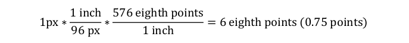
    
    示例结束]
    
    此元素的内容模型由 [§17.3.4] 中定义的通用边框属性定义。

=== "英文"

    This element specifies the border which shall be displayed at the right of the boundaries of the current HTML div object.
    
    If this element is omitted, then this HTML div object shall not have a right border.
    
    [Example: Consider a simple HTML document defined as follows:
    
    ```html
    <html>
        <body>
            <div style=" border-left-style:solid; border-right-style:groove; border-
                right-width:1px; border-top-style:dashed; border-top-width:3px; border-bottom-
                style:outset; border-bottom-width:3px">
                <p>paragraph of text</p>
            </div>
        </body>
    </html>
    ```
    
    This HTML would therefore normally appear as follows (image scaled appropriately):
    
    
    
    Now, when this document is saved in the WordprocessingML format, the information stored on the div elements is stored in the web setting part as follows:
    
    ```xml
    <w:divs>
        <w:div w:id="1785730240">
            …
            <w:divBdr>
                <w:top w:val="dashed" w:sz="18" w:space="7" w:color="auto" />
                <w:left w:val="single" w:sz="24" w:space="4" w:color="auto" />
                <w:bottom w:val="outset" w:sz="18" w:color="auto" />
                <w:right w:val="threeDEngrave" w:sz="6" w:color="auto" />
            </w:divBdr>
        </w:div>
    </w:divs>
    ```
    
    The right element specifies border information about the right border for the single HTML div structure in the
    document; in this case, a 0.75 point bottom border of type threeDEngrave. The initial 1 pixel border was
    converted to 0.75 points using the following logic:
    
    
    
    end example]
    
    This element’s content model is defined by the common border properties definition in [§17.3.4].

### 17.15.2.36 saveSmartTagsAsXml (将智能标记数据保存在 XML 属性包中)

**saveSmartTagsAsXml (Save Smart Tag Data in XML Property Bag)**

=== "中文"

    此元素指定，当 WordprocessingML 文档保存为网页时，文档中所有智能标签（smart tags）的信息应被保存到网页头部的一个独立的基于 XML 的属性包中。
    
    [理由：通常在保存已知包含智能标签的文档为网页时使用此设置，以便网页中的智能标签数据可以被一个单独的解析器作为一个单独的 XML 文档处理，尽管实际的 HTML 内容不能被基于 XML 的解析器解析。结束理由]
    
    如果省略此元素，则在将此文档保存为网页时，文档的智能标签数据将不会被保存到 HTML 输出中的一个独立的 XML 兼容的属性包内。
    
    [示例：考虑一个包含以下内容的 WordprocessingML 文档：
    
    
    
    此文档通常会写出以下 HTML 内容：
    
    ```xml
    <p>股票代码： <st1:stockticker>MSFT</st1:stockticker></p>
    <p>日期： <st1:date ls="trans" Month="7" Day="4" Year="2006">7/4/2006</st1:date></p>
    ```
    
    然而，如果 WordprocessingML 文档的网页设置部分也包含以下内容：
    
    ```xml
    <w:webSettings>
        <w:saveSmartTagsAsXml w:val="true" />
    </w:webSettings>
    ```
    
    saveSmartTagsAsXml 元素指定文档中的所有智能标签也必须被保存到文件头部的 XML 属性包中，例如：
    
    ```xml
    <head>
    …
    <xml>
    <o:DocumentSmartTags>
    <st1:stockticker>MSFT</st1:stockticker>
    <st1:date ls="trans" Month="7" Day="4" Year="2006">7/4/2006</st1:date>
    </o:DocumentSmartTags>
    </xml>
    …
    </head>
    ```
    
    这个头部信息是标准 HTML 输出之外的附加内容。示例结束]
    
    此元素的内容模型由 [§17.17.4] 中定义的通用布尔属性定义。

=== "英文"

    This element specifies that the information pertaining to all smart tags () in the current document shall be saved into a separate XML-based property bag at the head of the web page when this WordprocessingML document is saved as a web page.
    
    [Rationale: This setting is typically used when saving documents known to contain smart tags as web pages, in order to allow the smart tag data within the web page to be processed as a separate XML document by a separate parser, even though the actual HTML content of the resulting web page cannot be parsed by an XML-based parser. end rationale]
    
    If this element is omitted, then the smart tag data of this document shall not be saved into a separate XML-compliant property bag within the HTML output when this document is saved as a web page.
    
    [Example: Consider a WordprocessingML document which contains the following content:
    
    
    
    This document might typically write out the following HTML content:
    
    ```xml
    <p>Stock symbol: <st1:stockticker>MSFT</st1:stockticker></p>
    <p>Date: <st1:date ls="trans" Month="7" Day="4" Year="2006">7/4/2006</st1:date></p>
    ```
    
    However, if the WordprocessingML document also contains the following content within the web settings part:
    
    ```xml
    <w:webSettings>
        <w:saveSmartTagsAsXml w:val="true" />
    </w:webSettings>
    ```
    
    The saveSmartTagsAsXml element specifies that all smart tags in the document must also be saved into an XML property bag at the header of the file, for example:
    
    ```xml
    <head>
    …
    <xml>
    <o:DocumentSmartTags>
    <st1:stockticker>MSFT</st1:stockticker>
    <st1:date ls="trans" Month="7" Day="4" Year="2006">7/4/2006</st1:date>
    </o:DocumentSmartTags>
    </xml>
    …
    </head>
    ```
    
    This header information is in addition to the normal HTML output. end example]
    
    This element’s content model is defined by the common boolean property definition in [§17.17.4].

### 17.15.2.37 scrollbar (滚动条显示选项)

**scrollbar (Scrollbar Display Option)**

=== "中文"

    此元素指定当前框架内容何时应显示滚动条。当设置此元素时，val 属性决定了滚动条何时可见。此属性类似于 HTML 中框架元素的 scrolling 属性。
    
    如果省略此元素，滚动条仅在框架内容超出框架可见空间时显示（即当需要滚动条来显示所有内容时）。
    
    [示例：考虑一个 WordprocessingML 文档，它作为包含以下三个框架的框架集容器：
    
    
    
    此文档的框架集属性由以下 WordprocessingML 在网页设置中指定：
    
    ```xml
    <w:frameset>
        …
        <w:frameset>
            …
            <w:frame>
                <w:name w:val="Frame 2" />
                <w:scrollbar w:val="auto" />
            </w:frame>
            …
        </w:frameset>
    </w:frameset>
    ```
    
    scrollbar 元素的 val 属性为 auto，这指定了框架仅在需要滚动条来显示其所有内容时才显示滚动条。示例结束]
    
    ??? abstract "Attributes"
    
        - **val** (滚动条显示选项值)
        
            指定了滚动条应与此框架集的内容一起显示的条件，由以下引用的简单类型定义。
        
            [示例：考虑 WordprocessingML 文档中的框架集定义，它定义了以下滚动条可见性设置：
        
            ```xml
            <w:frame>
                <w:scrollbar w:val="on" />
                …
            </w:frame>
            ```
            
            val 属性值 on 指定滚动条必须始终显示，即使不需要时也是如此（即当它将被禁用时）。示例结束]
            
            此属性的可能值由 ST_FrameScrollbar 简单类型定义（[§17.18.32]）。
    
    [Note: The W3C XML Schema definition of this element’s content model (CT_FrameScrollbar) is located in §A.1. end note]

=== "英文"

    This element specifies when a scrollbar shall be visible for the contents of the current frame. When this element is set, the val attribute determines exactly when the scrollbar shall be visible. This property is analogous to the scrolling attribute on the frame element in HTML.
    
    If this element is omitted, the scrollbar shall only be displayed when the contents of the frame exceed the visible space for the frame (i.e. when the scrollbar is needed to display all of the content).
    
    [Example: Consider a WordprocessingML document which serves as the frameset container for a frameset consisting of the following three frames:
    
    
    
    The frameset properties for this document are specified by the following WordprocessingML within the web
    page settings:
    
    ```xml
    <w:frameset>
        …
        <w:frameset>
            …
            <w:frame>
                <w:name w:val="Frame 2" />
                <w:scrollbar w:val="auto" />
            </w:frame>
            …
        </w:frameset>
    </w:frameset>
    ```
    
    The scrollbar element has a val attribute of auto, which specifies that the frame must only display a scrollbar when it is needed to display all of its content. end example]
    
    ??? abstract "Attributes"
    
        - **val** (Scrollbar Display Option Value)
        
            Specifies the criteria under which a scrollbar shall be displayed along with the contents of this frameset, as defined by the simple type referenced below.
        
            [Example: Consider a frameset definition within a WordprocessingML document which
            
            defines the following scrollbar visibility setting:
            
            ```xml
            <w:frame>
                <w:scrollbar w:val="on" />
                …
            </w:frame>
            ```
            
            The val attribute value of on specifies that the scrollbar must always be displayed, even when it is not needed (i.e. when it would be displayed disabled). end example]
            
            The possible values for this attribute are defined by the ST_FrameScrollbar simple type ([§17.18.32]).
    
    [Note: The W3C XML Schema definition of this element’s content model (CT_FrameScrollbar) is located in §A.1. end note]

### 17.15.2.38 sourceFileName (框架源文件)

**sourceFileName (Source File for Frame)**

=== "中文"

    此元素指定了框架集文档中单个框架的源文件的 ID。
    
    此元素的 id 属性引用的关系必须存在于网页设置部分的关系部件项中，否则此文档将被视为不符合规范。同样，此元素的 id 属性引用的关系的类型必须是 `http://purl.oclc.org/ooxml/officeDocument/relationships/frame`，否则此文档将被视为不符合规范。
    
    如果省略此元素，则当前框架没有源文件，可以根据需要动态创建一个以在框架内显示内容。
    
    [示例：考虑一个 WordprocessingML 文档，它作为包含以下三个框架的框架集容器：
    
    
    
    此文档的框架集属性由网页设置中的以下 WordprocessingML 指定：

    ```xml
    <w:frameset>
        …
        <w:frameset>
            …
            <w:frame>
                <w:name w:val="Frame 2" />
                <w:sourceFileName r:id="rId5" />
            </w:frame>
            …
        </w:frameset>
    </w:frameset>
    ```
    
    sourceFileName 元素指定此框架的内容必须是 web 设置部分的关系部件项中 ID 为 rId5 的关系所指向的文件的内容。示例结束]
    
    ??? abstract "Attributes"
    
        - **id** (部分关系)
    
            命名空间：`http://purl.oclc.org/ooxml/officeDocument/relationships`
    
            指定到指定部分的关系 ID。
    
            指定的关系必须匹配父元素所需的关系类型：
            
            - `http://purl.oclc.org/ooxml/officeDocument/relationships/customXml` 用于 contentPart 元素
            - `http://purl.oclc.org/ooxml/officeDocument/relationships/footer` 用于 footerReference 元素
            - `http://purl.oclc.org/ooxml/officeDocument/relationships/header` 用于 headerReference 元素
            - `http://purl.oclc.org/ooxml/officeDocument/relationships/font` 用于 embedBold、embedBoldItalic、embedItalic 或 embedRegular 元素
            - `http://purl.oclc.org/ooxml/officeDocument/relationships/printerSettings` 用于 printerSettings 元素
            - `http://purl.oclc.org/ooxml/officeDocument/relationships/hyperlink` 用于 longDesc 或 hyperlink 元素
            
            [示例：考虑一个 XML 元素，它具有以下 id 属性：
            
            ```xml
            <… r:id="rId10" />
            ```
            
            标记指定了关系 ID 为 rId1 的相关关系部件包含父 XML 元素的相应关系信息。示例结束]
            
            此属性的可能值由 ST_RelationshipId 简单类型定义（[§22.8.2.1]）。
    
    [Note: The W3C XML Schema definition of this element’s content model (CT_Rel) is located in §A.1. end note]

=== "英文"

    This element specifies the ID for the relationship which specifies the source file for a single frame within a frameset document.
    
    The relationship referenced by this element's id attribute shall exist in the relationship part item for the Web Settings part,or this document shall be considered non-conformant. Also, the type of the relationship referenced by this element's id attribute shall be http://purl.oclc.org/ooxml/officeDocument/relationships/frame, or this document shall be considered non-conformant.
    
    If this element is omitted, then no source file is present for the current frame, and one can be created dynamically as needed to display content within the frame.
    
    [Example: Consider a WordprocessingML document which serves as the frameset container for a frameset consisting of the following three frames:
    
    
    
    The frameset properties for this document are specified by the following WordprocessingML within the web page settings:
    
    ```xml
    <w:frameset>
        …
        <w:frameset>
            …
            <w:frame>
                <w:name w:val="Frame 2" />
                <w:sourceFileName r:id="rId5" />
            </w:frame>
            …
        </w:frameset>
    </w:frameset>
    ```
    
    The sourceFileName element specifies that the contents of this frame must be the contents of the file targeted by the relationship with ID rId5 in the web settings part's relationship part item. end example]
    
    ??? abstract "Attributes"
    
        - **id** (Relationship to Part)
    
            Namespace: http://purl.oclc.org/ooxml/officeDocument/relationships
    
            Specifies the relationship ID to a specified part.
    
            The specified relationship shall match the relationship type required by the parent element:
            
            - http://purl.oclc.org/ooxml/officeDocument/relationships/customXml for the contentPart element
            - http://purl.oclc.org/ooxml/officeDocument/relationships/footer for the footerReference element
            - http://purl.oclc.org/ooxml/officeDocument/relationships/header for the headerReference element
            - http://purl.oclc.org/ooxml/officeDocument/relationships/font for the embedBold, embedBoldItalic, embedItalic, or embedRegular elements
            - http://purl.oclc.org/ooxml/officeDocument/relationships/printerSettings for the printerSettings element
            - http://purl.oclc.org/ooxml/officeDocument/relationships/hyperlink for the longDesc or hyperlink element
            
            [Example: Consider an XML element which has the following id attribute:
            
            ```xml
            <… r:id="rId10" />
            ```
            
            The markup specifies the associated relationship part with relationship ID rId1 contains the corresponding relationship information for the parent XML element. end example]
            
            The possible values for this attribute are defined by the ST_RelationshipId simple type ([§22.8.2.1]).
    
    [Note: The W3C XML Schema definition of this element’s content model (CT_Rel) is located in §A.1. end note]

### 17.15.2.39 sz (框架尺寸)

**sz (Frame Size)**

=== "中文"

    此元素指定框架集中单个框架的大小。
    
    此大小应根据父框架集的 frameLayout 元素（[§17.15.2.17]）的内容进行解释，如下所示：
    
    - 如果该元素上的 val 属性是 cols，则此元素指定框架的宽度
    - 如果该元素上的 val 属性是 rows，则此元素指定框架的高度
    
    确定了上述标准中的测量轴之后，实际的测量值应由以下决定：
    
    - 如果 val 属性以星号 (*) 结尾，则此测量是相对测量（相对于框架集中所有其他框架）。
    - 如果 val 属性以百分比符号 (%) 结尾，则此测量是父窗口高度和/或宽度的百分比。
    - 否则，val 属性的值指定了框架的大小，以像素为单位。此测量值应在 pixelsPerInch 元素的上下文中（[§17.15.2.34]）解释，以确定结果测量的英寸宽度。
    
    如果省略此元素，则不应暗示当前框架大小的任何信息。
    
    [示例：考虑一个由以下三个框架组成的框架集：
    
    
    
    以下属性定义了此框架集中顶部框架的呈现：
    
    ```xml
    <w:frameset>
        …
        <w:frame>
            <w:sz w:val="300" />
            <w:name w:val="Frame 1" />
        </w:frame>
        …
        <w:pixelsPerInch w:val="150" />
    </w:frameset>
    ```
    
    sz 元素的 val 属性指定此框架的大小为 300 - 即此框架的高度恰好为 300 像素。此外，此文档指定了此测量的预期每英寸像素数为 150，从而得到一个 2 英寸高的框架高度。示例结束]
    
    ??? abstract "Attributes"
    
        - **val** (字符串值)

            指定其内容包含一个字符串。
            
            这个字符串的内容根据父XML元素的上下文来解释。
            
            [示例：考虑以下WordprocessingML片段：
            
            ```xml
            <w:pPr>
                <w:pStyle w:val="Heading1" />
            </w:pPr>
            ```
            
            val属性的值是关联段落样式的styleId的ID。
            然而，考虑以下片段：
            
            ```xml
            <w:sdtPr>
            <w:alias w:val="SDT Title Example" />
            …
            </w:sdtPr>
            ```
            
            在这种情况下，val属性中的十进制数字是最接近的结构化文档标签的标题。在每种情况下，该值都是在父元素的上下文中解释的。结束示例]
    
            此属性的可能值由ST_String简单类型定义（[§22.9.2.13]）。
    
    [Note: The W3C XML Schema definition of this element’s content model (CT_String) is located in §A.1. end note]

=== "英文"

    This element specifies the size for a single frame within a frameset.
    
    This size shall be interpreted based on the contents of the frameLayout element ([§17.15.2.17]) for the parent frameset, as follows:
    
    - If the val attribute on that element is cols, then this element specifies the width of the frame
    - If the val attribute on that element is rows, then this element specifies the height of the frame
    
    Once the axis of this measurement has been established using the criteria above, the actual value of the measurement shall be determined by the following:
    
    - If the val attribute ends in a asterisk (*), then this measurement is a relative measurement (relative to all other frames in this frameset).
    - If the val attribute ends in a percentage symbol (%), then this measurement is a percentage of the height and/or width of the parent window, respectively.
    - Otherwise, the value of the val attribute specifies the size of the frame in pixels. This measurement shall be interpreted in the context of the pixelsPerInch element ([§17.15.2.34]) to determine the width of the resulting measurement in inches.
    
    If this element is omitted, then no information shall be implied about the size of the current frame.
    
    [Example: Consider a frameset consisting of the following three frames:
    
    
    
    The following properties define the presentation of the top frame within this frameset:
    
    ```xml
    <w:frameset>
        …
        <w:frame>
            <w:sz w:val="300" />
            <w:name w:val="Frame 1" />
        </w:frame>
        …
        <w:pixelsPerInch w:val="150" />
    </w:frameset>
    ```
    
    The sz element's val attribute specifies that the size of this frame is 300 - which translates to a height of exactly 300 pixels tall. In addition, this document specifies that the intended number of pixels per inch for this measurement is 150, resulting in a 2" tall frame height. end example]
    
    ??? abstract "Attributes"
    
        - **val** (String Value)
            
            Specifies that its contents contain a string.
    
            The contents of this string are interpreted based on the context of the parent XML element.
    
            [Example: Consider the following WordprocessingML fragment:
    
            ```xml
            <w:pPr>
                <w:pStyle w:val="Heading1" />
            </w:pPr>
            ```
            
            The value of the val attribute is the ID of the associated paragraph style's styleId.
    
            However, consider the following fragment:
            
            ```xml
            <w:sdtPr>
                <w:alias w:val="SDT Title Example" />
                …
            </w:sdtPr>
            ```
            
            In this case, the decimal number in the val attribute is the caption of the nearest ancestor structured document tag. In each case, the value is interpreted in the context of the parent element. end example]
            
            The possible values for this attribute are defined by the ST_String simple type ([§22.9.2.13]).
    
    [Note: The W3C XML Schema definition of this element’s content model (CT_String) is located in §A.1. end note]


### 17.15.2.40 sz (嵌套框架集尺寸)

**sz (Nested Frameset Size)**

=== "中文"

    此元素指定嵌套在另一个框架集内的框架集的大小。如果此大小出现在根框架集上，则可以忽略它，主框架集将占据整个窗口。
    
    此大小应根据父框架集（而不是当前嵌套框架集）的 frameLayout 元素（[§17.15.2.17]）的内容进行解释，如下所示：
    
    - 如果该元素上的 val 属性是 cols，则此元素指定框架集的宽度。
    - 如果该元素上的 val 属性是 rows，则此元素指定框架集的高度。
    
    确定了上述标准中的测量轴之后，实际的测量值应由以下决定：
    
    - 如果 val 属性以星号 (*) 结尾，则此测量是相对测量（相对于此框架集中的所有其他框架）。
    - 如果 val 属性以百分比符号 (%) 结尾，则此测量是父框架集的高度和/或宽度的百分比。
    - 否则，val 属性的值指定了框架集的大小，以像素为单位。此测量值应在 pixelsPerInch 元素的上下文中（[§17.15.2.34]）解释，以确定结果测量的英寸宽度。
    
    如果省略此元素，则不应暗示当前框架集大小的任何信息。
    
    [示例：考虑如下定义的嵌套框架集：
    
    ```xml
    <w:frameset>
        …
        <w:frameset>
            <w:sz w:val="50%" />
            …
        </w:frameset>
        …
        <w:pixelsPerInch w:val="150" />
    </w:frameset>
    ```
    
    sz 元素的 val 属性指定此嵌套框架集的大小为 50% - 即占父框架集高度宽度的百分之五十。示例结束]
    
    ??? abstract "Attributes"
    
        - **val** (字符串值)

            指定其内容包含一个字符串。
            
            这个字符串的内容根据父XML元素的上下文来解释。
            
            [示例：考虑以下WordprocessingML片段：
            
            ```xml
            <w:pPr>
                <w:pStyle w:val="Heading1" />
            </w:pPr>
            ```
            
            val属性的值是关联段落样式的styleId的ID。
            然而，考虑以下片段：
            
            ```xml
            <w:sdtPr>
            <w:alias w:val="SDT Title Example" />
            …
            </w:sdtPr>
            ```
            
            在这种情况下，val属性中的十进制数字是最接近的结构化文档标签的标题。在每种情况下，该值都是在父元素的上下文中解释的。结束示例]
    
            此属性的可能值由ST_String简单类型定义（[§22.9.2.13]）。
    
    [Note: The W3C XML Schema definition of this element’s content model (CT_String) is located in §A.1. end note]

=== "英文"

    This element specifies the size for a frameset that has been nested within another frameset. If this size appears on a root frameset, then it can be ignored and the main frameset shall encompass the entire window.
    
    This size shall be interpreted based on the contents of the frameLayout element ([§17.15.2.17]) for the parent frameset (not the current nested frameset), as follows:
    
    - If the val attribute on that element is cols, then this element specifies the width of the frameset
    - If the val attribute on that element is rows, then this element specifies the height of the frameset
    
    Once the axis of this measurement has been established using the criteria above, the actual value of the measurement shall be determined by the following:
    
    - If the val attribute ends in a asterisk (*), then this measurement is a relative measurement (relative to all other frames in this frameset).
    - If the val attribute ends in a percentage symbol (%), then this measurement is a percentage of the height and/or width of the parent frameset, respectively.
    - Otherwise, the value of the val attribute specifies the size of the frameset in pixels. This measurement shall be interpreted in the context of the pixelsPerInch element ([§17.15.2.34]) to determine the width of the resulting measurement in inches.
    
    If this element is omitted, then no information shall be implied about the size of the current frameset.
    
    [Example: Consider a nested frameset defined as follows:
    
    ```xml
    <w:frameset>
        …
        <w:frameset>
            <w:sz w:val="50%" />
            …
        </w:frameset>
        …
        <w:pixelsPerInch w:val="150" />
    </w:frameset>
    ```
    
    The sz element's val attribute specifies that the size of this nested frameset is 50% - which translates to a width of fifty percent of the width of the parent frameset's height. end example]
    
    ??? abstract "Attributes"
    
        - **val** (String Value)
            
            Specifies that its contents contain a string.
    
            The contents of this string are interpreted based on the context of the parent XML element.
            
            [Example: Consider the following WordprocessingML fragment:
            
            ```xml
            <w:pPr>
                <w:pStyle w:val="Heading1" />
            </w:pPr>
            ```
            
            The value of the val attribute is the ID of the associated paragraph style's styleId.
            
            However, consider the following fragment:
            
            ```xml
            <w:sdtPr>
                <w:alias w:val="SDT Title Example" />
                …
            </w:sdtPr>
            ```
            
            In this case, the decimal number in the val attribute is the caption of the nearest ancestor structured document tag. In each case, the value is interpreted in the context o the parent element. end example]
            
            The possible values for this attribute are defined by the ST_String simple type ([§22.9.2.13]).
    
    [Note: The W3C XML Schema definition of this element’s content model (CT_String) is located in §A.1. end note]

### 17.15.2.41 targetScreenSz (网页的目标屏幕尺寸)

**targetScreenSz (Target Screen Size for Web Page)**

=== "中文"

    此元素指定了在保存文档为网页时生成的网页的理想最小目标屏幕尺寸（宽度乘以高度，以像素为单位）。此设置可用于优化从本文档生成的网页的输出。
    
    如果省略此元素，则假定从本文档生成的网页的目标屏幕尺寸为 800x600。
    
    [示例：考虑一个 WordprocessingML 文档，其网页设置部分包含以下内容：
    
    ```xml
    <w:webSettings>    
        <w:targetScreenSz w:val="1600x1200" />
    </w:webSettings>
    ```
    
    targetScreenSz 元素的 val 属性有一个值 1600x1200，这指定了在将本文档保存为网页时，必须假定目标屏幕尺寸为 1600 乘以 1200 像素。示例结束]
    
    ??? abstract "Attributes"
    
        - **val** （目标屏幕尺寸值）
            
            如以下引用的简单类型所定义，指定了由本文档生成的网页的目标屏幕尺寸。
    
            [示例：考虑一个 WordprocessingML 文档，其网页设置部分包含以下内容：
    
            ```xml
            <w:webSettings>
                <w:targetScreenSz w:val="1024x768" />
            </w:webSettings>
            ```
            
            val 属性有一个值 1024x768，这指定了在将本文档保存为网页时，必须假定目标屏幕尺寸为 1024 乘以 768 像素。示例结束]
            
            此属性的可能值由 ST_TargetScreenSz 简单类型定义（[§17.18.86]）。
    
    [Note: The W3C XML Schema definition of this element’s content model (CT_TargetScreenSz) is located in §A.1. end note]

=== "英文"

    This element specifies the ideal minimum target screen size (width by height, specified in pixels) on which web pages generated when saving this document is displayed. This setting can be used to optimize the output of web pages produced from this document.
    
    If this element is omitted, then the target screen size for web pages produced from this document shall be assumed to be 800x600.
    
    [Example: Consider a WordprocessingML document which contains the following content within the web settings part:
    
    ```xml
    <w:webSettings>    
        <w:targetScreenSz w:val="1600x1200" />
    </w:webSettings>
    ```
    
    The targetScreenSz element's val attribute has a value of 1600x1200, which specifies that a target screen size of 1600 by 1200 pixels must be assumed when saving this document as a web page. end example]
    
    ??? abstract "Attributes"
    
        - **val** (Target Screen Size Value)
            
            Specifies the target screen size for web pages produced by this document, as defined by the simple type referenced below.
    
            [Example: Consider a WordprocessingML document which contains the following content within the web settings part:
            
            ```xml
            <w:webSettings>
                <w:targetScreenSz w:val="1024x768" />
            </w:webSettings>
            ```
            
            The val attribute has a value of 1024x768, which specifies that a target screen size of 1024 by 768 pixels must be assumed when saving this document as a web page. end example]
            
            The possible values for this attribute are defined by the ST_TargetScreenSz simple type ([§17.18.86]).
    
    [Note: The W3C XML Schema definition of this element’s content model (CT_TargetScreenSz) is located in §A.1. end note]

### 17.15.2.42 title (框架或框架集标题)

**title (Frame or Frameset Title)**

=== "中文"

    此元素指定了单个框架或框架集的咨询信息。标题信息应存储在此元素的 val 属性中。此属性类似于 HTML 中框架或框架集元素的 title 属性。
    
    如果省略此元素，则不会与给定的框架或框架集关联任何标题。
    
    [示例：考虑一个 WordprocessingML 文档，它作为包含以下三个框架的框架集容器：
    
    
    
    此文档的框架集属性由以下 WordprocessingML 在网页设置中指定：
    
    ```xml
    <w:frameset>
        <w:title w:val="Our library of documents" />
        <w:frame>
            <w:name w:val="Frame 1" />
            <w:title w:val="Menu bar" />
        </w:frame>
        <w:frameset>
            <w:title w:val="Navigation and document collection" />
            …
            <w:frame>
                <w:name w:val="Frame 2" />
                <w:title w:val="Navigation bar" />
            </w:frame>
            <w:frame>
                <w:name w:val="Frame 3" />
                <w:title w:val="Documents" />
            </w:frame>
        </w:frameset>
    </w:frameset>
    ```
    
    title 元素为每个框架和框架集指定了补充信息。在本例中，框架的标题分别为“Menu bar”、“Navigation bar”和“Documents”，而框架集的标题分别为“Our library of documents”和“Navigation and document collection”。示例结束]
        
    ??? abstract "Attributes"
    
        - **val** (字符串值)

            指定其内容包含一个字符串。
            
            这个字符串的内容根据父XML元素的上下文来解释。
            
            [示例：考虑以下WordprocessingML片段：
            
            ```xml
            <w:pPr>
                <w:pStyle w:val="Heading1" />
            </w:pPr>
            ```
            
            val属性的值是关联段落样式的styleId的ID。
            然而，考虑以下片段：
            
            ```xml
            <w:sdtPr>
            <w:alias w:val="SDT Title Example" />
            …
            </w:sdtPr>
            ```
            
            在这种情况下，val属性中的十进制数字是最接近的结构化文档标签的标题。在每种情况下，该值都是在父元素的上下文中解释的。结束示例]
    
            此属性的可能值由ST_String简单类型定义（[§22.9.2.13]）。
    
    [Note: The W3C XML Schema definition of this element’s content model (CT_String) is located in §A.1. end note]

=== "英文"

    This element specifies advisory information about a single frame or frameset. The title information shall be stored in this element’s val attribute. This property is analogous to the title attribute on the frame or frameset element in HTML.
    
    If this element is omitted, then no title shall be associated with the given frame or frameset.
    
    [Example: Consider a WordprocessingML document that serves as the frameset container for a frameset consisting of the following three frames:
    
    
    
    The frameset properties for this document are specified by the following WordprocessingML within the web page settings:
    
    ```xml
    <w:frameset>
        <w:title w:val="Our library of documents" />
        <w:frame>
            <w:name w:val="Frame 1" />
            <w:title w:val="Menu bar" />
        </w:frame>
        <w:frameset>
            <w:title w:val="Navigation and document collection" />
            …
            <w:frame>
                <w:name w:val="Frame 2" />
                <w:title w:val="Navigation bar" />
            </w:frame>
            <w:frame>
                <w:name w:val="Frame 3" />
                <w:title w:val="Documents" />
            </w:frame>
        </w:frameset>
    </w:frameset>
    ```
    
    The title element specifies supplementary information for each frame and frameset. In this case, the frames have titles of “Menu bar”, “Navigation bar”, and “Documents”, respectively, while the framesets have titles of “Our library of documents”, and “Navigation and document collection ”, respectively. end example]
        
    ??? abstract "Attributes"
    
        - **val** (String Value)
            
            Specifies that its contents contain a string.
    
            The contents of this string are interpreted based on the context of the parent XML element.
            
            [Example: Consider the following WordprocessingML fragment:
            
            ```xml
            <w:pPr>
                <w:pStyle w:val="Heading1" />
            </w:pPr>
            ```
            
            The value of the val attribute is the ID of the associated paragraph style's styleId.
            
            However, consider the following fragment:
            
            ```xml
            <w:sdtPr>
                <w:alias w:val="SDT Title Example" />
                …
            </w:sdtPr>
            ```
            
            In this case, the decimal number in the val attribute is the caption of the nearest ancestor structured document tag. In each case, the value is interpreted in the context o the parent element. end example]
            
            The possible values for this attribute are defined by the ST_String simple type ([§22.9.2.13]).
    
    [Note: The W3C XML Schema definition of this element’s content model (CT_String) is located in §A.1. end note]

### 17.15.2.43 top (HTML div 的顶部边框)

**top (Top Border for HTML div)**

=== "中文"

    此元素指定了当前 HTML div 对象边界顶部应显示的边框。
    
    如果省略此元素，则该 HTML div 对象将不显示顶部边框。
    
    [示例：考虑一个定义如下的简单 HTML 文档：
    
    ```html
    <html>
        <body>
            <div style=" border-left-style:solid; border-right-style:groove; border-right-width:1px; border-top-style:dashed; border-top-width:3px; border-bottom-style:outset; border-bottom-width:3px">
                <p>段落文本</p>
            </div>
        </body>
    </html>
    ```
    
    因此，这个 HTML 通常显示如下（图像按比例缩放）：
    
    
    
    现在，当此文档以 WordprocessingML 格式保存时，关于 div 元素的信息存储在 web 设置部分，如下所示：
    
    ```xml
    <w:divs>
        <w:div w:id="1785730240">
            …
            <w:divBdr>
                <w:top w:val="dashed" w:sz="18" w:space="7" w:color="auto" />
                <w:left w:val="single" w:sz="24" w:space="4" w:color="auto" />
                <w:bottom w:val="outset" w:sz="18" w:color="auto" />
                <w:right w:val="threeDEngrave" w:sz="6" w:color="auto" />
            </w:divBdr>
        </w:div>
    </w:divs>
    ```
    
    top 元素指定了文档中单个 HTML div 结构的顶部边框信息；在本例中，为虚线类型的 2.25 磅底部边框。最初的 3 像素边框被转换为 2.25 磅，使用的逻辑如下：
    
    
    
    示例结束]
    
    此元素的内容模型由 [§17.3.4] 中定义的通用边框属性定义。

=== "英文"

    This element specifies the border which shall be displayed at the top of the boundaries of the current HTML div object.
    
    If this element is omitted, then this HTML div object shall not have a top border.
    
    [Example: Consider a simple HTML document defined as follows:
    
    ```html
    <html>
        <body>
            <div style=" border-left-style:solid; border-right-style:groove; border-
                right-width:1px; border-top-style:dashed; border-top-width:3px; border-bottom-
                style:outset; border-bottom-width:3px">
                <p>paragraph of text</p>
            </div>
        </body>
    </html>
    ```
    
    This HTML would therefore normally appear as follows (image scaled appropriately):
    
    
    
    Now, when this document is saved in the WordprocessingML format, the information stored on the div elements is stored in the web setting part as follows:
    
    ```xml
    <w:divs>
        <w:div w:id="1785730240">
            …
            <w:divBdr>
                <w:top w:val="dashed" w:sz="18" w:space="7" w:color="auto" />
                <w:left w:val="single" w:sz="24" w:space="4" w:color="auto" />
                <w:bottom w:val="outset" w:sz="18" w:color="auto" />
                <w:right w:val="threeDEngrave" w:sz="6" w:color="auto" />
            </w:divBdr>
        </w:div>
    </w:divs>
    ```
    
    The top element specifies border information about the top border for the single HTML div structure in the document; in this case, a 2.25 point bottom border of type dashed. The initial 3 pixel border was converted to 2.25 points using the following logic:
    
    
    
    end example]
    
    This element’s content model is defined by the common border properties definition in [§17.3.4].

### 17.15.2.44 w (框架集分离器宽度)

**w (Frameset Splitter Width)**

=== "中文"

    此元素指定了此 WordprocessingML 文档中框架集中分隔条的宽度。此元素仅适用于文档的根框架集，并且可以忽略此文档中所有嵌套框架集。
    
    如果省略此元素，则文档中分隔条的默认宽度应为 4.5 磅（90/1440 英寸）。如果同时指定了 noBorder 元素（[§17.15.2.31]），则应忽略此元素，并且不显示分隔条。
    
    [示例：考虑由以下三个框架组成的框架集：
    
    
    
    以下属性定义了此框架集中分隔条的呈现方式：
    
    ```xml
    <w:frameset>
        <w:framesetSplitbar>
            <w:w w:val="200" />
            <w:color w:val="0000FF" />
        </w:framesetSplitbar>
        …
    </w:frameset>
    ```
    
    w 元素的 val 属性指定，在显示此文档的内容时，分隔条必须为 10 磅（200/1440 英寸）宽。示例结束]
    
    ??? abstract "Attributes"
    
        - **val** （磅的二十分之几的测量值）
        
            指定以磅的二十分之几为单位的正测量值。此值根据父 XML 元素的上下文进行解释。
        
            [示例：考虑以下 WordprocessingML 元素，其 val 属性包含以磅的二十分之几为单位的正测量值：
        
            `<… w:val="720" />`
            
            val 属性的值为 720，指定此测量值为 720/1440 英寸（0.5 英寸）。此值由父元素根据需要进行解释。示例结束]
            
            此属性的可能值由 ST_TwipsMeasure 简单类型定义（[§22.9.2.14]）。
        
    [Note: The W3C XML Schema definition of this element’s content model (CT_TwipsMeasure) is located in §A.1. end note]

=== "英文"

    This element specifies the width of the splitters within the frameset in this WordprocessingML document. This element shall only be honored on the root frameset for this document, and can be ignored for all nested framesets in this document.
    
    If this element is omitted, then the default width of the splitters in this document shall be 4.5 points (90 twentieths of a point) wide. If the noBorder element ([§17.15.2.31]) is also specified, then this element shall be ignored and no splitters shall be displayed.
    
    [Example: Consider a frameset consisting of the following three frames:
    
    
    
    The following properties define the presentation of the splitter bars within this frameset:
    
    ```xml
    <w:frameset>
        <w:framesetSplitbar>
            <w:w w:val="200" />
            <w:color w:val="0000FF" />
        </w:framesetSplitbar>
        …
    </w:frameset>
    ```
    
    The w element's val attribute specifies that the splitter must be 10 points (200 twentieths of a point) wide when the contents of this document are displayed. end example]
    
    ??? abstract "Attributes"
    
        - **val** (Measurement in Twentieths of a Point)
            
            Specifies a positive measurement value, specified in twentieths of a point. This value is interpreted based on the context of the parent XML element.
        
            [Example: Consider the following WordprocessingML element with a val attribute containing a positive measurement in twentieths of a point:
            
            `<… w:val="720" />`
            
            The val attribute has a value of 720, specifying that this measurement value is 720 twentieths of a point (0.5"). This value is interpreted by the parent element as needed. end example]
            
            The possible values for this attribute are defined by the ST_TwipsMeasure simple type ([§22.9.2.14]).
        
    [Note: The W3C XML Schema definition of this element’s content model (CT_TwipsMeasure) is located in §A.1. end note]

### 17.15.2.45 webSettings (网页设置)

**webSettings (Web Page Settings)**

=== "中文"

    此元素指定了为单个 WordprocessingML 文档指定的网页设置集。该元素是 WordprocessingML 文档中网页设置部分的根元素。
    
    [示例：考虑 WordprocessingML 文档中网页设置的以下 WordprocessingML 片段：
    
    ```xml
    <w:webSettings>
        …
        <w:frameset>
            …
        </w:frameset>
        <w:doNotUseLongFileNames w:val="true" />
        …
    </w:webSettings>
    ```
    
    webSettings 元素包含了此文档的所有网页设置。在本例中，为该文档指定的网页设置包括：使用 frameset 元素（[§17.15.2.19]）定义的框架集；以及使用 doNotUseLongFileNames 元素（[§17.15.2.13]）指定的一个设置，该设置指定当此文件作为网页保存时，所有生成的文件的文件名不得超过 8 个字符且扩展名不得超过 3 个字符。示例结束]
    
    [注意：此元素的内容模型（CT_WebSettings）的 W3C XML Schema 定义位于附录 A.1 中。结束注意]

=== "英文"

    This element specifies the set of web page settings that have been specified for a single WordprocessingML document. This element is the root element for the Web Settings part within a WordprocessingML document.
    
    [Example: Consider the following WordprocessingML fragment for the web page settings in a WordprocessingML document:
    
    ```xml
    <w:webSettings>
        …
        <w:frameset>
            …
        </w:frameset>
        <w:doNotUseLongFileNames w:val="true" />
        …
    </w:webSettings>
    ```
    
    The webSettings element contains all of the web page settings for this document. In this case, the web page settings specified for this document are: a frameset defined using the frameset element ([§17.15.2.19]); and a setting specifying that when this file is saved as a web page, all resulting files must not exceed 8 octets with 3 octet extension using the doNotUseLongFileNames element ([§17.15.2.13]). end example]
    
    [Note: The W3C XML Schema definition of this element’s content model (CT_WebSettings) is located in §A.1. end note]


## 17.15.3 语言兼容性设置

**Language Compatibility Settings**

=== "中文"

    WordprocessingML 中的最后一组设置是语言兼容性设置。语言兼容性设置是可选设置，用于指定对某些语言子集适当的更改，但在其他情况下通常不适当。[示例：doNotLeaveBackslashAlone 设置根据某些代码页中该字符的历史使用情况，改变特定字符的视觉外观以符合用户的期望——使用过这些代码页的用户期望一个值；那些没有使用过的人期望另一个值。结束示例]。每个设置的行为在本子句中已完全定义。
    
    如果需要语言兼容性设置，它们将存储在文档设置部分。
    
    [注：尽管这些设置可以应用于任何 WordprocessingML 文档，但它们通常在文档在以下上下文中创建时应用。
    
    在 ja-JP、ko-KR、zh-CN、zh-SG、zh-TW、zh-HK、zh-MO、ii-CN 的情况下：
    
    - doNotLeaveBackslashAlone
    - doNotExpandShiftReturn
    - balanceSingleByteDoubleByteWidth
    - adjustLineHeightInTable
    - ulTrailSpace
    - spaceForUL
    
    在 th-TH、lo-LA、km-KH、bo-CN、hy-AM 的情况下：
    
    - applyBreakingRules
    
    结束注]

=== "英文"

    The last group of settings in WordprocessingML are language compatibility settings. Language compatibility settings are optional settings used to specify changes appropriate to a subset of languages, but not usually
    
    appropriate in others. [Example: The doNotLeaveBackslashAlone setting changes the visual appearance of a specific character to match user expectation based on a historical use of that character in some code pages – users who have used those code pages would expect one value; those who have not would expect another. end example]. The behavior of each setting is fully defined in this subclause.
    
    If language compatibility settings are needed, they are stored in the Document Settings part.
    
    [Note: Although these settings can be applied in any WordprocessingML document, they are often applied when the document is created in one of the following contexts.
    
    In the case of ja-JP, ko-KR, zh-CN, zh-SG, zh-TW, zh-HK, zh-MO, ii-CN:
    
    - doNotLeaveBackslashAlone
    - doNotExpandShiftReturn
    - balanceSingleByteDoubleByteWidth
    - adjustLineHeightInTable
    - ulTrailSpace
    - spaceForUL
    
    In the case of th-TH, lo-LA, km-KH, bo-CN, hy-AM:
    
    - applyBreakingRules
    
    end note]


### 17.15.3.1 adjustLineHeightInTable (将文档网格线间距添加到表格单元格中的线)

**adjustLineHeightInTable (Add Document Grid Line Pitch To Lines in Table Cells)**

=== "中文"

    此元素指定，使用 docGrid 元素（[§17.6.5]）定义的文档网格（手动为节中的每行添加额外的行间距）是否也应用于本节中表格单元格内的行。
    
    通常，当通过文档网格为节中的所有行添加额外行间距时，它不会应用于表格中的文本。此元素在存在时，如果 val 属性值为 true（或等效值），则指定应将额外的行间距添加到表格单元格中的行。
    
    [示例：考虑一个 WordprocessingML 文档，其中有一个节，其文档网格定义为向节中的每一行添加 25.9 点的额外行间距，如下所示：
    
    ```xml
    <w:docGrid w:type="lines" w:linePitch="518"/>
    ```
    
    如果在此节中输入文本，默认行为将只向不在表格单元格中的行添加行间距：
    
    
    
    然而，如果打开此兼容性设置：
    
    ```xml
    <w:compat>
        <w:adjustLineHeightInTable />
    </w:compat>
    ```
    
    那么这份文档中的所有行都将加上文档网格的行间距，结果输出如下：
    
    
    
    示例结束]
    
    此元素的内容模型由 [§17.17.4] 中定义的通用布尔属性定义。

=== "英文"

    This element specifies whether a document grid defined using the docGrid element ([§17.6.5]) that specifies a line grid (manually adding additional pitch to each line in the section) shall also be applied to lines within table cells in this section.
    
    Typically, when additional line pitch is added to all lines in a section via the document grid, it is not applied to text in tables. This element, when present with a val attribute value of true (or equivalent), specifies that additional line pitch shall be added to lines in table cells.
    
    [Example: Consider a WordprocessingML document with a single section, whose document grid is defined such that 25.9 points of additional line pitch are added to each line in the section, as follows:
    
    ```xml
    <w:docGrid w:type="lines" w:linePitch="518"/>
    ```
    
    If text was entered into this section, the default behavior would have line pitch only added to lines which are not in a table cell:
    
    
    
    However, if this compatibility setting is turned on:
    
    ```xml
    <w:compat>
        <w:adjustLineHeightInTable />
    </w:compat>
    ```
    
    Then all lines in this document would have the line pitch from the document grid added to them, resulting in the following output:
    
    
    
    end example]
    
    This element’s content model is defined by the common boolean property definition in [§17.17.4].


### 17.15.3.2 applyBreakingRules (使用传统的埃塞俄比亚和阿姆哈拉语突破规则)

**applyBreakingRules (Use Legacy Ethiopic and Amharic Line Breaking Rules)**

=== "中文"

    此元素指定应用程序在确定由埃塞俄比亚语和/或阿姆哈拉字符组成的文本的换行时，是否应使用一组传统的断行规则。
    
    通常，在对这种文本进行断行时，应用程序应该允许在文档内容中出现的 UTF-16（十六进制）值 0x1361 和 0x1368 之间的字符后进行断行。此元素在存在时，如果 val 属性值为 true（或等效值），则指定当在 UTF-16 十六进制值 0x1361 和 0x1368 之间的字符后发生换行时，换行应该发生在这些字符的所有实例之前（即，在此范围内的字符后不应提供断行机会）。
    
    [示例：考虑一个 WordprocessingML 文档，其中包含一系列此范围内的埃塞俄比亚字符。默认的呈现方式将确保任何换行都推到这些字符之前或之后，以确保字符保持在单行上。
    
    然而，如果打开了此兼容性设置：
    
    ```xml
    <w:compat>
        <w:applyBreakingRules />
    </w:compat>
    ```
    
    那么在这些字符的任何范围内都必须提供断行机会，根据需要进行。示例结束]
    
    此元素的内容模型由 [§17.17.4] 中定义的通用布尔属性定义。

=== "英文"

    This element specifies whether applications shall use a legacy set of line breaking rules when determining line breaks for text consisting of Ethiopic and/or Amharic characters.
    
    Typically, when line breaking this text, applications should allow line breaks to occur after a character between the UTF-16 (hexadecimal) values 0x1361 and 0x1368 when those characters appear in the document's content. This element, when present with a val attribute value of true (or equivalent), specifies that when a line break would occur after a character between the UTF-16 hexadecimal) values 0x1361 and 0x1368, the line break shall occur before all instances of these characters (i.e. no break opportunity shall be afforded after a character in this range).
    
    [Example: Consider a WordprocessingML document with a series of Ethopic characters in this range. The defaultpresentation would have any line breaks  pushed before or after these characters, ensuring that the charactersremain together on a single line. 
    
    However, if this compatibility setting is turned on:
    
    ```xml
    <w:compat>
        <w:applyBreakingRules />
    </w:compat>
    ```
    
    Then a line break opportunity must be afforded at any point in a range of these characters, as needed. end example]
    
    This element’s content model is defined by the common boolean property definition in [§17.17.4].

### 17.15.3.3 balanceSingleByteDoubleByteWidth (平衡单字节和双字节字符)

**balanceSingleByteDoubleByteWidth (Balance Single Byte and Double Byte Characters)**

=== "中文"

    此元素指定应用程序在呈现 WordprocessingML 文档时，是否应平衡单字节字符集（SBCS）字符和双字节字符集（DBCS）字符的宽度。具体来说，此元素指定调整等宽字体的半角空格字符和全角空格字符，以实现 1:2 的比例。
    
    [注：此元素与东亚内容一起使用。东亚文本的布局和断行取决于字符宽度。半角字符（或 Hankaku 字符）宽度为一个 em 的一半，全角字符（或 Zenkaku 字符）宽度为一个 em。传统的编码通常使用单字节编码半角字符，使用双字节编码全角字符。结束注]
    
    通常，在 WordprocessingML 文档中显示任何字符时，都不会进行调整。此元素在存在时，如果 val 属性值为 true（或等效值），则指定应根据需要调整字符大小，以满足上述 1:2 的比例。
    
    [示例：考虑一个包含 SBCS 和 DBCS 字符的 WordprocessingML 文档。默认的呈现方式将如下所示展示文本：
    
    
    
    然而，如果打开了此兼容性设置：
    
    ```xml
    <w:compat>
        <w:balanceSingleByteDoubleByteWidth />
    </w:compat>
    ```
    
    那么必须执行此字符级别的调整，结果如下：
    
    
    
    这种调整通常非常微小，因此通过展示英文文本后字符因文本宽度平衡而推出的结果来更好地说明：
    
    
    
    示例结束]
    
    此元素的内容模型由 [§17.17.4] 中定义的通用布尔属性定义。

=== "英文"

    This element specifies whether applications shall balance the width of Single Byte Character Set characters and Double Byte Character Set characters when rendering WordprocessingML documents. Specifically, this element specifies to adjust the fixed pitch fonts’ half-width space character and full-width space character to attain a 1 to 2 ratio.
    
    [Note: This element is used with East Asian content. Layout and line breaking for East Asian text is dependent on the character width. Half width characters (or Hankaku characters) are one half of an em wide, and full width characters (or Zenkaku characters) are one em wide. Legacy encoding often used a single byte to encode half- width characters and two bytes to encode full width characters. end note]
    
    Typically, no adjustment is done on any character when it is displayed as part of a WordprocessingML document. This element, when present with a val attribute value of true (or equivalent), specifies that character sizes shall be adjusted as needed to meet the 1:2 ratio described above.
    
    [Example: Consider a WordprocessingML document with both SBCS and DBCS characters. The default presentation would have the text displayed as follows:
    
    
    
    However, if this compatibility setting is turned on:
    
    ```xml
    <w:compat>
        <w:balanceSingleByteDoubleByteWidth />
    </w:compat>
    ```
    
    Then this character-level adjustment must be performed, resulting in the following output:
    
    
    
    This adjustment is usually very minute in nature, therefore the result is better illustrated by showing how the  characters after the English text were pushed out due to the width balancing of that text: 
    
    
    
    end example]
    
    This element’s content model is defined by the common boolean property definition in [§17.17.4].

### 17.15.3.4 compatSetting (自定义兼容性设置)

**compatSetting (Custom Compatibility Setting)**

=== "中文"

    此元素指定了一个自定义的兼容性设置。该元素的语义由实现定义。[注：此元素可用于存储 ECMA-376 第四部分指定的过渡兼容性设置。结束注]
    
    [示例：考虑以下标记：
    
    ```xml
    <w:compatSetting w:name="cooper" w:uri="http://www.example.com/exampleSetting" 
        w:val="1"/>
    ```
    
    这个自定义兼容性设置指定了：
    
    - 它定义在 http://www.example.com/exampleSetting 命名空间下。
    - 它的名称是 cooper。
    - 它的值是 1。
    
    除此之外，此设置的属性由 http://www.example.com/exampleSetting 命名空间的创建者以实现定义的方式定义。示例结束]
    
    ??? abstract "Attributes"
    
        - **name** （设置的名称）
            
            指定自定义兼容性设置的名称。
    
            [示例：考虑以下标记：
            
            ```xml
            <w:compatSetting w:name="cooper"
                w:uri="http://www.example.com/exampleSetting"  w:val="1"/>
            ```
            
            这个自定义兼容性设置的名称是 cooper。示例结束]
            
            此属性的可能值由 ST_String 简单类型定义（[§22.9.2.13]）。
    
        - **uri** （设置的命名空间）
    
            指定定义兼容性设置的命名空间。
    
            [示例：考虑以下标记：
            
            ```xml
            <w:compatSetting w:name="cooper"
            w:uri="http://www.example.com/exampleSetting"  w:val="1"/>
            ```
            
            这个自定义兼容性设置的命名空间是 http://www.example.com/exampleSetting。示例结束]
            
            此属性的可能值由 ST_String 简单类型定义（[§22.9.2.13]）。
    
        - **val** （设置的值）
            
            指定自定义兼容性设置的值。
            
            [示例：考虑以下标记：
            
            ```xml
            <w:compatSetting w:name="cooper"
            w:uri="http://www.example.com/exampleSetting"  w:val="1"/>
            ```
            
            这个自定义兼容性设置的值是 1。该值使用此属性的创建者发布的实现定义的行为进行解释。示例结束]
            
            此属性的可能值由 ST_String 简单类型定义（[§22.9.2.13]）。
    
    [Note: The W3C XML Schema definition of this element’s content model (CT_CompatSetting) is located in §A.1. end note]

=== "英文"

    This element specifies a custom compatibility setting. The semantics for this element are implementation- defined. [Note: This element can be used to store the transitional compatibility settings specified in Part 4 of ECMA-376. end note]
    
    [Example: Consider the following markup:
    
    ```xml
    <w:compatSetting w:name="cooper" w:uri="http://www.example.com/exampleSetting"
        w:val="1"/>
    ```
    
    This custom compatibility setting specifies that:
    
    - It is defined under the http://www.example.com/exampleSetting namespace.
    - Its name is cooper.
    - Its value is 1.
    
    Beyond this, the properties of this setting are implementation-defined by the creator of the http://www.example.com/exampleSetting namespace. end example]
    
    ??? abstract "Attributes"
    
        - **name** (Name of Setting)
            
            Specifies the name of a custom compatibility setting.
    
            [Example: Consider the following markup:
            
            ```xml
            <w:compatSetting w:name="cooper"
                w:uri="http://www.example.com/exampleSetting" w:val="1"/>
            ```
            
            The name of this custom compatibility setting is cooper. end example]
            
            The possible values for this attribute are defined by the ST_String simple type ([§22.9.2.13]).
    
        - **uri** (Namespace of Setting)
    
            Specifies the namespace under which the compatibility setting is defined.
    
            [Example: Consider the following markup:
            
            ```xml
            <w:compatSetting w:name="cooper"
            w:uri="http://www.example.com/exampleSetting" w:val="1"/>
            ```
            
            The namespace of this custom compatibility setting is http://www.example.com/exampleSetting. end example]
            
            The possible values for this attribute are defined by the ST_String simple type ([§22.9.2.13]).
    
        - **val** (Value of Setting)
            
            Specifies the value of a custom compatibility setting.
            
            [Example: Consider the following markup:
            
            ```xml
            <w:compatSetting w:name="cooper"
            w:uri="http://www.example.com/exampleSetting" w:val="1"/>
            ```
            
            The value of this custom compatibility setting is 1. This value is interpreted using the
            
            implementation-defined behavior published by the creator of this property. end example]
            
            The possible values for this attribute are defined by the ST_String simple type ([§22.9.2.13]).
    
    [Note: The W3C XML Schema definition of this element’s content model (CT_CompatSetting) is located in §A.1. end note]

### 17.15.3.5 doNotExpandShiftReturn (不要证明以软换行符结尾的行是合理的)

**doNotExpandShiftReturn (Don't Justify Lines Ending in Soft Line Break)**

=== "中文"

    此元素指定应用程序是否应在父段落使用 jc 元素（[§17.3.1.13]）完全两端对齐时，对以软换行结束的不完整行的内容进行完全两端对齐。
    
    通常，当使用 jc 元素指定该设置时，应用程序应对段落中的所有行进行完全两端对齐，除了段落的最后一行（以段落标记结尾的行）。此元素在存在时，如果 val 属性值为 true（或等效值），则指定任何以软换行结束的行在段落指定该设置时也不应进行完全两端对齐。
    
    [示例：考虑一个 WordprocessingML 文档，其中有一个段落的第一行由东亚字符组成，随后是软段落标记。默认的呈现方式将使该行的内容完全两端对齐：
    
    
    
    然而，如果打开了此兼容性设置：
    
    ```xml
    <w:compat>
        <w:doNotExpandShiftReturn />
    </w:compat>
    ```
    
    那么由于该行以软换行结束，因此不进行完全两端对齐，结果输出如下：
    
    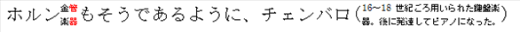
    
    示例结束]
    
    此元素的内容模型由 [§17.17.4] 中定义的通用布尔属性定义。

=== "英文"

    This element specifies whether applications should fully justify the contents of incomplete lines which end in a soft line break when the parent paragraph is fully justified using the jc element ([§17.3.1.13]).
    
    Typically, applications shall fully justify all lines in a paragraph when that setting is specified using the jc element except for the last line in the paragraph (the line ending with the paragraph mark). This element, when present with a val attribute value of true (or equivalent), specifies that any line which ends in a soft line break shall also not be fully justified when the paragraph specifies that setting.
    
    [Example: Consider a WordprocessingML document with a paragraph whose first single line consists of East Asian characters followed by a soft paragraph mark. The default presentation would have the contents of that line fully justified:
    
    
    
    However, if this compatibility setting is turned on:
    
    ```xml
    <w:compat>
        <w:doNotExpandShiftReturn />
    </w:compat>
    ```
    
    Then this line is not fully justified, as it ends with a soft line break, resulting in the following output: 
    
    
    
    end example]
    
    This element’s content model is defined by the common boolean property definition in [§17.17.4].

### 17.15.3.6 doNotLeaveBackslashAlone (将反斜杠显示为日元符号)

**doNotLeaveBackslashAlone (Display Backslash As Yen Sign)**

=== "中文"

    此元素指定应用程序在显示文档内容时，是否应自动将反斜杠字符显示为日元字符。
    
    通常，不会自动执行一个字符到另一个字符的仅显示转换。此元素在存在时，如果 val 属性值为 true（或等效值），则指定所有反斜杠字符 (\, U+005C) 在文档内容显示时，应自动使用日元符号 (¥, U+00A5) 显示。此设置不会更改 WordprocessingML 文档中存储的字符的 Unicode 值。
    
    [理由：在日本代码页 932 中，0x5C 是日元符号（而在大多数其他代码页中，它是反斜线——也称为反斜杠）。为了适应用户期望此代码点显示为日元符号，此设置指示字符仅在显示时重新映射到 Unicode 字符 ¥，以保持预期的外观。结束理由]
    
    [示例：考虑一个包含以下内容的 WordprocessingML 文档：
    
        Hello \ world.
    
    
    默认的显示将是完全一样的：
    
        Hello \ world.
    
    然而，如果打开了此兼容性设置：
    
    ```xml
    <w:compat>
        <w:doNotLeaveBackslashAlone />
    </w:compat>
    ```
    
    那么反斜杠将显示为 ¥，结果输出如下：
    
        Hello ¥ world.
    
    示例结束]
    
    此元素的内容模型由 [§17.17.4] 中定义的通用布尔属性定义。

=== "英文"

    This element specifies whether applications should autodisplay the backslash character using the yen character when displaying the contents of this document.
    
    Typically, no automatic display-only conversion of one character to another is performed. This element, when present with a val attribute value of true (or equivalent), specifies that all occurances of the backslash character (\, U+005C) shall automatically be displayed using the yen symbol (¥, U+00A5) when the contents of the document are displayed. This setting does not change the Unicode value of the character stored in the underlying WordprocessingML document.
    
    [Rationale: In Japanese code page 932, 0x5C is the yen sign (whereas, in most other code pages, it is the reverse solidus–also known as the backslash). In order to accommodate the user expectation that this code point appear as the yen sign, this setting dictates that the character be remapped, for display only, to the Unicode character ¥, such that the expected appearance is maintained. end rationale]
    
    [Example: Consider a WordprocessingML document containing the following:
    
        Hello \ world.
    
    
    The default presentation would have exactly that:
        
        Hello \ world.
    
    However, if this compatibility setting is turned on:
    
    ```xml
    <w:compat>
        <w:doNotLeaveBackslashAlone />
    </w:compat>
    ```
    
    Then the backslash would be displayed as ¥, resulting in the following output:
        
        Hello ¥ world.
    
    end example]
    
    This element’s content model is defined by the common boolean property definition in [§17.17.4].

### 17.15.3.7 spaceForUL (为带下划线的东亚文本在基线下方添加额外的空格)

**spaceForUL (Add Additional Space Below Baseline For Underlined East Asian Text)**

=== "中文"

    此元素指定在使用 u 元素为 WordprocessingML 文档中的东亚内容添加下划线时，是否应向字体属性添加额外的下降，以确保字体中的字符与应用于文本的下划线之间有足够的间距。
    
    通常，对于已添加下划线的包含东亚文本的文本运行，不会进行任何调整。当此元素存在且 val 属性值为 true（或等效值）时，指定在满足以下条件时：
    
    - 文本运行包含东亚字符
    - 文本运行不使用 textAlignment 属性定义的基线字体对齐
    
    为了在文本字符和下划线之间提供额外的填充，将以下两个值中的较大值添加到该字体的下降属性：
    
    - 字体大小的 3%
    - 40 磅的二十分之一点（对于日文文本为 31 磅的二十分之一点）
    
    [示例：考虑一个由以下内容组成的 WordprocessingML 文档，其中包含一个单一的带下划线的日文文本运行：
    
    ```xml
    <w:p>
        <w:r>
            <w:rPr>
                <w:u w:val="double" />
            </w:rPr>
            <w:t>クリスタ</w:t>
        </w:r>
    </w:p>
    ```
    
    如果显示此文档，则文本和下划线将如下所示布局：
    
    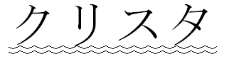
    
    然而，如果打开了此兼容性设置：
    
    ```xml
    <w:compat>
        <w:spaceForUL />
    </w:compat>
    ```
    
    那么将根据上述逻辑向文本添加指定的额外下降，结果输出如下：
    
    
    
    示例结束]
    
    此元素的内容模型由 [§17.17.4] 中定义的通用布尔属性定义。

=== "英文"

    This element specifies whether East Asian content in a WordprocessingML document which has been underlined using the u element shall have additional descent added to the properties of the font in order to ensure that there is adequate spacing between the characters in the font and the underlining applied to the text.
    
    Typically, no adjustments are made to the contents of text runs containing East Asian text which have been underlined. This element, when present with a val attribute value of true (or equivalent), specifies that whenever the following conditions are met:
    
    - The text run contains East Asian characters
    - The text run is not using baseline font alignment as defined by the textAlignment property
    
    That the larger of the following two values is added to the descent property of that font in order to provide additional padding between the text characters and the underline:
    
    - 3 percent of the font size
    - 40 twentieths of a point (31 twentieths of a point for Japanese text)
    
    [Example: Consider a WordprocessingML document consisting of a single run of underlined Japanese text, as follows:
    
    ```xml
    <w:p>
        <w:r>
            <w:rPr>
                <w:u w:val="double" />
            </w:rPr>
            <w:t>クリスタ</w:t>
        </w:r>
    </w:p>
    ```
    
    If this document is displayed, then the text is laid out along with the underline, as follows:
    
    
    
    However, if this compatibility setting is turned on:
    
    ```xml
    <w:compat>
    <w:spaceForUL />
    </w:compat>
    ```
    
    Then the additional descent specified using the logic above is added to the text, resulting in the following output:
    
    
    
    end example]
    
    This element’s content model is defined by the common boolean property definition in [§17.17.4].

### 17.15.3.8 ulTrailSpace (为所有尾随空格添加下划线)

**ulTrailSpace (Underline All Trailing Spaces)**

=== "中文"
    
    此元素指定应用程序是否应在内容被下划线时，在行中所有尾随空格下方显示下划线。尾随空格是指在同一行中不被非空格字符跟随的所有空格字符。
    
    通常，应用程序不会在应用于它们的下划线属性上的所有尾随空格上显示下划线。当此元素存在且 val 属性值为 true（或等效值）时，指定如果应用于该内容，则包括尾随空格在内的所有字符将显示下划线。
    
    [示例：考虑一个 WordprocessingML 文档，其中包含以下拉丁字母字符和标点符号的行，后面是一系列空格：
    
    ```xml
    <w:r>
        <w:rPr>
            <w:u w:val="single"/>
        </w:rPr>
        <w:t>Example text. Example text. Example text. Example text. Example text.
        </w:t>
    </w:r>
    ```
    
    默认的显示方式是这些尾随空格上没有下划线：
    
    
    
    然而，如果打开了此兼容性设置：
    
    ```xml
    <w:compat>
        <w:ulTrailSpace />
    </w:compat>
    ```
    
    那么所有的尾随空格都将被下划线，结果输出如下：
    
    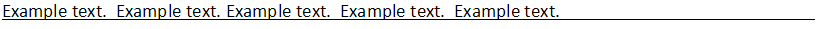
    
    示例结束]
    
    此元素的内容模型由 [§17.17.4] 中定义的通用布尔属性定义。

=== "英文"
    
    This element specifies whether applications shall display underlining beneath all trailing spaces in the contents of a line when those contents are underlined. Trailing spaces are all space characters which are not followed by non-space characters on the same line.
    
    Typically, applications do not display underlining on all trailing spaces which have the underline property applied to them. This element, when present with a val attribute value of true (or equivalent), specifies that all characters with underline applied, including trailing spaces, shall display underlining if it is applied to that content.
    
    [Example: Consider a WordprocessingML document with the following line of Latin alphabetical character and punctuation, trailed by a series of spaces:
    
    ```xml
    <w:r>
        <w:rPr>
            <w:u w:val="single"/>
        </w:rPr>
        <w:t>Example text. Example text. Example text. Example text. Example text.
        </w:t>
    </w:r>
    ```
    
    The default presentation would have no underlining on those trailing spaces:
    
    
    
    However, if this compatibility setting is turned on:
    
    ```xml
    <w:compat>
        <w:ulTrailSpace />
    </w:compat>
    ```
    
    Then all trailing spaces would be underlined, resulting in the following output:
    
    
    
    end example]
    
    This element’s content model is defined by the common boolean property definition in [§17.17.4].


[§17.15.1]: #17151-文档设置
[§17.15.1.1 activeWritingStyle]: #171511-activewritingstyle-语法检查设置
[§17.15.1.2 alignBordersAndEdges]: #171512-alignbordersandedges-将段落和表格边框与页面边框对齐
[§17.15.1.3 alwaysMergeEmptyNamespace]: #171513-alwaysmergeemptynamespace-不要将没有命名空间的自定义-xml-元素标记为无效
[§17.15.1.4]: #171514-alwaysshowplaceholdertext-使用自定义-xml-元素名称作为默认占位符文本
[§17.15.1.5]: #171515-attachedschema-附加自定义-xml-架构
[§17.15.1.6]: #171516-attachedtemplate-附加文件模板
[§17.15.1.7]: #171517-autocaption-单一自动字幕设置
[§17.15.1.8]: #171518-autocaptions-自动字幕设置
[§17.15.1.9]: #171519-autoformatoverride-允许自动格式化以覆盖格式化保护设置
[§17.15.1.10]: #1715110-autohyphenation-显示时自动连接文档内容
[§17.15.1.11]: #1715111-bookfoldprinting-书籍折页印刷
[§17.15.1.12]: #1715112-bookfoldprintingsheets-每本小册子的页数
[§17.15.1.13]: #1715113-bookfoldrevprinting-反向书籍折叠打印
[§17.15.1.14]: #1715114-bordersdonotsurroundfooter-页面边框不包括页脚
[§17.15.1.15]: #1715115-bordersdonotsurroundheader-页面边框不包括页眉
[§17.15.1.16]: #1715116-caption-单一字幕类型定义
[§17.15.1.17]: #1715117-captions-字幕设置
[§17.15.1.18]: #1715118-characterspacingcontrol-字符级空白压缩
[§17.15.1.19]: #1715119-clickandtypestyle-应用于自动生成的段落的段落样式
[§17.15.1.20]: #1715120-clrschememapping-主题颜色映射
[§17.15.1.21]: #1715121-compat-兼容性设置
[§17.15.1.22]: #1715122-consecutivehyphenlimit-连续连字符的最大行数
[§17.15.1.23]: #1715123-decimalsymbol-现场代码评估的小数点
[§17.15.1.24]: #1715124-defaulttablestyle-新插入表格的默认表格样式
[§17.15.1.25]: #1715125-defaulttabstop-自动制表位之间的距离
[§17.15.1.26]: #1715126-displaybackgroundshape-显示文档时显示背景对象
[§17.15.1.27]: #1715127-displayhorizontaldrawinggridevery-水平网格线之间的距离
[§17.15.1.28]: #1715128-displayverticaldrawinggridevery-垂直网格线之间的距离
[§17.15.1.29]: #1715129-documentprotection-文档编辑限制
[§17.15.1.30]: #1715130-documenttype-文件分类
[§17.15.1.31]: #1715131-docvar-单文档变量
[§17.15.1.32]: #1715132-docvars-文档变量
[§17.15.1.33]: #1715133-donotautocompresspictures-不自动压缩图像
[§17.15.1.34]: #1715134-donotdemarcateinvalidxml-不显示无效自定义-xml-标记的视觉指示符
[§17.15.1.35]: #1715135-donotdisplaypageboundaries-不显示页眉页脚或页面之间的视觉边界
[§17.15.1.36]: #1715136-donotembedsmarttags-保存时删除智能标签
[§17.15.1.37]: #1715137-donothyphenatecaps-请勿将所有大写字母的单词用连字符连接
[§17.15.1.38]: #1715138-donotincludesubdocsinstats-文档统计中不包括文本框脚注和尾注中的内容
[§17.15.1.39]: #1715139-donotshadeformdata-不显示表单字段的视觉指示器
[§17.15.1.40]: #1715140-donottrackformatting-跟踪修订时不跟踪格式修订
[§17.15.1.41]: #1715141-donottrackmoves-跟踪修订时不要使用移动语法
[§17.15.1.42]: #1715142-donotusemarginsfordrawinggridorigin-不要使用边距绘制网格原点
[§17.15.1.43]: #1715143-donotvalidateagainstschema-不根据架构验证自定义-xml-标记
[§17.15.1.44]: #1715144-drawinggridhorizontalorigin-绘制网格水平原点
[§17.15.1.45]: #1715145-drawinggridhorizontalspacing-绘制网格水平网格单位尺寸
[§17.15.1.46]: #1715146-drawinggridverticalorigin-绘制网格垂直原点
[§17.15.1.47]: #1715147-drawinggridverticalspacing-绘制网格垂直网格单位尺寸
[§17.15.1.48]: #1715148-forceupgrade-打开时升级文档
[§17.15.1.49]: #1715149-formsdesign-重新保存时结构化文档标签占位符的文本
[§17.15.1.50]: #1715150-gutterattop-将装订线放置在页面顶部
[§17.15.1.51]: #1715151-hidegrammaticalerrors-不显示语法错误的视觉指示
[§17.15.1.52]: #1715152-hidespellingerrors-不显示拼写错误的视觉指示
[§17.15.1.53]: #1715153-hyphenationzone-连字区
[§17.15.1.54]: #1715154-ignoremixedcontent-验证自定义-xml-标记时忽略混合内容
[§17.15.1.55]: #1715155-linkstyles-自动更新文档模板的样式
[§17.15.1.56]: #1715156-listseparator-用于字段代码评估的列表分隔符
[§17.15.1.57]: #1715157-mirrormargins-镜像页边距
[§17.15.1.58]: #1715158-nolinebreaksafter-无法结束行的自定义字符集
[§17.15.1.59]: #1715159-nolinebreaksbefore-不能以行开头的自定义字符集
[§17.15.1.60]: #1715160-nopunctuationkerning-从不紧排标点字符
[§17.15.1.61]: #1715161-printformsdata-仅打印表单字段内容
[§17.15.1.62]: #1715162-printfractionalcharacterwidth-打印小数字符宽度
[§17.15.1.63]: #1715163-printpostscriptovertext-打印带有文档文本的-postscript-代码
[§17.15.1.64]: #1715164-printtwoonone-每张打印两页
[§17.15.1.65]: #1715165-proofstate-拼写和语法检查状态
[§17.15.1.66]: #1715166-readmodeinklockdown-冻结文档布局
[§17.15.1.67]: #1715167-removedateandtime-从注解中删除日期和时间
[§17.15.1.68]: #1715168-removepersonalinformation-从文档属性中删除个人信息
[§17.15.1.69]: #1715169-revisionview-注解类型的可见性
[§17.15.1.70]: #1715170-rsid-单会话修订保存-id
[§17.15.1.71]: #1715171-rsidroot-原始文档修订保存-id
[§17.15.1.72]: #1715172-rsids-所有修订保存-id-值的列表
[§17.15.1.73]: #1715173-saveformsdata-只保存表单字段内容
[§17.15.1.74]: #1715174-saveinvalidxml-当自定义-xml-标记无效时允许将文档另存为-xml-文件
[§17.15.1.75]: #1715175-savepreviewpicture-保存时生成文档缩略图
[§17.15.1.76]: #1715176-savethroughxslt-另存为-xml-文件时使用的自定义-xsl-转换
[§17.15.1.77]: #1715177-savexmldataonly-仅保存自定义-xml-标记
[§17.15.1.78]: #1715178-settings-文档设置
[§17.15.1.79]: #1715179-showenvelope-显示电子邮件标题
[§17.15.1.80]: #1715180-showxmltags-显示自定义-xml-标记开始结束位置的视觉指示器
[§17.15.1.81]: #1715181-smarttagtype-补充智能标签信息
[§17.15.1.82]: #1715182-strictfirstandlastchars-对日语文本使用严格的避头规则
[§17.15.1.83]: #1715183-stylelockqfset-防止更换样式零件
[§17.15.1.84]: #1715184-stylelocktheme-防止主题部分被修改
[§17.15.1.85]: #1715185-stylepaneformatfilter-建议的文档样式列表过滤
[§17.15.1.86]: #1715186-stylepanesortmethod-文档样式列表的建议排序
[§17.15.1.87]: #1715187-summarylength-生成摘要时使用的文档百分比
[§17.15.1.88]: #1715188-themefontlang-主题字体语言
[§17.15.1.89]: #1715189-trackrevisions-跟踪文档修订
[§17.15.1.90]: #1715190-updatefields-打开时自动重新计算字段
[§17.15.1.91]: #1715191-usexsltwhensaving-通过自定义-xsl-转换将文档另存为-xml-文件
[§17.15.1.92]: #1715192-view-文档视图设置
[§17.15.1.93]: #1715193-writeprotection-写保护
[§17.15.1.94]: #1715194-zoom-倍率设置
[§17.15.2]: #17152-web页面设置
[§17.15.2.1]: #171521-allowpng-允许-png-作为图形格式
[§17.15.2.2]: #171522-blockquote-html-blockquote-元素的数据
[§17.15.2.3]: #171523-bodydiv-html-body-元素的数据
[§17.15.2.4]: #171524-bottom-html-div-的底部边框
[§17.15.2.5]: #171525-color-框架分割颜色
[§17.15.2.6]: #171526-div-有关单个-html-div-元素的信息
[§17.15.2.7]: #171527-divbdr-html-div-的边框集
[§17.15.2.8]: #171528-divs-有关-html-div-元素的信息
[§17.15.2.9]: #171529-divschild-当前-div-中包含的子-div-元素
[§17.15.2.10]: #1715210-donotorganizeinfolder-不要将支持文件放在子目录中
[§17.15.2.11]: #1715211-donotrelyoncss-不要依赖-css-进行字体格式设置
[§17.15.2.12]: #1715212-donotsaveassinglefile-推荐网页格式而不是单一文件网页格式
[§17.15.2.13]: #1715213-donotuselongfilenames-请勿使用长度超过-83-个字符的文件名
[§17.15.2.14]: #1715214-encoding-另存为网页时的输出编码
[§17.15.2.15]: #1715215-flatborders-框架集分割器边框样式
[§17.15.2.16]: #1715216-frame-单个框架属性
[§17.15.2.17]: #1715217-framelayout-框架集布局
[§17.15.2.18]: #1715218-frameset-嵌套框架集定义
[§17.15.2.19]: #1715219-frameset-根框架集定义
[§17.15.2.20]: #1715220-framesetsplitbar-框架集拆分器属性
[§17.15.2.21]: #1715221-left-html-div-的左边框
[§17.15.2.22]: #1715222-linkedtofile-维护现有文件的链接
[§17.15.2.23]: #1715223-longdesc-框架详细描述
[§17.15.2.24]: #1715224-marbottom-html-div-的下边距
[§17.15.2.25]: #1715225-marh-框架的顶部和底部边距
[§17.15.2.26]: #1715226-marleft-html-div-的左边距
[§17.15.2.27]: #1715227-marright-html-div-的右边距
[§17.15.2.28]: #1715228-martop-html-div-的上边距
[§17.15.2.29]: #1715229-marw-框架的左右边距
[§17.15.2.30]: #1715230-name-框架名称
[§17.15.2.31]: #1715231-noborder-不显示框架集拆分器
[§17.15.2.32]: #1715232-noresizeallowed-框架无法调整大小
[§17.15.2.33]: #1715233-optimizeforbrowser-禁用目标-web-配置文件不支持的功能
[§17.15.2.34]: #1715234-pixelsperinch-图形图像的每英寸像素数
[§17.15.2.35]: #1715235-right-html-div-的右边框
[§17.15.2.36]: #1715236-savesmarttagsasxml-将智能标记数据保存在-xml-属性包中
[§17.15.2.37]: #1715237-scrollbar-滚动条显示选项
[§17.15.2.38]: #1715238-sourcefilename-框架源文件
[§17.15.2.39]: #1715239-sz-框架尺寸
[§17.15.2.40]: #1715240-sz-嵌套框架集尺寸
[§17.15.2.41]: #1715241-targetscreensz-网页的目标屏幕尺寸
[§17.15.2.42]: #1715242-title-框架或框架集标题
[§17.15.2.43]: #1715243-top-html-div-的顶部边框
[§17.15.2.44]: #1715244-w-框架集分离器宽度
[§17.15.2.45]: #1715245-websettings-网页设置
[§17.15.3]: #17153-语言兼容性设置
[§17.15.3.1]: #171531-adjustlineheightintable-将文档网格线间距添加到表格单元格中的线
[§17.15.3.2]: #171532-applybreakingrules-使用传统的埃塞俄比亚和阿姆哈拉语突破规则
[§17.15.3.3]: #171533-balancesinglebytedoublebytewidth-平衡单字节和双字节字符
[§17.15.3.4]: #171534-compatsetting-自定义兼容性设置
[§17.15.3.5]: #171535-donotexpandshiftreturn-不要证明以软换行符结尾的行是合理的
[§17.15.3.6]: #171536-donotleavebackslashalone-将反斜杠显示为日元符号
[§17.15.3.7]: #171537-spaceforul-为带下划线的东亚文本在基线下方添加额外的空格
[§17.15.3.8]: #171538-ultrailspace-为所有尾随空格添加下划线


[§17.2.1]: ./02maindocment.md#1721-background-文档背景

[§17.3.4]: ./03paragraphs.md#1734-边框属性-ct_border
[§17.3.1.13]: ./03paragraphs.md#173213-emboss-压花
[§17.3.1.24]: ./03paragraphs.md#173224-position-垂直升高或降低的文本
[§17.3.1.16]: ./03paragraphs.md#173216-i-斜体
[§17.3.2.19]: ./03paragraphs.md#173219-kern-字体字距调整
[§17.3.2.20]: ./03paragraphs.md#173220-lang-运行内容的语言

[§17.4.39]: ./04tabls.md#17439-tblborders-表格边框异常合集
[§17.4.62]: ./04tabls.md#17462-tblstyle-参考表格样式

[§17.5.1.9]: ./05custom.md#17519-smarttag-内联级智能标签
[§17.5.2.25]: ./05custom.md#175225-placeholder-结构化文档标签占位符文本
[§17.5.2.39]: ./05custom.md#175239-showingplchdr-当前内容是占位符文本

[§17.6.5]: ./06sections.md#1765-docgrid-文档网格
[§17.6.10]: ./06sections.md#17610-pgborders-页面边框
[§17.6.11]: ./06sections.md#17611-pgmar-页边距

[§17.7.4.4]: ./07styles.md#17744-hidden-从用户界面隐藏样式
[§17.7.4.5]: ./07styles.md#17745-latentstyles-潜在样式信息
[§17.7.4.7]: ./07styles.md#17747-locked-样式无法应用
[§17.7.4.9]: ./07styles.md#17749-name-主要样式名称
[§17.7.4.16]: ./07styles.md#177415-rsid-样式定义的修订标识符

[§17.12.5]: ./12glossary.md#17125-docpart-术语文档条目

[§17.13.5.31]: ./13annotations.md#1713531-rprchange-运行属性的修订信息
[§17.13.8.1]: ./13annotations.md#171381-prooferr-校对错误锚点

<!-- [§17.15.1.7]: -->
<!-- [§17.15.1.29]: -->
<!-- [§17.15.1.93]: -->
<!-- [§17.15.2.41]: -->

[§17.16.5]: ./16fields.md#17165-字段定义

[§17.17.4]: ./17miscellaneous.md#17174-布尔属性-ct_onoff

[§17.18.5]: ./18simpletypes.md#17185-st_captionpos-自动字幕定位值
[§17.18.6]: ./18simpletypes.md#17186-st_chaptersep-章节分隔符类型
[§17.18.7]: ./18simpletypes.md#17187-st_characterspacing-字符级空白压缩设置
[§17.18.10]: ./18simpletypes.md#171810-st_decimalnumber-十进制数值
[§17.18.11]: ./18simpletypes.md#171811-st_decimalnumberorpercent-百分比测量
[§17.18.18]: ./18simpletypes.md#171818-st_docprotect-文档保护类型
[§17.18.19]: ./18simpletypes.md#171819-st_doctype-文档分类值
[§17.18.31]: ./18simpletypes.md#171831-st_framelayout-框架集布局顺序
[§17.18.32]: ./18simpletypes.md#171832-st_framescrollbar-框架滚动条可见性
[§17.18.38]: ./18simpletypes.md
[§17.18.50]: ./18simpletypes.md#171850-st_longhexnumber-八位十六进制值
[§17.18.59]: ./18simpletypes.md#171859-st_numberformat-编号格式
[§17.18.67]: ./18simpletypes.md#171867-st_pixelsmeasure-以像素为单位的测量
[§17.18.69]: ./18simpletypes.md#171869-st_proof-校对状态值
[§17.18.81]: ./18simpletypes.md#171881-st_signedtwipsmeasure-以二十分之一为单位的有符号测量
[§17.18.82]: ./18simpletypes.md#171882-st_stylesort-样式排序设置
[§17.18.86]: ./18simpletypes.md#171886-st_targetscreensz-生成网页的目标屏幕尺寸
[§17.18.97]: ./18simpletypes.md
[§17.18.98]: ./18simpletypes.md
[§17.18.102]: ./18simpletypes.md#1718102-st_view-文档视图值
[§17.18.103]: ./18simpletypes.md#1718103-st_wmlcolorschemeindex-主题颜色参考
[§17.18.105]: ./18simpletypes.md#1718105-st_zoom-倍率预设值

[§20.1.4.1.16]: ../chapter20/main/styles.md#2014116-font-字体
[§20.1.4.1.24]: ../chapter20/main/styles.md#2014124-majorfont-主要字体
[§20.1.4.1.25]: ../chapter20/main/styles.md#2014125-minorfont-次要字体

[§21.1.2.3.1]: ../chapter21/main.md#211231-cs-复杂脚本字体
[§21.1.2.3.3]: ../chapter21/main.md#211233-ea-东亚字体
[§21.1.2.3.7]: ../chapter21/main.md#211237-latin-拉丁字体

[§22.8.2.1]: ../chapter22/officedocumentrelationships.md#22821-st_relationshipid-显式关系-id

[§22.9.2.6]: ../chapter22/sharedsimpletypes.md#22926-st_lang-语言参考
[§22.9.2.7]: ../chapter22/sharedsimpletypes.md#22927-st_onoff-开关值
[§22.9.2.13]: ../chapter22/sharedsimpletypes.md#229213-st_string-字符串
[§22.9.2.14]: ../chapter22/sharedsimpletypes.md#229214-st_twipsmeasure-以二十分之一点为单位的测量

