# 17.18 简单类型

**Simple Types**

## 17.18.1 ST_AnnotationVMerge (表格单元格垂直合并修订类型)

**ST_AnnotationVMerge (Table Cell Vertical Merge Revision Type)**

=== "中文"

    这类简单类型指定了在单元格合并（或拆分）修订中应用于表格单元格的垂直合并设置的可能值。
    
    [示例：考虑一个两行两列的表格，其中第二列的单元格被合并，并且此更改被记录为修订。表格中最后一个单元格的注释如下所示：
    
    ```xml
    <w:tc>
        <w:tcPr>
            <w:cellMerge … w:vMerge="cont" />
        </w:tcPr>
        …
    </w:tc>
    ```
    
    vmerge 属性值为 cont 指定了表格单元格上的修订导致它与其上方之前垂直合并的单元格集（无论是一个单元格还是多个单元格）合并。结束示例]
    
    这种简单类型的内容是 W3C XML Schema 字符串数据类型的限制。
    
    这种简单类型被限制为下表中列出的值：
    
    - **cont**（垂直合并单元格）：指定修订导致此单元格与其上方的单元格垂直合并。
    - **rest**（垂直拆分单元格）：指定修订导致此单元格与其上方的单元格垂直拆分。
    
    [注意：这种简单类型的内容模型（ST_AnnotationVMerge）的 W3C XML Schema 定义位于 §A.1。结束注意]

=== "英文"

    This simple type specifies the possible values for the vertical merge setting which applied to a table cell by a cell merge (or split) revision.
    
    [Example: Consider a two row by two column table in which the cells in the second column are merged, and this change is tracked as a revision. The annotation on the last cell in the table would appear as follows:
    
    ```xml
    <w:tc>
        <w:tcPr>
            <w:cellMerge … w:vMerge="cont" />
        </w:tcPr>
        …
    </w:tc>
    ```
    
    The vmerge attribute value of cont specifies that the revision on the table cell resulted in it being merged with the previous set of vertically merged cells above it (whether that was one cell or many). end example]
    
    This simple type's contents are a restriction of the W3C XML Schema string datatype.
    
    This simple type is restricted to the values listed in the following table:
        
    - **cont** (Vertically Merged Cell): Specifies that the revision resulted in this cell being vertically merged with the cell above it.
    - **rest** (Vertically Split Cell): Specifies that the revision resulted in this cell being vertically split from the one above it.
    
    [Note: The W3C XML Schema definition of this simple type’s content model (ST_AnnotationVMerge) is located in §A.1. end note]

## 17.18.2 ST_Border (边框样式)

**ST_Border (Border Styles)**

=== "中文"

    这个简单类型指定了可以为具有边框的WordprocessingML对象设置的边框类型。
    
    边框可以分为两种类型：
    
    - 线条边框，用于指定在绘制指定对象的边框时使用的图案。
    - 艺术边框，用于指定在绘制指定对象的边框时使用的重复图像。
    
    线条边框可以在任何允许设置边框的对象上指定，但艺术边框只能在页面级别使用，即在pgBorders元素（[§17.6.10]）下的边框。
    
    对于艺术边框，每个边框定义由八个图像组合而成，如下所示：
    
    
    
    对于边缘边框（上、下、左、右），边框图像根据需要重复，以覆盖两个相交的角之间的距离。每种边框艺术的电子规范定义都包含在附录F中。
    
    [示例：考虑一个结果如下的左边框WordprocessingML：
    
    ```xml
    <w:left w:val="single" …/>
    ```
    
    这个边框的val属性是single，表示边框样式为单线边框。示例结束]
    
    这个简单类型的内容是W3C XML Schema字符串数据类型的一个限制。
    
    这个简单类型仅限于下表中列出的值：
    
    - **apples** (Apples Art Border)
    
        使用以下图像指定一个艺术边框: 
    
        所有边: 
    
    - **archedScallops** (Arched Scallops Art Border)
    
        使用以下图像指定一个艺术边框: 
        
        所有边: 
    
    - **babyPacifier** (Baby Pacifier Art Border)
    
        使用以下图像指定一个艺术边框: 
        
        所有边: 
    
    - **babyRattle** (Baby Rattle Art Border)
    
        使用以下图像指定一个艺术边框: 
        
        所有边: 
    
    - **balloons3Colors** (Three Color Balloons Art Border)
    
        使用以下图像指定一个艺术边框: 
        
        所有边: 
    
    - **balloonsHotAir** (Hot Air Balloons Art Border)
    
        使用以下图像指定一个艺术边框: 
        
        所有边: 
    
    - **basicBlackDashes** (Black Dash Art Border)
    
        使用以下图像指定一个艺术边框: 
        
        Top and Bottom: 
        
        Left and Right: 
    
        Top Left: 
        
        Top Right: 
        
        Bottom Left: 
        
        Bottom Right: 
    
    - **basicBlackDots** (Black Dot Art Border)
    
        使用以下图像指定一个艺术边框: 
        
        所有边: 
    
    - **basicBlackSquares** (Black Square Art Border)
    
        使用以下图像指定一个艺术边框: 
        
        所有边: 
    
    - **basicThinLines** (Thin Line Art Border)
    
        使用以下图像指定一个艺术边框: 
        
        Top and Bottom: 
        
        Left and Right: 
    
        Top Left: 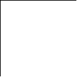
        
        Top Right: 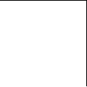
        
        Bottom Left: 
        
        Bottom Right: 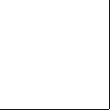
    
    - **basicWhiteDashes** (White Dash Art Border)
    
        使用以下图像指定一个艺术边框: 
        
        Top and Bottom: 
        
        Left and Right: 
    
        Top Left: 
        
        Top Right: 
        
        Bottom Left: 
        
        Bottom Right: 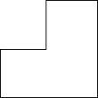
    
    - **basicWhiteDots** (White Dot Art Border)
    
        使用以下图像指定一个艺术边框: 
        
        所有边: 
    
    - **basicWhiteSquares** (White Square Art Border)
    
        使用以下图像指定一个艺术边框: 
        
        所有边: 
    
    - **basicWideInline** (Wide Inline Art Border)
    
        使用以下图像指定一个艺术边框: 
        
        Top: 
        
        Bottom: 
        
        Left: 
        
        Right: 
        
        Top Left: 
        
        Top Right: 
        
        Bottom Left: 
        
        Bottom Right: 
    
    - **basicWideMidline** (Wide Midline Art Border)
    
        使用以下图像指定一个艺术边框: 
        
        Top and Bottom: 
        
        Left and Right: 
    
        Top Left: 
        
        Top Right: 
        
        Bottom Left: 
        
        Bottom Right: 
    
    - **basicWideInline** (Wide Inline Art Border)
    
        使用以下图像指定一个艺术边框: 
        
        Top: 
        
        Bottom: 
        
        Left: 
        
        Right: 
        
        Top Left: 
        
        Top Right: 
        
        Bottom Left: 
        
        Bottom Right: 
    
    - **bats** (Bats Art Border)
    
        使用以下图像指定一个艺术边框: 
        
        所有边: 
    
    - **birds** (Birds Art Border)
    
        使用以下图像指定一个艺术边框: 
            
        Top, Bottom, Top Left, Top Right, Bottom Left and Bottom Right: 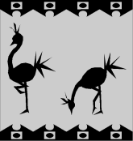
        
        Left and Right: 
    
        <!--   -->
    
        [Note: Second image is blank. end note]
    
    - **birdsFlight** (Birds Flying Art Border)
    
        使用以下图像指定一个艺术边框: 
            
        所有边: 
    
    - **cabins** (Cabin Art Border)
    
        使用以下图像指定一个艺术边框: 
            
        所有边: 
    
    - **cakeSlice** (Cake Art Border)
    
        使用以下图像指定一个艺术边框: 
                
        所有边: 
    
    - **candyCorn** (Candy Corn Art Border)
    
        使用以下图像指定一个艺术边框: 
        
        Top: 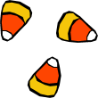
        
        Bottom: 
        
        Left: 
        
        Right: 
        
        Top Left: 
        
        Top Right: 
        
        Bottom Left: 
        
        Bottom Right: 
    
    - **celticKnotwork** (Knot Work Art Border)
    
        使用以下图像指定一个艺术边框: 
        
        Top: 
        
        Bottom: 
        
        Left: 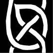
        
        Right: 
        
        Top Left: 
        
        Top Right: 
        
        Bottom Left: 
        
        Bottom Right: 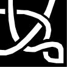
    
    - **certificateBanner** (Certificate Banner Art Border)
    
        使用以下图像指定一个艺术边框: 
        
        Top: 
        
        Bottom: 
        
        Left: 
        
        [Note: Image is blank. end note]
        
        Right: 
        [Note: Image is blank. end note]
        
        Top Left: 
        
        Top Right: 
        
        Bottom Left: 
        
        Bottom Right: 
    
    - **chainLink** (Chain Link Art Border)
    
        使用以下图像指定一个艺术边框: 
                    
        所有边: 
    
    - **champagneBottle** (Champagne Bottle Art Border)
    
        使用以下图像指定一个艺术边框: 
                    
        所有边: 
    
    - **checkedBarBlack** (Black and White Bar Art Border)
    
        使用以下图像指定一个艺术边框: 
        
        Top: 
        
        Bottom: 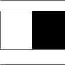
        
        Left: 
        
        Right: 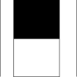
        
        Top Left: 
        
        Top Right: 
        
        Bottom Left: 
        
        Bottom Right: 
    
    - **checkedBarColor** (Color Checked Bar Art Border)
    
        使用以下图像指定一个艺术边框: 
        
        Top: 
        
        Bottom: 
        
        Left: 
        
        Right: 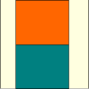
        
        Top Left: 
        
        Top Right: 
        
        Bottom Left: 
        
        Bottom Right: 
    
    - **checkered** (Checkerboard Art Border)
    
        使用以下图像指定一个艺术边框: 
                    
        所有边: 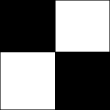
    
    - **christmasTree** (Christmas Tree Art Border)
    
        使用以下图像指定一个艺术边框: 
                    
        所有边: 
    
    - **circlesLines** (Circles And Lines Art Border)
    
        使用以下图像指定一个艺术边框: 
        
        Top: 
        
        Bottom: 
        
        Left: 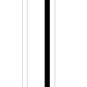
        
        Right: 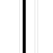
        
        Top Left: 
        
        Top Right: 
        
        Bottom Left: 
            
        Bottom Right: 
    
    - **circlesRectangles** (Circles and Rectangles Art Border)
    
        使用以下图像指定一个艺术边框: 
        
        Top: 
        
        Bottom: 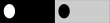
        
        Left: 
        
        Right: 
        
        Top Left: 
        
        Top Right: 
        
        Bottom Left: 
            
        Bottom Right: 
    
    - **classicalWave** (Wave Art Border)
    
        使用以下图像指定一个艺术边框: 
        
        Top: 
        
        Bottom: 
        
        Left: 
        
        Right: 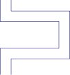
        
        Top Left: 
        
        Top Right: 
        
        Bottom Left: 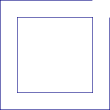
                
        Bottom Right: 
    
    - **clocks** (Clocks Art Border)
    
        使用以下图像指定一个艺术边框: 
                    
        所有边: 
    
    - **compass** (Compass Art Border)
    
        使用以下图像指定一个艺术边框: 
                    
        Top and Bottom: 
    
        Left and Right: 
    
        Top Left, Top Right, Bottom Left, and Bottom RIght: 
    
    - **confetti** (Confetti Art Border)
    
        使用以下图像指定一个艺术边框: 
        
        Top: 
        
        Bottom: 
        
        Left: 
        
        Right: 
        
        Top Left: 
        
        Top Right: 
        
        Bottom Left: 
                
        Bottom Right: 
    
    - **confettiGrays** (Confetti Art Border)
    
        使用以下图像指定一个艺术边框: 
                    
        所有边: 
    
    - **confettiOutline** (Confetti Art Border)
    
        使用以下图像指定一个艺术边框: 
                    
        所有边: 
    
    - **confettiStreamers** (Confetti Streamers Art Border)
    
        使用以下图像指定一个艺术边框: 
                    
        所有边: 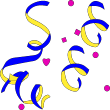
    
    - **confettiWhite** (Confetti Art Border)
    
        使用以下图像指定一个艺术边框: 
                    
        所有边: 
    
    - **cornerTriangles** (Corner Triangle Art Border)
    
        使用以下图像指定一个艺术边框: 
                    
        Top, Bottom, Left, and Right: 
        
        Top Left: 
        
        Top Right: 
        
        Bottom Left: 
                
        Bottom Right: 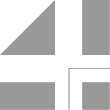
    
    - **couponCutoutDashes** (Dashed Line Art Border)
    
        使用以下图像指定一个艺术边框: 
                    
        Top, Bottom, Left, and Right: 
        
        Top Left: 
        
        Top Right: 
        
        Bottom Left: 
                    
        Bottom Right: 
    
    - **couponCutoutDots** (Dotted Line Art Border)
    
        使用以下图像指定一个艺术边框: 
        
        Top: 
        
        Bottom: 
        
        Left: 
        
        Right: 
        
        Top Left: 
        
        Top Right: 
        
        Bottom Left: 
                
        Bottom Right: 
    
    - **crazyMaze** (Maze Art Border)
    
        使用以下图像指定一个艺术边框: 
                    
        Top and Bottom: 
        
        Left and RIght: 
        
        Top Left, Top Right, Bottom Left and Bottom Right: 
    
    - **creaturesButterfly** (Butterfly Art Border)
    
        使用以下图像指定一个艺术边框: 
                    
        所有边: 
    
    - **creaturesFish** (Fish Art Border)
    
        使用以下图像指定一个艺术边框: 
                    
        所有边: 
    
    - **creaturesInsects** (Insects Art Border)
    
        使用以下图像指定一个艺术边框: 
        
        Top: 
        
        Bottom: 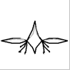
    
        Left and Right: 
    
        Top Left and Top Right: 
    
        Bottom Left and Bottom Right: 
    
    - **creaturesLadyBug** (Ladybug Art Border)
    
        使用以下图像指定一个艺术边框: 
                    
        所有边: 
    
    - **crossStitch** (Cross-stitch Art Border)
    
        使用以下图像指定一个艺术边框: 
                    
        所有边: 
    
    - **cup** (Cupid Art Border)
    
        使用以下图像指定一个艺术边框: 
                    
        所有边: 
    
    - **custom** (Custom Defined Art Border)
    
        Specifies a custom art border using the parent element's attributes to reference one or more customer art border images.
    
    - **dashDotStroked** (Dash Dot Strokes Line Border)
    
        Specifies a line border consisting of a line with a series of alternating thin and thick strokes around the parent object.
    
        [Example:
                    
        
    
        end example]
    
    - **dashed** (Dashed Line Border)
    
        Specifies a line border consisting of a dashed line around the parent object.
    
        [Example:
                    
        
    
        end example]
    
    - **dashSmallGap** (Dashed Line Border)
    
        Specifies a line border consisting of a dashed line with small gaps around the parent object.
    
        [Example:
                    
        
    
        end example]
    
    - **decoArch** (Archway Art Border)
    
        使用以下图像指定一个艺术边框: 
                    
        Top and Bottom: 
                    
        Left and Right: 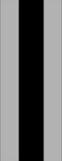
                    
        Top Left and Top Right: 
                    
        Bottom Left and Bottom Right: 
    
    - **decoArchColor** (Color Archway Art Border)
    
        使用以下图像指定一个艺术边框: 
                    
        Top and Bottom: 
                    
        Left and Right: 
                    
        Top Left: 
                    
        Top Right: 
                    
        Bottom Left and Bottom Right: 
    
    - **decoBlocks** (Blocks Art Border)
    
        使用以下图像指定一个艺术边框: 
        
        Top: 
        
        Bottom: 
        
        Left: 
        
        Right: 
        
        Top Left: 
        
        Top Right: 
        
        Bottom Left: 
                    
        Bottom Right: 
    
    - **diamondsGray** (Gray Diamond Art Border)
    
        使用以下图像指定一个艺术边框: 
                    
        所有边: 
    
    - **dotDash** (Dot Dash Line Border)
    
        Specifies a line border consisting of a alternating dotted and dashed line around the parent object.
    
        [Example:
                    
        
    
        end example]
    
    - **dotDotDash** (Dot Dot Dash Line Border)
    
        Specifies a line border consisting of a alternating dotted, dotted, dashed line around the parent object.
    
        [Example:
                    
        
    
        end example]
    
    - **dotted** (Dotted Line Border)
    
        Specifies a line border consisting of a dotted line around the parent object.
    
        [Example:
                    
        
    
        end example]
    
    - **double** (Double Line Border)
    
        Specifies a line border consisting of a double line around the parent object.
    
        [Example:
                    
        
    
        end example]
    
    - **doubleD** (Double D Art Border)
    
        使用以下图像指定一个艺术边框: 
        
        Top: 
        
        Bottom: 
        
        Left: 
        
        Right: 
        
        Top Left: 
        
        Top Right: 
        
        Bottom Left: 
                    
        Bottom Right: 
    
    - **doubleDiamonds** (Diamond Art Border)
    
        使用以下图像指定一个艺术边框: 
                    
        所有边: 
    
    - **doubleWave** (Double Wave Line Border)
    
        Specifies a line border consisting of a double wavy line around the parent object.
    
        [Example:
                    
        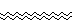
    
        end example]
    
    - **earth1** (Earth Art Border)
    
        使用以下图像指定一个艺术边框:
                        
        所有边: 
    
    - **earth2** (Earth Art Border)
    
        使用以下图像指定一个艺术边框:
                    
        所有边: 
    
    - **earth3** (Earth Art Border)
    
        使用以下图像指定一个艺术边框:
                    
        所有边: 
    
    - **eclipsingSquares1** (Shadowed Square Art Border)
    
        使用以下图像指定一个艺术边框:
                    
        所有边: 
    
    - **eclipsingSquares2** (Shadowed Square Art Border)
    
        使用以下图像指定一个艺术边框:
                    
        所有边: 
    
    - **eggsBlack** (Painted Egg Art Border)
    
        使用以下图像指定一个艺术边框:
                    
        所有边: 
    
    - **fans** (Fans Art Border)
    
        使用以下图像指定一个艺术边框:
                    
        所有边: 
    
    - **film** (Film Reel Art Border)
    
        使用以下图像指定一个艺术边框:
                    
        Top and Bottom: 
                    
        Left and Right: 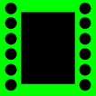
                    
        Top Left and Bottom Left: 
                    
        Top Right and Bottom Right: 
    
    - **firecrackers** (Firecracker Art Border)
    
        使用以下图像指定一个艺术边框:
                    
        所有边: 
    
    - **flowersBlockPrint** (Flowers Art Border)
    
        使用以下图像指定一个艺术边框:
                    
        所有边: 
    
    - **flowersDaisies** (Daisy Art Border)
    
        使用以下图像指定一个艺术边框:
                    
        所有边: 
    
    - **flowersModern1** (Flowers Art Border)
    
        使用以下图像指定一个艺术边框:
                        
        所有边: 
    
    - **flowersModern2** (Flowers Art Border)
    
        使用以下图像指定一个艺术边框:
                    
        Top and Bottom: 
                    
        Left and Right: 
        
        Top Left: 
        
        Top Right: 
        
        Bottom Left: 
                    
        Bottom Right: 
    
    - **flowersPansy** (Pansy Art Border)
    
        使用以下图像指定一个艺术边框:
                        
        所有边: 
    
    - **flowersRedRose** (Red Rose Art Border)
    
        使用以下图像指定一个艺术边框:
                        
        所有边: 
    
    - **flowersRoses** (Roses Art Border)
    
        使用以下图像指定一个艺术边框:
                        
        所有边: 
    
    - **flowersTeacup** (Flowers in a Teacup Art Border)
    
        使用以下图像指定一个艺术边框:
                        
        所有边: 
    
    - **flowersTiny** (Small Flower Art Border)
    
        使用以下图像指定一个艺术边框: 
        
        Top: 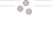
        
        Bottom: 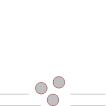
        
        Left: 
        
        Right: 
        
        Top Left: 
        
        Top Right: 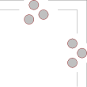
        
        Bottom Left: 
                    
        Bottom Right: 
    
    - **gems** (Gems Art Border)
    
        使用以下图像指定一个艺术边框: 
            
        Top, Bottom, Left and Right: 
        
        Top Left: 
        
        Top Right: 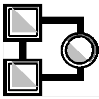
        
        Bottom Left: 
                        
        Bottom Right: 
    
    - **gingerbreadMan** (Gingerbread Man Art Border)
    
        使用以下图像指定一个艺术边框:
                            
        所有边: 
    
    - **gradient** (Triangle Gradient Art Border)
    
        使用以下图像指定一个艺术边框:
                            
        所有边: 
    
    - **handmade1** (Handmade Art Border)
    
        使用以下图像指定一个艺术边框: 
        
        Top: 
        
        Bottom: 
        
        Left: 
        
        Right: 
        
        Top Left: 
        
        Top Right: 
        
        Bottom Left: 
                        
        Bottom Right: 
    
    - **handmade2** (Handmade Art Border)
    
        使用以下图像指定一个艺术边框: 
        
        Top: 
        
        Bottom: 
        
        Left: 
        
        Right: 
        
        Top Left: 
        
        Top Right: 
        
        Bottom Left: 
                        
        Bottom Right: 
    
    - **heartBalloon** (Heart-Shaped Balloon Art Border)
    
        使用以下图像指定一个艺术边框:
                            
        所有边: 
    
    - **heartGray** (Gray Heart Art Border)
    
        使用以下图像指定一个艺术边框:
                            
        所有边: 
    
    - **hearts** (Hearts Art Border)
    
        使用以下图像指定一个艺术边框:
                            
        所有边: 
    
    - **heebieJeebies** (Pattern Art Border)
    
        使用以下图像指定一个艺术边框:
                            
        所有边: 
    
    - **holly** (Holly Art Border)
    
        使用以下图像指定一个艺术边框:
                            
        所有边: 
    
    - **houseFunky** (House Art Border)
    
        使用以下图像指定一个艺术边框:
                                
        所有边: 
    
    - **hypnotic** (Circular Art Border)
    
        使用以下图像指定一个艺术边框: 
        
        Top: 
        
        Bottom: 
        
        Left: 
        
        Right: 
        
        Top Left: 
        
        Top Right: 
        
        Bottom Left: 
                        
        Bottom Right: 
    
    - **iceCreamCones** (Ice Cream Cone Art Border)
    
        使用以下图像指定一个艺术边框:
                                
        所有边: 
    
    - **inset** (Inset Line Border)
    
        Specifies a line border consisting of an inset set of lines around the parent object.
    
        [Example:
                    
        
    
        end example]
    
    - **lightBulb** (Light Bulb Art Border)
    
        使用以下图像指定一个艺术边框:
                                
        所有边: 
    
    - **lightning1** (Lightning Art Border)
    
        使用以下图像指定一个艺术边框:
                                
        所有边: 
    
    - **lightning2** (Lightning Art Border)
    
        使用以下图像指定一个艺术边框: 
        
        Top: 
        
        Bottom: 
        
        Left and Top Left: 
        
        Right and Top RIght: 
        
        Bottom Left: 
                        
        Bottom Right: 
    
    - **mapleLeaf** (Maple Leaf Art Border)
    
        使用以下图像指定一个艺术边框:
                                
        所有边: 
    
    - **mapleMuffins** (Muffin Art Border)
    
        使用以下图像指定一个艺术边框:
                                
        所有边: 
    
    - **mapPins** (Map Pins Art Border)
    
        使用以下图像指定一个艺术边框:
                                
        所有边: 
    
    - **marquee** (Marquee Art Border)
    
        使用以下图像指定一个艺术边框:
                                
        Top and Bottom: 
                                
        Left and Right: 
                                    
        Top Left, Top Right, Bottom Left, and Bottom Right: 
    
    - **marqueeToothed** (Marquee Art Border)
    
        使用以下图像指定一个艺术边框: 
        
        Top: 
        
        Bottom: 
        
        Left: 
        
        Right: 
        
        Top Left: 
        
        Top Right: 
        
        Bottom Left: 
                        
        Bottom Right: 
    
    - **moons** (Moon Art Border)
    
        使用以下图像指定一个艺术边框: 
        
        Top: 
        
        Bottom: 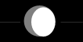
        
        Left: 
        
        Right: 
        
        Top Left: 
        
        Top Right: 
        
        Bottom Left: 
                            
        Bottom Right: 
    
    - **mosaic** (Mosaic Art Border)
    
        使用以下图像指定一个艺术边框:
                                
        所有边: 
    
    - **musicNotes** (Musical Note Art Border)
    
        使用以下图像指定一个艺术边框:
                                
        所有边: 
    
    - **nil** (No Border)
    
        Specifies that no border shall be applied to the current item.
    
    - **none** (No Border)
    
        Specifies that no border shall be applied to the current item.
    
    - **northwest** (Patterned Art Border)
    
        使用以下图像指定一个艺术边框: 
        
        Top: 
        
        Bottom: 
        
        Left: 
        
        Right: 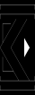
        
        Top Left: 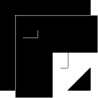
        
        Top Right: 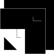
        
        Bottom Left: 
                                
        Bottom Right: 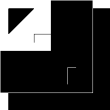
    
    - **outset** (Outset Line Border)
    
        Specifies a line border consisting of an outset set of lines around the parent object.
    
        [Example:
                        
        
    
        end example]
    
    - **ovals** (Oval Art Border)
    
        使用以下图像指定一个艺术边框: 
        
        Top and Bottom: 
        
        Right and Left: 
            
        Top Left, Top Right, Bottom Left and Bottom Right: 
    
    - **packages** (Package Art Border)
    
        使用以下图像指定一个艺术边框:
                                
        所有边: 
    
    - **palmsBlack** (Black Palm Tree Art Border)
    
        使用以下图像指定一个艺术边框:
                                
        所有边: 
    
    - **palmsColor** (Color Palm Tree Art Border)
    
        使用以下图像指定一个艺术边框:
                                
        所有边: 
    
    - **paperClips** (Paper Clip Art Border)
    
        使用以下图像指定一个艺术边框:
                                
        所有边: 
    
    - **papyrus** (Papyrus Art Border)
    
        使用以下图像指定一个艺术边框: 
        
        Top and Bottom: 
        
        Right and Left: 
            
        Top Left and Top Right: 
            
        Bottom Left and Bottom Right: 
    
    - **partyFavor** (Party Favor Art Border)
    
        使用以下图像指定一个艺术边框:
                                
        所有边: 
    
    - **partyGlass** (Party Glass Art Border)
    
        使用以下图像指定一个艺术边框:
                                
        所有边: 
    
    - **pencils** (Pencils Art Border)
    
        使用以下图像指定一个艺术边框:
                                
        所有边: 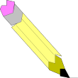
    
    - **people** (Character Art Border)
    
        使用以下图像指定一个艺术边框:
                                
        所有边: 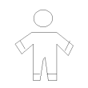
    
    - **peopleHats** (Character With Hat Art Border)
    
        使用以下图像指定一个艺术边框:
                                
        所有边: 
    
    - **peopleWaving** (Waving Character Border)
    
        使用以下图像指定一个艺术边框:
                                
        所有边: 
    
    - **poinsettias** (Poinsettia Art Border)
    
        使用以下图像指定一个艺术边框:
                                    
        所有边: 
    
    - **postageStamp** (Postage Stamp Art Border)
    
        使用以下图像指定一个艺术边框: 
        
        Top: 
        
        Bottom: 
        
        Left: 
        
        Right: 
        
        Top Left: 
        
        Top Right: 
        
        Bottom Left: 
                                
        Bottom Right: 
    
    - **pumpkin1** (Pumpkin Art Border)
    
        使用以下图像指定一个艺术边框:
                                            
        所有边: 
    
    - **pushPinNote1** (Push Pin Art Border)
    
        使用以下图像指定一个艺术边框: 
        
        Top: 
        
        Bottom: 
        
        Left: 
            
        Right: 
        
        Top Left: 
        
        Top Right: 
        
        Bottom Left: 
                                    
        Bottom Right: 
    
    - **pushPinNote2** (Push Pin Art Border)
    
        使用以下图像指定一个艺术边框: 
        
        Top: 
        
        Bottom: 
        
        Left: 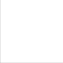
            
        Right: 
        
        Top Left: 
        
        Top Right: 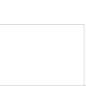
    
        Bottom Left: 
                                    
        Bottom Right: 
    
    - **pyramids** (Pyramid Art Border)
    
        使用以下图像指定一个艺术边框: 
        
        Top: 
        
        Bottom: 
        
        Left: 
            
        Right: 
        
        Top Left, Top Right, Bottom Left, and Bottom RIght: 
    
    - **pyramidsAbove** (Pyramid Art Border)
    
        使用以下图像指定一个艺术边框:
                                                
        所有边: 
    
    - **quadrants** (Quadrants Art Border)
    
        使用以下图像指定一个艺术边框: 
        
        Top and Bottom: 
        
        Left and RIght: 
        
        Top Left: 
    
        Top Right: 
    
        Bottom Left: 
    
        Bottom Right: 
    
    - **rings** (Rings Art Border)
    
        使用以下图像指定一个艺术边框:
                                                
        所有边: 
    
    - **safari** (Safari Art Border)
    
        使用以下图像指定一个艺术边框:
                                                
        所有边: 
    
    - **pushPinNote2** (Push Pin Art Border)
    
        使用以下图像指定一个艺术边框: 
        
        Top: 
        
        Bottom: 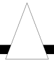
        
        Left: 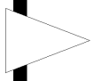
            
        Right: 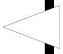
        
        Top Left: 
        
        Top Right: 
    
        Bottom Left: 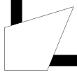
                                        
        Bottom Right: 
    
    - **sawtoothGray** (Gray Saw tooth Art Border)
    
        使用以下图像指定一个艺术边框: 
        
        Top: 
        
        Bottom: 
        
        Left: 
            
        Right: 
        
        Top Left: 
        
        Top Right: 
    
        Bottom Left: 
                                            
        Bottom Right: 
    
    - **scaredCat** (Scared Cat Art Border)
    
        使用以下图像指定一个艺术边框:
                                                
        所有边: 
    
    - **seattle** (Umbrella Art Border)
    
        使用以下图像指定一个艺术边框:
                                                
        所有边: 
    
    - **shadowedSquares** (Shadowed Squares Art Border)
    
        使用以下图像指定一个艺术边框:
                                                
        所有边: 
    
    - **shapes1** (Black and White Shapes Art Border)
    
        使用以下图像指定一个艺术边框: 
        
        Top and Bottom: 
        
        Right and Left: 
        
        Top Left, Top Right, Bottom Left and Bottom Right: 
    
    - **shapes2** (Black and White Art Border Two)
    
        使用以下图像指定一个艺术边框: 
        
        Top, Bottom, Left and Right: 
        
        Top Left, Top Right, Bottom Left and Bottom Right: 
    
    - **sharksTeeth** (Shark Tooth Art Border)
    
        使用以下图像指定一个艺术边框:
                                                
        所有边: 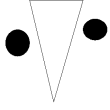
    
    - **shorebirdTracks** (Bird Tracks Art Border)
    
        使用以下图像指定一个艺术边框: 
        
        Top: 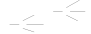
        
        Bottom: 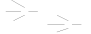
        
        Left: 
            
        Right: 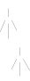
            
        Top Left, Top Right, Bottom Left and Bottom Right: 
    
    - **single** (Single Line Border)
    
        Specifies a line border consisting of a single line around the parent object.
    
        [Example:
                        
        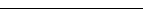
    
        end example]
    
    - **skyrocket** (Rocket Art Border)
    
        使用以下图像指定一个艺术边框:
                                                
        所有边: 
    
    - **snowflakeFancy** (Snowflake Art Border)
    
        使用以下图像指定一个艺术边框:
                                                
        所有边: 
    
    - **snowflakes** (Snowflake Art Border)
    
        使用以下图像指定一个艺术边框:
                                                
        所有边: 
    
    - **sombrero** (Sombrero Art Border)
    
        使用以下图像指定一个艺术边框:
                                                
        所有边: 
    
    - **southwest** (Southwest-themed Art Border)
    
        使用以下图像指定一个艺术边框: 
        
        Top: 
        
        Bottom: 
        
        Left: 
            
        Right: 
        
        Top Left: 
        
        Top Right: 
    
        Bottom Left: 
                                            
        Bottom Right: 
    
    - **stars** (Stars Art Border)
    
        使用以下图像指定一个艺术边框:
                                                
        所有边: 
    
    - **stars3d** (3-D Stars Art Border)
    
        使用以下图像指定一个艺术边框:
                                                
        所有边: 
    
    - **starsBlack** (Stars Art Border)
    
        使用以下图像指定一个艺术边框:
                                                
        所有边: 
    
    - **starsShadowed** (Stars With Shadows Art Border)
    
        使用以下图像指定一个艺术边框:
                 
        所有边: 
    
    - **starsTop** (Stars On Top Art Border)
    
        使用以下图像指定一个艺术边框:
                 
        Top, Top Left, and Top Right: 
    
        Bottom, Bottom Left, and Bottom Right: 
    
        Left and Right: 
    
    - **sun** (Sun Art Border)
    
        使用以下图像指定一个艺术边框:
                 
        所有边: 
    
    - **swirligig** (Whirligig Art Border)
    
        使用以下图像指定一个艺术边框: 
        
        Top: 
        
        Bottom: 
        
        Left: 
            
        Right: 
        
        Top Left: 
        
        Top Right: 
    
        Bottom Left: 
                                            
        Bottom Right: 
    
    - **thick** (Single Line Border)
    
        Specifies a line border consisting of a single line around the parent object.
    
        [Example:
                        
        
    
        end example]
    
    - **thickThinLargeGap** (Thick, Thin Line Border)
    
        Specifies a line border consisting of a thick line contained within a thin line with a large sized intermediate gap around the parent object.
    
        [Example:
                        
        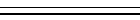
    
        end example]
    
    - **thickThinMediumGap** (Thick, Thin Line Border)
    
        Specifies a line border consisting of a thick line contained within a thin line with a medium sized intermediate gap around the parent object.
    
        [Example:
                        
        
    
        end example]
    
    - **thickThinSmallGap** (Thick, Thin Line Border)
    
        Specifies a line border consisting of a thick line contained within a thin line with a small intermediate gap around the parent object.
    
        [Example:
                        
        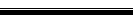
    
        end example]
    
    - **thinThickLargeGap** (Thin, Thick Line Border)
    
        Specifies a line border consisting of a thin line contained within a thick line contained within a thick thin with a large sized intermediate gap between each around the parent object.
    
        [Example:
                                
        
    
        end example]
    
    - **thinThickMediumGap** (Thin, Thick Line Border)
    
        Specifies a line border consisting of a thin line contained within a thick line contained within a thick thin with a medium sized intermediate gap between each around the parent object.
    
        [Example:
                                
        
    
        end example]
    
    - **thinThickSmallGap** (Thin, Thick Line Border)
    
        Specifies a line border consisting of a thin line contained within a thick line contained within a thick thin with a small intermediate gap between each around the parent object.
    
        [Example:
                                
        
    
        end example]
    
    - **thinThickThinLargeGap** (Thin, Thick, Thin Line Border)
    
        Specifies a line border consisting of a thin line contained within a thick line contained within a thick thin with a small intermediate gap between each around the parent object.
    
        [Example:
                                
        
    
        end example]
    
    - **thinThickThinMediumGap** (Thin, Thick, Thin Line Border)
    
        Specifies a line border consisting of a thin line contained within a thick line, contained within a thin
    line with a medium sized intermediate gap around the parent object.
    
        [Example:
                                
        
    
        end example]
    
    - **thinThickThinSmallGap** (Thin, Thick, Thin Line Border)
    
        Specifies a line border consisting of a thin line contained within a thick line, contained within a thin line with a small intermediate gap around the parent object.
    
        [Example:
                                
        
    
        end example]
    
    - **threeDEmboss** (3D Embossed Line Border)
    
        Specifies a line border consisting of three staged gradient lines around the parent object, getting darker towards the object.
    
        [Example:
                                
        
    
        end example]
    
    - **threeDEngrave** (3D Engraved Line Border)
    
        Specifies a line border consisting of three staged gradient lines around the parent object, getting darker away from the object.
    
        [Example:
                                
        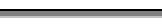
    
        end example]
    
    - **tornPaper** (Torn Paper Art Border)
    
        使用以下图像指定一个艺术边框:
    
        Top, Top Left and Top Right:
    
        Bottom, Bottom Left and Bottom RIght: 
        
        Left and RIght: 
        
        [Note: Image is blank. end note]
    
    - **tornPaperBlack** (Black Torn Paper Art Border)
    
        使用以下图像指定一个艺术边框: 
            
        Top: 
        
        Bottom: 
            
        Left: 
            
        Right: 
        
        Top Left: 
        
        Top Right: 
    
        Bottom Left: 
                                                
        Bottom Right: 
    
    - **trees** (Tree Art Border)
    
        使用以下图像指定一个艺术边框:
                     
        所有边: 
    
    - **triangle1** (Triangle Art Border One)
    
        使用以下图像指定一个艺术边框: 
            
        Top: 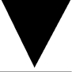
        
        Bottom: 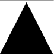
            
        Left: 
            
        Right: 
        
        Top Left, Top Right, Bottom Left, and Bottom Right: 
    
    - **triangle2** (Triangle Art Border Two)
    
        使用以下图像指定一个艺术边框: 
            
        Top: 
        
        Bottom: 
            
        Left: 
            
        Right: 
        
        Top Left: 
        
        Top Right: 
    
        Bottom Left: 
                                                
        Bottom Right: 
    
    - **triangleCircle1** (Triangle and Circle Art Border)
    
        使用以下图像指定一个艺术边框: 
            
        Top: 
        
        Bottom: 
            
        Left: 
            
        Right: 
        
        Top Left: 
        
        Top Right: 
    
        Bottom Left: 
                                                
        Bottom Right: 
    
    - **triangleCircle2** (Triangle and Circle Art Border Two)
    
        使用以下图像指定一个艺术边框: 
            
        Top: 
        
        Bottom: 
            
        Left: 
            
        Right: 
        
        Top Left: 
        
        Top Right: 
    
        Bottom Left: 
                                                
        Bottom Right: 
    
    - **triangleParty** (Triangle Art Border)
    
        使用以下图像指定一个艺术边框:
                 
        所有边: 
    
    - **triangles** (Triangles Art Border)
    
        使用以下图像指定一个艺术边框: 
            
        Top: 
        
        Bottom: 
            
        Left: 
            
        Right: 
        
        Top Left: 
        
        Top Right: 
    
        Bottom Left: 
                                                
        Bottom Right: 
    
    - **triple** (Triple Line Border)
    
        **Specifies** a line border consisting of a triple line around the parent object.
    
        [Example:
                                
        
    
        end example]
    
    - **twistedLines1** (Twisted Lines Art Border)
    
        使用以下图像指定一个艺术边框: 
            
        Top: 
        
        Bottom: 
            
        Left: 
            
        Right: 
        
        Top Left: 
        
        Top Right: 
    
        Bottom Left: 
                                                
        Bottom Right: 
    
    - **twistedLines2** (Twisted Lines Art Border)
    
        使用以下图像指定一个艺术边框: 
            
        Top: 
        
        Bottom: 
            
        Left: 
            
        Right: 
        
        Top Left: 
        
        Top Right: 
    
        Bottom Left: 
                                                
        Bottom Right: 
    
    - **vine** (Vine Art Border)
    
        使用以下图像指定一个艺术边框: 
            
        Top: 
        
        Bottom: 
            
        Left: 
            
        Right: 
        
        Top Left: 
        
        Top Right: 
    
        Bottom Left: 
                                                
        Bottom Right: 
    
    - **wave** (Wavy Line Border)
    
        Specifies a line border consisting of a wavy line around the parent object.
    
        [Example:
                                
        
    
        end example]
    
    - **waveline** (Wavy Line Art Border)
    
        使用以下图像指定一个艺术边框: 
            
        Top: 
        
        Bottom: 
            
        Left: 
            
        Right: 
        
        Top Left: 
        
        Top Right: 
    
        Bottom Left: 
                                                
        Bottom Right: 
    
    - **weavingAngles** (Weaving Angles Art Border)
    
        使用以下图像指定一个艺术边框: 
            
        Top: 
        
        Bottom: 
            
        Left: 
            
        Right: 
        
        Top Left: 
        
        Top Right: 
    
        Bottom Left: 
                                                
        Bottom Right: 
    
    - **weavingBraid** (Weaving Braid Art Border)
    
        使用以下图像指定一个艺术边框: 
            
        Top: 
        
        Bottom: 
            
        Left: 
            
        Right: 
        
        Top Left, Top Right, Bottom Left, and Botton RIght: 
    
    - **weavingRibbon** (Weaving Ribbon Art Border)
    
        使用以下图像指定一个艺术边框: 
            
        Top: 
        
        Bottom: 
            
        Left: 
            
        Right: 
        
        Top Left: 
        
        Top Right: 
    
        Bottom Left: 
                                                
        Bottom Right: 
    
    - **weavingStrips** (Weaving Strips Art Border)
    
        使用以下图像指定一个艺术边框: 
            
        Top: 
        
        Bottom: 
            
        Left: 
            
        Right: 
        
        Top Left: 
        
        Top Right: 
    
        Bottom Left: 
                                                
        Bottom Right: 
    
    - **whiteFlowers** (White Flowers Art Border)
    
        使用以下图像指定一个艺术边框: 
            
        Top and Bottom: 
            
        Left: 
            
        Right: 
        
        Top Left: 
        
        Top Right: 
    
        Bottom Left: 
                                                
        Bottom Right: 
    
    - **woodwork** (Woodwork Art Border)
    
        使用以下图像指定一个艺术边框: 
            
        Top and Bottom: 
                                                
        Left and Right: 
        
        Top Left, Top Right, Bottom Left, and Botton RIght: 
    
    - **xIllusions** (Crisscross Art Border)
    
        使用以下图像指定一个艺术边框: 
            
        所有边: 
    
    - **zanyTriangles** (Triangle Art Border)
    
        使用以下图像指定一个艺术边框: 
            
        Top: 
        
        Bottom: 
            
        Left: 
            
        Right: 
        
        Top Left: 
        
        Top Right: 
    
        Bottom Left: 
                                                
        Bottom Right: 
    
    - **zigZag** (Zigzag Art Border)
    
        使用以下图像指定一个艺术边框: 
            
        Top: 
        
        Bottom: 
            
        Left: 
            
        Right: 
        
        Top Left: 
        
        Top Right: 
    
        Bottom Left: 
                                                
        Bottom Right: 
    
    - **zigZagStitch** (Zigzag stitch)
    
        使用以下图像指定一个艺术边框: 
            
        Top: 
        
        Bottom: 
            
        Left: 
            
        Right: 
        
        Top Left: 
        
        Top Right: 
    
        Bottom Left: 
                                                    
        Bottom Right: 
    
    [Note: The W3C XML Schema definition of this simple type’s content model (ST_Border) is located in §A.1. end
    note]

=== "英文"

    This simple type specifies the kinds of borders which can be specified for WordprocessingML objects which have a border. 
    
    Borders can be separated into two types:
    
    - Line borders, which specify a pattern to be used when drawing a line around the specified object.
    - Art borders, which specify a repeated image to be used when drawing a border around the specified object.
    
    Line borders can be specified on any object which allows a border, however, art borders can only be used as a border at the page level - the borders under the pgBorders element ([§17.6.10]).
    
    For art borders, each border definition is specified by the combination of eight images, as follows:
    
    
    
    For the edge borders (top, bottom, left, and right), the border image is repeated as necessary to span the distance between the two intersecting corners. Electronic normative definitions of each piece of border art are included in Annex F.
    
    [Example: Consider a left border resulting in the following WordprocessingML:
    
    ```xml
    <w:left w:val="single" …/>
    ```
    
    This border's val is single, indicating that the border style is a single line border. end example]
    
    This simple type's contents are a restriction of the W3C XML Schema string datatype.
    
    This simple type is restricted to the values listed in the following table:
    
    - **apples** (Apples Art Border)
    
        Specifies an art border using the following images: 
    
        All Sides: 
    
    - **archedScallops** (Arched Scallops Art Border)
    
        Specifies an art border using the following images: 
        
        All Sides: 
    
    - **babyPacifier** (Baby Pacifier Art Border)
    
        Specifies an art border using the following images: 
        
        All Sides: 
    
    - **babyRattle** (Baby Rattle Art Border)
    
        Specifies an art border using the following images: 
        
        All Sides: 
    
    - **balloons3Colors** (Three Color Balloons Art Border)
    
        Specifies an art border using the following images: 
        
        All Sides: 
    
    - **balloonsHotAir** (Hot Air Balloons Art Border)
    
        Specifies an art border using the following images: 
        
        All Sides: 
    
    - **basicBlackDashes** (Black Dash Art Border)
    
        Specifies an art border using the following images: 
        
        Top and Bottom: 
        
        Left and Right: 
    
        Top Left: 
        
        Top Right: 
        
        Bottom Left: 
        
        Bottom Right: 
    
    - **basicBlackDots** (Black Dot Art Border)
    
        Specifies an art border using the following images: 
        
        All Sides: 
    
    - **basicBlackSquares** (Black Square Art Border)
    
        Specifies an art border using the following images: 
        
        All Sides: 
    
    - **basicThinLines** (Thin Line Art Border)
    
        Specifies an art border using the following images: 
        
        Top and Bottom: 
        
        Left and Right: 
    
        Top Left: 
        
        Top Right: 
        
        Bottom Left: 
        
        Bottom Right: 
    
    - **basicWhiteDashes** (White Dash Art Border)
    
        Specifies an art border using the following images: 
        
        Top and Bottom: 
        
        Left and Right: 
    
        Top Left: 
        
        Top Right: 
        
        Bottom Left: 
        
        Bottom Right: 
    
    - **basicWhiteDots** (White Dot Art Border)
    
        Specifies an art border using the following images: 
        
        All Sides: 
    
    - **basicWhiteSquares** (White Square Art Border)
    
        Specifies an art border using the following images: 
        
        All Sides: 
    
    - **basicWideInline** (Wide Inline Art Border)
    
        Specifies an art border using the following images: 
        
        Top: 
        
        Bottom: 
        
        Left: 
        
        Right: 
        
        Top Left: 
        
        Top Right: 
        
        Bottom Left: 
        
        Bottom Right: 
    
    - **basicWideMidline** (Wide Midline Art Border)
    
        Specifies an art border using the following images: 
        
        Top and Bottom: 
        
        Left and Right: 
    
        Top Left: 
        
        Top Right: 
        
        Bottom Left: 
        
        Bottom Right: 
    
    - **basicWideInline** (Wide Inline Art Border)
    
        Specifies an art border using the following images: 
        
        Top: 
        
        Bottom: 
        
        Left: 
        
        Right: 
        
        Top Left: 
        
        Top Right: 
        
        Bottom Left: 
        
        Bottom Right: 
    
    - **bats** (Bats Art Border)
    
        Specifies an art border using the following images: 
        
        All Sides: 
    
    - **birds** (Birds Art Border)
    
        Specifies an art border using the following images: 
            
        Top, Bottom, Top Left, Top Right, Bottom Left and Bottom Right: 
        
        Left and Right: 
    
        <!--   -->
    
        [Note: Second image is blank. end note]
    
    - **birdsFlight** (Birds Flying Art Border)
    
        Specifies an art border using the following images: 
            
        All Sides: 
    
    - **cabins** (Cabin Art Border)
    
        Specifies an art border using the following images: 
            
        All Sides: 
    
    - **cakeSlice** (Cake Art Border)
    
        Specifies an art border using the following images: 
                
        All Sides: 
    
    - **candyCorn** (Candy Corn Art Border)
    
        Specifies an art border using the following images: 
        
        Top: 
        
        Bottom: 
        
        Left: 
        
        Right: 
        
        Top Left: 
        
        Top Right: 
        
        Bottom Left: 
        
        Bottom Right: 
    
    - **celticKnotwork** (Knot Work Art Border)
    
        Specifies an art border using the following images: 
        
        Top: 
        
        Bottom: 
        
        Left: 
        
        Right: 
        
        Top Left: 
        
        Top Right: 
        
        Bottom Left: 
        
        Bottom Right: 
    
    - **certificateBanner** (Certificate Banner Art Border)
    
        Specifies an art border using the following images: 
        
        Top: 
        
        Bottom: 
        
        Left: 
        
        [Note: Image is blank. end note]
        
        Right: 
        [Note: Image is blank. end note]
        
        Top Left: 
        
        Top Right: 
        
        Bottom Left: 
        
        Bottom Right: 
    
    - **chainLink** (Chain Link Art Border)
    
        Specifies an art border using the following images: 
                    
        All Sides: 
    
    - **champagneBottle** (Champagne Bottle Art Border)
    
        Specifies an art border using the following images: 
                    
        All Sides: 
    
    - **checkedBarBlack** (Black and White Bar Art Border)
    
        Specifies an art border using the following images: 
        
        Top: 
        
        Bottom: 
        
        Left: 
        
        Right: 
        
        Top Left: 
        
        Top Right: 
        
        Bottom Left: 
        
        Bottom Right: 
    
    - **checkedBarColor** (Color Checked Bar Art Border)
    
        Specifies an art border using the following images: 
        
        Top: 
        
        Bottom: 
        
        Left: 
        
        Right: 
        
        Top Left: 
        
        Top Right: 
        
        Bottom Left: 
        
        Bottom Right: 
    
    - **checkered** (Checkerboard Art Border)
    
        Specifies an art border using the following images: 
                    
        All Sides: 
    
    - **christmasTree** (Christmas Tree Art Border)
    
        Specifies an art border using the following images: 
                    
        All Sides: 
    
    - **circlesLines** (Circles And Lines Art Border)
    
        Specifies an art border using the following images: 
        
        Top: 
        
        Bottom: 
        
        Left: 
        
        Right: 
        
        Top Left: 
        
        Top Right: 
        
        Bottom Left: 
            
        Bottom Right: 
    
    - **circlesRectangles** (Circles and Rectangles Art Border)
    
        Specifies an art border using the following images: 
        
        Top: 
        
        Bottom: 
        
        Left: 
        
        Right: 
        
        Top Left: 
        
        Top Right: 
        
        Bottom Left: 
            
        Bottom Right: 
    
    - **classicalWave** (Wave Art Border)
    
        Specifies an art border using the following images: 
        
        Top: 
        
        Bottom: 
        
        Left: 
        
        Right: 
        
        Top Left: 
        
        Top Right: 
        
        Bottom Left: 
                
        Bottom Right: 
    
    - **clocks** (Clocks Art Border)
    
        Specifies an art border using the following images: 
                    
        All Sides: 
    
    - **compass** (Compass Art Border)
    
        Specifies an art border using the following images: 
                    
        Top and Bottom: 
    
        Left and Right: 
    
        Top Left, Top Right, Bottom Left, and Bottom RIght: 
    
    - **confetti** (Confetti Art Border)
    
        Specifies an art border using the following images: 
        
        Top: 
        
        Bottom: 
        
        Left: 
        
        Right: 
        
        Top Left: 
        
        Top Right: 
        
        Bottom Left: 
                
        Bottom Right: 
    
    - **confettiGrays** (Confetti Art Border)
    
        Specifies an art border using the following images: 
                    
        All Sides: 
    
    - **confettiOutline** (Confetti Art Border)
    
        Specifies an art border using the following images: 
                    
        All Sides: 
    
    - **confettiStreamers** (Confetti Streamers Art Border)
    
        Specifies an art border using the following images: 
                    
        All Sides: 
    
    - **confettiWhite** (Confetti Art Border)
    
        Specifies an art border using the following images: 
                    
        All Sides: 
    
    - **cornerTriangles** (Corner Triangle Art Border)
    
        Specifies an art border using the following images: 
                    
        Top, Bottom, Left, and Right: 
        
        Top Left: 
        
        Top Right: 
        
        Bottom Left: 
                
        Bottom Right: 
    
    - **couponCutoutDashes** (Dashed Line Art Border)
    
        Specifies an art border using the following images: 
                    
        Top, Bottom, Left, and Right: 
        
        Top Left: 
        
        Top Right: 
        
        Bottom Left: 
                    
        Bottom Right: 
    
    - **couponCutoutDots** (Dotted Line Art Border)
    
        Specifies an art border using the following images: 
        
        Top: 
        
        Bottom: 
        
        Left: 
        
        Right: 
        
        Top Left: 
        
        Top Right: 
        
        Bottom Left: 
                
        Bottom Right: 
    
    - **crazyMaze** (Maze Art Border)
    
        Specifies an art border using the following images: 
                    
        Top and Bottom: 
        
        Left and RIght: 
        
        Top Left, Top Right, Bottom Left and Bottom Right: 
    
    - **creaturesButterfly** (Butterfly Art Border)
    
        Specifies an art border using the following images: 
                    
        All Sides: 
    
    - **creaturesFish** (Fish Art Border)
    
        Specifies an art border using the following images: 
                    
        All Sides: 
    
    - **creaturesInsects** (Insects Art Border)
    
        Specifies an art border using the following images: 
        
        Top: 
        
        Bottom: 
    
        Left and Right: 
    
        Top Left and Top Right: 
    
        Bottom Left and Bottom Right: 
    
    - **creaturesLadyBug** (Ladybug Art Border)
    
        Specifies an art border using the following images: 
                    
        All Sides: 
    
    - **crossStitch** (Cross-stitch Art Border)
    
        Specifies an art border using the following images: 
                    
        All Sides: 
    
    - **cup** (Cupid Art Border)
    
        Specifies an art border using the following images: 
                    
        All Sides: 
    
    - **custom** (Custom Defined Art Border)
    
        Specifies a custom art border using the parent element's attributes to reference one or more customer art border images.
    
    - **dashDotStroked** (Dash Dot Strokes Line Border)
    
        Specifies a line border consisting of a line with a series of alternating thin and thick strokes around the parent object.
    
        [Example:
                    
        
    
        end example]
    
    - **dashed** (Dashed Line Border)
    
        Specifies a line border consisting of a dashed line around the parent object.
    
        [Example:
                    
        
    
        end example]
    
    - **dashSmallGap** (Dashed Line Border)
    
        Specifies a line border consisting of a dashed line with small gaps around the parent object.
    
        [Example:
                    
        
    
        end example]
    
    - **decoArch** (Archway Art Border)
    
        Specifies an art border using the following images: 
                    
        Top and Bottom: 
                    
        Left and Right: 
                    
        Top Left and Top Right: 
                    
        Bottom Left and Bottom Right: 
    
    - **decoArchColor** (Color Archway Art Border)
    
        Specifies an art border using the following images: 
                    
        Top and Bottom: 
                    
        Left and Right: 
                    
        Top Left: 
                    
        Top Right: 
                    
        Bottom Left and Bottom Right: 
    
    - **decoBlocks** (Blocks Art Border)
    
        Specifies an art border using the following images: 
        
        Top: 
        
        Bottom: 
        
        Left: 
        
        Right: 
        
        Top Left: 
        
        Top Right: 
        
        Bottom Left: 
                    
        Bottom Right: 
    
    - **diamondsGray** (Gray Diamond Art Border)
    
        Specifies an art border using the following images: 
                    
        All Sides: 
    
    - **dotDash** (Dot Dash Line Border)
    
        Specifies a line border consisting of a alternating dotted and dashed line around the parent object.
    
        [Example:
                    
        
    
        end example]
    
    - **dotDotDash** (Dot Dot Dash Line Border)
    
        Specifies a line border consisting of a alternating dotted, dotted, dashed line around the parent object.
    
        [Example:
                    
        
    
        end example]
    
    - **dotted** (Dotted Line Border)
    
        Specifies a line border consisting of a dotted line around the parent object.
    
        [Example:
                    
        
    
        end example]
    
    - **double** (Double Line Border)
    
        Specifies a line border consisting of a double line around the parent object.
    
        [Example:
                    
        
    
        end example]
    
    - **doubleD** (Double D Art Border)
    
        Specifies an art border using the following images: 
        
        Top: 
        
        Bottom: 
        
        Left: 
        
        Right: 
        
        Top Left: 
        
        Top Right: 
        
        Bottom Left: 
                    
        Bottom Right: 
    
    - **doubleDiamonds** (Diamond Art Border)
    
        Specifies an art border using the following images: 
                    
        All Sides: 
    
    - **doubleWave** (Double Wave Line Border)
    
        Specifies a line border consisting of a double wavy line around the parent object.
    
        [Example:
                    
        
    
        end example]
    
    - **earth1** (Earth Art Border)
    
        Specifies an art border using the following images:
                        
        All Sides: 
    
    - **earth2** (Earth Art Border)
    
        Specifies an art border using the following images:
                    
        All Sides: 
    
    - **earth3** (Earth Art Border)
    
        Specifies an art border using the following images:
                    
        All Sides: 
    
    - **eclipsingSquares1** (Shadowed Square Art Border)
    
        Specifies an art border using the following images:
                    
        All Sides: 
    
    - **eclipsingSquares2** (Shadowed Square Art Border)
    
        Specifies an art border using the following images:
                    
        All Sides: 
    
    - **eggsBlack** (Painted Egg Art Border)
    
        Specifies an art border using the following images:
                    
        All Sides: 
    
    - **fans** (Fans Art Border)
    
        Specifies an art border using the following images:
                    
        All Sides: 
    
    - **film** (Film Reel Art Border)
    
        Specifies an art border using the following images:
                    
        Top and Bottom: 
                    
        Left and Right: 
                    
        Top Left and Bottom Left: 
                    
        Top Right and Bottom Right: 
    
    - **firecrackers** (Firecracker Art Border)
    
        Specifies an art border using the following images:
                    
        All Sides: 
    
    - **flowersBlockPrint** (Flowers Art Border)
    
        Specifies an art border using the following images:
                    
        All Sides: 
    
    - **flowersDaisies** (Daisy Art Border)
    
        Specifies an art border using the following images:
                    
        All Sides: 
    
    - **flowersModern1** (Flowers Art Border)
    
        Specifies an art border using the following images:
                        
        All Sides: 
    
    - **flowersModern2** (Flowers Art Border)
    
        Specifies an art border using the following images:
                    
        Top and Bottom: 
                    
        Left and Right: 
        
        Top Left: 
        
        Top Right: 
        
        Bottom Left: 
                    
        Bottom Right: 
    
    - **flowersPansy** (Pansy Art Border)
    
        Specifies an art border using the following images:
                        
        All Sides: 
    
    - **flowersRedRose** (Red Rose Art Border)
    
        Specifies an art border using the following images:
                        
        All Sides: 
    
    - **flowersRoses** (Roses Art Border)
    
        Specifies an art border using the following images:
                        
        All Sides: 
    
    - **flowersTeacup** (Flowers in a Teacup Art Border)
    
        Specifies an art border using the following images:
                        
        All Sides: 
    
    - **flowersTiny** (Small Flower Art Border)
    
        Specifies an art border using the following images: 
        
        Top: 
        
        Bottom: 
        
        Left: 
        
        Right: 
        
        Top Left: 
        
        Top Right: 
        
        Bottom Left: 
                    
        Bottom Right: 
    
    - **gems** (Gems Art Border)
    
        Specifies an art border using the following images: 
            
        Top, Bottom, Left and Right: 
        
        Top Left: 
        
        Top Right: 
        
        Bottom Left: 
                        
        Bottom Right: 
    
    - **gingerbreadMan** (Gingerbread Man Art Border)
    
        Specifies an art border using the following images:
                            
        All Sides: 
    
    - **gradient** (Triangle Gradient Art Border)
    
        Specifies an art border using the following images:
                            
        All Sides: 
    
    - **handmade1** (Handmade Art Border)
    
        Specifies an art border using the following images: 
        
        Top: 
        
        Bottom: 
        
        Left: 
        
        Right: 
        
        Top Left: 
        
        Top Right: 
        
        Bottom Left: 
                        
        Bottom Right: 
    
    - **handmade2** (Handmade Art Border)
    
        Specifies an art border using the following images: 
        
        Top: 
        
        Bottom: 
        
        Left: 
        
        Right: 
        
        Top Left: 
        
        Top Right: 
        
        Bottom Left: 
                        
        Bottom Right: 
    
    - **heartBalloon** (Heart-Shaped Balloon Art Border)
    
        Specifies an art border using the following images:
                            
        All Sides: 
    
    - **heartGray** (Gray Heart Art Border)
    
        Specifies an art border using the following images:
                            
        All Sides: 
    
    - **hearts** (Hearts Art Border)
    
        Specifies an art border using the following images:
                            
        All Sides: 
    
    - **heebieJeebies** (Pattern Art Border)
    
        Specifies an art border using the following images:
                            
        All Sides: 
    
    - **holly** (Holly Art Border)
    
        Specifies an art border using the following images:
                            
        All Sides: 
    
    - **houseFunky** (House Art Border)
    
        Specifies an art border using the following images:
                                
        All Sides: 
    
    - **hypnotic** (Circular Art Border)
    
        Specifies an art border using the following images: 
        
        Top: 
        
        Bottom: 
        
        Left: 
        
        Right: 
        
        Top Left: 
        
        Top Right: 
        
        Bottom Left: 
                        
        Bottom Right: 
    
    - **iceCreamCones** (Ice Cream Cone Art Border)
    
        Specifies an art border using the following images:
                                
        All Sides: 
    
    - **inset** (Inset Line Border)
    
        Specifies a line border consisting of an inset set of lines around the parent object.
    
        [Example:
                    
        
    
        end example]
    
    - **lightBulb** (Light Bulb Art Border)
    
        Specifies an art border using the following images:
                                
        All Sides: 
    
    - **lightning1** (Lightning Art Border)
    
        Specifies an art border using the following images:
                                
        All Sides: 
    
    - **lightning2** (Lightning Art Border)
    
        Specifies an art border using the following images: 
        
        Top: 
        
        Bottom: 
        
        Left and Top Left: 
        
        Right and Top RIght: 
        
        Bottom Left: 
                        
        Bottom Right: 
    
    - **mapleLeaf** (Maple Leaf Art Border)
    
        Specifies an art border using the following images:
                                
        All Sides: 
    
    - **mapleMuffins** (Muffin Art Border)
    
        Specifies an art border using the following images:
                                
        All Sides: 
    
    - **mapPins** (Map Pins Art Border)
    
        Specifies an art border using the following images:
                                
        All Sides: 
    
    - **marquee** (Marquee Art Border)
    
        Specifies an art border using the following images:
                                
        Top and Bottom: 
                                
        Left and Right: 
                                    
        Top Left, Top Right, Bottom Left, and Bottom Right: 
    
    - **marqueeToothed** (Marquee Art Border)
    
        Specifies an art border using the following images: 
        
        Top: 
        
        Bottom: 
        
        Left: 
        
        Right: 
        
        Top Left: 
        
        Top Right: 
        
        Bottom Left: 
                        
        Bottom Right: 
    
    - **moons** (Moon Art Border)
    
        Specifies an art border using the following images: 
        
        Top: 
        
        Bottom: 
        
        Left: 
        
        Right: 
        
        Top Left: 
        
        Top Right: 
        
        Bottom Left: 
                            
        Bottom Right: 
    
    - **mosaic** (Mosaic Art Border)
    
        Specifies an art border using the following images:
                                
        All Sides: 
    
    - **musicNotes** (Musical Note Art Border)
    
        Specifies an art border using the following images:
                                
        All Sides: 
    
    - **nil** (No Border)
    
        Specifies that no border shall be applied to the current item.
    
    - **none** (No Border)
    
        Specifies that no border shall be applied to the current item.
    
    - **northwest** (Patterned Art Border)
    
        Specifies an art border using the following images: 
        
        Top: 
        
        Bottom: 
        
        Left: 
        
        Right: 
        
        Top Left: 
        
        Top Right: 
        
        Bottom Left: 
                                
        Bottom Right: 
    
    - **outset** (Outset Line Border)
    
        Specifies a line border consisting of an outset set of lines around the parent object.
    
        [Example:
                        
        
    
        end example]
    
    - **ovals** (Oval Art Border)
    
        Specifies an art border using the following images: 
        
        Top and Bottom: 
        
        Right and Left: 
            
        Top Left, Top Right, Bottom Left and Bottom Right: 
    
    - **packages** (Package Art Border)
    
        Specifies an art border using the following images:
                                
        All Sides: 
    
    - **palmsBlack** (Black Palm Tree Art Border)
    
        Specifies an art border using the following images:
                                
        All Sides: 
    
    - **palmsColor** (Color Palm Tree Art Border)
    
        Specifies an art border using the following images:
                                
        All Sides: 
    
    - **paperClips** (Paper Clip Art Border)
    
        Specifies an art border using the following images:
                                
        All Sides: 
    
    - **papyrus** (Papyrus Art Border)
    
        Specifies an art border using the following images: 
        
        Top and Bottom: 
        
        Right and Left: 
            
        Top Left and Top Right: 
            
        Bottom Left and Bottom Right: 
    
    - **partyFavor** (Party Favor Art Border)
    
        Specifies an art border using the following images:
                                
        All Sides: 
    
    - **partyGlass** (Party Glass Art Border)
    
        Specifies an art border using the following images:
                                
        All Sides: 
    
    - **pencils** (Pencils Art Border)
    
        Specifies an art border using the following images:
                                
        All Sides: 
    
    - **people** (Character Art Border)
    
        Specifies an art border using the following images:
                                
        All Sides: 
    
    - **peopleHats** (Character With Hat Art Border)
    
        Specifies an art border using the following images:
                                
        All Sides: 
    
    - **peopleWaving** (Waving Character Border)
    
        Specifies an art border using the following images:
                                
        All Sides: 
    
    - **poinsettias** (Poinsettia Art Border)
    
        Specifies an art border using the following images:
                                    
        All Sides: 
    
    - **postageStamp** (Postage Stamp Art Border)
    
        Specifies an art border using the following images: 
        
        Top: 
        
        Bottom: 
        
        Left: 
        
        Right: 
        
        Top Left: 
        
        Top Right: 
        
        Bottom Left: 
                                
        Bottom Right: 
    
    - **pumpkin1** (Pumpkin Art Border)
    
        Specifies an art border using the following images:
                                            
        All Sides: 
    
    - **pushPinNote1** (Push Pin Art Border)
    
        Specifies an art border using the following images: 
        
        Top: 
        
        Bottom: 
        
        Left: 
            
        Right: 
        
        Top Left: 
        
        Top Right: 
        
        Bottom Left: 
                                    
        Bottom Right: 
    
    - **pushPinNote2** (Push Pin Art Border)
    
        Specifies an art border using the following images: 
        
        Top: 
        
        Bottom: 
        
        Left: 
            
        Right: 
        
        Top Left: 
        
        Top Right: 
    
        Bottom Left: 
                                    
        Bottom Right: 
    
    - **pyramids** (Pyramid Art Border)
    
        Specifies an art border using the following images: 
        
        Top: 
        
        Bottom: 
        
        Left: 
            
        Right: 
        
        Top Left, Top Right, Bottom Left, and Bottom RIght: 
    
    - **pyramidsAbove** (Pyramid Art Border)
    
        Specifies an art border using the following images:
                                                
        All Sides: 
    
    - **quadrants** (Quadrants Art Border)
    
        Specifies an art border using the following images: 
        
        Top and Bottom: 
        
        Left and RIght: 
        
        Top Left: 
    
        Top Right: 
    
        Bottom Left: 
    
        Bottom Right: 
    
    - **rings** (Rings Art Border)
    
        Specifies an art border using the following images:
                                                
        All Sides: 
    
    - **safari** (Safari Art Border)
    
        Specifies an art border using the following images:
                                                
        All Sides: 
    
    - **pushPinNote2** (Push Pin Art Border)
    
        Specifies an art border using the following images: 
        
        Top: 
        
        Bottom: 
        
        Left: 
            
        Right: 
        
        Top Left: 
        
        Top Right: 
    
        Bottom Left: 
                                        
        Bottom Right: 
    
    - **sawtoothGray** (Gray Saw tooth Art Border)
    
        Specifies an art border using the following images: 
        
        Top: 
        
        Bottom: 
        
        Left: 
            
        Right: 
        
        Top Left: 
        
        Top Right: 
    
        Bottom Left: 
                                            
        Bottom Right: 
    
    - **scaredCat** (Scared Cat Art Border)
    
        Specifies an art border using the following images:
                                                
        All Sides: 
    
    - **seattle** (Umbrella Art Border)
    
        Specifies an art border using the following images:
                                                
        All Sides: 
    
    - **shadowedSquares** (Shadowed Squares Art Border)
    
        Specifies an art border using the following images:
                                                
        All Sides: 
    
    - **shapes1** (Black and White Shapes Art Border)
    
        Specifies an art border using the following images: 
        
        Top and Bottom: 
        
        Right and Left: 
        
        Top Left, Top Right, Bottom Left and Bottom Right: 
    
    - **shapes2** (Black and White Art Border Two)
    
        Specifies an art border using the following images: 
        
        Top, Bottom, Left and Right: 
        
        Top Left, Top Right, Bottom Left and Bottom Right: 
    
    - **sharksTeeth** (Shark Tooth Art Border)
    
        Specifies an art border using the following images:
                                                
        All Sides: 
    
    - **shorebirdTracks** (Bird Tracks Art Border)
    
        Specifies an art border using the following images: 
        
        Top: 
        
        Bottom: 
        
        Left: 
            
        Right: 
            
        Top Left, Top Right, Bottom Left and Bottom Right: 
    
    - **single** (Single Line Border)
    
        Specifies a line border consisting of a single line around the parent object.
    
        [Example:
                        
        
    
        end example]
    
    - **skyrocket** (Rocket Art Border)
    
        Specifies an art border using the following images:
                                                
        All Sides: 
    
    - **snowflakeFancy** (Snowflake Art Border)
    
        Specifies an art border using the following images:
                                                
        All Sides: 
    
    - **snowflakes** (Snowflake Art Border)
    
        Specifies an art border using the following images:
                                                
        All Sides: 
    
    - **sombrero** (Sombrero Art Border)
    
        Specifies an art border using the following images:
                                                
        All Sides: 
    
    - **southwest** (Southwest-themed Art Border)
    
        Specifies an art border using the following images: 
        
        Top: 
        
        Bottom: 
        
        Left: 
            
        Right: 
        
        Top Left: 
        
        Top Right: 
    
        Bottom Left: 
                                            
        Bottom Right: 
    
    - **stars** (Stars Art Border)
    
        Specifies an art border using the following images:
                                                
        All Sides: 
    
    - **stars3d** (3-D Stars Art Border)
    
        Specifies an art border using the following images:
                                                
        All Sides: 
    
    - **starsBlack** (Stars Art Border)
    
        Specifies an art border using the following images:
                                                
        All Sides: 
    
    - **starsShadowed** (Stars With Shadows Art Border)
    
        Specifies an art border using the following images:
                 
        All Sides: 
    
    - **starsTop** (Stars On Top Art Border)
    
        Specifies an art border using the following images:
                 
        Top, Top Left, and Top Right: 
    
        Bottom, Bottom Left, and Bottom Right: 
    
        Left and Right: 
    
    - **sun** (Sun Art Border)
    
        Specifies an art border using the following images:
                 
        All Sides: 
    
    - **swirligig** (Whirligig Art Border)
    
        Specifies an art border using the following images: 
        
        Top: 
        
        Bottom: 
        
        Left: 
            
        Right: 
        
        Top Left: 
        
        Top Right: 
    
        Bottom Left: 
                                            
        Bottom Right: 
    
    - **thick** (Single Line Border)
    
        Specifies a line border consisting of a single line around the parent object.
    
        [Example:
                        
        
    
        end example]
    
    - **thickThinLargeGap** (Thick, Thin Line Border)
    
        Specifies a line border consisting of a thick line contained within a thin line with a large sized intermediate gap around the parent object.
    
        [Example:
                        
        
    
        end example]
    
    - **thickThinMediumGap** (Thick, Thin Line Border)
    
        Specifies a line border consisting of a thick line contained within a thin line with a medium sized intermediate gap around the parent object.
    
        [Example:
                        
        
    
        end example]
    
    - **thickThinSmallGap** (Thick, Thin Line Border)
    
        Specifies a line border consisting of a thick line contained within a thin line with a small intermediate gap around the parent object.
    
        [Example:
                        
        
    
        end example]
    
    - **thinThickLargeGap** (Thin, Thick Line Border)
    
        Specifies a line border consisting of a thin line contained within a thick line contained within a thick thin with a large sized intermediate gap between each around the parent object.
    
        [Example:
                                
        
    
        end example]
    
    - **thinThickMediumGap** (Thin, Thick Line Border)
    
        Specifies a line border consisting of a thin line contained within a thick line contained within a thick thin with a medium sized intermediate gap between each around the parent object.
    
        [Example:
                                
        
    
        end example]
    
    - **thinThickSmallGap** (Thin, Thick Line Border)
    
        Specifies a line border consisting of a thin line contained within a thick line contained within a thick thin with a small intermediate gap between each around the parent object.
    
        [Example:
                                
        
    
        end example]
    
    - **thinThickThinLargeGap** (Thin, Thick, Thin Line Border)
    
        Specifies a line border consisting of a thin line contained within a thick line contained within a thick thin with a small intermediate gap between each around the parent object.
    
        [Example:
                                
        
    
        end example]
    
    - **thinThickThinMediumGap** (Thin, Thick, Thin Line Border)
    
        Specifies a line border consisting of a thin line contained within a thick line, contained within a thin
    line with a medium sized intermediate gap around the parent object.
    
        [Example:
                                
        
    
        end example]
    
    - **thinThickThinSmallGap** (Thin, Thick, Thin Line Border)
    
        Specifies a line border consisting of a thin line contained within a thick line, contained within a thin line with a small intermediate gap around the parent object.
    
        [Example:
                                
        
    
        end example]
    
    - **threeDEmboss** (3D Embossed Line Border)
    
        Specifies a line border consisting of three staged gradient lines around the parent object, getting darker towards the object.
    
        [Example:
                                
        
    
        end example]
    
    - **threeDEngrave** (3D Engraved Line Border)
    
        Specifies a line border consisting of three staged gradient lines around the parent object, getting darker away from the object.
    
        [Example:
                                
        
    
        end example]
    
    - **tornPaper** (Torn Paper Art Border)
    
        Specifies an art border using the following images:
    
        Top, Top Left and Top Right:
    
        Bottom, Bottom Left and Bottom RIght: 
        
        Left and RIght: 
        
        [Note: Image is blank. end note]
    
    - **tornPaperBlack** (Black Torn Paper Art Border)
    
        Specifies an art border using the following images: 
            
        Top: 
        
        Bottom: 
            
        Left: 
            
        Right: 
        
        Top Left: 
        
        Top Right: 
    
        Bottom Left: 
                                                
        Bottom Right: 
    
    - **trees** (Tree Art Border)
    
        Specifies an art border using the following images:
                     
        All Sides: 
    
    - **triangle1** (Triangle Art Border One)
    
        Specifies an art border using the following images: 
            
        Top: 
        
        Bottom: 
            
        Left: 
            
        Right: 
        
        Top Left, Top Right, Bottom Left, and Bottom Right: 
    
    - **triangle2** (Triangle Art Border Two)
    
        Specifies an art border using the following images: 
            
        Top: 
        
        Bottom: 
            
        Left: 
            
        Right: 
        
        Top Left: 
        
        Top Right: 
    
        Bottom Left: 
                                                
        Bottom Right: 
    
    - **triangleCircle1** (Triangle and Circle Art Border)
    
        Specifies an art border using the following images: 
            
        Top: 
        
        Bottom: 
            
        Left: 
            
        Right: 
        
        Top Left: 
        
        Top Right: 
    
        Bottom Left: 
                                                
        Bottom Right: 
    
    - **triangleCircle2** (Triangle and Circle Art Border Two)
    
        Specifies an art border using the following images: 
            
        Top: 
        
        Bottom: 
            
        Left: 
            
        Right: 
        
        Top Left: 
        
        Top Right: 
    
        Bottom Left: 
                                                
        Bottom Right: 
    
    - **triangleParty** (Triangle Art Border)
    
        Specifies an art border using the following images:
                 
        All Sides: 
    
    - **triangles** (Triangles Art Border)
    
        Specifies an art border using the following images: 
            
        Top: 
        
        Bottom: 
            
        Left: 
            
        Right: 
        
        Top Left: 
        
        Top Right: 
    
        Bottom Left: 
                                                
        Bottom Right: 
    
    - **triple** (Triple Line Border)
    
        **Specifies** a line border consisting of a triple line around the parent object.
    
        [Example:
                                
        
    
        end example]
    
    - **twistedLines1** (Twisted Lines Art Border)
    
        Specifies an art border using the following images: 
            
        Top: 
        
        Bottom: 
            
        Left: 
            
        Right: 
        
        Top Left: 
        
        Top Right: 
    
        Bottom Left: 
                                                
        Bottom Right: 
    
    - **twistedLines2** (Twisted Lines Art Border)
    
        Specifies an art border using the following images: 
            
        Top: 
        
        Bottom: 
            
        Left: 
            
        Right: 
        
        Top Left: 
        
        Top Right: 
    
        Bottom Left: 
                                                
        Bottom Right: 
    
    - **vine** (Vine Art Border)
    
        Specifies an art border using the following images: 
            
        Top: 
        
        Bottom: 
            
        Left: 
            
        Right: 
        
        Top Left: 
        
        Top Right: 
    
        Bottom Left: 
                                                
        Bottom Right: 
    
    - **wave** (Wavy Line Border)
    
        Specifies a line border consisting of a wavy line around the parent object.
    
        [Example:
                                
        
    
        end example]
    
    - **waveline** (Wavy Line Art Border)
    
        Specifies an art border using the following images: 
            
        Top: 
        
        Bottom: 
            
        Left: 
            
        Right: 
        
        Top Left: 
        
        Top Right: 
    
        Bottom Left: 
                                                
        Bottom Right: 
    
    - **weavingAngles** (Weaving Angles Art Border)
    
        Specifies an art border using the following images: 
            
        Top: 
        
        Bottom: 
            
        Left: 
            
        Right: 
        
        Top Left: 
        
        Top Right: 
    
        Bottom Left: 
                                                
        Bottom Right: 
    
    - **weavingBraid** (Weaving Braid Art Border)
    
        Specifies an art border using the following images: 
            
        Top: 
        
        Bottom: 
            
        Left: 
            
        Right: 
        
        Top Left, Top Right, Bottom Left, and Botton RIght: 
    
    - **weavingRibbon** (Weaving Ribbon Art Border)
    
        Specifies an art border using the following images: 
            
        Top: 
        
        Bottom: 
            
        Left: 
            
        Right: 
        
        Top Left: 
        
        Top Right: 
    
        Bottom Left: 
                                                
        Bottom Right: 
    
    - **weavingStrips** (Weaving Strips Art Border)
    
        Specifies an art border using the following images: 
            
        Top: 
        
        Bottom: 
            
        Left: 
            
        Right: 
        
        Top Left: 
        
        Top Right: 
    
        Bottom Left: 
                                                
        Bottom Right: 
    
    - **whiteFlowers** (White Flowers Art Border)
    
        Specifies an art border using the following images: 
            
        Top and Bottom: 
            
        Left: 
            
        Right: 
        
        Top Left: 
        
        Top Right: 
    
        Bottom Left: 
                                                
        Bottom Right: 
    
    - **woodwork** (Woodwork Art Border)
    
        Specifies an art border using the following images: 
            
        Top and Bottom: 
                                                
        Left and Right: 
        
        Top Left, Top Right, Bottom Left, and Botton RIght: 
    
    - **xIllusions** (Crisscross Art Border)
    
        Specifies an art border using the following images: 
            
        All Sides: 
    
    - **zanyTriangles** (Triangle Art Border)
    
        Specifies an art border using the following images: 
            
        Top: 
        
        Bottom: 
            
        Left: 
            
        Right: 
        
        Top Left: 
        
        Top Right: 
    
        Bottom Left: 
                                                
        Bottom Right: 
    
    - **zigZag** (Zigzag Art Border)
    
        Specifies an art border using the following images: 
            
        Top: 
        
        Bottom: 
            
        Left: 
            
        Right: 
        
        Top Left: 
        
        Top Right: 
    
        Bottom Left: 
                                                
        Bottom Right: 
    
    - **zigZagStitch** (Zigzag stitch)
    
        Specifies an art border using the following images: 
            
        Top: 
        
        Bottom: 
            
        Left: 
            
        Right: 
        
        Top Left: 
        
        Top Right: 
    
        Bottom Left: 
                                                    
        Bottom Right: 
    
    [Note: The W3C XML Schema definition of this simple type’s content model (ST_Border) is located in §A.1. end
    note]

## 17.18.3 ST_BrClear (换行文本换行重新开始位置)

**ST_BrClear (Line Break Text Wrapping Restart Location)**

=== "中文"
    
    这个简单类型指定了一组可能的重启位置，用于在换行符的type属性值为textWrapping时确定下一个可用的行。当当前运行的文本由于浮动对象的存在而显示在未跨越全文本范围的行上时，此属性仅影响重启位置（详见枚举值）。
    
    [示例：考虑一个文本环绕换行符，该字符应将重启位置强制到跨越页面全文本范围的下一行（没有浮动对象中断该行）。
    
    该换行符的样式为textWrapping，因为它只需前进到下一行，但clear值必须指定此重启位置必须忽略所有不跨越全文本宽度的行，通过指定值all，如下所示：
    
    ```xml
    <w:br w:type="textWrapping" w:clear="all" />
    ```
    
    因此，该换行符不能使用下一个可用的行，而是应忽略所有不跨越全文本宽度的行并使用下一个可用的行。示例结束]
    
    这个简单类型的内容是W3C XML Schema字符串数据类型的一个限制。
    
    这个简单类型仅限于下表中列出的值：
    
    - **all**（在下一个完整行重新开始）
    
        指定文本环绕换行符应将文本前进到WordprocessingML文档中跨越整行宽度的下一行（即在显示时不被任何浮动对象中断的下一行）。
        
        [注意：此设置通常用于将单行文本放置在浮动对象旁边作为标题。注意结束]
        
    - **left**（在左侧未被阻挡的下一个文本区域重新开始）
    
        指定当该行与浮动对象相交时，文本环绕换行符应如下所示：
    
        如果父段落是从左到右：
        
        - 如果这是当前行中最左侧的文本流区域，
            - 如果浮动对象出现在换行符左侧，将文本前进到下一行，该行左侧没有浮动对象。
            - 否则，将文本前进到当前行上可以显示文本的下一个位置。
        - 否则，将此视为类型为none的文本环绕换行符。
        
        如果父段落是从右到左：
        
        - 如果浮动对象出现在换行符左侧，将文本前进到下一行，该行左侧没有浮动对象。
        
        - 否则，将此视为类型为none的文本环绕换行符。
        
        在任何情况下，如果此行未与浮动对象相交，则将此换行符视为类型为none的文本环绕换行符。
    
    - **none**（在下一行重新开始）
    
        指定文本环绕换行符应将文本前进到WordprocessingML文档中的下一行，而不管其位置是从左到右还是任何与该行相交的浮动对象的存在。
        
        这是文档中常规换行符的设置。
    
    - **right**（在右侧未被阻挡的下一个文本区域重新开始）
    
        指定当该行与浮动对象相交时，文本环绕换行符应如下所示：
    
        如果父段落是从左到右：
        
        - 如果浮动对象出现在换行符右侧，将文本前进到下一行，该行右侧没有浮动对象。
        
        - 否则，将此视为类型为none的文本环绕换行符。
        
        如果父段落是从右到左：
        
        - 如果这是当前行中最右侧的文本流区域，
            - 如果浮动对象出现在换行符右侧，将文本前进到下一行，该行右侧没有浮动对象。
            
            - 否则，将文本前进到当前行上可以显示文本的下一个位置。
        - 否则，将此视为类型为none的文本环绕换行符。
        
        在任何情况下，如果此行未与浮动对象相交，则将此换行符视为类型为none的文本环绕换行符。
    
    [Note: The W3C XML Schema definition of this simple type’s content model (ST_BrClear) is located in §A.1. endnote]

=== "英文"
    
    This simple type specifies the set of possible restart locations which can be used as to determine the next available line when a break’s type attribute has a value of textWrapping. This property only affects the restart location when the current run is being displayed on a line which does not span the full text extents due to the presence of a floating object (see enumeration values for details).
    
    [Example: Consider a text wrapping break character which should force the restart location to the next line which spans the full width of the text extents of the page (there are no floating objects which interrupt the line).
    
    This line break is of style textWrapping, since it must only advance to the next line, but the clear value must specify that this restart location must ignore all lines which are not of the full line width by specifying a value of all, as follows:
    
    ```xml
    <w:br w:type="textWrapping" w:clear="all" />
    ```
    
    This break must therefore not use the next available line, but rather the next available line ignoring all lines which do not span the full text width. end example]
    
    This simple type's contents are a restriction of the W3C XML Schema string datatype.
    
    This simple type is restricted to the values listed in the following table:
    
    - **all** (Restart On Next Full Line)
    
        Specifies that the text wrapping break shall advance the text to the next line in the WordprocessingML document which spans the full width of the line (i.e. the next line which is not interrupted by any floating objects when those objects are positioned on the page at display time.
        
        [Note: This setting is typically used to place a single line of text next to a floating object for use as a caption. end note]
        
    - **left** (Restart In Next Text Region Unblocked on the Left)
    
        Specifies that the text wrapping break shall behave as follows when this line intersects a floating object:
    
        If the parent paragraph is left-to-right:
        
        -  If this is the leftmost region of text flow currently on this line,
            -  If a floating object occurs to the left of the break, advance the text to the next available line that does not have a floating object on the left.
            - Otherwise, advance the text to the next position on the line where text can be displayed
        - Otherwise, treat this as a text wrapping break of type none.
        
        If the parent paragraph is right to left:
        
        - If the object occurs to the left of the break, advance the text to the next available line that does not have a floating object on the left.
        
        - Otherwise, treat this as a text wrapping break of type none.
        
        In either case, if this line does not intersect a floating object, then treat this break as a text wrapping break of type none.
    
    - **none** (Restart On Next Line) 
    
        Specifies that the text wrapping break shall advance the text to the next line in the WordprocessingML document, regardless of its position left to right or the presence of any floating objects which intersect with the line,
        
        This is the setting for a typical line break in a document.
    
    - **right** (Restart In Next Text Region Unblocked on the Right)
    
        Specifies that the text wrapping break shall behave as follows when this line intersects a floating object:
    
        If the parent paragraph is left-to-right:
        
        - If the object occurs to the right of the break, advance the text to the next available line that does not have a floating object on the right.
        
        - Otherwise, treat this as a text wrapping break of type none.
        
        If the parent paragraph is right to left:
        
        - If this is the rightmost region of text flow currently on this line,
            - If a floating object occurs to the right of the break, advance the text to the next available line that does not have a floating object on the right.
            
            - Otherwise, advance the text to the next position on the line where text can be displayed
        - Otherwise, treat this as a text wrapping break of type none.
        
        In either case, if this line does not intersect a floating object, then treat this break as a text wrapping break of type none.
    
    [Note: The W3C XML Schema definition of this simple type’s content model (ST_BrClear) is located in §A.1. endnote]

## 17.18.4 ST_BrType (Break 类型)

**ST_BrType (Break Types)**

=== "中文"
    
    这个简单类型指定了WordprocessingML文档中可能的换行字符类型。换行类型决定了在应用此手动换行后文本将被放置的下一个位置（详见枚举值）。
    
    [示例：考虑一个必须将文本前进到文档中下一个文本列的手动换行符，而不仅仅是下一可用行。这个换行符应如下指定：
    
    ```xml
    <w:br w:type="column"/>
    ```
    
    type属性指定值为column，这意味着该换行必须将文档中的下一个字符强制重新开始于新文本列中的下一行。示例结束]
    
    这个简单类型的内容是W3C XML Schema字符串数据类型的一个限制。
    
    这个简单类型仅限于下表中列出的值：
    
    - **column**（列换行）
    
        指定当前换行应重新开始于当前页面上可用的下一列。
        
        如果当前节没有分成列，或者列换行出现在显示时的当前页面最后一列，则文本的重新开始位置应为文档中的下一页。
    
    - **page**（分页符）
    
        指定当前换行应重新开始于文档的下一页。
    
        分页符在框架中存在时应被忽略。
    
    - **textWrapping**（换行符）
    
        指定当前换行应重新开始于文档中的下一行。
    
        下一行的确定应根据指定换行字符的clear属性值进行。
    
    [Note: The W3C XML Schema definition of this simple type’s content model (ST_BrType) is located in §A.1. end note]

=== "英文"
    
    This simple type specifies the possible kinds of break characters in a WordprocessingML document. The break type determines the next location where text shall be placed after this manual break is applied to the text contents (see enumeration values for details).
    
    
    [Example: Consider a manual break which must advance the text to the next text column in the document, rather than just the next available line. This break would therefore be specified as follows:
    
    ```xml
    <w:br w:type="column"/>
    ```
    
    
    The type attribute specifies a value of column, which means that the break must force the next character in the document to be restarted on the next line in a new text column in the document. end example]
    
    This simple type's contents are a restriction of the W3C XML Schema string datatype.
    
    This simple type is restricted to the values listed in the following table:
    
    - **column** (Column Break)
    
        Specifies that the current break shall restart itself on the next column available on the current page.
        
        If the current section is not divided into columns, or the column break occurs in the last column on the current page when displayed, then the restart location for text shall be the next page in the document.
    
    - **page** (Page Break)
    
        Specifies that the current break shall restart itself on the next page of the document.
    
        Page breaks shall be ignored when present in frames.
    
    - **textWrapping** (Line Break)
    
        Specifies that the current break shall restart itself on the next line in the document
    
        The determination of the next line shall be done subject to the value of the clear attribute on the specified break character.
    
    [Note: The W3C XML Schema definition of this simple type’s content model (ST_BrType) is located in §A.1. end note]

## 17.18.5 ST_CaptionPos (自动字幕定位值)

**ST_CaptionPos (Automatic Caption Positioning Values)**

=== "中文"
    
    这个简单类型指定了在文档中自动插入对象标题的位置可能使用的值。这些值指定了给定标题相对于其所标注对象的位置。
    
    [示例：考虑一个WordprocessingML文档，该文档应将所有自动插入的标题放置在其所标注对象的下方，例如：
    
    
    
    此需求通过在文档设置中使用以下WordprocessingML指定：
    
    ```xml
    <w:captions>
        <w:caption w:name="Table" w:pos="below" w:numFmt="decimal" />
    </w:captions>
    ```
    
    pos属性的值为below，指定标题必须放置在新插入对象的下方。示例结束]
    
    这个简单类型的内容是W3C XML Schema字符串数据类型的一个限制。
    
    这个简单类型仅限于下表中列出的值：
    
    - **above**（将标题置于对象上方）
    
        指定自动插入的标题应位于其标注对象的上方。
    
    - **below**（将标题置于对象下方）
    
        指定自动插入的标题应位于其标注对象的下方。
    
    - **left**（将标题置于对象左侧）
    
        指定自动插入的标题应位于其标注对象的左侧（即紧接在对象之前输入的文本的位置）。
    
    - **right**（将标题置于对象右侧）
    
        指定自动插入的标题应位于其标注对象的右侧（即紧接在对象之后输入的文本的位置）。
    
    [Note: The W3C XML Schema definition of this simple type’s content model (ST_CaptionPos) is located in §A.1. end note]

=== "英文"
    
    This simple type specifies the possible values can be used for the position of an automatically inserted caption on an object within this document. These values specify the position a given caption shall be take relative to the object it is used to label.
    
    [Example: Consider a WordprocessingML document which should have all automatically inserted captions placed below the objects they are captioning, for example:
    
    
    
    This requirement is specified using the following WordprocessingML in the document settings:
    
    ```xml
    <w:captions>
        <w:caption w:name="Table" w:pos="below" w:numFmt="decimal" />
    </w:captions>
    ```
    
    The pos attribute has a value of below, specifying that the caption must be placed below the newly inserted objects. end example]
    
    This simple type's contents are a restriction of the W3C XML Schema string datatype.
    
    This simple type is restricted to the values listed in the following table:
    
    - **above** (Position Caption Above Object)
    
        Specifies that an automatically inserted caption shall be positioned above the object that it is used to label.
    
    - **below** (Position Caption Below Object)
    
        Specifies that an automatically inserted caption shall be positioned below the object that it is used to label.
    
    - **left** (Position Caption Left Of Object)
    
        Specifies that an automatically inserted caption shall be positioned to the left of the object that it is used to
    label (the position where text typed immediately before the object would appear).
    
    - **right** (Position Caption Right Of Object)
    
        Specifies that an automatically inserted caption shall be positioned to the right of the object that it is used to label (the position where text typed immediately after the object would appear).
    
    [Note: The W3C XML Schema definition of this simple type’s content model (ST_CaptionPos) is located in §A.1. end note]

## 17.18.6 ST_ChapterSep (章节分隔符类型)

**ST_ChapterSep (Chapter Separator Types)**

=== "中文"

    这个简单类型指定了当章节号显示时，用于将章节号与页码分开的字符。
    
    [示例：考虑文档中的一个部分，该部分需要使用冒号字符将章节号与页码分开。这一约束可以通过以下WordprocessingML指定：
    
    ```xml
    <w:pgNumType w:chapSep="colon" w:chapStyle="1" />
    ```
    
    chapSep属性声明章节号和页码必须由冒号分开（例如，章节一，第一页显示为1:1）。示例结束]
    
    这个简单类型的内容是W3C XML Schema字符串数据类型的一个限制。
    
    这个简单类型仅限于下表中列出的值：
    
    - **colon**（冒号章节分隔符）
    
        指定在显示页码时，章节号与页码之间用冒号分隔。
        
        [示例：章节一，第一页显示为1:1。示例结束]
    
    - **emDash**（长破折号章节分隔符）
    
        指定在显示页码时，章节号与页码之间用长破折号分隔。
        
        [示例：章节一，第一页显示为1—1。示例结束]
        
    - **enDash**（短破折号章节分隔符）
    
        指定在显示页码时，章节号与页码之间用短破折号分隔。
        
        [示例：章节一，第一页显示为1–1。示例结束]
    
    - **hyphen**（连字符章节分隔符）
    
        指定在显示页码时，章节号与页码之间用不间断连字符分隔。
        
        [示例：章节一，第一页显示为1-1。示例结束]
    
    - **period**（句点章节分隔符）
    
        指定在显示页码时，章节号与页码之间用句点分隔。
        
        [示例：章节一，第一页显示为1.1。示例结束]
    
    [Note: The W3C XML Schema definition of this simple type’s content model (ST_ChapterSep) is located in §A.1. end note]

=== "英文"

    
    This simple type specifies the character which shall be used to separate the chapter number from the page number for page numbers in a given section, when chapter numbers are being displayed.
    
    [Example: Consider a section in a document in which the chapter must be separated from the page number using a colon character. This constraint would be specified using the following WordprocessingML:
    
    ```xml
    <w:pgNumType w:chapSep="colon" w:chapStyle="1" />
    ```
    
    The chapSep attribute declares that the chapter and page number must be separated by a colon (e.g. 1:1 for chapter one, page one). end example]
    
    This simple type's contents are a restriction of the W3C XML Schema string datatype.
    
    This simple type is restricted to the values listed in the following table:
    
    - **colon** (Colon Chapter Separator)
    
        Specifies that a colon character shall be used to separate the chapter number from the page number when page numbers are displayed.
        
        [Example: 1:1 for page one, section one. end example]
    
    - **emDash** (Em Dash Chapter Separator)
    
        Specifies that an em dash character shall be used to separate the chapter number from the page number when page numbers are displayed.
        
        [Example: 1—1 for page one, section one. end example]
        
    - **enDash** (En Dash Chapter Separator)
    
        Specifies that an en dash character shall be used to separate the chapter number from the page number when page numbers are displayed.
        
        [Example: 1–1 for page one, section one. end example]
    
    - **hyphen** (Hyphen Chapter Separator)
    
        Specifies that a non-breaking hyphen character shall be used to separate the chapter number from the page number when page numbers are displayed.
        
        [Example: 1-1 for page one, section one. end example]
    
    - **period** (Period Chapter Separator)
    
        Specifies that a period character shall be used to separate the chapter number from the page number when page numbers are displayed.
        
        [Example: 1.1 for page one, section one. end example]
    
    [Note: The W3C XML Schema definition of this simple type’s content model (ST_ChapterSep) is located in §A.1. end note]

## 17.18.7 ST_CharacterSpacing (字符级空白压缩设置)

**ST_CharacterSpacing (Character-Level Whitespace Compression Settings)**

=== "中文"

    这个简单类型指定了在显示当前WordprocessingML文档时，可以通过指定一组或多组字符的压缩方式来去除额外空白的可能方式，特别是通过指定哪些字符可以被压缩来去除额外空白。
    
    [示例：请考虑以下WordprocessingML：
    
    ```xml
    <w:characterSpacingControl w:val="doNotCompress" />
    ```
    
    characterSpacingControl元素的val属性值为doNotCompress，指定在显示文档时不对任何字符应用压缩。示例结束]
    
    这个简单类型的内容是W3C XML Schema字符串数据类型的一个限制。
    
    这个简单类型仅限于下表中列出的值：
    
    - **compressPunctuation**（压缩标点字符空白）
    
        指定只有空白字符将被应用空白压缩。
    
    - **compressPunctuationAndJapaneseKana**（压缩标点字符和日语假名字符空白）
        
        指定空白字符和日语假名字符将被应用空白压缩。
        
    - **doNotCompress**（不压缩空白）
        
        指定字符将不被应用空白压缩。
        
    [Note: The W3C XML Schema definition of this simple type’s content model (ST_CharacterSpacing) is located in §A.1. end note]

=== "英文"

    This simple type specifies the possible ways in which full-width characters in the current WordprocessingML document can be compressed to remove additional whitespace when the contents of this document are displayed, specifically by specifying the set(s) of characters which can be compressed to remove additional whitespace.
    
    [Example: Consider the WordprocessingML below:
    
    ```xml
    <w:characterSpacingControl w:val="doNotCompress" />
    ```
    
    The characterSpacingControl element has a val attribute value of doNotCompress, which specifies that no character compression shall be applied to any character when the document is displayed. end example]
    
    This simple type's contents are a restriction of the W3C XML Schema string datatype.
    
    This simple type is restricted to the values listed in the following table:
    
    - **compressPunctuation** (Compress Whitespace From Punctuation Characters)
    
        Specifies that only whitespace characters shall have whitespace compression applied to them.
    
    - **compressPunctuationAndJapaneseKana** (Compress Whitespace From Both Japanese Kana And Punctuation Characters)
        
        Specifies that whitespace and Japanese kana characters shall have whitespace compression applied to them.
        
    - **doNotCompress** (Do Not Compress Whitespace)
        
        Specifies that characters shall not have whitespace compression applied to them.
        
    [Note: The W3C XML Schema definition of this simple type’s content model (ST_CharacterSpacing) is located in §A.1. end note]

## 17.18.8 ST_CombineBrackets (两行合一封闭字符类型)

**ST_CombineBrackets (Two Lines in One Enclosing Character Type)**

=== "中文"
    
    这个简单类型指定了在显示当前运行中的文本时，用于括住“两行合一”文本的括号字符类型。
    
    [示例：考虑一个段落，其中包含文本“two lines in one”，该文本必须在文档中显示为一个逻辑行并用花括号括起来。这一约束可以在WordprocessingML中如下指定：
    
    ```xml
    <w:r>
        <w:rPr>
            <w:eastAsianLayout w:id="1" w:combine="on" w:combineBrackets="curly"/>
        </w:rPr>
        <w:t>two lines in one</w:t>
    </w:r>
    ```
    
    结果文本将在一行中的其他文本内显示为两行并用花括号括起来。示例结束]
    
    这个简单类型的内容是W3C XML Schema字符串数据类型的一个限制。
    
    这个简单类型仅限于下表中列出的值：
    
    - **angle**（尖括号）
    
        指定使用尖括号字符括住当前运行的“两行合一”文本内容。
        
        [示例：<…> 示例结束]
    
    - **curly**（花括号）
    
        指定使用花括号字符括住当前运行的“两行合一”文本内容。
        
        [示例：{…} 示例结束]
    
    - **none**（无括号）
        
        指定不使用任何字符括住当前运行的“两行合一”文本内容。
    
    - **round**（圆括号）
        
        指定使用圆括号字符括住当前运行的“两行合一”文本内容。
        
        [示例：(…) 示例结束]
    
    - **square**（方括号）
    
        指定使用方括号字符括住当前运行的“两行合一”文本内容。
        
        [示例：[…] 示例结束]
    
    [Note: The W3C XML Schema definition of this simple type’s content model (ST_CombineBrackets) is located in
    §A.1. end note]

=== "英文"
    
    This simple type specifies the kind of bracket character which shall be used to enclose the two lines in one text within the current run when displayed
    
    [Example: Consider a paragraph with the text two lines in one, which must be displayed within a single logical line in the document and enclosed in curly brackets. This constraint would be specified as follows in the WordprocessingML:
    
    ```xml
    <w:r>
        <w:rPr>
            <w:eastAsianLayout w:id="1" w:combine="on" w:combineBrackets="curly"/>
        </w:rPr>
        <w:t>two lines in one</w:t>
    </w:r>
    ```
    
    The resulting text would be displayed on two sub lines within the other text on this line and enclosed within curly brackets when displayed. end example]
    
    This simple type's contents are a restriction of the W3C XML Schema string datatype.
    
    This simple type is restricted to the values listed in the following table:
    
    - **angle** (Angle Brackets)
    
        Specifies that angle bracket characters shall be used to enclose the contents of the current run’s two lines in one text.
        
        [Example: <…> end example]
    
    - **curly** (Curly Brackets)
    
        Specifies that curly bracket characters shall be used to enclose the contents of the current run’s two lines in one text.
        
        [Example: {…} end example]
    
    - **none** (No Enclosing Brackets)
        
        Specifies that no characters shall be used to enclose the contents of the current run’s two lines in one text.
    
    - **round** (Round Brackets)
        
        Specifies that round bracket characters shall be used to enclose the contents of the current run’s two lines in one text.
        
        [Example: (…) end example]
    
    - **square** (Square Brackets)
    
        Specifies that square bracket characters shall be used to enclose the contents of the current run’s two lines in one text.
        
        [Example: […] end example]
    
    [Note: The W3C XML Schema definition of this simple type’s content model (ST_CombineBrackets) is located in
    §A.1. end note]


## 17.18.9 ST_DateTime (标准日期和时间存储格式)

**ST_DateTime (Standard Date and Time Storage Format)**

=== "中文"

    此简单类型指定其内容包含符合标准 XML Schema 的 xsd:dateTime 格式的日期，其内容根据父 XML 元素的上下文进行解释。

    [示例：考虑以下 WordprocessingML 片段：
    
    ```xml
    <w:date w:fullDate="01-01-2006T12:00:00Z">
        …
    </w:date>
    ```
    
    在这种情况下，realDate 属性中的日期是与父日期选择器结构化文档相关的完整日期。在每种情况下，此简单类型的值都在父元素或属性的上下文中进行解释。end example]
    
    此简单类型的内容是 W3C XML Schema dateTime 数据类型的限制。

=== "英文"

    This simple type specifies that its contents contain a date in the standard XML Schema xsd:dateTime format, whose contents are interpreted based on the context of the parent XML element.

    [Example: Consider the following WordprocessingML fragment:

    ```xml
    <w:date w:fullDate="01-01-2006T12:00:00Z">
        …
    </w:date>
    ```
    
    In this case, the date in the realDate attribute is the full date associated with the parent date picker structured document. In every case, the value of this simple type is interpreted in the context of the parent element or attribute. end example]
    
    This simple type's contents are a restriction of the W3C XML Schema dateTime datatype.
    
    [Note: The W3C XML Schema definition of this simple type’s content model (ST_DateTime) is located in §A.1. end note]

## 17.18.10 ST_DecimalNumber (十进制数值)

**ST_DecimalNumber (Decimal Number Value)**

=== "中文"

    此简单类型指定其内容包含一个完整的十进制数（正数或负数），其内容根据父 XML 元素的上下文进行解释。
    
    [示例：考虑以下 WordprocessingML 片段：

    ```xml
    <w:pPr>
        <w:divId w:val="1512645511" />
    </w:pPr>
    ```
    
    val 属性的值是关联的 HTML div 的 ID。
    
    再考虑以下片段：

    ```xml
    <w:ilvl w:val="1">
    …
    </w:ilvl>
    ```
    
    在这种情况下，val 属性中的十进制数是关联编号级别的 ID。在每种情况下，值都在父元素的上下文中进行解释。end example]
    
    此简单类型的内容是 W3C XML Schema 整数数据类型的限制。
    
    [注：此简单类型内容模型（ST_DecimalNumber）的 W3C XML Schema 定义位于 §A.1。end note]

=== "英文"

    This simple type specifies that its contents contain a whole decimal number (positive or negative), whose contents are interpreted based on the context of the parent XML element.
    
    [Example: Consider the following WordprocessingML fragment:
    
    ```xml
    <w:pPr>
        <w:divId w:val="1512645511" />
    </w:pPr>
    ```
    
    The value of the val attribute is the ID of the associated HTML div.
    
    However, consider the following fragment:
    
    ```xml
    <w:ilvl w:val="1">
    …
    </w:ilvl>
    ```
    
    In this case, the decimal number in the val attribute is the ID of the associated numbering level. In each case, the value is interpreted in the context of the parent element. end example]
    
    This simple type's contents are a restriction of the W3C XML Schema integer datatype.
    
    [Note: The W3C XML Schema definition of this simple type’s content model (ST_DecimalNumber) is located in §A.1. end note]

## 17.18.11 ST_DecimalNumberOrPercent (百分比测量)

**ST_DecimalNumberOrPercent (Percentage Measurement)**

=== "中文"

    这个简单类型指定其内容将包含基于百分比的值。有关详细信息，请参阅联合成员类型。
    
    这个简单类型是以下类型的联合：
    
    - ST_Percentage简单类型（[§22.9.2.9]）。
    
    [Note: The W3C XML Schema definition of this simple type’s content model (ST_DecimalNumberOrPercent) is located in §A.1. end note]

=== "英文"

    This simple type specifies that its contents will contain a percentage-based value. See the union's member types for details.
    
    This simple type is a union of the following types:
    
    - The ST_Percentage simple type ([§22.9.2.9]).
    
    [Note: The W3C XML Schema definition of this simple type’s content model (ST_DecimalNumberOrPercent) is located in §A.1. end note]

## 17.18.12 ST_Direction (双向方向类型)

**ST_Direction (Bidirectional Direction Types)**

=== "中文"
    
    这个简单类型指定了WordprocessingML文档中双向设置的可能值。
    
    [示例：考虑以下双向设置；在这种情况下，是一个双向覆盖：
    
    ```xml
    <w:bdo w:val="rtl">
        …
    </w:bdo>
    ```
    
    val属性明确声明覆盖是通过rtl的val属性值从右到左应用的。示例结束]
    
    这个简单类型的内容是W3C XML Schema字符串数据类型的一个限制。
    
    这个简单类型仅限于下表中列出的值：
    
    - **ltr**（从左到右）
        
        指定由父XML元素定义的属性的从左到右方向。
    
    - **rtl**（从右到左）
    
        指定由父XML元素定义的属性的从右到左方向。
    
    [Note: The W3C XML Schema definition of this simple type’s content model (ST_Direction) is located in §A.1. end note]

=== "英文"
    
    This simple type specifies the possible values for bidirectional settings within a WordprocessingML document.
    
    [Example: Consider the following bidirectional setting; in this case, a bidirectional override:
    
    ```xml
    <w:bdo w:val="rtl">
        …
    </w:bdo>
    ```
    
    The val attribute explicitly declares that the override is applied right to left via the val attribute value of rtl. en example]
    
    This simple type's contents are a restriction of the W3C XML Schema string datatype.
    
    This simple type is restricted to the values listed in the following table:
    
    - **ltr** (Left toRight)
        
        Specifies a left-to-right direction for the property defined by the parent XML element.
    
    - **rtl** (Right to Left)
    
        Specifies a right-to-left direction for the property defined by the parent XML element.
    
    [Note: The W3C XML Schema definition of this simple type’s content model (ST_Direction) is located in §A.1. end note]

## 17.18.13 ST_DisplacedByCustomXml (替换注释的自定义 XML 标记的位置)

**ST_DisplacedByCustomXml (Location of Custom XML Markup Displacing an Annotation)**

=== "中文"
    
    这个简单类型指定了单个自定义XML元素的开始和/或结束标记相对于文档顺序中注释标记的位置的可能值。此枚举应用于指定父注释的放置方式应直接与文档中自定义XML元素的物理呈现位置相关联。
    
    [示例：考虑一个带有块级别自定义XML标记和两个注释锚点注释（一个在自定义XML元素的物理表示之前，一个在之后）的段落，如下所示：
    
    
    
    由于这三个项都位于整个段落周围，它们被存储在段落外部。然而，为了确保它们的相对位置被正确存储，任何必须由物理自定义XML元素移位的注释都指定了这些信息，导致以下WordprocessingML：
    
    ```xml
    …
    <w:commentRangeStart w:id="0" />
    <w:commentRangeStart w:id="1" w:displacedByCustomXml="next" />
    <w:customXml w:element="spec" … >
        <w:p>
            …
        </w:p>
    </w:customXml>
    …
    ```
    
    displacedByCustomXml属性指定了尽管这三个项都围绕在段落周围，并且将内部移动到段落中以物理表示，但ID为0的注释必须位于自定义XML内部，而ID为1的注释必须被移位以保持在下一个自定义XML元素（spec元素）的相对位置之外。示例结束]
    
    这个简单类型的内容是W3C XML Schema字符串数据类型的一个限制。
    
    这个简单类型仅限于下表中列出的值：
    
    - **next**（由下一个自定义XML标记移位）
    
        指定此注释锚点应该由文档中下一个自定义XML标记的物理表示所移位。
        
        如果在此锚点之后的同一段落中没有自定义XML标记，则将忽略此设置。
    
    - **prev**（由前一个自定义XML标记移位）
    
        指定此注释锚点应该由文档中前一个自定义XML标记的物理表示所移位。
        
        如果在此锚点之前的同一段落中没有自定义XML标记，则将忽略此设置。
        
    
    [Note: The W3C XML Schema definition of this simple type’s content model (ST_DisplacedByCustomXml) is located in §A.1. end note]

=== "英文"
    
    This simple type specifies the possible values for the location of a single custom XML element's start and/or end tag relative to the location of an annotation tag in document order. This enumeration shall be used to specify that the parent annotation's placement shall be directly linked with the location of the physical presentation of a custom XML element in the document.
    
    [Example: Consider a paragraph with block level custom XML markup and two comment anchor annotations (one before and one after the custom XML element's physical representation), as follows:
    
    
    
    Since all three of these items are around the entire paragraph, they are stored outside of the paragraph. However, in order to ensure that their relative positions are stored correctly, any annotation which must be displaced by the physical custom XML element specifies this information, resulting in the following
    WordprocessingML:
    
    ```xml
    …
    <w:commentRangeStart w:id="0" />
    <w:commentRangeStart w:id="1" w:displacedByCustomXml="next" />
    <w:customXml w:element="spec" … >
        <w:p>
            …
        </w:p>
    </w:customXml>
    …
    ```
    
    The displacedByCustomXml attribute specifies that even though all three of these items are around the paragraph and is moved inside the paragraph to be represented physically, the comment with ID 0 must be inside the custom XML, but the comment with ID 1 must be displaced to stay outside of the relative location of the next custom XML element (the spec element). end example]
    
    This simple type's contents are a restriction of the W3C XML Schema string datatype.
    
    This simple type is restricted to the values listed in the following table:
    
    - **next** (Displaced by Next Custom XML Markup Tag)
    
        Specifies that this annotation anchor shall be displaced by the physical representation of the next element of custom XML markup in the document.
        
        If no custom XML markup exists in the same paragraph and after this anchor, then this setting shall be ignored.
    
    - **prev** (Displaced by Previous Custom XML Markup Tag)
    
        Specifies that this annotation anchor shall be displaced by the physical representation of the previous element of custom XML markup in the document.
        
        If no custom XML markup exists in the same paragraph and directly before this anchor, then this setting shall be ignored.
        
    
    [Note: The W3C XML Schema definition of this simple type’s content model (ST_DisplacedByCustomXml) is located in §A.1. end note]


## 17.18.14 ST_DocGrid (文档网格类型)

**ST_DocGrid (Document Grid Types)**

=== "中文"

    指定当前文档网格的类型，定义网格行为。
    
    网格可以定义一个网格，该网格将所有东亚字符对齐到网格位置，但保留拉丁文本的默认间距；一个将指定字符间距添加到每行所有字符的网格；或者一个仅影响当前章节行间距的网格。
    
    [示例：考虑上面讨论的文档，文档网格定义允许每行 20 个字符，每页 20 行，将字符对齐到网格，如下所示：
    
    
    
    此文档的 type 属性为 ST_DocGrid，值为 snapToChars，这指定网格必须强制东亚字符每行适应 20 个字符。end example]
    
    此简单类型的内容是 W3C XML Schema 字符串数据类型的限制。
    
    此简单类型限制为以下表格中列出的值：
    
    - **default**（无文档网格）
    
        指定当前文档章节内容不应用文档网格。
    
    - **lines**（仅行网格）
    
        指定父章节应在每行内增加额外的行间距（如 docGrid 元素所指定的那样（[§17.6.5]）），以保持每页指定的行数。
    
    - **linesAndChars**（行和字符网格）
    
        指定父章节应在每行和每个字符内增加额外的行间距和字符间距（如 docGrid 元素所指定的那样（[§17.6.5]）），以保持每页指定的行数和每行的字符数。
    
        当设置此值时，可以通过用户界面允许输入精确的行/字符间距单位数。
    
    - **snapToChars**（仅字符网格）
    
        指定父章节应在每行和每个字符内增加额外的行间距和字符间距（如 docGrid 元素所指定的那样（[§17.6.5]）），以保持每页指定的行数和每行的字符数。
    
        当设置此值时，可以通过用户界面限制输入每页的行数和每行的字符数，消费者或生产者基于当前字体数据转换此信息以获取最终的行和字符间距值。

=== "英文"

    Specifies the kind of the current document grid, which defines the grid behavior.

    The grid can define a grid which snaps all East Asian characters to grid positions, but leaves Latin text with its default spacing; a grid which adds the specified character pitch to all characters on each row; or a grid which affects only the line pitch for the current section.
    
    [Example: Consider the document discussed above with the document grid defined to allow 20 characters per line, and 20 lines per page by snapping characters to the grid as follows:
    
    

    This document has a type attribute of type ST_DocGrid and value snapToChars, which specifies that the grid must force East Asian characters to fit 20 to a line. end example]

    This simple type's contents are a restriction of the W3C XML Schema string datatype.
    
    This simple type is restricted to the values listed in the following table:

    - **Enumeration**

    - **default** (No Document Grid)
    
        Specifies that no document grid shall be applied to the contents of the current section in the document.
    
    - **lines** (Line Grid Only)
    
        Specifies that the parent section shall have additional line pitch added to each line within it (as specified on the docGrid element ([§17.6.5])) in order to maintain the specified number of lines per page.

    - **linesAndChars** (Line and Character Grid)
    
        Specifies that the parent section shall have both the additional line pitch and character pitch added to each line and character within it (as specified on the  ocGrid element ([§17.6.5])) in order to maintain a specific number of lines per page and characters per line.
  
        When this value is set, the input specified via the user interface can be allowed in exact number of line/character pitch units.

    - **snapToChars** (Character Grid Only)

        Specifies that the parent section shall have both the additional line pitch and character pitch added to each line and character within it (as specified on the docGrid element ([§17.6.5])) in order to maintain a specific number of lines per page and characters per line.

        When this value is set, the input specified via the user interface can be restricted to the number of lines per page and characters per line, with the consumer or producer translating this information based on the current font data to get the resulting line and character pitch values

## 17.18.15 ST_DocPartBehavior (插入行为类型)

**ST_DocPartBehavior (Insertion Behavior Types)**

=== "中文"

    这个简单类型指定了当一个单独的词汇表文档条目（[§17.12.5]）被添加到WordprocessingML文档的主文档故事中时，可以应用到其内容的可能行为集。
    
    [示例：考虑一个包含单个运行的词汇表文档条目的WordprocessingML片段，定义如下：
    
    ```xml
    <w:docPart>
        <w:docPartPr>
            <w:behaviors>
                <w:behavior w:val="p"/>
            </w:behaviors>
            …
        </w:docPartPr>
        <w:docPartBody>
            <w:p>
                <w:r>
                    <w:t>Sample entry.</w:t>
                </w:r>
            </w:p>
        </w:docPartBody>
    </w:docPart>
    ```
    
    类型为ST_DocPartBehavior的behavior元素的值为p，指定当将父词汇表文档条目的内容添加到文档内容时，其内容必须被插入到自己的段落中。示例结束]
    
    这个简单类型的内容是W3C XML Schema字符串数据类型的一个限制。
    
    这个简单类型仅限于下表中列出的值：
    
    - **content**（在指定位置插入内容）
    
        指定当词汇表文档条目被插入到文档的主文档内容中时，它将按照上述定义正常插入。
        
        这包括确保最后一个包含在部分中的段落不会被插入，而其运行内容将被添加到当前部分正在插入的段落中。
    
    - **p**（确保条目在新段落中）
    
        指定词汇表文档条目将被添加到自己独特的段落中，通过在将其添加到文档时不删除条目内容中的最后一个段落来实现。
    
    - **pg**（确保条目在新页面上）
    
        指定词汇表文档条目将被添加到自己的新页面中，通过在条目之前添加一个空段落，其唯一内容是分页符。
        
    [Note: The W3C XML Schema definition of this simple type’s content model (ST_DocPartBehavior) is located in §A.1. end note]

=== "英文"

    This simple type specifies the possible sets of behaviors which can be applied to the contents of a single glossary document entry ([§17.12.5]) when it is added to the main document story of a WordprocessingML document.
    
    [Example: Consider the WordprocessingML fragment for a glossary document entry containing a single run, defined as follows:
    
    ```xml
    <w:docPart>
        <w:docPartPr>
            <w:behaviors>
                <w:behavior w:val="p"/>
            </w:behaviors>
            …
        </w:docPartPr>
        <w:docPartBody>
            <w:p>
                <w:r>
                    <w:t>Sample entry.</w:t>
                </w:r>
            </w:p>
        </w:docPartBody>
    </w:docPart>
    ```
    
    The behavior element of type ST_DocPartBehavior has a value of p, which specifies that the contents of the parent glossary document entry must be inserted in their own paragraph when they are added to the contents of a document. end example]
    
    This simple type's contents are a restriction of the W3C XML Schema string datatype.
    
    This simple type is restricted to the values listed in the following table:
    
    - **content** (Insert Content At Specified Location)
    
        Specifies that when the glossary document entry is inserted into the main document contents of the document, it shall be inserted normally as defined above.
        
        This includes ensuring that the final paragraph which is included in the part is not inserted, and its run content is added to the paragraph into which the current part is being inserted.
    
    - **p** (Ensure Entry Is In New Paragraph)
    
        Specifies that the glossary document entry shall be added into its own unique paragraph, by failing to remove the last paragraph from the entry's contents when they are added to the document.
        
    - **pg** (Ensure Entry Is On New Page)
    
        Specifies that the glossary document entry shall be added into its own new page, by preceding the entry with a blank paragraph whose only content is a page break character.
        
    [Note: The W3C XML Schema definition of this simple type’s content model (ST_DocPartBehavior) is located in §A.1. end note]

## 17.18.16 ST_DocPartGallery (条目画廊类型)

**ST_DocPartGallery (Entry Gallery Types)**

=== "中文"

    这个简单类型指定了词汇表文档部件应该被分类到的预定义画廊的可能设置。尽管它的枚举值可以被解释为暗示父词汇表文档条目内容的语义，但这种分类只应用于对此条目进行分类和排序（通过应用程序或用户界面）。
    
    [示例：考虑一个单个词汇表文档条目的属性的以下WordprocessingML片段：
    
    ```xml
    <w:docPartPr>
        <w:category>
            <w:name w:val="内部备忘录封面" />
            <w:gallery w:val="coverPg" />
        </w:category>
        …
    </w:docPartPr>
    ```
    
    值为coverPg的gallery元素指定，对于分类或用户界面排序的目的，应用于当前条目的画廊分类将此条目放入封面页面分类。示例结束]
    
    这个简单类型的内容是W3C XML Schema字符串数据类型的一个限制。
    
    这个简单类型仅限于下表中列出的值：
    
    - **any**（所有画廊）
    
        指定此词汇表文档条目应与所有可能的画廊分类值相关联。
    
    - **autoTxt**（自动文本画廊）
    
        指定此词汇表文档条目应与自动文本画廊分类相关联。
    
    - **bib**（参考书目画廊）
    
        指定此词汇表文档条目应与参考书目画廊分类相关联。
    
    - **coverPg**（封面页面画廊）
    
        指定此词汇表文档条目应与封面页面画廊分类相关联。
    
    - **custAutoTxt**（自定义自动文本画廊）
    
        指定此词汇表文档条目应与自定义自动文本画廊分类相关联。
    
    - **custBib**（自定义参考书目画廊）
    
        指定此词汇表文档条目应与自定义参考书目画廊分类相关联。
    
    - **custCoverPg**（自定义封面页面画廊）
    
        指定此词汇表文档条目应与自定义封面页面画廊分类相关联。
    
    - **custEq**（自定义方程式画廊）
    
        指定此词汇表文档条目应与自定义方程式画廊分类相关联。
    
    - **custFtrs**（自定义页脚画廊）
    
        指定此词汇表文档条目应与自定义页脚画廊分类相关联。
    
    - **custHdrs**（自定义页眉画廊）
    
        指定此词汇表文档条目应与自定义页眉画廊分类相关联。
    
    - **custom1**（自定义 1 画廊）
    
        指定此词汇表文档条目应与自定义 1 画廊分类相关联。

    - **custom2**（自定义 2 画廊）

        指定此词汇表文档条目应与自定义 2 画廊分类相关联。

    - **custom3**（自定义 3 画廊）

        指定此词汇表文档条目应与自定义 3 画廊分类相关联。

    - **custom4**（自定义 4 画廊）

        指定此词汇表文档条目应与自定义 4 画廊分类相关联。

    - **custom5**（自定义 5 画廊）

        指定此词汇表文档条目应与自定义 5 画廊分类相关联。

    - **custPgNum**（自定义页码画廊）

        指定此词汇表文档条目应与自定义页码画廊分类相关联。

    - **custPgNumB**（底部自定义页码画廊）

        指定此词汇表文档条目应与底部自定义页码画廊分类相关联。

    - **custPgNumMargins**（边距自定义页码画廊）

        指定此词汇表文档条目应与边距自定义页码画廊分类相关联。

    - **custPgNumT**（顶部自定义页码画廊）

        指定此词汇表文档条目应与顶部自定义页码画廊分类相关联。

    - **custQuickParts**（自定义快速部件画廊）

        指定此词汇表文档条目应与自定义快速部件画廊分类相关联。

    - **custTblOfContents**（自定义目录画廊）

        指定此词汇表文档条目应与自定义目录画廊分类相关联。

    - **custTbls**（自定义表格画廊）

        指定此词汇表文档条目应与自定义表格画廊分类相关联。

    - **custTxtBox**（自定义文本框画廊）

        指定此词汇表文档条目应与自定义文本框画廊分类相关联。

    - **custWatermarks**（自定义水印画廊）

        指定此词汇表文档条目应与自定义水印画廊分类相关联。

    - **default**（无画廊分类）

        指定此词汇表文档条目不应具有画廊分类。

    - **docParts**（文档部件画廊）

        指定此词汇表文档条目应与文档部件画廊相关联。

    - **eq**（公式画廊）

        指定此词汇表文档条目应与公式画廊分类相关联。

    - **ftrs**（页脚画廊）

        指定此词汇表文档条目应与页脚画廊分类相关联。

    - **hdrs**（页眉画廊）

        指定此词汇表文档条目应与页眉画廊分类相关联。

    - **pgNum**（页码画廊）

        指定此词汇表文档条目应与页码画廊分类相关联。

    - **pgNumB**（底部页码画廊）

        指定此词汇表文档条目应与底部页码画廊分类相关联。

    - **pgNumMargins**（边距页码画廊）

        指定此词汇表文档条目应与边距页码画廊分类相关联。

    - **pgNumT**（顶部页码画廊）

        指定此词汇表文档条目应与顶部页码画廊分类相关联。

    - **placeholder**（结构化文档标记占位符文本画廊）

        指定此词汇表文档条目应与结构化文档标记占位符文本画廊分类相关联。

    - **tblOfContents**（目录画廊）

        指定此词汇表文档条目应与目录画廊分类相关联。

    - **tbls**（表格画廊）

        指定此词汇表文档条目应与表格画廊分类相关联。

    - **txtBox**（文本框画廊）

        指定此词汇表文档条目应与文本框画廊分类相关联。

    - **watermarks**（水印画廊）

        指定此词汇表文档条目应与水印画廊分类相关联。
    
    [Note: The W3C XML Schema definition of this simple type’s content model (ST_DocPartGallery) is located in
    §A.1. end note]

=== "英文"

    This simple type specifies possible settings for the predefined gallery into which a glossary document part shall be classified. This classification, although its enumeration values can be interpreted to imply semantics around the contents of the parent glossary document entry, shall only be used to classify and sort this entry (via an application or a user interface).
    
    [Example: Consider the following WordprocessingML fragment for the properties of a single glossary document entry:

    ```xml
    <w:docPartPr>
        <w:category>
            <w:name w:val="Internal Memo Covers" />
            <w:gallery w:val="coverPg" />
        </w:category>
        …
    </w:docPartPr>
    ```

    The gallery element with a value of coverPg specifies that the gallery categorization applied to the current entry, for the purposes of classification or user interface sorting, puts this entry into the Cover Pages classification. end example]
    
    This simple type's contents are a restriction of the W3C XML Schema string datatype.
    
    This simple type is restricted to the values listed in the following table:

    - **any** (All Galleries)
    
        Specifies that this glossary document entry shall be associated with all possible gallery classification values.
    
    - **autoTxt** (AutoText Gallery)
    
        Specifies that this glossary document entry shall be associated with the AutoText gallery classification.

    - **bib** (Bibliography Gallery)
    
        Specifies that this glossary document entry shall be associated with the Bibliography gallery classification.

    - **coverPg** (Cover Page Gallery)
    
        Specifies that this glossary document entry shall be associated with the Cover Page gallery classification.

    - **custAutoTxt** (Custom AutoText Gallery)
    
        Specifies that this glossary document entry shall be associated with the Custom AutoText gallery classification.

    - **custBib** (Custom Bibliography Gallery)
    
        Specifies that this glossary document entry shall be associated with the Custom Bibliography gallery classification.

    - **custCoverPg** (Custom Cover Page Gallery)
    
        Specifies that this glossary document entry shall be associated with the Custom Cover Page gallery classification.

    - **custEq** (Custom Equation Gallery)
    
        Specifies that this glossary document entry shall be associated with the Custom Equation gallery classification.

    - **custFtrs** (Custom Footer Gallery)
    
        Specifies that this glossary document entry shall be associated with the Custom Footer gallery classification.

    - **custHdrs** (Custom Header Gallery)
    
        Specifies that this glossary document entry shall be associated with the Custom Header gallery classification.

    - **custom1** (Custom 1 Gallery)
    
        Specifies that this glossary document entry shall be associated with the Custom 1 gallery classification.

    - **custom2** (Custom 2 Gallery)
    
        Specifies that this glossary document entry shall be associated with the Custom 2 gallery classification.

    - **custom3** (Custom 3 Gallery)
    
        Specifies that this glossary document entry shall be associated with the Custom 3 gallery classification.

    - **custom4** (Custom 4 Gallery)
    
        Specifies that this glossary document entry shall be associated with the Custom 4 gallery classification.

    - **custom5** (Custom 5 Gallery)
    
        Specifies that this glossary document entry shall be associated with the Custom 5 gallery classification.

    - **custPgNum** (Custom Page Number Gallery)
    
        Specifies that this glossary document entry shall be associated with the Custom Page Number gallery classification.

    - **custPgNumB** (Custom Page Number At Bottom Gallery)
    
        Specifies that this glossary document entry shall be associated with the Custom Page Number At Bottom gallery classification.

    - **custPgNumMargins** (Custom Page Number At Margins Gallery)
    
        Specifies that this glossary document entry shall be associated with the Custom Page Number At Margins gallery classification.

    - **custPgNumT** (Custom Page Number At Top Gallery)
    
        Specifies that this glossary document entry shall be associated with the Custom Page Number At Top gallery classification.

    - **custQuickParts** (Custom Quick Parts Gallery)
    
        Specifies that this glossary document entry shall be associated with the Custom Quick Parts gallery classification.

    -- **custTblOfContents** (Custom Table of Contents Gallery)
    
        Specifies that this glossary document entry shall be associated with the Custom Table of Contents gallery classification.

    - **custTbls** (Custom Table Gallery)
    
        Specifies that this glossary document entry shall be associated with the Custom Tables gallery classification.

    - **custTxtBox** (Custom Text Box Gallery)
    
        Specifies that this glossary document entry shall be associated with the Custom Text Box gallery classification.

    - **custWatermarks** (Custom Watermark Gallery)
    
        Specifies that this glossary document entry shall be associated with the Custom Watermark gallery classification.

    - **default** (No Gallery Classification)
    
        Specifies that this glossary document entry shall not have a gallery classification.

    - **docParts** (Document Parts Gallery)
    
        Specifies that this glossary document entry shall be associated with the Document Parts gallery.

    - **eq** (Equations Gallery)
    
        Specifies that this glossary document entry shall be associated with the Equations gallery classification.

    - **ftrs** (Footers Gallery)
    
        Specifies that this glossary document entry shall be associated with the Footers gallery classification.

    - **hdrs** (Headers Gallery)
    
        Specifies that this glossary document entry shall be associated with the Headers gallery classification.

    - **pgNum** (Page Numbers Gallery)
    
        Specifies that this glossary document entry shall be associated with the Page Numbers gallery classification.

    - **pgNumB** (Page Numbers At Bottom Gallery)
    
        Specifies that this glossary document entry shall be associated with the Page Numbers At Bottom gallery classification.

    - **pgNumMargins** (Page Numbers At Margins Gallery)
    
        Specifies that this glossary document entry shall be associated with the Page Numbers At Margins gallery classification.

    - **pgNumT** (Page Numbers At Top Gallery)
    
        Specifies that this glossary document entry shall be associated with the Page Numbers At Top gallery classification.

    - **placeholder** (Structured Document Tag Placeholder Text Gallery)
    
        Specifies that this glossary document entry shall be associated with the Structured Document Tag Placeholder Text gallery classification.

    - **tblOfContents** (Table of Contents Gallery)
    
        Specifies that this glossary document entry shall be associated with the Table of Contents gallery classification.

    - **tbls** (Table Gallery)
    
        Specifies that this glossary document entry shall be associated with the Tables gallery classification.

    - **txtBox** (Text Box Gallery)
    
        Specifies that this glossary document entry shall be associated with the Text Box gallery classification.
        
    - **watermarks** (Watermark Gallery)
    
        Specifies that this glossary document entry shall be associated with the Watermark gallery classification.
    
    [Note: The W3C XML Schema definition of this simple type’s content model (ST_DocPartGallery) is located in
    §A.1. end note]

## 17.18.17 ST_DocPartType (条目类型)

**ST_DocPartType (Entry Types)**

=== "中文"
    
    这个简单类型指定了可以应用于单个词汇表文档条目（[§17.12.5]）属性的可能条目类型。根据它们的值，每个这些条目类型都可以影响父词汇表文档条目的可见性和行为。
    
    【示例】考虑以下用于单个词汇表文档条目属性的WordprocessingML片段：
    
    ```xml
    <w:docPartPr>
        <w:types>
            <w:type w:val="bbPlcHdr" />
        </w:types>
        …
    </w:docPartPr>
    ```
    
    值为 bbPlcHdr 的 type 元素指定父词汇表文档条目必须被视为文档中一个或多个结构化文档标记的占位符文本。结束示例】
    
    这个简单类型的内容是对 W3C XML Schema 字符串数据类型的限制。
    
    这个简单类型仅限于以下表中列出的值：
    
    - **autoExp**（自动替换名称为内容）
    
        指定当前词汇表文档条目的类型允许在应用程序中输入其名称时自动将条目插入文档。
    
    - **bbPlcHdr**（结构化文档标记占位符文本）
    
        指定当前词汇表文档条目的类型应为结构化文档标记占位符文本。
    
    - **formFld**（表单字段帮助文本）
    
        指定当前词汇表文档条目的类型应为表单字段帮助文本。
    
    - **none**（无类型）
    
        为当前词汇表文档条目指定无类型信息。
    
    - **normal**（正常）
    
        指定当前词汇表文档条目的类型应为正常（即常规词汇表文档条目）。
    
    - **speller**（自动更正条目）
    
        指定当前词汇表文档条目的类型应与拼写和语法工具相关联。
    
    - **toolbar**（自动文本用户界面条目）
    
        指定当前词汇表文档条目的类型应与一个特殊的用户界面条目分组相关联。
        
    
    [Note: The W3C XML Schema definition of this simple type’s content model (ST_DocPartType) is located in §A.1. end note]

=== "英文"
    
    This simple type specifies the possible entry types which can be applied to the properties of a single glossary document entry ([§17.12.5]). Each of these entry types can, based on their values, influence the visibility and behavior of the parent glossary document entry.
    
    [Example: Consider the following WordprocessingML fragment for the properties of a single glossary document entry:
    
    ```xml
    <w:docPartPr>
        <w:types>
            <w:type w:val="bbPlcHdr" />
        </w:types>
        …
    </w:docPartPr>
    ```
    
    The type element with a value of bbPlcHdr specifies that the parent glossary document entry must be treated as if it was the placeholder text for one or more structured document tags in the document. end example]
    
    This simple type's contents are a restriction of the W3C XML Schema string datatype.
    
    This simple type is restricted to the values listed in the following table:
    
    - **autoExp** (Automatically Replace Name With Content)
        
        Specifies that the type of the current glossary document entry shall allow the entry to be automatically inserted into the document whenever its name is entered into an application.
    
    - **bbPlcHdr** (Structured Document Tag Placeholder Text)
    
        Specifies that the type of the current glossary document entry shall be structured document tag placeholder text.
        
    - **formFld** (Form Field Help Text)
    
        Specifies that the type of the current glossary document entry shall be form field help text.
        
    - **none** (No Type)
    
        Specifies no type information for the current glossary document entry.
        
    - **normal** (Normal)
    
        Specifies that the type of the current glossary document entry shall be normal (i.e. a regular glossary document entry).
        
    - **speller** (AutoCorrect Entry)
    
        Specifies that the type of the current glossary document entry shall be associated with the spelling and grammar tools.
        
    - **toolbar** (AutoText User Interface Entry)
    
        Specifies that the type of the current glossary document entry shall be associated with a special grouping of entries associated with a single piece of user interface.
        
    
    [Note: The W3C XML Schema definition of this simple type’s content model (ST_DocPartType) is located in §A.1. end note]

## 17.18.18 ST_DocProtect (文档保护类型)

**ST_DocProtect (Document Protection Types)**

=== "中文"

    该简单类型指定了可以在给定的WordprocessingML文档上实施的编辑限制集。
    
    【示例】考虑一个包含以下WordprocessingML的文档，指定宿主应用程序必须对给定文档强制执行只读保护：
    
    ```xml
    <w:documentProtection w:edit="readOnly" w:enforcement="1" />
    ```
    
    `edit`属性的值为`readOnly`，`enforcement`属性的值为`1`，指定必须对给定文档强制执行只读文档保护。结束示例】
    
    该简单类型的内容是对W3C XML Schema字符串数据类型的限制。
    
    该简单类型仅限于以下表中列出的值：
    
    - **comments**（允许编辑评论）
        
        指定对该文档所做的编辑应仅限于：
        
        - 在文档中插入和删除评论
        - 编辑由范围权限限定的区域，这些区域与执行编辑的用户帐户的编辑权限相匹配。
    
    - **forms**（允许编辑表单字段）
        
        指定对该文档所做的编辑应仅限于：
        
        - 在`formProt`元素（[§17.6.6]）值为`true`的部分中编辑表单字段。
        - 在`formProt`元素值为`false`的部分中没有限制。
    
    - **none**（无编辑限制）
        
        指定文档未应用任何编辑限制。
    
    - **readOnly**（不允许编辑）
    
        指定对该文档所做的编辑应仅限于：
        
        - 编辑由范围权限限定的区域，这些区域与执行编辑的用户帐户的编辑权限相匹配。
    
    - **trackedChanges**（允许带修订跟踪的编辑）
    
        指定对该文档所做的编辑应作为修订进行跟踪。该值应隐含`trackRevisions`元素（[§17.15.1.89]）的存在，并且应用程序不应允许将该元素的状态更改为`false`。
    
    [Note: The W3C XML Schema definition of this simple type’s content model (ST_DocProtect) is located in §A.1. end note]

=== "英文"

    This simple type specifies the possible set of editing restrictions which can be enforced on a given WordprocessingML document.
    
    [Example: Consider a WordprocessingML document that contains the following WordprocessingML specifying that hosting applications must enforce read-only protection for a given document:
    
    ```xml
    <w:documentProtection w:edit="readOnly" w:enforcement="1" />
    ```
    
    The edit attribute has a value of readOnly and an enforcement attribute with a value of 1, specifying that read- only document protection must be enforced on the given document. end example]
    
    This simple type's contents are a restriction of the W3C XML Schema string datatype.
    
    This simple type is restricted to the values listed in the following table:
    
    - **comments** (Allow Editing of Comments)
        
        Specifies that the edits made to this document shall be
        restricted to:
        
        - The insertion and deletion of comments within the document
        - The editing of regions delimited by range permissions which match the editing rights of the user account which is performing the editing.
    
    - **forms** (Allow Editing of Form Fields)
        
        Specifies that the edits made to this document shall be restricted to:
        
        - The editing of form fields in sections where the formProt element ([§17.6.6]) has a value of true.
        - No restrictions in sections where the formProt element has a value of false.
    
    - **none** (No Editing Restrictions)
        
        Specifies that no editing restrictions have been applied to the document.
    
    - **readOnly** (Allow No Editing)
    
        Specifies that the edits made to this document shall be restricted to:
        
        - The editing of regions delimited by range permissions which match the editing rights of the user account which is performing the editing.
    
    - **trackedChanges** (Allow Editing With Revision Tracking)
    
        Specifies that the edits made to this document shall be tracked as revisions. This value shall imply the presence of the trackRevisions element ([§17.15.1.89]), and applications shall not allow that element's state to be changed to false.
    
    [Note: The W3C XML Schema definition of this simple type’s content model (ST_DocProtect) is located in §A.1. end note]

## 17.18.19 ST_DocType (文档分类值)

**ST_DocType (Document Classification Values)**

=== "中文"

    该简单类型指定了可以用于WordprocessingML文档的可能分类。
    
    以下是此类型保留的可能值：
    
    - **eMail**（电子邮件）
    
        指定该文档应被分类为电子邮件。
    
    - **letter**（信件）
    
        指定该文档应被分类为信件。
    
    - **notSpecified**（默认文档）
    
        指定该文档应被分类为默认文档。
    
    【示例】考虑一组应被分类为“信件(letters)”的WordprocessingML文档。这一分类将在这些文档的文档设置中使用以下WordprocessingML指定：
    
    ```xml
    <w:documentType w:val="letter" />
    ```
    
    `documentType`元素的`val`属性等于`letter`，指定宿主应用程序必须对给定的WordprocessingML文档应用它为信件指定的行为。结束示例】
    
    该简单类型的内容是对W3C XML Schema字符串数据类型的限制。
    
    [Note: The W3C XML Schema definition of this simple type’s content model (ST_DocType) is located in §A.1. end note]

=== "英文"

    This simple type specifies the possible classifications that can be used for a WordprocessingML document.
    
    The following possible values for this type are reserved:
    
    - **eMail** (E-Mail Message)
    
        Specifies that this document shall be classified as an e-mail message.
    
    - **letter** (Letter)
    
        Specifies that this document shall be classified as a letter.
    
    - **notSpecified** (Default Document)
    
        Specifies that this document shall be classified as a default document.

    [Example: Consider a set of WordprocessingML documents which should be classified as 'letters'. This classification would be specified using the following WordprocessingML in the document settings of these documents:
    
    ```xml
    <w:documentType w:val="letter" />
    ```
    
    The documentType element's val attribute is equal to letter, specifying that the hosting application must apply the behaviors it has specified for letters to the given WordprocessingML document. end example]
    
    This simple type's contents are a restriction of the W3C XML Schema string datatype.
    
    [Note: The W3C XML Schema definition of this simple type’s content model (ST_DocType) is located in §A.1. end note]

## 17.18.20 ST_DropCap (文本框架首字下沉位置)

**ST_DropCap (Text Frame Drop Cap Location)**

=== "中文"

    该简单类型指定了在显示时用于定位首字下沉文本框的位置，即当文本框的内容在锚定段落中显示时的位置。
    
    【注】虽然首字下沉只是一个文本框，但该简单类型的值用于确定首字应相对于后续的非框段落如何定位（见枚举值），而不是依赖绝对尺寸。结束注】
    
    【示例】考虑以下包含应定位为首字下沉的文本框的段落：
    
    ```xml
    <w:p>
        <w:pPr>
            <w:framePr w:dropCap="margin" w:lines="3" w:hSpace="432" w:wrap="around"
                w:vAnchor="text" w:hAnchor="page" />
        </w:pPr>
        <w:r>
            <w:t>A</w:t>
        </w:r>
    </w:p>
    ```
    
    `dropCap`属性指定为`margin`，因此该首字下沉被放置在当前文本开始之前的文本边距之外。结束示例】
    
    该简单类型的内容是对W3C XML Schema字符串数据类型的限制。
    
    该简单类型限制为下表中列出的值：
    
    - **drop**（边距内首字下沉）
    
        指定当在文档中显示该文本框时，首字下沉文本框应定位在锚定段落的文本边距内。
        
    - **margin**（边距外首字下沉）
    
        指定当在文档中显示该文本框时，首字下沉文本框应定位在锚定段落的文本边距外。
        
    - **none**（非首字下沉）
    
        指定该文本框不是首字下沉文本框。
    
    
    [Note: The W3C XML Schema definition of this simple type’s content model (ST_DropCap) is located in §A.1. end note]

=== "英文"

    This simple type specifies the location which shall be used to position a drop cap text frame when the contents of that text frame are displayed in the anchor paragraph at display time.
    
    [Note: Although a drop cap is simply a text frame, the values of this simple type are used to determine how the cap should be positioned relative to the following non-frame paragraph in relative terms (see enumeration values), rather than relying on absolute sizing. end note]
    
    [Example: Consider the following paragraph containing a text frame which should be positioned as a drop cap:
    
    ```xml
    <w:p>
        <w:pPr>
            <w:framePr w:dropCap="margin" w:lines="3" w:hSpace="432" w:wrap="around"
                w:vAnchor="text" w:hAnchor="page" />
        </w:pPr>
        <w:r>
            <w:t>A</w:t>
        </w:r>
    </w:p>
    ```
    
    The dropCap attribute specifies a value of margin, so this drop cap is placed outside of the text margin before the start of the current text. end example]
    
    This simple type's contents are a restriction of the W3C XML Schema string datatype.
    
    This simple type is restricted to the values listed in the following table:
    
    - **drop** (Drop Cap Inside Margin)
    
        Specifies that the drop cap text frame shall be positioned inside the text margin on the anchor paragraph when this text frame is displayed in the document.
        
    - **margin** (Drop Cap Outside Margin)
    
        Specifies that the drop cap text frame shall be positioned outside of the text margin on the anchor paragraph when this text frame is displayed in the document.
        
    - **none** (Not Drop Cap)
        
        Specifies that this text frame is not a drop cap text frame.
    
    
    [Note: The W3C XML Schema definition of this simple type’s content model (ST_DropCap) is located in §A.1. end note]

## 17.18.21 ST_EdGrp (范围权限编辑组)

**ST_EdGrp (Range Permision Editing Group)**

=== "中文"
    
    该简单类型指定了一组可能的别名（或编辑组），这些别名可以用来确定当前用户是否被允许编辑由文档中的范围权限定义的单个范围。这种机制仅提供了一组预定义的编辑组，应用程序可以以任何期望的方式将其与用户账户关联。
    
    【示例】考虑如下定义的范围权限：
    
    ```xml
    <w:permStart w:id="0" w:edGrp="editors" … />
    …
    <w:permEnd w:id="0" />
    ```
    
    `edGrp`属性值为`editors`，指定只有当前应用程序关联到编辑组的用户才被允许在启用文档保护时编辑开始和结束标记之间的内容。结束示例】
    
    该简单类型的内容是对W3C XML Schema字符串数据类型的限制。
    
    该简单类型限制为下表中列出的值：
    
    - **administrators**（管理员组）
        
        指定当启用文档保护时，关联到管理员组的用户将被允许使用此编辑组编辑范围权限。
    
    - **contributors**（贡献者组）
        
        指定当启用文档保护时，关联到贡献者组的用户将被允许使用此编辑组编辑范围权限。
    
    - **current**（当前组）
        
        指定当启用文档保护时，关联到当前组的用户将被允许使用此编辑组编辑范围权限。
    
    - **editors**（编辑组）
        
        指定当启用文档保护时，关联到编辑组的用户将被允许使用此编辑组编辑范围权限。
    
    - **everyone**（所有用户都有编辑权限）
        
        指定当启用文档保护时，打开文档的所有用户将被允许使用此编辑组编辑范围权限。
    
    - **none**（无用户有编辑权限）
    
        指定当启用文档保护时，打开文档的任何用户都不被允许使用此编辑组编辑范围权限。
    
    - **owners**（所有者组）
        
        指定当启用文档保护时，关联到所有者组的用户将被允许使用此编辑组编辑范围权限。
    
    [Note: The W3C XML Schema definition of this simple type’s content model (ST_EdGrp) is located in §A.1. end note]

=== "英文"
    
    This simple type specifies the set of possible aliases (or editing groups) which can be used as aliases to determine if the current user shall be allowed to edit a single range defined by a range permission within a document. This mechanism simply provides a set of predefined editing groups which can be associated with user accounts by applications in any desired manner.
    
    [Example: Consider a range permission defined as follows:
    
    ```xml
    <w:permStart w:id="0" w:edGrp="editors" … />
    …
    <w:permEnd w:id="0" />
    ```
    
    The edGrp attribute value of editors specifies that only user(s) who the current application associates with the editors group must be allowed to edit the contents between the start and end markers when document protection is being enforced. end example]
    
    This simple type's contents are a restriction of the W3C XML Schema string datatype.
    
    This simple type is restricted to the values listed in the following table:
    
    - **administrators** (Administrator Group)
        
        Specifies that users associated with the Administrators group shall be allowed to edit range permissions using this editing group when document protection is enabled.
    
    - **contributors** (Contributors Group)
        
        Specifies that users associated with the Contributors group shall be allowed to edit range permissions using this editing group when document protection is enabled.
    
    - **current** (Current Group)
        
        Specifies that users associated with the Current group shall be allowed to edit range permissions using this editing group when document protection is enabled.
    
    - **editors** (Editors Group)
        
        Specifies that users associated with the Editors group shall be allowed to edit range permissions using this editing group when document protection is enabled.
    
    - **everyone** (All Users Have Editing Permissions)
        
        Specifies that all users that open the document shall be allowed to edit range permissions using this editing group when document protection is enabled.
    
    
    - **none** (No Users Have Editing Permissions)
    
        Specifies that none of the users that open the document shall be allowed to edit range permissions using this editing group when document protection is enabled.
    
    - **owners** (Owners Group)
        
        Specifies that users associated with the Owners group shall be allowed to edit range permissions using this editing group when document protection is enabled.
    
    [Note: The W3C XML Schema definition of this simple type’s content model (ST_EdGrp) is located in §A.1. end note]


## 17.18.22 ST_EdnPos (尾注定位位置)

**ST_EdnPos (Endnote Positioning Location)**

=== "中文"
    
    该简单类型指定了文档中尾注的可能位置。
    
    【示例】考虑一个文档，其中尾注必须放置在节的末尾。该节的节属性必须声明如下：
    
    ```xml
    <w:settings>
        <w:endnotePr>
            <w:pos w:val="sectEnd" />
        </w:endnotePr>
        …
    </w:settings>
    ```
    
    `val`属性的值为`sectEnd`，因此尾注的位置被指定为节的末尾。结束示例】
    
    该简单类型的内容是对W3C XML Schema字符串数据类型的限制。
    
    该简单类型限制为下表中列出的值：
    
    - **docEnd**（尾注放置在文档末尾）
    
        指定所有尾注应放置在当前文档的末尾，无论它们在哪个节中被引用。
    
    - **sectEnd**（尾注放置在节末）
    
        指定尾注应放置在它们被引用的节的末尾。
        
        从未被引用的尾注将不会显示。
    
    [Note: The W3C XML Schema definition of this simple type’s content model (ST_EdnPos) is located in §A.1. end note]

=== "英文"
    
    This simple type specifies the possible positions of endnotes in a document.
    
    [Example: Consider a document in which endnotes must be positioned at the end of the section. The section properties for this section must be declared as follows:
    
    ```xml
    <w:settings>
        <w:endnotePr>
            <w:pos w:val="sectEnd" />
        </w:endnotePr>
        …
    </w:settings>
    ```
    
    The val attribute is sectEnd, therefore the position of endnotes is specified to be at the end of the section. end example]
    
    This simple type's contents are a restriction of the W3C XML Schema string datatype.
    
    This simple type is restricted to the values listed in the following table:
    
    - **docEnd** (Endnotes Positioned at End of Document)
        
        Specifies that all endnotes shall be placed at the end of the current document, regardless of which section they are referenced within.
    
    - **sectEnd** (Endnotes Positioned at End of Section)
    
        Specifies that endnotes shall be placed at the end of the section in which they are referenced.
        
        An endnote which is never referenced is never displayed.
    
    [Note: The W3C XML Schema definition of this simple type’s content model (ST_EdnPos) is located in §A.1. end note]


## 17.18.23 ST_EighthPointMeasure (以八分之一点为单位的测量)

**ST_EighthPointMeasure (Measurement in Eighths of a Point)**

=== "中文"

    该简单类型指定其内容包含一个正整数，该整数表示以八分之一磅（相当于1/576英寸）为单位的测量值。
    
    该测量值的内容根据父XML元素的上下文进行解释。
    
    【示例】考虑一个属性值为24，其简单类型为ST_EighthPointMeasure。此属性值指定了以八分之一磅为单位的大小（24个八分之一磅 = 3磅）。结束示例】
    
    该简单类型的内容是对ST_UnsignedDecimalNumber数据类型的限制（[§22.9.2.16]）。
    
    [Note: The W3C XML Schema definition of this simple type’s content model (ST_EighthPointMeasure) is located in §A.1. end note]

=== "英文"

    This simple type specifies that its contents contain a positive whole number, whose contents consist of a measurement in eighths of a point (equivalent to 1/576th of an inch).
    
    The contents of this measurement are interpreted based on the context of the parent XML element.
    
    [Example: Consider an attribute value of 24 whose simple type is ST_EighthPointMeasure. This attribute value specifies a size in eighths of a point (24 eighths of a point = 3 points). end example]
    
    This simple type's contents are a restriction of the ST_UnsignedDecimalNumber datatype ([§22.9.2.16]).
    
    [Note: The W3C XML Schema definition of this simple type’s content model (ST_EighthPointMeasure) is located in §A.1. end note]

## 17.18.24 ST_Em (强调标记类型)

**ST_Em (Emphasis Mark Type)**

=== "中文"

    该简单类型指定一个强调标记的枚举列表，可以选择其中任何一个应用于运行中的每个非空字符。当显示时，强调标记相对于其所应用字符的位置取决于语言和书写方向。当显示时，强调标记所用的字形是由实现决定的。
    
    【示例】考虑一个需要应用点强调标记的文本运行。这可以使用以下WordprocessingML指定：
    
    ```xml
    <w:rPr>
        <w:em w:val="dot"/>
    </w:rPr>
    ```
    
    结束示例
    
    该简单类型的内容是对W3C XML Schema字符串数据类型的限制。
    
    该简单类型限制为以下表中的值：
    
    - **circle**（圆形强调标记）
    
        指定强调标记是一个圆形。[注意：意图是使用类似于以下的强调标记：
        
        （日语水平书写） 
        
        （日语垂直书写） 
        
        结束注意]
    
    - **comma**（逗号强调标记）
    
        指定强调标记是一个逗号。[注意：意图是使用类似于以下的强调标记：
        
        （日语水平书写） 
        
        （日语垂直书写） 
        
        结束注意]
    
    - **dot**（点强调标记）
    
        指定强调标记是一个点。[注意：意图是使用类似于以下的强调标记：
        
        （简体或繁体中文水平书写） 
        
        （简体或繁体中文垂直书写） 
        
        （日语水平书写） 
        
        （日语垂直书写） 
        
        结束注意]
    
    - **none**（无强调标记）
    
        指定在运行中的任何字符上不应用任何强调标记。
    
    - **underDot**（字符下方的点强调标记）
    
        指定强调标记是一个点，应该在水平书写时呈现在每个字符的下方，垂直书写时在左边。[注意：意图是使用类似于以下的强调标记：
        
        （日语水平书写） 
        
        （日语垂直书写） 
        
        结束注意]
        
        [注意：通常情况下，强调标记相对于其应用字符的位置由语言和书写方向自动决定。因此，不需要明确指定位置，并且不建议使用此值。结束注意]
    
    [Note: The W3C XML Schema definition of this simple type’s content model (ST_Em) is located in §A.1. end note]

=== "英文"

    This simple type specifies an enumerated list of emphasis marks, any one of which may be selected to be applied to each non-space character in a run. When displayed, the position of the emphasis mark relative to the  character to which it is applied is language- and writing-direction-dependent. When displayed, the glyph used for the emphasis mark is implementation-dependent.
    
    [Example: Consider a run of text that is to have a dot emphasis mark applied to it. This is specified using the following WordprocessingML:
    
    ```xml
    <w:rPr>
        <w:em w:val="dot"/>
    </w:rPr>
    ```
    
    end example]
    
    This simple type's contents are a restriction of the W3C XML Schema string datatype.
    
    This simple type is restricted to the values listed in the following table:
    
    - **circle** (Circle Emphasis Mark)
    
        Specifies that the emphasis mark is a circle. [Note: The intent is to have an emphasis mark similar to the following:
        
        (written horizontally in Japanese) 
        
        (written vertically in Japanese) 
        
        end note]
    
    - **comma** (Comma Emphasis Mark)
    
        Specifies that the emphasis mark is a comma. [Note: The intent is to have an emphasis mark similar to the following:
        
        (written horizontally in Japanese) 
        
        (written vertically in Japanese) 
        
        end note]
    
    - **dot** (Dot Emphasis Mark)
    
        Specifies that the emphasis mark is a dot. [Note: The intent is to have an emphasis mark similar to the following:
        
        (written horizontally in Simplified or Traditional Chinese) 
        
        (written vertically in Simplified or Traditional Chinese) 
        
        (written horizontally in Japanese) 
        
        (written vertically in Japanese) 
        
        end note]
    
    - **none** (No Emphasis Mark)
        
        Specifies that no emphasis mark shall be applied to any characters in the run.
    
    - **underDot** (Dot Emphasis Mark Below Characters)
    
        Specifies that the emphasis mark is a dot that shall be rendered below each character in horizontal writing and on the left in vertical writing. [Note: The intent is to have an emphasis mark similar to the following:
        
        ..(written horizontally in Japanese) 
        
        ..(written vertically in Japanese) 
        
        end note] 
        
        [Note: Ordinarily, the position of the emphasis mark relative to the character to which it is applied is determined automatically by the language- and writing-direction. As such, the position need not be specified explicitly, and the use of this value is discouraged. end note]
    
    [Note: The W3C XML Schema definition of this simple type’s content model (ST_Em) is located in §A.1. end note]


## 17.18.25 ST_FFHelpTextVal (帮助文本值)

**ST_FFHelpTextVal (Help Text Value)**

=== "中文"
    
    该简单类型指定可以与父表单字段关联的可选帮助文本的格式。
    
    【示例】考虑以下用于下拉列表表单字段的WordprocessingML片段：
    
    ```xml
    <w:r>
        <w:fldChar w:fldCharType="begin">
            <w:ffData>
                <w:helpText w:type="text" w:val="Example help text."/>
                <w:ddList>
                    …
                </w:ddList>
            </w:ffData>
        </w:fldChar>
    </w:r>
    <w:r>
        <w:instrText> FORMDROPDOWN </w:instrText>
    </w:r>
    <w:r>
        <w:fldChar w:fldCharType="end"/>
    </w:r>
    ```
    
    helpText元素指定了父表单字段的帮助文本——在本例中，文本内容为字符串“Example help text.”。结束示例
    
    该简单类型的内容是对W3C XML Schema字符串数据类型的限制。
    
    该简单类型还指定了以下限制：
    
    - 该简单类型的内容最大长度为256个Unicode标量值。
    
    [Note: The W3C XML Schema definition of this simple type’s content model (ST_FFHelpTextVal) is located in §A.1. end note]

=== "英文"
    
    This simple type specifies the format of optional help text which can be associated with the parent form field.
    
    [Example: Consider the following WordprocessingML fragment for a drop-down list form field:
    
    ```xml
    <w:r>
        <w:fldChar w:fldCharType="begin">
            <w:ffData>
                <w:helpText w:type="text" w:val="Example help text."/>
                <w:ddList>
                    …
                </w:ddList>
            </w:ffData>
        </w:fldChar>
    </w:r>
    <w:r>
        <w:instrText> FORMDROPDOWN </w:instrText>
    </w:r>
    <w:r>
        <w:fldChar w:fldCharType="end"/>
    </w:r>
    ```
    
    The helpText element specifies the help text for the parent form field - in this case, literal help text consisting of the string Example help text. end example]
    
    This simple type's contents are a restriction of the W3C XML Schema string datatype.
    
    This simple type also specifies the following restrictions:
    
    - This simple type's contents have a maximum length of 256 Unicode scalar values.
    
    [Note: The W3C XML Schema definition of this simple type’s content model (ST_FFHelpTextVal) is located in §A.1. end note]

## 17.18.26 ST_FFName (表单字段名称值)

**ST_FFName (Form Field Name Value)**

=== "中文"
    
    该简单类型指定可以与父表单字段关联的名称的格式。
    
    【示例】考虑以下用于文本框表单字段的WordprocessingML片段：
    
    ```xml
    <w:r>
        <w:fldChar w:fldCharType="begin">
            <w:ffData>
                <w:name w:val="FirstName" />
                <w:textInput>
                    …
                </w:textInput>
            </w:ffData>
        </w:fldChar>
    </w:r>
    <w:r>
        <w:instrText> FORMTEXT </w:instrText>
    </w:r>
    <w:r>
        <w:fldChar w:fldCharType="separate"/>
    </w:r>
    <w:r>
        <w:t>1</w:t>
    </w:r>
    <w:r>
        <w:fldChar w:fldCharType="end"/>
    </w:r>
    ```
    
    name元素指定当前表单字段的名称为FirstName。结束示例
    
    该简单类型的内容是对W3C XML Schema字符串数据类型的限制。
    
    该简单类型还规定了以下限制：
    
    - 该简单类型的内容最大长度为65个Unicode标量值。
    
    [Note: The W3C XML Schema definition of this simple type’s content model (ST_FFName) is located in §A.1. end note]

=== "英文"
    
    This simple type specifies the format of the name which can be associated with the parent form field.
    
    [Example: Consider the following WordprocessingML fragment for a text box form field:
    
    ```xml
    <w:r>
        <w:fldChar w:fldCharType="begin">
            <w:ffData>
                <w:name w:val=”FirstName” />
                <w:textInput>
                    …
                </w:textInput>
            </w:ffData>
        </w:fldChar>
    </w:r>
    <w:r>
        <w:instrText> FORMTEXT </w:instrText>
    </w:r>
    <w:r>
        <w:fldChar w:fldCharType="separate"/>
    </w:r>
    <w:r>
        <w:t>1</w:t>
    </w:r>
    <w:r>
        <w:fldChar w:fldCharType="end"/>
    </w:r>
    ```
    
    The name element specifies that the name of the current form field is FirstName. end example]
    
    This simple type's contents are a restriction of the W3C XML Schema string datatype.
    
    This simple type also specifies the following restrictions:
    
    - This simple type's contents have a maximum length of 65 Unicode scalar values.
    
    [Note: The W3C XML Schema definition of this simple type’s content model (ST_FFName) is located in §A.1. end note]


## 17.18.27 ST_FFStatusTextVal (状态文本值)

**ST_FFStatusTextVal (Status Text Value)**

=== "中文"
    
    该简单类型指定可以与父表单字段关联的可选状态文本的格式。
    
    【示例】考虑以下用于下拉列表表单字段的WordprocessingML片段：
    
    ```xml
    <w:r>
        <w:fldChar w:fldCharType="begin">
            <w:ffData>
                <w:statusText w:type="text" w:val="Example status text."/>
                <w:ddList>
                …
                </w:ddList>
            </w:ffData>
        </w:fldChar>
    </w:r>
    <w:r>
        <w:instrText> FORMDROPDOWN </w:instrText>
    </w:r>
    <w:r>
        <w:fldChar w:fldCharType="end"/>
    </w:r>
    ```
    
    statusText元素指定父表单字段的状态文本——在这种情况下，文字内容为字符串 "Example status text."。结束示例
    
    该简单类型的内容是对W3C XML Schema字符串数据类型的限制。
    
    该简单类型还规定了以下限制：
    
    - 该简单类型的内容最大长度为140个字符。
    
    [Note: The W3C XML Schema definition of this simple type’s content model (ST_FFStatusTextVal) is located in §A.1. end note]

=== "英文"
    
    This simple type specifies the format of optional status text which can be associated with the parent form field.
    
    [Example: Consider the following WordprocessingML fragment for a drop-down list form field:
    
    ```xml
    <w:r>
        <w:fldChar w:fldCharType="begin">
            <w:ffData>
                <w:statusText w:type="text" w:val="Example status text."/>
                <w:ddList>
                …
                </w:ddList>
            </w:ffData>
        </w:fldChar>
    </w:r>
    <w:r>
        <w:instrText> FORMDROPDOWN </w:instrText>
    </w:r>
    <w:r>
        <w:fldChar w:fldCharType="end"/>
    </w:r>
    ```
    
    The statusText element specifies the status text for the parent form field - in this case, literal text consisting of the string Example status text. end example]
    
    This simple type's contents are a restriction of the W3C XML Schema string datatype.
    
    This simple type also specifies the following restrictions:
    
    - This simple type's contents have a maximum length of 140 characters.
    
    [Note: The W3C XML Schema definition of this simple type’s content model (ST_FFStatusTextVal) is located in §A.1. end note]

## 17.18.28 ST_FFTextType (文本框表单字段类型值)

**ST_FFTextType (Text Box Form Field Type Values)**

=== "中文"
    
    该简单类型指定文本框表单字段内容的可能类型。
    
    【示例】考虑以下用于文本框表单字段属性的WordprocessingML片段：
    
    ```xml
    <w:ffData>
        <w:textInput>
            <w:type w:val="number" />
                <w:maxLength w:val="4" />
            <w:format w:val="0.00" />
        </w:textInput>
    </w:ffData>
    ```
    
    type元素指定此表单字段的内容应由应用程序视为数字处理。
    
    示例结束
    
    该简单类型的内容是对W3C XML Schema字符串数据类型的限制。
    
    该简单类型受限于以下表中列出的值：
    
    - **calculated**（字段计算）
        
        指定此文本框表单字段的内容应为对应默认元素指定的字段计算结果（[§17.16.10]）。
        
        当启用表单字段的编辑时，此字段不应直接可编辑。
    
    - **currentDate**（当前日期显示）
        
        指定此文本框表单字段的内容应为字段更新时的当前日期。
    
    - **currentTime**（当前时间显示）
        
        指定此文本框表单字段的内容应为字段更新时的当前时间。
    
    - **date**（日期）
        
        指定此文本框表单字段的内容应视为日期。
    
    - **number**（数字）
        
        指定此文本框表单字段的内容应视为数字值。
    
    - **regular**（文本框）
    
        指定此文本表单字段是一个普通文本字段（无额外的内容限制）。
    
    [Note: The W3C XML Schema definition of this simple type’s content model (ST_FFTextType) is located in §A.1. end note]

=== "英文"
    
    This simple type specifies the possible types of the contents of a text box form field.
    
    [Example: Consider the following WordprocessingML fragment for the properties of a text box form field:
    
    ```xml
    <w:ffData>
        <w:textInput>
            <w:type w:val="number" />
                <w:maxLength w:val="4" />
            <w:format w:val="0.00" />
        </w:textInput>
    </w:ffData>
    ```
    
    The type element specifies that the contents of this form field should be handled as a number by an application.
    
    end example]
    
    This simple type's contents are a restriction of the W3C XML Schema string datatype.
    
    This simple type is restricted to the values listed in the following table:
    
    - **calculated** (Field Calculation)
        
        Specifies that the contents of this text box form field shall be the result of the field calculation specified by the corresponding default element ([§17.16.10]).
        
        This field should not be directly editable when the editing of form fields is enabled.
    
    - **currentDate** (Current Date Display)
        
        Specifies that the contents of this text box form field shall be the current date when the field is updated.
    
    - **currentTime** (Current Time Display)
        
        Specifies that the contents of this text box form field shall be the current time when the field is updated.
    
    - **date** (Date)
        
        Specifies that the contents of this text box form field shall be treated as a date.
    
    - **number** (Number)
        
        Specifies that the contents of this text box form field shall be treated as a number value.
    
    - **regular** (Text Box)
    
        Specifies that this text form field is a plain text field (no additional content restrictions).
    
    [Note: The W3C XML Schema definition of this simple type’s content model (ST_FFTextType) is located in §A.1. end note]


## 17.18.29 ST_FldCharType (复杂字段字符类型)

**ST_FldCharType (Complex Field Character Type)**

=== "中文"
    
    该简单类型指定文档中单个复杂字段字符类型的可能值。
    
    【示例】考虑以下用于复杂字段字符的WordprocessingML：
    
    ```xml
    …
    <w:fldChar w:fldCharType="separate" />
    …
    ```
    
    type属性值为separate指定这是一个复杂字段分隔符字符；因此，它用于将字段代码与字段内容在复杂字段中分隔开来。示例结束
    
    该简单类型的内容是对W3C XML Schema字符串数据类型的限制。
    
    该简单类型受限于以下表中列出的值：
    
    - **begin**（起始字符）
        
        指定字符为起始字符，定义复杂字段的起始位置。
    
    - **end**（结束字符）
        
        指定字符为结束字符，定义复杂字段的结束位置。
    
    - **separate**（分隔符字符）
        
        指定字符为分隔符字符，定义复杂字段的字段代码结束和字段结果开始的位置。
    
    [Note: The W3C XML Schema definition of this simple type’s content model (ST_FldCharType) is located in §A.1. end note]

=== "英文"
    
    This simple type specifies the possible values for the type of a single complex field character in the document.
    
    [Example: Consider the following WordprocessingML for a complex field character:
    
    ```xml
    …
    <w:fldChar w:fldCharType="separate" />
    …
    ```
    
    The type attribute value of separate specifies that this is a complex field separator character; therefore it is being used to separate the field codes from the field contents in a complex field. end example]
    
    This simple type's contents are a restriction of the W3C XML Schema string datatype.
    
    This simple type is restricted to the values listed in the following table:
    
    - **begin** (Start Character)
        
        Specifies that the character is a start character, which defines the start of a complex field.
    
    - **end** (End Character)
        
        Specifies that the character is an end character, which defines the end of a complex field.
    
    - **separate** (Separator Character)
        
        Specifies that the character is a separator character, which defines the end of the field codes and the start of the field result for a complex field.
    
    [Note: The W3C XML Schema definition of this simple type’s content model (ST_FldCharType) is located in §A.1. end note]


## 17.18.30 ST_FontFamily (字体系列值)

**ST_FontFamily (Font Family Value)**

=== "中文"
    
    该简单类型指定了字体的可能字族值。
    
    【示例】考虑以下存储的单个字体信息：
    
    ```xml
    <w:font w:name="Calibri">
        <w:family w:val="swiss" />
        …
    </w:font>
    ```
    
    family元素通过其val属性的值swiss指定了该字体属于瑞士字族。示例结束
    
    该简单类型的内容是对W3C XML Schema字符串数据类型的限制。
    
    该简单类型受限于以下表中列出的值：
    
    - **auto**（无字体字族）
        
        指定不存在关于字体字族的信息。
    
    - **decorative**（装饰字体）
    
        指定装饰字体字族。
    
    - **modern**（等宽字体）
        
        指定具有或不具有衬线的等宽字体（等宽字体通常是现代字体）。
    
    - **roman**（有衬线比例字体）
        
        指定具有衬线的比例字体。
    
    - **script**（手写字体）
    
        指定设计为模仿手写外观的手写字体。
    
    - **swiss**（无衬线比例字体）
        
        指定不带衬线的比例字体。
    
    [Note: The W3C XML Schema definition of this simple type’s content model (ST_FontFamily) is located in §A.1. end note]

=== "英文"
    
    This simple type specifies possible values for the font family of a font.
    
    [Example: Consider the following information stored for a single font:
    
    ```xml
    <w:font w:name="Calibri">
        <w:family w:val="swiss" />
        …
    </w:font>
    ```
    
    The family element specifies via its val attribute value of swiss that this font is part of the Swiss family. end example]
    
    This simple type's contents are a restriction of the W3C XML Schema string datatype.
    
    This simple type is restricted to the values listed in the following table:
    
    - **auto** (No Font Family)
        
        Specifies that information about a font's font family does not exist.
    
    - **decorative** (Novelty Font)
    
        Specifies the Novelty font family.
    
    - **modern** (Monospace Font)
        
        Specifies a monospace font with or without serifs (monospace fonts are usually modern).
    
    - **roman** (Proportional Font With Serifs)
        
        Specifies a proportional font with serifs.
    
    - **script** (Script Font)
    
        Specifies a script font designed to mimic the appearance of handwriting.
    
    - **swiss** (Proportional Font Without Serifs)
        
        Specifies a proportional font without serifs.
    
    [Note: The W3C XML Schema definition of this simple type’s content model (ST_FontFamily) is located in §A.1. end note]

## 17.18.31 ST_FrameLayout (框架集布局顺序)

**ST_FrameLayout (Frameset Layout Order)**

=== "中文"
    
    该简单类型指定了框架集中框架（和嵌套框架集）可能显示的顺序。当创建框架集时，它只能包含按一定方向堆叠的框架：
    
    - 垂直(Vertically)（一个在另一个上面）
    - 水平(Horizontally)（一个在另一个旁边）
    
    【示例】考虑一个WordprocessingML文档，该文档作为框架集的容器，包含以下三个框架的框架集：
    
    
    
    该文档的框架集属性由页面设置中的以下WordprocessingML指定：
    
    ```xml
    <w:frameset>
        <w:frameLayout w:val="rows" />
        <w:frame>
        …
        </w:frame>
        <w:frameset>
            <w:frameLayout w:val="cols" />
            <w:frame>
            …
            </w:frame>
            <w:frame>
            …
            </w:frame>
        </w:frameset>
    </w:frameset>
    ```
    
    frameLayout元素指定外部框架集由单个框架和垂直堆叠的子框架集组成，并且由水平堆叠的两个框架组成的内部嵌套框架集。示例结束
    
    该简单类型的内容是对W3C XML Schema字符串数据类型的限制。
    
    该简单类型受限于以下表中列出的值：
    
    - **cols**（水平堆叠框架）
        
        指定框架集中的框架应水平堆叠在彼此旁边，从左到右的顺序。
    
    - **none**（不堆叠框架）
    
        指定框架集中不显示任何框架。
    
    - **rows**（垂直堆叠框架）
        
        指定框架集中的框架应垂直堆叠在彼此旁边，从上到下的顺序。
        
    [Note: The W3C XML Schema definition of this simple type’s content model (ST_FrameLayout) is located in §A.1. end note]

=== "英文"
    
    This simple type specifies the possible order in which the frames (and nested framesets) in a frameset can be displayed. When a frameset is created, it can only contain frames which are stacked in one direction:
    
    - Vertically (one on top of another)
    - Horizontally (one next to another)
    
    [Example: Consider a WordprocessingML document which serves as the frameset container for a frameset consisting of the following three frames:
    
    
    
    The frameset properties for this document are specified by the following WordprocessingML within the web page settings:
    
    ```xml
    <w:frameset>
        <w:frameLayout w:val="rows" />
        <w:frame>
        …
        </w:frame>
        <w:frameset>
            <w:frameLayout w:val="cols" />
            <w:frame>
            …
            </w:frame>
            <w:frame>
            …
            </w:frame>
        </w:frameset>
    </w:frameset>
    ```
    
    The frameLayout element specifies that the outer frameset is consists of the single frame and the child frameset stacked vertically, and an inner nested frameset consisting of two frames stacked horizontally. end example]
    
    This simple type's contents are a restriction of the W3C XML Schema string datatype.
    
    This simple type is restricted to the values listed in the following table:
    
    - **cols** (Stack Frames Horizontally)
        
        Specifies that the frames in the frameset shall be stacked horizontally next to each other in left to right order.
        
    
    - **none** (Do Not Stack Frames)
    
        Specifies that no frames shall be shown in the frameset.
    
    
    - **rows** (Stack Frames Vertically)
        
        Specifies that the frames in the frameset shall be stacked vertically next to each other in top to bottom order.
        
    [Note: The W3C XML Schema definition of this simple type’s content model (ST_FrameLayout) is located in §A.1. end note]

## 17.18.32 ST_FrameScrollbar (框架滚动条可见性)

**ST_FrameScrollbar (Frame Scrollbar Visibility)**

=== "中文"
    
    该简单类型指定了当前框架内容何时显示滚动条的可能设置。
    
    【示例】考虑一个WordprocessingML文档，该文档作为框架集的容器，包含以下三个框架的框架集：
    
    
    
    该文档的框架集属性由页面设置中的以下WordprocessingML指定：
    
    ```xml
    <w:frameset>
        …
        <w:frameset>
            …
            <w:frame>
                <w:name w:val="Frame 2" />
                <w:scrollbar w:val="auto" />
            </w:frame>
            …
        </w:frameset>
    </w:frameset>
    ```
    
    scrollbar元素的val属性值为auto，指定框架仅在需要显示所有内容时才显示滚动条。示例结束
    
    该简单类型的内容是对W3C XML Schema字符串数据类型的限制。
    
    该简单类型受限于以下表中列出的值：
    
    - **auto**（根据需要自动显示滚动条）
    
        指定框架的滚动条应根据内容长度的需要自动隐藏和/或显示。
    
    - **off**（永不显示滚动条）
    
        指定框架的滚动条应始终隐藏。
    
    - **on**（始终显示滚动条）
    
        指定框架的滚动条应始终显示（即使不需要）。
    
    [Note: The W3C XML Schema definition of this simple type’s content model (ST_FrameScrollbar) is located in §A.1. end note]

=== "英文"
    
    This simple type specifies the possible settings for when a scrollbar shall be visible for the contents of the current frame.
    
    [Example: Consider a WordprocessingML document which serves as the frameset container for a frameset consisting of the following three frames:
    
    
    
    The frameset properties for this document are specified by the following WordprocessingML within the web page settings:
    
    ```xml
    <w:frameset>
        …
        <w:frameset>
            …
            <w:frame>
                <w:name w:val="Frame 2" />
                <w:scrollbar w:val="auto" />
            </w:frame>
            …
        </w:frameset>
    </w:frameset>
    ```
    
    The scrollbar element has a val attribute of auto, which specifies that the frame must only display a scrollbar when it is needed to display all of its content. end example]
    
    This simple type's contents are a restriction of the W3C XML Schema string datatype.
    
    This simple type is restricted to the values listed in the following table:
    
    - **auto** (Automatically Show Scrollbar As Needed)
    
        Specifies that the scrollbar for a frame shall automatically be hidden and/or displayed as needed based on the length of the contents.
    
    - **off** (Never Show Scrollbar)
    
        Specifies that the scrollbar for a frame shall always be hidden.
    
    - **on** (Always Show Scrollbar)
    
        Specifies that the scrollbar for a frame shall always be displayed (even when not needed).
    
    [Note: The W3C XML Schema definition of this simple type’s content model (ST_FrameScrollbar) is located in §A.1. end note]

## 17.18.33 ST_FtnEdn (脚注或尾注类型)

**ST_FtnEdn (Footnote or Endnote Type)**

=== "中文"
    
    该简单类型指定了WordprocessingML文档中可以指定的脚注和尾注的可能类型。
    
    【示例】考虑一个文档，在第一页底部有一个脚注。此脚注必须与文本通过分隔脚注分隔开（明确用于将文本与脚注列表分隔的脚注（在下面的红色圈中）：
    
    
    
    此脚注类型在WordprocessingML中声明如下：
    
    ```xml
    <w:footnote w:type="separator" w:id="0">
    …
    </w:footnote>
    ```
    
    在此示例中，脚注具有分隔符的属性值，指定了何时必须使用此脚注。示例结束
    
    该简单类型的内容是对W3C XML Schema字符串数据类型的限制。
    
    该简单类型受限于以下表中列出的值：
    
    - **continuationNotice**（续注分隔符）
    
        指定此脚注或尾注是续注分隔符脚注或尾注。
        
        当脚注或尾注超过单页允许的长度时，会使用续注分隔符脚注或尾注。当出现此情况时，此脚注或尾注应放置在文档的每一页底部，以继续指示给读者。
    
    - **continuationSeparator**（续注分隔符）
    
        指定此脚注或尾注是续注分隔符脚注或尾注。
        
        当脚注或尾注超过单页允许的长度时，会使用续注分隔符脚注或尾注。当出现此情况时，此脚注或尾注应放置在文档的每一页底部，以继续指示给读者。
    
    - **normal**（普通脚注/尾注）
    
        指定此脚注或尾注是普通脚注或尾注，并且可以由主文档内容引用。
    
    - **separator**（分隔符）
    
        指定此脚注或尾注是分隔符脚注或尾注。
        
        使用分隔符脚注和尾注来指示主文档内容与脚注或尾注之间的分隔，以指示给读者。
        
    [Note: The W3C XML Schema definition of this simple type’s content model (ST_FtnEdn) is located in §A.1. end note]

=== "英文"
    
    This simple type specifies the possible types of footnotes and endnotes which can be specified in a WordprocessingML document.
    
    [Example: Consider a document with a single footnote at the bottom of the first page. This footnote must be separated from the text by the separator footnote (the footnote explicitly used to separate text from the footnote list (circled in red below):
    
    
    
    This footnote type would be declared as follows in the WordprocessingML:
    
    ```xml
    <w:footnote w:type="separator" w:id="0">
    …
    </w:footnote>
    ```
    
    In this example, the footnote has an attribute value of separator, specifies when this footnote must be used. end example]
    
    This simple type's contents are a restriction of the W3C XML Schema string datatype.
    
    This simple type is restricted to the values listed in the following table:
    
    - **continuationNotice** (Continuation Notice Separator)
    
        Specifies that this footnote or endnote is a continuation notice footnote or endnote.
        
        Continuation notice footnotes and endnotes are used when the footnotes or endnotes exceed the length allowed on a single page. When this happens, this footnote or endnote shall be placed on the bottom of each page where the note shall continue to indicate that fact to the reader.
    
    - **continuationSeparator** (Continuation Separator)
    
        Specifies that this footnote or endnote is a continuation separator footnote or endnote.
        
        *Continuation separator footnotes and endnotes* are used when the footnotes or endnotes exceed the length allowed on a single page. When this happens, this footnote or endnote shall be placed between the main text contents and the continued footnotes/endnotes on all subsequent pages of the document.
    
    - **normal** (Normal Footnote/Endnote)
        
        Specifies that this footnote or endnote is a normal footnote or endnote, and can be referenced by main document content.
    
    - **separator** (Separator)
        
        Specifies that this footnote or endnote is a separator footnote or endnote.
        
        Separator footnotes and endnotes are used to indicate the separation between the main document's content and the footnotes or endnotes to indicate that fact to the reader.
        
    [Note: The W3C XML Schema definition of this simple type’s content model (ST_FtnEdn) is located in §A.1. end note]

## 17.18.34 ST_FtnPos (脚注定位位置)

**ST_FtnPos (Footnote Positioning Location)**

=== "中文"
    
    该简单类型指定了文档中脚注的位置。
    
    【示例】考虑一个文档，其中脚注必须位于其文本下方。该文档的脚注属性必须声明如下：
    
    ```xml
    <w:sectPr>
        <w:footnotePr>
            <w:pos w:val="beneathText" />
        </w:footnotePr>
        …
    </w:sectPr>
    ```
    
    val属性为beneathText，因此指定了脚注的位置在页面文本下方。示例结束
    
    该简单类型的内容是对W3C XML Schema字符串数据类型的限制。
    
    该简单类型受限于以下表中列出的值：
    
    - **beneathText**（脚注位于文本下方）
        
        指定脚注应该在引用标记所在页面的文本的最后一行之后立即显示。
    
    - **docEnd**（脚注位于文档末尾）
        
        指定所有脚注应放置在当前文档的末尾，而不管它们在文档中的哪个部分中被引用。
    
    - **pageBottom**（脚注位于页面底部）
        
        指定脚注应显示在引用标记所在页面的底部页边距处。
    
    - **sectEnd**（脚注位于部分末尾）
    
        指定所有脚注应放置在引用它们的部分的末尾。
        
        从不被引用的脚注不会显示。
    
    [Note: The W3C XML Schema definition of this simple type’s content model (ST_FtnPos) is located in §A.1. end note]

=== "英文"
    
    This simple type specifies the position of footnotes in the document.
    
    [Example: Consider a document in which footnotes must be positioned beneath their text. The footnote properties for this document must be declared as follows:
    
    ```xml
    <w:sectPr>
        <w:footnotePr>
            <w:pos w:val="beneathText" />
        </w:footnotePr>
        …
    </w:sectPr>
    ```
    
    The val attribute is beneathText, therefore the position of footnotes is specified to be beneath the page's text. end example]
    
    This simple type's contents are a restriction of the W3C XML Schema string datatype.
    
    This simple type is restricted to the values listed in the following table:
    
    - **beneathText** (Footnotes Positioned Beneath Text)
        
        Specifies that footnotes shall be displayed immediately after the last line of text on the page on which the note reference mark appears.
    
    - **docEnd** (Footnotes Positioned At End of Document)
        
        Specifies that all footnotes shall be placed at the end of the current document, regardless of which section they are referenced within.
        
    - **pageBottom** (Footnotes Positioned at Page Bottom)
        
        Specifies that footnotes shall be displayed at the bottom margin of the page on which the note reference mark appears.
    
    - **sectEnd** (Footnotes Positioned At End of Section)
    
        Specifies that all footnotes shall be placed at the end of the section in which they are referenced.
        
        A footnote which is never referenced is never displayed.
    
    [Note: The W3C XML Schema definition of this simple type’s content model (ST_FtnPos) is located in §A.1. end note]

## 17.18.35 ST_HAnchor (水平锚点位置)

**ST_HAnchor (Horizontal Anchor Location)**

=== "中文"
    
    该简单类型指定了父对象在文档中锚定的水平位置。此锚定位置将被用作确定文档中对象最终水平位置的基准位置。
    
    【示例】考虑一个文本框，应该位于从左到右的文档中其列的右侧一英寸处。可以使用以下WordprocessingML指定此文本框：
    
    ```xml
    <w:pPr>
        <w:framePr … w:x="1440" w:hAnchor="margin" />
    </w:pPr>
    ```
    
    这些框架水平锚定属性指定它们相对于锚定段落的页边距（不包括任何缩进）。示例结束
    
    该简单类型的内容是对W3C XML Schema字符串数据类型的限制。
    
    该简单类型受限于以下表中列出的值：
    
    - **margin**（相对于页边距）
    
        指定父对象应水平锚定到文本页边距。
        
        这将用于指定任何水平定位值应相对于文本页边距的位置进行计算。
    
    - **page**（相对于页面）
    
        指定父对象应水平锚定到页面边缘。
        
        这将用于指定任何水平定位值应相对于页面边缘的位置进行计算。
    
    - **text**（相对于文本范围）
    
        指定父对象应水平锚定到文本范围。
        
        这将用于指定任何水平定位值应相对于锚定段落中文本的边缘（包括文本页边距内的段落上的文本缩进）进行计算。
    
    [Note: The W3C XML Schema definition of this simple type’s content model (ST_HAnchor) is located in §A.1. end note]

=== "英文"
    
    This simple type specifies the horizontal position to which the parent object has been anchored in the document. This anchor position shall be used as the base location to determine the final horizontal position of the object in the document.
    
    [Example: Consider a text frame which should be positioned one inch to the right of its column in a left-to-right document. This text frame would be specified using the following WordprocessingML:
    
    ```xml
    <w:pPr>
        <w:framePr … w:x="1440" w:hAnchor="margin" />
    </w:pPr>
    ```
    
    These frame horizontal anchor properties specify that they are relative to the anchor paragraph's margin (the text margin excluding any indents). end example]
    
    This simple type's contents are a restriction of the W3C XML Schema string datatype.
    
    This simple type is restricted to the values listed in the following table:
    
    - **margin** (Relative To Margin)
    
        Specifies that the parent object shall be horizontally anchored to the text margins.
        
        This shall be used to specify that any horizontal positioning values shall be calculated with respect to the location of the text margin.
    
    - **page** (Relative to Page)
    
        Specifies that the parent object shall be horizontally anchored to the page edge.
        
        This shall be used to specify that any horizontal positioning values shall be calculated with respect to the location of the edge of the page.
    
    - **text** (Relative to Text Extents)
    
        Specifies that the parent object shall be horizontally anchored to the text extents.
        
        This shall be used to specify that any horizontal positioning values shall be calculated with respect to the location of the edge of the text in the anchor paragraph (including text indentations on that paragraph within the text margins).
    
    [Note: The W3C XML Schema definition of this simple type’s content model (ST_HAnchor) is located in §A.1. end note]

## 17.18.36 ST_HdrFtr (页眉或页脚类型)

**ST_HdrFtr (Header or Footer Type)**

=== "中文"
    
    该简单类型指定了文档中可以为给定页眉或页脚引用指定的可能类型。该值确定当前页眉或页脚应显示在哪些页面上。
    
    【示例】考虑一个指定以下页眉引用的WordprocessingML部分：
    
    ```xml
    <w:headerReference r:id="rId10" w:type="first" />
    ```
    
    生成的部分必须在第一页使用指定的页眉部分。示例结束
    
    该简单类型的内容是对W3C XML Schema字符串数据类型的限制。
    
    该简单类型受限于以下表中列出的值：
    
    - **default**（默认页眉或页脚）
    
        指定此页眉或页脚将出现在该部分中的每一页上，除非它被特定的偶数页或第一页页眉/页脚覆盖。
        
        在指定了所有三种类型的部分中，此页眉/页脚类型将在所有奇数页上使用（从该部分的第一页开始计数，而不是部分编号）。
    
    - **even**（仅在偶数页上）
    
        指定此页眉或页脚将出现在该部分中的所有偶数页上（从该部分的第一页开始计数，而不是部分编号）。
        
        此页眉或页脚的显示取决于evenAndOddHeaders元素（[§17.10.1]）的设置。
    
    - **first**（仅在第一页）
    
        指定此页眉或页脚将出现在该部分中的第一页上。
        
        此页眉或页脚的显示取决于titlePg元素（[§17.10.6]）的设置。
    
    [Note: The W3C XML Schema definition of this simple type’s content model (ST_HdrFtr) is located in §A.1. end note]

=== "英文"
    
    This simple type specifies the possible types of headers and footers which can be specified for a given header or footer reference in a document. This value determines the page(s) on which the current header or footer shall be displayed.
    
    [Example: Consider a WordprocessingML section which specifies the following header reference:
    
    ```xml
    <w:headerReference r:id="rId10" w:type="first" />
    ```
    
    The resulting section must use the specified header part for the first page. end example]
    
    This simple type's contents are a restriction of the W3C XML Schema string datatype.
    
    This simple type is restricted to the values listed in the following table:
    
    - **default** (Default Header or Footer)
    
        Specifies that this header or footer shall appear on every page in this section which is not overridden with a specific even or first page header/footer.
        
        In a section with all three types specified, this header/footer type shall be used on all odd numbered pages (counting from the first page in the section, not the section numbering).
    
    - **even** (Even Numbered Pages Only)
    
        Specifies that this header or footer shall appear on all even numbered pages in this section (counting from the first page in the section, not the section numbering).
        
        The appearance of this header or footer is contingent on the setting of the evenAndOddHeaders element ([§17.10.1]).
        
    - **first** (First Page Only)
    
        Specifies that this header or footer shall appear on the first page in this section.
        
        The appearance of this header or footer is contingent on the setting of the titlePg element ([§17.10.6]).
    
    [Note: The W3C XML Schema definition of this simple type’s content model (ST_HdrFtr) is located in §A.1. end note]


## 17.18.37 ST_HeightRule (高度规则)

**ST_HeightRule (Height Rule)**

=== "中文"
    
    该简单类型指定了在文档中显示时，父对象高度计算所采用的逻辑。
    
    【示例】考虑以下表格行：
    
    ```xml
    <w:trPr>
        <w:trHeight w:hRule="atLeast" w:val="2189" />
    </w:trPr>
    ```
    
    val属性指定了2189个点的二十分之一，因此，无论其内容如何，此表格行的高度至少为2189个点的二十分之一，因为其hRule值设置为atLeast。示例结束
    
    该简单类型的内容是对W3C XML Schema字符串数据类型的限制。
    
    该简单类型受限于以下表中列出的值：
    
    - **atLeast**（最小高度）
        
        指定父对象的高度至少应为指定值，但可以根据需要扩展以适应其内容。
    
    - **auto**（根据内容确定高度）
    
        指定父对象的高度应自动根据其内容的大小确定，没有预先确定的最小或最大大小。
    
    - **exact**（确切高度）
    
        指定父对象的高度应完全按照指定值确定，而不考虑对象内容的大小。
        
        如果内容太大而超出指定的高度，则会被裁剪。
        
    [Note: The W3C XML Schema definition of this simple type’s content model (ST_HeightRule) is located in §A.1. end note]

=== "英文"
    
    This simple type specifies the logic which shall be used to calculate the height of the parent object when it is displayed in the document.
    
    [Example: Consider the following table row:
    
    ```xml
    <w:trPr>
        <w:trHeight w:hRule="atLeast" w:val="2189" />
    </w:trPr>
    ```
    
    The val attribute specifies a value of 2189 twentieths of a point, so this table row is a minimum of 2189 twentieths of a point high regardless of its contents, since its hRule value is set to atLeast. end example]
    
    This simple type's contents are a restriction of the W3C XML Schema string datatype.
    
    This simple type is restricted to the values listed in the following table:
    
    - **atLeast** (Minimum Height)
        
        Specifies that the height of the parent object shall be at least the value specified, but can be expanded to fit its content as needed.
    
    - **auto** (Determine Height Based On Contents)
    
        Specifies that the height of the parent object shall be automatically determined by the size of its contents, with no predetermined minimum or maximum size.
    
    - **exact** (Exact Height)
    
        Specifies that the height of the parent object shall be exactly the value specified, regardless of the size of the contents of the object.
        
        If the contents are too large for the specified height, then they shall be clipped.
        
    [Note: The W3C XML Schema definition of this simple type’s content model (ST_HeightRule) is located in §A.1. end note]

## 17.18.38 ST_HexColor (色值)

**ST_HexColor (Color Value)**

=== "中文"
    
    该简单类型指定其内容包含以下之一：
    
    - RRGGBB 格式的颜色值（ST_HexColorRGB）
    - 枚举值 auto（ST_HexColorAuto）
    
    该测量的内容根据父 XML 元素的上下文进行解释。
    
    【示例】考虑具有值 auto 的边框颜色，如下所示：
    
    ```xml
    <w:bottom … w:color="auto"/>
    ```
    
    因此，此颜色可以自动由使用者根据需要进行修改，例如，以确保边框可以与页面的背景颜色区分开。示例结束
    
    该简单类型是以下类型的并集：
    
    - ST_HexColorRGB 简单类型（[§22.9.2.5]）。
    - ST_HexColorAuto 简单类型（[§17.18.39]）。
    
    [Note: The W3C XML Schema definition of this simple type’s content model (ST_HexColor) is located in §A.1. end note]

=== "英文"
    
    This simple type specifies that its contents contain one of the following:
    
    - A color values in RRGGBB format (ST_HexColorRGB)
    - The enumeration value auto (ST_HexColorAuto)
    
    The contents of this measurement are interpreted based on the context of the parent XML element.
    
    [Example: Consider a border color with value auto, as follows:
    
    ```xml
    <w:bottom … w:color="auto"/>
    ```
    
    This color therefore can be automatically be modified by a consumer as appropriate, for example, in order to ensure that the border can be distinguished against the page's background color. end example]
    
    This simple type is a union of the following types:
    
    - The ST_HexColorRGB simple type ([§22.9.2.5]).
    - The ST_HexColorAuto simple type ([§17.18.39]).
    
    [Note: The W3C XML Schema definition of this simple type’s content model (ST_HexColor) is located in §A.1. end note]

## 17.18.39 ST_HexColorAuto (‘Automatic’ 色值)

**ST_HexColorAuto (‘Automatic’ Color Value)**

=== "中文"
    
    该简单类型指定其内容包含枚举值 auto。该值应用于指定一个自动确定的颜色值，其含义根据父 XML 元素的上下文进行解释。
    
    【示例】考虑具有值 auto 的边框颜色，如下所示：
    
    ```xml
    <w:bottom … w:color="auto"/>
    ```
    
    因此，此颜色可以在必要时由消费者自动修改，例如，以确保边框可以与页面的背景颜色区分开。示例结束
    
    该简单类型的内容是 W3C XML Schema 字符串数据类型的限制。
    
    该简单类型仅限于以下表中列出的值：
    
    - **auto**（自动确定的颜色）
    
        指定颜色值可以在处理此文档时根据显示上下文自动定义。
    
    [Note: The W3C XML Schema definition of this simple type’s content model (ST_HexColorAuto) is located in §A.1. end note]

=== "英文"
    
    This simple type specifies that its contents contain the enumeration value auto. This value shall be used to specify an automatically determined color value, the meaning of which is interpreted based on the context of the parent XML element.
    
    [Example: Consider a border color with value auto, as follows:
    
    ```xml
    <w:bottom … w:color="auto"/>
    ```
    
    This color therefore can be automatically be modified by a consumer as appropriate, for example, in order to ensure that the border can be distinguished against the page's background color. end example]
    
    This simple type's contents are a restriction of the W3C XML Schema string datatype.
    
    This simple type is restricted to the values listed in the following table:
    
    - **auto** (Automatically Determined Color)
    
        Specifies that the color value can automatically be defined when this document is processed, based on the display context.
    
    [Note: The W3C XML Schema definition of this simple type’s content model (ST_HexColorAuto) is located in §A.1. end note]

## 17.18.40 ST_HighlightColor (文本突出显示颜色)

**ST_HighlightColor (Text Highlight Colors)**

=== "中文"
    
    这个简单类型指定了可以作为文本运行内容背后的背景应用的高亮颜色的可能值。
    
    【示例】考虑一个段落中的文本运行，使用高亮元素具有黄色文本高亮。 这种格式设置使用以下 WordprocessingML 指定：
    
    ```xml
    <w:rPr>
        <w:highlight w:val="yellow" />
    </w:rPr>
    ```
    
    结果运行的内容将有黄色的高亮显示。示例结束
    
    该简单类型的内容是对 W3C XML Schema 字符串数据类型的限制。
    
    该简单类型仅限于以下表中列出的值：
    
    - **black**（黑色高亮颜色）
        
        指定此运行的文本高亮颜色为黑色。
        
        此设置的十六进制 RGB 值为 000000。
        
    - **blue**（蓝色高亮颜色）
    
        指定此运行的文本高亮颜色为蓝色。
        
        此设置的十六进制 RGB 值为 0000FF。
    
    - **cyan**（青色高亮颜色）
        
        指定此运行的文本高亮颜色为青色。
        
        此设置的十六进制 RGB 值为 00FFFF。
    
    - **darkBlue**（深蓝色高亮颜色）
    
        指定此运行的文本高亮颜色为深蓝色。
        
        此设置的十六进制 RGB 值为 00008B。
    
    - **darkCyan**（深青色高亮颜色）
    
        指定此运行的文本高亮颜色为深青色。
        
        此设置的十六进制 RGB 值为 008B8B。
    
    - **darkGray**（深灰色高亮颜色）
    
        指定此运行的文本高亮颜色为深灰色。
        
        此设置的十六进制 RGB 值为 A9A9A9。
        
    - **darkGreen**（深绿色高亮颜色）
    
        指定此运行的文本高亮颜色为深绿色。
        
        此设置的十六进制 RGB 值为 006400。
    
    - **darkMagenta**（深洋红色高亮颜色）
    
        指定此运行的文本高亮颜色为深洋红色。
        
        此设置的十六进制 RGB 值为 800080。
    
    - **darkRed**（深红色高亮颜色）
    
        指定此运行的文本高亮颜色为深红色。
        
        此设置的十六进制 RGB 值为 8B0000。
        
    - **darkYellow**（深黄色高亮颜色）
        
        指定此运行的文本高亮颜色为深青色。
        
        此设置的十六进制 RGB 值为 808000。
    
    - **green**（绿色高亮颜色）
    
        指定此运行的文本高亮颜色为绿色。
        
        此设置的十六进制 RGB 值为 00FF00。
    
    - **lightGray**（浅灰色高亮颜色）
    
        指定此运行的文本高亮颜色为浅灰色。
        
        此设置的十六进制 RGB 值为 D3D3D3。
    
    - **magenta**（洋红色高亮颜色）
    
        指定此运行的文本高亮颜色为洋红色。
        
        此设置的十六进制 RGB 值为 FF00FF。
    
    - **none**（无文本高亮）
        
        指定此文本运行不应用任何文本高亮。
    
    - **red**（红色高亮颜色）
        
        指定此运行的文本高亮颜色为红色。
        
        此设置的十六进制 RGB 值为 FF0000。
    
    - **white**（白色高亮颜色）
    
        指定此运行的文本高亮颜色为白色。
        
        此设置的十六进制 RGB 值为 FFFFFF。
    
    - **yellow**（黄色高亮颜色）
    
        指定此运行的文本高亮颜色为黄色。
        
        此设置的十六进制 RGB 值为 FFFF00。
    
    [Note: The W3C XML Schema definition of this simple type’s content model (ST_HighlightColor) is located in §A.1. end note]

=== "英文"
    
    This simple type specifies the possible values for highlighting colors which can be applied as a background behind the contents of a text run.
    
    [Example: Consider a run within a paragraph which has yellow text highlighting using the highlight element. This formatting is specified using the following WordprocessingML:
    
    ```xml
    <w:rPr>
        <w:highlight w:val="yellow" />
    </w:rPr>
    ```
    
    The resulting run would have yellow highlighting visible over its contents. end example]
    
    This simple type's contents are a restriction of the W3C XML Schema string datatype.
    
    This simple type is restricted to the values listed in the following table:
    
    - **black** (Black Highlighting Color)
        
        Specifies that the text highlighting color for this run shall be black.
        
        The hexadecimal RGB value for this setting shall be 000000.
        
    - **blue** (Blue Highlighting Color)
    
        Specifies that the text highlighting color for this run shall be blue.
        
        The hexadecimal RGB value for this setting shall be 0000FF.
    
    - **cyan** (Cyan Highlighting Color)
        
        Specifies that the text highlighting color for this run shall be cyan.
        
        The hexadecimal RGB value for this setting shall be 00FFFF.
    
    - **darkBlue** (Dark Blue Highlighting Color)
    
        Specifies that the text highlighting color for this run shall be dark blue.
        
        The hexadecimal RGB value for this setting shall be 00008B.
    
    - **darkCyan** (Dark Cyan Highlighting Color)
    
        Specifies that the text highlighting color for this run shall be dark cyan.
        
        The hexadecimal RGB value for this setting shall be 008B8B.
    
    - **darkGray** (Dark Gray Highlighting Color)
    
        Specifies that the text highlighting color for this run shall be dark gray.
        
        The hexadecimal RGB value for this setting shall be A9A9A9.
        
    - **darkGreen** (Dark Green Highlighting Color)
    
        Specifies that the text highlighting color for this run shall be dark green.
        
        The hexadecimal RGB value for this setting shall be 006400.
    
    - **darkMagenta** (Dark Magenta Highlighting Color)
    
        Specifies that the text highlighting color for this run shall be dark magenta.
        
        The hexadecimal RGB value for this setting shall be 800080.
    
    - **darkRed** (Dark Red Highlighting Color)
    
        Specifies that the text highlighting color for this run shall be dark red.
        
        The hexadecimal RGB value for this setting shall be 8B0000.
        
    - **darkYellow** (Dark Yellow Highlighting Color)
        
        Specifies that the text highlighting color for this run shall be dark cyan.
        
        The hexadecimal RGB value for this setting shall be 808000.
    
    - **green** (Green Highlighting Color)
    
        Specifies that the text highlighting color for this run shall be green.
        
        The hexadecimal RGB value for this setting shall be 00FF00.
    
    - **lightGray** (Light Gray Highlighting Color)
    
        Specifies that the text highlighting color for this run shall be light gray.
        
        The hexadecimal RGB value for this setting shall be D3D3D3.
    
    - **magenta** (Magenta Highlighting Color)
    
        Specifies that the text highlighting color for this run shall be magenta.
        
        The hexadecimal RGB value for this setting shall be FF00FF.
    
    - **none** (No Text Highlighting)
        
        Specifies that this text run shall have no text highlighting applied to its contents.
    
    - **red** (Red Highlighting Color)
        
        Specifies that the text highlighting color for this run shall be red.
        
        The hexadecimal RGB value for this setting shall be FF0000.
    
    - **white** (White Highlighting Color)
    
        Specifies that the text highlighting color for this run shall be white.
        
        The hexadecimal RGB value for this setting shall be FFFFFF.
    
    - **yellow** (Yellow Highlighting Color)
    
        Specifies that the text highlighting color for this run shall be yellow.
        
        The hexadecimal RGB value for this setting shall be FFFF00.
    
    [Note: The W3C XML Schema definition of this simple type’s content model (ST_HighlightColor) is located in §A.1. end note]

## 17.18.41 ST_Hint (字体类型提示)

**ST_Hint (Font Type Hint)**

=== "中文"
    
    这个简单类型指定了用于决定如何格式化当前运行中的任何字符的信息，对于这些字符，字体类型在其他方面是模棱两可的。
    
    某些字符可以映射到父元素中描述的多个字体插槽类别之一。该属性应用于确定如何处理此运行中的歧义。【注意：这可用于处理段落标记字形的格式设置，以及在 WordprocessingML 文档中未存储为文本的其他字符。某些可打印字符可以映射到多个字体插槽，例如 Unicode 字形 U+2026 '水平省略号'。结束注意】
    
    【示例：考虑代表段落标记字形的运行，该字形未存储为实际字符。
    
    因此，该字形可以使用运行指定的任何字体格式化，通过以下 WordprocessingML 解决了这种歧义：
    
    ```xml
    <w:pPr>
        <w:rPr>
            <w:rFonts w:hint="eastAsia" />
        </w:rPr>
    </w:pPr>
    ```
    
    hint 属性指定该运行中的某些字符使用东亚字体。示例结束】
    
    该简单类型的内容是对 W3C XML Schema 字符串数据类型的限制。
    
    该简单类型仅限于以下表中列出的值：
    
    - **cs**（复杂脚本字体）
        
        指定此文本运行的字体提示应为通过样式层次结构定义的复杂脚本字体。
    
    - **default**（无字体提示）
        
        指定此文本运行不应用任何提示。
    
    - **eastAsia**（东亚字体）
    
        指定此文本运行的字体提示应为通过样式层次结构定义的东亚字体。
    
    [Note: The W3C XML Schema definition of this simple type’s content model (ST_Hint) is located in §A.1. end note]

=== "英文"
    
    This simple type specifies information used to decide how to format any characters in the current run for which the font type is otherwise ambiguous.
    
    Certain characters can be mapped into more than one of the font slot categories described in the parent element. This attribute shall be used to determine how ambiguities in this run shall be handled. [Note: This can be used to handle the formatting on the paragraph mark glyph, and other characters that are not stored as text in the WordprocessingML document. Some printable characters can be mapped to more than one font slot, such as Unicode glyph U+2026 ‘HORIZONTAL ELLIPSIS’. end note]
    
    
    [Example: Consider the run representing the paragraph mark glyph, which is not stored as a physical character.
    
    Since this could therefore be formatted with any of the fonts specified for the run, this ambiguity is resolved using the following WordprocessingML:
    
    ```xml
    <w:pPr>
        <w:rPr>
            <w:rFonts w:hint="eastAsia" />
        </w:rPr>
    </w:pPr>
    ```
    
    The hint attribute specifies that some characters in the run use an East Asian font. end example]
    
    This simple type's contents are a restriction of the W3C XML Schema string datatype.
    
    This simple type is restricted to the values listed in the following table:
    
    - **cs** (Complex Script Font)
        
        Specifies that the font hint for this text run shall be to use the Complex Script font defined for the run via the style hierarchy.
    
    - **default** (no font hint)
        
        Specifies that no hint shall apply to this text run.
    
    - **eastAsia** (East Asian Font)
    
        Specifies that the font hint for this text run shall be to use the East Asian font defined for the run via the style hierarchy.
    
    [Note: The W3C XML Schema definition of this simple type’s content model (ST_Hint) is located in §A.1. end note]

## 17.18.42 ST_HpsMeasure (以半点测量)

**ST_HpsMeasure (Measurement in Half-Points)**

=== "中文"
    
    这个简单类型指定其内容可以是以下之一：
    
    - 正整数，其内容是以半点为单位的测量值（相当于英寸的1/144），或者
    - 正十进制数，后面紧跟单位标识符。
    
    该测量的内容根据父 XML 元素的上下文进行解释。
    
    【示例：考虑一个简单类型为 ST_HpsMeasure 的属性值为 72。该属性值指定了半英寸或 36 点（72 半点 = 36 点 = 0.5 英寸）的大小。示例结束】
    
    【示例：考虑一个简单类型为 ST_HpsMeasure 的属性值为 12.7mm。该属性值指定了 0.0127 米或半英寸或 36 点的大小。示例结束】
    
    该简单类型是以下类型的并集：
    
    - ST_PositiveUniversalMeasure 简单类型（[§22.9.2.12]）。
    - ST_UnsignedDecimalNumber 简单类型（[§22.9.2.16]）。
    
    [Note: The W3C XML Schema definition of this simple type’s content model (ST_HpsMeasure) is located in §A.1. end note]

=== "英文"
    
    This simple type specifies that its contents contain either:
    
    - A positive whole number, whose contents consist of a measurement in half-points (equivalent to 1/144th of an inch), or
    - A positive decimal number immediately followed by a unit identifier.
    
    The contents of this measurement are interpreted based on the context of the parent XML element.
    
    [Example: Consider an attribute value of 72 whose simple type is ST_HpsMeasure. This attribute value specifies a size of one-half of an inch or 36 points (72 halves of a point = 36 points = 0.5 inches). end example]
    
    [Example: Consider an attribute value of 12.7mm whose type is ST_HpsMeasure. This attribute value specifies a size of 0.0127 meter or one-half of an inch or 36 points. end example]
    
    This simple type is a union of the following types:
    
    - The ST_PositiveUniversalMeasure simple type ([§22.9.2.12]).
    - The ST_UnsignedDecimalNumber simple type ([§22.9.2.16]).
    
    [Note: The W3C XML Schema definition of this simple type’s content model (ST_HpsMeasure) is located in §A.1. end note]

## 17.18.43 ST_InfoTextType (帮助或状态文本类型)

**ST_InfoTextType (Help or Status Text Type)**

=== "中文"
    
    这个简单类型指定了可以与表单字段关联的帮助或状态文本的类型。
    
    【示例：考虑以下用于表单字段的 WordprocessingML 片段：
    
    ```xml
    <w:ffData>
        <w:helpText w:type="text" w:val="示例帮助文本。" />
    </w:ffData>
    ```
    
    type 属性的值为 text，指定了 val 属性中的文本为此表单字段的文字帮助文本。示例结束】
    
    该简单类型的内容是对 W3C XML Schema 字符串数据类型的限制。
    
    该简单类型受限于以下表中列出的值：
    
    - **autoText**（词汇表文档条目）
        
        指定父 XML 元素的 val 属性指定的值应被解释为包含帮助或状态文本的词汇表文档条目的名称。
    
    - **text**（字面文本）
        
        指定父 XML 元素的 val 属性指定的值应被解释为帮助或状态文本的字面文本。
    
    [Note: The W3C XML Schema definition of this simple type’s content model (ST_InfoTextType) is located in §A.1. end note]

=== "英文"
    
    This simple type specifies the possible values for the type of help or status text which can be associated with a form field.
    
    [Example: Consider the following WordprocessingML fragment for a form field:
    
    ```xml
    <w:ffData>
        <w:helpText w:type="text" w:val="Example help text." />
    </w:ffData>
    ```
    
    The type attribute has a value of text, which specifies that the text in the val attribute is the literal help text for this form field. end example]
    
    This simple type's contents are a restriction of the W3C XML Schema string datatype.
    
    This simple type is restricted to the values listed in the following table:
    
    - **autoText** (Glossary Document Entry)
        
        Specifies that the value specified by the parent XML element's val attribute shall be interpreted as the name of a glossary document entry whose contents contain the help or status text.
    
    - **text** (Literal Text)
        
        Specifies that the value specified by the parent XML element's val attribute shall be interpreted as the literal text for the help or status text.
    
    [Note: The W3C XML Schema definition of this simple type’s content model (ST_InfoTextType) is located in §A.1. end note]

## 17.18.44 ST_Jc (水平对齐类型)

**ST_Jc (Horizontal Alignment Type)**

=== "中文"
    
    这个简单类型指定了可以应用于 WordprocessingML 文档中对象的所有对齐方式。
    
    【示例：考虑一个段落，它被对齐到文本流的尾部。这个要求可以在 WordprocessingML 标记中指定如下：
    
    ```xml
    <w:pPr>
        <w:jc w:val="end" />
    </w:pPr>
    ```
    
    val 属性的值为 end，指定内容必须在页面上右对齐，对于从右向左的段落则左对齐。示例结束】
    
    这个简单类型的内容是对 W3C XML Schema 字符串数据类型的限制。
    
    这个简单类型受限于以下表中列出的值：
    
    - **both**（两端对齐）
    
        指定文本应该在文档中的两个文本边界之间两端对齐。
        
        当应用此设置时，对阿拉伯文本也会应用低拉丝达设置。
        
        这种类型的两端对齐只会影响每行的单词之间的间距，而不会影响在两端对齐其内容时每个单词内的字符间距。
    
    - **center**（居中对齐）
        
        指定文本应该在文档中的两个文本边界之间居中对齐。
    
    - **distribute**（均匀分布）
    
        指定文本应该在文档中的两个文本边界之间两端对齐。
        
        这种类型的两端对齐会均匀地影响每行的单词之间的间距以及在两端对齐其内容时每个单词之间的字符间距——即，每行上所有字符都将增加相等数量的字符间距。
    
    - **end**（对齐到尾部）
    
        指定文本应该对齐到文档中的尾部文本边界（对于从左到右的段落为右边，对于从右到左的段落为左边）。
        
    - **highKashida**（最宽的 Kashida 长度）

        指定当前段落中文本的 Kashida 长度应该扩展到其可能的最宽长度。
        
        此设置仅影响 Kashidas，它们是用于扩展两个阿拉伯字符之间的连接符的特殊字符。【注：它们通常用于通过视觉延长单词而不是增加单词之间的间距来改善两端对齐文本的外观。结束注】
        
        【示例：以下示例说明了每种 Kashida 的类型：
        
        
        
        示例结束】

    - **lowKashida**（较低的 Kashida 长度）

        指定当前段落中文本的 Kashida 长度应该扩展到略长一点的长度。当应用 both 设置时，此设置也将应用于阿拉伯文本。
        
        此设置仅影响 Kashidas，它们是用于扩展两个阿拉伯字符之间的连接符的特殊字符。【注：它们通常用于通过视觉延长单词而不是增加单词之间的间距来改善两端对齐文本的外观。结束注】
        
        【示例：以下示例说明了每种 Kashida 的类型：
        
        
        
        示例结束】

    - **mediumKashida**（中等 Kashida 长度）

        指定当前段落中文本的 Kashida 长度应该扩展到由使用者确定的中等长度。
        
        此设置仅影响 Kashidas，它们是用于扩展两个阿拉伯字符之间的连接符的特殊字符。【注：它们通常用于通过视觉延长单词而不是增加单词之间的间距来改善两端对齐文本的外观。结束注】
        
        【示例：以下示例说明了每种 Kashida 的类型：
        
        
        
        示例结束】

    - **numTab**（对齐到列表制表位）

        指定文本应该对齐到列表制表位，即当前段落编号后的制表位。
        
        如果当前段落没有编号，此设置将不起作用。
        
        【注：此两端对齐样式用于向后兼容早期的文字处理器，应避免使用，应优先使用悬挂段落缩进。结束注】

    - **start**（对齐到前导边缘）
        
        指定文本应该对齐到文档中的前导文本边缘（从左到右的段落为左边，从右到左的段落为右边）。

    - **thaiDistribute**（泰语对齐）

        指定文本应该以针对泰语的优化方式进行两端对齐。
        
        这种类型的两端对齐会影响每行的单词之间的间距以及在两端对齐其内容时每个单词之间的字符间距，不同于 both 对齐。这种差异是通过略微增加字符间距来创建的，以确保对齐所创建的额外空间被减小。
        
        【注：此设置与对齐不同，因为在西方语言中，减少字符间距是不合适的。结束注】
    
    [Note: The W3C XML Schema definition of this simple type’s content model (ST_Jc) is located in §A.1. end note]

=== "英文"
    
    This simple type specifies all types of alignment which are available to be applied to objects in a WordprocessingML document.
    
    [Example: Consider a paragraph which is aligned to the trailing edge of text flow. This requirement would be specified as follows in the WordprocessingML markup:
    
    ```xml
    <w:pPr>
        <w:jc w:val="end" />
    </w:pPr>
    ```
    
    The val attribute's value of end specifies that the content must be right-aligned on the page for a left-to-right paragraph, and left justified for a right-to-left paragraph. end example]
    
    This simple type's contents are a restriction of the W3C XML Schema string datatype.
    
    This simple type is restricted to the values listed in the following table:
    
    - **both** (Justified)
    
        Specifies that the text shall be justified between both of the text margins in the document.
        
        The lowKashida setting shall also be applied to Arabic text when this setting is applied.
        
        This type of justification shall only affect the inter- word spacing on each line, and not the inter-character spacing within each word when justifying its contents.
    
    - **center** (Align Center)
        
        Specifies that the text shall be centered on the line between both of the text margins in the document.
    
    - **distribute** (Distribute All Characters Equally)
        
        Specifies that the text shall be justified between both of the text margins in the document.
        
        This type of justification shall equally affect the inter- word spacing on each line as well as the inter- character spacing between each word when justifying its contents - that is, an equal amount of additional character pitch shall be added to all characters on the line.
    
    - **end** (Align to Trailing Edge)
        
        Specifies that the text shall be aligned on the trailing text margin in the document (right for left-to-right paragraphs; left for right-to-left paragraphs).
        
    - **highKashida** (Widest Kashida Length)
    
        Specifies that the kashida length for text in the current paragraph shall be extended to its widest possible length.
        
        This setting only affects kashidas, which are special characters used to extend the joiner between two Arabic characters. [Note: They are typically used to improve the appearance of justified text by visually lengthening words rather than increasing the spacing between words. end note]
        
        [Example: The following example illustrates each type of kashida:
    
        
    
        end example]
    
    - **lowKashida** (Low Kashida Length)
    
        Specifies that the kashida length for text in the current paragraph shall be extended to a slightly longer length. This setting shall also be applied to Arabic text when the both setting is applied.
        
        This setting only affects kashidas, which are special characters used to extend the joiner between two Arabic characters. [Note: They are typically used to improve the appearance of justified text by visually lengthening words rather than increasing the spacing between words. end note]
        
        [Example: The following example illustrates each type of kashida:
    
        
            
        end example]
    
    - **mediumKashida** (Medium Kashida Length)
    
        Specifies that the kashida length for text in the current paragraph shall be extended to a medium length determined by the consumer.
        
        This setting only affects kashidas, which are special characters used to extend the joiner between two Arabic characters. [Note: They are typically used to improve the appearance of justified text by visually lengthening words rather than increasing the spacing between words. end note]
        
        [Example: The following example illustrates each type of kashida:
        
        
            
        end example]
    
    - **numTab** (Align to List Tab)
    
        Specifies that the text shall be aligned to the list tab, which is the tab stop after the numbering for the current paragraph.
        
        If the current paragraph has no numbering, this setting has no effect.
        
        [Note: This justification style is used for backwards compatibility with earlier word processors, and should be avoided in favor of hanging paragraph indentation.
        end note]
    
    - **start** (Align To Leading Edge)
        
        Specifies that the text shall be aligned on the leading text margin in the document (left for left-to-right paragraphs; right for right-to-left paragraphs).
    
    - **thaiDistribute** (Thai Language Justification)
        
        Specifies that the text shall be justified with an optimization for Thai.
        
        This type of justification shall affect both the inter- word spacing on each line, and the inter-character spacing between each word when justifying its contents, unlike both justification. This difference is created in that the inter-character space is increased slightly in order to ensure that the additional space created by the justification is reduced.
        
        [Note: This setting is different from justification in that the reduction in inter-character spacing would be inappropriate in Western languages. end note]
    
    [Note: The W3C XML Schema definition of this simple type’s content model (ST_Jc) is located in §A.1. end note]

## 17.18.45 ST_JcTable (表格对齐类型)

**ST_JcTable (Table Alignment Type)**

=== "中文"

    这个简单类型指定了在 WordprocessingML 文档中可应用于表格的所有对齐类型。
    
    【示例：考虑一个右对齐的表格行。这个需求可以在 WordprocessingML 标记中指定如下：
    
    ```xml
    <w:trPr>
        <w:jc w:val="end" />
    </w:trPr>
    ```
    
    val 属性的值 end 指定了表格在页面上右对齐（假设表格是从左到右对齐的）。示例结束】
    
    这个简单类型的内容是对 W3C XML Schema 字符串数据类型的限制。
    
    这个简单类型被限制为以下表格中列出的值：
    
    - **center**（居中对齐）
        
        指定表格应该在文档中的两个文本边缘之间居中对齐。
    
    - **end**（对齐到尾部边缘）
    
        指定表格应该对齐到文本流的尾部边缘 - 页面的右文本边缘（对于从左到右的表格）；或文档中的左文本边缘（对于从右到左的表格）。（见 [§17.4.1]）
        
    - **start**（对齐到起始边缘）
        
        指定表格应该对齐到文本流的起始边缘 - 页面的左文本边缘（对于从左到右的表格）；或文档中的右文本边缘（对于从右到左的表格）。（见 [§17.4.1]）
        
    [Note: The W3C XML Schema definition of this simple type’s content model (ST_JcTable) is located in §A.1. end note]

=== "英文"

    This simple type specifies all types of alignment that are available to be applied to tables in a WordprocessingML document.
    
    [Example: Consider a table row that is right aligned. This requirement would be specified as follows in the WordprocessingML markup:
    
    ```xml
    <w:trPr>
        <w:jc w:val="end" />
    </w:trPr>
    ```
    
    The val attribute's value of end specifies that the table is right-aligned on the page (assuming the table is aligned left-to-right. end example]
    
    This simple type's contents are a restriction of the W3C XML Schema string datatype.
    
    This simple type is restricted to the values listed in the following table:
    
    - **center** (Align Center)
        
        Specifies that the table shall be centered on the line between both of the text margins in the document.
    
    - **end** (Align to Trailing Edge)
    
        Specifies that the table shall be aligned to the trailing edge of the text flow – the right text margin (for a left- to-right table); or the left text margin (for a right-to- left table) in the document. (See [§17.4.1])
        
    - **start** (Align to Starting Edge)
        
        Specifies that the table shall be aligned to the leading edge of the text flow – the left text margin (for a left- to-right table); or the right text margin (for a right-to- left table) in the document. (See [§17.4.1])
        
    [Note: The W3C XML Schema definition of this simple type’s content model (ST_JcTable) is located in §A.1. end note]

## 17.18.46 ST_LevelSuffix (编号符号和段落文本之间的内容)

**ST_LevelSuffix (Content Between Numbering Symbol and Paragraph Text)**

=== "中文"
    
    这个简单类型指定了在给定编号级别的文本和引用该编号级别的每个编号段落的文本之间可能存在的内容类型。
    
    【示例：考虑下面的编号段落：
    
    
    
    在这个示例中，编号符号 1. 和编号段落文本 Test 之间存在一个空格。在 WordprocessingML 中，这个空格可以如下指定：
    
    ```xml
    <w:lvl w:ilvl="0">
        …
        <w:suff w:val="space" />
        …
    </w:lvl>
    ```
    
    值为 space 的 suff 元素指定了在编号级别文本和段落文本之间必须是一个空格字符。示例结束】
    
    这个简单类型的内容是对 W3C XML Schema 字符串数据类型的限制。
    
    这个简单类型被限制为以下表格中列出的值：
    
    - **nothing**（编号和文本之间无内容）
    
        指定在显示编号段落时，在编号级别文本和段落内容之间不显示任何字符。
    
    - **space**（编号和文本之间有空格）
    
        指定在显示编号段落时，在编号级别文本和段落内容之间显示一个空格字符。
    
    - **tab**（编号和文本之间有制表符）
    
        指定在显示编号段落时，在编号级别文本和段落内容之间显示一个制表符字符。
        
        这个制表符将遵循普通的制表位规则来确定其长度。
    
    [Note: The W3C XML Schema definition of this simple type’s content model (ST_LevelSuffix) is located in §A.1.
    end note]

=== "英文"
    
    This simple type specifies the types of content which shall be possible between a given numbering level's text and the text of every numbered paragraph which references that numbering level.
    
    [Example: Consider the numbered paragraph below:
    
    
    
    
    In this example, a space exists between the numbering symbol 1. and the numbered paragraph text Test. The space would be specified in WordprocessingML as follows:
    
    ```xml
    <w:lvl w:ilvl="0">
        …
        <w:suff w:val="space" />
        …
    </w:lvl>
    ```
    
    The suff element with an attribute value of space specifies that the character between the numbering's level
    text and the paragraph text must be a space. end example]
    
    This simple type's contents are a restriction of the W3C XML Schema string datatype.
    
    This simple type is restricted to the values listed in the following table:
    
    - **nothing** (Nothing Between Numbering and Text)
    
        Specifies that no character shall be displayed between the numbering level's text and the contents of the paragraph when displaying the numbered paragraph.
    
    - **space** (Space Between Numbering and Text)
    
        Specifies that a space character shall be displayed between the numbering level's text and the contents of the paragraph when displaying the numbered paragraph.
    
    - **tab** (Tab Between Numbering and Text)
    
        Specifies that a tab character shall be displayed between the numbering level's text and the contents of the paragraph when displaying the numbered paragraph.
        
        This tab shall follow normal tab stop rules to determine its length.
    
    
    [Note: The W3C XML Schema definition of this simple type’s content model (ST_LevelSuffix) is located in §A.1.
    end note]

## 17.18.47 ST_LineNumberRestart (行编号重新启动位置)

**ST_LineNumberRestart (Line Numbering Restart Position)**

=== "中文"

    这个简单类型指定了父节中的行编号何时重置为其重新开始值。行编号每行递增一次（即使行号本身未显示），直到达到此元素指定的重新开始点。
    
    【示例：考虑此文档每页使用的行编号，该行编号规定必须在每个新页面顶部重新开始。可以使用以下 WordprocessingML 定义此行编号设置：
    
    ```xml
    <w:lnNumType w:restart="newPage" … />
    ```
    
    restart 属性的类型为 ST_LineNumberRestart，值为 newPage 指定行号必须在每个页面顶部重新开始到 start 属性指定的值。在这种情况下，newPage 是默认值，因此可以完全省略此值。示例结束】
    
    这个简单类型的内容是对 W3C XML Schema 字符串数据类型的限制。
    
    这个简单类型被限制为以下表格中列出的值：
    
    - **continuous**（从前一节继续行编号）
    
        指定父节的行编号将从前一节结束时的行编号继续。
    
    - **newPage**（在每页重新开始行编号）
    
        指定父节的行编号将在每个新页面显示时重新开始到起始值。
    
    
    - **newSection**（为每个节重新开始行编号）
    
        指定父节的行编号将在每个新节开始时重新开始到起始值。
        
    
    [Note: The W3C XML Schema definition of this simple type’s content model (ST_LineNumberRestart) is located in §A.1. end note]

=== "英文"

    
    This simple type specifies when the line numbering in the parent section shall be reset to its restart value. The line numbering increments for each line (even if the line number itself is not displayed) until it reaches the restart point specified by this element.
    
    [Example: Consider the line numbering used on each page of this document, which specifies that line numbering must restart at the top of each new page. This line numbering setting would be defined using the following WordprocessingML:
    
    ```xml
    <w:lnNumType w:restart="newPage" … />
    ```
    
    
    The restart attribute is of type ST_LineNumberRestart, and a value of newPage specifies that the line numbers must restart at the top of each page to the value specified by the start attribute. In this case, newPage is the default, so this value could have been omitted entirely. end example]
    
    This simple type's contents are a restriction of the W3C XML Schema string datatype.
    
    This simple type is restricted to the values listed in the following table:
    
    - **continuous** (Continue Line Numbering From Previous Section)
        
        Specifies that line numbering for the parent section shall continue from the line numbering from the end of the previous section, if any.
    
    - **newPage** (Restart Line Numbering on Each Page)
    
        Specifies that line numbering for the parent section shall restart to the starting value whenever a new page is displayed.
    
    
    - **newSection** (Restart Line Numbering for Each Section)
        
        Specifies that line numbering for the parent section shall restart to the starting value whenever the parent begins.
        
    
    [Note: The W3C XML Schema definition of this simple type’s content model (ST_LineNumberRestart) is located in §A.1. end note]

## 17.18.48 ST_LineSpacingRule (行距规则)

**ST_LineSpacingRule (Line Spacing Rule)**

=== "中文"
    
    这个简单类型指定了在文档中显示时，父对象的行间距计算逻辑。
    
    【示例：考虑以下 WordprocessingML 段落：
    
    ```xml
    <w:pPr>
        <w:spacing w:line="276" w:lineRule="auto" />
    </w:pPr>
    ```
    
    这个段落指定每行的间距应该使用正常单倍行距计算的1.15倍（276除以240）。示例结束】
    
    这个简单类型的内容是对 W3C XML Schema 字符串数据类型的限制。
    
    这个简单类型被限制为以下表格中列出的值：
    
    - **atLeast**（最小行高）
    
        指定行的高度至少为指定的值，但可能根据需要扩展以适应其内容。
    
    - **auto**（自动确定行高）
    
        指定父对象的行间距将根据其内容的大小自动确定，没有预先确定的最小或最大大小。
    
    - **exact**（精确行高）
    
        指定行的高度应该完全符合指定的值，而不考虑内容的大小。
        
        如果内容过大以至于超出指定的高度，那么它们将被截断。
    
    [Note: The W3C XML Schema definition of this simple type’s content model (ST_LineSpacingRule) is located in §A.1. end note]

=== "英文"
    
    This simple type specifies the logic which shall be used to calculate the line spacing of the parent object when it is displayed in the document.
    
    [Example: Consider the following WordprocessingML paragraph:
    
    ```xml
    <w:pPr>
        <w:spacing w:line="276" w:lineRule="auto" />
    </w:pPr>
    ```
    
    
    This paragraph specifies that the spacing in each line should be automatically calculated using 1.15 times (276 divided by 240) the normal single spacing calculation. end example]
    
    This simple type's contents are a restriction of the W3C XML Schema string datatype.
    
    This simple type is restricted to the values listed in the following table:
    
    - **atLeast** (Minimum Line Height)
    
        Specifies that the height of the line shall be at least the value specified, but might be expanded to fit its content as needed.
    
    - **auto** (Automatically Determined Line Height)
    
        Specifies that the line spacing of the parent object shall be automatically determined by the size of its contents, with no predetermined minimum or maximum size.
    
    - **exact** (Exact Line Height)
    
        Specifies that the height of the line shall be exactly the value specified, regardless of the size of the contents of the contents.
        
        If the contents are too large for the specified height, then they shall be clipped as necessary.
    
    [Note: The W3C XML Schema definition of this simple type’s content model (ST_LineSpacingRule) is located in §A.1. end note]


## 17.18.49 ST_Lock (锁定类型)

**ST_Lock (Locking Types)**

=== "中文"
    
    这个简单类型指定了当应用程序（通过用户界面或直接）编辑文档内容时，最近的祖先结构化文档标记的内容可以应用的锁定行为集合。
    
    【示例：考虑以下纯文本结构化文档标记：
    
    ```xml
    <w:sdt>
        <w:sdtPr>
            <w:lock w:val="sdtLocked"/>
            …
            <w:text/>
        </w:sdtPr>
        …
    </w:sdt>
    ```
    
    这个纯文本结构化文档标记的属性包含一个 lock 元素，指定了结构化文档标记的锁定行为。由于锁定的 val 属性值为 sdtLocked，因此这个锁定设置必须指定结构化文档标记的内容可以编辑，但结构化文档标记本身不能从文档中删除。示例结束】
    
    这个简单类型的内容是对 W3C XML Schema 字符串数据类型的限制。
    
    这个简单类型被限制为以下表格中列出的值：
    
    - **contentLocked**（内容无法在运行时编辑）
    
        指定应用于最近祖先结构化文档标记的编辑限制如下：
        
        - 这个结构化文档标记的内容不能被编辑
        - 这个结构化文档标记可以被完全删除（但只能完全删除，不能删除部分内容）
    
    
    - **sdtContentLocked**（内容无法在运行时编辑且无法删除 SDT）
    
        指定应用于最近祖先结构化文档标记的编辑限制如下：
        
        - 这个结构化文档标记的内容不能被编辑
        - 这个结构化文档标记不能被完全删除
    
    
    - **sdtLocked**（SDT 不能被删除）
    
        指定应用于最近祖先结构化文档标记的编辑限制如下：
        
        - 这个结构化文档标记的内容可以被编辑
        - 这个结构化文档标记不能被完全删除
    
    - **unlocked**（无锁定）
    
        指定最近的祖先结构化文档标记不应用任何特殊的锁定行为。
        
        将使用 lock 元素（[§17.5.2.23]）上指定的默认行为。
    
    [Note: The W3C XML Schema definition of this simple type’s content model (ST_Lock) is located in §A.1. end note]

=== "英文"
    
    This simple type specifies the possible set of locking behaviors that can be applied to the contents of the nearest ancestor structured document tag when the contents of this document are edited by an application (whether through a user interface or directly).
    
    [Example: Consider the following plain text structured document tag:
    
    ```xml
    <w:sdt>
        <w:sdtPr>
            <w:lock w:val="sdtLocked"/>
            …
            <w:text/>
        </w:sdtPr>
        …
    </w:sdt>
    ```
    
    This plain text structured document tag's properties contain a lock element, specifying locking behaviors for the structured document tag. Since the locking val attribute value is sdtLocked, this locking setting must specify that the contents of the structured document tag can be edited, but the structured document tag itself must not be deleted from the document. end example]
    
    This simple type's contents are a restriction of the W3C XML Schema string datatype.
    
    This simple type is restricted to the values listed in the following table:
    
    - **contentLocked** (Contents Cannot Be Edited At Runtime)
    
        Specifies that the editing restriction applied to the nearest ancestor structured document tag shall be as follows:
        
        - This structured document tag's contents shall not be editable
        - This structured document tag can be deleted in its entirety (but only entirely, no sub portion of it can be deleted)
    
    
    - **sdtContentLocked** (Contents Cannot Be Edited At Runtime And SDT Cannot Be Deleted)
    
        Specifies that the editing restriction applied to the nearest ancestor structured document tag shall be as follows:
        
        - This structured document tag's contents shall not be editable
        - This structured document tag shall not be deleted in its entirety
    
    
    - **sdtLocked** (SDT Cannot Be Deleted)
    
        Specifies that the editing restriction applied to the nearest ancestor structured document tag shall be as follows:
        
        - This structured document tag's contents shall be editable
        - This structured document tag shall not be deleted in its entirety
    
    - **unlocked** (No Locking)
    
        Specifies that no special locking behaviors shall be applied to the nearest ancestor structured document tag.
        
        The default behaviors as specified on the lock element ([§17.5.2.23]) shall be used.
    
    [Note: The W3C XML Schema definition of this simple type’s content model (ST_Lock) is located in §A.1. end note]

## 17.18.50 ST_LongHexNumber (八位十六进制值)

**ST_LongHexNumber (Eight Digit Hexadecimal Value)**

=== "中文"
    
    这个简单类型指定了一个数值，表示为一个四个八位数字的十六进制数，其内容根据父 XML 元素的上下文进行解释。
    
    【示例：考虑一个简单类型 ST_LongHexNumber 节点的以下值：00BE2C6C。
    
    这个值是被允许的，因为它包含四个十六进制八位数，每个数编码了实际十进制数值的一个八位数。示例结束】
    
    这个简单类型的内容是对 W3C XML Schema hexBinary 数据类型的限制。
    
    这个简单类型还指定了以下限制：
    
    - 这个简单类型的内容必须正好包含 8 个十六进制数字。
    
    [Note: The W3C XML Schema definition of this simple type’s content model (ST_LongHexNumber) is located in §A.1. end note]

=== "英文"
    
    This simple type specifies a number value specified as a four octet (eight digit) hexadecimal number, whose contents are interpreted based on the context of the parent XML element.
    
    [Example: Consider the following value for a node of simple type ST_LongHexNumber: 00BE2C6C.
    
    This value is permitted, as it contains four hexadecimal octets, each an encoding of an octet of the actual decimal number value. end example]
    
    This simple type's contents are a restriction of the W3C XML Schema hexBinary datatype.
    
    This simple type also specifies the following restrictions:
    
    - This simple type's contents have a length of exactly 8 hexadecimal digit(s).
    
    [Note: The W3C XML Schema definition of this simple type’s content model (ST_LongHexNumber) is located in §A.1. end note]

## 17.18.51 ST_MacroName (脚本子例程名称值)

**ST_MacroName (Script Subroutine Name Value)**

=== "中文"
    
    这个简单类型指定了一个脚本语言中的子程序，根据父 XML 元素的上下文执行。这个子程序的语言和位置可以由应用程序以任何所需的方式确定。
    
    【示例：考虑下面的 WordprocessingML 片段，用于表单字段的属性：
    
    ```xml
    <w:ffData>
        <w:exitMacro w:val="TestExitFunction" />
    </w:ffData>
    ```
    
    exitMacro 元素指定，任何处理该文件的应用程序在退出表单字段的内容时应尝试定位并执行名为 TestExitFunction 的脚本子程序。如果无法定位或执行此子程序，则此设置将被静默忽略。示例结束】
    
    这个简单类型的内容是对 W3C XML Schema string 数据类型的限制。
    
    这个简单类型还指定了以下限制：
    
    - 这个简单类型的内容最多包含 33 个 Unicode 标量值。
    
    [Note: The W3C XML Schema definition of this simple type’s content model (ST_MacroName) is located in §A.1. end note]

=== "英文"
    
    This simple type specifies a subroutine in a scripting language which can be executed based on the context of the parent XML element. The language and location of this subroutine can be determined using any method desired by an application.
    
    [Example: Consider the following WordprocessingML fragment for the properties of a form field:
    
    ```xml
    <w:ffData>
        <w:exitMacro w:val="TestExitFunction" />
    </w:ffData>
    ```
    
    The exitMacro element specifies that any application which processes this file should attempt to locate and execute a scripting subroutine called TestExitFunction when the contents of the form field are exited. If this subroutine cannot be located or executed, then this setting is silently ignored. end example]
    
    This simple type's contents are a restriction of the W3C XML Schema string datatype.
    
    This simple type also specifies the following restrictions:
    
    - This simple type's contents have a maximum length of 33 Unicode scalar values.
    
    [Note: The W3C XML Schema definition of this simple type’s content model (ST_MacroName) is located in §A.1. end note]

## 17.18.52 ST_MailMergeDataType (邮件合并数据源类型值)

**ST_MailMergeDataType (Mail Merge Data Source Type Values)**

=== "中文"
    
    这个简单类型指定了用于连接邮件合并数据源的数据源访问机制。这个设置纯粹是建议使用的数据源访问机制，如果存在替代机制，则可以忽略此设置。
    
    虽然可以指定任何访问机制值，但以下值被保留：
    
    - **native**（Office 数据源对象数据源）
    
        指定给定的合并 WordprocessingML 文档已通过存储在 Office 数据源对象（ODSO）接口中的数据连接到外部数据源（[§17.14.25]）。
    
    - **odbc**（开放数据库连接数据源）
    
        指定给定的合并 WordprocessingML 文档已通过 ODBC 连接到外部数据源。
    
    - **query**（查询数据源）
    
        指定给定的合并 WordprocessingML 文档已使用外部查询文件连接到外部数据源。
    
    - **soap**（SOAP 数据源）
    
        指定给定的 WordprocessingML 文档已使用 SOAP 连接到数据源。
    
    - **spreadsheet**（电子表格数据源）
    
        指定给定的 WordprocessingML 文档已连接到电子表格。
    
    - **textFile**（文本文件数据源）
    
        指定给定的 WordprocessingML 文档已连接到文本文件。
    
    - **xQuery**（文本文件数据源）
    
        指定给定的 WordprocessingML 文档已通过 XQuery 连接到外部数据源。
    
    - **xmlFile**（XML 文件数据源）
    
        指定给定的 WordprocessingML 文档已连接到 XML 文件。
    
    [Example: Consider the following WordprocessingML fragment for a mail merge source or merged document:
    
    ```xml
    <w:dataType w:val="odbc" />
    ```
    
    The dataType element's val attribute is equal to odbc, specifying that the given merged WordprocessingML document has been connected to an external data source via the ODBC. end example]
    
    This simple type's contents are a restriction of the W3C XML Schema string datatype.
    
    [Note: The W3C XML Schema definition of this simple type’s content model (ST_MailMergeDataType) is located in §A.1. end note]

=== "英文"
    
    This simple type specifies the data source access mechanism used to connect to the data source for a mail merge. This setting is purely a suggestion of the data source access mechanism which shall be used, and can be ignored in favor of an alternative mechanism if one is present.
    
    Although this any access mechanism value can be specified, the following values are reserved:
    
    - **native** (Office Data Source Object Data Source)
    
        Specifies that a given merged WordprocessingML document has been connected to an external data source via the data stored in the Office Data Source Object (ODSO) interface ([§17.14.25]).
    
    - **odbc** (Open Database Connectivity Data Source)
    
        Specifies that a given merged WordprocessingML document has been connected to an external data source via ODBC.
    
    - **query** (Query Data Source)
    
        Specifies that a given merged WordprocessingML document has been connected to an external data source using an external query file.
    
    - **soap** (SOAP Data Source)
    
        Specifies that a given WordprocessingML document has been connected to a data source using SOAP.
    
    - **spreadsheet** (Spreadsheet Data Source)
    
        Specifies that a given WordprocessingML document has been connected to a spreadsheet.
        
    - **textFile** (Text File Data Source)
    
        Specifies that a given WordprocessingML document has been connected to a text file.
    
    - **xQuery** (Text File Data Source)
    
        Specifies that a given WordprocessingML document has been connected to an external data source via XQuery.
    
    - **xmlFile** (XML File Data Source)
        
        Specifies that a given WordprocessingML document has been connected to an XML file.
    
    [Example: Consider the following WordprocessingML fragment for a mail merge source or merged document:
    
    ```xml
    <w:dataType w:val="odbc" />
    ```
    
    The dataType element's val attribute is equal to odbc, specifying that the given merged WordprocessingML document has been connected to an external data source via the ODBC. end example]
    
    This simple type's contents are a restriction of the W3C XML Schema string datatype.
    
    [Note: The W3C XML Schema definition of this simple type’s content model (ST_MailMergeDataType) is located in §A.1. end note]

## 17.18.53 ST_MailMergeDest (合并文档目标类型)

**ST_MailMergeDest (Merged Document Destination Types)**

=== "中文"
    
    这个简单类型指定了在对给定的 WordprocessingML 源文档执行邮件合并时可能生成的结果。换句话说，此元素用于指定如何处理由填充给定合并 WordprocessingML 文档中的字段与指定外部数据源中的数据而生成的合并文档。
    
    [示例：考虑一个包含以下 WordprocessingML 的 WordprocessingML 源文档：
    
    ```xml
    <w:mailMerge>
        <w:destination w:val="newDocument" />
        …
    </w:mailMerge>
    ```
    
    destination 元素的 val 属性设置为 newDocument，指定在执行邮件合并时，源文档必须用于生成指定数量的新文档，可以根据需要进行处理。示例结束]
    
    这个简单类型的内容是对 W3C XML Schema 字符串数据类型的限制。
    
    这个简单类型被限制在下表列出的值：
    
    - **email**（将合并文档发送为电子邮件消息）
    
        指定符合规定的主机应用程序应使用由将给定合并 WordprocessingML 文档中的字段与指定外部数据源中的数据进行填充而生成的文档来生成电子邮件。
    
    - **fax**（将合并文档发送为传真）
    
        指定符合规定的主机应用程序应使用由将给定合并 WordprocessingML 文档中的字段与指定外部数据源中的数据进行填充而生成的文档来生成传真。
    
    - **newDocument**（将合并文档发送到新文档）
    
        指定符合规定的主机应用程序应通过将给定合并 WordprocessingML 文档中的字段与指定外部数据源中的数据进行填充来生成新文档。
    
    - **printer**（将合并文档发送到打印机）
    
        指定符合规定的主机应用程序应打印由将给定合并 WordprocessingML 文档中的字段与指定外部数据源中的数据进行填充而生成的文档。
    
    [Note: The W3C XML Schema definition of this simple type’s content model (ST_MailMergeDest) is located in §A.1. end note]

=== "英文"
    
    This simple type specifies the possible results which can be generated when a mail merge is carried out on a given WordprocessingML source document. In other words, this element is used to specify what is to be done with the merged documents that result from populating the fields within a given merged WordprocessingML document with data from the specified external data source.
    
    [Example: Consider a WordprocessingML source document containing the following WordprocessingML:
    
    ```xml
    <w:mailMerge>
        <w:destination w:val="newDocument" />
        …
    </w:mailMerge>
    ```
    
    The destination element's val attribute is set to newDocument, specifying that when the mail merge is carried out, the source document must be used to generate a specified number of new documents, which can be handled as appropriate. end example]
    
    This simple type's contents are a restriction of the W3C XML Schema string datatype.
    
    This simple type is restricted to the values listed in the following table:
    
    - **email** (Send Merged Documents as E-mail Messages)
    
        Specifies that conforming hosting applications shall generate emails using the documents that result from populating the fields within a given merged WordprocessingML document with data from the specified external data source.
    
    - **fax** (Send Merged Documents as Faxes)
    
        Specifies that conforming hosting applications shall generate faxes using the documents that result from populating the fields within a given merged WordprocessingML document with data from the specified external data source.
    
    - **newDocument** (Send Merged Documents to New Documents)
    
        Specifies that conforming hosting applications shall generate new documents by populating the fields within a given merged WordprocessingML document with data from the specified external data source.
    
    - **printer** (Send Merged Documents to Printer)
    
        Specifies that conforming hosting applications shall print the documents that result from populating the fields within a given merged WordprocessingML document with external data from the specified external data source.
    
    [Note: The W3C XML Schema definition of this simple type’s content model (ST_MailMergeDest) is located in §A.1. end note]

## 17.18.54 ST_MailMergeDocType (源文档类型)

**ST_MailMergeDocType (Source Document Types)**

=== "中文"

    这个简单类型指定了给定的 WordprocessingML 源文档可能的类型。
    
    [示例：考虑以下的 WordprocessingML：
    
    ```xml
    <w:mailMerge>
        <w:mainDocumentType w:val="formLetters" />
        …
    </w:mailMerge>
    ```
    
    在这个例子中，源文档是 formLetters 类型，由于 mainDocumentType 元素的 val 属性等于 formLetters。示例结束]
    
    这个简单类型的内容是对 W3C XML Schema 字符串数据类型的限制。
    
    这个简单类型被限制在下表列出的值：
    
    - **catalog**（目录源文档）
        
        指定邮件合并源文档是目录类型。
    
    - **email**（电子邮件源文档）
        
        指定邮件合并源文档是电子邮件消息类型。
    
    - **envelopes**（信封源文档）
        
        指定邮件合并源文档是信封类型。
    
    - **fax**（传真源文档）
        
        指定邮件合并源文档是传真类型。
        
    - **formLetters**（表单信源文档）
        
        指定邮件合并源文档是表单信类型。
    
    - **mailingLabels**（邮寄标签源文档）
        
        指定邮件合并源文档是邮寄标签类型。
    
    [Note: The W3C XML Schema definition of this simple type’s content model (ST_MailMergeDocType) is located in §A.1. end note]

=== "英文"

    
    This simple types specifies the possible types for a given WordprocessingML source document.
    
    [Example: Consider the WordprocessingML below:
    
    ```xml
    <w:mailMerge>
        <w:mainDocumentType w:val="formLetters" />
        …
    </w:mailMerge>
    ```
    
    In this example, the source document is of the formLetters type, as specified by the mainDocumentType element's val attribute being equal to formLetters. end example]
    
    This simple type's contents are a restriction of the W3C XML Schema string datatype.
    
    This simple type is restricted to the values listed in the following table:
    
    - **catalog** (Catalog Source Document)
        
        Specifies that the mail merge source document is of the catalog type.
    
    - **email** (E-Mail Source Document)
        
        Specifies that the mail merge source document is of the e-mail message type.
    
    - **envelopes** (Envelope Source Document)
        
        Specifies that the mail merge source document is of the envelope type.
    
    - **fax** (Fax Source Document)
        
        Specifies that the mail merge source document is of the fax type.
        
    - **formLetters** (Form Letter Source Document)
        
        Specifies that the mail merge source document is of the form letter type.
    
    - **mailingLabels** (Mailing Label Source Document)
        
        Specifies that the mail merge source document is of the mailing label type.
    
    [Note: The W3C XML Schema definition of this simple type’s content model (ST_MailMergeDocType) is located in §A.1. end note]

## 17.18.55 ST_MailMergeOdsoFMDFieldType (合并字段映射类型)

**ST_MailMergeOdsoFMDFieldType (Merge Field Mapping Types)**

=== "中文"
    
    这个简单类型指定了用于指示给定邮件合并字段是否已经映射到给定外部数据源中的列的可能类型。
    
    [示例：考虑以下的 WordprocessingML：
    
    ```xml
    <w:odso>
        …
        <w:fieldMapData>
            <w:type w:val="dbColumn" />
            <w:name w:val="Country" />
            <w:mappedName w:val="Country or Region" />
            <w:column w:val="9" />
            …
        </w:fieldMapData>
    </w:odso>
    ```
    
    在这个例子中，给定外部数据源中的国家列必须映射到邮件合并字段“Country or Region”，如 type 元素的 val 属性等于 dbColumn 所指定。示例结束]
    
    这个简单类型的内容是对 W3C XML Schema 字符串数据类型的限制。
    
    这个简单类型被限制在下表列出的值：
    
    - **dbColumn**（字段映射到数据源列）
    
        指定邮件合并字段已经映射到给定外部数据源中的列。
    
    - **null**（字段未映射）
    
        指定邮件合并字段未映射到给定外部数据源中的列。
    
    [Note: The W3C XML Schema definition of this simple type’s content model (ST_MailMergeOdsoFMDFieldType) is located in §A.1. end note]

=== "英文"
    
    This simple types specifies the possible types used to indicate if a given mail merge field has been mapped to a column in the given external data source.
    
    [Example: Consider the WordprocessingML below:
    
    ```xml
    <w:odso>
        …
        <w:fieldMapData>
            <w:type w:val="dbColumn" />
            <w:name w:val="Country" />
            <w:mappedName w:val="Country or Region" />
            <w:column w:val="9" />
            …
        </w:fieldMapData>
    </w:odso>
    ```
    
    In this example, the country column within the given external data source must be mapped to the mail merge field Country or Region, as specified by the type element's val attribute being equal to dbColumn. end example]
    
    This simple type's contents are a restriction of the W3C XML Schema string datatype.
    
    This simple type is restricted to the values listed in the following table:
    
    - **dbColumn** (Field Mapping to Data Source Column)
    
        Specifies that the mail merge field has been mapped to a column in the given external data source.
    
    - **null** (Field Not Mapped)
    
        Specifies that the mail merge field has not been mapped to a column in the given external data source.
    
    [Note: The W3C XML Schema definition of this simple type’s content model (ST_MailMergeOdsoFMDFieldType) is located in §A.1. end note]

## 17.18.56 ST_MailMergeSourceType (邮件合并 ODSO 数据源类型)

**ST_MailMergeSourceType (Mail Merge ODSO Data Source Types)**

=== "中文"
    
    这个简单类型指定了作为邮件合并的一部分连接到的外部数据源的类型。此设置纯粹是对用于此邮件合并的数据源类型的建议，如果存在其他机制，则可以忽略该设置。
    
    [示例：考虑以下用于邮件合并源或合并文档的 WordprocessingML 片段：
    
    ```xml
    <w:type w:val="database" />
    ```
    
    type 元素的 val 属性等于 database，指定了给定的合并 WordprocessingML 文档已经通过 ODSO 设置连接到了一个外部数据源，并且结果数据源是一个数据库。示例结束]
    
    这个简单类型的内容是对 W3C XML Schema 字符串数据类型的限制。
    
    这个简单类型被限制在下表列出的值：
    
    - **addressBook**（通讯录数据源）
        
        指定了一个给定的合并的 WordprocessingML 文档已经连接到了一个联系人通讯录。
    
    - **database**（数据库数据源）
        
        指定了一个给定的合并的 WordprocessingML 文档已经连接到了一个数据库。
    
    - **document1**（备选文档格式数据源）
        
        指定了一个给定的合并的 WordprocessingML 文档已经连接到了生产应用程序支持的另一种文档格式。此文档的格式由应用程序定义，并且不在 ECMA-376 的范围之内。
    
    - **document2**（备选文档格式数据源二）
        
        指定了一个给定的合并的 WordprocessingML 文档已经连接到了生产应用程序支持的另一种文档格式。此文档的格式由应用程序定义，并且不在 ECMA-376 的范围之内。
    
    - **email**（电子邮件程序数据源）
        
        指定了一个给定的合并的 WordprocessingML 文档已经连接到了一个电子邮件应用程序。
    
    - **legacy**（传统文档格式数据源）
        
        指定了一个给定的合并的 WordprocessingML 文档已经连接到了生产应用程序支持的传统文档格式。这个传统文档的格式由应用程序定义，并且不在 ECMA-376 的范围之内。
    
    - **master**（聚合数据源）
        
        指定了一个给定的合并的 WordprocessingML 文档已经连接到了一个聚合其他数据源的数据源。
    
    - **native**（本地数据源）
        
        指定了一个给定的合并的 WordprocessingML 文档已经连接到了生产应用程序的本地文档格式。这个文档的格式由应用程序定义，并且不在 ECMA-376 的范围之内。
    
    - **text**（文本文件数据源）
    
        指定了一个给定的合并的 WordprocessingML 文档已经连接到了一个文本文件。
    
    [Note: The W3C XML Schema definition of this simple type’s content model (ST_MailMergeSourceType) is located in §A.1. end note]

=== "英文"
    
    This simple type specifies the type of external data source to be connected to via as part of the ODSO connection information for this mail merge. This setting is purely a suggestion of the data source type which is being used for this mail merge, and can be ignored in favor of an alternative mechanism if one is present.
    
    [Example: Consider the following WordprocessingML fragment for a mail merge source or merged document:
    
    ```xml
    <w:type w:val="database" />
    ```
    
    The type element's val attribute is equal to database, specifying that the given merged WordprocessingML document has been connected to an external data source via the ODSO settings, and that the resulting data source was a database. end example]
    
    This simple type's contents are a restriction of the W3C XML Schema string datatype.
    
    This simple type is restricted to the values listed in the following table:
    
    - **addressBook** (Address Book Data Source)
        
        Specifies that a given merged WordprocesingML document has been connected to an address book of contacts.
    
    - **database** (Database Data Source)
        
        Specifies that a given merged WordprocessingML document has been connected to a database.
    
    - **document1** (Alternate Document Format Data Source)
        
        Specifies that a given merged WordprocessingML document has been connected to another document format supported by the producing application. The format of this document is application-defined and outside the scope of ECMA-376.
    
    - **document2** (Alternate Document Format Data Source Two)
        
        Specifies that a given merged WordprocessingML document has been connected to another document format supported by the producing application. The format of this document is application-defined and outside the scope of ECMA-376.
    
    - **email** (E-Mail Program Data Source)
        
        Specifies that a given merged WordprocessingML document has been connected to an e-mail application.
    
    - **legacy** (Legacy Document Format Data Source)
        
        Specifies that a given merged WordprocessingML document has been connected to a legacy document format supported by the producing application. The format of this legacy document is application-defined and outside the scope of ECMA-376.
    
    - **master** (Aggregate Data Source)
        
        Specifies that a given merged WordprocessingML document has been connected to a data source which aggregates other data sources.
    
    - **native** (Native Data Souce)
        
        Specifies that a given merged WordprocessingML document has been connected to another document format native to the producing application. The format of this document is application-defined and outside the scope of ECMA-376.
    
    - **text** (Text File Data Source)
    
        Specifies that a given merged WordprocessingML document has been connected to a text file.
    
    [Note: The W3C XML Schema definition of this simple type’s content model (ST_MailMergeSourceType) is located in §A.1. end note]

## 17.18.57 ST_Merge (合并单元格类型)

**ST_Merge (Merged Cell Type)**

=== "中文"
    
    这个元素指定了在父表格中将单元格包含在合并的单元格组中的方式（水平或垂直）。
    
    [示例：考虑一个具有三行两列的表格，其中最后一列完全垂直合并：
    
    <table border="1">
        <tr>
            <td>&nbsp;</td>
            <td>&nbsp;</td>
        </tr>
        <tr>
            <td>&nbsp;</td>
            <td>&nbsp;</td>
        </tr>
        <tr>
            <td>&nbsp;</td>
            <td>&nbsp;</td>
        </tr>
    </table>
    
    第一行中的第二个单元格开始了一个垂直合并，该合并在最后一个单元格中完成，导致以下 WordprocessingML：
    
    ```xml
    <w:tbl>
        …
        <w:tr>
            <w:tc>
                …
            </w:tc>
            <w:tc>
                …
            </w:tc>
            <w:tc>
                <w:tcPr>
                    <w:vMerge w:val="restart"/>
                </w:tcPr>
                …
            </w:tc>
        </w:tr>
        <w:tr>
            <w:tc>
                …
            </w:tc>
            <w:tc>
                …
            </w:tc>
            <w:tc>
                <w:tcPr>
                    <w:vMerge w:val="continue"/>
                </w:tcPr>
                …
            </w:tc>
        </w:tr>
        <w:tr>
            <w:tc>
                …
            </w:tc>
            <w:tc>
                …
            </w:tc>
            <w:tc>
                <w:tcPr>
                    <w:vMerge w:val="continue"/>
                </w:tcPr>
                …
            </w:tc>
        </w:tr>
    </w:tbl>
    ```
    
    vMerge 元素上 type 类型的 val 属性定义了垂直合并的单元格，以及如何将每个单元格合并在一起。示例结束]
    
    这个简单类型的内容是对 W3C XML Schema 字符串数据类型的限制。
    
    这个简单类型被限制在下表列出的值：
    
    - **continue**（继续合并区域）
        
        指定当前单元格继续父表格中先前存在的合并单元格组。
        
        如果文档中的前一个单元格（水平或垂直）不是开始或继续一组合并单元格，则此值将被忽略（即，合并单元格组将以 ST_Merge 值为 restart 的合并开始）。
    
    - **restart**（开始/重新开始合并区域）
    
        指定当前单元格在父表格中开始（或重新开始）一组合并的单元格。
        
        在此值之后，所有后续具有 continue 值的单元格都将合并到此合并单元格组中。
    
    [Note: The W3C XML Schema definition of this simple type’s content model (ST_Merge) is located in §A.1. end note]

=== "英文"
    
    This element specifies the way in which a cell shall be included in a merged group of cells (horizontally or vertically) within the parent table.
    
    [Example: Consider a table with three rows and two columns with the last column completely vertically merged:
    
    <table border="1">
        <tr>
            <td>&nbsp;</td>
            <td>&nbsp;</td>
        </tr>
        <tr>
            <td>&nbsp;</td>
            <td>&nbsp;</td>
        </tr>
        <tr>
            <td>&nbsp;</td>
            <td>&nbsp;</td>
        </tr>
    </table>
    
    The second cell in the first row starts a vertical merge that is completed in the last cell, resulting in the following WordprocessingML:
    
    ```xml
    <w:tbl>
        …
        <w:tr>
            <w:tc>
                …
            </w:tc>
            <w:tc>
                …
            </w:tc>
            <w:tc>
                <w:tcPr>
                    <w:vMerge w:val="restart"/>
                </w:tcPr>
                …
            </w:tc>
        </w:tr>
        <w:tr>
            <w:tc>
                …
            </w:tc>
            <w:tc>
                …
            </w:tc>
            <w:tc>
                <w:tcPr>
                    <w:vMerge w:val="continue"/>
                </w:tcPr>
                …
            </w:tc>
        </w:tr>
        <w:tr>
            <w:tc>
                …
            </w:tc>
            <w:tc>
                …
            </w:tc>
            <w:tc>
                <w:tcPr>
                    <w:vMerge w:val="continue"/>
                </w:tcPr>
                …
            </w:tc>
        </w:tr>
    </w:tbl>
    ```
    
    The val attribute of type ST_Merge on the vMerge element defines the cells that are vertically merged, and how each cell is merged together. end example]
    
    This simple type's contents are a restriction of the W3C XML Schema string datatype.
    
    This simple type is restricted to the values listed in the following table:
    
    - **continue** (Continue Merged Region)
        
        Specifies that the current cell continues a previously existing merged group of cells in the parent table.
        
        If the previous cell in the document (horizontally or vertically) does not either begin or continue a set of merged cells, then this value shall be ignored (i.e. a group of merged cells shall start with a merge whose ST_Merge value is restart).
    
    - **restart** (Start/Restart Merged Region)
    
        Specifies that the current cell starts (or restarts) a group of merged cells in the parent table.
        
        After this value, all following cells which have a value of continue shall be merged into this merged cell group.
    
    [Note: The W3C XML Schema definition of this simple type’s content model (ST_Merge) is located in §A.1. end note]

## 17.18.58 ST_MultiLevelType (编号定义类型)

**ST_MultiLevelType (Numbering Definition Type)**

=== "中文"

    这个简单类型指定了由给定抽象编号类型定义的可能编号的类型。此信息仅用于消费者确定此编号定义的用户界面行为，并且不应用于限制列表的行为（即，将多个级别标记为 singleLevel 的列表不应阻止使用第 2 至第 9 级）。
    
    [示例：考虑以下 WordprocessingML：
    
    ```xml
    <w:abstractNum w:abstractNumId="8">
        …
        <w:multiLevelType w:val="singleLevel" />
        …
    </w:abstractNum>
    ```
    
    通过 multiLevelType 元素，此抽象编号定义被指定为 singleLevel 类型。示例结束]
    
    这个简单类型的内容是对 W3C XML Schema 字符串数据类型的限制。
    
    这个简单类型被限制在下表列出的值：
    
    - **hybridMultilevel**（混合多级编号定义）
    
        指定此编号定义定义了由多个级别组成的编号格式，每个级别可能是不同类型的（项目符号 vs. 级别文本）。
    
    - **multilevel**（多级编号定义）
    
        指定此编号定义定义了由多个级别组成的编号格式，每个级别都是相同类型的（项目符号 vs. 级别文本）。
    
    - **singleLevel**（单级别编号定义）
    
        指定此编号定义定义了仅包含单个级别的编号格式。
    
    [Note: The W3C XML Schema definition of this simple type’s content model (ST_MultiLevelType) is located in §A.1. end note]

=== "英文"

    
    This simple type specifies the possible types of numbering which can be defined by a given abstract numbering type. This information shall only be used by a consumer to determine user interface behaviors for this numbering definition, and shall not be used to limit the behavior of the list (i.e. a list with multiple levels marked as singleLevel shall not be prevented from using levels 2 through 9).
    
    [Example: Consider the WordprocessingML below:
    
    ```xml
    <w:abstractNum w:abstractNumId="8">
        …
        <w:multiLevelType w:val="singleLevel" />
        …
    </w:abstractNum>
    ```
    
    This abstract numbering definition is specified to be of the singleLevel type by the multiLevelType element. end example]
    
    This simple type's contents are a restriction of the W3C XML Schema string datatype.
    
    This simple type is restricted to the values listed in the following table:
    
    - **hybridMultilevel** (Hybrid Multilevel Numbering Definition)
    
        Specifies that this numbering definition defines a numbering format consisting of a multiple levels, each of a potentially different kind (bullets vs. level text).
    
    - **multilevel** (Multilevel Numbering Definition)
    
        Specifies that this numbering definition defines a numbering format consisting of a multiple levels, each of the same kind (bullets vs. level text).
    
    - **singleLevel** (Single Level Numbering Definition)
    
        Specifies that this numbering definition defines a numbering format consisting of a single level only.
    
    [Note: The W3C XML Schema definition of this simple type’s content model (ST_MultiLevelType) is located in §A.1. end note]

## 17.18.59 ST_NumberFormat (编号格式)

**ST_NumberFormat (Numbering Format)**

=== "中文"
    
    这个简单类型指定了一组自动编号对象所使用的编号格式。
    
    [示例：页码编号为 lowerLetter 表示消费者必须在此节的每一页使用小写字母：a，b，c… 示例结束]
    
    这个简单类型的内容是对 W3C XML Schema 字符串数据类型的限制。
    
    这个简单类型被限制在下表列出的值：
    
    - **aiueo**（AIUEO 顺序半角片假名）
    
        指定序列将由单个半角片假名字符的一个或多个重复出现组成，按传统的 a-i-u-e-o 顺序列出。
        
        要确定任何值的显示文本，此序列指定一组表示位置 1–46 的字符，然后使用下面定义的逻辑重复这些相同的字符以构造所有其他值。
        
        该编号格式在值 1–46 的字符集是分别为 U+FF71–U+FF9C、U+FF66 和 U+FF9D。
        
        对于大于 46 的值，序列重新开始，通过相同的 46 个值进行迭代，根据需要重复此模式。
        
        [示例：这些项目的编号应由以下模式表示：ｱ，ｲ，ｳ，…，ｦ，ﾝ，ｱ ｱ，ｲｲ，ｳｳ，… 示例结束]
    
    - **aiueoFullWidth**（AIUEO 顺序全角片假名）
    
        指定序列将由单个全角片假名字符的一个或多个重复出现组成，按传统的 a-i-u-e-o 顺序列出。
        
        要确定任何值的显示文本，此序列指定一组表示位置 1–46 的字符，然后使用下面定义的逻辑重复这些相同的字符以构造所有其他值。
        
        该编号格式在值 1–46 的字符集是分别为 U+30A2、U+30A4、U+30A6、U+30A8、U+30AA、U+30AB、U+30AD、U+30AF、U+30B1、U+30B3、U+30B5、U+30B7、U+30B9、U+30BB、U+30BD、U+30BF、U+30C1、U+30C4、U+30C6、U+30C8、U+30CA、U+30CB、U+30CC、U+30CD、U+30CE、U+30CF、U+30D2、U+30D5、U+30D8、U+30DB、U+30DE、U+30DF、U+30E0、U+30E1、U+30E2、U+30E4、U+30E6、U+30E8、U+30E9、U+30EA、U+30EB、U+30EC、U+30ED、U+30EF、U+30F0、U+30F1、U+30F2 和 U+30F3。
        
        对于大于 46 的值，序列重新开始，通过相同的 46 个值进行迭代，根据需要重复此模式。
        
        [示例：项目的编号应由以下模式表示：ア、イ、ウ、…、ヲ、ン、アア、イイ、ウウ、… 示例结束]
    
    - **arabicAbjad**（阿拉伯字母数字）

        指定序列将由阿拉伯字母表中的一个或多个递增的 Abjad 数字组成，从下面列出的集合中选择。
        
        要确定任何值的显示文本，此序列指定一组表示位置 1–28 的字符，然后使用下面定义的逻辑重复这些相同的字符以构造所有其他值。
        
        该编号格式在值 1–28 的字符集是分别为 U+0623、U+0628、U+062C、U+062F、U+0647、U+0648、U+0632、U+062D、U+0637、U+064A、U+0643、U+0644、U+0645、U+0646、U+0633、U+0639、U+0641、U+0635、U+0642、U+0631、U+0634、U+062A、U+062B、U+062E、U+0630、U+0636、U+063A 和 U+0638。
        
        对于大于 28 的值，显示的文本将按以下方式构造：
        
        1. 反复从值中减去集合的大小（28），直到结果等于或小于集合的大小。
        2. 余数确定要从上面集合中使用的字符，该字符写一次，然后写一次，然后写一次，并且重复集合大小从原始值中减去的次数。
        
        [示例：项目的编号应由以下模式表示：‫أ‬、‫ب‬、‫ج‬、…、‫ظ‬、‫غ‬、‫أأ‬、‫ب ب‬、‫ج ج‬、…、‫ظ ظ‬、‫غ غ‬、‫أ أ أ‬、‫ب ب ب‬、‫ج ج ج‬、… 示例结束]

    - **arabicAlpha**（阿拉伯字母表）

        指定序列将由阿拉伯字母表中的一个或多个字符组成，从下面列出的集合中选择。
        
        要确定任何值的显示文本，此序列指定一组表示位置 1–28 的字符，然后使用下面定义的逻辑重复这些相同的字符以构造所有其他值。
        
        该编号格式在值 1–28 的字符集是分别为 U+0623、U+0628、U+062A、U+062B、U+062C、U+062D、U+062E、U+062F、U+0630、U+0631、U+0632、U+0633、U+0634、U+0635、U+0636、U+0637、U+0638、U+0639、U+063A、U+0641、U+0642、U+0643、U+0644、U+0645、U+0646、U+0647 和 U+0648。
        
        对于大于 28 的值，显示的文本将按以下方式构造：
        
        1. 反复从值中减去集合的大小（28），直到结果等于或小于集合的大小。
        2. 余数确定要从上面集合中使用的字符，该字符写一次，然后写一次，然后写一次，并且重复集合大小从原始值中减去的次数。
        
        [示例：项目的编号应由以下模式表示：‫أ‬、‫ب‬、‫ت‬、…、‫و‬、‫ي‬、‫أ‬ ‫أ‬、‫ب ب‬、‫ت ت‬、…、‫و و‬、‫ي ي‬、‫أ أ أ‬、‫ب ب ب‬、‫ت ت ت‬、… 示例结束]

    - **bahtText**（泰国铢文本）

        指定序列将由泰国计数系统中的数字值组成，并附加บาทถ้วน到结果。
        
        准备加入静态文本的序列部分将是泰国计数格式中的等值部分，定义如下。
        
        [示例：项目的值应该由以下模式表示：หนึ่งบาทถ้วน、สองบาทถ้วน、สามบาทถ้วน 示例结束]
    
    - **bullet**（项目符号）

        指定序列将由级别文本元素（[§17.9.11]）定义的项目符号字符组成。
        
        [示例：● 示例结束]

    - **cardinalText**（基数文本）

        指定序列将由运行语言的基数文本组成。
        
        此序列是一组字符串，其中每个字符串都是 lang 元素（[§17.3.2.20]）中语言的文本表示形式中的不同唯一位置的文本表示。
        
        [示例：西班牙语中项目的编号应由以下模式表示：Uno、Dos、Tres、…、Nueve、Diez、Once、…、Diecinueve、Veinte、Veintiuno、… 示例结束]

    - **chicago**（芝加哥风格手册）

        指定序列将由下面列出的字符集中的一个或多个字符组成。
        
        要确定任何值的显示文本，此序列指定一组表示位置 1–4 的字符，然后使用下面定义的逻辑重复这些相同的字符以构造所有其他值。
        
        该编号格式在值 1–4 的字符集是分别为 U+002A、U+2020、U+2021 和 U+00A7。
        
        对于大于 4 的值，显示的文本将按以下方式构造：
        
        1. 反复从值中减去集合的大小（4），直到结果等于或小于集合的大小。
        2. 余数确定要从上面集合中使用的字符，该字符写一次，然后写一次，然后写一次，并且重复集合大小从原始值中减去的次数。
        
        [示例：此格式中的前九个项目为：*、†、‡、§、**、††、‡‡、§§、*** 示例结束]

    - **chineseCounting**（中文计数系统）

        指定序列将由中文计数系统中的一个或多个递增数字组成，从下面列出的集合中选择。
        
        要确定任何值的显示文本，此序列指定一组表示位置 1–10 的字符，然后使用下面定义的逻辑重复这些相同的字符以构造所有其他值。〇代表数字零。

        该编号格式在值 0–10 的字符集是分别为 U+25CB、U+4E00、U+4E8C、U+4E09、U+56DB、U+4E94、U+516D、U+4E03、U+516B、U+4E5D 和 U+5341。
        
        对于大于 10 的值，显示的文本将按以下方式构造：
        
        1. 将值除以 10，并写下表示余数的符号。如果商小于 10，则在符号的左侧写上代表余数的符号十。
        2. 将上一次除法的商除以 10，并将表示余数的符号写在现有字符的左侧。
        3. 重复步骤 2，直到剩余值等于零。
        
        [示例：项目的编号应由以下模式表示：一、二、三、…、九、十、十一、十二、…、十九、二十、二十一、…、九十九、一〇〇、一〇一、… 示例结束]
    
    - **chineseCountingThousand**（中文计数千进制）

        指定序列将由中文计数千进制系统中的一个或多个递增数字组成，从下面列出的集合中选择。
        
        要确定任何值的显示文本，此序列指定一组表示位置 1–10、100、1,000 和 10,000 的字符，然后使用下面定义的逻辑重复这些相同的字符以构造所有其他值。
        
        该编号格式使用的字符集是 U+96F6、U+4E00、U+4E8C、U+4E09、U+56DB、U+4E94、U+516D、U+4E03、U+516B、U+4E5D、U+5341、U+767E、U+5343 和 U+4E07。

        要构建一个超出集合但小于十万的值，请按照以下步骤从最大的组开始依次减少：
        
        1. 创建尽可能多的每组包含一万的组。

            - 写下代表该值的符号（1–9）：

                | 数字 | 字符        |
                | ---- | ----------- |
                | 1    | 一 (U+4E00) |
                | 2    | 二 (U+4E8C) |
                | 3    | 三 (U+4E09) |
                | 4    | 四 (U+56DB) |
                | 5    | 五 (U+4E94) |
                | 6    | 六 (U+516D) |
                | 7    | 七 (U+4E03) |
                | 8    | 八 (U+516B) |
                | 9    | 九 (U+4E5D) |
            
            - 如果没有形成组，请不写任何字符。
            - 如果形成了组，请写下代表一万的符号：万
        
        2. 对一千（千）组重复步骤 1，使用相应的符号指示组（因此五千将是五千）。
            
            - 如果原始值在 10,000 和 100,000 之间，如果没有形成组（且数字不是千的倍数），则使用符号零代替（因此一万零五将是一万零五）
        
        3. 对百（百）组重复步骤 1，使用相应的符号指示组（因此五百将是五百）。

            - 如果原始值在 1,000 和 10,000 之间，如果没有形成组（且数字不是百的倍数），则使用符号零代替（因此一千零五将是一千零五）
        
        4. 对十（十）组重复步骤 1，使用相应的符号指示组（因此五十将是五十）。

            - 如果原始值在 100 和 1000 之间，如果没有形成组（且数字不是十的倍数），则使用符号零代替（因此一百零五将是一百零五）

        5. 写下剩余数字的符号。
        
        如果数字大于十万但小于一亿，则对大于一千的数字执行相同的循环，但使用两个字符表示每个组。因此，例如，十万组表示为十万（一十万）。在一亿（因为一千万是一千个万）处引入了用于计数组的附加符号。
        
        [示例：项目的编号应由以下模式表示：一、二、二、三、…、八、九、一十、一十一、一十二、…、一十九、二十、二 十一、…、九九、一百、一百一、… 示例结束]
    
    - **chineseLegalSimplified**（简化版中文法律格式）

        指定序列将由简化版中文法律格式中的一个或多个递增数字组成，从下面列出的集合中选择。
        
        要确定任何值的显示文本，此序列指定一组字符，表示位置 1–9，然后将其与额外的字符组合，以表示相应的十的幂次。
        
        该编号格式使用的字符集是 U+96F6、U+58F9、U+8D30、U+53C1、U+8086、U+4F0D、U+9646、U+67D2、U+634C 和 U+7396。

        要构建一个小于十万的数字，请按照从最大组到最小组的顺序执行以下步骤：
        
        1. 创建尽可能多的每组包含一万的组。

            - 写下代表该值的符号（1–9）：

                | 数字 | 字符        |
                | ---- | ----------- |
                | 1    | 壹 (U+58F9) |
                | 2    | 贰 (U+8D30) |
                | 3    | 叁 (U+53C1) |
                | 4    | 肆 (U+8086) |
                | 5    | 伍 (U+4F0D) |
                | 6    | 陆 (U+9646) |
                | 7    | 柒 (U+67D2) |
                | 8    | 捌 (U+634C) |
                | 9    | 玖 (U+7396) |
            
            - 如果没有形成组，请不写任何字符。
            - 如果形成了组，请写下代表一万的符号：万
        
        2. 对一千（仟）组重复步骤 1，使用相应的符号指示组（因此五千将是伍仟）。

            - 如果原始值在 10,000 和 100,000 之间，如果没有形成组（且数字不是千的倍数），则使用符号零代替（因此一万零五将是壹万零伍）
            
        3. 对百（佰）组重复步骤 1，使用相应的符号指示组（因此五百将是伍佰）。

            - 如果原始值在 1,000 和 10,000 之间，如果没有形成组（且数字不是百的倍数），则使用符号零代替（因此一千零五将是壹仟零伍）
        
        4. 对十（拾）组重复步骤 1，使用相应的符号指示组（因此五十将是伍拾）。
            
            - 如果原始值在 100 和 1000 之间，如果没有形成组（且数字不是十的倍数），则使用符号零代替（因此一百零五将是壹佰零伍）

        5. 写下剩余数字的符号。

        如果数字大于十万但小于一亿，则对大于一千的数字执行相同的循环，但使用两个字符表示每个组。因此，例如，一百万组表示为十万（佰万）。在一亿（因为一千万是一千个万）处引入了用于计数组的附加符号。
        
        [示例：项目的编号应由以下模式表示：壹、贰叁、...、捌、玖、壹拾、壹拾壹、壹拾贰、…、壹拾玖、贰拾、贰拾壹、…、玖玖、壹佰、壹佰零壹、… 示例结束]
    
    - **chosung**（韩文拼音编号）

        指定序列将由韩文拼音格式中的一个或多个递增数字组成，从下面列出的集合中选择。要确定任何值的显示文本，此序列指定一组字符，表示位置 1–14，然后使用下面定义的逻辑重复这些相同的字符以构建所有其他值。
        
        此编号格式用于值 1–14 的字符集为 U+3131、U+3134、U+3137、U+3139、U+3141、U+3142、U+3145、U+3147、U+3148、U+314A、U+314B、U+314C、U+314D 和 U+314E。对于大于 14 的值，所显示的文本应按以下方式构建：
        
        1. 从值中重复减去集合的大小（14），直到结果等于或小于集合的大小。
        2. 余数确定要使用上述集合中的哪个字符，然后该字符被写入一次，然后重复写入从原始值中减去集合大小的次数。
        
        [示例：项目的编号应由以下模式表示：ㄱ, ㄴ, ㄷ, …, ㅍ, ㅎ, ㄱㄱ, ㄴㄴ, ㄷㄷ, … 示例结束]

    - **custom**（自定义定义的编号格式）

        指定使用父元素的属性来指定使用 XSLT 格式属性定义的机制的编号格式。

    - **decimal**（十进制数）

        指定序列将由十进制编号组成。
        
        要确定任何值的显示文本，此序列指定一组字符，表示位置 1–9，然后这些相同的字符与彼此和 0（表示数字零）组合以构建剩余的值。
        
        此编号格式用于值 0–9 的字符集为 U+0030–U+0039。通过以下步骤继续序列：
        
        1. 增加最右边的位置。
        2. 每当达到集合的末尾时，对于给定位置，递增到左边的位置（如果没有左边的位置，则创建一个新位置，并从 1 开始新位置的序列），并将当前位置重置为 0。
        
        [示例：项目的编号应由以下模式表示：1, 2, 3, …, 8, 9, 10, 11, 12, …, 18, 19, 20, 21, … 示例结束]
    
    - **decimalEnclosedCircle**（带圆圈的十进制数）

        指定序列将由带圆圈的十进制编号组成，使用封闭字符。

        该系统使用一组字符表示数字 1–20。

        此编号格式用于值 1–20 的字符集分别为 U+2460–U+2473。

        对于大于集合大小的值，项目将回退到十进制格式。

        [示例：项目的编号应由以下模式表示：①, ②, ③, …, ⑲, ⑳, 21, … 示例结束]

    - **decimalEnclosedCircleChinese**（带圆圈的十进制数）

        与 decimalEnclosedCircle 相同。

    - **decimalEnclosedFullstop**（带句点的十进制数）

        指定序列将由十进制编号后跟句点组成，使用适当的字符，如下所述。

        该系统使用一组字符表示数字 1–20。

        此编号格式用于值 1–20 的字符集分别为 U+2488–U+249B。

        对于大于集合大小的值，项目将回退到十进制格式。

        [示例：项目的编号应由以下模式表示：⒈, ⒉, ⒊, …, ⒚, ⒛, 21, … 示例结束]

    - **decimalEnclosedParen**（带括号的十进制数）

        指定序列将由带括号的十进制编号组成，使用适当的字符，如下所述。

        该系统使用一组字符表示数字 1–20。

        此编号格式用于值 1–20 的字符集分别为 U+2474–U+2487。

        对于大于集合大小的值，项目将回退到十进制格式。

        [示例：项目的编号应由以下模式表示：⑴, ⑵, ⑶, …, ⒆, ⒇, 21, 22, … 示例结束]
    
    - **decimalFullWidth**（全角阿拉伯数字）

        指定序列将由全角阿拉伯数字组成。

        为了确定任何值的显示文本，该序列指定了一组字符，表示位置 1–9，然后这些相同的字符与彼此以及０（表示数字零）结合，以构建其余的值。

        此编号格式用于值 0–9 的字符集分别为 U+FF10–U+FF19。

        对于大于集合大小的值，数字将按照以下步骤构建：

        1. 将值除以 10，并写下代表余数的符号。
        2. 将上一次除法的商除以 10，并将代表余数的符号写在现有位置的左侧。
        3. 重复步骤 2，直到剩余值等于零。

        [示例：项目的编号应由以下模式表示：１, ２, ３, …, ８, ９, １０, １１, １２, …, １８, １９, ２０, ２１, … 示例结束]

    - **decimalHalfWidth**（半角阿拉伯数字）

        指定序列将由半角阿拉伯数字组成。

        为了确定任何值的显示文本，该序列指定了一组字符，表示位置 1–9，然后这些相同的字符与彼此以及 0（表示数字零）结合，以构建其余的值。

        此编号格式用于值 0–9 的字符集分别为 U+0030–U+0039。

        对于大于集合大小的值，数字将按照以下步骤构建：

        1. 将值除以 10，并写下代表余数的符号。
        2. 将上一次除法的商除以 10，并将代表余数的符号写在现有位置的左侧。
        3. 重复步骤 2，直到剩余值等于零。

        [示例：项目的编号应由以下模式表示：1, 2, 3, …, 8, 9, 10, 11, 12, …, 18, 19, 20, 21, … 示例结束]

    - **decimalZero**（带零的阿拉伯数字）

        指定序列将由阿拉伯数字加零构成，数字为 1 到 9。

        为了确定任何值的显示文本，该序列指定了一组配对字符（零后跟额外的符号），表示位置 1–9，然后这些相同的字符与彼此结合，以构建其余的值。

        此编号格式用于值 0–9 的字符集分别为 U+0030–U+0039。

        对于大于集合大小的值，数字将按照以下步骤构建：

        1. 将值除以 10，并写下代表余数的符号。
        2. 将上一次除法的商除以 10，并将代表余数的符号写在现有位置的左侧。
        3. 重复步骤 2，直到剩余值等于零。

        [示例：项目的编号应由以下模式表示：01, 02, 03, …, 08, 09, 10, 11, 12, …, 18, 19, 20, 21, 22, …, 98, 99, 100, 101, … 示例结束]
    
    - **dollarText**（美元文本）

        指定序列将由运行语言的基数文本值组成，并在结果后附加“and 00/100”（也是在运行语言中）。【注意：后面的文本是固定的，因为编号序列中的值是基于整数的。结束注意】
        
        前置于静态文本之前的基数文本值应为下文中定义的基数文本格式中的等效值。
        
        [示例：one and 00/100, two and 00/100, three and 00/100. 示例结束]

    - **ganada**（韩文甲骨文编号）

        指定序列将由韩文甲骨文格式中的单个顺序数字的一个或多个出现组成，从下面列出的集合中选择。

        为了确定任何值的显示文本，该序列指定了一组字符，表示位置 1–14，然后使用下面定义的逻辑重复这些相同的字符，以构建所有其他值。

        此编号格式用于值 1–14 的字符集分别为 U+AC00, U+B098, U+B2E4, U+B77C, U+B9C8, U+BC14, U+C0AC, U+C544, U+C790, U+CC28, U+CE74, U+D0C0, U+D30C, 和 U+D558。

        对于大于 14 的值，显示的文本将按照以下方式构建：

        1. 反复从值中减去集合的大小（14），直到结果等于或小于集合的大小。
        2. 余数确定要使用上述集合中的哪个字符，并将该字符序列重复多次，等于将集合的大小从原始值中减去的次数。

        [示例：项目的编号应由以下模式表示：가, 나, 다, …, 파, 하, 가가, 나나, 다다, … 示例结束]
    
    - **hebrew1**（希伯来字母）

        指定序列将由下面列出的希伯来字母组成。
        
        为了确定任何值的显示文本，该序列指定了一组字符，表示位置 1–9，以及每个十的倍数（小于 100），每个百的倍数（小于 1000），等等。然后将这些字符组合在一起以构建其余值。
        
        此编号格式使用的字符集是 U+05D0–U+05D9, U+05DB, U+05DC, U+05DE, U+05E0–U+05E2, U+05E4, U+05E6–U+05EA, U+05E7– U+05E9, U+05EA, U+05DA, U+05DD, U+05DF, U+05E3 和 U+05E5。
        
        要构建任何值的文本，将其从十进制等效值转换，按照以下步骤进行（从右到左写）：
        
        1. 用相应的符号替换千位数：

            | 数字 | 字符          |
            | ---- | ------------- |
            | 1    | ‫א‬（U+05D0） |
            | 2    | ‫ב‬（U+05D1） |
            | 3    | ‫ג‬（U+05D2） |
            | 4    | ‫ד‬（U+05D3） |
            | 5    | ‫ה‬（U+05D4） |
            | 6    | ‫ו‬（U+05D5） |
            | 7    | ‫ז‬（U+05D6） |
            | 8    | ‫ח‬（U+05D7） |
            | 9    | ‫ט‬（U+05D8） |
        
        2. 用相应的符号替换百位数：

            | 数字 | 字符          |
            | ---- | ------------- |
            | 1    | ‫ק‬（U+05E7） |
            | 2    | ‫ר‬（U+05E8） |
            | 3    | ‫ש‬（U+05E9） |
            | 4    | ‫ת‬（U+05EA） |
            | 5    | ‫ך‬（U+05DA） |
            | 6    | ‫ם‬（U+05DD） |
            | 7    | ‫ן‬（U+05DF） |
            | 8    | ‫ף‬（U+05E3） |
            | 9    | ‫ץ‬（U+05E5） |
        
        3. 如果余数为 15 或 16，则替换如下并停止：

            | 值  | 符号                   |
            | --- | ---------------------- |
            | 15  | ‫טו‬（U+05D8, U+05D5） |
            | 16  | ‫טז‬（U+05D8, U+05D6） |
        
        4. 否则，用相应的符号替换十位数：

            | 数字 | 字符          |
            | ---- | ------------- |
            | 1    | ‫י‬（U+05D9） |
            | 2    | ‫כ‬（U+05DB） |
            | 3    | ‫ל‬（U+05DC） |
            | 4    | ‫מ‬（U+05DE） |
            | 5    | ‫נ‬（U+05E0） |
            | 6    | ‫ס‬（U+05E1） |
            | 7    | ‫ע‬（U+05E2） |
            | 8    | ‫פ‬（U+05E4） |
            | 9    | ‫צ‬（U+05E6） |
    
        5. 用相应的符号替换个位数：

            | 数字 | 字符          |
            | ---- | ------------- |
            | 1    | ‫א‬（U+05D0） |
            | 2    | ‫ב‬（U+05D1） |
            | 3    | ‫ג‬（U+05D2） |
            | 4    | ‫ד‬（U+05D3） |
            | 5    | ‫ה‬（U+05D4） |
            | 6    | ‫ו‬（U+05D5） |
            | 7    | ‫ז‬（U+05D6） |
            | 8    | ‫ח‬（U+05D7） |
            | 9    | ‫ט‬（U+05D8） |

        6. 对数字组进行重新排列不会改变其值。如果一个数字拼写出带有积极或消极含义的希伯来字，那么数字组可以重新排列。

        [示例：项目的编号应按照以下模式表示： ‫א‬, ‫ב‬, ‫ג‬, … ‫טז‬, ‫זי‬, ‫חי‬, ‫טי‬, ‫כ‬, ‫אכ‬, … 结束示例]
    
    - **hebrew2**（希伯来字母）

        指定序列应由希伯来字母组成。
        
        为确定任何值所显示的文本，此序列指定一组字符，表示位置 1 到 22，然后使用下面定义的逻辑重复这些相同字符以构建所有其他值。

        此编号格式用于值 1 到 22 的字符集为 U+05D0 到 U+05D9，U+05DB，U+05DC，U+05DE，U+05E0 到 U+05E2，U+05E4，以及 U+05E6 到 U+05EA。

        对于大于字符集大小的值，按照以下步骤构建数字：

        1. 重复从值中减去字符集的大小（22），直到结果等于或小于字符集的大小。
        2. 写入由结果值表示的符号。
        3. 然后，‫ת‬ 符号重复（在第一个符号的右侧），每次从原始值中减去字符集大小时都要重复。
        4. 重新排序数字组不会改变其值。如果一个数字拼写出带有负面或正面含义的希伯来字，那么数字组可以重新排列。

        [示例：项目的编号应按照以下模式表示： ‫א‬, ‫ב‬, ‫ג‬, …, ‫את‬, ‫בת‬, … 结束示例]

    - **hex**（十六进制编号）

        指定序列应由十六进制编号组成。

        为确定任何值所显示的文本，此序列指定一组字符，表示位置 1 到 15，然后这些相同字符与 0（表示数字零）结合以构建其余值。

        此编号格式用于值 0 到 15 的字符集为 U+0030 到 U+0039，以及 U+0041 到 U+0046。

        对于大于字符集大小的值，按照以下步骤构建数字：

        1. 将值除以 16，并写入表示余数的符号。
        2. 将前一次除法的商除以 16，并将表示余数的符号写入现有位置的左侧。
        3. 重复步骤 2，直到剩余值等于零。

        [示例：项目的编号应按照以下模式表示：1, 2, 3, …, E, F, 10,11, 12, …, 1E, 1F, 20, 21, … 结束示例]
    
    - **hindiConsonants**（印地语辅音）

        指定序列应由下面列出的单个印地语辅音中的一个或多个出现。

        为确定任何值所显示的文本，此序列指定一组字符，表示位置 1 到 18，然后使用下面定义的逻辑重复这些相同字符以构建所有其他值。

        此编号格式用于值 1 到 18 的字符集为 U+0905 到 U+0914，U+0905 与 U+0902 结合，以及 U+0905 与 U+0903，分别。

        对于大于字符集大小的值，按照以下步骤构建数字：

        1. 重复从值中减去字符集的大小（18），直到结果等于或小于字符集的大小。
        2. 结果值确定要使用的字符，然后同一个字符写入一次，然后针对从原始值中减去字符集大小的次数重复。

        [示例：项目的编号应按照以下模式表示： अ, आ, इ, …, अं,अः, अअ, आआ, इइ, …, अंअ,ं अःअः, अअअ, आआआ, इइइ, … 结束示例]

    - **hindiCounting**（印地语计数系统）

        指定序列应由印地语计数系统中的连续数字组成。

        此序列是一组字符串，每个字符串都是该序列中下一个值的完整名称，用印地语表示。

        [示例：项目的编号应按照以下模式表示： एक, दो, तीन, चार, पााँच, छः, सात, आठ, नौ, दस, … 结束示例]

    - **hindiNumbers**（印地语数字）

        指定序列应由下面列出的单个印地语数字中的一个或多个出现。

        为确定任何值所显示的文本，此序列指定一组字符，表示位置 1 到 9，然后使用这些相同字符与彼此结合以及 ०（U+0966，表示数字零）来构建其余值。

        此编号格式用于值 1 到 9 的字符集为 U+0967, U+0968, U+0969, U+096A, U+096B, U+096C, U+096D, U+096E, 和 U+096F。

        对于大于字符集大小的值，按照以下步骤构建数字：

        1. 将值除以 10，并写入表示余数的符号。
        2. 将前一次除法的商除以 10，并将表示余数的符号写入现有位置的左侧。
        3. 重复步骤 2，直到剩余值等于零。

        [示例：项目的编号应按照以下模式表示：१, २, ३, …, ८, ९, १०, ११, १२, …, १८, १९, २०, २१, … 结束示例]
    
    - **hindiVowels**（印地语元音）

        指定序列应由下面列出的单个印地语元音中的一个或多个出现。

        为确定任何值所显示的文本，此序列指定一组字符，表示位置 1 到 37，然后使用下面定义的逻辑重复这些相同字符以构建所有其他值。

        此编号格式用于值 1 到 37 的字符集为 U+0915 到 U+0939。

        对于大于字符集大小的值，按照以下步骤构建数字：

        1. 重复从值中减去字符集的大小（37），直到结果等于或小于字符集的大小。
        2. 结果值确定要使用的字符，然后同一个字符写入一次，然后针对从原始值中减去字符集大小的次数重复。

        [示例：项目的编号应按照以下模式表示：क, ख, ग, …, स, ह, कक, खख, गग, …, सस, हह, ककक, खखख, गगग, … 结束示例]

    - **ideographDigital**（象形数字）

        指定序列应由连续的数字象形组成，使用适当的字符，如下所述。

        为确定任何值所显示的文本，此序列指定一组字符，表示位置 1 到 9，然后使用这些相同字符与彼此结合以及 〇（表示数字零）来构建其余值。

        此编号格式用于值 0 到 9 的字符集为 U+3007, U+4E00, U+4E8C, U+4E09, U+56DB, U+4E94, U+516D, U+4E03, U+516B, 和 U+4E5D。

        对于大于字符集大小的值，按照以下步骤构建数字：

        1. 将值除以 10，并写入表示余数的符号。
        2. 将前一次除法的商除以 10，并将表示余数的符号写入现有位置的左侧。
        3. 重复步骤 2，直到剩余值等于零。

        [示例：项目的编号应按照以下模式表示：一, 二, 三, …, 八 , 九, 一〇, 一一, 一二, …, 一八, 一九, 二〇, 二一, … 结束示例]

    - **ideographEnclosedCircle**（圆圈内的象形数字）

        指定序列应由连续的数字象形组成，使用适当的字符，如下所述。

        为确定任何值所显示的文本，此序列指定一组字符，表示位置 1 到 10。

        此编号格式用于值 1 到 10 的字符集为 U+3220 到 U+3229。

        对于大于字符集大小的值，项目将退回到十进制格式。

        [示例：项目的编号应按照以下模式表示：㈠, ㈡, ㈢, …, ㈨, ㈩, 11,12, … 结束示例]
    
    - **ideographLegalTraditional**（传统法律象形数字格式）

        指定序列应由连续的传统法律象形数字组成。

        此系统使用一组字符来表示 1–9，并将其与其他字符组合以表示相应的十的幂。

        此编号格式用于值 1–9 的字符集为 U+58F9, U+8CB3, U+53C3, U+8086, U+4F0D, U+9678, U+67D2, U+634C, U+7396, U+62FE, U+4F70, U+4EDF 和 U+842C。

        要构建小于十万的数字，您按照从大到小的顺序从最大的组到最小的组进行以下步骤：

        1. 创建尽可能多的包含每组一万的组。

            - 写下表示该值的符号（1–9）：

                | 数字 | 字符        |
                | ---- | ----------- |
                | 1    | 壹 (U+58F9) |
                | 2    | 貳 (U+8CB3) |
                | 3    | 參 (U+53C3) |
                | 4    | 肆 (U+8086) |
                | 5    | 伍 (U+4F0D) |
                | 6    | 陸 (U+9678) |
                | 7    | 柒 (U+67D2) |
                | 8    | 捌 (U+634C) |
                | 9    | 玖 (U+7396) |

            - 如果没有形成组，则不写入任何字符。
            - 如果形成了组，则写下表示一万的符号（该位置所表示的十的幂）：萬

        2. 对于一千（仟）、一百（佰）和十（拾）的组，使用相应的符号表示组重复此过程（例如，五百表示为伍佰，五十表示为伍拾）。

        3. 写下剩余数字的符号。

        如果数字大于十万但小于一千万，则对大于一千的数字执行相同的循环，但使用两个字符表示每个组。例如，一百万的组表示为十万（拾萬）。在一亿处引入了一个额外的符号来计数组（因为一千万是一千的十万）。

        [示例：项目的编号应按照以下模式表示：壹, 貳, 參, …, 捌 , 玖, 壹拾, 壹拾壹, 壹拾貳, …, 壹拾玖, 貳拾, 貳拾壹, … 结束示例]

    - **ideographTraditional**（传统象形数字格式）

        指定序列应由连续的传统象形数字组成。

        此系统使用一组字符（中国干支纪年中的元素）来表示 1–10。对于大于字符集大小的值，项目将退回到十进制格式。

        此编号格式用于值 1–10 的字符集为 U+7532, U+4E59, U+4E19, U+4E01, U+620A, U+5DF1, U+5E9A, U+8F9B, U+58EC 和 U+7678。

        [示例：项目的编号应按照以下模式表示：甲, 乙, 丙, 丁, …, 壬, 癸, 11, 12, … 结束示例]
    
    - **ideographZodiac**（生肖象形数字格式）

        指定序列应由连续的生肖象形数字组成。

        此系统使用一组字符（中国干支纪年中的动物）来表示 1–12。对于大于字符集大小的值，项目将退回到十进制格式。

        此编号格式用于值 1–12 的字符集为 U+5B50, U+4E11, U+5BC5, U+536F, U+8FB0, U+5DF3, U+5348, U+672A, U+7533, U+9149, U+620C 和 U+4EA5。

        [示例：项目的编号应按照以下模式表示：子, 丑, 寅, …, 戌 , 亥, 13, 14, … 结束示例]

    - **ideographZodiacTraditional**（传统生肖象形数字格式）

        指定序列应由连续的传统生肖象形数字组成。

        此系统使用一组字符对（中国干支纪年的所有元素-动物组合）来表示 1–60，然后重复这些相同的字符对以构建其余值。

        此编号格式用于值 1–60 的字符对集为 U+7532, U+5B50; U+4E59, U+4E11; U+4E19, U+5BC5; U+4E01, U+536F; U+620A, U+8FB0; U+5DF1, U+5DF3; U+5E9A, U+5348; U+8F9B, U+672A; U+58EC, U+7533; U+7678, U+9149; U+7532, U+620D; U+4E59, U+4EA5; U+4E19, U+5B50; U+4E01, U+4E11; U+620A, U+5BC5; U+5DF1, U+536F; U+5E9A, U+8FB0; U+8F9B, U+5DF3; U+58EC, U+5348; U+7678, U+672A; U+7532, U+7533; U+4E59, U+9149; U+4E19, U+620D; U+4E01, U+4EA5; U+620A, U+5B50; U+5DF1, U+4E11; U+5E9A, U+5BC5; U+8F9B, U+536F; U+58EC, U+8FB0; U+7678, U+5DF3; U+7532, U+5348; U+4E59, U+672A; U+4E19, U+7533; U+4E01, U+9149; U+620A, U+620D; U+5DF1, U+4EA5; U+5E9A, U+5B50; U+8F9B, U+4E11; U+58EC, U+5BC5; U+7678, U+536F; U+7532, U+8FB0; U+4E59, U+5DF3; U+4E19, U+5348; U+4E01, U+672A; U+620A, U+7533; U+5DF1, U+9149; U+5E9A, U+620D; U+8F9B, U+4EA5; U+58EC, U+5B50; U+7678, U+4E11; U+7532, U+5BC5; U+4E59, U+536F; U+4E19, U+8FB0; U+4E01, U+5DF3; U+620A, U+5348; U+5DF1, U+672A; U+5E9A, U+7533; U+8F9B, U+9149; U+58EC, U+620D; U+7678, U+4EA5。

        对于大于字符集大小的值，按照以下步骤构建数字：

        1. 重复地从值中减去字符集大小（60），直到结果等于或小于字符集大小。
        2. 结果值确定要使用的字符对。

        [示例：项目的编号应按照以下模式表示：甲子, 乙丑, 丙寅, …, 壬戌, 癸亥, 甲子, 乙丑, 丙寅, … 结束示例]
    
    - **iroha**（いろは順カタカナ）

        指定序列应包含いろは。

        要确定任何值显示的文本，此序列指定一组字符，表示位置 1–48，然后使用以下逻辑重复这些相同的字符以构建所有其他值。

        此编号格式用于值 1–48 的字符集为 U+FF72, U+FF9B, U+FF8A, U+FF86, U+FF8E, U+FF8D, U+FF84, U+FF81, U+FF98, U+FF87, U+FF99, U+FF66, U+FF9C, U+FF76, U+FF96, U+FF80, U+FF9A, U+FF7F, U+FF82, U+FF88, U+FF85, U+FF97, U+FF91, U+FF73, U+30F0, U+FF89, U+FF75, U+FF78, U+FF94, U+FF8F, U+FF79, U+FF8C, U+FF7A, U+FF74, U+FF83, U+FF71, U+FF7B, U+FF77, U+FF95, U+FF92, U+FF90, U+FF7C, U+30F1, U+FF8B, U+FF93, U+FF7E, U+FF7D 和 U+FF9D。

        对于大于字符集大小的值，按照以下步骤构建数字：

        1. 重复地从值中减去字符集大小（48），直到结果等于或小于字符集大小。
        2. 结果值确定要使用的字符。

        [示例：项目的编号应按照以下模式表示：ｲ, ﾛ, ﾊ, …, ｽ, ﾝ, ｲ, ﾛ, ﾊ, … 结束示例]

    - **irohaFullWidth**（全角いろは顺カタカナ）

        指定序列应包含全角形式的いろは。

        要确定任何值显示的文本，此序列指定一组字符，表示位置 1–48，然后使用以下逻辑重复这些相同的字符以构建所有其他值。

        此编号格式用于值 1–48 的字符集为 U+30A4, U+30ED, U+30CF, U+30CB, U+30DB, U+30D8, U+30C8, U+30C1, U+30EA, U+30CC, U+30EB, U+30F2, U+30EF, U+30AB, U+30E8, U+30BF, U+30EC, U+30BD, U+30C4, U+30CD, U+30CA, U+30E9, U+30E0, U+30A6, U+30F0, U+30CE, U+30AA, U+30AF, U+30E4, U+30DE, U+30B1, U+30D5, U+30B3, U+30A8, U+30C6, U+30A2, U+30B5, U+30AD, U+30E6, U+30E1, U+30DF, U+30B7, U+30F1, U+30D2, U+30E2, U+30BB, U+30B9 和 U+30F3。

        对于大于字符集大小的值，按照以下步骤构建数字：

        1. 重复地从值中减去字符集大小（48），直到结果等于或小于字符集大小。
        2. 结果值确定要使用的字符。

        [示例：项目的编号应按照以下模式表示：イ, ロ, ハ, …, ス, ン, イ, ロ, ハ, … 结束示例]
    
    - **japaneseCounting**（日语计数系统）

        指定序列应包含日语计数系统的顺序数字。

        此系统使用一组字符来表示数字 1–9，然后将它们与其他字符组合以表示相应的十的幂。

        此编号格式用于的字符集为 U+3007, U+4E00, U+4E8C, U+4E09, U+56DB, U+4E94, U+516D, U+4E03, U+516B 和 U+4E5D。

        要构建小于一万的数字，您按照从最大到最小的顺序进行操作，执行以下步骤：

        1. 创建尽可能多的包含一千的组。

            - 写下表示该值的符号（1–9）：

                | 数字 | 字符        |
                | ---- | ----------- |
                | 1    | 一 (U+4E00) |
                | 2    | 二 (U+4E8C) |
                | 3    | 三 (U+4E09) |
                | 4    | 四 (U+56DB) |
                | 5    | 五 (U+4E94) |
                | 6    | 六 (U+516D) |
                | 7    | 七 (U+4E03) |
                | 8    | 八 (U+516B) |
                | 9    | 九 (U+4E5D) |

            - 如果未形成任何组，请不要写任何字符。

            - 如果已形成组，请写下表示一千的符号（该位置表示的十的幂）：千

        2. 对于百（百）和十（十）的组，使用相应的符号表示组（因此五百将是五百，五十将是五十）。
        
        3. 写下剩余数字的符号。

        如果数字大于一万但小于一亿，则对大于一千的数字执行循环，但使用两个字符表示每个组。 因此，例如，一百万的组被表示为十万（十万）。 在一亿（因为一千万是一千个十万）处引入了用于计数组的额外符号。

        [示例：项目的编号应按照以下模式表示：一, 二, 三, …, 八 , 九, 十, 十一, 十二, …, 十八, 十九, 二十, 二十一, … 结束示例]

    - **japaneseDigitalTenThousand**（日语数字万计数系统）

        指定序列应包含日语数字万计数系统的顺序数字。

        要确定任何值显示的文本，此序列指定一组字符，表示位置 1–9，然后这些相同的字符与彼此组合，并与 〇（表示零）一起构建其余值。

        此编号格式用于值 0–9 的字符集为 U+3007, U+4E00, U+4E8C, U+4E09, U+56DB, U+4E94, U+516D, U+4E03, U+516B 和 U+4E5D。

        对于大于字符集大小的值，按照以下步骤构建数字：

        1. 将值除以 10 并写下表示余数的符号。
        2. 将上一次除法的商除以 10，并将表示余数的符号写在现有位置的左侧。
        3. 重复步骤 2，直到剩余值等于零。

        [示例：项目的编号应按照以下模式表示：一, 二, 三, …, 八 , 九, 一〇, 一一, 一二, …, 一八, 一九, 二〇, 二一, … 结束示例]
    
    - **japaneseLegal**（日本法定编号）

        指定序列应包含日本法定计数系统的顺序数字。

        此系统使用一组字符来表示数字 1–9，然后将它们与其他字符组合以表示相应的十的幂。

        此编号格式用于值的字符集为 U+58F1, U+5F10, U+53C2, U+56DB, U+4F0D, U+516D, U+4E03, U+516B, U+4E5D, U+62FE, U+767E, U+842C 和 U+9621。

        要构建小于十万的数字，您按照从最大到最小的顺序进行操作，执行以下步骤：

        1. 创建尽可能多的包含一万的组。

            - 写下表示该值的符号（1–9）：

                | 数字 | 字符       |
                | ---- | ---------- |
                | 1    | 壱(U+58F1) |
                | 2    | 弐(U+5F10) |
                | 3    | 参(U+53C2) |
                | 4    | 四(U+56DB) |
                | 5    | 伍(U+4F0D) |
                | 6    | 六(U+516D) |
                | 7    | 七(U+4E03) |
                | 8    | 八(U+516B) |
                | 9    | 九(U+4E5D) |

            - 如果未形成任何组，请不要写任何字符。

            - 如果已形成组，请写下表示一万的符号（该位置表示的十的幂）：萬

        2. 对于千（阡）、百（百）和十（拾）的组，使用相应的符号表示组（因此五百将是伍百，五十将是伍拾）。

        3. 写下剩余数字的符号。

        如果数字大于十万但小于一亿，则对大于一千的数字执行循环，但使用两个字符表示每个组。 因此，例如，一百万的组被表示为一十万（拾萬）。 在一亿（因为一千万是一千个十万）处引入了用于计数组的额外符号。

        [示例：项目的编号应按照以下模式表示：壱, 弐, 参, …, 八 , 九, 壱拾, 壱拾壱, 壱拾弐, … , 壱拾八, 壱拾九, 弐拾, 弐拾壱, … 结束示例]
    
    - **koreanCounting**（韩国计数系统）

        指定序列应包含韩国计数系统的顺序数字。

        此系统使用一组字符来表示数字 1–9，然后将它们与其他字符组合以表示相应的十的幂。

        此编号格式用于值的字符集为 U+C77C, U+C774, U+C0BC, U+C0AC, U+C624, U+C721, U+CE60, U+D314, U+AD6C, U+C2ED, U+B9CC, U+CC9C 和 U+BC31。

        要构建小于十万的数字，您按照从最大到最小的顺序进行操作，执行以下步骤：

        1. 创建尽可能多的包含一万的组。

            - 写下表示该值的符号（1–9）：

                | 数字 | 字符        |
                | ---- | ----------- |
                | 1    | 일 (U+C77C) |
                | 2    | 이 (U+C774) |
                | 3    | 삼 (U+C0BC) |
                | 4    | 사 (U+C0AC) |
                | 5    | 오 (U+C624) |
                | 6    | 육 (U+C721) |
                | 7    | 칠 (U+CE60) |
                | 8    | 팔 (U+D314) |
                | 9    | 구 (U+AD6C) |

            - 如果未形成任何组，请不要写任何字符。

            - 如果已形成组，请写下表示一万的符号（该位置表示的十的幂）：만

        2. 对于千（천）、百（백）和十（십）的组，使用相应的符号表示组（因此五百将是오백，五十将是오십）。

        3. 写下剩余数字的符号。

        如果数字大于十万但小于一亿，则对大于一千的数字执行循环，但使用两个字符表示每个组。 因此，例如，一百万的组被表示为一百十万（십일만）。 在一亿（因为一千万是一千个十万）处引入了用于计数组的额外符号。

        [示例：项目的编号应按照以下模式表示：일, 이, 삼, …, 팔, 구, 십, 십일, … 结束示例]

    - **koreanDigital**（韩国数字计数系统）

        指定序列应包含韩国数字计数系统的顺序数字。

        要确定任何值所显示的文本，此序列指定一组字符，表示位置 1–9，然后将这些相同的字符与彼此和 영（表示零）结合起来构建剩余值。

        此编号格式用于值 0–9 的字符集为 U+C601, U+C77C, U+C774, U+C0BC, U+C0AC, U+C624, U+C721, U+CE60, U+D314, 和 U+AD6C。

        对于大于字符集大小的值，通过执行以下步骤构建数字：

        1. 将值除以 10，并写下表示余数的符号。
        2. 将前一次除法的商除以 10，并将表示余数的符号写到现有位置的左边。
        3. 重复步骤 2，直到剩余值等于零为止。

        [示例：项目的编号应按照以下模式表示：일, 이, 삼, …, 팔, 구, 일영, 일일, … 结束示例]
    
    - **koreanDigital2**（韩国数字计数系统替代）

        指定序列应包含韩国数字计数系统的顺序数字。

        要确定任何值所显示的文本，此序列指定一组字符，表示位置 1–9，然后将这些相同的字符与彼此和 零（表示零）结合起来构建剩余值。

        此编号格式用于值 0–9 的字符集为 U+96F6, U+4E00, U+4E8C, U+4E09, U+56DB, U+4E94, U+516D, U+4E03, U+516B, 和 U+4E5D。

        对于大于字符集大小的值，通过执行以下步骤构建数字：

        1. 将值除以 10，并写下表示余数的符号。
        2. 将前一次除法的商除以 10，并将表示余数的符号写到现有位置的左边。
        3. 重复步骤 2，直到剩余值等于零为止。

        [示例：项目的编号应按照以下模式表示：一, 二, 三, …, 八 , 九, 一零, 一一, … 结束示例]

    - **koreanLegal**（韩国法定编号）

        指定序列应包含韩国法定编号系统的顺序数字。

        此系统使用一组字符来表示数字 1–9，然后将它们与表示十的倍数（小于一百）的其他字符相结合。

        此编号格式用于字符集 U+D558, U+B098, U+B458, U+C14B, U+B137, U+B2E4, U+C12F, U+C5EC, U+C12F, U+C77C, U+ACF1, U+C5EC, U+B35F, U+C544, U+D649, U+C5F4, U+C2A4, U+BB3C, U+C11C, U+B978, U+B9C8, U+D754, U+C270, U+C608, U+C21C, U+C77C, U+D754。

        它们根据以下表格进行分配：

        | 数字 | 字符                   |
        | ---- | ---------------------- |
        | 1    | 하나 (U+D558, U+B098)  |
        | 2    | 둘 (U+B458)            |
        | 3    | 셋 (U+C14B)            |
        | 4    | 넷 (U+B137)            |
        | 5    | 다섯 (U+B2E4, U+C12F)  |
        | 6    | 여섯 (U+C5EC, U+C12F)  |
        | 7    | 일곱 (U+C77C, U+ACF1)  |
        | 8    | 여덟 (U+C5EC, U+B35F)  |
        | 9    | 아홉 (U+C544 , U+D649) |
        | 10   | 열 (U+C5F4)            |
        | 20   | 스물 (U+C2A4, U+BB3C)  |
        | 30   | 서른 (U+C11C, U+B978)  |
        | 40   | 마흔 (U+B9C8, U+D754)  |
        | 50   | 쉰 (U+C270)            |
        | 60   | 예순 (U+C608, U+C21C)  |
        | 70   | 일흔 (U+C77C, U+D754)  |
        | 80   | 여든 (U+C5EC, U+B4E0)  |
        | 90   | 아흔 (U+C544, U+D754)  |

        [示例：项目的编号应按照以下模式表示：하나, 둘, 셋, …, 아홉, 열, 열하나, 열둘, …, 스물, 스물하나, … 结束示例]
    
    - **lowerLetter**（小写拉丁字母）

        指定序列应由小写拉丁字母集合中的一个或多个字母的单个出现组成。

        此系统使用一组字符来表示数字 1 到字母表语言的长度，然后这些相同的字符被组合以构建其余的值。
        
        此编号格式使用的字符通过使用 lang 元素 ([§17.3.2.20]) 的语言确定。具体来说：
        
        - 当使用的脚本源自拉丁字母表（a-z）时，将使用该字母表。
        
            [示例：对于挪威语（尼诺斯克），此编号格式使用以下 Unicode 字符：U+0061–U+007A, U+00E6, U+00F8, U+00E5。 结束示例]
        
        - 当使用的语言基于任何其他系统时，将使用字符 U+0061–U+007A。
        
        对于大于字符集大小的值，通过执行以下步骤构建数字：
        
        1. 反复从值中减去字符集的大小，直到结果等于或小于字符集的大小。
        2. 结果值确定要使用的字符，然后相同的字符被写入一次，然后为从原始值中减去字符集大小的次数重复。
        
        [示例：对于英语，项目的编号应按照以下模式表示：a, b, c, …, y, z, aa, bb, cc, …, yy, zz, aaa, bbb, ccc, … 结束示例]

    - **lowerRoman**（小写罗马数字）

        指定序列应由小写罗马数字组成。

        此系统使用一组字符来表示数字 1、5、10、50、100、500 和 1000，然后这些字符彼此组合以构建其余的值。
        
        此编号格式使用的字符集为 U+0069, U+0076, U+0078, U+006C, U+0063, U+0064, U+006D。
        
        要构建超出集合范围的数字，您需要从最大的组开始，依次进行以下步骤：

        1. 创建尽可能多的包含每个组中的一千的组。
        
            - 表示一千的符号（该位置表示的十的幂）：m 被重复为形成的组数。
        
                如果未形成任何组，则不写入任何符号。
        
        2. 重复此过程，使用相应的符号表示九百（cm）、五百（d）、四百（cd）、一百（c）、九十（xc）、五十（l）、四十（xl）、十（x）、九（ix）、五（v）、四（iv）和最后一个（i）来指示组（因此，四百五十将是 cdl，四十五将是 xlv）。
        
        [示例：项目的编号应按照以下模式表示：i, ii, iii, iv, …, xviii, xix, xx, xxi, … 结束示例]

    - **none**（无编号）

        指定序列不显示任何编号。
    
    - **numberInDash**（带破折号的数字）

        指定序列应由用连字符（U+002D）包围的阿拉伯数字组成。

        为了确定任何值所显示的文本，此序列指定了一组字符，表示位置1–9，然后这些相同的字符彼此组合，并与0（U+0030，表示数字零）一起构建其余的值。

        此编号格式使用的字符集是 U+002D (-) 和，对于值1–9，分别是 U+0031–U+0039。

        对于大于集合大小的值，通过执行以下步骤构建数字：

        1. 将值除以10，并写下表示余数的符号。
        2. 将前一次除法的商除以10，并将表示余数的符号写在现有位置的左侧。
        3. 重复步骤2，直到剩余值等于零。
        4. 将最终数字放置在两个破折号之间。

        [示例：项目的编号应按照以下模式表示：- 1 -,- 2 -, - 3 -, …, - 8 -,- 9 -,- 10 -, - 11 -, - 12 -, …, - 18 -, - 19 -, - 20 -, - 21 -, … 结束示例]

    - **ordinal**（序数）

        指定序列应由运行语言的序数组成。

        此序列是一组字符串，其中每个字符串都是 lang 元素（[§17.3.2.20]）中的语言的文本表示中的不同唯一位置的序数。

        [示例：法语中项目的编号应按照以下模式表示：1er, 2e, 3e, …, 9e, 10e, 11e, … 19e, 20e, 21e, … 结束示例]

    - **ordinalText**（序数文本）

        指定序列应由运行语言的序数文本组成。

        此序列是一组字符串，其中每个字符串都是 lang 元素（[§17.3.2.20]）中的语言的文本表示中的不同唯一位置的序数。

        [示例：德语中项目的编号应按照以下模式表示：Erste, Zweite, Dritte, …, Neunte, Zehnte, Elfte, …, Neunzehnte, Zwanzigste, Einundzwanzigste, … 结束示例]

    - **russianLower**（小写俄文字母）

        指定序列应由小写俄文字母中的一个或多个字母组成，来自下面列出的集合。

        为了确定任何值所显示的文本，此序列指定了一组字符，表示位置1–29，然后重复使用以下逻辑来构建所有其他值的相同字符。

        此编号格式用于值1–29的字符集是 U+0430–U+0438, U+043A–U+043F, U+0440–U+0449, U+044B, U+044D, U+044E 和 U+044F。

        对于大于集合大小的值，通过执行以下步骤构建数字：

        1. 反复从值中减去集合的大小（29），直到结果等于或小于集合的大小。
        2. 结果值确定要使用的字符，然后相同的字符被写入一次，然后为从原始值中减去集合大小的次数重复。

        [示例：项目的编号应按照以下模式表示：а, б, в, …, ю, я, аа, бб, вв, …, юю, яя, ааа, ббб, ввв, … 结束示例]
    
    - **russianUpper**（大写俄文字母）

        指定序列应由大写俄文字母中的一个或多个字母组成，来自下面列出的集合。

        为了确定任何值所显示的文本，此序列指定了一组字符，表示位置1–29，然后重复使用以下逻辑来构建所有其他值的相同字符。

        此编号格式用于值1–29的字符集是 U+0410–U+0418, U+041A–U+041F, U+0420–U+0429, U+042B, U+042D, U+042E 和 U+042F。

        对于大于集合大小的值，通过执行以下步骤构建数字：

        1. 反复从值中减去集合的大小（29），直到结果等于或小于集合的大小。
        2. 结果值确定要使用的字符，然后相同的字符被写入一次，然后为从原始值中减去集合大小的次数重复。

        [示例：项目的编号应按照以下模式表示：А, Б, В, …, Ю, Я, АА, ББ, ВВ, …, ЮЮ, ЯЯ, ААА, БББ, ВВВ, … 结束示例]

    - **taiwaneseCounting**（台湾计数系统）

        指定序列应由台湾计数系统的连续数字组成。

        为了确定任何值所显示的文本，此序列指定了一组字符，表示位置1–9，然后这些相同的字符彼此组合，并与○（U+25CB，表示数字零）一起构建其余的值。

        此编号格式用于值1–10的字符集是 U+4E00, U+4E8C, U+4E09, U+56DB, U+4E94, U+516D, U+4E03, U+516B, U+4E5D 和 U+5341。

        对于大于集合大小的值，通过执行以下步骤构建数字：

        1. 将值除以10，并写下表示余数的符号。
        
            - 如果商小于10，则将 十 写在表示余数的符号的左侧。

        2. 将前一次除法的商除以10，并将表示余数的符号写在现有位置的左侧。
        3. 重复步骤2，直到剩余值等于零。

        [示例：项目的编号应按照以下模式表示：一, 二, 三, …, 九 , 十, 十一, 十二, …, 十九, 二十, 二十一, …, 九十九, 一 ○○, 一○一, … 结束示例]
    
    - **taiwaneseCountingThousand**（台湾计数千位系统）

        指定序列应由台湾计数千位系统的连续数字组成。

        此系统使用一组字符表示数字1–10，然后将其与附加字符组合以构建其余的字符。

        此编号格式用于值1–10的字符集是 U+4E00, U+4E8C, U+4E09, U+56DB, U+4E94, U+516D, U+4E03, U+516B, U+4E5D, U+842C, U+5343, U+5341, U+767E 和 U+96F6。

        对于超出集合范围但小于十万的数字，您从最大的组到最小的组依次进行以下步骤：

        1. 创建尽可能多的包含一万的组。

            - 写下表示该值（1–9）的符号：

                | 数字 | 字符        |
                | ---- | ----------- |
                | 1    | 一 (U+4E00) |
                | 2    | 二 (U+4E8C) |
                | 3    | 三 (U+4E09) |
                | 4    | 四 (U+56DB) |
                | 5    | 五 (U+4E94) |
                | 6    | 六 (U+516D) |
                | 7    | 七 (U+4E03) |
                | 8    | 八 (U+516B) |
                | 9    | 九 (U+4E5D) |


            - 如果未形成任何组，则不写入任何字符。

            - 如果形成了组，请写下表示一万的符号：萬

        2. 对于每一千（千）的组重复第1步，使用相应的符号表示组（因此五千将是五千）。

            - 如果原始值在10,000和100,000之间，如果没有形成组（并且数字不是十的倍数），请用符号 零 代替（因此十千零五将是一萬零五）

        3. 对于每百（百）的组重复第1步，使用相应的符号表示组（因此五百将是五百）。

        4. 值10使用符号 十。 对于其他所有十位组，请使用相应的符号表示组（因此五十将是五十）。
            
            - 如果原始值在100到1000之间，如果没有形成组（并且数字不是十的倍数），请用符号 零 代替（因此一百零五将是一百零五）
        
        5. 写下剩余数字的符号。

        如果数字大于十万但小于一百万，则执行以上数字的循环，但使用两个字符表示每个组。 因此，例如，一百万的组表示为十萬。 在一千万处引入了用于计数组的额外符号（因为1000万是一千万）。

        [示例：项目的编号应按照以下模式表示：一, 二, 三, …, 八 , 九, 一十, 十一, 十二, …, 十九, 二十, 二十一, …, 九九, 一百, 一百零一, … 结束示例]
    
    - **taiwaneseDigital**（台湾数字计数系统）

        指定序列应由台湾数字计数系统的连续数字组成。

        为确定任何值所显示的文本，此序列指定一组字符，表示位置1–9，然后将这些相同字符结合在一起，并使用 ○（表示数字零）构建剩余值。

        此编号格式用于值0–9的字符集是 U+25CB, U+4E00, U+4E8C, U+4E09, U+56DB, U+4E94, U+516D, U+4E03, U+516B 和 U+4E5D。

        对于超出集合范围的值，数字的构建遵循以下步骤：

        1. 将值除以10，并写下表示余数的符号。
        2. 将上一次除法的商除以10，并将表示余数的符号写在现有位置的左侧。
        3. 重复步骤2，直到剩余值等于零。

        [示例：项目的编号应按照以下模式表示：一, 二, …, 八, 九 , 一○,一一, 一二, …, 一八, 一九, 二○, 二一, … 结束示例]

    - **thaiCounting**（泰国计数系统）

        指定序列应由泰国计数系统的连续数字组成。

        此序列是一组字符串，其中每个字符串都是该序列中下一个值的泰文全名。

        [示例：项目的编号应按照以下模式表示：หนึ่ง, สอง, สาม, สี่, ห้า, หก, เจ็ด, แปด, เก้า, สิบ, … 结束示例]

    - **thaiLetters**（泰国字母）

        指定序列应由泰国字母集合中的一个或多个字符组成。

        为确定任何值所显示的文本，此序列指定一组字符，表示位置1–41，然后重复使用相同的字符，使用以下逻辑构建所有其他值。

        用于值1–41的字符集是 U+0E01, U+0E02, U+0E04, U+0E07– U+0E23, U+0E25 和 U+0E27–U+0E2E。

        对于超出集合范围的值，数字的构建遵循以下步骤：

        1. 重复从值中减去集合大小（41）的步骤，直到结果等于或小于集合的大小。
        2. 结果值确定要使用的字符，并且相同的字符写入一次，然后为从原始值中减去集合大小的每次重复。

        [示例：项目的编号应按照以下模式表示：ก, ข, ค, …, อ, ฮ, กก, ขข, คค, …, ออ, ฮฮ, กกก, ขขข, คคค, … 结束示例]
    
    - **thaiNumbers**（泰国数字）

        指定序列应由泰国数字组成。

        为确定任何值所显示的文本，此序列指定一组字符，表示位置1–9，然后将这些相同字符结合在一起，并使用 ๐（表示数字零）构建剩余值。

        此编号格式用于值0–9的字符集是 U+0E50, U+0E51, U+0E52, U+0E53, U+0E54, U+0E55, U+0E56, U+0E57, U+0E58 和 U+0E59。

        对于超出集合范围的值，数字的构建遵循以下步骤：

        1. 将值除以10，并写下表示余数的符号。
        2. 将上一次除法的商除以10，并将表示余数的符号写在现有位置的左侧。
        3. 重复步骤2，直到剩余值等于零。

        [示例：项目的编号应按照以下模式表示：๑, ๒, ๓, …, ๘, ๙, ๑๐, ๑๑, ๑๒, …, ๑๘, ๑๙, ๒๐, ๒๑, ๒๒, …, ๒๘, ๒๙, … 结束示例]

    - **upperLetter**（大写拉丁字母）

        指定序列应由大写拉丁字母集合中的一个或多个字符组成。

        该系统使用一组字符来表示拉丁字母表语言长度范围内的数字1到最大值，然后将这些相同字符结合在一起以构建剩余值。

        此编号格式由 lang 元素（[§17.3.2.20]）的语言确定。具体如下：

        - 当使用的脚本源自拉丁字母表（A–Z）时，使用该字母表。

            [示例：对于挪威语（新挪威语），此编号格式使用以下Unicode字符：U+0041–U+005A, U+00C6, U+00D8, U+00C5。结束示例]
        
        - 当使用的语言基于其他系统时，使用字符 U+0041–U+005A。

        对于超出集合范围的值，数字的构建遵循以下步骤：

        1. 重复从值中减去集合大小的步骤，直到结果等于或小于集合的大小。
        2. 结果值确定要使用的字符，并且相同的字符写入一次，然后为从原始值中减去集合大小的每次重复。

        [示例：对于英语，项目的编号应按照以下模式表示：A, B, C, …, Y, Z, AA, BB, CC, …, YY, ZZ, AAA, BBB, CCC, … 结束示例]
    
    - **upperRoman**（大写罗马数字）

        指定序列应由大写罗马数字组成。

        该系统使用一组字符来表示数字1, 5, 10, 50, 100, 500 和 1000，然后这些字符与彼此结合以构建剩余的值。
        
        此编号格式使用的字符集为 U+0049, U+0056, U+0058, U+004C, U+0043, U+0044, U+004D。

        要构建超出集合范围的数字，您从最大的组开始，按照以下步骤操作：

        1. 创建尽可能多的包含一千的组。
            
            - 表示一千的符号（该位置所代表的十的幂）：M重复相应组的次数。
            
            如果没有形成组，请不写任何符号。

        2. 对九百（CM）、五百（D）、四百（CD）、一百（C）、九十（XC）、五十（L）、四十（XL）、十（X）、九（IX）、五（V）、四（IV）和最后一（I）的组重复此操作，使用相应的符号表示组（例如，四百五十将是CDL，四十五将是XLV）。
        
        [示例：项目的编号应按照以下模式表示：I, II, III, IV, …, XVIII, XIX, XX, XXI, … 结束示例]

    - **vietnameseCounting**（越南数字）
        
        指定序列应由越南数字组成。
        
        此序列是一组字符串，其中每个字符串都是该序列中下一个值的全名，用越南语表示。
        
        [示例：một, hai, ba, bốn, năm, sáu, bảy, tám, chín, mười。结束示例]
    
    [Note: The W3C XML Schema definition of this simple type’s content model (ST_NumberFormat) is located in §A.1. end note]

=== "英文"
    
    This simple type specifies the numbering format which shall be used for a group of automatically numbered objects,
    
    [Example: A value of lowerLetter for page numbering indicates that a consumer must use lowercase letters for each page in this section: a,b,c… end example]
    
    This simple type's contents are a restriction of the W3C XML Schema string datatype.
    
    This simple type is restricted to the values listed in the following table:
    
    - **aiueo** (AIUEO Order Half-Width Katakana)
    
        Specifies that the sequence shall consist of one or more occurrences of a single half-width Katakana character from the set listed below, in the traditional a-i-u-e-o order.
        
        To determine the text that is displayed for any value, this sequence specifies a set of characters that represent positions 1–46 and then repeats those same characters using the logic defined below to construct all other values.
        
        The set of characters used by this numbering format for values 1–46 is U+FF71–U+FF9C, U+FF66, and U+FF9D, respectively.
        
        For values greater than 46, the sequence begins again, iterating through the same 46 values, repeating this pattern as necessary.
        
        [Example: The numbering for these items should be represented by the following pattern: ｱ, ｲ, ｳ, …, ｦ, ﾝ, ｱ ｱ, ｲｲ, ｳｳ, … end example]
    
    - **aiueoFullWidth** (AIUEO Order Full-Width Katakana)
    
        Specifies that the sequence shall consist of one or more occurrences of a single full-width katakana character from the set listed below, in the traditional a-i-u-e-o order.
        
        To determine the text that is displayed for any value, this sequence specifies a set of characters that represent positions 1–46 and then repeats those same characters using the logic defined below to construct all other values.
        
        The set of characters used by this numbering format for values 1–46 is U+30A2, U+30A4, U+30A6, U+30A8, U+30AA, U+30AB, U+30AD, U+30AF, U+30B1, U+30B3, U+30B5, U+30B7, U+30B9, U+30BB, U+30BD, U+30BF,U+30C1,U+30C4, U+30C6, U+30C8, U+30CA, U+30CB, U+30CC, U+30CD, U+30CE, U+30CF, U+30D2, U+30D5, U+30D8, U+30DB, U+30DE, U+30DF,U+30E0, U+30E1, U+30E2, U+30E4, U+30E6, U+30E8, U+30E9, U+30EA, U+30EB, U+30EC, U+30ED,U+30EF, U+30F0, U+30F1, U+30F2, and U+30F3, respectively.
        
        For values greater than 46, the sequence begins again, iterating through the same 46 values, repeating this pattern as necessary.
        
        [Example: The numbering for the items should be represented by the following pattern: ア, イ, ウ, …, ヲ, ン, アア, イイ, ウウ, … end example]
    
    - **arabicAbjad** (Arabic Abjad Numerals)
    
        Specifies that the sequence shall consist of one or more occurrences of a single ascending Abjad numeral from the set listed below.
        
        To determine the text that is displayed for any value, this sequence specifies a set of characters that represent positions 1–28 and then repeats those same characters using the logic defined below to construct all other values.
        
        The set of characters used by this numbering format for values 1–28 is U+0623, U+0628, U+062C, U+062F, U+0647, U+0648, U+0632, U+062D, U+0637, U+064A, U+0643, U+0644, U+0645, U+0646, U+0633, U+0639, U+0641, U+0635, U+0642, U+0631, U+0634, U+062A, U+062B, U+062E,U+0630, U+0636,U+063A, and U+0638, respectively.
        
        For values greater than 28, the text displayed shall be constructed as follows:
        
        1. Repeatedly subtract the size of the set (28) from the value until the result is equal to or less than the size of the set.
        2. The remainder determines which character to use from the set above, and that character is written once and then written once and then written once and then repeated the number of times the size of the set was subtracted from the original value.
        
        [Example: The numbering for the items should be represented by the following pattern: ‫أ‬, ‫ب‬, ‫ج‬, …, ‫ظ‬, ‫غ‬, ‫أأ‬, ‫ب‬ ‫ب‬, ‫ج‬ ‫ج‬, …, ‫ظ‬ ‫ظ‬, ‫غ‬ ‫غ‬, ‫أ‬ ‫أ‬ ‫أ‬, ‫ب‬ ‫ب‬ ‫ب‬, ‫ج‬ ‫ج‬ ‫ج‬, … end example]
    
    - **arabicAlpha** (Arabic Alphabet)
    
        Specifies that the sequence shall consist of one or more occurrences of a single character in the Arabic alphabet from the set listed below.
        
        To determine the text that is displayed for any value, this sequence specifies a set of characters that represent positions 1–28 and then repeats those same characters using the logic defined below to construct all other values.
        
        The set of characters used by this numbering format for values 1–28 is U+0623, U+0628, U+062A, U+062B, U+062C, U+062D, U+062E, U+062F, U+0630, U+0631, U+0632, U+0633, U+0634, U+0635, U+0636, U+0637, U+0638, U+0639, U+063A, U+0641, U+0642, U+0643, U+0644, U+0645, U+0646, U+0647, U+0648, and U+064A, respectively.
        
        For values greater than 28, the text displayed shall be constructed as follows:
        
        1. Repeatedly subtract the size of the set (28) from the value until the result is equal to or less than the size of the set.
        2. The remainder determines which character to use from the set above, and that character is written once and then written once and then written once and then repeated the number of times the size of the set was subtracted from the original value.
        
        [Example: The numbering for the items should be represented by the following pattern: ‫أ‬, ‫ب‬, ‫ت‬, …, ‫و‬, ‫ي‬, ‫أ‬ ‫أ‬, ‫ب‬ ‫ب‬, ‫ت‬ ‫ت‬, …, ‫و‬ ‫و‬, ‫ي‬ ‫ي‬,‫أأأ‬, ‫ب‬ ‫ب‬ ‫ب‬, ‫ت‬ ‫ت‬ ‫ت‬, … end example]
    
    - **bahtText** (Thai Baht Text)
    
        Specifies that the sequence shall consist of a numeric value from the Thai counting system, with บาทถ้วน appended to the result.
        
        The portion of the sequence which is prepended to the static text shall be the equivalent value in the thaiCounting format, defined below.
        
        [Example: The values for the items should be represented by the following pattern: หนึ่งบาทถ้วน, สองบาทถ้วน, สามบาทถ้วน. end example]
    
    - **bullet** (Bullet)
    
        Specifies that the sequence shall consist of the bullet character defined by the lvlText element ([§17.9.11]).
        
        [Example: ● end example]
    
    - **cardinalText** (Cardinal Text)
    
        Specifies that the sequence shall consist of cardinal text of the run language.
        
        This sequence is a set of strings each of which is the textual representation, in the language of the lang element ([§17.3.2.20]), of a different unique position in that sequence.
        
        [Example: The numbering for the items in Spanish should be represented by the following pattern: Uno, Dos, Tres, …, Nueve, Diez, Once, … Diecineuve, Veinte, Veintiuno, … end example]
    
    - **chicago** (Chicago Manual of Style)
      
        Specifies that the sequence shall consist of one or more occurrences of a single character from the set listed below.
        
        To determine the text that is displayed for any value, this sequence specifies a set of characters that represent positions 1–4 and then repeats those same characters using the logic defined below to construct all other values.
        
        The set of characters used by this numbering format for values 1–4 is U+002A, U+2020, U+2021, and U+00A7, respectively.
        
        For values greater than 4, the text displayed shall be constructed as follows:
        
        1. Repeatedly subtract the size of the set (4) from the value until the result is equal to or less than the size of the set.
        2. The remainder determines which character to use from the set above, and that character is written once and then written once and then repeated the number of times the size of the set was subtracted from the original value.
        
        [Example: The first nine items in this format are: *, †, ‡, §, **, ††, ‡‡, §§, ***. end example]
    
    - **chineseCounting** (Chinese Counting System)
        
        Specifies that the sequence shall consist of one or more occurrences of a single ascending number from the Chinese counting system, from the set listed below.
        
        To determine the text that is displayed for any value, this sequence specifies a set of characters that represent positions 1–10 and then repeats those same characters using the logic defined below to construct all other values. 〇 represents the number zero.
    
        The set of characters used by this numbering format for values 0–10 is U+25CB, U+4E00, U+4E8C, U+4E09, U+56DB, U+4E94, U+516D, U+4E03, U+516B, U+4E5D, and U+5341, respectively.
        
        For values greater than 10, the text displayed shall be constructed as follows:
        
        1. Divide the value by 10 and write the symbol that represents the remainder. If the quotient is less than 10, then write 十 to the left of the symbol, which represents the remainder.
        2. Divide the quotient of the previous division by 10, and write the symbol, which represents the remainder, to the left of the existing characters.
        3. Repeat step 2 until the remaining value is equal to zero.
        
        [Example: The numbering for the items should be represented by the following pattern: 一, 二, 三, …, 九 , 十, 十一, 十二, …, 十九, 二十, 二十一, …, 九十九, 一〇〇, 一〇一, … end example]
    
    - **chineseCountingThousand** (Chinese Counting Thousand System)
    
        Specifies that the sequence shall consist of one or more occurrences of a single sequential number from the Chinese counting thousand system, from the set listed below.
        
        To determine the text that is displayed for any value, this sequence specifies a set of characters that represent positions 1–10, 100, 1,000, and 10,000, and then repeats those same characters using the logic defined below to construct all other values.
        
        The set of characters used by this numbering format is U+96F6, U+4E00, U+4E8C, U+4E09, U+56DB, U+4E94, U+516D, U+4E03, U+516B, U+4E5D, U+5341, U+767E, U+5343, and U+4E07.
    
        To construct a value that is beyond the set, but less than one hundred thousand, work from largest groups to smallest following these steps:
        
        1. Create as many groups as possible that contain ten thousand in each group.
        
            - Write down the symbol representing that value (1–9):
    
                | Digit | Character   |
                | ----- | ----------- |
                | 1     | 一 (U+4E00) |
                | 2     | 二 (U+4E8C) |
                | 3     | 三 (U+4E09) |
                | 4     | 四 (U+56DB) |
                | 5     | 五 (U+4E94) |
                | 6     | 六 (U+516D) |
                | 7     | 七 (U+4E03) |
                | 8     | 八 (U+516B) |
                | 9     | 九 (U+4E5D) |
            
            - If no groups are formed, do not write any characters.
            - If groups were formed, write down the symbol representing ten thousand: 万
        
        2. Repeat step 1 for groups of one thousand (千) using the corresponding symbol to indicate the groups (so five thousand would be 五千).
            
            - If the original value was between 10,000 and 100,000 and If no groups are formed (and the number is not a multiple of thousand) write the symbol 零 instead (so ten thousand and five would be 一万零五)
        
        3. Repeat step 1 for groups of one hundred (百) using the corresponding symbol to indicate the groups (so five hundred would be 五百).
    
            - If the original value was between 1,000 and 10,000 and if no groups are formed (and the number is not a multiple of hundred) write the symbol 零 instead (so one thousand and five would be 一千零五 )
        
        4. Repeat step 1 for groups of ten (十) using the corresponding symbol to indicate the groups (so fifty would be 五十).
    
            - If the original value was between 100 and 1000 and if no groups are formed (and the number is not a multiple of ten) write the symbol 零 instead (so one hundred and five would be 一百零五)
    
        5. Write down the symbol for the remaining number.
        
        If the number is larger than one hundred thousand but less than one hundred million, perform the cycle for the numbers above one thousand, but use two characters to represent each group. So, for example, groups of one hundred thousand are represented as ten ten thousands (一十万). An additional symbol for counting groups is introduced at one hundred million (because 10 million is one thousand ten thousands).
        
        [Example: The numbering for the items should be represented by the following pattern: 一, 二, 二, 三, …, 八, 九, 一十, 一十一, 一十二, …, 一十九, 二十, 二 十一, …, 九九, 一百, 一百一, … end example]
    
    - **chineseLegalSimplified** (Chinese Legal Simplified Format)
    
        Specifies that the sequence shall consist of one or more occurrences of a single sequential number from the Chinese simplified legal format, from the set listed below.
        
        To determine the text that is displayed for any value, this sequence specifies a set of characters that represent positions 1–9 and then those are combined with additional characters to represent the corresponding power of ten.
        
        The set of characters used by this numbering format for values 1–10 is U+96F6, U+58F9, U+8D30, U+53C1, U+8086, U+4F0D, U+9646, U+67D2, U+634C, and U+7396, respectively.
        
        To construct a number that is less than one hundred thousand, work from largest groups to smallest following these steps:
        
        1. Create as many groups as possible that contain ten thousand in each group.
        
            - Write down the symbol representing that value (1–9):
    
                | Digit | Character   |
                | ----- | ----------- |
                | 1     | 壹 (U+58F9) |
                | 2     | 贰 (U+8D30) |
                | 3     | 叁 (U+53C1) |
                | 4     | 肆 (U+8086) |
                | 5     | 伍 (U+4F0D) |
                | 6     | 陆 (U+9646) |
                | 7     | 柒 (U+67D2) |
                | 8     | 捌 (U+634C) |
                | 9     | 玖 (U+7396) |
            
            - If no groups are formed, do not write any characters.
            - If groups were formed, write down the symbol representing ten thousand: 万
        
        2. Repeat step 1 for groups of one thousand (仟) using the corresponding symbol to indicate the groups (so five thousand would be 伍仟).
    
            - If the original value was between 10,000 and 100,000 and If no groups are formed (and the number is not a multiple of thousand) write the symbol 零 instead (so ten thousand and five would be 壹万零伍)
            
        3. Repeat step 1 for groups of one hundred (佰) using the corresponding symbol to indicate the groups (so five hundred would be 伍佰).
    
            - If the original value was between 1,000 and 10,000 and if no groups are formed (and the number is not a multiple of hundred) write the symbol 零 instead (so one thousand and five would be 壹仟零伍 )
        
        4. Repeat step 1 for groups of ten (拾) using the corresponding symbol to indicate the groups (so fifty would be 伍拾).
            
            - If the original value was between 100 and 1000 and If no groups are formed (and the number is not a multiple of ten) write the symbol 零 instead (so one hundred and five would be 壹佰零伍)
    
        5. Write down the symbol for the remaining number.
    
        If the number is larger than one hundred thousand but less than one hundred million, perform the cycle for the numbers above one thousand but use two characters to represent each group. So, for example, groups of one million are represented as one hundred ten thousands (佰万). An additional symbol for counting groups is introduced at one hundred million (because 10 million is one thousand ten thousands).
        
        [Example: The numbering for the items should be represented by the following pattern: 壹, 贰叁, ..., 捌, 玖, 壹拾, 壹拾壹, 壹拾贰, …, 壹拾玖, 贰拾, 贰拾壹, …, 玖玖, 壹佰, 壹佰零壹, … end example]
    
    - **chosung** (Korean Chosung Numbering)
    
        Specifies that the sequence shall consist of one or more occurrences of a single sequential number from the Korean Chosung format, from the set listed below. To determine the text that is displayed for any value, this sequence specifies a set of characters that represent positions 1–14 and then repeats those same characters using the logic defined below to construct all other values.
        
        The set of characters used by this numbering format for values 1–14 is U+3131, U+3134, U+3137, U+3139, U+3141, U+3142, U+3145, U+3147, U+3148, U+314A, U+314B, U+314C, U+314D, and U+314E, respectively. For values greater than 14, the text displayed shall be constructed as follows:
        
        1. Repeatedly subtract the size of the set (14) from the value until the result is equal to or less than the size of the set.
        2. The remainder determines which character to use from the set above, and that character is written once and then repeated the number of times the size of the set was subtracted from the original value.
        
        [Example: The numbering for the items should be represented by the following pattern: ㄱ ,ㄴ ,ㄷ, …, ㅍ, ㅎ, ㄱㄱ, ㄴㄴ, ㄷㄷ, … end example]
    
    - **custom** (Custom Defined Number Format)
    
        Specifies a custom number format using the parent element's attribute to specify a number format using the mechanism defined by the XSLT format attribute.
    
    - **decimal** (Decimal Numbers)
    
        Specifies that the sequence shall consist of decimal numbering.
        
        To determine the text that is displayed for any value, this sequence specifies a set of characters that represent positions 1–9 and then those same characters are combined with each other and 0 (represents the number zero) to construct the remaining values.
        
        The set of characters used by this numbering format for values 0–9 is U+0030–U+0039, respectively.
        
        Continue the sequence by using the following steps:
        
        1. Increment the rightmost position.
        2. Every time the end of the set is reached, for a given position, increment the position to the immediate left (if there is no position to the immediate left, create a new position and start the sequence of the new position at 1) and reset the current position to 0.
        
        [Example: The numbering for the items should be represented by the following pattern: 1, 2, 3, …, 8, 9, 10, 11, 12, …, 18, 19, 20, 21, … end example]
    
    - **decimalEnclosedCircle** (Decimal Numbers Enclosed in a Circle)
    
        Specifies that the sequence shall consist of decimal numbering enclosed in a circle, using the enclosed character.
        
        This system uses a set of characters to represent the numbers 1–20.
        
        The set of characters used by this numbering format for values 1–20 is U+2460–U+2473, respectively.
        
        For values greater than the size of the set, the items fall back to the decimal format.
        
        [Example: The numbering for the items should be represented by the following pattern: ①, ②, ③, …, ⑲, ⑳, 21, … end example]
    
    - **decimalEnclosedCircleChinese** (Decimal Numbers Enclosed in a Circle)
    
        Identical to decimalEnclosedCircle.
    
    - **decimalEnclosedFullstop** (Decimal Numbers Followedby a Period)
    
        Specifies that the sequence shall consist of decimal numbering followed by a period, using the appropriate character, as described below.
    
        This system uses a set of characters to represent the numbers 1–20.
        
        The set of characters used by this numbering format for values 1–20 is U+2488–U+249B, respectively.
        
        For values greater than the size of the set, the items fall back to the decimal format.
        
        [Example: The numbering for the items should be represented by the following pattern: ⒈, ⒉, ⒊, …, ⒚, ⒛, 21, … end example]
    
    - **decimalEnclosedParen** (Decimal Numbers Enclosed in Parenthesis)
    
        Specifies that the sequence shall consist of decimal numbering enclosed in parentheses, using the appropriate character, as described below.
        
        This system uses a set of characters to represent th numbers 1–20.
        
        The set of characters used by this numbering format for values 1–20 is U+2474–U+2487, respectively.
        
        For values greater than the size of the set, the items fall back to the decimal format.
        
        [Example: The numbering for the items should be represented by the following pattern: ⑴, ⑵, ⑶, …, ⒆, ⒇, 21, 22, … end example]
    
    - **decimalFullWidth** (Full Width Arabic Numerals)
    
        Specifies that the sequence shall consist of full-width Arabic numbering.
        
        To determine the text that is displayed for any value, this sequence specifies a set of characters that represent positions 1–9 and then those same characters are combined with each other and ０(represents the number zero) to construct the remaining values.
        
        The set of characters used by this numbering format for values 0–9 is U+FF10–U+FF19, respectively.
        
        For values greater than the size of the set, the number is constructed by following these steps:
        
        1. Divide the value by 10 and write the symbol which represents the remainder.
        2. Divide the quotient of the previous division by 10 and write the symbol, which represents the remainder, to the left of the existing position.
        3. Repeat step 2 until the remaining value is equal to zero.
        
        [Example: The numbering for the items should be represented by the following pattern: １, ２, ３, …, ８, ９, １０, １１, １２, …, １８, １９, ２０, ２１, … end example]
    
    - **decimalHalfWidth** (Half Width Arabic Numerals)
    
        Specifies that the sequence shall consist of half-width Arabic numbering.
        
        To determine the text that is displayed for any value, this sequence specifies a set of characters that represent positions 1–9 and then those same characters are combined with each other and 0 (represents the number zero) to construct the remaining values.
        
        The set of characters used by this numbering format for values 0–9 is U+0030–U+0039, respectively.
        
        For values greater than the size of the set, the number is constructed by following these steps:
        
        1. Divide the value by 10 and write the symbol which represents the remainder.
        2. Divide the quotient of the previous division by 10 and write the symbol, which represents the remainder, to the left of the existing position.
        3. Repeat step 2 until the remaining value is equal to zero.
        
        [Example: The numbering for the items should be represented by the following pattern: 1, 2, 3, …, 8, 9, 10, 11, 12, …, 18, 19, 20, 21, … end example]
    
    - **decimalZero** (Initial Zero Arabic Numerals)
    
        Specifies that the sequence shall consist of Arabic numbering with a zero added to numbers one through nine.
        
        To determine the text that is displayed for any value, this sequence specifies a set of paired characters (zero followed by an additional symbol) that represent positions 1–9 and then those same characters are combined with each other to construct the remaining values.
        
        The set of characters used by this numbering format for values 0–9 is U+0030–U+0039.
        
        For values greater than the size of the set, the number is constructed by following these steps:
        
        1. Divide the value by 10 and write the symbol which represents the remainder.
        2. Divide the quotient of the previous division by 10 and write the symbol, which represents the remainder, to the left of the existing position.
        3. Repeat step 2 until the remaining value is equal to zero.
        
        [Example: The numbering for the items should be represented by the following pattern: 01, 02, 03, …, 08, 09, 10, 11, 12, …, 18, 19, 20, 21, 22, …, 98, 99, 100, 101, … end example]
    
    - **dollarText** (Dollar Text)
    
        Specifies that the sequence shall consist of a cardinal text value of the run language, with "and 00/100" (also in the run language) appended to the result. [Note: The latter text is fixed because values in numbering sequences are integer-based. end note]
        
        The cardinal text value which is prepended to the static text shall be the equivalent value in the cardinalText format, defined below.
        
        [Example: one and 00/100, two and 00/100, three and 00/100. end example]
    
    - **ganada** (Korean Ganada Numbering)
        
        Specifies that the sequence shall consist of one or more occurrences of a single sequential number from the Korean Ganada format, from the set listed below.
    
        To determine the text that is displayed for any value, this sequence specifies a set of characters that represent positions 1–14 and then repeats those same characters using the logic defined below to construct all other values.
        
        The set of characters used by this numbering format for values 1–14 is U+AC00, U+B098, U+B2E4, U+B77C, U+B9C8, U+BC14, U+C0AC, U+C544, U+C790, U+CC28, U+CE74, U+D0C0, U+D30C, and U+D558, respectively.
        
        For values greater than 14, the text displayed shall be constructed as follows:
        
        1. Repeatedly subtract the size of the set (14) from the value until the result is equal to or less than the size of the set.
        2. The remainder determines which character to use from the set above, and that sequence of character is repeated the number of times the size of the set was subtracted from the original value.
        
        [Example: The numbering for the items should be represented by the following pattern: 가, 나, 다, …, 파, 하, 가가, 나나, 다다, … end example]
    
    - **hebrew1** (Hebrew Letters)
    
        Specifies that the sequence shall consist of Hebrew letters from the set listed below.
        
        To determine the text that is displayed  for any value, this sequence specifies a set of characters that represent positions 1–9, each multiple of ten (less than 100), each multiple of 100 (less than 1000), etc. which are then combined with each other to construct the remaining values.
        
        The set of characters used by this numbering format is U+05D0–U+05D9, U+05DB, U+05DC, U+05DE, U+05E0–U+05E2, U+05E4, U+05E6–U+05EA, U+05E7– U+05E9, U+05EA, U+05DA, U+05DD, U+05DF, U+05E3, and U+05E5, respectively.
        
        To construct the text for any value, convert it from its decimal equivalent following these steps (writing right to left):
        
        1. Replace the thousands digit with the appropriate symbol:
    
            | Digit | Character    |
            | ----- | ------------ |
            | 1     | ‫א‬ (U+05D0) |
            | 2     | ‫ב‬ (U+05D1) |
            | 3     | ‫ג‬ (U+05D2) |
            | 4     | ‫ד‬ (U+05D3) |
            | 5     | ‫ה‬ (U+05D4) |
            | 6     | ‫ו‬ (U+05D5) |
            | 7     | ‫ז‬ (U+05D6) |
            | 8     | ‫ח‬ (U+05D7) |
            | 9     | ‫ט‬ (U+05D8) |
        
        2. Replace the hundreds digit with the appropriate symbol:
    
            | Digit | Character    |
            | ----- | ------------ |
            | 1     | ‫ק‬ (U+05E7) |
            | 2     | ‫ר‬ (U+05E8) |
            | 3     | ‫ש‬ (U+05E9) |
            | 4     | ‫ת‬ (U+05EA) |
            | 5     | ‫ך‬ (U+05DA) |
            | 6     | ‫ם‬ (U+05DD) |
            | 7     | ‫ן‬ (U+05DF) |
            | 8     | ‫ף‬ (U+05E3) |
            | 9     | ‫ץ‬ (U+05E5) |
        
        3. If the remainder is 15 or 16, replace them as follows and stop:
    
            | Value | Symbols               |
            | ----- | --------------------- |
            | 15    | ‫טו‬ (U+05D8, U+05D5) |
            | 16    | ‫טז‬ (U+05D8, U+05D6) |
        
        4. Otherwise, replace the tens digit with the appropriate symbol:
    
            | Digit | Character    |
            | ----- | ------------ |
            | 1     | ‫י‬ (U+05d9) |
            | 2     | ‫כ‬ (U+05DB) |
            | 3     | ‫ל‬ (U+05DC) |
            | 4     | ‫מ‬ (U+05DE) |
            | 5     | ‫נ‬ (U+05E0) |
            | 6     | ‫ס‬ (U+05E1) |
            | 7     | ‫ע‬ (U+05E2) |
            | 8     | ‫פ‬ (U+05E4) |
            | 9     | ‫צ‬ (U+05E6) |
        
        5. Replace the ones digit with the appropriate symbol:
    
            | Digit | Character    |
            | ----- | ------------ |
            | 1     | ‫א‬ (U+05d0) |
            | 2     | ‫ב‬ (U+05d1) |
            | 3     | ‫ג‬ (U+05d2) |
            | 4     | ‫ד‬ (U+05d3) |
            | 5     | ‫ה‬ (U+05d4) |
            | 6     | ‫ו‬ (U+05D5) |
            | 7     | ‫ז‬ (U+05D6) |
            | 8     | ‫ח‬ (U+05d7) |
            | 9     | ‫ט‬ (U+05D8) |
        
        6. Reordering a number group will not change its value. If a number spells out a Hebrew word with a negative or positive connotation, the number group can be rearranged.
        
        [Example: The numbering for the items should be represented by the following pattern: ‫א‬, ‫ב‬, ‫ג‬, … ‫טז‬, ‫זי‬, ‫חי‬, ‫טי‬, ‫כ‬, ‫אכ‬, … end example]
    
    - **hebrew2** (Hebrew Alphabet)
    
        Specifies that the sequence shall consist of the Hebrew alphabet.
        
        To determine the text that is displayed for any value, this sequence specifies a set of characters that represent positions 1–22 and then repeats those same characters using the logic defined below to construct all other values.
    
        The set of characters used by this numbering format for values 1–22 is U+05D0–U+05D9, U+05DB, U+05DC, U+05DE, U+05E0–U+05E2, U+05E4, and U+05E6– U+05EA, respectively.
        
        For values greater than the size of the set, the number is constructed by following these steps:
        
        1. Repeatedly subtract the size of the set (22) from the value until the result is equal to or less than the size of the set.
        2. Write the symbol represented by the result value.
        3. Then the ‫ת‬ symbol is repeated (to the right of the first symbol) for each time the size of the set was subtracted from the original value.
        4. Reordering a number group does not change its value. If a number spells out a Hebrew word with a negative or positive connotation, the number group can be rearranged.
        
        [Example: The numbering for the items should be represented by the following pattern: ‫א‬, ‫ב‬, ‫ג‬, …, ‫את‬, ‫בת‬, … end example]
    
    - **hex** (Hexadecimal Numbering)
    
        Specifies that the sequence shall consist of hexadecimal numbering.
    
        To determine the text that is displayed for any value, this sequence specifies a set of characters that represent positions 1–15 and then those same characters are combined with each other and 0 (represents the number zero) to construct the remaining values.
        
        The set of characters used by this numbering format for values 0–15 is U+0030–U+0039, and U+0041– U+0046, respectively.
        
        For values greater than the size of the set, the number is constructed by following these steps:
        
        1. Divide the value by 16 and write the symbol which represents the remainder.
        2. Divide the quotient of the previous division by 16 and write the symbol, which represents the remainder, to the left of the existing position.
        3. Repeat step 2 until the remaining value is equal to zero.
        
        [Example: The numbering for the items should be represented by the following pattern: 1, 2, 3, …, E, F, 10,11, 12, …, 1E, 1F, 20, 21, … end example]
    
    - **hindiConsonants** (Hindi Consonants)
    
        Specifies that the sequence shall consist of one or more occurrences of a single Hindi consonant from the set listed below.
        
        To determine the text that is displayed for any value, this sequence specifies a set of characters that represent positions 1–18 and then repeats those same characters using the logic defined below to construct all other values.
        
        The set of characters used by this numbering format for values 1–18 is U+0905–U+0914, U+0905 combined with U+0902, and U+0905 combined with U+0903, respectively.
        
        For values greater than the size of the set, the number is constructed by following these steps:
        
        1. Repeatedly subtract the size of the set (18) from the value until the result is equal to or less than the size of the set.
        2. The result value determines which character to use, and the same character is written once and then repeated for each time the size of the set was subtracted from the original value.
        
        [Example: The numbering for the items should be represented by the following pattern: अ, आ, इ, …, अं,अः, अअ, आआ, इइ, …, अंअ,ं अःअः, अअअ, आआआ, इइइ, … end example]
        
    - **hindiCounting** (Hindi Counting System)
    
        Specifies that the sequence shall consist of sequential numbers from the Hindi counting system.
        
        This sequence is a set of strings each of which is the full name, in Hindi, of the next value in that sequence.
        
        [Example: The numbering for the items should be represented by the following pattern: एक, दो, तीन, चार, पााँच, छः, सात, आठ, नौ, दस, … end example]
    
    - **hindiNumbers** (Hindi Numbers)
    
        Specifies that the sequence shall consist of one or more occurrences of a single Hindi number from the set listed below.
        
        To determine the text that is displayed for any value, this sequence specifies a set of characters that represent positions 1–9 and then those same characters are combined with each other and ० (U+0966, which represents the number zero) to construct the remaining values.
        
        The set of characters used by this numbering format for values 1–9 is U+0967, U+0968, U+0969, U+096A, U+096B, U+096C, U+096D, U+096E, and U+096F, respectively.
        
        For values greater than the size of the set, the number is constructed by following these steps:
        
        1. Divide the value by 10 and write the symbol which represents the remainder.
        2. Divide the quotient of the previous division by 10 and write the symbol, which represents the remainder, to the left of the existing position.
        3. Repeat step 2 until the remaining value is equal to zero.
        
        [Example: The numbering for the items should be represented by the following pattern: १, २, ३, …, ८, ९, १०, ११, १२, …, १८, १९, २०, २१, … end example]
    
    - **hindiVowels** (Hindi Vowels)
    
        Specifies that the sequence shall consist of one or more occurrences of a single Hindi vowel from the set listed below.
        
        To determine the text that is displayed for any value, this sequence specifies a set of characters that represent positions 1–37 and then repeats those same characters using the logic defined below to construct all other values.
        
        The set of characters used by this numbering format for values 1–37 is U+0915–U+0939, respectively.
        
        For values greater than the size of the set, the number is constructed by following these steps:
        
        1. Repeatedly subtract the size of the set (37) from the value until the result is equal to or less than the size of the set.
        2. The result value determines which character to use, and the same character is written once and then repeated for each time the size of the set was subtracted from the original value.
        
        [Example: The numbering for the items should be represented by the following pattern: क, ख, ग, …, स, ह, कक, खख, गग, …, सस, हह, ककक, खखख, गगग, … end example]
    
    - **ideographDigital** (Ideographs)
    
        Specifies that the sequence shall consist of sequential numerical ideographs, using the appropriate character, as described below.
    
        To determine the text that is displayed for any value, this sequence specifies a set of characters that represent positions 1–9 and then those same characters are combined with each other and 〇 (represents the number zero) to construct the remaining values.
        
        The set of characters used by this numbering format for values 0–9 is U+3007, U+4E00, U+4E8C, U+4E09, U+56DB, U+4E94, U+516D, U+4E03, U+516B, and U+4E5D, respectively.
        
        For values greater than the size of the set, the number is constructed by following these steps:
        
        1. Divide the value by 10 and write the symbol which represents the remainder.
        2. Divide the quotient of the previous division by 10 and write the symbol, which represents the remainder, to the left of the existing position.
        3. Repeat step 2 until the remaining value is equal to zero.
        
        [Example: The numbering for the items should be represented by the following pattern: 一, 二, 三, …, 八 , 九, 一〇, 一一, 一二, …, 一八, 一九, 二〇, 二一, … end example]
    
    - **ideographEnclosedCircle** (Ideographs Enclosed in a Circle)
    
        Specifies that the sequence shall consist of sequential numerical ideographs, using the appropriate character, as described below.
        
        To determine the text that is displayed for any value, this sequence specifies a set of characters that represent positions 1–10.
        
        The set of characters used by this numbering format for values 1–10 is U+3220–U+3229, respectively.
        
        For values greater than the size of the set, the items fall back to the decimal format.
        
        [Example: The numbering for the items should be represented by the following pattern: ㈠, ㈡, ㈢, …, ㈨, ㈩, 11,12, … end example]
    
    - **ideographLegalTraditional** (Traditional Legal Ideograph Format)
    
        Specifies that the sequence shall consist of sequential numerical traditional legal ideographs.
        
        This system uses a set of characters to represent the numbers 1–9 and then those are combined with additional characters to represent the corresponding power of ten.
        
        The set of characters used by this numbering format is U+58F9, U+8CB3, U+53C3, U+8086, U+4F0D, U+9678, U+67D2, U+634C, U+7396, U+62FE, U+4F70, U+4EDF,and U+842C, respectively.
        
        To construct a number that is less than hundred thousand, you work from largest groups to smallest following these steps:
        
        1. Create as many groups as possible that contain ten thousand in each group.
        
            - Write down the symbol representing that value (1–9):
    
                | Digit | Character   |
                | ----- | ----------- |
                | 1     | 壹 (U+58F9) |
                | 2     | 貳 (U+8CB3) |
                | 3     | 參 (U+53C3) |
                | 4     | 肆 (U+8086) |
                | 5     | 伍 (U+4F0D) |
                | 6     | 陸 (U+9678) |
                | 7     | 柒 (U+67D2) |
                | 8     | 捌 (U+634C) |
                | 9     | 玖 (U+7396) |
    
            - If no groups are formed, do not write any characters.
            - If groups were formed, write down the symbol representing ten thousand (the power of ten represented by that position): 萬
    
        2. Repeat this for groups of one thousand (仟), one hundred (佰) and ten (拾) using the corresponding symbol to indicate the groups (so five hundred would be 伍佰 and fifty would be 伍拾).
    
        3. Write down the symbol for the remaining number.
    
        If the number is larger than hundred thousand but less than one hundred million, you perform the cycle for the numbers above one thousand but use two characters to represent each group. So, for example, groups of one million are represented as one hundred ten thousands (拾萬). An additional symbol for counting groups is introduced at one hundred million (because 10 million is one thousand ten thousands).
        
        [Example: The numbering for the items should be represented by the following pattern: 壹, 貳, 參, …, 捌 , 玖, 壹拾, 壹拾壹, 壹拾貳, …, 壹拾玖, 貳拾, 貳拾壹, … end example]
    
    - **ideographTraditional** (Traditional Ideograph Format)
        
        Specifies that the sequence shall consist of sequential numerical traditional ideographs.
    
        This system uses a set of characters (elements in the Chinese Sexagenary cycle) to represent the numbers 1–10. For values greater than the size of the set, the items fall back to the decimal format.
    
        The set of characters used by this numbering format for values 1–10 is U+7532, U+4E59, U+4E19, U+4E01, U+620A, U+5DF1, U+5E9A, U+8F9B, U+58EC, and U+7678, respectively.、
        
        [Example: The numbering for the items should be represented by the following pattern: 甲, 乙, 丙, 丁, …, 壬, 癸, 11, 12, … end example]
    
    - **ideographZodiac** (Zodiac Ideograph Format)
    
        Specifies that the sequence shall consist of sequential zodiac ideographs.
        
        This system uses a set of characters (animals in the Chinese Sexagenary cycle) to represent the numbers 1–12. For values greater than the size of the set, the items fall back to the decimal format.
        
        The set of characters used by this numbering format for values 1–12 is U+5B50, U+4E11, U+5BC5, U+536F, U+8FB0, U+5DF3, U+5348, U+672A, U+7533, U+9149, U+620C, and U+4EA5, respectively.
        
        [Example: The numbering for the items should be represented by the following pattern: 子, 丑, 寅, …, 戌 , 亥, 13, 14, … end example]
    
    - **ideographZodiacTraditional** (Traditional Zodiac Ideograph Format)
    
        Specifies that the sequence shall consist of sequential traditional zodiac ideographs.
        
        This system uses a set of character pairs (all of the element-animal combinations of the Chinese sexagenary cycle) to represent the numbers 1–60 and then those same character pairs are repeated to construct the remaining values.
        
        The set of character pairs used by this numbering format for values 1–60 is U+7532, U+5B50; U+4E59, U+4E11; U+4E19, U+5BC5; U+4E01, U+536F; U+620A, U+8FB0; U+5DF1, U+5DF3; U+5E9A, U+5348; U+8F9B, U+672A; U+58EC, U+7533; U+7678, U+9149; U+7532, U+620D; U+4E59, U+4EA5; U+4E19, U+5B50; U+4E01, U+4E11; U+620A, U+5BC5; U+5DF1, U+536F; U+5E9A, U+8FB0; U+8F9B, U+5DF3; U+58EC, U+5348; U+7678, U+672A; U+7532, U+7533; U+4E59, U+9149; U+4E19, U+620D; U+4E01, U+4EA5; U+620A, U+5B50; U+5DF1, U+4E11; U+5E9A, U+5BC5; U+8F9B, U+536F; U+58EC, U+8FB0; U+7678, U+5DF3; U+7532, U+5348; U+4E59, U+672A; U+4E19, U+7533; U+4E01, U+9149; U+620A, U+620D; U+5DF1, U+4EA5; U+5E9A, U+5B50; U+8F9B, U+4E11; U+58EC, U+5BC5; U+7678, U+536F; U+7532, U+8FB0; U+4E59, U+5DF3; U+4E19, U+5348; U+4E01, U+672A; U+620A, U+7533; U+5DF1, U+9149; U+5E9A, U+620D; U+8F9B, U+4EA5; U+58EC, U+5B50; U+7678, U+4E11; U+7532, U+5BC5; U+4E59, U+536F; U+4E19, U+8FB0; U+4E01, U+5DF3; U+620A, U+5348; U+5DF1, U+672A; U+5E9A, U+7533; U+8F9B, U+9149; U+58EC, U+620D; U+7678, U+4EA5, respectively.
    
        For values greater than the size of the set, the number is constructed by following these steps:
        
        1. Repeatedly subtract the size of the set (60) from the value until the result is equal to or less than the size of the set.
        2. The result value determines which character pair to use.
        
        [Example: The numbering for the items should be represented by the following pattern: 甲子, 乙丑, 丙 寅, …, 壬戌, 癸亥, 甲子, 乙丑, 丙寅, … end example]
    
    - **iroha** (Iroha Ordered Katakana)
    
        Specifies that the sequence shall consist of the iroha.
        
        To determine the text that is displayed for any value, this sequence specifies a set of characters that represent positions 1–48 and then repeats those same characters using the logic defined below to construct all other values.
        
        The set of characters used by this numbering format for values 1–48 is U+FF72, U+FF9B, U+FF8A, U+FF86, U+FF8E, U+FF8D, U+FF84, U+FF81, U+FF98, U+FF87, U+FF99,U+FF66, U+FF9C, U+FF76, U+FF96, U+FF80, U+FF9A, U+FF7F, U+FF82, U+FF88, U+FF85, U+FF97, U+FF91, U+FF73, U+30F0, U+FF89, U+FF75, U+FF78, U+FF94, U+FF8F, U+FF79, U+FF8C, U+FF7A, U+FF74, U+FF83, U+FF71, U+FF7B, U+FF77, U+FF95, U+FF92, U+FF90, U+FF7C, U+30F1, U+FF8B, U+FF93, U+FF7E, U+FF7D, and U+FF9D, respectively.
    
        For values greater than the size of the set, the number is constructed by following these steps:
        
        1. Repeatedly subtract the size of the set (48) from the value until the result is equal to or less than the size of the set.
        2. The result value determines which character to use.
        
        [Example: The numbering for the items should be represented by the following pattern: ｲ, ﾛ, ﾊ, …, ｽ, ﾝ, ｲ, ﾛ, ﾊ, … end example]
    
    - **irohaFullWidth** (Full-Width Iroha Ordered Katakana)
    
        Specifies that the sequence shall consist of the full- width forms of the iroha.
    
        To determine the text that is displayed for any value, this sequence specifies a set of characters that represent positions 1–48 and then repeats those same characters using the logic defined below to construct all other values.
        
        The set of characters used by this numbering format for values 1–48 is U+30A4, U+30ED, U+30CF, U+30CB, U+30DB, U+30D8, U+30C8, U+30C1, U+30EA, U+30CC, U+30EB, U+30F2, U+30EF, U+30AB, U+30E8, U+30BF, U+30EC, U+30BD, U+30C4, U+30CD, U+30CA, U+30E9, U+30E0, U+30A6, U+30F0, U+30CE, U+30AA, U+30AF, U+30E4, U+30DE, U+30B1, U+30D5, U+30B3, U+30A8, U+30C6, U+30A2, U+30B5, U+30AD, U+30E6, U+30E1, U+30DF, U+30B7, U+30F1, U+30D2, U+30E2, U+30BB, U+30B9, and U+30F3, respectively.
        
        For values greater than the size of the set, the number is constructed by following these steps:
        
        1. Repeatedly subtract the size of the set (48) from the value until the result is equal to or less than the size of the set.
        2. The result value determines which character to use.
        
        [Example: The numbering for the items should be represented by the following pattern: イ, ロ, ハ, …, ス, ン, イ, ロ, ハ, … end example]
    
    - **japaneseCounting** (Japanese Counting System)
    
        Specifies that the sequence shall consist of sequential
        numbers from the Japanese counting system.
        
        This system uses a set of characters to represent the
        numbers 1–9 and then those are combined with
        additional characters to represent the corresponding
        power of ten.
        
        The set of characters used by this numbering format is
        U+3007, U+4E00, U+4E8C, U+4E09, U+56DB, U+4E94,
        U+516D, U+4E03, U+516B, U+4E5D, U+5341, U+5343,
        and U+767E, respectively.
        
        To construct a number that is less than ten thousand,
        you work from largest groups to smallest following
        these steps:
        
        1. Create as many groups as possible that contain
        one thousand in each group.
        
            - Write down the symbol representing that value (1–9):
        
                | Digit | Character   |
                | ----- | ----------- |
                | 1     | 一 (U+4E00) |
                | 2     | 二 (U+4E8C) |
                | 3     | 三 (U+4E09) |
                | 4     | 四 (U+56DB) |
                | 5     | 五 (U+4E94) |
                | 6     | 六 (U+516D) |
                | 7     | 七 (U+4E03) |
                | 8     | 八 (U+516B) |
                | 9     | 九 (U+4E5D) |
            
            - If no groups are formed, do not write any characters.
        
            - If groups were formed, write down the symbol representing one thousand (the power of ten represented by that position): 千
        
        2. Repeat this for groups of one hundred (百) and ten (十) using the corresponding symbol to indicate the groups (so five hundred would be 五百 and fifty would be 五十).
        3. Write down the symbol for the remaining number.
        
        If the number is larger than ten thousand but less than one hundred million, you perform the cycle for the numbers above one thousand but use two characters to represent each group. So, for example, groups of one million are represented as one hundred ten thousands (百万). An additional symbol for counting groups is introduced at one hundred million (because 10 million is one thousand ten thousands).
        
        [Example: The numbering for the items should be represented by the following pattern: 一, 二, 三, …, 八 , 九, 十, 十一, 十二, …, 十八, 十九, 二十, 二十一, … end example]
    
    - **japaneseDigitalTenThousand** (Japanese Digital Ten Thousand Counting System)
    
        Specifies that the sequence shall consist of sequential numbers from the Japanese digital ten thousand counting system.
        
        To determine the text that is displayed for any value, this sequence specifies a set of characters that represent positions 1–9 and then those same characters are combined with each other and 〇 (represents the number zero) to construct the remaining values.
        
        The set of characters used by this numbering format for values 0–9 is U+3007, U+4E00, U+4E8C, U+4E09, U+56DB, U+4E94, U+516D, U+4E03, U+516B, and U+4E5D, respectively.
        
        For values greater than the size of the set, the number is constructed by following these steps:
        
        1. Divide the value by 10 and write the symbol which represents the remainder.
        2. Divide the quotient of the previous division by 10 and write the symbol, which represents the remainder, to the left of the existing position.
        3. Repeat step 2 until the remaining value is equal to zero.
        
        [Example: The numbering for the items should be represented by the following pattern: 一, 二, 三, …, 八 , 九, 一〇, 一一, 一二, …, 一八, 一九, 二〇, 二一, … end example]
    
    - **japaneseLegal** (Japanese Legal Numbering)
    
        Specifies that the sequence shall consist of sequential numbers from the Japanese legal counting system.
    
        This system uses a set of characters to represent the numbers 1–9 and then those are combined with additional characters to represent the corresponding power of ten.
        
        The set of characters used by this numbering format for values is U+58F1, U+5F10, U+53C2, U+56DB, U+4F0D, U+516D, U+4E03, U+516B, U+4E5D, U+62FE, U+767E, U+842C, and U+9621, respectively.
        
        To construct a number that is less than hundred thousand, you work from largest groups to smallest following these steps:
        
        1. Create as many groups as possible that contain ten thousand in each group.
        
            - Write down the symbol representing that value (1–9):
        
                | Digit | Character  |
                | ----- | ---------- |
                | 1     | 壱(U+58F1) |
                | 2     | 弐(U+5F10) |
                | 3     | 参(U+53C2) |
                | 4     | 四(U+56DB) |
                | 5     | 伍(U+4F0D) |
                | 6     | 六(U+516D) |
                | 7     | 七(U+4E03) |
                | 8     | 八(U+516B) |
                | 9     | 九(U+4E5D) |
            
            - If no groups are formed, do not write any characters.
            
            - If groups were formed, write down the symbol representing ten thousand (the power of ten represented by that position): 萬
        
        2. Repeat this for groups of one thousand (阡), one hundred (百) and ten (拾) using the corresponding symbol to indicate the groups (so five hundred would be 伍百 and fifty would be 伍拾).
    
        3. Write down the symbol for the remaining number.
    
        If the number is larger than one hundred thousand but less than one hundred million, you perform the cycle for the numbers above one thousand but use two characters to represent each group. So, for example, groups of one million are represented as one hundred ten thousands (拾萬). An additional symbol for counting groups is introduced at one hundred million (because 10 million is one thousand ten thousands). 
    
        [Example: The numbering for the items should be represented by the following pattern: 壱, 弐, 参, …, 八 , 九, 壱拾, 壱拾壱, 壱拾弐, … , 壱拾八, 壱拾九, 弐拾, 弐拾壱, … end example]
    
    - **koreanCounting** (Korean Counting System)
    
        Specifies that the sequence shall consist of sequential numbers from the Korean counting system.
        
        This system uses a set of characters to represent the numbers 1–9 and then those are combined with additional characters to represent the corresponding power of ten.
        
        The set of characters used by this numbering format is U+C77C, U+C774, U+C0BC, U+C0AC, U+C624, U+C721, U+CE60, U+D314, U+AD6C, U+C2ED, U+B9CC, U+CC9C, and U+BC31, respectively.
        
        To construct a number that is less than hundred thousand, you work from largest groups to smallest following these steps:
        
        1. Create as many groups as possible that contain ten thousand in each group.
        
            - Write down the symbol representing that value (1–9):
        
                | Digit | Character   |
                | ----- | ----------- |
                | 1     | 일 (U+C77C) |
                | 2     | 이 (U+C774) |
                | 3     | 삼 (U+C0BC) |
                | 4     | 사 (U+C0AC) |
                | 5     | 오 (U+C624) |
                | 6     | 육 (U+C721) |
                | 7     | 칠 (U+CE60) |
                | 8     | 팔 (U+D314) |
                | 9     | 구 (U+AD6C) |
            
            - If no groups are formed, do not write any characters.
    
            - If groups were formed, write down the symbol representing ten thousand (the power of ten represented by that position): 만
            
        2. Repeat this for groups of one thousand (천), one hundred (백) and ten (십) using the corresponding symbol to indicate the groups (so five hundred would be 오백 and fifty would be 오십).
        
        3. Write down the symbol for the remaining number.
    
        If the number is larger than one hundred thousand but less than one hundred million, you perform the cycle for the numbers above one thousand but use two characters to represent each group. So, for example, groups of one million are represented as one hundred ten thousands 십일만. An additional symbol for counting groups is introduced at one hundred million (because 10 million is one thousand ten thousands).
        
        [Example: The numbering for the items should be represented by the following pattern: 일, 이, 삼, …, 팔, 구, 십, 십일, … end example]
    
    - **koreanDigital** (Korean Digital Counting System)
    
        Specifies that the sequence shall consist of sequential numbers from the Korean digital counting system.
        
        To determine the text that is displayed for any value, this sequence specifies a set of characters that represent positions 1–9 and then those same characters are combined with each other and 영(represents the number zero) to construct the remaining values.
        
        The set of characters used by this numbering format for values 0–9 is U+C601, U+C77C, U+C774, U+C0BC, U+C0AC, U+C624, U+C721, U+CE60, U+D314, and U+AD6C, respectively.
        
        For values greater than the size of the set, the number is constructed by following these steps:
        
        1. Divide the value by 10 and write the symbol which represents the remainder.
        2. Divide the quotient of the previous division by 10 and write the symbol, which represents the remainder, to the left of the existing position.
        3. Repeat step 2 until the remaining value is equal to zero.
        
        [Example: The numbering for the items should be represented by the following pattern: 일, 이, 삼, …, 팔, 구, 일영, 일일, … end example]
    
    - **koreanDigital2** (Korean Digital Counting System Alternate)
    
        Specifies that the sequence shall consist of sequential numbers from the Korean digital counting system.
        
        To determine the text that is displayed for any value, this sequence specifies a set of characters that represent positions 1–9 and then those same characters are combined with each other and 零 (represents the number zero) to construct the remaining values.
        
        The set of characters used by this numbering format for values 0–9 is U+96F6, U+4E00, U+4E8C, U+4E09, U+56DB, U+4E94, U+516D, U+4E03, U+516B, and U+4E5D, respectively.
        
        For values greater than the size of the set, the number is constructed by following these steps:
        
        1. Divide the value by 10 and write the symbol which represents the remainder.
        2. Divide the quotient of the previous division by 10 and write the symbol, which represents the remainder, to the left of the existing position.
        3. Repeat step 2 until the remaining value is equal to zero.
        
        [Example: The numbering for the items should be represented by the following pattern: 一, 二, 三, …, 八 , 九, 一零, 一一, … end example]
    
    - **koreanLegal** (Korean Legal Numbering)
    
        Specifies that the sequence shall consist of sequential numbers from the Korean legal numbering system.
        
        This system uses a set of characters to represent the numbers 1–9 and then those are combined with additional characters which represent the multiples of ten (less than one hundred).
        
        The set of characters used by this numbering format is U+D558, U+B098, U+B458, U+C14B, U+B137, U+B2E4, U+C12F, U+C5EC, U+C12F, U+C77C, U+ACF1, U+C5EC, U+B35F, U+C544, U+D649, U+C5F4, U+C2A4, U+BB3C, U+C11C, U+B978, U+B9C8, U+D754, U+C270, U+C608, U+C21C, U+C77C, U+D754, U+C5EC, U+B4E0, U+C544, and U+D754, respectively.
        
        They are assigned according to the following table:
    
        | Digit | Character              |
        | ----- | ---------------------- |
        | 1     | 하나 (U+D558, U+B098)  |
        | 2     | 둘 (U+B458)            |
        | 3     | 셋 (U+C14B)            |
        | 4     | 넷 (U+B137)            |
        | 5     | 다섯 (U+B2E4, U+C12F)  |
        | 6     | 여섯 (U+C5EC, U+C12F)  |
        | 7     | 일곱 (U+C77C, U+ACF1)  |
        | 8     | 여덟 (U+C5EC, U+B35F)  |
        | 9     | 아홉 (U+C544 , U+D649) |
        | 10    | 열 (U+C5F4)            |
        | 20    | 스물 (U+C2A4, U+BB3C)  |
        | 30    | 서른 (U+C11C, U+B978)  |
        | 40    | 마흔 (U+B9C8, U+D754)  |
        | 50    | 쉰 (U+C270)            |
        | 60    | 예순 (U+C608, U+C21C)  |
        | 70    | 일흔 (U+C77C, U+D754)  |
        | 80    | 여든 (U+C5EC, U+B4E0)  |
        | 90    | 아흔 (U+C544, U+D754)  |
        
        [Example: The numbering for the items should be represented by the following pattern: 하나, 둘, 셋, …, 아홉, 열, 열하나, 열둘, …, 스물, 스물하나, … end example]
    
    - **lowerLetter** (Lowercase Latin Alphabet)
    
        Specifies that the sequence shall consist of one or more occurrences of a single letter of the Latin alphabet in lower case from the set described below.
    
        This system uses a set of characters to represent the numbers 1 to the length of the language of the alphabet and then those same characters are combined to construct the remaining values.
        
        The characters used by for this numbering format is determined by using the language of the lang element ([§17.3.2.20]). Specifically:
        
        - When the script in use is derived from the Latin alphabet (a–z), that alphabet is used.
        
            [Example: For Norwegian (Nyorsk), the following Unicode characters are used by this numbering format: U+0061–U+007A, U+00E6, U+00F8, U+00E5. end example]
        
        - When the language in use is based on any other system, the characters U+0061–U+007A are used.
        
        For values greater than the size of the set, the number is constructed by following these steps:
        
        1. Repeatedly subtract the size of the set from the value until the result is equal to or less than the size of the set.
        2. The result value determines which character to use and the same character is written once and then repeated for each time the size of the set was subtracted from the original value.
        
        [Example: For English, the numbering for the items should be represented by the following pattern: a, b, c, …, y, z, aa, bb, cc, …, yy, zz, aaa, bbb, ccc, … end example]
    
    - **lowerRoman** (Lowercase Roman Numerals)
    
        Specifies that the sequence shall consist of lowercase roman numerals.
    
        This system uses a set of characters to represent the numbers 1, 5, 10, 50, 100, 500, and 1000 and then those are combined with each other to construct the remaining values.
        
        The set of characters used by this numbering format is U+0069, U+0076, U+0078, U+006C, U+0063, U+0064, U+006D, respectively.
        
        To construct a number that is outside the set, you work from largest groups to smallest following these steps:
        
        1. Create as many groups as possible that contain one thousand in each group.
        
            - The symbol representing one thousand (the power of ten represented by that position): m is repeated for the number of groups formed.
        
                If no groups are formed, do not write any symbol.
        
        2. Repeat this for groups of nine hundred (cm), five-hundred (d), four-hundred (cd), one- hundred (c), ninety (xc), fifty (l), forty (xl), ten (x), nine (ix), five (v), four (iv) and finally one (i) using the corresponding symbol to indicate the groups (so four-hundred fifty would be cdl and forty-five would be xlv).
        
        [Example: The numbering for the items should be represented by the following pattern: i, ii, iii, iv, …, xviii, xix, xx, xxi, … end example]
    
    - **none** (No Numbering)
    
        Specifies that the sequence shall not display any numbering.
    
    - **numberInDash** (Number With Dashes)
    
        Specifies that the sequence shall consist of the Arabic numbering surrounded by hyphen-minus characters (U+002D).
        
        To determine the text that is displayed for any value, this sequence specifies a set of characters that represent positions 1–9 and then those same characters are combined with each other and 0 (U+0030, which represents the number zero) to construct the remaining values.
    
        The set of characters used by this numbering format is U+002D (-) and, for values 1–9, U+0031–U+0039, respectively.
        
        For values greater than the size of the set, the number is constructed by following these steps:
        
        1. Divide the value by 10 and write the symbol which represents the remainder.
        2. Divide the quotient of the previous division by 10 and write the symbol, which represents the remainder, to the left of the existing position.
        3. Repeat step 2 until the remaining value is equal to zero.
        4. Place the final number between two dashes.
        
        [Example: The numbering for the items should be represented by the following pattern: - 1 -,- 2 -, - 3 -, …, - 8 -,- 9 -,- 10 -, - 11 -, - 12 -, …, - 18 -, - 19 -, - 20 -, - 21 -, … end example]
    
    - **ordinal** (Ordinal)
    
        Specifies that the sequence shall consist of ordinals of the run language.
    
        This sequence is a set of strings each of which is the textual representation, in the language of the lang element ([§17.3.2.20]), of a different unique position in that sequence.
        
        [Example: The numbering for the items in French should be represented by the following pattern: 1er, 2e, 3e, …, 9e, 10e, 11e, … 19e, 20e, 21e, … end example]
    
    - **ordinalText** (Ordinal Text)
    
        Specifies that the sequence shall consist of ordinal text of the run language.
    
        This sequence is a set of strings each of which is the textual representation, in the language of the lang element ([§17.3.2.20]), of a different unique position in that sequence.
        
        [Example: The numbering for the items in German should be represented by the following pattern: Erste, Zweite, Dritte, …, Neunte, Zehnte, Elfte, …, Neunzehnte, Zwanzigste, Einundzwanzigste, … end example]
    
    - **russianLower** (Lowercase Russian Alphabet)
    
        Specifies that the sequence shall consist of one or more occurrences of a single letter of the Russian alphabet in lower case, from the set listed below.
    
        To determine the text that is displayed for any value, this sequence specifies a set of characters that represent positions 1–29 and then repeats those same characters using the logic defined below to construct all other values.
        
        The set of characters used by this numbering format for values 1–29 is U+0430–U+0438, U+043A–U+043F, U+0440–U+0449, U+044B, U+044D, U+044E, and U+044F, respectively.
        
        For values greater than the size of the set, the number is constructed by following these steps:
        
        1. Repeatedly subtract the size of the set (29) from the value until the result is equal to or less than the size of the set.
        2. The result value determines which character to use and the same character is written once and then repeated for each time the size of the set was subtracted from the original value.
        
        [Example: The numbering for the items should be represented by the following pattern: а, б, в, …, ю, я, аа, бб, вв, …, юю, яя, ааа, ббб, ввв, … end example]
    
    - **russianUpper** (Uppercase Russian Alphabet)
    
        Specifies that the sequence shall consist of one or more occurrences of a single letter of the Russian alphabet in upper case, from the set listed below.
        
        To determine the text that is displayed for any value, this sequence specifies a set of characters that represent positions 1–29 and then repeats those same characters using the logic defined below to construct all other values.
        
        The set of characters used by this numbering format for values 1–29 is U+0410–U+0418, U+041A–U+041F, U+0420–U+0429, U+042B, U+042D, U+042E, and U+042F, respectively.
        
        For values greater than the size of the set, the number is constructed by following these steps:
        
        1. Repeatedly subtract the size of the set (29) from the value until the result is equal to or less than the size of the set.
        2. The result value determines which character to use and the same character is written once and then repeated for each time the size of the set was subtracted from the original value.
        
        [Example: The numbering for the items should be represented by the following pattern: А, Б, В, …, Ю, Я, АА, ББ, ВВ, …, ЮЮ, ЯЯ, ААА, БББ, ВВВ, … end example]
    
    - **taiwaneseCounting** (Taiwanese Counting System)
    
        Specifies that the sequence shall consist of sequential numbers from the Taiwanese counting system.
        
        To determine the text that is displayed for any value, this sequence specifies a set of characters that represent positions 1–9 and then those same characters are combined with each other and ○ (U+25CB, which represents the number zero) to construct the remaining values.
        
        The set of characters used by this numbering format for values 1–10 is U+4E00, U+4E8C,U+4E09, U+56DB, U+4E94, U+516D, U+4E03, U+516B, U+4E5D, and U+5341, respectively.
        
        For values greater than the size of the set, the number is constructed by following these steps:
        
        1. Divide the value by 10 and write the symbol which represents the remainder.
        
            - If the quotient is less than 10 then write 十 to the left of the symbol, which represents the remainder.
        
        2. Divide the quotient of the previous division by 10 and write the symbol, which represents the remainder, to the left of the existing positions.
        3. Repeat step 2 until the remaining value is equal to zero.
        
        [Example: The numbering for the items should be represented by the following pattern: 一, 二, 三, …, 九 , 十, 十一, 十二, …, 十九, 二十, 二十一, …, 九十九, 一 ○○, 一○一, … end example]
    
    - **taiwaneseCountingThousand** (Taiwanese Counting Thousand System)
    
        Specifies that the sequence shall consist of sequential numbers from the Taiwanese counting thousand system.
        
        This system uses a set of characters to represent the numbers 1–10 and then those are combined with additional characters to construct the remaining characters.
        
        The set of characters used by this numbering format is U+4E00, U+4E8C, U+4E09, U+56DB, U+4E94, U+516D, U+4E03, U+516B, U+4E5D, U+842C, U+5343, U+5341, U+767E, and U+96F6.
        
        To construct a number that is beyond the set but less than hundred thousand, you work from largest groups to smallest following these steps:
        
        1. Create as many groups as possible that contain ten thousand in each group.
        
            - Write down the symbol representing that value (1–9):
        
                | Digit | Character   |
                | ----- | ----------- |
                | 1     | 一 (U+4E00) |
                | 2     | 二 (U+4E8C) |
                | 3     | 三 (U+4E09) |
                | 4     | 四 (U+56DB) |
                | 5     | 五 (U+4E94) |
                | 6     | 六 (U+516D) |
                | 7     | 七 (U+4E03) |
                | 8     | 八 (U+516B) |
                | 9     | 九 (U+4E5D) |
    
    
            - If no groups are formed, do not write any characters.
    
            - If groups were formed, write down the symbol representing ten thousand: 萬
    
        2. Repeat step 1 this for groups of one thousand (千) using the corresponding symbol to indicate the groups (so five thousand would be 五千).
    
            - If the original value was between 10,000 and 100,000 and If no groups are formed (and the number is not a multiple of ten) write the symbol 零 instead (so ten thousand and five would be 一萬零五)
    
        3. Repeat step 1 this for groups of one hundred ( 百) using the corresponding symbol to indicate the groups (so five hundred would be 五百).
    
        4. The value 10 uses the symbol 十. For all other groups of ten, use the corresponding symbol to indicate the groups (so fifty would be 五十).
            
            - If the original value was between 100 and 1000 and If no groups are formed (and the number is not a multiple of ten) write the symbol 零 instead (so one hundred and five would be 一百零五)
        
        5. Write down the symbol for the remaining number.
        
        If the number is larger than one hundred thousand but less than one hundred million, you perform the cycle for the numbers above one thousand but use two characters to represent each group. So, for example, groups of one million are represented as one hundred ten thousands (十萬). An additional symbol for counting groups is introduced at one hundred million (because 10 million is one thousand ten thousands).
    
        [Example: The numbering for the items should be represented by the following pattern: 一, 二, 三, …, 八 , 九, 一十, 十一, 十二, …, 十九, 二十, 二十一, …, 九九, 一百, 一百零一, … end example]
    
    - **taiwaneseDigital** (Taiwanese Digital Counting System)
    
        Specifies that the sequence shall consist of sequential numbers from the Taiwanese digital counting system.
        
        To determine the text that is displayed for any value, this sequence specifies a set of characters that represent positions 1–9 and then those same characters are combined with each other and ○ (represents the number zero) to construct the remaining values.
        
        The set of characters used by this numbering format for values 0–9 is U+25CB, U+4E00, U+4E8C,U+4E09, U+56DB, U+4E94, U+516D, U+4E03, U+516B, and U+4E5D, respectively.
        
        For values greater than the size of the set, the number is constructed by following these steps:
        
        1. Divide the value by 10 and write the symbol which represents the remainder.
        2. Divide the quotient of the previous division by 10 and write the symbol, which represents the remainder, to the left of the existing position.
        3. Repeat step 2 until the remaining value is equal to zero.
        
        [Example: The numbering for the items should be represented by the following pattern: 一, 二, …, 八, 九 , 一○,一一, 一二, …, 一八, 一九, 二○, 二一, … end example]
    
    - **thaiCounting** (Thai Counting System)
    
        Specifies that the sequence shall consist of sequential numbers from the Thai counting system.
        
        This sequence is a set of strings each of which is the full name, in Thai, of the next value in that sequence.
        
        [Example: The numbering for the items should be represented by the following pattern: หนึง่ , สอง, สาม, สี,่ ห ้า, หก, เจ็ด, แปด, เก ้า, สิบ, … end example]
    
    - **thaiLetters** (Thai Letters)
    
        Specifies that the sequence shall consist of one or more occurrences of a single Thai letter from the set listed below.
        
        To determine the text that is displayed for any value, this sequence specifies a set of characters that represent positions 1–41 and then repeats those same characters using the logic defined below to construct all other values.
        
        The set of characters used by this numbering format for values 1–41 is U+0E01, U+0E02, U+0E04, U+0E07– U+0E23, U+0E25, and U+0E27–U+0E2E, respectively.
        
        For values greater than the size of the set, the number is constructed by following these steps:
        
        1. Repeatedly subtract the size of the set (41) from the value until the result is equal to or less than the size of the set.
        2. The result value determines which character to use and the same character is written once and then repeated for each time the size of the set was subtracted from the original value.
        
        [Example: The numbering for the items should be represented by the following pattern: ก, ข, ค, …, อ, ฮ, กก, ขข, คค, …, ออ, ฮฮ, กกก, ขขข, คคค, … end example]
    
    - **thaiNumbers** (Thai Numerals)
    
        Specifies that the sequence shall consist of Thai numerals.
        
        To determine the text that is displayed for any value, this sequence specifies a set of characters that represent positions 1–9 and then those same characters are combined with each other and ๐ (represents the number zero) to construct the remaining values.
        
        The set of characters used by this numbering format for values 0–9 is U+0E50, U+0E51, U+0E52, U+0E53, U+0E54, U+0E55, U+0E56, U+0E57, U+0E58, and U+0E59, respectively.
        
        For values greater than the size of the set, the number is constructed by following these steps:
        
        1. Divide the value by 10 and write the symbol which represents the remainder.
        2. Divide the quotient of the previous division by 10 and write the symbol, which represents the remainder, to the left of the existing position.
        3. Repeat step 2 until the remaining value is equal to zero.
        
        [Example: The numbering for the items should be represented by the following pattern: ๑, ๒, ๓, …, ๘, ๙, ๑๐, ๑๑, ๑๒, …, ๑๘, ๑๙, ๒๐, ๒๑, ๒๒, …, ๒๘, ๒๙, … end example]
    
    - **upperLetter** (Uppercase Latin Alphabet)
    
        Specifies that the sequence shall consist of one or more occurrences of a single letter of the Latin alphabet in upper case, from the set listed below.
        
        This system uses a set of characters to represent the numbers 1 to the length of the language of the alphabet and then those same characters are combined to construct the remaining values.
        
        The characters used by this numbering format is determined by using the language of the lang element ([§17.3.2.20]). Specifically:
        
        - When the script in use is derived from the Latin alphabet (A–Z), that alphabet is used.
        
            [Example: For Norwegian (Nyorsk), the following Unicode characters are used by this numbering format: U+0041–U+005A, U+00C6, U+00D8, U+00C5. end example]
        
        - When the language in use is based on any other system, the characters U+0041–U+005A are used.
        
        For values greater than the size of the set, the number is constructed by following these steps:
        
        1. Repeatedly subtract the size of the set from the value until the result is equal to or less than the size of the set.
        2. The result value determines which character to use, and the same character is written once and then repeated for each time the size of the set was subtracted from the original value.
        
        [Example: For English, the numbering for the items should be represented by the following pattern: A, B, C, …, Y, Z, AA, BB, CC, …, YY, ZZ, AAA, BBB, CCC, … end example]
    
    - **upperRoman** (Uppercase Roman Numerals)
    
        Specifies that the sequence shall consist of uppercase roman numerals.
    
        This system uses a set of characters to represent the numbers 1, 5, 10, 50, 100, 500, and 1000 and then those characters are combined with each other to construct the remaining values.
        
        The set of characters used by this numbering format is U+0049, U+0056, U+0058, U+004C, U+0043, U+0044, U+004D, respectively.
        
        To construct a number that is outside the set, you work from largest groups to smallest following these steps:
        
        1. Create as many groups as possible that contain one thousand in each group.
        
            - The symbol representing one thousand (the power of ten represented by that position): M is repeated for the number of groups formed.
            
            If no groups are formed, do not write any symbol.
        
        2. Repeat this for groups of nine hundred (CM), five-hundred (D), four-hundred (CD), one- hundred (C), ninety (XC), fifty (L), forty (XL), ten (X), nine (IX), five (V), four (IV) and finally one (I) using the corresponding symbol to indicate the groups (so four-hundred fifty would be CDL and forty-five would be XLV).
        
        [Example: The numbering for the items should be represented by the following pattern: I, II, III, IV, …, XVIII, XIX, XX, XXI, … end example]
    
    - **vietnameseCounting** (Vietnamese Numerals)
        
        Specifies that the sequence shall consist of Vietnamese numerals.
        
        This sequence is a set of strings each of which is the full name, in Vietnamese, of the next value in that sequence.
        
        [Example: một, hai, ba, bốn, năm, sáu, bảy, tám, chín, mười. end example]
    
    [Note: The W3C XML Schema definition of this simple type’s content model (ST_NumberFormat) is located in §A.1. end note]

## 17.18.60 ST_ObjectDrawAspect (嵌入对象表示)

**ST_ObjectDrawAspect (Embedded Object Representations)**

=== "中文"

    这个简单类型指定了应用程序中嵌入对象显示的方式。
    
    这个简单类型的内容是对W3C XML Schema字符串数据类型的限制。
    
    这个简单类型被限制为以下表格中列出的值：
    
    - **content**（快照）
    
        对象的呈现是所包含文档的图片（由对象的服务器应用程序提供）。
    
    - **icon**（图标）
    
        对象的呈现是一个图标。
    
    [Note: The W3C XML Schema definition of this simple type’s content model (ST_ObjectDrawAspect) is located in §A.1. end note]

=== "英文"
    
    This simple type specifies the ways in which embedded objects are displayed in the application.
    
    This simple type's contents are a restriction of the W3C XML Schema string datatype.
    
    This simple type is restricted to the values listed in the following table:
    
    - **content** (Snapshot)
    
        The object's presentation is a picture of the contained document (provided by the object's server application).
    
    - **icon** (Icon)
        
        The object's presentation is an icon.
    
    [Note: The W3C XML Schema definition of this simple type’s content model (ST_ObjectDrawAspect) is located in §A.1. end note]

## 17.18.61 ST_ObjectUpdateMode (嵌入对象更新模式)

**ST_ObjectUpdateMode (Embedded Object Update Modes)**

=== "中文"
    
    这个简单类型指定了嵌入对象如何更新。
    
    这个简单类型的内容是对W3C XML Schema字符串数据类型的限制。
    
    这个简单类型被限制为以下表格中列出的值：
    
    - **always**（服务器应用程序更新）
    
        当对象的服务器应用程序指示有新数据可用时，对象会被更新。
    
    - **onCall**（用户更新）
    
        当用户选择更新时，对象会被更新。
    
    [Note: The W3C XML Schema definition of this simple type’s content model (ST_ObjectUpdateMode) is located in §A.1. end note]

=== "英文"
    
    This simple type specifies how an embedded object is updated.
    
    This simple type's contents are a restriction of the W3C XML Schema string datatype.
    
    This simple type is restricted to the values listed in the following table:
    
    - **always** (Server Application Update)
    
        The object is updated whenever the object's server application indicates there is new data available.
    
    - **onCall** (User Update)
    
        The object is updated when the user chooses to update it.
    
    [Note: The W3C XML Schema definition of this simple type’s content model (ST_ObjectUpdateMode) is located in §A.1. end note]

## 17.18.62 ST_PageBorderDisplay (页面边框显示选项)

**ST_PageBorderDisplay (Page Border Display Options)**

=== "中文"
    
    这个简单类型指定了在父节中打印页面边框的页面。
    
    【例：考虑一个文档中的部分，其中页面边框只需打印在第一页上。
    
    这个设置可以使用以下WordprocessingML来指定：
    
    ```xml
    <w:pgBorders w:display="firstPage">
        …
    </w:pgBorders>
    ```
    
    具有值为firstPage的display属性指定只有第一页必须显示为该节定义的页面边框。结束例子】
    
    这个简单类型的内容是对W3C XML Schema字符串数据类型的限制。
    
    这个简单类型被限制为以下表格中列出的值：
    
    - **allPages**（在所有页面上显示页面边框）
    
        指定页面边框应显示在父节中的所有页面上。
    
    - **firstPage**（在第一页上显示页面边框）
    
        指定页面边框应仅显示在父节中的第一页上。
    
    - **notFirstPage**（在除第一页以外的所有页面上显示页面边框）
    
        指定页面边框应仅显示在父节中的第一页上。
    
    [Note: The W3C XML Schema definition of this simple type’s content model (ST_PageBorderDisplay) is located in §A.1. end note]

=== "英文"
    
    This simple type specifies the pages in the parent section on which the page border shall be printed.
    
    [Example: Consider a section in a document for which the page border must only be printed on the first page.
    
    This setting is specified using the following WordprocessingML:
    
    ```xml
    <w:pgBorders w:display="firstPage">
        …
    </w:pgBorders>
    ```
    
    The display attribute with a value of firstPage specifies that only the first page must display the page border
    defined for this section. end example]
    
    This simple type's contents are a restriction of the W3C XML Schema string datatype.
    
    This simple type is restricted to the values listed in the following table:
    
    - **allPages** (Display Page Border on All Pages)
    
        Specifies that the page border shall be displayed on all pages in the parent section.
    
    - **firstPage** (Display Page Border on First Page)
    
        Specifies that the page border shall be displayed on only the first page in the parent section.
    
    - **notFirstPage** (Display Page Border on All Pages Except First)
    
        Specifies that the page border shall be displayed on only the first page in the parent section.
    
    [Note: The W3C XML Schema definition of this simple type’s content model (ST_PageBorderDisplay) is located in §A.1. end note]

## 17.18.63 ST_PageBorderOffset (页面边框定位底座)

**ST_PageBorderOffset (Page Border Positioning Base)**

=== "中文"
    
    这个简单类型指定了页面边框的相对定位如何计算。
    
    如果此属性的值为text，则每个页面边框上的space属性应被解释为在页面边框之前应留下的与文本页边距的距离。
    
    【例：考虑以下WordprocessingML片段：
    
    ```xml
    <w:pgBorders w:offsetFrom="page">
        <w:top w:val="dashed" w:space="24" />
        <w:left w:val="dashed" w:space="24" />
        <w:bottom w:val="dashed" w:space="24"/>
        <w:right w:val="dashed" w:space="24"/>
    </w:pgBorders>
    ```
    
    此片段指定页面边框必须从页面边缘缩进24个点。
    
    这与具有相同space属性值的以下片段不同：
    
    ```xml
    <w:pgBorders w:offsetFrom="text">
        <w:top w:val="dashed" w:space="24" />
        <w:left w:val="dashed" w:space="24" />
        <w:bottom w:val="dashed" w:space="24"/>
        <w:right w:val="dashed" w:space="24"/>
    </w:pgBorders>
    ```
    
    在这种情况下，页面边框偏移了24个点，但在这种情况下，该偏移是相对于文本页边距计算的。结束例子】
    
    这个简单类型的内容是对W3C XML Schema字符串数据类型的限制。
    
    这个简单类型被限制为以下表格中列出的值：
    
    - **page**（页面边框相对于页面边缘定位）
    
        指定每个页面边框上的space属性应被解释为在页面边缘之前应留下的距离。
    
    - **text**（页面边框相对于文本范围定位）
    
        指定每个页面边框上的space属性应被解释为在文本范围（文本页边距）的边缘之前应留下的距离。
    
    [Note: The W3C XML Schema definition of this simple type’s content model (ST_PageBorderOffset) is located in §A.1. end note]

=== "英文"
    
    This simple type specifies how the relative positioning of the page borders shall be calculated.
    
    If the value of this attribute is text, then the space attribute on each page border shall be interpreted as the distance from the text margins that shall be left before the page border.
    
    [Example: Consider the following WordprocessingML fragment:
    
    ```xml
    <w:pgBorders w:offsetFrom="page">
        <w:top w:val="dashed" w:space="24" />
        <w:left w:val="dashed" w:space="24" />
        <w:bottom w:val="dashed" w:space="24"/>
        <w:right w:val="dashed" w:space="24"/>
    </w:pgBorders>
    ```
    
    This fragment specifies that the page borders must be indented 24 points from the page extents.
    
    This is distinct from the following fragment with identical space attribute values:
    
    ```xml
    <w:pgBorders w:offsetFrom="text">
        <w:top w:val="dashed" w:space="24" />
        <w:left w:val="dashed" w:space="24" />
        <w:bottom w:val="dashed" w:space="24"/>
        <w:right w:val="dashed" w:space="24"/>
    </w:pgBorders>
    ```
    
    In this case, the page borders is offset by 24 points, but in this case, that offset is calculated relative to the text margins. end example]
    
    This simple type's contents are a restriction of the W3C XML Schema string datatype.
    
    This simple type is restricted to the values listed in the following table:
    
    - **page** (Page Border Is Positioned Relative to Page Edges)
    
        Specifies that the space attribute on each page border shall be interpreted as the distance from the edge of the page that shall be left before the page border.
    
    - **text** (Page Border Is Positioned Relative to Text Extents)
    
        Specifies that the space attribute on each page border shall be interpreted as the distance from the edge of the text extents (text margins) that shall be left before the page border.
    
    [Note: The W3C XML Schema definition of this simple type’s content model (ST_PageBorderOffset) is located in §A.1. end note]

## 17.18.64 ST_PageBorderZOrder (页面边框 Z 顺序)

**ST_PageBorderZOrder (Page Border Z-Order)**

=== "中文"
    
    这个简单类型指定页面边框是位于交叉文本和对象之上还是之下的标识。
    
    【例如：考虑一个文档，在该文档中，页面边框必须显示在所有交叉文本下方，如下所示：
    
    
    
    通过将属性值设置为 back 来指定此设置，这意味着页面边框必须显示在所有交叉文本和对象后面。示例结束】
    
    这个简单类型的内容是对W3C XML Schema字符串数据类型的限制。
    
    这个简单类型被限制为以下表格中列出的值：
    
    - **back**（页面边框后置）
    
        指定页面边框应在任何交叉文本或对象之下呈现，有效地将其放置在页面上的最低 z 顺序。
    
    - **front**（页面边框前置）
    
        指定页面边框应在任何交叉文本或对象之上呈现，有效地将其放置在页面上的最高 z 顺序。
    
    [Note: The W3C XML Schema definition of this simple type’s content model (ST_PageBorderZOrder) is located in §A.1. end note]

=== "英文"
    
    This simple type specifies whether the page border is positioned above or below intersecting texts and objects in this document.
    
    [Example: Consider a document in which the page border must be displayed below any intersecting text as
    follows:
    
    
    
    This setting is specified by setting the value of an attribute with to back, which specifies that the page border must be displayed behind all intersecting text and objects. end example]
    
    This simple type's contents are a restriction of the W3C XML Schema string datatype.
    
    This simple type is restricted to the values listed in the following table:
    
    - **back** (Page Border Behind Text)
    
        Specifies that the page border shall be rendered beneath any text or object which intersects it - effectively placing it at the lowest z-order on the page.
    
    - **front** (Page Border Ahead of Text)
    
        Specifies that the page border shall be rendered above any text or object which intersects it - effectively placing it at the highest z-order on the page.
    
    [Note: The W3C XML Schema definition of this simple type’s content model (ST_PageBorderZOrder) is located in §A.1. end note]

## 17.18.65 ST_PageOrientation (页面方向)

**ST_PageOrientation (Page Orientation)**

=== "中文"
    
    这种简单类型指定了父节的所有页面的方向。此信息用于确定打印文件时要使用的实际纸张尺寸。
    
    [示例：横向模式下，页面宽11英寸，长8.5英寸，使用8.5"x11"纸张，因为相对于打印页面，此横向部分的页面的宽度和高度被颠倒。示例结束]
    
    [示例：考虑以下WordprocessingML：
    
    ```xml
    <w:pgSz w:w="15840" w:h="12240" w:orient="landscape" />
    ```
    
    尽管页面宽度为11英寸，页面高度为8.5英寸，但根据w和h属性，因为orient属性设置为landscape，此部分的页面将以横向模式打印在8.5x11"纸张上。示例结束]
    
    这种简单类型的内容是W3C XML Schema字符串数据类型的限制。
    
    此简单类型限制为以下表中列出的值：
    
    - **landscape**（横向模式）
    
        指定此部分中的页面应以横向模式打印，该模式将页面内容相对于正常页面方向旋转90度。
    
    - **portrait**（纵向模式）
    
        指定此部分中的页面应以纵向模式打印。
    
    [Note: The W3C XML Schema definition of this simple type’s content model (ST_PageOrientation) is located in §A.1. end note]

=== "英文"
    
    This simple type specifies the orientation of all pages in the parent section. This information is used to determine the actual paper size to use when printing the file.
    
    [Example: Pages 11" wide by 8.5" long in landscape mode use 8.5"x11" paper, because the width and height are reversed for pages in this landscape section with respect to the printed page. end example]
    
    [Example: Consider the following WordprocessingML:
    
    ```xml
    <w:pgSz w:w="15840" w:h="12240" w:orient="landscape" />
    ```
    
    Although the page width is 11", and page height is 8.5", according to the w and h attributes, because the orient attribute is set to landscape, pages in this section are printed on 8.5x11" paper in landscape mode. end example]
    
    This simple type's contents are a restriction of the W3C XML Schema string datatype.
    
    This simple type is restricted to the values listed in the following table:
    
    - **landscape** (Landscape Mode)
    
        Specifies that pages in this section shall be printed in landscape mode, which prints the page contents with a 90 degree rotation with respect to the normal page orientation.
    
    - **portrait** (Portrait Mode)
    
        Specifies that pages in this section shall be printed in portrait mode.
    
    [Note: The W3C XML Schema definition of this simple type’s content model (ST_PageOrientation) is located in §A.1. end note]

## 17.18.66 ST_Pitch (字体间距值)

**ST_Pitch (Font Pitch Value)**

=== "中文"
    
    这种简单类型指定了字体的可能取值。
    
    [示例：考虑为单个字体存储的以下信息：
    
    ```xml
    <w:font w:name="Courier New">
        <w:pitch w:val="fixed" />
        …
    </w:font>
    ```
    
    pitch元素通过其val属性的值"fixed"指定了这是一个固定宽度字体。示例结束]
    
    这种简单类型的内容是W3C XML Schema字符串数据类型的限制。
    
    这种简单类型限制为以下表中列出的值：
    
    - **default**（默认）
    
        指定没有关于字体间距的信息可用。
    
    - **fixed**（固定宽度）
    
        指定这是一个固定宽度字体。
    
    - **variable**（比例宽度）
    
        指定这是一个比例宽度字体。
    
    [Note: The W3C XML Schema definition of this simple type’s content model (ST_Pitch) is located in §A.1. end note]

=== "英文"
    
    This simple type specifies the possible values for the font pitch of a font.
    
    [Example: Consider the following information stored for a single font:
    
    ```xml
    <w:font w:name="Courier New">
        <w:pitch w:val="fixed" />
        …
    </w:font>
    ```
    
    The pitch element specifies via its val attribute value of fixed that this is a fixed width font. end example]
    
    This simple type's contents are a restriction of the W3C XML Schema string datatype.
    
    This simple type is restricted to the values listed in the following table:
    
    - **default** (Default)
    
        Specifies that no information is available about the pitch of a font.
    
    - **fixed** (Fixed Width)
    
        Specifies that this is a fixed width font.
    
    - **variable** (Proportional Width)
    
        Specifies that this is a proportional width font.
    
    [Note: The W3C XML Schema definition of this simple type’s content model (ST_Pitch) is located in §A.1. end note]

## 17.18.67 ST_PixelsMeasure (以像素为单位的测量)

**ST_PixelsMeasure (Measurement in Pixels)**

=== "中文"
    
    这种简单类型指定其内容包含一个正整数，其内容包含以像素为单位的测量值。
    
    这个测量值的内容根据父级XML元素的上下文进行解释。
    
    [例如:考虑一个属性值为96，其简单类型为ST_PixelsMeasure。这个属性值指定了96像素的大小（在96像素每英寸的显示器上为一英寸）。结束示例]
    
    这个简单类型的内容是对ST_UnsignedDecimalNumber数据类型（[§22.9.2.16]）的限制。
    
    [Note: The W3C XML Schema definition of this simple type’s content model (ST_PixelsMeasure) is located in §A.1. end note]

=== "英文"
    
    This simple type specifies that its contents contain a positive whole number, whose contents consist of a measurement in pixels.
    
    The contents of this measurement are interpreted based on the context of the parent XML element.
    
    [Example: Consider an attribute value of 96 whose simple type is ST_PixelsMeasure. This attribute value specifies a size of 96 pixels (one inch on a 96 pixels per inch display). end example]
    
    This simple type's contents are a restriction of the ST_UnsignedDecimalNumber datatype ([§22.9.2.16]).
    
    [Note: The W3C XML Schema definition of this simple type’s content model (ST_PixelsMeasure) is located in §A.1. end note]

## 17.18.68 ST_PointMeasure (以点为单位的测量)

**ST_PointMeasure (Measurement in Points)**

=== "中文"
    
    这种简单类型规定其内容包含一个正整数，其内容由点（相当于一英寸的1/72）来进行测量。
    
    这个测量的内容是根据父XML元素的上下文来进行解释。
    
    [示例：考虑一个值为24的属性，其简单类型为ST_PointMeasure。这个属性值指定了点的大小（24点=1/3英寸）。结束示例]
    
    这个简单类型的内容是对ST_UnsignedDecimalNumber数据类型（[§22.9.2.16]）的限制。
    
    [Note: The W3C XML Schema definition of this simple type’s content model (ST_PointMeasure) is located in §A.1. end note]

=== "英文"
    
    This simple type specifies that its contents contain a positive whole number, whose contents consist of a measurement in points (equivalent to 1/72nd of an inch).
    
    The contents of this measurement are interpreted based on the context of the parent XML element.
    
    [Example: Consider an attribute value of 24 whose simple type is ST_PointMeasure. This attribute value
    specifies a size in points (24 points = 1/3 of an inch). end example]
    
    This simple type's contents are a restriction of the ST_UnsignedDecimalNumber datatype ([§22.9.2.16]).
    
    [Note: The W3C XML Schema definition of this simple type’s content model (ST_PointMeasure) is located in §A.1. end note]

## 17.18.69 ST_Proof (校对状态值)

**ST_Proof (Proofing State Values)**

=== "中文"
    
    这个简单类型指定了可以用来指示特定托管应用程序的语法和拼写检查状态的值，当给定的 WordprocessingML 文档上次保存时。
    
    [示例：考虑一个 WordprocessingML 文档，由一个托管应用程序保存，其语法检查引擎已经完成了对给定 WordprocessingML 文档的语法检查，但拼写检查引擎尚未完成对给定 WordprocessingML 文档的拼写检查。在这种情况下，以下 WordprocessingML 必须写入文档设置：
    
    ```xml
    <w:proofState w:spelling="dirty" w:grammar="clean" />
    ```
    
    proofState 元素的属性 spelling 和 grammar 具有 ST_Proof 简单类型枚举值 dirty 和 clean，分别指定了托管应用程序的拼写检查引擎在文档上次保存时尚未完成对文档拼写的检查，以及托管应用程序的语法检查引擎在文档上次保存时已完成对文档语法的检查。示例结束]
    
    这个简单类型的内容是对 W3C XML Schema 字符串数据类型的限制。
    
    这个简单类型被限制为以下表中列出的值：
    
    - **clean**（检查已完成）
    
        指定给定校对引擎在上次保存时已完成对文档的检查。
    
    - **dirty**（检查未完成）
    
        指定给定校对引擎在上次保存时未完成对文档的检查。
    
    [Note: The W3C XML Schema definition of this simple type’s content model (ST_Proof) is located in §A.1. end note]

=== "英文"
    
    This simple type specifies the values which can be used to indicate the status of a given hosting application's grammar and spell checking when a given WordprocessingML document was last saved.
    
    [Example: Consider a WordprocessingML document that is saved by a hosting application whose grammar checking engine had completed checking the grammar in the given WordprocessingML document, but whose spell checking engine had not completed checking the spelling in the given WordprocessingML document . In this instance, the following WordprocessingML must be written in the document settings:
    
    ```xml
    <w:proofState w:spelling="dirty" w:grammar="clean" />
    ```
    
    The proofState element's attributes spelling and grammar have the ST_Proof simple type enumeration values dirty and clean respectively, specifying that the hosting application's spell checking engine had not completed checking the spelling of the document, and that the hosting application's grammar checking engine had completed checking the grammar of the document, when the WordprocessingML document was last saved. end example]
    
    This simple type's contents are a restriction of the W3C XML Schema string datatype.
    
    This simple type is restricted to the values listed in the following table:
    
    - **clean** (Check Completed)
    
        Specifies that the given proofing engine completed checking the document when it was last saved.
    
    - **dirty** (Check Not Completed)
    
        Specifies that the given proofing engine did not complete checking the document when it was last saved.
    
    [Note: The W3C XML Schema definition of this simple type’s content model (ST_Proof) is located in §A.1. end note]

## 17.18.70 ST_ProofErr (校对错误类型)

**ST_ProofErr (Proofing Error Type)**

=== "中文"
    
    这种简单类型指定了可能出现在WordprocessingML文档内容中的校对错误标记类型的可能值，以指示对该文档内容执行的任何拼写和语法检查的最后已知状态。
    
    【示例：考虑以下由两个拼写错误单词组成的段落，其中第二个单词已明确标记为不是拼写错误。此段落将包含以下WordprocessingML标记：
    
    ```xml
    <w:p>
        <w:proofErr w:type="spellStart"/>
        <w:r>
            <w:t>erqwt</w:t>
        </w:r>
        <w:proofErr w:type="spellEnd"/>
        <w:r>
            <w:t xml:space="preserve"> werewr</w:t>
        </w:r>
    </w:p>
    ```
    
    具有val属性值为spellStart和spellEnd的proofErr元素分别界定了存储为拼写错误的此段落中的内容的开始和结束。由于第二个单词不包括在该范围内，因此它不作为拼写错误存储。示例结束】
    
    这种简单类型的内容是W3C XML Schema字符串数据类型的限制。
    
    这种简单类型被限制为以下表中列出的值：
    
    - **gramEnd**（标记为语法错误的区域结束）
        
        指定此校对错误标记应指示文档中标记为语法错误的区域的开始。
    
    - **gramStart**（标记为语法错误的区域开始）
        
        指定此校对错误标记应指示文档中标记为语法错误的区域的结束。
    
    - **spellEnd**（标记为拼写错误的区域结束）
        
        指定此校对错误标记应指示文档中标记为拼写错误的区域的结束。
    
    - **spellStart**（标记为拼写错误的区域开始）
    
        指定此校对错误标记应指示文档中标记为拼写错误的区域的开始。
    
    [Note: The W3C XML Schema definition of this simple type’s content model (ST_ProofErr) is located in §A.1. end note]

=== "英文"
    
    This simple type specifies the possible values for the types of proofing error markers which can appear in the contents of a WordprocessingML document to indicate the last known state of any spell- and grammar-checking performed on the contents of this document.
    
    [Example: Consider the following paragraph consisting of two misspelled words, where the second word has been explicitly flagged as not being a spelling error. This paragraph would consist of the following WordprocessingML markup:
    
    ```xml
    <w:p>
        <w:proofErr w:type="spellStart"/>
        <w:r>
            <w:t>erqwt</w:t>
        </w:r>
        <w:proofErr w:type="spellEnd"/>
        <w:r>
            <w:t xml:space="preserve"> werewr</w:t>
        </w:r>
    </w:p>
    ```
    
    The proofErr elements with a val attribute value of spellStart and spellEnd, respectively delimit the start and end the content in this paragraph which is stored as a spelling error. Since the second word is not included in that range, it is not stored as a spelling error. end example]
    
    This simple type's contents are a restriction of the W3C XML Schema string datatype.
    
    This simple type is restricted to the values listed in the following table:
    
    - **gramEnd** (End of Region Marked as Grammatical Error)
        
        Specifies that this proofing error marker shall indicate the start of a region to be marked as a grammatical error in the document.
    
    - **gramStart** (Start of Region Marked as Grammatical Error)
        
        Specifies that this proofing error marker shall indicate the end of a region to be marked as a grammatical error in the document.
    
    - **spellEnd** (End of Region Marked as Spelling Error)
        
        Specifies that this proofing error marker shall indicate the end of a region to be marked as a spelling error in the document.
    
    - **spellStart** (Start of Region Marked as Spelling Error)
    
        Specifies that this proofing error marker shall indicate the start of a region to be marked as a spelling error in the document.
    
    [Note: The W3C XML Schema definition of this simple type’s content model (ST_ProofErr) is located in §A.1. end note]

## 17.18.71 ST_PTabAlignment (绝对位置标签对齐)

**ST_PTabAlignment (Absolute Position Tab Alignment)**

=== "中文"
    
    这种简单类型指定文档中绝对定位制表符的对齐方式。此对齐值确定此绝对制表符应前进到行上的位置，以及对齐制表符位置后输入的文本的对齐方式。
    
    [示例：考虑一个在WordprocessingML文档中必须移动到文本边距的左边缘并且随后文本应左对齐的定位制表位。此定位制表位将被定义如下：
    
    ```xml
    <w:ptab w:alignment="left" w:relativeTo="margin" … />
    ```
    
    对齐属性的值为left，指定此自定义制表位必须相对于文本边距左边缘对齐。结束示例]
    
    这种简单类型的内容是对W3C XML Schema字符串数据类型的限制。
    
    这种简单类型被限制为以下表中列出的值：
    
    - **center**（居中）
        
        指定定位制表应在行上相对于指定基准（文本边距，带或不带缩进）居中对齐，并且该位置处的文本应居中对齐。
    
    - **left**（左）
        
        指定定位制表应在行上相对于指定基准（文本边距，带或不带缩进）左对齐，并且该位置处的文本应左对齐。
    
    - **right**（右）
        
        指定定位制表应在行上相对于指定基准（文本边距，带或不带缩进）右对齐，并且该位置处的文本应右对齐。
    
    [Note: The W3C XML Schema definition of this simple type’s content model (ST_PTabAlignment) is located in §A.1. end note]

=== "英文"
    
    This simple type specifies the alignment of an absolutely positioned tab character in a document. This alignment value determines the position on the line to which this absolute tab shall advance, as well as the alignment of the text entered after the alignment tab character position.
    
    [Example: Consider a positional tab stop in a WordprocessingML document who must move to the left edge of the text margins and whose subsequent text should be left aligned. This positional tab stop would be defined as follows:
    
    ```xml
    <w:ptab w:alignment="left" w:relativeTo="margin" … />
    ```
    
    The alignment attribute has a value of left, which specifies that this custom tab stop must align on the left edge of the line relative to the text margin. end example]
    
    This simple type's contents are a restriction of the W3C XML Schema string datatype.
    
    This simple type is restricted to the values listed in the following table:
    
    - **center** (Center)
        
        Specifies that the positional tab should be center aligned on the line relative to the specified base (the text margins with or without indents), and that the text at that location shall be center aligned.
    
    - **left** (Left)
        
        Specifies that the positional tab should be left aligned on the line relative to the specified base (the text margins with or without indents), and that the text at that location shall be left aligned.
    
    - **right** (Right)
        
        Specifies that the positional tab should be right aligned on the line relative to the specified base (the text margins with or without indents), and that the text at that location shall be right aligned.
    
    [Note: The W3C XML Schema definition of this simple type’s content model (ST_PTabAlignment) is located in §A.1. end note]


## 17.18.72 ST_PTabLeader (绝对位置制表符引导符)

**ST_PTabLeader (Absolute Position Tab Leader Character)**

=== "中文"
    
    这种简单类型指定可用于填充位置制表符创建的空格的字符。应根据需要重复此字符，以完全填充由位置制表符字符生成的制表位间距。
    
    [示例：考虑应在一系列下划线字符前置的位置制表位。如下所示：
    
    ```text
    ______________位置制表位处的文本
    ```
    
    此制表位将具有下划线的前导属性值，表示必须在需要时在制表位间距前面有下划线字符。结束示例]
    
    这种简单类型的内容是对W3C XML Schema字符串数据类型的限制。
    
    这种简单类型限制为以下表中列出的值：
    
    - **dot**（点前导字符）
    
        指定此位置制表位的前导字符将是一个点。
        
        [示例：
        
        ```text
        ........................... 绝对制表位处的文本。
        ```
    
        结束示例]
    
    - **hyphen**（连字符前导字符）
    
        指定此位置制表位的前导字符将是一个连字符。
        
        [示例：
        
        ```text
        ---------------------- 绝对制表位处的文本。
        ```
    
        结束示例]
    
    - **middleDot**（居中点前导字符）
    
        指定此位置制表位的前导字符将是一个居中点。
        
        [示例：
        
        ```text
        ··························· 绝对制表位处的文本。
        ```
    
        结束示例]
    
    - **none**（无前导字符）

        指定此位置制表符不应有前导字符。

        [示例：

        ```text
        绝对制表位的文本。
        ```

        示例结束]

    - **underscore**（下划线前导字符）

        指定此位置制表位的前导字符应为下划线。

        [示例：

        ```text
        _____________ 绝对制表位的文本。
        ```

        示例结束]
    
    [Note: The W3C XML Schema definition of this simple type’s content model (ST_PTabLeader) is located in §A.1. end note]

=== "英文"
    
    This simple type specifies the characters which can be used to fill in the space created by a positional tab. This character shall be repeated as required to completely fill the tab spacing generated by the positional tab character.
    
    [Example: Consider a positional tab stop which should be preceded by a sequence of underscore characters, as follows:
    
    ```text
    ______________Text at the positional tab stop
    ```
    
    This tab stop would have a leader attribute value of underscore, indicating that the tab stop must be preceded by underscore characters as needed to fill the tab spacing. end example]
    
    This simple type's contents are a restriction of the W3C XML Schema string datatype.
    
    This simple type is restricted to the values listed in the following table:
    
    - **dot** (Dot Leader Character)
    
        Specifies that the leader character for this positional tab stop shall be a dot.
        
        [Example:
        
        ```text
        ........................... Text at absolute tab.
        ```
        
        end example]
    
    - **hyphen** (Hyphen Leader Character)
    
        Specifies that the leader character for this positional tab stop shall be a hyphen.
        
        [Example:
        
        ```text
        ---------------------- Text at absolute tab.
        ```
        
        end example]
    
    - **middleDot** (Centered Dot Leader Character)
    
        Specifies that the leader character for this positional tab stop shall be a centered dot.
        
        [Example:
        
        ```text
        ··························· Text at absolute tab.
        ```
        
        end example]
    
    - **none** (No Leader Character)
    
        Specifies that there shall be no leader character for this positional tab.
        
        [Example:
        
        ```text
        Text at absolute tab.
        ```
        
        end example]
    
    - **underscore** (Underscore Leader Character)
    
        Specifies that the leader character for this positional tab stop shall be an underscore.
        
        [Example:
        
        ```text
        _____________ Text at absolute tab.
        ```
        
        end example]
    
    [Note: The W3C XML Schema definition of this simple type’s content model (ST_PTabLeader) is located in §A.1. end note]

## 17.18.73 ST_PTabRelativeTo (绝对位置 标签定位底座)

**ST_PTabRelativeTo (Absolute Position Tab Positioning Base)**

=== "中文"
    
    指定可用于计算此位置制表符的绝对定位的可能范围。
    
    [示例：考虑一个在WordprocessingML文档中的位置制表符，其结果位置应该居中于文本边距，忽略段落上的任何自定义制表位和文本缩进。此位置制表符将定义如下：
    
    ```xml
    <w:ptab w:relativeTo="margin" … />
    ```
    
    relativeTo属性指定此绝对位置制表位必须相对于边距。示例结束]
    
    此简单类型的内容是对W3C XML Schema字符串数据类型的限制。
    
    此简单类型限制为以下表中列出的值：
    
    - **indent**（相对于缩进）
    
        指定制表位的绝对定位应相对于缩进。
    
    - **margin**（相对于文本边距）
    
        指定制表位的绝对定位应相对于边距。
    
    [Note: The W3C XML Schema definition of this simple type’s content model (ST_PTabRelativeTo) is located in §A.1. end note]

=== "英文"
    
    Specifies the possible extents which can be used to calculate the absolute positioning of this positional tab character.
    
    [Example: Consider a positional tab stop in a WordprocessingML document that should have a resulting position that is centered on the text margins, ignoring both any custom tab stops and any text indents on the paragraph. This positional tab stop would be defined as follows:
    
    ```xml
    <w:ptab w:relativeTo="margin" … />
    ```
    
    The relativeTo attribute specifies that this absolute position tab stop must be relative to the margin. end example]
    
    This simple type's contents are a restriction of the W3C XML Schema string datatype.
    
    This simple type is restricted to the values listed in the following table:
    
    - **indent** (Relative To Indents)
    
        Specifies that the absolute positioning of the tab shall be relative to the indents.
    
    - **margin** (Relative To Text Margins)
    
        Specifies that the absolute positioning of the tab shall be relative to the margins.
    
    [Note: The W3C XML Schema definition of this simple type’s content model (ST_PTabRelativeTo) is located in §A.1. end note]


## 17.18.74 ST_RestartNumber (脚注/尾注编号重新开始位置)

**ST_RestartNumber (Footnote/Endnote Numbering Restart Locations)**

=== "中文"
    
    这种简单类型指定了脚注或尾注的自动编号何时重新开始的可能取值。
    
    【示例：考虑一个WordprocessingML文档，其中尾注的编号必须在每个节之后重新开始，并在每个页之后重新开始。此设置由以下WordprocessingML表示：
    
    ```xml
    <w:footnotePr>
        …
        <w:numRestart w:val="eachSect" />
        …
    </w:footnotePr>
    ```
    
    每Sect的val属性值指定编号必须在每个节之后重新开始。 示例结束】
    
    这种简单类型的内容是对W3C XML Schema字符串数据类型的限制。
    
    这种简单类型限定为以下表中列出的值：
    
    - **continuous**（从上一节继续编号）
    
        指定脚注或尾注的编号应从文档中的前一节继续。
    
    - **eachPage**（每页重新开始编号）
        
        指定脚注或尾注的编号应在文档中每个独立页面上重新开始为其起始值。
    
    - **eachSect**（每节重新开始编号）
        
        指定脚注或尾注的编号应在文档中每个独立节上重新开始为其起始值。
    
    [Note: The W3C XML Schema definition of this simple type’s content model (ST_RestartNumber) is located in §A.1. end note]

=== "英文"
    
    This simple type specifies the possible values for when the automatic numbering of footnotes or endnotes shall be restarted.
    
    [Example: Consider a WordprocessingML document where the numbering for its endnotes must be restarted after each section must be restarted after each page. This setting is represented by the following WordprocessingML:
    
    ```xml
    <w:footnotePr>
        …
        <w:numRestart w:val="eachSect" />
        …
    </w:footnotePr>
    ```
    
    The val attribute value of eachSect specifies that numbering must be restarted after each section. end example]
    
    This simple type's contents are a restriction of the W3C XML Schema string datatype.
    
    This simple type is restricted to the values listed in the following table:
    
    - **continuous** (Continue Numbering From Previous Section)
    
        Specifies that the numbering of footnotes or endnotes shall continue from the previous section in the document.
    
    - **eachPage** (Restart Numbering On Each Page)
        
        Specifies that the numbering of footnotes or endnotes shall be restarted to its starting value for each unique page in the document.
    
    - **eachSect** (Restart Numbering For Each Section)
        
        Specifies that the numbering of footnotes or endnotes shall be restarted to its starting value for each unique section in the document.
    
    [Note: The W3C XML Schema definition of this simple type’s content model (ST_RestartNumber) is located in §A.1. end note]

## 17.18.75 ST_RubyAlign (拼音指南文本对齐)

**ST_RubyAlign (Phonetic Guide Text Alignment)**

=== "中文"
    
    这种简单类型指定了可能用于确定当显示音节指南时，音节指南文本相对于基本文本的放置位置的对齐设置。
    
    [示例：考虑一个音节指南文本的运行，必须将 ruby 文本定位到基本文本的最左侧。可以使用以下 WordprocessingML 来指定这个约束：
    
    ```xml
    <w:rubyPr>
        …
        <w:rubyAlign w:val="left"/>
        …
    </w:rubyPr>
    ```
    
    rubyAlign 属性是为音节指南指定的 left，因此 ruby 文本显示在基本文本的左侧。示例结束]
    
    这种简单类型的内容是 W3C XML Schema 字符串数据类型的限制。
    
    这种简单类型被限制为以下表中列出的值：
    
    - **center**（居中）
    
        指定音节指南文本应在此文档中相对于基本文本居中。
    
        [示例：
        
        ```text
            guide text
        this is a test center
        ```
        
        示例结束]
    
    - **distributeLetter**（分散所有字符）
    
        指定音节指南文本应在此文档中相对于基本文本分散。
    
        这种类型的对齐应该同样影响每行的单词间间距以及每个单词之间的字符间距，当调整其内容时，应添加相同数量的额外字符间距到每行的所有字符上。
    
        [示例：
        
        ```text
        g  u i  d  e   t  e  x t
        a test distribute letter
        ```
        
        示例结束]
    
    - **distributeSpace**（分散所有字符并在两侧添加额外空格）
    
        指定音节指南文本应在此文档中相对于基本文本分散，并在音节指南文本中添加额外空格以确保它相对于基本文本缩进。
    
        这种类型的对齐应该同样影响每行的单词间间距以及每个单词之间的字符间距，当调整其内容时，应添加相同数量的额外字符间距到每行的所有字符上。此外，在音节指南文本之前和之后添加额外空格以确保它相对于基本文本缩进。
    
        [示例：
        
        ```text
            g u i  d  e   t  e x t
        a test distribute space
        ```
        
        示例结束]
    
    - **left**（左对齐）
        
        指定音节指南文本应在此文档中相对于基本文本左对齐。
    
        [示例：
        
        ```text
        guide text
        this is a test left
        ```
        
        示例结束]
    
    - **right**（右对齐）
        
        指定音节指南文本应在此文档中相对于基本文本右对齐。
    
        [示例：
        
        ```text
                    guide text
        this is a test right
        ```
        
        示例结束]
    
    - **rightVertical**（垂直对齐到基本文本右侧）
        
        指定音节指南文本应在此文档中相对于基本文本右对齐，并且始终垂直显示在基本文本的右侧，无论基本文本的对齐方式如何。
    
        [示例：
        
        
        
        示例结束]
    
    [Note: The W3C XML Schema definition of this simple type’s content model (ST_RubyAlign) is located in §A.1. end note]

=== "英文"
    
    This simple type specifies the possible alignment settings which can be used to determine the placement of phonetic guide text with respect to the base text when this phonetic guide is displayed.
    
    [Example: Consider a run of phonetic guide text which must have the ruby text positioned to the far left of the base text. This constraint is specified using the following WordprocessingML:
    
    ```xml
    <w:rubyPr>
        …
        <w:rubyAlign w:val="left"/>
        …
    </w:rubyPr>
    ```
    
    The rubyAlign property is left for the phonetic guide, so the ruby text is displayed on the left side of the base text. end example]
    
    This simple type's contents are a restriction of the W3C XML Schema string datatype.
    
    This simple type is restricted to the values listed in the following table:
    
    - **center** (Center)
    
        Specifies that the phonetic guide text shall be centered with respect to the base text in this document.
        
        [Example:
        
        ```text
            guide text
        this is a test center
        ```
        
        end example]
    
    - **distributeLetter** (Distribute All Characters)
    
        Specifies that the phonetic guide text shall be distributed with respect to the base text in this document.
        
        This type of justification shall equally affect the inter- word spacing on each line as well as the inter- character spacing between each word when justifying its contents - that is, an equal amount of additional character pitch shall be added to all characters on the line.
    
        [Example:
        
        ```text
        g  u i  d  e   t  e  x t
        a test distribute letter
        ```
        
        end example]
    
    
    - **distributeSpace** (Distribute all Characters w/ Additional Space On Either Side)
    
        Specifies that the phonetic guide text shall be distributed with respect to the base text in this document, with additional space added to the guide text to ensure it is indented with respect to the base text.
        
        This type of justification shall equally affect the inter- word spacing on each line as well as the inter- character spacing between each word when justifying its contents - that is, an equal amount of additional character pitch shall be added to all characters on the line. As well, an additional space is added before and after the guide text to ensure it is indented with respect to the base text.
    
        [Example:
        
        ```text
         g u i  d  e   t  e x t
        a test distribute space
        ```
        
        end example]
    
    - **left** (Left Aligned)
        
        Specifies that the phonetic guide text shall be left aligned with respect to the base text in this document.
    
        [Example:
        
        ```text
        guide text
        this is a test left
        ```
        
        end example]
    
    - **right** (Right Aligned)
        
        Specifies that the phonetic guide text shall be right aligned with respect to the base text in this document.
    
        [Example:
        
        ```text
                  guide text
        this is a test right
        ```
        
        end example]
    
    - **rightVertical** (Vertically Aligned to Right of Base Text)
        
        Specifies that the phonetic guide text shall be right aligned with respect to the base text in this document, and shall always be displayed vertically and to the right of the base text, regardless of the alignment of the base text.
    
        [Example:
        
        
        
        end example]
    
    [Note: The W3C XML Schema definition of this simple type’s content model (ST_RubyAlign) is located in §A.1. end note]

## 17.18.76 ST_SdtDateMappingType (日期存储格式类型)

**ST_SdtDateMappingType (Date Storage Format Types)**

=== "中文"
    
    这个简单类型指定了在将当前内容保存到关联的自定义XML数据时，可以在日期选择器结构化文档标记中执行的可能的翻译类型。
    
    [示例：考虑以下日期选择器结构化文档标记：
    
    ```xml
    <w:sdt>
        <w:sdtPr>
            <w:date w:fullDate="01-01-2006T06:30:00Z">
                <w:storeMappedDateAs w:val="text"/>
                …
            </w:date>
        </w:sdtPr>
        <w:sdtContent>
            <w:r>
                <w:t>January 1</w:t>
            </w:r>
        </w:sdtContent>
    </w:sdt>
    ```
    
    storeMappedDateAs元素的属性值为text，因此当前运行内容必须发送到映射的XML元素，不进行任何翻译（在本例中，值必须为January 1）。
    
    示例结束]
    
    这个简单类型的内容是对W3C XML Schema字符串数据类型的限制。
    
    这个简单类型被限制为以下表中列出的值：
    
    - **date**（XML Schema日期格式）
        
        指定在存储到映射的XML元素时，父日期选择器结构化文档标记中指定的日期应转换为xsd:date格式。
    
    - **dateTime**（XML Schema日期时间格式）
        
        指定在存储到映射的XML元素时，父日期选择器结构化文档标记中指定的日期应转换为xsd:dateTime格式。
    
    - **text**（与显示相同）
        
        指定在存储到映射的XML元素时，不应对显示的日期执行任何翻译 - 映射的内容应与显示的内容相同。
    
    [Note: The W3C XML Schema definition of this simple type’s content model (ST_SdtDateMappingType) is located in §A.1. end note]

=== "英文"
    
    This simple type specifies then possible types of translations which can be performed on the displayed date in a date picker structured document tag when the current contents are saved into the associated custom XML data via the dataBinding element ([§17.5.2.6]).
    
    [Example: Consider the following date picker structured document tag:
    
    ```xml
    <w:sdt>
        <w:sdtPr>
            <w:date w:fullDate="01-01-2006T06:30:00Z">
                <w:storeMappedDateAs w:val="text"/>
                …
            </w:date>
        </w:sdtPr>
        <w:sdtContent>
            <w:r>
                <w:t>January 1</w:t>
            </w:r>
        </w:sdtContent>
    </w:sdt>
    ```
    
    The value of the storeMappedDateAs element's attribute value is text, therefore the current run contents must be sent to the mapped XML element without any translation (in this case, the value must be January 1). 
    
    end example]
    
    This simple type's contents are a restriction of the W3C XML Schema string datatype.
    
    This simple type is restricted to the values listed in the following table:
    
    - **date** (XML Schema Date Format)
        
        Specifies that the date specified in the parent date picker structured document tag shall be converted to the xsd:date format when stored in a mapped XML element.
    
    - **dateTime** (XML Schema DateTime Format)
        
        Specifies that the date specified in the parent date picker structured document tag shall be converted to the xsd:dateTime format when stored in a mapped XML element.
    
    - **text** (Same As Display)
        
        Specifies that no translation shall be performed on the displayed date when stored in a mapped XML element - the mapped contents shall be the same as the displayed contents.
    
    [Note: The W3C XML Schema definition of this simple type’s content model (ST_SdtDateMappingType) is located in §A.1. end note]


## 17.18.77 ST_SectionMark (节类型)

**ST_SectionMark (Section Type)**

=== "中文"

    指定当前节的类型。
    
    [示例：考虑一个必须在文档中的下一页开始的部分。指定这个的WordprocessingML看起来应该是这样的：
    
    ```xml
    <w:sectPr>
        …
        <w:type w:val="nextPage"/>
    </w:sectPr>
    ```
    
    nextPage值指定这个部分会在下一页开始。结束示例]
    
    这个简单类型的内容是对W3C XML Schema字符串数据类型的限制。
    
    这个简单类型被限制在以下表中列出的值：
    
    - **continuous**（持续分节符）
    
        指定持续分节符，它会在下一段落开始新的节。这意味着持续分节符可能不会指定某些页面级别的部分属性，因为它们会从下一个部分继承。然而，这些分节符可以指定其他部分属性，比如行编号和脚注/尾注设置。
    
        如果这种类型的分节符出现在与脚注引用（[§17.11.14]）同一页，新的部分应该从下一页开始。
    
    - **evenPage**（偶数页分节符）
    
        指定偶数页分节符，它会在下一个偶数页开始新的节，如果需要会留下下一个奇数页空白。
    
    - **nextColumn**（列分节符）
    
        指定列分节符，它会在页面的下一列开始新的节。
    
    - **nextPage**（下一页分节符）
    
        指定下一页分节符，它会在下一页开始新的节。
    
    - **oddPage**（奇数页分节符）
    
        指定奇数页分节符，它会在下一个奇数页开始新的节，如果需要会留下下一个偶数页空白。
    
    [注：这个简单类型内容模型（ST_SectionMark）的W3C XML Schema定义可以在§A.1.找到。结束注]
    
    [注：持续分节符平衡前一个部分的内容。结束注]
    
    [示例：考虑以下示例文档：
    
    
    
    第二部分（“文本文本文本...”）有两列，第三部分（“最后一部分”）类型为“continuous”。结果是，第三部分布局前，第二部分的内容会被平衡。结束示例]
    
    “平衡”过程的定义是从最小的部分高度开始，以满足所有内容限制。
    
    [示例：
    
    
    
    上面的平衡是不正确的，因为第二部分的高度可以减小，从而实现以下最小平衡：
    
    
    
    结束示例]
    
    [示例：
    
    文档
    
    
    
    有不正确的列平衡，因为内容没有考虑到暗含的限制，尽管部分高度是最小的。正确的最小平衡如下：
    
    
    
    结束示例]
    
    [示例：
    
    以下部分平衡
    
    
    
    是不正确的，因为未满足“孤行/寡页”约束。正确的平衡如下：
    
    
    
    结束示例]

=== "英文"

    Specifies the kind of the current section.
    
    [Example: Consider a section that must start on the next page in the document. The WordprocessingML specifying this would look like:
    
    ```xml
    <w:sectPr>
        …
        <w:type w:val="nextPage"/>
    </w:sectPr>
    ```
    
    The nextPage value specifies that this section starts on the next page. end example]
    
    This simple type's contents are a restriction of the W3C XML Schema string datatype.
    
    This simple type is restricted to the values listed in the following table:
    
    - **continuous** (Continuous Section Break)
    
        Specifies a continuous section break, which begin the new section on the following paragraph. This means that continuous section breaks might not specify certain page-level section properties, since they are inherited from the following section. These breaks, however, can specify other section properties, such as line numbering and footnote/endnote settings.
        
        If a footnote reference ([§17.11.14]) occurs on the same page as a section break of this kind, the new section shall begin on the following page.
    
    - **evenPage** (Even Page Section Break)
        
        Specifies an even page section break, which begins the new section on the next even-numbered page, leaving the next odd page blank if necessary.
    
    - **nextColumn** (Column Section Break)
        
        Specifies a column section break, which begins the new section on the following column on the page.
        
    - **nextPage** (Next Page Section Break)
        
        Specifies a next page section break, which begins the new section on the following page.
    
    - **oddPage** (Odd Page Section Break)
        
        Specifies an odd page section break, which begins the new section on the next odd-numbered page, leaving the next even page blank if necessary.
    
    [Note: The W3C XML Schema definition of this simple type’s content model (ST_SectionMark) is located in §A.1. end note]
    
    [Note: A continuous section break balances the content of the previous section. end note]
    
    [Example: Consider the following sample document:
    
    
    
    The second section (“Text text text …”) has two columns and the third section (“Last section”) has the type “continuous”. As a result, the content of the second section is balanced before the third section is laid out. end example]
    
    The process of “balancing” is defined by starting the next section at the minimum section height such that all content constraints are met.
    
    [Example:
    
    
    
    The above balancing is incorrect, as the height of the second section can be reduced such that the following minimal balancing is achieved:
    
    
    
    end example]
    
    [Example:
    
    The document
    
    
    
    has incorrect column balancing, as the content is not laid out with respect to the implied constraints—although the section height is minimal. The correct minimal balancing looks like this:
    
    
    
    end example]
    
    [Example:
    
    The following section balancing
    
    
    
    is incorrect, as the “Widow/Orphan” constraints are not met. The correct balancing looks like this:
    
    
    
    end example]

## 17.18.78 ST_Shd (底纹图案)

**ST_Shd (Shading Patterns)**

=== "中文"
    
    这种简单类型指定了用于在背景颜色上覆盖图案颜色以进行着色的图案。 
    
    该图案由一个蒙版组成，该蒙版应用于背景着色颜色，以确定应显示图案颜色的位置。下面列出了每个可能的蒙版。在每个示例中，显示了一个8像素乘8像素的蒙版，其中黑色被用作填充颜色（父元素的填充属性），白色被用作图案颜色（父元素的颜色属性）。应用着色时，根据需要将蒙版平铺以匹配着色区域的大小。
    
    [示例：考虑一个使用10%前景填充的阴影段落，导致以下WordprocessingML：
    
    ```xml
    <w:shd w:val="pct10" …/>
    ```
    
    此着色值为pct10，表示边框样式为10%前景填充蒙版。结束示例]
    
    这种简单类型的内容是对W3C XML Schema字符串数据类型的限制。
    
    这种简单类型被限制为以下表中列出的值：
    
    - **clear**（无图案）
    
        指定以下蒙版将被应用为着色图案：
    
        
    
    - **diagCross**（对角十字图案）
    
        指定以下蒙版将被应用为着色图案：
    
        
    
    - **diagStripe**（对角条纹图案）

        指定以下蒙版将被应用为阴影图案：

        

    - **horzCross**（水平十字纹图案）

        指定以下蒙版将被应用为阴影图案：

        

    - **horzStripe**（水平条纹图案）

        指定以下蒙版将被应用为阴影图案：

        

    - **nil**（无图案）

        指定以下蒙版将被应用为阴影图案：

        

    - **pct10**（10%填充图案）

        指定以下蒙版将被应用为阴影图案：

        

    - **pct12**（12.5%填充图案）

        指定以下蒙版将被应用为阴影图案：

        

    - **pct15**（15%填充图案）

        指定以下蒙版将被应用为阴影图案：

        

    - **pct20**（20%填充图案）

        指定以下蒙版将被应用为阴影图案：

        
    
    - **pct25** (25%填充图案)

        指定以下掩模应用为阴影图案：

        


    - **pct30** (30%填充图案)

        指定以下掩模应用为阴影图案：

        


    - **pct35** (35%填充图案)

        指定以下掩模应用为阴影图案：

        


    - **pct37** (37.5%填充图案)

        指定以下掩模应用为阴影图案：

        


    - **pct40** (40%填充图案)

        指定以下掩模应用为阴影图案：

        

    - **pct45** (45%填充图案)

        指定以下掩模应用为阴影图案：

        

    - **pct5** (5%填充图案)

        指定以下掩模应用为阴影图案：

        

    - **pct50** (50%填充图案)

        指定以下掩模应用为阴影图案：

        

    - **pct55** (55%填充图案)

        指定以下掩模应用为阴影图案：

        

    - **pct60** (60%填充图案)

        指定以下掩模应用为阴影图案：

        

    - **pct62** (62.5%填充图案)

        指定以下掩模应用为阴影图案：

        

    - **pct65** (65%填充图案)

        指定以下掩模应用为阴影图案：

        

    - **pct70** (70%填充图案)

        指定以下掩模应用为阴影图案：

        
    
    - **pct75**（75%填充图案）

        指定以下蒙版应用为阴影图案：

        

    - **pct80**（80%填充图案）

        指定以下蒙版应用为阴影图案：

        

    - **pct85**（85%填充图案）

        指定以下蒙版应用为阴影图案：

        

    - **pct87**（87.5%填充图案）

        指定以下蒙版应用为阴影图案：

        

    - **pct90**（90%填充图案）

        指定以下蒙版应用为阴影图案：

        

    - **pct95**（95%填充图案）

        指定以下蒙版应用为阴影图案：

        

    - **reverseDiagStripe**（反对角条纹图案）

        指定以下蒙版应用为阴影图案：

        

    - **solid**（100%填充图案）

        指定以下蒙版应用为阴影图案：

        

    - **thinDiagCross**（细斜交叉图案）

        指定以下蒙版应用为阴影图案：

        

    - **thinDiagStripe**（细对角条纹图案）

        指定以下蒙版应用为阴影图案：

        

    - **thinHorzCross**（细水平交叉图案）

        指定以下蒙版应用为阴影图案：

        

    - **thinHorzStripe**（细水平条纹图案）

        指定以下蒙版应用为阴影图案：

        
    
    - **thinReverseDiagStripe**（细反斜线条纹）

        指定以下蒙版应用为阴影图案：

        

    - **thinReverseDiagStripe**（细反斜线条纹）

        指定以下蒙版应用为阴影图案：

        

    - **thinReverseDiagStripe**（细反斜线条纹）

        指定以下蒙版应用为阴影图案：

        
    
    [Note: The W3C XML Schema definition of this simple type’s content model (ST_Shd) is located in §A.1. end note]

=== "英文"
    
    This simple type specifies the pattern that shall be used to lay the pattern color over the background color for shading.
    
    
    This pattern consists of a mask that is applied over the background shading color to get the locations where the pattern color should be shown. Each of these possible masks is shown in the enumeration values below. In each example, an 8 pixel by 8 pixel mask is displayed where black has been used as the fill color (the parent element’s fill attribute), and white has been used as the pattern color (the parent element’s color attribute). When the shading is applied, the mask is tiled as necessary to match the size of the shaded area.
    
    [Example: Consider a shaded paragraph which uses a 10 percent foreground fill, resulting in the following WordprocessingML:
    
    ```xml
    <w:shd w:val="pct10" …/>
    ```
    
    This shading val is pct10, indicating that the border style is a 10 percent foreground fill mask. end example]
    
    This simple type's contents are a restriction of the W3C XML Schema string datatype.
    
    This simple type is restricted to the values listed in the following table:
    
    - **clear** (No Pattern)
    
        Specifies that the following mask shall be applied as the shading pattern:
    
        
    
    - **diagCross** (Diagonal Cross Pattern)
    
        Specifies that the following mask shall be applied as the shading pattern:
    
        
    
    - **diagStripe** (Diagonal Stripe Pattern)
    
        Specifies that the following mask shall be applied as the shading pattern:
    
        
    
    - **horzCross** (Horizontal Cross Pattern)
    
        Specifies that the following mask shall be applied as the shading pattern:
    
        
    
    - **horzStripe** (Horizontal Stripe Pattern)
    
        Specifies that the following mask shall be applied as the shading pattern:
    
        
    
    - **nil** (No Pattern)
    
        Specifies that the following mask shall be applied as the shading pattern:
    
        
    
    - **pct10** (10% Fill Pattern)
    
        Specifies that the following mask shall be applied as the shading pattern:
    
        
    
    - **pct12** (12.5% Fill Pattern)
    
        Specifies that the following mask shall be applied as the shading pattern:
    
        
    
    - **pct15** (15% Fill Pattern)
    
        Specifies that the following mask shall be applied as the shading pattern:
    
        
    
    
    - **pct20** (20% Fill Pattern)
    
        Specifies that the following mask shall be applied as the shading pattern:
    
        
    
    
    - **pct25** (25% Fill Pattern)
    
        Specifies that the following mask shall be applied as the shading pattern:
    
        
    
    
    - **pct30** (30% Fill Pattern)
    
        Specifies that the following mask shall be applied as the shading pattern:
    
        
    
    
    - **pct35** (35% Fill Pattern)
    
        Specifies that the following mask shall be applied as the shading pattern:
    
        
    
    
    - **pct37** (37.5% Fill Pattern)
    
        Specifies that the following mask shall be applied as the shading pattern:
    
        
    
    
    - **pct40** (40% Fill Pattern)
    
        Specifies that the following mask shall be applied as the shading pattern:
    
        
    
    - **pct45** (45% Fill Pattern)
    
        Specifies that the following mask shall be applied as the shading pattern:
    
        
    
    - **pct5** (5% Fill Pattern)
    
        Specifies that the following mask shall be applied as the shading pattern:
    
        
    
    - **pct50** (50% Fill Pattern)
    
        Specifies that the following mask shall be applied as the shading pattern:
    
        
    
    - **pct55** (55% Fill Pattern)
    
        Specifies that the following mask shall be applied as the shading pattern:
    
        
    
    - **pct60** (60% Fill Pattern)
    
        Specifies that the following mask shall be applied as the shading pattern:
    
        
    
    - **pct62** (62.5% Fill Pattern)
    
        Specifies that the following mask shall be applied as the shading pattern:
    
        
    
    - **pct65** (65% Fill Pattern)
    
        Specifies that the following mask shall be applied as the shading pattern:
    
        
    
    - **pct70** (70% Fill Pattern)
    
        Specifies that the following mask shall be applied as the shading pattern:
    
        
    
    - **pct75** (75% Fill Pattern)
    
        Specifies that the following mask shall be applied as the shading pattern:
    
        
    
    - **pct80** (80% Fill Pattern)
    
        Specifies that the following mask shall be applied as the shading pattern:
    
        
    
    - **pct85** (85% Fill Pattern)
    
        Specifies that the following mask shall be applied as the shading pattern:
    
        
    
    - **pct87** (87.5% Fill Pattern)
    
        Specifies that the following mask shall be applied as the shading pattern:
    
        
    
    - **pct90** (90% Fill Pattern)
    
        Specifies that the following mask shall be applied as the shading pattern:
    
        
    
    - **pct95** (95% Fill Pattern)
    
        Specifies that the following mask shall be applied as the shading pattern:
    
        
    
    - **reverseDiagStripe** (Reverse Diagonal Stripe Pattern)
    
        Specifies that the following mask shall be applied as the shading pattern:
    
        
    
    - **solid** (100% Fill Pattern)
    
        Specifies that the following mask shall be applied as the shading pattern:
    
        
    
    - **thinDiagCross** (Thin Diagonal Cross Pattern)
    
        Specifies that the following mask shall be applied as the shading pattern:
    
        
    
    - **thinDiagStripe** (Thin Diagonal Stripe Pattern)
    
        Specifies that the following mask shall be applied as the shading pattern:
    
        
    
    - **thinHorzCross** (Thin Horizontal Cross Pattern)
    
        Specifies that the following mask shall be applied as the shading pattern:
    
        
    
    - **thinHorzStripe** (Thin Horizontal Stripe Pattern)
    
        Specifies that the following mask shall be applied as the shading pattern:
    
        
    
    - **thinReverseDiagStripe** (Thin Reverse Diagonal Stripe Pattern)
    
        Specifies that the following mask shall be applied as the shading pattern:
    
        
    
    - **thinReverseDiagStripe** (Thin Reverse Diagonal Stripe Pattern)
    
        Specifies that the following mask shall be applied as the shading pattern:
    
        
    
    - **thinReverseDiagStripe** (Thin Reverse Diagonal Stripe Pattern)
    
        Specifies that the following mask shall be applied as the shading pattern:
    
        
    
    [Note: The W3C XML Schema definition of this simple type’s content model (ST_Shd) is located in §A.1. end note]

## 17.18.79 ST_ShortHexNumber (四位十六进制值)

**ST_ShortHexNumber (Four Digit Hexadecimal Value)**

=== "中文"
    
    这种简单类型指定一个作为两个八位（四位数）十六进制数值的数字值，其内容根据父 XML 元素的上下文进行解释。
    
    【示例：考虑对于类型为 ST_ShortHexNumber 的节点的以下值：2F6C。
    
    此值是允许的，因为它包含两个十六进制八位数，每个都是实际十进制数值的一个八位数的编码。结束示例】
    
    这种简单类型的内容是对 W3C XML Schema hexBinary 数据类型的限制。
    
    这种简单类型还指定以下限制：
    
    - 这种简单类型的内容长度恰好为 4 个十六进制数字。
    
    [Note: The W3C XML Schema definition of this simple type’s content model (ST_ShortHexNumber) is located in §A.1. end note]

=== "英文"
    
    This simple type specifies a number value specified as a two octet (four digit) hexadecimal number, whose contents are interpreted based on the context of the parent XML element.
    
    [Example: Consider the following value for a node of type ST_ShortHexNumber: 2F6C.
    
    This value is permitted, as it contains two hexadecimal octets, each an encoding of an octet of the actual
    decimal number value. end example]
    
    This simple type's contents are a restriction of the W3C XML Schema hexBinary datatype.
    
    This simple type also specifies the following restrictions:
    
    - This simple type's contents have a length of exactly 4 hexadecimal digit(s).
    
    [Note: The W3C XML Schema definition of this simple type’s content model (ST_ShortHexNumber) is located in §A.1. end note]

## 17.18.80 ST_SignedHpsMeasure (以半点为单位的带符号测量)

**ST_SignedHpsMeasure (Signed Measurement in Half-Points)**

=== "中文"

    这种简单类型指定其内容包含以下内容之一：
    
    - 一个正整数或负整数，其内容包含半点的测量（相当于一英寸的1/144）。
    - 一个紧随其后的带单位标识符的正数或负数。
    
    此测量的内容根据父 XML 元素的上下文进行解释。
    
    【示例：考虑一个类型为 ST_SignedHpsMeasure 的属性值为 -72。此属性值指定为负半英寸或 -36 点（-72 半点 = -36 点 = -0.5 英寸）。示例结束】
    
    【示例：考虑一个类型为 ST_SignedHpsMeasure 的属性值为 -12.7mm。此属性值指定为 -0.0127 米或负半英寸或 -36 点。示例结束】
    
    这种简单类型是以下类型的联合：
    
    - ST_UniversalMeasure 简单类型（[§22.9.2.15]）。
    - W3C XML Schema 整数数据类型。
    
    [Note: The W3C XML Schema definition of this simple type’s content model (ST_SignedHpsMeasure) is located in §A.1. end note]

=== "英文"

    This simple type specifies that its contents contain either:
    
    - A positive or negative whole number, whose contents consist of a measurement in half-points (equivalent to 1/144th of an inch).
    - A positive or negative number followed immediately by a unit identifier.
    
    The contents of this measurement are interpreted based on the context of the parent XML element.
    
    [Example: Consider an attribute value of -72 whose type is ST_SignedHpsMeasure. This attribute value specifies a size of negative one-half of an inch or -36 points (-72 halves of a point = -36 points = -0.5 inches). end example]
    
    [Example: Consider an attribute value of -12.7mm whose type is ST_SignedHpsMeasure. This attribute value
    specifies a size of -0.0127 meter or negative one-half of an inch or -36 points. end example]
    
    This simple type is a union of the following types:
    
    - The ST_UniversalMeasure simple type ([§22.9.2.15]).
    - The W3C XML Schema integer datatype.
    
    [Note: The W3C XML Schema definition of this simple type’s content model (ST_SignedHpsMeasure) is located in §A.1. end note]

## 17.18.81 ST_SignedTwipsMeasure (以二十分之一为单位的有符号测量)

**ST_SignedTwipsMeasure (Signed Measurement in Twentieths of a Point)**

=== "中文"
    
    这个简单类型规定其内容可以是以下之一：

    - 正数或负数的整数，其内容为二十分之一点（相当于1/1440英寸）的测量值，或
    - 紧随其后的正小数，后面紧跟着单位标识符。

    此测量的内容根据父级 XML 元素的上下文进行解释。

    【例如：考虑一个属性值为 720，其简单类型为 ST_SignedTwipsMeasure。此属性值指定一英寸的一半或者36点（720 二十分之一点 = 36 点 = 0.5英寸）。示例结束】

    【例如：考虑一个属性值为 -12.7mm，其类型为 ST_SignedTwipsMeasure。此属性值指定 -0.0127 米或者负一英寸或者 -36 点。示例结束】

    这个简单类型是以下类型的合并：

    - ST_UniversalMeasure 简单类型 ([§22.9.2.15])。
    - W3C XML Schema 整数数据类型。
    
    [Note: The W3C XML Schema definition of this simple type’s content model (ST_SignedTwipsMeasure) is located in §A.1. end note]

=== "英文"
    
    This simple type specifies that its contents contain either:
    
    - A positive or negative whole number, whose contents consist of a measurement in twentieths of a point (equivalent to 1/1440th of an inch), or
    - A positive decimal number immediately following by a unit identifier.
    
    The contents of this measurement are interpreted based on the context of the parent XML element.
    
    [Example: Consider an attribute value of 720 whose simple type is ST_SignedTwipsMeasure. This attribute value specifies a size of one-half of an inch or 36 points (720 twentieths of a point = 36 points = 0.5 inches). end example]
    
    [Example: Consider an attribute value of -12.7mm whose type is ST_SignedTwipsMeasure. This attribute value specifies a size of -0.0127 meter or negative one-half of an inch or -36 points. end example]
    
    This simple type is a union of the following types:
    
    - The ST_UniversalMeasure simple type ([§22.9.2.15]).
    - The W3C XML Schema integer datatype.
    
    [Note: The W3C XML Schema definition of this simple type’s content model (ST_SignedTwipsMeasure) is located in §A.1. end note]

## 17.18.82 ST_StyleSort (样式排序设置)

**ST_StyleSort (Style Sort Settings)**

=== "中文"
    
    这个简单类型指定了在用户界面中显示时文档样式列表可以按照哪些方式排序。
    
    [示例：考虑下面的WordprocessingML：
    
    ```xml
    <w:stylePaneSortMethod w:val="basedOn" />
    ```
    
    stylePaneSortMethod元素具有一个val属性值为basedOn，指定样式按照其basedOn元素的值进行排序（[§17.7.4.3]）。示例结束]
    
    这个简单类型的内容是对W3C XML Schema字符串数据类型的限制。
    
    这个简单类型被限制为以下表中列出的值：
    
    - **basedOn**（按基于样式排序）
        
        指定可见的样式应按照它们基于的样式使用basedOn元素进行排序（[§17.7.4.3]）。
    
    - **default**（按默认方法排序）
    
        指定可见的样式应按照宿主应用程序的默认排序进行排序。
        
    - **font**（按字体排序）
        
        指定可见的样式应按照它们应用的字体进行排序。
    
    - **name**（按样式名称排序）
        
        指定可见的样式应按照它们的名称进行排序。
        
    - **priority**（按样式优先级排序）
        
        指定可见的样式应按照它们的UI优先级使用uiPriority元素进行排序（[§17.7.4.19]）。
        
    - **type**（按样式类型排序）
        
        指定可见的样式应按照它们的样式类型（即字符、链接、段落）进行排序。
    
    [Note: The W3C XML Schema definition of this simple type’s content model (ST_StyleSort) is located in §A.1. end note]

=== "英文"
    
    This simple type specifies the ways in which the list of document styles can be ordered when they are displayed in a user interface.
    
    [Example: Consider the WordprocessingML below:
    
    ```xml
    <w:stylePaneSortMethod w:val="basedOn" />
    ```
    
    The stylePaneSortMethod element has a val attribute value of basedOn, which specifies that styles are sorted by the value of their basedOn element ([§17.7.4.3]). end example]
    
    This simple type's contents are a restriction of the W3C XML Schema string datatype.
    
    This simple type is restricted to the values listed in the following table:
    
    - **basedOn** (Sort by Based On Style)
        
        Specifies that styles which are visible should be sorted by the style on which they are based using the basedOn element ([§17.7.4.3]).
    
    - **default** (Sort by Default Method)
    
        Specifies that styles which are visible should be sorted by the default sorting of the host application.
        
    - **font** (Sort by Font)
        
        Specifies that styles which are visible should be sorted by the font which they apply.
    
    - **name** (Sort by Style Name)
        
        Specifies that styles which are visible should be sorted by their names.
        
    - **priority** (Sort by Style Priority)
        
        Specifies that styles which are visible should be sorted by their UI priority using the uiPriority element ([§17.7.4.19]).
        
    - **type** (Sort by Style Type)
        
        Specifies that styles which are visible should be sorted by their style types (i.e. character, linked, paragraph).
    
    [Note: The W3C XML Schema definition of this simple type’s content model (ST_StyleSort) is located in §A.1. end note]

## 17.18.83 ST_StyleType (样式类型)

**ST_StyleType (Style Types)**

=== "中文"
    
    这种简单类型指定了在ordprocessingML文档中定义的样式定义类型的可能值。WordprocessingML支持六种样式定义类型：
    
    - 段落样式
    - 字符样式
    - 表格样式
    - 编号样式
    - 关联样式（段落+字符）
    - 默认段落+字符属性
    
    前四种样式类型中的每一种对应于下面的不同值，因此定义了当前样式的样式类型。[注意：最后两种样式类型是独特的，因为它们不仅仅是样式类型：关联样式是通过链接元素（[§17.7.4.6]）将字符和段落样式配对而成的；文档默认属性是通过docDefaults元素（[§17.7.5.1]）定义的。结束注释]
    
    [示例：考虑以下样式定义：
    
    ```xml
    <w:style w:type="paragraph" … >
        <w:name w:val="My Paragraph Style"/>
        <w:rPr>
            <w:b/>
        </w:rPr>
    </w:style>
    ```
    
    类型属性是简单类型ST_StyleType，其值为paragraph指定了这个样式定义创建了一个段落样式。结束示例]
    
    这种简单类型的内容是对W3C XML Schema字符串数据类型的限制。
    
    这种简单类型限制为以下表格中列出的值：
    
    - **character**（字符样式）
    
        指定父样式定义为字符样式。
    
    - **numbering**（编号样式）
    
        指定父样式定义为编号样式。
    
    - **paragraph**（段落样式）
    
        指定父样式定义为段落样式。
    
    - **table**（表格样式）
    
        指定父样式定义为表格样式。
    
    [Note: The W3C XML Schema definition of this simple type’s content model (ST_StyleType) is located in §A.1. end note]

=== "英文"
    
    This simple type specifies the possible values for the types of style definitions defined within a ordprocessingML document. WordprocessingML supports six types of style definitions:
    
    - Paragraph styles
    - Character styles
    - Table styles
    - Numbering styles
    - Linked styles (paragraph + character)
    - Default paragraph + character properties
    
    Each of the first four style types corresponds to a different value below, and therefore defines the style type of the current style. [Note: The last two style types are unique in that they are not simply a style type: a linked style is a pairing of a character and paragraph style via the link element ([§17.7.4.6]); and the document default properties are defined via the docDefaults element ([§17.7.5.1]). end note]
    
    [Example: Consider a style defined as follows:
    
    ```xml
    <w:style w:type="paragraph" … >
        <w:name w:val="My Paragraph Style"/>
        <w:rPr>
            <w:b/>
        </w:rPr>
    </w:style>
    ```
    
    The type attribute is of simple type ST_StyleType, and its value of paragraph specifies that this style definition creates a paragraph style. end example]
    
    This simple type's contents are a restriction of the W3C XML Schema string datatype.
    
    This simple type is restricted to the values listed in the following table:
    
    - **character** (Character Style)
        
        Specifies that the parent style definition is a character style.
    
    - **numbering** (Numbering Style)
    
        Specifies that the parent style definition is a numbering style.
    
    - **paragraph** (Paragraph Style)
    
        Specifies that the parent style definition is a paragraph style.
    
    - **table** (Table Style)
        
        Specifies that the parent style definition is a table style.
    
    [Note: The W3C XML Schema definition of this simple type’s content model (ST_StyleType) is located in §A.1. end note]

## 17.18.84 ST_TabJc (自定义制表位类型)

**ST_TabJc (Custom Tab Stop Type)**

=== "中文"
    
    这个简单类型指定了自定义制表位的可用类型，它确定了制表位的行为以及应用于当前自定义制表位输入文本的对齐方式。
    
    [例子：考虑在WordprocessingML文档中以1.5英寸的自定义制表位。该制表位将包含在定义制表位的制表元素内，如下所示：
    
    ```xml
    <w:tab w:val="start" w:pos="2160" />
    ```
    
    val属性指定了此自定义制表位必须将其位置输入的所有文本向左对齐。结束例子]
    
    这个简单类型的内容是对W3C XML Schema字符串数据类型的限制。
    
    这个简单类型被限制为以下表中列出的值：
    
    - **bar** (Bar Tab)
    
        指定当前制表位是一个垂直线标签。垂直线标签是一个不会在父段落中生成自定义制表位的标签（在定位自定义制表字符时，将跳过此制表位的位置），而是将在父段落中的此位置画一条垂直线（或垂线）。
    
    - **center** (Centered Tab)
    
        指定当前制表位将在文档中产生一个位置，其后的所有文本都居中（即在此制表位之后和下一个制表位之前的所有文本都将围绕制表位位置居中）。
    
    - **clear** (No Tab Stop)
    
        指定当前制表位被清除，并且在处理此文档内容时将被移除和忽略。
    
    - **decimal** (Decimal Tab)
    
        指定当前制表位将在文档中产生一个位置，其后的所有文本都围绕着以下文本运行的第一个小数字符对齐。
    
        第一个小数字符之前的所有文本运行都在制表位之前，之后的所有文本运行都在制表位位置之后。
    
    - **end** (Trailing Tab)
    
        指定当前制表位将在文档中产生一个位置，其后的所有文本都对齐到其尾部（即在此制表位之后和下一个制表位之前的所有文本都相对于制表位位置的尾部对齐）。
    
        [例子：在RTL段落中，尾部对齐是左侧对齐，所以文本将对齐到该边缘，向右延伸。结束例子]
    
    - **num** (List Tab)
    
        指定当前制表位是一个列表制表位，即编号段落中编号和段落内容之间的制表位。
        
        [注：此对齐样式用于向后兼容早期的文字处理器，应避免使用，而应采用悬挂段落缩进。结束注]
    
    - **start** (Leading Tab)
    
        指定当前制表位将在文档中产生一个位置，其后的所有文本都对齐到其前缘（即在此制表位之后和下一个制表位之前的所有文本都相对于制表位位置的前缘对齐）。
    
    [Note: The W3C XML Schema definition of this simple type’s content model (ST_TabJc) is located in §A.1. end note]

=== "英文"
    
    This simple type specifies the available types of custom tab stop, which determines the behavior of the tab stop and the alignment which shall be applied to text entered at the current custom tab stop.
    
    [Example: Consider a custom tab stops at 1.5" in a WordprocessingML document. This tab stop would be contained within a tab element defining the tab stop as follows:
    
    
    ```xml
    <w:tab w:val="start" w:pos="2160" />
    ```
    
    The val attribute specifies that this custom tab stop must align all text entered at its location to its left. end example]
    
    This simple type's contents are a restriction of the W3C XML Schema string datatype.
    
    This simple type is restricted to the values listed in the following table:
    
    - **bar** (Bar Tab)
        
        Specifies that the current tab is a bar tab. A bar tab is a tab which does not result in a custom tab stop in the parent paragraph (this tab stop location shall be skipped when positioning custom tab characters), but instead shall be used to draw a vertical line (or bar) at this location in the parent paragraph.
    
    - **center** (Centered Tab)
        
        Specifies that the current tab stop shall result in a location in the document where all following text is centered (i.e. all text runs following this tab stop and preceding the next tab stop shall be centered around the tab stop location).
    
    - **clear** (No Tab Stop)
        
        Specifies that the current tab stop is cleared and shall be removed and ignored when processing the contents of this document.
    
    - **decimal** (Decimal Tab)
        
        Specifies that the current tab stop shall result in a location in the document where all following text is aligned around the first decimal character in the following text runs.
        
        All text runs before the first decimal character shall be before the tab stop, all text runs after it shall be after the tab stop location.
    
    - **end** (Trailing Tab)
        
        Specifies that the current tab stop shall result in a location in the document where all following text is aligned to its trailing edge (i.e. all text runs following this tab stop and preceding the next tab stop shall be aligned against the trailing edge with respect to the tab stop location). [Example: In an RTL paragraph, the trailing edge is the left edge, so text aligns to that edge, extending to the right. end example]
    
    - **num** (List Tab)
        
        Specifies that the current tab is a list tab, which is the tab stop between the numbering and the paragraph contents in a numbered paragraph.
        
        [Note: This justification style is used for backwards compatibility with earlier word processors, and should be avoided in favor of hanging paragraph indentation. end note]
    
    - **start** (Leading Tab)
    
        Specifies that the current tab stop shall result in a location in the document where all following text is aligned to its leading edge (i.e. all text runs following this tab stop and preceding the next tab stop shall be aligned against the leading edge with respect to the tab stop location).
    
    [Note: The W3C XML Schema definition of this simple type’s content model (ST_TabJc) is located in §A.1. end note]
    
    


## 17.18.85 ST_TabTlc (自定义制表位前导符)

**ST_TabTlc (Custom Tab Stop Leader Character)**

=== "中文"
    
    这种简单类型指定了可以用来填充由制表符创建的空格的字符。所选字符将根据需要重复，以完全填充制表符字符生成的制表符间距。
    
    【示例：考虑一个应该由一系列下划线字符前置的制表位，如下所示：
    
    ```text
    ______________制表位处的文本
    ```
    
    此制表位将具有下划线的前导属性值，表示制表位必须由下划线字符前置，以填充制表符间距。示例结束】
    
    这种简单类型的内容是对W3C XML Schema字符串数据类型的限制。
    
    这种简单类型被限制为以下表中列出的值：
    
    - **dot**（点状前导线）
    
        指定此自定义制表位的前导字符将是一个点。
        
        【示例：
        
        ```text
        ...................制表位处的文本。
        ```
        
        示例结束】
    
    - **heavy**（粗实线前导线）
    
        指定此自定义制表位的前导字符将是一条粗实线，或一个下划线。
        
        【注意：此设置用于向后兼容较早的文字处理器，应避免使用，而应选择其他前导字符。如果需要，可以使用下划线显示。注意结束】
        
        【示例：
        
        ```text
        _________制表位处的文本。
        ```
        
        示例结束】
    
    - **hyphen**（虚线制表位前导线）
    
        指定此自定义制表位的前导字符将是一个连字符。
        
        【示例：
        
        ```text
        --------------- 制表位处的文本。
        ```
        
        示例结束】
    
    - **middleDot**（中点前导线）
    
        指定此自定义制表位的前导字符将是一个居中点。
        
        【示例：
        
        ```text
        ···················制表位处的文本。
        ```
        
        示例结束】
    
    - **none**（无制表位前导）
    
        指定此自定义制表位不应有前导字符。
        
        【示例：
        
        ```text
                制表位处的文本。
        ```
        
        示例结束】
    
    - **underscore**（实线前导线）
    
        指定此自定义制表位的前导字符将是一个下划线。
        
        【示例：
        
        ```text
        _________制表位处的文本。
        ```
        
        示例结束】
    
    [Note: The W3C XML Schema definition of this simple type’s content model (ST_TabTlc) is located in §A.1. end note]

=== "英文"
    
    This simple type specifies the characters which can be used to fill in the space created by a tab which ends at this custom tab stop. The chosen character shall be repeated as required to completely fill the tab spacing generated by the tab character.
    
    [Example: Consider a tab stop which should be preceded by a sequence of underscore characters, as follows:
    
    ```text
    ______________Text at the tab stop
    ```
    
    This tab stop would have a leader attribute value of underscore, indicating that the tab stop must be preceded by underscore characters as needed to fill the tab spacing. end example]
    
    This simple type's contents are a restriction of the W3C XML Schema string datatype.
    
    This simple type is restricted to the values listed in the following table:
    
    - **dot** (Dotted leader line)
    
        Specifies that the leader character for this custom tab stop shall be a dot.
        
        [Example:
        
        ```text
        ...................Text at tab stop.
        ```
        
        end example]
    
    - **heavy** (Heavy solid leader line)
    
        Specifies that the leader character for this custom tab stop shall be a heavy solid line, or an underscore.
        
        [Note: This setting is used for backwards compatibility with earlier word processors, and should be avoided in favor of other leader characters. It can be displayed using underscores if desired. end note]
        
        [Example:
        
        ```text
        _________Text at tab stop.
        ```
        
        end example]
    
    - **hyphen** (Dashed tab stop leader line)
    
        Specifies that the leader character for this custom tab stop shall be a hyphen.
        
        [Example:
        
        ```text
        --------------- Text at tab stop.
        ```
        
        end example]
    
    - **middleDot** (Middle dot leader line)
    
        Specifies that the leader character for this custom tab stop shall be a centered dot.
        
        [Example:
        
        ```text
        ···················Text at tab stop.
        ```
        
        end example]
    
    - **none** (No tab stop leader)
    
        Specifies that there shall be no leader character for this custom tab.
        
        [Example:
        
        ```text
                Text at tab stop.
        ```
        
        end example]
    
    - **underscore** (Solid leader line)
    
        Specifies that the leader character for this custom tab stop shall be an underscore.
        
        [Example:
        
        ```text
        _________Text at tab stop.
        ```
        
        end example]
    
    [Note: The W3C XML Schema definition of this simple type’s content model (ST_TabTlc) is located in §A.1. end note]

## 17.18.86 ST_TargetScreenSz (生成网页的目标屏幕尺寸)

**ST_TargetScreenSz (Target Screen Sizes for Generated Web Pages)**

=== "中文"
    
    这种简单类型指定了可能的理想最小目标屏幕尺寸（以像素为单位的宽度和高度），用于在将该文档另存为 Web 页面时进行优化生成网页。
    
    [示例：考虑一个包含以下内容的 WordprocessingML 文档，位于 web 设置部分内：
    
    ```xml
    <w:webSettings>
        <w:targetScreenSz w:val="1600x1200" />
    </w:webSettings>
    ```
    
    targetScreenSz 元素的 val 属性的值为 1600x1200，指定了将该文档另存为 Web 页面时要假定 1600x1200 像素的目标屏幕尺寸。示例结束]
    
    这种简单类型的内容是W3C XML Schema字符串数据类型的限制。
    
    这种简单类型被限制为以下表格中列出的值：
    
    - **1024x768**（针对 1024x768 进行优化）
    
        指定从该文档生成的网页应该针对 1024x768 的屏幕尺寸进行优化。
    
    - **1152x882**（针对 1152x882 进行优化）
    
        指定从该文档生成的网页应该针对 1152x882 的屏幕尺寸进行优化。
    
    - **1152x900**（针对 1152x900 进行优化）
        
        指定从该文档生成的网页应该针对 1152x900 的屏幕尺寸进行优化。
    
    - **1280x1024**（针对 1280x1024 进行优化）
        
        指定从该文档生成的网页应该针对 1280x1024 的屏幕尺寸进行优化。
    
    - **1600x1200**（针对 1600x1200 进行优化）
        
        指定从该文档生成的网页应该针对 1600x1200 的屏幕尺寸进行优化。
    
    - **1800x1440**（针对 1800x1440 进行优化）
        
        指定从该文档生成的网页应该针对 1800x1440 的屏幕尺寸进行优化。
    
    - **1920x1200**（针对 1920x1200 进行优化）
        
        指定从该文档生成的网页应该针对 1920x1200 的屏幕尺寸进行优化。
    
    - **544x376**（针对 544x376 进行优化）
        
        指定从该文档生成的网页应该针对 544x376 的屏幕尺寸进行优化。
    
    - **640x480**（针对 640x480 进行优化）
        
        指定从该文档生成的网页应该针对 640x480 的屏幕尺寸进行优化。
    
    - **720x512**（针对 720x512 进行优化）
        
        指定从该文档生成的网页应该针对 720x512 的屏幕尺寸进行优化。
    
    - **800x600**（针对 800x600 进行优化）
    
        指定从该文档生成的网页应该针对 800x600 的屏幕尺寸进行优化。
    
    [Note: The W3C XML Schema definition of this simple type’s content model (ST_TargetScreenSz) is located in §A.1. end note]

=== "英文"
    
    This simple type specifies possible ideal minimum target screen sizes (width by height, specified in pixels) for which web pages generated can be optimized when saving this document as a web page.
    
    [Example: Consider a WordprocessingML document which contains the following content within the web settings part:
    
    ```xml
    <w:webSettings>
        <w:targetScreenSz w:val="1600x1200" />
    </w:webSettings>
    ```
    
    The targetScreenSz element's val attribute has a value of 1600x1200, which specifies that a target screen size of 1600 by 1200 pixels must be assumed when saving this document as a web page. end example]
    
    This simple type's contents are a restriction of the W3C XML Schema string datatype.
    
    This simple type is restricted to the values listed in the following table:
    
    - **1024x768** (Optimize for 1024x768)
    
        Specifies that web pages produced from this document should be optimized for a screen size of 1024x768.
    
    - **1152x882** (Optimize for 1152x882)
    
        Specifies that web pages produced from this document should be optimized for a screen size of 1152x882.
    
    - **1152x900** (Optimize for 1152x900)
        
        Specifies that web pages produced from this document should be optimized for a screen size of 1152x900.
    
    - **1280x1024** (Optimize for 1280x1024)
        
        Specifies that web pages produced from this document should be optimized for a screen size of 1280x1024.
    
    - **1600x1200** (Optimize for 1600x1200)
        
        Specifies that web pages produced from this document should be optimized for a screen size of 1600x1200.
    
    - **1800x1440** (Optimize for 1800x1440)
        
        Specifies that web pages produced from this document should be optimized for a screen size of 1800x1440.
    
    - **1920x1200** (Optimize for 1920x1200)
        
        Specifies that web pages produced from this document should be optimized for a screen size of 1920x1200.
    
    - **544x376** (Optimize for 544x376)
        
        Specifies that web pages produced from this document should be optimized for a screen size of 544x376.
    
    - **640x480** (Optimize for 640x480)
        
        Specifies that web pages produced from this document should be optimized for a screen size of 640x480.
    
    - **720x512** (Optimize for 720x512)
        
        Specifies that web pages produced from this document should be optimized for a screen size of 720x512.
    
    - **800x600** (Optimize for 800x600)
    
        Specifies that web pages produced from this document should be optimized for a screen size of 800x600.
    
    [Note: The W3C XML Schema definition of this simple type’s content model (ST_TargetScreenSz) is located in §A.1. end note]

## 17.18.87 ST_TblLayoutType (表格布局类型)

**ST_TblLayoutType (Table Layout Type)**

=== "中文"
    
    这个简单的类型定义了在WordprocessingML文档中可以用来布置表格的可能的布局算法类型。
    
    这些算法在以下段落中定义（当然，实现者可以自由实现每个算法的更高效版本）。
    
    固定宽度表格布局 - 这种表格布局方法使用表格项的首选宽度来生成表格的最终大小，但不会根据每个表格单元格的内容更改大小，因此表格是固定宽度的。
    
    [指导：尽管应用程序可以选择使用不同的过程，但此布局可以按照以下步骤执行：
    
    - 使用表格网格创建表格中的共享列集合及其在tblGrid元素中定义的初始宽度（[§17.4.48]）。
    - 基于tblW属性（[§17.4.63]）定义表格的总宽度 - 如果设置为自动或nil，则尚未确定宽度，并且是使用行和单元格信息指定的。
    - 阅读第一行表格，并跳过该行开始之前的初始网格单元格数。使用wBefore属性（[§17.4.86]）设置跳过的网格列的宽度。
    - 将第一个单元格放置在网格上，并基于tcW属性（[§17.4.71]）设置由gridSpan（[§17.4.17]）指定的网格列跨度的宽度。
    - 放置每个额外的单元格在网格上。
    - 如果在任何阶段，单元格请求的首选宽度超过表格的首选宽度，则每个网格列的大小将按比例减小以适应表格宽度。
    - 如果网格超出了（例如，tblGrid指定了三个网格列，但第二个单元格的gridSpan为三），则网格将动态增加一个新网格列的默认宽度。
    - 对于每个后续行，将单元格放置在网格上，并通过将宽度添加到最后一个以该网格列结束的单元格，调整每个网格列为所请求宽度的最大值（如果宽度不一致）。同样，如果在任何时候，单元格请求的空间超过表格的宽度，则每个网格列将按比例减小以适应表格宽度。
    
    结束指导]
    
    生成的表格将显示为所请求的大小，不受其内容影响。
    
    自动调整表格布局 - 这种表格布局方法使用表格项的首选宽度来生成表格的最终大小，然后使用每个单元格的内容来确定最终列宽。

    [指南：此布局可以以应用程序可用的任何方式执行，但以下算法可以使用：
    
    - 执行上述步骤以布置表的固定宽度版本。
    - 计算最小内容宽度 - 包括所有可能的断行位置的单元格内容宽度（或内容宽度较小的单元格宽度），以及最大内容宽度 - 单元格内容的宽度（假设没有由显式换行符生成的断行）。
    - 跨越单个网格列的所有单元格的最小和最大内容宽度是该列的最小和最大内容宽度。
    - 对于跨越多个网格列的单元格，根据需要扩大它跨越的所有单元格，以满足该单元格的最小宽度。
    - 如果网格列中的任何单元格具有首选宽度，则第一个此类宽度将覆盖列内容的最大宽度。
    - 将文本放置在表中的单元格中，尊重每个单元格内容的最小内容宽度。如果单元格的最小内容宽度超过了单元格的当前宽度，则将覆盖偏好如下：
    - 首先，通过使所有其他网格列按比例变小，直到每个网格列都达到其最小宽度来覆盖列宽度。然后，此单元格可以增长到其自身最小宽度和最大宽度之间的任何宽度。
    - 接下来，覆盖首选表宽度，直到表达到页面宽度。
    - 最后，根据需要强制在每个单元格的内容中换行并
    
    结束指南]
    
    [示例：考虑以下固定宽度表格，实际上只使用了七列网格的调整和合并单元格。 （箭头指向网格的每个（不可见的）垂直线，数字指的是网格列）：
    
    
    
    虽然表格在视觉上复杂，但标准规则仍然适用：表格中的第一个单元格只是一个跨越四个网格单元格的单元格，如在gridSpan元素中指定的，并且其首选宽度为2952个点的二十分之一，在tcW元素中指定：
    
    ```xml
    <w:tc>
        <w:tcPr>
            <w:tcW w:w="2952" w:type="dxa"/>
            <w:gridSpan w:val="4"/>
        </w:tcPr>
        <w:p/>
    </w:tc>
    ```
    
    同样，从表格的开始和结束缩进的所有单元格都使用gridBefore和gridAfter元素指定该缩进。例如，表格中第二行的XML显示该行在表格中从三个网格单元格开始：
    
    ```xml
    <w:tr>
        <w:trPr>
            <w:gridBefore w:val="3"/>
            <w:wBefore w:w="2748" w:type="dxa"/>
        </w:trPr>
        …
    </w:tr>
    ```
    
    如果我们将这个固定宽度的表格，并且在第三行的单元格中输入一个长字符串，我们会看到这段文字的存在并不影响单元格的宽度：
    
    
    
    如果我们现在打开AutoFit属性，我们会看到此AutoFit表格的算法导致网格列二的大小增加，比例地减小其他网格列的大小，以容纳最后一个单元格中的长非断行字符串：
    
    
    
    每个其他网格列都被减小了，但由于所有列都没有达到它们的最小尺寸，所以即使表格还没有达到页面宽度，表格的宽度也没有增加。 end example]
    
    这个简单类型的内容是W3C XML Schema字符串数据类型的限制。
    
    此简单类型被限制为以下表格中列出的值：
    
    - **autofit**（自适应表格布局）
    
        指定此表格应使用自适应表格布局算法。
    
    - **fixed**（固定宽度表格布局）
    
        指定此表格应使用上述固定宽度表格布局算法。
    
    [Note: The W3C XML Schema definition of this simple type’s content model (ST_TblLayoutType) is located in §A.1. end note]

=== "英文"
    
    This simple type defines the possible types of layout algorithms which can be used to lay out a table within a WordprocessingML document.
    
    These algorithms are defined in the following paragraphs (noting, of course, that implementations are free to implement more efficient versions of each).
    
    Fixed Width Table Layout - This method of table layout uses the preferred widths on the table items to generate the final sizing of the table, but does not change that size regardless of the contents of each table cell, hence the table is fixed width.
    
    [Guidance: Although an application can choose to use a different process, this layout could be performed as follows:
    
    - The table grid is used to create the set of shared columns in the table and their initial widths as defined in the tblGrid element ([§17.4.48])
    - The table’s total width is defined based on the tblW property ([§17.4.63]) – if it is set to auto or nil, then the width is not yet determined and is specified using the row and cell information.
    - The first table row is read and the initial number of grid units before the row starts is skipped. The width of the skipped grid columns is set using the wBefore property ([§17.4.86]).
    - The first cell is placed on the grid, and the width of the specified grid column span set by gridSpan ([§17.4.17]) is set based on the tcW property ([§17.4.71]).
    - Each additional cell is placed on the grid.
    - If at any stage, the preferred width requested for the cells exceeds the preferred width of the table, then each grid column is proportionally reduced in size to fit the table width.
    - If the grid is exceeded (e.g. tblGrid specifies three grid columns, but the second cell has a gridSpan of three), the grid is dynamically increased with a default width for the new grid column.
    - For each subsequent row, cells are placed on the grid, and each grid column is adjusted to be the maximum value of the requested widths (if the widths do not agree) by adding width to the last cell that ends with that grid column. Again, if at any point, the space requested for the cells exceeds the width of the table, then each grid column is proportionally reduced in size to fit the table width.
    
    end guidance]
    
    The resulting table shall be displayed regardless of its contents to the size requested.
    
    AutoFit Table Layout - This method of table layout uses the preferred widths on the table items to generate the final sizing of the table, but then uses the contents of each cell to determine final column widths.
    
    [Guidance: This layout can be performed in any manner available to an application, but one algorithm as follows can be used:
    
    - Perform the steps above to lay out the fixed width version of the table.
    - Calculate the minimum content width - the width of the cell's contents including all possible line breaking locations (or the cell's width, if the width of the content is smaller), and the maximum content width -the width of the cell's contents (assuming no line breaking not generated by explicit line breaks).
    - The minimum and maximum content width of all cells that span a single grid column is the minimum and maximum content width of that column.
    - For cells which span multiple grid columns, enlarge all cells which it spans as needed to meet that cell's minimum width.
    - If any cell in a grid column has a preferred width, the first such width overrides the maximum width of the column's contents.
    - Place the text in the cells in the table, respecting the minimum content width of each cell's content. If a cell's minimum content width exceeds the cell's current width, preferences are overridden as follows:
    - First, override the column widths by making all other grid columns proportionally smaller until each it at its minimum width. This cell can then grow to any width between its own minimum and maximum width.
    - Next, override the preferred table width until the table reaches the page width.
    - Finally, force a line break in each cell's contents as needed end guidance]
    
    [Example: Consider the following fixed width table, which makes extensive use of resized and merged cells on what is actually just a seven-column grid. (The arrows point to each (invisible) vertical line of the grid and the numbers refer to the grid columns):
    
    
    
    Although the table is visually complex, the standard rules apply: the first cell in the table is simply a cell which spans four grid units horizontally, as specified in the gridSpan element, and whose preferred with is 2952 twentieths of a point, specified in the tcW element:
    
    ```xml
    <w:tc>
        <w:tcPr>
            <w:tcW w:w="2952" w:type="dxa"/>
            <w:gridSpan w:val="4"/>
        </w:tcPr>
        <w:p/>
    </w:tc>
    ```
    
    Similarly, all cells indented from the stand and end of the grid specify that indent using the gridBefore and gridAfter elements. For example, the XML for the second row in the table shows that that row starts three grid units into the table:
    
    ```xml
    <w:tr>
        <w:trPr>
            <w:gridBefore w:val="3"/>
            <w:wBefore w:w="2748" w:type="dxa"/>
        </w:trPr>
        …
    </w:tr>
    ```
    
    If we take this fixed width table and introduce a long string into the single cell in row three, we see that the presence of this text does not affect cell widths:
    
    
    
    If we now turn on the AutoFit property, we see that the algorithm for this AutoFit table causes grid column two to increase in size, proportionally decreasing the other grid columns’ size to accommodate the long non-breaking string in the last cell:
    
    
    
    Each of the other grid columns was reduced, but since all columns are not at their minimum size, the table width is not increased even though the table is not yet at the page width. end example]
    
    This simple type's contents are a restriction of the W3C XML Schema string datatype.
    
    This simple type is restricted to the values listed in the following table:
    
    - **autofit** (AutoFit Table Layout)
    
        Specifies that this table shall use an AutoFit table layout algorithm.
    
    - **fixed** (Fixed Width Table Layout)
    
        Specifies that this table shall use the fixed width table layout algorithm described above.
    
    [Note: The W3C XML Schema definition of this simple type’s content model (ST_TblLayoutType) is located in §A.1. end note]

## 17.18.88 ST_TblOverlap (表格重叠设置)

**ST_TblOverlap (Table Overlap Setting)**

=== "中文"
    
    这种简单类型包含了浮动表格的可能设置，用于确定表格在文档中显示时是否可以与其他浮动表格重叠。
    
    [示例：考虑一个 WordprocessingML 文档中有两个浮动表格，在显示时会重叠，如下所示：
    
    
    
    如果其中任何一个表格指定不允许重叠，使用以下 WordprocessingML：
    
    ```xml
    <w:tblPr>
        <w:tblOverlap w:val="never"/>
    </w:tblPr>
    ```
    
    结果表格不会重叠，并且在显示时将进行调整以防止任何重叠，例如：
    
    
    
    never 的值指定指定的表格不能与文档中的其他浮动表格重叠。示例结束]
    
    这种简单类型的内容是对 W3C XML Schema 字符串数据类型的限制。
    
    这种简单类型被限制为以下表中列出的值：
    
    - **never**（浮动表格不可重叠）
    
        指定父表格如果是浮动的，则永远不会以重叠其他浮动表格的状态显示。
        
        如果两个浮动表格相交并且其中一个设置了此选项，则将根据需要调整一个或两个表格，以确保值为 never 的表格在显示时不会重叠。
    
    - **overlap**（浮动表格可以重叠）
    
        指定父表格如果是浮动的，则可以以重叠其他浮动表格的状态显示。
    
    [Note: The W3C XML Schema definition of this simple type’s content model (ST_TblOverlap) is located in §A.1. end note]

=== "英文"
    
    This simple type contains the possible settings for a floating table which shall be used to determine if the table can overlap with other floating tables when displayed in the document.
    
    [Example: Consider two floating tables in a WordprocessingML document which overlap when displayed, as follows:
    
    
    
    If either of these tables specifies that it must not allow overlapping, using the following WordprocessingML:
    
    ```xml
    <w:tblPr>
        <w:tblOverlap w:val="never"/>
    </w:tblPr>
    ```
    
    The resulting tables must not overlap, and shall be adjusted at display time to prevent any overlapping, for example:
    
    
    
    The value of never specifies that the specified table cannot overlap with other floating tables in the document. end example]
    
    This simple type's contents are a restriction of the W3C XML Schema string datatype.
    
    This simple type is restricted to the values listed in the following table:
    
    - **never** (Floating Table Cannot Overlap)
    
        Specifies that the parent table, if floating, shall never be displayed in a state where it would be overlapping another floating table in the document.
        
        If two floating tables intersect and this option is set on either of them, then one or both tables shall be adjusted as needed to ensure that the table whose value is never is not overlapped when displayed.
    
    - **overlap** (Floating Table Can Overlap)
    
        Specifies that the parent table, if floating, can be displayed in a state where it would be overlapping another floating table in the document.    
    
    [Note: The W3C XML Schema definition of this simple type’s content model (ST_TblOverlap) is located in §A.1. end note]

## 17.18.89 ST_TblStyleOverrideType (条件表样式格式设置类型)

**ST_TblStyleOverrideType (Conditional Table Style Formatting Types)**

=== "中文"
    
    这种简单类型指定了在使用此表样式时，当前条件格式属性应用于表各部分的可能取值。
    
    [示例：考虑一个包含条件格式的表样式，定义如下：
    
    ```xml
    <w:style w:type="table" …>
        …
        <w:tblStylePr w:type="lastRow">
            …
        </w:tblStylePr>
    </w:style>
    ```
    
    lastRow的type属性值指定此组条件格式属性仅应用于表的最后一行。示例结束]
    
    这种简单类型的内容是对W3C XML Schema字符串数据类型的限制。
    
    这种简单类型被限制为以下表中列出的值：
    
    - **band1Horz** (交错行条件格式)
    
        指定表格式适用于行的奇数编号分组。
    
    - **band1Vert** (交错列条件格式)
    
        指定表格式适用于列的奇数编号分组。
    
    - **band2Horz** (偶数行条纹条件格式)
    
        指定表格式适用于行的偶数编号分组。
    
    - **band2Vert** (偶数列条纹条件格式)
    
        指定表格式适用于列的偶数编号分组。
    
    - **firstCol** (第一列条件格式)
    
        指定表格式适用于第一列。
    
    - **firstRow** (第一行条件格式)
    
       指定表格式适用于第一行。
        
       有tblHeader元素存在（[§17.4.49]），任何后续行也应使用该条件格式。
        
    - **lastCol** (最后一列表格式)
        
        指定表格式适用于最后一列。
    
    - **lastRow** (最后一行表格式)
        
        指定表格式适用于最后一行。
    
    - **neCell** (右上角表格单元格格式)
        
        指定表格式适用于右上角单元格。
    
    - **nwCell** (左上角表格单元格格式)
        
        指定表格式适用于左上角单元格。
    
    - **seCell** (右下角表格单元格格式)
        
        指定表格式适用于右下角单元格。
    
    - **swCell** (左下角表格单元格格式)
        
        指定表格式适用于左下角单元格。
    
    - **wholeTable** (整个表格式)
    
        指定条件格式适用于整个表。
    
    [Note: The W3C XML Schema definition of this simple type’s content model (ST_TblStyleOverrideType) is located in §A.1. end note]

=== "英文"
    
    This simple type specifies possible values for the sections of the table to which the current conditional formatting properties shall be applied when this table style is used.
    
    [Example: Consider a table style which contains conditional formatting, defined as follows:
    
    ```xml
    <w:style w:type="table" …>
        …
        <w:tblStylePr w:type="lastRow">
            …
        </w:tblStylePr>
    </w:style>
    ```
    
    The type attribute value of lastRow specifies that this set of conditional formatting properties must be applied to the last row of the table only. end example]
    
    This simple type's contents are a restriction of the W3C XML Schema string datatype.
    
    This simple type is restricted to the values listed in the following table:
    
    - **band1Horz** (Banded Row Conditional Formatting)
    
        Specifies that the table formatting applies to odd numbered groupings of rows.
    
    - **band1Vert** (Banded Column Conditional Formatting)
    
        Specifies that the table formatting applies to odd numbered groupings of columns.
    
    - **band2Horz** (Even Row Stripe Conditional Formatting)
    
        Specifies that the table formatting applies to even numbered groupings of rows.
    
    - **band2Vert** (Even Column Stripe Conditional Formatting)
    
        Specifies that the table formatting applies to even numbered groupings of columns.
    
    - **firstCol** (First Column Conditional Formatting)
    
        Specifies that the table formatting applies to the first column.
    
    - **firstRow** (First Row Conditional Formatting)
    
        Specifies that the table formatting applies to the first row.
        
        Any subsequent row which has the tblHeader element present ([§17.4.49]) shall also use this conditional format.
        
    - **lastCol** (Last table column formatting)
        
        Specifies that the table formatting applies to the last column.
    
    - **lastRow** (Last table row formatting)
        
        Specifies that the table formatting applies to the last row.
    
    - **neCell** (Top right table cell formatting)
        
        Specifies that the table formatting applies to the top right cell.
    
    - **nwCell** (Top left table cell formatting)
        
        Specifies that the table formatting applies to the top left cell.
    
    - **seCell** (Bottom right table cell formatting)
        
        Specifies that the table formatting applies to the bottom right cell.
    
    - **swCell** (Bottom left table cell formatting)
        
        Specifies that the table formatting applies to the bottom left cell.
    
    - **wholeTable** (Whole table formatting)
    
        Specifies that the conditional formatting applies to the whole table.
    
    [Note: The W3C XML Schema definition of this simple type’s content model (ST_TblStyleOverrideType) is located in §A.1. end note]

## 17.18.90 ST_TblWidth (表格宽度单位)

**ST_TblWidth (Table Width Units)**

=== "中文"
    
    这个简单类型指定了由特定的表宽属性定义的宽度属性的可能值。这些属性用于定义表格的各种属性，包括：单元格间距、首选宽度和表格边距。
    
    【示例：考虑一个具有表格单元格底部间距类型为dxa的表格，如下所示：
    
    ```xml
    <w:bottom … w:type="dxa" />
    ```
    
    因此，必须使用此类型将w属性中指定的宽度解释为点的二十分之一的值。示例结束】
    
    这个简单类型的内容是对W3C XML Schema字符串数据类型的限制。
    
    这个简单类型被限制为以下表格中列出的值：
    
    - **auto**（自动确定宽度）
        
        指定当前表格宽度属性的测量值在父表格中将在表格显示时由表格布局算法自动确定（此宽度可以根据需要进行调整）。
        
        如果这个值对于当前的测量是不合适的（即该测量不受该算法的影响），那么这种宽度类型和相关的值可以被忽略。
    
    - **dxa**（点的二十分之一的宽度）
        
        指定当前表格宽度属性的测量值在父表格中应被解释为点的二十分之一的值（1/1440英寸）。
    
    - **nil**（无宽度）
        
        指定当前宽度为零，而不管父元素上指定的任何宽度值。
    
    - **pct**（表宽度的百分比宽度）
        
        指定当前表格宽度属性的测量值在父表格中应被解释为整个百分比点，当存在百分号（U+0025）时。
        
        这些百分比应相对于父XML元素指定的范围进行计算。
        
        如果这个值对于当前的测量是不合适的（即该测量不是表格的宽度的一部分），那么这种宽度类型和相关的值可以被忽略。
    
    [Note: The W3C XML Schema definition of this simple type’s content model (ST_TblWidth) is located in §A.1. end
    note]

=== "英文"
    
    This simple type specifies the possible values for the units of the width property being defined by a specific table width property. These properties are used to define various properties of a table, including: cell spacing, preferred width, and table margins.
    
    [Example: Consider a table with a table cell bottom cell spacing with a type of dxa, as follows:
    
    ```xml
    <w:bottom … w:type="dxa" />
    ```
    
    This type must therefore be used to interpret the width specified in the w attribute as a value in twentieths of a point. end example]
    
    This simple type's contents are a restriction of the W3C XML Schema string datatype.
    
    This simple type is restricted to the values listed in the following table:
    
    - **auto** (Automatically Determined Width)
    
        Specifies that the value for the measurement of the current table width property in the parent table shall be automatically determined by the table layout algorithm when the table is displayed (this width can be adjusted as appropriate).
        
        If this value is inappropriate for the current measurement (i.e. this measurement is not affected by that algorithm), then this width type and the associated value can be ignored.
    
    - **dxa** (Width in Twentieths of a Point)
        
        Specifies that the value for the measurement of the current table width property in the parent table shall be interpreted as twentieths of a point (1/1440 of an inch).
    
    - **nil** (No Width)
        
        Specifies that the current width is zero, regardless of any width value specified on the parent element.
    
    - **pct** (Width in Percent of Table Width)
    
        Specifies that the value for the measurement of the current table width property in the parent table shall be interpreted as whole percentage point when a percent sign (U+0025) is present.
        
        These percentages shall be calculated relative to the extents specified by the parent XML element.
        
        If this value is inappropriate for the current measurement (i.e. this measurement is not part of the width of the table), then this width type and the associated value can be ignored.
    
    [Note: The W3C XML Schema definition of this simple type’s content model (ST_TblWidth) is located in §A.1. end
    note]

## 17.18.91 ST_TextAlignment (垂直文本对齐类型)

**ST_TextAlignment (Vertical Text Alignment Types)**

=== "中文"
    
    这种简单类型指定了应该用于对齐父对象中每行字符的垂直对齐方式。
    
    [示例：考虑以下不同字体大小的文本段落：
    
    
    
    如果这段文本必须根据最大字符高度的顶点对齐，该要求将在WordprocessingML中指定如下：
    
    ```xml
    <w:pPr>
        <w:textAlignment w:val="top" />
    </w:pPr>
    ```
    
    结果文本将被顶部对齐，如下所示：
    
    
    
    所有字符都对齐到行上的最大字符范围。示例结束]
    
    这种简单类型的内容是对W3C XML Schema字符串数据类型的限制。
    
    这种简单类型被限制为以下表中列出的值：
    
    - **auto**（自动确定对齐）
    
        指定在显示时父对象中的所有文本应自动对齐。
    
    - **baseline**（基线对齐文本）
    
        指定在显示时父对象中的所有文本应对齐到每个字符的基线。
    
    - **bottom**（底部对齐文本）
    
        指定在显示时父对象中的所有文本应对齐到每个字符的底部。
    
    - **center**（居中对齐文本）
    
        指定在显示时父对象中的所有文本应对齐到每个字符的中心。
    
    - **top**（顶部对齐文本）
    
        指定在显示时父对象中的所有文本应对齐到每个字符的顶部。
    
    [Note: The W3C XML Schema definition of this simple type’s content model (ST_TextAlignment) is located in §A.1. end note]

=== "英文"
    
    This simple type specifies the type of vertical alignment which shall be used to align the characters on each line in the parent object.
    
    [Example: Consider a paragraph of text of different font sizes, as follows:
    
    
    
    If the text on this paragraph must be aligned based on the top point of the maximum character height, that requirement would be specified as follows in the WordprocessingML:
    
    ```xml
    <w:pPr>
        <w:textAlignment w:val="top" />
    </w:pPr>
    ```
    
    The resulting text would be top aligned, as follows:
    
    
    
    The characters are all aligned to the maximum character extent on the line. end example]
    
    This simple type's contents are a restriction of the W3C XML Schema string datatype.
    
    This simple type is restricted to the values listed in the following table:
    
    - **auto** (Automatically Determine Alignment)
    
        Specifies that all text in the parent object shall be aligned automatically when displayed.
    
    - **baseline** (Align Text at Baseline)
    
        Specifies that all text in the parent object shall be aligned to the baseline of each character when displayed.
    
    - **bottom** (Align Text at Bottom)
    
        Specifies that all text in the parent object shall be aligned to the bottom of each character when displayed.
    
    - **center** (Align Text at Center)
    
        Specifies that all text in the parent object shall be aligned to the center of each character when displayed.
    
    - **top** (Align Text at Top)
    
        Specifies that all text in the parent object shall b aligned to the top of each character when displayed.
    
    [Note: The W3C XML Schema definition of this simple type’s content model (ST_TextAlignment) is located in §A.1. end note]


## 17.18.92 ST_TextboxTightWrap (文本框内的行紧密环绕)

**ST_TextboxTightWrap (Lines To Tight Wrap Within Text Box)**

=== "中文"
    
    此简单类型指定了父段落中应允许文本与段落内容（而非包含文本框）在显示文档时进行紧凑包裹的行。
    
    【例：考虑文本框中的段落，满足上述标准，必须仅允许首行的文本在文本内容上进行包裹。可以使用以下WordprocessingML来指定该要求：
    
    ```xml
    <w:pPr>
        <w:textboxTightWrap w:val="firstLineOnly" />
    </w:pPr>
    ```
    
    生成的段落将允许文本仅在其首行进行紧凑包裹，其他行将会包裹至文本框内容的尽头。结束例】
    
    此简单类型的内容是对W3C XML Schema字符串数据类型的限制。
    
    此简单类型仅受限于以下表中列出的值：
    
    - **allLines**（紧凑包裹所有行）
    
        指定段落中的所有行都应允许周围文本紧凑包裹至其尽头，而非包含文本框的尽头。
    
    - **firstAndLastLine**（紧凑包裹首行和末行）
    
        指定段落中只有首行和末行应允许周围文本紧凑包裹至其尽头，而非包含文本框的尽头。
    
    - **firstLineOnly**（紧凑包裹首行）
    
        指定段落中仅应允许首行的周围文本紧凑包裹至其尽头，而非包含文本框的尽头。
    
    - **lastLineOnly**（紧凑包裹末行）
    
        指定段落中仅应允许末行的周围文本紧凑包裹至其尽头，而非包含文本框的尽头。
    
    - **none**（不进行紧凑包裹）
    
        指定段落中的任何行都不应允许周围文本紧凑包裹至其尽头，而非包含文本框的尽头。
    
    [Note: The W3C XML Schema definition of this simple type’s content model (ST_TextboxTightWrap) is located in §A.1. end note]

=== "英文"
    
    This simple type specifies the lines in the parent paragraph which shall allow the text to be tight wrapped to the paragraph (and not the containing text box) extents when displaying the document.
    
    [Example: Consider a paragraph in a text box which meets the criteria specified above which must allow wrapping to the text extents on its first line only. That requirement would be specified using the following WordprocessingML:
    
    ```xml
    <w:pPr>
        <w:textboxTightWrap w:val="firstLineOnly" />
    </w:pPr>
    ```
    
    The resulting paragraph would allow text to tightly wrap to the contents of its first line only. All other lines would wrap to the text box's extents. end example]
    
    This simple type's contents are a restriction of the W3C XML Schema string datatype.
    
    This simple type is restricted to the values listed in the following table:
    
    - **allLines** (Tight Wrap All Lines)
    
        Specifies that all lines in the paragraph shall allow surrounding text to be tight wrapped to their extents and not the containing text box’s extents.
    
    - **firstAndLastLine** (Tight Wrap First and Last Lines)
    
        Specifies that only the first and last lines in the paragraph shall allow surrounding text to be tight wrapped to their extents and not the containing text box’s extents.
    
    - **firstLineOnly** (Tight Wrap First Line)
    
        Specifies that only the first line in the paragraph shall allow surrounding text to be tight wrapped to their extents and not the containing text box’s extents.
    
    - **lastLineOnly** (Tight Wrap Last Line)
    
        Specifies that only the last line in the paragraph shall allow surrounding text to be tight wrapped to their extents and not the containing text box’s extents.
    
    - **none** (Do Not Tight Wrap)
    
        Specifies that no lines in the paragraph shall allow surrounding text to be tight wrapped to their extents and not the containing text box’s extents.
    
    [Note: The W3C XML Schema definition of this simple type’s content model (ST_TextboxTightWrap) is located in §A.1. end note]

## 17.18.93 ST_TextDirection (文本流方向)

**ST_TextDirection (Text Flow Direction)**

=== "中文"
    
    这种简单类型指定了父对象文本流的方向。
    
    [示例：考虑一个对象，其中文本必须垂直定向，水平从左到右在页面上流动。通过在类型为ST_TextDirection的元素中使用lr值来实现这一点。示例结束]
    
    这种简单类型的内容是对W3C XML Schema字符串数据类型的限制。
    
    这种简单类型被限制为以下表中列出的值：
    
    - **lr**（从左到右流动的线）
    
        指定父对象中的文本应垂直定向，水平从左到右在页面上流动。
    
        这意味着在文本水平扩展之前，垂直线被填充。
    
    - **lrV**（从左到右旋转的线）
    
        指定父对象中的文本应垂直定向，水平从左到右在页面上流动。
        
        这意味着在文本水平扩展之前，垂直线被填充。
        
        这种流动也顺时针旋转，因此在页面上显示时，不是东亚文字的文本会顺时针旋转90度。
    
    - **rl**（从右到左流动的线）
    
        指定父对象中的文本应垂直定向，水平从右到左在页面上流动，就好像文本被旋转了90度一样。
        
        这意味着在文本水平扩展之前，垂直线被填充。
    
    - **rlV**（从右到左旋转的线）
    
        指定父对象中的文本应垂直定向，水平从右到左在页面上流动。
        
        这意味着在文本水平扩展之前，垂直线被填充。
        
        这种流动也被旋转，因此在页面上显示时，不是东亚文字的文本会顺时针旋转90度。
    
    - **tb**（从上到下流动的线）
    
        指定父对象中的文本应水平定向，垂直从上到下在页面上流动。
        
        可以使用各个段落内的bidi元素（[§17.3.1.6]）将文本方向设置为从右到左。
        
        这意味着在文本垂直扩展之前，水平线被填充。
    
    - **tbV**（从上到下旋转的线）
        
        指定父对象中的文本应水平定向，垂直从上到下在页面上流动。
    
        这意味着在文本垂直扩展之前，水平线被填充。
        
        这种流动也被旋转，因此在页面上显示时，任何来自东亚文字的字符会顺时针旋转270度。
    
    [Note: The W3C XML Schema definition of this simple type’s content model (ST_TextDirection) is located in §A.1. end note]

=== "英文"
    
    This simple type specifies the direction of the text flow for the parent object.
    
    [Example: Consider an object in which text must be oriented vertically, flowing from left to right horizontally on the page. This is achieved by using an lr value in an element of type ST_TextDirection. end example]
    
    This simple type's contents are a restriction of the W3C XML Schema string datatype.
    
    This simple type is restricted to the values listed in the following table:
    
    - **lr** (Lines Flow From Left to Right)
    
        Specifies that text in the parent object shall be oriented vertically, flowing from left to right horizontally on the page.
    
        This means that vertical lines are filled before the text expands horizontally.
    
    - **lrV** (Lines Flow From Left to Right Rotated)
    
        Specifies that text in the parent object shall be oriented vertically, flowing from left to right horizontally on the page.
        
        This means that vertical lines are filled before the text expands horizontally.
        
        This flow is also rotated clockwise such that text which is not in an East Asian script is rotated 90 degrees when displayed on a page.
    
    - **rl** (Lines Flow From Right to Left)
    
        Specifies that text in the parent object shall be oriented vertically, flowing from right to left horizontally on the page, as if the text were rotated 90 degrees.
        
        This means that vertical lines are filled before the text expands horizontally.
    
    - **rlV** (Lines Flow From Right to Left Rotated)
    
        Specifies that text in the parent object shall be oriented vertically, flowing from right to left horizontally on the page.
        
        This means that vertical lines are filled before the text expands horizontally.
        
        This flow is also rotated such that text which is not in an East Asian script is rotated 90 degrees clockwise when displayed on a page.
    
    - **tb** (Lines Flow From Top to Bottom)
    
        Specifies that text in the parent object shall be oriented horizontally, flowing from top to bottom vertically on the page.
        
        The text direction can be set to right-to-left using the bidi element ([§17.3.1.6]) within individual paragraphs.
        
        This means that horizontal lines are filled before the text expands vertically.
    
    - **tbV** (Lines Flow From Top to Bottom Rotated)
        
        Specifies that text in the parent object shall be oriented horizontally, flowing from top to bottom vertically on the page.
    
        This means that horizontal lines are filled before the text expands vertically.
        
        This flow is also rotated such that any characters from an East Asian script shall be rotated 270 degrees clockwise when displayed on a page.
    
    [Note: The W3C XML Schema definition of this simple type’s content model (ST_TextDirection) is located in §A.1. end note]


## 17.18.94 ST_TextEffect (动画文字效果)

**ST_TextEffect (Animated Text Effects)**

=== "中文"
    
    这种简单类型指定了可以应用于文本运行的动画文本效果的可能类型，当文本运行显示时。
    
    [示例：考虑一个必须具有由多个彩色闪烁灯光组成的动画文本效果的文本运行。可以使用以下WordprocessingML来指定这个约束：
    
    ```xml
    <w:rPr>
        <w:effect w:val="lights"/>
    </w:rPr>
    ```
    
    这个运行明确声明了一种文本效果的类型，使用val属性，为lights，因此这个运行的内容具有动画灯光文本效果。示例结束]
    
    这种简单类型的内容是对W3C XML Schema字符串数据类型的限制。
    
    这种简单类型被限制为以下表中列出的值：
    
    - **antsBlack**（黑色虚线动画）
        
        指定此文本应该被动画的黑色虚线边框所包围。
    
    - **antsRed**（行进的红蚂蚁）
        
        指定此文本应该被动画的红色虚线边框所包围。
    
    - **blinkBackground**（闪烁背景动画）
    
        指定此文本应该被交替变换为黑色和白色的背景颜色所包围。
    
    - **lights**（彩色灯光动画）
        
        指定此文本应该被一个由一系列彩色灯光组成的边框所包围，这些灯光会不断按顺序变换颜色。
    
    - **none**（无动画）
    
        指定此文本不应具有动画文本效果。
    
    - **shimmer**（闪烁动画）
    
        指定此文本应该通过在正常状态和模糊状态之间交替来进行动画处理。
    
    - **sparkle**（闪烁的灯光动画）
        
        指定此文本应该具有一个由一系列彩色灯光随机图案组成的背景，这些灯光会不断按顺序变换颜色。
    
    [Note: The W3C XML Schema definition of this simple type’s content model (ST_TextEffect) is located in §A.1. end note]

=== "英文"
    
    This simple type specifies the possible types of animated text effect which can be applied to a text run when it is displayed..
    
    [Example: Consider a run of text which must have an animated text effect consisting of multiple colored flashing lights. This constraint is specified using the following WordprocessingML:
    
    ```xml
    <w:rPr>
        <w:effect w:val="lights"/>
    </w:rPr>
    ```
    
    This run explicitly declares a type of text effect, using the val property, of lights, so the contents of this run has the animated lights text effect. end example]
    
    This simple type's contents are a restriction of the W3C XML Schema string datatype.
    
    This simple type is restricted to the values listed in the following table:
    
    - **antsBlack** (Black Dashed Line Animation)
        
        Specifies that this text shall be surrounded by an animated black dashed line border.
    
    - **antsRed** (Marching Red Ants)
        
        Specifies that this text shall be surrounded by an animated red dashed line border.
    
    - **blinkBackground** (Blinking Background Animation)
    
        Specifies that this text shall be surrounded by a background color which alternates between black and white.
    
    - **lights** (Colored Lights Animation)
        
        Specifies that this text shall be surrounded by a border consisting of a series of colored lights, which constantly change colors in sequence.
    
    - **none** (No Animation)
    
        Specifies that this text shall have no animated text effect.
    
    - **shimmer** (Shimmer Animation)
    
        Specifies that this text shall be animated by alternating between normal and blurry states.
    
    - **sparkle** (Sparkling Lights Animation)
        
        Specifies that this text shall have a background consisting of a random pattern of colored lights, which constantly change colors in sequence.
    
    [Note: The W3C XML Schema definition of this simple type’s content model (ST_TextEffect) is located in §A.1. end note]

## 17.18.95 ST_TextScale (文本扩展/压缩百分比)

**ST_TextScale (Text Expansion/Compression Percentage)**

=== "中文"
    
    这种简单类型指定了文本运行内容相对于其正常（100%）字符宽度的扩展或压缩百分比，最小宽度为1%，最大宽度为600%。
    
    【示例：考虑一个文本运行，其中每个字符在运行内容中显示时必须压缩一半。可以使用以下WordprocessingML指定此约束：
    
    ```xml
    <w:rPr>
        <w:w w:val="50%"/>
    </w:rPr>
    ```
    
    此运行明确声明w值为50%，因此通过压缩每个字符的宽度，此运行的内容以其正常字符宽度的50%显示。示例结束】
    
    这种简单类型是以下类型的联合：
    
    - ST_TextScalePercent简单类型（§A.1）。
    
    [Note: The W3C XML Schema definition of this simple type’s content model (ST_TextScale) is located in §A.1. end note]

=== "英文"
    
    This simple type specifies that the percentage by which the contents of a run shall be expanded or compressed with respect to its normal (100%) character width, with a minimum width of 1% and maximum width of 600%.
    
    [Example: Consider a run of text which must be compressed by half when displaying each character within the contents of the run. This constraint is specified using the following WordprocessingML:
    
    ```xml
    <w:rPr>
        <w:w w:val="50%"/>
    </w:rPr>
    ```
    
    This run explicitly declares that the w value is 50%, so the contents of this run appear at 50% of their normal character width by compressing the width of each character. end example]
    
    This simple type is a union of the following types:
    
    - The ST_TextScalePercent simple type (§A.1).
    
    [Note: The W3C XML Schema definition of this simple type’s content model (ST_TextScale) is located in §A.1. end note]

## 17.18.96 ST_Theme (主题字体)

**ST_Theme (Theme Font)**

=== "中文"
    
    这个简单类型指定了一个主题字体类型，可以在父运行属性中引用作为主题字体。这个主题字体是预定义主题字体之一的引用，位于文档的主题部分，允许在文档中集中设置字体信息。
    
    【例子：考虑一个必须使用主要ASCII主题字体显示的文本运行。在生成的WordprocessingML中，此要求将如下所示：
    
    ```xml
    <w:rPr>
        <w:rFonts w:asciiTheme="majorAscii" />
    </w:rPr>
    ```
    
    ascii属性指定运行必须使用文档主题部分中定义的majorAscii主题字体来显示适当范围内的所有文本。示例结束】
    
    这个简单类型的内容是对W3C XML Schema字符串数据类型的限制。
    
    这个简单类型被限制为以下表中列出的值：
    
    - **majorAscii**（主要ASCII主题字体）
    
        指定当前字体是范围从U+0000至U+007F的主要主题字体的引用。
    
    - **majorBidi**（主要复杂脚本主题字体）
    
        指定当前字体是复杂脚本范围的主要主题字体的引用。
    
    - **majorEastAsia**（主要东亚主题字体）
    
        指定当前字体是东亚范围的主要主题字体的引用。
    
    - **majorHAnsi**（主要高ANSI主题字体）
    
        指定当前字体是高ANSI范围的主要主题字体的引用。
    
    - **minorAscii**（次要ASCII主题字体）
    
        指定当前字体是范围从U+0000至U+007F的次要主题字体的引用。
    
    - **minorBidi**（次要复杂脚本主题字体）
    
        指定当前字体是复杂脚本范围的次要主题字体的引用。
    
    - **minorEastAsia**（次要东亚主题字体）
    
        指定当前字体是东亚范围的次要主题字体的引用。
    
    - **minorHAnsi**（次要高ANSI主题字体）
    
        指定当前字体是高ANSI范围的次要主题字体的引用。
    
    [Note: The W3C XML Schema definition of this simple type’s content model (ST_Theme) is located in §A.1. end note]

=== "英文"
    
    This simple type specifies a theme font type which can be referenced as a theme font within the parent run properties. This theme font is a reference to one of the predefined theme fonts, located in the document's Theme part,which allows for font information to be set centrally in the document.
    
    [Example: Consider a run of text which must be displayed using the majorASCII theme font. This requirement would be specified as follows in the resulting WordprocessingML:
    
    ```xml
    <w:rPr>
        <w:rFonts w:asciiTheme="majorAscii" />
    </w:rPr>
    ```
    
    The ascii attribute specifies that the run must use the majorAscii theme font as defined in the document's themes part for all text in the appropriate range. end example]
    
    This simple type's contents are a restriction of the W3C XML Schema string datatype.
    
    This simple type is restricted to the values listed in the following table:
    
    - **majorAscii** (Major ASCII Theme Font)
    
        Specifies that the current font is a reference to the major theme font for the range of characters from U+0000–U+007F.
    
    - **majorBidi** (Major Complex Script Theme Font)
    
        Specifies that the current font is a reference to the major theme font for the Complex Script range.
    
    - **majorEastAsia** (Major East Asian Theme Font)
    
        Specifies that the current font is a reference to the major theme font for the East Asian range.
    
    - **majorHAnsi** (Major High ANSI Theme Font)
    
        Specifies that the current font is a reference to the major theme font for the High ANSI range.
    
    - **minorAscii** (Minor ASCII Theme Font)
    
        Specifies that the current font is a reference to the minor theme font for the range of characters from U+0000–U+007F.
    
    - **minorBidi** (Minor Complex Script Theme Font)
    
        Specifies that the current font is a reference to the minor theme font for the Complex Script range.
    
    - **minorEastAsia** (Minor East Asian Theme Font)
    
        Specifies that the current font is a reference to the minor theme font for the East Asian range.
    
    - **minorHAnsi** (Minor High ANSI Theme Font)
    
        Specifies that the current font is a reference to the minor theme font for the High ANSI range.
    
    [Note: The W3C XML Schema definition of this simple type’s content model (ST_Theme) is located in §A.1. end note]

## 17.18.97 ST_ThemeColor (主题颜色)

**ST_ThemeColor (Theme Color)**

=== "中文"
    
    这个简单类型指定一个主题颜色应用于当前对象。指定的主题颜色是对文档的主题部分中预定义主题颜色之一的引用，这允许在文档中集中设置颜色信息。
    
    【示例：考虑一组边框配置为使用accent2主题颜色，结果如下所示的WordprocessingML标记：

    ```xml
    <w:top … w:color="FFA8A0" w:themeColor="accent2" w:themeTint="99" />
    <w:bottom … w:color="FFA8A0" w:themeColor="accent2" w:themeTint="99" />
    <w:left … w:color="FFA8A0" w:themeColor="accent2" w:themeTint="99" />
    <w:right … w:color="FFA8A0" w:themeColor="accent2" w:themeTint="99" />
    ```
    
    边框具有一个ST_ThemeColor类型的themeColor属性，当指定时，导入为此文档指定的accent2主题颜色。示例结束】
    
    这个简单类型的内容是对W3C XML Schema字符串数据类型的限制。
    
    这个简单类型被限制为下表中列出的值：

    - **accent1**（强调 1 主题颜色）

        指定要使用的颜色应为 clrSchemeMapping 元素的 accent1 属性指定的主题颜色（[§17.15.1.20]）。

    - **accent2**（强调 2 主题颜色）

        指定要使用的颜色应为 clrSchemeMapping 元素的 accent2 属性指定的主题颜色（[§17.15.1.20]）。

    - **accent3**（强调 3 主题颜色）

        指定要使用的颜色应为 clrSchemeMapping 元素的 accent3 属性指定的主题颜色（[§17.15.1.20]）。

    - **accent4**（强调 4 主题颜色）

        指定要使用的颜色应为 clrSchemeMapping 元素的 accent4 属性指定的主题颜色（[§17.15.1.20]）。

    - **accent5**（强调 5 主题颜色）

        指定要使用的颜色应为 clrSchemeMapping 元素的 accent5 属性指定的主题颜色（[§17.15.1.20]）。

    - **accent6**（强调 6 主题颜色）

        指定要使用的颜色应为 clrSchemeMapping 元素的 accent6 属性指定的主题颜色（[§17.15.1.20]）。

    - **background1**（背景 1 主题颜色）

        指定要使用的颜色应为 clrSchemeMapping 元素的 bg1 属性指定的主题颜色（[§17.15.1.20]）。

    - **background2**（背景2主题颜色）

        指定要使用的颜色应为clrSchemeMapping元素的bg2属性指定的主题颜色（[§17.15.1.20]）。

    - **dark1**（深色1主题颜色）

        指定要使用的颜色应为clrSchemeMapping元素的t1属性指定的主题颜色（[§17.15.1.20]）。

    - **dark2**（深色2主题颜色）

        指定要使用的颜色应为clrSchemeMapping元素的t2属性指定的主题颜色（[§17.15.1.20]）。

    - **followedHyperlink**（已访问超链接主题颜色）

        指定要使用的颜色应为clrSchemeMapping元素的followedHyperlink属性指定的主题颜色（[§17.15.1.20]）。

    - **hyperlink**（超链接主题颜色）

        指定要使用的颜色应为clrSchemeMapping元素的hyperlink属性指定的主题颜色（[§17.15.1.20]）。

    - **light1**（浅色1主题颜色）

        指定要使用的颜色应为clrSchemeMapping元素的bg1属性指定的主题颜色（[§17.15.1.20]）。

    - **light2**（浅色2主题颜色）

        指定要使用的颜色应为clrSchemeMapping元素的bg2属性指定的主题颜色（[§17.15.1.20]）。

    - **none**（无主题颜色）

        指定当前对象不应用任何主题颜色。

    - **text1**（文本1主题颜色）

        指定要使用的颜色应为clrSchemeMapping元素的t1属性指定的主题颜色（[§17.15.1.20]）。

    - **text2**（文本2主题颜色）

        指定要使用的颜色应为clrSchemeMapping元素的t2属性指定的主题颜色（[§17.15.1.20]）。
    
    [Note: The W3C XML Schema definition of this simple type’s content model (ST_ThemeColor) is located in §A.1. end note]

=== "英文"
    
    This simple type specifies a theme color to be applied to the current object. The specified theme color is a reference to one of the predefined theme colors, located in the document's Theme part, which allows color information to be set centrally in the document.
    
    [Example: Consider a set of borders configured to use the accent2 theme color, resulting in the following WordprocessingML markup:
    
    ```xml
    <w:top … w:color="FFA8A0" w:themeColor="accent2" w:themeTint="99" />
    <w:bottom … w:color="FFA8A0" w:themeColor="accent2" w:themeTint="99" />
    <w:left … w:color="FFA8A0" w:themeColor="accent2" w:themeTint="99" />
    <w:right … w:color="FFA8A0" w:themeColor="accent2" w:themeTint="99" />
    ```
    
    The borders have a themeColor attribute of type ST_ThemeColor that when specified, imports the accent2 theme color specified for this document. end example]
    
    This simple type's contents are a restriction of the W3C XML Schema string datatype.
    
    This simple type is restricted to the values listed in the following table:
    
    - **accent1** (Accent 1 Theme Color)
    
        Specifies that the color to be used shall be the theme color specified by the accent1 attribute of the clrSchemeMapping element ([§17.15.1.20]).
    
    - **accent2** (Accent 2 Theme Color)
    
        Specifies that the color to be used shall be the theme color specified by the accent2 attribute of the clrSchemeMapping element ([§17.15.1.20]).
    
    - **accent3** (Accent 3 Theme Color)
    
        Specifies that the color to be used shall be the theme color specified by the accent3 attribute of the clrSchemeMapping element ([§17.15.1.20]).
    
    - **accent4** (Accent 4 Theme Color)
    
        Specifies that the color to be used shall be the theme color specified by the accent4 attribute of the clrSchemeMapping element ([§17.15.1.20]).
    
    - **accent5** (Accent 5 Theme Color)
    
        Specifies that the color to be used shall be the theme color specified by the accent5 attribute of the clrSchemeMapping element ([§17.15.1.20]).
    
    - **accent6** (Accent 6 Theme Color)
    
        Specifies that the color to be used shall be the theme color specified by the accent6 attribute of the clrSchemeMapping element ([§17.15.1.20]).
    
    - **background1** (Background 1 Theme Color)
    
        Specifies that the color to be used shall be the theme color specified by the bg1 attribute of the clrSchemeMapping element ([§17.15.1.20]).
    
    - **background2** (Background 2 Theme Color)
    
        Specifies that the color to be used shall be the theme color specified by the bg2 attribute of the clrSchemeMapping element ([§17.15.1.20]).
    
    - **dark1** (Dark 1 Theme Color)
    
        Specifies that the color to be used shall be the theme color specified by the t1 attribute of the clrSchemeMapping element ([§17.15.1.20]).
    
    - **dark2** (Dark 2 Theme Color)
    
        Specifies that the color to be used shall be the theme color specified by the t2 attribute of the clrSchemeMapping element ([§17.15.1.20]).
    
    - **followedHyperlink** (Followed Hyperlink Theme Color)
    
        Specifies that the color to be used shall be the theme color specified by the followedHyperlink attribute of the clrSchemeMapping element ([§17.15.1.20]).
    
    - **hyperlink** (Hyperlink Theme Color)
    
        Specifies that the color to be used shall be the theme color specified by the hyperlink attribute of the clrSchemeMapping element ([§17.15.1.20]).
    
    - **light1** (Light 1 Theme Color)
    
        Specifies that the color to be used shall be the theme color specified by the bg1 attribute of the clrSchemeMapping element ([§17.15.1.20]).
    
    - **light2** (Light 2 Theme Color)
    
        Specifies that the color to be used shall be the theme color specified by the bg2 attribute of the clrSchemeMapping element ([§17.15.1.20]).
    
    - **none** (No Theme Color)
    
        Specifies that no theme color shall be applied to the current object.
    
    - **text1** (Text 1 Theme Color)
    
        Specifies that the color to be used shall be the theme color specified by the t1 attribute of the clrSchemeMapping element ([§17.15.1.20]).
    
    - **text2** (Text 2 Theme Color)
    
        Specifies that the color to be used shall be the theme color specified by the t2 attribute of the clrSchemeMapping element ([§17.15.1.20]).
    
    
    [Note: The W3C XML Schema definition of this simple type’s content model (ST_ThemeColor) is located in §A.1. end note]

## 17.18.98 ST_UcharHexNumber (两位十六进制值)

**ST_UcharHexNumber (Two Digit Hexadecimal Value)**

=== "中文"
    
    这种简单类型指定一个作为一个八位（两位数）十六进制数指定的数字值，其内容根据父 XML 元素的上下文进行解释。
    
    【示例：考虑以下类型为 ST_UcharHexNumber 的节点的值：BE。
    
    此值是允许的，因为它包含两个十六进制数字，作为实际十进制数字值的一个八位编码。结束示例】
    
    这种简单类型的内容是对 W3C XML Schema hexBinary 数据类型的限制。
    
    这种简单类型还指定以下限制：
    
    - 这种简单类型的内容长度恰好为 2 个十六进制数字。
    
    [Note: The W3C XML Schema definition of this simple type’s content model (ST_UcharHexNumber) is located in §A.1. end note]

=== "英文"
    
    This simple type specifies a number value specified as a one octet (two digit) hexadecimal number, whose contents are interpreted based on the context of the parent XML element.
    
    [Example: Consider the following value for a node of type ST_UcharHexNumber: BE.
    
    This value is permitted, as it contains two hexadecimal digits, as an encoding of an octet of the actual decimal number value. end example]
    
    This simple type's contents are a restriction of the W3C XML Schema hexBinary datatype.
    
    This simple type also specifies the following restrictions:
    
    - This simple type's contents have a length of exactly 2 hexadecimal digit(s).
    
    [Note: The W3C XML Schema definition of this simple type’s content model (ST_UcharHexNumber) is located in §A.1. end note]

## 17.18.99 ST_Underline (下划线图案)

**ST_Underline (Underline Patterns)**

=== "中文"
    
    这种简单类型指定了可以用来创建文本下方应用的下划线的模式类型。
    
    [示例：考虑一个文本运行，其中必须为运行内容显式打开双下划线。可以使用以下WordprocessingML指定此约束：
    
    ```xml
    <w:rPr>
        <w:u w:val="double"/>
    </w:rPr>
    ```
    
    此运行的下划线值为double，因此此运行的下划线样式必须是双线。
    
    示例结束]
    
    这种简单类型的内容是W3C XML Schema字符串数据类型的限制。
    
    这种简单类型限制为以下表中列出的值：
    
    - **dash**（虚线下划线）
    
        指定在此运行中所有字符下方的虚线下划线。
        
        [示例：
        
        
        
        示例结束]
    
    - **dashDotDotHeavy**（粗虚线点点下划线）
    
        指定在此运行中所有字符下方的一系列粗虚线、点、点字符组成的下划线。
        
        [示例：
        
        
        
        示例结束]
    
    - **dashDotHeavy**（粗虚线点下划线）
        
        指定在此运行中所有字符下方的一系列粗虚线、点字符组成的下划线。
        
        [示例：
        
        
        
        示例结束]
    
    - **dashedHeavy**（粗虚线下划线）

        指定在此运行中的所有字符下方的一系列粗虚线组成的下划线。
        
        [示例：
        
        
        
        结束示例]

    - **dashLong**（长虚线下划线）

        指定在此运行中的所有字符下方的长虚线字符组成的下划线。
        
        [示例：
        
        
        
        结束示例]

    - **dashLongHeavy**（粗长虚线下划线）

        指定在此运行中的所有字符下方的粗长虚线字符组成的下划线。
        
        [示例：
        
        
        
        结束示例]

    - **dotDash**（点划线下划线）

        指定在此运行中的所有字符下方的一系列短横、点字符组成的下划线。
        
        [示例：
        
        
        
        结束示例]
    
    - **dotDotDash**（点-点-划线）

        指定由一系列破折号、点、点字符组成的划线，位于此运行中所有字符的下方。
        
        [示例：
        
        
        
        结束示例]

    - **dotted**（点划线）

        指定由一系列点字符组成的划线，位于此运行中所有字符的下方。
        
        [示例：
        
        
        
        结束示例]

    - **dottedHeavy**（粗点划线）

        指定由一系列粗点字符组成的划线，位于此运行中所有字符的下方。
        
        [示例：
        
        
        
        结束示例]

    - **double**（双划线）

        指定由两条线组成的划线，位于此运行中所有字符的下方。
        
        [示例：
        
        
        
        结束示例]

    - **none**（无划线）

        指定此运行下方没有划线。
        
        [示例：
        
        
        
        结束示例]
    
    - **single**（单下划线）

        指定在此运行中所有字符下方的单一线条下划线。

        [示例：

        

        示例结束]

    - **thick**（粗下划线）

        指定在此运行中所有字符下方的单一粗线下划线。

        [示例：

        

        示例结束]

    - **wave**（波浪下划线）

        指定在此运行中所有字符下方的单一波浪线下划线。

        [示例：

        

        示例结束]

    - **wavyDouble**（双波浪下划线）

        指定在此运行中所有字符下方的一对波浪线下划线。

        [示例：

        

        示例结束]

    - **wavyHeavy**（粗波浪下划线）

        指定在此运行中所有字符下方的单一粗波浪线下划线。

        [示例：

        

        示例结束]

    - **words**（仅下划线非空格字符）

        指定在此运行中所有非空格字符下方的单一线条下划线。不会在任何空格字符（分行或不分行）下方有下划线。

        [示例：

        

        示例结束]
    
    [Note: The W3C XML Schema definition of this simple type’s content model (ST_Underline) is located in §A.1. end note]

=== "英文"
    
    This simple type specifies the types of patterns which can be used to create the underline applied beneath the text in a run.
    
    [Example: Consider a run of text which must have a double underline explicitly turned on for the contents of the run. This constraint is specified using the following WordprocessingML:
    
    ```xml
    <w:rPr>
        <w:u w:val="double"/>
    </w:rPr>
    ```
    
    The val of the underline on this run is double, so the style of the underline on this run must be a double line.
    
    end example]
    
    This simple type's contents are a restriction of the W3C XML Schema string datatype.
    
    This simple type is restricted to the values listed in the following table:
    
    - **dash** (Dashed Underline)
    
        Specifies an underline consisting of a dashed line beneath all characters in this run.
        
        [Example:
        
        
        
        end example]
    
    - **dashDotDotHeavy** (Thick Dash-Dot-Dot Underline)
    
        Specifies an underline consisting of a series of thick dash, dot, dot characters beneath all characters in this run.
        
        [Example:
        
        
        
        end example]
    
    - **dashDotHeavy** (Thick Dash-Dot Underline)
        
        Specifies an underline consisting of a series of thick dash, dot characters beneath all characters in this run.
        
        [Example:
        
        
        
        end example]
    
    - **dashedHeavy** (Thick Dashed Underline)
    
        Specifies an underline consisting of a series of thick dashes beneath all characters in this run.
        
        [Example:
        
        
        
        end example]
    
    - **dashLong** (Long Dashed Underline)
    
        Specifies an underline consisting of long dashed characters beneath all characters in this run.
        
        [Example:
        
        
        
        end example]
    
    - **dashLongHeavy** (Thick Long Dashed Underline)
    
        Specifies an underline consisting of thick long dashed characters beneath all characters in this run.
        
        [Example:
        
        
        
        end example]
    
    - **dotDash** (Dash-Dot Underline)
    
        Specifies an underline consisting of a series of dash, dot characters beneath all characters in this run.
        
        [Example:
        
        
        
        end example]
    
    - **dotDotDash** (Dash-Dot-Dot Underline)
    
        Specifies an underline consisting of a series of dash, dot, dot characters beneath all characters in this run.
        
        [Example:
        
        
        
        end example]
    
    - **dotted** (Dotted Underline)
    
        Specifies an underline consisting of a series of dot characters beneath all characters in this run.
        
        [Example:
        
        
        
        end example]
    
    - **dottedHeavy** (Thick Dotted Underline)
    
        Specifies an underline consisting of a series of thick dot characters beneath all characters in this run.
        
        [Example:
        
        
        
        end example]
    
    - **double** (Double Underline)
    
        Specifies an underline consisting of two lines beneath all characters in this run.
        
        [Example:
        
        
        
        end example]
    
    - **none** (No Underline)
    
        Specifies no underline beneath this run.
        
        [Example:
        
        
        
        end example]
    
    - **single** (Single Underline)
    
        Specifies an underline consisting of a single line beneath all characters in this run.
        
        [Example:
        
        
        
        end example]
    
    - **thick** (Thick Underline)
    
        Specifies an underline consisting of a single thick line beneath all characters in this run.
        
        [Example:
        
        
        
        end example]
    
    - **wave** (Wave Underline)
    
        Specifies an underline consisting of a single wavy line beneath all characters in this run.
        
        [Example:
        
        
        
        end example]
    
    - **wavyDouble** (Double Wave Underline)
    
        Specifies an underline consisting of a pair of wavy lines beneath all characters in this run.
        
        [Example:
        
        
        
        end example]
    
    - **wavyHeavy** (Heavy Wave Underline)
    
        Specifies an underline consisting of a single thick wavy line beneath all characters in this run.
        
        [Example:
        
        
        
        end example]
    
    - **words** (Underline Non-Space Characters Only)
    
        Specifies an underline consisting of a single line beneath all non-space characters in the run. There shall be no underline beneath any space character (breaking or non-breaking).
        
        [Example:
        
        
        
        end example]
    
    [Note: The W3C XML Schema definition of this simple type’s content model (ST_Underline) is located in §A.1. end note]

## 17.18.100 ST_VAnchor (垂直锚点位置)

**ST_VAnchor (Vertical Anchor Location)**

=== "中文"
    
    这种简单类型指定了父对象在文档中被锚定的垂直位置。此锚定位置将被用作确定文档中对象最终垂直位置的基准位置。
    
    [示例：考虑一个文本框，应该在从左到右的文档中位于其列的右侧一英寸处。此文本框将使用以下WordprocessingML进行指定：
    
    ```xml
    <w:pPr>
        <w:framePr … w:y="1440" w:vAnchor="page" />
    </w:pPr>
    ```
    这些框架垂直锚定属性指定它们相对于锚定段落的页面。示例结束]
    
    这种简单类型的内容是对W3C XML Schema字符串数据类型的限制。
    
    这种简单类型被限制为以下表中列出的值：
    
    - **margin**（相对于页边距）
    
        指定父对象应垂直锚定到文本边距。
        
        这将用于指定任何垂直定位值应根据文本边距的位置计算。
    
    - **page**（相对于页面）
    
        指定父对象应垂直锚定到页面边缘。
        
        这将用于指定任何垂直定位值应根据页面边缘的位置计算。
    
    - **text**（相对于垂直文本范围）
    
        指定父对象应垂直锚定到文本范围。
        
        这将用于指定任何垂直定位值应根据锚定段落中文本顶部边缘的位置计算。
    
    [Note: The W3C XML Schema definition of this simple type’s content model (ST_VAnchor) is located in §A.1. end note]

=== "英文"
    
    This simple type specifies the vertical position to which the parent object has been anchored in the document. This anchor position shall be used as the base location to determine the final vertical position of the object in the document.
    
    [Example: Consider a text frame which should be positioned one inch to the right of its column in a left-to-right document. This text frame would be specified using the following WordprocessingML:
    
    ```xml
    <w:pPr>
        <w:framePr … w:y="1440" w:vAnchor="page" />
    </w:pPr>
    ```
    These frame vertical anchor properties specify that they are relative to the anchor paragraph's page. end example]
    
    This simple type's contents are a restriction of the W3C XML Schema string datatype.
    
    This simple type is restricted to the values listed in the following table:
    
    - **margin** (Relative To Margin)
    
        Specifies that the parent object shall be vertically anchored to the text margins.
        
        This shall be used to specify that any vertical positioning values shall be calculated with respect to the location of the text margin.
    
    - **page** (Relative To Page)
    
        Specifies that the parent object shall be vertically anchored to the page edge.
        
        This shall be used to specify that any vertical positioning values shall be calculated with respect to the location of the edge of the page.
    
    - **text** (Relative To Vertical Text Extents)
    
        Specifies that the parent object shall be vertically anchored to the text extents.
        
        This shall be used to specify that any vertical positioning values shall be calculated with respect to the location of the top edge of the text in the ancho paragraph.
    
    [Note: The W3C XML Schema definition of this simple type’s content model (ST_VAnchor) is located in §A.1. end note]


## 17.18.101 ST_VerticalJc (垂直排列型)

**ST_VerticalJc (Vertical Alignment Type)**

=== "中文"
    
    这种简单类型指定了文本在父容器（页面或表格单元格）的上边缘和下边缘之间的垂直对齐方式。
    
    【示例：考虑一个区域，其中文本必须在父元素中垂直居中。这将需要一个值为center的val值，以指定所有垂直对齐都必须相对于父元素进行居中。对于一个部分，该设置将如下所示：
    
    ```xml
    <w:vAlign w:val="center" />
    ```
    
    center的val属性指定内容相对于其容器居中。结束示例】
    
    这种简单类型的内容是对W3C XML Schema字符串数据类型的限制。
    
    这种简单类型被限制为以下表格中列出的值：
    
    - **both**（垂直对齐）
    
        指定文本应在父对象的上边缘和下边缘之间垂直对齐，在需要时通过为每个段落添加额外的行间距来实现。
    
        该设置仅适用于在完整页面上显示的节的内容。如果内容未使用整个页面（例如另一个部分在同一页开始，或者文档在页面中间结束），则在呈现该页面时忽略该值（返回默认值为top）。
    
        该值仅允许用于页面对齐设置，并且当在表格单元格上指定时将被忽略（返回默认值top）。
    
    - **bottom**（底部对齐）
    
        指定文本应垂直对齐到父对象的底边缘，根据需要将所有文本移动到父对象内的底部文本范围。
    
    - **center**（居中对齐）
    
        指定文本应垂直对齐到父对象的中心。
    
    - **top**（顶部对齐）
    
        指定文本应垂直对齐到父对象的顶边缘，根据需要将所有文本移动到父对象内的顶部文本范围。
    
    [Note: The W3C XML Schema definition of this simple type’s content model (ST_VerticalJc) is located in §A.1. end note]

=== "英文"
    
    This simple type specifies the vertical alignment for text between the top and bottom margins of the parent container (page or table cell).
    
    [Example: Consider a region where the text must be vertically centered in the parent element. This would require a val value of center, in order to specify that all justification vertically must be centered relative to the parent. For a section, this setting would be specified as follows:
    
    ```xml
    <w:vAlign w:val="center" />
    ```
    
    The val attribute of center specifies that the content is centered relative to its container . end example]
    
    This simple type's contents are a restriction of the W3C XML Schema string datatype.
    
    This simple type is restricted to the values listed in the following table:
    
    - **both** (Vertical Justification)
    
        Specifies that the text shall be vertically justified between the top and bottom margins of the parent object, by adding additional line spacing to each paragraph as required.
        
        This setting is only applied for the content of the section which is displayed on full pages. If the content does not use the full page (e.g. another section begins on the same page, or the document ends mid-page), then the value shall be ignored when rendering that page (returning to the default value of top) 
        
        This value is only permitted for page justification settings, and shall be ignored when specified on a table cell (returning to the default value of top).
        
    - **bottom** (Align Bottom)
        
        Specifies that the text shall be vertically aligned to the bottom margin of the parent object, by moving all text to the bottom text extent within the parent object as required.
    
    - **center** (Align Center)
        
        Specifies that the text shall be vertically aligned to the center of the parent object..
    
    - **top** (Align Top)
        
        Specifies that the text shall be vertically aligned to the top margin of the parent object, by moving all text to the top text extent within the parent object as required.
    
    [Note: The W3C XML Schema definition of this simple type’s content model (ST_VerticalJc) is located in §A.1. end note]

## 17.18.102 ST_View (文档视图值)

**ST_View (Document View Values)**

=== "中文"
    
    这个简单类型定义了在呈现 WordprocessingML 文档时应用程序可用的视图类型。这些视图类型如下：默认视图、草稿视图、轮廓视图、打印布局视图和网页视图。
    
    [示例：考虑一个 WordprocessingML 文档要在屏幕上以与打印时相同的形式显示。可以使用以下 WordprocessingML 在文档设置部分指定此意图：
    
    ```xml
    <w:view w:val="print" />
    ```
    
    结束示例]
    
    这个简单类型的内容是对 W3C XML Schema 字符串数据类型的限制。
    
    这个简单类型被限制为以下表格中列出的数值：
    
    - **masterPages**（主文档视图）
    
        指定给定的 WordprocessingML 文档应以允许以大纲形式显示、导航或编辑（可能是基于文档中的标题）的方式呈现，显示主文档和子文档之间的关系（见 [§17.17.1]）。
    
    - **none**（默认视图）
    
        指定给定的 WordprocessingML 文档应以应用程序的默认视图显示。
    
    - **normal**（草稿视图）
    
        指定给定的 WordprocessingML 文档应以允许以大纲形式显示、导航或编辑（可能是基于文档中的标题）的方式呈现。
    
    - **outline**（轮廓视图）
    
        指定给定的 WordprocessingML 文档应以允许以大纲形式显示、导航或编辑（可能是基于文档中的标题）的方式呈现。
    
    - **print**（打印布局视图）
    
        指定给定的 WordprocessingML 文档应以模仿打印文档的方式显示。
    
    - **web**（网页视图）
    
        指定给定的 WordprocessingML 文档应以模仿网页显示的方式显示。
        
    [Note: The W3C XML Schema definition of this simple type’s content model (ST_View) is located in §A.1. end note]

=== "英文"
    
    This simple type defines the kinds of view available to an application when rendering a WordprocessingML document. Those view kinds are, as follows: default view, draft view, outline view, print layout view, and web page view.
    
    [Example: Consider a WordprocessingML document that is to be displayed on a screen in the same form as that document would be printed. This intent is be specified using the following WordprocessingML in the document settings part:
    
    ```xml
    <w:view w:val="print" />
    ```
    
    end example]
    
    This simple type's contents are a restriction of the W3C XML Schema string datatype.
    
    This simple type is restricted to the values listed in the following table:
    
    - **masterPages** (Master Document View)
    
        Specifies that a given WordprocessingML document should be rendered in a manner that allows a (possibly) long document to be viewed, navigated, or edited in an outline form, possibly based on the headings in that document, showing the relationships among master documents and subdocuments (see [§17.17.1]).
    
    - **none** (Default View)
    
        Specifies that a given WordprocessingML document should be rendered in the default view of the application.
    
    - **normal** (Draft View)
    
        Specifies that a given WordprocessingML document should be rendered in a manner that allows a (possibly) long document to be viewed, navigated, or edited.
    
    - **outline** (Outline View)
    
        Specifies that a given WordprocessingML document should be rendered in a manner that allows a (possibly) long document to be viewed, navigated, or edited in an outline form, possibly based on the headings in that document.
    
    - **print** (Print Layout View)
    
        Specifies that a given WordprocessingML document should be rendered in a view mimicking the way that document would be printed.
    
    - **web** (Web Page View)
        
        Specifies that a given WordprocessingML document should be rendered in a view mimicking the way that document would be displayed as a web page.
    
    [Note: The W3C XML Schema definition of this simple type’s content model (ST_View) is located in §A.1. end note]

## 17.18.103 ST_WmlColorSchemeIndex (主题颜色参考)

**ST_WmlColorSchemeIndex (Theme Color Reference)**

=== "中文"
    
    这种简单类型指定了文档主题部分中存储的可能主题颜色集合，这些颜色可以被文档内容引用。此引用用于将ST_ThemeColor枚举中对主题颜色的使用映射到主题部分中的主题颜色。
    
    [示例：考虑一个必须引用主题颜色accent1映射到文档主题部分中定义的主题颜色lt1的WordprocessingML文档。此要求将在文档设置中使用以下WordprocessingML来指定：
    
    ```xml
    <w:clrSchemeMapping w:accent1="light1" />
    ```
    
    accent1属性的值为light1，指定了主题颜色值accent1必须映射到主题颜色lt1。示例结束]
    
    这种简单类型的内容是对W3C XML Schema字符串数据类型的限制。
    
    这种简单类型被限制为以下表中列出的值：
    
    - **accent1**（Accent 1主题颜色引用）
    
        指定对文档主题部分中的accent1主题颜色的引用。
    
    - **accent2**（Accent 2主题颜色引用）
    
        指定对文档主题部分中的accent2主题颜色的引用。
    
    - **accent3**（Accent 3主题颜色引用）
    
        指定对文档主题部分中的accent3主题颜色的引用。
    
    - **accent4**（Accent4主题颜色引用）
    
        指定对文档主题部分中的accent4主题颜色的引用。
    
    - **accent5**（Accent5主题颜色引用）
    
        指定对文档主题部分中的accent5主题颜色的引用。
    
    - **accent6**（Accent 6主题颜色引用）
    
        指定对文档主题部分中的accent6主题颜色的引用。
    
    - **dark1**（Dark 1主题颜色引用）
    
        指定对文档主题部分中的dk1主题颜色的引用。
    
    - **dark2**（Dark 2主题颜色引用）
    
        指定对文档主题部分中的dk2主题颜色的引用。
    
    - **followedHyperlink**（已访问的超链接主题颜色引用）
    
        指定对文档主题部分中的folHlink主题颜色的引用。
    
    - **hyperlink**（超链接主题颜色引用）
    
        指定对文档主题部分中的hlink主题颜色的引用。
    
    - **light1**（Light 1主题颜色引用）
    
        指定对文档主题部分中的lt1主题颜色的引用。
    
    - **light2**（Light 2主题颜色引用）
    
        指定对文档主题部分中的lt2主题颜色的引用。
    
    [Note: The W3C XML Schema definition of this simple type’s content model (ST_WmlColorSchemeIndex) is located in §A.1. end note]

=== "英文"
    
    This simple type specifies the possible set of theme color stored in the document's Theme part which can be referenced by document content. This reference is used to map the use of the theme colors in the ST_ThemeColor enumeration to the theme colors in the theme part.
    
    [Example: Consider a WordprocessingML document that must have references to the theme color accent1 mapped to the theme color lt1 as defined in the document's theme part. This requirement would be specified using the following WordprocessingML in the document settings:
    
    ```xml
    <w:clrSchemeMapping w:accent1="light1" />
    ```
    
    The accent1 attribute has a value of light1, specifying that uses of the theme color value accent1 must be mapped to the theme color lt1. end example]
    
    This simple type's contents are a restriction of the W3C XML Schema string datatype.
    
    This simple type is restricted to the values listed in the following table:
    
    - **accent1** (Accent 1 Theme Color Reference)
    
        Specifies a reference to the accent1 theme color in the document's Theme part.
    
    - **accent2** (Accent 2 Theme Color Reference)
    
        Specifies a reference to the accent2 theme color in the document's Theme part.
    
    - **accent3** (Accent 3 Theme Color Reference)
    
        Specifies a reference to the accent3 theme color in the document's Theme part.
    
    - **accent4** (Accent4 Theme Color Reference)
    
        Specifies a reference to the accent4 theme color in the document's Theme part.
    
    - **accent5** (Accent5 Theme Color Reference)
    
        Specifies a reference to the accent5 theme color in the document's Theme part.
    
    - **accent6** (Accent 6 Theme Color Reference)
    
        Specifies a reference to the accent6 theme color in the document's Theme part.
    
    - **dark1** (Dark 1 Theme Color Reference)
    
        Specifies a reference to the dk1 theme color in the document's Theme part.
    
    - **dark2** (Dark 2 Theme Color Reference)
    
        Specifies a reference to the dk2 theme color in the document's Theme part.
    
    - **followedHyperlink** (Followed Hyperlink Theme Color Reference)
    
        Specifies a reference to the folHlink theme color in the document's Theme part.
    
    - **hyperlink** (Hyperlink Theme Color Reference)
    
        Specifies a reference to the hlink theme color in the document's Theme part.
    
    - **light1** (Light 1 Theme Color Reference)
    
        Specifies a reference to the lt1 theme color in the document's Theme part.
    
    - **light2** (Light 2 Theme Color Reference)
    
        Specifies a reference to the lt2 theme color in the document's Theme part.
    
    [Note: The W3C XML Schema definition of this simple type’s content model (ST_WmlColorSchemeIndex) is located in §A.1. end note]

## 17.18.104 ST_Wrap (文本环绕文本框架类型)

**ST_Wrap (Text Wrapping around Text Frame Type)**

=== "中文"
    
    这个简单类型指定文本框在文档中允许的文本环绕类型。
    
    【示例：考虑以下指定文本框的WordprocessingML片段：
    
    ```xml
    <w:p>
        <w:pPr>
            <w:framePr w:w="2419" w:h="2189" w:hRule="atLeast" w:hSpace="187"
                w:wrap="around" w:vAnchor="text" w:hAnchor="page" w:x="1643" w:y="73" />
        </w:pPr>
        <w:r>
            <w:t>Text Frame Content.</w:t>
        </w:r>
    </w:p>
    ```
    
    这个文本框上的wrap属性指定了渲染框架在页面上时，任何本应该流经相同行的非文本框段落都必须允许环绕。]
    
    这个简单类型的内容是对W3C XML Schema字符串数据类型的限制。
    
    这个简单类型限制了以下表中列出的值：
    
    - **around**（允许文本环绕框）
    
        指定文本可以环绕文档中此文本框周围每行上的剩余空间。
    
    - **auto**（默认文本环绕框）
    
        指定文本将具有显示WordprocessingML文档的应用程序在文本框周围显示文本环绕方面的默认应用定义行为。
    
    - **none**（禁止文本环绕框）
    
        指定文本不得以每行上的剩余空间围绕文本框。
    
        因此，任何文本内容都必须放置在不与框架范围相交的下一行上。
    
    - **notBeside**（旁边禁止文本环绕框）
    
        指定文本不得以每行上的剩余空间围绕文本框。
    
        因此，任何文本内容都必须放置在不与框架范围相交的下一行上。
    
    - **through**（穿越文本环绕框）
    
        指定文本可以环绕文档中此文本框周围每行上的剩余空间。
    
    - **tight**（紧密文本环绕框）
    
        指定文本可以紧密环绕文档中此文本框周围每行上的剩余空间。
        
    [Note: The W3C XML Schema definition of this simple type’s content model (ST_Wrap) is located in §A.1. end note]

=== "英文"
    
    This simple type specifies the type of text wrapping which shall be allowed around a text frame within a document.
    
    [Example: Consider the following WordprocessingML fragment specifying a text frame:
    
    ```xml
    <w:p>
        <w:pPr>
            <w:framePr w:w="2419" w:h="2189" w:hRule="atLeast" w:hSpace="187"
                w:wrap="around" w:vAnchor="text" w:hAnchor="page" w:x="1643" w:y="73" />
        </w:pPr>
        <w:r>
            <w:t>Text Frame Content.</w:t>
        </w:r>
    </w:p>
    ```
    
    This wrap attribute on this text frame specifies that when the frame is rendered on the page, any non-text frame paragraphs which would normally flow onto the same lines must be allowed to wrap around it. end example]
    
    This simple type's contents are a restriction of the W3C XML Schema string datatype.
    
    This simple type is restricted to the values listed in the following table:
    
    - **around** (Allow Text Wrapping Around Frame)
    
        Specifies that text shall be allowed to wrap around the remaining space on each line around this text frame in the document.
    
    - **auto** (Default Text Wrapping Around Frame)
    
        Specifies that text shall have the default application- defined behavior of the application displaying the WordprocessingML document with regard to the text wrapping displayed around the frame.
    
    - **none** (No Text Wrapping Around Frame)
    
        Specifies that text shall not be allowed to wrap around the remaining space on each lines around this text frame.
        
        Any text content shall therefore be placed on the next line following this text frame which does not intersect with the frame’s extents.
    
    - **notBeside** (No Text Wrapping Beside Frame)
    
        Specifies that text shall not be allowed to wrap around the remaining space on each lines around this text frame.
        
        Any text content shall therefore be placed on the next line following this text frame which does not intersect with the frame’s extents.
    
    - **through** (Through Text Wrapping Around Frame)
        
        Specifies that text shall be allowed to wrap around the remaining space on each line around this text frame in the document.
    
    - **tight** (Tight Text Wrapping Around Frame)
        
        Specifies that text shall be allowed to tightly wrap around the remaining space on each line around this text frame in the document.
        
    [Note: The W3C XML Schema definition of this simple type’s content model (ST_Wrap) is located in §A.1. end note]

## 17.18.105 ST_Zoom (倍率预设值)

**ST_Zoom (Magnification Preset Values)**

=== "中文"
    
    这个简单类型指定了可以应用于打开的给定文档的放大设置的类型。
    
    [示例：考虑一个应该在显示时无需水平滚动即可看到的WordprocessingML文档。可以使用以下WordprocessingML来指定此要求：
    
    ```xml
    <w:zoom w:val="bestFit" w:percent="90%" />
    ```
    
    val属性等于值bestFit，指定应用程序必须动态计算所需的放大倍数，以便在文档的水平平面上看到给定文档的任何部分而无需水平滚动。示例结束]
    
    这个简单类型的内容是对W3C XML Schema字符串数据类型的限制。
    
    这个简单类型被限制为以下表中列出的值：
    
    - **bestFit**（显示页面宽度）
    
        指定放大设置将被调整以确保当前页面的宽度与可用窗口宽度匹配。
    
    - **fullPage**（显示整个页面）
    
        指定放大设置将被调整以确保一次只能看到一个完整页面。
    
    - **none**（无预设放大）
    
        指定没有预设放大，并且将使用上次已知的缓存设置。
    
    - **textFit**（显示文本宽度）
    
        指定放大设置将被调整以确保当前页面上文本的宽度与可用窗口宽度匹配。
    
    [Note: The W3C XML Schema definition of this simple type’s content model (ST_Zoom) is located in §A.1. end note]

=== "英文"
    
    This simple type specifies the type of magnification settings which can be applied to a given document on open.
    
    [Example: Consider a WordprocessingML document that should be visible without any horizontal scrolling when it is displayed. This requirement would be specified using the following WordprocessingML:
    
    ```xml
    <w:zoom w:val="bestFit" w:percent="90%" />
    ```
    
    The val attribute is equal to the value bestFit specifying that an application must dynamically calculate the magnification needed such that the given document must be visible on the horizontal plane of the document with no horizontal scrolling required to see any part of the WordprocessingML document's pages. end example]
    
    This simple type's contents are a restriction of the W3C XML Schema string datatype.
    
    This simple type is restricted to the values listed in the following table:
    
    - **bestFit** (Display Page Width)
    
        Specifies that the magnification setting shall be adjusted to ensure the width of the current page matches the available window width.
    
    - **fullPage** (Display One Full Page)
    
        Specifies that the magnification setting shall be adjusted to ensure that one full page can be seen at a time.
    
    - **none** (No Preset Magnification)
    
        Specifies that no preset magnification is present, and the last known cached setting shall be used.
    
    - **textFit** (Display Text Width)
    
        Specifies that the magnification setting shall be adjusted to ensure the width of the text extents on the current page matches the available window width.
    
    [Note: The W3C XML Schema definition of this simple type’s content model (ST_Zoom) is located in §A.1. end note]


## 17.18.106 ST_TextScalePercent (文本扩展/压缩百分比)

**ST_TextScalePercent (Text Expansion/Compression Percentage)**

=== "中文"
    
    这种简单类型指定了文本运行内容相对于其正常（100%）字符宽度的扩展或压缩百分比，最小宽度为1%，最大宽度为600%。
    
    [示例：考虑一个文本运行，其中每个字符的显示必须压缩一半。可以使用以下WordprocessingML来指定此约束：
    
    ```xml
    <w:rPr>
        <w:w w:val="50%"/>
    </w:rPr>
    ```
    
    这个运行明确声明w值为50%，因此通过压缩每个字符的宽度，该运行的内容以其正常字符宽度的50%显示。示例结束]
    
    这种简单类型还指定了以下限制：
    
    这种简单类型的内容应与以下正则表达式模式匹配：
    
    `0*(600|([0-5]?[0-9]?[0-9]))%。`
    
    [Note: The W3C XML Schema definition of this simple type’s content model (ST_TextScalePercent) is located in §A.1. end note]

=== "英文"
    
    This simple type specifies that the percentage by which the contents of a run shall be expanded or compressed with respect to its normal (100%) character width, with a minimum width of 1% and maximum width of 600%.
    
    [Example: Consider a run of text that must be compressed by half when displaying each character within the contents of the run. This constraint is specified using the following WordprocessingML:
    
    ```xml
    <w:rPr>
        <w:w w:val="50%"/>
    </w:rPr>
    ```
    
    
    This run explicitly declares that the w value is 50%, so the contents of this run appear at 50% of their normal character width by compressing the width of each character. end example]
    
    This simple type also specifies the following restrictions:
    
    This simple type's contents shall match the following regular expression pattern:
    
    `0*(600|([0-5]?[0-9]?[0-9]))%.`
    
    [Note: The W3C XML Schema definition of this simple type’s content model (ST_TextScalePercent) is located in §A.1. end note]

## 17.18.107 ST_MeasurementOrPercent (测量值或百分比值)

**ST_MeasurementOrPercent (Measurement or Percentage Value)**

=== "中文"

    这个简单类型指定了表格测量可能的取值，可以是基于百分比或绝对值的。详情请参阅联合体的成员类型。
    
    这个简单类型是以下类型的联合体：
    - ST_DecimalNumberOrPercent简单类型 ([§17.18.11])。
    - ST_UniversalMeasure简单类型 ([§22.9.2.15])。
    
    [Note: The W3C XML Schema definition of this simple type’s content model (ST_MeasurementOrPercent) is located in §A.1. end note]

=== "英文"
    
    This simple type specifies the possible values for a table measurement, which can be percentage-based or absolute. See the union’s member types for details.
    
    This simple type is a union of the following types:
    
    - The ST_DecimalNumberOrPercent simple type ([§17.18.11]).
    - The ST_UniversalMeasure simple type ([§22.9.2.15]).
    
    [Note: The W3C XML Schema definition of this simple type’s content model (ST_MeasurementOrPercent) is located in §A.1. end note]

[§17.18.1]: #17181-st_annotationvmerge-表格单元格垂直合并修订类型
[§17.18.2]: #17182-st_border-边框样式
[§17.18.3]: #17183-st_brclear-换行文本换行重新开始位置
[§17.18.4]: #17184-st_brtype-break-类型
[§17.18.5]: #17185-st_captionpos-自动字幕定位值
[§17.18.6]: #17186-st_chaptersep-章节分隔符类型
[§17.18.7]: #17187-st_characterspacing-字符级空白压缩设置
[§17.18.8]: #17188-st_combinebrackets-两行合一封闭字符类型
[§17.18.9]: #17189-st_datetime-标准日期和时间存储格式
[§17.18.10]: #171810-st_decimalnumber-十进制数值
[§17.18.11]: #171811-st_decimalnumberorpercent-百分比测量
[§17.18.12]: #171812-st_direction-双向方向类型
[§17.18.13]: #171813-st_displacedbycustomxml-替换注释的自定义-xml-标记的位置
[§17.18.14]: #171814-st_docgrid-文档网格类型
[§17.18.15]: #171815-st_docpartbehavior-插入行为类型
[§17.18.16]: #171816-st_docpartgallery-条目画廊类型
[§17.18.17]: #171817-st_docparttype-条目类型
[§17.18.18]: #171818-st_docprotect-文档保护类型
[§17.18.19]: #171819-st_doctype-文档分类值
[§17.18.20]: #171820-st_dropcap-文本框架首字下沉位置
[§17.18.21]: #171821-st_edgrp-范围权限编辑组
[§17.18.22]: #171822-st_ednpos-尾注定位位置
[§17.18.23]: #171823-st_eighthpointmeasure-以八分之一点为单位的测量
[§17.18.24]: #171824-st_em-强调标记类型
[§17.18.25]: #171825-st_ffhelptextval-帮助文本值
[§17.18.26]: #171826-st_ffname-表单字段名称值
[§17.18.27]: #171827-st_ffstatustextval-状态文本值
[§17.18.28]: #171828-st_fftexttype-文本框表单字段类型值
[§17.18.29]: #171829-st_fldchartype-复杂字段字符类型
[§17.18.30]: #171830-st_fontfamily-字体系列值
[§17.18.31]: #171831-st_framelayout-框架集布局顺序
[§17.18.32]: #171832-st_framescrollbar-框架滚动条可见性
[§17.18.33]: #171833-st_ftnedn-脚注或尾注类型
[§17.18.34]: #171834-st_ftnpos-脚注定位位置
[§17.18.35]: #171835-st_hanchor-水平锚点位置
[§17.18.36]: #171836-st_hdrftr-页眉或页脚类型
[§17.18.37]: #171837-st_heightrule-高度规则
[§17.18.38]: #171838-st_hexcolor-色值
[§17.18.39]: #171839-st_hexcolorauto-automatic-色值
[§17.18.40]: #171840-st_highlightcolor-文本突出显示颜色
[§17.18.41]: #171841-st_hint-字体类型提示
[§17.18.42]: #171842-st_hpsmeasure-以半点测量
[§17.18.43]: #171843-st_infotexttype-帮助或状态文本类型
[§17.18.44]: #171844-st_jc-水平对齐类型
[§17.18.45]: #171845-st_jctable-表格对齐类型
[§17.18.46]: #171846-st_levelsuffix-编号符号和段落文本之间的内容
[§17.18.47]: #171847-st_linenumberrestart-行编号重新启动位置
[§17.18.48]: #171848-st_linespacingrule-行距规则
[§17.18.49]: #171849-st_lock-锁定类型
[§17.18.50]: #171850-st_longhexnumber-八位十六进制值
[§17.18.51]: #171851-st_macroname-脚本子例程名称值
[§17.18.52]: #171852-st_mailmergedatatype-邮件合并数据源类型值
[§17.18.53]: #171853-st_mailmergedest-合并文档目标类型
[§17.18.54]: #171854-st_mailmergedoctype-源文档类型
[§17.18.55]: #171855-st_mailmergeodsofmdfieldtype-合并字段映射类型
[§17.18.56]: #171856-st_mailmergesourcetype-邮件合并-odso-数据源类型
[§17.18.57]: #171857-st_merge-合并单元格类型
[§17.18.58]: #171858-st_multileveltype-编号定义类型
[§17.18.59]: #171859-st_numberformat-编号格式
[§17.18.60]: #171860-st_objectdrawaspect-嵌入对象表示
[§17.18.61]: #171861-st_objectupdatemode-嵌入对象更新模式
[§17.18.62]: #171862-st_pageborderdisplay-页面边框显示选项
[§17.18.63]: #171863-st_pageborderoffset-页面边框定位底座
[§17.18.64]: #171864-st_pageborderzorder-页面边框-z-顺序
[§17.18.65]: #171865-st_pageorientation-页面方向
[§17.18.66]: #171866-st_pitch-字体间距值
[§17.18.67]: #171867-st_pixelsmeasure-以像素为单位的测量
[§17.18.68]: #171868-st_pointmeasure-以点为单位的测量
[§17.18.69]: #171869-st_proof-校对状态值
[§17.18.70]: #171870-st_prooferr-校对错误类型
[§17.18.71]: #171871-st_ptabalignment-绝对位置标签对齐
[§17.18.72]: #171872-st_ptableader-绝对位置制表符引导符
[§17.18.73]: #171873-st_ptabrelativeto-绝对位置-标签定位底座
[§17.18.74]: #171874-st_restartnumber-脚注尾注编号重新开始位置
[§17.18.75]: #171875-st_rubyalign-拼音指南文本对齐
[§17.18.76]: #171876-st_sdtdatemappingtype-日期存储格式类型
[§17.18.77]: #171877-st_sectionmark-节类型
[§17.18.78]: #171878-st_shd-底纹图案
[§17.18.79]: #171879-st_shorthexnumber-四位十六进制值
[§17.18.80]: #171880-st_signedhpsmeasure-以半点为单位的带符号测量
[§17.18.81]: #171881-st_signedtwipsmeasure-以二十分之一为单位的有符号测量
[§17.18.82]: #171882-st_stylesort-样式排序设置
[§17.18.83]: #171883-st_styletype-样式类型
[§17.18.84]: #171884-st_tabjc-自定义制表位类型
[§17.18.85]: #171885-st_tabtlc-自定义制表位前导符
[§17.18.86]: #171886-st_targetscreensz-生成网页的目标屏幕尺寸
[§17.18.87]: #171887-st_tbllayouttype-表格布局类型
[§17.18.88]: #171888-st_tbloverlap-表格重叠设置
[§17.18.89]: #171889-st_tblstyleoverridetype-条件表样式格式设置类型
[§17.18.90]: #171890-st_tblwidth-表格宽度单位
[§17.18.91]: #171891-st_textalignment-垂直文本对齐类型
[§17.18.92]: #171892-st_textboxtightwrap-文本框内的行紧密环绕
[§17.18.93]: #171893-st_textdirection-文本流方向
[§17.18.94]: #171894-st_texteffect-动画文字效果
[§17.18.95]: #171895-st_textscale-文本扩展压缩百分比
[§17.18.96]: #171896-st_theme-主题字体
[§17.18.97]: #171897-st_themecolor-主题颜色
[§17.18.98]: #171898-st_ucharhexnumber-两位十六进制值
[§17.18.99]: #171899-st_underline-下划线图案
[§17.18.100]: #1718100-st_vanchor-垂直锚点位置
[§17.18.101]: #1718101-st_verticaljc-垂直排列型
[§17.18.102]: #1718102-st_view-文档视图值
[§17.18.103]: #1718103-st_wmlcolorschemeindex-主题颜色参考
[§17.18.104]: #1718104-st_wrap-文本环绕文本框架类型
[§17.18.105]: #1718105-st_zoom-倍率预设值
[§17.18.106]: #1718106-st_textscalepercent-文本扩展压缩百分比
[§17.18.107]: #1718107-st_measurementorpercent-测量值或百分比值

[§17.3.1.6]: ./03paragraphs.md#17316-bidi-从右到左的段落布局
[§17.3.2.20]: ./03paragraphs.md#173220-lang-运行内容的语言

[§17.4.1]: ./04tabls.md#1741-bidivisual-视觉上从右到左的表格
[§17.4.48]: ./04tabls.md#17448-tblgrid-表格网格
[§17.4.49]: ./04tabls.md#17449-tblheader-在每个新页面上重复表行
[§17.4.63]: ./04tabls.md#17463-tblw-首选表格宽度
[§17.4.86]: ./04tabls.md#17486-wbefore-表行之前的首选宽度
[§17.4.71]: ./04tabls.md#17471-tcw-首选表格单元格宽度
[§17.4.17]: ./04tabls.md#17417-gridspan-当前表格单元格跨越的网格列

[§17.5.2.23]: ./05custom.md#175223-lock-锁定设置

[§17.6.5]: ./06sections.md#1765-docgrid-文档网格
[§17.6.6]: ./06sections.md#1766-formprot-仅允许编辑表单字段

[§17.7.4.3]: ./07styles.md#17743-basedon-父样式-id
[§17.7.4.6]: ./07styles.md#17746-link-链接的样式引用
[§17.7.4.19]: ./07styles.md#177419-uipriority-可选的用户界面排序顺序
[§17.7.5.1]: ./07styles.md#17751-docdefaults-文档默认的段落和运行属性

[§17.9.11]: ./09numbering.md#17911-lvltext-编号级别文本

[§17.10.1]: ./10headeres.md#17101-evenandoddheaders-不同的偶数奇数页页眉和页脚
[§17.10.6]: ./10headeres.md#17106-titlepg-第一页页眉和页脚的不同

[§17.11.14]: ./11footnotes.md#171114-footnotereference-脚注参考

[§17.12.5]: ./12glossary.md#17125-docpart-术语文档条目

[§17.14.25]: ./14mailmerge.md#171425-odso-office-数据源对象设置

[§17.15.1.20]: ./15settings.md#1715120-clrschememapping-主题颜色映射
[§17.15.1.89]: ./15settings.md#1715189-trackrevisions-跟踪文档修订

[§17.16.10]: ./16fields.md#171610-default-默认文本框表单字段字符串

[§17.17.1]: ./17miscellaneous.md#17171-子文档

[§22.9.2.5]: ../chapter22/sharedsimpletypes.md#22925-st_hexcolorrgb-十六进制颜色值
[§22.9.2.9]: ../chapter22/sharedsimpletypes.md#22929-st_percentage-带符号的百分比值
[§22.9.2.12]: ../chapter22/sharedsimpletypes.md#229212-st_positiveuniversalmeasure-积极的普遍测量
[§22.9.2.15]: ../chapter22/sharedsimpletypes.md#229215-st_universalmeasure-通用测量
[§22.9.2.16]: ../chapter22/sharedsimpletypes.md#229216-st_unsigneddecimalnumber-无符号十进制数值