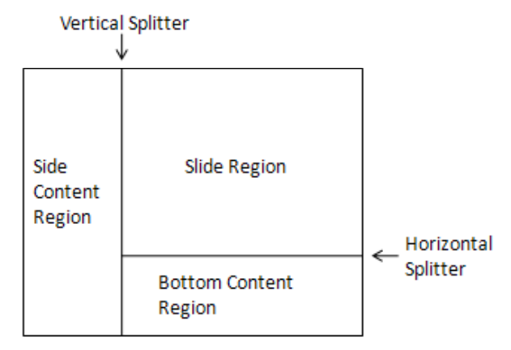

# 19.2 演示文稿

=== "中文"

    PresentationML 框架的表示部分包含一组元素，这些元素描述表示范围和特定于视图的属性的存储。 
    演示文稿范围的属性是那些与整个演示文稿相关的属性。 特定于视图的属性通过存储与演示的最终传送有关的参数来帮助生成应用程序和查看应用程序。

=== "英文"

    **Presentation**

    The Presentation portion of the PresentationML framework houses a set of elements that describe the storing of presentation-wide and view-specific properties. The presentation-wide properties are those that pertain to the entire presentation. The view-specific properties assist the generating application and viewing application by storing parameters that pertain to the final delivery of the presentation.

## 19.2.1 演示文稿属性

=== "中文"

    此部分包含与演示文档相关的所有演示文稿级别属性：

=== "英文"

    **Presentation Properties**

    This section contains all presentation-level properties that pertain to a presentation document:

### 19.2.1.1 bold (粗体嵌入字体)

=== "中文"

    此元素指定链接到父字体的粗体嵌入字体。 一旦指定，给定字体名称的粗体版本即可在演示文稿中使用。 
    实际的字体数据是使用包含所有可用字体链接的关系文件来引用的。 **该字体数据包含每个可用字符的字体信息**。

    !!! info "Example"

        考虑以下指定粗体版本的嵌入字体。

        ```xml
        <p:embeddedFont>
            <p:font typeface="MyFont" pitchFamily="34" charset="0"/>
            <p:bold r:id="rId2"/>
        </p:embeddedFont>
        ```
    
    !!! info "Note"

        并非必须存储字体的所有字符。 由生成应用程序决定将哪些字符存储在相应的字体数据文件中

    <table border=1>
        <thead>
            <tr>
                <th>**Attributes**</th>
                <th>**Description**</th>
            </tr>
        </thead>
        <tbody>
            <tr>
                <td>
                    id (关系标识符/Relationship Identifier) </br></br>
                    Namespace:http://purl.oclc.org/ooxml/officeDocument/relationships
                </td>
                <td>
                    指定与相应关系文件结合使用的关系标识符，以解析演示文稿中引用的此嵌入字体的位置。 </br></br>
                    该属性的可能值由 ST_RelationshipId 简单类型 ([§22.8.2.1]) 定义。
                </td>
            </tr>
        </tbody>
    </table>

    [Note: 该元素内容模型 (CT_EmbeddedFontDataId) 的 W3C XML 架构定义位于 §A.3 中。 end note]

=== "英文"

    **bold (Bold Embedded Font)**

    This element specifies a bold embedded font that is linked to a parent typeface. Once specified, this bold version of the given typeface name is available for use within the presentation. The actual font data is referenced using a relationships file that contains links to all fonts available. This font data contains font information for each of the characters to be made available.

    !!! info "Example"

        Consider the following embedded font with a bold version specified.

        ```xml
        <p:embeddedFont>
            <p:font typeface="MyFont" pitchFamily="34" charset="0"/>
            <p:bold r:id="rId2"/>
        </p:embeddedFont>
        ```
    
    !!! info "Note"

        Not all characters for a typeface must be stored. It is up to the generating application to determine which characters are to be stored in the corresponding font data files

    <table border=1>
        <thead>
            <tr>
                <th>**Attributes**</th>
                <th>**Description**</th>
            </tr>
        </thead>
        <tbody>
            <tr>
                <td>
                    id (Relationship Identifier) </br></br>
                    Namespace:http://purl.oclc.org/ooxml/officeDocument/relationships
                </td>
                <td>
                    Specifies the relationship identifier that is used in conjunction with a corresponding relationship file to resolve the location of this embedded font that is referenced in a presentation. </br></br>
                    The possible values for this attribute are defined by the ST_RelationshipId simple type ([§22.8.2.1]).
                </td>
            </tr>
        </tbody>
    </table>

    [Note: The W3C XML Schema definition of this element’s content model (CT_EmbeddedFontDataId) is located in §A.3. end note]

### 19.2.1.2 boldItalic (粗体斜体嵌入字体)  

=== "中文"

    该元素指定链接到父字体的粗体斜体嵌入字体。 一旦指定，给定字体名称的粗体斜体版本即可在演示文稿中使用。 实际的字体数据是使用包含所有可用字体链接的关系文件来引用的。 该字体数据包含每个可用字符的字体信息。

    !!! info "Example"

        考虑以下指定粗体斜体版本的嵌入字体。

        ```xml
        <p:embeddedFont>
            <p:font typeface="MyFont" pitchFamily="34" charset="0"/>
            <p:boldItalic r:id="rId2"/>
        </p:embeddedFont>
        ```
    
    [Note: 并非必须存储字体的所有字符。 由生成应用程序来确定将哪些字符存储在相应的字体数据文件中。 end note]

    <table border=1>
        <thead>
            <tr>
                <th>**Attributes**</th>
                <th>**Description**</th>
            </tr>
        </thead>
        <tbody>
            <tr>
                <td>
                    id (关系标识符/Relationship Identifier) </br></br>
                    Namespace:http://purl.oclc.org/ooxml/officeDocument/relationships
                </td>
                <td>
                    指定与相应关系文件结合使用的关系标识符，以解析演示文稿中引用的此嵌入字体的位置。 </br></br>
                    该属性的可能值由 ST_RelationshipId 简单类型 (第 22.8.2.1 节) 定义。
                </td>
            </tr>
        </tbody>
    </table>

    [Note: 该元素内容模型 (CT_EmbeddedFontDataId) 的 W3C XML 架构定义位于 §A.3 中。 end note]

=== "英文"

    **boldItalic (Bold Italic Embedded Font)**

    This element specifies a bold italic embedded font that is linked to a parent typeface. Once specified, this bold italic version of the given typeface name is available for use within the presentation. The actual font data is referenced using a relationships file that contains links to all fonts available. This font data contains font information for each of the characters to be made available.

    !!! info "Example"

        Consider the following embedded font with a bold italic version specified.

        ```xml
        <p:embeddedFont>
            <p:font typeface="MyFont" pitchFamily="34" charset="0"/>
            <p:boldItalic r:id="rId2"/>
        </p:embeddedFont>
        ```
    
    [Note: Not all characters for a typeface must be stored. It is up to the generating application to determine which characters are to be stored in the corresponding font data files. end note]

    <table border=1>
        <thead>
            <tr>
                <th>**Attributes**</th>
                <th>**Description**</th>
            </tr>
        </thead>
        <tbody>
            <tr>
                <td>
                    id (Relationship Identifier) </br></br>
                    Namespace:http://purl.oclc.org/ooxml/officeDocument/relationships
                </td>
                <td>
                    Specifies the relationship identifier that is used in conjunction with a corresponding relationship file to resolve the location of this embedded font that is referenced in a presentation. </br></br>
                    The possible values for this attribute are defined by the ST_RelationshipId simple type (§22.8.2.1).
                </td>
            </tr>
        </tbody>
    </table>

    [Note: The W3C XML Schema definition of this element’s content model (CT_EmbeddedFontDataId) is located in §A.3. end note]

### 19.2.1.3 browse (浏览幻灯片模式)

=== "中文"

    此元素指定应在单个窗口或浏览模式而不是全屏模式下查看演示文稿幻灯片。

    !!! info "Example"

        考虑以下要在浏览模式下查看的演示文稿。

        ```xml
        <p:presentationPr xmlns:a="…" xmlns:r="…" xmlns:p="…">
            <p:showPr>
                …
                <p:browse showScrollbar="0"/>
                …
            </p:showPr>
        </p:presentationPr>
        ```

    <table border=1>
        <thead>
            <tr>
                <th>**Attributes**</th>
                <th>**Description**</th>
            </tr>
        </thead>
        <tbody>
            <tr>
                <td>
                    showScrollbar (在窗口中显示滚动条/Show Scroll Bar in Window)
                </td>
                <td>
                    指定是否在查看窗口中显示滚动条。 </br></br>
                    该属性的可能值由 W3C XML Schema 布尔数据类型定义。
                </td>
            </tr>
        </tbody>
    </table>

    [Note: 该元素内容模型 (CT_ShowInfoBrowse) 的 W3C XML 架构定义位于 §A.3 中。 end note]

=== "英文"

    **browse (Browse Slide Show Mode)**

    This element specifies that the presentation slide show should be viewed in a single window or browse mode, instead of full screen.

    !!! info "Example"

        Consider the following presentation that is to be viewed in a browse mode.

        ```xml
        <p:presentationPr xmlns:a="…" xmlns:r="…" xmlns:p="…">
            <p:showPr>
                …
                <p:browse showScrollbar="0"/>
                …
            </p:showPr>
        </p:presentationPr>
        ```

    <table border=1>
        <thead>
            <tr>
                <th>**Attributes**</th>
                <th>**Description**</th>
            </tr>
        </thead>
        <tbody>
            <tr>
                <td>
                    showScrollbar (Show Scroll Bar in Window)
                </td>
                <td>
                    Specifies whether to show the scroll bar in the viewing window. </br></br>
                    The possible values for this attribute are defined by the W3C XML Schema boolean datatype.
                </td>
            </tr>
        </tbody>
    </table>

    [Note: The W3C XML Schema definition of this element’s content model (CT_ShowInfoBrowse) is located in §A.3. end note]

### 19.2.1.4 clrMru (彩色MRU)

=== "中文"

    这指定了演示文稿中最近使用的用户选择的颜色。 此列表包含演示文稿主题颜色之外的自定义用户选择颜色，使应用程序能够公开这些附加颜色选择以便于重用。 列表中的第一项是最近使用的颜色。

    !!! info "Example"

        请考虑以下演示，其中用户在颜色 MRU 列表中选择了两种颜色。

        ```xml
        <p:presentationPr xmlns:a="…" xmlns:r="…" xmlns:p="…">
            …
            <p:clrMru>
                <a:srgbClr val="5361EB"/>
                <a:srgbClr val="CCECFF"/>
            </p:clrMru>
            …
        </p:presentationPr>
        ```

    [Note: 该元素内容模型 (CT_ColorMRU) 的 W3C XML 架构定义位于 §A.4.1 中。 end note]

=== "英文"

    **clrMru (Color MRU)**
    
    This specifies the most recently used user-selected colors within the presentation. This list contains custom user-selected colors outside the presentation's theme colors, enabling the application to expose these additional color choices for easy reuse. The first item in the list is the most recently used color.

    !!! info "Example"

        Consider the following presentation with two user-selected colors in the color MRU list.

        ```xml
        <p:presentationPr xmlns:a="…" xmlns:r="…" xmlns:p="…">
            …
            <p:clrMru>
                <a:srgbClr val="5361EB"/>
                <a:srgbClr val="CCECFF"/>
            </p:clrMru>
            …
        </p:presentationPr>
        ```

    [Note: The W3C XML Schema definition of this element’s content model (CT_ColorMRU) is located in §A.4.1. end note]

### 19.2.1.5 custShow (自定义放映)

=== "中文"

    此元素指定自定义演示，它是演示文稿中包含的一组幻灯片的有序列表。 自定义显示元素允许指定与幻灯片本身存储顺序不同的演示顺序。

    !!! info "Example"

        考虑以下自定义放映列表，其中概述了给定幻灯片集的几个自定义放映.

        ```xml
        <p:custShowLst>
            <p:custShow name="Custom Show 1" id="0">
                <p:sldLst>
                    <p:sld r:id="rId4"/>
                    <p:sld r:id="rId3"/>
                    <p:sld r:id="rId2"/>
                    <p:sld r:id="rId5"/>
                </p:sldLst>
            </p:custShow>
            <p:custShow name="Custom Show 2" id="1">
                <p:sldLst>
                    <p:sld r:id="rId4"/>
                    <p:sld r:id="rId5"/>
                </p:sldLst>
            </p:custShow>
        </p:custShowLst>
        ```

        在上面的示例中，指定了两个自定义放映。 第一个指定以 4、3、2、然后 5 的顺序呈现幻灯片，而第二个指定仅播放幻灯片 4、然后 5。

    <table border=1>
        <thead>
            <tr>
                <th>**Attributes**</th>
                <th>**Description**</th>
            </tr>
        </thead>
        <tbody>
            <tr>
                <td>
                    id (自定义放映标识符/Custom Show Identifier)
                </td>
                <td>
                    该属性指定自定义显示标识号。 这是一个给出的数字，在演示文档中应该是唯一的。 </br></br>
                    此属性的可能值由 W3C XML 架构 unsignedInt 数据类型定义。
                </td>
            </tr>
        </tbody>
    </table>

    [Note: 该元素内容模型 (CT_CustomShowId) 的 W3C XML 架构定义位于 §A.3 中。 end note]

=== "英文"

    **custShowLst (Custom Show)**

    This element specifies a custom show which is an ordered list of a group of slides that are contained within the presentation. The custom show element allows for the specification of a presentation order that is different from the order in which the slides themselves are stored.

    !!! info "Example"

        Consider the following custom show list that outlines a couple custom shows for a given set of slides.

        ```xml
        <p:custShowLst>
            <p:custShow name="Custom Show 1" id="0">
                <p:sldLst>
                    <p:sld r:id="rId4"/>
                    <p:sld r:id="rId3"/>
                    <p:sld r:id="rId2"/>
                    <p:sld r:id="rId5"/>
                </p:sldLst>
            </p:custShow>
            <p:custShow name="Custom Show 2" id="1">
                <p:sldLst>
                    <p:sld r:id="rId4"/>
                    <p:sld r:id="rId5"/>
                </p:sldLst>
            </p:custShow>
        </p:custShowLst>
        ```

        In the above example there are two custom shows specified. The first specifies to present the slides in the order of 4, 3, 2 then 5 while the second specifies to play only slide 4 then 5. 

    <table border=1>
        <thead>
            <tr>
                <th>**Attributes**</th>
                <th>**Description**</th>
            </tr>
        </thead>
        <tbody>
            <tr>
                <td>
                    id (Custom Show Identifier)
                </td>
                <td>
                    This attribute specifies the custom show identification number. This is a number given that should be unique within the presentation document. </br></br>
                    The possible values for this attribute are defined by the W3C XML Schema unsignedInt datatype.
                </td>
            </tr>
        </tbody>
    </table>

    [Note: The W3C XML Schema definition of this element’s content model (CT_CustomShowId) is located in §A.3. end note]

### 19.2.1.6 custShow (自定义放映)

=== "中文"

    此元素指定自定义放映，定义幻灯片显示的特定幻灯片顺序。这允许呈现同一组幻灯片的许多变体。

    !!! info "Example"

        考虑以下使用三张幻灯片的自定义演示。

        ```xml
        <p:custShow name="Custom Show 1" id="0">
            <p:sldLst>
                <p:sld r:id="rId5"/>
                <p:sld r:id="rId2"/>
                <p:sld r:id="rId4"/>
            </p:sldLst>
        </p:custShow>
        ```

        请注意，此处的自定义放映指定放映或演示文稿，其中首先显示幻灯片 5，然后显示幻灯片 2，最后显示幻灯片 4。

    <table border=1>
        <thead>
            <tr>
                <th>**Attributes**</th>
                <th>**Description**</th>
            </tr>
        </thead>
        <tbody>
            <tr>
                <td>
                    id (自定义放映ID/Custom Show ID)
                </td>
                <td>
                    指定此自定义节目的标识号。 这在相应演示文稿中的所有自定义节目中应该是唯一的。 </br></br>
                    此属性的可能值由 W3C XML 架构 unsignedInt 数据类型定义。
                </td>
            </tr>
            <tr>
                <td>
                    name (自定义反映名称/Custom Show Name)
                </td>
                <td>
                    指定自定义节目的名称. </br></br>
                    该属性的可能值由 ST_Name 简单类型（第 19.7.5 节）定义。
                </td>
            </tr>
        </tbody>
    </table> 

    [Note: The W3C XML Schema definition of this element’s content model (CT_CustomShow) is located in §A.3. end note]

=== "英文"

    **custShow (Custom Show)**

    This element specifies a custom show that defines a specific slide sequence that the slides are displayed in. This allows for many variants of the same set of slides to be presented.

    !!! info "Example"

        Consider the following custom show using three slides.

        ```xml
        <p:custShow name="Custom Show 1" id="0">
            <p:sldLst>
                <p:sld r:id="rId5"/>
                <p:sld r:id="rId2"/>
                <p:sld r:id="rId4"/>
            </p:sldLst>
        </p:custShow>
        ```

        Notice here that the custom show specifies a show, or presentation, where slide 5 is shown first, then slide 2 and finally slide 4.

    <table border=1>
        <thead>
            <tr>
                <th>**Attributes**</th>
                <th>**Description**</th>
            </tr>
        </thead>
        <tbody>
            <tr>
                <td>
                    id (Custom Show ID)
                </td>
                <td>
                    Specifies the identification number for this custom show. This should be unique among all the custom shows within the corresponding presentation. </br></br>
                    The possible values for this attribute are defined by the W3C XML Schema unsignedInt datatype.
                </td>
            </tr>
            <tr>
                <td>
                    name (Custom Show Name)
                </td>
                <td>
                    Specifies a name for the custom show. </br></br>
                    The possible values for this attribute are defined by the ST_Name simple type (§19.7.5).
                </td>
            </tr>
        </tbody>
    </table> 

    [Note: The W3C XML Schema definition of this element’s content model (CT_CustomShow) is located in §A.3. end note]

### 19.2.1.7 custShowLst (自定义放映列表)

=== "中文"

    此元素指定相应演示文稿中可用的所有自定义节目的列表。 自定义放映是定义的幻灯片序列，允许以任意顺序显示幻灯片和演示文稿。

    [Note: 该元素内容模型 (CT_CustomShowList) 的 W3C XML 架构定义位于 §A.3 中。 end note]

=== "英文"

    **custShowLst (List of Custom Shows)**

    This element specifies a list of all custom shows that are available within the corresponding presentation. A custom show is a defined slide sequence that allows for the displaying of the slides with the presentation in any arbitrary order.

    [Note: The W3C XML Schema definition of this element’s content model (CT_CustomShowList) is located in §A.3. end note]

### 19.2.1.8 defaultTextStyle (演示文稿默认文本样式) :apple:

=== "中文"

    **该元素指定演示文稿中使用的默认文本样式**。 如果该幻灯片未与母版幻灯片关联，或者没有为演示文稿幻灯片中的文本指定样式信息，则在插入新幻灯片时可以引用此处定义的文本样式。

    [Note: 该元素内容模型 (CT_TextListStyle) 的 W3C XML 架构定义位于 §A.4.1 中。 end note]

=== "英文"

    **defaultTextStyle (Presentation Default Text Style)**

    This element specifies the default text styles that are to be used within the presentation. The text style defined here can be referenced when inserting a new slide if that slide is not associated with a master slide or if no styling information has been otherwise specified for the text within the presentation slide.

    [Note: The W3C XML Schema definition of this element’s content model (CT_TextListStyle) is located in §A.4.1. end note]

### 19.2.1.9 embeddedFont (嵌入字体)

=== "中文"

    该元素指定嵌入字体。 一旦指定，该字体就可以在演示文稿中使用。 在字体规范中，指定字体可以有常规、粗体、斜体和粗斜体版本。 每个字体的实际字体数据都是使用包含所有可用字体链接的关系文件来引用的。 该字体数据包含要在每个版本的字体中可用的每个字符的字体信息。

    !!! info "Example"

        考虑以下嵌入字体。

        ```xml
        <p:embeddedFont>
            <p:font typeface="MyFont" pitchFamily="34" charset="0"/>
            <p:regular r:id="rId2"/>
        </p:embeddedFont>
        ```
    
    [Note: 并非必须存储字体的所有字符。 由生成应用程序来确定将哪些字符存储在相应的字体数据文件中。 end note]

    [Note: 该元素内容模型 (CT_EmbeddedFontListEntry) 的 W3C XML 架构定义位于 §A.3 中。 end note]

=== "英文"

    **embeddedFont (Embedded Font)**

    This element specifies an embedded font. Once specified, this font is available for use within the presentation. Within a font specification there can be regular, bold, italic and boldItalic versions of the font specified. The actual font data for each of these is referenced using a relationships file that contains links to all available fonts. This font data contains font information for each of the characters to be made available in each version of the font.

    !!! info "Example"

        Consider the following embedded font.

        ```xml
        <p:embeddedFont>
            <p:font typeface="MyFont" pitchFamily="34" charset="0"/>
            <p:regular r:id="rId2"/>
        </p:embeddedFont>
        ```
    
    [Note: Not all characters for a typeface must be stored. It is up to the generating application to determine which characters are to be stored in the corresponding font data files. end note]

    [Note: The W3C XML Schema definition of this element’s content model (CT_EmbeddedFontListEntry) is located in §A.3. end note]

### 19.2.1.10 embeddedFontLst (嵌入字体列表)  

=== "中文"

    该元素指定嵌入在相应演示文稿中的字体列表。 这些字体的字体数据与其他文档部分一起存储在文档容器内。 实际的字体数据在embeddedFont 元素中引用。
    
    [Note: The W3C XML Schema definition of this element’s content model (CT_EmbeddedFontList) is located in §A.3. end note]

=== "英文"

    **embeddedFontLst (Embedded Font List)**

    This element specifies a list of fonts that are embedded within the corresponding presentation. The font data for these fonts is stored alongside the other document parts within the document container. The actual font data is referenced within the embeddedFont element.
    
    [Note: The W3C XML Schema definition of this element’s content model (CT_EmbeddedFontList) is located in §A.3. end note]

### 19.2.1.11 ext (扩展)

=== "中文"

    此元素指定用于将来对 DrawingML 当前版本进行扩展的扩展。 这允许为生成应用程序的更高版本指定当前未知的元素。
    
    [Note: 该元素无意将过渡模式重新引入严格一致性类。 end note]

    <table border=1>
        <thead>
            <tr>
                <th>**Attributes**</th>
                <th>**Description**</th>
            </tr>
        </thead>
        <tbody>
            <tr>
                <td>
                    uri (统一资源标识符/Uniform Resource Identifier)
                </td>
                <td>
                    该属性指定表示存储在该标签下的数据的 URI 或统一资源标识符。 URI 用于标识可以处理此标签内容的正确“服务器”。 </br></br>
                    此属性的可能值由 W3C XML 架构token数据类型定义。
                </td>
            </tr>
        </tbody>
    </table>

    [Note: 该元素内容模型 (CT_Extension) 的 W3C XML 模式定义位于 §A.3 中。 end note]

=== "英文"

    **ext (Extension)**

    This element specifies an extension that is used for future extensions to the current version of DrawingML. This= allows for the specifying of currently unknown elements for later versions of generating applications.
    
    [Note: This element is not intended to reintroduce transitional schema into the strict conformance class. end note]

    <table border=1>
        <thead>
            <tr>
                <th>**Attributes**</th>
                <th>**Description**</th>
            </tr>
        </thead>
        <tbody>
            <tr>
                <td>
                    uri (Uniform Resource Identifier)
                </td>
                <td>
                    This attribute specifies the URI, or uniform resource identifier that represents the data stored under this tag. The URI is used to identify the correct 'server' that can process the contents of this tag. </br></br>
                    The possible values for this attribute are defined by the W3C XML Schema token datatype.
                </td>
            </tr>
        </tbody>
    </table>

    [Note: The W3C XML Schema definition of this element’s content model (CT_Extension) is located in §A.3. end note]

### 19.2.1.12 extLst (扩展列表)

=== "中文"

    该元素指定扩展列表，在其中定义元素类型 ext 的所有未来扩展。 扩展列表以及相应的未来扩展用于扩展PresentationML框架的存储功能。 这允许各种新类型的数据本地存储在框架内。

    [Note: 该元素内容模型 (CT_ExtensionList) 的 W3C XML 架构定义位于 §A.3 中。 end note]

=== "英文"

    **extLst (Extension List)**

    This element specifies the extension list within which all future extensions of element type ext are defined. The extension list along with corresponding future extensions is used to extend the storage capabilities of the PresentationML framework. This allows for various new kinds of data to be stored natively within the framework.

    [Note: The W3C XML Schema definition of this element’s content model (CT_ExtensionList) is located in §A.3. end note]

### 19.2.1.13 font (嵌入字体名称)

=== "中文"

    该元素指定描述嵌入字体的特定属性。 一旦指定，该字体就可以在演示文稿中使用。 在字体规范中，指定字体可以有常规、粗体、斜体和粗斜体版本。 每个字体的实际字体数据都是使用包含所有可用字体链接的关系文件来引用的。 该字体数据包含要在每个版本的字体中可用的每个字符的字体信息。

    !!! info "Example"

        考虑以下嵌入字体。

        ```xml
        <p:embeddedFont>
            <p:font typeface="MyFont" pitchFamily="34" charset="0"/>
            <p:regular r:id="rId2"/>
        </p:embeddedFont>
        ```

    字体替换逻辑：

    如果指定的字体在用于渲染的系统上不可用，则将利用该元素的属性来选择替代字体。

    [Note: 并非必须存储字体的所有字符。 由生成应用程序来确定将哪些字符存储在相应的字体数据文件中。 end note]

    如果引用嵌入字体（例如第 21.1.2.3.7 节中指定的 latin 元素）的文本正文的标记中的属性与此嵌入字体元素的相应实例的标记中的属性之间存在歧义，则 确定是否使用该嵌入字体是依赖于应用程序的行为。 如果此嵌入字体元素实例的标记中的属性与第 15.2.13 节中指定的相应嵌入字体部分中的属性之间存在歧义，则确定是否使用该嵌入字体是依赖于应用程序的行为。

    <table border=1>
        <thead>
            <tr>
                <th>**Attributes**</th>
                <th>**Description**</th>
            </tr>
        </thead>
        <tbody>
            <tr>
                <td>
                    charset (相似的字符集/Similar Character Set)
                </td>
                <td>
                    指定父字体支持的字符集。 该信息可用于字体替换逻辑，以在该字体不可用时找到适当的替换字体。 该信息是通过查询存在的字体来确定的，并且在字体不可用时不得修改。 </br></br>
                    该属性的值应解释如下：</br></br>
                    <table border=1>
                        <thead>
                            <tr>
                                <th>**Value**</th>
                                <th>**Description**</th>
                            </tr>
                        </thead>
                        <tbody>
                            <tr>
                                <td>
                                    0x00
                                </td>
                                <td>
                                    指定 ANSI 字符集。 (IANA name iso-8859-1)
                                </td>
                            </tr>
                            <tr>
                                <td>
                                    0x01
                                </td>
                                <td>
                                    指定默认字符集。
                                </td>
                            </tr>
                            <tr>
                                <td>
                                    0x02
                                </td>
                                <td>
                                    指定符号字符集。 该值指定应该使用字体的 Unicode 专用区域（U+FF00 到 U+FFFF）中的字符来显示 U+0000 到 U+00FF 范围内的字符。
                                </td>
                            </tr>
                            <tr>
                                <td>
                                    0x4D
                                </td>
                                <td>
                                    指定 Macintosh（标准罗马）字符集。 （IANA 名称 Macintosh）
                                </td>
                            </tr>
                            <tr>
                                <td>
                                    0x80
                                </td>
                                <td>
                                    指定 JIS 字符集。 （IANA 名称 shift_jis）
                                </td>
                            </tr>
                            <tr>
                                <td>
                                    0x81
                                </td>
                                <td>
                                    指定朝鲜文字符集。 （IANA 名称 ks_c_5601-1987）
                                </td>
                            </tr>
                            <tr>
                                <td>
                                    0x82
                                </td>
                                <td>
                                    指定 Johab 字符集。 （IANA 名称 KS C-5601-1992）
                                </td>
                            </tr>
                            <tr>
                                <td>
                                    0x86
                                </td>
                                <td>
                                    指定 GB-2312 字符集。 （IANA 名称 GBK）
                                </td>
                            </tr>
                            <tr>
                                <td>
                                    0x88
                                </td>
                                <td>
                                    指定中文大五字符集。 （IANA 名称 Big5）
                                </td>
                            </tr>
                            <tr>
                                <td>
                                    0xA1
                                </td>
                                <td>
                                    指定希腊字符集。 （IANA 名称 windows-1253）
                                </td>
                            </tr>
                            <tr>
                                <td>
                                    0xA2
                                </td>
                                <td>
                                    指定土耳其语字符集。 （IANA 名称 iso-8859-9）
                                </td>
                            </tr>
                            <tr>
                                <td>
                                    0xA3
                                </td>
                                <td>
                                    指定越南语字符集。 （IANA 名称 windows-1258）
                                </td>
                            </tr>
                            <tr>
                                <td>
                                    0xB1
                                </td>
                                <td>
                                    指定希伯来语字符集。 （IANA 名称 windows-1255）
                                </td>
                            </tr>
                            <tr>
                                <td>
                                    0xB2
                                </td>
                                <td>
                                    指定阿拉伯字符集。 （IANA 名称 windows-1256）
                                </td>
                            </tr>
                            <tr>
                                <td>
                                    0xBA
                                </td>
                                <td>
                                    指定波罗的海字符集。 （IANA 名称 windows-1257）
                                </td>
                            </tr>
                            <tr>
                                <td>
                                    0xCC
                                </td>
                                <td>
                                    指定俄语字符集。 （IANA 名称 windows-1251）
                                </td>
                            </tr>
                            <tr>
                                <td>
                                    0xDE
                                </td>
                                <td>
                                    指定泰语字符集。 （IANA 名称 windows-874）
                                </td>
                            </tr>
                            <tr>
                                <td>
                                    0xEE
                                </td>
                                <td>
                                    指定东欧字符集。 （IANA 名称 windows-1250）
                                </td>
                            </tr>
                            <tr>
                                <td>
                                    0xFF
                                </td>
                                <td>
                                    指定 ECMA-376 未定义的 OEM 字符集。
                                </td>
                            </tr>
                            <tr>
                                <td>
                                    Any other value
                                </td>
                                <td>
                                    应用程序定义的，可以忽略。
                                </td>
                            </tr>
                        </tbody>
                    </table>
                    该属性的可能值由 W3C XML 模式byte数据类型定义。
                </td>
            </tr>
            <tr>
                <td>
                    panose (帕诺塞设置/Panose Setting)
                </td>
                <td>
                    使用 ISO/IEC 14496-22:2007 的 §4.2.7.17 中定义的机制指定当前字体的 Panose-1 分类号。<br/><br/>
                    该属性的可能值由 ST_Panose 简单类型 (§22.9.2.8) 定义。
                </td>
            </tr>
            <tr>
                <td>
                    pitchFamily (类似字体系列/Similar Font Family) 
                </td>
                <td>
                    指定字体间距以及相应字体的字体系列。 <br/><br/>
                    该信息是通过查询存在的字体来确定的，并且在字体不可用时不得修改。 
                    该信息可用于字体替换逻辑，以在该字体不可用时找到适当的替换字体。<br/><br/>
                    该属性的可能值由 ST_PitchFamily 简单类型 (§20.1.10.41) 定义。
                </td>
            </tr>
            <tr>
                <td>
                    typeface (文本字体/Text Typeface) <br/><br/>
                    Namespace: http://purl.oclc.org/ooxml/drawingml/main
                </td>
                <td>
                    指定要使用的字体或字体名称。 字体是渲染演示文稿时应使用的特定字体的字符串名称。 
                    如果该字体在生成应用程序的字体列表中不可用，则应利用字体替换逻辑来选择替代字体。 <br/><br/>
                    该属性的可能值由 ST_TextTypeface 简单类型 (§20.1.10.81) 定义。
                </td>
            </tr>
        </tbody>
    </table>

    [Note: 该元素内容模型 (CT_TextFont) 的 W3C XML 模式定义位于 §A.4.1 中。 end note]

=== "英文"

    **font (Embedded Font Name)**

    This element specifies specific properties describing an embedded font. Once specified, this font is available for use within the presentation. Within a font specification there can be regular, bold, italic and boldItalic versions of the font specified. The actual font data for each of these is referenced using a relationships file that contains links to all available fonts. This font data contains font information for each of the characters to be made available in each version of the font.

    !!! info "Example"

        Consider the following embedded font.

        ```xml
        <p:embeddedFont>
            <p:font typeface="MyFont" pitchFamily="34" charset="0"/>
            <p:regular r:id="rId2"/>
        </p:embeddedFont>
        ```

    Font Substitution Logic:

    If the specified font is not available on a system being used for rendering, then the attributes of this element are to be utilized in selecting an alternate font.

    [Note: Not all characters for a typeface must be stored. It is up to the generating application to determine which characters are to be stored in the corresponding font data files. end note]

    If ambiguities exist between properties in the markup of a body of text that refers to an embedded font (such as the latin element specified in §21.1.2.3.7) and properties in the markup of the corresponding instance of this embedded font element, the determination whether to use that embedded font is application-dependent behavior. If ambiguities exist between properties in the markup of an instance of this embedded font element and properties within the corresponding embedded Font part as specified in §15.2.13, the determination whether to use that embedded font is application-dependent behavior.

    <table border=1>
        <thead>
            <tr>
                <th>**Attributes**</th>
                <th>**Description**</th>
            </tr>
        </thead>
        <tbody>
            <tr>
                <td>
                    charset (Similar Character Set)
                </td>
                <td>
                    Specifies the character set that is supported by the parent font. This information can be used in font substitution logic to locate an appropriate substitute font when this font is not available. This information is determined by querying the font when present and shall not be modified when the font is not available. </br></br>
                    The value of this attribute shall be interpreted as follows:</br></br>
                    <table border=1>
                        <thead>
                            <tr>
                                <th>**Value**</th>
                                <th>**Description**</th>
                            </tr>
                        </thead>
                        <tbody>
                            <tr>
                                <td>
                                    0x00
                                </td>
                                <td>
                                    Specifies the ANSI character set. (IANA name iso-8859-1)
                                </td>
                            </tr>
                            <tr>
                                <td>
                                    0x01
                                </td>
                                <td>
                                    Specifies the default character set.
                                </td>
                            </tr>
                            <tr>
                                <td>
                                    0x02
                                </td>
                                <td>
                                    Specifies the Symbol character set. This value specifies that the characters in the Unicode private use area (U+FF00 to U+FFFF) of the font should be used to display characters in the range U+0000 to U+00FF.
                                </td>
                            </tr>
                            <tr>
                                <td>
                                    0x4D
                                </td>
                                <td>
                                    Specifies a Macintosh (Standard Roman) character set. (IANA name macintosh)
                                </td>
                            </tr>
                            <tr>
                                <td>
                                    0x80
                                </td>
                                <td>
                                    Specifies the JIS character set. (IANA name shift_jis)
                                </td>
                            </tr>
                            <tr>
                                <td>
                                    0x81
                                </td>
                                <td>
                                    Specifies the Hangul character set. (IANA name ks_c_5601-1987)
                                </td>
                            </tr>
                            <tr>
                                <td>
                                    0x82
                                </td>
                                <td>
                                    Specifies a Johab character set. (IANA name KS C-5601-1992)
                                </td>
                            </tr>
                            <tr>
                                <td>
                                    0x86
                                </td>
                                <td>
                                    Specifies the GB-2312 character set. (IANA name GBK)
                                </td>
                            </tr>
                            <tr>
                                <td>
                                    0x88
                                </td>
                                <td>
                                    Specifies the Chinese Big Five character set. (IANA name Big5)
                                </td>
                            </tr>
                            <tr>
                                <td>
                                    0xA1
                                </td>
                                <td>
                                    Specifies a Greek character set. (IANA name windows-1253)
                                </td>
                            </tr>
                            <tr>
                                <td>
                                    0xA2
                                </td>
                                <td>
                                    Specifies a Turkish character set. (IANA name iso-8859-9)
                                </td>
                            </tr>
                            <tr>
                                <td>
                                    0xA3
                                </td>
                                <td>
                                    Specifies a Vietnamese character set. (IANA name windows-1258)
                                </td>
                            </tr>
                            <tr>
                                <td>
                                    0xB1
                                </td>
                                <td>
                                    Specifies a Hebrew character set. (IANA name windows-1255)
                                </td>
                            </tr>
                            <tr>
                                <td>
                                    0xB2
                                </td>
                                <td>
                                    Specifies an Arabic character set. (IANA name windows-1256)
                                </td>
                            </tr>
                            <tr>
                                <td>
                                    0xBA
                                </td>
                                <td>
                                    Specifies a Baltic character set. (IANA name windows-1257)
                                </td>
                            </tr>
                            <tr>
                                <td>
                                    0xCC
                                </td>
                                <td>
                                    Specifies a Russian character set. (IANA name windows-1251)
                                </td>
                            </tr>
                            <tr>
                                <td>
                                    0xDE
                                </td>
                                <td>
                                    Specifies a Thai character set. (IANA name windows-874)
                                </td>
                            </tr>
                            <tr>
                                <td>
                                    0xEE
                                </td>
                                <td>
                                    Specifies an Eastern European character set. (IANA name windows-1250)
                                </td>
                            </tr>
                            <tr>
                                <td>
                                    0xFF
                                </td>
                                <td>
                                    Specifies an OEM character set not defined by ECMA-376.
                                </td>
                            </tr>
                            <tr>
                                <td>
                                    Any other value
                                </td>
                                <td>
                                    Application-defined, can be ignored.
                                </td>
                            </tr>
                        </tbody>
                    </table>
                    The possible values for this attribute are defined by the W3C XML Schema byte datatype.
                </td>
            </tr>
            <tr>
                <td>
                    panose (Panose Setting)
                </td>
                <td>
                    Specifies the Panose-1 classification number for the current font using the mechanism defined in §4.2.7.17 of ISO/IEC 14496-22:2007. <br/><br/>
                    The possible values for this attribute are defined by the ST_Panose simple type (§22.9.2.8).
                </td>
            </tr>
            <tr>
                <td>
                    pitchFamily (Similar Font Family) 
                </td>
                <td>
                    Specifies the font pitch as well as the font family for the corresponding font. <br/><br/>
                    This information is determined by querying the font when present and shall not be modified when the font is not available. This information can be used in font substitution logic to locate an appropriate substitute font when this font is not available.<br/><br/>
                    The possible values for this attribute are defined by the ST_PitchFamily simple type (§20.1.10.41).
                </td>
            </tr>
            <tr>
                <td>
                    typeface (Text Typeface) <br/><br/>
                    Namespace: http://purl.oclc.org/ooxml/drawingml/main
                </td>
                <td>
                    Specifies the typeface, or name of the font that is to be used. The typeface is a string name of the specific font that should be used in rendering the presentation. If this font is not available within the font list of the generating application than font substitution logic should be utilized in order to select an alternate font. <br/><br/>
                    The possible values for this attribute are defined by the ST_TextTypeface simple type (§20.1.10.81).
                </td>
            </tr>
        </tbody>
    </table>

    [Note: The W3C XML Schema definition of this element’s content model (CT_TextFont) is located in §A.4.1. end note]

### 19.2.1.14 handoutMasterId (讲义主 ID)  

=== "中文"

    该元素指定相应演示文稿中可用的讲义母版。 讲义母版是专门为打印讲义而设计的幻灯片。

    !!! info "Example"

        考虑演示文稿中讲义母版的以下规范

        ```xml
        <p:presentation xmlns:a="…" xmlns:r="…" xmlns:p="…" embedTrueTypeFonts="1">
            …
            <p:handoutMasterIdLst>
                <p:handoutMasterId r:id="rId8"/>
            </p:handoutMasterIdLst>
            …
        </p:presentation>
        ```

    <table border=1>
        <thead>
            <tr>
                <th>**Attributes**</th>
                <th>**Description**</th>
            </tr>
        </thead>
        <tbody>
            <tr>
                <td>
                    id (关系标识符/Relationship Identifier)</br></br>
                    Namespace: http://purl.oclc.org/ooxml/officeDocument/relationships
                </td>
                <td>
                    指定与相应的关系文件结合使用的关系标识符，以解析定义此讲义母版的 handoutMaster 元素的演示文稿中的位置. </br></br>
                    该属性的可能值由 ST_RelationshipId 简单类型 (第 22.8.2.1 节) 定义。
                </td>
            </tr>
        </tbody>
    </table>

    [Note: 该元素内容模型 (CT_HandoutMasterIdListEntry) 的 W3C XML 架构定义位于 §A.3 中。 end note]

=== "英文"

    **handoutMasterId (Handout Master ID)**

    This element specifies a handout master that is available within the corresponding presentation. A handout master is a slide that is specifically designed for printing as a handout. 

    !!! info "Example"

        Consider the following specification of a handout master within a presentation

        ```xml
        <p:presentation xmlns:a="…" xmlns:r="…" xmlns:p="…" embedTrueTypeFonts="1">
            …
            <p:handoutMasterIdLst>
                <p:handoutMasterId r:id="rId8"/>
            </p:handoutMasterIdLst>
            …
        </p:presentation>
        ```

    <table border=1>
        <thead>
            <tr>
                <th>**Attributes**</th>
                <th>**Description**</th>
            </tr>
        </thead>
        <tbody>
            <tr>
                <td>
                    id (Relationship Identifier)</br></br>
                    Namespace: http://purl.oclc.org/ooxml/officeDocument/relationships
                </td>
                <td>
                    Specifies the relationship identifier that is used in conjunction with a corresponding relationship file to resolve the location within a presentation of the handoutMaster element defining this handout master. </br></br>
                    The possible values for this attribute are defined by the ST_RelationshipId simple type (§22.8.2.1).
                </td>
            </tr>
        </tbody>
    </table>

    [Note: The W3C XML Schema definition of this element’s content model (CT_HandoutMasterIdListEntry) is located in §A.3. end note]

### 19.2.1.15 handoutMasterIdLst (讲义主 ID 列表)

=== "中文"

    此元素指定相应演示文稿中可用的讲义母版幻灯片的标识信息列表。 讲义母版是专门为打印讲义而设计的幻灯片。

    [Note: 该元素内容模型 (CT_HandoutMasterIdList) 的 W3C XML 架构定义位于 §A.3 中。 end note]

=== "英文"

    **handoutMasterIdLst (List of Handout Master IDs)**

    This element specifies a list of identification information for the handout master slides that are available within the corresponding presentation. A handout master is a slide that is specifically designed for printing as a handout.

    [Note: The W3C XML Schema definition of this element’s content model (CT_HandoutMasterIdList) is located in §A.3. end note]

### 19.2.1.16 italic (斜体嵌入字体)

=== "中文"

    该元素指定链接到父字体的斜体嵌入字体。 一旦指定，给定字体名称的斜体版本即可在演示文稿中使用。 实际的字体数据是使用包含所有可用字体链接的关系文件来引用的。 该字体数据包含每个可用字符的字体信息。

    !!! info "Example"

        Consider the following embedded font with a italic version specified.

        ```xml
        <p:embeddedFont>
            <p:font typeface="MyFont" pitchFamily="34" charset="0"/>
            <p:italic r:id="rId2"/>
        </p:embeddedFont>
        ```

    [Note: 并非必须存储字体的所有字符。 由生成应用程序来确定将哪些字符存储在相应的字体数据文件中。 end note]

    <table border=1>
        <thead>
            <tr>
                <th>**Attributes**</th>
                <th>**Description**</th>
            </tr>
        </thead>
        <tbody>
            <tr>
                <td>
                    id (关系标识符/Relationship Identifier)</br></br>
                    Namespace: http://purl.oclc.org/ooxml/officeDocument/relationships
                </td>
                <td>
                    指定与相应关系文件结合使用的关系标识符，以解析演示文稿中引用的此嵌入字体的位置。 </br></br>
                    该属性的可能值由 ST_RelationshipId 简单类型 (第 22.8.2.1 节) 定义。
                </td>
            </tr>
        </tbody>
    </table>
    
    [Note: 该元素内容模型 (CT_EmbeddedFontDataId) 的 W3C XML 架构定义位于 §A.3 中。 end note]

=== "英文"

    **italic (Italic Embedded Font)**

    This element specifies an italic embedded font that is linked to a parent typeface. Once specified, this italic version of the given typeface name is available for use within the presentation. The actual font data is referenced using a relationships file that contains links to all fonts available. This font data contains font information for each of the characters to be made available.

    !!! info "Example"

        Consider the following embedded font with a italic version specified.

        ```xml
        <p:embeddedFont>
            <p:font typeface="MyFont" pitchFamily="34" charset="0"/>
            <p:italic r:id="rId2"/>
        </p:embeddedFont>
        ```

    [Note: Not all characters for a typeface must be stored. It is up to the generating application to determine which characters are to be stored in the corresponding font data files. end note]

    <table border=1>
        <thead>
            <tr>
                <th>**Attributes**</th>
                <th>**Description**</th>
            </tr>
        </thead>
        <tbody>
            <tr>
                <td>
                    id (Relationship Identifier)</br></br>
                    Namespace: http://purl.oclc.org/ooxml/officeDocument/relationships
                </td>
                <td>
                    Specifies the relationship identifier that is used in conjunction with a corresponding relationship file to resolve the location of this embedded font that is referenced in a presentation. </br></br>
                    The possible values for this attribute are defined by the ST_RelationshipId simple type (§22.8.2.1).
                </td>
            </tr>
        </tbody>
    </table>
    
    [Note: The W3C XML Schema definition of this element’s content model (CT_EmbeddedFontDataId) is located in §A.3. end note]

### 19.2.1.17 kinsoku (避头尾设置)

=== "中文"

    此元素指定演示文稿范围的避头尾设置，用于定义相应演示文稿中东亚文本的换行行为。

    <table border=1>
        <thead>
            <tr>
                <th>**Attributes**</th>
                <th>**Description**</th>
            </tr>
        </thead>
        <tbody>
            <tr>
                <td>
                    invalEndChars (无效的避头尾结束字符/Invalid Kinsoku End Characters)
                </td>
                <td>
                    指定不能结束文本行的字符. </br></br>
                    此属性的可能值由 W3C XML 架构字符串数据类型定义。
                </td>
            </tr>
            <tr>
                <td>
                    invalStChars (无效的避头尾起始字符/Invalid Kinsoku Start Characters)
                </td>
                <td>
                    指定不能开始一行文本的字符. </br></br>
                    此属性的可能值由 W3C XML 架构字符串数据类型定义.
                </td>
            </tr>
            <tr>
                <td>
                    lang (语言/Language)
                </td>
                <td>
                    指定这些设置应用到的相应东亚语言。 </br></br>
                    此属性的可能值由 W3C XML 架构字符串数据类型定义.
                </td>
            </tr>
        </tbody>
    </table>

    [Note: 该元素内容模型 (CT_Kinsoku) 的 W3C XML 架构定义位于 §A.3 中。 end note]

=== "英文"

    **kinsoku (Kinsoku Settings)**

    This element specifies the presentation-wide kinsoku settings that define the line breaking behaviour of East Asian text within the corresponding presentation.

    <table border=1>
        <thead>
            <tr>
                <th>**Attributes**</th>
                <th>**Description**</th>
            </tr>
        </thead>
        <tbody>
            <tr>
                <td>
                    invalEndChars (Invalid Kinsoku End Characters)
                </td>
                <td>
                    Specifies the characters that cannot end a line of text. </br></br>
                    The possible values for this attribute are defined by the W3C XML Schema string datatype.
                </td>
            </tr>
            <tr>
                <td>
                    invalStChars (Invalid Kinsoku Start Characters)
                </td>
                <td>
                    Specifies the characters that cannot start a line of text. </br></br>
                    The possible values for this attribute are defined by the W3C XML Schema string datatype.
                </td>
            </tr>
            <tr>
                <td>
                    lang (Language)
                </td>
                <td>
                    Specifies the corresponding East Asian language that these settings apply to. </br></br>
                    The possible values for this attribute are defined by the W3C XML Schema string datatype.
                </td>
            </tr>
        </tbody>
    </table>

    [Note: The W3C XML Schema definition of this element’s content model (CT_Kinsoku) is located in §A.3. end note]

### 19.2.1.18 kiosk (信息亭幻灯片放映模式)  

=== "中文"

    此元素指定应以全屏信息亭模式查看演示文稿幻灯片。 在信息亭模式下查看的演示文稿应禁用用户输入，并在指定的时间间隔后重新启动。

    !!! info "Example"

        考虑以下设置为在循环信息亭模式下查看的演示文稿。

        ```xml
        <p:presentationPr xmlns:a="…" xmlns:r="…" xmlns:p="…">
            <p:showPr loop="1" showNarration="1">
                …
                <p:kiosk/>
                …
            </p:showPr>
        </p:presentationPr>
        ```

    <table border=1>
        <thead>
            <tr>
                <th>**Attributes**</th>
                <th>**Description**</th>
            </tr>
        </thead>
        <tbody>
            <tr>
                <td>
                    restart (重新开始反映/Restart Show)
                </td>
                <td>
                    指定演示文稿在重新启动之前应运行的时间长度。 也就是说，演示文稿应循环回到演示文稿或自定义放映中指定的第一张幻灯片。 该值以 1/1000 秒为单位指定，并从演示文稿开始或重新启动的最近时间开始测量。 </br></br>
                    [Note: 如果 showPr 的循环属性指定，则当由于演示文稿结束时自动循环而重新启动演示时，计数器会重置. end note] </br></br>
                    此属性的可能值由 W3C XML 架构 unsignedInt 数据类型定义。
                </td>
            </tr>
        </tbody>
    </table>
    
    [Note: 该元素内容模型 (CT_ShowInfoKiosk) 的 W3C XML 架构定义位于 §A.3 中。 end note]

=== "英文"

    **kiosk (Kiosk Slide Show Mode)**

    This element specifies that the presentation slide show should be viewed in a full-screen kiosk mode. A presentation viewed in kiosk mode should have user input disabled and restarts after a specified interval.

    !!! info "Example"

        Consider the following presentation that is set to be viewed in a looping kiosk mode.

        ```xml
        <p:presentationPr xmlns:a="…" xmlns:r="…" xmlns:p="…">
            <p:showPr loop="1" showNarration="1">
                …
                <p:kiosk/>
                …
            </p:showPr>
        </p:presentationPr>
        ```

    <table border=1>
        <thead>
            <tr>
                <th>**Attributes**</th>
                <th>**Description**</th>
            </tr>
        </thead>
        <tbody>
            <tr>
                <td>
                    restart (Restart Show)
                </td>
                <td>
                    Specifies the time length that the presentation should run until it is to be restarted. That is, the presentation should loop back to the first slide specified in the presentation or custom show. This value is specified in 1/1000ths of a second and measured from the most recent time the presentation started or restarted. </br></br>
                    [Note: The counter is reset when a presentation is restarted due to automatic looping at the end of a show, if specified by the loop attribute of showPr. end note] </br></br>
                    The possible values for this attribute are defined by the W3C XML Schema unsignedInt datatype.
                </td>
            </tr>
        </tbody>
    </table>
    
    [Note: The W3C XML Schema definition of this element’s content model (CT_ShowInfoKiosk) is located in §A.3. end note]

### 19.2.1.19 modifyVerifier (修改验证器)

=== "中文"

    此元素指定已应用于PresentationML 文档的写保护设置。 写保护是指不得修改文档内容，并且不得使用相同的文件名重新保存文档的模式。

    如果存在，应用程序应需要密码才能修改文档。 如果提供的密码与该属性中的哈希值不匹配，则应启用写保护。 如果省略该元素，则不对当前文档应用写保护。 由于此保护不会对文档进行加密，因此恶意应用程序可能会规避其使用。

    提供给算法的密码是 UTF-16LE 编码的字符串； 长度超过 510 个八位位组的字符串将被截断为 510 个八位位组。 如果编码密码中存在前导 BOM 字符 (U+FEFF)，则会在哈希计算之前将其删除。 该元素的属性指定用于验证用户提供的密码的算法。

    !!! info "Example"

        考虑一个PresentationML 文档，除非提供密码，否则只能在写保护状态下打开，在这种情况下，该文件将以可编辑状态打开。 此要求将使用以下PresentationML 来指定：

        ```xml
        <p:modifyVerifier p:algorithmName="SHA-512" … p:hashValue="9oN7nWkCAyEZib1RomSJTjmPpCY=" … /> 
        ```

        …为了使托管应用程序能够编辑文档，必须向托管应用程序提供一个密码，然后托管应用程序将使用算法属性指定的算法对该密码进行哈希处理，并与 hashValue 属性的值进行比较（ 9oN7nWkCAyEZib1RomSJTjmPpCY=)。 如果两个值匹配，则文件将以可编辑状态打开。

    <table border=1>
        <thead>
            <tr>
                <th>**Attributes**</th>
                <th>**Description**</th>
            </tr>
        </thead>
        <tbody>
            <tr>
                <td>
                    algorithmName (加密算法名称/Cryptographic Algorithm Name)
                </td>
                <td>
                    指定特定的加密哈希算法，该算法应与 salt 属性和输入密码一起使用以计算哈希值。</br></br>
                    以下值被保留: </br></br>
                    <table border=1>
                        <thead>
                            <tr>
                                <th>**Attributes**</th>
                                <th>**Description**</th>
                            </tr>
                        </thead>
                        <tbody>
                            <tr>
                                <td>
                                    MD2
                                </td>
                                <td>
                                    指定应使用 RFC 1319 定义的 MD2 算法.</br></br>
                                    [Note: 由于众所周知的破坏，建议应用程序应避免使用此算法来存储新的哈希值. end note]
                                </td>
                            </tr>
                            <tr>
                                <td>
                                    MD4
                                </td>
                                <td>
                                    指定应使用 RFC 1320 定义的 MD4 算法.</br></br>
                                    [Note: 由于众所周知的破坏，建议应用程序应避免使用此算法来存储新的哈希值. end note]
                                </td>
                            </tr>
                            <tr>
                                <td>
                                    MD5
                                </td>
                                <td>
                                    指定应使用 RFC 1321 定义的 MD5 算法..</br></br>
                                    [Note: 由于众所周知的破坏，建议应用程序应避免使用此算法来存储新的哈希值. end note]
                                </td>
                            </tr>
                            <tr>
                                <td>
                                    RIPEMD-128
                                </td>
                                <td>
                                    指定应使用 ISO/IEC 10118-3:2004 定义的 RIPEMD-128 算法。</br></br>
                                    [Note: 由于众所周知的破坏，建议应用程序应避免使用此算法来存储新的哈希值. end note]
                                </td>
                            </tr>
                            <tr>
                                <td>
                                    RIPEMD-160
                                </td>
                                <td>
                                    指定应使用 ISO/IEC 10118-3:2004 定义的 RIPEMD-160 算法。
                                </td>
                            </tr>
                            <tr>
                                <td>
                                    SHA-1
                                </td>
                                <td>
                                    指定应使用 ISO/IEC 10118-3:2004 定义的 SHA-1 算法。
                                </td>
                            </tr>
                            <tr>
                                <td>
                                    SHA-256
                                </td>
                                <td>
                                    指定应使用 ISO/IEC 10118-3:2004 定义的 SHA-256 算法。
                                </td>
                            </tr>
                            <tr>
                                <td>
                                    SHA-384
                                </td>
                                <td>
                                    指定应使用 ISO/IEC 10118-3:2004 定义的 SHA-384 算法。
                                </td>
                            </tr>
                            <tr>
                                <td>
                                    SHA-512
                                </td>
                                <td>
                                    指定应使用 ISO/IEC 10118-3:2004 定义的 SHA-512 算法。
                                </td>
                            </tr>
                            <tr>
                                <td>
                                    WHIRLPOOL
                                </td>
                                <td>
                                    指定应使用 ISO/IEC 10118-3:2004 定义的 WHIRLPOOL 算法。
                                </td>
                            </tr>
                        </tbody>
                    </table>
                    <br/>
                    [Example: 考虑一个 Office Open XML 文档，其中以下信息存储在其保护元素之一中:<br/><br/>
                    `< … algorithmName="SHA-1"`<br/>
                    ` hashValue="9oN7nWkCAyEZib1RomSJTjmPpCY=" />`<br/><br/>
                    “SHA-1”的算法名称属性值指定必须使用 SHA-1 哈希算法从用户定义的密码生成哈希。 end example]<br/><br/>
                    此属性的可能值由 W3C XML 架构字符串数据类型定义。
                </td>
            </tr>
            <tr>
                <td>
                    hashValue (密码哈希值/Password Hash Value)
                </td>
                <td>
                    指定编辑此图表表所需的密码的哈希值。 该值应与使用前面属性和父 XML 元素指定的算法对用户提供的密码进行哈希处理后得到的哈希值进行比较，如果两个值匹配，则不再强制实施保护。.<br/><br/>
                    如果省略此值，则reservationPassword属性应包含工作簿的密码散列.<br/><br/>
                    [Example: 考虑一个 Office Open XML 文档，其中以下信息存储在其保护元素之一中:<br/>
                    `<… algorithmName="SHA-1"`<br/>
                    ` hashValue="9oN7nWkCAyEZib1RomSJTjmPpCY=" />`<br/><br/>
                    9oN7nWkCAyEZib1RomSJTjmPpCY= 的 hashValue 属性值指定必须使用父元素（如果有）定义的预处理以及 SHA-1 算法（通过 SHA-1 的 AlgorithmName 属性值指定）对用户提供的密码进行哈希处理 并且结果值必须为 9oN7nWkCAyEZib1RomSJTjmPpCY= 才能禁用保护。 end example]<br/><br/>
                    此属性的可能值由 W3C XML 架构 base64Binary 数据类型定义。
                </td>
            </tr>
            <tr>
                <td>
                    saltValue (密码验证器的盐值/Salt Value for Password Verifier)
                </td>
                <td>
                    指定在使用前面的属性值定义的散列算法对用户提供的密码进行散列以生成 hashValue 属性之前添加到用户提供的密码的盐，并且在尝试生成散列之前也应将其添加到用户提供的密码的前面 比较值。 盐是一个随机字符串，在对其进行哈希处理之前添加到用户提供的密码中，以防止恶意方预先计算所有可能的密码/哈希组合并简单地使用这些预先计算的值（通常称为 “字典攻击”）.<br/><br/>
                    如果省略此属性，则在对用户提供的密码进行哈希处理以与存储的哈希值进行比较之前，不应在用户提供的密码前添加盐。.<br/><br/>
                    [Example: 考虑一个 Office Open XML 文档，其中以下信息存储在其保护元素之一中:<br/><br/>
                    `<… saltValue="ZUdHa+D8F/OAKP3I7ssUnQ=="`<br/>
                    `hashValue="9oN7nWkCAyEZib1RomSJTjmPpCY=" />`<br/><br/>
                    ZUdHa+D8F/OAKP3I7ssUnQ== 的 saltValue 属性值指定用户提供的密码必须先添加此值，然后才能运行指定的哈希算法以生成结果哈希值进行比较。 end example]<br/><br/>
                    此属性的可能值由 W3C XML 架构 base64Binary 数据类型定义。
                </td>
            </tr>
            <tr>
                <td>
                    spinValue (运行哈希算法的迭代/Iterations to Run Hashing Algorithm)
                </td>
                <td>
                    指定在尝试比较哈希函数时应迭代运行的次数（使用每次迭代的结果加上包含迭代编号作为下一次迭代的输入的 4 字节值（从 0 开始，小端）来运行） 用户提供的密码以及存储在 hashValue 属性中的值.<br/><br/>
                    [Rationale: 多次运行算法会相应增加穷举搜索攻击的成本。 存储该值允许迭代次数随着时间的推移而增加，以适应更快的硬件（因此能够在更短的时间内运行更多迭代）。 end rationale]<br/><br/>
                    [Example: 考虑一个 Office Open XML 文档，其中以下信息存储在其保护元素之一中:<br/><br/>
                    `<… spinCount="100000"`<br/>
                    ` hashValue="9oN7nWkCAyEZib1RomSJTjmPpCY=" />`<br/><br/>
                    spinCount 属性值 100000 指定哈希函数必须运行十万次才能生成哈希值以与 hashValue 属性进行比较。 end example]<br/><br/>
                    此属性的可能值由 W3C XML 架构 unsignedInt 数据类型定义。
                </td>
            </tr>
        </tbody>
    </table>

    [Note: 该元素内容模型 (CT_ModifyVerifier) 的 W3C XML 架构定义位于 §A.3 中。 end note]

=== "英文"

    **modifyVerifier (Modification Verifier)**

    This element specifies the write protection settings which have been applied to a PresentationML document. Write protection refers to a mode in which the document's contents should not be modified, and the document should not be resaved using the same file name.

    When present, the application shall require a password to enable modifications to the document. If the supplied password does not match the hash value in this attribute, then write protection shall be enabled. If this element is omitted, then no write protection shall be applied to the current document. Since this protection does not encrypt the document, malicious applications might circumvent its use.

    The password supplied to the algorithm is to be a UTF-16LE encoded string; strings longer than 510 octets are truncated to 510 octets. If there is a leading BOM character (U+FEFF) in the encoded password it is removed before hash calculation. The attributes of this element specify the algorithm to be used to verify the password provided by the user.

    !!! info "Example"

        Consider a PresentationML document that can only be opened in a write protected state unless a password is provided, in which case the file would be opened in an editable state. This requirement would be specified using the following PresentationML: 

        ```xml
        <p:modifyVerifier p:algorithmName="SHA-512" … p:hashValue="9oN7nWkCAyEZib1RomSJTjmPpCY=" … /> 
        ```

        …In order for the hosting application to enable edits to the document, the hosting application would have to be provided with a password that the hosting application would then hash using the algorithm specified by the algorithm attributes and compare to the value of the hashValue attribute (9oN7nWkCAyEZib1RomSJTjmPpCY=). If the two values matched, the file would be opened in an editable state.

    <table border=1>
        <thead>
            <tr>
                <th>**Attributes**</th>
                <th>**Description**</th>
            </tr>
        </thead>
        <tbody>
            <tr>
                <td>
                    algorithmName (Cryptographic Algorithm Name)
                </td>
                <td>
                    Specifies the specific cryptographic hashing algorithm which shall be used along with the salt attribute and input password in order to compute the hash value.</br></br>
                    The following values are reserved: </br></br>
                    <table border=1>
                        <thead>
                            <tr>
                                <th>**Attributes**</th>
                                <th>**Description**</th>
                            </tr>
                        </thead>
                        <tbody>
                            <tr>
                                <td>
                                    MD2
                                </td>
                                <td>
                                    Specifies that the MD2 algorithm, as defined by RFC 1319, shall be used.</br></br>
                                    [Note: It is recommended that applications should avoid using this algorithm to store new hash values, due to publically known breaks. end note]
                                </td>
                            </tr>
                            <tr>
                                <td>
                                    MD4
                                </td>
                                <td>
                                    Specifies that the MD4 algorithm, as defined by RFC 1320, shall be used.</br></br>
                                    [Note: It is recommended that applications should avoid using this algorithm to store new hash values, due to publically known breaks. end note]
                                </td>
                            </tr>
                            <tr>
                                <td>
                                    MD5
                                </td>
                                <td>
                                    Specifies that the MD5 algorithm, as defined by RFC 1321, shall be used..</br></br>
                                    [Note: It is recommended that applications should avoid using this algorithm to store new hash values, due to publically known breaks. end note]
                                </td>
                            </tr>
                            <tr>
                                <td>
                                    RIPEMD-128
                                </td>
                                <td>
                                    Specifies that the RIPEMD-128 algorithm, as defined by ISO/IEC 10118-3:2004 shall be used.</br></br>
                                    [Note: It is recommended that applications should avoid using this algorithm to store new hash values, due to publically known breaks. end note]
                                </td>
                            </tr>
                            <tr>
                                <td>
                                    RIPEMD-160
                                </td>
                                <td>
                                    Specifies that the RIPEMD-160 algorithm, as defined by ISO/IEC 10118-3:2004 shall be used.
                                </td>
                            </tr>
                            <tr>
                                <td>
                                    SHA-1
                                </td>
                                <td>
                                    Specifies that the SHA-1 algorithm, as defined by ISO/IEC 10118-3:2004 shall be used.
                                </td>
                            </tr>
                            <tr>
                                <td>
                                    SHA-256
                                </td>
                                <td>
                                    Specifies that the SHA-256 algorithm, as defined by ISO/IEC 10118-3:2004 shall be used.
                                </td>
                            </tr>
                            <tr>
                                <td>
                                    SHA-384
                                </td>
                                <td>
                                    Specifies that the SHA-384 algorithm, as defined by ISO/IEC 10118-3:2004 shall be used.
                                </td>
                            </tr>
                            <tr>
                                <td>
                                    SHA-512
                                </td>
                                <td>
                                    Specifies that the SHA-512 algorithm, as defined by ISO/IEC 10118-3:2004 shall be used.
                                </td>
                            </tr>
                            <tr>
                                <td>
                                    WHIRLPOOL
                                </td>
                                <td>
                                    Specifies that the WHIRLPOOL algorithm, as defined by ISO/IEC 10118-3:2004 shall be used.
                                </td>
                            </tr>
                        </tbody>
                    </table>
                    <br/>
                    [Example: Consider an Office Open XML document with the following information stored in one of its protection elements:<br/><br/>
                    `< … algorithmName="SHA-1"`<br/>
                    ` hashValue="9oN7nWkCAyEZib1RomSJTjmPpCY=" />`<br/><br/>
                    The algorithmName attribute value of “SHA-1” specifies that the SHA-1 hashing algorithm must be used to generate a hash from the user-defined password. end example]<br/><br/>
                    The possible values for this attribute are defined by the W3C XML Schema string datatype.
                </td>
            </tr>
            <tr>
                <td>
                    hashValue (Password Hash Value)
                </td>
                <td>
                    Specifies the hash value for the password required to edit this chartsheet. This value shall be compared with the resulting hash value after hashing the user-supplied password using the algorithm specified by the preceding attributes and parent XML element, and if the two values match, the protection shall no longer be enforced.<br/><br/>
                    If this value is omitted, then the reservationPassword attribute shall contain the password hash for the workbook.<br/><br/>
                    [Example: Consider an Office Open XML document with the following information stored in one of its protection elements:<br/>
                    `<… algorithmName="SHA-1"`<br/>
                    ` hashValue="9oN7nWkCAyEZib1RomSJTjmPpCY=" />`<br/><br/>
                    The hashValue attribute value of 9oN7nWkCAyEZib1RomSJTjmPpCY= specifies that the user-supplied password must be hashed using the pre-processing defined by the parent element (if any) followed by the SHA-1 algorithm (specified via the algorithmName attribute value of SHA-1) and that the resulting has value must be 9oN7nWkCAyEZib1RomSJTjmPpCY= for the protection to be disabled. end example]<br/><br/>
                    The possible values for this attribute are defined by the W3C XML Schema base64Binary datatype.
                </td>
            </tr>
            <tr>
                <td>
                    saltValue (Salt Value for Password Verifier)
                </td>
                <td>
                    Specifies the salt which was prepended to the user-supplied password before it was hashed using the hashing algorithm defined by the preceding attribute values to generate the hashValue attribute, and which shall also be prepended to the user-supplied password before attempting to generate a hash value for comparison. A salt is a random string which is added to a user-supplied password before it is hashed in order to prevent a malicious party from pre-calculating all possible password/hash combinations and simply using those pre-calculated values (often referred to as a "dictionary attack").<br/><br/>
                    If this attribute is omitted, then no salt shall be prepended to the user-supplied password before it is hashed for comparison with the stored hash value.<br/><br/>
                    [Example: Consider an Office Open XML document with the following information stored in one of its protection elements:<br/><br/>
                    `<… saltValue="ZUdHa+D8F/OAKP3I7ssUnQ=="`<br/>
                    `hashValue="9oN7nWkCAyEZib1RomSJTjmPpCY=" />`<br/><br/>
                    The saltValue attribute value of ZUdHa+D8F/OAKP3I7ssUnQ== specifies that the usersupplied password must have this value prepended before it is run through the specified hashing algorithm to generate a resulting hash value for comparison. end example]<br/><br/>
                    The possible values for this attribute are defined by the W3C XML Schema base64Binary datatype.
                </td>
            </tr>
            <tr>
                <td>
                    spinValue (Iterations to Run Hashing Algorithm)
                </td>
                <td>
                    Specifies the number of times the hashing function shall be iteratively run (runs using each iteration's result plus a 4 byte value (0-based, little endian) containing the number of the iteration as the input for the next iteration) when attempting to compare a usersupplied password with the value stored in the hashValue attribute.<br/><br/>
                    [Rationale: Running the algorithm many times increases the cost of exhaustive search attacks correspondingly. Storing this value allows for the number of iterations to be increased over time to accommodate faster hardware (and hence the ability to run more iterations in less time). end rationale]<br/><br/>
                    [Example: Consider an Office Open XML document with the following information stored in one of its protection elements:<br/><br/>
                    `<… spinCount="100000"`<br/>
                    ` hashValue="9oN7nWkCAyEZib1RomSJTjmPpCY=" />`<br/><br/>
                    The spinCount attribute value of 100000 specifies that the hashing function must be run one hundred thousand times to generate a hash value for comparison with the hashValue attribute. end example]<br/><br/>
                    The possible values for this attribute are defined by the W3C XML Schema unsignedInt datatype.
                </td>
            </tr>
        </tbody>
    </table>

    [Note: The W3C XML Schema definition of this element’s content model (CT_ModifyVerifier) is located in §A.3. end note]

### 19.2.1.20 notesMasterId (笔记主 ID)

=== "中文"

    该元素指定相应演示文稿中可用的注释母版。 注释母版是专门为打印幻灯片以及任何附加注释而设计的幻灯片。

    !!! info "Example"

        考虑演示文稿中笔记母版的以下规范

        ```xml
        <p:presentation xmlns:a="…" xmlns:r="…" xmlns:p="…" embedTrueTypeFonts="1">
            …
            <p:notesMasterIdLst>
                <p:notesMasterId r:id="rId8"/>
            </p:notesMasterIdLst>
            …
        </p:presentation>
        ```

    <table border=1>
        <thead>
            <tr>
                <th>**Attributes**</th>
                <th>**Description**</th>
            </tr>
        </thead>
        <tbody>
            <tr>
                <td>
                    id (关系标识符/Relationship Identifier) </br></br>
                    Namespace: http://purl.oclc.org/ooxml/officeDocument/relationships
                </td>
                <td>
                    指定与相应的关系文件结合使用的关系标识符，以解析定义此注释主文件的 NotesMaster 元素的演示文稿中的位置. </br></br>
                    该属性的可能值由 ST_RelationshipId 简单类型 (第 22.8.2.1 节) 定义。
                </td>
            </tr>
        </tbody>
    </table>

    [Note: 该元素内容模型 (CT_NotesMasterIdListEntry) 的 W3C XML 架构定义位于 §A.3 中。 end note]

=== "英文"

    **notesMasterId (Notes Master ID)**

    This element specifies a notes master that is available within the corresponding presentation. A notes master is a slide that is specifically designed for the printing of the slide along with any attached notes.

    !!! info "Example"

        Consider the following specification of a notes master within a presentation

        ```xml
        <p:presentation xmlns:a="…" xmlns:r="…" xmlns:p="…" embedTrueTypeFonts="1">
            …
            <p:notesMasterIdLst>
                <p:notesMasterId r:id="rId8"/>
            </p:notesMasterIdLst>
            …
        </p:presentation>
        ```

    <table border=1>
        <thead>
            <tr>
                <th>**Attributes**</th>
                <th>**Description**</th>
            </tr>
        </thead>
        <tbody>
            <tr>
                <td>
                    id (Relationship Identifier)</br></br>
                    Namespace: http://purl.oclc.org/ooxml/officeDocument/relationships
                </td>
                <td>
                    Specifies the relationship identifier that is used in conjunction with a corresponding relationship file to resolve the location within a presentation of the notesMaster element defining this notes master. </br></br>
                    The possible values for this attribute are defined by the ST_RelationshipId simple type (§22.8.2.1).
                </td>
            </tr>
        </tbody>
    </table>

    [Note: The W3C XML Schema definition of this element’s content model (CT_NotesMasterIdListEntry) is located in §A.3. end note]

### 19.2.1.21 notesMasterIdLst (Notes 主 ID 列表)

=== "中文"

    此元素指定相应演示文稿中可用的注释母版幻灯片的标识信息列表。 注释母版是专门为打印幻灯片以及任何附加注释而设计的幻灯片。

    [Note: 该元素内容模型 (CT_NotesMasterIdList) 的 W3C XML 架构定义位于 §A.3 中。 end note]

=== "英文"

    **notesMasterIdLst (List of Notes Master IDs)**

    This element specifies a list of identification information for the notes master slides that are available within the corresponding presentation. A notes master is a slide that is specifically designed for the printing of the slide along with any attached notes.

    [Note: The W3C XML Schema definition of this element’s content model (CT_NotesMasterIdList) is located in §A.3. end note]

### 19.2.1.22 notesSz (备注幻灯片尺寸)

=== "中文"

    此元素指定用于笔记幻灯片和讲义幻灯片的幻灯片表面的大小。 笔记幻灯片中的对象可以在这些范围之外指定，但笔记幻灯片在呈现或打印时具有指定大小的背景表面。 此元素旨在指定应用程序可能选择生成的任何特殊格式的打印输出（例如大纲讲义）中适合的内容区域。

    !!! info "Example"

        考虑以下对笔记幻灯片大小的指定.

        ```xml
        <p:presentation xmlns:a="…" xmlns:r="…" xmlns:p="…" embedTrueTypeFonts="1">
            …
            <p:notesSz cx="9144000" cy="6858000"/>
            …
        </p:presentation>
        ```

    <table border=1>
        <thead>
            <tr>
                <th>**Attributes**</th>
                <th>**Description**</th>
            </tr>
        </thead>
        <tbody>
            <tr>
                <td>
                    cx (范围长度/Extent Length)</br></br>
                    Namespace: http://purl.oclc.org/ooxml/drawingml/main
                </td>
                <td>
                    指定矩形范围的长度，以EMU为单位。 该矩形应指示显示的对象的大小（对原始对象进行任何缩放的结果）。 </br></br>
                    [Example: 考虑如下指定的 DrawingML 对象:</br></br>
                    `<… cx="1828800" cy="200000"/>`</br>
                    cx 属性指定该对象的高度为 1828800 EMU（英制公制单位）。 end example] </br></br>
                    该属性的可能值由 ST_PositiveCooperative 简单类型 (第 20.1.10.41 节) 定义。
                </td>
            </tr>
            <tr>
                <td>
                    cy (范围宽度/Extent Width)</br></br>
                    Namespace: http://purl.oclc.org/ooxml/drawingml/main
                </td>
                <td>
                    指定 EMU 中范围矩形的宽度。 该矩形应指示显示的对象的大小（对原始对象进行任何缩放的结果）。 </br></br>
                    [Example:  考虑如下指定的 DrawingML 对象:</br></br>
                    `<… cx="1828800" cy="200000"/>`</br>
                    cy 属性指定该对象的宽度为 200000 EMU（英制公制单位）。 end example]</br></br>
                    该属性的可能值由 ST_PositiveCooperative 简单类型 (第 20.1.10.41 节) 定义。
                </td>
            </tr>
        </tbody>
    </table>

    [Note: 该元素内容模型 (CT_PositiveSize2D) 的 W3C XML 模式定义位于 §A.4.1 中。 end note]

=== "英文"

    **notesSz (Notes Slide Size)**

    This element specifies the size of slide surface used for notes slides and handout slides. Objects within a notes slide can be specified outside these extents, but the notes slide has a background surface of the specified size when presented or printed. This element is intended to specify the region to which content is fitted in any special format of printout the application might choose to generate, such as an outline handout.

    !!! info "Example"

        Consider the following specifying of the size of a notes slide.

        ```xml
        <p:presentation xmlns:a="…" xmlns:r="…" xmlns:p="…" embedTrueTypeFonts="1">
            …
            <p:notesSz cx="9144000" cy="6858000"/>
            …
        </p:presentation>
        ```

    <table border=1>
        <thead>
            <tr>
                <th>**Attributes**</th>
                <th>**Description**</th>
            </tr>
        </thead>
        <tbody>
            <tr>
                <td>
                    cx (Extent Length)</br></br>
                    Namespace: http://purl.oclc.org/ooxml/drawingml/main
                </td>
                <td>
                    Specifies the length of the extents rectangle in EMUs. This rectangle shall dictate the size of the object as displayed (the result of any scaling to the original object). </br></br>
                    [Example: Consider a DrawingML object specified as follows:</br></br>
                    `<… cx="1828800" cy="200000"/>`</br>
                    The cx attributes specifies that this object has a height of 1828800 EMUs (English Metric Units). end example] </br></br>
                    The possible values for this attribute are defined by the ST_PositiveCoordinate simple type (§20.1.10.41).
                </td>
            </tr>
            <tr>
                <td>
                    cy (Extent Width)</br></br>
                    Namespace: http://purl.oclc.org/ooxml/drawingml/main
                </td>
                <td>
                    Specifies the width of the extents rectangle in EMUs. This rectangle shall dictate the size of the object as displayed (the result of any scaling to the original object). </br></br>
                    [Example:  Consider a DrawingML object specified as follows:</br></br>
                    `<… cx="1828800" cy="200000"/>`</br>
                    The cy attribute specifies that this object has a width of 200000 EMUs (English Metric Units). end example]</br></br>
                    The possible values for this attribute are defined by the ST_PositiveCoordinate simple type (§20.1.10.41).
                </td>
            </tr>
        </tbody>
    </table>

    [Note: The W3C XML Schema definition of this element’s content model (CT_PositiveSize2D) is located in §A.4.1. end note]

### 19.2.1.23 penClr (幻灯片放映的笔颜色)

=== "中文"

    此元素指定在演示文稿中用于在幻灯片上做标记的笔颜色。
    
    [Note: 该元素内容模型 (CT_Color) 的 W3C XML 模式定义位于 §A.4.1 中。 end note]

=== "英文"

    **penClr (Pen Color for Slide Show)**

    This element specifies the pen color that should be used to make markings on the slides while in a presentation.
    
    [Note: The W3C XML Schema definition of this element’s content model (CT_Color) is located in §A.4.1. end note]

### 19.2.1.24 photoAlbum (相册信息)

=== "中文"

    该元素指定相应的演示文稿包含相册。 相册指定演示文稿中分布在一张或多张幻灯片上的图像列表，所有幻灯片共享一致的布局。 相册中的每张图片都采用一致的风格。 此功能使应用程序能够一起管理所有图像并作为一组修改它们的顺序、布局和格式。

    该元素不会对单个相册图像强制执行指定的属性； 相反，它指定默认情况下应应用于所有相册图像及其包含的幻灯片的通用设置。 作为相册一部分的图像通过图片定义中是否存在 isPhoto 元素来标识。

    !!! info "Example"

        考虑以下已指定为相册的演示文稿

        ```xml
        <p:presentation xmlns:a="…" xmlns:r="…" xmlns:p="…" embedTrueTypeFonts="1">
            …
            <p:photoAlbum bw="1" layout="2pic"/>
            …
        </p:presentation>
        ```

    <table border=1>
        <thead>
            <tr>
                <th>**Attributes**</th>
                <th>**Description**</th>
            </tr>
        </thead>
        <tbody>
            <tr>
                <td>
                    bw (黑与白/Black and White)
                </td>
                <td>
                    指定相册中的所有图片是否显示为黑白. </br></br>
                    该属性的可能值由 W3C XML Schema 布尔数据类型定义。
                </td>
            </tr>
            <tr>
                <td>
                    frame (Frame Type)
                </td>
                <td>
                    指定相册中所有图片要使用的框架类型. </br></br>
                    此属性的可能值由 ST_PhotoAlbumFrameShape 简单类型 (第 19.7.7 节) 定义。
                </td>
            </tr>
            <tr>
                <td>
                    layout (相册布局)
                </td>
                <td>
                    指定用于在各个幻灯片上排列相册中的图片的布局.  </br></br>
                    此属性的可能值由 ST_PhotoAlbumLayout 简单类型 (第 19.7.8 节) 定义。
                </td>
            </tr>
            <tr>
                <td>
                    showCaptions (显示/隐藏字幕)
                </td>
                <td>
                    指定是否显示相册中图片的标题。 标题是与每个图像分组的文本框，该组设置为不允许取消分组.</br></br>
                    该属性的可能值由 W3C XML Schema 布尔数据类型定义。
                </td>
            </tr>
        </tbody>
    </table>

    [Note: 该元素内容模型 (CT_PhotoAlbum) 的 W3C XML 架构定义位于 §A.3 中。end note]

=== "英文"

    **photoAlbum (Photo Album Information)**

    This element specifies that the corresponding presentation contains a photo album. A photo album specifies a list of images within the presentation that spread across one or more slides, all of which share a consistent layout. Each image in the album is formatted with a consistent style. This functionality enables the application to manage all of the images together and modify their ordering, layout, and formatting as a set.

    This element does not enforce the specified properties on individual photo album images; rather, it specifies common settings that should be applied by default to all photo album images and their containing slides. Images that are part of the photo album are identified by the presence of the isPhoto element in the definition of the picture.

    !!! info "Example"

        Consider the following presentation that has been specified as a photo album

        ```xml
        <p:presentation xmlns:a="…" xmlns:r="…" xmlns:p="…" embedTrueTypeFonts="1">
            …
            <p:photoAlbum bw="1" layout="2pic"/>
            …
        </p:presentation>
        ```

    <table border=1>
        <thead>
            <tr>
                <th>**Attributes**</th>
                <th>**Description**</th>
            </tr>
        </thead>
        <tbody>
            <tr>
                <td>
                    bw (Black and White)
                </td>
                <td>
                    Specifies whether all pictures in the photo album are to be displayed as black and white. </br></br>
                    The possible values for this attribute are defined by the W3C XML Schema boolean datatype.
                </td>
            </tr>
            <tr>
                <td>
                    frame (Frame Type)
                </td>
                <td>
                    Specifies the frame type that is to be used on all the pictures in the photo album. </br></br>
                    The possible values for this attribute are defined by the ST_PhotoAlbumFrameShape simple type (§19.7.7).
                </td>
            </tr>
            <tr>
                <td>
                    layout (Photo Album Layout)
                </td>
                <td>
                    Specifies the layout that is to be used to arrange the pictures in the photo album on individual slides.  </br></br>
                    The possible values for this attribute are defined by the ST_PhotoAlbumLayout simple type (§19.7.8).
                </td>
            </tr>
            <tr>
                <td>
                    showCaptions (Show/Hide Captions)
                </td>
                <td>
                    Specifies whether to show captions for pictures in the photo album. Captions are text boxes grouped with each image, with the group set to not allow ungrouping.   </br></br>
                    The possible values for this attribute are defined by the W3C XML Schema boolean datatype.
                </td>
            </tr>
        </tbody>
    </table>

    [Note: The W3C XML Schema definition of this element’s content model (CT_PhotoAlbum) is located in §A.3. end note]

### 19.2.1.25 present (演示者幻灯片放映模式)

=== "中文"

    此元素指定应以全屏演示者模式查看演示文稿幻灯片。 在此模式下，演示文稿显示在一台显示器上，而另一台显示器则显示注释并提供仅供演示者查看的导航控件。

    !!! info "Example"

        考虑以下设置为在演示模式下观看的演示文稿。

        ```xml
        <p:presentationPr xmlns:a="…" xmlns:r="…" xmlns:p="…">
            <p:showPr>
                …
                <p:present/>
                …
            </p:showPr>
        </p:presentationPr>
        ```

    [Note: 该元素内容模型 (CT_Empty) 的 W3C XML 架构定义位于 §A.3 中。 end note]

=== "英文"

    **present (Presenter Slide Show Mode)**

    This element specifies that the presentation slide show should be viewed in a full-screen presenter mode. In this mode, the presentation is displayed on one monitor while a different monitor displays notes and provides navigation controls intended to be viewed only by the presenter.

    !!! info "Example"

        Consider the following presentation that is set to be viewed in a present mode.

        ```xml
        <p:presentationPr xmlns:a="…" xmlns:r="…" xmlns:p="…">
            <p:showPr>
                …
                <p:present/>
                …
            </p:showPr>
        </p:presentationPr>
        ```

    [Note: The W3C XML Schema definition of this element’s content model (CT_Empty) is located in §A.3. end note]

### 19.2.1.26 presentation (演示文稿)

=== "中文"

    该元素在其中指定了基本的表示范围属性。

    !!! info "Example"

        考虑以下包含一个幻灯片母版和两张幻灯片的演示文稿。 除了这些常用元素之外，还可以指定其他属性，例如幻灯片大小、注释大小和默认文本样式。

        ```xml
        <p:presentation xmlns:a="…" xmlns:r="…" xmlns:p="…">
            <p:sldMasterIdLst>
                <p:sldMasterId id="2147483648" r:id="rId1"/>
            </p:sldMasterIdLst>
            <p:sldIdLst>
                <p:sldId id="256" r:id="rId3"/>
                <p:sldId id="257" r:id="rId4"/>
            </p:sldIdLst>
            <p:sldSz cx="9144000" cy="6858000" type="screen4x3"/>
            <p:notesSz cx="6858000" cy="9144000"/>
            <p:defaultTextStyle>
                …
            </p:defaultTextStyle>
        </p:presentation>
        ```

    <table border=1>
        <thead>
            <tr>
                <th>**Attributes**</th>
                <th>**Description**</th>
            </tr>
        </thead>
        <tbody>
            <tr>
                <td>
                    autoCompressPictures (自动压缩图片)
                </td>
                <td>
                    指定生成应用程序是否应自动压缩此演示文稿的所有图片. </br></br>
                    该属性的可能值由 W3C XML Schema 布尔数据类型定义.
                </td>
            </tr>
            <tr>
                <td>
                    bookmarkIdSeed (书签 ID 种子)
                </td>
                <td>
                    指定用于生成书签 ID 的种子，以确保 ID 在整个文档中保持唯一。 该值指定用作下一个创建的新书签的 ID 的数字。 </br></br>
                    该属性的可能值由 ST_BookmarkIdSeed 简单类型 (第 19.7.1 节) 定义。
                </td>
            </tr>
            <tr>
                <td>
                    compatMode (兼容模式)
                </td>
                <td>
                    指定生成的应用程序是否处于兼容模式，该模式用于通知用户在使用旧格式时出现任何内容或功能丢失. </br></br>
                    该属性的可能值由 W3C XML Schema 布尔数据类型定义.
                </td>
            </tr>
            <tr>
                <td>
                    conformance (文档一致性等级)
                </td>
                <td>
                    指定PresentationML文档符合的一致性等级（§2.1）. </br></br>
                    如果省略该属性，则其默认值为 transitional.</br></br>
                    [Example: 考虑以下PresentationML演示部件标记:</br></br>
                    `<p:presentation conformance="strict">`</br>
                    ` … `</br>
                    `</p:presentation>`</br>
                    该文档的一致性属性值为 strict，因此它符合 PML Strict 一致性类别. end example]</br></br>
                    该属性的可能值由 ST_ConformanceClass 简单类型 (第 22.9.2.2 节) 定义。
                </td>
            </tr>
            <tr>
                <td>
                    embedTrueTypeFonts (嵌入 True Type 字体)
                </td>
                <td>
                    指定生成应用程序是否应自动嵌入 True Type 字体。 </br></br>
                    该属性的可能值由 W3C XML Schema 布尔数据类型定义。
                </td>
            </tr>
            <tr>
                <td>
                    firstSlideNum (第一张幻灯片编号)
                </td>
                <td>
                    指定演示文稿中的第一张幻灯片编号. </br></br>
                    此属性的可能值由 W3C XML Schema int 数据类型定义。
                </td>
            </tr>
            <tr>
                <td>
                    removePersonalInf oOnSave (保存时删除个人信息)
                </td>
                <td>
                    指定保存演示文档时是否自动删除个人信息. </br></br>
                    该属性的可能值由 W3C XML Schema 布尔数据类型定义。
                </td>
            </tr>
            <tr>
                <td>
                    rtl (从右到左视图)
                </td>
                <td>
                    指定用户界面的当前视图是从右到左还是从左到右。 如果该值设置为 true，则视图为从右到左，否则为从左到右. </br></br>
                    该属性的可能值由 W3C XML Schema 布尔数据类型定义。
                </td>
            </tr>
            <tr>
                <td>
                    saveSubsetFonts (保存字体子集)
                </td>
                <td>
                    指定在嵌入字体时仅保存演示文稿中使用的字符子集. </br></br>
                    该属性的可能值由 W3C XML Schema 布尔数据类型定义。
                </td>
            </tr>
            <tr>
                <td>
                    serverZoom (服务器缩放)
                </td>
                <td>
                    指定将演示文稿嵌入到另一个文档中时要使用的缩放比例。 嵌入的幻灯片将按此百分比缩放. </br></br>
                    该属性的可能值由 ST_Percentage 简单类型 (§20.1.10.40) 定义。
                </td>
            </tr>
            <tr>
                <td>
                    showSpecialPlsOnTitleSld (在标题上显示页眉和页脚占位符)
                </td>
                <td>
                    指定是否在标题幻灯片上显示页眉和页脚占位符. </br></br>
                    该属性的可能值由 W3C XML Schema 布尔数据类型定义。
                </td>
            </tr>
            <tr>
                <td>
                    strictFirstAndLastChars (严格的第一个和最后一个字符)
                </td>
                <td>
                    指定是否对日语文本的起始行和结束行使用严格字符. </br></br>
                    该属性的可能值由 W3C XML Schema 布尔数据类型定义.
                </td>
            </tr>
        </tbody>
    </table>

    [Note: 该元素内容模型 (CT_Presentation) 的 W3C XML 架构定义位于 §A.3 中。 end note]

=== "英文"

    **presentation (Presentation)**

    This element specifies within it fundamental presentation-wide properties.

    !!! info "Example"

        Consider the following presentation with a single slide master and two slides. In addition to these commonly used elements there can also be the specification of other properties such as slide size, notes size and default text styles.

        ```xml
        <p:presentation xmlns:a="…" xmlns:r="…" xmlns:p="…">
            <p:sldMasterIdLst>
                <p:sldMasterId id="2147483648" r:id="rId1"/>
            </p:sldMasterIdLst>
            <p:sldIdLst>
                <p:sldId id="256" r:id="rId3"/>
                <p:sldId id="257" r:id="rId4"/>
            </p:sldIdLst>
            <p:sldSz cx="9144000" cy="6858000" type="screen4x3"/>
            <p:notesSz cx="6858000" cy="9144000"/>
            <p:defaultTextStyle>
                …
            </p:defaultTextStyle>
        </p:presentation>
        ```

    <table border=1>
        <thead>
            <tr>
                <th>**Attributes**</th>
                <th>**Description**</th>
            </tr>
        </thead>
        <tbody>
            <tr>
                <td>
                    autoCompressPict ures (Automatically Compress Pictures)
                </td>
                <td>
                    Specifies whether the generating application should automatically compress all pictures for this presentation. </br></br>
                    The possible values for this attribute are defined by the W3C XML Schema boolean datatype.
                </td>
            </tr>
            <tr>
                <td>
                    bookmarkIdSeed (Bookmark ID Seed)
                </td>
                <td>
                    Specifies a seed for generating bookmark IDs to ensure IDs remain unique across the document. This value specifies the number to be used as the ID for the next new bookmark created. </br></br>
                    The possible values for this attribute are defined by the ST_BookmarkIdSeed simple type (§19.7.1).
                </td>
            </tr>
            <tr>
                <td>
                    compatMode (Compatibility Mode)
                </td>
                <td>
                    Specifies whether the generating application is to be in a compatibility mode which serves to inform the user of any loss of content or functionality when working with older formats. </br></br>
                    The possible values for this attribute are defined by the W3C XML Schema boolean datatype.
                </td>
            </tr>
            <tr>
                <td>
                    conformance (Document Conformance Class)
                </td>
                <td>
                    Specifies the conformance class (§2.1) to which the PresentationML document conforms. </br></br>
                    If this attribute is omitted, its default value is transitional.</br></br>
                    [Example: Consider the following PresentationML Presentation part markup:</br></br>
                    `<p:presentation conformance="strict">`</br>
                    ` … `</br>
                    `</p:presentation>`</br>
                    This document has a conformance attribute value of strict, therefore it conforms to the PML Strict conformance class. end example]</br></br>
                    The possible values for this attribute are defined by the ST_ConformanceClass simple type (§22.9.2.2).
                </td>
            </tr>
            <tr>
                <td>
                    embedTrueTypeFonts (Embed True Type Fonts)
                </td>
                <td>
                    Specifies whether the generating application should automatically embed true type fonts or not. </br></br>
                    The possible values for this attribute are defined by the W3C XML Schema boolean datatype.
                </td>
            </tr>
            <tr>
                <td>
                    firstSlideNum (First Slide Number)
                </td>
                <td>
                    Specifies the first slide number in the presentation. </br></br>
                    The possible values for this attribute are defined by the W3C XML Schema int datatype.
                </td>
            </tr>
            <tr>
                <td>
                    removePersonalInf oOnSave (Remove Personal Information on Save)
                </td>
                <td>
                    Specifies whether to automatically remove personal information when the presentation document is saved. </br></br>
                    The possible values for this attribute are defined by the W3C XML Schema boolean datatype.
                </td>
            </tr>
            <tr>
                <td>
                    rtl (Right-To-Left Views)
                </td>
                <td>
                    Specifies if the current view of the user interface is oriented right-to-left or left-to-right. The view is right-to-left is this value is set to true, and left-to-right otherwise. </br></br>
                    The possible values for this attribute are defined by the W3C XML Schema boolean datatype.
                </td>
            </tr>
            <tr>
                <td>
                    saveSubsetFonts (Save Subset Fonts)
                </td>
                <td>
                    Specifies to save only the subset of characters used in the presentation when a font is embedded. </br></br>
                    The possible values for this attribute are defined by the W3C XML Schema boolean datatype.
                </td>
            </tr>
            <tr>
                <td>
                    serverZoom (Server Zoom)
                </td>
                <td>
                    Specifies the scaling to be used when the presentation is embedded in another document. The embedded slides are to be scaled by this percentage. </br></br>
                    The possible values for this attribute are defined by the ST_Percentage simple type (§20.1.10.40).
                </td>
            </tr>
            <tr>
                <td>
                    showSpecialPlsOnTitleSld (Show Header and Footer Placeholders on Titles)
                </td>
                <td>
                    Specifies whether to show the header and footer placeholders on the title slides. </br></br>
                    The possible values for this attribute are defined by the W3C XML Schema boolean datatype.
                </td>
            </tr>
            <tr>
                <td>
                    strictFirstAndLastChars (Strict First and Last Characters)
                </td>
                <td>
                    Specifies whether to use strict characters for starting and ending lines of Japanese text. </br></br>
                    The possible values for this attribute are defined by the W3C XML Schema boolean datatype.
                </td>
            </tr>
        </tbody>
    </table>

    [Note: The W3C XML Schema definition of this element’s content model (CT_Presentation) is located in §A.3. end note]

### 19.2.1.27 presentationPr (演示文稿级别的属性)

=== "中文"

    该元素充当父元素，其中包含其他表示范围文档属性。 所有属性及其相应的设置都在子元素中定义。

    [Note: 该元素内容模型 (CT_PresentationProperties) 的 W3C XML 架构定义位于 §A.3 中。 end note]

=== "英文"

    **presentationPr (Presentation-wide Properties)**

    This element functions as a parent element within which additional presentation-wide document properties are contained. All properties and their corresponding settings are defined within the child elements.

    [Note: The W3C XML Schema definition of this element’s content model (CT_PresentationProperties) is located in §A.3. end note]

### 19.2.1.28 prnPr (打印属性)  

=== "中文"

    该元素指定与该演示文稿文档关联的默认打印属性。

    <table border=1>
        <thead>
            <tr>
                <th>**Attributes**</th>
                <th>**Description**</th>
            </tr>
        </thead>
        <tbody>
            <tr>
                <td>
                    clrMode (打印色彩模式)
                </td>
                <td>
                    指定打印时要使用的颜色模式 </br></br>
                    该属性的可能值由 ST_PrintColorMode 简单类型（第 19.7.11 节）定义。
                </td>
            </tr>
            <tr>
                <td>
                    frameSlides (打印时框架滑动)
                </td>
                <td>
                    指定打印时是否应将幻灯片加框。 加框后，会为每张幻灯片打印轮廓边框. </br></br>
                    该属性的可能值由 W3C XML Schema 布尔数据类型定义。
                </td>
            </tr>
            <tr>
                <td>
                    hiddenSlides (打印隐藏幻灯片)
                </td>
                <td>
                    指定是否应打印隐藏的幻灯片. </br></br>
                    该属性的可能值由 W3C XML Schema 布尔数据类型定义。
                </td>
            </tr>
            <tr>
                <td>
                    prnWhat (打印输出)
                </td>
                <td>
                    指定内容布局方面的默认打印输出.</br></br>
                    该属性的可能值由 ST_PrintWhat 简单类型（第 19.7.12 节）定义。
                </td>
            </tr>
            <tr>
                <td>
                    scaleToFitPaper (打印时缩放以适合纸张)
                </td>
                <td>
                    指定是否应缩放打印输出以适合所使用的纸张</br></br>
                    该属性的可能值由 W3C XML Schema 布尔数据类型定义。
                </td>
            </tr>
        </tbody>
    </table>

    [Note: 该元素内容模型 (CT_PrintProperties) 的 W3C XML 架构定义位于 §A.3 中。 end note]

=== "英文"

    **prnPr (Printing Properties)**

    This element specifies the default printing properties associated with this presentation document.

    <table border=1>
        <thead>
            <tr>
                <th>**Attributes**</th>
                <th>**Description**</th>
            </tr>
        </thead>
        <tbody>
            <tr>
                <td>
                    clrMode (Print Color Mode)
                </td>
                <td>
                    Specifies the color mode to be used when printing </br></br>
                    The possible values for this attribute are defined by the ST_PrintColorMode simple type (§19.7.11).
                </td>
            </tr>
            <tr>
                <td>
                    frameSlides (Frame slides when printing)
                </td>
                <td>
                    Specifies whether slides should be framed when printing. When framed, an outline border is printed for each slide. </br></br>
                    The possible values for this attribute are defined by the W3C XML Schema boolean datatype.
                </td>
            </tr>
            <tr>
                <td>
                    hiddenSlides (Print Hidden Slides)
                </td>
                <td>
                    Specifies whether hidden slides should be printed. </br></br>
                    The possible values for this attribute are defined by the W3C XML Schema boolean datatype.
                </td>
            </tr>
            <tr>
                <td>
                    prnWhat (Print Output)
                </td>
                <td>
                    Specifies what the default print output is in terms of content layout.</br></br>
                    The possible values for this attribute are defined by the ST_PrintWhat simple type (§19.7.12).
                </td>
            </tr>
            <tr>
                <td>
                    scaleToFitPaper (Scale to Fit Paper when printing)
                </td>
                <td>
                    Specifies whether the print output should be scaled to fit the paper being used</br></br>
                    The possible values for this attribute are defined by the W3C XML Schema boolean datatype.
                </td>
            </tr>
        </tbody>
    </table>

    [Note: The W3C XML Schema definition of this element’s content model (CT_PrintProperties) is located in §A.3. end note]

### 19.2.1.29 regular (常规嵌入字体)

=== "中文"

    该元素指定链接到父字体的常规嵌入字体。 一旦指定，给定字体名称的常规版本就可以在演示文稿中使用。 
    实际的字体数据是使用包含所有可用字体链接的关系文件来引用的。 该字体数据包含每个可用字符的字体信息。

    !!! info "Example"

        考虑以下指定常规版本的嵌入字体。

        ```xml
        <p:embeddedFont>
            <p:font typeface="MyFont" pitchFamily="34" charset="0"/>
            <p:regular r:id="rId2"/>
        </p:embeddedFont>
        ```

    [Note: 并非必须存储字体的所有字符。 由生成应用程序来确定将哪些字符存储在相应的字体数据文件中。 end note]

    <table border=1>
        <thead>
            <tr>
                <th>**Attributes**</th>
                <th>**Description**</th>
            </tr>
        </thead>
        <tbody>
            <tr>
                <td>
                    id (关系标识符/Relationship Identifier)</br></br>
                    Namespace: http://purl.oclc.org/ooxml/officeDocument/relationships
                </td>
                <td>
                    指定与相应关系文件结合使用的关系标识符，以解析演示文稿中引用的此嵌入字体的位置.</br></br>
                    该属性的可能值由 ST_RelationshipId 简单类型 (第 22.8.2.1 节) 定义。
                </td>
            </tr>
        </tbody>
    </table>

    [Note: 该元素内容模型 (CT_EmbeddedFontDataId) 的 W3C XML 架构定义位于 §A.3 中。 end note]

=== "英文"

    **regular (Regular Embedded Font)**

    This element specifies a regular embedded font that is linked to a parent typeface. Once specified, this regular version of the given typeface name is available for use within the presentation. The actual font data is referenced using a relationships file that contains links to all fonts available. This font data contains font information for each of the characters to be made available.

    !!! info "Example"

        Consider the following embedded font with a regular version specified.

        ```xml
        <p:embeddedFont>
            <p:font typeface="MyFont" pitchFamily="34" charset="0"/>
            <p:regular r:id="rId2"/>
        </p:embeddedFont>
        ```

    [Note: Not all characters for a typeface must be stored. It is up to the generating application to determine which characters are to be stored in the corresponding font data files. end note]

    <table border=1>
        <thead>
            <tr>
                <th>**Attributes**</th>
                <th>**Description**</th>
            </tr>
        </thead>
        <tbody>
            <tr>
                <td>
                    id (Relationship Identifier)</br></br>
                    Namespace: http://purl.oclc.org/ooxml/officeDocument/relationships
                </td>
                <td>
                    Specifies the relationship identifier that is used in conjunction with a corresponding relationship file to resolve the location of this embedded font that is referenced in a presentation.</br></br>
                    The possible values for this attribute are defined by the ST_RelationshipId simple type (§22.8.2.1).
                </td>
            </tr>
        </tbody>
    </table>

    [Note: The W3C XML Schema definition of this element’s content model (CT_EmbeddedFontDataId) is located in §A.3. end note]

### 19.2.1.30 showPr (演示文稿级别的放映属性)

=== "中文"

    该元素充当父元素，其中包含所有演示范围的显示属性。 所有属性及其相应的设置都在子元素中定义。

    <table border=1>
        <thead>
            <tr>
                <th>**Attributes**</th>
                <th>**Description**</th>
            </tr>
        </thead>
        <tbody>
            <tr>
                <td>
                    loop (循环幻灯片放映)
                </td>
                <td>
                    指定幻灯片放映是否应设置为在末尾循环播放。</br></br>
                    该属性的可能值由 W3C XML Schema 布尔数据类型定义。
                </td>
            </tr>
            <tr>
                <td>
                    showAnimation (在幻灯片放映中显示动画)
                </td>
                <td>
                    指定演示时是否应显示幻灯片放映动画</br></br>
                    该属性的可能值由 W3C XML Schema 布尔数据类型定义。
                </td>
            </tr>
            <tr>
                <td>
                    showNarration (在幻灯片放映中显示旁白)
                </td>
                <td>
                    指定演示时是否应播放幻灯片旁白.</br></br>
                    该属性的可能值由 W3C XML Schema 布尔数据类型定义。
                </td>
            </tr>
            <tr>
                <td>
                    useTimings (在幻灯片放映中使用计时)
                </td>
                <td>
                    指定在演示时是否应使用幻灯片过渡计时来推进幻灯片.</br></br>
                    该属性的可能值由 W3C XML Schema 布尔数据类型定义。
                </td>
            </tr>
        </tbody>
    </table>

    [Note: 该元素内容模型 (CT_ShowProperties) 的 W3C XML 架构定义位于 §A.3 中。 end note]

=== "英文"

    **showPr (Presentation-wide Show Properties)**

    This element functions as a parent element within which all presentation-wide show properties are contained. All properties and their corresponding settings are defined within the child elements.

    <table border=1>
        <thead>
            <tr>
                <th>**Attributes**</th>
                <th>**Description**</th>
            </tr>
        </thead>
        <tbody>
            <tr>
                <td>
                    loop (Loop Slide Show)
                </td>
                <td>
                    Specifies whether the slide show should be set to loop at the end.</br></br>
                    The possible values for this attribute are defined by the W3C XML Schema boolean datatype.
                </td>
            </tr>
            <tr>
                <td>
                    showAnimation (Show Animation in Slide Show)
                </td>
                <td>
                    Specifies whether slide show animation should be shown when presenting</br></br>
                    The possible values for this attribute are defined by the W3C XML Schema boolean datatype.
                </td>
            </tr>
            <tr>
                <td>
                    showNarration (Show Narration in Slide Show)
                </td>
                <td>
                    Specifies whether slide show narration should be played when presenting.</br></br>
                    The possible values for this attribute are defined by the W3C XML Schema boolean datatype.
                </td>
            </tr>
            <tr>
                <td>
                    useTimings (Use Timings in Slide Show)
                </td>
                <td>
                    Specifies whether slide transition timings should be used to advance slides when presenting.</br></br>
                    The possible values for this attribute are defined by the W3C XML Schema boolean datatype.
                </td>
            </tr>
        </tbody>
    </table>

    [Note: The W3C XML Schema definition of this element’s content model (CT_ShowProperties) is located in §A.3. end note]

### 19.2.1.31 sld (演示文稿幻灯片)

=== "中文"

    该元素指定幻灯片列表中的一张幻灯片。 幻灯片列表用于指定幻灯片的顺序。

    !!! info "Example"

        考虑以下带有幻灯片顺序的自定义演示。

        ```xml
        <p:custShowLst>
            <p:custShow name="Custom Show 1" id="0">
                <p:sldLst>
                    <p:sld r:id="rId4"/>
                    <p:sld r:id="rId3"/>
                    <p:sld r:id="rId2"/>
                    <p:sld r:id="rId5"/>
                </p:sldLst>
            </p:custShow>
        </p:custShowLst>
        ```

        在上面的示例中，指定的幻灯片演示顺序是幻灯片 4，然后是幻灯片 3、2，最后是幻灯片 5。

    <table border=1>
        <thead>
            <tr>
                <th>**Attributes**</th>
                <th>**Description**</th>
            </tr>
        </thead>
        <tbody>
            <tr>
                <td>
                    id (关系ID/Relationship ID)</br></br>
                    Namespace: http://purl.oclc.org/ooxml/officeDocument/relationships
                </td>
                <td>
                    此属性指定用于引用实际幻灯片 XML 文件的关系 ID，该文件包含幻灯片列表中列出的幻灯片的所有信息.</br></br>
                    该属性的可能值由 ST_RelationshipId 简单类型 (第 22.8.2.1 节) 定义。
                </td>
            </tr>
        </tbody>
    </table>

    [Note: 此元素内容模型 (CT_SlideRelationshipListEntry) 的 W3C XML 架构定义位于 §A.3 中。 end note]

=== "英文"

    **sld (Presentation Slide)**

    This element specifies a slide within a slide list. The slide list is used to specify an ordering of slides.

    !!! info "Example"

        Consider the following custom show with an ordering of slides.

        ```xml
        <p:custShowLst>
            <p:custShow name="Custom Show 1" id="0">
                <p:sldLst>
                    <p:sld r:id="rId4"/>
                    <p:sld r:id="rId3"/>
                    <p:sld r:id="rId2"/>
                    <p:sld r:id="rId5"/>
                </p:sldLst>
            </p:custShow>
        </p:custShowLst>
        ```

        In the above example the order specified to present the slides is slide 4, then 3, 2 and finally 5.

    <table border=1>
        <thead>
            <tr>
                <th>**Attributes**</th>
                <th>**Description**</th>
            </tr>
        </thead>
        <tbody>
            <tr>
                <td>
                    id (Relationship ID)</br></br>
                    Namespace: http://purl.oclc.org/ooxml/officeDocument/relationships
                </td>
                <td>
                    This attribute specifies the relationship id that is used to reference to the actual slide XML file that contains all the information to the slide listed within the slide list.</br></br>
                    The possible values for this attribute are defined by the ST_RelationshipId simple type (§22.8.2.1).
                </td>
            </tr>
        </tbody>
    </table>

    [Note: The W3C XML Schema definition of this element’s content model (CT_SlideRelationshipListEntry) is located in §A.3. end note]

### 19.2.1.32 sldAll (所有幻灯片)

=== "中文"

    此属性指定在 html 发布属性和显示属性中使用的所有幻灯片，而不是给定范围的幻灯片。

    [Note: 该元素内容模型 (CT_Empty) 的 W3C XML 架构定义位于 §A.3 中。 end note]

=== "英文"

    **sldAll (All Slides)**

    This attribute specifies all slides instead of a given range of slides for use within the html publishing properties as well as the show properties.

    [Note: The W3C XML Schema definition of this element’s content model (CT_Empty) is located in §A.3. end note]

### 19.2.1.33 sldId (幻灯片ID)

=== "中文"

    此元素指定相应演示文稿中可用的演示文稿幻灯片。 幻灯片包含特定于单个幻灯片的信息，例如特定于幻灯片的形状和文本信息。

    !!! info "Example"

        考虑演示文稿中幻灯片母版的以下规范

        ```xml
        <p:presentation xmlns:a="…" xmlns:r="…" xmlns:p="…" embedTrueTypeFonts="1">
            ..
            <p:sldIdLst>
                <p:sldId id="256" r:id="rId3"/>
                <p:sldId id="257" r:id="rId4"/>
                <p:sldId id="258" r:id="rId5"/>
                <p:sldId id="259" r:id="rId6"/>
                <p:sldId id="260" r:id="rId7"/>
            </p:sldIdLst>
            ..
        </p:presentation>
        ```

    <table border=1>
        <thead>
            <tr>
                <th>**Attributes**</th>
                <th>**Description**</th>
            </tr>
        </thead>
        <tbody>
            <tr>
                <td>
                    id (关系ID/Relationship ID)</br></br>
                    Namespace: http://purl.oclc.org/ooxml/officeDocument/relationships
                </td>
                <td>
                    指定与相应关系文件结合使用的关系标识符，以解析定义此幻灯片的 sld 元素的演示文稿中的位置.</br></br>
                    该属性的可能值由 ST_RelationshipId 简单类型 (§22.8.2.1) 定义。
                </td>
            </tr>
            <tr>
                <td>
                    id (幻灯片标识符/Slide Identifier)</br></br>
                    Namespace: http://purl.oclc.org/ooxml/officeDocument/relationships
                </td>
                <td>
                    指定包含在整个演示文稿中唯一的值的幻灯片标识符.</br></br>
                    该属性的可能值由 ST_SlideId 简单类型（§19.7.13）定义。
                </td>
            </tr>
        </tbody>
    </table>

    [Note: 该元素内容模型 (CT_SlideIdListEntry) 的 W3C XML 架构定义位于 §A.3 中。 end note]

=== "英文"

    **sldId (Slide ID)**

    This element specifies a presentation slide that is available within the corresponding presentation. A slide contains the information that is specific to a single slide such as slide-specific shape and text information.

    !!! info "Example"

        Consider the following specification of a slide master within a presentation

        ```xml
        <p:presentation xmlns:a="…" xmlns:r="…" xmlns:p="…" embedTrueTypeFonts="1">
            ..
            <p:sldIdLst>
                <p:sldId id="256" r:id="rId3"/>
                <p:sldId id="257" r:id="rId4"/>
                <p:sldId id="258" r:id="rId5"/>
                <p:sldId id="259" r:id="rId6"/>
                <p:sldId id="260" r:id="rId7"/>
            </p:sldIdLst>
            ..
        </p:presentation>
        ```

    <table border=1>
        <thead>
            <tr>
                <th>**Attributes**</th>
                <th>**Description**</th>
            </tr>
        </thead>
        <tbody>
            <tr>
                <td>
                    id (Relationship ID)</br></br>
                    Namespace: http://purl.oclc.org/ooxml/officeDocument/relationships
                </td>
                <td>
                    Specifies the relationship identifier that is used in conjunction with a corresponding relationship file to resolve the location within a presentation of the sld element defining this slide.</br></br>
                    The possible values for this attribute are defined by the ST_RelationshipId simple type (§22.8.2.1).
                </td>
            </tr>
            <tr>
                <td>
                    id (Slide Identifier)</br></br>
                    Namespace: http://purl.oclc.org/ooxml/officeDocument/relationships
                </td>
                <td>
                    Specifies the slide identifier that is to contain a value that is unique throughout the presentation.</br></br>
                    The possible values for this attribute are defined by the ST_SlideId simple type (§19.7.13).
                </td>
            </tr>
        </tbody>
    </table>

    [Note: The W3C XML Schema definition of this element’s content model (CT_SlideIdListEntry) is located in §A.3. end note]

### 19.2.1.34 sldIdLst (幻灯片ID列表)

=== "中文"

    此元素指定相应演示文稿中可用幻灯片的标识信息列表。 幻灯片包含特定于单个幻灯片的信息，例如幻灯片特定的形状和文本信息。

    [Note: 该元素内容模型 (CT_SlideIdList) 的 W3C XML 架构定义位于 §A.3 中。 end note]

=== "英文"

    **sldIdLst (List of Slide IDs)**

    This element specifies a list of identification information for the slides that are available within the corresponding presentation. A slide contains the information that is specific to a single slide such as slidespecific shape and text information.

    [Note: The W3C XML Schema definition of this element’s content model (CT_SlideIdList) is located in §A.3. end note]

### 19.2.1.35 sldLst (演示文稿幻灯片列表)

=== "中文"

    该元素指定演示幻灯片的列表。 演示幻灯片包含特定于单个幻灯片的信息，例如特定于幻灯片的形状和文本信息。

    [Note: 该元素内容模型 (CT_SlideRelationshipList) 的 W3C XML 架构定义位于 §A.3 中。 end note]

=== "英文"

    **sldLst (List of Presentation Slides)**

    This element specifies a list of presentation slides. A presentation slide contains the information that is specific to a single slide such as slide-specific shape and text information.

    [Note: The W3C XML Schema definition of this element’s content model (CT_SlideRelationshipList) is located in §A.3. end note]

### 19.2.1.36 sldMasterId (幻灯片母板ID)

=== "中文"

    此元素指定相应演示文稿中可用的幻灯片母版。 幻灯片母版是专门设计为所有相关子布局幻灯片的模板的幻灯片。

    !!! info "Example"

        考虑演示文稿中幻灯片母版的以下规范

        ```xml
        <p:presentation xmlns:a="…" xmlns:r="…" xmlns:p="…" embedTrueTypeFonts="1">
            …
            <p:sldMasterIdLst>
                <p:sldMasterId id="2147483648" r:id="rId1"/>
            </p:sldMasterIdLst>
            …
        </p:presentation>
        ```

    <table border=1>
        <thead>
            <tr>
                <th>**Attributes**</th>
                <th>**Description**</th>
            </tr>
        </thead>
        <tbody>
            <tr>
                <td>
                    id (关系ID/Relationship ID)</br></br>
                    Namespace: http://purl.oclc.org/ooxml/officeDocument/relationships
                </td>
                <td>
                    指定与相应关系文件结合使用的关系标识符，以解析定义此幻灯片母版的 sldMaster 元素的演示文稿中的位置.</br></br>
                    该属性的可能值由 ST_RelationshipId 简单类型 (第 22.8.2.1 节) 定义。
                </td>
            </tr>
            <tr>
                <td>
                    id (幻灯片母板标识符/Slide Master Identifier)
                </td>
                <td>
                    指定幻灯片母版标识符，该标识符将包含在整个演示文稿中唯一的值.</br></br>
                    此属性的可能值由 ST_SlideMasterId 简单类型 (第 19.7.16 节) 定义。
                </td>
            </tr>
        </tbody>
    </table>

    [Note: 该元素内容模型 (CT_SlideMasterIdListEntry) 的 W3C XML 架构定义位于 §A.3 中。 end note]

=== "英文"

    **sldMasterId (Slide Master ID)**

    This element specifies a slide master that is available within the corresponding presentation. A slide master is a slide that is specifically designed to be a template for all related child layout slides.

    !!! info "Example"

        Consider the following specification of a slide master within a presentation

        ```xml
        <p:presentation xmlns:a="…" xmlns:r="…" xmlns:p="…" embedTrueTypeFonts="1">
            …
            <p:sldMasterIdLst>
                <p:sldMasterId id="2147483648" r:id="rId1"/>
            </p:sldMasterIdLst>
            …
        </p:presentation>
        ```

    <table border=1>
        <thead>
            <tr>
                <th>**Attributes**</th>
                <th>**Description**</th>
            </tr>
        </thead>
        <tbody>
            <tr>
                <td>
                    id (Relationship ID)</br></br>
                    Namespace: http://purl.oclc.org/ooxml/officeDocument/relationships
                </td>
                <td>
                    Specifies the relationship identifier that is used in conjunction with a corresponding relationship file to resolve the location within a presentation of the sldMaster element defining this slide master.</br></br>
                    The possible values for this attribute are defined by the ST_RelationshipId simple type (§22.8.2.1).
                </td>
            </tr>
            <tr>
                <td>
                    id (Slide Master Identifier)
                </td>
                <td>
                    Specifies the slide master identifier that is to contain a value that is unique throughout the presentation.</br></br>
                    The possible values for this attribute are defined by the ST_SlideMasterId simple type (§19.7.16).
                </td>
            </tr>
        </tbody>
    </table>

    [Note: The W3C XML Schema definition of this element’s content model (CT_SlideMasterIdListEntry) is located in §A.3. end note]

### 19.2.1.37 sldMasterIdLst (幻灯片母板ID列表)

=== "中文"

    此元素指定相应演示文稿中可用的幻灯片母版幻灯片的标识信息列表。 幻灯片母版是专门设计为所有相关子布局幻灯片的模板的幻灯片。

    [Note: 该元素内容模型 (CT_SlideMasterIdList) 的 W3C XML 架构定义位于 §A.3 中。 end note]

=== "英文"

    **sldMasterIdLst (List of Slide Master IDs)**

    This element specifies a list of identification information for the slide master slides that are available within the corresponding presentation. A slide master is a slide that is specifically designed to be a template for all related child layout slides.

    [Note: The W3C XML Schema definition of this element’s content model (CT_SlideMasterIdList) is located in §A.3. end note]

### 19.2.1.38 sldRg (幻灯片范围)

=== "中文"

    此元素指定在 html 发布属性和显示属性中使用的幻灯片范围。

    [Note: 这里使用的索引与它们引用的演示文稿幻灯片编号直接相关。 即幻灯片范围必须大于或等于 1，并且小于或等于演示文稿文档中幻灯片的数量。 end note]

    <table border=1>
        <thead>
            <tr>
                <th>**Attributes**</th>
                <th>**Description**</th>
            </tr>
        </thead>
        <tbody>
            <tr>
                <td>
                    end (结尾)
                </td>
                <td>
                    该属性定义索引范围的结尾</br></br>
                    该属性的可能值由 ST_Index 简单类型定义（§19.7.3）
                </td>
            </tr>
            <tr>
                <td>
                    st (Start)
                </td>
                <td>
                    该属性定义索引范围的开始.</br></br>
                    该属性的可能值由 ST_Index 简单类型定义（§19.7.3）
                </td>
            </tr>
        </tbody>
    </table>

    [Note: 该元素内容模型 (CT_IndexRange) 的 W3C XML 架构定义位于 §A.3 中。 end note]

=== "英文"

    **sldRg (Slide Range)**

    This element specifies a slide range for use within the html publishing properties as well as the show properties.

    [Note: The indexes used here correlate directly with the presentation slide numbers which they reference to. That is the slide range must be greater than or equal to 1 and also less than or equal to the number of slides in the presentation document. end note]

    <table border=1>
        <thead>
            <tr>
                <th>**Attributes**</th>
                <th>**Description**</th>
            </tr>
        </thead>
        <tbody>
            <tr>
                <td>
                    end (End)
                </td>
                <td>
                    This attribute defines the end of the index range</br></br>
                    The possible values for this attribute are defined by the ST_Index simple type (§19.7.3).
                </td>
            </tr>
            <tr>
                <td>
                    st (Start)
                </td>
                <td>
                    This attribute defines the start of the index range.</br></br>
                    The possible values for this attribute are defined by the ST_Index simple type (§19.7.3).
                </td>
            </tr>
        </tbody>
    </table>

    [Note: The W3C XML Schema definition of this element’s content model (CT_IndexRange) is located in §A.3. end note]

### 19.2.1.39 sldSz (演示文稿幻灯片的尺寸)

=== "中文"

    该元素指定演示文稿幻灯片表面的大小。 演示幻灯片中的对象可以在这些范围之外指定，但这是演示或打印幻灯片时显示的背景表面的大小。

    !!! info "Example"

        考虑以下对演示文稿幻灯片大小的指定。

        ```xml
        <p:presentation xmlns:a="…" xmlns:r="…" xmlns:p="…" embedTrueTypeFonts="1">
            …
            <p:sldSz cx="9144000" cy="6858000" type="screen4x3"/>
            …
        </p:presentation>
        ```

    <table border=1>
        <thead>
            <tr>
                <th>**Attributes**</th>
                <th>**Description**</th>
            </tr>
        </thead>
        <tbody>
            <tr>
                <td>
                    cx (范围长度 / Extent Length)
                </td>
                <td>
                    指定 EMU 中矩形范围的长度。 该矩形应指示显示的对象的大小（对原始对象进行任何缩放的结果）.</br></br>
                    [Example: 考虑如下指定的 DrawingML 对象:</br></br>
                    `<… cx="1828800" cy="200000"/>`</br></br>
                    cx 属性指定该对象的高度为 1828800 EMU（英制公制单位）。 end example] </br></br>
                    该属性的可能值由 ST_SlideSizeCoordinate 简单类型定义(§19.7.17).
                </td>
            </tr>
            <tr>
                <td>
                    cy (范围宽度 / Extent Width)
                </td>
                <td>
                    指定 EMU 中范围矩形的宽度。 该矩形应指示显示的对象的大小（对原始对象进行任何缩放的结果）。</br></br>
                    [Example: 考虑如下指定的 DrawingML 对象:</br></br>
                    `< … cx="1828800" cy="200000"/>`</br></br>
                    cy 属性指定该对象的宽度为 200000 EMU（英制公制单位）. end example]</br></br>
                    该属性的可能值由 ST_SlideSizeCoordinate 简单类型定义 (§19.7.17).
                </td>
            </tr>
            <tr>
                <td>
                    type (尺寸类型)
                </td>
                <td>
                    指定应使用的幻灯片尺寸类型。 这特别确定了本次演示的预期交付平台.</br></br>
                    该属性的可能值由 ST_SlideSizeType 简单类型定义 (§19.7.18).
                </td>
            </tr>
        </tbody>
    </table>

    [Note: 该元素内容模型 (CT_SlideSize) 的 W3C XML 架构定义位于 §A.3 中。 end note]

=== "英文"

    **sldSz (Presentation Slide Size)**

    This element specifies the size of the presentation slide surface. Objects within a presentation slide can be specified outside these extents, but this is the size of background surface that is shown when the slide is presented or printed.

    !!! info "Example"

        Consider the following specifying of the size of a presentation slide.

        ```xml
        <p:presentation xmlns:a="…" xmlns:r="…" xmlns:p="…" embedTrueTypeFonts="1">
            …
            <p:sldSz cx="9144000" cy="6858000" type="screen4x3"/>
            …
        </p:presentation>
        ```

    <table border=1>
        <thead>
            <tr>
                <th>**Attributes**</th>
                <th>**Description**</th>
            </tr>
        </thead>
        <tbody>
            <tr>
                <td>
                    id (Relationship ID)
                </td>
                <td>
                    Specifies the length of the extents rectangle in EMUs. This rectangle shall dictate the size of the object as displayed (the result of any scaling to the original object).</br></br>
                    [Example: Consider a DrawingML object specified as follows:</br></br>
                    `<… cx="1828800" cy="200000"/>`</br></br>
                    The cx attributes specifies that this object has a height of 1828800 EMUs (English Metric Units). end example] </br></br>
                    The possible values for this attribute are defined by the ST_SlideSizeCoordinate simple type (§19.7.17).
                </td>
            </tr>
            <tr>
                <td>
                    cy (Extent Width)
                </td>
                <td>
                    Specifies the width of the extents rectangle in EMUs. This rectangle shall dictate the size of the object as displayed (the result of any scaling to the original object).</br></br>
                    [Example: Consider a DrawingML object specified as follows:</br></br>
                    `< … cx="1828800" cy="200000"/>`</br></br>
                    The cy attribute specifies that this object has a width of 200000 EMUs (English Metric Units). end example]</br></br>
                    The possible values for this attribute are defined by the ST_SlideSizeCoordinate simple type (§19.7.17).
                </td>
            </tr>
            <tr>
                <td>
                    type (Type of Size)
                </td>
                <td>
                    Specifies the kind of slide size that should be used. This identifies in particular the expected delivery platform for this presentation.</br></br>
                    The possible values for this attribute are defined by the ST_SlideSizeType simple type (§19.7.18).
                </td>
            </tr>
        </tbody>
    </table>

    [Note: The W3C XML Schema definition of this element’s content model (CT_SlideSize) is located in §A.3. end note]

### 19.2.1.40 smartTags (智能标签)

=== "中文"

    此元素指定此文档中存在对智能标记的引用。 [注意：有关智能标记的完整定义（在整个 Office Open XML 中语义相同），请参阅§17.5.1。 尾注] 为了表示智能标记在各个文本运行中的位置，为智能标记应用的每个运行指定了智能标记标识符属性。 这些在 DrawingML 内的运行属性中进一步指定。

    !!! info "Example"

        考虑以下PresentationML标记：

        ```xml
        <p:presentation>
            …
            <p:smartTags r:id="rId1"/>
        </p:presentation>
        ```

        smartTags 元素的存在表明PresentationML 包中存在智能标签信息。 然后检查各个运行的 smtId 属性值，以确定智能标记可能应用的位置，例如: 

        ```xml
        <p:txBody>
            <a:bodyPr/>
            <a:lstStyle/>
            <a:p>
                <a:r>
                    <a:rPr lang="en-US" dirty="0" smtId="1"/>
                    <a:t>CNTS</a:t>
                </a:r>
                <a:endParaRPr lang="en-US" dirty="0"/>
            </a:p>
        </p:txBody>
        ```

        在上面的示例中，为该文本运行指定了智能标记标识符 1，以表示应检查文本中的智能标记信息。

    <table border=1>
        <thead>
            <tr>
                <th>**Attributes**</th>
                <th>**Description**</th>
            </tr>
        </thead>
        <tbody>
            <tr>
                <td>
                    id (关系标识符/Relationship Identifier) </br></br>
                    Namespace: http://purl.oclc.org/ooxml/officeDocument/relationships
                </td>
                <td>
                    指定与相应关系文件结合使用的关系标识符，以解析此智能标记的位置.</br></br>
                    该属性的可能值由 ST_RelationshipId 简单类型定义 (§22.8.2.1).
                </td>
            </tr>
        </tbody>
    </table>

    [Note: 该元素内容模型 (CT_SmartTags) 的 W3C XML 架构定义位于 §A.3 中。 end note]

=== "英文"

    **smartTags (Smart Tags)**

    This element specifies that references to smart tags exist within this document. [Note: For a complete definition of smart tags, which are semantically identical throughout Office Open XML, see §17.5.1. end note] To denote the location of smart tags on individual runs of text, there smart tag identifier attributes are specified for each run to which a smart tag applies. These are further specified in the run property attributes within DrawingML.

    !!! info "Example"

        Consider the following PresentationML markup:

        ```xml
        <p:presentation>
            …
            <p:smartTags r:id="rId1"/>
        </p:presentation>
        ```

        The presence of the smartTags element specifies that there is smart tag information within the PresentationML package. Individual runs are then inspected for the value of the smtId attribute to determine where smart tags might apply, for example: 

        ```xml
        <p:txBody>
            <a:bodyPr/>
            <a:lstStyle/>
            <a:p>
                <a:r>
                    <a:rPr lang="en-US" dirty="0" smtId="1"/>
                    <a:t>CNTS</a:t>
                </a:r>
                <a:endParaRPr lang="en-US" dirty="0"/>
            </a:p>
        </p:txBody>
        ```

        In the sample above there is a smart tag identifier of 1 specified for this run of text to denote that the text should be inspected for smart tag information.

    <table border=1>
        <thead>
            <tr>
                <th>**Attributes**</th>
                <th>**Description**</th>
            </tr>
        </thead>
        <tbody>
            <tr>
                <td>
                    id (Relationship Identifier) </br></br>
                    Namespace: http://purl.oclc.org/ooxml/officeDocument/relationships
                </td>
                <td>
                    Specifies the relationship identifier that is used in conjunction with a corresponding relationship file to resolve the location of this smart tag.</br></br>
                    The possible values for this attribute are defined by the ST_RelationshipId simple type (§22.8.2.1).
                </td>
            </tr>
        </tbody>
    </table>

    [Note: The W3C XML Schema definition of this element’s content model (CT_SmartTags) is located in §A.3. end note]

## 19.2.2 视图属性

=== "中文"

    此部分包含与演示文稿的查看相关的所有属性。

=== "英文"

    **View Properties**

    This section contains all properties that pertain to the viewing of the presentation.

### 19.2.2.1 cSldViewPr (通用幻灯片视图属性)

=== "中文"

    此元素充当多个视图属性元素中常见的幻灯片视图属性的容器。 这些视图属性的特定属性和关联值驻留在子元素和属性中。

    <table border=1>
        <thead>
            <tr>
                <th>**Attributes**</th>
                <th>**Description**</th>
            </tr>
        </thead>
        <tbody>
            <tr>
                <td>
                    showGuides (在视图中显示参考线)
                </td>
                <td>
                    指定编辑演示文稿时是否显示参考线.</br></br>
                    该属性的可能值由 W3C XML Schema 布尔数据类型定义。
                </td>
            </tr>
            <tr>
                <td>
                    snapToGrid (将对象对齐到网格)
                </td>
                <td>
                    指定编辑时对象是否应捕捉到底层呈现网格.</br></br>
                    该属性的可能值由 W3C XML Schema 布尔数据类型定义。
                </td>
            </tr>
            <tr>
                <td>
                    snapToObjects (对象对齐)
                </td>
                <td>
                    指定编辑演示文稿时对象是否应与其他对象对齐.</br></br>
                    该属性的可能值由 W3C XML Schema 布尔数据类型定义。
                </td>
            </tr>
        </tbody>
    </table>

    [Note: 该元素内容模型 (CT_CommonSlideViewProperties) 的 W3C XML 架构定义位于 §A.3 中。 end note]

=== "英文"

    **cSldViewPr (Common Slide View Properties)**

    This element functions as a container for slide view properties that are common across multiple view property elements. The specific properties and associated values for these view properties reside within the child elements and attributes.

    <table border=1>
        <thead>
            <tr>
                <th>**Attributes**</th>
                <th>**Description**</th>
            </tr>
        </thead>
        <tbody>
            <tr>
                <td>
                    showGuides (Show Guides in View)
                </td>
                <td>
                    Specifies whether to show guides when editing the presentation.</br></br>
                    The possible values for this attribute are defined by the W3C XML Schema boolean datatype.
                </td>
            </tr>
            <tr>
                <td>
                    snapToGrid (Snap Objects to Grid)
                </td>
                <td>
                    Specifies whether objects should snap to underlying presentation grid when editing.</br></br>
                    The possible values for this attribute are defined by the W3C XML Schema boolean datatype.
                </td>
            </tr>
            <tr>
                <td>
                    snapToObjects (Snap Objects to Objects)
                </td>
                <td>
                    Specifies whether objects should snap to other objects when editing the presentation.</br></br>
                    The possible values for this attribute are defined by the W3C XML Schema boolean datatype.
                </td>
            </tr>
        </tbody>
    </table>

    [Note: The W3C XML Schema definition of this element’s content model (CT_CommonSlideViewProperties) is located in §A.3. end note]

### 19.2.2.2 cViewPr (通用视图属性)

=== "中文"

    该元素指定多个视图属性元素中通用的视图属性。

    <table border=1>
        <thead>
            <tr>
                <th>**Attributes**</th>
                <th>**Description**</th>
            </tr>
        </thead>
        <tbody>
            <tr>
                <td>
                    varScale (可变比例)
                </td>
                <td>
                    指定视图内容应自动缩放以最适合当前窗口大小.</br></br>
                    该属性的可能值由 W3C XML Schema 布尔数据类型定义。
                </td>
            </tr>
        </tbody>
    </table>

    [Note: 该元素内容模型 (CT_CommonViewProperties) 的 W3C XML 架构定义位于 §A.3 中。 end note]

=== "英文"

    **cViewPr (Common View Properties)**

    This element specifies the view properties that are common across multiple view property elements. 

    <table border=1>
        <thead>
            <tr>
                <th>**Attributes**</th>
                <th>**Description**</th>
            </tr>
        </thead>
        <tbody>
            <tr>
                <td>
                    varScale (Variable Scale)
                </td>
                <td>
                    Specifies that the view content should automatically scale to best fit the current window size.</br></br>
                    The possible values for this attribute are defined by the W3C XML Schema boolean datatype.
                </td>
            </tr>
        </tbody>
    </table>

    [Note: The W3C XML Schema definition of this element’s content model (CT_CommonViewProperties) is located in §A.3. end note]

### 19.2.2.3 gridSpacing (网格间距)

=== "中文"

    此元素指定应用于演示文档底层网格的网格间距。 网格可用于对齐幻灯片上的对象并显示视觉定位提示。

    <table border=1>
        <thead>
            <tr>
                <th>**Attributes**</th>
                <th>**Description**</th>
            </tr>
        </thead>
        <tbody>
            <tr>
                <td>
                    cx (范围长度)</br></br>
                    Namespace: http://purl.oclc.org/ooxml/drawingml/main
                </td>
                <td>
                    指定 EMU 中矩形范围的长度。 该矩形应指示显示的对象的大小（对原始对象进行任何缩放的结果）.</br></br>
                    [Example: 考虑如下指定的 DrawingML 对象:</br></br>
                    `<… cx="1828800" cy="200000"/>`</br></br>
                    cx 属性指定该对象的高度为 1828800 EMU（英制公制单位）。 end example]</br></br>
                    该属性的可能值由 ST_PositiveCooperative 简单类型定义 (§20.1.10.41).
                </td>
            </tr>
            <tr>
                <td>
                    cy (范围宽度)</br></br>
                    Namespace: http://purl.oclc.org/ooxml/drawingml/main
                </td>
                <td>
                    指定 EMU 中范围矩形的宽度。 该矩形应指示显示的对象的大小（对原始对象进行任何缩放的结果）.</br></br>
                    [Example: 考虑如下指定的 DrawingML 对象:</br></br>
                    `< … cx="1828800" cy="200000"/>`</br></br>
                    cy 属性指定该对象的宽度为 200000 EMU（英制公制单位）。 end example]</br></br>
                    该属性的可能值由 ST_PositiveCooperative 简单类型定义 (§20.1.10.41).
                </td>
            </tr>
        </tbody>
    </table>

    [Note: 该元素内容模型 (CT_PositiveSize2D) 的 W3C XML 模式定义位于 §A.4.1 中。 end note]

=== "英文"

    **gridSpacing (Grid Spacing)**

    This element specifies the grid spacing that should be used for the grid underlying the presentation document. The grid can be used to align objects on the slide and to display visual positioning cues.

    <table border=1>
        <thead>
            <tr>
                <th>**Attributes**</th>
                <th>**Description**</th>
            </tr>
        </thead>
        <tbody>
            <tr>
                <td>
                    cx (Extent Length)</br></br>
                    Namespace: http://purl.oclc.org/ooxml/drawingml/main
                </td>
                <td>
                    Specifies the length of the extents rectangle in EMUs. This rectangle shall dictate the size of the object as displayed (the result of any scaling to the original object).</br></br>
                    [Example: Consider a DrawingML object specified as follows:</br></br>
                    `<… cx="1828800" cy="200000"/>`</br></br>
                    The cx attributes specifies that this object has a height of 1828800 EMUs (English Metric Units). end example]</br></br>
                    The possible values for this attribute are defined by the ST_PositiveCoordinate simple type (§20.1.10.41).
                </td>
            </tr>
            <tr>
                <td>
                    cy (Extent Width)</br></br>
                    Namespace: http://purl.oclc.org/ooxml/drawingml/main
                </td>
                <td>
                    Specifies the width of the extents rectangle in EMUs. This rectangle shall dictate the size of the object as displayed (the result of any scaling to the original object).</br></br>
                    [Example: Consider a DrawingML object specified as follows:</br></br>
                    `< … cx="1828800" cy="200000"/>`</br></br>
                    The cy attribute specifies that this object has a width of 200000 EMUs (English Metric Units). end example]</br></br>
                    The possible values for this attribute are defined by the ST_PositiveCoordinate simple type (§20.1.10.41).
                </td>
            </tr>
        </tbody>
    </table>

    [Note: The W3C XML Schema definition of this element’s content model (CT_PositiveSize2D) is located in §A.4.1. end note]

### 19.2.2.4 guide (指南)

=== "中文"

    该元素指定演示文稿中的指南。 参考线是用于排列布局和内容的线条，除非作为编辑幻灯片的辅助工具，否则不会出现。

    <table border=1>
        <thead>
            <tr>
                <th>**Attributes**</th>
                <th>**Description**</th>
            </tr>
        </thead>
        <tbody>
            <tr>
                <td>
                    orient (指导方向)
                </td>
                <td>
                    指定参考线的方向.</br></br>
                    该属性的可能值由 ST_Direction 简单类型定义 (§19.7.2).
                </td>
            </tr>
            <tr>
                <td>
                    pos (引导位置)
                </td>
                <td>
                    指定指南的位置信息.</br></br>
                    该属性的可能值由 ST_Cooperative32 简单类型定义 (§20.1.10.17).
                </td>
            </tr>
        </tbody>
    </table>

    [Note: 该元素内容模型 (CT_Guide) 的 W3C XML 模式定义位于 §A.3 中。 end note]

=== "英文"

    **guide (A Guide)**

    This element specifies a guide within the presentation. Guides are lines used for arranging layouts and content and never appear except as an aid in editing slides. 

    <table border=1>
        <thead>
            <tr>
                <th>**Attributes**</th>
                <th>**Description**</th>
            </tr>
        </thead>
        <tbody>
            <tr>
                <td>
                    orient (Guide Orientation)
                </td>
                <td>
                    Specifies the orientation for a guide.</br></br>
                    The possible values for this attribute are defined by the ST_Direction simple type (§19.7.2).
                </td>
            </tr>
            <tr>
                <td>
                    pos (Guide Position)
                </td>
                <td>
                    Specifies the position information for a guide.</br></br>
                    The possible values for this attribute are defined by the ST_Coordinate32 simple type (§20.1.10.17).
                </td>
            </tr>
        </tbody>
    </table>

    [Note: The W3C XML Schema definition of this element’s content model (CT_Guide) is located in §A.3. end note]

### 19.2.2.5 guideLst (指南列表)

=== "中文"

    该元素指定演示文稿的特定视图的指南列表。

    [Note: 该元素内容模型 (CT_GuideList) 的 W3C XML 模式定义位于 §A.3 中。 end note]

=== "英文"

    **guideLst (List of Guides)**

    This element specifies a list of guides for a particular view of the presentation.

    [Note: The W3C XML Schema definition of this element’s content model (CT_GuideList) is located in §A.3. end note]

### 19.2.2.6 normalViewPr (普通视图属性)

=== "中文"

    此元素指定与普通幻灯片视图 (§19.7.55) 模式关联的视图属性。 普通幻灯片视图由三个内容区域组成：幻灯片本身、侧面内容区域和底部内容区域。 侧面内容区域和底部内容区域的内容由生成应用程序确定。 与不同内容区域的定位相关的属性存储在该元素中。 此信息允许应用程序将其视图状态保存到文件中，以便重新打开时视图处于与上次保存演示文稿时相同的状态。

    垂直分隔条将幻灯片与侧面内容区域分开。 水平分隔条将幻灯片与幻灯片下方的内容区域分开。 如果演示文稿设置为从左到右，则侧面内容区域位于幻灯片的左侧。 如果演示文稿设置为从右到左，则侧面内容区域位于幻灯片的右侧。

    

    <table border=1>
        <thead>
            <tr>
                <th>**Attributes**</th>
                <th>**Description**</th>
            </tr>
        </thead>
        <tbody>
            <tr>
                <td>
                    horzBarState (水平分隔条的状态)
                </td>
                <td>
                    指定在正常幻灯片视图模式下水平分隔条应处于的状态（第 19.7.55 节）。 要最大化或最小化的区域是侧面内容区域.</br></br>
                    该属性的可能值由 ST_SplitterBarState 简单类型定义 (§19.7.19).
                </td>
            </tr>
            <tr>
                <td>
                    preferSingleView (更喜欢单一视图)
                </td>
                <td>
                    指定用户是否更喜欢看到全窗口单一内容区域而不是具有三个内容区域的普通幻灯片视图（§19.7.55）。 如果启用，应用程序可以选择在整个窗口中显示内容区域之一。</br></br>
                    该属性的可能值由 W3C XML Schema 布尔数据类型定义。
                </td>
            </tr>
            <tr>
                <td>
                    showOutlineIcons (在普通视图中显示轮廓图标)
                </td>
                <td>
                    指定在正常幻灯片视图模式的任何内容区域中显示大纲内容时应用程序是否应显示图标 (§19.7.55).</br></br>
                    该属性的可能值由 W3C XML Schema 布尔数据类型定义。
                </td>
            </tr>
            <tr>
                <td>
                    snapVertSplitter (快速垂直分流器)
                </td>
                <td>
                    指定当侧面区域足够小时，垂直分割器是否应捕捉到最小化状态。 此行为的具体参数留给生成应用程序.</br></br>
                    该属性的可能值由 W3C XML Schema 布尔数据类型定义。
                </td>
            </tr>
            <tr>
                <td>
                    vertBarState (垂直分隔条的状态)
                </td>
                <td>
                    指定在正常幻灯片视图模式下垂直分隔条应处于的状态（§19.7.55）。 要最大化或最小化的区域是主要幻灯片内容区域.</br></br>
                    该属性的可能值由 ST_SplitterBarState 简单类型定义 (§19.7.19).
                </td>
            </tr>
        </tbody>
    </table>

    [Note: 该元素内容模型 (CT_NormalViewProperties) 的 W3C XML 架构定义位于 §A.3 中。 end note]

=== "英文"

    **normalViewPr (Normal View Properties)**

    This element specifies the view properties associated with the normal slide view (§19.7.55) mode. The normal slide view consists of three content regions: the slide itself, a side content region, and a bottom content region. The content of the side content region and bottom content region is determined by the generating application. Properties pertaining to the positioning of the different content regions are stored in this element. This information allows the application to save its view state to the file, so that when reopened the view is in the same state as when the presentation was last saved.

    A vertical splitter bar separates the slide from the side content region. A horizontal splitter bar separates the slide from the content region below the slide. If the presentation is set to left-to-right, the side content region is to the left of the slide. If the presentation is set to right-to-left, the side content region is to the right of the slide.

    

    <table border=1>
        <thead>
            <tr>
                <th>**Attributes**</th>
                <th>**Description**</th>
            </tr>
        </thead>
        <tbody>
            <tr>
                <td>
                    horzBarState (State of the Horizontal Splitter Bar)
                </td>
                <td>
                    Specifies the state that the horizontal splitter bar should be in when in normal slide view mode (§19.7.55). The region to be maximized or minimized is the side content region.</br></br>
                    The possible values for this attribute are defined by the ST_SplitterBarState simple type (§19.7.19).
                </td>
            </tr>
            <tr>
                <td>
                    preferSingleView (Prefer Single View)
                </td>
                <td>
                    Specifies whether the user prefers to see a full-window single-content region over the normal slide view(§19.7.55) with three content regions. If enabled, the application can choose to display one of the content regions in the entire window.</br></br>
                    The possible values for this attribute are defined by the W3C XML Schema boolean datatype.
                </td>
            </tr>
            <tr>
                <td>
                    showOutlineIcons (Show Outline Icons in Normal View)
                </td>
                <td>
                    Specifies whether the application should show icons if displaying outline content in any of the content regions of normal slide view mode (§19.7.55).</br></br>
                    The possible values for this attribute are defined by the W3C XML Schema boolean datatype.
                </td>
            </tr>
            <tr>
                <td>
                    snapVertSplitter (Snap Vertical Splitter)
                </td>
                <td>
                    Specifies whether the vertical splitter should snap to a minimized state when the side region is sufficiently small. The specific parameters of this behaviour are left to the generating application.</br></br>
                    The possible values for this attribute are defined by the W3C XML Schema boolean datatype.
                </td>
            </tr>
            <tr>
                <td>
                    vertBarState (State of the Vertical Splitter Bar)
                </td>
                <td>
                    Specifies the state that the vertical splitter bar should be in when in normal slide view mode (§19.7.55). The region to be maximized or minimized is the primary slide content region.</br></br>
                    The possible values for this attribute are defined by the ST_SplitterBarState simple type (§19.7.19).
                </td>
            </tr>
        </tbody>
    </table>

    [Note: The W3C XML Schema definition of this element’s content model (CT_NormalViewProperties) is located in §A.3. end note]

### 19.2.2.7 notesTextViewPr (注释文本视图属性)

=== "中文"

    该元素充当父元素，其中包含与注释文本视图关联的所有属性。 所有属性都在子元素内定义。

    [Note: 该元素内容模型 (CT_NotesTextViewProperties) 的 W3C XML 架构定义位于 §A.3 中。 end note]

=== "英文"

    **notesTextViewPr (Notes Text View Properties)**

    This element functions as a parent element within which all properties associated with the notes text view are contained. All properties are defined within the child elements.

    [Note: The W3C XML Schema definition of this element’s content model (CT_NotesTextViewProperties) is located in §A.3. end note]

### 19.2.2.8 notesViewPr (注释视图属性)

=== "中文"

    该元素充当父元素，其中包含与注释关联的所有视图属性。 所有属性都在子元素内定义。

    [Note: 该元素内容模型 (CT_NotesViewProperties) 的 W3C XML 架构定义位于 §A.3 中。 end note]

=== "英文"

    **notesViewPr (Notes View Properties)**

    This element functions as a parent element within which all view properties associated with notes are contained. All properties are defined within the child elements.

    [Note: The W3C XML Schema definition of this element’s content model (CT_NotesViewProperties) is located in §A.3. end note]

### 19.2.2.9 origin (视图原点)

=== "中文"

    当使用缩放元素以各种缩放系数查看幻灯片时，此元素指定幻灯片的原点。

    <table border=1>
        <thead>
            <tr>
                <th>**Attributes**</th>
                <th>**Description**</th>
            </tr>
        </thead>
        <tbody>
            <tr>
                <td>
                    x (X轴坐标) </br></br>
                    Namespace: http://purl.oclc.org/ooxml/drawingml/main
                </td>
                <td>
                    指定 x 轴上的坐标。 该坐标的原点应由父 XML 元素指定。</br></br>
                    [Example: 考虑 DrawingML 对象的基本环绕多边形的以下几点：</br></br>
                    `<… x="0" y="100" />`</br></br>
                    x 属性定义 x 坐标为 0。end example]</br></br>
                    该属性的可能值由 ST_Cooperative 简单类型定义 (§20.1.10.16).
                </td>
            </tr>
            <tr>
                <td>
                    y (Y轴坐标)</br></br>
                    Namespace: http://purl.oclc.org/ooxml/drawingml/main
                </td>
                <td>
                    指定 x 轴上的坐标。 该坐标的原点应由父 XML 元素指定.</br></br>
                    [Example: 考虑 DrawingML 对象的基本环绕多边形的以下几点:
                    `<… x="0" y="100" />`</br></br>
                    y 属性定义 y 坐标为 100.  end example]</br></br>
                    该属性的可能值由 ST_Cooperative 简单类型定义 (§20.1.10.16).
                </td>
            </tr>
        </tbody>
    </table>

    [Note: 该元素内容模型 (CT_Point2D) 的 W3C XML 模式定义位于 §A.4.1 中。 end note]

=== "英文"

    **origin (View Origin)**

    This element specifies the origin of the slide when it is being viewed with various scaling factors using the scale element.

    <table border=1>
        <thead>
            <tr>
                <th>**Attributes**</th>
                <th>**Description**</th>
            </tr>
        </thead>
        <tbody>
            <tr>
                <td>
                    x (X-Axis Coordinate) </br></br>
                    Namespace: http://purl.oclc.org/ooxml/drawingml/main
                </td>
                <td>
                    Specifies a coordinate on the x-axis. The origin point for this coordinate shall be specified by the parent XML element.</br></br>
                    [Example: Consider the following point on a basic wrapping polygon for a DrawingML object:</br></br>
                    `<… x="0" y="100" />`</br></br>
                    The x attribute defines an x-coordinate of 0. end example]</br></br>
                    The possible values for this attribute are defined by the ST_Coordinate simple type (§20.1.10.16).
                </td>
            </tr>
            <tr>
                <td>
                    y (Y-Axis Coordinate)</br></br>
                    Namespace: http://purl.oclc.org/ooxml/drawingml/main
                </td>
                <td>
                    Specifies a coordinate on the x-axis. The origin point for this coordinate shall be specified by the parent XML element.</br></br>
                    [Example: Consider the following point on a basic wrapping polygon for a DrawingML object:
                    `<… x="0" y="100" />`</br></br>
                    The y attribute defines a y-coordinate of 100.  end example]</br></br>
                    The possible values for this attribute are defined by the ST_Coordinate simple type (§20.1.10.16).
                </td>
            </tr>
        </tbody>
    </table>

    [Note: The W3C XML Schema definition of this element’s content model (CT_Point2D) is located in §A.4.1. end note]

### 19.2.2.10 outlineViewPr (大纲视图属性)

=== "中文"

    该元素充当父元素，其中包含与大纲视图（§19.7.55）模式关联的所有视图属性。 所有属性都在子元素内定义。

    大纲视图仅显示演示文稿的文本内容。 演示文稿的格式为大纲，幻灯片标题为大纲的第一层。 幻灯片上的正文在幻灯片标题下方缩进。

    [Note: 该元素内容模型 (CT_OutlineViewProperties) 的 W3C XML 架构定义位于 §A.3 中。 end note]

=== "英文"

    **outlineViewPr (Outline View Properties)**

    This element functions as a parent element within which all view properties associated with the outline view (§19.7.55) mode are contained. All properties are defined within the child elements.

    Outline view displays only the textual content of a presentation. The presentation is formatted as an outline, with slide titles as the first level of the outline. Body text on slides is indented below the slide title.

    [Note: The W3C XML Schema definition of this element’s content model (CT_OutlineViewProperties) is located in §A.3. end note]

### 19.2.2.11 restoredLeft (普通视图恢复左侧属性)

=== "中文"

    当该区域具有可变的恢复大小（既不是最小化也不是最大化）时，此元素指定正常幻灯片视图（§19.7.55）的侧面内容区域的大小。

    <table border=1>
        <thead>
            <tr>
                <th>**Attributes**</th>
                <th>**Description**</th>
            </tr>
        </thead>
        <tbody>
            <tr>
                <td>
                    autoAdjust (自动调整普通视图)
                </td>
                <td>
                    指定在调整应用程序中包含视图的窗口大小时，侧面内容区域的大小是否应补偿新大小.</br></br>
                    该属性的可能值由 W3C XML Schema 布尔数据类型定义。
                </td>
            </tr>
            <tr>
                <td>
                    sz (普通视图尺寸)
                </td>
                <td>
                    指定滑动区域的大小（当为restoreTop的子级时为宽度，当为restoredLeft的子级时为高度）.</br></br>
                    该属性的可能值由 ST_PositiveFixedPercentage 简单类型定义 (§20.1.10.45).
                </td>
            </tr>
        </tbody>
    </table>

    [Note: 该元素内容模型 (CT_NormalViewPortion) 的 W3C XML 架构定义位于 §A.3 中。 end note]

=== "英文"

    **restoredLeft (Normal View Restored Left Properties)**

    This element specifies the sizing of the side content region of the normal slide view (§19.7.55), when the region is of a variable restored size (neither minimized nor maximized).

    <table border=1>
        <thead>
            <tr>
                <th>**Attributes**</th>
                <th>**Description**</th>
            </tr>
        </thead>
        <tbody>
            <tr>
                <td>
                    autoAdjust (Auto Adjust Normal View)
                </td>
                <td>
                    Specifies whether the size of the side content region should compensate for the new size when resizing the window containing the view within the application.</br></br>
                    The possible values for this attribute are defined by the W3C XML Schema boolean datatype.
                </td>
            </tr>
            <tr>
                <td>
                    sz (Normal View Dimension Size)
                </td>
                <td>
                    Specifies the size of the slide region (width when a child of restoredTop, height when a child of restoredLeft).</br></br>
                    The possible values for this attribute are defined by the ST_PositiveFixedPercentage simple type (§20.1.10.45).
                </td>
            </tr>
        </tbody>
    </table>

    [Note: The W3C XML Schema definition of this element’s content model (CT_NormalViewPortion) is located in §A.3. end note]

### 19.2.2.12 restoredTop (普通视图恢复顶部属性)

=== "中文"

    当该区域具有可变的恢复大小（既不是最小化也不是最大化）时，此元素指定正常幻灯片视图（§19.7.55）的顶部幻灯片区域的大小。

    <table border=1>
        <thead>
            <tr>
                <th>**Attributes**</th>
                <th>**Description**</th>
            </tr>
        </thead>
        <tbody>
            <tr>
                <td>
                    autoAdjust (自动调整普通视图)
                </td>
                <td>
                    指定在调整应用程序中包含视图的窗口大小时，侧面内容区域的大小是否应补偿新大小.</br></br>
                    该属性的可能值由 W3C XML Schema 布尔数据类型定义。
                </td>
            </tr>
            <tr>
                <td>
                    sz (普通视图尺寸)
                </td>
                <td>
                    指定滑动区域的大小（当为restoreTop的子级时为宽度，当为restoredLeft的子级时为高度）.</br></br>
                    该属性的可能值由 ST_PositiveFixedPercentage 简单类型定义 (§20.1.10.45).
                </td>
            </tr>
        </tbody>
    </table>

    [Note: 该元素内容模型 (CT_NormalViewPortion) 的 W3C XML 架构定义位于 §A.3 中。 end note]

=== "英文"

    **restoredTop (Normal View Restored Top Properties)**

    This element specifies the sizing of the top slide region of the normal slide view (§19.7.55), when the region is of a variable restored size (neither minimized nor maximized).

    <table border=1>
        <thead>
            <tr>
                <th>**Attributes**</th>
                <th>**Description**</th>
            </tr>
        </thead>
        <tbody>
            <tr>
                <td>
                    autoAdjust (Auto Adjust Normal View)
                </td>
                <td>
                    Specifies whether the size of the side content region should compensate for the new size when resizing the window containing the view within the application.</br></br>
                    The possible values for this attribute are defined by the W3C XML Schema boolean datatype.
                </td>
            </tr>
            <tr>
                <td>
                    sz (Normal View Dimension Size)
                </td>
                <td>
                    Specifies the size of the slide region (width when a child of restoredTop, height when a child of restoredLeft).</br></br>
                    The possible values for this attribute are defined by the ST_PositiveFixedPercentage simple type (§20.1.10.45).
                </td>
            </tr>
        </tbody>
    </table>

    [Note: The W3C XML Schema definition of this element’s content model (CT_NormalViewPortion) is located in §A.3. end note]

### 19.2.2.13 scale (视图缩放比例)

=== "中文"

    此元素指定上次查看演示文稿时使用的视图缩放系数。

    [Note: 该元素内容模型 (CT_Scale2D) 的 W3C XML 架构定义位于 §A.4.1 中。 end note]

=== "英文"

    **scale (View Scale)**

    This element specifies the view scaling factors that the presentation was last viewed with.

    [Note: The W3C XML Schema definition of this element’s content model (CT_Scale2D) is located in §A.4.1. end note]

### 19.2.2.14 sld (演示文稿幻灯片-演示文稿级别)

=== "中文"

    此元素指定演示文稿幻灯片以及特定于大纲视图中幻灯片外观的属性 (§19.7.55).

    !!! info "example"

        考虑以下已在大纲视图中折叠的演示文稿幻灯片。

        ```xml
        <p:viewPr xmlns:a="…" xmlns:r="…" xmlns:p="…" lastView="outlineView">
            …
            <p:outlineViewPr>
                …
                <p:sldLst>
                    <p:sld r:id="rId1" collapse="1"/>
                </p:sldLst>
                …
            </p:outlineViewPr>
            …
        </p:viewPr>
        ```

    <table border=1>
        <thead>
            <tr>
                <th>**Attributes**</th>
                <th>**Description**</th>
            </tr>
        </thead>
        <tbody>
            <tr>
                <td>
                    collapse (折叠)
                </td>
                <td>
                    指定此演示文稿幻灯片是否在大纲视图中显示为折叠状态。 也就是说，除了幻灯片标题之外的所有文本都不会向用户显示.</br></br>
                    该属性的可能值由 W3C XML Schema 布尔数据类型定义。
                </td>
            </tr>
            <tr>
                <td>
                    id (关系标识符/Relationship Identifier)</br></br>
                    Namespace: http://purl.oclc.org/ooxml/officeDocument/relationships
                </td>
                <td>
                    指定与相应的关系文件结合使用的关系标识符，以解析此演示文稿幻灯片在演示文稿中的位置.</br></br>
                    该属性的可能值由 ST_RelationshipId 简单类型定义 (§22.8.2.1).
                </td>
            </tr>
        </tbody>
    </table>

    [Note: 该元素内容模型 (CT_OutlineViewSlideEntry) 的 W3C XML 架构定义位于 §A.3 中。 end note]

=== "英文"

    **sld (Presentation Slide)**

    This element specifies a presentation slide and properties specific to the slide's appearance in outline view (§19.7.55).

    !!! info "example"

        Consider the following presentation slide that has been collapsed in outline view.

        ```xml
        <p:viewPr xmlns:a="…" xmlns:r="…" xmlns:p="…" lastView="outlineView">
            …
            <p:outlineViewPr>
                …
                <p:sldLst>
                    <p:sld r:id="rId1" collapse="1"/>
                </p:sldLst>
                …
            </p:outlineViewPr>
            …
        </p:viewPr>
        ```

    <table border=1>
        <thead>
            <tr>
                <th>**Attributes**</th>
                <th>**Description**</th>
            </tr>
        </thead>
        <tbody>
            <tr>
                <td>
                    collapse (Collapsed)
                </td>
                <td>
                    Specifies whether this presentation slide is to be shown as collapsed within outline view. That is, all text other than the slide title is not shown to the user.</br></br>
                    The possible values for this attribute are defined by the W3C XML Schema boolean datatype.
                </td>
            </tr>
            <tr>
                <td>
                    id (Relationship Identifier)</br></br>
                    Namespace: http://purl.oclc.org/ooxml/officeDocument/relationships
                </td>
                <td>
                    Specifies the relationship identifier that is used in conjunction with a corresponding relationship file to resolve the location of this presentation slide within a presentation.</br></br>
                    The possible values for this attribute are defined by the ST_RelationshipId simple type (§22.8.2.1).
                </td>
            </tr>
        </tbody>
    </table>

    [Note: The W3C XML Schema definition of this element’s content model (CT_OutlineViewSlideEntry) is located in §A.3. end note]

### 19.2.2.15 sldLst (演示文稿幻灯片列表)

=== "中文"

    该元素指定演示幻灯片的列表。 演示幻灯片包含特定于单个幻灯片的信息，例如特定于幻灯片的形状和文本信息。

    [Note: 该元素内容模型 (CT_OutlineViewSlideList) 的 W3C XML 架构定义位于 §A.3 中。 end note]

=== "英文"

    **sldLst (List of Presentation Slides)**

    This element specifies a list of presentation slides. A presentation slide contains the information that is specific to a single slide such as slide-specific shape and text information.

    [Note: The W3C XML Schema definition of this element’s content model (CT_OutlineViewSlideList) is located in §A.3. end note]

### 19.2.2.16 slideViewPr (幻灯片视图属性)

=== "中文"

    该元素用作父元素，其中包含与幻灯片视图模式关联的所有视图属性。 所有属性都在子元素内定义。

    [Note: 该元素内容模型 (CT_SlideViewProperties) 的 W3C XML 架构定义位于 §A.3 中。 end note]

=== "英文"

    **slideViewPr (Slide View Properties)**

    This element functions as a parent element within which all view properties associated with the slide view mode are contained. All properties are defined within the child elements.

    [Note: The W3C XML Schema definition of this element’s content model (CT_SlideViewProperties) is located in §A.3. end note]

### 19.2.2.17 sorterViewPr (幻灯片排序器视图属性)

=== "中文"

    该元素充当父元素，其中包含与幻灯片排序器视图（第 19.7.55 节）模式关联的所有视图属性。 所有属性都在子元素内定义。

    幻灯片排序视图一次显示多张幻灯片的缩略图； 幻灯片的数量和缩略图的大小取决于视图的缩放系数。

    <table border=1>
        <thead>
            <tr>
                <th>**Attributes**</th>
                <th>**Description**</th>
            </tr>
        </thead>
        <tbody>
            <tr>
                <td>
                    showFormatting (显示格式)
                </td>
                <td>
                    指定在幻灯片排序器视图模式下是否显示关联的幻灯片格式.</br></br>
                    该属性的可能值由 W3C XML Schema 布尔数据类型定义。
                </td>
            </tr>
        </tbody>
    </table>

    [Note: 该元素内容模型 (CT_SlideSorterViewProperties) 的 W3C XML 架构定义位于 §A.3 中。 end note]

=== "英文"

    **sorterViewPr (Slide Sorter View Properties)**

    This element functions as a parent element within which all view properties associated with the slide sorter view (§19.7.55) mode are contained. All properties are defined within the child elements.

    The slide sorter view displays thumbnails of multiple slides at once; the number of slides and size of thumbnails depends on the scaling factor of the view.

    <table border=1>
        <thead>
            <tr>
                <th>**Attributes**</th>
                <th>**Description**</th>
            </tr>
        </thead>
        <tbody>
            <tr>
                <td>
                    showFormatting (Show Formatting)
                </td>
                <td>
                    Specifies whether to show associated slide formatting when in slide sorter view mode.</br></br>
                    The possible values for this attribute are defined by the W3C XML Schema boolean datatype.
                </td>
            </tr>
        </tbody>
    </table>

    [Note: The W3C XML Schema definition of this element’s content model (CT_SlideSorterViewProperties) is located in §A.3. end note]

### 19.2.2.18 viewPr (演示文稿级别的视图属性)

=== "中文"

    该元素充当父元素，其中包含所有演示范围视图属性。 所有属性及其相应的设置都在子元素中定义。

    <table border=1>
        <thead>
            <tr>
                <th>**Attributes**</th>
                <th>**Description**</th>
            </tr>
        </thead>
        <tbody>
            <tr>
                <td>
                    lastView (最后查看模式)
                </td>
                <td>
                    指定上次保存演示文档时使用的查看模式.</br></br>
                    该属性的可能值由 ST_ViewType 简单类型定义 (§19.7.55).
                </td>
            </tr>
            <tr>
                <td>
                    showComments (显示评论)
                </td>
                <td>
                    指定是否应显示幻灯片注释.</br></br>
                    该属性的可能值由 W3C XML Schema 布尔数据类型定义.
                </td>
            </tr>
        </tbody>
    </table>

    [Note: 该元素内容模型 (CT_ViewProperties) 的 W3C XML 架构定义位于 §A.3 中。 end note]

=== "英文"

    **viewPr (Presentation-wide View Properties)**

    This element functions as a parent element within which all presentation-wide view properties are contained. All properties and their corresponding settings are defined within the child elements.

    <table border=1>
        <thead>
            <tr>
                <th>**Attributes**</th>
                <th>**Description**</th>
            </tr>
        </thead>
        <tbody>
            <tr>
                <td>
                    lastView (Last View)
                </td>
                <td>
                    Specifies the view mode that was used when the presentation document was last saved.</br></br>
                    The possible values for this attribute are defined by the ST_ViewType simple type (§19.7.55).
                </td>
            </tr>
            <tr>
                <td>
                    showComments (Show Comments)
                </td>
                <td>
                    Specifies whether the slide comments should be shown.</br></br>
                    The possible values for this attribute are defined by the W3C XML Schema boolean datatype.
                </td>
            </tr>
        </tbody>
    </table>

    [Note: The W3C XML Schema definition of this element’s content model (CT_ViewProperties) is located in §A.3. end note]
