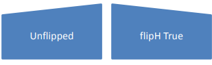

# 20.1.7 坐标系和变换

=== "中文"

    以下元素分别用于反映组和单个形状的尺寸(dimensions)、缩放(scaling)、位置(locaion)、旋转(rotation)和翻转(flip)信息。

=== "英文"

    **Coordinate Systems and Transformations**

    The following elements are used to reflect dimensions, scaling, location, rotation, and flip information on groups and individual shapes respectively.

## 20.1.7.1 chExt (子范围)

=== "中文"

    此元素指定子范围矩形的大小尺寸，并用于计算放置在组内的形状的分组(grouping)、缩放(scaling)和旋转(rotation)行为。

    <table border=1>
        <thead>
            <tr>
                <th>**Attributes**</th>
                <th>**Description**</th>
            </tr>
        </thead>
        <tbody>
            <tr>
                <td>
                    cx (范围长度/Extent Length)
                </td>
                <td>
                    指定 EMU 中矩形范围的长度。 该矩形应指示显示的对象的大小（对原始对象进行任何缩放的结果）。  
                    [Example: 考虑如下指定的 DrawingML 对象:  
                    `<… cx="1828800" cy="200000"/>`  
                    cx 属性指定该对象的高度为 1828800 EMU（英制公制单位）。 end example]  
                    该属性的可能值由 ST_PositiveCooperative 简单类型 (§20.1.10.41) 定义。
                </td>
            </tr>
            <tr>
                <td>
                    cy (范围宽度/Extent Width) 
                </td>
                <td>
                    指定 EMU 中范围矩形的宽度。 该矩形应指示显示的对象的大小（对原始对象进行任何缩放的结果）。  
                    [Example: 考虑如下指定的 DrawingML 对象:  
                    `<… cx="1828800" cy="200000"/>`  
                    cy 属性指定该对象的宽度为 200000 EMU（英制公制单位）。 end example]  
                    该属性的可能值由 ST_PositiveCooperative 简单类型 (§20.1.10.41) 定义。
                </td>
            </tr>
        </tbody>
    </table>

    [Note: 该元素内容模型 (CT_PositiveSize2D) 的 W3C XML 模式定义位于 §A.4.1 中。 end note]

=== "英文"

    **chExt (Child Extents)**

    This element specifies the size dimensions of the child extents rectangle and is used for calculations of grouping, scaling, and rotation behavior of shapes placed within a group.

    <table border=1>
        <thead>
            <tr>
                <th>**Attributes**</th>
                <th>**Description**</th>
            </tr>
        </thead>
        <tbody>
            <tr>
                <td>
                    cx (Extent Length)
                </td>
                <td>
                    Specifies the length of the extents rectangle in EMUs. This rectangle shall dictate the size of the object as displayed (the result of any scaling to the original object).  
                    [Example: Consider a DrawingML object specified as follows:  
                    `<… cx="1828800" cy="200000"/>`  
                    The cx attributes specifies that this object has a height of 1828800 EMUs (English Metric Units). end example]  
                    The possible values for this attribute are defined by the ST_PositiveCoordinate simple type (§20.1.10.41).
                </td>
            </tr>
            <tr>
                <td>
                    cy (Extent Width) 
                </td>
                <td>
                    Specifies the width of the extents rectangle in EMUs. This rectangle shall dictate the size of the object as displayed (the result of any scaling to the original object).  
                    [Example: Consider a DrawingML object specified as follows:  
                    `<… cx="1828800" cy="200000"/>`  
                    The cy attribute specifies that this object has a width of 200000 EMUs (English Metric Units). end example]  
                    The possible values for this attribute are defined by the ST_PositiveCoordinate simple type (§20.1.10.41).
                </td>
            </tr>
        </tbody>
    </table>

    [Note: The W3C XML Schema definition of this element’s content model (CT_PositiveSize2D) is located in §A.4.1. end note]

## 20.1.7.2 chOff (子偏移量)

=== "中文"

    此元素指定子范围矩形的位置，并用于计算放置在组内的形状的分组(grouping)、缩放(scaling)和旋转(rotation)行为。

    <table border=1>
        <thead>
            <tr>
                <th>**Attributes**</th>
                <th>**Description**</th>
            </tr>
        </thead>
        <tbody>
            <tr>
                <td>
                    x (X-Axis Coordinate)
                </td>
                <td>
                    指定 x 轴上的坐标。 该坐标的原点应由父 XML 元素指定。  
                    [Example: 考虑 DrawingML 对象的基本环绕多边形的以下几点:  
                    `<… x="0" y="100" />`  
                    x 属性定义 x 坐标为 0。 end example]  
                    该属性的可能值由 ST_Cooperative 简单类型 (第 20.1.10.16 节) 定义。
                </td>
            </tr>
            <tr>
                <td>
                    y (Y-Axis Coordinate)
                </td>
                <td>
                    指定 x 轴上的坐标。 该坐标的原点应由父 XML 元素指定。  
                    [Example: 考虑 DrawingML 对象的基本环绕多边形的以下几点：  
                    `<… x="0" y="100" />`  
                    y 属性定义 y 坐标为 100。 end example]  
                    该属性的可能值由 ST_Cooperative 简单类型 (第 20.1.10.16 节) 定义。
                </td>
            </tr>
        </tbody>
    </table>

    [Note: 该元素内容模型 (CT_Point2D) 的 W3C XML 模式定义位于 §A.4.1 中。 end note]

=== "英文"

    **chOff (Child Offset)**

    This element specifies the location of the child extents rectangle and is used for calculations of grouping, scaling, and rotation behavior of shapes placed within a group.

    <table border=1>
        <thead>
            <tr>
                <th>**Attributes**</th>
                <th>**Description**</th>
            </tr>
        </thead>
        <tbody>
            <tr>
                <td>
                    x (X-Axis Coordinate)
                </td>
                <td>
                    Specifies a coordinate on the x-axis. The origin point for this coordinate shall be specified by the parent XML element.  
                    [Example: Consider the following point on a basic wrapping polygon for a DrawingML object:  
                    `<… x="0" y="100" />`  
                    The x attribute defines an x-coordinate of 0. end example]  
                    The possible values for this attribute are defined by the ST_Coordinate simple type (§20.1.10.16).
                </td>
            </tr>
            <tr>
                <td>
                    y (Y-Axis Coordinate)
                </td>
                <td>
                    Specifies a coordinate on the x-axis. The origin point for this coordinate shall be specified by the parent XML element.  
                    [Example: Consider the following point on a basic wrapping polygon for a DrawingML object:  
                    `<… x="0" y="100" />`  
                    The y attribute defines a y-coordinate of 100. end example]  
                    The possible values for this attribute are defined by the ST_Coordinate simple type (§20.1.10.16).
                </td>
            </tr>
        </tbody>
    </table>

    [Note: The W3C XML Schema definition of this element’s content model (CT_Point2D) is located in §A.4.1. end note]

## 20.1.7.3 ext (范围)

=== "中文"

    此元素指定子范围矩形的位置，并用于计算放置在组内的形状的分组、缩放和旋转行为。

    <table border=1>
        <thead>
            <tr>
                <th>**Attributes**</th>
                <th>**Description**</th>
            </tr>
        </thead>
        <tbody>
            <tr>
                <td>
                    cx (Extent Length)
                </td>
                <td>
                    指定 EMU 中矩形范围的长度。 该矩形应指示显示的对象的大小（对原始对象进行任何缩放的结果）。  
                    [Example: 考虑如下指定的 DrawingML 对象:  
                    `<… cx="1828800" cy="200000"/>`  
                    cx 属性指定该对象的高度为 1828800 EMU（英制公制单位）。 end example]  
                    该属性的可能值由 ST_PositiveCooperative 简单类型 (§20.1.10.41) 定义。
                </td>
            </tr>
            <tr>
                <td>
                    cy (Extent Width)
                </td>
                <td>
                    指定 EMU 中范围矩形的宽度。 该矩形应指示显示的对象的大小（对原始对象进行任何缩放的结果）。  
                    [Example: 考虑如下指定的 DrawingML 对象:  
                    `< … cx="1828800" cy="200000"/>`  
                    cy 属性指定该对象的宽度为 200000 EMU（英制公制单位）。 end example]  
                    该属性的可能值由 ST_PositiveCooperative 简单类型 (§20.1.10.41) 定义。
                </td>
            </tr>
        </tbody>
    </table>

    [Note: 该元素内容模型 (CT_PositiveSize2D) 的 W3C XML 模式定义位于 §A.4.1 中。 end note]

=== "英文"

    **ext (Extents)**

    This element specifies the location of the child extents rectangle and is used for calculations of grouping, scaling, and rotation behavior of shapes placed within a group.

    <table border=1>
        <thead>
            <tr>
                <th>**Attributes**</th>
                <th>**Description**</th>
            </tr>
        </thead>
        <tbody>
            <tr>
                <td>
                    cx (Extent Length)
                </td>
                <td>
                    Specifies the length of the extents rectangle in EMUs. This rectangle shall dictate the size of the object as displayed (the result of any scaling to the original object).  
                    [Example: Consider a DrawingML object specified as follows:  
                    `<… cx="1828800" cy="200000"/>`  
                    The cx attributes specifies that this object has a height of 1828800 EMUs (English Metric Units). end example]  
                    The possible values for this attribute are defined by the ST_PositiveCoordinate simple type (§20.1.10.41).
                </td>
            </tr>
            <tr>
                <td>
                    cy (Extent Width)
                </td>
                <td>
                    Specifies the width of the extents rectangle in EMUs. This rectangle shall dictate the size of the object as displayed (the result of any scaling to the original object).  
                    [Example: Consider a DrawingML object specified as follows:  
                    `< … cx="1828800" cy="200000"/>`  
                    The cy attribute specifies that this object has a width of 200000 EMUs (English Metric Units). end example]  
                    The possible values for this attribute are defined by the ST_PositiveCoordinate simple type (§20.1.10.41).
                </td>
            </tr>
        </tbody>
    </table>

    [Note: The W3C XML Schema definition of this element’s content model (CT_PositiveSize2D) is located in §A.4.1. end note]

## 20.1.7.4 off (偏移量)

=== "中文"

    该元素指定对象的边界框的位置。 对对象的影响不包含在此边界框中。

    <table border=1>
        <thead>
            <tr>
                <th>**Attributes**</th>
                <th>**Description**</th>
            </tr>
        </thead>
        <tbody>
            <tr>
                <td>
                    x（X 轴坐标）
                </td>
                <td>
                    指定 x 轴上的坐标。 该坐标的原点应由父 XML 元素指定。  
                    [Example: 考虑 DrawingML 对象的基本环绕多边形的以下几点:  
                    `<… x="0" y="100" />`  
                    x 属性定义 x 坐标为 0。 end example]  
                    该属性的可能值由 ST_Cooperative 简单类型 (§20.1.10.16) 定义。
                </td>
            </tr>
            <tr>
                <td>
                    y（Y 轴坐标）
                </td>
                <td>
                    指定 x 轴上的坐标。 该坐标的原点应由父 XML 元素指定.  
                    [Example: 考虑 DrawingML 对象的基本环绕多边形的以下几点:  
                    `<… x="0" y="100" />`  
                    y 属性定义 y 坐标为 100。 end example]  
                    该属性的可能值由 ST_Cooperative 简单类型 (§20.1.10.16) 定义。
                </td>
            </tr>
        </tbody>
    </table>

    [Note: 该元素内容模型 (CT_Point2D) 的 W3C XML 模式定义位于 §A.4.1 中。end note]

=== "英文"

    **off (Offset)**

    This element specifies the location of the bounding box of an object. Effects on an object are not included in this bounding box.

    <table border=1>
        <thead>
            <tr>
                <th>**Attributes**</th>
                <th>**Description**</th>
            </tr>
        </thead>
        <tbody>
            <tr>
                <td>
                    x (X-Axis Coordinate)
                </td>
                <td>
                    Specifies a coordinate on the x-axis. The origin point for this coordinate shall be specified by the parent XML element.  
                    [Example: Consider the following point on a basic wrapping polygon for a DrawingML object:  
                    `<… x="0" y="100" />`  
                    The x attribute defines an x-coordinate of 0. end example]  
                    The possible values for this attribute are defined by the ST_Coordinate simple type (§20.1.10.16).
                </td>
            </tr>
            <tr>
                <td>
                    y (Y-Axis Coordinate)
                </td>
                <td>
                    Specifies a coordinate on the x-axis. The origin point for this coordinate shall be specified by the parent XML element.  
                    [Example: Consider the following point on a basic wrapping polygon for a DrawingML object:  
                    `<… x="0" y="100" />`  
                    The y attribute defines a y-coordinate of 100. end example]  
                    The possible values for this attribute are defined by the ST_Coordinate simple type (§20.1.10.16).
                </td>
            </tr>
        </tbody>
    </table>

    [Note: The W3C XML Schema definition of this element’s content model (CT_Point2D) is located in §A.4.1. end note]

## 20.1.7.5 xfrm (分组对象的 2D 变换)

=== "中文"

    该元素与普通形状的二维变换的表示几乎相同（§20.1.7.6）。 唯一添加的是一个表示子偏移量和子范围的成员。

    <table border=1>
        <thead>
            <tr>
                <th>**Attributes**</th>
                <th>**Description**</th>
            </tr>
        </thead>
        <tbody>
            <tr>
                <td>
                    flipH (水平翻转/Horizontal Flip)
                </td>
                <td>
                    水平翻转. 当为 true 时，此属性定义组围绕其边界框的中心水平翻转。  
                    [Example: 下图说明了水平翻转的效果。  
                      
                    end example]  
                    该属性的可能值由 W3C XML Schema 布尔数据类型定义。
                </td>
            </tr>
            <tr>
                <td>
                    flipV (垂直翻转/Vertical Flip)
                </td>
                <td>
                    垂直翻转. 当为 true 时，此属性定义组围绕其边界框的中心垂直翻转。  
                    [Example: 下图说明了垂直翻转的效果。  
                      
                    end example]  
                    该属性的可能值由 W3C XML Schema 布尔数据类型定义。
                </td>
            </tr>
            <tr>
                <td>
                    rot (旋转/Rotation)
                </td>
                <td>
                    旋转. 指定组合图形的顺时针旋转（以 1/64000 度为单位）。  
                    该属性的可能值由 ST_Angle 简单类型 (§20.1.10.3) 定义。
                </td>
            </tr>
        </tbody>
    </table>

    [Note: 该元素内容模型 (CT_GroupTransform2D) 的 W3C XML 架构定义位于 §A.4.1 中。 end note]

=== "英文"

    **xfrm (2D Transform for Grouped Objects)**

    This element is nearly identical to the representation of 2-D transforms for ordinary shapes (§20.1.7.6). The only addition is a member to represent the Child offset and the Child extents.

    <table border=1>
        <thead>
            <tr>
                <th>**Attributes**</th>
                <th>**Description**</th>
            </tr>
        </thead>
        <tbody>
            <tr>
                <td>
                    flipH (Horizontal Flip)
                </td>
                <td>
                    Horizontal flip. When true, this attribute defines that the group is flipped horizontally about the center of its bounding box.  
                    [Example: The following illustrates the effect of a horizontal flip.  
                      
                    end example]  
                    The possible values for this attribute are defined by the W3C XML Schema boolean datatype.
                </td>
            </tr>
            <tr>
                <td>
                    flipV (Vertical Flip)
                </td>
                <td>
                    Vertical flip. When true, this attribute defines that the group is flipped vertically about the center of its bounding box.  
                    [Example: The following illustrates the effect of a vertical flip.  
                      
                    end example]  
                    The possible values for this attribute are defined by the W3C XML Schema boolean datatype.
                </td>
            </tr>
            <tr>
                <td>
                    rot (Rotation)
                </td>
                <td>
                    Rotation. Specifies the clockwise rotation of a group in 1/64000 of a degree.  
                    The possible values for this attribute are defined by the ST_Angle simple type (§20.1.10.3).
                </td>
            </tr>
        </tbody>
    </table>

    [Note: The W3C XML Schema definition of this element’s content model (CT_GroupTransform2D) is located in §A.4.1. end note]

## 20.1.7.6 xfrm (单个对象的 2D 变换)

=== "中文"

    该元素表示普通形状的二维变换。

    <table border=1>
        <thead>
            <tr>
                <th>**Attributes**</th>
                <th>**Description**</th>
            </tr>
        </thead>
        <tbody>
            <tr>
                <td>
                    flipH (水平翻转/Horizontal Flip)
                </td>
                <td>
                    指定水平翻转。 当为 true 时，此属性定义形状围绕其边界框的中心水平翻转。  
                    [Example: 下图说明了水平翻转的效果。  
                      
                    end example]  
                    该属性的可能值由 W3C XML Schema 布尔数据类型定义。
                </td>
            </tr>
            <tr>
                <td>
                    flipV (垂直翻转/Vertical Flip)
                </td>
                <td>
                    指定垂直翻转。 当为 true 时，此属性定义组围绕其边界框的中心垂直翻转。  
                    [Example: 下图说明了垂直翻转的效果.  
                      
                    end example]  
                    该属性的可能值由 W3C XML Schema 布尔数据类型定义。
                </td>
            </tr>
            <tr>
                <td>
                    rot (旋转/Rotation)
                </td>
                <td>
                    指定图形框架的旋转。 指定该属性的单位驻留在下面引用的简单类型定义中。  
                    该属性的可能值由 ST_Angle 简单类型 (§20.1.10.3) 定义。
                </td>
            </tr>
        </tbody>
    </table>

    [Note: 该元素内容模型 (CT_Transform2D) 的 W3C XML 模式定义位于 §A.4.1 中。 end note]

=== "英文"

    **xfrm (2D Transform for Individual Objects)**

    This element represents 2-D transforms for ordinary shapes.

    <table border=1>
        <thead>
            <tr>
                <th>**Attributes**</th>
                <th>**Description**</th>
            </tr>
        </thead>
        <tbody>
            <tr>
                <td>
                    flipH (Horizontal Flip)
                </td>
                <td>
                    Specifies a horizontal flip. When true, this attribute defines that the shape is flipped horizontally about the center of its bounding box.  
                    [Example: The following illustrates the effect of a horizontal flip.  
                      
                    end example]  
                    The possible values for this attribute are defined by the W3C XML Schema boolean datatype.
                </td>
            </tr>
            <tr>
                <td>
                    flipV (Vertical Flip)
                </td>
                <td>
                    Specifies a vertical flip. When true, this attribute defines that the group is flipped vertically about the center of its bounding box.  
                    [Example: The following illustrates the effect of a vertical flip.  
                      
                    end example]  
                    The possible values for this attribute are defined by the W3C XML Schema boolean datatype.
                </td>
            </tr>
            <tr>
                <td>
                    rot (Rotation)
                </td>
                <td>
                    Specifies the rotation of the Graphic Frame. The units for which this attribute is specified in reside within the simple type definition referenced below.  
                    The possible values for this attribute are defined by the ST_Angle simple type (§20.1.10.3).
                </td>
            </tr>
        </tbody>
    </table>

    [Note: The W3C XML Schema definition of this element’s content model (CT_Transform2D) is located in §A.4.1. end note]
