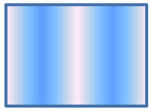
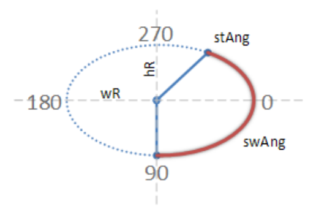
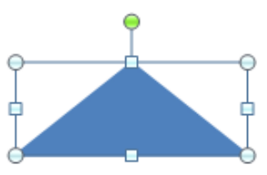
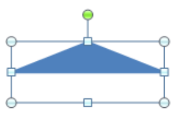
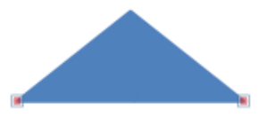
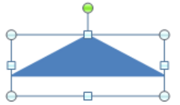
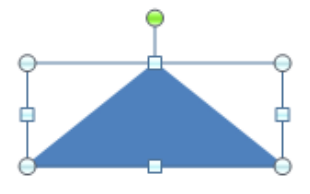
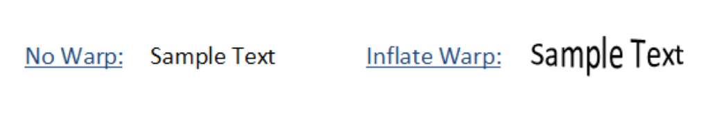

# 20.1.9 形状定义和属性

=== "中文"

    DrawingML 框架的形状定义和属性部分处理文档中形状的所有几何属性。 这包括由生成应用程序公开解释的预设几何图形和明确指定其点和曲线的自定义几何图形。 
    除了形状的基础几何形状之外，该框架描述的每个形状还有其他基于坐标的属性。

=== "英文"

    **Shape Definitions and Attributes**

    The Shape Definitions and Attributes portion of the DrawingML framework deals with all geometric properties for shapes within a document. This includes both preset geometries that publicly are interpreted by the generating application and custom geometries that have their points and curves explicitly specified. In addition to the underlying geometry of the shape there are also other coordinate-based properties for each shape that this framework describes.

## 20.1.9.1 ahLst (形状调整手柄列表)

=== "中文"

    该元素指定应用于自定义几何体的调整手柄。 这些调整手柄指定几何形状内的点，可用于对形状执行某些变换操作。

    !!! info "Example"

        考虑这样的场景：绘制了自定义几何体（本例中为箭头），并且调整手柄已放置在箭头头和箭头主体的左上角。 然后可以使用相应的调整手柄使用户界面仅变换形状的某些部分。

        

        例如，如果用户希望仅更改箭头的宽度，那么他们将使用位于箭头左上角的调整手柄。 调整后的结果会改变形状，如下所示。

        

    [Note: 该元素内容模型 (CT_AdjustHandleList) 的 W3C XML 架构定义位于 §A.4.1 中。 end note]

=== "英文"

    **ahLst (List of Shape Adjust Handles)**
    
    This element specifies the adjust handles that are applied to a custom geometry. These adjust handles specify points within the geometric shape that can be used to perform certain transform operations on the shape.

    !!! info "Example"

        Consider the scenario where a custom geometry, an arrow in this case, has been drawn and adjust handles have been placed at the top left corner of both the arrow head and arrow body. The user interface can then be made to transform only certain parts of the shape by using the corresponding adjust handle.

        

        For instance if the user wished to change only the width of the arrow head then they would use the adjust handle located on the top left of the arrow head. The result of adjusting this transforms the shape as shown below.

        

    [Note: The W3C XML Schema definition of this element’s content model (CT_AdjustHandleList) is located in §A.4.1. end note]

## 20.1.9.2 ahPolar (极坐标调节手柄)

=== "中文"

    此元素指定自定义形状的极坐标调整手柄。 该调整手柄的位置由相应的 pos 子元素指定。 该调整手柄允许的调整是通过其 min 和 max 属性指定的。 基于此调整手柄的调整，更新某些相应的参考线以包含这些值。

    <table border=1>
        <thead>
            <tr>
                <th>**属性**</th>
                <th>**描述**</th>
            </tr>
        </thead>
        <tbody>
            <tr>
                <td>
                    gdRefAng (角度调整指南)
                </td>
                <td>
                    指定使用此调整手柄的调整角度更新的参考线的名称.</br></br>
                    该属性的可能值由 ST_GeomGuideName 简单类型定义 (§20.1.10.28).
                </td>
            </tr>
            <tr>
                <td>
                    gdRefR (径向调整指南)
                </td>
                <td>
                    指定使用此调整手柄的调整半径更新的参考线的名称.</br></br>
                    该属性的可能值由 ST_GeomGuideName 简单类型定义 (§20.1.10.28).
                </td>
            </tr>
            <tr>
                <td>
                    maxAng (最大角度调节)
                </td>
                <td>
                    指定此调整手柄允许的最大角度位置。 如果省略该属性，则假定该调整手柄不能进行角度移动。 即 maxAng 和 minAng 相等.</br></br>
                    该属性的可能值由 ST_AdjAngle 简单类型定义 (§20.1.10.1).
                </td>
            </tr>
            <tr>
                <td>
                    maxR (最大径向调整)
                </td>
                <td>
                    指定此调整手柄允许的最大径向位置。 如果省略该属性，则假定该调整手柄不能径向移动。 即 maxR 和 minR 相等.</br></br>
                    该属性的可能值由 ST_AdjCooperative 简单类型定义 (§20.1.10.2).
                </td>
            </tr>
            <tr>
                <td>
                    minAng (最小角度调整)
                </td>
                <td>
                    指定此调整手柄允许的最小角度位置。 如果省略该属性，则假定该调整手柄不能进行角度移动。 即 maxAng 和 minAng 相等.</br></br>
                    该属性的可能值由 ST_AdjAngle 简单类型定义 (§20.1.10.1).
                </td>
            </tr>
            <tr>
                <td>
                    minR (最小径向调整)
                </td>
                <td>
                    指定此调整手柄允许的最小径向位置。 如果省略该属性，则假定该调整手柄不能径向移动。 即 maxR 和 minR 相等.</br></br>
                    该属性的可能值由 ST_AdjCooperative 简单类型定义 (§20.1.10.2).
                </td>
            </tr>
        </tbody>
    </table>

    [Note: 该元素内容模型 (CT_PolarAdjustHandle) 的 W3C XML 架构定义位于 §A.4.1. end note]

=== "英文"

    **ahPolar (Polar Adjust Handle)**

    This element specifies a polar adjust handle for a custom shape. The position of this adjust handle is specified by the corresponding pos child element. The allowed adjustment of this adjust handle are specified via it's min and max attributes. Based on the adjustment of this adjust handle certain corresponding guides are updated to contain these values.

    <table border=1>
        <thead>
            <tr>
                <th>**Attributes**</th>
                <th>**Description**</th>
            </tr>
        </thead>
        <tbody>
            <tr>
                <td>
                    gdRefAng (Angle Adjustment Guide)
                </td>
                <td>
                    Specifies the name of the guide that is updated with the adjustment angle from this adjust handle.</br></br>
                    The possible values for this attribute are defined by the ST_GeomGuideName simple type (§20.1.10.28).
                </td>
            </tr>
            <tr>
                <td>
                    gdRefR (Radial Adjustment Guide)
                </td>
                <td>
                    Specifies the name of the guide that is updated with the adjustment radius from this adjust handle.</br></br>
                    The possible values for this attribute are defined by the ST_GeomGuideName simple type (§20.1.10.28).
                </td>
            </tr>
            <tr>
                <td>
                    maxAng (Maximum Angle Adjustment)
                </td>
                <td>
                    Specifies the maximum angle position that is allowed for this adjustment handle. If this attribute is omitted, then it is assumed that this adjust handle cannot move angularly. That is the maxAng and minAng are equal.</br></br>
                    The possible values for this attribute are defined by the ST_AdjAngle simple type (§20.1.10.1).
                </td>
            </tr>
            <tr>
                <td>
                    maxR (Maximum Radial Adjustment)
                </td>
                <td>
                    Specifies the maximum radial position that is allowed for this adjustment handle. If this attribute is omitted, then it is assumed that this adjust handle cannot move radially. That is the maxR and minR are equal.</br></br>
                    The possible values for this attribute are defined by the ST_AdjCoordinate simple type (§20.1.10.2).
                </td>
            </tr>
            <tr>
                <td>
                    minAng (Minimum Angle Adjustment)
                </td>
                <td>
                    Specifies the minimum angle position that is allowed for this adjustment handle. If this attribute is omitted, then it is assumed that this adjust handle cannot move angularly. That is the maxAng and minAng are equal.</br></br>
                    The possible values for this attribute are defined by the ST_AdjAngle simple type (§20.1.10.1).
                </td>
            </tr>
            <tr>
                <td>
                    minR (Minimum Radial Adjustment)
                </td>
                <td>
                    Specifies the minimum radial position that is allowed for this adjustment handle. If this attribute is omitted, then it is assumed that this adjust handle cannot move radially. That is the maxR and minR are equal.</br></br>
                    The possible values for this attribute are defined by the ST_AdjCoordinate simple type (§20.1.10.2).
                </td>
            </tr>
        </tbody>
    </table>

    [Note: The W3C XML Schema definition of this element’s content model (CT_PolarAdjustHandle) is located in §A.4.1. end note]

## 20.1.9.3 ahXY (XY 调整手柄)

=== "中文"

    此元素为自定义形状指定基于 XY 的调整手柄。 该调整手柄的位置由相应的 pos 子元素指定。 该调整手柄允许的调整是通过其 min 和 max 类型属性指定的。 基于此调整手柄的调整，更新某些相应的参考线以包含这些值。

    <table border=1>
        <thead>
            <tr>
                <th>**属性**</th>
                <th>**描述**</th>
            </tr>
        </thead>
        <tbody>
            <tr>
                <td>
                    gdRefX (水平调整指南)
                </td>
                <td>
                    指定使用此调整手柄的调整 x 位置更新的参考线的名称.</br></br>
                    该属性的可能值由 ST_GeomGuideName 简单类型定义 (§20.1.10.28).
                </td>
            </tr>
            <tr>
                <td>
                    gdRefY (垂直调整指南)
                </td>
                <td>
                    指定使用此调整手柄的调整 y 位置更新的参考线的名称.</br></br>
                    该属性的可能值由 ST_GeomGuideName 简单类型定义 (§20.1.10.28).
                </td>
            </tr>
            <tr>
                <td>
                    maxX (最大水平调整)
                </td>
                <td>
                    指定此调整手柄允许的最大水平位置。 如果省略该属性，则假定该调整手柄不能在 x 方向移动。 即 maxX 和 minX 相等.</br></br>
                    该属性的可能值由 ST_AdjCooperative 简单类型定义 (§20.1.10.2).
                </td>
            </tr>
            <tr>
                <td>
                    maxY (最大垂直调整)
                </td>
                <td>
                    指定此调整手柄允许的最大垂直位置。 如果省略该属性，则假定该调整手柄无法沿 y 方向移动。 即 maxY 和 minY 相等.</br></br>
                    该属性的可能值由 ST_AdjCooperative 简单类型定义 (§20.1.10.2).
                </td>
            </tr>
            <tr>
                <td>
                    minX (最小水平调整)
                </td>
                <td>
                    指定此调整手柄允许的最小水平位置。 如果省略该属性，则假定该调整手柄不能在 x 方向移动。 即 maxX 和 minX 相等.</br></br>
                    该属性的可能值由 ST_AdjCooperative 简单类型定义 (§20.1.10.2).
                </td>
            </tr>
            <tr>
                <td>
                    minY (最小垂直调整)
                </td>
                <td>
                    指定此调整手柄允许的最小垂直位置。 如果省略该属性，则假定该调整手柄无法沿 y 方向移动。 即 maxY 和 minY 相等.</br></br>
                    该属性的可能值由 ST_AdjCooperative 简单类型定义 (§20.1.10.2).
                </td>
            </tr>
        </tbody>
    </table>

    [Note: 该元素内容模型 (CT_XYAdjustHandle) 的 W3C XML 架构定义位于 §A.4.1 中。 end note]

=== "英文"

    **ahXY (XY Adjust Handle)**

    This element specifies an XY-based adjust handle for a custom shape. The position of this adjust handle is specified by the corresponding pos child element. The allowed adjustment of this adjust handle are specified via it's min and max type attributes. Based on the adjustment of this adjust handle certain corresponding guides are updated to contain these values.

    <table border=1>
        <thead>
            <tr>
                <th>**Attributes**</th>
                <th>**Description**</th>
            </tr>
        </thead>
        <tbody>
            <tr>
                <td>
                    gdRefX (Horizontal Adjustment Guide)
                </td>
                <td>
                    Specifies the name of the guide that is updated with the adjustment x position from this adjust handle.</br></br>
                    The possible values for this attribute are defined by the ST_GeomGuideName simple type (§20.1.10.28).
                </td>
            </tr>
            <tr>
                <td>
                    gdRefY (Vertical Adjustment Guide)
                </td>
                <td>
                    Specifies the name of the guide that is updated with the adjustment y position from this adjust handle.</br></br>
                    The possible values for this attribute are defined by the ST_GeomGuideName simple type (§20.1.10.28).
                </td>
            </tr>
            <tr>
                <td>
                    maxX (Maximum Horizontal Adjustment)
                </td>
                <td>
                    Specifies the maximum horizontal position that is allowed for this adjustment handle. If this attribute is omitted, then it is assumed that this adjust handle cannot move in the x direction. That is the maxX and minX are equal.</br></br>
                    The possible values for this attribute are defined by the ST_AdjCoordinate simple type (§20.1.10.2).
                </td>
            </tr>
            <tr>
                <td>
                    maxY (Maximum Vertical Adjustment)
                </td>
                <td>
                    Specifies the maximum vertical position that is allowed for this adjustment handle. If this attribute is omitted, then it is assumed that this adjust handle cannot move in the y direction. That is the maxY and minY are equal.</br></br>
                    The possible values for this attribute are defined by the ST_AdjCoordinate simple type (§20.1.10.2).
                </td>
            </tr>
            <tr>
                <td>
                    minX (Minimum Horizontal Adjustment)
                </td>
                <td>
                    Specifies the minimum horizontal position that is allowed for this adjustment handle. If this attribute is omitted, then it is assumed that this adjust handle cannot move in the x direction. That is the maxX and minX are equal.</br></br>
                    The possible values for this attribute are defined by the ST_AdjCoordinate simple type (§20.1.10.2).
                </td>
            </tr>
            <tr>
                <td>
                    minY (Minimum Vertical Adjustment)
                </td>
                <td>
                    Specifies the minimum vertical position that is allowed for this adjustment handle. If this attribute is omitted, then it is assumed that this adjust handle cannot move in the y direction. That is the maxY and minY are equal.</br></br>
                    The possible values for this attribute are defined by the ST_AdjCoordinate simple type (§20.1.10.2).
                </td>
            </tr>
        </tbody>
    </table>

    [Note: The W3C XML Schema definition of this element’s content model (CT_XYAdjustHandle) is located in §A.4.1. end note]

## 20.1.9.4 arcTo (绘制圆弧至)

=== "中文"

    该元素指定形状路径中是否存在圆弧。 它使用指定的参数从当前笔位置到指定的新点绘制一条圆弧。 弧是根据假定的圆的形状弯曲的线。 该弧的长度是通过指定起始角度和结束角度来确定的，这两个角度共同作用以有效地指定弧的终点。

    !!! info "Example"

        下图表示起始角度为 300 度、摆动角度为 150 度的单个圆弧。 该弧是使用 hR 和 wR 属性描述的假定圆绘制的，如下所示。 必须遵守的度数沿着圆的圆周显示。 这些度数将以 60,000 度为单位指定。 如果该弧是形状的一部分，则沿圆的起始角度点将是沿路径的起点，终点将是沿该假定圆的角度摆动的终点。 也就是说，形状路径中该弧之前的任何形状几何体都将与该弧的上点连接，因此路径中该弧之后的任何几何体都将与该弧的下点连接。

        

    <table border=1>
        <thead>
            <tr>
                <th>**属性**</th>
                <th>**描述**</th>
            </tr>
        </thead>
        <tbody>
            <tr>
                <td>
                    hR (形状 弧高 半径)
                </td>
                <td>
                    该属性指定用于绘制圆弧的假设圆的高度半径。 这使得圆的总高度为 (2 * hR)。 这个总高度也可以称为它的垂直直径，因为它只是 y 轴的直径.</br></br>
                    该属性的可能值由 ST_AdjCooperative 简单类型定义 (§20.1.10.2).
                </td>
            </tr>
            <tr>
                <td>
                    stAng (形状圆弧起始角度)
                </td>
                <td>
                    指定圆弧的起始角度。 该角度指定沿着假定的圆路径的哪个角度用作绘制圆弧的起始位置。 该起始角度被锁定到形状路径中最后已知的笔位置。 从而保证连续的形状路径.</br></br>
                    该属性的可能值由 ST_AdjAngle 简单类型定义 (§20.1.10.1).
                </td>
            </tr>
            <tr>
                <td>
                    swAng (形状圆弧摆角)
                </td>
                <td>
                    指定圆弧的摆动角度。 该角度指定圆弧沿假定的圆弧路径以角度方向延伸的距离。 从起始角开始的延伸始终围绕假定的圆沿顺时针方向延伸.</br></br>
                    该属性的可能值由 ST_AdjAngle 简单类型定义 (§20.1.10.1).
                </td>
            </tr>
            <tr>
                <td>
                    wR (形状 弧宽 半径)
                </td>
                <td>
                    该属性指定用于绘制圆弧的假设圆的宽度半径。 这使得圆的总宽度为 (2 * wR)。 该总宽度也可以称为水平直径，因为它只是 x 轴的直径.</br></br>
                    该属性的可能值由 ST_AdjCooperative 简单类型定义 (§20.1.10.2).
                </td>
            </tr>
        </tbody>
    </table>

    [Note: 该元素内容模型 (CT_Path2DArcTo) 的 W3C XML 架构定义位于 §A.4.1. end note]

=== "英文"

    **arcTo (Draw Arc To)**

    This element specifies the existence of an arc within a shape path. It draws an arc with the specified parameters from the current pen position to the new point specified. An arc is a line that is bent based on the shape of a supposed circle. The length of this arc is determined by specifying both a start angle and an ending angle that act together to effectively specify an end point for the arc.

    !!! info "Example"

        The diagram shown below represents a single arc that has a start angle of 300 degrees and a swing angle of 150 degrees. This arc is drawn using the supposed circle that is described using the hR and wR attributes as shown below. The degrees by which the stAng must abide is shown along the circumference of the circle. These degrees are to be specified in 60,000ths of a degree. If this arc were part of a shape the start angle point along the circle would be the starting point along the path and the ending point would be the ending of the angle swing along this supposed circle. That is any shape geometry coming before this arc in the shape path would be joined with the upper point of this arc and consequently any geometry coming after this arc in the path would be joined with the lower point of this arc.

        

    <table border=1>
        <thead>
            <tr>
                <th>**Attributes**</th>
                <th>**Description**</th>
            </tr>
        </thead>
        <tbody>
            <tr>
                <td>
                    hR (Shape Arc Height Radius)
                </td>
                <td>
                    This attribute specifies the height radius of the supposed circle being used to draw the arc. This gives the circle a total height of (2 * hR). This total height could also be called it's vertical diameter as it is the diameter for the y axis only.</br></br>
                    The possible values for this attribute are defined by the ST_AdjCoordinate simple type (§20.1.10.2).
                </td>
            </tr>
            <tr>
                <td>
                    stAng (Shape Arc Start Angle)
                </td>
                <td>
                    Specifies the start angle for an arc. This angle specifies what angle along the supposed circle path is used as the start position for drawing the arc. This start angle is locked to the last known pen position in the shape path. Thus guaranteeing a continuos shape path.</br></br>
                    The possible values for this attribute are defined by the ST_AdjAngle simple type (§20.1.10.1).
                </td>
            </tr>
            <tr>
                <td>
                    swAng (Shape Arc Swing Angle)
                </td>
                <td>
                    Specifies the swing angle for an arc. This angle specifies how far angle-wise along the supposed cicle path the arc is extended. The extension from the start angle is always in the clockwise direction around the supposed circle.</br></br>
                    The possible values for this attribute are defined by the ST_AdjAngle simple type (§20.1.10.1).
                </td>
            </tr>
            <tr>
                <td>
                    wR (Shape Arc Width Radius)
                </td>
                <td>
                    This attribute specifies the width radius of the supposed circle being used to draw the arc. This gives the circle a total width of (2 * wR). This total width could also be called it's horizontal diameter as it is the diameter for the x axis only.</br></br>
                    The possible values for this attribute are defined by the ST_AdjCoordinate simple type (§20.1.10.2).
                </td>
            </tr>
        </tbody>
    </table>

    [Note: The W3C XML Schema definition of this element’s content model (CT_Path2DArcTo) is located in §A.4.1. end note]

## 20.1.9.5 avLst (形状调整值列表)

=== "中文"

    该元素指定应用于指定形状的调整值。 调整值只是一个具有指定的基于值的公式的指南。 即，不进行调整值指南的计算。 相反，本指南指定了用于形状参考线内计算的参数值。

    !!! info "Example"

        考虑这样的情况：用户希望指定一个三角形，其底边不是由静态点定义，而是通过使用变化的参数（即调整值）定义。 考虑下面所示的图表和 DrawingML。 第一个三角形的底边等于高度，即 2。因此，我们在下图中看到，三角形的底部与形状边界框的底部相匹配。

        

        ```xml
        <a:xfrm>
            <a:off x="3200400" y="1600200" />
            <a:ext cx="1705233" cy="679622" />
        </a:xfrm>
        <a:custGeom>
            <a:avLst>
                <a:gd name="myGuide" fmla="val 2" />
            </a:avLst>
            <a:gdLst />
            <a:ahLst />
            <a:cxnLst />
            <a:rect l="0" t="0" r="0" b="0" />
            <a:pathLst>
                <a:path w="2" h="2">
                    <a:moveTo>
                        <a:pt x="0" y="myGuide" />
                    </a:moveTo>
                    <a:lnTo>
                        <a:pt x="2" y="myGuide" />
                    </a:lnTo>
                    <a:lnTo>
                        <a:pt x="1" y="0" />
                    </a:lnTo>
                    <a:close />
                </a:path>
            </a:pathLst>
        </a:custGeom>
        ```

        然而，如果我们将调整值更改为一半，即 1。那么我们会看到三角形的整个底边移动到现在沿着形状边界框内的垂直中点放置。 这是因为该三角形中的两个底点的坐标位置都取决于此调整值。 下面显示的三角形和相应的 DrawingML 说明了这一点。

        

        ```xml
        <a:avLst>
            <a:gd name="myGuide" fmla="val 1"/>
        </a:avLst>
        ```

    [Note: 该元素内容模型 (CT_GeomGuideList) 的 W3C XML 模式定义位于 §A.4.1. end note]

=== "英文"

    **avLst (List of Shape Adjust Values)**

    This element specifies the adjust values that are applied to the specified shape. An adjust value is simply a guide that has a value based formula specified. That is, no calculation takes place for an adjust value guide. Instead, this guide specifies a parameter value that is used for calculations within the shape guides.

    !!! info "Example"

        Consider the case where the user would like to specify a triangle with it's bottom edge defined not by static points but by using a varying parameter, namely an adjust value. Consider the diagrams and DrawingML shown below. This first triangle has been drawn with a bottom edge that is equal to the height, namely 2. Thus we see in the figure below that the bottom of the triangle matches the bottom of the shape bounding box.

        

        ```xml
        <a:xfrm>
            <a:off x="3200400" y="1600200" />
            <a:ext cx="1705233" cy="679622" />
        </a:xfrm>
        <a:custGeom>
            <a:avLst>
                <a:gd name="myGuide" fmla="val 2" />
            </a:avLst>
            <a:gdLst />
            <a:ahLst />
            <a:cxnLst />
            <a:rect l="0" t="0" r="0" b="0" />
            <a:pathLst>
                <a:path w="2" h="2">
                    <a:moveTo>
                        <a:pt x="0" y="myGuide" />
                    </a:moveTo>
                    <a:lnTo>
                        <a:pt x="2" y="myGuide" />
                    </a:lnTo>
                    <a:lnTo>
                        <a:pt x="1" y="0" />
                    </a:lnTo>
                    <a:close />
                </a:path>
            </a:pathLst>
        </a:custGeom>
        ```

        If however we change the adjust value to half that, namely 1. Then we see the entire bottom edge of the triangle move to now be placed along the vertical midpoint within the shape bounding box. This is because both of the bottom points in this triangle depend on this adjust value for their coordinate positions. The triangle and corresponding DrawingML shown below illustrate this point.

        

        ```xml
        <a:avLst>
            <a:gd name="myGuide" fmla="val 1"/>
        </a:avLst>
        ```

    [Note: The W3C XML Schema definition of this element’s content model (CT_GeomGuideList) is located in §A.4.1. end note]

## 20.1.9.6 close (关闭形状路径)

=== "中文"

    该元素指定自定义几何形状的创建路径中一系列直线和曲线的结尾。 当遇到此元素时，生成应用程序应考虑相应的路径已关闭。 也就是说，该元素后面的任何其他直线或曲线都应被忽略。

    [Note: 路径可以是指定的，但不能是封闭的。 然而，像这样的路径不能有任何与之关联的填充，因为它不被视为闭合的几何路径。 end note]

    !!! info "Example"

        考虑以下 DrawingML。

        ```xml
        <a:custGeom>
            <a:pathLst>
                <a:path w="2824222" h="590309">
                    <a:moveTo>
                        <a:pt x="0" y="428263"/>
                    </a:moveTo>
                    <a:lnTo>
                        <a:pt x="1620455" y="590309"/>
                    </a:lnTo>
                    <a:lnTo>
                        <a:pt x="2824222" y="173620"/>
                    </a:lnTo>
                    <a:lnTo>
                        <a:pt x="1562582" y="0"/>
                    </a:lnTo>
                    <a:close/>
                </a:path>
            </a:pathLst>
        </a:custGeom>
        ```

        在上面的示例中，指定了一个所有边都是直边的四边几何形状。 虽然我们只看到通过 lnTo 元素绘制了三条线，但实际上有四个边，因为 (x=1562585, y=0) 的最后一个点通过 lnTo 元素连接到创建路径中的第一个点。

    [Note: 当创建路径中的最后一个点与创建路径中的第一个点不相交时，生成应用程序应通过直线将最后一个点与第一个点连接起来，从而创建一个闭合形状几何体. end note]

    [Note: 该元素内容模型 (CT_Path2DClose) 的 W3C XML 架构定义位于 §A.4.1. end note]

=== "英文"

    **close (Close Shape Path)**

    This element specifies the ending of a series of lines and curves in the creation path of a custom geometric shape. When this element is encountered, the generating application should consider the corresponding path closed. That is, any further lines or curves that follow this element should be ignored.

    [Note: A path can be specified and not closed. A path such as this cannot however have any fill associated with it as it has not been considered a closed geometric path. end note]

    !!! info "Example"

        Consider the following DrawingML.

        ```xml
        <a:custGeom>
            <a:pathLst>
                <a:path w="2824222" h="590309">
                    <a:moveTo>
                        <a:pt x="0" y="428263"/>
                    </a:moveTo>
                    <a:lnTo>
                        <a:pt x="1620455" y="590309"/>
                    </a:lnTo>
                    <a:lnTo>
                        <a:pt x="2824222" y="173620"/>
                    </a:lnTo>
                    <a:lnTo>
                        <a:pt x="1562582" y="0"/>
                    </a:lnTo>
                    <a:close/>
                </a:path>
            </a:pathLst>
        </a:custGeom>
        ```

        In the above example there is specified a four sided geometric shape that has all straight sides. While we only see three lines being drawn via the lnTo element there are actually four sides because the last point of (x=1562585, y=0) is connected to the first point in the creation path via a lnTo element.

    [Note: When the last point in the creation path does not meet with the first point in the creation path the generating application should connect the last point with the first via a straight line, thus creating a closed shape geometry. end note]

    [Note: The W3C XML Schema definition of this element’s content model (CT_Path2DClose) is located in §A.4.1. end note]

## 20.1.9.7 cubicBezTo (绘制三次贝塞尔曲线至)

=== "中文"

    该元素指定沿指定点绘制三次贝塞尔曲线。 要指定三次贝塞尔曲线，需要指定 3 个点。 前两个是三次贝塞尔曲线计算中使用的控制点，最后一个是曲线的终点。 用于这种曲线的坐标系是路径坐标系，因为该元素是特定于路径的。

    [Note: 该元素内容模型 (CT_Path2DCubicBezierTo) 的 W3C XML 架构定义位于 §A.4.1 中。 end note]

=== "英文"

    **cubicBezTo (绘制三次贝塞尔曲线至)**

    该元素指定沿指定点绘制三次贝塞尔曲线。 要指定三次贝塞尔曲线，需要指定 3 个点。 前两个是三次贝塞尔曲线计算中使用的控制点，最后一个是曲线的终点。 用于这种曲线的坐标系是路径坐标系，因为该元素是特定于路径的.

    [Note: 该元素内容模型 (CT_Path2DCubicBezierTo) 的 W3C XML 架构定义位于 §A.4.1. end note]

## 20.1.9.8 custGeom (定制几何形状)

=== "中文"

    该元素指定是否存在自定义几何形状。 该形状由创建路径中描述的一系列直线和曲线组成。 除此之外，还可以有调整值、参考线、调整手柄、连接点和为此自定义几何形状指定的内接矩形。

    !!! info "Example"

        考虑当预设几何图形无法准确描述文档中必须显示的内容时的情况。 为此，自定义几何形状可用于定义大多数二维几何形状。 下面显示的是此类自定义几何形状的示例.

        ```xml
        <a:custGeom>
            <a:avLst />
            <a:gdLst />
            <a:ahLst />
            <a:cxnLst />
            <a:rect l="0" t="0" r="0" b="0" />
            <a:pathLst>
                <a:path w="2650602" h="1261641">
                    <a:moveTo>
                        <a:pt x="0" y="1261641" />
                    </a:moveTo>
                    <a:lnTo>
                        <a:pt x="2650602" y="1261641" />
                    </a:lnTo>
                    <a:lnTo>
                        <a:pt x="1226916" y="0" />
                    </a:lnTo>
                    <a:close />
                </a:path>
            </a:pathLst>
        </a:custGeom>
        ```

        

        上面的自定义几何体是通过首先使用 moveTo 元素移动到特定起点来绘制的。 然后，创建路径中的一系列 lnTo 元素指定构成形状边框的线条，最后使用 close 元素指定创建路径的结尾。 最终的形状如上所示.

    [Note: 该元素内容模型 (CT_CustomGeometry2D) 的 W3C XML 架构定义位于 §A.4.1. end note]

=== "英文"

    **custGeom (Custom Geometry)**

    This element specifies the existence of a custom geometric shape. This shape consists of a series of lines and curves described within a creation path. In addition to this there can also be adjust values, guides, adjust handles, connection sites and an inscribed rectangle specified for this custom geometric shape.

    !!! info "Example"

        Consider the scenario when a preset geometry does not accurately depict what must be displayed in the document. For this a custom geometry can be used to define most any 2-dimensional geometric shape. Shown below is an example of such a custom geometry.

        ```xml
        <a:custGeom>
            <a:avLst />
            <a:gdLst />
            <a:ahLst />
            <a:cxnLst />
            <a:rect l="0" t="0" r="0" b="0" />
            <a:pathLst>
                <a:path w="2650602" h="1261641">
                    <a:moveTo>
                        <a:pt x="0" y="1261641" />
                    </a:moveTo>
                    <a:lnTo>
                        <a:pt x="2650602" y="1261641" />
                    </a:lnTo>
                    <a:lnTo>
                        <a:pt x="1226916" y="0" />
                    </a:lnTo>
                    <a:close />
                </a:path>
            </a:pathLst>
        </a:custGeom>
        ```

        

        The custom geometry above is drawn by first moving to a specific starting point with the moveTo element. Then a series of lnTo elements in the creation path specify the lines that make up the borders of the shape and finally a close element is used to specify the end of the creation path. The resulting shape is shown above.

    [Note: The W3C XML Schema definition of this element’s content model (CT_CustomGeometry2D) is located in §A.4.1. end note]

## 20.1.9.9 cxn (形状连接部位)

=== "中文"

    此元素指定自定义形状上是否存在连接站点。 连接位点允许 cxnSp 连接到该形状。 当形状在文档中重新定位时，这种连接会保持不变。 应该注意的是，该连接是使用变换坐标系放置在形状边界框内的，变换坐标系也称为形状坐标系，因为它包含整个形状。 该坐标系的宽度和高度在 ext 变换元素中指定。

    [Note: 变换坐标系与路径坐标系不同，因为它是针对每个形状而不是形状内的每个路径. end note]

    !!! info "Example"

        考虑以下指定了两个连接站点的自定义几何体。 一个连接位于形状的左下角，另一个位于右下角。 以下 DrawingML 将描述此类自定义几何图形。

        ```xml
        <a:xfrm>
            <a:off x="3200400" y="1600200" />
            <a:ext cx="1705233" cy="679622" />
        </a:xfrm>
        <a:custGeom>
            <a:avLst />
            <a:gdLst />
            <a:ahLst />
            <a:cxnLst>
                <a:cxn ang="0">
                    <a:pos x="0" y="679622" />
                </a:cxn>
                <a:cxn ang="0">
                    <a:pos x="1705233" y="679622" />
                </a:cxn>
            </a:cxnLst>
            <a:rect l="0" t="0" r="0" b="0" />
            <a:pathLst>
                <a:path w="2" h="2">
                    <a:moveTo>
                        <a:pt x="0" y="2" />
                    </a:moveTo>
                    <a:lnTo>
                        <a:pt x="2" y="2" />
                    </a:lnTo>
                    <a:lnTo>
                        <a:pt x="1" y="0" />
                    </a:lnTo>
                    <a:close />
                </a:path>
            </a:pathLst>
        </a:custGeom>
        ```

        

    <table border=1>
        <thead>
            <tr>
                <th>**属性**</th>
                <th>**描述**</th>
            </tr>
        </thead>
        <tbody>
            <tr>
                <td>
                    ang (连接部位角度)
                </td>
                <td>
                    指定传入连接器角度。 该角度是传入连接器尝试路由到的连接站点周围的角度。 这允许连接器知道形状相对于连接位置和路由连接器的位置，以避免与形状重叠.</br></br>
                    [Example: 考虑一个简单的正方形。 为了不让任何连接器在形状上布线，将为其各自的连接位置指定连接角度.</br></br>
                    </br></br>
                    end example]</br></br>
                    该属性的可能值由 ST_AdjAngle 简单类型定义 (§20.1.10.1).
                </td>
            </tr>
        </tbody>
    </table>

    [Note: The W3C XML Schema definition of this element’s content model (CT_ConnectionSite) is located in §A.4.1. end note]

=== "英文"

    **cxn (Shape Connection Site)**

    This element specifies the existence of a connection site on a custom shape. A connection site allows a cxnSp to be attached to this shape. This connection is maintained when the shape is repositioned within the document. It should be noted that this connection is placed within the shape bounding box using the transform coordinate system which is also called the shape coordinate system, as it encompasses the entire shape. The width and height for this coordinate system are specified within the ext transform element.

    [Note: The transform coordinate system is different from a path coordinate system as it is per shape instead of per path within the shape. end note]

    !!! info "Example"

        Consider the following custom geometry that has two connection sites specified. One connection is located at the bottom left of the shape and the other at the bottom right. The following DrawingML would describe such a custom geometry.

        ```xml
        <a:xfrm>
            <a:off x="3200400" y="1600200" />
            <a:ext cx="1705233" cy="679622" />
        </a:xfrm>
        <a:custGeom>
            <a:avLst />
            <a:gdLst />
            <a:ahLst />
            <a:cxnLst>
                <a:cxn ang="0">
                    <a:pos x="0" y="679622" />
                </a:cxn>
                <a:cxn ang="0">
                    <a:pos x="1705233" y="679622" />
                </a:cxn>
            </a:cxnLst>
            <a:rect l="0" t="0" r="0" b="0" />
            <a:pathLst>
                <a:path w="2" h="2">
                    <a:moveTo>
                        <a:pt x="0" y="2" />
                    </a:moveTo>
                    <a:lnTo>
                        <a:pt x="2" y="2" />
                    </a:lnTo>
                    <a:lnTo>
                        <a:pt x="1" y="0" />
                    </a:lnTo>
                    <a:close />
                </a:path>
            </a:pathLst>
        </a:custGeom>
        ```

        

    <table border=1>
        <thead>
            <tr>
                <th>**Attributes**</th>
                <th>**Description**</th>
            </tr>
        </thead>
        <tbody>
            <tr>
                <td>
                    ang (Connection Site Angle)
                </td>
                <td>
                    Specifies the incoming connector angle. This angle is the angle around the connection site that an incoming connector tries to be routed to. This allows connectors to know where the shape is in relation to the connection site and route connectors so as to avoid any overlap with the shape.</br></br>
                    [Example: Consider a simple square. In order to not have any connectors routed over the shape, the collowing angles would be specified for their respective connection sites.</br></br>
                    </br></br>
                    end example]</br></br>
                    The possible values for this attribute are defined by the ST_AdjAngle simple type (§20.1.10.1).
                </td>
            </tr>
        </tbody>
    </table>

    [Note: The W3C XML Schema definition of this element’s content model (CT_ConnectionSite) is located in §A.4.1. end note]

## 20.1.9.10 cxnLst (形状连接位点列表)

=== "中文"

    该元素指定用于该形状的所有连接点。 连接点是通过在形状边界框中定义一个点来指定的，该点可以附加一个 cxnSp 元素。 这些连接点是使用 ext 变换元素中指定的形状坐标系来指定的.

    [Note: 该元素内容模型 (CT_ConnectionSiteList) 的 W3C XML 架构定义位于 §A.4.1. end note]

=== "英文"

    **cxnLst (List of Shape Connection Sites)**

    This element specifies all the connection sites that are used for this shape. A connection site is specified by defining a point within the shape bounding box that can have a cxnSp element attached to it. These connection sites are specified using the shape coordinate system that is specified within the ext transform element.

    [Note: The W3C XML Schema definition of this element’s content model (CT_ConnectionSiteList) is located in §A.4.1. end note]

## 20.1.9.11 gd (形状指南)

=== "中文"

    该元素指定用于控制指定形状的几何形状的形状引导的优先级。 形状指南由公式和公式结果所分配的名称组成。 已识别的公式与该元素的 fmla 属性文档一起列出。

    [Note: 指定参考线的顺序决定了计算其值的顺序。 例如，当尚未计算该指南时，无法指定使用另一个指南结果的指南. end note]

    !!! info "Example"

        考虑这样的情况：用户希望指定一个三角形，其底边不是由静态点定义，而是使用变化的参数（即参考线）定义。 考虑下面所示的图表和 DrawingML。 第一个三角形的底边等于形状高度值的 2/3。 因此，我们在下图中看到，三角形似乎占据了形状边界框内垂直空间的 2/3。
    
        

        ```xml
        <a:xfrm>
            <a:off x="3200400" y="1600200" />
            <a:ext cx="1705233" cy="679622" />
        </a:xfrm>
        <a:custGeom>
            <a:avLst />
            <a:gdLst>
                <a:gd name="myGuide" fmla="*/ h 2 3" />
            </a:gdLst>
            <a:ahLst />
            <a:cxnLst />
            <a:rect l="0" t="0" r="0" b="0" />
            <a:pathLst>
                <a:path w="1705233" h="679622">
                    <a:moveTo>
                        <a:pt x="0" y="myGuide" />
                    </a:moveTo>
                    <a:lnTo>
                        <a:pt x="1705233" y="myGuide" />
                    </a:lnTo>
                    <a:lnTo>
                        <a:pt x="852616" y="0" />
                    </a:lnTo>
                    <a:close />
                </a:path>
            </a:pathLst>
        </a:custGeom>
        ```

        然而，如果我们将指南更改为一半，即 1/3。 然后我们看到三角形的整个底边移动到现在仅占据形状边界框内总空间的 1/3。 这是因为该三角形中的两个底点的坐标位置都依赖于该参考线。 下面显示的三角形和相应的DrawingML说明了这一点.

        

        ```xml
        <a:gdLst>
            <a:gd name="myGuide" fmla="*/ h 1 3"/>
        </a:gdLst>
        ```

    <table border=1>
        <thead>
            <tr>
                <th>**属性**</th>
                <th>**描述**</th>
            </tr>
        </thead>
        <tbody>
            <tr>
                <td>
                    fmla (形状指导公式)
                </td>
                <td>
                    指定用于计算指南值的公式。 每个公式都有一定数量的参数以及对这些参数执行的一组特定操作，以便生成指南的值。 共有 17 种不同的公式可用。 下面显示了每个定义的用法.</br></br>
                    **('*/') - 乘除公式**</br>
                        参数: 3 (fmla="*/ x y z")</br>
                        用法: "*/ x y z" = ((x * y) / z) = value of this guide</br></br>
                    **('+-') - 加减公式/Add Subtract Formula**</br>
                        参数: 3 (fmla="+- x y z")</br>
                        用法: "+- x y z" = ((x + y) - z) = value of this guide</br></br>
                    **('+/') - 加法除法公式/Add Divide Formula**</br>
                        参数: 3 (fmla="+/ x y z")</br>
                        用法: "+/ x y z" = ((x + y) / z) = value of this guide</br></br>
                    **('?:') - 如果否则公式/If Else Formula**</br>
                        参数: 3 (fmla="?: x y z")</br>
                        用法: "?: x y z" = if (x > 0), then y = value of this guide,</br>
                        else z = value of this guide</br></br>
                    **('abs') - 绝对值公式/Absolute Value Formula**</br>
                        参数: 1 (fmla="abs x")</br>
                        用法: "abs x" = if (x < 0), then (-1) * x = value of this guide</br>
                        else x = value of this guide</br></br>
                    **('at2') - 反正切公式/ ArcTan Formula**</br>
                        参数: 2 (fmla="at2 x y")</br>
                        用法: "at2 x y" = arctan(y / x) = value of this guide</br></br>
                    **('cat2') - 余弦反正切公式/Cosine ArcTan Formula**</br>
                        参数: 3 (fmla="cat2 x y z")</br>
                        用法: "cat2 x y z" = x*(cos(arctan(z / y))) = value of this guide</br></br>
                    **('cos') - 余弦公式/Cosine Formula**</br>
                        参数: 2 (fmla="cos x y")</br>
                        用法: "cos x y" = (x * cos( y )) = value of this guide</br></br>
                    **('max') - 最大值公式/Maximum Value Formula**</br>
                        参数: 2 (fmla="max x y")</br>
                        用法: "max x y" = if (x > y), then x = value of this guide</br>
                        else y = value of this guide</br></br>
                    **('min') - 最小值公式/Minimum Value Formula**</br>
                        参数: 2 (fmla="min x y")</br>
                        用法: "min x y" = if (x < y), then x = value of this guide</br>
                        else y = value of this guide</br></br>
                    **('mod') - 模值公式/Modulo Value Formula**</br>
                        参数: 3 (fmla="mod x y")</br>
                        用法: "mod x y z" = sqrt(x^2 + b^2 + c^2) = value of this guide</br></br>
                    **('pin') - 固定到公式/Pin To Formula**</br>
                        参数: 3 (fmla="pin x y z")</br>
                        用法: "pin x y z" = if (y < x), then x = value of this guide</br>
                        else if (y > z), then z = value of this guide</br>
                        else y = value of this guide</br></br>
                    **('sat2') - 正弦反正切公式/Sine ArcTan Formula**</br>
                        参数: 3 (fmla="sat2 x y z")</br>
                        用法: "sat2 x y z" = (x*sin(arctan(z / y))) = value of this guide</br></br>
                    **('sin') - 正弦公式/Sine Formula**</br>
                        参数: 2 (fmla="sin x y")</br>
                        用法: "sin x y" = (x * sin( y )) = value of this guide</br></br>
                    **('sqrt') - 平方根公式/Square Root Formula**</br>
                        参数: 1 (fmla="sqrt x")</br>
                        用法: "sqrt x" = sqrt(x) = value of this guide</br></br>
                    **('tan') - 正切公式/Tangent Formula**</br>
                        参数: 2 (fmla="tan x y")</br>
                        用法: "tan x y" = (x * tan( y )) = value of this guide</br></br>
                    **('val') - 字面值公式/Literal Value Formula**</br>
                        参数: 1 (fmla="val x")</br>
                        用法: "val x" = x = value of this guide</br></br>
                    [Note: 具有通过上面的 fmla="val x" 指定的文字值公式的参考线只能在 avLst 中用作形状的调整值。 但这并没有严格执行. end note]</br></br>
                    该属性的可能值由 ST_GeomGuideFormula 简单类型定义 (§20.1.10.27).
                </td>
            </tr>
            <tr>
                <td>
                    name (形状指南名称)
                </td>
                <td>
                    指定用于引用本指南的名称。 该名称可以像方程中的变量一样使用。 也就是说，该名称可以替换其他指南或形状路径规范中的文字值.</br></br>
                    该属性的可能值由 ST_GeomGuideName 简单类型定义 (§20.1.10.28).
                </td>
            </tr>
        </tbody>
    </table>

    [Note: 该元素内容模型 (CT_GeomGuide) 的 W3C XML 模式定义位于 §A.4.1. end note]

=== "英文"

    **gd (Shape Guide)**

    This element specifies the precense of a shape guide that is used to govern the geometry of the specified shape. A shape guide consists of a formula and a name that the result of the formula is assigned to. Recognized formulas are listed with the fmla attribute documentation for this element.

    [Note: The order in which guides are specified determines the order in which their values are calculated. For instance it is not possible to specify a guide that uses another guides result when that guide has not yet been calculated. end note]

    !!! info "Example"

        Consider the case where the user would like to specify a triangle with it's bottom edge defined not by static points but by using a varying parameter, namely an guide. Consider the diagrams and DrawingML shown below. This first triangle has been drawn with a bottom edge that is equal to the 2/3 the value of the shape height. Thus we see in the figure below that the triangle appears to occupy 2/3 of the vertical space within the shape bounding box.

        

        ```xml
        <a:xfrm>
            <a:off x="3200400" y="1600200" />
            <a:ext cx="1705233" cy="679622" />
        </a:xfrm>
        <a:custGeom>
            <a:avLst />
            <a:gdLst>
                <a:gd name="myGuide" fmla="*/ h 2 3" />
            </a:gdLst>
            <a:ahLst />
            <a:cxnLst />
            <a:rect l="0" t="0" r="0" b="0" />
            <a:pathLst>
                <a:path w="1705233" h="679622">
                    <a:moveTo>
                        <a:pt x="0" y="myGuide" />
                    </a:moveTo>
                    <a:lnTo>
                        <a:pt x="1705233" y="myGuide" />
                    </a:lnTo>
                    <a:lnTo>
                        <a:pt x="852616" y="0" />
                    </a:lnTo>
                    <a:close />
                </a:path>
            </a:pathLst>
        </a:custGeom>
        ```

        If however we change the guide to half that, namely 1/3. Then we see the entire bottom edge of the triangle move to now only occupy 1/3 of the toal space within the shape bounding box. This is because both of the bottom points in this triangle depend on this guide for their coordinate positions. The triangle and corresponding DrawingML shown below illustrate this point.

        

        ```xml
        <a:gdLst>
            <a:gd name="myGuide" fmla="*/ h 1 3"/>
        </a:gdLst>
        ```

    <table border=1>
        <thead>
            <tr>
                <th>**Attributes**</th>
                <th>**Description**</th>
            </tr>
        </thead>
        <tbody>
            <tr>
                <td>
                    fmla (Shape Guide Formula)
                </td>
                <td>
                    Specifies the formula that is used to calculate the value for a guide. Each formula has a certain number of arguments and a specific set of operations to perform on these arguments in order to generate a value for a guide. There are a total of 17 different formulas available. These are shown below with the usage for each defined.</br></br>
                    ('*/') - Multiply Divide Formula</br>
                        Arguments: 3 (fmla="*/ x y z")</br>
                        Usage: "*/ x y z" = ((x * y) / z) = value of this guide</br></br>
                    ('+-') - Add Subtract Formula</br>
                        Arguments: 3 (fmla="+- x y z")</br>
                        Usage: "+- x y z" = ((x + y) - z) = value of this guide</br></br>
                    ('+/') - Add Divide Formula</br>
                        Arguments: 3 (fmla="+/ x y z")</br>
                        Usage: "+/ x y z" = ((x + y) / z) = value of this guide</br></br>
                    ('?:') - If Else Formula</br>
                        Arguments: 3 (fmla="?: x y z")</br>
                        Usage: "?: x y z" = if (x > 0), then y = value of this guide,</br>
                        else z = value of this guide</br></br>
                    ('abs') - Absolute Value Formula</br>
                        Arguments: 1 (fmla="abs x")</br>
                        Usage: "abs x" = if (x < 0), then (-1) * x = value of this guide</br>
                        else x = value of this guide</br></br>
                    ('at2') - ArcTan Formula</br>
                        Arguments: 2 (fmla="at2 x y")</br>
                        Usage: "at2 x y" = arctan(y / x) = value of this guide</br></br>
                    ('cat2') - Cosine ArcTan Formula</br>
                        Arguments: 3 (fmla="cat2 x y z")</br>
                        Usage: "cat2 x y z" = (x*(cos(arctan(z / y))) = value of this guide</br></br>
                    ('cos') - Cosine Formula</br>
                        Arguments: 2 (fmla="cos x y")</br>
                        Usage: "cos x y" = (x * cos( y )) = value of this guide</br></br>
                    ('max') - Maximum Value Formula</br>
                        Arguments: 2 (fmla="max x y")</br>
                        Usage: "max x y" = if (x > y), then x = value of this guide</br>
                        else y = value of this guide</br></br>
                    ('min') - Minimum Value Formula</br>
                        Arguments: 2 (fmla="min x y")</br>
                        Usage: "min x y" = if (x < y), then x = value of this guide</br>
                        else y = value of this guide</br></br>
                    ('mod') - Modulo Value Formula</br>
                        Arguments: 3 (fmla="mod x y")</br>
                        Usage: "mod x y z" = sqrt(x^2 + b^2 + c^2) = value of this guide</br></br>
                    ('pin') - Pin To Formula</br>
                        Arguments: 3 (fmla="pin x y z")</br>
                        Usage: "pin x y z" = if (y < x), then x = value of this guide</br>
                        else if (y > z), then z = value of this guide</br>
                        else y = value of this guide</br></br>
                    ('sat2') - Sine ArcTan Formula</br>
                        Arguments: 3 (fmla="sat2 x y z")</br>
                        Usage: "sat2 x y z" = (x*sin(arctan(z / y))) = value of this guide</br></br>
                    ('sin') - Sine Formula</br>
                        Arguments: 2 (fmla="sin x y")</br>
                        Usage: "sin x y" = (x * sin( y )) = value of this guide</br></br>
                    ('sqrt') - Square Root Formula</br>
                        Arguments: 1 (fmla="sqrt x")</br>
                        Usage: "sqrt x" = sqrt(x) = value of this guide</br></br>
                    ('tan') - Tangent Formula</br>
                        Arguments: 2 (fmla="tan x y")</br>
                        Usage: "tan x y" = (x * tan( y )) = value of this guide</br></br>
                    ('val') - Literal Value Formula</br>
                        Arguments: 1 (fmla="val x")</br>
                        Usage: "val x" = x = value of this guide</br></br>
                    [Note: Guides that have a literal value formula specified via fmla="val x" above should only be used within the avLst as an adjust value for the shape. This however is not strictly enforced. end note]</br></br>
                    The possible values for this attribute are defined by the ST_GeomGuideFormula simple type (§20.1.10.27).
                </td>
            </tr>
            <tr>
                <td>
                    name (Shape Guide Name)
                </td>
                <td>
                    Specifies the name that is used to reference to this guide. This name can be used just as a variable would within an equation. That is this name can be substituted for literal values within other guides or the specification of the shape path.</br></br>
                    The possible values for this attribute are defined by the ST_GeomGuideName simple type (§20.1.10.28).
                </td>
            </tr>
        </tbody>
    </table>

    [Note: The W3C XML Schema definition of this element’s content model (CT_GeomGuide) is located in §A.4.1. end note]

## 20.1.9.12 gdLst (形状参考线列表)

=== "中文"

    该元素指定用于该形状的所有参考线。 参考线由 gd 元素指定，并定义可用于构造相应形状的计算值。

    [Note: 具有通过上面的 fmla="val x" 指定的文字值公式的参考线只能在 avLst 中用作形状的调整值。 但这并没有严格执行. end note]

    [Note: 该元素内容模型 (CT_GeomGuideList) 的 W3C XML 模式定义位于 §A.4.1 中。 end note]

=== "英文"

    **gdLst (List of Shape Guides)**

    This element specifies all the guides that are used for this shape. A guide is specified by the gd element and defines a calculated value that can be used for the construction of the corresponding shape.

    [Note: Guides that have a literal value formula specified via fmla="val x" above should only be used within the avLst as an adjust value for the shape. This however is not strictly enforced. end note]

    [Note: The W3C XML Schema definition of this element’s content model (CT_GeomGuideList) is located in §A.4.1. end note]

## 20.1.9.13 lnTo (画线至)

=== "中文"

    该元素指定从当前笔位置到指定的新点的直线绘制。 这条线成为形状几何的一部分，代表形状的一侧。 指定这条线时使用的坐标系是路径坐标系。

    [Note: 该元素内容模型 (CT_Path2DLineTo) 的 W3C XML 架构定义位于 §A.4.1. end note]

=== "英文"

    **lnTo (Draw Line To)**

    This element specifies the drawing of a straight line from the current pen position to the new point specified. This line becomes part of the shape geometry, representing a side of the shape. The coordinate system used when specifying this line is the path coordinate system.

    [Note: The W3C XML Schema definition of this element’s content model (CT_Path2DLineTo) is located in §A.4.1. end note]

## 20.1.9.14 moveTo (将路径移至)

=== "中文"

    此元素指定要将形状光标移动到的一组新坐标。 该元素仅用于绘制自定义几何图形。 当使用此元素时，pt 元素用于指定形状光标应移动到的一组新的形状坐标。 这不会从旧位置绘制直线或曲线到新位置，而只是将光标移动到新的起始位置。 只有当使用lnTo等路径绘制元素时，才会绘制路径的一部分.

    !!! info "Example"

        考虑这样的情况：用户希望不是在 x=0 、 y=0 的默认起始坐标处开始绘制自定义几何图形，而是在进一步插入到形状坐标空间中的坐标处开始绘制。 以下 DrawingML 将指定这种情况.

        ```xml
        <a:custGeom>
            <a:pathLst>
                <a:path w="2824222" h="590309">
                    <a:moveTo>
                        <a:pt x="0" y="428263" />
                    </a:moveTo>
                    <a:lnTo>
                        <a:pt x="1620455" y="590309" />
                    </a:lnTo>
                    <a:lnTo>
                        <a:pt x="2824222" y="173620" />
                    </a:lnTo>
                    <a:lnTo>
                        <a:pt x="1562582" y="0" />
                    </a:lnTo>
                    <a:close />
                </a:path>
            </a:pathLst>
        </a:custGeom>
        ```

        请注意，moveTo 元素在绘制任何实际线条之前推进 y 坐标.

    [Note: 该元素内容模型 (CT_Path2DMoveTo) 的 W3C XML 架构定义位于 §A.4.1 中。 end note]

=== "英文"

    **moveTo (Move Path To)**

    This element specifies a set of new coordinates to move the shape cursor to. This element is only used for drawing a custom geometry. When this element is utilized the pt element is used to specify a new set of shape coordinates that the shape cursor should be moved to. This does not draw a line or curve to this new position from the old position but simply move the cursor to a new starting position. It is only when a path drawing element such as lnTo is used that a portion of the path is drawn.

    !!! info "Example"

        Consider the case where a user wishes to begin drawing a custom geometry not at the default starting coordinates of x=0 , y=0 but at coordinates further inset into the shape coordinate space. The following DrawingML would specify such a case.

        ```xml
        <a:custGeom>
            <a:pathLst>
                <a:path w="2824222" h="590309">
                    <a:moveTo>
                        <a:pt x="0" y="428263" />
                    </a:moveTo>
                    <a:lnTo>
                        <a:pt x="1620455" y="590309" />
                    </a:lnTo>
                    <a:lnTo>
                        <a:pt x="2824222" y="173620" />
                    </a:lnTo>
                    <a:lnTo>
                        <a:pt x="1562582" y="0" />
                    </a:lnTo>
                    <a:close />
                </a:path>
            </a:pathLst>
        </a:custGeom>
        ```

        Notice the moveTo element advances the y coordinates before any actual lines are drawn.

    [Note: The W3C XML Schema definition of this element’s content model (CT_Path2DMoveTo) is located in §A.4.1. end note]

## 20.1.9.15 path (形状路径)

=== "中文"

    该元素指定由一系列移动、直线和曲线组成的创建路径，这些移动、直线和曲线组合起来形成几何形状。 仅当指定了自定义几何图形时才使用此元素。

    [Note: 由于允许多个路径，因此绘制规则是在 pathLst 中稍后指定的路径绘制在所有先前路径的顶部. end note]

    !!! info "Example"

        考虑以下 DrawingML。

        ```xml
        <a:custGeom>
            <a:pathLst>
                <a:path w="2824222" h="590309">
                    <a:moveTo>
                        <a:pt x="0" y="428263" />
                    </a:moveTo>
                    <a:lnTo>
                        <a:pt x="1620455" y="590309" />
                    </a:lnTo>
                    <a:lnTo>
                        <a:pt x="2824222" y="173620" />
                    </a:lnTo>
                    <a:lnTo>
                        <a:pt x="1562582" y="0" />
                    </a:lnTo>
                    <a:close />
                </a:path>
            </a:pathLst>
        </a:custGeom>
        ```

        在上面的示例中，指定了一个所有边都是直边的四边几何形状。 虽然我们只看到通过 lnTo 元素绘制了三条线，但实际上有四个边，因为 (x=1562585, y=0) 的最后一个点通过 lnTo 元素连接到创建路径中的第一个点.

    <table border=1>
        <thead>
            <tr>
                <th>**属性**</th>
                <th>**描述**</th>
            </tr>
        </thead>
        <tbody>
            <tr>
                <td>
                    extrusionOk (允许 3D 挤压)
                </td>
                <td>
                    指定在此路径上可以使用 3D 拉伸。 这使得生成应用程序能够知道 3D 挤压是否可以以任何形式应用。 如果省略此属性，则假定值为 0 或 false.</br></br>
                    该属性的可能值由 W3C XML Schema 布尔数据类型定义.
                </td>
            </tr>
            <tr>
                <td>
                    fill (路径填充)
                </td>
                <td>
                    指定应如何填充相应的路径。 如果省略此属性，则假定值为“norm”.</br></br>
                    该属性的可能值由 ST_PathFillMode 简单类型定义 (§20.1.10.37).
                </td>
            </tr>
            <tr>
                <td>
                    h (路径高度)
                </td>
                <td>
                    指定路径坐标系内应使用的高度或最大 y 坐标。 该值确定相应路径内所有点的垂直位置，因为它们都是使用该高度属性作为最大 y 坐标来计算的.</br></br>
                    该属性的可能值由 ST_PositiveCooperative 简单类型定义 (§20.1.10.41).
                </td>
            </tr>
            <tr>
                <td>
                    stroke (路径行程)
                </td>
                <td>
                    指定相应路径是否应显示路径描边。 这是一个影响路径轮廓的布尔值。 如果省略此属性，则假定值为 true.</br></br>
                    该属性的可能值由 W3C XML Schema 布尔数据类型定义.
                </td>
            </tr>
            <tr>
                <td>
                    w (路径宽度)
                </td>
                <td>
                    指定路径坐标系内应使用的宽度或最大 x 坐标。 该值确定相应路径内所有点的水平位置，因为它们都是使用该宽度属性作为最大 x 坐标来计算的.</br></br>
                    该属性的可能值由 ST_PositiveCooperative 简单类型定义 (§20.1.10.41).
                </td>
            </tr>
        </tbody>
    </table>

    [Note: 该元素内容模型 (CT_Path2D) 的 W3C XML 架构定义位于 §A.4.1. end note]

=== "英文"

    **path (Shape Path)**

    This element specifies a creation path consisting of a series of moves, lines and curves that when combined forms a geometric shape. This element is only utilized if a custom geometry is specified. 

    [Note: Since multiple paths are allowed the rules for drawing are that the path specified later in the pathLst is drawn on top of all previous paths. end note]

    !!! info "Example"

        Consider the following DrawingML.

        ```xml
        <a:custGeom>
            <a:pathLst>
                <a:path w="2824222" h="590309">
                    <a:moveTo>
                        <a:pt x="0" y="428263" />
                    </a:moveTo>
                    <a:lnTo>
                        <a:pt x="1620455" y="590309" />
                    </a:lnTo>
                    <a:lnTo>
                        <a:pt x="2824222" y="173620" />
                    </a:lnTo>
                    <a:lnTo>
                        <a:pt x="1562582" y="0" />
                    </a:lnTo>
                    <a:close />
                </a:path>
            </a:pathLst>
        </a:custGeom>
        ```

        In the above example there is specified a four sided geometric shape that has all straight sides. While we only see three lines being drawn via the lnTo element there are actually four sides because the last point of (x=1562585, y=0) is connected to the first point in the creation path via a lnTo element.

    <table border=1>
        <thead>
            <tr>
                <th>**Attributes**</th>
                <th>**Description**</th>
            </tr>
        </thead>
        <tbody>
            <tr>
                <td>
                    extrusionOk (3D Extrusion Allowed)
                </td>
                <td>
                    Specifies that the use of 3D extrusions are possible on this path. This allows the generating application to know whether 3D extrusion can be applied in any form. If this attribute is omitted then a value of 0, or false is assumed.</br></br>
                    The possible values for this attribute are defined by the W3C XML Schema boolean datatype.
                </td>
            </tr>
            <tr>
                <td>
                    fill (Path Fill)
                </td>
                <td>
                    Specifies how the corresponding path should be filled. If this attribute is omitted, a value of "norm" is assumed.</br></br>
                    The possible values for this attribute are defined by the ST_PathFillMode simple type (§20.1.10.37).
                </td>
            </tr>
            <tr>
                <td>
                    h (Path Height)
                </td>
                <td>
                    Specifies the height, or maximum y coordinate that should be used for within the path coordinate system. This value determines the vertical placement of all points within the corresponding path as they are all calculated using this height attribute as the max y coordinate.</br></br>
                    The possible values for this attribute are defined by the ST_PositiveCoordinate simple type (§20.1.10.41).
                </td>
            </tr>
            <tr>
                <td>
                    stroke (Path Stroke)
                </td>
                <td>
                    Specifies if the corresponding path should have a path stroke shown. This is a boolean value that affect the outline of the path. If this attribute is omitted, a value of true is assumed.</br></br>
                    The possible values for this attribute are defined by the W3C XML Schema boolean datatype.
                </td>
            </tr>
            <tr>
                <td>
                    w (Path Width)
                </td>
                <td>
                    Specifies the width, or maximum x coordinate that should be used for within the path coordinate system. This value determines the horizontal placement of all points within the corresponding path as they are all calculated using this width attribute as the max x coordinate.</br></br>
                    The possible values for this attribute are defined by the ST_PositiveCoordinate simple type (§20.1.10.41).
                </td>
            </tr>
        </tbody>
    </table>

    [Note: The W3C XML Schema definition of this element’s content model (CT_Path2D) is located in §A.4.1. end note]

## 20.1.9.16 pathLst (形状路径列表)

=== "中文"

    该元素指定组成单个几何形状的整个路径。 pathLst 中可以包含许多单独的路径。

    !!! info "考虑以下 DrawingML."

        ```xml
        <a:custGeom>
            <a:pathLst>
                <a:path w="2824222" h="590309">
                    <a:moveTo>
                        <a:pt x="0" y="428263" />
                    </a:moveTo>
                    <a:lnTo>
                        <a:pt x="1620455" y="590309" />
                    </a:lnTo>
                    <a:lnTo>
                        <a:pt x="2824222" y="173620" />
                    </a:lnTo>
                    <a:lnTo>
                        <a:pt x="1562582" y="0" />
                    </a:lnTo>
                    <a:close />
                </a:path>
            </a:pathLst>
        </a:custGeom>
        ```

    在上面的示例中，指定了一个所有边都是直边的四边几何形状。 虽然我们只看到通过 lnTo 元素绘制了三条线，但实际上有四个边，因为 (x=1562585, y=0) 的最后一个点通过 lnTo 元素连接到创建路径中的第一个点。

    [Note: 具有多个路径的几何体应该在视觉上被视为每个路径都是一个不同的形状。 也就是说，每个创建路径都有其第一个点和最后一个点连接起来形成一个封闭的形状。 但是，生成应用程序随后应将新形状的最后一个点连接到第一个点。 如果在先前创建路径的末尾遇到关闭元素，则生成应用程序不应呈现该连接线。 渲染应从新创建路径上的第一条直线或曲线开始。 end note]

    [Note: 该元素内容模型 (CT_Path2DList) 的 W3C XML 架构定义位于 §A.4.1. end note]

=== "英文"

    **pathLst (List of Shape Paths)**

    This element specifies the entire path that is to make up a single geometric shape. The pathLst can consist of many individual paths within it.

    !!! info "Consider the following DrawingML."

        ```xml
        <a:custGeom>
            <a:pathLst>
                <a:path w="2824222" h="590309">
                    <a:moveTo>
                        <a:pt x="0" y="428263" />
                    </a:moveTo>
                    <a:lnTo>
                        <a:pt x="1620455" y="590309" />
                    </a:lnTo>
                    <a:lnTo>
                        <a:pt x="2824222" y="173620" />
                    </a:lnTo>
                    <a:lnTo>
                        <a:pt x="1562582" y="0" />
                    </a:lnTo>
                    <a:close />
                </a:path>
            </a:pathLst>
        </a:custGeom>
        ```

    In the above example there is specified a four sided geometric shape that has all straight sides. While we only see three lines being drawn via the lnTo element there are actually four sides because the last point of (x=1562585, y=0) is connected to the first point in the creation path via a lnTo element.

    [Note: A geometry with multiple paths within it should be treated visually as if each path were a distinct shape. That is each creation path has its first point and last point joined to form a closed shape. However, the generating application should then connect the last point to the first point of the new shape. If a close element is encountered at the end of the previous creation path then this joining line should not be rendered by the generating application. The rendering should resume with the first line or curve on the new creation path. end note]

    [Note: The W3C XML Schema definition of this element’s content model (CT_Path2DList) is located in §A.4.1. end note]

## 20.1.9.17 pos (形状位置坐标)

=== "中文"

    指定形状边界框内的位置坐标。 应该注意的是，该坐标使用变换坐标系放置在形状边界框内，变换坐标系也称为形状坐标系，因为它包含整个形状。 该坐标系的宽度和高度在 ext 变换元素中指定。

    !!! info "Note"
    
        在路径坐标空间中指定点坐标时，应注意坐标空间的左上角为 x=0、y=0，并且 x 的坐标点向右增长，y 的坐标点向下增长。 下图对此进行了说明。

        

    !!! info "Example"

        为了突出显示坐标系中的差异，请考虑绘制以下三角形。 请注意，三角形的尺寸是通过 ext 变换元素使用以 EMU 为单位的形状坐标系指定的。 因此，我们看到这个形状的宽度为 1705233 个 EMU，高度为 679622 个 EMU。 然而，当查看该形状的路径的绘制方式时，我们发现 x 和 y 值落在 0 和 2 之间。这是因为路径坐标系具有任意尺寸：宽度为 2，高度为 2。 因此，我们看到，对于这种特殊情况，路径坐标系内的 y 坐标 2 指定形状坐标系内的 y 坐标 679622。

        

        ```xml
        <a:xfrm>
            <a:off x="3200400" y="1600200" />
            <a:ext cx="1705233" cy="679622" />
        </a:xfrm>
        <a:custGeom>
            <a:avLst />
            <a:gdLst />
            <a:ahLst />
            <a:cxnLst />
            <a:rect l="0" t="0" r="0" b="0" />
            <a:pathLst>
                <a:path w="2" h="2">
                    <a:moveTo>
                        <a:pt x="0" y="2" />
                    </a:moveTo>
                    <a:lnTo>
                        <a:pt x="2" y="2" />
                    </a:lnTo>
                    <a:lnTo>
                        <a:pt x="1" y="0" />
                    </a:lnTo>
                    <a:close />
                </a:path>
            </a:pathLst>
        </a:custGeom>
        ```

    <table border=1>
        <thead>
            <tr>
                <th>**Attributes**</th>
                <th>**Description**</th>
            </tr>
        </thead>
        <tbody>
            <tr>
                <td>
                    x (X坐标)
                </td>
                <td>
                    指定该位置坐标的 x 坐标。 该坐标空间的单位由路径坐标系的宽度定义。 该坐标系覆盖在形状坐标系之上，从而占据整个形状边界框。 由于此坐标空间内的单位由路径宽度和高度确定，因此无法在此处指定精确的测量单位.</br></br>
                    该属性的可能值由 ST_AdjCooperative 简单类型定义 (§20.1.10.2).
                </td>
            </tr>
            <tr>
                <td>
                    y (Y坐标)
                </td>
                <td>
                    指定该位置坐标的 y 坐标。 该坐标空间的单位由路径坐标系的高度定义。 该坐标系覆盖在形状坐标系之上，从而占据整个形状边界框。 由于此坐标空间内的单位由路径宽度和高度确定，因此无法在此处指定精确的测量单位.</br></br>
                    该属性的可能值由 ST_AdjCooperative 简单类型定义 (§20.1.10.2).
                </td>
            </tr>
        </tbody>
    </table>

    [Note: 该元素内容模型 (CT_AdjPoint2D) 的 W3C XML 架构定义位于 §A.4.1. end note]

=== "英文"

    **pos (Shape Position Coordinate)**

    Specifies a position coordinate within the shape bounding box. It should be noted that this coordinate is placed within the shape bounding box using the transform coordinate system which is also called the shape coordinate system, as it encompasses the entire shape. The width and height for this coordinate system are specified within the ext transform element.

    !!! info "Note"
    
        When specifying a point coordinate in path coordinate space it should be noted that the top left of the coordinate space is x=0, y=0 and the coordinate points for x grow to the right and for y grow down. This is illustrated in the diagram below.

        

    !!! info "Example"

        To highlight the differences in the coordinate systems consider the drawing of the following triangle. Notice that the dimensions of the triangle are specified using the shape coordinate system with EMUs as the units via the ext transform element. Thus we see this shape is 1705233 EMUs wide by 679622 EMUs tall. However when looking at how the path for this shape is drawn we see that the x and y values fall between 0 and 2. This is because the path coordinate system has the arbitrary dimensions of 2 for the width and 2 for the height. Thus we see that a y coordinate of 2 within the path coordinate system specifies a y coordinate of 679622 within the shape coordinate system for this particular case.

        

        ```xml
        <a:xfrm>
            <a:off x="3200400" y="1600200" />
            <a:ext cx="1705233" cy="679622" />
        </a:xfrm>
        <a:custGeom>
            <a:avLst />
            <a:gdLst />
            <a:ahLst />
            <a:cxnLst />
            <a:rect l="0" t="0" r="0" b="0" />
            <a:pathLst>
                <a:path w="2" h="2">
                    <a:moveTo>
                        <a:pt x="0" y="2" />
                    </a:moveTo>
                    <a:lnTo>
                        <a:pt x="2" y="2" />
                    </a:lnTo>
                    <a:lnTo>
                        <a:pt x="1" y="0" />
                    </a:lnTo>
                    <a:close />
                </a:path>
            </a:pathLst>
        </a:custGeom>
        ```

    <table border=1>
        <thead>
            <tr>
                <th>**Attributes**</th>
                <th>**Description**</th>
            </tr>
        </thead>
        <tbody>
            <tr>
                <td>
                    x (X-Coordinate)
                </td>
                <td>
                    Specifies the x coordinate for this position coordinate. The units for this coordinate space are defined by the width of the path coordinate system. This coordinate system is overlayed on top of the shape coordinate system thus occupying the entire shape bounding box. Because the units for within this coordinate space are determined by the path width and height an exact measurement unit cannot be specified here.</br></br>
                    The possible values for this attribute are defined by the ST_AdjCoordinate simple type (§20.1.10.2).
                </td>
            </tr>
            <tr>
                <td>
                    y (Y-Coordinate)
                </td>
                <td>
                    Specifies the y coordinate for this position coordinate. The units for this coordinate space are defined by the height of the path coordinate system. This coordinate system is overlayed on top of the shape coordinate system thus occupying the entire shape bounding box. Because the units for within this coordinate space are determined by the path width and height an exact measurement unit cannot be specified here.</br></br>
                    The possible values for this attribute are defined by the ST_AdjCoordinate simple type (§20.1.10.2).
                </td>
            </tr>
        </tbody>
    </table>

    [Note: The W3C XML Schema definition of this element’s content model (CT_AdjPoint2D) is located in §A.4.1. end note]

## 20.1.9.18 prstGeom (预设几何形状)

=== "中文"

    此元素指定何时应使用预设几何形状而不是自定义几何形状。 生成应用程序应该能够渲染 ST_ShapeType 列表中枚举的所有预设几何图形。

    !!! info "Example"

        考虑这样的场景：用户不希望指定构成所需形状的所有直线和曲线，而是选择使用预设几何形状。 以下 DrawingML 将指定这种情况。

        ```xml
        <p:sp>
            <p:nvSpPr>
                <p:cNvPr id="4" name="My Preset Shape" />
                <p:cNvSpPr />
                <p:nvPr />
            </p:nvSpPr>
            <p:spPr>
                <a:xfrm>
                    <a:off x="1981200" y="533400" />
                    <a:ext cx="1143000" cy="1066800" />
                </a:xfrm>
                <a:prstGeom prst="heart"></a:prstGeom>
            </p:spPr>
        </p:sp>
        ```

        

        此 DrawingML 渲染的输出形状如上所示。

    ??? abstract "Attributes"

        - **prst** (预设形状)
            
            指定用于该形状的预设几何体。 此预设可以具有 ST_ShapeType 枚举列表中的任何值。 为了渲染预设几何体，需要此属性.

            [Example: 考虑下面的示例 DrawingML.
            
            ```xml
            <p:sp>
                <p:nvSpPr>
                    <p:cNvPr id="4" name="Sun 3" />
                    <p:cNvSpPr />
                    <p:nvPr />
                </p:nvSpPr>
                <p:spPr>
                    <a:xfrm>
                        <a:off x="1981200" y="533400" />
                        <a:ext cx="1143000" cy="1066800" />
                    </a:xfrm>
                    <a:prstGeom prst="sun"></a:prstGeom>
                </p:spPr>
            </p:sp>
            ```

            在上面的示例中，使用预设几何形状来定义形状。 这里使用的形状是太阳形状. end example]
            
            该属性的可能值由 ST_ShapeType 简单类型定义 ([§20.1.10.56]).

    [Note: 该元素内容模型 (CT_PresetGeometry2D) 的 W3C XML 架构定义位于 §A.4.1. end note]

=== "英文"

    **prstGeom (Preset geometry)**

    This element specifies when a preset geometric shape should be used instead of a custom geometric shape. The generating application should be able to render all preset geometries enumerated in the ST_ShapeType list.

    !!! info "Example"

        Consider the scenario when a user does not wish to specify all the lines and curves that make up the desired shape but instead chooses to use a preset geometry. The following DrawingML would specify such a case.

        ```xml
        <p:sp>
            <p:nvSpPr>
                <p:cNvPr id="4" name="My Preset Shape" />
                <p:cNvSpPr />
                <p:nvPr />
            </p:nvSpPr>
            <p:spPr>
                <a:xfrm>
                    <a:off x="1981200" y="533400" />
                    <a:ext cx="1143000" cy="1066800" />
                </a:xfrm>
                <a:prstGeom prst="heart"></a:prstGeom>
            </p:spPr>
        </p:sp>
        ```

        

        The output shape rendered by this DrawingML is shown above. 

    <table border=1>
        <thead>
            <tr>
                <th>**Attributes**</th>
                <th>**Description**</th>
            </tr>
        </thead>
        <tbody>
            <tr>
                <td>
                    prst (Preset Shape)
                </td>
                <td>
                    Specifies the preset geometry that is used for this shape. This preset can have any of the values in the enumerated list for ST_ShapeType. This attribute is required in order for a preset geometry to be rendered.</br></br>
                    [Example: Consider the sample DrawingML below.</br></br>
                    `<p:sp>`</br>
                    `    <p:nvSpPr>`</br>
                    `        <p:cNvPr id="4" name="Sun 3" />`</br>
                    `        <p:cNvSpPr />`</br>
                    `        <p:nvPr />`</br>
                    `    </p:nvSpPr>`</br>
                    `    <p:spPr>`</br>
                    `        <a:xfrm>`</br>
                    `            <a:off x="1981200" y="533400" />`</br>
                    `            <a:ext cx="1143000" cy="1066800" />`</br>
                    `        </a:xfrm>`</br>
                    `        <a:prstGeom prst="sun"></a:prstGeom>`</br>
                    `    </p:spPr>`</br>
                    `</p:sp>`</br>
                    In the above example a preset geometry has been used to define a shape. The shape utilized here is the sun shape. end example]</br></br>
                    The possible values for this attribute are defined by the ST_ShapeType simple type (§20.1.10.56).
                </td>
            </tr>
        </tbody>
    </table>

    [Note: The W3C XML Schema definition of this element’s content model (CT_PresetGeometry2D) is located in §A.4.1. end note]

## 20.1.9.19 prstTxWarp (预设文本变形)

=== "中文"

    该元素指定何时应使用预设的几何形状来变换一段文本。 此操作的正式名称为文本扭曲。 生成应用程序应该能够渲染 ST_TextShapeType 列表中枚举的所有预设几何图形。

    !!! info "Example"

        考虑这样的情况：用户希望通过扭曲一段文本的形状来强调它。 为此，从 ST_TextShapeType 列表中选择预设形状并将其应用于整个文本正文。

        ```xml
        <p:sp>
            <p:txBody>
                <a:bodyPr wrap="none" rtlCol="0">
                    <a:prstTxWarp prst="textInflate">
                    </a:prstTxWarp>
                    <a:spAutoFit/>
                </a:bodyPr>
                <a:lstStyle/>
                <a:p>
                    …
                    <a:t>Sample Text</a:t>
                    …
                </a:p>
            </p:txBody>
        </p:sp>
        ```

        

        现在已应用膨胀文本扭曲的结果文本如上所示. 

    使用下面 ST_TextShapeType 列表下列出的任何预设，可以通过以下步骤将文本扭曲应用于一系列 DrawingML 文本。

    如果您查看文件格式中的任何文本扭曲，您会发现每个文本扭曲都包含两个路径。 这对应于顶部路径（指定的第一个）和底部路径（指定的第二个）。 现在，顶部路径和底部路径代表文本需要扭曲到的顶部线和基线。 这是通过以下方式完成的：

    1. 计算未变形文本所在的矩形。（文本周围尽可能紧密的矩形，除了“空格字符”之外没有空格）
    2. 获取用于计算原始特征的每条二次和三次贝塞尔曲线，并通过以下方法更改其端点和控制点......
    3. 沿着原始文本矩形水平移动一条垂直线，并找到给定终点或控制点所在的水平百分比。 （例如中间为.5）
    4. 现在垂直地对此点执行相同的操作。 找到该点所在的垂直百分比，该文本矩形的顶部和底部分别是顶部和底部边界。 （分别为 0.0 和 1.0）
    5. 现在我们有了贝塞尔方程中给定点的百分比，我们可以将其映射到扭曲文本环境中的新点。
    6. 回到文件格式中指定的顶部和底部路径，我们可以将它们展平为直弧（顶部和底部的长度可能不同）
    7. 当它们变直后，我们可以水平测量它们，以找到我们在原始文本矩形中找到的相同百分比。 （假设是 0.5）
    8. 然后我们沿着顶部路径测量 50%，沿着底部路径测量 50%，将路径恢复到原来的弯曲形状.
    9. 一旦我们有了这两个点，我们就可以在它们之间画一条线，作为原始文本矩形中的垂直线 [Note: 这可能不是真正垂直的，因为顶部的 50% 并不总是与底部的 50% 对齐. end note]
    10. 取这条新线，然后我们从上到下遵循我们从步骤 4 获得的垂直百分比量。
    11. 这就是应该使用的新点来代替原始文本矩形中的旧点.
    12. 然后，我们继续对文本正文中的每个端点和控制点执行相同的步骤。 （仅适用于整个文本）

    [Note: 水平百分比从 0.0 开始，从左到右一直到 1.0。 垂直百分比从 0.0 开始，一直到 1.0，从上到下. end note]

    [Note: 由于这是一个形状，因此它具有形状坐标系和路径坐标系. end note]

    ??? abstract "Attributes"

        - **prst** (预设变形形状)

            指定用于文本片段形状扭曲的预设几何体。 此预设可以具有 ST_TextShapeType 枚举列表中的任何值。 为了渲染文本扭曲，需要此属性。

            [Example: 考虑下面的示例 DrawingML.
            
            ```xml
            <p:sp>
                <p:txBody>
                    <p:bodyPr wrap="none" rtlCol="0">
                    <a:prstTxWarp prst="textInflate">
                    </a:prstTxWarp>
                    <a:spAutoFit/>
                    </p:bodyPr>
                    <p:lstStyle>
                    <a:p>
                    …
                    <a:t>Sample Text</a:t>
                    …
                    </a:p>
                </p:txBody>
            </p:sp>
            ```

            在上面的示例中，使用预设文本形状几何形状来定义扭曲形状。 这里使用的形状是太阳形状. end example]

            该属性的可能值由 ST_TextShapeType 简单类型定义 ([§20.1.10.76]).

    [Note: 该元素内容模型 (CT_PresetTextShape) 的 W3C XML 架构定义位于 §A.4.1. end note]

=== "英文"

    **prstTxWarp (Preset Text Warp)**

    This element specifies when a preset geometric shape should be used to transform a piece of text. This operation is known formally as a text warp. The generating application should be able to render all preset geometries enumerated in the ST_TextShapeType list.

    !!! info "Example"

        Consider the case where the user wishes to accent a piece of text by warping it's shape. For this to occur a preset shape is chosen from the ST_TextShapeType list and applied to the entire body of text.

        ```xml
        <p:sp>
            <p:txBody>
                <a:bodyPr wrap="none" rtlCol="0">
                    <a:prstTxWarp prst="textInflate">
                    </a:prstTxWarp>
                    <a:spAutoFit/>
                </a:bodyPr>
                <a:lstStyle/>
                <a:p>
                    …
                    <a:t>Sample Text</a:t>
                    …
                </a:p>
            </p:txBody>
        </p:sp>
        ```

        

        The resulting text that has now had the Inflate text warp applied to it is shown above. 

    Using any of the presets listed under the ST_TextShapeType list below it is possible to apply a text warp to a run of DrawingML text via the following steps. 

    If you look at any of the text warps in the file format you notice that each consists of two paths. This corresponds to a top path (first one specified) and a bottom path (second one specified). Now the top path and the bottom path represent the top line and base line that the text needs to be warped to. This is done in the following way:

    1. Compute the rectangle that the unwarped text resides in. (tightest possible rectangle around text, no white space except for “space characters”)
    2. Take each of the quadratic and cubic Bezier curves that are used to calculate the original character and change their end points and control points by the following method…
    3. Move a vertical line horizontally along the original text rectangle and find the horizontal percentage that a given end point or control point lives at. (.5 for the middle for instance)
    4. Now do the same thing for this point vertically. Find the vertical percentage that this point lives at with the top and bottom of this text rectangle being the respective top and bottom bounds. (0.0 and 1.0 respectively)
    5. Now that we have the percentages for a given point in a Bezier equation we can map that to the new point in the warped text environment.
    6. Going back to the top and bottom paths specified in the file format we can take these and flatten them out to a straight arc (top and bottom might be different lengths)
    7. After they are straight we can measure them both horizontally to find the same percentage point that we found within the original text rectangle. (0.5 let’s say)
    8. So then we measure 50% along the top path and 50% along the bottom path, putting the paths back to their original curvy shapes.
    9. Once we have these two points we can draw a line between them that serves as our vertical line in the original text rectangle [Note: This might not be truly vertical as 50% on the top does not always line up with 50% on the bottom. end note]
    10. Taking this new line we then follow it from top to bottom the vertical percentage amount that we got from step 4.
    11. This is then the new point that should be used in place of the old point in the original text rectangle.
    12. We then continue doing these same steps for each of the end points and control points within the body of text. (is applied to a whole body of text only)

    [Note: Horizxontal percentages begin at 0.0 and continue to 1.0, left to right. Vertical percentages begin at 0.0 and continue to 1.0, top to bottom. end note]

    [Note: Since this is a shape it does have both a shape coordinate system and a path coordinate system. end note]

    <table border=1>
        <thead>
            <tr>
                <th>**Attributes**</th>
                <th>**Description**</th>
            </tr>
        </thead>
        <tbody>
            <tr>
                <td>
                    prst (Preset Warp Shape)
                </td>
                <td>
                    Specifies the preset geometry that is used for a shape warp on a piece of text. This preset can have any of the values in the enumerated list for ST_TextShapeType. This attribute is required in order for a text warp to be rendered.</br></br>
                    [Example: Consider the sample DrawingML below.</br></br>
                    `<p:sp>`</br>
                    `    <p:txBody>`</br>
                    `        <p:bodyPr wrap="none" rtlCol="0">`</br>
                    `           <a:prstTxWarp prst="textInflate">`</br>
                    `           </a:prstTxWarp>`
                    `           <a:spAutoFit/>`</br>
                    `        </p:bodyPr>`</br>
                    `        <p:lstStyle>`</br>
                    `        <a:p>`</br>
                    `        …`</br>
                    `           <a:t>Sample Text</a:t>`</br>
                    `        …`</br>
                    `        </a:p>`</br>
                    `    </p:txBody>`</br>
                    `</p:sp>`</br>
                    In the above example a preset text shape geometry has been used to define the warping shape. The shape utilized here is the sun shape. end example]</br></br>
                    The possible values for this attribute are defined by the ST_TextShapeType simple type (§20.1.10.76).
                </td>
            </tr>
        </tbody>
    </table>

    [Note: The W3C XML Schema definition of this element’s content model (CT_PresetTextShape) is located in §A.4.1. end note]

## 20.1.9.20 pt (形状路径点)

=== "中文"

    该元素指定路径坐标空间内的 x-y 坐标。 该坐标空间由路径元素中定义的宽度和高度属性确定。 点由其父元素之一用来指定自定义几何形状中的下一个兴趣点。 根据所使用的父元素，该点可以绘制一条线，也可以将光标简单地移动到这个新位置。

    !!! info "Note"
    
        在路径坐标空间中指定点坐标时，应注意坐标空间的左上角为 x=0、y=0，并且 x 的坐标点向右增长，y 的坐标点向下增长。 下图对此进行了说明。

        

    指定形状边界框内的位置坐标。 应该注意的是，该坐标使用变换坐标系放置在形状边界框内，变换坐标系也称为形状坐标系，因为它包含整个形状。 该坐标系的宽度和高度在 ext 变换元素中指定。

    !!! info "Example"

        为了突出显示坐标系中的差异，请考虑绘制以下三角形。 请注意，三角形的尺寸是通过 ext 变换元素使用以 EMU 为单位的形状坐标系指定的。 因此，我们看到这个形状的宽度为 1705233 个 EMU，高度为 679622 个 EMU。

        然而，当查看该形状的路径的绘制方式时，我们发现 x 和 y 值落在 0 和 2 之间。这是因为路径坐标系具有任意尺寸：宽度为 2，高度为 2。 因此，我们看到，对于这种特殊情况，路径坐标系内的 y 坐标 2 指定形状坐标系内的 y 坐标 679622。

        

        ```xml
        <a:xfrm>
            <a:off x="3200400" y="1600200" />
            <a:ext cx="1705233" cy="679622" />
        </a:xfrm>
        <a:custGeom>
            <a:avLst />
            <a:gdLst />
            <a:ahLst />
            <a:cxnLst />
            <a:rect l="0" t="0" r="0" b="0" />
            <a:pathLst>
                <a:path w="2" h="2">
                    <a:moveTo>
                        <a:pt x="0" y="2" />
                    </a:moveTo>
                    <a:lnTo>
                        <a:pt x="2" y="2" />
                    </a:lnTo>
                    <a:lnTo>
                        <a:pt x="1" y="0" />
                    </a:lnTo>
                    <a:close />
                </a:path>
            </a:pathLst>
        </a:custGeom>
        ```

    <table border=1>
        <thead>
            <tr>
                <th>**Attributes**</th>
                <th>**Description**</th>
            </tr>
        </thead>
        <tbody>
            <tr>
                <td>
                    x (X-坐标)
                </td>
                <td>
                    指定该位置坐标的 x 坐标。 该坐标空间的单位由路径坐标系的宽度定义。 该坐标系覆盖在形状坐标系之上，从而占据整个形状边界框。 由于此坐标空间内的单位由路径宽度和高度确定，因此无法在此处指定精确的测量单位。</br></br>
                    该属性的可能值由 ST_AdjCooperative 简单类型定义 (§20.1.10.2).
                </td>
            </tr>
            <tr>
                <td>
                    y (Y-坐标)
                </td>
                <td>
                    指定该位置坐标的 y 坐标。 该坐标空间的单位由路径坐标系的高度定义。 该坐标系覆盖在形状坐标系之上，从而占据整个形状边界框。 由于此坐标空间内的单位由路径宽度和高度确定，因此无法在此处指定精确的测量单位.</br></br>
                    该属性的可能值由 ST_AdjCooperative 简单类型定义 (§20.1.10.2).
                </td>
            </tr>
        </tbody>
    </table>

    [Note: 该元素内容模型 (CT_AdjPoint2D) 的 W3C XML 架构定义位于 §A.4.1. end note]

=== "英文"

    **pt (Shape Path Point)**

    This element specifies an x-y coordinate within the path coordinate space. This coordinate space is determined by the width and height attributes defined within the path element. A point is utilized by one of it's parent elements to specify the next point of interest in custom geometry shape. Depending on the parent element used the point can either have a line drawn to it or the cursor can simply be moved to this new location.

    !!! info "Note"
    
        When specifying a point coordinate in path coordinate space it should be noted that the top left of the coordinate space is x=0, y=0 and the coordinate points for x grow to the right and for y grow down. This is illustrated in the diagram below.

        

    Specifies a position coordinate within the shape bounding box. It should be noted that this coordinate is placed within the shape bounding box using the transform coordinate system which is also called the shape coordinate system, as it encompasses the entire shape. The width and height for this coordinate system are specified within the ext transform element.

    !!! info "Example"

        To highlight the differences in the coordinate systems consider the drawing of the following triangle. Notice that the dimensions of the triangle are specified using the shape coordinate system with EMUs as the units via the ext transform element. Thus we see this shape is 1705233 EMUs wide by 679622 EMUs tall. 

        However when looking at how the path for this shape is drawn we see that the x and y values fall between 0 and 2. This is because the path coordinate system has the arbitrary dimensions of 2 for the width and 2 for the height. Thus we see that a y coordinate of 2 within the path coordinate system specifies a y coordinate of 679622 within the shape coordinate system for this particular case.

        

        ```xml
        <a:xfrm>
            <a:off x="3200400" y="1600200" />
            <a:ext cx="1705233" cy="679622" />
        </a:xfrm>
        <a:custGeom>
            <a:avLst />
            <a:gdLst />
            <a:ahLst />
            <a:cxnLst />
            <a:rect l="0" t="0" r="0" b="0" />
            <a:pathLst>
                <a:path w="2" h="2">
                    <a:moveTo>
                        <a:pt x="0" y="2" />
                    </a:moveTo>
                    <a:lnTo>
                        <a:pt x="2" y="2" />
                    </a:lnTo>
                    <a:lnTo>
                        <a:pt x="1" y="0" />
                    </a:lnTo>
                    <a:close />
                </a:path>
            </a:pathLst>
        </a:custGeom>
        ```

    <table border=1>
        <thead>
            <tr>
                <th>**Attributes**</th>
                <th>**Description**</th>
            </tr>
        </thead>
        <tbody>
            <tr>
                <td>
                    x (X-Coordinate)
                </td>
                <td>
                    Specifies the x coordinate for this position coordinate. The units for this coordinate space are defined by the width of the path coordinate system. This coordinate system is overlayed on top of the shape coordinate system thus occupying the entire shape bounding box. Because the units for within this coordinate space are determined by the path width and height an exact measurement unit cannot be specified here.</br></br>
                    The possible values for this attribute are defined by the ST_AdjCoordinate simple type (§20.1.10.2).
                </td>
            </tr>
            <tr>
                <td>
                    y (Y-Coordinate)
                </td>
                <td>
                    Specifies the y coordinate for this position coordinate. The units for this coordinate space are defined by the height of the path coordinate system. This coordinate system is overlayed on top of the shape coordinate system thus occupying the entire shape bounding box. Because the units for within this coordinate space are determined by the path width and height an exact measurement unit cannot be specified here.</br></br>
                    The possible values for this attribute are defined by the ST_AdjCoordinate simple type (§20.1.10.2).
                </td>
            </tr>
        </tbody>
    </table>

    [Note: The W3C XML Schema definition of this element’s content model (CT_AdjPoint2D) is located in §A.4.1. end note]

## 20.1.9.21 quadBezTo (绘制二次贝塞尔曲线)

=== "中文"

    该元素指定沿指定点绘制二次贝塞尔曲线。 要指定二次贝塞尔曲线，需要指定 2 个点。 第一个是二次贝塞尔曲线计算中使用的控制点，最后一个是曲线的终点。 用于此类曲线的坐标系是路径坐标系，因为该元素是特定于路径的.

    [Note: 该元素内容模型 (CT_Path2DQuadBezierTo) 的 W3C XML 架构定义位于 §A.4.1. end note]

=== "英文"

    **quadBezTo (Draw Quadratic Bezier Curve To)**

    This element specifies to draw a quadratic bezier curve along the specified points. To specify a quadratic bezier curve there needs to be 2 points specified. The first is a control point used in the quadratic bezier calculation and the last is the ending point for the curve. The coordinate system used for this type of curve is the path coordinate system as this element is path specific.

    [Note: The W3C XML Schema definition of this element’s content model (CT_Path2DQuadBezierTo) is located in §A.4.1. end note]

## 20.1.9.22 rect (形状文本矩形)

=== "中文"

    此元素指定 custGeom 形状内文本的矩形边界框。 该矩形的默认值是形状的边界框。 可以使用此元素的四个属性来修改此内容以插入或扩展文本边界框。

    !!! info "Note"

        指定驻留在该形状文本矩形内的文本可以流出该边界框。 根据 txBody 元素中的自动调整选项，文本可能不会完全驻留在该形状文本矩形内。

    <table border=1>
        <thead>
            <tr>
                <th>**Attributes**</th>
                <th>**Description**</th>
            </tr>
        </thead>
        <tbody>
            <tr>
                <td>
                    b (底部)
                </td>
                <td>
                    指定形状文本矩形底部边缘的 y 坐标。 该边缘的单位在 EMU 中指定，因为此处的定位基于形状坐标系。 该坐标系的宽度和高度在 ext 变换元素中指定.</br></br>
                    该属性的可能值由 ST_AdjCooperative 简单类型定义 (§20.1.10.2).
                </td>
            </tr>
            <tr>
                <td>
                    l (左边)
                </td>
                <td>
                    指定形状文本矩形左边缘的 x 坐标。 该边缘的单位在 EMU 中指定，因为此处的定位基于形状坐标系。 该坐标系的宽度和高度在 ext 变换元素中指定.</br></br>
                    该属性的可能值由 ST_AdjCooperative 简单类型定义 (§20.1.10.2).
                </td>
            </tr>
            <tr>
                <td>
                    r (右边)
                </td>
                <td>
                    指定形状文本矩形右边缘的 x 坐标。 该边缘的单位在 EMU 中指定，因为此处的定位基于形状坐标系。 该坐标系的宽度和高度在 ext 变换元素中指定.</br></br>
                    该属性的可能值由 ST_AdjCooperative 简单类型定义 (§20.1.10.2).
                </td>
            </tr>
            <tr>
                <td>
                    t (顶部)
                </td>
                <td>
                    指定形状文本矩形顶部边缘的 y 坐标。 该边缘的单位在 EMU 中指定，因为此处的定位基于形状坐标系。 该坐标系的宽度和高度在 ext 变换元素中指定.</br></br>
                    该属性的可能值由 ST_AdjCooperative 简单类型定义 (§20.1.10.2).
                </td>
            </tr>
        </tbody>
    </table>

    [Note: 该元素内容模型 (CT_GeomRect) 的 W3C XML 模式定义位于 §A.4.1. end note]

=== "英文"

    **rect (Shape Text Rectangle)**

    This element specifies the rectangular bounding box for text within a custGeom shape. The default for this rectangle is the bounding box for the shape. This can be modified using this elements four attributes to inset or extend the text bounding box.

    !!! info "Note"

        Text specified to reside within this shape text rectangle can flow outside this bounding box. Depending on the autofit options within the txBody element the text might not entirely reside within this shape text rectangle.

    <table border=1>
        <thead>
            <tr>
                <th>**Attributes**</th>
                <th>**Description**</th>
            </tr>
        </thead>
        <tbody>
            <tr>
                <td>
                    b (Bottom Position)
                </td>
                <td>
                    Specifies the y coordinate of the bottom edge for a shape text rectangle. The units for this edge is specified in EMUs as the positioning here is based on the shape coordinate system. The width and height for this coordinate system are specified within the ext transform element.</br></br>
                    The possible values for this attribute are defined by the ST_AdjCoordinate simple type (§20.1.10.2).
                </td>
            </tr>
            <tr>
                <td>
                    l (Left)
                </td>
                <td>
                    Specifies the x coordinate of the left edge for a shape text rectangle. The units for this edge is specified in EMUs as the positioning here is based on the shape coordinate system. The width and height for this coordinate system are specified within the ext transform element.</br></br>
                    The possible values for this attribute are defined by the ST_AdjCoordinate simple type (§20.1.10.2).
                </td>
            </tr>
            <tr>
                <td>
                    r (Right)
                </td>
                <td>
                    Specifies the x coordinate of the right edge for a shape text rectangle. The units for this edge is specified in EMUs as the positioning here is based on the shape coordinate system. The width and height for this coordinate system are specified within the ext transform element.</br></br>
                    The possible values for this attribute are defined by the ST_AdjCoordinate simple type (§20.1.10.2).
                </td>
            </tr>
            <tr>
                <td>
                    t (Top)
                </td>
                <td>
                    Specifies the y coordinate of the top edge for a shape text rectangle. The units for this edge is specified in EMUs as the positioning here is based on the shape coordinate system. The width and height for this coordinate system are specified within the ext transform element.</br></br>
                    The possible values for this attribute are defined by the ST_AdjCoordinate simple type (§20.1.10.2).
                </td>
            </tr>
        </tbody>
    </table>

    [Note: The W3C XML Schema definition of this element’s content model (CT_GeomRect) is located in §A.4.1. end note]
