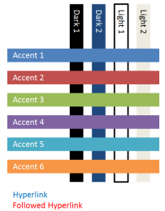
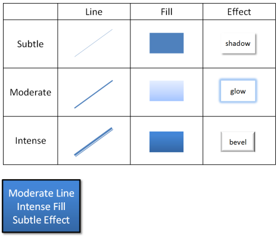
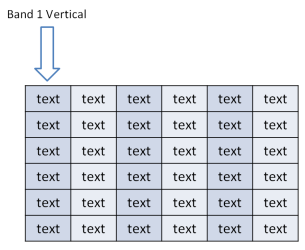
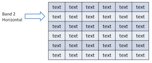
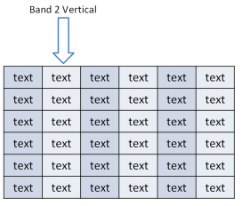
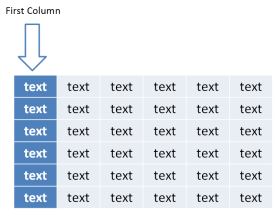
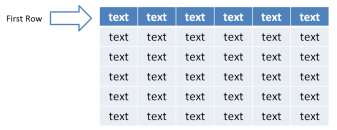
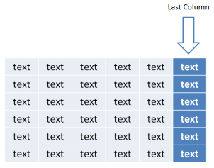

# 20.1.4 样式

=== "中文"

    DrawingML 中的样式是指特定对象（无论是文本、形状还是其他任何内容）的格式化方式。 可以在主题内预定义不同的方面，包括颜色、线条类型、填充和应用于对象的效果。 主题的主要目的是定义一个样式矩阵，文档可以从中提取样式信息，以便格式化文档中对象的视觉外观。

=== "英文"

    **Styles**

    Styles within DrawingML refer to the way a particular object (be it text or a shape, or anything else) is formatted. Different aspects, ranging from color, line type, fill, and effects applied to the object can be predefined within a theme. The main purpose of a theme is to define a style matrix from which a document can pull style information from in order to format the visual look of objects in a document.

## 20.1.4.1 样式

=== "中文"

    本节中的元素构成了样式的基本定义，包括其关联的颜色、效果样式、线条样式、填充样式、背景样式和字体方案。

=== "英文"

    **Styles**

    The elements in this section compose the basic definition of a style, including its associated colors, effect styles, line styles, fill styles, background styles, and font scheme.

### 20.1.4.1.1 accent1 (强调色 1)

=== "中文"

    该元素定义了一种恰好是强调色 1 的颜色。 十二种颜色组合在一起形成主题的配色方案。

    !!! info "Example"

        考虑以下形成配色方案的一组颜色的示例：

        

    [Note: 该元素内容模型 (CT_Color) 的 W3C XML 模式定义位于 §A.4.1 中。 end note]

=== "英文"

    **accent1 (Accent 1)**

    This element defines a color that happens to be the accent 1 color. The set of twelve colors come together to form the color scheme for a theme.

    !!! info "Example"

        Consider the following example of a set of colors that form a color scheme:

        

    [Note: The W3C XML Schema definition of this element’s content model (CT_Color) is located in §A.4.1. end note]

### 20.1.4.1.2 accent2 (强调色 2)

=== "中文"

    该元素定义了一种恰好是强调 2 颜色的颜色。 十二种颜色组合在一起形成主题的配色方案。

    !!! info "Example"

        考虑以下形成配色方案的一组颜色的示例：

        

    [Note: 该元素内容模型 (CT_Color) 的 W3C XML 模式定义位于 §A.4.1 中。 end note]

=== "英文"

    **accent2 (Accent 2)**

    This element defines a color that happens to be the accent 2 color. The set of twelve colors come together to form the color scheme for a theme.

    !!! info "Example"

        Consider the following example of a set of colors that form a color scheme:

        

    [Note: The W3C XML Schema definition of this element’s content model (CT_Color) is located in §A.4.1. end note]

### 20.1.4.1.3 accent3 (强调色 3)

=== "中文"

    该元素定义了一种恰好是强调 3 颜色的颜色。 十二种颜色组合在一起形成主题的配色方案。

    !!! info "Example"

        考虑以下形成配色方案的一组颜色的示例：

        

    [Note: 该元素内容模型 (CT_Color) 的 W3C XML 模式定义位于 §A.4.1 中。 end note]

=== "英文"

    **accent3 (Accent 3)**

    This element defines a color that happens to be the accent 3 color. The set of twelve colors come together to form the color scheme for a theme.

    !!! info "Example"

        Consider the following example of a set of colors that form a color scheme:

        

    [Note: The W3C XML Schema definition of this element’s content model (CT_Color) is located in §A.4.1. end note]

### 20.1.4.1.4 accent4 (强调色 4)

=== "中文"

    该元素定义了一种恰好是强调 4 颜色的颜色。 十二种颜色组合在一起形成主题的配色方案。

    !!! info "Example"

        考虑以下形成配色方案的一组颜色的示例：

        

    [Note: 该元素内容模型 (CT_Color) 的 W3C XML 模式定义位于 §A.4.1 中。 end note]

=== "英文"

    **accent4 (Accent 4)**

    This element defines a color that happens to be the accent 4 color. The set of twelve colors come together to form the color scheme for a theme.

    !!! info "Example"

        Consider the following example of a set of colors that form a color scheme:

        

    [Note: The W3C XML Schema definition of this element’s content model (CT_Color) is located in §A.4.1. end note]

### 20.1.4.1.5 accent5 (强调色 5)

=== "中文"

    该元素定义了一种恰好是强调 5 颜色的颜色。 十二种颜色组合在一起形成主题的配色方案。

    !!! info "Example"

        考虑以下形成配色方案的一组颜色的示例：

        

    [Note: 该元素内容模型 (CT_Color) 的 W3C XML 模式定义位于 §A.4.1 中。 end note]

=== "英文"

    **accent5 (Accent 5)**

    This element defines a color that happens to be the accent 5 color. The set of twelve colors come together to form the color scheme for a theme.

    !!! info "Example"

        Consider the following example of a set of colors that form a color scheme:

        

    [Note: The W3C XML Schema definition of this element’s content model (CT_Color) is located in §A.4.1. end note]

### 20.1.4.1.6 accent6 (强调色 6)

=== "中文"

    该元素定义了一种恰好是强调 6 颜色的颜色。 十二种颜色组合在一起形成主题的配色方案。

    !!! info "Example"

        考虑以下形成配色方案的一组颜色的示例：

        

    [Note: 该元素内容模型 (CT_Color) 的 W3C XML 模式定义位于 §A.4.1 中。 end note]

=== "英文"

    **accent6 (Accent 6)**

    This element defines a color that happens to be the accent 6 color. The set of twelve colors come together to form the color scheme for a theme.

    !!! info "Example"

        Consider the following example of a set of colors that form a color scheme:

        

    [Note: The W3C XML Schema definition of this element’s content model (CT_Color) is located in §A.4.1. end note]

### 20.1.4.1.7 bgFillStyleLst (背景填充样式列表)

=== "中文"

    此元素定义主题中使用的背景填充列表。 背景填充由三种填充组成，按从微妙到中等到强烈的顺序排列。

    !!! info "Example"

        考虑以下 DrawingML 中的背景填充样式列表示例：

        ```xml
        <bgFillStyleLst>
            <solidFill>
            …
            </solidFill>
            <gradFill rotWithShape="1">
            …
            </gradFill>
            <blipFill>
            …
            </blipFill>
        </bgFillStyleLst>
        ```

        在此示例中，我们看到该列表包含用于微妙填充的实心填充、用于中等填充的渐变填充以及用于强烈背景填充的图像填充。

    [Note: 该元素内容模型 (CT_BackgroundFillStyleList) 的 W3C XML 架构定义位于 §A.4.1 中。 end note]

=== "英文"

    **bgFillStyleLst (Background Fill Style List)**

    This element defines a list of background fills that are used within a theme. The background fills consist of three fills, arranged in order from subtle to moderate to intense.

    !!! info "Example"

        Consider the following example of a background fill style list within DrawingML:

        ```xml
        <bgFillStyleLst>
            <solidFill>
            …
            </solidFill>
            <gradFill rotWithShape="1">
            …
            </gradFill>
            <blipFill>
            …
            </blipFill>
        </bgFillStyleLst>
        ```

        In this example, we see that the list contains a solid fill for the subtle fill, a gradient fill for the moderate fill and an image fill for the intense background fill. 

    [Note: The W3C XML Schema definition of this element’s content model (CT_BackgroundFillStyleList) is located in §A.4.1. end note]

### 20.1.4.1.8 custClr (自定义颜色)

=== "中文"

    该元素定义自定义颜色。 自定义颜色在自定义颜色列表中使用来定义自定义颜色，这些自定义颜色是可以附加到主题的额外颜色。 这在有一组可供使用的企业调色板的企业场景中非常有用。

    <table border=1>
        <thead>
            <tr>
                <th>**Attributes**</th>
                <th>**Description**</th>
            </tr>
        </thead>
        <tbody>
            <tr>
                <td>
                    name (名称)
                </td>
                <td>
                    颜色选择器中显示的颜色名称.</br></br>
                    此属性的可能值由 W3C XML 架构字符串数据类型定义.
                </td>
            </tr>
        </tbody>
    </table>

    [Note: The W3C XML Schema definition of this element’s content model (CT_CustomColor) is located in §A.4.1. end note]

=== "英文"

    **custClr (Custom color)**

    This element defines a custom color. The custom colors are used within a custom color list to define custom colors that are extra colors that can be appended to a theme. This is useful within corporate scenarios where there is a set corporate color palette from which to work.

    <table border=1>
        <thead>
            <tr>
                <th>**Attributes**</th>
                <th>**Description**</th>
            </tr>
        </thead>
        <tbody>
            <tr>
                <td>
                    name (Name)
                </td>
                <td>
                    The name of the color shown in the color picker.</br></br>
                    The possible values for this attribute are defined by the W3C XML Schema string datatype.
                </td>
            </tr>
        </tbody>
    </table>

    [Note: The W3C XML Schema definition of this element’s content model (CT_CustomColor) is located in §A.4.1. end note]

### 20.1.4.1.9 dk1 (深色 1)

=== "中文"

    该元素定义了一种恰好是深色 1 的颜色。 十二种颜色组合在一起形成主题的配色方案。

    !!! info "Example"

        考虑以下形成配色方案的一组颜色的示例：

        

    [Note: 该元素内容模型 (CT_Color) 的 W3C XML 模式定义位于 §A.4.1 中。 end note]

=== "英文"

    **dk1 (Dark 1)**

    This element defines a color that happens to be the dark 1 color. The set of twelve colors come together to form the color scheme for a theme.

    !!! info "Example"

        Consider the following example of a set of colors that form a color scheme:

        

    [Note: The W3C XML Schema definition of this element’s content model (CT_Color) is located in §A.4.1. end note]

### 20.1.4.1.10 dk2 (深色 2)

=== "中文"

    该元素定义了一种恰好是深色 2 的颜色。 十二种颜色组合在一起形成主题的配色方案。

    !!! info "Example"

        考虑以下形成配色方案的一组颜色的示例：

        

    [Note: The W3C XML Schema definition of this element’s content model (CT_Color) is located in §A.4.1. end note]

=== "英文"

    **dk2 (Dark 2)**

    This element defines a color that happens to be the dark 2 color. The set of twelve colors come together to form the color scheme for a theme.

    !!! info "Example"

        Consider the following example of a set of colors that form a color scheme:

        

    [Note: 该元素内容模型 (CT_Color) 的 W3C XML 模式定义位于 §A.4.1 中。 end note]

### 20.1.4.1.11 effectStyle (效果样式)

=== "中文"

    该元素定义了一组可应用于对象的效果和 3D 属性。

    !!! info "Example"
        
        考虑以下 DrawingML 中的效果样式示例：

        ```xml
        <effectStyle>
            <effectLst>
                <outerShdw blurRad="57150" dist="38100" dir="5400000" algn="ctr"
                    rotWithShape="0">
                    <schemeClr val="phClr">
                        <shade val="9000"/>
                        <satMod val="105000"/>
                        <alpha val="48000"/>
                    </schemeClr>
                </outerShdw>
            </effectLst>
        </effectStyle>
        ```

        

        在此示例中，将外部阴影应用到形状作为中等效果。

        [Note: 该元素内容模型 (CT_EffectStyleItem) 的 W3C XML 架构定义位于 §A.4.1 中。 end note]

=== "英文"

    **effectStyle (Effect Style)**

    This element defines a set of effects and 3D properties that can be applied to an object.

    !!! info "Example"
        
        Consider the following example of an effect style within DrawingML:

        ```xml
        <effectStyle>
            <effectLst>
                <outerShdw blurRad="57150" dist="38100" dir="5400000" algn="ctr"
                    rotWithShape="0">
                    <schemeClr val="phClr">
                        <shade val="9000"/>
                        <satMod val="105000"/>
                        <alpha val="48000"/>
                    </schemeClr>
                </outerShdw>
            </effectLst>
        </effectStyle>
        ```

        

        In this example, an outer shadow is being applied to a shape as the moderate effect. 

        [Note: The W3C XML Schema definition of this element’s content model (CT_EffectStyleItem) is located in §A.4.1. end note]

### 20.1.4.1.12 effectStyleLst (效果样式列表)

=== "中文"

    此元素定义一组三种效果样式，用于为主题创建效果样式列表。 效果风格按照从微妙到中度到强烈的顺序排列。

    !!! info "Example"
        
        考虑以下 DrawingML 中的效果样式示例：

        ```xml
        <effectStyleLst>
            <effectStyle>
                <effectLst>
                    <outerShdw blurRad="57150" dist="38100" dir="5400000"
                        algn="ctr" rotWithShape="0">
                        …
                    </outerShdw>
                </effectLst>
            </effectStyle>
            <effectStyle>
            <effectLst>
                <outerShdw blurRad="57150" dist="38100" dir="5400000"
                    algn="ctr" rotWithShape="0">
                    …
                </outerShdw>
            </effectLst>
            </effectStyle>
            <effectStyle>
            <effectLst>
            <outerShdw blurRad="57150" dist="38100" dir="5400000"
            algn="ctr" rotWithShape="0">
            …
            </outerShdw>
            </effectLst>
            <scene3d>
            …
            </scene3d>
            <sp3d prstMaterial="powder">
            …
            </sp3d>
            </effectStyle>
        </effectStyleLst>
        ```

        在此示例中，我们看到定义了三种效果样式。 前两种（微妙和中等）将外部阴影定义为效果，而第三种效果样式（强烈）定义外部阴影以及也将应用于对象的 3D 属性。

    [Note: 该元素内容模型 (CT_EffectStyleList) 的 W3C XML 架构定义位于 §A.4.1 中。 end note]

=== "英文"

    **effectStyleLst (Effect Style List)**

    This element defines a set of three effect styles that create the effect style list for a theme. The effect styles are arranged in order of subtle to moderate to intense.

    !!! info "Example"
        
        Consider the following example of an effect style within DrawingML:

        ```xml
        <effectStyleLst>
            <effectStyle>
                <effectLst>
                    <outerShdw blurRad="57150" dist="38100" dir="5400000"
                        algn="ctr" rotWithShape="0">
                        …
                    </outerShdw>
                </effectLst>
            </effectStyle>
            <effectStyle>
            <effectLst>
                <outerShdw blurRad="57150" dist="38100" dir="5400000"
                    algn="ctr" rotWithShape="0">
                    …
                </outerShdw>
            </effectLst>
            </effectStyle>
            <effectStyle>
            <effectLst>
            <outerShdw blurRad="57150" dist="38100" dir="5400000"
            algn="ctr" rotWithShape="0">
            …
            </outerShdw>
            </effectLst>
            <scene3d>
            …
            </scene3d>
            <sp3d prstMaterial="powder">
            …
            </sp3d>
            </effectStyle>
        </effectStyleLst>
        ```

        In this example, we see three effect styles defined. The first two (subtle and moderate) define an outer shadow as the effect, while the third effect style (intense) defines an outer shadow along with 3D properties which are to be applied to the object as well.

    [Note: The W3C XML Schema definition of this element’s content model (CT_EffectStyleList) is located in §A.4.1. end note]

### 20.1.4.1.13 fillStyleLst (填充样式列表)

=== "中文"

    该元素定义了主题中使用的一组三种填充样式。 三种填充风格按从微妙到中等到强烈的顺序排列。

    !!! info "Example"
        
        考虑以下 DrawingML 中填充样式列表的示例：

        ```xml
        <fillStyleLst>
            <solidFill>
            …
            </solidFill>
            <gradFill rotWithShape="1">
            …
            </gradFill>
            <gradFill rotWithShape="1">
            …
            </gradFill>
        </fillStyleLst>
        ```

        在此示例中，我们看到填充样式列表中定义了三种填充样式。 第一种样式是微妙样式，仅定义实心填充。 第二种和第三种样式（分别为中等填充和强烈填充）定义渐变填充。

    [Note: 该元素内容模型 (CT_FillStyleList) 的 W3C XML 架构定义位于 §A.4.1. end note]

=== "英文"

    **fillStyleLst (Fill Style List)**

    This element defines a set of three fill styles that are used within a theme. The three fill styles are arranged in order from subtle to moderate to intense.

    !!! info "Example"
        
        Consider the following example of a fill style list within DrawingML:

        ```xml
        <fillStyleLst>
            <solidFill>
            …
            </solidFill>
            <gradFill rotWithShape="1">
            …
            </gradFill>
            <gradFill rotWithShape="1">
            …
            </gradFill>
        </fillStyleLst>
        ```

        In this example, we see three fill styles being defined within the fill style list. The first style is the subtle style and defines simply a solid fill. The second and third styles (moderate and intense fills respectively) define gradient fills. 

    [Note: The W3C XML Schema definition of this element’s content model (CT_FillStyleList) is located in §A.4.1. end note]

### 20.1.4.1.14 fmtScheme (格式方案)

=== "中文"

    此元素包含背景填充样式、效果样式、填充样式和线条样式，它们定义主题的样式矩阵。 风格矩阵由微妙、适度和强烈的填充、线条和效果组成。 背景填充通常不被认为与矩阵直接相关，但确实在整个文档的风格中发挥着作用。 通常，给定对象选择单一线条样式、单一填充样式和单一效果样式，以便定义对象的整体最终外观。

    !!! info "Example"
        
        考虑以下在 DrawingML 中使用的样式矩阵示例：
        
        

        在此示例中，我们看到一个形状样式，它利用了上面定义的样式矩阵的不同方面。

    <table border=1>
        <thead>
            <tr>
                <th>**Attributes**</th>
                <th>**Description**</th>
            </tr>
        </thead>
        <tbody>
            <tr>
                <td>
                    name (名称)
                </td>
                <td>
                    定义格式方案的名称。 该名称只是一个人类可读的字符串，用于标识用户界面中的格式方案.</br></br>
                    此属性的可能值由 W3C XML 架构字符串数据类型定义.
                </td>
            </tr>
        </tbody>
    </table>

    [Note: 该元素内容模型 (CT_StyleMatrix) 的 W3C XML 架构定义位于 §A.4.1 中。 end note]

=== "英文"

    **fmtScheme (Format Scheme)**

    This element contains the background fill styles, effect styles, fill styles, and line styles which define the style matrix for a theme. The style matrix consists of subtle, moderate, and intense fills, lines, and effects. The background fills are not generally thought of to directly be associated with the matrix, but do play a role in the style of the overall document. Usually, a given object chooses a single line style, a single fill style, and a single effect style in order to define the overall final look of the object.

    !!! info "Example"
        
        Consider the following example of the style matrix in use within DrawingML:
        
        

        In this example, we see a shape styled which utilizes different aspects from the above defined style matrix. 

    <table border=1>
        <thead>
            <tr>
                <th>**Attributes**</th>
                <th>**Description**</th>
            </tr>
        </thead>
        <tbody>
            <tr>
                <td>
                    name (Name)
                </td>
                <td>
                    Defines the name for the format scheme. The name is simply a human readable string which identifies the format scheme in the user interface.</br></br>
                    The possible values for this attribute are defined by the W3C XML Schema string datatype.
                </td>
            </tr>
        </tbody>
    </table>

    [Note: The W3C XML Schema definition of this element’s content model (CT_StyleMatrix) is located in §A.4.1. end note]

### 20.1.4.1.15 folHlink (已关注的超链接)

=== "中文"

    该元素定义了一种颜色，该颜色恰好是已关注的超链接颜色。 十二种颜色组合在一起形成主题的配色方案。

    !!! info "Example"

        考虑以下形成配色方案的一组颜色的示例：

        

    [Note: 该元素内容模型 (CT_Color) 的 W3C XML 模式定义位于 §A.4.1 中。 end note]

=== "英文"

    **folHlink (Followed Hyperlink)**

    This element defines a color that happens to be the followed hyperlink color. The set of twelve colors come together to form the color scheme for a theme.

    !!! info "Example"

        Consider the following example of a set of colors that form a color scheme:

        

    [Note: The W3C XML Schema definition of this element’s content model (CT_Color) is located in §A.4.1. end note]

### 20.1.4.1.16 font (字体)

=== "中文"

    此元素定义 DrawingML 样式区域内的字体。 字体由脚本和字体一起定义。

    !!! info "Eaxample"

        考虑以下 DrawingML 中的字体示例：

        ```xml
        <font script="Thai" typeface="Cordia New"/>
        ```
        
        在此示例中，我们看到脚本“Thai”应该使用字体“Cordia New”。

    <table border=1>
        <thead>
            <tr>
                <th>**Attributes**</th>
                <th>**Description**</th>
            </tr>
        </thead>
        <tbody>
            <tr>
                <td>
                    script (脚本)
                </td>
                <td>
                    指定应该使用字体的脚本或语言.</br></br>
                    [Note: 建议使用 ISO 15924 中指定的脚本名称. end note]</br></br>
                    此属性的可能值由 W3C XML 架构字符串数据类型定义.
                </td>
            </tr>
            <tr>
                <td>
                    typeface (字体)
                </td>
                <td>
                    指定要使用的字体.</br></br>
                    该属性的可能值由 ST_TextTypeface 简单类型定义 (§20.1.10.81).
                </td>
            </tr>
        </tbody>
    </table>

    [Note: 该元素内容模型 (CT_SupplementalFont) 的 W3C XML 架构定义位于 §A.4.1. end note]

=== "英文"

    **font (Font)**

    This element defines a font within the styles area of DrawingML. A font is defined by a script along with a typeface.

    !!! info "Eaxample"

        Consider the following example of a font in DrawingML:

        ```xml
        <font script="Thai" typeface="Cordia New"/>
        ```
        
        In this example, we see that the script 'Thai' is supposed to use the font face 'Cordia New'.

    <table border=1>
        <thead>
            <tr>
                <th>**Attributes**</th>
                <th>**Description**</th>
            </tr>
        </thead>
        <tbody>
            <tr>
                <td>
                    script (Script)
                </td>
                <td>
                    Specifies the script, or language, in which the typeface is supposed to be used.</br></br>
                    [Note: It is recommended that script names as specified in ISO 15924 are used. end note]</br></br>
                    The possible values for this attribute are defined by the W3C XML Schema string datatype.
                </td>
            </tr>
            <tr>
                <td>
                    typeface (Typeface)
                </td>
                <td>
                    Specifies the font face to use.</br></br>
                    The possible values for this attribute are defined by the ST_TextTypeface simple type (§20.1.10.81).
                </td>
            </tr>
        </tbody>
    </table>

    [Note: The W3C XML Schema definition of this element’s content model (CT_SupplementalFont) is located in §A.4.1. end note]

### 20.1.4.1.17 fontRef (字体引用)

=== "中文"

    该元素表示对主题字体的引用。 使用时，它指定要使用的主题字体以及颜色选择。

    !!! info "Eaxample"

        考虑以下 DrawingML 中的字体引用示例：

        ```xml
        <fontRef idx="minor">
            <schemeClr val="tx1"/>
        </fontRef>
        ```
        
        在此示例中，我们看到引用主题中定义的小字体的字体。

    <table border=1>
        <thead>
            <tr>
                <th>**Attributes**</th>
                <th>**Description**</th>
            </tr>
        </thead>
        <tbody>
            <tr>
                <td>
                    idx (标识符)
                </td>
                <td>
                    指定要引用的字体的标识符. </br></br>
                    该属性的可能值由 ST_FontCollectionIndex 简单类型定义 (§20.1.10.25).
                </td>
            </tr>
        </tbody>
    </table>

    [Note: 该元素内容模型 (CT_FontReference) 的 W3C XML 架构定义位于 §A.4.1 中。 end note]

=== "英文"

    **fontRef (Font Reference)**

    This element represents a reference to a themed font. When used it specifies which themed font to use along with a choice of color.

    !!! info "Eaxample"

        Consider the following example of a font reference within DrawingML:

        ```xml
        <fontRef idx="minor">
            <schemeClr val="tx1"/>
        </fontRef>
        ```
        
        In this example, we see a font referencing the minor font defined within the theme. 

    <table border=1>
        <thead>
            <tr>
                <th>**Attributes**</th>
                <th>**Description**</th>
            </tr>
        </thead>
        <tbody>
            <tr>
                <td>
                    idx (Identifier)
                </td>
                <td>
                    Specifies the identifier of the font to reference. </br></br>
                    The possible values for this attribute are defined by the ST_FontCollectionIndex simple type (§20.1.10.25).
                </td>
            </tr>
        </tbody>
    </table>

    [Note: The W3C XML Schema definition of this element’s content model (CT_FontReference) is located in §A.4.1. end note]

### 20.1.4.1.18 fontScheme (字体方案)

=== "中文"

    该元素定义主题内的字体方案。 字体方案由一对在文档中使用的主要字体和次要字体组成。 主要字体与文档的标题区域很好地对应，次要字体与普通文本或段落区域很好地对应。

    !!! info "Eaxample"

        考虑以下 DrawingML 中的字体方案示例：

        ```xml
        <fontScheme name="sample">
             <majorFont>
            …
             </majorFont>
             <minorFont>
            …
             </minorFont>
        </fontScheme>
        ```
        
        在此示例中，我们看到名为“sample”的字体方案中的主要和次要字体列表。

    <table border=1>
        <thead>
            <tr>
                <th>**Attributes**</th>
                <th>**Description**</th>
            </tr>
        </thead>
        <tbody>
            <tr>
                <td>
                    name (名称)
                </td>
                <td>
                    用户界面中显示的字体方案的名称. </br></br>
                    此属性的可能值由 W3C XML 架构字符串数据类型定义.
                </td>
            </tr>
        </tbody>
    </table>

    [Note: 该元素内容模型 (CT_FontScheme) 的 W3C XML 架构定义位于 §A.4.1 中。 end note]

=== "英文"

    **fontScheme (Font Scheme)**

    This element defines the font scheme within the theme. The font scheme consists of a pair of major and minor fonts for which to use in a document. The major font corresponds well with the heading areas of a document, and the minor font corresponds well with the normal text or paragraph areas.

    !!! info "Eaxample"

        Consider the following example of a font scheme within DrawingML:

        ```xml
        <fontScheme name="sample">
             <majorFont>
            …
             </majorFont>
             <minorFont>
            …
             </minorFont>
        </fontScheme>
        ```
        
        In this example, we see the major and minor font lists within the font scheme that is named 'sample'.

    <table border=1>
        <thead>
            <tr>
                <th>**Attributes**</th>
                <th>**Description**</th>
            </tr>
        </thead>
        <tbody>
            <tr>
                <td>
                    name (Name)
                </td>
                <td>
                    The name of the font scheme shown in the user interface. </br></br>
                    The possible values for this attribute are defined by the W3C XML Schema string datatype.
                </td>
            </tr>
        </tbody>
    </table>

    [Note: The W3C XML Schema definition of this element’s content model (CT_FontScheme) is located in §A.4.1. end note]

### 20.1.4.1.19 hlink (超链接)

=== "中文"

    该元素定义了一种恰好是超链接颜色的颜色。 十二种颜色组合在一起形成主题的配色方案。

    !!! info "Example"

        考虑以下形成配色方案的一组颜色的示例：

        

    [Note: 该元素内容模型 (CT_Color) 的 W3C XML 模式定义位于 §A.4.1 中。 end note]

=== "英文"

    **hlink (Hyperlink)**

    This element defines a color that happens to be the hyperlink color. The set of twelve colors come together to form the color scheme for a theme.

    !!! info "Example"

        Consider the following example of a set of colors that form a color scheme:

        

    [Note: The W3C XML Schema definition of this element’s content model (CT_Color) is located in §A.4.1. end note]

### 20.1.4.1.20 lnDef (行默认样式)

=== "中文"

    该元素定义文档中使用的默认行样式。

    !!! info "Eaxample"

        考虑以下在 DrawingML 中定义的默认行示例：

        ```xml
        <lnDef>
            <spPr />
            <bodyPr />
            <lstStyle />
            <style>
                <lnRef idx="1">
                    <schemeClr val="accent2" />
                </lnRef>
                <fillRef idx="0">
                    <schemeClr val="accent2" />
                </fillRef>
                <effectRef idx="0">
                    <schemeClr val="accent2" />
                </effectRef>
                <fontRef idx="minor">
                    <schemeClr val="tx1" />
                </fontRef>
            </style>
        </lnDef>
        ```
        
        在此示例中，我们看到文档的默认行被定义为主题行，它引用 idx 等于 1 的微妙线条样式。

    [Note: 该元素的内容模型 (CT_DefaultShapeDefinition) 的 W3C XML 架构定义位于 §A.4.1 中。 end note]

=== "英文"

    **lnDef (Line Default)**

    This element defines a default line that is used within a document.

    !!! info "Eaxample"

        Consider the following example of a default line defined in DrawingML:

        ```xml
        <lnDef>
            <spPr />
            <bodyPr />
            <lstStyle />
            <style>
                <lnRef idx="1">
                    <schemeClr val="accent2" />
                </lnRef>
                <fillRef idx="0">
                    <schemeClr val="accent2" />
                </fillRef>
                <effectRef idx="0">
                    <schemeClr val="accent2" />
                </effectRef>
                <fontRef idx="minor">
                    <schemeClr val="tx1" />
                </fontRef>
            </style>
        </lnDef>
        ```
        
        In this example, we see that the default line for the document is being defined as a themed line which references the subtle line style with idx equal to 1.

    [Note: The W3C XML Schema definition of this element’s content model (CT_DefaultShapeDefinition) is located in §A.4.1. end note]

### 20.1.4.1.21 lnStyleLst (线条样式列表)

=== "中文"

    该元素定义了主题中使用的三种线条样式的列表。 三种线条风格按照线条从微妙到温和到强烈的顺序排列。 该列表构成了风格矩阵的一部分。

    !!! info "Eaxample"

        考虑以下 DrawingML 中线条样式列表的示例：

        ```xml
        <lnStyleLst>
            <ln w="9525" cap="flat" cmpd="sng" algn="ctr">
                <solidFill>
                    <schemeClr val="phClr">
                        <shade val="50000" />
                        <satMod val="103000" />
                    </schemeClr>
                </solidFill>
                <prstDash val="solid" />
            </ln>
            <ln w="25400" cap="flat" cmpd="sng" algn="ctr">
                <solidFill>
                    <schemeClr val="phClr" />
                </solidFill>
                <prstDash val="solid" />
            </ln>
            <ln w="38100" cap="flat" cmpd="sng" algn="ctr">
                <solidFill>
                    <schemeClr val="phClr" />
                </solidFill>
                <prstDash val="solid" />
            </ln>
        </lnStyleLst>
        ```

    在此示例中，我们看到线条样式列表中定义了三条线。 第一行对应于微妙的行，第二行对应于温和的行，第三行对应于主题中定义的强烈的行。
    
    [Note: 该元素内容模型 (CT_LineStyleList) 的 W3C XML 架构定义位于 §A.4.1. end note]

=== "英文"

    **lnStyleLst (Line Style List)**

    This element defines a list of three line styles for use within a theme. The three line styles are arranged in order from subtle to moderate to intense versions of lines. This list makes up part of the style matrix.

    !!! info "Eaxample"

        Consider the following example of a line style list within DrawingML:

        ```xml
        <lnStyleLst>
            <ln w="9525" cap="flat" cmpd="sng" algn="ctr">
                <solidFill>
                    <schemeClr val="phClr">
                        <shade val="50000" />
                        <satMod val="103000" />
                    </schemeClr>
                </solidFill>
                <prstDash val="solid" />
            </ln>
            <ln w="25400" cap="flat" cmpd="sng" algn="ctr">
                <solidFill>
                    <schemeClr val="phClr" />
                </solidFill>
                <prstDash val="solid" />
            </ln>
            <ln w="38100" cap="flat" cmpd="sng" algn="ctr">
                <solidFill>
                    <schemeClr val="phClr" />
                </solidFill>
                <prstDash val="solid" />
            </ln>
        </lnStyleLst>
        ```

    In this example, we see three lines defined within a line style list. The first line corresponds to the subtle line, the second to the moderate, and the third corresponds to the intense line defined in the theme. 
    
    [Note: The W3C XML Schema definition of this element’s content model (CT_LineStyleList) is located in §A.4.1. end note]

### 20.1.4.1.22 lt1 (浅色 1)

=== "中文"

    该元素定义的颜色恰好是 浅色 1 颜色。 十二种颜色组合在一起形成主题的配色方案。

    !!! info "Example"

        考虑以下形成配色方案的一组颜色的示例：

        

    [Note: 该元素内容模型 (CT_Color) 的 W3C XML 模式定义位于 §A.4.1 中。 end note]

=== "英文"

    **lt1 (Light 1)**

    This element defines a color that happens to be the Light 1 color. The set of twelve colors come together to form the color scheme for a theme.

    !!! info "Example"

        Consider the following example of a set of colors that form a color scheme:

        

    [Note: The W3C XML Schema definition of this element’s content model (CT_Color) is located in §A.4.1. end note]

### 20.1.4.1.23 lt2 (浅色 2)

=== "中文"

    该元素定义的颜色恰好是 浅色 2 颜色。 十二种颜色组合在一起形成主题的配色方案。

    !!! info "Example"

        考虑以下形成配色方案的一组颜色的示例：

        

    [Note: 该元素内容模型 (CT_Color) 的 W3C XML 模式定义位于 §A.4.1 中。 end note]

=== "英文"

    **lt2 (Light 2)**

    This element defines a color that happens to be the Light 2 color. The set of twelve colors come together to form the color scheme for a theme.

    !!! info "Example"

        Consider the following example of a set of colors that form a color scheme:

        

    [Note: The W3C XML Schema definition of this element’s content model (CT_Color) is located in §A.4.1. end note]

### 20.1.4.1.24 majorFont (主要字体)

=== "中文"

    该元素定义了在不同语言或本地语言下使用的主要字体集.

    !!! info "Eaxample"

        考虑以下在 DrawingML 中定义的主要字体的示例:

        ```xml
        <majorFont>
            <latin typeface="Calibri"/>
            <ea typeface="Arial"/>
            <cs typeface="Arial"/>
            <font script="Jpan" typeface="ＭＳＰゴシック"/>
            <font script="Hang" typeface="HY중고딕"/>
            <font script="Hans" typeface="隶书"/>
            <font script="Hant" typeface="微軟正黑體"/>
            <font script="Arab" typeface="Traditional Arabic"/>
            <font script="Hebr" typeface="Arial"/>
            <font script="Thai" typeface="Cordia New"/>
            <font script="Ethi" typeface="Nyala"/>
            <font script="Beng" typeface="Vrinda"/>
            <font script="Gujr" typeface="Shruti"/>
            <font script="Khmr" typeface="DaunPenh"/>
            <font script="Knda" typeface="Tunga"/>
        </majorFont>
        ```

        在此示例中，我们看到定义了拉丁语、东亚语和复杂脚本字体以及针对不同当地人的许多字体。

    [Note: 该元素内容模型 (CT_FontCollection) 的 W3C XML 架构定义位于 §A.4.1 中。 end note]

=== "英文"

    **majorFont (Major Font)**

    This element defines the set of major fonts which are to be used under different languages or locals.

    !!! info "Eaxample"

        Consider the following example of the major fonts being defined within DrawingML:

        ```xml
        <majorFont>
            <latin typeface="Calibri"/>
            <ea typeface="Arial"/>
            <cs typeface="Arial"/>
            <font script="Jpan" typeface="ＭＳＰゴシック"/>
            <font script="Hang" typeface="HY중고딕"/>
            <font script="Hans" typeface="隶书"/>
            <font script="Hant" typeface="微軟正黑體"/>
            <font script="Arab" typeface="Traditional Arabic"/>
            <font script="Hebr" typeface="Arial"/>
            <font script="Thai" typeface="Cordia New"/>
            <font script="Ethi" typeface="Nyala"/>
            <font script="Beng" typeface="Vrinda"/>
            <font script="Gujr" typeface="Shruti"/>
            <font script="Khmr" typeface="DaunPenh"/>
            <font script="Knda" typeface="Tunga"/>
        </majorFont>
        ```

        In this example, we see the latin, east asian, and complex script fonts defined along with many fonts for different locals. 

    [Note: The W3C XML Schema definition of this element’s content model (CT_FontCollection) is located in §A.4.1. end note]

### 20.1.4.1.25 minorFont (次要字体)

=== "中文"

    该元素定义了在不同语言或本地语言下使用的小字体集.

    !!! info "Eaxample"

        考虑以下在 DrawingML 中定义的次要字体的示例：

        ```xml
        <minorFont>
            <latin typeface="Calibri"/>
            <ea typeface="Arial"/>
            <cs typeface="Arial"/>
            <font script="Jpan" typeface="ＭＳＰゴシック"/>
            <font script="Hang" typeface="HY중고딕"/>
            <font script="Hans" typeface="隶书"/>
            <font script="Hant" typeface="微軟正黑體"/>
            <font script="Arab" typeface="Traditional Arabic"/>
            <font script="Hebr" typeface="Arial"/>
            <font script="Thai" typeface="Cordia New"/>
            <font script="Ethi" typeface="Nyala"/>
            <font script="Beng" typeface="Vrinda"/>
            <font script="Gujr" typeface="Shruti"/>
            <font script="Khmr" typeface="DaunPenh"/>
            <font script="Knda" typeface="Tunga"/>
        </minorFont>
        ```

        在此示例中，我们看到定义了拉丁语、东亚语和复杂脚本字体以及针对不同当地人的许多字体。

    [Note: 该元素内容模型 (CT_FontCollection) 的 W3C XML 架构定义位于 §A.4.1 中。 end note]

=== "英文"

    **minorFont (Minor fonts)**

    This element defines the set of minor fonts that are to be used under different languages or locals.

    !!! info "Eaxample"

        Consider the following example of the minor fonts being defined within DrawingML:

        ```xml
        <minorFont>
            <latin typeface="Calibri"/>
            <ea typeface="Arial"/>
            <cs typeface="Arial"/>
            <font script="Jpan" typeface="ＭＳＰゴシック"/>
            <font script="Hang" typeface="HY중고딕"/>
            <font script="Hans" typeface="隶书"/>
            <font script="Hant" typeface="微軟正黑體"/>
            <font script="Arab" typeface="Traditional Arabic"/>
            <font script="Hebr" typeface="Arial"/>
            <font script="Thai" typeface="Cordia New"/>
            <font script="Ethi" typeface="Nyala"/>
            <font script="Beng" typeface="Vrinda"/>
            <font script="Gujr" typeface="Shruti"/>
            <font script="Khmr" typeface="DaunPenh"/>
            <font script="Knda" typeface="Tunga"/>
        </minorFont>
        ```

        In this example, we see the latin, east asian, and complex script fonts defined along with many fonts for different locals.  

    [Note: The W3C XML Schema definition of this element’s content model (CT_FontCollection) is located in §A.4.1. end note]

### 20.1.4.1.26 scene3d (3D 场景属性)

=== "中文"

    该元素定义了应用于对象的可选场景级 3D 属性。

    [Note: 该元素内容模型 (CT_Scene3D) 的 W3C XML 架构定义位于 §A.4.1. end note]

=== "英文"

    **scene3d (3D Scene Properties)**

    This element defines optional scene-level 3D properties to apply to an object.

    [Note: The W3C XML Schema definition of this element’s content model (CT_Scene3D) is located in §A.4.1. end note]

### 20.1.4.1.27 spDef (形状默认样式)

=== "中文"

    此元素定义与默认形状关联的格式。 当形状最初插入到文档中时，可以将默认格式应用于形状。

    !!! info "Eaxample"

        考虑以下在 DrawingML 中使用的默认形状示例：

        ```xml
        <spDef>
            <spPr>
                <solidFill>
                    <schemeClr val="accent2">
                        <shade val="75000" />
                    </schemeClr>
                </solidFill>
            </spPr>
            <bodyPr rtlCol="0" anchor="ctr" />
            <lstStyle>
                <defPPr algn="ctr">
                    <defRPr />
                </defPPr>
            </lstStyle>
            <style>
                <lnRef idx="1">
                    <schemeClr val="accent1" />
                </lnRef>
                <fillRef idx="2">
                    <schemeClr val="accent1" />
                </fillRef>
                <effectRef idx="1">
                    <schemeClr val="accent1" />
                </effectRef>
                <fontRef idx="minor">
                    <schemeClr val="dk1" />
                </fontRef>
            </style>
        </spDef>
        ```

        在此示例中，我们看到一个默认形状，它引用特定主题的填充、线条、效果和字体以及对它们的覆盖填充。

    [Note: 该元素的内容模型 (CT_DefaultShapeDefinition) 的 W3C XML 架构定义位于 §A.4.1 中。 end note]

=== "英文"

    **spDef (Shape Default)**

    This element defines the formatting that is associated with the default shape. The default formatting can be applied to a shape when it is initially inserted into a document.

    !!! info "Eaxample"

        Consider the following example of a shape default being used within DrawingML:

        ```xml
        <spDef>
            <spPr>
                <solidFill>
                    <schemeClr val="accent2">
                        <shade val="75000" />
                    </schemeClr>
                </solidFill>
            </spPr>
            <bodyPr rtlCol="0" anchor="ctr" />
            <lstStyle>
                <defPPr algn="ctr">
                    <defRPr />
                </defPPr>
            </lstStyle>
            <style>
                <lnRef idx="1">
                    <schemeClr val="accent1" />
                </lnRef>
                <fillRef idx="2">
                    <schemeClr val="accent1" />
                </fillRef>
                <effectRef idx="1">
                    <schemeClr val="accent1" />
                </effectRef>
                <fontRef idx="minor">
                    <schemeClr val="dk1" />
                </fontRef>
            </style>
        </spDef>
        ```

        In this example, we see a default shape which references a certain themed fill, line, effect, and font along with an override fill to these. 

    [Note: The W3C XML Schema definition of this element’s content model (CT_DefaultShapeDefinition) is located in §A.4.1. end note]

### 20.1.4.1.28 txDef (文本默认样式)

=== "中文"

    此元素定义默认应用于文档中文本的默认格式。 当形状最初插入文档时，可以而且应该将默认格式应用于形状.

    !!! info "Eaxample"

        考虑以下在 DrawingML 中使用的默认文本示例：

        ```xml
        <txDef>
            <spPr>
                <solidFill>
                    <schemeClr val="accent2">
                        <shade val="75000" />
                    </schemeClr>
                </solidFill>
            </spPr>
            <bodyPr rtlCol="0" anchor="ctr" />
            <lstStyle>
                <defPPr algn="ctr">
                    <defRPr />
                </defPPr>
            </lstStyle>
            <style>
                <lnRef idx="1">
                    <schemeClr val="accent1" />
                </lnRef>
                <fillRef idx="2">
                    <schemeClr val="accent1" />
                </fillRef>
                <effectRef idx="1">
                    <schemeClr val="accent1" />
                </effectRef>
                <fontRef idx="minor">
                    <schemeClr val="dk1" />
                </fontRef>
            </style>
        </txDef>
        ```

        在此示例中，我们看到一个默认文本，它引用了特定主题的填充、线条、效果和字体以及对它们的覆盖填充。

    [Note: 该元素的内容模型 (CT_DefaultShapeDefinition) 的 W3C XML 架构定义位于 §A.4.1 中。 end note]

=== "英文"

    **txDef (Text Default)**

    This element defines the default formatting which is applied to text in a document by default. The default formatting can and should be applied to the shape when it is initially inserted into a document.

    !!! info "Eaxample"

        Consider the following example of a text default being used within DrawingML:

        ```xml
        <txDef>
            <spPr>
                <solidFill>
                    <schemeClr val="accent2">
                        <shade val="75000" />
                    </schemeClr>
                </solidFill>
            </spPr>
            <bodyPr rtlCol="0" anchor="ctr" />
            <lstStyle>
                <defPPr algn="ctr">
                    <defRPr />
                </defPPr>
            </lstStyle>
            <style>
                <lnRef idx="1">
                    <schemeClr val="accent1" />
                </lnRef>
                <fillRef idx="2">
                    <schemeClr val="accent1" />
                </fillRef>
                <effectRef idx="1">
                    <schemeClr val="accent1" />
                </effectRef>
                <fontRef idx="minor">
                    <schemeClr val="dk1" />
                </fontRef>
            </style>
        </txDef>
        ```

        In this example, we see a default text which references a certain themed fill, line, effect, and font along with an override fill to these. 

    [Note: The W3C XML Schema definition of this element’s content model (CT_DefaultShapeDefinition) is located in §A.4.1. end note]

## 20.1.4.2 表格样式

=== "中文"

    表格样式负责可应用于表格的快速格式化。 这种快速格式化会考虑表格的不同部分，例如是否应强调第一行或最后一行，或者表格上是否存在某种类型的条带（例如行）。 所有这些不同类型的格式都可以在表格样式中定义

=== "英文"

    **Table Styles**

    Table styles are responsible for the rapid formatting that can be applied to a table. This rapid formatting takes different parts of a table into account, such as if the first row or last row should be emphasized, or if there is some type of banding (row for example) present on the table. All of these different types of formatting can be defined within a table style

### 20.1.4.2.1 band1H (水平条带样式1)

=== "中文"

    此元素描述水平条带中第一行的格式。 两种不同的行格式交替应用于表格，以便在表格上创建条带效果。

    !!! info "Eaxample"

        考虑以下在 DrawingML 中使用水平带 1 的示例：

        ```xml
        <band1H>
            <tcStyle>
                <tcBdr />
                <fill>
                    <solidFill>
                        <schemeClr val="accent1">
                            <tint val="40000" />
                        </schemeClr>
                    </solidFill>
                </fill>
            </tcStyle>
        </band1H>
        ```

        

        在此示例中，我们将填充设置为引用主题中定义的强调色 1 的实心填充。

    [Note: 该元素内容模型 (CT_TablePartStyle) 的 W3C XML 架构定义位于 §A.4.1 中。 end note]

=== "英文"

    **band1H (Band 1 Horizontal)**

    This element describes the formatting for the first row in horizontal banding. Two different row formatting are applied to the table alternating in order to create a banding effect on the table.

    !!! info "Eaxample"

        Consider the following example of band 1 horizontal being used within DrawingML:

        ```xml
        <band1H>
            <tcStyle>
                <tcBdr />
                <fill>
                    <solidFill>
                        <schemeClr val="accent1">
                            <tint val="40000" />
                        </schemeClr>
                    </solidFill>
                </fill>
            </tcStyle>
        </band1H>
        ```

        

        In this example, we set the fill to be a solid fill referencing the accent 1 color defined in the theme.

    [Note: The W3C XML Schema definition of this element’s content model (CT_TablePartStyle) is located in §A.4.1. end note]

### 20.1.4.2.2 band1V (垂直条带样式1)

=== "中文"

    此元素描述垂直条带中第一列的格式。 两种不同的列格式交替应用于表格，以便在表格上创建条带效果。

    !!! info "Eaxample"

        Consider the following example of band 1 vertical being used within DrawingML:

        ```xml
        <band1V>
            <tcStyle>
                <tcBdr />
                <fill>
                    <solidFill>
                        <schemeClr val="accent1">
                            <tint val="40000" />
                        </schemeClr>
                    </solidFill>
                </fill>
            </tcStyle>
        </band1V>
        ```

        

        此标记示例将填充设置为引用主题中定义的强调 1 颜色的实心填充。

    [Note: 该元素内容模型 (CT_TablePartStyle) 的 W3C XML 架构定义位于 §A.4.1 中。 end note]

=== "英文"

    **band1V (Band 1 Vertical)**

    This element describes the formatting for the first column in vertical banding. Two different column formattings are applied to the table alternating in order to create a banding effect on the table.

    !!! info "Eaxample"

        Consider the following example of band 1 vertical being used within DrawingML:

        ```xml
        <band1V>
            <tcStyle>
                <tcBdr />
                <fill>
                    <solidFill>
                        <schemeClr val="accent1">
                            <tint val="40000" />
                        </schemeClr>
                    </solidFill>
                </fill>
            </tcStyle>
        </band1V>
        ```

        

        This markup example sets the fill to be a solid fill referencing the accent 1 color defined in the theme. 

    [Note: The W3C XML Schema definition of this element’s content model (CT_TablePartStyle) is located in §A.4.1. end note]

### 20.1.4.2.3 band2H (水平条带样式2)

=== "中文"

    此元素描述水平条带中第二行的格式。 两种不同的行格式交替应用于表格，以便在表格上创建条带效果。

    !!! info "Eaxample"

        考虑以下在 DrawingML 中使用水平条带 2 的示例：

        ```xml
        <band2H>
            <tcStyle>
                <tcBdr />
                <fill>
                    <solidFill>
                        <schemeClr val="accent2">
                            <tint val="40000" />
                        </schemeClr>
                    </solidFill>
                </fill>
            </tcStyle>
        </band2H>
        ```

        

        在此示例中，我们将填充设置为引用主题中定义的强调 2 颜色的实心填充。

    [Note: 该元素内容模型 (CT_TablePartStyle) 的 W3C XML 架构定义位于 §A.4.1 中。 end note]

=== "英文"

    **band2H (Band 2 Horizontal)**

    This element describes the formatting for the second row in horizontal banding. Two different row formatting are applied to the table alternating in order to create a banding effect on the table.

    !!! info "Eaxample"

        Consider the following example of band 2 horizontal being used within DrawingML:

        ```xml
        <band2H>
            <tcStyle>
                <tcBdr />
                <fill>
                    <solidFill>
                        <schemeClr val="accent2">
                            <tint val="40000" />
                        </schemeClr>
                    </solidFill>
                </fill>
            </tcStyle>
        </band2H>
        ```

        

        In this example, we set the fill to be a solid fill referencing the accent 2 color defined in the theme. 

    [Note: The W3C XML Schema definition of this element’s content model (CT_TablePartStyle) is located in §A.4.1. end note]

### 20.1.4.2.4 band2V (垂直条带样式2)

=== "中文"

    此元素描述垂直条带中第二行的格式。 两种不同的行格式交替应用于表格，以便在表格上创建条带效果。

    !!! info "Eaxample"

        考虑以下在 DrawingML 中使用的垂直条带样式2的示例：

        ```xml
        <band2V>
            <tcStyle>
                <tcBdr />
                <fill>
                    <solidFill>
                        <schemeClr val="accent2">
                            <tint val="40000" />
                        </schemeClr>
                    </solidFill>
                </fill>
            </tcStyle>
        </band2V>
        ```

        

        在此示例中，我们将填充设置为引用主题中定义的强调 2 颜色的实心填充。

    [Note: 该元素内容模型 (CT_TablePartStyle) 的 W3C XML 架构定义位于 §A.4.1 中。 end note]

=== "英文"

    **band2V (Band 2 Vertical)**

    This element describes the formatting for the second row in vertical banding. Two different row formatting are applied to the table alternating in order to create a banding effect on the table.

    !!! info "Eaxample"

        Consider the following example of band 2 vertical being used within DrawingML:

        ```xml
        <band2V>
            <tcStyle>
                <tcBdr />
                <fill>
                    <solidFill>
                        <schemeClr val="accent2">
                            <tint val="40000" />
                        </schemeClr>
                    </solidFill>
                </fill>
            </tcStyle>
        </band2V>
        ```

        

        In this example, we set the fill to be a solid fill referencing the accent 2 color defined in the theme. 

    [Note: The W3C XML Schema definition of this element’s content model (CT_TablePartStyle) is located in §A.4.1. end note]

### 20.1.4.2.5 bevel (斜角)

=== "中文"

    此元素定义与应用于表格中单元格的 3D 效果关联的斜角属性。

    <table border=1>
        <thead>
            <tr>
                <th>**Attributes**</th>
                <th>**Description**</th>
            </tr>
        </thead>
        <tbody>
            <tr>
                <td>
                    h (高度)
                </td>
                <td>
                    指定斜角的高度，或者斜角应用到的形状之上多远. </br></br>
                    [Example: 考虑以下斜角示例</br></br>
                    
                    在此示例中，我们看到形状上示例斜角的高度. end example]</br></br>
                    该属性的可能值由 ST_PositiveCooperative 简单类型定义 (§20.1.10.41).
                </td>
            </tr>
            <tr>
                <td>
                    prst (预设斜角)
                </td>
                <td>
                    指定定义斜角外观的预设斜角类型. </br></br>
                    该属性的可能值由 ST_BevelPresetType 简单类型定义 (§20.1.10.9).
                </td>
            </tr>
            <tr>
                <td>
                    w (宽度)
                </td>
                <td>
                    指定斜角的宽度，或者斜角应用到形状中的深度.</br></br>
                    [Example: 考虑以下斜角示例</br></br>
                    
                    在此示例中，我们看到形状上示例斜角的宽度.  end example]</br></br>
                    该属性的可能值由 ST_PositiveCooperative 简单类型定义 (§20.1.10.41).
                </td>
            </tr>
        </tbody>
    </table>

    [Note: 该元素内容模型 (CT_Bevel) 的 W3C XML 模式定义位于 §A.4.1 中。 end note]

=== "英文"

    **bevel (Bevel)**

    This element defines the properties of the bevel associated with the 3D effect applied to a cell in a table.

    <table border=1>
        <thead>
            <tr>
                <th>**Attributes**</th>
                <th>**Description**</th>
            </tr>
        </thead>
        <tbody>
            <tr>
                <td>
                    h (Height)
                </td>
                <td>
                    Specifies the height of the bevel, or how far above the shape it is applied. </br></br>
                    [Example: Consider the following example bevel</br></br>
                    
                    In this example, we see the height of an example bevel on a shape. end example]</br></br>
                    The possible values for this attribute are defined by the ST_PositiveCoordinate simple type (§20.1.10.41).
                </td>
            </tr>
            <tr>
                <td>
                    prst (Preset Bevel)
                </td>
                <td>
                    Specifies the preset bevel type which defines the look of the bevel. </br></br>
                    The possible values for this attribute are defined by the ST_BevelPresetType simple type (§20.1.10.9).
                </td>
            </tr>
            <tr>
                <td>
                    w (Width)
                </td>
                <td>
                    Specifies the width of the bevel, or how far into the shape it is applied.</br></br>
                    [Example: Consider the following example bevel</br></br>
                    
                    In this example, we see the width of an example bevel on a shape.  end example]</br></br>
                    The possible values for this attribute are defined by the ST_PositiveCoordinate simple type (§20.1.10.41).
                </td>
            </tr>
        </tbody>
    </table>

    [Note: The W3C XML Schema definition of this element’s content model (CT_Bevel) is located in §A.4.1. end note]

### 20.1.4.2.6 bottom (下边框)

=== "中文"

    此元素定义与表格单元格中的底部边框关联的线条属性。

    !!! info "Eaxample"

        考虑以下在 DrawingML 中使用的底部边框示例：

        ```xml
        <bottom>
            <ln w="12700" cmpd="sng">
                <solidFill>
                    <schemeClr val="accent1"/>
                </solidFill>
            </ln>
        </bottom>
        ```

        在此示例中，我们看到表格单元格的底部边框是一条 1pt 线，其颜色为强调色 1。
    
    [Note: 该元素内容模型 (CT_ThemeableLineStyle) 的 W3C XML 架构定义位于 §A.4.1 中。 end note]

=== "英文"

    **bottom (Bottom Border)**

    This element defines the line properties associated with the bottom border in a table cell.

    !!! info "Eaxample"

        Consider the following example of the bottom border in use within DrawingML:

        ```xml
        <bottom>
            <ln w="12700" cmpd="sng">
                <solidFill>
                    <schemeClr val="accent1"/>
                </solidFill>
            </ln>
        </bottom>
        ```

        In this example, we see the bottom border on a table cell to be a single 1pt line which is colored accent 1.
    
    [Note: The W3C XML Schema definition of this element’s content model (CT_ThemeableLineStyle) is located in §A.4.1. end note]

### 20.1.4.2.7 effect (效果)

=== "中文"

    该元素定义了可以通过表格样式应用于整个表格的效果。

    !!! info "Eaxample"

        Consi以下是在 DrawingML 中使用的效果示例：

        ```xml
        <effect>
            <effectLst>
                <glow rad="228600">
                    <schemeClr val="accent1">
                        <satMod val="175000"/>
                        <alpha val="40000"/>
                    </schemeClr>
                </glow>
            </effectLst>
        </effect>
        ```

        在此示例中，我们看到在应用于整个表格的表格样式中定义了发光。
    
    [Note: 该元素内容模型 (CT_EffectProperties) 的 W3C XML 架构定义位于 §A.4.1 中。 end note]

=== "英文"

    **effect (Effect)**

    This element defines the effect that can be applied to a table as a whole through a table style.

    !!! info "Eaxample"

        Consider the following example of an effect in use within DrawingML:

        ```xml
        <effect>
            <effectLst>
                <glow rad="228600">
                    <schemeClr val="accent1">
                        <satMod val="175000"/>
                        <alpha val="40000"/>
                    </schemeClr>
                </glow>
            </effectLst>
        </effect>
        ```

        In this example, we see a glow being defined within the table style that is applied to the table as a whole. 
    
    [Note: The W3C XML Schema definition of this element’s content model (CT_EffectProperties) is located in §A.4.1. end note]

### 20.1.4.2.8 effectRef (效果引用)

=== "中文"

    该元素定义对样式矩阵中效果样式的引用。 idx 属性指的是effectStyleLst 元素中效果样式的索引。

    <table border=1>
        <thead>
            <tr>
                <th>**Attributes**</th>
                <th>**Description**</th>
            </tr>
        </thead>
        <tbody>
            <tr>
                <td>
                    idx (样式矩阵索引)
                </td>
                <td>
                    指定所引用样式的样式矩阵索引. </br></br>
                    此属性的可能值由 ST_StyleMatrixColumnIndex 简单类型定义 (§20.1.10.57).
                </td>
            </tr>
        </tbody>
    </table>

    [Note: 该元素内容模型 (CT_StyleMatrixReference) 的 W3C XML 架构定义位于 §A.4.1 中。 end note]

=== "英文"

    **effectRef (Effect Reference)**

    This element defines a reference to an effect style within the style matrix. The idx attribute refers the index of an effect style within the effectStyleLst element.

    <table border=1>
        <thead>
            <tr>
                <th>**Attributes**</th>
                <th>**Description**</th>
            </tr>
        </thead>
        <tbody>
            <tr>
                <td>
                    idx (Style Matrix Index)
                </td>
                <td>
                    Specifies the style matrix index of the style referred to. </br></br>
                    The possible values for this attribute are defined by the ST_StyleMatrixColumnIndex simple type (§20.1.10.57).
                </td>
            </tr>
        </tbody>
    </table>

    [Note: The W3C XML Schema definition of this element’s content model (CT_StyleMatrixReference) is located in §A.4.1. end note]

### 20.1.4.2.9 fill (填充)

=== "中文"

    该元素定义应用于整个表格的填充。 表格的背景可以包含整个表格大小的单个填充。 这可以允许跨越整个表格大小的渐变填充或图像填充。

    !!! info "Example"

        考虑以下在 DrawingML 中填充表格背景的示例：

        ```xml
        <fill>
            <gradFill flip="none" rotWithShape="1">
                <gsLst>
                    <gs pos="0">
                        <schemeClr val="accent2">
                            <shade val="75000" />
                        </schemeClr>
                    </gs>
                    <gs pos="100000">
                        <schemeClr val="accent2">
                            <shade val="75000" />
                            <tint val="20000" />
                        </schemeClr>
                    </gs>
                </gsLst>
                <lin ang="2700000" scaled="1" />
                <tileRect />
            </gradFill>
        </fill>
        ```

        在本例中，我们在表格的背景形状上对整个表格应用渐变填充.
    
    [Note: 该元素内容模型 (CT_FillProperties) 的 W3C XML 架构定义位于 §A.4.1 中。 end note]

=== "英文"

    **fill (Fill)**

    This element defines the fill that is applied to the table as a whole. The background of the table can contain a single fill that is the entire size of the table. This can allow for gradient fills, or image fills, which span the entire size of the table.

    !!! info "Example"

        Consider the following example of a fill on a table background in DrawingML:

        ```xml
        <fill>
            <gradFill flip="none" rotWithShape="1">
                <gsLst>
                    <gs pos="0">
                        <schemeClr val="accent2">
                            <shade val="75000" />
                        </schemeClr>
                    </gs>
                    <gs pos="100000">
                        <schemeClr val="accent2">
                            <shade val="75000" />
                            <tint val="20000" />
                        </schemeClr>
                    </gs>
                </gsLst>
                <lin ang="2700000" scaled="1" />
                <tileRect />
            </gradFill>
        </fill>
        ```

        In this example, we apply a gradient fill to the entire table on the background shape of the table.
    
    [Note: The W3C XML Schema definition of this element’s content model (CT_FillProperties) is located in §A.4.1. end note]

### 20.1.4.2.10 fillRef (填充引用)

=== "中文"

    该元素定义对样式矩阵内的填充样式的引用。 idx 属性指的是演示文稿样式矩阵中填充样式或背景填充样式的索引，由 fmtScheme 元素定义。 值 0 或 1000 表示无背景，值 1-999 指 fillStyleLst 元素内的填充样式的索引，值 1001 及以上指 bgFillStyleLst 元素内的背景填充样式的索引。 值 1001 对应于第一个背景填充样式，1002 对应于第二个背景填充样式，依此类推。

    !!! info "Example"

        ```xml
        <a:fillRef idx="2">
            <a:schemeClr val="accent2"/>
        </a:fillRef>
        ```

        上面的代码表明该对象将使用配色方案的accent2颜色来拥有该样式的第二个填充样式。

    !!! info "Example"

        ```xml
        <a:fillRef idx="1001">
            <a:schemeClr val="accent2"/>
        </a:fillRef>
        ```

        上面的代码表明该对象将使用配色方案的accent2颜色来拥有该样式的第一个背景填充样式。  


    <table border=1>
        <thead>
            <tr>
                <th>**Attributes**</th>
                <th>**Description**</th>
            </tr>
        </thead>
        <tbody>
            <tr>
                <td>
                    idx (样式矩阵索引)
                </td>
                <td>
                    指定所引用样式的样式矩阵索引. </br></br>
                    此属性的可能值由 ST_StyleMatrixColumnIndex 简单类型定义 (§20.1.10.57).
                </td>
            </tr>
        </tbody>
    </table>

    [Note: 该元素内容模型 (CT_StyleMatrixReference) 的 W3C XML 架构定义位于 §A.4.1. end note]

=== "英文"

    **fillRef (Fill Reference)**

    This element defines a reference to a fill style within the style matrix. The idx attribute refers to the index of a fill style or background fill style within the presentation's style matrix, defined by the fmtScheme element. A value of 0 or 1000 indicates no background, values 1-999 refer to the index of a fill style within the fillStyleLst element, and values 1001 and above refer to the index of a background fill style within the bgFillStyleLst element. The value 1001 corresponds to the first background fill style, 1002 to the second background fill style, and so on. 

    !!! info "Example"

        ```xml
        <a:fillRef idx="2">
            <a:schemeClr val="accent2"/>
        </a:fillRef>
        ```

        The above code indicates the object is to have the style's second fill style using the accent2 color of the color scheme. 

    !!! info "Example"

        ```xml
        <a:fillRef idx="1001">
            <a:schemeClr val="accent2"/>
        </a:fillRef>
        ```

        The above code indicates the object is to have the style's first background fill style using the accent2 color of the color scheme.  


    <table border=1>
        <thead>
            <tr>
                <th>**Attributes**</th>
                <th>**Description**</th>
            </tr>
        </thead>
        <tbody>
            <tr>
                <td>
                    idx (Style Matrix Index)
                </td>
                <td>
                    Specifies the style matrix index of the style referred to. </br></br>
                    The possible values for this attribute are defined by the ST_StyleMatrixColumnIndex simple type (§20.1.10.57).
                </td>
            </tr>
        </tbody>
    </table>

    [Note: The W3C XML Schema definition of this element’s content model (CT_StyleMatrixReference) is located in §A.4.1. end note]

### 20.1.4.2.11 firstCol (第一列)

=== "中文"

    此元素定义可应用于表格第一列的单元格格式。

    !!! info "Example"
        
        请考虑以下 DrawingML 中第一列格式设置的示例：

        ```xml
        <firstCol>
            <tcTxStyle b="on">
                <fontRef idx="minor">
                    <scrgbClr r="0" g="0" b="0" />
                </fontRef>
                <schemeClr val="lt1" />
            </tcTxStyle>
            <tcStyle>
                <tcBdr />
                <fill>
                    <solidFill>
                        <schemeClr val="accent1" />
                    </solidFill>
                </fill>
            </tcStyle>
        </firstCol>
        ```

        

        在此示例中，当通过用户界面启用第一列格式设置时，我们将第一列单元格填充定义为强调 1，并将文本属性定义为粗体。

        [Note: 该元素内容模型 (CT_TablePartStyle) 的 W3C XML 架构定义位于 §A.4.1 中。 end note]

=== "英文"

    **firstCol (First Column)**

    This element defines the cell formatting which can be applied to the first column of the table.

    !!! info "Example"
        
        Consider the following example of first column formatting within DrawingML:

        ```xml
        <firstCol>
            <tcTxStyle b="on">
                <fontRef idx="minor">
                    <scrgbClr r="0" g="0" b="0" />
                </fontRef>
                <schemeClr val="lt1" />
            </tcTxStyle>
            <tcStyle>
                <tcBdr />
                <fill>
                    <solidFill>
                        <schemeClr val="accent1" />
                    </solidFill>
                </fill>
            </tcStyle>
        </firstCol>
        ```

        

        In this example, we define the first column cell fills to be accent 1 along with the text properties to be bold when first column formatting is enabled through the user interface. 

        [Note: The W3C XML Schema definition of this element’s content model (CT_TablePartStyle) is located in §A.4.1. end note]

### 20.1.4.2.12 firstRow (第一行)

=== "中文"

    此元素定义可应用于表格第一行的单元格格式。

    !!! info "Example"
        
        请考虑以下 DrawingML 中第一列格式设置的示例：

        ```xml
        <firstRow>
            <tcTxStyle b="on">
                <fontRef idx="minor">
                    <scrgbClr r="0" g="0" b="0" />
                </fontRef>
                <schemeClr val="lt1" />
            </tcTxStyle>
            <tcStyle>
                <tcBdr />
                <fill>
                    <solidFill>
                        <schemeClr val="accent1" />
                    </solidFill>
                </fill>
            </tcStyle>
        </firstRow>
        ```

        

        在此示例中，当通过用户界面启用第一行格式设置时，我们将第一行单元格填充定义为强调 1，并将文本属性定义为粗体。

        [Note: 该元素内容模型 (CT_TablePartStyle) 的 W3C XML 架构定义位于 §A.4.1 中。 end note]

=== "英文"

    **firstRow (First Row)**

    This element defines the cell formatting which can be applied to the first row of the table.

    !!! info "Example"
        
        Consider the following example of first column formatting within DrawingML:

        ```xml
        <firstRow>
            <tcTxStyle b="on">
                <fontRef idx="minor">
                    <scrgbClr r="0" g="0" b="0" />
                </fontRef>
                <schemeClr val="lt1" />
            </tcTxStyle>
            <tcStyle>
                <tcBdr />
                <fill>
                    <solidFill>
                        <schemeClr val="accent1" />
                    </solidFill>
                </fill>
            </tcStyle>
        </firstRow>
        ```

        

        In this example, we define the first row cell fills to be accent 1 along with the text properties to be bold when first row formatting is enabled through the user interface. 

        [Note: The W3C XML Schema definition of this element’s content model (CT_TablePartStyle) is located in §A.4.1. end note]

### 20.1.4.2.13 font (字体)

=== "中文"

    该元素定义给定表格单元格文本样式中使用的字体。 该元素允许在表格样式中精确定义字体，而不是引用主题字体。

    [Note: 该元素内容模型 (CT_FontCollection) 的 W3C XML 架构定义位于 §A.4.1 中。 end note]

=== "英文"

    **font (Font)**

    This element defines the font to be used within a given table cell text style. This element allows for exact definition of the font within the table style instead of referencing a themed font.

    [Note: The W3C XML Schema definition of this element’s content model (CT_FontCollection) is located in §A.4.1. end note]

### 20.1.4.2.14 insideH (内部水平边框)

=== "中文"

    考虑以下在 DrawingML 中使用内部水平边框的示例：

    !!! info "Example"

        ```xml
        <insideH>
            <ln w="12700" cmpd="sng">
                <solidFill>
                    <schemeClr val="accent1"/>
                </solidFill>
            </ln>
        </insideH>
        ```

        在此示例中，我们看到表格中的内部水平边框是一条 1pt 线，其颜色为强调 1。

    [Note: 该元素内容模型 (CT_ThemeableLineStyle) 的 W3C XML 架构定义位于 §A.4.1 中。 end note]

=== "英文"

    **insideH (Inside Horizontal Border)**

    Consider the following example of the inner horizontal borders in use within DrawingML：

    !!! info "Example"

        ```xml
        <insideH>
            <ln w="12700" cmpd="sng">
                <solidFill>
                    <schemeClr val="accent1"/>
                </solidFill>
            </ln>
        </insideH>
        ```

        In this example, we see the inner horizontal borders in a table to be a single 1pt line which is colored accent 1. 

    [Note: The W3C XML Schema definition of this element’s content model (CT_ThemeableLineStyle) is located in §A.4.1. end note]

### 20.1.4.2.15 insideV (内部垂直边框)

=== "中文"

    此元素定义与表格中的内部垂直边框关联的线条属性。

    !!! info "Example"

        考虑以下在 DrawingML 中使用内部垂直边框的示例：

        ```xml
        <insideV>
            <ln w="12700" cmpd="sng">
                <solidFill>
                    <schemeClr val="accent1"/>
                </solidFill>
            </ln>
        </insideV>
        ```

        在此示例中，我们看到表格中的内部垂直边框是一条 1pt 线，其颜色强调为 1。

    [Note: 该元素内容模型 (CT_ThemeableLineStyle) 的 W3C XML 架构定义位于 §A.4.1 中。 end note]

=== "英文"

    **insideV (Inside Vertical Border)**

    This element defines the line properties associated with the inner vertical borders in a table.

    !!! info "Example"

        Consider the following example of the inside vertical borders in use within DrawingML:

        ```xml
        <insideV>
            <ln w="12700" cmpd="sng">
                <solidFill>
                    <schemeClr val="accent1"/>
                </solidFill>
            </ln>
        </insideV>
        ```

        In this example, we see the inner vertical borders in a table to be a single 1pt line which is colored accent 1. 

    [Note: The W3C XML Schema definition of this element’s content model (CT_ThemeableLineStyle) is located in §A.4.1. end note]

### 20.1.4.2.16 lastCol (最后一列)

=== "中文"

    此元素定义可应用于表格最后一列的单元格格式。

    !!! info "Example"
        
        考虑以下 DrawingML 中最后一列格式的示例：

        ```xml
        <lastCol>
            <tcTxStyle b="on">
                <fontRef idx="minor">
                    <scrgbClr r="0" g="0" b="0" />
                </fontRef>
                <schemeClr val="lt1" />
            </tcTxStyle>
            <tcStyle>
                <tcBdr />
                <fill>
                    <solidFill>
                        <schemeClr val="accent1" />
                    </solidFill>
                </fill>
            </tcStyle>
        </lastCol>
        ```

        

        在此示例中，当通过用户界面启用最后一列格式设置时，我们将最后一列单元格填充定义为强调 1，并将文本属性定义为粗体。

        [Note: 该元素内容模型 (CT_TablePartStyle) 的 W3C XML 架构定义位于 §A.4.1 中。 end note]

=== "英文"

    **lastCol (Last Column)**

    This element defines the cell formatting which can be applied to the last column of the table.

    !!! info "Example"
        
        Consider the following example of last column formatting within DrawingML:

        ```xml
        <lastCol>
            <tcTxStyle b="on">
                <fontRef idx="minor">
                    <scrgbClr r="0" g="0" b="0" />
                </fontRef>
                <schemeClr val="lt1" />
            </tcTxStyle>
            <tcStyle>
                <tcBdr />
                <fill>
                    <solidFill>
                        <schemeClr val="accent1" />
                    </solidFill>
                </fill>
            </tcStyle>
        </lastCol>
        ```

        

        In this example, we define the last column cell fills to be accent 1 along with the text properties to be bold when last column formatting is enabled through the user interface.

        [Note: The W3C XML Schema definition of this element’s content model (CT_TablePartStyle) is located in §A.4.1. end note]

### 20.1.4.2.17 lastRow (第一行)

=== "中文"

    此元素定义可应用于表格最后一行的单元格格式。

    !!! info "Example"
        
        考虑以下 DrawingML 中最后一行格式的示例：

        ```xml
        <lastRow>
            <tcTxStyle b="on">
                <fontRef idx="minor">
                    <scrgbClr r="0" g="0" b="0" />
                </fontRef>
                <schemeClr val="lt1" />
            </tcTxStyle>
            <tcStyle>
                <tcBdr />
                <fill>
                    <solidFill>
                        <schemeClr val="accent1" />
                    </solidFill>
                </fill>
            </tcStyle>
        </lastRow>
        ```

        

        在此示例中，当通过用户界面启用最后一行格式设置时，我们将最后一行单元格填充定义为强调 1，并将文本属性定义为粗体。

        [Note: 该元素内容模型 (CT_TablePartStyle) 的 W3C XML 架构定义位于 §A.4.1 中。 end note]

=== "英文"

    **lastRow (Last Row)**

    This element defines the cell formatting which can be applied to the last row of the table.

    !!! info "Example"
        
        Consider the following example of last row formatting within DrawingML:

        ```xml
        <lastRow>
            <tcTxStyle b="on">
                <fontRef idx="minor">
                    <scrgbClr r="0" g="0" b="0" />
                </fontRef>
                <schemeClr val="lt1" />
            </tcTxStyle>
            <tcStyle>
                <tcBdr />
                <fill>
                    <solidFill>
                        <schemeClr val="accent1" />
                    </solidFill>
                </fill>
            </tcStyle>
        </lastRow>
        ```

        

        In this example, we define the last row cell fills to be accent 1 along with the text properties to be bold when last row formatting is enabled through the user interface.

        [Note: The W3C XML Schema definition of this element’s content model (CT_TablePartStyle) is located in §A.4.1. end note]

### 20.1.4.2.18 left (左边框)

=== "中文"

    此元素定义与表格单元格中的左边框关联的线条属性。

    !!! info "Example"
        
        考虑以下在 DrawingML 中使用左边框的示例：

        ```xml
        <left>
            <ln w="12700" cmpd="sng">
                <solidFill>
                    <schemeClr val="accent1"/>
                </solidFill>
            </ln>
        </left>
        ```

        在此示例中，我们看到表格单元格的左边框是一条 1pt 线，其颜色为强调色 1。

        [Note: 该元素内容模型 (CT_ThemeableLineStyle) 的 W3C XML 架构定义位于 §A.4.1. end note]

=== "英文"

    **left (Left Border)**

    This element defines the line properties associated with the left border in a table cell.

    !!! info "Example"
        
        Consider the following example of the left border in use within DrawingML:

        ```xml
        <left>
            <ln w="12700" cmpd="sng">
                <solidFill>
                    <schemeClr val="accent1"/>
                </solidFill>
            </ln>
        </left>
        ```

        In this example, we see the left border on a table cell to be a single 1pt line which is colored accent 1.

        [Note: The W3C XML Schema definition of this element’s content model (CT_ThemeableLineStyle) is located in §A.4.1. end note]

### 20.1.4.2.19 lnRef (线条样式引用)

=== "中文"

    此元素定义对样式矩阵内的线条样式的引用。 idx 属性引用 fillStyleLst 元素中线条样式的索引。

    <table border=1>
        <thead>
            <tr>
                <th>**Attributes**</th>
                <th>**Description**</th>
            </tr>
        </thead>
        <tbody>
            <tr>
                <td>
                    idx (样式矩阵索引)
                </td>
                <td>
                    指定所引用样式的样式矩阵索引. </br></br>
                    此属性的可能值由 ST_StyleMatrixColumnIndex 简单类型定义 (§20.1.10.57).
                </td>
            </tr>
        </tbody>
    </table>
    
    [Note: 该元素内容模型 (CT_StyleMatrixReference) 的 W3C XML 架构定义位于 §A.4.1 中。 end note]

=== "英文"

    **lnRef (Line Reference)**

    This element defines a reference to a line style within the style matrix. The idx attribute refers the index of a line style within the fillStyleLst element.

    <table border=1>
        <thead>
            <tr>
                <th>**Attributes**</th>
                <th>**Description**</th>
            </tr>
        </thead>
        <tbody>
            <tr>
                <td>
                    idx (Style Matrix Index)
                </td>
                <td>
                    Specifies the style matrix index of the style referred to. </br></br>
                    The possible values for this attribute are defined by the ST_StyleMatrixColumnIndex simple type (§20.1.10.57).
                </td>
            </tr>
        </tbody>
    </table>
    
    [Note: The W3C XML Schema definition of this element’s content model (CT_StyleMatrixReference) is located in §A.4.1. end note]

### 20.1.4.2.20 neCell (东北角单元格)

=== "中文"

    当启用第一行格式和最后一列格式时，此元素会违反表格东北角单元格的格式。 此格式仅应用于两个格式选项之间重叠的单个单元格。

    !!! info "Example"
        
        考虑以下 DrawingML 中东北单元格格式的示例：

        ```xml
        <neCell>
            <tcTxStyle b="on">
                <fontRef idx="minor">
                    <scrgbClr r="0" g="0" b="0" />
                </fontRef>
                <schemeClr val="lt1" />
            </tcTxStyle>
            <tcStyle>
                <tcBdr />
                <fill>
                    <solidFill>
                        <schemeClr val="accent1" />
                    </solidFill>
                </fill>
            </tcStyle>
        </neCell>
        ```

    在此示例中，我们专门将东北单元格设置为包含粗体文本，并使用强调色 1 的颜色填充实心单元格。
    
    [Note: 该元素内容模型 (CT_TablePartStyle) 的 W3C XML 架构定义位于 §A.4.1 中。 end note]

=== "英文"

    **neCell (Northeast Cell)**

    This element defies the formatting for the cell in the northeast corner of a table when both the first row formatting and last column formatting are enabled. This formatting is only applied to the single cell which overlaps between the two formatting options.

    !!! info "Example"
        
        Consider the following example of the northeast cell formatting within DrawingML:

        ```xml
        <neCell>
            <tcTxStyle b="on">
                <fontRef idx="minor">
                    <scrgbClr r="0" g="0" b="0" />
                </fontRef>
                <schemeClr val="lt1" />
            </tcTxStyle>
            <tcStyle>
                <tcBdr />
                <fill>
                    <solidFill>
                        <schemeClr val="accent1" />
                    </solidFill>
                </fill>
            </tcStyle>
        </neCell>
        ```

    In this example, we specifically set the northeast cell to contain bold text with a solid cell fill in the color of accent 1.
    
    [Note: The W3C XML Schema definition of this element’s content model (CT_TablePartStyle) is located in §A.4.1. end note]

### 20.1.4.2.21 nwCell (西北角单元格)

=== "中文"

    当启用第一行格式和第一列格式时，此元素会违反表格西北角单元格的格式。 此格式仅应用于两个格式选项之间重叠的单个单元格。

    !!! info "Example"
        
        考虑以下 DrawingML 中西北单元格格式的示例:

        ```xml
        <nwCell>
            <tcTxStyle b="on">
                <fontRef idx="minor">
                    <scrgbClr r="0" g="0" b="0" />
                </fontRef>
                <schemeClr val="lt1" />
            </tcTxStyle>
            <tcStyle>
                <tcBdr />
                <fill>
                    <solidFill>
                        <schemeClr val="accent1" />
                    </solidFill>
                </fill>
            </tcStyle>
        </nwCell>
        ```

    在此示例中，我们专门将西北单元格设置为包含粗体文本，并使用强调色 1 的颜色填充实心单元格。
    
    [Note: 该元素内容模型 (CT_TablePartStyle) 的 W3C XML 架构定义位于 §A.4.1 中。 end note]

=== "英文"

    **nwCell (Northwest Cell)**

    This element defies the formatting for the cell in the northwest corner of a table when both the first row formatting and first column formatting are enabled. This formatting is only applied to the single cell which overlaps between the two formatting options.

    !!! info "Example"
        
        Consider the following example of the northwest cell formatting within DrawingML:

        ```xml
        <nwCell>
            <tcTxStyle b="on">
                <fontRef idx="minor">
                    <scrgbClr r="0" g="0" b="0" />
                </fontRef>
                <schemeClr val="lt1" />
            </tcTxStyle>
            <tcStyle>
                <tcBdr />
                <fill>
                    <solidFill>
                        <schemeClr val="accent1" />
                    </solidFill>
                </fill>
            </tcStyle>
        </nwCell>
        ```

    In this example, we specifically set the northwest cell to contain bold text with a solid cell fill in the color of accent 1.
    
    [Note: The W3C XML Schema definition of this element’s content model (CT_TablePartStyle) is located in §A.4.1. end note]

### 20.1.4.2.22 right (右边框)

=== "中文"

    此元素定义与表格单元格中的右边框关联的线条属性。

    !!! info "Example"
        
        考虑以下在 DrawingML 中使用右边框的示例：

        ```xml
        <right>
            <ln w="12700" cmpd="sng">
                <solidFill>
                    <schemeClr val="accent1"/>
                </solidFill>
            </ln>
        </right>
        ```

    在此示例中，我们看到表格单元格的右边框是一条 1pt 线，其颜色为强调色 1。
    
    [Note: 该元素内容模型 (CT_ThemeableLineStyle) 的 W3C XML 架构定义位于 §A.4.1. end note]

=== "英文"

    **right (Right Border)**

    This element defines the line properties associated with the right border in a table cell.

    !!! info "Example"
        
        Consider the following example of the right border in use within DrawingML:

        ```xml
        <right>
            <ln w="12700" cmpd="sng">
                <solidFill>
                    <schemeClr val="accent1"/>
                </solidFill>
            </ln>
        </right>
        ```

    In this example, we see the right border on a table cell to be a single 1pt line which is colored accent 1. 
    
    [Note: The W3C XML Schema definition of this element’s content model (CT_ThemeableLineStyle) is located in §A.4.1. end note]

### 20.1.4.2.23 seCell (东南角单元格)

=== "中文"

    当最后一行格式设置和最后一列格式设置都启用时，此元素会违反表格东南角单元格的格式设置。 此格式仅应用于两个格式选项之间重叠的单个单元格。

    !!! info "Example"
        
        考虑以下 DrawingML 中东南单元格格式的示例：

        ```xml
        <seCell>
            <tcTxStyle b="on">
                <fontRef idx="minor">
                    <scrgbClr r="0" g="0" b="0" />
                </fontRef>
                <schemeClr val="lt1" />
            </tcTxStyle>
            <tcStyle>
                <tcBdr />
                <fill>
                    <solidFill>
                        <schemeClr val="accent1" />
                    </solidFill>
                </fill>
            </tcStyle>
        </seCell>
        ```

    在此示例中，我们专门将东南单元格设置为包含粗体文本，并使用强调色 1 的颜色填充实心单元格。
    
    [Note: 该元素内容模型 (CT_TablePartStyle) 的 W3C XML 架构定义位于 §A.4.1 中。 end note]

=== "英文"

    **seCell (Southeast Cell)**

    This element defies the formatting for the cell in the southeast corner of a table when both the last row formatting and last column formatting are enabled. This formatting is only applied to the single cell which overlaps between the two formatting options.

    !!! info "Example"
        
        Consider the following example of the southeast cell formatting within DrawingML:

        ```xml
        <seCell>
            <tcTxStyle b="on">
                <fontRef idx="minor">
                    <scrgbClr r="0" g="0" b="0" />
                </fontRef>
                <schemeClr val="lt1" />
            </tcTxStyle>
            <tcStyle>
                <tcBdr />
                <fill>
                    <solidFill>
                        <schemeClr val="accent1" />
                    </solidFill>
                </fill>
            </tcStyle>
        </seCell>
        ```

    In this example, we specifically set the southeast cell to contain bold text with a solid cell fill in the color of accent 1.
    
    [Note: The W3C XML Schema definition of this element’s content model (CT_TablePartStyle) is located in §A.4.1. end note]

### 20.1.4.2.24 swCell (西南角单元格)

=== "中文"

    当最后一行格式和第一列格式都启用时，此元素会违反表格西南角单元格的格式。 此格式仅应用于两个格式选项之间重叠的单个单元格。

    !!! info "Example"
        
        考虑以下 DrawingML 中西南单元格格式的示例：

        ```xml
        <swCell>
            <tcTxStyle b="on">
                <fontRef idx="minor">
                    <scrgbClr r="0" g="0" b="0" />
                </fontRef>
                <schemeClr val="lt1" />
            </tcTxStyle>
            <tcStyle>
                <tcBdr />
                <fill>
                    <solidFill>
                        <schemeClr val="accent1" />
                    </solidFill>
                </fill>
            </tcStyle>
        </swCell>
        ```

    在此示例中，我们专门将西南单元格设置为包含粗体文本，并使用强调色 1 的颜色填充实心单元格。
    
    [Note: 该元素内容模型 (CT_TablePartStyle) 的 W3C XML 架构定义位于 §A.4.1. end note]

=== "英文"

    **swCell (Southwest Cell)**

    This element defies the formatting for the cell in the southwest corner of a table when both the last row formatting and first column formatting are enabled. This formatting is only applied to the single cell which overlaps between the two formatting options.

    !!! info "Example"
        
        Consider the following example of the southwest cell formatting within DrawingML:

        ```xml
        <swCell>
            <tcTxStyle b="on">
                <fontRef idx="minor">
                    <scrgbClr r="0" g="0" b="0" />
                </fontRef>
                <schemeClr val="lt1" />
            </tcTxStyle>
            <tcStyle>
                <tcBdr />
                <fill>
                    <solidFill>
                        <schemeClr val="accent1" />
                    </solidFill>
                </fill>
            </tcStyle>
        </swCell>
        ```

    In this example, we specifically set the southwest cell to contain bold text with a solid cell fill in the color of accent 1.
    
    [Note: The W3C XML Schema definition of this element’s content model (CT_TablePartStyle) is located in §A.4.1. end note]

### 20.1.4.2.25 tblBg (表格背景)

=== "中文"

    此元素定义可应用于表格背景形状的格式选项。 背景形状与整个表格的大小相同，并且可以容纳跨越整个表格的填充或效果。

    !!! info "Example"
        
        考虑以下在 DrawingML 中使用的表格背景示例:

        ```xml
        <tblBg>
            <fillRef idx="2">
                <schemeClr val="accent1"/>
            </fillRef>
            <effectRef idx="1">
                <schemeClr val="accent1"/>
            </effectRef>
        </tblBg>
        ```

    在此示例中，我们看到主题填充和主题效果通过表格样式应用于表格背景。
    
    [Note: 该元素内容模型 (CT_TableBackgroundStyle) 的 W3C XML 架构定义位于 §A.4.1. end note]

=== "英文"

    **tblBg (Table Background)**

    This element defines the formatting options which can be applied to the table background shape. The background shape is the same size as the entire table and can hold a fill or an effect which spans the entire table.

    !!! info "Example"
        
        Consider the following example of a table background in use within DrawingML:

        ```xml
        <tblBg>
            <fillRef idx="2">
                <schemeClr val="accent1"/>
            </fillRef>
            <effectRef idx="1">
                <schemeClr val="accent1"/>
            </effectRef>
        </tblBg>
        ```

    In this example, we see that there is a themed fill and themed effect being applied to the table background through the table style. 
    
    [Note: The W3C XML Schema definition of this element’s content model (CT_TableBackgroundStyle) is located in §A.4.1. end note]

### 20.1.4.2.26 tblStyle (表格样式)

=== "中文"

    这是表格样式的根元素。 表格样式中提供了不同的格式选项，可用于应用表格。


    <table border=1>
        <thead>
            <tr>
                <th>**Attributes**</th>
                <th>**Description**</th>
            </tr>
        </thead>
        <tbody>
            <tr>
                <td>
                    styleId (样式ID)
                </td>
                <td>
                    指定以唯一方式标识表格样式的 GUID. </br></br>
                    该属性的可能值由 ST_Guid 简单类型定义 (§22.9.2.4).
                </td>
            </tr>
            <tr>
                <td>
                    styleName (样式名称)
                </td>
                <td>
                    指定表格样式的名称，该名称可以显示在用户界面中，以向用户标识样式. </br></br>
                    此属性的可能值由 W3C XML 架构字符串数据类型定义.
                </td>
            </tr>
        </tbody>
    </table>

    [Note: 该元素内容模型 (CT_TableStyle) 的 W3C XML 架构定义位于 §A.4.1. end note]

=== "英文"

    **tblStyle (Table Style)**

    This is the root element for a table style. Within the table style are different formatting options available in order to apply a table.


    <table border=1>
        <thead>
            <tr>
                <th>**Attributes**</th>
                <th>**Description**</th>
            </tr>
        </thead>
        <tbody>
            <tr>
                <td>
                    styleId (Style ID)
                </td>
                <td>
                    Specifies a GUID identifying the table style in a unique manner. </br></br>
                    The possible values for this attribute are defined by the ST_Guid simple type (§22.9.2.4).
                </td>
            </tr>
            <tr>
                <td>
                    styleName (Name)
                </td>
                <td>
                    Specifies the name of the table style which can show up in the user interface identifying the style to a user. </br></br>
                    The possible values for this attribute are defined by the W3C XML Schema string datatype.
                </td>
            </tr>
        </tbody>
    </table>

    [Note: The W3C XML Schema definition of this element’s content model (CT_TableStyle) is located in §A.4.1. end note]

### 20.1.4.2.27 tblStyleLst (表格样式列表)

=== "中文"

    该元素只是文档中使用的表格样式的列表。

    !!! info "Example"
        
        考虑以下 DrawingML 中表格样式列表的示例：

        ```xml
        <tblStyleLst def="{5C22544A-7EE6-4342-B048-85BDC9FD1C3A}">
            <tblStyle styleId="{5C22544A-7EE6-4342-B048-85BDC9FD1C3A}"
                styleName="Medium Style 2 - Accent 1">
                …
            </tblStyle>
            <tblStyle styleId="{3C2FFA5D-87B4-456A-9821-1D502468CF0F}"
                styleName="Themed Style 1 - Accent 1">
                …
            </tblStyle>
        </tblStyleLst>
        ```

        在此示例中，我们看到定义了两种表格样式以及指定的默认样式.

    <table border=1>
        <thead>
            <tr>
                <th>**Attributes**</th>
                <th>**Description**</th>
            </tr>
        </thead>
        <tbody>
            <tr>
                <td>
                    def (默认)
                </td>
                <td>
                    表格样式列表中默认表格样式对应的 GUID。 当表格最初插入到文档中时可以使用此默认值. </br></br>
                    该属性的可能值由 ST_Guid 简单类型定义 (§22.9.2.4).
                </td>
            </tr>
        </tbody>
    </table>

    [Note: 该元素内容模型 (CT_TableStyleList) 的 W3C XML 架构定义位于 §A.4.1. end note]

=== "英文"

    **tblStyleLst (Table Style List)**

    This element is simply a list of table styles which are used within a document.

    !!! info "Example"
        
        Consider the following example of a table style list within DrawingML:

        ```xml
        <tblStyleLst def="{5C22544A-7EE6-4342-B048-85BDC9FD1C3A}">
            <tblStyle styleId="{5C22544A-7EE6-4342-B048-85BDC9FD1C3A}"
                styleName="Medium Style 2 - Accent 1">
                …
            </tblStyle>
            <tblStyle styleId="{3C2FFA5D-87B4-456A-9821-1D502468CF0F}"
                styleName="Themed Style 1 - Accent 1">
                …
            </tblStyle>
        </tblStyleLst>
        ```

        In this example, we see two table styles defined along with the default being specified.

    <table border=1>
        <thead>
            <tr>
                <th>**Attributes**</th>
                <th>**Description**</th>
            </tr>
        </thead>
        <tbody>
            <tr>
                <td>
                    def (Default)
                </td>
                <td>
                    The GUID corresponding to the default table style in the list of table styles. This default can be used when a table is initially inserted into a document. </br></br>
                    The possible values for this attribute are defined by the ST_Guid simple type (§22.9.2.4).
                </td>
            </tr>
        </tbody>
    </table>

    [Note: The W3C XML Schema definition of this element’s content model (CT_TableStyleList) is located in §A.4.1. end note]

### 20.1.4.2.28 tcBdr (表格单元格边框)

=== "中文"

    该元素定义表格内单元格的边框。

    !!! info "Example"
        
        考虑以下在 DrawingML 中使用的表格单元格边框的示例:

        ```xml
        <tcBdr>
            <left>
                <lnRef idx="1">
                    <schemeClr val="accent1" />
                </lnRef>
            </left>
            <right>
                <lnRef idx="1">
                    <schemeClr val="accent1" />
                </lnRef>
            </right>
            <top>
                <lnRef idx="1">
                    <schemeClr val="accent1" />
                </lnRef>
            </top>
            <bottom>
                <lnRef idx="2">
                    <schemeClr val="lt1" />
                </lnRef>
            </bottom>
            <insideH>
                <ln>
                    <noFill />
                </ln>
            </insideH>
            <insideV>
                <ln>
                    <noFill />
                </ln>
            </insideV>
        </tcBdr>
        ```

        在此示例中，我们定义表格单元格的下、上、右、左边框.

    [Note: 该元素内容模型 (CT_TableCellBorderStyle) 的 W3C XML 架构定义位于 §A.4.1 中。 end note]

=== "英文"

    **tcBdr (Table Cell Borders)**

    This element defines the borders for the cells within a table.

    !!! info "Example"
        
        Consider the following example of table cell borders being used within DrawingML:

        ```xml
        <tcBdr>
            <left>
                <lnRef idx="1">
                    <schemeClr val="accent1" />
                </lnRef>
            </left>
            <right>
                <lnRef idx="1">
                    <schemeClr val="accent1" />
                </lnRef>
            </right>
            <top>
                <lnRef idx="1">
                    <schemeClr val="accent1" />
                </lnRef>
            </top>
            <bottom>
                <lnRef idx="2">
                    <schemeClr val="lt1" />
                </lnRef>
            </bottom>
            <insideH>
                <ln>
                    <noFill />
                </ln>
            </insideH>
            <insideV>
                <ln>
                    <noFill />
                </ln>
            </insideV>
        </tcBdr>
        ```

        In this example, we define borders for the bottom, top, right, and left borders of the table cells.

    [Note: The W3C XML Schema definition of this element’s content model (CT_TableCellBorderStyle) is located in §A.4.1. end note]

### 20.1.4.2.29 tcStyle (表格单元格样式)

=== "中文"

    该元素定义表格中给定单元格的样式。

    !!! info "Example"
        
        考虑以下在 DrawingML 中使用的表格单元格样式的示例：

        ```xml
        <tcStyle>
            <tcBdr>
            …
            </tcBdr>
            <fill>
            …
            </fill>
        </tcStyle>
        ```

        在此示例中，我们看到正在定义一组单元格边框以及单元格填充.

    [Note: 该元素内容模型 (CT_TableStyleCellStyle) 的 W3C XML 架构定义位于 §A.4.1. end note]

=== "英文"

    **tcStyle (Table Cell Style)**

    This element defines the style for a give cell in a table.

    !!! info "Example"
        
        Consider the following example of a table cell style in use within DrawingML:

        ```xml
        <tcStyle>
            <tcBdr>
            …
            </tcBdr>
            <fill>
            …
            </fill>
        </tcStyle>
        ```

        In this example, we see that a set of borders for the cell along with a cell fill are being defined.

    [Note: The W3C XML Schema definition of this element’s content model (CT_TableStyleCellStyle) is located in §A.4.1. end note]

### 20.1.4.2.30 tcTxStyle (表格单元格文本样式)

=== "中文"

    该元素定义与表格单元格中包含的文本关联的文本属性.

    !!! info "Example"
        
        考虑以下在 DrawingML 中使用的表格单元格文本样式的示例:

        ```xml
        <tcTxStyle b="on">
            <fontRef idx="minor">
                <scrgbClr r="0" g="0" b="0"/>
            </fontRef>
            <schemeClr val="lt1"/>
        </tcTxStyle>
        ```

        在此示例中，我们将单元格内的文本定义为粗体并引用主题小字体，并且也是浅色 1. 

    <table border=1>
        <thead>
            <tr>
                <th>**Attributes**</th>
                <th>**Description**</th>
            </tr>
        </thead>
        <tbody>
            <tr>
                <td>
                    b (粗体)
                </td>
                <td>
                    指定文本是否加粗. </br></br>
                    该属性的可能值由 ST_OnOffStyleType 简单类型定义 (§20.1.10.36).
                </td>
            </tr>
            <tr>
                <td>
                    i (斜体)
                </td>
                <td>
                    指定文本是否为斜体.  </br></br>
                    该属性的可能值由 ST_OnOffStyleType 简单类型定义 (§20.1.10.36).
                </td>
            </tr>
        </tbody>
    </table>

    [Note: 该元素内容模型 (CT_TableStyleTextStyle) 的 W3C XML 架构定义位于 §A.4.1. end note]

=== "英文"

    **tcTxStyle (Table Cell Text Style)**

    This element defines the text properties associated with the text contained within a table cell.

    !!! info "Example"
        
        Consider the following example of a table cell text style in use within DrawingML:

        ```xml
        <tcTxStyle b="on">
            <fontRef idx="minor">
                <scrgbClr r="0" g="0" b="0"/>
            </fontRef>
            <schemeClr val="lt1"/>
        </tcTxStyle>
        ```

        In this example, we define the text within the cell to be bold and reference the themed minor font and to also be the light 1 color. 

    <table border=1>
        <thead>
            <tr>
                <th>**Attributes**</th>
                <th>**Description**</th>
            </tr>
        </thead>
        <tbody>
            <tr>
                <td>
                    b (Bold)
                </td>
                <td>
                    Specifies if the text is to be bolded. </br></br>
                    The possible values for this attribute are defined by the ST_OnOffStyleType simple type (§20.1.10.36).
                </td>
            </tr>
            <tr>
                <td>
                    i (Italic)
                </td>
                <td>
                    Specifies if the text is to be italicized.  </br></br>
                    The possible values for this attribute are defined by the ST_OnOffStyleType simple type (§20.1.10.36).
                </td>
            </tr>
        </tbody>
    </table>

    [Note: The W3C XML Schema definition of this element’s content model (CT_TableStyleTextStyle) is located in §A.4.1. end note]

### 20.1.4.2.31 tl2br (左上至右下边框)

=== "中文"

    此元素定义与表格单元格中从左上角到右下角的边框关联的线条属性。

    !!! info "Example"
        
        考虑以下在 DrawingML 中使用的顶部边框示例:

        ```xml
        <tl2br>
            <ln w="12700" cmpd="sng">
                <solidFill>
                    <schemeClr val="accent1"/>
                </solidFill>
            </ln>
        </tl2br>
        ```

        在此示例中，我们看到表格单元格上的边框是一条 1pt 线，其颜色为强调色 1.

    [Note: 该元素内容模型 (CT_ThemeableLineStyle) 的 W3C XML 架构定义位于 §A.4.1 中。 end note]

=== "英文"

    **tl2br (Top Left to Bottom Right Border)**

    This element defines the line properties associated with the border which goes from the top-left to the bottomright corner in a table cell.

    !!! info "Example"
        
        Consider the following example of the top border in use within DrawingML:

        ```xml
        <tl2br>
            <ln w="12700" cmpd="sng">
                <solidFill>
                    <schemeClr val="accent1"/>
                </solidFill>
            </ln>
        </tl2br>
        ```

        In this example, we see the border on a table cell to be a single 1pt line which is colored accent 1.

    [Note: The W3C XML Schema definition of this element’s content model (CT_ThemeableLineStyle) is located in §A.4.1. end note]

### 20.1.4.2.32 top (顶部边框)

=== "中文"

    此元素定义与表格单元格中的顶部边框关联的线条属性。

    !!! info "Example"
        
        考虑以下在 DrawingML 中使用的顶部边框示例:

        ```xml
        <top>
            <ln w="12700" cmpd="sng">
                <solidFill>
                    <schemeClr val="accent1"/>
                </solidFill>
            </ln>
        </top>
        ```

        在此示例中，我们看到表格单元格的顶部边框是一条 1pt 线，其颜色为强调色 1。

    [Note: 该元素内容模型 (CT_ThemeableLineStyle) 的 W3C XML 架构定义位于 §A.4.1 中。 end note]

=== "英文"

    **top (Top Border)**

    This element defines the line properties associated with the top border in a table cell.

    !!! info "Example"
        
        Consider the following example of the top border in use within DrawingML:

        ```xml
        <top>
            <ln w="12700" cmpd="sng">
                <solidFill>
                    <schemeClr val="accent1"/>
                </solidFill>
            </ln>
        </top>
        ```

        In this example, we see the top border on a table cell to be a single 1pt line which is colored accent 1.

    [Note: The W3C XML Schema definition of this element’s content model (CT_ThemeableLineStyle) is located in §A.4.1. end note]

### 20.1.4.2.33 tr2bl (右上到左下边框)

=== "中文"

    此元素定义与表格单元格中从右上角到左下角的边框关联的线条属性。

    !!! info "Example"
        
        考虑以下在 DrawingML 中使用的顶部边框示例:

        ```xml
        <tr2bl>
            <ln w="12700" cmpd="sng">
                <solidFill>
                    <schemeClr val="accent1"/>
                </solidFill>
            </ln>
        </tr2bl>
        ```

        在此示例中，我们看到表格单元格上的边框是一条 1pt 线，其颜色为强调色 1。

    [Note: 该元素内容模型 (CT_ThemeableLineStyle) 的 W3C XML 架构定义位于 §A.4.1. end note]

=== "英文"

    **tr2bl (Top Right to Bottom Left Border)**

    This element defines the line properties associated with the border which goes from the top-right to the bottom-left corner in a table cell.

    !!! info "Example"
        
        Consider the following example of the top border in use within DrawingML:

        ```xml
        <tr2bl>
            <ln w="12700" cmpd="sng">
                <solidFill>
                    <schemeClr val="accent1"/>
                </solidFill>
            </ln>
        </tr2bl>
        ```

        In this example, we see the border on a table cell to be a single 1pt line which is colored accent 1.

    [Note: The W3C XML Schema definition of this element’s content model (CT_ThemeableLineStyle) is located in §A.4.1. end note]

### 20.1.4.2.34 wholeTbl (整个表格样式)

=== "中文"

    此元素包含格式化选项，当表格处于默认状态且未启用格式化选项（第一行、最后一行等）时，这些选项将应用于整个表格。

    !!! info "Example"

        考虑以下在 DrawingML 中使用整个表的示例：

        ```xml
        <wholeTbl>
            <tcTxStyle>
            …
            </tcTxStyle>
            <tcStyle>
            …
            </tcStyle>
        </wholeTbl>
        ```

        在此示例中，我们看到表格中文本和单元格的定义。
    
    [Note: 该元素内容模型 (CT_TablePartStyle) 的 W3C XML 架构定义位于 §A.4.1 中。 end note]

=== "英文"

    **wholeTbl (Whole Table)** 

    This element contains formatting options which are applied to the table as a whole when it is in its default state with no formatting options (first row, last row, etc) enabled.

    !!! info "Example"

        Consider the following example of whole table being used within DrawingML:

        ```xml
        <wholeTbl>
            <tcTxStyle>
            …
            </tcTxStyle>
            <tcStyle>
            …
            </tcStyle>
        </wholeTbl>
        ```

        In this example, we see definitions for the text and the cells within the table. 
    
    [Note: The W3C XML Schema definition of this element’s content model (CT_TablePartStyle) is located in §A.4.1. end note]
