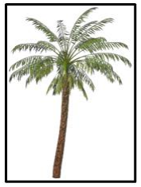

# 20.2 DrawingML - Picture

=== "中文"

    这些元素包含 DrawingML 框架内图片的定义。 虽然图片在很多方面与形状非常相似，但它们具有独特的特定属性，以便针对图片特定场景进行优化。 其中一些属性包括**填充行为**(Fill behavior)、**边框行为**(Border behavior)和**调整大小行为**(Resize behavior)。

=== "英文"

    These elements encompass the definition of pictures within the DrawingML framework. While pictures are in many ways very similar to shapes they have specific properties that are unique in order to optimize for picturespecific scenarios. Some of these properties include Fill behavior, Border behavior and Resize behavior.

## 20.2.1 目录

=== "中文"

    - [20.2.2 元素](#2022-元素)
        - [20.2.2.1 blipFill (图片填充)](#20221-blipfill-图片填充)
        - [20.2.2.2 cNvPicPr (非视觉绘图属性)](#20222-cnvpicpr-非视觉绘图属性)
        - [20.2.2.3 cNvPr (非可视绘图属性)](#20223-cnvpr-非可视绘图属性)
        - [20.2.2.4 nvPicPr (非视觉图片属性)](#20224-nvpicpr-非视觉图片属性)
        - [20.2.2.5 pic (图片)](#20225-pic-图片)
        - [20.2.2.6 spPr (形状属性)](#20226-sppr-形状属性)

=== "英文"

    **Table of Contents**

    **This subclause is informative.**
    
    - 20.2.2 Elements
      - 20.2.2.1 blipFill (Picture Fill)
      - 20.2.2.2 cNvPicPr (Non-Visual Picture Drawing Properties)
      - 20.2.2.3 cNvPr (Non-Visual Drawing Properties)
      - 20.2.2.4 nvPicPr (Non-Visual Picture Properties)
      - 20.2.2.5 pic (Picture)
      - 20.2.2.6 spPr (Shape Properties)

## 20.2.2 元素

=== "中文"

    以下部分定义了 DrawingML 框架的图片部分

=== "英文"

    **Elements**
    
    The following section defines the Picture portion of the DrawingML framework

### 20.2.2.1 blipFill (图片填充)

=== "中文"

    该元素指定图片对象具有的图片填充类型。 由于默认情况下图片已具有图片填充，因此可以为图片对象指定两种填充。 下面显示了一个示例。

    !!! info "Example"

        考虑下面应用了斑点填充的图片。 用于填充该图片对象的图像具有透明像素而不是白色像素。

        ```xml
        <pic:pic>
            …
            <pic:blipFill>
                <a:blip r:embed="rId2"/>
                    <a:stretch>
                        <a:fillRect/>
                    </a:stretch>
            </pic:blipFill>
            …
        </pic:pic>
        ```

        

        上面的图片对象显示为这种填充类型的示例。

    !!! info "Example"

        现在考虑相同的图片对象，但在图片的形状属性部分应用了额外的渐变填充。

        ```xml
        <pic:pic>
            …
            <pic:blipFill>
                <a:blip r:embed="rId2"/>
                <a:stretch>
                    <a:fillRect/>
                </a:stretch>
            </pic:blipFill>
            <pic:spPr>
                <a:gradFill>
                    <a:gsLst>
                        <a:gs pos="0">
                            <a:schemeClr val="tx2">
                                <a:shade val="50000"/>
                            </a:schemeClr>
                        </a:gs>
                        <a:gs pos="39999">
                            <a:schemeClr val="tx2">
                                <a:tint val="20000"/>
                            </a:schemeClr>
                        </a:gs>
                        <a:gs pos="70000">
                            <a:srgbClr val="C4D6EB"/>
                        </a:gs>
                        <a:gs pos="100000">
                            <a:schemeClr val="bg1"/>
                        </a:gs>
                    </a:gsLst>
                </a:gradFill>
            </pic:spPr>
            …
        </pic:pic>
        ```

        

    <table border=1>
        <thead>
            <tr>
                <th>**Attributes**</th>
                <th>**Description**</th>
            </tr>
        </thead>
        <tbody>
            <tr>
                <td>
                    dpi (DPI 设置)</br></br>
                    Namespace: http://purl.oclc.org/ooxml/drawingml/main
                </td>
                <td>
                    指定用于计算光点大小的 DPI（每英寸点数/dots per inch）。 如果不存在或为零，则使用 blip 中的 DPI.</br></br>
                    [Note: 该属性主要用于跟踪文档中的图片质量。 打印所需的质量水平与屏幕上查看的质量水平不同，因此需要跟踪此信息。 end note]</br></br>
                    此属性的可能值由 W3C XML 架构 unsignedInt 数据类型定义.
                </td>
            </tr>
            <tr>
                <td>
                    rotWithShape (随形状旋转)</br></br>
                    Namespace: http://purl.oclc.org/ooxml/drawingml/main
                </td>
                <td>
                    指定填充应随形状旋转。 也就是说，当已填充图片的形状和包含的形状（例如矩形）通过旋转进行变换时，填充也会以相同的旋转进行变换.</br></br>
                    该属性的可能值由 W3C XML Schema 布尔数据类型定义.
                </td>
            </tr>
        </tbody>
    </table>

    [Note: 该元素内容模型 (CT_BlipFillProperties) 的 W3C XML 架构定义位于 §A.4.1. end note]

=== "英文"

    **blipFill (Picture Fill)**

    This element specifies the type of picture fill that the picture object has. Because a picture has a picture fill already by default, it is possible to have two fills specified for a picture object. An example of this is shown below.

    !!! info "Example"

        Consider the picture below that has a blip fill applied to it. The image used to fill this picture object has transparent pixels instead of white pixels.

        ```xml
        <pic:pic>
            …
            <pic:blipFill>
                <a:blip r:embed="rId2"/>
                    <a:stretch>
                        <a:fillRect/>
                    </a:stretch>
            </pic:blipFill>
            …
        </pic:pic>
        ```

        

        The above picture object is shown as an example of this fill type.

    !!! info "Example"

        Consider now the same picture object but with an additional gradient fill applied within the shape properties portion of the picture.

        ```xml
        <pic:pic>
            …
            <pic:blipFill>
                <a:blip r:embed="rId2"/>
                <a:stretch>
                    <a:fillRect/>
                </a:stretch>
            </pic:blipFill>
            <pic:spPr>
                <a:gradFill>
                    <a:gsLst>
                        <a:gs pos="0">
                            <a:schemeClr val="tx2">
                                <a:shade val="50000"/>
                            </a:schemeClr>
                        </a:gs>
                        <a:gs pos="39999">
                            <a:schemeClr val="tx2">
                                <a:tint val="20000"/>
                            </a:schemeClr>
                        </a:gs>
                        <a:gs pos="70000">
                            <a:srgbClr val="C4D6EB"/>
                        </a:gs>
                        <a:gs pos="100000">
                            <a:schemeClr val="bg1"/>
                        </a:gs>
                    </a:gsLst>
                </a:gradFill>
            </pic:spPr>
            …
        </pic:pic>
        ```

        

    <table border=1>
        <thead>
            <tr>
                <th>**Attributes**</th>
                <th>**Description**</th>
            </tr>
        </thead>
        <tbody>
            <tr>
                <td>
                    dpi (DPI Setting)</br></br>
                    Namespace: http://purl.oclc.org/ooxml/drawingml/main
                </td>
                <td>
                    Specifies the DPI (dots per inch) used to calculate the size of the blip. If not present or zero, the DPI in the blip is used.</br></br>
                    [Note: This attribute is primarily used to keep track of the picture quality within a document. There are different levels of quality needed for print than on-screen viewing and thus a need to track this information. end note]</br></br>
                    The possible values for this attribute are defined by the W3C XML Schema unsignedInt datatype.
                </td>
            </tr>
            <tr>
                <td>
                    rotWithShape (Rotate With Shape)</br></br>
                    Namespace: http://purl.oclc.org/ooxml/drawingml/main
                </td>
                <td>
                    Specifies that the fill should rotate with the shape. That is, when the shape that has been filled with a picture and the containing shape (say a rectangle) is transformed with a rotation then the fill is transformed with the same rotation.</br></br>
                    The possible values for this attribute are defined by the W3C XML Schema boolean datatype.
                </td>
            </tr>
        </tbody>
    </table>

    [Note: The W3C XML Schema definition of this element’s content model (CT_BlipFillProperties) is located in §A.4.1. end note]

### 20.2.2.2 cNvPicPr (非视觉绘图属性)

=== "中文"

    该元素指定图片画布的非视觉属性。 生成应用程序将使用这些属性来确定如何更改所讨论的图片对象的某些属性。

    !!! info "Example"

        Consider the following DrawingML.

        ```xml
        <pic:pic>
            …
            <pic:nvPicPr>
                <pic:cNvPr id="4" name="Lilly.jpg"/>
                <pic:cNvPicPr>
                    <a:picLocks noChangeAspect="1"/>
                </p:cNvPicPr>
                <pic:nvPr/>
            </pic:nvPicPr>
            …
        </pic:pic>
        ```

    <table border=1>
        <thead>
            <tr>
                <th>**Attributes**</th>
                <th>**Description**</th>
            </tr>
        </thead>
        <tbody>
            <tr>
                <td>
                    preferRelativeResize (首选相对调整大小)</br></br>
                    Namespace: http://purl.oclc.org/ooxml/drawingml/main
                </td>
                <td>
                    指定用户界面是否应根据图片的当前大小或其原始大小显示图片的大小调整。 如果此属性设置为 true，则缩放相对于原始图片大小而不是当前图片大小.</br></br>
                    [Example: 考虑这样的情况：文档中的图片大小已调整，现在是原始插入图片大小的 50%。 现在，如果用户选择稍后在生成应用程序中调整该图片的大小，则应检查该属性的值.</br></br>
                    如果此属性设置为 true，则显示值 50%。 同样，如果此属性设置为 false，则应显示 100% 的值，因为图片尚未从其当前（较小）尺寸调整大小. end example]</br></br>
                    该属性的可能值由 W3C XML Schema 布尔数据类型定义.
                </td>
            </tr>
        </tbody>
    </table>

    [Note: 该元素内容模型 (CT_NonVisualPictureProperties) 的 W3C XML 架构定义位于 §A.4.1. end note]

=== "英文"

    **cNvPicPr (Non-Visual Picture Drawing Properties)**

    This element specifies the non-visual properties for the picture canvas. These properties are to be used by the generating application to determine how certain properties are to be changed for the picture object in question.

    !!! info "Example"

        Consider the following DrawingML.

        ```xml
        <pic:pic>
            …
            <pic:nvPicPr>
                <pic:cNvPr id="4" name="Lilly.jpg"/>
                <pic:cNvPicPr>
                    <a:picLocks noChangeAspect="1"/>
                </p:cNvPicPr>
                <pic:nvPr/>
            </pic:nvPicPr>
            …
        </pic:pic>
        ```

    <table border=1>
        <thead>
            <tr>
                <th>**Attributes**</th>
                <th>**Description**</th>
            </tr>
        </thead>
        <tbody>
            <tr>
                <td>
                    preferRelativeResize (Relative Resize Preferred)</br></br>
                    Namespace: http://purl.oclc.org/ooxml/drawingml/main
                </td>
                <td>
                    Specifies if the user interface should show the resizing of the picture based on the picture's current size or its original size. If this attribute is set to true, then scaling is relative to the original picture size as opposed to the current picture size.</br></br>
                    [Example: Consider the case where a picture has been resized within a document and is now 50% of the originally inserted picture size. Now if the user chooses to make a later adjustment to the size of this picture within the generating application, then the value of this attribute should be checked.</br></br>
                    If this attribute is set to true then a value of 50% is shown. Similarly, if this attribute is set to false, then a value of 100% should be shown because the picture has not yet been resized from its current (smaller) size. end example]</br></br>
                    The possible values for this attribute are defined by the W3C XML Schema boolean datatype.
                </td>
            </tr>
        </tbody>
    </table>

    [Note: The W3C XML Schema definition of this element’s content model (CT_NonVisualPictureProperties) is located in §A.4.1. end note]

### 20.2.2.3 cNvPr (非可视绘图属性)

=== "中文"

    该元素指定非可视画布属性。 这允许存储不影响图片外观的附加信息。

    !!! info "Example"

        考虑以下 DrawingML。

        ```xml
        <pic:pic>
            …
            <pic:nvPicPr>
                <p:cNvPr id="4" name="Lilly.jpg"/>
            </pic:nvPicPr>
            …
        </pic:pic>
        ```

    <table border=1>
        <thead>
            <tr>
                <th>**Attributes**</th>
                <th>**Description**</th>
            </tr>
        </thead>
        <tbody>
            <tr>
                <td>
                    descr (对象的替代文本)</br></br>
                    Namespace: http://purl.oclc.org/ooxml/drawingml/main
                </td>
                <td>
                    指定当前 DrawingML 对象的替代文本，供不显示当前对象的辅助技术或应用程序使用.</br></br>
                    如果省略此元素，则父对象不存在替代文本.</br></br>
                    [Example: 考虑定义如下的 DrawingML 对象:</br></br>
                    `<… descr="A picture of a bowl of fruit">`</br></br>
                    descr 属性包含可替代实际 DrawingML 对象的替代文本. end example]</br></br>
                    此属性的可能值由 W3C XML 架构字符串数据类型定义。
                </td>
            </tr>
            <tr>
                <td>
                    hidden (隐藏)</br></br>
                    Namespace: http://purl.oclc.org/ooxml/drawingml/main
                </td>
                <td>
                    指定是否显示此 DrawingML 对象。 当 DrawingML 对象在文档中显示时，该对象可以被隐藏（即存在，但不可见）。 该属性决定对象是渲染还是隐藏. [Note: 应用程序可以具有允许查看该对象的设置. end note].</br></br>
                    [Example: 考虑一个必须隐藏在文档内容中的内联 DrawingML 对象。 该设置将指定如下:</br></br>
                    `<… hidden="true" />`</br></br>
                    hide 属性的值为 true，它指定 DrawingML 对象是隐藏的，并且在显示文档时不显示. end example]</br></br>
                    该属性的可能值由 W3C XML Schema 布尔数据类型定义.
                </td>
            </tr>
            <tr>
                <td>
                    id (唯一标识符)</br></br>
                    Namespace: http://purl.oclc.org/ooxml/drawingml/main
                </td>
                <td>
                    指定当前文档中当前 DrawingML 对象的唯一标识符。 该 ID 可用于帮助唯一标识该对象，以便文档的其他部分可以引用它.</br></br>
                    如果同一文档中的多个对象共享相同的 id 属性值，则该文档应被视为不合格.</br></br>
                    [Example: 考虑定义如下的 DrawingML 对象:</br></br>
                    `<… id="10" … >`</br></br>
                    id 属性的值为 10，这是此 DrawingML 对象的唯一标识符. end example]</br></br>
                    该属性的可能值由 ST_DrawingElementId 简单类型定义 (§20.1.10.21).
                </td>
            </tr>
            <tr>
                <td>
                    name (名称)</br></br>
                    Namespace: http://purl.oclc.org/ooxml/drawingml/main
                </td>
                <td>
                    指定对象的名称. [Note: 通常，这用于存储图片对象的原始文件名. end note].</br></br>
                    [Example: 考虑定义如下的 DrawingML 对象:</br></br>
                    `< … name="foo.jpg" >`</br></br>
                    name 属性的值为 foo.jpg，这是此 DrawingML 对象的名称. end example]</br></br>
                    此属性的可能值由 W3C XML 架构字符串数据类型定义.
                </td>
            </tr>
            <tr>
                <td>
                    title (标题)</br></br>
                    Namespace: http://purl.oclc.org/ooxml/drawingml/main
                </td>
                <td>
                    指定当前 DrawingML 对象的标题 (caption).</br></br>
                    如果省略此属性，则父对象不存在标题文本.</br></br>
                    [Example: 考虑定义如下的 DrawingML 对象:</br></br>
                    `<… title="Process Flow Diagram">`</br></br>
                    end example]</br></br>
                    此属性的可能值由 W3C XML 架构字符串数据类型定义.
                </td>
            </tr>
        </tbody>
    </table>

    [Note: 该元素内容模型 (CT_NonVisualDrawingProps) 的 W3C XML 架构定义位于 §A.4.1 中。 end note]

=== "英文"

    **cNvPr (Non-Visual Drawing Properties)**

    This element specifies non-visual canvas properties. This allows for additional information that does not affect the appearance of the picture to be stored.

    !!! info "Example"

        Consider the following DrawingML.

        ```xml
        <pic:pic>
            …
            <pic:nvPicPr>
                <p:cNvPr id="4" name="Lilly.jpg"/>
            </pic:nvPicPr>
            …
        </pic:pic>
        ```

    <table border=1>
        <thead>
            <tr>
                <th>**Attributes**</th>
                <th>**Description**</th>
            </tr>
        </thead>
        <tbody>
            <tr>
                <td>
                    descr (Alternative Text for Object)</br></br>
                    Namespace: http://purl.oclc.org/ooxml/drawingml/main
                </td>
                <td>
                    Specifies alternative text for the current DrawingML object, for use by assistive technologies or applications which do not display the current object.</br></br>
                    If this element is omitted, then no alternative text is present for the parent object.</br></br>
                    [Example: Consider a DrawingML object defined as follows:</br></br>
                    `<… descr="A picture of a bowl of fruit">`</br></br>
                    The descr attribute contains alternative text which can be used in place of the actual DrawingML object. end example]</br></br>
                    The possible values for this attribute are defined by the W3C XML Schema string datatype.
                </td>
            </tr>
            <tr>
                <td>
                    hidden (Hidden)</br></br>
                    Namespace: http://purl.oclc.org/ooxml/drawingml/main
                </td>
                <td>
                    Specifies whether this DrawingML object is displayed. When a DrawingML object is displayed within a document, that object can be hidden (i.e., present, but not visible). This attribute determines whether the object is rendered or made hidden. [Note: An application can have settings which allow this object to be viewed. end note].</br></br>
                    [Example: Consider an inline DrawingML object which must be hidden within the document's content. This setting would be specified as follows:</br></br>
                    `<… hidden="true" />`</br></br>
                    The hidden attribute has a value of true, which specifies that the DrawingML object is hidden and not displayed when the document is displayed. end example]</br></br>
                    The possible values for this attribute are defined by the W3C XML Schema boolean datatype.
                </td>
            </tr>
            <tr>
                <td>
                    id (Unique Identifier)</br></br>
                    Namespace: http://purl.oclc.org/ooxml/drawingml/main
                </td>
                <td>
                    Specifies a unique identifier for the current DrawingML object within the current document. This ID can be used to assist in uniquely identifying this object so that it can be referred to by other parts of the document.</br></br>
                    If multiple objects within the same document share the same id attribute value, then the document shall be considered non-conformant.</br></br>
                    [Example: Consider a DrawingML object defined as follows:</br></br>
                    `<… id="10" … >`</br></br>
                    The id attribute has a value of 10, which is the unique identifier for this DrawingML object. end example]</br></br>
                    The possible values for this attribute are defined by the ST_DrawingElementId simple type (§20.1.10.21).
                </td>
            </tr>
            <tr>
                <td>
                    name (Name)</br></br>
                    Namespace: http://purl.oclc.org/ooxml/drawingml/main
                </td>
                <td>
                    Specifies the name of the object. [Note: Typically, this is used to store the original file name of a picture object. end note].</br></br>
                    [Example: Consider a DrawingML object defined as follows:</br></br>
                    `< … name="foo.jpg" >`</br></br>
                    The name attribute has a value of foo.jpg, which is the name of this DrawingML object. end example]</br></br>
                    The possible values for this attribute are defined by the W3C XML Schema string datatype.
                </td>
            </tr>
            <tr>
                <td>
                    title (Title)</br></br>
                    Namespace: http://purl.oclc.org/ooxml/drawingml/main
                </td>
                <td>
                    Specifies the title (caption) of the current DrawingML object.</br></br>
                    If this attribute is omitted, then no title text is present for the parent object.</br></br>
                    [Example: Consider a DrawingML object defined as follows:</br></br>
                    `<… title="Process Flow Diagram">`</br></br>
                    end example]</br></br>
                    The possible values for this attribute are defined by the W3C XML Schema string datatype.
                </td>
            </tr>
        </tbody>
    </table>

    [Note: The W3C XML Schema definition of this element’s content model (CT_NonVisualDrawingProps) is located in §A.4.1. end note]

### 20.2.2.4 nvPicPr (非视觉图片属性)

=== "中文"

    该元素指定图片的非视觉属性。 这允许存储不影响图片外观的附加信息。

    !!! info "Example"

        考虑以下 DrawingML。

        ```xml
        <pic:pic>
            …
            <pic:nvPicPr>
            …
            </pic:nvPicPr>
            …
        </pic:pic>
        ```
    
    [Note: 该元素内容模型 (CT_PictureNonVisual) 的 W3C XML 架构定义位于 §A.4.2 中。 end note]

=== "英文"

    **nvPicPr (Non-Visual Picture Properties)**

    This element specifies the non visual properties for a picture. This allows for additional information that does not affect the appearance of the picture to be stored.

    !!! info "Example"

        Consider the following DrawingML.

        ```xml
        <pic:pic>
            …
            <pic:nvPicPr>
            …
            </pic:nvPicPr>
            …
        </pic:pic>
        ```
    
    [Note: The W3C XML Schema definition of this element’s content model (CT_PictureNonVisual) is located in §A.4.2. end note]

### 20.2.2.5 pic (图片)

=== "中文"

    该元素指定文档中是否存在图片对象。

    !!! info "Example"

        考虑以下 DrawingML，它指定文档中是否存在图片。 该图片可以具有非视觉属性、图片填充以及附加的形状属性。

        ```xml
        <pic:pic>
            <pic:nvPicPr>
                <pic:cNvPr id="4" name="lake.JPG" descr="Picture of a Lake" />
                <pic:cNvPicPr>
                    <a:picLocks noChangeAspect="1"/>
                </pic:cNvPicPr>
                <pic:nvPr/>
            </pic:nvPicPr>
            <pic:blipFill>
            …
            </pic:blipFill>
            <pic:spPr>
            …
            </pic:spPr>
        </pic:pic>
        ```

    [Note: 该元素内容模型 (CT_Picture) 的 W3C XML 模式定义位于 §A.4.2 中。 end note]

=== "英文"

    **pic (Picture)**

    This element specifies the existence of a picture object within the document.

    !!! info "Example"

        Consider the following DrawingML that specifies the existence of a picture within a document. This picture can have non-visual properties, a picture fill as well as shape properties attached to it.

        ```xml
        <pic:pic>
            <pic:nvPicPr>
                <pic:cNvPr id="4" name="lake.JPG" descr="Picture of a Lake" />
                <pic:cNvPicPr>
                    <a:picLocks noChangeAspect="1"/>
                </pic:cNvPicPr>
                <pic:nvPr/>
            </pic:nvPicPr>
            <pic:blipFill>
            …
            </pic:blipFill>
            <pic:spPr>
            …
            </pic:spPr>
        </pic:pic>
        ```

    [Note: The W3C XML Schema definition of this element’s content model (CT_Picture) is located in §A.4.2. end note]

### 20.2.2.6 spPr (形状属性)

=== "中文"

    该元素指定可应用于图片的视觉形状属性。 这些属性与允许描述形状的视觉属性相同，但在这里用于描述文档中图片的视觉外观。 这允许图片同时具有形状的属性以及 pic 元素下允许的图片特定属性。

    <table border=1>
        <thead>
            <tr>
                <th>**Attributes**</th>
                <th>**Description**</th>
            </tr>
        </thead>
        <tbody>
            <tr>
                <td>
                    bwMode (黑白模式)</br></br>
                    Namespace: http://purl.oclc.org/ooxml/drawingml/main
                </td>
                <td>
                    指定仅使用黑白颜色渲染图片。 即渲染图片时应将图片的颜色信息转换为黑色或白色.</br></br>
                    渲染该图像时不使用灰色，仅使用纯黑和纯白.</br></br>
                    [Note: 这并不意味着存储在文件中的图片本身一定是黑白图片。 该属性设置渲染时图片所应用的渲染模式. end note]</br></br>
                    该属性的可能值由 ST_BlackWhiteMode 简单类型定义 (§20.1.10.10).
                </td>
            </tr>
        </tbody>
    </table>
    
    [Note: 该元素内容模型 (CT_ShapeProperties) 的 W3C XML 架构定义位于 §A.4.1. end note]

=== "英文"

    **spPr (Shape Properties)**

    This element specifies the visual shape properties that can be applied to a picture. These are the same properties that are allowed to describe the visual properties of a shape but are used here to describe the visual appearance of a picture within a document. This allows for a picture to have both the properties of a shape as well as picture specific properties that are allowed under the pic element.

    <table border=1>
        <thead>
            <tr>
                <th>**Attributes**</th>
                <th>**Description**</th>
            </tr>
        </thead>
        <tbody>
            <tr>
                <td>
                    bwMode (Black and White Mode)</br></br>
                    Namespace: http://purl.oclc.org/ooxml/drawingml/main
                </td>
                <td>
                    Specifies that the picture should be rendered using only black and white coloring. That is the coloring information for the picture should be converted to either black or white when rendering the picture.</br></br>
                    No gray is to be used in rendering this image, only stark black and stark white.</br></br>
                    [Note: This does not mean that the picture itself that is stored within the file is necessarily a black and white picture. This attribute instead sets the rendering mode that the picture has applied to when rendering. end note]</br></br>
                    The possible values for this attribute are defined by the ST_BlackWhiteMode simple type (§20.1.10.10).
                </td>
            </tr>
        </tbody>
    </table>
    
    [Note: The W3C XML Schema definition of this element’s content model (CT_ShapeProperties) is located in §A.4.1. end note]
