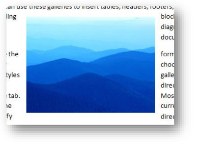
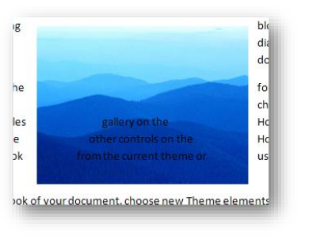
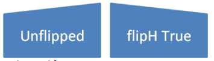
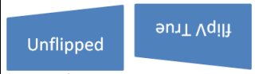

# 20.4 DrawingML - WordprocessingML Drawing

=== "中文"

    在 WordprocessingML 文档中，可以包含图形 DrawingML 对象：

    - Pictures ([§20.2])
    - Locked Canvases ([§20.3])
    - Diagrams ([§21.4])
    - Charts ([§21.2])
    
    当这些对象出现在文字处理文档中时，有必要包括指定这些对象相对于分页文档如何定位的信息。 [例如: 对象是否与文本对齐显示。 ]

    WordprocessingML Drawing 命名空间发挥此功能，指定在字处理文档中锚定和显示 DrawingML 对象所需的所有信息。

    !!! info "例如"
    
        考虑一张 DrawingML 图片，该图片必须显示在其出现的打印页面的中心，并根据需要修改文本流。 该对象将指定如下：

        ```xml
        <w:r>
            <w:drawing>
                <wp:anchor relativeHeight="10" allowOverlap="true">
                    <wp:positionH relativeFrom="margin">
                        <wp:align>center</wp:align>
                    </wp:positionH>
                    <wp:positionV relativeFrom="margin">
                        <wp:align>center</wp:align>
                    </wp:positionV>
                    <wp:extent cx="2441542" cy="1828800"/>
                    <wp:wrapSquare wrapText="bothSides"/>
                    <a:graphic>
                    …
                    </a:graphic>
                </wp:anchor>
            </w:drawing>
        </w:r>
        ```
    
        锚元素 ([§20.4.2.3]) 指定该对象不与文本对齐，其子元素指定该对象在页面上水平和垂直居中 ([§20.4.2.10]; [§20.4 .2.11]），并且该文本可以围绕它形成一个正方形（[§20.4.2.17]）。

=== "英文"

    **DrawingML - WordprocessingML Drawing**

    Within a WordprocessingML document, it is possible to include graphical DrawingML objects:

    - Pictures ([§20.2])
    - Locked Canvases ([§20.3])
    - Diagrams ([§21.4])
    - Charts ([§21.2])
    
    When these objects are present in a word processing document, it is necessary to include information which specifies how the objects shall be positioned relative to the paginated document. [Example: Whether the object is displayed in line with text. end example]

    The WordprocessingML Drawing namespace acts in this capacity, specifying all information necessary to anchor and display DrawingML objects within a word processing document

    [Example: Consider a DrawingML picture which must be displayed in the center of the printed page on which it appears, modifying the flow of text as necessary. This object would be specified as follows:
    
    ```xml
    <w:r>
        <w:drawing>
            <wp:anchor relativeHeight="10" allowOverlap="true">
                <wp:positionH relativeFrom="margin">
                    <wp:align>center</wp:align>
                </wp:positionH>
                <wp:positionV relativeFrom="margin">
                    <wp:align>center</wp:align>
                </wp:positionV>
                <wp:extent cx="2441542" cy="1828800"/>
                <wp:wrapSquare wrapText="bothSides"/>
                <a:graphic>
                …
                </a:graphic>
            </wp:anchor>
        </w:drawing>
    </w:r>
    ```
    
    The anchor element ([§20.4.2.3]) specifies that this object is not positioned in line with text, and its child elements specify that the object is centered on the page horizontally and vertically ([§20.4.2.10]; [§20.4.2.11]), and that text can wrap around it in a square ([§20.4.2.17]). end example]

## 20.4.1 目录

- [20.4 DrawingML - WordprocessingML Drawing](#204-drawingml---wordprocessingml-drawing)
    - [20.4.1 目录](#2041-目录)
    - [20.4.2 元素](#2042-元素)
        - [20.4.2.1 align (相对水平对齐)](#20421-align-相对水平对齐)
        - [20.4.2.2 align (相对垂直对齐)](#20422-align-相对垂直对齐)
        - [20.4.2.3 anchor (浮动 DrawingML 对象的锚点)](#20423-anchor-浮动-drawingml-对象的锚点)
        - [20.4.2.4 cNvGraphicFramePr (常见 DrawingML 非可视属性)](#20424-cnvgraphicframepr-常见-drawingml-非可视属性)
        - [20.4.2.5 docPr (绘图对象非可视属性)](#20425-docpr-绘图对象非可视属性)
        - [20.4.2.6 effectExtent (对象范围（包括效果）)](#20426-effectextent-对象范围包括效果)
        - [20.4.2.7 extent (绘图对象尺寸)](#20427-extent-绘图对象尺寸)
        - [20.4.2.8 inline (内联DrawingML对象)](#20428-inline-内联drawingml对象)
        - [20.4.2.9 lineTo (包裹多边形线结束位置)](#20429-lineto-包裹多边形线结束位置)
        - [20.4.2.10 positionH (水平定位)](#204210-positionh-水平定位)
        - [20.4.2.11 positionV (垂直定位)](#204211-positionv-垂直定位)
        - [20.4.2.12 posOffset (绝对位置偏移)](#204212-posoffset-绝对位置偏移)
        - [20.4.2.13 simplePos (简单定位坐标)](#204213-simplepos-简单定位坐标)
        - [20.4.2.14 start (环绕多边形起点)](#204214-start-环绕多边形起点)
        - [20.4.2.15 wrapNone (无文字环绕)](#204215-wrapnone-无文字环绕)
        - [20.4.2.16 wrapPolygon (环绕多边形)](#204216-wrappolygon-环绕多边形)
        - [20.4.2.17 wrapSquare (方形环绕)](#204217-wrapsquare-方形环绕)
        - [20.4.2.18 wrapThrough (Through 环绕)](#204218-wrapthrough-through-环绕)
        - [20.4.2.19 wrapTight (Tight 环绕)](#204219-wraptight-tight-环绕)
        - [20.4.2.20 wrapTopAndBottom (顶部和底部包装)](#204220-wraptopandbottom-顶部和底部包装)
        - [20.4.2.21 bg (背景格式)](#204221-bg-背景格式)
        - [20.4.2.22 bodyPr (正文格式)](#204222-bodypr-正文格式)
        - [20.4.2.23 cNvCnPr (非可视连接器形状绘图属性)](#204223-cnvcnpr-非可视连接器形状绘图属性)
        - [20.4.2.24 cNvContentPartPr (非视觉内容零件绘图属性)](#204224-cnvcontentpartpr-非视觉内容零件绘图属性)
        - [20.4.2.25 cNvFrPr (非可视图形框架绘图属性)](#204225-cnvfrpr-非可视图形框架绘图属性)
        - [20.4.2.26 cNvGrpSpPr (非可视组形状绘图属性)](#204226-cnvgrpsppr-非可视组形状绘图属性)
        - [20.4.2.27 cNvPr (非可视绘图属性)](#204227-cnvpr-非可视绘图属性)
        - [20.4.2.28 cNvSpPr (形状的非可视绘图属性)](#204228-cnvsppr-形状的非可视绘图属性)
        - [20.4.2.29 contentPart (内容部件)](#204229-contentpart-内容部件)
        - [20.4.2.30 extLst (扩展列表)](#204230-extlst-扩展列表)
        - [20.4.2.31 graphicFrame (绘制对象容器)](#204231-graphicframe-绘制对象容器)
        - [20.4.2.32 grpSp (组合形状)](#204232-grpsp-组合形状)
        - [20.4.2.33 grpSpPr (组合形状属性)](#204233-grpsppr-组合形状属性)
        - [20.4.2.34 linkedTxbx (形状的文字内容)](#204234-linkedtxbx-形状的文字内容)
        - [20.4.2.35 spPr (形状属性)](#204235-sppr-形状属性)
        - [20.4.2.36 style (形状样式)](#204236-style-形状样式)
        - [20.4.2.37 txbx (形状的文字内容)](#204237-txbx-形状的文字内容)
        - [20.4.2.38 txbxContent (富文本框内容容器)](#204238-txbxcontent-富文本框内容容器)
        - [20.4.2.39 wgp (WordprocessingML 形状组合)](#204239-wgp-wordprocessingml-形状组合)
        - [20.4.2.40 whole (整个E2O格式)](#204240-whole-整个e2o格式)
        - [20.4.2.41 wpc (WordprocessingML Drawing Canvas)](#204241-wpc-wordprocessingml-drawing-canvas)
        - [20.4.2.42 wsp (WordprocessingML 形状)](#204242-wsp-wordprocessingml-形状)
        - [20.4.2.43 xfrm (图形框架的2D变换)](#204243-xfrm-图形框架的2d变换)
    - [20.4.3 简单类型](#2043-简单类型)
        - [20.4.3.1 ST\_AlignH (相对水平对齐位置)](#20431-st_alignh-相对水平对齐位置)
        - [20.4.3.2 ST\_AlignV (垂直对齐定义)](#20432-st_alignv-垂直对齐定义)
        - [20.4.3.3 ST\_PositionOffset (绝对位置偏置值)](#20433-st_positionoffset-绝对位置偏置值)
        - [20.4.3.4 ST\_RelFromH (水平相对位置)](#20434-st_relfromh-水平相对位置)
        - [20.4.3.5 ST\_RelFromV (垂直相对定位)](#20435-st_relfromv-垂直相对定位)
        - [20.4.3.6 ST\_WrapDistance (文本偏移距离)](#20436-st_wrapdistance-文本偏移距离)
        - [20.4.3.7 ST\_WrapText (文本环绕位置设置)](#20437-st_wraptext-文本环绕位置设置)


## 20.4.2 元素

**Elements**

=== "中文"

    以下元素定义 WordprocessingML Drawing 命名空间的内容：

=== "英文"

    The following elements define the contents of the WordprocessingML Drawing namespace:

### 20.4.2.1 align (相对水平对齐)

**align (Relative Horizontal Alignment)**

=== "中文"

    该元素指定了绘图对象相对于由父元素定义的水平对齐基准的水平对齐方式。一旦对齐基准被定义，该元素将确定绘图对象相对于该位置的对齐方式。
    
    【示例：考虑一个在 WordprocessingML 文档中的图片，已经相对于页面边缘对齐 - 水平方向上相对于页面的左侧，垂直方向上相对于页面的顶部。此对齐将如下所示：
    
    ```xml
    <wp:anchor … >
        <wp:positionH relativeFrom="page">
            <wp:align>left</wp:align>
        </wp:positionH>
        …
    </wp:anchor>
    ```
    
    具有值 left 的 align 元素指定了相对于父元素定义的水平定位（在本例中，相对于页面的定位）时，图片必须与页面的左边缘对齐。示例结束】
    
    该元素的可能值由 ST_AlignH 简单类型定义([§20.4.3.1])。
    
    【注意：此元素内容模型（ST_AlignH）的 W3C XML Schema 定义位于 §A.4.4。结束】

=== "英文"

    This element specifies how a DrawingML object shall be horizontally aligned relative to the horizontal alignment base defined by the parent element. Once an alignment base is defined, this element shall determine how the DrawingML object shall be aligned relative to that location.
    
    [Example: Consider a picture in a WordprocessingML document which has been aligned relative to the edge of the page - the left of the page horizontally, and the top of the page vertically. This alignment would be specified as follows:
    
    ```xml
    <wp:anchor … >
        <wp:positionH relativeFrom="page">
            <wp:align>left</wp:align>
        </wp:positionH>
        …
    </wp:anchor>
    ```
    
    
    The align element with a value of left specifies that for the horizontal positioning defined by the parent element (in this case, positioning relative to the page), the picture must be aligned to the left edge of the page. end example]
    
    The possible values for this element are defined by the ST_AlignH simple type ([§20.4.3.1]).
    
    [Note: The W3C XML Schema definition of this element’s content model (ST_AlignH) is located in §A.4.4. end note]

### 20.4.2.2 align (相对垂直对齐)

**align (Relative Vertical Alignment)**

=== "中文"

    该元素指定了绘图对象相对于由父元素定义的垂直对齐基准的垂直对齐方式。一旦对齐基准被定义，该元素将确定绘图对象相对于该位置的对齐方式。
    
    【示例：考虑一个在 WordprocessingML 文档中的图片，已经相对于页面边缘对齐 - 水平方向上相对于页面的左侧，垂直方向上相对于页面的顶部。此对齐将如下所示：
    
    ```xml
    <wp:anchor … >
        <wp:positionV relativeFrom="page">
            <wp:align>top</wp:align>
        </wp:positionH>
        …
    </wp:anchor>
    ```

    具有值 top 的 align 元素指定了相对于父元素定义的垂直定位（在本例中，相对于页面的定位）时，图片必须与页面的顶部边缘对齐。示例结束】
    
    该元素的可能值由 ST_AlignV 简单类型定义([§20.4.3.2])。
    
    【注意：此元素内容模型（ST_AlignV）的 W3C XML Schema 定义位于 §A.4.4。结束】

=== "英文"

    This element specifies how a DrawingML object shall be vertically aligned relative to the vertical alignment base defined by the parent element. Once an alignment base is defined, this element shall determine how the DrawingML object shall be aligned relative to that location.
    
    [Example: Consider a picture in a WordprocessingML document which has been aligned relative to the edge of the page - the left of the page horizontally, and the top of the page vertically. This alignment would be specified as follows:
    
    <wp:anchor … >
    <wp:positionV relativeFrom="page">
    <wp:align>top</wp:align>
    </wp:positionH>
    …
    </wp:anchor>
    
    The align element with a value of top specifies that for the vertical positioning defined by the parent element (in this case, positioning relative to the page), the picture must be aligned to the top edge of the page. end example]
    
    The possible values for this element are defined by the ST_AlignV simple type ([§20.4.3.2]).
    
    [Note: The W3C XML Schema definition of this element’s content model (ST_AlignV) is located in §A.4.4. end note]

### 20.4.2.3 anchor (浮动 DrawingML 对象的锚点)

**anchor (Anchor for Floating DrawingML Object)**

=== "中文"

    此元素指定文档中位于此位置的DrawingML对象为浮动对象。在WordprocessingML文档中，绘图对象可以存在两种状态：
    
    - 内联 - 绘图对象与文本一起排列，并影响其所在行的行高和布局（类似于字符字形的大小）。
    - 浮动 - 绘图对象在文本中锚定，但可以相对于页面进行绝对定位。
    
    当此元素封装DrawingML对象的信息时，所有子元素都应指定此对象作为浮动对象在页面上的定位。
    
    [示例：考虑一个WordprocessingML文档，其中浮动DrawingML对象的锚点必须是段落中的第一个运行内容。该段落的内容应按以下方式指定：
    
    ```xml
    <w:p>
        <w:r>
            <w:drawing>
                <wp:anchor … >
                …
                </wp:anchor>
            </w:drawing>
        </w:r>
    </w:p>
    ```
    
    当锚点元素作为绘图元素的子元素出现时，指定该DrawingML对象必须根据其子元素的值作为浮动对象进行定位。示例结束]
    
    ??? abstract "属性"
    
        **allowOverlap**（允许重叠）
        
        :   指定显示时与另一DrawingML对象相交的DrawingML对象是否允许重叠另一对象的内容。如果一个DrawingML对象不允许与其他DrawingML对象重叠，那么在显示时必须根据需要重新定位以避免重叠。
        
            [示例：考虑一个文档中有两个DrawingML对象，允许彼此重叠。在每个对象的锚定标记内部，应指定如下内容：
       
            ```xml
            <wp:anchor allowOverlap="true" … >
            …
            </wp:anchor>
            ```

            allowOverlap属性的值为true，指定此对象在文档中显示时必须允许与其他对象重叠。结束示例]
            
            此属性的可能值由W3C XML Schema布尔数据类型定义。
        
        
        **behindDoc**（显示在文档文字后面）
        
        :   指定当文档显示时，此浮动的DrawingML对象是否显示在文档文字的后面。当一个DrawingML对象显示在WordprocessingML文档中时，该对象可以与文档中的文字相交。该属性确定在重叠情况下文本或对象的呈现顺序。
            
            [示例：考虑一个浮动的DrawingML对象，它必须显示在文档内容中与其相交的任何文字之上。应设置如下内容：
            
            ```xml
            <wp:anchor behindDoc="false" … >
                …
            </wp:anchor>
            ```

            
            behindDoc属性的值为false，指定该DrawingML对象在文档中显示时显示在文本的上方。结束示例]
        
            此属性的可能值由W3C XML Schema布尔数据类型定义。
    
        **distB**（距离底部文本的距离）
        
        :   指定在显示此绘图对象时，该对象的底部边缘与文档中任何后续文本之间应保持的最小距离。
        
            距离以EMU（英制度量单位）为单位进行测量。
            
            如果此对象是内联对象（即具有内联父元素），则在与文本一起显示对象时，此值不会产生任何效果，但如果对象随后更改为浮动，则可以保持和使用此值。如果作为子元素存在的包装元素[示例：wrapThrough或wrapSquare示例结束]也具有距离文本，则应忽略此值。
            
            [示例：考虑一个浮动的DrawingML对象，其底部边缘与最近的文本之间必须有半英寸的填充。可以如下指定此设置：
            
            ```xml
            <wp:anchor distB="457200" … >
            …
            </wp:anchor>
            ```
            
            distB属性指定填充距离必须为457200 EMU或半英寸。示例结束]
            
            此属性的可能值由ST_WrapDistance简单类型（[§20.4.3.6]）定义。
    
        **distL**（距离左侧文本的距离）
        
        :   指定在显示此绘图对象时，该对象的左边缘与文档中任何后续文本之间应保持的最小距离。
        
            距离以EMU（英制度量单位）为单位进行测量。
            
            如果此对象是内联对象（即具有内联父元素），则在与文本一起显示对象时，此值不会产生任何效果，但如果对象随后更改为浮动，则可以保持和使用此值。如果作为子元素存在的包装元素[示例：wrapThrough或wrapSquare示例结束]也具有距离文本，则应忽略此值。
            
            [示例：考虑一个浮动的DrawingML对象，其左边缘与最近的文本之间必须有四分之一英寸的填充。可以如下指定此设置：
            
            ```xml
            <wp:anchor distL="228600" … >
            …
            </wp:anchor>
            ```
            
            distL属性指定填充距离必须为228600 EMU或四分之一英寸。示例结束]
            
            此属性的可能值由ST_WrapDistance简单类型（[§20.4.3.6]）定义。
    
        **distR**（距离右侧文本的距离）
        
        :   指定在文档内容中显示该绘图对象时，该对象的右边缘与文档中任何后续文本之间必须保持的最小距离。
        
            距离以EMUs（英语度量单位）进行测量。
            
            如果此对象是内联对象（即具有内联父元素），则当将对象与文本一起显示时，此值不会产生任何效果，但是如果随后将对象更改为浮动对象，则此值可以得到保持和使用。如果作为子元素存在的包装元素[示例：wrapThrough或wrapSquare结束示例]也具有与文本的距离，则该值将被忽略。
        
            [示例：考虑一个浮动的DrawingML对象，其右边缘和最近文本之间必须有四分之一英寸的填充。指定此设置如下所示：
        
            ```xml
            <wp:anchor distR="228600" … >
            …
            </wp:anchor>
            ```
        
            distR属性指定填充距离必须为228600 EMUs或四分之一英寸。结束示例]
            
            此属性的可能值由ST_WrapDistance简单类型（[§20.4.3.6]）定义。
        
        **distT**（距离顶部文本的距离）
        
        :   指定在文档内容中显示该绘图对象时，该对象的顶部边缘与文档中任何后续文本之间必须保持的最小距离。
        
            距离以EMUs（英语度量单位）进行测量。
            
            如果此对象是内联对象（即具有内联父元素），则当将对象与文本一起显示时，此值不会产生任何效果，但是如果随后将对象更改为浮动对象，则此值可以得到保持和使用。如果作为子元素存在的包装元素[示例：wrapThrough或wrapSquare结束示例]也具有与文本的距离，则该值将被忽略。
        
            [示例：考虑一个浮动的DrawingML对象，其顶部边缘和最近文本之间必须有半英寸的填充。指定此设置如下所示：
        
            ```xml
            <wp:anchor distT="457200" … >
            …
            </wp:anchor>
            ```
        
            distT属性指定填充距离必须为457200 EMUs或四分之一英寸。结束示例]
            
            此属性的可能值由ST_WrapDistance简单类型（[§20.4.3.6]）定义。
    
        **hidden**（隐藏）
        
        :   指定浮动的DrawingML对象是否显示。当一个DrawingML对象在WordprocessingML文档中显示时，该对象可以被隐藏（即存在但不可见）。此属性应确定对象是被渲染还是被隐藏。[注意：应用程序可以具有允许查看该对象的设置。结尾注意]
        
            如果省略此属性，则父DrawingML对象将被显示（即不隐藏）。
            
            [示例：考虑一个必须在文档内容中隐藏的浮动DrawingML对象。此设置将如下指定：
            
            ```xml
            <wp:anchor hidden="true" … >
            …
            </wp:anchor>
            ```
            
            hidden属性的值为true，表示当文档显示时，DrawingML对象被隐藏而不显示。结束示例]
            
            此属性的可能值由W3C XML Schema布尔数据类型定义。
        
        **layoutInCell**（单元格布局）
        
        :   指定浮动的DrawingML对象是否显示。当一个DrawingML对象在WordprocessingML文档中显示时，该对象可以被隐藏（即存在但不可见）。此属性应确定对象是被渲染还是被隐藏。[注意：应用程序可以具有允许查看该对象的设置。结尾注意]
        
            指定当其锚点位于表格单元格中，并且指定的位置导致与文档中显示的表格单元格相交时，此DrawingML对象的行为。其行为如下：
            
            - 当此属性的值为true时，对象将被定位在现有单元格内，使得单元格根据需要调整大小。这意味着所有定位都相对于单元格，而不是表格出现的行。
            - 当此属性的值为false时，对象将按指定位置定位，但表格将根据需要调整大小和/或在文档中重新定位以容纳对象。这意味着所有定位都相对于表格出现的行，而不是锚点所在的单元格。
            
            [示例：考虑一个必须在文档中心显示的DrawingML图片。如果对象包含在表格内并定义如下：
            
            ```xml
            <wp:anchor layoutInCell="true" … >
            …
            </wp:anchor>
            ```
            
            layoutInCell属性的值为true，表示如果需要，对象可以放置在单元格内，例如：
            
            
            
            如果现在将layoutInCell属性设置为false，则对象必须放置在单元格外，导致表格重新定位：
            
            
            
            结束示例]
            
            此属性的可能值由W3C XML Schema布尔数据类型定义。
    
        **locked**（锁定锚点）
        
        :   指定在应用程序编辑此文档的内容时，此对象的锚点位置不得在运行时修改。[指导：应用程序可能具有根据用户交互重新定位DrawingML对象锚点的自动行为，例如根据需要将其从一页移动到另一页。此元素必须告诉应用程序不执行任何此类行为。结束指导]
            
            [示例：考虑一个浮动的DrawingML对象，必须将其锚点锁定在当前位置。可以如下指定此设置：
        
            ```xml
            <wp:anchor locked="true" … >
            …
            </wp:anchor>
            ```
            
            locked属性的值为true，指定了DrawingML对象的当前锚点位置不能被编辑此内容的应用程序更改。结束示例]
        
            此属性的可能值由W3C XML Schema布尔数据类型定义。
        
        **relativeHeight**（相对Z轴顺序位置）
        
        :   指定此文档中所有DrawingML对象的相对Z轴顺序。每个浮动的DrawingML对象都应具有一个Z轴顺序值，该值确定当任何两个对象相交时显示哪个对象。较高的值表示较高的Z轴顺序；较低的值表示较低的Z轴顺序。
        
            此属性仅指示与文档中具有相同behindDoc属性值的其他对象的Z轴顺序。所有behindDoc值为false的对象将显示在behindDoc值为true的元素上方。
        
            [示例：考虑以下两个浮动的DrawingML对象：
        
            ```xml
            <wp:anchor relativeHeight="5" … >
                …
            </wp:anchor>
            …
            <wp:anchor relativeHeight="8" … >
                …
            </wp:anchor>
            ```
            
            第二个对象的relativeHeight属性为8，指定第二个DrawingML对象必须具有比第一个对象更高的Z轴顺序，并且在两者重叠时显示。结束示例]
        
            此属性的可能值由W3C XML Schema unsignedInt数据类型定义。
            
        **simplePos**（页面定位）
        
        :   指定该对象应使用simplePos子元素（§20.4.2.13）中的定位信息进行定位。当指定了此定位时，通过将其左上角点放置在该元素指定的x-y坐标上，将对象定位在页面上。
        
            如果省略此元素，则即使存在simplePos元素中的简单定位信息，该对象也不会使用它。
            
            [示例：考虑一个浮动的DrawingML对象，必须使用简单定位在页面的左上角定位。可以如下指定此设置：
            
            ```xml
            <wp:anchor simplePos="true" … >
                <wp:simplePos x="0" y="0" />
                …
            </wp:anchor>
            ```
            
            simplePos属性的值为true，指定了DrawingML对象的当前位置必须由simplePos元素决定，因此放置在0,0处。示例结束]
            
            此属性的可能值由W3C XML Schema布尔数据类型定义。

    [注意：此元素内容模型（CT_Anchor）的W3C XML Schema定义位于§A.4.4。注结束]

=== "英文"
    
    This element specifies that the DrawingML object located at this position in the document is a floating object. Within a WordprocessingML document, drawing objects can exist in two states:
    
    - Inline - The drawing object is in line with the text, and affects the line height and layout of its line (like a character glyph of similar size).
    - Floating - The drawing object is anchored within the text, but can be absolutely positioned in the document relative to the page.
    
    When this element encapsulates the DrawingML object's information, then all child elements shall dictate the positioning of this object as a floating object on the page.
    
    [Example: Consider a WordprocessingML document where the anchor for a floating DrawingML object must be the first piece of run content within a paragraph. That paragraph's content would be specified as follows:
    
    ```xml
    <w:p>
        <w:r>
            <w:drawing>
                <wp:anchor … >
                …
                </wp:anchor>
            </w:drawing>
        </w:r>
    </w:p>
    ```
    
    The anchor element, when present as the child element of the drawing element, specifies that this DrawingML object must be positioned as a floating object based on the values of its child elements. end example]
    
    ??? abstract "Attributes"
    
        **allowOverlap** (Allow Objects to Overlap)
    
        :   Specifies whether a DrawingML object which intersects another DrawingML object at display time is allowed to overlap the contents of the other DrawingML object. If a DrawingML object cannot overlap other DrawingML object, it shall be repositioned when displayed to prevent this overlap as needed.
            
            [Example: Consider a document with two DrawingML objects which are allowed to overlap each other. This would be specified as follows within each object's anchor markup:
            
            <wp:anchor allowOverlap="true" … >
            …
            </wp:anchor>
            
            The allowOverlap attribute has a value of true, which specifies that this object must be allowed to overlap other objects when it is displayed on the document. end example]
            
            The possible values for this attribute are defined by the W3C XML Schema boolean datatype.
    
        **behindDoc** (Display Behind Document Text)
    
        :   Specifies whether this floating DrawingML object is displayed behind the text of the document when the document is displayed. When a DrawingML object is displayed within a WordprocessingML document, that object can intersect with text in the document. This attribute shall determine whether the text or the object is rendered on top in case of overlapping.
    
            [Example: Consider a floating DrawingML object which must be displayed above any text which it intersects within the document's content. This setting would be specified as follows:
            
            <wp:anchor behindDoc="false" … >
                …
            </wp:anchor>
            
            The behindDoc attribute has a value of false, which specifies that the DrawingML object is displayed above the text of the document in z-order. end example]
            
            The possible values for this attribute are defined by the W3C XML Schema boolean datatype.
    
        **distB** (Distance From Text on Bottom Edge)
    
        :   Specifies the minimum distance which shall be maintained between the bottom edge of this drawing object and any subsequent text within the document when this graphical object is displayed within the document's contents.
    
            The distance shall be measured in EMUs (English Metric Units).
            
            If this object is an inline object (i.e. has a parent element of inline), then this value shall not have any effect when displaying the object in line with text, but can be maintained and used if the object is subsequently changed to floating. If the wrapping element [Example: wrapThrough or wrapSquare end example] present as a child element also has a distance from text, then this value shall be ignored.
            
            [Example: Consider a floating DrawingML object which must have one-half of an inch of padding between its bottom edge and the nearest text. This setting would be specified as follows:
            
            ```xml
            <wp:anchor distB="457200" … >
            …
            </wp:anchor>
            ```
            
            The distB attribute specifies that the padding distance must be 457200 EMUs or one-half of an inch. end example]
            
            The possible values for this attribute are defined by the ST_WrapDistance simple type ([§20.4.3.6]).
    
        **distL** (Distance From Text on Left Edge)
    
        :   Specifies the minimum distance which shall be maintained between the left edge of this drawing object and any subsequent text within the document when this graphical object is displayed within the document's contents.
    
            The distance shall be measured in EMUs (English Metric Units).
            
            If this object is an inline object (i.e. has a parent element of inline), then this value shall not have any effect when displaying the object in line with text, but can be maintained and used if the object is subsequently changed to floating. If the wrapping element [Example: wrapThrough or wrapSquare end example] present as a child element also has a distance from text, then this value shall be ignored.
    
            [Example: Consider a floating DrawingML object which must have one-quarter of an inch of padding between its left edge and the nearest text. This setting would be specified as follows:
    
            ```xml
            <wp:anchor distL="228600" … >
            …
            </wp:anchor>
            ```
    
            The distL attribute specifies that the padding distance must be 228600 EMUs or one quarter of an inch. end example]
            
            The possible values for this attribute are defined by the ST_WrapDistance simple type ([§20.4.3.6]).
    
        **distR** (Distance From Text on Right Edge)
    
        :   Specifies the minimum distance which shall be maintained between the right edge of this drawing object and any subsequent text within the document when this graphical object is displayed within the document's contents.
    
            The distance shall be measured in EMUs (English Metric Units).
            
            If this object is an inline object (i.e. has a parent element of inline), then this value shall not have any effect when displaying the object in line with text, but can be maintained and used if the object is subsequently changed to floating. If the wrapping element [Example: wrapThrough or wrapSquare end example] present as a child element also has a distance from text, then this value shall be ignored.
    
            [Example: Consider a floating DrawingML object which must have one-quarter of an inch of padding between its right edge and the nearest text. This setting would be specified as follows:
    
            ```xml
            <wp:anchor distR="228600" … >
            …
            </wp:anchor>
            ```
    
            The distR attribute specifies that the padding distance must be 228600 EMUs or one quarter of an inch. end example]
            
            The possible values for this attribute are defined by the ST_WrapDistance simple type ([§20.4.3.6]).
    
        **distT** (Distance From Text on Right Edge)
    
        :   Specifies the minimum distance which shall be maintained between the top edge of this drawing object and any subsequent text within the document when this graphical object is displayed within the document's contents.
    
            The distance shall be measured in EMUs (English Metric Units).
            
            If this object is an inline object (i.e. has a parent element of inline), then this value shall not have any effect when displaying the object in line with text, but can be maintained and used if the object is subsequently changed to floating. If the wrapping element [Example: wrapThrough or wrapSquare end example] present as a child element also has a distance from text, then this value shall be ignored.
    
            [Example: Consider a floating DrawingML object which must have one-half of an inch of padding between its top edge and the nearest text. This setting would be specified as follows:
    
            ```xml
            <wp:anchor distT="457200" … >
            …
            </wp:anchor>
            ```
    
            The distT attribute specifies that the padding distance must be 228600 EMUs or one quarter of an inch. end example]
            
            The possible values for this attribute are defined by the ST_WrapDistance simple type ([§20.4.3.6]).
    
        **hidden** (Hidden)
    
        :   Specifies whether this floating DrawingML object is displayed. When a DrawingML object is displayed within a WordprocessingML document, that object can be hidden (i.e. present, but not visible). This attribute shall determine whether the object is rendered or made hidden. [Note: An application can have settings which allow this object to be viewed. end note]
    
            If this attribute is omitted, then the parent DrawingML object shall be displayed (i.e. not hidden).
            
            [Example: Consider a floating DrawingML object which must be hidden within the document's content. This setting would be specified as follows:
    
            ```xml
            <wp:anchor hidden="true" … >
            …
            </wp:anchor>
            ```
    
            The hidden attribute has a value of true, which specifies that the DrawingML object is hidden and not displayed when the document is displayed. end example]
    
            The possible values for this attribute are defined by the W3C XML Schema boolean datatype.
    
        **layoutInCell** (Layout In Table Cell)
    
        :   Specifies whether this floating DrawingML object is displayed. When a DrawingML object is displayed within a WordprocessingML document, that object can be hidden (i.e. present, but not visible). This attribute shall determine whether the object is rendered or made hidden. [Note: An application can have settings which allow this object to be viewed. end note]
    
            Specifies how this DrawingML object behaves when its anchor is located in a table cell; and its specified position would cause it to intersect with a table cell displayed in the document. That behavior shall be as follows:
            
            - When this attribute has a value of true, then the object shall be positioned within the existing table cell, causing the cell to be resized as needed. This means that all positioning shall be relative to the cell and not the line on which the table appears.
            - When this attribute has a value of false, then the object shall be positioned as specified, but the table shall be resized and/or relocated within the document as needed to accommodate the object. This means that all positioning shall be relative to the line on which the table appears and not the cell in which the anchor is present.
            
            [Example: Consider a DrawingML picture which must be displayed in the center of the document. If the object is contained within a table and is defined as follows:
    
            ```xml
            <wp:anchor layoutInCell="true" … >
            …
            </wp:anchor>
            ```
    
            The layoutInCell attribute has a value of true, which specifies that the object can be placed within the cell if needed, for example:
    
            
    
            If the layoutInCell attribute was now set to false, the object must be laid out outside of the cell, causing the table to be repositioned:
    
            
            
            end example]
    
            The possible values for this attribute are defined by the W3C XML Schema boolean datatype.
    
        **locked** (Lock Anchor)
    
        :   Specifies that the anchor location for this object shall not be modified at runtime when an application edits the contents of this document. [Guidance: An application might have automatic behaviors which reposition the anchor for a DrawingML object based on user interaction - for example, moving it from one page to another as needed. This element must tell applications not to perform any such behaviors. end guidance]
            
            [Example: Consider a floating DrawingML object which must have its anchor locked at the current location. This setting would be specified as follows:
    
            ```xml
            <wp:anchor locked="true" … >
            …
            </wp:anchor>
            ```
            
            The locked attribute has a value of true, which specifies that the DrawingML object's current anchor location must not be changed by applications editing this content. end example]
    
            The possible values for this attribute are defined by the W3C XML Schema boolean datatype.
    
        **relativeHeight** (Relative Z-Ordering Position)
    
        :   Specifies the relative Z-ordering of all DrawingML objects in this document. Each floating DrawingML object shall have a Z-ordering value, which determines which object is displayed when any two objects intersect. Higher values shall indicate higher Z-order; lower values shall indicate lower Z-order.
    
            This attribute shall only indicate the Z-order with respect to other objects in the document which have an identical behindDoc attribute value. All objects with a behindDoc value of false shall be displayed above elements with a value of true.
    
            [Example: Consider two floating DrawingML objects as follows:
    
            ```xml
            <wp:anchor relativeHeight="5" … >
                …
            </wp:anchor>
            …
            <wp:anchor relativeHeight="8" … >
                …
            </wp:anchor>
            ```
            
            The relativeHeight attribute of the second object is 8, which specifies that the second DrawingML object must be at a higher Z-order than the first and must be displayed whenever the two overlap. end example]
        
            The possible values for this attribute are defined by the W3C XML Schema unsignedInt datatype.
    
        **simplePos** (Page Positioning)
    
        :   Specifies that this object shall be positioned using the positioning information in the simplePos child element (§20.4.2.13). This positioning, when specified, positions the object on the page by placing its top left point at the x-y coordinates specified by that element.
    
            If this element is omitted, then this object shall not use the simple positioning information in the simplePos element, even when present.
            
            [Example: Consider a floating DrawingML object which must be positioned at the top left corner of the page using simple positioning. This setting would be specified as follows:
    
            ```xml
            <wp:anchor simplePos="true" … >
                <wp:simplePos x="0" y="0" />
                …
            </wp:anchor>
            ```
            
            The simplePos attribute has a value of true, which specifies that the DrawingML object's current position must be dictated by the simplePos element, and hence placed at 0,0. end example]
            
            The possible values for this attribute are defined by the W3C XML Schema boolean datatype.
                
        [Note: The W3C XML Schema definition of this element’s content model (CT_Anchor) is located in §A.4.4. end note]

### 20.4.2.4 cNvGraphicFramePr (常见 DrawingML 非可视属性)

**cNvGraphicFramePr (Common DrawingML Non-Visual Properties)**

=== "中文"
    
    该元素指定了父 DrawingML 对象的常见非可视属性。这些属性被指定为该元素的子元素。
    
    【示例：考虑一个在 WordprocessingML 文档中定义的 DrawingML 对象，如下所示：
    
    ```xml
    <wp:inline>
        …
        <wp:cNvGraphicFramePr>
            <a:graphicFrameLocks … />
        </wp:cNvGraphicFramePr>
    </wp:inline>
    ```
    
    cNvGraphicFramePr 元素包含了一组由 DrawingML 定义的常见非可视属性。示例结束】

    [Note: The W3C XML Schema definition of this element’s content model (CT_NonVisualGraphicFrameProperties) is located in §A.4.1. end note]

=== "英文"
    
    This element specifies common non-visual DrawingML object properties for the parent DrawingML object. These properties are specified as child elements of this element.
    
    [Example: Consider a DrawingML object in a WordprocessingML document defined as follows:
    
    ```xml
    <wp:inline>
        …
        <wp:cNvGraphicFramePr>
            <a:graphicFrameLocks … />
        </wp:cNvGraphicFramePr>
    </wp:inline>
    ```
    
    The cNvGraphicFramePr element contains a set of common non-visual properties as defined by DrawingML. end example]
    
    [Note: The W3C XML Schema definition of this element’s content model (CT_NonVisualGraphicFrameProperties) is located in §A.4.1. end note]

### 20.4.2.5 docPr (绘图对象非可视属性)

**docPr (Drawing Object Non-Visual Properties)**

=== "中文"
    
    该元素指定了父级 DrawingML 对象的非可见对象属性。这些属性是作为该元素的子元素指定的。
    
    [示例：考虑一个在 WordprocessingML 文档中定义的 DrawingML 对象，如下所示：
    
    ```xml
    <wp:inline>
        …
        <wp:docPr id="1" name="示例对象">
            <a:hlinkClick … />
            <a:hlinkHover … />
        </wp:docPr>
    </wp:inline>
    ```
    
    docPr 元素包含了该对象的一组常见非可见属性。结束示例]
    
    ??? abstract "属性"
    
        **descr** (对象的替代文本)
    
        :   命名空间: http://purl.oclc.org/ooxml/drawingml/main
    
            为当前的 DrawingML 对象指定替代文本，供辅助技术或不显示当前对象的应用使用。
            
            如果省略了该元素，则父对象没有替代文本。
            
            [示例：考虑如下定义的 DrawingML 对象：
            
            ```xml
            <… descr="一个水果碗的图片">
            ```
            
            descr 属性包含替代文本，可用于替代实际的 DrawingML 对象。结束示例]
            
            该属性的可能取值由 W3C XML Schema string 数据类型定义。
    
        **hidden** (隐藏)
    
        :   命名空间: http://purl.oclc.org/ooxml/drawingml/main
    
            指定此 DrawingML 对象是否显示。当一个 DrawingML 对象在文档中显示时，该对象可以被隐藏（即存在但不可见）。该属性确定对象是否被呈现或隐藏。[注：应用程序可以具有允许查看该对象的设置。结束注释]
            
            如果省略了该属性，则父 DrawingML 对象应该显示（即不隐藏）。
            
            [示例：考虑内联的 DrawingML 对象必须在文档内容中隐藏。应该指定如下设置：
            
            ```xml
            <… hidden="true" />
            ```
            
            hidden 属性的值为 true，指定了该 DrawingML 对象被隐藏，在文档显示时不可见。结束示例]
            
            该属性的可能取值由 W3C XML Schema boolean 数据类型定义。
    
        **id** (唯一标识符)
    
        :   命名空间: http://purl.oclc.org/ooxml/drawingml/main
    
            为当前文档中的 DrawingML 对象指定一个唯一标识符。该 ID 可用于帮助唯一标识该对象，以便它可以被文档的其他部分所引用。
            
            如果同一文档中的多个对象共享相同的 id 属性值，则该文档将被认为是不符合规范的。
    
            [示例：考虑如下定义的 DrawingML 对象：
            
            ```xml
            <… id="10" … >
            ```        
            
            id 属性的值为 10，是该 DrawingML 对象的唯一标识符。结束示例]
            
            该属性的可能取值由 ST_DrawingElementId 简单类型（[§20.1.10.21]）定义。
    
        **name** (名称)
    
        :   命名空间: http://purl.oclc.org/ooxml/drawingml/main
    
            指定对象的名称。[注：通常用于存储图片对象的原始文件名。结束注释]
    
            [示例：考虑如下定义的 DrawingML 对象：
            
            < … name="foo.jpg" >
            
            name 属性的值为 foo.jpg，是该 DrawingML 对象的名称。结束示例]
            
            该属性的可能取值由 W3C XML Schema string 数据类型定义。
    
        **title** (标题)
    
        :   命名空间: http://purl.oclc.org/ooxml/drawingml/main
    
            指定当前 DrawingML 对象的标题（说明）。
            
            如果省略了该属性，则父对象没有标题文本。
            
            [示例：考虑如下定义的 DrawingML 对象：
            
            <… title="流程图">
            
            结束示例]
            
            该属性的可能取值由 W3C XML Schema string 数据类型定义。
    
    [注：这个元素内容模型（CT_NonVisualDrawingProps）的 W3C XML Schema 定义位于 §A.4.1. 结束注释]

=== "英文"
    
    This element specifies non-visual object properties for the parent DrawingML object. These properties are specified as child elements of this element.
    
    [Example: Consider a DrawingML object in a WordprocessingML document defined as follows:
    
    ```xml
    <wp:inline>
        …
        <wp:docPr id="1" name="Example Object">
            <a:hlinkClick … />
            <a:hlinkHover … />
        </wp:docPr>
    </wp:inline>
    ```
    
    The docPr element contains a set of common non-visual properties for this object. end example]
    
    ??? abstract "Attributes"
    
        descr (Alternative Text for Object)
    
        :   Namespace: http://purl.oclc.org/ooxml/drawingml/main
    
            Specifies alternative text for the current DrawingML object, for use by assistive technologies or applications which do not display the current object.
            
            If this element is omitted, then no alternative text is present for the parent object.
            
            [Example: Consider a DrawingML object defined as follows:
            
            ```xml
            <… descr="A picture of a bowl of fruit">
            ```
            
            The descr attribute contains alternative text which can be used in place of the actual DrawingML object. end example]
            
            The possible values for this attribute are defined by the W3C XML Schema string datatype.
    
        hidden (Hidden)
    
        :   Namespace: http://purl.oclc.org/ooxml/drawingml/main
    
            Specifies whether this DrawingML object is displayed. When a DrawingML object is displayed within a document, that object can be hidden (i.e., present, but not visible). This attribute determines whether the object is rendered or made hidden. [Note: An application can have settings which allow this object to be viewed. end note]
            
            If this attribute is omitted, then the parent DrawingML object shall be displayed (i.e., not hidden).
            
            [Example: Consider an inline DrawingML object which must be hidden within the document's content. This setting would be specified as follows:
            
            ```xml
            <… hidden="true" />
            ```
            
            The hidden attribute has a value of true, which specifies that the DrawingML object is hidden and not displayed when the document is displayed. end example]
            
            The possible values for this attribute are defined by the W3C XML Schema boolean datatype.
    
        id (Unique Identifier)
    
        :   Namespace: http://purl.oclc.org/ooxml/drawingml/main
    
            Specifies a unique identifier for the current DrawingML object within the current document. This ID can be used to assist in uniquely identifying this object so that it can be referred to by other parts of the document.
            
            If multiple objects within the same document share the same id attribute value, then the document shall be considered non-conformant.
    
            [Example: Consider a DrawingML object defined as follows:
            
            ```xml
            <… id="10" … >
            ```        
            
            The id attribute has a value of 10, which is the unique identifier for this DrawingML object. end example]
            
            The possible values for this attribute are defined by the ST_DrawingElementId simple type ([§20.1.10.21]).
    
        name (Name)
    
        :   Namespace: http://purl.oclc.org/ooxml/drawingml/main
    
            Specifies the name of the object. [Note: Typically, this is used to store the original file name of a picture object. end note]
    
            [Example: Consider a DrawingML object defined as follows:
            
            < … name="foo.jpg" >
            
            The name attribute has a value of foo.jpg, which is the name of this DrawingML object. end example]
            
            The possible values for this attribute are defined by the W3C XML Schema string datatype.
    
        title (Title)
    
        :   Namespace: http://purl.oclc.org/ooxml/drawingml/main
    
            Specifies the title (caption) of the current DrawingML object. 
            
            If this attribute is omitted, then no title text is present for the parent object.
            
            [Example: Consider a DrawingML object defined as follows:
            
            <… title="Process Flow Diagram">
            
            end example]
            
            The possible values for this attribute are defined by the W3C XML Schema string datatype.
    
    [Note: The W3C XML Schema definition of this element’s content model (CT_NonVisualDrawingProps) is located in §A.4.1. end note]

### 20.4.2.6 effectExtent (对象范围（包括效果）)

**effectExtent (Object Extents Including Effects)**

=== "中文"
    
    该元素指定了要添加到图像的每个边缘（顶部、底部、左侧、右侧）以补偿应用于DrawingML对象的任何绘制效果的附加范围。

    extent元素（[§20.4.2.7]）指定了实际DrawingML对象的大小；然而，可以应用改变其整体大小的效果于对象上[示例：反射和/或阴影效果。结束示例]。每个形状边缘的附加大小将存储在此元素上，并用于计算没有包装多边形的包装类型的适当包装以及内联对象的适当行高。
    
    [示例：考虑以下DrawingML图像：
    
    
    
    此对象没有效果，因此将具有以下效果范围：
    
    ```xml
    <wp:effectExtents b="0" t="0" l="0" r="0" />
    ```
    
    然而，如果应用了向图像右侧添加效果的阴影效果：
    
    
    
    那么右侧的附加范围将在此元素的r属性中指定：
    
    ```xml
    <wp:effectExtents b="0" t="0" l="0" r="695325" />
    ```
    
    r属性的值为695325，指定必须在图像的右侧添加695325 EMU。结束示例]
    
    ??? abstract "Attributes"

        **b**（底部边缘的额外长度）
        
        :   指定以EMUs为单位添加到绘图对象底部边缘以确定其包括效果的实际底部边缘的额外长度。
        
            [示例：考虑以下绘图对象图像：
            
            
            
            该图像在四个边上都有效果，导致以下标记：
            
            ```xml
            <wp:effectExtent l="504825" t="447675" r="771525" b="809625" />
            ```
            
            b属性值809625指定必须在图像底部添加809625个额外的EMUs以补偿图像上的效果。结束示例]
            
            此属性的可能值由ST_Coordinate简单类型（[§20.1.10.16]）定义。
        
        **l**（左侧边缘的额外长度）
        
        :   指定以EMUs为单位添加到绘图对象底部边缘以确定其包括效果的实际底部边缘的额外长度。
        
            [示例：考虑以下绘图对象图像：
            
            
            
            该图像在四个边上都有效果，导致以下标记：
            
            ```xml
            <wp:effectExtent l="504825" t="447675" r="771525" b="809625" />
            ```
            
            l属性值504825指定必须在图像底部添加504825个额外的EMUs以补偿图像上的效果。结束示例]
            
            此属性的可能值由ST_Coordinate简单类型（[§20.1.10.16]）定义。
        
        **r**（右侧边缘的额外长度）
        
        :   指定以EMUs为单位添加到绘图对象底部边缘以确定其包括效果的实际底部边缘的额外长度。
        
            [示例：考虑以下绘图对象图像：
            
            
            
            该图像在四个边上都有效果，导致以下标记：
            
            ```xml
            <wp:effectExtent l="504825" t="447675" r="771525" b="809625" />
            ```
            
            r属性值771525指定必须在图像底部添加771525个额外的EMUs以补偿图像上的效果。结束示例]
            
            此属性的可能值由ST_Coordinate简单类型（[§20.1.10.16]）定义。
        
        **t**（顶部边缘的额外长度）
        
        :   指定以EMUs为单位添加到绘图对象底部边缘以确定其包括效果的实际底部边缘的额外长度。
        
            [示例：考虑以下绘图对象图像：
            
            
            
            该图像在四个边上都有效果，导致以下标记：
            
            ```xml
            <wp:effectExtent l="504825" t="447675" r="771525" b="809625" />
            ```
            
            t属性值447675指定必须在图像底部添加447675个额外的EMUs以补偿图像上的效果。结束示例]
            
            此属性的可能值由ST_Coordinate简单类型（[§20.1.10.16]）定义。
    
    [Note: The W3C XML Schema definition of this element’s content model (CT_EffectExtent) is located in §A.4.4. end note]

=== "英文"
    
    This element specifies the additional extent which shall be added to each edge of the image (top, bottom, left, right) in order to compensate for any drawing effects applied to the DrawingML object.
    
    The extent element (§20.4.2.7) specifies the size of the actual DrawingML object; however, an object can have effects applied which change its overall size [Example: A reflection and/or shadow effect. end example]. The additional size for each edge of the shape shall be stored on this element, and used to calculate the appropriate wrapping for wrap types without a wrapping polygon and the appropriate line height for inline objects.
    
    [Example: Consider the following DrawingML image:
    
    
    
    This object has no effects, and hence would have the following effect extents:
    
    ```xml
    <wp:effectExtents b="0" t="0" l="0" r="0" />
    ```
    
    However, if a shadow effect was applied which added effects to the right of the image:
    
    
    
    Then the additional extent the right side would be specified in the r attribute on this element:
    
    ```xml
    <wp:effectExtents b="0" t="0" l="0" r="695325" />
    ```
    
    The r attribute has a value of 695325, specifying that that 695325 EMUs must be added to the right side of the image. end example]
    
    ??? abstract "Attributes"
    
        b (Additional Extent on Bottom Edge)
    
        :   Specifies the additional length, in EMUs, which shall be added to the bottom edge of the DrawingML object to determine its actual bottom edge including effects.
    
            [Example: Consider the following DrawingML image:
    
            
    
            This image has an effect on all four sides, resulting in the following markup:
            
            ```xml
            <wp:effectExtent l="504825" t="447675" r="771525" b="809625" />
            ```
            
            The b attribute value of 809625 specifies that 809625 additional EMUs must be added to the bottom of the image to compensate for the effects on the image. end example]
            
            The possible values for this attribute are defined by the ST_Coordinate simple type ([§20.1.10.16]).
    
        l (Additional Extent on Left Edge)
    
        :   Specifies the additional length, in EMUs, which shall be added to the bottom edge of the DrawingML object to determine its actual bottom edge including effects.
    
            [Example: Consider the following DrawingML image:
    
            
    
            This image has an effect on all four sides, resulting in the following markup:
            
            ```xml
            <wp:effectExtent l="504825" t="447675" r="771525" b="809625" />
            ```
            
            The l attribute value of 504825 specifies that 504825 additional EMUs must be added to the bottom of the image to compensate for the effects on the image. end example]
            
            The possible values for this attribute are defined by the ST_Coordinate simple type ([§20.1.10.16]).
        
        r (Additional Extent on Right Edge)
    
        :   Specifies the additional length, in EMUs, which shall be added to the bottom edge of the DrawingML object to determine its actual bottom edge including effects.
    
            [Example: Consider the following DrawingML image:
    
            
    
            This image has an effect on all four sides, resulting in the following markup:
            
            ```xml
            <wp:effectExtent l="504825" t="447675" r="771525" b="809625" />
            ```
            
            The r attribute value of 771525 specifies that 771525 additional EMUs must be added to the bottom of the image to compensate for the effects on the image. end example]
            
            The possible values for this attribute are defined by the ST_Coordinate simple type ([§20.1.10.16]).
    
        t (Additional Extent on Top Edge)
    
        :   Specifies the additional length, in EMUs, which shall be added to the bottom edge of the DrawingML object to determine its actual bottom edge including effects.
    
            [Example: Consider the following DrawingML image:
    
            
    
            This image has an effect on all four sides, resulting in the following markup:
            
            ```xml
            <wp:effectExtent l="504825" t="447675" r="771525" b="809625" />
            ```
            
            The t attribute value of 447675 specifies that 447675 additional EMUs must be added to the bottom of the image to compensate for the effects on the image. end example]
            
            The possible values for this attribute are defined by the ST_Coordinate simple type ([§20.1.10.16]).
    
    [Note: The W3C XML Schema definition of this element’s content model (CT_EffectExtent) is located in §A.4.4. end note]

### 20.4.2.7 extent (绘图对象尺寸)

**extent (Drawing Object Size)**

=== "中文"

    该元素指定了文档中父级DrawingML对象的范围（即其最终的高度和宽度）。

    [示例：考虑一个在WordprocessingML文档中出现的DrawingML图片，其高度和宽度相等。该对象将被指定如下：
    
    ```xml
    <wp:anchor relativeHeight="10" allowOverlap="true">
        …
        <wp:extent cx="1828800" cy="1828800"/>
        …
    </wp:anchor>
    ```
    
    extent元素通过其属性指定了该对象的高度和宽度为1828800 EMUs（英制度量单位）。示例结束]
    
    ??? abstract "属性"
    
        **cx**（范围长度）
        
        :   命名空间：http://purl.oclc.org/ooxml/drawingml/main
        
            指定范围矩形的长度，以EMUs为单位。该矩形将决定对象在显示时的大小（对原始对象进行任何缩放的结果）。
            
            [示例：考虑以下指定的DrawingML对象：
            
            ```xml
            <… cx="1828800" cy="200000"/>
            ```
            
            cx属性指定该对象的高度为1828800 EMUs（英制度量单位）。示例结束]
            
            该属性的可能值由ST_PositiveCoordinate简单类型（[§20.1.10.41]）定义。
        
        **cy**（范围宽度）
        
        :   命名空间：http://purl.oclc.org/ooxml/drawingml/main
        
            指定范围矩形的宽度，以EMUs为单位。该矩形将决定对象在显示时的大小（对原始对象进行任何缩放的结果）。
            
            [示例：考虑以下指定的DrawingML对象：
            
            ```xml
            < … cx="1828800" cy="200000"/>
            ```
            
            cy属性指定该对象的宽度为200000 EMUs（英制度量单位）。示例结束]
            
            该属性的可能值由ST_PositiveCoordinate简单类型（[§20.1.10.41]）定义。
    
    [Note: The W3C XML Schema definition of this element’s content model (CT_PositiveSize2D) is located in §A.4.1. end note]

=== "英文"

    This element specifies the extents of the parent DrawingML object within the document (i.e. its final height and width).

    [Example: Consider a DrawingML picture which is present in a WordprocessingML document and has an equal height and width. This object would be specified as follows:
    
    ```xml
    <wp:anchor relativeHeight="10" allowOverlap="true">
        …
        <wp:extent cx="1828800" cy="1828800"/>
        …
    </wp:anchor>
    ```
    
    The extent element specifies via its attributes that this object has a height and width of 1828800 EMUs (English Metric Units). end example]
    
    ??? abstract "Attributes"
    
        cx (Extent Length)
    
        :   Namespace: http://purl.oclc.org/ooxml/drawingml/main
        
            Specifies the length of the extents rectangle in EMUs. This rectangle shall dictate the size of the object as displayed (the result of any scaling to the original object).
    
            [Example: Consider a DrawingML object specified as follows:
            
            ```xml
            <… cx="1828800" cy="200000"/>
            ```
            
            The cx attributes specifies that this object has a height of 1828800 EMUs (English Metric Units). end example]
            
            The possible values for this attribute are defined by the ST_PositiveCoordinate simple type ([§20.1.10.41]).
    
        cy (Extent Width)
    
        :   Namespace: http://purl.oclc.org/ooxml/drawingml/main
        
            Specifies the width of the extents rectangle in EMUs. This rectangle shall dictate the size of the object as displayed (the result of any scaling to the original object).
    
            [Example: Consider a DrawingML object specified as follows:
            
            ```xml
            < … cx="1828800" cy="200000"/>
            ```
            
            The cy attribute specifies that this object has a width of 200000 EMUs (English Metric Units). end example]
            
            The possible values for this attribute are defined by the ST_PositiveCoordinate simple type ([§20.1.10.41]).
    
    [Note: The W3C XML Schema definition of this element’s content model (CT_PositiveSize2D) is located in §A.4.1. end note]

### 20.4.2.8 inline (内联DrawingML对象)

**inline (Inline DrawingML Object)**

=== "中文"
    
    此元素指定文档中位于此位置的DrawingML对象是内联对象。在WordprocessingML文档中，绘图对象可以存在两种状态：

    - *内联(Inline)* - 绘图对象与文本一起排列，并影响其所在行的行高和布局（类似于相同大小的字符字形）。
    - *浮动(Floating)* - 绘图对象在文本中锚定，但可以在文档中相对于页面进行绝对定位。

    当此元素封装DrawingML对象的信息时，所有子元素都应指定此对象与文本的位置。

    [示例：考虑一个WordprocessingML文档，其中内联DrawingML对象必须是段落中第一个运行内容。该段落的内容应指定如下：

    ```xml
    <w:p>
        <w:r>
            <w:drawing>
                <wp:inline>
                    …
                </wp:inline>
            </w:drawing>
        </w:r>
    </w:p>
    ```


    当内联元素作为绘图元素的子元素出现时，指定此DrawingML对象必须与该段落的文本在同一行中排列，并根据需要修改行高等。示例结束]
    
    ??? abstract "属性"

        **distB**（底边距离文本的距离）
        
        :   指定在显示此绘图对象时，该对象的底边与文档中任何后续文本之间应保持的最小距离。
        
            距离以EMUs（英制度量单位）为单位进行测量。
            
            如果此对象是内联对象（即具有内联父元素），则在与文本一起显示对象时，此值不会产生任何效果，但如果对象随后更改为浮动，则可以保持和使用此值。如果作为子元素存在的包装元素[示例：wrapThrough或wrapSquare结束示例]也具有距离文本，则将忽略此值。
            
            [示例：考虑一个浮动的DrawingML对象，其底边与最近的文本之间必须有半英寸的填充。可以如下指定此设置：
            
            ```xml
            <wp:anchor distB="457200" … >
            …
            </wp:anchor>
            ```
            
            distB属性指定填充距离必须为457200 EMUs或半英寸。结束示例]
            
            此属性的可能值由ST_WrapDistance简单类型（[§20.4.3.6]）定义。
        
        **distL**（左边距离文本的距离）
        
        :   指定在显示此绘图对象时，该对象的左边与文档中任何后续文本之间应保持的最小距离。
        
            距离以EMUs（英制度量单位）为单位进行测量。
            
            如果此对象是内联对象（即具有内联父元素），则在与文本一起显示对象时，此值不会产生任何效果，但如果对象随后更改为浮动，则可以保持和使用此值。如果作为子元素存在的包装元素[示例：wrapThrough或wrapSquare结束示例]也具有距离文本，则将忽略此值。
            
            [示例：考虑一个浮动的DrawingML对象，其左边与最近的文本之间必须有四分之一英寸的填充。可以如下指定此设置：
            
            ```xml
            <wp:anchor distL="228600" … >
            …
            </wp:anchor>
            ```
            
            distL属性指定填充距离必须为228600 EMUs或四分之一英寸。结束示例]
            
            此属性的可能值由ST_WrapDistance简单类型（[§20.4.3.6]）定义。
    
        **distR**（距离右边缘的距离）

        :   指定在显示文档内容时，此绘图对象的右边缘与文档中任何后续文本之间应保持的最小距离。
        
            距离以EMUs（英制度量单位）为单位进行测量。
            
            如果此对象是内联对象（即具有内联父元素），则在与文本一起显示对象时，此值不会产生任何效果，但如果对象随后更改为浮动，则可以保持和使用此值。如果作为子元素存在的包装元素[示例：wrapThrough或wrapSquare结束示例]也具有距离文本，则应忽略此值。
            
            [示例：考虑一个浮动的DrawingML对象，其右边缘与最近的文本之间必须有四分之一英寸的填充。可以如下指定此设置：
            
            ```xml
            <wp:anchor distR="228600" … >
            …
            </wp:anchor>
            ```
            
            distR属性指定填充距离必须为228600 EMUs或四分之一英寸。结束示例]
            
            此属性的可能值由ST_WrapDistance简单类型（[§20.4.3.6]）定义。
        
        **distT**（距离顶边缘的距离）
        
        :   指定在显示文档内容时，此绘图对象的顶边缘与文档中任何后续文本之间应保持的最小距离。
        
            距离以EMUs（英制度量单位）为单位进行测量。
            
            如果此对象是内联对象（即具有内联父元素），则在与文本一起显示对象时，此值不会产生任何效果，但如果对象随后更改为浮动，则可以保持和使用此值。如果作为子元素存在的包装元素[示例：wrapThrough或wrapSquare结束示例]也具有距离文本，则应忽略此值。
            
            [示例：考虑一个浮动的DrawingML对象，其顶边缘与最近的文本之间必须有半英寸的填充。可以如下指定此设置：
            
            ```xml
            <wp:anchor distT="457200" … >
            …
            </wp:anchor>
            ```
            
            distT属性指定填充距离必须为457200 EMUs或四分之一英寸。结束示例]
            
            此属性的可能值由ST_WrapDistance简单类型（[§20.4.3.6]）定义。
    
    [Note: The W3C XML Schema definition of this element’s content model (CT_Inline) is located in §A.4.4. end note]

=== "英文"
    
    This element specifies that the DrawingML object located at this position in the document is an inline object. Within a WordprocessingML document, drawing objects can exist in two states:
    
    - *Inline* - The drawing object is in line with the text, and affects the line height and layout of its line (like a character glyph of similar size).
    - *Floating* - The drawing object is anchored within the text, but can be absolutely positioned in the document relative to the page.
    When this element encapsulates the DrawingML object's information, then all child elements shall dictate the positioning of this object in line with text.
    
    [Example: Consider a WordprocessingML document where an inline DrawingML object must be the first piece of run content within a paragraph. That paragraph's content would be specified as follows:
    
    ```xml
    <w:p>
        <w:r>
            <w:drawing>
                <wp:inline>
                    …
                </wp:inline>
            </w:drawing>
        </w:r>
    </w:p>
    ```
    
    
    The inline element, when present as the child element of the drawing element, specifies that this DrawingML object must be positioned in line with the text of this paragraph, modifying line heights, etc. as necessary. end example]
    
    ??? abstract "Attributes"
    
        distB (Distance From Text on Bottom Edge)
    
        :   Specifies the minimum distance which shall be maintained between the bottom edge of this drawing object and any subsequent text within the document when this graphical object is displayed within the document's contents.
    
            The distance shall be measured in EMUs (English Metric Units).
        
            If this object is an inline object (i.e. has a parent element of inline), then this value shall not have any effect when displaying the object in line with text, but can be maintained and used if the object is subsequently changed to floating. If the wrapping element [Example: wrapThrough or wrapSquare end example] present as a child element also has a distance from text, then this value shall be ignored.
            
            [Example: Consider a floating DrawingML object which must have one-half of an inch of padding between its bottom edge and the nearest text. This setting would be specified as follows:
            
            ```xml
            <wp:anchor distB="457200" … >
            …
            </wp:anchor>
            ```
            
            The distB attribute specifies that the padding distance must be 457200 EMUs or one-half of an inch. end example]
            
            The possible values for this attribute are defined by the ST_WrapDistance simple type ([§20.4.3.6]).
    
        distL (Distance From Text on Left Edge)
    
        :   Specifies the minimum distance which shall be maintained between the left edge of this drawing object and any subsequent text within the document when this graphical object is displayed within the document's contents.
    
            The distance shall be measured in EMUs (English Metric Units).
    
            If this object is an inline object (i.e. has a parent element of inline), then this value shall not have any effect when displaying the object in line with text, but can be maintained and used if the object is subsequently changed to floating. If the wrapping element [Example: wrapThrough or wrapSquare end example] present as a child element also has a distance from text, then this value shall be ignored.
    
            [Example: Consider a floating DrawingML object which must have one-quarter of an inch of padding between its left edge and the nearest text. This setting would be specified as follows:
    
            
            ```xml
            <wp:anchor distL="228600" … >
            …
            </wp:anchor>
            ```
            
            The distL attribute specifies that the padding distance must be 228600 EMUs or one quarter of an inch. end example]
            
            The possible values for this attribute are defined by the ST_WrapDistance simple type ([§20.4.3.6]).
    
        distR (Distance From Text on Right Edge)
    
        :   Specifies the minimum distance which shall be maintained between the right edge of this drawing object and any subsequent text within the document when this graphical object is displayed within the document's contents.
    
            The distance shall be measured in EMUs (English Metric Units).
            
            If this object is an inline object (i.e. has a parent element of inline), then this value shall not have any effect when displaying the object in line with text, but can be maintained and used if the object is subsequently changed to floating. If the wrapping element 
            [Example: wrapThrough or wrapSquare end example] present as a child element also has a distance from text, then this value shall be ignored.
            
            [Example: Consider a floating DrawingML object which must have one-quarter of an inch of padding between its right edge and the nearest text. This setting would be specified as follows:
    
            
            ```xml
            <wp:anchor distR="228600" … >
            …
            </wp:anchor>
            ```
            
            The distR attribute specifies that the padding distance must be 228600 EMUs or one quarter of an inch. end example]
            
            The possible values for this attribute are defined by the ST_WrapDistance simple type ([§20.4.3.6]).
    
        distT (Distance From Text on Top Edge)
    
        :   Specifies the minimum distance which shall be maintained between the top edge of this drawing object and any subsequent text within the document when this graphical object is displayed within the document's contents.
    
            The distance shall be measured in EMUs (English Metric Units).
            
            If this object is an inline object (i.e. has a parent element of inline), then this value shall not have any effect when displaying the object in line with text, but can be maintained and used if the object is subsequently changed to floating. If the wrapping element [Example: wrapThrough or wrapSquare end example] present as a child element also has a distance from text, then this value shall be ignored.
            
            [Example: Consider a floating DrawingML object which must have one-half of an inch of padding between its top edge and the nearest text. This setting would be specified as follows:
    
            
            ```xml
            <wp:anchor distT="457200" … >
            …
            </wp:anchor>
            ```
            
            The distT attribute specifies that the padding distance must be 457200 EMUs or one quarter of an inch. end example]
            
            The possible values for this attribute are defined by the ST_WrapDistance simple type ([§20.4.3.6]).
    
    [Note: The W3C XML Schema definition of this element’s content model (CT_Inline) is located in §A.4.4. end note]

### 20.4.2.9 lineTo (包裹多边形线结束位置)

**lineTo (Wrapping Polygon Line End Position)**

=== "中文"
    
    该元素指定了绘图对象包裹多边形上的一个点。该点应为包裹多边形中前一个start或lineTo元素开始的边的终点，并且应为同一多边形上下一条边的起点。

    该元素上的属性应指定该点相对于实际对象左上角的位置。
    
    【示例：考虑以下绘图对象的基本包裹多边形：
    
    ```xml
    <wp:wrapPolygon>
        <wp:start x="0" y="0" />
        <wp:lineTo x="0" y="100" />
        <wp:lineTo x="100" y="100" />
        <wp:lineTo x="100" y="0" />
        <wp:lineTo x="0" y="0" />
    </wp:wrapPolygon>
    ```
    
    lineTo元素定义了包裹多边形的每个点（在本例中为包裹正方形的四个点）。示例结束】
    
    ??? abstract "属性"
        
        **x**（X轴坐标）
        
        :   命名空间：http://purl.oclc.org/ooxml/drawingml/main
        
            指定x轴上的坐标。该坐标的原点由父XML元素指定。
        
            【示例：考虑绘图对象的基本包裹多边形上的以下点：
        
            ```xml
            <… x="0" y="100" />
            ```
        
            x属性定义了x坐标为0。示例结束】
        
            该属性的可能值由ST_Coordinate简单类型（[§20.1.10.16]）定义。
        
        **y**（Y轴坐标）
        
        :   命名空间：http://purl.oclc.org/ooxml/drawingml/main
        
            指定y轴上的坐标。该坐标的原点由父XML元素指定。
        
            【示例：考虑绘图对象的基本包裹多边形上的以下点：
        
            ```xml
            <… x="0" y="100" />
            ```
        
            y属性定义了y坐标为100。示例结束】
        
            该属性的可能值由ST_Coordinate简单类型（[§20.1.10.16]）定义。
    
    [Note: The W3C XML Schema definition of this element’s content model (CT_Point2D) is located in §A.4.1. end note]

=== "英文"
    
    This element specifies a single point on the wrapping polygon for a DrawingML object. This point shall be the termination of the edge of the wrapping polygon started by the previous start or lineTo element in document order, and shall be the origin of the next edge on the same polygon.
    
    The attributes on this element shall dictate the position of the point relative to the upper-left corner of the actual object.
    
    [Example: Consider the following basic wrapping polygon for a DrawingML object:
    
    ```xml
    <wp:wrapPolygon>
        <wp:start x="0" y="0" />
        <wp:lineTo x="0" y="100" />
        <wp:lineTo x="100" y="100" />
        <wp:lineTo x="100" y="0" />
        <wp:lineTo x="0" y="0" />
    </wp:wrapPolygon>
    ```
    
    The lineTo element defines each point of the wrapping polygon (in this case, the four points of the wrapping square). end example]
    
    ??? abstract "Attributes"
    
        x (X-Axis Coordinate)
        
        :   Namespace: http://purl.oclc.org/ooxml/drawingml/main
        
            Specifies a coordinate on the x-axis. The origin point for this coordinate shall be specified by the parent XML element.
    
            [Example: Consider the following point on a basic wrapping polygon for a DrawingML object:
    
            ```xml
            <… x="0" y="100" />
            ```
    
            The x attribute defines an x-coordinate of 0. end example]
            
            The possible values for this attribute are defined by the ST_Coordinate simple type ([§20.1.10.16]).
    
        y (Y-Axis Coordinate)
        
        :   Namespace: http://purl.oclc.org/ooxml/drawingml/main
        
            Specifies a coordinate on the x-axis. The origin point for this coordinate shall be specified by the parent XML element.
    
            [Example: Consider the following point on a basic wrapping polygon for a DrawingML object:
    
            ```xml
            <… x="0" y="100" />
            ```
    
            The y attribute defines an y-coordinate of 100. end example]
            
            The possible values for this attribute are defined by the ST_Coordinate simple type ([§20.1.10.16]).
    
    [Note: The W3C XML Schema definition of this element’s content model (CT_Point2D) is located in §A.4.1. end note]

### 20.4.2.10 positionH (水平定位)

**positionH (Horizontal Positioning)**

### 20.4.2.11 positionV (垂直定位)

**positionV (Vertical Positioning)**

=== "中文"
    
    该元素指定了WordprocessingML文档中浮动DrawingML对象的水平定位。该定位由两部分组成：

    - 定位基准（Positioning Base） - 该元素上的relativeFrom属性指定了计算定位所需的文档部分。
    - 定位（Positioning） - 该元素的子元素（align或posOffset）指定了对象相对于基准的定位方式。

    【示例：考虑一个DrawingML图片，必须在打印页面的中心显示，并根据需要修改文本流。该对象的指定如下：

    ```xml
    <wp:anchor … >
        <wp:positionH relativeFrom="margin">
            <wp:align>center</wp:align>
        </wp:positionH>
        <wp:positionV relativeFrom="margin">
            <wp:align>center</wp:align>
        </wp:positionV>
    </wp:anchor>
    ```

    positionH元素指定了对象相对于页边距的水平定位，通过relativeFrom属性；并且通过align元素指定了相对于页边距的居中对齐。示例结束】

    ??? abstract "属性"

        **relativeFrom**（水平位置相对基准）
    
        :   指定计算该对象的相对水平定位时所使用的基准。
    
            【示例：考虑一个必须在页面底部中心显示的DrawingML图片。该对象的指定如下：
            
            ```xml
            <wp:anchor … >
                <wp:positionH relativeFrom="page">
                    <wp:align>center</wp:align>
                </wp:positionH>
                …
            </wp:anchor>
            ```
            
            relativeFrom属性指定了对象相对于页面的水平定位。示例结束】
            
            该属性的可能值由ST_RelFromH简单类型（§20.4.3.4）定义。
    
    [Note: The W3C XML Schema definition of this element’s content model (CT_PosH) is located in §A.4.4. end note]

=== "英文"
    
    This element specifies the horizontal positioning of a floating DrawingML object within a WordprocessingML document. This positioning is specified in two parts:
    
    - Positioning Base - The relativeFrom attribute on this element specifies the part of the document from which the positioning shall be calculated.
    - Positioning - The child element of this element (align or posOffset) specifies how the object is positioned relative to that base.
    
    [Example: Consider a DrawingML picture which must be displayed in the center of the printed page on which it appears, modifying the flow of text as necessary. This object would be specified as follows:
    
    ```xml
    <wp:anchor … >
        <wp:positionH relativeFrom="margin">
            <wp:align>center</wp:align>
        </wp:positionH>
        <wp:positionV relativeFrom="margin">
            <wp:align>center</wp:align>
        </wp:positionV>
    </wp:anchor>
    ```
    
    The positionH element specifies that the object is horizontally positioned relative to the margin via the relativeFrom attribute; and that the alignment relative to the margin is centered via the align element. end example]
    
    ??? abstract "Attributes"
    
        relativeFrom (Horizontal Position Relative Base)
        
        :   Specifies the base to which the relative horizontal positioning of this object shall be calculated.
    
            [Example: Consider a DrawingML picture which must be displayed at the bottom center of the page. This object would be specified as follows:
            
            ```xml
            <wp:anchor … >
                <wp:positionH relativeFrom="page">
                    <wp:align>center</wp:align>
                </wp:positionH>
                …
            </wp:anchor>
            ```
            
            The relativeFrom attribute specifies that the object is horizontally positioned relative to the page. end example]
            
            The possible values for this attribute are defined by the ST_RelFromH simple type ([§20.4.3.4]).
    
    [Note: The W3C XML Schema definition of this element’s content model (CT_PosH) is located in §A.4.4. end note]

### 20.4.2.11 positionV (垂直定位)

**positionV (Vertical Positioning)**

=== "中文"
    
    该元素指定了WordprocessingML文档中浮动DrawingML对象的垂直定位。该定位分为两个部分：

    - 定位基准（Positioning Base） - 该元素上的relativeFrom属性指定了计算定位所需的文档部分。
    - 定位（Positioning） - 该元素的子元素（align或posOffset）指定了对象相对于该基准的定位方式。

    [示例：考虑一个DrawingML图片，必须在打印页面的中心显示，并根据需要修改文本流。可以按以下方式指定该对象：

    ```xml
    <wp:anchor … >
        <wp:positionH relativeFrom="margin">
            <wp:align>center</wp:align>
        </wp:positionH>
        <wp:positionV relativeFrom="margin">
            <wp:align>center</wp:align>
        </wp:positionV>
    </wp:anchor>
    ```

    positionV元素指定了对象相对于页边距的垂直定位，通过relativeFrom属性指定；并且通过align元素指定相对于页边距的对齐方式。示例结束]

    ??? abstract "属性"

        **relativeFrom**（水平位置相对基准）
    
        :   指定计算该对象的相对垂直定位时所使用的基准。

            [示例：考虑一个DrawingML图片，必须在页面边距的底部中心显示。可以按以下方式指定该对象：

            ```xml
            <wp:anchor … >
                …
                <wp:positionV relativeFrom="margin">
                    <wp:align>bottom</wp:align>
                </wp:positionV>
            </wp:anchor>
            ```
        
            relativeFrom属性指定了对象相对于页边距的水平定位。示例结束]
        
            该属性的可能值由ST_RelFromV简单类型（[§20.4.3.5]）定义。
    
    [Note: The W3C XML Schema definition of this element’s content model (CT_PosV) is located in §A.4.4. end note]

=== "英文"
    
    This element specifies the vertical positioning of a floating DrawingML object within a WordprocessingML document. This positioning is specified in two parts:
    
    - Positioning Base - The relativeFrom attribute on this element specifies the part of the document from which the positioning shall be calculated.
    - Positioning - The child element of this element (align or posOffset) specifies how the object is positioned relative to that base.
    
    [Example: Consider a DrawingML picture which must be displayed in the center of the printed page on which it appears, modifying the flow of text as necessary. This object would be specified as follows:
    
    ```xml
    <wp:anchor … >
        <wp:positionH relativeFrom="margin">
            <wp:align>center</wp:align>
        </wp:positionH>
        <wp:positionV relativeFrom="margin">
            <wp:align>center</wp:align>
        </wp:positionV>
    </wp:anchor>
    ```
    
    The positionV element specifies that the object is vertically positioned relative to the margin via the relativeFrom attribute; and that the alignment relative to the margin is centered via the align element. end example]
    
    ??? abstract "Attributes"
    
        relativeFrom (Horizontal Position Relative Base)
        
        :   Specifies the base to which the relative vertical positioning of this object shall be calculated.
            
            [Example: Consider a DrawingML picture which must be displayed at the bottom center of the page margins. This object would be specified as follows:
                        
            ```xml
            <wp:anchor … >
                …
                <wp:positionV relativeFrom="margin">
                    <wp:align>bottom</wp:align>
                </wp:positionV>
            </wp:anchor>
            ```
            
            The relativeFrom attribute specifies that the object is horizontally positioned relative to the margin. end example]
            
            The possible values for this attribute are defined by the ST_RelFromV simple type ([§20.4.3.5]).
    
    [Note: The W3C XML Schema definition of this element’s content model (CT_PosV) is located in §A.4.4. end note]

### 20.4.2.12 posOffset (绝对位置偏移)

**posOffset (Absolute Position Offset)**

=== "中文"
    
    该元素指定了在WordprocessingML文档中定位浮动DrawingML对象的绝对测量。该测量值将相对于父元素的relativeFrom属性指定的定位基准的左上角边缘进行计算。

    【示例：考虑一个DrawingML图片，它必须距离页面顶部一英寸，并且距离页面左边缘的一半英寸。该对象将被指定如下：
    
    ```xml
    <wp:anchor … >
        <wp:positionH relativeFrom="page">
            <wp:posOffset>914400</wp:posOffset>
        </wp:positionH>
        <wp:positionV relativeFrom="page">
            <wp:posOffset>457200</wp:posOffset>
        </wp:positionV>
    </wp:anchor>
    ```
    
    
    posOffset元素指定了对象相对于页面左上角边缘的绝对定位，以EMUs为单位。示例结束】
    
    该元素的可能值由ST_PositionOffset简单类型（[§20.4.3.3]）定义。
    
    [Note: The W3C XML Schema definition of this element’s content model (ST_PositionOffset) is located in §A.4.4. end note]

=== "英文"
    
    This element specifies an absolute measurement for the positioning of a floating DrawingML object within a WordprocessingML document. This measurement shall be calculated relative to the top left edge of the positioning base specified by the parent element's relativeFrom attribute.
    
    [Example: Consider a DrawingML picture which must be displayed one inch from the top of the page, and one half of an inch from the left edge of the page. This object would be specified as follows:
    
    ```xml
    <wp:anchor … >
        <wp:positionH relativeFrom="page">
            <wp:posOffset>914400</wp:posOffset>
        </wp:positionH>
        <wp:positionV relativeFrom="page">
            <wp:posOffset>457200</wp:posOffset>
        </wp:positionV>
    </wp:anchor>
    ```
    
    
    The posOffset element specifies the absolute positioning of the object relative to the top-left edge of the page in EMUs. end example]
    
    The possible values for this element are defined by the ST_PositionOffset simple type ([§20.4.3.3]).
    
    [Note: The W3C XML Schema definition of this element’s content model (ST_PositionOffset) is located in §A.4.4. end note]

### 20.4.2.13 simplePos (简单定位坐标)

**simplePos (Simple Positioning Coordinates)**

=== "中文"
    
    该元素指定了DrawingML对象相对于其页面左上角的坐标位置，当在锚点元素（§20.4.2.3）上指定了simplePos属性时。

    【示例：考虑一个浮动的DrawingML对象，必须使用简单定位将其定位在页面的左上角。可以如下指定此设置：
    
    ```xml
    <wp:anchor simplePos="true" … >
        <wp:simplePos x="0" y="0" />
        …
    </wp:anchor>
    ```
    
    simplePos属性的值为true，指定了DrawingML对象的当前位置必须由simplePos元素决定，因此放置在0,0位置。示例结束】
    
    ??? abstract "属性"
    
        x（X轴坐标）
        
        :   命名空间：http://purl.oclc.org/ooxml/drawingml/main
        
            指定x轴上的坐标。此坐标的原点由父XML元素指定。
        
            【示例：考虑DrawingML对象的基本包装多边形上的以下点：
        
            ```xml
            <… x="0" y="100" />
            ```
        
            x属性定义了x坐标为0。示例结束】
            
            此属性的可能值由ST_Coordinate简单类型（[§20.1.10.16]）定义。
    
        y（Y轴坐标）
        
        :   命名空间：http://purl.oclc.org/ooxml/drawingml/main
        
            指定y轴上的坐标。此坐标的原点由父XML元素指定。
        
            【示例：考虑DrawingML对象的基本包装多边形上的以下点：
        
            ```xml
            <… x="0" y="100" />
            ```
        
            y属性定义了y坐标为100。示例结束】
            
            此属性的可能值由ST_Coordinate简单类型（[§20.1.10.16]）定义。
    
    [Note: The W3C XML Schema definition of this element’s content model (CT_Point2D) is located in §A.4.1. end note]

=== "英文"
    
    This element specifies the coordinates at which a DrawingML object shall be positioned relative to the top-left edge of its page, when the simplePos attribute is specified on the anchor element (§20.4.2.3).
    
    [Example: Consider a floating DrawingML object which must be positioned at the top left corner of the page using simple positioning. This setting would be specified as follows:
    
    ```xml
    <wp:anchor simplePos="true" … >
        <wp:simplePos x="0" y="0" />
        …
    </wp:anchor>
    ```
    
    The simplePos attribute has a value of true, which specifies that the DrawingML object's current position must be dictated by the simplePos element, and hence placed at 0,0. end example]
    
    ??? abstract "Attributes"
    
        x (X-Axis Coordinate)
        
        :   Namespace: http://purl.oclc.org/ooxml/drawingml/main
        
            Specifies a coordinate on the x-axis. The origin point for this coordinate shall be specified by the parent XML element.
    
            [Example: Consider the following point on a basic wrapping polygon for a DrawingML object:
    
            ```xml
            <… x="0" y="100" />
            ```
    
            The x attribute defines an x-coordinate of 0. end example]
            
            The possible values for this attribute are defined by the ST_Coordinate simple type ([§20.1.10.16]).
    
        y (Y-Axis Coordinate)
        
        :   Namespace: http://purl.oclc.org/ooxml/drawingml/main
        
            Specifies a coordinate on the x-axis. The origin point for this coordinate shall be specified by the parent XML element.
    
            [Example: Consider the following point on a basic wrapping polygon for a DrawingML object:
    
            ```xml
            <… x="0" y="100" />
            ```
    
            The y attribute defines a y-coordinate of 100. end example]
            
            The possible values for this attribute are defined by the ST_Coordinate simple type ([§20.1.10.16]).
    
    [Note: The W3C XML Schema definition of this element’s content model (CT_Point2D) is located in §A.4.1. end note]

### 20.4.2.14 start (环绕多边形起点)

**start (Wrapping Polygon Start)**

=== "中文"
    
    此元素指定了绘图对象的包裹多边形的起始点。该点应为父对象包裹多边形的起始和终止点。

    该元素上的属性应指定该点相对于实际对象左上角的位置。
    
    【示例：考虑以下绘图对象的基本包裹多边形：
    
    ```xml
    <wp:wrapPolygon>
        <wp:start x="0" y="0" />
        <wp:lineTo x="0" y="100" />
        <wp:lineTo x="100" y="100" />
        <wp:lineTo x="100" y="0" />
        <wp:lineTo x="0" y="0" />
    </wp:wrapPolygon>
    ```
    
    start元素定义了包裹多边形的起始和结束点（在本例中为包裹正方形的四个点）。示例结束】
    
    ??? abstract "属性"
    
        x（X轴坐标）
        
        :   命名空间：http://purl.oclc.org/ooxml/drawingml/main
        
            指定x轴上的坐标。该坐标的原点由父XML元素指定。
        
            【示例：考虑绘图对象的基本包裹多边形上的以下点：
        
            ```xml
            <… x="0" y="100" />
            ```
        
            x属性定义了x坐标为0。示例结束】
            
            此属性的可能值由ST_Coordinate简单类型（[§20.1.10.16]）定义。
    
        y（Y轴坐标）
        
        :   命名空间：http://purl.oclc.org/ooxml/drawingml/main
        
            指定y轴上的坐标。该坐标的原点由父XML元素指定。
        
            【示例：考虑绘图对象的基本包裹多边形上的以下点：
        
            ```xml
            <… x="0" y="100" />
            ```
        
            y属性定义了y坐标为100。示例结束】
            
            此属性的可能值由ST_Coordinate简单类型（[§20.1.10.16]）定义。
    
    [Note: The W3C XML Schema definition of this element’s content model (CT_Point2D) is located in §A.4.1. end note]

=== "英文"
    
    This element specifies the starting point on the wrapping polygon for a DrawingML object. This point shall be the start and termination of the wrapping polygon for the parent object.

    The attributes on this element shall dictate the position of the point relative to the upper-left corner of the actual object.
    
    [Example: Consider the following basic wrapping polygon for a DrawingML object:
    
    ```xml
    <wp:wrapPolygon>
        <wp:start x="0" y="0" />
        <wp:lineTo x="0" y="100" />
        <wp:lineTo x="100" y="100" />
        <wp:lineTo x="100" y="0" />
        <wp:lineTo x="0" y="0" />
    </wp:wrapPolygon>
    ```

    The start element defines the start and end of the wrapping polygon (in this case, the four points of the wrapping square). end example]
    
    ??? abstract "Attributes"
    
        x (X-Axis Coordinate)
        
        :   Namespace: http://purl.oclc.org/ooxml/drawingml/main
        
            Specifies a coordinate on the x-axis. The origin point for this coordinate shall be specified by the parent XML element.
    
            [Example: Consider the following point on a basic wrapping polygon for a DrawingML object:
    
            ```xml
            <… x="0" y="100" />
            ```
    
            The x attribute defines an x-coordinate of 0. end example]
            
            The possible values for this attribute are defined by the ST_Coordinate simple type ([§20.1.10.16]).
    
        y (Y-Axis Coordinate)
        
        :   Namespace: http://purl.oclc.org/ooxml/drawingml/main
        
            Specifies a coordinate on the x-axis. The origin point for this coordinate shall be specified by the parent XML element.
    
            [Example: Consider the following point on a basic wrapping polygon for a DrawingML object:
    
            ```xml
            <… x="0" y="100" />
            ```
    
            The y attribute defines a y-coordinate of 100. end example]
            
            The possible values for this attribute are defined by the ST_Coordinate simple type ([§20.1.10.16]).
    
    [Note: The W3C XML Schema definition of this element’s content model (CT_Point2D) is located in §A.4.1. end note]

### 20.4.2.15 wrapNone (无文字环绕)

**wrapNone (No Text Wrapping)**

=== "中文"

    该元素指定父级DrawingML对象不应根据其显示位置在宿主WordprocessingML文档的内容中引起任何文本换行。实际上，此设置将将对象放置在两个位置之一：

    如果父元素上的behindDoc属性为true，则对象将被定位在文本后面，就像通常显示的那样。
    
    如果父元素上的behindDoc属性为false，则对象将被定位在文本前面，就像通常显示的那样。
    
    [示例：考虑一个必须显示在页面上任何文本前面的DrawingML图片。可以按以下方式指定此对象：
    
    ```xml
    <wp:anchor relativeHeight="10" behindDoc="false">
        …
        <wp:wrapNone/>
    </wp:anchor>
    ```
    
    wrapNone元素指定DrawingML对象不能引起任何文本换行，并且由于behindDoc属性为false，因此对象必须显示在文档的文本前面。示例结束]
    
    [Note: The W3C XML Schema definition of this element’s content model (CT_WrapNone) is located in §A.4.4. end note]

=== "英文"

    This element specifies that the parent DrawingML object shall not cause any text wrapping within the contents of the host WordprocessingML document based on its display location. In effect, this setting shall place the object in one of two locations:

    If the behindDoc attribute on the parent element is true, then the object shall be positioned behind the text as it is normally displayed.
    
    If the behindDoc attribute on the parent element is false, then the object shall be positioned in front of the text as it is normally displayed.
    
    [Example: Consider a DrawingML picture which must be displayed in front of any text on the page. This object would be specified as follows:
    
    ```xml
    <wp:anchor relativeHeight="10" behindDoc="false">
        …
        <wp:wrapNone/>
    </wp:anchor>
    ```
    
    
    The wrapNone element specifies that the DrawingML object must not cause any text wrapping, and since the behindDoc attribute is false, the object must be displayed in front of the text of the document. end example]
    
    [Note: The W3C XML Schema definition of this element’s content model (CT_WrapNone) is located in §A.4.4. end note]

### 20.4.2.16 wrapPolygon (环绕多边形)

**wrapPolygon (Wrapping Polygon)**

=== "中文"
    
    该元素指定了用于确定文档中指定对象周围文本可以环绕的范围的包裹多边形。该多边形由以下内容定义：

    - start元素定义包裹多边形的起点坐标
    - 两个或更多的lineTo元素定义包裹多边形的点

    如果子元素集合不能形成一个封闭的多边形（最后一个lineTo元素没有返回到start元素指定的位置），则需要推断一个额外的线段来封闭包裹多边形。

    【示例：考虑以下用于DrawingML对象的基本包裹多边形：

    ```xml
    <wp:wrapPolygon>
        <wp:start x="0" y="0" />
        <wp:lineTo x="0" y="100" />
        <wp:lineTo x="100" y="100" />
        <wp:lineTo x="100" y="0" />
        <wp:lineTo x="0" y="0" />
    </wp:wrapPolygon>
    ```

    wrapPolygon元素定义了对象的文本包裹多边形（在本例中为一个正方形的四个点）。示例结束】

    ??? abstract "属性"

        edited（已编辑的包裹点）
        
        :   命名空间：http://purl.oclc.org/ooxml/drawingml/main
        
            指定包裹多边形的包裹点已被编辑，并且在下次打开文档时将重新计算结果范围。

            【示例：考虑以下用于DrawingML对象的基本包裹多边形：

            ```xml
            <wp:wrapPolygon edited="true">
                <wp:start x="0" y="0" />
                <wp:lineTo x="0" y="100" />
                <wp:lineTo x="50" y="50" />
                <wp:lineTo x="0" y="0" />
            </wp:wrapPolygon>
            ```
            
            edited属性指定这些包裹点自上次呈现文档以来已更改。示例结束】

            此属性的可能值由W3C XML Schema布尔数据类型定义。

    [Note: The W3C XML Schema definition of this element’s content model (CT_WrapPath) is located in §A.4.4. end note]

=== "英文"
    
    This element specifies the wrapping polygon which shall be used to determine the extents to which text can wrap around the specified object in the document. This polygon shall be defined by the following:

    - The start element defines the coordinates of the origin of the wrap polygon
    - Two or more lineTo elements define the point of the wrap polygon
    
    If the set of child elements does not result in a closed polygon (the last lineTo element does not return to the position specified by the start element), then a single additional line shall be inferred as needed to close the wrapping polygon.
    
    [Example: Consider the following basic wrapping polygon for a DrawingML object:
    
    ```xml
    <wp:wrapPolygon>
        <wp:start x="0" y="0" />
        <wp:lineTo x="0" y="100" />
        <wp:lineTo x="100" y="100" />
        <wp:lineTo x="100" y="0" />
        <wp:lineTo x="0" y="0" />
    </wp:wrapPolygon>
    ```
    
    
    The wrapPolygon element defines the object's text wrapping polygon (in this case, the four points of a square). end example]
    
    ??? abstract "Attributes"
    
        edited (Wrapping Points Modified)
        
        :   Namespace: http://purl.oclc.org/ooxml/drawingml/main
        
            Specifies that the wrap points for the wrapping polygon have been edited, and theresulting extents shall be recalculated to compensate when the document is next opened.

            [Example: Consider the following basic wrapping polygon for a DrawingML object:

            ```xml
            <wp:wrapPolygon edited="true">
                <wp:start x="0" y="0" />
                <wp:lineTo x="0" y="100" />
                <wp:lineTo x="50" y="50" />
                <wp:lineTo x="0" y="0" />
            </wp:wrapPolygon>
            ```
            
            The edited attribute specifies that these wrap points have been changed since the document was last rendered. end example]
    
            The possible values for this attribute are defined by the W3C XML Schema boolean datatype.

    
    [Note: The W3C XML Schema definition of this element’s content model (CT_WrapPath) is located in §A.4.4. end note]

### 20.4.2.17 wrapSquare (方形环绕)

**wrapSquare (Square Wrapping)**

=== "中文"
    
    此元素指定文本应该围绕一个虚拟矩形框住该对象。包围矩形的边界应由范围确定，包括将effectExtent元素作为此元素的子元素（如果存在）或父元素上存在的effectExtent。
    
    【示例：考虑一个使用方形包围并定义如下的DrawingML对象：
    
    ```xml
    <wp:anchor … >
        …
        <wp:wrapSquare wrapText="bothSides" />
    </wp:anchor>
    ```
    
    wrapSquare元素指定文本必须围绕该对象周围的一个矩形的两侧包裹，该矩形包括其效果范围。结束示例】
    
    ??? abstract "属性"
    
        **distB**（距离底部文本的距离）
        
        :   指定在此绘图对象在文档内容中显示时，该绘图对象的底部边缘与任何后续文本之间应保持的最小距离。
        
            距离以EMUs（英制度量单位）为单位进行测量。
            
            【示例：考虑一个浮动的DrawingML对象，其底部边缘与最近的文本之间必须有半英寸的填充。可以如下指定此设置：
            
            ```xml
            <wp:anchor … >
                …
                <wp:wrapSquare distB="457200" … />
            </wp:anchor>
            ```
            
            distB属性指定填充距离必须为457200 EMUs或半英寸。示例结束】
            
            此属性的可能值由ST_WrapDistance简单类型（[§20.4.3.6]）定义。
    
        **distL**（距离左侧文本的距离）
        
        :   指定在此绘图对象在文档内容中显示时，该绘图对象的左侧边缘与任何后续文本之间应保持的最小距离。
        
            距离以EMUs（英制度量单位）为单位进行测量。
            
            【示例：考虑一个浮动的DrawingML对象，其左侧边缘与最近的文本之间必须有半英寸的填充。可以如下指定此设置：
            
            ```xml
            <wp:anchor … >
                …
                <wp:wrapSquare distL="457200" … />
            </wp:anchor>
            ```
            
            distL属性指定填充距离必须为457200 EMUs或半英寸。示例结束】
            
            此属性的可能值由ST_WrapDistance简单类型（[§20.4.3.6]）定义。
    
        **distR**（距离右边缘的距离）
        
        :   指定在显示文档内容时，此绘图对象的右边缘与文档中任何后续文本之间必须保持的最小距离。
        
            距离以EMUs（英制度量单位）为单位进行测量。
            
            [示例：考虑一个浮动的DrawingML对象，其右边缘与最近的文本之间必须有半英寸的填充。此设置将如下所示：
            
            ```xml
            <wp:anchor … >
                …
                <wp:wrapSquare distR="457200" … />
            </wp:anchor>
            ```
            
            distR属性指定填充距离必须为457200 EMUs或半英寸。示例结束]
            
            此属性的可能值由ST_WrapDistance简单类型（[§20.4.3.6]）定义。
        
        **distT**（距离文本的距离（顶部））
        
        :   指定在显示文档内容时，此绘图对象的顶边缘与文档中任何后续文本之间必须保持的最小距离。
        
            距离以EMUs（英制度量单位）为单位进行测量。
            
            [示例：考虑一个浮动的DrawingML对象，其顶边缘与最近的文本之间必须有半英寸的填充。此设置将如下所示：
            
            ```xml
            <wp:anchor … >
                …
                <wp:wrapSquare distT="457200" … />
            </wp:anchor>
            ```
            
            distT属性指定填充距离必须为457200 EMUs或半英寸。示例结束]
            
            此属性的可能值由ST_WrapDistance简单类型（[§20.4.3.6]）定义。
        
        **wrapText**（文本环绕位置）
        
        :   指定文本如何环绕对象的左侧和右侧。
        
            [示例：考虑一个浮动的DrawingML对象，其只允许文本环绕其左侧。此设置将如下所示：
            
            ```xml
            <wp:anchor … >
                …
                <wp:wrapSquare wrapText="left" … />
            </wp:anchor>
            ```
            
            wrapText属性值left指定文本只能环绕对象的左侧。示例结束]
            
            此属性的可能值由ST_WrapText简单类型（[§20.4.3.7]）定义。

    [Note: The W3C XML Schema definition of this element’s content model (CT_WrapSquare) is located in §A.4.4. end note] 

=== "英文"
    
    This element specifies that text shall wrap around a virtual rectangle bounding this object. The bounds of the wrapping rectangle shall be dictated by the extents including the addition of the effectExtent element as a child of this element (if present) or the effectExtent present on the parent element.

    [Example: Consider a DrawingML object using square wrapping and defined as follows:
    
    ```xml
    <wp:anchor … >
        …
        <wp:wrapSquare wrapText="bothSides" />
    </wp:anchor>
    ```

    The wrapSquare element specifies that text must wrap around both sides of a rectangle around this object which includes its effect extents. end example]
    
    ??? abstract "Attributes"
    
        distB (Distance From Text on Bottom Edge)
        
        :   Specifies the minimum distance which shall be maintained between the bottom edge of this drawing object and any subsequent text within the document when this graphical object is displayed within the document's contents.

            The distance shall be measured in EMUs (English Metric Units).
            
            [Example: Consider a floating DrawingML object which must have one-half of an inch of padding between its bottom edge and the nearest text. This setting would be specified as follows:

            ```xml
            <wp:anchor … >
                …
                <wp:wrapSquare distB="457200" … />
            </wp:anchor>
            ```
            
            The distB attribute specifies that the padding distance must be 457200 EMUs or one-half of an inch. end example]
            
            The possible values for this attribute are defined by the ST_WrapDistance simple type ([§20.4.3.6]).
    
        distL (Distance From Text on Left Edge)
        
        :   Specifies the minimum distance which shall be maintained between the left edge of this drawing object and any subsequent text within the document when this graphical object is displayed within the document's contents.

            The distance shall be measured in EMUs (English Metric Units).
            
            [Example: Consider a floating DrawingML object which must have one-half of an inch of padding between its left edge and the nearest text. This setting would be specified as follows:

            ```xml
            <wp:anchor … >
                …
                <wp:wrapSquare distL="457200" … />
            </wp:anchor>
            ```
            
            The distL attribute specifies that the padding distance must be 457200 EMUs or one-half of an inch. end example]
            
            The possible values for this attribute are defined by the ST_WrapDistance simple type ([§20.4.3.6]).
    
        distR (Distance From Text on Right Edge)
        
        :   Specifies the minimum distance which shall be maintained between the right edge of this drawing object and any subsequent text within the document when this graphical object is displayed within the document's contents.

            The distance shall be measured in EMUs (English Metric Units).
            
            [Example: Consider a floating DrawingML object which must have one-half of an inch of padding between its right edge and the nearest text. This setting would be specified as follows:

            ```xml
            <wp:anchor … >
                …
                <wp:wrapSquare distR="457200" … />
            </wp:anchor>
            ```
            
            The distR attribute specifies that the padding distance must be 457200 EMUs or one-half of an inch. end example]
            
            The possible values for this attribute are defined by the ST_WrapDistance simple type ([§20.4.3.6]).
    
        distT (Distance From Text (Top))
        
        :   Specifies the minimum distance which shall be maintained between the top edge of this drawing object and any subsequent text within the document when this graphical object is displayed within the document's contents.

            The distance shall be measured in EMUs (English Metric Units).
            
            [Example: Consider a floating DrawingML object which must have one-half of an inch of padding between its top edge and the nearest text. This setting would be specified as follows:

            ```xml
            <wp:anchor … >
                …
                <wp:wrapSquare distT="457200" … />
            </wp:anchor>
            ```
            
            The distT attribute specifies that the padding distance must be 457200 EMUs or one-half of an inch. end example]
            
            The possible values for this attribute are defined by the ST_WrapDistance simple type ([§20.4.3.6]).
    
        wrapText (Text Wrapping Location)
        
        :   Specifies how text shall wrap around the object's left and right sides.

            [Example: Consider a floating DrawingML object which must allow text to wrap around its left side only. This setting would be specified as follows:

            ```xml
            <wp:anchor … >
                …
                <wp:wrapSquare wrapText="left" … />
            </wp:anchor>
            ```
            
            The wrapText attribute value of left specifies that text must only wrap around the let side of the object. end example]
            
            The possible values for this attribute are defined by the ST_WrapText simple type ([§20.4.3.7]).

    [Note: The W3C XML Schema definition of this element’s content model (CT_WrapSquare) is located in §A.4.4. end note]                  
    

### 20.4.2.18 wrapThrough (Through 环绕)

**wrapThrough (Through Wrapping)**

=== "中文"
    
    该元素指定文本应该围绕由子元素wrapPolygon定义的包围多边形包围此对象。当该元素指定一个包围多边形时，它应该允许文本在对象的最大左右范围内换行。
    
    [示例：考虑一个具有以下包围点的对象：
    
    
    
    如果该对象使用紧密包围，则文本无法放置在包围多边形的最大左右范围内的任何位置：
    
    
    
    然而，通过环绕：
    
    
    
    示例结束]
    
    [示例：考虑一个使用通过包围并定义如下的DrawingML对象：
    
    ```xml
    <wp:anchor … >
        …
        <wp:wrapThrough wrapText="bothSides">
            …
        </wp:wrapThrough>
    </wp:anchor>
    ```
    
    wrapThrough元素指定文本必须通过其包围多边形来换行。示例结束]
    
    ??? abstract "属性"
    
        **distL**（距离左边缘的距离）
        
        :   指定在此绘图对象在文档中显示时，该对象的左边缘与文档中任何后续文本之间必须保持的最小距离。
        
            距离以 EMU（英制度量单位）为单位进行测量。
            
            [示例：考虑一个浮动的DrawingML对象，其左边缘与最近的文本之间必须有半英寸的填充。可以如下指定此设置：
            
            ```xml
            <wp:anchor … >
                …
                <wp:wrapThrough distL="457200" … />
            </wp:anchor>
            ```
            
            distL属性指定填充距离必须为457200 EMU或半英寸。示例结束]
            
            此属性的可能值由ST_WrapDistance简单类型（[§20.4.3.6]）定义。
        
        **distR**（距离右边缘的距离）
        
        :   指定在此绘图对象在文档中显示时，该对象的右边缘与文档中任何后续文本之间必须保持的最小距离。
            
            距离以 EMU（英制度量单位）为单位进行测量。
            
            [示例：考虑一个浮动的DrawingML对象，其右边缘与最近的文本之间必须有半英寸的填充。可以如下指定此设置：
            
            ```xml
            <wp:anchor … >
                …
                <wp:wrapThrough distR="457200" … />
            </wp:anchor>
            ```
            
            distR属性指定填充距离必须为457200 EMU或半英寸。示例结束]
            
            此属性的可能值由ST_WrapDistance简单类型（[§20.4.3.6]）定义。
        
        **wrapText**（文本环绕位置）
        
        :   指定文本如何环绕对象的左侧和右侧。
        
            [示例：考虑一个浮动的DrawingML对象，其只允许文本环绕其左侧。可以如下指定此设置：
            
            ```xml
            <wp:anchor … >
                …
                <wp:wrapThrough wrapText="left" … />
            </wp:anchor>
            ```
            
            wrapText属性值为left，指定文本只能环绕对象的左侧。示例结束]
            
            此属性的可能值由ST_WrapText简单类型（[§20.4.3.7]）定义。
        
        [Note: The W3C XML Schema definition of this element’s content model (CT_WrapThrough) is located in §A.4.4. end note]

=== "英文"
    
    This element specifies that text shall wrap around the wrapping polygon bounding this object as defined by the child wrapPolygon element. When this element specifies a wrapping polygon, it shall allow text to wrap within the object's maximum left and right extents.
    
    [Example: Consider an object with the following wrap points:
    
    
    
    If this object uses tight wrapping, then text cannot be placed within the maximum left and right extents of the wrap polygon at any location:
    
    
    
    However, with through wrapping:
    
    
    
    end example]
    
    [Example: Consider a DrawingML object using through wrapping and defined as follows:
    
    ```xml
    <wp:anchor … >
        …
        <wp:wrapThrough wrapText="bothSides">
            …
        </wp:wrapThrough>
    </wp:anchor>
    ```
    
    The wrapThrough element specifies that text must wrap through this object as defined by its wrap polygon. end example]
    
    ??? abstract "Attributes"
    
        distL (Distance From Text on Left Edge)
    
        :   Specifies the minimum distance which shall be maintained between the left edge of this drawing object and any subsequent text within the document when this graphical object is displayed within the document's contents.
    
            The distance shall be measured in EMUs (English Metric Units).
            
            [Example: Consider a floating DrawingML object which must have one-half of an inch of padding between its left edge and the nearest text. This setting would be specified as follows:
            
            ```xml
            <wp:anchor … >
                …
                <wp:wrapThrough distL="457200" … />
            </wp:anchor>
            ```
            
            The distL attribute specifies that the padding distance must be 457200 EMUs or one-half of an inch. end example]
            
            The possible values for this attribute are defined by the ST_WrapDistance simple type ([§20.4.3.6]).
    
        distR (Distance From Text on Right Edge)
    
        :   Specifies the minimum distance which shall be maintained between the right edge of this drawing object and any subsequent text within the document when this graphical object is displayed within the document's contents.
    
            The distance shall be measured in EMUs (English Metric Units).
            
            [Example: Consider a floating DrawingML object which must have one-half of an inch of padding between its right edge and the nearest text. This setting would be specified as follows:
            
            ```xml
            <wp:anchor … >
                …
                <wp:wrapThrough distR="457200" … />
            </wp:anchor>
            ```
            
            The distR attribute specifies that the padding distance must be 457200 EMUs or one-half of an inch. end example]
            
            The possible values for this attribute are defined by the ST_WrapDistance simple type ([§20.4.3.6]).
    
        wrapText (Text Wrapping Location)
    
        :   Specifies how text shall wrap around the object's left and right sides.
    
            [Example: Consider a floating DrawingML object which must allow text to wrap around its left side only. This setting would be specified as follows:
    
            ```xml
            <wp:anchor … >
                …
                <wp:wrapThrough wrapText="left" … />
            </wp:anchor>
            ```
            
            The wrapText attribute value of left specifies that text must only wrap around the let side of the object. end example]
    
            The possible values for this attribute are defined by the ST_WrapText simple type ([§20.4.3.7]).
        
        [Note: The W3C XML Schema definition of this element’s content model (CT_WrapThrough) is located in §A.4.4. end note]

### 20.4.2.19 wrapTight (Tight 环绕)

**wrapTight (Tight Wrapping)**

=== "中文"

    该元素指定文本应该围绕由子元素wrapPolygon定义的包围多边形包围此对象。当该元素指定一个包围多边形时，它不允许文本在对象的最大左右范围内换行。
    
    [示例：考虑一个具有以下环绕点的对象：
    
    
    
    如果该对象使用紧密包围，则文本不能放置在包围多边形的最大左右范围内的任何位置：
    
    
    
    然而，环绕效果如下：
    
    
    
    示例结束]
    
    [示例：考虑一个使用紧密包围并定义如下的DrawingML对象：
    
    ```xml
    <wp:anchor … >
        …
        <wp:wrapTight wrapText="bothSides">
            …
        </wp:wrapTight>
    </wp:anchor>
    ```
    
    wrapTight元素指定文本必须按照其包围多边形定义通过此对象进行换行。示例结束]
    
    ??? abstract "属性"
    
        **distL**（距离左边缘的距离）
        
        :   指定在此绘图对象在文档中显示时，该对象的左边缘与文档中任何后续文本之间必须保持的最小距离。
        
            距离以EMU（英制度量单位）为单位进行测量。
            
            [示例：考虑一个浮动的DrawingML对象，其左边缘与最近的文本之间必须有半英寸的填充。可以如下指定此设置：
            
            ```xml
            <wp:anchor … >
                …
                <wp:wrapTight distL="457200" … />
            </wp:anchor>
            ```
            
            distL属性指定填充距离必须为457200 EMU或半英寸。示例结束]
            
            此属性的可能值由ST_WrapDistance简单类型（[§20.4.3.6]）定义。
        
        **distR**（距离右边缘的距离）
        
        :   指定在此绘图对象在文档中显示时，该对象的右边缘与文档中任何后续文本之间必须保持的最小距离。
        
            距离以EMU（英制度量单位）为单位进行测量。
            
            [示例：考虑一个浮动的DrawingML对象，其右边缘与最近的文本之间必须有半英寸的填充。可以如下指定此设置：
            
            ```xml
            <wp:anchor … >
                …
                <wp:wrapThrough distR="457200" … />
            </wp:anchor>
            ```
            
            distR属性指定填充距离必须为457200 EMU或半英寸。示例结束]
            
            此属性的可能值由ST_WrapDistance简单类型（[§20.4.3.6]）定义。
        
        **wrapText**（文本环绕位置）
        
        :   指定文本如何环绕对象的左侧和右侧。
        
            [示例：考虑一个浮动的DrawingML对象，其只允许文本环绕其左侧。可以如下指定此设置：
            
            ```xml
            <wp:anchor … >
                …
                <wp:wrapThrough wrapText="left" … />
            </wp:anchor>
            ```
            
            wrapText属性值left指定文本只能环绕对象的左侧。示例结束]
            
            此属性的可能值由ST_WrapText简单类型（[§20.4.3.7]）定义。
    
    [Note: The W3C XML Schema definition of this element’s content model (CT_WrapTight) is located in §A.4.4. end note]

=== "英文"

    This element specifies that text shall wrap around the wrapping polygon bounding this object as defined by the child wrapPolygon element. When this element specifies a wrapping polygon, it shall not allow text to wrap within the object's maximum left and right extents.
    
    [Example: Consider an object with the following wrap points:
    
    
    
    If this object uses tight wrapping, then text cannot be placed within the maximum left and right extents of the wrap polygon at any location:
    
    
    
    However, with through wrapping:
    
    
    
    end example]
    
    [Example: Consider a DrawingML object using tight wrapping and defined as follows:
    
    ```xml
    <wp:anchor … >
        …
        <wp:wrapTight wrapText="bothSides">
            …
        </wp:wrapTight>
    </wp:anchor>
    ```
    
    The wrapTight element specifies that text must wrap through this object as defined by its wrap polygon. end example]
    
    ??? abstract "Attributes"
    
        distL (Distance From Text on Left Edge)
    
        :   Specifies the minimum distance which shall be maintained between the left edge of this drawing object and any subsequent text within the document when this graphical object is displayed within the document's contents.
    
            The distance shall be measured in EMUs (English Metric Units).
            
            [Example: [Example: Consider a floating DrawingML object which must have one-half of an inch of padding between its left edge and the nearest text. This setting would be specified as follows:
            
            ```xml
            <wp:anchor … >
                …
                <wp:wrapTight distL="457200" … />
            </wp:anchor>
            ```
            
            The distL attribute specifies that the padding distance must be 457200 EMUs or one-half of an inch. end example]
            
            The possible values for this attribute are defined by the ST_WrapDistance simple type ([§20.4.3.6]).
    
        distR (Distance From Text on Right Edge)
    
        :   Specifies the minimum distance which shall be maintained between the right edge of this drawing object and any subsequent text within the document when this graphical object is displayed within the document's contents.
    
            The distance shall be measured in EMUs (English Metric Units).
            
            [Example: Consider a floating DrawingML object which must have one-half of an inch of padding between its right edge and the nearest text. This setting would be specified as follows:
            
            ```xml
            <wp:anchor … >
                …
                <wp:wrapThrough distR="457200" … />
            </wp:anchor>
            ```
            
            The distR attribute specifies that the padding distance must be 457200 EMUs or one-half of an inch. end example]
            
            The possible values for this attribute are defined by the ST_WrapDistance simple type ([§20.4.3.6]).
    
        wrapText (Text Wrapping Location)
    
        :   Specifies how text shall wrap around the object's left and right sides.
    
            [Example: Consider a floating DrawingML object which must allow text to wrap around its left side only. This setting would be specified as follows:
    
            ```xml
            <wp:anchor … >
                …
                <wp:wrapThrough wrapText="left" … />
            </wp:anchor>
            ```
            
            The wrapText attribute value of left specifies that text must only wrap around the let side of the object. end example]
    
            The possible values for this attribute are defined by the ST_WrapText simple type ([§20.4.3.7]).
    
    [Note: The W3C XML Schema definition of this element’s content model (CT_WrapTight) is located in §A.4.4. end note]


### 20.4.2.20 wrapTopAndBottom (顶部和底部包装)

**wrapTopAndBottom (Top and Bottom Wrapping)**

=== "中文"

    此元素指定文本应该围绕此对象的顶部和底部换行，但不围绕其左侧或右侧边缘。
    
    [示例：考虑一个使用顶部和底部换行的DrawingML对象，定义如下：
    
    ```xml
    <wp:anchor … >
        …
        <wp:wrapTopAndBottom />
    </wp:anchor>
    ```
    
    wrapTopAndBottom元素指定文本不能围绕此对象的任何一侧换行。示例结束]
    
    ??? abstract "属性"
    
        **distB**（底边上的文本距离）
    
        :   指定在此图形对象在文档内容中显示时，该绘图对象的底边与文档中任何后续文本之间必须保持的最小距离。
    
            距离以EMU（英制度量单位）为单位。
    
            [示例：考虑一个浮动的DrawingML对象，其底边与最近的文本之间必须有半英寸的填充。设置如下所示：
            
            ```xml
            <wp:anchor … >
                …
                <wp:wrapTopAndBottom distB="457200" … />
            </wp:anchor>
            ```
            
            distB属性指定填充距离必须为457200 EMU或半英寸。示例结束]
            
            此属性的可能值由ST_WrapDistance简单类型（[§20.4.3.6]）定义。
    
        **distT**（顶边上的文本距离）
    
        :   指定在此图形对象在文档内容中显示时，该绘图对象的顶边与文档中任何后续文本之间必须保持的最小距离。
    
            距离以EMU（英制度量单位）为单位。
            
            [示例：考虑一个浮动的DrawingML对象，其顶边与最近的文本之间必须有半英寸的填充。设置如下所示：
            
            ```xml
            <wp:anchor … >
                …
                <wp:wrapThrough distR="457200" … />
            </wp:anchor>
            ```
            
            distT属性指定填充距离必须为457200 EMU或半英寸。示例结束]
            
            此属性的可能值由ST_WrapDistance简单类型（[§20.4.3.6]）定义。
    
    [Note: The W3C XML Schema definition of this element’s content model (CT_WrapTopBottom) is located in §A.4.4. end note]

=== "英文"

    This element specifies that text shall wrap around the top and bottom of this object, but not its left or right edges.

    [Example: Consider a DrawingML object using top and bottom wrapping and defined as follows:
    
    ```xml
    <wp:anchor … >
        …
        <wp:wrapTopAndBottom />
    </wp:anchor>
    ```

    The wrapTopAndBottom element specifies that text must wrap around neither side of this object. end example]
    
    ??? abstract "Attributes"
    
        distB (Distance From Text on Bottom Edge)
    
        :   Specifies the minimum distance which shall be maintained between the bottom edge of this drawing object and any subsequent text within the document when this graphical object is displayed within the document's contents.

            The distance shall be measured in EMUs (English Metric Units).

            [Example: Consider a floating DrawingML object which must have one-half of an inch of padding between its bottom edge and the nearest text. This setting would be specified as follows:
            
            ```xml
            <wp:anchor … >
                …
                <wp:wrapTopAndBottom distB="457200" … />
            </wp:anchor>
            ```
            
            The distB attribute specifies that the padding distance must be 457200 EMUs or one-half of an inch. end example]
            
            The possible values for this attribute are defined by the ST_WrapDistance simple type ([§20.4.3.6]).
    
        distT (Distance From Text on Top Edge)
    
        :   Specifies the minimum distance which shall be maintained between the top edge of this drawing object and any subsequent text within the document when this graphical object is displayed within the document's contents.
    
            The distance shall be measured in EMUs (English Metric Units).
            
            [Example: Consider a floating DrawingML object which must have one-half of an inch of padding between its top edge and the nearest text. This setting would be specified as follows:
            
            ```xml
            <wp:anchor … >
                …
                <wp:wrapThrough distR="457200" … />
            </wp:anchor>
            ```
            
            The distT attribute specifies that the padding distance must be 457200 EMUs or one-half of an inch. end example]
            
            The possible values for this attribute are defined by the ST_WrapDistance simple type ([§20.4.3.6]).
    
    [Note: The W3C XML Schema definition of this element’s content model (CT_WrapTopBottom) is located in §A.4.4. end note]

### 20.4.2.21 bg (背景格式)

**bg (Background Formatting)**

=== "中文"
    
    这个元素定义了可以应用于文档背景形状的格式。背景形状可以包含与普通形状在DrawingML中一样的格式选项。

=== "英文"
    
    This element defines formatting that can be applied to the background shape of the document. The background shape can hold formatting options just as a normal shape can hold within DrawingML.

### 20.4.2.22 bodyPr (正文格式)

**bodyPr (Body Properties)**

=== "中文"
    
    该元素定义了形状内文本主体的属性。
    
    ??? abstract "属性"
    
        **anchor**（锚点）
        
        :   指定txBody在形状内的锚定位置。如果省略此属性，则默认为t或top。
        
            此属性的可能值由ST_TextAnchoringType简单类型（[§20.1.10.60]）定义。
        
        **anchorCtr**（锚点居中）
        
        :   指定文本框的居中方式。其基本工作原理是确定文本的最小可能的“边界框”，然后相应地将该“边界框”居中。这与段落对齐不同，段落对齐是将文本对齐到文本的“边界框”内。此标志与所有不同类型的锚定方式兼容。如果省略此属性，则默认为0或false。
        
            此属性的可能值由W3C XML Schema booleandatatype定义。
        
        **bIns**（底部插入）
        
        :   指定边界矩形的底部插入。插入用作形状内文本框的内部边距。如果省略此属性，则默认为45720或0.05英寸。
        
            此属性的可能值由ST_Coordinate32简单类型（[§20.1.10.17]）定义。
        
        **compatLnSpc**（兼容行间距）
        
        :   指定此文本主体的行间距是通过字体场景以简单方式决定的。如果省略此属性，则默认为0或false。
        
            此属性的可能值由W3C XML Schema boolean datatype定义。
        
        **forceAA**（强制反锯齿）
        
        :   强制文本始终以反锯齿方式呈现，而不考虑字体大小。某些字体在边缘处可能显得有颗粒感，除非进行反锯齿处理。因此，此属性允许指定哪些文本主体应始终进行反锯齿处理，哪些不需要。如果省略此属性，则默认为0或false。
        
            此属性的可能值由W3C XML Schema boolean datatype定义。
    
        **fromWordArt**（来自WordArt）
        
        :   指定此文本框内的文本是从WordArt对象转换而来的。这是一种向后兼容的属性，从跟踪的角度对应用程序很有用。WordArt是应用文本效果的以前方式，因此在文档转换场景中，此属性很有用。如果省略此属性，则暗示值为0或false。
            
            此属性的可能值由W3C XML Schema布尔数据类型定义。
        
        **horzOverflow**（文本水平溢出）
        
        :   确定文本是否可以水平溢出边界框。这用于确定在形状内的文本太大而无法容纳在边界框内时会发生什么。如果省略此属性，则暗示值为溢出。
            
            此属性的可能值由ST_TextHorzOverflowType简单类型（§20.1.10.69）定义。
        
        **lIns**（左缩进）
        
        :   指定边界矩形的左缩进。缩进仅用作形状内文本框的内部边距。如果省略此属性，则暗示值为91440或0.1英寸。
            
            此属性的可能值由ST_Coordinate32简单类型（§20.1.10.17）定义。
        
        **numCol**（列数）
        
        :   指定边界矩形中的文本列数。当应用于文本运行时，此属性将文本的边界框宽度除以指定的列数。这些列然后被视为溢出容器，当前一列被文本填满后，下一列作为额外文本的存储库。当所有列都被填满且仍有剩余文本时，将使用为此文本主体设置的溢出属性，并重新排列文本以为额外文本腾出空间。如果省略此属性，则暗示值为1。
            
            此属性的可能值由ST_TextColumnCount简单类型（§20.1.10.65）定义。
        
        **rIns**（右缩进）
        
        :   指定边界矩形的右缩进。缩进仅用作形状内文本框的内部边距。如果省略此属性，则暗示值为91440或0.1英寸。
            
            此属性的可能值由ST_Coordinate32简单类型（§20.1.10.17）定义。
        
        **rot**（旋转）
        
        :   指定应用于边界框内文本的旋转。如果未指定，则使用相应形状的旋转。如果指定了旋转，则独立于形状应用旋转。也就是说，形状可以除了文本本身具有的旋转外，还可以应用旋转。如果省略此属性，则暗示值为0。

            The possible values for this attribute are defined by the ST_Angle simple type ([§20.1.10.3]).
    
        **rtlCol**（从右到左的列）
        
        :   指定列的顺序是从右到左还是从左到右。此属性的使用仅设置用于确定下一列溢出文本应该进入的列顺序。如果省略此属性，则默认为0或false，即文本从最左边的列开始向右流动。
            
            [注意：此属性绝不确定文本的方向，而仅确定多列使用的方向。结束注释]
            
            此属性的可能值由W3C XML Schema布尔数据类型定义。
        
        **spcCol**（列之间的间距）
        
        :   指定文本区域中文本列之间的间距。仅当存在多个列时才应用此属性。如果省略此属性，则默认为0。
            
            此属性的可能值由ST_PositiveCoordinate32简单类型（[§20.1.10.43]）定义。
            
        **spcFirstLastPara**（段落间距）
        
        :   指定是否要遵守用户定义的段前和段后间距。虽然段落间距很有帮助，但还可以设置一个标志，指示是否要在文本主体的边缘遵循此间距，换句话说，文本主体中的第一个和最后一个段落。更准确地说，由于这是一个文本主体级属性，它应该仅影响给定文本主体的第一个段落的段前间距和最后一个段落的段后间距。如果省略此属性，则默认为0或false。
            
            此属性的可能值由W3C XML Schema布尔数据类型定义。
        
        **tIns**（顶部插入）
        
        :   指定边界矩形的顶部插入。插入用作形状内文本框的内部边距。如果省略此属性，则默认为45720或0.05英寸。
            
            此属性的可能值由ST_Coordinate32简单类型（[§20.1.10.17]）定义。
        
        **upright**（文本直立）
        
        :   指定文本是否应保持直立，而不管应用于文本和相应形状的变换如何。如果省略此属性，则默认为0或false。
            
            此属性的可能值由W3C XML Schema布尔数据类型定义。
            
        **vert**（垂直文本）
        
        :   确定给定文本主体中的文本是否应垂直显示。如果省略此属性，则默认为horz，即不显示垂直文本。
            
            此属性的可能值由ST_TextVerticalType简单类型（[§20.1.10.83]）定义。
        
        **vertOverflow**（文本垂直溢出）
        
        :   确定文本是否可以在垂直方向上溢出边界框。这用于确定在形状内的文本太大而无法适应其所包含的边界框时会发生什么。如果省略此属性，则默认为溢出。
            
            此属性的可能值由ST_TextVertOverflowType简单类型（[§20.1.10.84]）定义。
        
        **wrap**（文本换行类型）
        
        :   指定用于此文本主体的换行选项。如果省略此属性，则默认为square，即使用边界文本框进行文本换行。
            
            此属性的可能值由ST_TextWrappingType简单类型（[§20.1.10.85]）定义。

=== "英文"

    This element defines the body properties for the text body within a shape.
    
    ??? abstract "Attributes"
    
        **anchor** (Anchor)
    
        :   Specifies the anchoring position of the txBody within the shape. If this attribute is omitted, then a value of t, or top is implied.
    
            The possible values for this attribute are defined by the ST_TextAnchoringType simple type ([§20.1.10.60]).
    
        **anchorCtr** (Anchor Center)
    
        :   Specifies the centering of the text box. The way it works fundamentally is to determine the smallest possible "bounds box" for the text and then to center that "bounds box" accordingly. This is different than paragraph alignment, which aligns the text within the "bounds box" for the text. This flag is compatible with all of the different kinds of anchoring. If this attribute is omitted, then a value of 0 or false is implied.
    
            The possible values for this attribute are defined by the W3C XML Schema booleandatatype.
    
        **bIns** (Bottom Inset)
    
        :   Specifies the bottom inset of the bounding rectangle. Insets are used just as internal margins for text boxes within shapes. If this attribute is omitted, a value of 45720 or 0.05 inches is implied.
    
            The possible values for this attribute are defined by the ST_Coordinate32 simple type ([§20.1.10.17]).
    
        **compatLnSpc** (Compatible Line Spacing)
    
        :   Specifies that the line spacing for this text body is decided in a simplistic manner using the font scene. If this attribute is omitted, a value of 0 or false is implied.
    
            The possible values for this attribute are defined by the W3C XML Schema boolean datatype.
    
        **forceAA** (Force Anti-Alias)
    
        :   Forces the text to be rendered anti-aliased regardless of the font size. Certain fonts can appear grainy around their edges unless they are anti-aliased. Therefore this attribute allows for the specifying of which bodies of text should always be anti-aliased and which ones should not. If this attribute is omitted, then a value of 0 or false is implied.
            
            The possible values for this attribute are defined by the W3C XML Schema boolean datatype.
    
        **fromWordArt** (From WordArt)
    
        :   Specifies that text within this textbox is converted text from a WordArt object. This is more of a backwards compatibility attribute that is useful to the application from a tracking perspective. WordArt was the former way to apply text effects and therefore this attribute is useful in document conversion scenarios. If this attribute is omitted, then a value of 0 or false is implied.
    
            The possible values for this attribute are defined by the W3C XML Schema boolean datatype.
    
        **horzOverflow** (Text Horizontal Overflow)
    
        :   Determines whether the text can flow out of the bounding box horizontally. This is used to determine what happens in the event that the text within a shape is too large for the bounding box it is contained within. If this attribute is omitted, then a value of overflow is implied.
    
            The possible values for this attribute are defined by the ST_TextHorzOverflowType simple type ([§20.1.10.69]).
    
        **lIns** (Left Inset)
    
        :   Specifies the left inset of the bounding rectangle. Insets are used just as internal margins for text boxes within shapes. If this attribute is omitted, then a value of 91440 or 0.1 inches is implied.
    
            The possible values for this attribute are defined by the ST_Coordinate32 simple type ([§20.1.10.17]).
    
        **numCol** (Number of Columns)
    
        :   Specifies the number of columns of text in the bounding rectangle. When applied to a text run this property takes the width of the bounding box for the text and divides it by the number of columns specified. These columns are then treated as overflow containers in that when the previous column has been filled with text the next column acts as the repository for additional text. When all columns have been filled and text still remains then the overflow properties set for this text body are used and the text is reflowed to make room for additional text. If this attribute is omitted, then a value of 1 is implied.
    
            The possible values for this attribute are defined by the ST_TextColumnCount simple type (§20.1.10.65).
    
        **rIns** (Right Inset)
    
        :   Specifies the right inset of the bounding rectangle. Insets are used just as internal margins for text boxes within shapes. If this attribute is omitted, then a value of 91440 or 0.1 inches is implied.
    
            The possible values for this attribute are defined by the ST_Coordinate32 simple type ([§20.1.10.17]).
    
        **rot** (Rotation)
    
        :   Specifies the rotation that is being applied to the text within the bounding box. If it not specified, the rotation of the accompanying shape is used. If it is specified, then this is applied independently from the shape. That is the shape can have a rotation applied in addition to the text itself having a rotation applied to it. If this attribute is omitted, then a value of 0, is implied.
            
            The possible values for this attribute are defined by the ST_Angle simple type ([§20.1.10.3]).
    
        **rtlCol** (Columns Right-To-Left)
    
        :   Specifies whether columns are used in a right-to-left or left-to-right order. The usage of this attribute only sets the column order that is used to determine which column overflow text should go to next. If this attribute is omitted, then a value of 0 or falseis implied in which case text starts in the leftmost column and flow to the right.
    
            [Note: This attribute in no way determines the direction of text but merely the direction in which multiple columns are used. end note]
    
            The possible values for this attribute are defined by the W3C XML Schema boolean datatype.
    
        **spcCol** (Space Between Columns)
    
        :   Specifies the space between text columns in the text area. This should only apply when there is more than 1 column present. If this attribute is omitted, then a value of 0 is implied.
        
            The possible values for this attribute are defined by the ST_PositiveCoordinate32 simple type ([§20.1.10.43]).
    
        **spcFirstLastPara** Paragraph Spacing)
    
        :   Specifies whether the before and after paragraph spacing defined by the user is to be respected. While the spacing between paragraphs is helpful, it is additionally useful to be able to set a flag as to whether this spacing is to be followed at the edges of the text body, in other words the first and last paragraphs in the text body. More precisely since this is a text body level property it should only effect the before paragraph spacing of the first paragraph and the after paragraph spacing of the last paragraph for a given text body. If this attribute is omitted, then a value of 0, or false is implied.
    
            The possible values for this attribute are defined by the W3C XML Schema boolean datatype.
    
        **tIns** (Top Inset)
    
        :   Specifies the top inset of the bounding rectangle. Insets are used just as internal margins for text boxes within shapes. If this attribute is omitted, then a value of 45720 or 0.05 inches is implied.
    
            The possible values for this attribute are defined by the ST_Coordinate32 simple type ([§20.1.10.17]).
    
        **upright** (Text Upright)
        
        :   Specifies whether text should remain upright, regardless of the transform applied to it and the accompanying shape transform. If this attribute is omitted, then a value of 0, or false is implied.
    
            The possible values for this attribute are defined by the W3C XML Schema boolean datatype.
    
        **vert** (Vertical Text)
    
        :   Determines if the text within the given text body should be displayed vertically. If this attribute is omitted, then a value of horz, or no vertical text is implied.
    
            The possible values for this attribute are defined by the ST_TextVerticalType simple type ([§20.1.10.83]).
    
        **vertOverflow** (Text Vertical Overflow)
    
        :   Determines whether the text can flow out of the bounding box vertically. This is used to determine what happens in the event that the text within a shape is too large for the bounding box it is contained within. If this attribute is omitted, then a value of overflow is implied.
            
            The possible values for this attribute are defined by the ST_TextVertOverflowType simple type ([§20.1.10.84]).
    
        **wrap** (Text Wrapping Type)
    
        :   Specifies the wrapping options to be used for this text body. If this attribute is omitted, then a value of square is implied which wraps the text using the bounding text box.
    
            The possible values for this attribute are defined by the ST_TextWrappingType simple type ([§20.1.10.85]).
        
### 20.4.2.23 cNvCnPr (非可视连接器形状绘图属性)

**cNvCnPr (Non-Visual Connector Shape Drawing Properties)**

=== "中文"

    该元素指定了与连接器形状相关的非可视绘图属性。这包括指定连接器形状连接到的形状的信息。
    
    [Note: The W3C XML Schema definition of this element’s content model (CT_NonVisualConnectorProperties) is located in §A.4.4. end note]

=== "英文"

    This element specifies the non-visual drawing properties specific to a connector shape. This includes information specifying the shapes to which the connector shape is connected.
    
    [Note: The W3C XML Schema definition of this element’s content model (CT_NonVisualConnectorProperties) is located in §A.4.4. end note]

### 20.4.2.24 cNvContentPartPr (非视觉内容零件绘图属性)

**cNvContentPartPr (Non-Visual Content Part Drawing Properties)**

=== "中文"

    该元素指定内容部分的非可视绘图属性。这允许存储不影响内容部分外观的附加信息。
    
    ??? abstract "属性"
    
        isComment (是否为评论)
        
        :    命名空间: http://purl.oclc.org/ooxml/drawingml/main
        
            指定内容部分是评论(comment)还是注释(annotation)。如果为true，则为评论(comment)；否则为一般注释(general annotation)。
            
            此属性的默认值为true。
            
            [示例：考虑以下定义的WordprocessingDrawingML对象：
            
            ```xml
            <… isComment="false">
            ```
    
            内容部分形状不代表评论。示例结束]
            
            此属性的可能值由W3C XML Schema布尔数据类型定义。
    
    [Note: The W3C XML Schema definition of this element’s content model (CT_NonVisualContentPartProperties) is located in §A.4.1. end note] 

=== "英文"

    This element specifies the non-visual drawing properties for a content part. This allows for additional information that does not affect the appearance of the content part to be stored.
    
    ??? abstract "Attributes"
    
        isComment (Is a Comment)
        
        :    Namespace: http://purl.oclc.org/ooxml/drawingml/main
        
            Specifies whether the content part is a comment or an annotation. If true, it is a comment; otherwise, it is a general annotation.
            
            The default value for this attribute is true.
            
            [Example: Consider a WordprocessingDrawingML object defined as follows:
            
            ```xml
            <… isComment="false">
            ```
    
            The content part shape does not represent a comment. end example]
            
            The possible values for this attribute are defined by the W3C XML Schema boolean datatype.
    
    [Note: The W3C XML Schema definition of this element’s content model (CT_NonVisualContentPartProperties) is located in §A.4.1. end note] 

### 20.4.2.25 cNvFrPr (非可视图形框架绘图属性)

**cNvFrPr (Non-Visual Graphic Frame Drawing Properties)**

=== "中文"

    该元素指定了图形框的非可视绘制属性。这些非可视属性是生成应用程序在渲染时会使用的属性。
    
    [Note: The W3C XML Schema definition of this element’s content model (CT_NonVisualGraphicFrameProperties) is located in §A.4.1. end note]


=== "英文"

    This element specifies the non-visual drawing properties for a graphic frame. These non-visual properties are properties that the generating application would utilize when rendering.
    
    [Note: The W3C XML Schema definition of this element’s content model (CT_NonVisualGraphicFrameProperties) is located in §A.4.1. end note]


### 20.4.2.26 cNvGrpSpPr (非可视组形状绘图属性)

**cNvGrpSpPr (Non-Visual Group Shape Drawing Properties)**

=== "中文"
    
    该元素指定了组合形状的非可视绘图属性。这些非可视属性是生成应用程序在渲染时会使用的属性。

=== "英文"
    
    This element specifies the non-visual drawing properties for a group shape. These non-visual properties are properties that the generating application would utilize when rendering.

### 20.4.2.27 cNvPr (非可视绘图属性)

**cNvPr (Non-Visual Drawing Properties)**

=== "中文"

    该元素指定了非可视画布属性。这允许存储不影响图片外观的附加信息。
    
    [示例：考虑以下WordprocessingDrawingML：
    
    ```xml
    <wsp>
    …
    <cNvPr id="4" name="Lilly_by_Lisher.jpg"/>
    …
    </wsp>
    ```
    
    示例结束]

    ??? abstract "属性"

        **descr**（对象的替代文本）
        
        :   命名空间：http://purl.oclc.org/ooxml/drawingml/main
            
            为当前的DrawingML对象指定替代文本，以供辅助技术或不显示当前对象的应用程序使用。
        
            如果省略此元素，则父对象没有替代文本。
        
            [示例：考虑以下定义的DrawingML对象：
        
            ```xml
            <… descr="一碗水果的图片">
            ```
        
            descr属性包含可用于替代实际DrawingML对象的替代文本。示例结束]
        
            此属性的可能值由W3C XML Schema字符串数据类型定义。
        
        **hidden**（隐藏）
        
        :   命名空间：http://purl.oclc.org/ooxml/drawingml/main
            
            指定此DrawingML对象是否显示。当一个DrawingML对象在文档中显示时，该对象可以被隐藏（即存在但不可见）。此属性确定对象是否被渲染或隐藏。[注意：应用程序可以有设置，允许查看此对象。结束注释]
        
            如果省略此属性，则父DrawingML对象将被显示（即不隐藏）。
        
            [示例：考虑必须在文档内容中隐藏的内联DrawingML对象。可以指定如下设置：
        
            ```xml
            <… hidden="true" />
            ```
        
            hidden属性的值为true，指定了当文档显示时，DrawingML对象被隐藏且不显示。示例结束]
        
            此属性的可能值由W3C XML Schema布尔数据类型定义。
        
        **id**（唯一标识符）
        
        :   命名空间：http://purl.oclc.org/ooxml/drawingml/main
            
            为当前文档中的DrawingML对象指定唯一标识符。此ID可用于帮助唯一标识此对象，以便其他文档部分可以引用它。
        
            如果同一文档中的多个对象共享相同的id属性值，则该文档将被视为不符合规范。
        
            [示例：考虑以下定义的DrawingML对象：
        
            ```xml
            <… id="10" … >
            ```
        
            id属性的值为10，这是此DrawingML对象的唯一标识符。示例结束]
        
            此属性的可能值由ST_DrawingElementId简单类型（[§20.1.10.21]）定义。

        **name**（名称）
        
            :   命名空间：http://purl.oclc.org/ooxml/drawingml/main
            
                指定对象的名称。[注：通常用于存储图片对象的原始文件名。结束注释]
                
                [示例：考虑以下定义的DrawingML对象：
                
                ```xml
                < … name="foo.jpg" >
                ```
                
                name属性的值为foo.jpg，这是该DrawingML对象的名称。结束示例]
                
                此属性的可能值由W3C XML Schema字符串数据类型定义。
        
        **title**（标题）
        
            :   命名空间：http://purl.oclc.org/ooxml/drawingml/main
            
                指定当前DrawingML对象的标题（说明）。
                
                如果省略此属性，则父对象没有标题文本。
                
                [示例：考虑以下定义的DrawingML对象：
                
                ```xml
                <… title="Process Flow Diagram">
                ```
                
                结束示例]
                
                此属性的可能值由W3C XML Schema字符串数据类型定义。

    [Note: The W3C XML Schema definition of this element’s content model (CT_NonVisualDrawingProps) is located in §A.4.1. end note]

=== "英文"

    This element specifies non-visual canvas properties. This allows for additional information that does not affect the appearance of the picture to be stored.

    [Example: Consider the following WordprocessingDrawingML:
    
    ```xml
    <wsp>
    …
    <cNvPr id="4" name="Lilly_by_Lisher.jpg"/>
    …
    </wsp>
    ```
    
    end example]

    ??? abstract "Attributes"

        **descr** (Alternative Text for Object)
        
        :   Namespace:http://purl.oclc.org/ooxml/drawingml/main
            
            Specifies alternative text for the current DrawingML object, for use by assistive technologies or applications that do not display the current object.

            If this element is omitted, then no alternative text is present for the parent object. 

            [Example: Consider a DrawingML object defined as follows:

            ```xml
            <… descr="A picture of a bowl of fruit">
            ```

            The descr attribute contains alternative text that can be used in place of the actual DrawingML object. end example]
            
            The possible values for this attribute are defined by the W3C XML Schema string datatype.

        **hidden** (Hidden)
        
        :   Namespace:http://purl.oclc.org/ooxml/drawingml/main
            
            Specifies whether this DrawingML object is displayed. When a DrawingML object is displayed within a document, that object can be hidden (i.e., present, but not visible). This attribute determines whether the object is rendered or made hidden. [Note: An application can have settings which allow this object to be viewed. end note]

            If this attribute is omitted, then the parent DrawingML object shall be displayed (i.e., not hidden).
            
            [Example: Consider an inline DrawingML object that must be hidden within the document's content. This setting would be specified as follows:

            ```xml
            <… hidden="true" />
            ```

            The hidden attribute has a value of true, which specifies that the DrawingML object is hidden and not displayed when the document is displayed. end example]

            The possible values for this attribute are defined by the W3C XML Schema boolean datatype.

        **id** (Unique Identifier)
        
        :   Namespace:http://purl.oclc.org/ooxml/drawingml/main
            
            Specifies a unique identifier for the current DrawingML object within the current document. This ID can be used to assist in uniquely identifying this object so that it can be referred to by other parts of the document.

            If multiple objects within the same document share the same id attribute value, then the document shall be considered non-conformant.

            [Example: Consider a DrawingML object defined as follows:

            ```xml
            <… id="10" … >
            ```

            The id attribute has a value of 10, which is the unique identifier for this DrawingML object. end example]

            The possible values for this attribute are defined by the ST_DrawingElementId simple type ([§20.1.10.21]).

        **name** (Name)
        
        :   Namespace:http://purl.oclc.org/ooxml/drawingml/main
            
            Specifies the name of the object. [Note: Typically, this is used to store the original file name of a picture object. end note]

            [Example: Consider a DrawingML object defined as follows:

            ```xml
            < … name="foo.jpg" >
            ```

            The name attribute has a value of foo.jpg, which is the name of this DrawingML object. end example]

            The possible values for this attribute are defined by the W3C XML Schema string datatype.

        **title** (Title)
        
        :   Namespace:http://purl.oclc.org/ooxml/drawingml/main
            
            Specifies the title (caption) of the current DrawingML object.

            If this attribute is omitted, then no title text is present for the parent object.

            [Example: Consider a DrawingML object defined as follows:

            ```xml
            <… title="Process Flow Diagram">
            ```

            end example]

            The possible values for this attribute are defined by the W3C XML Schema string datatype.

    [Note: The W3C XML Schema definition of this element’s content model (CT_NonVisualDrawingProps) is located in §A.4.1. end note]

### 20.4.2.28 cNvSpPr (形状的非可视绘图属性)

**cNvSpPr (Non-Visual Drawing Properties for a Shape)**

=== "中文"

    该元素指定了形状的非可视绘图属性。生成应用程序应使用这些属性来确定如何处理该形状。
    
    ??? abstract "属性"
    
        txBox (文本框)
    
        :   命名空间：http://purl.oclc.org/ooxml/drawingml/main
    
            指定相应的形状是一个文本框，因此生成应用程序应相应地处理它。如果省略此属性，则假定相应的形状不是特定的文本框。
    
            [注意：未指定形状为文本框并不意味着它不能附带文本。文本框只是具有特定属性的专用形状。结束注意]
            
            此属性的可能值由W3C XML Schema布尔数据类型定义。

=== "英文"

    This element specifies the non-visual drawing properties for a shape. These properties are to be used by the generating application to determine how the shape should be dealt with.
    
    ??? abstract "Attributes"
    
        txBox (Text Box)
    
        :   Namespace:http://purl.oclc.org/ooxml/drawingml/main
    
            Specifies that the corresponding shape is a text box and thus should be treated as such by the generating application. If this attribute is omitted then it is assumed that the corresponding shape is not specifically a text box.
    
            [Note: Because a shape is not specified to be a text box does not mean that it cannot have text attached to it. A text box is merely a specialized shape with specific properties. end note]
            
            The possible values for this attribute are defined by the W3C XML Schema boolean datatype.

### 20.4.2.29 contentPart (内容部件)

**contentPart (Content Part)**

=== "中文"
    
    该元素指定了对由ECMA-376未定义的格式的XML内容的引用。[注：此部分允许原生使用其他常用的交换格式，例如：
    
    - MathML（http://www.w3.org/TR/MathML2/）
    - SMIL（http://www.w3.org/TR/REC-smil/）
    - SVG（http://www.w3.org/TR/SVG11/）
    
    注解结束]
    
    此元素指定的显式关系的关系类型应为http://purl.oclc.org/ooxml/officeDocument/relationships/customXml，并且具有TargetMode属性值为Internal。如果应用程序无法处理目标部分指定的内容类型的内容，则应继续处理文件。如果可能，还应提供一些指示未知内容未导入的指示。
    
    ??? abstract "属性"
    
        **bwMode**（黑白模式）
        
        :   指定如何解释内容部分中包含的颜色信息，以实现内容部分的彩色、黑白或灰度渲染。此属性仅指定应用于内容部分的渲染模式；它不影响实际颜色信息的持久化方式。
        
            此属性的可能值由ST_BlackWhiteMode简单类型（§20.1.10.10）定义。
        
        **id（与部分的关系）**
        
        :   命名空间：http://purl.oclc.org/ooxml/officeDocument/relationships
        
            指定与特定部件的关系ID。
            
            指定的关系应与父元素所需的关系类型匹配：
            
            - http://purl.oclc.org/ooxml/officeDocument/customXml 用于 contentPart 元素
            - http://purl.oclc.org/ooxml/officeDocument/relationships/footer 用于 footerReference 元素
            - http://purl.oclc.org/ooxml/officeDocument/relationships/header 用于 headerReference 元素
            - http://purl.oclc.org/ooxml/officeDocument/relationships/font 用于 embedBold、embedBoldItalic、embedItalic 或 embedRegular 元素
            - http://purl.oclc.org/ooxml/officeDocument/relationships/printerSettings 用于 printerSettings 元素
            - http://purl.oclc.org/ooxml/officeDocument/relationships/hyperlink 用于 longDesc 或 hyperlink 元素
            
            [示例：考虑一个具有以下id属性的XML元素：
            
            ```xml
            <… r:id="rId10" />
            ```
            
            该标记指定了与关系ID rId1相关联的关系部分，其中包含了父XML元素的相应关系信息。示例结束]
        
        此属性的可能值由ST_RelationshipId简单类型（§22.8.2.1）定义。
            
    [Note: The W3C XML Schema definition of this element’s content model (CT_WordprocessingContentPart) is located in §A.4.4. end note]

=== "英文"
    
    This element specifies a reference to XML content in a format not defined by ECMA-376. [Note: This part allows the native use of other commonly used interchange formats, such as:
    
    - MathML (http://www.w3.org/TR/MathML2/)
    - SMIL (http://www.w3.org/TR/REC-smil/)
    - SVG (http://www.w3.org/TR/SVG11/)
    
    end note]
    
    The relationship type of the explicit relationship specified by this element shall be http://purl.oclc.org/ooxml/officeDocument/relationships/customXml and have a TargetMode attribute value of Internal. If an application cannot process content of the content type specified by the targeted part, then it should continue to process the file. If possible, it should also provide some indication that unknown content was not imported.
    
    ??? abstract "Attributes"
    
        **bwMode** (Black and White Mode)
    
        :   Specifies how to interpret color information contained within a content part to achieve a color, black and white, or grayscale rendering of the content part. This attribute specifies only the rendering mode applied to the content part; it does not affect how the actual color information is persisted.
    
            The possible values for this attribute are defined by the ST_BlackWhiteMode simple type (§20.1.10.10).
    
        **id (Relationship to Part)**
    
        :   Namespace: http://purl.oclc.org/ooxml/officeDocument/relationships
    
            Specifies the relationship ID to a specified part.
            
            The specified relationship shall match the relationship type required by the parent element:
            
            - http://purl.oclc.org/ooxml/officeDocument/customXml for the contentPart element
            - http://purl.oclc.org/ooxml/officeDocument/relationships/footer for the footerReference element
            - http://purl.oclc.org/ooxml/officeDocument/relationships/header for the headerReference element
            - http://purl.oclc.org/ooxml/officeDocument/relationships/font for the embedBold, embedBoldItalic, embedItalic, or embedRegular elements
            - http://purl.oclc.org/ooxml/officeDocument/relationships/printerSettings for the printerSettings element
            - http://purl.oclc.org/ooxml/officeDocument/relationships/hyperlink for the longDesc or hyperlink element
              
            [Example: Consider an XML element which has the following id attribute:
            
            ```xml
            <… r:id="rId10" />
            ```
            
            The markup specifies the associated relationship part with relationship ID rId1 containsthe corresponding relationship information for the parent XML element. end example]
            
            The possible values for this attribute are defined by the ST_RelationshipId simple type ([§22.8.2.1]).
            
    [Note: The W3C XML Schema definition of this element’s content model (CT_WordprocessingContentPart) is located in §A.4.4. end note]

### 20.4.2.30 extLst (扩展列表)

**extLst (Extension List)**

=== "中文"

    该元素指定一个扩展列表，在其中所有未来的扩展都在ext元素中定义。
    
    扩展列表以及相应的未来扩展用于扩展DrawingML框架的存储能力。这允许在现有的图表语法中本地存储各种新类型的数据。

=== "英文"

    This element specifies an extension list, within which all future extensions are defined within ext elements.
    
    The extension list along with corresponding future extensions is used to extend the storage capabilities of the DrawingML framework. This allows for various new types of data to be stored natively within the existing diagram syntax.

### 20.4.2.31 graphicFrame (绘制对象容器)

**graphicFrame (Graphical object container)**

=== "中文"
    
    该元素指定了WordprocessingML中用于绘制(graphical)对象的容器。
    
    [Note: The W3C XML Schema definition of this element’s content model (CT_GraphicFrame) is located in §A.4.5. end note]

=== "英文"
    
    This element specifies a container for a graphical object in WordprocessingML.
    
    [Note: The W3C XML Schema definition of this element’s content model (CT_GraphicFrame) is located in §A.4.5. end note]

### 20.4.2.32 grpSp (组合形状)

**grpSp (Group Shape)**

=== "中文"
    
    该元素指定了一个表示多个形状组合在一起的组合形状。这个形状应该被视为一个普通形状，但不同于由单个几何描述的形状，它由包含在其中的所有形状几何组成。在组合形状中，组成组合的每个形状都像通常一样被指定。然而，组合元素的理念是可以同时应用于多个形状的单个变换。

=== "英文"
    
    This element specifies a group shape that represents many shapes grouped together. This shape is to be treated just as if it were a regular shape but instead of being described by a single geometry it is made up of all the shape geometries encompassed within it. Within a group shape each of the shapes that make up the group are specified just as they normally would. The idea behind grouping elements however is that a single transform can apply to many shapes at the same time.

### 20.4.2.33 grpSpPr (组合形状属性)

**grpSpPr (Group Shape Properties)**

=== "中文"

    该元素指定了在相应组中的所有形状之间共享的属性。如果组形状属性和各个形状属性之间存在冲突，则应以各个形状属性为优先。
    
    ??? abstract "属性"
    
        **bwMode**（黑白模式）
        
        :   命名空间：http://purl.oclc.org/ooxml/drawingml/main
        
            指定组形状应仅使用黑白着色进行渲染。也就是说，在渲染相应的形状时，组形状的着色信息应转换为黑色或白色。
        
            渲染此图像时不使用灰色，只使用纯黑和纯白。
        
            [注意：这并不意味着组形状本身仅存储有黑白颜色信息。该属性实际上设置了形状在渲染时使用的渲染模式。结束注意]
        
            该属性的可能值由ST_BlackWhiteMode简单类型（§20.1.10.10）定义。
    

=== "英文"

    This element specifies the properties that are to be common across all of the shapes within the corresponding group. If there are any conflicting properties within the group shape properties and the individual shape properties then the individual shape properties should take precedence.
    
    ??? abstract "Attributes"
        
        **bwMode** (Black and White Mode)
    
        :   Namespace:http://purl.oclc.org/ooxml/drawingml/main
    
            Specifies that the group shape should be rendered using only black and white coloring. That is the coloring information for the group shape should be converted to either black or white when rendering the corresponding shapes.
    
            No gray is to be used in rendering this image, only stark black and stark white.
    
            [Note: This does not mean that the group shapes themselves are stored with only black and white color information. This attribute instead sets the rendering mode that the shapes use when rendering. end note]
            
            The possible values for this attribute are defined by the ST_BlackWhiteMode simple type (§20.1.10.10).
    

    

### 20.4.2.34 linkedTxbx (形状的文字内容)

**linkedTxbx (Textual contents of shape)**

=== "中文"
    
    此元素指定形状的文本内容，该形状不是同一文本框故事的一系列形状中的第一个形状。
    
    ??? abstract "属性"
    
        **id** (ID)
        
        :   指定由txbx元素开始的文本框故事的标识。该值对于每个txbx元素在文档中应是唯一的。
          
            该属性的可能值由W3C XML Schema中的unsignedShort数据类型定义。
        
        **seq** (序列索引)
        
        :   指定所属形状在给定文本框故事中的位置。
        
            该属性的可能值由W3C XML Schema中的unsignedShort数据类型定义。
    
    [Note: The W3C XML Schema definition of this element’s content model (CT_ LinkedTextboxInformation) is located in §A.4.4. end note]

=== "英文"
    
    This element specifies the textual contents of a shape that is not the first in the series of shapes for the same text box story.
    
    ??? abstract "Attributes"
    
        **id** (ID)
    
        :   Specifies the identity of the text box story begun by a txbx element. This value shall be unique across a document for each txbx element.
            
            The possible values for this attribute are defined by the W3C XML Schema unsignedShort datatype.
    
        **seq** (sequence index)
    
        :   Specifies the position of the owning shape in the given text box story.
            
            The possible values for this attribute are defined by the W3C XML Schema unsignedShort datatype.
    
    [Note: The W3C XML Schema definition of this element’s content model (CT_ LinkedTextboxInformation) is located in §A.4.4. end note]

### 20.4.2.35 spPr (形状属性)

**spPr (Shape Properties)**

=== "中文"

    <u>这个元素指定可以应用到形状的可视形状属性。这些属性包括形状填充、轮廓、几何结构、效果和三维方向。</u>
    
    ??? abstract "属性"
    
        **bwMode**（黑白模式）
            
        :   命名空间：http://purl.oclc.org/ooxml/drawingml/main
        
            指定图片应该只使用黑白着色进行渲染。也就是说，当渲染图片时，图片的着色信息应该转换为纯黑或纯白。
        
            渲染此图像时不得使用灰色，只能使用纯粹的黑色和纯粹的白色。
        
            [注：这并不意味着文件中存储的图片本身一定是黑白图片。这个属性实际上设置了在渲染时应用于图片的渲染模式。结束注]
        
            此属性的可能值由ST_BlackWhiteMode简单类型（[§20.1.10.10]）定义。

=== "英文"

    <u>This element specifies the visual shape properties that can be applied to a shape. These properties include the shape fill, outline, geometry, effects, and 3D orientation.</u>
    
    ??? abstract "Attributes"
            
        **bwMode** (Black and White Mode)
    
        :   Namespace:http://purl.oclc.org/ooxml/drawingml/main

            Specifies that the picture should be rendered using only black and white coloring. That is the coloring information for the picture should be converted to either black or white when rendering the picture.
    
            No gray is to be used in rendering this image, only stark black and stark white.
    
            [Note: This does not mean that the picture itself that is stored within the file is necessarily a black and white picture. This attribute instead sets the rendering mode that the picture has applied to when rendering. end note]
            
            The possible values for this attribute are defined by the ST_BlackWhiteMode simple type ([§20.1.10.10]).

    

### 20.4.2.36 style (形状样式)

**style (Shape Style)**

=== "中文"
    
    这个元素指定了形状的样式信息。它用于根据主题的样式矩阵所定义的预设样式来定义形状的外观。

=== "英文"
    
    This element specifies the style information for a shape. This is used to define a shape's appearance in terms of the preset styles defined by the style matrix for the theme.

### 20.4.2.37 txbx (形状的文字内容)

**txbx (Textual contents of shape)**
 
=== "中文"
    
    这个元素指定了一个形状的文本内容，这个形状是同一个文本框故事(text box story)中第一个形状的系列。这个元素应该仅出现在引用同一个文本框故事的一系列CT_WordprocessingShape元素中的第一个CT_WordprocessingShape元素中。这个元素应该只出现在引用同一个文本框故事的一系列CT_WordprocessingShape元素中的第一个CT_WordprocessingShape元素中。
    
    ??? abstract "属性"
    
        **id**（标识）
    
        :   指定了由txbx元素开始的文本框故事的标识。这个值应该在文档中对于每个txbx元素是唯一的。
    
            这个属性的可能取值由W3C XML Schema的unsignedShort数据类型定义。
    
    [Note: The W3C XML Schema definition of this element’s content model (CT_TextboxInfo) is located in §A.4.4. end note]

=== "英文"
    
    This element specifies the textual contents of a shape which is the first in the series of shapes for the same text box story. This element shall be present only in the CT_WordprocessingShape element that is the first in a series of CT_WordprocessingShape elements that refer to the same text box story.
    
    ??? abstract "Attributes"
        
        **id** (ID)
    
        :   Specifies the identity of the text box story begun by a txbx element. This value shall be unique across a document for each txbx element.
    
            The possible values for this attribute are defined by the W3C XML Schema unsignedShort datatype.
    
    [Note: The W3C XML Schema definition of this element’s content model (CT_TextboxInfo) is located in §A.4.4. end note]

### 20.4.2.38 txbxContent (富文本框内容容器)

**txbxContent (Rich Text Box Content Container)**

=== "中文"

    该元素指定其内容应为任何丰富的WordprocessingML内容，并且此内容是使用DrawingML语法定义的绘图对象的丰富内容。
    
    如果该元素的内容之一包含以下任何内容，则应将文档视为不符合规范：
    
    - 引用其他WordprocessingML文档故事（注释、脚注、尾注）
    - 矢量标记语言（VML）
    - 附加的txbxContent元素（作为嵌套DrawingML对象的一部分）

=== "英文"

    This element specifies that its contents shall be any rich WordprocessingML content, and that this content is the rich contents of a drawing object defined using DrawingML syntax.
    
    If this element contains within any of its contents any of the following content, then the document shall be considered non-conformant:
    
    - References to other WordprocessingML document stories (comments, footnotes, endnotes)
    - Vector Markup Language (VML)
    - Additional txbxContent elements (as part of nested DrawingML objects)

### 20.4.2.39 wgp (WordprocessingML 形状组合)

**wgp (WordprocessingML Shape Group)**

=== "中文"

    此元素指定 WordprocessingML 中的形状组合。

    [Note: The W3C XML Schema definition of this element’s content model (CT_ WordprocessingGroup) is located in §A.4.5. end note]

=== "英文"

    This element specifies a shape group in WordprocessingML.

    [Note: The W3C XML Schema definition of this element’s content model (CT_ WordprocessingGroup) is located in §A.4.5. end note]

### 20.4.2.40 whole (整个E2O格式)

**whole (Whole E2O Formatting)**

=== "中文"
    
    适用于整个图表对象而非仅限于背景的格式设置包括线条和效果属性。

=== "英文"
    
    Formatting that applies to the entire diagram object, and not just the background, includes line and effect properties.

### 20.4.2.41 wpc (WordprocessingML Drawing Canvas)

**wpc (WordprocessingML Drawing Canvas)**

=== "中文"

    这个元素指定了WordprocessingML中的绘图画布。绘图画布是形状的逻辑分组。[注意：绘图画布通常用于批量操作中的形状分组。结束注意]

    [Note: The W3C XML Schema definition of this element’s content model (CT_ WordprocessingCanvas) is located in §A.4.5. end note]

=== "英文"

    This element specifies a drawing canvas in WordprocessingML. A drawing canvas is a logical grouping of shapes. [Note: A Drawing Canvas is typically used to allow grouping of shapes together for bulk operations. end note]

    [Note: The W3C XML Schema definition of this element’s content model (CT_ WordprocessingCanvas) is located in §A.4.5. end note]

### 20.4.2.42 wsp (WordprocessingML 形状)

**wsp (WordprocessingML Shape)**

=== "中文"
        
    这个元素在WordprocessingML中指定了一个形状。
    
    ??? abstract "属性"
        
        **normalEastAsianFlow**（东亚文本流）
        
        :   指定形状的文本内容的文字流是否应忽略bodyPr元素的vert属性指定的文字流值。
        
            如果此属性设置为TRUE，则文字流遵循ST_TextDirection（[§17.18.93]）的值“tbV”所指定的方式。
            
            此属性的可能取值由W3C XML Schema布尔数据类型定义。
    
    [Note: The W3C XML Schema definition of this element’s content model (CT_ WordprocessingShape) is located in §A.4.5. end note]

=== "英文"
    
    This element specifies a shape in WordprocessingML.
    
    ??? abstract "Attributes"
        
        **normalEastAsianFlow** (East Asian Flow)
    
        :   Specifies that the text flow of the text contents of the shape shall ignore the text flow value specified by the vert attribute of the bodyPr element.

            If this attribute is set to TRUE then the text flows in the manner specified by the value "tbV" for ST_TextDirection ([§17.18.93]).
            
            The possible values for this attribute are defined by the W3C XML Schema boolean datatype.
    
    [Note: The W3C XML Schema definition of this element’s content model (CT_ WordprocessingShape) is located in §A.4.5. end note]

### 20.4.2.43 xfrm (图形框架的2D变换)

**xfrm (2D Transform for Graphic Frames)**

=== "中文"

    这个元素指定了一个图形框架的二维变换。
    
    ??? abstract "属性"
    
        **flipH** (水平翻转)
    
        :   命名空间:http://purl.oclc.org/ooxml/drawingml/main
    
            指定水平翻转。当为true时,这个属性定义了该形状沿其边界框的中心水平翻转。
            
            [示例:下图说明了水平翻转的效果。
    
            
    
            示例结束]
    
            该属性的可能值由W3C XML Schema布尔数据类型定义。
    
        **flipV** (垂直翻转)
    
        :   命名空间:http://purl.oclc.org/ooxml/drawingml/main
    
            指定垂直翻转。当为true时,这个属性定义了该组沿其边界框的中心垂直翻转。
            
            [示例:下图说明了垂直翻转的效果。
    
            
    
            示例结束]
    
            该属性的可能值由W3C XML Schema布尔数据类型定义。
    
        **rot** (旋转)
    
        :   命名空间:http://purl.oclc.org/ooxml/drawingml/main
    
            指定图形框架的旋转。该属性的单位由下面引用的简单类型定义指定。
            
            该属性的可能值由ST_Angle简单类型([§20.1.10.3])定义。

=== "英文"

    This element specifies a two dimensional transform for a Graphic Frame.
    
    ??? abstract "Attributes"
    
        **flipH** (Horizontal Flip)
    
        :   Namespace:http://purl.oclc.org/ooxml/drawingml/main
    
            Specifies a horizontal flip. When true, this attribute defines that the shape is flipped horizontally about the center of its bounding box.
            
            [Example: The following illustrates the effect of a horizontal flip.
    
            
    
            end example]
    
            The possible values for this attribute are defined by the W3C XML Schema boolean datatype.
    
        **flipV** (Vertical Flip)
    
        :   Namespace:http://purl.oclc.org/ooxml/drawingml/main
    
            Specifies a vertical flip. When true, this attribute defines that the group is flipped vertically about the center of its bounding box.
            
            [Example: The following illustrates the effect of a vertical flip.
    
            
    
            end example]
    
            The possible values for this attribute are defined by the W3C XML Schema boolean datatype.
    
        **rot** (Rotation)
    
        :   Namespace:http://purl.oclc.org/ooxml/drawingml/main
    
            Specifies the rotation of the Graphic Frame. The units for which this attribute is specified in reside within the simple type definition referenced below.
            
            The possible values for this attribute are defined by the ST_Angle simple type (§20.1.10.3).

## 20.4.3 简单类型

**Simple Types**

=== "中文"
    
    这是专门用于DrawingML - WordprocessingML Drawing的简单类型的完整列表。

=== "英文"
    
    This is the complete list of simple types dedicated to DrawingML – WordprocessingML Drawing.

### 20.4.3.1 ST_AlignH (相对水平对齐位置)

**ST_AlignH (Relative Horizontal Alignment Positions)**

=== "中文"

    这个简单类型包含了可能的设置，用于指定一个DrawingML对象在水平方向上相对于父元素定义的水平对齐基准的对齐方式。
    
    [示例：考虑一个在WordprocessingML文档中相对于页面边缘对齐的图片 - 水平方向上相对于页面的左侧，垂直方向上相对于页面的顶部。这个对齐方式可以如下指定：
    
    ```xml
    <wp:anchor … >
        <wp:positionH relativeFrom="page">
            <wp:align>left</wp:align>
        </wp:positionH>
        …
    </wp:anchor>
    ```
    
    值为left的align元素指定了对于父元素定义的水平定位（在本例中，相对于页面定位），图片必须对齐到页面的左边缘。示例结束]
    
    这个简单类型的内容是对W3C XML Schema token数据类型的限制。
    
    这个简单类型被限制为以下表格中列出的值：
    
    ??? abstract "Enumeration"
    
        **center**（居中对齐）
    
        :   指定对象相对于水平对齐基准居中对齐。
    
            [示例：在页面上居中对齐。示例结束]
    
        inside（内部）
    
        :   指定对象在水平对齐基准内部。
    
            [示例：在外边距内部。示例结束]
    
        left（左对齐）
    
        :   指定对象相对于水平对齐基准左对齐。
    
            [示例：相对于边距左对齐。示例结束]
    
        outside（外部）
    
        :   指定对象在水平对齐基准外部。
    
            [示例：在左边距外部。示例结束]
    
        right（右对齐）
    
        :   指定对象相对于水平对齐基准右对齐。
    
            [示例：相对于边距右对齐。示例结束]
    
    [Note: The W3C XML Schema definition of this simple type’s content model (ST_AlignH) is located in §A.4.4. end note]

=== "英文"

    This simple type contains the possible settings specifying how a DrawingML object can be horizontally aligned relative to the horizontal alignment base defined by the parent element.
    
    [Example: Consider a picture in a WordprocessingML document which has been aligned relative to the edge of the page - the left of the page horizontally, and the top of the page vertically. This alignment would be specified as follows:
    
    ```xml
    <wp:anchor … >
        <wp:positionH relativeFrom="page">
            <wp:align>left</wp:align>
        </wp:positionH>
        …
    </wp:anchor>
    ```
    
    The align element with a value of left specifies that for the horizontal positioning defined by the parent element (in this case, positioning relative to the page), the picture must be aligned to the left edge of the page. end example]
    
    This simple type's contents are a restriction of the W3C XML Schema token datatype.
    
    This simple type is restricted to the values listed in the following table:
    
    ??? abstract "Enumeration"
    
        **center** (Center Alignment)
    
        :   Specifies that the object shall be centered with respect to the horizontal alignment base.
    
            [Example: Centered on the page. end example]
    
        inside (Inside)
    
        :   Specifies that the object shall be inside of the horizontal alignment base.
    
            [Example: Inside the outside margin. end example]
    
        left (Left Alignment)
    
        :   Specifies that the object shall be left aligned to the horizontal alignment base.
    
            [Example: Left aligned relative to the margins. end example]
    
        outside (Outside)
    
        :   Specifies that the object shall be outside of the horizontal alignment base.
    
            [Example: Outside the left margin. end example]
    
        right (Right Alignment)
    
        :   Specifies that the object shall be right aligned to the horizontal alignment base.
    
            [Example: Right aligned relative to the margins. end example]
    
    [Note: The W3C XML Schema definition of this simple type’s content model (ST_AlignH) is located in §A.4.4. end note]

### 20.4.3.2 ST_AlignV (垂直对齐定义)

**ST_AlignV (Vertical Alignment Definition)**

=== "中文"

    这个简单类型包含了可能的设置，用于指定一个DrawingML对象相对于父元素定义的垂直对齐基准的垂直对齐方式。
    
    [示例：考虑一个在WordprocessingML文档中相对于页面边缘对齐的图片 - 水平对齐于页面的左侧，垂直对齐于页面的顶部。这个对齐方式可以如下指定：
    
    ```xml
    <wp:anchor … >
        <wp:positionV relativeFrom="page">
            <wp:align>top</wp:align>
        </wp:positionH>
        …
        </wp:anchor>
    ```
    
    值为top的align元素指定了对于父元素定义的垂直定位（在本例中，相对于页面的定位），图片必须对齐于页面的顶边。示例结束]
    
    这个简单类型的内容是对W3C XML Schema token数据类型的限制。
    
    这个简单类型被限制为以下表格中列出的值：
    
    ??? abstract "Enumeration"
    
        **bottom** (底部)
    
        :   指定对象应该位于垂直对齐基准的底部。
    
            [示例：页面的底部。示例结束]
    
        **center** (居中对齐)
    
        :   指定对象应该相对于垂直对齐基准居中对齐。
    
            [示例：页面居中。示例结束]
    
        **inside** (内部)
    
        :   指定对象应该位于水平对齐基准的内部。
    
            [示例：顶部边距内部。示例结束]
    
        **outside** (外部)
    
        :   指定对象应该位于垂直对齐基准的外部。
    
            [示例：顶部边距外部。示例结束]
    
        **top** (顶部)
    
        :   指定对象应该位于垂直对齐基准的顶部。
    
            [示例：页面的顶部。示例结束]
    
    [Note: The W3C XML Schema definition of this simple type’s content model (ST_AlignV) is located in §A.4.4. end note]

=== "英文"

    This simple type contains the possible settings specifying how a DrawingML object can be vertically aligned relative to the vertical alignment base defined by the parent element.
    
    [Example: Consider a picture in a WordprocessingML document which has been aligned relative to the edge of the page - the left of the page horizontally, and the top of the page vertically. This alignment would be specified as follows:
    
    ```xml
    <wp:anchor … >
        <wp:positionV relativeFrom="page">
            <wp:align>top</wp:align>
        </wp:positionH>
        …
        </wp:anchor>
    ```
    
    The align element with a value of top specifies that for the vertical positioning defined by the parent element (in this case, positioning relative to the page), the picture must be aligned to the top edge of the page. end example]
    
    This simple type's contents are a restriction of the W3C XML Schema token datatype.
    
    This simple type is restricted to the values listed in the following table:
    
    ??? abstract "Enumeration"
    
        **bottom** (Bottom)
    
        :   Specifies that the object shall be at the bottom of the vertical alignment base.
    
            [Example: Bottom of the page. end example]
    
        **center** (Center Alignment)
    
        :   Specifies that the object shall be centered with respect to the vertical alignment base.
    
            [Example: Centered on the page. end example]
    
        **inside** (Inside)
    
        :   Specifies that the object shall be inside of the horizontal alignment base.
    
            [Example: Inside the top margin. end example]
    
        **outside** (Outside)
    
        :   Specifies that the object shall be outside of the vertical alignment base.
    
            [Example: Outside the top margin. end example]
    
        **top** (Top)
    
        :   Specifies that the object shall be at the top of the vertical alignment base.
    
            [Example: Top of the page. end example]
    
    [Note: The W3C XML Schema definition of this simple type’s content model (ST_AlignV) is located in §A.4.4. end note]

### 20.4.3.3 ST_PositionOffset (绝对位置偏置值)

**ST_PositionOffset (Absolute Position Offset Value)**

=== "中文"

    这个简单类型表示一维距离，用于将对象从其存储在EMUs中的基本定位位置偏移。

    [示例：考虑一个必须距离页面顶部一英寸，并且距离页面左边缘的一半英寸显示的DrawingML图片。此对象将被指定如下：

    ```xml
    <wp:anchor … >
        <wp:positionH relativeFrom="page">
            <wp:posOffset>914400</wp:posOffset>
        </wp:positionH>
        <wp:positionV relativeFrom="page">
            <wp:posOffset>457200</wp:posOffset>
        </wp:positionV>
    </wp:anchor>
    ```

    posOffset元素指定了对象相对于页面左上角的绝对定位，单位为EMUs。示例结束]
    
    这个简单类型的内容是对W3C XML Schema int数据类型的限制。
    
    [Note: The W3C XML Schema definition of this simple type’s content model (ST_PositionOffset) is located in §A.4.4. end note]

=== "英文"

    This simple type represents a one dimensional distance which shall be used to offset an objet from its base positioning location stored in EMUs.
    
    [Example: Consider a DrawingML picture which must be displayed one inch from the top of the page, and one- half of an inch from the left edge of the page. This object would be specified as follows:
    
    ```xml
    <wp:anchor … >
        <wp:positionH relativeFrom="page">
            <wp:posOffset>914400</wp:posOffset>
        </wp:positionH>
        <wp:positionV relativeFrom="page">
            <wp:posOffset>457200</wp:posOffset>
        </wp:positionV>
    </wp:anchor>
    ```
    
    The posOffset element specifies the absolute positioning of the object relative to the top-left edge of the page in EMUs. end example]
    
    This simple type's contents are a restriction of the W3C XML Schema int datatype.
    
    [Note: The W3C XML Schema definition of this simple type’s content model (ST_PositionOffset) is located in §A.4.4. end note]

### 20.4.3.4 ST_RelFromH (水平相对位置)

**ST_RelFromH (Horizontal Relative Positioning)**

=== "中文"

    这个简单类型指定了对象的相对水平定位是基于哪个基准进行计算的可能值。
    
    [示例：考虑一个必须显示在页面底部中心的DrawingML图片。该对象可以按照以下方式指定：
    
    ```xml
    <wp:anchor … >
        <wp:positionH relativeFrom="page">
            <wp:align>center</wp:align>
        </wp:positionH>
        …
    </wp:anchor>
    ```
    
    relativeFrom属性指定了对象的水平定位是相对于页面的。示例结束]
    
    这个简单类型的内容是对W3C XML Schema token数据类型的限制。
    
    这个简单类型的取值限制在以下表格中列出的值：
    
    ??? abstract "Enumeration"
    
        **character** (字符)
        
        :   指定水平定位相对于其所在内容的锚点位置。
    
        **column** (列)
        
        :   指定水平定位相对于包含其锚点的列的范围。
    
        **insideMargin** (内边距)
        
        :   指定水平定位相对于当前页面的内边距（奇数页的左边距，偶数页的右边距）。
    
        **leftMargin** (左边距)
        
        :   指定水平定位相对于页面的左边距。
    
        **margin** (页面边距)
        
        :   指定水平定位相对于页面边距。
    
        **outsideMargin** (外边距)
        
        :   指定水平定位相对于当前页面的外边距（奇数页的右边距，偶数页的左边距）。
    
        **page** (页面边缘)
        
        :   指定水平定位相对于页面边缘。
    
        **rightMargin** (右边距)
        
        :   指定水平定位相对于页面的右边距。
    
    [Note: The W3C XML Schema definition of this simple type’s content model (ST_RelFromH) is located in §A.4.4. end note]

=== "英文"

    This simple type specifies the possible values for the base from which the relative horizontal positioning of an object shall be calculated.
    
    [Example: Consider a DrawingML picture which must be displayed at the bottom center of the page. This object would be specified as follows:
    
    ```xml
    <wp:anchor … >
        <wp:positionH relativeFrom="page">
            <wp:align>center</wp:align>
        </wp:positionH>
        …
    </wp:anchor>
    ```
    
    The relativeFrom attribute specifies that the object is horizontally positioned relative to the page. end example]
    
    This simple type's contents are a restriction of the W3C XML Schema token datatype.
    
    This simple type is restricted to the values listed in the following table:
    
    ??? abstract "Enumeration"
    
        **character** (Character)
        
        :   Specifies that the horizontal positioning shall be relative to the position of the anchor within its run content.
    
        **column** (Column)
        
        :   Specifies that the horizontal positioning shall be relative to the extents of the column which contains its anchor.
    
        **insideMargin** (Inside Margin)
        
        :   Specifies that the horizontal positioning shall be relative to the inside margin of the current page (the left margin on odd pages, right on even pages).
    
        **leftMargin** (Left Margin)
        
        :   Specifies that the horizontal positioning shall be relative to the left margin of the page.
    
        **margin** (Page Margin)
        
        :   Specifies that the horizontal positioning shall be relative to the page margins.
    
        **outsideMargin** (Outside Margin)
        
        :   Specifies that the horizontal positioning shall be relative to the outside margin of the current page (the right margin on odd pages, left on even pages).
    
        **page** (Page Edge)
        
        :   Specifies that the horizontal positioning shall be relative to the edge of the page.
    
        **rightMargin** (Right Margin)
        
        :   Specifies that the horizontal positioning shall be relative to the right margin of the page.
    
    [Note: The W3C XML Schema definition of this simple type’s content model (ST_RelFromH) is located in §A.4.4. end note]

### 20.4.3.5 ST_RelFromV (垂直相对定位)

**ST_RelFromV (Vertical Relative Positioning)**

=== "中文"

    这个简单类型指定了对象的相对垂直定位是基于哪个基准进行计算的可能值。
    
    [示例：考虑一个必须显示在页面底部中心的DrawingML图片。该对象可以按照以下方式指定：
    
    ```xml
    <wp:anchor … >
        <wp:positionV relativeFrom="page">
            <wp:align>bottom</wp:align>
        </wp:positionV>
        …
    </wp:anchor>
    ```
    
    relativeFrom属性指定了对象相对于页面的水平定位。示例结束]
    
    这个简单类型的内容是对W3C XML Schema token数据类型的限制。
    
    这个简单类型的取值限制在以下表格中列出的值之内：
    
    ??? abstract "Enumeration"
    
        **bottomMargin** (底部页边距)
    
        :   指定垂直定位相对于当前页面的底部页边距。
    
        **insideMargin** (内部页边距)
    
        :   指定垂直定位相对于当前页面的内部页边距。
    
        **line** (行)
        
        :   指定垂直定位相对于包含锚点字符的行。
    
        **margin** (页面页边距)
        
        :   指定垂直定位相对于页面的页边距。
    
        **outsideMargin** (外部页边距)
        
        :   指定垂直定位相对于当前页面的外部页边距。
    
        **page** (页面边缘)
        
        :   指定垂直定位相对于页面的边缘。
    
        **paragraph** (段落)
        
        :   指定垂直定位相对于包含绘图锚点的段落。
    
        **topMargin** (顶部页边距)
        
        :   指定垂直定位相对于当前页面的顶部页边距。
    
    [Note: The W3C XML Schema definition of this simple type’s content model (ST_RelFromV) is located in §A.4.4. end note]

=== "英文"

    This simple type specifies the possible values for the base from which the relative vertical positioning of an object shall be calculated.
    
    [Example: Consider a DrawingML picture which must be displayed at the bottom center of the page. This object would be specified as follows:
    
    ```xml
    <wp:anchor … >
        <wp:positionV relativeFrom="page">
            <wp:align>bottom</wp:align>
        </wp:positionV>
        …
    </wp:anchor>
    ```
    
    The relativeFrom attribute specifies that the object is horizontally positioned relative to the page. end example]
    
    This simple type's contents are a restriction of the W3C XML Schema token datatype.
    
    This simple type is restricted to the values listed in the following table:
    
    ??? abstract "Enumeration"
    
        **bottomMargin** (Bottom Margin)
    
        :   Specifies that the vertical positioning shall be relative to the bottom margin of the current page.
    
        **insideMargin** (Inside Margin)
    
        :   Specifies that the vertical positioning shall be relative to the inside margin of the current page.
    
        **line** (Line)
        
        :   Specifies that the vertical positioning shall be relative to the line containing the anchor character.
    
        **margin** (Page Margin)
        
        :   Specifies that the vertical positioning shall be relative to the page margins.
    
        **outsideMargin** (Outside Margin)
        
        :   Specifies that the vertical positioning shall be relative to the outside margin of the current page.
    
        **page** (Page Edge)
        
        :   Specifies that the vertical positioning shall be relative to the edge of the page.
    
        **paragraph** (Paragraph)
        
        :   Specifies that the vertical positioning shall be relative to the paragraph which contains the drawing anchor.
    
        **topMargin** (Top Margin)
        
        :   Specifies that the vertical positioning shall be relative to the top margin of the current page.
    
    [Note: The W3C XML Schema definition of this simple type’s content model (ST_RelFromV) is located in §A.4.4. end note]

### 20.4.3.6 ST_WrapDistance (文本偏移距离)

**ST_WrapDistance (Distance from Text)**

=== "中文"

    这个简单类型表示一维距离，用于将对象从以EMUs为单位存储的文本偏移。
    
    [示例：考虑一个浮动的DrawingML对象，其左边缘与最近的文本之间必须有三分之一英寸的空白。可以将此设置指定如下：
    
    ```xml
    <wp:anchor … >
        …
        <wp:wrapThrough distL="457200" … />
    </wp:anchor>
    ```
    
    distL属性指定填充距离必须为457200 EMUs或三分之一英寸。示例结束]
    
    这个简单类型的内容是W3C XML Schema无符号整数（unsignedInt）数据类型的限制。
    
    [Note: The W3C XML Schema definition of this simple type’s content model (ST_WrapDistance) is located in §A.4.4. end note]

=== "英文"

    This simple type represents a one dimensional distance which shall be used to offset an object from text, stored in EMUs.
    
    [Example: Consider a floating DrawingML object which must have one-half of an inch of padding between its left edge and the nearest text. This setting would be specified as follows:
    
    ```xml
    <wp:anchor … >
        …
        <wp:wrapThrough distL="457200" … />
    </wp:anchor>
    ```
    
    The distL attribute specifies that the padding distance must be 457200 EMUs or one-half of an inch. end example]
    
    This simple type's contents are a restriction of the W3C XML Schema unsignedInt datatype.
    
    [Note: The W3C XML Schema definition of this simple type’s content model (ST_WrapDistance) is located in §A.4.4. end note]
    

### 20.4.3.7 ST_WrapText (文本环绕位置设置)

**ST_WrapText (Text Wrapping Location)**

=== "中文"

    这种简单类型指定了文本如何围绕对象的左侧和右侧环绕的可能设置。 
    
    [示例：考虑一个浮动的DrawingML对象，必须允许文本仅围绕其左侧环绕。可以如下指定此设置:
    
    ```xml
    <wp:anchor … >
        …
        <wp:wrapTight wrapText="left" … />
    </wp:anchor>
    ```
    
    left的wrapText属性值指定了文本只能围绕对象的左侧。示例结束]
    
    这种简单类型的内容是W3C XML模式令牌数据类型的限制。 
    
    这种简单类型仅限制为以下表中列出的值：
    
    ??? abstract "枚举"
    
        **bothSides** (两侧)
    
        :   指定文本应围绕对象的两侧环绕。
    
        **largest** (仅最大边)
    
        :   指定文本应仅围绕对象的最大边缘环绕。
        
            如果对象位于页面的确切中心，则文本将环绕发现文本的一侧：
            
            - 如果与对象相交的第一行文本使用从左到右的阅读顺序，则文本将环绕到对象的左侧。
            - 如果与对象相交的第一行文本使用从右到左的阅读顺序，则文本将环绕到对象的右侧。
    
        **left** (仅左侧)
    
        :   指定文本应仅围绕对象的左侧环绕。
    
        **right** (仅右侧)
    
        :   指定文本应仅围绕对象的右侧环绕。
    
    [Note: The W3C XML Schema definition of this simple type’s content model (ST_WrapText) is located in §A.4.4. end note]

=== "英文"

    This simple type specifies the possible settings for how text can wrap around the object's left and right sides.
    
    [Example: Consider a floating DrawingML object which must allow text to wrap around its left side only. This setting would be specified as follows:
    
    ```xml
    <wp:anchor … >
        …
        <wp:wrapTight wrapText="left" … />
    </wp:anchor>
    ```
    
    The wrapText attribute value of left specifies that text must only wrap around the let side of the object. end example]
    
    This simple type's contents are a restriction of the W3C XML Schema token datatype.
    
    This simple type is restricted to the values listed in the following table:
    
    ??? abstract "Enumeration"
    
        **bothSides** (Both Sides)
    
        :   Specifies that text shall wrap around both sides of the object.
    
        **largest** (Largest Side Only)
    
        :   Specifies that text shall only wrap around the largest side of the object.
            
            If the object is positioned in the exact center of the page, the text shall wrap around the side on which text is first encountered:
            
            - If the first line of text intersecting the object is using left-to-right reading order, the text shall wrap to the object's left.
            - If the first line of text intersecting the object is using right-to-left reading order, the text shall wrap to the object's right.
        
        **left** (Left Side Only)
    
        :   Specifies that text shall only wrap around the left side of the object.
    
        **right** (Right Side Only)
    
        :   Specifies that text shall only wrap around the right side of the object.
    
    [Note: The W3C XML Schema definition of this simple type’s content model (ST_WrapText) is located in §A.4.4. end note]

