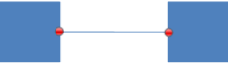

# 21.3 DrawingML - Chart Drawings

=== "中文"

    在图表中，有时需要包含 DrawingML 元素（形状或图片），这些元素应该是父图表中的子对象。 这种关系允许这些元素可以选择随图表调整大小、随图表自动移动等。
    
    图表绘图命名空间发挥此功能，指定在图表中锚定和显示 DrawingML 对象所需的所有信息。

=== "英文"

    Within a chart, it is sometimes necessary to include DrawingML elements (shapes or pictures) which should be a child object within the parent chart. This relationship allows those elements to optionally be resized with the chart, automatically moved with the chart, etc.
    
    The Chart Drawing namespace acts in this capacity, specifying all information necessary to anchor and display DrawingML objects within a chart.

## 21.3.1 目录

=== "中文"

    - 21.3.2 Elements
        - 21.3.2.1 absSizeAnchor (Absolute Anchor Shape Size)
        - 21.3.2.2 blipFill (Picture Fill)
        - 21.3.2.3 cNvCxnSpPr (Non-Visual Connection Shape Drawing Properties)
        - 21.3.2.4 cNvGraphicFramePr (Non-Visual Graphic Frame Drawing Properties)
        - 21.3.2.5 cNvGrpSpPr (Non-Visual Group Shape Drawing Properties)
        - 21.3.2.6 cNvPicPr (Non-Visual Picture Drawing Properties)
        - 21.3.2.7 cNvPr (Non-Visual Drawing Properties)
        - 21.3.2.8 cNvSpPr (Non-Visual Shape Drawing Properties)
        - 21.3.2.9 cxnSp (Connection Shape)
        - 21.3.2.10 ext (Shape Extent)
        - 21.3.2.11 from (Starting Anchor Point)
        - 21.3.2.12 graphicFrame (Graphic Frame)
        - 21.3.2.13 grpSp (Group Shape)
        - 21.3.2.14 grpSpPr (Group Shape Properties)
        - 21.3.2.15 nvCxnSpPr (Connector Non Visual Properties)
        - 21.3.2.16 nvGraphicFramePr (Non-Visual Graphic Frame Properties)
        - 21.3.2.17 nvGrpSpPr (Non-Visual Group Shape Properties)
        - 21.3.2.18 nvPicPr (Non-Visual Picture Properties)
        - 21.3.2.19 nvSpPr (Non-Visual Shape Properties)
        - 21.3.2.20 pic (Picture)
        - 21.3.2.21 relSizeAnchor (Relative Anchor Shape Size)
        - 21.3.2.22 sp (Shape)
        - 21.3.2.23 spPr (Shape Properties)
        - 21.3.2.24 style (Shape Style)
        - 21.3.2.25 to (Ending Anchor Point)
        - 21.3.2.26 txBody (Shape Text Body)
        - 21.3.2.27 x (Relative X Coordinate)
        - 21.3.2.28 xfrm (Graphic Frame Transform)
        - 21.3.2.29 y (Relative Y Coordinate)
    - 21.3.3 Simple Types
        - 21.3.3.1 ST_MarkerCoordinate (Chart Marker Coordinate Value)

=== "英文"

    **Table of Contents**

    **This subclause is informative.**

    - 21.3.2 Elements
        - 21.3.2.1 absSizeAnchor (Absolute Anchor Shape Size)
        - 21.3.2.2 blipFill (Picture Fill)
        - 21.3.2.3 cNvCxnSpPr (Non-Visual Connection Shape Drawing Properties)
        - 21.3.2.4 cNvGraphicFramePr (Non-Visual Graphic Frame Drawing Properties)
        - 21.3.2.5 cNvGrpSpPr (Non-Visual Group Shape Drawing Properties)
        - 21.3.2.6 cNvPicPr (Non-Visual Picture Drawing Properties)
        - 21.3.2.7 cNvPr (Non-Visual Drawing Properties)
        - 21.3.2.8 cNvSpPr (Non-Visual Shape Drawing Properties)
        - 21.3.2.9 cxnSp (Connection Shape)
        - 21.3.2.10 ext (Shape Extent)
        - 21.3.2.11 from (Starting Anchor Point)
        - 21.3.2.12 graphicFrame (Graphic Frame)
        - 21.3.2.13 grpSp (Group Shape)
        - 21.3.2.14 grpSpPr (Group Shape Properties)
        - 21.3.2.15 nvCxnSpPr (Connector Non Visual Properties)
        - 21.3.2.16 nvGraphicFramePr (Non-Visual Graphic Frame Properties)
        - 21.3.2.17 nvGrpSpPr (Non-Visual Group Shape Properties)
        - 21.3.2.18 nvPicPr (Non-Visual Picture Properties)
        - 21.3.2.19 nvSpPr (Non-Visual Shape Properties)
        - 21.3.2.20 pic (Picture)
        - 21.3.2.21 relSizeAnchor (Relative Anchor Shape Size)
        - 21.3.2.22 sp (Shape)
        - 21.3.2.23 spPr (Shape Properties)
        - 21.3.2.24 style (Shape Style)
        - 21.3.2.25 to (Ending Anchor Point)
        - 21.3.2.26 txBody (Shape Text Body)
        - 21.3.2.27 x (Relative X Coordinate)
        - 21.3.2.28 xfrm (Graphic Frame Transform)
        - 21.3.2.29 y (Relative Y Coordinate)
    - 21.3.3 Simple Types
        - 21.3.3.1 ST_MarkerCoordinate (Chart Marker Coordinate Value)

## 21.3.2 元素

=== "中文"

    以下元素定义 ChartDrawing 命名空间的内容：

=== "英文"

    **Elements**

    The following element define the contents of the ChartDrawing namespace:

### 21.3.2.1 absSizeAnchor (绝对锚形状尺寸)

=== "中文"

    该元素指定了在图表中描述的形状应该基于相对锚点进行调整大小。这是通过两个元素实现的。from元素指定了形状边界框的左上角在RTL（从右到左）实现中的位置。然后，ext元素指定了形状边界框的右下角在RTL（从右到左）实现中的位置，从而确定了形状的大小。

    [Note: The W3C XML Schema definition of this element’s content model (CT_AbsSizeAnchor) is located in §A.5.2. end note]

=== "英文"

    **absSizeAnchor (Absolute Anchor Shape Size)**

    This element specifies that the shape described here to reside within a chart should be sized based on relative anchor points. This is achieved via two elements. The from element specifies the top left corner of the shape bounding box in a RTL(right-to-left) implementation. The ext element then specifies the bottom right corner of the shape bounding box in a RTL(right-to-left) implementation and thus the size of the shape.

    [Note: The W3C XML Schema definition of this element’s content model (CT_AbsSizeAnchor) is located in §A.5.2. end note]

### 21.3.2.2 blipFill (图片填充)

=== "中文"

    该元素指定图片对象具有的图片填充类型。由于图片默认已经具有图片填充，因此可以为图片对象指定两种填充。下面是一个示例。

    [Example: 考虑下面的图片，它应用了一个模糊填充。用于填充这个图片对象的图像具有透明像素而不是白色像素。

    ```xml
    <pic:pic>
        …
        <pic:blipFill>
            <a:blip r:embed="rId2"/>
            <a:stretch>
                <a:fillRect/>
            </a:stretch>
        </pic:blipFill>
        …
     </pic:pic>
    ```

    

    上面的图片对象显示为这种填充类型的示例。 end example]

    [Example: 现在考虑同样的图片对象，但在图片的形状属性部分应用了额外的渐变填充。

    ```xml
    <pic:pic>
        …
        <pic:blipFill>
            <a:blip r:embed="rId2"/>
            <a:stretch>
                <a:fillRect/>
            </a:stretch>
        </pic:blipFill>
        <pic:spPr>
            <a:gradFill>
                <a:gsLst>
                    <a:gs pos="0">
                        <a:schemeClr val="tx2">
                            <a:shade val="50000"/>
                        </a:schemeClr>
                    </a:gs>
                    <a:gs pos="39999">
                        <a:schemeClr val="tx2">
                            <a:tint val="20000"/>
                        </a:schemeClr>
                    </a:gs>
                    <a:gs pos="70000">
                        <a:srgbClr val="C4D6EB"/>
                    </a:gs>
                    <a:gs pos="100000">
                        <a:schemeClr val="bg1"/>
                    </a:gs>
                </a:gsLst>
            </a:gradFill>
        </pic:spPr>
        …
    </pic:pic>
    ```

    上面的图片对象是作为这种双重填充类型的示例显示的。 End example]

    ??? abstract "Attributes"

        **dpi** (DPI 设置 / DPI Setting)

        :   Namespace: http://purl.oclc.org/ooxml/drawingml/main

            指定用于计算 blip 大小的 DPI（每英寸点数）。如果未提供或为零，则使用 blip 中的 DPI。

            [Note: 该属性主要用于跟踪文档中的图片质量。打印和屏幕查看所需的质量级别不同，因此需要跟踪此信息。 end note]

            该属性的可能取值由W3C XML Schema的unsignedInt数据类型定义。

        **rotWithShape** (随形状旋转 / Rotate With Shape)

        :   Namespace: http://purl.oclc.org/ooxml/drawingml/main
        
            指定填充应随形状旋转。也就是说，当用图片填充的形状和包含形状（比如矩形）进行旋转变换时，填充也会以相同的旋转进行变换。

            The possible values for this attribute are defined by the W3C XML Schema boolean datatype.

    [Note: The W3C XML Schema definition of this element’s content model (CT_BlipFillProperties) is located in §A.4.1. end note]

=== "英文"

    **blipFill (Picture Fill)**

    This element specifies the kind of picture fill that the picture object has. Because a picture has a picture fill already by default, it is possible to have two fills specified for a picture object. An example of this is shown below.

    [Example: Consider the picture below that has a blip fill applied to it. The image used to fill this picture object has transparent pixels instead of white pixels.

    ```xml
    <pic:pic>
        …
        <pic:blipFill>
            <a:blip r:embed="rId2"/>
            <a:stretch>
                <a:fillRect/>
            </a:stretch>
        </pic:blipFill>
        …
     </pic:pic>
    ```

    

    The above picture object is shown as an example of this fill kind. end example]

    [Example: Consider now the same picture object but with an additional gradient fill applied within the shape properties portion of the picture.

    ```xml
    <pic:pic>
        …
        <pic:blipFill>
            <a:blip r:embed="rId2"/>
            <a:stretch>
                <a:fillRect/>
            </a:stretch>
        </pic:blipFill>
        <pic:spPr>
            <a:gradFill>
                <a:gsLst>
                    <a:gs pos="0">
                        <a:schemeClr val="tx2">
                            <a:shade val="50000"/>
                        </a:schemeClr>
                    </a:gs>
                    <a:gs pos="39999">
                        <a:schemeClr val="tx2">
                            <a:tint val="20000"/>
                        </a:schemeClr>
                    </a:gs>
                    <a:gs pos="70000">
                        <a:srgbClr val="C4D6EB"/>
                    </a:gs>
                    <a:gs pos="100000">
                        <a:schemeClr val="bg1"/>
                    </a:gs>
                </a:gsLst>
            </a:gradFill>
        </pic:spPr>
        …
    </pic:pic>
    ```

    The above picture object is shown as an example of this double fill kind. End example]

    ??? abstract "Attributes"

        **dpi** (DPI Setting)

        :   Namespace: http://purl.oclc.org/ooxml/drawingml/main

            Specifies the DPI (dots per inch) used to calculate the size of the blip. If not present or zero, the DPI in the blip is used.

            [Note: This attribute is primarily used to keep track of the picture quality within a document. There are different levels of quality needed for print than on-screen viewing and thus a need to track this information. end note]

            The possible values for this attribute are defined by the W3C XML Schema unsignedInt datatype.

        **rotWithShape** (Rotate With Shape)

        :   Namespace: http://purl.oclc.org/ooxml/drawingml/main
        
            Specifies that the fill should rotate with the shape. That is, when the shape that has been filled with a picture and the containing shape (say a rectangle) is transformed with a rotation then the fill is transformed with the same rotation.

            The possible values for this attribute are defined by the W3C XML Schema boolean datatype.

    [Note: The W3C XML Schema definition of this element’s content model (CT_BlipFillProperties) is located in §A.4.1. end note]

### 21.3.2.3 cNvCxnSpPr (非可视连接形状绘图属性)

=== "中文"

    该元素指定连接器形状的非可视绘图属性。这些非可视属性是生成应用程序在渲染父图表时会使用的属性。
    
    [Note: The W3C XML Schema definition of this element’s content model (CT_NonVisualConnectorProperties) is located in §A.4.1. end note]

=== "英文"

    **cNvCxnSpPr (Non-Visual Connection Shape Drawing Properties)**

    This element specifies the non-visual drawing properties for a connector shape. These non-visual properties are properties that the generating application would utilize when rendering the parent chart.
    
    [Note: The W3C XML Schema definition of this element’s content model (CT_NonVisualConnectorProperties) is located in §A.4.1. end note]

### 21.3.2.4 cNvGraphicFramePr (非可视图形框架绘图属性)

=== "中文"

    该元素指定了图形框架的非可视绘图属性。这些非可视属性是生成应用程序在呈现图表时会使用的属性。
    
    [Note: The W3C XML Schema definition of this element’s content model (CT_NonVisualGraphicFrameProperties) is located in §A.4.1. end note]

=== "英文"

    **cNvGraphicFramePr (Non-Visual Graphic Frame Drawing Properties)**

    This element specifies the non-visual drawing properties for a graphic frame. These non-visual properties are properties that the generating application would utilize when rendering the chart.
    
    [Note: The W3C XML Schema definition of this element’s content model (CT_NonVisualGraphicFrameProperties) is located in §A.4.1. end note]

### 21.3.2.5 cNvGrpSpPr (非可视组形状绘图属性)

=== "中文"

    该元素指定了组合形状的非可视绘图属性。这些非可视属性是生成应用程序在呈现图表时会使用的属性。

    [Note: The W3C XML Schema definition of this element’s content model (CT_NonVisualGroupDrawingShapeProps) is located in §A.4.1. end note]

=== "英文"

    **cNvGrpSpPr (Non-Visual Group Shape Drawing Properties)**

    This element specifies the non-visual drawing properties for a group shape. These non-visual properties are properties that the generating application would utilize when rendering the chart.

    [Note: The W3C XML Schema definition of this element’s content model (CT_NonVisualGroupDrawingShapeProps) is located in §A.4.1. end note]

### 21.3.2.6 cNvPicPr (非视觉绘图属性)

=== "中文"

    该元素指定了图片画布的非可视属性。生成应用程序将使用这些属性来确定如何更改特定图片对象的某些属性。

    [Example: 请考虑以下的DrawingML。

    ```xml
    <pic:pic>
        …
        <pic:nvPicPr>
            <pic:cNvPr id="4" name="Lilly_by_Lisher.jpg"/>
            <pic:cNvPicPr>
                <a:picLocks noChangeAspect="1"/>
            </pic:cNvPicPr>
            <pic:nvPr/>
        </pic:nvPicPr>
        …
    </pic:pic>
    ```

    End example]

    ??? abstract "Attributes"

        preferRelativeResize (相对调整大小优先 / Relative Resize Preferred)

        :   Namespace: http://purl.oclc.org/ooxml/drawingml/main

            指定用户界面是否应根据图片的当前大小或原始大小显示图片的调整大小。如果将此属性设置为true，则缩放相对于原始图片大小而不是当前图片大小。

            [Example: 考虑这样一种情况：在文档中调整了图片的大小，现在它的大小是原始插入图片大小的50%。如果用户选择在生成应用程序中稍后调整该图片的大小，则应检查此属性的值。
            
            如果此属性设置为true，则显示50%的值。同样，如果此属性设置为false，则应显示100%的值，因为图片尚未从其当前（较小）大小调整。 end example]
            
            The possible values for this attribute are defined by the W3C XML Schema boolean datatype.

    [Note: The W3C XML Schema definition of this element’s content model (CT_NonVisualPictureProperties) is located in §A.4.1. end note]

=== "英文"

    **cNvPicPr (Non-Visual Picture Drawing Properties)**

    This element specifies the non-visual properties for the picture canvas. These properties are to be used by the generating application to determine how certain properties are to be changed for the picture object in question.

    [Example: Consider the following DrawingML.

    ```xml
    <pic:pic>
        …
        <pic:nvPicPr>
            <pic:cNvPr id="4" name="Lilly_by_Lisher.jpg"/>
            <pic:cNvPicPr>
                <a:picLocks noChangeAspect="1"/>
            </pic:cNvPicPr>
            <pic:nvPr/>
        </pic:nvPicPr>
        …
    </pic:pic>
    ```

    End example]

    ??? abstract "Attributes"

        preferRelativeResize (Relative Resize Preferred)

        :   Namespace: http://purl.oclc.org/ooxml/drawingml/main

            Specifies if the user interface should show the resizing of the picture based on the picture's current size or its original size. If this attribute is set to true, then scaling is relative to the original picture size as opposed to the current picture size.

            [Example: Consider the case where a picture has been resized within a document and is now 50% of the originally inserted picture size. Now if the user chooses to make a later adjustment to the size of this picture within the generating application, then the value of this attribute should be checked.
            
            If this attribute is set to true then a value of 50% is shown. Similarly, if this attribute is set to false, then a value of 100% should be shown because the picture has not yet been resized from its current (smaller) size. end example]
            
            The possible values for this attribute are defined by the W3C XML Schema boolean datatype.

    [Note: The W3C XML Schema definition of this element’s content model (CT_NonVisualPictureProperties) is located in §A.4.1. end note]
    

### 21.3.2.7 cNvPr (非可视绘图属性)

=== "中文"

    该元素指定非可视画布属性。这允许存储不影响图片外观的附加信息。

    [Example: Consider the following ChartDrawingML.

    ```xml
    <cdr:pic>
        …
        <cdr:nvPicPr>
            <cdr:cNvPr id="4" name="Lilly_by_Lisher.jpg"/>
        </cdr:nvPicPr>
        …
    </cdr:pic>
    ```

    end example]

    ??? abstract "Attributes"

        **descr** (Alternative Text for Object)

        :   Namespace: http://purl.oclc.org/ooxml/drawingml/main

            指定当前DrawingML对象的替代文本，供辅助技术或不显示当前对象的应用程序使用。
            
            如果省略此元素，则父对象没有替代文本。
            
            [Example: 考虑一个 DrawingML 对象，定义如下：
            
            `<… descr="A picture of a bowl of fruit">`
            
            descr属性包含可用于替代实际DrawingML对象的备用文本。 end example]
            
            The possible values for this attribute are defined by the W3C XML Schema string datatype.
        
        **hidden** (Hidden)

        :   Namespace: http://purl.oclc.org/ooxml/drawingml/main

            指定此DrawingML对象是否显示。当一个DrawingML对象在文档中显示时，该对象可以被隐藏（即存在但不可见）。该属性确定对象是否被渲染或隐藏。
            
            [Note: 一个应用程序可以有设置，允许查看该对象。 end note]
    
            如果省略了此属性，则父级DrawingML对象将被显示（即不隐藏）。
            
            [Example: 考虑一个必须在文档内容中隐藏的内联DrawingML对象。此设置将如下指定：
            
            `<… hidden="true" />`
            
            隐藏属性的值为true，表示当文档显示时，DrawingML对象将被隐藏且不会显示出来。 end example]
    
            The possible values for this attribute are defined by the W3C XML Schema boolean datatype.

        **id** (Unique Identifier)

        :   Namespace: http://purl.oclc.org/ooxml/drawingml/main

            指定当前文档中当前DrawingML对象的唯一标识符。此ID可用于帮助唯一标识此对象，以便其他文档部分可以引用它。
            
            如果同一文档中的多个对象共享相同的id属性值，则该文档将被视为不符合规范。
            
            [Example: 考虑一个 DrawingML 对象，定义如下：
            
            `<… id="10" … >`
            
            id属性的值为10，这是该DrawingML对象的唯一标识符。 end example]
            
            The possible values for this attribute are defined by the ST_DrawingElementId simple type (§20.1.10.21).

        **name** (Name)

        :   Namespace: http://purl.oclc.org/ooxml/drawingml/main

            指定对象的名称。 [Note: 通常，这用于存储图片对象的原始文件名。 end note]
            
            [Example: 考虑一个 DrawingML 对象，定义如下：
            
            `< … name="foo.jpg" >`
            
            name属性的值为foo.jpg，这是这个DrawingML对象的名称。 end example]
    
            The possible values for this attribute are defined by the W3C XML Schema string datatype.

        **title** (Title)

        :   Namespace: http://purl.oclc.org/ooxml/drawingml/main

            指定当前DrawingML对象的标题（标题）。
            
            如果省略此属性，则父对象没有标题文本。
            
            [Example: 考虑一个 DrawingML 对象，定义如下：
            
            `<… title="Process Flow Diagram">`
        
            end example]
            
            The possible values for this attribute are defined by the W3C XML Schema string datatype.

    [Note: The W3C XML Schema definition of this element’s content model (CT_NonVisualDrawingProps) is located in §A.4.1. end note]

=== "英文"

    **cNvPr (Non-Visual Drawing Properties)**

    This element specifies non-visual canvas properties. This allows for additional information that does not affect the appearance of the picture to be stored.

    [Example: Consider the following ChartDrawingML.

    ```xml
    <cdr:pic>
        …
        <cdr:nvPicPr>
            <cdr:cNvPr id="4" name="Lilly_by_Lisher.jpg"/>
        </cdr:nvPicPr>
        …
    </cdr:pic>
    ```

    end example]

    ??? abstract "Attributes"

        **descr** (Alternative Text for Object)

        :   Namespace: http://purl.oclc.org/ooxml/drawingml/main

            Specifies alternative text for the current DrawingML object, for use by assistive technologies or applications which do not display the current object.

            If this element is omitted, then no alternative text is present for the parent object.
            
            [Example: Consider a DrawingML object defined as follows:
            
            `<… descr="A picture of a bowl of fruit">`
            
            The descr attribute contains alternative text which can be used in place of the actual DrawingML object. end example]
            
            The possible values for this attribute are defined by the W3C XML Schema string datatype.
        
        **hidden** (Hidden)

        :   Namespace: http://purl.oclc.org/ooxml/drawingml/main

            Specifies whether this DrawingML object is displayed. When a DrawingML object is displayed within a document, that object can be hidden (i.e., present, but not visible). This attribute determines whether the object is rendered or made hidden. [Note: An application can have settings which allow this object to be viewed. end note]
    
            If this attribute is omitted, then the parent DrawingML object shall be displayed (i.e., not hidden).
            
            [Example: Consider an inline DrawingML object which must be hidden within the document's content. This setting would be specified as follows:
            
            `<… hidden="true" />`
            
            The hidden attribute has a value of true, which specifies that the DrawingML object is hidden and not displayed when the document is displayed. end example]
    
            The possible values for this attribute are defined by the W3C XML Schema boolean datatype.

        **id** (Unique Identifier)

        :   Namespace: http://purl.oclc.org/ooxml/drawingml/main

            Specifies a unique identifier for the current DrawingML object within the current document. This ID can be used to assist in uniquely identifying this object so that it can be referred to by other parts of the document.
    
            If multiple objects within the same document share the same id attribute value, then the document shall be considered non-conformant.
            
            [Example: Consider a DrawingML object defined as follows:
            
            `<… id="10" … >`
            
            The id attribute has a value of 10, which is the unique identifier for this DrawingML object. end example]
            
            The possible values for this attribute are defined by the ST_DrawingElementId simple type (§20.1.10.21).

        **name** (Name)

        :   Namespace: http://purl.oclc.org/ooxml/drawingml/main

            Specifies the name of the object. [Note: Typically, this is used to store the original file name of a picture object. end note]
            
            [Example: Consider a DrawingML object defined as follows:
            
            `< … name="foo.jpg" >`
            
            The name attribute has a value of foo.jpg, which is the name of this DrawingML object. end example]
    
            The possible values for this attribute are defined by the W3C XML Schema string datatype.

        **title** (Title)

        :   Namespace: http://purl.oclc.org/ooxml/drawingml/main

            Specifies the title (caption) of the current DrawingML object.
            
            If this attribute is omitted, then no title text is present for the parent object.
            
            [Example: Consider a DrawingML object defined as follows:
            
            `<… title="Process Flow Diagram">`
        
            end example]
            
            The possible values for this attribute are defined by the W3C XML Schema string datatype.

    [Note: The W3C XML Schema definition of this element’s content model (CT_NonVisualDrawingProps) is located in §A.4.1. end note]

### 21.3.2.8 cNvSpPr (非视觉形状绘图属性)

=== "中文"

    该元素指定了形状的非可视绘图属性。生成应用程序将使用这些属性来确定如何处理该形状。
    
    [Example: 考虑应用了形状锁定的形状。

    ```xml
    <cdr:sp>
        <cdr:nvSpPr>
            <cdr:cNvPr id="2" name="Rectangle 1"/>
            <cdr:cNvSpPr>
                <a:spLocks noGrp="1"/>
            </cdr:cNvSpPr>
        </cdr:nvSpPr>
        …
    </cdr:sp>
    ```

    该形状锁存储在该形状的非可视绘图属性中。 end example]

    ??? abstract "Attributes"

        **txBox** (Text Box)

        :   Namespace: http://purl.oclc.org/ooxml/drawingml/main

            指定相应的形状为文本框，因此生成应用程序应将其视为文本框。如果省略此属性，则假定相应的形状不是特定的文本框。

            [Note: 因为一个形状没有被指定为文本框，并不意味着它不能附带文本。文本框只是一个具有特定属性的专用形状。 end note]
            
            The possible values for this attribute are defined by the W3C XML Schema boolean datatype.
    
    [Note: The W3C XML Schema definition of this element’s content model (CT_NonVisualDrawingShapeProps) is located in §A.4.1. end note]

=== "英文"

    **cNvSpPr (Non-Visual Shape Drawing Properties)**

    This element specifies the non-visual drawing properties for a shape. These properties are to be used by the generating application to determine how the shape should be dealt with.
    
    [Example: Consider the shape that has a shape lock applied to it.

    ```xml
    <cdr:sp>
        <cdr:nvSpPr>
            <cdr:cNvPr id="2" name="Rectangle 1"/>
            <cdr:cNvSpPr>
                <a:spLocks noGrp="1"/>
            </cdr:cNvSpPr>
        </cdr:nvSpPr>
        …
    </cdr:sp>
    ```

    This shape lock is stored within the non-visual drawing properties for this shape. end example]

    ??? abstract "Attributes"

        **txBox** (Text Box)

        :   Namespace: http://purl.oclc.org/ooxml/drawingml/main

            Specifies that the corresponding shape is a text box and thus should be treated as such by the generating application. If this attribute is omitted then it is assumed that the corresponding shape is not specifically a text box.

            [Note: Because a shape is not specified to be a text box does not mean that it cannot have text attached to it. A text box is merely a specialized shape with specific properties. end note]
            
            The possible values for this attribute are defined by the W3C XML Schema boolean datatype.
    
    [Note: The W3C XML Schema definition of this element’s content model (CT_NonVisualDrawingShapeProps) is located in §A.4.1. end note]


### 21.3.2.9 cxnSp (连接形状)

=== "中文"

    该元素指定了用于连接两个sp元素的连接形状。一旦使用cxnSp指定了连接，生成应用程序将决定连接器的确切路径。也就是说，连接器的路由算法由生成应用程序决定，因为所需路径可能因应用程序的具体需求而不同。

    [Example:

    

    end example]

    [Example: 考虑以下连接两个常规形状的连接器形状。

    ```xml
    <cdrcdr:grpSp>
        … 
        <cdr:sp>
            <cdr:nvSpPr>
                <cdr:cNvPr id="1" name="Rectangle 1" />
                <cdr:cNvSpPr />
                <cdr:nvPr />
            </cdr:nvSpPr>
            …
        </cdr:sp>
        <cdr:sp>
            <cdr:nvSpPr>
                <cdr:cNvPr id="2" name="Rectangle 2" />
                <cdr:cNvSpPr />
                <cdr:nvPr />
            </cdr:nvSpPr>
            …
        </cdr:sp>
        <cdr:cxnSp>
            <cdr:nvCxnSpPr>
                <cdr:cNvPr id="3" name="Elbow Connector 3" />
                <cdr:cNvCxnSpPr>
                    <a:stCxn id="1" idx="3" />
                    <a:endCxn id="2" idx="1" />
                </cdr:cNvCxnSpPr>
                <cdr:nvPr />
            </cdr:nvCxnSpPr>
            …
        </cdr:cxnSp>
    </cdrcdr:grpSp>
    ```

    end example]

    ??? abstract "Attributes"

        **fPublished** (Publish to Server)

        :   指定形状是否在将工作表发送到电子表格服务器时一同发布。这适用于与文档服务器进行接口时使用。

            [Example: 考虑以下形状，在将其发布回电子表格服务器时，它不会与工作表一起发布。

            ```xml
            <cdr:relSizeAnchor>
             …
             <cdr:sp fPublished="0">
             ..
             </cdr:sp>
             …
            </cdr:relSizeAnchor>
            ```

            end example]

            The possible values for this attribute are defined by the W3C XML Schema boolean datatype.

        **macro** (Reference to Custom Function)

        :   该元素指定与图表关联的自定义函数。 [Example: 宏脚本、插件功能等等。 end example]

            该字符串的格式应由应用程序定义，如果不理解应该忽略。

            [Example:
    
            `<… macro="DoWork()" >`
    
            end example]
    
            The possible values for this attribute are defined by the W3C XML Schema string datatype.

    [Note: The W3C XML Schema definition of this element’s content model (CT_Connector) is located in §A.5.2. end note]

=== "英文"

    **cxnSp (Connection Shape)**

    This element specifies a connection shape that is used to connect two sp elements. Once a connection is specified using a cxnSp, it is left to the generating application to determine the exact path the connector takes. That is the connector routing algorithm is left up to the generating application as the desired path might be different depending on the specific needs of the application.

    [Example:

    

    end example]

    [Example: Consider the following connector shape that connects two regular shapes.

    ```xml
    <cdrcdr:grpSp>
        … 
        <cdr:sp>
            <cdr:nvSpPr>
                <cdr:cNvPr id="1" name="Rectangle 1" />
                <cdr:cNvSpPr />
                <cdr:nvPr />
            </cdr:nvSpPr>
            …
        </cdr:sp>
        <cdr:sp>
            <cdr:nvSpPr>
                <cdr:cNvPr id="2" name="Rectangle 2" />
                <cdr:cNvSpPr />
                <cdr:nvPr />
            </cdr:nvSpPr>
            …
        </cdr:sp>
        <cdr:cxnSp>
            <cdr:nvCxnSpPr>
                <cdr:cNvPr id="3" name="Elbow Connector 3" />
                <cdr:cNvCxnSpPr>
                    <a:stCxn id="1" idx="3" />
                    <a:endCxn id="2" idx="1" />
                </cdr:cNvCxnSpPr>
                <cdr:nvPr />
            </cdr:nvCxnSpPr>
            …
        </cdr:cxnSp>
    </cdrcdr:grpSp>
    ```

    end example]

    ??? abstract "Attributes"

        **fPublished** (Publish to Server)

        :   Specifies whether the shape shall be published with the worksheet when sent to the spreadsheet server. This is for use when interfacing with a document server.

            [Example: Consider the following shape that is not published with the worksheet when it is published back on the spreadsheet server.

            ```xml
            <cdr:relSizeAnchor>
             …
             <cdr:sp fPublished="0">
             ..
             </cdr:sp>
             …
            </cdr:relSizeAnchor>
            ```

            end example]

            The possible values for this attribute are defined by the W3C XML Schema boolean datatype.

        **macro** (Reference to Custom Function)

        This element specifies the custom function associated with the chart. [Example: A macro script, add-in function, and so on. end example]

        The format of this string shall be application-defined, and should be ignored if not understood.

        [Example:

        `<… macro="DoWork()" >`

        end example]

        The possible values for this attribute are defined by the W3C XML Schema string datatype.

    [Note: The W3C XML Schema definition of this element’s content model (CT_Connector) is located in §A.5.2. end note]

### 21.3.2.10 ext (形状范围)

=== "中文"

    该元素描述了绘图元素应该延伸多远的长度和宽度属性。

    ??? abstract "Attributes"

        **cx** (Extent Length)

        :   Namespace: http://purl.oclc.org/ooxml/drawingml/main

            指定以EMU为单位的范围矩形的长度。该矩形将决定对象在显示时的大小（通过对原始对象进行任何缩放的结果）。

            [Example: 考虑如下指定的 DrawingML 对象：
            
            <… cx="1828800" cy="200000"/>
            
            cx属性指定了该对象的高度为1828800个EMU（英制度量单位）。 end example]
    
            The possible values for this attribute are defined by the ST_PositiveCoordinate simple type (§20.1.10.41).
        
        **cy** (Extent Width)

        :   Namespace: http://purl.oclc.org/ooxml/drawingml/main

            指定以EMU为单位的范围矩形的宽度。该矩形将决定对象在显示时的大小（通过对原始对象进行任何缩放的结果）。

            [Example: 考虑如下指定的 DrawingML 对象：
            
            < … cx="1828800" cy="200000"/>
            
            cy属性指定该对象的宽度为200000 EMUs（英制度量单位）。 end example]
        
            The possible values for this attribute are defined by the ST_PositiveCoordinate simple type (§20.1.10.41).
    
    [Note: The W3C XML Schema definition of this element’s content model (CT_PositiveSize2D) is located in §A.4.1. end note]

=== "英文"

    **ext (Shape Extent)**

    This element describes the length and width properties for how far a drawing element should extend for.

    ??? abstract "Attributes"

        **cx** (Extent Length)

        :   Namespace: http://purl.oclc.org/ooxml/drawingml/main

            Specifies the length of the extents rectangle in EMUs. This rectangle shall dictate the size of the object as displayed (the result of any scaling to the original object).

            [Example: Consider a DrawingML object specified as follows:
            
            <… cx="1828800" cy="200000"/>
            
            The cx attributes specifies that this object has a height of 1828800 EMUs (English Metric Units). end example]
    
            The possible values for this attribute are defined by the ST_PositiveCoordinate simple type (§20.1.10.41).
        
        **cy** (Extent Width)

        :   Namespace: http://purl.oclc.org/ooxml/drawingml/main

        Specifies the width of the extents rectangle in EMUs. This rectangle shall dictate the size of the object as displayed (the result of any scaling to the original object).

            [Example: Consider a DrawingML object specified as follows:
            
            < … cx="1828800" cy="200000"/>
            
            The cy attribute specifies that this object has a width of 200000 EMUs (English Metric Units). end example]
        
            The possible values for this attribute are defined by the ST_PositiveCoordinate simple type (§20.1.10.41).
    
    [Note: The W3C XML Schema definition of this element’s content model (CT_PositiveSize2D) is located in §A.4.1. end note]

### 21.3.2.11 from (起始锚点)

=== "中文"
    
    该元素指定绘图元素的第一个锚点。它用于将形状的顶部和左侧固定在图表内部。也就是说，当相应的图表调整时，形状也会相应调整。
    
    [Example: 请考虑以下图表绘制内容：

    ```xml
    <cdr:relSizeAnchor>
        <cdr:from>
            <cdr:x>0.04583</cdr:x>
            <cdr:y>0.53125</cdr:y>
        </cdr:from>
        <cdr:to>
            <cdr:x>0.24583</cdr:x>
            <cdr:y>0.86458</cdr:y>
        </cdr:to>
        <cdr:sp macro="" textlink="">
        …
        </cdr:sp>
    </cdr:relSizeAnchor>
    ```

    上面的例子显示了第一个锚点通过from元素进行指定。 end example]

    [Note: The W3C XML Schema definition of this element’s content model (CT_Marker) is located in §A.5.2. end note]

=== "英文"

    **from (Starting Anchor Point)**
    
    This element specifies the first anchor point for the drawing element. This is used to anchor the top and left sides of the shape within the chart. That is when the corresponding chart is adjusted, the shape is also adjusted.
    
    [Example: Consider the following Chart Drawing content:

    ```xml
    <cdr:relSizeAnchor>
        <cdr:from>
            <cdr:x>0.04583</cdr:x>
            <cdr:y>0.53125</cdr:y>
        </cdr:from>
        <cdr:to>
            <cdr:x>0.24583</cdr:x>
            <cdr:y>0.86458</cdr:y>
        </cdr:to>
        <cdr:sp macro="" textlink="">
        …
        </cdr:sp>
    </cdr:relSizeAnchor>
    ```

    The above example shows the first anchor point being specified via the from element. end example]

    [Note: The W3C XML Schema definition of this element’s content model (CT_Marker) is located in §A.5.2. end note]
    

### 21.3.2.12 graphicFrame (图框)

=== "中文"

    该元素指定了一个图形框架的存在。该框架包含了由外部来源生成的图形，并需要一个容器来在幻灯片表面上显示。

    ??? abstract "Attributes"

        **fPublished** (发布到服务器 / Publish To Server)

        :   指定形状是否在将工作表发送到电子表格服务器时一同发布。这适用于与文档服务器进行接口时使用。
            
            [Example: 考虑以下形状，在将其发布回电子表格服务器时，不会与工作表一起发布。

            ```xml
            <cdr:relSizeAnchor>
                …
                <cdr:sp fPublished="0">
                …
                </cdr:sp>
                …
            </cdr:relSizeAnchor>
            ```

            end example]
            
            The possible values for this attribute are defined by the W3C XML Schema boolean datatype.

        **macro** (参考自定义函数 / Reference to Custom Function)
        
        :   该元素指定与图表关联的自定义函数。 [Example: A macro script, add-in function, and so on. end example]
    
            该字符串的格式应由应用程序定义，如果不理解应该忽略。

            [Example:
            
            `<… macro="DoWork()" >`
            
            end example]

            The possible values for this attribute are defined by the W3C XML Schema string datatype.
        
        [Note: The W3C XML Schema definition of this element’s content model (CT_GraphicFrame) is located in §A.5.2. end note]

=== "英文"

    **graphicFrame (Graphic Frame)**

    This element specifies the existence of a graphics frame. This frame contains a graphic that was generated by an external source and needs a container in which to be displayed on the slide surface.

    ??? abstract "Attributes"

        **fPublished** (Publish To Server)

        :   Specifies whether the shape shall be published with the worksheet when sent to the spreadsheet server. This is for use when interfacing with a document server.
            
            [Example: Consider the following shape that is not published with the worksheet when it
            is published back on the spreadsheet server.

            ```xml
            <cdr:relSizeAnchor>
                …
                <cdr:sp fPublished="0">
                …
                </cdr:sp>
                …
            </cdr:relSizeAnchor>
            ```

            end example]
            
            The possible values for this attribute are defined by the W3C XML Schema boolean datatype.

        **macro** (Reference to Custom Function)
        
        :   This element specifies the custom function associated with the chart. [Example: A macro script, add-in function, and so on. end example]
    
            The format of this string shall be application-defined, and should be ignored if not understood.

            [Example:
            
            `<… macro="DoWork()" >`
            
            end example]

            The possible values for this attribute are defined by the W3C XML Schema string datatype.
        
        [Note: The W3C XML Schema definition of this element’s content model (CT_GraphicFrame) is located in §A.5.2. end note]

### 21.3.2.13 grpSp (组合形状)

=== "中文"

    该元素指定了一个表示多个形状组合在一起的组合形状。这个形状应该被视为一个普通形状，但不同于由单个几何描述的形状，它由包含在其中的所有形状几何组成。在组合形状中，组成组合的每个形状都像通常一样被指定。然而，组合元素的理念是可以同时应用于多个形状的单个变换。
    
    [Example: 请考虑以下组合形状。

    ```xml
    <cdr:grpSp>
        <cdr:nvGrpSpPr>
            <cdr:cNvPr id="10" name="Group 9" />
            <cdr:cNvGrpSpPr />
            <cdr:nvPr />
        </cdr:nvGrpSpPr>
        <cdr:grpSpPr>
            <a:xfrm>
                <a:off x="838200" y="990600" />
                <a:ext cx="2426208" cy="978408" />
                <a:chOff x="838200" y="990600" />
                <a:chExt cx="2426208" cy="978408" />
            </a:xfrm>
        </cdr:grpSpPr>
        <cdr:sp>…</cdr:sp>
        <cdr:sp>…</cdr:sp>
        <cdr:sp>…</cdr:sp>
    </cdr:grpSp>
    ```

    在上面的示例中，我们看到在一个单独的组内指定了三个形状。这三个形状的位置和大小都像在形状树中一样被指定。生成应用程序应该在计算出组形状的边界框之后应用变换。 end example]
    
    [Note: The W3C XML Schema definition of this element’s content model (CT_GroupShape) is located in §A.5.2. end note]

=== "英文"

    **grpSp (Group Shape)**

    This element specifies a group shape that represents many shapes grouped together. This shape is to be treated just as if it were a regular shape but instead of being described by a single geometry it is made up of all the shape geometries encompassed within it. Within a group shape each of the shapes that make up the group are specified just as they normally would. The idea behind grouping elements however is that a single transform can apply to many shapes at the same time.
    
    [Example: Consider the following group shape.

    ```xml
    <cdr:grpSp>
        <cdr:nvGrpSpPr>
            <cdr:cNvPr id="10" name="Group 9" />
            <cdr:cNvGrpSpPr />
            <cdr:nvPr />
        </cdr:nvGrpSpPr>
        <cdr:grpSpPr>
            <a:xfrm>
                <a:off x="838200" y="990600" />
                <a:ext cx="2426208" cy="978408" />
                <a:chOff x="838200" y="990600" />
                <a:chExt cx="2426208" cy="978408" />
            </a:xfrm>
        </cdr:grpSpPr>
        <cdr:sp>…</cdr:sp>
        <cdr:sp>…</cdr:sp>
        <cdr:sp>…</cdr:sp>
    </cdr:grpSp>
    ```

    In the above example we see three shapes specified within a single group. These three shapes have their position and sizes specified just as they normally would within the shape tree. The generating application should apply the transformation after the bounding box for the group shape has been calculated. end example]
    
    [Note: The W3C XML Schema definition of this element’s content model (CT_GroupShape) is located in §A.5.2. end note]


### 21.3.2.14 grpSpPr (组合形状属性)

=== "中文"

    该元素指定了在相应组内的所有形状中共有的属性。如果组形状属性和各个形状属性之间存在冲突，则应以各个形状属性为优先。

    ??? abstract "Attributes"

        **bwMode** (Black and White Mode)

        :   指定组形状应仅使用黑白颜色进行渲染。也就是说，当渲染相应的形状时，组形状的着色信息应转换为黑色或白色。
        
            在渲染此图像时，不使用灰色，只使用纯黑和纯白。
            
            [Note: 这并不意味着组的形状仅以黑白颜色信息存储。相反，这个属性设置了形状在渲染时使用的渲染模式。 end note]
                
            The possible values for this attribute are defined by the ST_BlackWhiteMode simple type (§20.1.10.10).
        
        [Note: The W3C XML Schema definition of this element’s content model (CT_GroupShapeProperties) is located in §A.4.1. end note]

=== "英文"

    **grpSpPr (Group Shape Properties)**

    This element specifies the properties that are to be common across all of the shapes within the corresponding group. If there are any conflicting properties within the group shape properties and the individual shape properties then the individual shape properties should take precedence.

    ??? abstract "Attributes"

        **bwMode** (Black and White Mode)

        :   Specifies that the group shape should be rendered using only black and white coloring. That is the coloring information for the group shape should be converted to either black or white when rendering the corresponding shapes.

            No gray is to be used in rendering this image, only stark black and stark white.
            
            [Note: This does not mean that the group shapes themselves are stored with only black and white color information. This attribute instead sets the rendering mode that the shapes use when rendering. end note]
                
            The possible values for this attribute are defined by the ST_BlackWhiteMode simple type (§20.1.10.10).
        
        [Note: The W3C XML Schema definition of this element’s content model (CT_GroupShapeProperties) is located in §A.4.1. end note]


### 21.3.2.15 nvCxnSpPr (连接器非视觉属性)

=== "中文"

    该元素指定了连接形状的所有非可视属性。该元素是非可视标识属性、形状属性和应用属性的容器，这些属性与连接形状相关联。这样可以存储不影响连接形状外观的附加信息。
    
    [Note: The W3C XML Schema definition of this element’s content model (CT_ConnectorNonVisual) is located in §A.5.2. end note]

=== "英文"

    **nvCxnSpPr (Connector Non Visual Properties)**

    This element specifies all non-visual properties for a connection shape. This element is a container for the nonvisual identification properties, shape properties and application properties that are to be associated with a connection shape. This allows for additional information that does not affect the appearance of the connection shape to be stored.
    
    [Note: The W3C XML Schema definition of this element’s content model (CT_ConnectorNonVisual) is located in §A.5.2. end note]


### 21.3.2.16 nvGraphicFramePr (非可视图形框架属性)

=== "中文"

    该元素指定了图形框架的所有非可视属性。该元素是非可视标识属性、形状属性和应用属性的容器，这些属性与图形框架相关联。这样可以存储不影响图形框架外观的附加信息。
    
    [Note: The W3C XML Schema definition of this element’s content model (CT_GraphicFrameNonVisual) is located in §A.5.2. end note]

=== "英文"

    **nvGraphicFramePr (Non-Visual Graphic Frame Properties)**

    This element specifies all non-visual properties for a graphic frame. This element is a container for the non-visual identification properties, shape properties and application properties that are to be associated with a graphic frame. This allows for additional information that does not affect the appearance of the graphic frame to be stored.
    
    [Note: The W3C XML Schema definition of this element’s content model (CT_GraphicFrameNonVisual) is located in §A.5.2. end note]


### 21.3.2.17 nvGrpSpPr (非视觉组合形状属性)

=== "中文"

    该元素指定了组合形状的所有非可视属性。该元素是非可视标识属性、形状属性和应用属性的容器，这些属性与组合形状相关联。这样可以存储不影响组合形状外观的附加信息。
    
    [Note: The W3C XML Schema definition of this element’s content model (CT_GroupShapeNonVisual) is located in §A.5.2. end note]

=== "英文"

    **nvGrpSpPr (Non-Visual Group Shape Properties)**

    This element specifies all non-visual properties for a group shape. This element is a container for the non-visual identification properties, shape properties and application properties that are to be associated with a group shape. This allows for additional information that does not affect the appearance of the group shape to be stored.
    
    [Note: The W3C XML Schema definition of this element’s content model (CT_GroupShapeNonVisual) is located in §A.5.2. end note]

### 21.3.2.18 nvPicPr (非视觉图片属性)

=== "中文"

    该元素指定图片的非可视属性。这允许存储与图片外观无关的附加信息。

    [Example: 考虑以下 DrawingML。

    ```xml
    <pic:pic>
     …
     <pic:nvPicPr>
     …
     </pic:nvPicPr>
     …
    </pic:pic>
    ```

    End example]
    
    [Note: The W3C XML Schema definition of this element’s content model (CT_PictureNonVisual) is located in §A.5.2. end note]

=== "英文"

    **nvPicPr (Non-Visual Picture Properties)**

    This element specifies the non visual properties for a picture. This allows for additional information that does not affect the appearance of the picture to be stored.

    [Example: Consider the following DrawingML.

    ```xml
    <pic:pic>
     …
     <pic:nvPicPr>
     …
     </pic:nvPicPr>
     …
    </pic:pic>
    ```

    End example]
    
    [Note: The W3C XML Schema definition of this element’s content model (CT_PictureNonVisual) is located in §A.5.2. end note]


### 21.3.2.19 nvSpPr (非视觉形状属性)

=== "中文"

    该元素指定了形状的所有非可视属性。该元素是非可视标识属性、形状属性和与形状相关联的应用程序属性的容器。这样可以存储不影响形状外观的附加信息。
    
    [Note: The W3C XML Schema definition of this element’s content model (CT_ShapeNonVisual) is located in §A.5.2. end note]


=== "英文"

    **nvSpPr (Non-Visual Shape Properties)**

    This element specifies all non-visual properties for a shape. This element is a container for the non-visual identification properties, shape properties and application properties that are to be associated with a shape. This allows for additional information that does not affect the appearance of the shape to be stored.
    
    [Note: The W3C XML Schema definition of this element’s content model (CT_ShapeNonVisual) is located in §A.5.2. end note]

### 21.3.2.20 pic (图片)

=== "中文"

    该元素指定文档中图片对象的存在。

    [Example: 考虑以下的ChartDrawingML，它指定了文档中存在一张图片。这张图片可以具有非可视属性，以及与之相关联的图片填充和形状属性。
    
    ```xml
    <cdr:pic>
        <cdr:nvPicPr>
            <cdr:cNvPr id="4" name="lake.JPG" descr="Picture of a Lake" />
            <cdr:cNvPicPr>
                <a:picLocks noChangeAspect="1" />
            </cdr:cNvPicPr>
            <cdr:nvPr />
        </cdr:nvPicPr>
        <cdr:blipFill>…</cdr:blipFill>
        <cdr:spPr>…</cdr:spPr>
    </cdr:pic>
    ```

    end example]

    ??? abstract "Attributes"

        **fPublished** (Publish to Server)

        :   指定形状在将工作表发送到电子表格服务器时是否应发布。这适用于与文档服务器进行接口时使用。

            [Example: 考虑以下形状，在将其发布回电子表格服务器时，它不会与工作表一起发布。

            ```xml
            <cdr:relSizeAnchor>
             …
             <cdr:sp fPublished="0">
             …
             </cdr:sp>
             …
            </cdr:relSizeAnchor>
            ```

            end example]

            The possible values for this attribute are defined by the W3C XML Schema boolean datatype.

        macro (Reference to Custom Function)

        :   该元素指定与图表关联的自定义函数。 [Example: 宏脚本、插件功能等等。 end example]

            该字符串的格式应由应用程序定义，如果不理解应该忽略。

            [Example:

            `<… macro="DoWork()" >`
            
            end example]

            The possible values for this attribute are defined by the W3C XML Schema string datatype.
    
    [Note: The W3C XML Schema definition of this element’s content model (CT_Picture) is located in §A.5.2. end note]

=== "英文"

    **pic (Picture)**

    This element specifies the existence of a picture object within the document.

    [Example: Consider the following ChartDrawingML that specifies the existence of a picture within a document. This picture can have non-visual properties, a picture fill as well as shape properties attached to it.
    
    ```xml
    <cdr:pic>
        <cdr:nvPicPr>
            <cdr:cNvPr id="4" name="lake.JPG" descr="Picture of a Lake" />
            <cdr:cNvPicPr>
                <a:picLocks noChangeAspect="1" />
            </cdr:cNvPicPr>
            <cdr:nvPr />
        </cdr:nvPicPr>
        <cdr:blipFill>…</cdr:blipFill>
        <cdr:spPr>…</cdr:spPr>
    </cdr:pic>
    ```

    end example]

    ??? abstract "Attributes"

        **fPublished** (Publish to Server)

        :   Specifies whether the shape shall be published with the worksheet when sent to the spreadsheet server. This is for use when interfacing with a document server.

            [Example: Consider the following shape that is not published with the worksheet when it is published back on the spreadsheet server.

            ```xml
            <cdr:relSizeAnchor>
             …
             <cdr:sp fPublished="0">
             …
             </cdr:sp>
             …
            </cdr:relSizeAnchor>
            ```

            end example]

            The possible values for this attribute are defined by the W3C XML Schema boolean datatype.

        macro (Reference to Custom Function)

        :   This element specifies the custom function associated with the chart. [Example: A macro script, add-in function, and so on. end example]

            The format of this string shall be application-defined, and should be ignored if not understood.

            [Example:

            `<… macro="DoWork()" >`
            
            end example]

            The possible values for this attribute are defined by the W3C XML Schema string datatype.
    
    [Note: The W3C XML Schema definition of this element’s content model (CT_Picture) is located in §A.5.2. end note]

### 21.3.2.21 relSizeAnchor (相对锚定形状尺寸)

=== "中文"

    该元素指定了在图表中描述的形状应该基于相对锚点进行大小调整。这是通过两个元素实现的。from元素指定了形状边界框的左上角在RTL（从右到左）实现中的位置。然后，to元素指定了形状边界框的右下角在RTL（从右到左）实现中的位置，从而确定了形状的大小。
    
    [Note: The W3C XML Schema definition of this element’s content model (CT_RelSizeAnchor) is located in §A.5.2. end note]

=== "英文"

    **relSizeAnchor (Relative Anchor Shape Size)**

    This element specifies that the shape described here to reside within a chart should be sized based on relative anchor points. This is achieved via two elements. The from element specifies the top left corner of the shape bounding box in a RTL(right-to-left) implementation. The to element then specifies the bottom right corner of the shape bounding box in a RTL(right-to-left) implementation and thus the size of the shape.
    
    [Note: The W3C XML Schema definition of this element’s content model (CT_RelSizeAnchor) is located in §A.5.2. end note]

### 21.3.2.22 sp (形状)

=== "中文"

    该元素指定了一个形状的存在。一个形状可以是预设的，也可以是使用DrawingML框架定义的自定义几何图形。除了几何图形之外，每个形状还可以附加可视和非可视属性。文本和相应的样式信息也可以附加到形状上。该形状与其他形状一起在形状树或组形状元素中指定。

    ??? abstract "Attributes"

        **fLocksText** (锁定文本 / Lock Text)

        :   指定是否允许在电子表格上保护的工作表中编辑此形状内的文本。这允许在电子表格文档中基于每个形状指定锁定或“保护(protected)”的文本。如果未指定此属性，则假定为0或false。
                
            [Example: Consider the following shape that does not have locked text on.

            ```xml
            <cdr:relSizeAnchor>
             …
             <cdr:sp fLocksText="0">
             …
             </cdr:sp>
             …
            </cdr:relSizeAnchor>
            ```

            end example]

            The possible values for this attribute are defined by the W3C XML Schema boolean datatype.
        
        **fPublished** (发布到服务器 / Publish to Server)

        :   指定形状在将工作表发送到电子表格服务器时是否应发布。这适用于与文档服务器进行接口时使用。

            [Example: 考虑以下形状，在将其发布回电子表格服务器时，它不会与工作表一起发布。

            ```xml
            <cdr:relSizeAnchor>
             …
             <cdr:sp fPublished="0">
             …
             </cdr:sp>
             …
            </cdr:relSizeAnchor>
            ```

            end example]

            The possible values for this attribute are defined by the W3C XML Schema boolean datatype.
        
        **macro** (参考自定义函数 / Reference to Custom Function)

        :   该元素指定与图表关联的自定义函数。 [Example: 宏脚本、插件功能等等。 end example]

            该字符串的格式应由应用程序定义，如果不理解应该忽略。

            [Example:

            `<… macro="DoWork()" >`

            end example]

            The possible values for this attribute are defined by the W3C XML Schema string datatype.
        
        textlink (文本链接 / Text Link)

        :   指定此形状中包含的文本是否与电子表格中的单元格链接。也就是说，形状中的文本具有引用的电子表格单元格中定义的值。

            [Example: 考虑以下形状，其中的文本与单元格A1链接。

            ```xml
            <cdr:relSizeAnchor>
             …
             <cdr:sp macro="" textlink="A1">
             …
             </cdr:sp>
             …
            </cdr:relSizeAnchor>
            ```

            end example]

            The possible values for this attribute are defined by the W3C XML Schema string datatype.
        
    [Note: The W3C XML Schema definition of this element’s content model (CT_Shape) is located in §A.5.2. end note]

=== "英文"

    **sp (Shape)**

    This element specifies the existence of a single shape. A shape can either be a preset or a custom geometry, defined using the DrawingML framework. In addition to geometry, each shape can have both visual and nonvisual properties attached. Text and corresponding styling information can also be attached to a shape. This shape is specified along with all other shapes within either the shape tree or group shape elements.

    ??? abstract "Attributes"

        **fLocksText** (Lock Text)

        :   Specifies whether to allow for the editing of text within this shape when the worksheet on which the shape resides has been protected as defined by SpreadsheetML. This allows for the specifying of locked or "protected" text on a per-shape basis within a spreadsheet document. If this attribute is not specified then a value of 0, or false is assumed.
                
            [Example: Consider the following shape that does not have locked text on.

            ```xml
            <cdr:relSizeAnchor>
             …
             <cdr:sp fLocksText="0">
             …
             </cdr:sp>
             …
            </cdr:relSizeAnchor>
            ```

            end example]

            The possible values for this attribute are defined by the W3C XML Schema boolean datatype.
        
        **fPublished** (Publish to Server)

        :   Specifies whether the shape shall be published with the worksheet when sent to the spreadsheet server. This is for use when interfacing with a document server.

            [Example: Consider the following shape that is not published with the worksheet when it is published back on the spreadsheet server.

            ```xml
            <cdr:relSizeAnchor>
             …
             <cdr:sp fPublished="0">
             …
             </cdr:sp>
             …
            </cdr:relSizeAnchor>
            ```

            end example]

            The possible values for this attribute are defined by the W3C XML Schema boolean datatype.
        
        **macro** (Reference to Custom Function)

        :   This element specifies the custom function associated with the chart. [Example: A macro script, add-in function, and so on. end example]

            The format of this string shall be application-defined, and should be ignored if not understood.

            [Example:

            `<… macro="DoWork()" >`

            end example]

            The possible values for this attribute are defined by the W3C XML Schema string datatype.
        
        textlink (Text Link)

        :   Specifies whether the text contained within this shape is linked to a cell within the spreadsheet. That is the text within the shape has the value defined in the referenced spreadsheet cell.

            [Example: Consider the following shape with text linked to cell A1.

            ```xml
            <cdr:relSizeAnchor>
             …
             <cdr:sp macro="" textlink="A1">
             …
             </cdr:sp>
             …
            </cdr:relSizeAnchor>
            ```

            end example]

            The possible values for this attribute are defined by the W3C XML Schema string datatype.
        
    [Note: The W3C XML Schema definition of this element’s content model (CT_Shape) is located in §A.5.2. end note]
    
### 21.3.2.23 spPr (形状属性)

=== "中文"

    该元素指定可以应用于特殊形状（如连接器形状或图片）的视觉形状属性。这些属性与描述形状的视觉属性相同，但在此用于描述文档中特定对象的附加属性。这使得这些形状既具有形状的属性，又具有仅适用于它们的特定属性。

    ??? abstract "Attributes"

        **bwMode** (黑白模式 / Black and White Mode)

        :   Namespace: http://purl.oclc.org/ooxml/drawingml/main

            指定图片应该使用纯黑白色进行渲染。也就是说，在渲染图片时，图片的着色信息应该被转换为黑色或白色。
            
            不要使用灰色来渲染这张图片，只使用纯黑和纯白。
            
            [Note: 这并不意味着文件中存储的图片本身一定是黑白图片。这个属性实际上是设置图片在渲染时所应用的渲染模式。 end note]

            The possible values for this attribute are defined by the ST_BlackWhiteMode simple type (§20.1.10.10).
    
    [Note: The W3C XML Schema definition of this element’s content model (CT_ShapeProperties) is located in §A.4.1. end note]

=== "英文"

    **spPr (Shape Properties)**

    This element specifies the visual shape properties that can be applied to a special shape such as a connector shape or picture. These are the same properties that are allowed to describe the visual properties of a shape but are used here to describe additional object-specific properties within a document. This allows for these shapes to have both the properties of a shape as well as specific properties that are unique to only them.

    ??? abstract "Attributes"

        **bwMode** (Black and White Mode)

        :   Namespace: http://purl.oclc.org/ooxml/drawingml/main

            Specifies that the picture should be rendered using only black and white coloring. That is the coloring information for the picture should be converted to either black or white when rendering the picture.
            
            No gray is to be used in rendering this image, only stark black and stark white.
            
            [Note: This does not mean that the picture itself that is stored within the file is necessarily a black and white picture. This attribute instead sets the rendering mode that the picture has applied to when rendering. end note]

            The possible values for this attribute are defined by the ST_BlackWhiteMode simple type (§20.1.10.10).
    
    [Note: The W3C XML Schema definition of this element’s content model (CT_ShapeProperties) is located in §A.4.1. end note]

### 21.3.2.24 style (形状样式)

=== "中文"

    元素指定应用于形状的样式以及与每个样式组件（如线条和填充）相对应的引用。
    
    [Note: The W3C XML Schema definition of this element’s content model (CT_ShapeStyle) is located in §A.4.1. end note]

=== "英文"

    **style (Shape Style)**

    The element specifies the style that is applied to a shape and the corresponding references for each of the style components such as lines and fills.
    
    [Note: The W3C XML Schema definition of this element’s content model (CT_ShapeStyle) is located in §A.4.1. end note]


### 21.3.2.25 to (结束锚点)

=== "中文"

    该元素指定了绘图元素的第二个锚点。它用于将形状的底部和右侧锚定在电子表格中。也就是说，当相应的图表被调整时，形状也会被调整。
    
    [Example: 考虑以下 ChartDrawingML
        
    ```xml
    <cdr:relSizeAnchor>
        <cdr:from>
            <cdr:x>0.04583</cdr:x>
            <cdr:y>0.53125</cdr:y>
        </cdr:from>
        <cdr:to>
            <cdr:x>0.24583</cdr:x>
            <cdr:y>0.86458</cdr:y>
        </cdr:to>
        <cdr:sp macro="" textlink="">
            …
        </cdr:sp>
    </cdr:relSizeAnchor>
    ```

    上面的例子显示了通过to元素指定第二个锚点。 end example]

    [Note: The W3C XML Schema definition of this element’s content model (CT_Marker) is located in §A.5.2. end note]

=== "英文"

    **to (Ending Anchor Point)**

    This element specifies the second anchor point for the drawing element. This is used to anchor the bottom and right sides of the shape within the spreadsheet. That is when the corresponding chart is adjusted, the shape is also adjusted.
    
    [Example: Consider the following ChartDrawingML
        
    ```xml
    <cdr:relSizeAnchor>
        <cdr:from>
            <cdr:x>0.04583</cdr:x>
            <cdr:y>0.53125</cdr:y>
        </cdr:from>
        <cdr:to>
            <cdr:x>0.24583</cdr:x>
            <cdr:y>0.86458</cdr:y>
        </cdr:to>
        <cdr:sp macro="" textlink="">
            …
        </cdr:sp>
    </cdr:relSizeAnchor>
    ```

    The above example shows the second anchor point being specified via the to element. end example]

    [Note: The W3C XML Schema definition of this element’s content model (CT_Marker) is located in §A.5.2. end note]


### 21.3.2.26 txBody (形状文本正文)

=== "中文"

    该元素指定了要包含在相应形状内的文本的存在。所有可见文本和可见文本相关属性都包含在该元素内。可以有多个段落，每个段落内可以有多个文本运行。
    
    [Note: The W3C XML Schema definition of this element’s content model (CT_TextBody) is located in §A.4.1. end note]

=== "英文"

    **txBody (Shape Text Body)**

    This element specifies the existence of text to be contained within the corresponding shape. All visible text and visible text related properties are contained within this element. There can be multiple paragraphs and within paragraphs multiple runs of text.
    
    [Note: The W3C XML Schema definition of this element’s content model (CT_TextBody) is located in §A.4.1. end note]


### 21.3.2.27 x (相对X坐标)

=== "中文"

    该元素指定了相对于图表绘图对象内部的形状的基于百分比的水平位置所使用的相对 x 坐标。坐标边界在下面列出的相应简单类型中指定。

    The possible values for this element are defined by the ST_MarkerCoordinate simple type (§21.3.3.1).

    [Note: The W3C XML Schema definition of this element’s content model (ST_MarkerCoordinate) is located in §A.5.2. end note]

=== "英文"

    **x (Relative X Coordinate)**

    This element specifies the relative x coordinate that is used to define the percentage-based horizontal position for a shape within a chart drawing object. The coordinate boundaries are specified within the corresponding simple type listed below.

    The possible values for this element are defined by the ST_MarkerCoordinate simple type (§21.3.3.1).

    [Note: The W3C XML Schema definition of this element’s content model (ST_MarkerCoordinate) is located in §A.5.2. end note]


### 21.3.2.28 xfrm (图形框架变换)

=== "中文"

    该元素指定要应用于图形框的二维变换。

    参考: [xfrm](../chapter20/main/coordinate.md#20175-xfrm-分组对象的-2d-变换)

=== "英文"

    **xfrm (Graphic Frame Transform)**

    This element specifies a 2-D transform to be applied to a Graphic Frame.

    see also: [xfrm](../chapter20/main/coordinate.md#20175-xfrm-分组对象的-2d-变换)

### 21.3.2.29 y (相对 Y 坐标)

=== "中文"

    该元素指定了相对y坐标，用于定义图表绘图对象内形状的基于百分比的垂直位置。坐标边界在下面列出的相应简单类型中指定。

    The possible values for this element are defined by the ST_MarkerCoordinate simple type (§21.3.3.1).
    
    [Note: The W3C XML Schema definition of this element’s content model (ST_MarkerCoordinate) is located in §A.5.2. end note]

=== "英文"

    **y (Relative Y Coordinate)**

    This element specifies the relative y coordinate that is used to define the percentage-based vertical position for a shape within a chart drawing object. The coordinate boundaries are specified within the corresponding simple type listed below.

    The possible values for this element are defined by the ST_MarkerCoordinate simple type (§21.3.3.1).
    
    [Note: The W3C XML Schema definition of this element’s content model (ST_MarkerCoordinate) is located in §A.5.2. end note]

## 21.3.3 简单类型

=== "中文"

    这是专门用于DrawingML - Chart Drawings的简单类型的完整列表。

=== "英文"

    **Simple Types**

    This is the complete list of simple types dedicated to DrawingML – Chart Drawings.

### 21.3.3.1 ST_MarkerCoordinate (图表标记坐标值)

=== "中文"

    这个简单类型指定了图表标记的坐标值。它被表示为图表宽度或高度的0.0到1.0之间的分数位置，其中0.0表示左边缘或顶部。这个简单类型的内容是对W3C XML Schema双精度数据类型的限制。这个简单类型还指定了以下限制：

    - 这个简单类型的最小值大于等于0.0。
    - 这个简单类型的最大值小于等于1.0。

    [Note: The W3C XML Schema definition of this simple type’s content model (ST_MarkerCoordinate) is located in §A.5.2. end note]

=== "英文"

    **ST_MarkerCoordinate (Chart Marker Coordinate Value)**

    This simple type specifies the chart marker coordinate value. It is to be represented as a fractional position between 0.0 and 1.0 of the chart width or height with 0.0 being the left or top edge.

    This simple type's contents are a restriction of the W3C XML Schema double datatype.
    
    This simple type also specifies the following restrictions:
    
    - This simple type has a minimum value of greater than or equal to 0.0.
    - This simple type has a maximum value of less than or equal to 1.0.
    
    [Note: The W3C XML Schema definition of this simple type’s content model (ST_MarkerCoordinate) is located in §A.5.2. end note]
