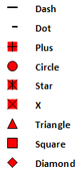
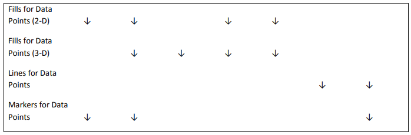
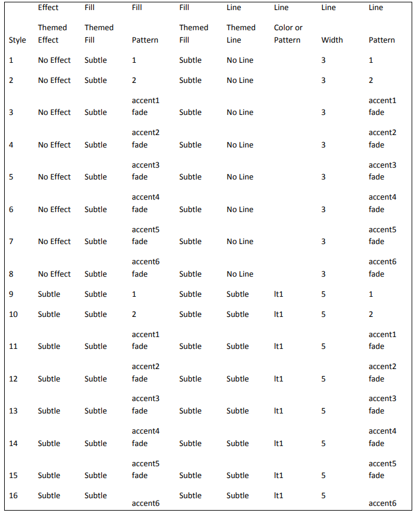
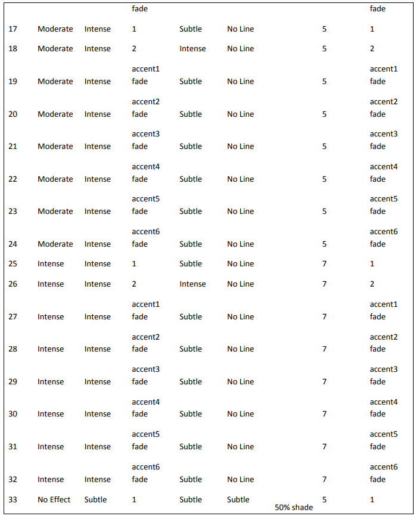
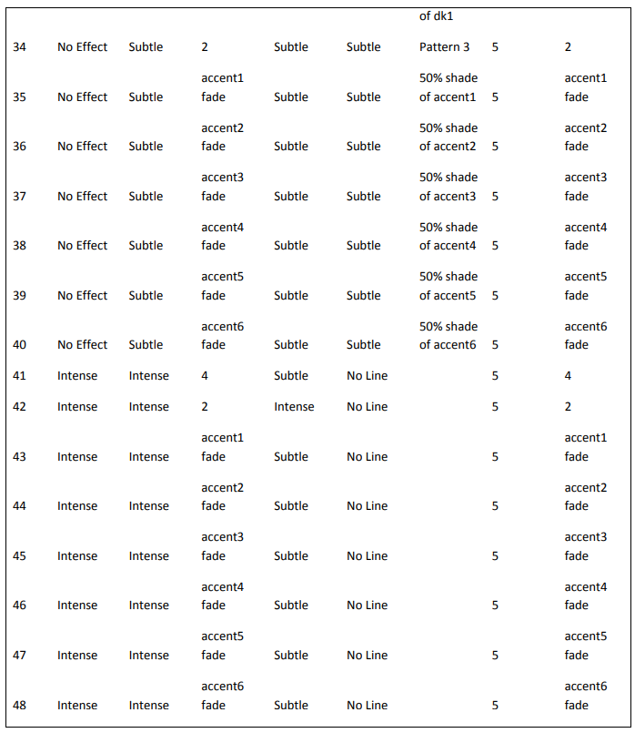
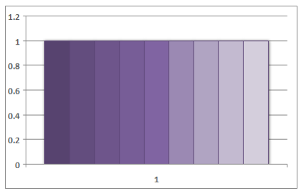
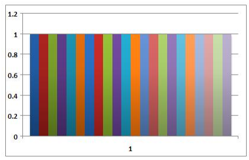

# 21.2 DrawingML - Charts

=== "中文"

    DrawingML 中的图表命名空间用于使用柱形图、饼图、散点图或其他类型的图表来表示数值数据的可视化。

=== "英文"

    The chart namespace in DrawingML is for representing visualizations of numeric data with column charts, pie charts, scatter charts, or other types of charts.

## 21.2.1 目录

=== "中文"
    
    - [21.2.2 元素](#2122-元素)
        - [21.2.2.1 applyToEnd (末尾应用)](#21221-applytoend-末尾应用)
        - [21.2.2.2 applyToFront (前面应用)](#21222-applytofront-前面应用)
        - [21.2.2.3 applyToSides (侧面应用)](#21223-applytosides-侧面应用)
        - [21.2.2.4 area3DChart (3D 面积图)](#21224-area3dchart-3d-面积图)
        - [21.2.2.5 areaChart (面积图)](#21225-areachart-面积图)
        - [21.2.2.6 auto (自动分类轴)](#21226-auto-自动分类轴)
        - [21.2.2.7 autoTitleDeleted (自动标题已删除)](#21227-autotitledeleted-自动标题已删除)
        - [21.2.2.8 autoUpdate (自动更新)](#21228-autoupdate-自动更新)
        - [21.2.2.9 axId (轴 ID)](#21229-axid-轴-id)
        - [21.2.2.10 axPos (轴位置)](#212210-axpos-轴位置)
        - [21.2.2.11 backWall (后墙)](#212211-backwall-后墙)
        - [21.2.2.12 backward (Backward)](#212212-backward-backward)
        - [21.2.2.13 bandFmt (带格式)](#212213-bandfmt-带格式)
        - [21.2.2.14 bandFmts (带格式集合)](#212214-bandfmts-带格式集合)
        - [21.2.2.15 bar3DChart (3D 条形图)](#212215-bar3dchart-3d-条形图)
        - [21.2.2.16 barChart (条形图)](#212216-barchart-条形图)
        - [21.2.2.17 barDir (条形方向)](#212217-bardir-条形方向)
        - [21.2.2.18 baseTimeUnit (基准时间单位)](#212218-basetimeunit-基准时间单位)
        - [21.2.2.19 bubble3D (3D气泡图)](#212219-bubble3d-3d气泡图)
        - [21.2.2.20 bubbleChart (气泡图)](#212220-bubblechart-气泡图)
        - [21.2.2.21 bubbleScale (气泡缩放)](#212221-bubblescale-气泡缩放)
        - [21.2.2.22 bubbleSize (气泡大小)](#212222-bubblesize-气泡大小)
        - [21.2.2.23 builtInUnit (内置显示单位值)](#212223-builtinunit-内置显示单位值)
        - [21.2.2.24 cat (类别轴数据)](#212224-cat-类别轴数据)
        - [21.2.2.25 catAx (类别轴数据)](#212225-catax-类别轴数据)
        - [21.2.2.26 chart (引用图表部件)](#212226-chart-引用图表部件)
        - [21.2.2.27 chart (图表)](#212227-chart-图表)
        - [21.2.2.28 chartObject (图表对象)](#212228-chartobject-图表对象)
        - [21.2.2.29 chartSpace (图表空间)](#212229-chartspace-图表空间)
        - [21.2.2.30 clrMapOvr (颜色映射覆盖)](#212230-clrmapovr-颜色映射覆盖)
        - [21.2.2.31 crossAx (交叉轴 ID)](#212231-crossax-交叉轴-id)
        - [21.2.2.32 crossBetween (交叉中间)](#212232-crossbetween-交叉中间)
        - [21.2.2.33 crosses (十字架)](#212233-crosses-十字架)
        - [21.2.2.34 crossesAt (穿越值)](#212234-crossesat-穿越值)
        - [21.2.2.35 custSplit (自定义拆分)](#212235-custsplit-自定义拆分)
        - [21.2.2.36 custUnit (定制显示单元)](#212236-custunit-定制显示单元)
        - [21.2.2.37 data (数据无法更改)](#212237-data-数据无法更改)
        - [21.2.2.38 date1904 (1904日期系统)](#212238-date1904-1904日期系统)
        - [21.2.2.39 dateAx (日期轴)](#212239-dateax-日期轴)
        - [21.2.2.40 delete (删除)](#212240-delete-删除)
        - [21.2.2.41 depthPercent (深度百分比)](#212241-depthpercent-深度百分比)
        - [21.2.2.42 dispBlanksAs (显示为空白)](#212242-dispblanksas-显示为空白)
        - [21.2.2.43 dispEq (显示方程)](#212243-dispeq-显示方程)
        - [21.2.2.44 dispRSqr (显示 R 平方值)](#212244-disprsqr-显示-r-平方值)
        - [21.2.2.45 dispUnits (显示单元)](#212245-dispunits-显示单元)
        - [21.2.2.46 dispUnitsLbl (显示单元标签)](#212246-dispunitslbl-显示单元标签)
        - [21.2.2.47 dLbl (数据标签)](#212247-dlbl-数据标签)
        - [21.2.2.48 dLblPos (数据标签位置)](#212248-dlblpos-数据标签位置)
        - [21.2.2.49 dLbls (数据标签合集)](#212249-dlbls-数据标签合集)
        - [21.2.2.50 doughnutChart (甜甜圈图表)](#212250-doughnutchart-甜甜圈图表)
        - [21.2.2.51 downBars (下降柱)](#212251-downbars-下降柱)
        - [21.2.2.52 dPt (数据点)](#212252-dpt-数据点)
        - [21.2.2.53 dropLines (下拉线)](#212253-droplines-下拉线)
        - [21.2.2.54 dTable (数据表)](#212254-dtable-数据表)
        - [21.2.2.55 errBars (错误线)](#212255-errbars-错误线)
        - [21.2.2.56 errBarType (错误条类型)](#212256-errbartype-错误条类型)
        - [21.2.2.57 errDir (错误条方向)](#212257-errdir-错误条方向)
        - [21.2.2.58 errValType (误差条数值类型)](#212258-errvaltype-误差条数值类型)
        - [21.2.2.59 evenFooter (偶数页脚)](#212259-evenfooter-偶数页脚)
        - [21.2.2.60 evenHeader (偶数头)](#212260-evenheader-偶数头)
        - [21.2.2.61 explosion (爆炸)](#212261-explosion-爆炸)
        - [21.2.2.62 ext (扩展)](#212262-ext-扩展)
        - [21.2.2.63 externalData (外部数据关系)](#212263-externaldata-外部数据关系)
        - [21.2.2.64 extLst (图表可扩展性)](#212264-extlst-图表可扩展性)
        - [21.2.2.65 f (公式)](#212265-f-公式)
        - [21.2.2.66 firstFooter (第一个页脚)](#212266-firstfooter-第一个页脚)
        - [21.2.2.67 firstHeader (第一个页眉)](#212267-firstheader-第一个页眉)
        - [21.2.2.68 firstSliceAng (第一切片角)](#212268-firstsliceang-第一切片角)
        - [21.2.2.69 floor (下限)](#212269-floor-下限)
        - [21.2.2.70 fmtId (格式ID)](#212270-fmtid-格式id)
        - [21.2.2.71 formatCode (格式代码)](#212271-formatcode-格式代码)
        - [21.2.2.72 formatting (格式)](#212272-formatting-格式)
        - [21.2.2.73 forward (Forward)](#212273-forward-forward)
        - [21.2.2.74 gapDepth (间隙深度)](#212274-gapdepth-间隙深度)
        - [21.2.2.75 gapWidth (间隙宽度)](#212275-gapwidth-间隙宽度)
        - [21.2.2.76 grouping (分组)](#212276-grouping-分组)
        - [21.2.2.77 grouping (条形图分组)](#212277-grouping-条形图分组)
        - [21.2.2.78 h (高度)](#212278-h-高度)
        - [21.2.2.79 headerFooter (页眉和页脚)](#212279-headerfooter-页眉和页脚)
        - [21.2.2.80 hiLowLines (高低线)](#212280-hilowlines-高低线)
        - [21.2.2.81 hMode (高度模式)](#212281-hmode-高度模式)
        - [21.2.2.82 holeSize (孔尺寸)](#212282-holesize-孔尺寸)
        - [21.2.2.83 hPercent (高度百分比)](#212283-hpercent-高度百分比)
        - [21.2.2.84 idx (索引)](#212284-idx-索引)
        - [21.2.2.85 intercept (截距)](#212285-intercept-截距)
        - [21.2.2.86 invertIfNegative (如果为负则反转)](#212286-invertifnegative-如果为负则反转)
        - [21.2.2.87 lang (编辑语言)](#212287-lang-编辑语言)
        - [21.2.2.88 layout (布局)](#212288-layout-布局)
        - [21.2.2.89 layoutTarget (布局目标)](#212289-layouttarget-布局目标)
        - [21.2.2.90 lblAlgn (标签对齐)](#212290-lblalgn-标签对齐)
        - [21.2.2.91 lblOffset (标签偏移)](#212291-lbloffset-标签偏移)
        - [21.2.2.92 leaderLines (引导线)](#212292-leaderlines-引导线)
        - [21.2.2.93 legend (图例)](#212293-legend-图例)
        - [21.2.2.94 legendEntry (图例条目)](#212294-legendentry-图例条目)
        - [21.2.2.95 legendPos (图例位置)](#212295-legendpos-图例位置)
        - [21.2.2.96 line3DChart (3D 折线图)](#212296-line3dchart-3d-折线图)
        - [21.2.2.97 lineChart (折线图)](#212297-linechart-折线图)
        - [21.2.2.98 logBase (对数底)](#212298-logbase-对数底)
        - [21.2.2.99 lvl (级别)](#212299-lvl-级别)
        - [21.2.2.100 majorGridlines (主要网格线)](#2122100-majorgridlines-主要网格线)
        - [21.2.2.101 majorTickMark (主要刻度线)](#2122101-majortickmark-主要刻度线)
        - [21.2.2.102 majorTimeUnit (主要时间单位)](#2122102-majortimeunit-主要时间单位)
        - [21.2.2.103 majorUnit (主要单位)](#2122103-majorunit-主要单位)
        - [21.2.2.104 manualLayout (手动布局)](#2122104-manuallayout-手动布局)
        - [21.2.2.105 marker (显示标记)](#2122105-marker-显示标记)
        - [21.2.2.106 marker (标记)](#2122106-marker-标记)
        - [21.2.2.107 max (最大值)](#2122107-max-最大值)
        - [21.2.2.108 min (最小值)](#2122108-min-最小值)
        - [21.2.2.109 minorGridlines (次要网格线)](#2122109-minorgridlines-次要网格线)
        - [21.2.2.110 minorTickMark (次要刻度线)](#2122110-minortickmark-次要刻度线)
        - [21.2.2.111 minorTimeUnit (次要时间单位)](#2122111-minortimeunit-次要时间单位)
        - [21.2.2.112 minorUnit (次要单位)](#2122112-minorunit-次要单位)
        - [21.2.2.113 minus (减)](#2122113-minus-减)
        - [21.2.2.114 multiLvlStrCache (多级字符串缓存)](#2122114-multilvlstrcache-多级字符串缓存)
        - [21.2.2.115 multiLvlStrRef (多级字符串引用)](#2122115-multilvlstrref-多级字符串引用)
        - [21.2.2.116 name (趋势线名称)](#2122116-name-趋势线名称)
        - [21.2.2.117 name (枢轴名称)](#2122117-name-枢轴名称)
        - [21.2.2.118 noEndCap (无端盖)](#2122118-noendcap-无端盖)
        - [21.2.2.119 noMultiLvlLbl (无多级标签)](#2122119-nomultilvllbl-无多级标签)
        - [21.2.2.120 numCache (数字缓存)](#2122120-numcache-数字缓存)
        - [21.2.2.121 numFmt (数字格式)](#2122121-numfmt-数字格式)
        - [21.2.2.122 numLit (数字 文字)](#2122122-numlit-数字-文字)
        - [21.2.2.123 numRef (编号引用)](#2122123-numref-编号引用)
        - [21.2.2.124 oddFooter (奇数页脚)](#2122124-oddfooter-奇数页脚)
        - [21.2.2.125 oddHeader (奇数页眉)](#2122125-oddheader-奇数页眉)
        - [21.2.2.126 ofPieChart (饼图或饼图条形图)](#2122126-ofpiechart-饼图或饼图条形图)
        - [21.2.2.127 ofPieType (饼中饼或饼中条类型)](#2122127-ofpietype-饼中饼或饼中条类型)
        - [21.2.2.128 order (排序)](#2122128-order-排序)
        - [21.2.2.129 order (多项式趋势线阶数)](#2122129-order-多项式趋势线阶数)
        - [21.2.2.130 orientation (轴方向)](#2122130-orientation-轴方向)
        - [21.2.2.131 overlap (重叠)](#2122131-overlap-重叠)
        - [21.2.2.132 overlay (覆盖)](#2122132-overlay-覆盖)
        - [21.2.2.133 pageMargins (页边距)](#2122133-pagemargins-页边距)
        - [21.2.2.134 pageSetup (页面设置)](#2122134-pagesetup-页面设置)
        - [21.2.2.135 period (周期)](#2122135-period-周期)
        - [21.2.2.136 perspective (看法)](#2122136-perspective-看法)
        - [21.2.2.137 pictureFormat (图片格式)](#2122137-pictureformat-图片格式)
        - [21.2.2.138 pictureOptions (图片选项)](#2122138-pictureoptions-图片选项)
        - [21.2.2.139 pictureStackUnit (图片堆栈单元)](#2122139-picturestackunit-图片堆栈单元)
        - [21.2.2.140 pie3DChart (3D饼图)](#2122140-pie3dchart-3d饼图)
        - [21.2.2.141 pieChart (饼图)](#2122141-piechart-饼图)
        - [21.2.2.142 pivotFmt (透视格式)](#2122142-pivotfmt-透视格式)
        - [21.2.2.143 pivotFmts (透视格式集合)](#2122143-pivotfmts-透视格式集合)
        - [21.2.2.144 pivotSource (透视源)](#2122144-pivotsource-透视源)
        - [21.2.2.145 plotArea (绘图区域)](#2122145-plotarea-绘图区域)
        - [21.2.2.146 plotVisOnly (绘图仅可见)](#2122146-plotvisonly-绘图仅可见)
        - [21.2.2.147 plus (加)](#2122147-plus-加)
        - [21.2.2.148 printSettings (打印设置)](#2122148-printsettings-打印设置)
        - [21.2.2.149 protection (保护)](#2122149-protection-保护)
        - [21.2.2.150 pt (数字点)](#2122150-pt-数字点)
        - [21.2.2.151 pt (弦点)](#2122151-pt-弦点)
        - [21.2.2.152 ptCount (点数量)](#2122152-ptcount-点数量)
        - [21.2.2.153 radarChart (雷达图)](#2122153-radarchart-雷达图)
        - [21.2.2.154 radarStyle (雷达样式)](#2122154-radarstyle-雷达样式)
        - [21.2.2.155 rAngAx (直角坐标轴)](#2122155-rangax-直角坐标轴)
        - [21.2.2.156 rich (富文本)](#2122156-rich-富文本)
        - [21.2.2.157 rotX (X轴旋转角度)](#2122157-rotx-x轴旋转角度)
        - [21.2.2.158 rotY (Y轴旋转角度)](#2122158-roty-y轴旋转角度)
        - [21.2.2.159 roundedCorners (圆角)](#2122159-roundedcorners-圆角)
        - [21.2.2.160 scaling (缩放)](#2122160-scaling-缩放)
        - [21.2.2.161 scatterChart (散点图)](#2122161-scatterchart-散点图)
        - [21.2.2.162 scatterStyle (散射样式)](#2122162-scatterstyle-散射样式)
        - [21.2.2.163 secondPiePt (第二个饼图点)](#2122163-secondpiept-第二个饼图点)
        - [21.2.2.164 secondPieSize (第二个饼图尺寸)](#2122164-secondpiesize-第二个饼图尺寸)
        - [21.2.2.165 selection (选择保护)](#2122165-selection-选择保护)
        - [21.2.2.166 separator (分隔符)](#2122166-separator-分隔符)
        - [21.2.2.167 ser (散点图系列)](#2122167-ser-散点图系列)
        - [21.2.2.168 ser (面积图系列)](#2122168-ser-面积图系列)
        - [21.2.2.169 ser (雷达图系列)](#2122169-ser-雷达图系列)
        - [21.2.2.170 ser (柱状图系列)](#2122170-ser-柱状图系列)
        - [21.2.2.171 ser (折线图系列)](#2122171-ser-折线图系列)
        - [21.2.2.172 ser (饼图系列)](#2122172-ser-饼图系列)
        - [21.2.2.173 ser (曲面图系列)](#2122173-ser-曲面图系列)
        - [21.2.2.174 ser (气泡图系列)](#2122174-ser-气泡图系列)
        - [21.2.2.175 serAx (系列轴)](#2122175-serax-系列轴)
        - [21.2.2.176 serLines (系列线)](#2122176-serlines-系列线)
        - [21.2.2.177 shape (形状)](#2122177-shape-形状)
        - [21.2.2.178 showBubbleSize (显示气泡大小)](#2122178-showbubblesize-显示气泡大小)
        - [21.2.2.179 showCatName (显示类别名称)](#2122179-showcatname-显示类别名称)
        - [21.2.2.180 showDLblsOverMax (显示超过最大值的数据标签)](#2122180-showdlblsovermax-显示超过最大值的数据标签)
        - [21.2.2.181 showHorzBorder (显示水平边框)](#2122181-showhorzborder-显示水平边框)
        - [21.2.2.182 showKeys (显示图例键)](#2122182-showkeys-显示图例键)
        - [21.2.2.183 showLeaderLines (显示引导线)](#2122183-showleaderlines-显示引导线)
        - [21.2.2.184 showLegendKey (显示图例键)](#2122184-showlegendkey-显示图例键)
        - [21.2.2.185 showNegBubbles (显示负气泡)](#2122185-shownegbubbles-显示负气泡)
        - [21.2.2.186 showOutline (显示轮廓边框)](#2122186-showoutline-显示轮廓边框)
        - [21.2.2.187 showPercent (显示百分比)](#2122187-showpercent-显示百分比)
        - [21.2.2.188 showSerName (显示系列名称)](#2122188-showsername-显示系列名称)
        - [21.2.2.189 showVal (显示值)](#2122189-showval-显示值)
        - [21.2.2.190 showVertBorder (显示垂直边框)](#2122190-showvertborder-显示垂直边框)
        - [21.2.2.191 sideWall (侧壁)](#2122191-sidewall-侧壁)
        - [21.2.2.192 size (尺寸)](#2122192-size-尺寸)
        - [21.2.2.193 sizeRepresents (尺寸代表)](#2122193-sizerepresents-尺寸代表)
        - [21.2.2.194 smooth (平滑)](#2122194-smooth-平滑)
        - [21.2.2.195 splitPos (分割位置)](#2122195-splitpos-分割位置)
        - [21.2.2.196 splitType (分割类型)](#2122196-splittype-分割类型)
        - [21.2.2.197 spPr (形状属性)](#2122197-sppr-形状属性)
        - [21.2.2.198 stockChart (股票图表)](#2122198-stockchart-股票图表)
        - [21.2.2.199 strCache (字符串缓存)](#2122199-strcache-字符串缓存)
        - [21.2.2.200 strLit (字符串字面量)](#2122200-strlit-字符串字面量)
        - [21.2.2.201 strRef (字符串参考)](#2122201-strref-字符串参考)
        - [21.2.2.202 style (样式)](#2122202-style-样式)
        - [21.2.2.203 surface3DChart (3D 曲面图)](#2122203-surface3dchart-3d-曲面图)
        - [21.2.2.204 surfaceChart (曲面图)](#2122204-surfacechart-曲面图)
        - [21.2.2.205 symbol (标记)](#2122205-symbol-标记)
        - [21.2.2.206 thickness (厚度)](#2122206-thickness-厚度)
        - [21.2.2.207 tickLblPos (刻度标签位置)](#2122207-ticklblpos-刻度标签位置)
        - [21.2.2.208 tickLblSkip (勾选标签跳过)](#2122208-ticklblskip-勾选标签跳过)
        - [21.2.2.209 tickMarkSkip (跳过刻度线)](#2122209-tickmarkskip-跳过刻度线)
        - [21.2.2.210 title (标题)](#2122210-title-标题)
        - [21.2.2.211 trendline (趋势线)](#2122211-trendline-趋势线)
        - [21.2.2.212 trendlineLbl (趋势线标签)](#2122212-trendlinelbl-趋势线标签)
        - [21.2.2.213 trendlineType (趋势线类型)](#2122213-trendlinetype-趋势线类型)
        - [21.2.2.214 tx (图表文本)](#2122214-tx-图表文本)
        - [21.2.2.215 tx (系列文本)](#2122215-tx-系列文本)
        - [21.2.2.216 txPr (文本属性)](#2122216-txpr-文本属性)
        - [21.2.2.217 upBars (向上柱状图)](#2122217-upbars-向上柱状图)
        - [21.2.2.218 upDownBars (上下柱状图)](#2122218-updownbars-上下柱状图)
        - [21.2.2.219 userInterface (用户接口)](#2122219-userinterface-用户接口)
        - [21.2.2.220 userShapes (用户形状)](#2122220-usershapes-用户形状)
        - [21.2.2.221 userShapes (图表绘制部分参考)](#2122221-usershapes-图表绘制部分参考)
        - [21.2.2.222 v (数值)](#2122222-v-数值)
        - [21.2.2.223 v (文本值)](#2122223-v-文本值)
        - [21.2.2.224 val (值集合)](#2122224-val-值集合)
        - [21.2.2.225 val (误差条值)](#2122225-val-误差条值)
        - [21.2.2.226 valAx (值轴)](#2122226-valax-值轴)
        - [21.2.2.227 varyColors (按点改变颜色)](#2122227-varycolors-按点改变颜色)
        - [21.2.2.228 view3D (3D 视图)](#2122228-view3d-3d-视图)
        - [21.2.2.229 w (宽度)](#2122229-w-宽度)
        - [21.2.2.230 wireframe (线框)](#2122230-wireframe-线框)
        - [21.2.2.231 wMode (宽度类型)](#2122231-wmode-宽度类型)
        - [21.2.2.232 x (Left)](#2122232-x-left)
        - [21.2.2.233 xMode (Left Mode)](#2122233-xmode-left-mode)
        - [21.2.2.234 xVal (X Values)](#2122234-xval-x-values)
        - [21.2.2.235 y (Top)](#2122235-y-top)
        - [21.2.2.236 yMode (Top Mode)](#2122236-ymode-top-mode)
        - [21.2.2.237 yVal (Y Values)](#2122237-yval-y-values)
    - [21.2.3 简单类型](#2123-简单类型)
        - [21.2.3.1 ST\_AxisUnit (轴单位)](#21231-st_axisunit-轴单位)
        - [21.2.3.2 ST\_AxPos (轴位置)](#21232-st_axpos-轴位置)
        - [21.2.3.3 ST\_BarDir (柱状(条形)图方向)](#21233-st_bardir-柱状条形图方向)
        - [21.2.3.4 ST\_BarGrouping (柱状(条形)图分组)](#21234-st_bargrouping-柱状条形图分组)
        - [21.2.3.5 ST\_BubbleScale (气泡缩放)](#21235-st_bubblescale-气泡缩放)
        - [21.2.3.6 ST\_BuiltInUnit (内置单位)](#21236-st_builtinunit-内置单位)
        - [21.2.3.7 ST\_CrossBetween (交叉之间)](#21237-st_crossbetween-交叉之间)
        - [21.2.3.8 ST\_Crosses (交叉点)](#21238-st_crosses-交叉点)
        - [21.2.3.9 ST\_DepthPercent (深度百分比)](#21239-st_depthpercent-深度百分比)
        - [21.2.3.10 ST\_DispBlanksAs (将空白显示为)](#212310-st_dispblanksas-将空白显示为)
        - [21.2.3.11 ST\_DLblPos (数据标签位置)](#212311-st_dlblpos-数据标签位置)
        - [21.2.3.12 ST\_ErrBarType (误差线类型)](#212312-st_errbartype-误差线类型)
        - [21.2.3.13 ST\_ErrDir (误差线方向)](#212313-st_errdir-误差线方向)
        - [21.2.3.14 ST\_ErrValType (错误值类型)](#212314-st_errvaltype-错误值类型)
        - [21.2.3.15 ST\_FirstSliceAng (第一切片角)](#212315-st_firstsliceang-第一切片角)
        - [21.2.3.16 ST\_GapAmount (间隙百分比)](#212316-st_gapamount-间隙百分比)
        - [21.2.3.17 ST\_Grouping (分组)](#212317-st_grouping-分组)
        - [21.2.3.18 ST\_HoleSize (孔尺寸)](#212318-st_holesize-孔尺寸)
        - [21.2.3.19 ST\_HPercent (身高百分比)](#212319-st_hpercent-身高百分比)
        - [21.2.3.20 ST\_LayoutMode (布局模式)](#212320-st_layoutmode-布局模式)
        - [21.2.3.21 ST\_LayoutTarget (布局目标)](#212321-st_layouttarget-布局目标)
        - [21.2.3.22 ST\_LblAlgn (标签对齐)](#212322-st_lblalgn-标签对齐)
        - [21.2.3.23 ST\_LblOffset (标签偏移)](#212323-st_lbloffset-标签偏移)
        - [21.2.3.24 ST\_LegendPos (图例位置)](#212324-st_legendpos-图例位置)
        - [21.2.3.25 ST\_LogBase (对数底)](#212325-st_logbase-对数底)
        - [21.2.3.26 ST\_MarkerSize (标记尺寸)](#212326-st_markersize-标记尺寸)
        - [21.2.3.27 ST\_MarkerStyle (标记样式)](#212327-st_markerstyle-标记样式)
        - [21.2.3.28 ST\_OfPieType (饼中饼或饼中条类型)](#212328-st_ofpietype-饼中饼或饼中条类型)
        - [21.2.3.29 ST\_Order (排序)](#212329-st_order-排序)
        - [21.2.3.30 ST\_Orientation (方向)](#212330-st_orientation-方向)
        - [21.2.3.31 ST\_Overlap (重叠)](#212331-st_overlap-重叠)
        - [21.2.3.32 ST\_PageSetupOrientation (打印页面方向)](#212332-st_pagesetuporientation-打印页面方向)
        - [21.2.3.33 ST\_Period (周期)](#212333-st_period-周期)
        - [21.2.3.34 ST\_Perspective (透视)](#212334-st_perspective-透视)
        - [21.2.3.35 ST\_PictureFormat (图片格式)](#212335-st_pictureformat-图片格式)
        - [21.2.3.36 ST\_PictureStackUnit (图片堆栈单元)](#212336-st_picturestackunit-图片堆栈单元)
        - [21.2.3.37 ST\_RadarStyle (雷达样式)](#212337-st_radarstyle-雷达样式)
        - [21.2.3.38 ST\_RotX (X 轴旋转角度)](#212338-st_rotx-x-轴旋转角度)
        - [21.2.3.39 ST\_RotY (Y 轴旋转角度)](#212339-st_roty-y-轴旋转角度)
        - [21.2.3.40 ST\_ScatterStyle (散点图样式)](#212340-st_scatterstyle-散点图样式)
        - [21.2.3.41 ST\_SecondPieSize (第二饼图尺寸)](#212341-st_secondpiesize-第二饼图尺寸)
        - [21.2.3.42 ST\_Shape (形状)](#212342-st_shape-形状)
        - [21.2.3.43 ST\_SizeRepresents (尺寸表示)](#212343-st_sizerepresents-尺寸表示)
        - [21.2.3.44 ST\_Skip (跳过)](#212344-st_skip-跳过)
        - [21.2.3.45 ST\_SplitType (分割类型)](#212345-st_splittype-分割类型)
        - [21.2.3.46 ST\_Style (样式)](#212346-st_style-样式)
        - [21.2.3.47 ST\_TickLblPos (刻度标签位置)](#212347-st_ticklblpos-刻度标签位置)
        - [21.2.3.48 ST\_TickMark (刻度线)](#212348-st_tickmark-刻度线)
        - [21.2.3.49 ST\_TimeUnit (时间单位)](#212349-st_timeunit-时间单位)
        - [21.2.3.50 ST\_TrendlineType (趋势线类型)](#212350-st_trendlinetype-趋势线类型)
        - [21.2.3.51 ST\_DepthPercentWithSymbol (深度百分比（带符号）)](#212351-st_depthpercentwithsymbol-深度百分比带符号)
        - [21.2.3.52 ST\_HPercentWithSymbol (高度百分比（带符号）)](#212352-st_hpercentwithsymbol-高度百分比带符号)
        - [21.2.3.53 ST\_GapAmountPercent (差额百分比)](#212353-st_gapamountpercent-差额百分比)
        - [21.2.3.54 ST\_SecondPieSizePercent (第二个饼图大小百分比)](#212354-st_secondpiesizepercent-第二个饼图大小百分比)
        - [21.2.3.55 ST\_HoleSizePercent (孔径百分比)](#212355-st_holesizepercent-孔径百分比)
        - [21.2.3.56 ST\_LblOffsetPercent (标签偏移百分比)](#212356-st_lbloffsetpercent-标签偏移百分比)
        - [21.2.3.57 ST\_OverlapPercent (重叠百分比)](#212357-st_overlappercent-重叠百分比)
        - [21.2.3.58 ST\_BubbleScalePercent (气泡比例百分比)](#212358-st_bubblescalepercent-气泡比例百分比)
        - [21.2.3.59 ST\_Thickness (厚度百分比)](#212359-st_thickness-厚度百分比)
        - [21.2.3.60 ST\_ThicknessPercent (厚度百分比)](#212360-st_thicknesspercent-厚度百分比)

=== "英文"

    **Table of Contents**

    **This subclause is informative.**

    - 21.2.2 Elements
        - 21.2.2.1 applyToEnd (Apply to End)
        - 21.2.2.2 applyToFront (Apply To Front)
        - 21.2.2.3 applyToSides (Apply To Sides)
        - 21.2.2.4 area3DChart (3D Area Charts)
        - 21.2.2.5 areaChart (Area Charts)
        - 21.2.2.6 auto (Automatic Category Axis)
        - 21.2.2.7 autoTitleDeleted (Auto Title Is Deleted)
        - 21.2.2.8 autoUpdate (Update Automatically)
        - 21.2.2.9 axId (Axis ID)
        - 21.2.2.10 axPos (Axis Position)
        - 21.2.2.11 backWall (Back Wall)
        - 21.2.2.12 backward (Backward)
        - 21.2.2.13 bandFmt (Band Format)
        - 21.2.2.14 bandFmts (Band Formats)
        - 21.2.2.15 bar3DChart (3D Bar Charts)
        - 21.2.2.16 barChart (Bar Charts)
        - 21.2.2.17 barDir (Bar Direction)
        - 21.2.2.18 baseTimeUnit (Base Time Unit)
        - 21.2.2.19 bubble3D (3D Bubble)
        - 21.2.2.20 bubbleChart (Bubble Charts)
        - 21.2.2.21 bubbleScale (Bubble Scale)
        - 21.2.2.22 bubbleSize (Bubble Size)
        - 21.2.2.23 builtInUnit (Built in Display Unit Value)
        - 21.2.2.24 cat (Category Axis Data)
        - 21.2.2.25 catAx (Category Axis Data)
        - 21.2.2.26 chart (Reference to Chart Part)
        - 21.2.2.27 chart (Chart)
        - 21.2.2.28 chartObject (Chart Object)
        - 21.2.2.29 chartSpace (Chart Space)
        - 21.2.2.30 clrMapOvr (Color Map Override)
        - 21.2.2.31 crossAx (Crossing Axis ID)
        - 21.2.2.32 crossBetween (Cross Between)
        - 21.2.2.33 crosses (Crosses)
        - 21.2.2.34 crossesAt (Crossing Value)
        - 21.2.2.35 custSplit (Custom Split)
        - 21.2.2.36 custUnit (Custom Display Unit)
        - 21.2.2.37 data (Data Cannot Be Changed)
        - 21.2.2.38 date1904 (1904 Date System)
        - 21.2.2.39 dateAx (Date Axis)
        - 21.2.2.40 delete (Delete)
        - 21.2.2.41 depthPercent (Depth Percent)
        - 21.2.2.42 dispBlanksAs (Display Blanks As)
        - 21.2.2.43 dispEq (Display Equation)
        - 21.2.2.44 dispRSqr (Display R Squared Value)
        - 21.2.2.45 dispUnits (Display Units)
        - 21.2.2.46 dispUnitsLbl (Display Units Label)
        - 21.2.2.47 dLbl (Data Label)
        - 21.2.2.48 dLblPos (Data Label Position)
        - 21.2.2.49 dLbls (Data Labels)
        - 21.2.2.50 doughnutChart (Doughnut Charts)
        - 21.2.2.51 downBars (Down Bars)
        - 21.2.2.52 dPt (Data Point)
        - 21.2.2.53 dropLines (Drop Lines)
        - 21.2.2.54 dTable (Data Table)
        - 21.2.2.55 errBars (Error Bars)
        - 21.2.2.56 errBarType (Error Bar Type)
        - 21.2.2.57 errDir (Error Bar Direction)
        - 21.2.2.58 errValType (Error Bar Value Type)
        - 21.2.2.59 evenFooter (Even Footer)
        - 21.2.2.60 evenHeader (Even Header)
        - 21.2.2.61 explosion (Explosion)
        - 21.2.2.62 ext (Extension)
        - 21.2.2.63 externalData (External Data Relationship)
        - 21.2.2.64 extLst (Chart Extensibility)
        - 21.2.2.65 f (Formula)
        - 21.2.2.66 firstFooter (First Footer)
        - 21.2.2.67 firstHeader (First Header)
        - 21.2.2.68 firstSliceAng (First Slice Angle)
        - 21.2.2.69 floor (Floor)
        - 21.2.2.70 fmtId (Format ID)
        - 21.2.2.71 formatCode (Format Code)
        - 21.2.2.72 formatting (Formatting)
        - 21.2.2.73 forward (Forward)
        - 21.2.2.74 gapDepth (Gap Depth)
        - 21.2.2.75 gapWidth (Gap Width)
        - 21.2.2.76 grouping (Grouping)
        - 21.2.2.77 grouping (Bar Grouping)
        - 21.2.2.78 h (Height)
        - 21.2.2.79 headerFooter (Header and Footer)
        - 21.2.2.80 hiLowLines (High Low Lines)
        - 21.2.2.81 hMode (Height Mode)
        - 21.2.2.82 holeSize (Hole Size)
        - 21.2.2.83 hPercent (Height Percent)
        - 21.2.2.84 idx (Index)
        - 21.2.2.85 intercept (Intercept)
        - 21.2.2.86 invertIfNegative (Invert if Negative)
        - 21.2.2.87 lang (Editing Language)
        - 21.2.2.88 layout (Layout)
        - 21.2.2.89 layoutTarget (Layout Target)
        - 21.2.2.90 lblAlgn (Label Alignment)
        - 21.2.2.91 lblOffset (Label Offset)
        - 21.2.2.92 leaderLines (Leader Lines)
        - 21.2.2.93 legend (Legend)
        - 21.2.2.94 legendEntry (Legend Entry)
        - 21.2.2.95 legendPos (Legend Position)
        - 21.2.2.96 line3DChart (3D Line Charts)
        - 21.2.2.97 lineChart (Line Charts)
        - 21.2.2.98 logBase (Logarithmic Base)
        - 21.2.2.99 lvl (Level)
        - 21.2.2.100 majorGridlines (Major Gridlines)
        - 21.2.2.101 majorTickMark (Major Tick Mark)
        - 21.2.2.102 majorTimeUnit (Major Time Unit)
        - 21.2.2.103 majorUnit (Major Unit)
        - 21.2.2.104 manualLayout (Manual Layout)
        - 21.2.2.105 marker (Show Marker)
        - 21.2.2.106 marker (Marker)
        - 21.2.2.107 max (Maximum)
        - 21.2.2.108 min (Minimum)
        - 21.2.2.109 minorGridlines (Minor Gridlines)
        - 21.2.2.110 minorTickMark (Minor Tick Mark)
        - 21.2.2.111 minorTimeUnit (Minor Time Unit)
        - 21.2.2.112 minorUnit (Minor Unit)
        - 21.2.2.113 minus (Minus)
        - 21.2.2.114 multiLvlStrCache (Multi Level String Cache)
        - 21.2.2.115 multiLvlStrRef (Multi Level String Reference)
        - 21.2.2.116 name (Trendline Name)
        - 21.2.2.117 name (Pivot Name)
        - 21.2.2.118 noEndCap (No End Cap)
        - 21.2.2.119 noMultiLvlLbl (No Multi-level Labels)
        - 21.2.2.120 numCache (Number Cache)
        - 21.2.2.121 numFmt (Number Format)
        - 21.2.2.122 numLit (Number Literal)
        - 21.2.2.123 numRef (Number Reference)
        - 21.2.2.124 oddFooter (Odd Footer)
        - 21.2.2.125 oddHeader (Odd Header)
        - 21.2.2.126 ofPieChart (Pie of Pie or Bar of Pie Charts)
        - 21.2.2.127 ofPieType (Pie of Pie or Bar of Pie Type)
        - 21.2.2.128 order (Order)
        - 21.2.2.129 order (Polynomial Trendline Order)
        - 21.2.2.130 orientation (Axis Orientation)
        - 21.2.2.131 overlap (Overlap)
        - 21.2.2.132 overlay (Overlay)
        - 21.2.2.133 pageMargins (Page Margins)
        - 21.2.2.134 pageSetup (Page Setup)
        - 21.2.2.135 period (Period)
        - 21.2.2.136 perspective (Perspective)
        - 21.2.2.137 pictureFormat (Picture Format)
        - 21.2.2.138 pictureOptions (Picture Options)
        - 21.2.2.139 pictureStackUnit (Picture Stack Unit)
        - 21.2.2.140 pie3DChart (3D Pie Charts)
        - 21.2.2.141 pieChart (Pie Charts)
        - 21.2.2.142 pivotFmt (Pivot Format)
        - 21.2.2.143 pivotFmts (Pivot Formats)
        - 21.2.2.144 pivotSource (Pivot Source)
        - 21.2.2.145 plotArea (Plot Area)
        - 21.2.2.146 plotVisOnly (Plot Visible Only)
        - 21.2.2.147 plus (Plus)
        - 21.2.2.148 printSettings (Print Settings)
        - 21.2.2.149 protection (Protection)
        - 21.2.2.150 pt (Numeric Point)
        - 21.2.2.151 pt (String Point)
        - 21.2.2.152 ptCount (Point Count)
        - 21.2.2.153 radarChart (Radar Charts)
        - 21.2.2.154 radarStyle (Radar Style)
        - 21.2.2.155 rAngAx (Right Angle Axes)
        - 21.2.2.156 rich (Rich Text)
        - 21.2.2.157 rotX (X Rotation)
        - 21.2.2.158 rotY (Y Rotation)
        - 21.2.2.159 roundedCorners (Rounded Corners)
        - 21.2.2.160 scaling (Scaling)
        - 21.2.2.161 scatterChart (Scatter Charts)
        - 21.2.2.162 scatterStyle (Scatter Style)
        - 21.2.2.163 secondPiePt (Second Pie Point)
        - 21.2.2.164 secondPieSize (Second Pie Size)
        - 21.2.2.165 selection (Selection)
        - 21.2.2.166 separator (Separator)
        - 21.2.2.167 ser (Scatter Chart Series)
        - 21.2.2.168 ser (Area Chart Series)
        - 21.2.2.169 ser (Radar Chart Series)
        - 21.2.2.170 ser (Bar Chart Series)
        - 21.2.2.171 ser (Line Chart Series)
        - 21.2.2.172 ser (Pie Chart Series)
        - 21.2.2.173 ser (Surface Chart Series)
        - 21.2.2.174 ser (Bubble Chart Series)
        - 21.2.2.175 serAx (Series Axis)
        - 21.2.2.176 serLines (Series Lines)
        - 21.2.2.177 shape (Shape)
        - 21.2.2.178 showBubbleSize (Show Bubble Size)
        - 21.2.2.179 showCatName (Show Category Name)
        - 21.2.2.180 showDLblsOverMax (Show Data Labels over Maximum)
        - 21.2.2.181 showHorzBorder (Show Horizontal Border)
        - 21.2.2.182 showKeys (Show Legend Keys)
        - 21.2.2.183 showLeaderLines (Show Leader Lines)
        - 21.2.2.184 showLegendKey (Show Legend Key)
        - 21.2.2.185 showNegBubbles (Show Negative Bubbles)
        - 21.2.2.186 showOutline (Show Outline Border)
        - 21.2.2.187 showPercent (Show Percent)
        - 21.2.2.188 showSerName (Show Series Name)
        - 21.2.2.189 showVal (Show Value)
        - 21.2.2.190 showVertBorder (Show Vertical Border)
        - 21.2.2.191 sideWall (Side Wall)
        - 21.2.2.192 size (Size)
        - 21.2.2.193 sizeRepresents (Size Represents)
        - 21.2.2.194 smooth (Smoothing)
        - 21.2.2.195 splitPos (Split Position)
        - 21.2.2.196 splitType (Split Type)
        - 21.2.2.197 spPr (Shape Properties)
        - 21.2.2.198 stockChart (Stock Charts)
        - 21.2.2.199 strCache (String Cache)
        - 21.2.2.200 strLit (String Literal)
        - 21.2.2.201 strRef (String Reference)
        - 21.2.2.202 style (Style)
        - 21.2.2.203 surface3DChart (3D Surface Charts)
        - 21.2.2.204 surfaceChart (Surface Charts)
        - 21.2.2.205 symbol (Symbol)
        - 21.2.2.206 thickness (Thickness)
        - 21.2.2.207 tickLblPos (Tick Label Position)
        - 21.2.2.208 tickLblSkip (Tick Label Skip)
        - 21.2.2.209 tickMarkSkip (Tick Mark Skip)
        - 21.2.2.210 title (Title)
        - 21.2.2.211 trendline (Trendlines)
        - 21.2.2.212 trendlineLbl (Trendline Label)
        - 21.2.2.213 trendlineType (Trendline Type)
        - 21.2.2.214 tx (Chart Text)
        - 21.2.2.215 tx (Series Text)
        - 21.2.2.216 txPr (Text Properties)
        - 21.2.2.217 upBars (Up Bars)
        - 21.2.2.218 upDownBars (Up/Down Bars)
        - 21.2.2.219 userInterface (User Interface)
        - 21.2.2.220 userShapes (User Shapes)
        - 21.2.2.221 userShapes (Reference to Chart Drawing Part)
        - 21.2.2.222 v (Numeric Value)
        - 21.2.2.223 v (Text Value)
        - 21.2.2.224 val (Values)
        - 21.2.2.225 val (Error Bar Value)
        - 21.2.2.226 valAx (Value Axis)
        - 21.2.2.227 varyColors (Vary Colors by Point)
        - 21.2.2.228 view3D (View In 3D)
        - 21.2.2.229 w (Width)
        - 21.2.2.230 wireframe (Wireframe)
        - 21.2.2.231 wMode (Width Mode)
        - 21.2.2.232 x (Left)
        - 21.2.2.233 xMode (Left Mode)
        - 21.2.2.234 xVal (X Values)
        - 21.2.2.235 y (Top)
        - 21.2.2.236 yMode (Top Mode)
        - 21.2.2.237 yVal (Y Values)
    - 21.2.3 Simple Types
        - 21.2.3.1 ST_AxisUnit (Axis Unit)
        - 21.2.3.2 ST_AxPos (Axis Position)
        - 21.2.3.3 ST_BarDir (Bar Direction)
        - 21.2.3.4 ST_BarGrouping (Bar Grouping)
        - 21.2.3.5 ST_BubbleScale (Bubble Scale)
        - 21.2.3.6 ST_BuiltInUnit (Built-In Unit)
        - 21.2.3.7 ST_CrossBetween (Cross Between)
        - 21.2.3.8 ST_Crosses (Crosses)
        - 21.2.3.9 ST_DepthPercent (Depth Percent)
        - 21.2.3.10 ST_DispBlanksAs (Display Blanks As)
        - 21.2.3.11 ST_DLblPos (Data Label Position)
        - 21.2.3.12 ST_ErrBarType (Error Bar Type)
        - 21.2.3.13 ST_ErrDir (Error Bar Direction)
        - 21.2.3.14 ST_ErrValType (Error Value Type)
        - 21.2.3.15 ST_FirstSliceAng (First Slice Angle)
        - 21.2.3.16 ST_GapAmount (Gap Amount)
        - 21.2.3.17 ST_Grouping (Grouping)
        - 21.2.3.18 ST_HoleSize (Hole Size)
        - 21.2.3.19 ST_HPercent (Height Percent)
        - 21.2.3.20 ST_LayoutMode (Layout Mode)
        - 21.2.3.21 ST_LayoutTarget (Layout Target)
        - 21.2.3.22 ST_LblAlgn (Label Alignment)
        - 21.2.3.23 ST_LblOffset (Label Offset)
        - 21.2.3.24 ST_LegendPos (Legend Position)
        - 21.2.3.25 ST_LogBase (Logarithmic Base)
        - 21.2.3.26 ST_MarkerSize (Marker Size)
        - 21.2.3.27 ST_MarkerStyle (Marker Style)
        - 21.2.3.28 ST_OfPieType (Pie of Pie or Bar of Pie Type)
        - 21.2.3.29 ST_Order (Order)
        - 21.2.3.30 ST_Orientation (Orientation)
        - 21.2.3.31 ST_Overlap (Overlap)
        - 21.2.3.32 ST_PageSetupOrientation (Printed Page Orientation)
        - 21.2.3.33 ST_Period (Period)
        - 21.2.3.34 ST_Perspective (Perspective)
        - 21.2.3.35 ST_PictureFormat (Picture Format)
        - 21.2.3.36 ST_PictureStackUnit (Picture Stack Unit)
        - 21.2.3.37 ST_RadarStyle (Radar Style)
        - 21.2.3.38 ST_RotX (X Rotation)
        - 21.2.3.39 ST_RotY (Y Rotation)
        - 21.2.3.40 ST_ScatterStyle (Scatter Style)
        - 21.2.3.41 ST_SecondPieSize (Second Pie Size)
        - 21.2.3.42 ST_Shape (Shape)
        - 21.2.3.43 ST_SizeRepresents (Size Represents)
        - 21.2.3.44 ST_Skip (Skip)
        - 21.2.3.45 ST_SplitType (Split Type)
        - 21.2.3.46 ST_Style (Style)
        - 21.2.3.47 ST_TickLblPos (Tick Label Position)
        - 21.2.3.48 ST_TickMark (Tick Mark)
        - 21.2.3.49 ST_TimeUnit (Time Unit)
        - 21.2.3.50 ST_TrendlineType (Trendline Type)
        - 21.2.3.51 ST_DepthPercentWithSymbol (Depth Percent with Symbol)
        - 21.2.3.52 ST_HPercentWithSymbol (Height Percent with Symbol)
        - 21.2.3.53 ST_GapAmountPercent (Gap Amount Percentage)
        - 21.2.3.54 ST_SecondPieSizePercent (Second Pie Size Percentage)
        - 21.2.3.55 ST_HoleSizePercent (Hole Size Percentage)
        - 21.2.3.56 ST_LblOffsetPercent (Label Offset Percentage)
        - 21.2.3.57 ST_OverlapPercent (Overlap Percentage)
        - 21.2.3.58 ST_BubbleScalePercent (Bubble Scale Percentage)
        - 21.2.3.59 ST_Thickness (Thickness Percentage)
        - 21.2.3.60 ST_ThicknessPercent (Thickness Percentage)

## 21.2.2 元素

=== "中文"

    在 DrawingML 中，图表定义数字数据的可视化。 该定义包括数据应来自何处、数据的缓存以及数据应如何以图形方式表示。 其他 DrawingML 元素被重用来定义可视化格式的各个方面。

    有关基本图表类型和图表组件的描述和概述，请参阅附录 L 中的信息材料。

=== "英文"

    **Elements**

    In DrawingML, charts define a visualization of numeric data. The definition includes where the data shall come from, a cache of the data, and how the data shall be represented graphically. Other DrawingML elements are reused to define aspects of the formatting of the visualization.

    See the informative material in Annex L for a description and overview of the basic chart types and chart components.

### 21.2.2.1 applyToEnd (末尾应用)

=== "中文"

    该元素指定图片应应用于点或系列的末尾。

    [Note: The W3C XML Schema definition of this element’s content model (CT_Boolean) is located in §A.5.1. end note]

=== "英文"

    **applyToEnd (Apply to End)**

    This element specifies the picture shall be applied to the end of the point or series.

    [Note: The W3C XML Schema definition of this element’s content model (CT_Boolean) is located in §A.5.1. end note]

### 21.2.2.2 applyToFront (前面应用)

=== "中文"

    该元素指定图片应应用于点或系列的前面。

    ??? abstract "Attributes"

        val (Boolean Value)

        :   为父 XML 元素定义的属性指定布尔值。

            值 1 或 true 指定应用该属性。 这是该属性的默认值，当父元素存在时隐含该值，但该属性被省略。

            值 0 或 false 指定不应用该属性。
            
            The possible values for this attribute are defined by the W3C XML Schema boolean datatype.
    
    [Note: The W3C XML Schema definition of this element’s content model (CT_Boolean) is located in §A.5.1. end note]

=== "英文"

    **applyToFront (Apply To Front)**

    This element specifies the picture shall be applied to the front of the point or series.

    ??? abstract "Attributes"

        val (Boolean Value)

        :   Specifies a boolean value for the property defined by the parent XML element.

            A value of 1 or true specifies that the property is applied. This is the default value for this attribute, and is implied when the parent element is present, but this attribute is omitted.

            A value of 0 or false specifies that the property is not applied.
            
            The possible values for this attribute are defined by the W3C XML Schema boolean datatype.
    
    [Note: The W3C XML Schema definition of this element’s content model (CT_Boolean) is located in §A.5.1. end note]

### 21.2.2.3 applyToSides (侧面应用)

=== "中文"

    该元素指定图片应应用于点或系列的侧面。

    ??? abstract "Attributes"

        val (Boolean Value)

        :   为父 XML 元素定义的属性指定布尔值。

            值 1 或 true 指定应用该属性。 这是该属性的默认值，当父元素存在时隐含该值，但该属性被省略。

            值 0 或 false 指定不应用该属性。

            The possible values for this attribute are defined by the W3C XML Schema boolean datatype.
    
    [Note: The W3C XML Schema definition of this element’s content model (CT_Boolean) is located in §A.5.1. end note]

=== "英文"

    **applyToSides (Apply To Sides)**

    This element specifies the picture shall be applied to the sides of the point or series.

    ??? abstract "Attributes"

        val (Boolean Value)

        :   Specifies a boolean value for the property defined by the parent XML element.

            A value of 1 or true specifies that the property is applied. This is the default value for this attribute, and is implied when the parent element is present, but this attribute is omitted.

            A value of 0 or false specifies that the property is not applied.

            The possible values for this attribute are defined by the W3C XML Schema boolean datatype.
    
    [Note: The W3C XML Schema definition of this element’s content model (CT_Boolean) is located in §A.5.1. end note]

### 21.2.2.4 area3DChart (3D 面积图)

=== "中文"

    该元素指定该图表上的 3D 区域系列。

    [Note: The W3C XML Schema definition of this element’s content model (CT_Area3DChart) is located in §A.5.1. end note]

=== "英文"

    **area3DChart (3D Area Charts)**

    This element specifies the 3-D area series on this chart.

    [Note: The W3C XML Schema definition of this element’s content model (CT_Area3DChart) is located in §A.5.1. end note]

### 21.2.2.5 areaChart (面积图)

=== "中文"

    此元素指定此图表上的二维区域系列。

    [Note: The W3C XML Schema definition of this element’s content model (CT_AreaChart) is located in §A.5.1. end note]

=== "英文"

    **EleareaChart (Area Charts)ments**

    This element specifies the 2-D area series on this chart.

    [Note: The W3C XML Schema definition of this element’s content model (CT_AreaChart) is located in §A.5.1. end note]

### 21.2.2.6 auto (自动分类轴)

=== "中文"

    此元素指定该轴是基于用于轴标签的数据的日期轴或文本轴，而不是特定的选择。

    ??? abstract "Attributes"

        val (Boolean Value)

        :   为父 XML 元素定义的属性指定布尔值。

            一个值为1或true表示属性已应用。这是该属性的默认值，在父元素存在但该属性被省略时，会被隐含。
            
            一个值为0或false表示属性未应用。

            The possible values for this attribute are defined by the W3C XML Schema boolean datatype.
    
    [Note: The W3C XML Schema definition of this element’s content model (CT_Boolean) is located in §A.5.1. end note]

=== "英文"

    **auto (Automatic Category Axis)**

    This element specifies that this axis is a date or text axis based on the data that is used for the axis labels, not a specific choice.

    ??? abstract "Attributes"

        val (Boolean Value)

        :   Specifies a boolean value for the property defined by the parent XML element.

            A value of 1 or true specifies that the property is applied. This is the default value for this attribute, and is implied when the parent element is present, but this attribute is omitted.

            A value of 0 or false specifies that the property is not applied.

            The possible values for this attribute are defined by the W3C XML Schema boolean datatype.
    
    [Note: The W3C XML Schema definition of this element’s content model (CT_Boolean) is located in §A.5.1. end note]


### 21.2.2.7 autoTitleDeleted (自动标题已删除)

=== "中文"

    该元素指定该图表不应显示标题。

    ??? abstract "Attributes"

        val (Boolean Value)

        :   为父 XML 元素定义的属性指定布尔值。

            一个值为1或true表示属性已应用。这是该属性的默认值，在父元素存在但该属性被省略时，会被隐含。
            
            一个值为0或false表示属性未应用。

            The possible values for this attribute are defined by the W3C XML Schema boolean datatype.
    
    [Note: The W3C XML Schema definition of this element’s content model (CT_Boolean) is located in §A.5.1. end note]

=== "英文"

    **autoTitleDeleted (Auto Title Is Deleted)**

    This element specifies the title shall not be shown for this chart.

    ??? abstract "Attributes"

        val (Boolean Value)

        :   Specifies a boolean value for the property defined by the parent XML element.

            A value of 1 or true specifies that the property is applied. This is the default value for this attribute, and is implied when the parent element is present, but this attribute is omitted.

            A value of 0 or false specifies that the property is not applied.

            The possible values for this attribute are defined by the W3C XML Schema boolean datatype.
    
    [Note: The W3C XML Schema definition of this element’s content model (CT_Boolean) is located in §A.5.1. end note]

### 21.2.2.8 autoUpdate (自动更新)

=== "中文"

    该元素指定打开包含图表的文档时自动更新外部数据。

    ??? abstract "Attributes"

        val (Boolean Value)

        :   为父 XML 元素定义的属性指定布尔值。

            值 1 或 true 指定应用该属性。 这是该属性的默认值，当父元素存在时隐含该值，但该属性被省略。

            值 0 或 false 指定不应用该属性。

            The possible values for this attribute are defined by the W3C XML Schema boolean datatype.
    
    [Note: The W3C XML Schema definition of this element’s content model (CT_Boolean) is located in §A.5.1. end note]

=== "英文"

    **autoUpdate (Update Automatically)**

    This element specifies the external data is updated automatically when the document containing the chart is opened.

    ??? abstract "Attributes"

        val (Boolean Value)

        :   Specifies a boolean value for the property defined by the parent XML element.

            A value of 1 or true specifies that the property is applied. This is the default value for this attribute, and is implied when the parent element is present, but this attribute is omitted.

            A value of 0 or false specifies that the property is not applied.

            The possible values for this attribute are defined by the W3C XML Schema boolean datatype.
    
    [Note: The W3C XML Schema definition of this element’s content model (CT_Boolean) is located in §A.5.1. end note]


### 21.2.2.9 axId (轴 ID)

=== "中文"

    当指定为 valAx、dateAx、catAx 或 serAx 的子元素时，此元素指定轴的标识符。 当指定为图表的子元素时，此元素指定定义图表坐标空间的轴的标识符。

    ??? abstract "Attributes"

        val (Integer Value)

        :   指定该属性的内容包含整数。

            该数字的内容根据父 XML 元素的上下文进行解释。
        
            此属性的可能值由 W3C XML 架构 unsignedInt 数据类型定义。
    
    [Note: The W3C XML Schema definition of this element’s content model (CT_UnsignedInt) is located in §A.5.1. end note]

=== "英文"

    **axId (Axis ID)**

    When specified as a child element of valAx, dateAx, catAx, or serAx, this element specifies the identifier for the axis. When specified as a child element of a chart, this element specifies the identifier of an axis that defines the coordinate space of the chart.

    ??? abstract "Attributes"

        val (Integer Value)

        :   Specifies that the contents of this attribute contain an integer number.

            The contents of this number are interpreted based on the context of the parent XML element.
            
            The possible values for this attribute are defined by the W3C XML Schema unsignedInt datatype.
    
    [Note: The W3C XML Schema definition of this element’s content model (CT_UnsignedInt) is located in §A.5.1. end note]

### 21.2.2.10 axPos (轴位置)

=== "中文"

    该元素指定图表上轴的位置。

    ??? abstract "Attributes"

        val (Axis Position Value)

        :   指定图表上轴的位置。

            The possible values for this attribute are defined by the ST_AxPos simple type (§21.2.3.2).
    
    [Note: The W3C XML Schema definition of this element’s content model (CT_AxPos) is located in §A.5.1. end note]

=== "英文"

    **axPos (Axis Position)**

    This element specifies the position of the axis on the chart.

    ??? abstract "Attributes"

        val (Axis Position Value)

        :   Specifies the position of the axis on the chart.

            The possible values for this attribute are defined by the ST_AxPos simple type (§21.2.3.2).
    
    [Note: The W3C XML Schema definition of this element’s content model (CT_AxPos) is located in §A.5.1. end note]

### 21.2.2.11 backWall (后墙)

=== "中文"

    该元素指定图表的后墙。

    [Note: The W3C XML Schema definition of this element’s content model (CT_Surface) is located in §A.5.1. end note]

=== "英文"

    **backWall (Back Wall)**

    This element specifies the back wall of the chart.

    [Note: The W3C XML Schema definition of this element’s content model (CT_Surface) is located in §A.5.1. end note]

### 21.2.2.12 backward (Backward)

=== "中文"

    此元素指定趋势线在正在趋势化的系列数据之前延伸的类别数（或散点图上的单位数）。 在散点图和非散点图上，该值应为任何非负值。

    ??? abstract "Attributes"

        val (Floating Point Value)

        :   指定该属性的内容包含一个浮点数。
        
            该数字的内容根据父XML元素的上下文进行解释。
            
            The possible values for this attribute are defined by the W3C XML Schema double datatype.

    [Note: The W3C XML Schema definition of this element’s content model (CT_Double) is located in §A.5.1. end note]

=== "英文"

    **backward (Backward)**

    This element specifies the number of categories (or units on a scatter chart) that the trend line extends before the data for the series that is being trended. On scatter and non-scatter charts, the value shall be any nonnegative value.

    ??? abstract "Attributes"

        val (Floating Point Value)

        :   Specifies that the contents of this attribute contain a floating point number.

            The contents of this number are interpreted based on the context of the parent XML element.
            
            The possible values for this attribute are defined by the W3C XML Schema double datatype.

    [Note: The W3C XML Schema definition of this element’s content model (CT_Double) is located in §A.5.1. end note]

### 21.2.2.13 bandFmt (带格式)

=== "中文"

    该元素指定曲面图的格式带。

    [Note: The W3C XML Schema definition of this element’s content model (CT_BandFmt) is located in §A.5.1. end note]

=== "英文"

    **bandFmt (Band Format)**

    This element specifies the formatting band of a surface chart.

    [Note: The W3C XML Schema definition of this element’s content model (CT_BandFmt) is located in §A.5.1. end note]


### 21.2.2.14 bandFmts (带格式集合)

=== "中文"

    此元素包含表面图表的格式化带的集合，索引从低到高。

    [Note: The W3C XML Schema definition of this element’s content model (CT_BandFmts) is located in §A.5.1. end note]

=== "英文"

    **bandFmts (Band Formats)**

    This element contains a collection of formatting bands for a surface chart indexed from low to high.

    [Note: The W3C XML Schema definition of this element’s content model (CT_BandFmts) is located in §A.5.1. end note]

### 21.2.2.15 bar3DChart (3D 条形图)

=== "中文"

    此元素包含此图表上的 3D 条形图或柱形图系列。

    [Note: The W3C XML Schema definition of this element’s content model (CT_Bar3DChart) is located in §A.5.1. end note]

=== "英文"

    **bar3DChart (3D Bar Charts)**

    This element contains the 3-D bar or column series on this chart.

    [Note: The W3C XML Schema definition of this element’s content model (CT_Bar3DChart) is located in §A.5.1. end note]


### 21.2.2.16 barChart (条形图)

=== "中文"

    此元素包含此图表上的二维条形图或柱形图系列。

    [Note: The W3C XML Schema definition of this element’s content model (CT_BarChart) is located in §A.5.1. end note]

=== "英文"

    **barChart (Bar Charts)**

    This element contains the 2-D bar or column series on this chart.

    [Note: The W3C XML Schema definition of this element’s content model (CT_BarChart) is located in §A.5.1. end note]


### 21.2.2.17 barDir (条形方向)

=== "中文"

    该元素指定系列是形成条形图（水平）还是柱形图（垂直）

    ??? abstract "Attributes"

        val (Bar Direction Value)

        :   指定系列的方向。

            The possible values for this attribute are defined by the ST_BarDir simple type (§21.2.3.3).

    [Note: The W3C XML Schema definition of this element’s content model (CT_BarDir) is located in §A.5.1. end note]

=== "英文"

    **barDir (Bar Direction)**

    This element specifies whether the series form a bar (horizontal) chart or a column (vertical) chart

    ??? abstract "Attributes"

        val (Bar Direction Value)

        :   Specifies the direction of the series.

            The possible values for this attribute are defined by the ST_BarDir simple type (§21.2.3.3).

    [Note: The W3C XML Schema definition of this element’s content model (CT_BarDir) is located in §A.5.1. end note]

### 21.2.2.18 baseTimeUnit (基准时间单位)

=== "中文"

    该元素指定日期轴上表示的最小时间单位。

    ??? abstract "Attributes"

        val (Time Unit Value)

        :   指定刻度线的时间单位。

            The possible values for this attribute are defined by the ST_TimeUnit simple type (§21.2.3.49).

    [Note: The W3C XML Schema definition of this element’s content model (CT_TimeUnit) is located in §A.5.1. end note]

=== "英文"

    **baseTimeUnit (Base Time Unit)**

    This element specifies the smallest time unit that is represented on the date axis.

    ??? abstract "Attributes"

        val (Time Unit Value)

        :   Specifies the time unit for the tick marks.

            The possible values for this attribute are defined by the ST_TimeUnit simple type (§21.2.3.49).

    [Note: The W3C XML Schema definition of this element’s content model (CT_TimeUnit) is located in §A.5.1. end note]

### 21.2.2.19 bubble3D (3D气泡图)

=== "中文"

    该元素指定气泡图应用了 3D 效果。

    ??? abstract "Attributes"

        val (Boolean Value)

        :   为父 XML 元素定义的属性指定布尔值。

            值 1 或 true 指定应用该属性。 这是该属性的默认值，当父元素存在时隐含该值，但该属性被省略。
        
            值 0 或 false 指定不应用该属性。
            
            The possible values for this attribute are defined by the W3C XML Schema boolean datatype.

    [Note: The W3C XML Schema definition of this element’s content model (CT_Boolean) is located in §A.5.1. end note]

=== "英文"

    **bubble3D (3D Bubble)**

    This element specifies that the bubbles have a 3-D effect applied to them.

    ??? abstract "Attributes"

        val (Boolean Value)

        :   Specifies a boolean value for the property defined by the parent XML element.

            A value of 1 or true specifies that the property is applied. This is the default value for this attribute, and is implied when the parent element is present, but this attribute is omitted.
            
            A value of 0 or false specifies that the property is not applied.
            
            The possible values for this attribute are defined by the W3C XML Schema boolean datatype.

    [Note: The W3C XML Schema definition of this element’s content model (CT_Boolean) is located in §A.5.1. end note]

### 21.2.2.20 bubbleChart (气泡图)

=== "中文"

    该元素包含该图表上的气泡系列。
    
    [Note: The W3C XML Schema definition of this element’s content model (CT_BubbleChart) is located in §A.5.1. end note]

=== "英文"

    **bubbleChart (Bubble Charts)**

    This element contains the bubble series on this chart.
    
    [Note: The W3C XML Schema definition of this element’s content model (CT_BubbleChart) is located in §A.5.1. end note]


### 21.2.2.21 bubbleScale (气泡缩放)

=== "中文"

    该元素指定气泡图的比例因子。 该元素可以是 0 到 300 之间的百分比值，对应于默认大小的百分比。

    ??? abstract "Attributes"

        val (Bubble Scale Value)

        :   指定如何缩放气泡图上的气泡。
            
            The possible values for this attribute are defined by the ST_BubbleScale simple type (§21.2.3.5).

    [Note: The W3C XML Schema definition of this element’s content model (CT_BubbleScale) is located in §A.5.1. end note]

=== "英文"

    **bubbleScale (Bubble Scale)**

    This element specifies the scale factor for the bubble chart. This element can be a percentage value from 0 to 300, corresponding to a percentage of the default size.

    ??? abstract "Attributes"

        val (Bubble Scale Value)

        :   Specifies how to scale bubbles on a bubble chart.
            
            The possible values for this attribute are defined by the ST_BubbleScale simple type (§21.2.3.5).

    [Note: The W3C XML Schema definition of this element’s content model (CT_BubbleScale) is located in §A.5.1. end note]


### 21.2.2.22 bubbleSize (气泡大小)

=== "中文"

    该元素指定气泡图上气泡大小的数据。
    
    [Note: The W3C XML Schema definition of this element’s content model (CT_NumDataSource) is located in §A.5.1. end note]

=== "英文"

    **bubbleSize (Bubble Size)**

    This element specifies the data for the sizes of the bubbles on the bubble chart.
    
    [Note: The W3C XML Schema definition of this element’s content model (CT_NumDataSource) is located in §A.5.1. end note]


### 21.2.2.23 builtInUnit (内置显示单位值)

=== "中文"

    该元素指定显示单位是内置值之一。

    ??? abstract "Attributes"

        val (Built In Unit Value)

        :   指定应用于轴的显示单位缩放。
            
            The possible values for this attribute are defined by the ST_BuiltInUnit simple type (§21.2.3.6).
    
    [Note: The W3C XML Schema definition of this element’s content model (CT_BuiltInUnit) is located in §A.5.1. end note]

=== "英文"

    **builtInUnit (Built in Display Unit Value)**

    This element specifies the display unit is one of the built in values.

    ??? abstract "Attributes"

        val (Built In Unit Value)

        :   Specifies the display unit scaling applied to the axis.
            
            The possible values for this attribute are defined by the ST_BuiltInUnit simple type (§21.2.3.6).
    
    [Note: The W3C XML Schema definition of this element’s content model (CT_BuiltInUnit) is located in §A.5.1. end note]

### 21.2.2.24 cat (类别轴数据)

=== "中文"

    该元素指定用于类别轴的数据。

    [Note: The W3C XML Schema definition of this element’s content model (CT_AxDataSource) is located in §A.5.1. end note]

=== "英文"

    **cat (Category Axis Data)**

    This element specifies the data used for the category axis.

    [Note: The W3C XML Schema definition of this element’s content model (CT_AxDataSource) is located in §A.5.1. end note]


### 21.2.2.25 catAx (类别轴数据)

=== "中文"

    该元素指定图表的类别轴。

    [Note: The W3C XML Schema definition of this element’s content model (CT_CatAx) is located in §A.5.1. end note]

=== "英文"

    **catAx (Category Axis Data)**

    This element specifies the category axis of the chart.

    [Note: The W3C XML Schema definition of this element’s content model (CT_CatAx) is located in §A.5.1. end note]


### 21.2.2.26 chart (引用图表部件)

=== "中文"

    该元素指定图表。

    ??? abstract "Attributes"

        id (Relationship Reference)

        :   Namespace:  http://purl.oclc.org/ooxml/officeDocument/relationships

            指定此图表或图表绘图部件的关系的关系 ID。 所需的关系类型由父元素指定。
        
        The possible values for this attribute are defined by the ST_RelationshipId simple type (§22.8.2.1).
    
    [Note: The W3C XML Schema definition of this element’s content model (CT_RelId) is located in §A.5.1. end note]

=== "英文"

    **chart (Reference to Chart Part)**

    This element specifies the chart.

    ??? abstract "Attributes"

        id (Relationship Reference)

        :   Namespace:  http://purl.oclc.org/ooxml/officeDocument/relationships

        Specifies the relationship ID for the relationship for this Chart or Chart Drawing part. The type of relationship needed is specified by the parent element.
        
        The possible values for this attribute are defined by the ST_RelationshipId simple type (§22.8.2.1).
    
    [Note: The W3C XML Schema definition of this element’s content model (CT_RelId) is located in §A.5.1. end note]

### 21.2.2.27 chart (图表)

=== "中文"

    该元素指定图表。

    [Note: The W3C XML Schema definition of this element’s content model (CT_Chart) is located in §A.5.1. end note]

=== "英文"

    **chart (Chart)**

    This element specifies the chart.

    [Note: The W3C XML Schema definition of this element’s content model (CT_Chart) is located in §A.5.1. end note]


### 21.2.2.28 chartObject (图表对象)

=== "中文"

    该元素指定用户不能编辑图表

    ??? abstract "Attributes"

        val (Boolean Value)
        
        :   指定了由父XML元素定义的属性的布尔值。
        
            值为1或true表示应用该属性。这是该属性的默认值，并且在父元素存在但省略了该属性时被隐含。
            
            值为0或false表示不应用该属性。
            
            The possible values for this attribute are defined by the W3C XML Schema boolean datatype.
    
    [Note: The W3C XML Schema definition of this element’s content model (CT_Boolean) is located in §A.5.1. end note]

=== "英文"

    **chartObject (Chart Object)**

    This element specifies that the chart cannot be edited by the user

    ??? abstract "Attributes"

        val (Boolean Value)
        
        :   Specifies a boolean value for the property defined by the parent XML element.

            A value of 1 or true specifies that the property is applied. This is the default value for this attribute, and is implied when the parent element is present, but this attribute is omitted.
            
            A value of 0 or false specifies that the property is not applied.
            
            The possible values for this attribute are defined by the W3C XML Schema boolean datatype.
    
    [Note: The W3C XML Schema definition of this element’s content model (CT_Boolean) is located in §A.5.1. end note]


### 21.2.2.29 chartSpace (图表空间)

=== "中文"

    该元素指定单个图表的整体设置，并且是图表部分的根节点。
    
    [Note: The W3C XML Schema definition of this element’s content model (CT_ChartSpace) is located in §A.5.1. end note]

=== "英文"

    **chartSpace (Chart Space)**

    This element specifies overall settings for a single chart, and is the root node for the chart part.
    
    [Note: The W3C XML Schema definition of this element’s content model (CT_ChartSpace) is located in §A.5.1. end note]


### 21.2.2.30 clrMapOvr (颜色映射覆盖)

=== "中文"

    该元素表示颜色映射信息。如果用户在复制粘贴后选择保留源格式，则用于覆盖应用程序的颜色映射。

    ??? abstract "Attributes"

        accent1 (Accent 1)

        :   Namespace: http://purl.oclc.org/ooxml/drawingml/main

            指定一个定义的颜色，该颜色与强调1颜色相关联。

            The possible values for this attribute are defined by the ST_ColorSchemeIndex simple type (§20.1.10.14).

        accent1 (Accent 2)

        :   Namespace: http://purl.oclc.org/ooxml/drawingml/main

            指定一个定义的颜色，该颜色与强调2颜色相关联。

            The possible values for this attribute are defined by the ST_ColorSchemeIndex simple type (§20.1.10.14).

        accent1 (Accent 3)

        :   Namespace: http://purl.oclc.org/ooxml/drawingml/main

            指定一个定义的颜色，该颜色与强调3颜色相关联。

            The possible values for this attribute are defined by the ST_ColorSchemeIndex simple type (§20.1.10.14).

        accent1 (Accent 4)

        :   Namespace: http://purl.oclc.org/ooxml/drawingml/main

            指定一个定义的颜色，该颜色与强调4颜色相关联。

            The possible values for this attribute are defined by the ST_ColorSchemeIndex simple type (§20.1.10.14).

        accent1 (Accent 5)

        :   Namespace: http://purl.oclc.org/ooxml/drawingml/main

            指定一个定义的颜色，该颜色与强调5颜色相关联。

            The possible values for this attribute are defined by the ST_ColorSchemeIndex simple type (§20.1.10.14).

        accent1 (Accent 6)

        :   Namespace: http://purl.oclc.org/ooxml/drawingml/main

            指定一个定义的颜色，该颜色与强调6颜色相关联。

            The possible values for this attribute are defined by the ST_ColorSchemeIndex simple type (§20.1.10.14).

        bg1 (Background 1)

        :   Namespace: http://purl.oclc.org/ooxml/drawingml/main

            一个被定义为第一个背景颜色的关联颜色。

            The possible values for this attribute are defined by the ST_ColorSchemeIndex simple type (§20.1.10.14).

        bg2 (Background 2)

        :   Namespace: http://purl.oclc.org/ooxml/drawingml/main

            指定一个关联为第二个背景颜色的定义的颜色。

            The possible values for this attribute are defined by the ST_ColorSchemeIndex simple type (§20.1.10.14).
        
        folHlink (Followed Hyperlink)

        :   Namespace: http://purl.oclc.org/ooxml/drawingml/main

            指定一个颜色，该颜色被定义为链接的后续超链接的颜色。

            The possible values for this attribute are defined by the ST_ColorSchemeIndex simple type (§20.1.10.14).
        
        hlink (Hyperlink)

        :   Namespace: http://purl.oclc.org/ooxml/drawingml/main

            指定一个定义的颜色，该颜色与超链接的颜色相关联。

            The possible values for this attribute are defined by the ST_ColorSchemeIndex simple type (§20.1.10.14).
        
        tx1 (Text 1)

        :   Namespace: http://purl.oclc.org/ooxml/drawingml/main

            指定一个颜色，该颜色被定义为第一个文本颜色。

            The possible values for this attribute are defined by the ST_ColorSchemeIndex simple type (§20.1.10.14).
        
        tx2 (Text 2)

        :   Namespace: http://purl.oclc.org/ooxml/drawingml/main

            指定一个关联为第二个文本颜色的定义的颜色。

            The possible values for this attribute are defined by the ST_ColorSchemeIndex simple type (§20.1.10.14).
    
    [Note: The W3C XML Schema definition of this element’s content model (CT_ColorMapping) is located in §A.4.1. end note]

=== "英文"

    **clrMapOvr (Color Map Override)**

    This element represents color mapping information. It is used to override the applications color mapping if the user has selected keep source formatting after a copy-paste.

    ??? abstract "Attributes"

        accent1 (Accent 1)

        :   Namespace: http://purl.oclc.org/ooxml/drawingml/main

            Specifies a color defined which is associated as the accent 1 color.

            The possible values for this attribute are defined by the ST_ColorSchemeIndex simple type (§20.1.10.14).

        accent1 (Accent 2)

        :   Namespace: http://purl.oclc.org/ooxml/drawingml/main

            Specifies a color defined which is associated as the accent 2 color.

            The possible values for this attribute are defined by the ST_ColorSchemeIndex simple type (§20.1.10.14).

        accent1 (Accent 3)

        :   Namespace: http://purl.oclc.org/ooxml/drawingml/main

            Specifies a color defined which is associated as the accent 3 color.

            The possible values for this attribute are defined by the ST_ColorSchemeIndex simple type (§20.1.10.14).

        accent1 (Accent 4)

        :   Namespace: http://purl.oclc.org/ooxml/drawingml/main

            Specifies a color defined which is associated as the accent 4 color.

            The possible values for this attribute are defined by the ST_ColorSchemeIndex simple type (§20.1.10.14).

        accent1 (Accent 5)

        :   Namespace: http://purl.oclc.org/ooxml/drawingml/main

            Specifies a color defined which is associated as the accent 5 color.

            The possible values for this attribute are defined by the ST_ColorSchemeIndex simple type (§20.1.10.14).

        accent1 (Accent 6)

        :   Namespace: http://purl.oclc.org/ooxml/drawingml/main

            Specifies a color defined which is associated as the accent 6 color.

            The possible values for this attribute are defined by the ST_ColorSchemeIndex simple type (§20.1.10.14).

        bg1 (Background 1)

        :   Namespace: http://purl.oclc.org/ooxml/drawingml/main

            A color defined which is associated as the first background color.

            The possible values for this attribute are defined by the ST_ColorSchemeIndex simple type (§20.1.10.14).

        bg2 (Background 2)

        :   Namespace: http://purl.oclc.org/ooxml/drawingml/main

            Specifies a color defined which is associated as the second background color.

            The possible values for this attribute are defined by the ST_ColorSchemeIndex simple type (§20.1.10.14).
        
        folHlink (Followed Hyperlink)

        :   Namespace: http://purl.oclc.org/ooxml/drawingml/main

            Specifies a color defined which is associated as the color for a followed hyperlink.

            The possible values for this attribute are defined by the ST_ColorSchemeIndex simple type (§20.1.10.14).
        
        hlink (Hyperlink)

        :   Namespace: http://purl.oclc.org/ooxml/drawingml/main

            Specifies a color defined which is associated as the color for a hyperlink.

            The possible values for this attribute are defined by the ST_ColorSchemeIndex simple type (§20.1.10.14).
        
        tx1 (Text 1)

        :   Namespace: http://purl.oclc.org/ooxml/drawingml/main

            Specifies a color defined which is associated as the first text color.

            The possible values for this attribute are defined by the ST_ColorSchemeIndex simple type (§20.1.10.14).
        
        tx2 (Text 2)

        :   Namespace: http://purl.oclc.org/ooxml/drawingml/main

            Specifies a color defined which is associated as the second text color.

            The possible values for this attribute are defined by the ST_ColorSchemeIndex simple type (§20.1.10.14).
    
    [Note: The W3C XML Schema definition of this element’s content model (CT_ColorMapping) is located in §A.4.1. end note]

### 21.2.2.31 crossAx (交叉轴 ID)

=== "中文"

    该元素指定了该轴所穿越的轴的ID。例如，一个分类轴可能会穿越一个值轴，而分类轴的crossAx属性将包含值轴的ID。

    ??? abstract "Attributes"

        val (Integer Value)

        :   指定该属性的内容包含一个整数。
        
            该数字的解释基于父XML元素的上下文。
            
            The possible values for this attribute are defined by the W3C XML Schema unsignedInt datatype.
    
    [Note: The W3C XML Schema definition of this element’s content model (CT_UnsignedInt) is located in §A.5.1. end note]

=== "英文"

    **crossAx (Crossing Axis ID)**

    This element specifies the ID of axis that this axis crosses. For instance, a category axis might cross a value axis, and the category axis's crossAx would contain the ID of the value axis.

    ??? abstract "Attributes"

        val (Integer Value)

        :   Specifies that the contents of this attribute contain an integer number.
            
            The contents of this number are interpreted based on the context of the parent XML element.
            
            The possible values for this attribute are defined by the W3C XML Schema unsignedInt datatype.
    
    [Note: The W3C XML Schema definition of this element’s content model (CT_UnsignedInt) is located in §A.5.1. end note]

### 21.2.2.32 crossBetween (交叉中间)

=== "中文"

    该元素指定值轴是否在类别轴的类别之间交叉。
    
    如果未指定，则应用程序应选择适当的行为。

    ??? abstract "Attributes"

        val (Cross Between Value)

        :   指定值轴是在类别之间还是在类别上交叉类别轴。

            The possible values for this attribute are defined by the ST_CrossBetween simple type (§21.2.3.7).
    
    [Note: The W3C XML Schema definition of this element’s content model (CT_CrossBetween) is located in §A.5.1. end note]

=== "英文"

    **crossBetween (Cross Between)**

    This element specifies whether the value axis crosses the category axis between categories.
    
    If not specified, then the application should choose an appropriate behavior.

    ??? abstract "Attributes"

        val (Cross Between Value)

        :   Specifies whether the value axis crosses the category axis between categories or on categories.

            The possible values for this attribute are defined by the ST_CrossBetween simple type (§21.2.3.7).
    
    [Note: The W3C XML Schema definition of this element’s content model (CT_CrossBetween) is located in §A.5.1. end note]


### 21.2.2.33 crosses (十字架)

=== "中文"

    该元素指定了该轴如何与垂直轴相交。

    ??? abstract "Attributes"

        val (Crosses Value)

        :   指定轴与其垂直轴相交的位置。

            The possible values for this attribute are defined by the ST_Crosses simple type (§21.2.3.8).
    
    [Note: The W3C XML Schema definition of this element’s content model (CT_Crosses) is located in §A.5.1. end note]

=== "英文"

    **crosses (Crosses)**

    This element specifies how this axis crosses the perpendicular axis.

    ??? abstract "Attributes"

        val (Crosses Value)

        :   Specifies where the axis crosses its perpendicular axis.

            The possible values for this attribute are defined by the ST_Crosses simple type (§21.2.3.8).
    
    [Note: The W3C XML Schema definition of this element’s content model (CT_Crosses) is located in §A.5.1. end note]


### 21.2.2.34 crossesAt (穿越值)

=== "中文"

    该元素指定了垂直轴与轴线相交的位置。单位取决于轴的类型。
    
    当作为valAx的子元素指定时，该值是值轴上的十进制数。当作为dateAx的子元素指定时，日期被定义为相对于当前日期系统的基准日期的整数天数。当作为catAx的子元素指定时，该值是一个整数类别编号，从1开始作为第一个类别。

    ??? abstract "Attributes"

        val (Floating Point Value)
        
        :   指定该属性的内容包含一个浮点数。
        
            该数字的内容根据父XML元素的上下文进行解释。
            
            The possible values for this attribute are defined by the W3C XML Schema double datatype.
    
    [Note: The W3C XML Schema definition of this element’s content model (CT_Double) is located in §A.5.1. end note]

=== "英文"

    **crossesAt (Crossing Value)**

    This element specifies where on the axis the perpendicular axis crosses. The units are dependent on the type of axis.
    
    When specified as a child element of valAx, the value is a decimal number on the value axis. When specified as a child element of dateAx, the date is defined as a integer number of days relative to the base date of the current date system. When specified as a child element of catAx, the value is an integer category number, starting with 1 as the first category.

    ??? abstract "Attributes"

        val (Floating Point Value)
        
        :   Specifies that the contents of this attribute contain a floating point number.

            The contents of this number are interpreted based on the context of the parent XML element.
            
            The possible values for this attribute are defined by the W3C XML Schema double datatype.
    
    [Note: The W3C XML Schema definition of this element’s content model (CT_Double) is located in §A.5.1. end note]


### 21.2.2.35 custSplit (自定义拆分)

=== "中文"

    该元素包含有关具有自定义分割的饼图或柱状图的自定义分割信息。
    
    [Note: The W3C XML Schema definition of this element’s content model (CT_CustSplit) is located in §A.5.1. end note]

=== "英文"

    **custSplit (Custom Split)**

    This element contains the custom split information for a pie-of-pie or bar-of-pie chart with a custom split.
    
    [Note: The W3C XML Schema definition of this element’s content model (CT_CustSplit) is located in §A.5.1. end note]


### 21.2.2.36 custUnit (定制显示单元)

=== "中文"

    该元素指定显示单位的自定义值。

    ??? abstract "Attributes"

        val (Floating Point Value)
    
        :   指定该属性的内容包含一个浮点数。
        
            该数字的解释基于父XML元素的上下文。
            
            The possible values for this attribute are defined by the W3C XML Schema double datatype.
    
    [Note: The W3C XML Schema definition of this element’s content model (CT_Double) is located in §A.5.1. end note]

=== "英文"

    **custUnit (Custom Display Unit)**

    This element specifies a custom value for the display unit.

    ??? abstract "Attributes"

        val (Floating Point Value)
    
        :   Specifies that the contents of this attribute contain a floating point number.
    
            The contents of this number are interpreted based on the context of the parent XML element.
            
            The possible values for this attribute are defined by the W3C XML Schema double datatype.
    
    [Note: The W3C XML Schema definition of this element’s content model (CT_Double) is located in §A.5.1. end note]


### 21.2.2.37 data (数据无法更改)

=== "中文"

    该元素指定用户无法更改用于图表的数据选择。

    ??? abstract "Attributes"

        val (Boolean Value)
        
        :   指定了由父XML元素定义的属性的布尔值。
        
            值为1或true表示应用该属性。这是该属性的默认值，在父元素存在但该属性被省略时，会被隐含使用。
            
            值为0或false表示不应用该属性。
            
            The possible values for this attribute are defined by the W3C XML Schema boolean datatype.

    [Note: The W3C XML Schema definition of this element’s content model (CT_Boolean) is located in §A.5.1. end note]

=== "英文"

    **data (Data Cannot Be Changed)**

    This element specifies that the user cannot change the choice of data used for the chart

    ??? abstract "Attributes"

        val (Boolean Value)
        
        :   Specifies a boolean value for the property defined by the parent XML element.
            
            A value of 1 or true specifies that the property is applied. This is the default value for this attribute, and is implied when the parent element is present, but this attribute is omitted.
            
            A value of 0 or false specifies that the property is not applied.
            
            The possible values for this attribute are defined by the W3C XML Schema boolean datatype.

    [Note: The W3C XML Schema definition of this element’s content model (CT_Boolean) is located in §A.5.1. end note]


### 21.2.2.38 date1904 (1904日期系统)

=== "中文"

    该元素指定图表使用1904日期系统。如果使用1904日期系统，则所有日期和时间都应指定为自1903年12月31日以来的天数的十进制数。如果不使用1904日期系统，则所有日期和时间都应指定为自1899年12月31日以来的天数的十进制数。

    ??? abstract "Attributes"
    
        val (Boolean Value) 
        
        :   指定了由父XML元素定义的属性的布尔值。
        
            值为1或true表示应用该属性。这是该属性的默认值，并且在父元素存在但省略了该属性时被隐含。
            
            值为0或false表示不应用该属性。
            
            The possible values for this attribute are defined by the W3C XML Schema boolean datatype.
    
    [Note: The W3C XML Schema definition of this element’s content model (CT_Boolean) is located in §A.5.1. end note]

=== "英文"

    **date1904 (1904 Date System)**

    This element specifies that the chart uses the 1904 date system. If the 1904 date system is used, then all dates and times shall be specified as a decimal number of days since Dec. 31, 1903. If the 1904 date system is not used, then all dates and times shall be specified as a decimal number of days since Dec. 31, 1899.

    ??? abstract "Attributes"
    
        val (Boolean Value) 
        
        :   Specifies a boolean value for the property defined by the parent XML element.
    
            A value of 1 or true specifies that the property is applied. This is the default value for this attribute, and is implied when the parent element is present, but this attribute is omitted. 
            
            A value of 0 or false specifies that the property is not applied.
            
            The possible values for this attribute are defined by the W3C XML Schema boolean datatype.
    
    [Note: The W3C XML Schema definition of this element’s content model (CT_Boolean) is located in §A.5.1. end note]

### 21.2.2.39 dateAx (日期轴)

=== "中文"

    该元素指定图表的日期轴。

    [Note: The W3C XML Schema definition of this element’s content model (CT_DateAx) is located in §A.5.1. end note]

=== "英文"

    **dateAx (Date Axis)**

    This element specifies a date axis for the chart.

    [Note: The W3C XML Schema definition of this element’s content model (CT_DateAx) is located in §A.5.1. end note]


### 21.2.2.40 delete (删除)

=== "中文"

    该元素指定其包含元素指定的图表元素将从图表中删除。
    
    如果应用程序在用户指定应从图表中删除这些元素后仍默认添加它们，则应将其设置为true。

    ??? abstract "Attributes"

        val (Boolean Value) 
        
        :   指定了由父XML元素定义的属性的布尔值。
        
            值为1或true表示应用该属性。这是该属性的默认值，并且在父元素存在但省略了该属性时被隐含。
            
            值为0或false表示不应用该属性。
            
            The possible values for this attribute are defined by the W3C XML Schema boolean datatype.
    
    [Note: The W3C XML Schema definition of this element’s content model (CT_Boolean) is located in §A.5.1. end note]

=== "英文"

    **delete (Delete)**

    This element specifies that the chart element specified by its containing element shall be deleted from the chart.
    
    This should be set to true if the application adds these elements by default even after the user has specified that they should be removed from the chart.

    ??? abstract "Attributes"

        val (Boolean Value) 
        
        :   Specifies a boolean value for the property defined by the parent XML element.

            A value of 1 or true specifies that the property is applied. This is the default value for this attribute, and is implied when the parent element is present, but this attribute is omitted.
            
            A value of 0 or false specifies that the property is not applied.
            
            The possible values for this attribute are defined by the W3C XML Schema boolean datatype.
    
    [Note: The W3C XML Schema definition of this element’s content model (CT_Boolean) is located in §A.5.1. end note]

### 21.2.2.41 depthPercent (深度百分比)

=== "中文"

    该元素指定3D图表的深度，以图表宽度的百分比表示（介于20%和2000%之间）。
    
    ??? abstract "Attributes"

        val (Depth Percent Value)

        :   指定了由父XML元素定义的属性的百分比值。

            The possible values for this attribute are defined by the ST_DepthPercent simple type (§21.2.3.9).
    
    [Note: The W3C XML Schema definition of this element’s content model (CT_DepthPercent) is located in §A.5.1. end note]

=== "英文"

    **depthPercent (Depth Percent)**

    This element specifies the depth of a 3-D chart as a percentage of the chart width (between 20 and 2000 percent).
    
    ??? abstract "Attributes"

        val (Depth Percent Value)

        :   Specifies a percentage value for the property defined by the parent XML element.

            The possible values for this attribute are defined by the ST_DepthPercent simple type (§21.2.3.9).
    
    [Note: The W3C XML Schema definition of this element’s content model (CT_DepthPercent) is located in §A.5.1. end note]

### 21.2.2.42 dispBlanksAs (显示为空白)

=== "中文"

    该元素指定了图表上空白单元格的绘制方式。
    
    ??? abstract "Attributes"

        val (Display Blanks As Value)

        :   指定了图表上空白单元格的绘制方式。

            The possible values for this attribute are defined by the ST_DispBlanksAs simple type (§21.2.3.10).
    
    [Note: The W3C XML Schema definition of this element’s content model (CT_DispBlanksAs) is located in §A.5.1. end note]

=== "英文"

    **dispBlanksAs (Display Blanks As)**

    This element specifies how blank cells shall be plotted on a chart .
    
    ??? abstract "Attributes"

        val (Display Blanks As Value)

        :   Specifies how blank cells are plotted on the chart.

            The possible values for this attribute are defined by the ST_DispBlanksAs simple type (§21.2.3.10).
    
    [Note: The W3C XML Schema definition of this element’s content model (CT_DispBlanksAs) is located in §A.5.1. end note]


### 21.2.2.43 dispEq (显示方程)

=== "中文"

    该元素指定在图表上显示趋势线的方程（与R平方值在同一标签中）。
    
    ??? abstract "Attributes"

        **val** (Boolean Value)

        :   指定了由父XML元素定义的属性的布尔值。
        
            值为1或true表示应用该属性。这是该属性的默认值，并且在父元素存在但省略了该属性时被隐含。
            
            值为0或false表示不应用该属性。
            
            The possible values for this attribute are defined by the W3C XML Schema boolean datatype.

    [Note: The W3C XML Schema definition of this element’s content model (CT_Boolean) is located in §A.5.1. end note]

=== "英文"

    **dispEq (Display Equation)**

    This element specifies that the equation for the trendline is displayed on the chart (in the same label as the Rsquared value).
    
    ??? abstract "Attributes"

        val (Boolean Value)

        :   Specifies a boolean value for the property defined by the parent XML element.

            A value of 1 or true specifies that the property is applied. This is the default value for this attribute, and is implied when the parent element is present, but this attribute is omitted.
            
            A value of 0 or false specifies that the property is not applied.
            
            The possible values for this attribute are defined by the W3C XML Schema boolean datatype.

    [Note: The W3C XML Schema definition of this element’s content model (CT_Boolean) is located in §A.5.1. end note]

### 21.2.2.44 dispRSqr (显示 R 平方值)

=== "中文"

    该元素指定趋势线的R平方值在图表上显示（与方程式在同一标签中）。
    
    ??? abstract "Attributes"

        val (Boolean Value)

        :   指定了由父XML元素定义的属性的布尔值。
        
            值为1或true表示应用该属性。这是该属性的默认值，并且在父元素存在但省略了该属性时被隐含。
            
            值为0或false表示不应用该属性。
            
            The possible values for this attribute are defined by the W3C XML Schema boolean datatype.

    [Note: The W3C XML Schema definition of this element’s content model (CT_Boolean) is located in §A.5.1. end note]

=== "英文"

    **dispRSqr (Display R Squared Value)**

    This element specifies that the R-squared value of the trendline is displayed on the chart (in the same label as the equation).
    
    ??? abstract "Attributes"

        val (Boolean Value)

        :   Specifies a boolean value for the property defined by the parent XML element.

            A value of 1 or true specifies that the property is applied. This is the default value for this attribute, and is implied when the parent element is present, but this attribute is omitted.
            
            A value of 0 or false specifies that the property is not applied.
            
            The possible values for this attribute are defined by the W3C XML Schema boolean datatype.

    [Note: The W3C XML Schema definition of this element’s content model (CT_Boolean) is located in §A.5.1. end note]


### 21.2.2.45 dispUnits (显示单元)

=== "中文"

    该元素指定了值轴的显示单位的缩放值。
    
    [Note: The W3C XML Schema definition of this element’s content model (CT_DispUnits) is located in §A.5.1. end note]

=== "英文"

    **dispUnits (Display Units)**

    This element specifies the scaling value of the display units for the value axis.
    
    [Note: The W3C XML Schema definition of this element’s content model (CT_DispUnits) is located in §A.5.1. end note]


### 21.2.2.46 dispUnitsLbl (显示单元标签)

=== "中文"

    该元素指定了指定图表中值轴的显示单位标签。

    [Note: The W3C XML Schema definition of this element’s content model (CT_DispUnitsLbl) is located in §A.5.1. end note]

=== "英文"

    **dispUnitsLbl (Display Units Label)**

    This element specifies the display unit label for the value axis in the specified chart.

    [Note: The W3C XML Schema definition of this element’s content model (CT_DispUnitsLbl) is located in §A.5.1. end note]


### 21.2.2.47 dLbl (数据标签)

=== "中文"

    该元素指定了一个数据标签。

    [Note: The W3C XML Schema definition of this element’s content model (CT_DLbl) is located in §A.5.1. end note]

=== "英文"

    **dLbl (Data Label)**

    This element specifies a data label.

    [Note: The W3C XML Schema definition of this element’s content model (CT_DLbl) is located in §A.5.1. end note]


### 21.2.2.48 dLblPos (数据标签位置)

=== "中文"

    该元素指定了数据标签的位置。
    
    ??? abstract "Attributes"

        val (Data Label Position Value)

        :   指定数据标签在图表上的位置。
            
            The possible values for this attribute are defined by the ST_DLblPos simple type (§21.2.3.11).
    
    [Note: The W3C XML Schema definition of this element’s content model (CT_DLblPos) is located in §A.5.1. end note]

=== "英文"

    **dLblPos (Data Label Position)**

    This element specifies the position of the data label.
    
    ??? abstract "Attributes"

        val (Data Label Position Value)

        :   Specifies how the data label is positioned on the chart.
            
            The possible values for this attribute are defined by the ST_DLblPos simple type (§21.2.3.11).
    
    [Note: The W3C XML Schema definition of this element’s content model (CT_DLblPos) is located in §A.5.1. end note]


### 21.2.2.49 dLbls (数据标签合集)

=== "中文"

    该元素作为根元素，用于指定整个系列或整个图表的数据标签设置。它包含子元素，用于指定具体的格式和定位设置。
    
    [Note: The W3C XML Schema definition of this element’s content model (CT_DLbls) is located in §A.5.1. end note]

=== "英文"

    **dLbls (Data Labels)**

    This element serves as a root element that specifies the settings for the data labels for an entire series or the entire chart. It contains child elements that specify the specific formatting and positioning settings.
    
    [Note: The W3C XML Schema definition of this element’s content model (CT_DLbls) is located in §A.5.1. end note]


### 21.2.2.50 doughnutChart (甜甜圈图表)

=== "中文"

    该元素包含甜甜圈图系列。

    [Note: The W3C XML Schema definition of this element’s content model (CT_DoughnutChart) is located in §A.5.1. end note]

=== "英文"

    **doughnutChart (Doughnut Charts)**

    This element contains the doughnut chart series.

    [Note: The W3C XML Schema definition of this element’s content model (CT_DoughnutChart) is located in §A.5.1. end note]


### 21.2.2.51 downBars (下降柱)

=== "中文"

    该元素指定了下降柱。

    [Note: The W3C XML Schema definition of this element’s content model (CT_UpDownBar) is located in §A.5.1. end note]

=== "英文"

    **downBars (Down Bars)**

    This element specifies the down bars.

    [Note: The W3C XML Schema definition of this element’s content model (CT_UpDownBar) is located in §A.5.1. end note]


### 21.2.2.52 dPt (数据点)

=== "中文"

    该元素指定一个单独的数据点。

    [Note: The W3C XML Schema definition of this element’s content model (CT_DPt) is located in §A.5.1. end note]

=== "英文"

    **dPt (Data Point)**

    This element specifies a single data point.

    [Note: The W3C XML Schema definition of this element’s content model (CT_DPt) is located in §A.5.1. end note]


### 21.2.2.53 dropLines (下拉线)

=== "中文"

    该元素指定了下拉线。

    [Note: The W3C XML Schema definition of this element’s content model (CT_ChartLines) is located in §A.5.1. end note]

=== "英文"

    **dropLines (Drop Lines)**

    This element specifies drop lines.

    [Note: The W3C XML Schema definition of this element’s content model (CT_ChartLines) is located in §A.5.1. end note]


### 21.2.2.54 dTable (数据表)

=== "中文"

    该元素指定了一个数据表。

    [Note: The W3C XML Schema definition of this element’s content model (CT_DTable) is located in §A.5.1. end note]

=== "英文"

    **dTable (Data Table)**

    This element specifies a data table.

    [Note: The W3C XML Schema definition of this element’s content model (CT_DTable) is located in §A.5.1. end note]


### 21.2.2.55 errBars (错误线)

=== "中文"

    该元素指定误差线。errValType元素控制使用哪个元素：minus、plus或val。
    
    [Note: The W3C XML Schema definition of this element’s content model (CT_ErrBars) is located in §A.5.1. end note]

=== "英文"

    **errBars (Error Bars)**

    This element specifies error bars. The errValType element controls whether the minus, plus, or val elements are used.
    
    [Note: The W3C XML Schema definition of this element’s content model (CT_ErrBars) is located in §A.5.1. end note]


### 21.2.2.56 errBarType (错误条类型)

=== "中文"

    该元素指定误差线的样式 - 正向、负向或两者皆有。
    
    ??? abstract "Attributes"

        val (Error Bar Type Value)
        
        :   指定误差线的样式。

            The possible values for this attribute are defined by the ST_ErrBarType simple type (§21.2.3.12).

    [Note: The W3C XML Schema definition of this element’s content model (CT_ErrBarType) is located in §A.5.1. end note]

=== "英文"

    **errBarType (Error Bar Type)**

    This element specifies the style of the error bars - positive, negative, or both.
    
    ??? abstract "Attributes"

        val (Error Bar Type Value)
        
        :   Specifies the style of error bars.

            The possible values for this attribute are defined by the ST_ErrBarType simple type (§21.2.3.12).

    [Note: The W3C XML Schema definition of this element’s content model (CT_ErrBarType) is located in §A.5.1. end note]


### 21.2.2.57 errDir (错误条方向)

=== "中文"

    该元素指定误差线的方向。
    
    ??? abstract "Attributes"

        val (Error Bar Direction Value)

        :   指定误差线的方向。

            The possible values for this attribute are defined by the ST_ErrDir simple type (§21.2.3.13).
    
    [Note: The W3C XML Schema definition of this element’s content model (CT_ErrDir) is located in §A.5.1. end note]

=== "英文"

    **errDir (Error Bar Direction)**

    This element specifies the direction of the error bars.
    
    ??? abstract "Attributes"

        val (Error Bar Direction Value)

        :   Specifies the direction of the error bars.

            The possible values for this attribute are defined by the ST_ErrDir simple type (§21.2.3.13).
    
    [Note: The W3C XML Schema definition of this element’s content model (CT_ErrDir) is located in §A.5.1. end note]


### 21.2.2.58 errValType (误差条数值类型)

=== "中文"

    该元素指定用于确定误差线长度的值的类型。
    
    ??? abstract "Attributes"

        val (Error Bar Type Value)
        
        :   指定误差线的值类型。

            The possible values for this attribute are defined by the ST_ErrValType simple type (§21.2.3.14).

    [Note: The W3C XML Schema definition of this element’s content model (CT_ErrValType) is located in §A.5.1. end note]

=== "英文"

    **errValType (Error Bar Value Type)**

    This element specifies the type of values used to determine the length of the error bars.
    
    ??? abstract "Attributes"

        val (Error Bar Type Value)
        
        :   Specifies the type of values of the error bars.

            The possible values for this attribute are defined by the ST_ErrValType simple type (§21.2.3.14).

    [Note: The W3C XML Schema definition of this element’s content model (CT_ErrValType) is located in §A.5.1. end note]

### 21.2.2.59 evenFooter (偶数页脚)

=== "中文"

    该元素指定偶数页上使用的页脚。 （有关详细信息，请参阅§18.3.1.38。）

    The possible values for this element are defined by the ST_Xstring simple type (§22.9.2.19).
    
    ??? abstract "Attributes"

        xml:space (Content Contains Significant Whitespace)

        :   Namespace:http://www.w3.org/XML/1998/namespace

            指定如何使用 W3C 空间保留规则处理此元素的内容的空白。

            The possible values for this attribute are defined by §2.10 of the XML 1.0 specification.
    
    [Note: The W3C XML Schema definition of this element’s content model (ST_Xstring) is located in §A.6.9. end note]

=== "英文"

    **evenFooter (Even Footer)**

    This element specifies the footer to use on even numbered pages. (See §18.3.1.38 for more information.)

    The possible values for this element are defined by the ST_Xstring simple type (§22.9.2.19).
    
    ??? abstract "Attributes"

        xml:space (Content Contains Significant Whitespace)

        :   Namespace:http://www.w3.org/XML/1998/namespace

            Specifies how white space should be handled for the contents of this element using the W3C space preservation rules.

            The possible values for this attribute are defined by §2.10 of the XML 1.0 specification.
    
    [Note: The W3C XML Schema definition of this element’s content model (ST_Xstring) is located in §A.6.9. end note]

### 21.2.2.60 evenHeader (偶数头)

=== "中文"

    该元素指定偶数页上使用的页眉。 （有关详细信息，请参阅§18.3.1.39。）
    
    The possible values for this element are defined by the ST_Xstring simple type (§22.9.2.19).
    
    ??? abstract "Attributes"

        xml:space (Content Contains Significant Whitespace)

        :   Namespace:http://www.w3.org/XML/1998/namespace
            
            指定如何使用 W3C 空间保留规则处理此元素的内容的空白。

            The possible values for this attribute are defined by §2.10 of the XML 1.0 specification.
    
    [Note: The W3C XML Schema definition of this element’s content model (ST_Xstring) is located in §A.6.9. end note]

=== "英文"

    **evenHeader (Even Header)**

    This element specifies the header to use on even numbered pages. (See §18.3.1.39 for more information.)
    
    The possible values for this element are defined by the ST_Xstring simple type (§22.9.2.19).
    
    ??? abstract "Attributes"

        xml:space (Content Contains Significant Whitespace)

        :   Namespace:http://www.w3.org/XML/1998/namespace
            
            Specifies how white space should be handled for the contents of this element using the W3C space preservation rules.

            The possible values for this attribute are defined by §2.10 of the XML 1.0 specification.
    
    [Note: The W3C XML Schema definition of this element’s content model (ST_Xstring) is located in §A.6.9. end note]

### 21.2.2.61 explosion (爆炸)

=== "中文"

    该元素指定数据点应从饼图中心移动的量。
    
    ??? abstract "Attributes"

        val (Integer Value) 

        :   指定该属性的内容包含整数。

            该数字的内容根据父 XML 元素的上下文进行解释。
            
            The possible values for this attribute are defined by the W3C XML Schema unsignedInt datatype.

    [Note: The W3C XML Schema definition of this element’s content model (CT_UnsignedInt) is located in §A.5.1. end note]

=== "英文"

    **explosion (Explosion)**

    This element specifies the amount the data point shall be moved from the center of the pie.
    
    ??? abstract "Attributes"

        val (Integer Value) 

        :   Specifies that the contents of this attribute contain an integer number.

            The contents of this number are interpreted based on the context of the parent XML element.
            
            The possible values for this attribute are defined by the W3C XML Schema unsignedInt datatype.

    [Note: The W3C XML Schema definition of this element’s content model (CT_UnsignedInt) is located in §A.5.1. end note]

### 21.2.2.62 ext (扩展)

=== "中文"

    此元素指定用于将来对 DrawingML 当前版本进行扩展的扩展。 这允许将来指定当前未知的元素，这些元素用于生成应用程序的更高版本。
    
    ??? abstract "Attributes"

        uri (Uniform Resource Identifier)
        
        :   指定表示存储在该标签下的数据的 URI 或统一资源标识符。 URI 用于标识可以处理此标签内容的正确“server”。

            The possible values for this attribute are defined by the W3C XML Schema token datatype.
    
    [Note: The W3C XML Schema definition of this element’s content model (CT_Extension) is located in §A.5.1. end note]

=== "英文"

    **ext (Extension)**

    This element specifies an extension that is used for future extensions to the current version of DrawingML. This allows for the specifying of currently unknown elements in the future that are used for later versions of generating applications.
    
    ??? abstract "Attributes"

        uri (Uniform Resource Identifier)
        
        :   Specifies the URI, or uniform resource identifier that represents the data stored under this tag. The URI is used to identify the correct 'server' that can process the contents of this tag.

            The possible values for this attribute are defined by the W3C XML Schema token datatype.
    
    [Note: The W3C XML Schema definition of this element’s content model (CT_Extension) is located in §A.5.1. end note]

### 21.2.2.63 externalData (外部数据关系)

=== "中文"

    该元素指定与该图表数据的关系。

     数据可以链接起来，指向另一个文件中的电子表格。 或者，可以将数据嵌入并包含在包含图表的同一 xml 包内的单独部分中。 在这种情况下，它应以 Office Open XML 格式存储为嵌入式电子表格对象。

     电子表格应用程序不使用它，因为电子表格应用程序可以通过公式 `<f>` 元素维护其自己对电子表格中数据的引用。
    
    ??? abstract "Attributes"

        id (Relationship Reference)

        :   Namespace:http://purl.oclc.org/ooxml/officeDocument/relationships
        
            指定此图表的关系的关系ID。此属性明确指定的关系应为类型 http://schemas.openxmlformats.org/officeDocument/2006/relationships/package, 或 http://schemas.openxmlformats.org/officeDocument/2006/relationships/oleObject.

            The possible values for this attribute are defined by the ST_RelationshipId simple type (§22.8.2.1).
    
    [Note: The W3C XML Schema definition of this element’s content model (CT_ExternalData) is located in §A.5.1. end note]

=== "英文"

    **externalData (External Data Relationship)**

    This element specifies the relationship to the data for this chart.

    The data can be linked, pointing to a spreadsheet in another file. Or, the data can be embedded, contained in a separate part within the same xml package containing the chart. In this case, it shall be stored as an embedded Spreadsheet object in Office Open XML format.

    This is not used by a spreadsheet application as the spreadsheet application can maintain its own reference to the data in the spreadsheet via the formula <f> element.
    
    ??? abstract "Attributes"

        id (Relationship Reference)

        :   Namespace:http://purl.oclc.org/ooxml/officeDocument/relationships
        
            Specifies the relationship ID for the relationship for this chart. The relationship explicitly targeted by this attribute shall either be of type http://schemas.openxmlformats.org/officeDocument/2006/relationships/package, or http://schemas.openxmlformats.org/officeDocument/2006/relationships/oleObject. 

            The possible values for this attribute are defined by the ST_RelationshipId simple type (§22.8.2.1).
    
    [Note: The W3C XML Schema definition of this element’s content model (CT_ExternalData) is located in §A.5.1. end note]


### 21.2.2.64 extLst (图表可扩展性)

=== "中文"

    该元素包含用于文件格式的未来扩展性的标签。

    [Note: The W3C XML Schema definition of this element’s content model (CT_ExtensionList) is located in §A.5.1. end note]

=== "英文"

    **extLst (Chart Extensibility)**

    This element contains tags used for future extensibility of the file format.

    [Note: The W3C XML Schema definition of this element’s content model (CT_ExtensionList) is located in §A.5.1. end note]


### 21.2.2.65 f (公式)

=== "中文"

    该元素指定对此图表中包含的数据源的引用。 这只应由电子表格应用程序使用。 演示文稿或文字处理应用程序应使用 externalData 元素。

    此引用采用书籍、工作表和单元格引用或书籍、可选工作表和定义的名称引用的形式。 此引用不包含等号。 (单元格引用定义在 §18.17. 链接和外部参考在 §18.17.2.3. 中详细描述 ) [Example:

    ```xml
    <c:cat>
     <c:strRef>
     <c:f>Sheet1!$A$1:$C$1</c:f>
     <c:strCache>
    …
     </c:strCache>
     </c:strRef>
    </c:cat>
    ```
    
    上面的示例显示了用于字符串缓存的公式引用。 在本例中，公式元素引用的系列名称位于单元格 A1、B1 和 C1 中。
    
    end example]
    
    The possible values for this element are defined by the W3C XML Schema string datatype.

=== "英文"

    **f (Formula)**

    This element specifies a reference to source of the data contained in this chart. This shall be used by the spreadsheet application only. A presentation, or word processing application should use the externalData element.

    This reference is in the form of a book, sheet, and cell reference or a book, optional sheet, and defined name reference. This reference does not include the equals sign. (Cell references are defined in §18.17. Link and external references are described in detail within §18.17.2.3.) [Example:

    ```xml
    <c:cat>
     <c:strRef>
     <c:f>Sheet1!$A$1:$C$1</c:f>
     <c:strCache>
    …
     </c:strCache>
     </c:strRef>
    </c:cat>
    ```
    
    The above example shows a formula reference used for the string cahce. In this case the series names, which are referenced by the formula element, are in cells A1, B1, and C1.
    
    end example]
    
    The possible values for this element are defined by the W3C XML Schema string datatype.

### 21.2.2.66 firstFooter (第一个页脚)

=== "中文"

    此元素指定要在首页上使用的页脚。 （有关详细信息，请参阅§18.3.1.41。）

    The possible values for this element are defined by the ST_Xstring simple type (§22.9.2.19).
    
    ??? abstract "Attributes"

        xml:space (Content Contains Significant Whitespace)
        
        :   Namespace:http://www.w3.org/XML/1998/namespace

            指定如何使用 W3C 空间保留规则处理此元素的内容的空白。
            
            The possible values for this attribute are defined by §2.10 of the XML 1.0 specification.
    
    [Note: The W3C XML Schema definition of this element’s content model (ST_Xstring) is located in §A.6.9. end note]

=== "英文"

    **firstFooter (First Footer)**

    This element specifies the footer to use on the first page. (See §18.3.1.41 for more information.)

    The possible values for this element are defined by the ST_Xstring simple type (§22.9.2.19).
    
    ??? abstract "Attributes"

        xml:space (Content Contains Significant Whitespace)
        
        :   Namespace:http://www.w3.org/XML/1998/namespace

            Specifies how white space should be handled for the contents of this element using the W3C space preservation rules.
            
            The possible values for this attribute are defined by §2.10 of the XML 1.0 specification.
    
    [Note: The W3C XML Schema definition of this element’s content model (ST_Xstring) is located in §A.6.9. end note]


### 21.2.2.67 firstHeader (第一个页眉)

=== "中文"

    此元素指定要在第一页上使用的标题。 (See §18.3.1.42 for more information.)

    The possible values for this element are defined by the ST_Xstring simple type (§22.9.2.19).
    
    ??? abstract "Attributes"

        xml:space (Content Contains Significant Whitespace)

        :   Namespace:http://www.w3.org/XML/1998/namespace
        
            指定如何使用 W3C 空间保留规则处理此元素的内容的空白。

            The possible values for this attribute are defined by §2.10 of the XML 1.0 specification.
    
    [Note: The W3C XML Schema definition of this element’s content model (ST_Xstring) is located in §A.6.9. end note]

=== "英文"

    **firstHeader (First Header)**

    This element specifies the header to use on the first page. (See §18.3.1.42 for more information.)

    The possible values for this element are defined by the ST_Xstring simple type (§22.9.2.19).
    
    ??? abstract "Attributes"

        xml:space (Content Contains Significant Whitespace)

        :   Namespace:http://www.w3.org/XML/1998/namespace
        
            Specifies how white space should be handled for the contents of this element using the W3C space preservation rules.

            The possible values for this attribute are defined by §2.10 of the XML 1.0 specification.
    
    [Note: The W3C XML Schema definition of this element’s content model (ST_Xstring) is located in §A.6.9. end note]

### 21.2.2.68 firstSliceAng (第一切片角)

=== "中文"

    此元素指定第一个饼图或圆环图切片的角度，以度为单位（从上顺时针方向）。
    
    ??? abstract "Attributes"

        val (First Slice Angle Value)

        :   指定第一个切片的角度。

            The possible values for this attribute are defined by the ST_FirstSliceAng simple type (§21.2.3.15).
    
    [Note: The W3C XML Schema definition of this element’s content model (CT_FirstSliceAng) is located in §A.5.1. end note]

=== "英文"

    **firstSliceAng (First Slice Angle)**

    This element specifies the angle of the first pie or doughnut chart slice, in degrees (clockwise from up).
    
    ??? abstract "Attributes"

        val (First Slice Angle Value)

        :   Specifies the angle of the first slice.

            The possible values for this attribute are defined by the ST_FirstSliceAng simple type (§21.2.3.15).
    
    [Note: The W3C XML Schema definition of this element’s content model (CT_FirstSliceAng) is located in §A.5.1. end note]


### 21.2.2.69 floor (下限)

=== "中文"

    该元素指定 3D 图表的下限。

    [Note: The W3C XML Schema definition of this element’s content model (CT_Surface) is located in §A.5.1. end note]

=== "英文"

    **floor (Floor)**

    This element specifies the floor of a 3D chart.

    [Note: The W3C XML Schema definition of this element’s content model (CT_Surface) is located in §A.5.1. end note]


### 21.2.2.70 fmtId (格式ID)

=== "中文"

    该元素表示数据透视格式 ID。 它充当返回正确数据透视表的链接，而数据透视表又指定一个链接，然后定义适用于该图表的图表格式规则集。
    
    此 ID 应与 SpreadsheetML 参考材料第 §18.10.1.12 节中描述的图表格式元素、图表属性相匹配。 ChartFormat 元素还包含一个 format 属性，用于索引到ivotFmts 集合（§21.2.2.143）。
    
    ??? abstract "Attributes"

        val (Integer Value)

        :   指定该属性的内容包含整数。

            该数字的内容根据父 XML 元素的上下文进行解释。

            The possible values for this attribute are defined by the W3C XML Schema unsignedInt datatype.

    [Note: The W3C XML Schema definition of this element’s content model (CT_UnsignedInt) is located in §A.5.1. end note]

=== "英文"

    **fmtId (Format ID)**

    This element represents a pivot format ID. It serves as a link back to the correct pivotTable which in turn specifies a link that then defines which set of chart format rules apply to this chart.
    
    This ID shall match the chartFormat element, chart attribute, described in §18.10.1.12 of the SpreadsheetML reference material. The chartFormat element also contains a format attribute which is used to index into the pivotFmts collection (§21.2.2.143).
    
    ??? abstract "Attributes"

        val (Integer Value)

        :   Specifies that the contents of this attribute contain an integer number.

            The contents of this number are interpreted based on the context of the parent XML element.

            The possible values for this attribute are defined by the W3C XML Schema unsignedInt datatype.

    [Note: The W3C XML Schema definition of this element’s content model (CT_UnsignedInt) is located in §A.5.1. end note]

### 21.2.2.71 formatCode (格式代码)

=== "中文"

    该元素指定一个表示要应用的格式代码的字符串。 有关详细信息，请参阅 SpreadsheetML numFmt 元素的 (§18.8.30) formatCode 属性。
    
    The possible values for this element are defined by the ST_Xstring simple type (§22.9.2.19).
    
    [Note: The W3C XML Schema definition of this element’s content model (ST_Xstring) is located in §A.6.9. end note]

=== "英文"

    **formatCode (Format Code)**

    This element specifies a string representing the format code to apply. For more information see the SpreadsheetML numFmt element's (§18.8.30) formatCode attribute.
    
    The possible values for this element are defined by the ST_Xstring simple type (§22.9.2.19).
    
    [Note: The W3C XML Schema definition of this element’s content model (ST_Xstring) is located in §A.6.9. end note]


### 21.2.2.72 formatting (格式)

=== "中文"

    此元素指定用户无法更改图表元素的格式。
    
    ??? abstract "Attributes"

        val (Boolean Value)

        :   为父 XML 元素定义的属性指定布尔值。

            值 1 或 true 指定应用该属性。 这是该属性的默认值，当父元素存在时隐含该值，但该属性被省略。
        
            值 0 或 false 指定不应用该属性。
            
            The possible values for this attribute are defined by the W3C XML Schema boolean datatype.
    
    [Note: The W3C XML Schema definition of this element’s content model (CT_Boolean) is located in §A.5.1. end note]

=== "英文"

    **formatting (Formatting)**

    This element specifies that a user cannot change formatting on chart elements.
    
    ??? abstract "Attributes"

        val (Boolean Value)

        :   Specifies a boolean value for the property defined by the parent XML element.

            A value of 1 or true specifies that the property is applied. This is the default value for this attribute, and is implied when the parent element is present, but this attribute is omitted.
            
            A value of 0 or false specifies that the property is not applied.
            
            The possible values for this attribute are defined by the W3C XML Schema boolean datatype.
    
    [Note: The W3C XML Schema definition of this element’s content model (CT_Boolean) is located in §A.5.1. end note]

### 21.2.2.73 forward (Forward)

=== "中文"

    此元素指定趋势线在正在趋势化的系列数据之后延伸的类别数（或散点图上的单位数）。 在散点图和非散点图上，该值应为任何非负值。
    
    ??? abstract "Attributes"

        val (Floating Point Value)

        :   指定该属性的内容包含浮点数。

            该数字的内容根据父 XML 元素的上下文进行解释。
            
            The possible values for this attribute are defined by the W3C XML Schema double datatype.
        
    [Note: The W3C XML Schema definition of this element’s content model (CT_Double) is located in §A.5.1. end note]

=== "英文"

    **forward (Forward)**

    This element specifies the number of categories (or units on a scatter chart) that the trendline extends after the data for the series that is being trended. On scatter and non-scatter charts, the value shall be any non-negative value.
    
    ??? abstract "Attributes"

        val (Floating Point Value)

        :   Specifies that the contents of this attribute contain a floating point number.

            The contents of this number are interpreted based on the context of the parent XML element.
            
            The possible values for this attribute are defined by the W3C XML Schema double datatype.
        
    [Note: The W3C XML Schema definition of this element’s content model (CT_Double) is located in §A.5.1. end note]

### 21.2.2.74 gapDepth (间隙深度)

=== "中文"

    此元素指定条形或列簇之间的间距，以条形或列宽度的百分比形式。
    
    ??? abstract "Attributes"

        val (Gap Size Value) 

        :   指定该属性的内容包含 0% 到 500% 之间的间隙量。
            
            The possible values for this attribute are defined by the ST_GapAmount simple type (§21.2.3.16).
    
    [Note: The W3C XML Schema definition of this element’s content model (CT_GapAmount) is located in §A.5.1. end note]

=== "英文"

    **gapDepth (Gap Depth)**

    This element specifies the space between bar or column clusters, as a percentage of the bar or column width.
    
    ??? abstract "Attributes"

        val (Gap Size Value) 

        :   Specifies that the contents of this attribute contain a gap amount between 0% and 500%.
            
            The possible values for this attribute are defined by the ST_GapAmount simple type (§21.2.3.16).
    
    [Note: The W3C XML Schema definition of this element’s content model (CT_GapAmount) is located in §A.5.1. end note]

### 21.2.2.75 gapWidth (间隙宽度)

=== "中文"

    此元素指定条形或列簇之间的间距，以条形或列宽度的百分比形式。
    
    ??? abstract "Attributes"

        val (Gap Size Value) 

        :   指定该属性的内容包含 0% 到 500% 之间的间隙量。
            
            The possible values for this attribute are defined by the ST_GapAmount simple type (§21.2.3.16).
    
    [Note: The W3C XML Schema definition of this element’s content model (CT_GapAmount) is located in §A.5.1. end note]

=== "英文"

    **gapWidth (Gap Width)**

    This element specifies the space between bar or column clusters, as a percentage of the bar or column width.
    
    ??? abstract "Attributes"

        val (Gap Size Value) 

        :   Specifies that the contents of this attribute contain a gap amount between 0% and 500%.
            
            The possible values for this attribute are defined by the ST_GapAmount simple type (§21.2.3.16).
    
    [Note: The W3C XML Schema definition of this element’s content model (CT_GapAmount) is located in §A.5.1. end note]

### 21.2.2.76 grouping (分组)

=== "中文"

    此元素指定柱形图、折线图或面积图的分组类型。
    
    ??? abstract "Attributes"

        val (Grouping Value)

        :   指定分组值。
            
            The possible values for this attribute are defined by the ST_Grouping simple type (§21.2.3.17).
    
    [Note: The W3C XML Schema definition of this element’s content model (CT_Grouping) is located in §A.5.1. end note]

=== "英文"

    **grouping (Grouping)**

    This element specifies the kind of grouping for a column, line, or area chart.
    
    ??? abstract "Attributes"

        val (Grouping Value)

        :   Specifies the grouping value.
            
            The possible values for this attribute are defined by the ST_Grouping simple type (§21.2.3.17).
    
    [Note: The W3C XML Schema definition of this element’s content model (CT_Grouping) is located in §A.5.1. end note]

### 21.2.2.77 grouping (条形图分组)

=== "中文"

    该元素指定条形图的分组类型。
    
    ??? abstract "Attributes"
    
        val (Bar Grouping Value)

        :   指定条形分组值。
            
            The possible values for this attribute are defined by the ST_BarGrouping simple type (§21.2.3.4).
    
    [Note: The W3C XML Schema definition of this element’s content model (CT_BarGrouping) is located in §A.5.1. end note]

=== "英文"

    **grouping (Bar Grouping)**

    This element specifies the kind of grouping for a bar chart.
    
    ??? abstract "Attributes"
    
        val (Bar Grouping Value)

        :   Specifies the bar grouping value.
            
            The possible values for this attribute are defined by the ST_BarGrouping simple type (§21.2.3.4).
    
    [Note: The W3C XML Schema definition of this element’s content model (CT_BarGrouping) is located in §A.5.1. end note]

### 21.2.2.78 h (高度)

=== "中文"

    此元素将图表元素的高度（如果高度模式为因子）或底部（如果高度模式为边缘）指定为图表高度的分数。
    
    ??? abstract "Attributes"
    
        val (Floating Point Value)

        :   指定该属性的内容包含浮点数。
            
            该数字的内容根据父 XML 元素的上下文进行解释。
            
            The possible values for this attribute are defined by the W3C XML Schema double datatype.

    [Note: The W3C XML Schema definition of this element’s content model (CT_Double) is located in §A.5.1. end note]

=== "英文"

    **h (Height)**

    This element specifies the height (if Height Mode is Factor) or bottom (if Height Mode is edge) of the chart element as a fraction of the height of the chart.
    
    ??? abstract "Attributes"
    
        val (Floating Point Value)

        :   Specifies that the contents of this attribute contain a floating point number.
            
            The contents of this number are interpreted based on the context of the parent XML element.
            
            The possible values for this attribute are defined by the W3C XML Schema double datatype.

    [Note: The W3C XML Schema definition of this element’s content model (CT_Double) is located in §A.5.1. end note]

### 21.2.2.79 headerFooter (页眉和页脚)

=== "中文"

    此元素指定在打印图表时要使用的页眉和页脚。（有关更多信息，请参见§18.3.1.46。）
    
    ??? abstract "Attributes"
    
        **alignWithMargins** (Align With Margins)

        :   指定页眉和页脚应与图表的左右边距对齐。
        
            值为1或true指定应用该属性。这是该属性的默认值，在父元素存在但该属性被省略时，会被隐含应用。
            
            值为0或false指定不应用该属性。
            
            The possible values for this attribute are defined by the W3C XML Schema boolean datatype.
        
        **differentFirst** (Different First)

        :   指定首页面的页眉和页脚与其他页面不同。
        
            值为1或true指定应用该属性。这是该属性的默认值，在父元素存在但该属性被省略时，会被隐含应用。
            
            值为0或false指定不应用该属性。
            
            The possible values for this attribute are defined by the W3C XML Schema boolea datatype.
        
        **differentOddEven** (Different Odd Even)

        :   指定奇数页和偶数页的页眉和页脚不同。
            
            一个值为1或true表示属性已应用。这是该属性的默认值，在父元素存在但该属性被省略时，会被隐含使用。
            
            一个值为0或false表示属性未应用。
            
            The possible values for this attribute are defined by the W3C XML Schema boolean datatype.

    [Note: The W3C XML Schema definition of this element’s content model (CT_HeaderFooter) is located in §A.5.1. end note]

=== "英文"

    **headerFooter (Header and Footer)**

    This element specifies the headers and footers that shall be used when the chart is printed. (See §18.3.1.46 for more information.)
    
    ??? abstract "Attributes"
    
        alignWithMargins (Align With Margins)

        :   Specifies the header and footer should align with the left and right margins of the chart.

            A value of 1 or true specifies that the property is applied. This is the default value for this attribute, and is implied when the parent element is present, but this attribute is omitted.
            
            A value of 0 or false specifies that the property is not applied.
            
            The possible values for this attribute are defined by the W3C XML Schema boolean datatype.
        
        differentFirst (Different First)

        :   Specifies the header and footer are different for the first page.
            
            A value of 1 or true specifies that the property is applied. This is the default value for this attribute, and is implied when the parent element is present, but this attribute is omitted.
            
            A value of 0 or false specifies that the property is not applied.
            
            The possible values for this attribute are defined by the W3C XML Schema boolea datatype.
        
        differentOddEven (Different Odd Even)

        :   Specifies the header and footer are different on odd-numbered pages and evennumbered pages.
            
            A value of 1 or true specifies that the property is applied. This is the default value for this attribute, and is implied when the parent element is present, but this attribute is omitted.
            
            A value of 0 or false specifies that the property is not applied.
            
            The possible values for this attribute are defined by the W3C XML Schema boolean datatype.

    [Note: The W3C XML Schema definition of this element’s content model (CT_HeaderFooter) is located in §A.5.1. end note]

### 21.2.2.80 hiLowLines (高低线)

=== "中文"

    该元素指定系列的高低线。

    [Note: The W3C XML Schema definition of this element’s content model (CT_ChartLines) is located in §A.5.1. end note]

=== "英文"

    **hiLowLines (High Low Lines)**

    This element specifies the high-low lines for the series.

    [Note: The W3C XML Schema definition of this element’s content model (CT_ChartLines) is located in §A.5.1. end note]


### 21.2.2.81 hMode (高度模式)

=== "中文"

    该元素指定如何解释此手动布局的高度元素。
    
    ??? abstract "Attributes"
    
        val (Layout Mode Value)

        :   指定宽度的布局模式。
            
            The possible values for this attribute are defined by the ST_LayoutMode simple type (§21.2.3.20).
    
    [Note: The W3C XML Schema definition of this element’s content model (CT_LayoutMode) is located in §A.5.1. end note]

=== "英文"

    **hMode (Height Mode)**

    This element specifies how to interpret the Height element for this manual layout.
    
    ??? abstract "Attributes"
    
        val (Layout Mode Value)

        :   Specifies the layout mode for the width.
            
            The possible values for this attribute are defined by the ST_LayoutMode simple type (§21.2.3.20).
    
    [Note: The W3C XML Schema definition of this element’s content model (CT_LayoutMode) is located in §A.5.1. end note]


### 21.2.2.82 holeSize (孔尺寸)

=== "中文"

    此元素指定圆环图组中孔的大小。
    
    ??? abstract "Attributes"
    
        val (Hole Size Value)

        :   指定该属性的内容包含绘图区域大小的 10% 到 90% 之间的孔大小。
            
            The possible values for this attribute are defined by the ST_HoleSize simple type (§21.2.3.18).

    [Note: The W3C XML Schema definition of this element’s content model (CT_HoleSize) is located in §A.5.1. end note]

=== "英文"

    **holeSize (Hole Size)**

    This element specifies the size of the hole in a doughnut chart group.
    
    ??? abstract "Attributes"
    
        val (Hole Size Value)

        :   Specifies that the contents of this attribute contain a hole size between 10% and 90% of the size of the plot area.
            
            The possible values for this attribute are defined by the ST_HoleSize simple type (§21.2.3.18).

    [Note: The W3C XML Schema definition of this element’s content model (CT_HoleSize) is located in §A.5.1. end note]

### 21.2.2.83 hPercent (高度百分比)

=== "中文"

    此元素将 3D 图表的高度指定为图表宽度的百分比。
    
    ??? abstract "Attributes"
    
        val (Height Percent Value)

        :   指定该属性的内容包含 5% 到 500% 之间的高度百分比。
            
            The possible values for this attribute are defined by the ST_HPercent simple type (§21.2.3.19).

    [Note: The W3C XML Schema definition of this element’s content model (CT_HPercent) is located in §A.5.1. end note]

=== "英文"

    **hPercent (Height Percent)**

    This element specifies the height of a 3-D chart as a percentage of the chart width.
    
    ??? abstract "Attributes"
    
        val (Height Percent Value)

        :   Specifies that the contents of this attribute contain a height percent between 5% and 500%.
            
            The possible values for this attribute are defined by the ST_HPercent simple type (§21.2.3.19).

    [Note: The W3C XML Schema definition of this element’s content model (CT_HPercent) is located in §A.5.1. end note]


### 21.2.2.84 idx (索引)

=== "中文"

    该元素指定包含元素的索引。 该索引应确定该元素适用于父集合的哪个子集合。
    
    ??? abstract "Attributes"
    
        **val** (Integer Value)

        :   指定该属性的内容包含整数。
        
            该数字的内容根据父 XML 元素的上下文进行解释。
            
            The possible values for this attribute are defined by the W3C XML Schema unsignedInt datatype.
    
    [Note: The W3C XML Schema definition of this element’s content model (CT_UnsignedInt) is located in §A.5.1. end note]

=== "英文"

    **idx (Index)**

    This element specifies the index of the containing element. This index shall determine which of the parent's children collection this element applies to.
    
    ??? abstract "Attributes"
    
        val (Integer Value)

        :   Specifies that the contents of this attribute contain an integer number.
            
            The contents of this number are interpreted based on the context of the parent XML element.
            
            The possible values for this attribute are defined by the W3C XML Schema unsignedInt datatype.
    
    [Note: The W3C XML Schema definition of this element’s content model (CT_UnsignedInt) is located in §A.5.1. end note]


### 21.2.2.85 intercept (截距)

=== "中文"

    该元素指定趋势线与 y 轴相交的值。 仅当趋势线类型为 exp、线性(linear)或 poly 时才支持此属性。
    
    ??? abstract "Attributes"
    
        val (浮点值)

        :   指定该属性的内容包含浮点数。
        
            该数字的内容根据父 XML 元素的上下文进行解释。
            
            The possible values for this attribute are defined by the W3C XML Schema double datatype.
    
    [Note: The W3C XML Schema definition of this element’s content model (CT_Double) is located in §A.5.1. end note]

=== "英文"

    **intercept (Intercept)**

    This element specifies the value where the trendline shall cross the y axis. This property shall be supported only when the trendline type is exp, linear, or poly.
    
    ??? abstract "Attributes"
    
        val (Floating Point Value)

        :   Specifies that the contents of this attribute contain a floating point number.
            
            The contents of this number are interpreted based on the context of the parent XML element.
            
            The possible values for this attribute are defined by the W3C XML Schema double datatype.
    
    [Note: The W3C XML Schema definition of this element’s content model (CT_Double) is located in §A.5.1. end note]

### 21.2.2.86 invertIfNegative (如果为负则反转)

=== "中文"

    该元素指定如果值为负数，父元素应反转其颜色。

    ??? abstract "Attributes"

        **val** (Boolean Value)

        :   为父 XML 元素定义的属性指定布尔值。

            值 1 或 true 指定应用该属性。 这是该属性的默认值，当父元素存在时隐含该值，但该属性被省略。

            值 0 或 false 指定不应用该属性。
            
            The possible values for this attribute are defined by the W3C XML Schema boolean datatype.
    
    [Note: The W3C XML Schema definition of this element’s content model (CT_Boolean) is located in §A.5.1. end note]

=== "英文"

    **invertIfNegative (Invert if Negative)**

    This element specifies the parent element shall invert its colors if the value is negative.

    ??? abstract "Attributes"

        val (Boolean Value)

        :   Specifies a boolean value for the property defined by the parent XML element.

            A value of 1 or true specifies that the property is applied. This is the default value for this attribute, and is implied when the parent element is present, but this attribute is omitted.

            A value of 0 or false specifies that the property is not applied.
            
            The possible values for this attribute are defined by the W3C XML Schema boolean datatype.
    
    [Note: The W3C XML Schema definition of this element’s content model (CT_Boolean) is located in §A.5.1. end note]


### 21.2.2.87 lang (编辑语言)

=== "中文"

    此元素指定上次修改此图表时使用的主要编辑语言。

    ??? abstract "Attributes"

        **val** (Language Code)

        :   指定 RFC 3066 定义的语言标记。有关其他信息，请参阅简单类型。

            The possible values for this attribute are defined by the ST_Lang simple type (§22.9.2.6).

    [Note: The W3C XML Schema definition of this element’s content model (CT_TextLanguageID) is located in §A.5.1. end note]

=== "英文"

    **lang (Editing Language)**

    This element specifies the primary editing language which was use when this chart was last modified.

    ??? abstract "Attributes"

        val (Language Code)

        :   Specifies a language tag as defined by RFC 3066. See simple type for additional information.

            The possible values for this attribute are defined by the ST_Lang simple type (§22.9.2.6).

    [Note: The W3C XML Schema definition of this element’s content model (CT_TextLanguageID) is located in §A.5.1. end note]

### 21.2.2.88 layout (布局)

=== "中文"

    此元素指定图表元素如何放置在图表上。

    [Note: The W3C XML Schema definition of this element’s content model (CT_Layout) is located in §A.5.1. end note]

=== "英文"

    **layout (Layout)**

    This element specifies how the chart element is placed on the chart.

    [Note: The W3C XML Schema definition of this element’s content model (CT_Layout) is located in §A.5.1. end note]


### 21.2.2.89 layoutTarget (布局目标)

=== "中文"

    该元素指定是否按内部（不包括轴和轴标签）或外部（包括轴和轴标签）布局绘图区域。

    ??? abstract "Attributes"

        **val** (Layout Target Value)

        :   指定布局目标值。

            The possible values for this attribute are defined by the ST_LayoutTarget simple type (§21.2.3.21).

    [Note: The W3C XML Schema definition of this element’s content model (CT_LayoutTarget) is located in §A.5.1. end note]

=== "英文"

    **layoutTarget (Layout Target)**

    This element specifies whether to layout the plot area by its inside (not including axis and axis labels) or outside (including axis and axis labels).

    ??? abstract "Attributes"

        val (Layout Target Value)

        :   Specifies the layout target value.

            The possible values for this attribute are defined by the ST_LayoutTarget simple type (§21.2.3.21).

    [Note: The W3C XML Schema definition of this element’s content model (CT_LayoutTarget) is located in §A.5.1. end note]


### 21.2.2.90 lblAlgn (标签对齐)

=== "中文"

    该元素指定轴上刻度标签的文本对齐方式。

    ??? abstract "Attributes"

        val (Label Alignment Value)

        :   指定标签对齐方式。

            The possible values for this attribute are defined by the ST_LblAlgn simple type (§21.2.3.22).

    [Note: The W3C XML Schema definition of this element’s content model (CT_LblAlgn) is located in §A.5.1. end note]

=== "英文"

    **lblAlgn (Label Alignment)**

    This element specifies the text alignment for the tick labels on the axis.

    ??? abstract "Attributes"

        val (Label Alignment Value)

        :   Specifies the label alignment.

            The possible values for this attribute are defined by the ST_LblAlgn simple type (§21.2.3.22).

    [Note: The W3C XML Schema definition of this element’s content model (CT_LblAlgn) is located in §A.5.1. end note]

### 21.2.2.91 lblOffset (标签偏移)

=== "中文"

    该元素指定标签距轴的距离。

    ??? abstract "Attributes"

        val (Label Offset Value)

        :   指定标签距轴的距离。 应包含 0% 到 1000% 之间的百分比。

            The possible values for this attribute are defined by the ST_LblOffset simple type (§21.2.3.23).
            
    [Note: The W3C XML Schema definition of this element’s content model (CT_LblOffset) is located in §A.5.1. end note]

=== "英文"

    **lblOffset (Label Offset)**

    This element specifies the distance of labels from the axis.

    ??? abstract "Attributes"

        val (Label Offset Value)

        :   Specifies the distance of labels from the axis. Shall contain a percentage between 0% and 1000%.

            The possible values for this attribute are defined by the ST_LblOffset simple type (§21.2.3.23).
            
    [Note: The W3C XML Schema definition of this element’s content model (CT_LblOffset) is located in §A.5.1. end note]

### 21.2.2.92 leaderLines (引导线)

=== "中文"

    该元素指定数据标签的引导线。

    [Note: The W3C XML Schema definition of this element’s content model (CT_ChartLines) is located in §A.5.1. end note]

=== "英文"

    **leaderLines (Leader Lines)**

    This element specifies the leader lines for data labels.

    [Note: The W3C XML Schema definition of this element’s content model (CT_ChartLines) is located in §A.5.1. end note]


### 21.2.2.93 legend (图例)

=== "中文"

    该元素指定图例。

    [Note: The W3C XML Schema definition of this element’s content model (CT_Legend) is located in §A.5.1. end note]

=== "英文"

    **legend (Legend)**

    This element specifies the legend.

    [Note: The W3C XML Schema definition of this element’s content model (CT_Legend) is located in §A.5.1. end note]


### 21.2.2.94 legendEntry (图例条目)

=== "中文"

    该元素指定图例条目。

    [Note: The W3C XML Schema definition of this element’s content model (CT_LegendEntry) is located in §A.5.1. end note]

=== "英文"

    **legendEntry (Legend Entry)**

    This element specifies a legend entry.

    [Note: The W3C XML Schema definition of this element’s content model (CT_LegendEntry) is located in §A.5.1. end note]


### 21.2.2.95 legendPos (图例位置)

=== "中文"

    该元素指定图例的位置。

    ??? abstract "Attributes"

        **val** (Legend Position Value)

        :   指定图例的位置。

            The possible values for this attribute are defined by the ST_LegendPos simple type (§21.2.3.24).

    [Note: The W3C XML Schema definition of this element’s content model (CT_LegendPos) is located in §A.5.1. end note]

=== "英文"

    **legendPos (Legend Position)**

    This element specifies the position of the legend.

    ??? abstract "Attributes"

        val (Legend Position Value)

        :   Specifies the position of the legend.

            The possible values for this attribute are defined by the ST_LegendPos simple type (§21.2.3.24).

    [Note: The W3C XML Schema definition of this element’s content model (CT_LegendPos) is located in §A.5.1. end note]

### 21.2.2.96 line3DChart (3D 折线图)

=== "中文"

    该元素包含 3D 折线图系列。

    [Note: The W3C XML Schema definition of this element’s content model (CT_Line3DChart) is located in §A.5.1. end note]

=== "英文"

    **line3DChart (3D Line Charts)**

    This element contains the 3-D line chart series.

    [Note: The W3C XML Schema definition of this element’s content model (CT_Line3DChart) is located in §A.5.1. end note]


### 21.2.2.97 lineChart (折线图)

=== "中文"

    该元素包含二维折线图系列。

    [Note: The W3C XML Schema definition of this element’s content model (CT_LineChart) is located in §A.5.1. end note]

=== "英文"

    **lineChart (Line Charts)**

    This element contains the 2-D line chart series.

    [Note: The W3C XML Schema definition of this element’s content model (CT_LineChart) is located in §A.5.1. end note]


### 21.2.2.98 logBase (对数底)

=== "中文"

    该元素指定对数轴的对数底。

    ??? abstract "Attributes"

        **val** (Logarithmic Base Value)

        :   指定对数轴的对数底。 应包含大于或等于 2 的浮点值。
            
            The possible values for this attribute are defined by the ST_LogBase simple type (§21.2.3.25).

    [Note: The W3C XML Schema definition of this element’s content model (CT_LogBase) is located in §A.5.1. end note]

=== "英文"

    **logBase (Logarithmic Base)**

    This element specifies the logarithmic base for a logarithmic axis.

    ??? abstract "Attributes"

        val (Logarithmic Base Value)

        :   Specifies the logarithmic base for a logarithmic axis. Shall contain a floating point value greater than or equal to 2.
            
            The possible values for this attribute are defined by the ST_LogBase simple type (§21.2.3.25).

    [Note: The W3C XML Schema definition of this element’s content model (CT_LogBase) is located in §A.5.1. end note]

### 21.2.2.99 lvl (级别)

=== "中文"

    此元素指定类别轴的单级标签的数据。

    [Note: The W3C XML Schema definition of this element’s content model (CT_Lvl) is located in §A.5.1. end note]

=== "英文"

    **lvl (Level)**

    This element specifies data for a single level of labels for a category axis.

    [Note: The W3C XML Schema definition of this element’s content model (CT_Lvl) is located in §A.5.1. end note]


### 21.2.2.100 majorGridlines (主要网格线)

=== "中文"

    该元素指定主要网格线。

    [Note: The W3C XML Schema definition of this element’s content model (CT_ChartLines) is located in §A.5.1. end note]

=== "英文"

    **majorGridlines (Major Gridlines)**

    This element specifies major gridlines.

    [Note: The W3C XML Schema definition of this element’s content model (CT_ChartLines) is located in §A.5.1. end note]


### 21.2.2.101 majorTickMark (主要刻度线)

=== "中文"

    该元素指定主要刻度线。

    ??? abstract "Attributes"

        val (Tick Mark Value)

        :   指定主刻度线位置。

            The possible values for this attribute are defined by the ST_TickMark simple type (§21.2.3.48).
    
    [Note: The W3C XML Schema definition of this element’s content model (CT_TickMark) is located in §A.5.1. end note]

=== "英文"

    **majorTickMark (Major Tick Mark)**

    This element specifies the major tick marks.

    ??? abstract "Attributes"

        val (Tick Mark Value)

        :   Specifies the major tick mark position.

            The possible values for this attribute are defined by the ST_TickMark simple type (§21.2.3.48).
    
    [Note: The W3C XML Schema definition of this element’s content model (CT_TickMark) is located in §A.5.1. end note]

    
### 21.2.2.102 majorTimeUnit (主要时间单位)

=== "中文"

    该元素指定主要刻度线的时间单位。

    ??? abstract "Attributes"

        val (Time Unit Value)

        :   指定刻度线的时间单位。

            The possible values for this attribute are defined by the ST_TimeUnit simple type (§21.2.3.49).
    
    [Note: The W3C XML Schema definition of this element’s content model (CT_TimeUnit) is located in §A.5.1. end note]

=== "英文"

    **majorTimeUnit (Major Time Unit)**

    This element specifies the time unit for major tick marks.

    ??? abstract "Attributes"

        val (Time Unit Value)

        :   Specifies the time unit for the tick marks.

            The possible values for this attribute are defined by the ST_TimeUnit simple type (§21.2.3.49).
    
    [Note: The W3C XML Schema definition of this element’s content model (CT_TimeUnit) is located in §A.5.1. end note]

### 21.2.2.103 majorUnit (主要单位)

=== "中文"

    该元素指定主要刻度之间的距离。

    ??? abstract "Attributes"

        **val** (Major Unit Value)

        :   指定主要刻度之间的距离。 应包含正浮点数。
            
            The possible values for this attribute are defined by the ST_AxisUnit simple type (§21.2.3.1).
    
    [Note: The W3C XML Schema definition of this element’s content model (CT_AxisUnit) is located in §A.5.1. end note]

=== "英文"

    **majorUnit (Major Unit)**

    This element specifies the distance between major ticks.

    ??? abstract "Attributes"

        val (Major Unit Value)

        :   Specifies the distance between major ticks. Shall contain a positive floating-point number.
            
            The possible values for this attribute are defined by the ST_AxisUnit simple type (§21.2.3.1).
    
    [Note: The W3C XML Schema definition of this element’s content model (CT_AxisUnit) is located in §A.5.1. end note]


### 21.2.2.104 manualLayout (手动布局)

=== "中文"

    该元素指定图表元素的确切位置。

    [Note: The W3C XML Schema definition of this element’s content model (CT_ManualLayout) is located in §A.5.1. end note]

=== "英文"

    **manualLayout (Manual Layout)**

    This element specifies the exact position of a chart element.

    [Note: The W3C XML Schema definition of this element’s content model (CT_ManualLayout) is located in §A.5.1. end note]

### 21.2.2.105 marker (显示标记)

=== "中文"

    该元素是一个布尔值，如果为 true，则指定应显示标记。

    ??? abstract "Attributes"

        **val** (Boolean Value)

        :   为父 XML 元素定义的属性指定布尔值。
            
            值 1 或 true 指定应用该属性。 这是该属性的默认值，当父元素存在时隐含该值，但该属性被省略。
        
            值 0 或 false 指定不应用该属性。
            
            The possible values for this attribute are defined by the W3C XML Schema boolean datatype.

    [Note: The W3C XML Schema definition of this element’s content model (CT_Boolean) is located in §A.5.1. end note]

=== "英文"

    **marker (Show Marker)**

    This element is a Boolean that, when true, specifies that the marker shall be shown.

    ??? abstract "Attributes"

        val (Boolean Value)

        :   Specifies a boolean value for the property defined by the parent XML element.
            
            A value of 1 or true specifies that the property is applied. This is the default value for this attribute, and is implied when the parent element is present, but this attribute is omitted.
            
            A value of 0 or false specifies that the property is not applied.
            
            The possible values for this attribute are defined by the W3C XML Schema boolean datatype.

    [Note: The W3C XML Schema definition of this element’s content model (CT_Boolean) is located in §A.5.1. end note]

### 21.2.2.106 marker (标记)

=== "中文"

    该元素指定数据标记。

    [Note: The W3C XML Schema definition of this element’s content model (CT_Marker) is located in §A.5.1. end note]

=== "英文"

    **marker (Marker)**

    This element specifies a data marker.

    [Note: The W3C XML Schema definition of this element’s content model (CT_Marker) is located in §A.5.1. end note]


### 21.2.2.107 max (最大值)

=== "中文"

    该元素指定轴的最大值。

    ??? abstract "Attributes"

        **val** (Floating Point Value)

        :   指定该属性的内容包含浮点数。
        
            该数字的内容根据父 XML 元素的上下文进行解释。
            
            The possible values for this attribute are defined by the W3C XML Schema double datatype.

    [Note: The W3C XML Schema definition of this element’s content model (CT_Double) is located in §A.5.1. end note]

=== "英文"

    **max (Maximum)**

    This element specifies the maximum value of the axis.

    ??? abstract "Attributes"

        val (Floating Point Value)

        :   Specifies that the contents of this attribute contain a floating point number.
            
            The contents of this number are interpreted based on the context of the parent XML element.
            
            The possible values for this attribute are defined by the W3C XML Schema double datatype.

    [Note: The W3C XML Schema definition of this element’s content model (CT_Double) is located in §A.5.1. end note]

### 21.2.2.108 min (最小值)

=== "中文"

    该元素指定轴的最小值。

    ??? abstract "Attributes"

        val (Floating Point Value)

        :   指定该属性的内容包含浮点数。
            
            该数字的内容根据父 XML 元素的上下文进行解释。
            
            The possible values for this attribute are defined by the W3C XML Schema double datatype.
    
    [Note: The W3C XML Schema definition of this element’s content model (CT_Double) is located in §A.5.1. end note]

=== "英文"

    **min (Minimum)**

    This element specifies the minimum value of the axis.

    ??? abstract "Attributes"

        val (Floating Point Value)

        :   Specifies that the contents of this attribute contain a floating point number.
            
            The contents of this number are interpreted based on the context of the parent XML element.
            
            The possible values for this attribute are defined by the W3C XML Schema double datatype.
    
    [Note: The W3C XML Schema definition of this element’s content model (CT_Double) is located in §A.5.1. end note]


### 21.2.2.109 minorGridlines (次要网格线)

=== "中文"

    该元素指定次网格线。
    
    [Note: The W3C XML Schema definition of this element’s content model (CT_ChartLines) is located in §A.5.1. end note]

=== "英文"

    **minorGridlines (Minor Gridlines)**

    This element specifies the minor gridlines.
    
    [Note: The W3C XML Schema definition of this element’s content model (CT_ChartLines) is located in §A.5.1. end note]

### 21.2.2.110 minorTickMark (次要刻度线)

=== "中文"

    该元素指定轴的小刻度线。

    ??? abstract "Attributes"

        val (Tick Mark Value)

        :   Specifies the minor tick mark position.
            
            The possible values for this attribute are defined by the ST_TickMark simple type (§21.2.3.48).
    
    [Note: The W3C XML Schema definition of this element’s content model (CT_TickMark) is located in §A.5.1. end note]

=== "英文"

    **minorTickMark (Minor Tick Mark)**

    This element specifies the minor tick marks for the axis.

    ??? abstract "Attributes"

        val (Tick Mark Value)

        :   Specifies the minor tick mark position.
            
            The possible values for this attribute are defined by the ST_TickMark simple type (§21.2.3.48).
    
    [Note: The W3C XML Schema definition of this element’s content model (CT_TickMark) is located in §A.5.1. end note]

### 21.2.2.111 minorTimeUnit (次要时间单位)

=== "中文"

    该元素指定小刻度线的时间单位。

    ??? abstract "Attributes"

        **val** (Time Unit Value)

        :   指定刻度线的时间单位。

            The possible values for this attribute are defined by the ST_TimeUnit simple type (§21.2.3.49).
    
    [Note: The W3C XML Schema definition of this element’s content model (CT_TimeUnit) is located in §A.5.1. end note]

=== "英文"

    **minorTimeUnit (Minor Time Unit)**

    This element specifies the time unit for the minor tick marks.

    ??? abstract "Attributes"

        val (Time Unit Value)

        :   Specifies the time unit for the tick marks.

            The possible values for this attribute are defined by the ST_TimeUnit simple type (§21.2.3.49).
    
    [Note: The W3C XML Schema definition of this element’s content model (CT_TimeUnit) is located in §A.5.1. end note]


### 21.2.2.112 minorUnit (次要单位)

=== "中文"

    该元素指定小刻度线之间的距离。

    ??? abstract "Attributes"

        **val** (Minor Unit Value)

        :   指定小刻度线之间的距离。 应包含正浮点数。

            The possible values for this attribute are defined by the ST_AxisUnit simple type (§21.2.3.1).
    
    [Note: The W3C XML Schema definition of this element’s content model (CT_AxisUnit) is located in §A.5.1. end note]

=== "英文"

    **minorUnit (Minor Unit)**

    This element specifies the distance between minor tick marks.

    ??? abstract "Attributes"

        val (Minor Unit Value)

        :   Specifies the distance between minor tick marks. Shall contain a positive floating-point number.
            
            The possible values for this attribute are defined by the ST_AxisUnit simple type (§21.2.3.1).
    
    [Note: The W3C XML Schema definition of this element’s content model (CT_AxisUnit) is located in §A.5.1. end note]

### 21.2.2.113 minus (减)

=== "中文"

    该元素指定负方向的误差条值。 仅当 errValType 为自定义时才应使用它。
    
    [Note: The W3C XML Schema definition of this element’s content model (CT_NumDataSource) is located in §A.5.1. end note] 

=== "英文"

    **minus (Minus)**

    This element specifies the error bar value in the negative direction. It shall be used only when the errValType is cust.
    
    [Note: The W3C XML Schema definition of this element’s content model (CT_NumDataSource) is located in §A.5.1. end note]

### 21.2.2.114 multiLvlStrCache (多级字符串缓存)

=== "中文"

    此元素指定类别轴图表上显示的最后数据。
    
    [Note: The W3C XML Schema definition of this element’s content model (CT_MultiLvlStrData) is located in §A.5.1. end note]

=== "英文"

    **multiLvlStrCache (Multi Level String Cache)**

    This element specifies the last data shown on the chart for a category axis.
    
    [Note: The W3C XML Schema definition of this element’s content model (CT_MultiLvlStrData) is located in §A.5.1. end note]

### 21.2.2.115 multiLvlStrRef (多级字符串引用)

=== "中文"

    此元素指定对类别轴数据的引用以及最后使用的值的缓存。

    [Note: The W3C XML Schema definition of this element’s content model (CT_MultiLvlStrRef) is located in §A.5.1. end note]

=== "英文"

    **multiLvlStrRef (Multi Level String Reference)**

    This element specifies a reference to data for the category axis with a cache of the last values used.

    [Note: The W3C XML Schema definition of this element’s content model (CT_MultiLvlStrRef) is located in §A.5.1. end note]


### 21.2.2.116 name (趋势线名称)

=== "中文"

    该元素指定趋势线的名称。

    The possible values for this element are defined by the W3C XML Schema string datatype.

=== "英文"

    **name (Trendline Name)**

    This element specifies the name of the trendline.

    The possible values for this element are defined by the W3C XML Schema string datatype.


### 21.2.2.117 name (枢轴名称)

=== "中文"

    此元素指定从中获取图表数据的数据透视表的名称。

    The possible values for this element are defined by the ST_Xstring simple type (§22.9.2.19).

    [Note: The W3C XML Schema definition of this element’s content model (ST_Xstring) is located in §A.6.9. end note]

=== "英文"

    **name (Pivot Name)**

    This element specifies the name of the pivot table to get the data for the chart from.

    The possible values for this element are defined by the ST_Xstring simple type (§22.9.2.19).

    [Note: The W3C XML Schema definition of this element’s content model (ST_Xstring) is located in §A.6.9. end note]


### 21.2.2.118 noEndCap (无端盖)

=== "中文"

    该元素指定误差条上不绘制端盖。

    ??? abstract "Attributes"

        **val** (Boolean Value)

        :   为父 XML 元素定义的属性指定布尔值。

            值 1 或 true 指定应用该属性。 这是该属性的默认值，当父元素存在时隐含该值，但该属性被省略。
        
            值 0 或 false 指定不应用该属性。
            
            The possible values for this attribute are defined by the W3C XML Schema boolean datatype.
    
    [Note: The W3C XML Schema definition of this element’s content model (CT_Boolean) is located in §A.5.1. end note]

=== "英文"

    **noEndCap (No End Cap)**

    This element specifies an end cap is not drawn on the error bars.

    ??? abstract "Attributes"

        val (Boolean Value)

        :   Specifies a boolean value for the property defined by the parent XML element.

            A value of 1 or true specifies that the property is applied. This is the default value for this attribute, and is implied when the parent element is present, but this attribute is omitted.
            
            A value of 0 or false specifies that the property is not applied.
            
            The possible values for this attribute are defined by the W3C XML Schema boolean datatype.
    
    [Note: The W3C XML Schema definition of this element’s content model (CT_Boolean) is located in §A.5.1. end note]


### 21.2.2.119 noMultiLvlLbl (无多级标签)

=== "中文"

    该元素指定标签应显示为平面文本。 如果不包含此元素或设置为 false，则标签应绘制为层次结构。

    ??? abstract "Attributes"

        **val** (Boolean Value)

        :   为父 XML 元素定义的属性指定布尔值。
            
            值 1 或 true 指定应用该属性。 这是该属性的默认值，当父元素存在时隐含该值，但该属性被省略。
        
            值 0 或 false 指定不应用该属性。
            
            The possible values for this attribute are defined by the W3C XML Schema boolean datatype.

    [Note: The W3C XML Schema definition of this element’s content model (CT_Boolean) is located in §A.5.1. end note]

=== "英文"

    **noMultiLvlLbl (No Multi-level Labels)**

    This element specifies the labels shall be shown as flat text. If this element is not included or is set to false, then the labels shall be drawn as a hierarchy.

    ??? abstract "Attributes"

        val (Boolean Value)

        :   Specifies a boolean value for the property defined by the parent XML element.
            
            A value of 1 or true specifies that the property is applied. This is the default value for this attribute, and is implied when the parent element is present, but this attribute is omitted.
            
            A value of 0 or false specifies that the property is not applied.
            
            The possible values for this attribute are defined by the W3C XML Schema boolean datatype.

    [Note: The W3C XML Schema definition of this element’s content model (CT_Boolean) is located in §A.5.1. end note]

### 21.2.2.120 numCache (数字缓存)

=== "中文"

    此元素指定图表上显示的系列的最后数据。

    [Note: The W3C XML Schema definition of this element’s content model (CT_NumData) is located in §A.5.1. end note]

=== "英文"

    **numCache (Number Cache)**

    This element specifies the last data shown on the chart for a series.

    [Note: The W3C XML Schema definition of this element’s content model (CT_NumData) is located in §A.5.1. end note]


### 21.2.2.121 numFmt (数字格式)

=== "中文"

    该元素指定父元素的数字格式。

    ??? abstract "Attributes"

        **formatCode** (Number Format Code)

        :   该元素指定一个表示要应用的格式代码的字符串。 有关详细信息，请参阅 SpreadsheetML numFmt 元素的 (§18.8.30) formatCode 属性。
            
            The possible values for this attribute are defined by the ST_Xstring simple type (§22.9.2.19).
        
        **sourceLinked** (Linked to Source)

        :   为父 XML 元素定义的属性指定布尔值。
            
            值 1 或 true 指定应用该属性。 这是该属性的默认值，当父元素存在时隐含该值，但该属性被省略。
        
            值 0 或 false 指定不应用该属性。
            
            The possible values for this attribute are defined by the W3C XML Schema boolean datatype.

    [Note: The W3C XML Schema definition of this element’s content model (CT_NumFmt) is located in §A.5.1. end note]

=== "英文"

    **numFmt (Number Format)**

    This element specifies number formatting for the parent element.

    ??? abstract "Attributes"

        formatCode (Number Format Code)

        :   This element specifies a string representing the format code to apply. For more information see the SpreadsheetML numFmt element's (§18.8.30) formatCode attribute.
            
            The possible values for this attribute are defined by the ST_Xstring simple type (§22.9.2.19).
        
        sourceLinked (Linked to Source)

        :   Specifies a boolean value for the property defined by the parent XML element.
            
            A value of 1 or true specifies that the property is applied. This is the default value for this attribute, and is implied when the parent element is present, but this attribute is omitted.
            
            A value of 0 or false specifies that the property is not applied.
            
            The possible values for this attribute are defined by the W3C XML Schema boolean datatype.

    [Note: The W3C XML Schema definition of this element’s content model (CT_NumFmt) is located in §A.5.1. end note]

### 21.2.2.122 numLit (数字 文字)

=== "中文"

    该元素指定用于父元素的一组数字。

    [Note: The W3C XML Schema definition of this element’s content model (CT_NumData) is located in §A.5.1. end note]

=== "英文"

    **numLit (Number Literal)**

    This element specifies a set of numbers used for the parent element.

    [Note: The W3C XML Schema definition of this element’s content model (CT_NumData) is located in §A.5.1. end note]


### 21.2.2.123 numRef (编号引用)

=== "中文"

    该元素指定对数值数据的引用以及最后使用的值的缓存。

    [Note: The W3C XML Schema definition of this element’s content model (CT_NumRef) is located in §A.5.1. end note]

=== "英文"

    **numRef (Number Reference)**

    This element specifies a reference to numeric data with a cache of the last values used.

    [Note: The W3C XML Schema definition of this element’s content model (CT_NumRef) is located in §A.5.1. end note]


### 21.2.2.124 oddFooter (奇数页脚)

=== "中文"

    该元素指定在奇数页上使用的页脚。 （有关详细信息，请参阅 §18.3.1.57。）

    The possible values for this element are defined by the ST_Xstring simple type (§22.9.2.19).

    ??? abstract "Attributes"

        xml:space (Content Contains Significant Whitespace)

        :   Namespace: http://www.w3.org/XML/1998/namespace
            
            指定如何使用 W3C 空间保留规则处理此元素的内容的空白。
            
            The possible values for this attribute are defined by §2.10 of the XML 1.0 specification.
    
    [Note: The W3C XML Schema definition of this element’s content model (ST_Xstring) is located in §A.6.9. end note]

=== "英文"

    **oddFooter (Odd Footer)**

    This element specifies the footer to use on odd numbered pages. (See §18.3.1.57 for more information.)

    The possible values for this element are defined by the ST_Xstring simple type (§22.9.2.19).

    ??? abstract "Attributes"

        xml:space (Content Contains Significant Whitespace)

        :   Namespace: http://www.w3.org/XML/1998/namespace
            
            Specifies how white space should be handled for the contents of this element using the W3C space preservation rules.
            
            The possible values for this attribute are defined by §2.10 of the XML 1.0 specification.
    
    [Note: The W3C XML Schema definition of this element’s content model (ST_Xstring) is located in §A.6.9. end note]

### 21.2.2.125 oddHeader (奇数页眉)

=== "中文"

    该元素指定在奇数页上使用的页眉。 (See §18.3.1.58 for more information.)

    The possible values for this element are defined by the ST_Xstring simple type (§22.9.2.19).

    ??? abstract "Attributes"

        xml:space (Content Contains Significant Whitespace)

        :   Namespace: http://www.w3.org/XML/1998/namespace
            
            指定如何使用 W3C 空间保留规则处理此元素的内容的空白。
            
            The possible values for this attribute are defined by §2.10 of the XML 1.0 specification.
    
    [Note: The W3C XML Schema definition of this element’s content model (ST_Xstring) is located in §A.6.9. end note]

=== "英文"

    **oddHeader (Odd Header)**

    This element specifies the header to use on odd numbered pages. (See §18.3.1.58 for more information.)

    The possible values for this element are defined by the ST_Xstring simple type (§22.9.2.19).

    ??? abstract "Attributes"

        xml:space (Content Contains Significant Whitespace)

        :   Namespace: http://www.w3.org/XML/1998/namespace
            
            Specifies how white space should be handled for the contents of this element using the W3C space preservation rules.
            
            The possible values for this attribute are defined by §2.10 of the XML 1.0 specification.
    
    [Note: The W3C XML Schema definition of this element’s content model (ST_Xstring) is located in §A.6.9. end note]

### 21.2.2.126 ofPieChart (饼图或饼图条形图)

=== "中文"

    此元素包含此图表上的饼图或饼图系列。 仅显示第一个系列。 splitType 元素应确定 splitPos 和 custSplit 元素是否适用。
    
    [Note: The W3C XML Schema definition of this element’s content model (CT_OfPieChart) is located in §A.5.1. end note]

=== "英文"

    **ofPieChart (Pie of Pie or Bar of Pie Charts)**

    This element contains the pie of pie or bar of pie series on this chart. Only the first series shall be displayed. The splitType element shall determine whether the splitPos and custSplit elements apply.
    
    [Note: The W3C XML Schema definition of this element’s content model (CT_OfPieChart) is located in §A.5.1. end note]

### 21.2.2.127 ofPieType (饼中饼或饼中条类型)

=== "中文"

    该元素指定该图表是饼图还是条形图。

    ??? abstract "Attributes"

        **val** (Pie of Pie or Bar of Pie Type Value)

        :   指定饼图或饼图条形图的类型。

            The possible values for this attribute are defined by the ST_OfPieType simple type (§21.2.3.28).
        
    [Note: The W3C XML Schema definition of this element’s content model (CT_OfPieType) is located in §A.5.1. end note]

=== "英文"

    **ofPieType (Pie of Pie or Bar of Pie Type)**

    This element specifies whether this chart is pie of pie or bar of pie.

    ??? abstract "Attributes"

        val (Pie of Pie or Bar of Pie Type Value)

        :   Specifies the type of pie of pie or bar of pie chart.

            The possible values for this attribute are defined by the ST_OfPieType simple type (§21.2.3.28).
        
    [Note: The W3C XML Schema definition of this element’s content model (CT_OfPieType) is located in §A.5.1. end note]

### 21.2.2.128 order (排序)

=== "中文"

    该元素指定集合中系列的顺序。 它是从 0 开始的。

    ??? abstract "Attributes"

        **val** (Integer Value)

        :   指定该属性的内容包含整数。
            
            该数字的内容根据父 XML 元素的上下文进行解释。
            
            The possible values for this attribute are defined by the W3C XML Schema unsignedInt datatype.
    
    [Note: The W3C XML Schema definition of this element’s content model (CT_UnsignedInt) is located in §A.5.1. end note]

=== "英文"

    **order (Order)**

    This element specifies the order of the series in the collection. It is 0 based.

    ??? abstract "Attributes"

        val (Integer Value)

        :   Specifies that the contents of this attribute contain an integer number.
            
            The contents of this number are interpreted based on the context of the parent XML element.
            
            The possible values for this attribute are defined by the W3C XML Schema unsignedInt datatype.
    
    [Note: The W3C XML Schema definition of this element’s content model (CT_UnsignedInt) is located in §A.5.1. end note]


### 21.2.2.129 order (多项式趋势线阶数)

=== "中文"

    该元素指定多项式趋势线的阶数。 对于其他趋势线类型，它会被忽略。

    ??? abstract "Attributes"

        **val** (Order Value)

        :   指定该属性的内容包含 2 到 6 之间的整数。
            
            The possible values for this attribute are defined by the ST_Order simple type (§21.2.3.29).
    
    [Note: The W3C XML Schema definition of this element’s content model (CT_Order) is located in §A.5.1. end note]

=== "英文"

    **order (Polynomial Trendline Order)**

    This element specifies the order of the polynomial trend line. It is ignored for other trend line types.

    ??? abstract "Attributes"

        val (Order Value)

        :   Specifies that the contents of this attribute contain an integer between 2 and 6.
            
            The possible values for this attribute are defined by the ST_Order simple type (§21.2.3.29).
    
    [Note: The W3C XML Schema definition of this element’s content model (CT_Order) is located in §A.5.1. end note]

### 21.2.2.130 orientation (轴方向)

=== "中文"

    该元素指定图片在数据点、系列、墙壁或地板上的拉伸和堆叠。

    ??? abstract "Attributes"

        val (Orientation Value)

        :   指定轴的方向。

            The possible values for this attribute are defined by the ST_Orientation simple type (§21.2.3.30).
    
    [Note: The W3C XML Schema definition of this element’s content model (CT_Orientation) is located in §A.5.1. end note]

=== "英文"

    **orientation (Axis Orientation)**

    This element specifies the stretching and stacking of the picture on the data point, series, wall, or floor.

    ??? abstract "Attributes"

        val (Orientation Value)

        :   Specifies the orientation of the axis.

            The possible values for this attribute are defined by the ST_Orientation simple type (§21.2.3.30).
    
    [Note: The W3C XML Schema definition of this element’s content model (CT_Orientation) is located in §A.5.1. end note]


### 21.2.2.131 overlap (重叠)

=== "中文"

    该元素指定二维图表上条形图和柱形图应重叠的程度。

    ??? abstract "Attributes"

        **val** (Overlap Value)

        :   指定二维图表上条形图和柱形图应重叠的程度。 应包含 -100% 到 100% 之间的百分比。
            
            The possible values for this attribute are defined by the ST_Overlap simple type (§21.2.3.31).

    [Note: The W3C XML Schema definition of this element’s content model (CT_Overlap) is located in §A.5.1. end note]

=== "英文"

    **overlap (Overlap)**

    This element specifies how much bars and columns shall overlap on 2-D charts.

    ??? abstract "Attributes"

        val (Overlap Value)

        :   Specifies how much bars and columns shall overlap on 2-D charts. Shall contain a percentage between -100% and 100%.
            
            The possible values for this attribute are defined by the ST_Overlap simple type (§21.2.3.31).

    [Note: The W3C XML Schema definition of this element’s content model (CT_Overlap) is located in §A.5.1. end note]

### 21.2.2.132 overlay (覆盖)

=== "中文"

    该元素指定应允许其他图表元素与该图表元素重叠。

    ??? abstract "Attributes"

        **val** (Boolean Value)

        :   为父 XML 元素定义的属性指定布尔值。

            值 1 或 true 指定应用该属性。 这是该属性的默认值，当父元素存在时隐含该值，但该属性被省略。
        
            值 0 或 false 指定不应用该属性。
            
            The possible values for this attribute are defined by the W3C XML Schema boolean datatype.

    [Note: The W3C XML Schema definition of this element’s content model (CT_Boolean) is located in §A.5.1. end note]

=== "英文"

    **overlay (Overlay)**

    This element specifies that other chart elements shall be allowed to overlap this chart element.

    ??? abstract "Attributes"

        val (Boolean Value)

        :   Specifies a boolean value for the property defined by the parent XML element.

            A value of 1 or true specifies that the property is applied. This is the default value for this attribute, and is implied when the parent element is present, but this attribute is omitted.
            
            A value of 0 or false specifies that the property is not applied.
            
            The possible values for this attribute are defined by the W3C XML Schema boolean datatype.

    [Note: The W3C XML Schema definition of this element’s content model (CT_Boolean) is located in §A.5.1. end note]

### 21.2.2.133 pageMargins (页边距)

=== "中文"

    该元素指定图表的页边距。

    ??? abstract "Attributes"

        **b** (Bottom)

        :   指定底部页边距（以英寸为单位）。
            
            The possible values for this attribute are defined by the W3C XML Schema double datatype.
        
        **footer** (Footer) 
        
        :   指定页脚边距（以英寸为单位）。

            The possible values for this attribute are defined by the W3C XML Schema double datatype.

        **header** (Header) 
        
        :   指定页眉边距（以英寸为单位）。
            
            The possible values for this attribute are defined by the W3C XML Schema double datatype.
        
        **l** (Left) 
        
        :   指定左页边距（以英寸为单位）。
            
            The possible values for this attribute are defined by the W3C XML Schema double datatype.
        
        **r** (Right) 
        
        :   指定右页边距（以英寸为单位）。
            
            The possible values for this attribute are defined by the W3C XML Schema double datatype.
        
        **t** (Top) 
        
        :   指定顶页边距（以英寸为单位）。
            
            The possible values for this attribute are defined by the W3C XML Schema double datatype.
    
    [Note: The W3C XML Schema definition of this element’s content model (CT_PageMargins) is located in §A.5.1. end note]

=== "英文"

    **pageMargins (Page Margins)**

    This element specifies the page margins for a chart.

    ??? abstract "Attributes"

        **b** (Bottom)

        :   Specifies the bottom page margin in inches.
            
            The possible values for this attribute are defined by the W3C XML Schema double datatype.
        
        **footer** (Footer) 
        
        :   Specifies the footer margin in inches.

            The possible values for this attribute are defined by the W3C XML Schema double datatype.

        **header** (Header) 
        
        :   Specifies the header margin in inches.
            
            The possible values for this attribute are defined by the W3C XML Schema double datatype.
        
        **l** (Left) 
        
        :   Specifies the left page margin in inches.
            
            The possible values for this attribute are defined by the W3C XML Schema double datatype.
        
        **r** (Right) 
        
        :   Specifies the right page margin in inches.
            
            The possible values for this attribute are defined by the W3C XML Schema double datatype.
        
        **t** (Top) 
        
        :   Specifies the top page margin in inches.
            
            The possible values for this attribute are defined by the W3C XML Schema double datatype.
    
    [Note: The W3C XML Schema definition of this element’s content model (CT_PageMargins) is located in §A.5.1. end note]

### 21.2.2.134 pageSetup (页面设置)

=== "中文"

    该元素定义图表的页面设置。
    
    [Example: 以下示例显示 ISO A0 纸张的 pageSetup 元素，以黑白打印，并带有图形：
    
    ```xml
    <pageSetup blackAndWhite="true" draft="false" paperHeight="1189mm"
    paperWidth="841mm"/>
    ```
    
    end example]

    ??? abstract "Attributes"

        **blackAndWhite** (Black and White)

        :   指定页面应以黑白打印。

            The possible values for this attribute are defined by the W3C XML Schema boolean datatype.

        **copies** (Copies) 
        
        :   指定应打印的份数。
            
            The possible values for this attribute are defined by the W3C XML Schema unsignedInt datatype.
        
        **draft** (Draft) 
        
        :   指定页面应以草稿模式打印。
        
            The possible values for this attribute are defined by the W3C XML Schema boolean datatype.
        
        **firstPageNumber** (First Page Number)
        
        :   指定页码。
        
            The possible values for this attribute are defined by the W3C XML Schema unsignedInt datatype.
        
        **horizontalDpi** (Horizontal DPI)
        
        :   指定要打印的水平分辨率（以每英寸点数为单位）。
        
            The possible values for this attribute are defined by the W3C XML Schema int datatype.
        
        **orientation** (Orientation)
        
        :   指定纸张的方向。
        
            The possible values for this attribute are defined by the ST_PageSetupOrientation simple type (§21.2.3.32).
        
        **paperHeight** (Paper Height)
        
        :   自定义纸张的高度为数字，后跟单位标识符。 [Example: 297mm, 11in end example]
            
            当指定 paperHeight 和 paperWidth 时，应忽略 paperSize。
            
            The possible values for this attribute are defined by the ST_PositiveUniversalMeasure simple type (§22.9.2.12).

        **paperSize** (Paper Size)

        :   根据下表指定纸张尺寸。

            <table>
                <tr>
                    <th>**Paper Size**</th>
                    <th>**Width**</th>
                    <th>**Height**</th>
                    <th>**Value**</th>
                </tr>
                <tr>
                    <td>Letter paper</td>
                    <td>8.5 in.</td>
                    <td>11 in.</td>
                    <td>1</td>
                </tr>
                <tr>
                    <td>Legal paper </td>
                    <td>8.5 in. </td>
                    <td>14 in.</td>
                    <td> 5</td>
                </tr>
                <tr>
                    <td>Standard paper </td>
                    <td>10 in. </td>
                    <td>11 in.</td>
                    <td> 45</td>
                </tr>
                <tr>
                    <td>Standard paper </td>
                    <td>10 in. </td>
                    <td>14 in. </td>
                    <td>16</td>
                </tr>
                <tr>
                    <td>Standard paper </td>
                    <td>11 in. </td>
                    <td>17 in. </td>
                    <td>17</td>
                </tr>
                <tr>
                    <td>Standard paper </td>
                    <td>15 in. </td>
                    <td>11 in. </td>
                    <td>46</td>
                </tr>
                <tr>
                    <td>Standard paper </td>
                    <td>9 in. </td>
                    <td>11 in. </td>
                    <td>44</td>
                </tr>
                <tr>
                    <td>SuperA/SuperA/A4 paper </td>
                    <td>227 mm </td>
                    <td>356 mm </td>
                    <td>57</td>
                </tr>
                <tr>
                    <td>A2 paper </td>
                    <td>420 mm </td>
                    <td>594 mm </td>
                    <td>66</td>
                </tr>
                <tr>
                    <td>A3 paper </td>
                    <td>297 mm </td>
                    <td>420 mm </td>
                    <td>8</td>
                </tr>
                <tr>
                    <td>A3 extra paper </td>
                    <td>322 mm </td>
                    <td>445 mm </td>
                    <td>63</td>
                </tr>
                <tr>
                    <td>A3 extra transverse paper </td>
                    <td>322 mm </td>
                    <td>445 mm </td>
                    <td>68</td>
                </tr>
                <tr>
                    <td>A3 transverse paper </td>
                    <td>297 mm </td>
                    <td>420 mm </td>
                    <td>67</td>
                </tr>
                <tr>
                    <td>A4 paper </td>
                    <td>210 mm </td>
                    <td>297 mm </td>
                    <td>9</td>
                </tr>
                <tr>
                    <td>A4 extra paper </td>
                    <td>236 mm </td>
                    <td>322 mm </td>
                    <td>53</td>
                </tr>
                <tr>
                    <td>A4 plus paper </td>
                    <td>210 mm </td>
                    <td>330 mm </td>
                    <td>60</td>
                </tr>
                <tr>
                    <td>A4 transverse paper </td>
                    <td>210 mm </td>
                    <td>297 mm </td>
                    <td>55</td>
                </tr>
                <tr>
                    <td>A4 small paper </td>
                    <td>210 mm </td>
                    <td>297 mm </td>
                    <td>10</td>
                </tr>
                <tr>
                    <td>A5 paper </td>
                    <td>148 mm </td>
                    <td>210 mm </td>
                    <td>11</td>
                </tr>
                <tr>
                    <td>A5 extra paper </td>
                    <td>174 mm </td>
                    <td>235 mm </td>
                    <td>64</td>
                </tr>
                <tr>
                    <td>A5 transverse paper </td>
                    <td>148 mm </td>
                    <td>210 mm </td>
                    <td>61</td>
                </tr>
                <tr>
                    <td>SuperB/SuperB/A3 paper </td>
                    <td>305 mm </td>
                    <td>487 mm </td>
                    <td>58</td>
                </tr>
                <tr>
                    <td>B4 paper </td>
                    <td>250 mm </td>
                    <td>353 mm </td>
                    <td>12</td>
                </tr>
                <tr>
                    <td>B5 paper </td>
                    <td>176 mm </td>
                    <td>250 mm </td>
                    <td>13</td>
                </tr>
                <tr>
                    <td>ISO B5 extra paper </td>
                    <td>201 mm </td>
                    <td>276 mm </td>
                    <td>65</td>
                </tr>
                <tr>
                    <td>JIS B5 transverse paper </td>
                    <td>182 mm </td>
                    <td>257 mm </td>
                    <td>62</td>
                </tr>
                <tr>
                    <td>C paper </td>
                    <td>17 in. </td>
                    <td>22 in. </td>
                    <td>24</td>
                </tr>
                <tr>
                    <td>D paper </td>
                    <td>22 in. </td>
                    <td>34 in. </td>
                    <td>25</td>
                </tr>
                <tr>
                    <td>#10 envelope </td>
                    <td>4.125 in. </td>
                    <td>9.5 in. </td>
                    <td>20</td>
                </tr>
                <tr>
                    <td>#11 envelope </td>
                    <td>4.5 in. </td>
                    <td>10.375 in. </td>
                    <td>21</td>
                </tr>
                <tr>
                    <td>#12 envelope </td>
                    <td>4.75 in. </td>
                    <td>11 in. </td>
                    <td>22</td>
                </tr>
                <tr>
                    <td>#14 envelope </td>
                    <td>5 in. </td>
                    <td>11.5 in. </td>
                    <td>23</td>
                </tr>
                <tr>
                    <td>#9 envelope </td>
                    <td>3.875 in. </td>
                    <td>8.875 in. </td>
                    <td>19</td>
                </tr>
                <tr>
                    <td>B4 envelope </td>
                    <td>250 mm </td>
                    <td>353 mm </td>
                    <td>33</td>
                </tr>
                <tr>
                    <td>B5 envelope </td>
                    <td>176 mm </td>
                    <td>250 mm </td>
                    <td>34</td>
                </tr>
                <tr>
                    <td>B6 envelope </td>
                    <td>176 mm </td>
                    <td>125 mm </td>
                    <td>35</td>
                </tr>
                <tr>
                    <td>C3 envelope </td>
                    <td>324 mm </td>
                    <td>458 mm </td>
                    <td>29</td>
                </tr>
                <tr>
                    <td>C4 envelope </td>
                    <td>229 mm </td>
                    <td>324 mm </td>
                    <td>30</td>
                </tr>
                <tr>
                    <td>C5 envelope </td>
                    <td>162 mm </td>
                    <td>229 mm </td>
                    <td>28</td>
                </tr>
                <tr>
                    <td>C6 envelope </td>
                    <td>114 mm </td>
                    <td>162 mm </td>
                    <td>31</td>
                </tr>
                <tr>
                    <td>C65 envelope </td>
                    <td>114 mm </td>
                    <td>229 mm </td>
                    <td>32</td>
                </tr>
                <tr>
                    <td>DL envelope </td>
                    <td>110 mm </td>
                    <td>220 mm </td>
                    <td>27</td>
                </tr>
                <tr>
                    <td>Invite envelope </td>
                    <td>220 mm </td>
                    <td>220 mm </td>
                    <td>47</td>
                </tr>
                <tr>
                    <td>Italy envelope </td>
                    <td>110 mm </td>
                    <td>230 mm </td>
                    <td>36</td>
                </tr>
                <tr>
                    <td>Monarch envelope </td>
                    <td>3.875 in. </td>
                    <td>7.5 in.). </td>
                    <td>37</td>
                </tr>
                <tr>
                    <td>6 3/4 envelope </td>
                    <td>3.625 in. </td>
                    <td>6.5 in. </td>
                    <td>38</td>
                </tr>
                <tr>
                    <td>E paper </td>
                    <td>34 in. </td>
                    <td>44 in. </td>
                    <td>26</td>
                </tr>
                <tr>
                    <td>Executive paper </td>
                    <td>7.25 in. </td>
                    <td>10.5 in. </td>
                    <td>7</td>
                </tr>
                <tr>
                    <td>German legal fanfold </td>
                    <td>8.5 in. </td>
                    <td>13 in. </td>
                    <td>41</td>
                </tr>
                <tr>
                    <td>German standard fanfold </td>
                    <td>8.5 in. </td>
                    <td>12 in. </td>
                    <td>40</td>
                </tr>
                <tr>
                    <td>US standard fanfold </td>
                    <td>14.875 in. </td>
                    <td>11 in. </td>
                    <td>39</td>
                </tr>
                <tr>
                    <td>Folio paper </td>
                    <td>8.5 in. </td>
                    <td>13 in. </td>
                    <td>14</td>
                </tr>
                <tr>
                    <td>ISO B4 </td>
                    <td>250 mm </td>
                    <td>353 mm </td>
                    <td>42</td>
                </tr>
                <tr>
                    <td>Japanese double postcard </td>
                    <td>200 mm </td>
                    <td>148 mm </td>
                    <td>43</td>
                </tr>
                <tr>
                    <td>Ledger paper </td>
                    <td>17 in. </td>
                    <td>11 in. </td>
                    <td>4</td>
                </tr>
                <tr>
                    <td>Legal extra paper </td>
                    <td>9.275 in. </td>
                    <td>15 in. </td>
                    <td>51</td>
                </tr>
                <tr>
                    <td>Letter extra paper </td>
                    <td>9.275 in. </td>
                    <td>12 in. </td>
                    <td>50</td>
                </tr>
                <tr>
                    <td>Letter extra transverse paper </td>
                    <td>9.275 in. </td>
                    <td>12 in. </td>
                    <td>56</td>
                </tr>
                <tr>
                    <td>Letter plus paper </td>
                    <td>8.5 in. </td>
                    <td>12.69 in. </td>
                    <td>59</td>
                </tr>
                <tr>
                    <td>Letter transverse paper </td>
                    <td>8.275 in. </td>
                    <td>11 in. </td>
                    <td>54</td>
                </tr>
                <tr>
                    <td>Letter small paper </td>
                    <td>8.5 in. </td>
                    <td>11 in. </td>
                    <td>2</td>
                </tr>
                <tr>
                    <td>Note paper </td>
                    <td>8.5 in. </td>
                    <td>11 in. </td>
                    <td>18</td>
                </tr>
                <tr>
                    <td>Quarto paper </td>
                    <td>215 mm </td>
                    <td>275 mm </td>
                    <td>15</td>
                </tr>
                <tr>
                    <td>Statement paper </td>
                    <td>5.5 in. </td>
                    <td>8.5 in. </td>
                    <td>6</td>
                </tr>
                <tr>
                    <td>Tabloid paper </td>
                    <td>11 in. </td>
                    <td>17 in. </td>
                    <td>3</td>
                </tr>
                <tr>
                    <td>Tabloid extra paper </td>
                    <td>11.69 in. </td>
                    <td>18 in. </td>
                    <td>52</td>
                </tr>
            </table>

            当指定 paperHeight 和 paperWidth 时，应忽略 paperSize。

            The possible values for this attribute are defined by the W3C XML Schema unsignedInt datatype.

        **paperWidth** (Paper Width)

        :   自定义纸张的宽度为数字，后跟单位标识符。 [Example: 21cm, 8.5in end example]

            当指定 paperHeight 和 paperWidth 时，应忽略 paperSize。
            
            The possible values for this attribute are defined by the ST_PositiveUniversalMeasure simple type (§22.9.2.12).
        
        **useFirstPageNumber** (Use First Page Number)

        :   指定使用首页页码而不是自动生成页码。
            
            The possible values for this attribute are defined by the W3C XML Schema boolean datatype.
        
        **verticalDpi** (Vertical DPI)

        :   指定要打印的垂直分辨率（以每英寸点数为单位）。
        
            The possible values for this attribute are defined by the W3C XML Schema int datatype.

    [Note: The W3C XML Schema definition of this element’s content model (CT_PageSetup) is located in §A.5.1. end note]

=== "英文"

    **pageSetup (Page Setup)**

    This element defines the page setup for the chart.
    
    [Example: The following example shows the pageSetup element for ISO A0 paper, printed in black and white, with graphics:
    
    ```xml
    <pageSetup blackAndWhite="true" draft="false" paperHeight="1189mm"
    paperWidth="841mm"/>
    ```
    
    end example]

    ??? abstract "Attributes"

        **blackAndWhite** (Black and White)

        :   Specifies the page shall print in black and white.

            The possible values for this attribute are defined by the W3C XML Schema boolean datatype.

        **copies** (Copies) 
        
        :   Specifies the number of copies that shall be printed.
            
            The possible values for this attribute are defined by the W3C XML Schema unsignedInt datatype.
        
        **draft** (Draft) 
        
        :   Specifies the page shall be printed in draft mode.
        
            The possible values for this attribute are defined by the W3C XML Schema boolean datatype.
        
        **firstPageNumber** (First Page Number)
        
        :   Specifies the page number.
        
            The possible values for this attribute are defined by the W3C XML Schema unsignedInt datatype.
        
        **horizontalDpi** (Horizontal DPI)
        
        :   Specifies the horizontal resolution to print in dots per inch.
        
            The possible values for this attribute are defined by the W3C XML Schema int datatype.
        
        **orientation** (Orientation)
        
        :   Specifies the orientation of the paper.
        
            The possible values for this attribute are defined by the ST_PageSetupOrientation simple type (§21.2.3.32).
        
        **paperHeight** (Paper Height)
        
        :   Height of custom paper as a number followed by a unit identifier. [Example: 297mm, 11in end example]
            
            When paperHeight and paperWidth are specified, paperSize shall be ignored.
            
            The possible values for this attribute are defined by the ST_PositiveUniversalMeasure simple type (§22.9.2.12).

        **paperSize** (Paper Size)

        :   Specifies the paper size according to the following table.

            <table>
                <tr>
                    <th>**Paper Size**</th>
                    <th>**Width**</th>
                    <th>**Height**</th>
                    <th>**Value**</th>
                </tr>
                <tr>
                    <td>Letter paper</td>
                    <td>8.5 in.</td>
                    <td>11 in.</td>
                    <td>1</td>
                </tr>
                <tr>
                    <td>Legal paper </td>
                    <td>8.5 in. </td>
                    <td>14 in.</td>
                    <td> 5</td>
                </tr>
                <tr>
                    <td>Standard paper </td>
                    <td>10 in. </td>
                    <td>11 in.</td>
                    <td> 45</td>
                </tr>
                <tr>
                    <td>Standard paper </td>
                    <td>10 in. </td>
                    <td>14 in. </td>
                    <td>16</td>
                </tr>
                <tr>
                    <td>Standard paper </td>
                    <td>11 in. </td>
                    <td>17 in. </td>
                    <td>17</td>
                </tr>
                <tr>
                    <td>Standard paper </td>
                    <td>15 in. </td>
                    <td>11 in. </td>
                    <td>46</td>
                </tr>
                <tr>
                    <td>Standard paper </td>
                    <td>9 in. </td>
                    <td>11 in. </td>
                    <td>44</td>
                </tr>
                <tr>
                    <td>SuperA/SuperA/A4 paper </td>
                    <td>227 mm </td>
                    <td>356 mm </td>
                    <td>57</td>
                </tr>
                <tr>
                    <td>A2 paper </td>
                    <td>420 mm </td>
                    <td>594 mm </td>
                    <td>66</td>
                </tr>
                <tr>
                    <td>A3 paper </td>
                    <td>297 mm </td>
                    <td>420 mm </td>
                    <td>8</td>
                </tr>
                <tr>
                    <td>A3 extra paper </td>
                    <td>322 mm </td>
                    <td>445 mm </td>
                    <td>63</td>
                </tr>
                <tr>
                    <td>A3 extra transverse paper </td>
                    <td>322 mm </td>
                    <td>445 mm </td>
                    <td>68</td>
                </tr>
                <tr>
                    <td>A3 transverse paper </td>
                    <td>297 mm </td>
                    <td>420 mm </td>
                    <td>67</td>
                </tr>
                <tr>
                    <td>A4 paper </td>
                    <td>210 mm </td>
                    <td>297 mm </td>
                    <td>9</td>
                </tr>
                <tr>
                    <td>A4 extra paper </td>
                    <td>236 mm </td>
                    <td>322 mm </td>
                    <td>53</td>
                </tr>
                <tr>
                    <td>A4 plus paper </td>
                    <td>210 mm </td>
                    <td>330 mm </td>
                    <td>60</td>
                </tr>
                <tr>
                    <td>A4 transverse paper </td>
                    <td>210 mm </td>
                    <td>297 mm </td>
                    <td>55</td>
                </tr>
                <tr>
                    <td>A4 small paper </td>
                    <td>210 mm </td>
                    <td>297 mm </td>
                    <td>10</td>
                </tr>
                <tr>
                    <td>A5 paper </td>
                    <td>148 mm </td>
                    <td>210 mm </td>
                    <td>11</td>
                </tr>
                <tr>
                    <td>A5 extra paper </td>
                    <td>174 mm </td>
                    <td>235 mm </td>
                    <td>64</td>
                </tr>
                <tr>
                    <td>A5 transverse paper </td>
                    <td>148 mm </td>
                    <td>210 mm </td>
                    <td>61</td>
                </tr>
                <tr>
                    <td>SuperB/SuperB/A3 paper </td>
                    <td>305 mm </td>
                    <td>487 mm </td>
                    <td>58</td>
                </tr>
                <tr>
                    <td>B4 paper </td>
                    <td>250 mm </td>
                    <td>353 mm </td>
                    <td>12</td>
                </tr>
                <tr>
                    <td>B5 paper </td>
                    <td>176 mm </td>
                    <td>250 mm </td>
                    <td>13</td>
                </tr>
                <tr>
                    <td>ISO B5 extra paper </td>
                    <td>201 mm </td>
                    <td>276 mm </td>
                    <td>65</td>
                </tr>
                <tr>
                    <td>JIS B5 transverse paper </td>
                    <td>182 mm </td>
                    <td>257 mm </td>
                    <td>62</td>
                </tr>
                <tr>
                    <td>C paper </td>
                    <td>17 in. </td>
                    <td>22 in. </td>
                    <td>24</td>
                </tr>
                <tr>
                    <td>D paper </td>
                    <td>22 in. </td>
                    <td>34 in. </td>
                    <td>25</td>
                </tr>
                <tr>
                    <td>#10 envelope </td>
                    <td>4.125 in. </td>
                    <td>9.5 in. </td>
                    <td>20</td>
                </tr>
                <tr>
                    <td>#11 envelope </td>
                    <td>4.5 in. </td>
                    <td>10.375 in. </td>
                    <td>21</td>
                </tr>
                <tr>
                    <td>#12 envelope </td>
                    <td>4.75 in. </td>
                    <td>11 in. </td>
                    <td>22</td>
                </tr>
                <tr>
                    <td>#14 envelope </td>
                    <td>5 in. </td>
                    <td>11.5 in. </td>
                    <td>23</td>
                </tr>
                <tr>
                    <td>#9 envelope </td>
                    <td>3.875 in. </td>
                    <td>8.875 in. </td>
                    <td>19</td>
                </tr>
                <tr>
                    <td>B4 envelope </td>
                    <td>250 mm </td>
                    <td>353 mm </td>
                    <td>33</td>
                </tr>
                <tr>
                    <td>B5 envelope </td>
                    <td>176 mm </td>
                    <td>250 mm </td>
                    <td>34</td>
                </tr>
                <tr>
                    <td>B6 envelope </td>
                    <td>176 mm </td>
                    <td>125 mm </td>
                    <td>35</td>
                </tr>
                <tr>
                    <td>C3 envelope </td>
                    <td>324 mm </td>
                    <td>458 mm </td>
                    <td>29</td>
                </tr>
                <tr>
                    <td>C4 envelope </td>
                    <td>229 mm </td>
                    <td>324 mm </td>
                    <td>30</td>
                </tr>
                <tr>
                    <td>C5 envelope </td>
                    <td>162 mm </td>
                    <td>229 mm </td>
                    <td>28</td>
                </tr>
                <tr>
                    <td>C6 envelope </td>
                    <td>114 mm </td>
                    <td>162 mm </td>
                    <td>31</td>
                </tr>
                <tr>
                    <td>C65 envelope </td>
                    <td>114 mm </td>
                    <td>229 mm </td>
                    <td>32</td>
                </tr>
                <tr>
                    <td>DL envelope </td>
                    <td>110 mm </td>
                    <td>220 mm </td>
                    <td>27</td>
                </tr>
                <tr>
                    <td>Invite envelope </td>
                    <td>220 mm </td>
                    <td>220 mm </td>
                    <td>47</td>
                </tr>
                <tr>
                    <td>Italy envelope </td>
                    <td>110 mm </td>
                    <td>230 mm </td>
                    <td>36</td>
                </tr>
                <tr>
                    <td>Monarch envelope </td>
                    <td>3.875 in. </td>
                    <td>7.5 in.). </td>
                    <td>37</td>
                </tr>
                <tr>
                    <td>6 3/4 envelope </td>
                    <td>3.625 in. </td>
                    <td>6.5 in. </td>
                    <td>38</td>
                </tr>
                <tr>
                    <td>E paper </td>
                    <td>34 in. </td>
                    <td>44 in. </td>
                    <td>26</td>
                </tr>
                <tr>
                    <td>Executive paper </td>
                    <td>7.25 in. </td>
                    <td>10.5 in. </td>
                    <td>7</td>
                </tr>
                <tr>
                    <td>German legal fanfold </td>
                    <td>8.5 in. </td>
                    <td>13 in. </td>
                    <td>41</td>
                </tr>
                <tr>
                    <td>German standard fanfold </td>
                    <td>8.5 in. </td>
                    <td>12 in. </td>
                    <td>40</td>
                </tr>
                <tr>
                    <td>US standard fanfold </td>
                    <td>14.875 in. </td>
                    <td>11 in. </td>
                    <td>39</td>
                </tr>
                <tr>
                    <td>Folio paper </td>
                    <td>8.5 in. </td>
                    <td>13 in. </td>
                    <td>14</td>
                </tr>
                <tr>
                    <td>ISO B4 </td>
                    <td>250 mm </td>
                    <td>353 mm </td>
                    <td>42</td>
                </tr>
                <tr>
                    <td>Japanese double postcard </td>
                    <td>200 mm </td>
                    <td>148 mm </td>
                    <td>43</td>
                </tr>
                <tr>
                    <td>Ledger paper </td>
                    <td>17 in. </td>
                    <td>11 in. </td>
                    <td>4</td>
                </tr>
                <tr>
                    <td>Legal extra paper </td>
                    <td>9.275 in. </td>
                    <td>15 in. </td>
                    <td>51</td>
                </tr>
                <tr>
                    <td>Letter extra paper </td>
                    <td>9.275 in. </td>
                    <td>12 in. </td>
                    <td>50</td>
                </tr>
                <tr>
                    <td>Letter extra transverse paper </td>
                    <td>9.275 in. </td>
                    <td>12 in. </td>
                    <td>56</td>
                </tr>
                <tr>
                    <td>Letter plus paper </td>
                    <td>8.5 in. </td>
                    <td>12.69 in. </td>
                    <td>59</td>
                </tr>
                <tr>
                    <td>Letter transverse paper </td>
                    <td>8.275 in. </td>
                    <td>11 in. </td>
                    <td>54</td>
                </tr>
                <tr>
                    <td>Letter small paper </td>
                    <td>8.5 in. </td>
                    <td>11 in. </td>
                    <td>2</td>
                </tr>
                <tr>
                    <td>Note paper </td>
                    <td>8.5 in. </td>
                    <td>11 in. </td>
                    <td>18</td>
                </tr>
                <tr>
                    <td>Quarto paper </td>
                    <td>215 mm </td>
                    <td>275 mm </td>
                    <td>15</td>
                </tr>
                <tr>
                    <td>Statement paper </td>
                    <td>5.5 in. </td>
                    <td>8.5 in. </td>
                    <td>6</td>
                </tr>
                <tr>
                    <td>Tabloid paper </td>
                    <td>11 in. </td>
                    <td>17 in. </td>
                    <td>3</td>
                </tr>
                <tr>
                    <td>Tabloid extra paper </td>
                    <td>11.69 in. </td>
                    <td>18 in. </td>
                    <td>52</td>
                </tr>
            </table>

            When paperHeight and paperWidth are specified, paperSize should be ignored.

            The possible values for this attribute are defined by the W3C XML Schema unsignedInt datatype.

        paperWidth (Paper Width)

        :   Width of custom paper as a number followed by a unit identifier. [Example: 21cm, 8.5in end example]

            When paperHeight and paperWidth are specified, paperSize shall be ignored.
            
            The possible values for this attribute are defined by the ST_PositiveUniversalMeasure simple type (§22.9.2.12).
        
        useFirstPageNumber (Use First Page Number)

        :   Specifies to use the first page number instead of automatically generating a page number.
            
            The possible values for this attribute are defined by the W3C XML Schema boolean datatype.
        
        verticalDpi (Vertical DPI)

        :   Specifies the vertical resolution to print in dots per inch. 
        
            The possible values for this attribute are defined by the W3C XML Schema int datatype.

    [Note: The W3C XML Schema definition of this element’s content model (CT_PageSetup) is located in §A.5.1. end note]

### 21.2.2.135 period (周期)

=== "中文"

    该元素指定移动平均趋势线的趋势线周期。 对于其他趋势线变体，它会被忽略。

    ??? abstract "Attributes"

        **val** (Period Value)

        :   指定移动平均趋势线的趋势线周期。 应包含 2 到 255 之间的整数。
            
            The possible values for this attribute are defined by the ST_Period simple type (§21.2.3.33).
        
    [Note: The W3C XML Schema definition of this element’s content model (CT_Period) is located in §A.5.1. end note]

=== "英文"

    **period (Period)**

    This element specifies the period of the trend line for a moving average trend line. It is ignored for other trend line variants.

    ??? abstract "Attributes"

        **val** (Period Value)

        :   Specifies the period of the trend line for a moving average trend line. Shall contain an integer between 2 and 255.
            
            The possible values for this attribute are defined by the ST_Period simple type (§21.2.3.33).
        
    [Note: The W3C XML Schema definition of this element’s content model (CT_Period) is located in §A.5.1. end note]

### 21.2.2.136 perspective (看法)

=== "中文"

    该元素指定 3D 图表的视角。 如果 Right Angle Axes 为 true，则忽略此元素。

    ??? abstract "Attributes"

        **val** (Perspective Value) 

        :   指定 3D 图表的视角。 应包含 0 到 240 之间的整数，单位为二分之一度。

            The possible values for this attribute are defined by the ST_Perspective simple type (§21.2.3.34).
        
    [Note: The W3C XML Schema definition of this element’s content model (CT_Perspective) is located in §A.5.1. end note]

=== "英文"

    **perspective (Perspective)**

    This element specifies the field of view angle for the 3-D chart. This element is ignored if Right Angle Axes is true.

    ??? abstract "Attributes"

        val (Perspective Value) 

        :   Specifies the field of view angle for the 3-D chart. Shall contain an integer between 0 and 240, whose unit is one-half degrees.

            The possible values for this attribute are defined by the ST_Perspective simple type (§21.2.3.34).
        
    [Note: The W3C XML Schema definition of this element’s content model (CT_Perspective) is located in §A.5.1. end note]
            

### 21.2.2.137 pictureFormat (图片格式)

=== "中文"

    该元素指定图片在数据点、系列、墙壁或地板上的拉伸和堆叠。

    ??? abstract "Attributes"

        **val** (Picture Format Value)

        :   指定图片的拉伸和堆叠。

            The possible values for this attribute are defined by the ST_PictureFormat simple type (§21.2.3.35).
    
    [Note: The W3C XML Schema definition of this element’s content model (CT_PictureFormat) is located in §A.5.1. end note]

=== "英文"

    **pictureFormat (Picture Format)**

    This element specifies the stretching and stacking of the picture on the data point, series, wall, or floor.

    ??? abstract "Attributes"

        val (Picture Format Value)

        :   Specifies the stretching and stacking of the picture.'

            The possible values for this attribute are defined by the ST_PictureFormat simple type (§21.2.3.35).
    
    [Note: The W3C XML Schema definition of this element’s content model (CT_PictureFormat) is located in §A.5.1. end note]

### 21.2.2.138 pictureOptions (图片选项)

=== "中文"

    此元素指定要在数据点、系列、墙壁或地板上使用的图片。

    [Note: The W3C XML Schema definition of this element’s content model (CT_PictureOptions) is located in §A.5.1. end note]

=== "英文"

    **pictureOptions (Picture Options)**

    This element specifies the picture to be used on the data point, series, wall, or floor.

    [Note: The W3C XML Schema definition of this element’s content model (CT_PictureOptions) is located in §A.5.1. end note]


### 21.2.2.139 pictureStackUnit (图片堆栈单元)

=== "中文"

    该元素指定图表上每张图片的单位。 仅当图片格式为“堆栈”和“缩放”时，此元素才适用。

    ??? abstract "Attributes"

        **val** (Picture Stack Unit)

        :   指定图表上每张图片的单位。 应包含浮点数。

            The possible values for this attribute are defined by the ST_PictureStackUnit simple type (§21.2.3.36).
        
    [Note: The W3C XML Schema definition of this element’s content model (CT_PictureStackUnit) is located in §A.5.1. end note]

=== "英文"

    **pictureStackUnit (Picture Stack Unit)**

    This element specifies the unit for each picture on the chart. This element applies only if the Picture Format is Stack and Scale.

    ??? abstract "Attributes"

        val (Picture Stack Unit)

        :   Specifies the unit for each picture on the chart. Shall contain a floating point number.

            The possible values for this attribute are defined by the ST_PictureStackUnit simple type (§21.2.3.36).
        
    [Note: The W3C XML Schema definition of this element’s content model (CT_PictureStackUnit) is located in §A.5.1. end note]

### 21.2.2.140 pie3DChart (3D饼图)

=== "中文"

    此元素包含此图表的 3D 饼图系列。

    [Note: The W3C XML Schema definition of this element’s content model (CT_Pie3DChart) is located in §A.5.1. end note]

=== "英文"

    **pie3DChart (3D Pie Charts)**

    This element contains the 3-D pie series for this chart.

    [Note: The W3C XML Schema definition of this element’s content model (CT_Pie3DChart) is located in §A.5.1. end note]


### 21.2.2.141 pieChart (饼图)

=== "中文"

    该元素包含该图表的二维饼图系列。

    [Note: The W3C XML Schema definition of this element’s content model (CT_PieChart) is located in §A.5.1. end note]

=== "英文"

    **pieChart (Pie Charts)**

    This element contains the 2-D pie series for this chart.

    [Note: The W3C XML Schema definition of this element’s content model (CT_PieChart) is located in §A.5.1. end note]


### 21.2.2.142 pivotFmt (透视格式)

=== "中文"

    此元素包含一组要应用于基于数据透视表的图表的格式设置。

    [Note: The W3C XML Schema definition of this element’s content model (CT_PivotFmt) is located in §A.5.1. end note]

=== "英文"

    **pivotFmt (Pivot Format)**

    This element contains a set of formatting to be applied to the chart that is based on a pivotTable.

    [Note: The W3C XML Schema definition of this element’s content model (CT_PivotFmt) is located in §A.5.1. end note]

### 21.2.2.143 pivotFmts (透视格式集合)

=== "中文"

    此元素包含表面图表的格式化带的集合，索引从低到高。

    [Note: The W3C XML Schema definition of this element’s content model (CT_PivotFmts) is located in §A.5.1. end note]

=== "英文"

    **pivotFmts (Pivot Formats)**

    This element contains a collection of formatting bands for a surface chart indexed from low to high.

    [Note: The W3C XML Schema definition of this element’s content model (CT_PivotFmts) is located in §A.5.1. end note]

### 21.2.2.144 pivotSource (透视源)

=== "中文"

    此元素指定数据透视图的源数据透视表。

    [Note: The W3C XML Schema definition of this element’s content model (CT_PivotSource) is located in §A.5.1. end note]

=== "英文"

    **pivotSource (Pivot Source)**

    This element specifies the source pivot table for a pivot chart.

    [Note: The W3C XML Schema definition of this element’s content model (CT_PivotSource) is located in §A.5.1. end note]

### 21.2.2.145 plotArea (绘图区域)

=== "中文"

    该元素指定图表的绘图区域。

    [Note: The W3C XML Schema definition of this element’s content model (CT_PlotArea) is located in §A.5.1. end note]

=== "英文"

    **plotArea (Plot Area)**

    This element specifies the plot area of the chart.

    [Note: The W3C XML Schema definition of this element’s content model (CT_PlotArea) is located in §A.5.1. end note]

### 21.2.2.146 plotVisOnly (绘图仅可见)

=== "中文"

    此元素指定仅应在图表上绘制可见单元格。

    ??? abstract "Attributes"

        **val** (Boolean Value) 

        :   为父 XML 元素定义的属性指定布尔值。

            值 1 或 true 指定应用该属性。 这是该属性的默认值，当父元素存在时隐含该值，但该属性被省略。

            值 0 或 false 指定不应用该属性。
            
            The possible values for this attribute are defined by the W3C XML Schema boolean datatype.
    
    [Note: The W3C XML Schema definition of this element’s content model (CT_Boolean) is located in §A.5.1. end note]

=== "英文"

    **plotVisOnly (Plot Visible Only)**

    This element specifies that only visible cells should be plotted on the chart.

    ??? abstract "Attributes"

        val (Boolean Value) 

        :   Specifies a boolean value for the property defined by the parent XML element.

            A value of 1 or true specifies that the property is applied. This is the default value for this attribute, and is implied when the parent element is present, but this attribute is omitted.

            A value of 0 or false specifies that the property is not applied.
            
            The possible values for this attribute are defined by the W3C XML Schema boolean datatype.
    
    [Note: The W3C XML Schema definition of this element’s content model (CT_Boolean) is located in §A.5.1. end note]

### 21.2.2.147 plus (加)

=== "中文"

    该元素指定正方向的误差条值。 仅当 errValType 为自定义时才应使用它。
    
    [Note: The W3C XML Schema definition of this element’s content model (CT_NumDataSource) is located in §A.5.1. end note]

=== "英文"

    **plus (Plus)**

    This element specifies the error bar value in the positive direction. It shall be used only when the errValType is cust.
    
    [Note: The W3C XML Schema definition of this element’s content model (CT_NumDataSource) is located in §A.5.1. end note]


### 21.2.2.148 printSettings (打印设置)

=== "中文"

    该元素指定图表的打印设置。

    [Note: The W3C XML Schema definition of this element’s content model (CT_PrintSettings) is located in §A.5.1. end note]

=== "英文"

    **printSettings (Print Settings)**

    This element specifies the print settings for the chart.

    [Note: The W3C XML Schema definition of this element’s content model (CT_PrintSettings) is located in §A.5.1. end note]

### 21.2.2.149 protection (保护)

=== "中文"

    该元素指定对图表的保护。 如果图表位于受保护的工作表或图表工作表上，则这些设置应控制用户与图表交互的方式。
    
    [Note: The W3C XML Schema definition of this element’s content model (CT_Protection) is located in §A.5.1. end note]

=== "英文"

    **protection (Protection)**

    This element specifies protection for the chart. If the chart is on a protected worksheet or chart sheet, then these settings shall control how a user is able to interact with the chart.
    
    [Note: The W3C XML Schema definition of this element’s content model (CT_Protection) is located in §A.5.1. end note]

### 21.2.2.150 pt (数字点)

=== "中文"

    该元素指定特定数据点的数据。

    ??? abstract "Attributes"

        **formatCode** (Number Format)

        :   表示要应用的格式代码的字符串。 有关详细信息，请参阅 SpreadsheetML numFmt 元素的 (§18.8.30) formatCode 属性。
            
            The possible values for this attribute are defined by the ST_Xstring simple type (§22.9.2.19).
        
        **idx** (Index)

        :   系列在集合中的索引

            The possible values for this attribute are defined by the W3C XML Schema unsignedInt datatype.
    
    [Note: The W3C XML Schema definition of this element’s content model (CT_NumVal) is located in §A.5.1. end note]

=== "英文"

    **pt (Numeric Point)**

    This element specifies data for a particular data point.

    ??? abstract "Attributes"

        formatCode (Number Format)

        :   A string representing the format code to apply. For more information see see the SpreadsheetML numFmt element's (§18.8.30) formatCode attribute.
        
        The possible values for this attribute are defined by the ST_Xstring simple type (§22.9.2.19).
        
        idx (Index)

        :   The index of the series in the collection

            The possible values for this attribute are defined by the W3C XML Schema unsignedInt datatype.
    
    [Note: The W3C XML Schema definition of this element’s content model (CT_NumVal) is located in §A.5.1. end note]

### 21.2.2.151 pt (弦点)

=== "中文"

    该元素指定特定数据点的字符串数据。

    ??? abstract "Attributes"

        **idx** (Index)

        :   一组点的基于 0 的索引。 表示该数据所属的数据点编号。
                
            The possible values for this attribute are defined by the W3C XML Schema unsignedInt datatype.
    
    [Note: The W3C XML Schema definition of this element’s content model (CT_StrVal) is located in §A.5.1. end note]

=== "英文"

    **pt (String Point)**

    This element specifies string data for a specific data point.

    ??? abstract "Attributes"

        idx (Index)

        :   A 0 based index into a set of points. Represents the data point number this data is for.
                
            The possible values for this attribute are defined by the W3C XML Schema unsignedInt datatype.
    
    [Note: The W3C XML Schema definition of this element’s content model (CT_StrVal) is located in §A.5.1. end note]

### 21.2.2.152 ptCount (点数量)

=== "中文"

    该元素包含缓存中值的数量。

    ??? abstract "Attributes"

        **val** (Integer Value)

        :   指定该属性的内容包含整数。
        
            该数字的内容根据父 XML 元素的上下文进行解释。
            
            The possible values for this attribute are defined by the W3C XML Schema unsignedInt datatype.
    
    [Note: The W3C XML Schema definition of this element’s content model (CT_UnsignedInt) is located in §A.5.1. end note]

=== "英文"

    **ptCount (Point Count)**

    This element contains the number of values in the cache.

    ??? abstract "Attributes"

        val (Integer Value)

        :   Specifies that the contents of this attribute contain an integer number.
            
            The contents of this number are interpreted based on the context of the parent XML element.
            
            The possible values for this attribute are defined by the W3C XML Schema unsignedInt datatype.
    
    [Note: The W3C XML Schema definition of this element’s content model (CT_UnsignedInt) is located in §A.5.1. end note]

### 21.2.2.153 radarChart (雷达图)

=== "中文"

    该元素包含了该图表上的雷达图系列。

    [Note: The W3C XML Schema definition of this element’s content model (CT_RadarChart) is located in §A.5.1. end note]

=== "英文"

    **radarChart (Radar Charts)**

    This element contains the radar chart series on this chart.

    [Note: The W3C XML Schema definition of this element’s content model (CT_RadarChart) is located in §A.5.1. end note]


### 21.2.2.154 radarStyle (雷达样式)

=== "中文"

    该元素指定应绘制的雷达图类型。

    ??? abstract "Attributes"

        **val** (Radar Style Value)

        :   指定雷达图的样式。

            The possible values for this attribute are defined by the ST_RadarStyle simple type (§21.2.3.37).
    
    [Note: The W3C XML Schema definition of this element’s content model (CT_RadarStyle) is located in §A.5.1. end note]

=== "英文"

    **radarStyle (Radar Style)**

    This element specifies what type of radar chart shall be drawn.

    ??? abstract "Attributes"

        val (Radar Style Value)

        :   Specifies the style of the radar chart.

            The possible values for this attribute are defined by the ST_RadarStyle simple type (§21.2.3.37).
    
    [Note: The W3C XML Schema definition of this element’s content model (CT_RadarStyle) is located in §A.5.1. end note]

### 21.2.2.155 rAngAx (直角坐标轴)

=== "中文"

    该元素指定图表轴是直角而不是透视绘制的。仅适用于三维图表。

    ??? abstract "Attributes"

        **val** (Boolean Value)

        :   指定了由父XML元素定义的属性的布尔值。
            
            一个值为1或true表示属性已应用。这是该属性的默认值，在父元素存在但该属性被省略时，会被隐含使用。
            
            值为0或false表示该属性未应用。
            
            The possible values for this attribute are defined by the W3C XML Schema boolean datatype.
    
    [Note: The W3C XML Schema definition of this element’s content model (CT_Boolean) is located in §A.5.1. end note]

=== "英文"

    **rAngAx (Right Angle Axes)**

    This element specifies that the chart axes are at right angles, rather than drawn in perspective. Applies only to 3-D charts.

    ??? abstract "Attributes"

        val (Boolean Value)

        :   Specifies a boolean value for the property defined by the parent XML element.
            
            A value of 1 or true specifies that the property is applied. This is the default value for this attribute, and is implied when the parent element is present, but this attribute is omitted.
            
            A value of 0 or false specifies that the property is not applied.
            
            The possible values for this attribute are defined by the W3C XML Schema boolean datatype.
    
    [Note: The W3C XML Schema definition of this element’s content model (CT_Boolean) is located in §A.5.1. end note]

### 21.2.2.156 rich (富文本)

=== "中文"

    该元素包含一个带有富文本格式的字符串。

    [Note: The W3C XML Schema definition of this element’s content model (CT_TextBody) is located in §A.4.1. end note]

=== "英文"

    **rich (Rich Text)**

    This element contains a string with rich text formatting.

    [Note: The W3C XML Schema definition of this element’s content model (CT_TextBody) is located in §A.4.1. end note]

### 21.2.2.157 rotX (X轴旋转角度)

=== "中文"

    该元素指定3D图表在X方向上旋转的角度。

    ??? abstract "Attributes"

        **val** (X Rotation Value)

        :   指定3D图表在X方向上旋转的角度。应包含一个介于-90和90之间的整数。
            
            The possible values for this attribute are defined by the ST_RotX simple type (§21.2.3.38).

    [Note: The W3C XML Schema definition of this element’s content model (CT_RotX) is located in §A.5.1. end note]

=== "英文"

    **rotX (X Rotation)**

    This element specifies the amount a 3-D chart shall be rotated in the X direction.

    ??? abstract "Attributes"

        val (X Rotation Value)

        :   Specifies the amount a 3-D chart shall be rotated in the X direction. Shall contain an integer between -90 and 90.
            
            The possible values for this attribute are defined by the ST_RotX simple type (§21.2.3.38).

    [Note: The W3C XML Schema definition of this element’s content model (CT_RotX) is located in §A.5.1. end note]

### 21.2.2.158 rotY (Y轴旋转角度)

=== "中文"

    该元素指定3D图表在Y方向上旋转的角度。

    ??? abstract "Attributes"

        **val** (Y Rotation Value)

        :   指定3D图表在Y方向上旋转的角度。应包含一个介于0和360之间的整数。
            
            The possible values for this attribute are defined by the ST_RotY simple type (§21.2.3.39).

    [Note: The W3C XML Schema definition of this element’s content model (CT_RotY) is located in §A.5.1. end note]

=== "英文"

    **rotY (Y Rotation)**

    This element specifies the amount a 3-D chart shall be rotated in the Y direction.

    ??? abstract "Attributes"

        val (Y Rotation Value)

        :   Specifies the amount a 3-D chart shall be rotated in the Y direction. Shall contain an integer between 0 and 360.
            
            The possible values for this attribute are defined by the ST_RotY simple type (§21.2.3.39).

    [Note: The W3C XML Schema definition of this element’s content model (CT_RotY) is located in §A.5.1. end note]


### 21.2.2.159 roundedCorners (圆角)

=== "中文"

    该元素指定图表区域应具有圆角。

    ??? abstract "Attributes"

        **val** (Boolean Value)

        :   指定了由父XML元素定义的属性的布尔值。

            一个值为1或true表示属性已应用。这是该属性的默认值，在父元素存在但该属性被省略时，会被隐含使用。
            
            一个值为0或false表示属性未应用。
            
            The possible values for this attribute are defined by the W3C XML Schema boolean datatype.
    
    [Note: The W3C XML Schema definition of this element’s content model (CT_Boolean) is located in §A.5.1. end note]

=== "英文"

    **roundedCorners (Rounded Corners)**

    This element specifies the chart area shall have rounded corners.

    ??? abstract "Attributes"

        val (Boolean Value)

        :   Specifies a boolean value for the property defined by the parent XML element.

            A value of 1 or true specifies that the property is applied. This is the default value for this attribute, and is implied when the parent element is present, but this attribute is omitted.
            
            A value of 0 or false specifies that the property is not applied.
            
            The possible values for this attribute are defined by the W3C XML Schema boolean datatype.
    
    [Note: The W3C XML Schema definition of this element’s content model (CT_Boolean) is located in §A.5.1. end note]

### 21.2.2.160 scaling (缩放)

=== "中文"

    该元素包含额外的轴设置。

    [Note: The W3C XML Schema definition of this element’s content model (CT_Scaling) is located in §A.5.1. end note]

=== "英文"

    **scaling (Scaling)**

    This element contains additional axis settings.

    [Note: The W3C XML Schema definition of this element’s content model (CT_Scaling) is located in §A.5.1. end note]

### 21.2.2.161 scatterChart (散点图)

=== "中文"

    该元素包含了该图表的散点图系列。

    [Note: The W3C XML Schema definition of this element’s content model (CT_ScatterChart) is located in §A.5.1. end note]

=== "英文"

    **scatterChart (Scatter Charts)**

    This element contains the scatter chart series for this chart.

    [Note: The W3C XML Schema definition of this element’s content model (CT_ScatterChart) is located in §A.5.1. end note]


### 21.2.2.162 scatterStyle (散射样式)

=== "中文"

    该元素指定散点图中线条的类型。

    ??? abstract "Attributes"

        **val** (Scatter Style Value)

        :   指定散点图的样式。

            The possible values for this attribute are defined by the ST_ScatterStyle simple type (§21.2.3.40).
    
    [Note: The W3C XML Schema definition of this element’s content model (CT_ScatterStyle) is located in §A.5.1. end note]

=== "英文"

    **scatterStyle (Scatter Style)**

    This element specifies the kind of lines for the scatter chart.

    ??? abstract "Attributes"

        val (Scatter Style Value)

        :   Specifies the style of the scatter chart.

            The possible values for this attribute are defined by the ST_ScatterStyle simple type (§21.2.3.40).
    
    [Note: The W3C XML Schema definition of this element’s content model (CT_ScatterStyle) is located in §A.5.1. end note]

### 21.2.2.163 secondPiePt (第二个饼图点)

=== "中文"

    该元素指定了在饼图或柱状图的饼图或柱状图中绘制的数据点。

    ??? abstract "Attributes"

        **val** (Integer Value)

        :   指定该属性的内容包含一个整数。
        
            该数字的解释基于父XML元素的上下文。

            The possible values for this attribute are defined by the W3C XML Schema unsignedInt datatype.

    [Note: The W3C XML Schema definition of this element’s content model (CT_UnsignedInt) is located in §A.5.1. end note]

=== "英文"

    **secondPiePt (Second Pie Point)**

    This element specifies a data point that shall be drawn in the second pie or bar in a pie of pie or bar of pie chart.

    ??? abstract "Attributes"

        val (Integer Value)

        :   Specifies that the contents of this attribute contain an integer number.

            The contents of this number are interpreted based on the context of the parent XML element.

            The possible values for this attribute are defined by the W3C XML Schema unsignedInt datatype.

    [Note: The W3C XML Schema definition of this element’s content model (CT_UnsignedInt) is located in §A.5.1. end note]

### 21.2.2.164 secondPieSize (第二个饼图尺寸)

=== "中文"

    该元素指定了饼图的第二个饼图或饼图的柱状图的大小。

    ??? abstract "Attributes"

        **val** (Second Pie Size Value)

        :   指定饼图的第二个饼或饼图的柱状图，作为第一个饼的大小的百分比。应包含在5%至200%之间的百分比。
        
            The possible values for this attribute are defined by the ST_SecondPieSize simple type(§21.2.3.41).

    [Note: The W3C XML Schema definition of this element’s content model (CT_SecondPieSize) is located in §A.5.1. end note]

=== "英文"

    **secondPieSize (Second Pie Size)**

    This element specifies the size of the second pie or bar of a pie of pie chart or a bar of pie chart.

    ??? abstract "Attributes"

        val (Second Pie Size Value)

        :   Specifies the second pie or bar of a pie of pie chart or a bar of pie chart, as a percentage of the size of the first pie. Shall contain a percentage between 5% and 200%.
        
        The possible values for this attribute are defined by the ST_SecondPieSize simple type(§21.2.3.41).

    [Note: The W3C XML Schema definition of this element’s content model (CT_SecondPieSize) is located in §A.5.1. end note]

### 21.2.2.165 selection (选择保护)

=== "中文"

    该元素指定图表元素受到选择保护。

    ??? abstract "Attributes"

        val (Boolean Value)

        :   指定了由父XML元素定义的属性的布尔值。
        
            值为1或true表示应用该属性。这是该属性的默认值，并且在父元素存在但省略了该属性时被隐含。
            
            值为0或false表示不应用该属性。
            
            The possible values for this attribute are defined by the W3C XML Schema boolean datatype.
    
    [Note: The W3C XML Schema definition of this element’s content model (CT_Boolean) is located in §A.5.1. end note]

=== "英文"

    **selection (Selection)**

    This element specifies the chart elements are protected from selection.

    ??? abstract "Attributes"

        val (Boolean Value)

        :   Specifies a boolean value for the property defined by the parent XML element.

            A value of 1 or true specifies that the property is applied. This is the default value for this attribute, and is implied when the parent element is present, but this attribute is omitted.
            
            A value of 0 or false specifies that the property is not applied.
            
            The possible values for this attribute are defined by the W3C XML Schema boolean datatype.
    
    [Note: The W3C XML Schema definition of this element’s content model (CT_Boolean) is located in §A.5.1. end note]

### 21.2.2.166 separator (分隔符)

=== "中文"

    该元素指定用于分隔数据标签部分的文本。默认情况下为逗号，但对于仅显示类别名称和百分比的饼图，应使用换行符代替。
    
    The possible values for this element are defined by the W3C XML Schema string datatype.

=== "英文"

    **separator (Separator)**

    This element specifies text that shall be used to separate the parts of a data label. The default is a comma, except for pie charts showing only category name and percentage, when a line break shall be used instead.
    
    The possible values for this element are defined by the W3C XML Schema string datatype.


### 21.2.2.167 ser (散点图系列)

=== "中文"

    该元素指定了散点图上的一系列数据。

    [Note: The W3C XML Schema definition of this element’s content model (CT_ScatterSer) is located in §A.5.1. end note]

=== "英文"

    **ser (Scatter Chart Series)**

    This element specifies a series on a scatter chart.

    [Note: The W3C XML Schema definition of this element’s content model (CT_ScatterSer) is located in §A.5.1. end note]


### 21.2.2.168 ser (面积图系列)

=== "中文"

    该元素指定了区域图上的一系列数据。

    [Note: The W3C XML Schema definition of this element’s content model (CT_AreaSer) is located in §A.5.1. end note]

=== "英文"

    **ser (Area Chart Series)**

    This element specifies a series on an area chart.

    [Note: The W3C XML Schema definition of this element’s content model (CT_AreaSer) is located in §A.5.1. end note]


### 21.2.2.169 ser (雷达图系列)

=== "中文"

    这个元素指定了雷达图上的一系列数据。

    [Note: The W3C XML Schema definition of this element’s content model (CT_RadarSer) is located in §A.5.1. end note]

=== "英文"

    **ser (Radar Chart Series)**

    This element specifies a series on a radar chart.

    [Note: The W3C XML Schema definition of this element’s content model (CT_RadarSer) is located in §A.5.1. end note]

### 21.2.2.170 ser (柱状图系列)

=== "中文"

    该元素指定了柱状图上的一系列数据。

    [Note: The W3C XML Schema definition of this element’s content model (CT_BarSer) is located in §A.5.1. end note]

=== "英文"

    **ser (Bar Chart Series)**

    This element specifies a series on a bar chart.

    [Note: The W3C XML Schema definition of this element’s content model (CT_BarSer) is located in §A.5.1. end note]


### 21.2.2.171 ser (折线图系列)

=== "中文"

    该元素指定折线图上的一系列。

    [Note: The W3C XML Schema definition of this element’s content model (CT_LineSer) is located in §A.5.1. end note]

=== "英文"

    **ser (Line Chart Series)**

    This element specifies a series on a line chart.

    [Note: The W3C XML Schema definition of this element’s content model (CT_LineSer) is located in §A.5.1. end note]


### 21.2.2.172 ser (饼图系列)

=== "中文"

    该元素指定圆环图或饼图上的一系列。

    [Note: The W3C XML Schema definition of this element’s content model (CT_PieSer) is located in §A.5.1. end note]

=== "英文"

    **ser (Pie Chart Series)**

    This element specifies a series on a doughnut or pie chart.

    [Note: The W3C XML Schema definition of this element’s content model (CT_PieSer) is located in §A.5.1. end note]


### 21.2.2.173 ser (曲面图系列)

=== "中文"

    该元素指定曲面图上的一系列。

    [Note: The W3C XML Schema definition of this element’s content model (CT_SurfaceSer) is located in §A.5.1. end note]

=== "英文"

    **ser (Surface Chart Series)**

    This element specifies a series on a surface chart.

    [Note: The W3C XML Schema definition of this element’s content model (CT_SurfaceSer) is located in §A.5.1. end note]


### 21.2.2.174 ser (气泡图系列)

=== "中文"

    该元素指定气泡图上的一系列。

    [Note: The W3C XML Schema definition of this element’s content model (CT_BubbleSer) is located in §A.5.1. end note]

=== "英文"

    **ser (Bubble Chart Series)**

    This element specifies a series on a bubble chart.

    [Note: The W3C XML Schema definition of this element’s content model (CT_BubbleSer) is located in §A.5.1. end note]


### 21.2.2.175 serAx (系列轴)

=== "中文"

    该元素指定图表的系列轴。

    [Note: The W3C XML Schema definition of this element’s content model (CT_SerAx) is located in §A.5.1. end note]

=== "英文"

    **serAx (Series Axis)**

    This element specifies a series axis for the chart.

    [Note: The W3C XML Schema definition of this element’s content model (CT_SerAx) is located in §A.5.1. end note]


### 21.2.2.176 serLines (系列线)

=== "中文"

    该元素指定图表的系列线。

    [Note: The W3C XML Schema definition of this element’s content model (CT_ChartLines) is located in §A.5.1. end note]

=== "英文"

    **serLines (Series Lines)**

    This element specifies series lines for the chart.

    [Note: The W3C XML Schema definition of this element’s content model (CT_ChartLines) is located in §A.5.1. end note]


### 21.2.2.177 shape (形状)

=== "中文"

    该元素指定系列或 3-D 条形图的形状。

    ??? abstract "Attributes"

        **val** (Shape Value)

        :   指定系列的形状。

            The possible values for this attribute are defined by the ST_Shape simple type (§21.2.3.42).
    
    [Note: The W3C XML Schema definition of this element’s content model (CT_Shape) is located in §A.5.1. end note]

=== "英文"

    **shape (Shape)**

    This element specifies the shape of a series or a 3-D bar chart.

    ??? abstract "Attributes"

        val (Shape Value)

        :   Specifies the shape of the series.

            The possible values for this attribute are defined by the ST_Shape simple type (§21.2.3.42).
    
    [Note: The W3C XML Schema definition of this element’s content model (CT_Shape) is located in §A.5.1. end note]


### 21.2.2.178 showBubbleSize (显示气泡大小)

=== "中文"

    该元素指定应在数据标签中显示气泡大小。

    ??? abstract "Attributes"

        **val** (Boolean Value)

        :   为父 XML 元素定义的属性指定布尔值。
            
            值 1 或 true 指定应用该属性。 这是该属性的默认值，当父元素存在时隐含该值，但该属性被省略。
        
            值 0 或 false 指定不应用该属性。
            
            The possible values for this attribute are defined by the W3C XML Schema boolean datatype.
    
    [Note: The W3C XML Schema definition of this element’s content model (CT_Boolean) is located in §A.5.1. end note]

=== "英文"

    **showBubbleSize (Show Bubble Size)**

    This element specifies the bubble size shall be shown in a data label.

    ??? abstract "Attributes"

        val (Boolean Value)

        :   Specifies a boolean value for the property defined by the parent XML element.
            
            A value of 1 or true specifies that the property is applied. This is the default value for this attribute, and is implied when the parent element is present, but this attribute is omitted.
            
            A value of 0 or false specifies that the property is not applied.
            
            The possible values for this attribute are defined by the W3C XML Schema boolean datatype.
    
    [Note: The W3C XML Schema definition of this element’s content model (CT_Boolean) is located in §A.5.1. end note]

### 21.2.2.179 showCatName (显示类别名称)

=== "中文"

    该元素指定类别名称应显示在数据标签中。

    ??? abstract "Attributes"

        **val** (Boolean Value)

        :   为父 XML 元素定义的属性指定布尔值。
            
            值 1 或 true 指定应用该属性。 这是该属性的默认值，当父元素存在时隐含该值，但该属性被省略。
        
            值 0 或 false 指定不应用该属性。
            
            The possible values for this attribute are defined by the W3C XML Schema boolean datatype.
    
    [Note: The W3C XML Schema definition of this element’s content model (CT_Boolean) is located in §A.5.1. end note]

=== "英文"

    **showCatName (Show Category Name)**

    This element specifies that the category name shall be shown in the data label.

    ??? abstract "Attributes"

        val (Boolean Value)

        :   Specifies a boolean value for the property defined by the parent XML element.
            
            A value of 1 or true specifies that the property is applied. This is the default value for this attribute, and is implied when the parent element is present, but this attribute is omitted.
            
            A value of 0 or false specifies that the property is not applied.
            
            The possible values for this attribute are defined by the W3C XML Schema boolean datatype.
    
    [Note: The W3C XML Schema definition of this element’s content model (CT_Boolean) is located in §A.5.1. end note]

### 21.2.2.180 showDLblsOverMax (显示超过最大值的数据标签)

=== "中文"

    该元素指定应显示的超过图表最大值的数据标签。

    ??? abstract "Attributes"

        **val** (Boolean Value)

        :   为父 XML 元素定义的属性指定布尔值。

            值 1 或 true 指定应用该属性。 这是该属性的默认值，当父元素存在时隐含该值，但该属性被省略。
        
            值 0 或 false 指定不应用该属性。
            
            The possible values for this attribute are defined by the W3C XML Schema boolean datatype.

    [Note: The W3C XML Schema definition of this element’s content model (CT_Boolean) is located in §A.5.1. end note]

=== "英文"

    **showDLblsOverMax (Show Data Labels over Maximum)**

    This element specifies data labels over the maximum of the chart shall be shown.

    ??? abstract "Attributes"

        val (Boolean Value)

        :   Specifies a boolean value for the property defined by the parent XML element.

            A value of 1 or true specifies that the property is applied. This is the default value for this attribute, and is implied when the parent element is present, but this attribute is omitted.
            
            A value of 0 or false specifies that the property is not applied.
            
            The possible values for this attribute are defined by the W3C XML Schema boolean datatype.

    [Note: The W3C XML Schema definition of this element’s content model (CT_Boolean) is located in §A.5.1. end note]

### 21.2.2.181 showHorzBorder (显示水平边框)

=== "中文"

    该元素指定数据表中应显示的水平边框。

    ??? abstract "Attributes"

        **val** (Boolean Value)

        :   为父 XML 元素定义的属性指定布尔值。

            值 1 或 true 指定应用该属性。 这是该属性的默认值，当父元素存在时隐含该值，但该属性被省略。
        
            值 0 或 false 指定不应用该属性。
            
            The possible values for this attribute are defined by the W3C XML Schema boolean datatype.
    
    [Note: The W3C XML Schema definition of this element’s content model (CT_Boolean) is located in §A.5.1. end note]

=== "英文"

    **showHorzBorder (Show Horizontal Border)**

    This element specifies the horizontal borders shall be shown in a data table.

    ??? abstract "Attributes"

        val (Boolean Value)

        :   Specifies a boolean value for the property defined by the parent XML element.

            A value of 1 or true specifies that the property is applied. This is the default value for this attribute, and is implied when the parent element is present, but this attribute is omitted.
            
            A value of 0 or false specifies that the property is not applied.
            
            The possible values for this attribute are defined by the W3C XML Schema boolean datatype.
    
    [Note: The W3C XML Schema definition of this element’s content model (CT_Boolean) is located in §A.5.1. end note]

### 21.2.2.182 showKeys (显示图例键)

=== "中文"

    该元素指定图例键应显示在数据表中。

    ??? abstract "Attributes"

        **val** (Boolean Value)

        :   为父 XML 元素定义的属性指定布尔值。
            
            值 1 或 true 指定应用该属性。 这是该属性的默认值，当父元素存在时隐含该值，但该属性被省略。
        
            值 0 或 false 指定不应用该属性。
            
            The possible values for this attribute are defined by the W3C XML Schema boolean datatype.
    
    [Note: The W3C XML Schema definition of this element’s content model (CT_Boolean) is located in §A.5.1. end note]

=== "英文"

    **showKeys (Show Legend Keys)**

    This element specifies the legend keys shall be shown in a data table.

    ??? abstract "Attributes"

        val (Boolean Value)

        :   Specifies a boolean value for the property defined by the parent XML element.
            
            A value of 1 or true specifies that the property is applied. This is the default value for this attribute, and is implied when the parent element is present, but this attribute is omitted.
            
            A value of 0 or false specifies that the property is not applied.
            
            The possible values for this attribute are defined by the W3C XML Schema boolean datatype.
    
    [Note: The W3C XML Schema definition of this element’s content model (CT_Boolean) is located in §A.5.1. end note]


### 21.2.2.183 showLeaderLines (显示引导线)

=== "中文"

    该元素指定数据标签应显示引导线

    ??? abstract "Attributes"

        **val** (Boolean Value) 

        :   为父 XML 元素定义的属性指定布尔值。

            值 1 或 true 指定应用该属性。 这是该属性的默认值，当父元素存在时隐含该值，但该属性被省略。
        
            值 0 或 false 指定不应用该属性。
            
            The possible values for this attribute are defined by the W3C XML Schema boolean datatype.
    
    [Note: The W3C XML Schema definition of this element’s content model (CT_Boolean) is located in §A.5.1. end note]

=== "英文"

    **showLeaderLines (Show Leader Lines)**

    This element specifies leader lines shall be shown for data labels

    ??? abstract "Attributes"

        val (Boolean Value) 

        :   Specifies a boolean value for the property defined by the parent XML element.

            A value of 1 or true specifies that the property is applied. This is the default value for this attribute, and is implied when the parent element is present, but this attribute is omitted.
            
            A value of 0 or false specifies that the property is not applied.
            
            The possible values for this attribute are defined by the W3C XML Schema boolean datatype.
    
    [Note: The W3C XML Schema definition of this element’s content model (CT_Boolean) is located in §A.5.1. end note]


### 21.2.2.184 showLegendKey (显示图例键)

=== "中文"

    该元素指定图例键应显示在数据标签中。

    ??? abstract "Attributes"

        **val** (Boolean Value)

        :   为父 XML 元素定义的属性指定布尔值。

            值 1 或 true 指定应用该属性。 这是该属性的默认值，当父元素存在时隐含该值，但该属性被省略。
        
            值 0 或 false 指定不应用该属性。
            
            The possible values for this attribute are defined by the W3C XML Schema boolean datatype.
    
    [Note: The W3C XML Schema definition of this element’s content model (CT_Boolean) is located in §A.5.1. end note]

=== "英文"

    **showLegendKey (Show Legend Key)**

    This element specifies legend keys shall be shown in data labels.

    ??? abstract "Attributes"

        val (Boolean Value)

        :   Specifies a boolean value for the property defined by the parent XML element.

            A value of 1 or true specifies that the property is applied. This is the default value for this attribute, and is implied when the parent element is present, but this attribute is omitted.
            
            A value of 0 or false specifies that the property is not applied.
            
            The possible values for this attribute are defined by the W3C XML Schema boolean datatype.
    
    [Note: The W3C XML Schema definition of this element’s content model (CT_Boolean) is located in §A.5.1. end note]

### 21.2.2.185 showNegBubbles (显示负气泡)

=== "中文"

    该元素指定负大小的气泡应显示在气泡图上。

    ??? abstract "Attributes"

        **val** (Boolean Value)

        :   为父 XML 元素定义的属性指定布尔值。

            值 1 或 true 指定应用该属性。 这是该属性的默认值，当父元素存在时隐含该值，但该属性被省略。
        
            值 0 或 false 指定不应用该属性。
            
            The possible values for this attribute are defined by the W3C XML Schema boolean datatype.
    
    [Note: The W3C XML Schema definition of this element’s content model (CT_Boolean) is located in §A.5.1. end note]

=== "英文"

    **showNegBubbles (Show Negative Bubbles)**

    This element specifies negative sized bubbles shall be shown on a bubble chart.

    ??? abstract "Attributes"

        val (Boolean Value)

        :   Specifies a boolean value for the property defined by the parent XML element.

            A value of 1 or true specifies that the property is applied. This is the default value for this attribute, and is implied when the parent element is present, but this attribute is omitted.
            
            A value of 0 or false specifies that the property is not applied.
            
            The possible values for this attribute are defined by the W3C XML Schema boolean datatype.
    
    [Note: The W3C XML Schema definition of this element’s content model (CT_Boolean) is located in §A.5.1. end note]

### 21.2.2.186 showOutline (显示轮廓边框)

=== "中文"

    该元素指定轮廓应显示在数据表上。

    ??? abstract "Attributes"

        **val** (Boolean Value)

        :   为父 XML 元素定义的属性指定布尔值。

            值 1 或 true 指定应用该属性。 这是该属性的默认值，当父元素存在时隐含该值，但该属性被省略。
        
            值 0 或 false 指定不应用该属性。
            
            The possible values for this attribute are defined by the W3C XML Schema boolean datatype.
    
    [Note: The W3C XML Schema definition of this element’s content model (CT_Boolean) is located in §A.5.1. end note]

=== "英文"

    **showOutline (Show Outline Border)**

    This element specifies the outline shall be shown on a data table.

    ??? abstract "Attributes"

        val (Boolean Value)

        :   Specifies a boolean value for the property defined by the parent XML element.

            A value of 1 or true specifies that the property is applied. This is the default value for this attribute, and is implied when the parent element is present, but this attribute is omitted.
            
            A value of 0 or false specifies that the property is not applied.
            
            The possible values for this attribute are defined by the W3C XML Schema boolean datatype.
    
    [Note: The W3C XML Schema definition of this element’s content model (CT_Boolean) is located in §A.5.1. end note]

### 21.2.2.187 showPercent (显示百分比)

=== "中文"

    该元素指定百分比应显示在数据标签中。

    ??? abstract "Attributes"

        **val** (Boolean Value)

        :   为父 XML 元素定义的属性指定布尔值。

            值 1 或 true 指定应用该属性。 这是该属性的默认值，当父元素存在时隐含该值，但该属性被省略。
        
            值 0 或 false 指定不应用该属性。
            
            The possible values for this attribute are defined by the W3C XML Schema boolean datatype.
    
    [Note: The W3C XML Schema definition of this element’s content model (CT_Boolean) is located in §A.5.1. end note]

=== "英文"

    **showPercent (Show Percent)**

    This element specifies that the percentage shall be shown in a data label.

    ??? abstract "Attributes"

        val (Boolean Value)

        :   Specifies a boolean value for the property defined by the parent XML element.

            A value of 1 or true specifies that the property is applied. This is the default value for this attribute, and is implied when the parent element is present, but this attribute is omitted.
            
            A value of 0 or false specifies that the property is not applied.
            
            The possible values for this attribute are defined by the W3C XML Schema boolean datatype.
    
    [Note: The W3C XML Schema definition of this element’s content model (CT_Boolean) is located in §A.5.1. end note]

### 21.2.2.188 showSerName (显示系列名称)

=== "中文"

    该元素指定系列名称应显示在数据标签中。

    ??? abstract "Attributes"

        **val** (Boolean Value)

        :   为父 XML 元素定义的属性指定布尔值。

            值 1 或 true 指定应用该属性。 这是该属性的默认值，当父元素存在时隐含该值，但该属性被省略。
        
            值 0 或 false 指定不应用该属性。
            
            The possible values for this attribute are defined by the W3C XML Schema boolean datatype.
    
    [Note: The W3C XML Schema definition of this element’s content model (CT_Boolean) is located in §A.5.1. end note]

=== "英文"

    **showSerName (Show Series Name)**

    This element specifies that the series name shall be shown in a data label.

    ??? abstract "Attributes"

        val (Boolean Value)

        :   Specifies a boolean value for the property defined by the parent XML element.

            A value of 1 or true specifies that the property is applied. This is the default value for this attribute, and is implied when the parent element is present, but this attribute is omitted.
            
            A value of 0 or false specifies that the property is not applied.
            
            The possible values for this attribute are defined by the W3C XML Schema boolean datatype.
    
    [Note: The W3C XML Schema definition of this element’s content model (CT_Boolean) is located in §A.5.1. end note]

### 21.2.2.189 showVal (显示值)

=== "中文"

    该元素指定该值应显示在数据标签中。

    ??? abstract "Attributes"

        **val** (Boolean Value)

        :   为父 XML 元素定义的属性指定布尔值。

            值 1 或 true 指定应用该属性。 这是该属性的默认值，当父元素存在时隐含该值，但该属性被省略。
        
            值 0 或 false 指定不应用该属性。
            
            The possible values for this attribute are defined by the W3C XML Schema boolean datatype.
    
    [Note: The W3C XML Schema definition of this element’s content model (CT_Boolean) is located in §A.5.1. end note]

=== "英文"

    **showVal (Show Value)**

    This element specifies that the value shall be shown in a data label.

    ??? abstract "Attributes"

        val (Boolean Value)

        :   Specifies a boolean value for the property defined by the parent XML element.

            A value of 1 or true specifies that the property is applied. This is the default value for this attribute, and is implied when the parent element is present, but this attribute is omitted.
            
            A value of 0 or false specifies that the property is not applied.
            
            The possible values for this attribute are defined by the W3C XML Schema boolean datatype.
    
    [Note: The W3C XML Schema definition of this element’s content model (CT_Boolean) is located in §A.5.1. end note]

### 21.2.2.190 showVertBorder (显示垂直边框)

=== "中文"

    该元素指定数据表中应显示的垂直边框。

    ??? abstract "Attributes"

        **val** (Boolean Value)

        :   为父 XML 元素定义的属性指定布尔值。

            值 1 或 true 指定应用该属性。 这是该属性的默认值，当父元素存在时隐含该值，但该属性被省略。
        
            值 0 或 false 指定不应用该属性。
            
            The possible values for this attribute are defined by the W3C XML Schema boolean datatype.
    
    [Note: The W3C XML Schema definition of this element’s content model (CT_Boolean) is located in §A.5.1. end note]

=== "英文"

    **showVertBorder (Show Vertical Border)**

    This element specifies the vertical border shall be shown in a data table.

    ??? abstract "Attributes"

        val (Boolean Value)

        :   Specifies a boolean value for the property defined by the parent XML element.

            A value of 1 or true specifies that the property is applied. This is the default value for this attribute, and is implied when the parent element is present, but this attribute is omitted.
            
            A value of 0 or false specifies that the property is not applied.
            
            The possible values for this attribute are defined by the W3C XML Schema boolean datatype.
    
    [Note: The W3C XML Schema definition of this element’s content model (CT_Boolean) is located in §A.5.1. end note]

### 21.2.2.191 sideWall (侧壁)

=== "中文"

    该元素指定侧壁。

    [Note: The W3C XML Schema definition of this element’s content model (CT_Surface) is located in §A.5.1. end note]

=== "英文"

    **sideWall (Side Wall)**

    This element specifies the side wall.

    [Note: The W3C XML Schema definition of this element’s content model (CT_Surface) is located in §A.5.1. end note]


### 21.2.2.192 size (尺寸)

=== "中文"

    该元素指定标记的大小（以磅（point）为单位）。

    ??? abstract "Attributes"

        **val** (Marker Size Value)

        :   指定标记的大小（以磅（points）为单位）。 应包含 2 到 72 之间的整数。

            The possible values for this attribute are defined by the ST_MarkerSize simple type (§21.2.3.26).
    
    [Note: The W3C XML Schema definition of this element’s content model (CT_MarkerSize) is located in §A.5.1. end note]

=== "英文"

    **size (Size)**

    This element specifies the size of the marker in points.

    ??? abstract "Attributes"

        val (Marker Size Value)

        :   Specifies the size of the marker in points. Shall contain an integer between 2 and 72.

            The possible values for this attribute are defined by the ST_MarkerSize simple type (§21.2.3.26).
    
    [Note: The W3C XML Schema definition of this element’s content model (CT_MarkerSize) is located in §A.5.1. end note]

### 21.2.2.193 sizeRepresents (尺寸代表)

=== "中文"

    该元素指定气泡大小值在图表上的表示方式。

    ??? abstract "Attributes"

        **val** (Size Represents Value)

        :   指定气泡大小如何表示值。

            The possible values for this attribute are defined by the ST_SizeRepresents simple type (§21.2.3.43).

    [Note: The W3C XML Schema definition of this element’s content model (CT_SizeRepresents) is located in §A.5.1. end note]

=== "英文"

    **sizeRepresents (Size Represents)**

    This element specifies how the bubble size values are represented on the chart.

    ??? abstract "Attributes"

        val (Size Represents Value)

        :   Specifies how the bubble sizes represent the values.

            The possible values for this attribute are defined by the ST_SizeRepresents simple type (§21.2.3.43).

    [Note: The W3C XML Schema definition of this element’s content model (CT_SizeRepresents) is located in §A.5.1. end note]

### 21.2.2.194 smooth (平滑)

=== "中文"

    该元素指定连接图表上的点的线应使用 Catmull-Rom 样条线进行平滑。

    ??? abstract "Attributes"

        **val** (Boolean Value)

        :   为父 XML 元素定义的属性指定布尔值。
            
            值 1 或 true 指定应用该属性。 这是该属性的默认值，当父元素存在时隐含该值，但该属性被省略。
        
            值 0 或 false 指定不应用该属性。
            
            The possible values for this attribute are defined by the W3C XML Schema boolean datatype.

    [Note: The W3C XML Schema definition of this element’s content model (CT_Boolean) is located in §A.5.1. end note]

=== "英文"

    **smooth (Smoothing)**

    This element specifies the line connecting the points on the chart shall be smoothed using Catmull-Rom splines.

    ??? abstract "Attributes"

        val (Boolean Value)

        :   Specifies a boolean value for the property defined by the parent XML element.
            
            A value of 1 or true specifies that the property is applied. This is the default value for this attribute, and is implied when the parent element is present, but this attribute is omitted.
            
            A value of 0 or false specifies that the property is not applied.
            
            The possible values for this attribute are defined by the W3C XML Schema boolean datatype.

    [Note: The W3C XML Schema definition of this element’s content model (CT_Boolean) is located in §A.5.1. end note]

### 21.2.2.195 splitPos (分割位置)

=== "中文"

    此元素指定一个值，该值应用于确定哪些数据点位于饼图或饼图条形图的第二个饼图或条形中。

    ??? abstract "Attributes"

        **val** (Floating Point Value)

        :   指定该属性的内容包含浮点数。
        
            该数字的内容根据父 XML 元素的上下文进行解释。
            
            The possible values for this attribute are defined by the W3C XML Schema double datatype.

    [Note: The W3C XML Schema definition of this element’s content model (CT_Double) is located in §A.5.1. end note]

=== "英文"

    **splitPos (Split Position)**

    This element specifies a value that shall be used to determine which data points are in the second pie or bar on a pie of pie or bar of pie chart.

    ??? abstract "Attributes"

        val (Floating Point Value)

        :   Specifies that the contents of this attribute contain a floating point number.
            
            The contents of this number are interpreted based on the context of the parent XML element.
            
            The possible values for this attribute are defined by the W3C XML Schema double datatype.

    [Note: The W3C XML Schema definition of this element’s content model (CT_Double) is located in §A.5.1. end note]

### 21.2.2.196 splitType (分割类型)

=== "中文"

    此元素指定如何确定哪些数据点位于饼图或饼图条形图的第二个饼图或条形图中。

    ??? abstract "Attributes"

        **val** (Split Type Value)

        :   指定如何分割第一个饼图和第二个饼图或条形图之间的数据点。

            The possible values for this attribute are defined by the ST_SplitType simple type (§21.2.3.45).
    
    [Note: The W3C XML Schema definition of this element’s content model (CT_SplitType) is located in §A.5.1. end note]

=== "英文"

    **Elements**

    This element specifies how to determine which data points are in the second pie or bar on a pie of pie or bar of pie chart.

    ??? abstract "Attributes"

        val (Split Type Value)

        :   Specifies how to split the data points between the first pie and second pie or bar.

            The possible values for this attribute are defined by the ST_SplitType simple type (§21.2.3.45).
    
    [Note: The W3C XML Schema definition of this element’s content model (CT_SplitType) is located in §A.5.1. end note]

### 21.2.2.197 spPr (形状属性)

=== "中文"

    此元素指定父图表元素的格式。 不支持 custGeom、prstGeom、scene3d 和 xfrm 元素。 不支持 bwMode 属性。

    ??? abstract "Attributes"

        **bwMode** (Black and White Mode)

        :   Namespace:http://purl.oclc.org/ooxml/drawingml/main

            指定仅使用黑白颜色渲染图片。 也就是说，在渲染图片时，图片的颜色信息应该转换为黑色或白色。

            渲染该图像时不使用灰色，仅使用纯黑和纯白。

            [Note: 这并不意味着存储在文件中的图片本身一定是黑白图片。 该属性设置渲染时图片所应用的渲染模式. end note]

            The possible values for this attribute are defined by the ST_BlackWhiteMode simple type (§20.1.10.10).
    
    [Note: The W3C XML Schema definition of this element’s content model (CT_ShapeProperties) is located in §A.4.1. end note]

=== "英文"

    **spPr (Shape Properties)**

    This element specifies the formatting for the parent chart element. The custGeom, prstGeom, scene3d, and xfrm elements are not supported. The bwMode attribute is not supported.

    ??? abstract "Attributes"

        bwMode (Black and White Mode)

        :   Namespace:http://purl.oclc.org/ooxml/drawingml/main

            Specifies that the picture should be rendered using only black and white coloring. That is the coloring information for the picture should be converted to either black or white when rendering the picture.

            No gray is to be used in rendering this image, only stark black and stark white.

            [Note: This does not mean that the picture itself that is stored within the file is necessarily a black and white picture. This attribute instead sets the rendering mode that the picture has applied to when rendering. end note]

            The possible values for this attribute are defined by the ST_BlackWhiteMode simple type (§20.1.10.10).
    
    [Note: The W3C XML Schema definition of this element’s content model (CT_ShapeProperties) is located in §A.4.1. end note]

### 21.2.2.198 stockChart (股票图表)

=== "中文"

    该元素包含股票图表系列的集合。

    [Note: The W3C XML Schema definition of this element’s content model (CT_StockChart) is located in §A.5.1. end note]

=== "英文"

    **stockChart (Stock Charts)**

    This element contains the collection of stock chart series.

    [Note: The W3C XML Schema definition of this element’s content model (CT_StockChart) is located in §A.5.1. end note]


### 21.2.2.199 strCache (字符串缓存)

=== "中文"

    该元素指定用于图表的最后一个字符串数据。

    [Note: The W3C XML Schema definition of this element’s content model (CT_StrData) is located in §A.5.1. end note]

=== "英文"

    **strCache (String Cache)**

    This element specifies the last string data used for a chart.

    [Note: The W3C XML Schema definition of this element’s content model (CT_StrData) is located in §A.5.1. end note]


### 21.2.2.200 strLit (字符串字面量)

=== "中文"

    该元素指定用于图表的一组字符串

    [Note: The W3C XML Schema definition of this element’s content model (CT_StrData) is located in §A.5.1. end note]

=== "英文"

    **strLit (String Literal)**

    This element specifies a set of strings used for a chart

    [Note: The W3C XML Schema definition of this element’s content model (CT_StrData) is located in §A.5.1. end note]


### 21.2.2.201 strRef (字符串参考)

=== "中文"

    此元素指定对单个数据标签或标题的数据的引用，以及最后使用的值的缓存。

    [Note: The W3C XML Schema definition of this element’s content model (CT_StrRef) is located in §A.5.1. end note]

=== "英文"

    **strRef (String Reference)**

    This element specifies a reference to data for a single data label or title with a cache of the last values used.

    [Note: The W3C XML Schema definition of this element’s content model (CT_StrRef) is located in §A.5.1. end note]


### 21.2.2.202 style (样式)

=== "中文"

    该元素指定应应用于图表的样式。

    ??? abstract "Attributes"

        **val** (Style Type) 

        :   指定图表样式。

            The possible values for this attribute are defined by the ST_Style simple type (§21.2.3.46).
    
    [Note: The W3C XML Schema definition of this element’s content model (CT_Style) is located in §A.5.1. end note]

=== "英文"

    **style (Style)**

    This element specifies the style that shall be applied to the chart.

    ??? abstract "Attributes"

        val (Style Type) 

        :   Specifies the chart style.\

            The possible values for this attribute are defined by the ST_Style simple type (§21.2.3.46).
    
    [Note: The W3C XML Schema definition of this element’s content model (CT_Style) is located in §A.5.1. end note]

### 21.2.2.203 surface3DChart (3D 曲面图)

=== "中文"

    该元素包含一组 3-D 表面系列。

    [Note: The W3C XML Schema definition of this element’s content model (CT_Surface3DChart) is located in §A.5.1. end note]

=== "英文"

    **surface3DChart (3D Surface Charts)**

    This element contains the set of 3-D surface series.

    [Note: The W3C XML Schema definition of this element’s content model (CT_Surface3DChart) is located in §A.5.1. end note]


### 21.2.2.204 surfaceChart (曲面图)

=== "中文"

    该元素包含一组二维等值线图。

    [Note: The W3C XML Schema definition of this element’s content model (CT_SurfaceChart) is located in §A.5.1. end note]

=== "英文"

    **surfaceChart (Surface Charts)**

    This element contains the set of 2-D contour charts.

    [Note: The W3C XML Schema definition of this element’s content model (CT_SurfaceChart) is located in §A.5.1. end note]


### 21.2.2.205 symbol (标记)

=== "中文"

    该元素指定用于数据点的标记。

    ??? abstract "Attributes"

        **val** (Marker Style Value)

        :   指定标记样式。

            The possible values for this attribute are defined by the ST_MarkerStyle simple type (§21.2.3.27).
    
    [Note: The W3C XML Schema definition of this element’s content model (CT_MarkerStyle) is located in §A.5.1. end note]

=== "英文"

    **symbol (Symbol)**

    This element specifies the marker that is used for the data points.

    ??? abstract "Attributes"

        val (Marker Style Value)

        :   Specifies the marker style.

            The possible values for this attribute are defined by the ST_MarkerStyle simple type (§21.2.3.27).
    
    [Note: The W3C XML Schema definition of this element’s content model (CT_MarkerStyle) is located in §A.5.1. end note]


### 21.2.2.206 thickness (厚度)

=== "中文"

    该元素指定墙壁或地板的厚度占绘图体积最大尺寸的百分比。

    ??? abstract "Attributes"

        **val** (Integer Value) 

        :   指定该属性的内容包含百分比。
        
            该数字的内容根据父 XML 元素的上下文进行解释。

            The possible values for this attribute are defined by the ST_Thickness simple type (§21.2.3.59).
    
    [Note: The W3C XML Schema definition of this element’s content model (CT_Thickness) is located in §A.5.1. end note]

=== "英文"

    **thickness (Thickness)**

    This element specifies the thickness of the walls or floor as a percentage of the largest dimension of the plot volume.

    ??? abstract "Attributes"

        val (Integer Value) 

        :   Specifies that the contents of this attribute contain a percentage.
            
            The contents of this number are interpreted based on the context of the parent XML element.

            The possible values for this attribute are defined by the ST_Thickness simple type (§21.2.3.59).
    
    [Note: The W3C XML Schema definition of this element’s content model (CT_Thickness) is located in §A.5.1. end note]

### 21.2.2.207 tickLblPos (刻度标签位置)

=== "中文"

    该元素指定刻度标签在轴上的位置。

    ??? abstract "Attributes"

        **val** (Tick Label Position Value)

        :   指定刻度标签位置。

            The possible values for this attribute are defined by the ST_TickLblPos simple type (§21.2.3.47).
    
    [Note: The W3C XML Schema definition of this element’s content model (CT_TickLblPos) is located in §A.5.1. end note]

=== "英文"

    **tickLblPos (Tick Label Position)**

    This element specifies the position of the tick labels on the axis.

    ??? abstract "Attributes"

        val (Tick Label Position Value)

        :   Specifies the tick label position.

            The possible values for this attribute are defined by the ST_TickLblPos simple type (§21.2.3.47).
    
    [Note: The W3C XML Schema definition of this element’s content model (CT_TickLblPos) is located in §A.5.1. end note]

### 21.2.2.208 tickLblSkip (勾选标签跳过)

=== "中文"

    此元素指定在绘制的标签之间跳过多少个刻度标签。

    ??? abstract "Attributes"

        **val** (Tick Skip Value)

        :   指定在绘制的标签之间要跳过的刻度标签数量。 应包含大于或等于 1 的整数。
            
            The possible values for this attribute are defined by the ST_Skip simple type (§21.2.3.44).
    
    [Note: The W3C XML Schema definition of this element’s content model (CT_Skip) is located in §A.5.1. end note]

=== "英文"

    **tickLblSkip (Tick Label Skip)**

    This element specifies how many tick labels to skip between label that is drawn.

    ??? abstract "Attributes"

        val (Tick Skip Value)

        :   Specifies the how many tick labels to skip between label that is drawn. Shall contain an integer greater than or equal to one.
            
            The possible values for this attribute are defined by the ST_Skip simple type (§21.2.3.44).
    
    [Note: The W3C XML Schema definition of this element’s content model (CT_Skip) is located in §A.5.1. end note]

### 21.2.2.209 tickMarkSkip (跳过刻度线)

=== "中文"

    该元素指定在绘制下一个刻度线之前应跳过多少个刻度线。

    ??? abstract "Attributes"

        **val** (Tick Skip Value)

        :   指定在绘制下一个刻度线之前应跳过多少个刻度线。 应包含大于或等于 1 的整数。
            
            The possible values for this attribute are defined by the ST_Skip simple type (§21.2.3.44).
    
    [Note: The W3C XML Schema definition of this element’s content model (CT_Skip) is located in §A.5.1. end note]

=== "英文"

    **tickMarkSkip (Tick Mark Skip)**

    This element specifies how many tick marks shall be skipped before the next one shall be drawn.

    ??? abstract "Attributes"

        val (Tick Skip Value)

        :   Specifies the how many tick marks shall be skipped before the next one shall be drawn. Shall contain an integer greater than or equal to one.
            
            The possible values for this attribute are defined by the ST_Skip simple type (§21.2.3.44).
    
    [Note: The W3C XML Schema definition of this element’s content model (CT_Skip) is located in §A.5.1. end note]

### 21.2.2.210 title (标题)

=== "中文"

    该元素指定一个标题。

    [Note: The W3C XML Schema definition of this element’s content model (CT_Title) is located in §A.5.1. end note]

=== "英文"

    **title (Title)**

    This element specifies a title.

    [Note: The W3C XML Schema definition of this element’s content model (CT_Title) is located in §A.5.1. end note]


### 21.2.2.211 trendline (趋势线)

=== "中文"

    该元素指定趋势线。

    [Note: The W3C XML Schema definition of this element’s content model (CT_Trendline) is located in §A.5.1. end note]

=== "英文"

    **trendline (Trendlines)**

    This element specifies a trendline.

    [Note: The W3C XML Schema definition of this element’s content model (CT_Trendline) is located in §A.5.1. end note]

### 21.2.2.212 trendlineLbl (趋势线标签)

=== "中文"

    该元素指定趋势线的标签。

    [Note: The W3C XML Schema definition of this element’s content model (CT_TrendlineLbl) is located in §A.5.1. end note]

=== "英文"

    **trendlineLbl (Trendline Label)**

    This element specifies the label for the trendline.

    [Note: The W3C XML Schema definition of this element’s content model (CT_TrendlineLbl) is located in §A.5.1. end note]


### 21.2.2.213 trendlineType (趋势线类型)

=== "中文"

    该元素指定趋势线的样式。

    ??? abstract "Attributes"

        **val** (Trendline Type Value)

        :   指定趋势线样式。

            The possible values for this attribute are defined by the ST_TrendlineType simple type (§21.2.3.50).
    
    [Note: The W3C XML Schema definition of this element’s content model (CT_TrendlineType) is located in §A.5.1. end note]

=== "英文"

    **trendlineType (Trendline Type)**

    This element specifies the style of the trendline.

    ??? abstract "Attributes"

        val (Trendline Type Value)

        :   Specifies the trendline style.

            The possible values for this attribute are defined by the ST_TrendlineType simple type (§21.2.3.50).
    
    [Note: The W3C XML Schema definition of this element’s content model (CT_TrendlineType) is located in §A.5.1. end note]

### 21.2.2.214 tx (图表文本)

=== "中文"

    此元素指定要在图表上使用的文本，包括富文本格式。
    
    [Note: The W3C XML Schema definition of this element’s content model (CT_Tx) is located in §A.5.1. end note]

=== "英文"

    **tx (Chart Text)**

    This element specifies text to use on a chart, including rich text formatting.
    
    [Note: The W3C XML Schema definition of this element’s content model (CT_Tx) is located in §A.5.1. end note]

### 21.2.2.215 tx (系列文本)

=== "中文"

    此元素指定系列名称的文本，不带富文本格式。
    
    [Note: The W3C XML Schema definition of this element’s content model (CT_SerTx) is located in §A.5.1. end note]

=== "英文"

    **tx (Series Text)**

    This element specifies text for a series name, without rich text formatting.
    
    [Note: The W3C XML Schema definition of this element’s content model (CT_SerTx) is located in §A.5.1. end note]

### 21.2.2.216 txPr (文本属性)

=== "中文"

    该元素指定文本格式。 不支持 lstStyle 元素。

    [Note: The W3C XML Schema definition of this element’s content model (CT_TextBody) is located in §A.4.1. end note]

=== "英文"

    **txPr (Text Properties)**

    This element specifies text formatting. The lstStyle element is not supported.

    [Note: The W3C XML Schema definition of this element’s content model (CT_TextBody) is located in §A.4.1. end note]


### 21.2.2.217 upBars (向上柱状图)

=== "中文"

    该元素指定图表上的上升条。

    [Note: The W3C XML Schema definition of this element’s content model (CT_UpDownBar) is located in §A.5.1. end note]

=== "英文"

    **upBars (Up Bars)**

    This element specifies the up bars on the chart.

    [Note: The W3C XML Schema definition of this element’s content model (CT_UpDownBar) is located in §A.5.1. end note]


### 21.2.2.218 upDownBars (上下柱状图)

=== "中文"

    该元素指定向上和向下条形。

    [Note: The W3C XML Schema definition of this element’s content model (CT_UpDownBars) is located in §A.5.1. end note]

=== "英文"

    **upDownBars (Up/Down Bars)**

    This element specifies the up and down bars.

    [Note: The W3C XML Schema definition of this element’s content model (CT_UpDownBars) is located in §A.5.1. end note]


### 21.2.2.219 userInterface (用户接口)

=== "中文"

    此元素指定保护仅适用于用户界面，而不适用于通过对象模型进行的更改。

    ??? abstract "Attributes"

        **val** (Boolean Value)

        :   为父 XML 元素定义的属性指定布尔值。
            
            值 1 或 true 指定应用该属性。 这是该属性的默认值，当父元素存在时隐含该值，但该属性被省略。
        
            值 0 或 false 指定不应用该属性。
            
            The possible values for this attribute are defined by the W3C XML Schema boolean datatype.
    
    [Note: The W3C XML Schema definition of this element’s content model (CT_Boolean) is located in §A.5.1. end note]

=== "英文"

    **userInterface (User Interface)**

    This element specifies that the protection applies to the user interface only, and not to changes made through the object model.

    ??? abstract "Attributes"

        val (Boolean Value)

        :   Specifies a boolean value for the property defined by the parent XML element.
            
            A value of 1 or true specifies that the property is applied. This is the default value for this attribute, and is implied when the parent element is present, but this attribute is omitted.
            
            A value of 0 or false specifies that the property is not applied.
            
            The possible values for this attribute are defined by the W3C XML Schema boolean datatype.
    
    [Note: The W3C XML Schema definition of this element’s content model (CT_Boolean) is located in §A.5.1. end note]

### 21.2.2.220 userShapes (用户形状)

=== "中文"

    该元素应指定图表顶部绘制的形状。

    [Note: The W3C XML Schema definition of this element’s content model (CT_Drawing) is located in §A.5.2. end note]

=== "英文"

    **userShapes (User Shapes)**

    This element shall specify the shapes drawn on top of the chart.

    [Note: The W3C XML Schema definition of this element’s content model (CT_Drawing) is located in §A.5.2. end note]


### 21.2.2.221 userShapes (图表绘制部分参考)

=== "中文"

    此元素指定与单独部分的关系，该部分包含要在图表顶部绘制的绘图。

    ??? abstract "Attributes"

        **id** (Relationship Reference)

        :   Namespace:ttp://purl.oclc.org/ooxml/officeDocument/relationships
            
            指定此图表或图表绘图部件的关系的关系 ID。 所需的关系类型由父元素指定。
            
            The possible values for this attribute are defined by the ST_RelationshipId simple type (§22.8.2.1).
    
    [Note: The W3C XML Schema definition of this element’s content model (CT_RelId) is located in §A.5.1. end note]

=== "英文"

    **userShapes (Reference to Chart Drawing Part)**

    This element specifies a relationship to a separate part which contains a drawing to be drawn on top of the chart.

    ??? abstract "Attributes"

        id (Relationship Reference)

        :   Namespace:ttp://purl.oclc.org/ooxml/officeDocument/relationships
            
            Specifies the relationship ID for the relationship for this Chart or Chart Drawing part. The type of relationship needed is specified by the parent element.
            
            The possible values for this attribute are defined by the ST_RelationshipId simple type (§22.8.2.1).
    
    [Note: The W3C XML Schema definition of this element’s content model (CT_RelId) is located in §A.5.1. end note]

### 21.2.2.222 v (数值)

=== "中文"

    该元素指定一个数值。

    The possible values for this element are defined by the ST_Xstring simple type (§22.9.2.19).
    
    [Note: The W3C XML Schema definition of this element’s content model (ST_Xstring) is located in §A.6.9. end note]

=== "英文"

    **v (Numeric Value)**

    This element specifies a numeric value.

    The possible values for this element are defined by the ST_Xstring simple type (§22.9.2.19).
    
    [Note: The W3C XML Schema definition of this element’s content model (ST_Xstring) is located in §A.6.9. end note]


### 21.2.2.223 v (文本值)

=== "中文"

    此元素指定类别轴标签或系列名称的文本值。

    The possible values for this element are defined by the ST_Xstring simple type (§22.9.2.19).
    
    [Note: The W3C XML Schema definition of this element’s content model (ST_Xstring) is located in §A.6.9. end note]

=== "英文"

    **v (Text Value)**

    This element specifies a text value for a category axis label or a series name.

    The possible values for this element are defined by the ST_Xstring simple type (§22.9.2.19).
    
    [Note: The W3C XML Schema definition of this element’s content model (ST_Xstring) is located in §A.6.9. end note]


### 21.2.2.224 val (值集合)

=== "中文"

    该元素指定用于定义图表上数据标记位置的数据值。

    [Note: The W3C XML Schema definition of this element’s content model (CT_NumDataSource) is located in §A.5.1. end note]

=== "英文"

    **val (Values)**

    This element specifies the data values which shall be used to define the location of data markers on a chart.

    [Note: The W3C XML Schema definition of this element’s content model (CT_NumDataSource) is located in §A.5.1. end note]


### 21.2.2.225 val (误差条值)

=== "中文"

    该元素指定与 errBar 元素一起使用的值以确定误差线的长度。

    ??? abstract "Attributes"

        **val** (Floating Point Value)

        :   指定该属性的内容包含浮点数。
        
            该数字的内容根据父 XML 元素的上下文进行解释。
            
            The possible values for this attribute are defined by the W3C XML Schema double datatype.
    
    [Note: The W3C XML Schema definition of this element’s content model (CT_Double) is located in §A.5.1. end note]

=== "英文"

    **val (Error Bar Value)**

    This element specifies a value which is used with the errBar element to determine the length of the error bars.

    ??? abstract "Attributes"

        val (Floating Point Value)

        :   Specifies that the contents of this attribute contain a floating point number.
            
            The contents of this number are interpreted based on the context of the parent XML element.
            
            The possible values for this attribute are defined by the W3C XML Schema double datatype.
    
    [Note: The W3C XML Schema definition of this element’s content model (CT_Double) is located in §A.5.1. end note]

### 21.2.2.226 valAx (值轴)

=== "中文"

    该元素指定一个值轴。

    [Note: The W3C XML Schema definition of this element’s content model (CT_ValAx) is located in §A.5.1. end note]

=== "英文"

    **valAx (Value Axis)**

    This element specifies a value axis.

    [Note: The W3C XML Schema definition of this element’s content model (CT_ValAx) is located in §A.5.1. end note]

### 21.2.2.227 varyColors (按点改变颜色)

=== "中文"

    该元素指定系列中的每个数据标记具有不同的颜色。

    ??? abstract "Attributes"

        **val** (Boolean Value)

        :   为父 XML 元素定义的属性指定布尔值。
            
            值 1 或 true 指定应用该属性。 这是该属性的默认值，当父元素存在时隐含该值，但该属性被省略。
        
            值 0 或 false 指定不应用该属性。
            
            The possible values for this attribute are defined by the W3C XML Schema boolean datatype.
    
    [Note: The W3C XML Schema definition of this element’s content model (CT_Boolean) is located in §A.5.1. end note]

=== "英文"

    **varyColors (Vary Colors by Point)**

    This element specifies that each data marker in the series has a different color.

    ??? abstract "Attributes"

        val (Boolean Value)

        :   Specifies a boolean value for the property defined by the parent XML element.
            
            A value of 1 or true specifies that the property is applied. This is the default value for this attribute, and is implied when the parent element is present, but this attribute is omitted.
            
            A value of 0 or false specifies that the property is not applied.
            
            The possible values for this attribute are defined by the W3C XML Schema boolean datatype.
    
    [Note: The W3C XML Schema definition of this element’s content model (CT_Boolean) is located in §A.5.1. end note]


### 21.2.2.228 view3D (3D 视图)

=== "中文"

    该元素指定图表的 3D 视图。

    [Note: The W3C XML Schema definition of this element’s content model (CT_View3D) is located in §A.5.1. end note]

=== "英文"

    **view3D (View In 3D)**

    This element specifies the 3-D view of the chart.

    [Note: The W3C XML Schema definition of this element’s content model (CT_View3D) is located in §A.5.1. end note]


### 21.2.2.229 w (宽度)

=== "中文"

    此元素将图表元素的宽度（如果宽度模式为因子）或右侧（如果宽度模式为边缘）指定为图表宽度的分数。

    ??? abstract "Attributes"

        **val** (Floating Point Value)

        :   指定该属性的内容包含浮点数。
        
            该数字的内容根据父 XML 元素的上下文进行解释。
            
            The possible values for this attribute are defined by the W3C XML Schema double datatype.
    
    [Note: The W3C XML Schema definition of this element’s content model (CT_Double) is located in §A.5.1. end note]

=== "英文"

    **w (Width)**

    This element specifies the width (if Width Mode is Factor) or right (if Width Mode is Edge) of the chart element as a fraction of the width of the chart.

    ??? abstract "Attributes"

        val (Floating Point Value)

        :   Specifies that the contents of this attribute contain a floating point number.
            
            The contents of this number are interpreted based on the context of the parent XML element.
            
            The possible values for this attribute are defined by the W3C XML Schema double datatype.
    
    [Note: The W3C XML Schema definition of this element’s content model (CT_Double) is located in §A.5.1. end note]

### 21.2.2.230 wireframe (线框)

=== "中文"

    该元素指定将曲面图绘制为线框。

    ??? abstract "Attributes"

        **val** (Boolean Value)

        :   为父 XML 元素定义的属性指定布尔值。
            
            值 1 或 true 指定应用该属性。 这是该属性的默认值，当父元素存在时隐含该值，但该属性被省略。
        
            值 0 或 false 指定不应用该属性。
            
            The possible values for this attribute are defined by the W3C XML Schema boolean datatype.
    
    [Note: The W3C XML Schema definition of this element’s content model (CT_Boolean) is located in §A.5.1. end note]

=== "英文"

    **wireframe (Wireframe)**

    This element specifies the surface chart is drawn as a wireframe.

    ??? abstract "Attributes"

        val (Boolean Value)

        :   Specifies a boolean value for the property defined by the parent XML element.
            
            A value of 1 or true specifies that the property is applied. This is the default value for this attribute, and is implied when the parent element is present, but this attribute is omitted.
            
            A value of 0 or false specifies that the property is not applied.
            
            The possible values for this attribute are defined by the W3C XML Schema boolean datatype.
    
    [Note: The W3C XML Schema definition of this element’s content model (CT_Boolean) is located in §A.5.1. end note]

### 21.2.2.231 wMode (宽度类型)

=== "中文"

    此元素指定如何解释此手动布局的 Width 元素。

    ??? abstract "Attributes"

        **val** (Layout Mode Value)

        :   指定宽度的布局模式。

            The possible values for this attribute are defined by the ST_LayoutMode simple type (§21.2.3.20).
    
    [Note: The W3C XML Schema definition of this element’s content model (CT_LayoutMode) is located in §A.5.1. end note]

=== "英文"

    **wMode (Width Mode)**

    This element specifies how to interpret the Width element for this manual layout.

    ??? abstract "Attributes"

        val (Layout Mode Value)

        :   Specifies the layout mode for the width.

            The possible values for this attribute are defined by the ST_LayoutMode simple type (§21.2.3.20).
    
    [Note: The W3C XML Schema definition of this element’s content model (CT_LayoutMode) is located in §A.5.1. end note]

### 21.2.2.232 x (Left)

=== "中文"

    此元素将图表元素的 x 位置（左侧）指定为图表宽度的一部分。 如果“左模式（Left Mode）”为“因子(Factor)”，则该位置相对于图表元素的默认位置。

    ??? abstract "Attributes"

        **val** (Floating Point Value)

        :   指定该属性的内容包含浮点数。

            该数字的内容根据父 XML 元素的上下文进行解释。
            
            The possible values for this attribute are defined by the W3C XML Schema double datatype.

    [Note: The W3C XML Schema definition of this element’s content model (CT_Double) is located in §A.5.1. end note]

=== "英文"

    **x (Left)**

    This element specifies the x location (left) of the chart element as a fraction of the width of the chart. If Left Mode is Factor, then the position is relative to the default position for the chart element.

    ??? abstract "Attributes"

        val (Floating Point Value)

        :   Specifies that the contents of this attribute contain a floating point number.

            The contents of this number are interpreted based on the context of the parent XML element.
            
            The possible values for this attribute are defined by the W3C XML Schema double datatype.

    [Note: The W3C XML Schema definition of this element’s content model (CT_Double) is located in §A.5.1. end note]

### 21.2.2.233 xMode (Left Mode)

=== "中文"

    此元素指定如何解释此手动布局的 Left 元素。

    ??? abstract "Attributes"

        **val** (Layout Mode Value)

        :   指定宽度的布局模式。

            The possible values for this attribute are defined by the ST_LayoutMode simple type (§21.2.3.20).

    [Note: The W3C XML Schema definition of this element’s content model (CT_LayoutMode) is located in §A.5.1. end note]

=== "英文"

    **xMode (Left Mode)**

    This element specifies how to interpret the Left element for this manual layout.

    ??? abstract "Attributes"

        val (Layout Mode Value)

        :   Specifies the layout mode for the width.

            The possible values for this attribute are defined by the ST_LayoutMode simple type (§21.2.3.20).

    [Note: The W3C XML Schema definition of this element’s content model (CT_LayoutMode) is located in §A.5.1. end note]

### 21.2.2.234 xVal (X Values)

=== "中文"

    该元素指定用于定义图表上数据标记位置的 x 值。

    [Note: The W3C XML Schema definition of this element’s content model (CT_AxDataSource) is located in §A.5.1. end note]

=== "英文"

    **xVal (X Values)**

    This element specifies the x values which shall be used to define the location of data markers on a chart.

    [Note: The W3C XML Schema definition of this element’s content model (CT_AxDataSource) is located in §A.5.1. end note]


### 21.2.2.235 y (Top)

=== "中文"

    此元素将图表元素的顶部指定为图表高度的一部分。 如果“顶部模式(Top Mode)”为“因子(Factor)”，则该位置相对于图表元素的默认位置。

    ??? abstract "Attributes"

        **val** (Floating Point Value)

        :   指定该属性的内容包含浮点数。

            该数字的内容根据父 XML 元素的上下文进行解释。
            
            The possible values for this attribute are defined by the W3C XML Schema double datatype.
    
    [Note: The W3C XML Schema definition of this element’s content model (CT_Double) is located in §A.5.1. end note]

=== "英文"

    **y (Top)**

    This element specifies the top of the chart element as a fraction of the height of the chart. If Top Mode is Factor, then the position is relative to the default position for the chart element.

    ??? abstract "Attributes"

        val (Floating Point Value)

        :   Specifies that the contents of this attribute contain a floating point number.

            The contents of this number are interpreted based on the context of the parent XML element.
            
            The possible values for this attribute are defined by the W3C XML Schema double datatype.
    
    [Note: The W3C XML Schema definition of this element’s content model (CT_Double) is located in §A.5.1. end note]

### 21.2.2.236 yMode (Top Mode)

=== "中文"

    此元素指定如何解释此手动布局的顶部元素。

    ??? abstract "Attributes"

        **val** (Layout Mode Value)

        :   指定宽度的布局模式。

            The possible values for this attribute are defined by the ST_LayoutMode simple type (§21.2.3.20).
    
    [Note: The W3C XML Schema definition of this element’s content model (CT_LayoutMode) is located in §A.5.1. end note]

=== "英文"

    **yMode (Top Mode)**

    This element specifies how to interpret the Top element for this manual layout.

    ??? abstract "Attributes"

        val (Layout Mode Value)

        :   Specifies the layout mode for the width.

            The possible values for this attribute are defined by the ST_LayoutMode simple type (§21.2.3.20).
    
    [Note: The W3C XML Schema definition of this element’s content model (CT_LayoutMode) is located in §A.5.1. end note]


### 21.2.2.237 yVal (Y Values)

=== "中文"

    该元素指定用于定义图表上数据标记位置的 y 值。

    [Note: The W3C XML Schema definition of this element’s content model (CT_NumDataSource) is located in §A.5.1. end note]

=== "英文"

    **yVal (Y Values)**

    This element specifies the y values which shall be used to define the location of data markers on a chart.

    [Note: The W3C XML Schema definition of this element’s content model (CT_NumDataSource) is located in §A.5.1. end note]


## 21.2.3 简单类型

=== "中文"

    这是专用于 DrawingML – 图表的简单类型的完整列表。

=== "英文"

    **Simple Types**

    This is the complete list of simple types dedicated to DrawingML – Charts.

### 21.2.3.1 ST_AxisUnit (轴单位)

=== "中文"

    此简单类型指定其内容包含正浮点数。

    此简单类型的内容是 W3C XML Schema 双数据类型的限制。

    这个简单类型还指定了以下限制：

    - 此简单类型的最小值大于 0。
    
    [Note: The W3C XML Schema definition of this simple type’s content model (ST_AxisUnit) is located in §A.5.1. end note]

=== "英文"

    **ST_AxisUnit (Axis Unit)**

    This simple type specifies that its contents contain a positive floating point number.

    This simple type's contents are a restriction of the W3C XML Schema double datatype.

    This simple type also specifies the following restrictions:

    - This simple type has a minimum value of greater than 0.
    
    [Note: The W3C XML Schema definition of this simple type’s content model (ST_AxisUnit) is located in §A.5.1. end note]


### 21.2.3.2 ST_AxPos (轴位置)

=== "中文"

    这个简单的类型指定轴的可能位置。

    此简单类型的内容是 W3C XML 架构字符串数据类型的限制。

    此简单类型仅限于下表中列出的值：

    ??? abstract "Attributes"

        **b** (Bottom) 
        
        :   指定轴应显示在绘图区域的底部。

        **l** (Left) 
        
        :   指定轴应显示在绘图区域的左侧。

        **r** (Right) 
        
        :   指定轴应显示在绘图区域的右侧。

        **t** (Top) 
        
        :   指定轴应显示在绘图区域的顶部。
    
    [Note: The W3C XML Schema definition of this simple type’s content model (ST_AxPos) is located in §A.5.1. end note]

=== "英文"

    **ST_AxPos (Axis Position)**

    This simple type specifies the possible positions for an axis.

    This simple type's contents are a restriction of the W3C XML Schema string datatype.

    This simple type is restricted to the values listed in the following table:

    ??? abstract "Attributes"

        **b** (Bottom) 
        
        :   Specifies that the axis shall be displayed at the bottom of the plot area.

        **l** (Left) 
        
        :   Specifies that the axis shall be displayed at the left of the plot area.

        **r** (Right) 
        
        :   Specifies that the axis shall be displayed at the right of the plot area.

        **t** (Top) 
        
        :   Specifies that the axis shall be displayed at the top of the plot area.
    
    [Note: The W3C XML Schema definition of this simple type’s content model (ST_AxPos) is located in §A.5.1. end note]

### 21.2.3.3 ST_BarDir (柱状(条形)图方向)

=== "中文"

    这种简单的类型指定条形图的可能方向。

    此简单类型的内容是 W3C XML 架构字符串数据类型的限制。

    此简单类型仅限于下表中列出的值：

    ??? abstract "Attributes"

        **bar** (Bar) 
        
        :   指定图表是条形图 - 数据标记是水平矩形。
        
        **col** (Column) 
        
        :   指定图表是柱形图 - 数据标记是垂直矩形。
    
    [Note: The W3C XML Schema definition of this simple type’s content model (ST_BarDir) is located in §A.5.1. end note]

=== "英文"

    **ST_BarDir (Bar Direction)**

    This simple type specifies the possible directions for a bar chart.

    This simple type's contents are a restriction of the W3C XML Schema string datatype.

    This simple type is restricted to the values listed in the following table:

    ??? abstract "Attributes"

        bar (Bar) 
        
        :   Specifies that the chart is a bar chart - the data markers are horizontal rectangles.
        
        col (Column) 
        
        :   Specifies that the chart is a column chart - the data markers are vertical rectangles.
    
    [Note: The W3C XML Schema definition of this simple type’s content model (ST_BarDir) is located in §A.5.1. end note]

### 21.2.3.4 ST_BarGrouping (柱状(条形)图分组)

=== "中文"

    这个简单的类型指定条形图的可能分组。
    
    此简单类型的内容是 W3C XML 架构字符串数据类型的限制。

    此简单类型仅限于下表中列出的值：

    ??? abstract "Attributes"

        **clustered** (Clustered) 
        
        :   指定图表系列沿类别轴彼此相邻绘制。

        **percentStacked** (100% Stacked) 
        
        :   指定图表系列沿值轴彼此相邻绘制并缩放至总计 100%。

        **stacked** (Stacked) 
        
        :   指定图表系列在值轴上彼此相邻绘制。

        **standard** (Standard) 
        
        :   指定图表系列在深度轴上彼此相邻绘制。
    
    [Note: The W3C XML Schema definition of this simple type’s content model (ST_BarGrouping) is located in §A.5.1. end note]

=== "英文"

    **ST_BarGrouping (Bar Grouping)**

    This simple type specifies the possible groupings for a bar chart.
    
    This simple type's contents are a restriction of the W3C XML Schema string datatype.
    
    This simple type is restricted to the values listed in the following table:


    ??? abstract "Attributes"

        **clustered** (Clustered) 
        
        :   Specifies that the chart series are drawn next to each other along the category axis.

        **percentStacked** (100% Stacked) 
        
        :   Specifies that the chart series are drawn next to each other along the value axis and scaled to total 100%.

        **stacked** (Stacked) 
        
        :   Specifies that the chart series are drawn next to each other on the value axis.

        **standard** (Standard) 
        
        :   Specifies that the chart series are drawn next to each other on the depth axis.
    
    [Note: The W3C XML Schema definition of this simple type’s content model (ST_BarGrouping) is located in §A.5.1. end note]

### 21.2.3.5 ST_BubbleScale (气泡缩放)

=== "中文"

    此简单类型指定其内容包含 0% 到 300% 之间的百分比。

    这个简单类型是以下类型的联合：

    - ST_BubbleScalePercent 简单类型 (§21.2.3.58).
    
    [Note: The W3C XML Schema definition of this simple type’s content model (ST_BubbleScale) is located in §A.5.1. end note]

=== "英文"

    **ST_BubbleScale (Bubble Scale)**

    This simple type specifies that its contents contain a percentage between 0% and 300%.

    This simple type is a union of the following types:

    - ST_BubbleScalePercent simple type (§21.2.3.58).
    
    [Note: The W3C XML Schema definition of this simple type’s content model (ST_BubbleScale) is located in §A.5.1. end note]


### 21.2.3.6 ST_BuiltInUnit (内置单位)

=== "中文"

    这种简单类型指定轴的内置显示单位。

    此简单类型的内容是 W3C XML 架构字符串数据类型的限制。

    此简单类型仅限于下表中列出的值：

    ??? abstract "Attributes"

        **billions** (Billions) 
        
        :   指定图表上的值应除以 1,000,000,000。

        **hundredMillions** (Hundred Millions) 
        
        :   指定图表上的值应除以 100,000,000。

        **hundreds** (Hundreds) 
        
        :   指定图表上的值应除以 100。

        **hundredThousands** (Hundred Thousands) 
        
        :   指定图表上的值应除以 100,000。

        **millions** (Millions) 
        
        :   指定图表上的值应除以 1,000,000。

        **tenMillions** (Ten Millions) 
        
        :   指定图表上的值应除以 10,000,000。

        **tenThousands** (Ten Thousands) 
        
        :   指定图表上的值应除以 10,000。

        **thousands** (Thousands) 
        
        :   指定图表上的值应除以 1,000。

        **trillions** (Trillions) 
        
        :   指定图表上的值应除以 1,000,000,000,000。
    
    [Note: The W3C XML Schema definition of this simple type’s content model (ST_BuiltInUnit) is located in §A.5.1. end note]

=== "英文"

    **ST_BuiltInUnit (Built-In Unit)**

    This simple type specifies the built in display units for an axis.

    This simple type's contents are a restriction of the W3C XML Schema string datatype.

    This simple type is restricted to the values listed in the following table:

    ??? abstract "Attributes"

        **billions** (Billions) 
        
        :   Specifies the values on the chart shall be divided by 1,000,000,000.

        **hundredMillions** (Hundred Millions) 
        
        :   Specifies the values on the chart shall be divided by 100,000,000.

        **hundreds** (Hundreds) 
        
        :   Specifies the values on the chart shall be divided by 100.

        **hundredThousands** (Hundred Thousands) 
        
        :   Specifies the values on the chart shall be divided by 100,000.

        **millions** (Millions) 
        
        :   Specifies the values on the chart shall be divided by 1,000,000.

        **tenMillions** (Ten Millions) 
        
        :   Specifies the values on the chart shall be divided by 10,000,000.

        **tenThousands** (Ten Thousands) 
        
        :   Specifies the values on the chart shall be divided by 10,000.

        **thousands** (Thousands) 
        
        :   Specifies the values on the chart shall be divided by 1,000.

        **trillions** (Trillions) 
        
        :   Specifies the values on the chart shall be divided by 1,000,000,000,000.
    
    [Note: The W3C XML Schema definition of this simple type’s content model (ST_BuiltInUnit) is located in §A.5.1. end note]

### 21.2.3.7 ST_CrossBetween (交叉之间)

=== "中文"

    这个简单类型指定轴可能的交叉状态。

    此简单类型的内容是 W3C XML 架构字符串数据类型的限制。

    此简单类型仅限于下表中列出的值：

    ??? abstract "Attributes"

        **between** (Between) 
        
        :   指定值轴应与数据标记之间的类别轴交叉。
                
        **midCat** (Midpoint of Category) 
        
        :   指定值轴应在类别的中点与类别轴交叉。
    
    [Note: The W3C XML Schema definition of this simple type’s content model (ST_CrossBetween) is located in §A.5.1. end note]

=== "英文"

    **ST_CrossBetween (Cross Between)**

    This simple type specifies the possible crossing states of an axis.

    This simple type's contents are a restriction of the W3C XML Schema string datatype.

    This simple type is restricted to the values listed in the following table:

    ??? abstract "Attributes"

        **between** (Between) 
        
        :   Specifies the value axis shall cross the category axis between data markers.
                
        **midCat** (Midpoint of Category) 
        
        :   Specifies the value axis shall cross the category axis at the midpoint of a category.
    
    [Note: The W3C XML Schema definition of this simple type’s content model (ST_CrossBetween) is located in §A.5.1. end note]

### 21.2.3.8 ST_Crosses (交叉点)

=== "中文"

    这个简单类型指定轴可能的交叉点。

    此简单类型的内容是 W3C XML 架构字符串数据类型的限制。

    此简单类型仅限于下表中列出的值：

    ??? abstract "Attributes"

        **autoZero** (Axis Crosses at Zero) 
        
        :   类别轴与值轴的零点（如果可能）、最小值（如果最小值大于零）或最大值（如果最大值小于零）交叉。

        **max** (Maximum) 
        
        :   轴在最大值处相交

        **min** (Minimum) 
        
        :   轴在图表的最小值处交叉。
    
    [Note: The W3C XML Schema definition of this simple type’s content model (ST_Crosses) is located in §A.5.1. end note]

=== "英文"

    **ST_Crosses (Crosses)**

    This simple type specifies the possible crossing points for an axis.

    This simple type's contents are a restriction of the W3C XML Schema string datatype.

    This simple type is restricted to the values listed in the following table:

    ??? abstract "Attributes"

        **autoZero** (Axis Crosses at Zero) 
        
        :   The category axis crosses at the zero point of the value axis (if possible), or the minimum value (if the minimum is greater than zero) or the maximum (if the maximum is less than zero).

        **max** (Maximum) 
        
        :   The axis crosses at the maximum value

        **min** (Minimum) 
        
        :   Axis crosses at the minimum value of the chart.
    
    [Note: The W3C XML Schema definition of this simple type’s content model (ST_Crosses) is located in §A.5.1. end note]

### 21.2.3.9 ST_DepthPercent (深度百分比)

=== "中文"

    此简单类型指定其内容包含 20% 到 2000% 之间的百分比。

    这个简单类型是以下类型的联合：
    
    - ST_DepthPercentWithSymbol 简单类型 (§21.2.3.51).
    
    [Note: The W3C XML Schema definition of this simple type’s content model (ST_DepthPercent) is located in §A.5.1. end note]

=== "英文"

    **ST_DepthPercent (Depth Percent)**

    This simple type specifies that its contents contain a percentage between 20% and 2000%.

    This simple type is a union of the following types:
    
    - ST_DepthPercentWithSymbol simple type (§21.2.3.51).
    
    [Note: The W3C XML Schema definition of this simple type’s content model (ST_DepthPercent) is located in §A.5.1. end note]


### 21.2.3.10 ST_DispBlanksAs (将空白显示为)

=== "中文"

    这个简单的类型指定了显示空白的可能方式。

    此简单类型的内容是 W3C XML 架构字符串数据类型的限制。

    此简单类型仅限于下表中列出的值：

    ??? abstract "Attributes"

        **gap** (Gap) 
        
        :   指定空白值应保留为间隙.

        **span** (Span) 
        
        :   指定空白值应用一条线跨越.
        
        **zero** (Zero) 
        
        :   指定空白值应被视为零.
    
    [Note: The W3C XML Schema definition of this simple type’s content model (ST_DispBlanksAs) is located in §A.5.1. end note]

=== "英文"

    **ST_DispBlanksAs (Display Blanks As)**

    This simple type specifies the possible ways to display blanks.

    This simple type's contents are a restriction of the W3C XML Schema string datatype.

    This simple type is restricted to the values listed in the following table:

    ??? abstract "Attributes"

        **gap** (Gap) 
        
        :   Specifies that blank values shall be left as a gap.

        **span** (Span) 
        
        :   Specifies that blank values shall be spanned with a line.
        
        **zero** (Zero) 
        
        :   Specifies that blank values shall be treated as zero.
    
    [Note: The W3C XML Schema definition of this simple type’s content model (ST_DispBlanksAs) is located in §A.5.1. end note]

### 21.2.3.11 ST_DLblPos (数据标签位置)

=== "中文"

    这种简单的类型指定数据标签的可能位置。

    此简单类型的内容是 W3C XML 架构字符串数据类型的限制。

    此简单类型仅限于下表中列出的值：

    ??? abstract "Attributes"

        **b** (Bottom) 
        
        :   指定数据标签应显示在数据标记下方。

        **bestFit** (Best Fit) 
        
        :   指定数据标签应显示在最佳位置。

        **ctr** (Center) 
        
        :   指定数据标签应显示在数据标记的中心。

        **inBase** (Inside Base) 
        
        :   指定数据标签应显示在数据标记的底部内。

        **inEnd** (Inside End) 
        
        :   指定数据标签应显示在数据标记的末尾内。

        **l** (Left) 
        
        :   指定数据标签应显示在数据标记的左侧。

        **outEnd** (Outside End) 
        
        :   指定数据标签应显示在数据标记末尾之外。

        **r** (Right) 
        
        :   指定数据标签应显示在数据标记的右侧。

        **t** (Top) 
        
        :   指定数据标签应显示在数据标记上方。
    
    [Note: The W3C XML Schema definition of this simple type’s content model (ST_DLblPos) is located in §A.5.1. end note]

=== "英文"

    **ST_DLblPos (Data Label Position)**

    This simple type specifies the possible positions for a data label.

    This simple type's contents are a restriction of the W3C XML Schema string datatype.

    This simple type is restricted to the values listed in the following table:

    ??? abstract "Attributes"

        **b** (Bottom) 
        
        :   Specifies that data labels shall be displayed below the data marker.

        **bestFit** (Best Fit) 
        
        :   Specifies that data labels shall be displayed in the best position.

        **ctr** (Center) 
        
        :   Specifies that data labels shall be displayed centered on the data marker.

        **inBase** (Inside Base) 
        
        :   Specifies that data labels shall be displayed inside the base of the data marker.

        **inEnd** (Inside End) 
        
        :   Specifies that data labels shall be displayed inside the end of the data marker.

        **l** (Left) 
        
        :   Specifies that data labels shall be displayed to the left of the data marker.

        **outEnd** (Outside End) 
        
        :   Specifies that data labels shall be displayed outside the end of the data marker.

        **r** (Right) 
        
        :   Specifies that data labels shall be displayed to the right of the data marker.

        **t** (Top) 
        
        :   Specifies that data labels shall be displayed above the data marker.
    
    [Note: The W3C XML Schema definition of this simple type’s content model (ST_DLblPos) is located in §A.5.1. end note]

### 21.2.3.12 ST_ErrBarType (误差线类型)

=== "中文"

    这个简单的类型指定了绘制误差线的可能方法。

    此简单类型的内容是 W3C XML 架构字符串数据类型的限制。

    此简单类型仅限于下表中列出的值：

    ??? abstract "Attributes"

        both (Both) 
        
        :   指定误差线应在正方向和负方向显示。

        minus (Minus) 
        
        :   指定误差线仅在负方向显示。

        plus (Plus) 
        
        :   指定误差线仅在正方向显示。
    
    [Note: The W3C XML Schema definition of this simple type’s content model (ST_ErrBarType) is located in §A.5.1. end note]

=== "英文"

    **ST_ErrBarType (Error Bar Type)**

    This simple type specifies the possible ways to draw an error bar.

    This simple type's contents are a restriction of the W3C XML Schema string datatype.

    This simple type is restricted to the values listed in the following table:

    ??? abstract "Attributes"

        both (Both) 
        
        :   Specifies that error bars shall be shown in the positive and negative directions.

        minus (Minus) 
        
        :   Specifies that error bars shall be shown in the negative direction only.

        plus (Plus) 
        
        :   Specifies that error bars shall be shown in the positive direction only. 
    
    [Note: The W3C XML Schema definition of this simple type’s content model (ST_ErrBarType) is located in §A.5.1. end note]

### 21.2.3.13 ST_ErrDir (误差线方向)

=== "中文"

    这个简单的类型指定了误差线的可能方向。

    此简单类型的内容是 W3C XML 架构字符串数据类型的限制。

    此简单类型仅限于下表中列出的值：

    ??? abstract "Attributes"

        **x** (X) 
        
        :   指定误差线应显示在 x 方向。

        **y** (Y) 
        
        :   指定误差线应显示在 y 方向。
    
    [Note: The W3C XML Schema definition of this simple type’s content model (ST_ErrDir) is located in §A.5.1. end note]

=== "英文"

    **ST_ErrDir (Error Bar Direction)**

    This simple type specifies the possible directions for error bars.

    This simple type's contents are a restriction of the W3C XML Schema string datatype.

    This simple type is restricted to the values listed in the following table:

    ??? abstract "Attributes"

        **x** (X) 
        
        :   Specifies that error bars shall be shown in the x direction.

        **y** (Y) 
        
        :   Specifies that error bars shall be shown in the y direction.
    
    [Note: The W3C XML Schema definition of this simple type’s content model (ST_ErrDir) is located in §A.5.1. end note]

### 21.2.3.14 ST_ErrValType (错误值类型)

=== "中文"

    这个简单的类型指定了确定误差线长度的可能方法

    此简单类型的内容是 W3C XML 架构字符串数据类型的限制。

    此简单类型仅限于下表中列出的值：

    ??? abstract "Attributes"

        **cust** (Custom Error Bars) 
        
        :   指定误差线的长度应由加号和减号元素确定。

        **fixedVal** (Fixed Value) 
        
        :   指定误差条的长度应为由误差条值确定的固定值。

        **percentage** (Percentage) 
        
        :   指定误差线的长度应为数据的误差线值百分比。

        **stdDev** (Standard Deviation) 
        
        :   指定误差条的长度应为数据的误差条值标准差。

        **stdErr** (Standard Error) 
        
        :   指定误差条的长度应为数据的误差条值标准误差。
    
    [Note: The W3C XML Schema definition of this simple type’s content model (ST_ErrValType) is located in §A.5.1. end note]

=== "英文"

    **ST_ErrValType (Error Value Type)**

    This simple type specifies the possible ways to determine the length of the error bars

    This simple type's contents are a restriction of the W3C XML Schema string datatype.
    
    This simple type is restricted to the values listed in the following table:

    ??? abstract "Attributes"

        **cust** (Custom Error Bars) 
        
        :   Specifies that the length of the error bars shall be determined by the Plus and Minus elements.

        **fixedVal** (Fixed Value) 
        
        :   Specifies that the length of the error bars shall be the fixed value determined by Error Bar Value.

        **percentage** (Percentage) 
        
        :   Specifies that the length of the error bars shall be Error Bar Value percent of the data.

        **stdDev** (Standard Deviation) 
        
        :   Specifies that the length of the error bars shall be Error Bar Value standard deviations of the data.

        **stdErr** (Standard Error) 
        
        :   Specifies that the length of the error bars shall be Error Bar Value standard errors of the data.
    
    [Note: The W3C XML Schema definition of this simple type’s content model (ST_ErrValType) is located in §A.5.1. end note]

### 21.2.3.15 ST_FirstSliceAng (第一切片角)

=== "中文"

    此简单类型指定其内容包含 0 到 360 之间的整数。

    此简单类型的内容是 W3C XML Schema unsignedShort 数据类型的限制。

    这个简单类型还指定了以下限制：
    
    - 此简单类型的最小值大于或等于 0。
    - 此简单类型的最大值小于或等于 360。
    
    [Note: The W3C XML Schema definition of this simple type’s content model (ST_FirstSliceAng) is located in §A.5.1. end note]

=== "英文"

    **ST_FirstSliceAng (First Slice Angle)**

    This simple type specifies that its contents contain an integer between 0 and 360.

    This simple type's contents are a restriction of the W3C XML Schema unsignedShort datatype.
    
    This simple type also specifies the following restrictions:
    
    - This simple type has a minimum value of greater than or equal to 0.
    - This simple type has a maximum value of less than or equal to 360.
    
    [Note: The W3C XML Schema definition of this simple type’s content model (ST_FirstSliceAng) is located in §A.5.1. end note]


### 21.2.3.16 ST_GapAmount (间隙百分比)

=== "中文"

    此简单类型指定其内容包含 0% 到 500% 之间的百分比。

    这个简单类型是以下类型的联合：
    
    - ST_GapAmountPercent 简单类型 (§21.2.3.53).
    
    [Note: The W3C XML Schema definition of this simple type’s content model (ST_GapAmount) is located in §A.5.1. end note]

=== "英文"

    **ST_GapAmount (Gap Amount)**

    This simple type specifies that its contents contain a percentage between 0% and 500%.
    
    This simple type is a union of the following types:
    
    - ST_GapAmountPercent simple type (§21.2.3.53).
    
    [Note: The W3C XML Schema definition of this simple type’s content model (ST_GapAmount) is located in §A.5.1. end note]

### 21.2.3.17 ST_Grouping (分组)

=== "中文"

    这个简单的类型指定条形图的可能分组。

    此简单类型的内容是 W3C XML 架构字符串数据类型的限制。

    此简单类型仅限于下表中列出的值：

    ??? abstract "Attributes"

        percentStacked (100% Stacked) 
        
        :   指定图表系列沿值轴彼此相邻绘制并缩放至总计 100%。

        stacked (Stacked) 
        
        :   指定图表系列在值轴上彼此相邻绘制。

        standard (Standard) 
        
        :   指定在值轴上绘制图表系列。
    
    [Note: The W3C XML Schema definition of this simple type’s content model (ST_Grouping) is located in §A.5.1. end note]

=== "英文"

    **ST_Grouping (Grouping)**

    This simple type specifies the possible groupings for a bar chart.

    This simple type's contents are a restriction of the W3C XML Schema string datatype.
    
    This simple type is restricted to the values listed in the following table:

    ??? abstract "Attributes"

        percentStacked (100% Stacked) 
        
        :   Specifies that the chart series are drawn next to each other along the value axis and scaled to total 100%.

        stacked (Stacked) 
        
        :   Specifies that the chart series are drawn next to each other on the value axis.

        standard (Standard) 
        
        :   Specifies that the chart series are drawn on the value axis.
    
    [Note: The W3C XML Schema definition of this simple type’s content model (ST_Grouping) is located in §A.5.1. end note]

### 21.2.3.18 ST_HoleSize (孔尺寸)

=== "中文"

    此简单类型指定其内容包含 1% 到 90% 之间的百分比。

    这个简单类型是以下类型的联合：
    
    - ST_HoleSizePercent 简单类型 (§21.2.3.55).
    
    [Note: The W3C XML Schema definition of this simple type’s content model (ST_HoleSize) is located in §A.5.1. end note]

=== "英文"

    **ST_HoleSize (Hole Size)**

    This simple type specifies that its contents contain a percentage between 1% and 90%.

    This simple type is a union of the following types:
    
    - ST_HoleSizePercent simple type (§21.2.3.55).
    
    [Note: The W3C XML Schema definition of this simple type’s content model (ST_HoleSize) is located in §A.5.1. end note]
    

### 21.2.3.19 ST_HPercent (身高百分比)

=== "中文"

    此简单类型指定其内容包含 5% 到 500% 之间的百分比。

    这个简单类型是以下类型的联合：
    
    - ST_HPercentWithSymbol 简单类型 (§21.2.3.52).
    
    [Note: The W3C XML Schema definition of this simple type’s content model (ST_HPercent) is located in §A.5.1. end note]

=== "英文"

    **ST_HPercent (Height Percent)**

    This simple type specifies that its contents contain a percentage between 5% and 500%.

    This simple type is a union of the following types:
    
    - ST_HPercentWithSymbol simple type (§21.2.3.52).
    
    [Note: The W3C XML Schema definition of this simple type’s content model (ST_HPercent) is located in §A.5.1. end note]


### 21.2.3.20 ST_LayoutMode (布局模式)

=== "中文"

    这个简单的类型指定了存储图表元素位置的可能方法。
    
    此简单类型的内容是 W3C XML 架构字符串数据类型的限制。

    此简单类型仅限于下表中列出的值：

    ??? abstract "Attributes"

        **edge** (Edge) 
        
        :   指定宽度或高度应解释为图表元素的右侧或底部。
        
        **factor** (Factor) 
        
        :   指定宽度或高度应解释为图表元素的宽度或高度。
    
    [Note: The W3C XML Schema definition of this simple type’s content model (ST_LayoutMode) is located in §A.5.1. end note]

=== "英文"

    **ST_LayoutMode (Layout Mode)**

    This simple type specifies the possible ways to store a chart element's position.
    
    This simple type's contents are a restriction of the W3C XML Schema string datatype.
    
    This simple type is restricted to the values listed in the following table:

    ??? abstract "Attributes"

        **edge** (Edge) 
        
        :   Specifies that the Width or Height shall be interpreted as the Right or Bottom of the chart element.
        
        **factor** (Factor) 
        
        :   Specifies that the Width or Height shall be interpreted as the Width or Height of the chart element.
    
    [Note: The W3C XML Schema definition of this simple type’s content model (ST_LayoutMode) is located in §A.5.1. end note]

### 21.2.3.21 ST_LayoutTarget (布局目标)

=== "中文"

    这个简单的类型指定了布局绘图区域的可能方法。
    
    此简单类型的内容是 W3C XML 架构字符串数据类型的限制。

    此简单类型仅限于下表中列出的值：

    ??? abstract "Attributes"

        inner (Inner) 
        
        :   指定绘图区域大小应确定绘图区域的大小，不包括刻度线和轴标签。
        
        outer (Outer) 
        
        :   指定绘图区域大小应确定绘图区域、刻度线和轴标签的大小。
    
    [Note: The W3C XML Schema definition of this simple type’s content model (ST_LayoutTarget) is located in §A.5.1. end note]

=== "英文"

    **ST_LayoutTarget (Layout Target)**

    This simple type specifies the possible ways to layout the plot area.
    
    This simple type's contents are a restriction of the W3C XML Schema string datatype.

    This simple type is restricted to the values listed in the following table:

    ??? abstract "Attributes"

        inner (Inner) 
        
        :   Specifies that the plot area size shall determine the size of the plot area, not including the tick marks and axis labels.
        
        outer (Outer) 
        
        :   Specifies that the plot area size shall determine the size of the plot area, the tick marks, and the axis labels.
    
    [Note: The W3C XML Schema definition of this simple type’s content model (ST_LayoutTarget) is located in §A.5.1. end note]

### 21.2.3.22 ST_LblAlgn (标签对齐)

=== "中文"

    这个简单的类型指定了对齐刻度标签的可能方法。

    此简单类型的内容是 W3C XML 架构字符串数据类型的限制。

    此简单类型仅限于下表中列出的值：

    ??? abstract "Attributes"

        ctr (Center) 
        
        :   指定文本应居中。

        l (Left) 
        
        :   指定文本应左对齐。

        r (Right) 
        
        :   指定文本右对齐。
    
    [Note: The W3C XML Schema definition of this simple type’s content model (ST_LblAlgn) is located in §A.5.1. end note]

=== "英文"

    **ST_LblAlgn (Label Alignment)**

    This simple type specifies the possible ways to align the tick labels.

    This simple type's contents are a restriction of the W3C XML Schema string datatype.

    This simple type is restricted to the values listed in the following table:

    ??? abstract "Attributes"

        ctr (Center) 
        
        :   Specifies that the text shall be centered.

        l (Left) 
        
        :   Specifies that the text shall be left justified.

        r (Right) 
        
        :   Specifies that the text shall be right justified.
    
    [Note: The W3C XML Schema definition of this simple type’s content model (ST_LblAlgn) is located in §A.5.1. end note]

### 21.2.3.23 ST_LblOffset (标签偏移)

=== "中文"

    此简单类型指定其内容包含默认值的百分比，介于 0% 和 1000% 之间。

    这个简单类型是以下类型的联合：

    - ST_LblOffsetPercent 简单类型 (§21.2.3.56)

    [Note: The W3C XML Schema definition of this simple type’s content model (ST_LblOffset) is located in §A.5.1. end note]

=== "英文"

    **ST_LblOffset (Label Offset)**

    This simple type specifies that its contents contain a percentage of the default value, between 0% and 1000%.

    This simple type is a union of the following types:

    - ST_LblOffsetPercent simple type (§21.2.3.56)

    [Note: The W3C XML Schema definition of this simple type’s content model (ST_LblOffset) is located in §A.5.1. end note]

### 21.2.3.24 ST_LegendPos (图例位置)

=== "中文"

    这个简单的类型指定图例的可能位置。

    此简单类型的内容是 W3C XML 架构字符串数据类型的限制。

    此简单类型仅限于下表中列出的值：

    ??? abstract "Attributes"

        b (Bottom) 
        
        :   指定图例应绘制在图表底部。

        l (Left) 
        
        :   指定图例应绘制在图表的左侧。

        r (Right) 
        
        :   指定图例应绘制在图表的右侧。

        t (Top) 
        
        :   指定图例应绘制在图表的顶部。

        tr (Top Right) 
        
        :   指定图例应绘制在图表的右上角。
    
    [Note: The W3C XML Schema definition of this simple type’s content model (ST_LegendPos) is located in §A.5.1. end note]

=== "英文"

    **ST_LegendPos (Legend Position)**

    This simple type specifies the possible positions for a legend.

    This simple type's contents are a restriction of the W3C XML Schema string datatype.

    This simple type is restricted to the values listed in the following table:

    ??? abstract "Attributes"

        b (Bottom) 
        
        :   Specifies that the legend shall be drawn at the bottom of the chart.

        l (Left) 
        
        :   Specifies that the legend shall be drawn at the left of the chart.

        r (Right) 
        
        :   Specifies that the legend shall be drawn at the right of the chart.

        t (Top) 
        
        :   Specifies that the legend shall be drawn at the top of the chart.

        tr (Top Right) 
        
        :   Specifies that the legend shall be drawn at the top right of the chart.
    
    [Note: The W3C XML Schema definition of this simple type’s content model (ST_LegendPos) is located in §A.5.1. end note]

### 21.2.3.25 ST_LogBase (对数底)

=== "中文"

    此简单类型指定其内容包含大于或等于 2 的浮点数。

    此简单类型的内容是 W3C XML Schema 双数据类型的限制。

    这个简单类型还指定了以下限制：

    - 此简单类型的最大值小于或等于 1000。
    - 此简单类型的最小值大于或等于 2。

    [Note: The W3C XML Schema definition of this simple type’s content model (ST_LogBase) is located in §A.5.1. end note]

=== "英文"

    **ST_LogBase (Logarithmic Base)**

    This simple type specifies that its contents contain a floating point number greater than or equal to two.

    This simple type's contents are a restriction of the W3C XML Schema double datatype.

    This simple type also specifies the following restrictions:

    - This simple type has a maximum value of less than or equal to 1000.
    - This simple type has a minimum value of greater than or equal to 2.

    [Note: The W3C XML Schema definition of this simple type’s content model (ST_LogBase) is located in §A.5.1. end note]

### 21.2.3.26 ST_MarkerSize (标记尺寸)

=== "中文"

    这个简单类型指定其内容包含 2 到 72 之间的整数，其内容是以点为单位的大小。

    此简单类型的内容是 W3C XML 架构 unsignedByte 数据类型的限制。

    这个简单类型还指定了以下限制：
    
    - 此简单类型的最小值大于或等于 2。
    - 此简单类型的最大值小于或等于 72。
    
    [Note: The W3C XML Schema definition of this simple type’s content model (ST_MarkerSize) is located in §A.5.1. end note]

=== "英文"

    **ST_MarkerSize (Marker Size)**

    This simple type specifies that its contents contain an integer between 2 and 72, whose contents are a size in points.

    This simple type's contents are a restriction of the W3C XML Schema unsignedByte datatype.
    
    This simple type also specifies the following restrictions:
    
    - This simple type has a minimum value of greater than or equal to 2.
    - This simple type has a maximum value of less than or equal to 72.
    
    [Note: The W3C XML Schema definition of this simple type’s content model (ST_MarkerSize) is located in §A.5.1. end note]

### 21.2.3.27 ST_MarkerStyle (标记样式)

=== "中文"

    此图显示了每种标记样式。 黑色用作线条颜色，红色用作填充颜色。 破折号和点的高度是标记高度的 1/5。 点的宽度是标记宽度的 1/2。 破折号和点也有填充，但标记需要做得相当大才能可见。

    

    此简单类型的内容是 W3C XML 架构字符串数据类型的限制。

    此简单类型仅限于下表中列出的值：

    ??? abstract "Attributes"

        **circle** (Circle) 
        
        :   指定应在每个数据点处绘制一个圆。

        **dash** (Dash)  
        
        :   指定应在每个数据点处绘制破折号。

        **diamond** (Diamond)  
        
        :   指定应在每个数据点处绘制菱形。

        **dot** (Dot)  
        
        :   指定应在每个数据点处绘制一个点。

        **none** (None)  
        
        :   指定在每个数据点处不应绘制任何内容。

        **picture** (Picture)  
        
        :   指定应在每个数据点绘制图片。

        **plus** (Plus)  
        
        :   指定应在每个数据点处绘制加号。

        **square** (Square)  
        
        :   指定应在每个数据点处绘制一个正方形。

        **star** (Star)  
        
        :   指定应在每个数据点绘制一颗星。

        **triangle** (Triangle)  
        
        :   指定应在每个数据点处绘制一个三角形。

        **x** (X)  
        
        :   指定应在每个数据点处绘制 X。
    
    [Note: The W3C XML Schema definition of this simple type’s content model (ST_MarkerStyle) is located in §A.5.1. end note]

=== "英文"

    **ST_MarkerStyle (Marker Style)**

    This picture shows each of the marker styles. Black is used as the line color, while red is used as the fill color. The height of the dash and the dot are 1/5th of the height of the marker. The width of the dot is 1/2 the width of the marker. The dash and dot have fills as well, but the markers need to be made quite large before these are visible. 

    

    This simple type's contents are a restriction of the W3C XML Schema string datatype.

    This simple type is restricted to the values listed in the following table:

    ??? abstract "Attributes"

        **circle** (Circle) 
        
        :   Specifies a circle shall be drawn at each data point.

        **dash** (Dash)  
        
        :   Specifies a dash shall be drawn at each data point.

        **diamond** (Diamond)  
        
        :   Specifies a diamond shall be drawn at each data point.

        **dot** (Dot)  
        
        :   Specifies a dot shall be drawn at each data point.

        **none** (None)  
        
        :   Specifies nothing shall be drawn at each data point.

        **picture** (Picture)  
        
        :   Specifies a picture shall be drawn at each data point.

        **plus** (Plus)  
        
        :   Specifies a plus shall be drawn at each data point.

        **square** (Square)  
        
        :   Specifies a square shall be drawn at each data point.

        **star** (Star)  
        
        :   Specifies a star shall be drawn at each data point.

        **triangle** (Triangle)  
        
        :   Specifies a triangle shall be drawn at each data point.

        **x** (X)  
        
        :   Specifies an X shall be drawn at each data point.
    
    [Note: The W3C XML Schema definition of this simple type’s content model (ST_MarkerStyle) is located in §A.5.1. end note]

### 21.2.3.28 ST_OfPieType (饼中饼或饼中条类型)

=== "中文"

    这个简单类型指定饼图或饼图条形图的可能模式。

    此简单类型的内容是 W3C XML 架构字符串数据类型的限制。

    此简单类型仅限于下表中列出的值：

    ??? abstract "Attributes"

        **bar** (Bar) 
        
        :   指定图表是条形饼图，而不是饼形饼图。
        
        **pie** (Pie) 
        
        :   指定图表是饼图的饼图，而不是饼图的条形图。
    
    [Note: The W3C XML Schema definition of this simple type’s content model (ST_OfPieType) is located in §A.5.1. end note]

=== "英文"

    **ST_OfPieType (Pie of Pie or Bar of Pie Type)**

    This simple type specifies the possible modes of Pie of Pie or Bar of Pie charts.

    This simple type's contents are a restriction of the W3C XML Schema string datatype.

    This simple type is restricted to the values listed in the following table:

    ??? abstract "Attributes"

        **bar** (Bar) 
        
        :   Specifies that the chart is a bar of pie chart, not a pie of pie chart.
        
        **pie** (Pie) 
        
        :   Specifies that the chart is pie of pie chart, not a bar of pie chart.
    
    [Note: The W3C XML Schema definition of this simple type’s content model (ST_OfPieType) is located in §A.5.1. end note]

### 21.2.3.29 ST_Order (排序)

=== "中文"

    该简单类型指定其内容包含 2 到 6 之间的整数，其内容是趋势线多项式的阶数。
    
    此简单类型的内容是 W3C XML 架构 unsignedByte 数据类型的限制。

    这个简单类型还指定了以下限制：
    
    - 此简单类型的最小值大于或等于 2。
    - 此简单类型的最大值小于或等于 6。
    
    [Note: The W3C XML Schema definition of this simple type’s content model (ST_Order) is located in §A.5.1. end note]

=== "英文"

    **ST_Order (Order)**

    This simple type specifies that its contents contain an integer between 2 and 6, whose contents are the order of the trendline polynomial.
    
    This simple type's contents are a restriction of the W3C XML Schema unsignedByte datatype.
    
    This simple type also specifies the following restrictions:
    
    - This simple type has a minimum value of greater than or equal to 2.
    - This simple type has a maximum value of less than or equal to 6.
    
    [Note: The W3C XML Schema definition of this simple type’s content model (ST_Order) is located in §A.5.1. end note]


### 21.2.3.30 ST_Orientation (方向)

=== "中文"

    这种简单的类型指定了将图片放置在数据点、系列、墙壁或地板上的可能方法。

    此简单类型的内容是 W3C XML 架构字符串数据类型的限制。

    此简单类型仅限于下表中列出的值：

    ??? abstract "Attributes"

        maxMin (Maximum to Minimum) 
        
        :   指定轴上的值应反转，以便它们从最大值变为最小值。
        
        minMax (Minimum to Maximum) 
        
        :   指定轴值应按通常的顺序，从最小值到最大值。
    
    [Note: The W3C XML Schema definition of this simple type’s content model (ST_Orientation) is located in §A.5.1. end note]

=== "英文"

    **ST_Orientation (Orientation)**

    This simple type specifies the possible ways to place a picture on a data point, series, wall, or floor.

    This simple type's contents are a restriction of the W3C XML Schema string datatype.

    This simple type is restricted to the values listed in the following table:

    ??? abstract "Attributes"

        maxMin (Maximum to Minimum) 
        
        :   Specifies that the values on the axis shall be reversed so they go from maximum to minimum.
        
        minMax (Minimum to Maximum) 
        
        :   Specifies that the axis values shall be in the usual order, minimum to maximum.
    
    [Note: The W3C XML Schema definition of this simple type’s content model (ST_Orientation) is located in §A.5.1. end note]

### 21.2.3.31 ST_Overlap (重叠)

=== "中文"

    此简单类型指定其内容包含 -100% 到 100% 之间的百分比。

    这个简单类型是以下类型的联合：
    
    - ST_OverlapPercent 简单类型 (§21.2.3.57).
    
    [Note: The W3C XML Schema definition of this simple type’s content model (ST_Overlap) is located in §A.5.1. end note]

=== "英文"

    **ST_Overlap (Overlap)**

    This simple type specifies that its contents contain a percentage between -100% and 100%.

    This simple type is a union of the following types:
    
    - ST_OverlapPercent simple type (§21.2.3.57).
    
    [Note: The W3C XML Schema definition of this simple type’s content model (ST_Overlap) is located in §A.5.1. end note]


### 21.2.3.32 ST_PageSetupOrientation (打印页面方向)

=== "中文"

    此简单类型指定此图表应显示的打印页面的页面方向。

    此简单类型的内容是 W3C XML 架构字符串数据类型的限制。

    此简单类型仅限于下表中列出的值：

    ??? abstract "Attributes"

        **default** (Default Page Orientation) 
        
        :   指定页面方向应为系统的默认方向。

        **landscape** (Landscape Page) 
        
        :   指定打印页面应为横向。

        **portrait** (Portrait Page) 
        
        :   指定打印页面应为纵向。
    
    [Note: The W3C XML Schema definition of this simple type’s content model (ST_PageSetupOrientation) is located in §A.5.1. end note]

=== "英文"

    **ST_PageSetupOrientation (Printed Page Orientation)**

    This simple type specifies the page orientation of the printed page(s) on which this chart shall appear.

    This simple type's contents are a restriction of the W3C XML Schema string datatype.

    This simple type is restricted to the values listed in the following table:

    ??? abstract "Attributes"

        default (Default Page Orientation) 
        
        :   Specifies that the page orientation shall be the default orientation of the system.

        landscape (Landscape Page) 
        
        :   Specifies that the printed page shall have landscape orientation.

        portrait (Portrait Page) 
        
        :   Specifies that the printed page shall have portrait orientation.
    
    [Note: The W3C XML Schema definition of this simple type’s content model (ST_PageSetupOrientation) is located in §A.5.1. end note]

### 21.2.3.33 ST_Period (周期)

=== "中文"

    此简单类型指定其内容包含大于或等于 2 的整数。

    此简单类型的内容是 W3C XML Schema unsignedInt 数据类型的限制。

    这个简单类型还指定了以下限制：

    - 此简单类型的最小值大于或等于 2。

    ??? abstract "Attributes"

        **auto** (Auto) 
        
        :   指定应在每个数据点绘制特定于应用程序的标记。
    
    [Note: The W3C XML Schema definition of this simple type’s content model (ST_Period) is located in §A.5.1. end note]

=== "英文"

    **ST_Period (Period)**

    This simple type specifies that its contents contain an integer greater than or equal to 2.

    This simple type's contents are a restriction of the W3C XML Schema unsignedInt datatype.

    This simple type also specifies the following restrictions:

    - This simple type has a minimum value of greater than or equal to 2.

    ??? abstract "Attributes"

        **auto** (Auto) 
        
        :   Specifies an application-specific marker shall be drawn at each data point.
    
    [Note: The W3C XML Schema definition of this simple type’s content model (ST_Period) is located in §A.5.1. end note]

### 21.2.3.34 ST_Perspective (透视)

=== "中文"

    这个简单类型指定其内容包含0到100之间的整数，其内容是百分比。
    
    此简单类型的内容是 W3C XML 架构 unsignedByte 数据类型的限制。

    这个简单类型还指定了以下限制：
    
    - 此简单类型的最小值大于或等于 0。
    - 此简单类型的最大值小于或等于 240。
    
    [Note: The W3C XML Schema definition of this simple type’s content model (ST_Perspective) is located in §A.5.1. end note]

=== "英文"

    **ST_Perspective (Perspective)**

    This simple type specifies that its contents contain an integer between 0 and 100, whose contents are a percentage.
    
    This simple type's contents are a restriction of the W3C XML Schema unsignedByte datatype.
    
    This simple type also specifies the following restrictions:
    
    - This simple type has a minimum value of greater than or equal to 0.
    - This simple type has a maximum value of less than or equal to 240.
    
    [Note: The W3C XML Schema definition of this simple type’s content model (ST_Perspective) is located in §A.5.1. end note]


### 21.2.3.35 ST_PictureFormat (图片格式)

=== "中文"

    这种简单的类型指定了将图片放置在数据点、系列、墙壁或地板上的可能方法。

    此简单类型的内容是 W3C XML 架构字符串数据类型的限制。

    此简单类型仅限于下表中列出的值：

    ??? abstract "Attributes"

        **stack** (Stack) 
        
        :   指定图片应堆叠。

        **stackScale** (Stack and Scale) 
        
        :   指定图片缩放后堆叠，使其高度为一个图片堆叠单元。 不适用于墙壁或地板。
        
        stretch (Stretch) 
        
        :   指定图片应进行各向异性拉伸以填充数据点、系列、墙壁或地板。
    
    [Note: The W3C XML Schema definition of this simple type’s content model (ST_PictureFormat) is located in §A.5.1. end note]

=== "英文"

    **ST_PictureFormat (Picture Format)**

    This simple type specifies the possible ways to place a picture on a data point, series, wall, or floor.

    This simple type's contents are a restriction of the W3C XML Schema string datatype.

    This simple type is restricted to the values listed in the following table:

    ??? abstract "Attributes"

        **stack** (Stack) 
        
        :   Specifies that the picture shall be stacked.

        **stackScale** (Stack and Scale) 
        
        :   Specifies that the picture shall be stacked after being scaled so that it's height is one Picture Stack Unit. Does not apply to walls or floor.
        
        stretch (Stretch) 
        
        :   Specifies that the picture shall be anisotropic stretched to fill the data point, series, wall or floor. 
    
    [Note: The W3C XML Schema definition of this simple type’s content model (ST_PictureFormat) is located in §A.5.1. end note]

### 21.2.3.36 ST_PictureStackUnit (图片堆栈单元)

=== "中文"

    此简单类型指定其内容包含大于零的浮点数。

    此简单类型的内容是 W3C XML Schema 双数据类型的限制。

    这个简单类型还指定了以下限制：
    
    - 此简单类型的最小值大于 0。
    
    [Note: The W3C XML Schema definition of this simple type’s content model (ST_PictureStackUnit) is located in §A.5.1. end note]

=== "英文"

    **ST_PictureStackUnit (Picture Stack Unit)**

    This simple type specifies that its contents contain a floating point number greater than zero.

    This simple type's contents are a restriction of the W3C XML Schema double datatype.

    This simple type also specifies the following restrictions:
    
    - This simple type has a minimum value of greater than 0.
    
    [Note: The W3C XML Schema definition of this simple type’s content model (ST_PictureStackUnit) is located in §A.5.1. end note]

### 21.2.3.37 ST_RadarStyle (雷达样式)

=== "中文"

    这个简单的类型指定了雷达图的可能样式。

    此简单类型的内容是 W3C XML 架构字符串数据类型的限制。

    此简单类型仅限于下表中列出的值：

    ??? abstract "Attributes"

        filled (Filled) 
        
        :   指定雷达图应填充并有线条但没有标记。
        
        marker (Marker) 
        
        :   指定雷达图应有线条和标记，但没有填充。
        
        standard (Standard) 
        
        :   指定雷达图应有线条，但没有标记，也没有填充。
    
    [Note: The W3C XML Schema definition of this simple type’s content model (ST_RadarStyle) is located in §A.5.1. end note]

=== "英文"

    **ST_RadarStyle (Radar Style)**

    This simple type specifies the possible styles of radar chart.

    This simple type's contents are a restriction of the W3C XML Schema string datatype.
    
    This simple type is restricted to the values listed in the following table:

    ??? abstract "Attributes"

        filled (Filled) 
        
        :   Specifies that the radar chart shall be filled and have lines but no markers.
        
        marker (Marker) 
        
        :   Specifies that the radar chart shall have lines and markers but no fill.
        
        standard (Standard) 
        
        :   Specifies that the radar chart shall have lines but no markers and no fill.
    
    [Note: The W3C XML Schema definition of this simple type’s content model (ST_RadarStyle) is located in §A.5.1. end note]

### 21.2.3.38 ST_RotX (X 轴旋转角度)

=== "中文"

    这个简单类型指定其内容包含 -90 到 90 之间的整数，其内容是以度为单位的角度。
    
    此简单类型的内容是 W3C XML Schema 字节数据类型的限制。

    这个简单类型还指定了以下限制：
    
    - 此简单类型的最小值大于或等于 -90。
    - 此简单类型的最大值小于或等于 90。
    
    [Note: The W3C XML Schema definition of this simple type’s content model (ST_RotX) is located in §A.5.1. end note]

=== "英文"

    **ST_RotX (X Rotation)**

    This simple type specifies that its contents contain an integer between -90 and 90, whose contents are an angle in degrees.
    
    This simple type's contents are a restriction of the W3C XML Schema byte datatype.
    
    This simple type also specifies the following restrictions:
    
    - This simple type has a minimum value of greater than or equal to -90.
    - This simple type has a maximum value of less than or equal to 90.
    
    [Note: The W3C XML Schema definition of this simple type’s content model (ST_RotX) is located in §A.5.1. end note]


### 21.2.3.39 ST_RotY (Y 轴旋转角度)

=== "中文"

    这个简单类型指定其内容包含 0 到 360 之间的整数，其内容是角度（以度为单位）。
    
    此简单类型的内容是 W3C XML Schema unsignedShort 数据类型的限制。

    这个简单类型还指定了以下限制：
    
    - 此简单类型的最小值大于或等于 0。
    - 此简单类型的最大值小于或等于 360。
    
    [Note: The W3C XML Schema definition of this simple type’s content model (ST_RotY) is located in §A.5.1. end note]

=== "英文"

    **ST_RotY (Y Rotation)**

    This simple type specifies that its contents contain an integer between 0 and 360, whose contents are an angle in degrees.
    
    This simple type's contents are a restriction of the W3C XML Schema unsignedShort datatype.
    
    This simple type also specifies the following restrictions:
    
    - This simple type has a minimum value of greater than or equal to 0.
    - This simple type has a maximum value of less than or equal to 360.
    
    [Note: The W3C XML Schema definition of this simple type’s content model (ST_RotY) is located in §A.5.1. end note]


### 21.2.3.40 ST_ScatterStyle (散点图样式)

=== "中文"

    这个简单的类型指定了散点图的可能样式。

    此简单类型的内容是 W3C XML 架构字符串数据类型的限制。

    此简单类型仅限于下表中列出的值：

    ??? abstract "Attributes"

        **line** (Line) 
        
        :   指定散点图上的点应以直线连接，但不应绘制标记。

        **lineMarker** (Line with Markers) 
        
        :   指定散点图上的点用直线连接并绘制标记。
        
        **marker** (Marker) 
        
        :   指定散点图上的点不应用线条连接，并且应绘制标记。
        
        **none** (None) 
        
        :   指定散点图上的点不得用直线连接，且不得绘制标记。
        
        **smooth** (Smooth) 
        
        :   指定散点图上的点应使用平滑线连接，并且不应绘制标记。
        
        **smoothMarker** (Smooth with Markers) 
        
        :   指定散点图上的点应使用平滑线连接并绘制标记。
    
    [Note: The W3C XML Schema definition of this simple type’s content model (ST_ScatterStyle) is located in §A.5.1. end note]

=== "英文"

    **ST_ScatterStyle (Scatter Style)**

    This simple type specifies the possible styles of scatter chart.

    This simple type's contents are a restriction of the W3C XML Schema string datatype.

    This simple type is restricted to the values listed in the following table:

    ??? abstract "Attributes"

        **line** (Line) 
        
        :   Specifies the points on the scatter chart shall be connected with straight lines but markers shall not be drawn.

        **lineMarker** (Line with Markers) 
        
        :   Specifies the points on the scatter chart shall be connected with straight lines and markers shall be drawn.
        
        **marker** (Marker) 
        
        :   Specifies the points on the scatter chart shall not be connected with lines and markers shall be drawn.
        
        **none** (None) 
        
        :   Specifies the points on the scatter chart shall not be connected with straight lines and markers shall not be drawn.
        
        **smooth** (Smooth) 
        
        :   Specifies the the points on the scatter chart shall be connected with smoothed lines and markers shall not be drawn.
        
        **smoothMarker** (Smooth with Markers) 
        
        :   Specifies the the points on the scatter chart shall be connected with smoothed lines and markers shall be drawn.
    
    [Note: The W3C XML Schema definition of this simple type’s content model (ST_ScatterStyle) is located in §A.5.1. end note]

### 21.2.3.41 ST_SecondPieSize (第二饼图尺寸)

=== "中文"

    这个简单类型指定其内容包含5%到200%之间的百分比，其内容由百分比组成。

    这个简单类型是以下类型的联合：
    
    - ST_SecondPieSizePercent 简单类型 (§21.2.3.55).
    
    [Note: The W3C XML Schema definition of this simple type’s content model (ST_SecondPieSize) is located in §A.5.1. end note]

=== "英文"

    **ST_SecondPieSize (Second Pie Size)**

    This simple type specifies that its contents contain a percentage between 5% and 200%, whose contents consist of a percentage.
    
    This simple type is a union of the following types:
    
    - ST_SecondPieSizePercent simple type (§21.2.3.55).
    
    [Note: The W3C XML Schema definition of this simple type’s content model (ST_SecondPieSize) is located in §A.5.1. end note]

### 21.2.3.42 ST_Shape (形状)

=== "中文"

    这个简单的类型指定了 3D 数据标记的可能形状。

    此简单类型的内容是 W3C XML 架构字符串数据类型的限制。

    此简单类型仅限于下表中列出的值：

    ??? abstract "Attributes"

        **box** (Box) 
        
        :   指定应使用方框形状绘制图表。

        **cone** (Cone) 
        
        :   指定图表应绘制为圆锥体，圆锥体的底部位于地板上，圆锥体的点位于数据标记的顶部。

        **coneToMax** (Cone to Max) 
        
        :   指定图表应使用截锥体绘制，以便锥体的点将是最大数据值。
        
        **cylinder** (Cylinder) 
        
        :   指定图表应绘制为圆柱体。
        
        **pyramid** (Pyramid) 
        
        :   指定图表应绘制为矩形金字塔，金字塔的底部位于地板上，金字塔的点位于数据标记的顶部。
        
        **pyramidToMax** (Pyramid to Maximum) 
        
        :   指定图表应使用截锥体绘制，以便锥体的点将是最大数据值。
    
    [Note: The W3C XML Schema definition of this simple type’s content model (ST_Shape) is located in §A.5.1. end note]

=== "英文"

    **ST_Shape (Shape)**

    This simple type specifies the possible shapes for a 3-D data marker.

    This simple type's contents are a restriction of the W3C XML Schema string datatype.

    This simple type is restricted to the values listed in the following table:

    ??? abstract "Attributes"

        **box** (Box) 
        
        :   Specifies the chart shall be drawn with a box shape.

        **cone** (Cone) 
        
        :   Specifies the chart shall be drawn as a cone, with the base of the cone on the floor and the point of the cone at the top of the data marker.

        **coneToMax** (Cone to Max) 
        
        :   Specifies the chart shall be drawn with truncated cones such that the point of the cone would be the maximum data value.
        
        **cylinder** (Cylinder) 
        
        :   Specifies the chart shall be drawn as a cylinder.
        
        **pyramid** (Pyramid) 
        
        :   Specifies the chart shall be drawn as a rectangular pyramid, with the base of the pyramid on the floor and the point of the pyramid at the top of the data marker.
        
        **pyramidToMax** (Pyramid to Maximum) 
        
        :   Specifies the chart shall be drawn with truncated cones such that the point of the cone would be the maximum data value.
    
    [Note: The W3C XML Schema definition of this simple type’s content model (ST_Shape) is located in §A.5.1. end note]

### 21.2.3.43 ST_SizeRepresents (尺寸表示)

=== "中文"

    这种简单的类型指定了将数据表示为气泡图大小的可能方法。

    此简单类型的内容是 W3C XML 架构字符串数据类型的限制。

    此简单类型仅限于下表中列出的值：

    ??? abstract "Attributes"

        **area** (Bubble Size Represents Area) 
        
        :   指定气泡面积应与气泡大小值成比例。
        
        **w** (Bubble Size Represents Width) 
        
        :   指定气泡的半径应与气泡大小值成比例。
    
    [Note: The W3C XML Schema definition of this simple type’s content model (ST_SizeRepresents) is located in §A.5.1. end note]

=== "英文"

    **ST_SizeRepresents (Size Represents)**

    This simple type specifies the possible ways to represent data as bubble chart sizes.

    This simple type's contents are a restriction of the W3C XML Schema string datatype.
    
    This simple type is restricted to the values listed in the following table:

    ??? abstract "Attributes"

        **area** (Bubble Size Represents Area) 
        
        :   Specifies the area of the bubbles shall be proportional to the bubble size value.
        
        **w** (Bubble Size Represents Width) 
        
        :   Specifies the radius of the bubbles shall be proportional to the bubble size value.
    
    [Note: The W3C XML Schema definition of this simple type’s content model (ST_SizeRepresents) is located in §A.5.1. end note]

### 21.2.3.44 ST_Skip (跳过)

=== "中文"

    此简单类型指定其内容包含大于或等于 1 的整数。

    此简单类型的内容是 W3C XML Schema unsignedInt 数据类型的限制。

    这个简单类型还指定了以下限制：
    
    - 此简单类型的最小值大于或等于 1。
    
    [Note: The W3C XML Schema definition of this simple type’s content model (ST_Skip) is located in §A.5.1. end note]

=== "英文"

    **ST_Skip (Skip)**

    This simple type specifies that its contents contain an integer greater than or equal to one.

    This simple type's contents are a restriction of the W3C XML Schema unsignedInt datatype.
    
    This simple type also specifies the following restrictions:
    
    - This simple type has a minimum value of greater than or equal to 1.
    
    [Note: The W3C XML Schema definition of this simple type’s content model (ST_Skip) is located in §A.5.1. end note]

### 21.2.3.45 ST_SplitType (分割类型)

=== "中文"

    这个简单的类型指定了分割饼图或饼图条的可能方法。

    此简单类型的内容是 W3C XML 架构字符串数据类型的限制。

    此简单类型仅限于下表中列出的值：

    ??? abstract "Attributes"

        **auto** (Default Split) 
        
        :   指定应使用此图表类型的默认机制来分割数据点。
        
        **cust** (Custom Split) 
        
        :   指定应根据自定义拆分值在饼图和第二个图表之间拆分数据点。
        
        **percent** (Split by Percentage) 
        
        :   通过将百分比小于分割位置百分比的点放入第二个图表中，指定应在饼图和第二个图表之间分割数据点。
        
        **pos** (Split by Position) 
        
        :   通过将数据点的最后一个分割位置放入第二个图表中，指定应在饼图和第二个图表之间分割数据点.
        
        **val** (Split by Value) 
        
        :   通过将值小于分割位置的数据点放入第二个图表中，指定应在饼图和第二个图表之间分割数据点.
    
    [Note: The W3C XML Schema definition of this simple type’s content model (ST_SplitType) is located in §A.5.1. end note]

=== "英文"

    **ST_SplitType (Split Type)**

    This simple type specifies the possible ways to split a pie of pie or bar of pie chart.

    This simple type's contents are a restriction of the W3C XML Schema string datatype.

    This simple type is restricted to the values listed in the following table:

    ??? abstract "Attributes"

        **auto** (Default Split) 
        
        :   Specifies the data points shall be split using the default mechanism for this chart type.
        
        **cust** (Custom Split) 
        
        :   Specifies the data points shall be split between the pie and the second chart according to the Custom Split values.
        
        **percent** (Split by Percentage) 
        
        :   Specifies the data points shall be split between the pie and the second chart by putting the points with percentage less than Split Position percent in the second chart.
        
        **pos** (Split by Position) 
        
        :   Specifies the data points shall be split between the pie and the second chart by putting the last Split Position of the data points in the second chart
        
        **val** (Split by Value) 
        
        :   Specifies the data points shall be split between the pie and the second chart by putting the data points with value less than Split Position in the second chart
    
    [Note: The W3C XML Schema definition of this simple type’s content model (ST_SplitType) is located in §A.5.1. end note]

### 21.2.3.46 ST_Style (样式)

=== "中文"

    此简单类型指定其内容包含 1 到 48 之间的整数。该值通过下面描述的表格确定所有图表元素的默认格式。
    
    默认字体是文档主题定义的小字体。 每个元素的默认字体大小是图表的字体大小，但标题除外，它始终是图表字体大小的 120%。 如果图表未设置字体大小，则默认字体大小为 10。轴标题和图表标题默认为粗体，而所有其他图表元素均为正常。 默认字体颜色与轴和主网格线线条颜色相同。

    默认线条样式、填充样式和效果样式由下表确定。 每个默认值都包含主题线条、填充或效果（无、微妙、中等或强烈）以及应用该线条、填充或效果时要使用的颜色。 在某些情况下，主题格式和颜色都会因样式而异，而在其他情况下则不然。 默认线宽由主题确定，但数据点的线除外，它乘以表中给出的线宽值。
    
    Table 1: 图表元素默认值
    
    此表列出了默认值是常量还是取决于使用后面的表之一的 ST_Style。

    <table>
        <tr>
            <th>  </th>
            <th colspan="2">**Line**</th>
            <th colspan="2">**Fill**</th>
            <th colspan="2">**Effect**</th>
        </tr>
        <tr>
            <td>Chart Element</td>
            <td>Themed Line</td>
            <td>Color</td>
            <td>Themed Fill</td>
            <td>Color</td>
            <td>Themed Effect</td>
            <td>Color</td>
        </tr>
        <tr>
            <td>Axis</td>
            <td>Subtle</td>
            <td>Table 2</td>
            <td colspan="2">No Fill</td>
            <td colspan="2">No Effect</td>
        </tr>
        <tr>
            <td>Axis Title </td>
            <td colspan="2">No Line </td>
            <td colspan="2">No Fill </td>
            <td colspan="2">No Effect</td>
        </tr>
        <tr>
            <td>Chart Area  </td>
            <td colspan="2">Table 2  </td>
            <td >Subtle  </td>
            <td >Table 3 No Effect</td>
            <td colspan="2"> No Effect</td>
        </tr>
        <tr>
            <td>Chart Title </td>
            <td colspan="2">No Line </td>
            <td colspan="2">No Fill </td>
            <td colspan="2">No Effect</td>
        </tr>
        <tr>
            <td>Data Labels </td>
            <td colspan="2">No Line </td>
            <td colspan="2">No Fill </td>
            <td colspan="2">No Effect</td>
        </tr>
        <tr>
            <td>Data Table </td>
            <td>Subtle </td>
            <td>Table 2  </td>
            <td colspan="2">No Fill </td>
            <td colspan="2">No Effect</td>
        </tr>
        <tr>
            <td>Down Bars  </td>
            <td colspan="2">Table 4  </td>
            <td colspan="2">Table 4   </td>
            <td>Table 4  </td>
            <td>dk1</td>
        </tr>
        <tr>
            <td>Fills for Data Points (2-D)  </td>
            <td>Subtle   </td>
            <td>Table 5</td>
            <td>Table 5  </td>
            <td></td>
            <td>Table 5    </td>
            <td>dk1</td>
        </tr>
        <tr>
            <td>Fills for Data Points (3-D)  </td>
            <td>Subtle   </td>
            <td>Table 5</td>
            <td>Table 5  </td>
            <td></td>
            <td>Table 5    </td>
            <td>dk1</td>
        </tr>
        <tr>
            <td>Lines for Data Points   </td>
            <td>Subtle    </td>
            <td>Table 5</td>
            <td colspan="2">N/A  </td>
            <td colspan="2">No Effect</td>
        </tr>
        <tr>
            <td>Major Gridlines   </td>
            <td>Subtle    </td>
            <td>Table 2</td>
            <td colspan="2">N/A  </td>
            <td colspan="2">No Effect</td>
        </tr>
        <tr>
            <td>Markers for Data Points  </td>
            <td>Subtle   </td>
            <td>Table 5</td>
            <td>Table 5  </td>
            <td></td>
            <td>Table 5    </td>
            <td>dk1</td>
        </tr>
        <tr>
            <td>Minor Gridlines    </td>
            <td>Subtle     </td>
            <td>Table 2</td>
            <td colspan="2">N/A  </td>
            <td colspan="2">No Effect</td>
        </tr>
        <tr>
            <td>Other Lines </td>
            <td>Subtle     </td>
            <td>Table 2</td>
            <td colspan="2">N/A  </td>
            <td colspan="2">No Effect</td>
        </tr>
        <tr>
            <td>Plot Area (2-D charts) </td>
            <td colspan="2">No Line  </td>
            <td>Subtle     </td>
            <td>Table 3</td>
            <td colspan="2">No Effect</td>
        </tr>
        <tr>
            <td>Plot Area (3-D charts) </td>
            <td colspan="2">No Line </td>
            <td colspan="2">No Fill </td>
            <td colspan="2">No Effect</td>
        </tr>
        <tr>
            <td>Trendline Labels </td>
            <td colspan="2">No Line </td>
            <td colspan="2">No Fill </td>
            <td colspan="2">No Effect</td>
        </tr>
        <tr>
            <td>Up Bars </td>
            <td colspan="2">Table 4 </td>
            <td colspan="2">Table 4 </td>
            <td>Table 4     </td>
            <td>dk1</td>
        </tr>
        <tr>
            <td>Trendline Labels </td>
            <td colspan="2">Walls </td>
            <td colspan="2">Table 3 </td>
            <td colspan="2">No Effect</td>
        </tr>
    </table>

    其他线包括下降线、误差线、高低线、引导线、系列线和趋势线。
    
    数据点填充（二维）包括二维条形图、填充雷达图、库存图、气泡图、饼图、圆环图和面积图。

    数据点填充 (3-D) 包括所有 3-D 图表。

    数据点线包括二维线、散点图、气泡图和雷达图上的线。

    数据点标记包括二维线图、散点图和雷达图上的标记。

    Table 2: 每个图表样式的默认线条格式
    
    此表按样式列出了多个图表元素的线条格式。

    <table>
        <tr>
            <th> **Style** </th>
            <th>**Axis & Major Gridlines**</th>
            <th>**Minor Gridlines**</th>
            <th>**Chart Area, Data Table, & Floor**</th>
            <th>**Other Lines**</th>
            <th>**Floor & Chart Area**</th>
        </tr>
        <tr>
            <td> </td>
            <td>Color</td>
            <td>Color</td>
            <td>Color </td>
            <td>Color </td>
            <td>Themed Line</td>
        </tr>
        <tr>
            <td>1-32</td>
            <td> tx1 </td>
            <td>50% tint of tx1</td>
            <td>75% tint of tx1 </td>
            <td>tx1 </td>
            <td>Subtle</td>
        </tr>
        <tr>
            <td>33-34</td>
            <td> dk1 </td>
            <td>50% tint of tx1</td>
            <td>75% tint of tx1 </td>
            <td>dk1 </td>
            <td>Subtle</td>
        </tr>
        <tr>
            <td>35-40</td>
            <td> dk1 </td>
            <td>50% tint of tx1</td>
            <td>75% tint of tx1 </td>
            <td>25% shade of dk1 </td>
            <td>Subtle</td>
        </tr>
        <tr>
            <td>41-48</td>
            <td> dk1 </td>
            <td>90% tint of tx1</td>
            <td>lt1 </td>
            <td>lt1 </td>
            <td>No Line</td>
        </tr>
    </table>

    Table 3: 每个图表样式的默认填充格式

    此表按样式列出了多个图表元素的填充格式。

    <table>
        <tr>
            <th> **Style** </th>
            <th>**Chart Area**</th>
            <th>**Floor, Walls & Plot Area (2-D)**</th>
            <th>**Floor & Walls**</th>
        </tr>
        <tr>
            <td> </td>
            <td>Color</td>
            <td>Color </td>
            <td>Themed Line</td>
        </tr>
        <tr>
            <td>1-32</td>
            <td>bg1</td>
            <td>bg1 </td>
            <td>No Fill </td>
        </tr>
        <tr>
            <td>33-34</td>
            <td> lt1 </td>
            <td>20% tint of dk1</td>
            <td>Subtle </td>
        </tr>
        <tr>
            <td>35-40</td>
            <td> lt1 </td>
            <td>accent1-6</td>
            <td>Subtle </td>
        </tr>
        <tr>
            <td>41-48</td>
            <td> dk1 </td>
            <td>95% tint of dk1</td>
            <td>Subtle </td>
        </tr>
    </table>

    Table 4: 每个图表样式的上下条默认格式

    此表按样式列出了向上和向下栏的线条、填充和效果格式。 列为accent1-6的颜色表示第一个样式使用accent1，下一个使用accent2，直到第六个使用accent6。

    <table>
        <tr>
            <th>  </th>
            <th> **Up Bars** </th>
            <th>**Down Bars**</th>
            <th colspan="4">**Up & Down Bars**</th>
        </tr>
        <tr>
            <td> </td>
            <td> </td>
            <td> </td>
            <td colspan="3"> Themed </td>
            <td> </td>
        </tr>
        <tr>
            <td>Style</td>
            <td> Fill Color </td>
            <td>Fill Color</td>
            <td>Fill </td>
            <td>Effect </td>
            <td>Line </td>
            <td>Line Color</td>
        </tr>
        <tr>
            <td>1 </td>
            <td> 25% tint of dk1 </td>
            <td>85% tint of dk1 </td>
            <td>Subtle  </td>
            <td>None  </td>
            <td>Subtle  </td>
            <td>tx1</td>
        </tr>
        <tr>
            <td>2 </td>
            <td> 5% tint of dk1 </td>
            <td>95% tint of dk1 </td>
            <td>Subtle  </td>
            <td>None  </td>
            <td>Subtle  </td>
            <td>tx1</td>
        </tr>
        <tr>
            <td>3-8 </td>
            <td> 25% tint of accent1-6 </td>
            <td> 25% shade of accent1-6 </td>
            <td>Subtle  </td>
            <td>None  </td>
            <td>Subtle  </td>
            <td>tx1</td>
        </tr>
        <tr>
            <td>9 </td>
            <td> 25% tint of dk1 </td>
            <td>85% tint of dk1 </td>
            <td>Subtle  </td>
            <td>Subtle  </td>
            <td>Subtle  </td>
            <td>tx1</td>
        </tr>
        <tr>
            <td>10 </td>
            <td> 5% tint of dk1 </td>
            <td>95% tint of dk1 </td>
            <td>Subtle  </td>
            <td>Subtle  </td>
            <td>Subtle  </td>
            <td>tx1</td>
        </tr>
        <tr>
            <td>11-16 </td>
            <td> 25% tint of accent1-6 </td>
            <td> 25% shade of accent1-6 </td>
            <td>Subtle  </td>
            <td>Subtle  </td>
            <td>Subtle  </td>
            <td>tx1</td>
        </tr>
        <tr>
            <td>17 </td>
            <td> 25% tint of dk1 </td>
            <td> 85% tint of dk1 </td>
            <td>Intense  </td>
            <td>Moderate  </td>
            <td>None  </td>
            <td>None</td>
        </tr>
        <tr>
            <td>18 </td>
            <td> 5% tint of dk1 </td>
            <td> 95% tint of dk1 </td>
            <td>Intense  </td>
            <td>Moderate  </td>
            <td>None  </td>
            <td>None</td>
        </tr>
        <tr>
            <td>19-24 </td>
            <td> 25% tint of accent1-6 </td>
            <td> 25% shade of accent1-6 </td>
            <td>Intense  </td>
            <td>Moderate  </td>
            <td>None  </td>
            <td>None</td>
        </tr>
        <tr>
            <td>25 </td>
            <td> 25% tint of dk1 </td>
            <td> 85% tint of dk1 </td>
            <td>Intense  </td>
            <td>Intense  </td>
            <td>None  </td>
            <td>None</td>
        </tr>
        <tr>
            <td>26 </td>
            <td> 5% tint of dk1 </td>
            <td> 95% tint of dk1 </td>
            <td>Intense  </td>
            <td>Intense  </td>
            <td>None  </td>
            <td>None</td>
        </tr>
        <tr>
            <td>27-32 </td>
            <td> 25% tint of accent1-6 </td>
            <td> 25% shade of accent1-6 </td>
            <td>Intense  </td>
            <td>Intense  </td>
            <td>None  </td>
            <td>None</td>
        </tr>
        <tr>
            <td>33 </td>
            <td> lt1 </td>
            <td> 85% tint of dk1 </td>
            <td>Subtle  </td>
            <td>None  </td>
            <td>Subtle  </td>
            <td>dk1</td>
        </tr>
        <tr>
            <td>34 </td>
            <td> lt1 </td>
            <td> 95% tint of dk1 </td>
            <td>Subtle  </td>
            <td>None  </td>
            <td>Subtle  </td>
            <td>dk1</td>
        </tr>
        <tr>
            <td>35-40 </td>
            <td> lt1 </td>
            <td> 25% shade of accent1-6 </td>
            <td>Subtle  </td>
            <td>None  </td>
            <td>Subtle  </td>
            <td>25% shade of accent1-6</td>
        </tr>
        <tr>
            <td>41 </td>
            <td> 25% tint of dk1 </td>
            <td> 85% tint of dk1 </td>
            <td>Intense  </td>
            <td>Intense  </td>
            <td>None  </td>
            <td>None</td>
        </tr>
        <tr>
            <td>42 </td>
            <td> lt1 </td>
            <td> dk1 </td>
            <td>Intense  </td>
            <td>Intense  </td>
            <td>None  </td>
            <td>None</td>
        </tr>
        <tr>
            <td>43-48 </td>
            <td> 25% tint of accent1-6 </td>
            <td> 25% shade of accent1-6 </td>
            <td>Intense  </td>
            <td>Intense  </td>
            <td>None  </td>
            <td>None</td>
        </tr>
    </table>

    Table 5: 每个图表样式的默认数据点格式

    这个表格列出了按样式对数据点进行的线条、填充和效果格式设置。其中一些格式是在下一个表格中描述的重复模式（用“Pattern”表示）。其他使用渐变模式，其中第一系列是所列颜色的某个百分比阴影，而最后一系列是所列颜色的某个百分比色调。中间颜色通过阴影和色调线性插值到所列颜色。起始阴影百分比和结束色调百分比由电子表格应用程序确定，其中阴影始终比色调深。
    
    [Note: 建议实现这个百分比的方法是使用以下公式：shade/tint百分比 = -70 + 140 * (SeriesFormattingIndex / (HighestFormattingIndexOfAllSeriesOnAllGraphs + 1))。在这种情况下，系列格式索引是系列的idx属性值。负输出表示阴影，正输出表示浅色。 end note]
    
    [Note: 表格顶部的箭头表示哪些列适用于该行，例如，对于填充、线条或标记。因此，例如，只有最后两列适用于数据点的线条。 end note]
    
    
    
    
    
    
    Table 6: 每个数据点的默认数据点格式

    这个表格包含了在只有一个系列时每个数据点使用的格式模式，或者在只有一个系列时每个系列使用的格式模式。这个表格中的模式可以重复，可以查看表格下方的图片进行说明。

    <table>
        <tr>
            <th> **Pattern** </th>
            <th>**Data Point 1**</th>
            <th>**Data Point 2**</th>
            <th>**Data Point 3**</th>
            <th>**Data Point 4**</th>
            <th>**Data Point 5**</th>
            <th>**Data Point 6**</th>
        </tr>
        <tr>
            <td>1 </td>
            <td>88.5% tint of dk1</td>
            <td>55% tint of dk1 </td>
            <td>78% tint of dk1</td>
            <td>92.5% tint of dk1</td>
            <td>70% tint of dk1</td>
            <td>30% tint of dk1</td>
        </tr>
        <tr>
            <td>2 </td>
            <td>accent1</td>
            <td>accent2 </td>
            <td>accent3 </td>
            <td>accent4 </td>
            <td>accent5 </td>
            <td>accent6 </td>
        </tr>
        <tr>
            <td>1 </td>
            <td>88.5% tint of dk1</td>
            <td>55% tint of dk1 </td>
            <td>78% tint of dk1</td>
            <td>92.5% tint of dk1</td>
            <td>70% tint of dk1</td>
            <td>30% tint of dk1</td>
        </tr>
        <tr>
            <td>1 </td>
            <td>88.5% tint of dk1</td>
            <td>55% tint of dk1 </td>
            <td>78% tint of dk1</td>
            <td>92.5% tint of dk1</td>
            <td>70% tint of dk1</td>
            <td>30% tint of dk1</td>
        </tr>
    </table>

    

    

    上面是两个图表，显示了相同的单色图案，只是系列数量不同。【Note：这些图表只是根据每个系列的起始和结束值调整了色调和阴影。end note】

    
    
    上面是一个具有6种不同强调颜色的图案。颜色每6个数据点重复一次，但每组的色调/阴影都会改变。
    
    这个简单类型的内容是对W3C XML Schema无符号字节数据类型的限制。
    
    这个简单类型还指定了以下限制：
    
    - 此简单类型的最小值大于或等于 1。
    - 此简单类型的最大值小于或等于 48。
    
    [Note: The W3C XML Schema definition of this simple type’s content model (ST_Style) is located in §A.5.1. end note]

=== "英文"

    **ST_Style (Style)**

    This simple type specifies that its contents contain an integer between 1 and 48. The value determines the default formatting for all chart elements through the tables described below.
    
    The default font is the minor font as defined by the document’s theme. The default font size for each element is the font size of the chart, except for the title which is always 120% the font size of the chart. If the chart does not have a font size set, then the default font size is 10. Axis titles and chart titles are bold by default, while all other chart elements are normal. The default font color is the same as the Axis & Major Gridlines Line Color.
    
    The default line style, fill style, and effect style are determined by the tables below. Each of the default includes a themed line, fill, or effect (None, Subtle, Moderate, or Intense) and a color to be used when applying that line, fill, or effect. In some cases, both the themed formatting and the color vary per style, in other cases they do not. The default line width is determined by the theme, except for lines for data points it is multipled by the line width value given in the table.
    
    Table 1: Chart element defaults
    
    This table lists whether the default is constant or whether it depends on the ST_Style using one of the later tables.

    <table>
        <tr>
            <th>  </th>
            <th colspan="2">**Line**</th>
            <th colspan="2">**Fill**</th>
            <th colspan="2">**Effect**</th>
        </tr>
        <tr>
            <td>Chart Element</td>
            <td>Themed Line</td>
            <td>Color</td>
            <td>Themed Fill</td>
            <td>Color</td>
            <td>Themed Effect</td>
            <td>Color</td>
        </tr>
        <tr>
            <td>Axis</td>
            <td>Subtle</td>
            <td>Table 2</td>
            <td colspan="2">No Fill</td>
            <td colspan="2">No Effect</td>
        </tr>
        <tr>
            <td>Axis Title </td>
            <td colspan="2">No Line </td>
            <td colspan="2">No Fill </td>
            <td colspan="2">No Effect</td>
        </tr>
        <tr>
            <td>Chart Area  </td>
            <td colspan="2">Table 2  </td>
            <td >Subtle  </td>
            <td >Table 3 No Effect</td>
            <td colspan="2"> No Effect</td>
        </tr>
        <tr>
            <td>Chart Title </td>
            <td colspan="2">No Line </td>
            <td colspan="2">No Fill </td>
            <td colspan="2">No Effect</td>
        </tr>
        <tr>
            <td>Data Labels </td>
            <td colspan="2">No Line </td>
            <td colspan="2">No Fill </td>
            <td colspan="2">No Effect</td>
        </tr>
        <tr>
            <td>Data Table </td>
            <td>Subtle </td>
            <td>Table 2  </td>
            <td colspan="2">No Fill </td>
            <td colspan="2">No Effect</td>
        </tr>
        <tr>
            <td>Down Bars  </td>
            <td colspan="2">Table 4  </td>
            <td colspan="2">Table 4   </td>
            <td>Table 4  </td>
            <td>dk1</td>
        </tr>
        <tr>
            <td>Fills for Data Points (2-D)  </td>
            <td>Subtle   </td>
            <td>Table 5</td>
            <td>Table 5  </td>
            <td></td>
            <td>Table 5    </td>
            <td>dk1</td>
        </tr>
        <tr>
            <td>Fills for Data Points (3-D)  </td>
            <td>Subtle   </td>
            <td>Table 5</td>
            <td>Table 5  </td>
            <td></td>
            <td>Table 5    </td>
            <td>dk1</td>
        </tr>
        <tr>
            <td>Lines for Data Points   </td>
            <td>Subtle    </td>
            <td>Table 5</td>
            <td colspan="2">N/A  </td>
            <td colspan="2">No Effect</td>
        </tr>
        <tr>
            <td>Major Gridlines   </td>
            <td>Subtle    </td>
            <td>Table 2</td>
            <td colspan="2">N/A  </td>
            <td colspan="2">No Effect</td>
        </tr>
        <tr>
            <td>Markers for Data Points  </td>
            <td>Subtle   </td>
            <td>Table 5</td>
            <td>Table 5  </td>
            <td></td>
            <td>Table 5    </td>
            <td>dk1</td>
        </tr>
        <tr>
            <td>Minor Gridlines    </td>
            <td>Subtle     </td>
            <td>Table 2</td>
            <td colspan="2">N/A  </td>
            <td colspan="2">No Effect</td>
        </tr>
        <tr>
            <td>Other Lines </td>
            <td>Subtle     </td>
            <td>Table 2</td>
            <td colspan="2">N/A  </td>
            <td colspan="2">No Effect</td>
        </tr>
        <tr>
            <td>Plot Area (2-D charts) </td>
            <td colspan="2">No Line  </td>
            <td>Subtle     </td>
            <td>Table 3</td>
            <td colspan="2">No Effect</td>
        </tr>
        <tr>
            <td>Plot Area (3-D charts) </td>
            <td colspan="2">No Line </td>
            <td colspan="2">No Fill </td>
            <td colspan="2">No Effect</td>
        </tr>
        <tr>
            <td>Trendline Labels </td>
            <td colspan="2">No Line </td>
            <td colspan="2">No Fill </td>
            <td colspan="2">No Effect</td>
        </tr>
        <tr>
            <td>Up Bars </td>
            <td colspan="2">Table 4 </td>
            <td colspan="2">Table 4 </td>
            <td colspan="2">No Effect</td>
            <td>Table 4     </td>
            <td>dk1</td>
        </tr>
        <tr>
            <td>Trendline Labels </td>
            <td colspan="2">Walls </td>
            <td colspan="2">Table 3 </td>
            <td colspan="2">No Effect</td>
        </tr>
    </table>

    Other Lines includes Drop Lines, Error Bars, High Low Lines, Leader Lines, Series Lines, and Trendlines.
    
    Fills for Data Points (2-D) includes 2-D bar, filled radar, stock, bubble, pie, doughnut and area charts.
    
    Fills for Data Points (3-D) includes all 3-D charts.
    
    Lines for Data Points includes lines on 2-D line, scatter, bubble, and radar charts.
    
    Markers for Data Points includes markers on 2-D line, scatter, and radar charts.

    Table 2: Default line formatting per chart style
    
    This table lists line formatting for several chart elements by style.

    <table>
        <tr>
            <th> **Style** </th>
            <th colspan="2">**Axis & Major Gridlines**</th>
            <th colspan="2">**Minor Gridlines**</th>
            <th colspan="2">**Chart Area, Data Table, & Floor**</th>
            <th colspan="2">**Other Lines**</th>
            <th colspan="2">**Floor & Chart Area**</th>
        </tr>
        <tr>
            <td> </td>
            <td>Color</td>
            <td>Color</td>
            <td>Color </td>
            <td>Color </td>
            <td>Themed Line</td>
        </tr>
        <tr>
            <td>1-32</td>
            <td> tx1 </td>
            <td>50% tint of tx1</td>
            <td>75% tint of tx1 </td>
            <td>tx1 </td>
            <td>Subtle</td>
        </tr>
        <tr>
            <td>33-34</td>
            <td> dk1 </td>
            <td>50% tint of tx1</td>
            <td>75% tint of tx1 </td>
            <td>dk1 </td>
            <td>Subtle</td>
        </tr>
        <tr>
            <td>35-40</td>
            <td> dk1 </td>
            <td>50% tint of tx1</td>
            <td>75% tint of tx1 </td>
            <td>25% shade of dk1 </td>
            <td>Subtle</td>
        </tr>
        <tr>
            <td>41-48</td>
            <td> dk1 </td>
            <td>90% tint of tx1</td>
            <td>lt1 </td>
            <td>lt1 </td>
            <td>No Line</td>
        </tr>
    </table>

    Table 3: Default fill formatting per chart style

    This table lists fill formatting for several chart elements by style.

    <table>
        <tr>
            <th> **Style** </th>
            <th colspan="2">**Chart Area**</th>
            <th colspan="2">**Floor, Walls & Plot Area (2-D)**</th>
            <th colspan="2">**Floor & Walls**</th>
        </tr>
        <tr>
            <td> </td>
            <td>Color</td>
            <td>Color </td>
            <td>Themed Line</td>
        </tr>
        <tr>
            <td>1-32</td>
            <td> tx1 </td>
            <td>bg1</td>
            <td>bg1 </td>
            <td>No Fill </td>
        </tr>
        <tr>
            <td>33-34</td>
            <td> lt1 </td>
            <td>20% tint of dk1</td>
            <td>Subtle </td>
        </tr>
        <tr>
            <td>35-40</td>
            <td> lt1 </td>
            <td>accent1-6</td>
            <td>Subtle </td>
        </tr>
        <tr>
            <td>41-48</td>
            <td> dk1 </td>
            <td>95% tint of dk1</td>
            <td>Subtle </td>
        </tr>
    </table>

    Table 4: Up and down bars default formatting per chart style

    This table lists line, fill, and effect formatting for up and down bars by style. The color listed as accent1-6 means that the first style uses accent1, the next uses accent2, up to the sixth uses accent6.

    <table>
        <tr>
            <th>  </th>
            <th> **Up Bars** </th>
            <th>**Down Bars**</th>
            <th colspan="4">**Up & Down Bars**</th>
        </tr>
        <tr>
            <td> </td>
            <td> </td>
            <td> </td>
            <td colspan="3"> Themed </td>
            <td> </td>
        </tr>
        <tr>
            <td>Style</td>
            <td> Fill Color </td>
            <td>Fill Color</td>
            <td>Fill </td>
            <td>Effect </td>
            <td>Line </td>
            <td>Line Color</td>
        </tr>
        <tr>
            <td>1 </td>
            <td> 25% tint of dk1 </td>
            <td>85% tint of dk1 </td>
            <td>Subtle  </td>
            <td>None  </td>
            <td>Subtle  </td>
            <td>tx1</td>
        </tr>
        <tr>
            <td>2 </td>
            <td> 5% tint of dk1 </td>
            <td>95% tint of dk1 </td>
            <td>Subtle  </td>
            <td>None  </td>
            <td>Subtle  </td>
            <td>tx1</td>
        </tr>
        <tr>
            <td>3-8 </td>
            <td> 25% tint of accent1-6 </td>
            <td> 25% shade of accent1-6 </td>
            <td>Subtle  </td>
            <td>None  </td>
            <td>Subtle  </td>
            <td>tx1</td>
        </tr>
        <tr>
            <td>9 </td>
            <td> 25% tint of dk1 </td>
            <td>85% tint of dk1 </td>
            <td>Subtle  </td>
            <td>Subtle  </td>
            <td>Subtle  </td>
            <td>tx1</td>
        </tr>
        <tr>
            <td>10 </td>
            <td> 5% tint of dk1 </td>
            <td>95% tint of dk1 </td>
            <td>Subtle  </td>
            <td>Subtle  </td>
            <td>Subtle  </td>
            <td>tx1</td>
        </tr>
        <tr>
            <td>11-16 </td>
            <td> 25% tint of accent1-6 </td>
            <td> 25% shade of accent1-6 </td>
            <td>Subtle  </td>
            <td>Subtle  </td>
            <td>Subtle  </td>
            <td>tx1</td>
        </tr>
        <tr>
            <td>17 </td>
            <td> 25% tint of dk1 </td>
            <td> 85% tint of dk1 </td>
            <td>Intense  </td>
            <td>Moderate  </td>
            <td>None  </td>
            <td>None</td>
        </tr>
        <tr>
            <td>18 </td>
            <td> 5% tint of dk1 </td>
            <td> 95% tint of dk1 </td>
            <td>Intense  </td>
            <td>Moderate  </td>
            <td>None  </td>
            <td>None</td>
        </tr>
        <tr>
            <td>19-24 </td>
            <td> 25% tint of accent1-6 </td>
            <td> 25% shade of accent1-6 </td>
            <td>Intense  </td>
            <td>Moderate  </td>
            <td>None  </td>
            <td>None</td>
        </tr>
        <tr>
            <td>25 </td>
            <td> 25% tint of dk1 </td>
            <td> 85% tint of dk1 </td>
            <td>Intense  </td>
            <td>Intense  </td>
            <td>None  </td>
            <td>None</td>
        </tr>
        <tr>
            <td>26 </td>
            <td> 5% tint of dk1 </td>
            <td> 95% tint of dk1 </td>
            <td>Intense  </td>
            <td>Intense  </td>
            <td>None  </td>
            <td>None</td>
        </tr>
        <tr>
            <td>27-32 </td>
            <td> 25% tint of accent1-6 </td>
            <td> 25% shade of accent1-6 </td>
            <td>Intense  </td>
            <td>Intense  </td>
            <td>None  </td>
            <td>None</td>
        </tr>
        <tr>
            <td>33 </td>
            <td> lt1 </td>
            <td> 85% tint of dk1 </td>
            <td>Subtle  </td>
            <td>None  </td>
            <td>Subtle  </td>
            <td>dk1</td>
        </tr>
        <tr>
            <td>34 </td>
            <td> lt1 </td>
            <td> 95% tint of dk1 </td>
            <td>Subtle  </td>
            <td>None  </td>
            <td>Subtle  </td>
            <td>dk1</td>
        </tr>
        <tr>
            <td>35-40 </td>
            <td> lt1 </td>
            <td> 25% shade of accent1-6 </td>
            <td>Subtle  </td>
            <td>None  </td>
            <td>Subtle  </td>
            <td>25% shade of accent1-6</td>
        </tr>
        <tr>
            <td>41 </td>
            <td> 25% tint of dk1 </td>
            <td> 85% tint of dk1 </td>
            <td>Intense  </td>
            <td>Intense  </td>
            <td>None  </td>
            <td>None</td>
        </tr>
        <tr>
            <td>42 </td>
            <td> lt1 </td>
            <td> dk1 </td>
            <td>Intense  </td>
            <td>Intense  </td>
            <td>None  </td>
            <td>None</td>
        </tr>
        <tr>
            <td>43-48 </td>
            <td> 25% tint of accent1-6 </td>
            <td> 25% shade of accent1-6 </td>
            <td>Intense  </td>
            <td>Intense  </td>
            <td>None  </td>
            <td>None</td>
        </tr>
    </table>

    Table 5: Default data point formatting per chart style

    This table lists line, fill, and effect formatting for data points by style. Some of the formatting is a repeating pattern described in the next table (denoted by "Pattern"). Other use a fade pattern in which the first series is a certain% shade of the color listed and the last series is an certain% tint of the color listed. The intermediate colors are linearly interpolated by shade and tint to the listed color. The starting shade% and ending tint% are determined by the spreadsheet application, where shades are always darker than tints.
    
    [Note: A suggested way to implement this percentage is by using the formula: shade/tint percent = -70 + 140 * (SeriesFormattingIndex / (HighestFormattingIndexOfAllSeriesOnAllGraphs + 1)). In this case the series formatting index is the idx attribute value for the series. Negative outputs are shades, and positive outputs are tints. end note]
    
    [Note: The arrows across the top of the table indicate which columns apply for that row: i.e., for Fills, Lines, or Markers. So, for example, only the last two columns for Lines for Data Points apply. end note]
    
    
    
    
    
    
    Table 6: Default data point formatting per data point

    This table contains the formatting patterns used for each data point when there are is one series, or each series when there is just one series. The patterns in this table can repeat, see the pictures below the table for an illustration.

    <table>
        <tr>
            <th> **Pattern** </th>
            <th>**Data Point 1**</th>
            <th>**Data Point 2**</th>
            <th>**Data Point 3**</th>
            <th>**Data Point 4**</th>
            <th>**Data Point 5**</th>
            <th>**Data Point 6**</th>
        </tr>
        <tr>
            <td>1 </td>
            <td>88.5% tint of dk1</td>
            <td>55% tint of dk1 </td>
            <td>78% tint of dk1</td>
            <td>92.5% tint of dk1</td>
            <td>70% tint of dk1</td>
            <td>30% tint of dk1</td>
        </tr>
        <tr>
            <td>2 </td>
            <td>accent1</td>
            <td>accent2 </td>
            <td>accent3 </td>
            <td>accent4 </td>
            <td>accent5 </td>
            <td>accent6 </td>
        </tr>
        <tr>
            <td>1 </td>
            <td>88.5% tint of dk1</td>
            <td>55% tint of dk1 </td>
            <td>78% tint of dk1</td>
            <td>92.5% tint of dk1</td>
            <td>70% tint of dk1</td>
            <td>30% tint of dk1</td>
        </tr>
        <tr>
            <td>1 </td>
            <td>88.5% tint of dk1</td>
            <td>55% tint of dk1 </td>
            <td>78% tint of dk1</td>
            <td>92.5% tint of dk1</td>
            <td>70% tint of dk1</td>
            <td>30% tint of dk1</td>
        </tr>
    </table>

    

    
    
    Above are two charts showing the same monochromatic pattern, just with a different number of series. [Note: These charts just have tint and shade adjusted for each series beginning and ending at the same values. end note] 

    
    
    Above is a pattern that has 6 distinct accent colors. The colors repeat every 6 data points, but the tint/shade is changed for each set.

    This simple type's contents are a restriction of the W3C XML Schema unsignedByte datatype.

    This simple type also specifies the following restrictions:
    
    - This simple type has a minimum value of greater than or equal to 1.
    - This simple type has a maximum value of less than or equal to 48.
    
    [Note: The W3C XML Schema definition of this simple type’s content model (ST_Style) is located in §A.5.1. end note]
                   

### 21.2.3.47 ST_TickLblPos (刻度标签位置)

=== "中文"

    这个简单的类型指定刻度标签的可能位置。
    
    此简单类型的内容是 W3C XML 架构字符串数据类型的限制。

    此简单类型仅限于下表中列出的值：

    ??? abstract "Attributes"

        **high** (High) 

        :   指定轴标签应位于垂直轴的高端。

        **low** (Low)

        :   指定轴标签应位于垂直轴的低端。

        **nextTo** (Next To) 
        
        :   指定轴标签应位于轴旁边。
        
        **none** (None) 
        
        :   指定不绘制轴标签。
    
    [Note: The W3C XML Schema definition of this simple type’s content model (ST_TickLblPos) is located in §A.5.1. end note]

=== "英文"

    **ST_TickLblPos (Tick Label Position)**

    This simple type specifies the possible positions for tick labels.
    
    This simple type's contents are a restriction of the W3C XML Schema string datatype.

    This simple type is restricted to the values listed in the following table:

    ??? abstract "Attributes"

        **high** (High) 

        :   Specifies the axis labels shall be at the high end of the perpendicular axis.

        **low** (Low)

        :   Specifies the axis labels shall be at the low end of the perpendicular axis.

        **nextTo** (Next To) 
        
        :   Specifies the axis labels shall be next to the axis.
        
        **none** (None) 
        
        :   Specifies the axis labels are not drawn.
    
    [Note: The W3C XML Schema definition of this simple type’s content model (ST_TickLblPos) is located in §A.5.1. end note]

### 21.2.3.48 ST_TickMark (刻度线)

=== "中文"

    这个简单的类型指定刻度线的可能位置。

    此简单类型的内容是 W3C XML 架构字符串数据类型的限制。

    此简单类型仅限于下表中列出的值：

    ??? abstract "Attributes"

        **cross** (Cross) 
        
        :   指定刻度线应穿过轴。
        
        **in** (Inside) 
        
        :   指定刻度线应位于绘图区域内。
    
        **none** (None) 
        
        :   指定不得有刻度线。
        
        **out** (Outside) 
        
        :   指定刻度线应位于绘图区域之外。
    
    [Note: The W3C XML Schema definition of this simple type’s content model (ST_TickMark) is located in §A.5.1. end note]

=== "英文"

    **ST_TickMark (Tick Mark)**

    This simple type specifies the possible positions for tick marks.

    This simple type's contents are a restriction of the W3C XML Schema string datatype.

    This simple type is restricted to the values listed in the following table:

    ??? abstract "Attributes"

        **cross** (Cross) 
        
        :   Specifies the tick marks shall cross the axis. 
        
        **in** (Inside) 
        
        :   Specifies the tick marks shall be inside the plot area.
    
        **none** (None) 
        
        :   Specifies there shall be no tick marks.
        
        **out** (Outside) 
        
        :   Specifies the tick marks shall be outside the plot area.
    
    [Note: The W3C XML Schema definition of this simple type’s content model (ST_TickMark) is located in §A.5.1. end note]

### 21.2.3.49 ST_TimeUnit (时间单位)

=== "中文"

    这个简单的类型指定一个时间单位。

    此简单类型的内容是 W3C XML 架构字符串数据类型的限制。

    此简单类型仅限于下表中列出的值：

    ??? abstract "Attributes"

        **days** (Days) 
        
        :   指定图表数据应以天为单位显示。
        
        **months** (Months) 
        
        :   指定图表数据应以月为单位显示。
        
        **years** (Years) 
        
        :   指定图表数据应以年为单位显示。
    
    [Note: The W3C XML Schema definition of this simple type’s content model (ST_TimeUnit) is located in §A.5.1. end note]

=== "英文"

    **ST_TimeUnit (Time Unit)**

    This simple type specifies a unit of time.

    This simple type's contents are a restriction of the W3C XML Schema string datatype.
    
    This simple type is restricted to the values listed in the following table:

    ??? abstract "Attributes"

        days (Days) 
        
        :   Specifies the chart data shall be shown in days.
        
        months (Months) 
        
        :   Specifies the chart data shall be shown in months.
        
        years (Years) 
        
        :   Specifies the chart data shall be shown in years.
    
    [Note: The W3C XML Schema definition of this simple type’s content model (ST_TimeUnit) is located in §A.5.1. end note]

### 21.2.3.50 ST_TrendlineType (趋势线类型)

=== "中文"

    这种简单类型指定可用于图表中系列的所有趋势线样式。

    此简单类型的内容是 W3C XML 架构字符串数据类型的限制。

    此简单类型仅限于下表中列出的值：

    ??? abstract "Attributes"

        **exp** (Exponential) 
        
        :   指定趋势线应为指数曲线，形式为 y = abx。

        **linear** (Linear) 
        
        :   指定趋势线应为形如 y = mx + b 的直线。

        **log** (Logarithmic) 
        
        :   指定趋势线应为形如 y = a log x + b 的对数曲线，其中 log 是自然对数。
        
        **movingAvg** (Moving Average) 
        
        :   指定趋势线应为周期为Period的移动平均线。

        **poly** (Polynomial) 
        
        :   指定趋势线应为阶数为Order的多项式曲线，形式为y = ax6 + bx5 + cx4 + dx3 + ex2 + fx + g。
        
        **power** (Power) 
        
        :   指定趋势线应为幂曲线，形式为 y = axb。
    
    [Note: The W3C XML Schema definition of this simple type’s content model (ST_TrendlineType) is located in §A.5.1. end note]

=== "英文"

    **ST_TrendlineType (Trendline Type)**

    This simple type specifies all styles of trendline which are available for series in a chart.

    This simple type's contents are a restriction of the W3C XML Schema string datatype.

    This simple type is restricted to the values listed in the following table:

    ??? abstract "Attributes"

        **exp** (Exponential) 
        
        :   Specifies the trendline shall be an exponential curve in the form y = abx .

        **linear** (Linear) 
        
        :   Specifies the trendline shall be a line in the form y = mx + b.

        **log** (Logarithmic) 
        
        :   Specifies the trendline shall be a logarithmic curve in the form y = a log x + b, where log is the natural logarithm.
        
        **movingAvg** (Moving Average) 
        
        :   Specifies the trendline shall be a moving average of period Period.

        **poly** (Polynomial) 
        
        :   Specifies the trendline shall be a polynomial curve of order Order in the form y = ax6 + bx5+cx4 + dx3 + ex2 + fx + g.
        
        **power** (Power) 
        
        :   Specifies the trendline shall be a power curve in the form y = axb .
    
    [Note: The W3C XML Schema definition of this simple type’s content model (ST_TrendlineType) is located in §A.5.1. end note]

### 21.2.3.51 ST_DepthPercentWithSymbol (深度百分比（带符号）)

=== "中文"

    这个简单类型指定其内容包含20%到2000%之间的百分比。
    
    简单类型的内容应与以下正则表达式模式匹配：

    `0*(([2-9][0-9])|([1-9][0-9][0-9])|(1[0-9][0-9][0-9])|2000)%`.

=== "英文"

    **ST_DepthPercentWithSymbol (Depth Percent with Symbol)**

    This simple type specifies that its contents contain a percentage between 20% and 2000%.

    The simple type’s contents shall match the following regular expression pattern:

    `0*(([2-9][0-9])|([1-9][0-9][0-9])|(1[0-9][0-9][0-9])|2000)%`.

### 21.2.3.52 ST_HPercentWithSymbol (高度百分比（带符号）)

=== "中文"

    这个简单类型指定其内容包含在5%到500%之间的百分比。
    
    简单类型的内容应与以下正则表达式模式匹配：

    `0*(([5-9])|([1-9][0-9])|([1-4][0-9][0-9])|500)%`.

=== "英文"

    **ST_HPercentWithSymbol (Height Percent with Symbol)**

    This simple type specifies that its contents contain a percentage between 5% and 500%.

    The simple type’s contents shall match the following regular expression pattern:

    `0*(([5-9])|([1-9][0-9])|([1-4][0-9][0-9])|500)%`.

### 21.2.3.53 ST_GapAmountPercent (差额百分比)

=== "中文"

    此简单类型指定其内容包含 0% 到 500% 之间的百分比。

    简单类型的内容应与以下正则表达式模式匹配：
    
    `0*(([0-9])|([1-9][0-9])|([1-4][0-9][0-9])|500)%`.

=== "英文"

    **ST_GapAmountPercent (Gap Amount Percentage)**

    This simple type specifies that its contents contain a percentage between 0% and 500%.

    The simple type’s contents shall match the following regular expression pattern:
    
    `0*(([0-9])|([1-9][0-9])|([1-4][0-9][0-9])|500)%`.

### 21.2.3.54 ST_SecondPieSizePercent (第二个饼图大小百分比)

=== "中文"

    此简单类型指定其内容包含 5% 到 200% 之间的百分比。

    简单类型的内容应与以下正则表达式模式匹配：

    `0* (([5-9])|([1-9][0-9])|(1[0-9][0-9])|200)%`.

=== "英文"

    **ST_SecondPieSizePercent (Second Pie Size Percentage)**

    This simple type specifies that its contents contain a percentage between 5% and 200%.

    The simple type’s contents shall match the following regular expression pattern:

    `0* (([5-9])|([1-9][0-9])|(1[0-9][0-9])|200)%`.

### 21.2.3.55 ST_HoleSizePercent (孔径百分比)

=== "中文"

    此简单类型指定其内容包含 1% 到 90% 之间的百分比。

    简单类型的内容应与以下正则表达式模式匹配：
    
    `0*([1-9]|([1-8][0-9])|90)%`.

=== "英文"

    **ST_HoleSizePercent (Hole Size Percentage)**

    This simple type specifies that its contents contain a percentage between 1% and 90%.

    The simple type’s contents shall match the following regular expression pattern: 
    
    `0*([1-9]|([1-8][0-9])|90)%`.

### 21.2.3.56 ST_LblOffsetPercent (标签偏移百分比)

=== "中文"

    此简单类型指定其内容包含 0% 到 1000% 之间的百分比。

    简单类型的内容应与以下正则表达式模式匹配：
    
    `0*(([0-9])|([1-9][0-9])|([1-9][0-9][0-9])|1000)%`.

=== "英文"

    **ST_LblOffsetPercent (Label Offset Percentage)**

    This simple type specifies that its contents contain a percentage between 0% and 1000%.

    The simple type’s contents shall match the following regular expression pattern:
    
    `0*(([0-9])|([1-9][0-9])|([1-9][0-9][0-9])|1000)%`.


### 21.2.3.57 ST_OverlapPercent (重叠百分比)

=== "中文"

    此简单类型指定其内容包含 -100% 到 100% 之间的百分比。

    简单类型的内容应与以下正则表达式模式匹配：

    `(-?0*(([0-9])|([1-9][0-9])|100))%`.

=== "英文"

    **ST_OverlapPercent (Overlap Percentage)**

    This simple type specifies that its contents contain a percentage between -100% and 100%.

    The simple type’s contents shall match the following regular expression pattern:

    `(-?0*(([0-9])|([1-9][0-9])|100))%`.


### 21.2.3.58 ST_BubbleScalePercent (气泡比例百分比)

=== "中文"

    此简单类型指定其内容包含 0% 到 300% 之间的百分比。

    简单类型的内容应与以下正则表达式模式匹配：

    `0*(([0-9])|([1-9][0-9])|([1-2][0-9][0-9])|300)%`.

=== "英文"

    **ST_BubbleScalePercent (Bubble Scale Percentage)**

    This simple type specifies that its contents contain a percentage between 0% and 300%.

    The simple type’s contents shall match the following regular expression pattern:

    `0*(([0-9])|([1-9][0-9])|([1-2][0-9][0-9])|300)%`.


### 21.2.3.59 ST_Thickness (厚度百分比)

=== "中文"

    这个简单类型指定其内容包含百分比。
    
    这个简单类型是以下类型的联合：

    - ST_ThicknessPercent simple type (§21.2.3.60).

=== "英文"

    **ST_Thickness (Thickness Percentage)**

    This simple type specifies that its contents contain a percentage.

    This simple type is a union of the following types:

    - ST_ThicknessPercent simple type (§21.2.3.60).


### 21.2.3.60 ST_ThicknessPercent (厚度百分比)

=== "中文"

    这个简单类型指定其内容包含百分比。

    简单类型的内容应与以下正则表达式模式匹配: ([0-9]+)%.

=== "英文"

    **ST_ThicknessPercent (Thickness Percentage)**

    This simple type specifies that its contents contain a percentage.

    The simple type’s contents shall match the following regular expression pattern: ([0-9]+)%.

