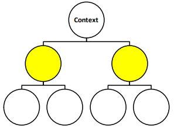
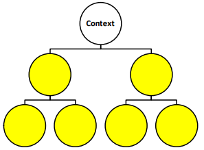
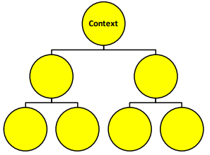
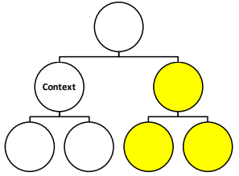
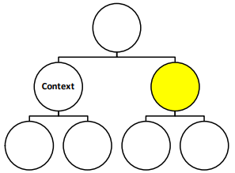
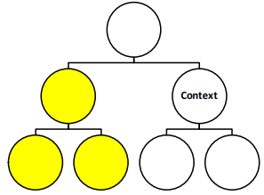
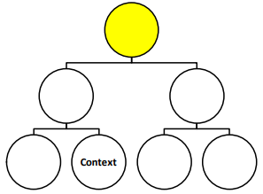
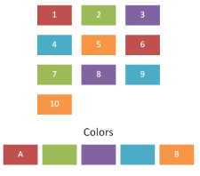
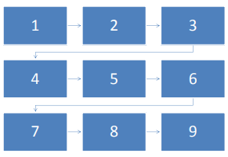

# 21.4 DrawingML - Diagrams

=== "中文"

    DrawingML 图表允许使用 DrawingML 对象和构造来定义图表。 此命名空间定义 DrawingML diagram（图表） 的内容。

=== "英文"

    A DrawingML diagram allows the definition of diagrams using DrawingML objects and constructs. This namespace defines the contents of a DrawingML diagram

## 21.4.1 目录

=== "中文"

    - 21.4.2 Diagram Definition
        - 21.4.2.1 adj (Shape Adjust)
        - 21.4.2.2 adjLst (Shape Adjust List)
        - 21.4.2.3 alg (Algorithm)
        - 21.4.2.4 cat (Category)
        - 21.4.2.5 catLst (Category List)
        - 21.4.2.6 choose (Choose Element)
        - 21.4.2.7 clrData (Color Transform Sample Data)
        - 21.4.2.8 constr (Constraint)
        - 21.4.2.9 constrLst (Constraint List)
        - 21.4.2.10 dataModel (Data Model)
        - 21.4.2.11 desc (Description)
        - 21.4.2.12 else (Else)
        - 21.4.2.13 extLst (Extension List)
        - 21.4.2.14 forEach (For Each)
        - 21.4.2.15 if (If)
        - 21.4.2.16 layoutDef (Layout Definition)
        - 21.4.2.17 layoutDefHdr (Layout Definition Header)
        - 21.4.2.18 layoutDefHdrLst (Diagram Layout Header List)
        - 21.4.2.19 layoutNode (Layout Node)
        - 21.4.2.20 param (Parameter)
        - 21.4.2.21 presOf (Presentation Of)
        - 21.4.2.22 relIds (Explicit Relationships to Diagram Parts)
        - 21.4.2.23 resizeHandles (Shape Resize Style)
        - 21.4.2.24 rule (Rule)
        - 21.4.2.25 ruleLst (Rule List)
        - 21.4.2.26 sampData (Sample Data)
        - 21.4.2.27 shape (Shape)
        - 21.4.2.28 style (Shape Style)
        - 21.4.2.29 styleData (Style Data)
        - 21.4.2.30 title (Title)
        - 21.4.2.31 varLst (Variable List)
    - 21.4.3 Data
        - 21.4.3.1 bg (Background Formatting)
        - 21.4.3.2 cxn (Connection)
        - 21.4.3.3 cxnLst (Connection List)
        - 21.4.3.4 prSet (Property Set)
        - 21.4.3.5 pt (Point)
        - 21.4.3.6 ptLst (Point List)
        - 21.4.3.7 spPr (Shape Properties)
        - 21.4.3.8 t (Text Body)
        - 21.4.3.9 whole (Whole E2O Formatting)
    - 21.4.4 Color Information
        - 21.4.4.1 cat (Color Transform Category)
        - 21.4.4.2 catLst (Color Transform Category List)
        - 21.4.4.3 colorsDef (Color Transform Definitions)
        - 21.4.4.4 colorsDefHdr (Color Transform Definition Header)
        - 21.4.4.5 colorsDefHdrLst (Color Transform Header List)
        - 21.4.4.6 desc (Description)
        - 21.4.4.7 effectClrLst (Effect Color List)
        - 21.4.4.8 fillClrLst (Fill Color List)
        - 21.4.4.9 linClrLst (Line Color List)
        - 21.4.4.10 styleLbl (Style Label)
        - 21.4.4.11 title (Title)
        - 21.4.4.12 txEffectClrLst (Text Effect Color List)
        - 21.4.4.13 txFillClrLst (Text Fill Color List)
        - 21.4.4.14 txLinClrLst (Text Line Color List)
    - 21.4.5 Style Definitions
        - 21.4.5.1 cat (Category)
        - 21.4.5.2 catLst (Category List)
        - 21.4.5.3 desc (Style Label Description)
        - 21.4.5.4 presLayoutVars (Presentation Layout Variables)
        - 21.4.5.5 scene3d (3-D Scene)
        - 21.4.5.6 sp3d (3-D Shape Properties)
        - 21.4.5.7 styleDef (Style Definition)
        - 21.4.5.8 styleDefHdr (Style Definition Header)
        - 21.4.5.9 styleDefHdrLst (List of Style Definition Headers)
        - 21.4.5.10 styleLbl (Style Label)
        - 21.4.5.11 title (Title)
        - 21.4.5.12 txPr (Text Properties)
    - 21.4.6 Layout Definition
        - 21.4.6.1 animLvl (Level Animation)
        - 21.4.6.2 animOne (One by One Animation String)
        - 21.4.6.3 bulletEnabled (Show Insert Node)
        - 21.4.6.4 chMax (Maximum Children)
        - 21.4.6.5 chPref (Preferred Number of Children)
        - 21.4.6.6 dir (Diagram Direction)
        - 21.4.6.7 hierBranch (Organization Chart Branch Style)
        - 21.4.6.8 orgChart (Show Organization Chart User Interface)
    - 21.4.7 Simple Types
        - 21.4.7.1 ST_AlgorithmType (Algorithm Types)
        - 21.4.7.2 ST_AnimLvlStr (Animation Level String Definition)
        - 21.4.7.3 ST_AnimOneStr (One by One Animation Value Definition)
        - 21.4.7.4 ST_ArrowheadStyle (Arrowhead Styles)
        - 21.4.7.5 ST_AutoTextRotation (Auto Text Rotation)
        - 21.4.7.6 ST_AxisType (Axis Type)
        - 21.4.7.7 ST_AxisTypes (Axis Type List)
        - 21.4.7.8 ST_BendPoint (Bend Point)
        - 21.4.7.9 ST_Booleans (Boolean List.)
        - 21.4.7.10 ST_BoolOperator (Boolean Constraint)
        - 21.4.7.11 ST_Breakpoint (Breakpoint)
        - 21.4.7.12 ST_CenterShapeMapping (Center Shape Mapping)
        - 21.4.7.13 ST_ChildAlignment (Child Alignment)
        - 21.4.7.14 ST_ChildDirection (Child Direction)
        - 21.4.7.15 ST_ChildOrderType (Child Order)
        - 21.4.7.16 ST_ClrAppMethod (Color Application Method Type)
        - 21.4.7.17 ST_ConnectorDimension (Connector Dimension)
        - 21.4.7.18 ST_ConnectorPoint (Connector Point)
        - 21.4.7.19 ST_ConnectorRouting (Connector Routing)
        - 21.4.7.20 ST_ConstraintRelationship (Constraint Relationship)
        - 21.4.7.21 ST_ConstraintType (Constraint Type)
        - 21.4.7.22 ST_ContinueDirection (Continue Direction)
        - 21.4.7.23 ST_CxnType (Connection Type)
        - 21.4.7.24 ST_DiagramHorizontalAlignment (Horizontal Alignment)
        - 21.4.7.25 ST_DiagramTextAlignment (Text Alignment)
        - 21.4.7.26 ST_Direction (Diagram Direction Definition)
        - 21.4.7.27 ST_ElementType (Data Point Type)
        - 21.4.7.28 ST_ElementTypes (Diagream Layout Node Type List)
        - 21.4.7.29 ST_FallbackDimension (Fallback Dimension)
        - 21.4.7.30 ST_FlowDirection (Flow Direction)
        - 21.4.7.31 ST_FunctionArgument (Function Argument)
        - 21.4.7.32 ST_FunctionOperator (Function Operator)
        - 21.4.7.33 ST_FunctionType (Function Type)
        - 21.4.7.34 ST_FunctionValue (Function Value)
        - 21.4.7.35 ST_GrowDirection (Grow Direction)
        - 21.4.7.36 ST_HierarchyAlignment (Hierarchy Alignment)
        - 21.4.7.37 ST_HierBranchStyle (Hierarchy Branch Style Definition)
        - 21.4.7.38 ST_HueDir (Hue Direction)
        - 21.4.7.39 ST_Index1 (1-Based Index)
        - 21.4.7.40 ST_Ints (Integer List)
        - 21.4.7.41 ST_LayoutShapeType (Layout Shape Type)
        - 21.4.7.42 ST_LinearDirection (Linear Direction)
        - 21.4.7.43 ST_ModelId (Model Identifier)
        - 21.4.7.44 ST_NodeCount (Number of Nodes Definition)
        - 21.4.7.45 ST_NodeHorizontalAlignment (Node Horizontal Alignment)
        - 21.4.7.46 ST_NodeVerticalAlignment (Node Vertical Alignment)
        - 21.4.7.47 ST_Offset (Offset)
        - 21.4.7.48 ST_OutputShapeType (Output Shape Type)
        - 21.4.7.49 ST_ParameterId (Parameter Identifier)
        - 21.4.7.50 ST_ParameterVal (Parameter Values)
        - 21.4.7.51 ST_PtType (Point Type)
        - 21.4.7.52 ST_PyramidAccentPosition (Pyramid Accent Position)
        - 21.4.7.53 ST_PyramidAccentTextMargin (Pyramid Accent Text Margin)
        - 21.4.7.54 ST_ResizeHandlesStr (Resize Handle)
        - 21.4.7.55 ST_RotationPath (Rotation Path)
        - 21.4.7.56 ST_SecondaryChildAlignment (Secondary Child Alignment)
        - 21.4.7.57 ST_SecondaryLinearDirection (Secondary Linear Direction)
        - 21.4.7.58 ST_StartingElement (Starting Element)
        - 21.4.7.59 ST_TextAnchorHorizontal (Text Anchor Horizontal)
        - 21.4.7.60 ST_TextAnchorVertical (Text Anchor Vertical)
        - 21.4.7.61 ST_TextBlockDirection (Text Block Direction)
        - 21.4.7.62 ST_TextDirection (Text Direction)
        - 21.4.7.63 ST_UnsignedInts (Unsigned Integer List)
        - 21.4.7.64 ST_VariableType (Variable Type)
        - 21.4.7.65 ST_VerticalAlignment (Vertical Alignment)
        - 21.4.7.66 ST_PrSetCustVal (Property Set Customized Value)

=== "英文"

    **Table of Contents**

    **This subclause is informative.**

    - 21.4.2 Diagram Definition
        - 21.4.2.1 adj (Shape Adjust)
        - 21.4.2.2 adjLst (Shape Adjust List)
        - 21.4.2.3 alg (Algorithm)
        - 21.4.2.4 cat (Category)
        - 21.4.2.5 catLst (Category List)
        - 21.4.2.6 choose (Choose Element)
        - 21.4.2.7 clrData (Color Transform Sample Data)
        - 21.4.2.8 constr (Constraint)
        - 21.4.2.9 constrLst (Constraint List)
        - 21.4.2.10 dataModel (Data Model)
        - 21.4.2.11 desc (Description)
        - 21.4.2.12 else (Else)
        - 21.4.2.13 extLst (Extension List)
        - 21.4.2.14 forEach (For Each)
        - 21.4.2.15 if (If)
        - 21.4.2.16 layoutDef (Layout Definition)
        - 21.4.2.17 layoutDefHdr (Layout Definition Header)
        - 21.4.2.18 layoutDefHdrLst (Diagram Layout Header List)
        - 21.4.2.19 layoutNode (Layout Node)
        - 21.4.2.20 param (Parameter)
        - 21.4.2.21 presOf (Presentation Of)
        - 21.4.2.22 relIds (Explicit Relationships to Diagram Parts)
        - 21.4.2.23 resizeHandles (Shape Resize Style)
        - 21.4.2.24 rule (Rule)
        - 21.4.2.25 ruleLst (Rule List)
        - 21.4.2.26 sampData (Sample Data)
        - 21.4.2.27 shape (Shape)
        - 21.4.2.28 style (Shape Style)
        - 21.4.2.29 styleData (Style Data)
        - 21.4.2.30 title (Title)
        - 21.4.2.31 varLst (Variable List)
    - 21.4.3 Data
        - 21.4.3.1 bg (Background Formatting)
        - 21.4.3.2 cxn (Connection)
        - 21.4.3.3 cxnLst (Connection List)
        - 21.4.3.4 prSet (Property Set)
        - 21.4.3.5 pt (Point)
        - 21.4.3.6 ptLst (Point List)
        - 21.4.3.7 spPr (Shape Properties)
        - 21.4.3.8 t (Text Body)
        - 21.4.3.9 whole (Whole E2O Formatting)
    - 21.4.4 Color Information
        - 21.4.4.1 cat (Color Transform Category)
        - 21.4.4.2 catLst (Color Transform Category List)
        - 21.4.4.3 colorsDef (Color Transform Definitions)
        - 21.4.4.4 colorsDefHdr (Color Transform Definition Header)
        - 21.4.4.5 colorsDefHdrLst (Color Transform Header List)
        - 21.4.4.6 desc (Description)
        - 21.4.4.7 effectClrLst (Effect Color List)
        - 21.4.4.8 fillClrLst (Fill Color List)
        - 21.4.4.9 linClrLst (Line Color List)
        - 21.4.4.10 styleLbl (Style Label)
        - 21.4.4.11 title (Title)
        - 21.4.4.12 txEffectClrLst (Text Effect Color List)
        - 21.4.4.13 txFillClrLst (Text Fill Color List)
        - 21.4.4.14 txLinClrLst (Text Line Color List)
    - 21.4.5 Style Definitions
        - 21.4.5.1 cat (Category)
        - 21.4.5.2 catLst (Category List)
        - 21.4.5.3 desc (Style Label Description)
        - 21.4.5.4 presLayoutVars (Presentation Layout Variables)
        - 21.4.5.5 scene3d (3-D Scene)
        - 21.4.5.6 sp3d (3-D Shape Properties)
        - 21.4.5.7 styleDef (Style Definition)
        - 21.4.5.8 styleDefHdr (Style Definition Header)
        - 21.4.5.9 styleDefHdrLst (List of Style Definition Headers)
        - 21.4.5.10 styleLbl (Style Label)
        - 21.4.5.11 title (Title)
        - 21.4.5.12 txPr (Text Properties)
    - 21.4.6 Layout Definition
        - 21.4.6.1 animLvl (Level Animation)
        - 21.4.6.2 animOne (One by One Animation String)
        - 21.4.6.3 bulletEnabled (Show Insert Node)
        - 21.4.6.4 chMax (Maximum Children)
        - 21.4.6.5 chPref (Preferred Number of Children)
        - 21.4.6.6 dir (Diagram Direction)
        - 21.4.6.7 hierBranch (Organization Chart Branch Style)
        - 21.4.6.8 orgChart (Show Organization Chart User Interface)
    - 21.4.7 Simple Types
        - 21.4.7.1 ST_AlgorithmType (Algorithm Types)
        - 21.4.7.2 ST_AnimLvlStr (Animation Level String Definition)
        - 21.4.7.3 ST_AnimOneStr (One by One Animation Value Definition)
        - 21.4.7.4 ST_ArrowheadStyle (Arrowhead Styles)
        - 21.4.7.5 ST_AutoTextRotation (Auto Text Rotation)
        - 21.4.7.6 ST_AxisType (Axis Type)
        - 21.4.7.7 ST_AxisTypes (Axis Type List)
        - 21.4.7.8 ST_BendPoint (Bend Point)
        - 21.4.7.9 ST_Booleans (Boolean List.)
        - 21.4.7.10 ST_BoolOperator (Boolean Constraint)
        - 21.4.7.11 ST_Breakpoint (Breakpoint)
        - 21.4.7.12 ST_CenterShapeMapping (Center Shape Mapping)
        - 21.4.7.13 ST_ChildAlignment (Child Alignment)
        - 21.4.7.14 ST_ChildDirection (Child Direction)
        - 21.4.7.15 ST_ChildOrderType (Child Order)
        - 21.4.7.16 ST_ClrAppMethod (Color Application Method Type)
        - 21.4.7.17 ST_ConnectorDimension (Connector Dimension)
        - 21.4.7.18 ST_ConnectorPoint (Connector Point)
        - 21.4.7.19 ST_ConnectorRouting (Connector Routing)
        - 21.4.7.20 ST_ConstraintRelationship (Constraint Relationship)
        - 21.4.7.21 ST_ConstraintType (Constraint Type)
        - 21.4.7.22 ST_ContinueDirection (Continue Direction)
        - 21.4.7.23 ST_CxnType (Connection Type)
        - 21.4.7.24 ST_DiagramHorizontalAlignment (Horizontal Alignment)
        - 21.4.7.25 ST_DiagramTextAlignment (Text Alignment)
        - 21.4.7.26 ST_Direction (Diagram Direction Definition)
        - 21.4.7.27 ST_ElementType (Data Point Type)
        - 21.4.7.28 ST_ElementTypes (Diagream Layout Node Type List)
        - 21.4.7.29 ST_FallbackDimension (Fallback Dimension)
        - 21.4.7.30 ST_FlowDirection (Flow Direction)
        - 21.4.7.31 ST_FunctionArgument (Function Argument)
        - 21.4.7.32 ST_FunctionOperator (Function Operator)
        - 21.4.7.33 ST_FunctionType (Function Type)
        - 21.4.7.34 ST_FunctionValue (Function Value)
        - 21.4.7.35 ST_GrowDirection (Grow Direction)
        - 21.4.7.36 ST_HierarchyAlignment (Hierarchy Alignment)
        - 21.4.7.37 ST_HierBranchStyle (Hierarchy Branch Style Definition)
        - 21.4.7.38 ST_HueDir (Hue Direction)
        - 21.4.7.39 ST_Index1 (1-Based Index)
        - 21.4.7.40 ST_Ints (Integer List)
        - 21.4.7.41 ST_LayoutShapeType (Layout Shape Type)
        - 21.4.7.42 ST_LinearDirection (Linear Direction)
        - 21.4.7.43 ST_ModelId (Model Identifier)
        - 21.4.7.44 ST_NodeCount (Number of Nodes Definition)
        - 21.4.7.45 ST_NodeHorizontalAlignment (Node Horizontal Alignment)
        - 21.4.7.46 ST_NodeVerticalAlignment (Node Vertical Alignment)
        - 21.4.7.47 ST_Offset (Offset)
        - 21.4.7.48 ST_OutputShapeType (Output Shape Type)
        - 21.4.7.49 ST_ParameterId (Parameter Identifier)
        - 21.4.7.50 ST_ParameterVal (Parameter Values)
        - 21.4.7.51 ST_PtType (Point Type)
        - 21.4.7.52 ST_PyramidAccentPosition (Pyramid Accent Position)
        - 21.4.7.53 ST_PyramidAccentTextMargin (Pyramid Accent Text Margin)
        - 21.4.7.54 ST_ResizeHandlesStr (Resize Handle)
        - 21.4.7.55 ST_RotationPath (Rotation Path)
        - 21.4.7.56 ST_SecondaryChildAlignment (Secondary Child Alignment)
        - 21.4.7.57 ST_SecondaryLinearDirection (Secondary Linear Direction)
        - 21.4.7.58 ST_StartingElement (Starting Element)
        - 21.4.7.59 ST_TextAnchorHorizontal (Text Anchor Horizontal)
        - 21.4.7.60 ST_TextAnchorVertical (Text Anchor Vertical)
        - 21.4.7.61 ST_TextBlockDirection (Text Block Direction)
        - 21.4.7.62 ST_TextDirection (Text Direction)
        - 21.4.7.63 ST_UnsignedInts (Unsigned Integer List)
        - 21.4.7.64 ST_VariableType (Variable Type)
        - 21.4.7.65 ST_VerticalAlignment (Vertical Alignment)
        - 21.4.7.66 ST_PrSetCustVal (Property Set Customized Value)

## 21.4.2 图表定义

=== "中文"

    本节指定根据组成节点和连接定义图的布局和层次结构的元素. 

=== "英文"

    **Diagram Definition**

    This section specifies the elements which define the layout and hierarchy of a diagram based on its constituent nodes and connections. 

### 21.4.2.1 adj (形状调整)

=== "中文"

    调整形状的数值。这些数值可用于修改各种自动形状上支持的调整手柄。只能设置初始值，不能使用约束和规则进行修改。

    [示例：考虑在DrawingML图表中的adj元素的以下示例：
    
    ```xml
    <adjLst>
        <adj idx="2" val=".35" />
    </adjLst> 
    ```
    
    在这个示例中，我们通过将其值设置为0.35来修改一个单一的调整手柄。结束示例]
    
    ??? abstract "Attributes"
        
        **idx**（调整手柄索引 / Adjust Handle Index）
        
        :   调整值索引。不同的形状支持不同的调整手柄。
        
            此属性的可能值由ST_Index1简单类型（§21.4.7.39）定义。
        
        **val**（数值 / Value）
        
        :   一个绝对值。
        
            此属性的可能值由W3C XML模式双精度数据类型定义。

    [Note: The W3C XML Schema definition of this element’s content model (CT_Adj) is located in §A.5.3. end note]

=== "英文"

    **adj (Shape Adjust)**

    Shape adjust value. These can be used to modify the adjust handles supported on various auto shapes. It is only possible to set the initial value, not to modify it using constraints and rules.

    [Example: Consider the following example of the adj element in a DrawingML diagram:

    ```xml
    <adjLst>
        <adj idx="2" val=".35" />
    </adjLst> 
    ```

    In this example we have a single adjust handle being modified by setting its value to 0.35. end example]

    ??? abstract "Attributes"

        **idx** (Adjust Handle Index)

        :   Adjust value index. Different shapes support different adjust handles.

            The possible values for this attribute are defined by the ST_Index1 simple type (§21.4.7.39).

        **val** (Value) 

        :   An absolute value.

            The possible values for this attribute are defined by the W3C XML Schema double datatype.

    [Note: The W3C XML Schema definition of this element’s content model (CT_Adj) is located in §A.5.3. end note]

### 21.4.2.2 adjLst (形状调整列表)

=== "中文"

    该元素只是形状调整的列表。

    [Example: 请考虑 DrawingML 图中的 adjLst 元素的以下示例：

    ```xml
    <adjLst>
        <adj idx="1" val="1.35" />
        <adj idx="2" val=".35" />
    </adjLst> 
    ```

    在此示例中，我们有一个针对包含形状进行修改的两个调整手柄。 end example]

    [Note: The W3C XML Schema definition of this element’s content model (CT_AdjLst) is located in §A.5.3. end note]

=== "英文"

    **adjLst (Shape Adjust List)**

    This element is simply a list of shape adjusts.

    [Example: Consider the following example of the adjLst element in a DrawingML diagram:

    ```xml
    <adjLst>
        <adj idx="1" val="1.35" />
        <adj idx="2" val=".35" />
    </adjLst> 
    ```

    In this example we have a two adjust handle being modified for the containing shape. end example]

    [Note: The W3C XML Schema definition of this element’s content model (CT_AdjLst) is located in §A.5.3. end note]

### 21.4.2.3 alg (算法)

=== "中文"

    包含的布局节点使用的算法。该算法定义了布局节点的行为，以及嵌套布局节点的行为和布局。

    [Example: 考虑以下在 DrawingML 图中使用 alg 的示例：

    ```xml
    <layoutNode name="arrow">
        <varLst/>
        <alg type="tx" />
        <shape type="upArrow">
            <adjLst>
            <adj idx="2" val=".35" />
        </adjLst>
        </shape>
        <presOf axis="desOrSelf" ptType="node" />
        <ruleLst/>
    </layoutNode>
    ```

    在此示例中，tx 算法用于在包含布局节点内布局文本。 end example]

    ??? abstract "Attributes"

        **rev** (修订号 / Revision Number)

        :   算法的修订号。

            此属性的可能值由 W3C XML 架构 unsignedInt 数据类型定义。

        **type** (算法类型 / Algorithm Type)

        :   指定算法类型。

            该属性的可能值由 ST_AlgorithmType 简单类型 (§21.4.7.1) 定义。
    
    [Note: The W3C XML Schema definition of this element’s content model (CT_Algorithm) is located in §A.5.3. end note]

=== "英文"

    **alg (Algorithm)**

    The algorithm used by the containing layout node. The algorithm defines the behavior of the layout node along with the behavior and layout of the nested layout nodes.

    [Example: Consider the following example of alg being used in a DrawingML diagram:

    ```xml
    <layoutNode name="arrow">
        <varLst/>
        <alg type="tx" />
        <shape type="upArrow">
            <adjLst>
            <adj idx="2" val=".35" />
        </adjLst>
        </shape>
        <presOf axis="desOrSelf" ptType="node" />
        <ruleLst/>
    </layoutNode>
    ```

    In this example, the tx algorithm is being used to layout text within the containing layout node. end example]

    ??? abstract "Attributes"

        **rev** (Revision Number)

        :   The revision number of an algorithm.

            The possible values for this attribute are defined by the W3C XML Schema unsignedInt datatype.

        **type** (Algorithm Type)

        :   Specifies the algorithm type.

            The possible values for this attribute are defined by the ST_AlgorithmType simple type (§21.4.7.1).
    
    [Note: The W3C XML Schema definition of this element’s content model (CT_Algorithm) is located in §A.5.3. end note]

### 21.4.2.4 cat (类别)

=== "中文"

    该元素指定了用户界面中的一个类别，该布局定义将显示给用户。

    [Example: 考虑以下绘图ML图示中的cat的示例：

    ```xml
    <catLst>
        <cat type="relationship" pri="19000" />
    </catLst>
    ```

    在这个例子中，我们定义了一个名为"relationship"的单一类别，其优先级为19000。 end example] 

    ??? abstract "Attributes"

        **pri** (优先级 / Priority)

        :   该图表中的类别优先级决定了其在用户界面中显示的顺序。较小的数字会显示在列表的开头。
            
            该属性的可能取值由W3C XML Schema 的 unsignedInt 数据类型定义。

        **type** (类别类型 / Category Type)

        :   指定与元素关联的类别类型。
            
            此属性的可能值由W3C XML Schema any URI 数据类型定义。

    [Note: The W3C XML Schema definition of this element’s content model (CT_Category) is located in §A.5.3. end note]

=== "英文"

    **cat (Category)**

    This element specifies a category in the user interface where this layout definition displays to the user.

    [Example: Consider the following example of a cat in a DrawingML diagram:

    ```xml
    <catLst>
        <cat type="relationship" pri="19000" />
    </catLst>
    ```

    In this example we define a single category called relationship which has a priority of 19000. end example] 

    ??? abstract "Attributes"

        **pri** (Priority)

        :   The priority within the category for this diagram determines the order in which it displays in the user interface. Lower numbers are displayed at the beginning of the list.

            The possible values for this attribute are defined by the W3C XML Schema unsignedInt datatype.

        **type** (Category Type)

        :   Specifies the category type associated with the element.

            The possible values for this attribute are defined by the W3C XML Schema anyURI datatype.

    [Note: The W3C XML Schema definition of this element’s content model (CT_Category) is located in §A.5.3. end note]

### 21.4.2.5 catLst (类别列表)

=== "中文"

    这个元素只是一个cat元素的列表。

    [Example: 考虑以下DrawingML图表中catLst元素的示例：

    ```xml
    <catLst>
        <cat type="list" pri="18000" />
        <cat type="relationship" pri="19000" />
    </catLst>
    ```

    在这个例子中，我们定义了两个不同的类别，它们将在用户界面中显示。 end example]

    [Note: The W3C XML Schema definition of this element’s content model (CT_Categories) is located in §A.5.3. end note]

=== "英文"

    **catLst (Category List)**

    This element is simply a list of cat elements.

    [Example: Consider the following example of a catLst element in a DrawingML diagram:

    ```xml
    <catLst>
        <cat type="list" pri="18000" />
        <cat type="relationship" pri="19000" />
    </catLst>
    ```

    In this example we define two different categories which are to be displayed in the user interface. end example]

    [Note: The W3C XML Schema definition of this element’s content model (CT_Categories) is located in §A.5.3. end note]


### 21.4.2.6 choose (选择元素)

=== "中文"

    选择元素将if/else块包装成一个选择块。

    [Example: 考虑以下DrawingML图表中选择元素的示例：

    ```xml
    <choose name="Name1">
        <if name="Name2" func="var" arg="dir" op="equ" val="norm">
            <alg type="snake">
                <param type="grDir" val="tL" />
                <param type="flowDir" val="row" />
                <param type="contDir" val="sameDir" />
                <param type="off" val="ctr" />
            </alg>
        </if>
        <else name="Name3">
            <alg type="snake">
                <param type="grDir" val="tR" />
                <param type="flowDir" val="row" />
                <param type="contDir" val="sameDir" />
                <param type="off" val="ctr" />
            </alg>
        </else>
    </choose>
    ```

    在这个例子中，使用一个选择元素来定义与蛇算法相关的两组不同的参数，这取决于用户希望算法流动的方向（从右到左或从左到右）。 end example]

    ??? abstract "Attributes"

        **name** ( 名称 / Name)

        :   与选择语句相关联的唯一名称。

            [Example: 考虑以下DrawingML图表中选择元素的示例：

            ```xml
            <choose name="Name1">
            …
            </choose>
            ```

            在这个例子中，选择元素被命名为Name1。 end example]

            该属性的可能取值由W3C XML Schema 字符串数据类型定义。

    [Note: The W3C XML Schema definition of this element’s content model (CT_Choose) is located in §A.5.3. end note]

=== "英文"

    **choose (Choose Element)**

    The choose element wraps if/else blocks into a choose block.

    [Example: Consider the following example of a choose element in a DrawingML diagram:

    ```xml
    <choose name="Name1">
        <if name="Name2" func="var" arg="dir" op="equ" val="norm">
            <alg type="snake">
                <param type="grDir" val="tL" />
                <param type="flowDir" val="row" />
                <param type="contDir" val="sameDir" />
                <param type="off" val="ctr" />
            </alg>
        </if>
        <else name="Name3">
            <alg type="snake">
                <param type="grDir" val="tR" />
                <param type="flowDir" val="row" />
                <param type="contDir" val="sameDir" />
                <param type="off" val="ctr" />
            </alg>
        </else>
    </choose>
    ```

    In this example, a choose element is used to define two different sets of parameters associated with a snake algorithm depending upon the direction in which the user wants the algorithm to flow (RTL or LTR). end example]

    ??? abstract "Attributes"

        **name** (Name)

        :   A unique name associated with the choose statement.

            [Example: Consider the following example of a choose element in a DrawingML diagram:

            ```xml
            <choose name="Name1">
            …
            </choose>
            ```

            In this example, the choose element is named Name1. end example]

            The possible values for this attribute are defined by the W3C XML Schema string datatype.

    [Note: The W3C XML Schema definition of this element’s content model (CT_Choose) is located in §A.5.3. end note]

### 21.4.2.7 clrData (颜色转换示例数据)

=== "中文"

    该元素定义了在用户界面控件中用于显示给定图表的颜色转换的示例数据。这个示例数据预定义了一个数据模型，与布局定义结合使用，以创建一个图表，可以将颜色转换应用并显示给用户，作为颜色转换的示例。

    [Example: 考虑以下绘图ML图表中clrData元素的示例：

    ```xml
    <clrData>
        <dataModel>
            <ptLst>
                <pt modelId="0" type="doc" />
                <pt modelId="1" />
                <pt modelId="2" />
                <pt modelId="3" />
                <pt modelId="4" />
                <pt modelId="5" />
                <pt modelId="6" />
            </ptLst>
            <cxnLst>
                <cxn modelId="7" srcId="0" destId="1" srcOrd="0" destOrd="0" />
                <cxn modelId="8" srcId="0" destId="2" srcOrd="1" destOrd="0" />
                <cxn modelId="9" srcId="0" destId="3" srcOrd="2" destOrd="0" />
                <cxn modelId="10" srcId="0" destId="4" srcOrd="3" destOrd="0" />
                <cxn modelId="11" srcId="0" destId="5" srcOrd="4" destOrd="0" />
                <cxn modelId="12" srcId="0" destId="6" srcOrd="5" destOrd="0" />
            </cxnLst>
            <bg />
            <whole />
        </dataModel>
    </clrData>
    ```

    在这个例子中，我们定义了6个点，它们都与第七个文档类型点相连接。end example]

    ??? abstract "Attributes"

        **useDef** (使用默认数据模型 / Use Default)

        :   如果该属性的值为true，则忽略clrData元素中定义的数据模型，并使用默认数据模型。
            
            该属性的可能值由W3C XML Schema布尔数据类型定义。
    
    [Note: The W3C XML Schema definition of this element’s content model (CT_SampleData) is located in §A.5.3. end note]

=== "英文"

    **clrData (Color Transform Sample Data)**

    This element defines the sample data that is to be used in the user interface controls regarding displaying color transforms for a given diagram. This sample data predefines a data model to be combined with a layout definition in order to create a diagram which a color transform can be applied and displayed to the user as an example of the color transform.

    [Example: Consider the following example of a clrData element in a DrawingML diagram:

    ```xml
    <clrData>
        <dataModel>
            <ptLst>
                <pt modelId="0" type="doc" />
                <pt modelId="1" />
                <pt modelId="2" />
                <pt modelId="3" />
                <pt modelId="4" />
                <pt modelId="5" />
                <pt modelId="6" />
            </ptLst>
            <cxnLst>
                <cxn modelId="7" srcId="0" destId="1" srcOrd="0" destOrd="0" />
                <cxn modelId="8" srcId="0" destId="2" srcOrd="1" destOrd="0" />
                <cxn modelId="9" srcId="0" destId="3" srcOrd="2" destOrd="0" />
                <cxn modelId="10" srcId="0" destId="4" srcOrd="3" destOrd="0" />
                <cxn modelId="11" srcId="0" destId="5" srcOrd="4" destOrd="0" />
                <cxn modelId="12" srcId="0" destId="6" srcOrd="5" destOrd="0" />
            </cxnLst>
            <bg />
            <whole />
        </dataModel>
    </clrData>
    ```

    In this example we define 6 points which all connect back to a seventh document type point. end example]

    ??? abstract "Attributes"

        **useDef** (Use Default)

        :   If the value of this attribute is true, the data model defined in the clrData element is ignored and a default data model is used instead.

            The possible values for this attribute are defined by the W3C XML Schema boolean datatype.
    
    [Note: The W3C XML Schema definition of this element’s content model (CT_SampleData) is located in §A.5.3. end note]


### 21.4.2.8 constr (约束)

=== "中文"

    该元素用于指定布局定义中节点的大小、位置、文本值以及节点之间的布局依赖关系。

    [Example: 考虑以下示例，其中包含一些约束条件列表，这些约束条件被定义并应用于布局定义中的布局节点：

    ```xml
    <constrLst>
        <constr type="w" for="ch" forName="node1" refType="w" refForName="" />
        <constr type="h" for="ch" forName="node1" refType="w" refFor="ch" refForName="node1" op="equ" fact="0.6" />
        <constr type="w" for="ch" forName="transition1" refType="w" refFor="ch" refForName="node1" op="equ" fact="0.1" />
        <constr type="primFontSz" for="ch" forName="node1" refForName="" op="equ" val="100" />
    </constrLst>
    ```

    在这个例子中，我们可以看到为节点node1引用的布局节点定义了宽度和高度的约束，以及主要字体大小。还指定了过渡的宽度。 end example]

    ??? abstract "Attributes"

        **fact** (因子 / Factor)

        :   用于参考约束或规则中的因子，以便通过定义的因子修改参考值。

            [Example: 请考虑以下在DrawingML图表中使用的事实示例：

            ```xml
            <constr type="w" for="ch" forName="transition1" refType="w" refFor="ch" refForName="node1" op="equ" fact="0.1"/>
            ```
            
            在这个例子中，transition1的宽度被定义为node1宽度的十分之一。 end example]
            
            该属性的可能取值由W3C XML Schema的double数据类型定义。
        
        **for** (For)

        :   指定布局节点的轴，以应用约束或规则。

            [Example: 请考虑以下在DrawingML图表中使用for的示例：

            ```xml
            <constr type="w" for="ch" forName="transition1" refType="w" refFor="ch" refForName="node1" op="equ" fact="0.1"/>
            ```

            在这个例子中，for属性指定了node1是当前布局节点的子节点。 end example]

            该属性的可能取值由ST_ConstraintRelationship简单类型定义。 (§21.4.7.20).
        
        **forName** (For Name)

        :   指定要应用约束或规则的布局节点的名称。

            [Example: 考虑以下在DrawingML图表中使用forName的示例：

            ```xml
            <constr type="w" for="ch" forName="transition1" refType="w" refFor="ch" refForName="node1" op="equ" fact="0.1"/>
            ```

            在这个例子中，forName指定了名为transition1的布局节点作为其引用。 end example]

            该属性的可能取值由W3C XML Schema字符串数据类型定义。

        **op** ( 操作 / Operator)

        :   运算符约束用于评估条件。

            [Example: 请考虑以下在DrawingML图表中使用op的示例：

            ```xml
            <constr type="w" for="ch" forName="transition1" refType="w" refFor="ch" refForName="node1" op="equ" fact="0.1"/>
            ```

            在这个例子中，op指定了两个引用值之间定义的相等性。 end example]

            该属性的可能取值由ST_BoolOperator简单类型定义。 (§21.4.7.10).
        
        **ptType** ( 数据点类型 / Data Point Type)

        :   指定要选择的数据点类型。
            
            此属性的可能值由ST_ElementType简单类型定义。 (§21.4.7.27).
        
        **refFor** (Reference For)

        :   约束引用的 for 值。

            [Example: 考虑以下在DrawingML图中使用refFor的示例。:

            ```xml
            <constr type="w" for="ch" forName="transition1" refType="w" refFor="ch" refForName="node1" op="equ" fact="0.1"/>
            ```

            在这个例子中，refFor指定了引用约束是当前布局节点的子节点。end example]

            该属性的可能取值由ST_ConstraintRelationship简单类型定义。 (§21.4.7.20).
        
        **refForName** (Reference For Name)

        :   参考约束引用的布局节点的名称。

            [Example: 考虑以下在DrawingML图中使用refForName的示例。:

            ```xml
            <constr type="w" for="ch" forName="transition1" refType="w" refFor="ch" refForName="node1" op="equ" fact="0.1"/>
            ```

            在这个例子中，refForName指定了名为node1的布局节点作为它的引用。 end example]

            该属性的可能取值由W3C XML Schema字符串数据类型定义。

        **refPtType** (Reference Point Type)

        :   引用约束中使用的点类型。

            该属性的可能取值由ST_ElementType简单类型定义。 (§21.4.7.27).

        **refType** (Reference Type)

        :   指定引用约束的类型。

            [Example: 考虑以下在DrawingML图表中使用refType的示例。:

            ```xml
            <constr type="w" for="ch" forName="transition1" refType="w" refFor="ch" refForName="node1" op="equ" fact="0.1"/>
            ```

            在这个例子中，refType指定了引用node1的width属性。. end example]

            该属性的可能取值由ST_ConstraintType简单类型定义。 (§21.4.7.21).

        **type** ( 约束类型 / Constraint Type)

        :   指定应用于此布局节点的约束条件。

            [Example: 考虑以下在DrawingML图表中使用的类型示例。:

            ```xml
            <constr type="w" for="ch" forName="transition1" refType="w" refFor="ch" refForName="node1" op="equ" fact="0.1"/>
            ```

            在这个例子中，type指定了transition1的宽度属性。. end example]

            该属性的可能取值由ST_ConstraintType简单类型定义。 (§21.4.7.21).
        
        **val** (Value) 

        :   指定一个绝对值，而不是引用另一个约束。

            [Example: 考虑以下在DrawingML图表中使用forName的示例。:

            ```xml
            <constr type="w" for="ch" forName="transition1" val="10"/>
            ```

            在这个例子中，val指定了transition1的宽度的绝对值。. end example]

            该属性的可能取值由W3C XML Schema的 double数据类型定义。

    [Note: The W3C XML Schema definition of this element’s content model (CT_Constraint) is located in §A.5.3. end note]

=== "英文"

    **constr (Constraint)**

    This element is used to specify size, position of nodes, text values, and layout dependencies between nodes in a layout definition.

    [Example: Consider the following example of a constraint list which contains some example constraints being defined and applied to layout nodes in the layout definition:

    ```xml
    <constrLst>
        <constr type="w" for="ch" forName="node1" refType="w" refForName="" />
        <constr type="h" for="ch" forName="node1" refType="w" refFor="ch" refForName="node1" op="equ" fact="0.6" />
        <constr type="w" for="ch" forName="transition1" refType="w" refFor="ch" refForName="node1" op="equ" fact="0.1" />
        <constr type="primFontSz" for="ch" forName="node1" refForName="" op="equ" val="100" />
    </constrLst>
    ```

    In this example we can see constraints being defined for the width and height along with the primary font size for a layout node referenced by node1. The width for a transition is also specified. end example]

    ??? abstract "Attributes"

        **fact** (Factor)

        :   Factor used in a reference constraint or a rule in order to modify a referenced value by the factor defined.

            [Example: Consider the following example of fact in use in a DrawingML diagram:

            ```xml
            <constr type="w" for="ch" forName="transition1" refType="w" refFor="ch" refForName="node1" op="equ" fact="0.1"/>
            ```
            
            In this example, the width for transition1 is being defined as one-tenth the width of node1. end example]
            
            The possible values for this attribute are defined by the W3C XML Schema double datatype.
        
        **for** (For)

        :   Specifies the axis of layout nodes to apply a constraint or rule to.

            [Example: Consider the following example of for in use in a DrawingML diagram:

            ```xml
            <constr type="w" for="ch" forName="transition1" refType="w" refFor="ch" refForName="node1" op="equ" fact="0.1"/>
            ```

            In this example, the for attribute is specifying that node1 is a child node to the current layout node. end example]

            The possible values for this attribute are defined by the ST_ConstraintRelationship simple type (§21.4.7.20).
        
        **forName** (For Name)

        :   Specifies the name of the layout node to apply a constraint or rule to.

            [Example: Consider the following example of forName in use in a DrawingML diagram:

            ```xml
            <constr type="w" for="ch" forName="transition1" refType="w" refFor="ch" refForName="node1" op="equ" fact="0.1"/>
            ```

            In this example, forName is specifying the layout node named transition1 for its reference. end example]

            The possible values for this attribute are defined by the W3C XML Schema string datatype.

        **op** (Operator)

        :   The operator constraint used to evaluate the condition.

            [Example: Consider the following example of op in use in a DrawingML diagram:

            ```xml
            <constr type="w" for="ch" forName="transition1" refType="w" refFor="ch" refForName="node1" op="equ" fact="0.1"/>
            ```

            In this example, op is specifying an equality defined between the two referencing values. end example]

            The possible values for this attribute are defined by the ST_BoolOperator simple type (§21.4.7.10).
        
        **ptType** (Data Point Type)

        :   Specifies the type of data point to select.

            The possible values for this attribute are defined by the ST_ElementType simple type (§21.4.7.27).
        
        **refFor** (Reference For)

        :   The for value of the referenced constraint.

            [Example: Consider the following example of refFor in use in a DrawingML diagram:

            ```xml
            <constr type="w" for="ch" forName="transition1" refType="w" refFor="ch" refForName="node1" op="equ" fact="0.1"/>
            ```

            In this example, refFor is specifying the reference constraint is a child of the current layout node. end example]

            The possible values for this attribute are defined by the ST_ConstraintRelationship simple type (§21.4.7.20).
        
        **refForName** (Reference For Name)

        :   The name of the layout node referenced by a reference constraint.

            [Example: Consider the following example of refForName in use in a DrawingML diagram:

            ```xml
            <constr type="w" for="ch" forName="transition1" refType="w" refFor="ch" refForName="node1" op="equ" fact="0.1"/>
            ```

            In this example, refForName is specifying the layout node named node1 for its reference. end example]

            The possible values for this attribute are defined by the W3C XML Schema string datatype.

        **refPtType** (Reference Point Type)

        :   The point type used int he referenced constraint.

            The possible values for this attribute are defined by the ST_ElementType simple type (§21.4.7.27).

        **refType** (Reference Type)

        :   Specifies the type of a reference constraint.

            [Example: Consider the following example of refType in use in a DrawingML diagram:

            ```xml
            <constr type="w" for="ch" forName="transition1" refType="w" refFor="ch" refForName="node1" op="equ" fact="0.1"/>
            ```

            In this example, refType is specifying referencing the width attribute of node1. end example]

            The possible values for this attribute are defined by the ST_ConstraintType simple type (§21.4.7.21).

        **type** (Constraint Type)

        :   Specifies the constraint to apply to this layout node.

            [Example: Consider the following example of type in use in a DrawingML diagram:

            ```xml
            <constr type="w" for="ch" forName="transition1" refType="w" refFor="ch" refForName="node1" op="equ" fact="0.1"/>
            ```

            In this example, type is specifying the width attribute of transition1. end example]

            The possible values for this attribute are defined by the ST_ConstraintType simple type (§21.4.7.21).
        
        **val** (Value) 

        :   Specifies an absolute value instead of reference another constraint.

            [Example: Consider the following example of forName in use in a DrawingML diagram:

            ```xml
            <constr type="w" for="ch" forName="transition1" val="10"/>
            ```

            In this example, val is specifying the absolute value of the width of transition1. end example]

            The possible values for this attribute are defined by the W3C XML Schema double datatype.

    [Note: The W3C XML Schema definition of this element’s content model (CT_Constraint) is located in §A.5.3. end note]

### 21.4.2.9 constrLst (约束列表)

=== "中文"

    这个元素只是一个约束列表。

    [Example: 考虑以下示例，其中包含一些正在布局定义中定义和应用于布局节点的约束的约束列表。:

    ```xml
    <constrLst>
        <constr type="w" for="ch" forName="node1" refType="w" refForName=""/>
        <constr type="h" for="ch" forName="node1" refType="w" refFor="ch"
        refForName="node1" op="equ" fact="0.6"/>
        <constr type="w" for="ch" forName="transition1" refType="w" refFor="ch"
        refForName="node1" op="equ" fact="0.1"/>
        <constr type="primFontSz" for="ch" forName="node1" refForName="" op="equ"
        val="100"/>
    </constrLst>
    ```

    在这个例子中，我们可以看到为节点node1引用的布局节点定义了宽度和高度的约束，以及主要字体大小。还指定了过渡的宽度。. end example]
    
    [Note: The W3C XML Schema definition of this element’s content model (CT_Constraints) is located in §A.5.3. end note]

=== "英文"

    **constrLst (Constraint List)**

    This element is simply a list of constraints.

    [Example: Consider the following example of a constraint list which contains some example constraints which are being defined and applied to layout nodes in the layout definition:

    ```xml
    <constrLst>
        <constr type="w" for="ch" forName="node1" refType="w" refForName=""/>
        <constr type="h" for="ch" forName="node1" refType="w" refFor="ch"
        refForName="node1" op="equ" fact="0.6"/>
        <constr type="w" for="ch" forName="transition1" refType="w" refFor="ch"
        refForName="node1" op="equ" fact="0.1"/>
        <constr type="primFontSz" for="ch" forName="node1" refForName="" op="equ"
        val="100"/>
    </constrLst>
    ```

    In this example we can see constraints being defined for the width and height along with the primary font size for a layout node referenced by node1. The width for a transition is also specified. end example]
    
    [Note: The W3C XML Schema definition of this element’s content model (CT_Constraints) is located in §A.5.3. end note]

### 21.4.2.10 dataModel (数据模型)

=== "中文"
    
    这个图表实例的数据。可以是样本数据模型，也可以是用户输入的数据。

    [Note: The W3C XML Schema definition of this element’s content model (CT_DataModel) is located in §A.5.3. end note]

=== "英文"

    **dataModel (Data Model)**
    
    The data for this instance of the diagram. Either a sample data model, or the data the user has entered.

    [Note: The W3C XML Schema definition of this element’s content model (CT_DataModel) is located in §A.5.3. end note]

### 21.4.2.11 desc (描述)

=== "中文"

    该元素保存了布局定义的描述。描述可以用来描述与特定布局定义相关联的特性。

    ??? abstract "Attributes"

        **lang** ( 语言 / Language)

        :   标题或描述的自然语言布局定义。
            
            该属性的可能值由W3C XML Schema字符串数据类型定义。

        **val** ( 值 / Value)

        :   用作布局定义描述的字符串。
            
            该属性的可能值由W3C XML Schema字符串数据类型定义。
        
    [Note: The W3C XML Schema definition of this element’s content model (CT_Description) is located in §A.5.3. end note]

=== "英文"

    **desc (Description)**

    This element holds a description for a layout definition. The description can be used to describe the qualities associated with a particular layout definition.

    ??? abstract "Attributes"

        **lang** (Language)

        :   The natural language of the title or description of this layout definition.
            
            The possible values for this attribute are defined by the W3C XML Schema string datatype.

        **val** (Value)

        :   The string which is used as the description of the layout definition.

            The possible values for this attribute are defined by the W3C XML Schema string datatype.
        
    [Note: The W3C XML Schema definition of this element’s content model (CT_Description) is located in §A.5.3. end note]

### 21.4.2.12 else (Else)

=== "中文"

    这个元素类似于编程语言中的else语句，它将要在if条件不为真时使用的元素包裹起来。

    [Example: 考虑以下在choose语句上下文中的DrawingML图表中的else元素示例。:

    ```xml
    <choose name="Name1">
        <if name="Name2" func="var" arg="dir" op="equ" val="norm">
            <alg type="snake">
                <param type="grDir" val="tL" />
                <param type="flowDir" val="row" />
                <param type="contDir" val="sameDir" />
                <param type="off" val="ctr" />
            </alg>
        </if>
        <else name="Name3">
            <alg type="snake">
                <param type="grDir" val="tR" />
                <param type="flowDir" val="row" />
                <param type="contDir" val="sameDir" />
                <param type="off" val="ctr" />
            </alg>
        </else>
    </choose>
    ```

    在这个例子中，使用else元素来定义与蛇算法相关的一组参数，当图表被反转时。. end example]

    ??? abstract "Attributes"

        name ( 名称 / Name)

        :   与选择语句相关的唯一名称。

            [Example: 考虑以下在DrawingML图表中的else元素示例。:

            ```xml
            <else name="Name1">
            …
            </else>
            ```

            在这个例子中，else元素被命名为Name1。 end example].

            The possible values for this attribute are defined by the W3C XML Schema string datatype.
    
    [Note: The W3C XML Schema definition of this element’s content model (CT_Otherwise) is located in §A.5.3. end note]

=== "英文"

    **else (Else)**

    This element is similar to an else statement in a programming language in that it wraps elements which are to be used when the if conditionals are not true.

    [Example: Consider the following example of an else element in a DrawingML diagram within the context of a choose statement:

    ```xml
    <choose name="Name1">
        <if name="Name2" func="var" arg="dir" op="equ" val="norm">
            <alg type="snake">
                <param type="grDir" val="tL" />
                <param type="flowDir" val="row" />
                <param type="contDir" val="sameDir" />
                <param type="off" val="ctr" />
            </alg>
        </if>
        <else name="Name3">
            <alg type="snake">
                <param type="grDir" val="tR" />
                <param type="flowDir" val="row" />
                <param type="contDir" val="sameDir" />
                <param type="off" val="ctr" />
            </alg>
        </else>
    </choose>
    ```

    In this example, a else element is used to define a set of parameters associated with the snake algorithm when the diagram is reversed. end example]

    ??? abstract "Attributes"

        name (Name)

        :   A unique name associated with the choose statement.

            [Example: Consider the following example of a else element in a DrawingML diagram:

            ```xml
            <else name="Name1">
            …
            </else>
            ```

            In this example, the else element is named Name1. end example].

            The possible values for this attribute are defined by the W3C XML Schema string datatype.
    
    [Note: The W3C XML Schema definition of this element’s content model (CT_Otherwise) is located in §A.5.3. end note]

### 21.4.2.13 extLst (扩展列表)

=== "中文"

    该元素指定一个扩展列表，在其中所有未来的扩展都在ext元素中定义。
    
    扩展列表以及相应的未来扩展用于扩展DrawingML框架的存储能力。这允许在现有的图表语法中本地存储各种新类型的数据。

    [Note: The W3C XML Schema definition of this element’s content model (CT_OfficeArtExtensionList) is located in §A.4.1. end note]

=== "英文"

    **extLst (Extension List)**

    This element specifies an extension list, within which all future extensions are defined within ext elements.
    
    The extension list along with corresponding future extensions is used to extend the storage capabilities of the
    
    DrawingML framework. This allows for various new types of data to be stored natively within the existing diagram syntax.

    [Note: The W3C XML Schema definition of this element’s content model (CT_OfficeArtExtensionList) is located in §A.4.1. end note]

### 21.4.2.14 forEach (For Each)

=== "中文"

    一个循环结构，类似于编程语言中的for循环，用于定义哪些数据模型点使用此布局节点。
    
    [Example: 考虑以下在DrawingML图表中使用forEach的示例。:

    ```xml
    <forEach name="Name5" ref="" axis="ch" ptType="node">
        <layoutNode name="node1" styleLbl="" moveWith="">
            <alg type="sp"/>
            <shape
                xmlns:r="http://purl.oclc.org/ooxml/officeDocument/relationships" r:blip="">
            <adjLst/>
            </shape>
            <constrLst/>
        </layoutNode>
    </forEach>
    ```

    在这个例子中，forEach元素为图表中的每个关联数据模型点创建一个布局节点，由名称节点1引用。在这个特定的实例中，forEach为当前点节点的每个子节点创建布局节点。 end example]

    ??? abstract "Attributes"

        **axis** (Axis)

        :   指定从数据模型中选择数据的轴。
        
            [Example: axis="ch" 选择当前点节点的子节点，axis="des" 选择所有后代节点。 end example]

            The possible values for this attribute are defined by the ST_AxisTypes simple type (§21.4.7.7).
        
        **cnt** (Count)

        :   指定要在数据集中使用的项目数量。

            [Example: 考虑以下DrawingML图表中的forEach示例。:

            ```xml
            <forEach name="Name5" ref="" axis="ch" ptType="node" cnt="2">
            …
            </forEach>
            ```

            在这个例子中，通过这个forEach可以获得最多两个子元素。 end example]

            The possible values for this attribute are defined by the ST_UnsignedInts simple type (§21.4.7.63).
        
        **hideLastTrans** (隐藏最后的转换 / Hide Last Transition)

        :   在支持转换的算法中，该属性指定最后一个转换不会被渲染。这样可以创建以节点开始和结束的图表。

            The possible values for this attribute are defined by the ST_Booleans simple type (§21.4.7.9).
        
        **name** (Name)

        :   布局节点的唯一标识符。

            The possible values for this attribute are defined by the W3C XML Schema string datatype.

        **ptType** (数据点类型 / Data Point Type)

            指定要选择的数据点类型。

            [Example: 考虑以下DrawingML图表中的forEach示例。:

            ```xml
            <forEach name="Name5" ref="" axis="ch" ptType="node" cnt="2">
            …
            </forEach>
            ```

            在这个例子中，forEach选择了集合中的所有节点类型点。 end example]

            The possible values for this attribute are defined by the ST_ElementTypes simple type (§21.4.7.28).

        **ref** (Reference)

        :   当在for-each元素上使用时，会导致指定的for-each元素被使用。

            The possible values for this attribute are defined by the W3C XML Schema string datatype.
        
        **st** (Start)

        :   指定数据集中的起始位置。

            [Example: 考虑以下 DrawingML 图中的 forEach 示例:

            ```xml
            <presOf axis="desOrSelf" ptType="node" st="2"/>
            ```

            在此示例中，集合中的第二个元素是返回的第一个点. end example]

            The possible values for this attribute are defined by the ST_Ints simple type (§21.4.7.40).

        **step** (Step)

        :   指定要在数据集中使用的步骤。 值为 2 的步骤将返回集合中的所有其他项目。
            
            The possible values for this attribute are defined by the ST_Ints simple type (§21.4.7.40).
        
    [Note: The W3C XML Schema definition of this element’s content model (CT_ForEach) is located in §A.5.3. end note]

=== "英文"

    **forEach (For Each)**

    A looping structure, similar to a for loop in a programming language, which defines what data model points use this layout node.
    
    [Example: Consider the following example of a forEach being used within a DrawingML diagram:

    ```xml
    <forEach name="Name5" ref="" axis="ch" ptType="node">
        <layoutNode name="node1" styleLbl="" moveWith="">
            <alg type="sp"/>
            <shape
                xmlns:r="http://purl.oclc.org/ooxml/officeDocument/relationships" r:blip="">
            <adjLst/>
            </shape>
            <constrLst/>
        </layoutNode>
    </forEach>
    ```

    In this example, the forEach element creates a layout node, referenced by the name node1, for every associated data model point in the diagram. In this particular instance the forEach creates the layout node for every child of the current point node. end example]

    ??? abstract "Attributes"

        **axis** (Axis)

        :   Specifies the axis on which to select data from the data model. 
        
            [Example: axis="ch" selects children of the current point node and axis="des" selects all descendants. end example]

            The possible values for this attribute are defined by the ST_AxisTypes simple type (§21.4.7.7).
        
        **cnt** (Count)

        :   Specifies the count of items to use in a data set.

            [Example: Consider the following example of a forEach in a DrawingML diagram:

            ```xml
            <forEach name="Name5" ref="" axis="ch" ptType="node" cnt="2">
            …
            </forEach>
            ```

            In this example, up to two children are obtained through this forEach. end example]

            The possible values for this attribute are defined by the ST_UnsignedInts simple type (§21.4.7.63).
        
        **hideLastTrans** (Hide Last Transition)

        :   In algorithms that support transitions, this attribute specifies that the last transition is not rendered. This allows for diagrams that start and end with a node.

            The possible values for this attribute are defined by the ST_Booleans simple type (§21.4.7.9).
        
        **name** (Name)

        :   A unique identifier for the layout node.

            The possible values for this attribute are defined by the W3C XML Schema string datatype.

        **ptType** (Data Point Type)

            Specifies the type of data point to select.

            [Example: Consider the following example of a forEach in a DrawingML diagram:

            ```xml
            <forEach name="Name5" ref="" axis="ch" ptType="node" cnt="2">
            …
            </forEach>
            ```

            In this example, the forEach selects all node type points in the set. end example]

            The possible values for this attribute are defined by the ST_ElementTypes simple type (§21.4.7.28).

        **ref** (Reference)

        :   When used on a for-each element, causes the specified for-each element to be used instead.

            The possible values for this attribute are defined by the W3C XML Schema string datatype.
        
        **st** (Start)

        :   Specifies where to start in a data set.

            [Example: Consider the following example of a forEach in a DrawingML diagram:

            ```xml
            <presOf axis="desOrSelf" ptType="node" st="2"/>
            ```

            In this example, the second element in the set is the first point returned. end example]

            The possible values for this attribute are defined by the ST_Ints simple type (§21.4.7.40).

        **step** (Step)

        :   Specifies the step to use in a data set. A step with a value of 2 returns every other item in the set.
            
            The possible values for this attribute are defined by the ST_Ints simple type (§21.4.7.40).
        
    [Note: The W3C XML Schema definition of this element’s content model (CT_ForEach) is located in §A.5.3. end note]

### 21.4.2.15 if (If)

=== "中文"

    就像编程语言中的 if 语句一样，包装要在其属性定义的条件下使用的元素。
    
    [Example: 考虑以下在 Choose 语句上下文中的 DrawingML 图中的 if 元素示例:
    
    ```xml
    <choose name="Name1">
        <if name="Name2" func="var" arg="dir" op="equ" val="norm">
            <alg type="snake">
                <param type="grDir" val="tL" />
                <param type="flowDir" val="row" />
                <param type="contDir" val="sameDir" />
                <param type="off" val="ctr" />
            </alg>
        </if>
        <else name="Name3">
            <alg type="snake">
                <param type="grDir" val="tR" />
                <param type="flowDir" val="row" />
                <param type="contDir" val="sameDir" />
                <param type="off" val="ctr" />
            </alg>
        </else>
    </choose>
    ```

    在此示例中，if 元素用于定义当图处于法线方向时与蛇算法相关的一组参数. end example]

    ??? abstract "Attributes"

        **arg** (Argument)
    
        :   指定用作 if 元素中测试的一部分的变量。 除非将函数属性设置为“var”，否则将被忽略。
            
            The possible values for this attribute are defined by the ST_FunctionArgument simple type (§21.4.7.31).
        
        **axis** (Axis)

        :   指定从数据模型中选择数据的轴。

            [Example: axis="ch" 选择当前点节点的子节点，axis="des" 选择所有后代。 end example]

            The possible values for this attribute are defined by the ST_AxisTypes simple type (§21.4.7.7).

        **cnt** (Count)

        :   指定数据集中使用的项目数。

            [Example: 考虑以下 DrawingML 图中的 forEach 示例:

            ```xml
            <forEach name="Name5" ref="" axis="ch" ptType="node" cnt="2">
            …
            </forEach>
            ```

            在此示例中，通过此 forEach 最多可以获得两个子级。end example]

            The possible values for this attribute are defined by the ST_UnsignedInts simple type (§21.4.7.63).
        
        **func** (Function)

        :   用于评估 if 条件的函数。

            [Example: 考虑以下在 DrawingML 中使用 func 的示例:

            ```xml
            <if name="Name2" func="var" arg="dir" op="equ" val="norm">
            …
            </if>
            ```

            在此示例中，func 设置为 var。 end example]

            The possible values for this attribute are defined by the ST_FunctionType simple type (§21.4.7.33).
        
        **hideLastTrans** (Hide Last Transition)

        :   在支持转换的算法中，此属性指定不渲染最后一个转换。 这允许图表以节点开始和结束.
            
            The possible values for this attribute are defined by the ST_Booleans simple type (§21.4.7.9).

        **name** (Name)

        :   布局节点的唯一标识符。

            用于评估 if 条件的函数。

            [Example: 考虑以下在 DrawingML 中使用的名称示例:

            ```xml
            <if name="Name2" func="var" arg="dir" op="equ" val="norm">
            …
            </if>
            ```

            在此示例中，名称属性设置为 Name2。 end example]
            
            The possible values for this attribute are defined by the W3C XML Schema string datatype.
        
        **op** (Operator)

        :   用于评估条件的运算符。

            [Example: 考虑以下在 DrawingML 中使用的操作示例:

            ```xml
            <if name="Name2" func="var" arg="dir" op="equ" val="norm">
            …
            </if>
            ```

            在此示例中，op 用于测试参数和值的相等性。 end example]

            The possible values for this attribute are defined by the ST_FunctionOperator simple type (§21.4.7.32).
        
        **ptType** (Data Point Type)

        :   指定要选择的数据点的类型。

            [Example: 考虑以下 DrawingML 图中的 forEach 示例:

            ```xml
            <forEach name="Name5" ref="" axis="ch" ptType="node" cnt="2">
            …
            </forEach>
            ```

            在此示例中，forEach 选择集合中的所有节点类型点。 end example]

            The possible values for this attribute are defined by the ST_ElementTypes simple type (§21.4.7.28).

        **st** (Start)

        :   指定数据集中的起始位置。

            [Example: 考虑以下 DrawingML 图中的 forEach 示例:

            ```xml
            <presOf axis="desOrSelf" ptType="node" st="2"/>
            ```

            在此示例中，集合中的第二个元素是返回的第一个点。 end example]

            The possible values for this attribute are defined by the ST_Ints simple type (§21.4.7.40).
        
        **step** (Step)

        :   指定要在数据集中使用的步骤。 值为 2 的步骤将返回集合中的所有其他项目。

            The possible values for this attribute are defined by the ST_Ints simple type (§21.4.7.40).

        **val** (Value)

        :   绝对值。

            The possible values for this attribute are defined by the ST_FunctionValue simple type (§21.4.7.34).
    
    [Note: The W3C XML Schema definition of this element’s content model (CT_When) is located in §A.5.3. end note]

=== "英文"

    **if (If)**

    Like an if statement in a programming language, wraps elements which are to be used under the conditions defined by its attributes.
    
    [Example: Consider the following example of an if element in a DrawingML diagram within the context of a choose statement:
    
    ```xml
    <choose name="Name1">
        <if name="Name2" func="var" arg="dir" op="equ" val="norm">
            <alg type="snake">
                <param type="grDir" val="tL" />
                <param type="flowDir" val="row" />
                <param type="contDir" val="sameDir" />
                <param type="off" val="ctr" />
            </alg>
        </if>
        <else name="Name3">
            <alg type="snake">
                <param type="grDir" val="tR" />
                <param type="flowDir" val="row" />
                <param type="contDir" val="sameDir" />
                <param type="off" val="ctr" />
            </alg>
        </else>
    </choose>
    ```

    In this example, a if element is used to define a set of parameters associated with the snake algorithm when the diagram is in the normal direction. end example]

    ??? abstract "Attributes"

        **arg** (Argument)
    
        :   Specifies the variable to use as part of the test in an if element. Ignored unless the function attribute is set to "var".
            
            The possible values for this attribute are defined by the ST_FunctionArgument simple type (§21.4.7.31).
        
        **axis** (Axis)

        :   Specifies the axis on which to select data from the data model.

            [Example: axis="ch" selects children of the current point node and axis="des" selects all descendants. end example]

            The possible values for this attribute are defined by the ST_AxisTypes simple type (§21.4.7.7).

        **cnt** (Count)

        :   Specifies the count of items to use in a data set.

            [Example: Consider the following example of a forEach in a DrawingML diagram:

            ```xml
            <forEach name="Name5" ref="" axis="ch" ptType="node" cnt="2">
            …
            </forEach>
            ```

            In this example, up to two children are obtained through this forEach. end example]

            The possible values for this attribute are defined by the ST_UnsignedInts simple type (§21.4.7.63).
        
        **func** (Function)

        :   The function used to evaluate the if condition.

            [Example: Consider the following example of func being used in DrawingML:

            ```xml
            <if name="Name2" func="var" arg="dir" op="equ" val="norm">
            …
            </if>
            ```

            In this example, func is set to var. end example]

            The possible values for this attribute are defined by the ST_FunctionType simple type (§21.4.7.33).
        
        **hideLastTrans** (Hide Last Transition)

        :   In algorithms that support transitions, this attribute specifies that the last transition is not rendered. This allows for diagrams that start and end with a node.
            
            The possible values for this attribute are defined by the ST_Booleans simple type (§21.4.7.9).

        **name** (Name)

        :   A unique identifier for the layout node.

            The function used to evaluate the if condition.

            [Example: Consider the following example of name being used in DrawingML:

            ```xml
            <if name="Name2" func="var" arg="dir" op="equ" val="norm">
            …
            </if>
            ```

            In this example, the name attribute is set to Name2. end example]
            
            The possible values for this attribute are defined by the W3C XML Schema string datatype.
        
        **op** (Operator)

        :   The operator used to evaluate the condition.

            [Example: Consider the following example of op being used in DrawingML:

            ```xml
            <if name="Name2" func="var" arg="dir" op="equ" val="norm">
            …
            </if>
            ```

            In this example, op is being used to test the equality of the argument and value. end example]

            The possible values for this attribute are defined by the ST_FunctionOperator simple type (§21.4.7.32).
        
        **ptType** (Data Point Type)

        :   Specifies the type of data point to select.

            [Example: Consider the following example of a forEach in a DrawingML diagram:

            ```xml
            <forEach name="Name5" ref="" axis="ch" ptType="node" cnt="2">
            …
            </forEach>
            ```

            In this example, the forEach selects all node type points in the set. end example]

            The possible values for this attribute are defined by the ST_ElementTypes simple type (§21.4.7.28).

        **st** (Start)

        :   Specifies where to start in a data set.

            [Example: Consider the following example of a forEach in a DrawingML diagram:

            ```xml
            <presOf axis="desOrSelf" ptType="node" st="2"/>
            ```

            In this example, the second element in the set is the first point returned. end example]

            The possible values for this attribute are defined by the ST_Ints simple type (§21.4.7.40).
        
        **step** (Step)

        :   Specifies the step to use in a data set. A step with a value of 2 returns every other item in the set.

            The possible values for this attribute are defined by the ST_Ints simple type (§21.4.7.40).

        **val** (Value)

        :   An absolute value.

            The possible values for this attribute are defined by the ST_FunctionValue simple type (§21.4.7.34).
    
    [Note: The W3C XML Schema definition of this element’s content model (CT_When) is located in §A.5.3. end note]


### 21.4.2.16 layoutDef (布局定义)

=== "中文"

    该元素是用于定义布局定义的根元素。 布局定义是通过一组嵌套的布局节点来定义的。 布局定义负责定义图表的外观。

    ??? abstract "Attributes"

        **defStyle** (Default Style)

        :   此属性定义对要应用于图表的默认样式的引用。

            The possible values for this attribute are defined by the W3C XML Schema string datatype.

        **minVer** (Minimum Version)

        :   可以支持此布局定义的最低产品版本。

            The possible values for this attribute are defined by the W3C XML Schema string datatype.

        **uniqueId** (Unique Identifier)

        :   此布局定义的唯一标识符。

            The possible values for this attribute are defined by the W3C XML Schema string datatype.
        
    [Note: The W3C XML Schema definition of this element’s content model (CT_DiagramDefinition) is located in   §A.5.3. end note]

=== "英文"

    **layoutDef (Layout Definition)**

    This element is the root element for defining a layout definition. The layout definition is defined through a set of nested layout nodes. The layout definition is responsible for defining the look of a diagram.

    ??? abstract "Attributes"

        **defStyle** (Default Style)

        :   This attribute defines a reference to a default style which is to be applied to the diagram.

            The possible values for this attribute are defined by the W3C XML Schema string datatype.

        **minVer** (Minimum Version)

        :   Minimum product version that can support this layout definition.

            The possible values for this attribute are defined by the W3C XML Schema string datatype.

        **uniqueId** (Unique Identifier)

        :   The unique identifier for this layout definition.

            The possible values for this attribute are defined by the W3C XML Schema string datatype.
        
    [Note: The W3C XML Schema definition of this element’s content model (CT_DiagramDefinition) is located in   §A.5.3. end note]

### 21.4.2.17 layoutDefHdr (布局定义标题)

=== "中文"

    该元素是表示应用程序预加载有关布局定义的信息所需的最少知识的标头信息。 这种预加载允许稍后进行布局定义的实际加载，这有助于解决应用程序可能存在的任何性能问题。
    
    [Example: 考虑以下 DrawingML 图中的layoutDefHdr 示例:

    ```xml
    <layoutDefHdr uniqueId="urn:layout/default">
        <title val="Basic Block List" />
        <desc val="" />
        <catLst>
        <cat type="list" pri="1000" />
        </catLst>
    </layoutDefHdr>
    ```

    在此示例中，我们为 urn:layout:default 的 uniqueId 引用的图表定义标题以及类别和优先级. end example]

    ??? abstract "Attributes"

        **defStyle** (Default Style)

        :   此属性定义对要应用于图表的默认样式的引用。
            
            The possible values for this attribute are defined by the W3C XML Schema string datatype.
        
        **minVer** (Minimum Version)

        :   可以支持此图表布局的最低产品版本。

            The possible values for this attribute are defined by the W3C XML Schema string datatype.

        **resId** (Resource Identifier)

        :   内部使用的资源 ID。

            The possible values for this attribute are defined by the W3C XML Schema int datatype.

        **uniqueId** (Unique Identifier)

        :   此布局定义的唯一标识符。

            The possible values for this attribute are defined by the W3C XML Schema string datatype.
    
    [Note: The W3C XML Schema definition of this element’s content model (CT_DiagramDefinitionHeader) is located in §A.5.3. end note]

=== "英文"

    **layoutDefHdr (Layout Definition Header)**

    This element is the header information representing the minimum knowledge needed by an application to preload information about a layout definition. This preloading allows for the actual load of the layout definition to occur at a later time which helps with any performance concerns an application might have.
    
    [Example: Consider the following example of a layoutDefHdr within a DrawingML diagram:

    ```xml
    <layoutDefHdr uniqueId="urn:layout/default">
        <title val="Basic Block List" />
        <desc val="" />
        <catLst>
        <cat type="list" pri="1000" />
        </catLst>
    </layoutDefHdr>
    ```

    In this example we define a title along with a category and prioritization for the diagram referenced by the uniqueId of urn:layout:default. end example]

    ??? abstract "Attributes"

        **defStyle** (Default Style)

        :   This attribute defines a reference to a default style which is to be applied to the diagram.
            
            The possible values for this attribute are defined by the W3C XML Schema string datatype.
        
        **minVer** (Minimum Version)

        :   Minimum product version that can support this Diagram Layout.

            The possible values for this attribute are defined by the W3C XML Schema string datatype.

        **resId** (Resource Identifier)

        :   Resource ID used internally.

            The possible values for this attribute are defined by the W3C XML Schema int datatype.

        **uniqueId** (Unique Identifier)

        :   The unique identifier for this layout definition.

            The possible values for this attribute are defined by the W3C XML Schema string datatype.
    
    [Note: The W3C XML Schema definition of this element’s content model (CT_DiagramDefinitionHeader) is located in §A.5.3. end note]

### 21.4.2.18 layoutDefHdrLst (图表布局标题列表)

=== "中文"

    该元素只是布局定义标题的列表。 此标题列表在内部用作将所有布局定义标题分组到单个结构中的方法。
    
    [Note: The W3C XML Schema definition of this element’s content model (CT_DiagramDefinitionHeaderLst) is located in §A.5.3. end note]

=== "英文"

    **layoutDefHdrLst (Diagram Layout Header List)**

    This element is simply a list of layout definition headers. This list of headers is used internally as a way to group all of the layout definition headers together into a single structure.
    
    [Note: The W3C XML Schema definition of this element’s content model (CT_DiagramDefinitionHeaderLst) is located in §A.5.3. end note]


### 21.4.2.19 layoutNode (布局节点)

=== "中文"

    布局节点是图表的基本构建块。 布局节点负责定义形状在图表中的排列方式以及数据如何映射到图表中的特定形状。

    [Example: 考虑以下在 DrawingML 图中定义的基本布局节点的示例：
    
    ```xml
    <layoutNode name="node">
        <varLst>
            <bulletEnabled val="1"/>
        </varLst>
        <presOf axis="desOrSelf" ptType="node"/>
        <alg type="tx"/>
        <shape type="rect"
            xmlns:r="http://purl.oclc.org/ooxml/officeDocument/relationships" r:blip="">
            <adjLst/>
        </shape>
        <constrLst/>
        <ruleLst>
            <rule type="primFontSz" forName="" val="2" fact="NaN" max="NaN"/>
        </ruleLst>
    </layoutNode>
    ```
    
    在此示例中，我们定义一个布局节点，其中包含文本并且是一个矩形。 end example]

    ??? abstract "Attributes"

        **chOrder** (Child Order)

        :   指定给定布局节点的子布局节点的顺序。

            The possible values for this attribute are defined by the ST_ChildOrderType simple type (§21.4.7.15).
        
        **moveWith** (Move With)
        
        :   引用此布局节点随之移动的另一个布局节点。

            The possible values for this attribute are defined by the W3C XML Schema string datatype.

        **name** (Name)

        :   布局节点的唯一标识符。
            
            The possible values for this attribute are defined by the W3C XML Schema string datatype.
        
        **styleLbl** (Style Label)

        :   指定应将样式或颜色变体中的哪个格式选项应用于此布局节点。
            
            The possible values for this attribute are defined by the W3C XML Schema string datatype.

    [Note: The W3C XML Schema definition of this element’s content model (CT_LayoutNode) is located in §A.5.3. end note]

=== "英文"

    **layoutNode (Layout Node)**

    The layout node is the basic building block of diagrams. The layout node is responsible for defining how shapes are arranged in a diagram and how the data maps to a particular shape in a diagram.

    [Example: Consider the following example of a basic layout node defined in a DrawingML diagram:
    
    ```xml
    <layoutNode name="node">
        <varLst>
            <bulletEnabled val="1"/>
        </varLst>
        <presOf axis="desOrSelf" ptType="node"/>
        <alg type="tx"/>
        <shape type="rect"
            xmlns:r="http://purl.oclc.org/ooxml/officeDocument/relationships" r:blip="">
            <adjLst/>
        </shape>
        <constrLst/>
        <ruleLst>
            <rule type="primFontSz" forName="" val="2" fact="NaN" max="NaN"/>
        </ruleLst>
    </layoutNode>
    ```
    
    In this example we define a layout node which holds text and is a rectangle. end example]

    ??? abstract "Attributes"

        **chOrder** (Child Order)

        :   Specifes the ordering of the child layout nodes for a given layout node.

            The possible values for this attribute are defined by the ST_ChildOrderType simple type (§21.4.7.15).
        
        **moveWith** (Move With)
        
        :   Reference to another layout node that this layout node moves with.

            The possible values for this attribute are defined by the W3C XML Schema string datatype.

        **name** (Name)

        :   A unique identifier for the layout node.
            
            The possible values for this attribute are defined by the W3C XML Schema string datatype.
        
        **styleLbl** (Style Label)

        :   Specify which formatting option from a style or color variation should be applied to this layout node.
            
            The possible values for this attribute are defined by the W3C XML Schema string datatype.

    [Note: The W3C XML Schema definition of this element’s content model (CT_LayoutNode) is located in §A.5.3. end note]

### 21.4.2.20 param (参数)

=== "中文"

    parameter 元素修改算法的默认行为。

    [Example: 考虑以下在 DrawingML 图中使用参数的示例:

    ```xml
    <alg type="snake">
        <param type="grDir" val="tL"/>
        <param type="flowDir" val="row"/>
        <param type="contDir" val="sameDir"/>
        <param type="off" val="ctr"/>
    </alg>
    ```

    在此示例中，我们看到正在使用蛇算法并设置与蛇算法相关的四个参数并修改其行为。 end example]

    ??? abstract "Attributes"

        **type** (Parameter Type)

        :   指定正在修改的参数。

            The possible values for this attribute are defined by the ST_ParameterId simple type (§21.4.7.49).

        **val** (Value)

        :   指定要赋予 type 属性定义的参数类型的实际值。
                
            The possible values for this attribute are defined by the ST_ParameterVal simple type (§21.4.7.50).
    
    [Note: The W3C XML Schema definition of this element’s content model (CT_Parameter) is located in §A.5.3. end note]

=== "英文"

    **param (Parameter)**

    The parameter element modifies the default behavior of an algorithm.

    [Example: Consider the following example of a param being used in a DrawingML diagram:

    ```xml
    <alg type="snake">
        <param type="grDir" val="tL"/>
        <param type="flowDir" val="row"/>
        <param type="contDir" val="sameDir"/>
        <param type="off" val="ctr"/>
    </alg>
    ```

    In this example we see the snake algorithm being utilized and four parameters being set which are associated with the snake algorithm and modify its behavior. end example]

    ??? abstract "Attributes"

        **type** (Parameter Type)

        :   Specifies the parameter which is being modified.

            The possible values for this attribute are defined by the ST_ParameterId simple type (§21.4.7.49).

        **val** (Value)

        :   Specifies the actual value to be given to the parameter type defined by the type attribute.
                
            The possible values for this attribute are defined by the ST_ParameterVal simple type (§21.4.7.50).
    
    [Note: The W3C XML Schema definition of this element’s content model (CT_Parameter) is located in §A.5.3. end note]

### 21.4.2.21 presOf (Presentation Of)

=== "中文"

    该元素指定要映射到包含布局节点的特定数据模型点。 该属性负责定义数据到图中布局节点的映射。

    [Example: 考虑以下在 DrawingML 图中使用 presOf 的示例:

    ```xml
    <presOf axis="desOrSelf" ptType="node"/>
    ```

    在此示例中，presOf 元素映射到特定数据模型点. end example]

    ??? abstract "Attributes"

        **axis** (Axis)

        :   指定从数据模型中选择数据的轴。
            
            [Example: axis="ch" 选择当前点节点的子节点，axis="des" 选择所有后代。 end example]
            
            The possible values for this attribute are defined by the ST_AxisTypes simple type (§21.4.7.7).
        
        **cnt** (Count)

        :   指定数据集中使用的项目数。

            [Example: 考虑以下 DrawingML 图中的 forEach 示例:

            ```xml
            <forEach name="Name5" ref="" axis="ch" ptType="node" cnt="2">
            …
            </forEach>
            ```
            
            在这个例子中，通过这个 forEach 最多可以获得两个孩子. end example]

            The possible values for this attribute are defined by the ST_UnsignedInts simple type (§21.4.7.63).
        
        **hideLastTrans** (隐藏上次转换 / Hide Last Transition)

        :   在支持转换的算法中，此属性指定不渲染最后一个转换。 这允许图表以节点开始和结束.

            The possible values for this attribute are defined by the ST_Booleans simple type (§21.4.7.9).
        
        **ptType** (Data Point Type)

        :   指定要选择的数据点的类型。
    
            [Example: 考虑以下 DrawingML 图中的 forEach 示例:

            ```xml
            <forEach name="Name5" ref="" axis="ch" ptType="node" cnt="2">
            …
            </forEach>
            ```

            在此示例中，forEach 选择集合中的所有节点类型点. end example]

            The possible values for this attribute are defined by the ST_ElementTypes simple type  (§21.4.7.28).

        **st** (Start)

        :   Specifies where to start in a data set.

            [Example: 考虑以下 DrawingML 图中的 forEach 示例:

            ```xml
            <presOf axis="desOrSelf" ptType="node" st="2"/>
            ```

            在此示例中，集合中的第二个元素是返回的第一个点. end example]

            The possible values for this attribute are defined by the ST_Ints simple type (§21.4.7.40).
        
        **step** (Step)

        :   指定要在数据集中使用的步骤。 值为 2 的步骤返回集合中的所有其他项目.

            The possible values for this attribute are defined by the ST_Ints simple type (§21.4.7.40).
        
    [Note: The W3C XML Schema definition of this element’s content model (CT_PresentationOf) is located in §A.5.3. end note]

=== "英文"

    **presOf (Presentation Of)**

    This element specifies a particular data model point which is to be mapped to the containing layout node. This attribute is responsible for defining the mapping of data to the layout nodes in a diagram.

    [Example: Consider the following example of presOf in use within a DrawingML diagram:

    ```xml
    <presOf axis="desOrSelf" ptType="node"/>
    ```

    In this example the presOf element is mapping to a particular data model point. end example]

    ??? abstract "Attributes"

        **axis** (Axis)

        :   Specifies the axis on which to select data from the data model. 
            
            [Example: axis="ch" selects children of the current point node and axis="des" selects all descendants. end example]
            
            The possible values for this attribute are defined by the ST_AxisTypes simple type (§21.4.7.7).
        
        **cnt** (Count)

        :   Specifies the count of items to use in a data set.

            [Example: Consider the following example of a forEach in a DrawingML diagram:

            ```xml
            <forEach name="Name5" ref="" axis="ch" ptType="node" cnt="2">
            …
            </forEach>
            ```
            
            In this example, up to two children are obtained through this forEach. end example]

            The possible values for this attribute are defined by the ST_UnsignedInts simple type (§21.4.7.63).
        
        **hideLastTrans** (Hide Last Transition)

        :   In algorithms that support transitions, this attribute specifies that the last transition is not rendered. This allows for diagrams that start and end with a node.

            The possible values for this attribute are defined by the ST_Booleans simple type (§21.4.7.9).
        
        **ptType** (Data Point Type)

        :   Specifies the type of data point to select.
    
            [Example: Consider the following example of a forEach in a DrawingML diagram:

            ```xml
            <forEach name="Name5" ref="" axis="ch" ptType="node" cnt="2">
            …
            </forEach>
            ```

            In this example, the forEach selects all node type points in the set. end example]

            The possible values for this attribute are defined by the ST_ElementTypes simple type  (§21.4.7.28).

        **st** (Start)

        :   Specifies where to start in a data set.

            [Example: Consider the following example of a forEach in a DrawingML diagram:

            ```xml
            <presOf axis="desOrSelf" ptType="node" st="2"/>
            ```

            In this example, the second element in the set is the first point returned. end example]

            The possible values for this attribute are defined by the ST_Ints simple type (§21.4.7.40).
        
        **step** (Step)

        :   Specifies the step to use in a data set. A step with a value of 2 returns every other item in the set.
            The possible values for this attribute are defined by the ST_Ints simple type (§21.4.7.40).
        
    [Note: The W3C XML Schema definition of this element’s content model (CT_PresentationOf) is located in §A.5.3. end note]
    
### 21.4.2.22 relIds (与图表部分的显式关系)

=== "中文"

    此元素指定用于显式引用 DrawingML 图表的四个组成部分中的每一个的关系 ID：

    - 图表颜色（cs 属性）
    - 图表数据（dm 属性）
    - 图表布局定义（lo 属性）
    - 图表样式（qs 属性）

    ??? abstract "Attributes"

        **cs** (与图表颜色部分的明确关系 / Explicit Relationship to Diagram Colors Part)

        :   Namespace: http://purl.oclc.org/ooxml/officeDocument/relationships
            
            指定与此图使用的图颜色部分的显式关系的关系 ID。

            此关系的类型应为 http://schemas.openxmlformats.org/officeDocument/2006/relationships/diagramColors，否则文档应被视为不合格.
            
            The possible values for this attribute are defined by the ST_RelationshipId simple type (§22.8.2.1).
        
        **dm** (与图表数据部分的显式关系 / Explicit Relationship to Diagram Data Part)

        :   指定与此图使用的图数据部分的显式关系的关系 ID。

            此关系的类型应为 http://schemas.openxmlformats.org/officeDocument/2006/relationships/diagramData，否则文档应被视为不合格.
            
            The possible values for this attribute are defined by the ST_RelationshipId simple type (§22.8.2.1).
        
        **lo** (与图布局定义部分的显式关系 / Explicit Relationship to Diagram Layout Definition Part)

        :   Namespace: http://purl.oclc.org/ooxml/officeDocument/relationships
            
            指定与此图使用的图布局定义部分的显式关系的关系 ID。

            此关系的类型应为 http://schemas.openxmlformats.org/officeDocument/2006/relationships/diagramLayout，否则文档应被视为不合格。
            
            The possible values for this attribute are defined by the ST_RelationshipId simple type (§22.8.2.1).
        
        **qs** (与样式定义部分的显式关系 / Explicit Relationship to Style Definition Part)

        :   Namespace: http://purl.oclc.org/ooxml/officeDocument/relationships

            指定与该图使用的图表样式部分的显式关系的关系 ID。

            T他的关系应为 http://schemas.openxmlformats.org/officeDocument/2006/relationships/diagramQuickStyle 类型，否则该文档应被视为不合格。
            
            The possible values for this attribute are defined by the ST_RelationshipId simple type (§22.8.2.1).

    [Note: The W3C XML Schema definition of this element’s content model (CT_RelIds) is located in §A.5.3. end note]

=== "英文"

    **relIds (Explicit Relationships to Diagram Parts)**

    This element specifies the relationship IDs used to explicitly reference each of the four constituent parts of a DrawingML diagram:

    - Diagram Colors (cs attribute)
    - Diagram Data (dm attribute)
    - Diagram Layout Definition (lo attribute)
    - Diagram Style (qs attribute)

    ??? abstract "Attributes"

        **cs** (Explicit Relationship to Diagram Colors Part)

        :   Namespace: http://purl.oclc.org/ooxml/officeDocument/relationships
            
            Specifies the relationship ID for the explicit relationship to the Diagram Colors part used by this diagram.

            This relationship shall be of type http://schemas.openxmlformats.org/officeDocument/2006/relationships/diagramColors or the document shall be considered non-conformant.
            
            The possible values for this attribute are defined by the ST_RelationshipId simple type (§22.8.2.1).
        
        **dm** (Explicit Relationship to Diagram Data Part)

        :   Specifies the relationship ID for the explicit relationship to the Diagram Data part used by this diagram.

            This relationship shall be of type http://schemas.openxmlformats.org/officeDocument/2006/relationships/diagramData or the document shall be considered non-conformant.
            
            The possible values for this attribute are defined by the ST_RelationshipId simple type (§22.8.2.1).
        
        **lo** (Explicit Relationship to Diagram Layout Definition Part)

        :   Namespace: http://purl.oclc.org/ooxml/officeDocument/relationships
            
            Specifies the relationship ID for the explicit relationship to the Diagram Layout Definition part used by this diagram.

            This relationship shall be of type http://schemas.openxmlformats.org/officeDocument/2006/relationships/diagramLayout or the document shall be considered non-conformant.
            
            The possible values for this attribute are defined by the ST_RelationshipId simple type (§22.8.2.1).
        
        **qs** (Explicit Relationship to Style Definition Part)

        :   Namespace: http://purl.oclc.org/ooxml/officeDocument/relationships

            Specifies the relationship ID for the explicit relationship to the Diagram Style part used by this diagram.

            This relationship shall be of type http://schemas.openxmlformats.org/officeDocument/2006/relationships/diagramQuickStyle or the document shall be considered non-conformant.
            
            The possible values for this attribute are defined by the ST_RelationshipId simple type (§22.8.2.1).

    [Note: The W3C XML Schema definition of this element’s content model (CT_RelIds) is located in §A.5.3. end note]

### 21.4.2.23 resizeHandles (形状调整大小样式)

=== "中文"

    此元素定义在图表中调整形状大小时的行为。 由于形状的大小在图中其他节点的整体布局中起着重要作用，因此可以通过两种方式在节点上调整大小。

    ??? abstract "Attributes"

        **val** (形状调整大小样式类型 / Shape Resize Style Type)

        :   指定在图表中调整形状大小时形状的行为。

            如果未指定该属性，则默认值为 rel。
            
            The possible values for this attribute are defined by the ST_ResizeHandlesStr simple type (§21.4.7.54).
    
    [Note: The W3C XML Schema definition of this element’s content model (CT_ResizeHandles) is located in §A.5.3. end note]

=== "英文"

    **resizeHandles (Shape Resize Style)**

    This element defines the behavior when resizing shapes within a diagram. Because the size of the shape plays a large role in the overall layout of other nodes within the diagram, there are two ways resize can occur on a node.

    ??? abstract "Attributes"

        **val** (Shape Resize Style Type)

        :   Specifies the behavior for a shape when resizing shapes within a diagram.

            If this attribute is not specified, the default value shall be rel.
            
            The possible values for this attribute are defined by the ST_ResizeHandlesStr simple type (§21.4.7.54).
    
    [Note: The W3C XML Schema definition of this element’s content model (CT_ResizeHandles) is located in §A.5.3. end note]


### 21.4.2.24 rule (规则)

=== "中文"

    该元素允许指定更改现有约束值的规则。

    [Example: 考虑以下 DrawingML 图中的规则示例:

    ```xml
    <ruleLst>
        <rule type="primFontSz" val="2" />
    </ruleLst>
    ```

    在此示例中，定义了一个规则，当文本不再正确适合布局节点时，将主要字体大小缩小到 2pt 字体的下限. end example]

    ??? abstract "Attributes"

        **fact** ( 因子 / Factor)

        :   在参考约束或规则中使用的因子，以便通过定义的因子修改参考值。
            
            [Example: 考虑以下在 DrawingML 图中使用的事实示例:

            ```xml
            <constr type="w" for="ch" forName="transition1" refType="w" refFor="ch" refForName="node1" op="equ" fact="0.1"/>
            ```

            在此示例中，transition1 的宽度被定义为 node1 宽度的十分之一。 end example]
            
            The possible values for this attribute are defined by the W3C XML Schema double datatype.

        **for** (For) 

        :   指定要应用约束或规则的布局节点的轴。

            [Example: 考虑以下在 DrawingML 图中使用 for 的示例:

            ```xml
            <constr type="w" for="ch" forName="transition1" refType="w" refFor="ch" refForName="node1" op="equ" fact="0.1"/>
            ```

            在此示例中，for 属性指定node1 是当前布局节点的子节点。 end example]
            
            The possible values for this attribute are defined by the ST_ConstraintRelationship simple type (§21.4.7.20).
        
        **forName** (For Name)

        :   指定要应用约束或规则的布局节点的名称。
        
            [Example: 考虑以下在 DrawingML 图中使用 forName 的示例:

            ```xml
            <constr type="w" for="ch" forName="transition1" refType="w" refFor="ch" refForName="node1" op="equ" fact="0.1"/>
            ```

            在此示例中，forName 指定名为transition1 的布局节点作为其引用。 end example]

            The possible values for this attribute are defined by the W3C XML Schema string datatype.

        **max** (Max Value)

        :   设置约束的最大值，以便规则不能再将约束增加到超出该值。
            
            此属性的可能值由 W3C XML 模式双精度数据类型定义。

        **ptType** (Data Point Type)

        :   指定要选择的数据点的类型。

            The possible values for this attribute are defined by the ST_ElementType simple type (§21.4.7.27).

        **type** ( 约束类型 / Constraint Type)

        :   指定应用于此布局节点的约束。

            [Example: 考虑以下 DrawingML 图中使用的类型示例:

            ```xml
            <constr type="w" for="ch" forName="transition1" refType="w" refFor="ch" refForName="node1" op="equ" fact="0.1"/>
            ```

            在此示例中，type 指定了transition1 的宽度属性。 end example]

            The possible values for this attribute are defined by the ST_ConstraintType simple type (§21.4.7.21).
        
        **val** (Value)

        :   指定绝对值而不是引用另一个约束。

            [Example: 考虑以下在 DrawingML 图中使用 forName 的示例:

            ```xml
            <constr type="w" for="ch" forName="transition1" val="10"/>
            ```

            在本例中，val指定transition1宽度的绝对值. end example]
            
            The possible values for this attribute are defined by the W3C XML Schema double datatype.
    
    [Note: The W3C XML Schema definition of this element’s content model (CT_NumericRule) is located in §A.5.3. end note]

=== "英文"

    **rule (Rule)**

    This element allows for a rule to be specified which changes the value of an existing constraint.

    [Example: Consider the following example of a rule in a DrawingML diagram:

    ```xml
    <ruleLst>
        <rule type="primFontSz" val="2" />
    </ruleLst>
    ```

    In this example a rule is being defined that shrinks the primary font size down to a lower limit of 2pt font when the text no longer fits correctly in the layout node. end example]

    ??? abstract "Attributes"

        **fact** (Factor)

        :   Factor used in a reference constraint or a rule in order to modify a referenced value by the factor defined.
            
            [Example: Consider the following example of fact in use in a DrawingML diagram:

            ```xml
            <constr type="w" for="ch" forName="transition1" refType="w" refFor="ch" refForName="node1" op="equ" fact="0.1"/>
            ```

            In this example, the width for transition1 is being defined as one-tenth the width of node1. end example]
            
            The possible values for this attribute are defined by the W3C XML Schema double datatype.

        **for** (For) 

        :   Specifies the axis of layout nodes to apply a constraint or rule to.

            [Example: Consider the following example of for in use in a DrawingML diagram:

            ```xml
            <constr type="w" for="ch" forName="transition1" refType="w" refFor="ch" refForName="node1" op="equ" fact="0.1"/>
            ```

            In this example, the for attribute is specifying that node1 is a child node to the current layout node. end example]
            
            The possible values for this attribute are defined by the ST_ConstraintRelationship simple type (§21.4.7.20).
        
        **forName** (For Name)

        :   Specifies the name of the layout node to apply a constraint or rule to. 
        
            [Example: Consider the following example of forName in use in a DrawingML diagram:

            ```xml
            <constr type="w" for="ch" forName="transition1" refType="w" refFor="ch" refForName="node1" op="equ" fact="0.1"/>
            ```

            In this example, forName is specifying the layout node named transition1 for its reference. end example]

            The possible values for this attribute are defined by the W3C XML Schema string datatype.

        **max** (Max Value)

        :   Sets the maximum value for a constraint so rules can no longer increase the constraint beyond that value.
            
            The possible values for this attribute are defined by the W3C XML Schema double datatype.

        **ptType** (Data Point Type)

        :   Specifies the type of data point to select.

            The possible values for this attribute are defined by the ST_ElementType simple type (§21.4.7.27).

        **type** (Constraint Type)

        :   Specifies the constraint to apply to this layout node.

            [Example: Consider the following example of type in use in a DrawingML diagram:

            ```xml
            <constr type="w" for="ch" forName="transition1" refType="w" refFor="ch" refForName="node1" op="equ" fact="0.1"/>
            ```

            In this example, type is specifying the width attribute of transition1. end example]

            The possible values for this attribute are defined by the ST_ConstraintType simple type (§21.4.7.21).
        
        **val** (Value)

        :   Specifies an absolute value instead of reference another constraint.

            [Example: Consider the following example of forName in use in a DrawingML diagram:

            ```xml
            <constr type="w" for="ch" forName="transition1" val="10"/>
            ```

            In this example, val is specifying the absolute value of the width of transition1. end example]
            
            The possible values for this attribute are defined by the W3C XML Schema double datatype.
    
    [Note: The W3C XML Schema definition of this element’s content model (CT_NumericRule) is located in §A.5.3. end note]

### 21.4.2.25 ruleLst (规则列表)

=== "中文"

    该元素只是一个规则列表。

    该元素允许指定更改现有约束值的规则。

    [Example: 考虑以下 DrawingML 图中的ruleLst 示例:

    ```xml
    <ruleLst>
        <rule type="primFontSz" val="2" />
    </ruleLst>
    ```

    在此示例中，ruleLst 中定义了一个规则，当文本不再正确适合布局节点时，该规则将主要字体大小缩小到 2pt 字体的下限。 end example]

    [Note: The W3C XML Schema definition of this element’s content model (CT_Rules) is located in §A.5.3. end note]

=== "英文"

    **ruleLst (Rule List)**

    This element is simply a list of rules.

    This element allows for a rule to be specified which changes the value of an existing constraint.

    [Example: Consider the following example of a ruleLst in a DrawingML diagram:

    ```xml
    <ruleLst>
        <rule type="primFontSz" val="2" />
    </ruleLst>
    ```

    In this example a single rule is being defined in the ruleLst that shrinks the primary font size down to a lower limit of 2pt font when the text no longer fits correctly in the layout node. end example]

    [Note: The W3C XML Schema definition of this element’s content model (CT_Rules) is located in §A.5.3. end note]


### 21.4.2.26 sampData (样本数据)

=== "中文"

    此元素定义示例数据模型，用于使用占位符数据预先填充图表，以便图表在用户界面中显示自身，从而向用户显示所有可用的图表。

    [Example: 考虑以下 DrawingML 图中的 sampData 元素示例:

    ```xml
    <sampData>
        <dataModel>
            <ptLst>
                <pt modelId="0" type="doc" />
                <pt modelId="1">
                    <prSet phldr="1" />
                </pt>
                <pt modelId="2">
                    <prSet phldr="1" />
                </pt>
                <pt modelId="3">
                    <prSet phldr="1" />
                </pt>
                <pt modelId="4">
                    <prSet phldr="1" />
                </pt>
                <pt modelId="5">
                    <prSet phldr="1" />
                </pt>
            </ptLst>
            <cxnLst>
                <cxn modelId="6" srcId="0" destId="1" srcOrd="0" destOrd="0" />
                <cxn modelId="7" srcId="0" destId="2" srcOrd="1" destOrd="0" />
                <cxn modelId="8" srcId="0" destId="3" srcOrd="2" destOrd="0" />
                <cxn modelId="9" srcId="0" destId="4" srcOrd="3" destOrd="0" />
                <cxn modelId="10" srcId="0" destId="5" srcOrd="4" destOrd="0" />
            </cxnLst>
            <bg />
            <whole />
        </dataModel>
    </sampData>
    ```

    在此示例中，我们将示例数据定义为由五个节点组成，所有节点都附加到文档点类型节点。 显示时，此图显示图中的五个形状. end example]

    ??? abstract "Attributes"

        **useDef** (Use Default)

        :   如果此属性的值为 true，则忽略 clrData 元素中定义的数据模型，并使用默认数据模型。

            The possible values for this attribute are defined by the W3C XML Schema boolean datatype.

    [Note: The W3C XML Schema definition of this element’s content model (CT_SampleData) is located in §A.5.3. end note]

=== "英文"

    **sampData (Sample Data)**

    This element defines the sample data model which is used to pre-populate a diagram with placeholder data in order for the diagram to display itself in the user interface which shows all of the available diagrams to a user.

    [Example: Consider the following example of a sampData element within a DrawingML diagram:

    ```xml
    <sampData>
        <dataModel>
            <ptLst>
                <pt modelId="0" type="doc" />
                <pt modelId="1">
                    <prSet phldr="1" />
                </pt>
                <pt modelId="2">
                    <prSet phldr="1" />
                </pt>
                <pt modelId="3">
                    <prSet phldr="1" />
                </pt>
                <pt modelId="4">
                    <prSet phldr="1" />
                </pt>
                <pt modelId="5">
                    <prSet phldr="1" />
                </pt>
            </ptLst>
            <cxnLst>
                <cxn modelId="6" srcId="0" destId="1" srcOrd="0" destOrd="0" />
                <cxn modelId="7" srcId="0" destId="2" srcOrd="1" destOrd="0" />
                <cxn modelId="8" srcId="0" destId="3" srcOrd="2" destOrd="0" />
                <cxn modelId="9" srcId="0" destId="4" srcOrd="3" destOrd="0" />
                <cxn modelId="10" srcId="0" destId="5" srcOrd="4" destOrd="0" />
            </cxnLst>
            <bg />
            <whole />
        </dataModel>
    </sampData>
    ```

    In this example we define the sample data to consist of five nodes all attached to a document point type node. When displayed, this diagram shows five shapes in the diagram. end example]

    ??? abstract "Attributes"

        **useDef** (Use Default)

        :   If the value of this attribute is true, the data model defined in the clrData element is ignored and a default data model is used instead.

            The possible values for this attribute are defined by the W3C XML Schema boolean datatype.

    [Note: The W3C XML Schema definition of this element’s content model (CT_SampleData) is located in §A.5.3. end note]

### 21.4.2.27 shape (形状)

=== "中文"

    由包含的布局节点显示的形状。 并非所有布局节点都显示形状.

    ??? abstract "Attributes"

        **blip** (与图像部件的关系 / Relationship to Image Part)

        :   Namespace: http://purl.oclc.org/ooxml/officeDocument/relationships
            
            指定与图像的显式关系的关系 ID，该图像应用作此形状内容的图像。

            该关系的类型应为 http://schemas.openxmlformats.org/officeDocument/2006/relationships/image，否则该文档将被视为不合格。

            The possible values for this attribute are defined by the ST_RelationshipId simple type (§22.8.2.1).
        
        **blipPhldr** (图片占位符 / Image Placeholder)

        :   指定是否使用图像占位符。

            The possible values for this attribute are defined by the W3C XML Schema boolean datatype.

        **hideGeom** (隐藏几何图形 / Hide Geometry)

        :   当设置为“true”时，隐藏形状的几何形状。 文字仍然可见。

            The possible values for this attribute are defined by the W3C XML Schema boolean datatype.

        **lkTxEntry** (防止文本编辑 / Prevent Text Editing)

        :   防止在此形状上进行文本编辑。

            The possible values for this attribute are defined by the W3C XML Schema boolean datatype.

        **rot** (旋转 / Rotation)

        :   将形状旋转指定的度数。

            The possible values for this attribute are defined by the W3C XML Schema double datatype.
        
        **type** ( 形状类型 / Shape Type)

        :   指定形状的类型。

            The possible values for this attribute are defined by the ST_LayoutShapeType simple type (§21.4.7.41).
        
        zOrderOff (Z 顺序偏移 / Z-Order Offset)

        :   使形状偏离其默认 z 顺序堆叠，该堆叠基于布局节点在 XML 中出现的顺序。

            The possible values for this attribute are defined by the W3C XML Schema int datatype.
        
    [Note: The W3C XML Schema definition of this element’s content model (CT_Shape) is located in §A.5.3. end note]

=== "英文"

    **shape (Shape)**

    The shape displayed by the containing layout node. Not all layout nodes display shapes.

    ??? abstract "Attributes"

        **blip** (Relationship to Image Part)

        :   Namespace: http://purl.oclc.org/ooxml/officeDocument/relationships
            
            Specifies the relationship ID of the explicit relationship to an image which shall be used as the image for the contents of this shape.

            This relationship shall be of type http://schemas.openxmlformats.org/officeDocument/2006/relationships/image or the document shall be considered non-conformant.

            The possible values for this attribute are defined by the ST_RelationshipId simple type (§22.8.2.1).
        
        **blipPhldr** (Image Placeholder)

        :   Specifies whether to use an image placeholder or not.

            The possible values for this attribute are defined by the W3C XML Schema boolean datatype.

        **hideGeom** (Hide Geometry)

        :   When set to "true", hides the geometry of the shape. The text is still visible.

            The possible values for this attribute are defined by the W3C XML Schema boolean datatype.

        **lkTxEntry** (Prevent Text Editing)

        :   Prevents text editing on this shape.

            The possible values for this attribute are defined by the W3C XML Schema boolean datatype.

        **rot** (Rotation)

        :   Rotates the shape by the specified number of degrees.

            The possible values for this attribute are defined by the W3C XML Schema double datatype.
        
        **type** (Shape Type)

        :   Specifies the type of shape.

            The possible values for this attribute are defined by the ST_LayoutShapeType simple type (§21.4.7.41).
        
        zOrderOff (Z-Order Offset)

        :   Offsets the shape from its default z-order stacking, which is based on the order the layout nodes appear in the XML.

            The possible values for this attribute are defined by the W3C XML Schema int datatype.
        
    [Note: The W3C XML Schema definition of this element’s content model (CT_Shape) is located in §A.5.3. end note]


### 21.4.2.28 style (形状样式)

=== "中文"

    此元素指定形状的样式信息，由其 DrawingML 子元素定义。

    [Note: The W3C XML Schema definition of this element’s content model (CT_ShapeStyle) is located in §A.4.1. end note]

=== "英文"

    **style (Shape Style)**

    This element specifies the style information for a shape, as defined by its DrawingML child elements.

    [Note: The W3C XML Schema definition of this element’s content model (CT_ShapeStyle) is located in §A.4.1. end note]


### 21.4.2.29 styleData (样式数据)

=== "中文"

    此元素定义样式数据模型，用于使用占位符数据预先填充图表，以便图表在用户界面中显示自身，从而显示应用于图表的快速样式。

    [Example: 考虑以下在 DrawingML 图表中使用 styleData 的示例:
    
    ```xml
    <styleData>
        <dataModel>
            <ptLst>
                <pt modelId="0" type="doc" />
                <pt modelId="1" />
                <pt modelId="2" />
            </ptLst>
            <cxnLst>
                <cxn modelId="3" srcId="0" destId="1" srcOrd="0" destOrd="0" />
                <cxn modelId="4" srcId="0" destId="2" srcOrd="1" destOrd="0" />
            </cxnLst>
            <bg />
            <whole />
        </dataModel>
    </styleData>
    ```

    在此示例中，我们定义一个数据模型，该模型仅具有两个节点，当布局定义与该数据模型组合时，这两个节点会显示在用户界面中。 end example]

    ??? abstract "Attributes"

        **useDef** (Use Default)
        
        如果此属性的值为 true，则忽略 clrData 元素中定义的数据模型，并使用默认数据模型。
    
        The possible values for this attribute are defined by the W3C XML Schema boolean datatype.
    
    [Note: The W3C XML Schema definition of this element’s content model (CT_SampleData) is located in §A.5.3. end note]

=== "英文"

    **styleData (Style Data)**

    This element defines the style data model which is used to pre-populate a diagram with placeholder data in order for the diagram to display itself in the user interface which shows a quick style applied to the diagram.

    [Example: Consider the following example of a styleData being used within a DrawingML diagram:
    
    ```xml
    <styleData>
        <dataModel>
            <ptLst>
                <pt modelId="0" type="doc" />
                <pt modelId="1" />
                <pt modelId="2" />
            </ptLst>
            <cxnLst>
                <cxn modelId="3" srcId="0" destId="1" srcOrd="0" destOrd="0" />
                <cxn modelId="4" srcId="0" destId="2" srcOrd="1" destOrd="0" />
            </cxnLst>
            <bg />
            <whole />
        </dataModel>
    </styleData>
    ```

    In this example we define a data model which has only two nodes which are shown in the user interface when a layout definition is combined with this data model. end example]

    ??? abstract "Attributes"

        **useDef** (Use Default)
        
        If the value of this attribute is true, the data model defined in the clrData element is ignored and a default data model is used instead.
    
        The possible values for this attribute are defined by the W3C XML Schema boolean datatype.
    
    [Note: The W3C XML Schema definition of this element’s content model (CT_SampleData) is located in §A.5.3. end note]

### 21.4.2.30 title (标题)

=== "中文"

    图表布局的标题.

    ??? abstract "Attributes"

        **lang** (Language)

        :   指定此布局定义的标题或描述的语言。

            The possible values for this attribute are defined by the W3C XML Schema string datatype.

        **val** (Value) 

        :   指定此布局定义的标题或描述。

            The possible values for this attribute are defined by the W3C XML Schema string datatype.
    
    [Note: The W3C XML Schema definition of this element’s content model (CT_Name) is located in §A.5.3. end note]

=== "英文"

    **title (Title)**

    Title of the Diagram Layout.

    ??? abstract "Attributes"

        **lang** (Language)

        :   Specifies the language of the title or description of this layout definition.

            The possible values for this attribute are defined by the W3C XML Schema string datatype.

        **val** (Value) 

        :   Specifies the title or description of this layout definition.

            The possible values for this attribute are defined by the W3C XML Schema string datatype.
    
    [Note: The W3C XML Schema definition of this element’s content model (CT_Name) is located in §A.5.3. end note]

### 21.4.2.31 varLst (变量列表)

=== "中文"

    该元素由与用户界面组件交互的变量列表组成.

    [Example: 考虑以下 DrawingML 图中的 varLst 示例:
    
    ```xml
    <varLst>
        <chMax val="2" />
        <dir val="norm" />
        <resizeHandles val="exact" />
    </varLst>
    ```

    在此示例中，我们看到定义了不同的变量，这些变量直接修改用户界面组件的行为。 end example]

    [Note: The W3C XML Schema definition of this element’s content model (CT_LayoutVariablePropertySet) is located in §A.5.3. end note]

=== "英文"

    **varLst (Variable List)**

    This element consists of a list of variables which interact with user interface components.

    [Example: Consider the following example of a varLst in a DrawingML diagram:
    
    ```xml
    <varLst>
        <chMax val="2" />
        <dir val="norm" />
        <resizeHandles val="exact" />
    </varLst>
    ```

    In this example we see different variables being defined which modify the behavior of user interface components directly. end example]

    [Note: The W3C XML Schema definition of this element’s content model (CT_LayoutVariablePropertySet) is located in §A.5.3. end note]


## 21.4.3 数据

=== "中文"

    本节指定图表中要包含的数据。

=== "英文"

    **Data**

    This section specifies the data that is to be contained within a diagram.

### 21.4.3.1 bg (背景格式)

=== "中文"

    此元素定义可应用于整个图表的背景形状的格式。 背景形状可以保存格式选项，就像普通形状可以在 DrawingML 中保存一样。

    [Example: 考虑以下 DiagramML 中的 bg 示例:

    ```xml
    <bg>
        <solidFill>
            <schemeClr val="tx1" />
        </solidFill>
        <effectLst>
            <glow rad="152400">
                <schemeClr val="accent1">
                    <alpha val="75000" />
                </schemeClr>
            </glow>
        </effectLst>
    </bg>
    ```

    在此示例中，我们看到将实心填充应用于图表的背景以及发光。 end example]

    [Note: The W3C XML Schema definition of this element’s content model (CT_BackgroundFormatting) is located in §A.4.1. end note]

=== "英文"

    **bg (Background Formatting)**

    This element defines formatting that can be applied to the background shape of the entire diagram. The background shape can hold formatting options just as a normal shape can hold within DrawingML.

    [Example: Consider the following example of a bg in DiagramML:

    ```xml
    <bg>
        <solidFill>
            <schemeClr val="tx1" />
        </solidFill>
        <effectLst>
            <glow rad="152400">
                <schemeClr val="accent1">
                    <alpha val="75000" />
                </schemeClr>
            </glow>
        </effectLst>
    </bg>
    ```

    In this example we see a solid fill applied to the background of the diagram along with a glow. end example]

    [Note: The W3C XML Schema definition of this element’s content model (CT_BackgroundFormatting) is located in §A.4.1. end note]


### 21.4.3.2 cxn (连接)

=== "中文"

    该元素定义两点之间的连接。 连接定义了图中两点之间的关系。
    
    [Example: 考虑以下 DiagramML 中的 cxn 示例:

    ```xml
    <cxnLst>
        <cxn modelId="7" srcId="0" destId="1" srcOrd="0" destOrd="0" />
        <cxn modelId="8" srcId="0" destId="2" srcOrd="1" destOrd="0" />
        <cxn modelId="9" srcId="0" destId="3" srcOrd="2" destOrd="0" />
        <cxn modelId="10" srcId="0" destId="4" srcOrd="3" destOrd="0" />
        <cxn modelId="11" srcId="0" destId="5" srcOrd="4" destOrd="0" />
        <cxn modelId="12" srcId="0" destId="6" srcOrd="5" destOrd="0" />
    </cxnLst>
    ```

    在此示例中，我们看到 cxnLst 元素中定义了 6 个 cxn 元素（第 21.4.3.3 节）。 在此示例中，在图中的点 0 和所有其他点之间定义了关系。 end example]

    ??? abstract "Attributes"

        **destId** (目的地标识符 / Destination Identifier)

        :   连接目标点的型号标识符。

            [Example: 考虑 DiagramML 中的以下示例 cxn:

            ```xml
            <cxn modelId="10" srcId="0" destId="4" srcOrd="3" destOrd="0"/>
            ```

            在此示例中，我们看到目标标识符引用了模型标识符为 4 的点。 end example]

            The possible values for this attribute are defined by the ST_ModelId simple type (§21.4.7.43).

        **destOrd** (目的地位置 / Destination Position)

        :   目标点在其兄弟节点中的相对位置。

            [Example: 考虑 DiagramML 中的以下示例 cxn:

            ```xml
            <cxn modelId="10" srcId="0" destId="4" srcOrd="3" destOrd="0"/>
            ```

            在此示例中，我们看到目标位置为 0。这意味着如果存在同级点，则它在其同级点中排名第一。 end example]

            The possible values for this attribute are defined by the W3C XML Schema unsignedInt datatype.
        
        **modelId** (模型标识符 / Model Identifier)

        :   与此 cxn 关联的唯一标识符。

            [Example: 考虑 DiagramML 中的以下示例 cxn:

            ```xml
            <cxn modelId="10" srcId="0" destId="4" srcOrd="3" destOrd="0"/>
            ```

            在此示例中，我们看到型号标识符为 10。 end example]

            The possible values for this attribute are defined by the ST_ModelId simple type (§21.4.7.43).
        
        **parTransId** (父级转换标识符 / Parent Transition Identifier) 

        :   表示父转换的点的模型标识符。 [示例：父过渡的一个示例可以被视为连接两点的形状，例如图中的箭头。 end example]

            与此 cxn 关联的唯一标识符。
            
            [Example: 考虑 DiagramML 中的以下示例 cxn:

            ```xml
            <cxn modelId="10" srcId="0" destId="4" srcOrd="3" destOrd="0" parTransId="9" sibTransId="5"/>
            ```

            在此示例中，我们看到父转换标识符引用了模型标识符为 9 的点。 end example]

            The possible values for this attribute are defined by the ST_ModelId simple type (§21.4.7.43).

        **presId** (演示标识符 / Presentation Identifier)

        :   与 cxn 关联的布局的唯一标识符（仅保存活动演示文稿（布局），因此文件中的所有 presId 应相同）。

            [Example: 考虑 DiagramML 中的以下示例 cxn:

            ```xml
            <cxn modelId="10" type="presParOf" srcId="0" destId="4" srcOrd="3" destOrd="0" presId="urn:sampleLayouts/layout1"/>
            ```

            在此示例中，我们看到演示文稿标识符是 urn:sampleLayouts/layout1。 end example]

            The possible values for this attribute are defined by the W3C XML Schema string datatype.
        
        **sibTransId** (兄弟节点过渡标识符 / Sibling Transition Identifier)
        
        :   表示同级转换的点的模型标识符。 [示例：同级过渡的示例可以被认为是连接两个点的形状，例如图中的箭头。 end example]

            [Example: 考虑 DiagramML 中的以下示例 cxn:
            
            ```xml
            <cxn modelId="10" srcId="0" destId="4" srcOrd="3" destOrd="0" parTransId="9" sibTransId="5"/>
            ```

            在此示例中，我们看到同级转换标识符引用了模型标识符为 5 的点。 end example]

            The possible values for this attribute are defined by the ST_ModelId simple type (§21.4.7.43).
        
        **srcId** (资源标识符 / Source Identifier)

            连接源点的模型标识符。

            [Example: 考虑 DiagramML 中的以下示例 cxn:

            ```xml
            <cxn modelId="10" srcId="0" destId="4" srcOrd="3" destOrd="0"/>
            ```

            在此示例中，我们看到源标识符引用了模型标识符为 0 的点。 end example]

            The possible values for this attribute are defined by the ST_ModelId simple type (§21.4.7.43).
        
        **srcOrd** (来源位置 / Source Position)

        :   源点在其兄弟节点中的相对位置。
        
            [Example: 考虑 DiagramML 中的以下示例 cxn:

            ```xml
            <cxn modelId="10" srcId="0" destId="4" srcOrd="3" destOrd="0"/>
            ```

            在此示例中，我们看到源位置为 3。这意味着它在其兄弟姐妹中排名第三。 end example]

            The possible values for this attribute are defined by the W3C XML Schema unsignedInt datatype.
        
        **type** (点类型 / Point Type)

        :   点的类型，在本例中对应于连接。

            [Example: 考虑 DiagramML 中的以下示例 cxn:

            ```xml
            <cxn modelId="10" type="presParOf" srcId="0" destId="4" srcOrd="3" destOrd="0" presId="urn:sampleLayouts/layout1"/>
            ```

            在此示例中，我们看到点类型被定义为 presParOf。 end example]

            The possible values for this attribute are defined by the ST_CxnType simple type (§21.4.7.23).

    [Note: The W3C XML Schema definition of this element’s content model (CT_Cxn) is located in §A.5.3. end note]

=== "英文"

    **cxn (Connection)**

    This element defines a connection between two points. A connection defines a relationship between two points in a diagram.
    
    [Example: Consider the following example of a cxn in DiagramML:

    ```xml
    <cxnLst>
        <cxn modelId="7" srcId="0" destId="1" srcOrd="0" destOrd="0" />
        <cxn modelId="8" srcId="0" destId="2" srcOrd="1" destOrd="0" />
        <cxn modelId="9" srcId="0" destId="3" srcOrd="2" destOrd="0" />
        <cxn modelId="10" srcId="0" destId="4" srcOrd="3" destOrd="0" />
        <cxn modelId="11" srcId="0" destId="5" srcOrd="4" destOrd="0" />
        <cxn modelId="12" srcId="0" destId="6" srcOrd="5" destOrd="0" />
    </cxnLst>
    ```

    In this example we see 6 cxn elements defined within a cxnLst element (§21.4.3.3). In this example, a relationship is being defined between point 0 and every other point in the diagram. end example]

    ??? abstract "Attributes"

        **destId** (Destination Identifier)

        :   The model identifier of the destination point for a connection.

            [Example: Consider the following example cxn within DiagramML:

            ```xml
            <cxn modelId="10" srcId="0" destId="4" srcOrd="3" destOrd="0"/>
            ```

            In this example we see the destination identifier referencing a point who's model identifier is 4. end example]

            The possible values for this attribute are defined by the ST_ModelId simple type (§21.4.7.43).

        **destOrd** (Destination Position)

        :   The relative position of the destination point among it's siblings.

            [Example: Consider the following example cxn within DiagramML:

            ```xml
            <cxn modelId="10" srcId="0" destId="4" srcOrd="3" destOrd="0"/>
            ```

            In this example we see the destination position is 0. This means that it is ranked first among its siblings if there are sibling points present. end example]

            The possible values for this attribute are defined by the W3C XML Schema unsignedInt datatype.
        
        **modelId** (Model Identifier)

        :   The unique identifier associated with this cxn.

            [Example: Consider the following example cxn within DiagramML:

            ```xml
            <cxn modelId="10" srcId="0" destId="4" srcOrd="3" destOrd="0"/>
            ```

            In this example we see the model identifier is 10. end example]

            The possible values for this attribute are defined by the ST_ModelId simple type (§21.4.7.43).
        
        **parTransId** (Parent Transition Identifier) 

        :   The model identifier of the point representing the parent transition. [Example: One example of a parent transition can be thought of as the shape connecting two points, such as an arrow in the diagram. end example]

            The unique identifier associated with this cxn.
            
            [Example: Consider the following example cxn within DiagramML:

            ```xml
            <cxn modelId="10" srcId="0" destId="4" srcOrd="3" destOrd="0" parTransId="9" sibTransId="5"/>
            ```

            In this example we see the parent transition identifier is referencing a point who's model identifier is 9. end example]

            The possible values for this attribute are defined by the ST_ModelId simple type (§21.4.7.43).

        **presId** (Presentation Identifier)

        :   The unique identifier of the layout associated to the cxn (only the active presentation (layout) is saved so all the presId's in the file should be the same).

            [Example: Consider the following example cxn within DiagramML:

            ```xml
            <cxn modelId="10" type="presParOf" srcId="0" destId="4" srcOrd="3" destOrd="0" presId="urn:sampleLayouts/layout1"/>
            ```

            In this example we see the presentation identifier is urn:sampleLayouts/layout1. end example]

            The possible values for this attribute are defined by the W3C XML Schema string datatype.
        
        **sibTransId** (Sibling Transition Identifier)
        
        :   The model identifier of the point representing the sibling transition. [Example: An example of a sibling transition can be thought of as the shape connecting two points, such as an arrow in the diagram. end example]

            [Example: Consider the following example cxn within DiagramML:
            
            ```xml
            <cxn modelId="10" srcId="0" destId="4" srcOrd="3" destOrd="0" parTransId="9" sibTransId="5"/>
            ```

            In this example we see the sibling transition identifier is referencing a point who's model identifier is 5. end example]

            The possible values for this attribute are defined by the ST_ModelId simple type (§21.4.7.43).
        
        **srcId** (Source Identifier)

            The model identifier of the source point for a connection.

            [Example: Consider the following example cxn within DiagramML:

            ```xml
            <cxn modelId="10" srcId="0" destId="4" srcOrd="3" destOrd="0"/>
            ```

            In this example we see the souce identifier referencing a point who's model identifier is 0. end example]

            The possible values for this attribute are defined by the ST_ModelId simple type (§21.4.7.43).
        
        **srcOrd** (Source Position)

        :   The relative position of the source point among it's siblings. 
        
            [Example: Consider the following example cxn within DiagramML:

            ```xml
            <cxn modelId="10" srcId="0" destId="4" srcOrd="3" destOrd="0"/>
            ```

            In this example we see the source position is 3. This means that it is ranked third among its siblings. end example]

            The possible values for this attribute are defined by the W3C XML Schema unsignedInt datatype.
        
        **type** (Point Type)

        :   The type of point, which corresponds to a connection in this case.

            [Example: Consider the following example cxn within DiagramML:

            ```xml
            <cxn modelId="10" type="presParOf" srcId="0" destId="4" srcOrd="3" destOrd="0" presId="urn:sampleLayouts/layout1"/>
            ```

            In this example we see the point type is defined as presParOf. end example]

            The possible values for this attribute are defined by the ST_CxnType simple type (§21.4.7.23).

    [Note: The W3C XML Schema definition of this element’s content model (CT_Cxn) is located in §A.5.3. end note]

### 21.4.3.3 cxnLst (连接列表)

=== "中文"

    该元素定义一组连接。 可以为任何数据模型定义一个连接列表，其中包含图中定义的点之间的所有连接。

    [Example: 考虑以下 DiagramML 中的 cxnLst 示例:

    ```xml
    <cxnLst>
        <cxn modelId="7" srcId="0" destId="1" srcOrd="0" destOrd="0"/>
        <cxn modelId="8" srcId="0" destId="2" srcOrd="1" destOrd="0"/>
        <cxn modelId="9" srcId="0" destId="3" srcOrd="2" destOrd="0"/>
        <cxn modelId="10" srcId="0" destId="4" srcOrd="3" destOrd="0"/>
        <cxn modelId="11" srcId="0" destId="5" srcOrd="4" destOrd="0"/>
        <cxn modelId="12" srcId="0" destId="6" srcOrd="5" destOrd="0"/>
    </cxnLst>
    ```

    在此示例中，我们看到 cxnLst 元素中定义了 6 个 cxn 元素（§21.4.3.2）。 在此示例中，在图中的点 0 和所有其他点之间定义了关系。 end example]

    [Note: The W3C XML Schema definition of this element’s content model (CT_CxnList) is located in §A.5.3. end note]

=== "英文"

    **cxnLst (Connection List)**

    This element defines a group of connections. There can be a connection list defined for any data model which holds all of the connections between points defined in the diagram.

    [Example: Consider the following example of a cxnLst in DiagramML:

    ```xml
    <cxnLst>
        <cxn modelId="7" srcId="0" destId="1" srcOrd="0" destOrd="0"/>
        <cxn modelId="8" srcId="0" destId="2" srcOrd="1" destOrd="0"/>
        <cxn modelId="9" srcId="0" destId="3" srcOrd="2" destOrd="0"/>
        <cxn modelId="10" srcId="0" destId="4" srcOrd="3" destOrd="0"/>
        <cxn modelId="11" srcId="0" destId="5" srcOrd="4" destOrd="0"/>
        <cxn modelId="12" srcId="0" destId="6" srcOrd="5" destOrd="0"/>
    </cxnLst>
    ```

    In this example we see 6 cxn elements (§21.4.3.2) defined within a cxnLst element. In this example, a relationship is being defined between point 0 and every other point in the diagram. end example]

    [Note: The W3C XML Schema definition of this element’s content model (CT_CxnList) is located in §A.5.3. end note]


### 21.4.3.4 prSet (属性集)

=== "中文"

    该元素包含在DiagramML 中的某些元素中使用的属性和自定义。 这些属性可分为以下几类：

     - 演示属性 - presLayoutVars、样式、presAssocId、presName、presStyleLbl、presStyleIdx、presStyleCnt
     - 文档属性 - loTypeId、loCatId、qsTypeId、qaCatId、csTypeId、coherent3DOff
     - 语义元素属性 - phldrT、phldr
     - 自定义属性 - custAng、custFlipVert、custFlipHor、custSzX、custSzY、custScaleX、custScaleY、custT、custLinFactX、custLinFactY、custLinFactNeighborX、custLinFactNeighborY、custRadScaleRad、custRadScaleInc
    
    [Example: 考虑在 DrawingML 中针对文档点类型使用 prSet 的基本示例:
    
    ```xml
    <prSet loTypeId="urn:microsoft.com/office/officeart/2005/8/layout/default"
    loCatId="list"
    qsTypeId="urn:microsoft.com/office/officeart/2005/8/quickstyle/3d1" qsCatId="3D"
    csTypeId="urn:microsoft.com/office/officeart/2005/8/colors/colorful2"
    csCatId="colorful" phldr="1"/>
    ```
    
    在此示例中，我们定义布局标识符、布局类别、快速样式标识符、快速样式类别以及颜色样式和颜色样式类别. end example]

    ??? abstract "Attributes"

        **coherent3DOff** (连贯的 3D 行为 / Coherent 3D Behavior)

        :   启用或禁用指定此属性的样式的连贯 3D 行为.

            The possible values for this attribute are defined by the W3C XML Schema boolean datatype.

        **csCatId** (颜色变换类别)

        :   该属性指定当前颜色变换类别的标识符.

            此属性的可能值由 W3C XML 架构字符串数据类型定义。
        
        **csTypeId** (颜色转换类型标识符 / Color Transform Type Identifier)

        :   该属性指定当前应用的颜色变换的标识符.

            The possible values for this attribute are defined by the W3C XML Schema string datatype.

        **custAng** (自定义旋转 / Custom Rotation)
        
        :   指定自定义旋转的量。

            The possible values for this attribute are defined by the W3C XML Schema int datatype.

        **custFlipHor** (自定义水平翻转 / Custom Horizontal Flip)

        :   指定是否应用自定义水平翻转。

            The possible values for this attribute are defined by the W3C XML Schema boolean datatype.

        **custFlipVert**  (自定义垂直翻转 / Custom Vertical Flip)

        :   指定是否应用自定义垂直翻转。

            The possible values for this attribute are defined by the W3C XML Schema boolean datatype.

        **custLinFactNeighborX** (相邻偏移宽度 / Neighbor Offset Width)

        :   指定用于偏移形状的相邻宽度的百分比。

            The possible values for this attribute are defined by ST_PrSetCustVal simple type (§21.4.7.66).

        **custLinFactNeighborY** (相邻偏移高度 / Neighbor Offset Height)

        :   指定用于偏移形状的邻居高度的百分比。

            The possible values for this attribute are defined by ST_PrSetCustVal simple type (§21.4.7.66).
        
        **custLinFactX** (自定义因子宽度 / Custom Factor Width)

        :   指定用于偏移形状的当前形状宽度的百分比.

            The possible values for this attribute are defined by ST_PrSetCustVal simple type (§21.4.7.66).

        **custLinFactY** (定制因素高度 / Custom Factor Height)

        :   指定用于偏移形状的当前形状高度的百分比.

            The possible values for this attribute are defined by ST_PrSetCustVal simple type (§21.4.7.66).

        **custRadScaleInc** (包括角度刻度 / Include Angle Scale)

        :   指定包含角度的缩放量。

            The possible values for this attribute are defined by ST_PrSetCustVal simple type (§21.4.7.66).

        **custRadScaleRad** (半径比例 / Radius Scale)

        :   指定半径已缩放的程度。

            The possible values for this attribute are defined by ST_PrSetCustVal simple type (§21.4.7.66).
        
        **custScaleX** (宽度比例 / Width Scale)

        :   指定宽度缩放的量。

            The possible values for this attribute are defined by ST_PrSetCustVal simple type (§21.4.7.66).
        
        **custScaleY** (高度比例 / Height Scale)

        :   指定高度缩放的量。
            
            The possible values for this attribute are defined by ST_PrSetCustVal simple type (§21.4.7.66).
        
        **custSzX** (固定宽度覆盖 / Fixed Width Override)
        
        :   指定形状的固定宽度覆盖。

            The possible values for this attribute are defined by the W3C XML Schema int datatype.
        
        **custSzY** (固定高度覆盖)

        :   指定形状的固定高度覆盖。

            The possible values for this attribute are defined by the W3C XML Schema int datatype.

        **custT** (文字已更改 / Text Changed)

        :   指定文本是否已自定义，从而允许布局忽略文本可用的自动格式设置选项.

            The possible values for this attribute are defined by the W3C XML Schema boolean datatype.
        
        **loCatId** (电流图类别 / Current Diagram Category)

        :   指定应用于图表的布局类别的当前标识符.

            The possible values for this attribute are defined by the W3C XML Schema string datatype.
        
        **loTypeId** (电流图类型 / Current Diagram Type)

        :   指定当前应用于图表的布局的标识符.
            
            The possible values for this attribute are defined by the W3C XML Schema string datatype.
        
        **phldr** (占位符 / Placeholder) 
        
        :   指示该点是占位符或样本项。

            The possible values for this attribute are defined by the W3C XML Schema boolean datatype.
        
        **phldrT** (占位符文本 / Placeholder Text)

        :   如果占位符标志设置为 true，则用于在元素中显示的文本。 如果未设置此属性，则使用默认占位符文本。

            The possible values for this attribute are defined by the W3C XML Schema string datatype.
        
        **presAssocID** (表示元素标识符 / Presentation Element Identifier)

        :   与此表示元素关联的点。 该标识符与 presName 一起使用来创建用于表示元素索引的唯一键。

            The possible values for this attribute are defined by the ST_ModelId simple type (§21.4.7.43).

        **presName** (演示名称 / Presentation Name)

        :   此演示元素的布局节点名称。 该名称与 presAssocID 一起使用来创建用于表示元素索引的唯一键。
            
            The possible values for this attribute are defined by the W3C XML Schema string datatype.
        
        **presStyleCnt** (演示风格计数 / Presentation Style Count)

        :   指定此呈现元素的布局节点样式计数。

            The possible values for this attribute are defined by the W3C XML Schema int datatype.
        
        **presStyleIdx** (演示风格索引 / Presentation Style Index)

        :   指定此表示元素的布局节点样式索引。
        
            The possible values for this attribute are defined by the W3C XML Schema int datatype.

        **presStyleLbl** (演示风格标签 / Presentation Style Label)

        :   指定此表示元素的布局节点样式标签。

            The possible values for this attribute are defined by the W3C XML Schema string datatype.
        
        **qsCatId** (当前风格类别 / Current Style Category)

        :   指定当前应用的快速样式的类别标识符。

            The possible values for this attribute are defined by the W3C XML Schema string datatype.
        
        **qsTypeId** (当前样式类型 / Current Style Type)
        
        :   指定当前应用的快速样式的标识符。

            The possible values for this attribute are defined by the W3C XML Schema string datatype.
        
    [Note: The W3C XML Schema definition of this element’s content model (CT_ElemPropSet) is located in §A.5.3. end note]

=== "英文"

    **prSet (Property Set)**

    This element holds properties and customizations which are used throughout certain elements in DiagramML. The properties can be grouped into the following general categories:

    - Presentation Properties - presLayoutVars, style, presAssocId, presName, presStyleLbl, presStyleIdx, presStyleCnt
    - Document Properties - loTypeId, loCatId, qsTypeId, qaCatId, csTypeId, coherent3DOff
    - Semantic Element Properties - phldrT, phldr
    - Customization Properties - custAng, custFlipVert, custFlipHor, custSzX, custSzY, custScaleX, custScaleY, custT, custLinFactX, custLinFactY, custLinFactNeighborX, custLinFactNeighborY, custRadScaleRad, custRadScaleInc
    
    [Example: Consider the basic example of prSet in use in DrawingML on a document point type:
    
    ```xml
    <prSet loTypeId="urn:microsoft.com/office/officeart/2005/8/layout/default"
    loCatId="list"
    qsTypeId="urn:microsoft.com/office/officeart/2005/8/quickstyle/3d1" qsCatId="3D"
    csTypeId="urn:microsoft.com/office/officeart/2005/8/colors/colorful2"
    csCatId="colorful" phldr="1"/>
    ```
    
    In this example we define the layout identifier, the category of the layout, the quick style identifier, the quick style category, along with the color style and color style category. end example]

    ??? abstract "Attributes"

        **coherent3DOff** (Coherent 3D Behavior)

        :   Enables or disables the Coherent 3D behavior for styles that specify this property.

            The possible values for this attribute are defined by the W3C XML Schema boolean datatype.

        **csCatId** (Color Transform Category)

        :   This attribute specifies the identifier of the current color transform category.

            The possible values for this attribute are defined by the W3C XML Schema string datatype.
        
        **csTypeId** (Color Transform Type Identifier)

        :   This attribute specifies the identifier of the currently applied color transform.

            The possible values for this attribute are defined by the W3C XML Schema string datatype.

        **custAng** (Custom Rotation)
        
        :   Specifies the amount that rotation is customized by.

            The possible values for this attribute are defined by the W3C XML Schema int datatype.

        **custFlipHor** (Custom Horizontal Flip)

        :   Specifies if there is a custom horizontal flip applied.

            The possible values for this attribute are defined by the W3C XML Schema boolean datatype.

        **custFlipVert**  (Custom Vertical Flip)

        :   Specifies if there is a custom vertical flip applied.

            The possible values for this attribute are defined by the W3C XML Schema boolean datatype.

        **custLinFactNeighborX** (Neighbor Offset Width)

        :   Specifies the percentage of the neighbor's width used for offsetting shape.

            The possible values for this attribute are defined by ST_PrSetCustVal simple type (§21.4.7.66).

        **custLinFactNeighborY** (Neighbor Offset Height)

        :   Specifies the percentage of the neighbor's height used for offsetting shape.

            The possible values for this attribute are defined by ST_PrSetCustVal simple type (§21.4.7.66).
        
        **custLinFactX** (Custom Factor Width)

        :   Specifies the percentage of the current shape width used for offsetting the shape.

            The possible values for this attribute are defined by ST_PrSetCustVal simple type (§21.4.7.66).

        **custLinFactY** (Custom Factor Height)

        :   Specifies the percentage of the current shape height used for offsetting the shape.

            The possible values for this attribute are defined by ST_PrSetCustVal simple type (§21.4.7.66).

        **custRadScaleInc** (Include Angle Scale)

        :   Specifies the amount that the include angle has been scaled by.

            The possible values for this attribute are defined by ST_PrSetCustVal simple type (§21.4.7.66).

        **custRadScaleRad** (Radius Scale)

        :   Specifies how much the radius has been scaled.

            The possible values for this attribute are defined by ST_PrSetCustVal simple type (§21.4.7.66).
        
        **custScaleX** (Width Scale)

        :   Specifies the amount that the width has been scaled by.

            The possible values for this attribute are defined by ST_PrSetCustVal simple type (§21.4.7.66).
        
        **custScaleY** (Height Scale)

        :   Specifies the amount that the height has been scaled by.
            
            The possible values for this attribute are defined by ST_PrSetCustVal simple type (§21.4.7.66).
        
        **custSzX** (Fixed Width Override)
        
        :   Specifies a fixed width override for a shape.

            The possible values for this attribute are defined by the W3C XML Schema int datatype.
        
        **custSzY** (Fixed Height Override)

        :   Specifies a fixed height override for a shape.

            The possible values for this attribute are defined by the W3C XML Schema int datatype.

        **custT** (Text Changed)

        :   Specifies if the text has been customized which allows layout to ignore automatic formatting options available to the text.

            The possible values for this attribute are defined by the W3C XML Schema boolean datatype.
        
        **loCatId** (Current Diagram Category)

        :   Specifies the current identifier of the layout category applied to the diagram.

            The possible values for this attribute are defined by the W3C XML Schema string datatype.
        
        **loTypeId** (Current Diagram Type)

        :   Specifies the identifier for the layout currently applied to the diagram.
            
            The possible values for this attribute are defined by the W3C XML Schema string datatype.
        
        **phldr** (Placeholder) 
        
        :   Indicates that the point is a placeholder or sample item.

            The possible values for this attribute are defined by the W3C XML Schema boolean datatype.
        
        **phldrT** (Placeholder Text)

        :   The text used for display in the element if the placeholder flag is set to true. If this property is not set then the default placeholder text is used.

            The possible values for this attribute are defined by the W3C XML Schema string datatype.
        
        **presAssocID** (Presentation Element Identifier)

        :   The point associated with this presentation element. This identifier is used together with presName to create a unique key for presentation element indexing.

            The possible values for this attribute are defined by the ST_ModelId simple type (§21.4.7.43).

        **presName** (Presentation Name)

        :   The layout node name of this presentation element. This name is used together with presAssocID to create a unique key for presentation element indexing.
            
            The possible values for this attribute are defined by the W3C XML Schema string datatype.
        
        **presStyleCnt** (Presentation Style Count)

        :   Specifies the layout node style count of this presentation element.

            The possible values for this attribute are defined by the W3C XML Schema int datatype.
        
        **presStyleIdx** (Presentation Style Index)

        :   Specifies the layout node style index of this presentation element.
        
            The possible values for this attribute are defined by the W3C XML Schema int datatype.

        **presStyleLbl** (Presentation Style Label)

        :   Specifies the layout node style label of this presentation element.

            The possible values for this attribute are defined by the W3C XML Schema string datatype.
        
        **qsCatId** (Current Style Category)

        :   Specifies the identifier of the category of the currently applied quick style.

            The possible values for this attribute are defined by the W3C XML Schema string datatype.
        
        **qsTypeId** (Current Style Type)
        
        :   Specifies the identifier of the currently applied quick style.

            The possible values for this attribute are defined by the W3C XML Schema string datatype.
        
    [Note: The W3C XML Schema definition of this element’s content model (CT_ElemPropSet) is located in §A.5.3. end note]

### 21.4.3.5 pt (点)

=== "中文"

    该元素定义了DiagramML 中的一个点。 DiagramML 中的点被定义为保存与图中特定点或节点关联的数据。 图中节点之间的转换以及节点本身被定义为不同类型的点。 点不仅负责保存与图中节点关联的数据，还负责保存对与特定节点关联的文本和形状进行的自定义属性。
    
    [Example: 考虑以下 DiagramML 中 pt 的示例:

    ```xml
    <pt modelId="{C6A8900D-3F1B-4F1D-A514-4E8BDD964568}">
        <prSet phldrT="[Text]" />
        <spPr />
        <t>
            <bodyPr />
            <lstStyle />
            <p>
                <r>
                    <rPr lang="en-US" smtClean="0" />
                    <t>Text 2</t>
                </r>
                <endParaRPr lang="en-US" dirty="0" />
            </p>
        </t>
    </pt>
    ```

    在此示例中，我们定义一个点，用于保存与图中节点关联的数据。 图中的实际文本在文本正文、t、标记中定义，并由字符串“Text 2”组成。 当不存在文本主体时，不会覆盖为此节点定义的形状属性和占位符文本。 end example]

    ??? abstract "Attributes"

        **cxnId** (连接标识符 / Connection Identifier)

        :   表示转换节点的连接的模型标识符。

            [Example: 考虑以下 cxnId 示例:

            ```xml
            <dgm:pt modelId="5" type="parTrans" cxnId="9">
                <dgm:prSet/>
                <dgm:spPr/>
            </dgm:pt>
            ```

            在本例中，我们定义与此点相关的连接以引用连接 9。 end example]

            The possible values for this attribute are defined by the ST_ModelId simple type (§21.4.7.43).

        **modelId** (型号标识符 / Model Identifier)

        :   数据模型中元素的唯一标识符。 该标识符仅相对于包含的数据模型应该是唯一的。

            [Example: 考虑以下 cxnId 示例:

            ```xml
            <dgm:pt modelId="5" type="parTrans" cxnId="9">
                <dgm:prSet/>
                <dgm:spPr/>
            </dgm:pt>
            ```

            在本例中，我们定义点类型为 5。 end example]

            The possible values for this attribute are defined by the ST_ModelId simple type (§21.4.7.43).
        
        **type** (点类型 / Point Type)

        :   点的类型。

            [Example: 考虑以下 cxnId 示例:

            ```xml
            <dgm:pt modelId="5" type="parTrans" cxnId="9">
                <dgm:prSet/>
                <dgm:spPr/>
            </dgm:pt>
            ```

            在此示例中，点类型被定义为 parTrans 点类型。 end example]

            The possible values for this attribute are defined by the ST_PtType simple type (§21.4.7.51).

    [Note: The W3C XML Schema definition of this element’s content model (CT_Pt) is located in §A.5.3. end note]

=== "英文"

    **pt (Point)**

    This element defines a point in DiagramML. A point in DiagramML is defined to hold data associated with a particular point or node in a diagram. Transitions between nodes in a diagram along with the nodes themselves are defined as different types of points. A point is not only responsible for holding the data associated with a node in a diagram, but also for holding customization properties made to the text and shape associated with the particular node.
    
    [Example: Consider the following example of a pt in DiagramML:

    ```xml
    <pt modelId="{C6A8900D-3F1B-4F1D-A514-4E8BDD964568}">
        <prSet phldrT="[Text]" />
        <spPr />
        <t>
            <bodyPr />
            <lstStyle />
            <p>
                <r>
                    <rPr lang="en-US" smtClean="0" />
                    <t>Text 2</t>
                </r>
                <endParaRPr lang="en-US" dirty="0" />
            </p>
        </t>
    </pt>
    ```

    In this example we define a point which holds the data associated with a node in a diagram. The actual text in the diagram is defined in the text body, t, tag and consists of the string "Text 2". There are no overrides made to the shape properties and placeholder text defined for this node when there is no text body present. end example]

    ??? abstract "Attributes"

        **cxnId** (Connection Identifier)

        :   The model identifier of the connection that represents the transition node.

            [Example: Consider the following example of a cxnId:

            ```xml
            <dgm:pt modelId="5" type="parTrans" cxnId="9">
                <dgm:prSet/>
                <dgm:spPr/>
            </dgm:pt>
            ```

            In this example we define the connection related to this point to reference connection 9. end example]

            The possible values for this attribute are defined by the ST_ModelId simple type (§21.4.7.43).

        **modelId** (Model Identifier)

        :   The unique identifier of the element within the data model. This identifier should be unique only relative to the containing data model.

            [Example: Consider the following example of a cxnId:

            ```xml
            <dgm:pt modelId="5" type="parTrans" cxnId="9">
                <dgm:prSet/>
                <dgm:spPr/>
            </dgm:pt>
            ```

            In this example we define the point type is to be 5. end example]

            The possible values for this attribute are defined by the ST_ModelId simple type (§21.4.7.43).
        
        **type** (Point Type)

        :   The type of point.

            [Example: Consider the following example of a cxnId:

            ```xml
            <dgm:pt modelId="5" type="parTrans" cxnId="9">
                <dgm:prSet/>
                <dgm:spPr/>
            </dgm:pt>
            ```

            In this example the point type is defined as a parTrans point type. end example]

            The possible values for this attribute are defined by the ST_PtType simple type (§21.4.7.51).

    [Note: The W3C XML Schema definition of this element’s content model (CT_Pt) is located in §A.5.3. end note]

### 21.4.3.6 ptLst (点列表)

=== "中文"

    该元素仅保存数据模型中的点列表。

    [Example: 考虑以下在 DiagramML 中非常简单的点列表的示例:

    ```xml
    <dgm:ptLst>
        <dgm:pt modelId="0" type="doc"/>
        <dgm:pt modelId="1"/>
        <dgm:pt modelId="2"/>
        <dgm:pt modelId="3"/>
        <dgm:pt modelId="4"/>
        <dgm:pt modelId="5"/>
        <dgm:pt modelId="6"/>
    </dgm:ptLst>
    ```
    
    在此示例中，我们定义一个文档类型点和五个节点类型点. end example]
    
    [Note: The W3C XML Schema definition of this element’s content model (CT_PtList) is located in §A.5.3. end note]

=== "英文"

    **ptLst (Point List)**

    This element simply holds a list of points within the data model.

    [Example: Consider the following example of a very simple point list in DiagramML:

    ```xml
    <dgm:ptLst>
        <dgm:pt modelId="0" type="doc"/>
        <dgm:pt modelId="1"/>
        <dgm:pt modelId="2"/>
        <dgm:pt modelId="3"/>
        <dgm:pt modelId="4"/>
        <dgm:pt modelId="5"/>
        <dgm:pt modelId="6"/>
    </dgm:ptLst>
    ```
    
    In this example we define a single document type point and five node type points. end example]
    
    [Note: The W3C XML Schema definition of this element’s content model (CT_PtList) is located in §A.5.3. end note]


### 21.4.3.7 spPr (形状属性)

=== "中文"

    此元素指定图表数据中单个形状的属性，如使用 DrawingML 子元素定义的那样。

    ??? abstract "Attributes"

        **bwMode** (黑白模式 / Black and White Mode)

        :   Namespace: http://purl.oclc.org/ooxml/drawingml/main

            指定仅使用黑白颜色渲染图片。 也就是说，在渲染图片时，图片的颜色信息应该转换为黑色或白色。

            渲染该图像时不使用灰色，仅使用纯黑和纯白。
            
            [Note: 这并不意味着存储在文件中的图片本身一定是黑白图片。 该属性设置渲染时图片所应用的渲染模式。 end note]
            
            The possible values for this attribute are defined by the ST_BlackWhiteMode simple type (§20.1.10.10).
    
    [Note: The W3C XML Schema definition of this element’s content model (CT_ShapeProperties) is located in §A.4.1. end note]

=== "英文"

    **spPr (Shape Properties)**

    This element specifies the properties for a single shape in a diagram's data, as defined using DrawingML child elements.

    ??? abstract "Attributes"

        **bwMode** (Black and White Mode)

        :   Namespace: http://purl.oclc.org/ooxml/drawingml/main

            Specifies that the picture should be rendered using only black and white coloring. That is the coloring information for the picture should be converted to either black or white when rendering the picture.

            No gray is to be used in rendering this image, only stark black and stark white.
            
            [Note: This does not mean that the picture itself that is stored within the file is necessarily a black and white picture. This attribute instead sets the rendering mode that the picture has applied to when rendering. end note]
            
            The possible values for this attribute are defined by the ST_BlackWhiteMode simple type (§20.1.10.10).
    
    [Note: The W3C XML Schema definition of this element’s content model (CT_ShapeProperties) is located in §A.4.1. end note]

### 21.4.3.8 t (正文)

=== "中文"

    包含默认正文、段落和字符属性的文本正文。 应该有一个段落并且没有文字。 第一个段落和除第一个段落之外的段落中的任何运行都将被忽略。

    [Note: The W3C XML Schema definition of this element’s content model (CT_TextBody) is located in §A.4.1. end note]

=== "英文"

    **t (Text Body)**

    Text body containing the default body, paragraph and character properties. There should be a signle paragraph and no text runs. Any runs in the first paragraph and paragraphs in addition to the first are ignored.

    [Note: The W3C XML Schema definition of this element’s content model (CT_TextBody) is located in §A.4.1. end note]


### 21.4.3.9 whole (整个E2O格式化)

=== "中文"

    适用于整个图表对象（而不仅仅是背景）的格式包括线条和效果属性。
    
    [Note: The W3C XML Schema definition of this element’s content model (CT_WholeE2oFormatting) is located in §A.4.1. end note]

=== "英文"

    **whole (Whole E2O Formatting)**

    Formatting that applies to the entire diagram object, and not just the background, includes line and effect properties.
    
    [Note: The W3C XML Schema definition of this element’s content model (CT_WholeE2oFormatting) is located in §A.4.1. end note]

## 21.4.4 颜色变换

=== "中文"

    本节定义与图表关联的着色信息。

=== "英文"

    **Color Information**

    This section defines the coloring information that is to be associated with a diagram.

### 21.4.4.1 cat (颜色变换类别)

=== "中文"

    该元素指定用户界面中要显示颜色变换的类别。

    [Example: 考虑以下 DiagramML 中的 cat 示例:
    
    ```xml
    <dgm:cat type="mainScheme" pri="10300"/>
    ```
    
    在此示例中，我们看到一个cat元素定义了类别类型和优先级。 end example]

    ??? abstract "Attributes"

        **pri** ( 优先级 / Priority)

        :   此颜色变化的类别内的优先级决定了它在用户界面中的显示顺序。 较低的数字将显示在列表的开头。

            The possible values for this attribute are defined by the W3C XML Schema unsignedInt datatype.
        
        **type** ( 类别类型 / Category Type)

        :   用于组织用户界面中颜色变换的类别类型。

            The possible values for this attribute are defined by the W3C XML Schema anyURI datatype.
    
    [Note: The W3C XML Schema definition of this element’s content model (CT_CTCategory) is located in §A.5.3. end note]

=== "英文"

    **cat (Color Transform Category)**

    This element specifies the category in the user interface that a color transform is to be displayed within.

    [Example: Consider the following example of a cat in DiagramML:
    
    ```xml
    <dgm:cat type="mainScheme" pri="10300"/>
    ```
    
    In this example we see a cat defined with a category type and priority. end example]

    ??? abstract "Attributes"

        **pri** (Priority)

        :   The priority within the category for this color variation determines the order in which it displays in the user interface. The lower numbers are to be displayed at the beginning of the list.

            The possible values for this attribute are defined by the W3C XML Schema unsignedInt datatype.
        
        **type** (Category Type)

        :   The category type used to organize the color transforms in the user interface.

            The possible values for this attribute are defined by the W3C XML Schema anyURI datatype.
    
    [Note: The W3C XML Schema definition of this element’s content model (CT_CTCategory) is located in §A.5.3. end note]


### 21.4.4.2 catLst (颜色变换类别列表)

=== "中文"

    该元素定义颜色变换类别的列表。 该列表可用于填充用户界面组件，这些组件可以将颜色转换分成类别。
    
    [Example: 考虑以下 DiagramML 中的 catLst 示例:
    
    ```xml
    <dgm:catLst>
        <dgm:cat type="mainScheme" pri="10300"/>
    </dgm:catLst>
    ```
    
    在此示例中，我们看到定义了一个 catLst，其中包含单个颜色变换类别 (§21.4.4.1). end example]
    
    [Note: The W3C XML Schema definition of this element’s content model (CT_CTCategories) is located in §A.5.3. end note]

=== "英文"

    **catLst (Color Transform Category List)**

    This element defines a list of color transform categories. This list can be used to populate user interface components which could separate color transforms into categories.
    
    [Example: Consider the following example of a catLst in DiagramML:
    
    ```xml
    <dgm:catLst>
        <dgm:cat type="mainScheme" pri="10300"/>
    </dgm:catLst>
    ```
    
    In this example we see a catLst defined which holds a single color transform category (§21.4.4.1). end example]
    
    [Note: The W3C XML Schema definition of this element’s content model (CT_CTCategories) is located in §A.5.3. end note]


### 21.4.4.3 colorsDef (颜色变换定义)

=== "中文"

    该元素是颜色变换的根元素。 该元素中包含所有可用的颜色变换本身以及与定义通用颜色变换特性和属性相关联的其他元素和属性。

    [Example: 考虑以下 DiagramML 中的 colorDef 示例:

    ```xml
    <dgm:colorsDef
    xmlns:dgm="http://schemas.openxmlformats.org/drawingml/2006/diagram"
    xmlns:a="http://schemas.openxmlformats.org/drawingml/2006/main"
    uniqueId="urn:microsoft.com/office/officeart/2005/8/colors/accent0_3"
    minVer="12.0">
        <dgm:title lang="" val=""/>
        <dgm:desc lang="" val=""/>
        <dgm:catLst>
        <dgm:cat type="mainScheme" pri="10300"/>
        </dgm:catLst>
        <dgm:styleLbl name="node0">
        …
        </dgm:styleLbl>
        …
    </dgm:colorsDef>
    ```

    在此示例中，我们看到使用 colorDef 中保存的许多 styleLbl 元素定义的 colorDef 的样本。 end example]

    ??? abstract "Attributes"

        minVer (最低版本 / Minimum Version)

        :   可支持此颜色转换的最低产品版本.

            [Example: 考虑下面的例子:

            ```xml
            <colorsDef uniqueId="urn:colors/accent0_3" minVer="12.0">
            …
            </colorsDef>
            ```

            在此示例中，我们看到 minVer 设置为 12.0。 end example]

            The possible values for this attribute are defined by the W3C XML Schema string datatype.
        
        uniqueId (唯一id / Unique ID)

            与颜色变换定义关联的唯一 ID.

            [Example: 考虑下面的例子:

            ```xml
            <colorsDef uniqueId="urn:colors/accent0_3" minVer="12.0">
            …
            </colorsDef>
            ```

            在此示例中，我们看到 uniqueId 设置为 urn:colors/accent0_3。 end example]

            The possible values for this attribute are defined by the W3C XML Schema string datatype.

    [Note: The W3C XML Schema definition of this element’s content model (CT_ColorTransform) is located in §A.5.3. end note]

=== "英文"

    **colorsDef (Color Transform Definitions)**

    This element is the root element for color transforms. Held within this element are all of the available color transforms themselves along with other elements and attributes associated with defining the general color transform properties and attributes.

    [Example: Consider the following example of a colorsDef in DiagramML:

    ```xml
    <dgm:colorsDef
    xmlns:dgm="http://schemas.openxmlformats.org/drawingml/2006/diagram"
    xmlns:a="http://schemas.openxmlformats.org/drawingml/2006/main"
    uniqueId="urn:microsoft.com/office/officeart/2005/8/colors/accent0_3"
    minVer="12.0">
        <dgm:title lang="" val=""/>
        <dgm:desc lang="" val=""/>
        <dgm:catLst>
        <dgm:cat type="mainScheme" pri="10300"/>
        </dgm:catLst>
        <dgm:styleLbl name="node0">
        …
        </dgm:styleLbl>
        …
    </dgm:colorsDef>
    ```

    In this example we see a sampling of a colorsDef being defined with a number of styleLbl elements held within the colorsDef. end example]

    ??? abstract "Attributes"

        minVer (Minimum Version)

        :   The minimum product version that can support this color transform.

            [Example: Consider the following example:

            ```xml
            <colorsDef uniqueId="urn:colors/accent0_3" minVer="12.0">
            …
            </colorsDef>
            ```

            In this example we see the minVer set to 12.0. end example]

            The possible values for this attribute are defined by the W3C XML Schema string datatype.
        
        uniqueId (Unique ID)

            A unique id associated with the color transform definition.

            [Example: Consider the following example:

            ```xml
            <colorsDef uniqueId="urn:colors/accent0_3" minVer="12.0">
            …
            </colorsDef>
            ```

            In this example we see the uniqueId set to urn:colors/accent0_3. end example]

            The possible values for this attribute are defined by the W3C XML Schema string datatype.

    [Note: The W3C XML Schema definition of this element’s content model (CT_ColorTransform) is located in §A.5.3. end note]

### 21.4.4.4 colorsDefHdr (颜色变换定义标题)

=== "中文"

    该元素指定与颜色变换定义关联的标头信息。 应用程序使用标头信息来预处理所需的数据，以帮助解决与颜色变换定义的初始完全加载相关的可能的性能问题。
    
    [Example: 考虑以下DiagramML 中的colorsDefHdr 示例:

    ```xml
    <colorsDefHdr uniqueId="urn:colors/accent0_1">
        <title val="Main 1" />
        <desc val="" />
        <catLst>
            <cat type="mainScheme" pri="10100" />
        </catLst>
    </colorsDefHdr>
    ```

    在此示例中，我们看到一个颜色变换定义标头，它定义了一组颜色变换的标题和类别。 end example]

    ??? abstract "Attributes"

        **minVer** (Minimum Version)

        :   可支持关联颜色变换定义的最低产品版本。

            The possible values for this attribute are defined by the W3C XML Schema string datatype.

        **resId** (Resource ID) 

        :   该属性是将标头与实际颜色变换定义相关联的 id。

            The possible values for this attribute are defined by the W3C XML Schema int datatype.

        **uniqueId** (Unique ID)

        :   该属性定义关联颜色变换定义的唯一标识符。

            The possible values for this attribute are defined by the W3C XML Schema string datatype.
    
    [Note: The W3C XML Schema definition of this element’s content model (CT_ColorTransformHeader) is located in §A.5.3. end note]

=== "英文"

    **colorsDefHdr (Color Transform Definition Header)**

    This element specifies header information associated with a color transform definition. The header information is used by an application to preprocess required data in order to help with possible performance concerns associated with an initial full load of a color transform definition.
    
    [Example: Consider the following example of a colorsDefHdr within DiagramML:

    ```xml
    <colorsDefHdr uniqueId="urn:colors/accent0_1">
        <title val="Main 1" />
        <desc val="" />
        <catLst>
            <cat type="mainScheme" pri="10100" />
        </catLst>
    </colorsDefHdr>
    ```

    In this example we see a color transform definition header which defines a title and category for a set of color transforms. end example]

    ??? abstract "Attributes"

        **minVer** (Minimum Version)

        :   The minimum product version that can support the associated color transform definition.

            The possible values for this attribute are defined by the W3C XML Schema string datatype.

        **resId** (Resource ID) 

        :   This attribute is the id which associates this header to the actual color transform definition.

            The possible values for this attribute are defined by the W3C XML Schema int datatype.

        **uniqueId** (Unique ID)

        :   This attribute defines a unique identifier for the associated color transform definition.

            The possible values for this attribute are defined by the W3C XML Schema string datatype.
    
    [Note: The W3C XML Schema definition of this element’s content model (CT_ColorTransformHeader) is located in §A.5.3. end note]

### 21.4.4.5 colorsDefHdrLst (颜色转换标题列表)

=== "中文"

    该元素只是颜色变换定义标题的列表，用于将多个标题合并到一个组中。
    
    [Note: The W3C XML Schema definition of this element’s content model (CT_ColorTransformHeaderLst) is located in §A.5.3. end note]

=== "英文"

    **colorsDefHdrLst (Color Transform Header List)**

    This element is simply a list of color transform definition headers and is used to consolidate multiple headers in a group.
    
    [Note: The W3C XML Schema definition of this element’s content model (CT_ColorTransformHeaderLst) is located in §A.5.3. end note]


### 21.4.4.6 desc (描述)

=== "中文"

    该元素包含颜色定义的描述。 该描述可用于描述与特定颜色变换定义相关联的质量。

    ??? abstract "Attributes"

        **lang** ( 语言 / Language)

        :   颜色变换定义的自然语言。

            The possible values for this attribute are defined by the W3C XML Schema string datatype.
        
        **val** (描述 值 / Description Value)
        
        :   用作颜色变换定义描述的字符串。

            The possible values for this attribute are defined by the W3C XML Schema string datatype.
    
    [Note: The W3C XML Schema definition of this element’s content model (CT_CTDescription) is located in §A.5.3. end note]

=== "英文"

    **desc (Description)**

    This element holds a description for a color definition. The description can be used to describe the qualities associated with a particular color transform definition.

    ??? abstract "Attributes"

        **lang** (Language)

        :   The natural language of the color transform definition.

            The possible values for this attribute are defined by the W3C XML Schema string datatype.
        
        **val** (Description Value)
        
        :   The string which is used as the description of the color transform definition.

            The possible values for this attribute are defined by the W3C XML Schema string datatype.
    
    [Note: The W3C XML Schema definition of this element’s content model (CT_CTDescription) is located in §A.5.3. end note]

### 21.4.4.7 effectClrLst (效果颜色列表)

=== "中文"

    此元素定义应用于颜色变换中的效果的颜色列表。

    [Example: 考虑以下 DiagramML 中的effectClrLst 示例:

    ```xml
    <dgm:effectClrLst meth="repeat">
        <a:schemeClr val="dk2">
        <a:tint val="60000"/>
        </a:schemeClr>
    </dgm:effectClrLst>
    ```

    在此示例中，我们看到在effectClrLst 中定义了一种单一颜色，更具体地说，我们看到使用了一种方案颜色，并对该颜色应用了色调。 end example]

    ??? abstract "Attributes"

        **hueDir** ( 色相方向 / Hue Direction)

        :   色调偏移（如果已定义）围绕色轮发生的方向.

            [Example: 考虑以下使用中的hueDir示例:

            ```xml
            <dgm:lnClrLst hueDir="cw" meth="repeat">
                <a:schemeClr val="dk2">
                    <a:tint val="60000"/>
                </a:schemeClr>
            </dgm:lnClrLst>
            ```

            在此示例中，lnClrLst 的色调方向定义为顺时针方向。 end example]

            The possible values for this attribute are defined by the ST_HueDir simple type (§21.4.7.38).
        
        **meth** (色彩应用方法类型 / Color Application Method Type)

        :   用于应用颜色变换的方法。

            [Example: 考虑以下使用方法的示例:

            ```xml
            <dgm:lnClrLst hueDir="cw" meth="repeat">
                <a:schemeClr val="dk2">
                <a:tint val="60000"/>
                </a:schemeClr>
            </dgm:lnClrLst>
            ```

            在此示例中，lnClrLst 是使用重复颜色应用方法定义的. end example]

            The possible values for this attribute are defined by the ST_ClrAppMethod simple type (§21.4.7.16).

    [Note: The W3C XML Schema definition of this element’s content model (CT_Colors) is located in §A.5.3. end note]

=== "英文"

    **effectClrLst (Effect Color List)**

    This element defines a list of colors applied to effects within a color transform.

    [Example: Consider the following example of an effectClrLst in DiagramML:

    ```xml
    <dgm:effectClrLst meth="repeat">
        <a:schemeClr val="dk2">
        <a:tint val="60000"/>
        </a:schemeClr>
    </dgm:effectClrLst>
    ```

    In this example we see a single color defined in the effectClrLst, more specifically we see a scheme color being utilized with a tint applied to the color. end example]

    ??? abstract "Attributes"

        **hueDir** (Hue Direction)

        :   The direction around the color wheel the hue shift (if defined) occurs.

            [Example: Consider the following example of a hueDir in use:

            ```xml
            <dgm:lnClrLst hueDir="cw" meth="repeat">
                <a:schemeClr val="dk2">
                    <a:tint val="60000"/>
                </a:schemeClr>
            </dgm:lnClrLst>
            ```

            In this example an lnClrLst is defined with a hue direction defined as clockwise. end example]

            The possible values for this attribute are defined by the ST_HueDir simple type (§21.4.7.38).
        
        **meth** (Color Application Method Type)

        :   The method used to apply the color transform.

            [Example: Consider the following example of a meth in use:

            ```xml
            <dgm:lnClrLst hueDir="cw" meth="repeat">
                <a:schemeClr val="dk2">
                <a:tint val="60000"/>
                </a:schemeClr>
            </dgm:lnClrLst>
            ```

            In this example and lnClrLst is defined using the repeat color application method. end example]

            The possible values for this attribute are defined by the ST_ClrAppMethod simple type (§21.4.7.16).

    [Note: The W3C XML Schema definition of this element’s content model (CT_Colors) is located in §A.5.3. end note]

### 21.4.4.8 fillClrLst (填充颜色列表)

=== "中文"

    此元素定义在颜色变换中用作填充颜色的颜色列表。 填充颜色定义图表中节点的颜色。

    [Example: 考虑以下 DiagramML 中的 fillClrLst 示例:

    ```xml
    <dgm:fillClrLst meth="repeat">
        <a:schemeClr val="dk2"/>
    </dgm:fillClrLst>
    ```

    在此示例中，fillClrList 包含单个方案颜色并利用重复方法进行颜色应用. end example]

    ??? abstract "Attributes"

        **hueDir** ( 色相方向 / Hue Direction)

        :   色调偏移（如果已定义）围绕色轮发生的方向。

            [Example: 考虑以下使用中的hueDir示例:

            ```xml
            <dgm:lnClrLst hueDir="cw" meth="repeat">
                <a:schemeClr val="dk2">
                    <a:tint val="60000"/>
                </a:schemeClr>
            </dgm:lnClrLst>
            ```

            在此示例中，lnClrLst 的色调方向定义为顺时针方向。 end example]
            
            The possible values for this attribute are defined by the ST_HueDir simple type (§21.4.7.38).
        
        **meth** (色彩应用方法类型 / Color Application Method Type)
        
        :   用于应用颜色变换的方法。

            [Example: 考虑以下使用方法的示例:

            ```xml
            <dgm:lnClrLst hueDir="cw" meth="repeat">
                <a:schemeClr val="dk2">
                    <a:tint val="60000"/>
                </a:schemeClr>
            </dgm:lnClrLst>
            ```

            在此示例中，lnClrLst 是使用重复颜色应用方法定义的. end example]
            
            The possible values for this attribute are defined by the ST_ClrAppMethod simple type (§21.4.7.16).
    
    [Note: The W3C XML Schema definition of this element’s content model (CT_Colors) is located in §A.5.3. end note]

=== "英文"

    **fillClrLst (Fill Color List)**

    This element defines a list of colors which are used as fill colors in the color transform. The fill colors define the color of the nodes in a diagram.

    [Example: Consider the following example of a fillClrLst in DiagramML:

    ```xml
    <dgm:fillClrLst meth="repeat">
        <a:schemeClr val="dk2"/>
    </dgm:fillClrLst>
    ```

    In this example the fillClrList contains a single scheme color and is utilizing the repeat method for color application. end example]

    ??? abstract "Attributes"

        **hueDir** (Hue Direction)

        :   The direction around the color wheel the hue shift (if defined) occurs.

            [Example: Consider the following example of a hueDir in use:

            ```xml
            <dgm:lnClrLst hueDir="cw" meth="repeat">
                <a:schemeClr val="dk2">
                    <a:tint val="60000"/>
                </a:schemeClr>
            </dgm:lnClrLst>
            ```

            In this example an lnClrLst is defined with a hue direction defined as clockwise. end example]
            
            The possible values for this attribute are defined by the ST_HueDir simple type (§21.4.7.38).
        
        **meth** (Color Application Method Type)
        
        :   The method used to apply the color transform.

            [Example: Consider the following example of a meth in use:

            ```xml
            <dgm:lnClrLst hueDir="cw" meth="repeat">
                <a:schemeClr val="dk2">
                    <a:tint val="60000"/>
                </a:schemeClr>
            </dgm:lnClrLst>
            ```

            In this example and lnClrLst is defined using the repeat color application method. end example]
            The possible values for this attribute are defined by the ST_ClrAppMethod simple type (§21.4.7.16).
    
    [Note: The W3C XML Schema definition of this element’s content model (CT_Colors) is located in §A.5.3. end note]


### 21.4.4.9 linClrLst (线条颜色列表)

=== "中文"

    该元素定义了在颜色变换中用作线条颜色的颜色列表。 线条颜色定义图中给定节点上使用的线条的颜色

    [Example: 考虑以下 DiagramML 中 lnClrLst 的示例:

    ```xml    
    <dgm:lnClrLst meth="repeat">
        <a:schemeClr val="dk2"/>
    </dgm:lnClrLst>
    ```
    
    在此示例中，lnClrList 包含单个方案颜色，并利用重复方法进行颜色应用。 end example]

    ??? abstract "Attributes"

        **hueDir** (色相方向 / Hue Direction)

        :   色调偏移（如果已定义）围绕色轮发生的方向.

            [Example: 考虑以下使用中的hueDir示例:

            ```xml
            <dgm:lnClrLst hueDir="cw" meth="repeat">
                <a:schemeClr val="dk2">
                    <a:tint val="60000"/>
                </a:schemeClr>
            </dgm:lnClrLst>
            ```

            在此示例中，lnClrLst 的色调方向定义为顺时针方向. end example]

            The possible values for this attribute are defined by the ST_HueDir simple type (§21.4.7.38).
        
        **meth** ( 色彩应用方法类型 / Color Application Method Type)

        :   用于应用颜色变换的方法。
        
            [Example: 考虑以下使用方法的示例:

            ```xml
            <dgm:lnClrLst hueDir="cw" meth="repeat">
                <a:schemeClr val="dk2">
                    <a:tint val="60000"/>
                </a:schemeClr>
            </dgm:lnClrLst>
            ```

            在此示例中，lnClrLst 是使用重复颜色应用方法定义的. end example]

            该属性的可能值由 ST_ClrAppMethod 简单类型定义 (§21.4.7.16).
    
    [Note: The W3C XML Schema definition of this element’s content model (CT_Colors) is located in §A.5.3. end note]

=== "英文"

    **linClrLst (Line Color List)**

    This element defines a list of colors which are used as line colors in the color transform. The line colors define the color of the lines used on a given node in a diagram

    [Example: Consider the following example of a lnClrLst in DiagramML:

    ```xml    
    <dgm:lnClrLst meth="repeat">
        <a:schemeClr val="dk2"/>
    </dgm:lnClrLst>
    ```
    
    In this example the lnClrList contains a single scheme color and is utilizing the repeat method for color application. end example]

    ??? abstract "Attributes"

        **hueDir** (Hue Direction)

        :   The direction around the color wheel the hue shift (if defined) occurs.

            [Example: Consider the following example of a hueDir in use:

            ```xml
            <dgm:lnClrLst hueDir="cw" meth="repeat">
                <a:schemeClr val="dk2">
                    <a:tint val="60000"/>
                </a:schemeClr>
            </dgm:lnClrLst>
            ```

            In this example an lnClrLst is defined with a hue direction defined as clockwise. end example]

            The possible values for this attribute are defined by the ST_HueDir simple type (§21.4.7.38).
        
        **meth** (Color Application Method Type)

        :   The method used to apply the color transform. 
        
            [Example: Consider the following example of a meth in use:

            ```xml
            <dgm:lnClrLst hueDir="cw" meth="repeat">
                <a:schemeClr val="dk2">
                    <a:tint val="60000"/>
                </a:schemeClr>
            </dgm:lnClrLst>
            ```

            In this example and lnClrLst is defined using the repeat color application method. end example]

            The possible values for this attribute are defined by the ST_ClrAppMethod simple type (§21.4.7.16).
    
    [Note: The W3C XML Schema definition of this element’s content model (CT_Colors) is located in §A.5.3. end note]


### 21.4.4.10 styleLbl (样式label)

=== "中文"

    该元素定义样式标签。 样式标签用于定义应用于图中给定节点的颜色变换。
    
    [Example: 考虑以下 DiagramML 中的 styleLbl 示例:
    
    ```xml
    <dgm:styleLbl name="exampleStyleLabel">
        <dgm:fillClrLst>
            <a:schemeClr val="accent2" />
            <a:schemeClr val="accent3" />
        </dgm:fillClrLst>
        <dgm:linClrLst meth="repeat">
            <a:schemeClr val="lt1" />
        </dgm:linClrLst>
        <dgm:effectClrLst />
        <dgm:txLinClrLst />
        <dgm:txFillClrLst />
        <dgm:txEffectClrLst />
    </dgm:styleLbl>
    ```

    在此示例中，我们看到完整定义的样式标签。 此样式标签可在布局节点上使用，以定义要应用于该节点的颜色变换. end example]

    ??? abstract "Attributes"

        **name** (Name)

        :   为样式标签指定的名称。 布局节点可以引用此名称，以便将样式标签应用到布局节点。

            [Example: 考虑以下 DiagramML 中的 styleLbl 示例:
            
            ```xml
            <dgm:styleLbl name="exampleStyleLabel">
             …
            </dgm:styleLbl>
            ```
            
            在此示例中，我们看到一个使用名称 exampleStyleLabel 定义的样式标签. end example]

            The possible values for this attribute are defined by the W3C XML Schema string datatype.
    
    [Note: The W3C XML Schema definition of this element’s content model (CT_CTStyleLabel) is located in §A.5.3. end note]

=== "英文"

    **styleLbl (Style Label)**

    This element defines a style label. The style label is used to define a color transform that is applied to a given node in a diagram.
    
    [Example: Consider the following example of a styleLbl in DiagramML:
    
    ```xml
    <dgm:styleLbl name="exampleStyleLabel">
        <dgm:fillClrLst>
            <a:schemeClr val="accent2" />
            <a:schemeClr val="accent3" />
        </dgm:fillClrLst>
        <dgm:linClrLst meth="repeat">
            <a:schemeClr val="lt1" />
        </dgm:linClrLst>
        <dgm:effectClrLst />
        <dgm:txLinClrLst />
        <dgm:txFillClrLst />
        <dgm:txEffectClrLst />
    </dgm:styleLbl>
    ```

    In this example we see a style label defined in its entirety. This style label can be used on a layout node in order to define the color transform that is to be applied to the node. end example]

    ??? abstract "Attributes"

        **name** (Name)

        :   A name given to the style label. This name can be referenced by layout nodes in order to apply the style label to the layout node.

            [Example: Consider the following example of a styleLbl in DiagramML:
            
            ```xml
            <dgm:styleLbl name="exampleStyleLabel">
             …
            </dgm:styleLbl>
            ```
            
            In this example we see a style label defined with the name exampleStyleLabel defined. end example]

            The possible values for this attribute are defined by the W3C XML Schema string datatype.
    
    [Note: The W3C XML Schema definition of this element’s content model (CT_CTStyleLabel) is located in §A.5.3. end note]


### 21.4.4.11 title (标题)

=== "中文"

    颜色定义标题的名称或标题.

    ??? abstract "Attributes"

        **lang** (Language) 

        :   颜色变换定义的标题或描述的自然语言.

            此属性的可能值由 W3C XML 架构字符串数据类型定义。
        
        **val** (Description Value)

        :   用于描述颜色变换定义的字符串。

            The possible values for this attribute are defined by the W3C XML Schema string datatype.

    [Note: The W3C XML Schema definition of this element’s content model (CT_CTName) is located in §A.5.3. end note]

=== "英文"

    **title (Title)**

    The name or title given to the color definition header.

    ??? abstract "Attributes"

        **lang** (Language) 

        :   The natural language of the title or description of a color transform definition.

            The possible values for this attribute are defined by the W3C XML Schema string datatype.
        
        **val** (Description Value)

        :   A string used for a description of a color transform definition.

            The possible values for this attribute are defined by the W3C XML Schema string datatype.

    [Note: The W3C XML Schema definition of this element’s content model (CT_CTName) is located in §A.5.3. end note]


### 21.4.4.12 txEffectClrLst (文字效果颜色列表)

=== "中文"

    此元素定义在颜色变换中用作文本效果颜色的颜色列表。 文本效果颜色定义图表中给定节点上使用的文本效果的颜色
    
    [Example: 考虑以下 DiagramML 中 txEffectClrLst 的示例:

    ```xml
    <dgm:txEffectClrLst meth="repeat">
        <a:schemeClr val="dk2"/>
    </dgm:txEffectClrLst>
    ```
    
    在此示例中，txEffectClrLst 包含单个方案颜色，并利用重复方法进行颜色应用. end example]

    ??? abstract "Attributes"

        **hueDir** (Hue Direction)

        :   色调偏移（如果已定义）围绕色轮发生的方向.

            [Example: 考虑以下使用中的hueDir示例:

            ```xml
            <dgm:lnClrLst hueDir="cw" meth="repeat">
                <a:schemeClr val="dk2">
                    <a:tint val="60000"/>
                </a:schemeClr>
            </dgm:lnClrLst>
            ```

            在此示例中，lnClrLst 的色调方向定义为顺时针方向. end example]
            
            The possible values for this attribute are defined by the ST_HueDir simple type (§21.4.7.38).
        
        **meth** (色彩应用方法类型 / Color Application Method Type)

        :   用于应用颜色变换的方法。
        
            [Example: 考虑以下使用方法的示例:

            ```xml
            <dgm:lnClrLst hueDir="cw" meth="repeat">
                <a:schemeClr val="dk2">
                    <a:tint val="60000"/>
                </a:schemeClr>
            </dgm:lnClrLst>
            ```

            在此示例中，lnClrLst 是使用重复颜色应用方法定义的. end example]
            
            The possible values for this attribute are defined by the ST_ClrAppMethod simple type (§21.4.7.16).
    
    [Note: The W3C XML Schema definition of this element’s content model (CT_Colors) is located in §A.5.3. end note]

=== "英文"

    **txEffectClrLst (Text Effect Color List)**

    This element defines a list of colors which are used as text effect colors in the color transform. The text effect colors define the color of the text effects used on a given node in a diagram
    
    [Example: Consider the following example of a txEffectClrLst in DiagramML:

    ```xml
    <dgm:txEffectClrLst meth="repeat">
        <a:schemeClr val="dk2"/>
    </dgm:txEffectClrLst>
    ```
    
    In this example the txEffectClrLst contains a single scheme color and is utilizing the repeat method for color application. end example]

    ??? abstract "Attributes"

        **hueDir** (Hue Direction)

        :   The direction around the color wheel the hue shift (if defined) occurs.

            [Example: Consider the following example of a hueDir in use:

            ```xml
            <dgm:lnClrLst hueDir="cw" meth="repeat">
                <a:schemeClr val="dk2">
                    <a:tint val="60000"/>
                </a:schemeClr>
            </dgm:lnClrLst>
            ```

            In this example an lnClrLst is defined with a hue direction defined as clockwise. end example]
            
            The possible values for this attribute are defined by the ST_HueDir simple type (§21.4.7.38).
        
        **meth** (Color Application Method Type)

        :   The method used to apply the color transform. 
        
            [Example: Consider the following example of a meth in use:

            ```xml
            <dgm:lnClrLst hueDir="cw" meth="repeat">
                <a:schemeClr val="dk2">
                    <a:tint val="60000"/>
                </a:schemeClr>
            </dgm:lnClrLst>
            ```

            In this example and lnClrLst is defined using the repeat color application method. end example]
            
            The possible values for this attribute are defined by the ST_ClrAppMethod simple type (§21.4.7.16).
    
    [Note: The W3C XML Schema definition of this element’s content model (CT_Colors) is located in §A.5.3. end note]


### 21.4.4.13 txFillClrLst (文本填充颜色列表)

=== "中文"

    此元素定义在颜色转换中用作文本颜色的颜色列表。 文本颜色定义图表中给定节点中使用的文本的颜色

    [Example: 考虑以下 DiagramML 中 txFillClrLst 的示例:
    
    ```xml
    <dgm:txFillClrLst meth="repeat">
        <a:schemeClr val="dk2"/>
    </dgm:txFillClrLst>
    ```

    在此示例中，txFillClrLst 包含单个方案颜色，并利用重复方法进行颜色应用。 end example]

    ??? abstract "Attributes"

        **hueDir** (Hue Direction)

        :   色调偏移（如果已定义）围绕色轮发生的方向.

            [Example: 考虑以下使用中的hueDir示例:

            ```xml
            <dgm:lnClrLst hueDir="cw" meth="repeat">
                <a:schemeClr val="dk2">
                    <a:tint val="60000"/>
                </a:schemeClr>
            </dgm:lnClrLst>
            ```

            在此示例中，lnClrLst 的色调方向定义为顺时针方向. end example]
            
            The possible values for this attribute are defined by the ST_HueDir simple type (§21.4.7.38).
        
        **meth** (色彩应用方法类型 / Color Application Method Type)

        :   用于应用颜色变换的方法。
        
            [Example: 考虑以下使用方法的示例:

            ```xml
            <dgm:lnClrLst hueDir="cw" meth="repeat">
                <a:schemeClr val="dk2">
                    <a:tint val="60000"/>
                </a:schemeClr>
            </dgm:lnClrLst>
            ```

            在此示例中，lnClrLst 是使用重复颜色应用方法定义的. end example]
            
            The possible values for this attribute are defined by the ST_ClrAppMethod simple type (§21.4.7.16).

    [Note: The W3C XML Schema definition of this element’s content model (CT_Colors) is located in §A.5.3. end note]

=== "英文"

    **txFillClrLst (Text Fill Color List)**

    This element defines a list of colors which are used as text colors in the color transform. The text colors define the color of the text used in a given node in a diagram

    [Example: Consider the following example of a txFillClrLst in DiagramML:
    
    ```xml
    <dgm:txFillClrLst meth="repeat">
        <a:schemeClr val="dk2"/>
    </dgm:txFillClrLst>
    ```

    In this example the txFillClrLst contains a single scheme color and is utilizing the repeat method for color application. end example]

    ??? abstract "Attributes"

        **hueDir** (Hue Direction)

        :   The direction around the color wheel the hue shift (if defined) occurs.

            [Example: Consider the following example of a hueDir in use:

            ```xml
            <dgm:lnClrLst hueDir="cw" meth="repeat">
                <a:schemeClr val="dk2">
                    <a:tint val="60000"/>
                </a:schemeClr>
            </dgm:lnClrLst>
            ```

            In this example an lnClrLst is defined with a hue direction defined as clockwise. end example]
            
            The possible values for this attribute are defined by the ST_HueDir simple type (§21.4.7.38).
        
        **meth** (Color Application Method Type)

        :   The method used to apply the color transform. 
        
            [Example: Consider the following example of a meth in use:

            ```xml
            <dgm:lnClrLst hueDir="cw" meth="repeat">
                <a:schemeClr val="dk2">
                    <a:tint val="60000"/>
                </a:schemeClr>
            </dgm:lnClrLst>
            ```

            In this example and lnClrLst is defined using the repeat color application method. end example]
            
            The possible values for this attribute are defined by the ST_ClrAppMethod simple type (§21.4.7.16).

    [Note: The W3C XML Schema definition of this element’s content model (CT_Colors) is located in §A.5.3. end note]

### 21.4.4.14 txLinClrLst (文本行颜色列表)

=== "中文"

    此元素定义在颜色变换中用作文本行颜色的颜色列表。 文本线条颜色定义图表中给定节点中使用的文本线条的颜色

    [Example: 考虑以下 DiagramML 中 txLinClrLst 的示例:
    
    ```xml
    <dgm:txLinClrLst meth="repeat">
        <a:schemeClr val="dk2"/>
    </dgm:txLinClrLst>
    ```

    在此示例中，txLinClrLst 包含单个方案颜色，并利用重复方法进行颜色应用。 end example]

    ??? abstract "Attributes"

        **hueDir** (Hue Direction)

        :   色调偏移（如果已定义）围绕色轮发生的方向.

            [Example: 考虑以下使用中的hueDir示例:

            ```xml
            <dgm:lnClrLst hueDir="cw" meth="repeat">
                <a:schemeClr val="dk2">
                    <a:tint val="60000"/>
                </a:schemeClr>
            </dgm:lnClrLst>
            ```

            在此示例中，lnClrLst 的色调方向定义为顺时针方向. end example]
            
            The possible values for this attribute are defined by the ST_HueDir simple type (§21.4.7.38).
        
        **meth** (色彩应用方法类型 / Color Application Method Type)

        :   用于应用颜色变换的方法。
        
            [Example: 考虑以下使用方法的示例:

            ```xml
            <dgm:lnClrLst hueDir="cw" meth="repeat">
                <a:schemeClr val="dk2">
                    <a:tint val="60000"/>
                </a:schemeClr>
            </dgm:lnClrLst>
            ```

            在此示例中，lnClrLst 是使用重复颜色应用方法定义的. end example]
            
            The possible values for this attribute are defined by the ST_ClrAppMethod simple type (§21.4.7.16).

    [Note: The W3C XML Schema definition of this element’s content model (CT_Colors) is located in §A.5.3. end note]

=== "英文"

    **txLinClrLst (Text Line Color List)**

    This element defines a list of colors which are used as text line colors in the color transform. The text line colors define the color of the line on text used in a given node in a diagram

    [Example: Consider the following example of a txLinClrLst in DiagramML:
    
    ```xml
    <dgm:txLinClrLst meth="repeat">
        <a:schemeClr val="dk2"/>
    </dgm:txLinClrLst>
    ```

    In this example the txLinClrLst contains a single scheme color and is utilizing the repeat method for color application. end example]

    ??? abstract "Attributes"

        **hueDir** (Hue Direction)

        :   The direction around the color wheel the hue shift (if defined) occurs.

            [Example: Consider the following example of a hueDir in use:

            ```xml
            <dgm:lnClrLst hueDir="cw" meth="repeat">
                <a:schemeClr val="dk2">
                    <a:tint val="60000"/>
                </a:schemeClr>
            </dgm:lnClrLst>
            ```

            In this example an lnClrLst is defined with a hue direction defined as clockwise. end example]
            
            The possible values for this attribute are defined by the ST_HueDir simple type (§21.4.7.38).
        
        **meth** (Color Application Method Type)

        :   The method used to apply the color transform. 
        
            [Example: Consider the following example of a meth in use:

            ```xml
            <dgm:lnClrLst hueDir="cw" meth="repeat">
                <a:schemeClr val="dk2">
                    <a:tint val="60000"/>
                </a:schemeClr>
            </dgm:lnClrLst>
            ```

            In this example and lnClrLst is defined using the repeat color application method. end example]
            
            The possible values for this attribute are defined by the ST_ClrAppMethod simple type (§21.4.7.16).

    [Note: The W3C XML Schema definition of this element’s content model (CT_Colors) is located in §A.5.3. end note]


## 21.4.5 样式定义

=== "中文"

    本节描述与图表关联的样式信息。

=== "英文"

    **Style Definitions**

    This section describes the styling information to be associated with a diagram.

### 21.4.5.1 cat (类别)

=== "中文"

    用户界面中此快速样式显示在用户界面中的类别。

    [Example: 考虑以下在 DiagramML 中使用的猫的示例:

    ```xml
    <catLst>
        <cat type="3D" pri="11100"/>
    </catLst>
    ```

    在此示例中，我们看到定义的 3D 类别类型的优先级为 11100. end example]

    ??? abstract "Attributes"

        **pri** ( 优先级 / Priority)

        :   此样式的类别内的优先级决定了它在用户界面中的显示顺序。 较低的数字显示在列表的开头.

            The possible values for this attribute are defined by the W3C XML Schema unsignedInt datatype.
        
        **type** (类别类型 / Category Type)
        
        :   类别类型。 这用于组织用户界面中的快速样式.
            
            The possible values for this attribute are defined by the W3C XML Schema anyURI datatype.

    [Note: The W3C XML Schema definition of this element’s content model (CT_SDCategory) is located in §A.5.3. end note]

=== "英文"

    **cat (Category)**

    The category in the user interface where this quick style displays in the user interface.

    [Example: Consider the following example of a cat in use in DiagramML:

    ```xml
    <catLst>
        <cat type="3D" pri="11100"/>
    </catLst>
    ```

    In this example we see a 3D category type being defined with a priority of 11100. end example]

    ??? abstract "Attributes"

        **pri** (Priority)

        :   The priority within the category for this style determines the order in which it displays in the user interface. Lower numbers are displayed at the beginning of the list.

            The possible values for this attribute are defined by the W3C XML Schema unsignedInt datatype.
        
        **type** (Category Type)
        
        :   Category type. This is used to organize the quick style in the user interface.
            
            The possible values for this attribute are defined by the W3C XML Schema anyURI datatype.

    [Note: The W3C XML Schema definition of this element’s content model (CT_SDCategory) is located in §A.5.3. end note]


### 21.4.5.2 catLst (类别列表)

=== "中文"

    该元素只是一个类别列表。

    [Example: 考虑以下在 DiagramML 中使用 catLst 的示例:
    
    ```xml
    <catLst>
    <cat type="Simple" pri="10000"/>
    <cat type="3D" pri="11100"/>
    </catLst>
    ```
    
    在此示例中，类别列表中定义了两个类别。 end example]
    
    [Note: The W3C XML Schema definition of this element’s content model (CT_SDCategories) is located in §A.5.3. end note]

=== "英文"

    **ElecatLst (Category List)ments**

    This element is simply a list of categories.

    [Example: Consider the following example of a catLst in use in DiagramML:
    
    ```xml
    <catLst>
    <cat type="Simple" pri="10000"/>
    <cat type="3D" pri="11100"/>
    </catLst>
    ```
    
    In this example two categories defined in the category list. end example]
    
    [Note: The W3C XML Schema definition of this element’s content model (CT_SDCategories) is located in §A.5.3. end note]


### 21.4.5.3 desc (样式标签说明)

=== "中文"

    该元素定义样式标签定义的描述。 描述只是一个描述样式标签定义特征的字符串。

    [Example: 考虑以下 DiagramML 中 desc 元素的示例:
    
    ```xml
    <desc lang="" val="3-D Style 1"/>
    ```
    
    在此示例中，我们将描述定义为 3-D 样式 1。 end example]

    ??? abstract "Attributes"

        **lang** ( 自然语言 / Natural Language)

        :   此快速样式的标题或描述的自然语言。

            The possible values for this attribute are defined by the W3C XML Schema string datatype.
        
        **val** (Description Value)
        
        :   用于描述的字符串。

            The possible values for this attribute are defined by the W3C XML Schema string datatype.
    
    [Note: The W3C XML Schema definition of this element’s content model (CT_SDDescription) is located in §A.5.3. end note]

=== "英文"

    **desc (Style Label Description)**

    This element defines a description for a style label definition. The description is simply a string describing the characteristics of the style label definition.

    [Example: Consider the following example of the desc element in DiagramML:
    
    ```xml
    <desc lang="" val="3-D Style 1"/>
    ```
    
    In this example we define the description to be 3-D Style 1. end example]

    ??? abstract "Attributes"

        **lang** (Natural Language)

        :   The natural language of the title or description of this quick style.

            The possible values for this attribute are defined by the W3C XML Schema string datatype.
        
        **val** (Description Value)
        
        :   The string used for the description.

            The possible values for this attribute are defined by the W3C XML Schema string datatype.
    
    [Note: The W3C XML Schema definition of this element’s content model (CT_SDDescription) is located in §A.5.3. end note]


### 21.4.5.4 presLayoutVars (演示文稿布局变量)

=== "中文"

    该元素指定了布局属性集。 这组属性决定了有关图表布局的不同方面。 与用户界面的启用或禁用方面相关的所有元素也在此处定义。
    
    [Note: The W3C XML Schema definition of this element’s content model (CT_LayoutVariablePropertySet) is located in §A.5.3. end note]

=== "英文"

    **presLayoutVars (Presentation Layout Variables)**

    This element specified the layout property set. This set of properties determine different aspects concerning the layout of a diagram. All of the elements associated with enabling or disabling aspects of the user interface are also defined here.
    
    [Note: The W3C XML Schema definition of this element’s content model (CT_LayoutVariablePropertySet) is located in §A.5.3. end note]


### 21.4.5.5 scene3d (3D场景)

=== "中文"

    3D 场景由摄像机、灯光装置和用于捕捉阴影的可选背景组成。

    [Note: The W3C XML Schema definition of this element’s content model (CT_Scene3D) is located in §A.4.1. end note]

=== "英文"

    **scene3d (3-D Scene)**

    The 3-D scene which consists of a camera, a light rig, and an optional backdrop to catch shadows.

    [Note: The W3C XML Schema definition of this element’s content model (CT_Scene3D) is located in §A.4.1. end note]


### 21.4.5.6 sp3d (3-D 形状属性)

=== "中文"

    形状可以包含的一组 3-D 属性。

    ??? abstract "Attributes"

        **contourW** (轮廓宽度 / Contour Width)

        :   Namespace: http://purl.oclc.org/ooxml/drawingml/main

            定义形状上轮廓的宽度。

            [Example: 考虑以下 sp3d 元素中使用的contourW 示例:

            ```xml
            <a:sp3d extrusionH="165100" contourW="50800" prstMaterial="plastic">
                <a:bevelT w="254000" h="254000"/>
                <a:bevelB w="254000" h="254000"/>
                <a:extrusionClr>
                    <a:srgbClr val="FF0000"/>
                </a:extrusionClr>
                <a:contourClr>
                    <a:schemeClr val="accent3"/>
                </a:contourClr>
            </a:sp3d>
            ```

            在此示例中，我们看到 countourW 定义为 50800。 end example]

            The possible values for this attribute are defined by the ST_PositiveCoordinate simple type (§20.1.10.41).
        
        **extrusionH** (挤出高度 / Extrusion Height)
        
        :   Namespace: http://purl.oclc.org/ooxml/drawingml/main

            定义应用于形状的拉伸高度。
            
            [Example: 考虑以下 sp3d 元素中使用的ExtrusionH 示例：

            ```xml
            <a:sp3d extrusionH="165100" contourW="50800" prstMaterial="plastic">
                <a:bevelT w="254000" h="254000" />
                <a:bevelB w="254000" h="254000" />
                <a:extrusionClr>
                    <a:srgbClr val="FF0000" />
                </a:extrusionClr>
                <a:contourClr>
                    <a:schemeClr val="accent3" />
                </a:contourClr>
            </a:sp3d>
            ```
            
            在这个例子中，我们看到一个ExtrusionH定义为165100。 end example]

            The possible values for this attribute are defined by the ST_PositiveCoordinate simple type (§20.1.10.41).
        
        **prstMaterial** (预设材质类型 / Preset Material Type)
        
        :   Namespace: http://purl.oclc.org/ooxml/drawingml/main
        
            定义与照明属性相结合的预设材质，以提供形状的最终外观和感觉。

            [Example: 考虑以下 sp3d 元素中使用的 prstMaterial 示例：
            
            ```xml
            <a:sp3d extrusionH="165100" contourW="50800" prstMaterial="plastic">
                <a:bevelT w="254000" h="254000" />
                <a:bevelB w="254000" h="254000" />
                <a:extrusionClr>
                    <a:srgbClr val="FF0000" />
                </a:extrusionClr>
                <a:contourClr>
                    <a:schemeClr val="accent3" />
                </a:contourClr>
            </a:sp3d>
            ```

            在此示例中，我们看到定义为塑料的 prstMaterial。 end example]

            The possible values for this attribute are defined by the ST_PresetMaterialType simple type (§20.1.10.50).
        
        **z** (形状深度 / Shape Depth)
        
        :   Namespace: http://purl.oclc.org/ooxml/drawingml/main

            定义 3D 形状的 z 坐标。

            The possible values for this attribute are defined by the ST_Coordinate simple type (§20.1.10.16).
    
    [Note: The W3C XML Schema definition of this element’s content model (CT_Shape3D) is located in §A.4.1. end note]

=== "英文"

    **sp3d (3-D Shape Properties)**

    A set of 3-D properties which a shape can contain.

    ??? abstract "Attributes"

        **contourW** (Contour Width)

        :   Namespace: http://purl.oclc.org/ooxml/drawingml/main

            Defines the width of the contour on the shape.

            [Example: Consider the following example of a contourW in use within the sp3d element:

            ```xml
            <a:sp3d extrusionH="165100" contourW="50800" prstMaterial="plastic">
                <a:bevelT w="254000" h="254000"/>
                <a:bevelB w="254000" h="254000"/>
                <a:extrusionClr>
                    <a:srgbClr val="FF0000"/>
                </a:extrusionClr>
                <a:contourClr>
                    <a:schemeClr val="accent3"/>
                </a:contourClr>
            </a:sp3d>
            ```

            In this example, we see a countourW defined as 50800. end example]

            The possible values for this attribute are defined by the ST_PositiveCoordinate simple type (§20.1.10.41).
        
        **extrusionH** (Extrusion Height)
        
        :   Namespace: http://purl.oclc.org/ooxml/drawingml/main

            Defines the height of the extrusion applied to the shape.
            
            [Example: Consider the following example of an extrusionH in use within the sp3d element:

            ```xml
            <a:sp3d extrusionH="165100" contourW="50800" prstMaterial="plastic">
                <a:bevelT w="254000" h="254000" />
                <a:bevelB w="254000" h="254000" />
                <a:extrusionClr>
                    <a:srgbClr val="FF0000" />
                </a:extrusionClr>
                <a:contourClr>
                    <a:schemeClr val="accent3" />
                </a:contourClr>
            </a:sp3d>
            ```
            
            In this example, we see a extrusionH defined as 165100. end example]

            The possible values for this attribute are defined by the ST_PositiveCoordinate simple type (§20.1.10.41).
        
        **prstMaterial** (Preset Material Type)
        
        :   Namespace: http://purl.oclc.org/ooxml/drawingml/main
        
            Defines the preset material which is combined with the lighting properties to give the final look and feel of a shape.

            [Example: Consider the following example of a prstMaterial in use within the sp3d element:
            
            ```xml
            <a:sp3d extrusionH="165100" contourW="50800" prstMaterial="plastic">
                <a:bevelT w="254000" h="254000" />
                <a:bevelB w="254000" h="254000" />
                <a:extrusionClr>
                    <a:srgbClr val="FF0000" />
                </a:extrusionClr>
                <a:contourClr>
                    <a:schemeClr val="accent3" />
                </a:contourClr>
            </a:sp3d>
            ```

            In this example, we see a prstMaterial defined as plastic. end example]

            The possible values for this attribute are defined by the ST_PresetMaterialType simple type (§20.1.10.50).
        
        **z** (Shape Depth)
        
        :   Namespace: http://purl.oclc.org/ooxml/drawingml/main

            Defines the z coordinate for the 3D shape.

            The possible values for this attribute are defined by the ST_Coordinate simple type (§20.1.10.16).
    
    [Note: The W3C XML Schema definition of this element’s content model (CT_Shape3D) is located in §A.4.1. end note]

### 21.4.5.7 styleDef (样式定义)

=== "中文"

    该元素是样式定义的根标记。

    [Example: 考虑以下 DiagramML 中的 styleDef 示例:

    ```xml
    <dgm:styleDef xmlns:dgm="http://schemas.openxmlformats.org/drawingml/2006/diagram" xmlns:a="http://schemas.openxmlformats.org/drawingml/2006/main" uniqueId="urn:microsoft.com/office/officeart/2005/8/quickstyle/3d1" minVer="12.0">
    <dgm:title lang="" val="3-D Style 1" />
    <dgm:desc lang="" val="3-D Style 1" />
    <dgm:catLst>
        <dgm:cat type="3D" pri="11100" />
    </dgm:catLst>
    <dgm:scene3d>
        <a:camera prst="orthographicFront" />
        <a:lightRig rig="threePt" dir="t" />
    </dgm:scene3d>
    <dgm:style>…</dgm:style>
    <dgm:styleLbl name="node0">
        <dgm:scene3d>
            <a:camera prst="orthographicFront" />
            <a:lightRig rig="flat" dir="t" />
        </dgm:scene3d>
        <dgm:sp3d prstMaterial="flat">
            <a:bevelT w="120900" h="88900" />
            <a:bevelB w="88900" h="31750" prst="angle" />
        </dgm:sp3d>
        <dgm:txPr />
        <dgm:style>
            <a:lnRef idx="0">
                <a:scrgbClr r="0" g="0" b="0" />
            </a:lnRef>
            <a:fillRef idx="3">
                <a:scrgbClr r="0" g="0" b="0" />
            </a:fillRef>
            <a:effectRef idx="2">
                <a:scrgbClr r="0" g="0" b="0" />
            </a:effectRef>
            <a:fontRef idx="minor">
                <a:schemeClr val="lt1" />
            </a:fontRef>
        </dgm:style>
    </dgm:styleLbl>…</dgm:styleDef>
    ```

    在此示例中，我们看到 styleDef 与许多属性一起定义。 end example]

    ??? abstract "Attributes"

        **minVer** (Minimum Version)

        :   能够支持这种快速风格的最低产品版本.

            [Example: 考虑以下 DiagramML 中的 styleDef 示例:

            ```xml
            <styleDef uniqueId="urn:quickstyle/3d1" minVer="12.0">
            …
            </styleDef>
            ```

            在此示例中，我们看到 minVer 定义为 12.0。 end example]

            The possible values for this attribute are defined by the W3C XML Schema string datatype.

        **uniqueId** (Unique Style ID)

        :   标识样式的唯一 ID。
            
            [Example: 考虑以下 DiagramML 中的 styleDef 示例:

            ```xml
            <styleDef uniqueId="urn:quickstyle/3d1" minVer="12.0">
            …
            </styleDef>
            ```

            在此示例中，我们看到 uniqueId 定义为 urn:quickstyle/3d1。 end example]
            
            The possible values for this attribute are defined by the W3C XML Schema string datatype.

    [Note: The W3C XML Schema definition of this element’s content model (CT_StyleDefinition) is located in §A.5.3. end note]

=== "英文"

    **styleDef (Style Definition)**

    This element is the root tag for a style definition.

    [Example: Consider the following example of a styleDef in DiagramML:

    ```xml
    <dgm:styleDef xmlns:dgm="http://schemas.openxmlformats.org/drawingml/2006/diagram" xmlns:a="http://schemas.openxmlformats.org/drawingml/2006/main" uniqueId="urn:microsoft.com/office/officeart/2005/8/quickstyle/3d1" minVer="12.0">
    <dgm:title lang="" val="3-D Style 1" />
    <dgm:desc lang="" val="3-D Style 1" />
    <dgm:catLst>
        <dgm:cat type="3D" pri="11100" />
    </dgm:catLst>
    <dgm:scene3d>
        <a:camera prst="orthographicFront" />
        <a:lightRig rig="threePt" dir="t" />
    </dgm:scene3d>
    <dgm:style>…</dgm:style>
    <dgm:styleLbl name="node0">
        <dgm:scene3d>
            <a:camera prst="orthographicFront" />
            <a:lightRig rig="flat" dir="t" />
        </dgm:scene3d>
        <dgm:sp3d prstMaterial="flat">
            <a:bevelT w="120900" h="88900" />
            <a:bevelB w="88900" h="31750" prst="angle" />
        </dgm:sp3d>
        <dgm:txPr />
        <dgm:style>
            <a:lnRef idx="0">
                <a:scrgbClr r="0" g="0" b="0" />
            </a:lnRef>
            <a:fillRef idx="3">
                <a:scrgbClr r="0" g="0" b="0" />
            </a:fillRef>
            <a:effectRef idx="2">
                <a:scrgbClr r="0" g="0" b="0" />
            </a:effectRef>
            <a:fontRef idx="minor">
                <a:schemeClr val="lt1" />
            </a:fontRef>
        </dgm:style>
    </dgm:styleLbl>…</dgm:styleDef>
    ```

    In this example we see a styleDef being defined along with many properties. end example]

    ??? abstract "Attributes"

        **minVer** (Minimum Version)

        :   The minimum product version that can support this quick style.

            [Example: Consider the following example of a styleDef in DiagramML:

            ```xml
            <styleDef uniqueId="urn:quickstyle/3d1" minVer="12.0">
            …
            </styleDef>
            ```

            In this example we see the minVer defined to be 12.0. end example]

            The possible values for this attribute are defined by the W3C XML Schema string datatype.

        **uniqueId** (Unique Style ID)

        :   Unique ID that identifies a style.
            
            [Example: Consider the following example of a styleDef in DiagramML:

            ```xml
            <styleDef uniqueId="urn:quickstyle/3d1" minVer="12.0">
            …
            </styleDef>
            ```

            In this example we see the uniqueId defined to be urn:quickstyle/3d1. end example]
            
            The possible values for this attribute are defined by the W3C XML Schema string datatype.

    [Note: The W3C XML Schema definition of this element’s content model (CT_StyleDefinition) is located in §A.5.3. end note]

### 21.4.5.8 styleDefHdr (样式定义标头)

=== "中文"

    该元素指定与样式定义关联的标头信息。 应用程序使用标头信息来预处理所需的数据，以帮助解决与颜色变换定义的初始完全加载相关的可能的性能问题。
    
    [Example: 考虑以下 DiagramML 中 styleDefHdr 元素的示例:

    ```xml
    <styleDefHdr uniqueId="urn:quicktyle/3d1">
        <title val="3D" />
        <desc val="" />
        <catLst>
            <cat type="3D" pri="10100" />
        </catLst>
    </styleDefHdr >
    ```

    在此示例中，我们看到一个样式定义标头，它定义了一组样式定义的标题和类别。 end example]

    ??? abstract "Attributes"

        **minVer** (Minimum Version)

        :   能够支持这种快速风格的最低产品版本。
            
            The possible values for this attribute are defined by the W3C XML Schema string datatype.
        
        **resId** (资源ID / Resource ID)

        :   该属性是将标头与实际样式定义部分相关联的 id。

            The possible values for this attribute are defined by the W3C XML Schema int datatype.
        
        **uniqueId** (唯一样式ID / Unique Style ID)

        :   该属性定义了关联样式定义的唯一标识符。

            The possible values for this attribute are defined by the W3C XML Schema string datatype.
        
    [Note: The W3C XML Schema definition of this element’s content model (CT_StyleDefinitionHeader) is located in §A.5.3. end note]

=== "英文"

    **styleDefHdr (Style Definition Header)**

    This element specifies header information associated with a style definition. The header information is used by an application to preprocess required data in order to help with possible performance concerns associated with an initial full load of a color transform definition.
    
    [Example: Consider the following example of a styleDefHdr element within DiagramML:

    ```xml
    <styleDefHdr uniqueId="urn:quicktyle/3d1">
        <title val="3D" />
        <desc val="" />
        <catLst>
            <cat type="3D" pri="10100" />
        </catLst>
    </styleDefHdr >
    ```

    In this example we see a style definition header which defines a title and category for a set of style definitions. end example]

    ??? abstract "Attributes"

        **minVer** (Minimum Version)

        :   The minimum product version that can support this quick style.
            
            The possible values for this attribute are defined by the W3C XML Schema string datatype.
        
        **resId** (Resource ID)

        :   This attribute is the id which associates this header to the actual style definition part.

            The possible values for this attribute are defined by the W3C XML Schema int datatype.
        
        **uniqueId** (Unique Style ID)

        :   This attribute defines a unique identifier for the associated style definition.

            The possible values for this attribute are defined by the W3C XML Schema string datatype.
        
    [Note: The W3C XML Schema definition of this element’s content model (CT_StyleDefinitionHeader) is located in §A.5.3. end note]


### 21.4.5.9 styleDefHdrLst (样式定义标头列表)

=== "中文"

    该元素只是样式定义标题的列表，用于将多个标题合并为一组。
    
    [Note: The W3C XML Schema definition of this element’s content model (CT_StyleDefinitionHeaderLst) is located in §A.5.3. end note]

=== "英文"

    **styleDefHdrLst (List of Style Definition Headers)**

    This element is simply a list of style definition headers and is used to consolidate multiple headers into one group.
    
    [Note: The W3C XML Schema definition of this element’s content model (CT_StyleDefinitionHeaderLst) is located in §A.5.3. end note]


### 21.4.5.10 styleLbl (样式label)

=== "中文"

    该元素定义应用于图中节点的实际样式。该样式是从布局节点内引用的。 样式标签包含格式（不定义颜色），例如与形状关联的 3D 属性和文本属性。
    
    [Example: 考虑以下 DiagramML 中的 styleLbl 示例:

    ```xml
    <styleLbl name="node0">
        <scene3d>
            <camera prst="orthographicFront" />
            <lightRig rig="flat" dir="t" />
        </scene3d>
        <sp3d prstMaterial="flat">
            <bevelT w="120900" h="88900" />
            <bevelB w="88900" h="31750" prst="angle" />
        </sp3d>
        <txPr />
        <style>
            <lnRef idx="0">
                <scrgbClr r="0" g="0" b="0" />
            </lnRef>
            <fillRef idx="3">
                <scrgbClr r="0" g="0" b="0" />
            </fillRef>
            <effectRef idx="2">
                <scrgbClr r="0" g="0" b="0" />
            </effectRef>
            <fontRef idx="minor">
                <schemeClr val="lt1" />
            </fontRef>
        </style>
    </styleLbl>
    ```

    在此示例中，我们看到定义了一个 styleLbl，它设置场景的 3D 属性、形状 3D 属性、线条、填充、效果和字体属性。 end example]

    ??? abstract "Attributes"

        **name** ( 样式名称 / Style Name)

        :   样式的名称。 这在用户界面中显示为工具提示。

            The possible values for this attribute are defined by the W3C XML Schema string datatype.
    
    [Note: The W3C XML Schema definition of this element’s content model (CT_StyleLabel) is located in §A.5.3. end note]

=== "英文"

    **styleLbl (Style Label)**

    This element defines the actual style which is applied to a node in a diagram The style is referenced from within layout node. The style label contains formatting (without defining color) such as the 3D properties and text properties associated with a shape.
    
    [Example: Consider the following example of a styleLbl in DiagramML:

    ```xml
    <styleLbl name="node0">
        <scene3d>
            <camera prst="orthographicFront" />
            <lightRig rig="flat" dir="t" />
        </scene3d>
        <sp3d prstMaterial="flat">
            <bevelT w="120900" h="88900" />
            <bevelB w="88900" h="31750" prst="angle" />
        </sp3d>
        <txPr />
        <style>
            <lnRef idx="0">
                <scrgbClr r="0" g="0" b="0" />
            </lnRef>
            <fillRef idx="3">
                <scrgbClr r="0" g="0" b="0" />
            </fillRef>
            <effectRef idx="2">
                <scrgbClr r="0" g="0" b="0" />
            </effectRef>
            <fontRef idx="minor">
                <schemeClr val="lt1" />
            </fontRef>
        </style>
    </styleLbl>
    ```

    In this example we see a styleLbl defined which sets 3D properties for the scene, shape 3D properties, line, fill, effect and font properties. end example]

    ??? abstract "Attributes"

        **name** (Style Name)

        :   The name of the style. This apears as the tooltip in the user interface.

            The possible values for this attribute are defined by the W3C XML Schema string datatype.
    
    [Note: The W3C XML Schema definition of this element’s content model (CT_StyleLabel) is located in §A.5.3. end note]


### 21.4.5.11 title (标题)

=== "中文"

    该元素定义样式定义标题的标题。 标题只是样式定义的名称。

    [Example: 考虑以下在DiagramML 中使用的标题示例:
    
    ```xml
    <styleDefHdr uniqueId="urn:quickstyle/3d1" minVer="12.0">
        <title val="My Title"/>
        <desc val="My Description"/>
         …
    </styleDefHdr>
    ```
    
    在此示例中，我们看到标题被设置为“我的标题”。 end example]
    
    ??? abstract "Attributes"
    
        **lang** (自然语言 / Natural Language)
    
        :   此快速样式的标题或描述的自然语言.
            
            The possible values for this attribute are defined by the W3C XML Schema string datatype.
        
        **val** (描述 值 / Description Value)
        
        :   用于描述的字符串。
    
            The possible values for this attribute are defined by the W3C XML Schema string datatype.
        
        [Note: The W3C XML Schema definition of this element’s content model (CT_SDName) is located in §A.5.3. end note]

=== "英文"

    **title (Title)**

    This element defines the title given to a style definition header. The title is simply a name for the style definition.

    [Example: Consider the following example of title being used in DiagramML:
    
    ```xml
    <styleDefHdr uniqueId="urn:quickstyle/3d1" minVer="12.0">
        <title val="My Title"/>
        <desc val="My Description"/>
         …
    </styleDefHdr>
    ```
    
    In this example we see the title being set to My Title. end example]
    
    ??? abstract "Attributes"
    
        **lang** (Natural Language)
    
        :   The natural language of the title or description of this quick style.
            
            The possible values for this attribute are defined by the W3C XML Schema string datatype.
        
        **val** (Description Value)
        
        :   The string used for the description.
    
            The possible values for this attribute are defined by the W3C XML Schema string datatype.
        
        [Note: The W3C XML Schema definition of this element’s content model (CT_SDName) is located in §A.5.3. end note]

### 21.4.5.12 txPr (文本属性)

=== "中文"

    此元素定义可以通过样式标签应用于文本的特殊文本格式。

    [Note: The W3C XML Schema definition of this element’s content model (CT_TextProps) is located in §A.5.3. end note]

=== "英文"

    **txPr (Text Properties)**

    This element defines special text formatting that can be applied to text through a style label.

    [Note: The W3C XML Schema definition of this element’s content model (CT_TextProps) is located in §A.5.3. end note]


## 21.4.6 布局定义

=== "中文"

    本节指定与图关联的节点布局信息。

=== "英文"

    **Layout Definition**

    This section specifies the node layout information to be associated with a diagram.

### 21.4.6.1 animLvl (级别动画)

=== "中文"

    该变量用于指示在用户界面中向用户显示的按级别字符串的动画。
    
    [Example: 考虑以下在 DiagramML 中使用的 animLvl 示例:
    
    ```xml
    <varLst>
        <chMax val="1" />
        <dir val="norm" />
        <animLvl val="ctr" />
        <resizeHandles val="exact" />
    </varLst>
    ```
    
    在此示例中，我们看到 animLvl 设置为 ctr。 这是在径向类型图中定义的，它允许用户指定动画从图的中心开始。 end example]

    ??? abstract "Attributes"

        **val** (级别动画值 / Level Animation Value)

        :   该属性指示用于用户界面中级别动画的字符串.

            The possible values for this attribute are defined by the ST_AnimLvlStr simple type (§21.4.7.2).

    [Note: The W3C XML Schema definition of this element’s content model (CT_AnimLvl) is located in §A.5.3. end note]

=== "英文"

    **animLvl (Level Animation)**

    This variable is used to indicate the animate by level string which is displayed to a user in the user interface.
    
    [Example: Consider the following example of animLvl in use in DiagramML:
    
    ```xml
    <varLst>
        <chMax val="1" />
        <dir val="norm" />
        <animLvl val="ctr" />
        <resizeHandles val="exact" />
    </varLst>
    ```
    
    In this example we see that the animLvl is set to ctr. This is being defined in a radial type diagram which allows the user to specify that animation is to start at the center of the diagram. end example]

    ??? abstract "Attributes"

        **val** (Level Animation Value)

        :   This attribute indicates the string to use for level animation in the user interface.

            The possible values for this attribute are defined by the ST_AnimLvlStr simple type (§21.4.7.2).

    [Note: The W3C XML Schema definition of this element’s content model (CT_AnimLvl) is located in §A.5.3. end note]

### 21.4.6.2 animOne (一对一动画字符串)

=== "中文"

    该变量用于指示用户界面中用于一对一动画的字符串。 这主要在定义层次图时使用，以指定动画应用于图的不同级别的不同方式。
    
    [Example: 考虑以下分层类型图中使用的 animOne 示例:
    
    ```xml
    <varLst>
        <chPref val="1" />
        <dir val="norm" />
        <animOne val="branch" />
        <animLvl val="lvl" />
        <resizeHandles val="exact" />
    </varLst>
    ```
    
    在此示例中，我们看到 animOne 元素被定义为每个分支的图表动画. end example]
    
    ??? abstract "Attributes"
    
        **val** (一对一动画值 / One By One Animation Value)
    
        :   指定用于图表的一对一动画的类型.
            
            The possible values for this attribute are defined by the ST_AnimOneStr simple type (§21.4.7.3).

    [Note: The W3C XML Schema definition of this element’s content model (CT_AnimOne) is located in §A.5.3. end note]

=== "英文"

    **animOne (One by One Animation String)**

    This variable is used to indicate the string to use for one-by-one animation in the user interface. This is used primarily when defining hierarchical diagrams to specify different ways animations applies to different levels of the diagram.
    
    [Example: Consider the following example of animOne used in a hierarchical type diagram:
    
    ```xml
    <varLst>
        <chPref val="1" />
        <dir val="norm" />
        <animOne val="branch" />
        <animLvl val="lvl" />
        <resizeHandles val="exact" />
    </varLst>
    ```
    
    In this example we see that the animOne element is defined to animate the diagram per branch. end example]
    
    ??? abstract "Attributes"
    
        **val** (One By One Animation Value)
    
        :   Specifies the type of one-by-one animation to use for a diagram.
            
            The possible values for this attribute are defined by the ST_AnimOneStr simple type (§21.4.7.3).

    [Note: The W3C XML Schema definition of this element’s content model (CT_AnimOne) is located in §A.5.3. end note]

### 21.4.6.3 bulletEnabled (显示插入节点)

=== "中文"

    该元素用于指示是否启用与在数据模型中插入节点相关联的用户界面组件。

    [Example: 考虑以下在DiagramML 中的bulletEnabled 示例:

    ```xml
    <varLst>
        <bulletEnabled val="true" />
    </varLst> 
    ```

    在此示例中，当焦点位于包含的布局节点内时，将启用用户界面中的插入按钮。 end example]

    ??? abstract "Attributes"

        **val** (显示插入节点值 / Show Insert Node Value)

        :   该属性用于指示是否应启用用于插入节点的用户界面。 true 值表示应启用用户界面.
            
            The possible values for this attribute are defined by the W3C XML Schema boolean datatype.

    [Note: The W3C XML Schema definition of this element’s content model (CT_BulletEnabled) is located in §A.5.3. end note]

=== "英文"

    **bulletEnabled (Show Insert Node)**

    This element is used to indicate whether to enable user interface components associated with inserting a node in the data model.

    [Example: Consider the following example of bulletEnabled in DiagramML:

    ```xml
    <varLst>
        <bulletEnabled val="true" />
    </varLst> 
    ```

    In this example, an insert button in the user interface is to be enabled when the focus is within the containing layout node. end example]

    ??? abstract "Attributes"

        **val** (Show Insert Node Value)

        :   This attribute is used to indicatewhether a user interface for inserting a node should be enabled. A value of true indicates that the user interface should be enabled.
            
            The possible values for this attribute are defined by the W3C XML Schema boolean datatype.

    [Note: The W3C XML Schema definition of this element’s content model (CT_BulletEnabled) is located in §A.5.3. end note]

### 21.4.6.4 chMax (最大子女数)

=== "中文"

    此元素用于指示何时启用和禁用与向图表添加新形状相关的用户界面组件。 该元素定义了图表可以直接通过用户界面支持的最大节点数。
    
    [Example: 考虑以下在 DiagramML 中使用 chMax 的示例:
    
    ```xml
    <varLst>
    <chMax val="5"/>
        <dir val="norm"/>
        <resizeHandles val="exact" />
    </varLst> 
    ```

    在此示例中，我们将用户界面定义为只能插入五个节点。 end example]

    ??? abstract "Attributes"

        **val** (最大子节点值 / Maximum Children Value)

        :   该属性指示在禁用用户界面之前该节点可以拥有的最大子节点数。 值 -1 表示子级的数量无限。 默认值为-1。

            The possible values for this attribute are defined by the ST_NodeCount simple type (§21.4.7.44).
    
    [Note: The W3C XML Schema definition of this element’s content model (CT_ChildMax) is located in §A.5.3. end note]

=== "英文"

    **chMax (Maximum Children)**

    This element is used to indicate when to enable and disable the user interface components associated with adding a new shape to a diagram. This element defines a max number of nodes a diagram can support through the user interface directly.
    
    [Example: Consider the following example of chMax usage in DiagramML:
    
    ```xml
    <varLst>
    <chMax val="5"/>
        <dir val="norm"/>
        <resizeHandles val="exact" />
    </varLst> 
    ```

    In this example we define the user interface to only be enabled to insert five nodes. end example]

    ??? abstract "Attributes"

        **val** (Maximum Children Value)

        :   This attribute indicates the maximum number of children the node can have before the user interface should be disabled. A value of -1 indicates an infinite number of children. Default value is -1.

            The possible values for this attribute are defined by the ST_NodeCount simple type (§21.4.7.44).
    
    [Note: The W3C XML Schema definition of this element’s content model (CT_ChildMax) is located in §A.5.3. end note]


### 21.4.6.5 chPref (首选子节点数量)

=== "中文"

    该变量表示当前节点希望拥有的子节点数量. [Note: 例如，这可用于指导默认情况下向层次结构中各个级别的图表添加多少形状。 end note]

    [Example: 考虑以下在 DiagramML 中使用 chPref 的示例:

    ```xml
    <varLst>
        <chMax val="3" />
        <chPref val="1" />
        <dir val="norm" />
        <animLvl val="lvl" />
        <resizeHandles val="rel" />
    </varLst> 
    ```

    在该示例中，chPref被设置为单个节点并且相关联的用户界面可以在插入单个节点之后禁用其他节点的插入。 end example] 

    ??? abstract "Attributes"

        **val** ( 首选子节点数量 / Preferred Number of CHildren Value)

        :   该属性指示当前节点希望拥有的子节点的数量。 值 -1 表示子级的数量无限。 默认值为-1。
            
            The possible values for this attribute are defined by the ST_NodeCount simple type (§21.4.7.44).
        
    [Note: The W3C XML Schema definition of this element’s content model (CT_ChildPref) is located in §A.5.3. end note]

=== "英文"

    **chPref (Preferred Number of Children)**

    This variable indicates the number of children that the current node prefers to have. [Note: For example, this could be used to guide how many shapes to add by default to a diagram at various levels in the hierarchy. end note]

    [Example: Consider the following example of chPref being used in DiagramML:

    ```xml
    <varLst>
        <chMax val="3" />
        <chPref val="1" />
        <dir val="norm" />
        <animLvl val="lvl" />
        <resizeHandles val="rel" />
    </varLst> 
    ```

    In this example, chPref is set to a single node and the associated user interface may disable insertion of further nodes after a single node has been inserted. end example] 

    ??? abstract "Attributes"

        **val** (Preferred Number of CHildren Value)

        :   This attribute indicates the number of children that the current node prefers to have. A value of -1 indicates an infinite number of children. Default value is -1.
            
            The possible values for this attribute are defined by the ST_NodeCount simple type (§21.4.7.44).
        
    [Note: The W3C XML Schema definition of this element’s content model (CT_ChildPref) is located in §A.5.3. end note]

### 21.4.6.6 dir (图表方向)

=== "中文"

    该元素指示图表是否应切换方向。 该元素提供了考虑 LTR 或 RTL 方向的图表定义不同行为的能力。

    ??? abstract "Attributes"

        **val** (图表方向值 / Diagram Direction Value)

        :   该变量指示图表是否应切换方向。
            
            The possible values for this attribute are defined by the ST_Direction simple type (§21.4.7.26).

    [Note: The W3C XML Schema definition of this element’s content model (CT_Direction) is located in §A.5.3. end note]

=== "英文"

    **dir (Diagram Direction)**

    This element indicates whether the diagram should switch direction. This element provides the ability to define different behavior for diagrams considering LTR or RTL directions.

    ??? abstract "Attributes"

        **val** (Diagram Direction Value)

        :   This variable indicates whether the diagram should switch direction. 
            
            The possible values for this attribute are defined by the ST_Direction simple type (§21.4.7.26).

    [Note: The W3C XML Schema definition of this element’s content model (CT_Direction) is located in §A.5.3. end note]

### 21.4.6.7 hierBranch (组织图表分支样式)

=== "中文"

    此元素定义组织结构图中分支的布局样式。

    [Example: 考虑以下在 DiagramML 中使用 hierBranch 的示例:
    
    ```xml
    <varLst>
        <hierBranch val="init" />
    </varLst>
    ```
    
    在此示例中，hierBranch 的值被定义为 init，它是一种未设置状态或初始状态。 end example]

    ??? abstract "Attributes"

        val (组织图表分支样式值 / Organization Chart Branch Style Value)

        :   该属性的值指示组织结构图中分支的布局样式。 默认值为标准。
            
            The possible values for this attribute are defined by the ST_HierBranchStyle simple type (§21.4.7.37).
        
    [Note: The W3C XML Schema definition of this element’s content model (CT_HierBranchStyle) is located in §A.5.3. end note]

=== "英文"

    **hierBranch (Organization Chart Branch Style)**

    This element defines the layout style of a branch in an organizational chart.

    [Example: Consider the following example of hierBranch being used in DiagramML:
    
    ```xml
    <varLst>
        <hierBranch val="init" />
    </varLst>
    ```
    
    In this example the value of hierBranch is defined as init which is a kind of not set state, or initial state. end example]

    ??? abstract "Attributes"

        val (Organization Chart Branch Style Value)

        :   The value of this attribute indicates the layout style of a branch in an organization chart. The default value is std.
            
            The possible values for this attribute are defined by the ST_HierBranchStyle simple type (§21.4.7.37).
        
    [Note: The W3C XML Schema definition of this element’s content model (CT_HierBranchStyle) is located in §A.5.3. end note]


### 21.4.6.8 orgChart (显示组织图表用户接口)

=== "中文"

    此元素用于指示何时显示与组织结构图专门关联的用户界面控件，例如能够将助手添加到选定的节点。
    
    [Example: 考虑以下在 DiagramML 中使用的 orgChart 示例:

    ```xml
    <varLst>
        <orgChart val="true" />
        <chPref val="1" />
        <dir val="norm" />
        <animOne val="branch" />
        <animLvl val="lvl" />
        <resizeHandles val="rel" />
    </varLst> 
    ```

    在此示例中，我们将 orgChart 值设置为 true，表示在使用包含图时将启用组织结构图特定的用户界面控件。 end example]

    ??? abstract "Attributes"

        val (显示组织图表用户接口值 / Show Organization Chart User Interface Value)

        :   此属性值指定何时显示该图的“插入助手”用户界面控件和“更改布局”用户界面。
            
            The possible values for this attribute are defined by the W3C XML Schema boolean datatype.
    
    [Note: The W3C XML Schema definition of this element’s content model (CT_OrgChart) is located in §A.5.3. end note]

=== "英文"

    **orgChart (Show Organization Chart User Interface)**

    This element is used to indicate when to show user interface controls specifically associated with organizational charts such as being able to add an assistant to a selected node.
    
    [Example: Consider the following example of orgChart used in DiagramML:

    ```xml
    <varLst>
        <orgChart val="true" />
        <chPref val="1" />
        <dir val="norm" />
        <animOne val="branch" />
        <animLvl val="lvl" />
        <resizeHandles val="rel" />
    </varLst> 
    ```

    In this example we set the orgChart value to true indicating that the organizational chart specific user interface controls are to be enabled when the containing diagram is used. end example]

    ??? abstract "Attributes"

        val (Show Organization Chart User Interface Value)

        :   This attribute value specifies when to show the ‘Insert Assistant’ user interface control and the ‘Change Layout’ user interface for this diagram.
            
            The possible values for this attribute are defined by the W3C XML Schema boolean datatype.
    
    [Note: The W3C XML Schema definition of this element’s content model (CT_OrgChart) is located in §A.5.3. end note]

## 21.4.7 简单类型

=== "中文"

    这是专用于 DrawingML – 图表的简单类型的完整列表。

=== "英文"

    **Simple Types**

    This is the complete list of simple types dedicated to DrawingML – Diagrams.

### 21.4.7.1 ST_AlgorithmType (算法类型)

=== "中文"

    可用算法的类型。

    此简单类型的内容是 W3C XML 架构令牌数据类型的限制。

    此简单类型仅限于下表中列出的值：

    ??? abstract "Enumeration Value"

        **composite** ( 复合算法 / Composite) 

        :   复合算法指定所有子布局节点的大小和位置。 您可以使用它来创建具有预定布局的图形，或者与其他算法结合使用来创建更复杂的形状。
        
        conn (连接器算法 / Connector Algorithm) 

        :   连接器算法对布局节点之间的连接线、箭头和形状进行布局和布线。
        
        **cycle** (循环算法 / Cycle Algorithm) 
        
        :   循环算法使用等角间距围绕圆或圆的一部分布置子布局节点。
        
        **hierChild** (层次子算法 / Hierarchy Child Algorithm)

        :   层次结构子算法与 hierRoot 算法配合使用来创建层次结构树布局。 该算法将其子布局节点对齐并定位在 hierRoot 布局节点下的线性路径中。
        
        **hierRoot** (层次根算法 / Hierarchy Root Algorithm)
        
        :   层次结构根算法与 hierChild 算法一起创建层次结构树布局。 hierRoot 算法相对于 hierChild 布局节点对齐和定位 hierRoot 布局节点。
        
        **lin** (线性算法 / Linear Algorithm) 
        
        :   线性算法沿线性路径布置子布局节点。

        **pyra** (金字塔算法 / Pyramid Algorithm)

        :   金字塔算法沿垂直路径布置子布局节点，并与梯形形状一起创建金字塔。

        **snake** (蛇算法 / Snake Algorithm) 

        :   蛇算法沿二维线性路径布置子布局节点，允许线性流继续跨多行或多列。
        
        **sp** (空间算法 / Space Algorithm)

        :   空间算法用于指定其他布局节点之间的最小空间，或作为对布局节点的大小和位置不执行任何操作的指示。
        
        **tx** (文本算法 / Text Algorithm) 

        :   文本算法调整文本大小以适合形状并控制其边距和对齐方式。

    [Note: The W3C XML Schema definition of this simple type’s content model (ST_AlgorithmType) is located in §A.5.3. end note]

=== "英文"

    **ST_AlgorithmType (Algorithm Types)**

    Types of available algorithms.

    This simple type's contents are a restriction of the W3C XML Schema token datatype.
    
    This simple type is restricted to the values listed in the following table:

    ??? abstract "Enumeration Value"

        **composite** (Composite) 

        :   The composite algorithm specifies the size and position for all child layout nodes. You can use it to create graphics with a predetermined layout or in combination with other algorithms to create more complex shapes.
        
        conn (Connector Algorithm) 

        :   The connector algorithm lays out and routes connecting lines, arrows, and shapes between layout nodes.
        
        **cycle** (Cycle Algorithm) 
        
        :   The cycle algorithm lays out child layout nodes around a circle or portion of a circle using equal angle spacing.
        
        **hierChild** (Hierarchy Child Algorithm)

        :   The hierarchy child algorithm works with the hierRoot algorithm to create hierarchical tree layouts. This algorithm aligns and positions its child layout nodes in a linear path under the hierRoot layout node.
        
        **hierRoot** (Hierarchy Root Algorithm)
        
        :   The hierarchy root algorithm works with the hierChild algorithm to create hierarchical tree layouts. The hierRoot algorithm aligns and positions the hierRoot layout node in relation to the hierChild layout nodes.
        
        **lin** (Linear Algorithm) 
        
        :   The linear algorithm lays out child layout nodes along a linear path.

        **pyra** (Pyramid Algorithm)

        :   The pyramid algorithm lays out child layout nodes along a vertical path and works with the trapezoid shape to create a pyramid.

        **snake** (Snake Algorithm) 

        :   The snake algorithm lays out child layout nodes along a linear path in two dimensions, allowing the linear flow to continue across multiple rows or columns.
        
        **sp** (Space Algorithm)

        :   The space algorithm is used to specify a minimum space between other layout nodes or as an indication to do nothing with the layout node’s size and position.
        
        **tx** (Text Algorithm) 

        :   The text algorithm sizes text to fit inside a shape and controls its margins and alignment.

    [Note: The W3C XML Schema definition of this simple type’s content model (ST_AlgorithmType) is located in §A.5.3. end note]

### 21.4.7.2 ST_AnimLvlStr (动画级别字符串定义)

=== "中文"

    这个简单的类型指定了消费者应该为该图的关卡动画显示的字符串的可能值。

    此简单类型的内容是 W3C XML 架构令牌数据类型的限制。

    此简单类型仅限于下表中列出的值：

    ??? abstract "Enumeration Value"

        **ctr** (来自中心动画 / From Center Animation)

        :   该值指定消费者应允许该图的“从中心一次”或“从中心逐一”动画样式。

        **lvl** (按关卡动画 / By Level Animation) 

        :   该值指定使用者应显示该图的“按级别”动画类型。
        
        **none** (立即禁用级别 / Disable Level At Once)

        :   该值指定消费者应立即禁用级别动画。

    [Note: The W3C XML Schema definition of this simple type’s content model (ST_AnimLvlStr) is located in §A.5.3. end note]

=== "英文"

    **ST_AnimLvlStr (Animation Level String Definition)**

    This simple type specifies the possible values for the string that should be displayed by a consumer for level animation of this diagram.

    This simple type's contents are a restriction of the W3C XML Schema token datatype.
    
    This simple type is restricted to the values listed in the following table:

    ??? abstract "Enumeration Value"

        **ctr** (From Center Animation)

        :   This value specifies that the consumer shall allow "From Center At Once" or "From Center One by One" animation styles for this diagram.

        **lvl** (By Level Animation) 

        :   This value specifies that the consumer shall display "By Level" animation types for this diagram.
        
        **none** (Disable Level At Once)

        :   This value specifies that the consumer shall disable level at once animation.

    [Note: The W3C XML Schema definition of this simple type’s content model (ST_AnimLvlStr) is located in §A.5.3. end note]


### 21.4.7.3 ST_AnimOneStr (一对一动画值定义)

=== "中文"

    这个简单的类型定义了用于 UI 中的逐一动画的字符串的可能值。 默认值为一。

    此简单类型的内容是 W3C XML 架构令牌数据类型的限制。

    此简单类型仅限于下表中列出的值：

    ??? abstract "Enumeration Value"

        **branch** (按分支一对一 / By Branch One By One)

        :   该值指定用户界面中的一一动画字符串应为“By Branch One By One”。
        
        **none** (禁用一对一 / Disable One-by-One)

        :   该值指定消费者应禁用一项一项的动画。

        **one** (一对一 / One By One)

        :   该值指定用户界面中的一对一动画字符串应为“One By One”。

    [Note: The W3C XML Schema definition of this simple type’s content model (ST_AnimOneStr) is located in §A.5.3. end note]

=== "英文"

    **ST_AnimOneStr (One by One Animation Value Definition)**

    This simple type defines the possible values for the string to use for one by one animation in the UI. Default value is one.

    This simple type's contents are a restriction of the W3C XML Schema token datatype.
    
    This simple type is restricted to the values listed in the following table:

    ??? abstract "Enumeration Value"

        **branch** (By Branch One By One)

        :   This value specifies that the one by one animation string in the user interface should read "By Branch One By One".
        
        **none** (Disable One-by-One)

        :   This value specifies that the consumer should disable one by one animation.

        **one** (One By One)

        :   This value specifies that the one by one animation string in the user interface should read "One By One".

    [Note: The W3C XML Schema definition of this simple type’s content model (ST_AnimOneStr) is located in §A.5.3. end note]

### 21.4.7.4 ST_ArrowheadStyle (箭头样式)

=== "中文"

    这个简单类型为连接器定义了不同的箭头样式类型。
    
    此简单类型的内容是 W3C XML 架构令牌数据类型的限制。

    此简单类型仅限于下表中列出的值：

    ??? abstract "Enumeration Value"

        **arr** (箭头呈现 / Arrowhead Present)

        :   指定连接器上使用箭头.
        
        **auto** (自动 / Auto) 

        :   指定算法定义是否在连接器上使用箭头.

        **noArr** (无箭头 / No Arrowhead)

        :   指定连接器上不使用箭头.

    [Note: The W3C XML Schema definition of this simple type’s content model (ST_ArrowheadStyle) is located in §A.5.3. end note]

=== "英文"

    **ST_ArrowheadStyle (Arrowhead Styles)**

    This simple type defines different arrowhead style types for connectors.
    
    This simple type's contents are a restriction of the W3C XML Schema token datatype.

    This simple type is restricted to the values listed in the following table:

    ??? abstract "Enumeration Value"

        **arr** (Arrowhead Present)

        :   Specifies that an arrowhead is to be used on the connector.
        
        **auto** (Auto) 

        :   Specifies that the algorithm defines if an arrowhead is to be used on a connector.

        **noArr** (No Arrowhead)

        :   Specifies no arrowhead is to be used on the connector.
    
    [Note: The W3C XML Schema definition of this simple type’s content model (ST_ArrowheadStyle) is located in §A.5.3. end note]

### 21.4.7.5 ST_AutoTextRotation (自动文本旋转) 

=== "中文"

    此简单类型定义当布局期间算法旋转形状时文本如何在形状内旋转。

    此简单类型的内容是 W3C XML 架构令牌数据类型的限制。

    此简单类型仅限于下表中列出的值：

    ??? abstract "Enumeration Value"

        **grav** (重力 / Gravity)

        :   指定当文本的角度达到阈值 90 度和 180 度时，文本旋转 180 度。
        
        **none** (None)

        :   指定文本始终随形状旋转。

        **upr** (Upright) 

        :   指定当文本角度达到 45、135、225 或 315 度阈值时，将旋转负 90 度。

    [Note: The W3C XML Schema definition of this simple type’s content model (ST_AutoTextRotation) is located in §A.5.3. end note]

=== "英文"

    **ST_AutoTextRotation (Auto Text Rotation)**

    This simple type defines how text rotates within a shape when the shape is rotated by an algorithm during layout.

    This simple type's contents are a restriction of the W3C XML Schema token datatype.

    This simple type is restricted to the values listed in the following table:

    ??? abstract "Enumeration Value"

        **grav** (Gravity)

        :   Specifies that when the angle of the text hits the threshold of 90 degrees and 180 degrees, the text rotates by 180 degrees.
        
        **none** (None)

        :   Specifies that text always rotates with the shape.

        **upr** (Upright) 

        :   Specifies that when the text angle hits 45, 135, 225, or 315 degree thresholds, then it rotates by negative 90 degrees.

    [Note: The W3C XML Schema definition of this simple type’s content model (ST_AutoTextRotation) is located in §A.5.3. end note]


### 21.4.7.6 ST_AxisType (轴类型)

=== "中文"

    这个简单类型定义了与当前上下文节点相关的不同节点集。

    此简单类型的内容是 W3C XML 架构令牌数据类型的限制。

    此简单类型仅限于下表中列出的值：

    ??? abstract "Enumeration Value"

        **ancst** (祖先 / Ancestor)

        :   指定当前上下文节点和根节点之间的一组节点，包括根节点。

            [Example: 考虑下面的例子
            
            

            end example]

        **ancstOrSelf** (祖先或自己 / Ancestor or Self) 

        :   指定当前上下文节点和根节点之间的一组节点，包括根节点和上下文节点。

            [Example: 考虑下面的例子
            
            

            end example]
        
        **ch** (子节点 / Child)
        
        :   指定当前上下文节点的一组子节点。

            [Example: 考虑下面的例子
            
            
            
            end example]
        
        **des** (后代 / Descendant)
        
        :   指定当前上下文节点下的所有节点的集合。

            [Example: 考虑下面的例子
            
            
            
            end example]

        **desOrSelf** (后代或自己 / Descendant or Self)

        :   指定当前上下文节点下的所有节点的集合，包括上下文节点。

            [Example: 考虑下面的例子
            
            
            
            end example]

        **follow** (跟随 / Follow)

        :   指定上下文节点之后的对等节点以及这些对等节点的所有后代的节点集。

            [Example: 考虑下面的例子
            
            
            
            end example]

        **followSib** (关注兄弟姐妹 / Follow Sibling) 

        :   指定上下文节点之后的对等节点集。

            [Example: 考虑下面的例子
            
            
            
            end example]

        **none** ( 无 / None) 
        
        :   指定无节点。

        **par** (父级 / Parent)

        :   指定父节点。

            [Example: 考虑下面的例子
            
            
            
            end example]

        **preced** (前节点 / Preceding)

        :   指定上下文节点之前的对等节点以及这些对等节点的所有后代的节点集。

            [Example: 考虑下面的例子
            
            
            
            end example]

        **precedSib** (前任兄弟节点 / Preceding Sibling)

        :   指定在上下文节点之前是对等节点的节点集。

            [Example: 考虑下面的例子
            
            
            
            end example]

        **root** ( 根节点 / Root) 

        :   指定图的最顶层节点。

            [Example: 考虑下面的例子
            
            
            
            end example]

        **self** (自身节点 / Self)

        :   指定调用上下文节点。

            [Example: 考虑下面的例子
            
            
            
            end example]
    
    [Note: The W3C XML Schema definition of this simple type’s content model (ST_AxisType) is located in §A.5.3. end note]

=== "英文"

    **ST_AxisType (Axis Type)**

    This simple type defines different node sets in relation to the current context node.

    This simple type's contents are a restriction of the W3C XML Schema token datatype.

    This simple type is restricted to the values listed in the following table:

    ??? abstract "Enumeration Value"

        **ancst** (Ancestor)

        :   Specifies a set of nodes between the current context node and the root node, including the root node.

            [Example: Consider the following example
            
            

            end example]

        **ancstOrSelf** (Ancestor or Self) 

        :   Specifies a set of nodes between the current context node and the root node, including the root node and the context node.

            [Example: Consider the following example
            
            

            end example]
        
        **ch** (Child)
        
        :   Specifies a set of children of the current context node.

            [Example: Consider the following example
            
            
            
            end example]
        
        **des** (Descendant)
        
        :   Specifies a set of all nodes beneath the current context node.

            [Example: Consider the following example
            
            
            
            end example]

        **desOrSelf** (Descendant or Self)

        :   Specifies a set of all nodes beneath the current context node, including the context node.

            [Example: Consider the following example
            
            
            
            end example]

        **follow** (Follow)

        :   Specifies the set of nodes which are peers after the context node and all descendants of the peers.

            [Example: Consider the following example
            
            
            
            end example]

        **followSib** (Follow Sibling) 

        :   Specifies the set of nodes which are peers after the context node.

            [Example: Consider the following example
            
            
            
            end example]

        **none** (None) 
        
        :   Specifies no node.

        **par** (Parent)

        :   Specifies the parent node.

            [Example: Consider the following example
            
            
            
            end example]

        **preced** (Preceding)

        :   Specifies the set of nodes which are peers before the context node and all the descendants of the peers.

            [Example: Consider the following example
            
            
            
            end example]

        **precedSib** (Preceding Sibling)

        :   Specifies the set of nodes which are peers before the context node.

            [Example: Consider the following example
            
            
            
            end example]

        **root** (Root) 

        :   Specifies the top-most node of the diagram.

            [Example: Consider the following example
            
            
            
            end example]

        **self** (Self)

        :   Specifies the calling context node.

            [Example: Consider the following example
            
            
            
            end example]
    
    [Note: The W3C XML Schema definition of this simple type’s content model (ST_AxisType) is located in §A.5.3. end note]

### 21.4.7.7 ST_AxisTypes (轴类型列表)

=== "中文"

    这个简单类型表示轴类型列表。

    此简单类型允许 ST_AxisType 简单类型 (§21.4.7.6) 的项目列表。
    
    [Note: The W3C XML Schema definition of this simple type’s content model (ST_AxisTypes) is located in §A.5.3. end note]

=== "英文"

    **ST_AxisTypes (Axis Type List)**

    This simple type represents a list of axis types.

    This simple type allows a list of items of the ST_AxisType simple type (§21.4.7.6).
    
    [Note: The W3C XML Schema definition of this simple type’s content model (ST_AxisTypes) is located in §A.5.3. end note]


### 21.4.7.8 ST_BendPoint (弯曲点)

=== "中文"

    这种简单的类型定义了两个节点之间的连接中发生弯曲的位置。

    此简单类型的内容是 W3C XML 架构令牌数据类型的限制。

    此简单类型仅限于下表中列出的值：

    ??? abstract "Enumeration Value"

        **beg** (开始 / Beginning)

        :   弯曲发生在连接的开始处。
        
        **def** (默认 / Default) 

        :   使用默认弯曲。 默认情况下，连接在中心弯曲。
        
        **end** (结尾 / End)

        :   弯曲发生在连接的末端。
    
    [Note: The W3C XML Schema definition of this simple type’s content model (ST_BendPoint) is located in §A.5.3. end note]

=== "英文"

    **ST_BendPoint (Bend Point)**

    This simple type defines where a bend is to occur within a connection between two nodes.

    This simple type's contents are a restriction of the W3C XML Schema token datatype.

    This simple type is restricted to the values listed in the following table:

    ??? abstract "Enumeration Value"

        **beg** (Beginning)

        :   The bend is to occur at the beginning of the connection.
        
        **def** (Default) 

        :   The default bend is used. By default connections bend in the center.
        
        **end** (End)

        :   The bend is to occur at the end of the connection.
    
    [Note: The W3C XML Schema definition of this simple type’s content model (ST_BendPoint) is located in §A.5.3. end note]

### 21.4.7.9 ST_Booleans (布尔列表.)

=== "中文"

    布尔值列表。

    此简单类型允许 W3C XML Schema 布尔数据类型的项目列表。
    
    [Note: The W3C XML Schema definition of this simple type’s content model (ST_Booleans) is located in §A.5.3. end note]

=== "英文"

    **ST_Booleans (Boolean List.)**

    A list of booleans.

    This simple type allows a list of items of the W3C XML Schema boolean datatype.
    
    [Note: The W3C XML Schema definition of this simple type’s content model (ST_Booleans) is located in §A.5.3. end note]


### 21.4.7.10 ST_BoolOperator (布尔约束)

=== "中文"

    这种简单类型指定了可应用于比较约束的布尔运算。

    此简单类型的内容是 W3C XML 架构令牌数据类型的限制。

    此简单类型仅限于下表中列出的值：

    ??? abstract "Enumeration Value"

        **equ** (等于 / Equal)

        :   相等操作。
        
        **gte** (大于或等于 / Greater Than or Equal to)

        :   指定大于或等于布尔运算符。
        
        **lte** (小于或等于 / Less Than or Equal to) 

        :   指定小于或等于布尔运算符。

        **none** ( 无 / None)

        :   指定非布尔运算符

    [Note: The W3C XML Schema definition of this simple type’s content model (ST_BoolOperator) is located in §A.5.3. end note]

=== "英文"

    **ST_BoolOperator (Boolean Constraint)**

    This simple type specified Boolean operations which can be applied to compare constraints.

    This simple type's contents are a restriction of the W3C XML Schema token datatype.

    This simple type is restricted to the values listed in the following table:

    ??? abstract "Enumeration Value"

        **equ** (Equal)

        :   Equal operator.
        
        **gte** (Greater Than or Equal to)

        :   Specifies the greater than or equal to Boolean operator.
        
        **lte** (Less Than or Equal to) 

        :   Specifies the less than or equal to Boolean operator.

        **none** (None)

        :   Specifies a none Boolean operator

    [Note: The W3C XML Schema definition of this simple type’s content model (ST_BoolOperator) is located in §A.5.3. end note]

### 21.4.7.11 ST_Breakpoint (断点)

=== "中文"

    这个简单的类型定义了蛇算法在什么时候发生节点缠绕。

    此简单类型的内容是 W3C XML 架构令牌数据类型的限制。

    此简单类型仅限于下表中列出的值：

    ??? abstract "Enumeration Value"

        **bal** (均衡 / Balanced) 

        :   指定每行和每列的节点数应该相等。
        
        **endCnv** (画布结尾 / End of Canvas) 
        
        :   指定在填充当前列或行的空间后将节点添加到下一列或行。
        
        **fixed** (Fixed) 

        :   指定在列或行中使用用户定义的节点数。
    
    [Note: The W3C XML Schema definition of this simple type’s content model (ST_Breakpoint) is located in §A.5.3. end note]

=== "英文"

    **ST_Breakpoint (Breakpoint)**

    This simple type defines at what point the wrapping of nodes occurs for the snake algorithm.

    This simple type's contents are a restriction of the W3C XML Schema token datatype.
    
    This simple type is restricted to the values listed in the following table:

    ??? abstract "Enumeration Value"

        **bal** (Balanced) 

        :   Specifies that the number of nodes in every row and every column should be equal.
        
        **endCnv** (End of Canvas) 
        
        :   Specifies that nodes are added to the next column or row after filling the current column or row's space.
        
        **fixed** (Fixed) 

        :   Specifies to use a user defined number of nodes in a column or row.
    
    [Note: The W3C XML Schema definition of this simple type’s content model (ST_Breakpoint) is located in §A.5.3. end note]

### 21.4.7.12 ST_CenterShapeMapping (中心形状映射)

=== "中文"

    这个简单的类型定义了循环算法的行为。

     此简单类型的内容是 W3C XML 架构令牌数据类型的限制。

     此简单类型仅限于下表中列出的值：

    ??? abstract "Enumeration Value"

        **fNode** (第一个节点 / First Node)

        :   指定始终位于循环图中心的节点。
        
        **none** (无 / None)
        
        :   指定循环图的正常布局。

    [Note: The W3C XML Schema definition of this simple type’s content model (ST_CenterShapeMapping) is located in §A.5.3. end note]

=== "英文"

    **ST_CenterShapeMapping (Center Shape Mapping)**

    This simple type defines the behavior of the cycle algorithm.

    This simple type's contents are a restriction of the W3C XML Schema token datatype.

    This simple type is restricted to the values listed in the following table:

    ??? abstract "Enumeration Value"

        **fNode** (First Node)

        :   Specifies a node which is always in the center of a cycle diagram.
        
        **none** (None)
        
        :   Specifies the normal layout of a cycle diagram.

    [Note: The W3C XML Schema definition of this simple type’s content model (ST_CenterShapeMapping) is located in §A.5.3. end note]

### 21.4.7.13 ST_ChildAlignment (子节点对齐)

=== "中文"

    这个简单的类型定义了如何在其分配的空间中对齐节点。

    此简单类型的内容是 W3C XML 架构令牌数据类型的限制。

    此简单类型仅限于下表中列出的值：

    ??? abstract "Enumeration Value"

        **b** (Bottom)

        :   指定将节点与底部对齐。
        
        **l** (Left)

        :   指定将节点左对齐。

        **r** (Right) 
        
        :   指定将节点右对齐。

        **t** (Top) 
        
        :   指定将节点对齐到顶部。
    
    [Note: The W3C XML Schema definition of this simple type’s content model (ST_ChildAlignment) is located in §A.5.3. end note]

=== "英文"

    **ST_ChildAlignment (Child Alignment)**

    This simple type defines how to align a node in its allocated space.

    This simple type's contents are a restriction of the W3C XML Schema token datatype.

    This simple type is restricted to the values listed in the following table:

    ??? abstract "Enumeration Value"

        **b** (Bottom)

        :   Specifies to align the node to the bottom.
        
        **l** (Left)

        :   Specifies to align the node to the left.

        **r** (Right) 
        
        :   Specifies to align the node to the right.

        **t** (Top) 
        
        :   Specifies to align the node to the top.
    
    [Note: The W3C XML Schema definition of this simple type’s content model (ST_ChildAlignment) is located in §A.5.3. end note]

### 21.4.7.14 ST_ChildDirection (子节点方向)

=== "中文"

    这个简单类型定义了与特定父节点相关的子节点的布局方向。

    此简单类型的内容是 W3C XML 架构令牌数据类型的限制。

    此简单类型仅限于下表中列出的值：  

    ??? abstract "Enumeration Value"

        **horz** ( 水平 / Horizontal) 
        
        :   指定子节点水平布局。
        
        **vert** ( 垂直 / Vertical) 
        
        :   指定子节点垂直排列。
    
    [Note: The W3C XML Schema definition of this simple type’s content model (ST_ChildDirection) is located in §A.5.3. end note]

=== "英文"

    **ST_ChildDirection (Child Direction)**

    This simple type defines the layout direction of child nodes related to a specific parent node.

    This simple type's contents are a restriction of the W3C XML Schema token datatype.

    This simple type is restricted to the values listed in the following table:    

    ??? abstract "Enumeration Value"

        **horz** (Horizontal) 
        
        :   Specifies that the child nodes are to be laid out horizontally. 
        
        **vert** (Vertical) 
        
        :   Specifies that the child nodes are to be laid out vertically.
    
    [Note: The W3C XML Schema definition of this simple type’s content model (ST_ChildDirection) is located in §A.5.3. end note]

### 21.4.7.15 ST_ChildOrderType (子节点排序)

=== "中文"

    这个简单类型指定给定布局节点的子顺序。

    此简单类型的内容是 W3C XML 架构令牌数据类型的限制。

    此简单类型仅限于下表中列出的值：

    ??? abstract "Enumeration Value"

        **b** (Bottom) 
        
        :   子节点沿底部顺序排列。
        
        **t** (Top) 
        
        :   子节点沿顶部顺序排列。
    
    [Note: The W3C XML Schema definition of this simple type’s content model (ST_ChildOrderType) is located in §A.5.3. end note]

=== "英文"

    **ST_ChildOrderType (Child Order)**

    This simple type specifies the child order for a given layout node.

    This simple type's contents are a restriction of the W3C XML Schema token datatype.

    This simple type is restricted to the values listed in the following table:

    ??? abstract "Enumeration Value"

        **b** (Bottom) 
        
        :   Child order along the bottom.
        
        **t** (Top) 
        
        :   Top child order.
    
    [Note: The W3C XML Schema definition of this simple type’s content model (ST_ChildOrderType) is located in §A.5.3. end note]


### 21.4.7.16 ST_ClrAppMethod (色彩应用方法类型)

=== "中文"

    这种简单的类型定义了将给定颜色集应用于图表中的一组节点或项目的方式。

    此简单类型的内容是 W3C XML 架构令牌数据类型的限制。

    此简单类型仅限于下表中列出的值：

    ??? abstract "Enumeration Value"

        **cycle** (循环 / Cycle)

        :   如果 A 和 B 是存在的颜色，则颜色适用于从 A 到 B 到 A 的颜色。

            [Example: 将下图视为应用于图表的循环示例:
            
            

            在此示例中，颜色 A 应用于节点 1 和节点 10。颜色 B 被视为图中 A 和 A 之间的节点颜色。 颜色在图表中从 A 到 B 再到 A 进行插值。
            
            end example]
        
        repeat (重复 / Repeat)

        :   如果 A 到 B 是存在的颜色，则颜色适用于从 A 到 B 到 A 到 B 的颜色。
            
            [Example: 将下图视为重复应用于图表的示例:
            
            
            
            在此示例中，颜色 A 应用于节点 1，下一个颜色应用于节点 2，依此类推，直到颜色 B，然后重复此着色，直到没有更多节点可供着色。 end example]
        
        span (跨度 / Span) 

        :   如果 A 和 B 是存在的颜色，则颜色会在整个图表中从 A 插值到 B。

            [Example: 将下图视为应用于图表的跨度示例:
            
            

            在此示例中，颜色 A 应用于节点 1，颜色 B 应用于节点 10，应用于节点 2 至 9 的颜色插值在颜色 A 和 B 之间。 end example]

    [Note: The W3C XML Schema definition of this simple type’s content model (ST_ClrAppMethod) is located in §A.5.3. end note]

=== "英文"

    **ST_ClrAppMethod (Color Application Method Type)**

    This simple type defines the way a given set of colors is applied to a set of nodes or items across a diagram.

    This simple type's contents are a restriction of the W3C XML Schema token datatype.

    This simple type is restricted to the values listed in the following table:

    ??? abstract "Enumeration Value"

        **cycle** (Cycle)

        :   The colors apply from A to B to A if A and B were the colors present.

            [Example: Consider the following image as an example of cycle applied to a diagram:
            
            

            In this example, the color A is applied to node 1 and node 10. Color B is considered the node color between A and A across the diagram. Colors interpolate across the diagram from A to B back to A. 
            
            end example]
        
        repeat (Repeat)

        :   The colors apply from A through B to A through B if A through B were the colors present.
            
            [Example: Consider the following image as an example of repeat applied to a diagram:
            
            
            
            In this example, the color A is applied to node 1, the next color to node 2, and so on through color B, then this coloring is repeated until there are no more nodes to color. end example]
        
        span (Span) 

        :   The colors interpolate from A to B across the entire diagram if A and B were the colors present.

            [Example: Consider the following image as an example of span applied to a diagram:
            
            

            In this example, the color A is applied to node 1, the color B is applied to node 10 and the colors applied to nodes 2 through 9 are interpolated between colors A and B. end example]

    [Note: The W3C XML Schema definition of this simple type’s content model (ST_ClrAppMethod) is located in §A.5.3. end note]

### 21.4.7.17 ST_ConnectorDimension (连接器尺寸)

=== "中文"

    这个简单的类型定义了两个节点之间连接的维度。

    此简单类型的内容是 W3C XML 架构  

    ??? abstract "Enumeration Value"

        **1D** (1 维度 / 1 Dimension) 

        :   指定一维连接，或者更确切地说是一条线。
        
        **2D** (2 维度 / 2 Dimensions) 

        :   指定具有宽度和高度的二维连接。

        **cust** (自定义 / Custom) 
        
        :   指定自定义连接类型。
    
    [Note: The W3C XML Schema definition of this simple type’s content model (ST_ConnectorDimension) is located in §A.5.3. end note]

=== "英文"

    **ST_ConnectorDimension (Connector Dimension)**

    This simple type defines the dimensionality of the connection between two nodes.

    This simple type's contents are a restriction of the W3C XML Schema token datatype.

    This simple type is restricted to the values listed in the following table:

    ??? abstract "Enumeration Value"

        **1D** (1 Dimension) 

        :   Specifies a one dimensional connection, or rather a line.
        
        **2D** (2 Dimensions) 

        :   Specifies a two dimensional connection which has both width and height.

        **cust** (Custom) 
        
        :   Specifies a custom connection type.
    
    [Note: The W3C XML Schema definition of this simple type’s content model (ST_ConnectorDimension) is located in §A.5.3. end note]

### 21.4.7.18 ST_ConnectorPoint (连接点)

=== "中文"

    这种简单的类型定义了节点上可用的不同连接站点。

    此简单类型的内容是 W3C XML 架构令牌数据类型的限制。

    此简单类型仅限于下表中列出的值：

    ??? abstract "Enumeration Value"

        **auto** (自动 / Auto) 
        
        :   指定算法确定要使用的最佳连接站点。

        **bCtr** (底部中心 / Bottom Center) 
        
        :   指定要使用底部中心连接站点。

        **bL** (左下方 / Bottom Left) 
        
        :   指定要使用底部左侧的连接站点。

        **bR** (右下角 / Bottom Right) 
        
        :   指定要使用右下角的连接站点。

        **ctr** (中心 / Center) 
        
        :   指定要使用中心连接站点。

        **midL** (中左 / Middle Left) 
        
        :   指定要使用中间左侧的连接站点。

        **midR** (中右 / Middle Right) 
        
        :   指定要使用右中连接位置。

        **radial** (径向 / Radial) 
        
        :   指定沿径向路径的连接以支持循环图中连接的使用。

        **tCtr** (顶部中心 / Top Center) 
        
        :   指定要使用顶部中心连接站点。

        **tL** (左上方 / Top Left) 
        
        :   指定要使用左上角的连接站点。

        **tR** (右上 / Top Right) 
        
        :   指定要使用右上角的连接站点。

    [Note: The W3C XML Schema definition of this simple type’s content model (ST_ConnectorPoint) is located in §A.5.3. end note]

=== "英文"

    **ST_ConnectorPoint (Connector Point)**

    This simple type defines different connection sites available on a node.

    This simple type's contents are a restriction of the W3C XML Schema token datatype.
    
    This simple type is restricted to the values listed in the following table:

    ??? abstract "Enumeration Value"

        **auto** (Auto) 
        
        :   Specifies that the algorithm determines the best connection site to use.

        **bCtr** (Bottom Center) 
        
        :   Specifies that the bottom, center connection site is to be used.

        **bL** (Bottom Left) 
        
        :   Specifies that the bottom, left connection site is to be used.

        **bR** (Bottom Right) 
        
        :   Specifies that the bottom right connection site is to be used.

        **ctr** (Center) 
        
        :   Specifies that the center connection site is to be used.

        **midL** (Middle Left) 
        
        :   Specifies that the middle left connection site is to be used.

        **midR** (Middle Right) 
        
        :   Specifies that the middle right connection site is to be used.

        **radial** (Radial) 
        
        :   Specifies connections along a radial path to support the use of connections in cycle diagrams.

        **tCtr** (Top Center) 
        
        :   Specifies that the top center connection site is to be used.

        **tL** (Top Left) 
        
        :   Specifies that the top left connection site is to be used.

        **tR** (Top Right) 
        
        :   Specifies that the top right connection site is to be used.

    [Note: The W3C XML Schema definition of this simple type’s content model (ST_ConnectorPoint) is located in §A.5.3. end note]

### 21.4.7.19 ST_ConnectorRouting (连接器布线)

=== "中文"

    这个简单类型定义了两个节点之间的连接路由应该如何从节点 1 进展到节点 2。

    此简单类型的内容是 W3C XML 架构令牌数据类型的限制。

    此简单类型仅限于下表中列出的值：

    ??? abstract "Enumeration Value"
    
        **bend** (弯曲 / Bending) 
        
        :   指定以直角弯曲的弯曲连接。

        **curve** (曲线 / Curve) 
        
        :   指定弯曲的连接。

        **longCurve** (长曲线 / Long Curve) 
        
        :   指定半径大于简单弯曲连接的弯曲连接。
        
        **stra** (直线 / Straight) 
        
        :   指定直线。

    [Note: The W3C XML Schema definition of this simple type’s content model (ST_ConnectorRouting) is located in §A.5.3. end note]

=== "英文"

    **ST_ConnectorRouting (Connector Routing)**

    This simple type defines how the routing of a connection between two nodes is supposed to progress from node 1 to node 2.

    This simple type's contents are a restriction of the W3C XML Schema token datatype.
    
    This simple type is restricted to the values listed in the following table:

    ??? abstract "Enumeration Value"
    
        **bend** (Bending) 
        
        :   Specifies a bending connection which bends at a right angle.

        **curve** (Curve) 
        
        :   Specifies a connection which is curved.

        **longCurve** (Long Curve) 
        
        :   Specifies a connection that is curved that has a greater radius than a simple curved connection.
        
        **stra** (Straight) 
        
        :   Specifies a straight connection.

    [Note: The W3C XML Schema definition of this simple type’s content model (ST_ConnectorRouting) is located in §A.5.3. end note]

### 21.4.7.20 ST_ConstraintRelationship (约束关系)

=== "中文"

    这个简单类型指定了存在且可以使用的约束关系的类型。

    此简单类型的内容是 W3C XML 架构令牌数据类型的限制。

    此简单类型仅限于下表中列出的值：

    ??? abstract "Enumeration Value"

        **ch** (子节点 / Child) 
        
        :   约束应该引用子节点。

        **des** (后代节点 / Descendant) 
        
        :   布局节点可以映射到数据点的后代。

        **self** (自身 / Self) 
        
        :   布局节点映射到当前数据点。
    
    [Note: The W3C XML Schema definition of this simple type’s content model (ST_ConstraintRelationship) is located in §A.5.3. end note]

=== "英文"

    **ST_ConstraintRelationship (Constraint Relationship)**

    This simple type specifies the types of constraint relationships which are present and can be used.

    This simple type's contents are a restriction of the W3C XML Schema token datatype.

    This simple type is restricted to the values listed in the following table:

    ??? abstract "Enumeration Value"

        **ch** (Child) 
        
        :   The constraint should reference a child node.

        **des** (Descendant) 
        
        :   The layout node can map to the descendants of the data point.

        **self** (Self) 
        
        :   The layout node maps to the current data point.
    
    [Note: The W3C XML Schema definition of this simple type’s content model (ST_ConstraintRelationship) is located in §A.5.3. end note]

### 21.4.7.21 ST_ConstraintType (约束类型)

=== "中文"

    这个简单的类型定义了可用的可能约束的列表。

    此简单类型的内容是 W3C XML 架构令牌数据类型的限制。

    此简单类型仅限于下表中列出的值：

    ??? abstract "Enumeration Value"

        **alignOff** (对齐偏移 / Alignment Offset) 
        
        :   该值定义节点的对齐偏移量。

        **b** (底部 / Bottom) 
        
        :   节点的底部。

        **begMarg** (起始边距 / Beginning Margin) 
        
        :   指定起始边距。

        **begPad** (起始内边距 / Beginning Padding) 
        
        :   指定起始内边距

        **bendDist** (弯曲距离 / Bending Distance) 
        
        :   指定从连接器起点到连接器折弯的距离
        
        **bMarg** (下边距 /  Bottom Margin) 
        
        :   指定下边距。

        **bOff** (底部偏移 / Bottom Offset) 
        
        :   指定底部偏移。

        **connDist** (连接距离 / Connection Distance)
        
        :   指定连接距离。

        **ctrX** (中心高度 / Center Height) 
        
        :   指定高度的中心。

        **ctrXOff** (Center X Offset) 
        
        :   指定中心 x 坐标偏移。

        **ctrY** (Center Width) 
        
        :   指定宽度的中心。

        **ctrYOff** (Center Y Offset) 
        
        :   指定中心 y 坐标偏移。

        **diam** (Diameter) 
        
        :   指定直径。

        **endMarg** (End Margin) 
        
        :   指定结束边距。

        **endPad** (End Padding) 
        
        :   指定结束填充。
        
        **h** (Height) 
        
        :   指定高度。

        **hArH** (Arrowhead Height) 
        
        :   Specifies the height of the arrowhead portion of the connector
        
        **hOff** (Height Offset) 
        
        :   指定偏移高度的量。

        **l** (Left) 
        
        :   指定左约束。

        **lMarg** (Left Margin) 
        
        :   指定左边距。

        **lOff** (Left Offset) 
        
        :   指定左偏移量。

        **none** (Unknown) 
        
        :   未知的约束。

        **primFontSz** (Primary Font Size) 
        
        :   主要字体大小。

        **pyraAcctRatio** (Pyramid Accent Ratio) 
        
        :   指定为最短距离的飞出保留的图表宽度的分数。

        **r** (Right) 
        
        :   指定右边的约束。

        **rMarg** (Right Margin) 
        
        :   指定右边距约束。

        **rOff** (Right Offset) 
        
        :   指定右偏移约束。

        **secFontSz** (Secondary Font Size) 
        
        :   次要字体大小。

        **secSibSp** (Secondary Sibling Spacing) 
        
        :   次要兄弟节点间距。

        **sibSp** (Sibling Spacing) 
        
        :   指定同级形状之间的最小距离。
        
        **sp** (Spacing) 
        
        :   指定定义的间距。

        **stemThick** (Stem Thickness) 
        
        :   指定箭杆的粗细。

        **t** (Top) 
        
        :   指定顶部约束。

        **tMarg** (Top Margin) 
        
        :   顶部边距约束。

        **tOff** (Top Offset) 
        
        :   顶部偏移约束。

        **userA** (User Defined A) 
        
        :   用户定义的信息。

        **userB** (User Defined B) 
        
        :   用户定义的信息。

        **userC** (User Defined C) 
        
        :   用户定义的信息。

        **userD** (User Defined D) 
        
        :   用户定义的信息。

        **userE** (User Defined E) 
        
        :   用户定义的信息。

        **userF** (User Defined F) 
        
        :   用户定义的信息。

        **userG** (User Defined G) 
        
        :   用户定义的信息。
        
        **userH** (User Defined H) 
        
        :   用户定义的信息。

        **userI** (User Defined I) 
        
        :   用户定义的信息。
        
        **userJ** (User Defined J) 
        
        :   用户定义的信息。

        **userK** (User Defined K) 
        
        :   用户定义的信息。

        **userL** (User Defined L) 
        
        :   用户定义的信息。

        **userM** (User Defined M) 
        
        :   用户定义的信息。

        **userN** (User Defined N) 
        
        :   用户定义的信息。

        **userO** (User Defined O) 
        
        :   用户定义的信息。

        **userP** (User Defined P) 
        
        :   用户定义的信息。

        **userQ** (User Defined Q) 
        
        :   用户定义的信息。

        **userR** (User Defined R) 
        
        :   用户定义的信息。

        **userS** (User Defined S) 
        
        :   用户定义的信息。

        **userT** (User Defined T) 
        
        :   用户定义的信息。

        **userU** (User Defined U) 
        
        :   用户定义的信息。

        **userV** (User Defined V) 
        
        :   用户定义的信息。

        **userW** (User Defined W) 
        
        :   用户定义的信息。

        **userX** (User Defined X) 
        
        :   用户定义的信息。

        **userY** (User Defined Y) 
        
        :   用户定义的信息。

        **userZ** (User Defined Z) 
        
        :   用户定义的信息。

        **w** (Width) 
        
        :   宽度参数。

        **wArH** (Arrowhead Width) 
        
        :   指定连接器箭头部分的宽度。

        **wOff** (Width Offset) 
        
        :   将宽度偏移指定量。

    [Note: The W3C XML Schema definition of this simple type’s content model (ST_ConstraintType) is located in §A.5.3. end note]

=== "英文"

    **ST_ConstraintType (Constraint Type)**

    This simple type defines the list of possible constraints available for use.

    This simple type's contents are a restriction of the W3C XML Schema token datatype.

    This simple type is restricted to the values listed in the following table:

    ??? abstract "Enumeration Value"

        **alignOff** (Alignment Offset) 
        
        :   This value defines the alignment offset for a node.

        **b** (Bottom) 
        
        :   The bottom of the node.

        **begMarg** (Beginning Margin) 
        
        :   Specifies the beginning margin.

        **begPad** (Beginning Padding) 
        
        :   Specifies the beginning padding.

        **bendDist** (Bending Distance) 
        
        :   Specifies the distance from the start of a connector to a bend in the connector
        
        **bMarg** (Bottom Margin) 
        
        :   Specifies the bottom margin.

        **bOff** (Bottom Offset) 
        
        :   Specifies the bottom offset.

        **connDist** (Connection 
        
        :   Distance) Specifies the connection distance.

        **ctrX** (Center Height) 
        
        :   Specifies the center of the height.

        **ctrXOff** (Center X Offset) 
        
        :   Specifies the center x coordinate offset.

        **ctrY** (Center Width) 
        
        :   Specifies the center of the width.

        **ctrYOff** (Center Y Offset) 
        
        :   Specifies the center y coordinate offset.

        **diam** (Diameter) 
        
        :   Specifies the diameter.

        **endMarg** (End Margin) 
        
        :   Specifies the ending margin.

        **endPad** (End Padding) 
        
        :   Specifies the end padding.
        
        **h** (Height) 
        
        :   Specifies the height.

        **hArH** (Arrowhead Height) 
        
        :   Specifies the height of the arrowhead portion of the connector
        
        **hOff** (Height Offset) 
        
        :   Specifies the amount to offset the height.

        **l** (Left) 
        
        :   Specifies the left constraint.

        **lMarg** (Left Margin) 
        
        :   Specifies the left margin.

        **lOff** (Left Offset) 
        
        :   Specifies the left offset.

        **none** (Unknown) 
        
        :   Unknown constraint.

        **primFontSz** (Primary Font Size) 
        
        :   The primary font size.

        **pyraAcctRatio** (Pyramid Accent Ratio) 
        
        :   Specifies the fraction of the width of the diagram that is reserved for the fly outs at their shortest distance.

        **r** (Right) 
        
        :   Specifies the right constraint.

        **rMarg** (Right Margin) 
        
        :   Specifies the right margin constraint.

        **rOff** (Right Offset) 
        
        :   Specifies the right offset constraint.

        **secFontSz** (Secondary Font Size) 
        
        :   The secondary font size.

        **secSibSp** (Secondary Sibling Spacing) 
        
        :   The secondary sibling spacing.

        **sibSp** (Sibling Spacing) 
        
        :   Specifies the minimum distance between sibling shapes.
        
        **sp** (Spacing) 
        
        :   Specifies the spacing defined.

        **stemThick** 
        
        :   (Stem Thickness) Specifies the thickness of the arrow’s shaft.

        **t** (Top) 
        
        :   Specifies the top constraint.

        **tMarg** (Top Margin) 
        
        :   Top margin constraint.

        **tOff** (Top Offset) 
        
        :   Top offset constraint.

        **userA** (User Defined A) 
        
        :   User defined information.

        **userB** (User Defined B) 
        
        :   User defined information.

        **userC** (User Defined C) 
        
        :   User defined information.

        **userD** (User Defined D) 
        
        :   User defined information.

        **userE** (User Defined E) 
        
        :   User defined information.

        **userF** (User Defined F) 
        
        :   User defined information.

        **userG** (User Defined G) 
        
        :   User defined information.
        
        **userH** (User Defined H) 
        
        :   User defined information.

        **userI** (User Defined I) 
        
        :   User defined information.
        
        **userJ** (User Defined J) 
        
        :   User defined information.

        **userK** (User Defined K) 
        
        :   User defined information.

        **userL** (User Defined L) 
        
        :   User defined information.

        **userM** (User Defined M) 
        
        :   User defined information.

        **userN** (User Defined N) 
        
        :   User defined information.

        **userO** (User Defined O) 
        
        :   User defined information.

        **userP** (User Defined P) 
        
        :   User defined information.

        **userQ** (User Defined Q) 
        
        :   User defined information.

        **userR** (User Defined R) 
        
        :   User defined information.

        **userS** (User Defined S) 
        
        :   User defined information.

        **userT** (User Defined T) 
        
        :   User defined information.

        **userU** (User Defined U) 
        
        :   User defined information.

        **userV** (User Defined V) 
        
        :   User defined information.

        **userW** (User Defined W) 
        
        :   User defined information.

        **userX** (User Defined X) 
        
        :   User defined information.

        **userY** (User Defined Y) 
        
        :   User defined information.

        **userZ** (User Defined Z) 
        
        :   User defined information.

        **w** (Width) 
        
        :   The width parameter.

        **wArH** (Arrowhead Width) 
        
        :   Specifies the width of the arrowhead portion of the connector.

        **wOff** (Width Offset) 
        
        :   Offsets the width by the specified amount.

    [Note: The W3C XML Schema definition of this simple type’s content model (ST_ConstraintType) is located in §A.5.3. end note]

### 21.4.7.22 ST_ContinueDirection (继续方向)

=== "中文"

    这个简单类型指定了蛇算法中将附加节点添加到新行或新列的方向的行为。

     此简单类型的内容是 W3C XML 架构令牌数据类型的限制。

     此简单类型仅限于下表中列出的值：

    ??? abstract "Enumeration Value"

        revDir (反向 / Reverse Direction)

        :   指定在后续行或列上遵循该方向。

            [Example: 考虑下图作为反向的示例
            
            

            end example]

        sameDir (同一方向 / Same Direction) 
        
        :   指定在后续行或列上保持该方向。

            [Example: 考虑下图作为相同方向的示例
            
            

            end example]
    
    [Note: The W3C XML Schema definition of this simple type’s content model (ST_ContinueDirection) is located in §A.5.3. end note]

=== "英文"

    **ST_ContinueDirection (Continue Direction)**

    This simple type specifies the behavior of the direction that additional nodes are added to new rows or columns in the snake algorithm.

    This simple type's contents are a restriction of the W3C XML Schema token datatype.

    This simple type is restricted to the values listed in the following table:

    ??? abstract "Enumeration Value"

        revDir (Reverse Direction)

        :   Specifies that the direction is to be revered on a subsequent row or column.

            [Example: Consider the following diagram as an example of reverse direction
            
            

            end example]

        sameDir (Same Direction) 
        
        :   Specifies that the direction is to be maintained on a subsequent row or column.

            [Example: Consider the following diagram as an example of same direction
            
            

            end example]
    
    [Note: The W3C XML Schema definition of this simple type’s content model (ST_ContinueDirection) is located in §A.5.3. end note]


### 21.4.7.23 ST_CxnType (连接类型)

=== "中文"

    这个简单类型定义了可以在两个节点之间定义的不同类型的关系。

    此简单类型的内容是 W3C XML 架构令牌数据类型的限制。

    此简单类型仅限于下表中列出的值：

    ??? abstract "Enumeration Value"

        **parOf** (父级 / Parent Of) 
        
        :   这定义了父子关系，即节点 X 是节点 Y 的父节点。
        
        **presOf** (介绍 / Presentation Of) 
        
        :   表示类型关系。 这种类型的关系的存在是为了实际呈现数据。

        **presParOf** (演示文稿父级 / Presentation Parent Of) 
        
        :   定义表示节点的父节点的关系。

        **unknownRelationship** (未知关系 / Unknown Relationship) 
        
        :   关系类型未知。
    
    [Note: The W3C XML Schema definition of this simple type’s content model (ST_CxnType) is located in §A.5.3. end note]

=== "英文"

    **ST_CxnType (Connection Type)**

    This simple type defines the different types of relationships that can be defined between two nodes.

    This simple type's contents are a restriction of the W3C XML Schema token datatype.

    This simple type is restricted to the values listed in the following table:

    ??? abstract "Enumeration Value"

        **parOf** (Parent Of) 
        
        :   This defines a parent-child relationship in the sense that node X is a parent of node Y.
        
        **presOf** (Presentation Of) 
        
        :   A presentation type relationship. This type of relationship exists to actually present data.

        **presParOf** (Presentation Parent Of) 
        
        :   A relationship defining a parent of a presentation node.

        **unknownRelationship** (Unknown Relationship) 
        
        :   The type of relationship is unknown.
    
    [Note: The W3C XML Schema definition of this simple type’s content model (ST_CxnType) is located in §A.5.3. end note]

### 21.4.7.24 ST_DiagramHorizontalAlignment (水平对齐)

=== "中文"

    这个简单的类型定义了水平对齐方式。

    此简单类型的内容是 W3C XML 架构令牌数据类型的限制。

    此简单类型仅限于下表中列出的值：

    ??? abstract "Enumeration Value"

        **ctr** (Center) 
        
        :   指定中心对齐方式。

        **l** (Left) 
        
        :   指定左对齐。

        **none** (None) 
        
        :   指定未定义对齐方式。

        **r** (Right) 
        
        :   指定右对齐。
    
    [Note: The W3C XML Schema definition of this simple type’s content model (ST_DiagramHorizontalAlignment) is located in §A.5.3. end note]

=== "英文"

    **ST_DiagramHorizontalAlignment (Horizontal Alignment)**

    This simple type defines the horizontal alignment.

    This simple type's contents are a restriction of the W3C XML Schema token datatype.
    
    This simple type is restricted to the values listed in the following table:

    ??? abstract "Enumeration Value"

        **ctr** (Center) 
        
        :   Specifies center alignment.

        **l** (Left) 
        
        :   Specifies left alignment.

        **none** (None) 
        
        :   Specifies no alignment defined.

        **r** (Right) 
        
        :   Specifies right alignment.
    
    [Note: The W3C XML Schema definition of this simple type’s content model (ST_DiagramHorizontalAlignment) is located in §A.5.3. end note]

### 21.4.7.25 ST_DiagramTextAlignment (文本对齐)

=== "中文"

    这个简单的类型定义节点内文本的对齐类型。

    此简单类型的内容是 W3C XML 架构令牌数据类型的限制。

    此简单类型仅限于下表中列出的值：

    ??? abstract "Enumeration Value"

        **ctr** (Center) 
        
        :   指定居中对齐的文本。
        
        **l** (Left) 
        
        :   指定左对齐文本。

        **r** (Right) 
        
        :   指定右对齐文本。
    
    [Note: The W3C XML Schema definition of this simple type’s content model (ST_DiagramTextAlignment) is located in §A.5.3. end note]

=== "英文"

    **ST_DiagramTextAlignment (Text Alignment)**

    This simple type defines alignment types for text within a node.

    This simple type's contents are a restriction of the W3C XML Schema token datatype.

    This simple type is restricted to the values listed in the following table:

    ??? abstract "Enumeration Value"

        **ctr** (Center) 
        
        :   Specifies center aligned text.
        
        **l** (Left) 
        
        :   Specifies left aligned text.

        **r** (Right) 
        
        :   Specifies right aligned text.
    
    [Note: The W3C XML Schema definition of this simple type’s content model (ST_DiagramTextAlignment) is located in §A.5.3. end note]

### 21.4.7.26 ST_Direction (图方向定义)

=== "中文"

    这个简单的类型定义了图表在应用程序中显示时方向的可能值。

    此简单类型的内容是 W3C XML 架构令牌数据类型的限制。

    此简单类型仅限于下表中列出的值：

    ??? abstract "Enumeration Value"

        **norm** (常规方向 / Normal Direction) 
        
        :   该值指定不应切换图表的方向。
        
        **rev** (反方向 / Reversed Direction) 
        
        :   该值指定应切换图表的方向。

    [Note: The W3C XML Schema definition of this simple type’s content model (ST_Direction) is located in §A.5.3. end note]

=== "英文"

    **ST_Direction (Diagram Direction Definition)**

    This simple type defines the possible values for a diagram's direction when displayed in an application.

    This simple type's contents are a restriction of the W3C XML Schema token datatype.

    This simple type is restricted to the values listed in the following table:

    ??? abstract "Enumeration Value"

        **norm** (Normal Direction) 
        
        :   This value specifies that the direction of the diagram should not be switched.
        
        **rev** (Reversed Direction) 
        
        :   This value specifies that the direction of the diagram should be switched.

    [Note: The W3C XML Schema definition of this simple type’s content model (ST_Direction) is located in §A.5.3. end note]

### 21.4.7.27 ST_ElementType (数据点类型)

=== "中文"

    这个简单的类型定义了支持的不同类型的数据点。

    此简单类型的内容是 W3C XML 架构令牌数据类型的限制。

    此简单类型仅限于下表中列出的值：

    ??? abstract "Enumeration Value"

        **all** (All) 
        
        :   定义为利用所有节点。

        **asst** (Assistant) 
        
        :   辅助节点。

        **doc** (Document) 
        
        :   指定文档级别的节点。

        **node** (Node) 
        
        :   作为其他数据节点的子节点的数据节点。

        **nonAsst** (Non Assistant) 
        
        :   选择所有非辅助节点。

        **nonNorm** (Non Normal) 
        
        :   选择非正规元素。

        **norm** (Normal) 
        
        :   选择正常元素。

        **parTrans** (Parent Transition) 
        
        :   与父节点关联的转换。

        **pres** (Presentation) 
        
        :   这是指表示节点。

        **sibTrans** (Sibling Transition) 
        
        :   仅在数据节点之间使用同级转换。 这些过渡表示节点之间的兄弟关系，并且经常映射到绘图中形状之间的箭头。 sibTrans 值有时用于在节点之间创建空白
    
    [Note: The W3C XML Schema definition of this simple type’s content model (ST_ElementType) is located in §A.5.3. end note]

=== "英文"

    **ST_ElementType (Data Point Type)**

    This simple type defines the different types of data points which are supported.

    This simple type's contents are a restriction of the W3C XML Schema token datatype.

    This simple type is restricted to the values listed in the following table:

    ??? abstract "Enumeration Value"

        **all** (All) 
        
        :   Defined as utilizing all of the nodes.

        **asst** (Assistant) 
        
        :   The assistant nodes.

        **doc** (Document) 
        
        :   Specifies the a node on the document level.

        **node** (Node) 
        
        :   Data nodes that are children of other data nodes.

        **nonAsst** (Non Assistant) 
        
        :   Selects all of the non-assistant nodes.

        **nonNorm** (Non Normal) 
        
        :   Selects the non-normal elements.

        **norm** (Normal) 
        
        :   Selects a normal elements.

        **parTrans** (Parent Transition) 
        
        :   The transition associated with the parent node.

        **pres** (Presentation) 
        
        :   This refers to a presentation node.

        **sibTrans** (Sibling Transition) 
        
        :   Use only sibling transitions between data nodes. These transitions represent sibling relationships between nodes, and are frequently mapped to arrows between shapes in the drawing. A sibTrans value is sometimes used to create white space between nodes
    
    [Note: The W3C XML Schema definition of this simple type’s content model (ST_ElementType) is located in §A.5.3. end note]


### 21.4.7.28 ST_ElementTypes (图表布局节点类型列表)

=== "中文"

    图表布局节点类型的列表。

    此简单类型允许 ST_ElementType 简单类型(§21.4.7.27)的项目列表 .

    [Note: The W3C XML Schema definition of this simple type’s content model (ST_ElementTypes) is located in
§A.5.3. end note]

=== "英文"

    **ST_ElementTypes (Diagream Layout Node Type List)**

    A list of diagram layout node types.

    This simple type allows a list of items of the ST_ElementType simple type (§21.4.7.27).

    [Note: The W3C XML Schema definition of this simple type’s content model (ST_ElementTypes) is located in
§A.5.3. end note]


### 21.4.7.29 ST_FallbackDimension (fallback维度)

=== "中文"

    指定节点可以自动增长或收缩的维度。

     此简单类型的内容是 W3C XML 架构令牌数据类型的限制。

     此简单类型仅限于下表中列出的值：

    ??? abstract "Enumeration Value"

        **1D** (1 维度 / 1 Dimension) 
        
        :   指定节点可以按其高度或宽度增大或缩小，但不能同时增大或缩小.
        
        **2D** (2 维度 / 2 Dimensions) 
        
        :   指定节点可以按高度和宽度增大或缩小。
    
    [Note: The W3C XML Schema definition of this simple type’s content model (ST_FallbackDimension) is located in §A.5.3. end note]

=== "英文"

    **ST_FallbackDimension (Fallback Dimension)**

    Specifies the dimensionality by which nodes can grow or shrink automatically.

    This simple type's contents are a restriction of the W3C XML Schema token datatype.

    This simple type is restricted to the values listed in the following table:

    ??? abstract "Enumeration Value"

        **1D** (1 Dimension) 
        
        :   Specifies that the node can grow or shrink by its height or its width, but not both.
        
        **2D** (2 Dimensions) 
        
        :   Specifies that the node can grow or shrink by both height and width.
    
    [Note: The W3C XML Schema definition of this simple type’s content model (ST_FallbackDimension) is located in §A.5.3. end note]


### 21.4.7.30 ST_FlowDirection (流动方向)

=== "中文"

    这个简单的类型定义了如何将新节点的进展输入到图中。

    此简单类型的内容是 W3C XML 架构令牌数据类型的限制。

    此简单类型仅限于下表中列出的值：

    ??? abstract "Enumeration Value"

        **col** (列 / Column) 
        
        :   指定布局以基于列的方式出现。 这意味着先从上到下布置节点，然后再从左到右移动。
        
        **row** (行 / Row) 
        
        :   指定布局以基于行的方式发生。 这意味着在从上到下移动之前从左到右布置节点。

    [Note: The W3C XML Schema definition of this simple type’s content model (ST_FlowDirection) is located in §A.5.3. end note]

=== "英文"

    **ST_FlowDirection (Flow Direction)**

    This simple type defines how the progression of new nodes are to be entered into the diagram.

    This simple type's contents are a restriction of the W3C XML Schema token datatype.

    This simple type is restricted to the values listed in the following table:

    ??? abstract "Enumeration Value"

        **col** (Column) 
        
        :   Specifies that the layout occurs in a column-based fashion. This would mean laying out the nodes from top to bottom, before moving left to right.
        
        **row** (Row) 
        
        :   Specifies that the layout occurs in a row-based fashion. This would mean laying out the nodes from left to right before moving from top to bottom.

    [Note: The W3C XML Schema definition of this simple type’s content model (ST_FlowDirection) is located in §A.5.3. end note]


### 21.4.7.31 ST_FunctionArgument (函数参数)

=== "中文"

    条件表达式函数参数。

    这个简单类型是以下类型的联合：
    
    - The ST_VariableType simple type (§21.4.7.64).
    
    [Note: The W3C XML Schema definition of this simple type’s content model (ST_FunctionArgument) is located in §A.5.3. end note]

=== "英文"

    **ST_FunctionArgument (Function Argument)**

    Conditional expression function argument.

    This simple type is a union of the following types:
    
    - The ST_VariableType simple type (§21.4.7.64).
    
    [Note: The W3C XML Schema definition of this simple type’s content model (ST_FunctionArgument) is located in §A.5.3. end note]


### 21.4.7.32 ST_FunctionOperator (函数运算符)

=== "中文"

    这个简单类型定义了可用于执行操作的条件表达式函数。

    此简单类型的内容是 W3C XML 架构令牌数据类型的限制。

    此简单类型仅限于下表中列出的值：

    ??? abstract "Enumeration Value"

        **equ** (Equal) 
        
        :   等函数运算符。

        **gt** (Greater Than) 
        
        :   指定大于函数运算符。

        **gte** (Greater Than or Equal to) 
        
        :   指定大于或等于函数运算符。

        **lt** (Less Than) 
        
        :   指定小于函数运算符。

        **lte** (Less Than or Equal to) 
        
        :   指定小于或等于函数运算符。

        **neq** (Not Equal To) 
        
        :   指定不等于函数运算符。
    
    [Note: The W3C XML Schema definition of this simple type’s content model (ST_FunctionOperator) is located in §A.5.3. end note]

=== "英文"

    **ST_FunctionOperator (Function Operator)**

    This simple type defines the condition expression functions which can be used to perform operations.

    This simple type's contents are a restriction of the W3C XML Schema token datatype.

    This simple type is restricted to the values listed in the following table:

    ??? abstract "Enumeration Value"

        **equ** (Equal) 
        
        :   Equal function operator.

        **gt** (Greater Than) 
        
        :   Specifies the grater than function operator.

        **gte** (Greater Than or Equal to) 
        
        :   Specifies the greater than or equal to function operator.

        **lt** (Less Than) 
        
        :   Specifies the less than function operator.

        **lte** (Less Than or Equal to) 
        
        :   Specifies the less than or equal to function operator.

        **neq** (Not Equal To) 
        
        :   Specifies the not equal to function operator.
    
    [Note: The W3C XML Schema definition of this simple type’s content model (ST_FunctionOperator) is located in §A.5.3. end note]


### 21.4.7.33 ST_FunctionType (功能类型)

=== "中文"

    这个简单类型定义了可供使用的可用条件表达式函数类型集。

    此简单类型的内容是 W3C XML 架构令牌数据类型的限制。

    此简单类型仅限于下表中列出的值：

    ??? abstract "Enumeration Value"

        **cnt** (Count) 
        
        :   指定计数。
        
        **depth** (Depth) 
        
        :   指定深度。
        
        **maxDepth** (Max Depth) 
        
        :   定义最大深度。
        
        **pos** (Position) 
        
        :   检索指定节点集中节点的位置。
        
        **posEven** (Position Even) 
        
        :   如果指定节点位于数据模型中的偶数位置，则返回 1。

        **posOdd** (Position Odd) 
        
        :   如果指定节点位于数据模型中的奇数位置，则返回 1。

        **revPos** (Reverse Position) 
        
        :   反转位置功能。

        **var** (Variable) 
        
        :   用于引用变量。
    
    [Note: The W3C XML Schema definition of this simple type’s content model (ST_FunctionType) is located in §A.5.3. end note]


=== "英文"

    **ST_FunctionType (Function Type)**

    This simple type defines the set of available conditional expression function types present for use.

    This simple type's contents are a restriction of the W3C XML Schema token datatype.

    This simple type is restricted to the values listed in the following table:

    ??? abstract "Enumeration Value"

        **cnt** (Count) 
        
        :   Specifies a count.
        
        **depth** (Depth) 
        
        :   Specifies the depth.
        
        **maxDepth** (Max Depth) 
        
        :   Defines the maximum depth.
        
        **pos** (Position) 
        
        :   Retrieves the position of the node in the specified set of nodes.
        
        **posEven** (Position Even) 
        
        :   Returns 1 if the specified node is at an even numbered position in the data model.

        **posOdd** (Position Odd) 
        
        :   Returns 1 if the specified node is in an odd position in the data model.

        **revPos** (Reverse Position) 
        
        :   Reverse position function.

        **var** (Variable) 
        
        :   Used to reference a variable.
    
    [Note: The W3C XML Schema definition of this simple type’s content model (ST_FunctionType) is located in §A.5.3. end note]

### 21.4.7.34 ST_FunctionValue (功能值)

=== "中文"

    条件表达式函数值。

    这个简单类型是以下类型的联合：
    
    - ST_AnimLvlStr 简单类型 (§21.4.7.2).
    - ST_AnimOneStr 简单类型 (§21.4.7.3).
    - ST_Direction 简单类型 (§21.4.7.26).
    - ST_HierBranchStyle 简单类型 (§21.4.7.37).
    - ST_ResizeHandlesStr 简单类型 (§21.4.7.54).
    - W3C XML Schema boolean 数据类型.
    - W3C XML Schema int 数据类型.
    
    [Note: The W3C XML Schema definition of this simple type’s content model (ST_FunctionValue) is located in §A.5.3. end note]


=== "英文"

    **ST_FunctionValue (Function Value)**

    Conditional expression function value.

    This simple type is a union of the following types:
    
    - The ST_AnimLvlStr simple type (§21.4.7.2).
    - The ST_AnimOneStr simple type (§21.4.7.3).
    - The ST_Direction simple type (§21.4.7.26).
    - The ST_HierBranchStyle simple type (§21.4.7.37).
    - The ST_ResizeHandlesStr simple type (§21.4.7.54).
    - The W3C XML Schema boolean datatype.
    - The W3C XML Schema int datatype.
    
    [Note: The W3C XML Schema definition of this simple type’s content model (ST_FunctionValue) is located in §A.5.3. end note]


### 21.4.7.35 ST_GrowDirection (增长方向)

=== "中文"

    这个简单的类型定义了蛇算法中节点的不同起始位置。

    此简单类型的内容是 W3C XML 架构令牌数据类型的限制。

    此简单类型仅限于下表中列出的值：

    ??? abstract "Enumeration Value"

        **bL** (左下方 / Bottom Left) 
        
        :   指定节点的放置从左下角开始。

        **bR** (Bottom Right) 
        
        :   指定节点的放置从右下角开始。

        **tL** (Top Left) 
        
        :   指定节点的放置从左上角开始。

        **tR** (Top Right) 
        
        :   指定节点的位置位于右上角。
    
    [Note: The W3C XML Schema definition of this simple type’s content model (ST_GrowDirection) is located in §A.5.3. end note]


=== "英文"

    **ST_GrowDirection (Grow Direction)**

    This simple type defines different starting locations for nodes within the snake algorithm.

    This simple type's contents are a restriction of the W3C XML Schema token datatype.

    This simple type is restricted to the values listed in the following table:

    ??? abstract "Enumeration Value"

        **bL** (Bottom Left) 
        
        :   Specifies the placement of nodes is to start in the bottom left corner.

        **bR** (Bottom Right) 
        
        :   Specifies the placement of nodes is to start in the bottom right corner.

        **tL** (Top Left) 
        
        :   Specifies the placement of nodes is to start in the top left corner.

        **tR** (Top Right) 
        
        :   Specifies the placement of nodes is to stat in the top right corner.
    
    [Note: The W3C XML Schema definition of this simple type’s content model (ST_GrowDirection) is located in §A.5.3. end note]


### 21.4.7.36 ST_HierarchyAlignment (层次结构对齐)

=== "中文"

    这种简单类型定义了层次图中子节点及其后代相对于父节点的不同相对位置。

    此简单类型的内容是 W3C XML 架构令牌数据类型的限制。

    此简单类型仅限于下表中列出的值：

    ??? abstract "Enumeration Value"

        **bCtrCh** (底部中心子节点 / Bottom Center Child) 
        
        :   指定子节点放置在父节点下方，并且它们与父节点居中对齐。

        **bCtrDes** (Bottom Center Descendant) 
        
        :   指定后代节点放置在父节点下方，并且它们与父节点居中对齐。
        
        **bL** (Bottom Left) 
        
        :   指定子节点和后代节点放置在父节点下方，并且该集合左对齐。
        
        **bR** (Bottom Right) 
        
        :   指定子节点和后代节点放置在父节点下方，并且该集合右对齐。
        
        **lB** (Left Bottom) 
        
        :   指定子节点和后代节点放置在父节点的左侧，并且该集合底部对齐。
        
        **lCtrCh** (Left Center Child) 
        
        :   指定子节点放置在父节点的左侧，并且该集合居中对齐。
        
        **lCtrDes** (Left Center Descendant) 
        
        :   指定后代节点放置在父节点的左侧，并且该集合居中对齐。
        
        **lT** (Left Top) 
        
        :   指定子节点和后代节点放置在父节点的左侧，并且该集合顶部对齐。
        
        **rB** (Right Bottom) 
        
        :   指定子节点和后代节点放置在父节点的右侧，并且该集合底部对齐。
        
        **rCtrCh** (Right Center Children) 
        
        :   指定子节点放置在父节点的右侧，并且该集合居中对齐。
        
        **rCtrDes** (Right Center Descendants) 
        
        :   指定后代节点放置在父节点的右侧，并且该集合居中对齐。
        
        **rT** (Right Top) 
        
        :   指定子节点和后代节点放置在父节点的右侧，并且该集合顶部对齐。

        **tCtrCh** (Top Center Children) 
        
        :   指定子节点放置在父节点之上并且该集合居中对齐。

        **tCtrDes** (Top Center Descendants) 
        
        :   指定后代节点放置在父节点上方并且该集合居中对齐。

        **tL** (Top Left) 
        
        :   指定子节点和后代节点放置在父节点上方，并且该集合左对齐。

        **tR** (Top Right) 
        
        :   指定子节点和后代节点放置在父节点上方，并且该集合右对齐。
    
    [Note: The W3C XML Schema definition of this simple type’s content model (ST_HierarchyAlignment) is located in §A.5.3. end note]

=== "英文"

    **ST_HierarchyAlignment (Hierarchy Alignment)**

    This simple type defines different relative locations of child nodes and their descendants to a parent node within a hierarchy diagram.

    This simple type's contents are a restriction of the W3C XML Schema token datatype.

    This simple type is restricted to the values listed in the following table:

    ??? abstract "Enumeration Value"

        **bCtrCh** (Bottom Center Child) 
        
        :   Specifies the child nodes are placed below the parent node and that they are center aligned to the parent node.

        **bCtrDes** (Bottom Center Descendant) 
        
        :   Specifies the descendant nodes are placed below the parent node and that they are center aligned to the parent node.
        
        **bL** (Bottom Left) 
        
        :   Specifies the child and descendant nodes are placed below the parent node and that the set is left aligned.
        
        **bR** (Bottom Right) 
        
        :   Specifies the child and descendant nodes are placed below the parent node and the set is right aligned.
        
        **lB** (Left Bottom) 
        
        :   Specifies the child and descendant nodes are placed to the left of the parent node and that the set is bottom aligned.
        
        **lCtrCh** (Left Center Child) 
        
        :   Specifies the child nodes are placed to the left of the parent node and that the set is center aligned.
        
        **lCtrDes** (Left Center Descendant) 
        
        :   Specifies the descendant nodes are placed to the left of the parent node and that the set is center aligned.
        
        **lT** (Left Top) 
        
        :   Specifies the child and descendant nodes are placed to the left of the parent node and that the set is top aligned.
        
        **rB** (Right Bottom) 
        
        :   Specifies the child and descendant nodes are placed to the right of the parent node and that the set is bottom aligned.
        
        **rCtrCh** (Right Center Children) 
        
        :   Specifies the child nodes are placed to the right of the parent node and that the set is center aligned.
        
        **rCtrDes** (Right Center Descendants) 
        
        :   Specifies the descendant nodes are placed to the right of the parent node and that the set is center aligned.
        
        **rT** (Right Top) 
        
        :   Specifies the child and descendant nodes are placed to the right of the parent node and that the set is top aligned.

        **tCtrCh** (Top Center Children) 
        
        :   Specifies the child nodes are placed above the parent node and that the set is center aligned.

        **tCtrDes** (Top Center Descendants) 
        
        :   Specifies the descendant nodes are placed above the parent node and that the set is center aligned.

        **tL** (Top Left) 
        
        :   Specifies the child and descendant nodes are placed above the parent node and that the set is left aligned.

        **tR** (Top Right) 
        
        :   Specifies the child and descendant nodes are placed above the parent node and that the set is right aligned.
    
    [Note: The W3C XML Schema definition of this simple type’s content model (ST_HierarchyAlignment) is located in §A.5.3. end note]


### 21.4.7.37 ST_HierBranchStyle (层次结构分支样式定义)

=== "中文"

    这个简单类型指定层次结构图的分支样式的可能值。

    此简单类型的内容是 W3C XML 架构令牌数据类型的限制。

    此简单类型仅限于下表中列出的值：

    ??? abstract "Enumeration Value"

        **hang** (Hanging) 
        
        :   分支样式悬挂在父级上。
            
            [Example: 将下图视为悬挂分支样式的示例:
            
            

            end example]
        
        init (Initial) 
        
        :   这意味着该值尚未设置。
        
        **l** (Left) 
        
        :   分支样式从左侧脱落。

            [Example: 将下图视为左悬挂分支样式的示例:
            
            

            end example]

        **r** (Right) 
        
        :   分支样式从右侧脱落。
            
            [Example: 将下图视为右悬挂分支样式的示例:

            

            end example]

        std (Standard) 
        
        :   将使用标准分支样式。
            
            [Example: 将下图视为标准悬挂分支样式的示例：

            

            end example]
    
    [Note: The W3C XML Schema definition of this simple type’s content model (ST_HierBranchStyle) is located in §A.5.3. end note]

=== "英文"

    **ST_HierBranchStyle (Hierarchy Branch Style Definition)**

    This simple type specifies the possible values for the branch style of a hierarchy diagram.

    This simple type's contents are a restriction of the W3C XML Schema token datatype.

    This simple type is restricted to the values listed in the following table:

    ??? abstract "Enumeration Value"

        **hang** (Hanging) 
        
        :   The branch style is hanging from the parent.
            
            [Example: Consider the following image as an example of a hanging branch style:
            
            

            end example]
        
        init (Initial) 
        
        :   This means that the value has not been set.
        
        **l** (Left) 
        
        :   The branch style falls off the left.

            [Example: Consider the following image as an example of a left hanging branch style:
            
            

            end example]

        **r** (Right) 
        
        :   The branch style falls off the right.
            
            [Example: Consider the following image as an example of a right hanging branch style:

            

            end example]

        std (Standard) 
        
        :   The standard branch style is to be used.
            
            [Example: Consider the following image as an example of a standard hanging branch style:

            

            end example]
    
    [Note: The W3C XML Schema definition of this simple type’s content model (ST_HierBranchStyle) is located in §A.5.3. end note]

### 21.4.7.38 ST_HueDir (色相方向)

=== "中文"

    当给定两种颜色进行插值时，可以沿着色轮的两个方向之一来执行插值。 这个简单的类型定义了那个方向。

    此简单类型的内容是 W3C XML 架构令牌数据类型的限制。

    此简单类型仅限于下表中列出的值：

    ??? abstract "Enumeration Value"

        **ccw** (逆时针色相方向 / Counterclockwise Hue Direction) 
        
        :   逆时针方向的色调插值。

        **cw** (顺时针色调方向 / Clockwise Hue Direction) 
        
        :   顺时针方向的色调插值。
    
    [Note: The W3C XML Schema definition of this simple type’s content model (ST_HueDir) is located in §A.5.3. end note]

=== "英文"

    **ST_HueDir (Hue Direction)**

    When given two colors to interpolate between, one can go in one of two directions around the color wheel to perform the interpolation. This simple type defines that direction.

    This simple type's contents are a restriction of the W3C XML Schema token datatype.
    
    This simple type is restricted to the values listed in the following table:

    ??? abstract "Enumeration Value"

        **ccw** (Counterclockwise Hue Direction) 
        
        :   A hue interpolation in the counterclockwise direction.

        **cw** (Clockwise Hue Direction) 
        
        :   A hue interpolation in the clockwise direction.
    
    [Note: The W3C XML Schema definition of this simple type’s content model (ST_HueDir) is located in §A.5.3. end note]

### 21.4.7.39 ST_Index1 (基于1的索引)

=== "中文"

    从 1 开始的索引。

    此简单类型的内容是 W3C XML Schema unsignedInt 数据类型的限制。

    这个简单类型还指定了以下限制：

    - 此简单类型的最小值大于或等于 1。
    
    [Note: The W3C XML Schema definition of this simple type’s content model (ST_Index1) is located in §A.5.3. end note]

=== "英文"

    **ST_Index1 (1-Based Index)**

    A 1-based index.

    This simple type's contents are a restriction of the W3C XML Schema unsignedInt datatype.
    
    This simple type also specifies the following restrictions:
    
    - This simple type has a minimum value of greater than or equal to 1.
    
    [Note: The W3C XML Schema definition of this simple type’s content model (ST_Index1) is located in §A.5.3. end note]
    
### 21.4.7.40 ST_Ints (整型列表)

=== "中文"

    整数列表。

    此简单类型允许 W3C XML Schema int 数据类型的项目列表。
    
    [Note: The W3C XML Schema definition of this simple type’s content model (ST_Ints) is located in §A.5.3. end note]

=== "英文"

    **ST_Ints (Integer List)**

    A list of integers.

    This simple type allows a list of items of the W3C XML Schema int datatype.
    
    [Note: The W3C XML Schema definition of this simple type’s content model (ST_Ints) is located in §A.5.3. end note]


### 21.4.7.41 ST_LayoutShapeType (布局形状类型)

=== "中文"

    所有可用的形状类型。

    这个简单类型是以下类型的联合：
    
    - ST_OutputShapeType 简单类型 (§21.4.7.48).
    - ST_ShapeType 简单类型 (§20.1.10.56).
    
    [Note: The W3C XML Schema definition of this simple type’s content model (ST_LayoutShapeType) is located in §A.5.3. end note]

=== "英文"

    **ST_LayoutShapeType (Layout Shape Type)**

    All of the available shape types.

    This simple type is a union of the following types:
    
    - The ST_OutputShapeType simple type (§21.4.7.48).
    - The ST_ShapeType simple type (§20.1.10.56).
    
    [Note: The W3C XML Schema definition of this simple type’s content model (ST_LayoutShapeType) is located in §A.5.3. end note]

### 21.4.7.42 ST_LinearDirection (线形方向)

=== "中文"

    这个简单的类型定义了新节点的增长方向。

    此简单类型的内容是 W3C XML 架构令牌数据类型的限制。

    此简单类型仅限于下表中列出的值：

    ??? abstract "Enumeration Value"
    
        **fromB** (From Bottom) 
        
        :   指定从底部开始增长。
        
        **fromL** (From Left) 
        
        :   指定从左侧开始增长。
        
        **fromR** (From Right) 
        
        :   指定从右侧开始增长。
        
        **fromT** (From Top) 
        
        :   指定从顶部开始增长
    
    [Note: The W3C XML Schema definition of this simple type’s content model (ST_LinearDirection) is located in §A.5.3. end note]

=== "英文"

    **ST_LinearDirection (Linear Direction)**

    This simple type defines the direction of growth of new nodes.

    This simple type's contents are a restriction of the W3C XML Schema token datatype.

    This simple type is restricted to the values listed in the following table:

    ??? abstract "Enumeration Value"
    
        **fromB** (From Bottom) 
        
        :   Specifies growth to start from the bottom.
        
        **fromL** (From Left) 
        
        :   Specifies growth to start from the left.
        
        **fromR** (From Right) 
        
        :   Specifies growth to start from the right.
        
        **fromT** (From Top) 
        
        :   Specifies growth to start from the Top
    
    [Note: The W3C XML Schema definition of this simple type’s content model (ST_LinearDirection) is located in §A.5.3. end note]

### 21.4.7.43 ST_ModelId (模型标识符)

=== "中文"

    数据模型中元素的唯一 ID。 模型标识符可以是长整型或引导型。

    这个简单类型是以下类型的联合：

    - ST_Guid 简单类型 (§22.9.2.4).
    - W3C XML Schema int 数据类型.

    [Note: The W3C XML Schema definition of this simple type’s content model (ST_ModelId) is located in §A.5.3. end note]

=== "英文"

    **ST_ModelId (Model Identifier)**

    The unique ID of the element within the data model. Model Identifiers can be either longs or guids.

    This simple type is a union of the following types:

    - The ST_Guid simple type (§22.9.2.4).
    - The W3C XML Schema int datatype.

    [Note: The W3C XML Schema definition of this simple type’s content model (ST_ModelId) is located in §A.5.3. end note]


### 21.4.7.44 ST_NodeCount (节点数量定义)

=== "中文"

    这个简单的类型定义了图中属性的节点数。 值 -1 表示该值无界。

    此简单类型的内容是 W3C XML Schema int 数据类型的限制。

    这个简单类型还指定了以下限制：
    
    - 此简单类型的最小值大于或等于 -1。
    
    [Note: The W3C XML Schema definition of this simple type’s content model (ST_NodeCount) is located in §A.5.3. end note]

=== "英文"

    **ST_NodeCount (Number of Nodes Definition)**

    This simple type defines a count of the number of nodes for a property in a diagram. A value of -1 shall mean that the value is unbounded.

    This simple type's contents are a restriction of the W3C XML Schema int datatype.
    
    This simple type also specifies the following restrictions:
    
    - This simple type has a minimum value of greater than or equal to -1.
    
    [Note: The W3C XML Schema definition of this simple type’s content model (ST_NodeCount) is located in §A.5.3. end note]


### 21.4.7.45 ST_NodeHorizontalAlignment (节点水平对齐)

=== "中文"

    这个简单的类型定义了节点的水平对齐方式。

    此简单类型的内容是 W3C XML 架构令牌数据类型的限制。

    此简单类型仅限于下表中列出的值：

    ??? abstract "Enumeration Value"
    
        **ctr** (Center) 
        
        :   指定中心对齐方式。
        
        **l** (Left) 
        
        :   指定左对齐。
        
        **r** (Right) 
        
        :   指定右对齐。
    
    [Note: The W3C XML Schema definition of this simple type’s content model (ST_NodeHorizontalAlignment) is located in §A.5.3. end note]

=== "英文"

    **ST_NodeHorizontalAlignment (Node Horizontal Alignment)**

    This simple type defines the horizontal alignment of a node.

    This simple type's contents are a restriction of the W3C XML Schema token datatype.

    This simple type is restricted to the values listed in the following table:

    ??? abstract "Enumeration Value"
    
        **ctr** (Center) 
        
        :   Specifies center alignment.
        
        **l** (Left) 
        
        :   Specifies left alignment.
        
        **r** (Right) 
        
        :   Specifies right alignment.
    
    [Note: The W3C XML Schema definition of this simple type’s content model (ST_NodeHorizontalAlignment) is located in §A.5.3. end note]


### 21.4.7.46 ST_NodeVerticalAlignment (节点垂直对齐)

=== "中文"

    这个简单的类型定义了节点的垂直对齐方式。

    此简单类型的内容是 W3C XML 架构令牌数据类型的限制。

    此简单类型仅限于下表中列出的值：

    ??? abstract "Enumeration Value"

        **b** (Bottom) 
        
        :   指定底部对齐方式。
        
        **mid** (Middle) 
        
        :   指定中间对齐方式。
        
        **t** (Top) 
        
        :   指定顶部对齐方式。
    
    [Note: The W3C XML Schema definition of this simple type’s content model (ST_NodeVerticalAlignment) is located in §A.5.3. end note]

=== "英文"

    **ST_NodeVerticalAlignment (Node Vertical Alignment)**

    This simple type defines the vertical alignment of a node.

    This simple type's contents are a restriction of the W3C XML Schema token datatype.

    This simple type is restricted to the values listed in the following table:

    ??? abstract "Enumeration Value"

        **b** (Bottom) 
        
        :   Specifies bottom alignment.
        
        **mid** (Middle) 
        
        :   Specifies middle alignment.
        
        **t** (Top) 
        
        :   Specifies top alignment.
    
    [Note: The W3C XML Schema definition of this simple type’s content model (ST_NodeVerticalAlignment) is located in §A.5.3. end note]

### 21.4.7.47 ST_Offset (偏移)

=== "中文"

    这个简单类型定义蛇算法中的后续行或列是否相对于前一行或列偏移。

     此简单类型的内容是 W3C XML 架构令牌数据类型的限制。
    
     此简单类型仅限于下表中列出的值：

    ??? abstract "Enumeration Value"

        **ctr** (Center) 
        
        :   指定无偏移。

        **off** (Offset) 
        
        :   指定节点相对于前一行或前列移动一定量。

    [Note: The W3C XML Schema definition of this simple type’s content model (ST_Offset) is located in §A.5.3. end note]

=== "英文"

    **ST_Offset (Offset)**

    This simple type defines whether or not subsequent rows or columns in the snake algorithm are offset from the preceding row or column.

    This simple type's contents are a restriction of the W3C XML Schema token datatype.
    
    This simple type is restricted to the values listed in the following table:

    ??? abstract "Enumeration Value"

        **ctr** (Center) 
        
        :   Specifies no offset.

        **off** (Offset) 
        
        :   Specifies that the nodes are shifted by some amount relative to the preceding row or column.

    [Note: The W3C XML Schema definition of this simple type’s content model (ST_Offset) is located in §A.5.3. end note]

### 21.4.7.48 ST_OutputShapeType (输出形状类型)

=== "中文"

    专门用于 DrawingML 图表的形状。

    此简单类型的内容是 W3C XML 架构令牌数据类型的限制。

    此简单类型仅限于下表中列出的值：

    ??? abstract "Enumeration Value"

        **conn** (Connection) 
        
        :   连接形状类型。
        
        **none** (None) 
        
        :   无.
    
    [Note: The W3C XML Schema definition of this simple type’s content model (ST_OutputShapeType) is located in §A.5.3. end note]

=== "英文"

    **ST_OutputShapeType (Output Shape Type)**

    Shapes which are special specifically for a DrawingML diagram.

    This simple type's contents are a restriction of the W3C XML Schema token datatype.
    
    This simple type is restricted to the values listed in the following table:

    ??? abstract "Enumeration Value"

        **conn** (Connection) 
        
        :   Connection shape type.
        
        **none** (None) 
        
        :   None.
    
    [Note: The W3C XML Schema definition of this simple type’s content model (ST_OutputShapeType) is located in §A.5.3. end note]

### 21.4.7.49 ST_ParameterId (参数标识符)

=== "中文"

    这种简单类型定义了可以修改的算法参数，以便调整布局节点中使用的算法的行为。

    此简单类型的内容是 W3C XML 架构令牌数据类型的限制。

    此简单类型仅限于下表中列出的值：

    ??? abstract "Enumeration Value"
    
        **alignTx** (文本对齐 / Text Alignment) 
        
        :   This值定义文本在节点中的对齐方式。
        
        **ar** (Aspect Ratio) 
        
        :   指定确定子约束时要使用的复合节点的纵横比（宽度与高度）。 值 0 表示保留宽度和高度约束不变。 该算法可以暂时缩小一个维度以达到该比率。
        
            [Example: 如果复合节点的宽度约束为 20，高度约束为 10，并且 ar=1.5，composite 使用宽度值 15 来计算复合节点的子约束。 但是，该算法不会将该值传播到其他节点。 end example]
        
        **autoTxRot** (Auto Text Rotation) 
        
        :   自动文本旋转。
        
        **begPts** (Beginning Points) 
        
        :   起点
        
        **begSty** (Beginning Arrowhead Style) 
        
        :   开始箭头样式
        
        **bendPt** (Bend Point) 
        
        :   弯曲点。
        
        **bkpt** (Breakpoint) 
        
        :   指定图表开始蜿蜒的点。 值 bal 指定蛇行从偶数行和列开始。 值固定指定蛇行从固定点开始。 值 endCnv 指定当行中没有更多空间容纳形状时开始蜿蜒。
        
        **bkPtFixedVal** (Breakpoint Fixed Value) 
        
        :   如果 bkpt=fixed，则指定蛇应断裂的位置。

        **chAlign** (Child Alignment) 
        
        :   指定子项的对齐方式。

        **chDir** (Child Direction) 
        
        :   子节点的方向.

        **connRout** (Connection Route) 
        
        :   连接的路线。

        **contDir** (Continue Direction) 
        
        :   指定后续行或列的方向. [Example: 如果算法最初从左到右放置节点，则 revDir 将节点从右到左放置在下一行中。 但是，如果算法使用 contDir，则下一行的节点将从左到右排列。 end example]
        
        **ctrShpMap** (Center Shape Mapping) 
        
        :   指定相对于中心圆的节点放置位置。

        **dim** (Connector Dimension) 
        
        :   指定连接器尺寸。
        
        **dstNode** (Destination Node) 
        
        :   指定从中结束连接的布局节点的名称.
        
        **endPts** (End Points) 
        
        :   指定端点。
        
        **endSty** (End Style) 
        
        :   指定结束样式。
        
        **fallback** (Fallback Scale) 
        
        :   1D 指定Fallback。 它仅在一维上缩放。
    
            2D 指定Fallback。 它在两个维度上的缩放比例相同。
        
        **flowDir** (Flow Direction) 
        
        :   指定节点是按行还是按列排列。
        
        **grDir** (Grow Direction) 
        
        :   指定蛇从哪个角生长。 [Example: 如果算法使用左上角值，则蛇从左上角开始生长。 end example]
        
        **hierAlign** (Hierarchy Alignment) 
        
        :   层次结构的对齐。
        
        **horzAlign** (Horizontal Alignment) 
        
        :   对齐为父节点保留的空间内的所有子节点，并在 x 方向调整子节点位置。
        
        **linDir** (Linear Direction) 
        
        :   指定线性方向。
        
        **lnSpAfChP** (Line Spacing After Children Paragraph) 
        
        :   子项之后的行间距。
        
        **lnSpAfParP** (Line Spacing After Parent Paragraph) 
        
        :   父级之后的行距。
        
        **lnSpCh** (Line Spacing Children) 
        
        :   子级的行距 lnSpPar (Parent Line Spacing) 父级的行距。

        **nodeHorzAlign** (Node Horizontal Alignment) 
        
        :   指定子节点如何在画布范围内对齐。 [Example: 您可以对齐所有子节点的顶部，但将所有子节点置于画布的中心。 end example]
        
        **nodeVertAlign** (Node Vertical Alignment) 
        
        :   指定子节点如何在画布范围内对齐。 与 nodeHorzAlign 相同，但在 y 方向。
        
        **off** (Offset) 
        
        :   指定偏移量。
        
        **parTxLTRAlign** (Parent Text Left-to-Right Alignment) 
        
        :   指定当形状只有父文本时父文本的段落对齐方式。 当文本方向为从左到右时，适用此参数。
        
        **parTxRTLAlign** (Parent Text Right-to-Left Alignment) 
        
        :   指定当形状只有父文本时父文本的段落对齐方式。 当文本方向为从右到左时，适用此参数。
        
        **pyraAcctBkgdNode** (Pyramid Accent Background Node) 
        
        :   如果金字塔有复合子节点，请指定构成子弹出形状的复合子节点的名称。 如果节点指定非等距梯形自动形状的形状，它会修改调整手柄以使弹出按钮与金字塔侧面齐平。
        
        **pyraAcctPos** (Pyramid Accent Position) 
        
        :   指定弹出孙子的位置。
        
        **pyraAcctTxMar** (Pyramid Accent Text Margin) 
        
        :   指定子文本（孙节点）一侧边缘的位置。 如果值为step，则文本位于金字塔的边缘。 如果值为 stack，则文本对齐。
        
        **pyraAcctTxNode** (Pyramid Accent Text Node) 
        
        :   如果金字塔有复合子节点，则指定应保存子文本的子节点。
        
        **pyraLvlNode** (Pyramid Level Node) 
        
        :   如果金字塔有复合子节点，请指定构成金字塔本身的复合子节点的名称。 如果节点指定梯形形状，它将修改调整手柄以构造金字塔。
        
        **rotPath** (Rotation Path) 
        
        :   指定的旋转路径。
        
        **rtShortDist** (Route Shortest Distance) 
        
        :   如果为 true，则连接器将通过点之间的最短距离进行布线。
        
        **secChAlign** (Secondary Child Alignment) 
        
        :   次要子对齐。
        
        **secLinDir** (Secondary Linear Direction) 
        
        :   次要线性方向。
        
        **shpTxLTRAlignCh** (Shape Text Left-to-Right Alignment) 
        
        :   当形状同时包含父文本和子文本时，指定形状内所有文本的段落对齐方式。 当文本方向为从左到右时，适用此参数。
        
        **shpTxRTLAlignCh** (Shape Text Right-to-Left Alignment) 
        
        :   当形状同时包含父文本和子文本时，指定形状内所有文本的段落对齐方式。 当文本方向为从右到左时，适用此参数。
        
        **spanAng** (Span Angle) 
        
        :   指定循环跨越的角度。 最终的 shapealign 文本放置在 stAng+spanAng 处，除非 spanAng=360。

            在这种情况下，算法会放置文本以使形状不重叠。

        **srcNode** (Source Node) 
        
        :   指定从中启动连接的布局节点的名称。
        
        **stAng** (Start Angle) 
        
        :   指定放置第一个形状的角度。 角度以度为单位，从周期中心笔直向上的线顺时针测量。
        
        **stBulletLvl** (Start Bullets At Level) 
        
        :   指定项目符号是从顶层 (1) 开始还是从子级 (2) 开始。
        
        **stElem** (Start Element) 
        
        :   指定用作循环中第一个形状的布局节点的点类型。
        
        **txAnchorHorz** (Text Anchor Horizontal) 
        
        :   指定形状内文本区域的 y 轴位置。
        
        **txAnchorHorzCh** (Text Anchor Horizontal With Children) 
        
        :   指定如果形状中存在子节点，则定义可以允许在 x 轴上锚定不同的文本。
        
        **txAnchorVert** (Text Anchor Vertical) 
        
        :   指定形状内文本区域的 x 轴位置。
        
        **txAnchorVertCh** (Text Anchor Vertical With Children) 
        
        :   指定如果形状中存在子节点，则定义可以允许在 y 轴上锚定不同的文本。
        
        **txBlDir** (Text Block Direction) 
        
        :   指定文本块是垂直还是水平。
        
        **txDir** (Text Direction) 
        
        :   指定第一个节点的文本开始的位置。
        
        **vertAlign** (Vertical Alignment) 
        
        :   对齐为父节点保留的空间内的所有子节点，并调整 y 方向的子节点位置。
    
    [Note: The W3C XML Schema definition of this simple type’s content model (ST_ParameterId) is located in §A.5.3. end note]

=== "英文"

    **ST_ParameterId (Parameter Identifier)**

    This simple type defines algorithm parameters which can be modified in order to adjust the behavior of algorithms for use in layout nodes.

    This simple type's contents are a restriction of the W3C XML Schema token datatype.

    This simple type is restricted to the values listed in the following table:

    ??? abstract "Enumeration Value"
    
        **alignTx** (Text Alignment) 
        
        :   This value defines how the text is aligned in a node.
        
        **ar** (Aspect Ratio) 
        
        :   Specifies the aspect ratio (width to height) of the composite node to use when determining child constraints. A value of 0 means leave the width and height constraints as is. The algorithm can temporarily shrink one dimension to achieve that ratio. [Example: If a composite node has a width constraint of 20 and height constraint of 10, and if ar=1.5, composite uses a width value of 15 to calculate the composite node’s child constraints. However, the algorithm does not propagate this value to other nodes. end example]
        
        **autoTxRot** (Auto Text Rotation) 
        
        :   Auto text rotation. 
        
        **begPts** (Beginning Points) 
        
        :   Beginning Points 
        
        **begSty** (Beginning Arrowhead Style) 
        
        :   Beginning Arrowhead Style 
        
        **bendPt** (Bend Point) 
        
        :   The bend point. 
        
        **bkpt** (Breakpoint) 
        
        :   Specifies the point at which the diagram starts to snake. The value bal specifies that snaking begin at an even number of rows and columns. The value fixed specifies that snaking begin at a fixed point. The value endCnv specifies that snaking begin when there is no more room for a shape in the row.
        
        **bkPtFixedVal** (Breakpoint Fixed Value) 
        
        :   Specifies where the snake should break, if bkpt=fixed.

        **chAlign** (Child Alignment) 
        
        :   Specifies the alignment of the children.

        **chDir** (Child Direction) 
        
        :   The child direction.

        **connRout** (Connection Route) 
        
        :   The route of the connection.

        **contDir** (Continue Direction) 
        
        :   Specifies the direction of the subsequent row or column. [Example: If the algorithm initially places the nodes from left to right, revDir places the nodes in the next row from right to left. However if the algorithm uses contDir, the nodes on the next row are arranged from left to right. end example]
        
        **ctrShpMap** (Center Shape Mapping) 
        
        :   Specifies where to place nodes in relation to the center circle.

        **dim** (Connector Dimension) 
        
        :   Specifies the connector dimension.
        
        **dstNode** (Destination Node) 
        
        :   Specifies the name of the layout node from which to end the connection from.
        
        **endPts** (End Points) 
        
        :   Specifies the end points.
        
        **endSty** (End Style) 
        
        :   Specifies the end style.
        
        **fallback** (Fallback Scale) 
        
        :   1D specifies fallback. It only scales in one dimension.
        
            2D specifies fallback. It scales in both dimensions equally.
        
        **flowDir** (Flow Direction) Specifies whether nodes are arranged in rows or columns.
        
        **grDir** (Grow Direction) 
        
        :   Specifies from which corner the snake grows. [Example: If the algorithm uses a top left value, the snake grows from the top left. end example]
        
        **hierAlign** (Hierarchy Alignment) 
        
        :   The alignment of the hierarchy.
        
        **horzAlign** (Horizontal Alignment) 
        
        :   Aligns all the child nodes within the space reserved for the parent and adjusts child positions in the x direction.
        
        **linDir** (Linear Direction) 
        
        :   Specifies the linear direction.
        
        **lnSpAfChP** (Line Spacing After Children Paragraph) 
        
        :   Line spacing after children.
        
        **lnSpAfParP** (Line Spacing After Parent Paragraph) 
        
        :   Line spacing after the parent.
        
        **lnSpCh** (Line Spacing Children) 
        
        :   Line spacing of the children lnSpPar (Line Spacing Parent) Line spacing of the parent.

        **nodeHorzAlign** (Node Horizontal Alignment) 
        
        :   Specifies how child nodes are aligned within the extents of the canvas. [Example: You can align the tops of all the child nodes, but center all of them within the canvas. end example]
        
        **nodeVertAlign** (Node Vertical Alignment) 
        
        :   Specifies how child nodes are aligned within the extents of the canvas. Same as nodeHorzAlign, but in the y direction.
        
        **off** (Offset) Specifies the offset.
        
        **parTxLTRAlign** (Parent Text Left-to-Right Alignment) 
        
        :   Specifies the paragraph alignment of parent text when the shape has only parent text. This parameter applies when the text direction is left to right.
        
        **parTxRTLAlign** (Parent Text Right-to-Left Alignment) 
        
        :   Specifies the paragraph alignment of parent text when the shape has only parent text. This parameter applies when the text direction is right to left.
        
        **pyraAcctBkgdNode** (Pyramid Accent Background Node) 
        
        :   If pyramid has a composite child node, specifies the name of the node that is a child of the composite that makes up the child flyout shape. If the node specifies a shape of the nonIsoscelesTrapezoid autoshape, it modifies the adjust handles in order to fit the flyout flush against the side of the pyramid.
        
        **pyraAcctPos** (Pyramid Accent Position) 
        
        :   Specifies the placement of the flyout grandchildren.
        
        **pyraAcctTxMar** (Pyramid Accent Text Margin) 
        
        :   Specifies the placement of one edge of the child text (grandchild node). If the value is step, the text is against the edge of the pyramid. If the value is stack, the text aligns.
        
        **pyraAcctTxNode** (Pyramid Accent Text Node) 
        
        :   If pyramid has a composite child node, specifies the child node that should hold the child text.
        
        **pyraLvlNode** (Pyramid Level Node) 
        
        :   If pyramid has a composite child node, specifies the name of the node that is a child of the composite that makes up the pyramid itself. If the node specifies a trapezoid shape, it modifies the adjustment handles to construct a pyramid.
        
        **rotPath** (Rotation Path) 
        
        :   The rotation path specified.
        
        **rtShortDist** (Route Shortest Distance) 
        
        :   If true, the connector is routed through the shortest distance between the points.
        
        **secChAlign** (Secondary Child Alignment) 
        
        :   The secondary child alignment.
        
        **secLinDir** (Secondary Linear Direction) 
        
        :   The secondary linear direction.
        
        **shpTxLTRAlignCh** (Shape Text Left-to-Right Alignment) 
        
        :   Specifies the paragraph alignment of all text within the shape when the shape contains both parent and child text. This parameter applies when the text direction is left to right.
        
        **shpTxRTLAlignCh** (Shape Text Right-to-Left Alignment) 
        
        :   Specifies the paragraph alignment of all text within the shape when the shape contains both parent and child text. This parameter applies when the text direction is right to left.
        
        **spanAng** (Span Angle) 
        
        :   Specifies the angle the cycle spans. Final shapealign text is placed at stAng+spanAng, unless spanAng=360.

            In that case, the algorithm places the text so that shapes do not overlap.

        **srcNode** (Source Node) 
        
        :   Specifies the name of the layout node from which to start the connection.
        
        **stAng** (Start Angle) 
        
        :   Specifies the angle at which the first shape is placed. Angles are in degrees, measured clockwise from a line pointing straight upward from the center of the cycle.
        
        **stBulletLvl** (Start Bullets At Level) 
        
        :   Specifies whether bullets start at the top level (1) or with children (2).
        
        **stElem** (Start Element) 
        
        :   Specifies the point type of the layout node to use as the first shape in the cycle.
        
        **txAnchorHorz** (Text Anchor Horizontal) 
        
        :   Specifies the y-axis position of the text area within a shape.
        
        **txAnchorHorzCh** (Text Anchor Horizontal With Children) 
        
        :   Specifies that the definition can allow a different text anchoring on the x-axis, if child nodes exist in the shape.
        
        **txAnchorVert** (Text Anchor Vertical) 
        
        :   Specifies the x-axis position of the text area within a shape.
        
        **txAnchorVertCh** (Text Anchor Vertical With Children) 
        
        :   Specifies that the definition can allow a different text anchoring on the y-axis, if child nodes exist in the shape.
        
        **txBlDir** (Text Block Direction) 
        
        :   Specifies whether the text block is vertical or horizontal.
        
        **txDir** (Text Direction) 
        
        :   Specifies where the text of the first node starts.
        
        **vertAlign** (Vertical Alignment) 
        
        :   Aligns all the child nodes within the space reserved for the parent and adjusts child positions in the y direction.
    
    [Note: The W3C XML Schema definition of this simple type’s content model (ST_ParameterId) is located in §A.5.3. end note]

### 21.4.7.50 ST_ParameterVal (参数值)

=== "中文"

    指定图表可以使用的参数类型列表。

    这个简单类型是以下类型的联合：

    - ST_ArrowheadStyle 简单类型 (§21.4.7.4).
    - ST_AutoTextRotation 简单类型 (§21.4.7.5).
    - ST_BendPoint 简单类型 (§21.4.7.8).
    - ST_Breakpoint 简单类型 (§21.4.7.11).
    - ST_CenterShapeMapping 简单类型 (§21.4.7.12).
    - ST_ChildAlignment 简单类型 (§21.4.7.13).
    - ST_ChildDirection 简单类型 (§21.4.7.14).
    - ST_ConnectorDimension 简单类型 (§21.4.7.17).
    - ST_ConnectorPoint 简单类型 (§21.4.7.18).
    - ST_ConnectorRouting 简单类型 (§21.4.7.19).
    - ST_ContinueDirection 简单类型 (§21.4.7.22).
    - ST_DiagramHorizontalAlignment 简单类型 (§21.4.7.24).
    - ST_DiagramTextAlignment 简单类型 (§21.4.7.25).
    - ST_FallbackDimension 简单类型 (§21.4.7.29).
    - ST_FlowDirection 简单类型 (§21.4.7.30).
    - ST_GrowDirection 简单类型 (§21.4.7.35).
    - ST_HierarchyAlignment 简单类型 (§21.4.7.36).
    - ST_LinearDirection 简单类型 (§21.4.7.42).
    - ST_NodeHorizontalAlignment 简单类型 (§21.4.7.45).
    - ST_NodeVerticalAlignment 简单类型 (§21.4.7.46).
    - ST_Offset 简单类型 (§21.4.7.47).
    - ST_PyramidAccentPosition 简单类型 (§21.4.7.52).
    - ST_PyramidAccentTextMargin 简单类型 (§21.4.7.53).
    - ST_RotationPath 简单类型 (§21.4.7.55).
    - ST_SecondaryChildAlignment 简单类型 (§21.4.7.56).
    - ST_SecondaryLinearDirection 简单类型 (§21.4.7.57).
    - ST_StartingElement 简单类型 (§21.4.7.58).
    - ST_TextAnchorHorizontal 简单类型 (§21.4.7.59).
    - ST_TextAnchorVertical 简单类型 (§21.4.7.60).
    - ST_TextBlockDirection 简单类型 (§21.4.7.61).
    - ST_TextDirection 简单类型 (§21.4.7.62).
    - ST_VerticalAlignment 简单类型 (§21.4.7.65).
    - W3C XML Schema boolean 数据类型.
    - W3C XML Schema double 数据类型.
    - W3C XML Schema int 数据类型.
    - W3C XML Schema string 数据类型.

    [Note: The W3C XML Schema definition of this simple type’s content model (ST_ParameterVal) is located in §A.5.3. end note]

=== "英文"

    **ST_ParameterVal (Parameter Values)**

    Specifies the list of parameter types that can be used by a diagram.

    This simple type is a union of the following types:

    - The ST_ArrowheadStyle simple type (§21.4.7.4).
    - The ST_AutoTextRotation simple type (§21.4.7.5).
    - The ST_BendPoint simple type (§21.4.7.8).
    - The ST_Breakpoint simple type (§21.4.7.11).
    - The ST_CenterShapeMapping simple type (§21.4.7.12).
    - The ST_ChildAlignment simple type (§21.4.7.13).
    - The ST_ChildDirection simple type (§21.4.7.14).
    - The ST_ConnectorDimension simple type (§21.4.7.17).
    - The ST_ConnectorPoint simple type (§21.4.7.18).
    - The ST_ConnectorRouting simple type (§21.4.7.19).
    - The ST_ContinueDirection simple type (§21.4.7.22).
    - The ST_DiagramHorizontalAlignment simple type (§21.4.7.24).
    - The ST_DiagramTextAlignment simple type (§21.4.7.25).
    - The ST_FallbackDimension simple type (§21.4.7.29).
    - The ST_FlowDirection simple type (§21.4.7.30).
    - The ST_GrowDirection simple type (§21.4.7.35).
    - The ST_HierarchyAlignment simple type (§21.4.7.36).
    - The ST_LinearDirection simple type (§21.4.7.42).
    - The ST_NodeHorizontalAlignment simple type (§21.4.7.45).
    - The ST_NodeVerticalAlignment simple type (§21.4.7.46).
    - The ST_Offset simple type (§21.4.7.47).
    - The ST_PyramidAccentPosition simple type (§21.4.7.52).
    - The ST_PyramidAccentTextMargin simple type (§21.4.7.53).
    - The ST_RotationPath simple type (§21.4.7.55).
    - The ST_SecondaryChildAlignment simple type (§21.4.7.56).
    - The ST_SecondaryLinearDirection simple type (§21.4.7.57).
    - The ST_StartingElement simple type (§21.4.7.58).
    - The ST_TextAnchorHorizontal simple type (§21.4.7.59).
    - The ST_TextAnchorVertical simple type (§21.4.7.60).
    - The ST_TextBlockDirection simple type (§21.4.7.61).
    - The ST_TextDirection simple type (§21.4.7.62).
    - The ST_VerticalAlignment simple type (§21.4.7.65).
    - The W3C XML Schema boolean datatype.
    - The W3C XML Schema double datatype.
    - The W3C XML Schema int datatype.
    - The W3C XML Schema string datatype.

    [Note: The W3C XML Schema definition of this simple type’s content model (ST_ParameterVal) is located in §A.5.3. end note]

### 21.4.7.51 ST_PtType (点类型)

=== "中文"

    这个简单的类型定义了可用于在DiagramML 中创建图表的不同点类型。

    此简单类型的内容是 W3C XML 架构令牌数据类型的限制。

    此简单类型仅限于下表中列出的值：

    ??? abstract "Enumeration Value"

        **asst** (Assistant Element) 
        
        :   该点类型在层次图中用于表示辅助元素。

        **doc** (Document) 
        
        :   该点类型指定文档类型点。 该点类型可以被认为是与文档本身关联的根节点。
        
        **node** (Node) 
        
        :   节点点类型指定基本点类型。
        
        **parTrans** (Parent Transition) 
        
        :   该点类型指定父过渡元素。
        
        **pres** (Presentation) 
        
        :   指定呈现点类型。
        
        **sibTrans** (Sibling Transition) 
        
        :   该点类型指定同级过渡元素。

    [Note: The W3C XML Schema definition of this simple type’s content model (ST_PtType) is located in §A.5.3. end note]

=== "英文"

    **ST_PtType (Point Type)**

    This simple type defines the different point types which can be utilized to create diagrams in DiagramML.

    This simple type's contents are a restriction of the W3C XML Schema token datatype.

    This simple type is restricted to the values listed in the following table:

    ??? abstract "Enumeration Value"

        **asst** (Assistant Element) 
        
        :   This point type is used in a hierarchy diagram to represent an assistant element.

        **doc** (Document) 
        
        :   This point type specifies a document type point. This point type can be thought of as the root node associated with the document itself.
        
        **node** (Node) 
        
        :   The node point type specifies a basic point type.
        
        **parTrans** (Parent Transition) 
        
        :   This point type specifies a parent transition element.
        
        **pres** (Presentation) 
        
        :   Specifies a presentation point type.
        
        **sibTrans** (Sibling Transition) 
        
        :   This point type specifies a sibling transition element.

    [Note: The W3C XML Schema definition of this simple type’s content model (ST_PtType) is located in §A.5.3. end note]

### 21.4.7.52 ST_PyramidAccentPosition (金字塔重音位置)

=== "中文"

    这种简单的类型定义了可以与金字塔算法相关联的重音形状的不同定位。

     此简单类型的内容是 W3C XML 架构令牌数据类型的限制。
    
     此简单类型仅限于下表中列出的值：

    ??? abstract "Enumeration Value"

        **aft** (Pyramid Accent After) 
        
        :   指定将强调形状放置在金字塔的右侧。
        
        **bef** (Before) 
        
        :   指定将强调形状放置在金字塔的左侧。
    
    [Note: The W3C XML Schema definition of this simple type’s content model (ST_PyramidAccentPosition) is located in §A.5.3. end note]

=== "英文"

    **ST_PyramidAccentPosition (Pyramid Accent Position)**

    This simple type defines different positioning for the accent shapes which can be associated with a pyramid algorithm.

    This simple type's contents are a restriction of the W3C XML Schema token datatype.
    
    This simple type is restricted to the values listed in the following table:

    ??? abstract "Enumeration Value"

        **aft** (Pyramid Accent After) 
        
        :   Specifies that the accent shapes are to be placed to the right of the pyramid.
        
        **bef** (Before) 
        
        :   Specifies that the accent shapes are to be placed to the left of the pyramid.
    
    [Note: The W3C XML Schema definition of this simple type’s content model (ST_PyramidAccentPosition) is located in §A.5.3. end note]

### 21.4.7.53 ST_PyramidAccentTextMargin (金字塔重音文字边距)

=== "中文"

    这种简单的类型定义了为金字塔算法以重音形状布局文本的不同方式。

    此简单类型的内容是 W3C XML 架构令牌数据类型的限制。

    此简单类型仅限于下表中列出的值：

    ??? abstract "Enumeration Value"

        **stack** (Stack) 
        
        :   指定所有重音形状文本均左对齐。

            [Example: 考虑以下金字塔图示例

            

            end example]

        **step** (Step) 
        
        :   指定所有重音形状文本都相对于金字塔。

            [Example: 考虑以下金字塔图示例

            

            end example]
    
    [Note: The W3C XML Schema definition of this simple type’s content model (ST_PyramidAccentTextMargin) is located in §A.5.3. end note]

=== "英文"

    **ST_PyramidAccentTextMargin (Pyramid Accent Text Margin)**

    This simple type defines different ways to lay out text in the accent shape for a pyramid algorithm.

    This simple type's contents are a restriction of the W3C XML Schema token datatype.
    
    This simple type is restricted to the values listed in the following table:

    ??? abstract "Enumeration Value"

        **stack** (Stack) 
        
        :   Specifies that all accent shape text is to be left aligned.

            [Example: Consider the following example of a pyramid diagram

            

            end example]

        **step** (Step) Specifies that all accent shape text is to be relative to the pyramid.

            [Example: Consider the following example of a pyramid diagram

            

            end example]
    
    [Note: The W3C XML Schema definition of this simple type’s content model (ST_PyramidAccentTextMargin) is located in §A.5.3. end note]

### 21.4.7.54 ST_ResizeHandlesStr (调整手柄大小)

=== "中文"

    这个简单的类型定义了在图表中调整形状大小时可能的行为。 由于形状的大小在图中其他节点的整体布局中起着重要作用，因此可以通过两种方式在节点上调整大小。

    此简单类型的内容是 W3C XML 架构令牌数据类型的限制。

    此简单类型仅限于下表中列出的值：

    ??? abstract "Enumeration Value"

        **exact** (Exact) 
        
        :   该值指定形状的大小发生调整，并且大小完全符合用户定义的大小，这会导致图表中的所有其他形状相应地缩小或增大。
        
        **rel** (Relative) 
        
        :   该值指定调整大小操作是相对发生的。 这意味着在调整大小操作之前和之后节点之间的相对大小差异保持不变。

    [Note: The W3C XML Schema definition of this simple type’s content model (ST_ResizeHandlesStr) is located in §A.5.3. end note]

=== "英文"

    **ST_ResizeHandlesStr (Resize Handle)**

    This simple type defines the possible behaviors when resizing shapes within a diagram. Because the size of the shape plays a large role in the overall layout of other nodes within the diagram, there are two ways resize can occur on a node.

    This simple type's contents are a restriction of the W3C XML Schema token datatype.
    
    This simple type is restricted to the values listed in the following table:

    ??? abstract "Enumeration Value"

        **exact** (Exact) 
        
        :   This value specifies that the resize of the shape occurs and sizes exactly to the size the user defines, which causes all other shapes in the diagram to shrink or grow accordingly.
        
        **rel** (Relative) 
        
        :   This value specifies that resize operations happen relatively. This means that the relative size difference between nodes is maintained before and after the resize operation.

    [Note: The W3C XML Schema definition of this simple type’s content model (ST_ResizeHandlesStr) is located in §A.5.3. end note]

### 21.4.7.55 ST_RotationPath (旋转路径)

=== "中文"

    这个简单的类型定义了循环算法中节点的旋转属性。

    此简单类型的内容是 W3C XML 架构令牌数据类型的限制。

    此简单类型仅限于下表中列出的值：

    ??? abstract "Enumeration Value"
    
        **alongPath** (Along Path) 
        
        :   指定节点应根据其沿循环的位置进行旋转。
        
        **none** (None) 
        
        :   指定节点不应旋转。
    
    [Note: The W3C XML Schema definition of this simple type’s content model (ST_RotationPath) is located in §A.5.3. end note]

=== "英文"

    **ST_RotationPath (Rotation Path)**

    This simple type defines rotation properties for nodes within the cycle algorithm.

    This simple type's contents are a restriction of the W3C XML Schema token datatype.

    This simple type is restricted to the values listed in the following table:

    ??? abstract "Enumeration Value"
    
        **alongPath** (Along Path) 
        
        :   Specifies that the nodes should rotate in relation to their placement along the cycle.
        
        **none** (None) 
        
        :   Specifies that the nodes should not rotate.
    
    [Note: The W3C XML Schema definition of this simple type’s content model (ST_RotationPath) is located in §A.5.3. end note]

### 21.4.7.56 ST_SecondaryChildAlignment (次级子节点对齐方式)

=== "中文"

    这个简单类型定义了层次结构算法的两个悬挂布局类型的不同对齐属性。
    
    此简单类型的内容是 W3C XML 架构令牌数据类型的限制。

    此简单类型仅限于下表中列出的值：

    ??? abstract "Enumeration Value"

        **b** (Bottom) 
        
        :   指定子节点应底部对齐。

        **l** (Left) 
        
        :   指定子节点应左对齐。

        **none** (None) 
        
        :   指定不对齐。

        **r** (Right) 
        
        :   指定子节点应右对齐。

        **t** (Top) 
        
        :   指定子节点应顶部对齐。
    
    [Note: The W3C XML Schema definition of this simple type’s content model (ST_SecondaryChildAlignment) is located in §A.5.3. end note]

=== "英文"

    **ST_SecondaryChildAlignment (Secondary Child Alignment)**

    This simple type defines different alignment properties of the both hanging layout type of the hierarchy algorithm. 
    
    This simple type's contents are a restriction of the W3C XML Schema token datatype.

    This simple type is restricted to the values listed in the following table:

    ??? abstract "Enumeration Value"

        **b** (Bottom) 
        
        :   Specifies that the children nodes should be bottom aligned.

        **l** (Left) 
        
        :   Specifies that the children nodes should be left aligned.

        **none** (None) 
        
        :   Specifies no alignment.

        **r** (Right) 
        
        :   Specifies that the children nodes should be right aligned.

        **t** (Top) 
        
        :   Specifies that the children nodes should be top aligned.
    
    [Note: The W3C XML Schema definition of this simple type’s content model (ST_SecondaryChildAlignment) is located in §A.5.3. end note]


### 21.4.7.57 ST_SecondaryLinearDirection (次线性方向)

=== "中文"

    这种简单的类型为层次结构算法中双悬挂布局中的节点定义了不同的方向。

    此简单类型的内容是 W3C XML 架构令牌数据类型的限制。

    此简单类型仅限于下表中列出的值：

    ??? abstract "Enumeration Value"
    
        **fromB** (From Bottom) 
        
        :   指定节点从底部开始向上移动。
        
        **fromL** (From Left) 
        
        :   指定节点从左侧开始向右移动。
        
        **fromR** (From Right) 
        
        :   指定节点从右侧开始并向左移动。
        
        **fromT** (From Top) 
        
        :   指定节点从顶部开始向下移动。
        
        **none** (None) 
        
        :   不指定方向。

    [Note: The W3C XML Schema definition of this simple type’s content model (ST_SecondaryLinearDirection) is located in §A.5.3. end note]

=== "英文"

    **ST_SecondaryLinearDirection (Secondary Linear Direction)**

    This simple type defines different directions for the nodes in a both hanging layout in the hierarchy algorithm.

    This simple type's contents are a restriction of the W3C XML Schema token datatype.

    This simple type is restricted to the values listed in the following table:

    ??? abstract "Enumeration Value"
    
        **fromB** (From Bottom) 
        
        :   Specifies that the nodes begin from the bottom and move upward.
        
        **fromL** (From Left) 
        
        :   Specifies that the nodes begin from the left and move right.
        
        **fromR** (From Right) 
        
        :   Specifies that the nodes begin from the right and move left.
        
        **fromT** (From Top) 
        
        :   Specifies that the nodes begin from the top and move downward.
        
        **none** (None) 
        
        :   Specifies no direction.

    [Note: The W3C XML Schema definition of this simple type’s content model (ST_SecondaryLinearDirection) is located in §A.5.3. end note]

### 21.4.7.58 ST_StartingElement (起始元素)

=== "中文"

    这个简单的类型定义循环算法中第一个节点的行为。

    此简单类型的内容是 W3C XML 架构令牌数据类型的限制。

    此简单类型仅限于下表中列出的值：

    ??? abstract "Enumeration Value"

        **node** (Node) 
        
        :   指定应首先放置一个节点。
        
        **trans** (Transition) 
        
        :   指定应首先放置过渡。
    
    [Note: The W3C XML Schema definition of this simple type’s content model (ST_StartingElement) is located in §A.5.3. end note]

=== "英文"

    **ST_StartingElement (Starting Element)**

    This simple type defines behavior for the first node in a cycle algorithm.

    This simple type's contents are a restriction of the W3C XML Schema token datatype.
    
    This simple type is restricted to the values listed in the following table:

    ??? abstract "Enumeration Value"

        **node** (Node) 
        
        :   Specifies that a node should be placed first.
        
        **trans** (Transition) 
        
        :   Specifies that a transition should be placed first.
    
    [Note: The W3C XML Schema definition of this simple type’s content model (ST_StartingElement) is located in §A.5.3. end note]

### 21.4.7.59 ST_TextAnchorHorizontal (水平文本锚点)

=== "中文"

    这种简单的类型定义文本的水平锚点。

    此简单类型的内容是 W3C XML 架构令牌数据类型的限制。

    此简单类型仅限于下表中列出的值：

    ??? abstract "Enumeration Value"
        
        **ctr** (Center) 
        
        :   指定要锚定到中心的文本。

        **none** (None) 
        
        :   指定没有水平文本锚点。

    [Note: The W3C XML Schema definition of this simple type’s content model (ST_TextAnchorHorizontal) is located in §A.5.3. end note]

=== "英文"

    **ST_TextAnchorHorizontal (Text Anchor Horizontal)**

    This simple type defines horizontal anchor points for text.

    This simple type's contents are a restriction of the W3C XML Schema token datatype.

    This simple type is restricted to the values listed in the following table:

    ??? abstract "Enumeration Value"
        
        **ctr** (Center) 
        
        :   Specifies text to be anchored to the center.

        **none** (None) 
        
        :   Specifies no horizontal text anchor.

    [Note: The W3C XML Schema definition of this simple type’s content model (ST_TextAnchorHorizontal) is located in §A.5.3. end note]

### 21.4.7.60 ST_TextAnchorVertical (文本锚点垂直)

=== "中文"

    这种简单的类型定义文本的垂直锚点。

    此简单类型的内容是 W3C XML 架构令牌数据类型的限制。

    此简单类型仅限于下表中列出的值：

    ??? abstract "Enumeration Value"
    
        **b** (Bottom) 
        
        :   指定要锚定到底部的文本。
        
        **mid** (Middle) 
        
        :   指定要锚定到中间的文本。
        
        **t** (Top) 
        
        :   指定要锚定到顶部的文本。
    
    [Note: The W3C XML Schema definition of this simple type’s content model (ST_TextAnchorVertical) is located in §A.5.3. end note]

=== "英文"

    **ST_TextAnchorVertical (Text Anchor Vertical)**

    This simple type defines vertical anchor points for text.

    This simple type's contents are a restriction of the W3C XML Schema token datatype.

    This simple type is restricted to the values listed in the following table:

    ??? abstract "Enumeration Value"
    
        **b** (Bottom) 
        
        :   Specifies text to be anchored to the bottom.
        
        **mid** (Middle) 
        
        :   Specifies text to be anchored to the middle.
        
        **t** (Top) 
        
        :   Specifies text to be anchored to the top.
    
    [Note: The W3C XML Schema definition of this simple type’s content model (ST_TextAnchorVertical) is located in §A.5.3. end note]

### 21.4.7.61 ST_TextBlockDirection (文本块方向)

=== "中文"

    这种简单的类型为节点内的文本定义了不同的布局选项。

    此简单类型的内容是 W3C XML 架构令牌数据类型的限制。

    此简单类型仅限于下表中列出的值：

    ??? abstract "Enumeration Value"

        **horz** (Horizontal) 
        
        :   指定文本是水平的。
        
        **vert** (Vertical Direction) 
        
        :   指定文本是垂直的。
    
    [Note: The W3C XML Schema definition of this simple type’s content model (ST_TextBlockDirection) is located in §A.5.3. end note]

=== "英文"

    **ST_TextBlockDirection (Text Block Direction)**

    This simple type defines different layout options for text within a node.

    This simple type's contents are a restriction of the W3C XML Schema token datatype.
    
    This simple type is restricted to the values listed in the following table:

    ??? abstract "Enumeration Value"

        **horz** (Horizontal) 
        
        :   Specifies that the text is to be horizontal.
        
        **vert** (Vertical Direction) 
        
        :   Specifies that the text is to be vertical.
    
    [Note: The W3C XML Schema definition of this simple type’s content model (ST_TextBlockDirection) is located in §A.5.3. end note]

### 21.4.7.62 ST_TextDirection (文字方向)

=== "中文"

    这种简单的类型定义了节点内附加文本增长的不同方式。

    此简单类型的内容是 W3C XML 架构令牌数据类型的限制。

    此简单类型仅限于下表中列出的值：

    ??? abstract "Enumeration Value"
        
        **fromB** (From Bottom) 
        
        :   指定附加文本从底部增长。

        **fromT** (From Top) 
        
        :   指定附加文本从顶部增长。 
    
    [Note: The W3C XML Schema definition of this simple type’s content model (ST_TextDirection) is located in §A.5.3. end note]

=== "英文"

    **ST_TextDirection (Text Direction)**

    This simple type defines different way the growth of additional text can occur within a node.

    This simple type's contents are a restriction of the W3C XML Schema token datatype.

    This simple type is restricted to the values listed in the following table:

    ??? abstract "Enumeration Value"
        
        **fromB** (From Bottom) 
        
        :   Specifies additional text grows from the bottom.

        **fromT** (From Top) 
        
        :   Specifies additional text grows from the top. 
    
    [Note: The W3C XML Schema definition of this simple type’s content model (ST_TextDirection) is located in §A.5.3. end note]

### 21.4.7.63 ST_UnsignedInts (无符号整数列表)

=== "中文"

    无符号整数列表。

    此简单类型允许 W3C XML 架构 unsignedInt 数据类型的项目列表。
    
    [Note: The W3C XML Schema definition of this simple type’s content model (ST_UnsignedInts) is located in §A.5.3. end note]

=== "英文"

    **ST_UnsignedInts (Unsigned Integer List)**

    A list of unsigned integers.

    This simple type allows a list of items of the W3C XML Schema unsignedInt datatype.
    
    [Note: The W3C XML Schema definition of this simple type’s content model (ST_UnsignedInts) is located in §A.5.3. end note]


### 21.4.7.64 ST_VariableType (变量类型)

=== "中文"

    条件表达式变量类型。

    此简单类型的内容是 W3C XML 架构令牌数据类型的限制。

    此简单类型仅限于下表中列出的值：

    ??? abstract "Enumeration Value"
    
        **animLvl** (Animation Level) 
        
        :   指定动画级别

        **animOne** (Animate One) 
        
        :   将 animate 指定为一个。

        **bulEnabled** (Bullets Enabled) 
        
        :   指定启用项目符号。

        **chMax** (Child Max) 
        
        :   子节点的最大数量。
        
        **chPref** (Child Preference) 
        
        :   首选子节点数量。

        **dir** (Direction) 
        
        :   指定图的方向。
        
        **hierBranch** (Hierarchy Branch) 
        
        :   层次结构分支。

        **none** (Unknown) 
        
        :   未知的变量类型。

        **orgChart** (Organizational Chart Algorithm) 
        
        :   布置组织结构图的算法。

        **resizeHandles** (Resize Handles) 
        
        :   指定调整大小手柄。
    
    [Note: The W3C XML Schema definition of this simple type’s content model (ST_VariableType) is located in §A.5.3. end note]

=== "英文"

    **ST_VariableType (Variable Type)**

    Conditional expression variable type.

    This simple type's contents are a restriction of the W3C XML Schema token datatype.

    This simple type is restricted to the values listed in the following table:

    ??? abstract "Enumeration Value"
    
        **animLvl** (Animation Level) 
        
        :   Specifies the animation level

        **animOne** (Animate One) 
        
        :   Specifies animate as one.

        **bulEnabled** (Bullets Enabled) 
        
        :   Specifies bullets enabled.

        **chMax** (Child Max) 
        
        :   The maximum number of children.
        
        **chPref** (Child Preference) 
        
        :   The preferred number of children.

        **dir** (Direction) 
        
        :   Specifies the direction of the diagram.
        
        **hierBranch** (Hierarchy Branch) 
        
        :   The hierarchy branch.

        **none** (Unknown) 
        
        :   Unknown variable type.

        **orgChart** (Organizational Chart Algorithm) 
        
        :   Algorithm that lays out an org chart.

        **resizeHandles** (Resize Handles) 
        
        :   Specifies the resize handles.
    
    [Note: The W3C XML Schema definition of this simple type’s content model (ST_VariableType) is located in §A.5.3. end note]


### 21.4.7.65 ST_VerticalAlignment (垂直对齐)

=== "中文"

    这个简单的类型定义了不同的垂直对齐参数。

    此简单类型的内容是 W3C XML 架构令牌数据类型的限制。

    此简单类型仅限于下表中列出的值：

    ??? abstract "Enumeration Value"
        
        **b** (Bottom) 
        
        :   指定底部对齐。

        **mid** (Middle) 
        
        :   指定居中对齐。

        **none** (None) 
        
        :   指定不垂直对齐。

        **t** (Top) 
        
        :   指定顶部对齐。
    
    [Note: The W3C XML Schema definition of this simple type’s content model (ST_VerticalAlignment) is located in §A.5.3. end note]

=== "英文"

    **ST_VerticalAlignment (Vertical Alignment)**

    This simple type defines different vertical alignment parameters.

    This simple type's contents are a restriction of the W3C XML Schema token datatype.

    This simple type is restricted to the values listed in the following table:

    ??? abstract "Enumeration Value"
        
        **b** (Bottom) 
        
        :   Specifies bottom aligned.

        **mid** (Middle) 
        
        :   Specifies middle aligned.

        **none** (None) 
        
        :   Specifies no vertical alignment.

        **t** (Top) 
        
        :   Specifies top aligned.
    
    [Note: The W3C XML Schema definition of this simple type’s content model (ST_VerticalAlignment) is located in §A.5.3. end note]

### 21.4.7.66 ST_PrSetCustVal (属性设置自定义值)

=== "中文"

    此简单类型定义 DrawingML 中某些元素的自定义百分比值。

    这个简单类型是以下类型的联合：
    
    - The ST_Percentage simple type (§22.9.2.9).
    
    [Note: The W3C XML Schema definition of this simple type’s content model (ST_PrSetCustVal) is located in §A.5.3. end note]

=== "英文"

    **ST_PrSetCustVal (Property Set Customized Value)**

    This simple type defines customization percentage values for certain elements in DrawingML.

    This simple type is a union of the following types:
    
    - The ST_Percentage simple type (§22.9.2.9).
    
    [Note: The W3C XML Schema definition of this simple type’s content model (ST_PrSetCustVal) is located in §A.5.3. end note]

