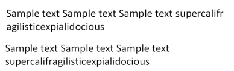
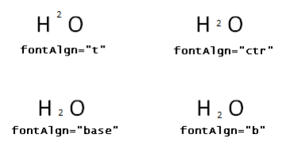
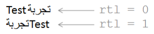
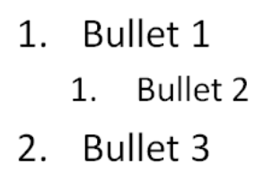

# 21.1 DrawingML - Main

=== "中文"

    DrawingML Main 命名空间的以下部件为所有类型的 DrawingML 对象（例如段落、文本、表格等）定义附加基本构造。

=== "英文"

    The following parts of the DrawingML Main namespace define additional base constructs for all kinds of DrawingML objects (e.g., paragraphs, text, tables, etc.)

## 21.1.1 目录

=== "中文"

    - [21.1 DrawingML - Main](#211-drawingml---main)
        - [21.1.1 目录](#2111-目录)
        - [21.1.2 段落和丰富的格式](#2112-段落和丰富的格式)
            - [21.1.2.1 正文格式](#21121-正文格式)
                - [21.1.2.1.1 bodyPr (正文属性)](#211211-bodypr-正文属性)
                - [21.1.2.1.2 noAutofit (不自动调整)](#211212-noautofit-不自动调整)
                - [21.1.2.1.3 normAutofit (正常自动调整)](#211213-normautofit-正常自动调整)
                - [21.1.2.1.4 spAutoFit (形状自动调整)](#211214-spautofit-形状自动调整)
            - [21.1.2.2 段落格式](#21122-段落格式)
                - [21.1.2.2.1 br (文本换行)](#211221-br-文本换行)
                - [21.1.2.2.2 defPPr (默认段落样式)](#211222-defppr-默认段落样式)
                - [21.1.2.2.3 endParaRPr (段落结尾的运行属性)](#211223-endpararpr-段落结尾的运行属性)
                - [21.1.2.2.4 fld (文本域)](#211224-fld-文本域)
                - [21.1.2.2.5 lnSpc (行间距)](#211225-lnspc-行间距)
                - [21.1.2.2.6 p (文本段落)](#211226-p-文本段落)
                - [21.1.2.2.7 pPr (文本段落特性)](#211227-ppr-文本段落特性)
                - [21.1.2.2.8 rtl (Run从右向左)](#211228-rtl-run从右向左)
                - [21.1.2.2.9 spcAft (后间距)](#211229-spcaft-后间距)
                - [21.1.2.2.10 spcBef (前间距)](#2112210-spcbef-前间距)
                - [21.1.2.2.11 spcPct (间距百分比)](#2112211-spcpct-间距百分比)
                - [21.1.2.2.12 spcPts (间距点)](#2112212-spcpts-间距点)
                - [21.1.2.2.13 tab (制表位)](#2112213-tab-制表位)
                - [21.1.2.2.14 tabLst (制表位列表)](#2112214-tablst-制表位列表)
            - [21.1.2.3 Run格式](#21123-run格式)
                - [21.1.2.3.1 cs (复杂脚本字体)](#211231-cs-复杂脚本字体)
                - [21.1.2.3.2 defRPr (默认文本运行特性)](#211232-defrpr-默认文本运行特性)
                - [21.1.2.3.3 ea (东亚字体)](#211233-ea-东亚字体)
                - [21.1.2.3.4 highlight (高亮颜色)](#211234-highlight-高亮颜色)
                - [21.1.2.3.5 hlinkClick (单击超链接)](#211235-hlinkclick-单击超链接)
                - [21.1.2.3.6 hlinkMouseOver (鼠标悬停超链接)](#211236-hlinkmouseover-鼠标悬停超链接)
                - [21.1.2.3.7 latin (拉丁字体)](#211237-latin-拉丁字体)
                - [21.1.2.3.8 r (文本运行)](#211238-r-文本运行)
                - [21.1.2.3.9 rPr (文本运行特性)](#211239-rpr-文本运行特性)
                - [21.1.2.3.10 sym (符号字体)](#2112310-sym-符号字体)
                - [21.1.2.3.11 t (文本字符串)](#2112311-t-文本字符串)
                - [21.1.2.3.12 uFill (下划线填充)](#2112312-ufill-下划线填充)
                - [21.1.2.3.13 uFillTx (下划线填充属性跟随文本)](#2112313-ufilltx-下划线填充属性跟随文本)
                - [21.1.2.3.14 uLn (下划线)](#2112314-uln-下划线)
                - [21.1.2.3.15 uLnTx (下划线跟随文本)](#2112315-ulntx-下划线跟随文本)
            - [21.1.2.4 项目符号和编号](#21124-项目符号和编号)
                - [21.1.2.4.1 buAutoNum (自动编号项目符号)](#211241-buautonum-自动编号项目符号)
                - [21.1.2.4.2 buBlip (图片项目符号)](#211242-bublip-图片项目符号)
                - [21.1.2.4.3 buChar (字符项目符号)](#211243-buchar-字符项目符号)
                - [21.1.2.4.4 buClr (指定颜色)](#211244-buclr-指定颜色)
                - [21.1.2.4.5 buClrTx (跟随文字)](#211245-buclrtx-跟随文字)
                - [21.1.2.4.6 buFont (特定字体)](#211246-bufont-特定字体)
                - [21.1.2.4.7 buFontTx (跟随文字)](#211247-bufonttx-跟随文字)
                - [21.1.2.4.8 buNone (无项目符号)](#211248-bunone-无项目符号)
                - [21.1.2.4.9 buSzPct (项目符号大小百分比)](#211249-buszpct-项目符号大小百分比)
                - [21.1.2.4.10 buSzPts (项目符号大小Points)](#2112410-buszpts-项目符号大小points)
                - [21.1.2.4.11 buSzTx (项目符号大小跟随文本)](#2112411-busztx-项目符号大小跟随文本)
                - [21.1.2.4.12 lstStyle (文本列表样式)](#2112412-lststyle-文本列表样式)
                - [21.1.2.4.13 lvl1pPr (列表级别 1 文本样式)](#2112413-lvl1ppr-列表级别-1-文本样式)
                - [21.1.2.4.14 lvl2pPr (列表级别 2 文本样式)](#2112414-lvl2ppr-列表级别-2-文本样式)
                - [21.1.2.4.15 lvl3pPr (列表级别 3 文本样式)](#2112415-lvl3ppr-列表级别-3-文本样式)
                - [21.1.2.4.16 lvl4pPr (列表级别 4 文本样式)](#2112416-lvl4ppr-列表级别-4-文本样式)
                - [21.1.2.4.17 lvl5pPr (列表级别 5 文本样式)](#2112417-lvl5ppr-列表级别-5-文本样式)
                - [21.1.2.4.18 lvl6pPr (列表级别 6 文本样式)](#2112418-lvl6ppr-列表级别-6-文本样式)
                - [21.1.2.4.19 lvl7pPr (列表级别 7 文本样式)](#2112419-lvl7ppr-列表级别-7-文本样式)
                - [21.1.2.4.20 lvl8pPr (列表级别 8 文本样式)](#2112420-lvl8ppr-列表级别-8-文本样式)
                - [21.1.2.4.21 lvl9pPr (列表级别 9 文本样式)](#2112421-lvl9ppr-列表级别-9-文本样式)
            - [21.1.2.5 字体替换](#21125-字体替换)
        - [21.1.3 表格](#2113-表格)
            - [21.1.3.1 cell3D (单元格 3-D)](#21131-cell3d-单元格-3-d)
            - [21.1.3.2 gridCol (表格网格列)](#21132-gridcol-表格网格列)
            - [21.1.3.3 header (标题单元格参考)](#21133-header-标题单元格参考)
            - [21.1.3.4 headers (与表格单元关联的标题单元)](#21134-headers-与表格单元关联的标题单元)
            - [21.1.3.5 lnB (底部边框线属性)](#21135-lnb-底部边框线属性)
            - [21.1.3.6 lnBlToTr (左下角到右上角的边框线属性)](#21136-lnbltotr-左下角到右上角的边框线属性)
            - [21.1.3.7 lnL (左边框线属性)](#21137-lnl-左边框线属性)
            - [21.1.3.8 lnR (右边框线属性)](#21138-lnr-右边框线属性)
            - [21.1.3.9 lnT (顶部边框线属性)](#21139-lnt-顶部边框线属性)
            - [21.1.3.10 lnTlToBr (左上角到右下角边框线属性)](#211310-lntltobr-左上角到右下角边框线属性)
            - [21.1.3.11 tableStyle (表格样式)](#211311-tablestyle-表格样式)
            - [21.1.3.12 tableStyleId (表格样式ID)](#211312-tablestyleid-表格样式id)
            - [21.1.3.13 tbl (表格)](#211313-tbl-表格)
            - [21.1.3.14 tblGrid (表格网格)](#211314-tblgrid-表格网格)
            - [21.1.3.15 tblPr (表格属性)](#211315-tblpr-表格属性)
            - [21.1.3.16 tc (表格单元格)](#211316-tc-表格单元格)
            - [21.1.3.17 tcPr (表格单元格属性)](#211317-tcpr-表格单元格属性)
            - [21.1.3.18 tr (表格行)](#211318-tr-表格行)

=== "英文"

    **Table of Contents**
    
    **This subclause is informative.**

    - 21.1.2 Paragraphs and Rich Formatting
        - 21.1.2.1 Body Formatting
            - 21.1.2.1.1 bodyPr (Body Properties)
            - 21.1.2.1.2 noAutofit (No AutoFit)
            - 21.1.2.1.3 normAutofit (Normal AutoFit)
            - 21.1.2.1.4 spAutoFit (Shape AutoFit)
        - 21.1.2.2 Paragraph Formatting
            - 21.1.2.2.1 br (Text Line Break)
            - 21.1.2.2.2 defPPr (Default Paragraph Style)
            - 21.1.2.2.3 endParaRPr (End Paragraph Run Properties)
            - 21.1.2.2.4 fld (Text Field)
            - 21.1.2.2.5 lnSpc (Line Spacing)
            - 21.1.2.2.6 p (Text Paragraphs)
            - 21.1.2.2.7 pPr (Text Paragraph Properties)
            - 21.1.2.2.8 rtl (Right to Left Run)
            - 21.1.2.2.9 spcAft (Space After)
            - 21.1.2.2.10 spcBef (Space Before)
            - 21.1.2.2.11 spcPct (Spacing Percent)
            - 21.1.2.2.12 spcPts (Spacing Points)
            - 21.1.2.2.13 tab (Tab Stop)
            - 21.1.2.2.14 tabLst (Tab List)
        - 21.1.2.3 Run Formatting
            - 21.1.2.3.1 cs (Complex Script Font)
            - 21.1.2.3.2 defRPr (Default Text Run Properties)
            - 21.1.2.3.3 ea (East Asian Font)
            - 21.1.2.3.4 highlight (Highlight Color)
            - 21.1.2.3.5 hlinkClick (Click Hyperlink)
            - 21.1.2.3.6 hlinkMouseOver (Mouse-Over Hyperlink)
            - 21.1.2.3.7 latin (Latin Font)
            - 21.1.2.3.8 r (Text Run)
            - 21.1.2.3.9 rPr (Text Run Properties)
            - 21.1.2.3.10 sym (Symbol Font)
            - 21.1.2.3.11 t (Text String)
            - 21.1.2.3.12 uFill (Underline Fill)
            - 21.1.2.3.13 uFillTx (Underline Fill Properties Follow Text)
            - 21.1.2.3.14 uLn (Underline Stroke)
            - 21.1.2.3.15 uLnTx (Underline Follows Text)
        - 21.1.2.4 Bullets and Numbering
            - 21.1.2.4.1 buAutoNum (Auto-Numbered Bullet)
            - 21.1.2.4.2 buBlip (Picture Bullet)
            - 21.1.2.4.3 buChar (Character Bullet)
            - 21.1.2.4.4 buClr (Color Specified)
            - 21.1.2.4.5 buClrTx (Follow Text)
            - 21.1.2.4.6 buFont (Specified)
            - 21.1.2.4.7 buFontTx (Follow text)
            - 21.1.2.4.8 buNone (No Bullet)
            - 21.1.2.4.9 buSzPct (Bullet Size Percentage)
            - 21.1.2.4.10 buSzPts (Bullet Size Points)
            - 21.1.2.4.11 buSzTx (Bullet Size Follows Text)
            - 21.1.2.4.12 lstStyle (Text List Styles)
            - 21.1.2.4.13 lvl1pPr (List Level 1 Text Style)
            - 21.1.2.4.14 lvl2pPr (List Level 2 Text Style)
            - 21.1.2.4.15 lvl3pPr (List Level 3 Text Style)
            - 21.1.2.4.16 lvl4pPr (List Level 4 Text Style)
            - 21.1.2.4.17 lvl5pPr (List Level 5 Text Style)
            - 21.1.2.4.18 lvl6pPr (List Level 6 Text Style)
            - 21.1.2.4.19 lvl7pPr (List Level 7 Text Style)
            - 21.1.2.4.20 lvl8pPr (List Level 8 Text Style)
            - 21.1.2.4.21 lvl9pPr (List Level 9 Text Style)
        - 21.1.2.5 Font Substitution.
    - 21.1.3 Tables
        - 21.1.3.1 cell3D (Cell 3-D)
        - 21.1.3.2 gridCol (Table Grid Column)
        - 21.1.3.3 header (Header Cell Reference)
        - 21.1.3.4 headers (Header Cells Associated With Table Cell)
        - 21.1.3.5 lnB (Bottom Border Line Properties)
        - 21.1.3.6 lnBlToTr (Bottom-Left to Top-Right Border Line Properties)
        - 21.1.3.7 lnL (Left Border Line Properties)
        - 21.1.3.8 lnR (Right Border Line Properties)
        - 21.1.3.9 lnT (Top Border Line Properties)
        - 21.1.3.10 lnTlToBr (Top-Left to Bottom-Right Border Line Properties)
        - 21.1.3.11 tableStyle (Table Style)
        - 21.1.3.12 tableStyleId (Table Style ID)
        - 21.1.3.13 tbl (Table)
        - 21.1.3.14 tblGrid (Table Grid)
        - 21.1.3.15 tblPr (Table Properties)
        - 21.1.3.16 tc (Table Cell)
        - 21.1.3.17 tcPr (Table Cell Properties)
        - 21.1.3.18 tr (Table Row)

## 21.1.2 段落和丰富的格式

=== "中文"

    DrawingML 框架的段落和丰富格式部分存储形状中包含的文本正文的文本和相关格式信息。 形状内文本的格式可以分为三个精度级别，即正文、段落和连续格式属性。

=== "英文"

    **Elements**
    
    The Paragraphs and Rich Formatting portion of the DrawingML framework stores text and related formatting information for a text body contained within a shape. Formatting for text within a shape can be broken down into three levels of precision, namely body, paragraph, and run formatting properties.

### 21.1.2.1 正文格式

=== "中文"

    作为形状中可用的最高级别的格式设置，主体属性允许对整个文本区域进行操作。 这意味着相关形状的所有段落和文本运行都将包含在此处，因此遵循此处定义的文本正文样式。

    ??? info "Example"

        考虑一个包含三个段落的形状，每个段落都有不同大小的文本。 如果此形状的大小调整得更小，则文本在形状中不再以相同的方式适合。 因此，我们看到为了保持视觉质量，必须改变尺寸。

        不必尝试将每个段落更改为较小的字体大小以适应形状，只需使用正文级别的格式属性（例如normAutofit）即可。 这适用于形状内的所有文本，并将文本缩放一定百分比以适合形状。

        ```xml
        <p:txBody>
            <a:bodyPr>
                <a:normAutofit fontScale="20.000%" lnSpcReduction="20.000%"/>
            </a:bodyPr>
            …
            <a:p>
            …
            </a:p>
            <a:p>
            …
            </a:p>
            <a:p>
            …
            </a:p>
        </p:txBody>
        ```

=== "英文"

    **Body Formatting**

    Being the highest level of formatting available within a shape, the body properties allow for the manipulation of the text area as a whole. This means that all paragraphs and runs of text for the shape in question would be encompassed within here and, therefore, follow the text body style defined here.

    ??? info "Example"

        Consider a shape that has three paragraphs within it, each with a different sized text. If this shape is resized to be smaller, then the text no longer fits the same way within the shape. Thus, we see that to maintain visual quality the size must be changed. 
    
        Rather than try to change each of the paragraphs to a smaller font size to fit in the shape, just use a body-level format property such as the normAutofit. This applies to all text within the shape and scale the text by a certain percentage in order to fit within the shape.

        ```xml
        <p:txBody>
            <a:bodyPr>
                <a:normAutofit fontScale="20.000%" lnSpcReduction="20.000%"/>
            </a:bodyPr>
            …
            <a:p>
            …
            </a:p>
            <a:p>
            …
            </a:p>
            <a:p>
            …
            </a:p>
        </p:txBody>
        ```

#### 21.1.2.1.1 bodyPr (正文属性)

=== "中文"

    此元素定义形状内文本正文的正文属性。

    ??? info "Example"

        考虑一个带有文本正文的形状，该文本正文具有一些与其关联的格式属性。 对于文本正文属性的格式设置，应按如下方式使用 bodyPr 元素：

        ```xml
        <p:sp>
            …
            <p:txBody>
                <a:bodyPr>
                    (text body properties)
                </a:bodyPr>
                …
            </p:txBody>
        </p:sp>
        ```

    ??? abstract "属性列表"

        **anchor** (锚)
    
        :   指定 txBody 在形状内的锚定位置。 如果省略此属性，则隐含 t 或 top 值。
    
            ??? info "Eample"
        
                考虑以下 DrawingML:
        
                ```xml
                <p:txBody>
                    <a:bodyPr anchor="ctr" … />
                    …
                </p:txBody>
                ```
        
                此处，文本在其所在形状的中心垂直对齐。
        
                该属性的可能值由 ST_TextAnchoringType 简单类型定义 (§20.1.10.60).

        **anchorCtr** (锚定中心)

        :   指定文本框的居中位置。 它的基本工作方式是确定文本的最小可能“边界框”，然后相应地将该“边界框”居中。 这与段落对齐不同，段落对齐在文本的“边界框”内对齐文本。 该标志与所有不同类型的锚定兼容。 如果省略此属性，则隐含值 0 或 false。
    
            ??? info "Eample"
        
                该形状内的文本既通过anchor属性垂直居中，又通过anchorCtr属性水平居中。
        
                ```xml
                <p:txBody>
                    <a:bodyPr anchor="ctr" anchorCtr="1" … />
                    …
                </p:txBody>
                ```
        
                该属性的可能值由 W3C XML Schema 布尔数据类型定义。

        **bIns** (底部插图)

        :   指定边界矩形的底部插入。 插图仅用作形状内文本框的内部边距。 如果省略此属性，则隐含值 45720 或 0.05 英寸。
    
            ??? info "Eample"
        
                考虑以下 DrawingML：
        
                ```xml
                <p:txBody>
                    <a:bodyPr lIns="91440" tIns="91440"
                    rIns="91440" bIns="91440" … />
                    …
                </p:txBody>
                ```
        
                具有上述正文属性的文本框在所有四个边上的插入边距均为 91440 或 0.1 英寸。

                该属性的可能值由 ST_Cooperative32 简单类型定义 (§20.1.10.17).

        **compatLnSpc** (兼容的行距)

        :   指定使用字体场景以简单的方式决定此文本正文的行距。 如果省略此属性，则隐含值 0 或 false。

            该属性的可能值由 W3C XML Schema 布尔数据类型定义。

        **forceAA** (强制抗锯齿)

        :   无论字体大小如何，强制文本呈现抗锯齿效果。 某些字体的边缘可能会出现颗粒状，除非它们经过抗锯齿处理。 因此，此属性允许指定哪些文本正文应始终消除锯齿，哪些不应消除锯齿。 如果省略此属性，则隐含值 0 或 false。

            该属性的可能值由 W3C XML Schema 布尔数据类型定义。

        **fromWordArt** (来自艺术字)

        :   指定此文本框中的文本是从艺术字对象转换而来的文本。 这更多的是一个向后兼容性属性，从跟踪的角度来看，它对应用程序很有用。 艺术字是应用文本效果的前一种方式，因此该属性在文档转换场景中非常有用。 如果省略此属性，则隐含值 0 或 false。
    
            ??? info "Eample"
        
                考虑以下 DrawingML：
        
                ```xml
                <p:txBody>
                    <a:bodyPr wrap="none" fromWordArt="1" …
                    />
                    …
                </p:txBody>
                ```
        
                由于 fromWordArt 属性的存在，该形状中的文本可以在文档转换期间映射回相应的艺术字

            该属性的可能值由 W3C XML Schema 布尔数据类型定义。

        **horzOverflow** (文本水平溢出)

        :   确定文本是否可以水平流出边界框。 这用于确定如果形状内的文本对于其包含的边界框来说太大，会发生什么情况。 如果省略该属性，则隐含溢出值。
    
            ??? info "Eample"
    
                考虑这样的情况：我们在一个形状内有多个段落，而第二个段落的长度较长，导致文本流到形状之外。 通过将 horzOverflow 属性的剪辑值应用为 body 属性，该溢出文本现在被切断，而不是延伸到形状的边界之外。
        
                ```xml
                <p:txBody>
                    <a:bodyPr horzOverflow="clip" … />
                    …
                    <a:p>
                    …
                    (Some text)
                    …
                    </a:p>
                    <a:p>
                    …
                    (Some more text)
                    …
                    </a:p>
                </p:txBody>
                ```

            该属性的可能值由 ST_TextHorzOverflowType 简单类型定义 (§20.1.10.69).

        **lIns** (左插图)

        :   指定边界矩形的左插图。 插图仅用作形状内文本框的内部边距。 如果省略此属性，则隐含值 91440 或 0.1 英寸。
    
            ??? info "Eample"
    
                考虑以下 DrawingML：

                ```xml
                <p:txBody>
                    <a:bodyPr lIns="91440" tIns="91440" rIns="91440"
                    bIns="91440" … />
                    …
                </p:txBody>
                ```

            该属性的可能值由 ST_Cooperative32 简单类型定义 (§20.1.10.17).

        **numCol** (列数)

        :   指定边框中文本的列数。 当应用于文本串时，此属性采用文本边框的宽度并将其除以指定的列数。 然后，这些列被视为溢出容器，因为当前一列已填充文本时，下一列将充当附加文本的存储库。 当所有列都已填充且文本仍然保留时，将使用为此文本正文设置的溢出属性，并重新排列文本以为其他文本腾出空间。 如果省略该属性，则隐含值为 1。
    
            ??? info "Eample"
    
                考虑这样的情况：文本区域需要分成四个单独的列。 然后，只需用一串文本指定一个段落就足以描述此处的四列文本。

                ```xml
                <p:txBody>
                    <a:bodyPr numCol="4" … />
                    <a:p>
                        <a:r>
                        …
                        (Some text)
                        …
                        </a:r>
                    </a:p>
                </p:txBody>
                ```

            该属性的可能值由 ST_TextColumnCount 简单类型定义 (§20.1.10.65).

        **rIns** (右插图)

        :   指定边界矩形的右插图。 插图仅用作形状内文本框的内部边距。 如果省略此属性，则隐含值 91440 或 0.1 英寸。
    
            ??? info "Eample"
    
                考虑以下 DrawingML：

                ```xml
                <p:txBody>
                    <a:bodyPr lIns="91440" tIns="91440"
                    rIns="91440" bIns="91440" … />
                    …
                </p:txBody>
                ```

                具有上述正文属性的文本框的所有四个边的插入边距均为 91440 或 0.1 英寸. 

            该属性的可能值由 ST_Cooperative32 简单类型定义 (§20.1.10.17).

        **rot** (旋转)

        :   指定应用于边界框内文本的旋转。 如果未指定，则使用伴随形状的旋转。 如果指定了，则其应用将独立于形状。 也就是说，除了文本本身应用旋转之外，形状还可以应用旋转。 如果省略该属性，则隐含值为 0。
    
            ??? info "Eample"
    
                考虑这样的情况：形状旋转了 5400000 度，即顺时针旋转 90 度。 除此之外，文本主体本身还应用了 -5400000 度的旋转，即逆时针 90 度。 然后，生成的形状似乎已旋转，但其中的文本看起来好像根本没有旋转。 指定这一点的 DrawingML 如下所示：

                ```xml
                <p:sp>
                    <p:spPr>
                        <a:xfrm rot="5400000">
                        …
                        </a:xfrm>
                    </p:spPr>
                    …
                    <p:txBody>
                        <a:bodyPr rot="-5400000" … />
                        …
                        (Some text)
                        …
                    </p:txBody>
                </p:sp>
                ```

            该属性的可能值由 ST_Angle 简单类型定义 (§20.1.10.3).

        **rtlCol** (列从右到左)

        :   指定是按从右到左还是从左到右的顺序使用列。 此属性的用法仅设置列顺序，该顺序用于确定下一个溢出文本应转到哪一列。 如果省略此属性，则隐含值 0 或 false，在这种情况下，文本从最左边的列开始并向右流动。

            [Note: 该属性决不决定文本的方向，而仅决定使用多列的方向. end note]

            该属性的可能值由 W3C XML Schema 布尔数据类型定义。

        **spcCol** (列之间的空间)

        :   指定文本区域中文本列之间的间距。 这仅适用于存在多于 1 列的情况。 如果省略该属性，则隐含值为 0。

            该属性的可能值由 ST_PositiveCooperative32 简单类型定义 (§20.1.10.43).

        **spcFirstLastPara** (段落间距)

        :   指定是否遵守用户定义的前后段落间距。 虽然段落之间的间距很有帮助，但能够设置一个标志来确定是否在文本正文的边缘（即文本正文中的第一个和最后一个段落）遵循此间距也很有用。 更准确地说，由于这是文本主体级别的属性，因此它应该只影响给定文本主体的第一段之前的段落间距和最后一段的之后段落间距。 如果省略此属性，则隐含值为 0 或 false.
    
            ??? info "Eample"
    
                考虑使用 spcBef 和 spcAft 段落间距属性在文本正文中的多个段落之间定义间距的情况。 然而，对于此文本主体，用户不希望边缘段落遵循此内容，因此我们有以下 DrawingML.

                ```xml
                <p:txBody>
                    <a:bodyPr spcFirstLastPara="0" … />
                    …
                    <a:p>
                        <a:pPr>
                            <a:spcBef>
                                <a:spcPts val="1800"/>
                            </a:spcBef>
                            <a:spcAft>
                                <a:spcPts val="600"/>
                            </a:spcAft>
                        </a:pPr>
                        …
                        (Some text)
                        …
                    </a:p>
                    <a:p>
                        <a:pPr>
                            <a:spcBef>
                                <a:spcPts val="1800"/>
                            </a:spcBef>
                            <a:spcAft>
                                <a:spcPts val="600"/>
                            </a:spcAft>
                        </a:pPr>
                        …
                        (Some text)
                        …
                    </a:p>
                    …
                </p:txBody>
                ```

            该属性的可能值由 W3C XML Schema 布尔数据类型定义。

        **tIns** (顶部插图)

        :   指定边界矩形的顶部插入。 插图仅用作形状内文本框的内部边距。 如果省略此属性，则隐含值 45720 或 0.05 英寸。
    
            ??? info "Eample"
    
                考虑以下 DrawingML：

                ```xml
                <p:txBody>
                    <a:bodyPr lIns="91440" tIns="91440"
                    rIns="91440" bIns="91440" … />
                    …
                </p:txBody>
                ```

                具有上述正文属性的文本框的所有四个边的插入边距均为 91440 或 0.1 英寸

            该属性的可能值由 ST_Cooperative32 简单类型定义 (§20.1.10.17).

        **upright** (文字直立)

        :   指定文本是否应保持直立，无论对其应用的变换以及伴随的形状变换如何。 如果省略此属性，则隐含值为 0 或 false.
    
            ??? info "Eample"
    
                考虑已在文本正文中旋转但设置了直立标志的文本.

                ```xml
                <p:txBody>
                    <a:bodyPr upright="1" rot="5400000" …/>
                    …
                    (Some text)
                    …
                </p:txBody>
                ```

                该文本看起来好像没有应用任何变换.

            该属性的可能值由 W3C XML Schema 布尔数据类型定义。

        **vert** (竖排文字)

        :   确定给定文本正文中的文本是否应垂直显示。 如果省略此属性，则隐含水平值，或不隐含垂直文本。
    
            ??? info "Eample"
    
                考虑这样的情况：用户需要显示垂直显示的文本，并且相对于其列具有从右到左的流动。

                ```xml
                <p:txBody>
                    <a:bodyPr vert="wordArtVertRtl" … />
                    …
                    <a:p>
                        …
                        <a:t>This is</a:t>
                        …
                    </a:p>
                    <a:p>
                        …
                        <a:t>some text.</a:t>
                        …
                    </a:p>
                </p:txBody>
                ```

                在上面的 DrawingML 示例中，有两个段落表示文本之间的分隔，否则称为换行符或段落分隔符。 因为这里使用了 wordArtVertRtl，所以该文本不仅以从上到下的堆叠方式显示，而且还使第一段显示在第二段的右侧。 这是因为它是垂直文本并且从右到左。
                
            该属性的可能值由 ST_TextVerticalType 简单类型定义 (§20.1.10.83).

        **vertOverflow** (文本垂直溢出)

        :   确定文本是否可以垂直流出边界框。 这用于确定如果形状内的文本对于其包含的边界框来说太大，会发生什么情况。 如果省略该属性，则隐含溢出值。
    
            ??? info "Eample"
    
                考虑这样的情况：我们在一个形状内有多个段落，而第二个段落会导致文本流到形状之外。 通过将 vertOverflow 属性的剪辑值应用为 body 属性，溢出的文本现在被切断，而不是延伸到形状的边界之外。

                ```xml
                <p:txBody>
                    <a:bodyPr vertOverflow="clip" … />
                        …
                        <a:p>
                            …
                            (Some text)
                            …
                        </a:p>
                        <a:p>
                            …
                            (Some longer text)
                            …
                        </a:p>
                </p:txBody>
                ```

            该属性的可能值由 ST_TextVertOverflowType 简单类型定义 (§20.1.10.84).

        **wrap** (文本包裹类型)

        :   指定用于此文本正文的换行选项。 如果省略此属性，则隐含 square 值，该值使用边界文本框包裹文本。
                
            该属性的可能值由 ST_TextWrappingType 简单类型定义 (§20.1.10.85).
    
    [Note: 该元素内容模型 (CT_TextBodyProperties) 的 W3C XML 架构定义位于 §A.4.1 中。 end note]

=== "英文"

    **bodyPr (Body Properties)**

    This element defines the body properties for the text body within a shape.

    ??? info "Example"

        Consider a shape with a text body that has some formatting properties associated with it. For the formatting of text body properties, the bodyPr element should be used as follows:

        ```xml
        <p:sp>
            …
            <p:txBody>
                <a:bodyPr>
                    (text body properties)
                </a:bodyPr>
                …
            </p:txBody>
        </p:sp>
        ```

    ??? abstract "Attributes"

        anchor (Anchor)
    
        :   Specifies the anchoring position of the txBody within the shape. If this attribute is omitted, then a value of t, or top is implied.
    
            ??? info "Eample"
        
                Consider the following DrawingML:
        
                ```xml
                <p:txBody>
                    <a:bodyPr anchor="ctr" … />
                    …
                </p:txBody>
                ```
        
                Here the text is vertically aligned in the center of the shape within which it is contained. 
        
                The possible values for this attribute are defined by the ST_TextAnchoringType simple type (§20.1.10.60).

        anchorCtr (Anchor Center)

        :   Specifies the centering of the text box. The way it works fundamentally is to determine the smallest possible "bounds box" for the text and then to center that "bounds box" accordingly. This is different than paragraph alignment, which aligns the text within the "bounds box" for the text. This flag is compatible with all of the different kinds of anchoring. If this attribute is omitted, then a value of 0 or false is implied.
    
            ??? info "Eample"
        
                The text within this shape has been both vertically centered with the anchor attribute and horizontally centered with the anchorCtr attribute.
        
                ```xml
                <p:txBody>
                    <a:bodyPr anchor="ctr" anchorCtr="1" … />
                    …
                </p:txBody>
                ```
        
                The possible values for this attribute are defined by the W3C XML Schema boolean datatype.

        bIns (Bottom Inset)

        :   Specifies the bottom inset of the bounding rectangle. Insets are used just as internal margins for text boxes within shapes. If this attribute is omitted, a value of 45720 or 0.05 inches is implied.
    
            ??? info "Eample"
        
                Consider the following DrawingML:
        
                ```xml
                <p:txBody>
                    <a:bodyPr lIns="91440" tIns="91440"
                    rIns="91440" bIns="91440" … />
                    …
                </p:txBody>
                ```
        
                The text box having the above body properties has inset margins of 91440 or 0.1 inches on all four sides.

                The possible values for this attribute are defined by the ST_Coordinate32 simple type (§20.1.10.17).

        compatLnSpc (Compatible Line Spacing)

        :   Specifies that the line spacing for this text body is decided in a simplistic manner using the font scene. If this attribute is omitted, a value of 0 or false is implied.

            The possible values for this attribute are defined by the W3C XML Schema boolean datatype.

        forceAA (Force Anti-Alias)

        :   Forces the text to be rendered anti-aliased regardless of the font size. Certain fonts can appear grainy around their edges unless they are anti-aliased. Therefore this attribute allows for the specifying of which bodies of text should always be anti-aliased and which ones should not. If this attribute is omitted, then a value of 0 or falseis implied.

            The possible values for this attribute are defined by the W3C XML Schema boolean datatype.

        fromWordArt (From WordArt)

        :   Specifies that text within this textbox is converted text from a WordArt object. This is more of a backwards compatibility attribute that is useful to the application from a tracking perspective. WordArt was the former way to apply text effects and therefore this attribute is useful in document conversion scenarios. If this attribute is omitted, then a value of 0 or falseis implied.
    
            ??? info "Eample"
        
                Consider the following DrawingML:
        
                ```xml
                <p:txBody>
                    <a:bodyPr wrap="none" fromWordArt="1" …
                    />
                    …
                </p:txBody>
                ```
        
                Because of the presence of the fromWordArt attribute the text within this shape can be mapped back to the corresponding WordArt during document conversion

            The possible values for this attribute are defined by the W3C XML Schema boolean datatype.

        horzOverflow (Text Horizontal Overflow)

        :   Determines whether the text can flow out of the bounding box horizontally. This is used to determine what happens in the event that the text within a shape is too large for the bounding box it is contained within. If this attribute is omitted, then a value of overflow is implied.
    
            ??? info "Eample"
    
                Consider the case where we have multiply paragraphs within a shape and the second is greater in length and causes text to flow outside the shape. By applying the clip value of the horzOverflow attribute as a body property this overflowing text now is cut off instead of extending beyond the bounds of the shape.
        
                ```xml
                <p:txBody>
                    <a:bodyPr horzOverflow="clip" … />
                    …
                    <a:p>
                    …
                    (Some text)
                    …
                    </a:p>
                    <a:p>
                    …
                    (Some more text)
                    …
                    </a:p>
                </p:txBody>
                ```

            The possible values for this attribute are defined by the ST_TextHorzOverflowType simple type (§20.1.10.69).

        lIns (Left Inset)

        :   Specifies the left inset of the bounding rectangle. Insets are used just as internal margins for text boxes within shapes. If this attribute is omitted, then a value of 91440 or 0.1 inches is implied.
    
            ??? info "Eample"
    
                Consider the following DrawingML:

                ```xml
                <p:txBody>
                    <a:bodyPr lIns="91440" tIns="91440" rIns="91440"
                    bIns="91440" … />
                    …
                </p:txBody>
                ```

            The possible values for this attribute are defined by the ST_Coordinate32 simple type (§20.1.10.17).

        numCol (Number of Columns)

        :   Specifies the number of columns of text in the bounding rectangle. When applied to a text run this property takes the width of the bounding box for the text and divides it by the number of columns specified. These columns are then treated as overflow containers in that when the previous column has been filled with text the next column acts as the repository for additional text. When all columns have been filled and text still remains then the overflow properties set for this text body are used and the text is reflowed to make room for additional text. If this attribute is omitted, then a value of 1 is implied.
    
            ??? info "Eample"
    
                Consider the case where a text area would need to be split up into four separate columns. Then simply specifying one paragraph with one run of text is enough to describe four columns of text here.

                ```xml
                <p:txBody>
                    <a:bodyPr numCol="4" … />
                    <a:p>
                        <a:r>
                        …
                        (Some text)
                        …
                        </a:r>
                    </a:p>
                </p:txBody>
                ```

            The possible values for this attribute are defined by the ST_TextColumnCount simple type (§20.1.10.65).

        rIns (Right Inset)

        :   Specifies the right inset of the bounding rectangle. Insets are used just as internal margins for text boxes within shapes. If this attribute is omitted, then a value of 91440 or 0.1 inches is implied.
    
            ??? info "Eample"
    
                Consider the following DrawingML:

                ```xml
                <p:txBody>
                    <a:bodyPr lIns="91440" tIns="91440"
                    rIns="91440" bIns="91440" … />
                    …
                </p:txBody>
                ```

                The text box having the above body properties has inset margins of 91440 or 0.1 inches on all four sides. 

            The possible values for this attribute are defined by the ST_Coordinate32 simple type (§20.1.10.17).

        rot (Rotation)

        :   Specifies the rotation that is being applied to the text within the bounding box. If it not specified, the rotation of the accompanying shape is used. If it is specified, then this is applied independently from the shape. That is the shape can have a rotation applied in addition to the text itself having a rotation applied to it. If this attribute is omitted, then a value of 0, is implied.
    
            ??? info "Eample"
    
                Consider the case where a shape has a rotation of 5400000, or 90 degrees clockwise applied to it. In addition to this, the text body itself has a rotation of -5400000, or 90 degrees counter-clockwise applied to it. Then the resulting shape would appear to be rotated but the text within it would appear as though it had not been rotated at all. The DrawingML specifying this would look like the following:

                ```xml
                <p:sp>
                    <p:spPr>
                        <a:xfrm rot="5400000">
                        …
                        </a:xfrm>
                    </p:spPr>
                    …
                    <p:txBody>
                        <a:bodyPr rot="-5400000" … />
                        …
                        (Some text)
                        …
                    </p:txBody>
                </p:sp>
                ```

            The possible values for this attribute are defined by the ST_Angle simple type (§20.1.10.3).

        rtlCol (Columns Right-To-Left)

        :   Specifies whether columns are used in a right-to-left or left-to-right order. The usage of this attribute only sets the column order that is used to determine which column overflow text should go to next. If this attribute is omitted, then a value of 0 or falseis implied in which case text starts in the leftmost column and flow to the right.

            [Note: This attribute in no way determines the direction of text but merely the direction in which multiple columns are used. end note]

            The possible values for this attribute are defined by the W3C XML Schema boolean datatype.

        spcCol (Space Between Columns)

        :   Specifies the space between text columns in the text area. This should only apply when there is more than 1 column present. If this attribute is omitted, then a value of 0 is implied.

            The possible values for this attribute are defined by the ST_PositiveCoordinate32 simple type (§20.1.10.43).

        spcFirstLastPara (Paragraph Spacing)

        :   Specifies whether the before and after paragraph spacing defined by the user is to be respected. While the spacing between paragraphs is helpful, it is additionally useful to be able to set a flag as to whether this spacing is to be followed at the edges of the text body, in other words the first and last paragraphs in the text body. More precisely since this is a text body level property it should only effect the before paragraph spacing of the first paragraph and the after paragraph spacing of the last paragraph for a given text body. If this attribute is omitted, then a value of 0, or false is implied.
    
            ??? info "Eample"
    
                Consider the case where spacing has been defined between multiple paragraphs within a text body using the spcBef and spcAft paragraph spacing attributes. For this text body however the user would like to not have this followed for the edge paragraphs and thus we have the following DrawingML.

                ```xml
                <p:txBody>
                    <a:bodyPr spcFirstLastPara="0" … />
                    …
                    <a:p>
                        <a:pPr>
                            <a:spcBef>
                                <a:spcPts val="1800"/>
                            </a:spcBef>
                            <a:spcAft>
                                <a:spcPts val="600"/>
                            </a:spcAft>
                        </a:pPr>
                        …
                        (Some text)
                        …
                    </a:p>
                    <a:p>
                        <a:pPr>
                            <a:spcBef>
                                <a:spcPts val="1800"/>
                            </a:spcBef>
                            <a:spcAft>
                                <a:spcPts val="600"/>
                            </a:spcAft>
                        </a:pPr>
                        …
                        (Some text)
                        …
                    </a:p>
                    …
                </p:txBody>
                ```

            The possible values for this attribute are defined by the W3C XML Schema boolean datatype.

        tIns (Top Inset)

        :   Specifies the top inset of the bounding rectangle. Insets are used just as internal margins for text boxes within shapes. If this attribute is omitted, then a value of 45720 or 0.05 inches is implied.
    
            ??? info "Eample"
    
                Consider the following DrawingML:

                ```xml
                <p:txBody>
                    <a:bodyPr lIns="91440" tIns="91440"
                    rIns="91440" bIns="91440" … />
                    …
                </p:txBody>
                ```

                The text box having the above body properties has inset margins of 91440 or 0.1 inches on all four sides

            The possible values for this attribute are defined by the ST_Coordinate32 simple type (§20.1.10.17).

        upright (Text Upright)

        :   Specifies whether text should remain upright, regardless of the transform applied to it and the accompanying shape transform. If this attribute is omitted, then a value of 0, or false is implied.
    
            ??? info "Eample"
    
                Consider text that has been rotated within the text body but has the upright flag set.

                ```xml
                <p:txBody>
                    <a:bodyPr upright="1" rot="5400000" …/>
                    …
                    (Some text)
                    …
                </p:txBody>
                ```

                This text appears as though no transform has been applied to it.

            The possible values for this attribute are defined by the W3C XML Schema boolean datatype.

        vert (Vertical Text)

        :   Determines if the text within the given text body should be displayed vertically. If this attribute is omitted, then a value of horz, or no vertical text is implied.
    
            ??? info "Eample"
    
                Consider the case where the user needs to display text that appears vertical and has a right to left flow with respect to its columns.

                ```xml
                <p:txBody>
                    <a:bodyPr vert="wordArtVertRtl" … />
                    …
                    <a:p>
                        …
                        <a:t>This is</a:t>
                        …
                    </a:p>
                    <a:p>
                        …
                        <a:t>some text.</a:t>
                        …
                    </a:p>
                </p:txBody>
                ```

                In the above sample DrawingML there are two paragraphs denoting a separation between the text otherwise which are known as either a line or paragraph break. Because wordArtVertRtl is used here this text is not only displayed in a stacked manner flowing from top to bottom but also have the first paragraph be displayed to the right of the second. This is because it is both vertical text and right to left.
                
            The possible values for this attribute are defined by the ST_TextVerticalType simple type (§20.1.10.83).

        vertOverflow (Text Vertical Overflow)

        :   Determines whether the text can flow out of the bounding box vertically. This is used to determine what happens in the event that the text within a shape is too large for the bounding box it is contained within. If this attribute is omitted, then a value of overflow is implied.
    
            ??? info "Eample"
    
                Consider the case where we have multiply paragraphs within a shape and the second causes text to flow outside the shape. By applying the clip value of the vertOverflow attribute as a body property this overflowing text is now cut off instead of extending beyond the bounds of the shape.

                ```xml
                <p:txBody>
                    <a:bodyPr vertOverflow="clip" … />
                        …
                        <a:p>
                            …
                            (Some text)
                            …
                        </a:p>
                        <a:p>
                            …
                            (Some longer text)
                            …
                        </a:p>
                </p:txBody>
                ```

            The possible values for this attribute are defined by the ST_TextVertOverflowType simple type (§20.1.10.84).

        wrap (Text Wrapping Type)

        :   Specifies the wrapping options to be used for this text body. If this attribute is omitted, then a value of square is implied which wraps the text using the bounding text box. 
                
            The possible values for this attribute are defined by the ST_TextWrappingType simple type (§20.1.10.85).
    
    [Note: The W3C XML Schema definition of this element’s content model (CT_TextBodyProperties) is located in §A.4.1. end note]

#### 21.1.2.1.2 noAutofit (不自动调整)

=== "中文"

    此元素指定文本正文中的文本不应自动适合边界框。 自动调整是指缩放文本框中的文本以使其保留在文本框中。 如果省略此元素，则暗示 noAutofit 或 auto-fit off.

    ??? info "Eample"

        考虑一个文本框，用户希望将文本扩展到边界框之外。 下面的 DrawingML 将对此进行描述。

        ```xml
        <p:txBody>
            <a:bodyPr wrap="none" rtlCol="0">
                <a:noAutofit/>
            </a:bodyPr>
            <a:p>
                …
                <a:t>Some text</a:t>
                …
            </a:p>
        </p:txBody>
        ```

    该元素内容模型 (CT_TextNoAutofit) 的 W3C XML 架构定义位于 §A.4.1 中。

=== "英文"

    **noAutofit (No AutoFit)**

    This element specifies that text within the text body should not be auto-fit to the bounding box. Auto-fitting is when text within a text box is scaled in order to remain inside the text box. If this element is omitted, then noAutofit or auto-fit off is implied.

    ??? info "Eample"

        Consider a text box where the user wishes to have the text extend outside the bounding box. The following DrawingML would describe this.

        ```xml
        <p:txBody>
            <a:bodyPr wrap="none" rtlCol="0">
                <a:noAutofit/>
            </a:bodyPr>
            <a:p>
                …
                <a:t>Some text</a:t>
                …
            </a:p>
        </p:txBody>
        ```

    [Note: The W3C XML Schema definition of this element’s content model (CT_TextNoAutofit) is located in §A.4.1. end note]

#### 21.1.2.1.3 normAutofit (正常自动调整)

=== "中文"

    此元素指定文本正文中的文本通常应自动适合边界框。 自动调整是指缩放文本框中的文本以使其保留在文本框中。 如果省略此元素，则暗示 noAutofit 或 auto-fit off。

    ??? info "Example"

        考虑这样的情况：用户正在构建图表，并且需要将他们正在使用的每个形状的文本保留在形状的边界内。 实现这一点的一个简单方法是使用normAutofit。 以下 DrawingML 说明了如何实现这一点。

        ```xml
        <p:sp>
            <p:txBody>
                <a:bodyPr rtlCol="0" anchor="ctr">
                    <a:normAutofit fontScale="92.000%" lnSpcReduction="20.000%"/>
                </a:bodyPr>
                …
                <a:p>
                    …
                    <a:t>Diagram Object 1</a:t>
                    …
                </a:p>
            </p:txBody>
        </p:sp>
        <p:sp>
            <p:txBody>
                <a:bodyPr rtlCol="0" anchor="ctr">
                    <a:normAutofit fontScale="92.000%" lnSpcReduction="20.000%"/>
                </a:bodyPr>
                …
                <a:p>
                    …
                    <a:t>Diagram Object 2</a:t>
                    …
                </a:p>
            </p:txBody>
        </p:sp>
        ```

        在上面的示例中，有两个形状打开了normAutofit，以便当用户在形状中键入更多文本时，文本实际上会调整大小以适应新数据。 为了让应用程序了解如何调整文本大小以及调整文本大小的程度，为自动调整大小逻辑设置了两个属性。

    ??? abstract "属性列表"

        **fontScale** (字体比例) 
    
        :   指定文本正文中每次运行缩放到的原始字体大小的百分比。 为了在边界框中自动调整文本，有时需要将字体大小减小一定的百分比。 使用此属性，可以根据提供的值缩放文本框中的字体。 值为 100% 会将文本缩放到 100%，而值为 1% 会将文本缩放到 1%。 如果省略此属性，则暗示值为 100%。

            此属性的可能值由 ST_TextFontScalePercentOrPercentString 简单类型定义 (§20.1.10.67).
        
        **lnSpcReduction** (减少行距)

        :   指定文本正文中每个段落的行间距减少的百分比量。 通过从原始行距值中减去它来应用减少。 使用此属性，文本行之间的垂直间距可以按百分比缩放。 值为 100% 时，行间距会减少 100%，而值为 1% 时，行间距会减少百分之一。 如果省略此属性，则暗示值为 0%。
        
            [Note: 该属性仅适用于具有百分比行间距的段落. end note]

            此属性的可能值由 ST_TextSpacingPercentOrPercentString 简单类型定义 (§20.1.10.77).
    
    [Note: 该元素内容模型 (CT_TextNormalAutofit) 的 W3C XML 架构定义位于 §A.4.1 中。 end note]

=== "英文"

    **normAutofit (Normal AutoFit)**

    This element specifies that text within the text body should be normally auto-fit to the bounding box. Autofitting is when text within a text box is scaled in order to remain inside the text box. If this element is omitted, then noAutofit or auto-fit off is implied.

    ??? info "Example"

        Consider the situation where a user is building a diagram and needs to have the text for each shape that they are using stay within the bounds of the shape. An easy way this might be done is by using normAutofit. The following DrawingML illustrates how this might be accomplished.

        ```xml
        <p:sp>
            <p:txBody>
                <a:bodyPr rtlCol="0" anchor="ctr">
                    <a:normAutofit fontScale="92.000%" lnSpcReduction="20.000%"/>
                </a:bodyPr>
                …
                <a:p>
                    …
                    <a:t>Diagram Object 1</a:t>
                    …
                </a:p>
            </p:txBody>
        </p:sp>
        <p:sp>
            <p:txBody>
                <a:bodyPr rtlCol="0" anchor="ctr">
                    <a:normAutofit fontScale="92.000%" lnSpcReduction="20.000%"/>
                </a:bodyPr>
                …
                <a:p>
                    …
                    <a:t>Diagram Object 2</a:t>
                    …
                </a:p>
            </p:txBody>
        </p:sp>
        ```

        In the above example there are two shapes that have normAutofit turned on so that when the user types more text within the shape that the text actually resizes to accommodate the new data. For the application to know how and to what degree the text should be resized two attributes are set for the auto-fit resize logic.

    ??? abstract "Attributes"

        fontScale (Font Scale) 
    
        :   Specifies the percentage of the original font size to which each run in the text body is scaled. In order to auto-fit text within a bounding box it is sometimes necessary to decrease the font size by a certain percentage. Using this attribute the font within a text box can be scaled based on the value provided. A value of 100% scales the text to 100%, while a value of 1% scales the text to 1%. If this attribute is omitted, then a value of 100% is implied.

            The possible values for this attribute are defined by the ST_TextFontScalePercentOrPercentString simple type (§20.1.10.67).
        
        lnSpcReduction (Line Space Reduction)

        :   Specifies the percentage amount by which the line spacing of each paragraph in the text body is reduced. The reduction is applied by subtracting it from the original line spacing value. Using this attribute the vertical spacing between the lines of text can be scaled by a percent amount. A value of 100% reduces the line spacing by 100%, while a value of 1% reduces the line spacing by one percent. If this attribute is omitted, then a value of 0% is implied.
        
            [Note: This attribute applies only to paragraphs with percentage line spacing. end note]

            The possible values for this attribute are defined by the ST_TextSpacingPercentOrPercentString simple type (§20.1.10.77).
    
    [Note: The W3C XML Schema definition of this element’s content model (CT_TextNormalAutofit) is located in §A.4.1. end note]

#### 21.1.2.1.4 spAutoFit (形状自动调整)

=== "中文"

    此元素指定形状应自动调整以完全包含其中描述的文本。 自动调整是指缩放形状内的文本以包含其中的所有文本。 如果省略此元素，则暗示 noAutofit 或 auto-fit off。

    ??? info "Example"

        考虑这样的情况：用户正在构建图表，并且需要将他们正在使用的每个形状的文本保留在形状的边界内。 完成此操作的一个简单方法是使用 spAutofit。 以下 DrawingML 说明了如何实现这一点。

        ```xml
        <p:sp>
            <p:txBody>
                <a:bodyPr rtlCol="0" anchor="ctr">
                    <a:spAutoFit/>
                </a:bodyPr>
                …
                <a:p>
                    …
                    <a:t>Diagram Object 1</a:t>
                    …
                </a:p>
            </p:txBody>
        </p:sp>
        <p:sp>
            <p:txBody>
                <a:bodyPr rtlCol="0" anchor="ctr">
                    <a:spAutoFit/>
                </a:bodyPr>
                …
                <a:p>
                    …
                    <a:t>Diagram Object 2</a:t>
                    …
                </a:p>
            </p:txBody>
        </p:sp>
        ```

        在上面的示例中，有两个形状打开了 spAutoFit，以便当用户在形状中键入更多文本时，形状实际上会调整大小以适应新数据。

    [Note: 该元素内容模型 (CT_TextShapeAutofit) 的 W3C XML 架构定义位于 §A.4.1. end note]

=== "英文"

    **spAutoFit (Shape AutoFit)**

    This element specifies that a shape should be auto-fit to fully contain the text described within it. Auto-fitting is when text within a shape is scaled in order to contain all the text inside. If this element is omitted, then noAutofit or auto-fit off is implied.

    ??? info "Example"

        Consider the situation where a user is building a diagram and needs to have the text for each shape that they are using stay within the bounds of the shape. An easy way this might be done is by using spAutofit. The following DrawingML illustrates how this might be accomplished.

        ```xml
        <p:sp>
            <p:txBody>
                <a:bodyPr rtlCol="0" anchor="ctr">
                    <a:spAutoFit/>
                </a:bodyPr>
                …
                <a:p>
                    …
                    <a:t>Diagram Object 1</a:t>
                    …
                </a:p>
            </p:txBody>
        </p:sp>
        <p:sp>
            <p:txBody>
                <a:bodyPr rtlCol="0" anchor="ctr">
                    <a:spAutoFit/>
                </a:bodyPr>
                …
                <a:p>
                    …
                    <a:t>Diagram Object 2</a:t>
                    …
                </a:p>
            </p:txBody>
        </p:sp>
        ```

        In the above example there are two shapes that have spAutoFit turned on so that when the user types more text within the shape that the shape actually resizes to accommodate the new data. 

    [Note: The W3C XML Schema definition of this element’s content model (CT_TextShapeAutofit) is located in §A.4.1. end note]

### 21.1.2.2 段落格式

=== "中文"

    这种级别的格式化允许对形状内的文本进行更精细的控制。 此处的属性适用于相应段落中的所有文本。 此中间属性级别允许自由地将看似较低级别的属性分配给较大的文本组。 除此之外，段落属性级别还允许对更细粒度的文本集看似更大的组属性。 这使得属性级别具有非常通用的能力，能够定义形状内文本的格式。

    ??? info "Example"

        例如，考虑一个文本段落需要应用项目符号的情况。 起初，人们可能会认为这种格式化必须在文本运行级别完成，因为它看起来是特定于运行的。 恰恰相反，这是段落级属性，适用于多段文本。 作为一个例子，我们再次有三个段落，第二个段落应用了项目符号

        ```xml
        <a:p>
        …
        </a:p>
        <a:p>
            <a:pPr>
                <a:buFont typeface="Wingdings"/>
                <a:buChar typeface="ü"/>
            <a:pPr>
            <a:r>
                <a:rPr lang="en-US" dirty="0" smtClean="0"/>
                <a:t>This Paragraph of Text Will Have a Bullet.</a:t>
            </a:r>
        </a:p>
        <a:p>
        …
        </a:p>
        ```

        在这里，我们看到该段落的格式被设置为对于遇到的每个新文本行都有字符项目符号。 特别是，该段落应用了“ü”字符，该字符在“Wingdings”字体中是复选标记字符。 其他段落不受本段项目符号格式的影响，并且其文本应保持未格式化。

=== "英文"

    **Paragraph Formatting**

    This level of formatting allows for more granular control of text within a shape. Properties here apply to all text residing within the corresponding paragraph. This intermediate property level allows freedom to assign what would seem like lower level properties to a larger group of text. Along with this the paragraph property level also allows what would seem like larger group properties to a more granular set of text. This makes for a property level that is quite versatile in its ability to define formatting on text within a shape.

    ??? info "Example"

        For instance consider the case where a paragraph of text would need to have bullets applied to it. At first one might think that this formatting must be done at the text run level as it can seem run specific. Much to the contrary this is a paragraph level property and is applied to multiple runs of text. As an example we have once again our three paragraphs with the second having bullets applied to it

        ```xml
        <a:p>
        …
        </a:p>
        <a:p>
            <a:pPr>
                <a:buFont typeface="Wingdings"/>
                <a:buChar typeface="ü"/>
            <a:pPr>
            <a:r>
                <a:rPr lang="en-US" dirty="0" smtClean="0"/>
                <a:t>This Paragraph of Text Will Have a Bullet.</a:t>
            </a:r>
        </a:p>
        <a:p>
        …
        </a:p>
        ```

        Here we see that the paragraph is formatted to have character bullets for each new line of text that is encountered. In particular this paragraph has the "ü" character applied which in the "Wingdings" font is the checkmark character. The other paragraphs are not effected by this paragraph's bullet formatting and should have their text remain unformatted.

#### 21.1.2.2.1 br (文本换行)

=== "中文"

    此元素指定段落内两行文本之间是否存在垂直换行符。 除了指定两次文本之间的垂直间距之外，此元素还可以具有通过 `rPr` 子元素指定的运行(run)特性。 这设置了换行符的文本格式，以便以后在此处插入文本时可以使用正确的格式生成新的运行(run)。

    ??? info "Example"

        考虑如下所示的 DrawingML。

        ```xml
        <p:txBody>
            …
            <a:p>
                <a:r>
                    …
                    <a:t>Text Run 1.</a:t>
                    …
                </a:r>
                <a:br/>
                <a:r>
                    …
                    <a:t>Text Run 2.</a:t>
                    …
                </a:r>
            </a:p>
        </p:txBody>
        ```

        该段落有两行文本，以垂直方式排列，其间有换行符。 这个换行符的作用很像正常文本运行(run)中的回车符。

    [Note: 该元素内容模型 (CT_TextLineBreak) 的 W3C XML 架构定义位于 §A.4.1 中。 end note]

=== "英文"

    **br (Text Line Break)**

    This element specifies the existence of a vertical line break between two runs of text within a paragraph. In addition to specifying a vertical space between two runs of text, this element can also have run properties specified via the rPr child element. This sets the formatting of text for the line break so that if text is later inserted there that a new run can be generated with the correct formatting.

    ??? info "Example"

        Consider the DrawingML shown below.

        ```xml
        <p:txBody>
            …
            <a:p>
                <a:r>
                    …
                    <a:t>Text Run 1.</a:t>
                    …
                </a:r>
                <a:br/>
                <a:r>
                    …
                    <a:t>Text Run 2.</a:t>
                    …
                </a:r>
            </a:p>
        </p:txBody>
        ```

        This paragraph has two runs of text laid out in a vertical fashion with a line break in between them. This line break acts much like a carriage return would within a normal run of text.

    [Note: The W3C XML Schema definition of this element’s content model (CT_TextLineBreak) is located in §A.4.1. end note]

#### 21.1.2.2.2 defPPr (默认段落样式)

=== "中文"

    此元素指定在未指定其他段落属性(properties)时要应用的段落属性。 如果省略此属性，则由应用程序决定应应用的默认段落属性集。

    ??? info "Example"

        考虑如下所示的 DrawingML。

        ```xml
        <p:txBody>
            …
            <a:lstStyle>
                <a:defPPr>
                <a:buNone/>
                </a:defPPr>
            </a:lstStyle>
            <a:p>
            …
            <a:t>Sample Text</a:t>
            …
            </a:p>
        </p:txBody>
        ```

        如果 `pPr` 元素中没有指定覆盖属性，则上面的段落遵循 defPPr 中描述的属性。
    
    ??? abstract "属性列表"

        **algn** (对齐方式 / Alignment)

        :   指定要应用于段落的对齐方式。 可能的值包括**左、右、居中、对齐和分布**。 如果省略此属性，则隐含 `left` 值。

            

            ??? info "Example"

                考虑这样的情况：用户希望有两列文本合理对齐，就像书中的文本一样。 下面的 DrawingML 可以描述这一点。

                ```xml
                <p:txBody>
                    <a:bodyPr numCol="2" spcCol="914400"…/>
                    <a:normAutofit/>
                    </a:bodyPr>
                    …
                    <a:p>
                        <a:pPr marL="0" algn="just">
                            <a:buNone/>
                        </a:pPr>
                        …
                        <a:t>Sample Text …</a:t>
                        …
                    </a:p>
                </p:txBody>
                ```

            该属性的可能值由 ST_TextAlignType 简单类型 (§20.1.10.59) 定义。

        **defTabSz** (默认tab大小 / Default Tab Size)

        :   指定该段落中制表符的默认大小。 该属性应用于描述段落内制表符的间距，而不是前导缩进制表符。 对于缩进选项卡，有 `marL` 和 `indent` 属性可以帮助实现这一点。 

            ??? info "Example"

                考虑这样的情况：一个段落包含许多需要特定大小的选项卡。 下面的 DrawingML 将对此进行描述。

                ```xml
                <p:txBody>
                    …
                    <a:p>
                        <a:pPr defTabSz="376300" …/>
                        …
                        <a:t>Sample Text …</a:t>
                        …
                    </a:p>
                </p:txBody>
                ```

            该属性的可能值由 ST_Cooperative32 简单类型 ([§20.1.10.17]) 定义。

        **eaLnBrk** (东亚字体换行 / East Asian Line Break)

        :   **指定是否可以将东亚单词分成两半并换行到下一行而不添加连字符**。 为了确定东亚单词是否可以被分解，演示应用程序将使用此处的避头尾设置。 当某个单词不能在没有连字符的情况下分成多个部分时，专门使用此属性。 也就是说，它不存在于正常的可分解东亚单词的存在中，但是当出现不应因换行而被分解的特殊情况单词时出现。 如果省略此属性，则隐含值 1 或 true。

            ??? info "Example"

                考虑演示文稿包含不得用换行符分隔的长单词的情况。 相反，应该将其整体放置在新行上，以便可以容纳。 下图显示了一个正常的段落，其中一个长单词被换行了。 下面显示的第二张图片显示了同一段落，其中指定长单词不允许换行。 生成的 DrawingML 如下所示。

                ```xml
                <p:txBody>
                    …
                    <a:p>
                        <a:pPr eaLnBrk="0" …/>
                        …
                        <a:t>Sample text (Long word)</a:t>
                        …
                    </a:p>
                </p:txBody>
                ```
                
                

            该属性的可能值由 W3C XML Schema 布尔数据类型定义。

        **fontAlgn** (字体对齐 / Font Alignment)

        :   确定实际单词在文本行上的垂直位置。 这涉及字符相对于基线的垂直放置。 例如，将文本锚定到顶部基线、锚定到底部基线、居中等。要了解此属性及其用途，了解什么是基线将很有帮助。 描述这些不同情况的图表如下所示。 如果省略此属性，则隐含 base 值。

            ??? info "Example"

                考虑用户希望表示水分子的化合物的情况。 为此，他们需要确保 H、2 和 O 都处于正确的位置并且尺寸正确。 通过如下所示的DrawingML可以实现以下结果。
                
                
                
                ```xml
                <a:txtBody>
                    …
                    <a:pPr fontAlgn="b" …/>
                    …
                    <a:r>
                        <a:rPr …/>
                        <a:t>H </a:t>
                    </a:r>
                    <a:r>
                        <a:rPr sz="1200" …/>
                        <a:t>2</a:t>
                    </a:r>
                    <a:r>
                        <a:rPr …/>
                        <a:t>O</a:t>
                    </a:r>
                    …
                </p:txBody>
                ```

            该属性的可能值由 ST_TextFontAlignType 简单类型定义 (§20.1.10.66).
        
        **hangingPunct** (悬挂标点符号 / Hanging Punctuation)

        :   指定标点符号是强制放置在文本行上还是放置在不同的文本行上。 也就是说，如果一串文本末尾有标点符号，应该将其转移到单独的行，那么它实际上会被转移。 `true` 值允许悬挂标点符号，强制标点符号不被保留，而 `false` 值允许标点符号被保留到下一个文本行。 如果省略此属性，则隐含值 `0` 或 `false`。

            该属性的可能值由 W3C XML Schema 布尔数据类型定义。

        indent (缩进 / Indent) 

        :   指定应用于段落中第一行文本的缩进大小。 缩进 `0` 被认为与 `marL` 属性位于同一位置。 如果省略此属性，则隐含值 `-342900`。
            
            

            ??? info "Example"

                考虑这样的场景：用户现在想要在两栏格式的书中将段落缩进添加到文本的第一行。

                ```xml
                <p:txBody>
                    <a:bodyPr numCol="2" spcCol="914400"…/>
                        <a:normAutofit/>
                        </a:bodyPr>
                    …
                    <a:p>
                        <a:pPr marL="0" indent="571500" algn="just">
                        <a:buNone/>
                        </a:pPr>
                        …
                        <a:t>Here is some…</a:t>
                        …
                    </a:p>
                </p:txBody>
                ```

                通过添加缩进属性，用户有效地向该文本段落添加了首行缩进。

            该属性的可能值由 ST_TextIndent 简单类型定义 (§20.1.10.70).

        **latinLnBrk** (拉丁换行符 / Latin Line Break)

        :   **指定是否可以将拉丁语单词分成两半并换行到下一行而不添加连字符**。 当某个单词不能在没有连字符的情况下分成多个部分时，专门使用此属性。 它不存在于正常的可分解拉丁单词中，但当出现特殊情况单词时，不应因换行而被分解。 如果省略此属性，则隐含值 1 或 true。

            ??? info "Example"

                考虑演示文稿包含不得用换行符分隔的长单词的情况。 相反，应该将其整体放置在新行上，以便可以容纳。 下图显示了一个正常的段落，其中一个长单词被换行了。 下面显示的第二张图片显示了同一段落，其中指定长单词不允许换行。 生成的 DrawingML 如下所示

                ```xml
                <p:txBody>
                    …
                    <a:p>
                        <a:pPr latinLnBrk="0" …/>
                        …
                        <a:t>Sample text (Long word)</a:t>
                        …
                    </a:p>
                </p:txBody>
                ```
                
                

                通过添加缩进属性，用户有效地向该文本段落添加了首行缩进。

            该属性的可能值由 W3C XML Schema 布尔数据类型定义。

        **lvl** (级别 / Level)

        :   指定该段落所遵循的特定级别文本属性。 此属性的值为数字，并根据 lstStyle 元素中列出的相应级别段落属性来设置文本格式。 由于定义了九个单独的级别属性，因此该标记的有效范围为 0-8 = 9 个可用值。

            ??? info "Example"

                考虑以下 DrawingML。 这将指定该段落应遵循 lvl2pPr 格式样式，因为 lvl="1" 再次被视为级别 2。

                ```xml
                <p:txBody>
                    …
                    <a:p>
                        <a:pPr lvl="1" …/>
                        …
                        <a:t>Sample text</a:t>
                        …
                    </a:p>
                </p:txBody>
                ```
                
                [Note: 要解决冲突的段落属性，应首先从 pPr 元素开始检查段落属性的线性层次结构。 这里的规则是在更接近实际文本的级别定义的属性应优先。 也就是说，如果 pPr 和 lvl1pPr 元素之间存在冲突属性，则 pPr 属性应优先，因为在属性层次结构中它更接近所表示的实际文本。 end note]

            该属性的可能值由 ST_TextIndentLevelType 简单类型定义 (§20.1.10.71).

        **marL** (左边距 / Left Margin)

        :   指定段落的左边距。 这是除了文本正文插入之外指定的，并且仅适用于该文本段落。 也就是说，文本正文插入和 marL 属性相对于文本位置是相加的。 如果省略此属性，则隐含值 347663。

            该属性的可能值由 ST_TextMargin 简单类型 (§20.1.10.72) 定义。

        **marR** (右边距 / Right Margin)

        :   指定段落的右边距。 这是除了文本正文插入之外指定的，并且仅适用于该文本段落。 也就是说，文本正文插入和 `marR` 属性相对于文本位置是相加的。 如果省略该属性，则隐含值为 0。

            该属性的可能值由 ST_TextMargin 简单类型定义 (§20.1.10.72).

        **rtl** (右到左 / Right To Left)

        :   指定文本的流动方向是从右到左还是从左到右。 如果省略此属性，则隐含值 `0` 或**从左到右**。

            ??? info "Example"

                考虑以下包含两行文本的文本正文示例。 在此示例中，两行都包含英语和阿拉伯语文本，但是，第二行将 `rtl` 属性设置为 true，而第一行未设置 `rtl` 属性。

                

                ```xml
                <p:txBody>
                    …
                    <a:p>
                        <a:r>
                            <a:t>Test </a:t>
                        </a:r>
                        <a:r>
                            <a:rPr>
                                <a:rtl w:val="1"/>
                            </a:rPr>
                            <a:t>تجربة</a:t>
                        </a:r>
                    </a:p>
                    <a:p>
                        <a:pPr rtl="1"/>
                        <a:r>
                            <a:rPr>
                                <a:rtl w:val="0"/>
                            </a:rPr>
                            <a:t>Test </a:t>
                        </a:r>
                        <a:r>
                            <a:t>تجربة</a:t>
                        </a:r>
                    </a:p>
                </p:txBody>
                ```

            该属性的可能值由 W3C XML Schema 布尔数据类型定义。

    [Note: 该元素内容模型 (CT_TextParagraphProperties) 的 W3C XML 架构定义位于 §A.4.1 中。 end note]

=== "英文"

    **defPPr (Default Paragraph Style)**

    This element specifies the paragraph properties that are to be applied when no other paragraph properties have been specified. If this attribute is omitted, then it is left to the application to decide the set of default paragraph properties that should be applied.

    ??? info "Example"

        Consider the DrawingML shown below.

        ```xml
        <p:txBody>
            …
            <a:lstStyle>
                <a:defPPr>
                <a:buNone/>
                </a:defPPr>
            </a:lstStyle>
            <a:p>
            …
            <a:t>Sample Text</a:t>
            …
            </a:p>
        </p:txBody>
        ```

        The above paragraph follows the properties described in defPPr if no overriding properties are specified within the pPr element.
    
    ??? abstract "Attributes"

        algn (Alignment)

        :   Specifies the alignment that is to be applied to the paragraph. Possible values for this include left, right, centered, justified and distributed. If this attribute is omitted, then a value of left is implied.

            

            ??? info "Example"

                Consider the case where the user wishes to have two columns of text that have a justified alignment, much like text within a book. The following DrawingML could describe this.

                ```xml
                <p:txBody>
                    <a:bodyPr numCol="2" spcCol="914400"…/>
                    <a:normAutofit/>
                    </a:bodyPr>
                    …
                    <a:p>
                        <a:pPr marL="0" algn="just">
                            <a:buNone/>
                        </a:pPr>
                        …
                        <a:t>Sample Text …</a:t>
                        …
                    </a:p>
                </p:txBody>
                ```

            The possible values for this attribute are defined by the ST_TextAlignType simple type (§20.1.10.59).

        defTabSz (Default Tab Size)

        :   Specifies the default size for a tab character within this paragraph. This attribute should be used to describe the spacing of tabs within the paragraph instead of a leading indentation tab. For indentation tabs there are the marL and indent attributes to assist with this. 

            ??? info "Example"

                Consider the case where a paragraph contains numerous tabs that need to be of a specific size. The following DrawingML would describe this.

                ```xml
                <p:txBody>
                    …
                    <a:p>
                        <a:pPr defTabSz="376300" …/>
                        …
                        <a:t>Sample Text …</a:t>
                        …
                    </a:p>
                </p:txBody>
                ```

            The possible values for this attribute are defined by the ST_Coordinate32 simple type (§20.1.10.17).

        eaLnBrk (East Asian Line Break)

        :   Specifies whether an East Asian word can be broken in half and wrapped onto the next line without a hyphen being added. To determine whether an East Asian word can be broken the presentation application would use the kinsoku settings here. This attribute is to be used specifically when there is a word that cannot be broken into multiple pieces without a hyphen. That is it is not present within the existence of normal breakable East Asian words but is when a special case word arises that should not be broken for a line break. If this attribute is omitted, then a value of 1 or true is implied.

            ??? info "Example"

                Consider the case where the presentation contains a long word that must not be divided with a line break. Instead it should be placed, in whole on a new line so that it can fit. The picture below shows a normal paragraph where a long word has been broken for a line break. The second picture shown below shows that same paragraph with the long word specified to not allow a line break. The resulting DrawingML is as follows.

                ```xml
                <p:txBody>
                    …
                    <a:p>
                        <a:pPr eaLnBrk="0" …/>
                        …
                        <a:t>Sample text (Long word)</a:t>
                        …
                    </a:p>
                </p:txBody>
                ```
                
                

            The possible values for this attribute are defined by the W3C XML Schema boolean datatype.

        fontAlgn (Font Alignment)

        :   Determines where vertically on a line of text the actual words are positioned. This deals with vertical placement of the characters with respect to the baselines. For instance having text anchored to the top baseline, anchored to the bottom baseline, centered in between, etc. To understand this attribute and it's use it is helpful to understand what baselines are. A diagram describing these different cases is shown below. If this attribute is omitted, then a value of base is implied.

            ??? info "Example"

                Consider the case where the user wishes to represent the chemical compound of a water molecule. For this they need to make sure the H, the 2, and the O are all in the correct position and are of the correct size. The results below can be achieved through the DrawingML shown below.
                
                
                
                ```xml
                <a:txtBody>
                    …
                    <a:pPr fontAlgn="b" …/>
                    …
                    <a:r>
                        <a:rPr …/>
                        <a:t>H </a:t>
                    </a:r>
                    <a:r>
                        <a:rPr sz="1200" …/>
                        <a:t>2</a:t>
                    </a:r>
                    <a:r>
                        <a:rPr …/>
                        <a:t>O</a:t>
                    </a:r>
                    …
                </p:txBody>
                ```

            The possible values for this attribute are defined by the ST_TextFontAlignType simple type (§20.1.10.66).
        
        hangingPunct (Hanging Punctuation)

        :   Specifies whether punctuation is to be forcefully laid out on a line of text or put on a different line of text. That is, if there is punctuation at the end of a run of text that should be carried over to a separate line does it actually get carried over. A true value allows for hanging punctuation forcing the punctuation to not be carried over and a value of false allows the punctuation to be carried onto the next text line. If this attribute is omitted, then a value of 0, or false is implied.

            The possible values for this attribute are defined by the W3C XML Schema boolean datatype.

        indent (Indent) 

        :   Specifies the indent size that is applied to the first line of text in the paragraph. An indentation of 0 is considered to be at the same location as marL attribute. If this attribute is omitted, then a value of -342900 is implied.
            
            

            ??? info "Example"

                Consider the scenario where the user now wanted to add a paragraph indentation to the first line of text in their two column format book.

                ```xml
                <p:txBody>
                    <a:bodyPr numCol="2" spcCol="914400"…/>
                        <a:normAutofit/>
                        </a:bodyPr>
                    …
                    <a:p>
                        <a:pPr marL="0" indent="571500" algn="just">
                        <a:buNone/>
                        </a:pPr>
                        …
                        <a:t>Here is some…</a:t>
                        …
                    </a:p>
                </p:txBody>
                ```

                By adding the indent attribute the user has effectively added a first line indent to this paragraph of text.

            The possible values for this attribute are defined by the ST_TextIndent simple type (§20.1.10.70).

        latinLnBrk (Latin Line Break)

        :   Specifies whether a Latin word can be broken in half and wrapped onto the next line without a hyphen being added. This attribute is to be used specifically when there is a word that cannot be broken into multiple pieces without a hyphen. It is not present within the existence of normal breakable Latin words but is when a special case word arises that should not be broken for a line break. If this attribute is omitted, then a value of 1 or true is implied.

            ??? info "Example"

                Consider the case where the presentation contains a long word that must not be divided with a line break. Instead it should be placed, in whole on a new line so that it can fit. The picture below shows a normal paragraph where a long word has been broken for a line break. The second picture shown below shows that same paragraph with the long word specified to not allow a line break. The resulting DrawingML is as follows 

                ```xml
                <p:txBody>
                    …
                    <a:p>
                        <a:pPr latinLnBrk="0" …/>
                        …
                        <a:t>Sample text (Long word)</a:t>
                        …
                    </a:p>
                </p:txBody>
                ```
                
                

                By adding the indent attribute the user has effectively added a first line indent to this paragraph of text.

            The possible values for this attribute are defined by the W3C XML Schema boolean datatype.

        lvl (Level)

        :   Specifies the particular level text properties that this paragraph follows. The value for this attribute is numerical and formats the text according to the corresponding level paragraph properties that are listed within the lstStyle element. Since there are nine separate level properties defined, this tag has an effective range of 0-8 = 9 available values.

            ??? info "Example"

                Consider the following DrawingML. This would specify that this paragraph should follow the lvl2pPr formatting style because once again lvl="1" is considered to be level 2.

                ```xml
                <p:txBody>
                    …
                    <a:p>
                        <a:pPr lvl="1" …/>
                        …
                        <a:t>Sample text</a:t>
                        …
                    </a:p>
                </p:txBody>
                ```
                
                [Note: To resolve conflicting paragraph properties the linear hierarchy of paragraph properties should be examined starting first with the pPr element. The rule here is that properties that are defined at a level closer to the actual text should take precedence. That is if there is a conflicting property between the pPr and lvl1pPr elements then the pPr property should take precedence because in the property hierarchy it is closer to the actual text being represented. end note]

            The possible values for this attribute are defined by the ST_TextIndentLevelType simple type (§20.1.10.71).

        marL (Left Margin)

        :   Specifies the left margin of the paragraph. This is specified in addition to the text body inset and applies only to this text paragraph. That is the text body inset and the marL attributes are additive with respect to the text position. If this attribute is omitted, then a value of 347663 is implied.

            The possible values for this attribute are defined by the ST_TextMargin simple type (§20.1.10.72).

        marR (Right Margin)

        :   Specifies the right margin of the paragraph. This is specified in addition to the text body inset and applies only to this text paragraph. That is the text body inset and the marR attributes are additive with respect to the text position. If this attribute is omitted, then a value of 0 is implied.

            The possible values for this attribute are defined by the ST_TextMargin simple type (§20.1.10.72).

        rtl (Right To Left)

        :   Specifies whether the text is right-to-left or left-to-right in its flow direction. If this attribute is omitted, then a value of 0, or left-to-right is implied.

            ??? info "Example"

                Consider the following example of a text body with two lines of text. In this example, both lines contain English and Arabic text, however, the second line has the rtl attribute set to true whereas the first line does not set the rtl attribute.

                

                ```xml
                <p:txBody>
                    …
                    <a:p>
                        <a:r>
                            <a:t>Test </a:t>
                        </a:r>
                        <a:r>
                            <a:rPr>
                                <a:rtl w:val="1"/>
                            </a:rPr>
                            <a:t>تجربة</a:t>
                        </a:r>
                    </a:p>
                    <a:p>
                        <a:pPr rtl="1"/>
                        <a:r>
                            <a:rPr>
                                <a:rtl w:val="0"/>
                            </a:rPr>
                            <a:t>Test </a:t>
                        </a:r>
                        <a:r>
                            <a:t>تجربة </a:t>
                        </a:r>
                    </a:p>
                </p:txBody>
                ```

            The possible values for this attribute are defined by the W3C XML Schema boolean datatype.

    [Note: The W3C XML Schema definition of this element’s content model (CT_TextParagraphProperties) is located in §A.4.1. end note]

#### 21.1.2.2.3 endParaRPr (段落结尾的运行属性)

=== "中文"

    此元素指定在指定的最后一个运行之后插入另一个运行时要使用的文本运行属性。 这有效地保存了运行属性状态，以便在用户输入其他文本时可以应用它。 如果省略此元素，则应用程序可以确定要应用哪些默认属性。 建议在段落内的文本列表末尾指定此元素，以便维护有序列表。

    ??? abstract "Attributes"

        altLang (替代语言 / Alternative Language)

        :   指定生成应用程序显示用户界面控件时要使用的备用语言。 如果省略此属性，则此处使用 `lang` 属性。

            该属性的可能值由 ST_Lang 简单类型定义 (§22.9.2.6).

        b (粗体 / Bold)

        :   指定文本串是否设置为粗体文本。 如果省略此属性，则假定值为 0 或 false。

            ??? info "Example"

                考虑如下所示的 DrawingML。

                ```xml
                <a:p>
                    …
                    <a:rPr b="1"/>
                    …
                    <a:t>Some Text</a:t>
                    …
                </a:p>
                ```

                上面的文本格式为粗体文本

            该属性的可能值由 W3C XML Schema 布尔数据类型定义.

        baseline (基线 / Baseline)

        :   指定上标和下标字体的基线。 使用百分比指定大小，其中 1% 等于字体大小的 1%，100% 等于字体大小的 100%。

            该属性的可能值由 ST_Percentage 简单类型定义 (§20.1.10.40).

        bmk (书签链接目标 / Bookmark Link Target)

        :   指定用于引用文档内自定义 XML 部件中正确链接属性的链接目标名称。

            此属性的可能值由 W3C XML 架构字符串数据类型定义.

        cap (大写 / Capitalization)

        :   指定要应用于文本串的大写。 这是仅渲染的修改，不会影响存储在文本运行中的实际字符。 此属性也不同于切换功能，在切换功能中，存储在文本串中的实际字符会发生更改。

            该属性的可能值由 ST_TextCapsType 简单类型定义 (§20.1.10.64).

        dirty (脏 / Dirty)

        :   指定自上次运行校对工具以来文本运行的内容已更改。 实际上，这会标记要由生成应用程序再次检查拼写、语法等错误的文本。

            该属性的可能值由 W3C XML Schema 布尔数据类型定义.

        err (拼写错误 / Spelling Error)

        :   指定当检查该文本运行的拼写、语法等时确实发现了错误。 这允许生成应用程序有效地保存文档内的错误状态，而不必在打开文档时执行全通过检查。

            该属性的可能值由 W3C XML Schema 布尔数据类型定义.

        i (斜体 / Italics) 

        :   指定文本串是否设置为斜体文本格式。 如果省略此属性，则假定值为 0 或 false。

            ??? info "Example"

                Consider the DrawingML shown below.
                
                ```xml
                <a:p>
                    …
                    <a:rPr i="1"/>
                    …
                    <a:t>Some Text</a:t>
                    …
                </a:p>
                ```

                上述文本的格式为斜体文本。

            该属性的可能值由 W3C XML Schema 布尔数据类型定义.
        
        kern (字距调整 / Kerning)

        :   指定在此文本运行中进行字符字距调整的最小字体大小。 整点以 100 为增量指定，从 100 开始，点大小为 1。例如，字体点大小 12 将是 1200，字体点大小 12.5 将是 1250。如果省略此属性，则会出现字距调整 所有字体大小均降至 0 磅字体。

            该属性的可能值由 ST_TextNonNegativePoint 简单类型定义 (§20.1.10.73).

        kumimoji (组木门路 / Kumimoji)

        :   指定垂直文本中包含的数字是否与文本垂直连续，或者是否水平显示而周围的字符继续垂直。 如果省略此属性，则假定值为 0 或 false。

            该属性的可能值由 W3C XML Schema 布尔数据类型定义.

        lang (语言ID / Language ID)

        :   指定生成应用程序显示用户界面控件时要使用的语言。 如果省略此属性，则生成应用程序可以选择其选择的语言。

            该属性的可能值由 ST_Lang 简单类型定义 (§22.9.2.6).

        noProof (无需打样 / No Proofing)

        :   指定用户已选择不检查错误的一系列文本。 因此，如果文本中存在拼写、语法等错误，生成应用程序应忽略它们。

            该属性的可能值由 W3C XML Schema 布尔数据类型定义.

        normalizeH (标准化高度 / Normalize Heights)

        :   指定要应用于文本串的高度标准化。 这是仅渲染修改，不会影响文本运行中存储的实际字符。 此属性也不同于切换功能，在切换功能中，存储在文本串中的实际字符会发生更改。 如果省略此属性，则假定值为 0 或 false。

            该属性的可能值由 W3C XML Schema 布尔数据类型定义.

        smtClean (智能标签清理 / SmartTag Clean)

        :   指定是否已检查文本运行中的智能标记。 此属性的作用与用于检查拼写、语法等的 dirty 属性剂量非常相似。此处的 true 值指示生成应用程序应检查此文本运行是否有智能标记。 如果省略此属性，则假定值为 0 或 false。

            该属性的可能值由 W3C XML Schema 布尔数据类型定义.

        smtId (智能标签 ID / SmartTag ID)

        :   指定一系列文本的智能标记标识符。 该ID在整个演示过程中是唯一的，用于引用智能标签相应的辅助信息. [Note: 有关智能标签的完整定义（在整个 Office Open XML 中语义相同），请参阅§17.5.1。 end note]
        
            ??? info "Example"

                考虑以下 DrawingML：

                ```xml
                <p:txBody>
                    <a:bodyPr/>
                    <a:lstStyle/>
                    <a:p>
                        <a:r>
                            <a:rPr lang="en-US" dirty="0" smtId="1"/>
                            <a:t>CNTS</a:t>
                        </a:r>
                        <a:endParaRPr lang="en-US" dirty="0"/>
                    </a:p>
                </p:txBody>
                ```

                文本运行的 smtId 属性值为 1，这表示应检查文本中的智能标记信息，在本例中映射到股票代码。

            此属性的可能值由 W3C XML 架构 unsignedInt 数据类型定义.
        
        spc (间距 / Spacing)

        :   指定文本串中字符之间的间距。 此间距以数字形式指定，并且应由生成应用程序在整个文本运行中一致应用。 整点以 100 为增量指定，从 100 开始，点大小为 1。例如，字体点大小 12 将是 1200，字体点大小 12.5 将是 1250。如果省略此属性，则值为 0 或者假设没有调整。

            该属性的可能值由 ST_TextPoint 简单类型定义 (§20.1.10.74).
        
        strike (删除线 / Strikethrough)

        :   指定一系列文本的格式是否为删除线文本。 如果省略此属性，则假定没有删除线。

            ??? info "Example"

                考虑如下所示的 DrawingML。

                ```xml
                <a:p>
                    …
                    <a:rPr strike="sngStrike"/>
                    …
                    <a:t>Some Text</a:t>
                    …
                </a:p>
                ```

                上面的文本被格式化为单删除线文本.

            该属性的可能值由 ST_TextStrikeType 简单类型定义 (§20.1.10.79).

        sz (字体大小 / Font Size)

        :   指定文本串中文本的大小。 整点以 100 为增量指定，从 100 开始，点大小为 1。例如，字体点大小 12 将是 1200，字体点大小 12.5 将是 1250。如果省略此属性，则比中的值 应使用 defRPr。

            ??? info "Example"

                考虑如下所示的 DrawingML。

                ```xml
                <a:p>
                    …
                    <a:rPr sz="1200"/>
                    …
                    <a:t>Some Text</a:t>
                    …
                </a:p>
                ```

                上述文本的格式为 12 点文本大小.

            该属性的可能值由 ST_TextFontSize 简单类型定义 (§20.1.10.68).

        u (下划线 / Underline)

        :   指定文本串的格式是否为带下划线的文本。 如果省略此属性，则假定没有下划线。

            ??? info "Example"

                考虑如下所示的 DrawingML。

                ```xml
                <a:p>
                    …
                    <a:rPr u="sng"/>
                    …
                    <a:t>Some Text</a:t>
                    …
                </a:p>
                ```

                上面的文本被格式化为单下划线文本.

            该属性的可能值由 ST_TextUnderlineType 简单类型定义 (§20.1.10.82).

    [Note: 该元素内容模型 (CT_TextCharacterProperties) 的 W3C XML 架构定义位于 §A.4.1 中。 end note]

=== "英文"

    **endParaRPr (End Paragraph Run Properties)**

    This element specifies the text run properties that are to be used if another run is inserted after the last run specified. This effectively saves the run property state so that it can be applied when the user enters additional text. If this element is omitted, then the application can determine which default properties to apply. It is recommended that this element be specified at the end of the list of text runs within the paragraph so that an orderly list is maintained.

    ??? abstract "Attributes"

        altLang (Alternative Language)

        :   Specifies the alternate language to use when the generating application is displaying the user interface controls. If this attribute is omitted, than the lang attribute is used here.

            The possible values for this attribute are defined by the ST_Lang simple type (§22.9.2.6).

        b (Bold)

        :   Specifies whether a run of text is formatted as bold text. If this attribute is omitted, than a value of 0, or false is assumed.

            ??? info "Example"

                Consider the DrawingML shown below.

                ```xml
                <a:p>
                    …
                    <a:rPr b="1"/>
                    …
                    <a:t>Some Text</a:t>
                    …
                </a:p>
                ```

                The above run of text is formatted as bold text

            The possible values for this attribute are defined by the W3C XML Schema boolean datatype.

        baseline (Baseline)

        :   Specifies the baseline for both the superscript and subscript fonts. The size is specified using a percentage where 1% is equal to 1 percent of the font size and 100% is equal to 100 percent font of the font size.

            The possible values for this attribute are defined by the ST_Percentage simple type (§20.1.10.40).

        bmk (Bookmark Link Target)

        :   Specifies the link target name that is used to reference to the proper link properties in a custom XML part within the document.

            The possible values for this attribute are defined by the W3C XML Schema string datatype.

        cap (Capitalization)

        :   Specifies the capitalization that is to be applied to the text run. This is a render-only modification and does not affect the actual characters stored in the text run. This attribute is also distinct from the toggle function where the actual characters stored in the text run are changed.

            The possible values for this attribute are defined by the ST_TextCapsType simple type (§20.1.10.64).

        dirty (Dirty)

        :   Specifies that the content of a text run has changed since the proofing tools have last been run. Effectively this flags text that is to be checked again by the generating application for mistakes such as spelling, grammar, etc.

            The possible values for this attribute are defined by the W3C XML Schema boolean datatype.

        err (Spelling Error)

        :   Specifies that when this run of text was checked for spelling, grammar, etc. that a mistake was indeed found. This allows the generating application to effectively save the state of the mistakes within the document instead of having to perform a full pass check upon opening the document.

            The possible values for this attribute are defined by the W3C XML Schema boolean datatype.

        i (Italics) 

        :   Specifies whether a run of text is formatted as italic text. If this attribute is omitted, than a value of 0, or false is assumed.

            ??? info "Example"

                Consider the DrawingML shown below.
                
                ```xml
                <a:p>
                    …
                    <a:rPr i="1"/>
                    …
                    <a:t>Some Text</a:t>
                    …
                </a:p>
                ```

                The above run of text is formatted as italic text. 

            The possible values for this attribute are defined by the W3C XML Schema boolean datatype.
        
        kern (Kerning)

        :   Specifies the minimum font size at which character kerning occurs for this text run. Whole points are specified in increments of 100 starting with 100 being a point size of 1. For instance a font point size of 12 would be 1200 and a font point size of 12.5 would be 1250. If this attribute is omitted, than kerning occurs for all font sizes down to a 0 point font.

            The possible values for this attribute are defined by the ST_TextNonNegativePoint simple type (§20.1.10.73).

        kumimoji (Kumimoji)

        :   Specifies whether the numbers contained within vertical text continue vertically with the text or whether they are to be displayed horizontally while the surrounding characters continue in a vertical fashion. If this attribute is omitted, than a value of 0, or false is assumed.

            The possible values for this attribute are defined by the W3C XML Schema boolean datatype.

        lang (Language ID)

        :   Specifies the language to be used when the generating application is displaying the user interface controls. If this attribute is omitted, than the generating application can select a language of its choice.

            The possible values for this attribute are defined by the ST_Lang simple type (§22.9.2.6).

        noProof (No Proofing)

        :   Specifies that a run of text has been selected by the user to not be checked for mistakes. Therefore if there are spelling, grammar, etc mistakes within this text the generating application should ignore them.

            The possible values for this attribute are defined by the W3C XML Schema boolean datatype.

        normalizeH (Normalize Heights)

        :   Specifies the normalization of height that is to be applied to the text run. This is a renderonly modification and does not affect the actual characters stored in the text run. This attribute is also distinct from the toggle function where the actual characters stored in the text run are changed. If this attribute is omitted, than a value of 0, or false is assumed.

            The possible values for this attribute are defined by the W3C XML Schema boolean datatype.

        smtClean (SmartTag Clean)

        :   Specifies whether or not a text run has been checked for smart tags. This attribute acts much like the dirty attribute dose for the checking of spelling, grammar, etc. A value of true here indicates to the generating application that this text run should be checked for smart tags. If this attribute is omitted, than a value of 0, or false is assumed.

            The possible values for this attribute are defined by the W3C XML Schema boolean datatype.

        smtId (SmartTag ID)

        :   Specifies a smart tag identifier for a run of text. This ID is unique throughout the presentation and is used to reference corresponding auxiliary information about the smart tag. [Note: For a complete definition of smart tags, which are semantically identical throughout Office Open XML, see §17.5.1. end note]
        
            ??? info "Example"

                Consider the following DrawingML:

                ```xml
                <p:txBody>
                    <a:bodyPr/>
                    <a:lstStyle/>
                    <a:p>
                        <a:r>
                            <a:rPr lang="en-US" dirty="0" smtId="1"/>
                            <a:t>CNTS</a:t>
                        </a:r>
                        <a:endParaRPr lang="en-US" dirty="0"/>
                    </a:p>
                </p:txBody>
                ```

                The text run has a smtId attribute value of 1, which denotes that the text should be inspected for smart tag information, which in this case maps to a stock ticker symbol. 

            The possible values for this attribute are defined by the W3C XML Schema unsignedInt datatype.
        
        spc (Spacing)

        :   Specifies the spacing between characters within a text run. This spacing is specified numerically and should be consistently applied across the entire run of text by the generating application. Whole points are specified in increments of 100 starting with 100 being a point size of 1. For instance a font point size of 12 would be 1200 and a font point size of 12.5 would be 1250. If this attribute is omitted than a value of 0 or no adjustment is assumed.

            The possible values for this attribute are defined by the ST_TextPoint simple type (§20.1.10.74).
        
        strike (Strikethrough)

        :   Specifies whether a run of text is formatted as strikethrough text. If this attribute is omitted, than no strikethrough is assumed.

            ??? info "Example"

                Consider the DrawingML shown below.

                ```xml
                <a:p>
                    …
                    <a:rPr strike="sngStrike"/>
                    …
                    <a:t>Some Text</a:t>
                    …
                </a:p>
                ```

                The above run of text is formatted as single strikethrough text.

            The possible values for this attribute are defined by the ST_TextStrikeType simple type (§20.1.10.79).

        sz (Font Size)

        :   Specifies the size of text within a text run. Whole points are specified in increments of 100 starting with 100 being a point size of 1. For instance a font point size of 12 would be 1200 and a font point size of 12.5 would be 1250. If this attribute is omitted, than the value in defRPr should be used.

            ??? info "Example"

                Consider the DrawingML shown below.

                ```xml
                <a:p>
                    …
                    <a:rPr sz="1200"/>
                    …
                    <a:t>Some Text</a:t>
                    …
                </a:p>
                ```

                The above run of text is formatted with a 12 point text size.

            The possible values for this attribute are defined by the ST_TextFontSize simple type (§20.1.10.68).

        u (Underline)

        :   Specifies whether a run of text is formatted as underlined text. If this attribute is omitted, than no underline is assumed.

            ??? info "Example"

                Consider the DrawingML shown below.

                ```xml
                <a:p>
                    …
                    <a:rPr u="sng"/>
                    …
                    <a:t>Some Text</a:t>
                    …
                </a:p>
                ```

                The above run of text is formatted as single underline text.

            The possible values for this attribute are defined by the ST_TextUnderlineType simple type (§20.1.10.82).

    [Note: The W3C XML Schema definition of this element’s content model (CT_TextCharacterProperties) is located in §A.4.1. end note]

#### 21.1.2.2.4 fld (文本域)

=== "中文"

    该元素指定一个文本字段，其中包含应用程序应定期更新的生成文本。 每一段文本在生成时都会被赋予一个唯一的标识号，用于引用特定的字段。 创建时，文本字段指示应用于更新该字段的文本类型。 使用此更新类型是为了使所有未创建此文本字段的应用程序仍然可以知道应使用哪种类型的文本进行更新。 因此，新应用程序可以将更新类型附加到文本字段 id 以进行持续更新。

    ??? info "Example"

        考虑演示文稿中的一张幻灯片，需要将幻灯片编号放置在幻灯片上。 下面的DrawingML可以用来描述这样的情况。

        ```xml
        <p:txBody>
            <a:bodyPr/>
            <a:lstStyle/>
            <a:p>
                <a:fld id="{424CEEAC-8F67-4238-9622-1B74DC6E8318}" type="slidenum">
                    <a:rPr lang="en-US" smtClean="0"/>
                    <a:pPr/>
                    <a:t>3</a:t>
                </a:fld>
                <a:endParaRPr lang="en-US"/>
            </a:p>
        </p:txBody>
        ```

    ??? abstract "属性列表"

        id (域ID / Field ID)

        :   指定此文档唯一的、主机指定的用于标识字段的标记。 该标记在创建文本字段时生成，并作为相同标记保留在文件中，直到删除文本字段。 任何应用程序都应在将新标记分配给文本字段之前检查文档是否存在冲突标记。

            该属性的可能值由 ST_Guid 简单类型定义 (§22.9.2.4).

        type (域类型 / Field Type)

        :   指定应用于更新此文本字段的文本类型。 这用于通知渲染应用程序应该使用什么文本来更新此文本字段。 此属性没有特定的语法限制。 生成应用程序可以使用它来表示在渲染演示文稿之前应更新的任何文本。

            保留值:

            - slidenum —— 演示幻灯片编号 / presentation slide number
            - datetime —— 渲染应用程序的默认日期时间格式 / default date time format for the rendering application
            - datetime1 —— MM/DD/YYYY 日期时间格式 [例如: 10/12/2007 ]
            - datetime2 —— Day, Month DD, YYYY 日期时间格式 [例如: Friday, October 12, 2007 ]
            - datetime3 —— DD Month YYYY 日期时间格式 [例如: 12 October 2007 ]
            - datetime4 —— Month DD, YYYY 日期时间格式 [例如: October 12, 2007 ]
            - datetime5 —— DD-Mon-YY 日期时间格式 [例如: 12-Oct-07 ]
            - datetime6 —— Month YY 日期时间格式 [例如: October 07 ]
            - datetime7 —— Mon-YY 日期时间格式 [例如: Oct-07 ]
            - datetime8 —— MM/DD/YYYY hh:mm AM/PM 日期时间格式 [例如: 10/12/2007 4:28 PM ]
            - datetime9 —— MM/DD/YYYY hh:mm:ss AM/PM 日期时间格式 [例如: 10/12/2007 4:28:34 PM ]
            - datetime10 —— hh:mm 日期时间格式 [例如: 16:28 ]
            - datetime11 —— hh:mm:ss 日期时间格式 [例如: 16:28:34 ]
            - datetime12 —— hh:mm AM/PM 日期时间格式 [例如: 4:28 PM ]
            - datetime13 —— hh:mm:ss: AM/PM 日期时间格式 [例如: 4:28:34 PM ]

            此属性的可能值由 W3C XML 架构字符串数据类型定义.
    
    [Note: 该元素内容模型 (CT_TextField) 的 W3C XML 架构定义位于 §A.4.1 中。 end note]

=== "英文"

    **fld (Text Field)**

    This element specifies a text field which contains generated text that the application should update periodically. Each piece of text when it is generated is given a unique identification number that is used to refer to a specific field. At the time of creation the text field indicates the kind of text that should be used to update this field. This update type is used so that all applications that did not create this text field can still know what kind of text it should be updated with. Thus the new application can then attach an update type to the text field id for continual updating.

    ??? info "Example"

        Consider a slide within a presentation that needs to have the slide number placed on the slide. The following DrawingML can be used to describe such a situation.

        ```xml
        <p:txBody>
            <a:bodyPr/>
            <a:lstStyle/>
            <a:p>
                <a:fld id="{424CEEAC-8F67-4238-9622-1B74DC6E8318}" type="slidenum">
                    <a:rPr lang="en-US" smtClean="0"/>
                    <a:pPr/>
                    <a:t>3</a:t>
                </a:fld>
                <a:endParaRPr lang="en-US"/>
            </a:p>
        </p:txBody>
        ```

    ??? abstract "Attributes"

        id (Field ID)

        :   Specifies the unique to this document, host specified token that is used to identify the field. This token is generated when the text field is created and persists in the file as the same token until the text field is removed. Any application should check the document for conflicting tokens before assigning a new token to a text field.

            The possible values for this attribute are defined by the ST_Guid simple type (§22.9.2.4).

        type (Field Type)

        :   Specifies the type of text that should be used to update this text field. This is used to inform the rendering application what text it should use to update this text field. There are no specific syntax restrictions placed on this attribute. The generating application can use it to represent any text that should be updated before rendering the presentation.

            Reserved Values:

            - slidenum —— presentation slide number
            - datetime —— default date time format for the rendering application
            - datetime1 —— MM/DD/YYYY date time format [Example: 10/12/2007 end example]
            - datetime2 —— Day, Month DD, YYYY date time format [Example: Friday, October 12, 2007 end example]
            - datetime3 —— DD Month YYYY date time format [Example: 12 October 2007 end example]
            - datetime4 —— Month DD, YYYY date time format [Example: October 12, 2007 end example]
            - datetime5 —— DD-Mon-YY date time format [Example: 12-Oct-07 end example]
            - datetime6 —— Month YY date time format [Example: October 07 end example]
            - datetime7 —— Mon-YY date time format [Example: Oct-07 end example]
            - datetime8 —— MM/DD/YYYY hh:mm AM/PM date time format [Example: 10/12/2007 4:28 PM end example]
            - datetime9 —— MM/DD/YYYY hh:mm:ss AM/PM date time format [Example: 10/12/2007 4:28:34 PM end example]
            - datetime10 —— hh:mm date time format [Example: 16:28 end example]
            - datetime11 —— hh:mm:ss date time format [Example: 16:28:34 end example]
            - datetime12 —— hh:mm AM/PM date time format [Example: 4:28 PM end example]
            - datetime13 —— hh:mm:ss: AM/PM date time format [Example: 4:28:34 PM end example]

            The possible values for this attribute are defined by the W3C XML Schema string datatype.
    
    [Note: The W3C XML Schema definition of this element’s content model (CT_TextField) is located in §A.4.1. end note]

#### 21.1.2.2.5 lnSpc (行间距)

=== "中文"

    此元素指定段落内要使用的垂直行距。 这可以通过两种不同的方式指定：百分比间距和字体点间距。 如果省略此元素，则两行文本之间的间距应由一行内最大文本片段的磅值确定。

    ??? info "Example"

        考虑如下所示的 DrawingML。

        ```xml
        <p:txBody>
            <a:p>
                <a:pPr>
                    <a:lnSpc>
                        <a:spcPct val="200%"/>
                    </a:lnSpc>
                </a:pPr>
                <a:r>
                    <a:rPr lang="en-US" dirty="0" smtClean="0"/>
                    <a:t>Some</a:t>
                </a:r>
                <a:br>
                    <a:rPr lang="en-US" smtClean="0"/>
                </a:br>
                <a:r>
                    <a:rPr lang="en-US" dirty="0" smtClean="0"/>
                    <a:t>Text</a:t>
                </a:r>
            </a:p>
        </p:txBody>
        ```

        该段落有两行文本，其垂直间距基于百分比。 这种间距应根据所涉及文本的大小而变化，因为其大小是按文本的百分比计算的。
    
    [Note: 该元素内容模型 (CT_TextSpacing) 的 W3C XML 模式定义位于 §A.4.1 中。 end note]

=== "英文"

    **lnSpc (Line Spacing)**

    This element specifies the vertical line spacing that is to be used within a paragraph. This can be specified in two different ways, percentage spacing and font point spacing. If this element is omitted then the spacing between two lines of text should be determined by the point size of the largest piece of text within a line.

    ??? info "Example"

        Consider the DrawingML shown below.

        ```xml
        <p:txBody>
            <a:p>
                <a:pPr>
                    <a:lnSpc>
                        <a:spcPct val="200%"/>
                    </a:lnSpc>
                </a:pPr>
                <a:r>
                    <a:rPr lang="en-US" dirty="0" smtClean="0"/>
                    <a:t>Some</a:t>
                </a:r>
                <a:br>
                    <a:rPr lang="en-US" smtClean="0"/>
                </a:br>
                <a:r>
                    <a:rPr lang="en-US" dirty="0" smtClean="0"/>
                    <a:t>Text</a:t>
                </a:r>
            </a:p>
        </p:txBody>
        ```

        This paragraph has two lines of text that have percentage based vertical spacing. This kind of spacing should change based on the size of the text involved as its size is calculated as a percentage of this. 
    
    [Note: The W3C XML Schema definition of this element’s content model (CT_TextSpacing) is located in §A.4.1. end note]

#### 21.1.2.2.6 p (文本段落)

=== "中文"

    此元素指定包含的文本正文中是否存在文本段落。 段落是文本正文中最高级别的文本分隔机制。 段落可以包含与该段落关联的文本段落属性。 如果未列出任何属性，则使用 `defPPr` 元素中指定的属性。

    ??? info "Example"

        考虑用户想要描述包含两个段落的文本正文的情况。 这些段落的要求是一个右对齐，另一个左对齐。 以下 DrawingML 将指定这样的文本主体。

        ```xml
        <p:txBody>
            …
            <a:p>
                <a:pPr algn="r">
                </a:pPr>
                …
                <a:t>Some text</a:t>
                …
            </a:p>
            <a:p>
                <a:pPr algn="l">
                </a:pPr>
                …
                <a:t>Some text</a:t>
                …
            </a:p>
        </p:txBody>
        ```

    [Note: 该元素内容模型 (CT_TextParagraph) 的 W3C XML 架构定义位于 §A.4.1 中。 end note]

=== "英文"

    **p (Text Paragraphs)**

    This element specifies the presence of a paragraph of text within the containing text body. The paragraph is the highest level text separation mechanism within a text body. A paragraph can contain text paragraph properties associated with the paragraph. If no properties are listed then properties specified in the defPPr element are used.

    ??? info "Example"

        Consider the case where the user would like to describe a text body that contains two paragraphs. The requirement for these paragraphs is that one be right aligned and the other left aligned. The following DrawingML would specify a text body such as this. 

        ```xml
        <p:txBody>
            …
            <a:p>
                <a:pPr algn="r">
                </a:pPr>
                …
                <a:t>Some text</a:t>
                …
            </a:p>
            <a:p>
                <a:pPr algn="l">
                </a:pPr>
                …
                <a:t>Some text</a:t>
                …
            </a:p>
        </p:txBody>
        ```

    [Note: The W3C XML Schema definition of this element’s content model (CT_TextParagraph) is located in §A.4.1. end note]

#### 21.1.2.2.7 pPr (文本段落特性)

=== "中文"

    此元素包含包含段落的所有段落级别文本属性。 这些段落属性应覆盖与相关段落关联的所有冲突属性。

    ??? info "Example"

        考虑如下所示的 DrawingML。

        ```xml
        <a:p>
            <a:pPr marL="0" algn="ctr">
                <a:buNone/>
            </a:pPr>
            …
            <a:t>Some Text</a:t>
            …
        </a:p>
        ```

        上述段落的左边距为 0，并且其中包含的所有文本段均以文本正文边界框的水平中位数为中心。

    [Note: 要解决冲突的段落属性，应首先从 `pPr` 元素开始检查段落属性的线性层次结构。 这里的规则是在更接近实际文本的级别定义的属性应优先。 也就是说，如果 `pPr` 和 `lvl1pPr` 元素之间存在冲突属性，则 `pPr` 属性应优先，因为在属性层次结构中它更接近所表示的实际文本。 end note]
    
    ??? abstract "属性列表"

        **algn** (对齐方式 / Alignment)

        :   指定要应用于段落的对齐方式。 可能的值包括**左、右、居中、对齐和分布**。 如果省略此属性，则隐含 `left` 值。

            

            ??? info "Example"

                考虑这样的情况：用户希望有两列文本合理对齐，就像书中的文本一样。 下面的 DrawingML 可以描述这一点。

                ```xml
                <p:txBody>
                    <a:bodyPr numCol="2" spcCol="914400"…/>
                    <a:normAutofit/>
                    </a:bodyPr>
                    …
                    <a:p>
                        <a:pPr marL="0" algn="just">
                            <a:buNone/>
                        </a:pPr>
                        …
                        <a:t>Sample Text …</a:t>
                        …
                    </a:p>
                </p:txBody>
                ```

            该属性的可能值由 ST_TextAlignType 简单类型 (§20.1.10.59) 定义。

        **defTabSz** (默认tab大小 / Default Tab Size)

        :   指定该段落中制表符的默认大小。 该属性应用于描述段落内制表符的间距，而不是前导缩进制表符。 对于缩进选项卡，有 `marL` 和 `indent` 属性可以帮助实现这一点。 

            ??? info "Example"

                考虑这样的情况：一个段落包含许多需要特定大小的选项卡。 下面的 DrawingML 将对此进行描述。

                ```xml
                <p:txBody>
                    …
                    <a:p>
                        <a:pPr defTabSz="376300" …/>
                        …
                        <a:t>Sample Text …</a:t>
                        …
                    </a:p>
                </p:txBody>
                ```

            该属性的可能值由 ST_Cooperative32 简单类型 ([§20.1.10.17]) 定义。

        **eaLnBrk** (东亚字体换行 / East Asian Line Break)

        :   **指定是否可以将东亚单词分成两半并换行到下一行而不添加连字符**。 为了确定东亚单词是否可以被分解，演示应用程序将使用此处的避头尾设置。 当某个单词不能在没有连字符的情况下分成多个部分时，专门使用此属性。 也就是说，它不存在于正常的可分解东亚单词的存在中，但是当出现不应因换行而被分解的特殊情况单词时出现。 如果省略此属性，则隐含值 1 或 true。

            ??? info "Example"

                考虑演示文稿包含不得用换行符分隔的长单词的情况。 相反，应该将其整体放置在新行上，以便可以容纳。 下图显示了一个正常的段落，其中一个长单词被换行了。 下面显示的第二张图片显示了同一段落，其中指定长单词不允许换行。 生成的 DrawingML 如下所示。

                ```xml
                <p:txBody>
                    …
                    <a:p>
                        <a:pPr eaLnBrk="0" …/>
                        …
                        <a:t>Sample text (Long word)</a:t>
                        …
                    </a:p>
                </p:txBody>
                ```
                
                

            该属性的可能值由 W3C XML Schema 布尔数据类型定义。

        **fontAlgn** (字体对齐 / Font Alignment)

        :   确定实际单词在文本行上的垂直位置。 这涉及字符相对于基线的垂直放置。 例如，将文本锚定到顶部基线、锚定到底部基线、居中等。要了解此属性及其用途，了解什么是基线将很有帮助。 描述这些不同情况的图表如下所示。 如果省略此属性，则隐含 base 值。

            ??? info "Example"

                考虑用户希望表示水分子的化合物的情况。 为此，他们需要确保 H、2 和 O 都处于正确的位置并且尺寸正确。 通过如下所示的DrawingML可以实现以下结果。
                
                
                
                ```xml
                <a:txtBody>
                    …
                    <a:pPr fontAlgn="b" …/>
                    …
                    <a:r>
                        <a:rPr …/>
                        <a:t>H </a:t>
                    </a:r>
                    <a:r>
                        <a:rPr sz="1200" …/>
                        <a:t>2</a:t>
                    </a:r>
                    <a:r>
                        <a:rPr …/>
                        <a:t>O</a:t>
                    </a:r>
                    …
                </p:txBody>
                ```

            该属性的可能值由 ST_TextFontAlignType 简单类型定义 (§20.1.10.66).
        
        **hangingPunct** (悬挂标点符号 / Hanging Punctuation)

        :   指定标点符号是强制放置在文本行上还是放置在不同的文本行上。 也就是说，如果一串文本末尾有标点符号，应该将其转移到单独的行，那么它实际上会被转移。 `true` 值允许悬挂标点符号，强制标点符号不被保留，而 `false` 值允许标点符号被保留到下一个文本行。 如果省略此属性，则隐含值 `0` 或 `false`。

            该属性的可能值由 W3C XML Schema 布尔数据类型定义。

        indent (缩进 / Indent) 

        :   指定应用于段落中第一行文本的缩进大小。 缩进 `0` 被认为与 `marL` 属性位于同一位置。 如果省略此属性，则隐含值 `-342900`。
            
            

            ??? info "Example"

                考虑这样的场景：用户现在想要在两栏格式的书中将段落缩进添加到文本的第一行。

                ```xml
                <p:txBody>
                    <a:bodyPr numCol="2" spcCol="914400"…/>
                        <a:normAutofit/>
                        </a:bodyPr>
                    …
                    <a:p>
                        <a:pPr marL="0" indent="571500" algn="just">
                        <a:buNone/>
                        </a:pPr>
                        …
                        <a:t>Here is some…</a:t>
                        …
                    </a:p>
                </p:txBody>
                ```

                通过添加缩进属性，用户有效地向该文本段落添加了首行缩进。

            该属性的可能值由 ST_TextIndent 简单类型定义 (§20.1.10.70).

        **latinLnBrk** (拉丁换行符 / Latin Line Break)

        :   **指定是否可以将拉丁语单词分成两半并换行到下一行而不添加连字符**。 当某个单词不能在没有连字符的情况下分成多个部分时，专门使用此属性。 它不存在于正常的可分解拉丁单词中，但当出现特殊情况单词时，不应因换行而被分解。 如果省略此属性，则隐含值 1 或 true。

            ??? info "Example"

                考虑演示文稿包含不得用换行符分隔的长单词的情况。 相反，应该将其整体放置在新行上，以便可以容纳。 下图显示了一个正常的段落，其中一个长单词被换行了。 下面显示的第二张图片显示了同一段落，其中指定长单词不允许换行。 生成的 DrawingML 如下所示

                ```xml
                <p:txBody>
                    …
                    <a:p>
                        <a:pPr latinLnBrk="0" …/>
                        …
                        <a:t>Sample text (Long word)</a:t>
                        …
                    </a:p>
                </p:txBody>
                ```
                
                

                通过添加缩进属性，用户有效地向该文本段落添加了首行缩进。

            该属性的可能值由 W3C XML Schema 布尔数据类型定义。

        **lvl** (级别 / Level)

        :   指定该段落所遵循的特定级别文本属性。 此属性的值为数字，并根据 lstStyle 元素中列出的相应级别段落属性来设置文本格式。 由于定义了九个单独的级别属性，因此该标记的有效范围为 0-8 = 9 个可用值。

            ??? info "Example"

                考虑以下 DrawingML。 这将指定该段落应遵循 lvl2pPr 格式样式，因为 lvl="1" 再次被视为级别 2。

                ```xml
                <p:txBody>
                    …
                    <a:p>
                        <a:pPr lvl="1" …/>
                        …
                        <a:t>Sample text</a:t>
                        …
                    </a:p>
                </p:txBody>
                ```
                
                [Note: 要解决冲突的段落属性，应首先从 pPr 元素开始检查段落属性的线性层次结构。 这里的规则是在更接近实际文本的级别定义的属性应优先。 也就是说，如果 pPr 和 lvl1pPr 元素之间存在冲突属性，则 pPr 属性应优先，因为在属性层次结构中它更接近所表示的实际文本。 end note]

            该属性的可能值由 ST_TextIndentLevelType 简单类型定义 (§20.1.10.71).

        **marL** (左边距 / Left Margin)

        :   指定段落的左边距。 这是除了文本正文插入之外指定的，并且仅适用于该文本段落。 也就是说，文本正文插入和 marL 属性相对于文本位置是相加的。 如果省略此属性，则隐含值 347663。

            该属性的可能值由 ST_TextMargin 简单类型 (§20.1.10.72) 定义。

        **marR** (右边距 / Right Margin)

        :   指定段落的右边距。 这是除了文本正文插入之外指定的，并且仅适用于该文本段落。 也就是说，文本正文插入和 `marR` 属性相对于文本位置是相加的。 如果省略该属性，则隐含值为 0。

            该属性的可能值由 ST_TextMargin 简单类型定义 (§20.1.10.72).

        **rtl** (右到左 / Right To Left)

        :   指定文本的流动方向是从右到左还是从左到右。 如果省略此属性，则隐含值 `0` 或**从左到右**。

            ??? info "Example"

                考虑以下包含两行文本的文本正文示例。 在此示例中，两行都包含英语和阿拉伯语文本，但是，第二行将 `rtl` 属性设置为 true，而第一行未设置 `rtl` 属性。

                

                ```xml
                <p:txBody>
                    …
                    <a:p>
                        <a:r>
                            <a:t>Test </a:t>
                        </a:r>
                        <a:r>
                            <a:rPr>
                                <a:rtl w:val="1"/>
                            </a:rPr>
                            <a:t>تجربة</a:t>
                        </a:r>
                    </a:p>
                    <a:p>
                        <a:pPr rtl="1"/>
                        <a:r>
                            <a:rPr>
                                <a:rtl w:val="0"/>
                            </a:rPr>
                            <a:t>Test </a:t>
                        </a:r>
                        <a:r>
                            <a:t>تجربة</a:t>
                        </a:r>
                    </a:p>
                </p:txBody>
                ```

            该属性的可能值由 W3C XML Schema 布尔数据类型定义。

    [Note: 该元素内容模型 (CT_TextParagraphProperties) 的 W3C XML 架构定义位于 §A.4.1 中。 end note]

=== "英文"

    **pPr (Text Paragraph Properties)**

    This element contains all paragraph level text properties for the containing paragraph. These paragraph properties should override any and all conflicting properties that are associated with the paragraph in question.

    ??? info "Example"

        Consider the DrawingML shown below.

        ```xml
        <a:p>
            <a:pPr marL="0" algn="ctr">
                <a:buNone/>
            </a:pPr>
            …
            <a:t>Some Text</a:t>
            …
        </a:p>
        ```

        The paragraph described above is formatting with a left margin of 0 and has all of text runs contained within it centered about the horizontal median of the bounding box for the text body. 

    [Note: To resolve conflicting paragraph properties the linear hierarchy of paragraph properties should be examined starting first with the pPr element. The rule here is that properties that are defined at a level closer to the actual text should take precedence. That is if there is a conflicting property between the pPr and lvl1pPr elements then the pPr property should take precedence because in the property hierarchy it is closer to the actual text being represented. end note]

    ??? abstract "Attributes"

        algn (Alignment) 

        :   Specifies the alignment that is to be applied to the paragraph. Possible values for this include left, right, centered, justified and distributed. If this attribute is omitted, then a value of left is implied.

            

            ??? info "Example"

                Consider the case where the user wishes to have two columns of text that have a justified alignment, much like text within a book. The following DrawingML could describe this.

                ```xml
                <p:txBody>
                    <a:bodyPr numCol="2" spcCol="914400"…/>
                        <a:normAutofit/>
                    </a:bodyPr>
                    …
                    <a:p>
                        <a:pPr marL="0" algn="just">
                            <a:buNone/>
                        </a:pPr>
                        …
                        <a:t>Sample Text …</a:t>
                        …
                    </a:p>
                </p:txBody>
                ```

            The possible values for this attribute are defined by the ST_TextAlignType simple type (§20.1.10.59).

        defTabSz (Default Tab Size)

        :   Specifies the default size for a tab character within this paragraph. This attribute should be used to describe the spacing of tabs within the paragraph instead of a leading indentation tab. For indentation tabs there are the marL and indent attributes to assist with this. 

            ??? info "Example"

                Consider the case where a paragraph contains numerous tabs that need to be of a specific size. The following DrawingML would describe this.

                ```xml
                <p:txBody>
                    …
                    <a:p>
                        <a:pPr defTabSz="376300" …/>
                        …
                        <a:t>Sample Text …</a:t>
                        …
                    </a:p>
                </p:txBody>
                ```

                The possible values for this attribute are defined by the ST_Coordinate32 simple type (§20.1.10.17).

        eaLnBrk (East Asian Line Break)

        :   Specifies whether an East Asian word can be broken in half and wrapped onto the next line without a hyphen being added. To determine whether an East Asian word can be broken the presentation application would use the kinsoku settings here. This attribute is to be used specifically when there is a word that cannot be broken into multiple pieces without a hyphen. That is it is not present within the existence of normal breakable East Asian words but is when a special case word arises that should not be broken for a line break. If this attribute is omitted, then a value of 1 or true is implied.

            ??? info "Example"

                Consider the case where the presentation contains a long word that must not be divided with a line break. Instead it should be placed, in whole on a new line so that it can fit. The picture below shows a normal paragraph where a long word has been broken for a line break. The second picture shown below shows that same paragraph with the long word specified to not allow a line break. The resulting DrawingML is as follows.

                ```xml
                <p:txBody>
                    …
                    <a:p>
                        <a:pPr eaLnBrk="0" …/>
                        …
                        <a:t>Sample text (Long word)</a:t>
                        …
                    </a:p>
                </p:txBody>
                ```
                
                

            The possible values for this attribute are defined by the W3C XML Schema boolean datatype.

        fontAlgn (Font Alignment)

        :   Determines where vertically on a line of text the actual words are positioned. This deals with vertical placement of the characters with respect to the baselines. For instance having text anchored to the top baseline, anchored to the bottom baseline, centered in between, etc. To understand this attribute and it's use it is helpful to understand what baselines are. A diagram describing these different cases is shown below. If this attribute is omitted, then a value of base is implied.

            ??? info "Example"

                Consider the case where the user wishes to represent the chemical compound of a water molecule. For this they need to make sure the H, the 2, and the O are all in the correct position and are of the correct size. The results below can be achieved through the DrawingML shown below.
                
                
                
                ```xml
                <a:txtBody>
                    …
                    <a:pPr fontAlgn="b" …/>
                    …
                    <a:r>
                        <a:rPr …/>
                        <a:t>H </a:t>
                    </a:r>
                    <a:r>
                        <a:rPr sz="1200" …/>
                        <a:t>2</a:t>
                    </a:r>
                    <a:r>
                        <a:rPr …/>
                        <a:t>O</a:t>
                    </a:r>
                    …
                </p:txBody>
                ```

            The possible values for this attribute are defined by the ST_TextFontAlignType simple type (§20.1.10.66).
        
        hangingPunct (Hanging Punctuation)

        :   Specifies whether punctuation is to be forcefully laid out on a line of text or put on a different line of text. That is, if there is punctuation at the end of a run of text that should be carried over to a separate line does it actually get carried over. A true value allows for hanging punctuation forcing the punctuation to not be carried over and a value of false allows the punctuation to be carried onto the next text line. If this attribute is omitted, then a value of 0, or false is implied.

            The possible values for this attribute are defined by the W3C XML Schema boolean datatype.

        indent (Indent) 

        :   Specifies the indent size that is applied to the first line of text in the paragraph. An indentation of 0 is considered to be at the same location as marL attribute. If this attribute is omitted, then a value of -342900 is implied.
            
            

            ??? info "Example"

                Consider the scenario where the user now wanted to add a paragraph indentation to the first line of text in their two column format book.

                ```xml
                <p:txBody>
                    <a:bodyPr numCol="2" spcCol="914400"…/>
                        <a:normAutofit/>
                        </a:bodyPr>
                    …
                    <a:p>
                        <a:pPr marL="0" indent="571500" algn="just">
                        <a:buNone/>
                        </a:pPr>
                        …
                        <a:t>Here is some…</a:t>
                        …
                    </a:p>
                </p:txBody>
                ```

                By adding the indent attribute the user has effectively added a first line indent to this paragraph of text.

            The possible values for this attribute are defined by the ST_TextIndent simple type (§20.1.10.70).

        latinLnBrk (Latin Line Break)

        :   Specifies whether a Latin word can be broken in half and wrapped onto the next line without a hyphen being added. This attribute is to be used specifically when there is a word that cannot be broken into multiple pieces without a hyphen. It is not present within the existence of normal breakable Latin words but is when a special case word arises that should not be broken for a line break. If this attribute is omitted, then a value of 1 or true is implied.

            ??? info "Example"

                Consider the case where the presentation contains a long word that must not be divided with a line break. Instead it should be placed, in whole on a new line so that it can fit. The picture below shows a normal paragraph where a long word has been broken for a line break. The second picture shown below shows that same paragraph with the long word specified to not allow a line break. The resulting DrawingML is as follows 

                ```xml
                <p:txBody>
                    …
                    <a:p>
                        <a:pPr latinLnBrk="0" …/>
                        …
                        <a:t>Sample text (Long word)</a:t>
                        …
                    </a:p>
                </p:txBody>
                ```
                
                

                By adding the indent attribute the user has effectively added a first line indent to this paragraph of text.

            The possible values for this attribute are defined by the W3C XML Schema boolean datatype.

        lvl (Level)

        :   Specifies the particular level text properties that this paragraph follows. The value for this attribute is numerical and formats the text according to the corresponding level paragraph properties that are listed within the lstStyle element. Since there are nine separate level properties defined, this tag has an effective range of 0-8 = 9 available values.

            ??? info "Example"

                Consider the following DrawingML. This would specify that this paragraph should follow the lvl2pPr formatting style because once again lvl="1" is considered to be level 2.

                ```xml
                <p:txBody>
                    …
                    <a:p>
                        <a:pPr lvl="1" …/>
                        …
                        <a:t>Sample text</a:t>
                        …
                    </a:p>
                </p:txBody>
                ```
                
                [Note: To resolve conflicting paragraph properties the linear hierarchy of paragraph properties should be examined starting first with the pPr element. The rule here is that properties that are defined at a level closer to the actual text should take precedence. That is if there is a conflicting property between the pPr and lvl1pPr elements then the pPr property should take precedence because in the property hierarchy it is closer to the actual text being represented. end note]

            The possible values for this attribute are defined by the ST_TextIndentLevelType simple type (§20.1.10.71).

        marL (Left Margin)

        :   Specifies the left margin of the paragraph. This is specified in addition to the text body inset and applies only to this text paragraph. That is the text body inset and the marL attributes are additive with respect to the text position. If this attribute is omitted, then a value of 347663 is implied.

            The possible values for this attribute are defined by the ST_TextMargin simple type (§20.1.10.72).

        marR (Right Margin)

        :   Specifies the right margin of the paragraph. This is specified in addition to the text body inset and applies only to this text paragraph. That is the text body inset and the marR attributes are additive with respect to the text position. If this attribute is omitted, then a value of 0 is implied.

            The possible values for this attribute are defined by the ST_TextMargin simple type (§20.1.10.72).

        rtl (Right To Left)

        :   Specifies whether the text is right-to-left or left-to-right in its flow direction. If this attribute is omitted, then a value of 0, or left-to-right is implied.

            ??? info "Example"

                Consider the following example of a text body with two lines of text. In this example, both lines contain English and Arabic text, however, the second line has the rtl attribute set to true whereas the first line does not set the rtl attribute.

                

                ```xml
                <p:txBody>
                    …
                    <a:p>
                        <a:r>
                            <a:t>Test </a:t>
                        </a:r>
                        <a:r>
                            <a:rPr>
                                <a:rtl w:val="1"/>
                            </a:rPr>
                            <a:t>تجربة</a:t>
                        </a:r>
                    </a:p>
                    <a:p>
                        <a:pPr rtl="1"/>
                        <a:r>
                            <a:rPr>
                                <a:rtl w:val="0"/>
                            </a:rPr>
                            <a:t>Test </a:t>
                        </a:r>
                        <a:r>
                            <a:t>تجربة </a:t>
                        </a:r>
                    </a:p>
                </p:txBody>
                ```

            The possible values for this attribute are defined by the W3C XML Schema boolean datatype.

    [Note: The W3C XML Schema definition of this element’s content model (CT_TextParagraphProperties) is located in §A.4.1. end note]

#### 21.1.2.2.8 rtl (Run从右向左)

=== "中文"

    该元素指定该运行(run)的内容是否应具有从右到左的特征。 具体来说，当该元素的 val 属性为 true（或等效属性）时，将应用以下行为：

    - Formatting – 当显示本次运行的内容时，所有字符都将被视为复杂的脚本字符。 这意味着 `cs` 元素 ([§21.1.2.3.1]) 的值应用于确定字体。
    - Character Directionality Override – 当显示此运行的内容时，此属性充当按如下方式分类的字符的从右到左覆盖（使用 Unicode 字符数据库）:

        - 构成数字一部分时，除欧洲数字、欧洲数字终止符、普通数字分隔符、阿拉伯数字和（对于希伯来语文本）欧洲数字分隔符之外的弱类型
        - 中性类型 / Neutral types

    - [Rationale: 此覆盖允许应用程序存储和利用超出从 Unicode 双向算法隐式导出的信息的更高级别信息。 例如，如果字符串“第一秒”出现在文档内从右到左的段落中，则 Unicode 算法在显示时将始终导致“第一秒”（因为中性字符被强分类字符包围）。 但是，如果使用从右到左的输入法（例如希伯来语键盘）输入空格，则可以使用此属性将该字符分类为 RTL，从而允许以从右到左的方式显示“第二个第一” 段落，因为用户明确要求在从右到左的上下文中提供空格。 end rationale]

        此元素提供用于将单个字符的 (Unicode) 分类解析为 L、R、AN 或 EN 的信息。 一旦确定，该行的显示应遵循 Unicode 双向算法在重新排序已解析级别时的建议。

    此属性不得与强从左到右的文本一起使用。 该条件下的任何行为均未指定。 关闭此属性后，不应将其与强从右到左的文本一起使用。 该条件下的任何行为均未指定。

    如果此元素不存在，则默认值是保留样式层次结构中上一级别所应用的格式。 如果此元素从未应用于样式层次结构，则从右到左的特征不应应用于此运行的内容。
    
    ??? info "Example"

        考虑以下 DrawingML 视觉内容：“第一秒，ثاني أولى”。 此内容在其父段落中可能显示如下：

        ```xml
        <a:p>
         <a:r>
         <a:t>first second, </w:t>
         </a:r>
         <a:r>
         <a:rPr>
         <a:rtl/>
         </a:rPr>
         <a:t>أولى</a:t>
         </a:r>
         <a:r>
         <a:rPr>
         <a:rtl/>
         </a:rPr>
         <a:t> </a:t>
         </a:r>
         <a:r>
         <a:rPr>
         <a:rtl/>
         </a:rPr>
         <a:t>ثاني</a:t>
         </a:r>
        </a:p>
        ```

        第二次、第三次和第四次运行中 rtl 元素的存在表明:

        - 这些运行的格式是使用复杂脚本属性变体指定的。
        - 空白字符被视为从右到左。

        请注意，第二、第三和第四次运行可以通过指定的 rtl 元素合并为一次运行。
    
    ??? abstract "属性列表"

        **val** (On/Off Value)

        :   为父 XML 元素定义的属性指定布尔值。

            值 1 或 true 指定应显式应用该属性。 这是该属性的默认值，当父元素存在时隐含该值，但该属性被省略。 值 0 或 false 指定应显式关闭该属性。

            ??? info "Example"

                例如，考虑以下开/关属性：

                ```xml
                <… val="false"/>
                ```

                val 属性显式声明该属性为 false。

            该属性的可能值由 ST_OnOff 简单类型定义(§22.9.2.7).
        
    [Note: 该元素内容模型 (CT_Boolean) 的 W3C XML 架构定义位于 §A.4.1 中。 end note]

=== "英文"

    **rtl (Right to Left Run)**

    This element specifies whether the contents of this run shall have right-to-left characteristics. Specifically, the following behaviors are applied when this element’s val attribute is true (or an equivalent):

    - Formatting – When the contents of this run are displayed, all characters shall be treated as complex script characters. This means that the values of the cs element (§21.1.2.3.1) shall be used to determine the font face.
    - Character Directionality Override – When the contents of this run are displayed, this property acts as a right-to-left override for characters which are classified as follows (using the Unicode Character Database):

        - Weak types except European Number, European Number Terminator, Common Number Separator, Arabic Number and (for Hebrew text) European Number Separator when constituting part of a number
        - Neutral types

    - [Rationale: This override allows applications to store and utilize higher-level information beyond that implicitly derived from the Unicode Bidirectional algorithm. For example, if the string “first second” appears in a right-to-left paragraph inside a document, the Unicode algorithm would always result in “first second” at display time (since the neutral character is surrounded by strongly classified characters). However, if the whitespace was entered using a right-to-left input method (e.g. a Hebrew keyboard), then that character could be classified as RTL using this property, allowing the display of “second first” in a right-to-left paragraph, since the user explicitly asked for the space in a right-to-left context. end rationale]

        This element provides information used to resolve the (Unicode) classifications of individual characters as either L, R, AN or EN. Once this is determined, the line should be displayed subject to the recommendation of the Unicode Bidirectional Algorithm in reordering resolved levels.

    This property shall not be used with strong left-to-right text. Any behavior under that condition is unspecified. This property, when off, should not be used with strong right-to-left text. Any behavior under that condition is unspecified.

    If this element is not present, the default value is to leave the formatting applied at previous level in the style hierarchy. If this element is never applied in the style hierarchy, then right to left characteristics shall not be applied to the contents of this run.
    
    ??? info "Example"

        Consider the following DrawingML visual content: “first second, ثاني أولى“. This content might appear as follows within its parent paragraph:

        ```xml
        <a:p>
         <a:r>
         <a:t>first second, </w:t>
         </a:r>
         <a:r>
         <a:rPr>
         <a:rtl/>
         </a:rPr>
         <a:t>أولى</a:t>
         </a:r>
         <a:r>
         <a:rPr>
         <a:rtl/>
         </a:rPr>
         <a:t> </a:t>
         </a:r>
         <a:r>
         <a:rPr>
         <a:rtl/>
         </a:rPr>
         <a:t>ثاني</a:t>
         </a:r>
        </a:p>
        ```

        The presence of the rtl element on the second, third, and fourth runs specifies that:

        - The formatting on those runs is specified using the complex-script property variants.
        - The whitespace character is treated as right-to-left.

        Note that the second, third and fourth runs could be joined as one run with the rtl element specified.
    
    ??? abstract "Attributes"

        val (On/Off Value)

        :   Specifies a boolean value for the property defined by the parent XML element.

            A value of 1 or true specifies that the property shall be explicitly applied. This is the default value for this attribute, and is implied when the parent element is present, but this attribute is omitted. A value of 0 or false specifies that the property shall be explicitly turned off.

            ??? info "Example"

                For example, consider the following on/off property:

                ```xml
                <… val="false"/>
                ```

                The val attribute explicitly declares that the property is false.

            The possible values for this attribute are defined by the ST_OnOff simple type (§22.9.2.7).
        
    [Note: The W3C XML Schema definition of this element’s content model (CT_Boolean) is located in §A.4.1. end note]

#### 21.1.2.2.9 spcAft (后间距)

=== "中文"

    该元素指定段落后出现的垂直空白量。 该空间通过子元素 `spcPct` 和 `spcPts` 以百分比或点数指定。

    ??? info "Example"

        考虑如下所示的 DrawingML。

        ```xml
        <p:txBody>
            …
            <a:p>
                <a:pPr …>
                    <a:spcBef>
                        <a:spcPts val="1800"/>
                    </a:spcBef>
                    <a:spcAft>
                        <a:spcPts val="600"/>
                    </a:spcAft>
                </a:pPr>
                …
                <a:t>Sample Text</a:t>
                …
            </a:p>
            …
        </p:txBody>
        ```

        上述文本段落的格式设置为在段落文本之前和之后都有间距。 前面的间距是 18 点的大小，或值=1800，后面的间距是 6 点的大小，或值=600。
    
    [Note: 该元素内容模型 (CT_TextSpacing) 的 W3C XML 模式定义位于 §A.4.1 中。 end note]

=== "英文"

    **spcAft (Space After)**

    This element specifies the amount of vertical white space that is present after a paragraph. This space is specified in either percentage or points via the child elements spcPct and spcPts.

    ??? info "Example"

        Consider the DrawingML shown below.

        ```xml
        <p:txBody>
            …
            <a:p>
                <a:pPr …>
                    <a:spcBef>
                        <a:spcPts val="1800"/>
                    </a:spcBef>
                    <a:spcAft>
                        <a:spcPts val="600"/>
                    </a:spcAft>
                </a:pPr>
                …
                <a:t>Sample Text</a:t>
                …
            </a:p>
            …
        </p:txBody>
        ```

        The above paragraph of text is formatted to have a spacing both before and after the paragraph text. The spacing before is a size of 18 points, or value=1800 and the spacing after is a size of 6 points, or value=600.
    
    [Note: The W3C XML Schema definition of this element’s content model (CT_TextSpacing) is located in §A.4.1. end note]

#### 21.1.2.2.10 spcBef (前间距)

=== "中文"

    此元素指定段落之前存在的垂直空白量。 该空间通过子元素 `spcPct` 和 `spcPts` 以百分比或点数指定。

    ??? info "Example"

        考虑如下所示的 DrawingML。

        ```xml
        <p:txBody>
            …
            <a:p>
                <a:pPr …>
                    <a:spcBef>
                        <a:spcPts val="1800"/>
                    </a:spcBef>
                    <a:spcAft>
                        <a:spcPts val="600"/>
                    </a:spcAft>
                </a:pPr>
                …
                <a:t>Sample Text</a:t>
                …
            </a:p>
            …
        </p:txBody>
        ```

        上述文本段落的格式设置为在段落文本之前和之后都有间距。 前面的间距是 18 点的大小，或值=1800，后面的间距是 6 点的大小，或值=600。

    [Note: 该元素内容模型 (CT_TextSpacing) 的 W3C XML 模式定义位于 §A.4.1 中。 end note]

=== "英文"

    **spcBef (Space Before)**

    This element specifies the amount of vertical white space that is present before a paragraph. This space is specified in either percentage or points via the child elements spcPct and spcPts.

    ??? info "Example"

        Consider the DrawingML shown below.

        ```xml
        <p:txBody>
            …
            <a:p>
                <a:pPr …>
                    <a:spcBef>
                        <a:spcPts val="1800"/>
                    </a:spcBef>
                    <a:spcAft>
                        <a:spcPts val="600"/>
                    </a:spcAft>
                </a:pPr>
                …
                <a:t>Sample Text</a:t>
                …
            </a:p>
            …
        </p:txBody>
        ```

        The above paragraph of text is formatted to have a spacing both before and after the paragraph text. The spacing before is a size of 18 points, or value=1800 and the spacing after is a size of 6 points, or value=600.

    [Note: The W3C XML Schema definition of this element’s content model (CT_TextSpacing) is located in §A.4.1. end note]

#### 21.1.2.2.11 spcPct (间距百分比)

=== "中文"

    此元素以文本大小的百分比形式指定行和段落之间要使用的空白量。 此处用于计算间距的文本大小是每次运行的文本，最大的文本大小优先。 也就是说，如果有一串 10 磅字体的文本，并且在同一行的同一段落内有一串 12 磅字体大小的文本，则应使用 12 磅来计算要使用的间距。

    ??? info "Example"

        考虑如下所示的 DrawingML。

        ```xml
        <p:txBody>
            …
            <a:p>
                <a:pPr …>
                    <a:spcBef>
                        <a:spcPct val="200%"/>
                    </a:spcBef>
                </a:pPr>
                …
                <a:t>Sample Text</a:t>
                …
            </a:p>
            …
        </p:txBody>
        ```

        上述文本段落的格式设置为在段落文本之前有一个空格。 此间距是每行最大文本大小的 200%。

    ??? abstract "属性列表"

        **val** (值 / Value) 

        :   指定空白应占大小的百分比。

            此属性的可能值由 ST_TextSpacingPercentOrPercentString 简单类型定义 (§20.1.10.77).
    
    [Note: The W3C XML Schema definition of this element’s content model (CT_TextSpacingPercent) is located in §A.4.1. end note]

=== "英文"

    **spcPct (Spacing Percent)**

    This element specifies the amount of white space that is to be used between lines and paragraphs in the form of a percentage of the text size. The text size that is used to calculate the spacing here is the text for each run, with the largest text size having precedence. That is if there is a run of text with 10 point font and within the same paragraph on the same line there is a run of text with a 12 point font size then the 12 point should be used to calculate the spacing to be used.

    ??? info "Example"

        Consider the DrawingML shown below.

        ```xml
        <p:txBody>
            …
            <a:p>
                <a:pPr …>
                    <a:spcBef>
                        <a:spcPct val="200%"/>
                    </a:spcBef>
                </a:pPr>
                …
                <a:t>Sample Text</a:t>
                …
            </a:p>
            …
        </p:txBody>
        ```

        The above paragraph of text is formatted to have a spacing before the paragraph text. This spacing is 200% of the size of the largest text on each line.

    ??? abstract "Attributes"

        val (Value) 

        :   Specifies the percentage of the size that the white space should be.

            The possible values for this attribute are defined by the ST_TextSpacingPercentOrPercentString simple type (§20.1.10.77).
    
    [Note: The W3C XML Schema definition of this element’s content model (CT_TextSpacingPercent) is located in §A.4.1. end note]

#### 21.1.2.2.12 spcPts (间距点)

=== "中文"

    此元素以文本点大小的形式指定行和段落之间要使用的空白量。 大小使用点指定，其中 100 等于 1 点字体，1200 等于 12 点字体。

    ??? info "Example"

        考虑如下所示的 DrawingML。

        ```xml
        <p:txBody>
            …
            <a:p>
                <a:pPr …>
                    <a:spcBef>
                        <a:spcPts val="1400"/>
                    </a:spcBef>
                </a:pPr>
                …
                <a:t>Sample Text</a:t>
                …
            </a:p>
            …
        </p:txBody>
        ```

        上述文本段落的格式设置为在段落文本之前有一个空格。 由于 val="1400"，此间距的大小为 14 点。

    ??? abstract "属性列表"

        val (值 / Value) 

        :   以磅值指定空白区域的大小。 整点以 100 为增量指定，从 100 开始，点大小为 1。例如，字体点大小 12 将是 1200，字体点大小 12.5 将是 1250。

            该属性的可能值由 ST_TextSpacingPoint 简单类型定义 (§20.1.10.78).
    
    [Note: 该元素内容模型 (CT_TextSpacingPoint) 的 W3C XML 架构定义位于 §A.4.1 中。 end note]

=== "英文"

    **spcPts (Spacing Points)**

    This element specifies the amount of white space that is to be used between lines and paragraphs in the form of a text point size. The size is specified using points where 100 is equal to 1 point font and 1200 is equal to 12 point.

    ??? info "Example"

        Consider the DrawingML shown below.

        ```xml
        <p:txBody>
            …
            <a:p>
                <a:pPr …>
                    <a:spcBef>
                        <a:spcPts val="1400"/>
                    </a:spcBef>
                </a:pPr>
                …
                <a:t>Sample Text</a:t>
                …
            </a:p>
            …
        </p:txBody>
        ```

        The above paragraph of text is formatted to have a spacing before the paragraph text. This spacing is a size of 14 points due to val="1400".

    ??? abstract "Attributes"

        val (Value) 

        :   Specifies the size of the white space in point size. Whole points are specified in increments of 100 starting with 100 being a point size of 1. For instance a font point size of 12 would be 1200 and a font point size of 12.5 would be 1250.

            The possible values for this attribute are defined by the ST_TextSpacingPoint simple type (§20.1.10.78).
    
    [Note: The W3C XML Schema definition of this element’s content model (CT_TextSpacingPoint) is located in §A.4.1. end note]

#### 21.1.2.2.13 tab (制表位)

=== "中文"

    当文本中存在一个或多个制表符时，此元素指定在一行文本上使用的单个制表位。 当存在多个时，应按通过 `pos` 属性指定的递增位置顺序使用它们。

    ??? info "Example"

        考虑如下所示的 DrawingML。

        ```xml
        <p:txBody>
            …
            <a:p>
                <a:pPr …>
                    <a:tabLst>
                        <a:tab pos="2292350" algn="l"/>
                        <a:tab pos="2627313" algn="l"/>
                        <a:tab pos="2743200" algn="l"/>
                        <a:tab pos="2974975" algn="l"/>
                    </a:tabLst>
                </a:pPr>
                …
                <a:t>Sample Text</a:t>
                …
            </a:p>
            …
        </p:txBody>
        ```

        `<a:tab>` 信息所在的段落共有 4 个唯一的制表位，应按位置递增的顺序列出。 除了指定tab位置之外，每个tab还允许指定对齐方式。

    ??? abstract "属性列表"

        **algn** (tab对齐方式 / Tab Alignment)

        :   使用此制表位指定要应用于文本的对齐方式。 如果省略此属性，则应用程序默认为生成应用程序。

            该属性的可能值由 ST_TextTabAlignType 简单类型定义 (§20.1.10.80).

        **pos** (tab位置 / Tab Position)

        :   指定制表位相对于左边距的位置。 如果省略此属性，则使用应用程序默认的制表位。

            该属性的可能值由 ST_Cooperative32 简单类型定义 (§20.1.10.17).
    
    [Note: 该元素内容模型 (CT_TextTabStop) 的 W3C XML 架构定义位于 §A.4.1 中。 end note]

=== "英文"

    **tab (Tab Stop)**

    This element specifies a single tab stop to be used on a line of text when there are one or more tab characters present within the text. When there is more than one present than they should be utilized in increasing position order which is specified via the pos attribute.

    ??? info "Example"

        Consider the DrawingML shown below.

        ```xml
        <p:txBody>
            …
            <a:p>
                <a:pPr …>
                    <a:tabLst>
                        <a:tab pos="2292350" algn="l"/>
                        <a:tab pos="2627313" algn="l"/>
                        <a:tab pos="2743200" algn="l"/>
                        <a:tab pos="2974975" algn="l"/>
                    </a:tabLst>
                </a:pPr>
                …
                <a:t>Sample Text</a:t>
                …
            </a:p>
            …
        </p:txBody>
        ```

        The paragraph within which this <a:tab> information resides has a total of 4 unique tab stops that should be listed in order of increasing position. Along with specifying the tab position each tab allows for the specifying of an alignment.

    ??? abstract "Attributes"

        algn (Tab Alignment)

        :   Specifies the alignment that is to be applied to text using this tab stop. If this attribute is omitted then the application default for the generating application.

            The possible values for this attribute are defined by the ST_TextTabAlignType simple type (§20.1.10.80).

        pos (Tab Position)

        :   Specifies the position of the tab stop relative to the left margin. If this attribute is omitted then the application default for tab stops is used.

            The possible values for this attribute are defined by the ST_Coordinate32 simple type (§20.1.10.17).
    
    [Note: The W3C XML Schema definition of this element’s content model (CT_TextTabStop) is located in §A.4.1. end note]

#### 21.1.2.2.14 tabLst (制表位列表)

=== "中文"

    此元素指定要在段落中使用的所有制表位的列表。 在描述文档中的任何自定义制表位时应使用这些制表符。 如果未指定这些，则应使用生成应用程序的默认制表位。

    [Note: 该元素内容模型 (CT_TextTabStopList) 的 W3C XML 架构定义位于 §A.4.1 中。 end note]

=== "英文"

    **tabLst (Tab List)**

    This element specifies the list of all tab stops that are to be used within a paragraph. These tabs should be used when describing any custom tab stops within the document. If these are not specified then the default tab stops of the generating application should be used.

    [Note: The W3C XML Schema definition of this element’s content model (CT_TextTabStopList) is located in §A.4.1. end note]

### 21.1.2.3 Run格式

=== "中文"

    运行级别格式化是最细粒度的属性级别，并允许指定所有低级别文本属性。 文本运行是所有段落的派生源，因此指定每次运行的各种属性允许使用不同格式的文本段落。
    
    ??? info "Example"

        考虑这样一种情况：一个段落中有多个运行，并且您希望仅对其中一个应用粗体，而不必将文本拆分为更高级别的 XML 组。 为此，我们只需将粗体运行属性应用于我们希望格式化的文本运行，如下所示。

        ```xml
        <a:r>
        …
        </a:r>
        <a:r>
             <a:rPr lang="en-US" b="1" dirty="0" smtClean="0"/>
             <a:t>This text will be bold</a:t>
        </a:r>
        <a:r>
        …
        </a:r>
        ```

    对于 DrawingML 文本中的每个 Unicode 字符，字体可以是四种字体“槽(slots)”中的任意一种： latin (§21.1.2.3.7), cs (§21.1.2.3.1), ea (§21.1.2.3.3), 或 sym (§21.1.2.3.10), 如下表所示。 对于下面未明确指出的所有范围，应使用 ea 字体。

    | Unicode 代码点范围 | 分类                                                                                                                                                                 |
    | ------------------ | -------------------------------------------------------------------------------------------------------------------------------------------------------------------- |
    | U+0000–U+007F      | 使用 latin font                                                                                                                                                      |
    | U+0080–U+00A6      | 使用 latin font                                                                                                                                                      |
    | U+00A9–U+00AF      | 使用 latin font                                                                                                                                                      |
    | U+00B2–U+00B3      | 使用 latin font                                                                                                                                                      |
    | U+00B5–U+00D6      | 使用 latin font                                                                                                                                                      |
    | U+00D8–U+00F6      | 使用 latin font                                                                                                                                                      |
    | U+00F8–U+058F      | 使用 latin font                                                                                                                                                      |
    | U+0590–U+074F      | 使用 cs font                                                                                                                                                         |
    | U+0780–U+07BF      | 使用 cs font                                                                                                                                                         |
    | U+0900–U+109F      | 使用 cs font                                                                                                                                                         |
    | U+10A0–U+10FF      | 使用 latin font                                                                                                                                                      |
    | U+1200–U+137F      | 使用 latin font                                                                                                                                                      |
    | U+13A0–U+177F      | 使用 latin font                                                                                                                                                      |
    | U+1D00–U+1D7F      | 使用 latin font                                                                                                                                                      |
    | U+1E00–U+1FFF      | 使用 latin font                                                                                                                                                      |
    | U+1780–U+18AF      | 使用 cs font                                                                                                                                                         |
    | U+2000–U+200B      | Use latin font                                                                                                                                                       |
    | U+200C–U+200F      | 使用 cs font                                                                                                                                                         |
    | U+2010–U+2029      | 使用 latin font </br> 除了 2018 – 201F 范围内的引号字符外，如果文本具有以下语言标识符之一，则使用 ea 字体：ii-CN、ja-JP、ko-KR、zh-CN、zh-HK、zh-MO ，zh-SG，zh-TW。 |
    | U+202A–U+202F      | 使用 cs font                                                                                                                                                         |
    | U+2030–U+2046      | 使用 latin font                                                                                                                                                      |
    | U+204A–U+245F      | 使用 latin font                                                                                                                                                      |
    | U+2670–U+2671      | 使用 cs font                                                                                                                                                         |
    | U+27C0–U+2BFF      | 使用 latin font                                                                                                                                                      |
    | U+3099–U+309A      | 使用 ea font                                                                                                                                                         |
    | U+D835             | 使用 latin font </br> [Note: 这是数学字母数字字符 (U+1D400 – U+1D7FF) 的 UTF-16 表达的前导字符，应使用拉丁字体进行格式化。 end note]                                 |
    | U+F000–U+F0FF      | Symbol, use sym font                                                                                                                                                 |
    | U+FB00–U+FB17      | 使用 latin font                                                                                                                                                      |
    | U+FB1D–U+FB4F      | 使用 cs font                                                                                                                                                         |
    | U+FE50–U+FE6F      | 使用 latin font                                                                                                                                                      |
    | Otherwise          | 使用 ea font                                                                                                                                                         |

=== "英文"

    **Run Formatting**

    Run level formatting is the most granular property level and allows for the specifying of all low level text properties. The text run is what all paragraphs are derived from and thus specifying various properties per run allows for a diversely formatted text paragraph.
    
    ??? info "Example"

        Consider the case where have multiple runs within a paragraph and you wish to apply bold to only one of them without having to split up the text into higher level XML groups. To do this we would simply apply the bold run property to the text run that we wish to format as shown below.

        ```xml
        <a:r>
        …
        </a:r>
        <a:r>
             <a:rPr lang="en-US" b="1" dirty="0" smtClean="0"/>
             <a:t>This text will be bold</a:t>
        </a:r>
        <a:r>
        …
        </a:r>
        ```

    For each Unicode character in DrawingML text, the font face can be any of four font “slots”: latin (§21.1.2.3.7), cs (§21.1.2.3.1), ea (§21.1.2.3.3), or sym (§21.1.2.3.10), as specified in the following table. For all ranges not explicitly called out below, the ea font shall be used.

    | Unicode Code Point Range | Classification                                                                                                                                                                                                 |
    | ------------------------ | -------------------------------------------------------------------------------------------------------------------------------------------------------------------------------------------------------------- |
    | U+0000–U+007F            | Use latin font                                                                                                                                                                                                 |
    | U+0080–U+00A6            | Use latin font                                                                                                                                                                                                 |
    | U+00A9–U+00AF            | Use latin font                                                                                                                                                                                                 |
    | U+00B2–U+00B3            | Use latin font                                                                                                                                                                                                 |
    | U+00B5–U+00D6            | Use latin font                                                                                                                                                                                                 |
    | U+00D8–U+00F6            | Use latin font                                                                                                                                                                                                 |
    | U+00F8–U+058F            | Use latin font                                                                                                                                                                                                 |
    | U+0590–U+074F            | Use cs font                                                                                                                                                                                                    |
    | U+0780–U+07BF            | Use cs font                                                                                                                                                                                                    |
    | U+0900–U+109F            | Use cs font                                                                                                                                                                                                    |
    | U+10A0–U+10FF            | Use latin font                                                                                                                                                                                                 |
    | U+1200–U+137F            | Use latin font                                                                                                                                                                                                 |
    | U+13A0–U+177F            | Use latin font                                                                                                                                                                                                 |
    | U+1D00–U+1D7F            | Use latin font                                                                                                                                                                                                 |
    | U+1E00–U+1FFF            | Use latin font                                                                                                                                                                                                 |
    | U+1780–U+18AF            | Use cs font                                                                                                                                                                                                    |
    | U+2000–U+200B            | Use latin font                                                                                                                                                                                                 |
    | U+200C–U+200F            | Use cs font                                                                                                                                                                                                    |
    | U+2010–U+2029            | Use latin font </br> Except, for the quote characters in the range 2018 – 201F, use ea font if the text has one of the following language identifiers: ii-CN, ja-JP, ko-KR, zh-CN, zh-HK, zh-MO, zh-SG, zh-TW. |
    | U+202A–U+202F            | Use cs font                                                                                                                                                                                                    |
    | U+2030–U+2046            | Use latin font                                                                                                                                                                                                 |
    | U+204A–U+245F            | Use latin font                                                                                                                                                                                                 |
    | U+2670–U+2671            | Use cs font                                                                                                                                                                                                    |
    | U+27C0–U+2BFF            | Use latin font                                                                                                                                                                                                 |
    | U+3099–U+309A            | Use ea font                                                                                                                                                                                                    |
    | U+D835                   | Use latin font </br> [Note: This is the leading character for UTF-16 expression of Mathematical Alphanumeric characters (U+1D400 – U+1D7FF) and should be formatted using a latin font. end note]              |
    | U+F000–U+F0FF            | Symbol, use sym font                                                                                                                                                                                           |
    | U+FB00–U+FB17            | Use latin font                                                                                                                                                                                                 |
    | U+FB1D–U+FB4F            | Use cs font                                                                                                                                                                                                    |
    | U+FE50–U+FE6F            | Use latin font                                                                                                                                                                                                 |
    | Otherwise                | Use ea font                                                                                                                                                                                                    |

#### 21.1.2.3.1 cs (复杂脚本字体)

=== "中文"

    该元素指定将复杂的脚本字体用于特定的文本运行。 该字体由与其他字体非常相似的字体属性指定，但被明确分类为复杂脚本字体。

    ??? info "Example"

        考虑如下所示的 DrawingML。

        ```xml
        <a:r>
            <a:rPr …>
                <a:cs typeface="Times New Roman"/>
            </a:rPr>
            <a:t>العربية</a:t>
        </a:r>
        ```

        上面的文本是使用复杂的脚本字体“Times New Roman”呈现的。

    如果指定的字体在用于渲染的系统上不可用，则可以利用该元素的属性来选择替代字体。

    ??? abstract "属性列表"

        **charset** (相似的字符集 / Similar Character Set)

        :   指定父字体支持的字符集。 该信息可用于字体替换逻辑，以在该字体不可用时找到适当的替换字体。 该信息是通过查询存在的字体来确定的，并且在字体不可用时不得修改。

            该属性的值应解释如下：

            - **0x00:** 指定 ANSI 字符集. (IANA 名称 iso-8859-1)
            - **0x01:** 指定默认字符集.
            - **0x02:** 指定符号字符集。 该值指定应该使用字体的 Unicode 专用区域（U+FF00 到 U+FFFF）中的字符来显示 U+0000 到 U+00FF 范围内的字符。
            - **0x4D:**  指定 Macintosh（标准罗马）字符集. (IANA 名称 macintosh)
            - **0x80:** 指定 JIS 字符集. (IANA 名称 shift_jis)
            - **0x81:** 指定朝鲜文字符集. (IANA 名称 ks_c_5601-1987)
            - **0x82:** 指定 Johab 字符集. (IANA 名称 KS C-5601-1992)
            - **0x86:** 指定 GB-2312 字符集 . (IANA 名称 GBK)
            - **0x88:** 指定中文大五字符集. (IANA 名称 Big5)
            - **0xA1:** 指定希腊字符集. (IANA 名称 windows-1253)
            - **0xA2:** 指定土耳其语字符集. (IANA 名称 iso-8859-9)
            - **0xA3:** 指定越南语字符集. (IANA 名称 windows-1258)
            - **0xB1:** 指定希伯来语字符集. (IANA 名称 windows-1255)
            - **0xB2:** 指定阿拉伯字符集. (IANA 名称 windows-1256)
            - **0xBA:** 指定波罗的海字符集. (IANA 名称 windows-1257)
            - **0xCC:** 指定俄语字符集. (IANA 名称 windows-1251)
            - **0xDE:** 指定泰语字符集. (IANA 名称 windows-874)
            - **0xEE:** 指定东欧字符集. (IANA 名称 windows1250)
            - **0xFF:** 指定 ECMA-376 未定义的 OEM 字符集。
            - **任何其他值**: 应用程序定义的，可以忽略。
        
            该属性的可能值由 W3C XML 模式字节数据类型定义.
        
        panose (帕诺塞设置 / Panose Setting)
        
        :   使用 ISO/IEC 14496-22 §5.2.7.17 中定义的机制指定当前字体的 Panose-1 分类号。

            该属性的可能值由 ST_Panose 简单类型定义 (§22.9.2.8).

        pitchFamily (类似字体系列 / Similar Font Family)

        :   指定字体间距以及相应字体的字体系列.

            该信息是通过查询存在的字体来确定的，并且在字体不可用时不得修改。 该信息可用于字体替换逻辑，以在该字体不可用时找到适当的替换字体。

            该属性的可能值由 ST_PitchFamily 简单类型 (§20.1.10.41) 数据类型定义。

        typeface (文本字体 / Text Typeface)

        :   指定要使用的字体或字体名称。 字体是渲染演示文稿时应使用的特定字体的字符串名称。 如果该字体在生成应用程序的字体列表中不可用，则应利用字体替换逻辑来选择替代字体。

            该属性的可能值由 ST_TextTypeface 简单类型定义 (§20.1.10.81).
    
    [Note: 该元素内容模型 (CT_TextFont) 的 W3C XML 模式定义位于 §A.4.1 中。 end note]

=== "英文"

    **cs (Complex Script Font)**

    This element specifies that a complex script font be used for a specific run of text. This font is specified with a typeface attribute much like the others but is specifically classified as a complex script font.

    ??? info "Example"

        Consider the DrawingML shown below.

        ```xml
        <a:r>
            <a:rPr …>
                <a:cs typeface="Times New Roman"/>
            </a:rPr>
            <a:t>العربية</a:t>
        </a:r>
        ```

        The above run of text is rendered using the complex script font "Times New Roman".

    If the specified font is not available on a system being used for rendering, then the attributes of this element can be utilized to select an alternative font.

    ??? abstract "Attributes"

        charset (Similar Character Set)

        :   Specifies the character set which is supported by the parent font. This information can be used in font substitution logic to locate an appropriate substitute font when this font is not available. This information is determined by querying the font when present and shall not be modified when the font is not available.

            The value of this attribute shall be interpreted as follows:

            - **0x00:** Specifies the ANSI character set. (IANA name iso-8859-1)
            - **0x01:** Specifies the default character set.
            - **0x02:** Specifies the Symbol character set. This value specifies that the characters in the Unicode private use area (U+FF00 to U+FFFF) of the font should be used to display characters in the range U+0000 to U+00FF.
            - **0x4D:**  Specifies a Macintosh (Standard Roman) character set. (IANA name macintosh)
            - **0x80:** Specifies the JIS character set. (IANA name shift_jis)
            - **0x81:** Specifies the Hangul character set. (IANA name ks_c_5601-1987)
            - **0x82:** Specifies a Johab character set. (IANA name KS C-5601-1992)
            - **0x86:** Specifies the GB-2312 character set. (IANA name GBK)
            - **0x88:** Specifies the Chinese Big Five character set. (IANA name Big5)
            - **0xA1:** Specifies a Greek character set. (IANA name windows-1253)
            - **0xA2:** Specifies a Turkish character set. (IANA name iso-8859-9)
            - **0xA3:** Specifies a Vietnamese character set. (IANA name windows-1258)
            - **0xB1:** Specifies a Hebrew character set. (IANA name windows-1255)
            - **0xB2:** Specifies an Arabic character set. (IANA name windows-1256)
            - **0xBA:** Specifies a Baltic character set. (IANA name windows-1257)
            - **0xCC:** Specifies a Russian character set. (IANA name windows-1251)
            - **0xDE:** Specifies a Thai character set. (IANA name windows-874)
            - **0xEE:** Specifies an Eastern European character set. (IANA name windows1250)
            - **0xFF:** Specifies an OEM character set not defined by ECMA-376.
            - **Any other value**: Application-defined, can be ignored.
        
            The possible values for this attribute are defined by the W3C XML Schema byte datatype.
        
        panose (Panose Setting)
        
        :   Specifies the Panose-1 classification number for the current font using the mechanism defined in §5.2.7.17 of ISO/IEC 14496-22.

            The possible values for this attribute are defined by the ST_Panose simple type (§22.9.2.8).

        pitchFamily (Similar Font Family)

        :   Specifies the font pitch as well as the font family for the corresponding font.

            This information is determined by querying the font when present and shall not be modified when the font is not available. This information can be used in font substitution logic to locate an appropriate substitute font when this font is not available.

            The possible values for this attribute are defined by the ST_PitchFamily simple type (§20.1.10.41)datatype.

        typeface (Text Typeface)

        :   Specifies the typeface, or name of the font that is to be used. The typeface is a string name of the specific font that should be used in rendering the presentation. If this font is not available within the font list of the generating application than font substitution logic should be utilized in order to select an alternate font.

            The possible values for this attribute are defined by the ST_TextTypeface simple type (§20.1.10.81).
    
    [Note: The W3C XML Schema definition of this element’s content model (CT_TextFont) is located in §A.4.1. end note]

#### 21.1.2.3.2 defRPr (默认文本运行特性)

=== "中文"

    此元素包含包含段落内的文本运行的所有默认运行级别文本属性。 当 rPr 元素中尚未定义覆盖属性时，将使用这些属性。

    ??? info "Example"

        考虑如下所示的 DrawingML。

        ```xml
        <a:p>
            …
            <a:rPr u="sng"/>
            …
            <a:t>Some Text</a:t>
            …
        </a:p>
        ```

        上述文本串采用与文本匹配颜色的单下划线进行格式化。

    ??? abstract "Attributes"

        altLang (替代语言 / Alternative Language)

        :   指定生成应用程序显示用户界面控件时要使用的备用语言。 如果省略此属性，则此处使用 `lang` 属性。

            该属性的可能值由 ST_Lang 简单类型定义 (§22.9.2.6).

        b (粗体 / Bold)

        :   指定文本串是否设置为粗体文本。 如果省略此属性，则假定值为 0 或 false。

            ??? info "Example"

                考虑如下所示的 DrawingML。

                ```xml
                <a:p>
                    …
                    <a:rPr b="1"/>
                    …
                    <a:t>Some Text</a:t>
                    …
                </a:p>
                ```

                上面的文本格式为粗体文本

            该属性的可能值由 W3C XML Schema 布尔数据类型定义.

        baseline (基线 / Baseline)

        :   指定上标和下标字体的基线。 使用百分比指定大小，其中 1% 等于字体大小的 1%，100% 等于字体大小的 100%。

            该属性的可能值由 ST_Percentage 简单类型定义 (§20.1.10.40).

        bmk (书签链接目标 / Bookmark Link Target)

        :   指定用于引用文档内自定义 XML 部件中正确链接属性的链接目标名称。

            此属性的可能值由 W3C XML 架构字符串数据类型定义.

        cap (大写 / Capitalization)

        :   指定要应用于文本串的大写。 这是仅渲染的修改，不会影响存储在文本运行中的实际字符。 此属性也不同于切换功能，在切换功能中，存储在文本串中的实际字符会发生更改。

            该属性的可能值由 ST_TextCapsType 简单类型定义 (§20.1.10.64).

        dirty (脏 / Dirty)

        :   指定自上次运行校对工具以来文本运行的内容已更改。 实际上，这会标记要由生成应用程序再次检查拼写、语法等错误的文本。

            该属性的可能值由 W3C XML Schema 布尔数据类型定义.

        err (拼写错误 / Spelling Error)

        :   指定当检查该文本运行的拼写、语法等时确实发现了错误。 这允许生成应用程序有效地保存文档内的错误状态，而不必在打开文档时执行全通过检查。

            该属性的可能值由 W3C XML Schema 布尔数据类型定义.

        i (斜体 / Italics) 

        :   指定文本串是否设置为斜体文本格式。 如果省略此属性，则假定值为 0 或 false。

            ??? info "Example"

                Consider the DrawingML shown below.
                
                ```xml
                <a:p>
                    …
                    <a:rPr i="1"/>
                    …
                    <a:t>Some Text</a:t>
                    …
                </a:p>
                ```

                上述文本的格式为斜体文本。

            该属性的可能值由 W3C XML Schema 布尔数据类型定义.
        
        kern (字距调整 / Kerning)

        :   指定在此文本运行中进行字符字距调整的最小字体大小。 整点以 100 为增量指定，从 100 开始，点大小为 1。例如，字体点大小 12 将是 1200，字体点大小 12.5 将是 1250。如果省略此属性，则会出现字距调整 所有字体大小均降至 0 磅字体。

            该属性的可能值由 ST_TextNonNegativePoint 简单类型定义 (§20.1.10.73).

        kumimoji (组木门路 / Kumimoji)

        :   指定垂直文本中包含的数字是否与文本垂直连续，或者是否水平显示而周围的字符继续垂直。 如果省略此属性，则假定值为 0 或 false。

            该属性的可能值由 W3C XML Schema 布尔数据类型定义.

        lang (语言ID / Language ID)

        :   指定生成应用程序显示用户界面控件时要使用的语言。 如果省略此属性，则生成应用程序可以选择其选择的语言。

            该属性的可能值由 ST_Lang 简单类型定义 (§22.9.2.6).

        noProof (无需打样 / No Proofing)

        :   指定用户已选择不检查错误的一系列文本。 因此，如果文本中存在拼写、语法等错误，生成应用程序应忽略它们。

            该属性的可能值由 W3C XML Schema 布尔数据类型定义.

        normalizeH (标准化高度 / Normalize Heights)

        :   指定要应用于文本串的高度标准化。 这是仅渲染修改，不会影响文本运行中存储的实际字符。 此属性也不同于切换功能，在切换功能中，存储在文本串中的实际字符会发生更改。 如果省略此属性，则假定值为 0 或 false。

            该属性的可能值由 W3C XML Schema 布尔数据类型定义.

        smtClean (智能标签清理 / SmartTag Clean)

        :   指定是否已检查文本运行中的智能标记。 此属性的作用与用于检查拼写、语法等的 dirty 属性剂量非常相似。此处的 true 值指示生成应用程序应检查此文本运行是否有智能标记。 如果省略此属性，则假定值为 0 或 false。

            该属性的可能值由 W3C XML Schema 布尔数据类型定义.

        smtId (智能标签 ID / SmartTag ID)

        :   指定一系列文本的智能标记标识符。 该ID在整个演示过程中是唯一的，用于引用智能标签相应的辅助信息. [Note: 有关智能标签的完整定义（在整个 Office Open XML 中语义相同），请参阅§17.5.1。 end note]
        
            ??? info "Example"

                考虑以下 DrawingML：

                ```xml
                <p:txBody>
                    <a:bodyPr/>
                    <a:lstStyle/>
                    <a:p>
                        <a:r>
                            <a:rPr lang="en-US" dirty="0" smtId="1"/>
                            <a:t>CNTS</a:t>
                        </a:r>
                        <a:endParaRPr lang="en-US" dirty="0"/>
                    </a:p>
                </p:txBody>
                ```

                文本运行的 smtId 属性值为 1，这表示应检查文本中的智能标记信息，在本例中映射到股票代码。

            此属性的可能值由 W3C XML 架构 unsignedInt 数据类型定义.
        
        spc (间距 / Spacing)

        :   指定文本串中字符之间的间距。 此间距以数字形式指定，并且应由生成应用程序在整个文本运行中一致应用。 整点以 100 为增量指定，从 100 开始，点大小为 1。例如，字体点大小 12 将是 1200，字体点大小 12.5 将是 1250。如果省略此属性，则值为 0 或者假设没有调整。

            该属性的可能值由 ST_TextPoint 简单类型定义 (§20.1.10.74).
        
        strike (删除线 / Strikethrough)

        :   指定一系列文本的格式是否为删除线文本。 如果省略此属性，则假定没有删除线。

            ??? info "Example"

                考虑如下所示的 DrawingML。

                ```xml
                <a:p>
                    …
                    <a:rPr strike="sngStrike"/>
                    …
                    <a:t>Some Text</a:t>
                    …
                </a:p>
                ```

                上面的文本被格式化为单删除线文本.

            该属性的可能值由 ST_TextStrikeType 简单类型定义 (§20.1.10.79).

        sz (字体大小 / Font Size)

        :   指定文本串中文本的大小。 整点以 100 为增量指定，从 100 开始，点大小为 1。例如，字体点大小 12 将是 1200，字体点大小 12.5 将是 1250。如果省略此属性，则比中的值 应使用 defRPr。

            ??? info "Example"

                考虑如下所示的 DrawingML。

                ```xml
                <a:p>
                    …
                    <a:rPr sz="1200"/>
                    …
                    <a:t>Some Text</a:t>
                    …
                </a:p>
                ```

                上述文本的格式为 12 点文本大小.

            该属性的可能值由 ST_TextFontSize 简单类型定义 (§20.1.10.68).

        u (下划线 / Underline)

        :   指定文本串的格式是否为带下划线的文本。 如果省略此属性，则假定没有下划线。

            ??? info "Example"

                考虑如下所示的 DrawingML。

                ```xml
                <a:p>
                    …
                    <a:rPr u="sng"/>
                    …
                    <a:t>Some Text</a:t>
                    …
                </a:p>
                ```

                上面的文本被格式化为单下划线文本.

            该属性的可能值由 ST_TextUnderlineType 简单类型定义 (§20.1.10.82).

    [Note: 该元素内容模型 (CT_TextCharacterProperties) 的 W3C XML 架构定义位于 §A.4.1 中。 end note]

=== "英文"

    **defRPr (Default Text Run Properties)**

    This element contains all default run level text properties for the text runs within a containing paragraph. These properties are to be used when overriding properties have not been defined within the rPr element.

    ??? info "Example"

        Consider the DrawingML shown below.

        ```xml
        <a:p>
            …
            <a:rPr u="sng"/>
            …
            <a:t>Some Text</a:t>
            …
        </a:p>
        ```

        The run of text described above is formatting with a single underline of text matching color.

    ??? abstract "Attributes"

        altLang (Alternative Language)

        :   Specifies the alternate language to use when the generating application is displaying the user interface controls. If this attribute is omitted, than the lang attribute is used here.

            The possible values for this attribute are defined by the ST_Lang simple type (§22.9.2.6).

        b (Bold)

        :   Specifies whether a run of text is formatted as bold text. If this attribute is omitted, than a value of 0, or false is assumed.

            ??? info "Example"

                Consider the DrawingML shown below.

                ```xml
                <a:p>
                    …
                    <a:rPr b="1"/>
                    …
                    <a:t>Some Text</a:t>
                    …
                </a:p>
                ```

                The above run of text is formatted as bold text.

            The possible values for this attribute are defined by the W3C XML Schema boolean datatype.

        baseline (Baseline)

        :   Specifies the baseline for both the superscript and subscript fonts. The size is specified using a percentage where 1% is equal to 1 percent of the font size and 100% is equal to 100 percent font of the font size.

            The possible values for this attribute are defined by the ST_Percentage simple type (§20.1.10.40).

        bmk (Bookmark Link Target)

        :   Specifies the link target name that is used to reference to the proper link properties in a custom XML part within the document.

            The possible values for this attribute are defined by the W3C XML Schema string datatype.

        cap (Capitalization)

        :   Specifies the capitalization that is to be applied to the text run. This is a render-only modification and does not affect the actual characters stored in the text run. This attribute is also distinct from the toggle function where the actual characters stored in the text run are changed.

            The possible values for this attribute are defined by the ST_TextCapsType simple type (§20.1.10.64).

        dirty (Dirty)

        :   Specifies that the content of a text run has changed since the proofing tools have last been run. Effectively this flags text that is to be checked again by the generating application for mistakes such as spelling, grammar, etc.

            The possible values for this attribute are defined by the W3C XML Schema boolean datatype.

        err (Spelling Error)

        :   Specifies that when this run of text was checked for spelling, grammar, etc. that a mistake was indeed found. This allows the generating application to effectively save the state of the mistakes within the document instead of having to perform a full pass check upon opening the document.

            The possible values for this attribute are defined by the W3C XML Schema boolean datatype.

        i (Italics) 

        :   Specifies whether a run of text is formatted as italic text. If this attribute is omitted, than a value of 0, or false is assumed.

            ??? info "Example"

                Consider the DrawingML shown below.

                ```xml
                <a:p>
                    …
                    <a:rPr i="1"/>
                    …
                    <a:t>Some Text</a:t>
                    …
                </a:p>
                ```

                The above run of text is formatted as italic text.

            The possible values for this attribute are defined by the W3C XML Schema boolean datatype.

        kern (Kerning)

        :   Specifies the minimum font size at which character kerning occurs for this text run. Whole points are specified in increments of 100 starting with 100 being a point size of 1. For instance a font point size of 12 would be 1200 and a font point size of 12.5 would be 1250. If this attribute is omitted, than kerning occurs for all font sizes down to a 0 point font.

            The possible values for this attribute are defined by the ST_TextNonNegativePoint simple type (§20.1.10.73).

        kumimoji (Kumimoji)

        :   Specifies whether the numbers contained within vertical text continue vertically with the text or whether they are to be displayed horizontally while the surrounding characters continue in a vertical fashion. If this attribute is omitted, than a value of 0, or false is assumed.

            The possible values for this attribute are defined by the W3C XML Schema boolean datatype.

        lang (Language ID)

        :   Specifies the language to be used when the generating application is displaying the user interface controls. If this attribute is omitted, than the generating application can select a language of its choice.

            The possible values for this attribute are defined by the ST_Lang simple type (§22.9.2.6).

        noProof (No Proofing)

        :   Specifies that a run of text has been selected by the user to not be checked for mistakes. Therefore if there are spelling, grammar, etc mistakes within this text the generating application should ignore them.

            The possible values for this attribute are defined by the W3C XML Schema boolean datatype.

        normalizeH (Normalize Heights)

        :   Specifies the normalization of height that is to be applied to the text run. This is a renderonly modification and does not affect the actual characters stored in the text run. This attribute is also distinct from the toggle function where the actual characters stored in the text run are changed. If this attribute is omitted, than a value of 0, or false is assumed.

            The possible values for this attribute are defined by the W3C XML Schema boolean datatype.

        smtClean (SmartTag Clean)

        :   Specifies whether or not a text run has been checked for smart tags. This attribute acts much like the dirty attribute dose for the checking of spelling, grammar, etc. A value of true here indicates to the generating application that this text run should be checked for smart tags. If this attribute is omitted, than a value of 0, or false is assumed.

            The possible values for this attribute are defined by the W3C XML Schema boolean datatype.

        smtId (SmartTag ID)

        :   Specifies a smart tag identifier for a run of text. This ID is unique throughout the presentation and is used to reference corresponding auxiliary information about the smart tag. [Note: For a complete definition of smart tags, which are semantically identical throughout Office Open XML, see §17.5.1. end note]

            ??? info "Example"

                Consider the following DrawingML:

                ```xml
                <p:txBody>
                    <a:bodyPr/>
                    <a:lstStyle/>
                    <a:p>
                        <a:r>
                            <a:rPr lang="en-US" dirty="0" smtId="1"/>
                            <a:t>CNTS</a:t>
                        </a:r>
                        <a:endParaRPr lang="en-US" dirty="0"/>
                    </a:p>
                </p:txBody>
                ```

                The text run has a smtId attribute value of 1, which denotes that the text should be inspected for smart tag information, which in this case maps to a stock ticker symbol.

            The possible values for this attribute are defined by the W3C XML Schema unsignedInt datatype.

        spc (Spacing)

        :   Specifies the spacing between characters within a text run. This spacing is specified numerically and should be consistently applied across the entire run of text by the generating application. Whole points are specified in increments of 100 starting with 100 being a point size of 1. For instance a font point size of 12 would be 1200 and a font point size of 12.5 would be 1250. If this attribute is omitted than a value of 0 or no adjustment is assumed.

            The possible values for this attribute are defined by the ST_TextPoint simple type (§20.1.10.74).

        strike (Strikethrough)

        :   Specifies whether a run of text is formatted as strikethrough text. If this attribute is omitted, than no strikethrough is assumed.

            ??? info "Example"

                Consider the DrawingML shown below.

                ```xml
                <a:p>
                    …
                    <a:rPr strike="sngStrike"/>
                    …
                    <a:t>Some Text</a:t>
                    …
                </a:p>
                ```

                The above run of text is formatted as single strikethrough text.

            The possible values for this attribute are defined by the ST_TextStrikeType simple type (§20.1.10.79).

        sz (Font Size)

        :   Specifies the size of text within a text run. Whole points are specified in increments of 100 starting with 100 being a point size of 1. For instance a font point size of 12 would be 1200 and a font point size of 12.5 would be 1250. If this attribute is omitted, than the value in defRPr should be used.

            ??? info "Example"

                Consider the DrawingML shown below.

                ```xml
                <a:p>
                    …
                    <a:rPr sz="1200"/>
                    …
                    <a:t>Some Text</a:t>
                    …
                </a:p>
                ```

                The above run of text is formatted with a 12 point text size.

            The possible values for this attribute are defined by the ST_TextFontSize simple type (§20.1.10.68).

        u (Underline)

        :   Specifies whether a run of text is formatted as underlined text. If this attribute is omitted, than no underline is assumed.

            ??? info "Example"

                Consider the DrawingML shown below.

                ```xml
                <a:p>
                    …
                    <a:rPr u="sng"/>
                    …
                    <a:t>Some Text</a:t>
                    …
                </a:p>
                ```

                The above run of text is formatted as single underline text.

            The possible values for this attribute are defined by the ST_TextUnderlineType simple type (§20.1.10.82)
    
    [Note: The W3C XML Schema definition of this element’s content model (CT_TextCharacterProperties) is located in §A.4.1. end note]

#### 21.1.2.3.3 ea (东亚字体)

=== "中文"

    此元素指定将东亚字体用于特定的文本运行。 该字体指定的字体属性与其他字体非常相似，但被明确分类为东亚字体。

    ??? info "Example"

        考虑如下所示的 DrawingML。

        ```xml
        <a:r>
            <a:rPr …>
                <a:ea typeface="SimSun"/>
            </a:rPr>
            <a:t>中文</a:t>
        </a:r>
        ```

        上面的文本是使用东亚字体“SimSun”呈现的。

        如果指定的字体在用于渲染的系统上不可用，则可以利用该元素的属性来选择替代字体。

    ??? abstract "属性列表"

        **charset** (相似的字符集 / Similar Character Set)

        :   指定父字体支持的字符集。 该信息可用于字体替换逻辑，以在该字体不可用时找到适当的替换字体。 该信息是通过查询存在的字体来确定的，并且在字体不可用时不得修改。

            该属性的值应解释如下：

            - **0x00:** 指定 ANSI 字符集. (IANA 名称 iso-8859-1)
            - **0x01:** 指定默认字符集.
            - **0x02:** 指定符号字符集。 该值指定应该使用字体的 Unicode 专用区域（U+FF00 到 U+FFFF）中的字符来显示 U+0000 到 U+00FF 范围内的字符。
            - **0x4D:**  指定 Macintosh（标准罗马）字符集. (IANA 名称 macintosh)
            - **0x80:** 指定 JIS 字符集. (IANA 名称 shift_jis)
            - **0x81:** 指定朝鲜文字符集. (IANA 名称 ks_c_5601-1987)
            - **0x82:** 指定 Johab 字符集. (IANA 名称 KS C-5601-1992)
            - **0x86:** 指定 GB-2312 字符集 . (IANA 名称 GBK)
            - **0x88:** 指定中文大五字符集. (IANA 名称 Big5)
            - **0xA1:** 指定希腊字符集. (IANA 名称 windows-1253)
            - **0xA2:** 指定土耳其语字符集. (IANA 名称 iso-8859-9)
            - **0xA3:** 指定越南语字符集. (IANA 名称 windows-1258)
            - **0xB1:** 指定希伯来语字符集. (IANA 名称 windows-1255)
            - **0xB2:** 指定阿拉伯字符集. (IANA 名称 windows-1256)
            - **0xBA:** 指定波罗的海字符集. (IANA 名称 windows-1257)
            - **0xCC:** 指定俄语字符集. (IANA 名称 windows-1251)
            - **0xDE:** 指定泰语字符集. (IANA 名称 windows-874)
            - **0xEE:** 指定东欧字符集. (IANA 名称 windows1250)
            - **0xFF:** 指定 ECMA-376 未定义的 OEM 字符集。
            - **任何其他值**: 应用程序定义的，可以忽略。
        
            该属性的可能值由 W3C XML 模式字节数据类型定义.
        
        panose (帕诺塞设置 / Panose Setting)
        
        :   使用 ISO/IEC 14496-22 §5.2.7.17 中定义的机制指定当前字体的 Panose-1 分类号。

            该属性的可能值由 ST_Panose 简单类型定义 (§22.9.2.8).

        pitchFamily (类似字体系列 / Similar Font Family)

        :   指定字体间距以及相应字体的字体系列.

            该信息是通过查询存在的字体来确定的，并且在字体不可用时不得修改。 该信息可用于字体替换逻辑，以在该字体不可用时找到适当的替换字体。

            该属性的可能值由 ST_PitchFamily 简单类型 (§20.1.10.41) 数据类型定义。

        typeface (文本字体 / Text Typeface)

        :   指定要使用的字体或字体名称。 字体是渲染演示文稿时应使用的特定字体的字符串名称。 如果该字体在生成应用程序的字体列表中不可用，则应利用字体替换逻辑来选择替代字体。

            该属性的可能值由 ST_TextTypeface 简单类型定义 (§20.1.10.81).
    
    [Note: 该元素内容模型 (CT_TextFont) 的 W3C XML 模式定义位于 §A.4.1 中。 end note]

=== "英文"

    **ea (East Asian Font)**

    This element specifies that an East Asian font be used for a specific run of text. This font is specified with a typeface attribute much like the others but is specifically classified as an East Asian font.

    ??? info "Example"

        Consider the DrawingML shown below.

        ```xml
        <a:r>
            <a:rPr …>
                <a:ea typeface="SimSun"/>
            </a:rPr>
            <a:t>中文</a:t>
        </a:r>
        ```

        The above run of text is rendered using the East Asian font "SimSun".

        If the specified font is not available on a system being used for rendering, then the attributes of this element can be utilized to select an alternative font.

    ??? abstract "Attributes"

        charset (Similar Character Set)

        :   Specifies the character set which is supported by the parent font. This information can be used in font substitution logic to locate an appropriate substitute font when this font is not available. This information is determined by querying the font when present and shall not be modified when the font is not available.

            The value of this attribute shall be interpreted as follows:

            - **0x00:** Specifies the ANSI character set. (IANA name iso-8859-1)
            - **0x01:** Specifies the default character set.
            - **0x02:** Specifies the Symbol character set. This value specifies that the characters in the Unicode private use area (U+FF00 to U+FFFF) of the font should be used to display characters in the range U+0000 to U+00FF.
            - **0x4D:**  Specifies a Macintosh (Standard Roman) character set. (IANA name macintosh)
            - **0x80:** Specifies the JIS character set. (IANA name shift_jis)
            - **0x81:** Specifies the Hangul character set. (IANA name ks_c_5601-1987)
            - **0x82:** Specifies a Johab character set. (IANA name KS C-5601-1992)
            - **0x86:** Specifies the GB-2312 character set. (IANA name GBK)
            - **0x88:** Specifies the Chinese Big Five character set. (IANA name Big5)
            - **0xA1:** Specifies a Greek character set. (IANA name windows-1253)
            - **0xA2:** Specifies a Turkish character set. (IANA name iso-8859-9)
            - **0xA3:** Specifies a Vietnamese character set. (IANA name windows-1258)
            - **0xB1:** Specifies a Hebrew character set. (IANA name windows-1255)
            - **0xB2:** Specifies an Arabic character set. (IANA name windows-1256)
            - **0xBA:** Specifies a Baltic character set. (IANA name windows-1257)
            - **0xCC:** Specifies a Russian character set. (IANA name windows-1251)
            - **0xDE:** Specifies a Thai character set. (IANA name windows-874)
            - **0xEE:** Specifies an Eastern European character set. (IANA name windows1250)
            - **0xFF:** Specifies an OEM character set not defined by ECMA-376.
            - **Any other value**: Application-defined, can be ignored.
        
            The possible values for this attribute are defined by the W3C XML Schema byte datatype.
        
        panose (Panose Setting)
        
        :   Specifies the Panose-1 classification number for the current font using the mechanism defined in §5.2.7.17 of ISO/IEC 14496-22.

            The possible values for this attribute are defined by the ST_Panose simple type (§22.9.2.8).

        pitchFamily (Similar Font Family)

        :   Specifies the font pitch as well as the font family for the corresponding font.

            This information is determined by querying the font when present and shall not be modified when the font is not available. This information can be used in font substitution logic to locate an appropriate substitute font when this font is not available.

            The possible values for this attribute are defined by the ST_PitchFamily simple type (§20.1.10.41)datatype.

        typeface (Text Typeface)

        :   Specifies the typeface, or name of the font that is to be used. The typeface is a string name of the specific font that should be used in rendering the presentation. If this font is not available within the font list of the generating application than font substitution logic should be utilized in order to select an alternate font.

            The possible values for this attribute are defined by the ST_TextTypeface simple type (§20.1.10.81).
    
    [Note: The W3C XML Schema definition of this element’s content model (CT_TextFont) is located in §A.4.1. end note]

#### 21.1.2.3.4 highlight (高亮颜色)

=== "中文"

    该元素指定一系列文本的突出显示颜色。

    ??? info "Example"

        考虑如下所示的 DrawingML。

        ```xml
        <p:txBody>
            …
            <a:p>
                <a:r>
                <a:rPr …>
                    <a:highlight>
                        <a:srgbClr val="FFFF00"/>
                    </a:highlight>
                    </a:rPr>
                    …
                    <a:t>Sample Text</a:t>
                    …
                </a:r>
            </a:p>
            …
        </p:txBody>
        ```

        上面的文本具有由 srgbClr 子元素指定的黄色突出显示颜色。

    [Note: 该元素内容模型 (CT_Color) 的 W3C XML 模式定义位于 §A.4.1 中。 end note]

=== "英文"

    **highlight (Highlight Color)**

    This element specifies the highlight color that is present for a run of text. 

    ??? info "Example"

        Consider the DrawingML shown below.

        ```xml
        <p:txBody>
            …
            <a:p>
                <a:r>
                <a:rPr …>
                    <a:highlight>
                        <a:srgbClr val="FFFF00"/>
                    </a:highlight>
                    </a:rPr>
                    …
                    <a:t>Sample Text</a:t>
                    …
                </a:r>
            </a:p>
            …
        </p:txBody>
        ```

        The above run of text has a yellow highlight color as specified by the srgbClr child element.

    [Note: The W3C XML Schema definition of this element’s content model (CT_Color) is located in §A.4.1. end note]

#### 21.1.2.3.5 hlinkClick (单击超链接)

=== "中文"

    指定要应用于一系列文本的单击超链接信息。 单击超链接文本时，将获取链接。

    ??? info "Example"

        考虑如下所示的 DrawingML。

        ```xml
        <p:txBody>
            …
            <a:p>
                <a:r>
                    <a:rPr …>
                        <a:hlinkClick r:id="rId2" tooltip="Some Sample Text"/>
                    </a:rPr>
                    …
                    <a:t>Sample Text</a:t>
                    …
                </a:r>
            </a:p>
            …
        </p:txBody>
        ```

        上面的文本是一个超链接，指向该幻灯片关系文件中 rId2 所指向的资源。 此外，当鼠标悬停在文本上时，该文本应显示工具提示。

    ??? abstract "属性列表"

        **action** (动作设定 / Action Setting)

        :   指定激活此超链接时要执行的操作。 这可用于指定要导航到的幻灯片或要运行的代码脚本。

            此属性的可能值由 W3C XML 架构字符串数据类型定义。

        **endSnd** (结束声音 / End Sounds)

        :   指定相关 URL 是否应在单击该 URL 时停止正在播放的所有声音.

            该属性的可能值由 W3C XML Schema 布尔数据类型定义。

        **highlightClick** (突出显示单击 / Highlight Click)

        :   指定此属性是否已在本文档中使用。 也就是说，当超链接已被访问时，将利用该属性，以便生成应用程序可以确定该文本的颜色。 如果省略此属性，则隐含值 0 或 false。

            该属性的可能值由 W3C XML Schema 布尔数据类型定义。

        **history** (添加超链接到页面历史记录 / Add Hyperlink to Page History)

        :   指定导航到此 URI 时是否将此 URI 添加到历史记录中。 这允许观看该演示文稿而无需在观看机器上存储历史信息。 如果省略此属性，则假定值为 1 或 true。

            该属性的可能值由 W3C XML Schema 布尔数据类型定义。

        **id** (绘图对象超链接目标 / Drawing Object Hyperlink Target) 

        :   Namespace: http://purl.oclc.org/ooxml/officeDocument/relationships

            指定在此幻灯片关系文件中查找时包含此超链接目标的关系 ID。 该属性不能省略。

            该属性的可能值由 ST_RelationshipId 简单类型定义 (§22.8.2.1).

        **invalidUrl** (无效的网址 / Invalid URL)

        :   当生成应用程序确定 URL 无效时指定该 URL。 也就是说，生成应用程序仍然可以存储 URL，但已知该 URL 不正确。

            此属性的可能值由 W3C XML 架构字符串数据类型定义。

        **tgtFrame** (目标框架 / Target Frame)

        :   指定打开此超链接时要使用的目标框架。 当超链接被激活时，该属性用于确定是否启动新窗口以供查看或是否可以使用现有窗口。 如果省略此属性，则会打开一个新窗口。

            此属性的可能值由 W3C XML 架构字符串数据类型定义。

        **tooltip** (超链接工具提示 / Hyperlink Tooltip)

        :   指定当鼠标悬停在超链接文本上时应显示的工具提示。 如果省略此属性，则可以显示超链接文本本身。

            此属性的可能值由 W3C XML 架构字符串数据类型定义。

    [Note: 该元素内容模型 (CT_Hyperlink) 的 W3C XML 架构定义位于 §A.4.1 中。 end note]

=== "英文"

    **hlinkClick (Click Hyperlink)**

    Specifies the on-click hyperlink information to be applied to a run of text. When the hyperlink text is clicked the link is fetched.

    ??? info "Example"

        Consider the DrawingML shown below.

        ```xml
        <p:txBody>
            …
            <a:p>
                <a:r>
                    <a:rPr …>
                        <a:hlinkClick r:id="rId2" tooltip="Some Sample Text"/>
                    </a:rPr>
                    …
                    <a:t>Sample Text</a:t>
                    …
                </a:r>
            </a:p>
            …
        </p:txBody>
        ```

        The above run of text is a hyperlink that points to the resource pointed at by rId2 within this slides relationship file. Additionally this text should display a tooltip when the mouse is hovered over the run of text.

    ??? abstract "Attributes"

        action (Action Setting)

        :   Specifies an action that is to be taken when this hyperlink is activated. This can be used to specify a slide to be navigated to or a script of code to be run.

            The possible values for this attribute are defined by the W3C XML Schema string datatype.

        endSnd (End Sounds)

        :   Specifies if the URL in question should stop all sounds that are playing when it is clicked.

            The possible values for this attribute are defined by the W3C XML Schema boolean datatype.

        highlightClick (Highlight Click)

        :   Specifies if this attribute has already been used within this document. That is when a hyperlink has already been visited that this attribute would be utilized so the generating application can determine the color of this text. If this attribute is omitted, then a value of 0 or false is implied.

            The possible values for this attribute are defined by the W3C XML Schema boolean datatype.

        history (Add Hyperlink to Page History)

        :   Specifies whether to add this URI to the history when navigating to it. This allows for the viewing of this presentation without the storing of history information on the viewing machine. If this attribute is omitted, then a value of 1 or true is assumed.

            The possible values for this attribute are defined by the W3C XML Schema boolean datatype.

        id (Drawing Object Hyperlink Target) 

        :   Namespace: http://purl.oclc.org/ooxml/officeDocument/relationships

            Specifies the relationship id that when looked up in this slides relationship file contains the target of this hyperlink. This attribute cannot be omitted.

            The possible values for this attribute are defined by the ST_RelationshipId simple type (§22.8.2.1).

        invalidUrl (Invalid URL)

        :   Specifies the URL when it has been determined by the generating application that the URL is invalid. That is the generating application can still store the URL but it is known that this URL is not correct.

            The possible values for this attribute are defined by the W3C XML Schema string datatype.

        tgtFrame (Target Frame)

        :   Specifies the target frame that is to be used when opening this hyperlink. When the hyperlink is activated this attribute is used to determine if a new window is launched for viewing or if an existing one can be used. If this attribute is omitted, than a new window is opened.

            The possible values for this attribute are defined by the W3C XML Schema string datatype.

        tooltip (Hyperlink Tooltip)

        :   Specifies the tooltip that should be displayed when the hyperlink text is hovered over with the mouse. If this attribute is omitted, than the hyperlink text itself can be displayed.

            The possible values for this attribute are defined by the W3C XML Schema string datatype.

    [Note: The W3C XML Schema definition of this element’s content model (CT_Hyperlink) is located in §A.4.1. end note]

#### 21.1.2.3.6 hlinkMouseOver (鼠标悬停超链接)

=== "中文"

    指定要应用于文本串的鼠标悬停超链接信息。 当鼠标悬停在此超链接文本上时，将获取链接。

    ??? info "Example"

        考虑如下所示的 DrawingML。

        ```xml
        <p:txBody>
            …
            <a:p>
                <a:r>
                    <a:rPr …>
                        <a:hlinkMouseOver r:id="rId2" tooltip="Some Sample Text"/>
                    </a:rPr>
                    …
                    <a:t>Sample Text</a:t>
                    …
                </a:r>
            </a:p>
            …
        </p:txBody>
        ```

        上面的文本是一个超链接，指向该幻灯片关系文件中 rId2 所指向的资源。 此外，当鼠标悬停在文本上时，该文本应显示工具提示。

    ??? abstract "属性列表"

        **action** (动作设定 / Action Setting)

        :   指定激活此超链接时要执行的操作。 这可用于指定要导航到的幻灯片或要运行的代码脚本。

            此属性的可能值由 W3C XML 架构字符串数据类型定义。

        **endSnd** (结束声音 / End Sounds)

        :   指定相关 URL 是否应在单击该 URL 时停止正在播放的所有声音.

            该属性的可能值由 W3C XML Schema 布尔数据类型定义。

        **highlightClick** (突出显示单击 / Highlight Click)

        :   指定此属性是否已在本文档中使用。 也就是说，当超链接已被访问时，将利用该属性，以便生成应用程序可以确定该文本的颜色。 如果省略此属性，则隐含值 0 或 false。

            该属性的可能值由 W3C XML Schema 布尔数据类型定义。

        **history** (添加超链接到页面历史记录 / Add Hyperlink to Page History)

        :   指定导航到此 URI 时是否将此 URI 添加到历史记录中。 这允许观看该演示文稿而无需在观看机器上存储历史信息。 如果省略此属性，则假定值为 1 或 true。

            该属性的可能值由 W3C XML Schema 布尔数据类型定义。

        **id** (绘图对象超链接目标 / Drawing Object Hyperlink Target) 

        :   Namespace: http://purl.oclc.org/ooxml/officeDocument/relationships

            指定在此幻灯片关系文件中查找时包含此超链接目标的关系 ID。 该属性不能省略。

            该属性的可能值由 ST_RelationshipId 简单类型定义 (§22.8.2.1).

        **invalidUrl** (无效的网址 / Invalid URL)

        :   当生成应用程序确定 URL 无效时指定该 URL。 也就是说，生成应用程序仍然可以存储 URL，但已知该 URL 不正确。

            此属性的可能值由 W3C XML 架构字符串数据类型定义。

        **tgtFrame** (目标框架 / Target Frame)

        :   指定打开此超链接时要使用的目标框架。 当超链接被激活时，该属性用于确定是否启动新窗口以供查看或是否可以使用现有窗口。 如果省略此属性，则会打开一个新窗口。

            此属性的可能值由 W3C XML 架构字符串数据类型定义。

        **tooltip** (超链接工具提示 / Hyperlink Tooltip)

        :   指定当鼠标悬停在超链接文本上时应显示的工具提示。 如果省略此属性，则可以显示超链接文本本身。

            此属性的可能值由 W3C XML 架构字符串数据类型定义。

    [Note: 该元素内容模型 (CT_Hyperlink) 的 W3C XML 架构定义位于 §A.4.1 中。 end note]

=== "英文"

    **hlinkMouseOver (Mouse-Over Hyperlink)**

    Specifies the mouse-over hyperlink information to be applied to a run of text. When the mouse is hovered over this hyperlink text the link is fetched.

    ??? info "Example"

        Consider the DrawingML shown below.

        ```xml
        <p:txBody>
            …
            <a:p>
                <a:r>
                    <a:rPr …>
                        <a:hlinkMouseOver r:id="rId2" tooltip="Some Sample Text"/>
                    </a:rPr>
                    …
                    <a:t>Sample Text</a:t>
                    …
                </a:r>
            </a:p>
            …
        </p:txBody>
        ```

        The above run of text is a hyperlink that points to the resource pointed at by rId2 within this slides relationship file. Additionally this text should display a tooltip when the mouse is hovered over the run of text.

    ??? abstract "Attributes"

        action (Action Setting)

        :   Specifies an action that is to be taken when this hyperlink is activated. This can be used to specify a slide to be navigated to or a script of code to be run.

            The possible values for this attribute are defined by the W3C XML Schema string datatype.

        endSnd (End Sounds)

        :   Specifies if the URL in question should stop all sounds that are playing when it is clicked.

            The possible values for this attribute are defined by the W3C XML Schema boolean datatype.

        highlightClick (Highlight Click)

        :   Specifies if this attribute has already been used within this document. That is when a hyperlink has already been visited that this attribute would be utilized so the generating application can determine the color of this text. If this attribute is omitted, then a value of 0 or false is implied.

            The possible values for this attribute are defined by the W3C XML Schema boolean datatype.

        history (Add Hyperlink to Page History)

        :   Specifies whether to add this URI to the history when navigating to it. This allows for the viewing of this presentation without the storing of history information on the viewing machine. If this attribute is omitted, then a value of 1 or true is assumed.

            The possible values for this attribute are defined by the W3C XML Schema boolean datatype.

        id (Drawing Object Hyperlink Target) 

        :   Namespace: http://purl.oclc.org/ooxml/officeDocument/relationships

            Specifies the relationship id that when looked up in this slides relationship file contains the target of this hyperlink. This attribute cannot be omitted.

            The possible values for this attribute are defined by the ST_RelationshipId simple type (§22.8.2.1).

        invalidUrl (Invalid URL)

        :   Specifies the URL when it has been determined by the generating application that the URL is invalid. That is the generating application can still store the URL but it is known that this URL is not correct.

            The possible values for this attribute are defined by the W3C XML Schema string datatype.

        tgtFrame (Target Frame)

        :   Specifies the target frame that is to be used when opening this hyperlink. When the hyperlink is activated this attribute is used to determine if a new window is launched for viewing or if an existing one can be used. If this attribute is omitted, than a new window is opened.

            The possible values for this attribute are defined by the W3C XML Schema string datatype.

        tooltip (Hyperlink Tooltip)

        :   Specifies the tooltip that should be displayed when the hyperlink text is hovered over with the mouse. If this attribute is omitted, than the hyperlink text itself can be displayed.

            The possible values for this attribute are defined by the W3C XML Schema string datatype.

    [Note: The W3C XML Schema definition of this element’s content model (CT_Hyperlink) is located in §A.4.1. end note]

#### 21.1.2.3.7 latin (拉丁字体)

=== "中文"

    此元素指定将拉丁字体用于特定的文本运行。 该字体由与其他字体非常相似的字体属性指定，但被明确分类为拉丁字体。

    ??? info "Example"

        考虑如下所示的 DrawingML。

        ```xml
        <a:r>
            <a:rPr …>
                <a:latin typeface="Sample Font"/>
            </a:rPr>
            <a:t>Sample Text</a:t>
        </a:r>
        ```

        上面的文本是使用拉丁字体“Sample Font”呈现的。

    ??? abstract "属性列表"

        **charset** (相似的字符集 / Similar Character Set)

        :   指定父字体支持的字符集。 该信息可用于字体替换逻辑，以在该字体不可用时找到适当的替换字体。 该信息是通过查询存在的字体来确定的，并且在字体不可用时不得修改。

            该属性的值应解释如下：

            - **0x00:** 指定 ANSI 字符集. (IANA 名称 iso-8859-1)
            - **0x01:** 指定默认字符集.
            - **0x02:** 指定符号字符集。 该值指定应该使用字体的 Unicode 专用区域（U+FF00 到 U+FFFF）中的字符来显示 U+0000 到 U+00FF 范围内的字符。
            - **0x4D:**  指定 Macintosh（标准罗马）字符集. (IANA 名称 macintosh)
            - **0x80:** 指定 JIS 字符集. (IANA 名称 shift_jis)
            - **0x81:** 指定朝鲜文字符集. (IANA 名称 ks_c_5601-1987)
            - **0x82:** 指定 Johab 字符集. (IANA 名称 KS C-5601-1992)
            - **0x86:** 指定 GB-2312 字符集 . (IANA 名称 GBK)
            - **0x88:** 指定中文大五字符集. (IANA 名称 Big5)
            - **0xA1:** 指定希腊字符集. (IANA 名称 windows-1253)
            - **0xA2:** 指定土耳其语字符集. (IANA 名称 iso-8859-9)
            - **0xA3:** 指定越南语字符集. (IANA 名称 windows-1258)
            - **0xB1:** 指定希伯来语字符集. (IANA 名称 windows-1255)
            - **0xB2:** 指定阿拉伯字符集. (IANA 名称 windows-1256)
            - **0xBA:** 指定波罗的海字符集. (IANA 名称 windows-1257)
            - **0xCC:** 指定俄语字符集. (IANA 名称 windows-1251)
            - **0xDE:** 指定泰语字符集. (IANA 名称 windows-874)
            - **0xEE:** 指定东欧字符集. (IANA 名称 windows1250)
            - **0xFF:** 指定 ECMA-376 未定义的 OEM 字符集。
            - **任何其他值**: 应用程序定义的，可以忽略。
        
            该属性的可能值由 W3C XML 模式字节数据类型定义.
        
        panose (帕诺塞设置 / Panose Setting)
        
        :   使用 ISO/IEC 14496-22 §5.2.7.17 中定义的机制指定当前字体的 Panose-1 分类号。

            该属性的可能值由 ST_Panose 简单类型定义 (§22.9.2.8).

        pitchFamily (类似字体系列 / Similar Font Family)

        :   指定字体间距以及相应字体的字体系列.

            该信息是通过查询存在的字体来确定的，并且在字体不可用时不得修改。 该信息可用于字体替换逻辑，以在该字体不可用时找到适当的替换字体。

            该属性的可能值由 ST_PitchFamily 简单类型 (§20.1.10.41) 数据类型定义。

        typeface (文本字体 / Text Typeface)

        :   指定要使用的字体或字体名称。 字体是渲染演示文稿时应使用的特定字体的字符串名称。 如果该字体在生成应用程序的字体列表中不可用，则应利用字体替换逻辑来选择替代字体。

            该属性的可能值由 ST_TextTypeface 简单类型定义 (§20.1.10.81).
    
    [Note: 该元素内容模型 (CT_TextFont) 的 W3C XML 模式定义位于 §A.4.1 中。 end note]

=== "英文"

    **latin (Latin Font)**

    This element specifies that a Latin font be used for a specific run of text. This font is specified with a typeface attribute much like the others but is specifically classified as a Latin font.

    ??? info "Example"

        Consider the DrawingML shown below.

        ```xml
        <a:r>
            <a:rPr …>
                <a:latin typeface="Sample Font"/>
            </a:rPr>
            <a:t>Sample Text</a:t>
        </a:r>
        ```

        The above run of text is rendered using the Latin font "Sample Font". 

    ??? abstract "Attributes"

        charset (Similar Character Set)

        :   Specifies the character set which is supported by the parent font. This information can be used in font substitution logic to locate an appropriate substitute font when this font is not available. This information is determined by querying the font when present and shall not be modified when the font is not available.

            The value of this attribute shall be interpreted as follows:

            - **0x00:** Specifies the ANSI character set. (IANA name iso-8859-1)
            - **0x01:** Specifies the default character set.
            - **0x02:** Specifies the Symbol character set. This value specifies that the characters in the Unicode private use area (U+FF00 to U+FFFF) of the font should be used to display characters in the range U+0000 to U+00FF.
            - **0x4D:**  Specifies a Macintosh (Standard Roman) character set. (IANA name macintosh)
            - **0x80:** Specifies the JIS character set. (IANA name shift_jis)
            - **0x81:** Specifies the Hangul character set. (IANA name ks_c_5601-1987)
            - **0x82:** Specifies a Johab character set. (IANA name KS C-5601-1992)
            - **0x86:** Specifies the GB-2312 character set. (IANA name GBK)
            - **0x88:** Specifies the Chinese Big Five character set. (IANA name Big5)
            - **0xA1:** Specifies a Greek character set. (IANA name windows-1253)
            - **0xA2:** Specifies a Turkish character set. (IANA name iso-8859-9)
            - **0xA3:** Specifies a Vietnamese character set. (IANA name windows-1258)
            - **0xB1:** Specifies a Hebrew character set. (IANA name windows-1255)
            - **0xB2:** Specifies an Arabic character set. (IANA name windows-1256)
            - **0xBA:** Specifies a Baltic character set. (IANA name windows-1257)
            - **0xCC:** Specifies a Russian character set. (IANA name windows-1251)
            - **0xDE:** Specifies a Thai character set. (IANA name windows-874)
            - **0xEE:** Specifies an Eastern European character set. (IANA name windows1250)
            - **0xFF:** Specifies an OEM character set not defined by ECMA-376.
            - **Any other value**: Application-defined, can be ignored.
        
            The possible values for this attribute are defined by the W3C XML Schema byte datatype.
        
        panose (Panose Setting)
        
        :   Specifies the Panose-1 classification number for the current font using the mechanism defined in §5.2.7.17 of ISO/IEC 14496-22.

            The possible values for this attribute are defined by the ST_Panose simple type (§22.9.2.8).

        pitchFamily (Similar Font Family)

        :   Specifies the font pitch as well as the font family for the corresponding font.

            This information is determined by querying the font when present and shall not be modified when the font is not available. This information can be used in font substitution logic to locate an appropriate substitute font when this font is not available.

            The possible values for this attribute are defined by the ST_PitchFamily simple type (§20.1.10.41)datatype.

        typeface (Text Typeface)

        :   Specifies the typeface, or name of the font that is to be used. The typeface is a string name of the specific font that should be used in rendering the presentation. If this font is not available within the font list of the generating application than font substitution logic should be utilized in order to select an alternate font.

            The possible values for this attribute are defined by the ST_TextTypeface simple type (§20.1.10.81).
    
    [Note: The W3C XML Schema definition of this element’s content model (CT_TextFont) is located in §A.4.1. end note]

#### 21.1.2.3.8 r (文本运行)

=== "中文"

    该元素指定包含文本正文中是否存在一系列文本。 run 元素是文本正文中最低级别的文本分隔机制。 文本运行可以包含与该运行关联的文本运行属性。 如果未列出任何属性，则使用 defRPr 元素中指定的属性。

    ??? info "Example"

        考虑这样的情况：用户想要描述包含两段文本的文本正文，并且希望其中一个为粗体，另一个不为粗体。 以下 DrawingML 将指定这样的文本主体。

        ```xml
        <p:txBody>
            …
            <a:r>
                <a:rPr b="1">
                </a:rPr>
                <a:t>Some text</a:t>
            </a:r>
            …
            <a:r>
                <a:rPr/>
                <a:t>Some text</a:t>
            </a:r>
        </p:txBody>
        ```

        上述文本正文的第一行格式为粗体，第二行格式为正常。

    [Note: 该元素内容模型 (CT_RegularTextRun) 的 W3C XML 架构定义位于 §A.4.1 中。 end note]

=== "英文"

    **r (Text Run)**

    This element specifies the presence of a run of text within the containing text body. The run element is the lowest level text separation mechanism within a text body. A text run can contain text run properties associated with the run. If no properties are listed then properties specified in the defRPr element are used.

    ??? info "Example"

        Consider the case where the user would like to describe a text body that contains two runs of text and would like one to be bold and the other not. The following DrawingML would specify such a text body. 

        ```xml
        <p:txBody>
            …
            <a:r>
                <a:rPr b="1">
                </a:rPr>
                <a:t>Some text</a:t>
            </a:r>
            …
            <a:r>
                <a:rPr/>
                <a:t>Some text</a:t>
            </a:r>
        </p:txBody>
        ```

        The above text body has the first run be formatted bold and the second normally.

    [Note: The W3C XML Schema definition of this element’s content model (CT_RegularTextRun) is located in §A.4.1. end note]

#### 21.1.2.3.9 rPr (文本运行特性)

=== "中文"

    此元素包含包含段落内的文本运行的所有运行级别文本属性.

    ??? info "Example"

        考虑如下所示的 DrawingML。

        ```xml
        <a:p>
            …
            <a:rPr u="sng"/>
            …
            <a:t>Some Text</a:t>
            …
        </a:p>
        ```

        上述文本串采用与文本匹配颜色的单下划线进行格式化。

    ??? abstract "Attributes"

        altLang (替代语言 / Alternative Language)

        :   指定生成应用程序显示用户界面控件时要使用的备用语言。 如果省略此属性，则此处使用 `lang` 属性。

            该属性的可能值由 ST_Lang 简单类型定义 (§22.9.2.6).

        b (粗体 / Bold)

        :   指定文本串是否设置为粗体文本。 如果省略此属性，则假定值为 0 或 false。

            ??? info "Example"

                考虑如下所示的 DrawingML。

                ```xml
                <a:p>
                    …
                    <a:rPr b="1"/>
                    …
                    <a:t>Some Text</a:t>
                    …
                </a:p>
                ```

                上面的文本格式为粗体文本

            该属性的可能值由 W3C XML Schema 布尔数据类型定义.

        baseline (基线 / Baseline)

        :   指定上标和下标字体的基线。 使用百分比指定大小，其中 1% 等于字体大小的 1%，100% 等于字体大小的 100%。

            该属性的可能值由 ST_Percentage 简单类型定义 (§20.1.10.40).

        bmk (书签链接目标 / Bookmark Link Target)

        :   指定用于引用文档内自定义 XML 部件中正确链接属性的链接目标名称。

            此属性的可能值由 W3C XML 架构字符串数据类型定义.

        cap (大写 / Capitalization)

        :   指定要应用于文本串的大写。 这是仅渲染的修改，不会影响存储在文本运行中的实际字符。 此属性也不同于切换功能，在切换功能中，存储在文本串中的实际字符会发生更改。

            该属性的可能值由 ST_TextCapsType 简单类型定义 (§20.1.10.64).

        dirty (脏 / Dirty)

        :   指定自上次运行校对工具以来文本运行的内容已更改。 实际上，这会标记要由生成应用程序再次检查拼写、语法等错误的文本。

            该属性的可能值由 W3C XML Schema 布尔数据类型定义.

        err (拼写错误 / Spelling Error)

        :   指定当检查该文本运行的拼写、语法等时确实发现了错误。 这允许生成应用程序有效地保存文档内的错误状态，而不必在打开文档时执行全通过检查。

            该属性的可能值由 W3C XML Schema 布尔数据类型定义.

        i (斜体 / Italics) 

        :   指定文本串是否设置为斜体文本格式。 如果省略此属性，则假定值为 0 或 false。

            ??? info "Example"

                Consider the DrawingML shown below.
                
                ```xml
                <a:p>
                    …
                    <a:rPr i="1"/>
                    …
                    <a:t>Some Text</a:t>
                    …
                </a:p>
                ```

                上述文本的格式为斜体文本。

            该属性的可能值由 W3C XML Schema 布尔数据类型定义.
        
        kern (字距调整 / Kerning)

        :   指定在此文本运行中进行字符字距调整的最小字体大小。 整点以 100 为增量指定，从 100 开始，点大小为 1。例如，字体点大小 12 将是 1200，字体点大小 12.5 将是 1250。如果省略此属性，则会出现字距调整 所有字体大小均降至 0 磅字体。

            该属性的可能值由 ST_TextNonNegativePoint 简单类型定义 (§20.1.10.73).

        kumimoji (组木门路 / Kumimoji)

        :   指定垂直文本中包含的数字是否与文本垂直连续，或者是否水平显示而周围的字符继续垂直。 如果省略此属性，则假定值为 0 或 false。

            该属性的可能值由 W3C XML Schema 布尔数据类型定义.

        lang (语言ID / Language ID)

        :   指定生成应用程序显示用户界面控件时要使用的语言。 如果省略此属性，则生成应用程序可以选择其选择的语言。

            该属性的可能值由 ST_Lang 简单类型定义 (§22.9.2.6).

        noProof (无需打样 / No Proofing)

        :   指定用户已选择不检查错误的一系列文本。 因此，如果文本中存在拼写、语法等错误，生成应用程序应忽略它们。

            该属性的可能值由 W3C XML Schema 布尔数据类型定义.

        normalizeH (标准化高度 / Normalize Heights)

        :   指定要应用于文本串的高度标准化。 这是仅渲染修改，不会影响文本运行中存储的实际字符。 此属性也不同于切换功能，在切换功能中，存储在文本串中的实际字符会发生更改。 如果省略此属性，则假定值为 0 或 false。

            该属性的可能值由 W3C XML Schema 布尔数据类型定义.

        smtClean (智能标签清理 / SmartTag Clean)

        :   指定是否已检查文本运行中的智能标记。 此属性的作用与用于检查拼写、语法等的 dirty 属性剂量非常相似。此处的 true 值指示生成应用程序应检查此文本运行是否有智能标记。 如果省略此属性，则假定值为 0 或 false。

            该属性的可能值由 W3C XML Schema 布尔数据类型定义.

        smtId (智能标签 ID / SmartTag ID)

        :   指定一系列文本的智能标记标识符。 该ID在整个演示过程中是唯一的，用于引用智能标签相应的辅助信息. [Note: 有关智能标签的完整定义（在整个 Office Open XML 中语义相同），请参阅§17.5.1。 end note]
        
            ??? info "Example"

                考虑以下 DrawingML：

                ```xml
                <p:txBody>
                    <a:bodyPr/>
                    <a:lstStyle/>
                    <a:p>
                        <a:r>
                            <a:rPr lang="en-US" dirty="0" smtId="1"/>
                            <a:t>CNTS</a:t>
                        </a:r>
                        <a:endParaRPr lang="en-US" dirty="0"/>
                    </a:p>
                </p:txBody>
                ```

                文本运行的 smtId 属性值为 1，这表示应检查文本中的智能标记信息，在本例中映射到股票代码。

            此属性的可能值由 W3C XML 架构 unsignedInt 数据类型定义.
        
        spc (间距 / Spacing)

        :   指定文本串中字符之间的间距。 此间距以数字形式指定，并且应由生成应用程序在整个文本运行中一致应用。 整点以 100 为增量指定，从 100 开始，点大小为 1。例如，字体点大小 12 将是 1200，字体点大小 12.5 将是 1250。如果省略此属性，则值为 0 或者假设没有调整。

            该属性的可能值由 ST_TextPoint 简单类型定义 (§20.1.10.74).
        
        strike (删除线 / Strikethrough)

        :   指定一系列文本的格式是否为删除线文本。 如果省略此属性，则假定没有删除线。

            ??? info "Example"

                考虑如下所示的 DrawingML。

                ```xml
                <a:p>
                    …
                    <a:rPr strike="sngStrike"/>
                    …
                    <a:t>Some Text</a:t>
                    …
                </a:p>
                ```

                上面的文本被格式化为单删除线文本.

            该属性的可能值由 ST_TextStrikeType 简单类型定义 (§20.1.10.79).

        sz (字体大小 / Font Size)

        :   指定文本串中文本的大小。 整点以 100 为增量指定，从 100 开始，点大小为 1。例如，字体点大小 12 将是 1200，字体点大小 12.5 将是 1250。如果省略此属性，则比中的值 应使用 defRPr。

            ??? info "Example"

                考虑如下所示的 DrawingML。

                ```xml
                <a:p>
                    …
                    <a:rPr sz="1200"/>
                    …
                    <a:t>Some Text</a:t>
                    …
                </a:p>
                ```

                上述文本的格式为 12 点文本大小.

            该属性的可能值由 ST_TextFontSize 简单类型定义 (§20.1.10.68).

        u (下划线 / Underline)

        :   指定文本串的格式是否为带下划线的文本。 如果省略此属性，则假定没有下划线。

            ??? info "Example"

                考虑如下所示的 DrawingML。

                ```xml
                <a:p>
                    …
                    <a:rPr u="sng"/>
                    …
                    <a:t>Some Text</a:t>
                    …
                </a:p>
                ```

                上面的文本被格式化为单下划线文本.

            该属性的可能值由 ST_TextUnderlineType 简单类型定义 (§20.1.10.82).

    [Note: 该元素内容模型 (CT_TextCharacterProperties) 的 W3C XML 架构定义位于 §A.4.1 中。 end note]

=== "英文"

    **rPr (Text Run Properties)**

    This element contains all run level text properties for the text runs within a containing paragraph.

    ??? info "Example"

        Consider the DrawingML shown below.

        ```xml
        <a:p>
            …
            <a:rPr u="sng"/>
            …
            <a:t>Some Text</a:t>
            …
        </a:p>
        ```

        The run of text described above is formatting with a single underline of text matching color.

    ??? abstract "Attributes"

        altLang (Alternative Language)

        :   Specifies the alternate language to use when the generating application is displaying the user interface controls. If this attribute is omitted, than the lang attribute is used here.

            The possible values for this attribute are defined by the ST_Lang simple type (§22.9.2.6).

        b (Bold)

        :   Specifies whether a run of text is formatted as bold text. If this attribute is omitted, than a value of 0, or false is assumed.

            ??? info "Example"

                Consider the DrawingML shown below.

                ```xml
                <a:p>
                    …
                    <a:rPr b="1"/>
                    …
                    <a:t>Some Text</a:t>
                    …
                </a:p>
                ```

                The above run of text is formatted as bold text.

            The possible values for this attribute are defined by the W3C XML Schema boolean datatype.

        baseline (Baseline)

        :   Specifies the baseline for both the superscript and subscript fonts. The size is specified using a percentage where 1% is equal to 1 percent of the font size and 100% is equal to 100 percent font of the font size.

            The possible values for this attribute are defined by the ST_Percentage simple type (§20.1.10.40).

        bmk (Bookmark Link Target)

        :   Specifies the link target name that is used to reference to the proper link properties in a custom XML part within the document.

            The possible values for this attribute are defined by the W3C XML Schema string datatype.

        cap (Capitalization)

        :   Specifies the capitalization that is to be applied to the text run. This is a render-only modification and does not affect the actual characters stored in the text run. This attribute is also distinct from the toggle function where the actual characters stored in the text run are changed.

            The possible values for this attribute are defined by the ST_TextCapsType simple type (§20.1.10.64).

        dirty (Dirty)

        :   Specifies that the content of a text run has changed since the proofing tools have last been run. Effectively this flags text that is to be checked again by the generating application for mistakes such as spelling, grammar, etc.

            The possible values for this attribute are defined by the W3C XML Schema boolean datatype.

        err (Spelling Error)

        :   Specifies that when this run of text was checked for spelling, grammar, etc. that a mistake was indeed found. This allows the generating application to effectively save the state of the mistakes within the document instead of having to perform a full pass check upon opening the document.

            The possible values for this attribute are defined by the W3C XML Schema boolean datatype.

        i (Italics) 

        :   Specifies whether a run of text is formatted as italic text. If this attribute is omitted, than a value of 0, or false is assumed.

            ??? info "Example"

                Consider the DrawingML shown below.

                ```xml
                <a:p>
                    …
                    <a:rPr i="1"/>
                    …
                    <a:t>Some Text</a:t>
                    …
                </a:p>
                ```

                The above run of text is formatted as italic text.

            The possible values for this attribute are defined by the W3C XML Schema boolean datatype.

        kern (Kerning)

        :   Specifies the minimum font size at which character kerning occurs for this text run. Whole points are specified in increments of 100 starting with 100 being a point size of 1. For instance a font point size of 12 would be 1200 and a font point size of 12.5 would be 1250. If this attribute is omitted, than kerning occurs for all font sizes down to a 0 point font.

            The possible values for this attribute are defined by the ST_TextNonNegativePoint simple type (§20.1.10.73).

        kumimoji (Kumimoji)

        :   Specifies whether the numbers contained within vertical text continue vertically with the text or whether they are to be displayed horizontally while the surrounding characters continue in a vertical fashion. If this attribute is omitted, than a value of 0, or false is assumed.

            The possible values for this attribute are defined by the W3C XML Schema boolean datatype.

        lang (Language ID)

        :   Specifies the language to be used when the generating application is displaying the user interface controls. If this attribute is omitted, than the generating application can select a language of its choice.

            The possible values for this attribute are defined by the ST_Lang simple type (§22.9.2.6).

        noProof (No Proofing)

        :   Specifies that a run of text has been selected by the user to not be checked for mistakes. Therefore if there are spelling, grammar, etc mistakes within this text the generating application should ignore them.

            The possible values for this attribute are defined by the W3C XML Schema boolean datatype.

        normalizeH (Normalize Heights)

        :   Specifies the normalization of height that is to be applied to the text run. This is a renderonly modification and does not affect the actual characters stored in the text run. This attribute is also distinct from the toggle function where the actual characters stored in the text run are changed. If this attribute is omitted, than a value of 0, or false is assumed.

            The possible values for this attribute are defined by the W3C XML Schema boolean datatype.

        smtClean (SmartTag Clean)

        :   Specifies whether or not a text run has been checked for smart tags. This attribute acts much like the dirty attribute dose for the checking of spelling, grammar, etc. A value of true here indicates to the generating application that this text run should be checked for smart tags. If this attribute is omitted, than a value of 0, or false is assumed.

            The possible values for this attribute are defined by the W3C XML Schema boolean datatype.

        smtId (SmartTag ID)

        :   Specifies a smart tag identifier for a run of text. This ID is unique throughout the presentation and is used to reference corresponding auxiliary information about the smart tag. [Note: For a complete definition of smart tags, which are semantically identical throughout Office Open XML, see §17.5.1. end note]

            ??? info "Example"

                Consider the following DrawingML:

                ```xml
                <p:txBody>
                    <a:bodyPr/>
                    <a:lstStyle/>
                    <a:p>
                        <a:r>
                            <a:rPr lang="en-US" dirty="0" smtId="1"/>
                            <a:t>CNTS</a:t>
                        </a:r>
                        <a:endParaRPr lang="en-US" dirty="0"/>
                    </a:p>
                </p:txBody>
                ```

                The text run has a smtId attribute value of 1, which denotes that the text should be inspected for smart tag information, which in this case maps to a stock ticker symbol.

            The possible values for this attribute are defined by the W3C XML Schema unsignedInt datatype.

        spc (Spacing)

        :   Specifies the spacing between characters within a text run. This spacing is specified numerically and should be consistently applied across the entire run of text by the generating application. Whole points are specified in increments of 100 starting with 100 being a point size of 1. For instance a font point size of 12 would be 1200 and a font point size of 12.5 would be 1250. If this attribute is omitted than a value of 0 or no adjustment is assumed.

            The possible values for this attribute are defined by the ST_TextPoint simple type (§20.1.10.74).

        strike (Strikethrough)

        :   Specifies whether a run of text is formatted as strikethrough text. If this attribute is omitted, than no strikethrough is assumed.

            ??? info "Example"

                Consider the DrawingML shown below.

                ```xml
                <a:p>
                    …
                    <a:rPr strike="sngStrike"/>
                    …
                    <a:t>Some Text</a:t>
                    …
                </a:p>
                ```

                The above run of text is formatted as single strikethrough text.

            The possible values for this attribute are defined by the ST_TextStrikeType simple type (§20.1.10.79).

        sz (Font Size)

        :   Specifies the size of text within a text run. Whole points are specified in increments of 100 starting with 100 being a point size of 1. For instance a font point size of 12 would be 1200 and a font point size of 12.5 would be 1250. If this attribute is omitted, than the value in defRPr should be used.

            ??? info "Example"

                Consider the DrawingML shown below.

                ```xml
                <a:p>
                    …
                    <a:rPr sz="1200"/>
                    …
                    <a:t>Some Text</a:t>
                    …
                </a:p>
                ```

                The above run of text is formatted with a 12 point text size.

            The possible values for this attribute are defined by the ST_TextFontSize simple type (§20.1.10.68).

        u (Underline)

        :   Specifies whether a run of text is formatted as underlined text. If this attribute is omitted, than no underline is assumed.

            ??? info "Example"

                Consider the DrawingML shown below.

                ```xml
                <a:p>
                    …
                    <a:rPr u="sng"/>
                    …
                    <a:t>Some Text</a:t>
                    …
                </a:p>
                ```

                The above run of text is formatted as single underline text.

            The possible values for this attribute are defined by the ST_TextUnderlineType simple type (§20.1.10.82)
    
    [Note: The W3C XML Schema definition of this element’s content model (CT_TextCharacterProperties) is located in §A.4.1. end note]

#### 21.1.2.3.10 sym (符号字体)

=== "中文"

    此元素指定用于特定文本运行的符号字体。 该字体由与其他字体非常相似的字体属性指定，但被专门分类为符号字体。

    ??? info "Example"

        考虑如下所示的 DrawingML。

        ```xml
        <a:r>
            <a:rPr …>
                <a:sym typeface="Wingdings 2"/>
            </a:rPr>
            <a:t></a:t>
        </a:r>
        ```

        上述文本是来自 Unicode 专用区域的 U+F02B (UTF-16) 符号示例，使用符号字体“Wingdings 2”呈现。

    ??? abstract "属性列表"

        **charset** (相似的字符集 / Similar Character Set)

        :   指定父字体支持的字符集。 该信息可用于字体替换逻辑，以在该字体不可用时找到适当的替换字体。 该信息是通过查询存在的字体来确定的，并且在字体不可用时不得修改。

            该属性的值应解释如下：

            - **0x00:** 指定 ANSI 字符集. (IANA 名称 iso-8859-1)
            - **0x01:** 指定默认字符集.
            - **0x02:** 指定符号字符集。 该值指定应该使用字体的 Unicode 专用区域（U+FF00 到 U+FFFF）中的字符来显示 U+0000 到 U+00FF 范围内的字符。
            - **0x4D:**  指定 Macintosh（标准罗马）字符集. (IANA 名称 macintosh)
            - **0x80:** 指定 JIS 字符集. (IANA 名称 shift_jis)
            - **0x81:** 指定朝鲜文字符集. (IANA 名称 ks_c_5601-1987)
            - **0x82:** 指定 Johab 字符集. (IANA 名称 KS C-5601-1992)
            - **0x86:** 指定 GB-2312 字符集 . (IANA 名称 GBK)
            - **0x88:** 指定中文大五字符集. (IANA 名称 Big5)
            - **0xA1:** 指定希腊字符集. (IANA 名称 windows-1253)
            - **0xA2:** 指定土耳其语字符集. (IANA 名称 iso-8859-9)
            - **0xA3:** 指定越南语字符集. (IANA 名称 windows-1258)
            - **0xB1:** 指定希伯来语字符集. (IANA 名称 windows-1255)
            - **0xB2:** 指定阿拉伯字符集. (IANA 名称 windows-1256)
            - **0xBA:** 指定波罗的海字符集. (IANA 名称 windows-1257)
            - **0xCC:** 指定俄语字符集. (IANA 名称 windows-1251)
            - **0xDE:** 指定泰语字符集. (IANA 名称 windows-874)
            - **0xEE:** 指定东欧字符集. (IANA 名称 windows1250)
            - **0xFF:** 指定 ECMA-376 未定义的 OEM 字符集。
            - **任何其他值**: 应用程序定义的，可以忽略。
        
            该属性的可能值由 W3C XML 模式字节数据类型定义.
        
        panose (帕诺塞设置 / Panose Setting)
        
        :   使用 ISO/IEC 14496-22 §5.2.7.17 中定义的机制指定当前字体的 Panose-1 分类号。

            该属性的可能值由 ST_Panose 简单类型定义 (§22.9.2.8).

        pitchFamily (类似字体系列 / Similar Font Family)

        :   指定字体间距以及相应字体的字体系列.

            该信息是通过查询存在的字体来确定的，并且在字体不可用时不得修改。 该信息可用于字体替换逻辑，以在该字体不可用时找到适当的替换字体。

            该属性的可能值由 ST_PitchFamily 简单类型 (§20.1.10.41) 数据类型定义。

        typeface (文本字体 / Text Typeface)

        :   指定要使用的字体或字体名称。 字体是渲染演示文稿时应使用的特定字体的字符串名称。 如果该字体在生成应用程序的字体列表中不可用，则应利用字体替换逻辑来选择替代字体。

            该属性的可能值由 ST_TextTypeface 简单类型定义 (§20.1.10.81).
    
    [Note: 该元素内容模型 (CT_TextFont) 的 W3C XML 模式定义位于 §A.4.1 中。 end note]

=== "英文"

    **sym (Symbol Font)**

    This element specifies that a symbol font be used for a specific run of text. This font is specified with a typeface attribute much like the others but is specifically classified as a symbol font.

    ??? info "Example"

        Consider the DrawingML shown below.

        ```xml
        <a:r>
            <a:rPr …>
                <a:sym typeface="Wingdings 2"/>
            </a:rPr>
            <a:t></a:t>
        </a:r>
        ```

        The above run of text, an example U+F02B (UTF-16) symbol from the Unicode Private Use Area, is rendered using the symbol font "Wingdings 2".

    ??? abstract "Attributes"

        charset (Similar Character Set)

        :   Specifies the character set which is supported by the parent font. This information can be used in font substitution logic to locate an appropriate substitute font when this font is not available. This information is determined by querying the font when present and shall not be modified when the font is not available.

            The value of this attribute shall be interpreted as follows:

            - **0x00:** Specifies the ANSI character set. (IANA name iso-8859-1)
            - **0x01:** Specifies the default character set.
            - **0x02:** Specifies the Symbol character set. This value specifies that the characters in the Unicode private use area (U+FF00 to U+FFFF) of the font should be used to display characters in the range U+0000 to U+00FF.
            - **0x4D:**  Specifies a Macintosh (Standard Roman) character set. (IANA name macintosh)
            - **0x80:** Specifies the JIS character set. (IANA name shift_jis)
            - **0x81:** Specifies the Hangul character set. (IANA name ks_c_5601-1987)
            - **0x82:** Specifies a Johab character set. (IANA name KS C-5601-1992)
            - **0x86:** Specifies the GB-2312 character set. (IANA name GBK)
            - **0x88:** Specifies the Chinese Big Five character set. (IANA name Big5)
            - **0xA1:** Specifies a Greek character set. (IANA name windows-1253)
            - **0xA2:** Specifies a Turkish character set. (IANA name iso-8859-9)
            - **0xA3:** Specifies a Vietnamese character set. (IANA name windows-1258)
            - **0xB1:** Specifies a Hebrew character set. (IANA name windows-1255)
            - **0xB2:** Specifies an Arabic character set. (IANA name windows-1256)
            - **0xBA:** Specifies a Baltic character set. (IANA name windows-1257)
            - **0xCC:** Specifies a Russian character set. (IANA name windows-1251)
            - **0xDE:** Specifies a Thai character set. (IANA name windows-874)
            - **0xEE:** Specifies an Eastern European character set. (IANA name windows1250)
            - **0xFF:** Specifies an OEM character set not defined by ECMA-376.
            - **Any other value**: Application-defined, can be ignored.
        
            The possible values for this attribute are defined by the W3C XML Schema byte datatype.
        
        panose (Panose Setting)
        
        :   Specifies the Panose-1 classification number for the current font using the mechanism defined in §5.2.7.17 of ISO/IEC 14496-22.

            The possible values for this attribute are defined by the ST_Panose simple type (§22.9.2.8).

        pitchFamily (Similar Font Family)

        :   Specifies the font pitch as well as the font family for the corresponding font.

            This information is determined by querying the font when present and shall not be modified when the font is not available. This information can be used in font substitution logic to locate an appropriate substitute font when this font is not available.

            The possible values for this attribute are defined by the ST_PitchFamily simple type (§20.1.10.41)datatype.

        typeface (Text Typeface)

        :   Specifies the typeface, or name of the font that is to be used. The typeface is a string name of the specific font that should be used in rendering the presentation. If this font is not available within the font list of the generating application than font substitution logic should be utilized in order to select an alternate font.

            The possible values for this attribute are defined by the ST_TextTypeface simple type (§20.1.10.81).
    
    [Note: The W3C XML Schema definition of this element’s content model (CT_TextFont) is located in §A.4.1. end note]

#### 21.1.2.3.11 t (文本字符串)

=== "中文"

    此元素指定此文本运行的实际文本。 这是使用所有指定的正文、段落和运行属性格式化的文本。 该元素应出现在一系列文本中。

    ??? info "Example"

        考虑如下所示的 DrawingML。

        ```xml
        <p:txBody>
            …
            <a:p>
                …
                <a:r>
                    …
                    <a:t>Sample Text</a:t>
                    …
                </a:r>
                …
            </a:p>
            …
        </p:txBody>
        ```

        上面的 DrawingML 指定包含单个段落的文本主体，其中包含单个运行，其中包含使用`<a:t>`元素指定的实际文本。

    此元素的可能值由 W3C XML 架构字符串数据类型定义。

=== "英文"

    **t (Text String)**

    This element specifies the actual text for this text run. This is the text that is formatted using all specified body, paragraph and run properties. This element shall be present within a run of text.

    ??? info "Example"

        Consider the DrawingML shown below.

        ```xml
        <p:txBody>
            …
            <a:p>
                …
                <a:r>
                    …
                    <a:t>Sample Text</a:t>
                    …
                </a:r>
                …
            </a:p>
            …
        </p:txBody>
        ```

        The above DrawingML specifies a text body containing a single paragraph, containing a single run which contains the actual text specified with the `<a:t>` element.

    The possible values for this element are defined by the W3C XML Schema string datatype.

#### 21.1.2.3.12 uFill (下划线填充)

=== "中文"

    该元素指定一段文本下划线的填充颜色。

    ??? info "Example"

        考虑如下所示的 DrawingML。

        ```xml
        <p:txBody>
            …
            <a:p>
                <a:r>
                <a:rPr …>
                    <a:uFill>
                        <a:solidFill>
                            <a:srgbClr val="FFFF00"/>
                        </a:solidFill>
                    </a:uFill>
                </a:rPr>
                …
                <a:t>Sample Text</a:t>
                …
                </a:r>
            </a:p>
            …
        </p:txBody>
        ```

        上述文本的下划线颜色为黄色，由 srgbClr 子元素指定。

    [Note: 该元素内容模型 (CT_TextUnderlineFillGroupWrapper) 的 W3C XML 架构定义位于 §A.4.1 中。 end note]

=== "英文"

    **uFill (Underline Fill)**

    This element specifies the fill color of an underline for a run of text.

    ??? info "Example"

        Consider the DrawingML shown below.

        ```xml
        <p:txBody>
            …
            <a:p>
                <a:r>
                <a:rPr …>
                    <a:uFill>
                        <a:solidFill>
                            <a:srgbClr val="FFFF00"/>
                        </a:solidFill>
                    </a:uFill>
                </a:rPr>
                …
                <a:t>Sample Text</a:t>
                …
                </a:r>
            </a:p>
            …
        </p:txBody>
        ```

        The underline color of the above text is yellow specified by the srgbClr child element.

    [Note: The W3C XML Schema definition of this element’s content model (CT_TextUnderlineFillGroupWrapper) is located in §A.4.1. end note]

#### 21.1.2.3.13 uFillTx (下划线填充属性跟随文本)

=== "中文"

    此元素指定一段文本下划线的填充颜色应与包含该文本段的文本颜色相同。

    ??? info "Example"

        考虑如下所示的 DrawingML

        ```xml
        <p:txBody>
            …
            <a:p>
                <a:r>
                    <a:rPr …>
                        <a:uFillTx>
                    </a:rPr>
                    …
                    <a:t>Sample Text</a:t>
                    …
                </a:r>
            </a:p>
            …
        </p:txBody>
        ```

        上述文本的下划线颜色遵循其所在文本行的颜色。

    [Note: 该元素内容模型 (CT_TextUnderlineFillFollowText) 的 W3C XML 架构定义位于 §A.4.1 中。 end note]

=== "英文"

    **uFillTx (Underline Fill Properties Follow Text)**

    This element specifies that the fill color of an underline for a run of text should be of the same color as the text run within which it is contained.

    ??? info "Example"

        Consider the DrawingML shown below.

        ```xml
        <p:txBody>
            …
            <a:p>
                <a:r>
                    <a:rPr …>
                        <a:uFillTx>
                    </a:rPr>
                    …
                    <a:t>Sample Text</a:t>
                    …
                </a:r>
            </a:p>
            …
        </p:txBody>
        ```

        The underline color of the above text follows the color of the text run within which it resides.

    [Note: The W3C XML Schema definition of this element’s content model (CT_TextUnderlineFillFollowText) is located in §A.4.1. end note]

#### 21.1.2.3.14 uLn (下划线)

=== "中文"

    此元素指定文本行中存在的下划线笔划的属性。

    ??? info "Example"

        考虑如下所示的 DrawingML。

        ```xml
        <p:txBody>
            …
            <a:p>
                <a:r>
                    <a:rPr …>
                        <a:uLn algn="r">
                    </a:rPr>
                    …
                    <a:t>Sample Text</a:t>
                    …
                </a:r>
            </a:p>
            …
        </p:txBody>
        ```

        上述文本的下划线对齐方式为右对齐。

    ??? abstract "属性列表"

        **algn** (笔画对齐 / Stroke Alignment)

        :   指定用于下划线描边的对齐方式。

            该属性的可能值由 ST_PenAlignment 简单类型 (§20.1.10.39) 定义。

        **cap** (线端盖类型 / Line Ending Cap Type)

        :   指定应用于该行的结束大写。 [注：上限类型的示例有圆形、扁平等。尾注] 如果省略此属性，则假定值为方形。

            该属性的可能值由 ST_LineCap 简单类型定义 (§20.1.10.31).

        **cmpd** (复合线型 / Compound Line Type)

        :   指定用于下划线描边的复合线类型。 如果省略此属性，则假定值为 sng。

            该属性的可能值由 ST_CompoundLine 简单类型定义 (§20.1.10.15).

        **w** (线宽 / Line Width)

        :   指定用于下划线描边的宽度。 如果省略该属性，则假定值为 0。

            该属性的可能值由 ST_LineWidth 简单类型定义 (§20.1.10.35).

    [Note: 该元素内容模型 (CT_LineProperties) 的 W3C XML 架构定义位于 §A.4.1 中。 end note]

=== "英文"

    **uLn (Underline Stroke)**

    This element specifies the properties for the stroke of the underline that is present within a run of text. 

    ??? info "Example"

        Consider the DrawingML shown below.

        ```xml
        <p:txBody>
            …
            <a:p>
                <a:r>
                    <a:rPr …>
                        <a:uLn algn="r">
                    </a:rPr>
                    …
                    <a:t>Sample Text</a:t>
                    …
                </a:r>
            </a:p>
            …
        </p:txBody>
        ```

        The underline alignment of the above text is right aligned.

    ??? abstract "Attributes"

        **algn** (Stroke Alignment)

        :   Specifies the alignment to be used for the underline stroke. 

            The possible values for this attribute are defined by the ST_PenAlignment simple type (§20.1.10.39).

        **cap** (Line Ending Cap Type)

        :   Specifies the ending caps that should be used for this line. [Note: Examples of cap types are rounded, flat, etc. end note] If this attribute is omitted, than a value of square is assumed.

            The possible values for this attribute are defined by the ST_LineCap simple type (§20.1.10.31).

        **cmpd** (Compound Line Type)

        :   Specifies the compound line type to be used for the underline stroke. If this attribute is omitted, then a value of sng is assumed.

            The possible values for this attribute are defined by the ST_CompoundLine simple type (§20.1.10.15).

        **w** (Line Width)

        :   Specifies the width to be used for the underline stroke. If this attribute is omitted, then a value of 0 is assumed.

            The possible values for this attribute are defined by the ST_LineWidth simple type (§20.1.10.35).

    [Note: The W3C XML Schema definition of this element’s content model (CT_LineProperties) is located in §A.4.1. end note]

#### 21.1.2.3.15 uLnTx (下划线跟随文本)

=== "中文"

    此元素指定文本串的下划线的笔划样式应与其包含的文本串相同。

    ??? info "Example"

        考虑如下所示的 DrawingML。

        ```xml
        <p:txBody>
            …
            <a:p>
                <a:r>
                    <a:rPr …>
                        <a:uLnTx>
                    </a:rPr>
                    …
                    <a:t>Sample Text</a:t>
                    …
                </a:r>
            </a:p>
            …
        </p:txBody>
        ```

        上述文本的下划线笔划遵循其所在的连续文本的笔划.

    [Note: 该元素内容模型 (CT_TextUnderlineLineFollowText) 的 W3C XML 架构定义位于 §A.4.1 中。 end note]

=== "英文"

    **uLnTx (Underline Follows Text)**

    This element specifies that the stroke style of an underline for a run of text should be of the same as the text run within which it is contained.

    ??? info "Example"

        Consider the DrawingML shown below.

        ```xml
        <p:txBody>
            …
            <a:p>
                <a:r>
                    <a:rPr …>
                        <a:uLnTx>
                    </a:rPr>
                    …
                    <a:t>Sample Text</a:t>
                    …
                </a:r>
            </a:p>
            …
        </p:txBody>
        ```

        The underline stroke of the above text follows the stroke of the run text within which it resides.

    [Note: The W3C XML Schema definition of this element’s content model (CT_TextUnderlineLineFollowText) is located in §A.4.1. end note]

### 21.1.2.4 项目符号和编号

=== "中文"

    除了上述正文、段落和文本运行属性之外，还可以有可以通过利用其中一些层来定义的项目符号和编号结构。 由于项目符号和编号确实跨越多个格式级别，因此在下一节中对其进行了单独描述。

=== "英文"

    **Bullets and Numbering**

    In addition to the above body, paragraph and text run properties there can also be a structure of bullets and numbering that can be defined by utilizing a few of these layers. Since Bullet and Numbering does span multiple formatting levels it is described on it's own in the following section.

#### 21.1.2.4.1 buAutoNum (自动编号项目符号)

=== "中文"

    此元素指定应将自动编号的项目符号点应用于段落。 这些不仅仅是用作要点的数字，而是基于 buAutoNum 属性和段落级别自动分配的数字。

    ??? info "Example"

        考虑如下所示的 DrawingML 内容。

        

        ```xml
        <p:txBody>
            …
            <a:p>
                <a:pPr …>
                    <a:buAutoNum type="arabicPeriod"/>
                </a:pPr>
                …
                <a:t>Bullet 1</a:t>
                …
            </a:p>
            <a:p>
                <a:pPr lvl="1"…>
                    <a:buAutoNum type="arabicPeriod"/>
                </a:pPr>
                …
                <a:t>Bullet 2</a:t>
                …
            </a:p>
            <a:p>
                <a:pPr …>
                    <a:buAutoNum type="arabicPeriod"/>
                </a:pPr>
                …
                <a:t>Bullet 3</a:t>
                …
            </a:p>
            …
        </p:txBody>
        ```

        对于上述文本，共有三个要点。 其中两个位于 lvl="0"，一个位于 lvl="1"。 由于级别的细分，应自动应用的编号顺序为 1, 1, 2，如上图所示.

    ??? abstract "属性列表"

        **startAt** (开始编号于/Start Numbering At)

        :   指定给定的自动编号项目符号序列的开始编号。 当编号按字母顺序排列时，数字应映射到适当的字母。 例如，1 映射到“a”，2 映射到“b”，依此类推。 如果数字大于 26，则应使用多个字母。 例如，27 应表示为“aa”，类似地，53 应表示为“aaa”。

            该属性的可能值由 ST_TextBulletStartAtNum 简单类型定义 (§20.1.10.63).

        **type** (项目符号自动编号类型/Bullet Autonumbering Type)

        :   指定要使用的编号方案。 这允许描述除严格数字之外的格式。 例如，一组项目符号可以用一系列罗马数字来表示，而不是标准的 1、2、3 等。 号码设定。

            该属性的可能值由 ST_TextAutonumberScheme 简单类型定义 (§20.1.10.61).

    [Note: 该元素内容模型 (CT_TextAutonumberBullet) 的 W3C XML 架构定义位于 §A.4.1 中。 end note]

=== "英文"

    **buAutoNum (Auto-Numbered Bullet)**

    This element specifies that automatic numbered bullet points should be applied to a paragraph. These are not just numbers used as bullet points but instead automatically assigned numbers that are based on both buAutoNum attributes and paragraph level.

    ??? info "Example"

        Consider the DrawingML content shown below.

        

        ```xml
        <p:txBody>
            …
            <a:p>
                <a:pPr …>
                    <a:buAutoNum type="arabicPeriod"/>
                </a:pPr>
                …
                <a:t>Bullet 1</a:t>
                …
            </a:p>
            <a:p>
                <a:pPr lvl="1"…>
                    <a:buAutoNum type="arabicPeriod"/>
                </a:pPr>
                …
                <a:t>Bullet 2</a:t>
                …
            </a:p>
            <a:p>
                <a:pPr …>
                    <a:buAutoNum type="arabicPeriod"/>
                </a:pPr>
                …
                <a:t>Bullet 3</a:t>
                …
            </a:p>
            …
        </p:txBody>
        ```

        For the above text there are a total of three bullet points. Two of which are at lvl="0" and one at lvl="1". Due to this breakdown of levels, the numbering sequence that should be automatically applied is 1, 1, 2 as is shown in the picture above.

    ??? abstract "Attributes"

        startAt (Start Numbering At)

        :   Specifies the number that starts a given sequence of automatically numbered bullets. When the numbering is alphabetical, the number should map to the appropriate letter. For instance 1 maps to 'a', 2 to 'b' and so on. If the numbers are larger than 26, then multiple letters should be used. For instance 27 should be represented as 'aa' and similarly 53 should be 'aaa'.

            The possible values for this attribute are defined by the ST_TextBulletStartAtNum simple type (§20.1.10.63).

        type (Bullet Autonumbering Type)

        :   Specifies the numbering scheme that is to be used. This allows for the describing of formats other than strictly numbers. For instance, a set of bullets can be represented by a series of Roman numerals instead of the standard 1,2,3,etc. number set.

            The possible values for this attribute are defined by the ST_TextAutonumberScheme simple type (§20.1.10.61).

    [Note: The W3C XML Schema definition of this element’s content model (CT_TextAutonumberBullet) is located in §A.4.1. end note]

#### 21.1.2.4.2 buBlip (图片项目符号)

=== "中文"

    此元素指定将图片应用于一组项目符号。 该元素允许使用任何标准图片格式图形来代替典型的项目符号字符。 这使得项目符号成为生成应用程序想要应用的任何东西的可能性。

    ??? info "Example"

        考虑如下所示的 DrawingML 内容。

        

        ```xml
        <p:txBody>
            …
            <a:p>
                <a:pPr …>
                    <a:buBlip>
                        <a:blip r:embed="rId2"/>
                    </a:buBlip>
                </a:pPr>
                …
                <a:t>Bullet 1</a:t>
                …
            </a:p>
            <a:p>
                <a:pPr lvl="1"…>
                    <a:buBlip>
                        <a:blip r:embed="rId2"/>
                    </a:buBlip>
                </a:pPr>
                …
                <a:t>Bullet 2</a:t>
                …
            </a:p>
            <a:p>
                <a:pPr …>
                    <a:buBlip>
                        <a:blip r:embed="rId2"/>
                    </a:buBlip>
                </a:pPr>
                …
                <a:t>Bullet 3</a:t>
                …
            </a:p>
            …
        </p:txBody>
        ```

        对于上述文本，共有三个要点。 其中两个位于 lvl="0"，一个位于 lvl="1"。 由于为每个项目符号指定了相同的图片，因此级别在这里并不突出。 唯一的区别是缩进，如上图所示。

    [Note: 该元素内容模型 (CT_TextBlipBullet) 的 W3C XML 架构定义位于 §A.4.1 中。 end note]

=== "英文"

    **buBlip (Picture Bullet)**

    This element specifies that a picture be applied to a set of bullets. This element allows for any standard picture format graphic to be used instead of the typical bullet characters. This opens up the possibility for bullets to be anything the generating application would seek to apply.

    ??? info "Example"

        Consider the DrawingML content shown below.

        

        ```xml
        <p:txBody>
            …
            <a:p>
                <a:pPr …>
                    <a:buBlip>
                        <a:blip r:embed="rId2"/>
                    </a:buBlip>
                </a:pPr>
                …
                <a:t>Bullet 1</a:t>
                …
            </a:p>
            <a:p>
                <a:pPr lvl="1"…>
                    <a:buBlip>
                        <a:blip r:embed="rId2"/>
                    </a:buBlip>
                </a:pPr>
                …
                <a:t>Bullet 2</a:t>
                …
            </a:p>
            <a:p>
                <a:pPr …>
                    <a:buBlip>
                        <a:blip r:embed="rId2"/>
                    </a:buBlip>
                </a:pPr>
                …
                <a:t>Bullet 3</a:t>
                …
            </a:p>
            …
        </p:txBody>
        ```

        For the above text there are a total of three bullet points. Two of which are at lvl="0" and one at lvl="1". Because the same picture is specified for each bullet the levels do not stand out here. The only difference is the indentation as shown in the picture above.

    [Note: The W3C XML Schema definition of this element’s content model (CT_TextBlipBullet) is located in §A.4.1. end note]

#### 21.1.2.4.3 buChar (字符项目符号)

=== "中文"

    该元素指定将一个字符应用于一组项目符号。 这些项目符号可以是系统能够支持的任何字体的任何字符。 如果没有与此元素一起指定项目符号字体，则使用段落字体。

    ??? info "Example"

        考虑如下所示的 DrawingML。

        

        ```xml
        <p:txBody>
            …
            <a:p>
                <a:pPr …>
                    <a:buFont typeface="Calibri"/>
                    <a:buChar char="g"/>
                </a:pPr>
                …
                <a:t>Bullet 1</a:t>
                …
            </a:p>
            <a:p>
                <a:pPr lvl="1"…>
                    <a:buFont typeface="Calibri"/>
                    <a:buChar char="g"/>
                </a:pPr>
                …
                <a:t>Bullet 2</a:t>
                …
            </a:p>
            <a:p>
                <a:pPr …>
                    <a:buFont typeface="Calibri"/>
                    <a:buChar char="g"/>
                </a:pPr>
                …
                <a:t>Bullet 3</a:t>
                …
            </a:p>
            …
        </p:txBody>
        ```

        对于上述文本，共有三个要点。 其中两个位于 lvl="0"，一个位于 lvl="1"。 由于为每个项目符号指定了相同的字符，因此此处的级别并不突出。 唯一的区别是缩进，如上图所示。

    ??? abstract "属性列表"

        char (项目符号字符/Bullet Character)

        :   指定用于代替标准项目符号点的字符。 该字符可以是查看本文档的系统支持的指定字体的任何字符。

            此属性的可能值由 W3C XML 架构字符串数据类型定义。

    [Note: 该元素内容模型 (CT_TextCharBullet) 的 W3C XML 架构定义位于 §A.4.1. end note]

=== "英文"

    **buChar (Character Bullet)**

    This element specifies that a character be applied to a set of bullets. These bullets are allowed to be any character in any font that the system is able to support. If no bullet font is specified along with this element then the paragraph font is used.

    ??? info "Example"

        Consider the DrawingML shown below.

        

        ```xml
        <p:txBody>
            …
            <a:p>
                <a:pPr …>
                    <a:buFont typeface="Calibri"/>
                    <a:buChar char="g"/>
                </a:pPr>
                …
                <a:t>Bullet 1</a:t>
                …
            </a:p>
            <a:p>
                <a:pPr lvl="1"…>
                    <a:buFont typeface="Calibri"/>
                    <a:buChar char="g"/>
                </a:pPr>
                …
                <a:t>Bullet 2</a:t>
                …
            </a:p>
            <a:p>
                <a:pPr …>
                    <a:buFont typeface="Calibri"/>
                    <a:buChar char="g"/>
                </a:pPr>
                …
                <a:t>Bullet 3</a:t>
                …
            </a:p>
            …
        </p:txBody>
        ```

        For the above text there are a total of three bullet points. Two of which are at lvl="0" and one at lvl="1". Because the same character is specified for each bullet the levels do not stand out here. The only difference is the indentation as shown in the picture above.

    ??? abstract "Attributes"

        char (Bullet Character)

        :   Specifies the character to be used in place of the standard bullet point. This character can be any character for the specified font that is supported by the system upon which this document is being viewed.

            The possible values for this attribute are defined by the W3C XML Schema string datatype.

    [Note: The W3C XML Schema definition of this element’s content model (CT_TextCharBullet) is located in §A.4.1. end note]

#### 21.1.2.4.4 buClr (指定颜色)

=== "中文"

    此元素指定给定段落中项目符号字符使用的颜色。 使用数字 RGB 颜色格式指定颜色。

    ??? info "Example"

        考虑如下所示的 DrawingML。

        ```xml
        <p:txBody>
            …
            <a:p>
                <a:pPr …>
                    <a:buClr>
                        <a:srgbClr val="FFFF00"/>
                    </a:buClr>
                </a:pPr>
                …
                <a:t>Bullet 1</a:t>
                …
            </a:p>
            …
        </p:txBody>
        ```

        上述项目符号的颜色并不遵循文本颜色，而是具有由 val="FFFF00" 指定的黄色。 此颜色应仅适用于实际项目符号字符，而不适用于项目符号内的文本。

    [Note: 该元素内容模型 (CT_Color) 的 W3C XML 模式定义位于 §A.4.1 中。 end note]

=== "英文"

    **buClr (Color Specified)**

    This element specifies the color to be used on bullet characters within a given paragraph. The color is specified using the numerical RGB color format.

    ??? info "Example"

        Consider the DrawingML shown below.

        ```xml
        <p:txBody>
            …
            <a:p>
                <a:pPr …>
                    <a:buClr>
                        <a:srgbClr val="FFFF00"/>
                    </a:buClr>
                </a:pPr>
                …
                <a:t>Bullet 1</a:t>
                …
            </a:p>
            …
        </p:txBody>
        ```

        The color of the above bullet does not follow the text color but instead has a yellow color specified by val="FFFF00". This color should only apply to the actual bullet character and not to the text within the bullet. 

    [Note: The W3C XML Schema definition of this element’s content model (CT_Color) is located in §A.4.1. end note]

#### 21.1.2.4.5 buClrTx (跟随文字)

=== "中文"

    此元素指定段落项目符号的颜色应与包含每个项目符号的文本颜色相同。

    ??? info "Example"

        考虑如下所示的 DrawingML。

        ```xml
        <p:txBody>
            …
            <a:p>
                <a:pPr …>
                    <a:buClrTx>
                </a:pPr>
                …
                <a:t>Bullet 1</a:t>
                …
            </a:p>
            …
        </p:txBody>
        ```

        由于没有指定特定的文本颜色，因此上面项目符号的颜色遵循上面显示的文本串的默认文本颜色。

    [Note: 该元素内容模型 (CT_TextBulletColorFollowText) 的 W3C XML 架构定义位于 §A.4.1. end note]

=== "英文"

    **buClrTx (Follow Text)**

    This element specifies that the color of the bullets for a paragraph should be of the same color as the text run within which each bullet is contained.

    ??? info "Example"

        Consider the DrawingML shown below.

        ```xml
        <p:txBody>
            …
            <a:p>
                <a:pPr …>
                    <a:buClrTx>
                </a:pPr>
                …
                <a:t>Bullet 1</a:t>
                …
            </a:p>
            …
        </p:txBody>
        ```

        The color of the above bullet follows the default text color of the text for the run of text shown above since no specific text color was specified. 

    [Note: The W3C XML Schema definition of this element’s content model (CT_TextBulletColorFollowText) is located in §A.4.1. end note]

#### 21.1.2.4.6 buFont (特定字体)

=== "中文"

    此元素指定给定段落内项目符号字符使用的字体。 字体是使用在生成应用程序中注册的字体来指定的。

    ??? info "Example"

        考虑如下所示的 DrawingML。

        ```xml
        <p:txBody>
            …
            <a:p>
                <a:pPr …>
                    <a:buFont typeface="Arial"/>
                    <a:buChar char="g"/>
                </a:pPr>
                …
                <a:t>Bullet 1</a:t>
                …
            </a:p>
            …
        </p:txBody>
        ```

        上述项目符号的字体不遵循文本字体，而是使用 typeface="Arial" 指定的 Arial 字体。 此字体应仅适用于实际项目符号字符，而不适用于项目符号内的文本。

    ??? abstract "属性列表"

        **charset** (相似的字符集/Similar Character Set)

        :   指定父字体支持的字符集。 该信息可用于字体替换逻辑，以在该字体不可用时找到适当的替换字体。 该信息是通过查询存在的字体来确定的，并且在字体不可用时不得修改。

            该属性的值应解释如下：

            - **0x00:** 指定 ANSI 字符集. (IANA 名称 iso-8859-1)
            - **0x01:** 指定默认字符集.
            - **0x02:** 指定符号字符集。 该值指定应该使用字体的 Unicode 专用区域（U+FF00 到 U+FFFF）中的字符来显示 U+0000 到 U+00FF 范围内的字符。
            - **0x4D:**  指定 Macintosh（标准罗马）字符集. (IANA 名称 macintosh)
            - **0x80:** 指定 JIS 字符集. (IANA 名称 shift_jis)
            - **0x81:** 指定朝鲜文字(Hangul)符集. (IANA 名称 ks_c_5601-1987)
            - **0x82:** 指定 Johab 字符集. (IANA 名称 KS C-5601-1992)
            - **0x86:** 指定 GB-2312 字符集. (IANA 名称 GBK)
            - **0x88:** 指定中文大五字符集. (IANA name Big5)
            - **0xA1:** 指定希腊字符集. (IANA 名称 windows-1253)
            - **0xA2:** 指定土耳其语字符集. (IANA 名称 iso-8859-9)
            - **0xA3:** 指定越南语字符集. (IANA 名称 windows-1258)
            - **0xB1:** 指定希伯来语字符集. (IANA 名称 windows-1255)
            - **0xB2:** 指定阿拉伯字符集. (IANA 名称 windows-1256)
            - **0xBA:** 指定波罗的海字符集. (IANA 名称 windows-1257)
            - **0xCC:** 指定俄语字符集. (IANA 名称 windows-1251)
            - **0xDE:** 指定泰语字符集. (IANA 名称 windows-874)
            - **0xEE:** 指定东欧字符集. (IANA 名称 windows1250)
            - **0xFF:** 指定 ECMA-376 未定义的 OEM 字符集。
            - **Any other value**: 应用程序定义的，可以忽略。
        
            该属性的可能值由 W3C XML 模式字节数据类型定义。
        
        **panose** (帕诺塞设置/Panose Setting)
        
        :   使用 ISO/IEC 14496-22 §5.2.7.17 中定义的机制指定当前字体的 Panose-1 分类号。

            该属性的可能值由 ST_Panose 简单类型定义 (§22.9.2.8).

        **pitchFamily** (类似字体家族/Similar Font Family)

        :   指定字体间距以及相应字体的字体系列.

            该信息是通过查询存在的字体来确定的，并且在字体不可用时不得修改。 该信息可用于字体替换逻辑，以在该字体不可用时找到适当的替换字体。

            该属性的可能值由 ST_PitchFamily 简单类型 (§20.1.10.41) 数据类型定义。

        **typeface** (文本字体/Text Typeface)

        :   指定要使用的字体或字体名称。 字体是渲染演示文稿时应使用的特定字体的字符串名称。 如果该字体在生成应用程序的字体列表中不可用，则应利用字体替换逻辑来选择替代字体。

            该属性的可能值由 ST_TextTypeface 简单类型定义 (§20.1.10.81).

    [Note: 该元素内容模型 (CT_TextFont) 的 W3C XML 模式定义位于 §A.4.1 中。 end note]

=== "英文"

    **buFont (Specified)**

    This element specifies the font to be used on bullet characters within a given paragraph. The font is specified using the typeface that it is registered as within the generating application.

    ??? info "Example"

        Consider the DrawingML shown below.

        ```xml
        <p:txBody>
            …
            <a:p>
                <a:pPr …>
                    <a:buFont typeface="Arial"/>
                    <a:buChar char="g"/>
                </a:pPr>
                …
                <a:t>Bullet 1</a:t>
                …
            </a:p>
            …
        </p:txBody>
        ```

        The font of the above bullet does not follow the text font but instead has Arial font specified by typeface="Arial". This font should only apply to the actual bullet character and not to the text within the bullet. 

    ??? abstract "Attributes"

        charset (Similar Character Set)

        :   Specifies the character set which is supported by the parent font. This information can be used in font substitution logic to locate an appropriate substitute font when this font is not available. This information is determined by querying the font when present and shall not be modified when the font is not available.

            The value of this attribute shall be interpreted as follows:

            - **0x00:** Specifies the ANSI character set. (IANA name iso-8859-1)
            - **0x01:** Specifies the default character set.
            - **0x02:** Specifies the Symbol character set. This value specifies that the characters in the Unicode private use area (U+FF00 to U+FFFF) of the font should be used to display characters in the range U+0000 to U+00FF.
            - **0x4D:**  Specifies a Macintosh (Standard Roman) character set. (IANA name macintosh)
            - **0x80:** Specifies the JIS character set. (IANA name shift_jis)
            - **0x81:** Specifies the Hangul character set. (IANA name ks_c_5601-1987)
            - **0x82:** Specifies a Johab character set. (IANA name KS C-5601-1992)
            - **0x86:** Specifies the GB-2312 character set. (IANA name GBK)
            - **0x88:** Specifies the Chinese Big Five character set. (IANA name Big5)
            - **0xA1:** Specifies a Greek character set. (IANA name windows-1253)
            - **0xA2:** Specifies a Turkish character set. (IANA name iso-8859-9)
            - **0xA3:** Specifies a Vietnamese character set. (IANA name windows-1258)
            - **0xB1:** Specifies a Hebrew character set. (IANA name windows-1255)
            - **0xB2:** Specifies an Arabic character set. (IANA name windows-1256)
            - **0xBA:** Specifies a Baltic character set. (IANA name windows-1257)
            - **0xCC:** Specifies a Russian character set. (IANA name windows-1251)
            - **0xDE:** Specifies a Thai character set. (IANA name windows-874)
            - **0xEE:** Specifies an Eastern European character set. (IANA name windows1250)
            - **0xFF:** Specifies an OEM character set not defined by ECMA-376.
            - **Any other value**: Application-defined, can be ignored.
        
            The possible values for this attribute are defined by the W3C XML Schema byte datatype.
        
        panose (Panose Setting)
        
        :   Specifies the Panose-1 classification number for the current font using the mechanism defined in §5.2.7.17 of ISO/IEC 14496-22.

            The possible values for this attribute are defined by the ST_Panose simple type (§22.9.2.8).

        pitchFamily (Similar Font Family)

        :   Specifies the font pitch as well as the font family for the corresponding font.

            This information is determined by querying the font when present and shall not be modified when the font is not available. This information can be used in font substitution logic to locate an appropriate substitute font when this font is not available.

            The possible values for this attribute are defined by the ST_PitchFamily simple type (§20.1.10.41)datatype.

        typeface (Text Typeface)

        :   Specifies the typeface, or name of the font that is to be used. The typeface is a string name of the specific font that should be used in rendering the presentation. If this font is not available within the font list of the generating application than font substitution logic should be utilized in order to select an alternate font.

            The possible values for this attribute are defined by the ST_TextTypeface simple type (§20.1.10.81).

    [Note: The W3C XML Schema definition of this element’s content model (CT_TextFont) is located in §A.4.1. end note]

#### 21.1.2.4.7 buFontTx (跟随文字)

=== "中文"

    此元素指定段落项目符号的字体应与包含每个项目符号的文本的字体相同。

    ??? info "Example"

        考虑如下所示的 DrawingML。

        ```xml
        <p:txBody>
            …
            <a:p>
                <a:pPr …>
                    <a:buFontTx>
                </a:pPr>
                …
                <a:t>Bullet 1</a:t>
                …
            </a:p>
            …
        </p:txBody>
        ```

        由于没有指定特定的文本字体，以上项目符号的字体遵循上面显示的文本运行的默认文本字体。

    [Note: 该元素内容模型 (CT_TextBulletTypefaceFollowText) 的 W3C XML 架构定义位于 §A.4.1 中。 end note]

=== "英文"

    **buFontTx (Follow text)**

    This element specifies that the font of the bullets for a paragraph should be of the same font as the text run within which each bullet is contained.

    ??? info "Example"

        Consider the DrawingML shown below.

        ```xml
        <p:txBody>
            …
            <a:p>
                <a:pPr …>
                    <a:buFontTx>
                </a:pPr>
                …
                <a:t>Bullet 1</a:t>
                …
            </a:p>
            …
        </p:txBody>
        ```

        The font of the above bullet follows the default text font of the text for the run of text shown above since no specific text font was specified.

    [Note: The W3C XML Schema definition of this element’s content model (CT_TextBulletTypefaceFollowText) is located in §A.4.1. end note]

#### 21.1.2.4.8 buNone (无项目符号)

=== "中文"

    此元素指定应用该元素的段落不应用项目符号格式。 也就是说，在指定此元素的段落中不应找到项目符号。

    ??? info "Example"

        考虑如下所示的 DrawingML。

        ```xml
        <p:txBody>
            …
            <a:p>
                <a:pPr …>
                    <a:buNone/>
                </a:pPr>
                …
                <a:t>Bullet 1</a:t>
                …
            </a:p>
            …
        </p:txBody>
        ```

        上述段落的格式没有项目符号。

    [Note: 该元素内容模型 (CT_TextNoBullet) 的 W3C XML 架构定义位于 §A.4.1 中。 end note]

=== "英文"

    **buNone (No Bullet)**

    This element specifies that the paragraph within which it is applied is to have no bullet formatting applied to it. That is to say that there should be no bulleting found within the paragraph where this element is specified.

    ??? info "Example"

        Consider the DrawingML shown below.

        ```xml
        <p:txBody>
            …
            <a:p>
                <a:pPr …>
                    <a:buNone/>
                </a:pPr>
                …
                <a:t>Bullet 1</a:t>
                …
            </a:p>
            …
        </p:txBody>
        ```

        The above paragraph is formatted with no bullets.

    [Note: The W3C XML Schema definition of this element’s content model (CT_TextNoBullet) is located in §A.4.1. end note]

#### 21.1.2.4.9 buSzPct (项目符号大小百分比)

=== "中文"

    此元素指定给定段落内的项目符号字符所使用的周围文本的大小（以百分比表示）.

    ??? info "Example"

        考虑如下所示的 DrawingML。

        ```xml
        <p:txBody>
            …
            <a:p>
                <a:pPr …>
                    <a:buSzPct val="111%"/>
                </a:pPr>
                …
                <a:t>Bullet 1</a:t>
                …
            </a:p>
            …
        </p:txBody>
        ```

        上述项目符号的大小遵循文本大小，因为它始终以给定文本运行中文本大小的 111% 呈现。 这是由 val="111%" 指定的，限制值不能小于 25% 或大于 400%。 此百分比大小应仅适用于实际项目符号字符，而不适用于项目符号内的文本。

    ??? abstract "属性列表"

        val (值/Value) 

        :   指定该项目符号应占文本大小的百分比。 该属性不应低于25%且不应高于400%。

            此属性的可能值由 ST_TextBulletSizePercent 简单类型定义 (§20.1.10.62).

    [Note: 此元素内容模型 (CT_TextBulletSizePercent) 的 W3C XML 架构定义位于 §A.4.1. end note]

=== "英文"

    **buSzPct (Bullet Size Percentage)**

    This element specifies the size in percentage of the surrounding text to be used on bullet characters within a given paragraph.

    ??? info "Example"

        Consider the DrawingML shown below.

        ```xml
        <p:txBody>
            …
            <a:p>
                <a:pPr …>
                    <a:buSzPct val="111%"/>
                </a:pPr>
                …
                <a:t>Bullet 1</a:t>
                …
            </a:p>
            …
        </p:txBody>
        ```

        The size of the above bullet follows the text size in that it is always rendered at 111% the size of the text within the given text run. This is specified by val="111%", with a restriction on the values not being less than 25% or more than 400%. This percentage size should only apply to the actual bullet character and not to the text within the bullet.

    ??? abstract "Attributes"

        val (Value) 

        :   Specifies the percentage of the text size that this bullet should be. This attribute should not be lower than 25% and not be higher than 400%.

            The possible values for this attribute are defined by the ST_TextBulletSizePercent simple type (§20.1.10.62).

    [Note: The W3C XML Schema definition of this element’s content model (CT_TextBulletSizePercent) is located in §A.4.1. end note]

#### 21.1.2.4.10 buSzPts (项目符号大小Points)

=== "中文"

    此元素指定给定段落内项目符号字符使用的大小（以磅为单位）。 使用点指定大小，其中 100 等于 1 点字体，1200 等于 12 点字体。

    ??? info "Example"

        考虑如下所示的 DrawingML。

        ```xml
        <p:txBody>
            …
            <a:p>
                <a:pPr …>
                    <a:buSzPts val="1400"/>
                </a:pPr>
                …
                <a:t>Bullet 1</a:t>
                …
            </a:p>
            …
        </p:txBody>
        ```

        上述项目符号的大小不遵循给定文本串中文本的文本大小。 项目符号大小由 val="1400" 指定，对应于点大小 14。此项目符号大小应仅适用于实际项目符号字符，而不适用于项目符号内的文本。

    ??? abstract "属性列表"

        val (值/Value) 

        :   以点大小指定项目符号的大小。 整点以 100 为增量指定，从 100 开始，点大小为 1。例如，字体点大小 12 将是 1200，字体点大小 12.5 将是 1250。

            该属性的可能值由 ST_TextFontSize 简单类型 (§20.1.10.68) 定义。

    [Note: 该元素内容模型 (CT_TextBulletSizePoint) 的 W3C XML 架构定义位于 §A.4.1. end note]

=== "英文"

    **buSzPts (Bullet Size Points)**

    This element specifies the size in points to be used on bullet characters within a given paragraph. The size is specified using the points where 100 is equal to 1 point font and 1200 is equal to 12 point font.

    ??? info "Example"

        Consider the DrawingML shown below.

        ```xml
        <p:txBody>
            …
            <a:p>
                <a:pPr …>
                    <a:buSzPts val="1400"/>
                </a:pPr>
                …
                <a:t>Bullet 1</a:t>
                …
            </a:p>
            …
        </p:txBody>
        ```

        The size of the above bullet does not follow the text size of the text within the given text run. The bullets size is specified by val="1400", which corresponds to a point size of 14. This bullet size should only apply to the actual bullet character and not to the text within the bullet.

    ??? abstract "Attributes"

        val (Value) 

        :   Specifies the size of the bullets in point size. Whole points are specified in increments of 100 starting with 100 being a point size of 1. For instance a font point size of 12 would be 1200 and a font point size of 12.5 would be 1250.

            The possible values for this attribute are defined by the ST_TextFontSize simple type (§20.1.10.68).

    [Note: The W3C XML Schema definition of this element’s content model (CT_TextBulletSizePoint) is located in §A.4.1. end note]

#### 21.1.2.4.11 buSzTx (项目符号大小跟随文本)

=== "中文"

    此元素指定段落项目符号的大小应与包含每个项目符号的文本运行的磅值相同。

    ??? info "Example"

        考虑如下所示的 DrawingML。

        ```xml
        <p:txBody>
            …
            <a:p>
                <a:pPr …>
                    <a:buSzTx>
                </a:pPr>
                …
                <a:t>Bullet 1</a:t>
                …
            </a:p>
            …
        </p:txBody>
        ```

        由于未指定特定的文本大小，因此上面项目符号的大小遵循上面显示的文本串的默认文本大小。

    [Note: 此元素内容模型 (CT_TextBulletSizeFollowText) 的 W3C XML 架构定义位于 §A.4.1. end note]

=== "英文"

    **buSzTx (Bullet Size Follows Text)**

    This element specifies that the size of the bullets for a paragraph should be of the same point size as the text run within which each bullet is contained.

    ??? info "Example"

        Consider the DrawingML shown below.

        ```xml
        <p:txBody>
            …
            <a:p>
                <a:pPr …>
                    <a:buSzTx>
                </a:pPr>
                …
                <a:t>Bullet 1</a:t>
                …
            </a:p>
            …
        </p:txBody>
        ```

        The size of the above bullet follows the default text size of the text for the run of text shown above since no specific text size was specified. 

    [Note: The W3C XML Schema definition of this element’s content model (CT_TextBulletSizeFollowText) is located in §A.4.1. end note]

#### 21.1.2.4.12 lstStyle (文本列表样式)

=== "中文"

    此元素指定与此文本正文关联的样式列表。

    [Note: 该元素内容模型 (CT_TextListStyle) 的 W3C XML 架构定义位于 §A.4.1 中。 end note]

=== "英文"

    **lstStyle (Text List Styles)**

    This element specifies the list of styles associated with this body of text.

    [Note: The W3C XML Schema definition of this element’s content model (CT_TextListStyle) is located in §A.4.1. end note]

#### 21.1.2.4.13 lvl1pPr (列表级别 1 文本样式)

=== "中文"

    此元素指定具有属性 lvl="0" 的所有元素的所有段落级文本属性。 总共允许 9 级文本属性元素，级别 0-8。 建议指定此级别属性元素和其他级别属性元素的顺序是级别递增的顺序。 也就是说 lvl2pPr 应该出现在 lvl3pPr 之前。 这允许较低级别的属性优先于较高级别的属性，因为它们首先被解析。

    ??? info "Example"

        考虑以下 DrawingML 代码，该代码将指定一个段落遵循 lvl1pPr 中定义的级别样式，从而创建一个没有项目符号且右对齐的文本段落。

        ```xml
        <p:txBody>
            …
            <a:lstStyle>
                <a:lvl1pPr algn="r">
                    <a:buNone/>
                </a:lvl1pPr>
            </a:lstStyle>
            <a:p>
                <a:pPr lvl="0">
                </a:pPr>
                …
                <a:t>Some text</a:t>
                …
            </a:p>
        </p:txBody>
        ```

    [Note: 要解决冲突的段落属性，应首先从 pPr 元素开始检查段落属性的线性层次结构。 这里的规则是在更接近实际文本的级别定义的属性应优先。 也就是说，如果 pPr 和 lvl1pPr 元素之间存在冲突属性，则 pPr 属性应优先，因为在属性层次结构中它更接近所表示的实际文本。 end note]

    ??? abstract "属性列表"

        **algn** (对齐/Alignment) 

        :   指定要应用于段落的对齐方式。 可能的值包括左、右、居中、对齐和分布。 如果省略此属性，则隐含 left 值。

            

            ??? info "Example"

                考虑这样的情况：用户希望有两列文本合理对齐，就像书中的文本一样。 下面的 DrawingML 可以描述这一点。

                ```xml
                <p:txBody>
                    <a:bodyPr numCol="2" spcCol="914400"…/>
                        <a:normAutofit/>
                    </a:bodyPr>
                    …
                    <a:p>
                        <a:pPr marL="0" algn="just">
                            <a:buNone/>
                        </a:pPr>
                        …
                        <a:t>Sample Text …</a:t>
                        …
                    </a:p>
                </p:txBody>
                ```

            该属性的可能值由 ST_TextAlignType 简单类型定义 (§20.1.10.59).

        **defTabSz** (默认tab大小/Default Tab Size)

        :   指定该段落中制表符的默认大小。 该属性应用于描述段落内制表符的间距，而不是前导缩进制表符。 对于缩进选项卡，有 marL 和 indent 属性可以帮助实现这一点。

            ??? info "Example"

                考虑这样的情况：一个段落包含许多需要特定大小的选项卡。 下面的 DrawingML 将对此进行描述。

                ```xml
                <p:txBody>
                    …
                    <a:p>
                        <a:pPr defTabSz="376300" …/>
                        …
                        <a:t>Sample Text …</a:t>
                        …
                    </a:p>
                </p:txBody>
                ```

                该属性的可能值由 ST_Cooperative32 简单类型定义 (§20.1.10.17).

        **eaLnBrk** (东亚换行/East Asian Line Break)

        :   指定是否可以将东亚单词分成两半并换行到下一行而不添加连字符。 为了确定东亚单词是否可以被分解，演示应用程序将使用此处的避头尾设置。 当某个单词不能在没有连字符的情况下分成多个部分时，专门使用此属性。 也就是说，它不存在于正常的可分解东亚单词的存在中，但是当出现不应因换行而被分解的特殊情况单词时出现。 如果省略此属性，则隐含值 1 或 true。

            ??? info "Example"

                考虑演示文稿包含不得用换行符分隔的长单词的情况。 相反，应该将其整体放置在新行上，以便可以容纳。 下图显示了一个正常的段落，其中一个长单词被换行了。 下面显示的第二张图片显示了同一段落，其中指定长单词不允许换行。 生成的 DrawingML 如下所示。

                ```xml
                <p:txBody>
                    …
                    <a:p>
                        <a:pPr eaLnBrk="0" …/>
                        …
                        <a:t>Sample text (Long word)</a:t>
                        …
                    </a:p>
                </p:txBody>
                ```
                
                

            该属性的可能值由 W3C XML Schema 布尔数据类型定义.

        **fontAlgn** (字体对齐/Font Alignment)

        :   确定实际单词在文本行上的垂直位置。 这涉及字符相对于基线的垂直放置。 例如，将文本锚定到顶部基线、锚定到底部基线、居中等。要了解此属性及其用途，了解什么是基线将很有帮助。 描述这些不同情况的图表如下所示。 如果省略此属性，则隐含 base 值.

            ??? info "Example"

                考虑用户希望表示水分子的化合物的情况。 为此，他们需要确保 H、2 和 O 都处于正确的位置并且尺寸正确。 通过如下所示的DrawingML可以实现以下结果。
                
                
                
                ```xml
                <a:txtBody>
                    …
                    <a:pPr fontAlgn="b" …/>
                    …
                    <a:r>
                        <a:rPr …/>
                        <a:t>H </a:t>
                    </a:r>
                    <a:r>
                        <a:rPr sz="1200" …/>
                        <a:t>2</a:t>
                    </a:r>
                    <a:r>
                        <a:rPr …/>
                        <a:t>O</a:t>
                    </a:r>
                    …
                </p:txBody>
                ```

            该属性的可能值由 ST_TextFontAlignType 简单类型定义 (§20.1.10.66).
        
        **hangingPunct** (悬挂标点符号/Hanging Punctuation)

        :   指定标点符号是强制放置在文本行上还是放置在不同的文本行上。 也就是说，如果一串文本末尾有标点符号，应该将其转移到单独的行，那么它实际上会被转移。 true 值允许悬挂标点符号，强制标点符号不被保留，而 false 值允许标点符号被保留到下一个文本行。 如果省略此属性，则隐含值 0 或 false。

            该属性的可能值由 W3C XML Schema 布尔数据类型定义。

        indent (缩进/Indent) 

        :   指定应用于段落中第一行文本的缩进大小。 缩进 0 被认为与 marL 属性位于同一位置。 如果省略此属性，则隐含值 -342900。
            
            

            ??? info "Example"

                考虑这样的场景：用户现在想要在两栏格式的书中将段落缩进添加到文本的第一行。

                ```xml
                <p:txBody>
                    <a:bodyPr numCol="2" spcCol="914400"…/>
                        <a:normAutofit/>
                        </a:bodyPr>
                    …
                    <a:p>
                        <a:pPr marL="0" indent="571500" algn="just">
                        <a:buNone/>
                        </a:pPr>
                        …
                        <a:t>Here is some…</a:t>
                        …
                    </a:p>
                </p:txBody>
                ```

                通过添加缩进属性，用户有效地向该文本段落添加了首行缩进。

            该属性的可能值由 ST_TextIndent 简单类型定义 (§20.1.10.70).

        **latinLnBrk** (拉丁换行符/Latin Line Break)

        :   指定是否可以将拉丁语单词分成两半并换行到下一行而不添加连字符。 当某个单词不能在没有连字符的情况下分成多个部分时，专门使用此属性。 它不存在于正常的可分解拉丁单词中，但当出现特殊情况单词时，不应因换行而被分解。 如果省略此属性，则隐含值 1 或 true。

            ??? info "Example"

                考虑演示文稿包含不得用换行符分隔的长单词的情况。 相反，应该将其整体放置在新行上，以便可以容纳。 下图显示了一个正常的段落，其中一个长单词被换行了。 下面显示的第二张图片显示了同一段落，其中指定长单词不允许换行。 生成的DrawingML如下

                ```xml
                <p:txBody>
                    …
                    <a:p>
                        <a:pPr latinLnBrk="0" …/>
                        …
                        <a:t>Sample text (Long word)</a:t>
                        …
                    </a:p>
                </p:txBody>
                ```
                
                

                通过添加缩进属性，用户有效地向该文本段落添加了首行缩进。

            该属性的可能值由 W3C XML Schema 布尔数据类型定义。

        **lvl** (级别/Level)

        :   指定该段落所遵循的特定级别文本属性。 此属性的值为数字，并根据 lstStyle 元素中列出的相应级别段落属性来设置文本格式。 由于定义了九个单独的级别属性，因此该标记的有效范围为 0-8 = 9 个可用值。

            ??? info "Example"

                考虑以下 DrawingML。 这将指定该段落应遵循 lvl2pPr 格式样式，因为 lvl="1" 再次被视为级别 2。

                ```xml
                <p:txBody>
                    …
                    <a:p>
                        <a:pPr lvl="1" …/>
                        …
                        <a:t>Sample text</a:t>
                        …
                    </a:p>
                </p:txBody>
                ```
                
                [Note: 要解决冲突的段落属性，应首先从 pPr 元素开始检查段落属性的线性层次结构。 这里的规则是在更接近实际文本的级别定义的属性应优先。 也就是说，如果 pPr 和 lvl1pPr 元素之间存在冲突属性，则 pPr 属性应优先，因为在属性层次结构中它更接近所表示的实际文本。 end note]

            该属性的可能值由 ST_TextIndentLevelType 简单类型 (§20.1.10.71) 定义。

        **marL** (左边距/Left Margin)

        :   指定段落的左边距。 这是除了文本正文插入之外指定的，并且仅适用于该文本段落。 也就是说，文本正文插入和 marL 属性相对于文本位置是相加的。 如果省略此属性，则隐含值 347663。

            该属性的可能值由 ST_TextMargin 简单类型 (§20.1.10.72) 定义。

        **marR** (右边距/Right Margin)

        :   指定段落的右边距。 这是除了文本正文插入之外指定的，并且仅适用于该文本段落。 也就是说，文本正文插入和 marR 属性相对于文本位置是相加的。 如果省略该属性，则隐含值为 0。

            该属性的可能值由 ST_TextMargin 简单类型 (§20.1.10.72) 定义。

        **rtl** (右到左/Right To Left)

        :   指定文本的流动方向是从右到左还是从左到右。 如果省略此属性，则隐含值 0 或从左到右。

            ??? info "Example"

                考虑以下包含两行文本的文本正文示例。 在此示例中，两行都包含英语和阿拉伯语文本，但是，第二行将 rtl 属性设置为 true，而第一行未设置 rtl 属性。

                

                ```xml
                <p:txBody>
                    …
                    <a:p>
                        <a:r>
                            <a:t>Test </a:t>
                        </a:r>
                        <a:r>
                            <a:rPr>
                                <a:rtl w:val="1"/>
                            </a:rPr>
                            <a:t>تجربة</a:t>
                        </a:r>
                    </a:p>
                    <a:p>
                        <a:pPr rtl="1"/>
                        <a:r>
                            <a:rPr>
                                <a:rtl w:val="0"/>
                            </a:rPr>
                            <a:t>Test </a:t>
                        </a:r>
                        <a:r>
                            <a:t>تجربة </a:t>
                        </a:r>
                    </a:p>
                </p:txBody>
                ```

            该属性的可能值由 W3C XML Schema 布尔数据类型定义。

    [Note: 该元素内容模型 (CT_TextParagraphProperties) 的 W3C XML 架构定义位于 §A.4.1. end note]

=== "英文"

    **lvl1pPr (List Level 1 Text Style)**

    This element specifies all paragraph level text properties for all elements that have the attribute lvl="0". There are a total of 9 level text property elements allowed, levels 0-8. It is recommended that the order in which this and other level property elements are specified be in order of increasing level. That is lvl2pPr should come before lvl3pPr. This allows the lower level properties to take precedence over the higher level ones because they are parsed first.

    ??? info "Example"

        Consider the following DrawingML code that would specify a paragraph to follow the level style defined in lvl1pPr and thus create a paragraph of text that has no bullets and is right aligned.

        ```xml
        <p:txBody>
            …
            <a:lstStyle>
                <a:lvl1pPr algn="r">
                    <a:buNone/>
                </a:lvl1pPr>
            </a:lstStyle>
            <a:p>
                <a:pPr lvl="0">
                </a:pPr>
                …
                <a:t>Some text</a:t>
                …
            </a:p>
        </p:txBody>
        ```

    [Note: To resolve conflicting paragraph properties the linear hierarchy of paragraph properties should be examined starting first with the pPr element. The rule here is that properties that are defined at a level closer to the actual text should take precedence. That is if there is a conflicting property between the pPr and lvl1pPr elements then the pPr property should take precedence because in the property hierarchy it is closer to the actual text being represented. end note]

    ??? abstract "Attributes"

        algn (Alignment) 

        :   Specifies the alignment that is to be applied to the paragraph. Possible values for this include left, right, centered, justified and distributed. If this attribute is omitted, then a value of left is implied.

            

            ??? info "Example"

                Consider the case where the user wishes to have two columns of text that have a justified alignment, much like text within a book. The following DrawingML could describe this.

                ```xml
                <p:txBody>
                    <a:bodyPr numCol="2" spcCol="914400"…/>
                        <a:normAutofit/>
                    </a:bodyPr>
                    …
                    <a:p>
                        <a:pPr marL="0" algn="just">
                            <a:buNone/>
                        </a:pPr>
                        …
                        <a:t>Sample Text …</a:t>
                        …
                    </a:p>
                </p:txBody>
                ```

            The possible values for this attribute are defined by the ST_TextAlignType simple type (§20.1.10.59).

        defTabSz (Default Tab Size)

        :   Specifies the default size for a tab character within this paragraph. This attribute should be used to describe the spacing of tabs within the paragraph instead of a leading indentation tab. For indentation tabs there are the marL and indent attributes to assist with this. 

            ??? info "Example"

                Consider the case where a paragraph contains numerous tabs that need to be of a specific size. The following DrawingML would describe this.

                ```xml
                <p:txBody>
                    …
                    <a:p>
                        <a:pPr defTabSz="376300" …/>
                        …
                        <a:t>Sample Text …</a:t>
                        …
                    </a:p>
                </p:txBody>
                ```

                The possible values for this attribute are defined by the ST_Coordinate32 simple type (§20.1.10.17).

        eaLnBrk (East Asian Line Break)

        :   Specifies whether an East Asian word can be broken in half and wrapped onto the next line without a hyphen being added. To determine whether an East Asian word can be broken the presentation application would use the kinsoku settings here. This attribute is to be used specifically when there is a word that cannot be broken into multiple pieces without a hyphen. That is it is not present within the existence of normal breakable East Asian words but is when a special case word arises that should not be broken for a line break. If this attribute is omitted, then a value of 1 or true is implied.

            ??? info "Example"

                Consider the case where the presentation contains a long word that must not be divided with a line break. Instead it should be placed, in whole on a new line so that it can fit. The picture below shows a normal paragraph where a long word has been broken for a line break. The second picture shown below shows that same paragraph with the long word specified to not allow a line break. The resulting DrawingML is as follows.

                ```xml
                <p:txBody>
                    …
                    <a:p>
                        <a:pPr eaLnBrk="0" …/>
                        …
                        <a:t>Sample text (Long word)</a:t>
                        …
                    </a:p>
                </p:txBody>
                ```
                
                

            The possible values for this attribute are defined by the W3C XML Schema boolean datatype.

        fontAlgn (Font Alignment)

        :   Determines where vertically on a line of text the actual words are positioned. This deals with vertical placement of the characters with respect to the baselines. For instance having text anchored to the top baseline, anchored to the bottom baseline, centered in between, etc. To understand this attribute and it's use it is helpful to understand what baselines are. A diagram describing these different cases is shown below. If this attribute is omitted, then a value of base is implied.

            ??? info "Example"

                Consider the case where the user wishes to represent the chemical compound of a water molecule. For this they need to make sure the H, the 2, and the O are all in the correct position and are of the correct size. The results below can be achieved through the DrawingML shown below.
                
                
                
                ```xml
                <a:txtBody>
                    …
                    <a:pPr fontAlgn="b" …/>
                    …
                    <a:r>
                        <a:rPr …/>
                        <a:t>H </a:t>
                    </a:r>
                    <a:r>
                        <a:rPr sz="1200" …/>
                        <a:t>2</a:t>
                    </a:r>
                    <a:r>
                        <a:rPr …/>
                        <a:t>O</a:t>
                    </a:r>
                    …
                </p:txBody>
                ```

            The possible values for this attribute are defined by the ST_TextFontAlignType simple type (§20.1.10.66).
        
        hangingPunct (Hanging Punctuation)

        :   Specifies whether punctuation is to be forcefully laid out on a line of text or put on a different line of text. That is, if there is punctuation at the end of a run of text that should be carried over to a separate line does it actually get carried over. A true value allows for hanging punctuation forcing the punctuation to not be carried over and a value of false allows the punctuation to be carried onto the next text line. If this attribute is omitted, then a value of 0, or false is implied.

            The possible values for this attribute are defined by the W3C XML Schema boolean datatype.

        indent (Indent) 

        :   Specifies the indent size that is applied to the first line of text in the paragraph. An indentation of 0 is considered to be at the same location as marL attribute. If this attribute is omitted, then a value of -342900 is implied.
            
            

            ??? info "Example"

                Consider the scenario where the user now wanted to add a paragraph indentation to the first line of text in their two column format book.

                ```xml
                <p:txBody>
                    <a:bodyPr numCol="2" spcCol="914400"…/>
                        <a:normAutofit/>
                        </a:bodyPr>
                    …
                    <a:p>
                        <a:pPr marL="0" indent="571500" algn="just">
                        <a:buNone/>
                        </a:pPr>
                        …
                        <a:t>Here is some…</a:t>
                        …
                    </a:p>
                </p:txBody>
                ```

                By adding the indent attribute the user has effectively added a first line indent to this paragraph of text.

            The possible values for this attribute are defined by the ST_TextIndent simple type (§20.1.10.70).

        latinLnBrk (Latin Line Break)

        :   Specifies whether a Latin word can be broken in half and wrapped onto the next line without a hyphen being added. This attribute is to be used specifically when there is a word that cannot be broken into multiple pieces without a hyphen. It is not present within the existence of normal breakable Latin words but is when a special case word arises that should not be broken for a line break. If this attribute is omitted, then a value of 1 or true is implied.

            ??? info "Example"

                Consider the case where the presentation contains a long word that must not be divided with a line break. Instead it should be placed, in whole on a new line so that it can fit. The picture below shows a normal paragraph where a long word has been broken for a line break. The second picture shown below shows that same paragraph with the long word specified to not allow a line break. The resulting DrawingML is as follows 

                ```xml
                <p:txBody>
                    …
                    <a:p>
                        <a:pPr latinLnBrk="0" …/>
                        …
                        <a:t>Sample text (Long word)</a:t>
                        …
                    </a:p>
                </p:txBody>
                ```
                
                

                By adding the indent attribute the user has effectively added a first line indent to this paragraph of text.

            The possible values for this attribute are defined by the W3C XML Schema boolean datatype.

        lvl (Level)

        :   Specifies the particular level text properties that this paragraph follows. The value for this attribute is numerical and formats the text according to the corresponding level paragraph properties that are listed within the lstStyle element. Since there are nine separate level properties defined, this tag has an effective range of 0-8 = 9 available values.

            ??? info "Example"

                Consider the following DrawingML. This would specify that this paragraph should follow the lvl2pPr formatting style because once again lvl="1" is considered to be level 2.

                ```xml
                <p:txBody>
                    …
                    <a:p>
                        <a:pPr lvl="1" …/>
                        …
                        <a:t>Sample text</a:t>
                        …
                    </a:p>
                </p:txBody>
                ```
                
                [Note: To resolve conflicting paragraph properties the linear hierarchy of paragraph properties should be examined starting first with the pPr element. The rule here is that properties that are defined at a level closer to the actual text should take precedence. That is if there is a conflicting property between the pPr and lvl1pPr elements then the pPr property should take precedence because in the property hierarchy it is closer to the actual text being represented. end note]

            The possible values for this attribute are defined by the ST_TextIndentLevelType simple type (§20.1.10.71).

        marL (Left Margin)

        :   Specifies the left margin of the paragraph. This is specified in addition to the text body inset and applies only to this text paragraph. That is the text body inset and the marL attributes are additive with respect to the text position. If this attribute is omitted, then a value of 347663 is implied.

            The possible values for this attribute are defined by the ST_TextMargin simple type (§20.1.10.72).

        marR (Right Margin)

        :   Specifies the right margin of the paragraph. This is specified in addition to the text body inset and applies only to this text paragraph. That is the text body inset and the marR attributes are additive with respect to the text position. If this attribute is omitted, then a value of 0 is implied.

            The possible values for this attribute are defined by the ST_TextMargin simple type (§20.1.10.72).

        rtl (Right To Left)

        :   Specifies whether the text is right-to-left or left-to-right in its flow direction. If this attribute is omitted, then a value of 0, or left-to-right is implied.

            ??? info "Example"

                Consider the following example of a text body with two lines of text. In this example, both lines contain English and Arabic text, however, the second line has the rtl attribute set to true whereas the first line does not set the rtl attribute.

                

                ```xml
                <p:txBody>
                    …
                    <a:p>
                        <a:r>
                            <a:t>Test </a:t>
                        </a:r>
                        <a:r>
                            <a:rPr>
                                <a:rtl w:val="1"/>
                            </a:rPr>
                            <a:t>تجربة</a:t>
                        </a:r>
                    </a:p>
                    <a:p>
                        <a:pPr rtl="1"/>
                        <a:r>
                            <a:rPr>
                                <a:rtl w:val="0"/>
                            </a:rPr>
                            <a:t>Test </a:t>
                        </a:r>
                        <a:r>
                            <a:t>تجربة </a:t>
                        </a:r>
                    </a:p>
                </p:txBody>
                ```

            The possible values for this attribute are defined by the W3C XML Schema boolean datatype.

    [Note: The W3C XML Schema definition of this element’s content model (CT_TextParagraphProperties) is located in §A.4.1. end note]

#### 21.1.2.4.14 lvl2pPr (列表级别 2 文本样式)

=== "中文"

    此元素指定具有属性 lvl="1" 的所有元素的所有段落级文本属性。 总共允许 9 级文本属性元素，级别 0-8。 建议指定此级别属性元素和其他级别属性元素的顺序是级别递增的顺序。 也就是说 lvl2pPr 应该出现在 lvl3pPr 之前。 这允许较低级别的属性优先于较高级别的属性，因为它们首先被解析。

    ??? info "Example"

        考虑以下 DrawingML 代码，该代码将指定一个段落遵循 lvl2pPr 中定义的级别样式，从而创建一个没有项目符号且右对齐的文本段落。

        ```xml
        <p:txBody>
            …
            <a:lstStyle>
                <a:lvl2pPr algn="r">
                    <a:buNone/>
                </a:lvl2pPr>
            </a:lstStyle>
            <a:p>
                <a:pPr lvl="1">
                </a:pPr>
                …
                <a:t>Some text</a:t>
                …
            </a:p>
        </p:txBody>
        ```
    [Note: 要解决冲突的段落属性，应首先从 pPr 元素开始检查段落属性的线性层次结构。 这里的规则是在更接近实际文本的级别定义的属性应优先。 也就是说，如果 pPr 和 lvl1pPr 元素之间存在冲突属性，则 pPr 属性应优先，因为在属性层次结构中它更接近所表示的实际文本。 end note]

    ??? abstract "属性列表"

        **algn** (对齐/Alignment) 

        :   指定要应用于段落的对齐方式。 可能的值包括左、右、居中、对齐和分布。 如果省略此属性，则隐含 left 值。

            

            ??? info "Example"

                考虑这样的情况：用户希望有两列文本合理对齐，就像书中的文本一样。 下面的 DrawingML 可以描述这一点。

                ```xml
                <p:txBody>
                    <a:bodyPr numCol="2" spcCol="914400"…/>
                        <a:normAutofit/>
                    </a:bodyPr>
                    …
                    <a:p>
                        <a:pPr marL="0" algn="just">
                            <a:buNone/>
                        </a:pPr>
                        …
                        <a:t>Sample Text …</a:t>
                        …
                    </a:p>
                </p:txBody>
                ```

            该属性的可能值由 ST_TextAlignType 简单类型定义 (§20.1.10.59).

        **defTabSz** (默认tab大小/Default Tab Size)

        :   指定该段落中制表符的默认大小。 该属性应用于描述段落内制表符的间距，而不是前导缩进制表符。 对于缩进选项卡，有 marL 和 indent 属性可以帮助实现这一点。

            ??? info "Example"

                考虑这样的情况：一个段落包含许多需要特定大小的选项卡。 下面的 DrawingML 将对此进行描述。

                ```xml
                <p:txBody>
                    …
                    <a:p>
                        <a:pPr defTabSz="376300" …/>
                        …
                        <a:t>Sample Text …</a:t>
                        …
                    </a:p>
                </p:txBody>
                ```

                该属性的可能值由 ST_Cooperative32 简单类型定义 (§20.1.10.17).

        **eaLnBrk** (东亚换行/East Asian Line Break)

        :   指定是否可以将东亚单词分成两半并换行到下一行而不添加连字符。 为了确定东亚单词是否可以被分解，演示应用程序将使用此处的避头尾设置。 当某个单词不能在没有连字符的情况下分成多个部分时，专门使用此属性。 也就是说，它不存在于正常的可分解东亚单词的存在中，但是当出现不应因换行而被分解的特殊情况单词时出现。 如果省略此属性，则隐含值 1 或 true。

            ??? info "Example"

                考虑演示文稿包含不得用换行符分隔的长单词的情况。 相反，应该将其整体放置在新行上，以便可以容纳。 下图显示了一个正常的段落，其中一个长单词被换行了。 下面显示的第二张图片显示了同一段落，其中指定长单词不允许换行。 生成的 DrawingML 如下所示。

                ```xml
                <p:txBody>
                    …
                    <a:p>
                        <a:pPr eaLnBrk="0" …/>
                        …
                        <a:t>Sample text (Long word)</a:t>
                        …
                    </a:p>
                </p:txBody>
                ```
                
                

            该属性的可能值由 W3C XML Schema 布尔数据类型定义.

        **fontAlgn** (字体对齐/Font Alignment)

        :   确定实际单词在文本行上的垂直位置。 这涉及字符相对于基线的垂直放置。 例如，将文本锚定到顶部基线、锚定到底部基线、居中等。要了解此属性及其用途，了解什么是基线将很有帮助。 描述这些不同情况的图表如下所示。 如果省略此属性，则隐含 base 值.

            ??? info "Example"

                考虑用户希望表示水分子的化合物的情况。 为此，他们需要确保 H、2 和 O 都处于正确的位置并且尺寸正确。 通过如下所示的DrawingML可以实现以下结果。
                
                
                
                ```xml
                <a:txtBody>
                    …
                    <a:pPr fontAlgn="b" …/>
                    …
                    <a:r>
                        <a:rPr …/>
                        <a:t>H </a:t>
                    </a:r>
                    <a:r>
                        <a:rPr sz="1200" …/>
                        <a:t>2</a:t>
                    </a:r>
                    <a:r>
                        <a:rPr …/>
                        <a:t>O</a:t>
                    </a:r>
                    …
                </p:txBody>
                ```

            该属性的可能值由 ST_TextFontAlignType 简单类型定义 (§20.1.10.66).
        
        **hangingPunct** (悬挂标点符号/Hanging Punctuation)

        :   指定标点符号是强制放置在文本行上还是放置在不同的文本行上。 也就是说，如果一串文本末尾有标点符号，应该将其转移到单独的行，那么它实际上会被转移。 true 值允许悬挂标点符号，强制标点符号不被保留，而 false 值允许标点符号被保留到下一个文本行。 如果省略此属性，则隐含值 0 或 false。

            该属性的可能值由 W3C XML Schema 布尔数据类型定义。

        indent (缩进/Indent) 

        :   指定应用于段落中第一行文本的缩进大小。 缩进 0 被认为与 marL 属性位于同一位置。 如果省略此属性，则隐含值 -342900。
            
            

            ??? info "Example"

                考虑这样的场景：用户现在想要在两栏格式的书中将段落缩进添加到文本的第一行。

                ```xml
                <p:txBody>
                    <a:bodyPr numCol="2" spcCol="914400"…/>
                        <a:normAutofit/>
                        </a:bodyPr>
                    …
                    <a:p>
                        <a:pPr marL="0" indent="571500" algn="just">
                        <a:buNone/>
                        </a:pPr>
                        …
                        <a:t>Here is some…</a:t>
                        …
                    </a:p>
                </p:txBody>
                ```

                通过添加缩进属性，用户有效地向该文本段落添加了首行缩进。

            该属性的可能值由 ST_TextIndent 简单类型定义 (§20.1.10.70).

        **latinLnBrk** (拉丁换行符/Latin Line Break)

        :   指定是否可以将拉丁语单词分成两半并换行到下一行而不添加连字符。 当某个单词不能在没有连字符的情况下分成多个部分时，专门使用此属性。 它不存在于正常的可分解拉丁单词中，但当出现特殊情况单词时，不应因换行而被分解。 如果省略此属性，则隐含值 1 或 true。

            ??? info "Example"

                考虑演示文稿包含不得用换行符分隔的长单词的情况。 相反，应该将其整体放置在新行上，以便可以容纳。 下图显示了一个正常的段落，其中一个长单词被换行了。 下面显示的第二张图片显示了同一段落，其中指定长单词不允许换行。 生成的DrawingML如下

                ```xml
                <p:txBody>
                    …
                    <a:p>
                        <a:pPr latinLnBrk="0" …/>
                        …
                        <a:t>Sample text (Long word)</a:t>
                        …
                    </a:p>
                </p:txBody>
                ```
                
                

                通过添加缩进属性，用户有效地向该文本段落添加了首行缩进。

            该属性的可能值由 W3C XML Schema 布尔数据类型定义。

        **lvl** (级别/Level)

        :   指定该段落所遵循的特定级别文本属性。 此属性的值为数字，并根据 lstStyle 元素中列出的相应级别段落属性来设置文本格式。 由于定义了九个单独的级别属性，因此该标记的有效范围为 0-8 = 9 个可用值。

            ??? info "Example"

                考虑以下 DrawingML。 这将指定该段落应遵循 lvl2pPr 格式样式，因为 lvl="1" 再次被视为级别 2。

                ```xml
                <p:txBody>
                    …
                    <a:p>
                        <a:pPr lvl="1" …/>
                        …
                        <a:t>Sample text</a:t>
                        …
                    </a:p>
                </p:txBody>
                ```
                
                [Note: 要解决冲突的段落属性，应首先从 pPr 元素开始检查段落属性的线性层次结构。 这里的规则是在更接近实际文本的级别定义的属性应优先。 也就是说，如果 pPr 和 lvl1pPr 元素之间存在冲突属性，则 pPr 属性应优先，因为在属性层次结构中它更接近所表示的实际文本。 end note]

            该属性的可能值由 ST_TextIndentLevelType 简单类型 (§20.1.10.71) 定义。

        **marL** (左边距/Left Margin)

        :   指定段落的左边距。 这是除了文本正文插入之外指定的，并且仅适用于该文本段落。 也就是说，文本正文插入和 marL 属性相对于文本位置是相加的。 如果省略此属性，则隐含值 347663。

            该属性的可能值由 ST_TextMargin 简单类型 (§20.1.10.72) 定义。

        **marR** (右边距/Right Margin)

        :   指定段落的右边距。 这是除了文本正文插入之外指定的，并且仅适用于该文本段落。 也就是说，文本正文插入和 marR 属性相对于文本位置是相加的。 如果省略该属性，则隐含值为 0。

            该属性的可能值由 ST_TextMargin 简单类型 (§20.1.10.72) 定义。

        **rtl** (右到左/Right To Left)

        :   指定文本的流动方向是从右到左还是从左到右。 如果省略此属性，则隐含值 0 或从左到右。

            ??? info "Example"

                考虑以下包含两行文本的文本正文示例。 在此示例中，两行都包含英语和阿拉伯语文本，但是，第二行将 rtl 属性设置为 true，而第一行未设置 rtl 属性。

                

                ```xml
                <p:txBody>
                    …
                    <a:p>
                        <a:r>
                            <a:t>Test </a:t>
                        </a:r>
                        <a:r>
                            <a:rPr>
                                <a:rtl w:val="1"/>
                            </a:rPr>
                            <a:t>تجربة</a:t>
                        </a:r>
                    </a:p>
                    <a:p>
                        <a:pPr rtl="1"/>
                        <a:r>
                            <a:rPr>
                                <a:rtl w:val="0"/>
                            </a:rPr>
                            <a:t>Test </a:t>
                        </a:r>
                        <a:r>
                            <a:t>تجربة </a:t>
                        </a:r>
                    </a:p>
                </p:txBody>
                ```

            该属性的可能值由 W3C XML Schema 布尔数据类型定义。

    [Note: 该元素内容模型 (CT_TextParagraphProperties) 的 W3C XML 架构定义位于 §A.4.1. end note]

=== "英文"

    **lvl2pPr (List Level 2 Text Style)**

    This element specifies all paragraph level text properties for all elements that have the attribute lvl="1". There are a total of 9 level text property elements allowed, levels 0-8. It is recommended that the order in which this and other level property elements are specified be in order of increasing level. That is lvl2pPr should come before lvl3pPr. This allows the lower level properties to take precedence over the higher level ones because they are parsed first.

    ??? info "Example"

        Consider the following DrawingML code that would specify a paragraph to follow the level style defined in lvl2pPr and thus create a paragraph of text that has no bullets and is right aligned.

        ```xml
        <p:txBody>
            …
            <a:lstStyle>
                <a:lvl2pPr algn="r">
                    <a:buNone/>
                </a:lvl1pPr>
            </a:lstStyle>
            <a:p>
                <a:pPr lvl="1">
                </a:pPr>
                …
                <a:t>Some text</a:t>
                …
            </a:p>
        </p:txBody>
        ```
    [Note: To resolve conflicting paragraph properties the linear hierarchy of paragraph properties should be examined starting first with the pPr element. The rule here is that properties that are defined at a level closer to the actual text should take precedence. That is if there is a conflicting property between the pPr and lvl1pPr elements then the pPr property should take precedence because in the property hierarchy it is closer to the actual text being represented. end note]

    ??? abstract "Attributes"

        algn (Alignment) 

        :   Specifies the alignment that is to be applied to the paragraph. Possible values for this include left, right, centered, justified and distributed. If this attribute is omitted, then a value of left is implied.

            

            ??? info "Example"

                Consider the case where the user wishes to have two columns of text that have a justified alignment, much like text within a book. The following DrawingML could describe this.

                ```xml
                <p:txBody>
                    <a:bodyPr numCol="2" spcCol="914400"…/>
                        <a:normAutofit/>
                    </a:bodyPr>
                    …
                    <a:p>
                        <a:pPr marL="0" algn="just">
                            <a:buNone/>
                        </a:pPr>
                        …
                        <a:t>Sample Text …</a:t>
                        …
                    </a:p>
                </p:txBody>
                ```

            The possible values for this attribute are defined by the ST_TextAlignType simple type (§20.1.10.59).

        defTabSz (Default Tab Size)

        :   Specifies the default size for a tab character within this paragraph. This attribute should be used to describe the spacing of tabs within the paragraph instead of a leading indentation tab. For indentation tabs there are the marL and indent attributes to assist with this. 

            ??? info "Example"

                Consider the case where a paragraph contains numerous tabs that need to be of a specific size. The following DrawingML would describe this.

                ```xml
                <p:txBody>
                    …
                    <a:p>
                        <a:pPr defTabSz="376300" …/>
                        …
                        <a:t>Sample Text …</a:t>
                        …
                    </a:p>
                </p:txBody>
                ```

                The possible values for this attribute are defined by the ST_Coordinate32 simple type (§20.1.10.17).

        eaLnBrk (East Asian Line Break)

        :   Specifies whether an East Asian word can be broken in half and wrapped onto the next line without a hyphen being added. To determine whether an East Asian word can be broken the presentation application would use the kinsoku settings here. This attribute is to be used specifically when there is a word that cannot be broken into multiple pieces without a hyphen. That is it is not present within the existence of normal breakable East Asian words but is when a special case word arises that should not be broken for a line break. If this attribute is omitted, then a value of 1 or true is implied.

            ??? info "Example"

                Consider the case where the presentation contains a long word that must not be divided with a line break. Instead it should be placed, in whole on a new line so that it can fit. The picture below shows a normal paragraph where a long word has been broken for a line break. The second picture shown below shows that same paragraph with the long word specified to not allow a line break. The resulting DrawingML is as follows.

                ```xml
                <p:txBody>
                    …
                    <a:p>
                        <a:pPr eaLnBrk="0" …/>
                        …
                        <a:t>Sample text (Long word)</a:t>
                        …
                    </a:p>
                </p:txBody>
                ```
                
                

            The possible values for this attribute are defined by the W3C XML Schema boolean datatype.

        fontAlgn (Font Alignment)

        :   Determines where vertically on a line of text the actual words are positioned. This deals with vertical placement of the characters with respect to the baselines. For instance having text anchored to the top baseline, anchored to the bottom baseline, centered in between, etc. To understand this attribute and it's use it is helpful to understand what baselines are. A diagram describing these different cases is shown below. If this attribute is omitted, then a value of base is implied.

            ??? info "Example"

                Consider the case where the user wishes to represent the chemical compound of a water molecule. For this they need to make sure the H, the 2, and the O are all in the correct position and are of the correct size. The results below can be achieved through the DrawingML shown below.
                
                
                
                ```xml
                <a:txtBody>
                    …
                    <a:pPr fontAlgn="b" …/>
                    …
                    <a:r>
                        <a:rPr …/>
                        <a:t>H </a:t>
                    </a:r>
                    <a:r>
                        <a:rPr sz="1200" …/>
                        <a:t>2</a:t>
                    </a:r>
                    <a:r>
                        <a:rPr …/>
                        <a:t>O</a:t>
                    </a:r>
                    …
                </p:txBody>
                ```

            The possible values for this attribute are defined by the ST_TextFontAlignType simple type (§20.1.10.66).
        
        hangingPunct (Hanging Punctuation)

        :   Specifies whether punctuation is to be forcefully laid out on a line of text or put on a different line of text. That is, if there is punctuation at the end of a run of text that should be carried over to a separate line does it actually get carried over. A true value allows for hanging punctuation forcing the punctuation to not be carried over and a value of false allows the punctuation to be carried onto the next text line. If this attribute is omitted, then a value of 0, or false is implied.

            The possible values for this attribute are defined by the W3C XML Schema boolean datatype.

        indent (Indent) 

        :   Specifies the indent size that is applied to the first line of text in the paragraph. An indentation of 0 is considered to be at the same location as marL attribute. If this attribute is omitted, then a value of -342900 is implied.
            
            

            ??? info "Example"

                Consider the scenario where the user now wanted to add a paragraph indentation to the first line of text in their two column format book.

                ```xml
                <p:txBody>
                    <a:bodyPr numCol="2" spcCol="914400"…/>
                        <a:normAutofit/>
                        </a:bodyPr>
                    …
                    <a:p>
                        <a:pPr marL="0" indent="571500" algn="just">
                        <a:buNone/>
                        </a:pPr>
                        …
                        <a:t>Here is some…</a:t>
                        …
                    </a:p>
                </p:txBody>
                ```

                By adding the indent attribute the user has effectively added a first line indent to this paragraph of text.

            The possible values for this attribute are defined by the ST_TextIndent simple type (§20.1.10.70).

        latinLnBrk (Latin Line Break)

        :   Specifies whether a Latin word can be broken in half and wrapped onto the next line without a hyphen being added. This attribute is to be used specifically when there is a word that cannot be broken into multiple pieces without a hyphen. It is not present within the existence of normal breakable Latin words but is when a special case word arises that should not be broken for a line break. If this attribute is omitted, then a value of 1 or true is implied.

            ??? info "Example"

                Consider the case where the presentation contains a long word that must not be divided with a line break. Instead it should be placed, in whole on a new line so that it can fit. The picture below shows a normal paragraph where a long word has been broken for a line break. The second picture shown below shows that same paragraph with the long word specified to not allow a line break. The resulting DrawingML is as follows 

                ```xml
                <p:txBody>
                    …
                    <a:p>
                        <a:pPr latinLnBrk="0" …/>
                        …
                        <a:t>Sample text (Long word)</a:t>
                        …
                    </a:p>
                </p:txBody>
                ```
                
                

                By adding the indent attribute the user has effectively added a first line indent to this paragraph of text.

            The possible values for this attribute are defined by the W3C XML Schema boolean datatype.

        lvl (Level)

        :   Specifies the particular level text properties that this paragraph follows. The value for this attribute is numerical and formats the text according to the corresponding level paragraph properties that are listed within the lstStyle element. Since there are nine separate level properties defined, this tag has an effective range of 0-8 = 9 available values.

            ??? info "Example"

                Consider the following DrawingML. This would specify that this paragraph should follow the lvl2pPr formatting style because once again lvl="1" is considered to be level 2.

                ```xml
                <p:txBody>
                    …
                    <a:p>
                        <a:pPr lvl="1" …/>
                        …
                        <a:t>Sample text</a:t>
                        …
                    </a:p>
                </p:txBody>
                ```
                
                [Note: To resolve conflicting paragraph properties the linear hierarchy of paragraph properties should be examined starting first with the pPr element. The rule here is that properties that are defined at a level closer to the actual text should take precedence. That is if there is a conflicting property between the pPr and lvl1pPr elements then the pPr property should take precedence because in the property hierarchy it is closer to the actual text being represented. end note]

            The possible values for this attribute are defined by the ST_TextIndentLevelType simple type (§20.1.10.71).

        marL (Left Margin)

        :   Specifies the left margin of the paragraph. This is specified in addition to the text body inset and applies only to this text paragraph. That is the text body inset and the marL attributes are additive with respect to the text position. If this attribute is omitted, then a value of 347663 is implied.

            The possible values for this attribute are defined by the ST_TextMargin simple type (§20.1.10.72).

        marR (Right Margin)

        :   Specifies the right margin of the paragraph. This is specified in addition to the text body inset and applies only to this text paragraph. That is the text body inset and the marR attributes are additive with respect to the text position. If this attribute is omitted, then a value of 0 is implied.

            The possible values for this attribute are defined by the ST_TextMargin simple type (§20.1.10.72).

        rtl (Right To Left)

        :   Specifies whether the text is right-to-left or left-to-right in its flow direction. If this attribute is omitted, then a value of 0, or left-to-right is implied.

            ??? info "Example"

                Consider the following example of a text body with two lines of text. In this example, both lines contain English and Arabic text, however, the second line has the rtl attribute set to true whereas the first line does not set the rtl attribute.

                

                ```xml
                <p:txBody>
                    …
                    <a:p>
                        <a:r>
                            <a:t>Test </a:t>
                        </a:r>
                        <a:r>
                            <a:rPr>
                                <a:rtl w:val="1"/>
                            </a:rPr>
                            <a:t>تجربة</a:t>
                        </a:r>
                    </a:p>
                    <a:p>
                        <a:pPr rtl="1"/>
                        <a:r>
                            <a:rPr>
                                <a:rtl w:val="0"/>
                            </a:rPr>
                            <a:t>Test </a:t>
                        </a:r>
                        <a:r>
                            <a:t>تجربة </a:t>
                        </a:r>
                    </a:p>
                </p:txBody>
                ```

            The possible values for this attribute are defined by the W3C XML Schema boolean datatype.

    [Note: The W3C XML Schema definition of this element’s content model (CT_TextParagraphProperties) is located in §A.4.1. end note]

#### 21.1.2.4.15 lvl3pPr (列表级别 3 文本样式)

=== "中文"

    此元素指定具有属性 lvl="2" 的所有元素的所有段落级文本属性。 总共允许 9 级文本属性元素，级别 0-8。 建议指定此级别属性元素和其他级别属性元素的顺序是级别递增的顺序。 也就是说 lvl2pPr 应该出现在 lvl3pPr 之前。 这允许较低级别的属性优先于较高级别的属性，因为它们首先被解析。

    ??? info "Example"

        考虑以下 DrawingML 代码，该代码将指定一个段落遵循 lvl3pPr 中定义的级别样式，从而创建一个没有项目符号且右对齐的文本段落。

        ```xml
        <p:txBody>
            …
            <a:lstStyle>
                <a:lvl3pPr algn="r">
                    <a:buNone/>
                </a:lvl3pPr>
            </a:lstStyle>
            <a:p>
                <a:pPr lvl="2">
                </a:pPr>
                …
                <a:t>Some text</a:t>
                …
            </a:p>
        </p:txBody>
        ```

    [Note: 要解决冲突的段落属性，应首先从 pPr 元素开始检查段落属性的线性层次结构。 这里的规则是在更接近实际文本的级别定义的属性应优先。 也就是说，如果 pPr 和 lvl1pPr 元素之间存在冲突属性，则 pPr 属性应优先，因为在属性层次结构中它更接近所表示的实际文本。 end note]

    ??? abstract "属性列表"

        **algn** (对齐/Alignment) 

        :   指定要应用于段落的对齐方式。 可能的值包括左、右、居中、对齐和分布。 如果省略此属性，则隐含 left 值。

            

            ??? info "Example"

                考虑这样的情况：用户希望有两列文本合理对齐，就像书中的文本一样。 下面的 DrawingML 可以描述这一点。

                ```xml
                <p:txBody>
                    <a:bodyPr numCol="2" spcCol="914400"…/>
                        <a:normAutofit/>
                    </a:bodyPr>
                    …
                    <a:p>
                        <a:pPr marL="0" algn="just">
                            <a:buNone/>
                        </a:pPr>
                        …
                        <a:t>Sample Text …</a:t>
                        …
                    </a:p>
                </p:txBody>
                ```

            该属性的可能值由 ST_TextAlignType 简单类型定义 (§20.1.10.59).

        **defTabSz** (默认tab大小/Default Tab Size)

        :   指定该段落中制表符的默认大小。 该属性应用于描述段落内制表符的间距，而不是前导缩进制表符。 对于缩进选项卡，有 marL 和 indent 属性可以帮助实现这一点。

            ??? info "Example"

                考虑这样的情况：一个段落包含许多需要特定大小的选项卡。 下面的 DrawingML 将对此进行描述。

                ```xml
                <p:txBody>
                    …
                    <a:p>
                        <a:pPr defTabSz="376300" …/>
                        …
                        <a:t>Sample Text …</a:t>
                        …
                    </a:p>
                </p:txBody>
                ```

                该属性的可能值由 ST_Cooperative32 简单类型定义 (§20.1.10.17).

        **eaLnBrk** (东亚换行/East Asian Line Break)

        :   指定是否可以将东亚单词分成两半并换行到下一行而不添加连字符。 为了确定东亚单词是否可以被分解，演示应用程序将使用此处的避头尾设置。 当某个单词不能在没有连字符的情况下分成多个部分时，专门使用此属性。 也就是说，它不存在于正常的可分解东亚单词的存在中，但是当出现不应因换行而被分解的特殊情况单词时出现。 如果省略此属性，则隐含值 1 或 true。

            ??? info "Example"

                考虑演示文稿包含不得用换行符分隔的长单词的情况。 相反，应该将其整体放置在新行上，以便可以容纳。 下图显示了一个正常的段落，其中一个长单词被换行了。 下面显示的第二张图片显示了同一段落，其中指定长单词不允许换行。 生成的 DrawingML 如下所示。

                ```xml
                <p:txBody>
                    …
                    <a:p>
                        <a:pPr eaLnBrk="0" …/>
                        …
                        <a:t>Sample text (Long word)</a:t>
                        …
                    </a:p>
                </p:txBody>
                ```
                
                

            该属性的可能值由 W3C XML Schema 布尔数据类型定义.

        **fontAlgn** (字体对齐/Font Alignment)

        :   确定实际单词在文本行上的垂直位置。 这涉及字符相对于基线的垂直放置。 例如，将文本锚定到顶部基线、锚定到底部基线、居中等。要了解此属性及其用途，了解什么是基线将很有帮助。 描述这些不同情况的图表如下所示。 如果省略此属性，则隐含 base 值.

            ??? info "Example"

                考虑用户希望表示水分子的化合物的情况。 为此，他们需要确保 H、2 和 O 都处于正确的位置并且尺寸正确。 通过如下所示的DrawingML可以实现以下结果。
                
                
                
                ```xml
                <a:txtBody>
                    …
                    <a:pPr fontAlgn="b" …/>
                    …
                    <a:r>
                        <a:rPr …/>
                        <a:t>H </a:t>
                    </a:r>
                    <a:r>
                        <a:rPr sz="1200" …/>
                        <a:t>2</a:t>
                    </a:r>
                    <a:r>
                        <a:rPr …/>
                        <a:t>O</a:t>
                    </a:r>
                    …
                </p:txBody>
                ```

            该属性的可能值由 ST_TextFontAlignType 简单类型定义 (§20.1.10.66).
        
        **hangingPunct** (悬挂标点符号/Hanging Punctuation)

        :   指定标点符号是强制放置在文本行上还是放置在不同的文本行上。 也就是说，如果一串文本末尾有标点符号，应该将其转移到单独的行，那么它实际上会被转移。 true 值允许悬挂标点符号，强制标点符号不被保留，而 false 值允许标点符号被保留到下一个文本行。 如果省略此属性，则隐含值 0 或 false。

            该属性的可能值由 W3C XML Schema 布尔数据类型定义。

        indent (缩进/Indent) 

        :   指定应用于段落中第一行文本的缩进大小。 缩进 0 被认为与 marL 属性位于同一位置。 如果省略此属性，则隐含值 -342900。
            
            

            ??? info "Example"

                考虑这样的场景：用户现在想要在两栏格式的书中将段落缩进添加到文本的第一行。

                ```xml
                <p:txBody>
                    <a:bodyPr numCol="2" spcCol="914400"…/>
                        <a:normAutofit/>
                        </a:bodyPr>
                    …
                    <a:p>
                        <a:pPr marL="0" indent="571500" algn="just">
                        <a:buNone/>
                        </a:pPr>
                        …
                        <a:t>Here is some…</a:t>
                        …
                    </a:p>
                </p:txBody>
                ```

                通过添加缩进属性，用户有效地向该文本段落添加了首行缩进。

            该属性的可能值由 ST_TextIndent 简单类型定义 (§20.1.10.70).

        **latinLnBrk** (拉丁换行符/Latin Line Break)

        :   指定是否可以将拉丁语单词分成两半并换行到下一行而不添加连字符。 当某个单词不能在没有连字符的情况下分成多个部分时，专门使用此属性。 它不存在于正常的可分解拉丁单词中，但当出现特殊情况单词时，不应因换行而被分解。 如果省略此属性，则隐含值 1 或 true。

            ??? info "Example"

                考虑演示文稿包含不得用换行符分隔的长单词的情况。 相反，应该将其整体放置在新行上，以便可以容纳。 下图显示了一个正常的段落，其中一个长单词被换行了。 下面显示的第二张图片显示了同一段落，其中指定长单词不允许换行。 生成的DrawingML如下

                ```xml
                <p:txBody>
                    …
                    <a:p>
                        <a:pPr latinLnBrk="0" …/>
                        …
                        <a:t>Sample text (Long word)</a:t>
                        …
                    </a:p>
                </p:txBody>
                ```
                
                

                通过添加缩进属性，用户有效地向该文本段落添加了首行缩进。

            该属性的可能值由 W3C XML Schema 布尔数据类型定义。

        **lvl** (级别/Level)

        :   指定该段落所遵循的特定级别文本属性。 此属性的值为数字，并根据 lstStyle 元素中列出的相应级别段落属性来设置文本格式。 由于定义了九个单独的级别属性，因此该标记的有效范围为 0-8 = 9 个可用值。

            ??? info "Example"

                考虑以下 DrawingML。 这将指定该段落应遵循 lvl2pPr 格式样式，因为 lvl="1" 再次被视为级别 2。

                ```xml
                <p:txBody>
                    …
                    <a:p>
                        <a:pPr lvl="1" …/>
                        …
                        <a:t>Sample text</a:t>
                        …
                    </a:p>
                </p:txBody>
                ```
                
                [Note: 要解决冲突的段落属性，应首先从 pPr 元素开始检查段落属性的线性层次结构。 这里的规则是在更接近实际文本的级别定义的属性应优先。 也就是说，如果 pPr 和 lvl1pPr 元素之间存在冲突属性，则 pPr 属性应优先，因为在属性层次结构中它更接近所表示的实际文本。 end note]

            该属性的可能值由 ST_TextIndentLevelType 简单类型 (§20.1.10.71) 定义。

        **marL** (左边距/Left Margin)

        :   指定段落的左边距。 这是除了文本正文插入之外指定的，并且仅适用于该文本段落。 也就是说，文本正文插入和 marL 属性相对于文本位置是相加的。 如果省略此属性，则隐含值 347663。

            该属性的可能值由 ST_TextMargin 简单类型 (§20.1.10.72) 定义。

        **marR** (右边距/Right Margin)

        :   指定段落的右边距。 这是除了文本正文插入之外指定的，并且仅适用于该文本段落。 也就是说，文本正文插入和 marR 属性相对于文本位置是相加的。 如果省略该属性，则隐含值为 0。

            该属性的可能值由 ST_TextMargin 简单类型 (§20.1.10.72) 定义。

        **rtl** (右到左/Right To Left)

        :   指定文本的流动方向是从右到左还是从左到右。 如果省略此属性，则隐含值 0 或从左到右。

            ??? info "Example"

                考虑以下包含两行文本的文本正文示例。 在此示例中，两行都包含英语和阿拉伯语文本，但是，第二行将 rtl 属性设置为 true，而第一行未设置 rtl 属性。

                

                ```xml
                <p:txBody>
                    …
                    <a:p>
                        <a:r>
                            <a:t>Test </a:t>
                        </a:r>
                        <a:r>
                            <a:rPr>
                                <a:rtl w:val="1"/>
                            </a:rPr>
                            <a:t>تجربة</a:t>
                        </a:r>
                    </a:p>
                    <a:p>
                        <a:pPr rtl="1"/>
                        <a:r>
                            <a:rPr>
                                <a:rtl w:val="0"/>
                            </a:rPr>
                            <a:t>Test </a:t>
                        </a:r>
                        <a:r>
                            <a:t>تجربة </a:t>
                        </a:r>
                    </a:p>
                </p:txBody>
                ```

            该属性的可能值由 W3C XML Schema 布尔数据类型定义。

    [Note: 该元素内容模型 (CT_TextParagraphProperties) 的 W3C XML 架构定义位于 §A.4.1. end note]

=== "英文"

    **lvl3pPr (List Level 3 Text Style)**

    This element specifies all paragraph level text properties for all elements that have the attribute lvl="2". There are a total of 9 level text property elements allowed, levels 0-8. It is recommended that the order in which this and other level property elements are specified be in order of increasing level. That is lvl2pPr should come before lvl3pPr. This allows the lower level properties to take precedence over the higher level ones because they are parsed first.

    ??? info "Example"

        Consider the following DrawingML code that would specify a paragraph to follow the level style defined in lvl3pPr and thus create a paragraph of text that has no bullets and is right aligned.

        ```xml
        <p:txBody>
            …
            <a:lstStyle>
                <a:lvl3pPr algn="r">
                    <a:buNone/>
                </a:lvl3pPr>
            </a:lstStyle>
            <a:p>
                <a:pPr lvl="2">
                </a:pPr>
                …
                <a:t>Some text</a:t>
                …
            </a:p>
        </p:txBody>
        ```

    [Note: To resolve conflicting paragraph properties the linear hierarchy of paragraph properties should be examined starting first with the pPr element. The rule here is that properties that are defined at a level closer to the actual text should take precedence. That is if there is a conflicting property between the pPr and lvl1pPr elements then the pPr property should take precedence because in the property hierarchy it is closer to the actual text being represented. end note]

    ??? abstract "Attributes"

        algn (Alignment) 

        :   Specifies the alignment that is to be applied to the paragraph. Possible values for this include left, right, centered, justified and distributed. If this attribute is omitted, then a value of left is implied.

            

            ??? info "Example"

                Consider the case where the user wishes to have two columns of text that have a justified alignment, much like text within a book. The following DrawingML could describe this.

                ```xml
                <p:txBody>
                    <a:bodyPr numCol="2" spcCol="914400"…/>
                        <a:normAutofit/>
                    </a:bodyPr>
                    …
                    <a:p>
                        <a:pPr marL="0" algn="just">
                            <a:buNone/>
                        </a:pPr>
                        …
                        <a:t>Sample Text …</a:t>
                        …
                    </a:p>
                </p:txBody>
                ```

            The possible values for this attribute are defined by the ST_TextAlignType simple type (§20.1.10.59).

        defTabSz (Default Tab Size)

        :   Specifies the default size for a tab character within this paragraph. This attribute should be used to describe the spacing of tabs within the paragraph instead of a leading indentation tab. For indentation tabs there are the marL and indent attributes to assist with this. 

            ??? info "Example"

                Consider the case where a paragraph contains numerous tabs that need to be of a specific size. The following DrawingML would describe this.

                ```xml
                <p:txBody>
                    …
                    <a:p>
                        <a:pPr defTabSz="376300" …/>
                        …
                        <a:t>Sample Text …</a:t>
                        …
                    </a:p>
                </p:txBody>
                ```

                The possible values for this attribute are defined by the ST_Coordinate32 simple type (§20.1.10.17).

        eaLnBrk (East Asian Line Break)

        :   Specifies whether an East Asian word can be broken in half and wrapped onto the next line without a hyphen being added. To determine whether an East Asian word can be broken the presentation application would use the kinsoku settings here. This attribute is to be used specifically when there is a word that cannot be broken into multiple pieces without a hyphen. That is it is not present within the existence of normal breakable East Asian words but is when a special case word arises that should not be broken for a line break. If this attribute is omitted, then a value of 1 or true is implied.

            ??? info "Example"

                Consider the case where the presentation contains a long word that must not be divided with a line break. Instead it should be placed, in whole on a new line so that it can fit. The picture below shows a normal paragraph where a long word has been broken for a line break. The second picture shown below shows that same paragraph with the long word specified to not allow a line break. The resulting DrawingML is as follows.

                ```xml
                <p:txBody>
                    …
                    <a:p>
                        <a:pPr eaLnBrk="0" …/>
                        …
                        <a:t>Sample text (Long word)</a:t>
                        …
                    </a:p>
                </p:txBody>
                ```
                
                

            The possible values for this attribute are defined by the W3C XML Schema boolean datatype.

        fontAlgn (Font Alignment)

        :   Determines where vertically on a line of text the actual words are positioned. This deals with vertical placement of the characters with respect to the baselines. For instance having text anchored to the top baseline, anchored to the bottom baseline, centered in between, etc. To understand this attribute and it's use it is helpful to understand what baselines are. A diagram describing these different cases is shown below. If this attribute is omitted, then a value of base is implied.

            ??? info "Example"

                Consider the case where the user wishes to represent the chemical compound of a water molecule. For this they need to make sure the H, the 2, and the O are all in the correct position and are of the correct size. The results below can be achieved through the DrawingML shown below.
                
                
                
                ```xml
                <a:txtBody>
                    …
                    <a:pPr fontAlgn="b" …/>
                    …
                    <a:r>
                        <a:rPr …/>
                        <a:t>H </a:t>
                    </a:r>
                    <a:r>
                        <a:rPr sz="1200" …/>
                        <a:t>2</a:t>
                    </a:r>
                    <a:r>
                        <a:rPr …/>
                        <a:t>O</a:t>
                    </a:r>
                    …
                </p:txBody>
                ```

            The possible values for this attribute are defined by the ST_TextFontAlignType simple type (§20.1.10.66).
        
        hangingPunct (Hanging Punctuation)

        :   Specifies whether punctuation is to be forcefully laid out on a line of text or put on a different line of text. That is, if there is punctuation at the end of a run of text that should be carried over to a separate line does it actually get carried over. A true value allows for hanging punctuation forcing the punctuation to not be carried over and a value of false allows the punctuation to be carried onto the next text line. If this attribute is omitted, then a value of 0, or false is implied.

            The possible values for this attribute are defined by the W3C XML Schema boolean datatype.

        indent (Indent) 

        :   Specifies the indent size that is applied to the first line of text in the paragraph. An indentation of 0 is considered to be at the same location as marL attribute. If this attribute is omitted, then a value of -342900 is implied.
            
            

            ??? info "Example"

                Consider the scenario where the user now wanted to add a paragraph indentation to the first line of text in their two column format book.

                ```xml
                <p:txBody>
                    <a:bodyPr numCol="2" spcCol="914400"…/>
                        <a:normAutofit/>
                        </a:bodyPr>
                    …
                    <a:p>
                        <a:pPr marL="0" indent="571500" algn="just">
                        <a:buNone/>
                        </a:pPr>
                        …
                        <a:t>Here is some…</a:t>
                        …
                    </a:p>
                </p:txBody>
                ```

                By adding the indent attribute the user has effectively added a first line indent to this paragraph of text.

            The possible values for this attribute are defined by the ST_TextIndent simple type (§20.1.10.70).

        latinLnBrk (Latin Line Break)

        :   Specifies whether a Latin word can be broken in half and wrapped onto the next line without a hyphen being added. This attribute is to be used specifically when there is a word that cannot be broken into multiple pieces without a hyphen. It is not present within the existence of normal breakable Latin words but is when a special case word arises that should not be broken for a line break. If this attribute is omitted, then a value of 1 or true is implied.

            ??? info "Example"

                Consider the case where the presentation contains a long word that must not be divided with a line break. Instead it should be placed, in whole on a new line so that it can fit. The picture below shows a normal paragraph where a long word has been broken for a line break. The second picture shown below shows that same paragraph with the long word specified to not allow a line break. The resulting DrawingML is as follows 

                ```xml
                <p:txBody>
                    …
                    <a:p>
                        <a:pPr latinLnBrk="0" …/>
                        …
                        <a:t>Sample text (Long word)</a:t>
                        …
                    </a:p>
                </p:txBody>
                ```
                
                

                By adding the indent attribute the user has effectively added a first line indent to this paragraph of text.

            The possible values for this attribute are defined by the W3C XML Schema boolean datatype.

        lvl (Level)

        :   Specifies the particular level text properties that this paragraph follows. The value for this attribute is numerical and formats the text according to the corresponding level paragraph properties that are listed within the lstStyle element. Since there are nine separate level properties defined, this tag has an effective range of 0-8 = 9 available values.

            ??? info "Example"

                Consider the following DrawingML. This would specify that this paragraph should follow the lvl2pPr formatting style because once again lvl="1" is considered to be level 2.

                ```xml
                <p:txBody>
                    …
                    <a:p>
                        <a:pPr lvl="1" …/>
                        …
                        <a:t>Sample text</a:t>
                        …
                    </a:p>
                </p:txBody>
                ```
                
                [Note: To resolve conflicting paragraph properties the linear hierarchy of paragraph properties should be examined starting first with the pPr element. The rule here is that properties that are defined at a level closer to the actual text should take precedence. That is if there is a conflicting property between the pPr and lvl1pPr elements then the pPr property should take precedence because in the property hierarchy it is closer to the actual text being represented. end note]

            The possible values for this attribute are defined by the ST_TextIndentLevelType simple type (§20.1.10.71).

        marL (Left Margin)

        :   Specifies the left margin of the paragraph. This is specified in addition to the text body inset and applies only to this text paragraph. That is the text body inset and the marL attributes are additive with respect to the text position. If this attribute is omitted, then a value of 347663 is implied.

            The possible values for this attribute are defined by the ST_TextMargin simple type (§20.1.10.72).

        marR (Right Margin)

        :   Specifies the right margin of the paragraph. This is specified in addition to the text body inset and applies only to this text paragraph. That is the text body inset and the marR attributes are additive with respect to the text position. If this attribute is omitted, then a value of 0 is implied.

            The possible values for this attribute are defined by the ST_TextMargin simple type (§20.1.10.72).

        rtl (Right To Left)

        :   Specifies whether the text is right-to-left or left-to-right in its flow direction. If this attribute is omitted, then a value of 0, or left-to-right is implied.

            ??? info "Example"

                Consider the following example of a text body with two lines of text. In this example, both lines contain English and Arabic text, however, the second line has the rtl attribute set to true whereas the first line does not set the rtl attribute.

                

                ```xml
                <p:txBody>
                    …
                    <a:p>
                        <a:r>
                            <a:t>Test </a:t>
                        </a:r>
                        <a:r>
                            <a:rPr>
                                <a:rtl w:val="1"/>
                            </a:rPr>
                            <a:t>تجربة</a:t>
                        </a:r>
                    </a:p>
                    <a:p>
                        <a:pPr rtl="1"/>
                        <a:r>
                            <a:rPr>
                                <a:rtl w:val="0"/>
                            </a:rPr>
                            <a:t>Test </a:t>
                        </a:r>
                        <a:r>
                            <a:t>تجربة </a:t>
                        </a:r>
                    </a:p>
                </p:txBody>
                ```

            The possible values for this attribute are defined by the W3C XML Schema boolean datatype.

    [Note: The W3C XML Schema definition of this element’s content model (CT_TextParagraphProperties) is located in §A.4.1. end note]

#### 21.1.2.4.16 lvl4pPr (列表级别 4 文本样式)

=== "中文"

    此元素指定具有属性 lvl="3" 的所有元素的所有段落级文本属性。 总共允许 9 级文本属性元素，级别 0-8。 建议指定此级别属性元素和其他级别属性元素的顺序是级别递增的顺序。 也就是说 lvl2pPr 应该出现在 lvl3pPr 之前。 这允许较低级别的属性优先于较高级别的属性，因为它们首先被解析。

    ??? info "Example"

        考虑以下 DrawingML 代码，该代码将指定一个段落遵循 lvl4pPr 中定义的级别样式，从而创建一个没有项目符号且右对齐的文本段落。

        ```xml
        <p:txBody>
            …
            <a:lstStyle>
                <a:lvl4pPr algn="r">
                    <a:buNone/>
                </a:lvl4pPr>
            </a:lstStyle>
            <a:p>
                <a:pPr lvl="3">
                </a:pPr>
                …
                <a:t>Some text</a:t>
                …
            </a:p>
        </p:txBody>
        ```

    [Note: 要解决冲突的段落属性，应首先从 pPr 元素开始检查段落属性的线性层次结构。 这里的规则是在更接近实际文本的级别定义的属性应优先。 也就是说，如果 pPr 和 lvl1pPr 元素之间存在冲突属性，则 pPr 属性应优先，因为在属性层次结构中它更接近所表示的实际文本。 end note]

    ??? abstract "属性列表"

        **algn** (对齐/Alignment) 

        :   指定要应用于段落的对齐方式。 可能的值包括左、右、居中、对齐和分布。 如果省略此属性，则隐含 left 值。

            

            ??? info "Example"

                考虑这样的情况：用户希望有两列文本合理对齐，就像书中的文本一样。 下面的 DrawingML 可以描述这一点。

                ```xml
                <p:txBody>
                    <a:bodyPr numCol="2" spcCol="914400"…/>
                        <a:normAutofit/>
                    </a:bodyPr>
                    …
                    <a:p>
                        <a:pPr marL="0" algn="just">
                            <a:buNone/>
                        </a:pPr>
                        …
                        <a:t>Sample Text …</a:t>
                        …
                    </a:p>
                </p:txBody>
                ```

            该属性的可能值由 ST_TextAlignType 简单类型定义 (§20.1.10.59).

        **defTabSz** (默认tab大小/Default Tab Size)

        :   指定该段落中制表符的默认大小。 该属性应用于描述段落内制表符的间距，而不是前导缩进制表符。 对于缩进选项卡，有 marL 和 indent 属性可以帮助实现这一点。

            ??? info "Example"

                考虑这样的情况：一个段落包含许多需要特定大小的选项卡。 下面的 DrawingML 将对此进行描述。

                ```xml
                <p:txBody>
                    …
                    <a:p>
                        <a:pPr defTabSz="376300" …/>
                        …
                        <a:t>Sample Text …</a:t>
                        …
                    </a:p>
                </p:txBody>
                ```

                该属性的可能值由 ST_Cooperative32 简单类型定义 (§20.1.10.17).

        **eaLnBrk** (东亚换行/East Asian Line Break)

        :   指定是否可以将东亚单词分成两半并换行到下一行而不添加连字符。 为了确定东亚单词是否可以被分解，演示应用程序将使用此处的避头尾设置。 当某个单词不能在没有连字符的情况下分成多个部分时，专门使用此属性。 也就是说，它不存在于正常的可分解东亚单词的存在中，但是当出现不应因换行而被分解的特殊情况单词时出现。 如果省略此属性，则隐含值 1 或 true。

            ??? info "Example"

                考虑演示文稿包含不得用换行符分隔的长单词的情况。 相反，应该将其整体放置在新行上，以便可以容纳。 下图显示了一个正常的段落，其中一个长单词被换行了。 下面显示的第二张图片显示了同一段落，其中指定长单词不允许换行。 生成的 DrawingML 如下所示。

                ```xml
                <p:txBody>
                    …
                    <a:p>
                        <a:pPr eaLnBrk="0" …/>
                        …
                        <a:t>Sample text (Long word)</a:t>
                        …
                    </a:p>
                </p:txBody>
                ```
                
                

            该属性的可能值由 W3C XML Schema 布尔数据类型定义.

        **fontAlgn** (字体对齐/Font Alignment)

        :   确定实际单词在文本行上的垂直位置。 这涉及字符相对于基线的垂直放置。 例如，将文本锚定到顶部基线、锚定到底部基线、居中等。要了解此属性及其用途，了解什么是基线将很有帮助。 描述这些不同情况的图表如下所示。 如果省略此属性，则隐含 base 值.

            ??? info "Example"

                考虑用户希望表示水分子的化合物的情况。 为此，他们需要确保 H、2 和 O 都处于正确的位置并且尺寸正确。 通过如下所示的DrawingML可以实现以下结果。
                
                
                
                ```xml
                <a:txtBody>
                    …
                    <a:pPr fontAlgn="b" …/>
                    …
                    <a:r>
                        <a:rPr …/>
                        <a:t>H </a:t>
                    </a:r>
                    <a:r>
                        <a:rPr sz="1200" …/>
                        <a:t>2</a:t>
                    </a:r>
                    <a:r>
                        <a:rPr …/>
                        <a:t>O</a:t>
                    </a:r>
                    …
                </p:txBody>
                ```

            该属性的可能值由 ST_TextFontAlignType 简单类型定义 (§20.1.10.66).
        
        **hangingPunct** (悬挂标点符号/Hanging Punctuation)

        :   指定标点符号是强制放置在文本行上还是放置在不同的文本行上。 也就是说，如果一串文本末尾有标点符号，应该将其转移到单独的行，那么它实际上会被转移。 true 值允许悬挂标点符号，强制标点符号不被保留，而 false 值允许标点符号被保留到下一个文本行。 如果省略此属性，则隐含值 0 或 false。

            该属性的可能值由 W3C XML Schema 布尔数据类型定义。

        indent (缩进/Indent) 

        :   指定应用于段落中第一行文本的缩进大小。 缩进 0 被认为与 marL 属性位于同一位置。 如果省略此属性，则隐含值 -342900。
            
            

            ??? info "Example"

                考虑这样的场景：用户现在想要在两栏格式的书中将段落缩进添加到文本的第一行。

                ```xml
                <p:txBody>
                    <a:bodyPr numCol="2" spcCol="914400"…/>
                        <a:normAutofit/>
                        </a:bodyPr>
                    …
                    <a:p>
                        <a:pPr marL="0" indent="571500" algn="just">
                        <a:buNone/>
                        </a:pPr>
                        …
                        <a:t>Here is some…</a:t>
                        …
                    </a:p>
                </p:txBody>
                ```

                通过添加缩进属性，用户有效地向该文本段落添加了首行缩进。

            该属性的可能值由 ST_TextIndent 简单类型定义 (§20.1.10.70).

        **latinLnBrk** (拉丁换行符/Latin Line Break)

        :   指定是否可以将拉丁语单词分成两半并换行到下一行而不添加连字符。 当某个单词不能在没有连字符的情况下分成多个部分时，专门使用此属性。 它不存在于正常的可分解拉丁单词中，但当出现特殊情况单词时，不应因换行而被分解。 如果省略此属性，则隐含值 1 或 true。

            ??? info "Example"

                考虑演示文稿包含不得用换行符分隔的长单词的情况。 相反，应该将其整体放置在新行上，以便可以容纳。 下图显示了一个正常的段落，其中一个长单词被换行了。 下面显示的第二张图片显示了同一段落，其中指定长单词不允许换行。 生成的DrawingML如下

                ```xml
                <p:txBody>
                    …
                    <a:p>
                        <a:pPr latinLnBrk="0" …/>
                        …
                        <a:t>Sample text (Long word)</a:t>
                        …
                    </a:p>
                </p:txBody>
                ```
                
                

                通过添加缩进属性，用户有效地向该文本段落添加了首行缩进。

            该属性的可能值由 W3C XML Schema 布尔数据类型定义。

        **lvl** (级别/Level)

        :   指定该段落所遵循的特定级别文本属性。 此属性的值为数字，并根据 lstStyle 元素中列出的相应级别段落属性来设置文本格式。 由于定义了九个单独的级别属性，因此该标记的有效范围为 0-8 = 9 个可用值。

            ??? info "Example"

                考虑以下 DrawingML。 这将指定该段落应遵循 lvl2pPr 格式样式，因为 lvl="1" 再次被视为级别 2。

                ```xml
                <p:txBody>
                    …
                    <a:p>
                        <a:pPr lvl="1" …/>
                        …
                        <a:t>Sample text</a:t>
                        …
                    </a:p>
                </p:txBody>
                ```
                
                [Note: 要解决冲突的段落属性，应首先从 pPr 元素开始检查段落属性的线性层次结构。 这里的规则是在更接近实际文本的级别定义的属性应优先。 也就是说，如果 pPr 和 lvl1pPr 元素之间存在冲突属性，则 pPr 属性应优先，因为在属性层次结构中它更接近所表示的实际文本。 end note]

            该属性的可能值由 ST_TextIndentLevelType 简单类型 (§20.1.10.71) 定义。

        **marL** (左边距/Left Margin)

        :   指定段落的左边距。 这是除了文本正文插入之外指定的，并且仅适用于该文本段落。 也就是说，文本正文插入和 marL 属性相对于文本位置是相加的。 如果省略此属性，则隐含值 347663。

            该属性的可能值由 ST_TextMargin 简单类型 (§20.1.10.72) 定义。

        **marR** (右边距/Right Margin)

        :   指定段落的右边距。 这是除了文本正文插入之外指定的，并且仅适用于该文本段落。 也就是说，文本正文插入和 marR 属性相对于文本位置是相加的。 如果省略该属性，则隐含值为 0。

            该属性的可能值由 ST_TextMargin 简单类型 (§20.1.10.72) 定义。

        **rtl** (右到左/Right To Left)

        :   指定文本的流动方向是从右到左还是从左到右。 如果省略此属性，则隐含值 0 或从左到右。

            ??? info "Example"

                考虑以下包含两行文本的文本正文示例。 在此示例中，两行都包含英语和阿拉伯语文本，但是，第二行将 rtl 属性设置为 true，而第一行未设置 rtl 属性。

                

                ```xml
                <p:txBody>
                    …
                    <a:p>
                        <a:r>
                            <a:t>Test </a:t>
                        </a:r>
                        <a:r>
                            <a:rPr>
                                <a:rtl w:val="1"/>
                            </a:rPr>
                            <a:t>تجربة</a:t>
                        </a:r>
                    </a:p>
                    <a:p>
                        <a:pPr rtl="1"/>
                        <a:r>
                            <a:rPr>
                                <a:rtl w:val="0"/>
                            </a:rPr>
                            <a:t>Test </a:t>
                        </a:r>
                        <a:r>
                            <a:t>تجربة </a:t>
                        </a:r>
                    </a:p>
                </p:txBody>
                ```

            该属性的可能值由 W3C XML Schema 布尔数据类型定义。

    [Note: 该元素内容模型 (CT_TextParagraphProperties) 的 W3C XML 架构定义位于 §A.4.1. end note]

=== "英文"

    **lvl4pPr (List Level 4 Text Style)**

    This element specifies all paragraph level text properties for all elements that have the attribute lvl="3". There are a total of 9 level text property elements allowed, levels 0-8. It is recommended that the order in which this and other level property elements are specified be in order of increasing level. That is lvl2pPr should come before lvl3pPr. This allows the lower level properties to take precedence over the higher level ones because they are parsed first.

    ??? info "Example"

        Consider the following DrawingML code that would specify a paragraph to follow the level style defined in lvl4pPr and thus create a paragraph of text that has no bullets and is right aligned.

        ```xml
        <p:txBody>
            …
            <a:lstStyle>
                <a:lvl4pPr algn="r">
                    <a:buNone/>
                </a:lvl4pPr>
            </a:lstStyle>
            <a:p>
                <a:pPr lvl="3">
                </a:pPr>
                …
                <a:t>Some text</a:t>
                …
            </a:p>
        </p:txBody>
        ```

    [Note: To resolve conflicting paragraph properties the linear hierarchy of paragraph properties should be examined starting first with the pPr element. The rule here is that properties that are defined at a level closer to the actual text should take precedence. That is if there is a conflicting property between the pPr and lvl1pPr elements then the pPr property should take precedence because in the property hierarchy it is closer to the actual text being represented. end note]

    ??? abstract "Attributes"

        algn (Alignment) 

        :   Specifies the alignment that is to be applied to the paragraph. Possible values for this include left, right, centered, justified and distributed. If this attribute is omitted, then a value of left is implied.

            

            ??? info "Example"

                Consider the case where the user wishes to have two columns of text that have a justified alignment, much like text within a book. The following DrawingML could describe this.

                ```xml
                <p:txBody>
                    <a:bodyPr numCol="2" spcCol="914400"…/>
                        <a:normAutofit/>
                    </a:bodyPr>
                    …
                    <a:p>
                        <a:pPr marL="0" algn="just">
                            <a:buNone/>
                        </a:pPr>
                        …
                        <a:t>Sample Text …</a:t>
                        …
                    </a:p>
                </p:txBody>
                ```

            The possible values for this attribute are defined by the ST_TextAlignType simple type (§20.1.10.59).

        defTabSz (Default Tab Size)

        :   Specifies the default size for a tab character within this paragraph. This attribute should be used to describe the spacing of tabs within the paragraph instead of a leading indentation tab. For indentation tabs there are the marL and indent attributes to assist with this. 

            ??? info "Example"

                Consider the case where a paragraph contains numerous tabs that need to be of a specific size. The following DrawingML would describe this.

                ```xml
                <p:txBody>
                    …
                    <a:p>
                        <a:pPr defTabSz="376300" …/>
                        …
                        <a:t>Sample Text …</a:t>
                        …
                    </a:p>
                </p:txBody>
                ```

                The possible values for this attribute are defined by the ST_Coordinate32 simple type (§20.1.10.17).

        eaLnBrk (East Asian Line Break)

        :   Specifies whether an East Asian word can be broken in half and wrapped onto the next line without a hyphen being added. To determine whether an East Asian word can be broken the presentation application would use the kinsoku settings here. This attribute is to be used specifically when there is a word that cannot be broken into multiple pieces without a hyphen. That is it is not present within the existence of normal breakable East Asian words but is when a special case word arises that should not be broken for a line break. If this attribute is omitted, then a value of 1 or true is implied.

            ??? info "Example"

                Consider the case where the presentation contains a long word that must not be divided with a line break. Instead it should be placed, in whole on a new line so that it can fit. The picture below shows a normal paragraph where a long word has been broken for a line break. The second picture shown below shows that same paragraph with the long word specified to not allow a line break. The resulting DrawingML is as follows.

                ```xml
                <p:txBody>
                    …
                    <a:p>
                        <a:pPr eaLnBrk="0" …/>
                        …
                        <a:t>Sample text (Long word)</a:t>
                        …
                    </a:p>
                </p:txBody>
                ```
                
                

            The possible values for this attribute are defined by the W3C XML Schema boolean datatype.

        fontAlgn (Font Alignment)

        :   Determines where vertically on a line of text the actual words are positioned. This deals with vertical placement of the characters with respect to the baselines. For instance having text anchored to the top baseline, anchored to the bottom baseline, centered in between, etc. To understand this attribute and it's use it is helpful to understand what baselines are. A diagram describing these different cases is shown below. If this attribute is omitted, then a value of base is implied.

            ??? info "Example"

                Consider the case where the user wishes to represent the chemical compound of a water molecule. For this they need to make sure the H, the 2, and the O are all in the correct position and are of the correct size. The results below can be achieved through the DrawingML shown below.
                
                
                
                ```xml
                <a:txtBody>
                    …
                    <a:pPr fontAlgn="b" …/>
                    …
                    <a:r>
                        <a:rPr …/>
                        <a:t>H </a:t>
                    </a:r>
                    <a:r>
                        <a:rPr sz="1200" …/>
                        <a:t>2</a:t>
                    </a:r>
                    <a:r>
                        <a:rPr …/>
                        <a:t>O</a:t>
                    </a:r>
                    …
                </p:txBody>
                ```

            The possible values for this attribute are defined by the ST_TextFontAlignType simple type (§20.1.10.66).
        
        hangingPunct (Hanging Punctuation)

        :   Specifies whether punctuation is to be forcefully laid out on a line of text or put on a different line of text. That is, if there is punctuation at the end of a run of text that should be carried over to a separate line does it actually get carried over. A true value allows for hanging punctuation forcing the punctuation to not be carried over and a value of false allows the punctuation to be carried onto the next text line. If this attribute is omitted, then a value of 0, or false is implied.

            The possible values for this attribute are defined by the W3C XML Schema boolean datatype.

        indent (Indent) 

        :   Specifies the indent size that is applied to the first line of text in the paragraph. An indentation of 0 is considered to be at the same location as marL attribute. If this attribute is omitted, then a value of -342900 is implied.
            
            

            ??? info "Example"

                Consider the scenario where the user now wanted to add a paragraph indentation to the first line of text in their two column format book.

                ```xml
                <p:txBody>
                    <a:bodyPr numCol="2" spcCol="914400"…/>
                        <a:normAutofit/>
                        </a:bodyPr>
                    …
                    <a:p>
                        <a:pPr marL="0" indent="571500" algn="just">
                        <a:buNone/>
                        </a:pPr>
                        …
                        <a:t>Here is some…</a:t>
                        …
                    </a:p>
                </p:txBody>
                ```

                By adding the indent attribute the user has effectively added a first line indent to this paragraph of text.

            The possible values for this attribute are defined by the ST_TextIndent simple type (§20.1.10.70).

        latinLnBrk (Latin Line Break)

        :   Specifies whether a Latin word can be broken in half and wrapped onto the next line without a hyphen being added. This attribute is to be used specifically when there is a word that cannot be broken into multiple pieces without a hyphen. It is not present within the existence of normal breakable Latin words but is when a special case word arises that should not be broken for a line break. If this attribute is omitted, then a value of 1 or true is implied.

            ??? info "Example"

                Consider the case where the presentation contains a long word that must not be divided with a line break. Instead it should be placed, in whole on a new line so that it can fit. The picture below shows a normal paragraph where a long word has been broken for a line break. The second picture shown below shows that same paragraph with the long word specified to not allow a line break. The resulting DrawingML is as follows 

                ```xml
                <p:txBody>
                    …
                    <a:p>
                        <a:pPr latinLnBrk="0" …/>
                        …
                        <a:t>Sample text (Long word)</a:t>
                        …
                    </a:p>
                </p:txBody>
                ```
                
                

                By adding the indent attribute the user has effectively added a first line indent to this paragraph of text.

            The possible values for this attribute are defined by the W3C XML Schema boolean datatype.

        lvl (Level)

        :   Specifies the particular level text properties that this paragraph follows. The value for this attribute is numerical and formats the text according to the corresponding level paragraph properties that are listed within the lstStyle element. Since there are nine separate level properties defined, this tag has an effective range of 0-8 = 9 available values.

            ??? info "Example"

                Consider the following DrawingML. This would specify that this paragraph should follow the lvl2pPr formatting style because once again lvl="1" is considered to be level 2.

                ```xml
                <p:txBody>
                    …
                    <a:p>
                        <a:pPr lvl="1" …/>
                        …
                        <a:t>Sample text</a:t>
                        …
                    </a:p>
                </p:txBody>
                ```
                
                [Note: To resolve conflicting paragraph properties the linear hierarchy of paragraph properties should be examined starting first with the pPr element. The rule here is that properties that are defined at a level closer to the actual text should take precedence. That is if there is a conflicting property between the pPr and lvl1pPr elements then the pPr property should take precedence because in the property hierarchy it is closer to the actual text being represented. end note]

            The possible values for this attribute are defined by the ST_TextIndentLevelType simple type (§20.1.10.71).

        marL (Left Margin)

        :   Specifies the left margin of the paragraph. This is specified in addition to the text body inset and applies only to this text paragraph. That is the text body inset and the marL attributes are additive with respect to the text position. If this attribute is omitted, then a value of 347663 is implied.

            The possible values for this attribute are defined by the ST_TextMargin simple type (§20.1.10.72).

        marR (Right Margin)

        :   Specifies the right margin of the paragraph. This is specified in addition to the text body inset and applies only to this text paragraph. That is the text body inset and the marR attributes are additive with respect to the text position. If this attribute is omitted, then a value of 0 is implied.

            The possible values for this attribute are defined by the ST_TextMargin simple type (§20.1.10.72).

        rtl (Right To Left)

        :   Specifies whether the text is right-to-left or left-to-right in its flow direction. If this attribute is omitted, then a value of 0, or left-to-right is implied.

            ??? info "Example"

                Consider the following example of a text body with two lines of text. In this example, both lines contain English and Arabic text, however, the second line has the rtl attribute set to true whereas the first line does not set the rtl attribute.

                

                ```xml
                <p:txBody>
                    …
                    <a:p>
                        <a:r>
                            <a:t>Test </a:t>
                        </a:r>
                        <a:r>
                            <a:rPr>
                                <a:rtl w:val="1"/>
                            </a:rPr>
                            <a:t>تجربة</a:t>
                        </a:r>
                    </a:p>
                    <a:p>
                        <a:pPr rtl="1"/>
                        <a:r>
                            <a:rPr>
                                <a:rtl w:val="0"/>
                            </a:rPr>
                            <a:t>Test </a:t>
                        </a:r>
                        <a:r>
                            <a:t>تجربة </a:t>
                        </a:r>
                    </a:p>
                </p:txBody>
                ```

            The possible values for this attribute are defined by the W3C XML Schema boolean datatype.

    [Note: The W3C XML Schema definition of this element’s content model (CT_TextParagraphProperties) is located in §A.4.1. end note]

#### 21.1.2.4.17 lvl5pPr (列表级别 5 文本样式)

=== "中文"

    此元素指定具有属性 lvl="4" 的所有元素的所有段落级文本属性。 总共允许 9 级文本属性元素，级别 0-8。 建议指定此级别属性元素和其他级别属性元素的顺序是级别递增的顺序。 也就是说 lvl2pPr 应该出现在 lvl3pPr 之前。 这允许较低级别的属性优先于较高级别的属性，因为它们首先被解析。

    ??? info "Example"

        考虑以下 DrawingML 代码，该代码将指定一个段落遵循 lvl1pPr 中定义的级别样式，从而创建一个没有项目符号且右对齐的文本段落。

        ```xml
        <p:txBody>
            …
            <a:lstStyle>
                <a:lvl5pPr algn="r">
                    <a:buNone/>
                </a:lvl5pPr>
            </a:lstStyle>
            <a:p>
                <a:pPr lvl="4">
                </a:pPr>
                …
                <a:t>Some text</a:t>
                …
            </a:p>
        </p:txBody>
        ```

    [Note: 要解决冲突的段落属性，应首先从 pPr 元素开始检查段落属性的线性层次结构。 这里的规则是在更接近实际文本的级别定义的属性应优先。 也就是说，如果 pPr 和 lvl1pPr 元素之间存在冲突属性，则 pPr 属性应优先，因为在属性层次结构中它更接近所表示的实际文本。 end note]

    ??? abstract "属性列表"

        **algn** (对齐/Alignment) 

        :   指定要应用于段落的对齐方式。 可能的值包括左、右、居中、对齐和分布。 如果省略此属性，则隐含 left 值。

            

            ??? info "Example"

                考虑这样的情况：用户希望有两列文本合理对齐，就像书中的文本一样。 下面的 DrawingML 可以描述这一点。

                ```xml
                <p:txBody>
                    <a:bodyPr numCol="2" spcCol="914400"…/>
                        <a:normAutofit/>
                    </a:bodyPr>
                    …
                    <a:p>
                        <a:pPr marL="0" algn="just">
                            <a:buNone/>
                        </a:pPr>
                        …
                        <a:t>Sample Text …</a:t>
                        …
                    </a:p>
                </p:txBody>
                ```

            该属性的可能值由 ST_TextAlignType 简单类型定义 (§20.1.10.59).

        **defTabSz** (默认tab大小/Default Tab Size)

        :   指定该段落中制表符的默认大小。 该属性应用于描述段落内制表符的间距，而不是前导缩进制表符。 对于缩进选项卡，有 marL 和 indent 属性可以帮助实现这一点。

            ??? info "Example"

                考虑这样的情况：一个段落包含许多需要特定大小的选项卡。 下面的 DrawingML 将对此进行描述。

                ```xml
                <p:txBody>
                    …
                    <a:p>
                        <a:pPr defTabSz="376300" …/>
                        …
                        <a:t>Sample Text …</a:t>
                        …
                    </a:p>
                </p:txBody>
                ```

                该属性的可能值由 ST_Cooperative32 简单类型定义 (§20.1.10.17).

        **eaLnBrk** (东亚换行/East Asian Line Break)

        :   指定是否可以将东亚单词分成两半并换行到下一行而不添加连字符。 为了确定东亚单词是否可以被分解，演示应用程序将使用此处的避头尾设置。 当某个单词不能在没有连字符的情况下分成多个部分时，专门使用此属性。 也就是说，它不存在于正常的可分解东亚单词的存在中，但是当出现不应因换行而被分解的特殊情况单词时出现。 如果省略此属性，则隐含值 1 或 true。

            ??? info "Example"

                考虑演示文稿包含不得用换行符分隔的长单词的情况。 相反，应该将其整体放置在新行上，以便可以容纳。 下图显示了一个正常的段落，其中一个长单词被换行了。 下面显示的第二张图片显示了同一段落，其中指定长单词不允许换行。 生成的 DrawingML 如下所示。

                ```xml
                <p:txBody>
                    …
                    <a:p>
                        <a:pPr eaLnBrk="0" …/>
                        …
                        <a:t>Sample text (Long word)</a:t>
                        …
                    </a:p>
                </p:txBody>
                ```
                
                

            该属性的可能值由 W3C XML Schema 布尔数据类型定义.

        **fontAlgn** (字体对齐/Font Alignment)

        :   确定实际单词在文本行上的垂直位置。 这涉及字符相对于基线的垂直放置。 例如，将文本锚定到顶部基线、锚定到底部基线、居中等。要了解此属性及其用途，了解什么是基线将很有帮助。 描述这些不同情况的图表如下所示。 如果省略此属性，则隐含 base 值.

            ??? info "Example"

                考虑用户希望表示水分子的化合物的情况。 为此，他们需要确保 H、2 和 O 都处于正确的位置并且尺寸正确。 通过如下所示的DrawingML可以实现以下结果。
                
                
                
                ```xml
                <a:txtBody>
                    …
                    <a:pPr fontAlgn="b" …/>
                    …
                    <a:r>
                        <a:rPr …/>
                        <a:t>H </a:t>
                    </a:r>
                    <a:r>
                        <a:rPr sz="1200" …/>
                        <a:t>2</a:t>
                    </a:r>
                    <a:r>
                        <a:rPr …/>
                        <a:t>O</a:t>
                    </a:r>
                    …
                </p:txBody>
                ```

            该属性的可能值由 ST_TextFontAlignType 简单类型定义 (§20.1.10.66).
        
        **hangingPunct** (悬挂标点符号/Hanging Punctuation)

        :   指定标点符号是强制放置在文本行上还是放置在不同的文本行上。 也就是说，如果一串文本末尾有标点符号，应该将其转移到单独的行，那么它实际上会被转移。 true 值允许悬挂标点符号，强制标点符号不被保留，而 false 值允许标点符号被保留到下一个文本行。 如果省略此属性，则隐含值 0 或 false。

            该属性的可能值由 W3C XML Schema 布尔数据类型定义。

        indent (缩进/Indent) 

        :   指定应用于段落中第一行文本的缩进大小。 缩进 0 被认为与 marL 属性位于同一位置。 如果省略此属性，则隐含值 -342900。
            
            

            ??? info "Example"

                考虑这样的场景：用户现在想要在两栏格式的书中将段落缩进添加到文本的第一行。

                ```xml
                <p:txBody>
                    <a:bodyPr numCol="2" spcCol="914400"…/>
                        <a:normAutofit/>
                        </a:bodyPr>
                    …
                    <a:p>
                        <a:pPr marL="0" indent="571500" algn="just">
                        <a:buNone/>
                        </a:pPr>
                        …
                        <a:t>Here is some…</a:t>
                        …
                    </a:p>
                </p:txBody>
                ```

                通过添加缩进属性，用户有效地向该文本段落添加了首行缩进。

            该属性的可能值由 ST_TextIndent 简单类型定义 (§20.1.10.70).

        **latinLnBrk** (拉丁换行符/Latin Line Break)

        :   指定是否可以将拉丁语单词分成两半并换行到下一行而不添加连字符。 当某个单词不能在没有连字符的情况下分成多个部分时，专门使用此属性。 它不存在于正常的可分解拉丁单词中，但当出现特殊情况单词时，不应因换行而被分解。 如果省略此属性，则隐含值 1 或 true。

            ??? info "Example"

                考虑演示文稿包含不得用换行符分隔的长单词的情况。 相反，应该将其整体放置在新行上，以便可以容纳。 下图显示了一个正常的段落，其中一个长单词被换行了。 下面显示的第二张图片显示了同一段落，其中指定长单词不允许换行。 生成的DrawingML如下

                ```xml
                <p:txBody>
                    …
                    <a:p>
                        <a:pPr latinLnBrk="0" …/>
                        …
                        <a:t>Sample text (Long word)</a:t>
                        …
                    </a:p>
                </p:txBody>
                ```
                
                

                通过添加缩进属性，用户有效地向该文本段落添加了首行缩进。

            该属性的可能值由 W3C XML Schema 布尔数据类型定义。

        **lvl** (级别/Level)

        :   指定该段落所遵循的特定级别文本属性。 此属性的值为数字，并根据 lstStyle 元素中列出的相应级别段落属性来设置文本格式。 由于定义了九个单独的级别属性，因此该标记的有效范围为 0-8 = 9 个可用值。

            ??? info "Example"

                考虑以下 DrawingML。 这将指定该段落应遵循 lvl2pPr 格式样式，因为 lvl="1" 再次被视为级别 2。

                ```xml
                <p:txBody>
                    …
                    <a:p>
                        <a:pPr lvl="1" …/>
                        …
                        <a:t>Sample text</a:t>
                        …
                    </a:p>
                </p:txBody>
                ```
                
                [Note: 要解决冲突的段落属性，应首先从 pPr 元素开始检查段落属性的线性层次结构。 这里的规则是在更接近实际文本的级别定义的属性应优先。 也就是说，如果 pPr 和 lvl1pPr 元素之间存在冲突属性，则 pPr 属性应优先，因为在属性层次结构中它更接近所表示的实际文本。 end note]

            该属性的可能值由 ST_TextIndentLevelType 简单类型 (§20.1.10.71) 定义。

        **marL** (左边距/Left Margin)

        :   指定段落的左边距。 这是除了文本正文插入之外指定的，并且仅适用于该文本段落。 也就是说，文本正文插入和 marL 属性相对于文本位置是相加的。 如果省略此属性，则隐含值 347663。

            该属性的可能值由 ST_TextMargin 简单类型 (§20.1.10.72) 定义。

        **marR** (右边距/Right Margin)

        :   指定段落的右边距。 这是除了文本正文插入之外指定的，并且仅适用于该文本段落。 也就是说，文本正文插入和 marR 属性相对于文本位置是相加的。 如果省略该属性，则隐含值为 0。

            该属性的可能值由 ST_TextMargin 简单类型 (§20.1.10.72) 定义。

        **rtl** (右到左/Right To Left)

        :   指定文本的流动方向是从右到左还是从左到右。 如果省略此属性，则隐含值 0 或从左到右。

            ??? info "Example"

                考虑以下包含两行文本的文本正文示例。 在此示例中，两行都包含英语和阿拉伯语文本，但是，第二行将 rtl 属性设置为 true，而第一行未设置 rtl 属性。

                

                ```xml
                <p:txBody>
                    …
                    <a:p>
                        <a:r>
                            <a:t>Test </a:t>
                        </a:r>
                        <a:r>
                            <a:rPr>
                                <a:rtl w:val="1"/>
                            </a:rPr>
                            <a:t>تجربة</a:t>
                        </a:r>
                    </a:p>
                    <a:p>
                        <a:pPr rtl="1"/>
                        <a:r>
                            <a:rPr>
                                <a:rtl w:val="0"/>
                            </a:rPr>
                            <a:t>Test </a:t>
                        </a:r>
                        <a:r>
                            <a:t>تجربة </a:t>
                        </a:r>
                    </a:p>
                </p:txBody>
                ```

            该属性的可能值由 W3C XML Schema 布尔数据类型定义。

    [Note: 该元素内容模型 (CT_TextParagraphProperties) 的 W3C XML 架构定义位于 §A.4.1. end note]

=== "英文"

    **lvl5pPr (List Level 5 Text Style)**

    This element specifies all paragraph level text properties for all elements that have the attribute lvl="4". There are a total of 9 level text property elements allowed, levels 0-8. It is recommended that the order in which this and other level property elements are specified be in order of increasing level. That is lvl2pPr should come before lvl3pPr. This allows the lower level properties to take precedence over the higher level ones because they are parsed first.

    ??? info "Example"

        Consider the following DrawingML code that would specify a paragraph to follow the level style defined in lvl1pPr and thus create a paragraph of text that has no bullets and is right aligned.

        ```xml
        <p:txBody>
            …
            <a:lstStyle>
                <a:lvl5pPr algn="r">
                    <a:buNone/>
                </a:lvl5pPr>
            </a:lstStyle>
            <a:p>
                <a:pPr lvl="4">
                </a:pPr>
                …
                <a:t>Some text</a:t>
                …
            </a:p>
        </p:txBody>
        ```

    [Note: To resolve conflicting paragraph properties the linear hierarchy of paragraph properties should be examined starting first with the pPr element. The rule here is that properties that are defined at a level closer to the actual text should take precedence. That is if there is a conflicting property between the pPr and lvl1pPr elements then the pPr property should take precedence because in the property hierarchy it is closer to the actual text being represented. end note]

    ??? abstract "Attributes"

        algn (Alignment) 

        :   Specifies the alignment that is to be applied to the paragraph. Possible values for this include left, right, centered, justified and distributed. If this attribute is omitted, then a value of left is implied.

            

            ??? info "Example"

                Consider the case where the user wishes to have two columns of text that have a justified alignment, much like text within a book. The following DrawingML could describe this.

                ```xml
                <p:txBody>
                    <a:bodyPr numCol="2" spcCol="914400"…/>
                        <a:normAutofit/>
                    </a:bodyPr>
                    …
                    <a:p>
                        <a:pPr marL="0" algn="just">
                            <a:buNone/>
                        </a:pPr>
                        …
                        <a:t>Sample Text …</a:t>
                        …
                    </a:p>
                </p:txBody>
                ```

            The possible values for this attribute are defined by the ST_TextAlignType simple type (§20.1.10.59).

        defTabSz (Default Tab Size)

        :   Specifies the default size for a tab character within this paragraph. This attribute should be used to describe the spacing of tabs within the paragraph instead of a leading indentation tab. For indentation tabs there are the marL and indent attributes to assist with this. 

            ??? info "Example"

                Consider the case where a paragraph contains numerous tabs that need to be of a specific size. The following DrawingML would describe this.

                ```xml
                <p:txBody>
                    …
                    <a:p>
                        <a:pPr defTabSz="376300" …/>
                        …
                        <a:t>Sample Text …</a:t>
                        …
                    </a:p>
                </p:txBody>
                ```

                The possible values for this attribute are defined by the ST_Coordinate32 simple type (§20.1.10.17).

        eaLnBrk (East Asian Line Break)

        :   Specifies whether an East Asian word can be broken in half and wrapped onto the next line without a hyphen being added. To determine whether an East Asian word can be broken the presentation application would use the kinsoku settings here. This attribute is to be used specifically when there is a word that cannot be broken into multiple pieces without a hyphen. That is it is not present within the existence of normal breakable East Asian words but is when a special case word arises that should not be broken for a line break. If this attribute is omitted, then a value of 1 or true is implied.

            ??? info "Example"

                Consider the case where the presentation contains a long word that must not be divided with a line break. Instead it should be placed, in whole on a new line so that it can fit. The picture below shows a normal paragraph where a long word has been broken for a line break. The second picture shown below shows that same paragraph with the long word specified to not allow a line break. The resulting DrawingML is as follows.

                ```xml
                <p:txBody>
                    …
                    <a:p>
                        <a:pPr eaLnBrk="0" …/>
                        …
                        <a:t>Sample text (Long word)</a:t>
                        …
                    </a:p>
                </p:txBody>
                ```
                
                

            The possible values for this attribute are defined by the W3C XML Schema boolean datatype.

        fontAlgn (Font Alignment)

        :   Determines where vertically on a line of text the actual words are positioned. This deals with vertical placement of the characters with respect to the baselines. For instance having text anchored to the top baseline, anchored to the bottom baseline, centered in between, etc. To understand this attribute and it's use it is helpful to understand what baselines are. A diagram describing these different cases is shown below. If this attribute is omitted, then a value of base is implied.

            ??? info "Example"

                Consider the case where the user wishes to represent the chemical compound of a water molecule. For this they need to make sure the H, the 2, and the O are all in the correct position and are of the correct size. The results below can be achieved through the DrawingML shown below.
                
                
                
                ```xml
                <a:txtBody>
                    …
                    <a:pPr fontAlgn="b" …/>
                    …
                    <a:r>
                        <a:rPr …/>
                        <a:t>H </a:t>
                    </a:r>
                    <a:r>
                        <a:rPr sz="1200" …/>
                        <a:t>2</a:t>
                    </a:r>
                    <a:r>
                        <a:rPr …/>
                        <a:t>O</a:t>
                    </a:r>
                    …
                </p:txBody>
                ```

            The possible values for this attribute are defined by the ST_TextFontAlignType simple type (§20.1.10.66).
        
        hangingPunct (Hanging Punctuation)

        :   Specifies whether punctuation is to be forcefully laid out on a line of text or put on a different line of text. That is, if there is punctuation at the end of a run of text that should be carried over to a separate line does it actually get carried over. A true value allows for hanging punctuation forcing the punctuation to not be carried over and a value of false allows the punctuation to be carried onto the next text line. If this attribute is omitted, then a value of 0, or false is implied.

            The possible values for this attribute are defined by the W3C XML Schema boolean datatype.

        indent (Indent) 

        :   Specifies the indent size that is applied to the first line of text in the paragraph. An indentation of 0 is considered to be at the same location as marL attribute. If this attribute is omitted, then a value of -342900 is implied.
            
            

            ??? info "Example"

                Consider the scenario where the user now wanted to add a paragraph indentation to the first line of text in their two column format book.

                ```xml
                <p:txBody>
                    <a:bodyPr numCol="2" spcCol="914400"…/>
                        <a:normAutofit/>
                        </a:bodyPr>
                    …
                    <a:p>
                        <a:pPr marL="0" indent="571500" algn="just">
                        <a:buNone/>
                        </a:pPr>
                        …
                        <a:t>Here is some…</a:t>
                        …
                    </a:p>
                </p:txBody>
                ```

                By adding the indent attribute the user has effectively added a first line indent to this paragraph of text.

            The possible values for this attribute are defined by the ST_TextIndent simple type (§20.1.10.70).

        latinLnBrk (Latin Line Break)

        :   Specifies whether a Latin word can be broken in half and wrapped onto the next line without a hyphen being added. This attribute is to be used specifically when there is a word that cannot be broken into multiple pieces without a hyphen. It is not present within the existence of normal breakable Latin words but is when a special case word arises that should not be broken for a line break. If this attribute is omitted, then a value of 1 or true is implied.

            ??? info "Example"

                Consider the case where the presentation contains a long word that must not be divided with a line break. Instead it should be placed, in whole on a new line so that it can fit. The picture below shows a normal paragraph where a long word has been broken for a line break. The second picture shown below shows that same paragraph with the long word specified to not allow a line break. The resulting DrawingML is as follows 

                ```xml
                <p:txBody>
                    …
                    <a:p>
                        <a:pPr latinLnBrk="0" …/>
                        …
                        <a:t>Sample text (Long word)</a:t>
                        …
                    </a:p>
                </p:txBody>
                ```
                
                

                By adding the indent attribute the user has effectively added a first line indent to this paragraph of text.

            The possible values for this attribute are defined by the W3C XML Schema boolean datatype.

        lvl (Level)

        :   Specifies the particular level text properties that this paragraph follows. The value for this attribute is numerical and formats the text according to the corresponding level paragraph properties that are listed within the lstStyle element. Since there are nine separate level properties defined, this tag has an effective range of 0-8 = 9 available values.

            ??? info "Example"

                Consider the following DrawingML. This would specify that this paragraph should follow the lvl2pPr formatting style because once again lvl="1" is considered to be level 2.

                ```xml
                <p:txBody>
                    …
                    <a:p>
                        <a:pPr lvl="1" …/>
                        …
                        <a:t>Sample text</a:t>
                        …
                    </a:p>
                </p:txBody>
                ```
                
                [Note: To resolve conflicting paragraph properties the linear hierarchy of paragraph properties should be examined starting first with the pPr element. The rule here is that properties that are defined at a level closer to the actual text should take precedence. That is if there is a conflicting property between the pPr and lvl1pPr elements then the pPr property should take precedence because in the property hierarchy it is closer to the actual text being represented. end note]

            The possible values for this attribute are defined by the ST_TextIndentLevelType simple type (§20.1.10.71).

        marL (Left Margin)

        :   Specifies the left margin of the paragraph. This is specified in addition to the text body inset and applies only to this text paragraph. That is the text body inset and the marL attributes are additive with respect to the text position. If this attribute is omitted, then a value of 347663 is implied.

            The possible values for this attribute are defined by the ST_TextMargin simple type (§20.1.10.72).

        marR (Right Margin)

        :   Specifies the right margin of the paragraph. This is specified in addition to the text body inset and applies only to this text paragraph. That is the text body inset and the marR attributes are additive with respect to the text position. If this attribute is omitted, then a value of 0 is implied.

            The possible values for this attribute are defined by the ST_TextMargin simple type (§20.1.10.72).

        rtl (Right To Left)

        :   Specifies whether the text is right-to-left or left-to-right in its flow direction. If this attribute is omitted, then a value of 0, or left-to-right is implied.

            ??? info "Example"

                Consider the following example of a text body with two lines of text. In this example, both lines contain English and Arabic text, however, the second line has the rtl attribute set to true whereas the first line does not set the rtl attribute.

                

                ```xml
                <p:txBody>
                    …
                    <a:p>
                        <a:r>
                            <a:t>Test </a:t>
                        </a:r>
                        <a:r>
                            <a:rPr>
                                <a:rtl w:val="1"/>
                            </a:rPr>
                            <a:t>تجربة</a:t>
                        </a:r>
                    </a:p>
                    <a:p>
                        <a:pPr rtl="1"/>
                        <a:r>
                            <a:rPr>
                                <a:rtl w:val="0"/>
                            </a:rPr>
                            <a:t>Test </a:t>
                        </a:r>
                        <a:r>
                            <a:t>تجربة </a:t>
                        </a:r>
                    </a:p>
                </p:txBody>
                ```

            The possible values for this attribute are defined by the W3C XML Schema boolean datatype.

    [Note: The W3C XML Schema definition of this element’s content model (CT_TextParagraphProperties) is located in §A.4.1. end note]

#### 21.1.2.4.18 lvl6pPr (列表级别 6 文本样式)

=== "中文"

    此元素指定具有属性 lvl="5" 的所有元素的所有段落级文本属性。 总共允许 9 级文本属性元素，级别 0-8。 建议指定此级别属性元素和其他级别属性元素的顺序是级别递增的顺序。 也就是说 lvl2pPr 应该出现在 lvl3pPr 之前。 这允许较低级别的属性优先于较高级别的属性，因为它们首先被解析。

    ??? info "Example"

        考虑以下 DrawingML 代码，该代码将指定一个段落遵循 lvl1pPr 中定义的级别样式，从而创建一个没有项目符号且右对齐的文本段落。

        ```xml
        <p:txBody>
            …
            <a:lstStyle>
                <a:lvl6pPr algn="r">
                    <a:buNone/>
                </a:lvl6pPr>
            </a:lstStyle>
            <a:p>
                <a:pPr lvl="5">
                </a:pPr>
                …
                <a:t>Some text</a:t>
                …
            </a:p>
        </p:txBody>
        ```

    [Note: 要解决冲突的段落属性，应首先从 pPr 元素开始检查段落属性的线性层次结构。 这里的规则是在更接近实际文本的级别定义的属性应优先。 也就是说，如果 pPr 和 lvl1pPr 元素之间存在冲突的属性，则 pPr 属性应优先，因为在属性层次结构中它更接近所表示的实际文本。 end note]

    ??? abstract "属性列表"

        **algn** (对齐/Alignment) 

        :   指定要应用于段落的对齐方式。 可能的值包括左、右、居中、对齐和分布。 如果省略此属性，则隐含 left 值。

            

            ??? info "Example"

                考虑这样的情况：用户希望有两列文本合理对齐，就像书中的文本一样。 下面的 DrawingML 可以描述这一点。

                ```xml
                <p:txBody>
                    <a:bodyPr numCol="2" spcCol="914400"…/>
                        <a:normAutofit/>
                    </a:bodyPr>
                    …
                    <a:p>
                        <a:pPr marL="0" algn="just">
                            <a:buNone/>
                        </a:pPr>
                        …
                        <a:t>Sample Text …</a:t>
                        …
                    </a:p>
                </p:txBody>
                ```

            该属性的可能值由 ST_TextAlignType 简单类型定义 (§20.1.10.59).

        **defTabSz** (默认tab大小/Default Tab Size)

        :   指定该段落中制表符的默认大小。 该属性应用于描述段落内制表符的间距，而不是前导缩进制表符。 对于缩进选项卡，有 marL 和 indent 属性可以帮助实现这一点。

            ??? info "Example"

                考虑这样的情况：一个段落包含许多需要特定大小的选项卡。 下面的 DrawingML 将对此进行描述。

                ```xml
                <p:txBody>
                    …
                    <a:p>
                        <a:pPr defTabSz="376300" …/>
                        …
                        <a:t>Sample Text …</a:t>
                        …
                    </a:p>
                </p:txBody>
                ```

                该属性的可能值由 ST_Cooperative32 简单类型定义 (§20.1.10.17).

        **eaLnBrk** (东亚换行/East Asian Line Break)

        :   指定是否可以将东亚单词分成两半并换行到下一行而不添加连字符。 为了确定东亚单词是否可以被分解，演示应用程序将使用此处的避头尾设置。 当某个单词不能在没有连字符的情况下分成多个部分时，专门使用此属性。 也就是说，它不存在于正常的可分解东亚单词的存在中，但是当出现不应因换行而被分解的特殊情况单词时出现。 如果省略此属性，则隐含值 1 或 true。

            ??? info "Example"

                考虑演示文稿包含不得用换行符分隔的长单词的情况。 相反，应该将其整体放置在新行上，以便可以容纳。 下图显示了一个正常的段落，其中一个长单词被换行了。 下面显示的第二张图片显示了同一段落，其中指定长单词不允许换行。 生成的 DrawingML 如下所示。

                ```xml
                <p:txBody>
                    …
                    <a:p>
                        <a:pPr eaLnBrk="0" …/>
                        …
                        <a:t>Sample text (Long word)</a:t>
                        …
                    </a:p>
                </p:txBody>
                ```
                
                

            该属性的可能值由 W3C XML Schema 布尔数据类型定义.

        **fontAlgn** (字体对齐/Font Alignment)

        :   确定实际单词在文本行上的垂直位置。 这涉及字符相对于基线的垂直放置。 例如，将文本锚定到顶部基线、锚定到底部基线、居中等。要了解此属性及其用途，了解什么是基线将很有帮助。 描述这些不同情况的图表如下所示。 如果省略此属性，则隐含 base 值.

            ??? info "Example"

                考虑用户希望表示水分子的化合物的情况。 为此，他们需要确保 H、2 和 O 都处于正确的位置并且尺寸正确。 通过如下所示的DrawingML可以实现以下结果。
                
                
                
                ```xml
                <a:txtBody>
                    …
                    <a:pPr fontAlgn="b" …/>
                    …
                    <a:r>
                        <a:rPr …/>
                        <a:t>H </a:t>
                    </a:r>
                    <a:r>
                        <a:rPr sz="1200" …/>
                        <a:t>2</a:t>
                    </a:r>
                    <a:r>
                        <a:rPr …/>
                        <a:t>O</a:t>
                    </a:r>
                    …
                </p:txBody>
                ```

            该属性的可能值由 ST_TextFontAlignType 简单类型定义 (§20.1.10.66).
        
        **hangingPunct** (悬挂标点符号/Hanging Punctuation)

        :   指定标点符号是强制放置在文本行上还是放置在不同的文本行上。 也就是说，如果一串文本末尾有标点符号，应该将其转移到单独的行，那么它实际上会被转移。 true 值允许悬挂标点符号，强制标点符号不被保留，而 false 值允许标点符号被保留到下一个文本行。 如果省略此属性，则隐含值 0 或 false。

            该属性的可能值由 W3C XML Schema 布尔数据类型定义。

        indent (缩进/Indent) 

        :   指定应用于段落中第一行文本的缩进大小。 缩进 0 被认为与 marL 属性位于同一位置。 如果省略此属性，则隐含值 -342900。
            
            

            ??? info "Example"

                考虑这样的场景：用户现在想要在两栏格式的书中将段落缩进添加到文本的第一行。

                ```xml
                <p:txBody>
                    <a:bodyPr numCol="2" spcCol="914400"…/>
                        <a:normAutofit/>
                        </a:bodyPr>
                    …
                    <a:p>
                        <a:pPr marL="0" indent="571500" algn="just">
                        <a:buNone/>
                        </a:pPr>
                        …
                        <a:t>Here is some…</a:t>
                        …
                    </a:p>
                </p:txBody>
                ```

                通过添加缩进属性，用户有效地向该文本段落添加了首行缩进。

            该属性的可能值由 ST_TextIndent 简单类型定义 (§20.1.10.70).

        **latinLnBrk** (拉丁换行符/Latin Line Break)

        :   指定是否可以将拉丁语单词分成两半并换行到下一行而不添加连字符。 当某个单词不能在没有连字符的情况下分成多个部分时，专门使用此属性。 它不存在于正常的可分解拉丁单词中，但当出现特殊情况单词时，不应因换行而被分解。 如果省略此属性，则隐含值 1 或 true。

            ??? info "Example"

                考虑演示文稿包含不得用换行符分隔的长单词的情况。 相反，应该将其整体放置在新行上，以便可以容纳。 下图显示了一个正常的段落，其中一个长单词被换行了。 下面显示的第二张图片显示了同一段落，其中指定长单词不允许换行。 生成的DrawingML如下

                ```xml
                <p:txBody>
                    …
                    <a:p>
                        <a:pPr latinLnBrk="0" …/>
                        …
                        <a:t>Sample text (Long word)</a:t>
                        …
                    </a:p>
                </p:txBody>
                ```
                
                

                通过添加缩进属性，用户有效地向该文本段落添加了首行缩进。

            该属性的可能值由 W3C XML Schema 布尔数据类型定义。

        **lvl** (级别/Level)

        :   指定该段落所遵循的特定级别文本属性。 此属性的值为数字，并根据 lstStyle 元素中列出的相应级别段落属性来设置文本格式。 由于定义了九个单独的级别属性，因此该标记的有效范围为 0-8 = 9 个可用值。

            ??? info "Example"

                考虑以下 DrawingML。 这将指定该段落应遵循 lvl2pPr 格式样式，因为 lvl="1" 再次被视为级别 2。

                ```xml
                <p:txBody>
                    …
                    <a:p>
                        <a:pPr lvl="1" …/>
                        …
                        <a:t>Sample text</a:t>
                        …
                    </a:p>
                </p:txBody>
                ```
                
                [Note: 要解决冲突的段落属性，应首先从 pPr 元素开始检查段落属性的线性层次结构。 这里的规则是在更接近实际文本的级别定义的属性应优先。 也就是说，如果 pPr 和 lvl1pPr 元素之间存在冲突属性，则 pPr 属性应优先，因为在属性层次结构中它更接近所表示的实际文本。 end note]

            该属性的可能值由 ST_TextIndentLevelType 简单类型 (§20.1.10.71) 定义。

        **marL** (左边距/Left Margin)

        :   指定段落的左边距。 这是除了文本正文插入之外指定的，并且仅适用于该文本段落。 也就是说，文本正文插入和 marL 属性相对于文本位置是相加的。 如果省略此属性，则隐含值 347663。

            该属性的可能值由 ST_TextMargin 简单类型 (§20.1.10.72) 定义。

        **marR** (右边距/Right Margin)

        :   指定段落的右边距。 这是除了文本正文插入之外指定的，并且仅适用于该文本段落。 也就是说，文本正文插入和 marR 属性相对于文本位置是相加的。 如果省略该属性，则隐含值为 0。

            该属性的可能值由 ST_TextMargin 简单类型 (§20.1.10.72) 定义。

        **rtl** (右到左/Right To Left)

        :   指定文本的流动方向是从右到左还是从左到右。 如果省略此属性，则隐含值 0 或从左到右。

            ??? info "Example"

                考虑以下包含两行文本的文本正文示例。 在此示例中，两行都包含英语和阿拉伯语文本，但是，第二行将 rtl 属性设置为 true，而第一行未设置 rtl 属性。

                

                ```xml
                <p:txBody>
                    …
                    <a:p>
                        <a:r>
                            <a:t>Test </a:t>
                        </a:r>
                        <a:r>
                            <a:rPr>
                                <a:rtl w:val="1"/>
                            </a:rPr>
                            <a:t>تجربة</a:t>
                        </a:r>
                    </a:p>
                    <a:p>
                        <a:pPr rtl="1"/>
                        <a:r>
                            <a:rPr>
                                <a:rtl w:val="0"/>
                            </a:rPr>
                            <a:t>Test </a:t>
                        </a:r>
                        <a:r>
                            <a:t>تجربة </a:t>
                        </a:r>
                    </a:p>
                </p:txBody>
                ```

            该属性的可能值由 W3C XML Schema 布尔数据类型定义。

    [Note: 该元素内容模型 (CT_TextParagraphProperties) 的 W3C XML 架构定义位于 §A.4.1. end note]

=== "英文"

    **lvl6pPr (List Level 6 Text Style)**

    This element specifies all paragraph level text properties for all elements that have the attribute lvl="5". There are a total of 9 level text property elements allowed, levels 0-8. It is recommended that the order in which this and other level property elements are specified be in order of increasing level. That is lvl2pPr should come before lvl3pPr. This allows the lower level properties to take precedence over the higher level ones because they are parsed first.

    ??? info "Example"

        Consider the following DrawingML code that would specify a paragraph to follow the level style defined in lvl1pPr and thus create a paragraph of text that has no bullets and is right aligned.

        ```xml
        <p:txBody>
            …
            <a:lstStyle>
                <a:lvl6pPr algn="r">
                    <a:buNone/>
                </a:lvl6pPr>
            </a:lstStyle>
            <a:p>
                <a:pPr lvl="5">
                </a:pPr>
                …
                <a:t>Some text</a:t>
                …
            </a:p>
        </p:txBody>
        ```

    [Note: To resolve conflicting paragraph properties the linear hierarchy of paragraph properties should be examined starting first with the pPr element. The rule here is that properties that are defined at a level closer to the actual text should take precedence. That is if there is a conflicting property between the pPr and lvl1pPr elements then the pPr property should take precedence because in the property hierarchy it is closer to the actual text being represented. end note]

    ??? abstract "Attributes"

        algn (Alignment) 

        :   Specifies the alignment that is to be applied to the paragraph. Possible values for this include left, right, centered, justified and distributed. If this attribute is omitted, then a value of left is implied.

            

            ??? info "Example"

                Consider the case where the user wishes to have two columns of text that have a justified alignment, much like text within a book. The following DrawingML could describe this.

                ```xml
                <p:txBody>
                    <a:bodyPr numCol="2" spcCol="914400"…/>
                        <a:normAutofit/>
                    </a:bodyPr>
                    …
                    <a:p>
                        <a:pPr marL="0" algn="just">
                            <a:buNone/>
                        </a:pPr>
                        …
                        <a:t>Sample Text …</a:t>
                        …
                    </a:p>
                </p:txBody>
                ```

            The possible values for this attribute are defined by the ST_TextAlignType simple type (§20.1.10.59).

        defTabSz (Default Tab Size)

        :   Specifies the default size for a tab character within this paragraph. This attribute should be used to describe the spacing of tabs within the paragraph instead of a leading indentation tab. For indentation tabs there are the marL and indent attributes to assist with this. 

            ??? info "Example"

                Consider the case where a paragraph contains numerous tabs that need to be of a specific size. The following DrawingML would describe this.

                ```xml
                <p:txBody>
                    …
                    <a:p>
                        <a:pPr defTabSz="376300" …/>
                        …
                        <a:t>Sample Text …</a:t>
                        …
                    </a:p>
                </p:txBody>
                ```

                The possible values for this attribute are defined by the ST_Coordinate32 simple type (§20.1.10.17).

        eaLnBrk (East Asian Line Break)

        :   Specifies whether an East Asian word can be broken in half and wrapped onto the next line without a hyphen being added. To determine whether an East Asian word can be broken the presentation application would use the kinsoku settings here. This attribute is to be used specifically when there is a word that cannot be broken into multiple pieces without a hyphen. That is it is not present within the existence of normal breakable East Asian words but is when a special case word arises that should not be broken for a line break. If this attribute is omitted, then a value of 1 or true is implied.

            ??? info "Example"

                Consider the case where the presentation contains a long word that must not be divided with a line break. Instead it should be placed, in whole on a new line so that it can fit. The picture below shows a normal paragraph where a long word has been broken for a line break. The second picture shown below shows that same paragraph with the long word specified to not allow a line break. The resulting DrawingML is as follows.

                ```xml
                <p:txBody>
                    …
                    <a:p>
                        <a:pPr eaLnBrk="0" …/>
                        …
                        <a:t>Sample text (Long word)</a:t>
                        …
                    </a:p>
                </p:txBody>
                ```
                
                

            The possible values for this attribute are defined by the W3C XML Schema boolean datatype.

        fontAlgn (Font Alignment)

        :   Determines where vertically on a line of text the actual words are positioned. This deals with vertical placement of the characters with respect to the baselines. For instance having text anchored to the top baseline, anchored to the bottom baseline, centered in between, etc. To understand this attribute and it's use it is helpful to understand what baselines are. A diagram describing these different cases is shown below. If this attribute is omitted, then a value of base is implied.

            ??? info "Example"

                Consider the case where the user wishes to represent the chemical compound of a water molecule. For this they need to make sure the H, the 2, and the O are all in the correct position and are of the correct size. The results below can be achieved through the DrawingML shown below.
                
                
                
                ```xml
                <a:txtBody>
                    …
                    <a:pPr fontAlgn="b" …/>
                    …
                    <a:r>
                        <a:rPr …/>
                        <a:t>H </a:t>
                    </a:r>
                    <a:r>
                        <a:rPr sz="1200" …/>
                        <a:t>2</a:t>
                    </a:r>
                    <a:r>
                        <a:rPr …/>
                        <a:t>O</a:t>
                    </a:r>
                    …
                </p:txBody>
                ```

            The possible values for this attribute are defined by the ST_TextFontAlignType simple type (§20.1.10.66).
        
        hangingPunct (Hanging Punctuation)

        :   Specifies whether punctuation is to be forcefully laid out on a line of text or put on a different line of text. That is, if there is punctuation at the end of a run of text that should be carried over to a separate line does it actually get carried over. A true value allows for hanging punctuation forcing the punctuation to not be carried over and a value of false allows the punctuation to be carried onto the next text line. If this attribute is omitted, then a value of 0, or false is implied.

            The possible values for this attribute are defined by the W3C XML Schema boolean datatype.

        indent (Indent) 

        :   Specifies the indent size that is applied to the first line of text in the paragraph. An indentation of 0 is considered to be at the same location as marL attribute. If this attribute is omitted, then a value of -342900 is implied.
            
            

            ??? info "Example"

                Consider the scenario where the user now wanted to add a paragraph indentation to the first line of text in their two column format book.

                ```xml
                <p:txBody>
                    <a:bodyPr numCol="2" spcCol="914400"…/>
                        <a:normAutofit/>
                        </a:bodyPr>
                    …
                    <a:p>
                        <a:pPr marL="0" indent="571500" algn="just">
                        <a:buNone/>
                        </a:pPr>
                        …
                        <a:t>Here is some…</a:t>
                        …
                    </a:p>
                </p:txBody>
                ```

                By adding the indent attribute the user has effectively added a first line indent to this paragraph of text.

            The possible values for this attribute are defined by the ST_TextIndent simple type (§20.1.10.70).

        latinLnBrk (Latin Line Break)

        :   Specifies whether a Latin word can be broken in half and wrapped onto the next line without a hyphen being added. This attribute is to be used specifically when there is a word that cannot be broken into multiple pieces without a hyphen. It is not present within the existence of normal breakable Latin words but is when a special case word arises that should not be broken for a line break. If this attribute is omitted, then a value of 1 or true is implied.

            ??? info "Example"

                Consider the case where the presentation contains a long word that must not be divided with a line break. Instead it should be placed, in whole on a new line so that it can fit. The picture below shows a normal paragraph where a long word has been broken for a line break. The second picture shown below shows that same paragraph with the long word specified to not allow a line break. The resulting DrawingML is as follows 

                ```xml
                <p:txBody>
                    …
                    <a:p>
                        <a:pPr latinLnBrk="0" …/>
                        …
                        <a:t>Sample text (Long word)</a:t>
                        …
                    </a:p>
                </p:txBody>
                ```
                
                

                By adding the indent attribute the user has effectively added a first line indent to this paragraph of text.

            The possible values for this attribute are defined by the W3C XML Schema boolean datatype.

        lvl (Level)

        :   Specifies the particular level text properties that this paragraph follows. The value for this attribute is numerical and formats the text according to the corresponding level paragraph properties that are listed within the lstStyle element. Since there are nine separate level properties defined, this tag has an effective range of 0-8 = 9 available values.

            ??? info "Example"

                Consider the following DrawingML. This would specify that this paragraph should follow the lvl2pPr formatting style because once again lvl="1" is considered to be level 2.

                ```xml
                <p:txBody>
                    …
                    <a:p>
                        <a:pPr lvl="1" …/>
                        …
                        <a:t>Sample text</a:t>
                        …
                    </a:p>
                </p:txBody>
                ```
                
                [Note: To resolve conflicting paragraph properties the linear hierarchy of paragraph properties should be examined starting first with the pPr element. The rule here is that properties that are defined at a level closer to the actual text should take precedence. That is if there is a conflicting property between the pPr and lvl1pPr elements then the pPr property should take precedence because in the property hierarchy it is closer to the actual text being represented. end note]

            The possible values for this attribute are defined by the ST_TextIndentLevelType simple type (§20.1.10.71).

        marL (Left Margin)

        :   Specifies the left margin of the paragraph. This is specified in addition to the text body inset and applies only to this text paragraph. That is the text body inset and the marL attributes are additive with respect to the text position. If this attribute is omitted, then a value of 347663 is implied.

            The possible values for this attribute are defined by the ST_TextMargin simple type (§20.1.10.72).

        marR (Right Margin)

        :   Specifies the right margin of the paragraph. This is specified in addition to the text body inset and applies only to this text paragraph. That is the text body inset and the marR attributes are additive with respect to the text position. If this attribute is omitted, then a value of 0 is implied.

            The possible values for this attribute are defined by the ST_TextMargin simple type (§20.1.10.72).

        rtl (Right To Left)

        :   Specifies whether the text is right-to-left or left-to-right in its flow direction. If this attribute is omitted, then a value of 0, or left-to-right is implied.

            ??? info "Example"

                Consider the following example of a text body with two lines of text. In this example, both lines contain English and Arabic text, however, the second line has the rtl attribute set to true whereas the first line does not set the rtl attribute.

                

                ```xml
                <p:txBody>
                    …
                    <a:p>
                        <a:r>
                            <a:t>Test </a:t>
                        </a:r>
                        <a:r>
                            <a:rPr>
                                <a:rtl w:val="1"/>
                            </a:rPr>
                            <a:t>تجربة</a:t>
                        </a:r>
                    </a:p>
                    <a:p>
                        <a:pPr rtl="1"/>
                        <a:r>
                            <a:rPr>
                                <a:rtl w:val="0"/>
                            </a:rPr>
                            <a:t>Test </a:t>
                        </a:r>
                        <a:r>
                            <a:t>تجربة </a:t>
                        </a:r>
                    </a:p>
                </p:txBody>
                ```

            The possible values for this attribute are defined by the W3C XML Schema boolean datatype.

    [Note: The W3C XML Schema definition of this element’s content model (CT_TextParagraphProperties) is located in §A.4.1. end note]

#### 21.1.2.4.19 lvl7pPr (列表级别 7 文本样式)

=== "中文"

    此元素指定具有属性 lvl="6" 的所有元素的所有段落级文本属性。 总共允许 9 级文本属性元素，级别 0-8。 建议指定此级别属性元素和其他级别属性元素的顺序是级别递增的顺序。 也就是说 lvl2pPr 应该出现在 lvl3pPr 之前。 这允许较低级别的属性优先于较高级别的属性，因为它们首先被解析。

    ??? info "Example"

        考虑以下 DrawingML 代码，该代码将指定一个段落遵循 lvl1pPr 中定义的级别样式，从而创建一个没有项目符号且右对齐的文本段落。

        ```xml
        <p:txBody>
            …
            <a:lstStyle>
                <a:lvl17pPr algn="r">
                    <a:buNone/>
                </a:lvl1pPr>
            </a:lstStyle>
            <a:p>
                <a:pPr lvl="6">
                </a:pPr>
                …
                <a:t>Some text</a:t>
                …
            </a:p>
        </p:txBody>
        ```

    [Note: 要解决冲突的段落属性，应首先从 pPr 元素开始检查段落属性的线性层次结构。 这里的规则是在更接近实际文本的级别定义的属性应优先。 也就是说，如果 pPr 和 lvl1pPr 元素之间存在冲突的属性，则 pPr 属性应优先，因为在属性层次结构中它更接近所表示的实际文本。 end note]

    ??? abstract "属性列表"

        **algn** (对齐/Alignment) 

        :   指定要应用于段落的对齐方式。 可能的值包括左、右、居中、对齐和分布。 如果省略此属性，则隐含 left 值。

            

            ??? info "Example"

                考虑这样的情况：用户希望有两列文本合理对齐，就像书中的文本一样。 下面的 DrawingML 可以描述这一点。

                ```xml
                <p:txBody>
                    <a:bodyPr numCol="2" spcCol="914400"…/>
                        <a:normAutofit/>
                    </a:bodyPr>
                    …
                    <a:p>
                        <a:pPr marL="0" algn="just">
                            <a:buNone/>
                        </a:pPr>
                        …
                        <a:t>Sample Text …</a:t>
                        …
                    </a:p>
                </p:txBody>
                ```

            该属性的可能值由 ST_TextAlignType 简单类型定义 (§20.1.10.59).

        **defTabSz** (默认tab大小/Default Tab Size)

        :   指定该段落中制表符的默认大小。 该属性应用于描述段落内制表符的间距，而不是前导缩进制表符。 对于缩进选项卡，有 marL 和 indent 属性可以帮助实现这一点。

            ??? info "Example"

                考虑这样的情况：一个段落包含许多需要特定大小的选项卡。 下面的 DrawingML 将对此进行描述。

                ```xml
                <p:txBody>
                    …
                    <a:p>
                        <a:pPr defTabSz="376300" …/>
                        …
                        <a:t>Sample Text …</a:t>
                        …
                    </a:p>
                </p:txBody>
                ```

                该属性的可能值由 ST_Cooperative32 简单类型定义 (§20.1.10.17).

        **eaLnBrk** (东亚换行/East Asian Line Break)

        :   指定是否可以将东亚单词分成两半并换行到下一行而不添加连字符。 为了确定东亚单词是否可以被分解，演示应用程序将使用此处的避头尾设置。 当某个单词不能在没有连字符的情况下分成多个部分时，专门使用此属性。 也就是说，它不存在于正常的可分解东亚单词的存在中，但是当出现不应因换行而被分解的特殊情况单词时出现。 如果省略此属性，则隐含值 1 或 true。

            ??? info "Example"

                考虑演示文稿包含不得用换行符分隔的长单词的情况。 相反，应该将其整体放置在新行上，以便可以容纳。 下图显示了一个正常的段落，其中一个长单词被换行了。 下面显示的第二张图片显示了同一段落，其中指定长单词不允许换行。 生成的 DrawingML 如下所示。

                ```xml
                <p:txBody>
                    …
                    <a:p>
                        <a:pPr eaLnBrk="0" …/>
                        …
                        <a:t>Sample text (Long word)</a:t>
                        …
                    </a:p>
                </p:txBody>
                ```
                
                

            该属性的可能值由 W3C XML Schema 布尔数据类型定义.

        **fontAlgn** (字体对齐/Font Alignment)

        :   确定实际单词在文本行上的垂直位置。 这涉及字符相对于基线的垂直放置。 例如，将文本锚定到顶部基线、锚定到底部基线、居中等。要了解此属性及其用途，了解什么是基线将很有帮助。 描述这些不同情况的图表如下所示。 如果省略此属性，则隐含 base 值.

            ??? info "Example"

                考虑用户希望表示水分子的化合物的情况。 为此，他们需要确保 H、2 和 O 都处于正确的位置并且尺寸正确。 通过如下所示的DrawingML可以实现以下结果。
                
                
                
                ```xml
                <a:txtBody>
                    …
                    <a:pPr fontAlgn="b" …/>
                    …
                    <a:r>
                        <a:rPr …/>
                        <a:t>H </a:t>
                    </a:r>
                    <a:r>
                        <a:rPr sz="1200" …/>
                        <a:t>2</a:t>
                    </a:r>
                    <a:r>
                        <a:rPr …/>
                        <a:t>O</a:t>
                    </a:r>
                    …
                </p:txBody>
                ```

            该属性的可能值由 ST_TextFontAlignType 简单类型定义 (§20.1.10.66).
        
        **hangingPunct** (悬挂标点符号/Hanging Punctuation)

        :   指定标点符号是强制放置在文本行上还是放置在不同的文本行上。 也就是说，如果一串文本末尾有标点符号，应该将其转移到单独的行，那么它实际上会被转移。 true 值允许悬挂标点符号，强制标点符号不被保留，而 false 值允许标点符号被保留到下一个文本行。 如果省略此属性，则隐含值 0 或 false。

            该属性的可能值由 W3C XML Schema 布尔数据类型定义。

        indent (缩进/Indent) 

        :   指定应用于段落中第一行文本的缩进大小。 缩进 0 被认为与 marL 属性位于同一位置。 如果省略此属性，则隐含值 -342900。
            
            

            ??? info "Example"

                考虑这样的场景：用户现在想要在两栏格式的书中将段落缩进添加到文本的第一行。

                ```xml
                <p:txBody>
                    <a:bodyPr numCol="2" spcCol="914400"…/>
                        <a:normAutofit/>
                        </a:bodyPr>
                    …
                    <a:p>
                        <a:pPr marL="0" indent="571500" algn="just">
                        <a:buNone/>
                        </a:pPr>
                        …
                        <a:t>Here is some…</a:t>
                        …
                    </a:p>
                </p:txBody>
                ```

                通过添加缩进属性，用户有效地向该文本段落添加了首行缩进。

            该属性的可能值由 ST_TextIndent 简单类型定义 (§20.1.10.70).

        **latinLnBrk** (拉丁换行符/Latin Line Break)

        :   指定是否可以将拉丁语单词分成两半并换行到下一行而不添加连字符。 当某个单词不能在没有连字符的情况下分成多个部分时，专门使用此属性。 它不存在于正常的可分解拉丁单词中，但当出现特殊情况单词时，不应因换行而被分解。 如果省略此属性，则隐含值 1 或 true。

            ??? info "Example"

                考虑演示文稿包含不得用换行符分隔的长单词的情况。 相反，应该将其整体放置在新行上，以便可以容纳。 下图显示了一个正常的段落，其中一个长单词被换行了。 下面显示的第二张图片显示了同一段落，其中指定长单词不允许换行。 生成的DrawingML如下

                ```xml
                <p:txBody>
                    …
                    <a:p>
                        <a:pPr latinLnBrk="0" …/>
                        …
                        <a:t>Sample text (Long word)</a:t>
                        …
                    </a:p>
                </p:txBody>
                ```
                
                

                通过添加缩进属性，用户有效地向该文本段落添加了首行缩进。

            该属性的可能值由 W3C XML Schema 布尔数据类型定义。

        **lvl** (级别/Level)

        :   指定该段落所遵循的特定级别文本属性。 此属性的值为数字，并根据 lstStyle 元素中列出的相应级别段落属性来设置文本格式。 由于定义了九个单独的级别属性，因此该标记的有效范围为 0-8 = 9 个可用值。

            ??? info "Example"

                考虑以下 DrawingML。 这将指定该段落应遵循 lvl2pPr 格式样式，因为 lvl="1" 再次被视为级别 2。

                ```xml
                <p:txBody>
                    …
                    <a:p>
                        <a:pPr lvl="1" …/>
                        …
                        <a:t>Sample text</a:t>
                        …
                    </a:p>
                </p:txBody>
                ```
                
                [Note: 要解决冲突的段落属性，应首先从 pPr 元素开始检查段落属性的线性层次结构。 这里的规则是在更接近实际文本的级别定义的属性应优先。 也就是说，如果 pPr 和 lvl1pPr 元素之间存在冲突属性，则 pPr 属性应优先，因为在属性层次结构中它更接近所表示的实际文本。 end note]

            该属性的可能值由 ST_TextIndentLevelType 简单类型 (§20.1.10.71) 定义。

        **marL** (左边距/Left Margin)

        :   指定段落的左边距。 这是除了文本正文插入之外指定的，并且仅适用于该文本段落。 也就是说，文本正文插入和 marL 属性相对于文本位置是相加的。 如果省略此属性，则隐含值 347663。

            该属性的可能值由 ST_TextMargin 简单类型 (§20.1.10.72) 定义。

        **marR** (右边距/Right Margin)

        :   指定段落的右边距。 这是除了文本正文插入之外指定的，并且仅适用于该文本段落。 也就是说，文本正文插入和 marR 属性相对于文本位置是相加的。 如果省略该属性，则隐含值为 0。

            该属性的可能值由 ST_TextMargin 简单类型 (§20.1.10.72) 定义。

        **rtl** (右到左/Right To Left)

        :   指定文本的流动方向是从右到左还是从左到右。 如果省略此属性，则隐含值 0 或从左到右。

            ??? info "Example"

                考虑以下包含两行文本的文本正文示例。 在此示例中，两行都包含英语和阿拉伯语文本，但是，第二行将 rtl 属性设置为 true，而第一行未设置 rtl 属性。

                

                ```xml
                <p:txBody>
                    …
                    <a:p>
                        <a:r>
                            <a:t>Test </a:t>
                        </a:r>
                        <a:r>
                            <a:rPr>
                                <a:rtl w:val="1"/>
                            </a:rPr>
                            <a:t>تجربة</a:t>
                        </a:r>
                    </a:p>
                    <a:p>
                        <a:pPr rtl="1"/>
                        <a:r>
                            <a:rPr>
                                <a:rtl w:val="0"/>
                            </a:rPr>
                            <a:t>Test </a:t>
                        </a:r>
                        <a:r>
                            <a:t>تجربة </a:t>
                        </a:r>
                    </a:p>
                </p:txBody>
                ```

            该属性的可能值由 W3C XML Schema 布尔数据类型定义。

    [Note: 该元素内容模型 (CT_TextParagraphProperties) 的 W3C XML 架构定义位于 §A.4.1. end note]

=== "英文"

    **lvl7pPr (List Level 7 Text Style)**

    This element specifies all paragraph level text properties for all elements that have the attribute lvl="6". There are a total of 9 level text property elements allowed, levels 0-8. It is recommended that the order in which this and other level property elements are specified be in order of increasing level. That is lvl2pPr should come before lvl3pPr. This allows the lower level properties to take precedence over the higher level ones because they are parsed first.

    ??? info "Example"

        Consider the following DrawingML code that would specify a paragraph to follow the level style defined in lvl1pPr and thus create a paragraph of text that has no bullets and is right aligned.

        ```xml
        <p:txBody>
            …
            <a:lstStyle>
                <a:lvl17pPr algn="r">
                    <a:buNone/>
                </a:lvl1pPr>
            </a:lstStyle>
            <a:p>
                <a:pPr lvl="6">
                </a:pPr>
                …
                <a:t>Some text</a:t>
                …
            </a:p>
        </p:txBody>
        ```

    [Note: To resolve conflicting paragraph properties the linear hierarchy of paragraph properties should be examined starting first with the pPr element. The rule here is that properties that are defined at a level closer to the actual text should take precedence. That is if there is a conflicting property between the pPr and lvl1pPr elements then the pPr property should take precedence because in the property hierarchy it is closer to the actual text being represented. end note]

    ??? abstract "Attributes"

        algn (Alignment) 

        :   Specifies the alignment that is to be applied to the paragraph. Possible values for this include left, right, centered, justified and distributed. If this attribute is omitted, then a value of left is implied.

            

            ??? info "Example"

                Consider the case where the user wishes to have two columns of text that have a justified alignment, much like text within a book. The following DrawingML could describe this.

                ```xml
                <p:txBody>
                    <a:bodyPr numCol="2" spcCol="914400"…/>
                        <a:normAutofit/>
                    </a:bodyPr>
                    …
                    <a:p>
                        <a:pPr marL="0" algn="just">
                            <a:buNone/>
                        </a:pPr>
                        …
                        <a:t>Sample Text …</a:t>
                        …
                    </a:p>
                </p:txBody>
                ```

            The possible values for this attribute are defined by the ST_TextAlignType simple type (§20.1.10.59).

        defTabSz (Default Tab Size)

        :   Specifies the default size for a tab character within this paragraph. This attribute should be used to describe the spacing of tabs within the paragraph instead of a leading indentation tab. For indentation tabs there are the marL and indent attributes to assist with this. 

            ??? info "Example"

                Consider the case where a paragraph contains numerous tabs that need to be of a specific size. The following DrawingML would describe this.

                ```xml
                <p:txBody>
                    …
                    <a:p>
                        <a:pPr defTabSz="376300" …/>
                        …
                        <a:t>Sample Text …</a:t>
                        …
                    </a:p>
                </p:txBody>
                ```

                The possible values for this attribute are defined by the ST_Coordinate32 simple type (§20.1.10.17).

        eaLnBrk (East Asian Line Break)

        :   Specifies whether an East Asian word can be broken in half and wrapped onto the next line without a hyphen being added. To determine whether an East Asian word can be broken the presentation application would use the kinsoku settings here. This attribute is to be used specifically when there is a word that cannot be broken into multiple pieces without a hyphen. That is it is not present within the existence of normal breakable East Asian words but is when a special case word arises that should not be broken for a line break. If this attribute is omitted, then a value of 1 or true is implied.

            ??? info "Example"

                Consider the case where the presentation contains a long word that must not be divided with a line break. Instead it should be placed, in whole on a new line so that it can fit. The picture below shows a normal paragraph where a long word has been broken for a line break. The second picture shown below shows that same paragraph with the long word specified to not allow a line break. The resulting DrawingML is as follows.

                ```xml
                <p:txBody>
                    …
                    <a:p>
                        <a:pPr eaLnBrk="0" …/>
                        …
                        <a:t>Sample text (Long word)</a:t>
                        …
                    </a:p>
                </p:txBody>
                ```
                
                

            The possible values for this attribute are defined by the W3C XML Schema boolean datatype.

        fontAlgn (Font Alignment)

        :   Determines where vertically on a line of text the actual words are positioned. This deals with vertical placement of the characters with respect to the baselines. For instance having text anchored to the top baseline, anchored to the bottom baseline, centered in between, etc. To understand this attribute and it's use it is helpful to understand what baselines are. A diagram describing these different cases is shown below. If this attribute is omitted, then a value of base is implied.

            ??? info "Example"

                Consider the case where the user wishes to represent the chemical compound of a water molecule. For this they need to make sure the H, the 2, and the O are all in the correct position and are of the correct size. The results below can be achieved through the DrawingML shown below.
                
                
                
                ```xml
                <a:txtBody>
                    …
                    <a:pPr fontAlgn="b" …/>
                    …
                    <a:r>
                        <a:rPr …/>
                        <a:t>H </a:t>
                    </a:r>
                    <a:r>
                        <a:rPr sz="1200" …/>
                        <a:t>2</a:t>
                    </a:r>
                    <a:r>
                        <a:rPr …/>
                        <a:t>O</a:t>
                    </a:r>
                    …
                </p:txBody>
                ```

            The possible values for this attribute are defined by the ST_TextFontAlignType simple type (§20.1.10.66).
        
        hangingPunct (Hanging Punctuation)

        :   Specifies whether punctuation is to be forcefully laid out on a line of text or put on a different line of text. That is, if there is punctuation at the end of a run of text that should be carried over to a separate line does it actually get carried over. A true value allows for hanging punctuation forcing the punctuation to not be carried over and a value of false allows the punctuation to be carried onto the next text line. If this attribute is omitted, then a value of 0, or false is implied.

            The possible values for this attribute are defined by the W3C XML Schema boolean datatype.

        indent (Indent) 

        :   Specifies the indent size that is applied to the first line of text in the paragraph. An indentation of 0 is considered to be at the same location as marL attribute. If this attribute is omitted, then a value of -342900 is implied.
            
            

            ??? info "Example"

                Consider the scenario where the user now wanted to add a paragraph indentation to the first line of text in their two column format book.

                ```xml
                <p:txBody>
                    <a:bodyPr numCol="2" spcCol="914400"…/>
                        <a:normAutofit/>
                        </a:bodyPr>
                    …
                    <a:p>
                        <a:pPr marL="0" indent="571500" algn="just">
                        <a:buNone/>
                        </a:pPr>
                        …
                        <a:t>Here is some…</a:t>
                        …
                    </a:p>
                </p:txBody>
                ```

                By adding the indent attribute the user has effectively added a first line indent to this paragraph of text.

            The possible values for this attribute are defined by the ST_TextIndent simple type (§20.1.10.70).

        latinLnBrk (Latin Line Break)

        :   Specifies whether a Latin word can be broken in half and wrapped onto the next line without a hyphen being added. This attribute is to be used specifically when there is a word that cannot be broken into multiple pieces without a hyphen. It is not present within the existence of normal breakable Latin words but is when a special case word arises that should not be broken for a line break. If this attribute is omitted, then a value of 1 or true is implied.

            ??? info "Example"

                Consider the case where the presentation contains a long word that must not be divided with a line break. Instead it should be placed, in whole on a new line so that it can fit. The picture below shows a normal paragraph where a long word has been broken for a line break. The second picture shown below shows that same paragraph with the long word specified to not allow a line break. The resulting DrawingML is as follows 

                ```xml
                <p:txBody>
                    …
                    <a:p>
                        <a:pPr latinLnBrk="0" …/>
                        …
                        <a:t>Sample text (Long word)</a:t>
                        …
                    </a:p>
                </p:txBody>
                ```
                
                

                By adding the indent attribute the user has effectively added a first line indent to this paragraph of text.

            The possible values for this attribute are defined by the W3C XML Schema boolean datatype.

        lvl (Level)

        :   Specifies the particular level text properties that this paragraph follows. The value for this attribute is numerical and formats the text according to the corresponding level paragraph properties that are listed within the lstStyle element. Since there are nine separate level properties defined, this tag has an effective range of 0-8 = 9 available values.

            ??? info "Example"

                Consider the following DrawingML. This would specify that this paragraph should follow the lvl2pPr formatting style because once again lvl="1" is considered to be level 2.

                ```xml
                <p:txBody>
                    …
                    <a:p>
                        <a:pPr lvl="1" …/>
                        …
                        <a:t>Sample text</a:t>
                        …
                    </a:p>
                </p:txBody>
                ```
                
                [Note: To resolve conflicting paragraph properties the linear hierarchy of paragraph properties should be examined starting first with the pPr element. The rule here is that properties that are defined at a level closer to the actual text should take precedence. That is if there is a conflicting property between the pPr and lvl1pPr elements then the pPr property should take precedence because in the property hierarchy it is closer to the actual text being represented. end note]

            The possible values for this attribute are defined by the ST_TextIndentLevelType simple type (§20.1.10.71).

        marL (Left Margin)

        :   Specifies the left margin of the paragraph. This is specified in addition to the text body inset and applies only to this text paragraph. That is the text body inset and the marL attributes are additive with respect to the text position. If this attribute is omitted, then a value of 347663 is implied.

            The possible values for this attribute are defined by the ST_TextMargin simple type (§20.1.10.72).

        marR (Right Margin)

        :   Specifies the right margin of the paragraph. This is specified in addition to the text body inset and applies only to this text paragraph. That is the text body inset and the marR attributes are additive with respect to the text position. If this attribute is omitted, then a value of 0 is implied.

            The possible values for this attribute are defined by the ST_TextMargin simple type (§20.1.10.72).

        rtl (Right To Left)

        :   Specifies whether the text is right-to-left or left-to-right in its flow direction. If this attribute is omitted, then a value of 0, or left-to-right is implied.

            ??? info "Example"

                Consider the following example of a text body with two lines of text. In this example, both lines contain English and Arabic text, however, the second line has the rtl attribute set to true whereas the first line does not set the rtl attribute.

                

                ```xml
                <p:txBody>
                    …
                    <a:p>
                        <a:r>
                            <a:t>Test </a:t>
                        </a:r>
                        <a:r>
                            <a:rPr>
                                <a:rtl w:val="1"/>
                            </a:rPr>
                            <a:t>تجربة</a:t>
                        </a:r>
                    </a:p>
                    <a:p>
                        <a:pPr rtl="1"/>
                        <a:r>
                            <a:rPr>
                                <a:rtl w:val="0"/>
                            </a:rPr>
                            <a:t>Test </a:t>
                        </a:r>
                        <a:r>
                            <a:t>تجربة </a:t>
                        </a:r>
                    </a:p>
                </p:txBody>
                ```

            The possible values for this attribute are defined by the W3C XML Schema boolean datatype.

    [Note: The W3C XML Schema definition of this element’s content model (CT_TextParagraphProperties) is located in §A.4.1. end note]

#### 21.1.2.4.20 lvl8pPr (列表级别 8 文本样式)

=== "中文"

    此元素指定具有属性 lvl="7" 的所有元素的所有段落级文本属性。 总共允许 9 级文本属性元素，级别 0-8。 建议指定此级别属性元素和其他级别属性元素的顺序是级别递增的顺序。 也就是说 lvl2pPr 应该出现在 lvl3pPr 之前。 这允许较低级别的属性优先于较高级别的属性，因为它们首先被解析。

    ??? info "Example"

        考虑以下 DrawingML 代码，该代码将指定一个段落遵循 lvl1pPr 中定义的级别样式，从而创建一个没有项目符号且右对齐的文本段落。

        ```xml
        <p:txBody>
            …
            <a:lstStyle>
                <a:lvl8pPr algn="r">
                    <a:buNone/>
                </a:lvl8pPr>
            </a:lstStyle>
            <a:p>
                <a:pPr lvl="7">
                </a:pPr>
                …
                <a:t>Some text</a:t>
                …
            </a:p>
        </p:txBody>
        ```

    [Note: 要解决冲突的段落属性，应首先从 pPr 元素开始检查段落属性的线性层次结构。 这里的规则是在更接近实际文本的级别定义的属性应优先。 也就是说，如果 pPr 和 lvl1pPr 元素之间存在冲突属性，则 pPr 属性应优先，因为在属性层次结构中它更接近所表示的实际文本。 end note]

    ??? abstract "属性列表"

        **algn** (对齐/Alignment) 

        :   指定要应用于段落的对齐方式。 可能的值包括左、右、居中、对齐和分布。 如果省略此属性，则隐含 left 值。

            

            ??? info "Example"

                考虑这样的情况：用户希望有两列文本合理对齐，就像书中的文本一样。 下面的 DrawingML 可以描述这一点。

                ```xml
                <p:txBody>
                    <a:bodyPr numCol="2" spcCol="914400"…/>
                        <a:normAutofit/>
                    </a:bodyPr>
                    …
                    <a:p>
                        <a:pPr marL="0" algn="just">
                            <a:buNone/>
                        </a:pPr>
                        …
                        <a:t>Sample Text …</a:t>
                        …
                    </a:p>
                </p:txBody>
                ```

            该属性的可能值由 ST_TextAlignType 简单类型定义 (§20.1.10.59).

        **defTabSz** (默认tab大小/Default Tab Size)

        :   指定该段落中制表符的默认大小。 该属性应用于描述段落内制表符的间距，而不是前导缩进制表符。 对于缩进选项卡，有 marL 和 indent 属性可以帮助实现这一点。

            ??? info "Example"

                考虑这样的情况：一个段落包含许多需要特定大小的选项卡。 下面的 DrawingML 将对此进行描述。

                ```xml
                <p:txBody>
                    …
                    <a:p>
                        <a:pPr defTabSz="376300" …/>
                        …
                        <a:t>Sample Text …</a:t>
                        …
                    </a:p>
                </p:txBody>
                ```

                该属性的可能值由 ST_Cooperative32 简单类型定义 (§20.1.10.17).

        **eaLnBrk** (东亚换行/East Asian Line Break)

        :   指定是否可以将东亚单词分成两半并换行到下一行而不添加连字符。 为了确定东亚单词是否可以被分解，演示应用程序将使用此处的避头尾设置。 当某个单词不能在没有连字符的情况下分成多个部分时，专门使用此属性。 也就是说，它不存在于正常的可分解东亚单词的存在中，但是当出现不应因换行而被分解的特殊情况单词时出现。 如果省略此属性，则隐含值 1 或 true。

            ??? info "Example"

                考虑演示文稿包含不得用换行符分隔的长单词的情况。 相反，应该将其整体放置在新行上，以便可以容纳。 下图显示了一个正常的段落，其中一个长单词被换行了。 下面显示的第二张图片显示了同一段落，其中指定长单词不允许换行。 生成的 DrawingML 如下所示。

                ```xml
                <p:txBody>
                    …
                    <a:p>
                        <a:pPr eaLnBrk="0" …/>
                        …
                        <a:t>Sample text (Long word)</a:t>
                        …
                    </a:p>
                </p:txBody>
                ```
                
                

            该属性的可能值由 W3C XML Schema 布尔数据类型定义.

        **fontAlgn** (字体对齐/Font Alignment)

        :   确定实际单词在文本行上的垂直位置。 这涉及字符相对于基线的垂直放置。 例如，将文本锚定到顶部基线、锚定到底部基线、居中等。要了解此属性及其用途，了解什么是基线将很有帮助。 描述这些不同情况的图表如下所示。 如果省略此属性，则隐含 base 值.

            ??? info "Example"

                考虑用户希望表示水分子的化合物的情况。 为此，他们需要确保 H、2 和 O 都处于正确的位置并且尺寸正确。 通过如下所示的DrawingML可以实现以下结果。
                
                
                
                ```xml
                <a:txtBody>
                    …
                    <a:pPr fontAlgn="b" …/>
                    …
                    <a:r>
                        <a:rPr …/>
                        <a:t>H </a:t>
                    </a:r>
                    <a:r>
                        <a:rPr sz="1200" …/>
                        <a:t>2</a:t>
                    </a:r>
                    <a:r>
                        <a:rPr …/>
                        <a:t>O</a:t>
                    </a:r>
                    …
                </p:txBody>
                ```

            该属性的可能值由 ST_TextFontAlignType 简单类型定义 (§20.1.10.66).
        
        **hangingPunct** (悬挂标点符号/Hanging Punctuation)

        :   指定标点符号是强制放置在文本行上还是放置在不同的文本行上。 也就是说，如果一串文本末尾有标点符号，应该将其转移到单独的行，那么它实际上会被转移。 true 值允许悬挂标点符号，强制标点符号不被保留，而 false 值允许标点符号被保留到下一个文本行。 如果省略此属性，则隐含值 0 或 false。

            该属性的可能值由 W3C XML Schema 布尔数据类型定义。

        indent (缩进/Indent) 

        :   指定应用于段落中第一行文本的缩进大小。 缩进 0 被认为与 marL 属性位于同一位置。 如果省略此属性，则隐含值 -342900。
            
            

            ??? info "Example"

                考虑这样的场景：用户现在想要在两栏格式的书中将段落缩进添加到文本的第一行。

                ```xml
                <p:txBody>
                    <a:bodyPr numCol="2" spcCol="914400"…/>
                        <a:normAutofit/>
                        </a:bodyPr>
                    …
                    <a:p>
                        <a:pPr marL="0" indent="571500" algn="just">
                        <a:buNone/>
                        </a:pPr>
                        …
                        <a:t>Here is some…</a:t>
                        …
                    </a:p>
                </p:txBody>
                ```

                通过添加缩进属性，用户有效地向该文本段落添加了首行缩进。

            该属性的可能值由 ST_TextIndent 简单类型定义 (§20.1.10.70).

        **latinLnBrk** (拉丁换行符/Latin Line Break)

        :   指定是否可以将拉丁语单词分成两半并换行到下一行而不添加连字符。 当某个单词不能在没有连字符的情况下分成多个部分时，专门使用此属性。 它不存在于正常的可分解拉丁单词中，但当出现特殊情况单词时，不应因换行而被分解。 如果省略此属性，则隐含值 1 或 true。

            ??? info "Example"

                考虑演示文稿包含不得用换行符分隔的长单词的情况。 相反，应该将其整体放置在新行上，以便可以容纳。 下图显示了一个正常的段落，其中一个长单词被换行了。 下面显示的第二张图片显示了同一段落，其中指定长单词不允许换行。 生成的DrawingML如下

                ```xml
                <p:txBody>
                    …
                    <a:p>
                        <a:pPr latinLnBrk="0" …/>
                        …
                        <a:t>Sample text (Long word)</a:t>
                        …
                    </a:p>
                </p:txBody>
                ```
                
                

                通过添加缩进属性，用户有效地向该文本段落添加了首行缩进。

            该属性的可能值由 W3C XML Schema 布尔数据类型定义。

        **lvl** (级别/Level)

        :   指定该段落所遵循的特定级别文本属性。 此属性的值为数字，并根据 lstStyle 元素中列出的相应级别段落属性来设置文本格式。 由于定义了九个单独的级别属性，因此该标记的有效范围为 0-8 = 9 个可用值。

            ??? info "Example"

                考虑以下 DrawingML。 这将指定该段落应遵循 lvl2pPr 格式样式，因为 lvl="1" 再次被视为级别 2。

                ```xml
                <p:txBody>
                    …
                    <a:p>
                        <a:pPr lvl="1" …/>
                        …
                        <a:t>Sample text</a:t>
                        …
                    </a:p>
                </p:txBody>
                ```
                
                [Note: 要解决冲突的段落属性，应首先从 pPr 元素开始检查段落属性的线性层次结构。 这里的规则是在更接近实际文本的级别定义的属性应优先。 也就是说，如果 pPr 和 lvl1pPr 元素之间存在冲突属性，则 pPr 属性应优先，因为在属性层次结构中它更接近所表示的实际文本。 end note]

            该属性的可能值由 ST_TextIndentLevelType 简单类型 (§20.1.10.71) 定义。

        **marL** (左边距/Left Margin)

        :   指定段落的左边距。 这是除了文本正文插入之外指定的，并且仅适用于该文本段落。 也就是说，文本正文插入和 marL 属性相对于文本位置是相加的。 如果省略此属性，则隐含值 347663。

            该属性的可能值由 ST_TextMargin 简单类型 (§20.1.10.72) 定义。

        **marR** (右边距/Right Margin)

        :   指定段落的右边距。 这是除了文本正文插入之外指定的，并且仅适用于该文本段落。 也就是说，文本正文插入和 marR 属性相对于文本位置是相加的。 如果省略该属性，则隐含值为 0。

            该属性的可能值由 ST_TextMargin 简单类型 (§20.1.10.72) 定义。

        **rtl** (右到左/Right To Left)

        :   指定文本的流动方向是从右到左还是从左到右。 如果省略此属性，则隐含值 0 或从左到右。

            ??? info "Example"

                考虑以下包含两行文本的文本正文示例。 在此示例中，两行都包含英语和阿拉伯语文本，但是，第二行将 rtl 属性设置为 true，而第一行未设置 rtl 属性。

                

                ```xml
                <p:txBody>
                    …
                    <a:p>
                        <a:r>
                            <a:t>Test </a:t>
                        </a:r>
                        <a:r>
                            <a:rPr>
                                <a:rtl w:val="1"/>
                            </a:rPr>
                            <a:t>تجربة</a:t>
                        </a:r>
                    </a:p>
                    <a:p>
                        <a:pPr rtl="1"/>
                        <a:r>
                            <a:rPr>
                                <a:rtl w:val="0"/>
                            </a:rPr>
                            <a:t>Test </a:t>
                        </a:r>
                        <a:r>
                            <a:t>تجربة </a:t>
                        </a:r>
                    </a:p>
                </p:txBody>
                ```

            该属性的可能值由 W3C XML Schema 布尔数据类型定义。

    [Note: 该元素内容模型 (CT_TextParagraphProperties) 的 W3C XML 架构定义位于 §A.4.1. end note]

=== "英文"

    **lvl8pPr (List Level 8 Text Style)**

    This element specifies all paragraph level text properties for all elements that have the attribute lvl="7". There are a total of 9 level text property elements allowed, levels 0-8. It is recommended that the order in which this and other level property elements are specified be in order of increasing level. That is lvl2pPr should come before lvl3pPr. This allows the lower level properties to take precedence over the higher level ones because they are parsed first.

    ??? info "Example"

        Consider the following DrawingML code that would specify a paragraph to follow the level style defined in lvl1pPr and thus create a paragraph of text that has no bullets and is right aligned.

        ```xml
        <p:txBody>
            …
            <a:lstStyle>
                <a:lvl8pPr algn="r">
                    <a:buNone/>
                </a:lvl8pPr>
            </a:lstStyle>
            <a:p>
                <a:pPr lvl="7">
                </a:pPr>
                …
                <a:t>Some text</a:t>
                …
            </a:p>
        </p:txBody>
        ```

    [Note: To resolve conflicting paragraph properties the linear hierarchy of paragraph properties should be examined starting first with the pPr element. The rule here is that properties that are defined at a level closer to the actual text should take precedence. That is if there is a conflicting property between the pPr and lvl1pPr elements then the pPr property should take precedence because in the property hierarchy it is closer to the actual text being represented. end note]

    ??? abstract "Attributes"

        algn (Alignment) 

        :   Specifies the alignment that is to be applied to the paragraph. Possible values for this include left, right, centered, justified and distributed. If this attribute is omitted, then a value of left is implied.

            

            ??? info "Example"

                Consider the case where the user wishes to have two columns of text that have a justified alignment, much like text within a book. The following DrawingML could describe this.

                ```xml
                <p:txBody>
                    <a:bodyPr numCol="2" spcCol="914400"…/>
                        <a:normAutofit/>
                    </a:bodyPr>
                    …
                    <a:p>
                        <a:pPr marL="0" algn="just">
                            <a:buNone/>
                        </a:pPr>
                        …
                        <a:t>Sample Text …</a:t>
                        …
                    </a:p>
                </p:txBody>
                ```

            The possible values for this attribute are defined by the ST_TextAlignType simple type (§20.1.10.59).

        defTabSz (Default Tab Size)

        :   Specifies the default size for a tab character within this paragraph. This attribute should be used to describe the spacing of tabs within the paragraph instead of a leading indentation tab. For indentation tabs there are the marL and indent attributes to assist with this. 

            ??? info "Example"

                Consider the case where a paragraph contains numerous tabs that need to be of a specific size. The following DrawingML would describe this.

                ```xml
                <p:txBody>
                    …
                    <a:p>
                        <a:pPr defTabSz="376300" …/>
                        …
                        <a:t>Sample Text …</a:t>
                        …
                    </a:p>
                </p:txBody>
                ```

                The possible values for this attribute are defined by the ST_Coordinate32 simple type (§20.1.10.17).

        eaLnBrk (East Asian Line Break)

        :   Specifies whether an East Asian word can be broken in half and wrapped onto the next line without a hyphen being added. To determine whether an East Asian word can be broken the presentation application would use the kinsoku settings here. This attribute is to be used specifically when there is a word that cannot be broken into multiple pieces without a hyphen. That is it is not present within the existence of normal breakable East Asian words but is when a special case word arises that should not be broken for a line break. If this attribute is omitted, then a value of 1 or true is implied.

            ??? info "Example"

                Consider the case where the presentation contains a long word that must not be divided with a line break. Instead it should be placed, in whole on a new line so that it can fit. The picture below shows a normal paragraph where a long word has been broken for a line break. The second picture shown below shows that same paragraph with the long word specified to not allow a line break. The resulting DrawingML is as follows.

                ```xml
                <p:txBody>
                    …
                    <a:p>
                        <a:pPr eaLnBrk="0" …/>
                        …
                        <a:t>Sample text (Long word)</a:t>
                        …
                    </a:p>
                </p:txBody>
                ```
                
                

            The possible values for this attribute are defined by the W3C XML Schema boolean datatype.

        fontAlgn (Font Alignment)

        :   Determines where vertically on a line of text the actual words are positioned. This deals with vertical placement of the characters with respect to the baselines. For instance having text anchored to the top baseline, anchored to the bottom baseline, centered in between, etc. To understand this attribute and it's use it is helpful to understand what baselines are. A diagram describing these different cases is shown below. If this attribute is omitted, then a value of base is implied.

            ??? info "Example"

                Consider the case where the user wishes to represent the chemical compound of a water molecule. For this they need to make sure the H, the 2, and the O are all in the correct position and are of the correct size. The results below can be achieved through the DrawingML shown below.
                
                
                
                ```xml
                <a:txtBody>
                    …
                    <a:pPr fontAlgn="b" …/>
                    …
                    <a:r>
                        <a:rPr …/>
                        <a:t>H </a:t>
                    </a:r>
                    <a:r>
                        <a:rPr sz="1200" …/>
                        <a:t>2</a:t>
                    </a:r>
                    <a:r>
                        <a:rPr …/>
                        <a:t>O</a:t>
                    </a:r>
                    …
                </p:txBody>
                ```

            The possible values for this attribute are defined by the ST_TextFontAlignType simple type (§20.1.10.66).
        
        hangingPunct (Hanging Punctuation)

        :   Specifies whether punctuation is to be forcefully laid out on a line of text or put on a different line of text. That is, if there is punctuation at the end of a run of text that should be carried over to a separate line does it actually get carried over. A true value allows for hanging punctuation forcing the punctuation to not be carried over and a value of false allows the punctuation to be carried onto the next text line. If this attribute is omitted, then a value of 0, or false is implied.

            The possible values for this attribute are defined by the W3C XML Schema boolean datatype.

        indent (Indent) 

        :   Specifies the indent size that is applied to the first line of text in the paragraph. An indentation of 0 is considered to be at the same location as marL attribute. If this attribute is omitted, then a value of -342900 is implied.
            
            

            ??? info "Example"

                Consider the scenario where the user now wanted to add a paragraph indentation to the first line of text in their two column format book.

                ```xml
                <p:txBody>
                    <a:bodyPr numCol="2" spcCol="914400"…/>
                        <a:normAutofit/>
                        </a:bodyPr>
                    …
                    <a:p>
                        <a:pPr marL="0" indent="571500" algn="just">
                        <a:buNone/>
                        </a:pPr>
                        …
                        <a:t>Here is some…</a:t>
                        …
                    </a:p>
                </p:txBody>
                ```

                By adding the indent attribute the user has effectively added a first line indent to this paragraph of text.

            The possible values for this attribute are defined by the ST_TextIndent simple type (§20.1.10.70).

        latinLnBrk (Latin Line Break)

        :   Specifies whether a Latin word can be broken in half and wrapped onto the next line without a hyphen being added. This attribute is to be used specifically when there is a word that cannot be broken into multiple pieces without a hyphen. It is not present within the existence of normal breakable Latin words but is when a special case word arises that should not be broken for a line break. If this attribute is omitted, then a value of 1 or true is implied.

            ??? info "Example"

                Consider the case where the presentation contains a long word that must not be divided with a line break. Instead it should be placed, in whole on a new line so that it can fit. The picture below shows a normal paragraph where a long word has been broken for a line break. The second picture shown below shows that same paragraph with the long word specified to not allow a line break. The resulting DrawingML is as follows 

                ```xml
                <p:txBody>
                    …
                    <a:p>
                        <a:pPr latinLnBrk="0" …/>
                        …
                        <a:t>Sample text (Long word)</a:t>
                        …
                    </a:p>
                </p:txBody>
                ```
                
                

                By adding the indent attribute the user has effectively added a first line indent to this paragraph of text.

            The possible values for this attribute are defined by the W3C XML Schema boolean datatype.

        lvl (Level)

        :   Specifies the particular level text properties that this paragraph follows. The value for this attribute is numerical and formats the text according to the corresponding level paragraph properties that are listed within the lstStyle element. Since there are nine separate level properties defined, this tag has an effective range of 0-8 = 9 available values.

            ??? info "Example"

                Consider the following DrawingML. This would specify that this paragraph should follow the lvl2pPr formatting style because once again lvl="1" is considered to be level 2.

                ```xml
                <p:txBody>
                    …
                    <a:p>
                        <a:pPr lvl="1" …/>
                        …
                        <a:t>Sample text</a:t>
                        …
                    </a:p>
                </p:txBody>
                ```
                
                [Note: To resolve conflicting paragraph properties the linear hierarchy of paragraph properties should be examined starting first with the pPr element. The rule here is that properties that are defined at a level closer to the actual text should take precedence. That is if there is a conflicting property between the pPr and lvl1pPr elements then the pPr property should take precedence because in the property hierarchy it is closer to the actual text being represented. end note]

            The possible values for this attribute are defined by the ST_TextIndentLevelType simple type (§20.1.10.71).

        marL (Left Margin)

        :   Specifies the left margin of the paragraph. This is specified in addition to the text body inset and applies only to this text paragraph. That is the text body inset and the marL attributes are additive with respect to the text position. If this attribute is omitted, then a value of 347663 is implied.

            The possible values for this attribute are defined by the ST_TextMargin simple type (§20.1.10.72).

        marR (Right Margin)

        :   Specifies the right margin of the paragraph. This is specified in addition to the text body inset and applies only to this text paragraph. That is the text body inset and the marR attributes are additive with respect to the text position. If this attribute is omitted, then a value of 0 is implied.

            The possible values for this attribute are defined by the ST_TextMargin simple type (§20.1.10.72).

        rtl (Right To Left)

        :   Specifies whether the text is right-to-left or left-to-right in its flow direction. If this attribute is omitted, then a value of 0, or left-to-right is implied.

            ??? info "Example"

                Consider the following example of a text body with two lines of text. In this example, both lines contain English and Arabic text, however, the second line has the rtl attribute set to true whereas the first line does not set the rtl attribute.

                

                ```xml
                <p:txBody>
                    …
                    <a:p>
                        <a:r>
                            <a:t>Test </a:t>
                        </a:r>
                        <a:r>
                            <a:rPr>
                                <a:rtl w:val="1"/>
                            </a:rPr>
                            <a:t>تجربة</a:t>
                        </a:r>
                    </a:p>
                    <a:p>
                        <a:pPr rtl="1"/>
                        <a:r>
                            <a:rPr>
                                <a:rtl w:val="0"/>
                            </a:rPr>
                            <a:t>Test </a:t>
                        </a:r>
                        <a:r>
                            <a:t>تجربة </a:t>
                        </a:r>
                    </a:p>
                </p:txBody>
                ```

            The possible values for this attribute are defined by the W3C XML Schema boolean datatype.

    [Note: The W3C XML Schema definition of this element’s content model (CT_TextParagraphProperties) is located in §A.4.1. end note]

#### 21.1.2.4.21 lvl9pPr (列表级别 9 文本样式)

=== "中文"

    此元素指定具有属性 lvl="8" 的所有元素的所有段落级文本属性。 总共允许 9 级文本属性元素，级别 0-8。 建议指定此级别属性元素和其他级别属性元素的顺序是级别递增的顺序。 也就是说 lvl2pPr 应该出现在 lvl3pPr 之前。 这允许较低级别的属性优先于较高级别的属性，因为它们首先被解析。

    ??? info "Example"

        考虑以下 DrawingML 代码，该代码将指定一个段落遵循 lvl1pPr 中定义的级别样式，从而创建一个没有项目符号且右对齐的文本段落。

        ```xml
        <p:txBody>
            …
            <a:lstStyle>
                <a:lvl9pPr algn="r">
                    <a:buNone/>
                </a:lvl9pPr>
            </a:lstStyle>
            <a:p>
                <a:pPr lvl="8">
                </a:pPr>
                …
                <a:t>Some text</a:t>
                …
            </a:p>
        </p:txBody>
        ```

    [Note: 要解决冲突的段落属性，应首先从 pPr 元素开始检查段落属性的线性层次结构。 这里的规则是在更接近实际文本的级别定义的属性应优先。 也就是说，如果 pPr 和 lvl1pPr 元素之间存在冲突属性，则 pPr 属性应优先，因为在属性层次结构中它更接近所表示的实际文本。 end note]

    ??? abstract "属性列表"

        **algn** (对齐/Alignment) 

        :   指定要应用于段落的对齐方式。 可能的值包括左、右、居中、对齐和分布。 如果省略此属性，则隐含 left 值。

            

            ??? info "Example"

                考虑这样的情况：用户希望有两列文本合理对齐，就像书中的文本一样。 下面的 DrawingML 可以描述这一点。

                ```xml
                <p:txBody>
                    <a:bodyPr numCol="2" spcCol="914400"…/>
                        <a:normAutofit/>
                    </a:bodyPr>
                    …
                    <a:p>
                        <a:pPr marL="0" algn="just">
                            <a:buNone/>
                        </a:pPr>
                        …
                        <a:t>Sample Text …</a:t>
                        …
                    </a:p>
                </p:txBody>
                ```

            该属性的可能值由 ST_TextAlignType 简单类型定义 (§20.1.10.59).

        **defTabSz** (默认tab大小/Default Tab Size)

        :   指定该段落中制表符的默认大小。 该属性应用于描述段落内制表符的间距，而不是前导缩进制表符。 对于缩进选项卡，有 marL 和 indent 属性可以帮助实现这一点。

            ??? info "Example"

                考虑这样的情况：一个段落包含许多需要特定大小的选项卡。 下面的 DrawingML 将对此进行描述。

                ```xml
                <p:txBody>
                    …
                    <a:p>
                        <a:pPr defTabSz="376300" …/>
                        …
                        <a:t>Sample Text …</a:t>
                        …
                    </a:p>
                </p:txBody>
                ```

                该属性的可能值由 ST_Cooperative32 简单类型定义 (§20.1.10.17).

        **eaLnBrk** (东亚换行/East Asian Line Break)

        :   指定是否可以将东亚单词分成两半并换行到下一行而不添加连字符。 为了确定东亚单词是否可以被分解，演示应用程序将使用此处的避头尾设置。 当某个单词不能在没有连字符的情况下分成多个部分时，专门使用此属性。 也就是说，它不存在于正常的可分解东亚单词的存在中，但是当出现不应因换行而被分解的特殊情况单词时出现。 如果省略此属性，则隐含值 1 或 true。

            ??? info "Example"

                考虑演示文稿包含不得用换行符分隔的长单词的情况。 相反，应该将其整体放置在新行上，以便可以容纳。 下图显示了一个正常的段落，其中一个长单词被换行了。 下面显示的第二张图片显示了同一段落，其中指定长单词不允许换行。 生成的 DrawingML 如下所示。

                ```xml
                <p:txBody>
                    …
                    <a:p>
                        <a:pPr eaLnBrk="0" …/>
                        …
                        <a:t>Sample text (Long word)</a:t>
                        …
                    </a:p>
                </p:txBody>
                ```
                
                

            该属性的可能值由 W3C XML Schema 布尔数据类型定义.

        **fontAlgn** (字体对齐/Font Alignment)

        :   确定实际单词在文本行上的垂直位置。 这涉及字符相对于基线的垂直放置。 例如，将文本锚定到顶部基线、锚定到底部基线、居中等。要了解此属性及其用途，了解什么是基线将很有帮助。 描述这些不同情况的图表如下所示。 如果省略此属性，则隐含 base 值.

            ??? info "Example"

                考虑用户希望表示水分子的化合物的情况。 为此，他们需要确保 H、2 和 O 都处于正确的位置并且尺寸正确。 通过如下所示的DrawingML可以实现以下结果。
                
                
                
                ```xml
                <a:txtBody>
                    …
                    <a:pPr fontAlgn="b" …/>
                    …
                    <a:r>
                        <a:rPr …/>
                        <a:t>H </a:t>
                    </a:r>
                    <a:r>
                        <a:rPr sz="1200" …/>
                        <a:t>2</a:t>
                    </a:r>
                    <a:r>
                        <a:rPr …/>
                        <a:t>O</a:t>
                    </a:r>
                    …
                </p:txBody>
                ```

            该属性的可能值由 ST_TextFontAlignType 简单类型定义 (§20.1.10.66).
        
        **hangingPunct** (悬挂标点符号/Hanging Punctuation)

        :   指定标点符号是强制放置在文本行上还是放置在不同的文本行上。 也就是说，如果一串文本末尾有标点符号，应该将其转移到单独的行，那么它实际上会被转移。 true 值允许悬挂标点符号，强制标点符号不被保留，而 false 值允许标点符号被保留到下一个文本行。 如果省略此属性，则隐含值 0 或 false。

            该属性的可能值由 W3C XML Schema 布尔数据类型定义。

        indent (缩进/Indent) 

        :   指定应用于段落中第一行文本的缩进大小。 缩进 0 被认为与 marL 属性位于同一位置。 如果省略此属性，则隐含值 -342900。
            
            

            ??? info "Example"

                考虑这样的场景：用户现在想要在两栏格式的书中将段落缩进添加到文本的第一行。

                ```xml
                <p:txBody>
                    <a:bodyPr numCol="2" spcCol="914400"…/>
                        <a:normAutofit/>
                        </a:bodyPr>
                    …
                    <a:p>
                        <a:pPr marL="0" indent="571500" algn="just">
                        <a:buNone/>
                        </a:pPr>
                        …
                        <a:t>Here is some…</a:t>
                        …
                    </a:p>
                </p:txBody>
                ```

                通过添加缩进属性，用户有效地向该文本段落添加了首行缩进。

            该属性的可能值由 ST_TextIndent 简单类型定义 (§20.1.10.70).

        **latinLnBrk** (拉丁换行符/Latin Line Break)

        :   指定是否可以将拉丁语单词分成两半并换行到下一行而不添加连字符。 当某个单词不能在没有连字符的情况下分成多个部分时，专门使用此属性。 它不存在于正常的可分解拉丁单词中，但当出现特殊情况单词时，不应因换行而被分解。 如果省略此属性，则隐含值 1 或 true。

            ??? info "Example"

                考虑演示文稿包含不得用换行符分隔的长单词的情况。 相反，应该将其整体放置在新行上，以便可以容纳。 下图显示了一个正常的段落，其中一个长单词被换行了。 下面显示的第二张图片显示了同一段落，其中指定长单词不允许换行。 生成的DrawingML如下

                ```xml
                <p:txBody>
                    …
                    <a:p>
                        <a:pPr latinLnBrk="0" …/>
                        …
                        <a:t>Sample text (Long word)</a:t>
                        …
                    </a:p>
                </p:txBody>
                ```
                
                

                通过添加缩进属性，用户有效地向该文本段落添加了首行缩进。

            该属性的可能值由 W3C XML Schema 布尔数据类型定义。

        **lvl** (级别/Level)

        :   指定该段落所遵循的特定级别文本属性。 此属性的值为数字，并根据 lstStyle 元素中列出的相应级别段落属性来设置文本格式。 由于定义了九个单独的级别属性，因此该标记的有效范围为 0-8 = 9 个可用值。

            ??? info "Example"

                考虑以下 DrawingML。 这将指定该段落应遵循 lvl2pPr 格式样式，因为 lvl="1" 再次被视为级别 2。

                ```xml
                <p:txBody>
                    …
                    <a:p>
                        <a:pPr lvl="1" …/>
                        …
                        <a:t>Sample text</a:t>
                        …
                    </a:p>
                </p:txBody>
                ```
                
                [Note: 要解决冲突的段落属性，应首先从 pPr 元素开始检查段落属性的线性层次结构。 这里的规则是在更接近实际文本的级别定义的属性应优先。 也就是说，如果 pPr 和 lvl1pPr 元素之间存在冲突属性，则 pPr 属性应优先，因为在属性层次结构中它更接近所表示的实际文本。 end note]

            该属性的可能值由 ST_TextIndentLevelType 简单类型 (§20.1.10.71) 定义。

        **marL** (左边距/Left Margin)

        :   指定段落的左边距。 这是除了文本正文插入之外指定的，并且仅适用于该文本段落。 也就是说，文本正文插入和 marL 属性相对于文本位置是相加的。 如果省略此属性，则隐含值 347663。

            该属性的可能值由 ST_TextMargin 简单类型 (§20.1.10.72) 定义。

        **marR** (右边距/Right Margin)

        :   指定段落的右边距。 这是除了文本正文插入之外指定的，并且仅适用于该文本段落。 也就是说，文本正文插入和 marR 属性相对于文本位置是相加的。 如果省略该属性，则隐含值为 0。

            该属性的可能值由 ST_TextMargin 简单类型 (§20.1.10.72) 定义。

        **rtl** (右到左/Right To Left)

        :   指定文本的流动方向是从右到左还是从左到右。 如果省略此属性，则隐含值 0 或从左到右。

            ??? info "Example"

                考虑以下包含两行文本的文本正文示例。 在此示例中，两行都包含英语和阿拉伯语文本，但是，第二行将 rtl 属性设置为 true，而第一行未设置 rtl 属性。

                

                ```xml
                <p:txBody>
                    …
                    <a:p>
                        <a:r>
                            <a:t>Test </a:t>
                        </a:r>
                        <a:r>
                            <a:rPr>
                                <a:rtl w:val="1"/>
                            </a:rPr>
                            <a:t>تجربة</a:t>
                        </a:r>
                    </a:p>
                    <a:p>
                        <a:pPr rtl="1"/>
                        <a:r>
                            <a:rPr>
                                <a:rtl w:val="0"/>
                            </a:rPr>
                            <a:t>Test </a:t>
                        </a:r>
                        <a:r>
                            <a:t>تجربة </a:t>
                        </a:r>
                    </a:p>
                </p:txBody>
                ```

            该属性的可能值由 W3C XML Schema 布尔数据类型定义。

    [Note: 该元素内容模型 (CT_TextParagraphProperties) 的 W3C XML 架构定义位于 §A.4.1. end note]

=== "英文"

    **lvl9pPr (List Level 9 Text Style)**

    This element specifies all paragraph level text properties for all elements that have the attribute lvl="8". There are a total of 9 level text property elements allowed, levels 0-8. It is recommended that the order in which this and other level property elements are specified be in order of increasing level. That is lvl2pPr should come before lvl3pPr. This allows the lower level properties to take precedence over the higher level ones because they are parsed first.

    ??? info "Example"

        Consider the following DrawingML code that would specify a paragraph to follow the level style defined in lvl1pPr and thus create a paragraph of text that has no bullets and is right aligned.

        ```xml
        <p:txBody>
            …
            <a:lstStyle>
                <a:lvl9pPr algn="r">
                    <a:buNone/>
                </a:lvl9pPr>
            </a:lstStyle>
            <a:p>
                <a:pPr lvl="8">
                </a:pPr>
                …
                <a:t>Some text</a:t>
                …
            </a:p>
        </p:txBody>
        ```

    [Note: To resolve conflicting paragraph properties the linear hierarchy of paragraph properties should be examined starting first with the pPr element. The rule here is that properties that are defined at a level closer to the actual text should take precedence. That is if there is a conflicting property between the pPr and lvl1pPr elements then the pPr property should take precedence because in the property hierarchy it is closer to the actual text being represented. end note]

    ??? abstract "Attributes"

        algn (Alignment) 

        :   Specifies the alignment that is to be applied to the paragraph. Possible values for this include left, right, centered, justified and distributed. If this attribute is omitted, then a value of left is implied.

            

            ??? info "Example"

                Consider the case where the user wishes to have two columns of text that have a justified alignment, much like text within a book. The following DrawingML could describe this.

                ```xml
                <p:txBody>
                    <a:bodyPr numCol="2" spcCol="914400"…/>
                        <a:normAutofit/>
                    </a:bodyPr>
                    …
                    <a:p>
                        <a:pPr marL="0" algn="just">
                            <a:buNone/>
                        </a:pPr>
                        …
                        <a:t>Sample Text …</a:t>
                        …
                    </a:p>
                </p:txBody>
                ```

            The possible values for this attribute are defined by the ST_TextAlignType simple type (§20.1.10.59).

        defTabSz (Default Tab Size)

        :   Specifies the default size for a tab character within this paragraph. This attribute should be used to describe the spacing of tabs within the paragraph instead of a leading indentation tab. For indentation tabs there are the marL and indent attributes to assist with this. 

            ??? info "Example"

                Consider the case where a paragraph contains numerous tabs that need to be of a specific size. The following DrawingML would describe this.

                ```xml
                <p:txBody>
                    …
                    <a:p>
                        <a:pPr defTabSz="376300" …/>
                        …
                        <a:t>Sample Text …</a:t>
                        …
                    </a:p>
                </p:txBody>
                ```

                The possible values for this attribute are defined by the ST_Coordinate32 simple type (§20.1.10.17).

        eaLnBrk (East Asian Line Break)

        :   Specifies whether an East Asian word can be broken in half and wrapped onto the next line without a hyphen being added. To determine whether an East Asian word can be broken the presentation application would use the kinsoku settings here. This attribute is to be used specifically when there is a word that cannot be broken into multiple pieces without a hyphen. That is it is not present within the existence of normal breakable East Asian words but is when a special case word arises that should not be broken for a line break. If this attribute is omitted, then a value of 1 or true is implied.

            ??? info "Example"

                Consider the case where the presentation contains a long word that must not be divided with a line break. Instead it should be placed, in whole on a new line so that it can fit. The picture below shows a normal paragraph where a long word has been broken for a line break. The second picture shown below shows that same paragraph with the long word specified to not allow a line break. The resulting DrawingML is as follows.

                ```xml
                <p:txBody>
                    …
                    <a:p>
                        <a:pPr eaLnBrk="0" …/>
                        …
                        <a:t>Sample text (Long word)</a:t>
                        …
                    </a:p>
                </p:txBody>
                ```
                
                

            The possible values for this attribute are defined by the W3C XML Schema boolean datatype.

        fontAlgn (Font Alignment)

        :   Determines where vertically on a line of text the actual words are positioned. This deals with vertical placement of the characters with respect to the baselines. For instance having text anchored to the top baseline, anchored to the bottom baseline, centered in between, etc. To understand this attribute and it's use it is helpful to understand what baselines are. A diagram describing these different cases is shown below. If this attribute is omitted, then a value of base is implied.

            ??? info "Example"

                Consider the case where the user wishes to represent the chemical compound of a water molecule. For this they need to make sure the H, the 2, and the O are all in the correct position and are of the correct size. The results below can be achieved through the DrawingML shown below.
                
                
                
                ```xml
                <a:txtBody>
                    …
                    <a:pPr fontAlgn="b" …/>
                    …
                    <a:r>
                        <a:rPr …/>
                        <a:t>H </a:t>
                    </a:r>
                    <a:r>
                        <a:rPr sz="1200" …/>
                        <a:t>2</a:t>
                    </a:r>
                    <a:r>
                        <a:rPr …/>
                        <a:t>O</a:t>
                    </a:r>
                    …
                </p:txBody>
                ```

            The possible values for this attribute are defined by the ST_TextFontAlignType simple type (§20.1.10.66).
        
        hangingPunct (Hanging Punctuation)

        :   Specifies whether punctuation is to be forcefully laid out on a line of text or put on a different line of text. That is, if there is punctuation at the end of a run of text that should be carried over to a separate line does it actually get carried over. A true value allows for hanging punctuation forcing the punctuation to not be carried over and a value of false allows the punctuation to be carried onto the next text line. If this attribute is omitted, then a value of 0, or false is implied.

            The possible values for this attribute are defined by the W3C XML Schema boolean datatype.

        indent (Indent) 

        :   Specifies the indent size that is applied to the first line of text in the paragraph. An indentation of 0 is considered to be at the same location as marL attribute. If this attribute is omitted, then a value of -342900 is implied.
            
            

            ??? info "Example"

                Consider the scenario where the user now wanted to add a paragraph indentation to the first line of text in their two column format book.

                ```xml
                <p:txBody>
                    <a:bodyPr numCol="2" spcCol="914400"…/>
                        <a:normAutofit/>
                        </a:bodyPr>
                    …
                    <a:p>
                        <a:pPr marL="0" indent="571500" algn="just">
                        <a:buNone/>
                        </a:pPr>
                        …
                        <a:t>Here is some…</a:t>
                        …
                    </a:p>
                </p:txBody>
                ```

                By adding the indent attribute the user has effectively added a first line indent to this paragraph of text.

            The possible values for this attribute are defined by the ST_TextIndent simple type (§20.1.10.70).

        latinLnBrk (Latin Line Break)

        :   Specifies whether a Latin word can be broken in half and wrapped onto the next line without a hyphen being added. This attribute is to be used specifically when there is a word that cannot be broken into multiple pieces without a hyphen. It is not present within the existence of normal breakable Latin words but is when a special case word arises that should not be broken for a line break. If this attribute is omitted, then a value of 1 or true is implied.

            ??? info "Example"

                Consider the case where the presentation contains a long word that must not be divided with a line break. Instead it should be placed, in whole on a new line so that it can fit. The picture below shows a normal paragraph where a long word has been broken for a line break. The second picture shown below shows that same paragraph with the long word specified to not allow a line break. The resulting DrawingML is as follows 

                ```xml
                <p:txBody>
                    …
                    <a:p>
                        <a:pPr latinLnBrk="0" …/>
                        …
                        <a:t>Sample text (Long word)</a:t>
                        …
                    </a:p>
                </p:txBody>
                ```
                
                

                By adding the indent attribute the user has effectively added a first line indent to this paragraph of text.

            The possible values for this attribute are defined by the W3C XML Schema boolean datatype.

        lvl (Level)

        :   Specifies the particular level text properties that this paragraph follows. The value for this attribute is numerical and formats the text according to the corresponding level paragraph properties that are listed within the lstStyle element. Since there are nine separate level properties defined, this tag has an effective range of 0-8 = 9 available values.

            ??? info "Example"

                Consider the following DrawingML. This would specify that this paragraph should follow the lvl2pPr formatting style because once again lvl="1" is considered to be level 2.

                ```xml
                <p:txBody>
                    …
                    <a:p>
                        <a:pPr lvl="1" …/>
                        …
                        <a:t>Sample text</a:t>
                        …
                    </a:p>
                </p:txBody>
                ```
                
                [Note: To resolve conflicting paragraph properties the linear hierarchy of paragraph properties should be examined starting first with the pPr element. The rule here is that properties that are defined at a level closer to the actual text should take precedence. That is if there is a conflicting property between the pPr and lvl1pPr elements then the pPr property should take precedence because in the property hierarchy it is closer to the actual text being represented. end note]

            The possible values for this attribute are defined by the ST_TextIndentLevelType simple type (§20.1.10.71).

        marL (Left Margin)

        :   Specifies the left margin of the paragraph. This is specified in addition to the text body inset and applies only to this text paragraph. That is the text body inset and the marL attributes are additive with respect to the text position. If this attribute is omitted, then a value of 347663 is implied.

            The possible values for this attribute are defined by the ST_TextMargin simple type (§20.1.10.72).

        marR (Right Margin)

        :   Specifies the right margin of the paragraph. This is specified in addition to the text body inset and applies only to this text paragraph. That is the text body inset and the marR attributes are additive with respect to the text position. If this attribute is omitted, then a value of 0 is implied.

            The possible values for this attribute are defined by the ST_TextMargin simple type (§20.1.10.72).

        rtl (Right To Left)

        :   Specifies whether the text is right-to-left or left-to-right in its flow direction. If this attribute is omitted, then a value of 0, or left-to-right is implied.

            ??? info "Example"

                Consider the following example of a text body with two lines of text. In this example, both lines contain English and Arabic text, however, the second line has the rtl attribute set to true whereas the first line does not set the rtl attribute.

                

                ```xml
                <p:txBody>
                    …
                    <a:p>
                        <a:r>
                            <a:t>Test </a:t>
                        </a:r>
                        <a:r>
                            <a:rPr>
                                <a:rtl w:val="1"/>
                            </a:rPr>
                            <a:t>تجربة</a:t>
                        </a:r>
                    </a:p>
                    <a:p>
                        <a:pPr rtl="1"/>
                        <a:r>
                            <a:rPr>
                                <a:rtl w:val="0"/>
                            </a:rPr>
                            <a:t>Test </a:t>
                        </a:r>
                        <a:r>
                            <a:t>تجربة </a:t>
                        </a:r>
                    </a:p>
                </p:txBody>
                ```

            The possible values for this attribute are defined by the W3C XML Schema boolean datatype.

    [Note: The W3C XML Schema definition of this element’s content model (CT_TextParagraphProperties) is located in §A.4.1. end note]

### 21.1.2.5 字体替换

=== "中文"

    如果任何 DrawingML 元素引用字体并且该字体的适当格式未存储在文档中，则查找合适的替代字体的过程称为字体替换。

    以下元素指定字体信息: buFont@panose (§21.1.2.4.6); cs@panose (§21.1.2.3.1); ea@panose (§21.1.2.3.3); font@panose (§19.2.1.13); latin@panose (§21.1.2.3.7); sym@panose (§21.1.2.3.10).
    
    用于字体替换的确切算法高度依赖于执行替换时最需要的特征：每个字形的相似外观（以最大化视觉熟悉度）、相似的物理特征（以最小化行高和断裂的变化）、 ECMA-376 建议应用程序寻找与以下属性值最接近的匹配（按降序优先级）以确定合适的替代字体：panose、charset、pitchFamily 和 typeface； 然而，应用程序可以自由地应用高阶逻辑来代替它。

=== "英文"

    **Font Substitution**

    If any DrawingML element references a font and an appropriate format of the font is not stored within the     document, the process of finding a suitable alternative font is known as font substitution.

    The following elements specify font information: buFont@panose (§21.1.2.4.6); cs@panose (§21.1.2.3.1); ea@panose (§21.1.2.3.3); font@panose (§19.2.1.13); latin@panose (§21.1.2.3.7); sym@panose (§21.1.2.3.10).
    
    The exact algorithm which is used for font substitution is highly dependent on the characteristics which are most desirable when performing the substitution: similar appearance of each glyph (to maximize visual familiarity), similar physical characteristics (to minimize changes in line height and breaking), etc. ECMA-376 recommends that applications look for the closest match to the following attribute values (in descending priority) in order to determine a suitable alternative font: panose, charset, pitchFamily, and typeface; however, applications are free to apply higher-order logic in its place.

## 21.1.3 表格

=== "中文"

    本节包含有关 DrawingML 中表格定义的信息。 下图是 DrawingML 中的示例表。

    

=== "英文"

    **Tables**

    This section contains information regarding the definition of a table within DrawingML. The following image is an example table within DrawingML.

    

### 21.1.3.1 cell3D (单元格 3-D)

=== "中文"

    该元素指定一组属性，这些属性决定表中给定单元格的 3D 外观。 这些属性统称为单元 3-D。 这些属性的应用发生在表中的 percell 基础上。

    ??? abstract "属性列表"

        **prstMaterial** (预设材质/Preset Material)

        :   指定用于定义单元材料特性的材料类型。 材料属性与场景的照明特性相结合，定义了单元 3D 外观的最终外观和感觉。

            该属性的可能值由 ST_PresetMaterialType 简单类型定义 (§20.1.10.50).

    [Note: 该元素内容模型 (CT_Cell3D) 的 W3C XML 模式定义位于 §A.4.1 中。 end note]

=== "英文"

    **cell3D (Cell 3-D)**

    This element specifies a set of properties which dictate the 3-D appearance of a given cell in a table. Collectively, these properties are referred to as a cell 3-D. The application of these properties occurs on a percell basis in the table.

    ??? abstract "Attributes"

        prstMaterial (Preset Material)

        :   Specifies a material type which is used to define the material characteristics of the cell. The material properties, combined with the lighting characteristics of the scene in define the final look and feel of the 3-D appearance of the cell.

            The possible values for this attribute are defined by the ST_PresetMaterialType simple type (§20.1.10.50).

    [Note: The W3C XML Schema definition of this element’s content model (CT_Cell3D) is located in §A.4.1. end note]

### 21.1.3.2 gridCol (表格网格列)

=== "中文"

    该元素指定表中给定列的宽度。 对于表中的每一列，都有一个关联的表网格列定义列的宽度。

    ??? info "Example"

        考虑以下表格网格示例，其中包含为三个表格网格列定义的宽度：

        ```xml
        <a:tblGrid>
            <a:gridCol w="1117600"/>
            <a:gridCol w="1117600"/>
            <a:gridCol w="1117600"/>
        </a:tblGrid>
        ```

    ??? abstract "属性列表"

        **w** (宽度/Width)

        :   列的宽度(EMU单位).

            该属性的可能值由 ST_Cooperative 简单类型定义 (§20.1.10.16).

    [Note: 该元素内容模型 (CT_TableCol) 的 W3C XML 架构定义位于 §A.4.1 中。 end note]

=== "英文"

    **gridCol (Table Grid Column)**

    This element specifies the width of a given column within a table. For each column in a table, there is an associated table grid column defining the width of the column.

    ??? info "Example"

        Consider the following example of a table grid containing widths defined for three table grid columns:

        ```xml
        <a:tblGrid>
            <a:gridCol w="1117600"/>
            <a:gridCol w="1117600"/>
            <a:gridCol w="1117600"/>
        </a:tblGrid>
        ```

    ??? abstract "Attributes"

        w (Width)

        :   The width of the column in EMUs.

            The possible values for this attribute are defined by the ST_Coordinate simple type (§20.1.10.16).

    [Note: The W3C XML Schema definition of this element’s content model (CT_TableCol) is located in §A.4.1. end note]

### 21.1.3.3 header (标题单元格参考)

=== "中文"

    该元素使用唯一标识符指定对与当前表单元格关联的表头单元格的引用。 表示引用的标识符应存储在该元素的 val 属性中，并用于引用表头单元格的唯一标识符值。 由特定唯一标识符指定的表头单元格的内容应用作与引用该特定唯一标识符的表单元格相关联的表头信息。

    如果省略该元素或无法解析标题单元格标识符的值，则标题单元格不应与当前表格单元格关联。

    ??? info "Example"

        考虑以下 3 x 3 表格，其中有四个标题单元格，其值为 A、B、C 和 D，以及四个数据单元格，其值为 x1、x2、y1 和 y2：

        |     | A   | B   |
        | --- | --- | --- |
        | C   | X1  | x2  |
        | D   | Y1  | y2  |

        每个数据单元格都与两个标题单元格相关联，并且可以在 DrawingML 中表示如下：

        ```xml
        <a:tbl>
            …
            <a:tr>
                …
                <a:tc >
                    …
                </a:tc>
                <a:tc id="HeaderA">
                    …
                    <a:p>
                        <a:r>
                            <a:t>A</a:t>
                        </a:r>
                    </a:p>
                </a:tc>
                …
                </a:tr>
            <a:tr>
                …
                <a:tc id="HeaderC">
                    …
                    <a:p>
                        <a:r>
                            <a:t>C</a:t>
                        </a:r>
                    </a:p>
                </a:tc>
                <a:tc>
                    <a:p>
                        <a:r>
                            <a:t>x1</a:t>
                        </a:r>
                    </a:p>
                    <a:tcPr>
                        …
                        <a:headers>
                            <a:header val="HeaderA" />
                            <a:header val="HeaderC" />
                        </a:headers>
                        …
                    </a:tcPr>
                </a:tc>
                    …
            </a:tr>
        </a:tbl>
        ```

        headers 元素指定与值为 x1 的表格单元格关联的标题单元格列表。 在此示例中，内容值为 x1 的表单元格与 id 为 HeaderA 和 HeaderC 的标头相关联。

    此元素的可能值由 W3C XML 架构字符串数据类型定义。

=== "英文"

    **header (Header Cell Reference)**

    This element specifies a reference, using a unique identifier, to a table header cell that is associated with the current table cell. The identifier representing the reference shall be stored on this element’s val attribute and is used to reference the unique identifier value of a table header cell. The contents of the table header cell designated by a specific unique identifier shall be used as the table header information associated with the table cell that references that specific unique identifier. 

    If this element is omitted or the value of the header cell identifier cannot be resolved, no header cell shall be associated with the current table cell. 

    ??? info "Example"

        Consider the following 3 x 3 table with four header cells with values A, B, C, and D and four data cells with values x1, x2, y1, and y2:

        |     | A   | B   |
        | --- | --- | --- |
        | C   | X1  | x2  |
        | D   | Y1  | y2  |

        Each of the data cells is associated with two header cells and can be represented in DrawingML as follows:

        ```xml
        <a:tbl>
            …
            <a:tr>
                …
                <a:tc >
                    …
                </a:tc>
                <a:tc id="HeaderA">
                    …
                    <a:p>
                        <a:r>
                            <a:t>A</a:t>
                        </a:r>
                    </a:p>
                </a:tc>
                …
                </a:tr>
            <a:tr>
                …
                <a:tc id="HeaderC">
                    …
                    <a:p>
                        <a:r>
                            <a:t>C</a:t>
                        </a:r>
                    </a:p>
                </a:tc>
                <a:tc>
                    <a:p>
                        <a:r>
                            <a:t>x1</a:t>
                        </a:r>
                    </a:p>
                    <a:tcPr>
                        …
                        <a:headers>
                            <a:header val="HeaderA" />
                            <a:header val="HeaderC" />
                        </a:headers>
                        …
                    </a:tcPr>
                </a:tc>
                    …
            </a:tr>
        </a:tbl>
        ```

        The headers element specifies the list of header cells associated with the table cell that has a value of x1. In this example the table cell with the content value of x1 is associated with headers that have an id of HeaderA and HeaderC.

    The possible values for this element are defined by the W3C XML Schema string datatype.

### 21.1.3.4 headers (与表格单元关联的标题单元)

=== "中文"

    此元素指定标题单元格列表（由子标题元素指定），这些单元格提供与当前表格单元格关联的标题信息。 每个标题单元格应指定一个唯一标识符，如使用标题单元格 tc 元素上的属性 id 所指定的那样。 该元素通常用于收集有关数据和子标题单元格的标题信息。

    如果省略此元素或不存在子标题元素，则标题单元格不应与给定的表格单元格关联.

    ??? info "Example"

        考虑以下 3 x 3 表格，其中有四个标题单元格，其值为 A、B、C 和 D，以及四个数据单元格，其值为 x1、x2、y1 和 y2：

        |     | A   | B   |
        | --- | --- | --- |
        | C   | X1  | x2  |
        | D   | Y1  | y2  |

        每个数据单元格都与两个标题单元格相关联，并且可以在 DrawingML 中表示如下：

        ```xml
        <a:tbl>
            …
            <a:tr>
                …
                <a:tc >
                    …
                </a:tc>
                <a:tc id="HeaderA">
                    …
                    <a:p>
                        <a:r>
                            <a:t>A</a:t>
                        </a:r>
                    </a:p>
                </a:tc>
                …
                </a:tr>
            <a:tr>
                …
                <a:tc id="HeaderC">
                    …
                    <a:p>
                        <a:r>
                            <a:t>C</a:t>
                        </a:r>
                    </a:p>
                </a:tc>
                <a:tc>
                    <a:p>
                        <a:r>
                            <a:t>x1</a:t>
                        </a:r>
                    </a:p>
                    <a:tcPr>
                        …
                        <a:headers>
                            <a:header val="HeaderA" />
                            <a:header val="HeaderC" />
                        </a:headers>
                        …
                    </a:tcPr>
                </a:tc>
                    …
            </a:tr>
        </a:tbl>
        ```

        headers 元素指定与值为 x1 的表格单元格关联的标题单元格列表。 在此示例中，x1 与 id 为 HeaderA 和 HeaderC 的标头相关联。

    [Note: 该元素内容模型 (CT_Headers) 的 W3C XML 架构定义位于 §A.4.1 中。 end note]

=== "英文"

    **headers (Header Cells Associated With Table Cell)**

    This element specifies the list of header cells, as specified by children header elements, that provide header information associated with the current table cell. Each header cell shall specify a unique identifier, as specified by the use of the attribute id on the header cell tc element. This element is typically used to gather header information about data and sub header cells. 

    If this element is omitted or there exists no children header element, no header cell shall be associated with the given table cell.

    ??? info "Example"

        Consider the following 3 x 3 table with four header cells with values A, B, C, and D and four data cells with values x1, x2, y1, and y2:

        |     | A   | B   |
        | --- | --- | --- |
        | C   | X1  | x2  |
        | D   | Y1  | y2  |

        Each of the data cells is associated with two header cells and can be represented in DrawingML as follows:

        ```xml
        <a:tbl>
            …
            <a:tr>
                …
                <a:tc >
                    …
                </a:tc>
                <a:tc id="HeaderA">
                    …
                    <a:p>
                        <a:r>
                            <a:t>A</a:t>
                        </a:r>
                    </a:p>
                </a:tc>
                …
                </a:tr>
            <a:tr>
                …
                <a:tc id="HeaderC">
                    …
                    <a:p>
                        <a:r>
                            <a:t>C</a:t>
                        </a:r>
                    </a:p>
                </a:tc>
                <a:tc>
                    <a:p>
                        <a:r>
                            <a:t>x1</a:t>
                        </a:r>
                    </a:p>
                    <a:tcPr>
                        …
                        <a:headers>
                            <a:header val="HeaderA" />
                            <a:header val="HeaderC" />
                        </a:headers>
                        …
                    </a:tcPr>
                </a:tc>
                    …
            </a:tr>
        </a:tbl>
        ```

        The headers element specifies the list of header cells associated with the table cell that has a value of x1. In this example x1 is associated with headers that have an id of HeaderA and HeaderC.

    [Note: The W3C XML Schema definition of this element’s content model (CT_Headers) is located in §A.4.1. end note]

### 21.1.3.5 lnB (底部边框线属性)

=== "中文"

    该元素定义与给定单元格的下边框关联的线条属性。

    ??? info "Example"

        考虑以下 DrawingML 中底部边框线属性元素的示例：

        ```xml
        <a:lnB w="38100" cap="flat" cmpd="sng" algn="ctr">
            <a:solidFill>
                <a:schemeClr val="accent2"/>
            </a:solidFill>
            <a:prstDash val="solid"/>
            <a:round/>
            <a:headEnd type="none" w="med" len="med"/>
            <a:tailEnd type="none" w="med" len="med"/>
        </a:lnB>
        ```

        在此示例中，可以看到使用某些属性定义的底部边框线样式，例如平端线帽、给定宽度、头尾端、颜色等。

    ??? abstract "属性列表"

        **algn** (笔画对齐/Stroke Alignment)

        :   指定用于下划线描边的对齐方式。

            该属性的可能值由 ST_PenAlignment 简单类型定义(§20.1.10.39).

        **cap** (线端盖类型/Line Ending Cap Type)

        :   指定应用于该行的结束大写。 [注：上限类型的示例有圆形、扁平等。尾注] 如果省略此属性，则假定值为方形。

            该属性的可能值由 ST_LineCap 简单类型定义 (§20.1.10.31).

        **cmpd** (复合线型/Compound Line Type)

        :   指定用于下划线描边的复合线类型。 如果省略此属性，则假定值为 sng。

            该属性的可能值由 ST_CompoundLine 简单类型定义 (§20.1.10.15).

        **w** (线宽/Line Width)

        :   指定用于下划线描边的宽度。 如果省略该属性，则假定值为 0.

            该属性的可能值由 ST_LineWidth 简单类型定义 (§20.1.10.35).

    [Note: 该元素内容模型 (CT_LineProperties) 的 W3C XML 架构定义位于 §A.4.1. end note]

=== "英文"

    **lnB (Bottom Border Line Properties)**

    This element defines the line properties associated with the bottom border of a given cell.

    ??? info "Example"

        Consider the following example of a bottom border line properties element within DrawingML:

        ```xml
        <a:lnB w="38100" cap="flat" cmpd="sng" algn="ctr">
            <a:solidFill>
                <a:schemeClr val="accent2"/>
            </a:solidFill>
            <a:prstDash val="solid"/>
            <a:round/>
            <a:headEnd type="none" w="med" len="med"/>
            <a:tailEnd type="none" w="med" len="med"/>
        </a:lnB>
        ```

        In this example, one can see that the bottom border line style defined with certain properties, such as a flat end line cap, a given width, head and tail end, color, etc.

    ??? abstract "Attributes"

        algn (Stroke Alignment)

        :   Specifies the alignment to be used for the underline stroke. 

            The possible values for this attribute are defined by the ST_PenAlignment simple type (§20.1.10.39).

        cap (Line Ending Cap Type)

        :   Specifies the ending caps that should be used for this line. [Note: Examples of cap types are rounded, flat, etc. end note] If this attribute is omitted, than a value of square is assumed.

            The possible values for this attribute are defined by the ST_LineCap simple type (§20.1.10.31).

        cmpd (Compound Line Type)

        :   Specifies the compound line type to be used for the underline stroke. If this attribute is omitted, then a value of sng is assumed.

            The possible values for this attribute are defined by the ST_CompoundLine simple type (§20.1.10.15).

        w (Line Width)

        :   Specifies the width to be used for the underline stroke. If this attribute is omitted, then a value of 0 is assumed.

            The possible values for this attribute are defined by the ST_LineWidth simple type (§20.1.10.35).

    [Note: The W3C XML Schema definition of this element’s content model (CT_LineProperties) is located in §A.4.1. end note]

### 21.1.3.6 lnBlToTr (左下角到右上角的边框线属性)

=== "中文"

    此元素定义与从单元格左下角到右上角的对角线关联的线条属性。

    ??? info "Example"

        考虑以下 DrawingML 中 lnBlToTr 的示例：

        ```xml
        <a:lnBlToTr w="38100" cap="flat" cmpd="sng" algn="ctr">
            <a:solidFill>
                <a:schemeClr val="accent2"/>
            </a:solidFill>
            <a:prstDash val="solid"/>
            <a:round/>
            <a:headEnd type="none" w="med" len="med"/>
            <a:tailEnd type="none" w="med" len="med"/>
        </a:lnBlToTr >
        ```

        在此示例中，可以看到用某些属性定义的边框线样式，例如平端线帽、给定宽度、头尾端、颜色等。

    ??? abstract "属性列表"

        **algn** (笔画对齐/Stroke Alignment)

        :   指定用于下划线描边的对齐方式。

            该属性的可能值由 ST_PenAlignment 简单类型定义(§20.1.10.39).

        **cap** (线端盖类型/Line Ending Cap Type)

        :   指定应用于该行的结束大写。 [注：上限类型的示例有圆形、扁平等。尾注] 如果省略此属性，则假定值为方形。

            该属性的可能值由 ST_LineCap 简单类型定义 (§20.1.10.31).

        **cmpd** (复合线型/Compound Line Type)

        :   指定用于下划线描边的复合线类型。 如果省略此属性，则假定值为 sng。

            该属性的可能值由 ST_CompoundLine 简单类型定义 (§20.1.10.15).

        **w** (线宽/Line Width)

        :   指定用于下划线描边的宽度。 如果省略该属性，则假定值为 0.

            该属性的可能值由 ST_LineWidth 简单类型定义 (§20.1.10.35).

    [Note: 该元素内容模型 (CT_LineProperties) 的 W3C XML 架构定义位于 §A.4.1. end note]

=== "英文"

    **lnBlToTr (Bottom-Left to Top-Right Border Line Properties)**

    This element defines the line properties associated with the diagonal line from the bottom left corner of the cell to the top right corner.

    ??? info "Example"

        Consider the following example of a lnBlToTr within DrawingML:

        ```xml
        <a:lnBlToTr w="38100" cap="flat" cmpd="sng" algn="ctr">
            <a:solidFill>
                <a:schemeClr val="accent2"/>
            </a:solidFill>
            <a:prstDash val="solid"/>
            <a:round/>
            <a:headEnd type="none" w="med" len="med"/>
            <a:tailEnd type="none" w="med" len="med"/>
        </a:lnBlToTr >
        ```

        In this example, one can see that the border line style defined with certain properties, such as a flat end line cap, a given width, head and tail end, color, etc.

    ??? abstract "Attributes"

        algn (Stroke Alignment)

        :   Specifies the alignment to be used for the underline stroke. 

            The possible values for this attribute are defined by the ST_PenAlignment simple type (§20.1.10.39).

        cap (Line Ending Cap Type)

        :   Specifies the ending caps that should be used for this line. [Note: Examples of cap types are rounded, flat, etc. end note] If this attribute is omitted, than a value of square is assumed.

            The possible values for this attribute are defined by the ST_LineCap simple type (§20.1.10.31).

        cmpd (Compound Line Type)

        :   Specifies the compound line type to be used for the underline stroke. If this attribute is omitted, then a value of sng is assumed.

            The possible values for this attribute are defined by the ST_CompoundLine simple type (§20.1.10.15).

        w (Line Width)

        :   Specifies the width to be used for the underline stroke. If this attribute is omitted, then a value of 0 is assumed.

            The possible values for this attribute are defined by the ST_LineWidth simple type (§20.1.10.35).

    [Note: The W3C XML Schema definition of this element’s content model (CT_LineProperties) is located in §A.4.1. end note]

### 21.1.3.7 lnL (左边框线属性)

=== "中文"

    该元素定义与单元格左边框关联的线条属性

    ??? info "Example"

        考虑以下 DrawingML 中的 lnL 示例：

        ```xml
        <a:lnL w="38100" cap="flat" cmpd="sng" algn="ctr">
            <a:solidFill>
                <a:schemeClr val="accent2"/>
            </a:solidFill>
            <a:prstDash val="solid"/>
            <a:round/>
            <a:headEnd type="none" w="med" len="med"/>
            <a:tailEnd type="none" w="med" len="med"/>
        </a:lnL >
        ```

        在此示例中，可以看到用某些属性定义的边框线样式，例如平端线帽、给定宽度、头尾端、颜色等。

    ??? abstract "属性列表"

        **algn** (笔画对齐/Stroke Alignment)

        :   指定用于下划线描边的对齐方式。

            该属性的可能值由 ST_PenAlignment 简单类型定义(§20.1.10.39).

        **cap** (线端盖类型/Line Ending Cap Type)

        :   指定应用于该行的结束大写。 [注：上限类型的示例有圆形、扁平等。尾注] 如果省略此属性，则假定值为方形。

            该属性的可能值由 ST_LineCap 简单类型定义 (§20.1.10.31).

        **cmpd** (复合线型/Compound Line Type)

        :   指定用于下划线描边的复合线类型。 如果省略此属性，则假定值为 sng。

            该属性的可能值由 ST_CompoundLine 简单类型定义 (§20.1.10.15).

        **w** (线宽/Line Width)

        :   指定用于下划线描边的宽度。 如果省略该属性，则假定值为 0.

            该属性的可能值由 ST_LineWidth 简单类型定义 (§20.1.10.35).

    [Note: 该元素内容模型 (CT_LineProperties) 的 W3C XML 架构定义位于 §A.4.1. end note]

=== "英文"

    **lnL (Left Border Line Properties)**

    This element defines the line properties associated with the left border of a cell

    ??? info "Example"

        Consider the following example of a lnL within DrawingML:

        ```xml
        <a:lnL w="38100" cap="flat" cmpd="sng" algn="ctr">
            <a:solidFill>
                <a:schemeClr val="accent2"/>
            </a:solidFill>
            <a:prstDash val="solid"/>
            <a:round/>
            <a:headEnd type="none" w="med" len="med"/>
            <a:tailEnd type="none" w="med" len="med"/>
        </a:lnL >
        ```

        In this example, one can see that the border line style defined with certain properties, such as a flat end line cap, a given width, head and tail end, color, etc.

    ??? abstract "Attributes"

        algn (Stroke Alignment)

        :   Specifies the alignment to be used for the underline stroke. 

            The possible values for this attribute are defined by the ST_PenAlignment simple type (§20.1.10.39).

        cap (Line Ending Cap Type)

        :   Specifies the ending caps that should be used for this line. [Note: Examples of cap types are rounded, flat, etc. end note] If this attribute is omitted, than a value of square is assumed.

            The possible values for this attribute are defined by the ST_LineCap simple type (§20.1.10.31).

        cmpd (Compound Line Type)

        :   Specifies the compound line type to be used for the underline stroke. If this attribute is omitted, then a value of sng is assumed.

            The possible values for this attribute are defined by the ST_CompoundLine simple type (§20.1.10.15).

        w (Line Width)

        :   Specifies the width to be used for the underline stroke. If this attribute is omitted, then a value of 0 is assumed.

            The possible values for this attribute are defined by the ST_LineWidth simple type (§20.1.10.35).

    [Note: The W3C XML Schema definition of this element’s content model (CT_LineProperties) is located in §A.4.1. end note]

### 21.1.3.8 lnR (右边框线属性)

=== "中文"

    该元素定义与单元格右边框相关的线条属性。

    ??? info "Example"

        考虑以下 DrawingML 中 lnR 的示例：
    
        ```xml
        <a:lnR w="38100" cap="flat" cmpd="sng" algn="ctr">
            <a:solidFill>
                <a:schemeClr val="accent2"/>
            </a:solidFill>
            <a:prstDash val="solid"/
            <a:round/>
            <a:headEnd type="none" w="med" len="med"/>
            <a:tailEnd type="none" w="med" len="med"/>
        </a:lnR >
        ```

        在此示例中，可以看到用某些属性定义的边框线样式，例如平端线帽、给定宽度、头尾端、颜色等。

    ??? abstract "属性列表"

        **algn** (笔画对齐/Stroke Alignment)

        :   指定用于下划线描边的对齐方式。

            该属性的可能值由 ST_PenAlignment 简单类型定义(§20.1.10.39).

        **cap** (线端盖类型/Line Ending Cap Type)

        :   指定应用于该行的结束大写。 [注：上限类型的示例有圆形、扁平等。尾注] 如果省略此属性，则假定值为方形。

            该属性的可能值由 ST_LineCap 简单类型定义 (§20.1.10.31).

        **cmpd** (复合线型/Compound Line Type)

        :   指定用于下划线描边的复合线类型。 如果省略此属性，则假定值为 sng。

            该属性的可能值由 ST_CompoundLine 简单类型定义 (§20.1.10.15).

        **w** (线宽/Line Width)

        :   指定用于下划线描边的宽度。 如果省略该属性，则假定值为 0.

            该属性的可能值由 ST_LineWidth 简单类型定义 (§20.1.10.35).

    [Note: 该元素内容模型 (CT_LineProperties) 的 W3C XML 架构定义位于 §A.4.1. end note]

=== "英文"

    **lnR (Right Border Line Properties)**

    This element defines the line properties associated with right border of a cell.

    ??? info "Example"

        Consider the following example of a lnR within DrawingML:

        ```xml
        <a:lnR w="38100" cap="flat" cmpd="sng" algn="ctr">
            <a:solidFill>
                <a:schemeClr val="accent2"/>
            </a:solidFill>
            <a:prstDash val="solid"/>
            <a:round/>
            <a:headEnd type="none" w="med" len="med"/>
            <a:tailEnd type="none" w="med" len="med"/>
        </a:lnR >
        ```

        In this example, one can see that the border line style defined with certain properties, such as a flat end line cap, a given width, head and tail end, color, etc. 

    ??? abstract "Attributes"

        algn (Stroke Alignment)

        :   Specifies the alignment to be used for the underline stroke. 

            The possible values for this attribute are defined by the ST_PenAlignment simple type (§20.1.10.39).

        cap (Line Ending Cap Type)

        :   Specifies the ending caps that should be used for this line. [Note: Examples of cap types are rounded, flat, etc. end note] If this attribute is omitted, than a value of square is assumed.

            The possible values for this attribute are defined by the ST_LineCap simple type (§20.1.10.31).

        cmpd (Compound Line Type)

        :   Specifies the compound line type to be used for the underline stroke. If this attribute is omitted, then a value of sng is assumed.

            The possible values for this attribute are defined by the ST_CompoundLine simple type (§20.1.10.15).

        w (Line Width)

        :   Specifies the width to be used for the underline stroke. If this attribute is omitted, then a value of 0 is assumed.

            The possible values for this attribute are defined by the ST_LineWidth simple type (§20.1.10.35).

    [Note: The W3C XML Schema definition of this element’s content model (CT_LineProperties) is located in §A.4.1. end note]

### 21.1.3.9 lnT (顶部边框线属性)

=== "中文"

    该元素定义与单元格上边框关联的线条属性。

    ??? info "Example"

        考虑以下 DrawingML 中的 lnT 示例：

        ```xml
        <a:lnT w="38100" cap="flat" cmpd="sng" algn="ctr">
            <a:solidFill>
                <a:schemeClr val="accent2"/>
            </a:solidFill>
            <a:prstDash val="solid"/>
            <a:round/>
            <a:headEnd type="none" w="med" len="med"/>
            <a:tailEnd type="none" w="med" len="med"/>
        </a:lnT >
        ```

        在此示例中，可以看到用某些属性定义的边框线样式，例如平端线帽、给定宽度、头尾端、颜色等。

    ??? abstract "属性列表"

        **algn** (笔画对齐/Stroke Alignment)

        :   指定用于下划线描边的对齐方式。

            该属性的可能值由 ST_PenAlignment 简单类型定义(§20.1.10.39).

        **cap** (线端盖类型/Line Ending Cap Type)

        :   指定应用于该行的结束大写。 [注：上限类型的示例有圆形、扁平等。尾注] 如果省略此属性，则假定值为方形。

            该属性的可能值由 ST_LineCap 简单类型定义 (§20.1.10.31).

        **cmpd** (复合线型/Compound Line Type)

        :   指定用于下划线描边的复合线类型。 如果省略此属性，则假定值为 sng。

            该属性的可能值由 ST_CompoundLine 简单类型定义 (§20.1.10.15).

        **w** (线宽/Line Width)

        :   指定用于下划线描边的宽度。 如果省略该属性，则假定值为 0.

            该属性的可能值由 ST_LineWidth 简单类型定义 (§20.1.10.35).

    [Note: 该元素内容模型 (CT_LineProperties) 的 W3C XML 架构定义位于 §A.4.1. end note]

=== "英文"

    **lnT (Top Border Line Properties)**

    This element defines the line properties associated with the top border of a cell.

    ??? info "Example"

        Consider the following example of a lnT within DrawingML:

        ```xml
        <a:lnT w="38100" cap="flat" cmpd="sng" algn="ctr">
            <a:solidFill>
                <a:schemeClr val="accent2"/>
            </a:solidFill>
            <a:prstDash val="solid"/>
            <a:round/>
            <a:headEnd type="none" w="med" len="med"/>
            <a:tailEnd type="none" w="med" len="med"/>
        </a:lnT >
        ```

        In this example, one can see that the border line style defined with certain properties, such as a flat end line cap, a given width, head and tail end, color, etc.  

    ??? abstract "Attributes"

        algn (Stroke Alignment)

        :   Specifies the alignment to be used for the underline stroke. 

            The possible values for this attribute are defined by the ST_PenAlignment simple type (§20.1.10.39).

        cap (Line Ending Cap Type)

        :   Specifies the ending caps that should be used for this line. [Note: Examples of cap types are rounded, flat, etc. end note] If this attribute is omitted, than a value of square is assumed.

            The possible values for this attribute are defined by the ST_LineCap simple type (§20.1.10.31).

        cmpd (Compound Line Type)

        :   Specifies the compound line type to be used for the underline stroke. If this attribute is omitted, then a value of sng is assumed.

            The possible values for this attribute are defined by the ST_CompoundLine simple type (§20.1.10.15).

        w (Line Width)

        :   Specifies the width to be used for the underline stroke. If this attribute is omitted, then a value of 0 is assumed.

            The possible values for this attribute are defined by the ST_LineWidth simple type (§20.1.10.35).

    [Note: The W3C XML Schema definition of this element’s content model (CT_LineProperties) is located in §A.4.1. end note]

### 21.1.3.10 lnTlToBr (左上角到右下角边框线属性)

=== "中文"

    此元素定义与从单元格左上角到右下角的对角线关联的线条属性。

    ??? info "Example"

        考虑以下 DrawingML 中 lnTlToBr 的示例：

        ```xml
        <a:lnTlToBr w="38100" cap="flat" cmpd="sng" algn="ctr">
            <a:solidFill>
            <a:schemeClr val="accent2"/>
            </a:solidFill>
            <a:prstDash val="solid"/>
            <a:round/>
            <a:headEnd type="none" w="med" len="med"/>
            <a:tailEnd type="none" w="med" len="med"/>
        </a:lnTlToBr>
        ```

        在此示例中，可以看到用某些属性定义的边框线样式，例如平端线帽、给定宽度、头尾端、颜色等。

    ??? abstract "属性列表"

        **algn** (笔画对齐/Stroke Alignment)

        :   指定用于下划线描边的对齐方式。

            该属性的可能值由 ST_PenAlignment 简单类型定义(§20.1.10.39).

        **cap** (线端盖类型/Line Ending Cap Type)

        :   指定应用于该行的结束大写。 [注：上限类型的示例有圆形、扁平等。尾注] 如果省略此属性，则假定值为方形。

            该属性的可能值由 ST_LineCap 简单类型定义 (§20.1.10.31).

        **cmpd** (复合线型/Compound Line Type)

        :   指定用于下划线描边的复合线类型。 如果省略此属性，则假定值为 sng。

            该属性的可能值由 ST_CompoundLine 简单类型定义 (§20.1.10.15).

        **w** (线宽/Line Width)

        :   指定用于下划线描边的宽度。 如果省略该属性，则假定值为 0.

            该属性的可能值由 ST_LineWidth 简单类型定义 (§20.1.10.35).

    [Note: 该元素内容模型 (CT_LineProperties) 的 W3C XML 架构定义位于 §A.4.1. end note]

=== "英文"

    **lnTlToBr (Top-Left to Bottom-Right Border Line Properties)**

    This element defines the line properties associated with the diagonal line from the top left corner of the cell to the bottom right corner.

    ??? info "Example"

        Consider the following example of a lnTlToBr within DrawingML:

        ```xml
        <a:lnTlToBr w="38100" cap="flat" cmpd="sng" algn="ctr">
            <a:solidFill>
            <a:schemeClr val="accent2"/>
            </a:solidFill>
            <a:prstDash val="solid"/>
            <a:round/>
            <a:headEnd type="none" w="med" len="med"/>
            <a:tailEnd type="none" w="med" len="med"/>
        </a:lnTlToBr>
        ```

        In this example, one can see that the border line style defined with certain properties, such as a flat end line cap, a given width, head and tail end, color, etc.

    ??? abstract "Attributes"

        algn (Stroke Alignment)

        :   Specifies the alignment to be used for the underline stroke. 

            The possible values for this attribute are defined by the ST_PenAlignment simple type (§20.1.10.39).

        cap (Line Ending Cap Type)

        :   Specifies the ending caps that should be used for this line. [Note: Examples of cap types are rounded, flat, etc. end note] If this attribute is omitted, than a value of square is assumed.

            The possible values for this attribute are defined by the ST_LineCap simple type (§20.1.10.31).

        cmpd (Compound Line Type)

        :   Specifies the compound line type to be used for the underline stroke. If this attribute is omitted, then a value of sng is assumed.

            The possible values for this attribute are defined by the ST_CompoundLine simple type (§20.1.10.15).

        w (Line Width)

        :   Specifies the width to be used for the underline stroke. If this attribute is omitted, then a value of 0 is assumed.

            The possible values for this attribute are defined by the ST_LineWidth simple type (§20.1.10.35).

    [Note: The W3C XML Schema definition of this element’s content model (CT_LineProperties) is located in §A.4.1. end note]

### 21.1.3.11 tableStyle (表格样式)

=== "中文"

    该元素指定特定的表格样式。 十四个元素组成了给定表格样式的样式信息。 这十四个元素协同工作，为以下切换的开/关状态提供可视化格式选项：

    - 第一行 on/off - 关联元素: firstRow
    - 最后一行 on/off - 关联元素: lastRow
    - 第一列 on/off - 关联元素: firstCol
    - 最后一列 on/off - 关联元素: lastCol
    - 行条带 on/off - 关联元素: band1H, band2H
    - 列条带 on/off - 关联元素: band1V, band2V

    与 WholeTbl 元素关联的格式定义了所有选项关闭时的表格式。 打开某个选项后，该特定选项的格式将应用于表格。 当打开重叠选项时，将启用四个单元格特定格式选项。 例如，当启用第一行和第一列格式设置选项时，也会应用西北单元格内的任何格式设置，因为当第一列和第一行格式设置选项都启用时，该单元格是重叠的表格单元格。

    ??? info "Example"  

        考虑以下 DrawingML 中 tblStyle 的部分示例：

        ```xml
        <a:tblStyle styleId="{5940675A-B579-460E-94D1-54222C63F5DA}"
            styleName="No Style, Table Grid">
            <a:wholeTbl>
                <a:tcTxStyle>
                    <a:fontRef idx="minor">
                        <a:scrgbClr r="0" g="0" b="0"/>
                    </a:fontRef>
                    <a:schemeClr val="tx1"/>
                </a:tcTxStyle>
                <a:tcStyle>
                    <a:tcBdr>
                        <a:left>
                            <a:ln w="12700" cmpd="sng">
                                <a:solidFill>
                                    <a:schemeClr val="tx1"/>
                                </a:solidFill>
                            </a:ln>
                        </a:left>
        <!--…right, top, bottom, insideH, insideV 边框信息的定义与 'left' 标签相同…-->
                    </a:tcBdr>
                    <a:fill>
                     <a:noFill/>
                    </a:fill>
                </a:tcStyle>
            </a:wholeTbl>
                <a:band1H>
                    <a:tcStyle>
                        <a:tcBdr/>
                    </a:tcStyle>
                </a:band1H>
        <!--…band2H, band1V, band2V, firstCol, firstRow, lastCol, lastRow, neCell, nwCell, seCell, swCell 等所有标签的定义与 'band1H' 标签相同-->
        </a:tblStyle>
        ```

        在这个例子中，人们可以完整地了解表格样式的定义。 上面定义的表格样式创建的样式仅将 1pt 行格式应用于表格中的所有单元格。 请注意，开/关切换格式（band1H、band2H、firstCol 等）未定义任何格式，因此切换时对表格没有影响。

    ??? abstract "属性列表"

        **styleId** (样式ID/Style ID)

        :   Specifies a GUID identifying the table style in a unique manner.

            The possible values for this attribute are defined by the ST_Guid simple type (§22.9.2.4).

        styleName (样式名称/Name)

        :   Specifies the name of the table style which can show up in the user interface identifying the style to a user.

            The possible values for this attribute are defined by the W3C XML Schema string datatype.

    [Note: The W3C XML Schema definition of this element’s content model (CT_TableStyle) is located in §A.4.1. end note]

=== "英文"

    **tableStyle (Table Style)**

    This element specifies a particular table style. Fourteen elements make up the styling information of a given table style. These fourteen elements work together to provide visual formatting options for on/off states of the following toggles:

    - First row on/off - Associated element: firstRow
    - Last row on/off - Associated element: lastRow
    - First column on/off - Associated element: firstCol
    - Last column on/off - Associated element: lastCol
    - Row banding on/off - Associated elements: band1H, band2H
    - Column banding on/off - Associated elements: band1V, band2V

    The formatting associated with the wholeTbl element defines the table formatting when all options are off. When an option is turned on, the formatting for that particular option is applied to the table. The four cell specific formatting options are enabled when overlapping options are toggled on. For example, when the first row, and first column formatting options are enabled, any formatting within the northwest cell is also be applied since that is the overlapping table cell when both first column and first row formatting options are on.

    ??? info "Example"  

        Consider the following partial example of a tblStyle within DrawingML:

        ```xml
        <a:tblStyle styleId="{5940675A-B579-460E-94D1-54222C63F5DA}"
            styleName="No Style, Table Grid">
            <a:wholeTbl>
                <a:tcTxStyle>
                    <a:fontRef idx="minor">
                        <a:scrgbClr r="0" g="0" b="0"/>
                    </a:fontRef>
                    <a:schemeClr val="tx1"/>
                </a:tcTxStyle>
                <a:tcStyle>
                    <a:tcBdr>
                        <a:left>
                            <a:ln w="12700" cmpd="sng">
                                <a:solidFill>
                                    <a:schemeClr val="tx1"/>
                                </a:solidFill>
                            </a:ln>
                        </a:left>
        <!--…right, top, bottom, insideH, insideV border information is defined just as the 'left' tag…-->
                    </a:tcBdr>
                    <a:fill>
                     <a:noFill/>
                    </a:fill>
                </a:tcStyle>
            </a:wholeTbl>
                <a:band1H>
                    <a:tcStyle>
                        <a:tcBdr/>
                    </a:tcStyle>
                </a:band1H>
        <!--…band2H, band1V, band2V, firstCol, firstRow, lastCol, lastRow, neCell, nwCell, seCell, swCell tags are all defined just as the 'band1H' tag-->
        </a:tblStyle>
        ```

        In this example, one can get an idea for the definition of a table style in its entirety. The above defined table style creates a style with only 1pt line formatting applied to all of the cells in a table. Notice that the on/off toggle formatting (band1H, band2H, firstCol, etc) do not define any formatting and therefore have no effect to the table when toggled. 

    ??? abstract "Attributes"

        styleId (Style ID)

        :   Specifies a GUID identifying the table style in a unique manner.

            The possible values for this attribute are defined by the ST_Guid simple type (§22.9.2.4).

        styleName (Name)

        :   Specifies the name of the table style which can show up in the user interface identifying the style to a user.

            The possible values for this attribute are defined by the W3C XML Schema string datatype.

    [Note: The W3C XML Schema definition of this element’s content model (CT_TableStyle) is located in §A.4.1. end note]

### 21.1.3.12 tableStyleId (表格样式ID)

=== "中文"

    该元素通过引用 tableStyle 元素的 styleId 属性来定义当前应用于表格的表格样式。
    
    ??? info "Example"

        考虑以下 DrawingML 中的 tableStyleId 示例：

        ```xml
        <a:tblPr firstRow="1" bandRow="1">
            <a:tableStyleId>{5940675A-B579-460E-94D1-54222C63F5DA}</a:tableStyleId>
        </a:tblPr>
        ```

        在此示例中，我们看到对 tableStyleId 元素中指定的表格样式的引用。

    该元素的可能值由 ST_Guid 简单类型 (第 22.9.2.4 节) 定义。

    [Note: 该元素内容模型 (ST_Guid) 的 W3C XML 模式定义位于 §A.6.9 中。 end note]

=== "英文"

    **tableStyleId (Table Style ID)**

    This element defines the table style which is currently applied to the table by referencing the styleId attribute of the tableStyle element.
    
    ??? info "Example"

        Consider the following example of a tableStyleId within DrawingML:

        ```xml
        <a:tblPr firstRow="1" bandRow="1">
            <a:tableStyleId>{5940675A-B579-460E-94D1-54222C63F5DA}</a:tableStyleId>
        </a:tblPr>
        ```

        In this example, we see a reference to a table style being specified in the tableStyleId element.

    The possible values for this element are defined by the ST_Guid simple type (§22.9.2.4).

    [Note: The W3C XML Schema definition of this element’s content model (ST_Guid) is located in §A.6.9. end note]

### 21.1.3.13 tbl (表格)

=== "中文"

    该元素是表的根元素。 该元素包含在 DrawingML 中定义表格所需的所有内容。
    
    ??? info "Example"

        考虑以下 DrawingML 中的表示例：

        ```xml
        <a:tbl>
            <a:tblPr firstRow="1" bandRow="1">
            …
            <a:tblPr>
            <a:tblGrid>
            …
            </a:tblGrid>
            <a:tr h="419100">
            …
            </a:tr>
        </a:tbl>
        ```

        在此示例中，我们可以看到 DrawingML 中表的定义。

    [Note: 该元素内容模型 (CT_Table) 的 W3C XML 模式定义位于 §A.4.1 中。 end note]

=== "英文"

    **tbl (Table)**

    This element is the root element for a table. Within this element is contained everything that one would need to define a table within DrawingML.
    
    ??? info "Example"

        Consider the following example of a tbl within DrawingML:

        ```xml
        <a:tbl>
            <a:tblPr firstRow="1" bandRow="1">
            …
            <a:tblPr>
            <a:tblGrid>
            …
            </a:tblGrid>
            <a:tr h="419100">
            …
            </a:tr>
        </a:tbl>
        ```

        In this example, we see can see the definition of a table within DrawingML.

    [Note: The W3C XML Schema definition of this element’s content model (CT_Table) is located in §A.4.1. end note]

### 21.1.3.14 tblGrid (表格网格)

=== "中文"

    此元素定义表列 (§21.1.3.2) 元素的列表。 表中的每一列都应该有一个表列 (§21.1.3.2) 元素。
    
    ??? info "Example"

        考虑以下 DrawingML 中 tblGrid 的示例：

        ```xml
        <a:tblGrid>
            <a:gridCol w="1117600"/>
            <a:gridCol w="1117600"/>
            <a:gridCol w="1117600"/>
        </a:tblGrid>
        ```

        在此示例中，我们定义了一个包含三列的 tblGrid，因此该表具有三列。

    [Note: 该元素内容模型 (CT_TableGrid) 的 W3C XML 模式定义位于 §A.4.1 中。 end note]

=== "英文"

    **tblGrid (Table Grid)**

    This element defines a list of table column (§21.1.3.2) elements. There should be a table column (§21.1.3.2) element for every column held within the table.
    
    ??? info "Example"

        Consider the following example of a tblGrid within DrawingML:

        ```xml
        <a:tblGrid>
            <a:gridCol w="1117600"/>
            <a:gridCol w="1117600"/>
            <a:gridCol w="1117600"/>
        </a:tblGrid>
        ```

        In this example, we have a tblGrid defined that holds three columns, therefore the table has three columns. 

    [Note: The W3C XML Schema definition of this element’s content model (CT_TableGrid) is located in §A.4.1. end note]

### 21.1.3.15 tblPr (表格属性)

=== "中文"

    该元素定义了整个表的属性。 该元素内有许多可应用于表格的视觉修改。
    
    ??? info "Example"

        考虑以下 DrawingML 中 tblPr 的示例：

        ```xml
        <a:tblPr firstRow="1" bandRow="1">
            <a:tableStyleId>{5940675A-B579-460E-94D1-54222C63F5DA}</a:tableStyleId>
        </a:tblPr>
        ```

        在此示例中，我们看到有一个指向在其他地方定义的表格样式 id (§21.1.3.12) 的链接，并且已启用第一列格式和带状行格式。 表格样式定义启用两个格式选项时应用的格式。

    ??? abstract "属性列表"

        **bandCol** (带状列/Banded Columns)

        :   启用或禁用表格样式的带状列格式。 值 1 或 true 启用表格样式中定义的带状列格式。 如果未指定，该属性默认为关闭。

            ??? info "Example"

                考虑以下run：

                ```xml
                <a:tblPr bandCol="1">
                    <a:tableStyleId>{5940675A-B579-460E-94D1-
                    54222C63F5DA}</a:tableStyleId>
                </a:tblPr>
                ```

                在此示例中，我们可以看到为表启用了带状列格式。 应用后，链接表样式定义带状列的格式。

            该属性的可能值由 W3C XML Schema 布尔数据类型定义。

        **bandRow** (带状行/Banded Rows)

        :   启用或禁用表格样式的带状行格式。 值 1 或 true 启用表格样式中定义的带状行格式。 如果未指定，该属性默认为 false。

            ??? info "Example"

                考虑以下run：

                ```xml
                <a:tblPr bandRow="1">
                    <a:tableStyleId>{5940675A-B579-460E-94D1-54222C63F5DA}</a:tableStyleId>
                </a:tblPr>
                ```

                在此示例中，我们可以看到为表启用了带状行格式。 应用后，链接表样式定义带状行的格式。

            该属性的可能值由 W3C XML Schema 布尔数据类型定义。

        **firstCol** (第一列/First Column)

        :   启用或禁用表格样式的第一列格式。 值 1 或 true 启用表样式中定义的第一列格式。 如果未指定，该属性默认为 false。

            ??? info "Example"

                考虑以下run：

                ```xml
                <a:tblPr firstCol="1">
                    <a:tableStyleId>{5940675A-B579-460E-94D1-54222C63F5DA}</a:tableStyleId>
                </a:tblPr>
                ```

                在此示例中，我们可以看到为表启用了第一列格式。 应用后，链接表格样式定义第一列的格式。

            该属性的可能值由 W3C XML Schema 布尔数据类型定义。

        **firstRow** (第一行/First Row)

        :   启用或禁用表格样式的第一行格式。 值 1 或 true 启用表样式中定义的第一行格式。 如果未指定，该属性默认为 false。

            ??? info "Example"

                考虑以下run：

                ```xml
                <a:tblPr firstRow="1">
                    <a:tableStyleId>{5940675A-B579-460E-94D1-
                    54222C63F5DA}</a:tableStyleId>
                </a:tblPr>
                ```

                在此示例中，我们可以看到表的第一行格式已启用。 应用后，链接表格样式定义第一行的格式。

            该属性的可能值由 W3C XML Schema 布尔数据类型定义。

        **lastCol** (最后一列/Last Column)

        :   启用或禁用表格样式的最后一列格式。 值 1 或 true 启用表样式中定义的最后一个列格式。 如果未指定，该属性默认为 false。

            ??? info "Example"

                考虑以下run：

                ```xml
                <a:tblPr lastCol="1">
                    <a:tableStyleId>{5940675A-B579-460E-94D1-
                    54222C63F5DA}</a:tableStyleId>
                </a:tblPr>
                ```

                在此示例中，我们可以看到为表启用了最后一列格式。 应用后，链接表格样式定义最后一列的格式。

            该属性的可能值由 W3C XML Schema 布尔数据类型定义。

        **lastRow** (最后一行/Last Row)

        :   启用或禁用表格样式的最后一行格式。 值 1 或 true 启用表样式中定义的最后一行格式。 如果未指定，该属性默认为 false。

            ??? info "Example"

                考虑以下run：

                ```xml
                <a:tblPr lastRow="1">
                    <a:tableStyleId>{5940675A-B579-460E-94D1-
                    54222C63F5DA}</a:tableStyleId>
                </a:tblPr>
                ```

                在此示例中，我们可以看到表的最后一行格式已启用。 应用后，链接表格样式定义最后一行的格式。

            该属性的可能值由 W3C XML Schema 布尔数据类型定义。

        **rtl** (右到左/Right-to-Left)

        :   定义启用表格的从右到左设置。 如果 rtl 的值为 1 或 true ，则表格从右到左排列，而不是默认的从左到右排列。

            ??? info "Example"

                考虑以下run：

                ```xml
                <a:tblPr rtl="1">
                    <a:tableStyleId>{5940675A-B579-460E-94D1-
                    54222C63F5DA}</a:tableStyleId>
                </a:tblPr>
                ```

                在这个例子中，我们可以看到表格是按照从右到左的方向创建的。

            该属性的可能值由 W3C XML Schema 布尔数据类型定义。

    [Note: 该元素内容模型 (CT_TableProperties) 的 W3C XML 架构定义位于 §A.4.1 中。 end note]

=== "英文"

    **tblPr (Table Properties)**

    This element defines the properties of a table on the whole. Within this element are many visual modifications that can be applied to the table.
    
    ??? info "Example"

        Consider the following example of a tblPr within DrawingML:

        ```xml
        <a:tblPr firstRow="1" bandRow="1">
            <a:tableStyleId>{5940675A-B579-460E-94D1-54222C63F5DA}</a:tableStyleId>
        </a:tblPr>
        ```

        In this example, we see that there is a link to a table style id (§21.1.3.12) which is defined elsewhere and that the first column formatting and banded row formatting has been enabled. The table style defines the formatting applied with the two formatting options enabled.

    ??? abstract "Attributes"

        bandCol (Banded Columns)

        :   Enables or disables the banded column formatting for a table style. A value of1 or true enables the banded column formatting defined in the table style. The attribute defaults to off if it is not specified.

            ??? info "Example"

                Consider the following run:

                ```xml
                <a:tblPr bandCol="1">
                    <a:tableStyleId>{5940675A-B579-460E-94D1-
                    54222C63F5DA}</a:tableStyleId>
                </a:tblPr>
                ```

                In this example, we can see the banded column formatting is enabled for the table. When applied, the linked table style defines the formatting for banded columns. 

            The possible values for this attribute are defined by the W3C XML Schema boolean datatype.

        bandRow (Banded Rows)

        :   Enables or disables the banded row formatting for a table style. A value of 1 or true enables the banded row formatting defined in the table style. The attribute defaults to false if it is not specified.

            ??? info "Example"

                Consider the following run:

                ```xml
                <a:tblPr bandRow="1">
                    <a:tableStyleId>{5940675A-B579-460E-94D1-54222C63F5DA}</a:tableStyleId>
                </a:tblPr>
                ```

                In this example, we can see the banded row formatting is enabled for the table. When applied, the linked table style defines the formatting for banded rows. 

            The possible values for this attribute are defined by the W3C XML Schema boolean datatype.

        firstCol (First Column)

        :   Enables or disables the first column formatting for a table style. A value of 1 or true enables the first column formatting defined in the table style. The attribute defaults to false if it is not specified.

            ??? info "Example"

                Consider the following run:

                ```xml
                <a:tblPr firstCol="1">
                    <a:tableStyleId>{5940675A-B579-460E-94D1-54222C63F5DA}</a:tableStyleId>
                </a:tblPr>
                ```

                In this example, we can see the first column formatting is enabled for the table. When applied, the linked table style defines the formatting for the first column.

            The possible values for this attribute are defined by the W3C XML Schema boolean datatype.

        firstRow (First Row)

        :   Enables or disables the first row formatting for a table style. A value of 1 or true enables the first row formatting defined in the table style. The attribute defaults to false if it is not specified.

            ??? info "Example"

                Consider the following run:

                ```xml
                <a:tblPr firstRow="1">
                    <a:tableStyleId>{5940675A-B579-460E-94D1-
                    54222C63F5DA}</a:tableStyleId>
                </a:tblPr>
                ```

                In this example, we can see the first row formatting is enabled for the table. When applied, the linked table style defines the formatting for the first row.

            The possible values for this attribute are defined by the W3C XML Schema boolean datatype.

        lastCol (Last Column)

        :   Enables or disables the last column formatting for a table style. A value of 1 or true enables the last column formatting defined in the table style. The attribute defaults to false if it is not specified.

            ??? info "Example"

                Consider the following run:

                ```xml
                <a:tblPr lastCol="1">
                    <a:tableStyleId>{5940675A-B579-460E-94D1-
                    54222C63F5DA}</a:tableStyleId>
                </a:tblPr>
                ```

                In this example, we can see the last column formatting is enabled for the table. When applied, the linked table style defines the formatting for the last column.

            The possible values for this attribute are defined by the W3C XML Schema boolean datatype.

        lastRow (Last Row)

        :   Enables or disables the last row formatting for a table style. A value of 1 or true enables the last row formatting defined in the table style. The attribute defaults to false if it is not specified.

            ??? info "Example"

                Consider the following run:

                ```xml
                <a:tblPr lastRow="1">
                    <a:tableStyleId>{5940675A-B579-460E-94D1-
                    54222C63F5DA}</a:tableStyleId>
                </a:tblPr>
                ```

                In this example, we can see the last row formatting is enabled for the table. When applied, the linked table style defines the formatting for the last row. 

            The possible values for this attribute are defined by the W3C XML Schema boolean datatype.

        rtl (Right-to-Left)

        :   Defines enables the right-to-left settings of a table. If the value of rtl is 1 or true , then the table is laid out from the right-to-left rather than the default left-to-right.

            ??? info "Example"

                Consider the following run:

                ```xml
                <a:tblPr rtl="1">
                    <a:tableStyleId>{5940675A-B579-460E-94D1-
                    54222C63F5DA}</a:tableStyleId>
                </a:tblPr>
                ```

                In this example, we can see that the table is to be created in a right-to-left direction.

            The possible values for this attribute are defined by the W3C XML Schema boolean datatype.

    [Note: The W3C XML Schema definition of this element’s content model (CT_TableProperties) is located in §A.4.1. end note]

### 21.1.3.16 tc (表格单元格)

=== "中文"

    该元素定义表内的一个单元格。 表格单元格包含一个文本正文，该文本正文实际上包含单元格内保存的数据以及表格单元格的属性，这些属性包含与单元格关联的格式选项。

    ??? info "Example"

        考虑以下 DrawingML 中的 tc 示例：

        ```xml
        <a:tc>
            <a:txBody>
                <a:bodyPr/>
                <a:lstStyle/>
                <a:p>
                    <a:pPr marL="0" algn="ctr" rtl="0"/>
                    <a:r>
                        <a:rPr lang="en-US" dirty="0" smtClean="0"/>
                        <a:t>data</a:t>
                    </a:r>
                    <a:endParaRPr lang="en-US" dirty="0"/>
                </a:p>
            </a:txBody>
            <a:tcPr/>
        </a:tc>
        ```

        在此示例中，我们看到表中的单个单元格使用默认单元格属性定义，并且文本正文包含单词“data”。 文本“data”是单元格中的唯一文本。

    ??? abstract "属性列表"

        **gridSpan** (网格跨度/Grid Span)

        :   指定合并单元格跨越的列数。 它与其他单元格上的 hMerge 属性结合使用，以指定水平合并的起始单元格。

            ??? info "Example"

                考虑以下示例：

                ```xml
                <a:tc gridSpan="3">
                …
                </a:tc>
                <a:tc hMerge="1">
                …
                </a:tc>
                <a:tc hMerge="1">
                …
                </a:tc>
                ```

                在此示例中，我们可以将表中看起来像单个单元格的内容定义为合并在一起的一组三个单元格。 合并的单元格跨越表格的三列。

            此属性的可能值由 W3C XML Schema int 数据类型定义。

        **hMerge** (水平合并/Horizontal Merge)

        :   当此属性设置为1或true时，表格在创建时将合并此单元格与前一个水平单元格。

            ??? info "Example"

                考虑以下示例：

                ```xml
                <a:tc hMerge="1">
                …
                </a:tc>
                ```

                在此示例中，我们看到 hMerge 属性设置为 on，表示该单元格将与表中的前一个水平单元格合并。

            该属性的可能值由 W3C XML Schema 布尔数据类型定义。

        **id** (表格单元格标识符/Table Cell Identifier)

        :   指定当前表格单元格的唯一标识符。 该标识符在表格内应是唯一的，并用于使用 headers 子元素将该表格单元格标识为表格内其他单元格的标题单元格。

            如果省略该元素，则该表单元格没有唯一标识符。

            ??? info "Example"

                考虑以下示例：

                ```xml
                <a:tc id="januarytwentynine">
                …
                </a:tc>
                ```

                id 中的值指定唯一标识符 january twentynine。 然后，表中的其他单元格可以通过引用此 ID 来引用此单元格作为行标题或列标题。

            此属性的可能值由 W3C XML 架构字符串数据类型定义。

        **rowSpan** (行跨度)

        :   指定合并单元格跨越的行数。 它与其他单元格上的 vMerge 属性结合使用，以指定水平合并的起始单元格。

            ??? info "Example"

                考虑以下示例：

                ```xml
                <a:tc rowSpan="3">
                …
                </a:tc>
                <a:tc vMerge="1">
                …
                </a:tc>
                <a:tc vMerge="1">
                …
                </a:tc>
                ```

                在此示例中，我们可以将表中看起来像单个单元格的内容定义为合并在一起的一组三个单元格。 合并的单元格跨越表格的三行。

            此属性的可能值由 W3C XML Schema int 数据类型定义。

        **vMerge** (垂直合并)

        :   当此属性设置为 1 或 true 时，创建表格时此表格单元格将与前一个垂直表格单元格合并。

            ??? info "Example"

                考虑以下示例：

                ```xml
                <a:tc vMerge="1">
                …
                </a:tc>
                ```

                在此示例中，我们看到 vMerge 属性设置为 on，表示此单元格将与表中的前一个垂直单元格合并。

            该属性的可能值由 W3C XML Schema 布尔数据类型定义。

    [Note: 该元素内容模型 (CT_TableCell) 的 W3C XML 模式定义位于 §A.4.1 中。 end note]

=== "英文"

    **tc (Table Cell)**

    This element defines a cell within the table. The table cell holds a text body that actually contains the data held within the cell along with the properties of the table cell which hold formatting options associated with the cell.

    ??? info "Example"

        Consider the following example of a tc within DrawingML:

        ```xml
        <a:tc>
            <a:txBody>
                <a:bodyPr/>
                <a:lstStyle/>
                <a:p>
                    <a:pPr marL="0" algn="ctr" rtl="0"/>
                    <a:r>
                        <a:rPr lang="en-US" dirty="0" smtClean="0"/>
                        <a:t>data</a:t>
                    </a:r>
                    <a:endParaRPr lang="en-US" dirty="0"/>
                </a:p>
            </a:txBody>
            <a:tcPr/>
        </a:tc>
        ```

        In this example, we see a single cell in a table being defined with the default cell properties and a text body which contains the word "data". The text "data" is the only text in the cell.

    ??? abstract "Attributes"

        gridSpan (Grid Span)

        :   Specifies the number of columns that a merged cell spans. This is used in combination with the hMerge attribute on other cells in order to specify the beginning cell of a horizontal merge.

            ??? info "Example"

                Consider the following example:

                ```xml
                <a:tc gridSpan="3">
                …
                </a:tc>
                <a:tc hMerge="1">
                …
                </a:tc>
                <a:tc hMerge="1">
                …
                </a:tc>
                ```

                In this example, we can define what looks like a single cell in the table as a group of three cells merged together. The merged cell spans three columns of the table.

            The possible values for this attribute are defined by the W3C XML Schema int datatype.

        hMerge (Horizontal Merge)

        :   When this attribute is set to 1 or true , then this table cell is to be merged with the previous horizontal table cell when the table is created.

            ??? info "Example"

                Consider the following example:

                ```xml
                <a:tc hMerge="1">
                …
                </a:tc>
                ```

                In this example, we see the hMerge attribute set to on which signifies that this cell is to be merged with the previous horizontal cell in the table.

            The possible values for this attribute are defined by the W3C XML Schema boolean datatype.

        id (Table Cell Identifier)

        :   Specifies a unique identifier for the current table cell. This identifier shall be unique within the table, and is used to identify this table cell as a header cell for other cells within the table, using the headers child element.

            If this element is omitted, this table cell has no unique identifier.

            ??? info "Example"

                Consider the following example:

                ```xml
                <a:tc id="januarytwentynine">
                …
                </a:tc>
                ```

                The value in the id specifies a unique identifer oif januarytwentynine. Other cells in the table are then able to reference this cell as a row or column header by referencing this ID. 

            The possible values for this attribute are defined by the W3C XML Schema string datatype.

        rowSpan (Row Span)

        :   Specifies the number of rows that a merged cell spans. This is used in combination with the vMerge attribute on other cells in order to specify the beginning cell of a horizontal merge.

            ??? info "Example"

                Consider the following example:

                ```xml
                <a:tc rowSpan="3">
                …
                </a:tc>
                <a:tc vMerge="1">
                …
                </a:tc>
                <a:tc vMerge="1">
                …
                </a:tc>
                ```

                In this example, we can define what looks like a single cell in the table as a group of three cells merged together. The merged cell spans three rows of the table. 

            The possible values for this attribute are defined by the W3C XML Schema int datatype.

        vMerge (Vertical Merge)

        :   When this attribute is set to 1 or true , then this table cell is to be merged with the previous vertical table cell when the table is created.

            ??? info "Example"

                Consider the following example:

                ```xml
                <a:tc vMerge="1">
                …
                </a:tc>
                ```

                In this example, we see the vMerge attribute set to on which signifies that this cell is to be merged with the previous vertical cell in the table. 

            The possible values for this attribute are defined by the W3C XML Schema boolean datatype.

    [Note: The W3C XML Schema definition of this element’s content model (CT_TableCell) is located in §A.4.1. end note]

### 21.1.3.17 tcPr (表格单元格属性)

=== "中文"

    该元素定义与单元格关联的格式属性。 可调整的格式选项范围从用于边框的线型到单元格填充，再到与单元格中文本布局相关的边距。

    ??? info "Example"

        考虑 DrawingML 中的以下 tcPr 示例：

        ```xml
        <a:tcPr marL="45720" marR="45720">
            <a:lnL w="38100" cap="flat" cmpd="sng" algn="ctr">
                <a:solidFill>
                    <a:schemeClr val="accent2"/>
                </a:solidFill>
                <a:prstDash val="solid"/>
                <a:round/>
                <a:headEnd type="none" w="med" len="med"/>
                <a:tailEnd type="none" w="med" len="med"/>
            </a:lnL>
        </a:tcPr>
        ```

        在此示例中，我们将一条实线定义为单元格的左边框，并根据默认边距进行左右边距调整。

    ??? abstract "属性列表"

        **anchor** (锚/Anchor)

        :   定义单元格内文本的垂直对齐方式。

            ??? info "Example"

                考虑下面的例子:

                ```xml
                <a:tcPr marL="45720" anchor="ctr"/>
                ```

                在此示例中，单元格中的文本垂直锚定到单元格的中心。

            该属性的可能值由 ST_TextAnchoringType 简单类型定义 (§20.1.10.60).

        **anchorCtr** (锚定中心/Anchor Center)

        :   当此属性为 1 或 true 时，它会修改锚属性。 该属性使文本框本身居中对齐，例如允许文本沿单元格的中心左对齐。

            该属性的可能值由 W3C XML Schema 布尔数据类型定义。

        **horzOverflow** (水平溢出/Horizontal Overflow)

        :   指定单元格的剪切行为。 这里的两个选项允许文本在单元格边界之外时被剪切并在视图之外，或者允许文本保持可见并溢出到单元格之外。

            如果省略该元素，则该表单元格没有唯一标识符。

            ??? info "Example"

                考虑下面的例子

                ```xml
                <a:tcPr horzOverflow="overflow">
                …
                </a:tcPr>
                ```

                在此示例中，单元格中的文本自由溢出到单元格边界之外，并且始终保持可见。

            该属性的可能值由 ST_TextHorzOverflowType 简单类型定义 (§20.1.10.69).

        **marB** (下边距/Bottom Margin)

        :   指定单元格的下边距。 该属性中指定的值是距单元格底部的偏移距离。

            ??? info "Example"

                考虑以下示例：

                ```xml
                <a:tcPr marB="45720" anchor="ctr">
                …
                </a:tcPr>
                ```

                在此示例中，我们指定了单元格底部的边距值。

            该属性的可能值由 ST_Cooperative32 简单类型定义 (§20.1.10.17).

        **marL** (左边距/Left Margin)

        :   该属性指定单元格的左边距。 此属性中指定的值是从 EMU 中单元格左侧偏移的距离。

            ??? info "Example"

                考虑以下示例：

                ```xml
                <a:tcPr marL="45720" anchor="ctr">
                …
                </a:tcPr>
                ```

                在此示例中，我们为单元格左侧的边距指定了一个值。

            该属性的可能值由 ST_Cooperative32 简单类型定义 (§20.1.10.17).

        **marT** (上边距/Top Margin)

        :   该属性指定单元格的上边距。 此属性中指定的值是距 EMU 单元格顶部的偏移距离。

            ??? info "Example"

                考虑以下示例：

                ```xml
                <a:tcPr marT="45720" anchor="ctr">
                …
                </a:tcPr>
                ```

                在此示例中，我们指定了单元格顶部的边距值。

            该属性的可能值由 ST_Cooperative32 简单类型定义 (§20.1.10.17).

        **vert** (文字方向/Text Direction)

        :   定义单元格内的文本方向。

            ??? info "Example"

                考虑以下示例：

                ```xml
                <a:tcPr vert="vert270">
                …
                </a:tcPr>
                ```

                在此示例中，我们将文本的布局旋转了 270 度，以便它从单元格的底部开始，向上到达单元格的顶部。

            该属性的可能值由 ST_TextVerticalType 简单类型定义 (§20.1.10.83).

    [Note: 该元素内容模型 (CT_TableCellProperties) 的 W3C XML 架构定义位于 §A.4.1 中。 end note]

=== "英文"

    **tcPr (Table Cell Properties)**

    This element defines the formatting properties associated with a cell. The formatting options which are available to be adjusted range from the line types used for the borders to the cell fill to the margins associated with the layout of the text in the cell.

    ??? info "Example"

        Consider the following example of a tcPr within DrawingML:

        ```xml
        <a:tcPr marL="45720" marR="45720">
            <a:lnL w="38100" cap="flat" cmpd="sng" algn="ctr">
                <a:solidFill>
                    <a:schemeClr val="accent2"/>
                </a:solidFill>
                <a:prstDash val="solid"/>
                <a:round/>
                <a:headEnd type="none" w="med" len="med"/>
                <a:tailEnd type="none" w="med" len="med"/>
            </a:lnL>
        </a:tcPr>
        ```

        In this example, we have a solid line defined as the left border of the cell along with left and right margin adjustments being made from the default margins.

    ??? abstract "Attributes"

        anchor (Anchor)

        :   Defines the alignment of the text vertically within the cell.

            ??? info "Example"

                Consider the following example:

                ```xml
                <a:tcPr marL="45720" anchor="ctr"/>
                ```

                In this example, the text in the cell is anchored to the center of the cell vertically.

            The possible values for this attribute are defined by the ST_TextAnchoringType simple type (§20.1.10.60).

        anchorCtr (Anchor Center)

        :   When this attribute is 1 or true , it modifies the anchor attribute. This attribute centeraligns the text box itself which allows for text to be left aligned along the center of the cell for example.

            The possible values for this attribute are defined by the W3C XML Schema boolean datatype.

        horzOverflow (Horizontal Overflow)

        :   Specifies the clipping behavior of the cell. The two options here allow for the text to be clipped and out of view when outside of the bounds of the cell, or for the text to remain visible and overflow outside of the cell.

            If this element is omitted, this table cell has no unique identifier.

            ??? info "Example"

                Consider the following example:

                ```xml
                <a:tcPr horzOverflow="overflow">
                …
                </a:tcPr>
                ```

                In this example, the text in the cell freely overflows outside of the cell boundaries and always remains visible.

            The possible values for this attribute are defined by the ST_TextHorzOverflowType simple type (§20.1.10.69).

        marB (Bottom Margin)

        :   Specifies the bottom margin of the cell. The value specified in this attribute is the distance to offset from the bottom of the cell.

            ??? info "Example"

                Consider the following example:

                ```xml
                <a:tcPr marB="45720" anchor="ctr">
                …
                </a:tcPr>
                ```

                In this example, we have specified a value for the margin on the bottom of the cell.

            The possible values for this attribute are defined by the ST_Coordinate32 simple type (§20.1.10.17).

        marL (Left Margin)

        :   This attribute specifies the left margin of the cell. The value specified in this attribute is the distance to offset from the left of the cell in EMU's.

            ??? info "Example"

                Consider the following example:

                ```xml
                <a:tcPr marL="45720" anchor="ctr">
                …
                </a:tcPr>
                ```

                In this example, we have specified a value for the margin on the left of the cell.

            The possible values for this attribute are defined by the ST_Coordinate32 simple type (§20.1.10.17).

        marT (Top Margin)

        :   This attribute specifies the top margin of the cell. The value specified in this attribute is the distance to offset from the top of the cell in EMU's.

            ??? info "Example"

                Consider the following example:

                ```xml
                <a:tcPr marT="45720" anchor="ctr">
                …
                </a:tcPr>
                ```

                In this example, we have specified a value for the margin on the top of the cell.

            The possible values for this attribute are defined by the ST_Coordinate32 simple type (§20.1.10.17).

        vert (Text Direction)

        :   Defines the text direction within the cell.

            ??? info "Example"

                Consider the following example:

                ```xml
                <a:tcPr vert="vert270">
                …
                </a:tcPr>
                ```

                In this example, we have rotated the layout of the text 270 degrees so that it starts at the bottom of the cell and goes upward toward the top of the cell.

            The possible values for this attribute are defined by the ST_TextVerticalType simple type (§20.1.10.83).

    [Note: The W3C XML Schema definition of this element’s content model (CT_TableCellProperties) is located in §A.4.1. end note]

### 21.1.3.18 tr (表格行)

=== "中文"

    该元素定义表中的一行。 表中定义的行只是表单元格的列表（第 21.1.3.16 节）。 为表中的每一行定义了一个表行元素。

    ??? info "Example"

        考虑以下 DrawingML 中 tr 的示例：

        ```xml
        <a:tr h="774700">
            <a:tc>
                <a:txBody>
                    <a:bodyPr/>
                    <a:lstStyle/>
                    <a:p>
                        <a:endParaRPr lang="en-US" dirty="0"/>
                    </a:p>
                </a:txBody>
                <a:tcPr/>
            </a:tc>
            …
        </a:tr>
        ```

        在此示例中，我们看到一个表格行，其中定义了一个示例表格单元格 (§21.1.3.16)。 行的高度已指定，在实际使用中，该行中为表中定义的每个网格列（§21.1.3.2）定义了一个表格单元格。

    ??? abstract "属性列表"

        **h** (高度/Height)

        :   定义表中行的高度。

            该属性的可能值由 ST_Cooperative 简单类型定义 (§20.1.10.16).

=== "英文"

    **tr (Table Row)**

    This element defines a row in a table. A row as defined in a table is simply a listing of table cells (§21.1.3.16). There is a table row element defined for every row in the table.

    ??? info "Example"

        Consider the following example of a tr within DrawingML:

        ```xml
        <a:tr h="774700">
            <a:tc>
                <a:txBody>
                    <a:bodyPr/>
                    <a:lstStyle/>
                    <a:p>
                        <a:endParaRPr lang="en-US" dirty="0"/>
                    </a:p>
                </a:txBody>
                <a:tcPr/>
            </a:tc>
            …
        </a:tr>
        ```

        In this example, we see a table row defined with an example table cell (§21.1.3.16) defined within it. The height of the row has been specified and in real use, there is a table cell defined in this row for each grid column (§21.1.3.2) defined in the table.

    ??? abstract "Attributes"

        h (Height)

        :   Defines the height of the row in the table.

            The possible values for this attribute are defined by the ST_Coordinate simple type (§20.1.10.16).
