# 数据模型和继承关系

## 基础模型（EasyModels）

### 逻辑删除和时间

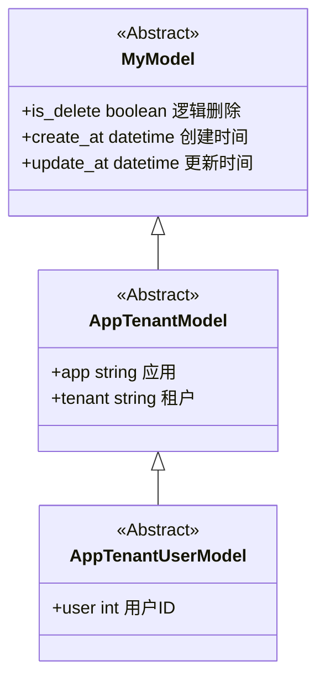
```mermaid
classDiagram
direction BT

class MyModel{
    <<Abstract>>
    +is_delete boolean 逻辑删除
    +create_at datetime 创建时间
    +update_at datetime 更新时间
}

class AppTenantModel{
    <<Abstract>>
    +app string 应用
    +tenant string 租户

}

class AppTenantUserModel{
    <<Abstract>>
    +user int 用户ID

}


AppTenantModel --|> MyModel
AppTenantUserModel --|> AppTenantModel

```

## AppModule（应用，模块管理）

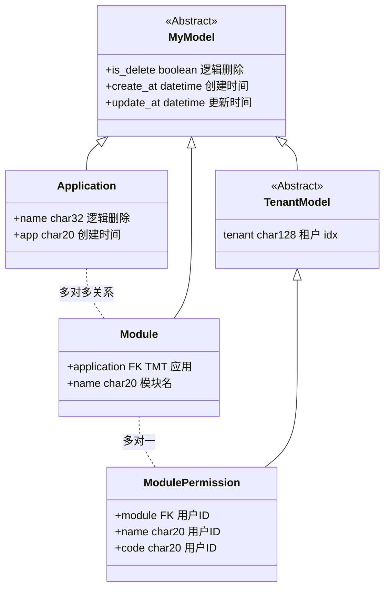
```mermaid
classDiagram
direction BT

class MyModel{
    <<Abstract>>
    +is_delete boolean 逻辑删除
    +create_at datetime 创建时间
    +update_at datetime 更新时间
}

class TenantModel{
    <<Abstract>>
    tenant char128 租户 idx
}

class Application{
    +name char32 逻辑删除
    +app char20 创建时间
}

class Module{
    +application FK TMT 应用
    +name char20 模块名
}

class ModulePermission{
    +module FK 用户ID
    +name char20 用户ID
    +code char20 用户ID

}


Application --|> MyModel
Module --|> MyModel
Module .. Application : 多对多关系
TenantModel --|> MyModel
ModulePermission --|> TenantModel
ModulePermission .. Module : 多对一
```

## Celery

无

## Course(课程资源的管理)

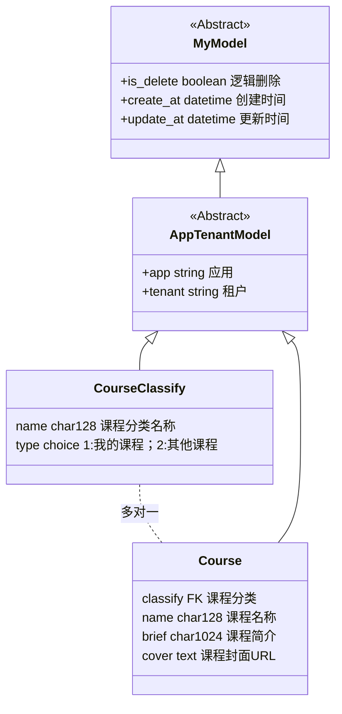
```mermaid
classDiagram
direction BT

class MyModel{
    <<Abstract>>
    +is_delete boolean 逻辑删除
    +create_at datetime 创建时间
    +update_at datetime 更新时间
}

class AppTenantModel{
    <<Abstract>>
    +app string 应用
    +tenant string 租户
}

class CourseClassify{
    name char128 课程分类名称
    type choice 1:我的课程；2:其他课程
}

class Course{
    classify FK 课程分类
    name char128 课程名称
    brief char1024 课程简介
    cover text 课程封面URL
}


AppTenantModel --|> MyModel
CourseClassify --|> AppTenantModel
Course --|> AppTenantModel
Course .. CourseClassify : 多对一
```

## courseware(课件PPT)

### PPT课件

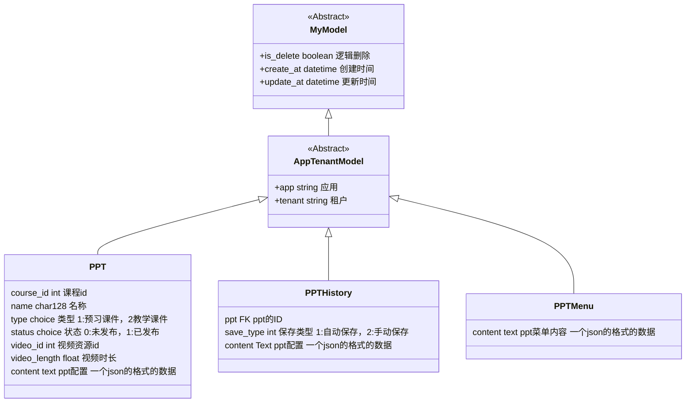
```mermaid
classDiagram
direction BT

class MyModel{
    <<Abstract>>
    +is_delete boolean 逻辑删除
    +create_at datetime 创建时间
    +update_at datetime 更新时间
}

class AppTenantModel{
    <<Abstract>>
    +app string 应用
    +tenant string 租户
}

class PPT{
    course_id  int 课程id
    name char128 名称
    type choice 类型 1:预习课件，2教学课件
    status choice 状态 0:未发布，1:已发布
    video_id int 视频资源id
    video_length float 视频时长
    content text ppt配置 一个json的格式的数据
}

class PPTHistory{
    ppt FK ppt的ID
    save_type int 保存类型 1:自动保存，2:手动保存
    content Text ppt配置 一个json的格式的数据
}

class PPTMenu{ 
    content text ppt菜单内容 一个json的格式的数据
}

AppTenantModel --|> MyModel
PPT --|> AppTenantModel
PPTHistory --|> AppTenantModel
PPTMenu --|> AppTenantModel
```

### 微课

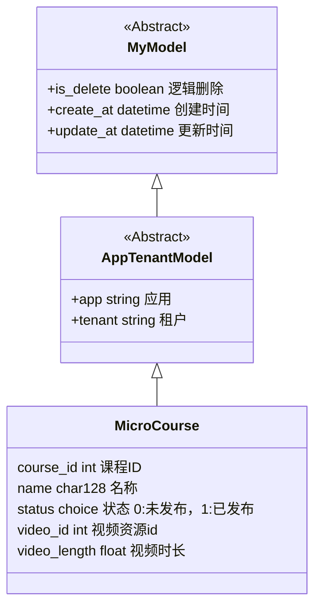
```mermaid
classDiagram
direction BT

class MyModel{
    <<Abstract>>
    +is_delete boolean 逻辑删除
    +create_at datetime 创建时间
    +update_at datetime 更新时间
}

class AppTenantModel{
    <<Abstract>>
    +app string 应用
    +tenant string 租户
}

class MicroCourse{
    course_id int 课程ID
    name char128 名称
    status choice 状态 0:未发布，1:已发布
    video_id int 视频资源id
    video_length float 视频时长
}

AppTenantModel --|> MyModel
MicroCourse --|> AppTenantModel
```

### 课堂

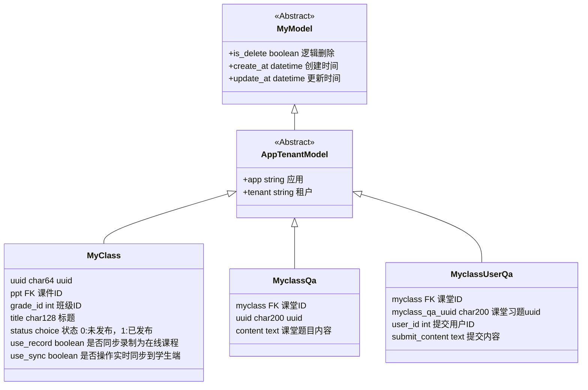
```mermaid
classDiagram
direction BT

class MyModel{
    <<Abstract>>
    +is_delete boolean 逻辑删除
    +create_at datetime 创建时间
    +update_at datetime 更新时间
}

class AppTenantModel{
    <<Abstract>>
    +app string 应用
    +tenant string 租户
}

class MyClass{
    uuid char64 uuid
    ppt FK 课件ID
    grade_id int 班级ID
    title char128 标题
    status choice 状态 0:未发布，1:已发布
    use_record boolean 是否同步录制为在线课程
    use_sync boolean 是否操作实时同步到学生端
}

class MyclassQa{
    myclass FK 课堂ID
    uuid char200 uuid
    content text 课堂题目内容
}

%% 课堂习题回答
class MyclassUserQa{
    myclass FK 课堂ID
    myclass_qa_uuid char200 课堂习题uuid
    user_id int 提交用户ID
    submit_content text 提交内容
}

AppTenantModel --|> MyModel
MyClass --|> AppTenantModel
MyclassQa --|> AppTenantModel
MyclassUserQa --|> AppTenantModel
```

### 弹幕

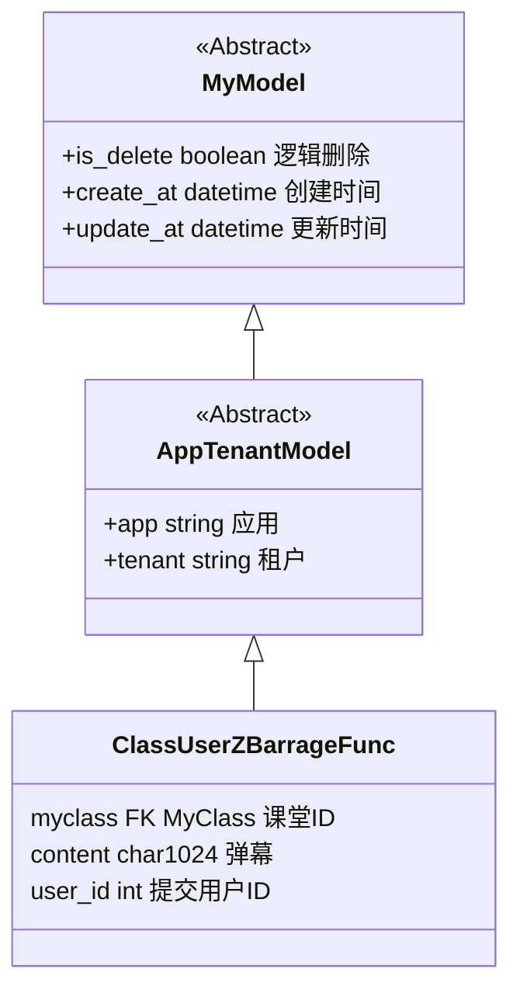
```mermaid
classDiagram
direction BT

class MyModel{
    <<Abstract>>
    +is_delete boolean 逻辑删除
    +create_at datetime 创建时间
    +update_at datetime 更新时间
}

class AppTenantModel{
    <<Abstract>>
    +app string 应用
    +tenant string 租户
}

class ClassUserZBarrageFunc{
    myclass FK MyClass 课堂ID
    content char1024 弹幕
    user_id int 提交用户ID
}

AppTenantModel --|> MyModel
ClassUserZBarrageFunc --|> AppTenantModel
```

### 板书

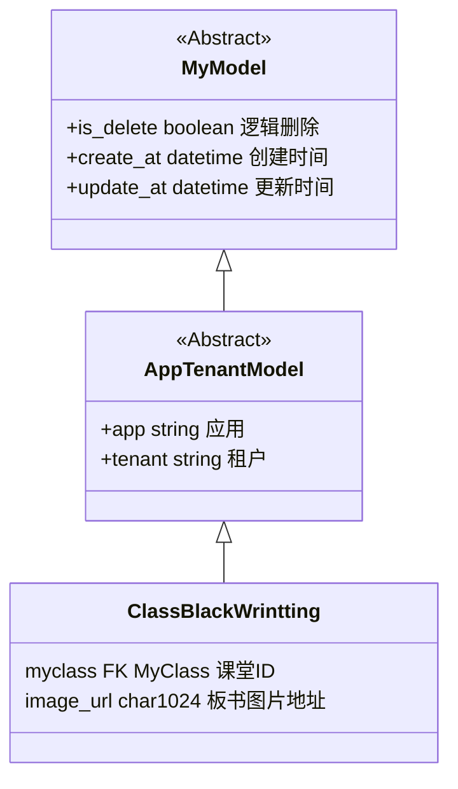
```mermaid
classDiagram
direction BT

class MyModel{
    <<Abstract>>
    +is_delete boolean 逻辑删除
    +create_at datetime 创建时间
    +update_at datetime 更新时间
}

class AppTenantModel{
    <<Abstract>>
    +app string 应用
    +tenant string 租户
}

class ClassBlackWrintting{
    myclass FK MyClass 课堂ID
    image_url char1024 板书图片地址
}

AppTenantModel --|> MyModel
ClassBlackWrintting --|> AppTenantModel
```

### 学生课堂关系

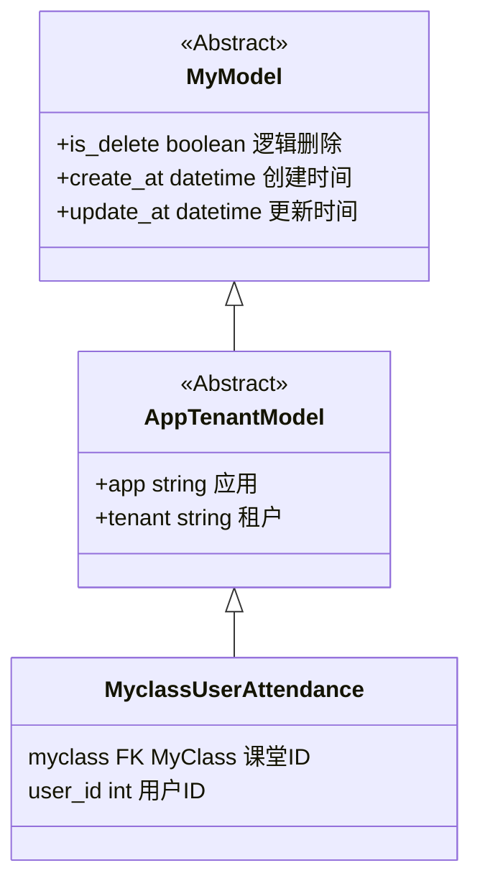
```mermaid
classDiagram
direction BT

class MyModel{
    <<Abstract>>
    +is_delete boolean 逻辑删除
    +create_at datetime 创建时间
    +update_at datetime 更新时间
}

class AppTenantModel{
    <<Abstract>>
    +app string 应用
    +tenant string 租户
}

class MyclassUserAttendance{
    myclass FK MyClass 课堂ID
    user_id int 用户ID
}

AppTenantModel --|> MyModel
MyclassUserAttendance --|> AppTenantModel
```

### 移动端教学日志

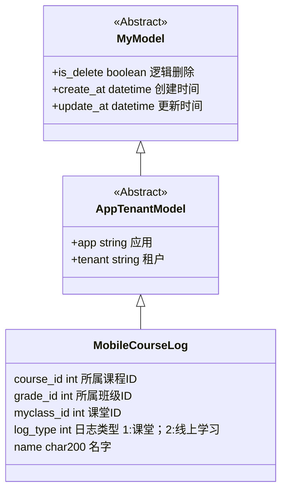
```mermaid
classDiagram
direction BT

class MyModel{
    <<Abstract>>
    +is_delete boolean 逻辑删除
    +create_at datetime 创建时间
    +update_at datetime 更新时间
}

class AppTenantModel{
    <<Abstract>>
    +app string 应用
    +tenant string 租户
}

class MobileCourseLog{
    course_id int 所属课程ID
    grade_id int 所属班级ID
    myclass_id int 课堂ID
    log_type int 日志类型 1:课堂；2:线上学习
    name char200 名字
}

AppTenantModel --|> MyModel
MobileCourseLog --|> AppTenantModel
```

## CustomerUser(学员管理)

### 客户

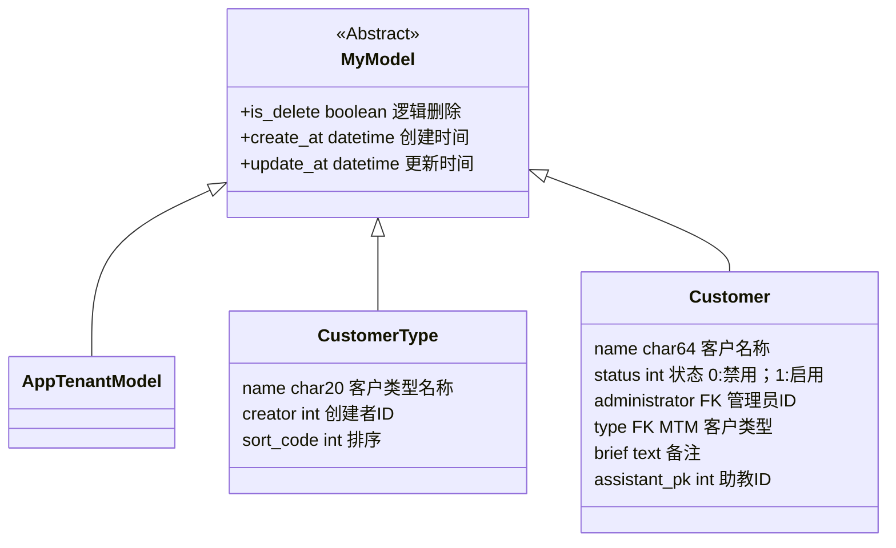
```mermaid
classDiagram
direction BT

class MyModel{
    <<Abstract>>
    +is_delete boolean 逻辑删除
    +create_at datetime 创建时间
    +update_at datetime 更新时间
}

class CustomerType{
    name char20 客户类型名称
    creator int 创建者ID
    sort_code int 排序
}

class Customer{
    name char64 客户名称
    status int 状态 0:禁用；1:启用
    administrator FK  管理员ID 
    type FK MTM 客户类型
    brief text 备注
    assistant_pk int 助教ID
}

AppTenantModel --|> MyModel
CustomerType --|> MyModel
Customer --|> MyModel
```

### 用户

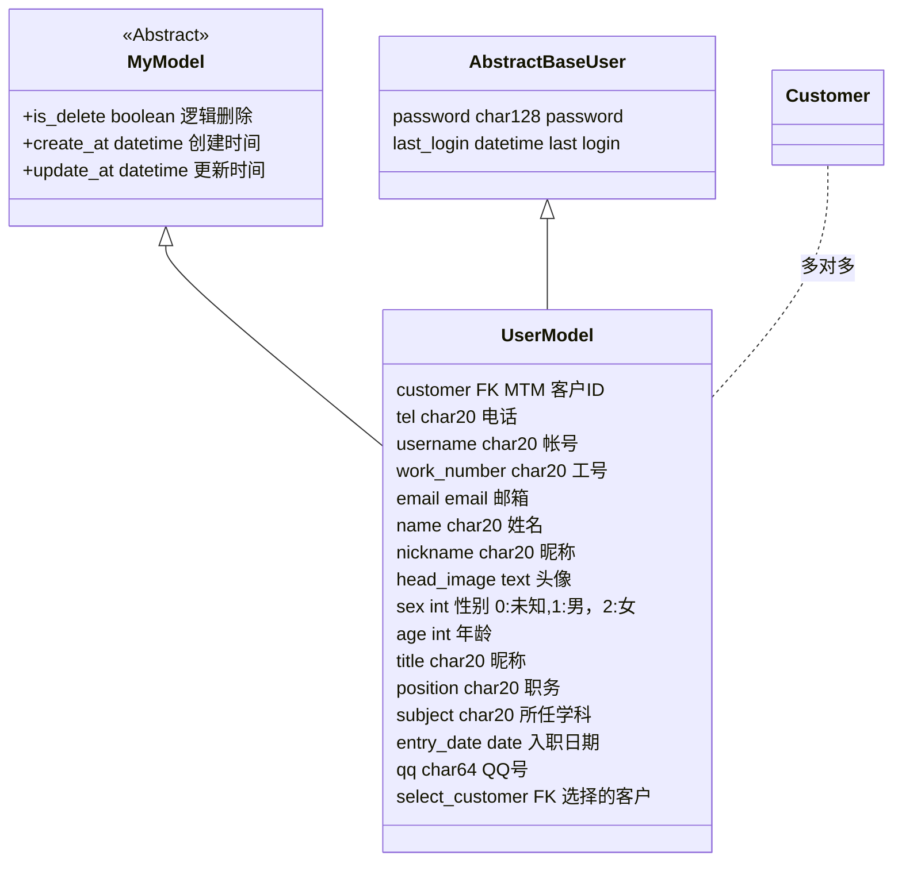
```mermaid
classDiagram
direction BT

class MyModel{
    <<Abstract>>
    +is_delete boolean 逻辑删除
    +create_at datetime 创建时间
    +update_at datetime 更新时间
}

class AbstractBaseUser{
    password char128 password
    last_login datetime last login
}

class UserModel{
    customer FK MTM 客户ID
    tel char20 电话
    username char20 帐号
    work_number char20 工号
    email email 邮箱
    name char20 姓名
    nickname char20 昵称
    head_image text 头像
    sex int 性别 0:未知,1:男，2:女
    age int 年龄
    title char20 昵称
    position char20 职务
    subject char20 所任学科
    entry_date date 入职日期
    qq char64 QQ号
    select_customer FK 选择的客户
}

UserModel --|> MyModel
UserModel --|> AbstractBaseUser
UserModel .. Customer : 多对多
```

### 角色

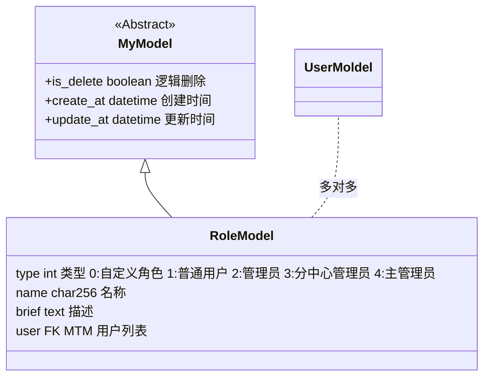
```mermaid
classDiagram
direction BT

class MyModel{
    <<Abstract>>
    +is_delete boolean 逻辑删除
    +create_at datetime 创建时间
    +update_at datetime 更新时间
}


class RoleModel{
    type int 类型 0:自定义角色 1:普通用户 2:管理员 3:分中心管理员 4:主管理员
    name char256 名称
    brief text 描述
    user FK MTM 用户列表 
}

RoleModel --|> MyModel
RoleModel .. UserMoldel : 多对多
```

### 微信用户

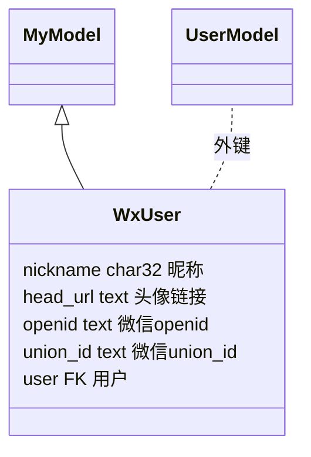
```mermaid
classDiagram
direction BT

class WxUser{
    nickname char32 昵称
    head_url text 头像链接
    openid text 微信openid
    union_id text 微信union_id
    user FK 用户
}

WxUser --|> MyModel
WxUser .. UserModel : 外键
```

### 笔记

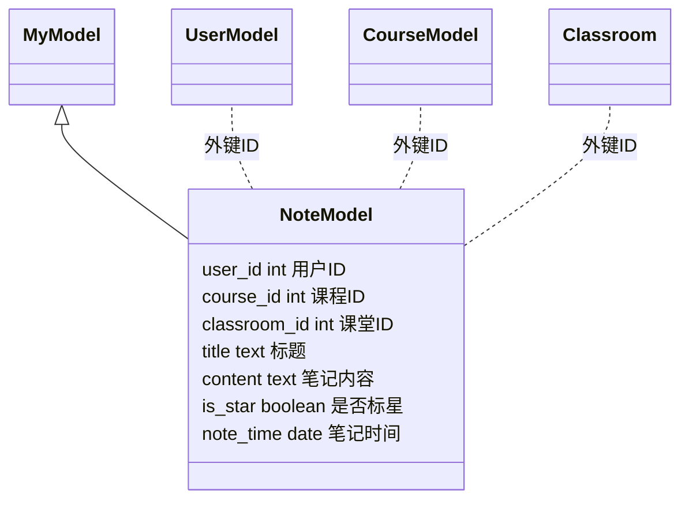
```mermaid
classDiagram
direction BT

class NoteModel{
    user_id int 用户ID
    course_id int 课程ID
    classroom_id int 课堂ID
    title text 标题
    content text 笔记内容
    is_star boolean 是否标星
    note_time date 笔记时间
}

NoteModel --|> MyModel
NoteModel .. UserModel : 外键ID
NoteModel .. CourseModel : 外键ID
NoteModel .. Classroom : 外键ID
```

### 收藏

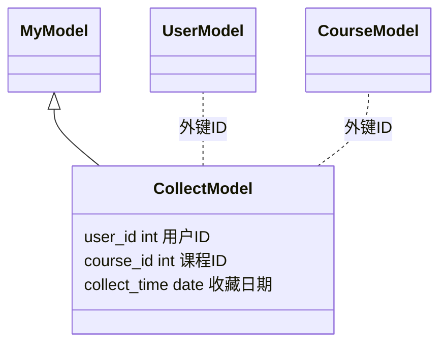
```mermaid
classDiagram
direction BT

class CollectModel{
    user_id int 用户ID
    course_id int 课程ID
    collect_time date 收藏日期
}

CollectModel --|> MyModel
CollectModel .. UserModel : 外键ID
CollectModel .. CourseModel : 外键ID
```

## Grade(班级管理)

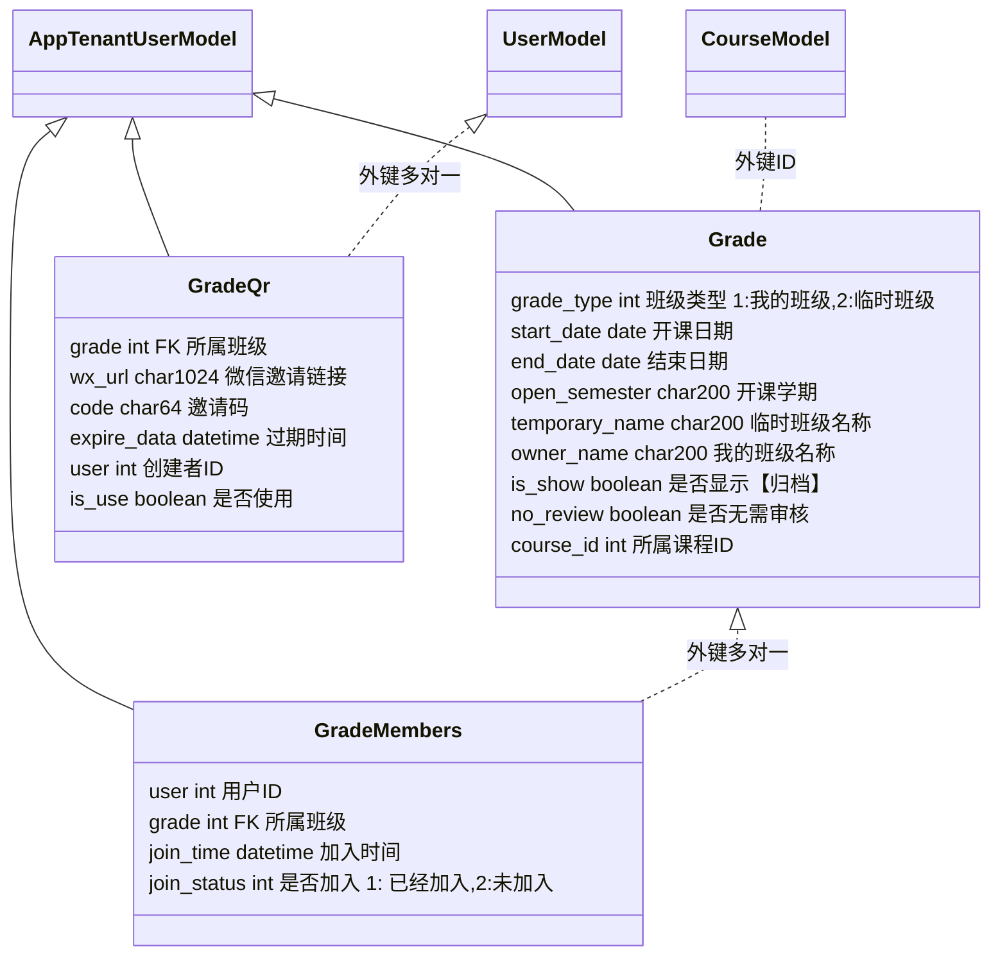
```mermaid
classDiagram
direction BT

class Grade{
    grade_type int 班级类型 1:我的班级,2:临时班级
    start_date date 开课日期
    end_date date 结束日期
    open_semester char200 开课学期
    temporary_name char200 临时班级名称
    owner_name char200 我的班级名称
    is_show boolean 是否显示【归档】
    no_review boolean 是否无需审核
    course_id int 所属课程ID
}

class GradeMembers{
    user int 用户ID
    grade int FK 所属班级
    join_time datetime 加入时间
    join_status int 是否加入 1: 已经加入,2:未加入
}

class GradeQr{
    grade int FK 所属班级
    wx_url char1024 微信邀请链接
    code char64 邀请码
    expire_data datetime 过期时间
    user int 创建者ID
    is_use boolean 是否使用
}

Grade --|> AppTenantUserModel
Grade .. CourseModel : 外键ID
GradeMembers --|> AppTenantUserModel
GradeMembers ..|> Grade : 外键多对一
GradeQr --|> AppTenantUserModel
GradeQr ..|> UserModel : 外键多对一
```

## Relation(关系)

### 课程关系

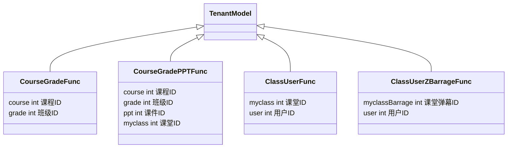
```mermaid
classDiagram
direction BT


%%课程与班级的关系
class CourseGradeFunc{
    course int 课程ID
    grade int 班级ID
}

%% 课程与班级与课件的关系
class CourseGradePPTFunc{
    course int 课程ID
    grade int 班级ID
    ppt int 课件ID
    myclass int 课堂ID
}

%% 用户 和 课堂关系
class ClassUserFunc{
    myclass int 课堂ID
    user int 用户ID
}

%% 用户 和 课堂  和 弹幕
class ClassUserZBarrageFunc{
    myclassBarrage int 课堂弹幕ID
    user int 用户ID
}

CourseGradeFunc --|> TenantModel
CourseGradePPTFunc --|> TenantModel
ClassUserFunc --|> TenantModel
ClassUserZBarrageFunc --|> TenantModel
```

### 客户应用关系

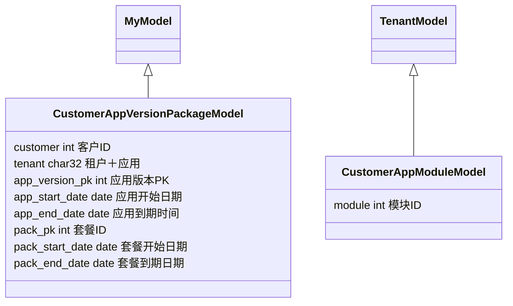
```mermaid
classDiagram
direction BT

%%客户下的应用版本
class CustomerAppVersionPackageModel{
    customer int 客户ID
    tenant char32 租户＋应用
    app_version_pk int 应用版本PK
    app_start_date date 应用开始日期
    app_end_date date 应用到期时间
    pack_pk int 套餐ID
    pack_start_date date 套餐开始日期
    pack_end_date date 套餐到期日期
}

%% 客户下的应用下的模块
class CustomerAppModuleModel{
    module int 模块ID
}

CustomerAppVersionPackageModel --|> MyModel
CustomerAppModuleModel --|> TenantModel
```

### 角色模块关系

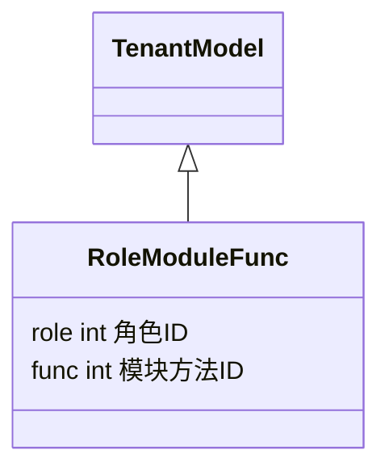
```mermaid
classDiagram
direction BT

%% 角色与模块方法的关系
class RoleModuleFunc{
    role int 角色ID
    func int 模块方法ID
}

RoleModuleFunc --|> TenantModel
```

### 3D模型关系

```mermaid
classDiagram
direction BT

%% 课程与班级与课件的关系
class ThreeDModulePPTModel{
    ppt int PPT课件的ID
    module_ppt int 3D模块的ID
}

ThreeDModulePPTModel --|> TenantModel
```

## threeDmodule(3d模型)

```mermaid
classDiagram
direction BT

%% 3d 模型
class ThreeDModel{
    name char255 名字
    img char1024 图片URL
    gif char1024 GIFURL
    base_info text 基本描述
    animate_info text 动画名字，json的列表
    asset char1024 文件
    content text 其他配置，json的字典
}

%% 3D模块
class ThreeDModule{
    threed_model int FK 模型
    hotpot_info text 热点描述，JSON
    module_cname char255 模块中文名 
    module_ename char255 模块英文名
    content text 其他配置
    enable boolean 是否可编辑
}

%% 3D模块 组合信息
class ThreeDCombinationInfo{
    threeD_model int FK 3D模型ID
    threeD_module MTM FK 3D模块ID，多对多
    module_canme char255 模块中文名字
    hotpot_info text 热点描述,json
    enable boolean 是否可编辑
}

%% 3d module和 ppt的关系
class ModulePPT{
    three_module int FK 模块ID
    content text 其他配置
    hotpot_info text 热点描述
    module_cname char255 模块中文名
    module_ename char255 模块英文名
    is_show boolean 是否显示
}

%% model 当前ppt 保存的信息
class ModelPPTContent{
    threed_model FK 3D模型ID
    content text 其他配置

}


ThreeDModel --|> PublicAppTenantModel
ThreeDModule --|> PublicAppTenantModel
ThreeDCombinationInfo --|> PublicAppTenantModel
ModulePPT --|> AppTenantModel
ModelPPTContent --|>  AppTenantModel
```

## XFYun

无

## yunpan(云盘)

### 短网址

```mermaid
classDiagram
direction BT

%% 短网址
class ShortUrl{
    uid UUID 唯一uuid
    src_url char4024 源网址
    expire_timestamp float 过期时间戳
    create_at datetime 创建时间
    update_at datetime 更新时间
}
```

### 目录

```mermaid
classDiagram
direction BT

%%目录
class Directory{
    directory FK 目录ID
    name char128 名称
    type int 类型 1:3D,2:课件，3:视频,4:图片,5:音频,6:题目
}

class Files{
    directory FK 目录ID
    name char128 名称
    type int 类型 1:私有,2:公有
    oss_path char1024 oss路径
    extension char128 扩展名
    size bigInt 文件大小
    file_time datetime 文件日期时间
    short_url char128 永久生效短链接
    preview_file char1024 预览文件短链接
    threed_model_id int 3D模型ID
}

Directory --|> PublicAppTenantModel
Files --|> PublicAppTenantModel
```

## zhujin_platform(助金平台)

### app模块

```mermaid
classDiagram
direction BT

class AppVersion{
    app_id int 应用ID
    name char64 名称
    icon char1024 图标
    brief char1024 应用版本描述
    enable boolean 是否启用
}

%%应用版本配置
class AppVersionConfig{
    app_version FK 应用版本
    name char64 名称
    title char64 标题
    icon char1024 图标
    type char32 类型， Mobile:手机H5，APPLET:小程序,PC:PCweb页面
    content text 配置
}

%%应用版本设置
class AppVersionSetting{
    app_version FK 应用版本
    default_pack FK 套餐
    service_config text 服务配置
}


AppVersion --|> MyModel
AppVersionConfig --|> MyModel
AppVersionSetting --|> MyModel
```

### 套餐

```mermaid
classDiagram
direction BT

class PackageModel{
    name char200 套餐名称
    content text 套餐内容
}

PackageModel --|> MyModel
```

### 服务

```mermaid
classDiagram
direction BT

class ServiceModel{
    name char200 服务名称
    link char1024 服务链接地址
}

ServiceModel --|> MyModel
```
